cola Report for Consensus Partitioning
==================

**Date**: 2019-12-07 09:37:48 CET, **cola version**: 1.3.2

----------------------------------------------------------------

<style type='text/css'>

body, td, th {
   font-family: Arial,Helvetica,sans-serif;
   background-color: white;
   font-size: 13px;
  max-width: 800px;
  margin: auto;
  margin-left:210px;
  padding: 0px 10px 0px 10px;
  border-left: 1px solid #EEEEEE;
  line-height: 150%;
}

tt, code, pre {
   font-family: 'DejaVu Sans Mono', 'Droid Sans Mono', 'Lucida Console', Consolas, Monaco, 

monospace;
}

h1 {
   font-size:2.2em;
}

h2 {
   font-size:1.8em;
}

h3 {
   font-size:1.4em;
}

h4 {
   font-size:1.0em;
}

h5 {
   font-size:0.9em;
}

h6 {
   font-size:0.8em;
}

a {
  text-decoration: none;
  color: #0366d6;
}

a:hover {
  text-decoration: underline;
}

a:visited {
   color: #0366d6;
}

pre, img {
  max-width: 100%;
}
pre {
  overflow-x: auto;
}
pre code {
   display: block; padding: 0.5em;
}

code {
  font-size: 92%;
  border: 1px solid #ccc;
}

code[class] {
  background-color: #F8F8F8;
}

table, td, th {
  border: 1px solid #ccc;
}

blockquote {
   color:#666666;
   margin:0;
   padding-left: 1em;
   border-left: 0.5em #EEE solid;
}

hr {
   height: 0px;
   border-bottom: none;
   border-top-width: thin;
   border-top-style: dotted;
   border-top-color: #999999;
}

@media print {
   * {
      background: transparent !important;
      color: black !important;
      filter:none !important;
      -ms-filter: none !important;
   }

   body {
      font-size:12pt;
      max-width:100%;
   }

   a, a:visited {
      text-decoration: underline;
   }

   hr {
      visibility: hidden;
      page-break-before: always;
   }

   pre, blockquote {
      padding-right: 1em;
      page-break-inside: avoid;
   }

   tr, img {
      page-break-inside: avoid;
   }

   img {
      max-width: 100% !important;
   }

   @page :left {
      margin: 15mm 20mm 15mm 10mm;
   }

   @page :right {
      margin: 15mm 10mm 15mm 20mm;
   }

   p, h2, h3 {
      orphans: 3; widows: 3;
   }

   h2, h3 {
      page-break-after: avoid;
   }
}
</style>


## Summary


All available functions which can be applied to this `res_list` object:


```r
res_list
```

```
#> A 'ConsensusPartitionList' object with 24 methods.
#>   On a matrix with 16910 rows and 306 columns.
#>   Top rows are extracted by 'SD, CV, MAD, ATC' methods.
#>   Subgroups are detected by 'hclust, kmeans, skmeans, pam, mclust, NMF' method.
#>   Number of partitions are tried for k = 2, 3, 4, 5, 6.
#>   Performed in total 30000 partitions by row resampling.
#> 
#> Following methods can be applied to this 'ConsensusPartitionList' object:
#>  [1] "cola_report"           "collect_classes"       "collect_plots"         "collect_stats"        
#>  [5] "colnames"              "functional_enrichment" "get_anno_col"          "get_anno"             
#>  [9] "get_classes"           "get_matrix"            "get_membership"        "get_stats"            
#> [13] "is_best_k"             "is_stable_k"           "ncol"                  "nrow"                 
#> [17] "rownames"              "show"                  "suggest_best_k"        "test_to_known_factors"
#> [21] "top_rows_heatmap"      "top_rows_overlap"     
#> 
#> You can get result for a single method by, e.g. object["SD", "hclust"] or object["SD:hclust"]
#> or a subset of methods by object[c("SD", "CV")], c("hclust", "kmeans")]
```

The call of `run_all_consensus_partition_methods()` was:


```
#> run_all_consensus_partition_methods(data = mat, mc.cores = 4)
```

Dimension of the input matrix:


```r
mat = get_matrix(res_list)
dim(mat)
```

```
#> [1] 16910   306
```

### Density distribution

The density distribution for each sample is visualized as in one column in the
following heatmap. The clustering is based on the distance which is the
Kolmogorov-Smirnov statistic between two distributions.


```r
library(ComplexHeatmap)
densityHeatmap(mat, ylab = "value", cluster_columns = TRUE, show_column_names = FALSE,
    mc.cores = 4)
```

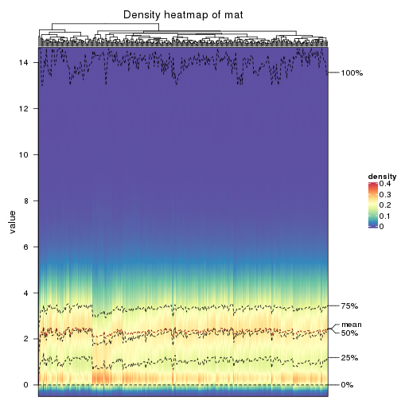


### Suggest the best k


Folowing table shows the best `k` (number of partitions) for each combination
of top-value methods and partition methods. Clicking on the method name in
the table goes to the section for a single combination of methods.

[The cola vignette](http://bioconductor.org/packages/devel/bioc/vignettes/cola/inst/doc/cola.html#toc_13)
explains the definition of the metrics used for determining the best
number of partitions.


```r
suggest_best_k(res_list)
```


|                            | The best k| 1-PAC| Mean silhouette| Concordance|   |Optional k |
|:---------------------------|----------:|-----:|---------------:|-----------:|:--|:----------|
|[ATC:mclust](#ATC-mclust)   |          2| 1.000|           0.990|       0.995|** |           |
|[ATC:kmeans](#ATC-kmeans)   |          2| 0.947|           0.967|       0.983|*  |           |
|[MAD:skmeans](#MAD-skmeans) |          6| 0.941|           0.900|       0.949|*  |3          |
|[ATC:skmeans](#ATC-skmeans) |          3| 0.934|           0.924|       0.968|*  |2          |
|[CV:NMF](#CV-NMF)           |          3| 0.914|           0.923|       0.966|*  |           |
|[SD:skmeans](#SD-skmeans)   |          6| 0.913|           0.894|       0.944|*  |           |
|[CV:skmeans](#CV-skmeans)   |          3| 0.907|           0.892|       0.959|*  |           |
|[MAD:NMF](#MAD-NMF)         |          2| 0.900|           0.934|       0.972|*  |           |
|[SD:NMF](#SD-NMF)           |          2| 0.840|           0.908|       0.962|   |           |
|[SD:mclust](#SD-mclust)     |          5| 0.800|           0.817|       0.900|   |           |
|[MAD:mclust](#MAD-mclust)   |          5| 0.797|           0.825|       0.906|   |           |
|[CV:pam](#CV-pam)           |          4| 0.780|           0.859|       0.929|   |           |
|[MAD:pam](#MAD-pam)         |          2| 0.752|           0.877|       0.947|   |           |
|[CV:mclust](#CV-mclust)     |          5| 0.749|           0.840|       0.898|   |           |
|[MAD:kmeans](#MAD-kmeans)   |          2| 0.742|           0.882|       0.949|   |           |
|[ATC:pam](#ATC-pam)         |          3| 0.733|           0.814|       0.925|   |           |
|[SD:pam](#SD-pam)           |          2| 0.731|           0.863|       0.940|   |           |
|[SD:kmeans](#SD-kmeans)     |          2| 0.709|           0.849|       0.923|   |           |
|[CV:kmeans](#CV-kmeans)     |          2| 0.665|           0.762|       0.910|   |           |
|[ATC:NMF](#ATC-NMF)         |          4| 0.589|           0.756|       0.836|   |           |
|[SD:hclust](#SD-hclust)     |          5| 0.487|           0.603|       0.722|   |           |
|[ATC:hclust](#ATC-hclust)   |          3| 0.445|           0.699|       0.844|   |           |
|[CV:hclust](#CV-hclust)     |          2| 0.289|           0.682|       0.844|   |           |
|[MAD:hclust](#MAD-hclust)   |          2| 0.234|           0.629|       0.815|   |           |

\*\*: 1-PAC > 0.95, \*: 1-PAC > 0.9


### CDF of consensus matrices

Cumulative distribution function curves of consensus matrix for all methods.


```r
collect_plots(res_list, fun = plot_ecdf)
```

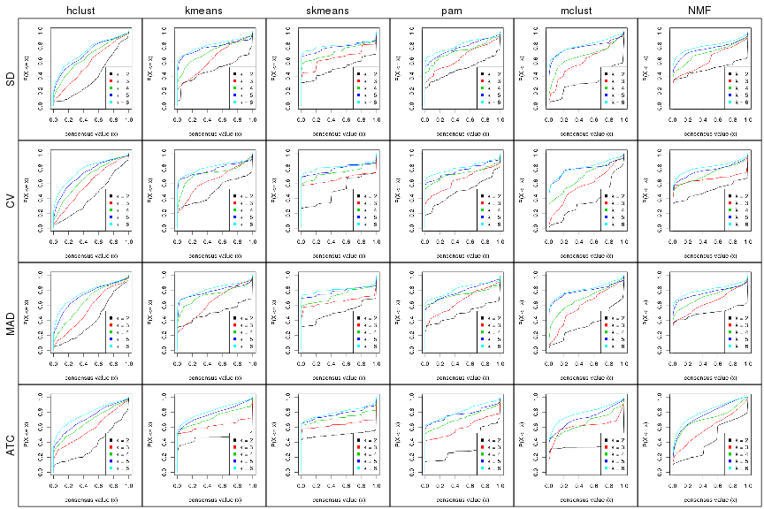


### Consensus heatmap

Consensus heatmaps for all methods. ([What is a consensus heatmap?](http://bioconductor.org/packages/devel/bioc/vignettes/cola/inst/doc/cola.html#toc_9))


<style type='text/css'>


.ui-helper-hidden {
	display: none;
}
.ui-helper-hidden-accessible {
	border: 0;
	clip: rect(0 0 0 0);
	height: 1px;
	margin: -1px;
	overflow: hidden;
	padding: 0;
	position: absolute;
	width: 1px;
}
.ui-helper-reset {
	margin: 0;
	padding: 0;
	border: 0;
	outline: 0;
	line-height: 1.3;
	text-decoration: none;
	font-size: 100%;
	list-style: none;
}
.ui-helper-clearfix:before,
.ui-helper-clearfix:after {
	content: "";
	display: table;
	border-collapse: collapse;
}
.ui-helper-clearfix:after {
	clear: both;
}
.ui-helper-zfix {
	width: 100%;
	height: 100%;
	top: 0;
	left: 0;
	position: absolute;
	opacity: 0;
	filter:Alpha(Opacity=0); 
}

.ui-front {
	z-index: 100;
}


.ui-state-disabled {
	cursor: default !important;
	pointer-events: none;
}


.ui-icon {
	display: inline-block;
	vertical-align: middle;
	margin-top: -.25em;
	position: relative;
	text-indent: -99999px;
	overflow: hidden;
	background-repeat: no-repeat;
}

.ui-widget-icon-block {
	left: 50%;
	margin-left: -8px;
	display: block;
}


.ui-widget-overlay {
	position: fixed;
	top: 0;
	left: 0;
	width: 100%;
	height: 100%;
}
.ui-accordion .ui-accordion-header {
	display: block;
	cursor: pointer;
	position: relative;
	margin: 2px 0 0 0;
	padding: .5em .5em .5em .7em;
	font-size: 100%;
}
.ui-accordion .ui-accordion-content {
	padding: 1em 2.2em;
	border-top: 0;
	overflow: auto;
}
.ui-autocomplete {
	position: absolute;
	top: 0;
	left: 0;
	cursor: default;
}
.ui-menu {
	list-style: none;
	padding: 0;
	margin: 0;
	display: block;
	outline: 0;
}
.ui-menu .ui-menu {
	position: absolute;
}
.ui-menu .ui-menu-item {
	margin: 0;
	cursor: pointer;
	
	list-style-image: url("data:image/gif;base64,R0lGODlhAQABAIAAAAAAAP///yH5BAEAAAAALAAAAAABAAEAAAIBRAA7");
}
.ui-menu .ui-menu-item-wrapper {
	position: relative;
	padding: 3px 1em 3px .4em;
}
.ui-menu .ui-menu-divider {
	margin: 5px 0;
	height: 0;
	font-size: 0;
	line-height: 0;
	border-width: 1px 0 0 0;
}
.ui-menu .ui-state-focus,
.ui-menu .ui-state-active {
	margin: -1px;
}


.ui-menu-icons {
	position: relative;
}
.ui-menu-icons .ui-menu-item-wrapper {
	padding-left: 2em;
}


.ui-menu .ui-icon {
	position: absolute;
	top: 0;
	bottom: 0;
	left: .2em;
	margin: auto 0;
}


.ui-menu .ui-menu-icon {
	left: auto;
	right: 0;
}
.ui-button {
	padding: .4em 1em;
	display: inline-block;
	position: relative;
	line-height: normal;
	margin-right: .1em;
	cursor: pointer;
	vertical-align: middle;
	text-align: center;
	-webkit-user-select: none;
	-moz-user-select: none;
	-ms-user-select: none;
	user-select: none;

	
	overflow: visible;
}

.ui-button,
.ui-button:link,
.ui-button:visited,
.ui-button:hover,
.ui-button:active {
	text-decoration: none;
}


.ui-button-icon-only {
	width: 2em;
	box-sizing: border-box;
	text-indent: -9999px;
	white-space: nowrap;
}


input.ui-button.ui-button-icon-only {
	text-indent: 0;
}


.ui-button-icon-only .ui-icon {
	position: absolute;
	top: 50%;
	left: 50%;
	margin-top: -8px;
	margin-left: -8px;
}

.ui-button.ui-icon-notext .ui-icon {
	padding: 0;
	width: 2.1em;
	height: 2.1em;
	text-indent: -9999px;
	white-space: nowrap;

}

input.ui-button.ui-icon-notext .ui-icon {
	width: auto;
	height: auto;
	text-indent: 0;
	white-space: normal;
	padding: .4em 1em;
}


input.ui-button::-moz-focus-inner,
button.ui-button::-moz-focus-inner {
	border: 0;
	padding: 0;
}
.ui-controlgroup {
	vertical-align: middle;
	display: inline-block;
}
.ui-controlgroup > .ui-controlgroup-item {
	float: left;
	margin-left: 0;
	margin-right: 0;
}
.ui-controlgroup > .ui-controlgroup-item:focus,
.ui-controlgroup > .ui-controlgroup-item.ui-visual-focus {
	z-index: 9999;
}
.ui-controlgroup-vertical > .ui-controlgroup-item {
	display: block;
	float: none;
	width: 100%;
	margin-top: 0;
	margin-bottom: 0;
	text-align: left;
}
.ui-controlgroup-vertical .ui-controlgroup-item {
	box-sizing: border-box;
}
.ui-controlgroup .ui-controlgroup-label {
	padding: .4em 1em;
}
.ui-controlgroup .ui-controlgroup-label span {
	font-size: 80%;
}
.ui-controlgroup-horizontal .ui-controlgroup-label + .ui-controlgroup-item {
	border-left: none;
}
.ui-controlgroup-vertical .ui-controlgroup-label + .ui-controlgroup-item {
	border-top: none;
}
.ui-controlgroup-horizontal .ui-controlgroup-label.ui-widget-content {
	border-right: none;
}
.ui-controlgroup-vertical .ui-controlgroup-label.ui-widget-content {
	border-bottom: none;
}


.ui-controlgroup-vertical .ui-spinner-input {

	
	width: 75%;
	width: calc( 100% - 2.4em );
}
.ui-controlgroup-vertical .ui-spinner .ui-spinner-up {
	border-top-style: solid;
}

.ui-checkboxradio-label .ui-icon-background {
	box-shadow: inset 1px 1px 1px #ccc;
	border-radius: .12em;
	border: none;
}
.ui-checkboxradio-radio-label .ui-icon-background {
	width: 16px;
	height: 16px;
	border-radius: 1em;
	overflow: visible;
	border: none;
}
.ui-checkboxradio-radio-label.ui-checkboxradio-checked .ui-icon,
.ui-checkboxradio-radio-label.ui-checkboxradio-checked:hover .ui-icon {
	background-image: none;
	width: 8px;
	height: 8px;
	border-width: 4px;
	border-style: solid;
}
.ui-checkboxradio-disabled {
	pointer-events: none;
}
.ui-datepicker {
	width: 17em;
	padding: .2em .2em 0;
	display: none;
}
.ui-datepicker .ui-datepicker-header {
	position: relative;
	padding: .2em 0;
}
.ui-datepicker .ui-datepicker-prev,
.ui-datepicker .ui-datepicker-next {
	position: absolute;
	top: 2px;
	width: 1.8em;
	height: 1.8em;
}
.ui-datepicker .ui-datepicker-prev-hover,
.ui-datepicker .ui-datepicker-next-hover {
	top: 1px;
}
.ui-datepicker .ui-datepicker-prev {
	left: 2px;
}
.ui-datepicker .ui-datepicker-next {
	right: 2px;
}
.ui-datepicker .ui-datepicker-prev-hover {
	left: 1px;
}
.ui-datepicker .ui-datepicker-next-hover {
	right: 1px;
}
.ui-datepicker .ui-datepicker-prev span,
.ui-datepicker .ui-datepicker-next span {
	display: block;
	position: absolute;
	left: 50%;
	margin-left: -8px;
	top: 50%;
	margin-top: -8px;
}
.ui-datepicker .ui-datepicker-title {
	margin: 0 2.3em;
	line-height: 1.8em;
	text-align: center;
}
.ui-datepicker .ui-datepicker-title select {
	font-size: 1em;
	margin: 1px 0;
}
.ui-datepicker select.ui-datepicker-month,
.ui-datepicker select.ui-datepicker-year {
	width: 45%;
}
.ui-datepicker table {
	width: 100%;
	font-size: .9em;
	border-collapse: collapse;
	margin: 0 0 .4em;
}
.ui-datepicker th {
	padding: .7em .3em;
	text-align: center;
	font-weight: bold;
	border: 0;
}
.ui-datepicker td {
	border: 0;
	padding: 1px;
}
.ui-datepicker td span,
.ui-datepicker td a {
	display: block;
	padding: .2em;
	text-align: right;
	text-decoration: none;
}
.ui-datepicker .ui-datepicker-buttonpane {
	background-image: none;
	margin: .7em 0 0 0;
	padding: 0 .2em;
	border-left: 0;
	border-right: 0;
	border-bottom: 0;
}
.ui-datepicker .ui-datepicker-buttonpane button {
	float: right;
	margin: .5em .2em .4em;
	cursor: pointer;
	padding: .2em .6em .3em .6em;
	width: auto;
	overflow: visible;
}
.ui-datepicker .ui-datepicker-buttonpane button.ui-datepicker-current {
	float: left;
}


.ui-datepicker.ui-datepicker-multi {
	width: auto;
}
.ui-datepicker-multi .ui-datepicker-group {
	float: left;
}
.ui-datepicker-multi .ui-datepicker-group table {
	width: 95%;
	margin: 0 auto .4em;
}
.ui-datepicker-multi-2 .ui-datepicker-group {
	width: 50%;
}
.ui-datepicker-multi-3 .ui-datepicker-group {
	width: 33.3%;
}
.ui-datepicker-multi-4 .ui-datepicker-group {
	width: 25%;
}
.ui-datepicker-multi .ui-datepicker-group-last .ui-datepicker-header,
.ui-datepicker-multi .ui-datepicker-group-middle .ui-datepicker-header {
	border-left-width: 0;
}
.ui-datepicker-multi .ui-datepicker-buttonpane {
	clear: left;
}
.ui-datepicker-row-break {
	clear: both;
	width: 100%;
	font-size: 0;
}


.ui-datepicker-rtl {
	direction: rtl;
}
.ui-datepicker-rtl .ui-datepicker-prev {
	right: 2px;
	left: auto;
}
.ui-datepicker-rtl .ui-datepicker-next {
	left: 2px;
	right: auto;
}
.ui-datepicker-rtl .ui-datepicker-prev:hover {
	right: 1px;
	left: auto;
}
.ui-datepicker-rtl .ui-datepicker-next:hover {
	left: 1px;
	right: auto;
}
.ui-datepicker-rtl .ui-datepicker-buttonpane {
	clear: right;
}
.ui-datepicker-rtl .ui-datepicker-buttonpane button {
	float: left;
}
.ui-datepicker-rtl .ui-datepicker-buttonpane button.ui-datepicker-current,
.ui-datepicker-rtl .ui-datepicker-group {
	float: right;
}
.ui-datepicker-rtl .ui-datepicker-group-last .ui-datepicker-header,
.ui-datepicker-rtl .ui-datepicker-group-middle .ui-datepicker-header {
	border-right-width: 0;
	border-left-width: 1px;
}


.ui-datepicker .ui-icon {
	display: block;
	text-indent: -99999px;
	overflow: hidden;
	background-repeat: no-repeat;
	left: .5em;
	top: .3em;
}
.ui-dialog {
	position: absolute;
	top: 0;
	left: 0;
	padding: .2em;
	outline: 0;
}
.ui-dialog .ui-dialog-titlebar {
	padding: .4em 1em;
	position: relative;
}
.ui-dialog .ui-dialog-title {
	float: left;
	margin: .1em 0;
	white-space: nowrap;
	width: 90%;
	overflow: hidden;
	text-overflow: ellipsis;
}
.ui-dialog .ui-dialog-titlebar-close {
	position: absolute;
	right: .3em;
	top: 50%;
	width: 20px;
	margin: -10px 0 0 0;
	padding: 1px;
	height: 20px;
}
.ui-dialog .ui-dialog-content {
	position: relative;
	border: 0;
	padding: .5em 1em;
	background: none;
	overflow: auto;
}
.ui-dialog .ui-dialog-buttonpane {
	text-align: left;
	border-width: 1px 0 0 0;
	background-image: none;
	margin-top: .5em;
	padding: .3em 1em .5em .4em;
}
.ui-dialog .ui-dialog-buttonpane .ui-dialog-buttonset {
	float: right;
}
.ui-dialog .ui-dialog-buttonpane button {
	margin: .5em .4em .5em 0;
	cursor: pointer;
}
.ui-dialog .ui-resizable-n {
	height: 2px;
	top: 0;
}
.ui-dialog .ui-resizable-e {
	width: 2px;
	right: 0;
}
.ui-dialog .ui-resizable-s {
	height: 2px;
	bottom: 0;
}
.ui-dialog .ui-resizable-w {
	width: 2px;
	left: 0;
}
.ui-dialog .ui-resizable-se,
.ui-dialog .ui-resizable-sw,
.ui-dialog .ui-resizable-ne,
.ui-dialog .ui-resizable-nw {
	width: 7px;
	height: 7px;
}
.ui-dialog .ui-resizable-se {
	right: 0;
	bottom: 0;
}
.ui-dialog .ui-resizable-sw {
	left: 0;
	bottom: 0;
}
.ui-dialog .ui-resizable-ne {
	right: 0;
	top: 0;
}
.ui-dialog .ui-resizable-nw {
	left: 0;
	top: 0;
}
.ui-draggable .ui-dialog-titlebar {
	cursor: move;
}
.ui-draggable-handle {
	-ms-touch-action: none;
	touch-action: none;
}
.ui-resizable {
	position: relative;
}
.ui-resizable-handle {
	position: absolute;
	font-size: 0.1px;
	display: block;
	-ms-touch-action: none;
	touch-action: none;
}
.ui-resizable-disabled .ui-resizable-handle,
.ui-resizable-autohide .ui-resizable-handle {
	display: none;
}
.ui-resizable-n {
	cursor: n-resize;
	height: 7px;
	width: 100%;
	top: -5px;
	left: 0;
}
.ui-resizable-s {
	cursor: s-resize;
	height: 7px;
	width: 100%;
	bottom: -5px;
	left: 0;
}
.ui-resizable-e {
	cursor: e-resize;
	width: 7px;
	right: -5px;
	top: 0;
	height: 100%;
}
.ui-resizable-w {
	cursor: w-resize;
	width: 7px;
	left: -5px;
	top: 0;
	height: 100%;
}
.ui-resizable-se {
	cursor: se-resize;
	width: 12px;
	height: 12px;
	right: 1px;
	bottom: 1px;
}
.ui-resizable-sw {
	cursor: sw-resize;
	width: 9px;
	height: 9px;
	left: -5px;
	bottom: -5px;
}
.ui-resizable-nw {
	cursor: nw-resize;
	width: 9px;
	height: 9px;
	left: -5px;
	top: -5px;
}
.ui-resizable-ne {
	cursor: ne-resize;
	width: 9px;
	height: 9px;
	right: -5px;
	top: -5px;
}
.ui-progressbar {
	height: 2em;
	text-align: left;
	overflow: hidden;
}
.ui-progressbar .ui-progressbar-value {
	margin: -1px;
	height: 100%;
}
.ui-progressbar .ui-progressbar-overlay {
	background: url("");
	height: 100%;
	filter: alpha(opacity=25); 
	opacity: 0.25;
}
.ui-progressbar-indeterminate .ui-progressbar-value {
	background-image: none;
}
.ui-selectable {
	-ms-touch-action: none;
	touch-action: none;
}
.ui-selectable-helper {
	position: absolute;
	z-index: 100;
	border: 1px dotted black;
}
.ui-selectmenu-menu {
	padding: 0;
	margin: 0;
	position: absolute;
	top: 0;
	left: 0;
	display: none;
}
.ui-selectmenu-menu .ui-menu {
	overflow: auto;
	overflow-x: hidden;
	padding-bottom: 1px;
}
.ui-selectmenu-menu .ui-menu .ui-selectmenu-optgroup {
	font-size: 1em;
	font-weight: bold;
	line-height: 1.5;
	padding: 2px 0.4em;
	margin: 0.5em 0 0 0;
	height: auto;
	border: 0;
}
.ui-selectmenu-open {
	display: block;
}
.ui-selectmenu-text {
	display: block;
	margin-right: 20px;
	overflow: hidden;
	text-overflow: ellipsis;
}
.ui-selectmenu-button.ui-button {
	text-align: left;
	white-space: nowrap;
	width: 14em;
}
.ui-selectmenu-icon.ui-icon {
	float: right;
	margin-top: 0;
}
.ui-slider {
	position: relative;
	text-align: left;
}
.ui-slider .ui-slider-handle {
	position: absolute;
	z-index: 2;
	width: 1.2em;
	height: 1.2em;
	cursor: default;
	-ms-touch-action: none;
	touch-action: none;
}
.ui-slider .ui-slider-range {
	position: absolute;
	z-index: 1;
	font-size: .7em;
	display: block;
	border: 0;
	background-position: 0 0;
}


.ui-slider.ui-state-disabled .ui-slider-handle,
.ui-slider.ui-state-disabled .ui-slider-range {
	filter: inherit;
}

.ui-slider-horizontal {
	height: .8em;
}
.ui-slider-horizontal .ui-slider-handle {
	top: -.3em;
	margin-left: -.6em;
}
.ui-slider-horizontal .ui-slider-range {
	top: 0;
	height: 100%;
}
.ui-slider-horizontal .ui-slider-range-min {
	left: 0;
}
.ui-slider-horizontal .ui-slider-range-max {
	right: 0;
}

.ui-slider-vertical {
	width: .8em;
	height: 100px;
}
.ui-slider-vertical .ui-slider-handle {
	left: -.3em;
	margin-left: 0;
	margin-bottom: -.6em;
}
.ui-slider-vertical .ui-slider-range {
	left: 0;
	width: 100%;
}
.ui-slider-vertical .ui-slider-range-min {
	bottom: 0;
}
.ui-slider-vertical .ui-slider-range-max {
	top: 0;
}
.ui-sortable-handle {
	-ms-touch-action: none;
	touch-action: none;
}
.ui-spinner {
	position: relative;
	display: inline-block;
	overflow: hidden;
	padding: 0;
	vertical-align: middle;
}
.ui-spinner-input {
	border: none;
	background: none;
	color: inherit;
	padding: .222em 0;
	margin: .2em 0;
	vertical-align: middle;
	margin-left: .4em;
	margin-right: 2em;
}
.ui-spinner-button {
	width: 1.6em;
	height: 50%;
	font-size: .5em;
	padding: 0;
	margin: 0;
	text-align: center;
	position: absolute;
	cursor: default;
	display: block;
	overflow: hidden;
	right: 0;
}

.ui-spinner a.ui-spinner-button {
	border-top-style: none;
	border-bottom-style: none;
	border-right-style: none;
}
.ui-spinner-up {
	top: 0;
}
.ui-spinner-down {
	bottom: 0;
}
.ui-tabs {
	position: relative;
	padding: .2em;
}
.ui-tabs .ui-tabs-nav {
	margin: 0;
	padding: .2em .2em 0;
}
.ui-tabs .ui-tabs-nav li {
	list-style: none;
	float: left;
	position: relative;
	top: 0;
	margin: 1px .2em 0 0;
	border-bottom-width: 0;
	padding: 0;
	white-space: nowrap;
}
.ui-tabs .ui-tabs-nav .ui-tabs-anchor {
	float: left;
	padding: .5em 1em;
	text-decoration: none;
}
.ui-tabs .ui-tabs-nav li.ui-tabs-active {
	margin-bottom: -1px;
	padding-bottom: 1px;
}
.ui-tabs .ui-tabs-nav li.ui-tabs-active .ui-tabs-anchor,
.ui-tabs .ui-tabs-nav li.ui-state-disabled .ui-tabs-anchor,
.ui-tabs .ui-tabs-nav li.ui-tabs-loading .ui-tabs-anchor {
	cursor: text;
}
.ui-tabs-collapsible .ui-tabs-nav li.ui-tabs-active .ui-tabs-anchor {
	cursor: pointer;
}
.ui-tabs .ui-tabs-panel {
	display: block;
	border-width: 0;
	padding: 1em 1.4em;
	background: none;
}
.ui-tooltip {
	padding: 8px;
	position: absolute;
	z-index: 9999;
	max-width: 300px;
}
body .ui-tooltip {
	border-width: 2px;
}

.ui-widget {
	font-family: Arial,Helvetica,sans-serif;
	font-size: 1em;
}
.ui-widget .ui-widget {
	font-size: 1em;
}
.ui-widget input,
.ui-widget select,
.ui-widget textarea,
.ui-widget button {
	font-family: Arial,Helvetica,sans-serif;
	font-size: 1em;
}
.ui-widget.ui-widget-content {
	border: 1px solid #c5c5c5;
}
.ui-widget-content {
	border: 1px solid #dddddd;
	background: #ffffff;
	color: #333333;
}
.ui-widget-content a {
	color: #333333;
}
.ui-widget-header {
	border: 1px solid #dddddd;
	background: #e9e9e9;
	color: #333333;
	font-weight: bold;
}
.ui-widget-header a {
	color: #333333;
}


.ui-state-default,
.ui-widget-content .ui-state-default,
.ui-widget-header .ui-state-default,
.ui-button,


html .ui-button.ui-state-disabled:hover,
html .ui-button.ui-state-disabled:active {
	border: 1px solid #c5c5c5;
	background: #f6f6f6;
	font-weight: normal;
	color: #454545;
}
.ui-state-default a,
.ui-state-default a:link,
.ui-state-default a:visited,
a.ui-button,
a:link.ui-button,
a:visited.ui-button,
.ui-button {
	color: #454545;
	text-decoration: none;
}
.ui-state-hover,
.ui-widget-content .ui-state-hover,
.ui-widget-header .ui-state-hover,
.ui-state-focus,
.ui-widget-content .ui-state-focus,
.ui-widget-header .ui-state-focus,
.ui-button:hover,
.ui-button:focus {
	border: 1px solid #cccccc;
	background: #ededed;
	font-weight: normal;
	color: #2b2b2b;
}
.ui-state-hover a,
.ui-state-hover a:hover,
.ui-state-hover a:link,
.ui-state-hover a:visited,
.ui-state-focus a,
.ui-state-focus a:hover,
.ui-state-focus a:link,
.ui-state-focus a:visited,
a.ui-button:hover,
a.ui-button:focus {
	color: #2b2b2b;
	text-decoration: none;
}

.ui-visual-focus {
	box-shadow: 0 0 3px 1px rgb(94, 158, 214);
}
.ui-state-active,
.ui-widget-content .ui-state-active,
.ui-widget-header .ui-state-active,
a.ui-button:active,
.ui-button:active,
.ui-button.ui-state-active:hover {
	border: 1px solid #003eff;
	background: #007fff;
	font-weight: normal;
	color: #ffffff;
}
.ui-icon-background,
.ui-state-active .ui-icon-background {
	border: #003eff;
	background-color: #ffffff;
}
.ui-state-active a,
.ui-state-active a:link,
.ui-state-active a:visited {
	color: #ffffff;
	text-decoration: none;
}


.ui-state-highlight,
.ui-widget-content .ui-state-highlight,
.ui-widget-header .ui-state-highlight {
	border: 1px solid #dad55e;
	background: #fffa90;
	color: #777620;
}
.ui-state-checked {
	border: 1px solid #dad55e;
	background: #fffa90;
}
.ui-state-highlight a,
.ui-widget-content .ui-state-highlight a,
.ui-widget-header .ui-state-highlight a {
	color: #777620;
}
.ui-state-error,
.ui-widget-content .ui-state-error,
.ui-widget-header .ui-state-error {
	border: 1px solid #f1a899;
	background: #fddfdf;
	color: #5f3f3f;
}
.ui-state-error a,
.ui-widget-content .ui-state-error a,
.ui-widget-header .ui-state-error a {
	color: #5f3f3f;
}
.ui-state-error-text,
.ui-widget-content .ui-state-error-text,
.ui-widget-header .ui-state-error-text {
	color: #5f3f3f;
}
.ui-priority-primary,
.ui-widget-content .ui-priority-primary,
.ui-widget-header .ui-priority-primary {
	font-weight: bold;
}
.ui-priority-secondary,
.ui-widget-content .ui-priority-secondary,
.ui-widget-header .ui-priority-secondary {
	opacity: .7;
	filter:Alpha(Opacity=70); 
	font-weight: normal;
}
.ui-state-disabled,
.ui-widget-content .ui-state-disabled,
.ui-widget-header .ui-state-disabled {
	opacity: .35;
	filter:Alpha(Opacity=35); 
	background-image: none;
}
.ui-state-disabled .ui-icon {
	filter:Alpha(Opacity=35); 
}


.ui-icon {
	width: 16px;
	height: 16px;
}
.ui-icon,
.ui-widget-content .ui-icon {
	background-image: url("images/ui-icons_444444_256x240.png");
}
.ui-widget-header .ui-icon {
	background-image: url("images/ui-icons_444444_256x240.png");
}
.ui-state-hover .ui-icon,
.ui-state-focus .ui-icon,
.ui-button:hover .ui-icon,
.ui-button:focus .ui-icon {
	background-image: url("images/ui-icons_555555_256x240.png");
}
.ui-state-active .ui-icon,
.ui-button:active .ui-icon {
	background-image: url("images/ui-icons_ffffff_256x240.png");
}
.ui-state-highlight .ui-icon,
.ui-button .ui-state-highlight.ui-icon {
	background-image: url("images/ui-icons_777620_256x240.png");
}
.ui-state-error .ui-icon,
.ui-state-error-text .ui-icon {
	background-image: url("images/ui-icons_cc0000_256x240.png");
}
.ui-button .ui-icon {
	background-image: url("images/ui-icons_777777_256x240.png");
}


.ui-icon-blank { background-position: 16px 16px; }
.ui-icon-caret-1-n { background-position: 0 0; }
.ui-icon-caret-1-ne { background-position: -16px 0; }
.ui-icon-caret-1-e { background-position: -32px 0; }
.ui-icon-caret-1-se { background-position: -48px 0; }
.ui-icon-caret-1-s { background-position: -65px 0; }
.ui-icon-caret-1-sw { background-position: -80px 0; }
.ui-icon-caret-1-w { background-position: -96px 0; }
.ui-icon-caret-1-nw { background-position: -112px 0; }
.ui-icon-caret-2-n-s { background-position: -128px 0; }
.ui-icon-caret-2-e-w { background-position: -144px 0; }
.ui-icon-triangle-1-n { background-position: 0 -16px; }
.ui-icon-triangle-1-ne { background-position: -16px -16px; }
.ui-icon-triangle-1-e { background-position: -32px -16px; }
.ui-icon-triangle-1-se { background-position: -48px -16px; }
.ui-icon-triangle-1-s { background-position: -65px -16px; }
.ui-icon-triangle-1-sw { background-position: -80px -16px; }
.ui-icon-triangle-1-w { background-position: -96px -16px; }
.ui-icon-triangle-1-nw { background-position: -112px -16px; }
.ui-icon-triangle-2-n-s { background-position: -128px -16px; }
.ui-icon-triangle-2-e-w { background-position: -144px -16px; }
.ui-icon-arrow-1-n { background-position: 0 -32px; }
.ui-icon-arrow-1-ne { background-position: -16px -32px; }
.ui-icon-arrow-1-e { background-position: -32px -32px; }
.ui-icon-arrow-1-se { background-position: -48px -32px; }
.ui-icon-arrow-1-s { background-position: -65px -32px; }
.ui-icon-arrow-1-sw { background-position: -80px -32px; }
.ui-icon-arrow-1-w { background-position: -96px -32px; }
.ui-icon-arrow-1-nw { background-position: -112px -32px; }
.ui-icon-arrow-2-n-s { background-position: -128px -32px; }
.ui-icon-arrow-2-ne-sw { background-position: -144px -32px; }
.ui-icon-arrow-2-e-w { background-position: -160px -32px; }
.ui-icon-arrow-2-se-nw { background-position: -176px -32px; }
.ui-icon-arrowstop-1-n { background-position: -192px -32px; }
.ui-icon-arrowstop-1-e { background-position: -208px -32px; }
.ui-icon-arrowstop-1-s { background-position: -224px -32px; }
.ui-icon-arrowstop-1-w { background-position: -240px -32px; }
.ui-icon-arrowthick-1-n { background-position: 1px -48px; }
.ui-icon-arrowthick-1-ne { background-position: -16px -48px; }
.ui-icon-arrowthick-1-e { background-position: -32px -48px; }
.ui-icon-arrowthick-1-se { background-position: -48px -48px; }
.ui-icon-arrowthick-1-s { background-position: -64px -48px; }
.ui-icon-arrowthick-1-sw { background-position: -80px -48px; }
.ui-icon-arrowthick-1-w { background-position: -96px -48px; }
.ui-icon-arrowthick-1-nw { background-position: -112px -48px; }
.ui-icon-arrowthick-2-n-s { background-position: -128px -48px; }
.ui-icon-arrowthick-2-ne-sw { background-position: -144px -48px; }
.ui-icon-arrowthick-2-e-w { background-position: -160px -48px; }
.ui-icon-arrowthick-2-se-nw { background-position: -176px -48px; }
.ui-icon-arrowthickstop-1-n { background-position: -192px -48px; }
.ui-icon-arrowthickstop-1-e { background-position: -208px -48px; }
.ui-icon-arrowthickstop-1-s { background-position: -224px -48px; }
.ui-icon-arrowthickstop-1-w { background-position: -240px -48px; }
.ui-icon-arrowreturnthick-1-w { background-position: 0 -64px; }
.ui-icon-arrowreturnthick-1-n { background-position: -16px -64px; }
.ui-icon-arrowreturnthick-1-e { background-position: -32px -64px; }
.ui-icon-arrowreturnthick-1-s { background-position: -48px -64px; }
.ui-icon-arrowreturn-1-w { background-position: -64px -64px; }
.ui-icon-arrowreturn-1-n { background-position: -80px -64px; }
.ui-icon-arrowreturn-1-e { background-position: -96px -64px; }
.ui-icon-arrowreturn-1-s { background-position: -112px -64px; }
.ui-icon-arrowrefresh-1-w { background-position: -128px -64px; }
.ui-icon-arrowrefresh-1-n { background-position: -144px -64px; }
.ui-icon-arrowrefresh-1-e { background-position: -160px -64px; }
.ui-icon-arrowrefresh-1-s { background-position: -176px -64px; }
.ui-icon-arrow-4 { background-position: 0 -80px; }
.ui-icon-arrow-4-diag { background-position: -16px -80px; }
.ui-icon-extlink { background-position: -32px -80px; }
.ui-icon-newwin { background-position: -48px -80px; }
.ui-icon-refresh { background-position: -64px -80px; }
.ui-icon-shuffle { background-position: -80px -80px; }
.ui-icon-transfer-e-w { background-position: -96px -80px; }
.ui-icon-transferthick-e-w { background-position: -112px -80px; }
.ui-icon-folder-collapsed { background-position: 0 -96px; }
.ui-icon-folder-open { background-position: -16px -96px; }
.ui-icon-document { background-position: -32px -96px; }
.ui-icon-document-b { background-position: -48px -96px; }
.ui-icon-note { background-position: -64px -96px; }
.ui-icon-mail-closed { background-position: -80px -96px; }
.ui-icon-mail-open { background-position: -96px -96px; }
.ui-icon-suitcase { background-position: -112px -96px; }
.ui-icon-comment { background-position: -128px -96px; }
.ui-icon-person { background-position: -144px -96px; }
.ui-icon-print { background-position: -160px -96px; }
.ui-icon-trash { background-position: -176px -96px; }
.ui-icon-locked { background-position: -192px -96px; }
.ui-icon-unlocked { background-position: -208px -96px; }
.ui-icon-bookmark { background-position: -224px -96px; }
.ui-icon-tag { background-position: -240px -96px; }
.ui-icon-home { background-position: 0 -112px; }
.ui-icon-flag { background-position: -16px -112px; }
.ui-icon-calendar { background-position: -32px -112px; }
.ui-icon-cart { background-position: -48px -112px; }
.ui-icon-pencil { background-position: -64px -112px; }
.ui-icon-clock { background-position: -80px -112px; }
.ui-icon-disk { background-position: -96px -112px; }
.ui-icon-calculator { background-position: -112px -112px; }
.ui-icon-zoomin { background-position: -128px -112px; }
.ui-icon-zoomout { background-position: -144px -112px; }
.ui-icon-search { background-position: -160px -112px; }
.ui-icon-wrench { background-position: -176px -112px; }
.ui-icon-gear { background-position: -192px -112px; }
.ui-icon-heart { background-position: -208px -112px; }
.ui-icon-star { background-position: -224px -112px; }
.ui-icon-link { background-position: -240px -112px; }
.ui-icon-cancel { background-position: 0 -128px; }
.ui-icon-plus { background-position: -16px -128px; }
.ui-icon-plusthick { background-position: -32px -128px; }
.ui-icon-minus { background-position: -48px -128px; }
.ui-icon-minusthick { background-position: -64px -128px; }
.ui-icon-close { background-position: -80px -128px; }
.ui-icon-closethick { background-position: -96px -128px; }
.ui-icon-key { background-position: -112px -128px; }
.ui-icon-lightbulb { background-position: -128px -128px; }
.ui-icon-scissors { background-position: -144px -128px; }
.ui-icon-clipboard { background-position: -160px -128px; }
.ui-icon-copy { background-position: -176px -128px; }
.ui-icon-contact { background-position: -192px -128px; }
.ui-icon-image { background-position: -208px -128px; }
.ui-icon-video { background-position: -224px -128px; }
.ui-icon-script { background-position: -240px -128px; }
.ui-icon-alert { background-position: 0 -144px; }
.ui-icon-info { background-position: -16px -144px; }
.ui-icon-notice { background-position: -32px -144px; }
.ui-icon-help { background-position: -48px -144px; }
.ui-icon-check { background-position: -64px -144px; }
.ui-icon-bullet { background-position: -80px -144px; }
.ui-icon-radio-on { background-position: -96px -144px; }
.ui-icon-radio-off { background-position: -112px -144px; }
.ui-icon-pin-w { background-position: -128px -144px; }
.ui-icon-pin-s { background-position: -144px -144px; }
.ui-icon-play { background-position: 0 -160px; }
.ui-icon-pause { background-position: -16px -160px; }
.ui-icon-seek-next { background-position: -32px -160px; }
.ui-icon-seek-prev { background-position: -48px -160px; }
.ui-icon-seek-end { background-position: -64px -160px; }
.ui-icon-seek-start { background-position: -80px -160px; }

.ui-icon-seek-first { background-position: -80px -160px; }
.ui-icon-stop { background-position: -96px -160px; }
.ui-icon-eject { background-position: -112px -160px; }
.ui-icon-volume-off { background-position: -128px -160px; }
.ui-icon-volume-on { background-position: -144px -160px; }
.ui-icon-power { background-position: 0 -176px; }
.ui-icon-signal-diag { background-position: -16px -176px; }
.ui-icon-signal { background-position: -32px -176px; }
.ui-icon-battery-0 { background-position: -48px -176px; }
.ui-icon-battery-1 { background-position: -64px -176px; }
.ui-icon-battery-2 { background-position: -80px -176px; }
.ui-icon-battery-3 { background-position: -96px -176px; }
.ui-icon-circle-plus { background-position: 0 -192px; }
.ui-icon-circle-minus { background-position: -16px -192px; }
.ui-icon-circle-close { background-position: -32px -192px; }
.ui-icon-circle-triangle-e { background-position: -48px -192px; }
.ui-icon-circle-triangle-s { background-position: -64px -192px; }
.ui-icon-circle-triangle-w { background-position: -80px -192px; }
.ui-icon-circle-triangle-n { background-position: -96px -192px; }
.ui-icon-circle-arrow-e { background-position: -112px -192px; }
.ui-icon-circle-arrow-s { background-position: -128px -192px; }
.ui-icon-circle-arrow-w { background-position: -144px -192px; }
.ui-icon-circle-arrow-n { background-position: -160px -192px; }
.ui-icon-circle-zoomin { background-position: -176px -192px; }
.ui-icon-circle-zoomout { background-position: -192px -192px; }
.ui-icon-circle-check { background-position: -208px -192px; }
.ui-icon-circlesmall-plus { background-position: 0 -208px; }
.ui-icon-circlesmall-minus { background-position: -16px -208px; }
.ui-icon-circlesmall-close { background-position: -32px -208px; }
.ui-icon-squaresmall-plus { background-position: -48px -208px; }
.ui-icon-squaresmall-minus { background-position: -64px -208px; }
.ui-icon-squaresmall-close { background-position: -80px -208px; }
.ui-icon-grip-dotted-vertical { background-position: 0 -224px; }
.ui-icon-grip-dotted-horizontal { background-position: -16px -224px; }
.ui-icon-grip-solid-vertical { background-position: -32px -224px; }
.ui-icon-grip-solid-horizontal { background-position: -48px -224px; }
.ui-icon-gripsmall-diagonal-se { background-position: -64px -224px; }
.ui-icon-grip-diagonal-se { background-position: -80px -224px; }


.ui-corner-all,
.ui-corner-top,
.ui-corner-left,
.ui-corner-tl {
	border-top-left-radius: 3px;
}
.ui-corner-all,
.ui-corner-top,
.ui-corner-right,
.ui-corner-tr {
	border-top-right-radius: 3px;
}
.ui-corner-all,
.ui-corner-bottom,
.ui-corner-left,
.ui-corner-bl {
	border-bottom-left-radius: 3px;
}
.ui-corner-all,
.ui-corner-bottom,
.ui-corner-right,
.ui-corner-br {
	border-bottom-right-radius: 3px;
}


.ui-widget-overlay {
	background: #aaaaaa;
	opacity: .3;
	filter: Alpha(Opacity=30); 
}
.ui-widget-shadow {
	-webkit-box-shadow: 0px 0px 5px #666666;
	box-shadow: 0px 0px 5px #666666;
} 
</style>
<script src='js/jquery-1.12.4.js'></script>
<script src='js/jquery-ui.js'></script>

<script>
$( function() {
	$( '#tabs-collect-consensus-heatmap' ).tabs();
} );
</script>
<div id='tabs-collect-consensus-heatmap'>
<ul>
<li><a href='#tab-collect-consensus-heatmap-1'>k = 2</a></li>
<li><a href='#tab-collect-consensus-heatmap-2'>k = 3</a></li>
<li><a href='#tab-collect-consensus-heatmap-3'>k = 4</a></li>
<li><a href='#tab-collect-consensus-heatmap-4'>k = 5</a></li>
<li><a href='#tab-collect-consensus-heatmap-5'>k = 6</a></li>
</ul>
<div id='tab-collect-consensus-heatmap-1'>
<pre><code class="r">collect_plots(res_list, k = 2, fun = consensus_heatmap, mc.cores = 4)
</code></pre>

<p>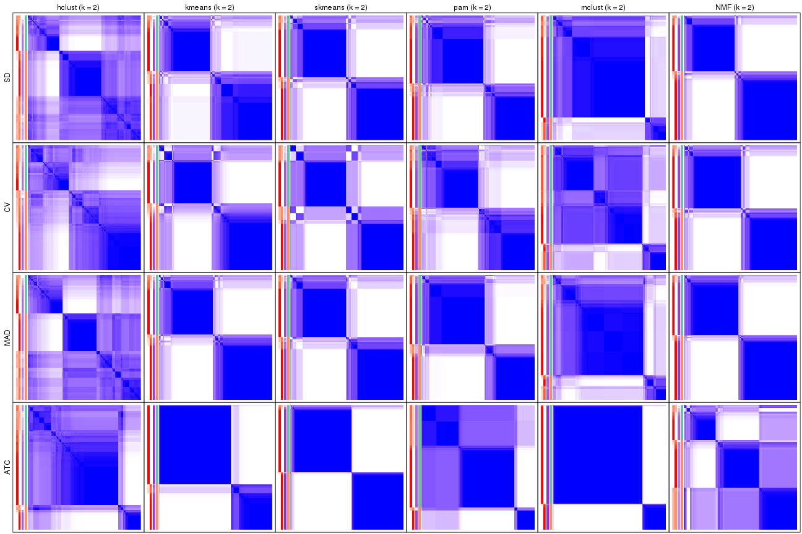</p>

</div>
<div id='tab-collect-consensus-heatmap-2'>
<pre><code class="r">collect_plots(res_list, k = 3, fun = consensus_heatmap, mc.cores = 4)
</code></pre>

<p>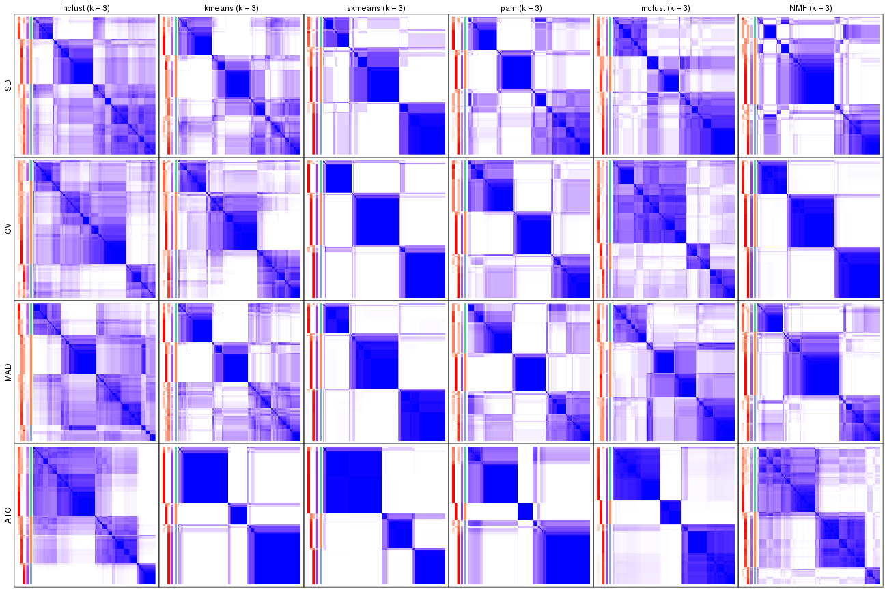</p>

</div>
<div id='tab-collect-consensus-heatmap-3'>
<pre><code class="r">collect_plots(res_list, k = 4, fun = consensus_heatmap, mc.cores = 4)
</code></pre>

<p>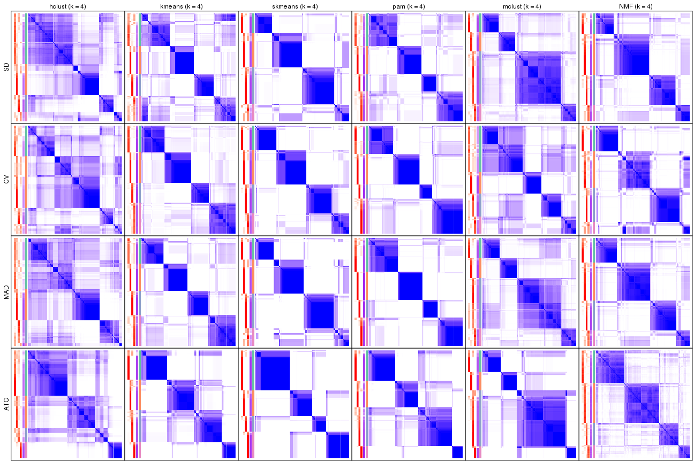</p>

</div>
<div id='tab-collect-consensus-heatmap-4'>
<pre><code class="r">collect_plots(res_list, k = 5, fun = consensus_heatmap, mc.cores = 4)
</code></pre>

<p>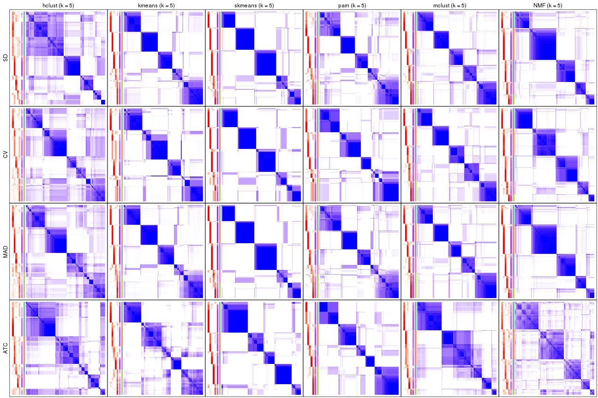</p>

</div>
<div id='tab-collect-consensus-heatmap-5'>
<pre><code class="r">collect_plots(res_list, k = 6, fun = consensus_heatmap, mc.cores = 4)
</code></pre>

<p>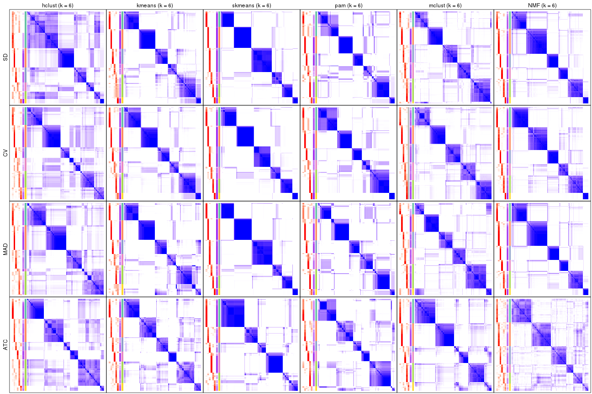</p>

</div>
</div>


### Membership heatmap

Membership heatmaps for all methods. ([What is a membership heatmap?](http://bioconductor.org/packages/devel/bioc/vignettes/cola/inst/doc/cola.html#toc_12))


<script>
$( function() {
	$( '#tabs-collect-membership-heatmap' ).tabs();
} );
</script>
<div id='tabs-collect-membership-heatmap'>
<ul>
<li><a href='#tab-collect-membership-heatmap-1'>k = 2</a></li>
<li><a href='#tab-collect-membership-heatmap-2'>k = 3</a></li>
<li><a href='#tab-collect-membership-heatmap-3'>k = 4</a></li>
<li><a href='#tab-collect-membership-heatmap-4'>k = 5</a></li>
<li><a href='#tab-collect-membership-heatmap-5'>k = 6</a></li>
</ul>
<div id='tab-collect-membership-heatmap-1'>
<pre><code class="r">collect_plots(res_list, k = 2, fun = membership_heatmap, mc.cores = 4)
</code></pre>

<p>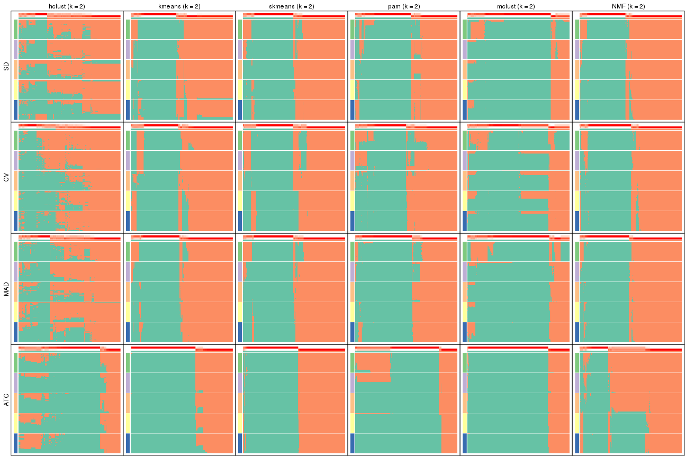</p>

</div>
<div id='tab-collect-membership-heatmap-2'>
<pre><code class="r">collect_plots(res_list, k = 3, fun = membership_heatmap, mc.cores = 4)
</code></pre>

<p>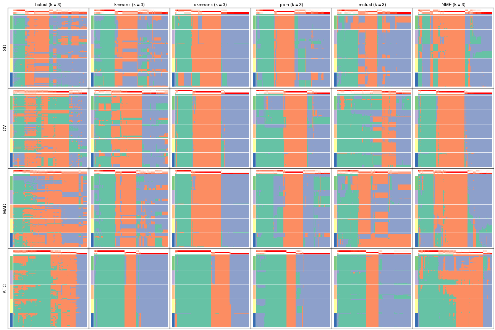</p>

</div>
<div id='tab-collect-membership-heatmap-3'>
<pre><code class="r">collect_plots(res_list, k = 4, fun = membership_heatmap, mc.cores = 4)
</code></pre>

<p>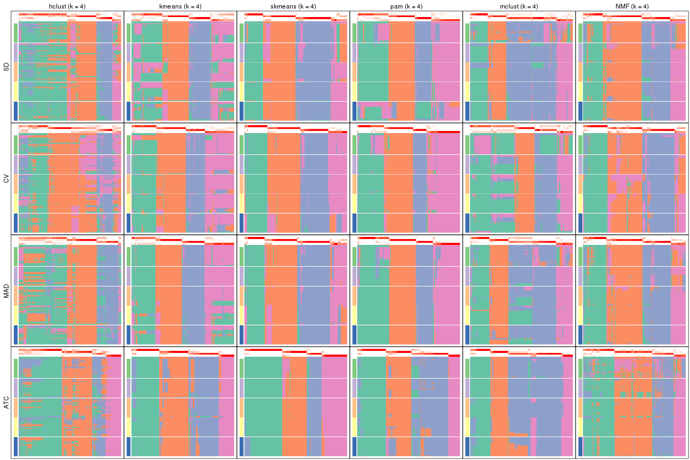</p>

</div>
<div id='tab-collect-membership-heatmap-4'>
<pre><code class="r">collect_plots(res_list, k = 5, fun = membership_heatmap, mc.cores = 4)
</code></pre>

<p>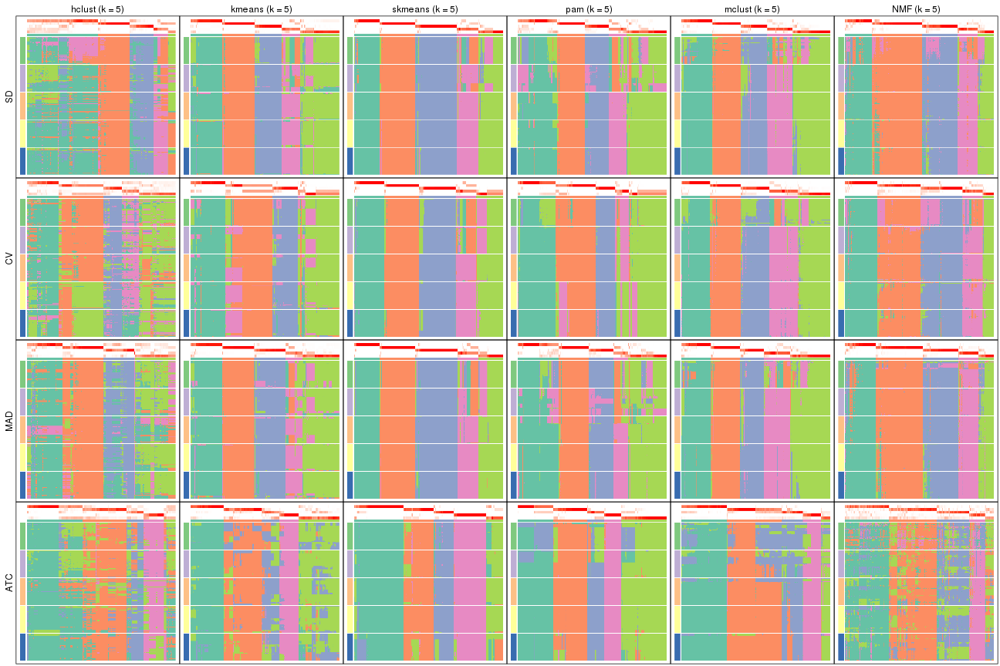</p>

</div>
<div id='tab-collect-membership-heatmap-5'>
<pre><code class="r">collect_plots(res_list, k = 6, fun = membership_heatmap, mc.cores = 4)
</code></pre>

<p>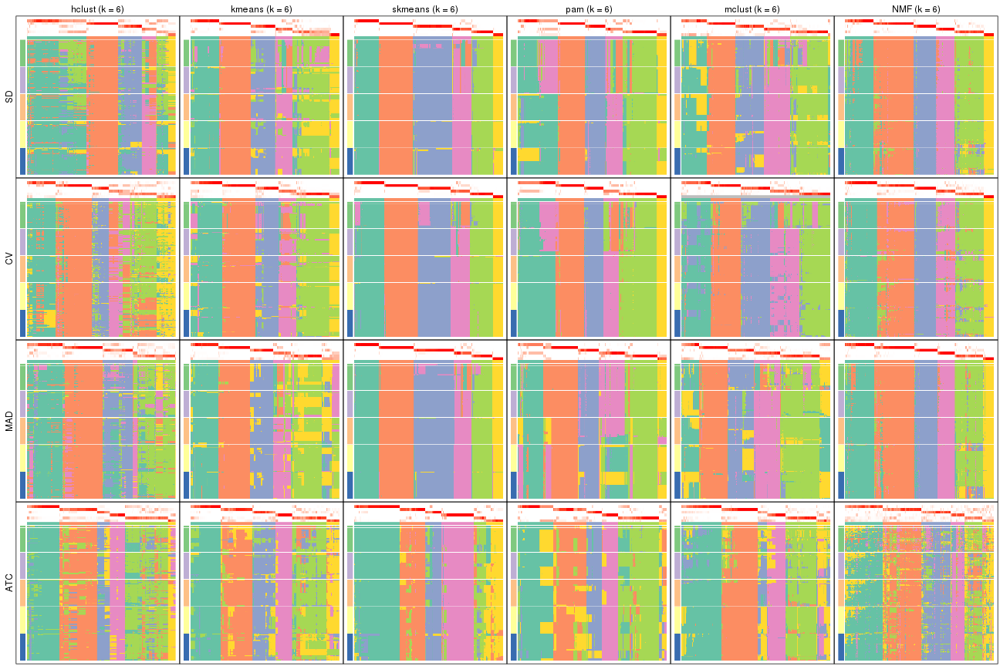</p>

</div>
</div>


### Signature heatmap

Signature heatmaps for all methods. ([What is a signature heatmap?](http://bioconductor.org/packages/devel/bioc/vignettes/cola/inst/doc/cola.html#toc_22))


Note in following heatmaps, rows are scaled.


<script>
$( function() {
	$( '#tabs-collect-get-signatures' ).tabs();
} );
</script>
<div id='tabs-collect-get-signatures'>
<ul>
<li><a href='#tab-collect-get-signatures-1'>k = 2</a></li>
<li><a href='#tab-collect-get-signatures-2'>k = 3</a></li>
<li><a href='#tab-collect-get-signatures-3'>k = 4</a></li>
<li><a href='#tab-collect-get-signatures-4'>k = 5</a></li>
<li><a href='#tab-collect-get-signatures-5'>k = 6</a></li>
</ul>
<div id='tab-collect-get-signatures-1'>
<pre><code class="r">collect_plots(res_list, k = 2, fun = get_signatures, mc.cores = 4)
</code></pre>

<p>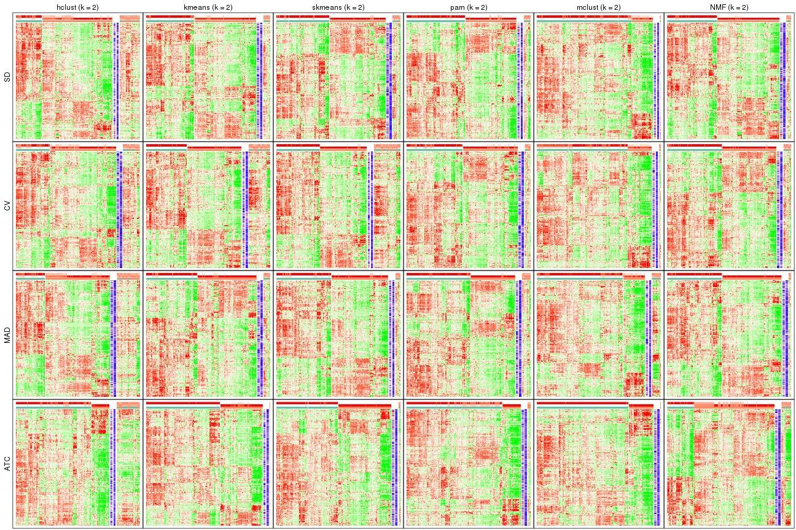</p>

</div>
<div id='tab-collect-get-signatures-2'>
<pre><code class="r">collect_plots(res_list, k = 3, fun = get_signatures, mc.cores = 4)
</code></pre>

<p>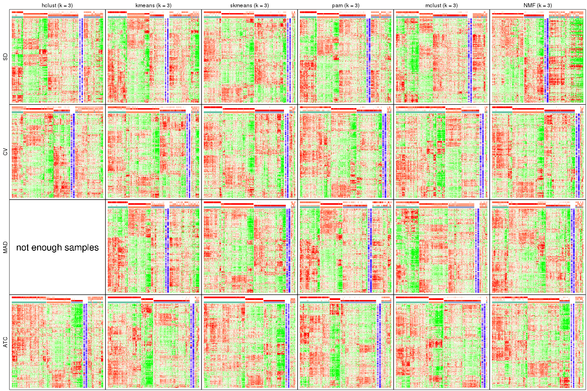</p>

</div>
<div id='tab-collect-get-signatures-3'>
<pre><code class="r">collect_plots(res_list, k = 4, fun = get_signatures, mc.cores = 4)
</code></pre>

<p>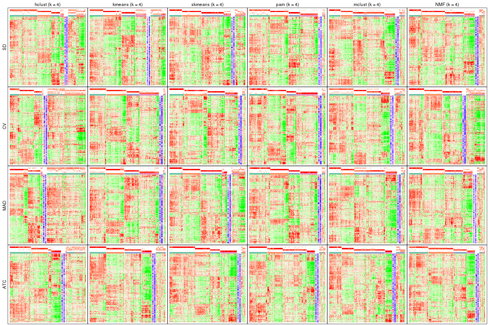</p>

</div>
<div id='tab-collect-get-signatures-4'>
<pre><code class="r">collect_plots(res_list, k = 5, fun = get_signatures, mc.cores = 4)
</code></pre>

<p>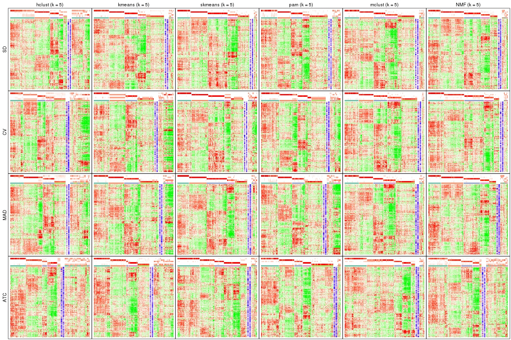</p>

</div>
<div id='tab-collect-get-signatures-5'>
<pre><code class="r">collect_plots(res_list, k = 6, fun = get_signatures, mc.cores = 4)
</code></pre>

<p>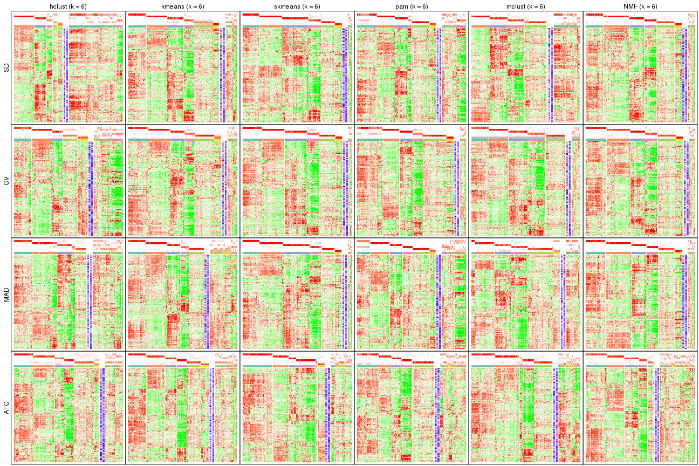</p>

</div>
</div>


### Statistics table

The statistics used for measuring the stability of consensus partitioning.
([How are they
defined?](http://bioconductor.org/packages/devel/bioc/vignettes/cola/inst/doc/cola.html#toc_13))


<script>
$( function() {
	$( '#tabs-get-stats-from-consensus-partition-list' ).tabs();
} );
</script>
<div id='tabs-get-stats-from-consensus-partition-list'>
<ul>
<li><a href='#tab-get-stats-from-consensus-partition-list-1'>k = 2</a></li>
<li><a href='#tab-get-stats-from-consensus-partition-list-2'>k = 3</a></li>
<li><a href='#tab-get-stats-from-consensus-partition-list-3'>k = 4</a></li>
<li><a href='#tab-get-stats-from-consensus-partition-list-4'>k = 5</a></li>
<li><a href='#tab-get-stats-from-consensus-partition-list-5'>k = 6</a></li>
</ul>
<div id='tab-get-stats-from-consensus-partition-list-1'>
<pre><code class="r">get_stats(res_list, k = 2)
</code></pre>

<pre><code>#&gt;             k 1-PAC mean_silhouette concordance area_increased  Rand Jaccard
#&gt; SD:NMF      2 0.840           0.908       0.962          0.495 0.504   0.504
#&gt; CV:NMF      2 0.790           0.881       0.952          0.501 0.498   0.498
#&gt; MAD:NMF     2 0.900           0.934       0.972          0.501 0.499   0.499
#&gt; ATC:NMF     2 0.444           0.650       0.819          0.429 0.595   0.595
#&gt; SD:skmeans  2 0.725           0.865       0.943          0.501 0.498   0.498
#&gt; CV:skmeans  2 0.579           0.733       0.899          0.502 0.499   0.499
#&gt; MAD:skmeans 2 0.718           0.872       0.945          0.502 0.498   0.498
#&gt; ATC:skmeans 2 1.000           0.967       0.987          0.500 0.501   0.501
#&gt; SD:mclust   2 0.578           0.883       0.927          0.315 0.700   0.700
#&gt; CV:mclust   2 0.298           0.805       0.867          0.363 0.664   0.664
#&gt; MAD:mclust  2 0.493           0.814       0.903          0.346 0.680   0.680
#&gt; ATC:mclust  2 1.000           0.990       0.995          0.333 0.668   0.668
#&gt; SD:kmeans   2 0.709           0.849       0.923          0.487 0.504   0.504
#&gt; CV:kmeans   2 0.665           0.762       0.910          0.495 0.501   0.501
#&gt; MAD:kmeans  2 0.742           0.882       0.949          0.499 0.499   0.499
#&gt; ATC:kmeans  2 0.947           0.967       0.983          0.455 0.534   0.534
#&gt; SD:pam      2 0.731           0.863       0.940          0.496 0.503   0.503
#&gt; CV:pam      2 0.553           0.835       0.917          0.493 0.498   0.498
#&gt; MAD:pam     2 0.752           0.877       0.947          0.490 0.505   0.505
#&gt; ATC:pam     2 0.528           0.810       0.893          0.344 0.704   0.704
#&gt; SD:hclust   2 0.225           0.608       0.754          0.391 0.595   0.595
#&gt; CV:hclust   2 0.289           0.682       0.844          0.427 0.536   0.536
#&gt; MAD:hclust  2 0.234           0.629       0.815          0.413 0.573   0.573
#&gt; ATC:hclust  2 0.459           0.694       0.866          0.368 0.680   0.680
</code></pre>

</div>
<div id='tab-get-stats-from-consensus-partition-list-2'>
<pre><code class="r">get_stats(res_list, k = 3)
</code></pre>

<pre><code>#&gt;             k 1-PAC mean_silhouette concordance area_increased  Rand Jaccard
#&gt; SD:NMF      3 0.575           0.525       0.760          0.265 0.814   0.654
#&gt; CV:NMF      3 0.914           0.923       0.966          0.307 0.737   0.525
#&gt; MAD:NMF     3 0.596           0.734       0.840          0.275 0.790   0.609
#&gt; ATC:NMF     3 0.436           0.689       0.818          0.383 0.566   0.392
#&gt; SD:skmeans  3 0.667           0.826       0.898          0.288 0.797   0.614
#&gt; CV:skmeans  3 0.907           0.892       0.959          0.306 0.767   0.568
#&gt; MAD:skmeans 3 0.924           0.914       0.960          0.292 0.802   0.623
#&gt; ATC:skmeans 3 0.934           0.924       0.968          0.271 0.814   0.647
#&gt; SD:mclust   3 0.360           0.638       0.805          0.917 0.580   0.431
#&gt; CV:mclust   3 0.351           0.744       0.819          0.586 0.443   0.330
#&gt; MAD:mclust  3 0.320           0.633       0.706          0.727 0.597   0.434
#&gt; ATC:mclust  3 0.840           0.924       0.945          0.839 0.644   0.490
#&gt; SD:kmeans   3 0.437           0.542       0.743          0.302 0.671   0.439
#&gt; CV:kmeans   3 0.465           0.702       0.812          0.297 0.793   0.608
#&gt; MAD:kmeans  3 0.446           0.613       0.772          0.286 0.663   0.429
#&gt; ATC:kmeans  3 0.887           0.905       0.963          0.357 0.655   0.451
#&gt; SD:pam      3 0.547           0.655       0.856          0.313 0.647   0.422
#&gt; CV:pam      3 0.660           0.770       0.847          0.304 0.723   0.500
#&gt; MAD:pam     3 0.604           0.614       0.803          0.342 0.688   0.458
#&gt; ATC:pam     3 0.733           0.814       0.925          0.723 0.603   0.470
#&gt; SD:hclust   3 0.257           0.589       0.755          0.457 0.609   0.433
#&gt; CV:hclust   3 0.267           0.523       0.665          0.388 0.893   0.803
#&gt; MAD:hclust  3 0.283           0.249       0.630          0.348 0.735   0.604
#&gt; ATC:hclust  3 0.445           0.699       0.844          0.593 0.660   0.519
</code></pre>

</div>
<div id='tab-get-stats-from-consensus-partition-list-3'>
<pre><code class="r">get_stats(res_list, k = 4)
</code></pre>

<pre><code>#&gt;             k 1-PAC mean_silhouette concordance area_increased  Rand Jaccard
#&gt; SD:NMF      4 0.657           0.769       0.873         0.1368 0.807   0.550
#&gt; CV:NMF      4 0.709           0.632       0.818         0.1072 0.887   0.693
#&gt; MAD:NMF     4 0.708           0.755       0.875         0.1297 0.826   0.570
#&gt; ATC:NMF     4 0.589           0.756       0.836         0.2107 0.832   0.605
#&gt; SD:skmeans  4 0.781           0.769       0.878         0.1231 0.874   0.665
#&gt; CV:skmeans  4 0.800           0.844       0.921         0.1334 0.868   0.642
#&gt; MAD:skmeans 4 0.815           0.748       0.891         0.1263 0.868   0.649
#&gt; ATC:skmeans 4 0.860           0.881       0.949         0.1414 0.883   0.689
#&gt; SD:mclust   4 0.623           0.795       0.866         0.1166 0.744   0.450
#&gt; CV:mclust   4 0.525           0.651       0.783         0.1937 0.843   0.648
#&gt; MAD:mclust  4 0.562           0.723       0.836         0.1608 0.736   0.422
#&gt; ATC:mclust  4 0.648           0.756       0.893         0.0815 0.661   0.361
#&gt; SD:kmeans   4 0.621           0.594       0.753         0.1483 0.810   0.515
#&gt; CV:kmeans   4 0.730           0.852       0.884         0.1416 0.803   0.508
#&gt; MAD:kmeans  4 0.764           0.821       0.860         0.1514 0.820   0.536
#&gt; ATC:kmeans  4 0.755           0.760       0.899         0.1827 0.788   0.502
#&gt; SD:pam      4 0.661           0.799       0.849         0.1285 0.794   0.503
#&gt; CV:pam      4 0.780           0.859       0.929         0.1296 0.826   0.551
#&gt; MAD:pam     4 0.806           0.868       0.935         0.1280 0.779   0.459
#&gt; ATC:pam     4 0.729           0.790       0.905         0.2114 0.752   0.465
#&gt; SD:hclust   4 0.385           0.567       0.766         0.1614 0.881   0.719
#&gt; CV:hclust   4 0.388           0.352       0.688         0.1389 0.786   0.571
#&gt; MAD:hclust  4 0.369           0.478       0.731         0.1822 0.704   0.482
#&gt; ATC:hclust  4 0.508           0.587       0.798         0.1576 0.896   0.739
</code></pre>

</div>
<div id='tab-get-stats-from-consensus-partition-list-4'>
<pre><code class="r">get_stats(res_list, k = 5)
</code></pre>

<pre><code>#&gt;             k 1-PAC mean_silhouette concordance area_increased  Rand Jaccard
#&gt; SD:NMF      5 0.769           0.798       0.897         0.0719 0.904   0.684
#&gt; CV:NMF      5 0.783           0.795       0.886         0.0635 0.899   0.671
#&gt; MAD:NMF     5 0.838           0.804       0.910         0.0638 0.901   0.667
#&gt; ATC:NMF     5 0.557           0.535       0.704         0.0809 0.900   0.683
#&gt; SD:skmeans  5 0.858           0.849       0.917         0.0797 0.889   0.627
#&gt; CV:skmeans  5 0.878           0.793       0.883         0.0609 0.910   0.674
#&gt; MAD:skmeans 5 0.883           0.839       0.914         0.0697 0.887   0.618
#&gt; ATC:skmeans 5 0.822           0.813       0.910         0.0654 0.907   0.687
#&gt; SD:mclust   5 0.800           0.817       0.900         0.1722 0.836   0.522
#&gt; CV:mclust   5 0.749           0.840       0.898         0.1499 0.851   0.535
#&gt; MAD:mclust  5 0.797           0.825       0.906         0.1401 0.864   0.581
#&gt; ATC:mclust  5 0.633           0.710       0.833         0.0975 0.689   0.329
#&gt; SD:kmeans   5 0.836           0.808       0.887         0.0789 0.861   0.537
#&gt; CV:kmeans   5 0.801           0.634       0.810         0.0675 0.931   0.753
#&gt; MAD:kmeans  5 0.839           0.790       0.879         0.0661 0.924   0.715
#&gt; ATC:kmeans  5 0.696           0.642       0.803         0.0726 0.887   0.620
#&gt; SD:pam      5 0.716           0.732       0.838         0.0625 0.861   0.546
#&gt; CV:pam      5 0.756           0.713       0.854         0.0571 0.944   0.796
#&gt; MAD:pam     5 0.727           0.715       0.834         0.0532 0.890   0.626
#&gt; ATC:pam     5 0.790           0.808       0.876         0.0790 0.904   0.680
#&gt; SD:hclust   5 0.487           0.603       0.722         0.0775 0.940   0.830
#&gt; CV:hclust   5 0.476           0.580       0.681         0.0898 0.790   0.456
#&gt; MAD:hclust  5 0.525           0.605       0.744         0.1226 0.843   0.583
#&gt; ATC:hclust  5 0.538           0.515       0.719         0.0731 0.953   0.845
</code></pre>

</div>
<div id='tab-get-stats-from-consensus-partition-list-5'>
<pre><code class="r">get_stats(res_list, k = 6)
</code></pre>

<pre><code>#&gt;             k 1-PAC mean_silhouette concordance area_increased  Rand Jaccard
#&gt; SD:NMF      6 0.812           0.822       0.907         0.0563 0.875   0.541
#&gt; CV:NMF      6 0.820           0.823       0.892         0.0564 0.909   0.643
#&gt; MAD:NMF     6 0.819           0.821       0.910         0.0521 0.883   0.560
#&gt; ATC:NMF     6 0.623           0.543       0.719         0.0471 0.886   0.594
#&gt; SD:skmeans  6 0.913           0.894       0.944         0.0301 0.959   0.812
#&gt; CV:skmeans  6 0.892           0.890       0.930         0.0350 0.957   0.799
#&gt; MAD:skmeans 6 0.941           0.900       0.949         0.0309 0.963   0.833
#&gt; ATC:skmeans 6 0.829           0.732       0.880         0.0314 0.953   0.800
#&gt; SD:mclust   6 0.713           0.639       0.815         0.0285 0.969   0.854
#&gt; CV:mclust   6 0.734           0.760       0.828         0.0253 0.982   0.912
#&gt; MAD:mclust  6 0.764           0.726       0.808         0.0289 0.964   0.830
#&gt; ATC:mclust  6 0.728           0.629       0.801         0.0934 0.872   0.570
#&gt; SD:kmeans   6 0.797           0.714       0.822         0.0395 0.932   0.706
#&gt; CV:kmeans   6 0.821           0.776       0.852         0.0400 0.886   0.575
#&gt; MAD:kmeans  6 0.790           0.653       0.764         0.0375 0.938   0.719
#&gt; ATC:kmeans  6 0.730           0.655       0.797         0.0469 0.894   0.582
#&gt; SD:pam      6 0.777           0.664       0.818         0.0412 0.922   0.679
#&gt; CV:pam      6 0.824           0.798       0.875         0.0507 0.919   0.675
#&gt; MAD:pam     6 0.794           0.662       0.800         0.0437 0.850   0.456
#&gt; ATC:pam     6 0.736           0.593       0.788         0.0464 0.948   0.785
#&gt; SD:hclust   6 0.516           0.437       0.706         0.0327 0.936   0.794
#&gt; CV:hclust   6 0.572           0.609       0.740         0.0622 0.908   0.623
#&gt; MAD:hclust  6 0.628           0.597       0.771         0.0427 0.975   0.903
#&gt; ATC:hclust  6 0.638           0.649       0.779         0.0765 0.842   0.500
</code></pre>

</div>
</div>

Following heatmap plots the partition for each combination of methods and the
lightness correspond to the silhouette scores for samples in each method. On
top the consensus subgroup is inferred from all methods by taking the mean
silhouette scores as weight.


<script>
$( function() {
	$( '#tabs-collect-stats-from-consensus-partition-list' ).tabs();
} );
</script>
<div id='tabs-collect-stats-from-consensus-partition-list'>
<ul>
<li><a href='#tab-collect-stats-from-consensus-partition-list-1'>k = 2</a></li>
<li><a href='#tab-collect-stats-from-consensus-partition-list-2'>k = 3</a></li>
<li><a href='#tab-collect-stats-from-consensus-partition-list-3'>k = 4</a></li>
<li><a href='#tab-collect-stats-from-consensus-partition-list-4'>k = 5</a></li>
<li><a href='#tab-collect-stats-from-consensus-partition-list-5'>k = 6</a></li>
</ul>
<div id='tab-collect-stats-from-consensus-partition-list-1'>
<pre><code class="r">collect_stats(res_list, k = 2)
</code></pre>

<p>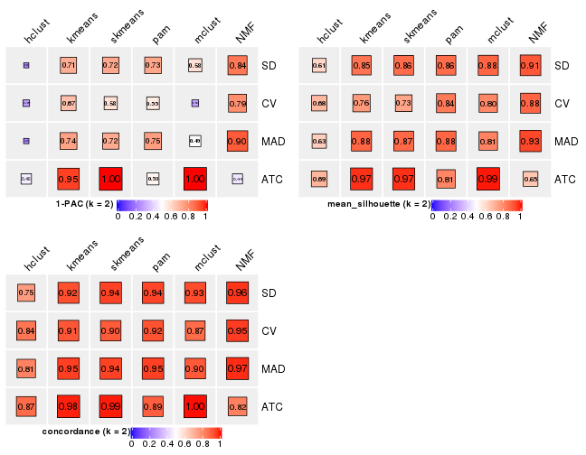</p>

</div>
<div id='tab-collect-stats-from-consensus-partition-list-2'>
<pre><code class="r">collect_stats(res_list, k = 3)
</code></pre>

<p>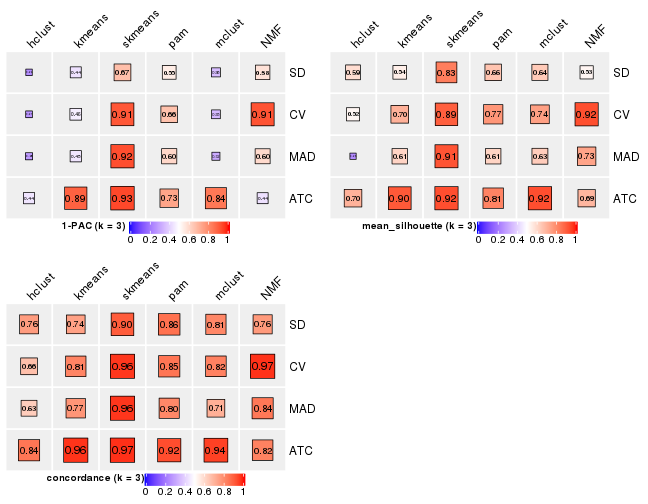</p>

</div>
<div id='tab-collect-stats-from-consensus-partition-list-3'>
<pre><code class="r">collect_stats(res_list, k = 4)
</code></pre>

<p>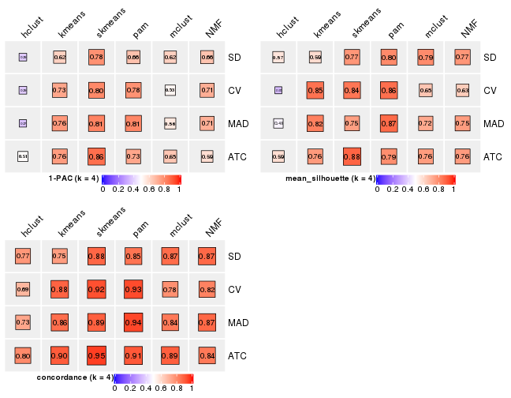</p>

</div>
<div id='tab-collect-stats-from-consensus-partition-list-4'>
<pre><code class="r">collect_stats(res_list, k = 5)
</code></pre>

<p>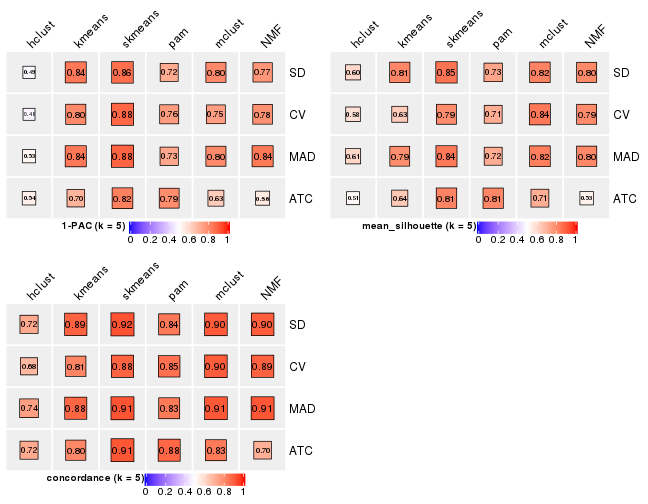</p>

</div>
<div id='tab-collect-stats-from-consensus-partition-list-5'>
<pre><code class="r">collect_stats(res_list, k = 6)
</code></pre>

<p>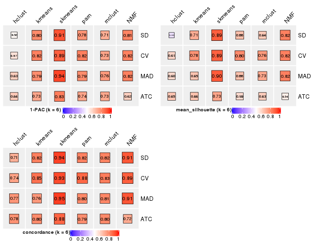</p>

</div>
</div>

### Partition from all methods


Collect partitions from all methods:


<script>
$( function() {
	$( '#tabs-collect-classes-from-consensus-partition-list' ).tabs();
} );
</script>
<div id='tabs-collect-classes-from-consensus-partition-list'>
<ul>
<li><a href='#tab-collect-classes-from-consensus-partition-list-1'>k = 2</a></li>
<li><a href='#tab-collect-classes-from-consensus-partition-list-2'>k = 3</a></li>
<li><a href='#tab-collect-classes-from-consensus-partition-list-3'>k = 4</a></li>
<li><a href='#tab-collect-classes-from-consensus-partition-list-4'>k = 5</a></li>
<li><a href='#tab-collect-classes-from-consensus-partition-list-5'>k = 6</a></li>
</ul>
<div id='tab-collect-classes-from-consensus-partition-list-1'>
<pre><code class="r">collect_classes(res_list, k = 2)
</code></pre>

<p>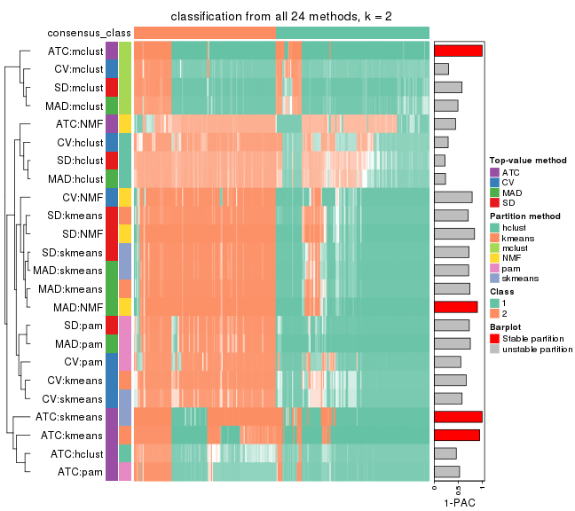</p>

</div>
<div id='tab-collect-classes-from-consensus-partition-list-2'>
<pre><code class="r">collect_classes(res_list, k = 3)
</code></pre>

<p>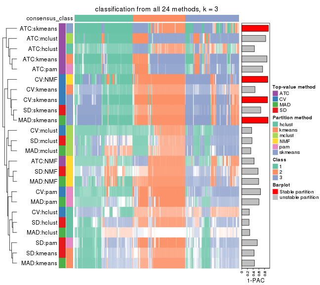</p>

</div>
<div id='tab-collect-classes-from-consensus-partition-list-3'>
<pre><code class="r">collect_classes(res_list, k = 4)
</code></pre>

<p>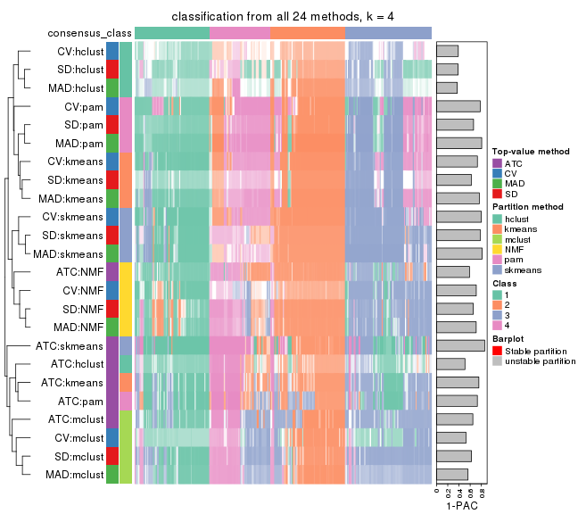</p>

</div>
<div id='tab-collect-classes-from-consensus-partition-list-4'>
<pre><code class="r">collect_classes(res_list, k = 5)
</code></pre>

<p>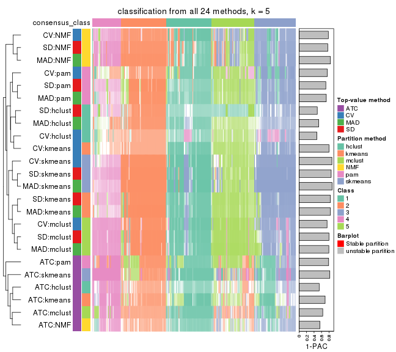</p>

</div>
<div id='tab-collect-classes-from-consensus-partition-list-5'>
<pre><code class="r">collect_classes(res_list, k = 6)
</code></pre>

<p>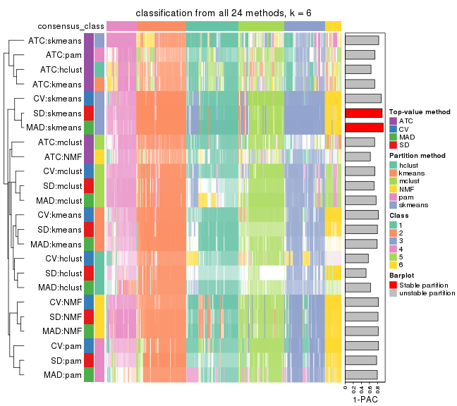</p>

</div>
</div>


### Top rows overlap


Overlap of top rows from different top-row methods:


<script>
$( function() {
	$( '#tabs-top-rows-overlap-by-euler' ).tabs();
} );
</script>
<div id='tabs-top-rows-overlap-by-euler'>
<ul>
<li><a href='#tab-top-rows-overlap-by-euler-1'>top_n = 1000</a></li>
<li><a href='#tab-top-rows-overlap-by-euler-2'>top_n = 2000</a></li>
<li><a href='#tab-top-rows-overlap-by-euler-3'>top_n = 3000</a></li>
<li><a href='#tab-top-rows-overlap-by-euler-4'>top_n = 4000</a></li>
<li><a href='#tab-top-rows-overlap-by-euler-5'>top_n = 5000</a></li>
</ul>
<div id='tab-top-rows-overlap-by-euler-1'>
<pre><code class="r">top_rows_overlap(res_list, top_n = 1000, method = &quot;euler&quot;)
</code></pre>

<p>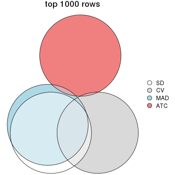</p>

</div>
<div id='tab-top-rows-overlap-by-euler-2'>
<pre><code class="r">top_rows_overlap(res_list, top_n = 2000, method = &quot;euler&quot;)
</code></pre>

<p>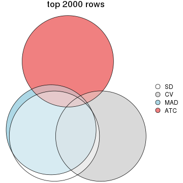</p>

</div>
<div id='tab-top-rows-overlap-by-euler-3'>
<pre><code class="r">top_rows_overlap(res_list, top_n = 3000, method = &quot;euler&quot;)
</code></pre>

<p>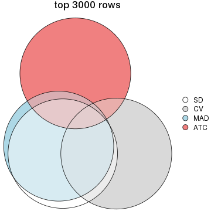</p>

</div>
<div id='tab-top-rows-overlap-by-euler-4'>
<pre><code class="r">top_rows_overlap(res_list, top_n = 4000, method = &quot;euler&quot;)
</code></pre>

<p>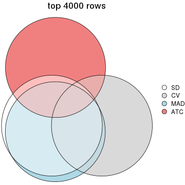</p>

</div>
<div id='tab-top-rows-overlap-by-euler-5'>
<pre><code class="r">top_rows_overlap(res_list, top_n = 5000, method = &quot;euler&quot;)
</code></pre>

<p>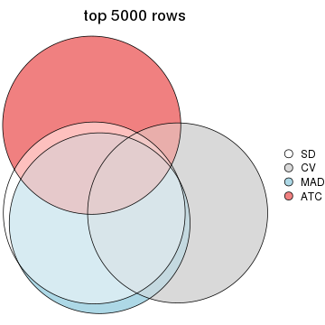</p>

</div>
</div>

Also visualize the correspondance of rankings between different top-row methods:


<script>
$( function() {
	$( '#tabs-top-rows-overlap-by-correspondance' ).tabs();
} );
</script>
<div id='tabs-top-rows-overlap-by-correspondance'>
<ul>
<li><a href='#tab-top-rows-overlap-by-correspondance-1'>top_n = 1000</a></li>
<li><a href='#tab-top-rows-overlap-by-correspondance-2'>top_n = 2000</a></li>
<li><a href='#tab-top-rows-overlap-by-correspondance-3'>top_n = 3000</a></li>
<li><a href='#tab-top-rows-overlap-by-correspondance-4'>top_n = 4000</a></li>
<li><a href='#tab-top-rows-overlap-by-correspondance-5'>top_n = 5000</a></li>
</ul>
<div id='tab-top-rows-overlap-by-correspondance-1'>
<pre><code class="r">top_rows_overlap(res_list, top_n = 1000, method = &quot;correspondance&quot;)
</code></pre>

<p>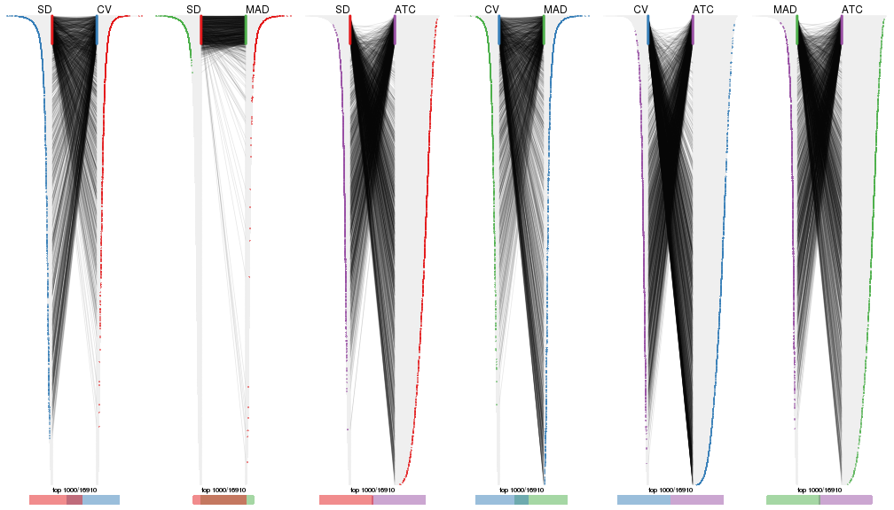</p>

</div>
<div id='tab-top-rows-overlap-by-correspondance-2'>
<pre><code class="r">top_rows_overlap(res_list, top_n = 2000, method = &quot;correspondance&quot;)
</code></pre>

<p>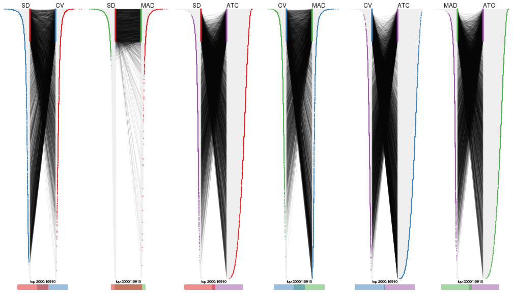</p>

</div>
<div id='tab-top-rows-overlap-by-correspondance-3'>
<pre><code class="r">top_rows_overlap(res_list, top_n = 3000, method = &quot;correspondance&quot;)
</code></pre>

<p>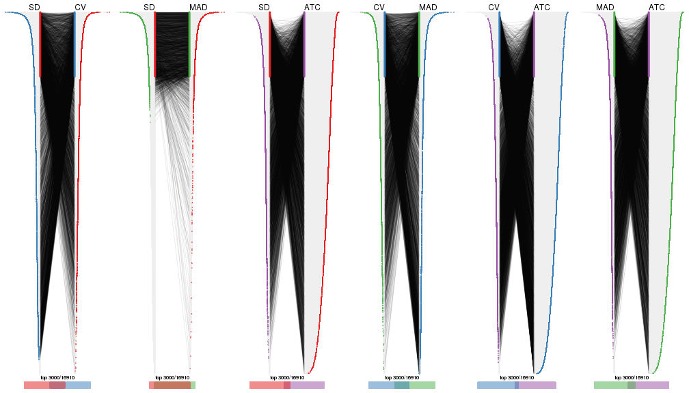</p>

</div>
<div id='tab-top-rows-overlap-by-correspondance-4'>
<pre><code class="r">top_rows_overlap(res_list, top_n = 4000, method = &quot;correspondance&quot;)
</code></pre>

<p>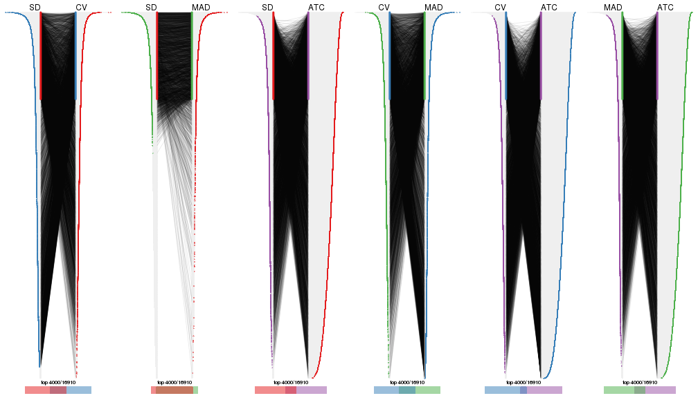</p>

</div>
<div id='tab-top-rows-overlap-by-correspondance-5'>
<pre><code class="r">top_rows_overlap(res_list, top_n = 5000, method = &quot;correspondance&quot;)
</code></pre>

<p>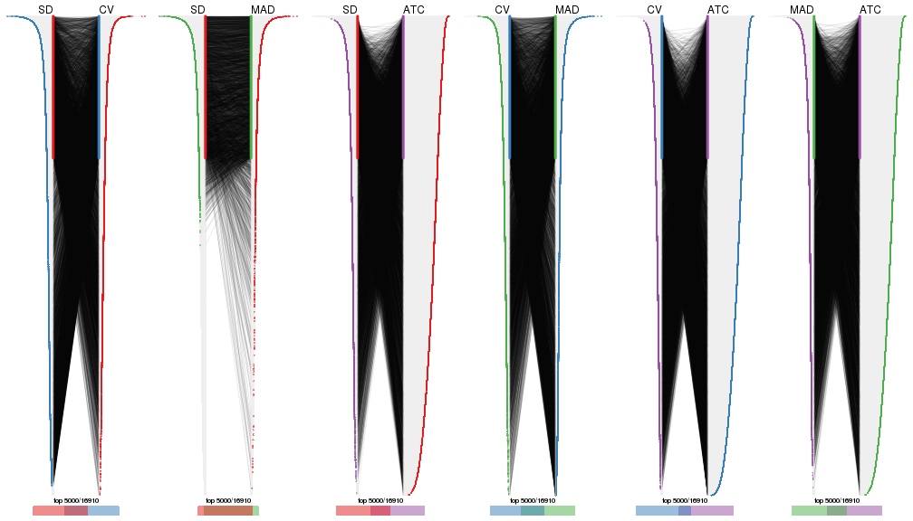</p>

</div>
</div>


Heatmaps of the top rows:


<script>
$( function() {
	$( '#tabs-top-rows-heatmap' ).tabs();
} );
</script>
<div id='tabs-top-rows-heatmap'>
<ul>
<li><a href='#tab-top-rows-heatmap-1'>top_n = 1000</a></li>
<li><a href='#tab-top-rows-heatmap-2'>top_n = 2000</a></li>
<li><a href='#tab-top-rows-heatmap-3'>top_n = 3000</a></li>
<li><a href='#tab-top-rows-heatmap-4'>top_n = 4000</a></li>
<li><a href='#tab-top-rows-heatmap-5'>top_n = 5000</a></li>
</ul>
<div id='tab-top-rows-heatmap-1'>
<pre><code class="r">top_rows_heatmap(res_list, top_n = 1000)
</code></pre>

<p>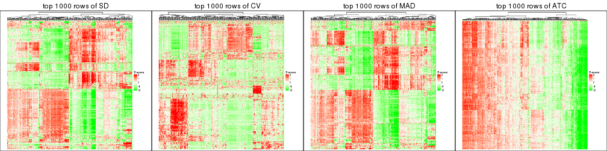</p>

</div>
<div id='tab-top-rows-heatmap-2'>
<pre><code class="r">top_rows_heatmap(res_list, top_n = 2000)
</code></pre>

<p>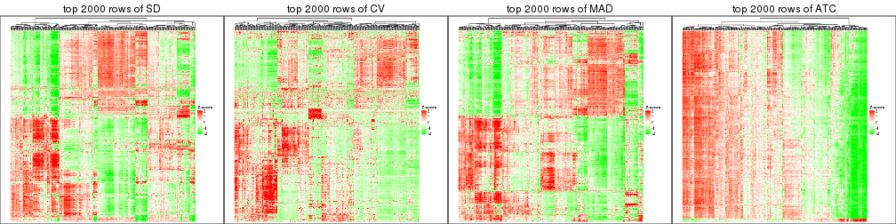</p>

</div>
<div id='tab-top-rows-heatmap-3'>
<pre><code class="r">top_rows_heatmap(res_list, top_n = 3000)
</code></pre>

<p>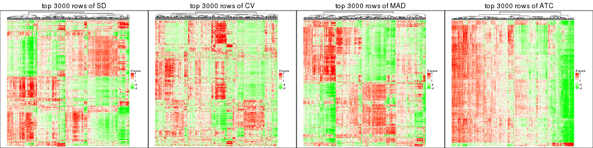</p>

</div>
<div id='tab-top-rows-heatmap-4'>
<pre><code class="r">top_rows_heatmap(res_list, top_n = 4000)
</code></pre>

<p>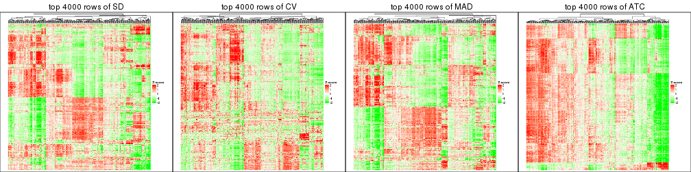</p>

</div>
<div id='tab-top-rows-heatmap-5'>
<pre><code class="r">top_rows_heatmap(res_list, top_n = 5000)
</code></pre>

<p>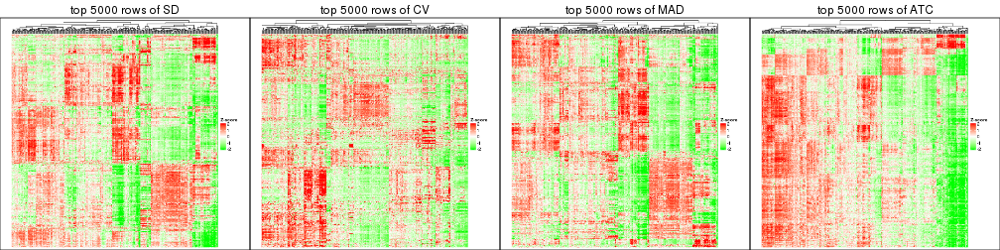</p>

</div>
</div>


 
## Results for each method


---------------------------------------------------


### SD:hclust


The object with results only for a single top-value method and a single partition method 
can be extracted as:

```r
res = res_list["SD", "hclust"]
# you can also extract it by
# res = res_list["SD:hclust"]
```

A summary of `res` and all the functions that can be applied to it:

```r
res
```

```
#> A 'ConsensusPartition' object with k = 2, 3, 4, 5, 6.
#>   On a matrix with 16910 rows and 306 columns.
#>   Top rows (1000, 2000, 3000, 4000, 5000) are extracted by 'SD' method.
#>   Subgroups are detected by 'hclust' method.
#>   Performed in total 1250 partitions by row resampling.
#>   Best k for subgroups seems to be 5.
#> 
#> Following methods can be applied to this 'ConsensusPartition' object:
#>  [1] "cola_report"             "collect_classes"         "collect_plots"          
#>  [4] "collect_stats"           "colnames"                "compare_signatures"     
#>  [7] "consensus_heatmap"       "dimension_reduction"     "functional_enrichment"  
#> [10] "get_anno_col"            "get_anno"                "get_classes"            
#> [13] "get_consensus"           "get_matrix"              "get_membership"         
#> [16] "get_param"               "get_signatures"          "get_stats"              
#> [19] "is_best_k"               "is_stable_k"             "membership_heatmap"     
#> [22] "ncol"                    "nrow"                    "plot_ecdf"              
#> [25] "rownames"                "select_partition_number" "show"                   
#> [28] "suggest_best_k"          "test_to_known_factors"
```

`collect_plots()` function collects all the plots made from `res` for all `k` (number of partitions)
into one single page to provide an easy and fast comparison between different `k`.

```r
collect_plots(res)
```

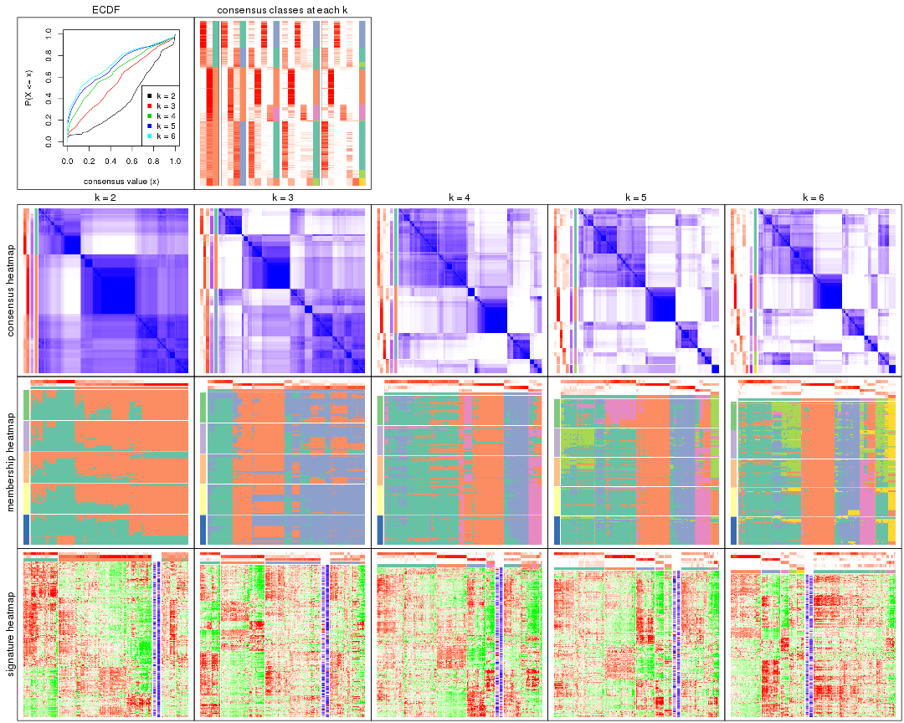

The plots are:

- The first row: a plot of the ECDF (Empirical cumulative distribution
  function) curves of the consensus matrix for each `k` and the heatmap of
  predicted classes for each `k`.
- The second row: heatmaps of the consensus matrix for each `k`.
- The third row: heatmaps of the membership matrix for each `k`.
- The fouth row: heatmaps of the signatures for each `k`.

All the plots in panels can be made by individual functions and they are
plotted later in this section.

`select_partition_number()` produces several plots showing different
statistics for choosing "optimized" `k`. There are following statistics:

- ECDF curves of the consensus matrix for each `k`;
- 1-PAC. [The PAC
  score](https://en.wikipedia.org/wiki/Consensus_clustering#Over-interpretation_potential_of_consensus_clustering)
  measures the proportion of the ambiguous subgrouping.
- Mean silhouette score.
- Concordance. The mean probability of fiting the consensus class ids in all
  partitions.
- Area increased. Denote $A_k$ as the area under the ECDF curve for current
  `k`, the area increased is defined as $A_k - A_{k-1}$.
- Rand index. The percent of pairs of samples that are both in a same cluster
  or both are not in a same cluster in the partition of k and k-1.
- Jaccard index. The ratio of pairs of samples are both in a same cluster in
  the partition of k and k-1 and the pairs of samples are both in a same
  cluster in the partition k or k-1.

The detailed explanations of these statistics can be found in [the cola
vignette](http://bioconductor.org/packages/devel/bioc/vignettes/cola/inst/doc/cola.html#toc_13).

Generally speaking, lower PAC score, higher mean silhouette score or higher
concordance corresponds to better partition. Rand index and Jaccard index
measure how similar the current partition is compared to partition with `k-1`.
If they are too similar, we won't accept `k` is better than `k-1`.

```r
select_partition_number(res)
```

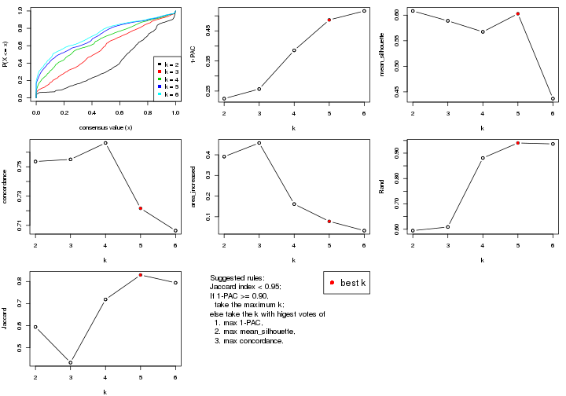

The numeric values for all these statistics can be obtained by `get_stats()`.

```r
get_stats(res)
```

```
#>   k 1-PAC mean_silhouette concordance area_increased  Rand Jaccard
#> 2 2 0.225           0.608       0.754         0.3913 0.595   0.595
#> 3 3 0.257           0.589       0.755         0.4574 0.609   0.433
#> 4 4 0.385           0.567       0.766         0.1614 0.881   0.719
#> 5 5 0.487           0.603       0.722         0.0775 0.940   0.830
#> 6 6 0.516           0.437       0.706         0.0327 0.936   0.794
```

`suggest_best_k()` suggests the best $k$ based on these statistics. The rules are as follows:

- All $k$ with Jaccard index larger than 0.95 are removed because the increase of
  the partition number does not provides enough extra information. If all $k$ are removed,
  the best $k$ is assigned by `NA`.
- For $k$ with 1-PAC larger than 0.9, the maximal $k$ is taken as the "best k". Other $k$ is called "optional k".
- If it does not fit the second rule. The $k$ with the highest vote of highest
  1-PAC, mean silhouette and concordance is taken as the "best k".

```r
suggest_best_k(res)
```

```
#> [1] 5
```


Following shows the table of the partitions (You need to click the **show/hide
code output** link to see it). The membership matrix (columns with name `p*`)
is inferred by
[`clue::cl_consensus()`](https://www.rdocumentation.org/link/cl_consensus?package=clue)
function with the `SE` method. Basically the value in the membership matrix
represents the probability to belong to a certain group. The finall class
label for an item is determined with the group with highest probability it
belongs to.

In `get_classes()` function, the entropy is calculated from the membership
matrix and the silhouette score is calculated from the consensus matrix.


<script>
$( function() {
	$( '#tabs-SD-hclust-get-classes' ).tabs();
} );
</script>
<div id='tabs-SD-hclust-get-classes'>
<ul>
<li><a href='#tab-SD-hclust-get-classes-1'>k = 2</a></li>
<li><a href='#tab-SD-hclust-get-classes-2'>k = 3</a></li>
<li><a href='#tab-SD-hclust-get-classes-3'>k = 4</a></li>
<li><a href='#tab-SD-hclust-get-classes-4'>k = 5</a></li>
<li><a href='#tab-SD-hclust-get-classes-5'>k = 6</a></li>
</ul>

<div id='tab-SD-hclust-get-classes-1'>
<p><a id='tab-SD-hclust-get-classes-1-a' style='color:#0366d6' href='#'>show/hide code output</a></p>
<pre><code class="r">cbind(get_classes(res, k = 2), get_membership(res, k = 2))
</code></pre>

<pre><code>#&gt;            class entropy silhouette    p1    p2
#&gt; SRR1609360     2  0.1184    0.72923 0.016 0.984
#&gt; SRR1609361     2  0.1184    0.72923 0.016 0.984
#&gt; SRR1609362     2  0.1184    0.72923 0.016 0.984
#&gt; SRR1609363     2  0.0000    0.72687 0.000 1.000
#&gt; SRR1609364     2  0.0000    0.72687 0.000 1.000
#&gt; SRR1609365     2  0.1184    0.72923 0.016 0.984
#&gt; SRR1609366     2  0.1633    0.72896 0.024 0.976
#&gt; SRR1609367     2  0.9754    0.44736 0.408 0.592
#&gt; SRR1609368     2  0.0000    0.72687 0.000 1.000
#&gt; SRR1609369     2  0.8555    0.63476 0.280 0.720
#&gt; SRR1609370     2  0.9732    0.45531 0.404 0.596
#&gt; SRR1609371     2  0.0000    0.72687 0.000 1.000
#&gt; SRR1609372     2  0.9732    0.45531 0.404 0.596
#&gt; SRR1609373     2  0.0000    0.72687 0.000 1.000
#&gt; SRR1609374     2  0.1414    0.72905 0.020 0.980
#&gt; SRR1609375     2  0.1633    0.72896 0.024 0.976
#&gt; SRR1609377     2  0.8608    0.63199 0.284 0.716
#&gt; SRR1609376     2  0.0000    0.72687 0.000 1.000
#&gt; SRR1609378     2  0.0000    0.72687 0.000 1.000
#&gt; SRR1609379     2  0.8813    0.61692 0.300 0.700
#&gt; SRR1609382     2  0.0000    0.72687 0.000 1.000
#&gt; SRR1609383     2  0.1184    0.72923 0.016 0.984
#&gt; SRR1609381     2  0.9732    0.45531 0.404 0.596
#&gt; SRR1609384     2  0.8327    0.64788 0.264 0.736
#&gt; SRR1609386     2  0.7674    0.67430 0.224 0.776
#&gt; SRR1609385     2  0.8763    0.62007 0.296 0.704
#&gt; SRR1609387     2  0.9170    0.58064 0.332 0.668
#&gt; SRR1609388     2  0.0000    0.72687 0.000 1.000
#&gt; SRR1609390     2  0.9427    0.54177 0.360 0.640
#&gt; SRR1609393     2  0.0000    0.72687 0.000 1.000
#&gt; SRR1609394     2  0.0000    0.72687 0.000 1.000
#&gt; SRR1609392     2  0.0000    0.72687 0.000 1.000
#&gt; SRR1609391     2  0.0000    0.72687 0.000 1.000
#&gt; SRR1609395     2  0.9732    0.45531 0.404 0.596
#&gt; SRR1609396     2  0.9732    0.45531 0.404 0.596
#&gt; SRR1609398     2  0.7674    0.67430 0.224 0.776
#&gt; SRR1609399     2  0.9732    0.45531 0.404 0.596
#&gt; SRR1609400     2  0.9754    0.44736 0.408 0.592
#&gt; SRR1609397     2  0.0000    0.72687 0.000 1.000
#&gt; SRR1609401     2  0.0000    0.72687 0.000 1.000
#&gt; SRR1609402     2  0.0000    0.72687 0.000 1.000
#&gt; SRR1609405     2  0.8327    0.64788 0.264 0.736
#&gt; SRR1609404     2  0.0000    0.72687 0.000 1.000
#&gt; SRR1609406     2  0.0000    0.72687 0.000 1.000
#&gt; SRR1609408     2  0.0000    0.72687 0.000 1.000
#&gt; SRR1609403     2  0.8608    0.63059 0.284 0.716
#&gt; SRR1609410     2  0.8555    0.63539 0.280 0.720
#&gt; SRR1609411     2  0.0000    0.72687 0.000 1.000
#&gt; SRR1609407     2  0.0000    0.72687 0.000 1.000
#&gt; SRR1609413     2  0.9129    0.58149 0.328 0.672
#&gt; SRR1609412     2  0.9635    0.49072 0.388 0.612
#&gt; SRR1609414     1  0.9522    0.38275 0.628 0.372
#&gt; SRR1609415     1  0.9087    0.50282 0.676 0.324
#&gt; SRR1609416     1  0.5629    0.71932 0.868 0.132
#&gt; SRR1609417     1  0.7528    0.66572 0.784 0.216
#&gt; SRR1609418     2  0.8713    0.62276 0.292 0.708
#&gt; SRR1609419     2  0.0000    0.72687 0.000 1.000
#&gt; SRR1609420     2  0.8608    0.63120 0.284 0.716
#&gt; SRR1609421     2  0.9427    0.54307 0.360 0.640
#&gt; SRR1609422     2  0.5629    0.69743 0.132 0.868
#&gt; SRR1609423     2  0.0000    0.72687 0.000 1.000
#&gt; SRR1609424     2  0.0000    0.72687 0.000 1.000
#&gt; SRR1609425     2  0.8386    0.64528 0.268 0.732
#&gt; SRR1609426     2  0.0000    0.72687 0.000 1.000
#&gt; SRR1609427     1  0.0000    0.73703 1.000 0.000
#&gt; SRR1609428     2  0.0000    0.72687 0.000 1.000
#&gt; SRR1609429     2  0.9608    0.50371 0.384 0.616
#&gt; SRR1609430     1  0.0000    0.73703 1.000 0.000
#&gt; SRR1609431     2  0.5629    0.69743 0.132 0.868
#&gt; SRR1609432     2  0.0938    0.72906 0.012 0.988
#&gt; SRR1609433     1  0.5629    0.71932 0.868 0.132
#&gt; SRR1609434     2  0.0000    0.72687 0.000 1.000
#&gt; SRR1609435     1  0.7950    0.65145 0.760 0.240
#&gt; SRR1609436     1  0.8081    0.64136 0.752 0.248
#&gt; SRR1609437     2  0.7528    0.68165 0.216 0.784
#&gt; SRR1609438     2  0.0000    0.72687 0.000 1.000
#&gt; SRR1609439     1  0.0000    0.73703 1.000 0.000
#&gt; SRR1609440     2  0.9732    0.45531 0.404 0.596
#&gt; SRR1609441     2  0.9248    0.57013 0.340 0.660
#&gt; SRR1609442     2  0.0000    0.72687 0.000 1.000
#&gt; SRR1609443     1  0.9000    0.52338 0.684 0.316
#&gt; SRR1609444     2  0.9608    0.50371 0.384 0.616
#&gt; SRR1609445     2  0.9460    0.53593 0.364 0.636
#&gt; SRR1609446     2  0.9427    0.54333 0.360 0.640
#&gt; SRR1609447     1  0.7950    0.65145 0.760 0.240
#&gt; SRR1609448     2  0.0000    0.72687 0.000 1.000
#&gt; SRR1609449     2  0.8909    0.60577 0.308 0.692
#&gt; SRR1609450     2  0.0938    0.72906 0.012 0.988
#&gt; SRR1609451     1  0.0000    0.73703 1.000 0.000
#&gt; SRR1609452     2  0.9833    0.40599 0.424 0.576
#&gt; SRR1609453     2  0.9933    0.33357 0.452 0.548
#&gt; SRR1609454     2  0.5946    0.71102 0.144 0.856
#&gt; SRR1609455     2  0.8661    0.62742 0.288 0.712
#&gt; SRR1609456     2  0.9491    0.52888 0.368 0.632
#&gt; SRR1609457     1  0.9896    0.13048 0.560 0.440
#&gt; SRR1609458     1  0.9710    0.29508 0.600 0.400
#&gt; SRR1609459     2  0.9963    0.29307 0.464 0.536
#&gt; SRR1609460     2  0.5629    0.69743 0.132 0.868
#&gt; SRR1609461     1  0.9896    0.13120 0.560 0.440
#&gt; SRR1609462     1  0.0000    0.73703 1.000 0.000
#&gt; SRR1609464     1  0.0000    0.73703 1.000 0.000
#&gt; SRR1609463     2  0.9983    0.25401 0.476 0.524
#&gt; SRR1609465     2  0.5629    0.69743 0.132 0.868
#&gt; SRR1609466     2  0.7139    0.68463 0.196 0.804
#&gt; SRR1609467     1  0.0000    0.73703 1.000 0.000
#&gt; SRR1609469     2  0.1184    0.72810 0.016 0.984
#&gt; SRR1609470     2  0.9552    0.51458 0.376 0.624
#&gt; SRR1609472     2  0.7219    0.63486 0.200 0.800
#&gt; SRR1609471     2  0.8713    0.62332 0.292 0.708
#&gt; SRR1609474     2  0.6343    0.70412 0.160 0.840
#&gt; SRR1609473     2  0.0000    0.72687 0.000 1.000
#&gt; SRR1609475     2  0.0000    0.72687 0.000 1.000
#&gt; SRR1609478     2  0.7219    0.63486 0.200 0.800
#&gt; SRR1609476     2  0.9922    0.35088 0.448 0.552
#&gt; SRR1609477     2  0.9933    0.32720 0.452 0.548
#&gt; SRR1609479     2  0.0000    0.72687 0.000 1.000
#&gt; SRR1609481     2  0.5629    0.69743 0.132 0.868
#&gt; SRR1609480     2  0.9944    0.31717 0.456 0.544
#&gt; SRR1609482     1  0.0000    0.73703 1.000 0.000
#&gt; SRR1609484     2  0.7815    0.67403 0.232 0.768
#&gt; SRR1609483     1  0.0672    0.73751 0.992 0.008
#&gt; SRR1609486     1  0.6973    0.68845 0.812 0.188
#&gt; SRR1609485     1  0.6973    0.68845 0.812 0.188
#&gt; SRR1609487     2  0.8608    0.63199 0.284 0.716
#&gt; SRR1609488     1  0.8327    0.61931 0.736 0.264
#&gt; SRR1609489     2  0.0000    0.72687 0.000 1.000
#&gt; SRR1609490     2  0.7745    0.67201 0.228 0.772
#&gt; SRR1609491     2  0.9552    0.51500 0.376 0.624
#&gt; SRR1609492     2  0.0000    0.72687 0.000 1.000
#&gt; SRR1609493     2  0.5629    0.69743 0.132 0.868
#&gt; SRR1609494     2  0.0000    0.72687 0.000 1.000
#&gt; SRR1609495     2  0.9933    0.33916 0.452 0.548
#&gt; SRR1609496     1  0.0000    0.73703 1.000 0.000
#&gt; SRR1609497     1  0.7528    0.67802 0.784 0.216
#&gt; SRR1609498     1  0.7815    0.65995 0.768 0.232
#&gt; SRR1609499     2  0.0938    0.72906 0.012 0.988
#&gt; SRR1609500     1  0.8081    0.64136 0.752 0.248
#&gt; SRR1609501     2  0.9522    0.52447 0.372 0.628
#&gt; SRR1609502     2  0.7056    0.69136 0.192 0.808
#&gt; SRR1609503     2  0.5178    0.69450 0.116 0.884
#&gt; SRR1609504     1  0.7950    0.65145 0.760 0.240
#&gt; SRR1609505     1  0.0000    0.73703 1.000 0.000
#&gt; SRR1609506     2  0.0000    0.72687 0.000 1.000
#&gt; SRR1609507     1  0.6887    0.69884 0.816 0.184
#&gt; SRR1609508     2  0.5737    0.71234 0.136 0.864
#&gt; SRR1609509     2  0.0000    0.72687 0.000 1.000
#&gt; SRR1609510     2  0.5629    0.69743 0.132 0.868
#&gt; SRR1609512     1  0.0000    0.73703 1.000 0.000
#&gt; SRR1609511     1  0.0938    0.72952 0.988 0.012
#&gt; SRR1609513     1  0.0000    0.73703 1.000 0.000
#&gt; SRR1609514     2  0.7219    0.63486 0.200 0.800
#&gt; SRR1609515     2  0.0376    0.72753 0.004 0.996
#&gt; SRR1609516     2  0.9963    0.29307 0.464 0.536
#&gt; SRR1609517     2  0.9000    0.59603 0.316 0.684
#&gt; SRR1609518     2  0.8713    0.62332 0.292 0.708
#&gt; SRR1609519     1  0.0376    0.73718 0.996 0.004
#&gt; SRR1609520     2  0.0000    0.72687 0.000 1.000
#&gt; SRR1609521     1  0.0000    0.73703 1.000 0.000
#&gt; SRR1609522     1  0.0000    0.73703 1.000 0.000
#&gt; SRR1609523     2  0.5629    0.69743 0.132 0.868
#&gt; SRR1609524     2  0.0000    0.72687 0.000 1.000
#&gt; SRR1609526     1  0.0000    0.73703 1.000 0.000
#&gt; SRR1609525     2  0.9552    0.51458 0.376 0.624
#&gt; SRR1609527     2  0.9000    0.59592 0.316 0.684
#&gt; SRR1609529     1  0.9087    0.50660 0.676 0.324
#&gt; SRR1609528     2  0.7219    0.63486 0.200 0.800
#&gt; SRR1609530     1  0.6801    0.69411 0.820 0.180
#&gt; SRR1609531     2  0.0000    0.72687 0.000 1.000
#&gt; SRR1609532     1  0.0000    0.73703 1.000 0.000
#&gt; SRR1609533     2  0.9427    0.54351 0.360 0.640
#&gt; SRR1609534     1  0.7602    0.66121 0.780 0.220
#&gt; SRR1609535     2  0.5629    0.69743 0.132 0.868
#&gt; SRR1609537     2  0.0000    0.72687 0.000 1.000
#&gt; SRR1609536     1  0.9998   -0.12495 0.508 0.492
#&gt; SRR1609538     2  0.0938    0.72906 0.012 0.988
#&gt; SRR1609539     2  1.0000    0.16810 0.500 0.500
#&gt; SRR1609540     1  0.9963    0.03498 0.536 0.464
#&gt; SRR1609541     2  0.7219    0.63486 0.200 0.800
#&gt; SRR1609542     2  0.0000    0.72687 0.000 1.000
#&gt; SRR1609543     1  0.0000    0.73703 1.000 0.000
#&gt; SRR1609544     1  0.9209    0.46996 0.664 0.336
#&gt; SRR1609545     1  0.6712    0.70361 0.824 0.176
#&gt; SRR1609546     2  0.9998    0.18307 0.492 0.508
#&gt; SRR1609547     1  0.9460    0.39529 0.636 0.364
#&gt; SRR1609548     2  0.9635    0.49072 0.388 0.612
#&gt; SRR1609549     2  0.0000    0.72687 0.000 1.000
#&gt; SRR1609550     2  0.0000    0.72687 0.000 1.000
#&gt; SRR1609551     2  0.9983    0.25401 0.476 0.524
#&gt; SRR1609552     1  0.8081    0.62885 0.752 0.248
#&gt; SRR1609553     1  0.9000    0.52212 0.684 0.316
#&gt; SRR1609554     2  0.9608    0.50202 0.384 0.616
#&gt; SRR1609555     1  0.9795    0.23097 0.584 0.416
#&gt; SRR1609556     1  0.0000    0.73703 1.000 0.000
#&gt; SRR1609557     2  0.9580    0.51089 0.380 0.620
#&gt; SRR1609558     2  0.9661    0.48450 0.392 0.608
#&gt; SRR1609559     2  0.9460    0.53781 0.364 0.636
#&gt; SRR1609560     2  0.8443    0.64192 0.272 0.728
#&gt; SRR1609561     1  0.6973    0.69001 0.812 0.188
#&gt; SRR1609562     2  0.8443    0.64192 0.272 0.728
#&gt; SRR1609563     2  0.7745    0.67201 0.228 0.772
#&gt; SRR1609564     1  0.9087    0.50282 0.676 0.324
#&gt; SRR1609565     2  0.0000    0.72687 0.000 1.000
#&gt; SRR1609566     2  0.0000    0.72687 0.000 1.000
#&gt; SRR1609567     2  0.0000    0.72687 0.000 1.000
#&gt; SRR1609568     2  0.8763    0.62074 0.296 0.704
#&gt; SRR1609569     1  0.0000    0.73703 1.000 0.000
#&gt; SRR1609570     1  0.0000    0.73703 1.000 0.000
#&gt; SRR1609571     1  0.0376    0.73474 0.996 0.004
#&gt; SRR1609572     1  0.2603    0.73524 0.956 0.044
#&gt; SRR1609573     1  0.0000    0.73703 1.000 0.000
#&gt; SRR1609574     1  0.4690    0.72697 0.900 0.100
#&gt; SRR1609575     2  0.0000    0.72687 0.000 1.000
#&gt; SRR1609576     2  0.0938    0.72906 0.012 0.988
#&gt; SRR1609578     2  0.9460    0.53697 0.364 0.636
#&gt; SRR1609577     2  0.9427    0.54276 0.360 0.640
#&gt; SRR1609579     1  0.0000    0.73703 1.000 0.000
#&gt; SRR1609580     2  0.9993    0.20669 0.484 0.516
#&gt; SRR1609582     1  0.7745    0.66433 0.772 0.228
#&gt; SRR1609581     2  0.9608    0.50124 0.384 0.616
#&gt; SRR1609583     2  0.9815    0.42442 0.420 0.580
#&gt; SRR1609584     1  0.0000    0.73703 1.000 0.000
#&gt; SRR1609585     1  0.3879    0.73200 0.924 0.076
#&gt; SRR1609586     2  0.0000    0.72687 0.000 1.000
#&gt; SRR1609587     1  0.9922    0.08225 0.552 0.448
#&gt; SRR1609588     2  0.9608    0.50124 0.384 0.616
#&gt; SRR1609589     2  0.8861    0.61136 0.304 0.696
#&gt; SRR1609590     1  0.0672    0.73750 0.992 0.008
#&gt; SRR1609592     2  0.9460    0.53781 0.364 0.636
#&gt; SRR1609591     2  0.9209    0.57868 0.336 0.664
#&gt; SRR1609593     2  0.9954    0.30930 0.460 0.540
#&gt; SRR1609594     2  0.0000    0.72687 0.000 1.000
#&gt; SRR1609595     2  0.5629    0.69743 0.132 0.868
#&gt; SRR1609596     2  0.0000    0.72687 0.000 1.000
#&gt; SRR1609597     2  0.0000    0.72687 0.000 1.000
#&gt; SRR1609598     2  0.7219    0.63486 0.200 0.800
#&gt; SRR1609599     2  0.7219    0.63486 0.200 0.800
#&gt; SRR1609600     1  0.7376    0.68200 0.792 0.208
#&gt; SRR1609601     2  0.5629    0.69743 0.132 0.868
#&gt; SRR1609602     2  0.7219    0.63486 0.200 0.800
#&gt; SRR1609603     2  0.8499    0.63858 0.276 0.724
#&gt; SRR1609604     2  0.0000    0.72687 0.000 1.000
#&gt; SRR1609605     2  0.9427    0.54503 0.360 0.640
#&gt; SRR1609606     2  0.9358    0.55598 0.352 0.648
#&gt; SRR1609607     1  0.9922    0.08225 0.552 0.448
#&gt; SRR1609608     1  0.9998   -0.12495 0.508 0.492
#&gt; SRR1609609     2  0.9460    0.53633 0.364 0.636
#&gt; SRR1609610     1  0.9922    0.09026 0.552 0.448
#&gt; SRR1609611     2  0.0000    0.72687 0.000 1.000
#&gt; SRR1609613     2  0.0376    0.72754 0.004 0.996
#&gt; SRR1609612     1  0.9795    0.23097 0.584 0.416
#&gt; SRR1609614     1  0.7453    0.67900 0.788 0.212
#&gt; SRR1609615     2  0.8713    0.62332 0.292 0.708
#&gt; SRR1609616     2  0.9944    0.31197 0.456 0.544
#&gt; SRR1609617     2  0.6247    0.67970 0.156 0.844
#&gt; SRR1609618     2  0.9988    0.22355 0.480 0.520
#&gt; SRR1609619     2  0.9000    0.59825 0.316 0.684
#&gt; SRR1609620     2  0.0000    0.72687 0.000 1.000
#&gt; SRR1609621     2  0.0000    0.72687 0.000 1.000
#&gt; SRR1609622     1  0.0000    0.73703 1.000 0.000
#&gt; SRR1609623     1  0.5629    0.71932 0.868 0.132
#&gt; SRR1609624     2  0.9129    0.58149 0.328 0.672
#&gt; SRR1609625     2  0.9460    0.52663 0.364 0.636
#&gt; SRR1609626     1  0.0000    0.73703 1.000 0.000
#&gt; SRR1609627     2  0.8327    0.64840 0.264 0.736
#&gt; SRR1609628     2  0.0000    0.72687 0.000 1.000
#&gt; SRR1609629     1  0.9896    0.13120 0.560 0.440
#&gt; SRR1609630     2  0.0000    0.72687 0.000 1.000
#&gt; SRR1609631     2  0.9393    0.53588 0.356 0.644
#&gt; SRR1609632     2  0.8443    0.64192 0.272 0.728
#&gt; SRR1609633     2  0.9754    0.44736 0.408 0.592
#&gt; SRR1609634     2  0.0000    0.72687 0.000 1.000
#&gt; SRR1609635     1  0.0376    0.73474 0.996 0.004
#&gt; SRR1609636     2  0.0000    0.72687 0.000 1.000
#&gt; SRR1609637     1  0.8955    0.52880 0.688 0.312
#&gt; SRR1609638     2  0.7745    0.67201 0.228 0.772
#&gt; SRR1609639     2  0.0000    0.72687 0.000 1.000
#&gt; SRR1609640     1  0.0000    0.73703 1.000 0.000
#&gt; SRR1609641     2  0.9129    0.58149 0.328 0.672
#&gt; SRR1609642     2  0.9323    0.56326 0.348 0.652
#&gt; SRR1609643     2  0.9775    0.44389 0.412 0.588
#&gt; SRR1609644     2  0.8555    0.63476 0.280 0.720
#&gt; SRR1609645     1  0.9795    0.23097 0.584 0.416
#&gt; SRR1609646     1  0.0000    0.73703 1.000 0.000
#&gt; SRR1609647     2  0.5629    0.69743 0.132 0.868
#&gt; SRR1609649     1  0.7453    0.67863 0.788 0.212
#&gt; SRR1609648     2  0.0000    0.72687 0.000 1.000
#&gt; SRR1609651     2  0.7674    0.67388 0.224 0.776
#&gt; SRR1609650     2  0.9833    0.40599 0.424 0.576
#&gt; SRR1609652     1  0.0000    0.73703 1.000 0.000
#&gt; SRR1609653     2  0.0000    0.72687 0.000 1.000
#&gt; SRR1609654     2  0.3431    0.72678 0.064 0.936
#&gt; SRR1609655     2  1.0000    0.16810 0.500 0.500
#&gt; SRR1609657     2  0.9710    0.46457 0.400 0.600
#&gt; SRR1609656     2  0.1184    0.72923 0.016 0.984
#&gt; SRR1609658     2  0.0000    0.72687 0.000 1.000
#&gt; SRR1609659     2  0.0000    0.72687 0.000 1.000
#&gt; SRR1609660     1  1.0000   -0.18151 0.500 0.500
#&gt; SRR1609661     2  0.9998    0.18307 0.492 0.508
#&gt; SRR1609662     2  0.0000    0.72687 0.000 1.000
#&gt; SRR1609663     1  0.9970   -0.00178 0.532 0.468
#&gt; SRR1609664     2  0.5629    0.69743 0.132 0.868
#&gt; SRR1609665     2  0.0672    0.72833 0.008 0.992
#&gt; SRR1609666     2  0.1184    0.72923 0.016 0.984
#&gt; SRR1609667     1  0.7950    0.65145 0.760 0.240
#&gt; SRR1609668     2  0.5629    0.69743 0.132 0.868
#&gt; SRR1609669     2  0.8608    0.63059 0.284 0.716
</code></pre>

<script>
$('#tab-SD-hclust-get-classes-1-a').parent().next().next().hide();
$('#tab-SD-hclust-get-classes-1-a').click(function(){
  $('#tab-SD-hclust-get-classes-1-a').parent().next().next().toggle();
  return(false);
});
</script>
</div>

<div id='tab-SD-hclust-get-classes-2'>
<p><a id='tab-SD-hclust-get-classes-2-a' style='color:#0366d6' href='#'>show/hide code output</a></p>
<pre><code class="r">cbind(get_classes(res, k = 3), get_membership(res, k = 3))
</code></pre>

<pre><code>#&gt;            class entropy silhouette    p1    p2    p3
#&gt; SRR1609360     2  0.4953    0.64058 0.016 0.808 0.176
#&gt; SRR1609361     2  0.4953    0.64058 0.016 0.808 0.176
#&gt; SRR1609362     2  0.4953    0.64058 0.016 0.808 0.176
#&gt; SRR1609363     2  0.4062    0.82064 0.000 0.836 0.164
#&gt; SRR1609364     2  0.4062    0.82064 0.000 0.836 0.164
#&gt; SRR1609365     2  0.4953    0.64058 0.016 0.808 0.176
#&gt; SRR1609366     2  0.5363    0.65871 0.000 0.724 0.276
#&gt; SRR1609367     3  0.7147    0.66570 0.076 0.228 0.696
#&gt; SRR1609368     2  0.4062    0.82064 0.000 0.836 0.164
#&gt; SRR1609369     3  0.6255    0.58165 0.012 0.320 0.668
#&gt; SRR1609370     3  0.6981    0.66631 0.068 0.228 0.704
#&gt; SRR1609371     2  0.1585    0.75539 0.008 0.964 0.028
#&gt; SRR1609372     3  0.6981    0.66631 0.068 0.228 0.704
#&gt; SRR1609373     2  0.4062    0.82064 0.000 0.836 0.164
#&gt; SRR1609374     2  0.5327    0.66715 0.000 0.728 0.272
#&gt; SRR1609375     2  0.5431    0.64235 0.000 0.716 0.284
#&gt; SRR1609377     3  0.6396    0.58531 0.016 0.320 0.664
#&gt; SRR1609376     2  0.4062    0.82064 0.000 0.836 0.164
#&gt; SRR1609378     2  0.0983    0.73634 0.016 0.980 0.004
#&gt; SRR1609379     3  0.6445    0.60220 0.020 0.308 0.672
#&gt; SRR1609382     2  0.1636    0.74423 0.016 0.964 0.020
#&gt; SRR1609383     2  0.4953    0.64058 0.016 0.808 0.176
#&gt; SRR1609381     3  0.6981    0.66631 0.068 0.228 0.704
#&gt; SRR1609384     3  0.6357    0.55782 0.012 0.336 0.652
#&gt; SRR1609386     3  0.6228    0.49291 0.004 0.372 0.624
#&gt; SRR1609385     3  0.6473    0.59395 0.020 0.312 0.668
#&gt; SRR1609387     3  0.6556    0.63281 0.032 0.276 0.692
#&gt; SRR1609388     2  0.4062    0.82064 0.000 0.836 0.164
#&gt; SRR1609390     3  0.6668    0.64915 0.040 0.264 0.696
#&gt; SRR1609393     2  0.0983    0.73634 0.016 0.980 0.004
#&gt; SRR1609394     2  0.4062    0.82064 0.000 0.836 0.164
#&gt; SRR1609392     2  0.4062    0.82064 0.000 0.836 0.164
#&gt; SRR1609391     2  0.1585    0.75539 0.008 0.964 0.028
#&gt; SRR1609395     3  0.6981    0.66631 0.068 0.228 0.704
#&gt; SRR1609396     3  0.6981    0.66631 0.068 0.228 0.704
#&gt; SRR1609398     3  0.6228    0.49291 0.004 0.372 0.624
#&gt; SRR1609399     3  0.6981    0.66631 0.068 0.228 0.704
#&gt; SRR1609400     3  0.7147    0.66570 0.076 0.228 0.696
#&gt; SRR1609397     2  0.4062    0.82064 0.000 0.836 0.164
#&gt; SRR1609401     2  0.4062    0.82064 0.000 0.836 0.164
#&gt; SRR1609402     2  0.4062    0.82064 0.000 0.836 0.164
#&gt; SRR1609405     3  0.6427    0.54337 0.012 0.348 0.640
#&gt; SRR1609404     2  0.1636    0.74423 0.016 0.964 0.020
#&gt; SRR1609406     2  0.4062    0.82064 0.000 0.836 0.164
#&gt; SRR1609408     2  0.4062    0.82064 0.000 0.836 0.164
#&gt; SRR1609403     3  0.6228    0.58654 0.012 0.316 0.672
#&gt; SRR1609410     3  0.6255    0.58155 0.012 0.320 0.668
#&gt; SRR1609411     2  0.4062    0.82064 0.000 0.836 0.164
#&gt; SRR1609407     2  0.4062    0.82064 0.000 0.836 0.164
#&gt; SRR1609413     3  0.6793    0.61995 0.036 0.292 0.672
#&gt; SRR1609412     3  0.4618    0.68632 0.024 0.136 0.840
#&gt; SRR1609414     3  0.6129    0.42008 0.284 0.016 0.700
#&gt; SRR1609415     3  0.6843    0.33519 0.332 0.028 0.640
#&gt; SRR1609416     1  0.6228    0.54770 0.624 0.004 0.372
#&gt; SRR1609417     1  0.6682    0.26080 0.504 0.008 0.488
#&gt; SRR1609418     3  0.6369    0.59361 0.016 0.316 0.668
#&gt; SRR1609419     2  0.4062    0.82064 0.000 0.836 0.164
#&gt; SRR1609420     3  0.6255    0.58554 0.012 0.320 0.668
#&gt; SRR1609421     3  0.4749    0.67880 0.012 0.172 0.816
#&gt; SRR1609422     3  0.7001   -0.00164 0.032 0.340 0.628
#&gt; SRR1609423     2  0.0983    0.73634 0.016 0.980 0.004
#&gt; SRR1609424     2  0.1751    0.75423 0.012 0.960 0.028
#&gt; SRR1609425     3  0.6427    0.54717 0.012 0.348 0.640
#&gt; SRR1609426     2  0.4062    0.82064 0.000 0.836 0.164
#&gt; SRR1609427     1  0.3619    0.83086 0.864 0.000 0.136
#&gt; SRR1609428     2  0.4062    0.82064 0.000 0.836 0.164
#&gt; SRR1609429     3  0.5850    0.69124 0.040 0.188 0.772
#&gt; SRR1609430     1  0.2261    0.83470 0.932 0.000 0.068
#&gt; SRR1609431     3  0.7001   -0.00164 0.032 0.340 0.628
#&gt; SRR1609432     2  0.4842    0.75375 0.000 0.776 0.224
#&gt; SRR1609433     1  0.6228    0.54770 0.624 0.004 0.372
#&gt; SRR1609434     2  0.0983    0.73634 0.016 0.980 0.004
#&gt; SRR1609435     3  0.6495   -0.07299 0.460 0.004 0.536
#&gt; SRR1609436     3  0.6267   -0.04815 0.452 0.000 0.548
#&gt; SRR1609437     3  0.6345    0.42760 0.004 0.400 0.596
#&gt; SRR1609438     2  0.0983    0.73634 0.016 0.980 0.004
#&gt; SRR1609439     1  0.3272    0.84051 0.892 0.004 0.104
#&gt; SRR1609440     3  0.6981    0.66631 0.068 0.228 0.704
#&gt; SRR1609441     3  0.5156    0.66532 0.008 0.216 0.776
#&gt; SRR1609442     2  0.3941    0.81851 0.000 0.844 0.156
#&gt; SRR1609443     3  0.6648    0.22357 0.364 0.016 0.620
#&gt; SRR1609444     3  0.5850    0.69124 0.040 0.188 0.772
#&gt; SRR1609445     3  0.4575    0.68181 0.012 0.160 0.828
#&gt; SRR1609446     3  0.4755    0.67868 0.008 0.184 0.808
#&gt; SRR1609447     3  0.6495   -0.07299 0.460 0.004 0.536
#&gt; SRR1609448     2  0.4062    0.82064 0.000 0.836 0.164
#&gt; SRR1609449     3  0.6659    0.60666 0.028 0.304 0.668
#&gt; SRR1609450     2  0.4654    0.77383 0.000 0.792 0.208
#&gt; SRR1609451     1  0.2261    0.83470 0.932 0.000 0.068
#&gt; SRR1609452     3  0.4945    0.67988 0.056 0.104 0.840
#&gt; SRR1609453     3  0.5817    0.66240 0.100 0.100 0.800
#&gt; SRR1609454     2  0.6267    0.11037 0.000 0.548 0.452
#&gt; SRR1609455     3  0.6422    0.58547 0.016 0.324 0.660
#&gt; SRR1609456     3  0.4805    0.68087 0.012 0.176 0.812
#&gt; SRR1609457     3  0.6678    0.54381 0.216 0.060 0.724
#&gt; SRR1609458     3  0.7831    0.47949 0.280 0.088 0.632
#&gt; SRR1609459     3  0.4821    0.64939 0.088 0.064 0.848
#&gt; SRR1609460     3  0.7001   -0.00164 0.032 0.340 0.628
#&gt; SRR1609461     3  0.6542    0.55273 0.204 0.060 0.736
#&gt; SRR1609462     1  0.3116    0.84015 0.892 0.000 0.108
#&gt; SRR1609464     1  0.2537    0.83928 0.920 0.000 0.080
#&gt; SRR1609463     3  0.2448    0.59017 0.076 0.000 0.924
#&gt; SRR1609465     3  0.7001   -0.00164 0.032 0.340 0.628
#&gt; SRR1609466     2  0.7685    0.07841 0.052 0.564 0.384
#&gt; SRR1609467     1  0.2261    0.83470 0.932 0.000 0.068
#&gt; SRR1609469     2  0.2187    0.71562 0.028 0.948 0.024
#&gt; SRR1609470     3  0.4453    0.68425 0.012 0.152 0.836
#&gt; SRR1609472     2  0.8013    0.38502 0.112 0.636 0.252
#&gt; SRR1609471     3  0.6369    0.59471 0.016 0.316 0.668
#&gt; SRR1609474     2  0.6299   -0.01113 0.000 0.524 0.476
#&gt; SRR1609473     2  0.0983    0.73634 0.016 0.980 0.004
#&gt; SRR1609475     2  0.1170    0.73920 0.016 0.976 0.008
#&gt; SRR1609478     2  0.8013    0.38502 0.112 0.636 0.252
#&gt; SRR1609476     3  0.8576    0.62133 0.160 0.240 0.600
#&gt; SRR1609477     3  0.5505    0.66449 0.088 0.096 0.816
#&gt; SRR1609479     2  0.3941    0.81851 0.000 0.844 0.156
#&gt; SRR1609481     3  0.7001   -0.00164 0.032 0.340 0.628
#&gt; SRR1609480     3  0.5585    0.66214 0.092 0.096 0.812
#&gt; SRR1609482     1  0.2537    0.83928 0.920 0.000 0.080
#&gt; SRR1609484     3  0.6298    0.44590 0.004 0.388 0.608
#&gt; SRR1609483     1  0.3500    0.83749 0.880 0.004 0.116
#&gt; SRR1609486     1  0.6305    0.30706 0.516 0.000 0.484
#&gt; SRR1609485     1  0.6305    0.30706 0.516 0.000 0.484
#&gt; SRR1609487     3  0.6396    0.58531 0.016 0.320 0.664
#&gt; SRR1609488     3  0.6754    0.00926 0.432 0.012 0.556
#&gt; SRR1609489     2  0.4062    0.82064 0.000 0.836 0.164
#&gt; SRR1609490     3  0.6154    0.42063 0.000 0.408 0.592
#&gt; SRR1609491     3  0.4602    0.68531 0.016 0.152 0.832
#&gt; SRR1609492     2  0.4062    0.82064 0.000 0.836 0.164
#&gt; SRR1609493     3  0.7001   -0.00164 0.032 0.340 0.628
#&gt; SRR1609494     2  0.4121    0.81689 0.000 0.832 0.168
#&gt; SRR1609495     3  0.8716    0.61131 0.172 0.240 0.588
#&gt; SRR1609496     1  0.2959    0.84155 0.900 0.000 0.100
#&gt; SRR1609497     1  0.6825    0.22824 0.500 0.012 0.488
#&gt; SRR1609498     3  0.6299   -0.13868 0.476 0.000 0.524
#&gt; SRR1609499     2  0.4654    0.77383 0.000 0.792 0.208
#&gt; SRR1609500     3  0.6267   -0.04815 0.452 0.000 0.548
#&gt; SRR1609501     3  0.4575    0.68252 0.012 0.160 0.828
#&gt; SRR1609502     3  0.6267    0.27181 0.000 0.452 0.548
#&gt; SRR1609503     2  0.7618    0.41887 0.068 0.628 0.304
#&gt; SRR1609504     3  0.6495   -0.07299 0.460 0.004 0.536
#&gt; SRR1609505     1  0.3752    0.82552 0.856 0.000 0.144
#&gt; SRR1609506     2  0.4062    0.82064 0.000 0.836 0.164
#&gt; SRR1609507     1  0.6295    0.29279 0.528 0.000 0.472
#&gt; SRR1609508     2  0.6235    0.16704 0.000 0.564 0.436
#&gt; SRR1609509     2  0.4062    0.82064 0.000 0.836 0.164
#&gt; SRR1609510     3  0.7001   -0.00164 0.032 0.340 0.628
#&gt; SRR1609512     1  0.2959    0.84155 0.900 0.000 0.100
#&gt; SRR1609511     1  0.3293    0.82960 0.900 0.012 0.088
#&gt; SRR1609513     1  0.2261    0.83470 0.932 0.000 0.068
#&gt; SRR1609514     2  0.8013    0.38502 0.112 0.636 0.252
#&gt; SRR1609515     2  0.4555    0.78258 0.000 0.800 0.200
#&gt; SRR1609516     3  0.4821    0.64939 0.088 0.064 0.848
#&gt; SRR1609517     3  0.5502    0.62405 0.008 0.248 0.744
#&gt; SRR1609518     3  0.6369    0.59471 0.016 0.316 0.668
#&gt; SRR1609519     1  0.3941    0.81719 0.844 0.000 0.156
#&gt; SRR1609520     2  0.0983    0.73634 0.016 0.980 0.004
#&gt; SRR1609521     1  0.3752    0.82672 0.856 0.000 0.144
#&gt; SRR1609522     1  0.2165    0.83277 0.936 0.000 0.064
#&gt; SRR1609523     3  0.7001   -0.00164 0.032 0.340 0.628
#&gt; SRR1609524     2  0.4062    0.82064 0.000 0.836 0.164
#&gt; SRR1609526     1  0.2165    0.83277 0.936 0.000 0.064
#&gt; SRR1609525     3  0.4453    0.68425 0.012 0.152 0.836
#&gt; SRR1609527     3  0.6744    0.61285 0.032 0.300 0.668
#&gt; SRR1609529     3  0.6750    0.29396 0.336 0.024 0.640
#&gt; SRR1609528     2  0.8013    0.38502 0.112 0.636 0.252
#&gt; SRR1609530     1  0.6299    0.32559 0.524 0.000 0.476
#&gt; SRR1609531     2  0.4062    0.82064 0.000 0.836 0.164
#&gt; SRR1609532     1  0.2537    0.83928 0.920 0.000 0.080
#&gt; SRR1609533     3  0.4700    0.67552 0.008 0.180 0.812
#&gt; SRR1609534     1  0.6683    0.23996 0.500 0.008 0.492
#&gt; SRR1609535     3  0.7001   -0.00164 0.032 0.340 0.628
#&gt; SRR1609537     2  0.4062    0.82064 0.000 0.836 0.164
#&gt; SRR1609536     3  0.4960    0.61317 0.128 0.040 0.832
#&gt; SRR1609538     2  0.4654    0.77383 0.000 0.792 0.208
#&gt; SRR1609539     3  0.2878    0.57665 0.096 0.000 0.904
#&gt; SRR1609540     3  0.7297    0.61419 0.188 0.108 0.704
#&gt; SRR1609541     2  0.8013    0.38502 0.112 0.636 0.252
#&gt; SRR1609542     2  0.4062    0.82064 0.000 0.836 0.164
#&gt; SRR1609543     1  0.3619    0.83086 0.864 0.000 0.136
#&gt; SRR1609544     3  0.9024    0.03238 0.420 0.132 0.448
#&gt; SRR1609545     1  0.6244    0.38836 0.560 0.000 0.440
#&gt; SRR1609546     3  0.6425    0.63443 0.140 0.096 0.764
#&gt; SRR1609547     3  0.6284    0.34601 0.304 0.016 0.680
#&gt; SRR1609548     3  0.4618    0.68632 0.024 0.136 0.840
#&gt; SRR1609549     2  0.4062    0.82064 0.000 0.836 0.164
#&gt; SRR1609550     2  0.4062    0.82064 0.000 0.836 0.164
#&gt; SRR1609551     3  0.2448    0.59017 0.076 0.000 0.924
#&gt; SRR1609552     3  0.6291   -0.16577 0.468 0.000 0.532
#&gt; SRR1609553     3  0.6839    0.25330 0.352 0.024 0.624
#&gt; SRR1609554     3  0.4615    0.68591 0.020 0.144 0.836
#&gt; SRR1609555     3  0.6423    0.51223 0.228 0.044 0.728
#&gt; SRR1609556     1  0.2261    0.83470 0.932 0.000 0.068
#&gt; SRR1609557     3  0.4353    0.68428 0.008 0.156 0.836
#&gt; SRR1609558     3  0.4683    0.68828 0.024 0.140 0.836
#&gt; SRR1609559     3  0.4805    0.67688 0.012 0.176 0.812
#&gt; SRR1609560     3  0.6333    0.56977 0.012 0.332 0.656
#&gt; SRR1609561     1  0.6305    0.30029 0.516 0.000 0.484
#&gt; SRR1609562     3  0.6333    0.56977 0.012 0.332 0.656
#&gt; SRR1609563     3  0.6140    0.42921 0.000 0.404 0.596
#&gt; SRR1609564     3  0.6843    0.33519 0.332 0.028 0.640
#&gt; SRR1609565     2  0.4062    0.82064 0.000 0.836 0.164
#&gt; SRR1609566     2  0.4062    0.82064 0.000 0.836 0.164
#&gt; SRR1609567     2  0.4062    0.82064 0.000 0.836 0.164
#&gt; SRR1609568     3  0.6313    0.59819 0.016 0.308 0.676
#&gt; SRR1609569     1  0.3340    0.83718 0.880 0.000 0.120
#&gt; SRR1609570     1  0.2165    0.83277 0.936 0.000 0.064
#&gt; SRR1609571     1  0.2301    0.82118 0.936 0.004 0.060
#&gt; SRR1609572     1  0.4409    0.80152 0.824 0.004 0.172
#&gt; SRR1609573     1  0.2261    0.83470 0.932 0.000 0.068
#&gt; SRR1609574     1  0.5835    0.60962 0.660 0.000 0.340
#&gt; SRR1609575     2  0.1636    0.74423 0.016 0.964 0.020
#&gt; SRR1609576     2  0.4605    0.77908 0.000 0.796 0.204
#&gt; SRR1609578     3  0.4589    0.68090 0.008 0.172 0.820
#&gt; SRR1609577     3  0.6303    0.65430 0.032 0.248 0.720
#&gt; SRR1609579     1  0.3272    0.84043 0.892 0.004 0.104
#&gt; SRR1609580     3  0.5722    0.65002 0.112 0.084 0.804
#&gt; SRR1609582     3  0.6302   -0.15436 0.480 0.000 0.520
#&gt; SRR1609581     3  0.4679    0.68824 0.020 0.148 0.832
#&gt; SRR1609583     3  0.5810    0.68855 0.072 0.132 0.796
#&gt; SRR1609584     1  0.2261    0.83470 0.932 0.000 0.068
#&gt; SRR1609585     1  0.5178    0.70736 0.744 0.000 0.256
#&gt; SRR1609586     2  0.4062    0.82064 0.000 0.836 0.164
#&gt; SRR1609587     3  0.4634    0.55814 0.164 0.012 0.824
#&gt; SRR1609588     3  0.4679    0.68824 0.020 0.148 0.832
#&gt; SRR1609589     3  0.5404    0.63739 0.004 0.256 0.740
#&gt; SRR1609590     1  0.4062    0.81167 0.836 0.000 0.164
#&gt; SRR1609592     3  0.4805    0.67688 0.012 0.176 0.812
#&gt; SRR1609591     3  0.5269    0.67224 0.016 0.200 0.784
#&gt; SRR1609593     3  0.2584    0.59745 0.064 0.008 0.928
#&gt; SRR1609594     2  0.0983    0.73634 0.016 0.980 0.004
#&gt; SRR1609595     3  0.7001   -0.00164 0.032 0.340 0.628
#&gt; SRR1609596     2  0.4062    0.82064 0.000 0.836 0.164
#&gt; SRR1609597     2  0.4062    0.82064 0.000 0.836 0.164
#&gt; SRR1609598     2  0.8013    0.38502 0.112 0.636 0.252
#&gt; SRR1609599     2  0.8013    0.38502 0.112 0.636 0.252
#&gt; SRR1609600     3  0.6308   -0.20793 0.492 0.000 0.508
#&gt; SRR1609601     3  0.7001   -0.00164 0.032 0.340 0.628
#&gt; SRR1609602     2  0.8013    0.38502 0.112 0.636 0.252
#&gt; SRR1609603     3  0.6282    0.57682 0.012 0.324 0.664
#&gt; SRR1609604     2  0.1636    0.74423 0.016 0.964 0.020
#&gt; SRR1609605     3  0.4861    0.67565 0.008 0.192 0.800
#&gt; SRR1609606     3  0.4808    0.66744 0.008 0.188 0.804
#&gt; SRR1609607     3  0.4692    0.55546 0.168 0.012 0.820
#&gt; SRR1609608     3  0.4960    0.61317 0.128 0.040 0.832
#&gt; SRR1609609     3  0.4840    0.68541 0.016 0.168 0.816
#&gt; SRR1609610     3  0.6348    0.54603 0.212 0.048 0.740
#&gt; SRR1609611     2  0.1636    0.74423 0.016 0.964 0.020
#&gt; SRR1609613     2  0.4452    0.79237 0.000 0.808 0.192
#&gt; SRR1609612     3  0.6423    0.51223 0.228 0.044 0.728
#&gt; SRR1609614     3  0.6305   -0.18906 0.484 0.000 0.516
#&gt; SRR1609615     3  0.6369    0.59471 0.016 0.316 0.668
#&gt; SRR1609616     3  0.7447    0.68595 0.120 0.184 0.696
#&gt; SRR1609617     3  0.7470    0.02826 0.052 0.336 0.612
#&gt; SRR1609618     3  0.5863    0.64506 0.120 0.084 0.796
#&gt; SRR1609619     3  0.6388    0.63557 0.024 0.284 0.692
#&gt; SRR1609620     2  0.1585    0.75539 0.008 0.964 0.028
#&gt; SRR1609621     2  0.3941    0.81851 0.000 0.844 0.156
#&gt; SRR1609622     1  0.3030    0.84142 0.904 0.004 0.092
#&gt; SRR1609623     1  0.6209    0.55457 0.628 0.004 0.368
#&gt; SRR1609624     3  0.6793    0.61995 0.036 0.292 0.672
#&gt; SRR1609625     3  0.7607    0.63348 0.076 0.280 0.644
#&gt; SRR1609626     1  0.3030    0.84142 0.904 0.004 0.092
#&gt; SRR1609627     3  0.6490    0.52717 0.012 0.360 0.628
#&gt; SRR1609628     2  0.4062    0.82064 0.000 0.836 0.164
#&gt; SRR1609629     3  0.6542    0.55273 0.204 0.060 0.736
#&gt; SRR1609630     2  0.4062    0.82064 0.000 0.836 0.164
#&gt; SRR1609631     3  0.7666    0.62473 0.076 0.288 0.636
#&gt; SRR1609632     3  0.6333    0.56977 0.012 0.332 0.656
#&gt; SRR1609633     3  0.7147    0.66570 0.076 0.228 0.696
#&gt; SRR1609634     2  0.4062    0.82064 0.000 0.836 0.164
#&gt; SRR1609635     1  0.2301    0.82118 0.936 0.004 0.060
#&gt; SRR1609636     2  0.1482    0.74945 0.012 0.968 0.020
#&gt; SRR1609637     3  0.8624    0.03132 0.424 0.100 0.476
#&gt; SRR1609638     3  0.6154    0.42063 0.000 0.408 0.592
#&gt; SRR1609639     2  0.4062    0.82064 0.000 0.836 0.164
#&gt; SRR1609640     1  0.2959    0.84155 0.900 0.000 0.100
#&gt; SRR1609641     3  0.6793    0.61995 0.036 0.292 0.672
#&gt; SRR1609642     3  0.6105    0.64861 0.024 0.252 0.724
#&gt; SRR1609643     3  0.6034    0.69213 0.068 0.152 0.780
#&gt; SRR1609644     3  0.6255    0.58165 0.012 0.320 0.668
#&gt; SRR1609645     3  0.6423    0.51223 0.228 0.044 0.728
#&gt; SRR1609646     1  0.2261    0.83470 0.932 0.000 0.068
#&gt; SRR1609647     3  0.7001   -0.00164 0.032 0.340 0.628
#&gt; SRR1609649     3  0.6307   -0.18818 0.488 0.000 0.512
#&gt; SRR1609648     2  0.4121    0.81689 0.000 0.832 0.168
#&gt; SRR1609651     3  0.6180    0.40085 0.000 0.416 0.584
#&gt; SRR1609650     3  0.4945    0.67988 0.056 0.104 0.840
#&gt; SRR1609652     1  0.2959    0.84155 0.900 0.000 0.100
#&gt; SRR1609653     2  0.4062    0.82064 0.000 0.836 0.164
#&gt; SRR1609654     2  0.5619    0.52601 0.012 0.744 0.244
#&gt; SRR1609655     3  0.2878    0.57665 0.096 0.000 0.904
#&gt; SRR1609657     3  0.6895    0.66581 0.064 0.228 0.708
#&gt; SRR1609656     2  0.4953    0.64058 0.016 0.808 0.176
#&gt; SRR1609658     2  0.4062    0.82064 0.000 0.836 0.164
#&gt; SRR1609659     2  0.4062    0.82064 0.000 0.836 0.164
#&gt; SRR1609660     3  0.2878    0.57665 0.096 0.000 0.904
#&gt; SRR1609661     3  0.6425    0.63443 0.140 0.096 0.764
#&gt; SRR1609662     2  0.4062    0.82064 0.000 0.836 0.164
#&gt; SRR1609663     3  0.6372    0.58804 0.176 0.068 0.756
#&gt; SRR1609664     3  0.7001   -0.00164 0.032 0.340 0.628
#&gt; SRR1609665     2  0.4796    0.75703 0.000 0.780 0.220
#&gt; SRR1609666     2  0.4782    0.65538 0.016 0.820 0.164
#&gt; SRR1609667     3  0.6489   -0.06086 0.456 0.004 0.540
#&gt; SRR1609668     3  0.7001   -0.00164 0.032 0.340 0.628
#&gt; SRR1609669     3  0.6228    0.58654 0.012 0.316 0.672
</code></pre>

<script>
$('#tab-SD-hclust-get-classes-2-a').parent().next().next().hide();
$('#tab-SD-hclust-get-classes-2-a').click(function(){
  $('#tab-SD-hclust-get-classes-2-a').parent().next().next().toggle();
  return(false);
});
</script>
</div>

<div id='tab-SD-hclust-get-classes-3'>
<p><a id='tab-SD-hclust-get-classes-3-a' style='color:#0366d6' href='#'>show/hide code output</a></p>
<pre><code class="r">cbind(get_classes(res, k = 4), get_membership(res, k = 4))
</code></pre>

<pre><code>#&gt;            class entropy silhouette    p1    p2    p3    p4
#&gt; SRR1609360     4  0.7205     0.6203 0.252 0.200 0.000 0.548
#&gt; SRR1609361     4  0.7205     0.6203 0.252 0.200 0.000 0.548
#&gt; SRR1609362     4  0.7205     0.6203 0.252 0.200 0.000 0.548
#&gt; SRR1609363     2  0.0592     0.7349 0.016 0.984 0.000 0.000
#&gt; SRR1609364     2  0.0592     0.7349 0.016 0.984 0.000 0.000
#&gt; SRR1609365     4  0.7205     0.6203 0.252 0.200 0.000 0.548
#&gt; SRR1609366     2  0.3539     0.5477 0.176 0.820 0.000 0.004
#&gt; SRR1609367     1  0.4358     0.7069 0.824 0.124 0.036 0.016
#&gt; SRR1609368     2  0.0592     0.7349 0.016 0.984 0.000 0.000
#&gt; SRR1609369     1  0.4632     0.6660 0.740 0.244 0.004 0.012
#&gt; SRR1609370     1  0.4170     0.7079 0.832 0.124 0.028 0.016
#&gt; SRR1609371     2  0.3710     0.4639 0.004 0.804 0.000 0.192
#&gt; SRR1609372     1  0.4170     0.7079 0.832 0.124 0.028 0.016
#&gt; SRR1609373     2  0.0592     0.7349 0.016 0.984 0.000 0.000
#&gt; SRR1609374     2  0.3494     0.5541 0.172 0.824 0.000 0.004
#&gt; SRR1609375     2  0.3626     0.5355 0.184 0.812 0.000 0.004
#&gt; SRR1609377     1  0.4475     0.6686 0.748 0.240 0.004 0.008
#&gt; SRR1609376     2  0.0592     0.7349 0.016 0.984 0.000 0.000
#&gt; SRR1609378     4  0.5771     0.4781 0.028 0.460 0.000 0.512
#&gt; SRR1609379     1  0.4464     0.6767 0.760 0.224 0.004 0.012
#&gt; SRR1609382     2  0.6011    -0.4433 0.040 0.484 0.000 0.476
#&gt; SRR1609383     4  0.7205     0.6203 0.252 0.200 0.000 0.548
#&gt; SRR1609381     1  0.4170     0.7079 0.832 0.124 0.028 0.016
#&gt; SRR1609384     1  0.4813     0.6456 0.716 0.268 0.004 0.012
#&gt; SRR1609386     1  0.5093     0.5588 0.640 0.348 0.000 0.012
#&gt; SRR1609385     1  0.4673     0.6721 0.748 0.232 0.008 0.012
#&gt; SRR1609387     1  0.4544     0.6961 0.780 0.192 0.012 0.016
#&gt; SRR1609388     2  0.0592     0.7349 0.016 0.984 0.000 0.000
#&gt; SRR1609390     1  0.3997     0.7013 0.816 0.164 0.008 0.012
#&gt; SRR1609393     4  0.5771     0.4781 0.028 0.460 0.000 0.512
#&gt; SRR1609394     2  0.0592     0.7349 0.016 0.984 0.000 0.000
#&gt; SRR1609392     2  0.0592     0.7349 0.016 0.984 0.000 0.000
#&gt; SRR1609391     2  0.3710     0.4639 0.004 0.804 0.000 0.192
#&gt; SRR1609395     1  0.4170     0.7079 0.832 0.124 0.028 0.016
#&gt; SRR1609396     1  0.4170     0.7079 0.832 0.124 0.028 0.016
#&gt; SRR1609398     1  0.5110     0.5547 0.636 0.352 0.000 0.012
#&gt; SRR1609399     1  0.4170     0.7079 0.832 0.124 0.028 0.016
#&gt; SRR1609400     1  0.4358     0.7069 0.824 0.124 0.036 0.016
#&gt; SRR1609397     2  0.0592     0.7349 0.016 0.984 0.000 0.000
#&gt; SRR1609401     2  0.0592     0.7349 0.016 0.984 0.000 0.000
#&gt; SRR1609402     2  0.0592     0.7349 0.016 0.984 0.000 0.000
#&gt; SRR1609405     1  0.5022     0.6234 0.684 0.300 0.004 0.012
#&gt; SRR1609404     2  0.5861    -0.4306 0.032 0.492 0.000 0.476
#&gt; SRR1609406     2  0.0592     0.7349 0.016 0.984 0.000 0.000
#&gt; SRR1609408     2  0.0592     0.7349 0.016 0.984 0.000 0.000
#&gt; SRR1609403     1  0.4600     0.6688 0.744 0.240 0.004 0.012
#&gt; SRR1609410     1  0.4664     0.6632 0.736 0.248 0.004 0.012
#&gt; SRR1609411     2  0.0592     0.7349 0.016 0.984 0.000 0.000
#&gt; SRR1609407     2  0.0592     0.7349 0.016 0.984 0.000 0.000
#&gt; SRR1609413     1  0.4497     0.6848 0.776 0.200 0.008 0.016
#&gt; SRR1609412     1  0.3166     0.7130 0.888 0.080 0.020 0.012
#&gt; SRR1609414     1  0.5088     0.5056 0.700 0.020 0.276 0.004
#&gt; SRR1609415     1  0.5415     0.4409 0.668 0.016 0.304 0.012
#&gt; SRR1609416     3  0.5204     0.4605 0.376 0.000 0.612 0.012
#&gt; SRR1609417     3  0.5811     0.1585 0.468 0.012 0.508 0.012
#&gt; SRR1609418     1  0.4600     0.6734 0.744 0.240 0.004 0.012
#&gt; SRR1609419     2  0.0592     0.7349 0.016 0.984 0.000 0.000
#&gt; SRR1609420     1  0.4664     0.6684 0.736 0.248 0.004 0.012
#&gt; SRR1609421     1  0.3403     0.7083 0.864 0.112 0.004 0.020
#&gt; SRR1609422     2  0.7641     0.2054 0.216 0.440 0.000 0.344
#&gt; SRR1609423     4  0.5996     0.4919 0.040 0.448 0.000 0.512
#&gt; SRR1609424     2  0.5284     0.2580 0.040 0.696 0.000 0.264
#&gt; SRR1609425     1  0.4875     0.6314 0.692 0.296 0.004 0.008
#&gt; SRR1609426     2  0.0592     0.7349 0.016 0.984 0.000 0.000
#&gt; SRR1609427     3  0.2918     0.7951 0.116 0.000 0.876 0.008
#&gt; SRR1609428     2  0.0592     0.7349 0.016 0.984 0.000 0.000
#&gt; SRR1609429     1  0.3551     0.7256 0.856 0.120 0.016 0.008
#&gt; SRR1609430     3  0.0188     0.7936 0.004 0.000 0.996 0.000
#&gt; SRR1609431     2  0.7641     0.2054 0.216 0.440 0.000 0.344
#&gt; SRR1609432     2  0.2469     0.6531 0.108 0.892 0.000 0.000
#&gt; SRR1609433     3  0.5204     0.4605 0.376 0.000 0.612 0.012
#&gt; SRR1609434     4  0.5771     0.4781 0.028 0.460 0.000 0.512
#&gt; SRR1609435     1  0.5366     0.0792 0.548 0.000 0.440 0.012
#&gt; SRR1609436     1  0.5524     0.1147 0.552 0.004 0.432 0.012
#&gt; SRR1609437     1  0.6004     0.5283 0.648 0.276 0.000 0.076
#&gt; SRR1609438     4  0.5771     0.4781 0.028 0.460 0.000 0.512
#&gt; SRR1609439     3  0.1743     0.8061 0.056 0.000 0.940 0.004
#&gt; SRR1609440     1  0.4170     0.7079 0.832 0.124 0.028 0.016
#&gt; SRR1609441     1  0.3945     0.6963 0.828 0.144 0.004 0.024
#&gt; SRR1609442     2  0.0927     0.7262 0.016 0.976 0.000 0.008
#&gt; SRR1609443     1  0.5412     0.3379 0.624 0.016 0.356 0.004
#&gt; SRR1609444     1  0.3551     0.7256 0.856 0.120 0.016 0.008
#&gt; SRR1609445     1  0.3071     0.7109 0.884 0.096 0.008 0.012
#&gt; SRR1609446     1  0.3345     0.7141 0.860 0.124 0.004 0.012
#&gt; SRR1609447     1  0.5366     0.0792 0.548 0.000 0.440 0.012
#&gt; SRR1609448     2  0.0592     0.7349 0.016 0.984 0.000 0.000
#&gt; SRR1609449     1  0.4719     0.6802 0.752 0.224 0.008 0.016
#&gt; SRR1609450     2  0.2216     0.6693 0.092 0.908 0.000 0.000
#&gt; SRR1609451     3  0.0336     0.7941 0.008 0.000 0.992 0.000
#&gt; SRR1609452     1  0.4291     0.7043 0.844 0.076 0.048 0.032
#&gt; SRR1609453     1  0.4327     0.7026 0.836 0.064 0.084 0.016
#&gt; SRR1609454     2  0.5137    -0.0556 0.452 0.544 0.000 0.004
#&gt; SRR1609455     1  0.4571     0.6673 0.736 0.252 0.004 0.008
#&gt; SRR1609456     1  0.3317     0.7118 0.868 0.112 0.008 0.012
#&gt; SRR1609457     1  0.4834     0.6074 0.764 0.024 0.200 0.012
#&gt; SRR1609458     1  0.5523     0.5388 0.696 0.032 0.260 0.012
#&gt; SRR1609459     1  0.4701     0.6873 0.824 0.056 0.080 0.040
#&gt; SRR1609460     2  0.7641     0.2054 0.216 0.440 0.000 0.344
#&gt; SRR1609461     1  0.4715     0.6147 0.776 0.024 0.188 0.012
#&gt; SRR1609462     3  0.2342     0.8054 0.080 0.000 0.912 0.008
#&gt; SRR1609464     3  0.0707     0.8021 0.020 0.000 0.980 0.000
#&gt; SRR1609463     1  0.5848     0.5654 0.728 0.036 0.048 0.188
#&gt; SRR1609465     2  0.7641     0.2054 0.216 0.440 0.000 0.344
#&gt; SRR1609466     1  0.7478    -0.2361 0.444 0.104 0.020 0.432
#&gt; SRR1609467     3  0.0188     0.7936 0.004 0.000 0.996 0.000
#&gt; SRR1609469     4  0.5970     0.5655 0.052 0.348 0.000 0.600
#&gt; SRR1609470     1  0.2940     0.7119 0.892 0.088 0.008 0.012
#&gt; SRR1609472     4  0.6380     0.5916 0.228 0.020 0.080 0.672
#&gt; SRR1609471     1  0.4600     0.6740 0.744 0.240 0.004 0.012
#&gt; SRR1609474     2  0.5143    -0.0922 0.456 0.540 0.000 0.004
#&gt; SRR1609473     4  0.5996     0.4919 0.040 0.448 0.000 0.512
#&gt; SRR1609475     4  0.6003     0.4779 0.040 0.456 0.000 0.504
#&gt; SRR1609478     4  0.6380     0.5916 0.228 0.020 0.080 0.672
#&gt; SRR1609476     1  0.6230     0.6481 0.704 0.144 0.136 0.016
#&gt; SRR1609477     1  0.4175     0.7033 0.844 0.056 0.084 0.016
#&gt; SRR1609479     2  0.0927     0.7262 0.016 0.976 0.000 0.008
#&gt; SRR1609481     2  0.7641     0.2054 0.216 0.440 0.000 0.344
#&gt; SRR1609480     1  0.4391     0.6997 0.836 0.056 0.084 0.024
#&gt; SRR1609482     3  0.0707     0.8021 0.020 0.000 0.980 0.000
#&gt; SRR1609484     1  0.5953     0.5311 0.656 0.268 0.000 0.076
#&gt; SRR1609483     3  0.2053     0.8032 0.072 0.000 0.924 0.004
#&gt; SRR1609486     3  0.5461     0.1620 0.480 0.008 0.508 0.004
#&gt; SRR1609485     3  0.5461     0.1620 0.480 0.008 0.508 0.004
#&gt; SRR1609487     1  0.4475     0.6686 0.748 0.240 0.004 0.008
#&gt; SRR1609488     1  0.5193     0.1616 0.580 0.000 0.412 0.008
#&gt; SRR1609489     2  0.0592     0.7349 0.016 0.984 0.000 0.000
#&gt; SRR1609490     1  0.5004     0.5066 0.604 0.392 0.000 0.004
#&gt; SRR1609491     1  0.3069     0.7131 0.888 0.088 0.012 0.012
#&gt; SRR1609492     2  0.0592     0.7349 0.016 0.984 0.000 0.000
#&gt; SRR1609493     2  0.7641     0.2054 0.216 0.440 0.000 0.344
#&gt; SRR1609494     2  0.0817     0.7293 0.024 0.976 0.000 0.000
#&gt; SRR1609495     1  0.6368     0.6352 0.692 0.144 0.148 0.016
#&gt; SRR1609496     3  0.1716     0.8091 0.064 0.000 0.936 0.000
#&gt; SRR1609497     1  0.5464    -0.1205 0.496 0.004 0.492 0.008
#&gt; SRR1609498     1  0.5388     0.0130 0.532 0.000 0.456 0.012
#&gt; SRR1609499     2  0.2216     0.6693 0.092 0.908 0.000 0.000
#&gt; SRR1609500     1  0.5524     0.1147 0.552 0.004 0.432 0.012
#&gt; SRR1609501     1  0.3158     0.7092 0.880 0.096 0.004 0.020
#&gt; SRR1609502     1  0.5339     0.4867 0.600 0.384 0.000 0.016
#&gt; SRR1609503     4  0.1543     0.4848 0.008 0.032 0.004 0.956
#&gt; SRR1609504     1  0.5366     0.0792 0.548 0.000 0.440 0.012
#&gt; SRR1609505     3  0.2647     0.7931 0.120 0.000 0.880 0.000
#&gt; SRR1609506     2  0.0592     0.7349 0.016 0.984 0.000 0.000
#&gt; SRR1609507     3  0.5565     0.1737 0.464 0.004 0.520 0.012
#&gt; SRR1609508     2  0.5097     0.0268 0.428 0.568 0.000 0.004
#&gt; SRR1609509     2  0.0592     0.7349 0.016 0.984 0.000 0.000
#&gt; SRR1609510     2  0.7641     0.2054 0.216 0.440 0.000 0.344
#&gt; SRR1609512     3  0.1716     0.8091 0.064 0.000 0.936 0.000
#&gt; SRR1609511     3  0.2111     0.7879 0.044 0.000 0.932 0.024
#&gt; SRR1609513     3  0.0188     0.7936 0.004 0.000 0.996 0.000
#&gt; SRR1609514     4  0.6380     0.5916 0.228 0.020 0.080 0.672
#&gt; SRR1609515     2  0.1940     0.6837 0.076 0.924 0.000 0.000
#&gt; SRR1609516     1  0.4701     0.6873 0.824 0.056 0.080 0.040
#&gt; SRR1609517     1  0.4644     0.6307 0.748 0.228 0.000 0.024
#&gt; SRR1609518     1  0.4600     0.6740 0.744 0.240 0.004 0.012
#&gt; SRR1609519     3  0.2647     0.7896 0.120 0.000 0.880 0.000
#&gt; SRR1609520     4  0.5996     0.4919 0.040 0.448 0.000 0.512
#&gt; SRR1609521     3  0.2976     0.7927 0.120 0.000 0.872 0.008
#&gt; SRR1609522     3  0.0000     0.7909 0.000 0.000 1.000 0.000
#&gt; SRR1609523     2  0.7641     0.2054 0.216 0.440 0.000 0.344
#&gt; SRR1609524     2  0.0592     0.7349 0.016 0.984 0.000 0.000
#&gt; SRR1609526     3  0.0000     0.7909 0.000 0.000 1.000 0.000
#&gt; SRR1609525     1  0.2940     0.7119 0.892 0.088 0.008 0.012
#&gt; SRR1609527     1  0.4458     0.6822 0.772 0.208 0.008 0.012
#&gt; SRR1609529     1  0.4991     0.4092 0.672 0.008 0.316 0.004
#&gt; SRR1609528     4  0.6380     0.5916 0.228 0.020 0.080 0.672
#&gt; SRR1609530     3  0.5454     0.1920 0.468 0.008 0.520 0.004
#&gt; SRR1609531     2  0.0592     0.7349 0.016 0.984 0.000 0.000
#&gt; SRR1609532     3  0.0707     0.8021 0.020 0.000 0.980 0.000
#&gt; SRR1609533     1  0.3497     0.7040 0.852 0.124 0.000 0.024
#&gt; SRR1609534     3  0.5909     0.1623 0.460 0.016 0.512 0.012
#&gt; SRR1609535     2  0.7641     0.2054 0.216 0.440 0.000 0.344
#&gt; SRR1609537     2  0.0592     0.7349 0.016 0.984 0.000 0.000
#&gt; SRR1609536     1  0.5037     0.6554 0.800 0.048 0.112 0.040
#&gt; SRR1609538     2  0.2216     0.6693 0.092 0.908 0.000 0.000
#&gt; SRR1609539     1  0.6053     0.5606 0.724 0.036 0.068 0.172
#&gt; SRR1609540     1  0.5159     0.6601 0.764 0.052 0.172 0.012
#&gt; SRR1609541     4  0.6380     0.5916 0.228 0.020 0.080 0.672
#&gt; SRR1609542     2  0.0592     0.7349 0.016 0.984 0.000 0.000
#&gt; SRR1609543     3  0.2918     0.7951 0.116 0.000 0.876 0.008
#&gt; SRR1609544     1  0.6718     0.1075 0.524 0.044 0.408 0.024
#&gt; SRR1609545     3  0.5360     0.3004 0.436 0.000 0.552 0.012
#&gt; SRR1609546     1  0.3924     0.6739 0.840 0.028 0.124 0.008
#&gt; SRR1609547     1  0.5979     0.4250 0.652 0.012 0.292 0.044
#&gt; SRR1609548     1  0.3166     0.7130 0.888 0.080 0.020 0.012
#&gt; SRR1609549     2  0.0592     0.7349 0.016 0.984 0.000 0.000
#&gt; SRR1609550     2  0.0592     0.7349 0.016 0.984 0.000 0.000
#&gt; SRR1609551     1  0.5848     0.5654 0.728 0.036 0.048 0.188
#&gt; SRR1609552     1  0.6112    -0.0427 0.500 0.020 0.464 0.016
#&gt; SRR1609553     1  0.4937     0.3690 0.660 0.004 0.332 0.004
#&gt; SRR1609554     1  0.3234     0.7113 0.884 0.084 0.012 0.020
#&gt; SRR1609555     1  0.4894     0.5806 0.748 0.024 0.220 0.008
#&gt; SRR1609556     3  0.0336     0.7941 0.008 0.000 0.992 0.000
#&gt; SRR1609557     1  0.3182     0.7073 0.876 0.096 0.000 0.028
#&gt; SRR1609558     1  0.3166     0.7143 0.888 0.080 0.020 0.012
#&gt; SRR1609559     1  0.3668     0.7029 0.852 0.116 0.004 0.028
#&gt; SRR1609560     1  0.4661     0.6562 0.724 0.264 0.004 0.008
#&gt; SRR1609561     3  0.5461     0.1548 0.480 0.008 0.508 0.004
#&gt; SRR1609562     1  0.4661     0.6562 0.724 0.264 0.004 0.008
#&gt; SRR1609563     1  0.4991     0.5130 0.608 0.388 0.000 0.004
#&gt; SRR1609564     1  0.5415     0.4409 0.668 0.016 0.304 0.012
#&gt; SRR1609565     2  0.0592     0.7349 0.016 0.984 0.000 0.000
#&gt; SRR1609566     2  0.0592     0.7349 0.016 0.984 0.000 0.000
#&gt; SRR1609567     2  0.0592     0.7349 0.016 0.984 0.000 0.000
#&gt; SRR1609568     1  0.4499     0.6749 0.756 0.228 0.004 0.012
#&gt; SRR1609569     3  0.2546     0.8025 0.092 0.000 0.900 0.008
#&gt; SRR1609570     3  0.0000     0.7909 0.000 0.000 1.000 0.000
#&gt; SRR1609571     3  0.1004     0.7805 0.004 0.000 0.972 0.024
#&gt; SRR1609572     3  0.2976     0.7766 0.120 0.000 0.872 0.008
#&gt; SRR1609573     3  0.0188     0.7936 0.004 0.000 0.996 0.000
#&gt; SRR1609574     3  0.4999     0.5496 0.328 0.000 0.660 0.012
#&gt; SRR1609575     2  0.6082    -0.4487 0.044 0.480 0.000 0.476
#&gt; SRR1609576     2  0.2149     0.6739 0.088 0.912 0.000 0.000
#&gt; SRR1609578     1  0.3172     0.7126 0.872 0.112 0.004 0.012
#&gt; SRR1609577     1  0.4241     0.7075 0.808 0.164 0.012 0.016
#&gt; SRR1609579     3  0.1970     0.8058 0.060 0.000 0.932 0.008
#&gt; SRR1609580     1  0.3914     0.6869 0.848 0.040 0.104 0.008
#&gt; SRR1609582     1  0.5392    -0.0042 0.528 0.000 0.460 0.012
#&gt; SRR1609581     1  0.2933     0.7146 0.896 0.080 0.012 0.012
#&gt; SRR1609583     1  0.3896     0.7127 0.860 0.068 0.056 0.016
#&gt; SRR1609584     3  0.0188     0.7936 0.004 0.000 0.996 0.000
#&gt; SRR1609585     3  0.3942     0.6817 0.236 0.000 0.764 0.000
#&gt; SRR1609586     2  0.0592     0.7349 0.016 0.984 0.000 0.000
#&gt; SRR1609587     1  0.4955     0.6169 0.792 0.024 0.140 0.044
#&gt; SRR1609588     1  0.2933     0.7146 0.896 0.080 0.012 0.012
#&gt; SRR1609589     1  0.3978     0.6859 0.796 0.192 0.000 0.012
#&gt; SRR1609590     3  0.2760     0.7851 0.128 0.000 0.872 0.000
#&gt; SRR1609592     1  0.3668     0.7029 0.852 0.116 0.004 0.028
#&gt; SRR1609591     1  0.3831     0.7130 0.836 0.140 0.012 0.012
#&gt; SRR1609593     1  0.5873     0.5612 0.716 0.040 0.036 0.208
#&gt; SRR1609594     4  0.5771     0.4781 0.028 0.460 0.000 0.512
#&gt; SRR1609595     2  0.7641     0.2054 0.216 0.440 0.000 0.344
#&gt; SRR1609596     2  0.0592     0.7349 0.016 0.984 0.000 0.000
#&gt; SRR1609597     2  0.0592     0.7349 0.016 0.984 0.000 0.000
#&gt; SRR1609598     4  0.6380     0.5916 0.228 0.020 0.080 0.672
#&gt; SRR1609599     4  0.6380     0.5916 0.228 0.020 0.080 0.672
#&gt; SRR1609600     1  0.5573    -0.0508 0.508 0.004 0.476 0.012
#&gt; SRR1609601     2  0.7641     0.2054 0.216 0.440 0.000 0.344
#&gt; SRR1609602     4  0.6380     0.5916 0.228 0.020 0.080 0.672
#&gt; SRR1609603     1  0.4785     0.6560 0.720 0.264 0.004 0.012
#&gt; SRR1609604     2  0.5938    -0.4365 0.036 0.488 0.000 0.476
#&gt; SRR1609605     1  0.3606     0.7071 0.844 0.132 0.000 0.024
#&gt; SRR1609606     1  0.3907     0.6924 0.828 0.140 0.000 0.032
#&gt; SRR1609607     1  0.5004     0.6144 0.788 0.024 0.144 0.044
#&gt; SRR1609608     1  0.5037     0.6554 0.800 0.048 0.112 0.040
#&gt; SRR1609609     1  0.3505     0.7159 0.864 0.108 0.012 0.016
#&gt; SRR1609610     1  0.4606     0.6082 0.772 0.020 0.200 0.008
#&gt; SRR1609611     2  0.5938    -0.4365 0.036 0.488 0.000 0.476
#&gt; SRR1609613     2  0.1867     0.6885 0.072 0.928 0.000 0.000
#&gt; SRR1609612     1  0.4894     0.5806 0.748 0.024 0.220 0.008
#&gt; SRR1609614     1  0.5672    -0.0304 0.512 0.004 0.468 0.016
#&gt; SRR1609615     1  0.4600     0.6740 0.744 0.240 0.004 0.012
#&gt; SRR1609616     1  0.4787     0.7169 0.796 0.108 0.092 0.004
#&gt; SRR1609617     2  0.8239     0.1846 0.236 0.440 0.020 0.304
#&gt; SRR1609618     1  0.3943     0.6846 0.844 0.036 0.112 0.008
#&gt; SRR1609619     1  0.4153     0.7016 0.784 0.204 0.004 0.008
#&gt; SRR1609620     2  0.3710     0.4639 0.004 0.804 0.000 0.192
#&gt; SRR1609621     2  0.0927     0.7262 0.016 0.976 0.000 0.008
#&gt; SRR1609622     3  0.1398     0.8063 0.040 0.000 0.956 0.004
#&gt; SRR1609623     3  0.5189     0.4692 0.372 0.000 0.616 0.012
#&gt; SRR1609624     1  0.4497     0.6848 0.776 0.200 0.008 0.016
#&gt; SRR1609625     1  0.5241     0.6882 0.756 0.184 0.044 0.016
#&gt; SRR1609626     3  0.1489     0.8067 0.044 0.000 0.952 0.004
#&gt; SRR1609627     1  0.4809     0.6189 0.684 0.308 0.004 0.004
#&gt; SRR1609628     2  0.0592     0.7349 0.016 0.984 0.000 0.000
#&gt; SRR1609629     1  0.4715     0.6147 0.776 0.024 0.188 0.012
#&gt; SRR1609630     2  0.0592     0.7349 0.016 0.984 0.000 0.000
#&gt; SRR1609631     1  0.5281     0.6823 0.752 0.188 0.044 0.016
#&gt; SRR1609632     1  0.4631     0.6579 0.728 0.260 0.004 0.008
#&gt; SRR1609633     1  0.4358     0.7069 0.824 0.124 0.036 0.016
#&gt; SRR1609634     2  0.0592     0.7349 0.016 0.984 0.000 0.000
#&gt; SRR1609635     3  0.1004     0.7805 0.004 0.000 0.972 0.024
#&gt; SRR1609636     2  0.5130     0.1483 0.020 0.668 0.000 0.312
#&gt; SRR1609637     1  0.6034     0.1371 0.556 0.020 0.408 0.016
#&gt; SRR1609638     1  0.5004     0.5066 0.604 0.392 0.000 0.004
#&gt; SRR1609639     2  0.0592     0.7349 0.016 0.984 0.000 0.000
#&gt; SRR1609640     3  0.1716     0.8091 0.064 0.000 0.936 0.000
#&gt; SRR1609641     1  0.4497     0.6848 0.776 0.200 0.008 0.016
#&gt; SRR1609642     1  0.4376     0.7060 0.796 0.176 0.012 0.016
#&gt; SRR1609643     1  0.3769     0.7148 0.864 0.072 0.052 0.012
#&gt; SRR1609644     1  0.4632     0.6660 0.740 0.244 0.004 0.012
#&gt; SRR1609645     1  0.4894     0.5806 0.748 0.024 0.220 0.008
#&gt; SRR1609646     3  0.0188     0.7936 0.004 0.000 0.996 0.000
#&gt; SRR1609647     2  0.7641     0.2054 0.216 0.440 0.000 0.344
#&gt; SRR1609649     1  0.5571    -0.0273 0.512 0.004 0.472 0.012
#&gt; SRR1609648     2  0.0707     0.7318 0.020 0.980 0.000 0.000
#&gt; SRR1609651     1  0.5088     0.4484 0.572 0.424 0.000 0.004
#&gt; SRR1609650     1  0.4291     0.7043 0.844 0.076 0.048 0.032
#&gt; SRR1609652     3  0.1716     0.8091 0.064 0.000 0.936 0.000
#&gt; SRR1609653     2  0.0592     0.7349 0.016 0.984 0.000 0.000
#&gt; SRR1609654     2  0.7919    -0.3451 0.324 0.352 0.000 0.324
#&gt; SRR1609655     1  0.6053     0.5606 0.724 0.036 0.068 0.172
#&gt; SRR1609657     1  0.4225     0.7086 0.828 0.128 0.028 0.016
#&gt; SRR1609656     4  0.7205     0.6203 0.252 0.200 0.000 0.548
#&gt; SRR1609658     2  0.0592     0.7349 0.016 0.984 0.000 0.000
#&gt; SRR1609659     2  0.0592     0.7349 0.016 0.984 0.000 0.000
#&gt; SRR1609660     1  0.6053     0.5606 0.724 0.036 0.068 0.172
#&gt; SRR1609661     1  0.3924     0.6739 0.840 0.028 0.124 0.008
#&gt; SRR1609662     2  0.0592     0.7349 0.016 0.984 0.000 0.000
#&gt; SRR1609663     1  0.4476     0.6405 0.800 0.032 0.160 0.008
#&gt; SRR1609664     2  0.7641     0.2054 0.216 0.440 0.000 0.344
#&gt; SRR1609665     2  0.2530     0.6461 0.112 0.888 0.000 0.000
#&gt; SRR1609666     4  0.7224     0.6177 0.236 0.216 0.000 0.548
#&gt; SRR1609667     1  0.5360     0.0919 0.552 0.000 0.436 0.012
#&gt; SRR1609668     2  0.7641     0.2054 0.216 0.440 0.000 0.344
#&gt; SRR1609669     1  0.4600     0.6688 0.744 0.240 0.004 0.012
</code></pre>

<script>
$('#tab-SD-hclust-get-classes-3-a').parent().next().next().hide();
$('#tab-SD-hclust-get-classes-3-a').click(function(){
  $('#tab-SD-hclust-get-classes-3-a').parent().next().next().toggle();
  return(false);
});
</script>
</div>

<div id='tab-SD-hclust-get-classes-4'>
<p><a id='tab-SD-hclust-get-classes-4-a' style='color:#0366d6' href='#'>show/hide code output</a></p>
<pre><code class="r">cbind(get_classes(res, k = 5), get_membership(res, k = 5))
</code></pre>

<pre><code>#&gt;            class entropy silhouette    p1    p2    p3    p4    p5
#&gt; SRR1609360     4  0.5805    0.52267 0.308 0.104 0.000 0.584 0.004
#&gt; SRR1609361     4  0.5805    0.52267 0.308 0.104 0.000 0.584 0.004
#&gt; SRR1609362     4  0.5805    0.52267 0.308 0.104 0.000 0.584 0.004
#&gt; SRR1609363     2  0.0162    0.90609 0.004 0.996 0.000 0.000 0.000
#&gt; SRR1609364     2  0.0162    0.90609 0.004 0.996 0.000 0.000 0.000
#&gt; SRR1609365     4  0.5805    0.52267 0.308 0.104 0.000 0.584 0.004
#&gt; SRR1609366     2  0.3109    0.58469 0.200 0.800 0.000 0.000 0.000
#&gt; SRR1609367     1  0.1441    0.60549 0.956 0.024 0.008 0.004 0.008
#&gt; SRR1609368     2  0.0162    0.90609 0.004 0.996 0.000 0.000 0.000
#&gt; SRR1609369     1  0.2719    0.61092 0.852 0.144 0.000 0.000 0.004
#&gt; SRR1609370     1  0.1153    0.60884 0.964 0.024 0.000 0.004 0.008
#&gt; SRR1609371     2  0.3074    0.58923 0.000 0.804 0.000 0.196 0.000
#&gt; SRR1609372     1  0.1153    0.60884 0.964 0.024 0.000 0.004 0.008
#&gt; SRR1609373     2  0.0162    0.90609 0.004 0.996 0.000 0.000 0.000
#&gt; SRR1609374     2  0.3074    0.59370 0.196 0.804 0.000 0.000 0.000
#&gt; SRR1609375     2  0.3242    0.55346 0.216 0.784 0.000 0.000 0.000
#&gt; SRR1609377     1  0.2956    0.61158 0.848 0.140 0.000 0.004 0.008
#&gt; SRR1609376     2  0.0162    0.90609 0.004 0.996 0.000 0.000 0.000
#&gt; SRR1609378     4  0.4287    0.54125 0.000 0.460 0.000 0.540 0.000
#&gt; SRR1609379     1  0.2439    0.61592 0.876 0.120 0.000 0.000 0.004
#&gt; SRR1609382     4  0.4449    0.49556 0.004 0.484 0.000 0.512 0.000
#&gt; SRR1609383     4  0.5805    0.52267 0.308 0.104 0.000 0.584 0.004
#&gt; SRR1609381     1  0.1153    0.60884 0.964 0.024 0.000 0.004 0.008
#&gt; SRR1609384     1  0.2970    0.59437 0.828 0.168 0.000 0.000 0.004
#&gt; SRR1609386     1  0.3662    0.52127 0.744 0.252 0.000 0.000 0.004
#&gt; SRR1609385     1  0.2660    0.61356 0.864 0.128 0.000 0.000 0.008
#&gt; SRR1609387     1  0.2237    0.62639 0.904 0.084 0.000 0.004 0.008
#&gt; SRR1609388     2  0.0162    0.90609 0.004 0.996 0.000 0.000 0.000
#&gt; SRR1609390     1  0.1857    0.62162 0.928 0.060 0.000 0.004 0.008
#&gt; SRR1609393     4  0.4287    0.54125 0.000 0.460 0.000 0.540 0.000
#&gt; SRR1609394     2  0.0162    0.90609 0.004 0.996 0.000 0.000 0.000
#&gt; SRR1609392     2  0.0162    0.90609 0.004 0.996 0.000 0.000 0.000
#&gt; SRR1609391     2  0.3074    0.58923 0.000 0.804 0.000 0.196 0.000
#&gt; SRR1609395     1  0.1153    0.60884 0.964 0.024 0.000 0.004 0.008
#&gt; SRR1609396     1  0.1153    0.60884 0.964 0.024 0.000 0.004 0.008
#&gt; SRR1609398     1  0.3689    0.51777 0.740 0.256 0.000 0.000 0.004
#&gt; SRR1609399     1  0.1153    0.60884 0.964 0.024 0.000 0.004 0.008
#&gt; SRR1609400     1  0.1441    0.60549 0.956 0.024 0.008 0.004 0.008
#&gt; SRR1609397     2  0.0162    0.90609 0.004 0.996 0.000 0.000 0.000
#&gt; SRR1609401     2  0.0162    0.90609 0.004 0.996 0.000 0.000 0.000
#&gt; SRR1609402     2  0.0162    0.90609 0.004 0.996 0.000 0.000 0.000
#&gt; SRR1609405     1  0.3266    0.58240 0.796 0.200 0.000 0.000 0.004
#&gt; SRR1609404     4  0.4306    0.48230 0.000 0.492 0.000 0.508 0.000
#&gt; SRR1609406     2  0.0162    0.90609 0.004 0.996 0.000 0.000 0.000
#&gt; SRR1609408     2  0.0162    0.90609 0.004 0.996 0.000 0.000 0.000
#&gt; SRR1609403     1  0.2674    0.61309 0.856 0.140 0.000 0.000 0.004
#&gt; SRR1609410     1  0.2763    0.60599 0.848 0.148 0.000 0.000 0.004
#&gt; SRR1609411     2  0.0162    0.90609 0.004 0.996 0.000 0.000 0.000
#&gt; SRR1609407     2  0.0162    0.90609 0.004 0.996 0.000 0.000 0.000
#&gt; SRR1609413     1  0.2352    0.61973 0.896 0.092 0.000 0.004 0.008
#&gt; SRR1609412     1  0.7092    0.59383 0.552 0.068 0.000 0.200 0.180
#&gt; SRR1609414     1  0.7737    0.43011 0.520 0.016 0.220 0.152 0.092
#&gt; SRR1609415     1  0.5944    0.36839 0.640 0.008 0.232 0.108 0.012
#&gt; SRR1609416     3  0.6082    0.46119 0.344 0.000 0.540 0.108 0.008
#&gt; SRR1609417     3  0.6958    0.14345 0.356 0.000 0.484 0.064 0.096
#&gt; SRR1609418     1  0.2753    0.61815 0.856 0.136 0.000 0.000 0.008
#&gt; SRR1609419     2  0.0290    0.90252 0.008 0.992 0.000 0.000 0.000
#&gt; SRR1609420     1  0.2843    0.61472 0.848 0.144 0.000 0.000 0.008
#&gt; SRR1609421     1  0.7345    0.58134 0.536 0.096 0.000 0.184 0.184
#&gt; SRR1609422     5  0.5415    0.94187 0.020 0.396 0.000 0.028 0.556
#&gt; SRR1609423     4  0.4533    0.55227 0.008 0.448 0.000 0.544 0.000
#&gt; SRR1609424     2  0.4046    0.31325 0.008 0.696 0.000 0.296 0.000
#&gt; SRR1609425     1  0.3611    0.58676 0.780 0.208 0.000 0.004 0.008
#&gt; SRR1609426     2  0.0162    0.90609 0.004 0.996 0.000 0.000 0.000
#&gt; SRR1609427     3  0.3693    0.77160 0.124 0.000 0.824 0.044 0.008
#&gt; SRR1609428     2  0.0162    0.90609 0.004 0.996 0.000 0.000 0.000
#&gt; SRR1609429     1  0.6353    0.64313 0.660 0.084 0.004 0.148 0.104
#&gt; SRR1609430     3  0.0162    0.77652 0.004 0.000 0.996 0.000 0.000
#&gt; SRR1609431     5  0.5415    0.94187 0.020 0.396 0.000 0.028 0.556
#&gt; SRR1609432     2  0.2536    0.73225 0.128 0.868 0.000 0.000 0.004
#&gt; SRR1609433     3  0.6082    0.46119 0.344 0.000 0.540 0.108 0.008
#&gt; SRR1609434     4  0.4287    0.54125 0.000 0.460 0.000 0.540 0.000
#&gt; SRR1609435     1  0.6141    0.01676 0.516 0.000 0.368 0.108 0.008
#&gt; SRR1609436     1  0.6088    0.04923 0.520 0.000 0.360 0.116 0.004
#&gt; SRR1609437     1  0.7207    0.45974 0.540 0.240 0.000 0.100 0.120
#&gt; SRR1609438     4  0.4287    0.54125 0.000 0.460 0.000 0.540 0.000
#&gt; SRR1609439     3  0.2437    0.78729 0.032 0.000 0.904 0.060 0.004
#&gt; SRR1609440     1  0.1153    0.60884 0.964 0.024 0.000 0.004 0.008
#&gt; SRR1609441     1  0.7347    0.58170 0.548 0.128 0.000 0.164 0.160
#&gt; SRR1609442     2  0.0579    0.89795 0.008 0.984 0.000 0.008 0.000
#&gt; SRR1609443     1  0.7596    0.25180 0.480 0.008 0.292 0.148 0.072
#&gt; SRR1609444     1  0.6353    0.64313 0.660 0.084 0.004 0.148 0.104
#&gt; SRR1609445     1  0.7094    0.60119 0.564 0.084 0.000 0.188 0.164
#&gt; SRR1609446     1  0.7153    0.60484 0.568 0.108 0.000 0.156 0.168
#&gt; SRR1609447     1  0.6141    0.01676 0.516 0.000 0.368 0.108 0.008
#&gt; SRR1609448     2  0.0162    0.90609 0.004 0.996 0.000 0.000 0.000
#&gt; SRR1609449     1  0.2833    0.62335 0.864 0.120 0.000 0.004 0.012
#&gt; SRR1609450     2  0.2233    0.77168 0.104 0.892 0.000 0.000 0.004
#&gt; SRR1609451     3  0.0324    0.77713 0.004 0.000 0.992 0.000 0.004
#&gt; SRR1609452     1  0.7561    0.57114 0.504 0.064 0.008 0.224 0.200
#&gt; SRR1609453     1  0.7825    0.60271 0.528 0.060 0.044 0.220 0.148
#&gt; SRR1609454     1  0.5527    0.12659 0.476 0.472 0.000 0.012 0.040
#&gt; SRR1609455     1  0.3154    0.61600 0.836 0.148 0.000 0.004 0.012
#&gt; SRR1609456     1  0.7039    0.60096 0.576 0.092 0.000 0.156 0.176
#&gt; SRR1609457     1  0.7886    0.50615 0.508 0.016 0.156 0.212 0.108
#&gt; SRR1609458     1  0.6403    0.44113 0.624 0.004 0.208 0.124 0.040
#&gt; SRR1609459     1  0.7819    0.55429 0.484 0.040 0.032 0.220 0.224
#&gt; SRR1609460     5  0.5415    0.94187 0.020 0.396 0.000 0.028 0.556
#&gt; SRR1609461     1  0.7892    0.51576 0.508 0.016 0.144 0.216 0.116
#&gt; SRR1609462     3  0.2699    0.78577 0.100 0.000 0.880 0.012 0.008
#&gt; SRR1609464     3  0.0865    0.78613 0.024 0.000 0.972 0.004 0.000
#&gt; SRR1609463     1  0.6408    0.41741 0.452 0.000 0.012 0.120 0.416
#&gt; SRR1609465     5  0.5415    0.94187 0.020 0.396 0.000 0.028 0.556
#&gt; SRR1609466     1  0.6558   -0.03809 0.548 0.012 0.004 0.272 0.164
#&gt; SRR1609467     3  0.0162    0.77652 0.004 0.000 0.996 0.000 0.000
#&gt; SRR1609469     4  0.4434    0.59793 0.008 0.348 0.000 0.640 0.004
#&gt; SRR1609470     1  0.7065    0.59330 0.560 0.072 0.000 0.184 0.184
#&gt; SRR1609472     4  0.2217    0.44852 0.012 0.000 0.024 0.920 0.044
#&gt; SRR1609471     1  0.2864    0.61947 0.852 0.136 0.000 0.000 0.012
#&gt; SRR1609474     1  0.5258    0.14956 0.488 0.472 0.000 0.004 0.036
#&gt; SRR1609473     4  0.4533    0.55227 0.008 0.448 0.000 0.544 0.000
#&gt; SRR1609475     4  0.4542    0.54231 0.008 0.456 0.000 0.536 0.000
#&gt; SRR1609478     4  0.2217    0.44852 0.012 0.000 0.024 0.920 0.044
#&gt; SRR1609476     1  0.3839    0.52384 0.824 0.040 0.120 0.004 0.012
#&gt; SRR1609477     1  0.7790    0.58917 0.516 0.048 0.040 0.224 0.172
#&gt; SRR1609479     2  0.0579    0.89795 0.008 0.984 0.000 0.008 0.000
#&gt; SRR1609481     5  0.5415    0.94187 0.020 0.396 0.000 0.028 0.556
#&gt; SRR1609480     1  0.7838    0.58272 0.508 0.048 0.040 0.228 0.176
#&gt; SRR1609482     3  0.0865    0.78613 0.024 0.000 0.972 0.004 0.000
#&gt; SRR1609484     1  0.7492    0.45167 0.508 0.244 0.000 0.128 0.120
#&gt; SRR1609483     3  0.2775    0.78351 0.036 0.000 0.884 0.076 0.004
#&gt; SRR1609486     3  0.6512    0.15139 0.404 0.000 0.480 0.064 0.052
#&gt; SRR1609485     3  0.6512    0.15139 0.404 0.000 0.480 0.064 0.052
#&gt; SRR1609487     1  0.2956    0.61158 0.848 0.140 0.000 0.004 0.008
#&gt; SRR1609488     1  0.6930    0.10489 0.464 0.000 0.340 0.172 0.024
#&gt; SRR1609489     2  0.0162    0.90609 0.004 0.996 0.000 0.000 0.000
#&gt; SRR1609490     1  0.4938    0.47612 0.648 0.308 0.000 0.004 0.040
#&gt; SRR1609491     1  0.7065    0.59512 0.560 0.072 0.000 0.184 0.184
#&gt; SRR1609492     2  0.0162    0.90609 0.004 0.996 0.000 0.000 0.000
#&gt; SRR1609493     5  0.5415    0.94187 0.020 0.396 0.000 0.028 0.556
#&gt; SRR1609494     2  0.0510    0.89415 0.016 0.984 0.000 0.000 0.000
#&gt; SRR1609495     1  0.3978    0.50870 0.812 0.040 0.132 0.004 0.012
#&gt; SRR1609496     3  0.1704    0.79254 0.068 0.000 0.928 0.004 0.000
#&gt; SRR1609497     3  0.6891    0.11346 0.388 0.000 0.424 0.168 0.020
#&gt; SRR1609498     1  0.6208   -0.03938 0.496 0.000 0.384 0.112 0.008
#&gt; SRR1609499     2  0.2233    0.77168 0.104 0.892 0.000 0.000 0.004
#&gt; SRR1609500     1  0.6125    0.05146 0.516 0.000 0.360 0.120 0.004
#&gt; SRR1609501     1  0.7191    0.58615 0.548 0.080 0.000 0.184 0.188
#&gt; SRR1609502     1  0.5816    0.45024 0.592 0.320 0.000 0.020 0.068
#&gt; SRR1609503     5  0.3838    0.04911 0.000 0.004 0.000 0.280 0.716
#&gt; SRR1609504     1  0.6179    0.01916 0.512 0.000 0.368 0.112 0.008
#&gt; SRR1609505     3  0.3012    0.77966 0.124 0.000 0.852 0.024 0.000
#&gt; SRR1609506     2  0.0162    0.90609 0.004 0.996 0.000 0.000 0.000
#&gt; SRR1609507     1  0.5921   -0.19636 0.456 0.000 0.452 0.088 0.004
#&gt; SRR1609508     2  0.5426   -0.07958 0.456 0.496 0.000 0.008 0.040
#&gt; SRR1609509     2  0.0290    0.90252 0.008 0.992 0.000 0.000 0.000
#&gt; SRR1609510     5  0.5415    0.94187 0.020 0.396 0.000 0.028 0.556
#&gt; SRR1609512     3  0.1544    0.79214 0.068 0.000 0.932 0.000 0.000
#&gt; SRR1609511     3  0.2604    0.76918 0.012 0.000 0.896 0.072 0.020
#&gt; SRR1609513     3  0.0162    0.77652 0.004 0.000 0.996 0.000 0.000
#&gt; SRR1609514     4  0.2217    0.44852 0.012 0.000 0.024 0.920 0.044
#&gt; SRR1609515     2  0.1732    0.80972 0.080 0.920 0.000 0.000 0.000
#&gt; SRR1609516     1  0.7819    0.55429 0.484 0.040 0.032 0.220 0.224
#&gt; SRR1609517     1  0.8015    0.46421 0.448 0.216 0.000 0.172 0.164
#&gt; SRR1609518     1  0.2753    0.61868 0.856 0.136 0.000 0.000 0.008
#&gt; SRR1609519     3  0.2873    0.77518 0.128 0.000 0.856 0.016 0.000
#&gt; SRR1609520     4  0.4533    0.55227 0.008 0.448 0.000 0.544 0.000
#&gt; SRR1609521     3  0.3740    0.77013 0.128 0.000 0.820 0.044 0.008
#&gt; SRR1609522     3  0.0000    0.77372 0.000 0.000 1.000 0.000 0.000
#&gt; SRR1609523     5  0.5415    0.94187 0.020 0.396 0.000 0.028 0.556
#&gt; SRR1609524     2  0.0162    0.90609 0.004 0.996 0.000 0.000 0.000
#&gt; SRR1609526     3  0.0000    0.77372 0.000 0.000 1.000 0.000 0.000
#&gt; SRR1609525     1  0.7065    0.59330 0.560 0.072 0.000 0.184 0.184
#&gt; SRR1609527     1  0.2233    0.61854 0.892 0.104 0.000 0.000 0.004
#&gt; SRR1609529     1  0.7733    0.30181 0.444 0.000 0.272 0.200 0.084
#&gt; SRR1609528     4  0.2217    0.44852 0.012 0.000 0.024 0.920 0.044
#&gt; SRR1609530     3  0.6352    0.17555 0.404 0.000 0.492 0.056 0.048
#&gt; SRR1609531     2  0.0162    0.90609 0.004 0.996 0.000 0.000 0.000
#&gt; SRR1609532     3  0.0703    0.78502 0.024 0.000 0.976 0.000 0.000
#&gt; SRR1609533     1  0.7415    0.57616 0.532 0.108 0.000 0.176 0.184
#&gt; SRR1609534     3  0.6846    0.13669 0.368 0.000 0.484 0.060 0.088
#&gt; SRR1609535     5  0.5415    0.94187 0.020 0.396 0.000 0.028 0.556
#&gt; SRR1609537     2  0.0162    0.90609 0.004 0.996 0.000 0.000 0.000
#&gt; SRR1609536     1  0.8048    0.54196 0.472 0.024 0.072 0.212 0.220
#&gt; SRR1609538     2  0.2233    0.77168 0.104 0.892 0.000 0.000 0.004
#&gt; SRR1609539     1  0.6804    0.42983 0.452 0.000 0.032 0.124 0.392
#&gt; SRR1609540     1  0.6155    0.56298 0.688 0.020 0.128 0.120 0.044
#&gt; SRR1609541     4  0.2217    0.44852 0.012 0.000 0.024 0.920 0.044
#&gt; SRR1609542     2  0.0162    0.90609 0.004 0.996 0.000 0.000 0.000
#&gt; SRR1609543     3  0.3693    0.77160 0.124 0.000 0.824 0.044 0.008
#&gt; SRR1609544     1  0.4919   -0.05994 0.592 0.004 0.384 0.012 0.008
#&gt; SRR1609545     3  0.6160    0.30409 0.404 0.000 0.484 0.104 0.008
#&gt; SRR1609546     1  0.7718    0.56963 0.536 0.020 0.096 0.200 0.148
#&gt; SRR1609547     1  0.8327    0.32691 0.380 0.000 0.244 0.184 0.192
#&gt; SRR1609548     1  0.7092    0.59383 0.552 0.068 0.000 0.200 0.180
#&gt; SRR1609549     2  0.0162    0.90609 0.004 0.996 0.000 0.000 0.000
#&gt; SRR1609550     2  0.0290    0.90252 0.008 0.992 0.000 0.000 0.000
#&gt; SRR1609551     1  0.6408    0.41741 0.452 0.000 0.012 0.120 0.416
#&gt; SRR1609552     3  0.6884    0.07457 0.364 0.000 0.460 0.028 0.148
#&gt; SRR1609553     1  0.7693    0.26100 0.436 0.000 0.288 0.200 0.076
#&gt; SRR1609554     1  0.7172    0.58750 0.544 0.072 0.000 0.196 0.188
#&gt; SRR1609555     1  0.8126    0.47800 0.480 0.016 0.168 0.208 0.128
#&gt; SRR1609556     3  0.0324    0.77713 0.004 0.000 0.992 0.000 0.004
#&gt; SRR1609557     1  0.7241    0.58142 0.540 0.080 0.000 0.180 0.200
#&gt; SRR1609558     1  0.7134    0.59777 0.560 0.064 0.004 0.192 0.180
#&gt; SRR1609559     1  0.7575    0.57449 0.524 0.104 0.004 0.184 0.184
#&gt; SRR1609560     1  0.3289    0.60344 0.816 0.172 0.000 0.004 0.008
#&gt; SRR1609561     3  0.6506    0.15088 0.404 0.000 0.480 0.068 0.048
#&gt; SRR1609562     1  0.3289    0.60344 0.816 0.172 0.000 0.004 0.008
#&gt; SRR1609563     1  0.5053    0.47943 0.644 0.304 0.000 0.004 0.048
#&gt; SRR1609564     1  0.5944    0.36839 0.640 0.008 0.232 0.108 0.012
#&gt; SRR1609565     2  0.0162    0.90609 0.004 0.996 0.000 0.000 0.000
#&gt; SRR1609566     2  0.0290    0.90252 0.008 0.992 0.000 0.000 0.000
#&gt; SRR1609567     2  0.0290    0.90252 0.008 0.992 0.000 0.000 0.000
#&gt; SRR1609568     1  0.2536    0.61656 0.868 0.128 0.000 0.000 0.004
#&gt; SRR1609569     3  0.3131    0.78233 0.104 0.000 0.860 0.028 0.008
#&gt; SRR1609570     3  0.0000    0.77372 0.000 0.000 1.000 0.000 0.000
#&gt; SRR1609571     3  0.1168    0.76341 0.000 0.000 0.960 0.032 0.008
#&gt; SRR1609572     3  0.3684    0.75883 0.056 0.000 0.824 0.116 0.004
#&gt; SRR1609573     3  0.0162    0.77652 0.004 0.000 0.996 0.000 0.000
#&gt; SRR1609574     3  0.5870    0.53954 0.296 0.000 0.592 0.104 0.008
#&gt; SRR1609575     4  0.4559    0.49973 0.008 0.480 0.000 0.512 0.000
#&gt; SRR1609576     2  0.2179    0.77820 0.100 0.896 0.000 0.000 0.004
#&gt; SRR1609578     1  0.7056    0.60544 0.576 0.096 0.000 0.160 0.168
#&gt; SRR1609577     1  0.1901    0.62691 0.928 0.056 0.000 0.004 0.012
#&gt; SRR1609579     3  0.2888    0.78488 0.056 0.000 0.880 0.060 0.004
#&gt; SRR1609580     1  0.7431    0.58043 0.548 0.012 0.076 0.204 0.160
#&gt; SRR1609582     1  0.6214   -0.04582 0.492 0.000 0.388 0.112 0.008
#&gt; SRR1609581     1  0.6985    0.60025 0.568 0.068 0.000 0.184 0.180
#&gt; SRR1609583     1  0.7720    0.60652 0.540 0.064 0.036 0.204 0.156
#&gt; SRR1609584     3  0.0162    0.77652 0.004 0.000 0.996 0.000 0.000
#&gt; SRR1609585     3  0.4267    0.65639 0.232 0.000 0.736 0.028 0.004
#&gt; SRR1609586     2  0.0162    0.90609 0.004 0.996 0.000 0.000 0.000
#&gt; SRR1609587     1  0.7746    0.50261 0.460 0.000 0.092 0.216 0.232
#&gt; SRR1609588     1  0.6985    0.60025 0.568 0.068 0.000 0.184 0.180
#&gt; SRR1609589     1  0.6385    0.58493 0.624 0.160 0.000 0.044 0.172
#&gt; SRR1609590     3  0.3146    0.77126 0.128 0.000 0.844 0.028 0.000
#&gt; SRR1609592     1  0.7575    0.57449 0.524 0.104 0.004 0.184 0.184
#&gt; SRR1609591     1  0.6644    0.62264 0.624 0.104 0.000 0.116 0.156
#&gt; SRR1609593     1  0.6287    0.40141 0.444 0.004 0.004 0.112 0.436
#&gt; SRR1609594     4  0.4287    0.54125 0.000 0.460 0.000 0.540 0.000
#&gt; SRR1609595     5  0.5415    0.94187 0.020 0.396 0.000 0.028 0.556
#&gt; SRR1609596     2  0.0162    0.90609 0.004 0.996 0.000 0.000 0.000
#&gt; SRR1609597     2  0.0162    0.90609 0.004 0.996 0.000 0.000 0.000
#&gt; SRR1609598     4  0.2217    0.44852 0.012 0.000 0.024 0.920 0.044
#&gt; SRR1609599     4  0.2217    0.44852 0.012 0.000 0.024 0.920 0.044
#&gt; SRR1609600     1  0.6125   -0.08996 0.480 0.000 0.404 0.112 0.004
#&gt; SRR1609601     5  0.5415    0.94187 0.020 0.396 0.000 0.028 0.556
#&gt; SRR1609602     4  0.2217    0.44852 0.012 0.000 0.024 0.920 0.044
#&gt; SRR1609603     1  0.2930    0.60415 0.832 0.164 0.000 0.000 0.004
#&gt; SRR1609604     4  0.4450    0.48922 0.004 0.488 0.000 0.508 0.000
#&gt; SRR1609605     1  0.7310    0.58685 0.548 0.116 0.000 0.148 0.188
#&gt; SRR1609606     1  0.7651    0.55090 0.504 0.128 0.000 0.180 0.188
#&gt; SRR1609607     1  0.7785    0.49964 0.456 0.000 0.096 0.216 0.232
#&gt; SRR1609608     1  0.8048    0.54196 0.472 0.024 0.072 0.212 0.220
#&gt; SRR1609609     1  0.7230    0.59762 0.552 0.096 0.000 0.164 0.188
#&gt; SRR1609610     1  0.7857    0.50430 0.516 0.016 0.148 0.204 0.116
#&gt; SRR1609611     4  0.4450    0.48922 0.004 0.488 0.000 0.508 0.000
#&gt; SRR1609613     2  0.1732    0.80875 0.080 0.920 0.000 0.000 0.000
#&gt; SRR1609612     1  0.8126    0.47800 0.480 0.016 0.168 0.208 0.128
#&gt; SRR1609614     1  0.6220   -0.07759 0.476 0.000 0.396 0.124 0.004
#&gt; SRR1609615     1  0.2753    0.61868 0.856 0.136 0.000 0.000 0.008
#&gt; SRR1609616     1  0.5850    0.62072 0.724 0.048 0.056 0.128 0.044
#&gt; SRR1609617     5  0.6022    0.89154 0.020 0.396 0.000 0.068 0.516
#&gt; SRR1609618     1  0.7688    0.58025 0.540 0.024 0.084 0.204 0.148
#&gt; SRR1609619     1  0.4280    0.64445 0.800 0.120 0.000 0.032 0.048
#&gt; SRR1609620     2  0.3074    0.58923 0.000 0.804 0.000 0.196 0.000
#&gt; SRR1609621     2  0.0579    0.89795 0.008 0.984 0.000 0.008 0.000
#&gt; SRR1609622     3  0.2152    0.78996 0.032 0.000 0.920 0.044 0.004
#&gt; SRR1609623     3  0.6070    0.46924 0.340 0.000 0.544 0.108 0.008
#&gt; SRR1609624     1  0.2249    0.61907 0.896 0.096 0.000 0.000 0.008
#&gt; SRR1609625     1  0.3704    0.62545 0.848 0.088 0.032 0.016 0.016
#&gt; SRR1609626     3  0.2227    0.78948 0.032 0.000 0.916 0.048 0.004
#&gt; SRR1609627     1  0.3815    0.57996 0.764 0.220 0.000 0.004 0.012
#&gt; SRR1609628     2  0.0162    0.90609 0.004 0.996 0.000 0.000 0.000
#&gt; SRR1609629     1  0.7892    0.51576 0.508 0.016 0.144 0.216 0.116
#&gt; SRR1609630     2  0.0162    0.90609 0.004 0.996 0.000 0.000 0.000
#&gt; SRR1609631     1  0.3424    0.61864 0.856 0.092 0.032 0.004 0.016
#&gt; SRR1609632     1  0.3250    0.60456 0.820 0.168 0.000 0.004 0.008
#&gt; SRR1609633     1  0.1441    0.60549 0.956 0.024 0.008 0.004 0.008
#&gt; SRR1609634     2  0.0162    0.90609 0.004 0.996 0.000 0.000 0.000
#&gt; SRR1609635     3  0.1168    0.76341 0.000 0.000 0.960 0.032 0.008
#&gt; SRR1609636     2  0.3949    0.18124 0.000 0.668 0.000 0.332 0.000
#&gt; SRR1609637     1  0.4657   -0.00606 0.604 0.000 0.380 0.008 0.008
#&gt; SRR1609638     1  0.4938    0.47612 0.648 0.308 0.000 0.004 0.040
#&gt; SRR1609639     2  0.0162    0.90609 0.004 0.996 0.000 0.000 0.000
#&gt; SRR1609640     3  0.1704    0.79264 0.068 0.000 0.928 0.004 0.000
#&gt; SRR1609641     1  0.2352    0.61973 0.896 0.092 0.000 0.004 0.008
#&gt; SRR1609642     1  0.2054    0.62965 0.916 0.072 0.000 0.004 0.008
#&gt; SRR1609643     1  0.7769    0.61202 0.548 0.068 0.044 0.188 0.152
#&gt; SRR1609644     1  0.2719    0.61092 0.852 0.144 0.000 0.000 0.004
#&gt; SRR1609645     1  0.8126    0.47800 0.480 0.016 0.168 0.208 0.128
#&gt; SRR1609646     3  0.0162    0.77652 0.004 0.000 0.996 0.000 0.000
#&gt; SRR1609647     5  0.5415    0.94187 0.020 0.396 0.000 0.028 0.556
#&gt; SRR1609649     1  0.6083   -0.08222 0.488 0.000 0.400 0.108 0.004
#&gt; SRR1609648     2  0.0404    0.89834 0.012 0.988 0.000 0.000 0.000
#&gt; SRR1609651     1  0.5056    0.44204 0.620 0.336 0.000 0.004 0.040
#&gt; SRR1609650     1  0.7561    0.57114 0.504 0.064 0.008 0.224 0.200
#&gt; SRR1609652     3  0.1544    0.79214 0.068 0.000 0.932 0.000 0.000
#&gt; SRR1609653     2  0.0162    0.90609 0.004 0.996 0.000 0.000 0.000
#&gt; SRR1609654     1  0.8000   -0.27769 0.372 0.288 0.000 0.252 0.088
#&gt; SRR1609655     1  0.6804    0.42983 0.452 0.000 0.032 0.124 0.392
#&gt; SRR1609657     1  0.1243    0.60971 0.960 0.028 0.000 0.004 0.008
#&gt; SRR1609656     4  0.5805    0.52267 0.308 0.104 0.000 0.584 0.004
#&gt; SRR1609658     2  0.0162    0.90609 0.004 0.996 0.000 0.000 0.000
#&gt; SRR1609659     2  0.0162    0.90609 0.004 0.996 0.000 0.000 0.000
#&gt; SRR1609660     1  0.6804    0.42983 0.452 0.000 0.032 0.124 0.392
#&gt; SRR1609661     1  0.7718    0.56963 0.536 0.020 0.096 0.200 0.148
#&gt; SRR1609662     2  0.0162    0.90609 0.004 0.996 0.000 0.000 0.000
#&gt; SRR1609663     1  0.7593    0.53635 0.520 0.004 0.116 0.216 0.144
#&gt; SRR1609664     5  0.5415    0.94187 0.020 0.396 0.000 0.028 0.556
#&gt; SRR1609665     2  0.2424    0.72886 0.132 0.868 0.000 0.000 0.000
#&gt; SRR1609666     4  0.5903    0.52832 0.292 0.120 0.000 0.584 0.004
#&gt; SRR1609667     1  0.6132    0.02916 0.520 0.000 0.364 0.108 0.008
#&gt; SRR1609668     5  0.5415    0.94187 0.020 0.396 0.000 0.028 0.556
#&gt; SRR1609669     1  0.2674    0.61309 0.856 0.140 0.000 0.000 0.004
</code></pre>

<script>
$('#tab-SD-hclust-get-classes-4-a').parent().next().next().hide();
$('#tab-SD-hclust-get-classes-4-a').click(function(){
  $('#tab-SD-hclust-get-classes-4-a').parent().next().next().toggle();
  return(false);
});
</script>
</div>

<div id='tab-SD-hclust-get-classes-5'>
<p><a id='tab-SD-hclust-get-classes-5-a' style='color:#0366d6' href='#'>show/hide code output</a></p>
<pre><code class="r">cbind(get_classes(res, k = 6), get_membership(res, k = 6))
</code></pre>

<pre><code>#&gt;            class entropy silhouette    p1    p2    p3    p4    p5    p6
#&gt; SRR1609360     4  0.4887    0.50720 0.324 0.080 0.000 0.596 0.000 0.000
#&gt; SRR1609361     4  0.4887    0.50720 0.324 0.080 0.000 0.596 0.000 0.000
#&gt; SRR1609362     4  0.4887    0.50720 0.324 0.080 0.000 0.596 0.000 0.000
#&gt; SRR1609363     2  0.0000    0.91626 0.000 1.000 0.000 0.000 0.000 0.000
#&gt; SRR1609364     2  0.0000    0.91626 0.000 1.000 0.000 0.000 0.000 0.000
#&gt; SRR1609365     4  0.4887    0.50720 0.324 0.080 0.000 0.596 0.000 0.000
#&gt; SRR1609366     2  0.2854    0.61013 0.208 0.792 0.000 0.000 0.000 0.000
#&gt; SRR1609367     1  0.1317    0.40905 0.956 0.016 0.008 0.000 0.016 0.004
#&gt; SRR1609368     2  0.0000    0.91626 0.000 1.000 0.000 0.000 0.000 0.000
#&gt; SRR1609369     1  0.2333    0.43802 0.872 0.120 0.000 0.004 0.004 0.000
#&gt; SRR1609370     1  0.1059    0.41041 0.964 0.016 0.000 0.000 0.016 0.004
#&gt; SRR1609371     2  0.2823    0.58373 0.000 0.796 0.000 0.204 0.000 0.000
#&gt; SRR1609372     1  0.1059    0.41041 0.964 0.016 0.000 0.000 0.016 0.004
#&gt; SRR1609373     2  0.0000    0.91626 0.000 1.000 0.000 0.000 0.000 0.000
#&gt; SRR1609374     2  0.2823    0.61833 0.204 0.796 0.000 0.000 0.000 0.000
#&gt; SRR1609375     2  0.2969    0.58153 0.224 0.776 0.000 0.000 0.000 0.000
#&gt; SRR1609377     1  0.2500    0.43670 0.868 0.116 0.000 0.004 0.012 0.000
#&gt; SRR1609376     2  0.0000    0.91626 0.000 1.000 0.000 0.000 0.000 0.000
#&gt; SRR1609378     4  0.3843    0.53209 0.000 0.452 0.000 0.548 0.000 0.000
#&gt; SRR1609379     1  0.2051    0.44067 0.896 0.096 0.000 0.004 0.004 0.000
#&gt; SRR1609382     4  0.4093    0.48509 0.000 0.476 0.000 0.516 0.008 0.000
#&gt; SRR1609383     4  0.4887    0.50720 0.324 0.080 0.000 0.596 0.000 0.000
#&gt; SRR1609381     1  0.1059    0.41041 0.964 0.016 0.000 0.000 0.016 0.004
#&gt; SRR1609384     1  0.2584    0.43038 0.848 0.144 0.000 0.004 0.004 0.000
#&gt; SRR1609386     1  0.3276    0.37690 0.764 0.228 0.000 0.004 0.004 0.000
#&gt; SRR1609385     1  0.2006    0.44108 0.892 0.104 0.000 0.004 0.000 0.000
#&gt; SRR1609387     1  0.1327    0.43596 0.936 0.064 0.000 0.000 0.000 0.000
#&gt; SRR1609388     2  0.0000    0.91626 0.000 1.000 0.000 0.000 0.000 0.000
#&gt; SRR1609390     1  0.1367    0.42756 0.944 0.044 0.000 0.000 0.012 0.000
#&gt; SRR1609393     4  0.3843    0.53209 0.000 0.452 0.000 0.548 0.000 0.000
#&gt; SRR1609394     2  0.0000    0.91626 0.000 1.000 0.000 0.000 0.000 0.000
#&gt; SRR1609392     2  0.0000    0.91626 0.000 1.000 0.000 0.000 0.000 0.000
#&gt; SRR1609391     2  0.2823    0.58373 0.000 0.796 0.000 0.204 0.000 0.000
#&gt; SRR1609395     1  0.1059    0.41041 0.964 0.016 0.000 0.000 0.016 0.004
#&gt; SRR1609396     1  0.1059    0.41041 0.964 0.016 0.000 0.000 0.016 0.004
#&gt; SRR1609398     1  0.3302    0.37419 0.760 0.232 0.000 0.004 0.004 0.000
#&gt; SRR1609399     1  0.1059    0.41041 0.964 0.016 0.000 0.000 0.016 0.004
#&gt; SRR1609400     1  0.1317    0.40905 0.956 0.016 0.008 0.000 0.016 0.004
#&gt; SRR1609397     2  0.0000    0.91626 0.000 1.000 0.000 0.000 0.000 0.000
#&gt; SRR1609401     2  0.0000    0.91626 0.000 1.000 0.000 0.000 0.000 0.000
#&gt; SRR1609402     2  0.0000    0.91626 0.000 1.000 0.000 0.000 0.000 0.000
#&gt; SRR1609405     1  0.2913    0.41375 0.812 0.180 0.000 0.004 0.004 0.000
#&gt; SRR1609404     4  0.3866    0.47188 0.000 0.484 0.000 0.516 0.000 0.000
#&gt; SRR1609406     2  0.0000    0.91626 0.000 1.000 0.000 0.000 0.000 0.000
#&gt; SRR1609408     2  0.0000    0.91626 0.000 1.000 0.000 0.000 0.000 0.000
#&gt; SRR1609403     1  0.2288    0.43883 0.876 0.116 0.000 0.004 0.004 0.000
#&gt; SRR1609410     1  0.2377    0.43694 0.868 0.124 0.000 0.004 0.004 0.000
#&gt; SRR1609411     2  0.0000    0.91626 0.000 1.000 0.000 0.000 0.000 0.000
#&gt; SRR1609407     2  0.0000    0.91626 0.000 1.000 0.000 0.000 0.000 0.000
#&gt; SRR1609413     1  0.1732    0.43727 0.920 0.072 0.000 0.004 0.004 0.000
#&gt; SRR1609412     1  0.5114   -0.44355 0.468 0.056 0.000 0.004 0.468 0.004
#&gt; SRR1609414     1  0.6802   -0.21667 0.480 0.012 0.196 0.028 0.276 0.008
#&gt; SRR1609415     1  0.5934    0.09503 0.612 0.008 0.208 0.028 0.140 0.004
#&gt; SRR1609416     3  0.6257    0.43235 0.332 0.000 0.488 0.028 0.148 0.004
#&gt; SRR1609417     3  0.6344   -0.00994 0.300 0.000 0.464 0.004 0.216 0.016
#&gt; SRR1609418     1  0.2643    0.43505 0.868 0.108 0.000 0.004 0.016 0.004
#&gt; SRR1609419     2  0.0146    0.91318 0.004 0.996 0.000 0.000 0.000 0.000
#&gt; SRR1609420     1  0.2543    0.43633 0.868 0.116 0.000 0.004 0.008 0.004
#&gt; SRR1609421     1  0.5409   -0.41224 0.460 0.084 0.000 0.004 0.448 0.004
#&gt; SRR1609422     6  0.4760    0.99659 0.008 0.120 0.000 0.004 0.160 0.708
#&gt; SRR1609423     4  0.4062    0.54165 0.000 0.440 0.000 0.552 0.008 0.000
#&gt; SRR1609424     2  0.3672    0.29800 0.000 0.688 0.000 0.304 0.008 0.000
#&gt; SRR1609425     1  0.3277    0.40052 0.792 0.188 0.000 0.000 0.016 0.004
#&gt; SRR1609426     2  0.0000    0.91626 0.000 1.000 0.000 0.000 0.000 0.000
#&gt; SRR1609427     3  0.4268    0.73026 0.116 0.000 0.776 0.028 0.076 0.004
#&gt; SRR1609428     2  0.0000    0.91626 0.000 1.000 0.000 0.000 0.000 0.000
#&gt; SRR1609429     1  0.5049   -0.11333 0.600 0.072 0.004 0.000 0.320 0.004
#&gt; SRR1609430     3  0.0405    0.74877 0.004 0.000 0.988 0.008 0.000 0.000
#&gt; SRR1609431     6  0.4760    0.99659 0.008 0.120 0.000 0.004 0.160 0.708
#&gt; SRR1609432     2  0.2400    0.76971 0.116 0.872 0.000 0.004 0.008 0.000
#&gt; SRR1609433     3  0.6257    0.43235 0.332 0.000 0.488 0.028 0.148 0.004
#&gt; SRR1609434     4  0.3843    0.53209 0.000 0.452 0.000 0.548 0.000 0.000
#&gt; SRR1609435     1  0.6246    0.03856 0.500 0.000 0.316 0.028 0.152 0.004
#&gt; SRR1609436     1  0.6277    0.05413 0.500 0.000 0.308 0.028 0.160 0.004
#&gt; SRR1609437     1  0.6878    0.06258 0.500 0.228 0.000 0.076 0.188 0.008
#&gt; SRR1609438     4  0.3843    0.53209 0.000 0.452 0.000 0.548 0.000 0.000
#&gt; SRR1609439     3  0.2688    0.75351 0.024 0.000 0.884 0.020 0.068 0.004
#&gt; SRR1609440     1  0.1059    0.41041 0.964 0.016 0.000 0.000 0.016 0.004
#&gt; SRR1609441     1  0.6003   -0.32218 0.476 0.116 0.000 0.016 0.384 0.008
#&gt; SRR1609442     2  0.0405    0.90872 0.004 0.988 0.000 0.008 0.000 0.000
#&gt; SRR1609443     1  0.6799   -0.12124 0.448 0.004 0.256 0.028 0.256 0.008
#&gt; SRR1609444     1  0.5049   -0.11333 0.600 0.072 0.004 0.000 0.320 0.004
#&gt; SRR1609445     1  0.5279   -0.36923 0.492 0.072 0.000 0.004 0.428 0.004
#&gt; SRR1609446     1  0.5493   -0.32930 0.492 0.096 0.000 0.004 0.404 0.004
#&gt; SRR1609447     1  0.6246    0.03856 0.500 0.000 0.316 0.028 0.152 0.004
#&gt; SRR1609448     2  0.0000    0.91626 0.000 1.000 0.000 0.000 0.000 0.000
#&gt; SRR1609449     1  0.2356    0.43798 0.884 0.096 0.000 0.004 0.016 0.000
#&gt; SRR1609450     2  0.2051    0.80288 0.096 0.896 0.000 0.004 0.004 0.000
#&gt; SRR1609451     3  0.0862    0.75277 0.008 0.000 0.972 0.004 0.016 0.000
#&gt; SRR1609452     5  0.5441    0.50256 0.436 0.056 0.000 0.004 0.484 0.020
#&gt; SRR1609453     1  0.5830   -0.40951 0.496 0.048 0.032 0.012 0.408 0.004
#&gt; SRR1609454     1  0.5031    0.14684 0.476 0.460 0.000 0.004 0.060 0.000
#&gt; SRR1609455     1  0.2946    0.42848 0.848 0.120 0.000 0.004 0.024 0.004
#&gt; SRR1609456     1  0.5343   -0.34594 0.504 0.080 0.000 0.004 0.408 0.004
#&gt; SRR1609457     1  0.6099   -0.34001 0.448 0.008 0.132 0.008 0.400 0.004
#&gt; SRR1609458     1  0.5528    0.05491 0.596 0.000 0.172 0.004 0.224 0.004
#&gt; SRR1609459     5  0.6088    0.56589 0.412 0.032 0.020 0.016 0.484 0.036
#&gt; SRR1609460     6  0.4760    0.99659 0.008 0.120 0.000 0.004 0.160 0.708
#&gt; SRR1609461     1  0.5955   -0.36061 0.444 0.008 0.124 0.004 0.416 0.004
#&gt; SRR1609462     3  0.3220    0.75082 0.096 0.000 0.840 0.004 0.056 0.004
#&gt; SRR1609464     3  0.1138    0.75784 0.024 0.000 0.960 0.004 0.012 0.000
#&gt; SRR1609463     5  0.6500    0.54222 0.364 0.000 0.004 0.016 0.380 0.236
#&gt; SRR1609465     6  0.4760    0.99659 0.008 0.120 0.000 0.004 0.160 0.708
#&gt; SRR1609466     1  0.6717    0.02715 0.544 0.004 0.004 0.220 0.116 0.112
#&gt; SRR1609467     3  0.0291    0.74864 0.004 0.000 0.992 0.004 0.000 0.000
#&gt; SRR1609469     4  0.4062    0.58786 0.000 0.344 0.000 0.640 0.012 0.004
#&gt; SRR1609470     1  0.5158   -0.41476 0.480 0.060 0.000 0.004 0.452 0.004
#&gt; SRR1609472     4  0.3463    0.43730 0.000 0.000 0.008 0.748 0.240 0.004
#&gt; SRR1609471     1  0.2730    0.43164 0.864 0.108 0.000 0.004 0.020 0.004
#&gt; SRR1609474     1  0.4832    0.16321 0.492 0.460 0.000 0.004 0.044 0.000
#&gt; SRR1609473     4  0.4062    0.54165 0.000 0.440 0.000 0.552 0.008 0.000
#&gt; SRR1609475     4  0.4072    0.53190 0.000 0.448 0.000 0.544 0.008 0.000
#&gt; SRR1609478     4  0.3463    0.43730 0.000 0.000 0.008 0.748 0.240 0.004
#&gt; SRR1609476     1  0.2790    0.35633 0.856 0.020 0.116 0.000 0.008 0.000
#&gt; SRR1609477     5  0.5502    0.49336 0.444 0.040 0.028 0.004 0.480 0.004
#&gt; SRR1609479     2  0.0405    0.90872 0.004 0.988 0.000 0.008 0.000 0.000
#&gt; SRR1609481     6  0.4760    0.99659 0.008 0.120 0.000 0.004 0.160 0.708
#&gt; SRR1609480     5  0.5500    0.49839 0.440 0.040 0.028 0.004 0.484 0.004
#&gt; SRR1609482     3  0.1138    0.75784 0.024 0.000 0.960 0.004 0.012 0.000
#&gt; SRR1609484     1  0.7048   -0.00772 0.464 0.232 0.000 0.076 0.220 0.008
#&gt; SRR1609483     3  0.2932    0.75114 0.028 0.000 0.868 0.020 0.080 0.004
#&gt; SRR1609486     3  0.6080    0.07837 0.332 0.000 0.460 0.004 0.200 0.004
#&gt; SRR1609485     3  0.6080    0.07837 0.332 0.000 0.460 0.004 0.200 0.004
#&gt; SRR1609487     1  0.2500    0.43670 0.868 0.116 0.000 0.004 0.012 0.000
#&gt; SRR1609488     1  0.6583   -0.03361 0.432 0.000 0.292 0.024 0.248 0.004
#&gt; SRR1609489     2  0.0000    0.91626 0.000 1.000 0.000 0.000 0.000 0.000
#&gt; SRR1609490     1  0.4350    0.29484 0.660 0.292 0.000 0.000 0.048 0.000
#&gt; SRR1609491     1  0.5158   -0.41381 0.480 0.060 0.000 0.004 0.452 0.004
#&gt; SRR1609492     2  0.0000    0.91626 0.000 1.000 0.000 0.000 0.000 0.000
#&gt; SRR1609493     6  0.4760    0.99659 0.008 0.120 0.000 0.004 0.160 0.708
#&gt; SRR1609494     2  0.0405    0.90689 0.008 0.988 0.000 0.004 0.000 0.000
#&gt; SRR1609495     1  0.2920    0.34655 0.844 0.020 0.128 0.000 0.008 0.000
#&gt; SRR1609496     3  0.2380    0.76199 0.068 0.000 0.892 0.004 0.036 0.000
#&gt; SRR1609497     3  0.6639    0.02979 0.356 0.000 0.376 0.024 0.240 0.004
#&gt; SRR1609498     1  0.6334   -0.02569 0.476 0.000 0.332 0.028 0.160 0.004
#&gt; SRR1609499     2  0.2051    0.80288 0.096 0.896 0.000 0.004 0.004 0.000
#&gt; SRR1609500     1  0.6302    0.05105 0.496 0.000 0.308 0.028 0.164 0.004
#&gt; SRR1609501     1  0.5247   -0.41069 0.476 0.068 0.000 0.004 0.448 0.004
#&gt; SRR1609502     1  0.5459    0.18163 0.568 0.312 0.000 0.012 0.108 0.000
#&gt; SRR1609503     5  0.6086   -0.41480 0.000 0.000 0.000 0.276 0.376 0.348
#&gt; SRR1609504     1  0.6272    0.04028 0.496 0.000 0.316 0.028 0.156 0.004
#&gt; SRR1609505     3  0.3492    0.74821 0.112 0.000 0.816 0.008 0.064 0.000
#&gt; SRR1609506     2  0.0000    0.91626 0.000 1.000 0.000 0.000 0.000 0.000
#&gt; SRR1609507     1  0.6214   -0.17807 0.436 0.000 0.404 0.028 0.128 0.004
#&gt; SRR1609508     2  0.4983   -0.12263 0.456 0.484 0.000 0.004 0.056 0.000
#&gt; SRR1609509     2  0.0146    0.91318 0.004 0.996 0.000 0.000 0.000 0.000
#&gt; SRR1609510     6  0.4760    0.99659 0.008 0.120 0.000 0.004 0.160 0.708
#&gt; SRR1609512     3  0.2492    0.76190 0.068 0.000 0.888 0.008 0.036 0.000
#&gt; SRR1609511     3  0.2872    0.72440 0.004 0.000 0.868 0.024 0.088 0.016
#&gt; SRR1609513     3  0.0291    0.74864 0.004 0.000 0.992 0.004 0.000 0.000
#&gt; SRR1609514     4  0.3463    0.43730 0.000 0.000 0.008 0.748 0.240 0.004
#&gt; SRR1609515     2  0.1674    0.83614 0.068 0.924 0.000 0.004 0.004 0.000
#&gt; SRR1609516     5  0.6088    0.56589 0.412 0.032 0.020 0.016 0.484 0.036
#&gt; SRR1609517     5  0.6146    0.32917 0.372 0.204 0.000 0.004 0.416 0.004
#&gt; SRR1609518     1  0.2643    0.43404 0.868 0.108 0.000 0.004 0.016 0.004
#&gt; SRR1609519     3  0.3285    0.75026 0.116 0.000 0.820 0.000 0.064 0.000
#&gt; SRR1609520     4  0.4062    0.54165 0.000 0.440 0.000 0.552 0.008 0.000
#&gt; SRR1609521     3  0.4299    0.72960 0.124 0.000 0.772 0.028 0.072 0.004
#&gt; SRR1609522     3  0.0692    0.73866 0.000 0.000 0.976 0.004 0.020 0.000
#&gt; SRR1609523     6  0.4760    0.99659 0.008 0.120 0.000 0.004 0.160 0.708
#&gt; SRR1609524     2  0.0000    0.91626 0.000 1.000 0.000 0.000 0.000 0.000
#&gt; SRR1609526     3  0.0692    0.73866 0.000 0.000 0.976 0.004 0.020 0.000
#&gt; SRR1609525     1  0.5158   -0.41476 0.480 0.060 0.000 0.004 0.452 0.004
#&gt; SRR1609527     1  0.2009    0.43931 0.904 0.084 0.000 0.004 0.008 0.000
#&gt; SRR1609529     5  0.6258    0.28303 0.356 0.000 0.240 0.004 0.396 0.004
#&gt; SRR1609528     4  0.3463    0.43730 0.000 0.000 0.008 0.748 0.240 0.004
#&gt; SRR1609530     3  0.6021    0.11531 0.332 0.000 0.472 0.004 0.188 0.004
#&gt; SRR1609531     2  0.0000    0.91626 0.000 1.000 0.000 0.000 0.000 0.000
#&gt; SRR1609532     3  0.1251    0.75672 0.024 0.000 0.956 0.008 0.012 0.000
#&gt; SRR1609533     1  0.5517   -0.40650 0.456 0.096 0.000 0.004 0.440 0.004
#&gt; SRR1609534     3  0.6306    0.00314 0.316 0.000 0.480 0.008 0.180 0.016
#&gt; SRR1609535     6  0.4760    0.99659 0.008 0.120 0.000 0.004 0.160 0.708
#&gt; SRR1609537     2  0.0000    0.91626 0.000 1.000 0.000 0.000 0.000 0.000
#&gt; SRR1609536     5  0.6375    0.59248 0.376 0.016 0.060 0.012 0.492 0.044
#&gt; SRR1609538     2  0.2051    0.80288 0.096 0.896 0.000 0.004 0.004 0.000
#&gt; SRR1609539     5  0.6808    0.55206 0.364 0.000 0.024 0.016 0.384 0.212
#&gt; SRR1609540     1  0.5128    0.08937 0.664 0.012 0.112 0.000 0.208 0.004
#&gt; SRR1609541     4  0.3463    0.43730 0.000 0.000 0.008 0.748 0.240 0.004
#&gt; SRR1609542     2  0.0000    0.91626 0.000 1.000 0.000 0.000 0.000 0.000
#&gt; SRR1609543     3  0.4268    0.73026 0.116 0.000 0.776 0.028 0.076 0.004
#&gt; SRR1609544     1  0.5001   -0.04398 0.584 0.000 0.352 0.008 0.052 0.004
#&gt; SRR1609545     3  0.6355    0.27595 0.384 0.000 0.432 0.028 0.152 0.004
#&gt; SRR1609546     1  0.5689   -0.41233 0.468 0.008 0.080 0.004 0.432 0.008
#&gt; SRR1609547     5  0.7072    0.44558 0.308 0.000 0.224 0.016 0.408 0.044
#&gt; SRR1609548     1  0.5114   -0.44355 0.468 0.056 0.000 0.004 0.468 0.004
#&gt; SRR1609549     2  0.0000    0.91626 0.000 1.000 0.000 0.000 0.000 0.000
#&gt; SRR1609550     2  0.0146    0.91318 0.004 0.996 0.000 0.000 0.000 0.000
#&gt; SRR1609551     5  0.6500    0.54222 0.364 0.000 0.004 0.016 0.380 0.236
#&gt; SRR1609552     3  0.6691   -0.08974 0.300 0.000 0.436 0.008 0.228 0.028
#&gt; SRR1609553     5  0.6294    0.25766 0.348 0.000 0.256 0.004 0.388 0.004
#&gt; SRR1609554     5  0.5344    0.43185 0.460 0.060 0.000 0.004 0.464 0.012
#&gt; SRR1609555     1  0.6264   -0.34739 0.424 0.008 0.144 0.012 0.408 0.004
#&gt; SRR1609556     3  0.0862    0.75277 0.008 0.000 0.972 0.004 0.016 0.000
#&gt; SRR1609557     1  0.5510   -0.45565 0.456 0.068 0.000 0.004 0.456 0.016
#&gt; SRR1609558     1  0.5194   -0.43380 0.476 0.052 0.004 0.004 0.460 0.004
#&gt; SRR1609559     1  0.5707   -0.43245 0.448 0.092 0.004 0.004 0.444 0.008
#&gt; SRR1609560     1  0.2936    0.42456 0.836 0.144 0.000 0.004 0.012 0.004
#&gt; SRR1609561     3  0.6080    0.08017 0.332 0.000 0.460 0.004 0.200 0.004
#&gt; SRR1609562     1  0.2936    0.42456 0.836 0.144 0.000 0.004 0.012 0.004
#&gt; SRR1609563     1  0.4581    0.28820 0.652 0.288 0.000 0.004 0.056 0.000
#&gt; SRR1609564     1  0.5934    0.09503 0.612 0.008 0.208 0.028 0.140 0.004
#&gt; SRR1609565     2  0.0000    0.91626 0.000 1.000 0.000 0.000 0.000 0.000
#&gt; SRR1609566     2  0.0146    0.91318 0.004 0.996 0.000 0.000 0.000 0.000
#&gt; SRR1609567     2  0.0146    0.91318 0.004 0.996 0.000 0.000 0.000 0.000
#&gt; SRR1609568     1  0.2149    0.44070 0.888 0.104 0.000 0.004 0.004 0.000
#&gt; SRR1609569     3  0.3686    0.74470 0.100 0.000 0.816 0.016 0.064 0.004
#&gt; SRR1609570     3  0.0692    0.73866 0.000 0.000 0.976 0.004 0.020 0.000
#&gt; SRR1609571     3  0.1793    0.71951 0.000 0.000 0.928 0.032 0.036 0.004
#&gt; SRR1609572     3  0.4013    0.72671 0.048 0.000 0.796 0.036 0.116 0.004
#&gt; SRR1609573     3  0.0291    0.74864 0.004 0.000 0.992 0.004 0.000 0.000
#&gt; SRR1609574     3  0.6120    0.50840 0.276 0.000 0.540 0.028 0.152 0.004
#&gt; SRR1609575     4  0.4091    0.48914 0.000 0.472 0.000 0.520 0.008 0.000
#&gt; SRR1609576     2  0.2001    0.80851 0.092 0.900 0.000 0.004 0.004 0.000
#&gt; SRR1609578     1  0.5383   -0.34111 0.500 0.084 0.000 0.004 0.408 0.004
#&gt; SRR1609577     1  0.1010    0.42240 0.960 0.036 0.000 0.000 0.004 0.000
#&gt; SRR1609579     3  0.3245    0.75231 0.052 0.000 0.852 0.044 0.052 0.000
#&gt; SRR1609580     5  0.5528    0.44896 0.452 0.008 0.064 0.004 0.464 0.008
#&gt; SRR1609582     1  0.6341   -0.03238 0.472 0.000 0.336 0.028 0.160 0.004
#&gt; SRR1609581     1  0.5109   -0.40990 0.488 0.056 0.000 0.004 0.448 0.004
#&gt; SRR1609583     1  0.5452   -0.40654 0.496 0.052 0.024 0.000 0.424 0.004
#&gt; SRR1609584     3  0.0291    0.74864 0.004 0.000 0.992 0.004 0.000 0.000
#&gt; SRR1609585     3  0.4525    0.63006 0.220 0.000 0.700 0.008 0.072 0.000
#&gt; SRR1609586     2  0.0000    0.91626 0.000 1.000 0.000 0.000 0.000 0.000
#&gt; SRR1609587     5  0.6411    0.57985 0.364 0.000 0.080 0.016 0.484 0.056
#&gt; SRR1609588     1  0.5109   -0.40990 0.488 0.056 0.000 0.004 0.448 0.004
#&gt; SRR1609589     1  0.5584   -0.07053 0.572 0.148 0.000 0.004 0.272 0.004
#&gt; SRR1609590     3  0.3646    0.74655 0.116 0.000 0.804 0.008 0.072 0.000
#&gt; SRR1609592     1  0.5707   -0.43245 0.448 0.092 0.004 0.004 0.444 0.008
#&gt; SRR1609591     1  0.5209   -0.18163 0.560 0.092 0.000 0.000 0.344 0.004
#&gt; SRR1609593     5  0.6472    0.52491 0.360 0.004 0.000 0.012 0.368 0.256
#&gt; SRR1609594     4  0.3843    0.53209 0.000 0.452 0.000 0.548 0.000 0.000
#&gt; SRR1609595     6  0.4760    0.99659 0.008 0.120 0.000 0.004 0.160 0.708
#&gt; SRR1609596     2  0.0000    0.91626 0.000 1.000 0.000 0.000 0.000 0.000
#&gt; SRR1609597     2  0.0000    0.91626 0.000 1.000 0.000 0.000 0.000 0.000
#&gt; SRR1609598     4  0.3463    0.43730 0.000 0.000 0.008 0.748 0.240 0.004
#&gt; SRR1609599     4  0.3463    0.43730 0.000 0.000 0.008 0.748 0.240 0.004
#&gt; SRR1609600     1  0.6344   -0.07357 0.460 0.000 0.352 0.028 0.156 0.004
#&gt; SRR1609601     6  0.4760    0.99659 0.008 0.120 0.000 0.004 0.160 0.708
#&gt; SRR1609602     4  0.3463    0.43730 0.000 0.000 0.008 0.748 0.240 0.004
#&gt; SRR1609603     1  0.2544    0.43353 0.852 0.140 0.000 0.004 0.004 0.000
#&gt; SRR1609604     4  0.3995    0.47831 0.000 0.480 0.000 0.516 0.004 0.000
#&gt; SRR1609605     1  0.5577   -0.37238 0.468 0.104 0.000 0.004 0.420 0.004
#&gt; SRR1609606     5  0.5933    0.41850 0.420 0.116 0.000 0.004 0.444 0.016
#&gt; SRR1609607     5  0.6451    0.57788 0.364 0.000 0.084 0.016 0.480 0.056
#&gt; SRR1609608     5  0.6375    0.59248 0.376 0.016 0.060 0.012 0.492 0.044
#&gt; SRR1609609     1  0.5577   -0.38237 0.484 0.084 0.000 0.004 0.416 0.012
#&gt; SRR1609610     1  0.6118   -0.33357 0.464 0.008 0.124 0.012 0.388 0.004
#&gt; SRR1609611     4  0.3995    0.47831 0.000 0.480 0.000 0.516 0.004 0.000
#&gt; SRR1609613     2  0.1501    0.83006 0.076 0.924 0.000 0.000 0.000 0.000
#&gt; SRR1609612     1  0.6264   -0.34739 0.424 0.008 0.144 0.012 0.408 0.004
#&gt; SRR1609614     1  0.6402   -0.06298 0.456 0.000 0.344 0.028 0.168 0.004
#&gt; SRR1609615     1  0.2643    0.43404 0.868 0.108 0.000 0.004 0.016 0.004
#&gt; SRR1609616     1  0.4661    0.21263 0.704 0.036 0.044 0.000 0.216 0.000
#&gt; SRR1609617     6  0.5263    0.95174 0.008 0.120 0.000 0.016 0.188 0.668
#&gt; SRR1609618     1  0.5503   -0.42243 0.480 0.016 0.068 0.004 0.432 0.000
#&gt; SRR1609619     1  0.3658    0.38231 0.808 0.092 0.000 0.004 0.092 0.004
#&gt; SRR1609620     2  0.2823    0.58373 0.000 0.796 0.000 0.204 0.000 0.000
#&gt; SRR1609621     2  0.0405    0.90872 0.004 0.988 0.000 0.008 0.000 0.000
#&gt; SRR1609622     3  0.2447    0.75639 0.024 0.000 0.900 0.020 0.052 0.004
#&gt; SRR1609623     3  0.6248    0.44050 0.328 0.000 0.492 0.028 0.148 0.004
#&gt; SRR1609624     1  0.1788    0.43818 0.916 0.076 0.000 0.004 0.004 0.000
#&gt; SRR1609625     1  0.3498    0.42074 0.836 0.072 0.024 0.004 0.064 0.000
#&gt; SRR1609626     3  0.2510    0.75583 0.024 0.000 0.896 0.020 0.056 0.004
#&gt; SRR1609627     1  0.3371    0.39201 0.780 0.200 0.000 0.004 0.016 0.000
#&gt; SRR1609628     2  0.0000    0.91626 0.000 1.000 0.000 0.000 0.000 0.000
#&gt; SRR1609629     1  0.5955   -0.36061 0.444 0.008 0.124 0.004 0.416 0.004
#&gt; SRR1609630     2  0.0000    0.91626 0.000 1.000 0.000 0.000 0.000 0.000
#&gt; SRR1609631     1  0.3053    0.43189 0.864 0.072 0.024 0.004 0.036 0.000
#&gt; SRR1609632     1  0.2896    0.42638 0.840 0.140 0.000 0.004 0.012 0.004
#&gt; SRR1609633     1  0.1317    0.40905 0.956 0.016 0.008 0.000 0.016 0.004
#&gt; SRR1609634     2  0.0000    0.91626 0.000 1.000 0.000 0.000 0.000 0.000
#&gt; SRR1609635     3  0.1867    0.71939 0.000 0.000 0.924 0.036 0.036 0.004
#&gt; SRR1609636     2  0.3578    0.17130 0.000 0.660 0.000 0.340 0.000 0.000
#&gt; SRR1609637     1  0.4846    0.01397 0.592 0.000 0.344 0.000 0.060 0.004
#&gt; SRR1609638     1  0.4486    0.29201 0.656 0.292 0.000 0.004 0.048 0.000
#&gt; SRR1609639     2  0.0000    0.91626 0.000 1.000 0.000 0.000 0.000 0.000
#&gt; SRR1609640     3  0.2563    0.76137 0.068 0.000 0.884 0.008 0.040 0.000
#&gt; SRR1609641     1  0.1732    0.43727 0.920 0.072 0.000 0.004 0.004 0.000
#&gt; SRR1609642     1  0.1141    0.42881 0.948 0.052 0.000 0.000 0.000 0.000
#&gt; SRR1609643     1  0.5686   -0.38592 0.496 0.056 0.028 0.004 0.412 0.004
#&gt; SRR1609644     1  0.2333    0.43802 0.872 0.120 0.000 0.004 0.004 0.000
#&gt; SRR1609645     1  0.6264   -0.34739 0.424 0.008 0.144 0.012 0.408 0.004
#&gt; SRR1609646     3  0.0291    0.74864 0.004 0.000 0.992 0.004 0.000 0.000
#&gt; SRR1609647     6  0.4760    0.99659 0.008 0.120 0.000 0.004 0.160 0.708
#&gt; SRR1609649     1  0.6314   -0.06445 0.468 0.000 0.348 0.028 0.152 0.004
#&gt; SRR1609648     2  0.0260    0.90934 0.008 0.992 0.000 0.000 0.000 0.000
#&gt; SRR1609651     1  0.4528    0.27951 0.636 0.316 0.000 0.004 0.044 0.000
#&gt; SRR1609650     5  0.5441    0.50256 0.436 0.056 0.000 0.004 0.484 0.020
#&gt; SRR1609652     3  0.2492    0.76190 0.068 0.000 0.888 0.008 0.036 0.000
#&gt; SRR1609653     2  0.0000    0.91626 0.000 1.000 0.000 0.000 0.000 0.000
#&gt; SRR1609654     1  0.7907   -0.22586 0.368 0.272 0.000 0.224 0.088 0.048
#&gt; SRR1609655     5  0.6808    0.55206 0.364 0.000 0.024 0.016 0.384 0.212
#&gt; SRR1609657     1  0.1148    0.41229 0.960 0.020 0.000 0.000 0.016 0.004
#&gt; SRR1609656     4  0.4887    0.50720 0.324 0.080 0.000 0.596 0.000 0.000
#&gt; SRR1609658     2  0.0000    0.91626 0.000 1.000 0.000 0.000 0.000 0.000
#&gt; SRR1609659     2  0.0000    0.91626 0.000 1.000 0.000 0.000 0.000 0.000
#&gt; SRR1609660     5  0.6808    0.55206 0.364 0.000 0.024 0.016 0.384 0.212
#&gt; SRR1609661     1  0.5689   -0.41233 0.468 0.008 0.080 0.004 0.432 0.008
#&gt; SRR1609662     2  0.0000    0.91626 0.000 1.000 0.000 0.000 0.000 0.000
#&gt; SRR1609663     5  0.5699    0.38842 0.440 0.000 0.096 0.004 0.448 0.012
#&gt; SRR1609664     6  0.4760    0.99659 0.008 0.120 0.000 0.004 0.160 0.708
#&gt; SRR1609665     2  0.2234    0.76166 0.124 0.872 0.000 0.000 0.004 0.000
#&gt; SRR1609666     4  0.5042    0.51777 0.308 0.100 0.000 0.592 0.000 0.000
#&gt; SRR1609667     1  0.6236    0.05033 0.504 0.000 0.312 0.028 0.152 0.004
#&gt; SRR1609668     6  0.4760    0.99659 0.008 0.120 0.000 0.004 0.160 0.708
#&gt; SRR1609669     1  0.2288    0.43883 0.876 0.116 0.000 0.004 0.004 0.000
</code></pre>

<script>
$('#tab-SD-hclust-get-classes-5-a').parent().next().next().hide();
$('#tab-SD-hclust-get-classes-5-a').click(function(){
  $('#tab-SD-hclust-get-classes-5-a').parent().next().next().toggle();
  return(false);
});
</script>
</div>
</div>

Heatmaps for the consensus matrix. It visualizes the probability of two
samples to be in a same group.


<script>
$( function() {
	$( '#tabs-SD-hclust-consensus-heatmap' ).tabs();
} );
</script>
<div id='tabs-SD-hclust-consensus-heatmap'>
<ul>
<li><a href='#tab-SD-hclust-consensus-heatmap-1'>k = 2</a></li>
<li><a href='#tab-SD-hclust-consensus-heatmap-2'>k = 3</a></li>
<li><a href='#tab-SD-hclust-consensus-heatmap-3'>k = 4</a></li>
<li><a href='#tab-SD-hclust-consensus-heatmap-4'>k = 5</a></li>
<li><a href='#tab-SD-hclust-consensus-heatmap-5'>k = 6</a></li>
</ul>
<div id='tab-SD-hclust-consensus-heatmap-1'>
<pre><code class="r">consensus_heatmap(res, k = 2)
</code></pre>

<p>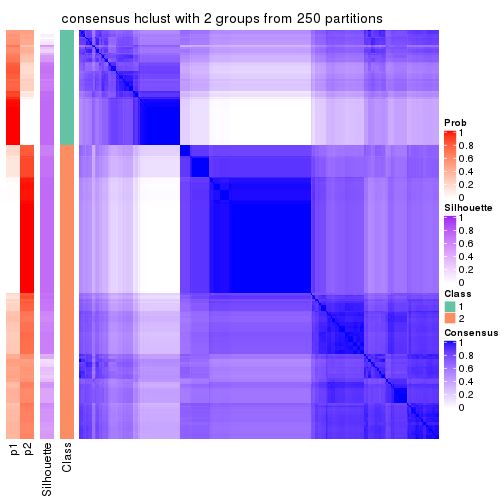</p>

</div>
<div id='tab-SD-hclust-consensus-heatmap-2'>
<pre><code class="r">consensus_heatmap(res, k = 3)
</code></pre>

<p>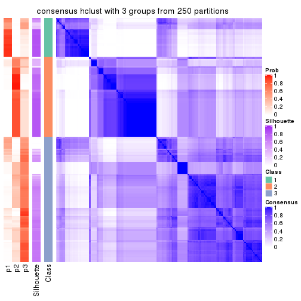</p>

</div>
<div id='tab-SD-hclust-consensus-heatmap-3'>
<pre><code class="r">consensus_heatmap(res, k = 4)
</code></pre>

<p>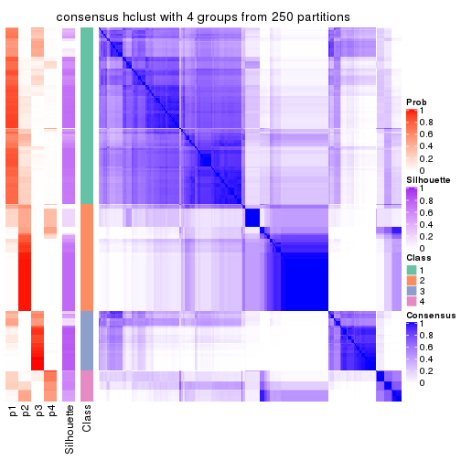</p>

</div>
<div id='tab-SD-hclust-consensus-heatmap-4'>
<pre><code class="r">consensus_heatmap(res, k = 5)
</code></pre>

<p>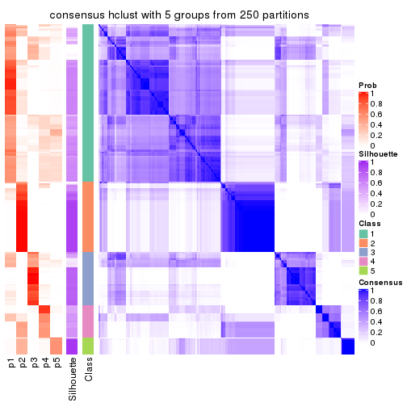</p>

</div>
<div id='tab-SD-hclust-consensus-heatmap-5'>
<pre><code class="r">consensus_heatmap(res, k = 6)
</code></pre>

<p>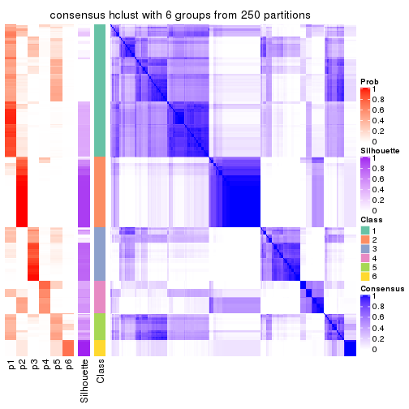</p>

</div>
</div>

Heatmaps for the membership of samples in all partitions to see how consistent they are:


<script>
$( function() {
	$( '#tabs-SD-hclust-membership-heatmap' ).tabs();
} );
</script>
<div id='tabs-SD-hclust-membership-heatmap'>
<ul>
<li><a href='#tab-SD-hclust-membership-heatmap-1'>k = 2</a></li>
<li><a href='#tab-SD-hclust-membership-heatmap-2'>k = 3</a></li>
<li><a href='#tab-SD-hclust-membership-heatmap-3'>k = 4</a></li>
<li><a href='#tab-SD-hclust-membership-heatmap-4'>k = 5</a></li>
<li><a href='#tab-SD-hclust-membership-heatmap-5'>k = 6</a></li>
</ul>
<div id='tab-SD-hclust-membership-heatmap-1'>
<pre><code class="r">membership_heatmap(res, k = 2)
</code></pre>

<p>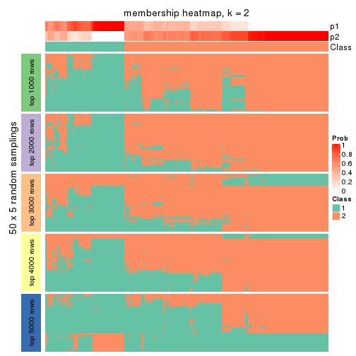</p>

</div>
<div id='tab-SD-hclust-membership-heatmap-2'>
<pre><code class="r">membership_heatmap(res, k = 3)
</code></pre>

<p>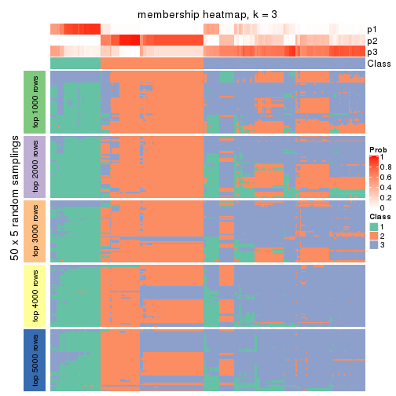</p>

</div>
<div id='tab-SD-hclust-membership-heatmap-3'>
<pre><code class="r">membership_heatmap(res, k = 4)
</code></pre>

<p>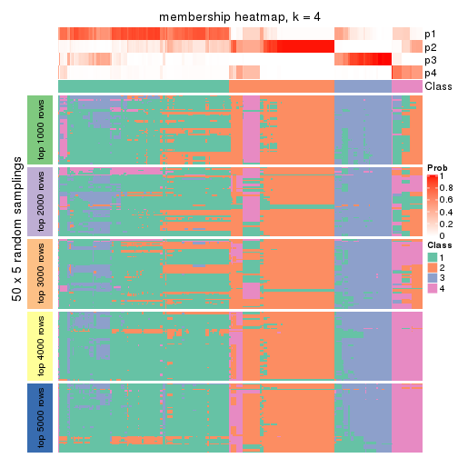</p>

</div>
<div id='tab-SD-hclust-membership-heatmap-4'>
<pre><code class="r">membership_heatmap(res, k = 5)
</code></pre>

<p>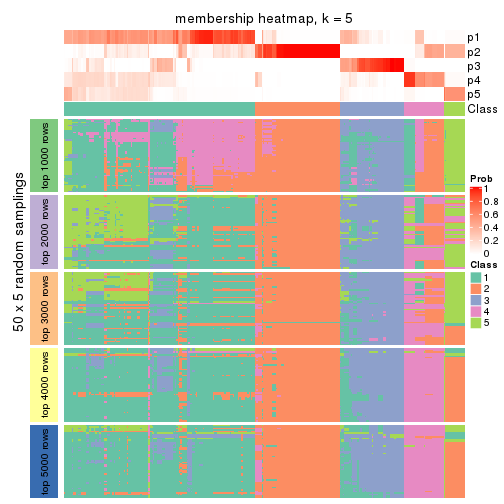</p>

</div>
<div id='tab-SD-hclust-membership-heatmap-5'>
<pre><code class="r">membership_heatmap(res, k = 6)
</code></pre>

<p>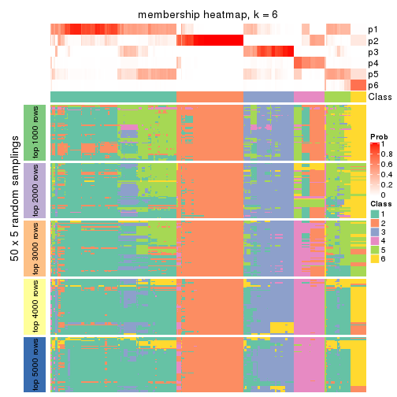</p>

</div>
</div>

As soon as we have had the classes for columns, we can look for signatures
which are significantly different between classes which can be candidate marks
for certain classes. Following are the heatmaps for signatures.


Signature heatmaps where rows are scaled:


<script>
$( function() {
	$( '#tabs-SD-hclust-get-signatures' ).tabs();
} );
</script>
<div id='tabs-SD-hclust-get-signatures'>
<ul>
<li><a href='#tab-SD-hclust-get-signatures-1'>k = 2</a></li>
<li><a href='#tab-SD-hclust-get-signatures-2'>k = 3</a></li>
<li><a href='#tab-SD-hclust-get-signatures-3'>k = 4</a></li>
<li><a href='#tab-SD-hclust-get-signatures-4'>k = 5</a></li>
<li><a href='#tab-SD-hclust-get-signatures-5'>k = 6</a></li>
</ul>
<div id='tab-SD-hclust-get-signatures-1'>
<pre><code class="r">get_signatures(res, k = 2)
</code></pre>

<p>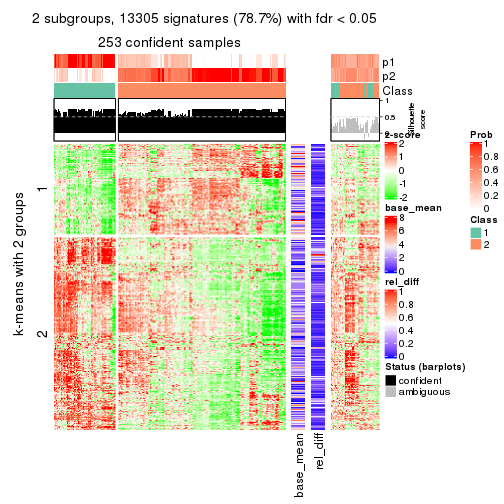</p>

</div>
<div id='tab-SD-hclust-get-signatures-2'>
<pre><code class="r">get_signatures(res, k = 3)
</code></pre>

<p>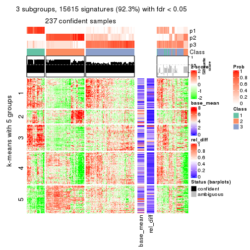</p>

</div>
<div id='tab-SD-hclust-get-signatures-3'>
<pre><code class="r">get_signatures(res, k = 4)
</code></pre>

<p>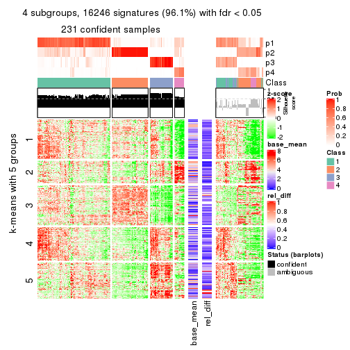</p>

</div>
<div id='tab-SD-hclust-get-signatures-4'>
<pre><code class="r">get_signatures(res, k = 5)
</code></pre>

<p>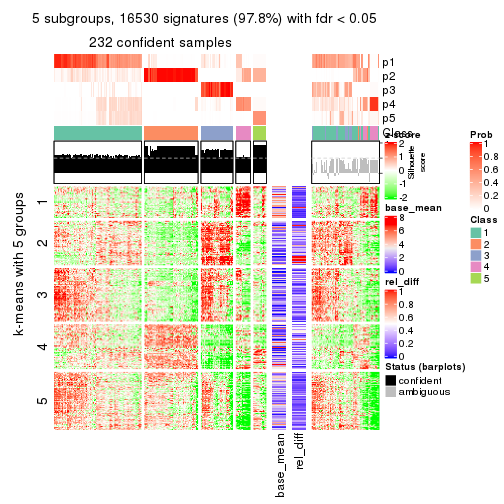</p>

</div>
<div id='tab-SD-hclust-get-signatures-5'>
<pre><code class="r">get_signatures(res, k = 6)
</code></pre>

<p>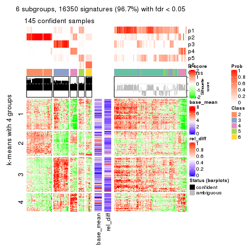</p>

</div>
</div>


Signature heatmaps where rows are not scaled:


<script>
$( function() {
	$( '#tabs-SD-hclust-get-signatures-no-scale' ).tabs();
} );
</script>
<div id='tabs-SD-hclust-get-signatures-no-scale'>
<ul>
<li><a href='#tab-SD-hclust-get-signatures-no-scale-1'>k = 2</a></li>
<li><a href='#tab-SD-hclust-get-signatures-no-scale-2'>k = 3</a></li>
<li><a href='#tab-SD-hclust-get-signatures-no-scale-3'>k = 4</a></li>
<li><a href='#tab-SD-hclust-get-signatures-no-scale-4'>k = 5</a></li>
<li><a href='#tab-SD-hclust-get-signatures-no-scale-5'>k = 6</a></li>
</ul>
<div id='tab-SD-hclust-get-signatures-no-scale-1'>
<pre><code class="r">get_signatures(res, k = 2, scale_rows = FALSE)
</code></pre>

<p>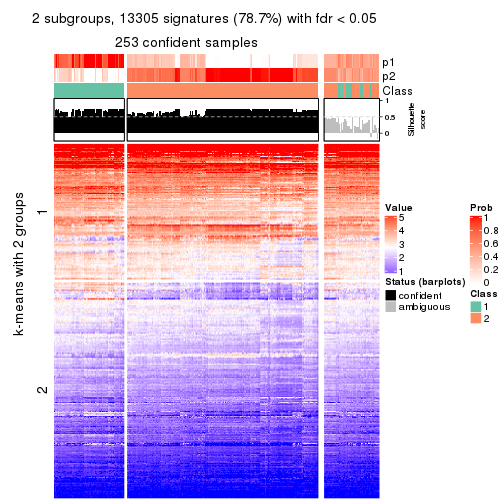</p>

</div>
<div id='tab-SD-hclust-get-signatures-no-scale-2'>
<pre><code class="r">get_signatures(res, k = 3, scale_rows = FALSE)
</code></pre>

<p>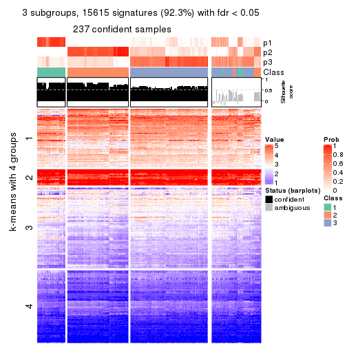</p>

</div>
<div id='tab-SD-hclust-get-signatures-no-scale-3'>
<pre><code class="r">get_signatures(res, k = 4, scale_rows = FALSE)
</code></pre>

<p>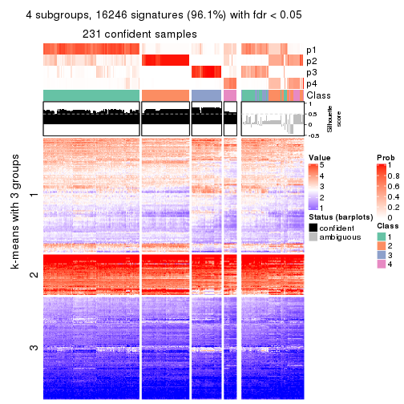</p>

</div>
<div id='tab-SD-hclust-get-signatures-no-scale-4'>
<pre><code class="r">get_signatures(res, k = 5, scale_rows = FALSE)
</code></pre>

<p>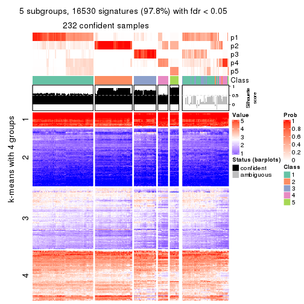</p>

</div>
<div id='tab-SD-hclust-get-signatures-no-scale-5'>
<pre><code class="r">get_signatures(res, k = 6, scale_rows = FALSE)
</code></pre>

<p>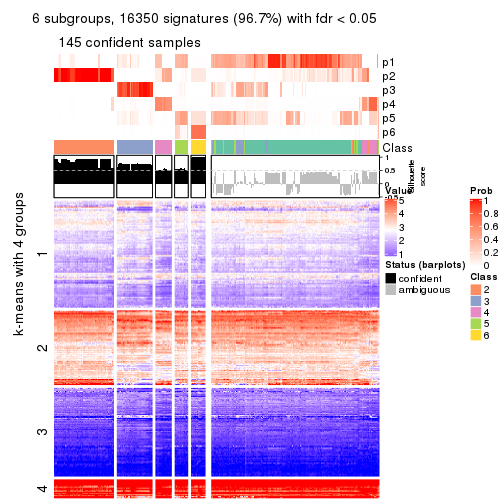</p>

</div>
</div>


Compare the overlap of signatures from different k:

```r
compare_signatures(res)
```

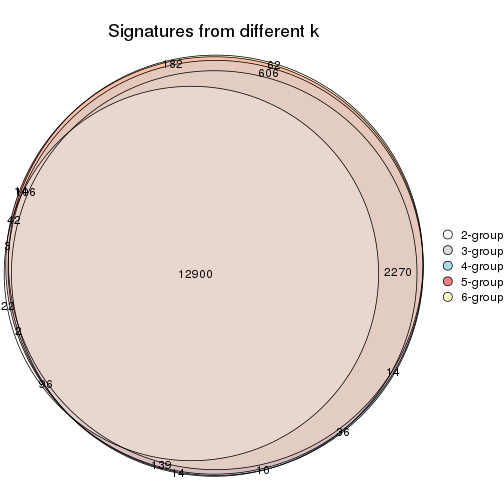

`get_signature()` returns a data frame invisibly. TO get the list of signatures, the function
call should be assigned to a variable explicitly. In following code, if `plot` argument is set
to `FALSE`, no heatmap is plotted while only the differential analysis is performed.

```r
# code only for demonstration
tb = get_signature(res, k = ..., plot = FALSE)
```

An example of the output of `tb` is:

```
#>   which_row         fdr    mean_1    mean_2 scaled_mean_1 scaled_mean_2 km
#> 1        38 0.042760348  8.373488  9.131774    -0.5533452     0.5164555  1
#> 2        40 0.018707592  7.106213  8.469186    -0.6173731     0.5762149  1
#> 3        55 0.019134737 10.221463 11.207825    -0.6159697     0.5749050  1
#> 4        59 0.006059896  5.921854  7.869574    -0.6899429     0.6439467  1
#> 5        60 0.018055526  8.928898 10.211722    -0.6204761     0.5791110  1
#> 6        98 0.009384629 15.714769 14.887706     0.6635654    -0.6193277  2
...
```

The columns in `tb` are:

1. `which_row`: row indices corresponding to the input matrix.
2. `fdr`: FDR for the differential test. 
3. `mean_x`: The mean value in group x.
4. `scaled_mean_x`: The mean value in group x after rows are scaled.
5. `km`: Row groups if k-means clustering is applied to rows.


UMAP plot which shows how samples are separated.


<script>
$( function() {
	$( '#tabs-SD-hclust-dimension-reduction' ).tabs();
} );
</script>
<div id='tabs-SD-hclust-dimension-reduction'>
<ul>
<li><a href='#tab-SD-hclust-dimension-reduction-1'>k = 2</a></li>
<li><a href='#tab-SD-hclust-dimension-reduction-2'>k = 3</a></li>
<li><a href='#tab-SD-hclust-dimension-reduction-3'>k = 4</a></li>
<li><a href='#tab-SD-hclust-dimension-reduction-4'>k = 5</a></li>
<li><a href='#tab-SD-hclust-dimension-reduction-5'>k = 6</a></li>
</ul>
<div id='tab-SD-hclust-dimension-reduction-1'>
<pre><code class="r">dimension_reduction(res, k = 2, method = &quot;UMAP&quot;)
</code></pre>

<p>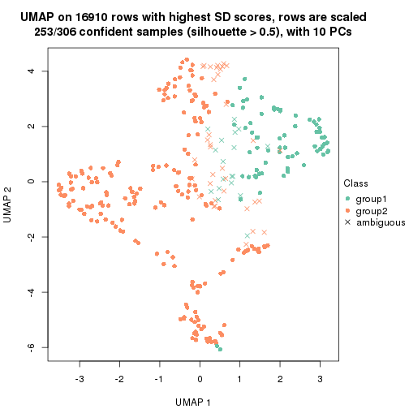</p>

</div>
<div id='tab-SD-hclust-dimension-reduction-2'>
<pre><code class="r">dimension_reduction(res, k = 3, method = &quot;UMAP&quot;)
</code></pre>

<p>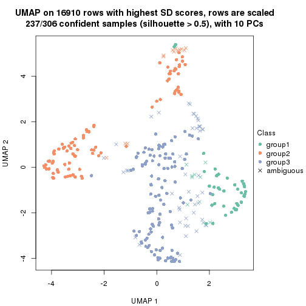</p>

</div>
<div id='tab-SD-hclust-dimension-reduction-3'>
<pre><code class="r">dimension_reduction(res, k = 4, method = &quot;UMAP&quot;)
</code></pre>

<p>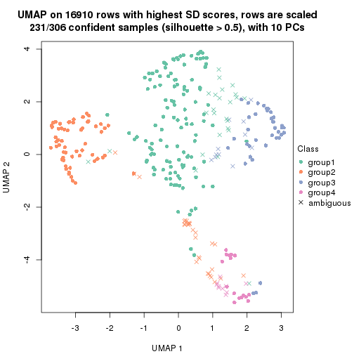</p>

</div>
<div id='tab-SD-hclust-dimension-reduction-4'>
<pre><code class="r">dimension_reduction(res, k = 5, method = &quot;UMAP&quot;)
</code></pre>

<p>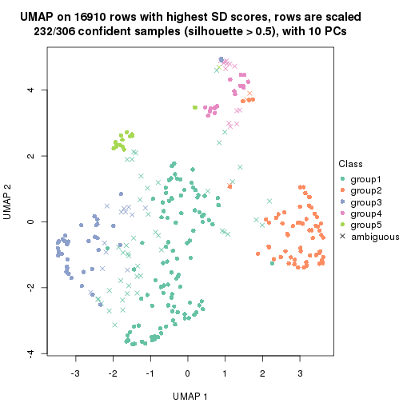</p>

</div>
<div id='tab-SD-hclust-dimension-reduction-5'>
<pre><code class="r">dimension_reduction(res, k = 6, method = &quot;UMAP&quot;)
</code></pre>

<p>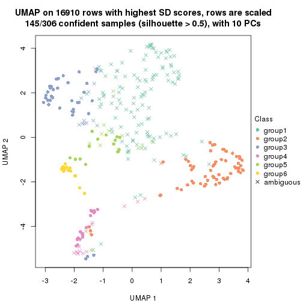</p>

</div>
</div>


Following heatmap shows how subgroups are split when increasing `k`:

```r
collect_classes(res)
```

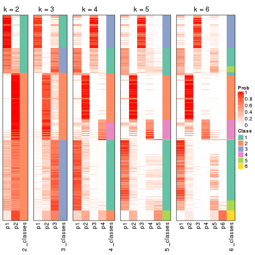


If matrix rows can be associated to genes, consider to use `GO_Enrichment(res,
...)` to perform function enrichment for the signature genes.


 

---------------------------------------------------


### SD:kmeans


The object with results only for a single top-value method and a single partition method 
can be extracted as:

```r
res = res_list["SD", "kmeans"]
# you can also extract it by
# res = res_list["SD:kmeans"]
```

A summary of `res` and all the functions that can be applied to it:

```r
res
```

```
#> A 'ConsensusPartition' object with k = 2, 3, 4, 5, 6.
#>   On a matrix with 16910 rows and 306 columns.
#>   Top rows (1000, 2000, 3000, 4000, 5000) are extracted by 'SD' method.
#>   Subgroups are detected by 'kmeans' method.
#>   Performed in total 1250 partitions by row resampling.
#>   Best k for subgroups seems to be 2.
#> 
#> Following methods can be applied to this 'ConsensusPartition' object:
#>  [1] "cola_report"             "collect_classes"         "collect_plots"          
#>  [4] "collect_stats"           "colnames"                "compare_signatures"     
#>  [7] "consensus_heatmap"       "dimension_reduction"     "functional_enrichment"  
#> [10] "get_anno_col"            "get_anno"                "get_classes"            
#> [13] "get_consensus"           "get_matrix"              "get_membership"         
#> [16] "get_param"               "get_signatures"          "get_stats"              
#> [19] "is_best_k"               "is_stable_k"             "membership_heatmap"     
#> [22] "ncol"                    "nrow"                    "plot_ecdf"              
#> [25] "rownames"                "select_partition_number" "show"                   
#> [28] "suggest_best_k"          "test_to_known_factors"
```

`collect_plots()` function collects all the plots made from `res` for all `k` (number of partitions)
into one single page to provide an easy and fast comparison between different `k`.

```r
collect_plots(res)
```

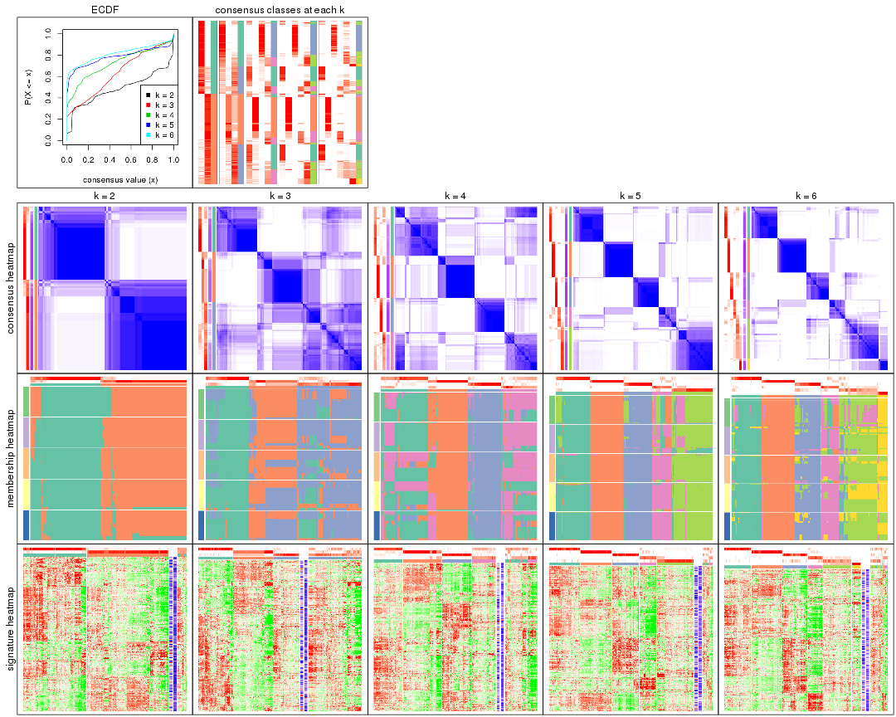

The plots are:

- The first row: a plot of the ECDF (Empirical cumulative distribution
  function) curves of the consensus matrix for each `k` and the heatmap of
  predicted classes for each `k`.
- The second row: heatmaps of the consensus matrix for each `k`.
- The third row: heatmaps of the membership matrix for each `k`.
- The fouth row: heatmaps of the signatures for each `k`.

All the plots in panels can be made by individual functions and they are
plotted later in this section.

`select_partition_number()` produces several plots showing different
statistics for choosing "optimized" `k`. There are following statistics:

- ECDF curves of the consensus matrix for each `k`;
- 1-PAC. [The PAC
  score](https://en.wikipedia.org/wiki/Consensus_clustering#Over-interpretation_potential_of_consensus_clustering)
  measures the proportion of the ambiguous subgrouping.
- Mean silhouette score.
- Concordance. The mean probability of fiting the consensus class ids in all
  partitions.
- Area increased. Denote $A_k$ as the area under the ECDF curve for current
  `k`, the area increased is defined as $A_k - A_{k-1}$.
- Rand index. The percent of pairs of samples that are both in a same cluster
  or both are not in a same cluster in the partition of k and k-1.
- Jaccard index. The ratio of pairs of samples are both in a same cluster in
  the partition of k and k-1 and the pairs of samples are both in a same
  cluster in the partition k or k-1.

The detailed explanations of these statistics can be found in [the cola
vignette](http://bioconductor.org/packages/devel/bioc/vignettes/cola/inst/doc/cola.html#toc_13).

Generally speaking, lower PAC score, higher mean silhouette score or higher
concordance corresponds to better partition. Rand index and Jaccard index
measure how similar the current partition is compared to partition with `k-1`.
If they are too similar, we won't accept `k` is better than `k-1`.

```r
select_partition_number(res)
```

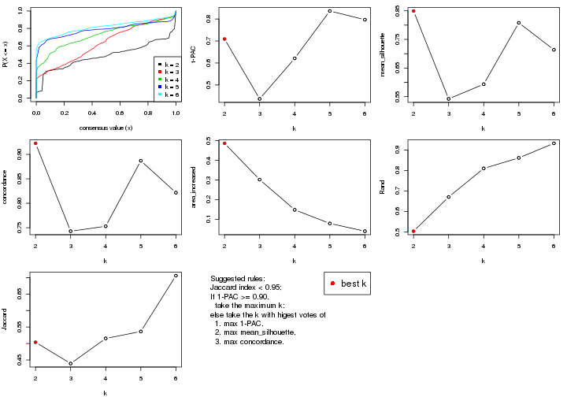

The numeric values for all these statistics can be obtained by `get_stats()`.

```r
get_stats(res)
```

```
#>   k 1-PAC mean_silhouette concordance area_increased  Rand Jaccard
#> 2 2 0.709           0.849       0.923         0.4866 0.504   0.504
#> 3 3 0.437           0.542       0.743         0.3020 0.671   0.439
#> 4 4 0.621           0.594       0.753         0.1483 0.810   0.515
#> 5 5 0.836           0.808       0.887         0.0789 0.861   0.537
#> 6 6 0.797           0.714       0.822         0.0395 0.932   0.706
```

`suggest_best_k()` suggests the best $k$ based on these statistics. The rules are as follows:

- All $k$ with Jaccard index larger than 0.95 are removed because the increase of
  the partition number does not provides enough extra information. If all $k$ are removed,
  the best $k$ is assigned by `NA`.
- For $k$ with 1-PAC larger than 0.9, the maximal $k$ is taken as the "best k". Other $k$ is called "optional k".
- If it does not fit the second rule. The $k$ with the highest vote of highest
  1-PAC, mean silhouette and concordance is taken as the "best k".

```r
suggest_best_k(res)
```

```
#> [1] 2
```


Following shows the table of the partitions (You need to click the **show/hide
code output** link to see it). The membership matrix (columns with name `p*`)
is inferred by
[`clue::cl_consensus()`](https://www.rdocumentation.org/link/cl_consensus?package=clue)
function with the `SE` method. Basically the value in the membership matrix
represents the probability to belong to a certain group. The finall class
label for an item is determined with the group with highest probability it
belongs to.

In `get_classes()` function, the entropy is calculated from the membership
matrix and the silhouette score is calculated from the consensus matrix.


<script>
$( function() {
	$( '#tabs-SD-kmeans-get-classes' ).tabs();
} );
</script>
<div id='tabs-SD-kmeans-get-classes'>
<ul>
<li><a href='#tab-SD-kmeans-get-classes-1'>k = 2</a></li>
<li><a href='#tab-SD-kmeans-get-classes-2'>k = 3</a></li>
<li><a href='#tab-SD-kmeans-get-classes-3'>k = 4</a></li>
<li><a href='#tab-SD-kmeans-get-classes-4'>k = 5</a></li>
<li><a href='#tab-SD-kmeans-get-classes-5'>k = 6</a></li>
</ul>

<div id='tab-SD-kmeans-get-classes-1'>
<p><a id='tab-SD-kmeans-get-classes-1-a' style='color:#0366d6' href='#'>show/hide code output</a></p>
<pre><code class="r">cbind(get_classes(res, k = 2), get_membership(res, k = 2))
</code></pre>

<pre><code>#&gt;            class entropy silhouette    p1    p2
#&gt; SRR1609360     2  0.0000     0.9086 0.000 1.000
#&gt; SRR1609361     2  0.0000     0.9086 0.000 1.000
#&gt; SRR1609362     2  0.0000     0.9086 0.000 1.000
#&gt; SRR1609363     2  0.2603     0.9321 0.044 0.956
#&gt; SRR1609364     2  0.2603     0.9321 0.044 0.956
#&gt; SRR1609365     2  0.0000     0.9086 0.000 1.000
#&gt; SRR1609366     2  0.2603     0.9321 0.044 0.956
#&gt; SRR1609367     1  0.7219     0.7228 0.800 0.200
#&gt; SRR1609368     2  0.2603     0.9321 0.044 0.956
#&gt; SRR1609369     2  0.2603     0.9321 0.044 0.956
#&gt; SRR1609370     1  0.7453     0.7079 0.788 0.212
#&gt; SRR1609371     2  0.0000     0.9086 0.000 1.000
#&gt; SRR1609372     1  0.7453     0.7079 0.788 0.212
#&gt; SRR1609373     2  0.2603     0.9321 0.044 0.956
#&gt; SRR1609374     2  0.2603     0.9321 0.044 0.956
#&gt; SRR1609375     2  0.2603     0.9321 0.044 0.956
#&gt; SRR1609377     2  0.3274     0.9229 0.060 0.940
#&gt; SRR1609376     2  0.2603     0.9321 0.044 0.956
#&gt; SRR1609378     2  0.0000     0.9086 0.000 1.000
#&gt; SRR1609379     2  0.3584     0.9177 0.068 0.932
#&gt; SRR1609382     2  0.0000     0.9086 0.000 1.000
#&gt; SRR1609383     2  0.3431     0.8760 0.064 0.936
#&gt; SRR1609381     1  0.9993     0.0477 0.516 0.484
#&gt; SRR1609384     2  0.2603     0.9321 0.044 0.956
#&gt; SRR1609386     2  0.2603     0.9321 0.044 0.956
#&gt; SRR1609385     2  0.2603     0.9321 0.044 0.956
#&gt; SRR1609387     2  0.9661     0.3887 0.392 0.608
#&gt; SRR1609388     2  0.2603     0.9321 0.044 0.956
#&gt; SRR1609390     1  0.9993     0.0477 0.516 0.484
#&gt; SRR1609393     2  0.0000     0.9086 0.000 1.000
#&gt; SRR1609394     2  0.0000     0.9086 0.000 1.000
#&gt; SRR1609392     2  0.2603     0.9321 0.044 0.956
#&gt; SRR1609391     2  0.0000     0.9086 0.000 1.000
#&gt; SRR1609395     1  0.7453     0.7079 0.788 0.212
#&gt; SRR1609396     1  0.9710     0.3316 0.600 0.400
#&gt; SRR1609398     2  0.2603     0.9321 0.044 0.956
#&gt; SRR1609399     1  0.7453     0.7079 0.788 0.212
#&gt; SRR1609400     1  0.7219     0.7228 0.800 0.200
#&gt; SRR1609397     2  0.2603     0.9321 0.044 0.956
#&gt; SRR1609401     2  0.2603     0.9321 0.044 0.956
#&gt; SRR1609402     2  0.2603     0.9321 0.044 0.956
#&gt; SRR1609405     2  0.2603     0.9321 0.044 0.956
#&gt; SRR1609404     2  0.0000     0.9086 0.000 1.000
#&gt; SRR1609406     2  0.2603     0.9321 0.044 0.956
#&gt; SRR1609408     2  0.2603     0.9321 0.044 0.956
#&gt; SRR1609403     2  0.3584     0.9177 0.068 0.932
#&gt; SRR1609410     2  0.7674     0.7398 0.224 0.776
#&gt; SRR1609411     2  0.2603     0.9321 0.044 0.956
#&gt; SRR1609407     2  0.2603     0.9321 0.044 0.956
#&gt; SRR1609413     2  0.7674     0.7398 0.224 0.776
#&gt; SRR1609412     1  0.0000     0.9216 1.000 0.000
#&gt; SRR1609414     1  0.0000     0.9216 1.000 0.000
#&gt; SRR1609415     1  0.0000     0.9216 1.000 0.000
#&gt; SRR1609416     1  0.0000     0.9216 1.000 0.000
#&gt; SRR1609417     1  0.0000     0.9216 1.000 0.000
#&gt; SRR1609418     2  0.3584     0.9177 0.068 0.932
#&gt; SRR1609419     2  0.2603     0.9321 0.044 0.956
#&gt; SRR1609420     2  0.2603     0.9321 0.044 0.956
#&gt; SRR1609421     2  0.2603     0.9321 0.044 0.956
#&gt; SRR1609422     2  0.8955     0.5237 0.312 0.688
#&gt; SRR1609423     2  0.0000     0.9086 0.000 1.000
#&gt; SRR1609424     2  0.0000     0.9086 0.000 1.000
#&gt; SRR1609425     2  0.2603     0.9321 0.044 0.956
#&gt; SRR1609426     2  0.2603     0.9321 0.044 0.956
#&gt; SRR1609427     1  0.0000     0.9216 1.000 0.000
#&gt; SRR1609428     2  0.2603     0.9321 0.044 0.956
#&gt; SRR1609429     2  0.7056     0.7844 0.192 0.808
#&gt; SRR1609430     1  0.0000     0.9216 1.000 0.000
#&gt; SRR1609431     2  0.8016     0.7260 0.244 0.756
#&gt; SRR1609432     2  0.2603     0.9321 0.044 0.956
#&gt; SRR1609433     1  0.0000     0.9216 1.000 0.000
#&gt; SRR1609434     2  0.0000     0.9086 0.000 1.000
#&gt; SRR1609435     1  0.0000     0.9216 1.000 0.000
#&gt; SRR1609436     1  0.0000     0.9216 1.000 0.000
#&gt; SRR1609437     2  0.2603     0.9321 0.044 0.956
#&gt; SRR1609438     2  0.0000     0.9086 0.000 1.000
#&gt; SRR1609439     1  0.1843     0.8997 0.972 0.028
#&gt; SRR1609440     1  0.7453     0.7079 0.788 0.212
#&gt; SRR1609441     2  0.2603     0.9321 0.044 0.956
#&gt; SRR1609442     2  0.0000     0.9086 0.000 1.000
#&gt; SRR1609443     1  0.0000     0.9216 1.000 0.000
#&gt; SRR1609444     1  0.9944     0.1546 0.544 0.456
#&gt; SRR1609445     1  0.9998    -0.1012 0.508 0.492
#&gt; SRR1609446     2  0.2603     0.9321 0.044 0.956
#&gt; SRR1609447     1  0.0000     0.9216 1.000 0.000
#&gt; SRR1609448     2  0.2603     0.9321 0.044 0.956
#&gt; SRR1609449     1  0.9170     0.4995 0.668 0.332
#&gt; SRR1609450     2  0.2603     0.9321 0.044 0.956
#&gt; SRR1609451     1  0.0000     0.9216 1.000 0.000
#&gt; SRR1609452     2  1.0000     0.1091 0.500 0.500
#&gt; SRR1609453     1  0.0000     0.9216 1.000 0.000
#&gt; SRR1609454     2  0.2603     0.9321 0.044 0.956
#&gt; SRR1609455     2  0.2603     0.9321 0.044 0.956
#&gt; SRR1609456     2  0.2603     0.9321 0.044 0.956
#&gt; SRR1609457     1  0.0000     0.9216 1.000 0.000
#&gt; SRR1609458     1  0.0000     0.9216 1.000 0.000
#&gt; SRR1609459     1  0.0672     0.9160 0.992 0.008
#&gt; SRR1609460     2  0.7883     0.7374 0.236 0.764
#&gt; SRR1609461     1  0.0000     0.9216 1.000 0.000
#&gt; SRR1609462     1  0.0000     0.9216 1.000 0.000
#&gt; SRR1609464     1  0.0000     0.9216 1.000 0.000
#&gt; SRR1609463     1  0.0000     0.9216 1.000 0.000
#&gt; SRR1609465     2  0.7883     0.7374 0.236 0.764
#&gt; SRR1609466     1  0.9460     0.5420 0.636 0.364
#&gt; SRR1609467     1  0.0000     0.9216 1.000 0.000
#&gt; SRR1609469     2  0.0000     0.9086 0.000 1.000
#&gt; SRR1609470     2  0.2603     0.9321 0.044 0.956
#&gt; SRR1609472     1  0.8499     0.6457 0.724 0.276
#&gt; SRR1609471     2  0.3733     0.9148 0.072 0.928
#&gt; SRR1609474     2  0.2603     0.9321 0.044 0.956
#&gt; SRR1609473     2  0.0000     0.9086 0.000 1.000
#&gt; SRR1609475     2  0.0000     0.9086 0.000 1.000
#&gt; SRR1609478     1  0.8713     0.6178 0.708 0.292
#&gt; SRR1609476     1  0.0000     0.9216 1.000 0.000
#&gt; SRR1609477     1  0.0000     0.9216 1.000 0.000
#&gt; SRR1609479     2  0.2603     0.9321 0.044 0.956
#&gt; SRR1609481     2  0.7056     0.7308 0.192 0.808
#&gt; SRR1609480     1  0.1843     0.8997 0.972 0.028
#&gt; SRR1609482     1  0.0000     0.9216 1.000 0.000
#&gt; SRR1609484     2  0.0000     0.9086 0.000 1.000
#&gt; SRR1609483     1  0.0000     0.9216 1.000 0.000
#&gt; SRR1609486     1  0.0000     0.9216 1.000 0.000
#&gt; SRR1609485     1  0.0000     0.9216 1.000 0.000
#&gt; SRR1609487     2  0.3274     0.9229 0.060 0.940
#&gt; SRR1609488     1  0.0000     0.9216 1.000 0.000
#&gt; SRR1609489     2  0.2603     0.9321 0.044 0.956
#&gt; SRR1609490     2  0.2603     0.9321 0.044 0.956
#&gt; SRR1609491     2  0.3584     0.9177 0.068 0.932
#&gt; SRR1609492     2  0.2603     0.9321 0.044 0.956
#&gt; SRR1609493     2  0.8016     0.7260 0.244 0.756
#&gt; SRR1609494     2  0.2603     0.9321 0.044 0.956
#&gt; SRR1609495     1  0.7219     0.7228 0.800 0.200
#&gt; SRR1609496     1  0.0000     0.9216 1.000 0.000
#&gt; SRR1609497     1  0.0000     0.9216 1.000 0.000
#&gt; SRR1609498     1  0.0000     0.9216 1.000 0.000
#&gt; SRR1609499     2  0.2603     0.9321 0.044 0.956
#&gt; SRR1609500     1  0.0000     0.9216 1.000 0.000
#&gt; SRR1609501     2  0.2603     0.9321 0.044 0.956
#&gt; SRR1609502     2  0.2603     0.9321 0.044 0.956
#&gt; SRR1609503     2  0.8555     0.5889 0.280 0.720
#&gt; SRR1609504     1  0.0000     0.9216 1.000 0.000
#&gt; SRR1609505     1  0.0000     0.9216 1.000 0.000
#&gt; SRR1609506     2  0.2603     0.9321 0.044 0.956
#&gt; SRR1609507     1  0.0000     0.9216 1.000 0.000
#&gt; SRR1609508     2  0.2603     0.9321 0.044 0.956
#&gt; SRR1609509     2  0.2603     0.9321 0.044 0.956
#&gt; SRR1609510     2  0.7056     0.7308 0.192 0.808
#&gt; SRR1609512     1  0.0000     0.9216 1.000 0.000
#&gt; SRR1609511     1  0.2603     0.8860 0.956 0.044
#&gt; SRR1609513     1  0.0000     0.9216 1.000 0.000
#&gt; SRR1609514     1  0.6048     0.8162 0.852 0.148
#&gt; SRR1609515     2  0.2603     0.9321 0.044 0.956
#&gt; SRR1609516     1  0.0000     0.9216 1.000 0.000
#&gt; SRR1609517     2  0.2603     0.9321 0.044 0.956
#&gt; SRR1609518     2  0.9460     0.4641 0.364 0.636
#&gt; SRR1609519     1  0.0000     0.9216 1.000 0.000
#&gt; SRR1609520     2  0.0000     0.9086 0.000 1.000
#&gt; SRR1609521     1  0.0000     0.9216 1.000 0.000
#&gt; SRR1609522     1  0.0000     0.9216 1.000 0.000
#&gt; SRR1609523     2  0.8081     0.7204 0.248 0.752
#&gt; SRR1609524     2  0.2603     0.9321 0.044 0.956
#&gt; SRR1609526     1  0.0000     0.9216 1.000 0.000
#&gt; SRR1609525     2  0.2603     0.9321 0.044 0.956
#&gt; SRR1609527     1  0.8608     0.5951 0.716 0.284
#&gt; SRR1609529     1  0.0000     0.9216 1.000 0.000
#&gt; SRR1609528     1  0.9732     0.3679 0.596 0.404
#&gt; SRR1609530     1  0.0000     0.9216 1.000 0.000
#&gt; SRR1609531     2  0.2603     0.9321 0.044 0.956
#&gt; SRR1609532     1  0.0000     0.9216 1.000 0.000
#&gt; SRR1609533     2  0.2603     0.9321 0.044 0.956
#&gt; SRR1609534     1  0.0000     0.9216 1.000 0.000
#&gt; SRR1609535     2  0.7815     0.7376 0.232 0.768
#&gt; SRR1609537     2  0.2603     0.9321 0.044 0.956
#&gt; SRR1609536     1  0.0000     0.9216 1.000 0.000
#&gt; SRR1609538     2  0.2603     0.9321 0.044 0.956
#&gt; SRR1609539     1  0.0000     0.9216 1.000 0.000
#&gt; SRR1609540     1  0.0000     0.9216 1.000 0.000
#&gt; SRR1609541     1  0.6247     0.8083 0.844 0.156
#&gt; SRR1609542     2  0.2603     0.9321 0.044 0.956
#&gt; SRR1609543     1  0.0000     0.9216 1.000 0.000
#&gt; SRR1609544     1  0.0000     0.9216 1.000 0.000
#&gt; SRR1609545     1  0.0000     0.9216 1.000 0.000
#&gt; SRR1609546     1  0.0000     0.9216 1.000 0.000
#&gt; SRR1609547     1  0.0000     0.9216 1.000 0.000
#&gt; SRR1609548     1  0.6148     0.7750 0.848 0.152
#&gt; SRR1609549     2  0.2603     0.9321 0.044 0.956
#&gt; SRR1609550     2  0.2603     0.9321 0.044 0.956
#&gt; SRR1609551     1  0.0000     0.9216 1.000 0.000
#&gt; SRR1609552     1  0.0000     0.9216 1.000 0.000
#&gt; SRR1609553     1  0.0000     0.9216 1.000 0.000
#&gt; SRR1609554     1  0.0000     0.9216 1.000 0.000
#&gt; SRR1609555     1  0.0000     0.9216 1.000 0.000
#&gt; SRR1609556     1  0.0000     0.9216 1.000 0.000
#&gt; SRR1609557     2  0.7453     0.7691 0.212 0.788
#&gt; SRR1609558     1  0.1184     0.9100 0.984 0.016
#&gt; SRR1609559     2  0.9170     0.5762 0.332 0.668
#&gt; SRR1609560     2  0.3274     0.9229 0.060 0.940
#&gt; SRR1609561     1  0.0000     0.9216 1.000 0.000
#&gt; SRR1609562     2  0.2603     0.9321 0.044 0.956
#&gt; SRR1609563     2  0.2603     0.9321 0.044 0.956
#&gt; SRR1609564     1  0.0000     0.9216 1.000 0.000
#&gt; SRR1609565     2  0.2603     0.9321 0.044 0.956
#&gt; SRR1609566     2  0.2603     0.9321 0.044 0.956
#&gt; SRR1609567     2  0.2603     0.9321 0.044 0.956
#&gt; SRR1609568     2  0.3584     0.9177 0.068 0.932
#&gt; SRR1609569     1  0.0000     0.9216 1.000 0.000
#&gt; SRR1609570     1  0.0000     0.9216 1.000 0.000
#&gt; SRR1609571     1  0.2603     0.8860 0.956 0.044
#&gt; SRR1609572     1  0.1843     0.8997 0.972 0.028
#&gt; SRR1609573     1  0.0000     0.9216 1.000 0.000
#&gt; SRR1609574     1  0.0000     0.9216 1.000 0.000
#&gt; SRR1609575     2  0.0000     0.9086 0.000 1.000
#&gt; SRR1609576     2  0.2603     0.9321 0.044 0.956
#&gt; SRR1609578     2  0.3733     0.9148 0.072 0.928
#&gt; SRR1609577     1  0.9970     0.1108 0.532 0.468
#&gt; SRR1609579     1  0.0000     0.9216 1.000 0.000
#&gt; SRR1609580     1  0.0000     0.9216 1.000 0.000
#&gt; SRR1609582     1  0.0000     0.9216 1.000 0.000
#&gt; SRR1609581     2  0.2603     0.9321 0.044 0.956
#&gt; SRR1609583     2  0.9732     0.4255 0.404 0.596
#&gt; SRR1609584     1  0.0000     0.9216 1.000 0.000
#&gt; SRR1609585     1  0.0000     0.9216 1.000 0.000
#&gt; SRR1609586     2  0.2603     0.9321 0.044 0.956
#&gt; SRR1609587     1  0.0000     0.9216 1.000 0.000
#&gt; SRR1609588     2  0.2603     0.9321 0.044 0.956
#&gt; SRR1609589     2  0.2603     0.9321 0.044 0.956
#&gt; SRR1609590     1  0.0000     0.9216 1.000 0.000
#&gt; SRR1609592     2  0.8327     0.6968 0.264 0.736
#&gt; SRR1609591     2  0.9000     0.5784 0.316 0.684
#&gt; SRR1609593     2  0.9881     0.3216 0.436 0.564
#&gt; SRR1609594     2  0.0000     0.9086 0.000 1.000
#&gt; SRR1609595     2  0.8016     0.7260 0.244 0.756
#&gt; SRR1609596     2  0.2603     0.9321 0.044 0.956
#&gt; SRR1609597     2  0.2603     0.9321 0.044 0.956
#&gt; SRR1609598     1  0.6801     0.7815 0.820 0.180
#&gt; SRR1609599     1  0.6247     0.8083 0.844 0.156
#&gt; SRR1609600     1  0.0000     0.9216 1.000 0.000
#&gt; SRR1609601     1  0.6247     0.8083 0.844 0.156
#&gt; SRR1609602     1  0.6247     0.8083 0.844 0.156
#&gt; SRR1609603     2  0.2603     0.9321 0.044 0.956
#&gt; SRR1609604     2  0.0000     0.9086 0.000 1.000
#&gt; SRR1609605     2  0.2603     0.9321 0.044 0.956
#&gt; SRR1609606     2  0.2603     0.9321 0.044 0.956
#&gt; SRR1609607     1  0.0000     0.9216 1.000 0.000
#&gt; SRR1609608     1  0.0000     0.9216 1.000 0.000
#&gt; SRR1609609     2  0.2778     0.9300 0.048 0.952
#&gt; SRR1609610     1  0.0000     0.9216 1.000 0.000
#&gt; SRR1609611     2  0.0000     0.9086 0.000 1.000
#&gt; SRR1609613     2  0.2603     0.9321 0.044 0.956
#&gt; SRR1609612     1  0.0000     0.9216 1.000 0.000
#&gt; SRR1609614     1  0.0000     0.9216 1.000 0.000
#&gt; SRR1609615     2  0.3584     0.9177 0.068 0.932
#&gt; SRR1609616     1  0.0000     0.9216 1.000 0.000
#&gt; SRR1609617     2  0.7815     0.7429 0.232 0.768
#&gt; SRR1609618     1  0.0000     0.9216 1.000 0.000
#&gt; SRR1609619     2  0.4161     0.9052 0.084 0.916
#&gt; SRR1609620     2  0.0000     0.9086 0.000 1.000
#&gt; SRR1609621     2  0.0000     0.9086 0.000 1.000
#&gt; SRR1609622     1  0.0000     0.9216 1.000 0.000
#&gt; SRR1609623     1  0.0000     0.9216 1.000 0.000
#&gt; SRR1609624     2  0.8713     0.6239 0.292 0.708
#&gt; SRR1609625     1  0.8386     0.6231 0.732 0.268
#&gt; SRR1609626     1  0.2236     0.8929 0.964 0.036
#&gt; SRR1609627     2  0.2603     0.9321 0.044 0.956
#&gt; SRR1609628     2  0.2603     0.9321 0.044 0.956
#&gt; SRR1609629     1  0.0000     0.9216 1.000 0.000
#&gt; SRR1609630     2  0.2603     0.9321 0.044 0.956
#&gt; SRR1609631     1  0.9944     0.1549 0.544 0.456
#&gt; SRR1609632     2  0.3584     0.9177 0.068 0.932
#&gt; SRR1609633     1  0.7453     0.7079 0.788 0.212
#&gt; SRR1609634     2  0.2603     0.9321 0.044 0.956
#&gt; SRR1609635     1  0.2603     0.8860 0.956 0.044
#&gt; SRR1609636     2  0.0000     0.9086 0.000 1.000
#&gt; SRR1609637     1  0.0000     0.9216 1.000 0.000
#&gt; SRR1609638     2  0.2603     0.9321 0.044 0.956
#&gt; SRR1609639     2  0.2603     0.9321 0.044 0.956
#&gt; SRR1609640     1  0.0000     0.9216 1.000 0.000
#&gt; SRR1609641     2  0.8386     0.6684 0.268 0.732
#&gt; SRR1609642     1  0.9993     0.0477 0.516 0.484
#&gt; SRR1609643     1  0.0000     0.9216 1.000 0.000
#&gt; SRR1609644     2  0.3274     0.9229 0.060 0.940
#&gt; SRR1609645     1  0.0000     0.9216 1.000 0.000
#&gt; SRR1609646     1  0.0000     0.9216 1.000 0.000
#&gt; SRR1609647     2  0.7883     0.7374 0.236 0.764
#&gt; SRR1609649     1  0.0000     0.9216 1.000 0.000
#&gt; SRR1609648     2  0.2603     0.9321 0.044 0.956
#&gt; SRR1609651     2  0.2603     0.9321 0.044 0.956
#&gt; SRR1609650     2  1.0000     0.1091 0.500 0.500
#&gt; SRR1609652     1  0.0000     0.9216 1.000 0.000
#&gt; SRR1609653     2  0.2603     0.9321 0.044 0.956
#&gt; SRR1609654     2  0.0000     0.9086 0.000 1.000
#&gt; SRR1609655     1  0.0000     0.9216 1.000 0.000
#&gt; SRR1609657     1  0.9710     0.3316 0.600 0.400
#&gt; SRR1609656     2  0.9922     0.0155 0.448 0.552
#&gt; SRR1609658     2  0.2603     0.9321 0.044 0.956
#&gt; SRR1609659     2  0.2603     0.9321 0.044 0.956
#&gt; SRR1609660     1  0.0000     0.9216 1.000 0.000
#&gt; SRR1609661     1  0.0000     0.9216 1.000 0.000
#&gt; SRR1609662     2  0.2603     0.9321 0.044 0.956
#&gt; SRR1609663     1  0.0000     0.9216 1.000 0.000
#&gt; SRR1609664     2  0.8016     0.7260 0.244 0.756
#&gt; SRR1609665     2  0.2603     0.9321 0.044 0.956
#&gt; SRR1609666     2  0.0000     0.9086 0.000 1.000
#&gt; SRR1609667     1  0.0000     0.9216 1.000 0.000
#&gt; SRR1609668     2  0.7219     0.7194 0.200 0.800
#&gt; SRR1609669     2  0.3274     0.9229 0.060 0.940
</code></pre>

<script>
$('#tab-SD-kmeans-get-classes-1-a').parent().next().next().hide();
$('#tab-SD-kmeans-get-classes-1-a').click(function(){
  $('#tab-SD-kmeans-get-classes-1-a').parent().next().next().toggle();
  return(false);
});
</script>
</div>

<div id='tab-SD-kmeans-get-classes-2'>
<p><a id='tab-SD-kmeans-get-classes-2-a' style='color:#0366d6' href='#'>show/hide code output</a></p>
<pre><code class="r">cbind(get_classes(res, k = 3), get_membership(res, k = 3))
</code></pre>

<pre><code>#&gt;            class entropy silhouette    p1    p2    p3
#&gt; SRR1609360     2  0.6299    -0.2566 0.000 0.524 0.476
#&gt; SRR1609361     2  0.6244    -0.2140 0.000 0.560 0.440
#&gt; SRR1609362     2  0.5058     0.2754 0.000 0.756 0.244
#&gt; SRR1609363     2  0.5678     0.7648 0.000 0.684 0.316
#&gt; SRR1609364     2  0.5678     0.7648 0.000 0.684 0.316
#&gt; SRR1609365     2  0.5529     0.1571 0.000 0.704 0.296
#&gt; SRR1609366     2  0.5706     0.7608 0.000 0.680 0.320
#&gt; SRR1609367     3  0.7715     0.1705 0.428 0.048 0.524
#&gt; SRR1609368     2  0.5678     0.7648 0.000 0.684 0.316
#&gt; SRR1609369     3  0.4504     0.4568 0.000 0.196 0.804
#&gt; SRR1609370     3  0.7860     0.2146 0.416 0.056 0.528
#&gt; SRR1609371     2  0.0424     0.5781 0.000 0.992 0.008
#&gt; SRR1609372     3  0.7841     0.2371 0.408 0.056 0.536
#&gt; SRR1609373     2  0.5678     0.7648 0.000 0.684 0.316
#&gt; SRR1609374     2  0.5706     0.7608 0.000 0.680 0.320
#&gt; SRR1609375     2  0.5706     0.7608 0.000 0.680 0.320
#&gt; SRR1609377     3  0.4291     0.4830 0.000 0.180 0.820
#&gt; SRR1609376     2  0.5678     0.7648 0.000 0.684 0.316
#&gt; SRR1609378     2  0.0424     0.5781 0.000 0.992 0.008
#&gt; SRR1609379     3  0.4291     0.4830 0.000 0.180 0.820
#&gt; SRR1609382     2  0.0592     0.5761 0.000 0.988 0.012
#&gt; SRR1609383     3  0.7293     0.3050 0.028 0.476 0.496
#&gt; SRR1609381     3  0.7653     0.5595 0.176 0.140 0.684
#&gt; SRR1609384     2  0.6225     0.6018 0.000 0.568 0.432
#&gt; SRR1609386     3  0.6307    -0.4256 0.000 0.488 0.512
#&gt; SRR1609385     3  0.4504     0.4568 0.000 0.196 0.804
#&gt; SRR1609387     3  0.7562     0.5517 0.148 0.160 0.692
#&gt; SRR1609388     2  0.5678     0.7648 0.000 0.684 0.316
#&gt; SRR1609390     3  0.7603     0.5595 0.172 0.140 0.688
#&gt; SRR1609393     2  0.0424     0.5781 0.000 0.992 0.008
#&gt; SRR1609394     2  0.5621     0.7604 0.000 0.692 0.308
#&gt; SRR1609392     2  0.5678     0.7648 0.000 0.684 0.316
#&gt; SRR1609391     2  0.0237     0.5795 0.000 0.996 0.004
#&gt; SRR1609395     3  0.7860     0.2146 0.416 0.056 0.528
#&gt; SRR1609396     3  0.8080     0.5519 0.232 0.128 0.640
#&gt; SRR1609398     3  0.6308    -0.4338 0.000 0.492 0.508
#&gt; SRR1609399     3  0.7860     0.2146 0.416 0.056 0.528
#&gt; SRR1609400     3  0.7438     0.1594 0.428 0.036 0.536
#&gt; SRR1609397     2  0.5678     0.7648 0.000 0.684 0.316
#&gt; SRR1609401     2  0.5678     0.7648 0.000 0.684 0.316
#&gt; SRR1609402     2  0.5678     0.7648 0.000 0.684 0.316
#&gt; SRR1609405     3  0.6308    -0.4338 0.000 0.492 0.508
#&gt; SRR1609404     2  0.0237     0.5795 0.000 0.996 0.004
#&gt; SRR1609406     2  0.5678     0.7648 0.000 0.684 0.316
#&gt; SRR1609408     2  0.5678     0.7648 0.000 0.684 0.316
#&gt; SRR1609403     3  0.4346     0.4768 0.000 0.184 0.816
#&gt; SRR1609410     3  0.4782     0.4991 0.016 0.164 0.820
#&gt; SRR1609411     2  0.5678     0.7648 0.000 0.684 0.316
#&gt; SRR1609407     2  0.5678     0.7648 0.000 0.684 0.316
#&gt; SRR1609413     3  0.6435     0.5304 0.076 0.168 0.756
#&gt; SRR1609412     3  0.5431     0.3801 0.284 0.000 0.716
#&gt; SRR1609414     1  0.6154     0.3917 0.592 0.000 0.408
#&gt; SRR1609415     3  0.6244     0.0859 0.440 0.000 0.560
#&gt; SRR1609416     1  0.5591     0.5504 0.696 0.000 0.304
#&gt; SRR1609417     1  0.0747     0.8248 0.984 0.000 0.016
#&gt; SRR1609418     3  0.4291     0.4830 0.000 0.180 0.820
#&gt; SRR1609419     2  0.5678     0.7648 0.000 0.684 0.316
#&gt; SRR1609420     3  0.4291     0.4830 0.000 0.180 0.820
#&gt; SRR1609421     3  0.2261     0.5820 0.000 0.068 0.932
#&gt; SRR1609422     2  0.8450    -0.2332 0.088 0.484 0.428
#&gt; SRR1609423     2  0.5810     0.0999 0.000 0.664 0.336
#&gt; SRR1609424     2  0.0424     0.5781 0.000 0.992 0.008
#&gt; SRR1609425     3  0.4291     0.4830 0.000 0.180 0.820
#&gt; SRR1609426     2  0.5678     0.7648 0.000 0.684 0.316
#&gt; SRR1609427     1  0.0000     0.8323 1.000 0.000 0.000
#&gt; SRR1609428     2  0.5678     0.7648 0.000 0.684 0.316
#&gt; SRR1609429     3  0.0592     0.6113 0.000 0.012 0.988
#&gt; SRR1609430     1  0.0000     0.8323 1.000 0.000 0.000
#&gt; SRR1609431     3  0.5780     0.5034 0.080 0.120 0.800
#&gt; SRR1609432     2  0.5835     0.7334 0.000 0.660 0.340
#&gt; SRR1609433     1  0.2711     0.7993 0.912 0.000 0.088
#&gt; SRR1609434     2  0.0424     0.5781 0.000 0.992 0.008
#&gt; SRR1609435     3  0.6244     0.0859 0.440 0.000 0.560
#&gt; SRR1609436     1  0.6026     0.4316 0.624 0.000 0.376
#&gt; SRR1609437     3  0.5363     0.2876 0.000 0.276 0.724
#&gt; SRR1609438     2  0.0424     0.5781 0.000 0.992 0.008
#&gt; SRR1609439     1  0.0000     0.8323 1.000 0.000 0.000
#&gt; SRR1609440     3  0.7860     0.2146 0.416 0.056 0.528
#&gt; SRR1609441     3  0.2261     0.5820 0.000 0.068 0.932
#&gt; SRR1609442     2  0.5621     0.7604 0.000 0.692 0.308
#&gt; SRR1609443     1  0.5529     0.5564 0.704 0.000 0.296
#&gt; SRR1609444     3  0.2866     0.6239 0.076 0.008 0.916
#&gt; SRR1609445     3  0.0892     0.6171 0.020 0.000 0.980
#&gt; SRR1609446     3  0.1411     0.6013 0.000 0.036 0.964
#&gt; SRR1609447     1  0.4346     0.7316 0.816 0.000 0.184
#&gt; SRR1609448     2  0.5678     0.7648 0.000 0.684 0.316
#&gt; SRR1609449     3  0.4629     0.5546 0.188 0.004 0.808
#&gt; SRR1609450     2  0.6079     0.6565 0.000 0.612 0.388
#&gt; SRR1609451     1  0.0000     0.8323 1.000 0.000 0.000
#&gt; SRR1609452     3  0.5020     0.5649 0.108 0.056 0.836
#&gt; SRR1609453     3  0.5760     0.2717 0.328 0.000 0.672
#&gt; SRR1609454     3  0.5926     0.0554 0.000 0.356 0.644
#&gt; SRR1609455     3  0.4121     0.4950 0.000 0.168 0.832
#&gt; SRR1609456     3  0.0592     0.6109 0.000 0.012 0.988
#&gt; SRR1609457     1  0.6286     0.2937 0.536 0.000 0.464
#&gt; SRR1609458     3  0.6252     0.0756 0.444 0.000 0.556
#&gt; SRR1609459     3  0.5560     0.4005 0.300 0.000 0.700
#&gt; SRR1609460     3  0.6850     0.3434 0.072 0.208 0.720
#&gt; SRR1609461     1  0.6215     0.3587 0.572 0.000 0.428
#&gt; SRR1609462     1  0.0000     0.8323 1.000 0.000 0.000
#&gt; SRR1609464     1  0.0000     0.8323 1.000 0.000 0.000
#&gt; SRR1609463     1  0.6500     0.3051 0.532 0.004 0.464
#&gt; SRR1609465     3  0.7065     0.2956 0.072 0.228 0.700
#&gt; SRR1609466     3  0.8291     0.3788 0.100 0.320 0.580
#&gt; SRR1609467     1  0.0000     0.8323 1.000 0.000 0.000
#&gt; SRR1609469     2  0.6252    -0.1323 0.000 0.556 0.444
#&gt; SRR1609470     3  0.0592     0.6109 0.000 0.012 0.988
#&gt; SRR1609472     3  0.9520     0.2293 0.200 0.340 0.460
#&gt; SRR1609471     3  0.1031     0.6074 0.000 0.024 0.976
#&gt; SRR1609474     3  0.5291     0.3309 0.000 0.268 0.732
#&gt; SRR1609473     2  0.3412     0.4779 0.000 0.876 0.124
#&gt; SRR1609475     2  0.0424     0.5781 0.000 0.992 0.008
#&gt; SRR1609478     3  0.9847     0.1295 0.256 0.340 0.404
#&gt; SRR1609476     3  0.6252     0.0742 0.444 0.000 0.556
#&gt; SRR1609477     1  0.6215     0.3657 0.572 0.000 0.428
#&gt; SRR1609479     2  0.5678     0.7648 0.000 0.684 0.316
#&gt; SRR1609481     2  0.8037    -0.0525 0.076 0.572 0.352
#&gt; SRR1609480     3  0.9009    -0.0793 0.404 0.132 0.464
#&gt; SRR1609482     1  0.0000     0.8323 1.000 0.000 0.000
#&gt; SRR1609484     2  0.6295    -0.1705 0.000 0.528 0.472
#&gt; SRR1609483     1  0.0000     0.8323 1.000 0.000 0.000
#&gt; SRR1609486     1  0.0000     0.8323 1.000 0.000 0.000
#&gt; SRR1609485     1  0.0000     0.8323 1.000 0.000 0.000
#&gt; SRR1609487     3  0.4291     0.4830 0.000 0.180 0.820
#&gt; SRR1609488     1  0.4291     0.7308 0.820 0.000 0.180
#&gt; SRR1609489     2  0.5678     0.7648 0.000 0.684 0.316
#&gt; SRR1609490     3  0.4291     0.4830 0.000 0.180 0.820
#&gt; SRR1609491     3  0.0424     0.6118 0.000 0.008 0.992
#&gt; SRR1609492     2  0.5678     0.7648 0.000 0.684 0.316
#&gt; SRR1609493     3  0.5096     0.5463 0.080 0.084 0.836
#&gt; SRR1609494     2  0.5678     0.7648 0.000 0.684 0.316
#&gt; SRR1609495     3  0.5926     0.2605 0.356 0.000 0.644
#&gt; SRR1609496     1  0.0000     0.8323 1.000 0.000 0.000
#&gt; SRR1609497     1  0.2165     0.8106 0.936 0.000 0.064
#&gt; SRR1609498     1  0.3816     0.7610 0.852 0.000 0.148
#&gt; SRR1609499     2  0.5835     0.7334 0.000 0.660 0.340
#&gt; SRR1609500     1  0.5988     0.4502 0.632 0.000 0.368
#&gt; SRR1609501     3  0.1860     0.5927 0.000 0.052 0.948
#&gt; SRR1609502     3  0.5465     0.2911 0.000 0.288 0.712
#&gt; SRR1609503     2  0.8250    -0.1492 0.080 0.528 0.392
#&gt; SRR1609504     3  0.6244     0.0859 0.440 0.000 0.560
#&gt; SRR1609505     1  0.0000     0.8323 1.000 0.000 0.000
#&gt; SRR1609506     2  0.5678     0.7648 0.000 0.684 0.316
#&gt; SRR1609507     1  0.0000     0.8323 1.000 0.000 0.000
#&gt; SRR1609508     2  0.5678     0.7648 0.000 0.684 0.316
#&gt; SRR1609509     2  0.5678     0.7648 0.000 0.684 0.316
#&gt; SRR1609510     2  0.8130    -0.1528 0.072 0.528 0.400
#&gt; SRR1609512     1  0.0000     0.8323 1.000 0.000 0.000
#&gt; SRR1609511     1  0.2998     0.7730 0.916 0.068 0.016
#&gt; SRR1609513     1  0.0000     0.8323 1.000 0.000 0.000
#&gt; SRR1609514     3  0.9880     0.1091 0.268 0.332 0.400
#&gt; SRR1609515     2  0.5678     0.7648 0.000 0.684 0.316
#&gt; SRR1609516     3  0.6026     0.2169 0.376 0.000 0.624
#&gt; SRR1609517     3  0.4504     0.3998 0.000 0.196 0.804
#&gt; SRR1609518     3  0.4830     0.6108 0.084 0.068 0.848
#&gt; SRR1609519     1  0.0000     0.8323 1.000 0.000 0.000
#&gt; SRR1609520     2  0.5678     0.1432 0.000 0.684 0.316
#&gt; SRR1609521     1  0.0000     0.8323 1.000 0.000 0.000
#&gt; SRR1609522     1  0.0000     0.8323 1.000 0.000 0.000
#&gt; SRR1609523     3  0.5181     0.5448 0.084 0.084 0.832
#&gt; SRR1609524     2  0.5678     0.7648 0.000 0.684 0.316
#&gt; SRR1609526     1  0.0000     0.8323 1.000 0.000 0.000
#&gt; SRR1609525     3  0.1860     0.5927 0.000 0.052 0.948
#&gt; SRR1609527     3  0.4974     0.5069 0.236 0.000 0.764
#&gt; SRR1609529     1  0.2165     0.8106 0.936 0.000 0.064
#&gt; SRR1609528     3  0.9766     0.1633 0.236 0.348 0.416
#&gt; SRR1609530     1  0.0000     0.8323 1.000 0.000 0.000
#&gt; SRR1609531     2  0.5678     0.7648 0.000 0.684 0.316
#&gt; SRR1609532     1  0.0000     0.8323 1.000 0.000 0.000
#&gt; SRR1609533     3  0.2537     0.5719 0.000 0.080 0.920
#&gt; SRR1609534     1  0.0000     0.8323 1.000 0.000 0.000
#&gt; SRR1609535     3  0.7558     0.1487 0.072 0.284 0.644
#&gt; SRR1609537     2  0.5678     0.7648 0.000 0.684 0.316
#&gt; SRR1609536     1  0.6280     0.3039 0.540 0.000 0.460
#&gt; SRR1609538     2  0.5733     0.7561 0.000 0.676 0.324
#&gt; SRR1609539     1  0.1643     0.8107 0.956 0.000 0.044
#&gt; SRR1609540     3  0.6026     0.2077 0.376 0.000 0.624
#&gt; SRR1609541     3  0.9997    -0.0278 0.324 0.332 0.344
#&gt; SRR1609542     2  0.5678     0.7648 0.000 0.684 0.316
#&gt; SRR1609543     1  0.0000     0.8323 1.000 0.000 0.000
#&gt; SRR1609544     1  0.5733     0.5140 0.676 0.000 0.324
#&gt; SRR1609545     1  0.0000     0.8323 1.000 0.000 0.000
#&gt; SRR1609546     3  0.6204     0.0405 0.424 0.000 0.576
#&gt; SRR1609547     1  0.4062     0.7416 0.836 0.000 0.164
#&gt; SRR1609548     3  0.3412     0.6020 0.124 0.000 0.876
#&gt; SRR1609549     2  0.5678     0.7648 0.000 0.684 0.316
#&gt; SRR1609550     2  0.5678     0.7648 0.000 0.684 0.316
#&gt; SRR1609551     1  0.6495     0.3131 0.536 0.004 0.460
#&gt; SRR1609552     1  0.0000     0.8323 1.000 0.000 0.000
#&gt; SRR1609553     1  0.3551     0.7717 0.868 0.000 0.132
#&gt; SRR1609554     3  0.1289     0.6193 0.032 0.000 0.968
#&gt; SRR1609555     1  0.6140     0.3980 0.596 0.000 0.404
#&gt; SRR1609556     1  0.0000     0.8323 1.000 0.000 0.000
#&gt; SRR1609557     3  0.1860     0.5927 0.000 0.052 0.948
#&gt; SRR1609558     3  0.1163     0.6183 0.028 0.000 0.972
#&gt; SRR1609559     3  0.3554     0.5838 0.036 0.064 0.900
#&gt; SRR1609560     3  0.4291     0.4830 0.000 0.180 0.820
#&gt; SRR1609561     1  0.0000     0.8323 1.000 0.000 0.000
#&gt; SRR1609562     3  0.4291     0.4830 0.000 0.180 0.820
#&gt; SRR1609563     3  0.4291     0.4830 0.000 0.180 0.820
#&gt; SRR1609564     3  0.6244     0.0859 0.440 0.000 0.560
#&gt; SRR1609565     2  0.5678     0.7648 0.000 0.684 0.316
#&gt; SRR1609566     2  0.5678     0.7648 0.000 0.684 0.316
#&gt; SRR1609567     2  0.5678     0.7648 0.000 0.684 0.316
#&gt; SRR1609568     3  0.4399     0.4703 0.000 0.188 0.812
#&gt; SRR1609569     1  0.0000     0.8323 1.000 0.000 0.000
#&gt; SRR1609570     1  0.0000     0.8323 1.000 0.000 0.000
#&gt; SRR1609571     1  0.3482     0.7218 0.872 0.128 0.000
#&gt; SRR1609572     1  0.2165     0.8106 0.936 0.000 0.064
#&gt; SRR1609573     1  0.0000     0.8323 1.000 0.000 0.000
#&gt; SRR1609574     1  0.0000     0.8323 1.000 0.000 0.000
#&gt; SRR1609575     2  0.0424     0.5781 0.000 0.992 0.008
#&gt; SRR1609576     2  0.5733     0.7561 0.000 0.676 0.324
#&gt; SRR1609578     3  0.0424     0.6118 0.000 0.008 0.992
#&gt; SRR1609577     3  0.7966     0.5632 0.220 0.128 0.652
#&gt; SRR1609579     1  0.0000     0.8323 1.000 0.000 0.000
#&gt; SRR1609580     1  0.6309     0.1978 0.504 0.000 0.496
#&gt; SRR1609582     1  0.3752     0.7619 0.856 0.000 0.144
#&gt; SRR1609581     3  0.0424     0.6118 0.000 0.008 0.992
#&gt; SRR1609583     3  0.0892     0.6171 0.020 0.000 0.980
#&gt; SRR1609584     1  0.0000     0.8323 1.000 0.000 0.000
#&gt; SRR1609585     1  0.0000     0.8323 1.000 0.000 0.000
#&gt; SRR1609586     2  0.5678     0.7648 0.000 0.684 0.316
#&gt; SRR1609587     1  0.5098     0.6613 0.752 0.000 0.248
#&gt; SRR1609588     3  0.0424     0.6118 0.000 0.008 0.992
#&gt; SRR1609589     3  0.0424     0.6118 0.000 0.008 0.992
#&gt; SRR1609590     1  0.0000     0.8323 1.000 0.000 0.000
#&gt; SRR1609592     3  0.3045     0.5915 0.020 0.064 0.916
#&gt; SRR1609591     3  0.0661     0.6131 0.004 0.008 0.988
#&gt; SRR1609593     3  0.5153     0.5522 0.100 0.068 0.832
#&gt; SRR1609594     2  0.0424     0.5781 0.000 0.992 0.008
#&gt; SRR1609595     3  0.5848     0.4978 0.080 0.124 0.796
#&gt; SRR1609596     2  0.5678     0.7648 0.000 0.684 0.316
#&gt; SRR1609597     2  0.5678     0.7648 0.000 0.684 0.316
#&gt; SRR1609598     3  0.9804     0.1466 0.248 0.336 0.416
#&gt; SRR1609599     3  0.9952     0.0531 0.292 0.332 0.376
#&gt; SRR1609600     1  0.0592     0.8292 0.988 0.000 0.012
#&gt; SRR1609601     3  0.9641     0.1802 0.224 0.324 0.452
#&gt; SRR1609602     3  0.9952     0.0531 0.292 0.332 0.376
#&gt; SRR1609603     3  0.4504     0.4568 0.000 0.196 0.804
#&gt; SRR1609604     2  0.0424     0.5818 0.000 0.992 0.008
#&gt; SRR1609605     3  0.2261     0.5820 0.000 0.068 0.932
#&gt; SRR1609606     3  0.3752     0.4962 0.000 0.144 0.856
#&gt; SRR1609607     1  0.3412     0.7673 0.876 0.000 0.124
#&gt; SRR1609608     1  0.6295     0.2712 0.528 0.000 0.472
#&gt; SRR1609609     3  0.0424     0.6118 0.000 0.008 0.992
#&gt; SRR1609610     1  0.6267     0.2783 0.548 0.000 0.452
#&gt; SRR1609611     2  0.0424     0.5781 0.000 0.992 0.008
#&gt; SRR1609613     2  0.5706     0.7608 0.000 0.680 0.320
#&gt; SRR1609612     3  0.6215     0.0334 0.428 0.000 0.572
#&gt; SRR1609614     1  0.2165     0.8106 0.936 0.000 0.064
#&gt; SRR1609615     3  0.2356     0.5782 0.000 0.072 0.928
#&gt; SRR1609616     3  0.5905     0.2666 0.352 0.000 0.648
#&gt; SRR1609617     3  0.3826     0.5321 0.008 0.124 0.868
#&gt; SRR1609618     3  0.5810     0.2576 0.336 0.000 0.664
#&gt; SRR1609619     3  0.0424     0.6118 0.000 0.008 0.992
#&gt; SRR1609620     2  0.0237     0.5795 0.000 0.996 0.004
#&gt; SRR1609621     2  0.5678     0.7648 0.000 0.684 0.316
#&gt; SRR1609622     1  0.0000     0.8323 1.000 0.000 0.000
#&gt; SRR1609623     1  0.1860     0.8157 0.948 0.000 0.052
#&gt; SRR1609624     3  0.6463     0.5363 0.080 0.164 0.756
#&gt; SRR1609625     3  0.4931     0.5100 0.232 0.000 0.768
#&gt; SRR1609626     1  0.0000     0.8323 1.000 0.000 0.000
#&gt; SRR1609627     3  0.4504     0.4568 0.000 0.196 0.804
#&gt; SRR1609628     2  0.5678     0.7648 0.000 0.684 0.316
#&gt; SRR1609629     1  0.6252     0.2870 0.556 0.000 0.444
#&gt; SRR1609630     2  0.5678     0.7648 0.000 0.684 0.316
#&gt; SRR1609631     3  0.5901     0.6017 0.176 0.048 0.776
#&gt; SRR1609632     3  0.4291     0.4830 0.000 0.180 0.820
#&gt; SRR1609633     3  0.7860     0.2146 0.416 0.056 0.528
#&gt; SRR1609634     2  0.5678     0.7648 0.000 0.684 0.316
#&gt; SRR1609635     1  0.4345     0.7039 0.848 0.136 0.016
#&gt; SRR1609636     2  0.0424     0.5781 0.000 0.992 0.008
#&gt; SRR1609637     1  0.5591     0.5601 0.696 0.000 0.304
#&gt; SRR1609638     3  0.4291     0.4830 0.000 0.180 0.820
#&gt; SRR1609639     2  0.5678     0.7648 0.000 0.684 0.316
#&gt; SRR1609640     1  0.0000     0.8323 1.000 0.000 0.000
#&gt; SRR1609641     3  0.6380     0.5348 0.076 0.164 0.760
#&gt; SRR1609642     3  0.7653     0.5595 0.176 0.140 0.684
#&gt; SRR1609643     3  0.4235     0.5575 0.176 0.000 0.824
#&gt; SRR1609644     3  0.4504     0.4568 0.000 0.196 0.804
#&gt; SRR1609645     1  0.6252     0.3426 0.556 0.000 0.444
#&gt; SRR1609646     1  0.0000     0.8323 1.000 0.000 0.000
#&gt; SRR1609647     3  0.7065     0.2956 0.072 0.228 0.700
#&gt; SRR1609649     1  0.2878     0.7960 0.904 0.000 0.096
#&gt; SRR1609648     2  0.5678     0.7648 0.000 0.684 0.316
#&gt; SRR1609651     2  0.6140     0.6312 0.000 0.596 0.404
#&gt; SRR1609650     3  0.5020     0.5649 0.108 0.056 0.836
#&gt; SRR1609652     1  0.0000     0.8323 1.000 0.000 0.000
#&gt; SRR1609653     2  0.5678     0.7648 0.000 0.684 0.316
#&gt; SRR1609654     2  0.6168    -0.0031 0.000 0.588 0.412
#&gt; SRR1609655     1  0.6081     0.5469 0.652 0.004 0.344
#&gt; SRR1609657     3  0.8517     0.4678 0.288 0.128 0.584
#&gt; SRR1609656     3  0.7460     0.3467 0.036 0.440 0.524
#&gt; SRR1609658     2  0.5678     0.7648 0.000 0.684 0.316
#&gt; SRR1609659     2  0.5678     0.7648 0.000 0.684 0.316
#&gt; SRR1609660     1  0.6587     0.3764 0.568 0.008 0.424
#&gt; SRR1609661     3  0.5988     0.1879 0.368 0.000 0.632
#&gt; SRR1609662     2  0.5678     0.7648 0.000 0.684 0.316
#&gt; SRR1609663     1  0.5859     0.5470 0.656 0.000 0.344
#&gt; SRR1609664     3  0.5639     0.5141 0.080 0.112 0.808
#&gt; SRR1609665     2  0.5733     0.7561 0.000 0.676 0.324
#&gt; SRR1609666     2  0.0747     0.5741 0.000 0.984 0.016
#&gt; SRR1609667     1  0.4702     0.7035 0.788 0.000 0.212
#&gt; SRR1609668     2  0.8261    -0.1577 0.080 0.524 0.396
#&gt; SRR1609669     3  0.4399     0.4703 0.000 0.188 0.812
</code></pre>

<script>
$('#tab-SD-kmeans-get-classes-2-a').parent().next().next().hide();
$('#tab-SD-kmeans-get-classes-2-a').click(function(){
  $('#tab-SD-kmeans-get-classes-2-a').parent().next().next().toggle();
  return(false);
});
</script>
</div>

<div id='tab-SD-kmeans-get-classes-3'>
<p><a id='tab-SD-kmeans-get-classes-3-a' style='color:#0366d6' href='#'>show/hide code output</a></p>
<pre><code class="r">cbind(get_classes(res, k = 4), get_membership(res, k = 4))
</code></pre>

<pre><code>#&gt;            class entropy silhouette    p1    p2    p3    p4
#&gt; SRR1609360     1  0.5097     0.2725 0.568 0.004 0.000 0.428
#&gt; SRR1609361     1  0.5039     0.2975 0.592 0.004 0.000 0.404
#&gt; SRR1609362     1  0.7154     0.1610 0.440 0.132 0.000 0.428
#&gt; SRR1609363     2  0.0000     0.9034 0.000 1.000 0.000 0.000
#&gt; SRR1609364     2  0.0000     0.9034 0.000 1.000 0.000 0.000
#&gt; SRR1609365     1  0.6696     0.1994 0.484 0.088 0.000 0.428
#&gt; SRR1609366     2  0.0000     0.9034 0.000 1.000 0.000 0.000
#&gt; SRR1609367     1  0.2921     0.6110 0.860 0.000 0.140 0.000
#&gt; SRR1609368     2  0.0000     0.9034 0.000 1.000 0.000 0.000
#&gt; SRR1609369     1  0.3123     0.6161 0.844 0.156 0.000 0.000
#&gt; SRR1609370     1  0.2921     0.6110 0.860 0.000 0.140 0.000
#&gt; SRR1609371     2  0.5398     0.5762 0.016 0.580 0.000 0.404
#&gt; SRR1609372     1  0.2921     0.6110 0.860 0.000 0.140 0.000
#&gt; SRR1609373     2  0.0000     0.9034 0.000 1.000 0.000 0.000
#&gt; SRR1609374     2  0.0000     0.9034 0.000 1.000 0.000 0.000
#&gt; SRR1609375     2  0.0000     0.9034 0.000 1.000 0.000 0.000
#&gt; SRR1609377     1  0.2921     0.6241 0.860 0.140 0.000 0.000
#&gt; SRR1609376     2  0.0000     0.9034 0.000 1.000 0.000 0.000
#&gt; SRR1609378     2  0.5452     0.5516 0.016 0.556 0.000 0.428
#&gt; SRR1609379     1  0.2921     0.6241 0.860 0.140 0.000 0.000
#&gt; SRR1609382     2  0.5466     0.5408 0.016 0.548 0.000 0.436
#&gt; SRR1609383     1  0.4925     0.2748 0.572 0.000 0.000 0.428
#&gt; SRR1609381     1  0.3621     0.6332 0.860 0.068 0.072 0.000
#&gt; SRR1609384     1  0.4994     0.0683 0.520 0.480 0.000 0.000
#&gt; SRR1609386     1  0.4992     0.0803 0.524 0.476 0.000 0.000
#&gt; SRR1609385     1  0.3157     0.6218 0.852 0.144 0.000 0.004
#&gt; SRR1609387     1  0.3621     0.6332 0.860 0.068 0.072 0.000
#&gt; SRR1609388     2  0.0000     0.9034 0.000 1.000 0.000 0.000
#&gt; SRR1609390     1  0.3621     0.6332 0.860 0.068 0.072 0.000
#&gt; SRR1609393     2  0.5452     0.5516 0.016 0.556 0.000 0.428
#&gt; SRR1609394     2  0.0000     0.9034 0.000 1.000 0.000 0.000
#&gt; SRR1609392     2  0.0000     0.9034 0.000 1.000 0.000 0.000
#&gt; SRR1609391     2  0.5090     0.6473 0.016 0.660 0.000 0.324
#&gt; SRR1609395     1  0.2921     0.6110 0.860 0.000 0.140 0.000
#&gt; SRR1609396     1  0.3617     0.6326 0.860 0.064 0.076 0.000
#&gt; SRR1609398     1  0.4996     0.0568 0.516 0.484 0.000 0.000
#&gt; SRR1609399     1  0.2921     0.6110 0.860 0.000 0.140 0.000
#&gt; SRR1609400     1  0.2921     0.6110 0.860 0.000 0.140 0.000
#&gt; SRR1609397     2  0.0000     0.9034 0.000 1.000 0.000 0.000
#&gt; SRR1609401     2  0.0000     0.9034 0.000 1.000 0.000 0.000
#&gt; SRR1609402     2  0.0000     0.9034 0.000 1.000 0.000 0.000
#&gt; SRR1609405     2  0.4961     0.0941 0.448 0.552 0.000 0.000
#&gt; SRR1609404     2  0.5376     0.5836 0.016 0.588 0.000 0.396
#&gt; SRR1609406     2  0.0000     0.9034 0.000 1.000 0.000 0.000
#&gt; SRR1609408     2  0.0000     0.9034 0.000 1.000 0.000 0.000
#&gt; SRR1609403     1  0.2973     0.6229 0.856 0.144 0.000 0.000
#&gt; SRR1609410     1  0.2921     0.6241 0.860 0.140 0.000 0.000
#&gt; SRR1609411     2  0.0000     0.9034 0.000 1.000 0.000 0.000
#&gt; SRR1609407     2  0.0000     0.9034 0.000 1.000 0.000 0.000
#&gt; SRR1609413     1  0.3771     0.6337 0.856 0.088 0.052 0.004
#&gt; SRR1609412     1  0.6313    -0.4956 0.488 0.004 0.048 0.460
#&gt; SRR1609414     4  0.7626     0.4901 0.336 0.000 0.216 0.448
#&gt; SRR1609415     1  0.5321     0.5215 0.748 0.000 0.140 0.112
#&gt; SRR1609416     1  0.5681     0.2427 0.568 0.000 0.404 0.028
#&gt; SRR1609417     3  0.1767     0.8767 0.044 0.000 0.944 0.012
#&gt; SRR1609418     1  0.2921     0.6241 0.860 0.140 0.000 0.000
#&gt; SRR1609419     2  0.0000     0.9034 0.000 1.000 0.000 0.000
#&gt; SRR1609420     1  0.3157     0.6218 0.852 0.144 0.000 0.004
#&gt; SRR1609421     4  0.6873     0.5454 0.444 0.088 0.004 0.464
#&gt; SRR1609422     4  0.2760     0.5392 0.128 0.000 0.000 0.872
#&gt; SRR1609423     4  0.4144     0.4356 0.104 0.068 0.000 0.828
#&gt; SRR1609424     2  0.5452     0.5516 0.016 0.556 0.000 0.428
#&gt; SRR1609425     1  0.3219     0.6114 0.836 0.164 0.000 0.000
#&gt; SRR1609426     2  0.0000     0.9034 0.000 1.000 0.000 0.000
#&gt; SRR1609427     3  0.0188     0.9154 0.004 0.000 0.996 0.000
#&gt; SRR1609428     2  0.0000     0.9034 0.000 1.000 0.000 0.000
#&gt; SRR1609429     1  0.3659     0.3901 0.840 0.024 0.000 0.136
#&gt; SRR1609430     3  0.0188     0.9154 0.004 0.000 0.996 0.000
#&gt; SRR1609431     4  0.6500     0.5968 0.328 0.092 0.000 0.580
#&gt; SRR1609432     2  0.0000     0.9034 0.000 1.000 0.000 0.000
#&gt; SRR1609433     3  0.4100     0.7675 0.076 0.000 0.832 0.092
#&gt; SRR1609434     2  0.5452     0.5516 0.016 0.556 0.000 0.428
#&gt; SRR1609435     1  0.2921     0.6110 0.860 0.000 0.140 0.000
#&gt; SRR1609436     3  0.7009     0.0406 0.392 0.000 0.488 0.120
#&gt; SRR1609437     1  0.6663    -0.3487 0.556 0.100 0.000 0.344
#&gt; SRR1609438     2  0.5452     0.5516 0.016 0.556 0.000 0.428
#&gt; SRR1609439     3  0.0927     0.8998 0.008 0.000 0.976 0.016
#&gt; SRR1609440     1  0.2921     0.6110 0.860 0.000 0.140 0.000
#&gt; SRR1609441     4  0.6874     0.5409 0.448 0.088 0.004 0.460
#&gt; SRR1609442     2  0.0000     0.9034 0.000 1.000 0.000 0.000
#&gt; SRR1609443     3  0.7899    -0.3677 0.324 0.000 0.372 0.304
#&gt; SRR1609444     1  0.2131     0.5467 0.936 0.008 0.016 0.040
#&gt; SRR1609445     1  0.6442    -0.5122 0.480 0.056 0.004 0.460
#&gt; SRR1609446     1  0.6874    -0.5413 0.456 0.088 0.004 0.452
#&gt; SRR1609447     3  0.5195     0.5645 0.276 0.000 0.692 0.032
#&gt; SRR1609448     2  0.0000     0.9034 0.000 1.000 0.000 0.000
#&gt; SRR1609449     1  0.1637     0.6053 0.940 0.000 0.060 0.000
#&gt; SRR1609450     2  0.0000     0.9034 0.000 1.000 0.000 0.000
#&gt; SRR1609451     3  0.0188     0.9154 0.004 0.000 0.996 0.000
#&gt; SRR1609452     4  0.6873     0.5454 0.444 0.088 0.004 0.464
#&gt; SRR1609453     1  0.5750    -0.4338 0.532 0.000 0.028 0.440
#&gt; SRR1609454     1  0.7883    -0.3610 0.376 0.288 0.000 0.336
#&gt; SRR1609455     1  0.2647     0.6222 0.880 0.120 0.000 0.000
#&gt; SRR1609456     4  0.6874     0.5409 0.448 0.088 0.004 0.460
#&gt; SRR1609457     4  0.7236     0.5500 0.396 0.000 0.144 0.460
#&gt; SRR1609458     1  0.5266     0.5264 0.752 0.000 0.140 0.108
#&gt; SRR1609459     4  0.8199     0.5857 0.360 0.072 0.096 0.472
#&gt; SRR1609460     4  0.7001     0.5303 0.196 0.224 0.000 0.580
#&gt; SRR1609461     4  0.7236     0.5500 0.396 0.000 0.144 0.460
#&gt; SRR1609462     3  0.0188     0.9154 0.004 0.000 0.996 0.000
#&gt; SRR1609464     3  0.0000     0.9147 0.000 0.000 1.000 0.000
#&gt; SRR1609463     4  0.6549     0.5798 0.356 0.000 0.088 0.556
#&gt; SRR1609465     4  0.6976     0.5191 0.180 0.240 0.000 0.580
#&gt; SRR1609466     4  0.5408    -0.1833 0.488 0.000 0.012 0.500
#&gt; SRR1609467     3  0.0188     0.9154 0.004 0.000 0.996 0.000
#&gt; SRR1609469     4  0.2928     0.4775 0.108 0.012 0.000 0.880
#&gt; SRR1609470     4  0.6874     0.5409 0.448 0.088 0.004 0.460
#&gt; SRR1609472     4  0.2530     0.4932 0.100 0.000 0.004 0.896
#&gt; SRR1609471     1  0.0817     0.5805 0.976 0.024 0.000 0.000
#&gt; SRR1609474     2  0.3810     0.6603 0.188 0.804 0.000 0.008
#&gt; SRR1609473     4  0.5599    -0.0277 0.040 0.316 0.000 0.644
#&gt; SRR1609475     2  0.5452     0.5516 0.016 0.556 0.000 0.428
#&gt; SRR1609478     4  0.2805     0.4898 0.100 0.000 0.012 0.888
#&gt; SRR1609476     1  0.2921     0.6110 0.860 0.000 0.140 0.000
#&gt; SRR1609477     4  0.7026     0.5653 0.404 0.000 0.120 0.476
#&gt; SRR1609479     2  0.0000     0.9034 0.000 1.000 0.000 0.000
#&gt; SRR1609481     4  0.0336     0.4852 0.008 0.000 0.000 0.992
#&gt; SRR1609480     4  0.6068     0.5508 0.448 0.000 0.044 0.508
#&gt; SRR1609482     3  0.0000     0.9147 0.000 0.000 1.000 0.000
#&gt; SRR1609484     4  0.3853     0.5149 0.160 0.020 0.000 0.820
#&gt; SRR1609483     3  0.0000     0.9147 0.000 0.000 1.000 0.000
#&gt; SRR1609486     3  0.0000     0.9147 0.000 0.000 1.000 0.000
#&gt; SRR1609485     3  0.0000     0.9147 0.000 0.000 1.000 0.000
#&gt; SRR1609487     1  0.2973     0.6229 0.856 0.144 0.000 0.000
#&gt; SRR1609488     3  0.5052     0.5682 0.244 0.000 0.720 0.036
#&gt; SRR1609489     2  0.0000     0.9034 0.000 1.000 0.000 0.000
#&gt; SRR1609490     1  0.3356     0.6012 0.824 0.176 0.000 0.000
#&gt; SRR1609491     1  0.6618    -0.5275 0.468 0.068 0.004 0.460
#&gt; SRR1609492     2  0.0000     0.9034 0.000 1.000 0.000 0.000
#&gt; SRR1609493     4  0.6462     0.5968 0.332 0.088 0.000 0.580
#&gt; SRR1609494     2  0.0000     0.9034 0.000 1.000 0.000 0.000
#&gt; SRR1609495     1  0.2868     0.6119 0.864 0.000 0.136 0.000
#&gt; SRR1609496     3  0.0188     0.9154 0.004 0.000 0.996 0.000
#&gt; SRR1609497     3  0.1209     0.8962 0.004 0.000 0.964 0.032
#&gt; SRR1609498     3  0.3653     0.7856 0.128 0.000 0.844 0.028
#&gt; SRR1609499     2  0.0000     0.9034 0.000 1.000 0.000 0.000
#&gt; SRR1609500     3  0.6932     0.0454 0.396 0.000 0.492 0.112
#&gt; SRR1609501     4  0.6874     0.5409 0.448 0.088 0.004 0.460
#&gt; SRR1609502     1  0.7344     0.1799 0.504 0.316 0.000 0.180
#&gt; SRR1609503     4  0.0804     0.4794 0.012 0.008 0.000 0.980
#&gt; SRR1609504     1  0.3999     0.5939 0.824 0.000 0.140 0.036
#&gt; SRR1609505     3  0.0188     0.9154 0.004 0.000 0.996 0.000
#&gt; SRR1609506     2  0.0000     0.9034 0.000 1.000 0.000 0.000
#&gt; SRR1609507     3  0.0188     0.9154 0.004 0.000 0.996 0.000
#&gt; SRR1609508     2  0.0000     0.9034 0.000 1.000 0.000 0.000
#&gt; SRR1609509     2  0.0000     0.9034 0.000 1.000 0.000 0.000
#&gt; SRR1609510     4  0.2976     0.5409 0.120 0.008 0.000 0.872
#&gt; SRR1609512     3  0.0188     0.9154 0.004 0.000 0.996 0.000
#&gt; SRR1609511     3  0.2313     0.8638 0.044 0.000 0.924 0.032
#&gt; SRR1609513     3  0.0188     0.9154 0.004 0.000 0.996 0.000
#&gt; SRR1609514     4  0.2805     0.4898 0.100 0.000 0.012 0.888
#&gt; SRR1609515     2  0.0000     0.9034 0.000 1.000 0.000 0.000
#&gt; SRR1609516     4  0.7961     0.5758 0.360 0.032 0.136 0.472
#&gt; SRR1609517     4  0.7203     0.5705 0.384 0.124 0.004 0.488
#&gt; SRR1609518     1  0.1807     0.6067 0.940 0.008 0.052 0.000
#&gt; SRR1609519     3  0.0000     0.9147 0.000 0.000 1.000 0.000
#&gt; SRR1609520     4  0.4786     0.3973 0.104 0.108 0.000 0.788
#&gt; SRR1609521     3  0.0188     0.9154 0.004 0.000 0.996 0.000
#&gt; SRR1609522     3  0.0000     0.9147 0.000 0.000 1.000 0.000
#&gt; SRR1609523     4  0.6462     0.5968 0.332 0.088 0.000 0.580
#&gt; SRR1609524     2  0.0000     0.9034 0.000 1.000 0.000 0.000
#&gt; SRR1609526     3  0.0000     0.9147 0.000 0.000 1.000 0.000
#&gt; SRR1609525     4  0.6874     0.5409 0.448 0.088 0.004 0.460
#&gt; SRR1609527     1  0.1867     0.6096 0.928 0.000 0.072 0.000
#&gt; SRR1609529     3  0.1576     0.8812 0.004 0.000 0.948 0.048
#&gt; SRR1609528     4  0.2530     0.4932 0.100 0.000 0.004 0.896
#&gt; SRR1609530     3  0.0000     0.9147 0.000 0.000 1.000 0.000
#&gt; SRR1609531     2  0.0000     0.9034 0.000 1.000 0.000 0.000
#&gt; SRR1609532     3  0.0000     0.9147 0.000 0.000 1.000 0.000
#&gt; SRR1609533     4  0.6873     0.5454 0.444 0.088 0.004 0.464
#&gt; SRR1609534     3  0.1118     0.8877 0.036 0.000 0.964 0.000
#&gt; SRR1609535     4  0.6681     0.4758 0.120 0.292 0.000 0.588
#&gt; SRR1609537     2  0.0000     0.9034 0.000 1.000 0.000 0.000
#&gt; SRR1609536     4  0.7264     0.5507 0.392 0.000 0.148 0.460
#&gt; SRR1609538     2  0.0000     0.9034 0.000 1.000 0.000 0.000
#&gt; SRR1609539     3  0.4784     0.6789 0.112 0.000 0.788 0.100
#&gt; SRR1609540     1  0.2450     0.6004 0.912 0.000 0.072 0.016
#&gt; SRR1609541     4  0.2741     0.4729 0.012 0.000 0.096 0.892
#&gt; SRR1609542     2  0.0000     0.9034 0.000 1.000 0.000 0.000
#&gt; SRR1609543     3  0.0188     0.9154 0.004 0.000 0.996 0.000
#&gt; SRR1609544     1  0.4888     0.2363 0.588 0.000 0.412 0.000
#&gt; SRR1609545     3  0.0188     0.9154 0.004 0.000 0.996 0.000
#&gt; SRR1609546     4  0.6755     0.5222 0.448 0.000 0.092 0.460
#&gt; SRR1609547     4  0.7040     0.3061 0.120 0.000 0.420 0.460
#&gt; SRR1609548     4  0.6873     0.5454 0.444 0.088 0.004 0.464
#&gt; SRR1609549     2  0.0000     0.9034 0.000 1.000 0.000 0.000
#&gt; SRR1609550     2  0.0000     0.9034 0.000 1.000 0.000 0.000
#&gt; SRR1609551     4  0.6494     0.5865 0.340 0.000 0.088 0.572
#&gt; SRR1609552     3  0.0000     0.9147 0.000 0.000 1.000 0.000
#&gt; SRR1609553     3  0.4100     0.7645 0.076 0.000 0.832 0.092
#&gt; SRR1609554     1  0.6618    -0.5275 0.468 0.068 0.004 0.460
#&gt; SRR1609555     4  0.7702     0.4499 0.360 0.000 0.224 0.416
#&gt; SRR1609556     3  0.0188     0.9154 0.004 0.000 0.996 0.000
#&gt; SRR1609557     4  0.6873     0.5454 0.444 0.088 0.004 0.464
#&gt; SRR1609558     1  0.6618    -0.5275 0.468 0.068 0.004 0.460
#&gt; SRR1609559     4  0.6856     0.5636 0.420 0.088 0.004 0.488
#&gt; SRR1609560     1  0.2921     0.6241 0.860 0.140 0.000 0.000
#&gt; SRR1609561     3  0.0000     0.9147 0.000 0.000 1.000 0.000
#&gt; SRR1609562     1  0.3024     0.6207 0.852 0.148 0.000 0.000
#&gt; SRR1609563     1  0.4914     0.5388 0.748 0.208 0.000 0.044
#&gt; SRR1609564     1  0.3907     0.5963 0.828 0.000 0.140 0.032
#&gt; SRR1609565     2  0.0000     0.9034 0.000 1.000 0.000 0.000
#&gt; SRR1609566     2  0.0000     0.9034 0.000 1.000 0.000 0.000
#&gt; SRR1609567     2  0.0000     0.9034 0.000 1.000 0.000 0.000
#&gt; SRR1609568     1  0.2973     0.6229 0.856 0.144 0.000 0.000
#&gt; SRR1609569     3  0.0188     0.9154 0.004 0.000 0.996 0.000
#&gt; SRR1609570     3  0.0000     0.9147 0.000 0.000 1.000 0.000
#&gt; SRR1609571     3  0.1807     0.8714 0.008 0.000 0.940 0.052
#&gt; SRR1609572     3  0.1722     0.8882 0.008 0.000 0.944 0.048
#&gt; SRR1609573     3  0.0188     0.9154 0.004 0.000 0.996 0.000
#&gt; SRR1609574     3  0.0188     0.9154 0.004 0.000 0.996 0.000
#&gt; SRR1609575     2  0.5398     0.5762 0.016 0.580 0.000 0.404
#&gt; SRR1609576     2  0.0000     0.9034 0.000 1.000 0.000 0.000
#&gt; SRR1609578     1  0.6442    -0.5122 0.480 0.056 0.004 0.460
#&gt; SRR1609577     1  0.2198     0.6149 0.920 0.008 0.072 0.000
#&gt; SRR1609579     3  0.0188     0.9154 0.004 0.000 0.996 0.000
#&gt; SRR1609580     4  0.6843     0.5285 0.440 0.000 0.100 0.460
#&gt; SRR1609582     3  0.3224     0.8050 0.120 0.000 0.864 0.016
#&gt; SRR1609581     1  0.6421    -0.4692 0.508 0.056 0.004 0.432
#&gt; SRR1609583     1  0.6442    -0.5122 0.480 0.056 0.004 0.460
#&gt; SRR1609584     3  0.0188     0.9154 0.004 0.000 0.996 0.000
#&gt; SRR1609585     3  0.0188     0.9154 0.004 0.000 0.996 0.000
#&gt; SRR1609586     2  0.0000     0.9034 0.000 1.000 0.000 0.000
#&gt; SRR1609587     4  0.7607     0.5338 0.292 0.000 0.236 0.472
#&gt; SRR1609588     1  0.6421    -0.4692 0.508 0.056 0.004 0.432
#&gt; SRR1609589     1  0.6484    -0.4747 0.504 0.060 0.004 0.432
#&gt; SRR1609590     3  0.0188     0.9154 0.004 0.000 0.996 0.000
#&gt; SRR1609592     4  0.6873     0.5454 0.444 0.088 0.004 0.464
#&gt; SRR1609591     1  0.5871    -0.3955 0.556 0.028 0.004 0.412
#&gt; SRR1609593     4  0.6462     0.5968 0.332 0.088 0.000 0.580
#&gt; SRR1609594     2  0.5452     0.5516 0.016 0.556 0.000 0.428
#&gt; SRR1609595     4  0.6500     0.5968 0.328 0.092 0.000 0.580
#&gt; SRR1609596     2  0.0000     0.9034 0.000 1.000 0.000 0.000
#&gt; SRR1609597     2  0.0000     0.9034 0.000 1.000 0.000 0.000
#&gt; SRR1609598     4  0.2805     0.4898 0.100 0.000 0.012 0.888
#&gt; SRR1609599     4  0.3088     0.4897 0.060 0.000 0.052 0.888
#&gt; SRR1609600     3  0.0188     0.9154 0.004 0.000 0.996 0.000
#&gt; SRR1609601     4  0.0592     0.4862 0.016 0.000 0.000 0.984
#&gt; SRR1609602     4  0.3081     0.4872 0.048 0.000 0.064 0.888
#&gt; SRR1609603     1  0.3074     0.6187 0.848 0.152 0.000 0.000
#&gt; SRR1609604     2  0.5110     0.6443 0.016 0.656 0.000 0.328
#&gt; SRR1609605     4  0.6874     0.5409 0.448 0.088 0.004 0.460
#&gt; SRR1609606     4  0.7351     0.5675 0.364 0.144 0.004 0.488
#&gt; SRR1609607     3  0.6595     0.2753 0.120 0.000 0.604 0.276
#&gt; SRR1609608     4  0.7202     0.5522 0.396 0.000 0.140 0.464
#&gt; SRR1609609     4  0.6874     0.5409 0.448 0.088 0.004 0.460
#&gt; SRR1609610     4  0.7252     0.4443 0.420 0.000 0.144 0.436
#&gt; SRR1609611     2  0.5387     0.5799 0.016 0.584 0.000 0.400
#&gt; SRR1609613     2  0.0000     0.9034 0.000 1.000 0.000 0.000
#&gt; SRR1609612     1  0.6323    -0.4728 0.500 0.000 0.060 0.440
#&gt; SRR1609614     3  0.2036     0.8765 0.032 0.000 0.936 0.032
#&gt; SRR1609615     1  0.0817     0.5805 0.976 0.024 0.000 0.000
#&gt; SRR1609616     1  0.2965     0.5841 0.892 0.000 0.072 0.036
#&gt; SRR1609617     4  0.6500     0.5968 0.328 0.092 0.000 0.580
#&gt; SRR1609618     1  0.6506    -0.5156 0.468 0.000 0.072 0.460
#&gt; SRR1609619     1  0.1004     0.5778 0.972 0.024 0.004 0.000
#&gt; SRR1609620     2  0.4748     0.6930 0.016 0.716 0.000 0.268
#&gt; SRR1609621     2  0.0000     0.9034 0.000 1.000 0.000 0.000
#&gt; SRR1609622     3  0.0804     0.9026 0.008 0.000 0.980 0.012
#&gt; SRR1609623     3  0.0188     0.9154 0.004 0.000 0.996 0.000
#&gt; SRR1609624     1  0.3587     0.6339 0.860 0.088 0.052 0.000
#&gt; SRR1609625     1  0.1867     0.6096 0.928 0.000 0.072 0.000
#&gt; SRR1609626     3  0.0927     0.8998 0.008 0.000 0.976 0.016
#&gt; SRR1609627     1  0.3123     0.6161 0.844 0.156 0.000 0.000
#&gt; SRR1609628     2  0.0000     0.9034 0.000 1.000 0.000 0.000
#&gt; SRR1609629     1  0.7369    -0.4196 0.432 0.000 0.160 0.408
#&gt; SRR1609630     2  0.0000     0.9034 0.000 1.000 0.000 0.000
#&gt; SRR1609631     1  0.1867     0.6096 0.928 0.000 0.072 0.000
#&gt; SRR1609632     1  0.2921     0.6241 0.860 0.140 0.000 0.000
#&gt; SRR1609633     1  0.2921     0.6110 0.860 0.000 0.140 0.000
#&gt; SRR1609634     2  0.0000     0.9034 0.000 1.000 0.000 0.000
#&gt; SRR1609635     3  0.2737     0.8274 0.008 0.000 0.888 0.104
#&gt; SRR1609636     2  0.5398     0.5762 0.016 0.580 0.000 0.404
#&gt; SRR1609637     1  0.4679     0.3439 0.648 0.000 0.352 0.000
#&gt; SRR1609638     1  0.3356     0.6012 0.824 0.176 0.000 0.000
#&gt; SRR1609639     2  0.0000     0.9034 0.000 1.000 0.000 0.000
#&gt; SRR1609640     3  0.0188     0.9154 0.004 0.000 0.996 0.000
#&gt; SRR1609641     1  0.3587     0.6339 0.860 0.088 0.052 0.000
#&gt; SRR1609642     1  0.3621     0.6332 0.860 0.068 0.072 0.000
#&gt; SRR1609643     1  0.6006    -0.4746 0.508 0.012 0.020 0.460
#&gt; SRR1609644     1  0.3074     0.6187 0.848 0.152 0.000 0.000
#&gt; SRR1609645     4  0.7436     0.5500 0.364 0.000 0.176 0.460
#&gt; SRR1609646     3  0.0188     0.9154 0.004 0.000 0.996 0.000
#&gt; SRR1609647     4  0.6950     0.5216 0.180 0.236 0.000 0.584
#&gt; SRR1609649     3  0.3051     0.8311 0.088 0.000 0.884 0.028
#&gt; SRR1609648     2  0.0000     0.9034 0.000 1.000 0.000 0.000
#&gt; SRR1609651     2  0.0000     0.9034 0.000 1.000 0.000 0.000
#&gt; SRR1609650     4  0.6873     0.5454 0.444 0.088 0.004 0.464
#&gt; SRR1609652     3  0.0188     0.9154 0.004 0.000 0.996 0.000
#&gt; SRR1609653     2  0.0000     0.9034 0.000 1.000 0.000 0.000
#&gt; SRR1609654     4  0.6262    -0.0485 0.400 0.060 0.000 0.540
#&gt; SRR1609655     4  0.6852     0.5788 0.320 0.000 0.124 0.556
#&gt; SRR1609657     1  0.3052     0.6130 0.860 0.004 0.136 0.000
#&gt; SRR1609656     1  0.4877     0.2957 0.592 0.000 0.000 0.408
#&gt; SRR1609658     2  0.0000     0.9034 0.000 1.000 0.000 0.000
#&gt; SRR1609659     2  0.0000     0.9034 0.000 1.000 0.000 0.000
#&gt; SRR1609660     4  0.6187     0.5943 0.336 0.000 0.068 0.596
#&gt; SRR1609661     1  0.6197    -0.4633 0.508 0.000 0.052 0.440
#&gt; SRR1609662     2  0.0000     0.9034 0.000 1.000 0.000 0.000
#&gt; SRR1609663     4  0.7573     0.5428 0.332 0.000 0.208 0.460
#&gt; SRR1609664     4  0.6500     0.5968 0.328 0.092 0.000 0.580
#&gt; SRR1609665     2  0.0000     0.9034 0.000 1.000 0.000 0.000
#&gt; SRR1609666     4  0.7621    -0.1394 0.376 0.204 0.000 0.420
#&gt; SRR1609667     3  0.5511     0.4505 0.332 0.000 0.636 0.032
#&gt; SRR1609668     4  0.0188     0.4827 0.004 0.000 0.000 0.996
#&gt; SRR1609669     1  0.2973     0.6229 0.856 0.144 0.000 0.000
</code></pre>

<script>
$('#tab-SD-kmeans-get-classes-3-a').parent().next().next().hide();
$('#tab-SD-kmeans-get-classes-3-a').click(function(){
  $('#tab-SD-kmeans-get-classes-3-a').parent().next().next().toggle();
  return(false);
});
</script>
</div>

<div id='tab-SD-kmeans-get-classes-4'>
<p><a id='tab-SD-kmeans-get-classes-4-a' style='color:#0366d6' href='#'>show/hide code output</a></p>
<pre><code class="r">cbind(get_classes(res, k = 5), get_membership(res, k = 5))
</code></pre>

<pre><code>#&gt;            class entropy silhouette    p1    p2    p3    p4    p5
#&gt; SRR1609360     4  0.3906     0.5842 0.292 0.000 0.000 0.704 0.004
#&gt; SRR1609361     4  0.4150     0.4411 0.388 0.000 0.000 0.612 0.000
#&gt; SRR1609362     4  0.4217     0.5991 0.280 0.012 0.000 0.704 0.004
#&gt; SRR1609363     2  0.0000     0.9665 0.000 1.000 0.000 0.000 0.000
#&gt; SRR1609364     2  0.0000     0.9665 0.000 1.000 0.000 0.000 0.000
#&gt; SRR1609365     4  0.4037     0.5896 0.288 0.004 0.000 0.704 0.004
#&gt; SRR1609366     2  0.0000     0.9665 0.000 1.000 0.000 0.000 0.000
#&gt; SRR1609367     1  0.0671     0.8946 0.980 0.000 0.016 0.000 0.004
#&gt; SRR1609368     2  0.0000     0.9665 0.000 1.000 0.000 0.000 0.000
#&gt; SRR1609369     1  0.1074     0.8944 0.968 0.016 0.000 0.012 0.004
#&gt; SRR1609370     1  0.0671     0.8946 0.980 0.000 0.016 0.000 0.004
#&gt; SRR1609371     4  0.3895     0.6254 0.000 0.320 0.000 0.680 0.000
#&gt; SRR1609372     1  0.0671     0.8946 0.980 0.000 0.016 0.000 0.004
#&gt; SRR1609373     2  0.0000     0.9665 0.000 1.000 0.000 0.000 0.000
#&gt; SRR1609374     2  0.0000     0.9665 0.000 1.000 0.000 0.000 0.000
#&gt; SRR1609375     2  0.0290     0.9594 0.000 0.992 0.000 0.008 0.000
#&gt; SRR1609377     1  0.1074     0.8944 0.968 0.016 0.000 0.012 0.004
#&gt; SRR1609376     2  0.0000     0.9665 0.000 1.000 0.000 0.000 0.000
#&gt; SRR1609378     4  0.3796     0.6479 0.000 0.300 0.000 0.700 0.000
#&gt; SRR1609379     1  0.0960     0.8950 0.972 0.016 0.000 0.008 0.004
#&gt; SRR1609382     4  0.3906     0.6539 0.000 0.292 0.000 0.704 0.004
#&gt; SRR1609383     4  0.3969     0.5792 0.304 0.000 0.000 0.692 0.004
#&gt; SRR1609381     1  0.0727     0.8959 0.980 0.004 0.012 0.000 0.004
#&gt; SRR1609384     1  0.2069     0.8240 0.912 0.076 0.000 0.012 0.000
#&gt; SRR1609386     1  0.2305     0.8059 0.896 0.092 0.000 0.012 0.000
#&gt; SRR1609385     1  0.1074     0.8944 0.968 0.016 0.000 0.012 0.004
#&gt; SRR1609387     1  0.0740     0.8963 0.980 0.008 0.008 0.000 0.004
#&gt; SRR1609388     2  0.0000     0.9665 0.000 1.000 0.000 0.000 0.000
#&gt; SRR1609390     1  0.0740     0.8963 0.980 0.008 0.008 0.000 0.004
#&gt; SRR1609393     4  0.3816     0.6457 0.000 0.304 0.000 0.696 0.000
#&gt; SRR1609394     2  0.0000     0.9665 0.000 1.000 0.000 0.000 0.000
#&gt; SRR1609392     2  0.0000     0.9665 0.000 1.000 0.000 0.000 0.000
#&gt; SRR1609391     2  0.4161     0.1628 0.000 0.608 0.000 0.392 0.000
#&gt; SRR1609395     1  0.0671     0.8946 0.980 0.000 0.016 0.000 0.004
#&gt; SRR1609396     1  0.0727     0.8959 0.980 0.004 0.012 0.000 0.004
#&gt; SRR1609398     1  0.3427     0.6739 0.796 0.192 0.000 0.012 0.000
#&gt; SRR1609399     1  0.0671     0.8946 0.980 0.000 0.016 0.000 0.004
#&gt; SRR1609400     1  0.0671     0.8946 0.980 0.000 0.016 0.000 0.004
#&gt; SRR1609397     2  0.0000     0.9665 0.000 1.000 0.000 0.000 0.000
#&gt; SRR1609401     2  0.0000     0.9665 0.000 1.000 0.000 0.000 0.000
#&gt; SRR1609402     2  0.0000     0.9665 0.000 1.000 0.000 0.000 0.000
#&gt; SRR1609405     2  0.4617     0.1639 0.436 0.552 0.000 0.012 0.000
#&gt; SRR1609404     4  0.4242     0.4246 0.000 0.428 0.000 0.572 0.000
#&gt; SRR1609406     2  0.0000     0.9665 0.000 1.000 0.000 0.000 0.000
#&gt; SRR1609408     2  0.0000     0.9665 0.000 1.000 0.000 0.000 0.000
#&gt; SRR1609403     1  0.0960     0.8950 0.972 0.016 0.000 0.008 0.004
#&gt; SRR1609410     1  0.0960     0.8950 0.972 0.016 0.000 0.008 0.004
#&gt; SRR1609411     2  0.0000     0.9665 0.000 1.000 0.000 0.000 0.000
#&gt; SRR1609407     2  0.0000     0.9665 0.000 1.000 0.000 0.000 0.000
#&gt; SRR1609413     1  0.0727     0.8959 0.980 0.012 0.004 0.000 0.004
#&gt; SRR1609412     5  0.1571     0.8505 0.060 0.000 0.000 0.004 0.936
#&gt; SRR1609414     5  0.2005     0.8451 0.056 0.000 0.016 0.004 0.924
#&gt; SRR1609415     1  0.4244     0.6191 0.712 0.000 0.016 0.004 0.268
#&gt; SRR1609416     1  0.6471     0.3364 0.508 0.000 0.300 0.004 0.188
#&gt; SRR1609417     3  0.0613     0.9343 0.008 0.000 0.984 0.004 0.004
#&gt; SRR1609418     1  0.1074     0.8944 0.968 0.016 0.000 0.012 0.004
#&gt; SRR1609419     2  0.0000     0.9665 0.000 1.000 0.000 0.000 0.000
#&gt; SRR1609420     1  0.1074     0.8944 0.968 0.016 0.000 0.012 0.004
#&gt; SRR1609421     5  0.1357     0.8507 0.048 0.000 0.000 0.004 0.948
#&gt; SRR1609422     5  0.3928     0.6392 0.004 0.000 0.000 0.296 0.700
#&gt; SRR1609423     4  0.4509     0.7101 0.000 0.096 0.000 0.752 0.152
#&gt; SRR1609424     4  0.3816     0.6457 0.000 0.304 0.000 0.696 0.000
#&gt; SRR1609425     1  0.1074     0.8944 0.968 0.016 0.000 0.012 0.004
#&gt; SRR1609426     2  0.0000     0.9665 0.000 1.000 0.000 0.000 0.000
#&gt; SRR1609427     3  0.0000     0.9383 0.000 0.000 1.000 0.000 0.000
#&gt; SRR1609428     2  0.0000     0.9665 0.000 1.000 0.000 0.000 0.000
#&gt; SRR1609429     5  0.4659    -0.0217 0.488 0.000 0.000 0.012 0.500
#&gt; SRR1609430     3  0.0000     0.9383 0.000 0.000 1.000 0.000 0.000
#&gt; SRR1609431     5  0.4152     0.6544 0.012 0.000 0.000 0.296 0.692
#&gt; SRR1609432     2  0.0404     0.9558 0.000 0.988 0.000 0.012 0.000
#&gt; SRR1609433     3  0.3968     0.7164 0.024 0.000 0.768 0.004 0.204
#&gt; SRR1609434     4  0.3816     0.6457 0.000 0.304 0.000 0.696 0.000
#&gt; SRR1609435     1  0.1386     0.8776 0.952 0.000 0.016 0.000 0.032
#&gt; SRR1609436     5  0.4838     0.4384 0.336 0.000 0.028 0.004 0.632
#&gt; SRR1609437     5  0.3909     0.7069 0.216 0.000 0.000 0.024 0.760
#&gt; SRR1609438     4  0.3816     0.6457 0.000 0.304 0.000 0.696 0.000
#&gt; SRR1609439     3  0.1074     0.9259 0.016 0.000 0.968 0.004 0.012
#&gt; SRR1609440     1  0.0671     0.8946 0.980 0.000 0.016 0.000 0.004
#&gt; SRR1609441     5  0.1809     0.8496 0.060 0.000 0.000 0.012 0.928
#&gt; SRR1609442     2  0.0000     0.9665 0.000 1.000 0.000 0.000 0.000
#&gt; SRR1609443     5  0.5775     0.1123 0.076 0.000 0.424 0.004 0.496
#&gt; SRR1609444     1  0.4152     0.5856 0.692 0.000 0.000 0.012 0.296
#&gt; SRR1609445     5  0.1571     0.8509 0.060 0.000 0.000 0.004 0.936
#&gt; SRR1609446     5  0.1877     0.8480 0.064 0.000 0.000 0.012 0.924
#&gt; SRR1609447     1  0.6516     0.3300 0.504 0.000 0.292 0.004 0.200
#&gt; SRR1609448     2  0.0000     0.9665 0.000 1.000 0.000 0.000 0.000
#&gt; SRR1609449     1  0.0693     0.8946 0.980 0.000 0.008 0.000 0.012
#&gt; SRR1609450     2  0.0404     0.9558 0.000 0.988 0.000 0.012 0.000
#&gt; SRR1609451     3  0.0000     0.9383 0.000 0.000 1.000 0.000 0.000
#&gt; SRR1609452     5  0.1124     0.8476 0.036 0.000 0.000 0.004 0.960
#&gt; SRR1609453     5  0.1638     0.8494 0.064 0.000 0.000 0.004 0.932
#&gt; SRR1609454     5  0.4784     0.6999 0.096 0.132 0.000 0.016 0.756
#&gt; SRR1609455     1  0.1074     0.8944 0.968 0.016 0.000 0.012 0.004
#&gt; SRR1609456     5  0.1914     0.8481 0.060 0.000 0.000 0.016 0.924
#&gt; SRR1609457     5  0.1717     0.8497 0.052 0.000 0.008 0.004 0.936
#&gt; SRR1609458     1  0.4291     0.6071 0.704 0.000 0.016 0.004 0.276
#&gt; SRR1609459     5  0.1369     0.8449 0.028 0.000 0.008 0.008 0.956
#&gt; SRR1609460     5  0.4249     0.6385 0.000 0.016 0.000 0.296 0.688
#&gt; SRR1609461     5  0.1717     0.8497 0.052 0.000 0.008 0.004 0.936
#&gt; SRR1609462     3  0.0000     0.9383 0.000 0.000 1.000 0.000 0.000
#&gt; SRR1609464     3  0.0000     0.9383 0.000 0.000 1.000 0.000 0.000
#&gt; SRR1609463     5  0.4086     0.6650 0.012 0.000 0.000 0.284 0.704
#&gt; SRR1609465     5  0.4249     0.6385 0.000 0.016 0.000 0.296 0.688
#&gt; SRR1609466     4  0.4882     0.3793 0.444 0.000 0.000 0.532 0.024
#&gt; SRR1609467     3  0.0000     0.9383 0.000 0.000 1.000 0.000 0.000
#&gt; SRR1609469     4  0.3480     0.6367 0.000 0.000 0.000 0.752 0.248
#&gt; SRR1609470     5  0.1571     0.8509 0.060 0.000 0.000 0.004 0.936
#&gt; SRR1609472     4  0.4465     0.5893 0.024 0.000 0.000 0.672 0.304
#&gt; SRR1609471     1  0.1012     0.8898 0.968 0.000 0.000 0.012 0.020
#&gt; SRR1609474     2  0.2624     0.7906 0.116 0.872 0.000 0.012 0.000
#&gt; SRR1609473     4  0.4589     0.6988 0.000 0.212 0.000 0.724 0.064
#&gt; SRR1609475     4  0.3816     0.6457 0.000 0.304 0.000 0.696 0.000
#&gt; SRR1609478     4  0.4181     0.6280 0.020 0.000 0.000 0.712 0.268
#&gt; SRR1609476     1  0.0671     0.8946 0.980 0.000 0.016 0.000 0.004
#&gt; SRR1609477     5  0.1243     0.8440 0.028 0.000 0.008 0.004 0.960
#&gt; SRR1609479     2  0.0000     0.9665 0.000 1.000 0.000 0.000 0.000
#&gt; SRR1609481     4  0.2806     0.5759 0.004 0.000 0.000 0.844 0.152
#&gt; SRR1609480     5  0.1282     0.8441 0.044 0.000 0.000 0.004 0.952
#&gt; SRR1609482     3  0.0000     0.9383 0.000 0.000 1.000 0.000 0.000
#&gt; SRR1609484     5  0.4517     0.0639 0.008 0.000 0.000 0.436 0.556
#&gt; SRR1609483     3  0.0162     0.9376 0.000 0.000 0.996 0.004 0.000
#&gt; SRR1609486     3  0.0324     0.9368 0.000 0.000 0.992 0.004 0.004
#&gt; SRR1609485     3  0.0324     0.9368 0.000 0.000 0.992 0.004 0.004
#&gt; SRR1609487     1  0.1074     0.8944 0.968 0.016 0.000 0.012 0.004
#&gt; SRR1609488     5  0.6649     0.1830 0.208 0.000 0.324 0.004 0.464
#&gt; SRR1609489     2  0.0000     0.9665 0.000 1.000 0.000 0.000 0.000
#&gt; SRR1609490     1  0.1074     0.8944 0.968 0.016 0.000 0.012 0.004
#&gt; SRR1609491     5  0.1697     0.8506 0.060 0.000 0.000 0.008 0.932
#&gt; SRR1609492     2  0.0000     0.9665 0.000 1.000 0.000 0.000 0.000
#&gt; SRR1609493     5  0.4130     0.6578 0.012 0.000 0.000 0.292 0.696
#&gt; SRR1609494     2  0.0000     0.9665 0.000 1.000 0.000 0.000 0.000
#&gt; SRR1609495     1  0.0671     0.8946 0.980 0.000 0.016 0.000 0.004
#&gt; SRR1609496     3  0.0000     0.9383 0.000 0.000 1.000 0.000 0.000
#&gt; SRR1609497     3  0.3086     0.7674 0.000 0.000 0.816 0.004 0.180
#&gt; SRR1609498     3  0.6362     0.3646 0.284 0.000 0.532 0.004 0.180
#&gt; SRR1609499     2  0.0404     0.9558 0.000 0.988 0.000 0.012 0.000
#&gt; SRR1609500     1  0.6373     0.4041 0.532 0.000 0.184 0.004 0.280
#&gt; SRR1609501     5  0.1571     0.8509 0.060 0.000 0.000 0.004 0.936
#&gt; SRR1609502     5  0.4204     0.6959 0.216 0.020 0.000 0.012 0.752
#&gt; SRR1609503     4  0.2270     0.6375 0.020 0.000 0.000 0.904 0.076
#&gt; SRR1609504     1  0.3819     0.6890 0.772 0.000 0.016 0.004 0.208
#&gt; SRR1609505     3  0.0000     0.9383 0.000 0.000 1.000 0.000 0.000
#&gt; SRR1609506     2  0.0000     0.9665 0.000 1.000 0.000 0.000 0.000
#&gt; SRR1609507     3  0.0324     0.9368 0.000 0.000 0.992 0.004 0.004
#&gt; SRR1609508     2  0.0162     0.9630 0.000 0.996 0.000 0.004 0.000
#&gt; SRR1609509     2  0.0000     0.9665 0.000 1.000 0.000 0.000 0.000
#&gt; SRR1609510     5  0.3816     0.6382 0.000 0.000 0.000 0.304 0.696
#&gt; SRR1609512     3  0.0000     0.9383 0.000 0.000 1.000 0.000 0.000
#&gt; SRR1609511     3  0.1173     0.9203 0.020 0.000 0.964 0.004 0.012
#&gt; SRR1609513     3  0.0000     0.9383 0.000 0.000 1.000 0.000 0.000
#&gt; SRR1609514     4  0.4292     0.6220 0.024 0.000 0.000 0.704 0.272
#&gt; SRR1609515     2  0.0162     0.9630 0.000 0.996 0.000 0.004 0.000
#&gt; SRR1609516     5  0.1243     0.8448 0.028 0.000 0.008 0.004 0.960
#&gt; SRR1609517     5  0.1124     0.8476 0.036 0.000 0.000 0.004 0.960
#&gt; SRR1609518     1  0.0671     0.8934 0.980 0.000 0.004 0.000 0.016
#&gt; SRR1609519     3  0.0324     0.9368 0.000 0.000 0.992 0.004 0.004
#&gt; SRR1609520     4  0.4528     0.7218 0.000 0.144 0.000 0.752 0.104
#&gt; SRR1609521     3  0.0000     0.9383 0.000 0.000 1.000 0.000 0.000
#&gt; SRR1609522     3  0.0000     0.9383 0.000 0.000 1.000 0.000 0.000
#&gt; SRR1609523     5  0.4130     0.6578 0.012 0.000 0.000 0.292 0.696
#&gt; SRR1609524     2  0.0000     0.9665 0.000 1.000 0.000 0.000 0.000
#&gt; SRR1609526     3  0.0000     0.9383 0.000 0.000 1.000 0.000 0.000
#&gt; SRR1609525     5  0.1571     0.8509 0.060 0.000 0.000 0.004 0.936
#&gt; SRR1609527     1  0.0693     0.8946 0.980 0.000 0.008 0.000 0.012
#&gt; SRR1609529     3  0.3814     0.6430 0.000 0.000 0.720 0.004 0.276
#&gt; SRR1609528     4  0.4268     0.6255 0.024 0.000 0.000 0.708 0.268
#&gt; SRR1609530     3  0.0324     0.9368 0.000 0.000 0.992 0.004 0.004
#&gt; SRR1609531     2  0.0000     0.9665 0.000 1.000 0.000 0.000 0.000
#&gt; SRR1609532     3  0.0000     0.9383 0.000 0.000 1.000 0.000 0.000
#&gt; SRR1609533     5  0.1357     0.8507 0.048 0.000 0.000 0.004 0.948
#&gt; SRR1609534     3  0.0451     0.9354 0.000 0.000 0.988 0.004 0.008
#&gt; SRR1609535     5  0.4249     0.6385 0.000 0.016 0.000 0.296 0.688
#&gt; SRR1609537     2  0.0000     0.9665 0.000 1.000 0.000 0.000 0.000
#&gt; SRR1609536     5  0.1492     0.8488 0.040 0.000 0.008 0.004 0.948
#&gt; SRR1609538     2  0.0404     0.9558 0.000 0.988 0.000 0.012 0.000
#&gt; SRR1609539     5  0.4565     0.3499 0.000 0.000 0.408 0.012 0.580
#&gt; SRR1609540     1  0.4016     0.6212 0.716 0.000 0.012 0.000 0.272
#&gt; SRR1609541     4  0.4335     0.6261 0.020 0.000 0.004 0.708 0.268
#&gt; SRR1609542     2  0.0000     0.9665 0.000 1.000 0.000 0.000 0.000
#&gt; SRR1609543     3  0.0000     0.9383 0.000 0.000 1.000 0.000 0.000
#&gt; SRR1609544     1  0.3949     0.4899 0.668 0.000 0.332 0.000 0.000
#&gt; SRR1609545     3  0.0613     0.9330 0.008 0.000 0.984 0.004 0.004
#&gt; SRR1609546     5  0.1410     0.8511 0.060 0.000 0.000 0.000 0.940
#&gt; SRR1609547     5  0.1952     0.7973 0.000 0.000 0.084 0.004 0.912
#&gt; SRR1609548     5  0.1357     0.8507 0.048 0.000 0.000 0.004 0.948
#&gt; SRR1609549     2  0.0000     0.9665 0.000 1.000 0.000 0.000 0.000
#&gt; SRR1609550     2  0.0000     0.9665 0.000 1.000 0.000 0.000 0.000
#&gt; SRR1609551     5  0.4109     0.6647 0.012 0.000 0.000 0.288 0.700
#&gt; SRR1609552     3  0.0162     0.9376 0.000 0.000 0.996 0.000 0.004
#&gt; SRR1609553     3  0.3814     0.6430 0.000 0.000 0.720 0.004 0.276
#&gt; SRR1609554     5  0.1410     0.8511 0.060 0.000 0.000 0.000 0.940
#&gt; SRR1609555     5  0.2103     0.8437 0.056 0.000 0.020 0.004 0.920
#&gt; SRR1609556     3  0.0000     0.9383 0.000 0.000 1.000 0.000 0.000
#&gt; SRR1609557     5  0.1357     0.8507 0.048 0.000 0.000 0.004 0.948
#&gt; SRR1609558     5  0.1410     0.8511 0.060 0.000 0.000 0.000 0.940
#&gt; SRR1609559     5  0.1124     0.8476 0.036 0.000 0.000 0.004 0.960
#&gt; SRR1609560     1  0.1074     0.8944 0.968 0.016 0.000 0.012 0.004
#&gt; SRR1609561     3  0.0324     0.9368 0.000 0.000 0.992 0.004 0.004
#&gt; SRR1609562     1  0.1074     0.8944 0.968 0.016 0.000 0.012 0.004
#&gt; SRR1609563     5  0.4173     0.7032 0.212 0.020 0.000 0.012 0.756
#&gt; SRR1609564     1  0.3648     0.7097 0.792 0.000 0.016 0.004 0.188
#&gt; SRR1609565     2  0.0000     0.9665 0.000 1.000 0.000 0.000 0.000
#&gt; SRR1609566     2  0.0000     0.9665 0.000 1.000 0.000 0.000 0.000
#&gt; SRR1609567     2  0.0000     0.9665 0.000 1.000 0.000 0.000 0.000
#&gt; SRR1609568     1  0.0960     0.8950 0.972 0.016 0.000 0.008 0.004
#&gt; SRR1609569     3  0.0000     0.9383 0.000 0.000 1.000 0.000 0.000
#&gt; SRR1609570     3  0.0000     0.9383 0.000 0.000 1.000 0.000 0.000
#&gt; SRR1609571     3  0.1012     0.9197 0.020 0.000 0.968 0.000 0.012
#&gt; SRR1609572     3  0.3538     0.7726 0.016 0.000 0.804 0.004 0.176
#&gt; SRR1609573     3  0.0000     0.9383 0.000 0.000 1.000 0.000 0.000
#&gt; SRR1609574     3  0.1430     0.8994 0.000 0.000 0.944 0.004 0.052
#&gt; SRR1609575     4  0.3837     0.6397 0.000 0.308 0.000 0.692 0.000
#&gt; SRR1609576     2  0.0404     0.9558 0.000 0.988 0.000 0.012 0.000
#&gt; SRR1609578     5  0.1571     0.8509 0.060 0.000 0.000 0.004 0.936
#&gt; SRR1609577     1  0.0727     0.8959 0.980 0.004 0.012 0.000 0.004
#&gt; SRR1609579     3  0.0000     0.9383 0.000 0.000 1.000 0.000 0.000
#&gt; SRR1609580     5  0.1571     0.8505 0.060 0.000 0.000 0.004 0.936
#&gt; SRR1609582     3  0.5927     0.4605 0.272 0.000 0.592 0.004 0.132
#&gt; SRR1609581     5  0.1981     0.8462 0.064 0.000 0.000 0.016 0.920
#&gt; SRR1609583     5  0.1571     0.8509 0.060 0.000 0.000 0.004 0.936
#&gt; SRR1609584     3  0.0000     0.9383 0.000 0.000 1.000 0.000 0.000
#&gt; SRR1609585     3  0.0324     0.9368 0.000 0.000 0.992 0.004 0.004
#&gt; SRR1609586     2  0.0000     0.9665 0.000 1.000 0.000 0.000 0.000
#&gt; SRR1609587     5  0.1525     0.8305 0.012 0.000 0.036 0.004 0.948
#&gt; SRR1609588     5  0.1981     0.8462 0.064 0.000 0.000 0.016 0.920
#&gt; SRR1609589     5  0.1981     0.8462 0.064 0.000 0.000 0.016 0.920
#&gt; SRR1609590     3  0.0324     0.9368 0.000 0.000 0.992 0.004 0.004
#&gt; SRR1609592     5  0.1357     0.8507 0.048 0.000 0.000 0.004 0.948
#&gt; SRR1609591     5  0.2006     0.8416 0.072 0.000 0.000 0.012 0.916
#&gt; SRR1609593     5  0.4086     0.6643 0.012 0.000 0.000 0.284 0.704
#&gt; SRR1609594     4  0.3816     0.6457 0.000 0.304 0.000 0.696 0.000
#&gt; SRR1609595     5  0.4152     0.6544 0.012 0.000 0.000 0.296 0.692
#&gt; SRR1609596     2  0.0000     0.9665 0.000 1.000 0.000 0.000 0.000
#&gt; SRR1609597     2  0.0000     0.9665 0.000 1.000 0.000 0.000 0.000
#&gt; SRR1609598     4  0.4268     0.6255 0.024 0.000 0.000 0.708 0.268
#&gt; SRR1609599     4  0.4335     0.6261 0.020 0.000 0.004 0.708 0.268
#&gt; SRR1609600     3  0.0671     0.9298 0.000 0.000 0.980 0.004 0.016
#&gt; SRR1609601     4  0.3278     0.5703 0.020 0.000 0.000 0.824 0.156
#&gt; SRR1609602     4  0.4335     0.6261 0.020 0.000 0.004 0.708 0.268
#&gt; SRR1609603     1  0.1074     0.8944 0.968 0.016 0.000 0.012 0.004
#&gt; SRR1609604     2  0.4182     0.1372 0.000 0.600 0.000 0.400 0.000
#&gt; SRR1609605     5  0.1697     0.8505 0.060 0.000 0.000 0.008 0.932
#&gt; SRR1609606     5  0.1124     0.8476 0.036 0.000 0.000 0.004 0.960
#&gt; SRR1609607     5  0.3160     0.7138 0.000 0.000 0.188 0.004 0.808
#&gt; SRR1609608     5  0.1492     0.8488 0.040 0.000 0.008 0.004 0.948
#&gt; SRR1609609     5  0.1809     0.8496 0.060 0.000 0.000 0.012 0.928
#&gt; SRR1609610     5  0.1924     0.8460 0.064 0.000 0.008 0.004 0.924
#&gt; SRR1609611     4  0.3949     0.6081 0.000 0.332 0.000 0.668 0.000
#&gt; SRR1609613     2  0.0000     0.9665 0.000 1.000 0.000 0.000 0.000
#&gt; SRR1609612     5  0.1638     0.8494 0.064 0.000 0.000 0.004 0.932
#&gt; SRR1609614     3  0.3612     0.7511 0.016 0.000 0.796 0.004 0.184
#&gt; SRR1609615     1  0.1012     0.8898 0.968 0.000 0.000 0.012 0.020
#&gt; SRR1609616     1  0.3910     0.6227 0.720 0.000 0.008 0.000 0.272
#&gt; SRR1609617     5  0.4130     0.6578 0.012 0.000 0.000 0.292 0.696
#&gt; SRR1609618     5  0.1410     0.8511 0.060 0.000 0.000 0.000 0.940
#&gt; SRR1609619     1  0.4251     0.5197 0.672 0.000 0.000 0.012 0.316
#&gt; SRR1609620     2  0.3274     0.6368 0.000 0.780 0.000 0.220 0.000
#&gt; SRR1609621     2  0.0000     0.9665 0.000 1.000 0.000 0.000 0.000
#&gt; SRR1609622     3  0.0451     0.9344 0.008 0.000 0.988 0.004 0.000
#&gt; SRR1609623     3  0.2881     0.8217 0.012 0.000 0.860 0.004 0.124
#&gt; SRR1609624     1  0.0740     0.8963 0.980 0.008 0.008 0.000 0.004
#&gt; SRR1609625     1  0.1168     0.8834 0.960 0.000 0.008 0.000 0.032
#&gt; SRR1609626     3  0.0960     0.9257 0.016 0.000 0.972 0.004 0.008
#&gt; SRR1609627     1  0.1074     0.8944 0.968 0.016 0.000 0.012 0.004
#&gt; SRR1609628     2  0.0000     0.9665 0.000 1.000 0.000 0.000 0.000
#&gt; SRR1609629     5  0.2054     0.8415 0.072 0.000 0.008 0.004 0.916
#&gt; SRR1609630     2  0.0000     0.9665 0.000 1.000 0.000 0.000 0.000
#&gt; SRR1609631     1  0.0693     0.8946 0.980 0.000 0.008 0.000 0.012
#&gt; SRR1609632     1  0.1074     0.8944 0.968 0.016 0.000 0.012 0.004
#&gt; SRR1609633     1  0.0671     0.8946 0.980 0.000 0.016 0.000 0.004
#&gt; SRR1609634     2  0.0000     0.9665 0.000 1.000 0.000 0.000 0.000
#&gt; SRR1609635     3  0.1012     0.9197 0.020 0.000 0.968 0.000 0.012
#&gt; SRR1609636     4  0.3857     0.6361 0.000 0.312 0.000 0.688 0.000
#&gt; SRR1609637     1  0.1043     0.8736 0.960 0.000 0.040 0.000 0.000
#&gt; SRR1609638     1  0.1074     0.8944 0.968 0.016 0.000 0.012 0.004
#&gt; SRR1609639     2  0.0000     0.9665 0.000 1.000 0.000 0.000 0.000
#&gt; SRR1609640     3  0.0000     0.9383 0.000 0.000 1.000 0.000 0.000
#&gt; SRR1609641     1  0.0740     0.8963 0.980 0.008 0.008 0.000 0.004
#&gt; SRR1609642     1  0.0727     0.8959 0.980 0.004 0.012 0.000 0.004
#&gt; SRR1609643     5  0.1410     0.8511 0.060 0.000 0.000 0.000 0.940
#&gt; SRR1609644     1  0.0960     0.8950 0.972 0.016 0.000 0.008 0.004
#&gt; SRR1609645     5  0.1492     0.8488 0.040 0.000 0.008 0.004 0.948
#&gt; SRR1609646     3  0.0000     0.9383 0.000 0.000 1.000 0.000 0.000
#&gt; SRR1609647     5  0.4249     0.6385 0.000 0.016 0.000 0.296 0.688
#&gt; SRR1609649     3  0.4690     0.7115 0.092 0.000 0.744 0.004 0.160
#&gt; SRR1609648     2  0.0000     0.9665 0.000 1.000 0.000 0.000 0.000
#&gt; SRR1609651     2  0.0404     0.9558 0.000 0.988 0.000 0.012 0.000
#&gt; SRR1609650     5  0.1124     0.8476 0.036 0.000 0.000 0.004 0.960
#&gt; SRR1609652     3  0.0000     0.9383 0.000 0.000 1.000 0.000 0.000
#&gt; SRR1609653     2  0.0000     0.9665 0.000 1.000 0.000 0.000 0.000
#&gt; SRR1609654     4  0.4947     0.4212 0.396 0.004 0.000 0.576 0.024
#&gt; SRR1609655     5  0.4109     0.6647 0.012 0.000 0.000 0.288 0.700
#&gt; SRR1609657     1  0.0671     0.8946 0.980 0.000 0.016 0.000 0.004
#&gt; SRR1609656     4  0.4166     0.5242 0.348 0.000 0.000 0.648 0.004
#&gt; SRR1609658     2  0.0000     0.9665 0.000 1.000 0.000 0.000 0.000
#&gt; SRR1609659     2  0.0000     0.9665 0.000 1.000 0.000 0.000 0.000
#&gt; SRR1609660     5  0.3906     0.6511 0.004 0.000 0.000 0.292 0.704
#&gt; SRR1609661     5  0.1571     0.8505 0.060 0.000 0.000 0.004 0.936
#&gt; SRR1609662     2  0.0000     0.9665 0.000 1.000 0.000 0.000 0.000
#&gt; SRR1609663     5  0.1828     0.8380 0.028 0.000 0.032 0.004 0.936
#&gt; SRR1609664     5  0.4152     0.6544 0.012 0.000 0.000 0.296 0.692
#&gt; SRR1609665     2  0.0290     0.9594 0.000 0.992 0.000 0.008 0.000
#&gt; SRR1609666     4  0.4252     0.6000 0.280 0.020 0.000 0.700 0.000
#&gt; SRR1609667     1  0.5870     0.5336 0.620 0.000 0.208 0.004 0.168
#&gt; SRR1609668     4  0.1831     0.6394 0.004 0.000 0.000 0.920 0.076
#&gt; SRR1609669     1  0.1074     0.8944 0.968 0.016 0.000 0.012 0.004
</code></pre>

<script>
$('#tab-SD-kmeans-get-classes-4-a').parent().next().next().hide();
$('#tab-SD-kmeans-get-classes-4-a').click(function(){
  $('#tab-SD-kmeans-get-classes-4-a').parent().next().next().toggle();
  return(false);
});
</script>
</div>

<div id='tab-SD-kmeans-get-classes-5'>
<p><a id='tab-SD-kmeans-get-classes-5-a' style='color:#0366d6' href='#'>show/hide code output</a></p>
<pre><code class="r">cbind(get_classes(res, k = 6), get_membership(res, k = 6))
</code></pre>

<pre><code>#&gt;            class entropy silhouette    p1    p2    p3    p4    p5    p6
#&gt; SRR1609360     4  0.3670     0.6490 0.240 0.000 0.000 0.736 0.024 0.000
#&gt; SRR1609361     4  0.3950     0.3684 0.432 0.000 0.000 0.564 0.004 0.000
#&gt; SRR1609362     4  0.3081     0.6578 0.220 0.000 0.000 0.776 0.004 0.000
#&gt; SRR1609363     2  0.0000     0.9630 0.000 1.000 0.000 0.000 0.000 0.000
#&gt; SRR1609364     2  0.0000     0.9630 0.000 1.000 0.000 0.000 0.000 0.000
#&gt; SRR1609365     4  0.3290     0.6440 0.252 0.000 0.000 0.744 0.004 0.000
#&gt; SRR1609366     2  0.0000     0.9630 0.000 1.000 0.000 0.000 0.000 0.000
#&gt; SRR1609367     1  0.0547     0.8969 0.980 0.000 0.000 0.000 0.020 0.000
#&gt; SRR1609368     2  0.0000     0.9630 0.000 1.000 0.000 0.000 0.000 0.000
#&gt; SRR1609369     1  0.0291     0.8937 0.992 0.000 0.000 0.004 0.004 0.000
#&gt; SRR1609370     1  0.0547     0.8969 0.980 0.000 0.000 0.000 0.020 0.000
#&gt; SRR1609371     4  0.2996     0.6915 0.000 0.228 0.000 0.772 0.000 0.000
#&gt; SRR1609372     1  0.0547     0.8969 0.980 0.000 0.000 0.000 0.020 0.000
#&gt; SRR1609373     2  0.0000     0.9630 0.000 1.000 0.000 0.000 0.000 0.000
#&gt; SRR1609374     2  0.0000     0.9630 0.000 1.000 0.000 0.000 0.000 0.000
#&gt; SRR1609375     2  0.0000     0.9630 0.000 1.000 0.000 0.000 0.000 0.000
#&gt; SRR1609377     1  0.0291     0.8937 0.992 0.000 0.000 0.004 0.004 0.000
#&gt; SRR1609376     2  0.0146     0.9608 0.000 0.996 0.000 0.000 0.004 0.000
#&gt; SRR1609378     4  0.2912     0.6989 0.000 0.216 0.000 0.784 0.000 0.000
#&gt; SRR1609379     1  0.0146     0.8948 0.996 0.000 0.000 0.004 0.000 0.000
#&gt; SRR1609382     4  0.2664     0.7040 0.000 0.184 0.000 0.816 0.000 0.000
#&gt; SRR1609383     4  0.3812     0.6357 0.264 0.000 0.000 0.712 0.024 0.000
#&gt; SRR1609381     1  0.0547     0.8969 0.980 0.000 0.000 0.000 0.020 0.000
#&gt; SRR1609384     1  0.0436     0.8920 0.988 0.004 0.000 0.004 0.004 0.000
#&gt; SRR1609386     1  0.1080     0.8704 0.960 0.032 0.000 0.004 0.004 0.000
#&gt; SRR1609385     1  0.0000     0.8954 1.000 0.000 0.000 0.000 0.000 0.000
#&gt; SRR1609387     1  0.0547     0.8969 0.980 0.000 0.000 0.000 0.020 0.000
#&gt; SRR1609388     2  0.0000     0.9630 0.000 1.000 0.000 0.000 0.000 0.000
#&gt; SRR1609390     1  0.0547     0.8969 0.980 0.000 0.000 0.000 0.020 0.000
#&gt; SRR1609393     4  0.2912     0.6989 0.000 0.216 0.000 0.784 0.000 0.000
#&gt; SRR1609394     2  0.0000     0.9630 0.000 1.000 0.000 0.000 0.000 0.000
#&gt; SRR1609392     2  0.0000     0.9630 0.000 1.000 0.000 0.000 0.000 0.000
#&gt; SRR1609391     2  0.3843     0.0302 0.000 0.548 0.000 0.452 0.000 0.000
#&gt; SRR1609395     1  0.0547     0.8969 0.980 0.000 0.000 0.000 0.020 0.000
#&gt; SRR1609396     1  0.0547     0.8969 0.980 0.000 0.000 0.000 0.020 0.000
#&gt; SRR1609398     1  0.1674     0.8336 0.924 0.068 0.000 0.004 0.004 0.000
#&gt; SRR1609399     1  0.0547     0.8969 0.980 0.000 0.000 0.000 0.020 0.000
#&gt; SRR1609400     1  0.0547     0.8969 0.980 0.000 0.000 0.000 0.020 0.000
#&gt; SRR1609397     2  0.0000     0.9630 0.000 1.000 0.000 0.000 0.000 0.000
#&gt; SRR1609401     2  0.0000     0.9630 0.000 1.000 0.000 0.000 0.000 0.000
#&gt; SRR1609402     2  0.0000     0.9630 0.000 1.000 0.000 0.000 0.000 0.000
#&gt; SRR1609405     1  0.3665     0.4835 0.696 0.296 0.000 0.004 0.004 0.000
#&gt; SRR1609404     4  0.3684     0.4756 0.000 0.372 0.000 0.628 0.000 0.000
#&gt; SRR1609406     2  0.0000     0.9630 0.000 1.000 0.000 0.000 0.000 0.000
#&gt; SRR1609408     2  0.0000     0.9630 0.000 1.000 0.000 0.000 0.000 0.000
#&gt; SRR1609403     1  0.0000     0.8954 1.000 0.000 0.000 0.000 0.000 0.000
#&gt; SRR1609410     1  0.0146     0.8960 0.996 0.000 0.000 0.000 0.004 0.000
#&gt; SRR1609411     2  0.0146     0.9608 0.000 0.996 0.000 0.000 0.004 0.000
#&gt; SRR1609407     2  0.0000     0.9630 0.000 1.000 0.000 0.000 0.000 0.000
#&gt; SRR1609413     1  0.0547     0.8969 0.980 0.000 0.000 0.000 0.020 0.000
#&gt; SRR1609412     5  0.5579     0.6023 0.008 0.000 0.000 0.124 0.532 0.336
#&gt; SRR1609414     5  0.2989     0.5118 0.008 0.000 0.000 0.004 0.812 0.176
#&gt; SRR1609415     5  0.3950    -0.1459 0.432 0.000 0.000 0.004 0.564 0.000
#&gt; SRR1609416     5  0.5708    -0.1258 0.360 0.000 0.148 0.004 0.488 0.000
#&gt; SRR1609417     3  0.3288     0.7677 0.000 0.000 0.724 0.000 0.276 0.000
#&gt; SRR1609418     1  0.0291     0.8937 0.992 0.000 0.000 0.004 0.004 0.000
#&gt; SRR1609419     2  0.0000     0.9630 0.000 1.000 0.000 0.000 0.000 0.000
#&gt; SRR1609420     1  0.0291     0.8937 0.992 0.000 0.000 0.004 0.004 0.000
#&gt; SRR1609421     5  0.5986     0.5856 0.004 0.000 0.000 0.196 0.428 0.372
#&gt; SRR1609422     6  0.0000     0.8941 0.000 0.000 0.000 0.000 0.000 1.000
#&gt; SRR1609423     4  0.1353     0.6551 0.000 0.012 0.000 0.952 0.024 0.012
#&gt; SRR1609424     4  0.2762     0.7029 0.000 0.196 0.000 0.804 0.000 0.000
#&gt; SRR1609425     1  0.2442     0.7814 0.852 0.000 0.000 0.144 0.004 0.000
#&gt; SRR1609426     2  0.0000     0.9630 0.000 1.000 0.000 0.000 0.000 0.000
#&gt; SRR1609427     3  0.1285     0.8471 0.000 0.000 0.944 0.004 0.052 0.000
#&gt; SRR1609428     2  0.0000     0.9630 0.000 1.000 0.000 0.000 0.000 0.000
#&gt; SRR1609429     5  0.6299     0.3449 0.356 0.000 0.000 0.196 0.428 0.020
#&gt; SRR1609430     3  0.0000     0.8502 0.000 0.000 1.000 0.000 0.000 0.000
#&gt; SRR1609431     6  0.0000     0.8941 0.000 0.000 0.000 0.000 0.000 1.000
#&gt; SRR1609432     2  0.0837     0.9391 0.020 0.972 0.000 0.004 0.004 0.000
#&gt; SRR1609433     3  0.4227     0.5447 0.008 0.000 0.500 0.004 0.488 0.000
#&gt; SRR1609434     4  0.2912     0.6989 0.000 0.216 0.000 0.784 0.000 0.000
#&gt; SRR1609435     1  0.3405     0.6620 0.724 0.000 0.000 0.004 0.272 0.000
#&gt; SRR1609436     5  0.3536     0.4660 0.040 0.000 0.032 0.004 0.832 0.092
#&gt; SRR1609437     5  0.6895     0.5229 0.056 0.000 0.000 0.232 0.368 0.344
#&gt; SRR1609438     4  0.2912     0.6989 0.000 0.216 0.000 0.784 0.000 0.000
#&gt; SRR1609439     3  0.3351     0.7696 0.000 0.000 0.712 0.000 0.288 0.000
#&gt; SRR1609440     1  0.0547     0.8969 0.980 0.000 0.000 0.000 0.020 0.000
#&gt; SRR1609441     5  0.6312     0.5860 0.020 0.000 0.000 0.200 0.428 0.352
#&gt; SRR1609442     2  0.0000     0.9630 0.000 1.000 0.000 0.000 0.000 0.000
#&gt; SRR1609443     5  0.3098     0.4156 0.016 0.000 0.100 0.004 0.852 0.028
#&gt; SRR1609444     5  0.5833     0.3301 0.364 0.000 0.000 0.192 0.444 0.000
#&gt; SRR1609445     5  0.6079     0.5881 0.008 0.000 0.000 0.196 0.428 0.368
#&gt; SRR1609446     5  0.6307     0.5852 0.020 0.000 0.000 0.200 0.432 0.348
#&gt; SRR1609447     5  0.5932    -0.1058 0.332 0.000 0.196 0.004 0.468 0.000
#&gt; SRR1609448     2  0.0146     0.9608 0.000 0.996 0.000 0.000 0.004 0.000
#&gt; SRR1609449     1  0.0547     0.8969 0.980 0.000 0.000 0.000 0.020 0.000
#&gt; SRR1609450     2  0.2971     0.7646 0.020 0.832 0.000 0.144 0.004 0.000
#&gt; SRR1609451     3  0.0000     0.8502 0.000 0.000 1.000 0.000 0.000 0.000
#&gt; SRR1609452     5  0.5462     0.5873 0.000 0.000 0.000 0.128 0.496 0.376
#&gt; SRR1609453     5  0.3667     0.5386 0.008 0.000 0.000 0.032 0.776 0.184
#&gt; SRR1609454     5  0.7135     0.5342 0.060 0.012 0.000 0.200 0.384 0.344
#&gt; SRR1609455     1  0.2402     0.7855 0.856 0.000 0.000 0.140 0.004 0.000
#&gt; SRR1609456     5  0.6312     0.5860 0.020 0.000 0.000 0.200 0.428 0.352
#&gt; SRR1609457     5  0.2948     0.5209 0.008 0.000 0.000 0.000 0.804 0.188
#&gt; SRR1609458     5  0.3728     0.1157 0.344 0.000 0.000 0.004 0.652 0.000
#&gt; SRR1609459     5  0.4985     0.5727 0.000 0.000 0.000 0.076 0.548 0.376
#&gt; SRR1609460     6  0.0000     0.8941 0.000 0.000 0.000 0.000 0.000 1.000
#&gt; SRR1609461     5  0.3539     0.5394 0.008 0.000 0.000 0.016 0.768 0.208
#&gt; SRR1609462     3  0.0000     0.8502 0.000 0.000 1.000 0.000 0.000 0.000
#&gt; SRR1609464     3  0.0000     0.8502 0.000 0.000 1.000 0.000 0.000 0.000
#&gt; SRR1609463     6  0.0508     0.8801 0.000 0.000 0.000 0.004 0.012 0.984
#&gt; SRR1609465     6  0.0000     0.8941 0.000 0.000 0.000 0.000 0.000 1.000
#&gt; SRR1609466     4  0.5722     0.3411 0.404 0.000 0.000 0.432 0.164 0.000
#&gt; SRR1609467     3  0.0000     0.8502 0.000 0.000 1.000 0.000 0.000 0.000
#&gt; SRR1609469     4  0.1074     0.6453 0.000 0.000 0.000 0.960 0.028 0.012
#&gt; SRR1609470     5  0.6075     0.5889 0.008 0.000 0.000 0.196 0.432 0.364
#&gt; SRR1609472     4  0.3298     0.5996 0.000 0.000 0.000 0.756 0.236 0.008
#&gt; SRR1609471     1  0.2234     0.8014 0.872 0.000 0.000 0.124 0.004 0.000
#&gt; SRR1609474     2  0.3528     0.7581 0.084 0.816 0.000 0.092 0.008 0.000
#&gt; SRR1609473     4  0.0806     0.6597 0.000 0.020 0.000 0.972 0.000 0.008
#&gt; SRR1609475     4  0.2823     0.7018 0.000 0.204 0.000 0.796 0.000 0.000
#&gt; SRR1609478     4  0.3445     0.6017 0.000 0.000 0.000 0.744 0.244 0.012
#&gt; SRR1609476     1  0.2994     0.7288 0.788 0.000 0.000 0.004 0.208 0.000
#&gt; SRR1609477     5  0.4808     0.5807 0.004 0.000 0.000 0.060 0.604 0.332
#&gt; SRR1609479     2  0.0000     0.9630 0.000 1.000 0.000 0.000 0.000 0.000
#&gt; SRR1609481     6  0.3803     0.5543 0.000 0.000 0.000 0.184 0.056 0.760
#&gt; SRR1609480     5  0.4852     0.5835 0.004 0.000 0.000 0.068 0.612 0.316
#&gt; SRR1609482     3  0.0000     0.8502 0.000 0.000 1.000 0.000 0.000 0.000
#&gt; SRR1609484     4  0.5952    -0.3371 0.008 0.000 0.000 0.500 0.292 0.200
#&gt; SRR1609483     3  0.2631     0.8187 0.000 0.000 0.820 0.000 0.180 0.000
#&gt; SRR1609486     3  0.2793     0.8092 0.000 0.000 0.800 0.000 0.200 0.000
#&gt; SRR1609485     3  0.2793     0.8092 0.000 0.000 0.800 0.000 0.200 0.000
#&gt; SRR1609487     1  0.0291     0.8937 0.992 0.000 0.000 0.004 0.004 0.000
#&gt; SRR1609488     5  0.3208     0.4004 0.016 0.000 0.132 0.004 0.832 0.016
#&gt; SRR1609489     2  0.0000     0.9630 0.000 1.000 0.000 0.000 0.000 0.000
#&gt; SRR1609490     1  0.3680     0.7039 0.784 0.000 0.000 0.144 0.072 0.000
#&gt; SRR1609491     5  0.6075     0.5889 0.008 0.000 0.000 0.196 0.432 0.364
#&gt; SRR1609492     2  0.0000     0.9630 0.000 1.000 0.000 0.000 0.000 0.000
#&gt; SRR1609493     6  0.0000     0.8941 0.000 0.000 0.000 0.000 0.000 1.000
#&gt; SRR1609494     2  0.0000     0.9630 0.000 1.000 0.000 0.000 0.000 0.000
#&gt; SRR1609495     1  0.1075     0.8840 0.952 0.000 0.000 0.000 0.048 0.000
#&gt; SRR1609496     3  0.0000     0.8502 0.000 0.000 1.000 0.000 0.000 0.000
#&gt; SRR1609497     3  0.3975     0.5754 0.000 0.000 0.544 0.004 0.452 0.000
#&gt; SRR1609498     5  0.5848    -0.3416 0.172 0.000 0.356 0.004 0.468 0.000
#&gt; SRR1609499     2  0.2766     0.7940 0.020 0.852 0.000 0.124 0.004 0.000
#&gt; SRR1609500     5  0.4820     0.2303 0.256 0.000 0.088 0.004 0.652 0.000
#&gt; SRR1609501     5  0.6075     0.5889 0.008 0.000 0.000 0.196 0.432 0.364
#&gt; SRR1609502     5  0.7284     0.5099 0.120 0.000 0.000 0.200 0.380 0.300
#&gt; SRR1609503     4  0.5465     0.3509 0.000 0.000 0.000 0.508 0.132 0.360
#&gt; SRR1609504     1  0.3971     0.3968 0.548 0.000 0.000 0.004 0.448 0.000
#&gt; SRR1609505     3  0.1863     0.8387 0.000 0.000 0.896 0.000 0.104 0.000
#&gt; SRR1609506     2  0.0000     0.9630 0.000 1.000 0.000 0.000 0.000 0.000
#&gt; SRR1609507     3  0.3862     0.6790 0.000 0.000 0.608 0.004 0.388 0.000
#&gt; SRR1609508     2  0.1900     0.8777 0.008 0.916 0.000 0.068 0.008 0.000
#&gt; SRR1609509     2  0.0000     0.9630 0.000 1.000 0.000 0.000 0.000 0.000
#&gt; SRR1609510     6  0.0000     0.8941 0.000 0.000 0.000 0.000 0.000 1.000
#&gt; SRR1609512     3  0.0000     0.8502 0.000 0.000 1.000 0.000 0.000 0.000
#&gt; SRR1609511     3  0.2854     0.7846 0.000 0.000 0.792 0.000 0.208 0.000
#&gt; SRR1609513     3  0.0000     0.8502 0.000 0.000 1.000 0.000 0.000 0.000
#&gt; SRR1609514     4  0.3802     0.5953 0.000 0.000 0.000 0.676 0.312 0.012
#&gt; SRR1609515     2  0.0951     0.9347 0.008 0.968 0.000 0.020 0.004 0.000
#&gt; SRR1609516     5  0.5029     0.5737 0.000 0.000 0.000 0.080 0.544 0.376
#&gt; SRR1609517     5  0.5859     0.5824 0.000 0.000 0.000 0.196 0.432 0.372
#&gt; SRR1609518     1  0.0146     0.8961 0.996 0.000 0.000 0.000 0.004 0.000
#&gt; SRR1609519     3  0.2378     0.8286 0.000 0.000 0.848 0.000 0.152 0.000
#&gt; SRR1609520     4  0.0820     0.6580 0.000 0.016 0.000 0.972 0.000 0.012
#&gt; SRR1609521     3  0.2362     0.8267 0.000 0.000 0.860 0.004 0.136 0.000
#&gt; SRR1609522     3  0.0000     0.8502 0.000 0.000 1.000 0.000 0.000 0.000
#&gt; SRR1609523     6  0.0000     0.8941 0.000 0.000 0.000 0.000 0.000 1.000
#&gt; SRR1609524     2  0.0146     0.9608 0.000 0.996 0.000 0.000 0.004 0.000
#&gt; SRR1609526     3  0.0000     0.8502 0.000 0.000 1.000 0.000 0.000 0.000
#&gt; SRR1609525     5  0.6075     0.5889 0.008 0.000 0.000 0.196 0.432 0.364
#&gt; SRR1609527     1  0.0547     0.8969 0.980 0.000 0.000 0.000 0.020 0.000
#&gt; SRR1609529     5  0.3014     0.3769 0.000 0.000 0.184 0.012 0.804 0.000
#&gt; SRR1609528     4  0.3368     0.6008 0.000 0.000 0.000 0.756 0.232 0.012
#&gt; SRR1609530     3  0.2527     0.8234 0.000 0.000 0.832 0.000 0.168 0.000
#&gt; SRR1609531     2  0.0000     0.9630 0.000 1.000 0.000 0.000 0.000 0.000
#&gt; SRR1609532     3  0.0000     0.8502 0.000 0.000 1.000 0.000 0.000 0.000
#&gt; SRR1609533     5  0.5986     0.5856 0.004 0.000 0.000 0.196 0.428 0.372
#&gt; SRR1609534     3  0.2454     0.8256 0.000 0.000 0.840 0.000 0.160 0.000
#&gt; SRR1609535     6  0.0000     0.8941 0.000 0.000 0.000 0.000 0.000 1.000
#&gt; SRR1609537     2  0.0000     0.9630 0.000 1.000 0.000 0.000 0.000 0.000
#&gt; SRR1609536     5  0.4617     0.5753 0.004 0.000 0.000 0.048 0.624 0.324
#&gt; SRR1609538     2  0.1401     0.9164 0.020 0.948 0.000 0.028 0.004 0.000
#&gt; SRR1609539     6  0.5970     0.2132 0.000 0.000 0.300 0.004 0.220 0.476
#&gt; SRR1609540     1  0.5535     0.1359 0.436 0.000 0.000 0.132 0.432 0.000
#&gt; SRR1609541     4  0.3802     0.5956 0.000 0.000 0.000 0.676 0.312 0.012
#&gt; SRR1609542     2  0.0000     0.9630 0.000 1.000 0.000 0.000 0.000 0.000
#&gt; SRR1609543     3  0.0790     0.8479 0.000 0.000 0.968 0.000 0.032 0.000
#&gt; SRR1609544     1  0.5597     0.4167 0.568 0.000 0.204 0.004 0.224 0.000
#&gt; SRR1609545     3  0.3890     0.6572 0.000 0.000 0.596 0.004 0.400 0.000
#&gt; SRR1609546     5  0.5747     0.6075 0.008 0.000 0.000 0.152 0.520 0.320
#&gt; SRR1609547     5  0.3831     0.5357 0.000 0.000 0.012 0.008 0.712 0.268
#&gt; SRR1609548     5  0.5911     0.5903 0.004 0.000 0.000 0.180 0.444 0.372
#&gt; SRR1609549     2  0.0146     0.9608 0.000 0.996 0.000 0.000 0.004 0.000
#&gt; SRR1609550     2  0.0000     0.9630 0.000 1.000 0.000 0.000 0.000 0.000
#&gt; SRR1609551     6  0.0146     0.8926 0.000 0.000 0.000 0.004 0.000 0.996
#&gt; SRR1609552     3  0.2362     0.8319 0.000 0.000 0.860 0.004 0.136 0.000
#&gt; SRR1609553     5  0.3014     0.3769 0.000 0.000 0.184 0.012 0.804 0.000
#&gt; SRR1609554     5  0.5999     0.5955 0.008 0.000 0.000 0.180 0.448 0.364
#&gt; SRR1609555     5  0.2848     0.5147 0.008 0.000 0.000 0.000 0.816 0.176
#&gt; SRR1609556     3  0.0000     0.8502 0.000 0.000 1.000 0.000 0.000 0.000
#&gt; SRR1609557     5  0.5986     0.5856 0.004 0.000 0.000 0.196 0.428 0.372
#&gt; SRR1609558     5  0.6009     0.5989 0.008 0.000 0.000 0.184 0.452 0.356
#&gt; SRR1609559     5  0.5629     0.5890 0.000 0.000 0.000 0.152 0.472 0.376
#&gt; SRR1609560     1  0.1471     0.8561 0.932 0.000 0.000 0.064 0.004 0.000
#&gt; SRR1609561     3  0.2964     0.8060 0.000 0.000 0.792 0.004 0.204 0.000
#&gt; SRR1609562     1  0.1411     0.8592 0.936 0.000 0.000 0.060 0.004 0.000
#&gt; SRR1609563     5  0.7284     0.5124 0.124 0.000 0.000 0.196 0.388 0.292
#&gt; SRR1609564     1  0.3819     0.5286 0.624 0.000 0.000 0.004 0.372 0.000
#&gt; SRR1609565     2  0.0000     0.9630 0.000 1.000 0.000 0.000 0.000 0.000
#&gt; SRR1609566     2  0.0000     0.9630 0.000 1.000 0.000 0.000 0.000 0.000
#&gt; SRR1609567     2  0.0000     0.9630 0.000 1.000 0.000 0.000 0.000 0.000
#&gt; SRR1609568     1  0.0000     0.8954 1.000 0.000 0.000 0.000 0.000 0.000
#&gt; SRR1609569     3  0.0547     0.8503 0.000 0.000 0.980 0.000 0.020 0.000
#&gt; SRR1609570     3  0.0000     0.8502 0.000 0.000 1.000 0.000 0.000 0.000
#&gt; SRR1609571     3  0.2178     0.7710 0.000 0.000 0.868 0.000 0.132 0.000
#&gt; SRR1609572     5  0.3995    -0.5667 0.000 0.000 0.480 0.004 0.516 0.000
#&gt; SRR1609573     3  0.0000     0.8502 0.000 0.000 1.000 0.000 0.000 0.000
#&gt; SRR1609574     3  0.3966     0.6111 0.000 0.000 0.552 0.004 0.444 0.000
#&gt; SRR1609575     4  0.2762     0.7029 0.000 0.196 0.000 0.804 0.000 0.000
#&gt; SRR1609576     2  0.0436     0.9531 0.004 0.988 0.000 0.004 0.004 0.000
#&gt; SRR1609578     5  0.6155     0.5889 0.012 0.000 0.000 0.196 0.432 0.360
#&gt; SRR1609577     1  0.0547     0.8969 0.980 0.000 0.000 0.000 0.020 0.000
#&gt; SRR1609579     3  0.1075     0.8494 0.000 0.000 0.952 0.000 0.048 0.000
#&gt; SRR1609580     5  0.5051     0.5893 0.008 0.000 0.000 0.076 0.600 0.316
#&gt; SRR1609582     5  0.5794    -0.3964 0.156 0.000 0.388 0.004 0.452 0.000
#&gt; SRR1609581     5  0.6537     0.5836 0.036 0.000 0.000 0.200 0.428 0.336
#&gt; SRR1609583     5  0.6003     0.5930 0.008 0.000 0.000 0.180 0.444 0.368
#&gt; SRR1609584     3  0.0000     0.8502 0.000 0.000 1.000 0.000 0.000 0.000
#&gt; SRR1609585     3  0.3819     0.6837 0.000 0.000 0.624 0.004 0.372 0.000
#&gt; SRR1609586     2  0.0000     0.9630 0.000 1.000 0.000 0.000 0.000 0.000
#&gt; SRR1609587     5  0.4673     0.5715 0.000 0.000 0.004 0.052 0.620 0.324
#&gt; SRR1609588     5  0.6537     0.5836 0.036 0.000 0.000 0.200 0.428 0.336
#&gt; SRR1609589     5  0.6485     0.5834 0.032 0.000 0.000 0.200 0.428 0.340
#&gt; SRR1609590     3  0.2823     0.8078 0.000 0.000 0.796 0.000 0.204 0.000
#&gt; SRR1609592     5  0.5968     0.5874 0.004 0.000 0.000 0.192 0.432 0.372
#&gt; SRR1609591     5  0.6669     0.5864 0.048 0.000 0.000 0.200 0.432 0.320
#&gt; SRR1609593     6  0.0146     0.8926 0.000 0.000 0.000 0.004 0.000 0.996
#&gt; SRR1609594     4  0.2912     0.6989 0.000 0.216 0.000 0.784 0.000 0.000
#&gt; SRR1609595     6  0.0000     0.8941 0.000 0.000 0.000 0.000 0.000 1.000
#&gt; SRR1609596     2  0.0000     0.9630 0.000 1.000 0.000 0.000 0.000 0.000
#&gt; SRR1609597     2  0.0000     0.9630 0.000 1.000 0.000 0.000 0.000 0.000
#&gt; SRR1609598     4  0.3802     0.5953 0.000 0.000 0.000 0.676 0.312 0.012
#&gt; SRR1609599     4  0.3883     0.5923 0.000 0.000 0.000 0.656 0.332 0.012
#&gt; SRR1609600     3  0.3950     0.6239 0.000 0.000 0.564 0.004 0.432 0.000
#&gt; SRR1609601     6  0.4643     0.4240 0.000 0.000 0.000 0.184 0.128 0.688
#&gt; SRR1609602     4  0.3883     0.5923 0.000 0.000 0.000 0.656 0.332 0.012
#&gt; SRR1609603     1  0.0291     0.8937 0.992 0.000 0.000 0.004 0.004 0.000
#&gt; SRR1609604     2  0.3868    -0.1077 0.000 0.508 0.000 0.492 0.000 0.000
#&gt; SRR1609605     5  0.6173     0.5871 0.012 0.000 0.000 0.200 0.428 0.360
#&gt; SRR1609606     5  0.5859     0.5824 0.000 0.000 0.000 0.196 0.432 0.372
#&gt; SRR1609607     5  0.4534     0.5163 0.000 0.000 0.052 0.008 0.672 0.268
#&gt; SRR1609608     5  0.4782     0.5795 0.004 0.000 0.000 0.056 0.600 0.340
#&gt; SRR1609609     5  0.6241     0.5862 0.016 0.000 0.000 0.200 0.432 0.352
#&gt; SRR1609610     5  0.3372     0.5282 0.008 0.000 0.000 0.020 0.796 0.176
#&gt; SRR1609611     4  0.2996     0.6915 0.000 0.228 0.000 0.772 0.000 0.000
#&gt; SRR1609613     2  0.0000     0.9630 0.000 1.000 0.000 0.000 0.000 0.000
#&gt; SRR1609612     5  0.2848     0.5147 0.008 0.000 0.000 0.000 0.816 0.176
#&gt; SRR1609614     3  0.3998     0.5467 0.000 0.000 0.504 0.004 0.492 0.000
#&gt; SRR1609615     1  0.0291     0.8937 0.992 0.000 0.000 0.004 0.004 0.000
#&gt; SRR1609616     1  0.5364     0.3998 0.560 0.000 0.000 0.140 0.300 0.000
#&gt; SRR1609617     6  0.0000     0.8941 0.000 0.000 0.000 0.000 0.000 1.000
#&gt; SRR1609618     5  0.5772     0.6074 0.008 0.000 0.000 0.180 0.540 0.272
#&gt; SRR1609619     5  0.6760     0.3149 0.368 0.000 0.000 0.200 0.380 0.052
#&gt; SRR1609620     2  0.3428     0.4934 0.000 0.696 0.000 0.304 0.000 0.000
#&gt; SRR1609621     2  0.0000     0.9630 0.000 1.000 0.000 0.000 0.000 0.000
#&gt; SRR1609622     3  0.1444     0.8482 0.000 0.000 0.928 0.000 0.072 0.000
#&gt; SRR1609623     3  0.3991     0.5792 0.000 0.000 0.524 0.004 0.472 0.000
#&gt; SRR1609624     1  0.0547     0.8969 0.980 0.000 0.000 0.000 0.020 0.000
#&gt; SRR1609625     1  0.2858     0.7983 0.844 0.000 0.000 0.124 0.032 0.000
#&gt; SRR1609626     3  0.2260     0.8288 0.000 0.000 0.860 0.000 0.140 0.000
#&gt; SRR1609627     1  0.0291     0.8937 0.992 0.000 0.000 0.004 0.004 0.000
#&gt; SRR1609628     2  0.0000     0.9630 0.000 1.000 0.000 0.000 0.000 0.000
#&gt; SRR1609629     5  0.2884     0.5077 0.008 0.000 0.000 0.004 0.824 0.164
#&gt; SRR1609630     2  0.0000     0.9630 0.000 1.000 0.000 0.000 0.000 0.000
#&gt; SRR1609631     1  0.0547     0.8969 0.980 0.000 0.000 0.000 0.020 0.000
#&gt; SRR1609632     1  0.0291     0.8937 0.992 0.000 0.000 0.004 0.004 0.000
#&gt; SRR1609633     1  0.0547     0.8969 0.980 0.000 0.000 0.000 0.020 0.000
#&gt; SRR1609634     2  0.0000     0.9630 0.000 1.000 0.000 0.000 0.000 0.000
#&gt; SRR1609635     3  0.2653     0.7649 0.000 0.000 0.844 0.012 0.144 0.000
#&gt; SRR1609636     4  0.2969     0.6941 0.000 0.224 0.000 0.776 0.000 0.000
#&gt; SRR1609637     1  0.3852     0.7063 0.764 0.000 0.052 0.004 0.180 0.000
#&gt; SRR1609638     1  0.4535     0.5831 0.704 0.000 0.000 0.144 0.152 0.000
#&gt; SRR1609639     2  0.0000     0.9630 0.000 1.000 0.000 0.000 0.000 0.000
#&gt; SRR1609640     3  0.0000     0.8502 0.000 0.000 1.000 0.000 0.000 0.000
#&gt; SRR1609641     1  0.0547     0.8969 0.980 0.000 0.000 0.000 0.020 0.000
#&gt; SRR1609642     1  0.0547     0.8969 0.980 0.000 0.000 0.000 0.020 0.000
#&gt; SRR1609643     5  0.5989     0.5992 0.008 0.000 0.000 0.180 0.456 0.356
#&gt; SRR1609644     1  0.0000     0.8954 1.000 0.000 0.000 0.000 0.000 0.000
#&gt; SRR1609645     5  0.3081     0.5307 0.004 0.000 0.000 0.000 0.776 0.220
#&gt; SRR1609646     3  0.0000     0.8502 0.000 0.000 1.000 0.000 0.000 0.000
#&gt; SRR1609647     6  0.0000     0.8941 0.000 0.000 0.000 0.000 0.000 1.000
#&gt; SRR1609649     5  0.5077    -0.5193 0.064 0.000 0.464 0.004 0.468 0.000
#&gt; SRR1609648     2  0.0000     0.9630 0.000 1.000 0.000 0.000 0.000 0.000
#&gt; SRR1609651     2  0.0951     0.9373 0.020 0.968 0.000 0.004 0.008 0.000
#&gt; SRR1609650     5  0.5462     0.5873 0.000 0.000 0.000 0.128 0.496 0.376
#&gt; SRR1609652     3  0.0000     0.8502 0.000 0.000 1.000 0.000 0.000 0.000
#&gt; SRR1609653     2  0.0000     0.9630 0.000 1.000 0.000 0.000 0.000 0.000
#&gt; SRR1609654     4  0.4076     0.4213 0.396 0.000 0.000 0.592 0.012 0.000
#&gt; SRR1609655     6  0.0146     0.8926 0.000 0.000 0.000 0.004 0.000 0.996
#&gt; SRR1609657     1  0.0547     0.8969 0.980 0.000 0.000 0.000 0.020 0.000
#&gt; SRR1609656     4  0.3917     0.6169 0.284 0.000 0.000 0.692 0.024 0.000
#&gt; SRR1609658     2  0.0146     0.9608 0.000 0.996 0.000 0.000 0.004 0.000
#&gt; SRR1609659     2  0.0000     0.9630 0.000 1.000 0.000 0.000 0.000 0.000
#&gt; SRR1609660     6  0.0146     0.8926 0.000 0.000 0.000 0.004 0.000 0.996
#&gt; SRR1609661     5  0.4747     0.5741 0.008 0.000 0.000 0.108 0.692 0.192
#&gt; SRR1609662     2  0.0000     0.9630 0.000 1.000 0.000 0.000 0.000 0.000
#&gt; SRR1609663     5  0.3739     0.5435 0.004 0.000 0.004 0.020 0.752 0.220
#&gt; SRR1609664     6  0.0000     0.8941 0.000 0.000 0.000 0.000 0.000 1.000
#&gt; SRR1609665     2  0.0260     0.9569 0.008 0.992 0.000 0.000 0.000 0.000
#&gt; SRR1609666     4  0.3221     0.6583 0.220 0.004 0.000 0.772 0.004 0.000
#&gt; SRR1609667     5  0.5316    -0.2436 0.440 0.000 0.088 0.004 0.468 0.000
#&gt; SRR1609668     6  0.4495     0.3595 0.000 0.000 0.000 0.256 0.072 0.672
#&gt; SRR1609669     1  0.0146     0.8948 0.996 0.000 0.000 0.004 0.000 0.000
</code></pre>

<script>
$('#tab-SD-kmeans-get-classes-5-a').parent().next().next().hide();
$('#tab-SD-kmeans-get-classes-5-a').click(function(){
  $('#tab-SD-kmeans-get-classes-5-a').parent().next().next().toggle();
  return(false);
});
</script>
</div>
</div>

Heatmaps for the consensus matrix. It visualizes the probability of two
samples to be in a same group.


<script>
$( function() {
	$( '#tabs-SD-kmeans-consensus-heatmap' ).tabs();
} );
</script>
<div id='tabs-SD-kmeans-consensus-heatmap'>
<ul>
<li><a href='#tab-SD-kmeans-consensus-heatmap-1'>k = 2</a></li>
<li><a href='#tab-SD-kmeans-consensus-heatmap-2'>k = 3</a></li>
<li><a href='#tab-SD-kmeans-consensus-heatmap-3'>k = 4</a></li>
<li><a href='#tab-SD-kmeans-consensus-heatmap-4'>k = 5</a></li>
<li><a href='#tab-SD-kmeans-consensus-heatmap-5'>k = 6</a></li>
</ul>
<div id='tab-SD-kmeans-consensus-heatmap-1'>
<pre><code class="r">consensus_heatmap(res, k = 2)
</code></pre>

<p>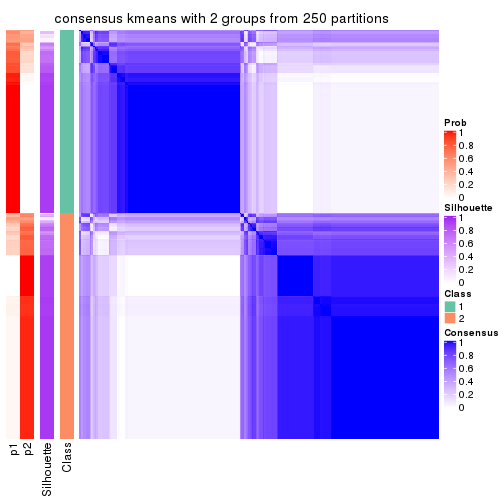</p>

</div>
<div id='tab-SD-kmeans-consensus-heatmap-2'>
<pre><code class="r">consensus_heatmap(res, k = 3)
</code></pre>

<p>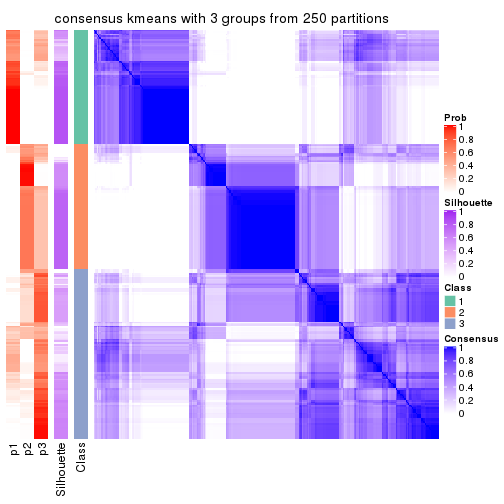</p>

</div>
<div id='tab-SD-kmeans-consensus-heatmap-3'>
<pre><code class="r">consensus_heatmap(res, k = 4)
</code></pre>

<p>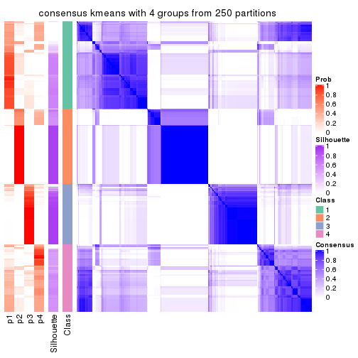</p>

</div>
<div id='tab-SD-kmeans-consensus-heatmap-4'>
<pre><code class="r">consensus_heatmap(res, k = 5)
</code></pre>

<p>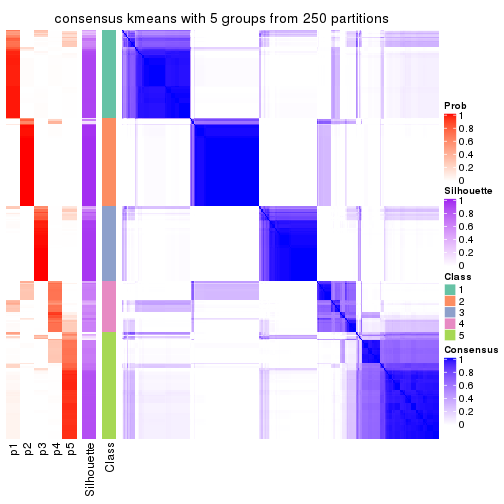</p>

</div>
<div id='tab-SD-kmeans-consensus-heatmap-5'>
<pre><code class="r">consensus_heatmap(res, k = 6)
</code></pre>

<p>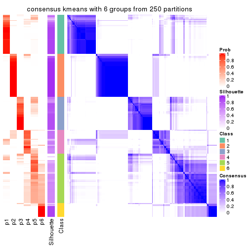</p>

</div>
</div>

Heatmaps for the membership of samples in all partitions to see how consistent they are:


<script>
$( function() {
	$( '#tabs-SD-kmeans-membership-heatmap' ).tabs();
} );
</script>
<div id='tabs-SD-kmeans-membership-heatmap'>
<ul>
<li><a href='#tab-SD-kmeans-membership-heatmap-1'>k = 2</a></li>
<li><a href='#tab-SD-kmeans-membership-heatmap-2'>k = 3</a></li>
<li><a href='#tab-SD-kmeans-membership-heatmap-3'>k = 4</a></li>
<li><a href='#tab-SD-kmeans-membership-heatmap-4'>k = 5</a></li>
<li><a href='#tab-SD-kmeans-membership-heatmap-5'>k = 6</a></li>
</ul>
<div id='tab-SD-kmeans-membership-heatmap-1'>
<pre><code class="r">membership_heatmap(res, k = 2)
</code></pre>

<p>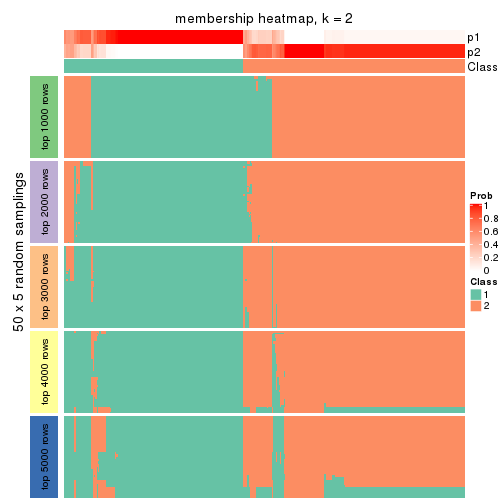</p>

</div>
<div id='tab-SD-kmeans-membership-heatmap-2'>
<pre><code class="r">membership_heatmap(res, k = 3)
</code></pre>

<p>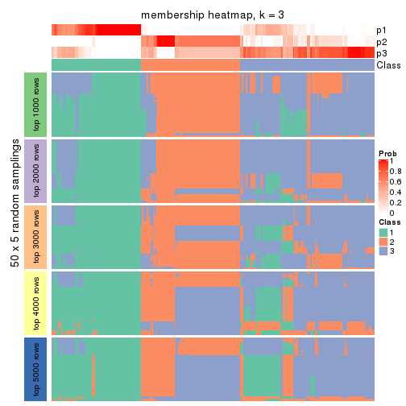</p>

</div>
<div id='tab-SD-kmeans-membership-heatmap-3'>
<pre><code class="r">membership_heatmap(res, k = 4)
</code></pre>

<p>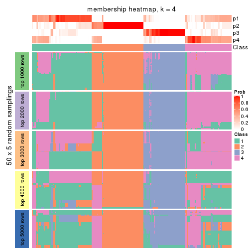</p>

</div>
<div id='tab-SD-kmeans-membership-heatmap-4'>
<pre><code class="r">membership_heatmap(res, k = 5)
</code></pre>

<p>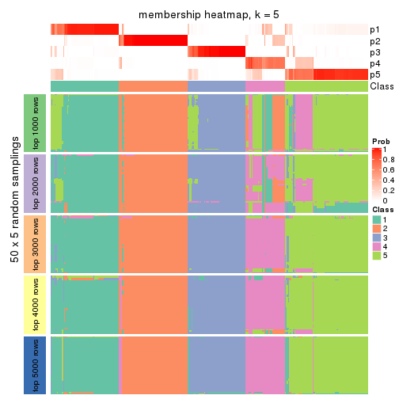</p>

</div>
<div id='tab-SD-kmeans-membership-heatmap-5'>
<pre><code class="r">membership_heatmap(res, k = 6)
</code></pre>

<p>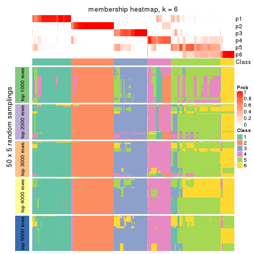</p>

</div>
</div>

As soon as we have had the classes for columns, we can look for signatures
which are significantly different between classes which can be candidate marks
for certain classes. Following are the heatmaps for signatures.


Signature heatmaps where rows are scaled:


<script>
$( function() {
	$( '#tabs-SD-kmeans-get-signatures' ).tabs();
} );
</script>
<div id='tabs-SD-kmeans-get-signatures'>
<ul>
<li><a href='#tab-SD-kmeans-get-signatures-1'>k = 2</a></li>
<li><a href='#tab-SD-kmeans-get-signatures-2'>k = 3</a></li>
<li><a href='#tab-SD-kmeans-get-signatures-3'>k = 4</a></li>
<li><a href='#tab-SD-kmeans-get-signatures-4'>k = 5</a></li>
<li><a href='#tab-SD-kmeans-get-signatures-5'>k = 6</a></li>
</ul>
<div id='tab-SD-kmeans-get-signatures-1'>
<pre><code class="r">get_signatures(res, k = 2)
</code></pre>

<p>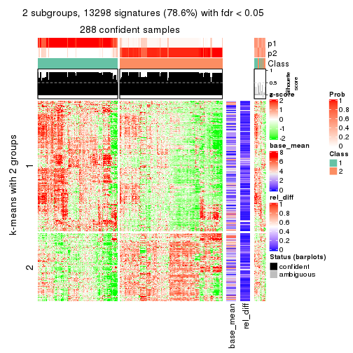</p>

</div>
<div id='tab-SD-kmeans-get-signatures-2'>
<pre><code class="r">get_signatures(res, k = 3)
</code></pre>

<p>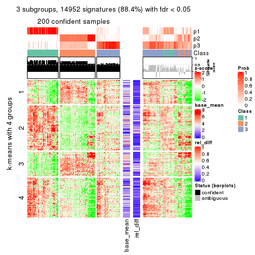</p>

</div>
<div id='tab-SD-kmeans-get-signatures-3'>
<pre><code class="r">get_signatures(res, k = 4)
</code></pre>

<p>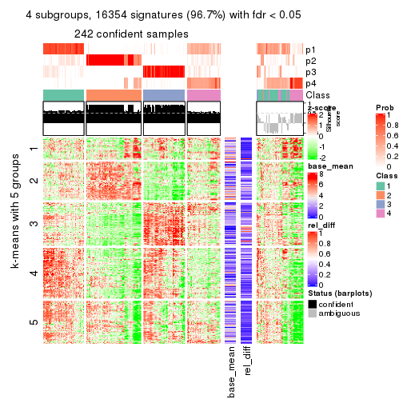</p>

</div>
<div id='tab-SD-kmeans-get-signatures-4'>
<pre><code class="r">get_signatures(res, k = 5)
</code></pre>

<p>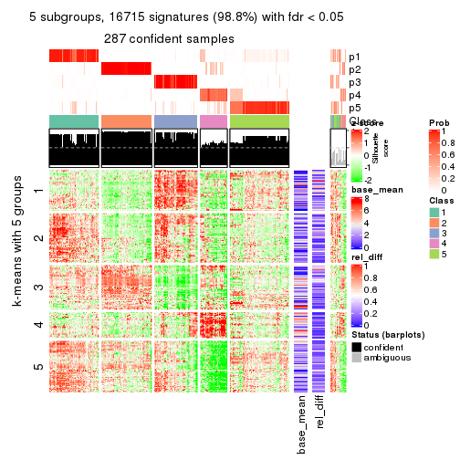</p>

</div>
<div id='tab-SD-kmeans-get-signatures-5'>
<pre><code class="r">get_signatures(res, k = 6)
</code></pre>

<p>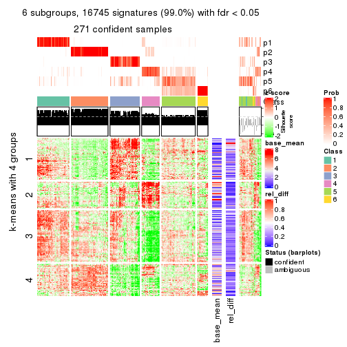</p>

</div>
</div>


Signature heatmaps where rows are not scaled:


<script>
$( function() {
	$( '#tabs-SD-kmeans-get-signatures-no-scale' ).tabs();
} );
</script>
<div id='tabs-SD-kmeans-get-signatures-no-scale'>
<ul>
<li><a href='#tab-SD-kmeans-get-signatures-no-scale-1'>k = 2</a></li>
<li><a href='#tab-SD-kmeans-get-signatures-no-scale-2'>k = 3</a></li>
<li><a href='#tab-SD-kmeans-get-signatures-no-scale-3'>k = 4</a></li>
<li><a href='#tab-SD-kmeans-get-signatures-no-scale-4'>k = 5</a></li>
<li><a href='#tab-SD-kmeans-get-signatures-no-scale-5'>k = 6</a></li>
</ul>
<div id='tab-SD-kmeans-get-signatures-no-scale-1'>
<pre><code class="r">get_signatures(res, k = 2, scale_rows = FALSE)
</code></pre>

<p>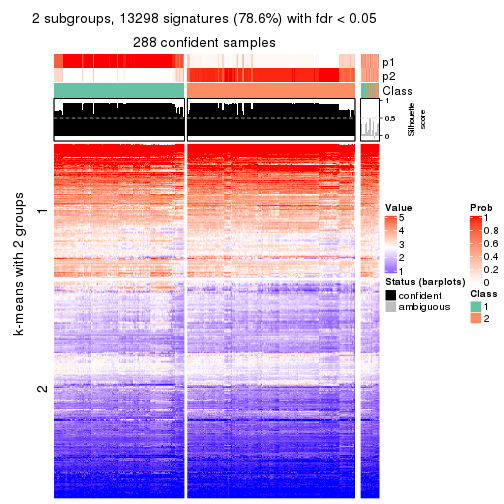</p>

</div>
<div id='tab-SD-kmeans-get-signatures-no-scale-2'>
<pre><code class="r">get_signatures(res, k = 3, scale_rows = FALSE)
</code></pre>

<p>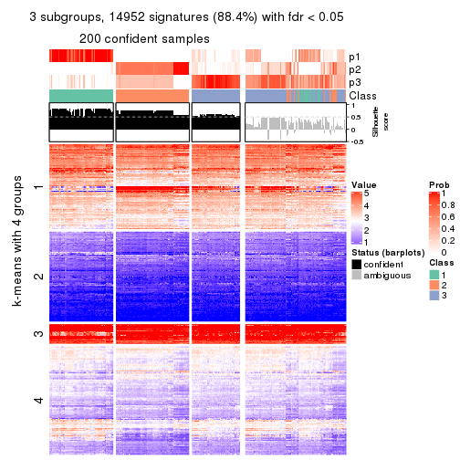</p>

</div>
<div id='tab-SD-kmeans-get-signatures-no-scale-3'>
<pre><code class="r">get_signatures(res, k = 4, scale_rows = FALSE)
</code></pre>

<p>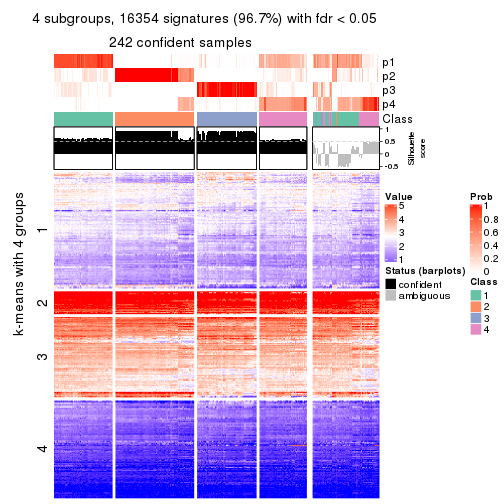</p>

</div>
<div id='tab-SD-kmeans-get-signatures-no-scale-4'>
<pre><code class="r">get_signatures(res, k = 5, scale_rows = FALSE)
</code></pre>

<p>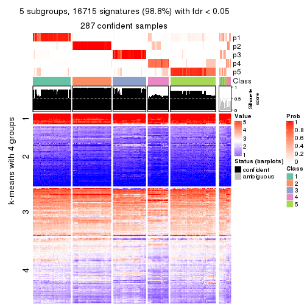</p>

</div>
<div id='tab-SD-kmeans-get-signatures-no-scale-5'>
<pre><code class="r">get_signatures(res, k = 6, scale_rows = FALSE)
</code></pre>

<p>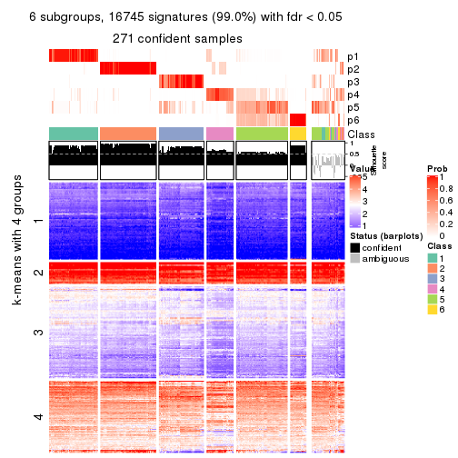</p>

</div>
</div>


Compare the overlap of signatures from different k:

```r
compare_signatures(res)
```

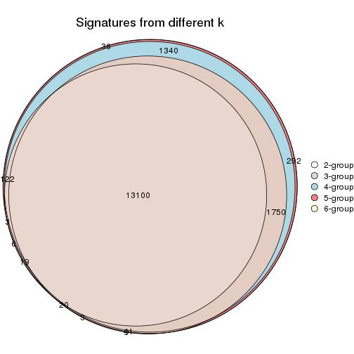

`get_signature()` returns a data frame invisibly. TO get the list of signatures, the function
call should be assigned to a variable explicitly. In following code, if `plot` argument is set
to `FALSE`, no heatmap is plotted while only the differential analysis is performed.

```r
# code only for demonstration
tb = get_signature(res, k = ..., plot = FALSE)
```

An example of the output of `tb` is:

```
#>   which_row         fdr    mean_1    mean_2 scaled_mean_1 scaled_mean_2 km
#> 1        38 0.042760348  8.373488  9.131774    -0.5533452     0.5164555  1
#> 2        40 0.018707592  7.106213  8.469186    -0.6173731     0.5762149  1
#> 3        55 0.019134737 10.221463 11.207825    -0.6159697     0.5749050  1
#> 4        59 0.006059896  5.921854  7.869574    -0.6899429     0.6439467  1
#> 5        60 0.018055526  8.928898 10.211722    -0.6204761     0.5791110  1
#> 6        98 0.009384629 15.714769 14.887706     0.6635654    -0.6193277  2
...
```

The columns in `tb` are:

1. `which_row`: row indices corresponding to the input matrix.
2. `fdr`: FDR for the differential test. 
3. `mean_x`: The mean value in group x.
4. `scaled_mean_x`: The mean value in group x after rows are scaled.
5. `km`: Row groups if k-means clustering is applied to rows.


UMAP plot which shows how samples are separated.


<script>
$( function() {
	$( '#tabs-SD-kmeans-dimension-reduction' ).tabs();
} );
</script>
<div id='tabs-SD-kmeans-dimension-reduction'>
<ul>
<li><a href='#tab-SD-kmeans-dimension-reduction-1'>k = 2</a></li>
<li><a href='#tab-SD-kmeans-dimension-reduction-2'>k = 3</a></li>
<li><a href='#tab-SD-kmeans-dimension-reduction-3'>k = 4</a></li>
<li><a href='#tab-SD-kmeans-dimension-reduction-4'>k = 5</a></li>
<li><a href='#tab-SD-kmeans-dimension-reduction-5'>k = 6</a></li>
</ul>
<div id='tab-SD-kmeans-dimension-reduction-1'>
<pre><code class="r">dimension_reduction(res, k = 2, method = &quot;UMAP&quot;)
</code></pre>

<p>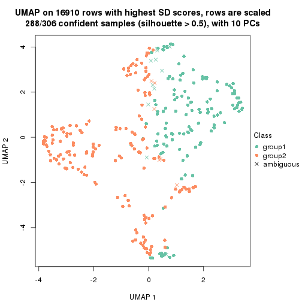</p>

</div>
<div id='tab-SD-kmeans-dimension-reduction-2'>
<pre><code class="r">dimension_reduction(res, k = 3, method = &quot;UMAP&quot;)
</code></pre>

<p>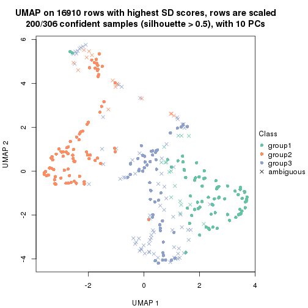</p>

</div>
<div id='tab-SD-kmeans-dimension-reduction-3'>
<pre><code class="r">dimension_reduction(res, k = 4, method = &quot;UMAP&quot;)
</code></pre>

<p>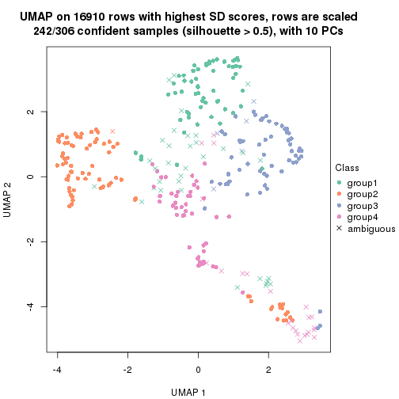</p>

</div>
<div id='tab-SD-kmeans-dimension-reduction-4'>
<pre><code class="r">dimension_reduction(res, k = 5, method = &quot;UMAP&quot;)
</code></pre>

<p>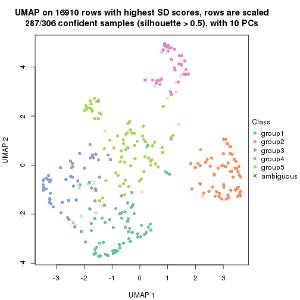</p>

</div>
<div id='tab-SD-kmeans-dimension-reduction-5'>
<pre><code class="r">dimension_reduction(res, k = 6, method = &quot;UMAP&quot;)
</code></pre>

<p>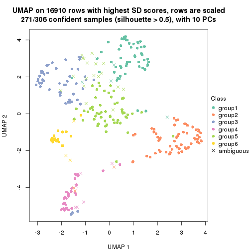</p>

</div>
</div>


Following heatmap shows how subgroups are split when increasing `k`:

```r
collect_classes(res)
```

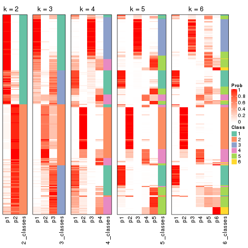


If matrix rows can be associated to genes, consider to use `GO_Enrichment(res,
...)` to perform function enrichment for the signature genes.


 

---------------------------------------------------


### SD:skmeans*


The object with results only for a single top-value method and a single partition method 
can be extracted as:

```r
res = res_list["SD", "skmeans"]
# you can also extract it by
# res = res_list["SD:skmeans"]
```

A summary of `res` and all the functions that can be applied to it:

```r
res
```

```
#> A 'ConsensusPartition' object with k = 2, 3, 4, 5, 6.
#>   On a matrix with 16910 rows and 306 columns.
#>   Top rows (1000, 2000, 3000, 4000, 5000) are extracted by 'SD' method.
#>   Subgroups are detected by 'skmeans' method.
#>   Performed in total 1250 partitions by row resampling.
#>   Best k for subgroups seems to be 6.
#> 
#> Following methods can be applied to this 'ConsensusPartition' object:
#>  [1] "cola_report"             "collect_classes"         "collect_plots"          
#>  [4] "collect_stats"           "colnames"                "compare_signatures"     
#>  [7] "consensus_heatmap"       "dimension_reduction"     "functional_enrichment"  
#> [10] "get_anno_col"            "get_anno"                "get_classes"            
#> [13] "get_consensus"           "get_matrix"              "get_membership"         
#> [16] "get_param"               "get_signatures"          "get_stats"              
#> [19] "is_best_k"               "is_stable_k"             "membership_heatmap"     
#> [22] "ncol"                    "nrow"                    "plot_ecdf"              
#> [25] "rownames"                "select_partition_number" "show"                   
#> [28] "suggest_best_k"          "test_to_known_factors"
```

`collect_plots()` function collects all the plots made from `res` for all `k` (number of partitions)
into one single page to provide an easy and fast comparison between different `k`.

```r
collect_plots(res)
```

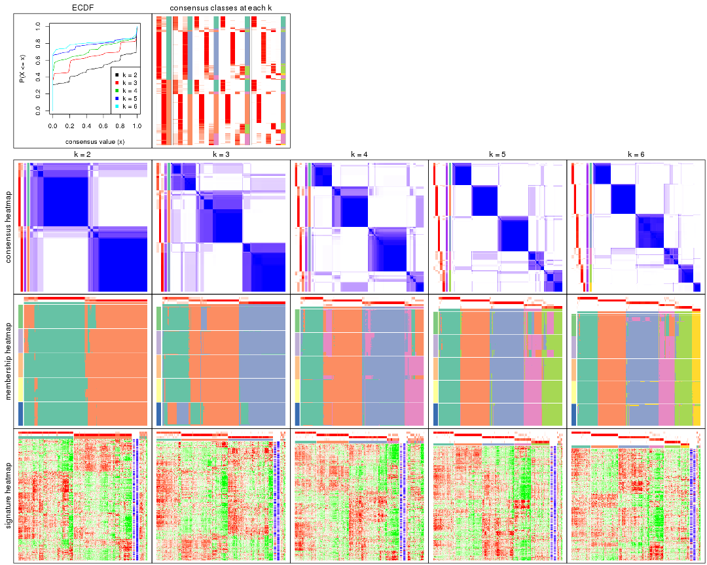

The plots are:

- The first row: a plot of the ECDF (Empirical cumulative distribution
  function) curves of the consensus matrix for each `k` and the heatmap of
  predicted classes for each `k`.
- The second row: heatmaps of the consensus matrix for each `k`.
- The third row: heatmaps of the membership matrix for each `k`.
- The fouth row: heatmaps of the signatures for each `k`.

All the plots in panels can be made by individual functions and they are
plotted later in this section.

`select_partition_number()` produces several plots showing different
statistics for choosing "optimized" `k`. There are following statistics:

- ECDF curves of the consensus matrix for each `k`;
- 1-PAC. [The PAC
  score](https://en.wikipedia.org/wiki/Consensus_clustering#Over-interpretation_potential_of_consensus_clustering)
  measures the proportion of the ambiguous subgrouping.
- Mean silhouette score.
- Concordance. The mean probability of fiting the consensus class ids in all
  partitions.
- Area increased. Denote $A_k$ as the area under the ECDF curve for current
  `k`, the area increased is defined as $A_k - A_{k-1}$.
- Rand index. The percent of pairs of samples that are both in a same cluster
  or both are not in a same cluster in the partition of k and k-1.
- Jaccard index. The ratio of pairs of samples are both in a same cluster in
  the partition of k and k-1 and the pairs of samples are both in a same
  cluster in the partition k or k-1.

The detailed explanations of these statistics can be found in [the cola
vignette](http://bioconductor.org/packages/devel/bioc/vignettes/cola/inst/doc/cola.html#toc_13).

Generally speaking, lower PAC score, higher mean silhouette score or higher
concordance corresponds to better partition. Rand index and Jaccard index
measure how similar the current partition is compared to partition with `k-1`.
If they are too similar, we won't accept `k` is better than `k-1`.

```r
select_partition_number(res)
```

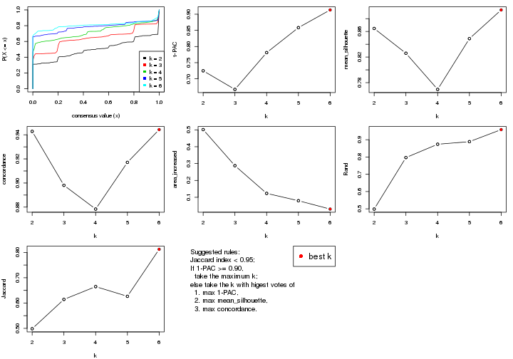

The numeric values for all these statistics can be obtained by `get_stats()`.

```r
get_stats(res)
```

```
#>   k 1-PAC mean_silhouette concordance area_increased  Rand Jaccard
#> 2 2 0.725           0.865       0.943         0.5014 0.498   0.498
#> 3 3 0.667           0.826       0.898         0.2875 0.797   0.614
#> 4 4 0.781           0.769       0.878         0.1231 0.874   0.665
#> 5 5 0.858           0.849       0.917         0.0797 0.889   0.627
#> 6 6 0.913           0.894       0.944         0.0301 0.959   0.812
```

`suggest_best_k()` suggests the best $k$ based on these statistics. The rules are as follows:

- All $k$ with Jaccard index larger than 0.95 are removed because the increase of
  the partition number does not provides enough extra information. If all $k$ are removed,
  the best $k$ is assigned by `NA`.
- For $k$ with 1-PAC larger than 0.9, the maximal $k$ is taken as the "best k". Other $k$ is called "optional k".
- If it does not fit the second rule. The $k$ with the highest vote of highest
  1-PAC, mean silhouette and concordance is taken as the "best k".

```r
suggest_best_k(res)
```

```
#> [1] 6
```


Following shows the table of the partitions (You need to click the **show/hide
code output** link to see it). The membership matrix (columns with name `p*`)
is inferred by
[`clue::cl_consensus()`](https://www.rdocumentation.org/link/cl_consensus?package=clue)
function with the `SE` method. Basically the value in the membership matrix
represents the probability to belong to a certain group. The finall class
label for an item is determined with the group with highest probability it
belongs to.

In `get_classes()` function, the entropy is calculated from the membership
matrix and the silhouette score is calculated from the consensus matrix.


<script>
$( function() {
	$( '#tabs-SD-skmeans-get-classes' ).tabs();
} );
</script>
<div id='tabs-SD-skmeans-get-classes'>
<ul>
<li><a href='#tab-SD-skmeans-get-classes-1'>k = 2</a></li>
<li><a href='#tab-SD-skmeans-get-classes-2'>k = 3</a></li>
<li><a href='#tab-SD-skmeans-get-classes-3'>k = 4</a></li>
<li><a href='#tab-SD-skmeans-get-classes-4'>k = 5</a></li>
<li><a href='#tab-SD-skmeans-get-classes-5'>k = 6</a></li>
</ul>

<div id='tab-SD-skmeans-get-classes-1'>
<p><a id='tab-SD-skmeans-get-classes-1-a' style='color:#0366d6' href='#'>show/hide code output</a></p>
<pre><code class="r">cbind(get_classes(res, k = 2), get_membership(res, k = 2))
</code></pre>

<pre><code>#&gt;            class entropy silhouette    p1    p2
#&gt; SRR1609360     2   0.358      0.883 0.068 0.932
#&gt; SRR1609361     2   0.000      0.946 0.000 1.000
#&gt; SRR1609362     2   0.000      0.946 0.000 1.000
#&gt; SRR1609363     2   0.000      0.946 0.000 1.000
#&gt; SRR1609364     2   0.000      0.946 0.000 1.000
#&gt; SRR1609365     2   0.000      0.946 0.000 1.000
#&gt; SRR1609366     2   0.000      0.946 0.000 1.000
#&gt; SRR1609367     1   0.722      0.749 0.800 0.200
#&gt; SRR1609368     2   0.000      0.946 0.000 1.000
#&gt; SRR1609369     2   0.000      0.946 0.000 1.000
#&gt; SRR1609370     1   0.722      0.749 0.800 0.200
#&gt; SRR1609371     2   0.000      0.946 0.000 1.000
#&gt; SRR1609372     1   0.722      0.749 0.800 0.200
#&gt; SRR1609373     2   0.000      0.946 0.000 1.000
#&gt; SRR1609374     2   0.000      0.946 0.000 1.000
#&gt; SRR1609375     2   0.000      0.946 0.000 1.000
#&gt; SRR1609377     2   0.000      0.946 0.000 1.000
#&gt; SRR1609376     2   0.000      0.946 0.000 1.000
#&gt; SRR1609378     2   0.000      0.946 0.000 1.000
#&gt; SRR1609379     2   0.000      0.946 0.000 1.000
#&gt; SRR1609382     2   0.000      0.946 0.000 1.000
#&gt; SRR1609383     2   0.980      0.215 0.416 0.584
#&gt; SRR1609381     1   0.971      0.404 0.600 0.400
#&gt; SRR1609384     2   0.000      0.946 0.000 1.000
#&gt; SRR1609386     2   0.000      0.946 0.000 1.000
#&gt; SRR1609385     2   0.000      0.946 0.000 1.000
#&gt; SRR1609387     1   0.996      0.220 0.536 0.464
#&gt; SRR1609388     2   0.000      0.946 0.000 1.000
#&gt; SRR1609390     1   0.971      0.404 0.600 0.400
#&gt; SRR1609393     2   0.000      0.946 0.000 1.000
#&gt; SRR1609394     2   0.000      0.946 0.000 1.000
#&gt; SRR1609392     2   0.000      0.946 0.000 1.000
#&gt; SRR1609391     2   0.000      0.946 0.000 1.000
#&gt; SRR1609395     1   0.722      0.749 0.800 0.200
#&gt; SRR1609396     1   0.971      0.404 0.600 0.400
#&gt; SRR1609398     2   0.000      0.946 0.000 1.000
#&gt; SRR1609399     1   0.722      0.749 0.800 0.200
#&gt; SRR1609400     1   0.722      0.749 0.800 0.200
#&gt; SRR1609397     2   0.000      0.946 0.000 1.000
#&gt; SRR1609401     2   0.000      0.946 0.000 1.000
#&gt; SRR1609402     2   0.000      0.946 0.000 1.000
#&gt; SRR1609405     2   0.000      0.946 0.000 1.000
#&gt; SRR1609404     2   0.000      0.946 0.000 1.000
#&gt; SRR1609406     2   0.000      0.946 0.000 1.000
#&gt; SRR1609408     2   0.000      0.946 0.000 1.000
#&gt; SRR1609403     2   0.000      0.946 0.000 1.000
#&gt; SRR1609410     2   0.871      0.544 0.292 0.708
#&gt; SRR1609411     2   0.000      0.946 0.000 1.000
#&gt; SRR1609407     2   0.000      0.946 0.000 1.000
#&gt; SRR1609413     2   0.876      0.535 0.296 0.704
#&gt; SRR1609412     1   0.000      0.926 1.000 0.000
#&gt; SRR1609414     1   0.000      0.926 1.000 0.000
#&gt; SRR1609415     1   0.000      0.926 1.000 0.000
#&gt; SRR1609416     1   0.000      0.926 1.000 0.000
#&gt; SRR1609417     1   0.000      0.926 1.000 0.000
#&gt; SRR1609418     2   0.000      0.946 0.000 1.000
#&gt; SRR1609419     2   0.000      0.946 0.000 1.000
#&gt; SRR1609420     2   0.000      0.946 0.000 1.000
#&gt; SRR1609421     2   0.722      0.742 0.200 0.800
#&gt; SRR1609422     2   0.971      0.359 0.400 0.600
#&gt; SRR1609423     2   0.000      0.946 0.000 1.000
#&gt; SRR1609424     2   0.000      0.946 0.000 1.000
#&gt; SRR1609425     2   0.000      0.946 0.000 1.000
#&gt; SRR1609426     2   0.000      0.946 0.000 1.000
#&gt; SRR1609427     1   0.000      0.926 1.000 0.000
#&gt; SRR1609428     2   0.000      0.946 0.000 1.000
#&gt; SRR1609429     2   1.000     -0.106 0.500 0.500
#&gt; SRR1609430     1   0.000      0.926 1.000 0.000
#&gt; SRR1609431     2   0.738      0.732 0.208 0.792
#&gt; SRR1609432     2   0.000      0.946 0.000 1.000
#&gt; SRR1609433     1   0.000      0.926 1.000 0.000
#&gt; SRR1609434     2   0.000      0.946 0.000 1.000
#&gt; SRR1609435     1   0.000      0.926 1.000 0.000
#&gt; SRR1609436     1   0.000      0.926 1.000 0.000
#&gt; SRR1609437     2   0.000      0.946 0.000 1.000
#&gt; SRR1609438     2   0.000      0.946 0.000 1.000
#&gt; SRR1609439     1   0.000      0.926 1.000 0.000
#&gt; SRR1609440     1   0.722      0.749 0.800 0.200
#&gt; SRR1609441     2   0.000      0.946 0.000 1.000
#&gt; SRR1609442     2   0.000      0.946 0.000 1.000
#&gt; SRR1609443     1   0.000      0.926 1.000 0.000
#&gt; SRR1609444     1   0.653      0.783 0.832 0.168
#&gt; SRR1609445     1   0.000      0.926 1.000 0.000
#&gt; SRR1609446     2   0.000      0.946 0.000 1.000
#&gt; SRR1609447     1   0.000      0.926 1.000 0.000
#&gt; SRR1609448     2   0.000      0.946 0.000 1.000
#&gt; SRR1609449     1   0.722      0.749 0.800 0.200
#&gt; SRR1609450     2   0.000      0.946 0.000 1.000
#&gt; SRR1609451     1   0.000      0.926 1.000 0.000
#&gt; SRR1609452     1   0.876      0.554 0.704 0.296
#&gt; SRR1609453     1   0.000      0.926 1.000 0.000
#&gt; SRR1609454     2   0.000      0.946 0.000 1.000
#&gt; SRR1609455     2   0.000      0.946 0.000 1.000
#&gt; SRR1609456     2   0.000      0.946 0.000 1.000
#&gt; SRR1609457     1   0.000      0.926 1.000 0.000
#&gt; SRR1609458     1   0.000      0.926 1.000 0.000
#&gt; SRR1609459     1   0.000      0.926 1.000 0.000
#&gt; SRR1609460     2   0.722      0.742 0.200 0.800
#&gt; SRR1609461     1   0.000      0.926 1.000 0.000
#&gt; SRR1609462     1   0.000      0.926 1.000 0.000
#&gt; SRR1609464     1   0.000      0.926 1.000 0.000
#&gt; SRR1609463     1   0.000      0.926 1.000 0.000
#&gt; SRR1609465     2   0.722      0.742 0.200 0.800
#&gt; SRR1609466     1   0.722      0.749 0.800 0.200
#&gt; SRR1609467     1   0.000      0.926 1.000 0.000
#&gt; SRR1609469     2   0.000      0.946 0.000 1.000
#&gt; SRR1609470     2   0.563      0.823 0.132 0.868
#&gt; SRR1609472     1   0.000      0.926 1.000 0.000
#&gt; SRR1609471     2   0.913      0.464 0.328 0.672
#&gt; SRR1609474     2   0.000      0.946 0.000 1.000
#&gt; SRR1609473     2   0.000      0.946 0.000 1.000
#&gt; SRR1609475     2   0.000      0.946 0.000 1.000
#&gt; SRR1609478     1   0.343      0.873 0.936 0.064
#&gt; SRR1609476     1   0.000      0.926 1.000 0.000
#&gt; SRR1609477     1   0.000      0.926 1.000 0.000
#&gt; SRR1609479     2   0.000      0.946 0.000 1.000
#&gt; SRR1609481     2   0.722      0.742 0.200 0.800
#&gt; SRR1609480     1   0.000      0.926 1.000 0.000
#&gt; SRR1609482     1   0.000      0.926 1.000 0.000
#&gt; SRR1609484     2   0.000      0.946 0.000 1.000
#&gt; SRR1609483     1   0.000      0.926 1.000 0.000
#&gt; SRR1609486     1   0.000      0.926 1.000 0.000
#&gt; SRR1609485     1   0.000      0.926 1.000 0.000
#&gt; SRR1609487     2   0.000      0.946 0.000 1.000
#&gt; SRR1609488     1   0.000      0.926 1.000 0.000
#&gt; SRR1609489     2   0.000      0.946 0.000 1.000
#&gt; SRR1609490     2   0.000      0.946 0.000 1.000
#&gt; SRR1609491     1   0.985      0.234 0.572 0.428
#&gt; SRR1609492     2   0.000      0.946 0.000 1.000
#&gt; SRR1609493     2   0.891      0.568 0.308 0.692
#&gt; SRR1609494     2   0.000      0.946 0.000 1.000
#&gt; SRR1609495     1   0.722      0.749 0.800 0.200
#&gt; SRR1609496     1   0.000      0.926 1.000 0.000
#&gt; SRR1609497     1   0.000      0.926 1.000 0.000
#&gt; SRR1609498     1   0.000      0.926 1.000 0.000
#&gt; SRR1609499     2   0.000      0.946 0.000 1.000
#&gt; SRR1609500     1   0.000      0.926 1.000 0.000
#&gt; SRR1609501     2   0.358      0.887 0.068 0.932
#&gt; SRR1609502     2   0.000      0.946 0.000 1.000
#&gt; SRR1609503     2   0.971      0.359 0.400 0.600
#&gt; SRR1609504     1   0.000      0.926 1.000 0.000
#&gt; SRR1609505     1   0.000      0.926 1.000 0.000
#&gt; SRR1609506     2   0.000      0.946 0.000 1.000
#&gt; SRR1609507     1   0.000      0.926 1.000 0.000
#&gt; SRR1609508     2   0.000      0.946 0.000 1.000
#&gt; SRR1609509     2   0.000      0.946 0.000 1.000
#&gt; SRR1609510     2   0.722      0.742 0.200 0.800
#&gt; SRR1609512     1   0.000      0.926 1.000 0.000
#&gt; SRR1609511     1   0.000      0.926 1.000 0.000
#&gt; SRR1609513     1   0.000      0.926 1.000 0.000
#&gt; SRR1609514     1   0.000      0.926 1.000 0.000
#&gt; SRR1609515     2   0.000      0.946 0.000 1.000
#&gt; SRR1609516     1   0.000      0.926 1.000 0.000
#&gt; SRR1609517     2   0.000      0.946 0.000 1.000
#&gt; SRR1609518     1   0.971      0.404 0.600 0.400
#&gt; SRR1609519     1   0.000      0.926 1.000 0.000
#&gt; SRR1609520     2   0.000      0.946 0.000 1.000
#&gt; SRR1609521     1   0.000      0.926 1.000 0.000
#&gt; SRR1609522     1   0.000      0.926 1.000 0.000
#&gt; SRR1609523     2   0.971      0.359 0.400 0.600
#&gt; SRR1609524     2   0.000      0.946 0.000 1.000
#&gt; SRR1609526     1   0.000      0.926 1.000 0.000
#&gt; SRR1609525     2   0.634      0.791 0.160 0.840
#&gt; SRR1609527     1   0.722      0.749 0.800 0.200
#&gt; SRR1609529     1   0.000      0.926 1.000 0.000
#&gt; SRR1609528     1   0.745      0.698 0.788 0.212
#&gt; SRR1609530     1   0.000      0.926 1.000 0.000
#&gt; SRR1609531     2   0.000      0.946 0.000 1.000
#&gt; SRR1609532     1   0.000      0.926 1.000 0.000
#&gt; SRR1609533     2   0.563      0.823 0.132 0.868
#&gt; SRR1609534     1   0.000      0.926 1.000 0.000
#&gt; SRR1609535     2   0.722      0.742 0.200 0.800
#&gt; SRR1609537     2   0.000      0.946 0.000 1.000
#&gt; SRR1609536     1   0.000      0.926 1.000 0.000
#&gt; SRR1609538     2   0.000      0.946 0.000 1.000
#&gt; SRR1609539     1   0.000      0.926 1.000 0.000
#&gt; SRR1609540     1   0.000      0.926 1.000 0.000
#&gt; SRR1609541     1   0.000      0.926 1.000 0.000
#&gt; SRR1609542     2   0.000      0.946 0.000 1.000
#&gt; SRR1609543     1   0.000      0.926 1.000 0.000
#&gt; SRR1609544     1   0.000      0.926 1.000 0.000
#&gt; SRR1609545     1   0.000      0.926 1.000 0.000
#&gt; SRR1609546     1   0.000      0.926 1.000 0.000
#&gt; SRR1609547     1   0.000      0.926 1.000 0.000
#&gt; SRR1609548     1   0.000      0.926 1.000 0.000
#&gt; SRR1609549     2   0.000      0.946 0.000 1.000
#&gt; SRR1609550     2   0.000      0.946 0.000 1.000
#&gt; SRR1609551     1   0.000      0.926 1.000 0.000
#&gt; SRR1609552     1   0.000      0.926 1.000 0.000
#&gt; SRR1609553     1   0.000      0.926 1.000 0.000
#&gt; SRR1609554     1   0.000      0.926 1.000 0.000
#&gt; SRR1609555     1   0.000      0.926 1.000 0.000
#&gt; SRR1609556     1   0.000      0.926 1.000 0.000
#&gt; SRR1609557     1   0.975      0.283 0.592 0.408
#&gt; SRR1609558     1   0.000      0.926 1.000 0.000
#&gt; SRR1609559     1   0.895      0.522 0.688 0.312
#&gt; SRR1609560     2   0.000      0.946 0.000 1.000
#&gt; SRR1609561     1   0.000      0.926 1.000 0.000
#&gt; SRR1609562     2   0.000      0.946 0.000 1.000
#&gt; SRR1609563     2   0.000      0.946 0.000 1.000
#&gt; SRR1609564     1   0.000      0.926 1.000 0.000
#&gt; SRR1609565     2   0.000      0.946 0.000 1.000
#&gt; SRR1609566     2   0.000      0.946 0.000 1.000
#&gt; SRR1609567     2   0.000      0.946 0.000 1.000
#&gt; SRR1609568     2   0.000      0.946 0.000 1.000
#&gt; SRR1609569     1   0.000      0.926 1.000 0.000
#&gt; SRR1609570     1   0.000      0.926 1.000 0.000
#&gt; SRR1609571     1   0.000      0.926 1.000 0.000
#&gt; SRR1609572     1   0.000      0.926 1.000 0.000
#&gt; SRR1609573     1   0.000      0.926 1.000 0.000
#&gt; SRR1609574     1   0.000      0.926 1.000 0.000
#&gt; SRR1609575     2   0.000      0.946 0.000 1.000
#&gt; SRR1609576     2   0.000      0.946 0.000 1.000
#&gt; SRR1609578     1   0.939      0.509 0.644 0.356
#&gt; SRR1609577     1   0.971      0.404 0.600 0.400
#&gt; SRR1609579     1   0.000      0.926 1.000 0.000
#&gt; SRR1609580     1   0.000      0.926 1.000 0.000
#&gt; SRR1609582     1   0.000      0.926 1.000 0.000
#&gt; SRR1609581     2   0.000      0.946 0.000 1.000
#&gt; SRR1609583     1   0.000      0.926 1.000 0.000
#&gt; SRR1609584     1   0.000      0.926 1.000 0.000
#&gt; SRR1609585     1   0.000      0.926 1.000 0.000
#&gt; SRR1609586     2   0.000      0.946 0.000 1.000
#&gt; SRR1609587     1   0.000      0.926 1.000 0.000
#&gt; SRR1609588     2   0.000      0.946 0.000 1.000
#&gt; SRR1609589     2   0.000      0.946 0.000 1.000
#&gt; SRR1609590     1   0.000      0.926 1.000 0.000
#&gt; SRR1609592     1   0.904      0.505 0.680 0.320
#&gt; SRR1609591     1   0.204      0.903 0.968 0.032
#&gt; SRR1609593     1   0.929      0.452 0.656 0.344
#&gt; SRR1609594     2   0.000      0.946 0.000 1.000
#&gt; SRR1609595     2   0.895      0.561 0.312 0.688
#&gt; SRR1609596     2   0.000      0.946 0.000 1.000
#&gt; SRR1609597     2   0.000      0.946 0.000 1.000
#&gt; SRR1609598     1   0.000      0.926 1.000 0.000
#&gt; SRR1609599     1   0.000      0.926 1.000 0.000
#&gt; SRR1609600     1   0.000      0.926 1.000 0.000
#&gt; SRR1609601     1   0.000      0.926 1.000 0.000
#&gt; SRR1609602     1   0.000      0.926 1.000 0.000
#&gt; SRR1609603     2   0.000      0.946 0.000 1.000
#&gt; SRR1609604     2   0.000      0.946 0.000 1.000
#&gt; SRR1609605     2   0.000      0.946 0.000 1.000
#&gt; SRR1609606     2   0.689      0.763 0.184 0.816
#&gt; SRR1609607     1   0.000      0.926 1.000 0.000
#&gt; SRR1609608     1   0.000      0.926 1.000 0.000
#&gt; SRR1609609     2   0.000      0.946 0.000 1.000
#&gt; SRR1609610     1   0.000      0.926 1.000 0.000
#&gt; SRR1609611     2   0.000      0.946 0.000 1.000
#&gt; SRR1609613     2   0.000      0.946 0.000 1.000
#&gt; SRR1609612     1   0.000      0.926 1.000 0.000
#&gt; SRR1609614     1   0.000      0.926 1.000 0.000
#&gt; SRR1609615     2   0.295      0.899 0.052 0.948
#&gt; SRR1609616     1   0.000      0.926 1.000 0.000
#&gt; SRR1609617     2   0.722      0.742 0.200 0.800
#&gt; SRR1609618     1   0.000      0.926 1.000 0.000
#&gt; SRR1609619     1   0.971      0.404 0.600 0.400
#&gt; SRR1609620     2   0.000      0.946 0.000 1.000
#&gt; SRR1609621     2   0.000      0.946 0.000 1.000
#&gt; SRR1609622     1   0.000      0.926 1.000 0.000
#&gt; SRR1609623     1   0.000      0.926 1.000 0.000
#&gt; SRR1609624     2   0.917      0.454 0.332 0.668
#&gt; SRR1609625     1   0.722      0.749 0.800 0.200
#&gt; SRR1609626     1   0.000      0.926 1.000 0.000
#&gt; SRR1609627     2   0.000      0.946 0.000 1.000
#&gt; SRR1609628     2   0.000      0.946 0.000 1.000
#&gt; SRR1609629     1   0.000      0.926 1.000 0.000
#&gt; SRR1609630     2   0.000      0.946 0.000 1.000
#&gt; SRR1609631     1   0.929      0.526 0.656 0.344
#&gt; SRR1609632     2   0.000      0.946 0.000 1.000
#&gt; SRR1609633     1   0.722      0.749 0.800 0.200
#&gt; SRR1609634     2   0.000      0.946 0.000 1.000
#&gt; SRR1609635     1   0.000      0.926 1.000 0.000
#&gt; SRR1609636     2   0.000      0.946 0.000 1.000
#&gt; SRR1609637     1   0.000      0.926 1.000 0.000
#&gt; SRR1609638     2   0.000      0.946 0.000 1.000
#&gt; SRR1609639     2   0.000      0.946 0.000 1.000
#&gt; SRR1609640     1   0.000      0.926 1.000 0.000
#&gt; SRR1609641     2   0.917      0.454 0.332 0.668
#&gt; SRR1609642     1   0.971      0.404 0.600 0.400
#&gt; SRR1609643     1   0.000      0.926 1.000 0.000
#&gt; SRR1609644     2   0.000      0.946 0.000 1.000
#&gt; SRR1609645     1   0.000      0.926 1.000 0.000
#&gt; SRR1609646     1   0.000      0.926 1.000 0.000
#&gt; SRR1609647     2   0.722      0.742 0.200 0.800
#&gt; SRR1609649     1   0.000      0.926 1.000 0.000
#&gt; SRR1609648     2   0.000      0.946 0.000 1.000
#&gt; SRR1609651     2   0.000      0.946 0.000 1.000
#&gt; SRR1609650     1   0.876      0.554 0.704 0.296
#&gt; SRR1609652     1   0.000      0.926 1.000 0.000
#&gt; SRR1609653     2   0.000      0.946 0.000 1.000
#&gt; SRR1609654     2   0.000      0.946 0.000 1.000
#&gt; SRR1609655     1   0.000      0.926 1.000 0.000
#&gt; SRR1609657     1   0.966      0.423 0.608 0.392
#&gt; SRR1609656     1   0.844      0.651 0.728 0.272
#&gt; SRR1609658     2   0.000      0.946 0.000 1.000
#&gt; SRR1609659     2   0.000      0.946 0.000 1.000
#&gt; SRR1609660     1   0.000      0.926 1.000 0.000
#&gt; SRR1609661     1   0.000      0.926 1.000 0.000
#&gt; SRR1609662     2   0.000      0.946 0.000 1.000
#&gt; SRR1609663     1   0.000      0.926 1.000 0.000
#&gt; SRR1609664     2   0.821      0.661 0.256 0.744
#&gt; SRR1609665     2   0.000      0.946 0.000 1.000
#&gt; SRR1609666     2   0.000      0.946 0.000 1.000
#&gt; SRR1609667     1   0.000      0.926 1.000 0.000
#&gt; SRR1609668     2   0.745      0.726 0.212 0.788
#&gt; SRR1609669     2   0.000      0.946 0.000 1.000
</code></pre>

<script>
$('#tab-SD-skmeans-get-classes-1-a').parent().next().next().hide();
$('#tab-SD-skmeans-get-classes-1-a').click(function(){
  $('#tab-SD-skmeans-get-classes-1-a').parent().next().next().toggle();
  return(false);
});
</script>
</div>

<div id='tab-SD-skmeans-get-classes-2'>
<p><a id='tab-SD-skmeans-get-classes-2-a' style='color:#0366d6' href='#'>show/hide code output</a></p>
<pre><code class="r">cbind(get_classes(res, k = 3), get_membership(res, k = 3))
</code></pre>

<pre><code>#&gt;            class entropy silhouette    p1    p2    p3
#&gt; SRR1609360     1  0.0592     0.7534 0.988 0.012 0.000
#&gt; SRR1609361     1  0.0592     0.7534 0.988 0.012 0.000
#&gt; SRR1609362     1  0.5216     0.4440 0.740 0.260 0.000
#&gt; SRR1609363     2  0.0000     0.8869 0.000 1.000 0.000
#&gt; SRR1609364     2  0.0000     0.8869 0.000 1.000 0.000
#&gt; SRR1609365     1  0.4842     0.5161 0.776 0.224 0.000
#&gt; SRR1609366     2  0.0000     0.8869 0.000 1.000 0.000
#&gt; SRR1609367     1  0.4784     0.8254 0.796 0.004 0.200
#&gt; SRR1609368     2  0.0000     0.8869 0.000 1.000 0.000
#&gt; SRR1609369     1  0.4605     0.7754 0.796 0.204 0.000
#&gt; SRR1609370     1  0.4784     0.8254 0.796 0.004 0.200
#&gt; SRR1609371     2  0.4452     0.7814 0.192 0.808 0.000
#&gt; SRR1609372     1  0.4784     0.8254 0.796 0.004 0.200
#&gt; SRR1609373     2  0.0000     0.8869 0.000 1.000 0.000
#&gt; SRR1609374     2  0.0000     0.8869 0.000 1.000 0.000
#&gt; SRR1609375     2  0.0000     0.8869 0.000 1.000 0.000
#&gt; SRR1609377     1  0.4605     0.7754 0.796 0.204 0.000
#&gt; SRR1609376     2  0.0000     0.8869 0.000 1.000 0.000
#&gt; SRR1609378     2  0.4452     0.7814 0.192 0.808 0.000
#&gt; SRR1609379     1  0.4605     0.7754 0.796 0.204 0.000
#&gt; SRR1609382     2  0.4452     0.7814 0.192 0.808 0.000
#&gt; SRR1609383     1  0.0661     0.7551 0.988 0.008 0.004
#&gt; SRR1609381     1  0.4912     0.8271 0.796 0.008 0.196
#&gt; SRR1609384     1  0.4605     0.7754 0.796 0.204 0.000
#&gt; SRR1609386     1  0.4605     0.7754 0.796 0.204 0.000
#&gt; SRR1609385     1  0.4605     0.7754 0.796 0.204 0.000
#&gt; SRR1609387     1  0.4912     0.8271 0.796 0.008 0.196
#&gt; SRR1609388     2  0.0000     0.8869 0.000 1.000 0.000
#&gt; SRR1609390     1  0.4912     0.8271 0.796 0.008 0.196
#&gt; SRR1609393     2  0.4452     0.7814 0.192 0.808 0.000
#&gt; SRR1609394     2  0.0000     0.8869 0.000 1.000 0.000
#&gt; SRR1609392     2  0.0000     0.8869 0.000 1.000 0.000
#&gt; SRR1609391     2  0.4452     0.7814 0.192 0.808 0.000
#&gt; SRR1609395     1  0.4784     0.8254 0.796 0.004 0.200
#&gt; SRR1609396     1  0.4784     0.8254 0.796 0.004 0.200
#&gt; SRR1609398     1  0.4605     0.7754 0.796 0.204 0.000
#&gt; SRR1609399     1  0.4784     0.8254 0.796 0.004 0.200
#&gt; SRR1609400     1  0.4784     0.8254 0.796 0.004 0.200
#&gt; SRR1609397     2  0.0000     0.8869 0.000 1.000 0.000
#&gt; SRR1609401     2  0.0000     0.8869 0.000 1.000 0.000
#&gt; SRR1609402     2  0.0000     0.8869 0.000 1.000 0.000
#&gt; SRR1609405     2  0.6252     0.0133 0.444 0.556 0.000
#&gt; SRR1609404     2  0.4452     0.7814 0.192 0.808 0.000
#&gt; SRR1609406     2  0.0000     0.8869 0.000 1.000 0.000
#&gt; SRR1609408     2  0.0000     0.8869 0.000 1.000 0.000
#&gt; SRR1609403     1  0.4605     0.7754 0.796 0.204 0.000
#&gt; SRR1609410     1  0.4784     0.7770 0.796 0.200 0.004
#&gt; SRR1609411     2  0.0000     0.8869 0.000 1.000 0.000
#&gt; SRR1609407     2  0.0000     0.8869 0.000 1.000 0.000
#&gt; SRR1609413     1  0.5200     0.8283 0.796 0.020 0.184
#&gt; SRR1609412     3  0.0424     0.9396 0.008 0.000 0.992
#&gt; SRR1609414     3  0.0000     0.9419 0.000 0.000 1.000
#&gt; SRR1609415     3  0.3752     0.7659 0.144 0.000 0.856
#&gt; SRR1609416     3  0.0000     0.9419 0.000 0.000 1.000
#&gt; SRR1609417     3  0.0237     0.9409 0.004 0.000 0.996
#&gt; SRR1609418     1  0.4605     0.7754 0.796 0.204 0.000
#&gt; SRR1609419     2  0.0000     0.8869 0.000 1.000 0.000
#&gt; SRR1609420     1  0.4605     0.7754 0.796 0.204 0.000
#&gt; SRR1609421     2  0.0592     0.8815 0.012 0.988 0.000
#&gt; SRR1609422     2  0.9625     0.1400 0.204 0.408 0.388
#&gt; SRR1609423     2  0.4452     0.7814 0.192 0.808 0.000
#&gt; SRR1609424     2  0.4452     0.7814 0.192 0.808 0.000
#&gt; SRR1609425     2  0.4702     0.6305 0.212 0.788 0.000
#&gt; SRR1609426     2  0.0000     0.8869 0.000 1.000 0.000
#&gt; SRR1609427     3  0.0000     0.9419 0.000 0.000 1.000
#&gt; SRR1609428     2  0.0000     0.8869 0.000 1.000 0.000
#&gt; SRR1609429     1  0.5810     0.6104 0.664 0.336 0.000
#&gt; SRR1609430     3  0.0000     0.9419 0.000 0.000 1.000
#&gt; SRR1609431     2  0.5219     0.6966 0.016 0.788 0.196
#&gt; SRR1609432     2  0.0000     0.8869 0.000 1.000 0.000
#&gt; SRR1609433     3  0.0000     0.9419 0.000 0.000 1.000
#&gt; SRR1609434     2  0.4452     0.7814 0.192 0.808 0.000
#&gt; SRR1609435     1  0.4605     0.8213 0.796 0.000 0.204
#&gt; SRR1609436     3  0.0000     0.9419 0.000 0.000 1.000
#&gt; SRR1609437     2  0.4452     0.7814 0.192 0.808 0.000
#&gt; SRR1609438     2  0.4452     0.7814 0.192 0.808 0.000
#&gt; SRR1609439     3  0.0000     0.9419 0.000 0.000 1.000
#&gt; SRR1609440     1  0.4784     0.8254 0.796 0.004 0.200
#&gt; SRR1609441     2  0.4399     0.7832 0.188 0.812 0.000
#&gt; SRR1609442     2  0.0000     0.8869 0.000 1.000 0.000
#&gt; SRR1609443     3  0.0000     0.9419 0.000 0.000 1.000
#&gt; SRR1609444     1  0.4605     0.8213 0.796 0.000 0.204
#&gt; SRR1609445     3  0.0424     0.9396 0.008 0.000 0.992
#&gt; SRR1609446     2  0.0000     0.8869 0.000 1.000 0.000
#&gt; SRR1609447     3  0.0592     0.9323 0.012 0.000 0.988
#&gt; SRR1609448     2  0.0000     0.8869 0.000 1.000 0.000
#&gt; SRR1609449     1  0.4784     0.8254 0.796 0.004 0.200
#&gt; SRR1609450     2  0.0000     0.8869 0.000 1.000 0.000
#&gt; SRR1609451     3  0.0000     0.9419 0.000 0.000 1.000
#&gt; SRR1609452     3  0.4605     0.7791 0.204 0.000 0.796
#&gt; SRR1609453     3  0.0000     0.9419 0.000 0.000 1.000
#&gt; SRR1609454     2  0.0000     0.8869 0.000 1.000 0.000
#&gt; SRR1609455     1  0.5431     0.6886 0.716 0.284 0.000
#&gt; SRR1609456     2  0.0000     0.8869 0.000 1.000 0.000
#&gt; SRR1609457     3  0.0000     0.9419 0.000 0.000 1.000
#&gt; SRR1609458     3  0.0592     0.9323 0.012 0.000 0.988
#&gt; SRR1609459     3  0.0592     0.9378 0.012 0.000 0.988
#&gt; SRR1609460     2  0.5167     0.7016 0.016 0.792 0.192
#&gt; SRR1609461     3  0.0000     0.9419 0.000 0.000 1.000
#&gt; SRR1609462     3  0.0000     0.9419 0.000 0.000 1.000
#&gt; SRR1609464     3  0.0000     0.9419 0.000 0.000 1.000
#&gt; SRR1609463     3  0.0592     0.9378 0.012 0.000 0.988
#&gt; SRR1609465     2  0.4953     0.7206 0.016 0.808 0.176
#&gt; SRR1609466     1  0.5070     0.5697 0.772 0.004 0.224
#&gt; SRR1609467     3  0.0000     0.9419 0.000 0.000 1.000
#&gt; SRR1609469     2  0.4452     0.7814 0.192 0.808 0.000
#&gt; SRR1609470     2  0.0592     0.8815 0.012 0.988 0.000
#&gt; SRR1609472     3  0.4555     0.7818 0.200 0.000 0.800
#&gt; SRR1609471     1  0.5115     0.8279 0.796 0.016 0.188
#&gt; SRR1609474     2  0.0000     0.8869 0.000 1.000 0.000
#&gt; SRR1609473     2  0.4452     0.7814 0.192 0.808 0.000
#&gt; SRR1609475     2  0.4452     0.7814 0.192 0.808 0.000
#&gt; SRR1609478     3  0.4555     0.7818 0.200 0.000 0.800
#&gt; SRR1609476     1  0.4605     0.8213 0.796 0.000 0.204
#&gt; SRR1609477     3  0.4504     0.7854 0.196 0.000 0.804
#&gt; SRR1609479     2  0.0000     0.8869 0.000 1.000 0.000
#&gt; SRR1609481     2  0.8608     0.5750 0.204 0.604 0.192
#&gt; SRR1609480     3  0.4555     0.7818 0.200 0.000 0.800
#&gt; SRR1609482     3  0.0000     0.9419 0.000 0.000 1.000
#&gt; SRR1609484     2  0.4452     0.7814 0.192 0.808 0.000
#&gt; SRR1609483     3  0.0000     0.9419 0.000 0.000 1.000
#&gt; SRR1609486     3  0.0000     0.9419 0.000 0.000 1.000
#&gt; SRR1609485     3  0.0000     0.9419 0.000 0.000 1.000
#&gt; SRR1609487     1  0.4605     0.7754 0.796 0.204 0.000
#&gt; SRR1609488     3  0.0000     0.9419 0.000 0.000 1.000
#&gt; SRR1609489     2  0.0000     0.8869 0.000 1.000 0.000
#&gt; SRR1609490     2  0.4931     0.5941 0.232 0.768 0.000
#&gt; SRR1609491     2  0.6683    -0.0165 0.008 0.500 0.492
#&gt; SRR1609492     2  0.0000     0.8869 0.000 1.000 0.000
#&gt; SRR1609493     2  0.5219     0.6966 0.016 0.788 0.196
#&gt; SRR1609494     2  0.0000     0.8869 0.000 1.000 0.000
#&gt; SRR1609495     1  0.3030     0.8032 0.904 0.004 0.092
#&gt; SRR1609496     3  0.0000     0.9419 0.000 0.000 1.000
#&gt; SRR1609497     3  0.0000     0.9419 0.000 0.000 1.000
#&gt; SRR1609498     3  0.0000     0.9419 0.000 0.000 1.000
#&gt; SRR1609499     2  0.0000     0.8869 0.000 1.000 0.000
#&gt; SRR1609500     3  0.0000     0.9419 0.000 0.000 1.000
#&gt; SRR1609501     2  0.0592     0.8815 0.012 0.988 0.000
#&gt; SRR1609502     2  0.0000     0.8869 0.000 1.000 0.000
#&gt; SRR1609503     2  0.9304     0.4414 0.204 0.516 0.280
#&gt; SRR1609504     3  0.6260    -0.0823 0.448 0.000 0.552
#&gt; SRR1609505     3  0.0000     0.9419 0.000 0.000 1.000
#&gt; SRR1609506     2  0.0000     0.8869 0.000 1.000 0.000
#&gt; SRR1609507     3  0.0000     0.9419 0.000 0.000 1.000
#&gt; SRR1609508     2  0.0000     0.8869 0.000 1.000 0.000
#&gt; SRR1609509     2  0.0000     0.8869 0.000 1.000 0.000
#&gt; SRR1609510     2  0.8608     0.5750 0.204 0.604 0.192
#&gt; SRR1609512     3  0.0000     0.9419 0.000 0.000 1.000
#&gt; SRR1609511     3  0.4452     0.7871 0.192 0.000 0.808
#&gt; SRR1609513     3  0.0000     0.9419 0.000 0.000 1.000
#&gt; SRR1609514     3  0.4504     0.7835 0.196 0.000 0.804
#&gt; SRR1609515     2  0.0000     0.8869 0.000 1.000 0.000
#&gt; SRR1609516     3  0.0592     0.9378 0.012 0.000 0.988
#&gt; SRR1609517     2  0.0747     0.8806 0.016 0.984 0.000
#&gt; SRR1609518     1  0.4912     0.8271 0.796 0.008 0.196
#&gt; SRR1609519     3  0.0000     0.9419 0.000 0.000 1.000
#&gt; SRR1609520     2  0.4452     0.7814 0.192 0.808 0.000
#&gt; SRR1609521     3  0.0000     0.9419 0.000 0.000 1.000
#&gt; SRR1609522     3  0.0000     0.9419 0.000 0.000 1.000
#&gt; SRR1609523     2  0.6667     0.4162 0.016 0.616 0.368
#&gt; SRR1609524     2  0.0000     0.8869 0.000 1.000 0.000
#&gt; SRR1609526     3  0.0000     0.9419 0.000 0.000 1.000
#&gt; SRR1609525     2  0.0592     0.8815 0.012 0.988 0.000
#&gt; SRR1609527     1  0.4784     0.8254 0.796 0.004 0.200
#&gt; SRR1609529     3  0.0000     0.9419 0.000 0.000 1.000
#&gt; SRR1609528     3  0.4605     0.7791 0.204 0.000 0.796
#&gt; SRR1609530     3  0.0000     0.9419 0.000 0.000 1.000
#&gt; SRR1609531     2  0.0000     0.8869 0.000 1.000 0.000
#&gt; SRR1609532     3  0.0000     0.9419 0.000 0.000 1.000
#&gt; SRR1609533     2  0.0592     0.8815 0.012 0.988 0.000
#&gt; SRR1609534     3  0.0237     0.9409 0.004 0.000 0.996
#&gt; SRR1609535     2  0.5947     0.7127 0.052 0.776 0.172
#&gt; SRR1609537     2  0.0000     0.8869 0.000 1.000 0.000
#&gt; SRR1609536     3  0.0424     0.9396 0.008 0.000 0.992
#&gt; SRR1609538     2  0.0000     0.8869 0.000 1.000 0.000
#&gt; SRR1609539     3  0.0424     0.9396 0.008 0.000 0.992
#&gt; SRR1609540     1  0.6026     0.5834 0.624 0.000 0.376
#&gt; SRR1609541     3  0.4555     0.7818 0.200 0.000 0.800
#&gt; SRR1609542     2  0.0000     0.8869 0.000 1.000 0.000
#&gt; SRR1609543     3  0.0000     0.9419 0.000 0.000 1.000
#&gt; SRR1609544     1  0.6192     0.4934 0.580 0.000 0.420
#&gt; SRR1609545     3  0.0000     0.9419 0.000 0.000 1.000
#&gt; SRR1609546     3  0.0424     0.9396 0.008 0.000 0.992
#&gt; SRR1609547     3  0.0424     0.9396 0.008 0.000 0.992
#&gt; SRR1609548     3  0.0592     0.9378 0.012 0.000 0.988
#&gt; SRR1609549     2  0.0000     0.8869 0.000 1.000 0.000
#&gt; SRR1609550     2  0.0000     0.8869 0.000 1.000 0.000
#&gt; SRR1609551     3  0.0592     0.9378 0.012 0.000 0.988
#&gt; SRR1609552     3  0.0424     0.9396 0.008 0.000 0.992
#&gt; SRR1609553     3  0.0000     0.9419 0.000 0.000 1.000
#&gt; SRR1609554     3  0.0592     0.9378 0.012 0.000 0.988
#&gt; SRR1609555     3  0.0000     0.9419 0.000 0.000 1.000
#&gt; SRR1609556     3  0.0000     0.9419 0.000 0.000 1.000
#&gt; SRR1609557     3  0.6584     0.3742 0.012 0.380 0.608
#&gt; SRR1609558     3  0.0424     0.9396 0.008 0.000 0.992
#&gt; SRR1609559     3  0.4605     0.7791 0.204 0.000 0.796
#&gt; SRR1609560     1  0.4605     0.7754 0.796 0.204 0.000
#&gt; SRR1609561     3  0.0237     0.9409 0.004 0.000 0.996
#&gt; SRR1609562     1  0.5760     0.6237 0.672 0.328 0.000
#&gt; SRR1609563     2  0.0000     0.8869 0.000 1.000 0.000
#&gt; SRR1609564     1  0.6126     0.5280 0.600 0.000 0.400
#&gt; SRR1609565     2  0.0000     0.8869 0.000 1.000 0.000
#&gt; SRR1609566     2  0.0000     0.8869 0.000 1.000 0.000
#&gt; SRR1609567     2  0.0000     0.8869 0.000 1.000 0.000
#&gt; SRR1609568     1  0.4605     0.7754 0.796 0.204 0.000
#&gt; SRR1609569     3  0.0000     0.9419 0.000 0.000 1.000
#&gt; SRR1609570     3  0.0000     0.9419 0.000 0.000 1.000
#&gt; SRR1609571     3  0.4399     0.7884 0.188 0.000 0.812
#&gt; SRR1609572     3  0.0892     0.9300 0.020 0.000 0.980
#&gt; SRR1609573     3  0.0000     0.9419 0.000 0.000 1.000
#&gt; SRR1609574     3  0.0000     0.9419 0.000 0.000 1.000
#&gt; SRR1609575     2  0.4452     0.7814 0.192 0.808 0.000
#&gt; SRR1609576     2  0.0000     0.8869 0.000 1.000 0.000
#&gt; SRR1609578     2  0.6754     0.2030 0.012 0.556 0.432
#&gt; SRR1609577     1  0.4784     0.8254 0.796 0.004 0.200
#&gt; SRR1609579     3  0.0000     0.9419 0.000 0.000 1.000
#&gt; SRR1609580     3  0.0424     0.9396 0.008 0.000 0.992
#&gt; SRR1609582     3  0.0000     0.9419 0.000 0.000 1.000
#&gt; SRR1609581     2  0.0000     0.8869 0.000 1.000 0.000
#&gt; SRR1609583     3  0.1529     0.9178 0.040 0.000 0.960
#&gt; SRR1609584     3  0.0000     0.9419 0.000 0.000 1.000
#&gt; SRR1609585     3  0.0000     0.9419 0.000 0.000 1.000
#&gt; SRR1609586     2  0.0000     0.8869 0.000 1.000 0.000
#&gt; SRR1609587     3  0.0424     0.9396 0.008 0.000 0.992
#&gt; SRR1609588     2  0.0000     0.8869 0.000 1.000 0.000
#&gt; SRR1609589     2  0.0000     0.8869 0.000 1.000 0.000
#&gt; SRR1609590     3  0.0000     0.9419 0.000 0.000 1.000
#&gt; SRR1609592     3  0.4605     0.7791 0.204 0.000 0.796
#&gt; SRR1609591     1  0.6286     0.3737 0.536 0.000 0.464
#&gt; SRR1609593     3  0.5115     0.7000 0.016 0.188 0.796
#&gt; SRR1609594     2  0.4452     0.7814 0.192 0.808 0.000
#&gt; SRR1609595     2  0.5219     0.6966 0.016 0.788 0.196
#&gt; SRR1609596     2  0.0000     0.8869 0.000 1.000 0.000
#&gt; SRR1609597     2  0.0000     0.8869 0.000 1.000 0.000
#&gt; SRR1609598     3  0.4555     0.7818 0.200 0.000 0.800
#&gt; SRR1609599     3  0.4504     0.7835 0.196 0.000 0.804
#&gt; SRR1609600     3  0.0000     0.9419 0.000 0.000 1.000
#&gt; SRR1609601     3  0.4605     0.7791 0.204 0.000 0.796
#&gt; SRR1609602     3  0.4504     0.7835 0.196 0.000 0.804
#&gt; SRR1609603     1  0.4605     0.7754 0.796 0.204 0.000
#&gt; SRR1609604     2  0.4452     0.7814 0.192 0.808 0.000
#&gt; SRR1609605     2  0.0424     0.8833 0.008 0.992 0.000
#&gt; SRR1609606     2  0.0592     0.8815 0.012 0.988 0.000
#&gt; SRR1609607     3  0.0424     0.9396 0.008 0.000 0.992
#&gt; SRR1609608     3  0.0424     0.9396 0.008 0.000 0.992
#&gt; SRR1609609     2  0.0592     0.8815 0.012 0.988 0.000
#&gt; SRR1609610     3  0.0000     0.9419 0.000 0.000 1.000
#&gt; SRR1609611     2  0.4452     0.7814 0.192 0.808 0.000
#&gt; SRR1609613     2  0.0000     0.8869 0.000 1.000 0.000
#&gt; SRR1609612     3  0.0000     0.9419 0.000 0.000 1.000
#&gt; SRR1609614     3  0.0000     0.9419 0.000 0.000 1.000
#&gt; SRR1609615     1  0.4605     0.7754 0.796 0.204 0.000
#&gt; SRR1609616     1  0.4842     0.8034 0.776 0.000 0.224
#&gt; SRR1609617     2  0.5167     0.7016 0.016 0.792 0.192
#&gt; SRR1609618     3  0.0424     0.9396 0.008 0.000 0.992
#&gt; SRR1609619     1  0.5020     0.8277 0.796 0.012 0.192
#&gt; SRR1609620     2  0.4452     0.7814 0.192 0.808 0.000
#&gt; SRR1609621     2  0.0000     0.8869 0.000 1.000 0.000
#&gt; SRR1609622     3  0.0000     0.9419 0.000 0.000 1.000
#&gt; SRR1609623     3  0.0000     0.9419 0.000 0.000 1.000
#&gt; SRR1609624     1  0.5020     0.8277 0.796 0.012 0.192
#&gt; SRR1609625     1  0.4784     0.8254 0.796 0.004 0.200
#&gt; SRR1609626     3  0.0000     0.9419 0.000 0.000 1.000
#&gt; SRR1609627     1  0.5254     0.7137 0.736 0.264 0.000
#&gt; SRR1609628     2  0.0000     0.8869 0.000 1.000 0.000
#&gt; SRR1609629     3  0.0000     0.9419 0.000 0.000 1.000
#&gt; SRR1609630     2  0.0000     0.8869 0.000 1.000 0.000
#&gt; SRR1609631     1  0.4784     0.8254 0.796 0.004 0.200
#&gt; SRR1609632     1  0.4605     0.7754 0.796 0.204 0.000
#&gt; SRR1609633     1  0.4784     0.8254 0.796 0.004 0.200
#&gt; SRR1609634     2  0.0000     0.8869 0.000 1.000 0.000
#&gt; SRR1609635     3  0.4452     0.7871 0.192 0.000 0.808
#&gt; SRR1609636     2  0.4452     0.7814 0.192 0.808 0.000
#&gt; SRR1609637     1  0.4605     0.8213 0.796 0.000 0.204
#&gt; SRR1609638     2  0.6204     0.0799 0.424 0.576 0.000
#&gt; SRR1609639     2  0.0000     0.8869 0.000 1.000 0.000
#&gt; SRR1609640     3  0.0000     0.9419 0.000 0.000 1.000
#&gt; SRR1609641     1  0.5020     0.8277 0.796 0.012 0.192
#&gt; SRR1609642     1  0.4912     0.8271 0.796 0.008 0.196
#&gt; SRR1609643     3  0.0424     0.9396 0.008 0.000 0.992
#&gt; SRR1609644     1  0.4605     0.7754 0.796 0.204 0.000
#&gt; SRR1609645     3  0.0424     0.9396 0.008 0.000 0.992
#&gt; SRR1609646     3  0.0000     0.9419 0.000 0.000 1.000
#&gt; SRR1609647     2  0.6258     0.6816 0.052 0.752 0.196
#&gt; SRR1609649     3  0.0000     0.9419 0.000 0.000 1.000
#&gt; SRR1609648     2  0.0000     0.8869 0.000 1.000 0.000
#&gt; SRR1609651     2  0.0000     0.8869 0.000 1.000 0.000
#&gt; SRR1609650     3  0.4605     0.7791 0.204 0.000 0.796
#&gt; SRR1609652     3  0.0000     0.9419 0.000 0.000 1.000
#&gt; SRR1609653     2  0.0000     0.8869 0.000 1.000 0.000
#&gt; SRR1609654     2  0.6079     0.5536 0.388 0.612 0.000
#&gt; SRR1609655     3  0.0592     0.9378 0.012 0.000 0.988
#&gt; SRR1609657     1  0.4784     0.8254 0.796 0.004 0.200
#&gt; SRR1609656     1  0.0661     0.7564 0.988 0.004 0.008
#&gt; SRR1609658     2  0.0000     0.8869 0.000 1.000 0.000
#&gt; SRR1609659     2  0.0000     0.8869 0.000 1.000 0.000
#&gt; SRR1609660     3  0.4605     0.7791 0.204 0.000 0.796
#&gt; SRR1609661     3  0.0237     0.9409 0.004 0.000 0.996
#&gt; SRR1609662     2  0.0000     0.8869 0.000 1.000 0.000
#&gt; SRR1609663     3  0.0424     0.9396 0.008 0.000 0.992
#&gt; SRR1609664     2  0.5219     0.6966 0.016 0.788 0.196
#&gt; SRR1609665     2  0.0000     0.8869 0.000 1.000 0.000
#&gt; SRR1609666     1  0.5216     0.4440 0.740 0.260 0.000
#&gt; SRR1609667     3  0.4796     0.6295 0.220 0.000 0.780
#&gt; SRR1609668     2  0.8649     0.5695 0.204 0.600 0.196
#&gt; SRR1609669     1  0.4605     0.7754 0.796 0.204 0.000
</code></pre>

<script>
$('#tab-SD-skmeans-get-classes-2-a').parent().next().next().hide();
$('#tab-SD-skmeans-get-classes-2-a').click(function(){
  $('#tab-SD-skmeans-get-classes-2-a').parent().next().next().toggle();
  return(false);
});
</script>
</div>

<div id='tab-SD-skmeans-get-classes-3'>
<p><a id='tab-SD-skmeans-get-classes-3-a' style='color:#0366d6' href='#'>show/hide code output</a></p>
<pre><code class="r">cbind(get_classes(res, k = 4), get_membership(res, k = 4))
</code></pre>

<pre><code>#&gt;            class entropy silhouette    p1    p2    p3    p4
#&gt; SRR1609360     4  0.4933      0.250 0.432 0.000 0.000 0.568
#&gt; SRR1609361     4  0.4933      0.250 0.432 0.000 0.000 0.568
#&gt; SRR1609362     4  0.6135      0.361 0.376 0.056 0.000 0.568
#&gt; SRR1609363     2  0.0000      0.874 0.000 1.000 0.000 0.000
#&gt; SRR1609364     2  0.0000      0.874 0.000 1.000 0.000 0.000
#&gt; SRR1609365     4  0.5681      0.309 0.404 0.028 0.000 0.568
#&gt; SRR1609366     2  0.0000      0.874 0.000 1.000 0.000 0.000
#&gt; SRR1609367     1  0.0592      0.925 0.984 0.000 0.016 0.000
#&gt; SRR1609368     2  0.0000      0.874 0.000 1.000 0.000 0.000
#&gt; SRR1609369     1  0.0592      0.921 0.984 0.016 0.000 0.000
#&gt; SRR1609370     1  0.0592      0.925 0.984 0.000 0.016 0.000
#&gt; SRR1609371     4  0.4933      0.569 0.000 0.432 0.000 0.568
#&gt; SRR1609372     1  0.0592      0.925 0.984 0.000 0.016 0.000
#&gt; SRR1609373     2  0.0000      0.874 0.000 1.000 0.000 0.000
#&gt; SRR1609374     2  0.0000      0.874 0.000 1.000 0.000 0.000
#&gt; SRR1609375     2  0.0000      0.874 0.000 1.000 0.000 0.000
#&gt; SRR1609377     1  0.0592      0.921 0.984 0.016 0.000 0.000
#&gt; SRR1609376     2  0.0000      0.874 0.000 1.000 0.000 0.000
#&gt; SRR1609378     4  0.4933      0.569 0.000 0.432 0.000 0.568
#&gt; SRR1609379     1  0.0592      0.921 0.984 0.016 0.000 0.000
#&gt; SRR1609382     4  0.4933      0.569 0.000 0.432 0.000 0.568
#&gt; SRR1609383     4  0.4933      0.250 0.432 0.000 0.000 0.568
#&gt; SRR1609381     1  0.0592      0.925 0.984 0.000 0.016 0.000
#&gt; SRR1609384     1  0.0592      0.921 0.984 0.016 0.000 0.000
#&gt; SRR1609386     1  0.0592      0.921 0.984 0.016 0.000 0.000
#&gt; SRR1609385     1  0.0592      0.921 0.984 0.016 0.000 0.000
#&gt; SRR1609387     1  0.0592      0.925 0.984 0.000 0.016 0.000
#&gt; SRR1609388     2  0.0000      0.874 0.000 1.000 0.000 0.000
#&gt; SRR1609390     1  0.0592      0.925 0.984 0.000 0.016 0.000
#&gt; SRR1609393     4  0.4933      0.569 0.000 0.432 0.000 0.568
#&gt; SRR1609394     2  0.0000      0.874 0.000 1.000 0.000 0.000
#&gt; SRR1609392     2  0.0000      0.874 0.000 1.000 0.000 0.000
#&gt; SRR1609391     4  0.4933      0.569 0.000 0.432 0.000 0.568
#&gt; SRR1609395     1  0.0592      0.925 0.984 0.000 0.016 0.000
#&gt; SRR1609396     1  0.0592      0.925 0.984 0.000 0.016 0.000
#&gt; SRR1609398     1  0.0707      0.918 0.980 0.020 0.000 0.000
#&gt; SRR1609399     1  0.0592      0.925 0.984 0.000 0.016 0.000
#&gt; SRR1609400     1  0.0592      0.925 0.984 0.000 0.016 0.000
#&gt; SRR1609397     2  0.0000      0.874 0.000 1.000 0.000 0.000
#&gt; SRR1609401     2  0.0000      0.874 0.000 1.000 0.000 0.000
#&gt; SRR1609402     2  0.0000      0.874 0.000 1.000 0.000 0.000
#&gt; SRR1609405     2  0.3024      0.705 0.148 0.852 0.000 0.000
#&gt; SRR1609404     4  0.4933      0.569 0.000 0.432 0.000 0.568
#&gt; SRR1609406     2  0.0000      0.874 0.000 1.000 0.000 0.000
#&gt; SRR1609408     2  0.0000      0.874 0.000 1.000 0.000 0.000
#&gt; SRR1609403     1  0.0592      0.921 0.984 0.016 0.000 0.000
#&gt; SRR1609410     1  0.0592      0.921 0.984 0.016 0.000 0.000
#&gt; SRR1609411     2  0.0000      0.874 0.000 1.000 0.000 0.000
#&gt; SRR1609407     2  0.0000      0.874 0.000 1.000 0.000 0.000
#&gt; SRR1609413     1  0.0592      0.925 0.984 0.000 0.016 0.000
#&gt; SRR1609412     3  0.2730      0.856 0.016 0.000 0.896 0.088
#&gt; SRR1609414     3  0.0000      0.918 0.000 0.000 1.000 0.000
#&gt; SRR1609415     3  0.3486      0.726 0.188 0.000 0.812 0.000
#&gt; SRR1609416     3  0.0000      0.918 0.000 0.000 1.000 0.000
#&gt; SRR1609417     3  0.0592      0.911 0.016 0.000 0.984 0.000
#&gt; SRR1609418     1  0.0592      0.921 0.984 0.016 0.000 0.000
#&gt; SRR1609419     2  0.0000      0.874 0.000 1.000 0.000 0.000
#&gt; SRR1609420     1  0.0592      0.921 0.984 0.016 0.000 0.000
#&gt; SRR1609421     2  0.5444      0.437 0.016 0.560 0.000 0.424
#&gt; SRR1609422     4  0.0672      0.543 0.008 0.000 0.008 0.984
#&gt; SRR1609423     4  0.4855      0.581 0.000 0.400 0.000 0.600
#&gt; SRR1609424     4  0.4933      0.569 0.000 0.432 0.000 0.568
#&gt; SRR1609425     2  0.0000      0.874 0.000 1.000 0.000 0.000
#&gt; SRR1609426     2  0.0000      0.874 0.000 1.000 0.000 0.000
#&gt; SRR1609427     3  0.0000      0.918 0.000 0.000 1.000 0.000
#&gt; SRR1609428     2  0.0000      0.874 0.000 1.000 0.000 0.000
#&gt; SRR1609429     1  0.3933      0.660 0.792 0.200 0.000 0.008
#&gt; SRR1609430     3  0.0000      0.918 0.000 0.000 1.000 0.000
#&gt; SRR1609431     2  0.5760      0.416 0.016 0.544 0.008 0.432
#&gt; SRR1609432     2  0.0000      0.874 0.000 1.000 0.000 0.000
#&gt; SRR1609433     3  0.0000      0.918 0.000 0.000 1.000 0.000
#&gt; SRR1609434     4  0.4933      0.569 0.000 0.432 0.000 0.568
#&gt; SRR1609435     1  0.3801      0.686 0.780 0.000 0.220 0.000
#&gt; SRR1609436     3  0.0000      0.918 0.000 0.000 1.000 0.000
#&gt; SRR1609437     4  0.4933      0.569 0.000 0.432 0.000 0.568
#&gt; SRR1609438     4  0.4933      0.569 0.000 0.432 0.000 0.568
#&gt; SRR1609439     3  0.0000      0.918 0.000 0.000 1.000 0.000
#&gt; SRR1609440     1  0.0592      0.925 0.984 0.000 0.016 0.000
#&gt; SRR1609441     2  0.3726      0.538 0.000 0.788 0.000 0.212
#&gt; SRR1609442     2  0.0000      0.874 0.000 1.000 0.000 0.000
#&gt; SRR1609443     3  0.0000      0.918 0.000 0.000 1.000 0.000
#&gt; SRR1609444     1  0.2675      0.832 0.892 0.000 0.100 0.008
#&gt; SRR1609445     3  0.4327      0.734 0.016 0.000 0.768 0.216
#&gt; SRR1609446     2  0.1510      0.842 0.016 0.956 0.000 0.028
#&gt; SRR1609447     3  0.2216      0.838 0.092 0.000 0.908 0.000
#&gt; SRR1609448     2  0.0000      0.874 0.000 1.000 0.000 0.000
#&gt; SRR1609449     1  0.0592      0.925 0.984 0.000 0.016 0.000
#&gt; SRR1609450     2  0.0000      0.874 0.000 1.000 0.000 0.000
#&gt; SRR1609451     3  0.0000      0.918 0.000 0.000 1.000 0.000
#&gt; SRR1609452     3  0.5435      0.470 0.016 0.000 0.564 0.420
#&gt; SRR1609453     3  0.0000      0.918 0.000 0.000 1.000 0.000
#&gt; SRR1609454     2  0.0000      0.874 0.000 1.000 0.000 0.000
#&gt; SRR1609455     1  0.3486      0.689 0.812 0.188 0.000 0.000
#&gt; SRR1609456     2  0.1798      0.833 0.016 0.944 0.000 0.040
#&gt; SRR1609457     3  0.0592      0.911 0.016 0.000 0.984 0.000
#&gt; SRR1609458     3  0.0000      0.918 0.000 0.000 1.000 0.000
#&gt; SRR1609459     3  0.4980      0.629 0.016 0.000 0.680 0.304
#&gt; SRR1609460     2  0.5760      0.416 0.016 0.544 0.008 0.432
#&gt; SRR1609461     3  0.0779      0.910 0.016 0.000 0.980 0.004
#&gt; SRR1609462     3  0.0000      0.918 0.000 0.000 1.000 0.000
#&gt; SRR1609464     3  0.0000      0.918 0.000 0.000 1.000 0.000
#&gt; SRR1609463     3  0.5435      0.466 0.016 0.000 0.564 0.420
#&gt; SRR1609465     2  0.5760      0.416 0.016 0.544 0.008 0.432
#&gt; SRR1609466     4  0.5756      0.293 0.400 0.000 0.032 0.568
#&gt; SRR1609467     3  0.0000      0.918 0.000 0.000 1.000 0.000
#&gt; SRR1609469     4  0.4855      0.581 0.000 0.400 0.000 0.600
#&gt; SRR1609470     2  0.4290      0.672 0.016 0.772 0.000 0.212
#&gt; SRR1609472     4  0.4331      0.451 0.000 0.000 0.288 0.712
#&gt; SRR1609471     1  0.0592      0.925 0.984 0.000 0.016 0.000
#&gt; SRR1609474     2  0.0000      0.874 0.000 1.000 0.000 0.000
#&gt; SRR1609473     4  0.4933      0.569 0.000 0.432 0.000 0.568
#&gt; SRR1609475     4  0.4933      0.569 0.000 0.432 0.000 0.568
#&gt; SRR1609478     4  0.4522      0.416 0.000 0.000 0.320 0.680
#&gt; SRR1609476     1  0.4454      0.558 0.692 0.000 0.308 0.000
#&gt; SRR1609477     3  0.2222      0.875 0.016 0.000 0.924 0.060
#&gt; SRR1609479     2  0.0000      0.874 0.000 1.000 0.000 0.000
#&gt; SRR1609481     4  0.0336      0.546 0.000 0.000 0.008 0.992
#&gt; SRR1609480     3  0.4999      0.073 0.000 0.000 0.508 0.492
#&gt; SRR1609482     3  0.0000      0.918 0.000 0.000 1.000 0.000
#&gt; SRR1609484     4  0.4916      0.570 0.000 0.424 0.000 0.576
#&gt; SRR1609483     3  0.0000      0.918 0.000 0.000 1.000 0.000
#&gt; SRR1609486     3  0.0000      0.918 0.000 0.000 1.000 0.000
#&gt; SRR1609485     3  0.0000      0.918 0.000 0.000 1.000 0.000
#&gt; SRR1609487     1  0.0592      0.921 0.984 0.016 0.000 0.000
#&gt; SRR1609488     3  0.0000      0.918 0.000 0.000 1.000 0.000
#&gt; SRR1609489     2  0.0000      0.874 0.000 1.000 0.000 0.000
#&gt; SRR1609490     2  0.0000      0.874 0.000 1.000 0.000 0.000
#&gt; SRR1609491     2  0.5739      0.608 0.016 0.716 0.056 0.212
#&gt; SRR1609492     2  0.0000      0.874 0.000 1.000 0.000 0.000
#&gt; SRR1609493     2  0.5760      0.416 0.016 0.544 0.008 0.432
#&gt; SRR1609494     2  0.0000      0.874 0.000 1.000 0.000 0.000
#&gt; SRR1609495     1  0.0592      0.925 0.984 0.000 0.016 0.000
#&gt; SRR1609496     3  0.0000      0.918 0.000 0.000 1.000 0.000
#&gt; SRR1609497     3  0.0000      0.918 0.000 0.000 1.000 0.000
#&gt; SRR1609498     3  0.0000      0.918 0.000 0.000 1.000 0.000
#&gt; SRR1609499     2  0.0000      0.874 0.000 1.000 0.000 0.000
#&gt; SRR1609500     3  0.0000      0.918 0.000 0.000 1.000 0.000
#&gt; SRR1609501     2  0.4290      0.672 0.016 0.772 0.000 0.212
#&gt; SRR1609502     2  0.0000      0.874 0.000 1.000 0.000 0.000
#&gt; SRR1609503     4  0.0336      0.546 0.000 0.000 0.008 0.992
#&gt; SRR1609504     1  0.4907      0.321 0.580 0.000 0.420 0.000
#&gt; SRR1609505     3  0.0000      0.918 0.000 0.000 1.000 0.000
#&gt; SRR1609506     2  0.0000      0.874 0.000 1.000 0.000 0.000
#&gt; SRR1609507     3  0.0000      0.918 0.000 0.000 1.000 0.000
#&gt; SRR1609508     2  0.0000      0.874 0.000 1.000 0.000 0.000
#&gt; SRR1609509     2  0.0000      0.874 0.000 1.000 0.000 0.000
#&gt; SRR1609510     4  0.0336      0.546 0.000 0.000 0.008 0.992
#&gt; SRR1609512     3  0.0000      0.918 0.000 0.000 1.000 0.000
#&gt; SRR1609511     3  0.0657      0.910 0.004 0.000 0.984 0.012
#&gt; SRR1609513     3  0.0000      0.918 0.000 0.000 1.000 0.000
#&gt; SRR1609514     4  0.4855      0.308 0.000 0.000 0.400 0.600
#&gt; SRR1609515     2  0.0000      0.874 0.000 1.000 0.000 0.000
#&gt; SRR1609516     3  0.5435      0.470 0.016 0.000 0.564 0.420
#&gt; SRR1609517     2  0.5444      0.437 0.016 0.560 0.000 0.424
#&gt; SRR1609518     1  0.0592      0.925 0.984 0.000 0.016 0.000
#&gt; SRR1609519     3  0.0000      0.918 0.000 0.000 1.000 0.000
#&gt; SRR1609520     4  0.4855      0.581 0.000 0.400 0.000 0.600
#&gt; SRR1609521     3  0.0000      0.918 0.000 0.000 1.000 0.000
#&gt; SRR1609522     3  0.0000      0.918 0.000 0.000 1.000 0.000
#&gt; SRR1609523     2  0.5760      0.416 0.016 0.544 0.008 0.432
#&gt; SRR1609524     2  0.0000      0.874 0.000 1.000 0.000 0.000
#&gt; SRR1609526     3  0.0000      0.918 0.000 0.000 1.000 0.000
#&gt; SRR1609525     2  0.4290      0.672 0.016 0.772 0.000 0.212
#&gt; SRR1609527     1  0.0592      0.925 0.984 0.000 0.016 0.000
#&gt; SRR1609529     3  0.0000      0.918 0.000 0.000 1.000 0.000
#&gt; SRR1609528     4  0.3311      0.543 0.000 0.000 0.172 0.828
#&gt; SRR1609530     3  0.0000      0.918 0.000 0.000 1.000 0.000
#&gt; SRR1609531     2  0.0000      0.874 0.000 1.000 0.000 0.000
#&gt; SRR1609532     3  0.0000      0.918 0.000 0.000 1.000 0.000
#&gt; SRR1609533     2  0.5435      0.442 0.016 0.564 0.000 0.420
#&gt; SRR1609534     3  0.0592      0.911 0.016 0.000 0.984 0.000
#&gt; SRR1609535     2  0.5760      0.416 0.016 0.544 0.008 0.432
#&gt; SRR1609537     2  0.0000      0.874 0.000 1.000 0.000 0.000
#&gt; SRR1609536     3  0.1975      0.883 0.016 0.000 0.936 0.048
#&gt; SRR1609538     2  0.0000      0.874 0.000 1.000 0.000 0.000
#&gt; SRR1609539     3  0.2662      0.859 0.016 0.000 0.900 0.084
#&gt; SRR1609540     3  0.4697      0.402 0.356 0.000 0.644 0.000
#&gt; SRR1609541     4  0.4454      0.430 0.000 0.000 0.308 0.692
#&gt; SRR1609542     2  0.0000      0.874 0.000 1.000 0.000 0.000
#&gt; SRR1609543     3  0.0000      0.918 0.000 0.000 1.000 0.000
#&gt; SRR1609544     3  0.4134      0.624 0.260 0.000 0.740 0.000
#&gt; SRR1609545     3  0.0000      0.918 0.000 0.000 1.000 0.000
#&gt; SRR1609546     3  0.1610      0.895 0.016 0.000 0.952 0.032
#&gt; SRR1609547     3  0.1798      0.888 0.016 0.000 0.944 0.040
#&gt; SRR1609548     3  0.4748      0.677 0.016 0.000 0.716 0.268
#&gt; SRR1609549     2  0.0000      0.874 0.000 1.000 0.000 0.000
#&gt; SRR1609550     2  0.0000      0.874 0.000 1.000 0.000 0.000
#&gt; SRR1609551     3  0.5444      0.460 0.016 0.000 0.560 0.424
#&gt; SRR1609552     3  0.0592      0.911 0.016 0.000 0.984 0.000
#&gt; SRR1609553     3  0.0000      0.918 0.000 0.000 1.000 0.000
#&gt; SRR1609554     3  0.4468      0.717 0.016 0.000 0.752 0.232
#&gt; SRR1609555     3  0.0000      0.918 0.000 0.000 1.000 0.000
#&gt; SRR1609556     3  0.0000      0.918 0.000 0.000 1.000 0.000
#&gt; SRR1609557     2  0.5746      0.427 0.016 0.552 0.008 0.424
#&gt; SRR1609558     3  0.4290      0.738 0.016 0.000 0.772 0.212
#&gt; SRR1609559     4  0.3743      0.439 0.016 0.000 0.160 0.824
#&gt; SRR1609560     1  0.0592      0.921 0.984 0.016 0.000 0.000
#&gt; SRR1609561     3  0.0000      0.918 0.000 0.000 1.000 0.000
#&gt; SRR1609562     1  0.3801      0.632 0.780 0.220 0.000 0.000
#&gt; SRR1609563     2  0.0000      0.874 0.000 1.000 0.000 0.000
#&gt; SRR1609564     1  0.4790      0.425 0.620 0.000 0.380 0.000
#&gt; SRR1609565     2  0.0000      0.874 0.000 1.000 0.000 0.000
#&gt; SRR1609566     2  0.0000      0.874 0.000 1.000 0.000 0.000
#&gt; SRR1609567     2  0.0000      0.874 0.000 1.000 0.000 0.000
#&gt; SRR1609568     1  0.0592      0.921 0.984 0.016 0.000 0.000
#&gt; SRR1609569     3  0.0000      0.918 0.000 0.000 1.000 0.000
#&gt; SRR1609570     3  0.0000      0.918 0.000 0.000 1.000 0.000
#&gt; SRR1609571     3  0.0707      0.907 0.000 0.000 0.980 0.020
#&gt; SRR1609572     3  0.0000      0.918 0.000 0.000 1.000 0.000
#&gt; SRR1609573     3  0.0000      0.918 0.000 0.000 1.000 0.000
#&gt; SRR1609574     3  0.0000      0.918 0.000 0.000 1.000 0.000
#&gt; SRR1609575     4  0.4933      0.569 0.000 0.432 0.000 0.568
#&gt; SRR1609576     2  0.0000      0.874 0.000 1.000 0.000 0.000
#&gt; SRR1609578     2  0.5985      0.589 0.016 0.700 0.068 0.216
#&gt; SRR1609577     1  0.0592      0.925 0.984 0.000 0.016 0.000
#&gt; SRR1609579     3  0.0000      0.918 0.000 0.000 1.000 0.000
#&gt; SRR1609580     3  0.0927      0.908 0.016 0.000 0.976 0.008
#&gt; SRR1609582     3  0.0000      0.918 0.000 0.000 1.000 0.000
#&gt; SRR1609581     2  0.0336      0.868 0.000 0.992 0.000 0.008
#&gt; SRR1609583     3  0.4567      0.704 0.016 0.000 0.740 0.244
#&gt; SRR1609584     3  0.0000      0.918 0.000 0.000 1.000 0.000
#&gt; SRR1609585     3  0.0000      0.918 0.000 0.000 1.000 0.000
#&gt; SRR1609586     2  0.0000      0.874 0.000 1.000 0.000 0.000
#&gt; SRR1609587     3  0.2300      0.871 0.016 0.000 0.920 0.064
#&gt; SRR1609588     2  0.0336      0.868 0.000 0.992 0.000 0.008
#&gt; SRR1609589     2  0.1211      0.845 0.000 0.960 0.000 0.040
#&gt; SRR1609590     3  0.0000      0.918 0.000 0.000 1.000 0.000
#&gt; SRR1609592     4  0.3836      0.433 0.016 0.000 0.168 0.816
#&gt; SRR1609591     3  0.6389      0.555 0.264 0.040 0.656 0.040
#&gt; SRR1609593     4  0.7958     -0.142 0.016 0.384 0.176 0.424
#&gt; SRR1609594     4  0.4933      0.569 0.000 0.432 0.000 0.568
#&gt; SRR1609595     2  0.5760      0.416 0.016 0.544 0.008 0.432
#&gt; SRR1609596     2  0.0000      0.874 0.000 1.000 0.000 0.000
#&gt; SRR1609597     2  0.0000      0.874 0.000 1.000 0.000 0.000
#&gt; SRR1609598     4  0.4730      0.368 0.000 0.000 0.364 0.636
#&gt; SRR1609599     4  0.4776      0.351 0.000 0.000 0.376 0.624
#&gt; SRR1609600     3  0.0000      0.918 0.000 0.000 1.000 0.000
#&gt; SRR1609601     4  0.0817      0.550 0.000 0.000 0.024 0.976
#&gt; SRR1609602     4  0.4776      0.351 0.000 0.000 0.376 0.624
#&gt; SRR1609603     1  0.0592      0.921 0.984 0.016 0.000 0.000
#&gt; SRR1609604     4  0.4933      0.569 0.000 0.432 0.000 0.568
#&gt; SRR1609605     2  0.3743      0.725 0.016 0.824 0.000 0.160
#&gt; SRR1609606     2  0.5459      0.428 0.016 0.552 0.000 0.432
#&gt; SRR1609607     3  0.1888      0.885 0.016 0.000 0.940 0.044
#&gt; SRR1609608     3  0.3547      0.805 0.016 0.000 0.840 0.144
#&gt; SRR1609609     2  0.4290      0.672 0.016 0.772 0.000 0.212
#&gt; SRR1609610     3  0.0000      0.918 0.000 0.000 1.000 0.000
#&gt; SRR1609611     4  0.4933      0.569 0.000 0.432 0.000 0.568
#&gt; SRR1609613     2  0.0000      0.874 0.000 1.000 0.000 0.000
#&gt; SRR1609612     3  0.0000      0.918 0.000 0.000 1.000 0.000
#&gt; SRR1609614     3  0.0000      0.918 0.000 0.000 1.000 0.000
#&gt; SRR1609615     1  0.0592      0.921 0.984 0.016 0.000 0.000
#&gt; SRR1609616     1  0.4917      0.512 0.656 0.000 0.336 0.008
#&gt; SRR1609617     2  0.5760      0.416 0.016 0.544 0.008 0.432
#&gt; SRR1609618     3  0.0927      0.908 0.016 0.000 0.976 0.008
#&gt; SRR1609619     1  0.0592      0.925 0.984 0.000 0.016 0.000
#&gt; SRR1609620     4  0.4948      0.555 0.000 0.440 0.000 0.560
#&gt; SRR1609621     2  0.0000      0.874 0.000 1.000 0.000 0.000
#&gt; SRR1609622     3  0.0000      0.918 0.000 0.000 1.000 0.000
#&gt; SRR1609623     3  0.0000      0.918 0.000 0.000 1.000 0.000
#&gt; SRR1609624     1  0.0592      0.925 0.984 0.000 0.016 0.000
#&gt; SRR1609625     1  0.0592      0.925 0.984 0.000 0.016 0.000
#&gt; SRR1609626     3  0.0000      0.918 0.000 0.000 1.000 0.000
#&gt; SRR1609627     1  0.3024      0.754 0.852 0.148 0.000 0.000
#&gt; SRR1609628     2  0.0000      0.874 0.000 1.000 0.000 0.000
#&gt; SRR1609629     3  0.0000      0.918 0.000 0.000 1.000 0.000
#&gt; SRR1609630     2  0.0000      0.874 0.000 1.000 0.000 0.000
#&gt; SRR1609631     1  0.0592      0.925 0.984 0.000 0.016 0.000
#&gt; SRR1609632     1  0.0592      0.921 0.984 0.016 0.000 0.000
#&gt; SRR1609633     1  0.0592      0.925 0.984 0.000 0.016 0.000
#&gt; SRR1609634     2  0.0000      0.874 0.000 1.000 0.000 0.000
#&gt; SRR1609635     3  0.3688      0.687 0.000 0.000 0.792 0.208
#&gt; SRR1609636     4  0.4933      0.569 0.000 0.432 0.000 0.568
#&gt; SRR1609637     1  0.2760      0.806 0.872 0.000 0.128 0.000
#&gt; SRR1609638     2  0.1389      0.828 0.048 0.952 0.000 0.000
#&gt; SRR1609639     2  0.0000      0.874 0.000 1.000 0.000 0.000
#&gt; SRR1609640     3  0.0000      0.918 0.000 0.000 1.000 0.000
#&gt; SRR1609641     1  0.0592      0.925 0.984 0.000 0.016 0.000
#&gt; SRR1609642     1  0.0592      0.925 0.984 0.000 0.016 0.000
#&gt; SRR1609643     3  0.3547      0.807 0.016 0.000 0.840 0.144
#&gt; SRR1609644     1  0.0592      0.921 0.984 0.016 0.000 0.000
#&gt; SRR1609645     3  0.0592      0.911 0.016 0.000 0.984 0.000
#&gt; SRR1609646     3  0.0000      0.918 0.000 0.000 1.000 0.000
#&gt; SRR1609647     2  0.5760      0.416 0.016 0.544 0.008 0.432
#&gt; SRR1609649     3  0.0000      0.918 0.000 0.000 1.000 0.000
#&gt; SRR1609648     2  0.0000      0.874 0.000 1.000 0.000 0.000
#&gt; SRR1609651     2  0.0000      0.874 0.000 1.000 0.000 0.000
#&gt; SRR1609650     3  0.5435      0.470 0.016 0.000 0.564 0.420
#&gt; SRR1609652     3  0.0000      0.918 0.000 0.000 1.000 0.000
#&gt; SRR1609653     2  0.0000      0.874 0.000 1.000 0.000 0.000
#&gt; SRR1609654     4  0.7085      0.576 0.200 0.232 0.000 0.568
#&gt; SRR1609655     3  0.5444      0.460 0.016 0.000 0.560 0.424
#&gt; SRR1609657     1  0.0592      0.925 0.984 0.000 0.016 0.000
#&gt; SRR1609656     4  0.4933      0.250 0.432 0.000 0.000 0.568
#&gt; SRR1609658     2  0.0000      0.874 0.000 1.000 0.000 0.000
#&gt; SRR1609659     2  0.0000      0.874 0.000 1.000 0.000 0.000
#&gt; SRR1609660     3  0.5444      0.460 0.016 0.000 0.560 0.424
#&gt; SRR1609661     3  0.0927      0.908 0.016 0.000 0.976 0.008
#&gt; SRR1609662     2  0.0000      0.874 0.000 1.000 0.000 0.000
#&gt; SRR1609663     3  0.0592      0.911 0.016 0.000 0.984 0.000
#&gt; SRR1609664     2  0.5760      0.416 0.016 0.544 0.008 0.432
#&gt; SRR1609665     2  0.0000      0.874 0.000 1.000 0.000 0.000
#&gt; SRR1609666     4  0.6290      0.380 0.364 0.068 0.000 0.568
#&gt; SRR1609667     3  0.3569      0.716 0.196 0.000 0.804 0.000
#&gt; SRR1609668     4  0.0336      0.546 0.000 0.000 0.008 0.992
#&gt; SRR1609669     1  0.0592      0.921 0.984 0.016 0.000 0.000
</code></pre>

<script>
$('#tab-SD-skmeans-get-classes-3-a').parent().next().next().hide();
$('#tab-SD-skmeans-get-classes-3-a').click(function(){
  $('#tab-SD-skmeans-get-classes-3-a').parent().next().next().toggle();
  return(false);
});
</script>
</div>

<div id='tab-SD-skmeans-get-classes-4'>
<p><a id='tab-SD-skmeans-get-classes-4-a' style='color:#0366d6' href='#'>show/hide code output</a></p>
<pre><code class="r">cbind(get_classes(res, k = 5), get_membership(res, k = 5))
</code></pre>

<pre><code>#&gt;            class entropy silhouette    p1    p2    p3    p4    p5
#&gt; SRR1609360     4  0.3586     0.6398 0.264 0.000 0.000 0.736 0.000
#&gt; SRR1609361     4  0.3752     0.6060 0.292 0.000 0.000 0.708 0.000
#&gt; SRR1609362     4  0.3586     0.6398 0.264 0.000 0.000 0.736 0.000
#&gt; SRR1609363     2  0.0000     0.9758 0.000 1.000 0.000 0.000 0.000
#&gt; SRR1609364     2  0.0000     0.9758 0.000 1.000 0.000 0.000 0.000
#&gt; SRR1609365     4  0.3586     0.6398 0.264 0.000 0.000 0.736 0.000
#&gt; SRR1609366     2  0.0000     0.9758 0.000 1.000 0.000 0.000 0.000
#&gt; SRR1609367     1  0.0000     0.9478 1.000 0.000 0.000 0.000 0.000
#&gt; SRR1609368     2  0.0000     0.9758 0.000 1.000 0.000 0.000 0.000
#&gt; SRR1609369     1  0.0000     0.9478 1.000 0.000 0.000 0.000 0.000
#&gt; SRR1609370     1  0.0000     0.9478 1.000 0.000 0.000 0.000 0.000
#&gt; SRR1609371     4  0.3586     0.7517 0.000 0.264 0.000 0.736 0.000
#&gt; SRR1609372     1  0.0000     0.9478 1.000 0.000 0.000 0.000 0.000
#&gt; SRR1609373     2  0.0000     0.9758 0.000 1.000 0.000 0.000 0.000
#&gt; SRR1609374     2  0.0000     0.9758 0.000 1.000 0.000 0.000 0.000
#&gt; SRR1609375     2  0.0000     0.9758 0.000 1.000 0.000 0.000 0.000
#&gt; SRR1609377     1  0.0000     0.9478 1.000 0.000 0.000 0.000 0.000
#&gt; SRR1609376     2  0.0000     0.9758 0.000 1.000 0.000 0.000 0.000
#&gt; SRR1609378     4  0.3586     0.7517 0.000 0.264 0.000 0.736 0.000
#&gt; SRR1609379     1  0.0000     0.9478 1.000 0.000 0.000 0.000 0.000
#&gt; SRR1609382     4  0.3586     0.7517 0.000 0.264 0.000 0.736 0.000
#&gt; SRR1609383     4  0.3586     0.6398 0.264 0.000 0.000 0.736 0.000
#&gt; SRR1609381     1  0.0000     0.9478 1.000 0.000 0.000 0.000 0.000
#&gt; SRR1609384     1  0.0000     0.9478 1.000 0.000 0.000 0.000 0.000
#&gt; SRR1609386     1  0.1608     0.8703 0.928 0.072 0.000 0.000 0.000
#&gt; SRR1609385     1  0.0000     0.9478 1.000 0.000 0.000 0.000 0.000
#&gt; SRR1609387     1  0.0000     0.9478 1.000 0.000 0.000 0.000 0.000
#&gt; SRR1609388     2  0.0000     0.9758 0.000 1.000 0.000 0.000 0.000
#&gt; SRR1609390     1  0.0000     0.9478 1.000 0.000 0.000 0.000 0.000
#&gt; SRR1609393     4  0.3586     0.7517 0.000 0.264 0.000 0.736 0.000
#&gt; SRR1609394     2  0.0000     0.9758 0.000 1.000 0.000 0.000 0.000
#&gt; SRR1609392     2  0.0000     0.9758 0.000 1.000 0.000 0.000 0.000
#&gt; SRR1609391     4  0.4192     0.5327 0.000 0.404 0.000 0.596 0.000
#&gt; SRR1609395     1  0.0000     0.9478 1.000 0.000 0.000 0.000 0.000
#&gt; SRR1609396     1  0.0000     0.9478 1.000 0.000 0.000 0.000 0.000
#&gt; SRR1609398     1  0.1792     0.8565 0.916 0.084 0.000 0.000 0.000
#&gt; SRR1609399     1  0.0000     0.9478 1.000 0.000 0.000 0.000 0.000
#&gt; SRR1609400     1  0.0000     0.9478 1.000 0.000 0.000 0.000 0.000
#&gt; SRR1609397     2  0.0000     0.9758 0.000 1.000 0.000 0.000 0.000
#&gt; SRR1609401     2  0.0000     0.9758 0.000 1.000 0.000 0.000 0.000
#&gt; SRR1609402     2  0.0000     0.9758 0.000 1.000 0.000 0.000 0.000
#&gt; SRR1609405     2  0.0609     0.9508 0.020 0.980 0.000 0.000 0.000
#&gt; SRR1609404     4  0.3636     0.7428 0.000 0.272 0.000 0.728 0.000
#&gt; SRR1609406     2  0.0000     0.9758 0.000 1.000 0.000 0.000 0.000
#&gt; SRR1609408     2  0.0000     0.9758 0.000 1.000 0.000 0.000 0.000
#&gt; SRR1609403     1  0.0000     0.9478 1.000 0.000 0.000 0.000 0.000
#&gt; SRR1609410     1  0.0000     0.9478 1.000 0.000 0.000 0.000 0.000
#&gt; SRR1609411     2  0.0000     0.9758 0.000 1.000 0.000 0.000 0.000
#&gt; SRR1609407     2  0.0000     0.9758 0.000 1.000 0.000 0.000 0.000
#&gt; SRR1609413     1  0.0000     0.9478 1.000 0.000 0.000 0.000 0.000
#&gt; SRR1609412     5  0.2230     0.7487 0.000 0.000 0.116 0.000 0.884
#&gt; SRR1609414     3  0.0000     0.9564 0.000 0.000 1.000 0.000 0.000
#&gt; SRR1609415     3  0.0000     0.9564 0.000 0.000 1.000 0.000 0.000
#&gt; SRR1609416     3  0.0000     0.9564 0.000 0.000 1.000 0.000 0.000
#&gt; SRR1609417     3  0.0000     0.9564 0.000 0.000 1.000 0.000 0.000
#&gt; SRR1609418     1  0.0000     0.9478 1.000 0.000 0.000 0.000 0.000
#&gt; SRR1609419     2  0.0000     0.9758 0.000 1.000 0.000 0.000 0.000
#&gt; SRR1609420     1  0.0000     0.9478 1.000 0.000 0.000 0.000 0.000
#&gt; SRR1609421     5  0.0000     0.8253 0.000 0.000 0.000 0.000 1.000
#&gt; SRR1609422     5  0.3774     0.7420 0.000 0.000 0.000 0.296 0.704
#&gt; SRR1609423     4  0.3109     0.7660 0.000 0.200 0.000 0.800 0.000
#&gt; SRR1609424     4  0.3586     0.7517 0.000 0.264 0.000 0.736 0.000
#&gt; SRR1609425     2  0.0000     0.9758 0.000 1.000 0.000 0.000 0.000
#&gt; SRR1609426     2  0.0000     0.9758 0.000 1.000 0.000 0.000 0.000
#&gt; SRR1609427     3  0.0000     0.9564 0.000 0.000 1.000 0.000 0.000
#&gt; SRR1609428     2  0.0000     0.9758 0.000 1.000 0.000 0.000 0.000
#&gt; SRR1609429     1  0.3586     0.6513 0.736 0.000 0.000 0.000 0.264
#&gt; SRR1609430     3  0.0000     0.9564 0.000 0.000 1.000 0.000 0.000
#&gt; SRR1609431     5  0.3586     0.7709 0.000 0.000 0.000 0.264 0.736
#&gt; SRR1609432     2  0.0000     0.9758 0.000 1.000 0.000 0.000 0.000
#&gt; SRR1609433     3  0.0000     0.9564 0.000 0.000 1.000 0.000 0.000
#&gt; SRR1609434     4  0.3586     0.7517 0.000 0.264 0.000 0.736 0.000
#&gt; SRR1609435     1  0.3586     0.6056 0.736 0.000 0.264 0.000 0.000
#&gt; SRR1609436     3  0.0000     0.9564 0.000 0.000 1.000 0.000 0.000
#&gt; SRR1609437     4  0.3586     0.7517 0.000 0.264 0.000 0.736 0.000
#&gt; SRR1609438     4  0.3586     0.7517 0.000 0.264 0.000 0.736 0.000
#&gt; SRR1609439     3  0.0000     0.9564 0.000 0.000 1.000 0.000 0.000
#&gt; SRR1609440     1  0.0000     0.9478 1.000 0.000 0.000 0.000 0.000
#&gt; SRR1609441     2  0.6261     0.2634 0.000 0.536 0.000 0.200 0.264
#&gt; SRR1609442     2  0.0000     0.9758 0.000 1.000 0.000 0.000 0.000
#&gt; SRR1609443     3  0.0000     0.9564 0.000 0.000 1.000 0.000 0.000
#&gt; SRR1609444     1  0.3586     0.6513 0.736 0.000 0.000 0.000 0.264
#&gt; SRR1609445     5  0.0000     0.8253 0.000 0.000 0.000 0.000 1.000
#&gt; SRR1609446     5  0.3949     0.4572 0.000 0.332 0.000 0.000 0.668
#&gt; SRR1609447     3  0.0000     0.9564 0.000 0.000 1.000 0.000 0.000
#&gt; SRR1609448     2  0.0000     0.9758 0.000 1.000 0.000 0.000 0.000
#&gt; SRR1609449     1  0.0000     0.9478 1.000 0.000 0.000 0.000 0.000
#&gt; SRR1609450     2  0.0000     0.9758 0.000 1.000 0.000 0.000 0.000
#&gt; SRR1609451     3  0.0000     0.9564 0.000 0.000 1.000 0.000 0.000
#&gt; SRR1609452     5  0.0000     0.8253 0.000 0.000 0.000 0.000 1.000
#&gt; SRR1609453     3  0.0000     0.9564 0.000 0.000 1.000 0.000 0.000
#&gt; SRR1609454     2  0.0000     0.9758 0.000 1.000 0.000 0.000 0.000
#&gt; SRR1609455     1  0.2074     0.8224 0.896 0.104 0.000 0.000 0.000
#&gt; SRR1609456     5  0.3508     0.5710 0.000 0.252 0.000 0.000 0.748
#&gt; SRR1609457     3  0.0000     0.9564 0.000 0.000 1.000 0.000 0.000
#&gt; SRR1609458     3  0.0000     0.9564 0.000 0.000 1.000 0.000 0.000
#&gt; SRR1609459     5  0.1851     0.7884 0.000 0.000 0.088 0.000 0.912
#&gt; SRR1609460     5  0.3586     0.7709 0.000 0.000 0.000 0.264 0.736
#&gt; SRR1609461     3  0.1851     0.8734 0.000 0.000 0.912 0.000 0.088
#&gt; SRR1609462     3  0.0000     0.9564 0.000 0.000 1.000 0.000 0.000
#&gt; SRR1609464     3  0.0000     0.9564 0.000 0.000 1.000 0.000 0.000
#&gt; SRR1609463     5  0.3586     0.7709 0.000 0.000 0.000 0.264 0.736
#&gt; SRR1609465     5  0.3586     0.7709 0.000 0.000 0.000 0.264 0.736
#&gt; SRR1609466     4  0.3586     0.6398 0.264 0.000 0.000 0.736 0.000
#&gt; SRR1609467     3  0.0000     0.9564 0.000 0.000 1.000 0.000 0.000
#&gt; SRR1609469     4  0.3109     0.7660 0.000 0.200 0.000 0.800 0.000
#&gt; SRR1609470     5  0.0000     0.8253 0.000 0.000 0.000 0.000 1.000
#&gt; SRR1609472     4  0.3109     0.6376 0.000 0.000 0.000 0.800 0.200
#&gt; SRR1609471     1  0.0000     0.9478 1.000 0.000 0.000 0.000 0.000
#&gt; SRR1609474     2  0.0000     0.9758 0.000 1.000 0.000 0.000 0.000
#&gt; SRR1609473     4  0.3586     0.7517 0.000 0.264 0.000 0.736 0.000
#&gt; SRR1609475     4  0.3586     0.7517 0.000 0.264 0.000 0.736 0.000
#&gt; SRR1609478     4  0.3513     0.6606 0.000 0.000 0.180 0.800 0.020
#&gt; SRR1609476     3  0.3109     0.7279 0.200 0.000 0.800 0.000 0.000
#&gt; SRR1609477     5  0.3395     0.6549 0.000 0.000 0.236 0.000 0.764
#&gt; SRR1609479     2  0.0000     0.9758 0.000 1.000 0.000 0.000 0.000
#&gt; SRR1609481     4  0.3684     0.2466 0.000 0.000 0.000 0.720 0.280
#&gt; SRR1609480     4  0.4030     0.4472 0.000 0.000 0.352 0.648 0.000
#&gt; SRR1609482     3  0.0000     0.9564 0.000 0.000 1.000 0.000 0.000
#&gt; SRR1609484     4  0.4717     0.7156 0.000 0.120 0.000 0.736 0.144
#&gt; SRR1609483     3  0.0000     0.9564 0.000 0.000 1.000 0.000 0.000
#&gt; SRR1609486     3  0.0000     0.9564 0.000 0.000 1.000 0.000 0.000
#&gt; SRR1609485     3  0.0000     0.9564 0.000 0.000 1.000 0.000 0.000
#&gt; SRR1609487     1  0.0000     0.9478 1.000 0.000 0.000 0.000 0.000
#&gt; SRR1609488     3  0.0000     0.9564 0.000 0.000 1.000 0.000 0.000
#&gt; SRR1609489     2  0.0000     0.9758 0.000 1.000 0.000 0.000 0.000
#&gt; SRR1609490     2  0.0000     0.9758 0.000 1.000 0.000 0.000 0.000
#&gt; SRR1609491     5  0.0000     0.8253 0.000 0.000 0.000 0.000 1.000
#&gt; SRR1609492     2  0.0000     0.9758 0.000 1.000 0.000 0.000 0.000
#&gt; SRR1609493     5  0.3586     0.7709 0.000 0.000 0.000 0.264 0.736
#&gt; SRR1609494     2  0.0000     0.9758 0.000 1.000 0.000 0.000 0.000
#&gt; SRR1609495     1  0.0000     0.9478 1.000 0.000 0.000 0.000 0.000
#&gt; SRR1609496     3  0.0000     0.9564 0.000 0.000 1.000 0.000 0.000
#&gt; SRR1609497     3  0.0000     0.9564 0.000 0.000 1.000 0.000 0.000
#&gt; SRR1609498     3  0.0000     0.9564 0.000 0.000 1.000 0.000 0.000
#&gt; SRR1609499     2  0.0000     0.9758 0.000 1.000 0.000 0.000 0.000
#&gt; SRR1609500     3  0.0000     0.9564 0.000 0.000 1.000 0.000 0.000
#&gt; SRR1609501     5  0.0000     0.8253 0.000 0.000 0.000 0.000 1.000
#&gt; SRR1609502     2  0.0000     0.9758 0.000 1.000 0.000 0.000 0.000
#&gt; SRR1609503     4  0.0000     0.6598 0.000 0.000 0.000 1.000 0.000
#&gt; SRR1609504     3  0.3895     0.5208 0.320 0.000 0.680 0.000 0.000
#&gt; SRR1609505     3  0.0000     0.9564 0.000 0.000 1.000 0.000 0.000
#&gt; SRR1609506     2  0.0000     0.9758 0.000 1.000 0.000 0.000 0.000
#&gt; SRR1609507     3  0.0000     0.9564 0.000 0.000 1.000 0.000 0.000
#&gt; SRR1609508     2  0.0000     0.9758 0.000 1.000 0.000 0.000 0.000
#&gt; SRR1609509     2  0.0000     0.9758 0.000 1.000 0.000 0.000 0.000
#&gt; SRR1609510     4  0.3966     0.0830 0.000 0.000 0.000 0.664 0.336
#&gt; SRR1609512     3  0.0000     0.9564 0.000 0.000 1.000 0.000 0.000
#&gt; SRR1609511     3  0.0000     0.9564 0.000 0.000 1.000 0.000 0.000
#&gt; SRR1609513     3  0.0000     0.9564 0.000 0.000 1.000 0.000 0.000
#&gt; SRR1609514     4  0.3109     0.6549 0.000 0.000 0.200 0.800 0.000
#&gt; SRR1609515     2  0.0000     0.9758 0.000 1.000 0.000 0.000 0.000
#&gt; SRR1609516     5  0.0000     0.8253 0.000 0.000 0.000 0.000 1.000
#&gt; SRR1609517     5  0.0000     0.8253 0.000 0.000 0.000 0.000 1.000
#&gt; SRR1609518     1  0.0000     0.9478 1.000 0.000 0.000 0.000 0.000
#&gt; SRR1609519     3  0.0000     0.9564 0.000 0.000 1.000 0.000 0.000
#&gt; SRR1609520     4  0.3109     0.7660 0.000 0.200 0.000 0.800 0.000
#&gt; SRR1609521     3  0.0000     0.9564 0.000 0.000 1.000 0.000 0.000
#&gt; SRR1609522     3  0.0000     0.9564 0.000 0.000 1.000 0.000 0.000
#&gt; SRR1609523     5  0.3586     0.7709 0.000 0.000 0.000 0.264 0.736
#&gt; SRR1609524     2  0.0000     0.9758 0.000 1.000 0.000 0.000 0.000
#&gt; SRR1609526     3  0.0000     0.9564 0.000 0.000 1.000 0.000 0.000
#&gt; SRR1609525     5  0.0000     0.8253 0.000 0.000 0.000 0.000 1.000
#&gt; SRR1609527     1  0.0000     0.9478 1.000 0.000 0.000 0.000 0.000
#&gt; SRR1609529     3  0.0000     0.9564 0.000 0.000 1.000 0.000 0.000
#&gt; SRR1609528     4  0.3109     0.6376 0.000 0.000 0.000 0.800 0.200
#&gt; SRR1609530     3  0.0000     0.9564 0.000 0.000 1.000 0.000 0.000
#&gt; SRR1609531     2  0.0000     0.9758 0.000 1.000 0.000 0.000 0.000
#&gt; SRR1609532     3  0.0000     0.9564 0.000 0.000 1.000 0.000 0.000
#&gt; SRR1609533     5  0.0000     0.8253 0.000 0.000 0.000 0.000 1.000
#&gt; SRR1609534     3  0.0000     0.9564 0.000 0.000 1.000 0.000 0.000
#&gt; SRR1609535     5  0.3586     0.7709 0.000 0.000 0.000 0.264 0.736
#&gt; SRR1609537     2  0.0000     0.9758 0.000 1.000 0.000 0.000 0.000
#&gt; SRR1609536     5  0.3949     0.5292 0.000 0.000 0.332 0.000 0.668
#&gt; SRR1609538     2  0.0000     0.9758 0.000 1.000 0.000 0.000 0.000
#&gt; SRR1609539     3  0.5505    -0.1179 0.000 0.000 0.484 0.064 0.452
#&gt; SRR1609540     3  0.0404     0.9455 0.012 0.000 0.988 0.000 0.000
#&gt; SRR1609541     4  0.3109     0.6549 0.000 0.000 0.200 0.800 0.000
#&gt; SRR1609542     2  0.0000     0.9758 0.000 1.000 0.000 0.000 0.000
#&gt; SRR1609543     3  0.0000     0.9564 0.000 0.000 1.000 0.000 0.000
#&gt; SRR1609544     3  0.3508     0.6484 0.252 0.000 0.748 0.000 0.000
#&gt; SRR1609545     3  0.0000     0.9564 0.000 0.000 1.000 0.000 0.000
#&gt; SRR1609546     5  0.4045     0.4103 0.000 0.000 0.356 0.000 0.644
#&gt; SRR1609547     3  0.3074     0.7188 0.000 0.000 0.804 0.000 0.196
#&gt; SRR1609548     5  0.0000     0.8253 0.000 0.000 0.000 0.000 1.000
#&gt; SRR1609549     2  0.0000     0.9758 0.000 1.000 0.000 0.000 0.000
#&gt; SRR1609550     2  0.0000     0.9758 0.000 1.000 0.000 0.000 0.000
#&gt; SRR1609551     5  0.3586     0.7709 0.000 0.000 0.000 0.264 0.736
#&gt; SRR1609552     3  0.0000     0.9564 0.000 0.000 1.000 0.000 0.000
#&gt; SRR1609553     3  0.0000     0.9564 0.000 0.000 1.000 0.000 0.000
#&gt; SRR1609554     5  0.0000     0.8253 0.000 0.000 0.000 0.000 1.000
#&gt; SRR1609555     3  0.0000     0.9564 0.000 0.000 1.000 0.000 0.000
#&gt; SRR1609556     3  0.0000     0.9564 0.000 0.000 1.000 0.000 0.000
#&gt; SRR1609557     5  0.0000     0.8253 0.000 0.000 0.000 0.000 1.000
#&gt; SRR1609558     5  0.0000     0.8253 0.000 0.000 0.000 0.000 1.000
#&gt; SRR1609559     5  0.3586     0.7709 0.000 0.000 0.000 0.264 0.736
#&gt; SRR1609560     1  0.0000     0.9478 1.000 0.000 0.000 0.000 0.000
#&gt; SRR1609561     3  0.0000     0.9564 0.000 0.000 1.000 0.000 0.000
#&gt; SRR1609562     1  0.3452     0.6136 0.756 0.244 0.000 0.000 0.000
#&gt; SRR1609563     2  0.0000     0.9758 0.000 1.000 0.000 0.000 0.000
#&gt; SRR1609564     1  0.3966     0.4875 0.664 0.000 0.336 0.000 0.000
#&gt; SRR1609565     2  0.0000     0.9758 0.000 1.000 0.000 0.000 0.000
#&gt; SRR1609566     2  0.0000     0.9758 0.000 1.000 0.000 0.000 0.000
#&gt; SRR1609567     2  0.0000     0.9758 0.000 1.000 0.000 0.000 0.000
#&gt; SRR1609568     1  0.0000     0.9478 1.000 0.000 0.000 0.000 0.000
#&gt; SRR1609569     3  0.0000     0.9564 0.000 0.000 1.000 0.000 0.000
#&gt; SRR1609570     3  0.0000     0.9564 0.000 0.000 1.000 0.000 0.000
#&gt; SRR1609571     3  0.0000     0.9564 0.000 0.000 1.000 0.000 0.000
#&gt; SRR1609572     3  0.0000     0.9564 0.000 0.000 1.000 0.000 0.000
#&gt; SRR1609573     3  0.0000     0.9564 0.000 0.000 1.000 0.000 0.000
#&gt; SRR1609574     3  0.0000     0.9564 0.000 0.000 1.000 0.000 0.000
#&gt; SRR1609575     4  0.3586     0.7517 0.000 0.264 0.000 0.736 0.000
#&gt; SRR1609576     2  0.0000     0.9758 0.000 1.000 0.000 0.000 0.000
#&gt; SRR1609578     5  0.0000     0.8253 0.000 0.000 0.000 0.000 1.000
#&gt; SRR1609577     1  0.0000     0.9478 1.000 0.000 0.000 0.000 0.000
#&gt; SRR1609579     3  0.0000     0.9564 0.000 0.000 1.000 0.000 0.000
#&gt; SRR1609580     5  0.4171     0.3366 0.000 0.000 0.396 0.000 0.604
#&gt; SRR1609582     3  0.0000     0.9564 0.000 0.000 1.000 0.000 0.000
#&gt; SRR1609581     2  0.3586     0.6187 0.000 0.736 0.000 0.000 0.264
#&gt; SRR1609583     5  0.0000     0.8253 0.000 0.000 0.000 0.000 1.000
#&gt; SRR1609584     3  0.0000     0.9564 0.000 0.000 1.000 0.000 0.000
#&gt; SRR1609585     3  0.0000     0.9564 0.000 0.000 1.000 0.000 0.000
#&gt; SRR1609586     2  0.0000     0.9758 0.000 1.000 0.000 0.000 0.000
#&gt; SRR1609587     5  0.3336     0.6622 0.000 0.000 0.228 0.000 0.772
#&gt; SRR1609588     2  0.3586     0.6187 0.000 0.736 0.000 0.000 0.264
#&gt; SRR1609589     5  0.4219     0.2422 0.000 0.416 0.000 0.000 0.584
#&gt; SRR1609590     3  0.0000     0.9564 0.000 0.000 1.000 0.000 0.000
#&gt; SRR1609592     5  0.0000     0.8253 0.000 0.000 0.000 0.000 1.000
#&gt; SRR1609591     5  0.2471     0.7282 0.136 0.000 0.000 0.000 0.864
#&gt; SRR1609593     5  0.3586     0.7709 0.000 0.000 0.000 0.264 0.736
#&gt; SRR1609594     4  0.3586     0.7517 0.000 0.264 0.000 0.736 0.000
#&gt; SRR1609595     5  0.3586     0.7709 0.000 0.000 0.000 0.264 0.736
#&gt; SRR1609596     2  0.0000     0.9758 0.000 1.000 0.000 0.000 0.000
#&gt; SRR1609597     2  0.0000     0.9758 0.000 1.000 0.000 0.000 0.000
#&gt; SRR1609598     4  0.3109     0.6549 0.000 0.000 0.200 0.800 0.000
#&gt; SRR1609599     4  0.3109     0.6549 0.000 0.000 0.200 0.800 0.000
#&gt; SRR1609600     3  0.0000     0.9564 0.000 0.000 1.000 0.000 0.000
#&gt; SRR1609601     4  0.2179     0.5615 0.000 0.000 0.000 0.888 0.112
#&gt; SRR1609602     4  0.3109     0.6549 0.000 0.000 0.200 0.800 0.000
#&gt; SRR1609603     1  0.0000     0.9478 1.000 0.000 0.000 0.000 0.000
#&gt; SRR1609604     4  0.4192     0.5327 0.000 0.404 0.000 0.596 0.000
#&gt; SRR1609605     5  0.0404     0.8204 0.000 0.012 0.000 0.000 0.988
#&gt; SRR1609606     5  0.0000     0.8253 0.000 0.000 0.000 0.000 1.000
#&gt; SRR1609607     3  0.4256     0.1352 0.000 0.000 0.564 0.000 0.436
#&gt; SRR1609608     5  0.3452     0.6521 0.000 0.000 0.244 0.000 0.756
#&gt; SRR1609609     5  0.0000     0.8253 0.000 0.000 0.000 0.000 1.000
#&gt; SRR1609610     3  0.0000     0.9564 0.000 0.000 1.000 0.000 0.000
#&gt; SRR1609611     4  0.3586     0.7517 0.000 0.264 0.000 0.736 0.000
#&gt; SRR1609613     2  0.0000     0.9758 0.000 1.000 0.000 0.000 0.000
#&gt; SRR1609612     3  0.0000     0.9564 0.000 0.000 1.000 0.000 0.000
#&gt; SRR1609614     3  0.0000     0.9564 0.000 0.000 1.000 0.000 0.000
#&gt; SRR1609615     1  0.0000     0.9478 1.000 0.000 0.000 0.000 0.000
#&gt; SRR1609616     1  0.4086     0.6245 0.736 0.000 0.240 0.000 0.024
#&gt; SRR1609617     5  0.3586     0.7709 0.000 0.000 0.000 0.264 0.736
#&gt; SRR1609618     3  0.3586     0.6311 0.000 0.000 0.736 0.000 0.264
#&gt; SRR1609619     1  0.0000     0.9478 1.000 0.000 0.000 0.000 0.000
#&gt; SRR1609620     2  0.4114     0.1803 0.000 0.624 0.000 0.376 0.000
#&gt; SRR1609621     2  0.0000     0.9758 0.000 1.000 0.000 0.000 0.000
#&gt; SRR1609622     3  0.0000     0.9564 0.000 0.000 1.000 0.000 0.000
#&gt; SRR1609623     3  0.0000     0.9564 0.000 0.000 1.000 0.000 0.000
#&gt; SRR1609624     1  0.0000     0.9478 1.000 0.000 0.000 0.000 0.000
#&gt; SRR1609625     1  0.0000     0.9478 1.000 0.000 0.000 0.000 0.000
#&gt; SRR1609626     3  0.0000     0.9564 0.000 0.000 1.000 0.000 0.000
#&gt; SRR1609627     1  0.2929     0.7222 0.820 0.180 0.000 0.000 0.000
#&gt; SRR1609628     2  0.0000     0.9758 0.000 1.000 0.000 0.000 0.000
#&gt; SRR1609629     3  0.0000     0.9564 0.000 0.000 1.000 0.000 0.000
#&gt; SRR1609630     2  0.0000     0.9758 0.000 1.000 0.000 0.000 0.000
#&gt; SRR1609631     1  0.0000     0.9478 1.000 0.000 0.000 0.000 0.000
#&gt; SRR1609632     1  0.0000     0.9478 1.000 0.000 0.000 0.000 0.000
#&gt; SRR1609633     1  0.0000     0.9478 1.000 0.000 0.000 0.000 0.000
#&gt; SRR1609634     2  0.0000     0.9758 0.000 1.000 0.000 0.000 0.000
#&gt; SRR1609635     3  0.3109     0.7127 0.000 0.000 0.800 0.200 0.000
#&gt; SRR1609636     4  0.3586     0.7517 0.000 0.264 0.000 0.736 0.000
#&gt; SRR1609637     3  0.4302     0.0874 0.480 0.000 0.520 0.000 0.000
#&gt; SRR1609638     2  0.1270     0.9100 0.052 0.948 0.000 0.000 0.000
#&gt; SRR1609639     2  0.0000     0.9758 0.000 1.000 0.000 0.000 0.000
#&gt; SRR1609640     3  0.0000     0.9564 0.000 0.000 1.000 0.000 0.000
#&gt; SRR1609641     1  0.0000     0.9478 1.000 0.000 0.000 0.000 0.000
#&gt; SRR1609642     1  0.0000     0.9478 1.000 0.000 0.000 0.000 0.000
#&gt; SRR1609643     5  0.1410     0.7929 0.000 0.000 0.060 0.000 0.940
#&gt; SRR1609644     1  0.0000     0.9478 1.000 0.000 0.000 0.000 0.000
#&gt; SRR1609645     3  0.0609     0.9387 0.000 0.000 0.980 0.000 0.020
#&gt; SRR1609646     3  0.0000     0.9564 0.000 0.000 1.000 0.000 0.000
#&gt; SRR1609647     5  0.3586     0.7709 0.000 0.000 0.000 0.264 0.736
#&gt; SRR1609649     3  0.0000     0.9564 0.000 0.000 1.000 0.000 0.000
#&gt; SRR1609648     2  0.0000     0.9758 0.000 1.000 0.000 0.000 0.000
#&gt; SRR1609651     2  0.0000     0.9758 0.000 1.000 0.000 0.000 0.000
#&gt; SRR1609650     5  0.0000     0.8253 0.000 0.000 0.000 0.000 1.000
#&gt; SRR1609652     3  0.0000     0.9564 0.000 0.000 1.000 0.000 0.000
#&gt; SRR1609653     2  0.0000     0.9758 0.000 1.000 0.000 0.000 0.000
#&gt; SRR1609654     4  0.4495     0.6993 0.200 0.064 0.000 0.736 0.000
#&gt; SRR1609655     5  0.3586     0.7709 0.000 0.000 0.000 0.264 0.736
#&gt; SRR1609657     1  0.0000     0.9478 1.000 0.000 0.000 0.000 0.000
#&gt; SRR1609656     4  0.3586     0.6398 0.264 0.000 0.000 0.736 0.000
#&gt; SRR1609658     2  0.0000     0.9758 0.000 1.000 0.000 0.000 0.000
#&gt; SRR1609659     2  0.0000     0.9758 0.000 1.000 0.000 0.000 0.000
#&gt; SRR1609660     5  0.3586     0.7709 0.000 0.000 0.000 0.264 0.736
#&gt; SRR1609661     3  0.3612     0.6252 0.000 0.000 0.732 0.000 0.268
#&gt; SRR1609662     2  0.0000     0.9758 0.000 1.000 0.000 0.000 0.000
#&gt; SRR1609663     3  0.0963     0.9256 0.000 0.000 0.964 0.000 0.036
#&gt; SRR1609664     5  0.3586     0.7709 0.000 0.000 0.000 0.264 0.736
#&gt; SRR1609665     2  0.0000     0.9758 0.000 1.000 0.000 0.000 0.000
#&gt; SRR1609666     4  0.3586     0.6398 0.264 0.000 0.000 0.736 0.000
#&gt; SRR1609667     3  0.0000     0.9564 0.000 0.000 1.000 0.000 0.000
#&gt; SRR1609668     4  0.2179     0.5615 0.000 0.000 0.000 0.888 0.112
#&gt; SRR1609669     1  0.0000     0.9478 1.000 0.000 0.000 0.000 0.000
</code></pre>

<script>
$('#tab-SD-skmeans-get-classes-4-a').parent().next().next().hide();
$('#tab-SD-skmeans-get-classes-4-a').click(function(){
  $('#tab-SD-skmeans-get-classes-4-a').parent().next().next().toggle();
  return(false);
});
</script>
</div>

<div id='tab-SD-skmeans-get-classes-5'>
<p><a id='tab-SD-skmeans-get-classes-5-a' style='color:#0366d6' href='#'>show/hide code output</a></p>
<pre><code class="r">cbind(get_classes(res, k = 6), get_membership(res, k = 6))
</code></pre>

<pre><code>#&gt;            class entropy silhouette    p1    p2    p3    p4    p5    p6
#&gt; SRR1609360     4  0.2597      0.751 0.176 0.000 0.000 0.824 0.000 0.000
#&gt; SRR1609361     4  0.3607      0.553 0.348 0.000 0.000 0.652 0.000 0.000
#&gt; SRR1609362     4  0.2597      0.751 0.176 0.000 0.000 0.824 0.000 0.000
#&gt; SRR1609363     2  0.0000      0.991 0.000 1.000 0.000 0.000 0.000 0.000
#&gt; SRR1609364     2  0.0000      0.991 0.000 1.000 0.000 0.000 0.000 0.000
#&gt; SRR1609365     4  0.2793      0.738 0.200 0.000 0.000 0.800 0.000 0.000
#&gt; SRR1609366     2  0.0000      0.991 0.000 1.000 0.000 0.000 0.000 0.000
#&gt; SRR1609367     1  0.0000      0.957 1.000 0.000 0.000 0.000 0.000 0.000
#&gt; SRR1609368     2  0.0000      0.991 0.000 1.000 0.000 0.000 0.000 0.000
#&gt; SRR1609369     1  0.0000      0.957 1.000 0.000 0.000 0.000 0.000 0.000
#&gt; SRR1609370     1  0.0000      0.957 1.000 0.000 0.000 0.000 0.000 0.000
#&gt; SRR1609371     4  0.2762      0.782 0.000 0.196 0.000 0.804 0.000 0.000
#&gt; SRR1609372     1  0.0000      0.957 1.000 0.000 0.000 0.000 0.000 0.000
#&gt; SRR1609373     2  0.0000      0.991 0.000 1.000 0.000 0.000 0.000 0.000
#&gt; SRR1609374     2  0.0000      0.991 0.000 1.000 0.000 0.000 0.000 0.000
#&gt; SRR1609375     2  0.0000      0.991 0.000 1.000 0.000 0.000 0.000 0.000
#&gt; SRR1609377     1  0.0000      0.957 1.000 0.000 0.000 0.000 0.000 0.000
#&gt; SRR1609376     2  0.0000      0.991 0.000 1.000 0.000 0.000 0.000 0.000
#&gt; SRR1609378     4  0.2527      0.800 0.000 0.168 0.000 0.832 0.000 0.000
#&gt; SRR1609379     1  0.0000      0.957 1.000 0.000 0.000 0.000 0.000 0.000
#&gt; SRR1609382     4  0.2527      0.800 0.000 0.168 0.000 0.832 0.000 0.000
#&gt; SRR1609383     4  0.2793      0.738 0.200 0.000 0.000 0.800 0.000 0.000
#&gt; SRR1609381     1  0.0000      0.957 1.000 0.000 0.000 0.000 0.000 0.000
#&gt; SRR1609384     1  0.0000      0.957 1.000 0.000 0.000 0.000 0.000 0.000
#&gt; SRR1609386     1  0.0458      0.942 0.984 0.016 0.000 0.000 0.000 0.000
#&gt; SRR1609385     1  0.0000      0.957 1.000 0.000 0.000 0.000 0.000 0.000
#&gt; SRR1609387     1  0.0000      0.957 1.000 0.000 0.000 0.000 0.000 0.000
#&gt; SRR1609388     2  0.0000      0.991 0.000 1.000 0.000 0.000 0.000 0.000
#&gt; SRR1609390     1  0.0000      0.957 1.000 0.000 0.000 0.000 0.000 0.000
#&gt; SRR1609393     4  0.2527      0.800 0.000 0.168 0.000 0.832 0.000 0.000
#&gt; SRR1609394     2  0.0000      0.991 0.000 1.000 0.000 0.000 0.000 0.000
#&gt; SRR1609392     2  0.0000      0.991 0.000 1.000 0.000 0.000 0.000 0.000
#&gt; SRR1609391     4  0.3765      0.487 0.000 0.404 0.000 0.596 0.000 0.000
#&gt; SRR1609395     1  0.0000      0.957 1.000 0.000 0.000 0.000 0.000 0.000
#&gt; SRR1609396     1  0.0000      0.957 1.000 0.000 0.000 0.000 0.000 0.000
#&gt; SRR1609398     1  0.1444      0.878 0.928 0.072 0.000 0.000 0.000 0.000
#&gt; SRR1609399     1  0.0000      0.957 1.000 0.000 0.000 0.000 0.000 0.000
#&gt; SRR1609400     1  0.0000      0.957 1.000 0.000 0.000 0.000 0.000 0.000
#&gt; SRR1609397     2  0.0000      0.991 0.000 1.000 0.000 0.000 0.000 0.000
#&gt; SRR1609401     2  0.0000      0.991 0.000 1.000 0.000 0.000 0.000 0.000
#&gt; SRR1609402     2  0.0000      0.991 0.000 1.000 0.000 0.000 0.000 0.000
#&gt; SRR1609405     2  0.0000      0.991 0.000 1.000 0.000 0.000 0.000 0.000
#&gt; SRR1609404     4  0.3309      0.695 0.000 0.280 0.000 0.720 0.000 0.000
#&gt; SRR1609406     2  0.0000      0.991 0.000 1.000 0.000 0.000 0.000 0.000
#&gt; SRR1609408     2  0.0000      0.991 0.000 1.000 0.000 0.000 0.000 0.000
#&gt; SRR1609403     1  0.0000      0.957 1.000 0.000 0.000 0.000 0.000 0.000
#&gt; SRR1609410     1  0.0000      0.957 1.000 0.000 0.000 0.000 0.000 0.000
#&gt; SRR1609411     2  0.0000      0.991 0.000 1.000 0.000 0.000 0.000 0.000
#&gt; SRR1609407     2  0.0000      0.991 0.000 1.000 0.000 0.000 0.000 0.000
#&gt; SRR1609413     1  0.0000      0.957 1.000 0.000 0.000 0.000 0.000 0.000
#&gt; SRR1609412     5  0.0146      0.901 0.000 0.000 0.000 0.004 0.996 0.000
#&gt; SRR1609414     3  0.1151      0.947 0.000 0.000 0.956 0.032 0.000 0.012
#&gt; SRR1609415     3  0.0508      0.944 0.000 0.000 0.984 0.004 0.000 0.012
#&gt; SRR1609416     3  0.0405      0.946 0.000 0.000 0.988 0.004 0.000 0.008
#&gt; SRR1609417     3  0.1151      0.948 0.000 0.000 0.956 0.032 0.000 0.012
#&gt; SRR1609418     1  0.0000      0.957 1.000 0.000 0.000 0.000 0.000 0.000
#&gt; SRR1609419     2  0.0000      0.991 0.000 1.000 0.000 0.000 0.000 0.000
#&gt; SRR1609420     1  0.0000      0.957 1.000 0.000 0.000 0.000 0.000 0.000
#&gt; SRR1609421     5  0.0000      0.902 0.000 0.000 0.000 0.000 1.000 0.000
#&gt; SRR1609422     6  0.0632      0.961 0.000 0.000 0.000 0.000 0.024 0.976
#&gt; SRR1609423     4  0.0865      0.798 0.000 0.036 0.000 0.964 0.000 0.000
#&gt; SRR1609424     4  0.2527      0.800 0.000 0.168 0.000 0.832 0.000 0.000
#&gt; SRR1609425     2  0.1387      0.908 0.068 0.932 0.000 0.000 0.000 0.000
#&gt; SRR1609426     2  0.0000      0.991 0.000 1.000 0.000 0.000 0.000 0.000
#&gt; SRR1609427     3  0.0405      0.946 0.000 0.000 0.988 0.004 0.000 0.008
#&gt; SRR1609428     2  0.0000      0.991 0.000 1.000 0.000 0.000 0.000 0.000
#&gt; SRR1609429     5  0.3690      0.537 0.288 0.000 0.000 0.000 0.700 0.012
#&gt; SRR1609430     3  0.1074      0.949 0.000 0.000 0.960 0.028 0.000 0.012
#&gt; SRR1609431     6  0.0632      0.961 0.000 0.000 0.000 0.000 0.024 0.976
#&gt; SRR1609432     2  0.0000      0.991 0.000 1.000 0.000 0.000 0.000 0.000
#&gt; SRR1609433     3  0.0405      0.946 0.000 0.000 0.988 0.004 0.000 0.008
#&gt; SRR1609434     4  0.2527      0.800 0.000 0.168 0.000 0.832 0.000 0.000
#&gt; SRR1609435     1  0.4019      0.480 0.652 0.000 0.332 0.004 0.000 0.012
#&gt; SRR1609436     3  0.0508      0.944 0.000 0.000 0.984 0.004 0.000 0.012
#&gt; SRR1609437     4  0.2664      0.791 0.000 0.184 0.000 0.816 0.000 0.000
#&gt; SRR1609438     4  0.2527      0.800 0.000 0.168 0.000 0.832 0.000 0.000
#&gt; SRR1609439     3  0.1151      0.948 0.000 0.000 0.956 0.032 0.000 0.012
#&gt; SRR1609440     1  0.0000      0.957 1.000 0.000 0.000 0.000 0.000 0.000
#&gt; SRR1609441     5  0.2743      0.725 0.000 0.008 0.000 0.164 0.828 0.000
#&gt; SRR1609442     2  0.0000      0.991 0.000 1.000 0.000 0.000 0.000 0.000
#&gt; SRR1609443     3  0.0405      0.946 0.000 0.000 0.988 0.004 0.000 0.008
#&gt; SRR1609444     1  0.4253      0.395 0.608 0.000 0.008 0.000 0.372 0.012
#&gt; SRR1609445     5  0.0000      0.902 0.000 0.000 0.000 0.000 1.000 0.000
#&gt; SRR1609446     5  0.0000      0.902 0.000 0.000 0.000 0.000 1.000 0.000
#&gt; SRR1609447     3  0.0508      0.944 0.000 0.000 0.984 0.004 0.000 0.012
#&gt; SRR1609448     2  0.0000      0.991 0.000 1.000 0.000 0.000 0.000 0.000
#&gt; SRR1609449     1  0.0000      0.957 1.000 0.000 0.000 0.000 0.000 0.000
#&gt; SRR1609450     2  0.0000      0.991 0.000 1.000 0.000 0.000 0.000 0.000
#&gt; SRR1609451     3  0.0405      0.946 0.000 0.000 0.988 0.004 0.000 0.008
#&gt; SRR1609452     5  0.0146      0.901 0.000 0.000 0.000 0.004 0.996 0.000
#&gt; SRR1609453     3  0.0508      0.944 0.000 0.000 0.984 0.004 0.000 0.012
#&gt; SRR1609454     2  0.0000      0.991 0.000 1.000 0.000 0.000 0.000 0.000
#&gt; SRR1609455     1  0.1700      0.860 0.916 0.080 0.000 0.004 0.000 0.000
#&gt; SRR1609456     5  0.0000      0.902 0.000 0.000 0.000 0.000 1.000 0.000
#&gt; SRR1609457     3  0.0935      0.948 0.000 0.000 0.964 0.032 0.000 0.004
#&gt; SRR1609458     3  0.0508      0.944 0.000 0.000 0.984 0.004 0.000 0.012
#&gt; SRR1609459     5  0.2942      0.769 0.000 0.000 0.132 0.032 0.836 0.000
#&gt; SRR1609460     6  0.0632      0.961 0.000 0.000 0.000 0.000 0.024 0.976
#&gt; SRR1609461     5  0.4293      0.616 0.000 0.000 0.248 0.032 0.704 0.016
#&gt; SRR1609462     3  0.0260      0.948 0.000 0.000 0.992 0.000 0.000 0.008
#&gt; SRR1609464     3  0.1074      0.949 0.000 0.000 0.960 0.028 0.000 0.012
#&gt; SRR1609463     6  0.0405      0.943 0.000 0.000 0.008 0.000 0.004 0.988
#&gt; SRR1609465     6  0.0632      0.961 0.000 0.000 0.000 0.000 0.024 0.976
#&gt; SRR1609466     4  0.2793      0.738 0.200 0.000 0.000 0.800 0.000 0.000
#&gt; SRR1609467     3  0.1074      0.949 0.000 0.000 0.960 0.028 0.000 0.012
#&gt; SRR1609469     4  0.0865      0.798 0.000 0.036 0.000 0.964 0.000 0.000
#&gt; SRR1609470     5  0.0000      0.902 0.000 0.000 0.000 0.000 1.000 0.000
#&gt; SRR1609472     4  0.0291      0.782 0.000 0.000 0.004 0.992 0.004 0.000
#&gt; SRR1609471     1  0.0000      0.957 1.000 0.000 0.000 0.000 0.000 0.000
#&gt; SRR1609474     2  0.0000      0.991 0.000 1.000 0.000 0.000 0.000 0.000
#&gt; SRR1609473     4  0.0865      0.798 0.000 0.036 0.000 0.964 0.000 0.000
#&gt; SRR1609475     4  0.2491      0.801 0.000 0.164 0.000 0.836 0.000 0.000
#&gt; SRR1609478     4  0.0146      0.783 0.000 0.000 0.004 0.996 0.000 0.000
#&gt; SRR1609476     3  0.2573      0.808 0.132 0.000 0.856 0.004 0.000 0.008
#&gt; SRR1609477     5  0.3242      0.750 0.000 0.000 0.148 0.032 0.816 0.004
#&gt; SRR1609479     2  0.0000      0.991 0.000 1.000 0.000 0.000 0.000 0.000
#&gt; SRR1609481     6  0.0632      0.940 0.000 0.000 0.000 0.024 0.000 0.976
#&gt; SRR1609480     4  0.3592      0.383 0.000 0.000 0.344 0.656 0.000 0.000
#&gt; SRR1609482     3  0.1074      0.949 0.000 0.000 0.960 0.028 0.000 0.012
#&gt; SRR1609484     4  0.2669      0.732 0.000 0.008 0.000 0.836 0.156 0.000
#&gt; SRR1609483     3  0.1074      0.949 0.000 0.000 0.960 0.028 0.000 0.012
#&gt; SRR1609486     3  0.0935      0.948 0.000 0.000 0.964 0.032 0.000 0.004
#&gt; SRR1609485     3  0.0935      0.948 0.000 0.000 0.964 0.032 0.000 0.004
#&gt; SRR1609487     1  0.0000      0.957 1.000 0.000 0.000 0.000 0.000 0.000
#&gt; SRR1609488     3  0.0508      0.944 0.000 0.000 0.984 0.004 0.000 0.012
#&gt; SRR1609489     2  0.0000      0.991 0.000 1.000 0.000 0.000 0.000 0.000
#&gt; SRR1609490     2  0.0000      0.991 0.000 1.000 0.000 0.000 0.000 0.000
#&gt; SRR1609491     5  0.0000      0.902 0.000 0.000 0.000 0.000 1.000 0.000
#&gt; SRR1609492     2  0.0000      0.991 0.000 1.000 0.000 0.000 0.000 0.000
#&gt; SRR1609493     6  0.0632      0.961 0.000 0.000 0.000 0.000 0.024 0.976
#&gt; SRR1609494     2  0.0000      0.991 0.000 1.000 0.000 0.000 0.000 0.000
#&gt; SRR1609495     1  0.1787      0.877 0.920 0.000 0.004 0.068 0.000 0.008
#&gt; SRR1609496     3  0.0858      0.949 0.000 0.000 0.968 0.028 0.000 0.004
#&gt; SRR1609497     3  0.0993      0.949 0.000 0.000 0.964 0.024 0.000 0.012
#&gt; SRR1609498     3  0.0508      0.944 0.000 0.000 0.984 0.004 0.000 0.012
#&gt; SRR1609499     2  0.0000      0.991 0.000 1.000 0.000 0.000 0.000 0.000
#&gt; SRR1609500     3  0.0508      0.944 0.000 0.000 0.984 0.004 0.000 0.012
#&gt; SRR1609501     5  0.0000      0.902 0.000 0.000 0.000 0.000 1.000 0.000
#&gt; SRR1609502     2  0.0146      0.987 0.000 0.996 0.000 0.000 0.004 0.000
#&gt; SRR1609503     4  0.3756      0.356 0.000 0.000 0.000 0.600 0.000 0.400
#&gt; SRR1609504     3  0.3724      0.616 0.268 0.000 0.716 0.004 0.000 0.012
#&gt; SRR1609505     3  0.0363      0.946 0.000 0.000 0.988 0.000 0.000 0.012
#&gt; SRR1609506     2  0.0000      0.991 0.000 1.000 0.000 0.000 0.000 0.000
#&gt; SRR1609507     3  0.0146      0.947 0.000 0.000 0.996 0.004 0.000 0.000
#&gt; SRR1609508     2  0.0000      0.991 0.000 1.000 0.000 0.000 0.000 0.000
#&gt; SRR1609509     2  0.0000      0.991 0.000 1.000 0.000 0.000 0.000 0.000
#&gt; SRR1609510     6  0.0632      0.940 0.000 0.000 0.000 0.024 0.000 0.976
#&gt; SRR1609512     3  0.0858      0.949 0.000 0.000 0.968 0.028 0.000 0.004
#&gt; SRR1609511     3  0.1151      0.948 0.000 0.000 0.956 0.032 0.000 0.012
#&gt; SRR1609513     3  0.1074      0.949 0.000 0.000 0.960 0.028 0.000 0.012
#&gt; SRR1609514     4  0.0260      0.782 0.000 0.000 0.008 0.992 0.000 0.000
#&gt; SRR1609515     2  0.0000      0.991 0.000 1.000 0.000 0.000 0.000 0.000
#&gt; SRR1609516     5  0.0935      0.881 0.000 0.000 0.004 0.032 0.964 0.000
#&gt; SRR1609517     5  0.0000      0.902 0.000 0.000 0.000 0.000 1.000 0.000
#&gt; SRR1609518     1  0.0000      0.957 1.000 0.000 0.000 0.000 0.000 0.000
#&gt; SRR1609519     3  0.0858      0.949 0.000 0.000 0.968 0.028 0.000 0.004
#&gt; SRR1609520     4  0.0865      0.798 0.000 0.036 0.000 0.964 0.000 0.000
#&gt; SRR1609521     3  0.0508      0.944 0.000 0.000 0.984 0.004 0.000 0.012
#&gt; SRR1609522     3  0.1074      0.949 0.000 0.000 0.960 0.028 0.000 0.012
#&gt; SRR1609523     6  0.0632      0.961 0.000 0.000 0.000 0.000 0.024 0.976
#&gt; SRR1609524     2  0.0000      0.991 0.000 1.000 0.000 0.000 0.000 0.000
#&gt; SRR1609526     3  0.1074      0.949 0.000 0.000 0.960 0.028 0.000 0.012
#&gt; SRR1609525     5  0.0000      0.902 0.000 0.000 0.000 0.000 1.000 0.000
#&gt; SRR1609527     1  0.0000      0.957 1.000 0.000 0.000 0.000 0.000 0.000
#&gt; SRR1609529     3  0.0935      0.948 0.000 0.000 0.964 0.032 0.000 0.004
#&gt; SRR1609528     4  0.0291      0.782 0.000 0.000 0.004 0.992 0.004 0.000
#&gt; SRR1609530     3  0.0858      0.949 0.000 0.000 0.968 0.028 0.000 0.004
#&gt; SRR1609531     2  0.0000      0.991 0.000 1.000 0.000 0.000 0.000 0.000
#&gt; SRR1609532     3  0.1074      0.949 0.000 0.000 0.960 0.028 0.000 0.012
#&gt; SRR1609533     5  0.0000      0.902 0.000 0.000 0.000 0.000 1.000 0.000
#&gt; SRR1609534     3  0.1151      0.948 0.000 0.000 0.956 0.032 0.000 0.012
#&gt; SRR1609535     6  0.0632      0.961 0.000 0.000 0.000 0.000 0.024 0.976
#&gt; SRR1609537     2  0.0000      0.991 0.000 1.000 0.000 0.000 0.000 0.000
#&gt; SRR1609536     5  0.3352      0.719 0.000 0.000 0.176 0.032 0.792 0.000
#&gt; SRR1609538     2  0.0000      0.991 0.000 1.000 0.000 0.000 0.000 0.000
#&gt; SRR1609539     3  0.4637      0.472 0.000 0.000 0.612 0.032 0.012 0.344
#&gt; SRR1609540     3  0.0508      0.944 0.000 0.000 0.984 0.004 0.000 0.012
#&gt; SRR1609541     4  0.0260      0.782 0.000 0.000 0.008 0.992 0.000 0.000
#&gt; SRR1609542     2  0.0000      0.991 0.000 1.000 0.000 0.000 0.000 0.000
#&gt; SRR1609543     3  0.0405      0.946 0.000 0.000 0.988 0.004 0.000 0.008
#&gt; SRR1609544     3  0.2884      0.765 0.164 0.000 0.824 0.004 0.000 0.008
#&gt; SRR1609545     3  0.0508      0.944 0.000 0.000 0.984 0.004 0.000 0.012
#&gt; SRR1609546     5  0.0551      0.897 0.000 0.000 0.008 0.004 0.984 0.004
#&gt; SRR1609547     3  0.3712      0.713 0.000 0.000 0.760 0.032 0.204 0.004
#&gt; SRR1609548     5  0.0000      0.902 0.000 0.000 0.000 0.000 1.000 0.000
#&gt; SRR1609549     2  0.0000      0.991 0.000 1.000 0.000 0.000 0.000 0.000
#&gt; SRR1609550     2  0.0000      0.991 0.000 1.000 0.000 0.000 0.000 0.000
#&gt; SRR1609551     6  0.0632      0.961 0.000 0.000 0.000 0.000 0.024 0.976
#&gt; SRR1609552     3  0.0935      0.948 0.000 0.000 0.964 0.032 0.000 0.004
#&gt; SRR1609553     3  0.1245      0.947 0.000 0.000 0.952 0.032 0.000 0.016
#&gt; SRR1609554     5  0.0000      0.902 0.000 0.000 0.000 0.000 1.000 0.000
#&gt; SRR1609555     3  0.0993      0.948 0.000 0.000 0.964 0.024 0.000 0.012
#&gt; SRR1609556     3  0.0972      0.950 0.000 0.000 0.964 0.028 0.000 0.008
#&gt; SRR1609557     5  0.0000      0.902 0.000 0.000 0.000 0.000 1.000 0.000
#&gt; SRR1609558     5  0.0000      0.902 0.000 0.000 0.000 0.000 1.000 0.000
#&gt; SRR1609559     6  0.3309      0.624 0.000 0.000 0.000 0.000 0.280 0.720
#&gt; SRR1609560     1  0.0000      0.957 1.000 0.000 0.000 0.000 0.000 0.000
#&gt; SRR1609561     3  0.0935      0.948 0.000 0.000 0.964 0.032 0.000 0.004
#&gt; SRR1609562     1  0.2664      0.714 0.816 0.184 0.000 0.000 0.000 0.000
#&gt; SRR1609563     2  0.0260      0.982 0.000 0.992 0.000 0.000 0.008 0.000
#&gt; SRR1609564     3  0.4289      0.172 0.444 0.000 0.540 0.004 0.000 0.012
#&gt; SRR1609565     2  0.0000      0.991 0.000 1.000 0.000 0.000 0.000 0.000
#&gt; SRR1609566     2  0.0000      0.991 0.000 1.000 0.000 0.000 0.000 0.000
#&gt; SRR1609567     2  0.0000      0.991 0.000 1.000 0.000 0.000 0.000 0.000
#&gt; SRR1609568     1  0.0000      0.957 1.000 0.000 0.000 0.000 0.000 0.000
#&gt; SRR1609569     3  0.0405      0.946 0.000 0.000 0.988 0.004 0.000 0.008
#&gt; SRR1609570     3  0.1074      0.949 0.000 0.000 0.960 0.028 0.000 0.012
#&gt; SRR1609571     3  0.1074      0.949 0.000 0.000 0.960 0.028 0.000 0.012
#&gt; SRR1609572     3  0.1074      0.949 0.000 0.000 0.960 0.028 0.000 0.012
#&gt; SRR1609573     3  0.1074      0.949 0.000 0.000 0.960 0.028 0.000 0.012
#&gt; SRR1609574     3  0.0405      0.946 0.000 0.000 0.988 0.004 0.000 0.008
#&gt; SRR1609575     4  0.2762      0.782 0.000 0.196 0.000 0.804 0.000 0.000
#&gt; SRR1609576     2  0.0000      0.991 0.000 1.000 0.000 0.000 0.000 0.000
#&gt; SRR1609578     5  0.0000      0.902 0.000 0.000 0.000 0.000 1.000 0.000
#&gt; SRR1609577     1  0.0000      0.957 1.000 0.000 0.000 0.000 0.000 0.000
#&gt; SRR1609579     3  0.0405      0.946 0.000 0.000 0.988 0.004 0.000 0.008
#&gt; SRR1609580     5  0.3164      0.759 0.000 0.000 0.140 0.032 0.824 0.004
#&gt; SRR1609582     3  0.0508      0.944 0.000 0.000 0.984 0.004 0.000 0.012
#&gt; SRR1609581     5  0.0632      0.884 0.000 0.024 0.000 0.000 0.976 0.000
#&gt; SRR1609583     5  0.0146      0.901 0.000 0.000 0.000 0.004 0.996 0.000
#&gt; SRR1609584     3  0.1074      0.949 0.000 0.000 0.960 0.028 0.000 0.012
#&gt; SRR1609585     3  0.0363      0.946 0.000 0.000 0.988 0.000 0.000 0.012
#&gt; SRR1609586     2  0.0000      0.991 0.000 1.000 0.000 0.000 0.000 0.000
#&gt; SRR1609587     5  0.3242      0.750 0.000 0.000 0.148 0.032 0.816 0.004
#&gt; SRR1609588     5  0.0632      0.884 0.000 0.024 0.000 0.000 0.976 0.000
#&gt; SRR1609589     5  0.0363      0.894 0.000 0.012 0.000 0.000 0.988 0.000
#&gt; SRR1609590     3  0.1074      0.949 0.000 0.000 0.960 0.028 0.000 0.012
#&gt; SRR1609592     5  0.0146      0.901 0.000 0.000 0.000 0.004 0.996 0.000
#&gt; SRR1609591     5  0.0000      0.902 0.000 0.000 0.000 0.000 1.000 0.000
#&gt; SRR1609593     6  0.0632      0.961 0.000 0.000 0.000 0.000 0.024 0.976
#&gt; SRR1609594     4  0.2527      0.800 0.000 0.168 0.000 0.832 0.000 0.000
#&gt; SRR1609595     6  0.0632      0.961 0.000 0.000 0.000 0.000 0.024 0.976
#&gt; SRR1609596     2  0.0000      0.991 0.000 1.000 0.000 0.000 0.000 0.000
#&gt; SRR1609597     2  0.0000      0.991 0.000 1.000 0.000 0.000 0.000 0.000
#&gt; SRR1609598     4  0.0260      0.782 0.000 0.000 0.008 0.992 0.000 0.000
#&gt; SRR1609599     4  0.0363      0.782 0.000 0.000 0.012 0.988 0.000 0.000
#&gt; SRR1609600     3  0.0146      0.947 0.000 0.000 0.996 0.004 0.000 0.000
#&gt; SRR1609601     6  0.2562      0.772 0.000 0.000 0.000 0.172 0.000 0.828
#&gt; SRR1609602     4  0.0363      0.782 0.000 0.000 0.012 0.988 0.000 0.000
#&gt; SRR1609603     1  0.0000      0.957 1.000 0.000 0.000 0.000 0.000 0.000
#&gt; SRR1609604     4  0.3747      0.505 0.000 0.396 0.000 0.604 0.000 0.000
#&gt; SRR1609605     5  0.0000      0.902 0.000 0.000 0.000 0.000 1.000 0.000
#&gt; SRR1609606     5  0.0000      0.902 0.000 0.000 0.000 0.000 1.000 0.000
#&gt; SRR1609607     5  0.4651      0.160 0.000 0.000 0.448 0.032 0.516 0.004
#&gt; SRR1609608     5  0.3352      0.719 0.000 0.000 0.176 0.032 0.792 0.000
#&gt; SRR1609609     5  0.0000      0.902 0.000 0.000 0.000 0.000 1.000 0.000
#&gt; SRR1609610     3  0.1151      0.947 0.000 0.000 0.956 0.032 0.000 0.012
#&gt; SRR1609611     4  0.2762      0.782 0.000 0.196 0.000 0.804 0.000 0.000
#&gt; SRR1609613     2  0.0000      0.991 0.000 1.000 0.000 0.000 0.000 0.000
#&gt; SRR1609612     3  0.0622      0.944 0.000 0.000 0.980 0.008 0.000 0.012
#&gt; SRR1609614     3  0.0146      0.947 0.000 0.000 0.996 0.004 0.000 0.000
#&gt; SRR1609615     1  0.0000      0.957 1.000 0.000 0.000 0.000 0.000 0.000
#&gt; SRR1609616     1  0.4204      0.526 0.676 0.000 0.296 0.004 0.012 0.012
#&gt; SRR1609617     6  0.0632      0.961 0.000 0.000 0.000 0.000 0.024 0.976
#&gt; SRR1609618     5  0.0862      0.891 0.000 0.000 0.008 0.004 0.972 0.016
#&gt; SRR1609619     1  0.0000      0.957 1.000 0.000 0.000 0.000 0.000 0.000
#&gt; SRR1609620     2  0.3737      0.185 0.000 0.608 0.000 0.392 0.000 0.000
#&gt; SRR1609621     2  0.0000      0.991 0.000 1.000 0.000 0.000 0.000 0.000
#&gt; SRR1609622     3  0.1074      0.949 0.000 0.000 0.960 0.028 0.000 0.012
#&gt; SRR1609623     3  0.0405      0.946 0.000 0.000 0.988 0.004 0.000 0.008
#&gt; SRR1609624     1  0.0000      0.957 1.000 0.000 0.000 0.000 0.000 0.000
#&gt; SRR1609625     1  0.0000      0.957 1.000 0.000 0.000 0.000 0.000 0.000
#&gt; SRR1609626     3  0.1074      0.949 0.000 0.000 0.960 0.028 0.000 0.012
#&gt; SRR1609627     1  0.2491      0.746 0.836 0.164 0.000 0.000 0.000 0.000
#&gt; SRR1609628     2  0.0000      0.991 0.000 1.000 0.000 0.000 0.000 0.000
#&gt; SRR1609629     3  0.0508      0.944 0.000 0.000 0.984 0.004 0.000 0.012
#&gt; SRR1609630     2  0.0000      0.991 0.000 1.000 0.000 0.000 0.000 0.000
#&gt; SRR1609631     1  0.0000      0.957 1.000 0.000 0.000 0.000 0.000 0.000
#&gt; SRR1609632     1  0.0000      0.957 1.000 0.000 0.000 0.000 0.000 0.000
#&gt; SRR1609633     1  0.0000      0.957 1.000 0.000 0.000 0.000 0.000 0.000
#&gt; SRR1609634     2  0.0000      0.991 0.000 1.000 0.000 0.000 0.000 0.000
#&gt; SRR1609635     3  0.3201      0.754 0.000 0.000 0.780 0.208 0.000 0.012
#&gt; SRR1609636     4  0.2762      0.782 0.000 0.196 0.000 0.804 0.000 0.000
#&gt; SRR1609637     3  0.3154      0.743 0.184 0.000 0.800 0.004 0.000 0.012
#&gt; SRR1609638     2  0.1141      0.926 0.052 0.948 0.000 0.000 0.000 0.000
#&gt; SRR1609639     2  0.0000      0.991 0.000 1.000 0.000 0.000 0.000 0.000
#&gt; SRR1609640     3  0.0713      0.950 0.000 0.000 0.972 0.028 0.000 0.000
#&gt; SRR1609641     1  0.0000      0.957 1.000 0.000 0.000 0.000 0.000 0.000
#&gt; SRR1609642     1  0.0000      0.957 1.000 0.000 0.000 0.000 0.000 0.000
#&gt; SRR1609643     5  0.0551      0.897 0.000 0.000 0.008 0.004 0.984 0.004
#&gt; SRR1609644     1  0.0000      0.957 1.000 0.000 0.000 0.000 0.000 0.000
#&gt; SRR1609645     3  0.4063      0.689 0.000 0.000 0.740 0.032 0.212 0.016
#&gt; SRR1609646     3  0.1074      0.949 0.000 0.000 0.960 0.028 0.000 0.012
#&gt; SRR1609647     6  0.0632      0.961 0.000 0.000 0.000 0.000 0.024 0.976
#&gt; SRR1609649     3  0.0508      0.944 0.000 0.000 0.984 0.004 0.000 0.012
#&gt; SRR1609648     2  0.0000      0.991 0.000 1.000 0.000 0.000 0.000 0.000
#&gt; SRR1609651     2  0.0000      0.991 0.000 1.000 0.000 0.000 0.000 0.000
#&gt; SRR1609650     5  0.0146      0.901 0.000 0.000 0.000 0.004 0.996 0.000
#&gt; SRR1609652     3  0.0858      0.949 0.000 0.000 0.968 0.028 0.000 0.004
#&gt; SRR1609653     2  0.0000      0.991 0.000 1.000 0.000 0.000 0.000 0.000
#&gt; SRR1609654     4  0.2793      0.738 0.200 0.000 0.000 0.800 0.000 0.000
#&gt; SRR1609655     6  0.0632      0.961 0.000 0.000 0.000 0.000 0.024 0.976
#&gt; SRR1609657     1  0.0000      0.957 1.000 0.000 0.000 0.000 0.000 0.000
#&gt; SRR1609656     4  0.2793      0.738 0.200 0.000 0.000 0.800 0.000 0.000
#&gt; SRR1609658     2  0.0000      0.991 0.000 1.000 0.000 0.000 0.000 0.000
#&gt; SRR1609659     2  0.0000      0.991 0.000 1.000 0.000 0.000 0.000 0.000
#&gt; SRR1609660     6  0.0632      0.961 0.000 0.000 0.000 0.000 0.024 0.976
#&gt; SRR1609661     5  0.0870      0.890 0.000 0.000 0.012 0.004 0.972 0.012
#&gt; SRR1609662     2  0.0000      0.991 0.000 1.000 0.000 0.000 0.000 0.000
#&gt; SRR1609663     5  0.4533      0.387 0.000 0.000 0.376 0.032 0.588 0.004
#&gt; SRR1609664     6  0.0632      0.961 0.000 0.000 0.000 0.000 0.024 0.976
#&gt; SRR1609665     2  0.0000      0.991 0.000 1.000 0.000 0.000 0.000 0.000
#&gt; SRR1609666     4  0.2762      0.740 0.196 0.000 0.000 0.804 0.000 0.000
#&gt; SRR1609667     3  0.0508      0.944 0.000 0.000 0.984 0.004 0.000 0.012
#&gt; SRR1609668     6  0.2562      0.772 0.000 0.000 0.000 0.172 0.000 0.828
#&gt; SRR1609669     1  0.0000      0.957 1.000 0.000 0.000 0.000 0.000 0.000
</code></pre>

<script>
$('#tab-SD-skmeans-get-classes-5-a').parent().next().next().hide();
$('#tab-SD-skmeans-get-classes-5-a').click(function(){
  $('#tab-SD-skmeans-get-classes-5-a').parent().next().next().toggle();
  return(false);
});
</script>
</div>
</div>

Heatmaps for the consensus matrix. It visualizes the probability of two
samples to be in a same group.


<script>
$( function() {
	$( '#tabs-SD-skmeans-consensus-heatmap' ).tabs();
} );
</script>
<div id='tabs-SD-skmeans-consensus-heatmap'>
<ul>
<li><a href='#tab-SD-skmeans-consensus-heatmap-1'>k = 2</a></li>
<li><a href='#tab-SD-skmeans-consensus-heatmap-2'>k = 3</a></li>
<li><a href='#tab-SD-skmeans-consensus-heatmap-3'>k = 4</a></li>
<li><a href='#tab-SD-skmeans-consensus-heatmap-4'>k = 5</a></li>
<li><a href='#tab-SD-skmeans-consensus-heatmap-5'>k = 6</a></li>
</ul>
<div id='tab-SD-skmeans-consensus-heatmap-1'>
<pre><code class="r">consensus_heatmap(res, k = 2)
</code></pre>

<p>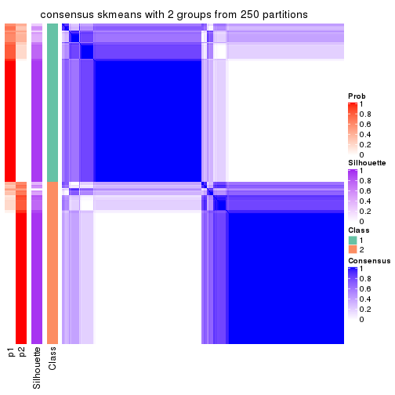</p>

</div>
<div id='tab-SD-skmeans-consensus-heatmap-2'>
<pre><code class="r">consensus_heatmap(res, k = 3)
</code></pre>

<p>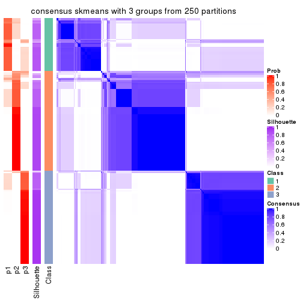</p>

</div>
<div id='tab-SD-skmeans-consensus-heatmap-3'>
<pre><code class="r">consensus_heatmap(res, k = 4)
</code></pre>

<p>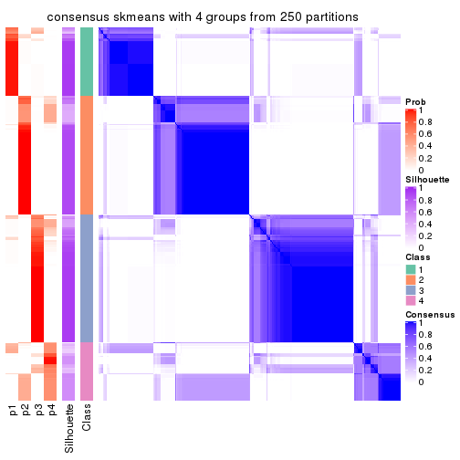</p>

</div>
<div id='tab-SD-skmeans-consensus-heatmap-4'>
<pre><code class="r">consensus_heatmap(res, k = 5)
</code></pre>

<p>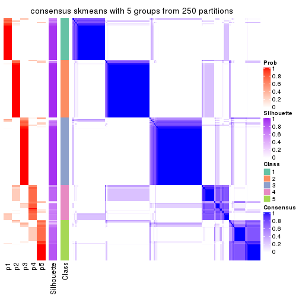</p>

</div>
<div id='tab-SD-skmeans-consensus-heatmap-5'>
<pre><code class="r">consensus_heatmap(res, k = 6)
</code></pre>

<p>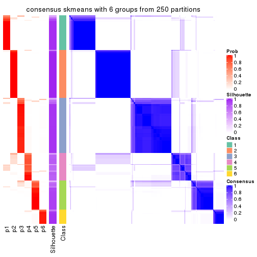</p>

</div>
</div>

Heatmaps for the membership of samples in all partitions to see how consistent they are:


<script>
$( function() {
	$( '#tabs-SD-skmeans-membership-heatmap' ).tabs();
} );
</script>
<div id='tabs-SD-skmeans-membership-heatmap'>
<ul>
<li><a href='#tab-SD-skmeans-membership-heatmap-1'>k = 2</a></li>
<li><a href='#tab-SD-skmeans-membership-heatmap-2'>k = 3</a></li>
<li><a href='#tab-SD-skmeans-membership-heatmap-3'>k = 4</a></li>
<li><a href='#tab-SD-skmeans-membership-heatmap-4'>k = 5</a></li>
<li><a href='#tab-SD-skmeans-membership-heatmap-5'>k = 6</a></li>
</ul>
<div id='tab-SD-skmeans-membership-heatmap-1'>
<pre><code class="r">membership_heatmap(res, k = 2)
</code></pre>

<p>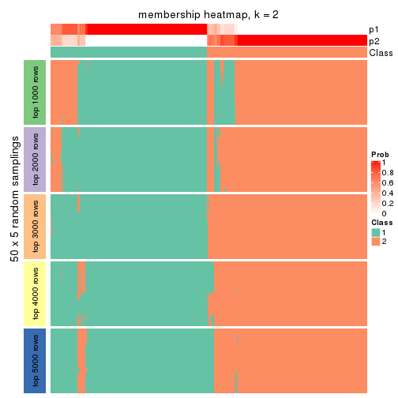</p>

</div>
<div id='tab-SD-skmeans-membership-heatmap-2'>
<pre><code class="r">membership_heatmap(res, k = 3)
</code></pre>

<p>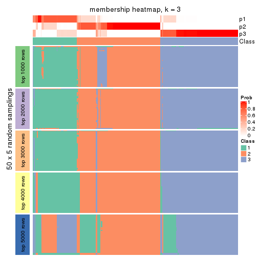</p>

</div>
<div id='tab-SD-skmeans-membership-heatmap-3'>
<pre><code class="r">membership_heatmap(res, k = 4)
</code></pre>

<p>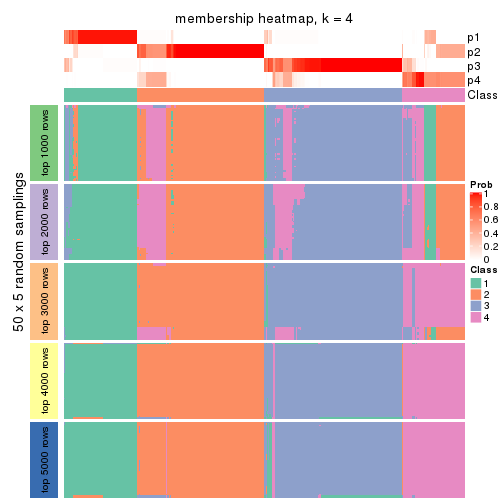</p>

</div>
<div id='tab-SD-skmeans-membership-heatmap-4'>
<pre><code class="r">membership_heatmap(res, k = 5)
</code></pre>

<p>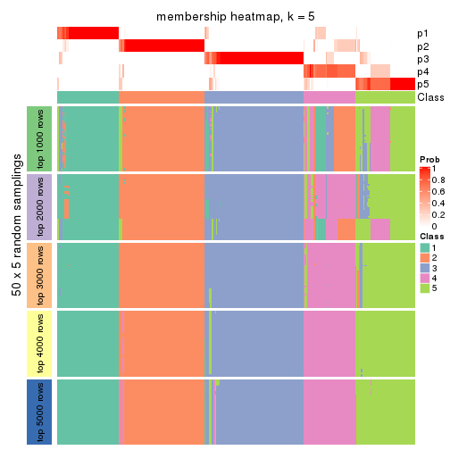</p>

</div>
<div id='tab-SD-skmeans-membership-heatmap-5'>
<pre><code class="r">membership_heatmap(res, k = 6)
</code></pre>

<p>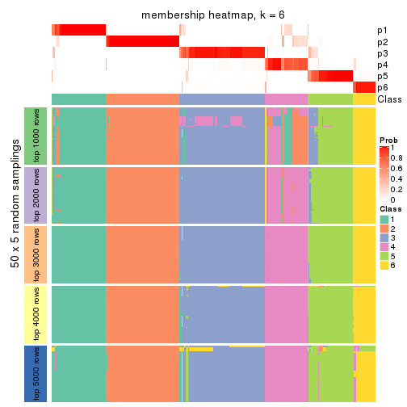</p>

</div>
</div>

As soon as we have had the classes for columns, we can look for signatures
which are significantly different between classes which can be candidate marks
for certain classes. Following are the heatmaps for signatures.


Signature heatmaps where rows are scaled:


<script>
$( function() {
	$( '#tabs-SD-skmeans-get-signatures' ).tabs();
} );
</script>
<div id='tabs-SD-skmeans-get-signatures'>
<ul>
<li><a href='#tab-SD-skmeans-get-signatures-1'>k = 2</a></li>
<li><a href='#tab-SD-skmeans-get-signatures-2'>k = 3</a></li>
<li><a href='#tab-SD-skmeans-get-signatures-3'>k = 4</a></li>
<li><a href='#tab-SD-skmeans-get-signatures-4'>k = 5</a></li>
<li><a href='#tab-SD-skmeans-get-signatures-5'>k = 6</a></li>
</ul>
<div id='tab-SD-skmeans-get-signatures-1'>
<pre><code class="r">get_signatures(res, k = 2)
</code></pre>

<p>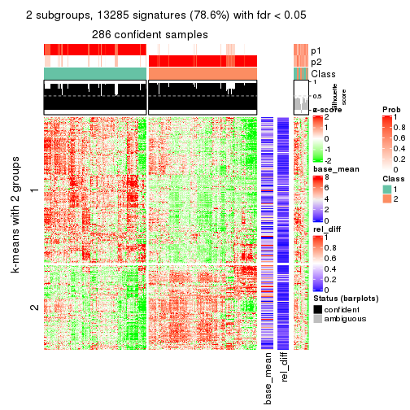</p>

</div>
<div id='tab-SD-skmeans-get-signatures-2'>
<pre><code class="r">get_signatures(res, k = 3)
</code></pre>

<p>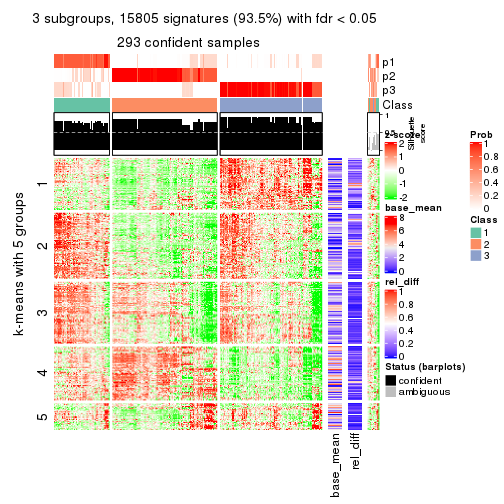</p>

</div>
<div id='tab-SD-skmeans-get-signatures-3'>
<pre><code class="r">get_signatures(res, k = 4)
</code></pre>

<p>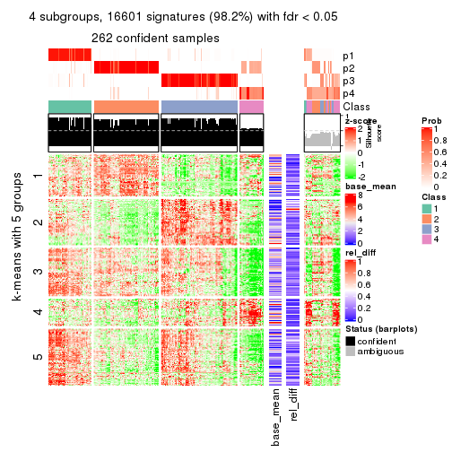</p>

</div>
<div id='tab-SD-skmeans-get-signatures-4'>
<pre><code class="r">get_signatures(res, k = 5)
</code></pre>

<p>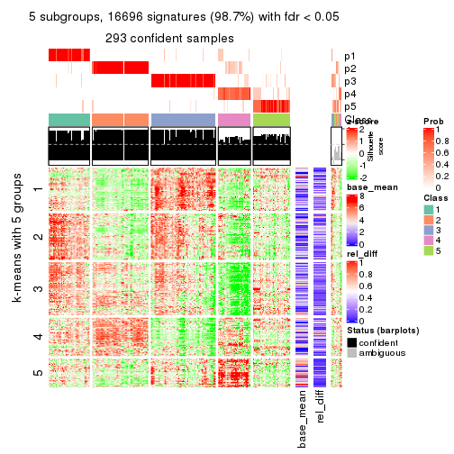</p>

</div>
<div id='tab-SD-skmeans-get-signatures-5'>
<pre><code class="r">get_signatures(res, k = 6)
</code></pre>

<p>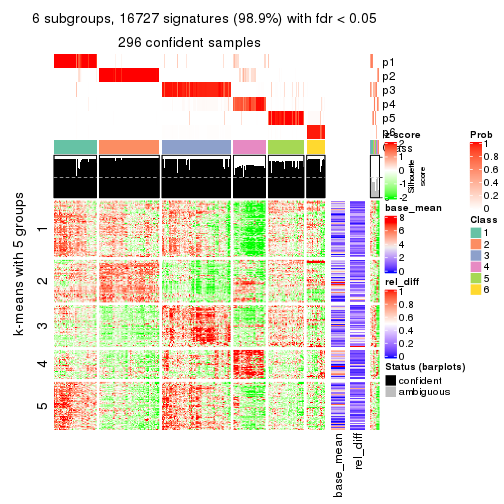</p>

</div>
</div>


Signature heatmaps where rows are not scaled:


<script>
$( function() {
	$( '#tabs-SD-skmeans-get-signatures-no-scale' ).tabs();
} );
</script>
<div id='tabs-SD-skmeans-get-signatures-no-scale'>
<ul>
<li><a href='#tab-SD-skmeans-get-signatures-no-scale-1'>k = 2</a></li>
<li><a href='#tab-SD-skmeans-get-signatures-no-scale-2'>k = 3</a></li>
<li><a href='#tab-SD-skmeans-get-signatures-no-scale-3'>k = 4</a></li>
<li><a href='#tab-SD-skmeans-get-signatures-no-scale-4'>k = 5</a></li>
<li><a href='#tab-SD-skmeans-get-signatures-no-scale-5'>k = 6</a></li>
</ul>
<div id='tab-SD-skmeans-get-signatures-no-scale-1'>
<pre><code class="r">get_signatures(res, k = 2, scale_rows = FALSE)
</code></pre>

<p>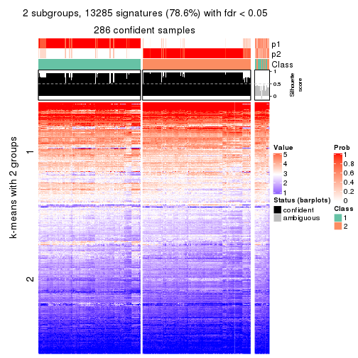</p>

</div>
<div id='tab-SD-skmeans-get-signatures-no-scale-2'>
<pre><code class="r">get_signatures(res, k = 3, scale_rows = FALSE)
</code></pre>

<p>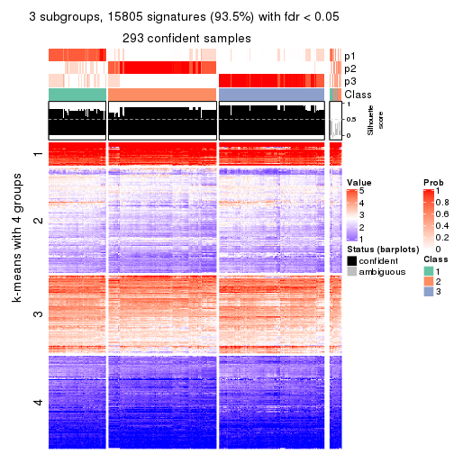</p>

</div>
<div id='tab-SD-skmeans-get-signatures-no-scale-3'>
<pre><code class="r">get_signatures(res, k = 4, scale_rows = FALSE)
</code></pre>

<p>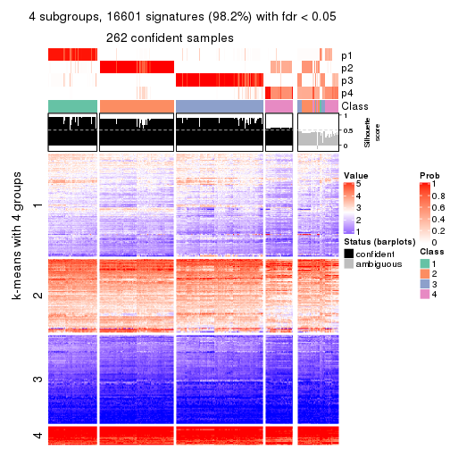</p>

</div>
<div id='tab-SD-skmeans-get-signatures-no-scale-4'>
<pre><code class="r">get_signatures(res, k = 5, scale_rows = FALSE)
</code></pre>

<p>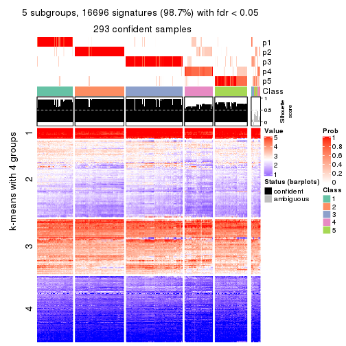</p>

</div>
<div id='tab-SD-skmeans-get-signatures-no-scale-5'>
<pre><code class="r">get_signatures(res, k = 6, scale_rows = FALSE)
</code></pre>

<p>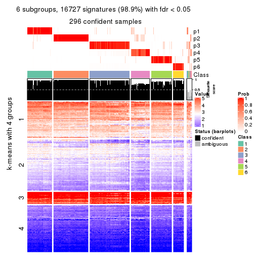</p>

</div>
</div>


Compare the overlap of signatures from different k:

```r
compare_signatures(res)
```

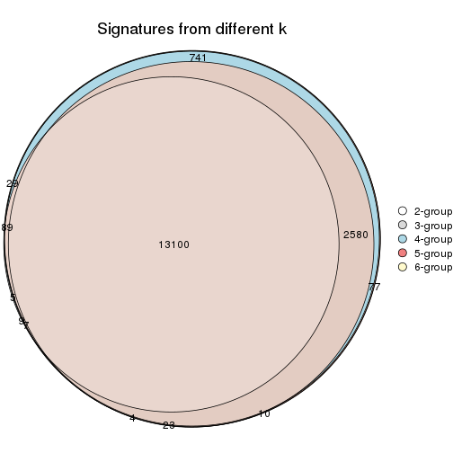

`get_signature()` returns a data frame invisibly. TO get the list of signatures, the function
call should be assigned to a variable explicitly. In following code, if `plot` argument is set
to `FALSE`, no heatmap is plotted while only the differential analysis is performed.

```r
# code only for demonstration
tb = get_signature(res, k = ..., plot = FALSE)
```

An example of the output of `tb` is:

```
#>   which_row         fdr    mean_1    mean_2 scaled_mean_1 scaled_mean_2 km
#> 1        38 0.042760348  8.373488  9.131774    -0.5533452     0.5164555  1
#> 2        40 0.018707592  7.106213  8.469186    -0.6173731     0.5762149  1
#> 3        55 0.019134737 10.221463 11.207825    -0.6159697     0.5749050  1
#> 4        59 0.006059896  5.921854  7.869574    -0.6899429     0.6439467  1
#> 5        60 0.018055526  8.928898 10.211722    -0.6204761     0.5791110  1
#> 6        98 0.009384629 15.714769 14.887706     0.6635654    -0.6193277  2
...
```

The columns in `tb` are:

1. `which_row`: row indices corresponding to the input matrix.
2. `fdr`: FDR for the differential test. 
3. `mean_x`: The mean value in group x.
4. `scaled_mean_x`: The mean value in group x after rows are scaled.
5. `km`: Row groups if k-means clustering is applied to rows.


UMAP plot which shows how samples are separated.


<script>
$( function() {
	$( '#tabs-SD-skmeans-dimension-reduction' ).tabs();
} );
</script>
<div id='tabs-SD-skmeans-dimension-reduction'>
<ul>
<li><a href='#tab-SD-skmeans-dimension-reduction-1'>k = 2</a></li>
<li><a href='#tab-SD-skmeans-dimension-reduction-2'>k = 3</a></li>
<li><a href='#tab-SD-skmeans-dimension-reduction-3'>k = 4</a></li>
<li><a href='#tab-SD-skmeans-dimension-reduction-4'>k = 5</a></li>
<li><a href='#tab-SD-skmeans-dimension-reduction-5'>k = 6</a></li>
</ul>
<div id='tab-SD-skmeans-dimension-reduction-1'>
<pre><code class="r">dimension_reduction(res, k = 2, method = &quot;UMAP&quot;)
</code></pre>

<p>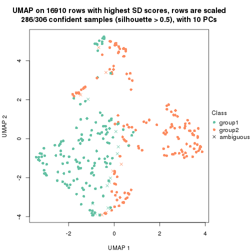</p>

</div>
<div id='tab-SD-skmeans-dimension-reduction-2'>
<pre><code class="r">dimension_reduction(res, k = 3, method = &quot;UMAP&quot;)
</code></pre>

<p>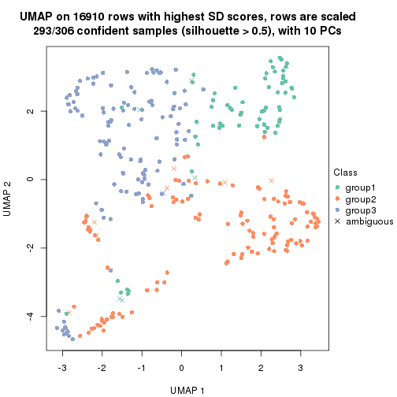</p>

</div>
<div id='tab-SD-skmeans-dimension-reduction-3'>
<pre><code class="r">dimension_reduction(res, k = 4, method = &quot;UMAP&quot;)
</code></pre>

<p>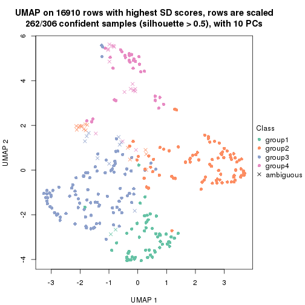</p>

</div>
<div id='tab-SD-skmeans-dimension-reduction-4'>
<pre><code class="r">dimension_reduction(res, k = 5, method = &quot;UMAP&quot;)
</code></pre>

<p>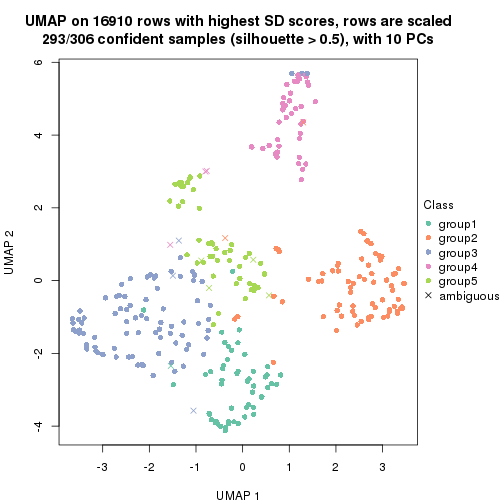</p>

</div>
<div id='tab-SD-skmeans-dimension-reduction-5'>
<pre><code class="r">dimension_reduction(res, k = 6, method = &quot;UMAP&quot;)
</code></pre>

<p>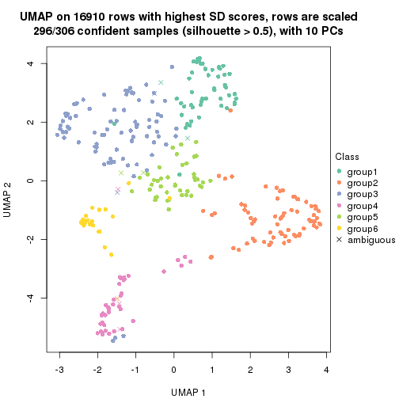</p>

</div>
</div>


Following heatmap shows how subgroups are split when increasing `k`:

```r
collect_classes(res)
```

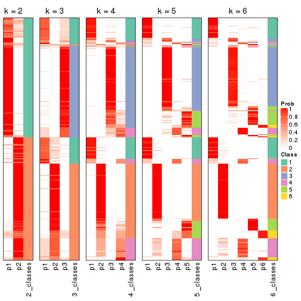


If matrix rows can be associated to genes, consider to use `GO_Enrichment(res,
...)` to perform function enrichment for the signature genes.


 

---------------------------------------------------


### SD:pam


The object with results only for a single top-value method and a single partition method 
can be extracted as:

```r
res = res_list["SD", "pam"]
# you can also extract it by
# res = res_list["SD:pam"]
```

A summary of `res` and all the functions that can be applied to it:

```r
res
```

```
#> A 'ConsensusPartition' object with k = 2, 3, 4, 5, 6.
#>   On a matrix with 16910 rows and 306 columns.
#>   Top rows (1000, 2000, 3000, 4000, 5000) are extracted by 'SD' method.
#>   Subgroups are detected by 'pam' method.
#>   Performed in total 1250 partitions by row resampling.
#>   Best k for subgroups seems to be 2.
#> 
#> Following methods can be applied to this 'ConsensusPartition' object:
#>  [1] "cola_report"             "collect_classes"         "collect_plots"          
#>  [4] "collect_stats"           "colnames"                "compare_signatures"     
#>  [7] "consensus_heatmap"       "dimension_reduction"     "functional_enrichment"  
#> [10] "get_anno_col"            "get_anno"                "get_classes"            
#> [13] "get_consensus"           "get_matrix"              "get_membership"         
#> [16] "get_param"               "get_signatures"          "get_stats"              
#> [19] "is_best_k"               "is_stable_k"             "membership_heatmap"     
#> [22] "ncol"                    "nrow"                    "plot_ecdf"              
#> [25] "rownames"                "select_partition_number" "show"                   
#> [28] "suggest_best_k"          "test_to_known_factors"
```

`collect_plots()` function collects all the plots made from `res` for all `k` (number of partitions)
into one single page to provide an easy and fast comparison between different `k`.

```r
collect_plots(res)
```

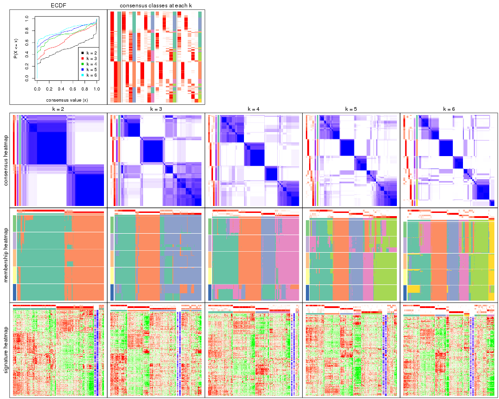

The plots are:

- The first row: a plot of the ECDF (Empirical cumulative distribution
  function) curves of the consensus matrix for each `k` and the heatmap of
  predicted classes for each `k`.
- The second row: heatmaps of the consensus matrix for each `k`.
- The third row: heatmaps of the membership matrix for each `k`.
- The fouth row: heatmaps of the signatures for each `k`.

All the plots in panels can be made by individual functions and they are
plotted later in this section.

`select_partition_number()` produces several plots showing different
statistics for choosing "optimized" `k`. There are following statistics:

- ECDF curves of the consensus matrix for each `k`;
- 1-PAC. [The PAC
  score](https://en.wikipedia.org/wiki/Consensus_clustering#Over-interpretation_potential_of_consensus_clustering)
  measures the proportion of the ambiguous subgrouping.
- Mean silhouette score.
- Concordance. The mean probability of fiting the consensus class ids in all
  partitions.
- Area increased. Denote $A_k$ as the area under the ECDF curve for current
  `k`, the area increased is defined as $A_k - A_{k-1}$.
- Rand index. The percent of pairs of samples that are both in a same cluster
  or both are not in a same cluster in the partition of k and k-1.
- Jaccard index. The ratio of pairs of samples are both in a same cluster in
  the partition of k and k-1 and the pairs of samples are both in a same
  cluster in the partition k or k-1.

The detailed explanations of these statistics can be found in [the cola
vignette](http://bioconductor.org/packages/devel/bioc/vignettes/cola/inst/doc/cola.html#toc_13).

Generally speaking, lower PAC score, higher mean silhouette score or higher
concordance corresponds to better partition. Rand index and Jaccard index
measure how similar the current partition is compared to partition with `k-1`.
If they are too similar, we won't accept `k` is better than `k-1`.

```r
select_partition_number(res)
```

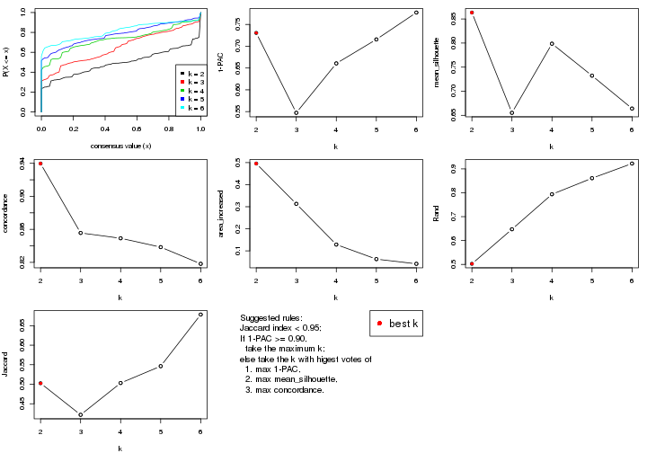

The numeric values for all these statistics can be obtained by `get_stats()`.

```r
get_stats(res)
```

```
#>   k 1-PAC mean_silhouette concordance area_increased  Rand Jaccard
#> 2 2 0.731           0.863       0.940         0.4956 0.503   0.503
#> 3 3 0.547           0.655       0.856         0.3131 0.647   0.422
#> 4 4 0.661           0.799       0.849         0.1285 0.794   0.503
#> 5 5 0.716           0.732       0.838         0.0625 0.861   0.546
#> 6 6 0.777           0.664       0.818         0.0412 0.922   0.679
```

`suggest_best_k()` suggests the best $k$ based on these statistics. The rules are as follows:

- All $k$ with Jaccard index larger than 0.95 are removed because the increase of
  the partition number does not provides enough extra information. If all $k$ are removed,
  the best $k$ is assigned by `NA`.
- For $k$ with 1-PAC larger than 0.9, the maximal $k$ is taken as the "best k". Other $k$ is called "optional k".
- If it does not fit the second rule. The $k$ with the highest vote of highest
  1-PAC, mean silhouette and concordance is taken as the "best k".

```r
suggest_best_k(res)
```

```
#> [1] 2
```


Following shows the table of the partitions (You need to click the **show/hide
code output** link to see it). The membership matrix (columns with name `p*`)
is inferred by
[`clue::cl_consensus()`](https://www.rdocumentation.org/link/cl_consensus?package=clue)
function with the `SE` method. Basically the value in the membership matrix
represents the probability to belong to a certain group. The finall class
label for an item is determined with the group with highest probability it
belongs to.

In `get_classes()` function, the entropy is calculated from the membership
matrix and the silhouette score is calculated from the consensus matrix.


<script>
$( function() {
	$( '#tabs-SD-pam-get-classes' ).tabs();
} );
</script>
<div id='tabs-SD-pam-get-classes'>
<ul>
<li><a href='#tab-SD-pam-get-classes-1'>k = 2</a></li>
<li><a href='#tab-SD-pam-get-classes-2'>k = 3</a></li>
<li><a href='#tab-SD-pam-get-classes-3'>k = 4</a></li>
<li><a href='#tab-SD-pam-get-classes-4'>k = 5</a></li>
<li><a href='#tab-SD-pam-get-classes-5'>k = 6</a></li>
</ul>

<div id='tab-SD-pam-get-classes-1'>
<p><a id='tab-SD-pam-get-classes-1-a' style='color:#0366d6' href='#'>show/hide code output</a></p>
<pre><code class="r">cbind(get_classes(res, k = 2), get_membership(res, k = 2))
</code></pre>

<pre><code>#&gt;            class entropy silhouette    p1    p2
#&gt; SRR1609360     2  0.5519     0.8147 0.128 0.872
#&gt; SRR1609361     2  0.1414     0.9163 0.020 0.980
#&gt; SRR1609362     2  0.0000     0.9309 0.000 1.000
#&gt; SRR1609363     2  0.0000     0.9309 0.000 1.000
#&gt; SRR1609364     2  0.0000     0.9309 0.000 1.000
#&gt; SRR1609365     2  0.0000     0.9309 0.000 1.000
#&gt; SRR1609366     2  0.0000     0.9309 0.000 1.000
#&gt; SRR1609367     1  0.2948     0.9083 0.948 0.052
#&gt; SRR1609368     2  0.0000     0.9309 0.000 1.000
#&gt; SRR1609369     2  0.0000     0.9309 0.000 1.000
#&gt; SRR1609370     1  0.3114     0.9062 0.944 0.056
#&gt; SRR1609371     2  0.0000     0.9309 0.000 1.000
#&gt; SRR1609372     1  0.3114     0.9062 0.944 0.056
#&gt; SRR1609373     2  0.0000     0.9309 0.000 1.000
#&gt; SRR1609374     2  0.0000     0.9309 0.000 1.000
#&gt; SRR1609375     2  0.0000     0.9309 0.000 1.000
#&gt; SRR1609377     2  0.8327     0.6264 0.264 0.736
#&gt; SRR1609376     2  0.0000     0.9309 0.000 1.000
#&gt; SRR1609378     2  0.0000     0.9309 0.000 1.000
#&gt; SRR1609379     1  0.7219     0.7486 0.800 0.200
#&gt; SRR1609382     2  0.0000     0.9309 0.000 1.000
#&gt; SRR1609383     1  0.7950     0.7047 0.760 0.240
#&gt; SRR1609381     1  0.3274     0.9036 0.940 0.060
#&gt; SRR1609384     2  0.0000     0.9309 0.000 1.000
#&gt; SRR1609386     2  0.0000     0.9309 0.000 1.000
#&gt; SRR1609385     2  0.0000     0.9309 0.000 1.000
#&gt; SRR1609387     1  0.3733     0.8940 0.928 0.072
#&gt; SRR1609388     2  0.0000     0.9309 0.000 1.000
#&gt; SRR1609390     1  0.3274     0.9036 0.940 0.060
#&gt; SRR1609393     2  0.0000     0.9309 0.000 1.000
#&gt; SRR1609394     2  0.0000     0.9309 0.000 1.000
#&gt; SRR1609392     2  0.0000     0.9309 0.000 1.000
#&gt; SRR1609391     2  0.0000     0.9309 0.000 1.000
#&gt; SRR1609395     1  0.3114     0.9062 0.944 0.056
#&gt; SRR1609396     1  0.3274     0.9036 0.940 0.060
#&gt; SRR1609398     2  0.0000     0.9309 0.000 1.000
#&gt; SRR1609399     1  0.3114     0.9062 0.944 0.056
#&gt; SRR1609400     1  0.2948     0.9083 0.948 0.052
#&gt; SRR1609397     2  0.0000     0.9309 0.000 1.000
#&gt; SRR1609401     2  0.0000     0.9309 0.000 1.000
#&gt; SRR1609402     2  0.0000     0.9309 0.000 1.000
#&gt; SRR1609405     2  0.0000     0.9309 0.000 1.000
#&gt; SRR1609404     2  0.0000     0.9309 0.000 1.000
#&gt; SRR1609406     2  0.0000     0.9309 0.000 1.000
#&gt; SRR1609408     2  0.0000     0.9309 0.000 1.000
#&gt; SRR1609403     1  0.7219     0.7486 0.800 0.200
#&gt; SRR1609410     1  0.3274     0.9036 0.940 0.060
#&gt; SRR1609411     2  0.0000     0.9309 0.000 1.000
#&gt; SRR1609407     2  0.0000     0.9309 0.000 1.000
#&gt; SRR1609413     1  0.7219     0.7486 0.800 0.200
#&gt; SRR1609412     1  0.0000     0.9355 1.000 0.000
#&gt; SRR1609414     1  0.0000     0.9355 1.000 0.000
#&gt; SRR1609415     1  0.0000     0.9355 1.000 0.000
#&gt; SRR1609416     1  0.0000     0.9355 1.000 0.000
#&gt; SRR1609417     1  0.0000     0.9355 1.000 0.000
#&gt; SRR1609418     1  0.9491     0.4630 0.632 0.368
#&gt; SRR1609419     2  0.0000     0.9309 0.000 1.000
#&gt; SRR1609420     2  0.0000     0.9309 0.000 1.000
#&gt; SRR1609421     2  0.8861     0.6099 0.304 0.696
#&gt; SRR1609422     2  0.9170     0.5595 0.332 0.668
#&gt; SRR1609423     2  0.0000     0.9309 0.000 1.000
#&gt; SRR1609424     2  0.0000     0.9309 0.000 1.000
#&gt; SRR1609425     2  0.0000     0.9309 0.000 1.000
#&gt; SRR1609426     2  0.0000     0.9309 0.000 1.000
#&gt; SRR1609427     1  0.0000     0.9355 1.000 0.000
#&gt; SRR1609428     2  0.0000     0.9309 0.000 1.000
#&gt; SRR1609429     1  0.2948     0.9087 0.948 0.052
#&gt; SRR1609430     1  0.0000     0.9355 1.000 0.000
#&gt; SRR1609431     2  0.8955     0.5979 0.312 0.688
#&gt; SRR1609432     2  0.0000     0.9309 0.000 1.000
#&gt; SRR1609433     1  0.0000     0.9355 1.000 0.000
#&gt; SRR1609434     2  0.0000     0.9309 0.000 1.000
#&gt; SRR1609435     1  0.0000     0.9355 1.000 0.000
#&gt; SRR1609436     1  0.0000     0.9355 1.000 0.000
#&gt; SRR1609437     2  0.0000     0.9309 0.000 1.000
#&gt; SRR1609438     2  0.0000     0.9309 0.000 1.000
#&gt; SRR1609439     1  0.0000     0.9355 1.000 0.000
#&gt; SRR1609440     1  0.3114     0.9062 0.944 0.056
#&gt; SRR1609441     2  0.0938     0.9229 0.012 0.988
#&gt; SRR1609442     2  0.0000     0.9309 0.000 1.000
#&gt; SRR1609443     1  0.0000     0.9355 1.000 0.000
#&gt; SRR1609444     1  0.2236     0.9177 0.964 0.036
#&gt; SRR1609445     1  0.0376     0.9336 0.996 0.004
#&gt; SRR1609446     2  0.5629     0.8197 0.132 0.868
#&gt; SRR1609447     1  0.0000     0.9355 1.000 0.000
#&gt; SRR1609448     2  0.0000     0.9309 0.000 1.000
#&gt; SRR1609449     1  0.2236     0.9177 0.964 0.036
#&gt; SRR1609450     2  0.0000     0.9309 0.000 1.000
#&gt; SRR1609451     1  0.0000     0.9355 1.000 0.000
#&gt; SRR1609452     1  0.9460     0.3873 0.636 0.364
#&gt; SRR1609453     1  0.0000     0.9355 1.000 0.000
#&gt; SRR1609454     2  0.0000     0.9309 0.000 1.000
#&gt; SRR1609455     2  0.0938     0.9228 0.012 0.988
#&gt; SRR1609456     2  0.8144     0.6735 0.252 0.748
#&gt; SRR1609457     1  0.0000     0.9355 1.000 0.000
#&gt; SRR1609458     1  0.0000     0.9355 1.000 0.000
#&gt; SRR1609459     1  0.0000     0.9355 1.000 0.000
#&gt; SRR1609460     2  0.7139     0.7619 0.196 0.804
#&gt; SRR1609461     1  0.0000     0.9355 1.000 0.000
#&gt; SRR1609462     1  0.0000     0.9355 1.000 0.000
#&gt; SRR1609464     1  0.0000     0.9355 1.000 0.000
#&gt; SRR1609463     1  0.0000     0.9355 1.000 0.000
#&gt; SRR1609465     2  0.6887     0.7757 0.184 0.816
#&gt; SRR1609466     1  0.9491     0.4242 0.632 0.368
#&gt; SRR1609467     1  0.0000     0.9355 1.000 0.000
#&gt; SRR1609469     2  0.0000     0.9309 0.000 1.000
#&gt; SRR1609470     2  0.9881     0.3077 0.436 0.564
#&gt; SRR1609472     1  0.9710     0.2816 0.600 0.400
#&gt; SRR1609471     1  0.3274     0.9036 0.940 0.060
#&gt; SRR1609474     2  0.0000     0.9309 0.000 1.000
#&gt; SRR1609473     2  0.0000     0.9309 0.000 1.000
#&gt; SRR1609475     2  0.0000     0.9309 0.000 1.000
#&gt; SRR1609478     2  0.9922     0.2723 0.448 0.552
#&gt; SRR1609476     1  0.0000     0.9355 1.000 0.000
#&gt; SRR1609477     1  0.0000     0.9355 1.000 0.000
#&gt; SRR1609479     2  0.0000     0.9309 0.000 1.000
#&gt; SRR1609481     2  0.5842     0.8215 0.140 0.860
#&gt; SRR1609480     1  0.0000     0.9355 1.000 0.000
#&gt; SRR1609482     1  0.0000     0.9355 1.000 0.000
#&gt; SRR1609484     2  0.0000     0.9309 0.000 1.000
#&gt; SRR1609483     1  0.0000     0.9355 1.000 0.000
#&gt; SRR1609486     1  0.0000     0.9355 1.000 0.000
#&gt; SRR1609485     1  0.0000     0.9355 1.000 0.000
#&gt; SRR1609487     2  0.9732     0.2852 0.404 0.596
#&gt; SRR1609488     1  0.0000     0.9355 1.000 0.000
#&gt; SRR1609489     2  0.0000     0.9309 0.000 1.000
#&gt; SRR1609490     2  0.0000     0.9309 0.000 1.000
#&gt; SRR1609491     1  0.5408     0.8300 0.876 0.124
#&gt; SRR1609492     2  0.0000     0.9309 0.000 1.000
#&gt; SRR1609493     2  0.9833     0.3464 0.424 0.576
#&gt; SRR1609494     2  0.0000     0.9309 0.000 1.000
#&gt; SRR1609495     1  0.3114     0.9062 0.944 0.056
#&gt; SRR1609496     1  0.0000     0.9355 1.000 0.000
#&gt; SRR1609497     1  0.0000     0.9355 1.000 0.000
#&gt; SRR1609498     1  0.0000     0.9355 1.000 0.000
#&gt; SRR1609499     2  0.0000     0.9309 0.000 1.000
#&gt; SRR1609500     1  0.0000     0.9355 1.000 0.000
#&gt; SRR1609501     2  0.8813     0.6153 0.300 0.700
#&gt; SRR1609502     2  0.0000     0.9309 0.000 1.000
#&gt; SRR1609503     2  0.7219     0.7580 0.200 0.800
#&gt; SRR1609504     1  0.0000     0.9355 1.000 0.000
#&gt; SRR1609505     1  0.0000     0.9355 1.000 0.000
#&gt; SRR1609506     2  0.0000     0.9309 0.000 1.000
#&gt; SRR1609507     1  0.0000     0.9355 1.000 0.000
#&gt; SRR1609508     2  0.0000     0.9309 0.000 1.000
#&gt; SRR1609509     2  0.0000     0.9309 0.000 1.000
#&gt; SRR1609510     2  0.7139     0.7619 0.196 0.804
#&gt; SRR1609512     1  0.0000     0.9355 1.000 0.000
#&gt; SRR1609511     1  0.0000     0.9355 1.000 0.000
#&gt; SRR1609513     1  0.0000     0.9355 1.000 0.000
#&gt; SRR1609514     1  0.8861     0.5324 0.696 0.304
#&gt; SRR1609515     2  0.0000     0.9309 0.000 1.000
#&gt; SRR1609516     1  0.0000     0.9355 1.000 0.000
#&gt; SRR1609517     2  0.2948     0.8916 0.052 0.948
#&gt; SRR1609518     1  0.3274     0.9036 0.940 0.060
#&gt; SRR1609519     1  0.0000     0.9355 1.000 0.000
#&gt; SRR1609520     2  0.0000     0.9309 0.000 1.000
#&gt; SRR1609521     1  0.0000     0.9355 1.000 0.000
#&gt; SRR1609522     1  0.0000     0.9355 1.000 0.000
#&gt; SRR1609523     2  0.9044     0.5829 0.320 0.680
#&gt; SRR1609524     2  0.0000     0.9309 0.000 1.000
#&gt; SRR1609526     1  0.0000     0.9355 1.000 0.000
#&gt; SRR1609525     2  0.8861     0.6099 0.304 0.696
#&gt; SRR1609527     1  0.3114     0.9062 0.944 0.056
#&gt; SRR1609529     1  0.0000     0.9355 1.000 0.000
#&gt; SRR1609528     2  0.9000     0.5906 0.316 0.684
#&gt; SRR1609530     1  0.0000     0.9355 1.000 0.000
#&gt; SRR1609531     2  0.0000     0.9309 0.000 1.000
#&gt; SRR1609532     1  0.0000     0.9355 1.000 0.000
#&gt; SRR1609533     2  0.8861     0.6099 0.304 0.696
#&gt; SRR1609534     1  0.0000     0.9355 1.000 0.000
#&gt; SRR1609535     2  0.5519     0.8325 0.128 0.872
#&gt; SRR1609537     2  0.0000     0.9309 0.000 1.000
#&gt; SRR1609536     1  0.0000     0.9355 1.000 0.000
#&gt; SRR1609538     2  0.0000     0.9309 0.000 1.000
#&gt; SRR1609539     1  0.0000     0.9355 1.000 0.000
#&gt; SRR1609540     1  0.0000     0.9355 1.000 0.000
#&gt; SRR1609541     1  0.9710     0.2816 0.600 0.400
#&gt; SRR1609542     2  0.0000     0.9309 0.000 1.000
#&gt; SRR1609543     1  0.0000     0.9355 1.000 0.000
#&gt; SRR1609544     1  0.0000     0.9355 1.000 0.000
#&gt; SRR1609545     1  0.0000     0.9355 1.000 0.000
#&gt; SRR1609546     1  0.0000     0.9355 1.000 0.000
#&gt; SRR1609547     1  0.0000     0.9355 1.000 0.000
#&gt; SRR1609548     1  0.5178     0.8344 0.884 0.116
#&gt; SRR1609549     2  0.0000     0.9309 0.000 1.000
#&gt; SRR1609550     2  0.0000     0.9309 0.000 1.000
#&gt; SRR1609551     1  0.0000     0.9355 1.000 0.000
#&gt; SRR1609552     1  0.0000     0.9355 1.000 0.000
#&gt; SRR1609553     1  0.0000     0.9355 1.000 0.000
#&gt; SRR1609554     1  0.0000     0.9355 1.000 0.000
#&gt; SRR1609555     1  0.0000     0.9355 1.000 0.000
#&gt; SRR1609556     1  0.0000     0.9355 1.000 0.000
#&gt; SRR1609557     1  0.6048     0.8010 0.852 0.148
#&gt; SRR1609558     1  0.0000     0.9355 1.000 0.000
#&gt; SRR1609559     1  0.8813     0.5568 0.700 0.300
#&gt; SRR1609560     1  0.9427     0.4813 0.640 0.360
#&gt; SRR1609561     1  0.0000     0.9355 1.000 0.000
#&gt; SRR1609562     2  0.0000     0.9309 0.000 1.000
#&gt; SRR1609563     2  0.0000     0.9309 0.000 1.000
#&gt; SRR1609564     1  0.0000     0.9355 1.000 0.000
#&gt; SRR1609565     2  0.0000     0.9309 0.000 1.000
#&gt; SRR1609566     2  0.0000     0.9309 0.000 1.000
#&gt; SRR1609567     2  0.0000     0.9309 0.000 1.000
#&gt; SRR1609568     1  0.9661     0.4059 0.608 0.392
#&gt; SRR1609569     1  0.0000     0.9355 1.000 0.000
#&gt; SRR1609570     1  0.0000     0.9355 1.000 0.000
#&gt; SRR1609571     1  0.0000     0.9355 1.000 0.000
#&gt; SRR1609572     1  0.0000     0.9355 1.000 0.000
#&gt; SRR1609573     1  0.0000     0.9355 1.000 0.000
#&gt; SRR1609574     1  0.0000     0.9355 1.000 0.000
#&gt; SRR1609575     2  0.0000     0.9309 0.000 1.000
#&gt; SRR1609576     2  0.0000     0.9309 0.000 1.000
#&gt; SRR1609578     1  0.5294     0.8347 0.880 0.120
#&gt; SRR1609577     1  0.3274     0.9036 0.940 0.060
#&gt; SRR1609579     1  0.0000     0.9355 1.000 0.000
#&gt; SRR1609580     1  0.0000     0.9355 1.000 0.000
#&gt; SRR1609582     1  0.0000     0.9355 1.000 0.000
#&gt; SRR1609581     1  0.7056     0.7659 0.808 0.192
#&gt; SRR1609583     1  0.0000     0.9355 1.000 0.000
#&gt; SRR1609584     1  0.0000     0.9355 1.000 0.000
#&gt; SRR1609585     1  0.0000     0.9355 1.000 0.000
#&gt; SRR1609586     2  0.0000     0.9309 0.000 1.000
#&gt; SRR1609587     1  0.0000     0.9355 1.000 0.000
#&gt; SRR1609588     1  0.7219     0.7550 0.800 0.200
#&gt; SRR1609589     2  0.8144     0.6735 0.252 0.748
#&gt; SRR1609590     1  0.0000     0.9355 1.000 0.000
#&gt; SRR1609592     1  0.9896     0.1678 0.560 0.440
#&gt; SRR1609591     1  0.0376     0.9336 0.996 0.004
#&gt; SRR1609593     1  0.4690     0.8551 0.900 0.100
#&gt; SRR1609594     2  0.0000     0.9309 0.000 1.000
#&gt; SRR1609595     2  0.8955     0.5979 0.312 0.688
#&gt; SRR1609596     2  0.0000     0.9309 0.000 1.000
#&gt; SRR1609597     2  0.0000     0.9309 0.000 1.000
#&gt; SRR1609598     1  0.9710     0.2816 0.600 0.400
#&gt; SRR1609599     1  0.7219     0.7220 0.800 0.200
#&gt; SRR1609600     1  0.0000     0.9355 1.000 0.000
#&gt; SRR1609601     1  0.0000     0.9355 1.000 0.000
#&gt; SRR1609602     1  0.9686     0.2940 0.604 0.396
#&gt; SRR1609603     2  0.8267     0.6162 0.260 0.740
#&gt; SRR1609604     2  0.0000     0.9309 0.000 1.000
#&gt; SRR1609605     2  0.2236     0.9059 0.036 0.964
#&gt; SRR1609606     2  0.8713     0.6301 0.292 0.708
#&gt; SRR1609607     1  0.0000     0.9355 1.000 0.000
#&gt; SRR1609608     1  0.0000     0.9355 1.000 0.000
#&gt; SRR1609609     2  0.9998     0.0553 0.492 0.508
#&gt; SRR1609610     1  0.0000     0.9355 1.000 0.000
#&gt; SRR1609611     2  0.0000     0.9309 0.000 1.000
#&gt; SRR1609613     2  0.0000     0.9309 0.000 1.000
#&gt; SRR1609612     1  0.0000     0.9355 1.000 0.000
#&gt; SRR1609614     1  0.0000     0.9355 1.000 0.000
#&gt; SRR1609615     1  0.3274     0.9036 0.940 0.060
#&gt; SRR1609616     1  0.0000     0.9355 1.000 0.000
#&gt; SRR1609617     2  0.8909     0.6036 0.308 0.692
#&gt; SRR1609618     1  0.0000     0.9355 1.000 0.000
#&gt; SRR1609619     1  0.3274     0.9036 0.940 0.060
#&gt; SRR1609620     2  0.0000     0.9309 0.000 1.000
#&gt; SRR1609621     2  0.0000     0.9309 0.000 1.000
#&gt; SRR1609622     1  0.0000     0.9355 1.000 0.000
#&gt; SRR1609623     1  0.0000     0.9355 1.000 0.000
#&gt; SRR1609624     1  0.3733     0.8940 0.928 0.072
#&gt; SRR1609625     1  0.1184     0.9281 0.984 0.016
#&gt; SRR1609626     1  0.0000     0.9355 1.000 0.000
#&gt; SRR1609627     2  0.0000     0.9309 0.000 1.000
#&gt; SRR1609628     2  0.0000     0.9309 0.000 1.000
#&gt; SRR1609629     1  0.0000     0.9355 1.000 0.000
#&gt; SRR1609630     2  0.0000     0.9309 0.000 1.000
#&gt; SRR1609631     1  0.3114     0.9062 0.944 0.056
#&gt; SRR1609632     1  0.9491     0.4638 0.632 0.368
#&gt; SRR1609633     1  0.3114     0.9062 0.944 0.056
#&gt; SRR1609634     2  0.0000     0.9309 0.000 1.000
#&gt; SRR1609635     1  0.0000     0.9355 1.000 0.000
#&gt; SRR1609636     2  0.0000     0.9309 0.000 1.000
#&gt; SRR1609637     1  0.0000     0.9355 1.000 0.000
#&gt; SRR1609638     2  0.0000     0.9309 0.000 1.000
#&gt; SRR1609639     2  0.0000     0.9309 0.000 1.000
#&gt; SRR1609640     1  0.0000     0.9355 1.000 0.000
#&gt; SRR1609641     1  0.3431     0.9006 0.936 0.064
#&gt; SRR1609642     1  0.3274     0.9036 0.940 0.060
#&gt; SRR1609643     1  0.0000     0.9355 1.000 0.000
#&gt; SRR1609644     1  0.9775     0.3551 0.588 0.412
#&gt; SRR1609645     1  0.0000     0.9355 1.000 0.000
#&gt; SRR1609646     1  0.0000     0.9355 1.000 0.000
#&gt; SRR1609647     2  0.7219     0.7580 0.200 0.800
#&gt; SRR1609649     1  0.0000     0.9355 1.000 0.000
#&gt; SRR1609648     2  0.0000     0.9309 0.000 1.000
#&gt; SRR1609651     2  0.0000     0.9309 0.000 1.000
#&gt; SRR1609650     1  0.7674     0.6850 0.776 0.224
#&gt; SRR1609652     1  0.0000     0.9355 1.000 0.000
#&gt; SRR1609653     2  0.0000     0.9309 0.000 1.000
#&gt; SRR1609654     2  0.0000     0.9309 0.000 1.000
#&gt; SRR1609655     1  0.0000     0.9355 1.000 0.000
#&gt; SRR1609657     1  0.3274     0.9036 0.940 0.060
#&gt; SRR1609656     1  0.3114     0.9062 0.944 0.056
#&gt; SRR1609658     2  0.0000     0.9309 0.000 1.000
#&gt; SRR1609659     2  0.0000     0.9309 0.000 1.000
#&gt; SRR1609660     1  0.0000     0.9355 1.000 0.000
#&gt; SRR1609661     1  0.0000     0.9355 1.000 0.000
#&gt; SRR1609662     2  0.0000     0.9309 0.000 1.000
#&gt; SRR1609663     1  0.0000     0.9355 1.000 0.000
#&gt; SRR1609664     2  0.8955     0.5979 0.312 0.688
#&gt; SRR1609665     2  0.0000     0.9309 0.000 1.000
#&gt; SRR1609666     2  0.0000     0.9309 0.000 1.000
#&gt; SRR1609667     1  0.0000     0.9355 1.000 0.000
#&gt; SRR1609668     2  0.7299     0.7533 0.204 0.796
#&gt; SRR1609669     1  0.9896     0.2715 0.560 0.440
</code></pre>

<script>
$('#tab-SD-pam-get-classes-1-a').parent().next().next().hide();
$('#tab-SD-pam-get-classes-1-a').click(function(){
  $('#tab-SD-pam-get-classes-1-a').parent().next().next().toggle();
  return(false);
});
</script>
</div>

<div id='tab-SD-pam-get-classes-2'>
<p><a id='tab-SD-pam-get-classes-2-a' style='color:#0366d6' href='#'>show/hide code output</a></p>
<pre><code class="r">cbind(get_classes(res, k = 3), get_membership(res, k = 3))
</code></pre>

<pre><code>#&gt;            class entropy silhouette    p1    p2    p3
#&gt; SRR1609360     3  0.6192    0.21980 0.420 0.000 0.580
#&gt; SRR1609361     3  0.8310    0.31195 0.088 0.368 0.544
#&gt; SRR1609362     3  0.6309    0.00871 0.000 0.496 0.504
#&gt; SRR1609363     2  0.0000    0.94111 0.000 1.000 0.000
#&gt; SRR1609364     2  0.0000    0.94111 0.000 1.000 0.000
#&gt; SRR1609365     3  0.6280    0.12765 0.000 0.460 0.540
#&gt; SRR1609366     2  0.0000    0.94111 0.000 1.000 0.000
#&gt; SRR1609367     3  0.6274    0.15384 0.456 0.000 0.544
#&gt; SRR1609368     2  0.0000    0.94111 0.000 1.000 0.000
#&gt; SRR1609369     3  0.0000    0.71541 0.000 0.000 1.000
#&gt; SRR1609370     3  0.6274    0.15384 0.456 0.000 0.544
#&gt; SRR1609371     2  0.0000    0.94111 0.000 1.000 0.000
#&gt; SRR1609372     3  0.3340    0.67608 0.120 0.000 0.880
#&gt; SRR1609373     2  0.0000    0.94111 0.000 1.000 0.000
#&gt; SRR1609374     2  0.0000    0.94111 0.000 1.000 0.000
#&gt; SRR1609375     2  0.0000    0.94111 0.000 1.000 0.000
#&gt; SRR1609377     3  0.0000    0.71541 0.000 0.000 1.000
#&gt; SRR1609376     2  0.0000    0.94111 0.000 1.000 0.000
#&gt; SRR1609378     2  0.0000    0.94111 0.000 1.000 0.000
#&gt; SRR1609379     3  0.0000    0.71541 0.000 0.000 1.000
#&gt; SRR1609382     2  0.0000    0.94111 0.000 1.000 0.000
#&gt; SRR1609383     3  0.6267    0.16134 0.452 0.000 0.548
#&gt; SRR1609381     3  0.3340    0.67608 0.120 0.000 0.880
#&gt; SRR1609384     2  0.5926    0.41655 0.000 0.644 0.356
#&gt; SRR1609386     2  0.6026    0.36816 0.000 0.624 0.376
#&gt; SRR1609385     3  0.2711    0.69193 0.088 0.000 0.912
#&gt; SRR1609387     3  0.2878    0.68851 0.096 0.000 0.904
#&gt; SRR1609388     2  0.0000    0.94111 0.000 1.000 0.000
#&gt; SRR1609390     3  0.3340    0.67608 0.120 0.000 0.880
#&gt; SRR1609393     2  0.0000    0.94111 0.000 1.000 0.000
#&gt; SRR1609394     2  0.0000    0.94111 0.000 1.000 0.000
#&gt; SRR1609392     2  0.0000    0.94111 0.000 1.000 0.000
#&gt; SRR1609391     2  0.0000    0.94111 0.000 1.000 0.000
#&gt; SRR1609395     3  0.6274    0.15384 0.456 0.000 0.544
#&gt; SRR1609396     3  0.3482    0.67030 0.128 0.000 0.872
#&gt; SRR1609398     2  0.5621    0.51701 0.000 0.692 0.308
#&gt; SRR1609399     3  0.6274    0.15384 0.456 0.000 0.544
#&gt; SRR1609400     3  0.6274    0.15384 0.456 0.000 0.544
#&gt; SRR1609397     2  0.0000    0.94111 0.000 1.000 0.000
#&gt; SRR1609401     2  0.0000    0.94111 0.000 1.000 0.000
#&gt; SRR1609402     2  0.0000    0.94111 0.000 1.000 0.000
#&gt; SRR1609405     3  0.6026    0.30584 0.000 0.376 0.624
#&gt; SRR1609404     2  0.0000    0.94111 0.000 1.000 0.000
#&gt; SRR1609406     2  0.0000    0.94111 0.000 1.000 0.000
#&gt; SRR1609408     2  0.0000    0.94111 0.000 1.000 0.000
#&gt; SRR1609403     3  0.2711    0.69193 0.088 0.000 0.912
#&gt; SRR1609410     3  0.2711    0.69193 0.088 0.000 0.912
#&gt; SRR1609411     2  0.0000    0.94111 0.000 1.000 0.000
#&gt; SRR1609407     2  0.0000    0.94111 0.000 1.000 0.000
#&gt; SRR1609413     3  0.3340    0.67608 0.120 0.000 0.880
#&gt; SRR1609412     3  0.1753    0.70891 0.048 0.000 0.952
#&gt; SRR1609414     1  0.4346    0.69353 0.816 0.000 0.184
#&gt; SRR1609415     3  0.6280    0.14631 0.460 0.000 0.540
#&gt; SRR1609416     3  0.6274    0.15384 0.456 0.000 0.544
#&gt; SRR1609417     1  0.0000    0.85261 1.000 0.000 0.000
#&gt; SRR1609418     3  0.2711    0.69193 0.088 0.000 0.912
#&gt; SRR1609419     2  0.0000    0.94111 0.000 1.000 0.000
#&gt; SRR1609420     3  0.0000    0.71541 0.000 0.000 1.000
#&gt; SRR1609421     3  0.5036    0.68185 0.048 0.120 0.832
#&gt; SRR1609422     3  0.5428    0.67499 0.064 0.120 0.816
#&gt; SRR1609423     2  0.4062    0.75394 0.000 0.836 0.164
#&gt; SRR1609424     2  0.0000    0.94111 0.000 1.000 0.000
#&gt; SRR1609425     3  0.0000    0.71541 0.000 0.000 1.000
#&gt; SRR1609426     2  0.0000    0.94111 0.000 1.000 0.000
#&gt; SRR1609427     1  0.0000    0.85261 1.000 0.000 0.000
#&gt; SRR1609428     2  0.0000    0.94111 0.000 1.000 0.000
#&gt; SRR1609429     3  0.0000    0.71541 0.000 0.000 1.000
#&gt; SRR1609430     1  0.0000    0.85261 1.000 0.000 0.000
#&gt; SRR1609431     3  0.5036    0.68185 0.048 0.120 0.832
#&gt; SRR1609432     2  0.4452    0.72466 0.000 0.808 0.192
#&gt; SRR1609433     3  0.6291    0.13073 0.468 0.000 0.532
#&gt; SRR1609434     2  0.0000    0.94111 0.000 1.000 0.000
#&gt; SRR1609435     3  0.6274    0.15384 0.456 0.000 0.544
#&gt; SRR1609436     1  0.3482    0.75961 0.872 0.000 0.128
#&gt; SRR1609437     3  0.3551    0.68325 0.000 0.132 0.868
#&gt; SRR1609438     2  0.0000    0.94111 0.000 1.000 0.000
#&gt; SRR1609439     1  0.0000    0.85261 1.000 0.000 0.000
#&gt; SRR1609440     3  0.6274    0.15384 0.456 0.000 0.544
#&gt; SRR1609441     3  0.3340    0.68831 0.000 0.120 0.880
#&gt; SRR1609442     2  0.0000    0.94111 0.000 1.000 0.000
#&gt; SRR1609443     1  0.6309   -0.07415 0.504 0.000 0.496
#&gt; SRR1609444     3  0.0000    0.71541 0.000 0.000 1.000
#&gt; SRR1609445     3  0.1753    0.70891 0.048 0.000 0.952
#&gt; SRR1609446     3  0.2448    0.70517 0.000 0.076 0.924
#&gt; SRR1609447     1  0.5948    0.34232 0.640 0.000 0.360
#&gt; SRR1609448     2  0.0237    0.93774 0.000 0.996 0.004
#&gt; SRR1609449     3  0.3340    0.67608 0.120 0.000 0.880
#&gt; SRR1609450     2  0.6274    0.17246 0.000 0.544 0.456
#&gt; SRR1609451     1  0.0000    0.85261 1.000 0.000 0.000
#&gt; SRR1609452     3  0.6176    0.65258 0.100 0.120 0.780
#&gt; SRR1609453     3  0.2356    0.70451 0.072 0.000 0.928
#&gt; SRR1609454     3  0.3686    0.67920 0.000 0.140 0.860
#&gt; SRR1609455     3  0.0000    0.71541 0.000 0.000 1.000
#&gt; SRR1609456     3  0.3340    0.68831 0.000 0.120 0.880
#&gt; SRR1609457     3  0.6280    0.11658 0.460 0.000 0.540
#&gt; SRR1609458     1  0.6309   -0.07415 0.504 0.000 0.496
#&gt; SRR1609459     3  0.8837    0.14641 0.424 0.116 0.460
#&gt; SRR1609460     3  0.6159    0.62634 0.048 0.196 0.756
#&gt; SRR1609461     3  0.6274    0.12693 0.456 0.000 0.544
#&gt; SRR1609462     1  0.0000    0.85261 1.000 0.000 0.000
#&gt; SRR1609464     1  0.0000    0.85261 1.000 0.000 0.000
#&gt; SRR1609463     3  0.5760    0.40519 0.328 0.000 0.672
#&gt; SRR1609465     3  0.6962    0.44538 0.036 0.316 0.648
#&gt; SRR1609466     3  0.6274    0.15384 0.456 0.000 0.544
#&gt; SRR1609467     1  0.0000    0.85261 1.000 0.000 0.000
#&gt; SRR1609469     2  0.5216    0.59882 0.000 0.740 0.260
#&gt; SRR1609470     3  0.4821    0.68396 0.040 0.120 0.840
#&gt; SRR1609472     3  0.8710    0.27128 0.380 0.112 0.508
#&gt; SRR1609471     3  0.0000    0.71541 0.000 0.000 1.000
#&gt; SRR1609474     3  0.0424    0.71579 0.000 0.008 0.992
#&gt; SRR1609473     2  0.0000    0.94111 0.000 1.000 0.000
#&gt; SRR1609475     2  0.0000    0.94111 0.000 1.000 0.000
#&gt; SRR1609478     1  0.8871   -0.11043 0.472 0.120 0.408
#&gt; SRR1609476     3  0.6274    0.15384 0.456 0.000 0.544
#&gt; SRR1609477     3  0.8734    0.14976 0.424 0.108 0.468
#&gt; SRR1609479     2  0.0000    0.94111 0.000 1.000 0.000
#&gt; SRR1609481     2  0.6172    0.48511 0.012 0.680 0.308
#&gt; SRR1609480     3  0.5178    0.53920 0.256 0.000 0.744
#&gt; SRR1609482     1  0.0000    0.85261 1.000 0.000 0.000
#&gt; SRR1609484     3  0.5835    0.40954 0.000 0.340 0.660
#&gt; SRR1609483     1  0.0000    0.85261 1.000 0.000 0.000
#&gt; SRR1609486     1  0.0000    0.85261 1.000 0.000 0.000
#&gt; SRR1609485     1  0.0000    0.85261 1.000 0.000 0.000
#&gt; SRR1609487     3  0.0000    0.71541 0.000 0.000 1.000
#&gt; SRR1609488     1  0.6140    0.28528 0.596 0.000 0.404
#&gt; SRR1609489     2  0.0000    0.94111 0.000 1.000 0.000
#&gt; SRR1609490     3  0.0000    0.71541 0.000 0.000 1.000
#&gt; SRR1609491     3  0.1411    0.71185 0.036 0.000 0.964
#&gt; SRR1609492     2  0.0000    0.94111 0.000 1.000 0.000
#&gt; SRR1609493     3  0.2903    0.70944 0.048 0.028 0.924
#&gt; SRR1609494     2  0.0000    0.94111 0.000 1.000 0.000
#&gt; SRR1609495     3  0.6274    0.15384 0.456 0.000 0.544
#&gt; SRR1609496     1  0.0000    0.85261 1.000 0.000 0.000
#&gt; SRR1609497     1  0.0237    0.85011 0.996 0.000 0.004
#&gt; SRR1609498     1  0.3340    0.76644 0.880 0.000 0.120
#&gt; SRR1609499     2  0.6274    0.17246 0.000 0.544 0.456
#&gt; SRR1609500     1  0.5706    0.43920 0.680 0.000 0.320
#&gt; SRR1609501     3  0.4930    0.68292 0.044 0.120 0.836
#&gt; SRR1609502     3  0.3340    0.68831 0.000 0.120 0.880
#&gt; SRR1609503     3  0.5036    0.68185 0.048 0.120 0.832
#&gt; SRR1609504     3  0.6274    0.15384 0.456 0.000 0.544
#&gt; SRR1609505     1  0.0000    0.85261 1.000 0.000 0.000
#&gt; SRR1609506     2  0.0000    0.94111 0.000 1.000 0.000
#&gt; SRR1609507     1  0.0000    0.85261 1.000 0.000 0.000
#&gt; SRR1609508     2  0.6252    0.20379 0.000 0.556 0.444
#&gt; SRR1609509     2  0.0000    0.94111 0.000 1.000 0.000
#&gt; SRR1609510     3  0.6661    0.31479 0.012 0.400 0.588
#&gt; SRR1609512     1  0.0000    0.85261 1.000 0.000 0.000
#&gt; SRR1609511     1  0.0000    0.85261 1.000 0.000 0.000
#&gt; SRR1609513     1  0.0000    0.85261 1.000 0.000 0.000
#&gt; SRR1609514     3  0.6309    0.06542 0.500 0.000 0.500
#&gt; SRR1609515     2  0.0000    0.94111 0.000 1.000 0.000
#&gt; SRR1609516     3  0.6421    0.18669 0.424 0.004 0.572
#&gt; SRR1609517     3  0.4708    0.68478 0.036 0.120 0.844
#&gt; SRR1609518     3  0.2711    0.69193 0.088 0.000 0.912
#&gt; SRR1609519     1  0.0000    0.85261 1.000 0.000 0.000
#&gt; SRR1609520     2  0.1753    0.89434 0.000 0.952 0.048
#&gt; SRR1609521     1  0.0000    0.85261 1.000 0.000 0.000
#&gt; SRR1609522     1  0.0000    0.85261 1.000 0.000 0.000
#&gt; SRR1609523     3  0.6322    0.64637 0.108 0.120 0.772
#&gt; SRR1609524     2  0.0000    0.94111 0.000 1.000 0.000
#&gt; SRR1609526     1  0.0000    0.85261 1.000 0.000 0.000
#&gt; SRR1609525     3  0.5036    0.68185 0.048 0.120 0.832
#&gt; SRR1609527     3  0.1289    0.70986 0.032 0.000 0.968
#&gt; SRR1609529     1  0.2796    0.76237 0.908 0.000 0.092
#&gt; SRR1609528     3  0.5036    0.68185 0.048 0.120 0.832
#&gt; SRR1609530     1  0.0000    0.85261 1.000 0.000 0.000
#&gt; SRR1609531     2  0.0000    0.94111 0.000 1.000 0.000
#&gt; SRR1609532     1  0.0000    0.85261 1.000 0.000 0.000
#&gt; SRR1609533     3  0.5036    0.68185 0.048 0.120 0.832
#&gt; SRR1609534     1  0.0000    0.85261 1.000 0.000 0.000
#&gt; SRR1609535     3  0.6404    0.39906 0.012 0.344 0.644
#&gt; SRR1609537     2  0.0000    0.94111 0.000 1.000 0.000
#&gt; SRR1609536     3  0.6274    0.12693 0.456 0.000 0.544
#&gt; SRR1609538     2  0.5431    0.56844 0.000 0.716 0.284
#&gt; SRR1609539     1  0.2796    0.75981 0.908 0.000 0.092
#&gt; SRR1609540     3  0.6274    0.15384 0.456 0.000 0.544
#&gt; SRR1609541     1  0.6949    0.57683 0.732 0.112 0.156
#&gt; SRR1609542     2  0.0000    0.94111 0.000 1.000 0.000
#&gt; SRR1609543     1  0.0000    0.85261 1.000 0.000 0.000
#&gt; SRR1609544     3  0.6274    0.15384 0.456 0.000 0.544
#&gt; SRR1609545     1  0.3267    0.76961 0.884 0.000 0.116
#&gt; SRR1609546     3  0.1753    0.70891 0.048 0.000 0.952
#&gt; SRR1609547     1  0.3038    0.75009 0.896 0.000 0.104
#&gt; SRR1609548     3  0.5036    0.68185 0.048 0.120 0.832
#&gt; SRR1609549     2  0.0000    0.94111 0.000 1.000 0.000
#&gt; SRR1609550     2  0.0000    0.94111 0.000 1.000 0.000
#&gt; SRR1609551     3  0.6252    0.15589 0.444 0.000 0.556
#&gt; SRR1609552     1  0.1289    0.82455 0.968 0.000 0.032
#&gt; SRR1609553     1  0.2448    0.80290 0.924 0.000 0.076
#&gt; SRR1609554     3  0.1860    0.70819 0.052 0.000 0.948
#&gt; SRR1609555     3  0.6291    0.09461 0.468 0.000 0.532
#&gt; SRR1609556     1  0.0000    0.85261 1.000 0.000 0.000
#&gt; SRR1609557     3  0.5036    0.68185 0.048 0.120 0.832
#&gt; SRR1609558     3  0.4818    0.68755 0.048 0.108 0.844
#&gt; SRR1609559     3  0.4165    0.69953 0.048 0.076 0.876
#&gt; SRR1609560     3  0.0000    0.71541 0.000 0.000 1.000
#&gt; SRR1609561     1  0.0000    0.85261 1.000 0.000 0.000
#&gt; SRR1609562     3  0.0000    0.71541 0.000 0.000 1.000
#&gt; SRR1609563     3  0.3340    0.68831 0.000 0.120 0.880
#&gt; SRR1609564     3  0.6274    0.15384 0.456 0.000 0.544
#&gt; SRR1609565     2  0.0000    0.94111 0.000 1.000 0.000
#&gt; SRR1609566     2  0.0000    0.94111 0.000 1.000 0.000
#&gt; SRR1609567     2  0.0000    0.94111 0.000 1.000 0.000
#&gt; SRR1609568     3  0.2711    0.69193 0.088 0.000 0.912
#&gt; SRR1609569     1  0.0000    0.85261 1.000 0.000 0.000
#&gt; SRR1609570     1  0.0000    0.85261 1.000 0.000 0.000
#&gt; SRR1609571     1  0.0000    0.85261 1.000 0.000 0.000
#&gt; SRR1609572     1  0.4062    0.71966 0.836 0.000 0.164
#&gt; SRR1609573     1  0.0000    0.85261 1.000 0.000 0.000
#&gt; SRR1609574     1  0.0000    0.85261 1.000 0.000 0.000
#&gt; SRR1609575     2  0.0000    0.94111 0.000 1.000 0.000
#&gt; SRR1609576     2  0.0000    0.94111 0.000 1.000 0.000
#&gt; SRR1609578     3  0.0000    0.71541 0.000 0.000 1.000
#&gt; SRR1609577     3  0.6168    0.25152 0.412 0.000 0.588
#&gt; SRR1609579     1  0.0000    0.85261 1.000 0.000 0.000
#&gt; SRR1609580     3  0.6204    0.18749 0.424 0.000 0.576
#&gt; SRR1609582     1  0.3340    0.76644 0.880 0.000 0.120
#&gt; SRR1609581     3  0.0000    0.71541 0.000 0.000 1.000
#&gt; SRR1609583     3  0.1753    0.70891 0.048 0.000 0.952
#&gt; SRR1609584     1  0.0000    0.85261 1.000 0.000 0.000
#&gt; SRR1609585     1  0.0000    0.85261 1.000 0.000 0.000
#&gt; SRR1609586     2  0.1964    0.88946 0.000 0.944 0.056
#&gt; SRR1609587     1  0.6280    0.01319 0.540 0.000 0.460
#&gt; SRR1609588     3  0.0000    0.71541 0.000 0.000 1.000
#&gt; SRR1609589     3  0.0000    0.71541 0.000 0.000 1.000
#&gt; SRR1609590     1  0.0000    0.85261 1.000 0.000 0.000
#&gt; SRR1609592     3  0.4964    0.68382 0.048 0.116 0.836
#&gt; SRR1609591     3  0.0000    0.71541 0.000 0.000 1.000
#&gt; SRR1609593     3  0.7923    0.50914 0.228 0.120 0.652
#&gt; SRR1609594     2  0.0000    0.94111 0.000 1.000 0.000
#&gt; SRR1609595     3  0.5036    0.68185 0.048 0.120 0.832
#&gt; SRR1609596     2  0.0000    0.94111 0.000 1.000 0.000
#&gt; SRR1609597     2  0.0000    0.94111 0.000 1.000 0.000
#&gt; SRR1609598     3  0.6308    0.08653 0.492 0.000 0.508
#&gt; SRR1609599     1  0.6309   -0.07415 0.504 0.000 0.496
#&gt; SRR1609600     1  0.3340    0.76644 0.880 0.000 0.120
#&gt; SRR1609601     1  0.6309   -0.08647 0.500 0.000 0.500
#&gt; SRR1609602     1  0.6308   -0.06421 0.508 0.000 0.492
#&gt; SRR1609603     3  0.3973    0.68536 0.088 0.032 0.880
#&gt; SRR1609604     2  0.0000    0.94111 0.000 1.000 0.000
#&gt; SRR1609605     3  0.3340    0.68831 0.000 0.120 0.880
#&gt; SRR1609606     3  0.5558    0.66199 0.048 0.152 0.800
#&gt; SRR1609607     1  0.5465    0.43422 0.712 0.000 0.288
#&gt; SRR1609608     3  0.6274    0.12693 0.456 0.000 0.544
#&gt; SRR1609609     3  0.0000    0.71541 0.000 0.000 1.000
#&gt; SRR1609610     1  0.6309   -0.07415 0.504 0.000 0.496
#&gt; SRR1609611     2  0.0000    0.94111 0.000 1.000 0.000
#&gt; SRR1609613     2  0.0000    0.94111 0.000 1.000 0.000
#&gt; SRR1609612     3  0.2537    0.70143 0.080 0.000 0.920
#&gt; SRR1609614     1  0.3551    0.75577 0.868 0.000 0.132
#&gt; SRR1609615     3  0.0000    0.71541 0.000 0.000 1.000
#&gt; SRR1609616     3  0.3340    0.67608 0.120 0.000 0.880
#&gt; SRR1609617     3  0.3573    0.68834 0.004 0.120 0.876
#&gt; SRR1609618     3  0.1753    0.70891 0.048 0.000 0.952
#&gt; SRR1609619     3  0.0000    0.71541 0.000 0.000 1.000
#&gt; SRR1609620     2  0.0000    0.94111 0.000 1.000 0.000
#&gt; SRR1609621     2  0.0000    0.94111 0.000 1.000 0.000
#&gt; SRR1609622     1  0.0000    0.85261 1.000 0.000 0.000
#&gt; SRR1609623     1  0.4291    0.69868 0.820 0.000 0.180
#&gt; SRR1609624     3  0.3340    0.67608 0.120 0.000 0.880
#&gt; SRR1609625     3  0.3192    0.68064 0.112 0.000 0.888
#&gt; SRR1609626     1  0.0000    0.85261 1.000 0.000 0.000
#&gt; SRR1609627     3  0.0000    0.71541 0.000 0.000 1.000
#&gt; SRR1609628     2  0.0000    0.94111 0.000 1.000 0.000
#&gt; SRR1609629     3  0.5591    0.45269 0.304 0.000 0.696
#&gt; SRR1609630     2  0.0000    0.94111 0.000 1.000 0.000
#&gt; SRR1609631     3  0.3192    0.68071 0.112 0.000 0.888
#&gt; SRR1609632     3  0.0000    0.71541 0.000 0.000 1.000
#&gt; SRR1609633     3  0.6274    0.15384 0.456 0.000 0.544
#&gt; SRR1609634     2  0.0000    0.94111 0.000 1.000 0.000
#&gt; SRR1609635     1  0.0000    0.85261 1.000 0.000 0.000
#&gt; SRR1609636     2  0.0000    0.94111 0.000 1.000 0.000
#&gt; SRR1609637     3  0.6274    0.15384 0.456 0.000 0.544
#&gt; SRR1609638     3  0.0000    0.71541 0.000 0.000 1.000
#&gt; SRR1609639     2  0.0000    0.94111 0.000 1.000 0.000
#&gt; SRR1609640     1  0.0000    0.85261 1.000 0.000 0.000
#&gt; SRR1609641     3  0.3340    0.67608 0.120 0.000 0.880
#&gt; SRR1609642     3  0.3340    0.67608 0.120 0.000 0.880
#&gt; SRR1609643     3  0.1753    0.70891 0.048 0.000 0.952
#&gt; SRR1609644     3  0.2711    0.69193 0.088 0.000 0.912
#&gt; SRR1609645     3  0.6274    0.12693 0.456 0.000 0.544
#&gt; SRR1609646     1  0.0000    0.85261 1.000 0.000 0.000
#&gt; SRR1609647     3  0.4291    0.65224 0.000 0.180 0.820
#&gt; SRR1609649     1  0.3551    0.75574 0.868 0.000 0.132
#&gt; SRR1609648     2  0.0000    0.94111 0.000 1.000 0.000
#&gt; SRR1609651     2  0.6168    0.28230 0.000 0.588 0.412
#&gt; SRR1609650     3  0.5863    0.66376 0.084 0.120 0.796
#&gt; SRR1609652     1  0.0000    0.85261 1.000 0.000 0.000
#&gt; SRR1609653     2  0.0000    0.94111 0.000 1.000 0.000
#&gt; SRR1609654     3  0.3267    0.68997 0.000 0.116 0.884
#&gt; SRR1609655     1  0.7021    0.03373 0.544 0.020 0.436
#&gt; SRR1609657     3  0.6274    0.15384 0.456 0.000 0.544
#&gt; SRR1609656     3  0.6274    0.15384 0.456 0.000 0.544
#&gt; SRR1609658     2  0.0000    0.94111 0.000 1.000 0.000
#&gt; SRR1609659     2  0.0000    0.94111 0.000 1.000 0.000
#&gt; SRR1609660     3  0.7159    0.13652 0.448 0.024 0.528
#&gt; SRR1609661     3  0.1753    0.70891 0.048 0.000 0.952
#&gt; SRR1609662     2  0.0000    0.94111 0.000 1.000 0.000
#&gt; SRR1609663     3  0.6280    0.11658 0.460 0.000 0.540
#&gt; SRR1609664     3  0.5036    0.68185 0.048 0.120 0.832
#&gt; SRR1609665     2  0.0000    0.94111 0.000 1.000 0.000
#&gt; SRR1609666     2  0.3879    0.76795 0.000 0.848 0.152
#&gt; SRR1609667     3  0.6280    0.14631 0.460 0.000 0.540
#&gt; SRR1609668     3  0.7357    0.46124 0.048 0.332 0.620
#&gt; SRR1609669     3  0.2711    0.69193 0.088 0.000 0.912
</code></pre>

<script>
$('#tab-SD-pam-get-classes-2-a').parent().next().next().hide();
$('#tab-SD-pam-get-classes-2-a').click(function(){
  $('#tab-SD-pam-get-classes-2-a').parent().next().next().toggle();
  return(false);
});
</script>
</div>

<div id='tab-SD-pam-get-classes-3'>
<p><a id='tab-SD-pam-get-classes-3-a' style='color:#0366d6' href='#'>show/hide code output</a></p>
<pre><code class="r">cbind(get_classes(res, k = 4), get_membership(res, k = 4))
</code></pre>

<pre><code>#&gt;            class entropy silhouette    p1    p2    p3    p4
#&gt; SRR1609360     1  0.1557    0.71801 0.944 0.000 0.000 0.056
#&gt; SRR1609361     1  0.0000    0.75800 1.000 0.000 0.000 0.000
#&gt; SRR1609362     1  0.6069    0.02462 0.588 0.356 0.000 0.056
#&gt; SRR1609363     2  0.0000    0.94285 0.000 1.000 0.000 0.000
#&gt; SRR1609364     2  0.0000    0.94285 0.000 1.000 0.000 0.000
#&gt; SRR1609365     1  0.2363    0.70135 0.920 0.024 0.000 0.056
#&gt; SRR1609366     2  0.0000    0.94285 0.000 1.000 0.000 0.000
#&gt; SRR1609367     1  0.2704    0.79460 0.876 0.000 0.124 0.000
#&gt; SRR1609368     2  0.0000    0.94285 0.000 1.000 0.000 0.000
#&gt; SRR1609369     1  0.3048    0.77554 0.876 0.016 0.000 0.108
#&gt; SRR1609370     1  0.2704    0.79460 0.876 0.000 0.124 0.000
#&gt; SRR1609371     2  0.4205    0.84484 0.124 0.820 0.000 0.056
#&gt; SRR1609372     1  0.2704    0.79460 0.876 0.000 0.124 0.000
#&gt; SRR1609373     2  0.0000    0.94285 0.000 1.000 0.000 0.000
#&gt; SRR1609374     2  0.0000    0.94285 0.000 1.000 0.000 0.000
#&gt; SRR1609375     2  0.0000    0.94285 0.000 1.000 0.000 0.000
#&gt; SRR1609377     1  0.4406    0.68843 0.700 0.000 0.000 0.300
#&gt; SRR1609376     2  0.0000    0.94285 0.000 1.000 0.000 0.000
#&gt; SRR1609378     2  0.4205    0.84484 0.124 0.820 0.000 0.056
#&gt; SRR1609379     1  0.2704    0.77238 0.876 0.000 0.000 0.124
#&gt; SRR1609382     2  0.4205    0.84484 0.124 0.820 0.000 0.056
#&gt; SRR1609383     1  0.1557    0.71801 0.944 0.000 0.000 0.056
#&gt; SRR1609381     1  0.2704    0.79460 0.876 0.000 0.124 0.000
#&gt; SRR1609384     1  0.3024    0.73501 0.852 0.148 0.000 0.000
#&gt; SRR1609386     1  0.3219    0.72983 0.836 0.164 0.000 0.000
#&gt; SRR1609385     1  0.2704    0.77238 0.876 0.000 0.000 0.124
#&gt; SRR1609387     1  0.2704    0.79460 0.876 0.000 0.124 0.000
#&gt; SRR1609388     2  0.0000    0.94285 0.000 1.000 0.000 0.000
#&gt; SRR1609390     1  0.2704    0.79460 0.876 0.000 0.124 0.000
#&gt; SRR1609393     2  0.4205    0.84484 0.124 0.820 0.000 0.056
#&gt; SRR1609394     2  0.0000    0.94285 0.000 1.000 0.000 0.000
#&gt; SRR1609392     2  0.0000    0.94285 0.000 1.000 0.000 0.000
#&gt; SRR1609391     2  0.0000    0.94285 0.000 1.000 0.000 0.000
#&gt; SRR1609395     1  0.2704    0.79460 0.876 0.000 0.124 0.000
#&gt; SRR1609396     1  0.2704    0.79460 0.876 0.000 0.124 0.000
#&gt; SRR1609398     1  0.4643    0.54809 0.656 0.344 0.000 0.000
#&gt; SRR1609399     1  0.2704    0.79460 0.876 0.000 0.124 0.000
#&gt; SRR1609400     1  0.2704    0.79460 0.876 0.000 0.124 0.000
#&gt; SRR1609397     2  0.0000    0.94285 0.000 1.000 0.000 0.000
#&gt; SRR1609401     2  0.0000    0.94285 0.000 1.000 0.000 0.000
#&gt; SRR1609402     2  0.0000    0.94285 0.000 1.000 0.000 0.000
#&gt; SRR1609405     1  0.4522    0.59585 0.680 0.320 0.000 0.000
#&gt; SRR1609404     2  0.4205    0.84484 0.124 0.820 0.000 0.056
#&gt; SRR1609406     2  0.0000    0.94285 0.000 1.000 0.000 0.000
#&gt; SRR1609408     2  0.0000    0.94285 0.000 1.000 0.000 0.000
#&gt; SRR1609403     1  0.2704    0.79460 0.876 0.000 0.124 0.000
#&gt; SRR1609410     1  0.2831    0.77474 0.876 0.000 0.004 0.120
#&gt; SRR1609411     2  0.2704    0.84218 0.000 0.876 0.000 0.124
#&gt; SRR1609407     2  0.0000    0.94285 0.000 1.000 0.000 0.000
#&gt; SRR1609413     1  0.2704    0.79460 0.876 0.000 0.124 0.000
#&gt; SRR1609412     4  0.1557    0.82956 0.056 0.000 0.000 0.944
#&gt; SRR1609414     4  0.7820    0.10430 0.276 0.000 0.312 0.412
#&gt; SRR1609415     1  0.5962    0.76508 0.692 0.000 0.128 0.180
#&gt; SRR1609416     1  0.2760    0.79353 0.872 0.000 0.128 0.000
#&gt; SRR1609417     3  0.0000    0.95886 0.000 0.000 1.000 0.000
#&gt; SRR1609418     1  0.2704    0.77238 0.876 0.000 0.000 0.124
#&gt; SRR1609419     2  0.0000    0.94285 0.000 1.000 0.000 0.000
#&gt; SRR1609420     1  0.4406    0.68843 0.700 0.000 0.000 0.300
#&gt; SRR1609421     4  0.1557    0.84768 0.000 0.056 0.000 0.944
#&gt; SRR1609422     4  0.1474    0.84752 0.000 0.052 0.000 0.948
#&gt; SRR1609423     4  0.2704    0.77969 0.124 0.000 0.000 0.876
#&gt; SRR1609424     2  0.4205    0.84484 0.124 0.820 0.000 0.056
#&gt; SRR1609425     1  0.4431    0.68505 0.696 0.000 0.000 0.304
#&gt; SRR1609426     2  0.0000    0.94285 0.000 1.000 0.000 0.000
#&gt; SRR1609427     3  0.0188    0.95442 0.004 0.000 0.996 0.000
#&gt; SRR1609428     2  0.0000    0.94285 0.000 1.000 0.000 0.000
#&gt; SRR1609429     1  0.4543    0.66161 0.676 0.000 0.000 0.324
#&gt; SRR1609430     3  0.0000    0.95886 0.000 0.000 1.000 0.000
#&gt; SRR1609431     4  0.1557    0.84768 0.000 0.056 0.000 0.944
#&gt; SRR1609432     2  0.2589    0.85052 0.000 0.884 0.000 0.116
#&gt; SRR1609433     1  0.4431    0.67971 0.696 0.000 0.304 0.000
#&gt; SRR1609434     2  0.4205    0.84484 0.124 0.820 0.000 0.056
#&gt; SRR1609435     1  0.2760    0.79353 0.872 0.000 0.128 0.000
#&gt; SRR1609436     1  0.4741    0.64950 0.668 0.000 0.328 0.004
#&gt; SRR1609437     4  0.5070    0.63568 0.192 0.060 0.000 0.748
#&gt; SRR1609438     2  0.4205    0.84484 0.124 0.820 0.000 0.056
#&gt; SRR1609439     3  0.0000    0.95886 0.000 0.000 1.000 0.000
#&gt; SRR1609440     1  0.2704    0.79460 0.876 0.000 0.124 0.000
#&gt; SRR1609441     4  0.1557    0.84768 0.000 0.056 0.000 0.944
#&gt; SRR1609442     2  0.0000    0.94285 0.000 1.000 0.000 0.000
#&gt; SRR1609443     1  0.6039    0.76036 0.684 0.000 0.128 0.188
#&gt; SRR1609444     1  0.4431    0.68505 0.696 0.000 0.000 0.304
#&gt; SRR1609445     4  0.1557    0.82956 0.056 0.000 0.000 0.944
#&gt; SRR1609446     4  0.1888    0.84530 0.016 0.044 0.000 0.940
#&gt; SRR1609447     1  0.4477    0.67083 0.688 0.000 0.312 0.000
#&gt; SRR1609448     2  0.0000    0.94285 0.000 1.000 0.000 0.000
#&gt; SRR1609449     1  0.5874    0.76878 0.700 0.000 0.124 0.176
#&gt; SRR1609450     2  0.4431    0.56113 0.000 0.696 0.000 0.304
#&gt; SRR1609451     3  0.0000    0.95886 0.000 0.000 1.000 0.000
#&gt; SRR1609452     4  0.1557    0.84768 0.000 0.056 0.000 0.944
#&gt; SRR1609453     1  0.6167    0.74772 0.668 0.000 0.124 0.208
#&gt; SRR1609454     4  0.3679    0.78981 0.084 0.060 0.000 0.856
#&gt; SRR1609455     1  0.4431    0.68505 0.696 0.000 0.000 0.304
#&gt; SRR1609456     4  0.1557    0.84768 0.000 0.056 0.000 0.944
#&gt; SRR1609457     4  0.1722    0.83250 0.048 0.000 0.008 0.944
#&gt; SRR1609458     1  0.5962    0.76508 0.692 0.000 0.128 0.180
#&gt; SRR1609459     4  0.3877    0.78601 0.000 0.048 0.112 0.840
#&gt; SRR1609460     4  0.1557    0.84768 0.000 0.056 0.000 0.944
#&gt; SRR1609461     4  0.1854    0.83188 0.048 0.000 0.012 0.940
#&gt; SRR1609462     3  0.0000    0.95886 0.000 0.000 1.000 0.000
#&gt; SRR1609464     3  0.0000    0.95886 0.000 0.000 1.000 0.000
#&gt; SRR1609463     1  0.7924    0.11516 0.336 0.000 0.328 0.336
#&gt; SRR1609465     4  0.1557    0.84768 0.000 0.056 0.000 0.944
#&gt; SRR1609466     1  0.0188    0.75877 0.996 0.000 0.004 0.000
#&gt; SRR1609467     3  0.0000    0.95886 0.000 0.000 1.000 0.000
#&gt; SRR1609469     4  0.2704    0.77969 0.124 0.000 0.000 0.876
#&gt; SRR1609470     4  0.1557    0.84768 0.000 0.056 0.000 0.944
#&gt; SRR1609472     4  0.2704    0.77969 0.124 0.000 0.000 0.876
#&gt; SRR1609471     1  0.4431    0.68505 0.696 0.000 0.000 0.304
#&gt; SRR1609474     1  0.5508    0.70249 0.692 0.056 0.000 0.252
#&gt; SRR1609473     2  0.6469    0.60104 0.124 0.628 0.000 0.248
#&gt; SRR1609475     2  0.4205    0.84484 0.124 0.820 0.000 0.056
#&gt; SRR1609478     4  0.2704    0.77969 0.124 0.000 0.000 0.876
#&gt; SRR1609476     1  0.2760    0.79353 0.872 0.000 0.128 0.000
#&gt; SRR1609477     4  0.1474    0.84752 0.000 0.052 0.000 0.948
#&gt; SRR1609479     2  0.0000    0.94285 0.000 1.000 0.000 0.000
#&gt; SRR1609481     4  0.2704    0.77969 0.124 0.000 0.000 0.876
#&gt; SRR1609480     4  0.2647    0.78215 0.120 0.000 0.000 0.880
#&gt; SRR1609482     3  0.0000    0.95886 0.000 0.000 1.000 0.000
#&gt; SRR1609484     4  0.1557    0.84768 0.000 0.056 0.000 0.944
#&gt; SRR1609483     3  0.0000    0.95886 0.000 0.000 1.000 0.000
#&gt; SRR1609486     3  0.0000    0.95886 0.000 0.000 1.000 0.000
#&gt; SRR1609485     3  0.0000    0.95886 0.000 0.000 1.000 0.000
#&gt; SRR1609487     1  0.4406    0.68843 0.700 0.000 0.000 0.300
#&gt; SRR1609488     1  0.5582    0.60051 0.620 0.000 0.348 0.032
#&gt; SRR1609489     2  0.0000    0.94285 0.000 1.000 0.000 0.000
#&gt; SRR1609490     1  0.4431    0.68505 0.696 0.000 0.000 0.304
#&gt; SRR1609491     4  0.1557    0.82956 0.056 0.000 0.000 0.944
#&gt; SRR1609492     2  0.0000    0.94285 0.000 1.000 0.000 0.000
#&gt; SRR1609493     4  0.1767    0.83564 0.044 0.012 0.000 0.944
#&gt; SRR1609494     2  0.2647    0.84641 0.000 0.880 0.000 0.120
#&gt; SRR1609495     1  0.2704    0.79460 0.876 0.000 0.124 0.000
#&gt; SRR1609496     3  0.0000    0.95886 0.000 0.000 1.000 0.000
#&gt; SRR1609497     3  0.1637    0.90050 0.000 0.000 0.940 0.060
#&gt; SRR1609498     1  0.4661    0.62465 0.652 0.000 0.348 0.000
#&gt; SRR1609499     2  0.4431    0.56113 0.000 0.696 0.000 0.304
#&gt; SRR1609500     1  0.4543    0.65646 0.676 0.000 0.324 0.000
#&gt; SRR1609501     4  0.1557    0.84768 0.000 0.056 0.000 0.944
#&gt; SRR1609502     4  0.5496    0.55301 0.232 0.064 0.000 0.704
#&gt; SRR1609503     4  0.2888    0.77842 0.124 0.000 0.004 0.872
#&gt; SRR1609504     1  0.5923    0.76725 0.696 0.000 0.128 0.176
#&gt; SRR1609505     3  0.0000    0.95886 0.000 0.000 1.000 0.000
#&gt; SRR1609506     2  0.0000    0.94285 0.000 1.000 0.000 0.000
#&gt; SRR1609507     3  0.0000    0.95886 0.000 0.000 1.000 0.000
#&gt; SRR1609508     2  0.3444    0.77006 0.000 0.816 0.000 0.184
#&gt; SRR1609509     2  0.0188    0.94053 0.000 0.996 0.000 0.004
#&gt; SRR1609510     4  0.1557    0.84768 0.000 0.056 0.000 0.944
#&gt; SRR1609512     3  0.0000    0.95886 0.000 0.000 1.000 0.000
#&gt; SRR1609511     3  0.6469    0.50952 0.124 0.000 0.628 0.248
#&gt; SRR1609513     3  0.0000    0.95886 0.000 0.000 1.000 0.000
#&gt; SRR1609514     4  0.2888    0.77842 0.124 0.000 0.004 0.872
#&gt; SRR1609515     2  0.0000    0.94285 0.000 1.000 0.000 0.000
#&gt; SRR1609516     4  0.1722    0.83250 0.048 0.000 0.008 0.944
#&gt; SRR1609517     4  0.1557    0.84768 0.000 0.056 0.000 0.944
#&gt; SRR1609518     1  0.2704    0.79460 0.876 0.000 0.124 0.000
#&gt; SRR1609519     3  0.0000    0.95886 0.000 0.000 1.000 0.000
#&gt; SRR1609520     4  0.7119   -0.09102 0.128 0.428 0.000 0.444
#&gt; SRR1609521     3  0.0000    0.95886 0.000 0.000 1.000 0.000
#&gt; SRR1609522     3  0.0000    0.95886 0.000 0.000 1.000 0.000
#&gt; SRR1609523     4  0.1557    0.84768 0.000 0.056 0.000 0.944
#&gt; SRR1609524     2  0.0000    0.94285 0.000 1.000 0.000 0.000
#&gt; SRR1609526     3  0.0000    0.95886 0.000 0.000 1.000 0.000
#&gt; SRR1609525     4  0.1557    0.84768 0.000 0.056 0.000 0.944
#&gt; SRR1609527     1  0.5063    0.79662 0.768 0.000 0.124 0.108
#&gt; SRR1609529     3  0.2973    0.79900 0.000 0.000 0.856 0.144
#&gt; SRR1609528     4  0.2704    0.77969 0.124 0.000 0.000 0.876
#&gt; SRR1609530     3  0.0000    0.95886 0.000 0.000 1.000 0.000
#&gt; SRR1609531     2  0.0000    0.94285 0.000 1.000 0.000 0.000
#&gt; SRR1609532     3  0.0000    0.95886 0.000 0.000 1.000 0.000
#&gt; SRR1609533     4  0.1557    0.84768 0.000 0.056 0.000 0.944
#&gt; SRR1609534     3  0.0000    0.95886 0.000 0.000 1.000 0.000
#&gt; SRR1609535     4  0.1557    0.84768 0.000 0.056 0.000 0.944
#&gt; SRR1609537     2  0.0000    0.94285 0.000 1.000 0.000 0.000
#&gt; SRR1609536     4  0.4100    0.76946 0.048 0.000 0.128 0.824
#&gt; SRR1609538     2  0.2704    0.84218 0.000 0.876 0.000 0.124
#&gt; SRR1609539     3  0.4356    0.54250 0.000 0.000 0.708 0.292
#&gt; SRR1609540     1  0.5913    0.76627 0.696 0.000 0.124 0.180
#&gt; SRR1609541     4  0.5834    0.59991 0.124 0.000 0.172 0.704
#&gt; SRR1609542     2  0.0000    0.94285 0.000 1.000 0.000 0.000
#&gt; SRR1609543     3  0.0000    0.95886 0.000 0.000 1.000 0.000
#&gt; SRR1609544     1  0.2760    0.79353 0.872 0.000 0.128 0.000
#&gt; SRR1609545     3  0.4134    0.51341 0.260 0.000 0.740 0.000
#&gt; SRR1609546     4  0.1557    0.82956 0.056 0.000 0.000 0.944
#&gt; SRR1609547     4  0.4761    0.42643 0.000 0.000 0.372 0.628
#&gt; SRR1609548     4  0.1557    0.84768 0.000 0.056 0.000 0.944
#&gt; SRR1609549     2  0.0000    0.94285 0.000 1.000 0.000 0.000
#&gt; SRR1609550     2  0.0336    0.93808 0.000 0.992 0.000 0.008
#&gt; SRR1609551     4  0.4956    0.69163 0.056 0.000 0.188 0.756
#&gt; SRR1609552     3  0.0000    0.95886 0.000 0.000 1.000 0.000
#&gt; SRR1609553     3  0.4880    0.67848 0.052 0.000 0.760 0.188
#&gt; SRR1609554     4  0.1722    0.83250 0.048 0.000 0.008 0.944
#&gt; SRR1609555     4  0.7835    0.08826 0.268 0.000 0.336 0.396
#&gt; SRR1609556     3  0.0000    0.95886 0.000 0.000 1.000 0.000
#&gt; SRR1609557     4  0.1557    0.84768 0.000 0.056 0.000 0.944
#&gt; SRR1609558     4  0.1557    0.84768 0.000 0.056 0.000 0.944
#&gt; SRR1609559     4  0.1820    0.84390 0.020 0.036 0.000 0.944
#&gt; SRR1609560     1  0.4431    0.68505 0.696 0.000 0.000 0.304
#&gt; SRR1609561     3  0.0000    0.95886 0.000 0.000 1.000 0.000
#&gt; SRR1609562     1  0.4431    0.68505 0.696 0.000 0.000 0.304
#&gt; SRR1609563     1  0.5857    0.62319 0.636 0.056 0.000 0.308
#&gt; SRR1609564     1  0.5923    0.76725 0.696 0.000 0.128 0.176
#&gt; SRR1609565     2  0.0000    0.94285 0.000 1.000 0.000 0.000
#&gt; SRR1609566     2  0.0000    0.94285 0.000 1.000 0.000 0.000
#&gt; SRR1609567     2  0.0000    0.94285 0.000 1.000 0.000 0.000
#&gt; SRR1609568     1  0.2704    0.79460 0.876 0.000 0.124 0.000
#&gt; SRR1609569     3  0.0000    0.95886 0.000 0.000 1.000 0.000
#&gt; SRR1609570     3  0.0000    0.95886 0.000 0.000 1.000 0.000
#&gt; SRR1609571     3  0.3032    0.81912 0.124 0.000 0.868 0.008
#&gt; SRR1609572     4  0.6170    0.44361 0.068 0.000 0.332 0.600
#&gt; SRR1609573     3  0.0000    0.95886 0.000 0.000 1.000 0.000
#&gt; SRR1609574     3  0.0000    0.95886 0.000 0.000 1.000 0.000
#&gt; SRR1609575     2  0.2704    0.88021 0.124 0.876 0.000 0.000
#&gt; SRR1609576     2  0.0000    0.94285 0.000 1.000 0.000 0.000
#&gt; SRR1609578     4  0.3052    0.75318 0.136 0.000 0.004 0.860
#&gt; SRR1609577     1  0.2704    0.79460 0.876 0.000 0.124 0.000
#&gt; SRR1609579     3  0.0000    0.95886 0.000 0.000 1.000 0.000
#&gt; SRR1609580     4  0.1854    0.83188 0.048 0.000 0.012 0.940
#&gt; SRR1609582     1  0.4661    0.62465 0.652 0.000 0.348 0.000
#&gt; SRR1609581     4  0.4250    0.50871 0.276 0.000 0.000 0.724
#&gt; SRR1609583     4  0.1557    0.82956 0.056 0.000 0.000 0.944
#&gt; SRR1609584     3  0.0000    0.95886 0.000 0.000 1.000 0.000
#&gt; SRR1609585     3  0.0000    0.95886 0.000 0.000 1.000 0.000
#&gt; SRR1609586     2  0.0000    0.94285 0.000 1.000 0.000 0.000
#&gt; SRR1609587     4  0.3942    0.65820 0.000 0.000 0.236 0.764
#&gt; SRR1609588     4  0.4222    0.51799 0.272 0.000 0.000 0.728
#&gt; SRR1609589     1  0.4500    0.67054 0.684 0.000 0.000 0.316
#&gt; SRR1609590     3  0.0000    0.95886 0.000 0.000 1.000 0.000
#&gt; SRR1609592     4  0.1557    0.84768 0.000 0.056 0.000 0.944
#&gt; SRR1609591     1  0.4454    0.68047 0.692 0.000 0.000 0.308
#&gt; SRR1609593     4  0.1557    0.84768 0.000 0.056 0.000 0.944
#&gt; SRR1609594     2  0.4205    0.84484 0.124 0.820 0.000 0.056
#&gt; SRR1609595     4  0.1557    0.84768 0.000 0.056 0.000 0.944
#&gt; SRR1609596     2  0.0000    0.94285 0.000 1.000 0.000 0.000
#&gt; SRR1609597     2  0.0000    0.94285 0.000 1.000 0.000 0.000
#&gt; SRR1609598     4  0.2888    0.77842 0.124 0.000 0.004 0.872
#&gt; SRR1609599     4  0.2888    0.77842 0.124 0.000 0.004 0.872
#&gt; SRR1609600     1  0.6970    0.26786 0.444 0.000 0.444 0.112
#&gt; SRR1609601     4  0.5174    0.68146 0.124 0.000 0.116 0.760
#&gt; SRR1609602     4  0.4428    0.73477 0.124 0.000 0.068 0.808
#&gt; SRR1609603     1  0.2958    0.77572 0.876 0.004 0.004 0.116
#&gt; SRR1609604     2  0.2704    0.88021 0.124 0.876 0.000 0.000
#&gt; SRR1609605     4  0.1557    0.84768 0.000 0.056 0.000 0.944
#&gt; SRR1609606     4  0.1557    0.84768 0.000 0.056 0.000 0.944
#&gt; SRR1609607     4  0.4843    0.37182 0.000 0.000 0.396 0.604
#&gt; SRR1609608     4  0.2197    0.83047 0.048 0.000 0.024 0.928
#&gt; SRR1609609     4  0.1557    0.82956 0.056 0.000 0.000 0.944
#&gt; SRR1609610     4  0.6686    0.31312 0.276 0.000 0.128 0.596
#&gt; SRR1609611     2  0.4205    0.84484 0.124 0.820 0.000 0.056
#&gt; SRR1609613     2  0.0000    0.94285 0.000 1.000 0.000 0.000
#&gt; SRR1609612     1  0.7093    0.40828 0.476 0.000 0.128 0.396
#&gt; SRR1609614     1  0.4624    0.63561 0.660 0.000 0.340 0.000
#&gt; SRR1609615     1  0.4431    0.68505 0.696 0.000 0.000 0.304
#&gt; SRR1609616     1  0.5913    0.76627 0.696 0.000 0.124 0.180
#&gt; SRR1609617     4  0.1557    0.84768 0.000 0.056 0.000 0.944
#&gt; SRR1609618     4  0.1743    0.82892 0.056 0.000 0.004 0.940
#&gt; SRR1609619     1  0.4431    0.68505 0.696 0.000 0.000 0.304
#&gt; SRR1609620     2  0.0000    0.94285 0.000 1.000 0.000 0.000
#&gt; SRR1609621     2  0.0000    0.94285 0.000 1.000 0.000 0.000
#&gt; SRR1609622     3  0.0000    0.95886 0.000 0.000 1.000 0.000
#&gt; SRR1609623     1  0.4624    0.63561 0.660 0.000 0.340 0.000
#&gt; SRR1609624     1  0.2704    0.79460 0.876 0.000 0.124 0.000
#&gt; SRR1609625     1  0.5913    0.76627 0.696 0.000 0.124 0.180
#&gt; SRR1609626     3  0.0000    0.95886 0.000 0.000 1.000 0.000
#&gt; SRR1609627     1  0.5874    0.70822 0.700 0.124 0.000 0.176
#&gt; SRR1609628     2  0.0000    0.94285 0.000 1.000 0.000 0.000
#&gt; SRR1609629     1  0.6229    0.74883 0.664 0.000 0.132 0.204
#&gt; SRR1609630     2  0.0000    0.94285 0.000 1.000 0.000 0.000
#&gt; SRR1609631     1  0.5006    0.79732 0.772 0.000 0.124 0.104
#&gt; SRR1609632     1  0.4406    0.68843 0.700 0.000 0.000 0.300
#&gt; SRR1609633     1  0.2704    0.79460 0.876 0.000 0.124 0.000
#&gt; SRR1609634     2  0.0000    0.94285 0.000 1.000 0.000 0.000
#&gt; SRR1609635     3  0.4205    0.78149 0.124 0.000 0.820 0.056
#&gt; SRR1609636     2  0.4205    0.84484 0.124 0.820 0.000 0.056
#&gt; SRR1609637     1  0.2760    0.79353 0.872 0.000 0.128 0.000
#&gt; SRR1609638     1  0.4431    0.68505 0.696 0.000 0.000 0.304
#&gt; SRR1609639     2  0.0000    0.94285 0.000 1.000 0.000 0.000
#&gt; SRR1609640     3  0.0000    0.95886 0.000 0.000 1.000 0.000
#&gt; SRR1609641     1  0.2704    0.79460 0.876 0.000 0.124 0.000
#&gt; SRR1609642     1  0.2704    0.79460 0.876 0.000 0.124 0.000
#&gt; SRR1609643     4  0.1557    0.82956 0.056 0.000 0.000 0.944
#&gt; SRR1609644     1  0.2831    0.77474 0.876 0.000 0.004 0.120
#&gt; SRR1609645     4  0.5773    0.49000 0.048 0.000 0.320 0.632
#&gt; SRR1609646     3  0.0000    0.95886 0.000 0.000 1.000 0.000
#&gt; SRR1609647     4  0.1557    0.84768 0.000 0.056 0.000 0.944
#&gt; SRR1609649     1  0.4564    0.65136 0.672 0.000 0.328 0.000
#&gt; SRR1609648     2  0.0000    0.94285 0.000 1.000 0.000 0.000
#&gt; SRR1609651     2  0.3032    0.83722 0.008 0.868 0.000 0.124
#&gt; SRR1609650     4  0.1557    0.84768 0.000 0.056 0.000 0.944
#&gt; SRR1609652     3  0.0000    0.95886 0.000 0.000 1.000 0.000
#&gt; SRR1609653     2  0.0000    0.94285 0.000 1.000 0.000 0.000
#&gt; SRR1609654     4  0.6222   -0.00705 0.412 0.056 0.000 0.532
#&gt; SRR1609655     4  0.4516    0.63283 0.000 0.012 0.252 0.736
#&gt; SRR1609657     1  0.2704    0.79460 0.876 0.000 0.124 0.000
#&gt; SRR1609656     1  0.1557    0.71801 0.944 0.000 0.000 0.056
#&gt; SRR1609658     2  0.0000    0.94285 0.000 1.000 0.000 0.000
#&gt; SRR1609659     2  0.0000    0.94285 0.000 1.000 0.000 0.000
#&gt; SRR1609660     4  0.5036    0.69437 0.036 0.012 0.192 0.760
#&gt; SRR1609661     4  0.4250    0.50871 0.276 0.000 0.000 0.724
#&gt; SRR1609662     2  0.0000    0.94285 0.000 1.000 0.000 0.000
#&gt; SRR1609663     4  0.5031    0.66680 0.048 0.000 0.212 0.740
#&gt; SRR1609664     4  0.1557    0.84768 0.000 0.056 0.000 0.944
#&gt; SRR1609665     2  0.0000    0.94285 0.000 1.000 0.000 0.000
#&gt; SRR1609666     2  0.5936    0.64609 0.324 0.620 0.000 0.056
#&gt; SRR1609667     1  0.4454    0.67540 0.692 0.000 0.308 0.000
#&gt; SRR1609668     4  0.2704    0.77969 0.124 0.000 0.000 0.876
#&gt; SRR1609669     1  0.2704    0.77238 0.876 0.000 0.000 0.124
</code></pre>

<script>
$('#tab-SD-pam-get-classes-3-a').parent().next().next().hide();
$('#tab-SD-pam-get-classes-3-a').click(function(){
  $('#tab-SD-pam-get-classes-3-a').parent().next().next().toggle();
  return(false);
});
</script>
</div>

<div id='tab-SD-pam-get-classes-4'>
<p><a id='tab-SD-pam-get-classes-4-a' style='color:#0366d6' href='#'>show/hide code output</a></p>
<pre><code class="r">cbind(get_classes(res, k = 5), get_membership(res, k = 5))
</code></pre>

<pre><code>#&gt;            class entropy silhouette    p1    p2    p3    p4    p5
#&gt; SRR1609360     4  0.4182     0.4551 0.400 0.000 0.000 0.600 0.000
#&gt; SRR1609361     1  0.2732     0.5924 0.840 0.000 0.000 0.160 0.000
#&gt; SRR1609362     4  0.4675     0.4785 0.380 0.020 0.000 0.600 0.000
#&gt; SRR1609363     2  0.0000     0.9687 0.000 1.000 0.000 0.000 0.000
#&gt; SRR1609364     2  0.0000     0.9687 0.000 1.000 0.000 0.000 0.000
#&gt; SRR1609365     4  0.4182     0.4551 0.400 0.000 0.000 0.600 0.000
#&gt; SRR1609366     2  0.0000     0.9687 0.000 1.000 0.000 0.000 0.000
#&gt; SRR1609367     1  0.0000     0.7397 1.000 0.000 0.000 0.000 0.000
#&gt; SRR1609368     2  0.0000     0.9687 0.000 1.000 0.000 0.000 0.000
#&gt; SRR1609369     1  0.3055     0.6392 0.840 0.016 0.000 0.000 0.144
#&gt; SRR1609370     1  0.0000     0.7397 1.000 0.000 0.000 0.000 0.000
#&gt; SRR1609371     4  0.4182     0.5386 0.000 0.400 0.000 0.600 0.000
#&gt; SRR1609372     1  0.0000     0.7397 1.000 0.000 0.000 0.000 0.000
#&gt; SRR1609373     2  0.0000     0.9687 0.000 1.000 0.000 0.000 0.000
#&gt; SRR1609374     2  0.0000     0.9687 0.000 1.000 0.000 0.000 0.000
#&gt; SRR1609375     2  0.0000     0.9687 0.000 1.000 0.000 0.000 0.000
#&gt; SRR1609377     1  0.4161     0.4594 0.608 0.000 0.000 0.000 0.392
#&gt; SRR1609376     2  0.0000     0.9687 0.000 1.000 0.000 0.000 0.000
#&gt; SRR1609378     4  0.4182     0.5386 0.000 0.400 0.000 0.600 0.000
#&gt; SRR1609379     1  0.0000     0.7397 1.000 0.000 0.000 0.000 0.000
#&gt; SRR1609382     4  0.4182     0.5386 0.000 0.400 0.000 0.600 0.000
#&gt; SRR1609383     4  0.4182     0.4551 0.400 0.000 0.000 0.600 0.000
#&gt; SRR1609381     1  0.0000     0.7397 1.000 0.000 0.000 0.000 0.000
#&gt; SRR1609384     1  0.4182     0.2171 0.600 0.400 0.000 0.000 0.000
#&gt; SRR1609386     2  0.3932     0.4266 0.328 0.672 0.000 0.000 0.000
#&gt; SRR1609385     1  0.2997     0.6384 0.840 0.012 0.000 0.000 0.148
#&gt; SRR1609387     1  0.0000     0.7397 1.000 0.000 0.000 0.000 0.000
#&gt; SRR1609388     2  0.0000     0.9687 0.000 1.000 0.000 0.000 0.000
#&gt; SRR1609390     1  0.0000     0.7397 1.000 0.000 0.000 0.000 0.000
#&gt; SRR1609393     4  0.4182     0.5386 0.000 0.400 0.000 0.600 0.000
#&gt; SRR1609394     2  0.0000     0.9687 0.000 1.000 0.000 0.000 0.000
#&gt; SRR1609392     2  0.0000     0.9687 0.000 1.000 0.000 0.000 0.000
#&gt; SRR1609391     2  0.0000     0.9687 0.000 1.000 0.000 0.000 0.000
#&gt; SRR1609395     1  0.0000     0.7397 1.000 0.000 0.000 0.000 0.000
#&gt; SRR1609396     1  0.0000     0.7397 1.000 0.000 0.000 0.000 0.000
#&gt; SRR1609398     2  0.3109     0.6580 0.200 0.800 0.000 0.000 0.000
#&gt; SRR1609399     1  0.0000     0.7397 1.000 0.000 0.000 0.000 0.000
#&gt; SRR1609400     1  0.0000     0.7397 1.000 0.000 0.000 0.000 0.000
#&gt; SRR1609397     2  0.0000     0.9687 0.000 1.000 0.000 0.000 0.000
#&gt; SRR1609401     2  0.0000     0.9687 0.000 1.000 0.000 0.000 0.000
#&gt; SRR1609402     2  0.0000     0.9687 0.000 1.000 0.000 0.000 0.000
#&gt; SRR1609405     1  0.4235     0.2801 0.576 0.424 0.000 0.000 0.000
#&gt; SRR1609404     4  0.4273     0.4429 0.000 0.448 0.000 0.552 0.000
#&gt; SRR1609406     2  0.0000     0.9687 0.000 1.000 0.000 0.000 0.000
#&gt; SRR1609408     2  0.0000     0.9687 0.000 1.000 0.000 0.000 0.000
#&gt; SRR1609403     1  0.0000     0.7397 1.000 0.000 0.000 0.000 0.000
#&gt; SRR1609410     1  0.0000     0.7397 1.000 0.000 0.000 0.000 0.000
#&gt; SRR1609411     5  0.4182     0.3627 0.000 0.400 0.000 0.000 0.600
#&gt; SRR1609407     2  0.0000     0.9687 0.000 1.000 0.000 0.000 0.000
#&gt; SRR1609413     1  0.0000     0.7397 1.000 0.000 0.000 0.000 0.000
#&gt; SRR1609412     5  0.0000     0.8198 0.000 0.000 0.000 0.000 1.000
#&gt; SRR1609414     1  0.6720     0.5665 0.596 0.000 0.200 0.140 0.064
#&gt; SRR1609415     1  0.5384     0.6666 0.664 0.000 0.000 0.140 0.196
#&gt; SRR1609416     1  0.2471     0.7243 0.864 0.000 0.000 0.136 0.000
#&gt; SRR1609417     3  0.1357     0.8940 0.000 0.000 0.948 0.004 0.048
#&gt; SRR1609418     1  0.2329     0.6679 0.876 0.000 0.000 0.000 0.124
#&gt; SRR1609419     2  0.2329     0.7774 0.000 0.876 0.000 0.000 0.124
#&gt; SRR1609420     1  0.4161     0.4594 0.608 0.000 0.000 0.000 0.392
#&gt; SRR1609421     5  0.0000     0.8198 0.000 0.000 0.000 0.000 1.000
#&gt; SRR1609422     5  0.3561     0.7045 0.000 0.000 0.000 0.260 0.740
#&gt; SRR1609423     4  0.5522     0.5907 0.000 0.092 0.000 0.600 0.308
#&gt; SRR1609424     4  0.4182     0.5386 0.000 0.400 0.000 0.600 0.000
#&gt; SRR1609425     5  0.2127     0.7809 0.108 0.000 0.000 0.000 0.892
#&gt; SRR1609426     2  0.0000     0.9687 0.000 1.000 0.000 0.000 0.000
#&gt; SRR1609427     3  0.1270     0.8889 0.000 0.000 0.948 0.052 0.000
#&gt; SRR1609428     2  0.0000     0.9687 0.000 1.000 0.000 0.000 0.000
#&gt; SRR1609429     5  0.1908     0.7911 0.092 0.000 0.000 0.000 0.908
#&gt; SRR1609430     3  0.0000     0.9059 0.000 0.000 1.000 0.000 0.000
#&gt; SRR1609431     5  0.3561     0.7045 0.000 0.000 0.000 0.260 0.740
#&gt; SRR1609432     5  0.4249     0.3094 0.000 0.432 0.000 0.000 0.568
#&gt; SRR1609433     1  0.5290     0.6321 0.676 0.000 0.184 0.140 0.000
#&gt; SRR1609434     4  0.4182     0.5386 0.000 0.400 0.000 0.600 0.000
#&gt; SRR1609435     1  0.2471     0.7243 0.864 0.000 0.000 0.136 0.000
#&gt; SRR1609436     1  0.6663     0.5684 0.600 0.000 0.200 0.140 0.060
#&gt; SRR1609437     5  0.1965     0.7894 0.096 0.000 0.000 0.000 0.904
#&gt; SRR1609438     4  0.4182     0.5386 0.000 0.400 0.000 0.600 0.000
#&gt; SRR1609439     3  0.1357     0.8940 0.000 0.000 0.948 0.004 0.048
#&gt; SRR1609440     1  0.0000     0.7397 1.000 0.000 0.000 0.000 0.000
#&gt; SRR1609441     5  0.1197     0.8096 0.048 0.000 0.000 0.000 0.952
#&gt; SRR1609442     2  0.0000     0.9687 0.000 1.000 0.000 0.000 0.000
#&gt; SRR1609443     1  0.5791     0.6245 0.600 0.000 0.000 0.140 0.260
#&gt; SRR1609444     5  0.2074     0.7859 0.104 0.000 0.000 0.000 0.896
#&gt; SRR1609445     5  0.0000     0.8198 0.000 0.000 0.000 0.000 1.000
#&gt; SRR1609446     5  0.1197     0.8096 0.048 0.000 0.000 0.000 0.952
#&gt; SRR1609447     1  0.6483     0.5761 0.612 0.000 0.200 0.140 0.048
#&gt; SRR1609448     2  0.0000     0.9687 0.000 1.000 0.000 0.000 0.000
#&gt; SRR1609449     1  0.4028     0.6986 0.776 0.000 0.000 0.048 0.176
#&gt; SRR1609450     5  0.2127     0.7609 0.000 0.108 0.000 0.000 0.892
#&gt; SRR1609451     3  0.0000     0.9059 0.000 0.000 1.000 0.000 0.000
#&gt; SRR1609452     5  0.0162     0.8187 0.000 0.000 0.000 0.004 0.996
#&gt; SRR1609453     1  0.5811     0.6217 0.596 0.000 0.000 0.140 0.264
#&gt; SRR1609454     5  0.1341     0.8073 0.056 0.000 0.000 0.000 0.944
#&gt; SRR1609455     1  0.4283     0.3461 0.544 0.000 0.000 0.000 0.456
#&gt; SRR1609456     5  0.1197     0.8096 0.048 0.000 0.000 0.000 0.952
#&gt; SRR1609457     5  0.4139     0.6511 0.084 0.000 0.000 0.132 0.784
#&gt; SRR1609458     1  0.5748     0.6311 0.608 0.000 0.000 0.140 0.252
#&gt; SRR1609459     5  0.2338     0.7536 0.000 0.000 0.112 0.004 0.884
#&gt; SRR1609460     5  0.3561     0.7045 0.000 0.000 0.000 0.260 0.740
#&gt; SRR1609461     5  0.2516     0.7380 0.000 0.000 0.000 0.140 0.860
#&gt; SRR1609462     3  0.0000     0.9059 0.000 0.000 1.000 0.000 0.000
#&gt; SRR1609464     3  0.0000     0.9059 0.000 0.000 1.000 0.000 0.000
#&gt; SRR1609463     1  0.5316     0.6017 0.588 0.000 0.000 0.348 0.064
#&gt; SRR1609465     5  0.3561     0.7045 0.000 0.000 0.000 0.260 0.740
#&gt; SRR1609466     1  0.2329     0.6731 0.876 0.000 0.000 0.124 0.000
#&gt; SRR1609467     3  0.0000     0.9059 0.000 0.000 1.000 0.000 0.000
#&gt; SRR1609469     4  0.5094     0.5425 0.000 0.048 0.000 0.600 0.352
#&gt; SRR1609470     5  0.0000     0.8198 0.000 0.000 0.000 0.000 1.000
#&gt; SRR1609472     4  0.4182     0.5004 0.000 0.000 0.000 0.600 0.400
#&gt; SRR1609471     1  0.3752     0.6295 0.708 0.000 0.000 0.000 0.292
#&gt; SRR1609474     5  0.3493     0.7584 0.108 0.060 0.000 0.000 0.832
#&gt; SRR1609473     4  0.5904     0.6435 0.000 0.200 0.000 0.600 0.200
#&gt; SRR1609475     4  0.4182     0.5386 0.000 0.400 0.000 0.600 0.000
#&gt; SRR1609478     4  0.4171     0.5034 0.000 0.000 0.000 0.604 0.396
#&gt; SRR1609476     1  0.2020     0.7343 0.900 0.000 0.000 0.100 0.000
#&gt; SRR1609477     5  0.0162     0.8187 0.000 0.000 0.000 0.004 0.996
#&gt; SRR1609479     2  0.0000     0.9687 0.000 1.000 0.000 0.000 0.000
#&gt; SRR1609481     4  0.2516     0.5778 0.000 0.000 0.000 0.860 0.140
#&gt; SRR1609480     4  0.4201     0.4443 0.000 0.000 0.000 0.592 0.408
#&gt; SRR1609482     3  0.0000     0.9059 0.000 0.000 1.000 0.000 0.000
#&gt; SRR1609484     5  0.1197     0.8008 0.000 0.048 0.000 0.000 0.952
#&gt; SRR1609483     3  0.1357     0.8940 0.000 0.000 0.948 0.004 0.048
#&gt; SRR1609486     3  0.1357     0.8940 0.000 0.000 0.948 0.004 0.048
#&gt; SRR1609485     3  0.1357     0.8940 0.000 0.000 0.948 0.004 0.048
#&gt; SRR1609487     1  0.4150     0.4674 0.612 0.000 0.000 0.000 0.388
#&gt; SRR1609488     1  0.7713     0.4717 0.496 0.000 0.200 0.140 0.164
#&gt; SRR1609489     2  0.0000     0.9687 0.000 1.000 0.000 0.000 0.000
#&gt; SRR1609490     5  0.2127     0.7809 0.108 0.000 0.000 0.000 0.892
#&gt; SRR1609491     5  0.0000     0.8198 0.000 0.000 0.000 0.000 1.000
#&gt; SRR1609492     2  0.0000     0.9687 0.000 1.000 0.000 0.000 0.000
#&gt; SRR1609493     5  0.3561     0.7045 0.000 0.000 0.000 0.260 0.740
#&gt; SRR1609494     5  0.4262     0.2874 0.000 0.440 0.000 0.000 0.560
#&gt; SRR1609495     1  0.1043     0.7389 0.960 0.000 0.000 0.040 0.000
#&gt; SRR1609496     3  0.0000     0.9059 0.000 0.000 1.000 0.000 0.000
#&gt; SRR1609497     3  0.6356     0.6060 0.160 0.000 0.640 0.140 0.060
#&gt; SRR1609498     1  0.6663     0.5684 0.600 0.000 0.200 0.140 0.060
#&gt; SRR1609499     5  0.2127     0.7609 0.000 0.108 0.000 0.000 0.892
#&gt; SRR1609500     1  0.6483     0.5761 0.612 0.000 0.200 0.140 0.048
#&gt; SRR1609501     5  0.0000     0.8198 0.000 0.000 0.000 0.000 1.000
#&gt; SRR1609502     5  0.1965     0.7892 0.096 0.000 0.000 0.000 0.904
#&gt; SRR1609503     4  0.2471     0.5791 0.000 0.000 0.000 0.864 0.136
#&gt; SRR1609504     1  0.5224     0.6795 0.684 0.000 0.000 0.140 0.176
#&gt; SRR1609505     3  0.1792     0.8725 0.000 0.000 0.916 0.084 0.000
#&gt; SRR1609506     2  0.0000     0.9687 0.000 1.000 0.000 0.000 0.000
#&gt; SRR1609507     3  0.6170     0.6199 0.160 0.000 0.652 0.140 0.048
#&gt; SRR1609508     5  0.3661     0.5634 0.000 0.276 0.000 0.000 0.724
#&gt; SRR1609509     2  0.0162     0.9632 0.000 0.996 0.000 0.000 0.004
#&gt; SRR1609510     5  0.3561     0.7045 0.000 0.000 0.000 0.260 0.740
#&gt; SRR1609512     3  0.0000     0.9059 0.000 0.000 1.000 0.000 0.000
#&gt; SRR1609511     3  0.3237     0.8191 0.000 0.000 0.848 0.104 0.048
#&gt; SRR1609513     3  0.0000     0.9059 0.000 0.000 1.000 0.000 0.000
#&gt; SRR1609514     4  0.3857     0.5517 0.000 0.000 0.000 0.688 0.312
#&gt; SRR1609515     2  0.3857     0.4180 0.000 0.688 0.000 0.000 0.312
#&gt; SRR1609516     5  0.0162     0.8187 0.000 0.000 0.000 0.004 0.996
#&gt; SRR1609517     5  0.0000     0.8198 0.000 0.000 0.000 0.000 1.000
#&gt; SRR1609518     1  0.0000     0.7397 1.000 0.000 0.000 0.000 0.000
#&gt; SRR1609519     3  0.1357     0.8940 0.000 0.000 0.948 0.004 0.048
#&gt; SRR1609520     4  0.6011     0.6507 0.004 0.176 0.000 0.600 0.220
#&gt; SRR1609521     3  0.4634     0.7124 0.120 0.000 0.744 0.136 0.000
#&gt; SRR1609522     3  0.0000     0.9059 0.000 0.000 1.000 0.000 0.000
#&gt; SRR1609523     5  0.3586     0.7031 0.000 0.000 0.000 0.264 0.736
#&gt; SRR1609524     2  0.0000     0.9687 0.000 1.000 0.000 0.000 0.000
#&gt; SRR1609526     3  0.0000     0.9059 0.000 0.000 1.000 0.000 0.000
#&gt; SRR1609525     5  0.0000     0.8198 0.000 0.000 0.000 0.000 1.000
#&gt; SRR1609527     1  0.3409     0.7249 0.836 0.000 0.000 0.052 0.112
#&gt; SRR1609529     3  0.5604     0.7213 0.068 0.000 0.712 0.140 0.080
#&gt; SRR1609528     4  0.4171     0.5034 0.000 0.000 0.000 0.604 0.396
#&gt; SRR1609530     3  0.1357     0.8940 0.000 0.000 0.948 0.004 0.048
#&gt; SRR1609531     2  0.0000     0.9687 0.000 1.000 0.000 0.000 0.000
#&gt; SRR1609532     3  0.0000     0.9059 0.000 0.000 1.000 0.000 0.000
#&gt; SRR1609533     5  0.0000     0.8198 0.000 0.000 0.000 0.000 1.000
#&gt; SRR1609534     3  0.1357     0.8940 0.000 0.000 0.948 0.004 0.048
#&gt; SRR1609535     5  0.3561     0.7045 0.000 0.000 0.000 0.260 0.740
#&gt; SRR1609537     2  0.0000     0.9687 0.000 1.000 0.000 0.000 0.000
#&gt; SRR1609536     5  0.4262     0.6707 0.000 0.000 0.124 0.100 0.776
#&gt; SRR1609538     5  0.4182     0.3627 0.000 0.400 0.000 0.000 0.600
#&gt; SRR1609539     3  0.2450     0.8730 0.000 0.000 0.900 0.052 0.048
#&gt; SRR1609540     1  0.5375     0.6663 0.664 0.000 0.000 0.136 0.200
#&gt; SRR1609541     4  0.5489     0.4437 0.000 0.000 0.216 0.648 0.136
#&gt; SRR1609542     2  0.0000     0.9687 0.000 1.000 0.000 0.000 0.000
#&gt; SRR1609543     3  0.0000     0.9059 0.000 0.000 1.000 0.000 0.000
#&gt; SRR1609544     1  0.1792     0.7318 0.916 0.000 0.000 0.084 0.000
#&gt; SRR1609545     1  0.7088     0.3059 0.476 0.000 0.336 0.140 0.048
#&gt; SRR1609546     5  0.0000     0.8198 0.000 0.000 0.000 0.000 1.000
#&gt; SRR1609547     5  0.4933     0.5848 0.000 0.000 0.200 0.096 0.704
#&gt; SRR1609548     5  0.0000     0.8198 0.000 0.000 0.000 0.000 1.000
#&gt; SRR1609549     2  0.0000     0.9687 0.000 1.000 0.000 0.000 0.000
#&gt; SRR1609550     2  0.2891     0.6844 0.000 0.824 0.000 0.000 0.176
#&gt; SRR1609551     5  0.4547     0.6596 0.000 0.000 0.044 0.252 0.704
#&gt; SRR1609552     3  0.1357     0.8940 0.000 0.000 0.948 0.004 0.048
#&gt; SRR1609553     3  0.7126     0.3586 0.264 0.000 0.528 0.140 0.068
#&gt; SRR1609554     5  0.0000     0.8198 0.000 0.000 0.000 0.000 1.000
#&gt; SRR1609555     1  0.7533     0.4995 0.520 0.000 0.200 0.140 0.140
#&gt; SRR1609556     3  0.0000     0.9059 0.000 0.000 1.000 0.000 0.000
#&gt; SRR1609557     5  0.0000     0.8198 0.000 0.000 0.000 0.000 1.000
#&gt; SRR1609558     5  0.0000     0.8198 0.000 0.000 0.000 0.000 1.000
#&gt; SRR1609559     5  0.0000     0.8198 0.000 0.000 0.000 0.000 1.000
#&gt; SRR1609560     1  0.4227     0.4192 0.580 0.000 0.000 0.000 0.420
#&gt; SRR1609561     3  0.2149     0.8812 0.000 0.000 0.916 0.036 0.048
#&gt; SRR1609562     1  0.4283     0.3461 0.544 0.000 0.000 0.000 0.456
#&gt; SRR1609563     5  0.1965     0.7892 0.096 0.000 0.000 0.000 0.904
#&gt; SRR1609564     1  0.5184     0.6810 0.688 0.000 0.000 0.136 0.176
#&gt; SRR1609565     2  0.0000     0.9687 0.000 1.000 0.000 0.000 0.000
#&gt; SRR1609566     2  0.0000     0.9687 0.000 1.000 0.000 0.000 0.000
#&gt; SRR1609567     2  0.0000     0.9687 0.000 1.000 0.000 0.000 0.000
#&gt; SRR1609568     1  0.0000     0.7397 1.000 0.000 0.000 0.000 0.000
#&gt; SRR1609569     3  0.0162     0.9053 0.000 0.000 0.996 0.004 0.000
#&gt; SRR1609570     3  0.0000     0.9059 0.000 0.000 1.000 0.000 0.000
#&gt; SRR1609571     3  0.0000     0.9059 0.000 0.000 1.000 0.000 0.000
#&gt; SRR1609572     1  0.6690     0.5633 0.596 0.000 0.204 0.140 0.060
#&gt; SRR1609573     3  0.0000     0.9059 0.000 0.000 1.000 0.000 0.000
#&gt; SRR1609574     3  0.6024     0.6453 0.144 0.000 0.668 0.140 0.048
#&gt; SRR1609575     4  0.4182     0.5386 0.000 0.400 0.000 0.600 0.000
#&gt; SRR1609576     2  0.0000     0.9687 0.000 1.000 0.000 0.000 0.000
#&gt; SRR1609578     5  0.4171     0.0924 0.396 0.000 0.000 0.000 0.604
#&gt; SRR1609577     1  0.0000     0.7397 1.000 0.000 0.000 0.000 0.000
#&gt; SRR1609579     3  0.1270     0.8889 0.000 0.000 0.948 0.052 0.000
#&gt; SRR1609580     5  0.0162     0.8187 0.000 0.000 0.000 0.004 0.996
#&gt; SRR1609582     1  0.6663     0.5684 0.600 0.000 0.200 0.140 0.060
#&gt; SRR1609581     5  0.1197     0.8096 0.048 0.000 0.000 0.000 0.952
#&gt; SRR1609583     5  0.0000     0.8198 0.000 0.000 0.000 0.000 1.000
#&gt; SRR1609584     3  0.0000     0.9059 0.000 0.000 1.000 0.000 0.000
#&gt; SRR1609585     3  0.6170     0.6199 0.160 0.000 0.652 0.140 0.048
#&gt; SRR1609586     2  0.0000     0.9687 0.000 1.000 0.000 0.000 0.000
#&gt; SRR1609587     5  0.3462     0.6614 0.000 0.000 0.196 0.012 0.792
#&gt; SRR1609588     5  0.1197     0.8096 0.048 0.000 0.000 0.000 0.952
#&gt; SRR1609589     5  0.1965     0.7892 0.096 0.000 0.000 0.000 0.904
#&gt; SRR1609590     3  0.2946     0.8512 0.000 0.000 0.868 0.088 0.044
#&gt; SRR1609592     5  0.0000     0.8198 0.000 0.000 0.000 0.000 1.000
#&gt; SRR1609591     5  0.1965     0.7892 0.096 0.000 0.000 0.000 0.904
#&gt; SRR1609593     5  0.3534     0.7073 0.000 0.000 0.000 0.256 0.744
#&gt; SRR1609594     4  0.4182     0.5386 0.000 0.400 0.000 0.600 0.000
#&gt; SRR1609595     5  0.3561     0.7045 0.000 0.000 0.000 0.260 0.740
#&gt; SRR1609596     2  0.0000     0.9687 0.000 1.000 0.000 0.000 0.000
#&gt; SRR1609597     2  0.0000     0.9687 0.000 1.000 0.000 0.000 0.000
#&gt; SRR1609598     4  0.3999     0.5398 0.000 0.000 0.000 0.656 0.344
#&gt; SRR1609599     4  0.3957     0.5679 0.008 0.000 0.000 0.712 0.280
#&gt; SRR1609600     1  0.6717     0.5575 0.592 0.000 0.208 0.140 0.060
#&gt; SRR1609601     4  0.1282     0.5835 0.004 0.000 0.000 0.952 0.044
#&gt; SRR1609602     4  0.4678     0.5730 0.000 0.000 0.064 0.712 0.224
#&gt; SRR1609603     1  0.0000     0.7397 1.000 0.000 0.000 0.000 0.000
#&gt; SRR1609604     4  0.4201     0.5241 0.000 0.408 0.000 0.592 0.000
#&gt; SRR1609605     5  0.1197     0.8096 0.048 0.000 0.000 0.000 0.952
#&gt; SRR1609606     5  0.0000     0.8198 0.000 0.000 0.000 0.000 1.000
#&gt; SRR1609607     3  0.3994     0.7923 0.000 0.000 0.792 0.140 0.068
#&gt; SRR1609608     5  0.2411     0.7557 0.000 0.000 0.008 0.108 0.884
#&gt; SRR1609609     5  0.1197     0.8096 0.048 0.000 0.000 0.000 0.952
#&gt; SRR1609610     1  0.5811     0.6217 0.596 0.000 0.000 0.140 0.264
#&gt; SRR1609611     4  0.4182     0.5386 0.000 0.400 0.000 0.600 0.000
#&gt; SRR1609613     2  0.0000     0.9687 0.000 1.000 0.000 0.000 0.000
#&gt; SRR1609612     1  0.6210     0.4072 0.456 0.000 0.000 0.140 0.404
#&gt; SRR1609614     1  0.6663     0.5684 0.600 0.000 0.200 0.140 0.060
#&gt; SRR1609615     1  0.4249     0.3917 0.568 0.000 0.000 0.000 0.432
#&gt; SRR1609616     1  0.4883     0.6759 0.708 0.000 0.000 0.092 0.200
#&gt; SRR1609617     5  0.3561     0.7045 0.000 0.000 0.000 0.260 0.740
#&gt; SRR1609618     5  0.0000     0.8198 0.000 0.000 0.000 0.000 1.000
#&gt; SRR1609619     1  0.4278     0.3558 0.548 0.000 0.000 0.000 0.452
#&gt; SRR1609620     2  0.0000     0.9687 0.000 1.000 0.000 0.000 0.000
#&gt; SRR1609621     2  0.0000     0.9687 0.000 1.000 0.000 0.000 0.000
#&gt; SRR1609622     3  0.0000     0.9059 0.000 0.000 1.000 0.000 0.000
#&gt; SRR1609623     1  0.6483     0.5761 0.612 0.000 0.200 0.140 0.048
#&gt; SRR1609624     1  0.0000     0.7397 1.000 0.000 0.000 0.000 0.000
#&gt; SRR1609625     1  0.4424     0.6727 0.728 0.000 0.000 0.048 0.224
#&gt; SRR1609626     3  0.0000     0.9059 0.000 0.000 1.000 0.000 0.000
#&gt; SRR1609627     1  0.5681     0.5006 0.608 0.124 0.000 0.000 0.268
#&gt; SRR1609628     2  0.0000     0.9687 0.000 1.000 0.000 0.000 0.000
#&gt; SRR1609629     5  0.5083     0.5103 0.160 0.000 0.000 0.140 0.700
#&gt; SRR1609630     2  0.0000     0.9687 0.000 1.000 0.000 0.000 0.000
#&gt; SRR1609631     1  0.2074     0.7262 0.896 0.000 0.000 0.000 0.104
#&gt; SRR1609632     1  0.3366     0.6698 0.768 0.000 0.000 0.000 0.232
#&gt; SRR1609633     1  0.0000     0.7397 1.000 0.000 0.000 0.000 0.000
#&gt; SRR1609634     2  0.0000     0.9687 0.000 1.000 0.000 0.000 0.000
#&gt; SRR1609635     3  0.4171     0.3079 0.000 0.000 0.604 0.396 0.000
#&gt; SRR1609636     4  0.4182     0.5386 0.000 0.400 0.000 0.600 0.000
#&gt; SRR1609637     1  0.1792     0.7318 0.916 0.000 0.000 0.084 0.000
#&gt; SRR1609638     5  0.2127     0.7809 0.108 0.000 0.000 0.000 0.892
#&gt; SRR1609639     2  0.0000     0.9687 0.000 1.000 0.000 0.000 0.000
#&gt; SRR1609640     3  0.0000     0.9059 0.000 0.000 1.000 0.000 0.000
#&gt; SRR1609641     1  0.0000     0.7397 1.000 0.000 0.000 0.000 0.000
#&gt; SRR1609642     1  0.0000     0.7397 1.000 0.000 0.000 0.000 0.000
#&gt; SRR1609643     5  0.0000     0.8198 0.000 0.000 0.000 0.000 1.000
#&gt; SRR1609644     1  0.0000     0.7397 1.000 0.000 0.000 0.000 0.000
#&gt; SRR1609645     5  0.6879     0.4363 0.076 0.000 0.200 0.140 0.584
#&gt; SRR1609646     3  0.0000     0.9059 0.000 0.000 1.000 0.000 0.000
#&gt; SRR1609647     5  0.3561     0.7045 0.000 0.000 0.000 0.260 0.740
#&gt; SRR1609649     1  0.6483     0.5761 0.612 0.000 0.200 0.140 0.048
#&gt; SRR1609648     2  0.0000     0.9687 0.000 1.000 0.000 0.000 0.000
#&gt; SRR1609651     5  0.4300     0.1811 0.000 0.476 0.000 0.000 0.524
#&gt; SRR1609650     5  0.0162     0.8187 0.000 0.000 0.000 0.004 0.996
#&gt; SRR1609652     3  0.0000     0.9059 0.000 0.000 1.000 0.000 0.000
#&gt; SRR1609653     2  0.0000     0.9687 0.000 1.000 0.000 0.000 0.000
#&gt; SRR1609654     5  0.2852     0.7208 0.172 0.000 0.000 0.000 0.828
#&gt; SRR1609655     5  0.4615     0.6606 0.000 0.000 0.048 0.252 0.700
#&gt; SRR1609657     1  0.0000     0.7397 1.000 0.000 0.000 0.000 0.000
#&gt; SRR1609656     4  0.4182     0.4551 0.400 0.000 0.000 0.600 0.000
#&gt; SRR1609658     2  0.0000     0.9687 0.000 1.000 0.000 0.000 0.000
#&gt; SRR1609659     2  0.0000     0.9687 0.000 1.000 0.000 0.000 0.000
#&gt; SRR1609660     5  0.4015     0.6473 0.000 0.000 0.000 0.348 0.652
#&gt; SRR1609661     5  0.1121     0.8059 0.000 0.000 0.000 0.044 0.956
#&gt; SRR1609662     2  0.0000     0.9687 0.000 1.000 0.000 0.000 0.000
#&gt; SRR1609663     5  0.5375     0.5519 0.000 0.000 0.200 0.136 0.664
#&gt; SRR1609664     5  0.3586     0.7031 0.000 0.000 0.000 0.264 0.736
#&gt; SRR1609665     2  0.0000     0.9687 0.000 1.000 0.000 0.000 0.000
#&gt; SRR1609666     4  0.6041     0.4907 0.356 0.128 0.000 0.516 0.000
#&gt; SRR1609667     1  0.5354     0.6237 0.668 0.000 0.192 0.140 0.000
#&gt; SRR1609668     4  0.2516     0.5778 0.000 0.000 0.000 0.860 0.140
#&gt; SRR1609669     1  0.0162     0.7385 0.996 0.000 0.000 0.000 0.004
</code></pre>

<script>
$('#tab-SD-pam-get-classes-4-a').parent().next().next().hide();
$('#tab-SD-pam-get-classes-4-a').click(function(){
  $('#tab-SD-pam-get-classes-4-a').parent().next().next().toggle();
  return(false);
});
</script>
</div>

<div id='tab-SD-pam-get-classes-5'>
<p><a id='tab-SD-pam-get-classes-5-a' style='color:#0366d6' href='#'>show/hide code output</a></p>
<pre><code class="r">cbind(get_classes(res, k = 6), get_membership(res, k = 6))
</code></pre>

<pre><code>#&gt;            class entropy silhouette    p1    p2    p3    p4    p5    p6
#&gt; SRR1609360     4  0.0000    0.43735 0.000 0.000 0.000 1.000 0.000 0.000
#&gt; SRR1609361     4  0.4318   -0.48073 0.448 0.000 0.000 0.532 0.000 0.020
#&gt; SRR1609362     4  0.0713    0.45675 0.000 0.028 0.000 0.972 0.000 0.000
#&gt; SRR1609363     2  0.0000    0.96526 0.000 1.000 0.000 0.000 0.000 0.000
#&gt; SRR1609364     2  0.0000    0.96526 0.000 1.000 0.000 0.000 0.000 0.000
#&gt; SRR1609365     4  0.0363    0.43358 0.012 0.000 0.000 0.988 0.000 0.000
#&gt; SRR1609366     2  0.0000    0.96526 0.000 1.000 0.000 0.000 0.000 0.000
#&gt; SRR1609367     1  0.5418    0.57257 0.492 0.000 0.000 0.388 0.000 0.120
#&gt; SRR1609368     2  0.0000    0.96526 0.000 1.000 0.000 0.000 0.000 0.000
#&gt; SRR1609369     1  0.6361    0.54334 0.448 0.008 0.000 0.388 0.036 0.120
#&gt; SRR1609370     1  0.5418    0.57257 0.492 0.000 0.000 0.388 0.000 0.120
#&gt; SRR1609371     4  0.3756    0.49474 0.000 0.400 0.000 0.600 0.000 0.000
#&gt; SRR1609372     1  0.5418    0.57257 0.492 0.000 0.000 0.388 0.000 0.120
#&gt; SRR1609373     2  0.0000    0.96526 0.000 1.000 0.000 0.000 0.000 0.000
#&gt; SRR1609374     2  0.0000    0.96526 0.000 1.000 0.000 0.000 0.000 0.000
#&gt; SRR1609375     2  0.0146    0.96004 0.000 0.996 0.000 0.004 0.000 0.000
#&gt; SRR1609377     1  0.6952    0.40072 0.440 0.000 0.000 0.132 0.308 0.120
#&gt; SRR1609376     2  0.0000    0.96526 0.000 1.000 0.000 0.000 0.000 0.000
#&gt; SRR1609378     4  0.3727    0.51076 0.000 0.388 0.000 0.612 0.000 0.000
#&gt; SRR1609379     1  0.5418    0.57257 0.492 0.000 0.000 0.388 0.000 0.120
#&gt; SRR1609382     4  0.3727    0.51076 0.000 0.388 0.000 0.612 0.000 0.000
#&gt; SRR1609383     4  0.0363    0.43358 0.012 0.000 0.000 0.988 0.000 0.000
#&gt; SRR1609381     1  0.5418    0.57257 0.492 0.000 0.000 0.388 0.000 0.120
#&gt; SRR1609384     4  0.7273   -0.36087 0.292 0.200 0.000 0.388 0.000 0.120
#&gt; SRR1609386     2  0.5480    0.29764 0.016 0.596 0.000 0.268 0.000 0.120
#&gt; SRR1609385     1  0.6361    0.54332 0.448 0.008 0.000 0.388 0.036 0.120
#&gt; SRR1609387     1  0.5418    0.57257 0.492 0.000 0.000 0.388 0.000 0.120
#&gt; SRR1609388     2  0.0000    0.96526 0.000 1.000 0.000 0.000 0.000 0.000
#&gt; SRR1609390     1  0.5418    0.57257 0.492 0.000 0.000 0.388 0.000 0.120
#&gt; SRR1609393     4  0.3727    0.51076 0.000 0.388 0.000 0.612 0.000 0.000
#&gt; SRR1609394     2  0.0000    0.96526 0.000 1.000 0.000 0.000 0.000 0.000
#&gt; SRR1609392     2  0.0000    0.96526 0.000 1.000 0.000 0.000 0.000 0.000
#&gt; SRR1609391     2  0.0000    0.96526 0.000 1.000 0.000 0.000 0.000 0.000
#&gt; SRR1609395     1  0.5418    0.57257 0.492 0.000 0.000 0.388 0.000 0.120
#&gt; SRR1609396     1  0.5418    0.57257 0.492 0.000 0.000 0.388 0.000 0.120
#&gt; SRR1609398     2  0.5156    0.48956 0.048 0.696 0.000 0.136 0.000 0.120
#&gt; SRR1609399     1  0.5418    0.57257 0.492 0.000 0.000 0.388 0.000 0.120
#&gt; SRR1609400     1  0.5418    0.57257 0.492 0.000 0.000 0.388 0.000 0.120
#&gt; SRR1609397     2  0.0000    0.96526 0.000 1.000 0.000 0.000 0.000 0.000
#&gt; SRR1609401     2  0.0000    0.96526 0.000 1.000 0.000 0.000 0.000 0.000
#&gt; SRR1609402     2  0.0000    0.96526 0.000 1.000 0.000 0.000 0.000 0.000
#&gt; SRR1609405     1  0.6991    0.25048 0.416 0.332 0.000 0.132 0.000 0.120
#&gt; SRR1609404     4  0.3838    0.39896 0.000 0.448 0.000 0.552 0.000 0.000
#&gt; SRR1609406     2  0.0000    0.96526 0.000 1.000 0.000 0.000 0.000 0.000
#&gt; SRR1609408     2  0.0000    0.96526 0.000 1.000 0.000 0.000 0.000 0.000
#&gt; SRR1609403     1  0.5418    0.57257 0.492 0.000 0.000 0.388 0.000 0.120
#&gt; SRR1609410     1  0.5547    0.57266 0.488 0.000 0.000 0.388 0.004 0.120
#&gt; SRR1609411     5  0.3756    0.29182 0.000 0.400 0.000 0.000 0.600 0.000
#&gt; SRR1609407     2  0.0000    0.96526 0.000 1.000 0.000 0.000 0.000 0.000
#&gt; SRR1609413     1  0.5418    0.57257 0.492 0.000 0.000 0.388 0.000 0.120
#&gt; SRR1609412     5  0.0000    0.82470 0.000 0.000 0.000 0.000 1.000 0.000
#&gt; SRR1609414     1  0.0603    0.58443 0.980 0.000 0.000 0.000 0.016 0.004
#&gt; SRR1609415     1  0.0291    0.58808 0.992 0.000 0.000 0.000 0.004 0.004
#&gt; SRR1609416     1  0.0000    0.58899 1.000 0.000 0.000 0.000 0.000 0.000
#&gt; SRR1609417     3  0.0405    0.93188 0.000 0.000 0.988 0.000 0.008 0.004
#&gt; SRR1609418     1  0.6137    0.55251 0.456 0.000 0.000 0.388 0.036 0.120
#&gt; SRR1609419     2  0.2178    0.77243 0.000 0.868 0.000 0.000 0.132 0.000
#&gt; SRR1609420     1  0.6411    0.30634 0.448 0.000 0.000 0.132 0.368 0.052
#&gt; SRR1609421     5  0.0000    0.82470 0.000 0.000 0.000 0.000 1.000 0.000
#&gt; SRR1609422     6  0.2092    0.89671 0.000 0.000 0.000 0.000 0.124 0.876
#&gt; SRR1609423     4  0.4580    0.42345 0.000 0.052 0.000 0.612 0.336 0.000
#&gt; SRR1609424     4  0.3727    0.51076 0.000 0.388 0.000 0.612 0.000 0.000
#&gt; SRR1609425     5  0.0260    0.82369 0.008 0.000 0.000 0.000 0.992 0.000
#&gt; SRR1609426     2  0.0000    0.96526 0.000 1.000 0.000 0.000 0.000 0.000
#&gt; SRR1609427     3  0.3330    0.61080 0.284 0.000 0.716 0.000 0.000 0.000
#&gt; SRR1609428     2  0.0000    0.96526 0.000 1.000 0.000 0.000 0.000 0.000
#&gt; SRR1609429     5  0.0260    0.82369 0.008 0.000 0.000 0.000 0.992 0.000
#&gt; SRR1609430     3  0.0000    0.93598 0.000 0.000 1.000 0.000 0.000 0.000
#&gt; SRR1609431     6  0.2092    0.89671 0.000 0.000 0.000 0.000 0.124 0.876
#&gt; SRR1609432     5  0.3817    0.21269 0.000 0.432 0.000 0.000 0.568 0.000
#&gt; SRR1609433     1  0.0000    0.58899 1.000 0.000 0.000 0.000 0.000 0.000
#&gt; SRR1609434     4  0.3727    0.51076 0.000 0.388 0.000 0.612 0.000 0.000
#&gt; SRR1609435     1  0.0000    0.58899 1.000 0.000 0.000 0.000 0.000 0.000
#&gt; SRR1609436     1  0.0508    0.58601 0.984 0.000 0.000 0.000 0.012 0.004
#&gt; SRR1609437     5  0.0260    0.82369 0.008 0.000 0.000 0.000 0.992 0.000
#&gt; SRR1609438     4  0.3727    0.51076 0.000 0.388 0.000 0.612 0.000 0.000
#&gt; SRR1609439     3  0.0260    0.93305 0.000 0.000 0.992 0.000 0.008 0.000
#&gt; SRR1609440     1  0.5418    0.57257 0.492 0.000 0.000 0.388 0.000 0.120
#&gt; SRR1609441     5  0.0260    0.82369 0.008 0.000 0.000 0.000 0.992 0.000
#&gt; SRR1609442     2  0.0000    0.96526 0.000 1.000 0.000 0.000 0.000 0.000
#&gt; SRR1609443     1  0.0508    0.58601 0.984 0.000 0.000 0.000 0.012 0.004
#&gt; SRR1609444     5  0.0363    0.82197 0.012 0.000 0.000 0.000 0.988 0.000
#&gt; SRR1609445     5  0.0000    0.82470 0.000 0.000 0.000 0.000 1.000 0.000
#&gt; SRR1609446     5  0.0260    0.82369 0.008 0.000 0.000 0.000 0.992 0.000
#&gt; SRR1609447     1  0.0508    0.58601 0.984 0.000 0.000 0.000 0.012 0.004
#&gt; SRR1609448     2  0.0000    0.96526 0.000 1.000 0.000 0.000 0.000 0.000
#&gt; SRR1609449     1  0.4560    0.52528 0.692 0.000 0.000 0.108 0.200 0.000
#&gt; SRR1609450     5  0.0363    0.81792 0.000 0.012 0.000 0.000 0.988 0.000
#&gt; SRR1609451     3  0.0000    0.93598 0.000 0.000 1.000 0.000 0.000 0.000
#&gt; SRR1609452     5  0.0000    0.82470 0.000 0.000 0.000 0.000 1.000 0.000
#&gt; SRR1609453     1  0.0603    0.58443 0.980 0.000 0.000 0.000 0.016 0.004
#&gt; SRR1609454     5  0.0260    0.82369 0.008 0.000 0.000 0.000 0.992 0.000
#&gt; SRR1609455     5  0.3828    0.10476 0.440 0.000 0.000 0.000 0.560 0.000
#&gt; SRR1609456     5  0.0260    0.82369 0.008 0.000 0.000 0.000 0.992 0.000
#&gt; SRR1609457     5  0.3797    0.33318 0.420 0.000 0.000 0.000 0.580 0.000
#&gt; SRR1609458     1  0.0508    0.58601 0.984 0.000 0.000 0.000 0.012 0.004
#&gt; SRR1609459     5  0.0713    0.80484 0.028 0.000 0.000 0.000 0.972 0.000
#&gt; SRR1609460     6  0.2092    0.89671 0.000 0.000 0.000 0.000 0.124 0.876
#&gt; SRR1609461     5  0.3915    0.34188 0.412 0.000 0.000 0.000 0.584 0.004
#&gt; SRR1609462     3  0.0000    0.93598 0.000 0.000 1.000 0.000 0.000 0.000
#&gt; SRR1609464     3  0.0000    0.93598 0.000 0.000 1.000 0.000 0.000 0.000
#&gt; SRR1609463     6  0.3911    0.50591 0.368 0.000 0.000 0.000 0.008 0.624
#&gt; SRR1609465     6  0.2092    0.89671 0.000 0.000 0.000 0.000 0.124 0.876
#&gt; SRR1609466     1  0.3869    0.46494 0.500 0.000 0.000 0.500 0.000 0.000
#&gt; SRR1609467     3  0.0000    0.93598 0.000 0.000 1.000 0.000 0.000 0.000
#&gt; SRR1609469     4  0.3727    0.35349 0.000 0.000 0.000 0.612 0.388 0.000
#&gt; SRR1609470     5  0.0000    0.82470 0.000 0.000 0.000 0.000 1.000 0.000
#&gt; SRR1609472     4  0.3727    0.35349 0.000 0.000 0.000 0.612 0.388 0.000
#&gt; SRR1609471     5  0.3867   -0.03911 0.488 0.000 0.000 0.000 0.512 0.000
#&gt; SRR1609474     5  0.1882    0.76393 0.008 0.060 0.000 0.012 0.920 0.000
#&gt; SRR1609473     4  0.5225    0.52301 0.000 0.184 0.000 0.612 0.204 0.000
#&gt; SRR1609475     4  0.3727    0.51076 0.000 0.388 0.000 0.612 0.000 0.000
#&gt; SRR1609478     4  0.3727    0.35349 0.000 0.000 0.000 0.612 0.388 0.000
#&gt; SRR1609476     1  0.0000    0.58899 1.000 0.000 0.000 0.000 0.000 0.000
#&gt; SRR1609477     5  0.0363    0.81778 0.012 0.000 0.000 0.000 0.988 0.000
#&gt; SRR1609479     2  0.0000    0.96526 0.000 1.000 0.000 0.000 0.000 0.000
#&gt; SRR1609481     6  0.2092    0.75458 0.000 0.000 0.000 0.124 0.000 0.876
#&gt; SRR1609480     4  0.5480    0.35858 0.308 0.000 0.000 0.540 0.152 0.000
#&gt; SRR1609482     3  0.0000    0.93598 0.000 0.000 1.000 0.000 0.000 0.000
#&gt; SRR1609484     5  0.0363    0.81900 0.000 0.000 0.000 0.012 0.988 0.000
#&gt; SRR1609483     3  0.0260    0.93305 0.000 0.000 0.992 0.000 0.008 0.000
#&gt; SRR1609486     3  0.0405    0.93188 0.000 0.000 0.988 0.000 0.008 0.004
#&gt; SRR1609485     3  0.0405    0.93188 0.000 0.000 0.988 0.000 0.008 0.004
#&gt; SRR1609487     1  0.6944    0.40681 0.444 0.000 0.000 0.132 0.304 0.120
#&gt; SRR1609488     1  0.2668    0.44677 0.828 0.000 0.000 0.000 0.168 0.004
#&gt; SRR1609489     2  0.0000    0.96526 0.000 1.000 0.000 0.000 0.000 0.000
#&gt; SRR1609490     5  0.0260    0.82369 0.008 0.000 0.000 0.000 0.992 0.000
#&gt; SRR1609491     5  0.0000    0.82470 0.000 0.000 0.000 0.000 1.000 0.000
#&gt; SRR1609492     2  0.0000    0.96526 0.000 1.000 0.000 0.000 0.000 0.000
#&gt; SRR1609493     6  0.2092    0.89671 0.000 0.000 0.000 0.000 0.124 0.876
#&gt; SRR1609494     5  0.3823    0.20144 0.000 0.436 0.000 0.000 0.564 0.000
#&gt; SRR1609495     1  0.3428    0.58373 0.696 0.000 0.000 0.304 0.000 0.000
#&gt; SRR1609496     3  0.0000    0.93598 0.000 0.000 1.000 0.000 0.000 0.000
#&gt; SRR1609497     1  0.4274   -0.15897 0.552 0.000 0.432 0.000 0.012 0.004
#&gt; SRR1609498     1  0.0508    0.58601 0.984 0.000 0.000 0.000 0.012 0.004
#&gt; SRR1609499     5  0.0363    0.81792 0.000 0.012 0.000 0.000 0.988 0.000
#&gt; SRR1609500     1  0.0508    0.58601 0.984 0.000 0.000 0.000 0.012 0.004
#&gt; SRR1609501     5  0.0000    0.82470 0.000 0.000 0.000 0.000 1.000 0.000
#&gt; SRR1609502     5  0.0260    0.82369 0.008 0.000 0.000 0.000 0.992 0.000
#&gt; SRR1609503     4  0.3747    0.15553 0.000 0.000 0.000 0.604 0.000 0.396
#&gt; SRR1609504     1  0.0146    0.58881 0.996 0.000 0.000 0.000 0.004 0.000
#&gt; SRR1609505     3  0.3081    0.71188 0.220 0.000 0.776 0.000 0.000 0.004
#&gt; SRR1609506     2  0.0000    0.96526 0.000 1.000 0.000 0.000 0.000 0.000
#&gt; SRR1609507     1  0.4189   -0.16695 0.552 0.000 0.436 0.000 0.008 0.004
#&gt; SRR1609508     5  0.2941    0.57863 0.000 0.220 0.000 0.000 0.780 0.000
#&gt; SRR1609509     2  0.0146    0.96016 0.000 0.996 0.000 0.000 0.004 0.000
#&gt; SRR1609510     6  0.2092    0.89671 0.000 0.000 0.000 0.000 0.124 0.876
#&gt; SRR1609512     3  0.0000    0.93598 0.000 0.000 1.000 0.000 0.000 0.000
#&gt; SRR1609511     3  0.2070    0.84317 0.000 0.000 0.892 0.100 0.008 0.000
#&gt; SRR1609513     3  0.0000    0.93598 0.000 0.000 1.000 0.000 0.000 0.000
#&gt; SRR1609514     4  0.3945    0.37787 0.380 0.000 0.000 0.612 0.008 0.000
#&gt; SRR1609515     2  0.3515    0.42588 0.000 0.676 0.000 0.000 0.324 0.000
#&gt; SRR1609516     5  0.0146    0.82295 0.004 0.000 0.000 0.000 0.996 0.000
#&gt; SRR1609517     5  0.0000    0.82470 0.000 0.000 0.000 0.000 1.000 0.000
#&gt; SRR1609518     1  0.5483    0.57418 0.496 0.000 0.000 0.388 0.004 0.112
#&gt; SRR1609519     3  0.0767    0.92395 0.012 0.000 0.976 0.000 0.008 0.004
#&gt; SRR1609520     4  0.5227    0.52534 0.000 0.188 0.000 0.612 0.200 0.000
#&gt; SRR1609521     1  0.3862   -0.24193 0.524 0.000 0.476 0.000 0.000 0.000
#&gt; SRR1609522     3  0.0000    0.93598 0.000 0.000 1.000 0.000 0.000 0.000
#&gt; SRR1609523     6  0.2092    0.89671 0.000 0.000 0.000 0.000 0.124 0.876
#&gt; SRR1609524     2  0.0000    0.96526 0.000 1.000 0.000 0.000 0.000 0.000
#&gt; SRR1609526     3  0.0000    0.93598 0.000 0.000 1.000 0.000 0.000 0.000
#&gt; SRR1609525     5  0.0000    0.82470 0.000 0.000 0.000 0.000 1.000 0.000
#&gt; SRR1609527     1  0.4676    0.58628 0.724 0.000 0.000 0.136 0.020 0.120
#&gt; SRR1609529     1  0.4378   -0.21115 0.528 0.000 0.452 0.000 0.016 0.004
#&gt; SRR1609528     4  0.3727    0.35349 0.000 0.000 0.000 0.612 0.388 0.000
#&gt; SRR1609530     3  0.0405    0.93188 0.000 0.000 0.988 0.000 0.008 0.004
#&gt; SRR1609531     2  0.0000    0.96526 0.000 1.000 0.000 0.000 0.000 0.000
#&gt; SRR1609532     3  0.0000    0.93598 0.000 0.000 1.000 0.000 0.000 0.000
#&gt; SRR1609533     5  0.0000    0.82470 0.000 0.000 0.000 0.000 1.000 0.000
#&gt; SRR1609534     3  0.0405    0.93188 0.000 0.000 0.988 0.000 0.008 0.004
#&gt; SRR1609535     6  0.2092    0.89671 0.000 0.000 0.000 0.000 0.124 0.876
#&gt; SRR1609537     2  0.0000    0.96526 0.000 1.000 0.000 0.000 0.000 0.000
#&gt; SRR1609536     5  0.3915    0.34188 0.412 0.000 0.000 0.000 0.584 0.004
#&gt; SRR1609538     5  0.3756    0.29182 0.000 0.400 0.000 0.000 0.600 0.000
#&gt; SRR1609539     6  0.5908    0.30708 0.176 0.000 0.324 0.000 0.008 0.492
#&gt; SRR1609540     1  0.0291    0.58808 0.992 0.000 0.000 0.000 0.004 0.004
#&gt; SRR1609541     4  0.5869    0.40064 0.240 0.000 0.100 0.612 0.028 0.020
#&gt; SRR1609542     2  0.0000    0.96526 0.000 1.000 0.000 0.000 0.000 0.000
#&gt; SRR1609543     3  0.1663    0.86359 0.088 0.000 0.912 0.000 0.000 0.000
#&gt; SRR1609544     1  0.3175    0.58569 0.744 0.000 0.000 0.256 0.000 0.000
#&gt; SRR1609545     1  0.3023    0.42990 0.808 0.000 0.180 0.000 0.008 0.004
#&gt; SRR1609546     5  0.0000    0.82470 0.000 0.000 0.000 0.000 1.000 0.000
#&gt; SRR1609547     1  0.3999   -0.22494 0.500 0.000 0.000 0.000 0.496 0.004
#&gt; SRR1609548     5  0.0000    0.82470 0.000 0.000 0.000 0.000 1.000 0.000
#&gt; SRR1609549     2  0.0000    0.96526 0.000 1.000 0.000 0.000 0.000 0.000
#&gt; SRR1609550     2  0.2697    0.67807 0.000 0.812 0.000 0.000 0.188 0.000
#&gt; SRR1609551     6  0.5063    0.59421 0.284 0.000 0.000 0.000 0.112 0.604
#&gt; SRR1609552     3  0.0405    0.93188 0.000 0.000 0.988 0.000 0.008 0.004
#&gt; SRR1609553     1  0.4302    0.06640 0.628 0.000 0.344 0.000 0.024 0.004
#&gt; SRR1609554     5  0.0000    0.82470 0.000 0.000 0.000 0.000 1.000 0.000
#&gt; SRR1609555     1  0.2191    0.49968 0.876 0.000 0.000 0.000 0.120 0.004
#&gt; SRR1609556     3  0.0000    0.93598 0.000 0.000 1.000 0.000 0.000 0.000
#&gt; SRR1609557     5  0.0000    0.82470 0.000 0.000 0.000 0.000 1.000 0.000
#&gt; SRR1609558     5  0.0000    0.82470 0.000 0.000 0.000 0.000 1.000 0.000
#&gt; SRR1609559     5  0.0000    0.82470 0.000 0.000 0.000 0.000 1.000 0.000
#&gt; SRR1609560     5  0.4318    0.03572 0.448 0.000 0.000 0.020 0.532 0.000
#&gt; SRR1609561     3  0.1477    0.89320 0.048 0.000 0.940 0.000 0.008 0.004
#&gt; SRR1609562     5  0.5682   -0.18105 0.440 0.000 0.000 0.016 0.444 0.100
#&gt; SRR1609563     5  0.0260    0.82369 0.008 0.000 0.000 0.000 0.992 0.000
#&gt; SRR1609564     1  0.0146    0.58881 0.996 0.000 0.000 0.000 0.004 0.000
#&gt; SRR1609565     2  0.0000    0.96526 0.000 1.000 0.000 0.000 0.000 0.000
#&gt; SRR1609566     2  0.0000    0.96526 0.000 1.000 0.000 0.000 0.000 0.000
#&gt; SRR1609567     2  0.0000    0.96526 0.000 1.000 0.000 0.000 0.000 0.000
#&gt; SRR1609568     1  0.5418    0.57257 0.492 0.000 0.000 0.388 0.000 0.120
#&gt; SRR1609569     3  0.0363    0.93037 0.012 0.000 0.988 0.000 0.000 0.000
#&gt; SRR1609570     3  0.0000    0.93598 0.000 0.000 1.000 0.000 0.000 0.000
#&gt; SRR1609571     3  0.0000    0.93598 0.000 0.000 1.000 0.000 0.000 0.000
#&gt; SRR1609572     1  0.0665    0.58337 0.980 0.000 0.008 0.000 0.008 0.004
#&gt; SRR1609573     3  0.0000    0.93598 0.000 0.000 1.000 0.000 0.000 0.000
#&gt; SRR1609574     1  0.4195   -0.17657 0.548 0.000 0.440 0.000 0.008 0.004
#&gt; SRR1609575     4  0.3756    0.49474 0.000 0.400 0.000 0.600 0.000 0.000
#&gt; SRR1609576     2  0.0000    0.96526 0.000 1.000 0.000 0.000 0.000 0.000
#&gt; SRR1609578     5  0.3499    0.40574 0.320 0.000 0.000 0.000 0.680 0.000
#&gt; SRR1609577     1  0.5418    0.57257 0.492 0.000 0.000 0.388 0.000 0.120
#&gt; SRR1609579     3  0.2416    0.79205 0.156 0.000 0.844 0.000 0.000 0.000
#&gt; SRR1609580     5  0.0508    0.81488 0.012 0.000 0.000 0.000 0.984 0.004
#&gt; SRR1609582     1  0.0508    0.58601 0.984 0.000 0.000 0.000 0.012 0.004
#&gt; SRR1609581     5  0.0260    0.82369 0.008 0.000 0.000 0.000 0.992 0.000
#&gt; SRR1609583     5  0.0000    0.82470 0.000 0.000 0.000 0.000 1.000 0.000
#&gt; SRR1609584     3  0.0000    0.93598 0.000 0.000 1.000 0.000 0.000 0.000
#&gt; SRR1609585     1  0.4189   -0.16695 0.552 0.000 0.436 0.000 0.008 0.004
#&gt; SRR1609586     2  0.0000    0.96526 0.000 1.000 0.000 0.000 0.000 0.000
#&gt; SRR1609587     5  0.2883    0.60173 0.212 0.000 0.000 0.000 0.788 0.000
#&gt; SRR1609588     5  0.0260    0.82369 0.008 0.000 0.000 0.000 0.992 0.000
#&gt; SRR1609589     5  0.0260    0.82369 0.008 0.000 0.000 0.000 0.992 0.000
#&gt; SRR1609590     3  0.2920    0.76175 0.168 0.000 0.820 0.000 0.008 0.004
#&gt; SRR1609592     5  0.0000    0.82470 0.000 0.000 0.000 0.000 1.000 0.000
#&gt; SRR1609591     5  0.0260    0.82369 0.008 0.000 0.000 0.000 0.992 0.000
#&gt; SRR1609593     6  0.2092    0.89671 0.000 0.000 0.000 0.000 0.124 0.876
#&gt; SRR1609594     4  0.3727    0.51076 0.000 0.388 0.000 0.612 0.000 0.000
#&gt; SRR1609595     6  0.2092    0.89671 0.000 0.000 0.000 0.000 0.124 0.876
#&gt; SRR1609596     2  0.0000    0.96526 0.000 1.000 0.000 0.000 0.000 0.000
#&gt; SRR1609597     2  0.0000    0.96526 0.000 1.000 0.000 0.000 0.000 0.000
#&gt; SRR1609598     4  0.4660    0.39976 0.328 0.000 0.000 0.612 0.060 0.000
#&gt; SRR1609599     4  0.3727    0.37309 0.388 0.000 0.000 0.612 0.000 0.000
#&gt; SRR1609600     1  0.0964    0.57739 0.968 0.000 0.016 0.000 0.012 0.004
#&gt; SRR1609601     6  0.2092    0.75458 0.000 0.000 0.000 0.124 0.000 0.876
#&gt; SRR1609602     4  0.3945    0.37369 0.380 0.000 0.000 0.612 0.000 0.008
#&gt; SRR1609603     1  0.5418    0.57257 0.492 0.000 0.000 0.388 0.000 0.120
#&gt; SRR1609604     4  0.3774    0.48039 0.000 0.408 0.000 0.592 0.000 0.000
#&gt; SRR1609605     5  0.0260    0.82369 0.008 0.000 0.000 0.000 0.992 0.000
#&gt; SRR1609606     5  0.0000    0.82470 0.000 0.000 0.000 0.000 1.000 0.000
#&gt; SRR1609607     3  0.4310    0.30997 0.472 0.000 0.512 0.000 0.012 0.004
#&gt; SRR1609608     5  0.3915    0.34188 0.412 0.000 0.000 0.000 0.584 0.004
#&gt; SRR1609609     5  0.0260    0.82369 0.008 0.000 0.000 0.000 0.992 0.000
#&gt; SRR1609610     1  0.0603    0.58443 0.980 0.000 0.000 0.000 0.016 0.004
#&gt; SRR1609611     4  0.3756    0.49474 0.000 0.400 0.000 0.600 0.000 0.000
#&gt; SRR1609613     2  0.0000    0.96526 0.000 1.000 0.000 0.000 0.000 0.000
#&gt; SRR1609612     1  0.2838    0.42253 0.808 0.000 0.000 0.000 0.188 0.004
#&gt; SRR1609614     1  0.0508    0.58601 0.984 0.000 0.000 0.000 0.012 0.004
#&gt; SRR1609615     5  0.4636   -0.00156 0.444 0.000 0.000 0.040 0.516 0.000
#&gt; SRR1609616     1  0.2823    0.51743 0.796 0.000 0.000 0.000 0.204 0.000
#&gt; SRR1609617     6  0.2092    0.89671 0.000 0.000 0.000 0.000 0.124 0.876
#&gt; SRR1609618     5  0.0291    0.82062 0.004 0.000 0.000 0.000 0.992 0.004
#&gt; SRR1609619     5  0.3833    0.09387 0.444 0.000 0.000 0.000 0.556 0.000
#&gt; SRR1609620     2  0.0000    0.96526 0.000 1.000 0.000 0.000 0.000 0.000
#&gt; SRR1609621     2  0.0000    0.96526 0.000 1.000 0.000 0.000 0.000 0.000
#&gt; SRR1609622     3  0.0000    0.93598 0.000 0.000 1.000 0.000 0.000 0.000
#&gt; SRR1609623     1  0.0405    0.58615 0.988 0.000 0.000 0.000 0.008 0.004
#&gt; SRR1609624     1  0.5418    0.57257 0.492 0.000 0.000 0.388 0.000 0.120
#&gt; SRR1609625     1  0.3816    0.44047 0.688 0.000 0.000 0.016 0.296 0.000
#&gt; SRR1609626     3  0.0000    0.93598 0.000 0.000 1.000 0.000 0.000 0.000
#&gt; SRR1609627     1  0.8054    0.40823 0.444 0.116 0.000 0.124 0.196 0.120
#&gt; SRR1609628     2  0.0000    0.96526 0.000 1.000 0.000 0.000 0.000 0.000
#&gt; SRR1609629     1  0.3966   -0.10899 0.552 0.000 0.000 0.000 0.444 0.004
#&gt; SRR1609630     2  0.0000    0.96526 0.000 1.000 0.000 0.000 0.000 0.000
#&gt; SRR1609631     1  0.6770    0.53583 0.488 0.000 0.000 0.272 0.120 0.120
#&gt; SRR1609632     1  0.6821    0.45951 0.488 0.000 0.000 0.132 0.260 0.120
#&gt; SRR1609633     1  0.5418    0.57257 0.492 0.000 0.000 0.388 0.000 0.120
#&gt; SRR1609634     2  0.0000    0.96526 0.000 1.000 0.000 0.000 0.000 0.000
#&gt; SRR1609635     3  0.3747    0.33854 0.000 0.000 0.604 0.396 0.000 0.000
#&gt; SRR1609636     4  0.3756    0.49474 0.000 0.400 0.000 0.600 0.000 0.000
#&gt; SRR1609637     1  0.2260    0.59215 0.860 0.000 0.000 0.140 0.000 0.000
#&gt; SRR1609638     5  0.0260    0.82369 0.008 0.000 0.000 0.000 0.992 0.000
#&gt; SRR1609639     2  0.0000    0.96526 0.000 1.000 0.000 0.000 0.000 0.000
#&gt; SRR1609640     3  0.0000    0.93598 0.000 0.000 1.000 0.000 0.000 0.000
#&gt; SRR1609641     1  0.5418    0.57257 0.492 0.000 0.000 0.388 0.000 0.120
#&gt; SRR1609642     1  0.5418    0.57257 0.492 0.000 0.000 0.388 0.000 0.120
#&gt; SRR1609643     5  0.0000    0.82470 0.000 0.000 0.000 0.000 1.000 0.000
#&gt; SRR1609644     1  0.5418    0.57257 0.492 0.000 0.000 0.388 0.000 0.120
#&gt; SRR1609645     1  0.3995   -0.18931 0.516 0.000 0.000 0.000 0.480 0.004
#&gt; SRR1609646     3  0.0000    0.93598 0.000 0.000 1.000 0.000 0.000 0.000
#&gt; SRR1609647     6  0.2092    0.89671 0.000 0.000 0.000 0.000 0.124 0.876
#&gt; SRR1609649     1  0.0508    0.58601 0.984 0.000 0.000 0.000 0.012 0.004
#&gt; SRR1609648     2  0.0000    0.96526 0.000 1.000 0.000 0.000 0.000 0.000
#&gt; SRR1609651     5  0.4083    0.11946 0.000 0.460 0.000 0.008 0.532 0.000
#&gt; SRR1609650     5  0.0000    0.82470 0.000 0.000 0.000 0.000 1.000 0.000
#&gt; SRR1609652     3  0.0000    0.93598 0.000 0.000 1.000 0.000 0.000 0.000
#&gt; SRR1609653     2  0.0000    0.96526 0.000 1.000 0.000 0.000 0.000 0.000
#&gt; SRR1609654     5  0.2560    0.71378 0.092 0.000 0.000 0.036 0.872 0.000
#&gt; SRR1609655     6  0.2357    0.88229 0.012 0.000 0.000 0.000 0.116 0.872
#&gt; SRR1609657     1  0.5418    0.57257 0.492 0.000 0.000 0.388 0.000 0.120
#&gt; SRR1609656     4  0.0458    0.43135 0.016 0.000 0.000 0.984 0.000 0.000
#&gt; SRR1609658     2  0.0000    0.96526 0.000 1.000 0.000 0.000 0.000 0.000
#&gt; SRR1609659     2  0.0000    0.96526 0.000 1.000 0.000 0.000 0.000 0.000
#&gt; SRR1609660     6  0.2266    0.88542 0.012 0.000 0.000 0.000 0.108 0.880
#&gt; SRR1609661     5  0.0000    0.82470 0.000 0.000 0.000 0.000 1.000 0.000
#&gt; SRR1609662     2  0.0000    0.96526 0.000 1.000 0.000 0.000 0.000 0.000
#&gt; SRR1609663     5  0.3915    0.34188 0.412 0.000 0.000 0.000 0.584 0.004
#&gt; SRR1609664     6  0.2092    0.89671 0.000 0.000 0.000 0.000 0.124 0.876
#&gt; SRR1609665     2  0.0000    0.96526 0.000 1.000 0.000 0.000 0.000 0.000
#&gt; SRR1609666     4  0.3500    0.32377 0.120 0.052 0.000 0.816 0.000 0.012
#&gt; SRR1609667     1  0.0291    0.58808 0.992 0.000 0.000 0.000 0.004 0.004
#&gt; SRR1609668     6  0.2092    0.75458 0.000 0.000 0.000 0.124 0.000 0.876
#&gt; SRR1609669     1  0.5547    0.57028 0.488 0.000 0.000 0.388 0.004 0.120
</code></pre>

<script>
$('#tab-SD-pam-get-classes-5-a').parent().next().next().hide();
$('#tab-SD-pam-get-classes-5-a').click(function(){
  $('#tab-SD-pam-get-classes-5-a').parent().next().next().toggle();
  return(false);
});
</script>
</div>
</div>

Heatmaps for the consensus matrix. It visualizes the probability of two
samples to be in a same group.


<script>
$( function() {
	$( '#tabs-SD-pam-consensus-heatmap' ).tabs();
} );
</script>
<div id='tabs-SD-pam-consensus-heatmap'>
<ul>
<li><a href='#tab-SD-pam-consensus-heatmap-1'>k = 2</a></li>
<li><a href='#tab-SD-pam-consensus-heatmap-2'>k = 3</a></li>
<li><a href='#tab-SD-pam-consensus-heatmap-3'>k = 4</a></li>
<li><a href='#tab-SD-pam-consensus-heatmap-4'>k = 5</a></li>
<li><a href='#tab-SD-pam-consensus-heatmap-5'>k = 6</a></li>
</ul>
<div id='tab-SD-pam-consensus-heatmap-1'>
<pre><code class="r">consensus_heatmap(res, k = 2)
</code></pre>

<p>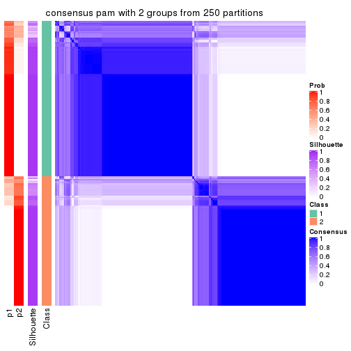</p>

</div>
<div id='tab-SD-pam-consensus-heatmap-2'>
<pre><code class="r">consensus_heatmap(res, k = 3)
</code></pre>

<p>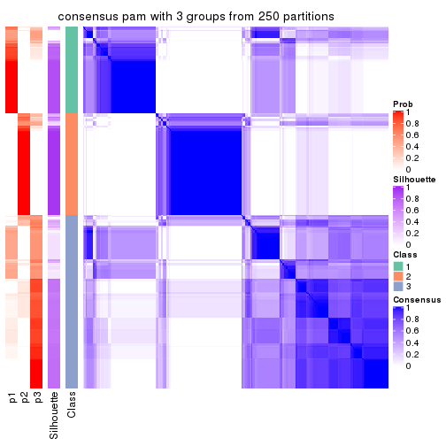</p>

</div>
<div id='tab-SD-pam-consensus-heatmap-3'>
<pre><code class="r">consensus_heatmap(res, k = 4)
</code></pre>

<p>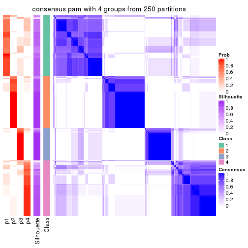</p>

</div>
<div id='tab-SD-pam-consensus-heatmap-4'>
<pre><code class="r">consensus_heatmap(res, k = 5)
</code></pre>

<p>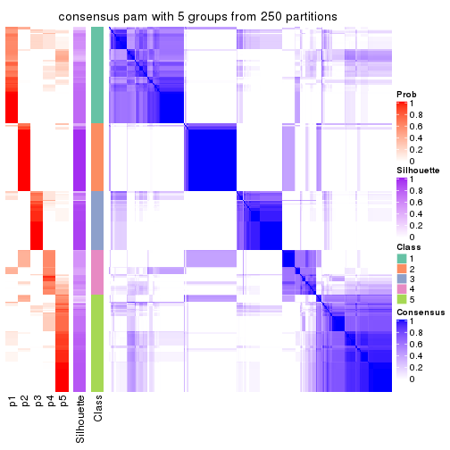</p>

</div>
<div id='tab-SD-pam-consensus-heatmap-5'>
<pre><code class="r">consensus_heatmap(res, k = 6)
</code></pre>

<p>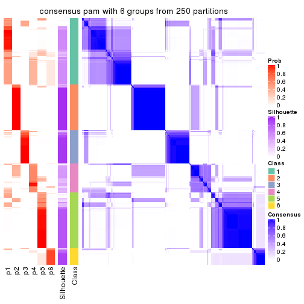</p>

</div>
</div>

Heatmaps for the membership of samples in all partitions to see how consistent they are:


<script>
$( function() {
	$( '#tabs-SD-pam-membership-heatmap' ).tabs();
} );
</script>
<div id='tabs-SD-pam-membership-heatmap'>
<ul>
<li><a href='#tab-SD-pam-membership-heatmap-1'>k = 2</a></li>
<li><a href='#tab-SD-pam-membership-heatmap-2'>k = 3</a></li>
<li><a href='#tab-SD-pam-membership-heatmap-3'>k = 4</a></li>
<li><a href='#tab-SD-pam-membership-heatmap-4'>k = 5</a></li>
<li><a href='#tab-SD-pam-membership-heatmap-5'>k = 6</a></li>
</ul>
<div id='tab-SD-pam-membership-heatmap-1'>
<pre><code class="r">membership_heatmap(res, k = 2)
</code></pre>

<p>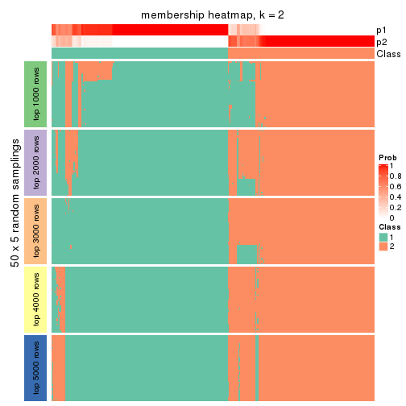</p>

</div>
<div id='tab-SD-pam-membership-heatmap-2'>
<pre><code class="r">membership_heatmap(res, k = 3)
</code></pre>

<p>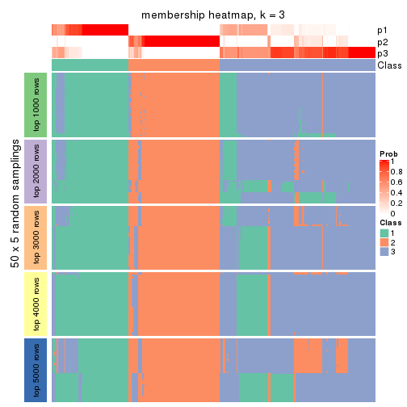</p>

</div>
<div id='tab-SD-pam-membership-heatmap-3'>
<pre><code class="r">membership_heatmap(res, k = 4)
</code></pre>

<p>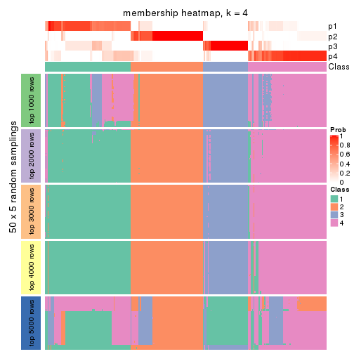</p>

</div>
<div id='tab-SD-pam-membership-heatmap-4'>
<pre><code class="r">membership_heatmap(res, k = 5)
</code></pre>

<p>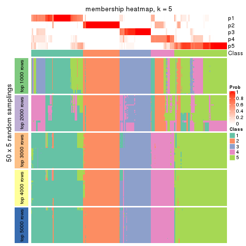</p>

</div>
<div id='tab-SD-pam-membership-heatmap-5'>
<pre><code class="r">membership_heatmap(res, k = 6)
</code></pre>

<p>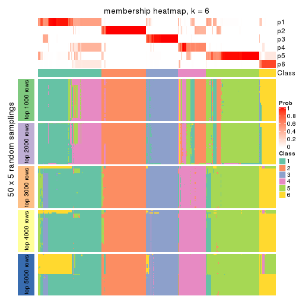</p>

</div>
</div>

As soon as we have had the classes for columns, we can look for signatures
which are significantly different between classes which can be candidate marks
for certain classes. Following are the heatmaps for signatures.


Signature heatmaps where rows are scaled:


<script>
$( function() {
	$( '#tabs-SD-pam-get-signatures' ).tabs();
} );
</script>
<div id='tabs-SD-pam-get-signatures'>
<ul>
<li><a href='#tab-SD-pam-get-signatures-1'>k = 2</a></li>
<li><a href='#tab-SD-pam-get-signatures-2'>k = 3</a></li>
<li><a href='#tab-SD-pam-get-signatures-3'>k = 4</a></li>
<li><a href='#tab-SD-pam-get-signatures-4'>k = 5</a></li>
<li><a href='#tab-SD-pam-get-signatures-5'>k = 6</a></li>
</ul>
<div id='tab-SD-pam-get-signatures-1'>
<pre><code class="r">get_signatures(res, k = 2)
</code></pre>

<p>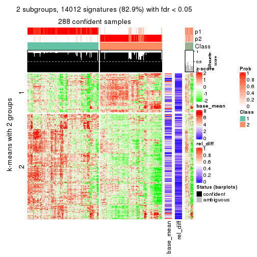</p>

</div>
<div id='tab-SD-pam-get-signatures-2'>
<pre><code class="r">get_signatures(res, k = 3)
</code></pre>

<p>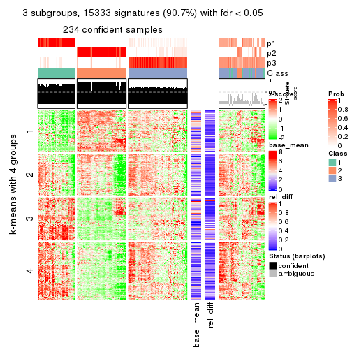</p>

</div>
<div id='tab-SD-pam-get-signatures-3'>
<pre><code class="r">get_signatures(res, k = 4)
</code></pre>

<p>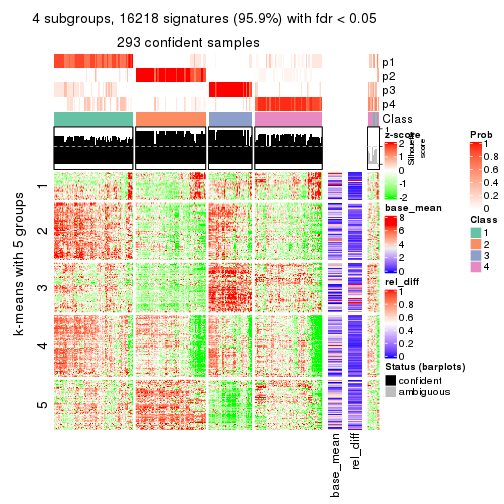</p>

</div>
<div id='tab-SD-pam-get-signatures-4'>
<pre><code class="r">get_signatures(res, k = 5)
</code></pre>

<p>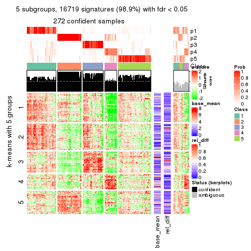</p>

</div>
<div id='tab-SD-pam-get-signatures-5'>
<pre><code class="r">get_signatures(res, k = 6)
</code></pre>

<p>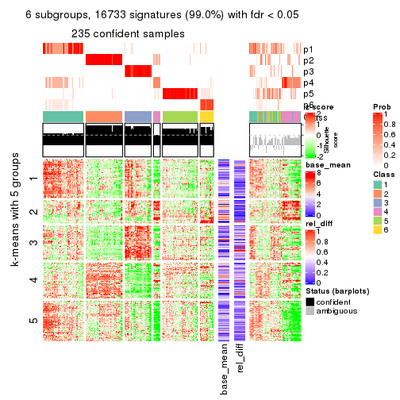</p>

</div>
</div>


Signature heatmaps where rows are not scaled:


<script>
$( function() {
	$( '#tabs-SD-pam-get-signatures-no-scale' ).tabs();
} );
</script>
<div id='tabs-SD-pam-get-signatures-no-scale'>
<ul>
<li><a href='#tab-SD-pam-get-signatures-no-scale-1'>k = 2</a></li>
<li><a href='#tab-SD-pam-get-signatures-no-scale-2'>k = 3</a></li>
<li><a href='#tab-SD-pam-get-signatures-no-scale-3'>k = 4</a></li>
<li><a href='#tab-SD-pam-get-signatures-no-scale-4'>k = 5</a></li>
<li><a href='#tab-SD-pam-get-signatures-no-scale-5'>k = 6</a></li>
</ul>
<div id='tab-SD-pam-get-signatures-no-scale-1'>
<pre><code class="r">get_signatures(res, k = 2, scale_rows = FALSE)
</code></pre>

<p>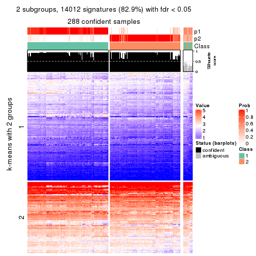</p>

</div>
<div id='tab-SD-pam-get-signatures-no-scale-2'>
<pre><code class="r">get_signatures(res, k = 3, scale_rows = FALSE)
</code></pre>

<p>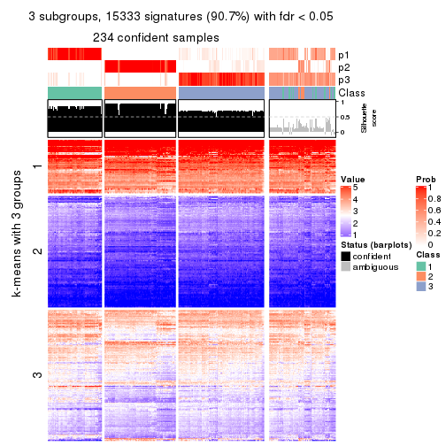</p>

</div>
<div id='tab-SD-pam-get-signatures-no-scale-3'>
<pre><code class="r">get_signatures(res, k = 4, scale_rows = FALSE)
</code></pre>

<p>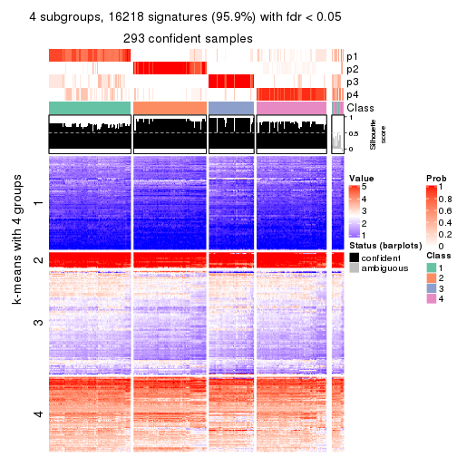</p>

</div>
<div id='tab-SD-pam-get-signatures-no-scale-4'>
<pre><code class="r">get_signatures(res, k = 5, scale_rows = FALSE)
</code></pre>

<p>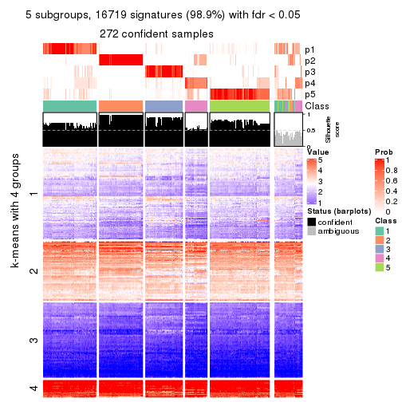</p>

</div>
<div id='tab-SD-pam-get-signatures-no-scale-5'>
<pre><code class="r">get_signatures(res, k = 6, scale_rows = FALSE)
</code></pre>

<p>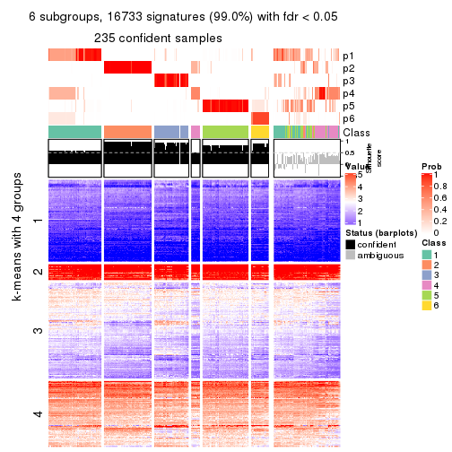</p>

</div>
</div>


Compare the overlap of signatures from different k:

```r
compare_signatures(res)
```

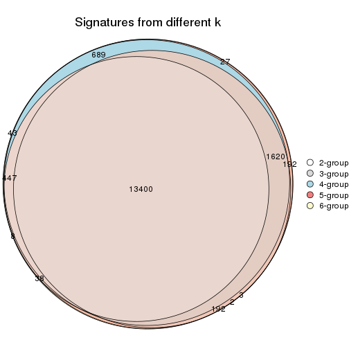

`get_signature()` returns a data frame invisibly. TO get the list of signatures, the function
call should be assigned to a variable explicitly. In following code, if `plot` argument is set
to `FALSE`, no heatmap is plotted while only the differential analysis is performed.

```r
# code only for demonstration
tb = get_signature(res, k = ..., plot = FALSE)
```

An example of the output of `tb` is:

```
#>   which_row         fdr    mean_1    mean_2 scaled_mean_1 scaled_mean_2 km
#> 1        38 0.042760348  8.373488  9.131774    -0.5533452     0.5164555  1
#> 2        40 0.018707592  7.106213  8.469186    -0.6173731     0.5762149  1
#> 3        55 0.019134737 10.221463 11.207825    -0.6159697     0.5749050  1
#> 4        59 0.006059896  5.921854  7.869574    -0.6899429     0.6439467  1
#> 5        60 0.018055526  8.928898 10.211722    -0.6204761     0.5791110  1
#> 6        98 0.009384629 15.714769 14.887706     0.6635654    -0.6193277  2
...
```

The columns in `tb` are:

1. `which_row`: row indices corresponding to the input matrix.
2. `fdr`: FDR for the differential test. 
3. `mean_x`: The mean value in group x.
4. `scaled_mean_x`: The mean value in group x after rows are scaled.
5. `km`: Row groups if k-means clustering is applied to rows.


UMAP plot which shows how samples are separated.


<script>
$( function() {
	$( '#tabs-SD-pam-dimension-reduction' ).tabs();
} );
</script>
<div id='tabs-SD-pam-dimension-reduction'>
<ul>
<li><a href='#tab-SD-pam-dimension-reduction-1'>k = 2</a></li>
<li><a href='#tab-SD-pam-dimension-reduction-2'>k = 3</a></li>
<li><a href='#tab-SD-pam-dimension-reduction-3'>k = 4</a></li>
<li><a href='#tab-SD-pam-dimension-reduction-4'>k = 5</a></li>
<li><a href='#tab-SD-pam-dimension-reduction-5'>k = 6</a></li>
</ul>
<div id='tab-SD-pam-dimension-reduction-1'>
<pre><code class="r">dimension_reduction(res, k = 2, method = &quot;UMAP&quot;)
</code></pre>

<p>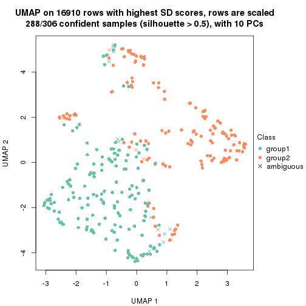</p>

</div>
<div id='tab-SD-pam-dimension-reduction-2'>
<pre><code class="r">dimension_reduction(res, k = 3, method = &quot;UMAP&quot;)
</code></pre>

<p>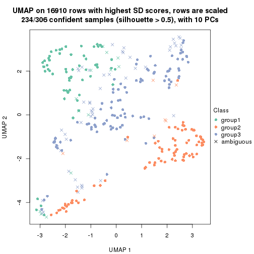</p>

</div>
<div id='tab-SD-pam-dimension-reduction-3'>
<pre><code class="r">dimension_reduction(res, k = 4, method = &quot;UMAP&quot;)
</code></pre>

<p>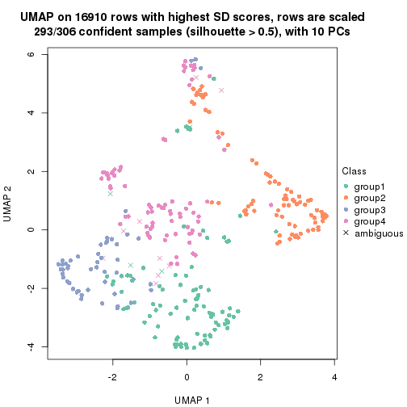</p>

</div>
<div id='tab-SD-pam-dimension-reduction-4'>
<pre><code class="r">dimension_reduction(res, k = 5, method = &quot;UMAP&quot;)
</code></pre>

<p>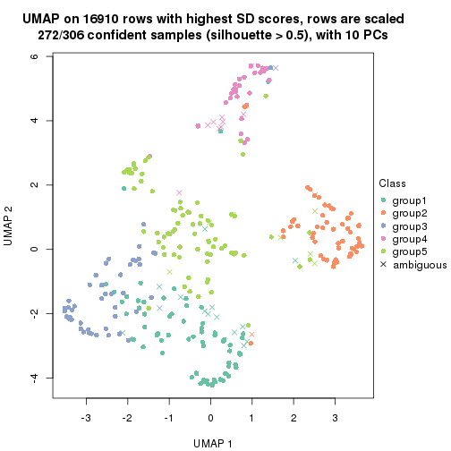</p>

</div>
<div id='tab-SD-pam-dimension-reduction-5'>
<pre><code class="r">dimension_reduction(res, k = 6, method = &quot;UMAP&quot;)
</code></pre>

<p>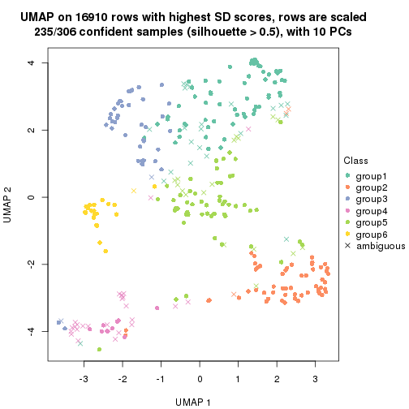</p>

</div>
</div>


Following heatmap shows how subgroups are split when increasing `k`:

```r
collect_classes(res)
```

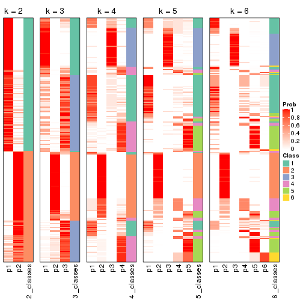


If matrix rows can be associated to genes, consider to use `GO_Enrichment(res,
...)` to perform function enrichment for the signature genes.


 

---------------------------------------------------


### SD:mclust


The object with results only for a single top-value method and a single partition method 
can be extracted as:

```r
res = res_list["SD", "mclust"]
# you can also extract it by
# res = res_list["SD:mclust"]
```

A summary of `res` and all the functions that can be applied to it:

```r
res
```

```
#> A 'ConsensusPartition' object with k = 2, 3, 4, 5, 6.
#>   On a matrix with 16910 rows and 306 columns.
#>   Top rows (1000, 2000, 3000, 4000, 5000) are extracted by 'SD' method.
#>   Subgroups are detected by 'mclust' method.
#>   Performed in total 1250 partitions by row resampling.
#>   Best k for subgroups seems to be 5.
#> 
#> Following methods can be applied to this 'ConsensusPartition' object:
#>  [1] "cola_report"             "collect_classes"         "collect_plots"          
#>  [4] "collect_stats"           "colnames"                "compare_signatures"     
#>  [7] "consensus_heatmap"       "dimension_reduction"     "functional_enrichment"  
#> [10] "get_anno_col"            "get_anno"                "get_classes"            
#> [13] "get_consensus"           "get_matrix"              "get_membership"         
#> [16] "get_param"               "get_signatures"          "get_stats"              
#> [19] "is_best_k"               "is_stable_k"             "membership_heatmap"     
#> [22] "ncol"                    "nrow"                    "plot_ecdf"              
#> [25] "rownames"                "select_partition_number" "show"                   
#> [28] "suggest_best_k"          "test_to_known_factors"
```

`collect_plots()` function collects all the plots made from `res` for all `k` (number of partitions)
into one single page to provide an easy and fast comparison between different `k`.

```r
collect_plots(res)
```

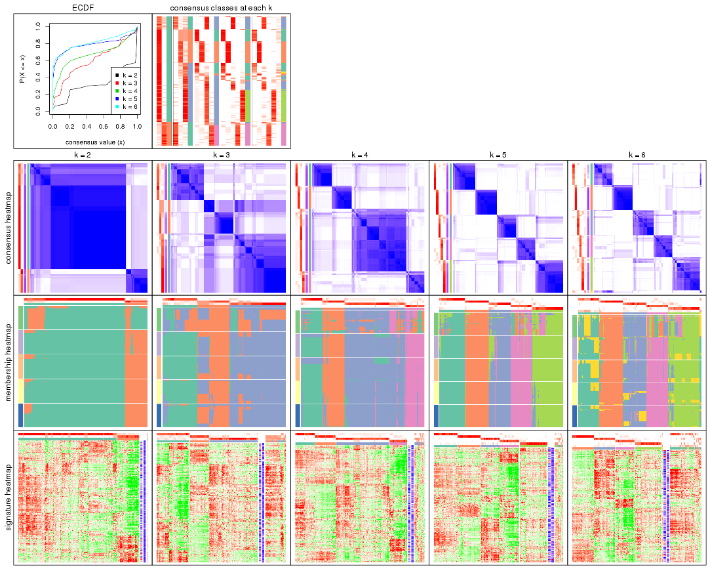

The plots are:

- The first row: a plot of the ECDF (Empirical cumulative distribution
  function) curves of the consensus matrix for each `k` and the heatmap of
  predicted classes for each `k`.
- The second row: heatmaps of the consensus matrix for each `k`.
- The third row: heatmaps of the membership matrix for each `k`.
- The fouth row: heatmaps of the signatures for each `k`.

All the plots in panels can be made by individual functions and they are
plotted later in this section.

`select_partition_number()` produces several plots showing different
statistics for choosing "optimized" `k`. There are following statistics:

- ECDF curves of the consensus matrix for each `k`;
- 1-PAC. [The PAC
  score](https://en.wikipedia.org/wiki/Consensus_clustering#Over-interpretation_potential_of_consensus_clustering)
  measures the proportion of the ambiguous subgrouping.
- Mean silhouette score.
- Concordance. The mean probability of fiting the consensus class ids in all
  partitions.
- Area increased. Denote $A_k$ as the area under the ECDF curve for current
  `k`, the area increased is defined as $A_k - A_{k-1}$.
- Rand index. The percent of pairs of samples that are both in a same cluster
  or both are not in a same cluster in the partition of k and k-1.
- Jaccard index. The ratio of pairs of samples are both in a same cluster in
  the partition of k and k-1 and the pairs of samples are both in a same
  cluster in the partition k or k-1.

The detailed explanations of these statistics can be found in [the cola
vignette](http://bioconductor.org/packages/devel/bioc/vignettes/cola/inst/doc/cola.html#toc_13).

Generally speaking, lower PAC score, higher mean silhouette score or higher
concordance corresponds to better partition. Rand index and Jaccard index
measure how similar the current partition is compared to partition with `k-1`.
If they are too similar, we won't accept `k` is better than `k-1`.

```r
select_partition_number(res)
```

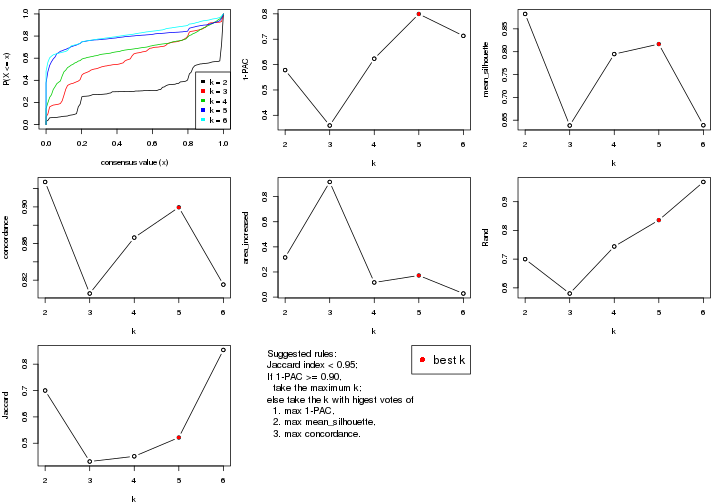

The numeric values for all these statistics can be obtained by `get_stats()`.

```r
get_stats(res)
```

```
#>   k 1-PAC mean_silhouette concordance area_increased  Rand Jaccard
#> 2 2 0.578           0.883       0.927         0.3154 0.700   0.700
#> 3 3 0.360           0.638       0.805         0.9166 0.580   0.431
#> 4 4 0.623           0.795       0.866         0.1166 0.744   0.450
#> 5 5 0.800           0.817       0.900         0.1722 0.836   0.522
#> 6 6 0.713           0.639       0.815         0.0285 0.969   0.854
```

`suggest_best_k()` suggests the best $k$ based on these statistics. The rules are as follows:

- All $k$ with Jaccard index larger than 0.95 are removed because the increase of
  the partition number does not provides enough extra information. If all $k$ are removed,
  the best $k$ is assigned by `NA`.
- For $k$ with 1-PAC larger than 0.9, the maximal $k$ is taken as the "best k". Other $k$ is called "optional k".
- If it does not fit the second rule. The $k$ with the highest vote of highest
  1-PAC, mean silhouette and concordance is taken as the "best k".

```r
suggest_best_k(res)
```

```
#> [1] 5
```


Following shows the table of the partitions (You need to click the **show/hide
code output** link to see it). The membership matrix (columns with name `p*`)
is inferred by
[`clue::cl_consensus()`](https://www.rdocumentation.org/link/cl_consensus?package=clue)
function with the `SE` method. Basically the value in the membership matrix
represents the probability to belong to a certain group. The finall class
label for an item is determined with the group with highest probability it
belongs to.

In `get_classes()` function, the entropy is calculated from the membership
matrix and the silhouette score is calculated from the consensus matrix.


<script>
$( function() {
	$( '#tabs-SD-mclust-get-classes' ).tabs();
} );
</script>
<div id='tabs-SD-mclust-get-classes'>
<ul>
<li><a href='#tab-SD-mclust-get-classes-1'>k = 2</a></li>
<li><a href='#tab-SD-mclust-get-classes-2'>k = 3</a></li>
<li><a href='#tab-SD-mclust-get-classes-3'>k = 4</a></li>
<li><a href='#tab-SD-mclust-get-classes-4'>k = 5</a></li>
<li><a href='#tab-SD-mclust-get-classes-5'>k = 6</a></li>
</ul>

<div id='tab-SD-mclust-get-classes-1'>
<p><a id='tab-SD-mclust-get-classes-1-a' style='color:#0366d6' href='#'>show/hide code output</a></p>
<pre><code class="r">cbind(get_classes(res, k = 2), get_membership(res, k = 2))
</code></pre>

<pre><code>#&gt;            class entropy silhouette    p1    p2
#&gt; SRR1609360     2  0.7219      0.911 0.200 0.800
#&gt; SRR1609361     2  0.7219      0.911 0.200 0.800
#&gt; SRR1609362     2  0.7219      0.911 0.200 0.800
#&gt; SRR1609363     1  0.1414      0.929 0.980 0.020
#&gt; SRR1609364     1  0.1414      0.929 0.980 0.020
#&gt; SRR1609365     2  0.7219      0.911 0.200 0.800
#&gt; SRR1609366     1  0.0000      0.938 1.000 0.000
#&gt; SRR1609367     1  0.0000      0.938 1.000 0.000
#&gt; SRR1609368     1  0.1184      0.931 0.984 0.016
#&gt; SRR1609369     1  0.0000      0.938 1.000 0.000
#&gt; SRR1609370     1  0.0000      0.938 1.000 0.000
#&gt; SRR1609371     2  0.6801      0.917 0.180 0.820
#&gt; SRR1609372     1  0.0000      0.938 1.000 0.000
#&gt; SRR1609373     1  0.1414      0.929 0.980 0.020
#&gt; SRR1609374     1  0.0000      0.938 1.000 0.000
#&gt; SRR1609375     1  0.0000      0.938 1.000 0.000
#&gt; SRR1609377     1  0.0000      0.938 1.000 0.000
#&gt; SRR1609376     1  0.1414      0.929 0.980 0.020
#&gt; SRR1609378     2  0.7056      0.914 0.192 0.808
#&gt; SRR1609379     1  0.0000      0.938 1.000 0.000
#&gt; SRR1609382     2  0.6887      0.917 0.184 0.816
#&gt; SRR1609383     2  0.7219      0.911 0.200 0.800
#&gt; SRR1609381     1  0.0000      0.938 1.000 0.000
#&gt; SRR1609384     1  0.0000      0.938 1.000 0.000
#&gt; SRR1609386     1  0.0000      0.938 1.000 0.000
#&gt; SRR1609385     1  0.0000      0.938 1.000 0.000
#&gt; SRR1609387     1  0.0000      0.938 1.000 0.000
#&gt; SRR1609388     1  0.1184      0.931 0.984 0.016
#&gt; SRR1609390     1  0.0000      0.938 1.000 0.000
#&gt; SRR1609393     2  0.6801      0.917 0.180 0.820
#&gt; SRR1609394     1  0.3733      0.888 0.928 0.072
#&gt; SRR1609392     1  0.1184      0.931 0.984 0.016
#&gt; SRR1609391     2  0.6801      0.917 0.180 0.820
#&gt; SRR1609395     1  0.0000      0.938 1.000 0.000
#&gt; SRR1609396     1  0.0000      0.938 1.000 0.000
#&gt; SRR1609398     1  0.0000      0.938 1.000 0.000
#&gt; SRR1609399     1  0.0000      0.938 1.000 0.000
#&gt; SRR1609400     1  0.0000      0.938 1.000 0.000
#&gt; SRR1609397     1  0.1184      0.931 0.984 0.016
#&gt; SRR1609401     1  0.1414      0.929 0.980 0.020
#&gt; SRR1609402     1  0.1414      0.929 0.980 0.020
#&gt; SRR1609405     1  0.0000      0.938 1.000 0.000
#&gt; SRR1609404     2  0.6801      0.917 0.180 0.820
#&gt; SRR1609406     1  0.1414      0.929 0.980 0.020
#&gt; SRR1609408     1  0.1414      0.929 0.980 0.020
#&gt; SRR1609403     1  0.0000      0.938 1.000 0.000
#&gt; SRR1609410     1  0.0000      0.938 1.000 0.000
#&gt; SRR1609411     1  0.1414      0.929 0.980 0.020
#&gt; SRR1609407     1  0.1414      0.929 0.980 0.020
#&gt; SRR1609413     1  0.0000      0.938 1.000 0.000
#&gt; SRR1609412     1  0.0000      0.938 1.000 0.000
#&gt; SRR1609414     1  0.0000      0.938 1.000 0.000
#&gt; SRR1609415     1  0.0000      0.938 1.000 0.000
#&gt; SRR1609416     1  0.6531      0.747 0.832 0.168
#&gt; SRR1609417     1  0.6438      0.754 0.836 0.164
#&gt; SRR1609418     1  0.0000      0.938 1.000 0.000
#&gt; SRR1609419     1  0.1184      0.931 0.984 0.016
#&gt; SRR1609420     1  0.0000      0.938 1.000 0.000
#&gt; SRR1609421     1  0.0000      0.938 1.000 0.000
#&gt; SRR1609422     2  0.5408      0.791 0.124 0.876
#&gt; SRR1609423     2  0.6801      0.917 0.180 0.820
#&gt; SRR1609424     2  0.6801      0.917 0.180 0.820
#&gt; SRR1609425     1  0.0000      0.938 1.000 0.000
#&gt; SRR1609426     1  0.1184      0.931 0.984 0.016
#&gt; SRR1609427     2  0.5519      0.886 0.128 0.872
#&gt; SRR1609428     1  0.1414      0.929 0.980 0.020
#&gt; SRR1609429     1  0.0000      0.938 1.000 0.000
#&gt; SRR1609430     1  0.9129      0.581 0.672 0.328
#&gt; SRR1609431     1  0.7219      0.768 0.800 0.200
#&gt; SRR1609432     1  0.0672      0.935 0.992 0.008
#&gt; SRR1609433     2  0.7376      0.906 0.208 0.792
#&gt; SRR1609434     2  0.6801      0.917 0.180 0.820
#&gt; SRR1609435     1  0.0000      0.938 1.000 0.000
#&gt; SRR1609436     1  0.0000      0.938 1.000 0.000
#&gt; SRR1609437     1  0.9922     -0.110 0.552 0.448
#&gt; SRR1609438     2  0.6801      0.917 0.180 0.820
#&gt; SRR1609439     2  0.7219      0.851 0.200 0.800
#&gt; SRR1609440     1  0.0000      0.938 1.000 0.000
#&gt; SRR1609441     1  0.0000      0.938 1.000 0.000
#&gt; SRR1609442     2  0.8207      0.842 0.256 0.744
#&gt; SRR1609443     1  0.6438      0.754 0.836 0.164
#&gt; SRR1609444     1  0.0000      0.938 1.000 0.000
#&gt; SRR1609445     1  0.0000      0.938 1.000 0.000
#&gt; SRR1609446     1  0.0000      0.938 1.000 0.000
#&gt; SRR1609447     1  0.0000      0.938 1.000 0.000
#&gt; SRR1609448     1  0.1414      0.929 0.980 0.020
#&gt; SRR1609449     1  0.0000      0.938 1.000 0.000
#&gt; SRR1609450     1  0.0672      0.935 0.992 0.008
#&gt; SRR1609451     1  0.9044      0.596 0.680 0.320
#&gt; SRR1609452     1  0.0000      0.938 1.000 0.000
#&gt; SRR1609453     1  0.0000      0.938 1.000 0.000
#&gt; SRR1609454     1  0.0000      0.938 1.000 0.000
#&gt; SRR1609455     1  0.0000      0.938 1.000 0.000
#&gt; SRR1609456     1  0.0000      0.938 1.000 0.000
#&gt; SRR1609457     1  0.0000      0.938 1.000 0.000
#&gt; SRR1609458     1  0.0000      0.938 1.000 0.000
#&gt; SRR1609459     1  0.0000      0.938 1.000 0.000
#&gt; SRR1609460     1  0.7219      0.768 0.800 0.200
#&gt; SRR1609461     1  0.0000      0.938 1.000 0.000
#&gt; SRR1609462     1  0.7602      0.740 0.780 0.220
#&gt; SRR1609464     1  0.9129      0.581 0.672 0.328
#&gt; SRR1609463     1  0.7219      0.768 0.800 0.200
#&gt; SRR1609465     1  0.7219      0.768 0.800 0.200
#&gt; SRR1609466     2  0.7219      0.911 0.200 0.800
#&gt; SRR1609467     1  0.8016      0.712 0.756 0.244
#&gt; SRR1609469     2  0.6801      0.917 0.180 0.820
#&gt; SRR1609470     1  0.0000      0.938 1.000 0.000
#&gt; SRR1609472     2  0.7056      0.914 0.192 0.808
#&gt; SRR1609471     1  0.0000      0.938 1.000 0.000
#&gt; SRR1609474     1  0.0000      0.938 1.000 0.000
#&gt; SRR1609473     2  0.6801      0.917 0.180 0.820
#&gt; SRR1609475     2  0.6801      0.917 0.180 0.820
#&gt; SRR1609478     2  0.6887      0.917 0.184 0.816
#&gt; SRR1609476     1  0.0000      0.938 1.000 0.000
#&gt; SRR1609477     1  0.6343      0.760 0.840 0.160
#&gt; SRR1609479     1  0.1414      0.929 0.980 0.020
#&gt; SRR1609481     2  0.0000      0.820 0.000 1.000
#&gt; SRR1609480     2  0.9460      0.681 0.364 0.636
#&gt; SRR1609482     1  0.8016      0.712 0.756 0.244
#&gt; SRR1609484     2  0.9460      0.672 0.364 0.636
#&gt; SRR1609483     1  0.9286      0.550 0.656 0.344
#&gt; SRR1609486     1  0.0000      0.938 1.000 0.000
#&gt; SRR1609485     1  0.0000      0.938 1.000 0.000
#&gt; SRR1609487     1  0.0000      0.938 1.000 0.000
#&gt; SRR1609488     1  0.0000      0.938 1.000 0.000
#&gt; SRR1609489     1  0.1184      0.931 0.984 0.016
#&gt; SRR1609490     1  0.0000      0.938 1.000 0.000
#&gt; SRR1609491     1  0.0000      0.938 1.000 0.000
#&gt; SRR1609492     1  0.1414      0.929 0.980 0.020
#&gt; SRR1609493     1  0.7219      0.768 0.800 0.200
#&gt; SRR1609494     1  0.1414      0.929 0.980 0.020
#&gt; SRR1609495     2  0.9522      0.665 0.372 0.628
#&gt; SRR1609496     1  0.5629      0.827 0.868 0.132
#&gt; SRR1609497     1  0.0000      0.938 1.000 0.000
#&gt; SRR1609498     1  0.0000      0.938 1.000 0.000
#&gt; SRR1609499     1  0.0672      0.935 0.992 0.008
#&gt; SRR1609500     1  0.0000      0.938 1.000 0.000
#&gt; SRR1609501     1  0.0000      0.938 1.000 0.000
#&gt; SRR1609502     1  0.0000      0.938 1.000 0.000
#&gt; SRR1609503     2  0.0000      0.820 0.000 1.000
#&gt; SRR1609504     1  0.0000      0.938 1.000 0.000
#&gt; SRR1609505     1  0.0000      0.938 1.000 0.000
#&gt; SRR1609506     1  0.1414      0.929 0.980 0.020
#&gt; SRR1609507     1  0.0000      0.938 1.000 0.000
#&gt; SRR1609508     1  0.1184      0.931 0.984 0.016
#&gt; SRR1609509     1  0.1414      0.929 0.980 0.020
#&gt; SRR1609510     2  0.0000      0.820 0.000 1.000
#&gt; SRR1609512     1  0.6801      0.777 0.820 0.180
#&gt; SRR1609511     2  0.1414      0.822 0.020 0.980
#&gt; SRR1609513     1  0.8443      0.674 0.728 0.272
#&gt; SRR1609514     2  0.7219      0.911 0.200 0.800
#&gt; SRR1609515     1  0.0672      0.935 0.992 0.008
#&gt; SRR1609516     1  0.0000      0.938 1.000 0.000
#&gt; SRR1609517     1  0.1414      0.929 0.980 0.020
#&gt; SRR1609518     1  0.0000      0.938 1.000 0.000
#&gt; SRR1609519     1  0.3431      0.890 0.936 0.064
#&gt; SRR1609520     2  0.6801      0.917 0.180 0.820
#&gt; SRR1609521     1  0.6531      0.790 0.832 0.168
#&gt; SRR1609522     1  0.9000      0.603 0.684 0.316
#&gt; SRR1609523     1  0.7219      0.768 0.800 0.200
#&gt; SRR1609524     1  0.1414      0.929 0.980 0.020
#&gt; SRR1609526     1  0.9286      0.550 0.656 0.344
#&gt; SRR1609525     1  0.0000      0.938 1.000 0.000
#&gt; SRR1609527     1  0.0000      0.938 1.000 0.000
#&gt; SRR1609529     1  0.0000      0.938 1.000 0.000
#&gt; SRR1609528     2  0.6887      0.917 0.184 0.816
#&gt; SRR1609530     1  0.0000      0.938 1.000 0.000
#&gt; SRR1609531     1  0.1414      0.929 0.980 0.020
#&gt; SRR1609532     1  0.9286      0.550 0.656 0.344
#&gt; SRR1609533     1  0.0672      0.935 0.992 0.008
#&gt; SRR1609534     1  0.6801      0.777 0.820 0.180
#&gt; SRR1609535     1  0.7376      0.762 0.792 0.208
#&gt; SRR1609537     1  0.1414      0.929 0.980 0.020
#&gt; SRR1609536     1  0.0000      0.938 1.000 0.000
#&gt; SRR1609538     1  0.0000      0.938 1.000 0.000
#&gt; SRR1609539     1  0.7219      0.768 0.800 0.200
#&gt; SRR1609540     1  0.0000      0.938 1.000 0.000
#&gt; SRR1609541     2  0.0000      0.820 0.000 1.000
#&gt; SRR1609542     1  0.1414      0.929 0.980 0.020
#&gt; SRR1609543     1  0.9358      0.533 0.648 0.352
#&gt; SRR1609544     1  0.7453      0.672 0.788 0.212
#&gt; SRR1609545     1  0.0000      0.938 1.000 0.000
#&gt; SRR1609546     1  0.0000      0.938 1.000 0.000
#&gt; SRR1609547     1  0.6801      0.781 0.820 0.180
#&gt; SRR1609548     1  0.0000      0.938 1.000 0.000
#&gt; SRR1609549     1  0.1414      0.929 0.980 0.020
#&gt; SRR1609550     1  0.1184      0.931 0.984 0.016
#&gt; SRR1609551     1  0.7219      0.768 0.800 0.200
#&gt; SRR1609552     1  0.6801      0.777 0.820 0.180
#&gt; SRR1609553     1  0.0000      0.938 1.000 0.000
#&gt; SRR1609554     1  0.0000      0.938 1.000 0.000
#&gt; SRR1609555     1  0.0000      0.938 1.000 0.000
#&gt; SRR1609556     1  0.8144      0.702 0.748 0.252
#&gt; SRR1609557     1  0.0000      0.938 1.000 0.000
#&gt; SRR1609558     1  0.0000      0.938 1.000 0.000
#&gt; SRR1609559     1  0.1843      0.926 0.972 0.028
#&gt; SRR1609560     1  0.0000      0.938 1.000 0.000
#&gt; SRR1609561     1  0.0000      0.938 1.000 0.000
#&gt; SRR1609562     1  0.0000      0.938 1.000 0.000
#&gt; SRR1609563     1  0.0000      0.938 1.000 0.000
#&gt; SRR1609564     1  0.0000      0.938 1.000 0.000
#&gt; SRR1609565     1  0.1414      0.929 0.980 0.020
#&gt; SRR1609566     1  0.1414      0.929 0.980 0.020
#&gt; SRR1609567     1  0.1414      0.929 0.980 0.020
#&gt; SRR1609568     1  0.0000      0.938 1.000 0.000
#&gt; SRR1609569     1  0.0000      0.938 1.000 0.000
#&gt; SRR1609570     1  0.9129      0.581 0.672 0.328
#&gt; SRR1609571     2  0.1414      0.822 0.020 0.980
#&gt; SRR1609572     2  0.7219      0.911 0.200 0.800
#&gt; SRR1609573     1  0.9286      0.550 0.656 0.344
#&gt; SRR1609574     1  0.6438      0.754 0.836 0.164
#&gt; SRR1609575     2  0.6887      0.917 0.184 0.816
#&gt; SRR1609576     1  0.0000      0.938 1.000 0.000
#&gt; SRR1609578     1  0.0000      0.938 1.000 0.000
#&gt; SRR1609577     1  0.0000      0.938 1.000 0.000
#&gt; SRR1609579     1  1.0000      0.101 0.504 0.496
#&gt; SRR1609580     1  0.0000      0.938 1.000 0.000
#&gt; SRR1609582     1  0.0000      0.938 1.000 0.000
#&gt; SRR1609581     1  0.0000      0.938 1.000 0.000
#&gt; SRR1609583     1  0.0000      0.938 1.000 0.000
#&gt; SRR1609584     1  0.8955      0.610 0.688 0.312
#&gt; SRR1609585     1  0.0000      0.938 1.000 0.000
#&gt; SRR1609586     1  0.1414      0.929 0.980 0.020
#&gt; SRR1609587     1  0.0000      0.938 1.000 0.000
#&gt; SRR1609588     1  0.0000      0.938 1.000 0.000
#&gt; SRR1609589     1  0.0000      0.938 1.000 0.000
#&gt; SRR1609590     1  0.0672      0.933 0.992 0.008
#&gt; SRR1609592     1  0.0672      0.935 0.992 0.008
#&gt; SRR1609591     1  0.0000      0.938 1.000 0.000
#&gt; SRR1609593     1  0.7219      0.768 0.800 0.200
#&gt; SRR1609594     2  0.6801      0.917 0.180 0.820
#&gt; SRR1609595     1  0.7219      0.768 0.800 0.200
#&gt; SRR1609596     1  0.1414      0.929 0.980 0.020
#&gt; SRR1609597     1  0.1414      0.929 0.980 0.020
#&gt; SRR1609598     2  0.6148      0.906 0.152 0.848
#&gt; SRR1609599     2  0.0376      0.821 0.004 0.996
#&gt; SRR1609600     1  0.0000      0.938 1.000 0.000
#&gt; SRR1609601     2  0.0000      0.820 0.000 1.000
#&gt; SRR1609602     2  0.0000      0.820 0.000 1.000
#&gt; SRR1609603     1  0.0000      0.938 1.000 0.000
#&gt; SRR1609604     2  0.6801      0.917 0.180 0.820
#&gt; SRR1609605     1  0.0672      0.935 0.992 0.008
#&gt; SRR1609606     1  0.0938      0.933 0.988 0.012
#&gt; SRR1609607     1  0.5178      0.843 0.884 0.116
#&gt; SRR1609608     1  0.0000      0.938 1.000 0.000
#&gt; SRR1609609     1  0.0000      0.938 1.000 0.000
#&gt; SRR1609610     1  0.0000      0.938 1.000 0.000
#&gt; SRR1609611     2  0.6801      0.917 0.180 0.820
#&gt; SRR1609613     1  0.0376      0.936 0.996 0.004
#&gt; SRR1609612     1  0.0000      0.938 1.000 0.000
#&gt; SRR1609614     1  0.0000      0.938 1.000 0.000
#&gt; SRR1609615     1  0.0000      0.938 1.000 0.000
#&gt; SRR1609616     1  0.0000      0.938 1.000 0.000
#&gt; SRR1609617     1  0.7219      0.768 0.800 0.200
#&gt; SRR1609618     1  0.0000      0.938 1.000 0.000
#&gt; SRR1609619     1  0.0000      0.938 1.000 0.000
#&gt; SRR1609620     2  0.6801      0.917 0.180 0.820
#&gt; SRR1609621     1  0.6801      0.749 0.820 0.180
#&gt; SRR1609622     2  0.8207      0.815 0.256 0.744
#&gt; SRR1609623     1  0.6048      0.777 0.852 0.148
#&gt; SRR1609624     1  0.0000      0.938 1.000 0.000
#&gt; SRR1609625     1  0.0000      0.938 1.000 0.000
#&gt; SRR1609626     2  0.4161      0.861 0.084 0.916
#&gt; SRR1609627     1  0.0000      0.938 1.000 0.000
#&gt; SRR1609628     1  0.1414      0.929 0.980 0.020
#&gt; SRR1609629     1  0.0000      0.938 1.000 0.000
#&gt; SRR1609630     1  0.1414      0.929 0.980 0.020
#&gt; SRR1609631     1  0.0000      0.938 1.000 0.000
#&gt; SRR1609632     1  0.0000      0.938 1.000 0.000
#&gt; SRR1609633     1  0.0000      0.938 1.000 0.000
#&gt; SRR1609634     1  0.1414      0.929 0.980 0.020
#&gt; SRR1609635     2  0.0000      0.820 0.000 1.000
#&gt; SRR1609636     2  0.6801      0.917 0.180 0.820
#&gt; SRR1609637     1  0.0000      0.938 1.000 0.000
#&gt; SRR1609638     1  0.0000      0.938 1.000 0.000
#&gt; SRR1609639     1  0.1414      0.929 0.980 0.020
#&gt; SRR1609640     1  0.6801      0.777 0.820 0.180
#&gt; SRR1609641     1  0.0000      0.938 1.000 0.000
#&gt; SRR1609642     1  0.0000      0.938 1.000 0.000
#&gt; SRR1609643     1  0.0000      0.938 1.000 0.000
#&gt; SRR1609644     1  0.0000      0.938 1.000 0.000
#&gt; SRR1609645     1  0.0000      0.938 1.000 0.000
#&gt; SRR1609646     1  0.8016      0.712 0.756 0.244
#&gt; SRR1609647     1  0.7299      0.765 0.796 0.204
#&gt; SRR1609649     1  0.0000      0.938 1.000 0.000
#&gt; SRR1609648     1  0.1414      0.929 0.980 0.020
#&gt; SRR1609651     1  0.0000      0.938 1.000 0.000
#&gt; SRR1609650     1  0.0000      0.938 1.000 0.000
#&gt; SRR1609652     1  0.6801      0.777 0.820 0.180
#&gt; SRR1609653     1  0.1414      0.929 0.980 0.020
#&gt; SRR1609654     2  0.8144      0.860 0.252 0.748
#&gt; SRR1609655     1  0.7219      0.768 0.800 0.200
#&gt; SRR1609657     1  0.0000      0.938 1.000 0.000
#&gt; SRR1609656     2  0.7219      0.911 0.200 0.800
#&gt; SRR1609658     1  0.1414      0.929 0.980 0.020
#&gt; SRR1609659     1  0.1414      0.929 0.980 0.020
#&gt; SRR1609660     1  0.7219      0.768 0.800 0.200
#&gt; SRR1609661     1  0.0000      0.938 1.000 0.000
#&gt; SRR1609662     1  0.0376      0.936 0.996 0.004
#&gt; SRR1609663     1  0.0000      0.938 1.000 0.000
#&gt; SRR1609664     1  0.7219      0.768 0.800 0.200
#&gt; SRR1609665     1  0.0000      0.938 1.000 0.000
#&gt; SRR1609666     2  0.7219      0.911 0.200 0.800
#&gt; SRR1609667     1  0.0000      0.938 1.000 0.000
#&gt; SRR1609668     2  0.0000      0.820 0.000 1.000
#&gt; SRR1609669     1  0.0000      0.938 1.000 0.000
</code></pre>

<script>
$('#tab-SD-mclust-get-classes-1-a').parent().next().next().hide();
$('#tab-SD-mclust-get-classes-1-a').click(function(){
  $('#tab-SD-mclust-get-classes-1-a').parent().next().next().toggle();
  return(false);
});
</script>
</div>

<div id='tab-SD-mclust-get-classes-2'>
<p><a id='tab-SD-mclust-get-classes-2-a' style='color:#0366d6' href='#'>show/hide code output</a></p>
<pre><code class="r">cbind(get_classes(res, k = 3), get_membership(res, k = 3))
</code></pre>

<pre><code>#&gt;            class entropy silhouette    p1    p2    p3
#&gt; SRR1609360     1  0.5122     0.7926 0.788 0.200 0.012
#&gt; SRR1609361     1  0.5122     0.7926 0.788 0.200 0.012
#&gt; SRR1609362     1  0.5122     0.7926 0.788 0.200 0.012
#&gt; SRR1609363     2  0.3116     0.6845 0.000 0.892 0.108
#&gt; SRR1609364     2  0.3116     0.6845 0.000 0.892 0.108
#&gt; SRR1609365     1  0.5122     0.7926 0.788 0.200 0.012
#&gt; SRR1609366     2  0.3879     0.6797 0.000 0.848 0.152
#&gt; SRR1609367     3  0.5706     0.5163 0.000 0.320 0.680
#&gt; SRR1609368     2  0.3116     0.6845 0.000 0.892 0.108
#&gt; SRR1609369     2  0.6305     0.1248 0.000 0.516 0.484
#&gt; SRR1609370     2  0.6308     0.0986 0.000 0.508 0.492
#&gt; SRR1609371     1  0.5731     0.7927 0.804 0.108 0.088
#&gt; SRR1609372     2  0.6305     0.1248 0.000 0.516 0.484
#&gt; SRR1609373     2  0.3116     0.6845 0.000 0.892 0.108
#&gt; SRR1609374     2  0.3267     0.6833 0.000 0.884 0.116
#&gt; SRR1609375     3  0.6308    -0.1321 0.000 0.492 0.508
#&gt; SRR1609377     2  0.6308     0.1168 0.000 0.508 0.492
#&gt; SRR1609376     2  0.5016     0.6096 0.000 0.760 0.240
#&gt; SRR1609378     1  0.5740     0.7950 0.804 0.100 0.096
#&gt; SRR1609379     2  0.6305     0.1248 0.000 0.516 0.484
#&gt; SRR1609382     1  0.5817     0.7939 0.800 0.100 0.100
#&gt; SRR1609383     1  0.5122     0.7926 0.788 0.200 0.012
#&gt; SRR1609381     2  0.6309     0.0833 0.000 0.504 0.496
#&gt; SRR1609384     3  0.5706     0.5163 0.000 0.320 0.680
#&gt; SRR1609386     2  0.6305     0.1280 0.000 0.516 0.484
#&gt; SRR1609385     3  0.5706     0.5163 0.000 0.320 0.680
#&gt; SRR1609387     3  0.5706     0.5163 0.000 0.320 0.680
#&gt; SRR1609388     2  0.3116     0.6845 0.000 0.892 0.108
#&gt; SRR1609390     2  0.6305     0.1248 0.000 0.516 0.484
#&gt; SRR1609393     1  0.5731     0.7927 0.804 0.108 0.088
#&gt; SRR1609394     2  0.9326     0.3399 0.204 0.512 0.284
#&gt; SRR1609392     2  0.5216     0.5875 0.000 0.740 0.260
#&gt; SRR1609391     1  0.5804     0.7906 0.800 0.112 0.088
#&gt; SRR1609395     2  0.6309     0.0833 0.000 0.504 0.496
#&gt; SRR1609396     2  0.6307     0.1127 0.000 0.512 0.488
#&gt; SRR1609398     2  0.6305     0.1280 0.000 0.516 0.484
#&gt; SRR1609399     2  0.6307     0.1127 0.000 0.512 0.488
#&gt; SRR1609400     3  0.6274     0.1033 0.000 0.456 0.544
#&gt; SRR1609397     2  0.3116     0.6845 0.000 0.892 0.108
#&gt; SRR1609401     2  0.3116     0.6845 0.000 0.892 0.108
#&gt; SRR1609402     2  0.3116     0.6845 0.000 0.892 0.108
#&gt; SRR1609405     2  0.6305     0.1280 0.000 0.516 0.484
#&gt; SRR1609404     1  0.5804     0.7906 0.800 0.112 0.088
#&gt; SRR1609406     2  0.3116     0.6845 0.000 0.892 0.108
#&gt; SRR1609408     2  0.3116     0.6845 0.000 0.892 0.108
#&gt; SRR1609403     2  0.6305     0.1248 0.000 0.516 0.484
#&gt; SRR1609410     2  0.6308     0.1065 0.000 0.508 0.492
#&gt; SRR1609411     3  0.3192     0.7098 0.000 0.112 0.888
#&gt; SRR1609407     2  0.3116     0.6845 0.000 0.892 0.108
#&gt; SRR1609413     2  0.6308     0.0986 0.000 0.508 0.492
#&gt; SRR1609412     3  0.0000     0.8113 0.000 0.000 1.000
#&gt; SRR1609414     3  0.0000     0.8113 0.000 0.000 1.000
#&gt; SRR1609415     3  0.2711     0.7722 0.000 0.088 0.912
#&gt; SRR1609416     1  0.6181     0.8167 0.780 0.104 0.116
#&gt; SRR1609417     1  0.5595     0.8012 0.756 0.016 0.228
#&gt; SRR1609418     3  0.5678     0.5198 0.000 0.316 0.684
#&gt; SRR1609419     2  0.6168     0.3644 0.000 0.588 0.412
#&gt; SRR1609420     3  0.5678     0.5198 0.000 0.316 0.684
#&gt; SRR1609421     3  0.0000     0.8113 0.000 0.000 1.000
#&gt; SRR1609422     1  0.0237     0.7816 0.996 0.000 0.004
#&gt; SRR1609423     1  0.5740     0.7950 0.804 0.100 0.096
#&gt; SRR1609424     1  0.5811     0.7924 0.800 0.108 0.092
#&gt; SRR1609425     3  0.6204    -0.0695 0.000 0.424 0.576
#&gt; SRR1609426     2  0.3116     0.6845 0.000 0.892 0.108
#&gt; SRR1609427     1  0.6181     0.8167 0.780 0.104 0.116
#&gt; SRR1609428     2  0.3116     0.6845 0.000 0.892 0.108
#&gt; SRR1609429     3  0.0000     0.8113 0.000 0.000 1.000
#&gt; SRR1609430     1  0.6562     0.7888 0.744 0.072 0.184
#&gt; SRR1609431     3  0.4555     0.7057 0.200 0.000 0.800
#&gt; SRR1609432     2  0.3482     0.6840 0.000 0.872 0.128
#&gt; SRR1609433     1  0.6181     0.8167 0.780 0.104 0.116
#&gt; SRR1609434     1  0.5731     0.7927 0.804 0.108 0.088
#&gt; SRR1609435     3  0.4931     0.6613 0.000 0.232 0.768
#&gt; SRR1609436     3  0.2711     0.7722 0.000 0.088 0.912
#&gt; SRR1609437     1  0.5965     0.7928 0.792 0.100 0.108
#&gt; SRR1609438     1  0.5731     0.7927 0.804 0.108 0.088
#&gt; SRR1609439     1  0.6181     0.8167 0.780 0.104 0.116
#&gt; SRR1609440     2  0.6307     0.1127 0.000 0.512 0.488
#&gt; SRR1609441     3  0.0000     0.8113 0.000 0.000 1.000
#&gt; SRR1609442     1  0.5804     0.7906 0.800 0.112 0.088
#&gt; SRR1609443     1  0.6719     0.8010 0.744 0.096 0.160
#&gt; SRR1609444     3  0.0000     0.8113 0.000 0.000 1.000
#&gt; SRR1609445     3  0.0000     0.8113 0.000 0.000 1.000
#&gt; SRR1609446     3  0.0000     0.8113 0.000 0.000 1.000
#&gt; SRR1609447     3  0.2711     0.7722 0.000 0.088 0.912
#&gt; SRR1609448     2  0.5016     0.6151 0.000 0.760 0.240
#&gt; SRR1609449     3  0.4399     0.7125 0.000 0.188 0.812
#&gt; SRR1609450     3  0.6111     0.0303 0.000 0.396 0.604
#&gt; SRR1609451     1  0.5597     0.7595 0.764 0.020 0.216
#&gt; SRR1609452     3  0.0000     0.8113 0.000 0.000 1.000
#&gt; SRR1609453     3  0.0237     0.8106 0.000 0.004 0.996
#&gt; SRR1609454     3  0.2959     0.7185 0.000 0.100 0.900
#&gt; SRR1609455     3  0.4575     0.6004 0.004 0.184 0.812
#&gt; SRR1609456     3  0.0000     0.8113 0.000 0.000 1.000
#&gt; SRR1609457     3  0.0000     0.8113 0.000 0.000 1.000
#&gt; SRR1609458     3  0.2711     0.7722 0.000 0.088 0.912
#&gt; SRR1609459     3  0.0000     0.8113 0.000 0.000 1.000
#&gt; SRR1609460     3  0.4555     0.7057 0.200 0.000 0.800
#&gt; SRR1609461     3  0.0000     0.8113 0.000 0.000 1.000
#&gt; SRR1609462     1  0.8297     0.5844 0.560 0.092 0.348
#&gt; SRR1609464     1  0.7323     0.7775 0.700 0.104 0.196
#&gt; SRR1609463     3  0.4555     0.7057 0.200 0.000 0.800
#&gt; SRR1609465     3  0.4555     0.7057 0.200 0.000 0.800
#&gt; SRR1609466     1  0.5122     0.7926 0.788 0.200 0.012
#&gt; SRR1609467     1  0.5873     0.6497 0.684 0.004 0.312
#&gt; SRR1609469     1  0.5407     0.8143 0.804 0.040 0.156
#&gt; SRR1609470     3  0.0000     0.8113 0.000 0.000 1.000
#&gt; SRR1609472     1  0.4555     0.8110 0.800 0.000 0.200
#&gt; SRR1609471     3  0.4399     0.6576 0.000 0.188 0.812
#&gt; SRR1609474     3  0.5621     0.3221 0.000 0.308 0.692
#&gt; SRR1609473     1  0.5817     0.7939 0.800 0.100 0.100
#&gt; SRR1609475     1  0.5731     0.7927 0.804 0.108 0.088
#&gt; SRR1609478     1  0.4504     0.8115 0.804 0.000 0.196
#&gt; SRR1609476     3  0.4755     0.7138 0.008 0.184 0.808
#&gt; SRR1609477     1  0.6189     0.6595 0.632 0.004 0.364
#&gt; SRR1609479     2  0.5785     0.5396 0.004 0.696 0.300
#&gt; SRR1609481     1  0.0237     0.7805 0.996 0.004 0.000
#&gt; SRR1609480     1  0.5012     0.8104 0.788 0.008 0.204
#&gt; SRR1609482     1  0.8288     0.6162 0.572 0.096 0.332
#&gt; SRR1609484     1  0.4605     0.8101 0.796 0.000 0.204
#&gt; SRR1609483     1  0.6111     0.8175 0.784 0.104 0.112
#&gt; SRR1609486     3  0.0424     0.8063 0.008 0.000 0.992
#&gt; SRR1609485     3  0.0424     0.8063 0.008 0.000 0.992
#&gt; SRR1609487     2  0.6307     0.1233 0.000 0.512 0.488
#&gt; SRR1609488     3  0.2711     0.7722 0.000 0.088 0.912
#&gt; SRR1609489     2  0.3116     0.6845 0.000 0.892 0.108
#&gt; SRR1609490     3  0.6204    -0.0695 0.000 0.424 0.576
#&gt; SRR1609491     3  0.0000     0.8113 0.000 0.000 1.000
#&gt; SRR1609492     2  0.3116     0.6845 0.000 0.892 0.108
#&gt; SRR1609493     3  0.4555     0.7057 0.200 0.000 0.800
#&gt; SRR1609494     3  0.5926     0.2340 0.000 0.356 0.644
#&gt; SRR1609495     1  0.5318     0.7934 0.780 0.204 0.016
#&gt; SRR1609496     3  0.8445    -0.2521 0.424 0.088 0.488
#&gt; SRR1609497     3  0.2537     0.7774 0.000 0.080 0.920
#&gt; SRR1609498     3  0.2711     0.7722 0.000 0.088 0.912
#&gt; SRR1609499     2  0.5988     0.5030 0.000 0.632 0.368
#&gt; SRR1609500     3  0.2711     0.7722 0.000 0.088 0.912
#&gt; SRR1609501     3  0.0000     0.8113 0.000 0.000 1.000
#&gt; SRR1609502     3  0.2537     0.7431 0.000 0.080 0.920
#&gt; SRR1609503     1  0.0424     0.7804 0.992 0.008 0.000
#&gt; SRR1609504     3  0.2711     0.7722 0.000 0.088 0.912
#&gt; SRR1609505     3  0.8194     0.1011 0.340 0.088 0.572
#&gt; SRR1609506     2  0.3116     0.6845 0.000 0.892 0.108
#&gt; SRR1609507     3  0.5804     0.6768 0.112 0.088 0.800
#&gt; SRR1609508     3  0.3038     0.7159 0.000 0.104 0.896
#&gt; SRR1609509     2  0.5178     0.5921 0.000 0.744 0.256
#&gt; SRR1609510     1  0.0000     0.7804 1.000 0.000 0.000
#&gt; SRR1609512     1  0.8465     0.3413 0.460 0.088 0.452
#&gt; SRR1609511     1  0.3112     0.8118 0.900 0.004 0.096
#&gt; SRR1609513     1  0.5817     0.7417 0.744 0.020 0.236
#&gt; SRR1609514     1  0.4504     0.8115 0.804 0.000 0.196
#&gt; SRR1609515     3  0.5244     0.4981 0.004 0.240 0.756
#&gt; SRR1609516     3  0.0000     0.8113 0.000 0.000 1.000
#&gt; SRR1609517     3  0.0000     0.8113 0.000 0.000 1.000
#&gt; SRR1609518     3  0.5678     0.5198 0.000 0.316 0.684
#&gt; SRR1609519     3  0.4206     0.7526 0.040 0.088 0.872
#&gt; SRR1609520     1  0.5740     0.7950 0.804 0.100 0.096
#&gt; SRR1609521     3  0.6622     0.6016 0.164 0.088 0.748
#&gt; SRR1609522     1  0.4840     0.7911 0.816 0.016 0.168
#&gt; SRR1609523     3  0.4555     0.7057 0.200 0.000 0.800
#&gt; SRR1609524     2  0.3267     0.6812 0.000 0.884 0.116
#&gt; SRR1609526     1  0.4277     0.8072 0.852 0.016 0.132
#&gt; SRR1609525     3  0.0000     0.8113 0.000 0.000 1.000
#&gt; SRR1609527     2  0.6307     0.1188 0.000 0.512 0.488
#&gt; SRR1609529     3  0.0000     0.8113 0.000 0.000 1.000
#&gt; SRR1609528     1  0.4555     0.8110 0.800 0.000 0.200
#&gt; SRR1609530     3  0.3129     0.7703 0.008 0.088 0.904
#&gt; SRR1609531     2  0.3116     0.6845 0.000 0.892 0.108
#&gt; SRR1609532     1  0.5815     0.8191 0.800 0.096 0.104
#&gt; SRR1609533     3  0.0000     0.8113 0.000 0.000 1.000
#&gt; SRR1609534     3  0.3183     0.7731 0.076 0.016 0.908
#&gt; SRR1609535     3  0.5178     0.6545 0.256 0.000 0.744
#&gt; SRR1609537     2  0.3116     0.6845 0.000 0.892 0.108
#&gt; SRR1609536     3  0.0000     0.8113 0.000 0.000 1.000
#&gt; SRR1609538     3  0.6307    -0.2344 0.000 0.488 0.512
#&gt; SRR1609539     3  0.4555     0.7057 0.200 0.000 0.800
#&gt; SRR1609540     3  0.2711     0.7722 0.000 0.088 0.912
#&gt; SRR1609541     1  0.0000     0.7804 1.000 0.000 0.000
#&gt; SRR1609542     2  0.3116     0.6845 0.000 0.892 0.108
#&gt; SRR1609543     1  0.6111     0.8175 0.784 0.104 0.112
#&gt; SRR1609544     1  0.5318     0.7934 0.780 0.204 0.016
#&gt; SRR1609545     3  0.2945     0.7714 0.004 0.088 0.908
#&gt; SRR1609546     3  0.0000     0.8113 0.000 0.000 1.000
#&gt; SRR1609547     3  0.0424     0.8094 0.008 0.000 0.992
#&gt; SRR1609548     3  0.0000     0.8113 0.000 0.000 1.000
#&gt; SRR1609549     2  0.3116     0.6845 0.000 0.892 0.108
#&gt; SRR1609550     2  0.5254     0.5860 0.000 0.736 0.264
#&gt; SRR1609551     3  0.4555     0.7057 0.200 0.000 0.800
#&gt; SRR1609552     3  0.2878     0.7638 0.096 0.000 0.904
#&gt; SRR1609553     3  0.0000     0.8113 0.000 0.000 1.000
#&gt; SRR1609554     3  0.0000     0.8113 0.000 0.000 1.000
#&gt; SRR1609555     3  0.0000     0.8113 0.000 0.000 1.000
#&gt; SRR1609556     1  0.5928     0.6742 0.696 0.008 0.296
#&gt; SRR1609557     3  0.0000     0.8113 0.000 0.000 1.000
#&gt; SRR1609558     3  0.0000     0.8113 0.000 0.000 1.000
#&gt; SRR1609559     3  0.0237     0.8090 0.004 0.000 0.996
#&gt; SRR1609560     3  0.6225    -0.0638 0.000 0.432 0.568
#&gt; SRR1609561     3  0.0000     0.8113 0.000 0.000 1.000
#&gt; SRR1609562     3  0.6204    -0.0695 0.000 0.424 0.576
#&gt; SRR1609563     3  0.2959     0.7300 0.000 0.100 0.900
#&gt; SRR1609564     3  0.2711     0.7722 0.000 0.088 0.912
#&gt; SRR1609565     2  0.3116     0.6845 0.000 0.892 0.108
#&gt; SRR1609566     2  0.5859     0.4812 0.000 0.656 0.344
#&gt; SRR1609567     2  0.5560     0.5413 0.000 0.700 0.300
#&gt; SRR1609568     2  0.6305     0.1248 0.000 0.516 0.484
#&gt; SRR1609569     1  0.8440     0.4327 0.492 0.088 0.420
#&gt; SRR1609570     1  0.4840     0.7911 0.816 0.016 0.168
#&gt; SRR1609571     1  0.2682     0.8089 0.920 0.004 0.076
#&gt; SRR1609572     1  0.6181     0.8167 0.780 0.104 0.116
#&gt; SRR1609573     1  0.3832     0.8122 0.880 0.020 0.100
#&gt; SRR1609574     1  0.6181     0.8167 0.780 0.104 0.116
#&gt; SRR1609575     1  0.5811     0.7924 0.800 0.108 0.092
#&gt; SRR1609576     2  0.3482     0.6830 0.000 0.872 0.128
#&gt; SRR1609578     3  0.0000     0.8113 0.000 0.000 1.000
#&gt; SRR1609577     3  0.5706     0.5163 0.000 0.320 0.680
#&gt; SRR1609579     1  0.6111     0.8175 0.784 0.104 0.112
#&gt; SRR1609580     3  0.0000     0.8113 0.000 0.000 1.000
#&gt; SRR1609582     3  0.2711     0.7722 0.000 0.088 0.912
#&gt; SRR1609581     3  0.0000     0.8113 0.000 0.000 1.000
#&gt; SRR1609583     3  0.0000     0.8113 0.000 0.000 1.000
#&gt; SRR1609584     1  0.5597     0.7595 0.764 0.020 0.216
#&gt; SRR1609585     3  0.2945     0.7715 0.004 0.088 0.908
#&gt; SRR1609586     2  0.3116     0.6845 0.000 0.892 0.108
#&gt; SRR1609587     3  0.0000     0.8113 0.000 0.000 1.000
#&gt; SRR1609588     3  0.0000     0.8113 0.000 0.000 1.000
#&gt; SRR1609589     3  0.0000     0.8113 0.000 0.000 1.000
#&gt; SRR1609590     3  0.8113     0.2068 0.312 0.092 0.596
#&gt; SRR1609592     3  0.0000     0.8113 0.000 0.000 1.000
#&gt; SRR1609591     3  0.0000     0.8113 0.000 0.000 1.000
#&gt; SRR1609593     3  0.4555     0.7057 0.200 0.000 0.800
#&gt; SRR1609594     1  0.5731     0.7927 0.804 0.108 0.088
#&gt; SRR1609595     3  0.4555     0.7057 0.200 0.000 0.800
#&gt; SRR1609596     2  0.3116     0.6845 0.000 0.892 0.108
#&gt; SRR1609597     2  0.3116     0.6845 0.000 0.892 0.108
#&gt; SRR1609598     1  0.4700     0.8178 0.812 0.008 0.180
#&gt; SRR1609599     1  0.0000     0.7804 1.000 0.000 0.000
#&gt; SRR1609600     3  0.3129     0.7703 0.008 0.088 0.904
#&gt; SRR1609601     1  0.0424     0.7804 0.992 0.008 0.000
#&gt; SRR1609602     1  0.0000     0.7804 1.000 0.000 0.000
#&gt; SRR1609603     2  0.6305     0.1248 0.000 0.516 0.484
#&gt; SRR1609604     1  0.5804     0.7906 0.800 0.112 0.088
#&gt; SRR1609605     3  0.0000     0.8113 0.000 0.000 1.000
#&gt; SRR1609606     3  0.0000     0.8113 0.000 0.000 1.000
#&gt; SRR1609607     3  0.0237     0.8105 0.004 0.000 0.996
#&gt; SRR1609608     3  0.0000     0.8113 0.000 0.000 1.000
#&gt; SRR1609609     3  0.0000     0.8113 0.000 0.000 1.000
#&gt; SRR1609610     3  0.0000     0.8113 0.000 0.000 1.000
#&gt; SRR1609611     1  0.5804     0.7906 0.800 0.112 0.088
#&gt; SRR1609613     2  0.3192     0.6846 0.000 0.888 0.112
#&gt; SRR1609612     3  0.0000     0.8113 0.000 0.000 1.000
#&gt; SRR1609614     3  0.3129     0.7703 0.008 0.088 0.904
#&gt; SRR1609615     3  0.5650     0.5278 0.000 0.312 0.688
#&gt; SRR1609616     3  0.0424     0.8096 0.000 0.008 0.992
#&gt; SRR1609617     3  0.4121     0.7264 0.168 0.000 0.832
#&gt; SRR1609618     3  0.0000     0.8113 0.000 0.000 1.000
#&gt; SRR1609619     3  0.2878     0.7235 0.000 0.096 0.904
#&gt; SRR1609620     1  0.5804     0.7906 0.800 0.112 0.088
#&gt; SRR1609621     1  0.8666     0.5710 0.584 0.152 0.264
#&gt; SRR1609622     1  0.6181     0.8167 0.780 0.104 0.116
#&gt; SRR1609623     1  0.7815     0.7185 0.644 0.096 0.260
#&gt; SRR1609624     2  0.6305     0.1248 0.000 0.516 0.484
#&gt; SRR1609625     3  0.4452     0.7107 0.000 0.192 0.808
#&gt; SRR1609626     1  0.6111     0.8170 0.784 0.104 0.112
#&gt; SRR1609627     3  0.6215    -0.0716 0.000 0.428 0.572
#&gt; SRR1609628     2  0.3116     0.6845 0.000 0.892 0.108
#&gt; SRR1609629     3  0.0000     0.8113 0.000 0.000 1.000
#&gt; SRR1609630     2  0.3116     0.6845 0.000 0.892 0.108
#&gt; SRR1609631     2  0.6308     0.1065 0.000 0.508 0.492
#&gt; SRR1609632     2  0.6305     0.1248 0.000 0.516 0.484
#&gt; SRR1609633     3  0.5706     0.5163 0.000 0.320 0.680
#&gt; SRR1609634     2  0.3116     0.6845 0.000 0.892 0.108
#&gt; SRR1609635     1  0.0237     0.7804 0.996 0.004 0.000
#&gt; SRR1609636     1  0.5731     0.7927 0.804 0.108 0.088
#&gt; SRR1609637     3  0.5384     0.7008 0.024 0.188 0.788
#&gt; SRR1609638     3  0.5560     0.3481 0.000 0.300 0.700
#&gt; SRR1609639     2  0.3116     0.6845 0.000 0.892 0.108
#&gt; SRR1609640     1  0.8465     0.3365 0.460 0.088 0.452
#&gt; SRR1609641     2  0.6307     0.1127 0.000 0.512 0.488
#&gt; SRR1609642     2  0.6307     0.1127 0.000 0.512 0.488
#&gt; SRR1609643     3  0.0000     0.8113 0.000 0.000 1.000
#&gt; SRR1609644     2  0.6305     0.1248 0.000 0.516 0.484
#&gt; SRR1609645     3  0.0000     0.8113 0.000 0.000 1.000
#&gt; SRR1609646     1  0.5873     0.6497 0.684 0.004 0.312
#&gt; SRR1609647     3  0.4842     0.6873 0.224 0.000 0.776
#&gt; SRR1609649     3  0.2945     0.7714 0.004 0.088 0.908
#&gt; SRR1609648     2  0.5560     0.5413 0.000 0.700 0.300
#&gt; SRR1609651     3  0.6225    -0.0914 0.000 0.432 0.568
#&gt; SRR1609650     3  0.0000     0.8113 0.000 0.000 1.000
#&gt; SRR1609652     1  0.6252     0.3793 0.556 0.000 0.444
#&gt; SRR1609653     2  0.3116     0.6845 0.000 0.892 0.108
#&gt; SRR1609654     1  0.5062     0.7936 0.800 0.184 0.016
#&gt; SRR1609655     3  0.4555     0.7057 0.200 0.000 0.800
#&gt; SRR1609657     3  0.5706     0.5163 0.000 0.320 0.680
#&gt; SRR1609656     1  0.5122     0.7926 0.788 0.200 0.012
#&gt; SRR1609658     2  0.5678     0.5213 0.000 0.684 0.316
#&gt; SRR1609659     2  0.3116     0.6845 0.000 0.892 0.108
#&gt; SRR1609660     3  0.4555     0.7057 0.200 0.000 0.800
#&gt; SRR1609661     3  0.0000     0.8113 0.000 0.000 1.000
#&gt; SRR1609662     2  0.3116     0.6845 0.000 0.892 0.108
#&gt; SRR1609663     3  0.0000     0.8113 0.000 0.000 1.000
#&gt; SRR1609664     3  0.4555     0.7057 0.200 0.000 0.800
#&gt; SRR1609665     2  0.3482     0.6830 0.000 0.872 0.128
#&gt; SRR1609666     1  0.5122     0.7926 0.788 0.200 0.012
#&gt; SRR1609667     3  0.2711     0.7722 0.000 0.088 0.912
#&gt; SRR1609668     1  0.0000     0.7804 1.000 0.000 0.000
#&gt; SRR1609669     2  0.6305     0.1248 0.000 0.516 0.484
</code></pre>

<script>
$('#tab-SD-mclust-get-classes-2-a').parent().next().next().hide();
$('#tab-SD-mclust-get-classes-2-a').click(function(){
  $('#tab-SD-mclust-get-classes-2-a').parent().next().next().toggle();
  return(false);
});
</script>
</div>

<div id='tab-SD-mclust-get-classes-3'>
<p><a id='tab-SD-mclust-get-classes-3-a' style='color:#0366d6' href='#'>show/hide code output</a></p>
<pre><code class="r">cbind(get_classes(res, k = 4), get_membership(res, k = 4))
</code></pre>

<pre><code>#&gt;            class entropy silhouette    p1    p2    p3    p4
#&gt; SRR1609360     4  0.3610    0.75614 0.200 0.000 0.000 0.800
#&gt; SRR1609361     4  0.3610    0.75614 0.200 0.000 0.000 0.800
#&gt; SRR1609362     4  0.3610    0.75614 0.200 0.000 0.000 0.800
#&gt; SRR1609363     2  0.1302    0.88662 0.044 0.956 0.000 0.000
#&gt; SRR1609364     2  0.1211    0.88954 0.040 0.960 0.000 0.000
#&gt; SRR1609365     4  0.3610    0.75614 0.200 0.000 0.000 0.800
#&gt; SRR1609366     2  0.4948    0.30368 0.440 0.560 0.000 0.000
#&gt; SRR1609367     1  0.0000    0.90137 1.000 0.000 0.000 0.000
#&gt; SRR1609368     2  0.1474    0.88194 0.052 0.948 0.000 0.000
#&gt; SRR1609369     1  0.0000    0.90137 1.000 0.000 0.000 0.000
#&gt; SRR1609370     1  0.0000    0.90137 1.000 0.000 0.000 0.000
#&gt; SRR1609371     4  0.3266    0.81299 0.024 0.108 0.000 0.868
#&gt; SRR1609372     1  0.0000    0.90137 1.000 0.000 0.000 0.000
#&gt; SRR1609373     2  0.1302    0.88662 0.044 0.956 0.000 0.000
#&gt; SRR1609374     2  0.2345    0.85582 0.100 0.900 0.000 0.000
#&gt; SRR1609375     1  0.0000    0.90137 1.000 0.000 0.000 0.000
#&gt; SRR1609377     1  0.2002    0.88213 0.936 0.020 0.044 0.000
#&gt; SRR1609376     2  0.4464    0.65608 0.024 0.768 0.208 0.000
#&gt; SRR1609378     4  0.3991    0.79861 0.120 0.048 0.000 0.832
#&gt; SRR1609379     1  0.1388    0.89116 0.960 0.012 0.028 0.000
#&gt; SRR1609382     4  0.3427    0.81245 0.020 0.104 0.008 0.868
#&gt; SRR1609383     4  0.3610    0.75614 0.200 0.000 0.000 0.800
#&gt; SRR1609381     1  0.0000    0.90137 1.000 0.000 0.000 0.000
#&gt; SRR1609384     1  0.0000    0.90137 1.000 0.000 0.000 0.000
#&gt; SRR1609386     1  0.0000    0.90137 1.000 0.000 0.000 0.000
#&gt; SRR1609385     1  0.0000    0.90137 1.000 0.000 0.000 0.000
#&gt; SRR1609387     1  0.0336    0.89966 0.992 0.000 0.008 0.000
#&gt; SRR1609388     2  0.1474    0.88194 0.052 0.948 0.000 0.000
#&gt; SRR1609390     1  0.0000    0.90137 1.000 0.000 0.000 0.000
#&gt; SRR1609393     4  0.3219    0.81395 0.020 0.112 0.000 0.868
#&gt; SRR1609394     4  0.8347    0.27393 0.036 0.176 0.364 0.424
#&gt; SRR1609392     2  0.1474    0.88194 0.052 0.948 0.000 0.000
#&gt; SRR1609391     4  0.4035    0.77600 0.020 0.176 0.000 0.804
#&gt; SRR1609395     1  0.0000    0.90137 1.000 0.000 0.000 0.000
#&gt; SRR1609396     1  0.0000    0.90137 1.000 0.000 0.000 0.000
#&gt; SRR1609398     1  0.0000    0.90137 1.000 0.000 0.000 0.000
#&gt; SRR1609399     1  0.0000    0.90137 1.000 0.000 0.000 0.000
#&gt; SRR1609400     1  0.0000    0.90137 1.000 0.000 0.000 0.000
#&gt; SRR1609397     2  0.1474    0.88194 0.052 0.948 0.000 0.000
#&gt; SRR1609401     2  0.1118    0.89105 0.036 0.964 0.000 0.000
#&gt; SRR1609402     2  0.1389    0.88363 0.048 0.952 0.000 0.000
#&gt; SRR1609405     1  0.0000    0.90137 1.000 0.000 0.000 0.000
#&gt; SRR1609404     4  0.4153    0.77891 0.048 0.132 0.000 0.820
#&gt; SRR1609406     2  0.1022    0.89064 0.032 0.968 0.000 0.000
#&gt; SRR1609408     2  0.1022    0.89064 0.032 0.968 0.000 0.000
#&gt; SRR1609403     1  0.0000    0.90137 1.000 0.000 0.000 0.000
#&gt; SRR1609410     1  0.0921    0.89253 0.972 0.000 0.028 0.000
#&gt; SRR1609411     3  0.5632    0.76901 0.092 0.196 0.712 0.000
#&gt; SRR1609407     2  0.1474    0.88194 0.052 0.948 0.000 0.000
#&gt; SRR1609413     1  0.0000    0.90137 1.000 0.000 0.000 0.000
#&gt; SRR1609412     3  0.3051    0.87639 0.088 0.028 0.884 0.000
#&gt; SRR1609414     3  0.2281    0.87210 0.096 0.000 0.904 0.000
#&gt; SRR1609415     3  0.4164    0.73115 0.264 0.000 0.736 0.000
#&gt; SRR1609416     3  0.1635    0.84393 0.044 0.008 0.948 0.000
#&gt; SRR1609417     3  0.1936    0.86618 0.032 0.028 0.940 0.000
#&gt; SRR1609418     1  0.1610    0.88794 0.952 0.016 0.032 0.000
#&gt; SRR1609419     2  0.3554    0.73483 0.020 0.844 0.136 0.000
#&gt; SRR1609420     1  0.5237    0.34015 0.628 0.016 0.356 0.000
#&gt; SRR1609421     3  0.4036    0.86685 0.088 0.076 0.836 0.000
#&gt; SRR1609422     3  0.5384    0.45172 0.004 0.008 0.568 0.420
#&gt; SRR1609423     4  0.3492    0.81746 0.004 0.092 0.036 0.868
#&gt; SRR1609424     4  0.3751    0.76994 0.004 0.196 0.000 0.800
#&gt; SRR1609425     1  0.3652    0.81187 0.856 0.092 0.052 0.000
#&gt; SRR1609426     2  0.1389    0.88505 0.048 0.952 0.000 0.000
#&gt; SRR1609427     4  0.5610    0.66524 0.032 0.008 0.292 0.668
#&gt; SRR1609428     2  0.1211    0.89016 0.040 0.960 0.000 0.000
#&gt; SRR1609429     3  0.5279    0.75158 0.232 0.052 0.716 0.000
#&gt; SRR1609430     3  0.0524    0.84846 0.008 0.000 0.988 0.004
#&gt; SRR1609431     3  0.5609    0.78363 0.088 0.000 0.712 0.200
#&gt; SRR1609432     2  0.2647    0.81219 0.120 0.880 0.000 0.000
#&gt; SRR1609433     3  0.5622    0.39919 0.036 0.008 0.676 0.280
#&gt; SRR1609434     4  0.3219    0.81395 0.020 0.112 0.000 0.868
#&gt; SRR1609435     1  0.3123    0.78096 0.844 0.000 0.156 0.000
#&gt; SRR1609436     3  0.2281    0.87210 0.096 0.000 0.904 0.000
#&gt; SRR1609437     3  0.5451    0.77637 0.016 0.124 0.764 0.096
#&gt; SRR1609438     4  0.3105    0.81234 0.012 0.120 0.000 0.868
#&gt; SRR1609439     3  0.5345    0.00345 0.004 0.008 0.584 0.404
#&gt; SRR1609440     1  0.0188    0.90063 0.996 0.000 0.004 0.000
#&gt; SRR1609441     3  0.4285    0.86212 0.104 0.076 0.820 0.000
#&gt; SRR1609442     4  0.8270    0.40515 0.044 0.168 0.296 0.492
#&gt; SRR1609443     3  0.0336    0.84921 0.008 0.000 0.992 0.000
#&gt; SRR1609444     3  0.4800    0.79960 0.196 0.044 0.760 0.000
#&gt; SRR1609445     3  0.3810    0.87116 0.092 0.060 0.848 0.000
#&gt; SRR1609446     3  0.4364    0.85625 0.092 0.092 0.816 0.000
#&gt; SRR1609447     3  0.4916    0.37899 0.424 0.000 0.576 0.000
#&gt; SRR1609448     2  0.2796    0.79643 0.016 0.892 0.092 0.000
#&gt; SRR1609449     1  0.3172    0.77918 0.840 0.000 0.160 0.000
#&gt; SRR1609450     2  0.5875    0.53126 0.104 0.692 0.204 0.000
#&gt; SRR1609451     3  0.0672    0.84768 0.008 0.000 0.984 0.008
#&gt; SRR1609452     3  0.3421    0.87560 0.088 0.044 0.868 0.000
#&gt; SRR1609453     3  0.2408    0.87202 0.104 0.000 0.896 0.000
#&gt; SRR1609454     3  0.5010    0.82695 0.108 0.120 0.772 0.000
#&gt; SRR1609455     3  0.5159    0.80543 0.156 0.088 0.756 0.000
#&gt; SRR1609456     3  0.4036    0.86553 0.088 0.076 0.836 0.000
#&gt; SRR1609457     3  0.2861    0.87511 0.096 0.016 0.888 0.000
#&gt; SRR1609458     3  0.3873    0.76786 0.228 0.000 0.772 0.000
#&gt; SRR1609459     3  0.3421    0.87560 0.088 0.044 0.868 0.000
#&gt; SRR1609460     3  0.5609    0.78363 0.088 0.000 0.712 0.200
#&gt; SRR1609461     3  0.2949    0.87663 0.088 0.024 0.888 0.000
#&gt; SRR1609462     3  0.0336    0.84921 0.008 0.000 0.992 0.000
#&gt; SRR1609464     3  0.0336    0.84921 0.008 0.000 0.992 0.000
#&gt; SRR1609463     3  0.5609    0.78363 0.088 0.000 0.712 0.200
#&gt; SRR1609465     3  0.5609    0.78363 0.088 0.000 0.712 0.200
#&gt; SRR1609466     4  0.4413    0.78817 0.140 0.008 0.040 0.812
#&gt; SRR1609467     3  0.1256    0.84545 0.008 0.000 0.964 0.028
#&gt; SRR1609469     4  0.3439    0.81479 0.000 0.084 0.048 0.868
#&gt; SRR1609470     3  0.3894    0.86868 0.088 0.068 0.844 0.000
#&gt; SRR1609472     4  0.4532    0.76510 0.000 0.052 0.156 0.792
#&gt; SRR1609471     3  0.6187    0.23442 0.432 0.052 0.516 0.000
#&gt; SRR1609474     3  0.7508    0.39293 0.272 0.232 0.496 0.000
#&gt; SRR1609473     4  0.3462    0.81452 0.004 0.116 0.020 0.860
#&gt; SRR1609475     4  0.2944    0.80935 0.004 0.128 0.000 0.868
#&gt; SRR1609478     4  0.3793    0.79480 0.000 0.044 0.112 0.844
#&gt; SRR1609476     3  0.3123    0.85482 0.156 0.000 0.844 0.000
#&gt; SRR1609477     3  0.3831    0.85980 0.036 0.036 0.868 0.060
#&gt; SRR1609479     2  0.4423    0.70871 0.036 0.788 0.176 0.000
#&gt; SRR1609481     4  0.0336    0.79283 0.000 0.008 0.000 0.992
#&gt; SRR1609480     3  0.5462    0.66921 0.008 0.052 0.724 0.216
#&gt; SRR1609482     3  0.0336    0.84921 0.008 0.000 0.992 0.000
#&gt; SRR1609484     3  0.6846    0.42096 0.004 0.116 0.580 0.300
#&gt; SRR1609483     3  0.0336    0.84921 0.008 0.000 0.992 0.000
#&gt; SRR1609486     3  0.3182    0.87578 0.096 0.028 0.876 0.000
#&gt; SRR1609485     3  0.3182    0.87578 0.096 0.028 0.876 0.000
#&gt; SRR1609487     1  0.1888    0.88376 0.940 0.016 0.044 0.000
#&gt; SRR1609488     3  0.2281    0.87210 0.096 0.000 0.904 0.000
#&gt; SRR1609489     2  0.1118    0.89105 0.036 0.964 0.000 0.000
#&gt; SRR1609490     1  0.6189    0.50775 0.640 0.092 0.268 0.000
#&gt; SRR1609491     3  0.3745    0.87042 0.088 0.060 0.852 0.000
#&gt; SRR1609492     2  0.1118    0.89105 0.036 0.964 0.000 0.000
#&gt; SRR1609493     3  0.5609    0.78363 0.088 0.000 0.712 0.200
#&gt; SRR1609494     2  0.4284    0.62134 0.012 0.764 0.224 0.000
#&gt; SRR1609495     3  0.7418    0.25859 0.156 0.008 0.528 0.308
#&gt; SRR1609496     3  0.0336    0.84921 0.008 0.000 0.992 0.000
#&gt; SRR1609497     3  0.2281    0.87210 0.096 0.000 0.904 0.000
#&gt; SRR1609498     3  0.4072    0.74561 0.252 0.000 0.748 0.000
#&gt; SRR1609499     2  0.4724    0.67122 0.096 0.792 0.112 0.000
#&gt; SRR1609500     3  0.2281    0.87210 0.096 0.000 0.904 0.000
#&gt; SRR1609501     3  0.4036    0.86685 0.088 0.076 0.836 0.000
#&gt; SRR1609502     3  0.4727    0.83812 0.100 0.108 0.792 0.000
#&gt; SRR1609503     4  0.0336    0.79283 0.000 0.008 0.000 0.992
#&gt; SRR1609504     1  0.4989   -0.02398 0.528 0.000 0.472 0.000
#&gt; SRR1609505     3  0.0336    0.84921 0.008 0.000 0.992 0.000
#&gt; SRR1609506     2  0.1118    0.89105 0.036 0.964 0.000 0.000
#&gt; SRR1609507     3  0.0336    0.84921 0.008 0.000 0.992 0.000
#&gt; SRR1609508     3  0.6850    0.42573 0.108 0.376 0.516 0.000
#&gt; SRR1609509     2  0.0592    0.87433 0.016 0.984 0.000 0.000
#&gt; SRR1609510     4  0.5392    0.01876 0.004 0.008 0.424 0.564
#&gt; SRR1609512     3  0.0336    0.84921 0.008 0.000 0.992 0.000
#&gt; SRR1609511     4  0.4539    0.64676 0.000 0.008 0.272 0.720
#&gt; SRR1609513     3  0.0672    0.84768 0.008 0.000 0.984 0.008
#&gt; SRR1609514     4  0.4274    0.77202 0.000 0.044 0.148 0.808
#&gt; SRR1609515     2  0.6701    0.36622 0.120 0.584 0.296 0.000
#&gt; SRR1609516     3  0.3421    0.87560 0.088 0.044 0.868 0.000
#&gt; SRR1609517     3  0.4988    0.85686 0.088 0.080 0.804 0.028
#&gt; SRR1609518     1  0.1854    0.88269 0.940 0.012 0.048 0.000
#&gt; SRR1609519     3  0.0592    0.85366 0.016 0.000 0.984 0.000
#&gt; SRR1609520     4  0.3389    0.81706 0.004 0.104 0.024 0.868
#&gt; SRR1609521     3  0.0524    0.84846 0.008 0.000 0.988 0.004
#&gt; SRR1609522     3  0.1151    0.84623 0.008 0.000 0.968 0.024
#&gt; SRR1609523     3  0.5609    0.78363 0.088 0.000 0.712 0.200
#&gt; SRR1609524     2  0.0921    0.88859 0.028 0.972 0.000 0.000
#&gt; SRR1609526     3  0.1256    0.84545 0.008 0.000 0.964 0.028
#&gt; SRR1609525     3  0.3333    0.87621 0.088 0.040 0.872 0.000
#&gt; SRR1609527     1  0.1890    0.87850 0.936 0.008 0.056 0.000
#&gt; SRR1609529     3  0.3182    0.87578 0.096 0.028 0.876 0.000
#&gt; SRR1609528     4  0.4485    0.76842 0.000 0.052 0.152 0.796
#&gt; SRR1609530     3  0.2216    0.87253 0.092 0.000 0.908 0.000
#&gt; SRR1609531     2  0.1022    0.89064 0.032 0.968 0.000 0.000
#&gt; SRR1609532     3  0.0336    0.84921 0.008 0.000 0.992 0.000
#&gt; SRR1609533     3  0.4036    0.86685 0.088 0.076 0.836 0.000
#&gt; SRR1609534     3  0.2861    0.87594 0.092 0.004 0.892 0.012
#&gt; SRR1609535     3  0.5499    0.77319 0.072 0.000 0.712 0.216
#&gt; SRR1609537     2  0.1022    0.89064 0.032 0.968 0.000 0.000
#&gt; SRR1609536     3  0.3149    0.87628 0.088 0.032 0.880 0.000
#&gt; SRR1609538     2  0.2647    0.81219 0.120 0.880 0.000 0.000
#&gt; SRR1609539     3  0.5609    0.78363 0.088 0.000 0.712 0.200
#&gt; SRR1609540     3  0.2999    0.86462 0.132 0.004 0.864 0.000
#&gt; SRR1609541     4  0.0000    0.79302 0.000 0.000 0.000 1.000
#&gt; SRR1609542     2  0.1118    0.89105 0.036 0.964 0.000 0.000
#&gt; SRR1609543     3  0.1377    0.83919 0.008 0.008 0.964 0.020
#&gt; SRR1609544     3  0.3523    0.79288 0.136 0.008 0.848 0.008
#&gt; SRR1609545     3  0.1792    0.87090 0.068 0.000 0.932 0.000
#&gt; SRR1609546     3  0.3215    0.87618 0.092 0.032 0.876 0.000
#&gt; SRR1609547     3  0.3607    0.87632 0.088 0.032 0.868 0.012
#&gt; SRR1609548     3  0.3421    0.87560 0.088 0.044 0.868 0.000
#&gt; SRR1609549     2  0.1022    0.89064 0.032 0.968 0.000 0.000
#&gt; SRR1609550     2  0.0469    0.87414 0.012 0.988 0.000 0.000
#&gt; SRR1609551     3  0.5609    0.78363 0.088 0.000 0.712 0.200
#&gt; SRR1609552     3  0.3700    0.87523 0.088 0.012 0.864 0.036
#&gt; SRR1609553     3  0.3080    0.87569 0.096 0.024 0.880 0.000
#&gt; SRR1609554     3  0.3149    0.87628 0.088 0.032 0.880 0.000
#&gt; SRR1609555     3  0.2741    0.87456 0.096 0.012 0.892 0.000
#&gt; SRR1609556     3  0.0672    0.84768 0.008 0.000 0.984 0.008
#&gt; SRR1609557     3  0.3667    0.87397 0.088 0.056 0.856 0.000
#&gt; SRR1609558     3  0.3149    0.87628 0.088 0.032 0.880 0.000
#&gt; SRR1609559     3  0.5141    0.85178 0.088 0.044 0.800 0.068
#&gt; SRR1609560     1  0.3392    0.83435 0.872 0.072 0.056 0.000
#&gt; SRR1609561     3  0.2949    0.87663 0.088 0.024 0.888 0.000
#&gt; SRR1609562     1  0.3243    0.82526 0.876 0.088 0.036 0.000
#&gt; SRR1609563     3  0.5066    0.82705 0.120 0.112 0.768 0.000
#&gt; SRR1609564     1  0.3688    0.71654 0.792 0.000 0.208 0.000
#&gt; SRR1609565     2  0.1118    0.89105 0.036 0.964 0.000 0.000
#&gt; SRR1609566     2  0.0592    0.87774 0.016 0.984 0.000 0.000
#&gt; SRR1609567     2  0.4500    0.68607 0.032 0.776 0.192 0.000
#&gt; SRR1609568     1  0.0000    0.90137 1.000 0.000 0.000 0.000
#&gt; SRR1609569     3  0.0336    0.84921 0.008 0.000 0.992 0.000
#&gt; SRR1609570     3  0.0672    0.84768 0.008 0.000 0.984 0.008
#&gt; SRR1609571     4  0.3636    0.76482 0.000 0.008 0.172 0.820
#&gt; SRR1609572     4  0.5281    0.40418 0.000 0.008 0.464 0.528
#&gt; SRR1609573     3  0.0672    0.84768 0.008 0.000 0.984 0.008
#&gt; SRR1609574     3  0.0672    0.84703 0.008 0.008 0.984 0.000
#&gt; SRR1609575     4  0.3933    0.76873 0.008 0.200 0.000 0.792
#&gt; SRR1609576     2  0.1792    0.87068 0.068 0.932 0.000 0.000
#&gt; SRR1609578     3  0.3885    0.86952 0.092 0.064 0.844 0.000
#&gt; SRR1609577     1  0.0921    0.88886 0.972 0.000 0.028 0.000
#&gt; SRR1609579     3  0.1007    0.84519 0.008 0.008 0.976 0.008
#&gt; SRR1609580     3  0.3051    0.87639 0.088 0.028 0.884 0.000
#&gt; SRR1609582     3  0.3123    0.84410 0.156 0.000 0.844 0.000
#&gt; SRR1609581     3  0.4071    0.86547 0.104 0.064 0.832 0.000
#&gt; SRR1609583     3  0.3372    0.87639 0.096 0.036 0.868 0.000
#&gt; SRR1609584     3  0.0672    0.84768 0.008 0.000 0.984 0.008
#&gt; SRR1609585     3  0.2281    0.87210 0.096 0.000 0.904 0.000
#&gt; SRR1609586     2  0.0469    0.87711 0.012 0.988 0.000 0.000
#&gt; SRR1609587     3  0.3421    0.87560 0.088 0.044 0.868 0.000
#&gt; SRR1609588     3  0.4010    0.86559 0.100 0.064 0.836 0.000
#&gt; SRR1609589     3  0.4292    0.85770 0.100 0.080 0.820 0.000
#&gt; SRR1609590     3  0.0336    0.84921 0.008 0.000 0.992 0.000
#&gt; SRR1609592     3  0.3587    0.87474 0.088 0.052 0.860 0.000
#&gt; SRR1609591     3  0.3486    0.87252 0.092 0.044 0.864 0.000
#&gt; SRR1609593     3  0.6139    0.79128 0.088 0.024 0.712 0.176
#&gt; SRR1609594     4  0.3219    0.81395 0.020 0.112 0.000 0.868
#&gt; SRR1609595     3  0.5609    0.78363 0.088 0.000 0.712 0.200
#&gt; SRR1609596     2  0.1022    0.89064 0.032 0.968 0.000 0.000
#&gt; SRR1609597     2  0.1118    0.89105 0.036 0.964 0.000 0.000
#&gt; SRR1609598     4  0.3082    0.80669 0.000 0.032 0.084 0.884
#&gt; SRR1609599     4  0.0469    0.79914 0.000 0.000 0.012 0.988
#&gt; SRR1609600     3  0.2149    0.87271 0.088 0.000 0.912 0.000
#&gt; SRR1609601     4  0.0336    0.79283 0.000 0.008 0.000 0.992
#&gt; SRR1609602     4  0.0000    0.79302 0.000 0.000 0.000 1.000
#&gt; SRR1609603     1  0.0000    0.90137 1.000 0.000 0.000 0.000
#&gt; SRR1609604     4  0.4163    0.75965 0.020 0.188 0.000 0.792
#&gt; SRR1609605     3  0.4362    0.85722 0.096 0.088 0.816 0.000
#&gt; SRR1609606     3  0.4219    0.86645 0.088 0.076 0.832 0.004
#&gt; SRR1609607     3  0.3421    0.87560 0.088 0.044 0.868 0.000
#&gt; SRR1609608     3  0.3333    0.87594 0.088 0.040 0.872 0.000
#&gt; SRR1609609     3  0.3820    0.86951 0.088 0.064 0.848 0.000
#&gt; SRR1609610     3  0.2741    0.87456 0.096 0.012 0.892 0.000
#&gt; SRR1609611     4  0.3852    0.76877 0.008 0.192 0.000 0.800
#&gt; SRR1609613     2  0.1302    0.88763 0.044 0.956 0.000 0.000
#&gt; SRR1609612     3  0.2611    0.87392 0.096 0.008 0.896 0.000
#&gt; SRR1609614     3  0.2281    0.87210 0.096 0.000 0.904 0.000
#&gt; SRR1609615     1  0.5306    0.39309 0.632 0.020 0.348 0.000
#&gt; SRR1609616     3  0.5808    0.32510 0.424 0.032 0.544 0.000
#&gt; SRR1609617     3  0.6159    0.79951 0.088 0.032 0.720 0.160
#&gt; SRR1609618     3  0.3215    0.87643 0.092 0.032 0.876 0.000
#&gt; SRR1609619     3  0.3840    0.86387 0.104 0.052 0.844 0.000
#&gt; SRR1609620     4  0.4244    0.76638 0.032 0.168 0.000 0.800
#&gt; SRR1609621     3  0.7399    0.46777 0.044 0.288 0.580 0.088
#&gt; SRR1609622     3  0.5247    0.24354 0.008 0.008 0.644 0.340
#&gt; SRR1609623     3  0.1302    0.84726 0.044 0.000 0.956 0.000
#&gt; SRR1609624     1  0.0000    0.90137 1.000 0.000 0.000 0.000
#&gt; SRR1609625     1  0.3498    0.77459 0.832 0.008 0.160 0.000
#&gt; SRR1609626     4  0.4647    0.69407 0.000 0.008 0.288 0.704
#&gt; SRR1609627     1  0.2919    0.85169 0.896 0.060 0.044 0.000
#&gt; SRR1609628     2  0.0707    0.88332 0.020 0.980 0.000 0.000
#&gt; SRR1609629     3  0.2281    0.87210 0.096 0.000 0.904 0.000
#&gt; SRR1609630     2  0.1022    0.89064 0.032 0.968 0.000 0.000
#&gt; SRR1609631     1  0.1938    0.88053 0.936 0.012 0.052 0.000
#&gt; SRR1609632     1  0.1888    0.88376 0.940 0.016 0.044 0.000
#&gt; SRR1609633     1  0.0000    0.90137 1.000 0.000 0.000 0.000
#&gt; SRR1609634     2  0.1022    0.89064 0.032 0.968 0.000 0.000
#&gt; SRR1609635     4  0.1356    0.80423 0.000 0.008 0.032 0.960
#&gt; SRR1609636     4  0.3342    0.81141 0.032 0.100 0.000 0.868
#&gt; SRR1609637     1  0.1940    0.85678 0.924 0.000 0.076 0.000
#&gt; SRR1609638     1  0.6446    0.34715 0.584 0.088 0.328 0.000
#&gt; SRR1609639     2  0.1118    0.89105 0.036 0.964 0.000 0.000
#&gt; SRR1609640     3  0.0336    0.84921 0.008 0.000 0.992 0.000
#&gt; SRR1609641     1  0.0000    0.90137 1.000 0.000 0.000 0.000
#&gt; SRR1609642     1  0.0000    0.90137 1.000 0.000 0.000 0.000
#&gt; SRR1609643     3  0.3486    0.87562 0.092 0.044 0.864 0.000
#&gt; SRR1609644     1  0.0000    0.90137 1.000 0.000 0.000 0.000
#&gt; SRR1609645     3  0.3051    0.87639 0.088 0.028 0.884 0.000
#&gt; SRR1609646     3  0.0804    0.84747 0.008 0.000 0.980 0.012
#&gt; SRR1609647     3  0.5609    0.78363 0.088 0.000 0.712 0.200
#&gt; SRR1609649     3  0.2281    0.87210 0.096 0.000 0.904 0.000
#&gt; SRR1609648     2  0.0592    0.88035 0.016 0.984 0.000 0.000
#&gt; SRR1609651     2  0.5408    0.07925 0.488 0.500 0.012 0.000
#&gt; SRR1609650     3  0.3421    0.87560 0.088 0.044 0.868 0.000
#&gt; SRR1609652     3  0.0927    0.84729 0.008 0.000 0.976 0.016
#&gt; SRR1609653     2  0.1118    0.89105 0.036 0.964 0.000 0.000
#&gt; SRR1609654     4  0.8099    0.28759 0.132 0.040 0.376 0.452
#&gt; SRR1609655     3  0.5609    0.78363 0.088 0.000 0.712 0.200
#&gt; SRR1609657     1  0.0000    0.90137 1.000 0.000 0.000 0.000
#&gt; SRR1609656     4  0.3610    0.75614 0.200 0.000 0.000 0.800
#&gt; SRR1609658     2  0.5321    0.52805 0.032 0.672 0.296 0.000
#&gt; SRR1609659     2  0.1118    0.89105 0.036 0.964 0.000 0.000
#&gt; SRR1609660     3  0.5609    0.78363 0.088 0.000 0.712 0.200
#&gt; SRR1609661     3  0.3182    0.87578 0.096 0.028 0.876 0.000
#&gt; SRR1609662     2  0.1474    0.88194 0.052 0.948 0.000 0.000
#&gt; SRR1609663     3  0.3051    0.87639 0.088 0.028 0.884 0.000
#&gt; SRR1609664     3  0.5609    0.78363 0.088 0.000 0.712 0.200
#&gt; SRR1609665     2  0.4331    0.61563 0.288 0.712 0.000 0.000
#&gt; SRR1609666     4  0.3610    0.75614 0.200 0.000 0.000 0.800
#&gt; SRR1609667     3  0.4916    0.37899 0.424 0.000 0.576 0.000
#&gt; SRR1609668     4  0.0336    0.79283 0.000 0.008 0.000 0.992
#&gt; SRR1609669     1  0.0000    0.90137 1.000 0.000 0.000 0.000
</code></pre>

<script>
$('#tab-SD-mclust-get-classes-3-a').parent().next().next().hide();
$('#tab-SD-mclust-get-classes-3-a').click(function(){
  $('#tab-SD-mclust-get-classes-3-a').parent().next().next().toggle();
  return(false);
});
</script>
</div>

<div id='tab-SD-mclust-get-classes-4'>
<p><a id='tab-SD-mclust-get-classes-4-a' style='color:#0366d6' href='#'>show/hide code output</a></p>
<pre><code class="r">cbind(get_classes(res, k = 5), get_membership(res, k = 5))
</code></pre>

<pre><code>#&gt;            class entropy silhouette    p1    p2    p3    p4    p5
#&gt; SRR1609360     4  0.3231    0.79656 0.196 0.000 0.004 0.800 0.000
#&gt; SRR1609361     4  0.3109    0.79407 0.200 0.000 0.000 0.800 0.000
#&gt; SRR1609362     4  0.3109    0.79407 0.200 0.000 0.000 0.800 0.000
#&gt; SRR1609363     2  0.0000    0.96365 0.000 1.000 0.000 0.000 0.000
#&gt; SRR1609364     2  0.0290    0.96227 0.008 0.992 0.000 0.000 0.000
#&gt; SRR1609365     4  0.3109    0.79407 0.200 0.000 0.000 0.800 0.000
#&gt; SRR1609366     2  0.2732    0.80590 0.160 0.840 0.000 0.000 0.000
#&gt; SRR1609367     1  0.0000    0.90637 1.000 0.000 0.000 0.000 0.000
#&gt; SRR1609368     2  0.0404    0.96064 0.012 0.988 0.000 0.000 0.000
#&gt; SRR1609369     1  0.0000    0.90637 1.000 0.000 0.000 0.000 0.000
#&gt; SRR1609370     1  0.0000    0.90637 1.000 0.000 0.000 0.000 0.000
#&gt; SRR1609371     4  0.2989    0.84577 0.008 0.132 0.008 0.852 0.000
#&gt; SRR1609372     1  0.0000    0.90637 1.000 0.000 0.000 0.000 0.000
#&gt; SRR1609373     2  0.0000    0.96365 0.000 1.000 0.000 0.000 0.000
#&gt; SRR1609374     2  0.0794    0.94908 0.028 0.972 0.000 0.000 0.000
#&gt; SRR1609375     1  0.0000    0.90637 1.000 0.000 0.000 0.000 0.000
#&gt; SRR1609377     1  0.2237    0.88483 0.916 0.040 0.004 0.000 0.040
#&gt; SRR1609376     2  0.0000    0.96365 0.000 1.000 0.000 0.000 0.000
#&gt; SRR1609378     4  0.3627    0.84419 0.092 0.064 0.008 0.836 0.000
#&gt; SRR1609379     1  0.1365    0.90006 0.952 0.004 0.004 0.000 0.040
#&gt; SRR1609382     4  0.3305    0.84925 0.004 0.112 0.008 0.852 0.024
#&gt; SRR1609383     4  0.3318    0.79893 0.192 0.000 0.008 0.800 0.000
#&gt; SRR1609381     1  0.0000    0.90637 1.000 0.000 0.000 0.000 0.000
#&gt; SRR1609384     1  0.0000    0.90637 1.000 0.000 0.000 0.000 0.000
#&gt; SRR1609386     1  0.0000    0.90637 1.000 0.000 0.000 0.000 0.000
#&gt; SRR1609385     1  0.0000    0.90637 1.000 0.000 0.000 0.000 0.000
#&gt; SRR1609387     1  0.0451    0.90552 0.988 0.000 0.004 0.000 0.008
#&gt; SRR1609388     2  0.0404    0.96064 0.012 0.988 0.000 0.000 0.000
#&gt; SRR1609390     1  0.0162    0.90606 0.996 0.000 0.000 0.000 0.004
#&gt; SRR1609393     4  0.2989    0.84577 0.008 0.132 0.008 0.852 0.000
#&gt; SRR1609394     2  0.0510    0.95309 0.000 0.984 0.000 0.016 0.000
#&gt; SRR1609392     2  0.0404    0.96064 0.012 0.988 0.000 0.000 0.000
#&gt; SRR1609391     4  0.3074    0.80551 0.000 0.196 0.000 0.804 0.000
#&gt; SRR1609395     1  0.0000    0.90637 1.000 0.000 0.000 0.000 0.000
#&gt; SRR1609396     1  0.0000    0.90637 1.000 0.000 0.000 0.000 0.000
#&gt; SRR1609398     1  0.0000    0.90637 1.000 0.000 0.000 0.000 0.000
#&gt; SRR1609399     1  0.0000    0.90637 1.000 0.000 0.000 0.000 0.000
#&gt; SRR1609400     1  0.0000    0.90637 1.000 0.000 0.000 0.000 0.000
#&gt; SRR1609397     2  0.0404    0.96064 0.012 0.988 0.000 0.000 0.000
#&gt; SRR1609401     2  0.0000    0.96365 0.000 1.000 0.000 0.000 0.000
#&gt; SRR1609402     2  0.0000    0.96365 0.000 1.000 0.000 0.000 0.000
#&gt; SRR1609405     1  0.0000    0.90637 1.000 0.000 0.000 0.000 0.000
#&gt; SRR1609404     4  0.3419    0.81118 0.016 0.180 0.000 0.804 0.000
#&gt; SRR1609406     2  0.0000    0.96365 0.000 1.000 0.000 0.000 0.000
#&gt; SRR1609408     2  0.0000    0.96365 0.000 1.000 0.000 0.000 0.000
#&gt; SRR1609403     1  0.0000    0.90637 1.000 0.000 0.000 0.000 0.000
#&gt; SRR1609410     1  0.0955    0.90278 0.968 0.000 0.004 0.000 0.028
#&gt; SRR1609411     5  0.3317    0.74181 0.004 0.188 0.004 0.000 0.804
#&gt; SRR1609407     2  0.0000    0.96365 0.000 1.000 0.000 0.000 0.000
#&gt; SRR1609413     1  0.0000    0.90637 1.000 0.000 0.000 0.000 0.000
#&gt; SRR1609412     5  0.0000    0.88623 0.000 0.000 0.000 0.000 1.000
#&gt; SRR1609414     5  0.4294   -0.00478 0.000 0.000 0.468 0.000 0.532
#&gt; SRR1609415     1  0.5805    0.53939 0.612 0.000 0.172 0.000 0.216
#&gt; SRR1609416     3  0.1818    0.83083 0.000 0.000 0.932 0.044 0.024
#&gt; SRR1609417     3  0.2516    0.78048 0.000 0.000 0.860 0.000 0.140
#&gt; SRR1609418     1  0.1365    0.90006 0.952 0.004 0.004 0.000 0.040
#&gt; SRR1609419     2  0.0404    0.95953 0.000 0.988 0.000 0.000 0.012
#&gt; SRR1609420     1  0.1710    0.89683 0.940 0.016 0.004 0.000 0.040
#&gt; SRR1609421     5  0.0404    0.88611 0.000 0.000 0.012 0.000 0.988
#&gt; SRR1609422     4  0.2020    0.76525 0.000 0.000 0.000 0.900 0.100
#&gt; SRR1609423     4  0.3624    0.85090 0.004 0.076 0.028 0.852 0.040
#&gt; SRR1609424     4  0.4009    0.82875 0.004 0.152 0.008 0.800 0.036
#&gt; SRR1609425     1  0.3593    0.82857 0.824 0.060 0.000 0.000 0.116
#&gt; SRR1609426     2  0.0404    0.96064 0.012 0.988 0.000 0.000 0.000
#&gt; SRR1609427     3  0.4182    0.29304 0.000 0.000 0.600 0.400 0.000
#&gt; SRR1609428     2  0.0290    0.96146 0.000 0.992 0.000 0.000 0.008
#&gt; SRR1609429     5  0.4885    0.19394 0.400 0.028 0.000 0.000 0.572
#&gt; SRR1609430     3  0.0000    0.85788 0.000 0.000 1.000 0.000 0.000
#&gt; SRR1609431     5  0.3109    0.80110 0.000 0.000 0.000 0.200 0.800
#&gt; SRR1609432     2  0.0898    0.95067 0.008 0.972 0.000 0.000 0.020
#&gt; SRR1609433     3  0.4276    0.34374 0.000 0.000 0.616 0.380 0.004
#&gt; SRR1609434     4  0.2989    0.84577 0.008 0.132 0.008 0.852 0.000
#&gt; SRR1609435     1  0.3283    0.81114 0.832 0.000 0.140 0.000 0.028
#&gt; SRR1609436     3  0.4268    0.28313 0.000 0.000 0.556 0.000 0.444
#&gt; SRR1609437     4  0.5901    0.21117 0.012 0.068 0.000 0.476 0.444
#&gt; SRR1609438     4  0.2911    0.84397 0.004 0.136 0.008 0.852 0.000
#&gt; SRR1609439     3  0.4979   -0.18577 0.000 0.000 0.492 0.480 0.028
#&gt; SRR1609440     1  0.0000    0.90637 1.000 0.000 0.000 0.000 0.000
#&gt; SRR1609441     5  0.0000    0.88623 0.000 0.000 0.000 0.000 1.000
#&gt; SRR1609442     4  0.3231    0.80296 0.004 0.196 0.000 0.800 0.000
#&gt; SRR1609443     3  0.0794    0.84801 0.000 0.000 0.972 0.000 0.028
#&gt; SRR1609444     1  0.5205    0.46511 0.592 0.044 0.004 0.000 0.360
#&gt; SRR1609445     5  0.0000    0.88623 0.000 0.000 0.000 0.000 1.000
#&gt; SRR1609446     5  0.0794    0.87341 0.000 0.028 0.000 0.000 0.972
#&gt; SRR1609447     1  0.6206    0.36122 0.532 0.000 0.296 0.000 0.172
#&gt; SRR1609448     2  0.0290    0.96146 0.000 0.992 0.000 0.000 0.008
#&gt; SRR1609449     1  0.1770    0.89637 0.936 0.008 0.008 0.000 0.048
#&gt; SRR1609450     2  0.1608    0.90388 0.000 0.928 0.000 0.000 0.072
#&gt; SRR1609451     3  0.0000    0.85788 0.000 0.000 1.000 0.000 0.000
#&gt; SRR1609452     5  0.0609    0.88400 0.000 0.000 0.020 0.000 0.980
#&gt; SRR1609453     5  0.3366    0.62679 0.000 0.000 0.232 0.000 0.768
#&gt; SRR1609454     5  0.1410    0.85181 0.000 0.060 0.000 0.000 0.940
#&gt; SRR1609455     1  0.3584    0.83561 0.832 0.056 0.004 0.000 0.108
#&gt; SRR1609456     5  0.0000    0.88623 0.000 0.000 0.000 0.000 1.000
#&gt; SRR1609457     5  0.0000    0.88623 0.000 0.000 0.000 0.000 1.000
#&gt; SRR1609458     1  0.5758    0.53774 0.600 0.000 0.132 0.000 0.268
#&gt; SRR1609459     5  0.0771    0.88327 0.000 0.000 0.020 0.004 0.976
#&gt; SRR1609460     5  0.3109    0.80110 0.000 0.000 0.000 0.200 0.800
#&gt; SRR1609461     5  0.0510    0.88584 0.000 0.000 0.016 0.000 0.984
#&gt; SRR1609462     3  0.0162    0.85880 0.000 0.000 0.996 0.000 0.004
#&gt; SRR1609464     3  0.0290    0.85889 0.000 0.000 0.992 0.000 0.008
#&gt; SRR1609463     5  0.3764    0.80282 0.000 0.000 0.044 0.156 0.800
#&gt; SRR1609465     5  0.3109    0.80110 0.000 0.000 0.000 0.200 0.800
#&gt; SRR1609466     4  0.3055    0.82142 0.144 0.000 0.016 0.840 0.000
#&gt; SRR1609467     3  0.0000    0.85788 0.000 0.000 1.000 0.000 0.000
#&gt; SRR1609469     4  0.3269    0.82741 0.000 0.016 0.020 0.852 0.112
#&gt; SRR1609470     5  0.0000    0.88623 0.000 0.000 0.000 0.000 1.000
#&gt; SRR1609472     4  0.3419    0.78468 0.000 0.000 0.016 0.804 0.180
#&gt; SRR1609471     1  0.3427    0.84400 0.844 0.056 0.004 0.000 0.096
#&gt; SRR1609474     2  0.5344    0.61431 0.168 0.672 0.000 0.000 0.160
#&gt; SRR1609473     4  0.3675    0.82373 0.000 0.032 0.016 0.828 0.124
#&gt; SRR1609475     4  0.3279    0.84903 0.004 0.116 0.012 0.852 0.016
#&gt; SRR1609478     4  0.3155    0.82041 0.000 0.008 0.020 0.852 0.120
#&gt; SRR1609476     1  0.4897    0.10423 0.516 0.000 0.460 0.000 0.024
#&gt; SRR1609477     5  0.0510    0.88527 0.000 0.000 0.016 0.000 0.984
#&gt; SRR1609479     2  0.0162    0.96309 0.004 0.996 0.000 0.000 0.000
#&gt; SRR1609481     4  0.0000    0.82908 0.000 0.000 0.000 1.000 0.000
#&gt; SRR1609480     4  0.4339    0.61498 0.000 0.000 0.020 0.684 0.296
#&gt; SRR1609482     3  0.0290    0.85889 0.000 0.000 0.992 0.000 0.008
#&gt; SRR1609484     4  0.4403    0.48022 0.000 0.008 0.000 0.608 0.384
#&gt; SRR1609483     3  0.0162    0.85880 0.000 0.000 0.996 0.000 0.004
#&gt; SRR1609486     3  0.3966    0.55365 0.000 0.000 0.664 0.000 0.336
#&gt; SRR1609485     3  0.3966    0.55365 0.000 0.000 0.664 0.000 0.336
#&gt; SRR1609487     1  0.2075    0.88930 0.924 0.032 0.004 0.000 0.040
#&gt; SRR1609488     3  0.4210    0.33837 0.000 0.000 0.588 0.000 0.412
#&gt; SRR1609489     2  0.0404    0.96064 0.012 0.988 0.000 0.000 0.000
#&gt; SRR1609490     1  0.3868    0.80807 0.800 0.060 0.000 0.000 0.140
#&gt; SRR1609491     5  0.0000    0.88623 0.000 0.000 0.000 0.000 1.000
#&gt; SRR1609492     2  0.0404    0.96064 0.012 0.988 0.000 0.000 0.000
#&gt; SRR1609493     5  0.3109    0.80110 0.000 0.000 0.000 0.200 0.800
#&gt; SRR1609494     2  0.0290    0.96127 0.000 0.992 0.000 0.000 0.008
#&gt; SRR1609495     4  0.6944    0.17873 0.168 0.000 0.364 0.444 0.024
#&gt; SRR1609496     3  0.0290    0.85889 0.000 0.000 0.992 0.000 0.008
#&gt; SRR1609497     3  0.3366    0.70333 0.000 0.000 0.768 0.000 0.232
#&gt; SRR1609498     3  0.4024    0.70917 0.028 0.000 0.752 0.000 0.220
#&gt; SRR1609499     2  0.1608    0.90343 0.000 0.928 0.000 0.000 0.072
#&gt; SRR1609500     3  0.3534    0.67923 0.000 0.000 0.744 0.000 0.256
#&gt; SRR1609501     5  0.0000    0.88623 0.000 0.000 0.000 0.000 1.000
#&gt; SRR1609502     5  0.1410    0.85186 0.000 0.060 0.000 0.000 0.940
#&gt; SRR1609503     4  0.0000    0.82908 0.000 0.000 0.000 1.000 0.000
#&gt; SRR1609504     1  0.3612    0.77626 0.800 0.000 0.172 0.000 0.028
#&gt; SRR1609505     3  0.2813    0.76550 0.000 0.000 0.832 0.000 0.168
#&gt; SRR1609506     2  0.0000    0.96365 0.000 1.000 0.000 0.000 0.000
#&gt; SRR1609507     3  0.0290    0.85889 0.000 0.000 0.992 0.000 0.008
#&gt; SRR1609508     2  0.4264    0.38746 0.004 0.620 0.000 0.000 0.376
#&gt; SRR1609509     2  0.0404    0.95953 0.000 0.988 0.000 0.000 0.012
#&gt; SRR1609510     4  0.0162    0.82857 0.000 0.000 0.000 0.996 0.004
#&gt; SRR1609512     3  0.0290    0.85889 0.000 0.000 0.992 0.000 0.008
#&gt; SRR1609511     4  0.1502    0.83082 0.000 0.000 0.056 0.940 0.004
#&gt; SRR1609513     3  0.0000    0.85788 0.000 0.000 1.000 0.000 0.000
#&gt; SRR1609514     4  0.3372    0.82689 0.000 0.008 0.052 0.852 0.088
#&gt; SRR1609515     2  0.0898    0.95067 0.008 0.972 0.000 0.000 0.020
#&gt; SRR1609516     5  0.0703    0.88307 0.000 0.000 0.024 0.000 0.976
#&gt; SRR1609517     5  0.0960    0.88392 0.000 0.008 0.016 0.004 0.972
#&gt; SRR1609518     1  0.1365    0.90006 0.952 0.004 0.004 0.000 0.040
#&gt; SRR1609519     3  0.0404    0.85849 0.000 0.000 0.988 0.000 0.012
#&gt; SRR1609520     4  0.3624    0.85108 0.004 0.076 0.028 0.852 0.040
#&gt; SRR1609521     3  0.0000    0.85788 0.000 0.000 1.000 0.000 0.000
#&gt; SRR1609522     3  0.0000    0.85788 0.000 0.000 1.000 0.000 0.000
#&gt; SRR1609523     5  0.3109    0.80110 0.000 0.000 0.000 0.200 0.800
#&gt; SRR1609524     2  0.0000    0.96365 0.000 1.000 0.000 0.000 0.000
#&gt; SRR1609526     3  0.0000    0.85788 0.000 0.000 1.000 0.000 0.000
#&gt; SRR1609525     5  0.0000    0.88623 0.000 0.000 0.000 0.000 1.000
#&gt; SRR1609527     1  0.1443    0.89905 0.948 0.004 0.004 0.000 0.044
#&gt; SRR1609529     5  0.2280    0.80300 0.000 0.000 0.120 0.000 0.880
#&gt; SRR1609528     4  0.3556    0.79211 0.000 0.004 0.020 0.808 0.168
#&gt; SRR1609530     3  0.3305    0.70529 0.000 0.000 0.776 0.000 0.224
#&gt; SRR1609531     2  0.0000    0.96365 0.000 1.000 0.000 0.000 0.000
#&gt; SRR1609532     3  0.0290    0.85889 0.000 0.000 0.992 0.000 0.008
#&gt; SRR1609533     5  0.0510    0.88527 0.000 0.000 0.016 0.000 0.984
#&gt; SRR1609534     3  0.3969    0.60393 0.000 0.000 0.692 0.004 0.304
#&gt; SRR1609535     5  0.3109    0.80110 0.000 0.000 0.000 0.200 0.800
#&gt; SRR1609537     2  0.0000    0.96365 0.000 1.000 0.000 0.000 0.000
#&gt; SRR1609536     5  0.0510    0.88527 0.000 0.000 0.016 0.000 0.984
#&gt; SRR1609538     2  0.0992    0.94829 0.008 0.968 0.000 0.000 0.024
#&gt; SRR1609539     5  0.3821    0.80205 0.000 0.000 0.052 0.148 0.800
#&gt; SRR1609540     1  0.3921    0.81264 0.800 0.000 0.072 0.000 0.128
#&gt; SRR1609541     4  0.1270    0.83030 0.000 0.000 0.052 0.948 0.000
#&gt; SRR1609542     2  0.0000    0.96365 0.000 1.000 0.000 0.000 0.000
#&gt; SRR1609543     3  0.0162    0.85660 0.000 0.000 0.996 0.004 0.000
#&gt; SRR1609544     3  0.5716    0.46952 0.144 0.000 0.616 0.240 0.000
#&gt; SRR1609545     3  0.0162    0.85880 0.000 0.000 0.996 0.000 0.004
#&gt; SRR1609546     5  0.0000    0.88623 0.000 0.000 0.000 0.000 1.000
#&gt; SRR1609547     5  0.2230    0.85742 0.000 0.000 0.044 0.044 0.912
#&gt; SRR1609548     5  0.0162    0.88638 0.000 0.000 0.004 0.000 0.996
#&gt; SRR1609549     2  0.0000    0.96365 0.000 1.000 0.000 0.000 0.000
#&gt; SRR1609550     2  0.0404    0.95953 0.000 0.988 0.000 0.000 0.012
#&gt; SRR1609551     5  0.3821    0.80205 0.000 0.000 0.052 0.148 0.800
#&gt; SRR1609552     5  0.5731    0.03102 0.000 0.000 0.436 0.084 0.480
#&gt; SRR1609553     5  0.4192    0.17615 0.000 0.000 0.404 0.000 0.596
#&gt; SRR1609554     5  0.0000    0.88623 0.000 0.000 0.000 0.000 1.000
#&gt; SRR1609555     5  0.3274    0.66553 0.000 0.000 0.220 0.000 0.780
#&gt; SRR1609556     3  0.0000    0.85788 0.000 0.000 1.000 0.000 0.000
#&gt; SRR1609557     5  0.0404    0.88611 0.000 0.000 0.012 0.000 0.988
#&gt; SRR1609558     5  0.0000    0.88623 0.000 0.000 0.000 0.000 1.000
#&gt; SRR1609559     5  0.2339    0.86033 0.000 0.008 0.028 0.052 0.912
#&gt; SRR1609560     1  0.2949    0.86402 0.876 0.052 0.004 0.000 0.068
#&gt; SRR1609561     3  0.4307    0.10281 0.000 0.000 0.504 0.000 0.496
#&gt; SRR1609562     1  0.2927    0.85932 0.872 0.060 0.000 0.000 0.068
#&gt; SRR1609563     5  0.1732    0.83895 0.000 0.080 0.000 0.000 0.920
#&gt; SRR1609564     1  0.3574    0.78112 0.804 0.000 0.168 0.000 0.028
#&gt; SRR1609565     2  0.0290    0.96190 0.008 0.992 0.000 0.000 0.000
#&gt; SRR1609566     2  0.0290    0.96146 0.000 0.992 0.000 0.000 0.008
#&gt; SRR1609567     2  0.0000    0.96365 0.000 1.000 0.000 0.000 0.000
#&gt; SRR1609568     1  0.0000    0.90637 1.000 0.000 0.000 0.000 0.000
#&gt; SRR1609569     3  0.0162    0.85880 0.000 0.000 0.996 0.000 0.004
#&gt; SRR1609570     3  0.0000    0.85788 0.000 0.000 1.000 0.000 0.000
#&gt; SRR1609571     4  0.3039    0.75487 0.000 0.000 0.192 0.808 0.000
#&gt; SRR1609572     4  0.3885    0.66301 0.000 0.000 0.268 0.724 0.008
#&gt; SRR1609573     3  0.0000    0.85788 0.000 0.000 1.000 0.000 0.000
#&gt; SRR1609574     3  0.0794    0.84801 0.000 0.000 0.972 0.000 0.028
#&gt; SRR1609575     4  0.3439    0.80800 0.004 0.188 0.000 0.800 0.008
#&gt; SRR1609576     2  0.1117    0.94600 0.016 0.964 0.000 0.000 0.020
#&gt; SRR1609578     5  0.0000    0.88623 0.000 0.000 0.000 0.000 1.000
#&gt; SRR1609577     1  0.0162    0.90567 0.996 0.000 0.004 0.000 0.000
#&gt; SRR1609579     3  0.0000    0.85788 0.000 0.000 1.000 0.000 0.000
#&gt; SRR1609580     5  0.0000    0.88623 0.000 0.000 0.000 0.000 1.000
#&gt; SRR1609582     3  0.3876    0.56208 0.000 0.000 0.684 0.000 0.316
#&gt; SRR1609581     5  0.0000    0.88623 0.000 0.000 0.000 0.000 1.000
#&gt; SRR1609583     5  0.0000    0.88623 0.000 0.000 0.000 0.000 1.000
#&gt; SRR1609584     3  0.0000    0.85788 0.000 0.000 1.000 0.000 0.000
#&gt; SRR1609585     3  0.3109    0.73445 0.000 0.000 0.800 0.000 0.200
#&gt; SRR1609586     2  0.0162    0.96277 0.000 0.996 0.000 0.000 0.004
#&gt; SRR1609587     5  0.0703    0.88307 0.000 0.000 0.024 0.000 0.976
#&gt; SRR1609588     5  0.0000    0.88623 0.000 0.000 0.000 0.000 1.000
#&gt; SRR1609589     5  0.0880    0.87114 0.000 0.032 0.000 0.000 0.968
#&gt; SRR1609590     3  0.0290    0.85889 0.000 0.000 0.992 0.000 0.008
#&gt; SRR1609592     5  0.0510    0.88527 0.000 0.000 0.016 0.000 0.984
#&gt; SRR1609591     5  0.1041    0.87030 0.000 0.032 0.004 0.000 0.964
#&gt; SRR1609593     5  0.3779    0.80431 0.000 0.000 0.052 0.144 0.804
#&gt; SRR1609594     4  0.2989    0.84577 0.008 0.132 0.008 0.852 0.000
#&gt; SRR1609595     5  0.3109    0.80110 0.000 0.000 0.000 0.200 0.800
#&gt; SRR1609596     2  0.0000    0.96365 0.000 1.000 0.000 0.000 0.000
#&gt; SRR1609597     2  0.0000    0.96365 0.000 1.000 0.000 0.000 0.000
#&gt; SRR1609598     4  0.3009    0.83306 0.000 0.008 0.052 0.876 0.064
#&gt; SRR1609599     4  0.1270    0.83030 0.000 0.000 0.052 0.948 0.000
#&gt; SRR1609600     3  0.1671    0.83128 0.000 0.000 0.924 0.000 0.076
#&gt; SRR1609601     4  0.1043    0.83083 0.000 0.000 0.040 0.960 0.000
#&gt; SRR1609602     4  0.1270    0.83030 0.000 0.000 0.052 0.948 0.000
#&gt; SRR1609603     1  0.0000    0.90637 1.000 0.000 0.000 0.000 0.000
#&gt; SRR1609604     4  0.3109    0.80202 0.000 0.200 0.000 0.800 0.000
#&gt; SRR1609605     5  0.0404    0.88611 0.000 0.000 0.012 0.000 0.988
#&gt; SRR1609606     5  0.0671    0.88485 0.000 0.000 0.016 0.004 0.980
#&gt; SRR1609607     5  0.1408    0.87086 0.000 0.000 0.044 0.008 0.948
#&gt; SRR1609608     5  0.0609    0.88400 0.000 0.000 0.020 0.000 0.980
#&gt; SRR1609609     5  0.0000    0.88623 0.000 0.000 0.000 0.000 1.000
#&gt; SRR1609610     5  0.4030    0.34211 0.000 0.000 0.352 0.000 0.648
#&gt; SRR1609611     4  0.3109    0.80202 0.000 0.200 0.000 0.800 0.000
#&gt; SRR1609613     2  0.0510    0.95805 0.016 0.984 0.000 0.000 0.000
#&gt; SRR1609612     5  0.0703    0.88442 0.000 0.000 0.024 0.000 0.976
#&gt; SRR1609614     3  0.2690    0.77654 0.000 0.000 0.844 0.000 0.156
#&gt; SRR1609615     1  0.2459    0.88059 0.904 0.040 0.004 0.000 0.052
#&gt; SRR1609616     1  0.4799    0.67114 0.692 0.040 0.008 0.000 0.260
#&gt; SRR1609617     5  0.3881    0.80966 0.000 0.008 0.052 0.128 0.812
#&gt; SRR1609618     5  0.0000    0.88623 0.000 0.000 0.000 0.000 1.000
#&gt; SRR1609619     5  0.6919   -0.12027 0.412 0.056 0.096 0.000 0.436
#&gt; SRR1609620     4  0.3109    0.80202 0.000 0.200 0.000 0.800 0.000
#&gt; SRR1609621     2  0.3196    0.71024 0.004 0.804 0.000 0.192 0.000
#&gt; SRR1609622     3  0.0579    0.85699 0.000 0.000 0.984 0.008 0.008
#&gt; SRR1609623     3  0.0609    0.85286 0.000 0.000 0.980 0.000 0.020
#&gt; SRR1609624     1  0.0000    0.90637 1.000 0.000 0.000 0.000 0.000
#&gt; SRR1609625     1  0.3804    0.81933 0.812 0.052 0.004 0.000 0.132
#&gt; SRR1609626     4  0.3318    0.74519 0.000 0.000 0.192 0.800 0.008
#&gt; SRR1609627     1  0.2153    0.88315 0.916 0.044 0.000 0.000 0.040
#&gt; SRR1609628     2  0.0000    0.96365 0.000 1.000 0.000 0.000 0.000
#&gt; SRR1609629     5  0.3895    0.43894 0.000 0.000 0.320 0.000 0.680
#&gt; SRR1609630     2  0.0162    0.96309 0.004 0.996 0.000 0.000 0.000
#&gt; SRR1609631     1  0.1492    0.89934 0.948 0.008 0.004 0.000 0.040
#&gt; SRR1609632     1  0.1492    0.89934 0.948 0.008 0.004 0.000 0.040
#&gt; SRR1609633     1  0.0000    0.90637 1.000 0.000 0.000 0.000 0.000
#&gt; SRR1609634     2  0.0000    0.96365 0.000 1.000 0.000 0.000 0.000
#&gt; SRR1609635     4  0.1270    0.83030 0.000 0.000 0.052 0.948 0.000
#&gt; SRR1609636     4  0.2989    0.84577 0.008 0.132 0.008 0.852 0.000
#&gt; SRR1609637     1  0.1478    0.88001 0.936 0.000 0.064 0.000 0.000
#&gt; SRR1609638     1  0.3390    0.83974 0.840 0.060 0.000 0.000 0.100
#&gt; SRR1609639     2  0.0000    0.96365 0.000 1.000 0.000 0.000 0.000
#&gt; SRR1609640     3  0.0290    0.85889 0.000 0.000 0.992 0.000 0.008
#&gt; SRR1609641     1  0.0000    0.90637 1.000 0.000 0.000 0.000 0.000
#&gt; SRR1609642     1  0.0000    0.90637 1.000 0.000 0.000 0.000 0.000
#&gt; SRR1609643     5  0.0000    0.88623 0.000 0.000 0.000 0.000 1.000
#&gt; SRR1609644     1  0.0000    0.90637 1.000 0.000 0.000 0.000 0.000
#&gt; SRR1609645     5  0.0609    0.88400 0.000 0.000 0.020 0.000 0.980
#&gt; SRR1609646     3  0.0000    0.85788 0.000 0.000 1.000 0.000 0.000
#&gt; SRR1609647     5  0.3109    0.80110 0.000 0.000 0.000 0.200 0.800
#&gt; SRR1609649     3  0.2230    0.80624 0.000 0.000 0.884 0.000 0.116
#&gt; SRR1609648     2  0.0162    0.96277 0.000 0.996 0.000 0.000 0.004
#&gt; SRR1609651     2  0.3958    0.73632 0.184 0.776 0.000 0.000 0.040
#&gt; SRR1609650     5  0.0510    0.88527 0.000 0.000 0.016 0.000 0.984
#&gt; SRR1609652     3  0.0000    0.85788 0.000 0.000 1.000 0.000 0.000
#&gt; SRR1609653     2  0.0000    0.96365 0.000 1.000 0.000 0.000 0.000
#&gt; SRR1609654     4  0.4371    0.81861 0.120 0.036 0.004 0.800 0.040
#&gt; SRR1609655     5  0.3821    0.80205 0.000 0.000 0.052 0.148 0.800
#&gt; SRR1609657     1  0.0000    0.90637 1.000 0.000 0.000 0.000 0.000
#&gt; SRR1609656     4  0.3109    0.79407 0.200 0.000 0.000 0.800 0.000
#&gt; SRR1609658     2  0.0000    0.96365 0.000 1.000 0.000 0.000 0.000
#&gt; SRR1609659     2  0.0000    0.96365 0.000 1.000 0.000 0.000 0.000
#&gt; SRR1609660     5  0.3821    0.80205 0.000 0.000 0.052 0.148 0.800
#&gt; SRR1609661     5  0.0000    0.88623 0.000 0.000 0.000 0.000 1.000
#&gt; SRR1609662     2  0.0510    0.95805 0.016 0.984 0.000 0.000 0.000
#&gt; SRR1609663     5  0.0404    0.88619 0.000 0.000 0.012 0.000 0.988
#&gt; SRR1609664     5  0.3109    0.80110 0.000 0.000 0.000 0.200 0.800
#&gt; SRR1609665     2  0.1300    0.94017 0.028 0.956 0.000 0.000 0.016
#&gt; SRR1609666     4  0.3109    0.79407 0.200 0.000 0.000 0.800 0.000
#&gt; SRR1609667     1  0.3565    0.77608 0.800 0.000 0.176 0.000 0.024
#&gt; SRR1609668     4  0.0000    0.82908 0.000 0.000 0.000 1.000 0.000
#&gt; SRR1609669     1  0.0000    0.90637 1.000 0.000 0.000 0.000 0.000
</code></pre>

<script>
$('#tab-SD-mclust-get-classes-4-a').parent().next().next().hide();
$('#tab-SD-mclust-get-classes-4-a').click(function(){
  $('#tab-SD-mclust-get-classes-4-a').parent().next().next().toggle();
  return(false);
});
</script>
</div>

<div id='tab-SD-mclust-get-classes-5'>
<p><a id='tab-SD-mclust-get-classes-5-a' style='color:#0366d6' href='#'>show/hide code output</a></p>
<pre><code class="r">cbind(get_classes(res, k = 6), get_membership(res, k = 6))
</code></pre>

<pre><code>#&gt;            class entropy silhouette    p1    p2    p3    p4    p5    p6
#&gt; SRR1609360     4  0.2793    0.76790 0.200 0.000 0.000 0.800 0.000 0.000
#&gt; SRR1609361     4  0.2793    0.76790 0.200 0.000 0.000 0.800 0.000 0.000
#&gt; SRR1609362     4  0.2793    0.76790 0.200 0.000 0.000 0.800 0.000 0.000
#&gt; SRR1609363     2  0.0146    0.93731 0.000 0.996 0.000 0.000 0.000 0.004
#&gt; SRR1609364     2  0.0146    0.93731 0.000 0.996 0.000 0.000 0.000 0.004
#&gt; SRR1609365     4  0.2793    0.76790 0.200 0.000 0.000 0.800 0.000 0.000
#&gt; SRR1609366     2  0.5783    0.03816 0.212 0.496 0.000 0.000 0.000 0.292
#&gt; SRR1609367     1  0.2048    0.44939 0.880 0.000 0.000 0.000 0.000 0.120
#&gt; SRR1609368     2  0.0000    0.93705 0.000 1.000 0.000 0.000 0.000 0.000
#&gt; SRR1609369     1  0.3101    0.30031 0.756 0.000 0.000 0.000 0.000 0.244
#&gt; SRR1609370     1  0.2135    0.45080 0.872 0.000 0.000 0.000 0.000 0.128
#&gt; SRR1609371     4  0.2709    0.82536 0.000 0.132 0.000 0.848 0.020 0.000
#&gt; SRR1609372     1  0.0547    0.46280 0.980 0.000 0.000 0.000 0.000 0.020
#&gt; SRR1609373     2  0.0146    0.93731 0.000 0.996 0.000 0.000 0.000 0.004
#&gt; SRR1609374     2  0.1700    0.88448 0.004 0.916 0.000 0.000 0.000 0.080
#&gt; SRR1609375     1  0.5184   -0.18749 0.572 0.112 0.000 0.000 0.000 0.316
#&gt; SRR1609377     1  0.4126   -0.33625 0.512 0.004 0.000 0.000 0.004 0.480
#&gt; SRR1609376     2  0.0405    0.93503 0.000 0.988 0.000 0.000 0.004 0.008
#&gt; SRR1609378     4  0.3468    0.81174 0.068 0.128 0.000 0.804 0.000 0.000
#&gt; SRR1609379     1  0.3789    0.15311 0.668 0.004 0.000 0.000 0.004 0.324
#&gt; SRR1609382     4  0.2790    0.82531 0.000 0.132 0.000 0.844 0.024 0.000
#&gt; SRR1609383     4  0.2793    0.76790 0.200 0.000 0.000 0.800 0.000 0.000
#&gt; SRR1609381     1  0.2048    0.44939 0.880 0.000 0.000 0.000 0.000 0.120
#&gt; SRR1609384     1  0.3076    0.30445 0.760 0.000 0.000 0.000 0.000 0.240
#&gt; SRR1609386     1  0.3390    0.21487 0.704 0.000 0.000 0.000 0.000 0.296
#&gt; SRR1609385     1  0.3547    0.34815 0.668 0.000 0.000 0.000 0.000 0.332
#&gt; SRR1609387     1  0.3189    0.43617 0.760 0.000 0.000 0.000 0.004 0.236
#&gt; SRR1609388     2  0.0146    0.93731 0.000 0.996 0.000 0.000 0.000 0.004
#&gt; SRR1609390     1  0.0858    0.45876 0.968 0.000 0.000 0.000 0.004 0.028
#&gt; SRR1609393     4  0.2709    0.82536 0.000 0.132 0.000 0.848 0.020 0.000
#&gt; SRR1609394     2  0.1078    0.92080 0.000 0.964 0.000 0.016 0.012 0.008
#&gt; SRR1609392     2  0.0000    0.93705 0.000 1.000 0.000 0.000 0.000 0.000
#&gt; SRR1609391     4  0.2793    0.78987 0.000 0.200 0.000 0.800 0.000 0.000
#&gt; SRR1609395     1  0.2219    0.45064 0.864 0.000 0.000 0.000 0.000 0.136
#&gt; SRR1609396     1  0.2178    0.45098 0.868 0.000 0.000 0.000 0.000 0.132
#&gt; SRR1609398     1  0.3390    0.21487 0.704 0.000 0.000 0.000 0.000 0.296
#&gt; SRR1609399     1  0.2048    0.44939 0.880 0.000 0.000 0.000 0.000 0.120
#&gt; SRR1609400     1  0.2260    0.45017 0.860 0.000 0.000 0.000 0.000 0.140
#&gt; SRR1609397     2  0.0146    0.93731 0.000 0.996 0.000 0.000 0.000 0.004
#&gt; SRR1609401     2  0.0146    0.93731 0.000 0.996 0.000 0.000 0.000 0.004
#&gt; SRR1609402     2  0.0146    0.93731 0.000 0.996 0.000 0.000 0.000 0.004
#&gt; SRR1609405     1  0.3482    0.17440 0.684 0.000 0.000 0.000 0.000 0.316
#&gt; SRR1609404     4  0.2838    0.79821 0.000 0.188 0.000 0.808 0.004 0.000
#&gt; SRR1609406     2  0.0146    0.93731 0.000 0.996 0.000 0.000 0.000 0.004
#&gt; SRR1609408     2  0.0146    0.93731 0.000 0.996 0.000 0.000 0.000 0.004
#&gt; SRR1609403     1  0.0000    0.46344 1.000 0.000 0.000 0.000 0.000 0.000
#&gt; SRR1609410     1  0.3738    0.17860 0.680 0.004 0.000 0.000 0.004 0.312
#&gt; SRR1609411     5  0.4865    0.58636 0.000 0.248 0.000 0.004 0.652 0.096
#&gt; SRR1609407     2  0.0146    0.93731 0.000 0.996 0.000 0.000 0.000 0.004
#&gt; SRR1609413     1  0.2048    0.44939 0.880 0.000 0.000 0.000 0.000 0.120
#&gt; SRR1609412     5  0.0603    0.80499 0.000 0.000 0.004 0.000 0.980 0.016
#&gt; SRR1609414     3  0.4344    0.39444 0.000 0.000 0.612 0.000 0.356 0.032
#&gt; SRR1609415     3  0.5567    0.58601 0.172 0.000 0.656 0.000 0.068 0.104
#&gt; SRR1609416     3  0.1610    0.80303 0.000 0.000 0.916 0.084 0.000 0.000
#&gt; SRR1609417     3  0.4667    0.68720 0.000 0.000 0.720 0.096 0.164 0.020
#&gt; SRR1609418     1  0.4076   -0.15100 0.564 0.004 0.000 0.000 0.004 0.428
#&gt; SRR1609419     2  0.0603    0.93229 0.000 0.980 0.000 0.000 0.004 0.016
#&gt; SRR1609420     1  0.4411   -0.20064 0.544 0.004 0.012 0.000 0.004 0.436
#&gt; SRR1609421     5  0.1908    0.80370 0.000 0.000 0.000 0.004 0.900 0.096
#&gt; SRR1609422     4  0.4382    0.37264 0.000 0.000 0.000 0.676 0.264 0.060
#&gt; SRR1609423     4  0.2843    0.82734 0.000 0.116 0.000 0.848 0.036 0.000
#&gt; SRR1609424     4  0.3441    0.81831 0.000 0.136 0.000 0.812 0.044 0.008
#&gt; SRR1609425     6  0.4861    0.38175 0.456 0.016 0.000 0.000 0.028 0.500
#&gt; SRR1609426     2  0.0146    0.93731 0.000 0.996 0.000 0.000 0.000 0.004
#&gt; SRR1609427     3  0.3706    0.38112 0.000 0.000 0.620 0.380 0.000 0.000
#&gt; SRR1609428     2  0.0458    0.93357 0.000 0.984 0.000 0.000 0.000 0.016
#&gt; SRR1609429     5  0.6685   -0.04119 0.120 0.004 0.092 0.000 0.504 0.280
#&gt; SRR1609430     3  0.2003    0.82202 0.000 0.000 0.884 0.000 0.000 0.116
#&gt; SRR1609431     5  0.4709    0.71559 0.000 0.000 0.000 0.188 0.680 0.132
#&gt; SRR1609432     2  0.1444    0.90029 0.000 0.928 0.000 0.000 0.000 0.072
#&gt; SRR1609433     3  0.3499    0.51148 0.000 0.000 0.680 0.320 0.000 0.000
#&gt; SRR1609434     4  0.2709    0.82536 0.000 0.132 0.000 0.848 0.020 0.000
#&gt; SRR1609435     1  0.2793    0.24279 0.800 0.000 0.200 0.000 0.000 0.000
#&gt; SRR1609436     3  0.5003    0.50365 0.000 0.000 0.608 0.000 0.288 0.104
#&gt; SRR1609437     4  0.5088    0.71429 0.000 0.100 0.000 0.684 0.184 0.032
#&gt; SRR1609438     4  0.2709    0.82536 0.000 0.132 0.000 0.848 0.020 0.000
#&gt; SRR1609439     3  0.4033    0.24879 0.000 0.000 0.588 0.404 0.004 0.004
#&gt; SRR1609440     1  0.2482    0.44711 0.848 0.000 0.000 0.000 0.004 0.148
#&gt; SRR1609441     5  0.0405    0.80511 0.000 0.004 0.000 0.000 0.988 0.008
#&gt; SRR1609442     4  0.3073    0.78352 0.000 0.204 0.000 0.788 0.000 0.008
#&gt; SRR1609443     3  0.0622    0.82066 0.000 0.000 0.980 0.000 0.008 0.012
#&gt; SRR1609444     5  0.7343   -0.35443 0.208 0.004 0.112 0.000 0.400 0.276
#&gt; SRR1609445     5  0.0000    0.80669 0.000 0.000 0.000 0.000 1.000 0.000
#&gt; SRR1609446     5  0.0603    0.80329 0.000 0.004 0.000 0.000 0.980 0.016
#&gt; SRR1609447     3  0.4538    0.66511 0.144 0.000 0.736 0.000 0.020 0.100
#&gt; SRR1609448     2  0.0603    0.93229 0.000 0.980 0.000 0.000 0.004 0.016
#&gt; SRR1609449     1  0.4740   -0.24072 0.528 0.004 0.024 0.000 0.008 0.436
#&gt; SRR1609450     2  0.3066    0.77673 0.000 0.832 0.000 0.000 0.124 0.044
#&gt; SRR1609451     3  0.1957    0.82221 0.000 0.000 0.888 0.000 0.000 0.112
#&gt; SRR1609452     5  0.2346    0.79721 0.000 0.000 0.000 0.008 0.868 0.124
#&gt; SRR1609453     5  0.4620    0.12602 0.000 0.000 0.428 0.000 0.532 0.040
#&gt; SRR1609454     5  0.1261    0.79647 0.000 0.024 0.000 0.000 0.952 0.024
#&gt; SRR1609455     1  0.5155   -0.31203 0.508 0.008 0.024 0.000 0.024 0.436
#&gt; SRR1609456     5  0.0692    0.80282 0.000 0.004 0.000 0.000 0.976 0.020
#&gt; SRR1609457     5  0.1444    0.79424 0.000 0.000 0.072 0.000 0.928 0.000
#&gt; SRR1609458     3  0.6302    0.52266 0.108 0.000 0.572 0.000 0.212 0.108
#&gt; SRR1609459     5  0.2600    0.79673 0.000 0.000 0.008 0.008 0.860 0.124
#&gt; SRR1609460     5  0.4709    0.71559 0.000 0.000 0.000 0.188 0.680 0.132
#&gt; SRR1609461     5  0.0622    0.80628 0.000 0.000 0.012 0.000 0.980 0.008
#&gt; SRR1609462     3  0.1957    0.82221 0.000 0.000 0.888 0.000 0.000 0.112
#&gt; SRR1609464     3  0.2003    0.82202 0.000 0.000 0.884 0.000 0.000 0.116
#&gt; SRR1609463     5  0.4003    0.73035 0.000 0.000 0.124 0.072 0.784 0.020
#&gt; SRR1609465     5  0.4709    0.71559 0.000 0.000 0.000 0.188 0.680 0.132
#&gt; SRR1609466     4  0.2915    0.77620 0.184 0.000 0.008 0.808 0.000 0.000
#&gt; SRR1609467     3  0.2003    0.82202 0.000 0.000 0.884 0.000 0.000 0.116
#&gt; SRR1609469     4  0.2709    0.79517 0.000 0.020 0.000 0.848 0.132 0.000
#&gt; SRR1609470     5  0.0363    0.80565 0.000 0.000 0.000 0.000 0.988 0.012
#&gt; SRR1609472     4  0.2697    0.75999 0.000 0.000 0.000 0.812 0.188 0.000
#&gt; SRR1609471     1  0.4740   -0.24072 0.528 0.004 0.024 0.000 0.008 0.436
#&gt; SRR1609474     2  0.6654   -0.03686 0.072 0.444 0.000 0.000 0.140 0.344
#&gt; SRR1609473     4  0.3227    0.81854 0.000 0.084 0.000 0.828 0.088 0.000
#&gt; SRR1609475     4  0.2790    0.82535 0.000 0.132 0.000 0.844 0.024 0.000
#&gt; SRR1609478     4  0.2983    0.79085 0.000 0.000 0.032 0.832 0.136 0.000
#&gt; SRR1609476     3  0.4050    0.58025 0.236 0.000 0.716 0.000 0.000 0.048
#&gt; SRR1609477     5  0.2520    0.80106 0.000 0.000 0.012 0.008 0.872 0.108
#&gt; SRR1609479     2  0.0260    0.93579 0.000 0.992 0.000 0.000 0.000 0.008
#&gt; SRR1609481     4  0.0363    0.79407 0.000 0.000 0.000 0.988 0.000 0.012
#&gt; SRR1609480     4  0.4313    0.60816 0.000 0.000 0.048 0.668 0.284 0.000
#&gt; SRR1609482     3  0.2003    0.82202 0.000 0.000 0.884 0.000 0.000 0.116
#&gt; SRR1609484     4  0.3515    0.58493 0.000 0.000 0.000 0.676 0.324 0.000
#&gt; SRR1609483     3  0.1957    0.82221 0.000 0.000 0.888 0.000 0.000 0.112
#&gt; SRR1609486     3  0.3774    0.46584 0.000 0.000 0.664 0.000 0.328 0.008
#&gt; SRR1609485     3  0.3774    0.46584 0.000 0.000 0.664 0.000 0.328 0.008
#&gt; SRR1609487     1  0.4124   -0.32262 0.516 0.004 0.000 0.000 0.004 0.476
#&gt; SRR1609488     3  0.4793    0.55723 0.000 0.000 0.648 0.000 0.252 0.100
#&gt; SRR1609489     2  0.0000    0.93705 0.000 1.000 0.000 0.000 0.000 0.000
#&gt; SRR1609490     6  0.6044    0.51927 0.332 0.120 0.000 0.000 0.036 0.512
#&gt; SRR1609491     5  0.0547    0.80380 0.000 0.000 0.000 0.000 0.980 0.020
#&gt; SRR1609492     2  0.0146    0.93731 0.000 0.996 0.000 0.000 0.000 0.004
#&gt; SRR1609493     5  0.4709    0.71559 0.000 0.000 0.000 0.188 0.680 0.132
#&gt; SRR1609494     2  0.0603    0.93229 0.000 0.980 0.000 0.000 0.004 0.016
#&gt; SRR1609495     4  0.6547    0.34287 0.160 0.000 0.284 0.500 0.004 0.052
#&gt; SRR1609496     3  0.0547    0.82467 0.000 0.000 0.980 0.000 0.000 0.020
#&gt; SRR1609497     3  0.3150    0.77029 0.000 0.000 0.832 0.000 0.064 0.104
#&gt; SRR1609498     3  0.3351    0.77048 0.016 0.000 0.832 0.000 0.048 0.104
#&gt; SRR1609499     2  0.2513    0.77049 0.000 0.852 0.000 0.000 0.140 0.008
#&gt; SRR1609500     3  0.3206    0.76607 0.000 0.000 0.828 0.000 0.068 0.104
#&gt; SRR1609501     5  0.0363    0.80528 0.000 0.000 0.000 0.000 0.988 0.012
#&gt; SRR1609502     5  0.3214    0.70219 0.068 0.008 0.000 0.000 0.840 0.084
#&gt; SRR1609503     4  0.0363    0.79407 0.000 0.000 0.000 0.988 0.000 0.012
#&gt; SRR1609504     1  0.5071   -0.00288 0.488 0.000 0.444 0.000 0.004 0.064
#&gt; SRR1609505     3  0.2121    0.79779 0.000 0.000 0.892 0.000 0.012 0.096
#&gt; SRR1609506     2  0.0146    0.93731 0.000 0.996 0.000 0.000 0.000 0.004
#&gt; SRR1609507     3  0.0363    0.82051 0.000 0.000 0.988 0.000 0.000 0.012
#&gt; SRR1609508     2  0.4064    0.37895 0.000 0.624 0.000 0.000 0.360 0.016
#&gt; SRR1609509     2  0.0458    0.93357 0.000 0.984 0.000 0.000 0.000 0.016
#&gt; SRR1609510     4  0.2538    0.70383 0.000 0.000 0.000 0.860 0.124 0.016
#&gt; SRR1609512     3  0.1141    0.82578 0.000 0.000 0.948 0.000 0.000 0.052
#&gt; SRR1609511     4  0.3373    0.65844 0.000 0.000 0.248 0.744 0.000 0.008
#&gt; SRR1609513     3  0.2003    0.82202 0.000 0.000 0.884 0.000 0.000 0.116
#&gt; SRR1609514     4  0.2784    0.78657 0.000 0.000 0.124 0.848 0.028 0.000
#&gt; SRR1609515     2  0.1003    0.92091 0.000 0.964 0.000 0.000 0.016 0.020
#&gt; SRR1609516     5  0.2600    0.79673 0.000 0.000 0.008 0.008 0.860 0.124
#&gt; SRR1609517     5  0.2402    0.79718 0.000 0.000 0.000 0.012 0.868 0.120
#&gt; SRR1609518     1  0.4088   -0.17368 0.556 0.004 0.000 0.000 0.004 0.436
#&gt; SRR1609519     3  0.2146    0.82127 0.000 0.000 0.880 0.000 0.004 0.116
#&gt; SRR1609520     4  0.2784    0.82670 0.000 0.124 0.000 0.848 0.028 0.000
#&gt; SRR1609521     3  0.1141    0.81459 0.000 0.000 0.948 0.000 0.000 0.052
#&gt; SRR1609522     3  0.2003    0.82202 0.000 0.000 0.884 0.000 0.000 0.116
#&gt; SRR1609523     5  0.4745    0.71432 0.000 0.000 0.000 0.188 0.676 0.136
#&gt; SRR1609524     2  0.0260    0.93579 0.000 0.992 0.000 0.000 0.000 0.008
#&gt; SRR1609526     3  0.2003    0.82202 0.000 0.000 0.884 0.000 0.000 0.116
#&gt; SRR1609525     5  0.0865    0.80926 0.000 0.000 0.000 0.000 0.964 0.036
#&gt; SRR1609527     1  0.4298   -0.15132 0.564 0.004 0.008 0.000 0.004 0.420
#&gt; SRR1609529     5  0.3052    0.61806 0.000 0.000 0.216 0.000 0.780 0.004
#&gt; SRR1609528     4  0.2697    0.75999 0.000 0.000 0.000 0.812 0.188 0.000
#&gt; SRR1609530     3  0.2482    0.73466 0.000 0.000 0.848 0.000 0.148 0.004
#&gt; SRR1609531     2  0.0146    0.93731 0.000 0.996 0.000 0.000 0.000 0.004
#&gt; SRR1609532     3  0.2003    0.82202 0.000 0.000 0.884 0.000 0.000 0.116
#&gt; SRR1609533     5  0.1471    0.80819 0.000 0.000 0.000 0.004 0.932 0.064
#&gt; SRR1609534     5  0.4263    0.11839 0.000 0.000 0.480 0.000 0.504 0.016
#&gt; SRR1609535     5  0.4709    0.71559 0.000 0.000 0.000 0.188 0.680 0.132
#&gt; SRR1609537     2  0.0146    0.93731 0.000 0.996 0.000 0.000 0.000 0.004
#&gt; SRR1609536     5  0.1471    0.80897 0.000 0.000 0.004 0.000 0.932 0.064
#&gt; SRR1609538     2  0.1610    0.89284 0.000 0.916 0.000 0.000 0.000 0.084
#&gt; SRR1609539     5  0.5434    0.70258 0.000 0.000 0.132 0.068 0.676 0.124
#&gt; SRR1609540     3  0.6714   -0.32093 0.384 0.004 0.388 0.000 0.044 0.180
#&gt; SRR1609541     4  0.2234    0.78335 0.000 0.000 0.124 0.872 0.000 0.004
#&gt; SRR1609542     2  0.0146    0.93731 0.000 0.996 0.000 0.000 0.000 0.004
#&gt; SRR1609543     3  0.2146    0.78066 0.000 0.000 0.880 0.116 0.000 0.004
#&gt; SRR1609544     3  0.4949    0.52074 0.144 0.000 0.648 0.208 0.000 0.000
#&gt; SRR1609545     3  0.1814    0.79882 0.000 0.000 0.900 0.000 0.000 0.100
#&gt; SRR1609546     5  0.0146    0.80724 0.000 0.000 0.004 0.000 0.996 0.000
#&gt; SRR1609547     5  0.4640    0.73142 0.000 0.000 0.124 0.020 0.728 0.128
#&gt; SRR1609548     5  0.2191    0.79892 0.000 0.000 0.000 0.004 0.876 0.120
#&gt; SRR1609549     2  0.0260    0.93579 0.000 0.992 0.000 0.000 0.000 0.008
#&gt; SRR1609550     2  0.0458    0.93357 0.000 0.984 0.000 0.000 0.000 0.016
#&gt; SRR1609551     5  0.5448    0.70664 0.000 0.000 0.124 0.072 0.676 0.128
#&gt; SRR1609552     5  0.5764    0.42418 0.000 0.000 0.336 0.048 0.544 0.072
#&gt; SRR1609553     5  0.5274    0.02598 0.000 0.000 0.408 0.000 0.492 0.100
#&gt; SRR1609554     5  0.0000    0.80669 0.000 0.000 0.000 0.000 1.000 0.000
#&gt; SRR1609555     5  0.5232    0.18892 0.000 0.000 0.360 0.000 0.536 0.104
#&gt; SRR1609556     3  0.2003    0.82202 0.000 0.000 0.884 0.000 0.000 0.116
#&gt; SRR1609557     5  0.1858    0.80435 0.000 0.000 0.000 0.004 0.904 0.092
#&gt; SRR1609558     5  0.0000    0.80669 0.000 0.000 0.000 0.000 1.000 0.000
#&gt; SRR1609559     5  0.4402    0.76560 0.000 0.000 0.068 0.048 0.764 0.120
#&gt; SRR1609560     1  0.4204   -0.22919 0.540 0.004 0.000 0.000 0.008 0.448
#&gt; SRR1609561     5  0.4499    0.26932 0.000 0.000 0.428 0.000 0.540 0.032
#&gt; SRR1609562     6  0.4227    0.27298 0.488 0.004 0.000 0.000 0.008 0.500
#&gt; SRR1609563     5  0.5255    0.27934 0.000 0.140 0.000 0.000 0.588 0.272
#&gt; SRR1609564     1  0.4514    0.06194 0.588 0.000 0.372 0.000 0.000 0.040
#&gt; SRR1609565     2  0.0146    0.93731 0.000 0.996 0.000 0.000 0.000 0.004
#&gt; SRR1609566     2  0.0458    0.93357 0.000 0.984 0.000 0.000 0.000 0.016
#&gt; SRR1609567     2  0.0260    0.93579 0.000 0.992 0.000 0.000 0.000 0.008
#&gt; SRR1609568     1  0.0000    0.46344 1.000 0.000 0.000 0.000 0.000 0.000
#&gt; SRR1609569     3  0.0363    0.82051 0.000 0.000 0.988 0.000 0.000 0.012
#&gt; SRR1609570     3  0.2003    0.82202 0.000 0.000 0.884 0.000 0.000 0.116
#&gt; SRR1609571     4  0.2902    0.72763 0.000 0.000 0.196 0.800 0.000 0.004
#&gt; SRR1609572     4  0.3862    0.14222 0.000 0.000 0.476 0.524 0.000 0.000
#&gt; SRR1609573     3  0.2003    0.82202 0.000 0.000 0.884 0.000 0.000 0.116
#&gt; SRR1609574     3  0.1007    0.82569 0.000 0.000 0.956 0.000 0.000 0.044
#&gt; SRR1609575     4  0.3288    0.80186 0.000 0.176 0.000 0.800 0.016 0.008
#&gt; SRR1609576     2  0.1267    0.90450 0.000 0.940 0.000 0.000 0.000 0.060
#&gt; SRR1609578     5  0.0603    0.80348 0.000 0.004 0.000 0.000 0.980 0.016
#&gt; SRR1609577     1  0.3852    0.33795 0.612 0.000 0.000 0.000 0.004 0.384
#&gt; SRR1609579     3  0.2053    0.82239 0.000 0.000 0.888 0.004 0.000 0.108
#&gt; SRR1609580     5  0.0777    0.80965 0.000 0.000 0.004 0.000 0.972 0.024
#&gt; SRR1609582     3  0.4518    0.63823 0.000 0.000 0.696 0.000 0.200 0.104
#&gt; SRR1609581     5  0.1155    0.79660 0.000 0.004 0.004 0.000 0.956 0.036
#&gt; SRR1609583     5  0.0291    0.80703 0.000 0.000 0.000 0.004 0.992 0.004
#&gt; SRR1609584     3  0.2003    0.82202 0.000 0.000 0.884 0.000 0.000 0.116
#&gt; SRR1609585     3  0.2350    0.79276 0.000 0.000 0.880 0.000 0.020 0.100
#&gt; SRR1609586     2  0.0458    0.93357 0.000 0.984 0.000 0.000 0.000 0.016
#&gt; SRR1609587     5  0.2488    0.79804 0.000 0.000 0.008 0.004 0.864 0.124
#&gt; SRR1609588     5  0.1080    0.79831 0.000 0.004 0.004 0.000 0.960 0.032
#&gt; SRR1609589     5  0.1082    0.79597 0.000 0.004 0.000 0.000 0.956 0.040
#&gt; SRR1609590     3  0.0547    0.82445 0.000 0.000 0.980 0.000 0.000 0.020
#&gt; SRR1609592     5  0.2146    0.79937 0.000 0.000 0.000 0.004 0.880 0.116
#&gt; SRR1609591     5  0.2126    0.77013 0.000 0.004 0.020 0.000 0.904 0.072
#&gt; SRR1609593     5  0.5179    0.71658 0.000 0.000 0.124 0.052 0.696 0.128
#&gt; SRR1609594     4  0.2709    0.82536 0.000 0.132 0.000 0.848 0.020 0.000
#&gt; SRR1609595     5  0.4745    0.71432 0.000 0.000 0.000 0.188 0.676 0.136
#&gt; SRR1609596     2  0.0146    0.93731 0.000 0.996 0.000 0.000 0.000 0.004
#&gt; SRR1609597     2  0.0260    0.93579 0.000 0.992 0.000 0.000 0.000 0.008
#&gt; SRR1609598     4  0.2706    0.78658 0.000 0.000 0.124 0.852 0.024 0.000
#&gt; SRR1609599     4  0.2234    0.78335 0.000 0.000 0.124 0.872 0.000 0.004
#&gt; SRR1609600     3  0.1010    0.81696 0.000 0.000 0.960 0.000 0.004 0.036
#&gt; SRR1609601     4  0.2100    0.78971 0.000 0.000 0.112 0.884 0.000 0.004
#&gt; SRR1609602     4  0.2234    0.78335 0.000 0.000 0.124 0.872 0.000 0.004
#&gt; SRR1609603     1  0.3240    0.29891 0.752 0.000 0.000 0.000 0.004 0.244
#&gt; SRR1609604     4  0.2793    0.78987 0.000 0.200 0.000 0.800 0.000 0.000
#&gt; SRR1609605     5  0.0146    0.80708 0.000 0.000 0.000 0.004 0.996 0.000
#&gt; SRR1609606     5  0.2346    0.79721 0.000 0.000 0.000 0.008 0.868 0.124
#&gt; SRR1609607     5  0.4372    0.73643 0.000 0.000 0.124 0.008 0.740 0.128
#&gt; SRR1609608     5  0.1588    0.80740 0.000 0.000 0.000 0.004 0.924 0.072
#&gt; SRR1609609     5  0.0260    0.80613 0.000 0.000 0.000 0.000 0.992 0.008
#&gt; SRR1609610     5  0.4576    0.19152 0.000 0.000 0.400 0.000 0.560 0.040
#&gt; SRR1609611     4  0.2902    0.79276 0.000 0.196 0.000 0.800 0.004 0.000
#&gt; SRR1609613     2  0.1387    0.89802 0.000 0.932 0.000 0.000 0.000 0.068
#&gt; SRR1609612     5  0.3999    0.53186 0.000 0.000 0.272 0.000 0.696 0.032
#&gt; SRR1609614     3  0.1196    0.81567 0.000 0.000 0.952 0.000 0.008 0.040
#&gt; SRR1609615     1  0.4740   -0.24072 0.528 0.004 0.024 0.000 0.008 0.436
#&gt; SRR1609616     1  0.6978   -0.25722 0.452 0.004 0.072 0.000 0.216 0.256
#&gt; SRR1609617     5  0.5159    0.71816 0.000 0.000 0.124 0.056 0.700 0.120
#&gt; SRR1609618     5  0.0603    0.80499 0.000 0.000 0.004 0.000 0.980 0.016
#&gt; SRR1609619     6  0.7426    0.27188 0.196 0.004 0.164 0.000 0.212 0.424
#&gt; SRR1609620     4  0.2793    0.78987 0.000 0.200 0.000 0.800 0.000 0.000
#&gt; SRR1609621     2  0.2786    0.82178 0.000 0.864 0.000 0.100 0.024 0.012
#&gt; SRR1609622     3  0.2278    0.76922 0.000 0.000 0.868 0.128 0.000 0.004
#&gt; SRR1609623     3  0.0363    0.82051 0.000 0.000 0.988 0.000 0.000 0.012
#&gt; SRR1609624     1  0.0146    0.46390 0.996 0.000 0.000 0.000 0.000 0.004
#&gt; SRR1609625     1  0.4316   -0.18797 0.552 0.004 0.004 0.000 0.008 0.432
#&gt; SRR1609626     4  0.2793    0.72701 0.000 0.000 0.200 0.800 0.000 0.000
#&gt; SRR1609627     1  0.4126   -0.33625 0.512 0.004 0.000 0.000 0.004 0.480
#&gt; SRR1609628     2  0.0000    0.93705 0.000 1.000 0.000 0.000 0.000 0.000
#&gt; SRR1609629     5  0.5313    0.01166 0.000 0.000 0.412 0.000 0.484 0.104
#&gt; SRR1609630     2  0.0146    0.93731 0.000 0.996 0.000 0.000 0.000 0.004
#&gt; SRR1609631     1  0.4088   -0.17368 0.556 0.004 0.000 0.000 0.004 0.436
#&gt; SRR1609632     1  0.4088   -0.17368 0.556 0.004 0.000 0.000 0.004 0.436
#&gt; SRR1609633     1  0.2092    0.45030 0.876 0.000 0.000 0.000 0.000 0.124
#&gt; SRR1609634     2  0.0000    0.93705 0.000 1.000 0.000 0.000 0.000 0.000
#&gt; SRR1609635     4  0.2346    0.78251 0.000 0.000 0.124 0.868 0.000 0.008
#&gt; SRR1609636     4  0.2709    0.82536 0.000 0.132 0.000 0.848 0.020 0.000
#&gt; SRR1609637     1  0.4305    0.09646 0.544 0.000 0.436 0.000 0.000 0.020
#&gt; SRR1609638     6  0.5677    0.51862 0.364 0.108 0.000 0.000 0.016 0.512
#&gt; SRR1609639     2  0.0146    0.93731 0.000 0.996 0.000 0.000 0.000 0.004
#&gt; SRR1609640     3  0.0146    0.82262 0.000 0.000 0.996 0.000 0.000 0.004
#&gt; SRR1609641     1  0.0547    0.46280 0.980 0.000 0.000 0.000 0.000 0.020
#&gt; SRR1609642     1  0.1010    0.45527 0.960 0.000 0.000 0.000 0.004 0.036
#&gt; SRR1609643     5  0.0603    0.80499 0.000 0.000 0.004 0.000 0.980 0.016
#&gt; SRR1609644     1  0.2454    0.38917 0.840 0.000 0.000 0.000 0.000 0.160
#&gt; SRR1609645     5  0.0363    0.80754 0.000 0.000 0.012 0.000 0.988 0.000
#&gt; SRR1609646     3  0.2003    0.82202 0.000 0.000 0.884 0.000 0.000 0.116
#&gt; SRR1609647     5  0.4709    0.71559 0.000 0.000 0.000 0.188 0.680 0.132
#&gt; SRR1609649     3  0.2070    0.79710 0.000 0.000 0.892 0.000 0.008 0.100
#&gt; SRR1609648     2  0.0260    0.93579 0.000 0.992 0.000 0.000 0.000 0.008
#&gt; SRR1609651     2  0.5606    0.05676 0.164 0.512 0.000 0.000 0.000 0.324
#&gt; SRR1609650     5  0.2346    0.79721 0.000 0.000 0.000 0.008 0.868 0.124
#&gt; SRR1609652     3  0.2003    0.82202 0.000 0.000 0.884 0.000 0.000 0.116
#&gt; SRR1609653     2  0.0146    0.93731 0.000 0.996 0.000 0.000 0.000 0.004
#&gt; SRR1609654     4  0.3197    0.75268 0.008 0.004 0.000 0.800 0.004 0.184
#&gt; SRR1609655     5  0.5418    0.70636 0.000 0.000 0.124 0.064 0.676 0.136
#&gt; SRR1609657     1  0.2048    0.44939 0.880 0.000 0.000 0.000 0.000 0.120
#&gt; SRR1609656     4  0.2793    0.76790 0.200 0.000 0.000 0.800 0.000 0.000
#&gt; SRR1609658     2  0.0405    0.93503 0.000 0.988 0.000 0.000 0.004 0.008
#&gt; SRR1609659     2  0.0146    0.93731 0.000 0.996 0.000 0.000 0.000 0.004
#&gt; SRR1609660     5  0.5444    0.71024 0.000 0.000 0.116 0.072 0.676 0.136
#&gt; SRR1609661     5  0.1092    0.79989 0.000 0.000 0.020 0.000 0.960 0.020
#&gt; SRR1609662     2  0.0260    0.93546 0.000 0.992 0.000 0.000 0.000 0.008
#&gt; SRR1609663     5  0.0405    0.80842 0.000 0.000 0.004 0.000 0.988 0.008
#&gt; SRR1609664     5  0.4709    0.71559 0.000 0.000 0.000 0.188 0.680 0.132
#&gt; SRR1609665     2  0.3547    0.51826 0.000 0.668 0.000 0.000 0.000 0.332
#&gt; SRR1609666     4  0.2793    0.76790 0.200 0.000 0.000 0.800 0.000 0.000
#&gt; SRR1609667     3  0.4525    0.55708 0.228 0.000 0.684 0.000 0.000 0.088
#&gt; SRR1609668     4  0.0363    0.79407 0.000 0.000 0.000 0.988 0.000 0.012
#&gt; SRR1609669     1  0.3215    0.31510 0.756 0.000 0.000 0.000 0.004 0.240
</code></pre>

<script>
$('#tab-SD-mclust-get-classes-5-a').parent().next().next().hide();
$('#tab-SD-mclust-get-classes-5-a').click(function(){
  $('#tab-SD-mclust-get-classes-5-a').parent().next().next().toggle();
  return(false);
});
</script>
</div>
</div>

Heatmaps for the consensus matrix. It visualizes the probability of two
samples to be in a same group.


<script>
$( function() {
	$( '#tabs-SD-mclust-consensus-heatmap' ).tabs();
} );
</script>
<div id='tabs-SD-mclust-consensus-heatmap'>
<ul>
<li><a href='#tab-SD-mclust-consensus-heatmap-1'>k = 2</a></li>
<li><a href='#tab-SD-mclust-consensus-heatmap-2'>k = 3</a></li>
<li><a href='#tab-SD-mclust-consensus-heatmap-3'>k = 4</a></li>
<li><a href='#tab-SD-mclust-consensus-heatmap-4'>k = 5</a></li>
<li><a href='#tab-SD-mclust-consensus-heatmap-5'>k = 6</a></li>
</ul>
<div id='tab-SD-mclust-consensus-heatmap-1'>
<pre><code class="r">consensus_heatmap(res, k = 2)
</code></pre>

<p>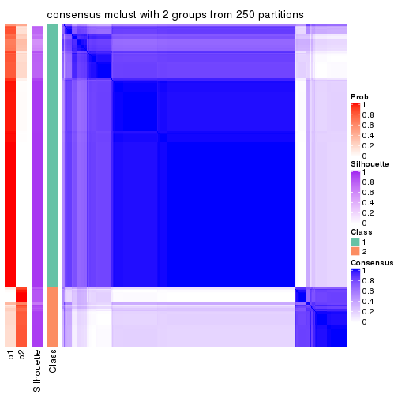</p>

</div>
<div id='tab-SD-mclust-consensus-heatmap-2'>
<pre><code class="r">consensus_heatmap(res, k = 3)
</code></pre>

<p>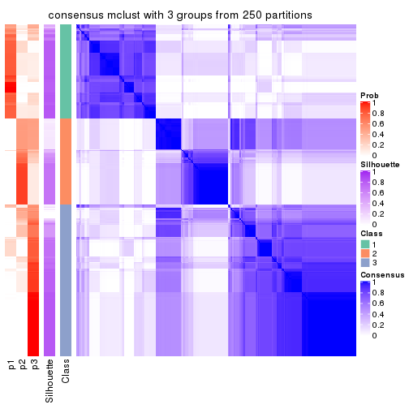</p>

</div>
<div id='tab-SD-mclust-consensus-heatmap-3'>
<pre><code class="r">consensus_heatmap(res, k = 4)
</code></pre>

<p>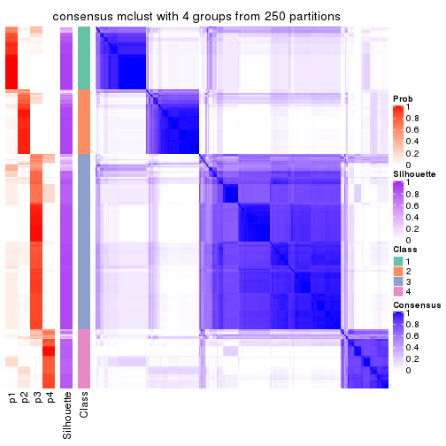</p>

</div>
<div id='tab-SD-mclust-consensus-heatmap-4'>
<pre><code class="r">consensus_heatmap(res, k = 5)
</code></pre>

<p>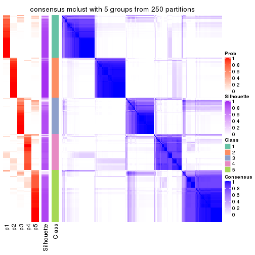</p>

</div>
<div id='tab-SD-mclust-consensus-heatmap-5'>
<pre><code class="r">consensus_heatmap(res, k = 6)
</code></pre>

<p>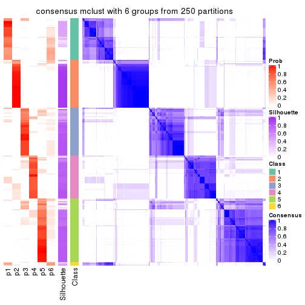</p>

</div>
</div>

Heatmaps for the membership of samples in all partitions to see how consistent they are:


<script>
$( function() {
	$( '#tabs-SD-mclust-membership-heatmap' ).tabs();
} );
</script>
<div id='tabs-SD-mclust-membership-heatmap'>
<ul>
<li><a href='#tab-SD-mclust-membership-heatmap-1'>k = 2</a></li>
<li><a href='#tab-SD-mclust-membership-heatmap-2'>k = 3</a></li>
<li><a href='#tab-SD-mclust-membership-heatmap-3'>k = 4</a></li>
<li><a href='#tab-SD-mclust-membership-heatmap-4'>k = 5</a></li>
<li><a href='#tab-SD-mclust-membership-heatmap-5'>k = 6</a></li>
</ul>
<div id='tab-SD-mclust-membership-heatmap-1'>
<pre><code class="r">membership_heatmap(res, k = 2)
</code></pre>

<p>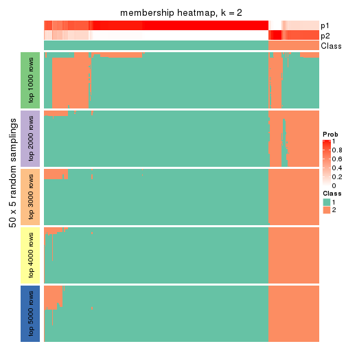</p>

</div>
<div id='tab-SD-mclust-membership-heatmap-2'>
<pre><code class="r">membership_heatmap(res, k = 3)
</code></pre>

<p>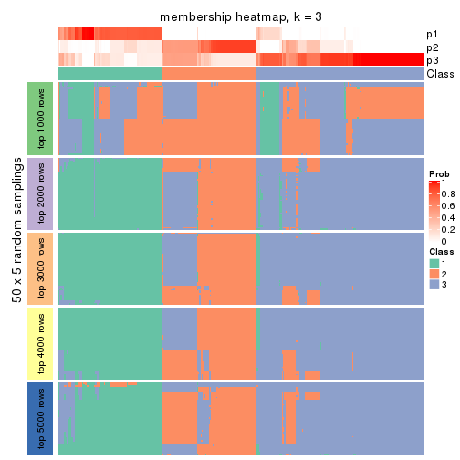</p>

</div>
<div id='tab-SD-mclust-membership-heatmap-3'>
<pre><code class="r">membership_heatmap(res, k = 4)
</code></pre>

<p>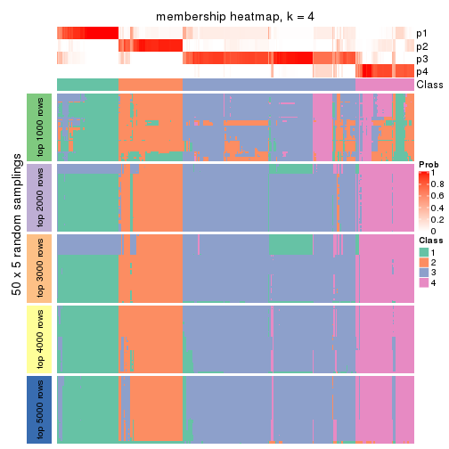</p>

</div>
<div id='tab-SD-mclust-membership-heatmap-4'>
<pre><code class="r">membership_heatmap(res, k = 5)
</code></pre>

<p>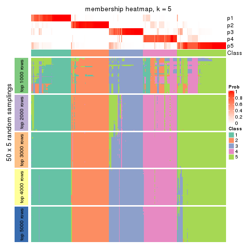</p>

</div>
<div id='tab-SD-mclust-membership-heatmap-5'>
<pre><code class="r">membership_heatmap(res, k = 6)
</code></pre>

<p>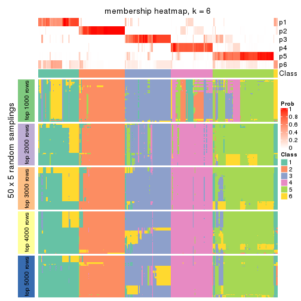</p>

</div>
</div>

As soon as we have had the classes for columns, we can look for signatures
which are significantly different between classes which can be candidate marks
for certain classes. Following are the heatmaps for signatures.


Signature heatmaps where rows are scaled:


<script>
$( function() {
	$( '#tabs-SD-mclust-get-signatures' ).tabs();
} );
</script>
<div id='tabs-SD-mclust-get-signatures'>
<ul>
<li><a href='#tab-SD-mclust-get-signatures-1'>k = 2</a></li>
<li><a href='#tab-SD-mclust-get-signatures-2'>k = 3</a></li>
<li><a href='#tab-SD-mclust-get-signatures-3'>k = 4</a></li>
<li><a href='#tab-SD-mclust-get-signatures-4'>k = 5</a></li>
<li><a href='#tab-SD-mclust-get-signatures-5'>k = 6</a></li>
</ul>
<div id='tab-SD-mclust-get-signatures-1'>
<pre><code class="r">get_signatures(res, k = 2)
</code></pre>

<p>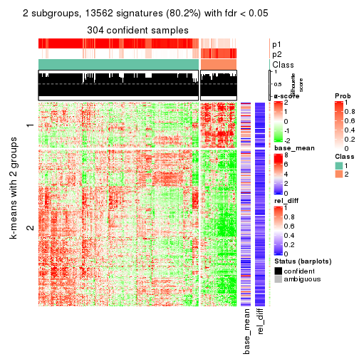</p>

</div>
<div id='tab-SD-mclust-get-signatures-2'>
<pre><code class="r">get_signatures(res, k = 3)
</code></pre>

<p>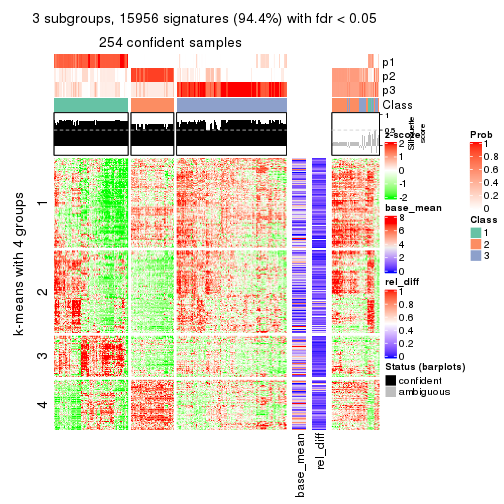</p>

</div>
<div id='tab-SD-mclust-get-signatures-3'>
<pre><code class="r">get_signatures(res, k = 4)
</code></pre>

<p>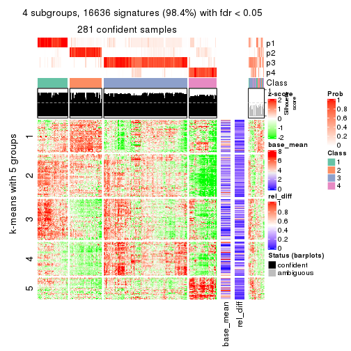</p>

</div>
<div id='tab-SD-mclust-get-signatures-4'>
<pre><code class="r">get_signatures(res, k = 5)
</code></pre>

<p>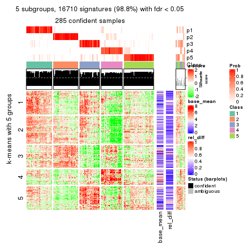</p>

</div>
<div id='tab-SD-mclust-get-signatures-5'>
<pre><code class="r">get_signatures(res, k = 6)
</code></pre>

<p>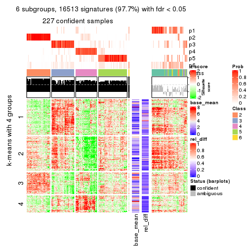</p>

</div>
</div>


Signature heatmaps where rows are not scaled:


<script>
$( function() {
	$( '#tabs-SD-mclust-get-signatures-no-scale' ).tabs();
} );
</script>
<div id='tabs-SD-mclust-get-signatures-no-scale'>
<ul>
<li><a href='#tab-SD-mclust-get-signatures-no-scale-1'>k = 2</a></li>
<li><a href='#tab-SD-mclust-get-signatures-no-scale-2'>k = 3</a></li>
<li><a href='#tab-SD-mclust-get-signatures-no-scale-3'>k = 4</a></li>
<li><a href='#tab-SD-mclust-get-signatures-no-scale-4'>k = 5</a></li>
<li><a href='#tab-SD-mclust-get-signatures-no-scale-5'>k = 6</a></li>
</ul>
<div id='tab-SD-mclust-get-signatures-no-scale-1'>
<pre><code class="r">get_signatures(res, k = 2, scale_rows = FALSE)
</code></pre>

<p>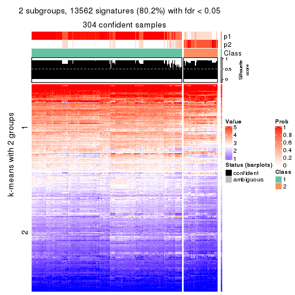</p>

</div>
<div id='tab-SD-mclust-get-signatures-no-scale-2'>
<pre><code class="r">get_signatures(res, k = 3, scale_rows = FALSE)
</code></pre>

<p>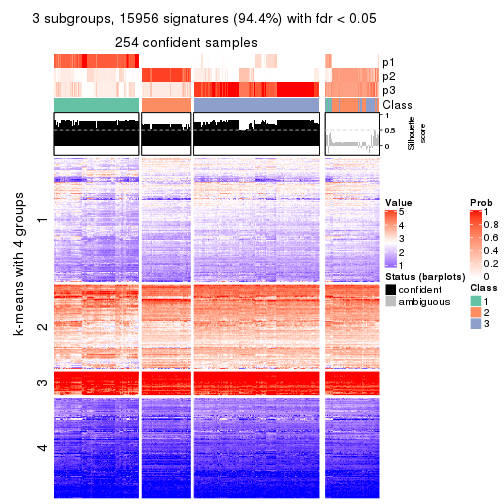</p>

</div>
<div id='tab-SD-mclust-get-signatures-no-scale-3'>
<pre><code class="r">get_signatures(res, k = 4, scale_rows = FALSE)
</code></pre>

<p>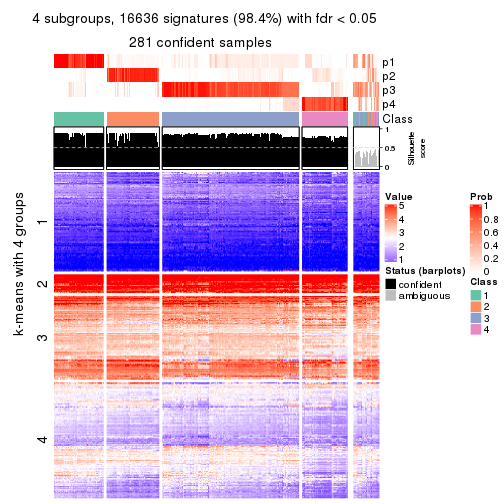</p>

</div>
<div id='tab-SD-mclust-get-signatures-no-scale-4'>
<pre><code class="r">get_signatures(res, k = 5, scale_rows = FALSE)
</code></pre>

<p>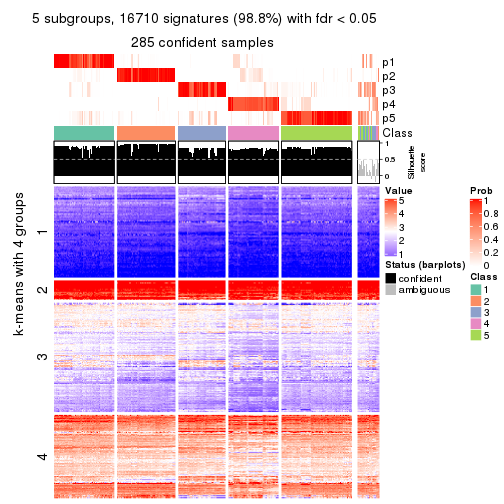</p>

</div>
<div id='tab-SD-mclust-get-signatures-no-scale-5'>
<pre><code class="r">get_signatures(res, k = 6, scale_rows = FALSE)
</code></pre>

<p>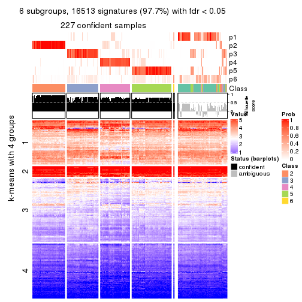</p>

</div>
</div>


Compare the overlap of signatures from different k:

```r
compare_signatures(res)
```

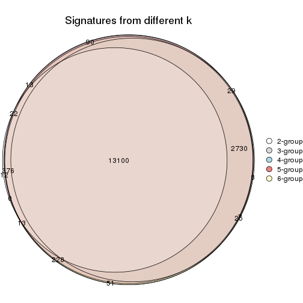

`get_signature()` returns a data frame invisibly. TO get the list of signatures, the function
call should be assigned to a variable explicitly. In following code, if `plot` argument is set
to `FALSE`, no heatmap is plotted while only the differential analysis is performed.

```r
# code only for demonstration
tb = get_signature(res, k = ..., plot = FALSE)
```

An example of the output of `tb` is:

```
#>   which_row         fdr    mean_1    mean_2 scaled_mean_1 scaled_mean_2 km
#> 1        38 0.042760348  8.373488  9.131774    -0.5533452     0.5164555  1
#> 2        40 0.018707592  7.106213  8.469186    -0.6173731     0.5762149  1
#> 3        55 0.019134737 10.221463 11.207825    -0.6159697     0.5749050  1
#> 4        59 0.006059896  5.921854  7.869574    -0.6899429     0.6439467  1
#> 5        60 0.018055526  8.928898 10.211722    -0.6204761     0.5791110  1
#> 6        98 0.009384629 15.714769 14.887706     0.6635654    -0.6193277  2
...
```

The columns in `tb` are:

1. `which_row`: row indices corresponding to the input matrix.
2. `fdr`: FDR for the differential test. 
3. `mean_x`: The mean value in group x.
4. `scaled_mean_x`: The mean value in group x after rows are scaled.
5. `km`: Row groups if k-means clustering is applied to rows.


UMAP plot which shows how samples are separated.


<script>
$( function() {
	$( '#tabs-SD-mclust-dimension-reduction' ).tabs();
} );
</script>
<div id='tabs-SD-mclust-dimension-reduction'>
<ul>
<li><a href='#tab-SD-mclust-dimension-reduction-1'>k = 2</a></li>
<li><a href='#tab-SD-mclust-dimension-reduction-2'>k = 3</a></li>
<li><a href='#tab-SD-mclust-dimension-reduction-3'>k = 4</a></li>
<li><a href='#tab-SD-mclust-dimension-reduction-4'>k = 5</a></li>
<li><a href='#tab-SD-mclust-dimension-reduction-5'>k = 6</a></li>
</ul>
<div id='tab-SD-mclust-dimension-reduction-1'>
<pre><code class="r">dimension_reduction(res, k = 2, method = &quot;UMAP&quot;)
</code></pre>

<p>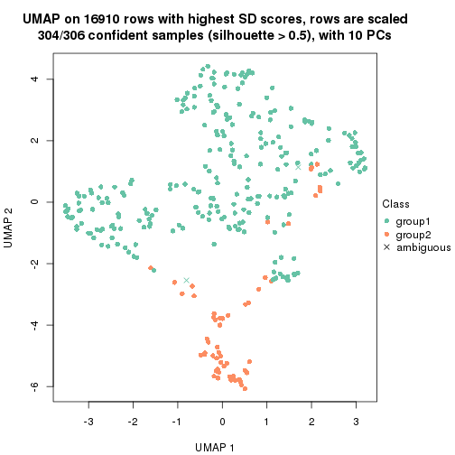</p>

</div>
<div id='tab-SD-mclust-dimension-reduction-2'>
<pre><code class="r">dimension_reduction(res, k = 3, method = &quot;UMAP&quot;)
</code></pre>

<p>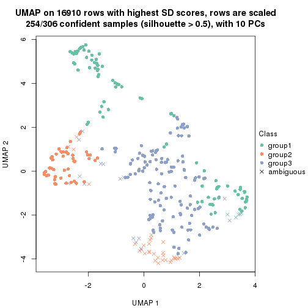</p>

</div>
<div id='tab-SD-mclust-dimension-reduction-3'>
<pre><code class="r">dimension_reduction(res, k = 4, method = &quot;UMAP&quot;)
</code></pre>

<p>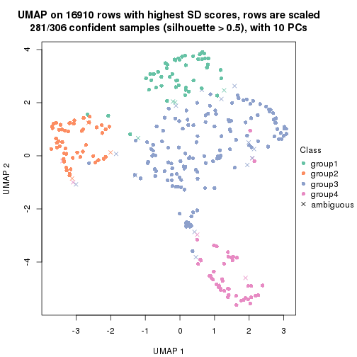</p>

</div>
<div id='tab-SD-mclust-dimension-reduction-4'>
<pre><code class="r">dimension_reduction(res, k = 5, method = &quot;UMAP&quot;)
</code></pre>

<p>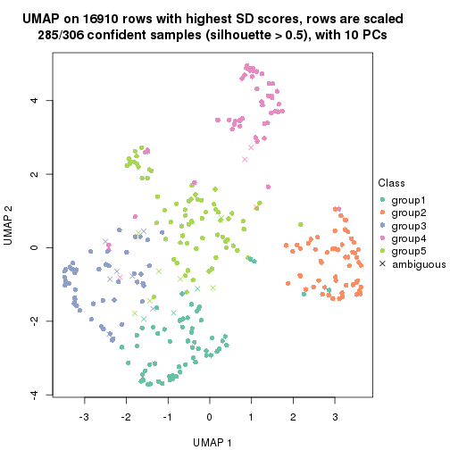</p>

</div>
<div id='tab-SD-mclust-dimension-reduction-5'>
<pre><code class="r">dimension_reduction(res, k = 6, method = &quot;UMAP&quot;)
</code></pre>

<p>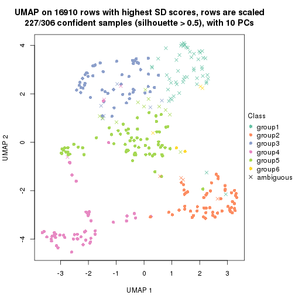</p>

</div>
</div>


Following heatmap shows how subgroups are split when increasing `k`:

```r
collect_classes(res)
```

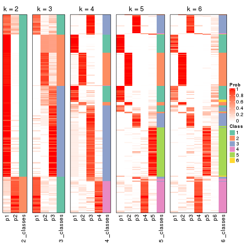


If matrix rows can be associated to genes, consider to use `GO_Enrichment(res,
...)` to perform function enrichment for the signature genes.


 

---------------------------------------------------


### SD:NMF


The object with results only for a single top-value method and a single partition method 
can be extracted as:

```r
res = res_list["SD", "NMF"]
# you can also extract it by
# res = res_list["SD:NMF"]
```

A summary of `res` and all the functions that can be applied to it:

```r
res
```

```
#> A 'ConsensusPartition' object with k = 2, 3, 4, 5, 6.
#>   On a matrix with 16910 rows and 306 columns.
#>   Top rows (1000, 2000, 3000, 4000, 5000) are extracted by 'SD' method.
#>   Subgroups are detected by 'NMF' method.
#>   Performed in total 1250 partitions by row resampling.
#>   Best k for subgroups seems to be 2.
#> 
#> Following methods can be applied to this 'ConsensusPartition' object:
#>  [1] "cola_report"             "collect_classes"         "collect_plots"          
#>  [4] "collect_stats"           "colnames"                "compare_signatures"     
#>  [7] "consensus_heatmap"       "dimension_reduction"     "functional_enrichment"  
#> [10] "get_anno_col"            "get_anno"                "get_classes"            
#> [13] "get_consensus"           "get_matrix"              "get_membership"         
#> [16] "get_param"               "get_signatures"          "get_stats"              
#> [19] "is_best_k"               "is_stable_k"             "membership_heatmap"     
#> [22] "ncol"                    "nrow"                    "plot_ecdf"              
#> [25] "rownames"                "select_partition_number" "show"                   
#> [28] "suggest_best_k"          "test_to_known_factors"
```

`collect_plots()` function collects all the plots made from `res` for all `k` (number of partitions)
into one single page to provide an easy and fast comparison between different `k`.

```r
collect_plots(res)
```

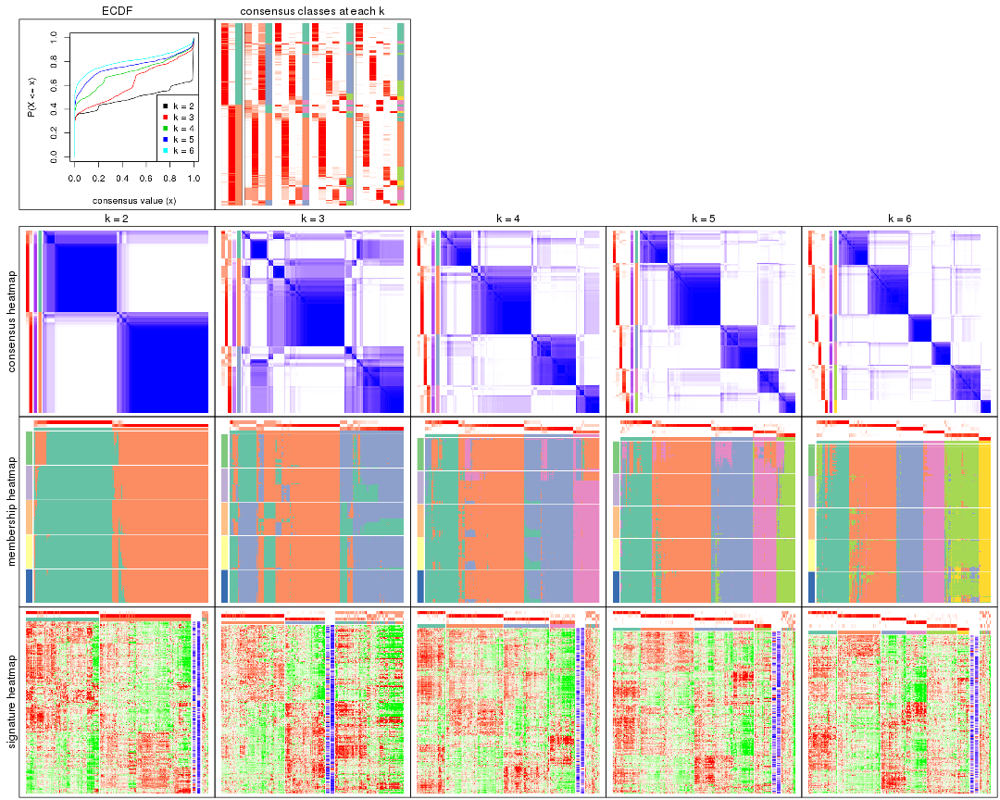

The plots are:

- The first row: a plot of the ECDF (Empirical cumulative distribution
  function) curves of the consensus matrix for each `k` and the heatmap of
  predicted classes for each `k`.
- The second row: heatmaps of the consensus matrix for each `k`.
- The third row: heatmaps of the membership matrix for each `k`.
- The fouth row: heatmaps of the signatures for each `k`.

All the plots in panels can be made by individual functions and they are
plotted later in this section.

`select_partition_number()` produces several plots showing different
statistics for choosing "optimized" `k`. There are following statistics:

- ECDF curves of the consensus matrix for each `k`;
- 1-PAC. [The PAC
  score](https://en.wikipedia.org/wiki/Consensus_clustering#Over-interpretation_potential_of_consensus_clustering)
  measures the proportion of the ambiguous subgrouping.
- Mean silhouette score.
- Concordance. The mean probability of fiting the consensus class ids in all
  partitions.
- Area increased. Denote $A_k$ as the area under the ECDF curve for current
  `k`, the area increased is defined as $A_k - A_{k-1}$.
- Rand index. The percent of pairs of samples that are both in a same cluster
  or both are not in a same cluster in the partition of k and k-1.
- Jaccard index. The ratio of pairs of samples are both in a same cluster in
  the partition of k and k-1 and the pairs of samples are both in a same
  cluster in the partition k or k-1.

The detailed explanations of these statistics can be found in [the cola
vignette](http://bioconductor.org/packages/devel/bioc/vignettes/cola/inst/doc/cola.html#toc_13).

Generally speaking, lower PAC score, higher mean silhouette score or higher
concordance corresponds to better partition. Rand index and Jaccard index
measure how similar the current partition is compared to partition with `k-1`.
If they are too similar, we won't accept `k` is better than `k-1`.

```r
select_partition_number(res)
```

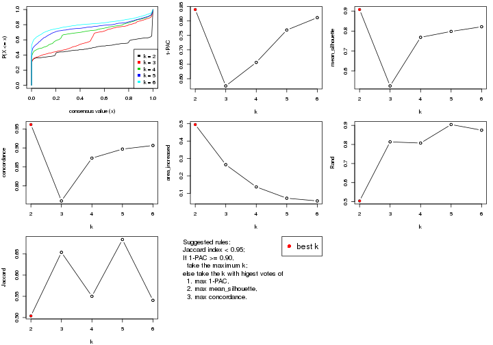

The numeric values for all these statistics can be obtained by `get_stats()`.

```r
get_stats(res)
```

```
#>   k 1-PAC mean_silhouette concordance area_increased  Rand Jaccard
#> 2 2 0.840           0.908       0.962         0.4951 0.504   0.504
#> 3 3 0.575           0.525       0.760         0.2646 0.814   0.654
#> 4 4 0.657           0.769       0.873         0.1368 0.807   0.550
#> 5 5 0.769           0.798       0.897         0.0719 0.904   0.684
#> 6 6 0.812           0.822       0.907         0.0563 0.875   0.541
```

`suggest_best_k()` suggests the best $k$ based on these statistics. The rules are as follows:

- All $k$ with Jaccard index larger than 0.95 are removed because the increase of
  the partition number does not provides enough extra information. If all $k$ are removed,
  the best $k$ is assigned by `NA`.
- For $k$ with 1-PAC larger than 0.9, the maximal $k$ is taken as the "best k". Other $k$ is called "optional k".
- If it does not fit the second rule. The $k$ with the highest vote of highest
  1-PAC, mean silhouette and concordance is taken as the "best k".

```r
suggest_best_k(res)
```

```
#> [1] 2
```


Following shows the table of the partitions (You need to click the **show/hide
code output** link to see it). The membership matrix (columns with name `p*`)
is inferred by
[`clue::cl_consensus()`](https://www.rdocumentation.org/link/cl_consensus?package=clue)
function with the `SE` method. Basically the value in the membership matrix
represents the probability to belong to a certain group. The finall class
label for an item is determined with the group with highest probability it
belongs to.

In `get_classes()` function, the entropy is calculated from the membership
matrix and the silhouette score is calculated from the consensus matrix.


<script>
$( function() {
	$( '#tabs-SD-NMF-get-classes' ).tabs();
} );
</script>
<div id='tabs-SD-NMF-get-classes'>
<ul>
<li><a href='#tab-SD-NMF-get-classes-1'>k = 2</a></li>
<li><a href='#tab-SD-NMF-get-classes-2'>k = 3</a></li>
<li><a href='#tab-SD-NMF-get-classes-3'>k = 4</a></li>
<li><a href='#tab-SD-NMF-get-classes-4'>k = 5</a></li>
<li><a href='#tab-SD-NMF-get-classes-5'>k = 6</a></li>
</ul>

<div id='tab-SD-NMF-get-classes-1'>
<p><a id='tab-SD-NMF-get-classes-1-a' style='color:#0366d6' href='#'>show/hide code output</a></p>
<pre><code class="r">cbind(get_classes(res, k = 2), get_membership(res, k = 2))
</code></pre>

<pre><code>#&gt;            class entropy silhouette    p1    p2
#&gt; SRR1609360     2  0.0672     0.9588 0.008 0.992
#&gt; SRR1609361     2  0.0000     0.9651 0.000 1.000
#&gt; SRR1609362     2  0.0000     0.9651 0.000 1.000
#&gt; SRR1609363     2  0.0000     0.9651 0.000 1.000
#&gt; SRR1609364     2  0.0000     0.9651 0.000 1.000
#&gt; SRR1609365     2  0.0000     0.9651 0.000 1.000
#&gt; SRR1609366     2  0.0000     0.9651 0.000 1.000
#&gt; SRR1609367     1  0.7219     0.7606 0.800 0.200
#&gt; SRR1609368     2  0.0000     0.9651 0.000 1.000
#&gt; SRR1609369     2  0.0000     0.9651 0.000 1.000
#&gt; SRR1609370     1  0.7219     0.7606 0.800 0.200
#&gt; SRR1609371     2  0.0000     0.9651 0.000 1.000
#&gt; SRR1609372     1  0.7219     0.7606 0.800 0.200
#&gt; SRR1609373     2  0.0000     0.9651 0.000 1.000
#&gt; SRR1609374     2  0.0000     0.9651 0.000 1.000
#&gt; SRR1609375     2  0.0000     0.9651 0.000 1.000
#&gt; SRR1609377     2  0.0000     0.9651 0.000 1.000
#&gt; SRR1609376     2  0.0000     0.9651 0.000 1.000
#&gt; SRR1609378     2  0.0000     0.9651 0.000 1.000
#&gt; SRR1609379     2  0.0000     0.9651 0.000 1.000
#&gt; SRR1609382     2  0.0000     0.9651 0.000 1.000
#&gt; SRR1609383     2  0.9087     0.4968 0.324 0.676
#&gt; SRR1609381     1  0.9922     0.2434 0.552 0.448
#&gt; SRR1609384     2  0.0000     0.9651 0.000 1.000
#&gt; SRR1609386     2  0.0000     0.9651 0.000 1.000
#&gt; SRR1609385     2  0.0000     0.9651 0.000 1.000
#&gt; SRR1609387     2  0.8909     0.5326 0.308 0.692
#&gt; SRR1609388     2  0.0000     0.9651 0.000 1.000
#&gt; SRR1609390     2  0.9977     0.0428 0.472 0.528
#&gt; SRR1609393     2  0.0000     0.9651 0.000 1.000
#&gt; SRR1609394     2  0.0000     0.9651 0.000 1.000
#&gt; SRR1609392     2  0.0000     0.9651 0.000 1.000
#&gt; SRR1609391     2  0.0000     0.9651 0.000 1.000
#&gt; SRR1609395     1  0.7219     0.7606 0.800 0.200
#&gt; SRR1609396     1  0.9000     0.5715 0.684 0.316
#&gt; SRR1609398     2  0.0000     0.9651 0.000 1.000
#&gt; SRR1609399     1  0.7219     0.7606 0.800 0.200
#&gt; SRR1609400     1  0.7219     0.7606 0.800 0.200
#&gt; SRR1609397     2  0.0000     0.9651 0.000 1.000
#&gt; SRR1609401     2  0.0000     0.9651 0.000 1.000
#&gt; SRR1609402     2  0.0000     0.9651 0.000 1.000
#&gt; SRR1609405     2  0.0000     0.9651 0.000 1.000
#&gt; SRR1609404     2  0.0000     0.9651 0.000 1.000
#&gt; SRR1609406     2  0.0000     0.9651 0.000 1.000
#&gt; SRR1609408     2  0.0000     0.9651 0.000 1.000
#&gt; SRR1609403     2  0.0000     0.9651 0.000 1.000
#&gt; SRR1609410     2  0.2423     0.9301 0.040 0.960
#&gt; SRR1609411     2  0.0000     0.9651 0.000 1.000
#&gt; SRR1609407     2  0.0000     0.9651 0.000 1.000
#&gt; SRR1609413     2  0.2043     0.9376 0.032 0.968
#&gt; SRR1609412     1  0.0000     0.9510 1.000 0.000
#&gt; SRR1609414     1  0.0000     0.9510 1.000 0.000
#&gt; SRR1609415     1  0.0000     0.9510 1.000 0.000
#&gt; SRR1609416     1  0.0000     0.9510 1.000 0.000
#&gt; SRR1609417     1  0.0000     0.9510 1.000 0.000
#&gt; SRR1609418     2  0.0000     0.9651 0.000 1.000
#&gt; SRR1609419     2  0.0000     0.9651 0.000 1.000
#&gt; SRR1609420     2  0.0000     0.9651 0.000 1.000
#&gt; SRR1609421     2  0.0000     0.9651 0.000 1.000
#&gt; SRR1609422     2  0.9427     0.4512 0.360 0.640
#&gt; SRR1609423     2  0.0000     0.9651 0.000 1.000
#&gt; SRR1609424     2  0.0000     0.9651 0.000 1.000
#&gt; SRR1609425     2  0.0000     0.9651 0.000 1.000
#&gt; SRR1609426     2  0.0000     0.9651 0.000 1.000
#&gt; SRR1609427     1  0.0000     0.9510 1.000 0.000
#&gt; SRR1609428     2  0.0000     0.9651 0.000 1.000
#&gt; SRR1609429     2  0.0672     0.9587 0.008 0.992
#&gt; SRR1609430     1  0.0000     0.9510 1.000 0.000
#&gt; SRR1609431     2  0.6801     0.7695 0.180 0.820
#&gt; SRR1609432     2  0.0000     0.9651 0.000 1.000
#&gt; SRR1609433     1  0.0000     0.9510 1.000 0.000
#&gt; SRR1609434     2  0.0000     0.9651 0.000 1.000
#&gt; SRR1609435     1  0.0000     0.9510 1.000 0.000
#&gt; SRR1609436     1  0.0000     0.9510 1.000 0.000
#&gt; SRR1609437     2  0.0000     0.9651 0.000 1.000
#&gt; SRR1609438     2  0.0000     0.9651 0.000 1.000
#&gt; SRR1609439     1  0.0000     0.9510 1.000 0.000
#&gt; SRR1609440     1  0.7219     0.7606 0.800 0.200
#&gt; SRR1609441     2  0.0000     0.9651 0.000 1.000
#&gt; SRR1609442     2  0.0000     0.9651 0.000 1.000
#&gt; SRR1609443     1  0.0000     0.9510 1.000 0.000
#&gt; SRR1609444     1  0.9866     0.2920 0.568 0.432
#&gt; SRR1609445     1  0.9998     0.0282 0.508 0.492
#&gt; SRR1609446     2  0.0000     0.9651 0.000 1.000
#&gt; SRR1609447     1  0.0000     0.9510 1.000 0.000
#&gt; SRR1609448     2  0.0000     0.9651 0.000 1.000
#&gt; SRR1609449     1  0.7299     0.7555 0.796 0.204
#&gt; SRR1609450     2  0.0000     0.9651 0.000 1.000
#&gt; SRR1609451     1  0.0000     0.9510 1.000 0.000
#&gt; SRR1609452     2  0.9963     0.1564 0.464 0.536
#&gt; SRR1609453     1  0.0000     0.9510 1.000 0.000
#&gt; SRR1609454     2  0.0000     0.9651 0.000 1.000
#&gt; SRR1609455     2  0.0000     0.9651 0.000 1.000
#&gt; SRR1609456     2  0.0000     0.9651 0.000 1.000
#&gt; SRR1609457     1  0.0000     0.9510 1.000 0.000
#&gt; SRR1609458     1  0.0000     0.9510 1.000 0.000
#&gt; SRR1609459     1  0.0000     0.9510 1.000 0.000
#&gt; SRR1609460     2  0.0000     0.9651 0.000 1.000
#&gt; SRR1609461     1  0.0000     0.9510 1.000 0.000
#&gt; SRR1609462     1  0.0000     0.9510 1.000 0.000
#&gt; SRR1609464     1  0.0000     0.9510 1.000 0.000
#&gt; SRR1609463     1  0.0000     0.9510 1.000 0.000
#&gt; SRR1609465     2  0.0000     0.9651 0.000 1.000
#&gt; SRR1609466     1  0.7219     0.7606 0.800 0.200
#&gt; SRR1609467     1  0.0000     0.9510 1.000 0.000
#&gt; SRR1609469     2  0.0000     0.9651 0.000 1.000
#&gt; SRR1609470     2  0.0000     0.9651 0.000 1.000
#&gt; SRR1609472     1  0.0938     0.9427 0.988 0.012
#&gt; SRR1609471     2  0.1184     0.9520 0.016 0.984
#&gt; SRR1609474     2  0.0000     0.9651 0.000 1.000
#&gt; SRR1609473     2  0.0000     0.9651 0.000 1.000
#&gt; SRR1609475     2  0.0000     0.9651 0.000 1.000
#&gt; SRR1609478     1  0.0000     0.9510 1.000 0.000
#&gt; SRR1609476     1  0.0000     0.9510 1.000 0.000
#&gt; SRR1609477     1  0.0000     0.9510 1.000 0.000
#&gt; SRR1609479     2  0.0000     0.9651 0.000 1.000
#&gt; SRR1609481     2  0.0000     0.9651 0.000 1.000
#&gt; SRR1609480     1  0.0000     0.9510 1.000 0.000
#&gt; SRR1609482     1  0.0000     0.9510 1.000 0.000
#&gt; SRR1609484     2  0.0000     0.9651 0.000 1.000
#&gt; SRR1609483     1  0.0000     0.9510 1.000 0.000
#&gt; SRR1609486     1  0.0000     0.9510 1.000 0.000
#&gt; SRR1609485     1  0.0000     0.9510 1.000 0.000
#&gt; SRR1609487     2  0.0000     0.9651 0.000 1.000
#&gt; SRR1609488     1  0.0000     0.9510 1.000 0.000
#&gt; SRR1609489     2  0.0000     0.9651 0.000 1.000
#&gt; SRR1609490     2  0.0000     0.9651 0.000 1.000
#&gt; SRR1609491     2  0.0376     0.9620 0.004 0.996
#&gt; SRR1609492     2  0.0000     0.9651 0.000 1.000
#&gt; SRR1609493     2  0.7219     0.7415 0.200 0.800
#&gt; SRR1609494     2  0.0000     0.9651 0.000 1.000
#&gt; SRR1609495     1  0.6973     0.7747 0.812 0.188
#&gt; SRR1609496     1  0.0000     0.9510 1.000 0.000
#&gt; SRR1609497     1  0.0000     0.9510 1.000 0.000
#&gt; SRR1609498     1  0.0000     0.9510 1.000 0.000
#&gt; SRR1609499     2  0.0000     0.9651 0.000 1.000
#&gt; SRR1609500     1  0.0000     0.9510 1.000 0.000
#&gt; SRR1609501     2  0.0000     0.9651 0.000 1.000
#&gt; SRR1609502     2  0.0000     0.9651 0.000 1.000
#&gt; SRR1609503     2  0.0000     0.9651 0.000 1.000
#&gt; SRR1609504     1  0.0000     0.9510 1.000 0.000
#&gt; SRR1609505     1  0.0000     0.9510 1.000 0.000
#&gt; SRR1609506     2  0.0000     0.9651 0.000 1.000
#&gt; SRR1609507     1  0.0000     0.9510 1.000 0.000
#&gt; SRR1609508     2  0.0000     0.9651 0.000 1.000
#&gt; SRR1609509     2  0.0000     0.9651 0.000 1.000
#&gt; SRR1609510     2  0.0000     0.9651 0.000 1.000
#&gt; SRR1609512     1  0.0000     0.9510 1.000 0.000
#&gt; SRR1609511     1  0.0000     0.9510 1.000 0.000
#&gt; SRR1609513     1  0.0000     0.9510 1.000 0.000
#&gt; SRR1609514     1  0.0000     0.9510 1.000 0.000
#&gt; SRR1609515     2  0.0000     0.9651 0.000 1.000
#&gt; SRR1609516     1  0.0000     0.9510 1.000 0.000
#&gt; SRR1609517     2  0.0000     0.9651 0.000 1.000
#&gt; SRR1609518     2  0.8813     0.5500 0.300 0.700
#&gt; SRR1609519     1  0.0000     0.9510 1.000 0.000
#&gt; SRR1609520     2  0.0000     0.9651 0.000 1.000
#&gt; SRR1609521     1  0.0000     0.9510 1.000 0.000
#&gt; SRR1609522     1  0.0000     0.9510 1.000 0.000
#&gt; SRR1609523     2  0.7299     0.7361 0.204 0.796
#&gt; SRR1609524     2  0.0000     0.9651 0.000 1.000
#&gt; SRR1609526     1  0.0000     0.9510 1.000 0.000
#&gt; SRR1609525     2  0.0000     0.9651 0.000 1.000
#&gt; SRR1609527     1  0.7219     0.7606 0.800 0.200
#&gt; SRR1609529     1  0.0000     0.9510 1.000 0.000
#&gt; SRR1609528     1  0.0672     0.9452 0.992 0.008
#&gt; SRR1609530     1  0.0000     0.9510 1.000 0.000
#&gt; SRR1609531     2  0.0000     0.9651 0.000 1.000
#&gt; SRR1609532     1  0.0000     0.9510 1.000 0.000
#&gt; SRR1609533     2  0.0000     0.9651 0.000 1.000
#&gt; SRR1609534     1  0.0000     0.9510 1.000 0.000
#&gt; SRR1609535     2  0.0000     0.9651 0.000 1.000
#&gt; SRR1609537     2  0.0000     0.9651 0.000 1.000
#&gt; SRR1609536     1  0.0000     0.9510 1.000 0.000
#&gt; SRR1609538     2  0.0000     0.9651 0.000 1.000
#&gt; SRR1609539     1  0.0000     0.9510 1.000 0.000
#&gt; SRR1609540     1  0.0000     0.9510 1.000 0.000
#&gt; SRR1609541     1  0.0000     0.9510 1.000 0.000
#&gt; SRR1609542     2  0.0000     0.9651 0.000 1.000
#&gt; SRR1609543     1  0.0000     0.9510 1.000 0.000
#&gt; SRR1609544     1  0.0000     0.9510 1.000 0.000
#&gt; SRR1609545     1  0.0000     0.9510 1.000 0.000
#&gt; SRR1609546     1  0.0000     0.9510 1.000 0.000
#&gt; SRR1609547     1  0.0000     0.9510 1.000 0.000
#&gt; SRR1609548     1  0.1843     0.9296 0.972 0.028
#&gt; SRR1609549     2  0.0000     0.9651 0.000 1.000
#&gt; SRR1609550     2  0.0000     0.9651 0.000 1.000
#&gt; SRR1609551     1  0.0000     0.9510 1.000 0.000
#&gt; SRR1609552     1  0.0000     0.9510 1.000 0.000
#&gt; SRR1609553     1  0.0000     0.9510 1.000 0.000
#&gt; SRR1609554     1  0.1414     0.9370 0.980 0.020
#&gt; SRR1609555     1  0.0000     0.9510 1.000 0.000
#&gt; SRR1609556     1  0.0000     0.9510 1.000 0.000
#&gt; SRR1609557     2  0.0000     0.9651 0.000 1.000
#&gt; SRR1609558     1  0.4161     0.8800 0.916 0.084
#&gt; SRR1609559     2  0.6887     0.7712 0.184 0.816
#&gt; SRR1609560     2  0.0000     0.9651 0.000 1.000
#&gt; SRR1609561     1  0.0000     0.9510 1.000 0.000
#&gt; SRR1609562     2  0.0000     0.9651 0.000 1.000
#&gt; SRR1609563     2  0.0000     0.9651 0.000 1.000
#&gt; SRR1609564     1  0.0000     0.9510 1.000 0.000
#&gt; SRR1609565     2  0.0000     0.9651 0.000 1.000
#&gt; SRR1609566     2  0.0000     0.9651 0.000 1.000
#&gt; SRR1609567     2  0.0000     0.9651 0.000 1.000
#&gt; SRR1609568     2  0.0000     0.9651 0.000 1.000
#&gt; SRR1609569     1  0.0000     0.9510 1.000 0.000
#&gt; SRR1609570     1  0.0000     0.9510 1.000 0.000
#&gt; SRR1609571     1  0.0000     0.9510 1.000 0.000
#&gt; SRR1609572     1  0.0000     0.9510 1.000 0.000
#&gt; SRR1609573     1  0.0000     0.9510 1.000 0.000
#&gt; SRR1609574     1  0.0000     0.9510 1.000 0.000
#&gt; SRR1609575     2  0.0000     0.9651 0.000 1.000
#&gt; SRR1609576     2  0.0000     0.9651 0.000 1.000
#&gt; SRR1609578     2  0.0938     0.9554 0.012 0.988
#&gt; SRR1609577     1  0.9866     0.2927 0.568 0.432
#&gt; SRR1609579     1  0.0000     0.9510 1.000 0.000
#&gt; SRR1609580     1  0.0000     0.9510 1.000 0.000
#&gt; SRR1609582     1  0.0000     0.9510 1.000 0.000
#&gt; SRR1609581     2  0.0000     0.9651 0.000 1.000
#&gt; SRR1609583     2  0.9248     0.5012 0.340 0.660
#&gt; SRR1609584     1  0.0000     0.9510 1.000 0.000
#&gt; SRR1609585     1  0.0000     0.9510 1.000 0.000
#&gt; SRR1609586     2  0.0000     0.9651 0.000 1.000
#&gt; SRR1609587     1  0.0000     0.9510 1.000 0.000
#&gt; SRR1609588     2  0.0000     0.9651 0.000 1.000
#&gt; SRR1609589     2  0.0000     0.9651 0.000 1.000
#&gt; SRR1609590     1  0.0000     0.9510 1.000 0.000
#&gt; SRR1609592     2  0.4431     0.8811 0.092 0.908
#&gt; SRR1609591     2  0.8499     0.6052 0.276 0.724
#&gt; SRR1609593     2  0.9635     0.3837 0.388 0.612
#&gt; SRR1609594     2  0.0000     0.9651 0.000 1.000
#&gt; SRR1609595     2  0.6048     0.8116 0.148 0.852
#&gt; SRR1609596     2  0.0000     0.9651 0.000 1.000
#&gt; SRR1609597     2  0.0000     0.9651 0.000 1.000
#&gt; SRR1609598     1  0.0000     0.9510 1.000 0.000
#&gt; SRR1609599     1  0.0000     0.9510 1.000 0.000
#&gt; SRR1609600     1  0.0000     0.9510 1.000 0.000
#&gt; SRR1609601     1  0.0000     0.9510 1.000 0.000
#&gt; SRR1609602     1  0.0000     0.9510 1.000 0.000
#&gt; SRR1609603     2  0.0000     0.9651 0.000 1.000
#&gt; SRR1609604     2  0.0000     0.9651 0.000 1.000
#&gt; SRR1609605     2  0.0000     0.9651 0.000 1.000
#&gt; SRR1609606     2  0.0000     0.9651 0.000 1.000
#&gt; SRR1609607     1  0.0000     0.9510 1.000 0.000
#&gt; SRR1609608     1  0.0000     0.9510 1.000 0.000
#&gt; SRR1609609     2  0.0000     0.9651 0.000 1.000
#&gt; SRR1609610     1  0.0000     0.9510 1.000 0.000
#&gt; SRR1609611     2  0.0000     0.9651 0.000 1.000
#&gt; SRR1609613     2  0.0000     0.9651 0.000 1.000
#&gt; SRR1609612     1  0.0000     0.9510 1.000 0.000
#&gt; SRR1609614     1  0.0000     0.9510 1.000 0.000
#&gt; SRR1609615     2  0.0376     0.9620 0.004 0.996
#&gt; SRR1609616     1  0.1633     0.9334 0.976 0.024
#&gt; SRR1609617     2  0.0000     0.9651 0.000 1.000
#&gt; SRR1609618     1  0.0000     0.9510 1.000 0.000
#&gt; SRR1609619     2  0.3733     0.8983 0.072 0.928
#&gt; SRR1609620     2  0.0000     0.9651 0.000 1.000
#&gt; SRR1609621     2  0.0000     0.9651 0.000 1.000
#&gt; SRR1609622     1  0.0000     0.9510 1.000 0.000
#&gt; SRR1609623     1  0.0000     0.9510 1.000 0.000
#&gt; SRR1609624     2  0.5059     0.8532 0.112 0.888
#&gt; SRR1609625     1  0.7299     0.7555 0.796 0.204
#&gt; SRR1609626     1  0.0000     0.9510 1.000 0.000
#&gt; SRR1609627     2  0.0000     0.9651 0.000 1.000
#&gt; SRR1609628     2  0.0000     0.9651 0.000 1.000
#&gt; SRR1609629     1  0.0000     0.9510 1.000 0.000
#&gt; SRR1609630     2  0.0000     0.9651 0.000 1.000
#&gt; SRR1609631     1  0.9608     0.4224 0.616 0.384
#&gt; SRR1609632     2  0.0000     0.9651 0.000 1.000
#&gt; SRR1609633     1  0.7219     0.7606 0.800 0.200
#&gt; SRR1609634     2  0.0000     0.9651 0.000 1.000
#&gt; SRR1609635     1  0.0000     0.9510 1.000 0.000
#&gt; SRR1609636     2  0.0000     0.9651 0.000 1.000
#&gt; SRR1609637     1  0.0000     0.9510 1.000 0.000
#&gt; SRR1609638     2  0.0000     0.9651 0.000 1.000
#&gt; SRR1609639     2  0.0000     0.9651 0.000 1.000
#&gt; SRR1609640     1  0.0000     0.9510 1.000 0.000
#&gt; SRR1609641     2  0.5408     0.8386 0.124 0.876
#&gt; SRR1609642     2  0.9977     0.0426 0.472 0.528
#&gt; SRR1609643     1  0.1414     0.9371 0.980 0.020
#&gt; SRR1609644     2  0.0000     0.9651 0.000 1.000
#&gt; SRR1609645     1  0.0000     0.9510 1.000 0.000
#&gt; SRR1609646     1  0.0000     0.9510 1.000 0.000
#&gt; SRR1609647     2  0.0000     0.9651 0.000 1.000
#&gt; SRR1609649     1  0.0000     0.9510 1.000 0.000
#&gt; SRR1609648     2  0.0000     0.9651 0.000 1.000
#&gt; SRR1609651     2  0.0000     0.9651 0.000 1.000
#&gt; SRR1609650     1  1.0000    -0.0199 0.504 0.496
#&gt; SRR1609652     1  0.0000     0.9510 1.000 0.000
#&gt; SRR1609653     2  0.0000     0.9651 0.000 1.000
#&gt; SRR1609654     2  0.0000     0.9651 0.000 1.000
#&gt; SRR1609655     1  0.0000     0.9510 1.000 0.000
#&gt; SRR1609657     1  0.8386     0.6589 0.732 0.268
#&gt; SRR1609656     1  0.7674     0.7277 0.776 0.224
#&gt; SRR1609658     2  0.0000     0.9651 0.000 1.000
#&gt; SRR1609659     2  0.0000     0.9651 0.000 1.000
#&gt; SRR1609660     1  0.0000     0.9510 1.000 0.000
#&gt; SRR1609661     1  0.0000     0.9510 1.000 0.000
#&gt; SRR1609662     2  0.0000     0.9651 0.000 1.000
#&gt; SRR1609663     1  0.0000     0.9510 1.000 0.000
#&gt; SRR1609664     2  0.6531     0.7857 0.168 0.832
#&gt; SRR1609665     2  0.0000     0.9651 0.000 1.000
#&gt; SRR1609666     2  0.0000     0.9651 0.000 1.000
#&gt; SRR1609667     1  0.0000     0.9510 1.000 0.000
#&gt; SRR1609668     2  0.5737     0.8262 0.136 0.864
#&gt; SRR1609669     2  0.0000     0.9651 0.000 1.000
</code></pre>

<script>
$('#tab-SD-NMF-get-classes-1-a').parent().next().next().hide();
$('#tab-SD-NMF-get-classes-1-a').click(function(){
  $('#tab-SD-NMF-get-classes-1-a').parent().next().next().toggle();
  return(false);
});
</script>
</div>

<div id='tab-SD-NMF-get-classes-2'>
<p><a id='tab-SD-NMF-get-classes-2-a' style='color:#0366d6' href='#'>show/hide code output</a></p>
<pre><code class="r">cbind(get_classes(res, k = 3), get_membership(res, k = 3))
</code></pre>

<pre><code>#&gt;            class entropy silhouette    p1    p2    p3
#&gt; SRR1609360     1  0.5591    0.00147 0.696 0.304 0.000
#&gt; SRR1609361     1  0.5497    0.02568 0.708 0.292 0.000
#&gt; SRR1609362     1  0.6307   -0.32076 0.512 0.488 0.000
#&gt; SRR1609363     2  0.0000    0.83209 0.000 1.000 0.000
#&gt; SRR1609364     2  0.0000    0.83209 0.000 1.000 0.000
#&gt; SRR1609365     1  0.6126   -0.18282 0.600 0.400 0.000
#&gt; SRR1609366     2  0.0000    0.83209 0.000 1.000 0.000
#&gt; SRR1609367     1  0.6308    0.39774 0.508 0.000 0.492
#&gt; SRR1609368     2  0.0000    0.83209 0.000 1.000 0.000
#&gt; SRR1609369     2  0.1860    0.80319 0.052 0.948 0.000
#&gt; SRR1609370     1  0.6308    0.39774 0.508 0.000 0.492
#&gt; SRR1609371     2  0.6308    0.32660 0.492 0.508 0.000
#&gt; SRR1609372     1  0.6308    0.39774 0.508 0.000 0.492
#&gt; SRR1609373     2  0.0000    0.83209 0.000 1.000 0.000
#&gt; SRR1609374     2  0.0000    0.83209 0.000 1.000 0.000
#&gt; SRR1609375     2  0.0000    0.83209 0.000 1.000 0.000
#&gt; SRR1609377     2  0.0892    0.82290 0.020 0.980 0.000
#&gt; SRR1609376     2  0.0000    0.83209 0.000 1.000 0.000
#&gt; SRR1609378     2  0.6308    0.32660 0.492 0.508 0.000
#&gt; SRR1609379     2  0.4235    0.69102 0.176 0.824 0.000
#&gt; SRR1609382     2  0.6308    0.32660 0.492 0.508 0.000
#&gt; SRR1609383     1  0.3340    0.27389 0.880 0.120 0.000
#&gt; SRR1609381     1  0.8440    0.32599 0.492 0.088 0.420
#&gt; SRR1609384     2  0.0892    0.82290 0.020 0.980 0.000
#&gt; SRR1609386     2  0.0592    0.82693 0.012 0.988 0.000
#&gt; SRR1609385     2  0.4702    0.64986 0.212 0.788 0.000
#&gt; SRR1609387     3  0.9806   -0.22857 0.348 0.244 0.408
#&gt; SRR1609388     2  0.0000    0.83209 0.000 1.000 0.000
#&gt; SRR1609390     1  0.8943    0.15693 0.480 0.392 0.128
#&gt; SRR1609393     2  0.6308    0.32660 0.492 0.508 0.000
#&gt; SRR1609394     2  0.0000    0.83209 0.000 1.000 0.000
#&gt; SRR1609392     2  0.0000    0.83209 0.000 1.000 0.000
#&gt; SRR1609391     2  0.6305    0.33690 0.484 0.516 0.000
#&gt; SRR1609395     1  0.6308    0.39774 0.508 0.000 0.492
#&gt; SRR1609396     1  0.7392    0.37107 0.500 0.032 0.468
#&gt; SRR1609398     2  0.0424    0.82875 0.008 0.992 0.000
#&gt; SRR1609399     1  0.6308    0.39774 0.508 0.000 0.492
#&gt; SRR1609400     1  0.6308    0.39774 0.508 0.000 0.492
#&gt; SRR1609397     2  0.0000    0.83209 0.000 1.000 0.000
#&gt; SRR1609401     2  0.0000    0.83209 0.000 1.000 0.000
#&gt; SRR1609402     2  0.0000    0.83209 0.000 1.000 0.000
#&gt; SRR1609405     2  0.0424    0.82875 0.008 0.992 0.000
#&gt; SRR1609404     2  0.6308    0.32660 0.492 0.508 0.000
#&gt; SRR1609406     2  0.0000    0.83209 0.000 1.000 0.000
#&gt; SRR1609408     2  0.0000    0.83209 0.000 1.000 0.000
#&gt; SRR1609403     2  0.4702    0.64986 0.212 0.788 0.000
#&gt; SRR1609410     2  0.5024    0.63580 0.220 0.776 0.004
#&gt; SRR1609411     2  0.0000    0.83209 0.000 1.000 0.000
#&gt; SRR1609407     2  0.0000    0.83209 0.000 1.000 0.000
#&gt; SRR1609413     2  0.5988    0.51402 0.304 0.688 0.008
#&gt; SRR1609412     3  0.0661    0.66066 0.004 0.008 0.988
#&gt; SRR1609414     3  0.0000    0.66358 0.000 0.000 1.000
#&gt; SRR1609415     1  0.6308    0.39774 0.508 0.000 0.492
#&gt; SRR1609416     1  0.6308    0.39774 0.508 0.000 0.492
#&gt; SRR1609417     3  0.0000    0.66358 0.000 0.000 1.000
#&gt; SRR1609418     2  0.1964    0.80012 0.056 0.944 0.000
#&gt; SRR1609419     2  0.0000    0.83209 0.000 1.000 0.000
#&gt; SRR1609420     2  0.1031    0.82406 0.024 0.976 0.000
#&gt; SRR1609421     2  0.6045    0.38928 0.000 0.620 0.380
#&gt; SRR1609422     3  0.6308    0.17775 0.492 0.000 0.508
#&gt; SRR1609423     2  0.6825    0.30981 0.492 0.496 0.012
#&gt; SRR1609424     2  0.6308    0.32660 0.492 0.508 0.000
#&gt; SRR1609425     2  0.0000    0.83209 0.000 1.000 0.000
#&gt; SRR1609426     2  0.0000    0.83209 0.000 1.000 0.000
#&gt; SRR1609427     1  0.6308    0.39774 0.508 0.000 0.492
#&gt; SRR1609428     2  0.0000    0.83209 0.000 1.000 0.000
#&gt; SRR1609429     2  0.0000    0.83209 0.000 1.000 0.000
#&gt; SRR1609430     3  0.3619    0.58540 0.136 0.000 0.864
#&gt; SRR1609431     2  0.6274    0.19868 0.000 0.544 0.456
#&gt; SRR1609432     2  0.0000    0.83209 0.000 1.000 0.000
#&gt; SRR1609433     1  0.6308    0.39774 0.508 0.000 0.492
#&gt; SRR1609434     2  0.6308    0.32660 0.492 0.508 0.000
#&gt; SRR1609435     1  0.6308    0.39774 0.508 0.000 0.492
#&gt; SRR1609436     3  0.3267    0.60331 0.116 0.000 0.884
#&gt; SRR1609437     2  0.6308    0.32660 0.492 0.508 0.000
#&gt; SRR1609438     2  0.6308    0.32660 0.492 0.508 0.000
#&gt; SRR1609439     3  0.0592    0.65776 0.012 0.000 0.988
#&gt; SRR1609440     1  0.6308    0.39774 0.508 0.000 0.492
#&gt; SRR1609441     2  0.1964    0.80094 0.000 0.944 0.056
#&gt; SRR1609442     2  0.4555    0.68277 0.200 0.800 0.000
#&gt; SRR1609443     3  0.4931    0.43200 0.232 0.000 0.768
#&gt; SRR1609444     2  0.5404    0.50433 0.004 0.740 0.256
#&gt; SRR1609445     3  0.0892    0.65126 0.000 0.020 0.980
#&gt; SRR1609446     2  0.0000    0.83209 0.000 1.000 0.000
#&gt; SRR1609447     1  0.6308    0.39774 0.508 0.000 0.492
#&gt; SRR1609448     2  0.0000    0.83209 0.000 1.000 0.000
#&gt; SRR1609449     3  0.9243   -0.21214 0.340 0.168 0.492
#&gt; SRR1609450     2  0.0000    0.83209 0.000 1.000 0.000
#&gt; SRR1609451     3  0.6302   -0.34055 0.480 0.000 0.520
#&gt; SRR1609452     3  0.5845    0.31612 0.004 0.308 0.688
#&gt; SRR1609453     3  0.0747    0.65572 0.000 0.016 0.984
#&gt; SRR1609454     2  0.0000    0.83209 0.000 1.000 0.000
#&gt; SRR1609455     2  0.0592    0.82706 0.012 0.988 0.000
#&gt; SRR1609456     2  0.2356    0.78950 0.000 0.928 0.072
#&gt; SRR1609457     3  0.0000    0.66358 0.000 0.000 1.000
#&gt; SRR1609458     3  0.4654    0.47945 0.208 0.000 0.792
#&gt; SRR1609459     3  0.1031    0.64711 0.000 0.024 0.976
#&gt; SRR1609460     2  0.3619    0.73651 0.000 0.864 0.136
#&gt; SRR1609461     3  0.0000    0.66358 0.000 0.000 1.000
#&gt; SRR1609462     3  0.4605    0.48652 0.204 0.000 0.796
#&gt; SRR1609464     3  0.2261    0.63369 0.068 0.000 0.932
#&gt; SRR1609463     3  0.0237    0.66281 0.004 0.000 0.996
#&gt; SRR1609465     2  0.3619    0.73648 0.000 0.864 0.136
#&gt; SRR1609466     1  0.6305    0.39339 0.516 0.000 0.484
#&gt; SRR1609467     3  0.4178    0.54220 0.172 0.000 0.828
#&gt; SRR1609469     1  0.8440   -0.23487 0.492 0.420 0.088
#&gt; SRR1609470     2  0.5810    0.48350 0.000 0.664 0.336
#&gt; SRR1609472     3  0.6308    0.17775 0.492 0.000 0.508
#&gt; SRR1609471     2  0.6379    0.24116 0.008 0.624 0.368
#&gt; SRR1609474     2  0.0000    0.83209 0.000 1.000 0.000
#&gt; SRR1609473     1  0.7583   -0.29601 0.492 0.468 0.040
#&gt; SRR1609475     2  0.6308    0.32660 0.492 0.508 0.000
#&gt; SRR1609478     3  0.6308    0.17775 0.492 0.000 0.508
#&gt; SRR1609476     1  0.6308    0.39774 0.508 0.000 0.492
#&gt; SRR1609477     3  0.4887    0.44243 0.228 0.000 0.772
#&gt; SRR1609479     2  0.0000    0.83209 0.000 1.000 0.000
#&gt; SRR1609481     1  0.9335   -0.09306 0.492 0.324 0.184
#&gt; SRR1609480     3  0.6307    0.18066 0.488 0.000 0.512
#&gt; SRR1609482     3  0.3340    0.59849 0.120 0.000 0.880
#&gt; SRR1609484     1  0.8836   -0.19456 0.492 0.388 0.120
#&gt; SRR1609483     3  0.3340    0.59849 0.120 0.000 0.880
#&gt; SRR1609486     3  0.0000    0.66358 0.000 0.000 1.000
#&gt; SRR1609485     3  0.0000    0.66358 0.000 0.000 1.000
#&gt; SRR1609487     2  0.0892    0.82290 0.020 0.980 0.000
#&gt; SRR1609488     3  0.1163    0.65483 0.028 0.000 0.972
#&gt; SRR1609489     2  0.0000    0.83209 0.000 1.000 0.000
#&gt; SRR1609490     2  0.0000    0.83209 0.000 1.000 0.000
#&gt; SRR1609491     2  0.6260    0.22492 0.000 0.552 0.448
#&gt; SRR1609492     2  0.0000    0.83209 0.000 1.000 0.000
#&gt; SRR1609493     2  0.6154    0.31979 0.000 0.592 0.408
#&gt; SRR1609494     2  0.0000    0.83209 0.000 1.000 0.000
#&gt; SRR1609495     1  0.0592    0.27158 0.988 0.000 0.012
#&gt; SRR1609496     3  0.3412    0.59595 0.124 0.000 0.876
#&gt; SRR1609497     3  0.2959    0.61486 0.100 0.000 0.900
#&gt; SRR1609498     1  0.6308    0.39774 0.508 0.000 0.492
#&gt; SRR1609499     2  0.0000    0.83209 0.000 1.000 0.000
#&gt; SRR1609500     3  0.6111   -0.07360 0.396 0.000 0.604
#&gt; SRR1609501     2  0.4702    0.65428 0.000 0.788 0.212
#&gt; SRR1609502     2  0.0000    0.83209 0.000 1.000 0.000
#&gt; SRR1609503     2  0.6308    0.32660 0.492 0.508 0.000
#&gt; SRR1609504     1  0.6308    0.39774 0.508 0.000 0.492
#&gt; SRR1609505     3  0.4002    0.55735 0.160 0.000 0.840
#&gt; SRR1609506     2  0.0000    0.83209 0.000 1.000 0.000
#&gt; SRR1609507     3  0.4931    0.43563 0.232 0.000 0.768
#&gt; SRR1609508     2  0.0000    0.83209 0.000 1.000 0.000
#&gt; SRR1609509     2  0.0000    0.83209 0.000 1.000 0.000
#&gt; SRR1609510     1  0.8995   -0.17175 0.492 0.372 0.136
#&gt; SRR1609512     3  0.3551    0.58974 0.132 0.000 0.868
#&gt; SRR1609511     3  0.0424    0.66003 0.008 0.000 0.992
#&gt; SRR1609513     3  0.3941    0.56313 0.156 0.000 0.844
#&gt; SRR1609514     3  0.6308    0.17775 0.492 0.000 0.508
#&gt; SRR1609515     2  0.0000    0.83209 0.000 1.000 0.000
#&gt; SRR1609516     3  0.0237    0.66184 0.000 0.004 0.996
#&gt; SRR1609517     2  0.3551    0.74025 0.000 0.868 0.132
#&gt; SRR1609518     2  0.9659   -0.17575 0.220 0.440 0.340
#&gt; SRR1609519     3  0.0000    0.66358 0.000 0.000 1.000
#&gt; SRR1609520     2  0.6683    0.31604 0.492 0.500 0.008
#&gt; SRR1609521     1  0.6309    0.37669 0.500 0.000 0.500
#&gt; SRR1609522     3  0.3619    0.58540 0.136 0.000 0.864
#&gt; SRR1609523     3  0.6309   -0.07870 0.000 0.496 0.504
#&gt; SRR1609524     2  0.0000    0.83209 0.000 1.000 0.000
#&gt; SRR1609526     3  0.3551    0.58866 0.132 0.000 0.868
#&gt; SRR1609525     2  0.6308    0.09787 0.000 0.508 0.492
#&gt; SRR1609527     3  0.8210   -0.34295 0.460 0.072 0.468
#&gt; SRR1609529     3  0.0000    0.66358 0.000 0.000 1.000
#&gt; SRR1609528     3  0.6308    0.17775 0.492 0.000 0.508
#&gt; SRR1609530     3  0.0892    0.65778 0.020 0.000 0.980
#&gt; SRR1609531     2  0.0000    0.83209 0.000 1.000 0.000
#&gt; SRR1609532     3  0.3412    0.59546 0.124 0.000 0.876
#&gt; SRR1609533     2  0.4121    0.70386 0.000 0.832 0.168
#&gt; SRR1609534     3  0.0000    0.66358 0.000 0.000 1.000
#&gt; SRR1609535     2  0.3619    0.73645 0.000 0.864 0.136
#&gt; SRR1609537     2  0.0000    0.83209 0.000 1.000 0.000
#&gt; SRR1609536     3  0.0000    0.66358 0.000 0.000 1.000
#&gt; SRR1609538     2  0.0000    0.83209 0.000 1.000 0.000
#&gt; SRR1609539     3  0.0000    0.66358 0.000 0.000 1.000
#&gt; SRR1609540     3  0.9442   -0.15642 0.288 0.216 0.496
#&gt; SRR1609541     3  0.6308    0.17775 0.492 0.000 0.508
#&gt; SRR1609542     2  0.0000    0.83209 0.000 1.000 0.000
#&gt; SRR1609543     3  0.6309   -0.38442 0.496 0.000 0.504
#&gt; SRR1609544     1  0.6308    0.39774 0.508 0.000 0.492
#&gt; SRR1609545     1  0.6308    0.39774 0.508 0.000 0.492
#&gt; SRR1609546     3  0.0000    0.66358 0.000 0.000 1.000
#&gt; SRR1609547     3  0.0000    0.66358 0.000 0.000 1.000
#&gt; SRR1609548     3  0.2165    0.60643 0.000 0.064 0.936
#&gt; SRR1609549     2  0.0000    0.83209 0.000 1.000 0.000
#&gt; SRR1609550     2  0.0000    0.83209 0.000 1.000 0.000
#&gt; SRR1609551     3  0.0000    0.66358 0.000 0.000 1.000
#&gt; SRR1609552     3  0.0000    0.66358 0.000 0.000 1.000
#&gt; SRR1609553     3  0.0000    0.66358 0.000 0.000 1.000
#&gt; SRR1609554     3  0.6215    0.13595 0.000 0.428 0.572
#&gt; SRR1609555     3  0.0237    0.66281 0.004 0.000 0.996
#&gt; SRR1609556     3  0.5785    0.16474 0.332 0.000 0.668
#&gt; SRR1609557     3  0.6309   -0.07996 0.000 0.496 0.504
#&gt; SRR1609558     3  0.6095    0.23013 0.000 0.392 0.608
#&gt; SRR1609559     3  0.5902    0.30678 0.004 0.316 0.680
#&gt; SRR1609560     2  0.0424    0.82875 0.008 0.992 0.000
#&gt; SRR1609561     3  0.0000    0.66358 0.000 0.000 1.000
#&gt; SRR1609562     2  0.0000    0.83209 0.000 1.000 0.000
#&gt; SRR1609563     2  0.0000    0.83209 0.000 1.000 0.000
#&gt; SRR1609564     1  0.6308    0.39774 0.508 0.000 0.492
#&gt; SRR1609565     2  0.0000    0.83209 0.000 1.000 0.000
#&gt; SRR1609566     2  0.0000    0.83209 0.000 1.000 0.000
#&gt; SRR1609567     2  0.0000    0.83209 0.000 1.000 0.000
#&gt; SRR1609568     2  0.4702    0.64986 0.212 0.788 0.000
#&gt; SRR1609569     1  0.6308    0.39774 0.508 0.000 0.492
#&gt; SRR1609570     3  0.3686    0.58168 0.140 0.000 0.860
#&gt; SRR1609571     3  0.3551    0.58866 0.132 0.000 0.868
#&gt; SRR1609572     3  0.6192    0.29366 0.420 0.000 0.580
#&gt; SRR1609573     3  0.3752    0.57771 0.144 0.000 0.856
#&gt; SRR1609574     3  0.3551    0.58866 0.132 0.000 0.868
#&gt; SRR1609575     2  0.6308    0.32660 0.492 0.508 0.000
#&gt; SRR1609576     2  0.0000    0.83209 0.000 1.000 0.000
#&gt; SRR1609578     2  0.2878    0.77098 0.000 0.904 0.096
#&gt; SRR1609577     3  0.8322   -0.31790 0.428 0.080 0.492
#&gt; SRR1609579     3  0.6126   -0.08297 0.400 0.000 0.600
#&gt; SRR1609580     3  0.0000    0.66358 0.000 0.000 1.000
#&gt; SRR1609582     3  0.4702    0.47203 0.212 0.000 0.788
#&gt; SRR1609581     2  0.1964    0.80072 0.000 0.944 0.056
#&gt; SRR1609583     3  0.1525    0.63810 0.004 0.032 0.964
#&gt; SRR1609584     3  0.3879    0.56822 0.152 0.000 0.848
#&gt; SRR1609585     3  0.3686    0.58168 0.140 0.000 0.860
#&gt; SRR1609586     2  0.0000    0.83209 0.000 1.000 0.000
#&gt; SRR1609587     3  0.0000    0.66358 0.000 0.000 1.000
#&gt; SRR1609588     2  0.1289    0.81571 0.000 0.968 0.032
#&gt; SRR1609589     2  0.0000    0.83209 0.000 1.000 0.000
#&gt; SRR1609590     3  0.2448    0.62900 0.076 0.000 0.924
#&gt; SRR1609592     3  0.5690    0.33759 0.004 0.288 0.708
#&gt; SRR1609591     2  0.0424    0.82931 0.000 0.992 0.008
#&gt; SRR1609593     3  0.6307   -0.05648 0.000 0.488 0.512
#&gt; SRR1609594     2  0.6308    0.32660 0.492 0.508 0.000
#&gt; SRR1609595     2  0.6286    0.17742 0.000 0.536 0.464
#&gt; SRR1609596     2  0.0000    0.83209 0.000 1.000 0.000
#&gt; SRR1609597     2  0.0000    0.83209 0.000 1.000 0.000
#&gt; SRR1609598     3  0.6308    0.17775 0.492 0.000 0.508
#&gt; SRR1609599     1  0.6154   -0.13997 0.592 0.000 0.408
#&gt; SRR1609600     3  0.4235    0.53630 0.176 0.000 0.824
#&gt; SRR1609601     3  0.6308    0.17775 0.492 0.000 0.508
#&gt; SRR1609602     1  0.6111   -0.12158 0.604 0.000 0.396
#&gt; SRR1609603     2  0.2261    0.79140 0.068 0.932 0.000
#&gt; SRR1609604     2  0.6308    0.32660 0.492 0.508 0.000
#&gt; SRR1609605     2  0.1964    0.80093 0.000 0.944 0.056
#&gt; SRR1609606     2  0.5835    0.47909 0.000 0.660 0.340
#&gt; SRR1609607     3  0.0000    0.66358 0.000 0.000 1.000
#&gt; SRR1609608     3  0.0000    0.66358 0.000 0.000 1.000
#&gt; SRR1609609     2  0.3412    0.74738 0.000 0.876 0.124
#&gt; SRR1609610     3  0.0237    0.66292 0.004 0.000 0.996
#&gt; SRR1609611     2  0.6308    0.32660 0.492 0.508 0.000
#&gt; SRR1609613     2  0.0000    0.83209 0.000 1.000 0.000
#&gt; SRR1609612     3  0.0237    0.66281 0.004 0.000 0.996
#&gt; SRR1609614     3  0.4504    0.49867 0.196 0.000 0.804
#&gt; SRR1609615     2  0.1129    0.82148 0.020 0.976 0.004
#&gt; SRR1609616     3  0.9442   -0.10614 0.216 0.288 0.496
#&gt; SRR1609617     2  0.4062    0.70855 0.000 0.836 0.164
#&gt; SRR1609618     3  0.0000    0.66358 0.000 0.000 1.000
#&gt; SRR1609619     2  0.6513   -0.06518 0.004 0.520 0.476
#&gt; SRR1609620     2  0.6302    0.34213 0.480 0.520 0.000
#&gt; SRR1609621     2  0.0592    0.82706 0.012 0.988 0.000
#&gt; SRR1609622     3  0.0592    0.66218 0.012 0.000 0.988
#&gt; SRR1609623     1  0.6308    0.39774 0.508 0.000 0.492
#&gt; SRR1609624     2  0.6033    0.46874 0.336 0.660 0.004
#&gt; SRR1609625     3  0.9626   -0.14912 0.268 0.260 0.472
#&gt; SRR1609626     3  0.3619    0.59909 0.136 0.000 0.864
#&gt; SRR1609627     2  0.0424    0.82875 0.008 0.992 0.000
#&gt; SRR1609628     2  0.0000    0.83209 0.000 1.000 0.000
#&gt; SRR1609629     3  0.1163    0.65466 0.028 0.000 0.972
#&gt; SRR1609630     2  0.0000    0.83209 0.000 1.000 0.000
#&gt; SRR1609631     3  1.0000   -0.20303 0.332 0.332 0.336
#&gt; SRR1609632     2  0.2625    0.77865 0.084 0.916 0.000
#&gt; SRR1609633     1  0.6308    0.39774 0.508 0.000 0.492
#&gt; SRR1609634     2  0.0000    0.83209 0.000 1.000 0.000
#&gt; SRR1609635     3  0.6062    0.27608 0.384 0.000 0.616
#&gt; SRR1609636     2  0.6308    0.32660 0.492 0.508 0.000
#&gt; SRR1609637     1  0.6308    0.39774 0.508 0.000 0.492
#&gt; SRR1609638     2  0.0000    0.83209 0.000 1.000 0.000
#&gt; SRR1609639     2  0.0000    0.83209 0.000 1.000 0.000
#&gt; SRR1609640     3  0.3686    0.58165 0.140 0.000 0.860
#&gt; SRR1609641     2  0.6894    0.51808 0.256 0.692 0.052
#&gt; SRR1609642     1  0.9842    0.21577 0.412 0.328 0.260
#&gt; SRR1609643     3  0.0747    0.65606 0.000 0.016 0.984
#&gt; SRR1609644     2  0.4555    0.66433 0.200 0.800 0.000
#&gt; SRR1609645     3  0.0000    0.66358 0.000 0.000 1.000
#&gt; SRR1609646     3  0.3686    0.58165 0.140 0.000 0.860
#&gt; SRR1609647     2  0.2878    0.77113 0.000 0.904 0.096
#&gt; SRR1609649     1  0.6308    0.39774 0.508 0.000 0.492
#&gt; SRR1609648     2  0.0000    0.83209 0.000 1.000 0.000
#&gt; SRR1609651     2  0.0000    0.83209 0.000 1.000 0.000
#&gt; SRR1609650     3  0.6008    0.29050 0.004 0.332 0.664
#&gt; SRR1609652     3  0.3551    0.58952 0.132 0.000 0.868
#&gt; SRR1609653     2  0.0000    0.83209 0.000 1.000 0.000
#&gt; SRR1609654     2  0.6307    0.33438 0.488 0.512 0.000
#&gt; SRR1609655     3  0.0237    0.66184 0.000 0.004 0.996
#&gt; SRR1609657     1  0.6683    0.38995 0.500 0.008 0.492
#&gt; SRR1609656     1  0.0424    0.27152 0.992 0.008 0.000
#&gt; SRR1609658     2  0.0000    0.83209 0.000 1.000 0.000
#&gt; SRR1609659     2  0.0000    0.83209 0.000 1.000 0.000
#&gt; SRR1609660     3  0.0424    0.66000 0.008 0.000 0.992
#&gt; SRR1609661     3  0.0000    0.66358 0.000 0.000 1.000
#&gt; SRR1609662     2  0.0000    0.83209 0.000 1.000 0.000
#&gt; SRR1609663     3  0.0000    0.66358 0.000 0.000 1.000
#&gt; SRR1609664     2  0.6154    0.31895 0.000 0.592 0.408
#&gt; SRR1609665     2  0.0000    0.83209 0.000 1.000 0.000
#&gt; SRR1609666     1  0.6309   -0.33121 0.504 0.496 0.000
#&gt; SRR1609667     1  0.6308    0.39774 0.508 0.000 0.492
#&gt; SRR1609668     3  0.6521    0.17333 0.492 0.004 0.504
#&gt; SRR1609669     2  0.4062    0.70438 0.164 0.836 0.000
</code></pre>

<script>
$('#tab-SD-NMF-get-classes-2-a').parent().next().next().hide();
$('#tab-SD-NMF-get-classes-2-a').click(function(){
  $('#tab-SD-NMF-get-classes-2-a').parent().next().next().toggle();
  return(false);
});
</script>
</div>

<div id='tab-SD-NMF-get-classes-3'>
<p><a id='tab-SD-NMF-get-classes-3-a' style='color:#0366d6' href='#'>show/hide code output</a></p>
<pre><code class="r">cbind(get_classes(res, k = 4), get_membership(res, k = 4))
</code></pre>

<pre><code>#&gt;            class entropy silhouette    p1    p2    p3    p4
#&gt; SRR1609360     4  0.5030     0.8121 0.060 0.188 0.000 0.752
#&gt; SRR1609361     4  0.4328     0.8482 0.008 0.244 0.000 0.748
#&gt; SRR1609362     4  0.4040     0.8512 0.000 0.248 0.000 0.752
#&gt; SRR1609363     2  0.0000     0.8819 0.000 1.000 0.000 0.000
#&gt; SRR1609364     2  0.0000     0.8819 0.000 1.000 0.000 0.000
#&gt; SRR1609365     4  0.4220     0.8493 0.004 0.248 0.000 0.748
#&gt; SRR1609366     2  0.0000     0.8819 0.000 1.000 0.000 0.000
#&gt; SRR1609367     1  0.0000     0.8221 1.000 0.000 0.000 0.000
#&gt; SRR1609368     2  0.0000     0.8819 0.000 1.000 0.000 0.000
#&gt; SRR1609369     2  0.2281     0.8151 0.096 0.904 0.000 0.000
#&gt; SRR1609370     1  0.0000     0.8221 1.000 0.000 0.000 0.000
#&gt; SRR1609371     4  0.4103     0.8445 0.000 0.256 0.000 0.744
#&gt; SRR1609372     1  0.0000     0.8221 1.000 0.000 0.000 0.000
#&gt; SRR1609373     2  0.0000     0.8819 0.000 1.000 0.000 0.000
#&gt; SRR1609374     2  0.0000     0.8819 0.000 1.000 0.000 0.000
#&gt; SRR1609375     2  0.0000     0.8819 0.000 1.000 0.000 0.000
#&gt; SRR1609377     2  0.1661     0.8511 0.052 0.944 0.000 0.004
#&gt; SRR1609376     2  0.0000     0.8819 0.000 1.000 0.000 0.000
#&gt; SRR1609378     4  0.4040     0.8512 0.000 0.248 0.000 0.752
#&gt; SRR1609379     2  0.4907     0.1956 0.420 0.580 0.000 0.000
#&gt; SRR1609382     4  0.4040     0.8512 0.000 0.248 0.000 0.752
#&gt; SRR1609383     4  0.5257     0.7354 0.144 0.104 0.000 0.752
#&gt; SRR1609381     1  0.0336     0.8196 0.992 0.008 0.000 0.000
#&gt; SRR1609384     2  0.0188     0.8799 0.004 0.996 0.000 0.000
#&gt; SRR1609386     2  0.0000     0.8819 0.000 1.000 0.000 0.000
#&gt; SRR1609385     1  0.4643     0.5191 0.656 0.344 0.000 0.000
#&gt; SRR1609387     1  0.3486     0.7023 0.812 0.188 0.000 0.000
#&gt; SRR1609388     2  0.0000     0.8819 0.000 1.000 0.000 0.000
#&gt; SRR1609390     1  0.2814     0.7565 0.868 0.132 0.000 0.000
#&gt; SRR1609393     4  0.4040     0.8512 0.000 0.248 0.000 0.752
#&gt; SRR1609394     2  0.0000     0.8819 0.000 1.000 0.000 0.000
#&gt; SRR1609392     2  0.0000     0.8819 0.000 1.000 0.000 0.000
#&gt; SRR1609391     4  0.4356     0.7997 0.000 0.292 0.000 0.708
#&gt; SRR1609395     1  0.0000     0.8221 1.000 0.000 0.000 0.000
#&gt; SRR1609396     1  0.0000     0.8221 1.000 0.000 0.000 0.000
#&gt; SRR1609398     2  0.0000     0.8819 0.000 1.000 0.000 0.000
#&gt; SRR1609399     1  0.0000     0.8221 1.000 0.000 0.000 0.000
#&gt; SRR1609400     1  0.0000     0.8221 1.000 0.000 0.000 0.000
#&gt; SRR1609397     2  0.0000     0.8819 0.000 1.000 0.000 0.000
#&gt; SRR1609401     2  0.0000     0.8819 0.000 1.000 0.000 0.000
#&gt; SRR1609402     2  0.0000     0.8819 0.000 1.000 0.000 0.000
#&gt; SRR1609405     2  0.0000     0.8819 0.000 1.000 0.000 0.000
#&gt; SRR1609404     4  0.4103     0.8445 0.000 0.256 0.000 0.744
#&gt; SRR1609406     2  0.0000     0.8819 0.000 1.000 0.000 0.000
#&gt; SRR1609408     2  0.0000     0.8819 0.000 1.000 0.000 0.000
#&gt; SRR1609403     1  0.4898     0.3552 0.584 0.416 0.000 0.000
#&gt; SRR1609410     1  0.4500     0.5578 0.684 0.316 0.000 0.000
#&gt; SRR1609411     2  0.0469     0.8789 0.000 0.988 0.000 0.012
#&gt; SRR1609407     2  0.0000     0.8819 0.000 1.000 0.000 0.000
#&gt; SRR1609413     1  0.3873     0.6671 0.772 0.228 0.000 0.000
#&gt; SRR1609412     3  0.1902     0.8516 0.000 0.004 0.932 0.064
#&gt; SRR1609414     3  0.0188     0.8823 0.000 0.000 0.996 0.004
#&gt; SRR1609415     1  0.0524     0.8195 0.988 0.000 0.008 0.004
#&gt; SRR1609416     1  0.0000     0.8221 1.000 0.000 0.000 0.000
#&gt; SRR1609417     3  0.0336     0.8821 0.000 0.000 0.992 0.008
#&gt; SRR1609418     2  0.4961     0.0730 0.448 0.552 0.000 0.000
#&gt; SRR1609419     2  0.1474     0.8606 0.000 0.948 0.000 0.052
#&gt; SRR1609420     2  0.4098     0.6484 0.204 0.784 0.000 0.012
#&gt; SRR1609421     3  0.6360     0.0593 0.000 0.420 0.516 0.064
#&gt; SRR1609422     3  0.4406     0.6552 0.000 0.000 0.700 0.300
#&gt; SRR1609423     4  0.4040     0.8512 0.000 0.248 0.000 0.752
#&gt; SRR1609424     4  0.4040     0.8512 0.000 0.248 0.000 0.752
#&gt; SRR1609425     2  0.0469     0.8794 0.000 0.988 0.000 0.012
#&gt; SRR1609426     2  0.0000     0.8819 0.000 1.000 0.000 0.000
#&gt; SRR1609427     1  0.0000     0.8221 1.000 0.000 0.000 0.000
#&gt; SRR1609428     2  0.0000     0.8819 0.000 1.000 0.000 0.000
#&gt; SRR1609429     2  0.2048     0.8492 0.000 0.928 0.008 0.064
#&gt; SRR1609430     3  0.3498     0.8044 0.160 0.000 0.832 0.008
#&gt; SRR1609431     2  0.7587     0.3211 0.000 0.480 0.276 0.244
#&gt; SRR1609432     2  0.0000     0.8819 0.000 1.000 0.000 0.000
#&gt; SRR1609433     1  0.0921     0.8096 0.972 0.000 0.000 0.028
#&gt; SRR1609434     4  0.4040     0.8512 0.000 0.248 0.000 0.752
#&gt; SRR1609435     1  0.0000     0.8221 1.000 0.000 0.000 0.000
#&gt; SRR1609436     3  0.3142     0.8274 0.132 0.000 0.860 0.008
#&gt; SRR1609437     4  0.4072     0.8483 0.000 0.252 0.000 0.748
#&gt; SRR1609438     4  0.4040     0.8512 0.000 0.248 0.000 0.752
#&gt; SRR1609439     3  0.2542     0.8532 0.084 0.000 0.904 0.012
#&gt; SRR1609440     1  0.0000     0.8221 1.000 0.000 0.000 0.000
#&gt; SRR1609441     2  0.3653     0.7609 0.000 0.844 0.128 0.028
#&gt; SRR1609442     4  0.4977     0.4814 0.000 0.460 0.000 0.540
#&gt; SRR1609443     1  0.5406    -0.0166 0.508 0.000 0.480 0.012
#&gt; SRR1609444     2  0.0927     0.8750 0.000 0.976 0.008 0.016
#&gt; SRR1609445     3  0.0524     0.8810 0.000 0.004 0.988 0.008
#&gt; SRR1609446     2  0.1398     0.8604 0.000 0.956 0.040 0.004
#&gt; SRR1609447     1  0.0188     0.8215 0.996 0.000 0.004 0.000
#&gt; SRR1609448     2  0.1637     0.8546 0.000 0.940 0.000 0.060
#&gt; SRR1609449     1  0.3400     0.7087 0.820 0.180 0.000 0.000
#&gt; SRR1609450     2  0.1109     0.8718 0.000 0.968 0.004 0.028
#&gt; SRR1609451     1  0.0376     0.8204 0.992 0.000 0.004 0.004
#&gt; SRR1609452     3  0.1022     0.8726 0.000 0.000 0.968 0.032
#&gt; SRR1609453     3  0.3032     0.8107 0.124 0.000 0.868 0.008
#&gt; SRR1609454     2  0.0524     0.8778 0.000 0.988 0.008 0.004
#&gt; SRR1609455     2  0.1389     0.8426 0.000 0.952 0.000 0.048
#&gt; SRR1609456     2  0.3400     0.8085 0.000 0.872 0.064 0.064
#&gt; SRR1609457     3  0.0188     0.8823 0.000 0.000 0.996 0.004
#&gt; SRR1609458     1  0.5016     0.3071 0.600 0.000 0.396 0.004
#&gt; SRR1609459     3  0.1302     0.8660 0.000 0.000 0.956 0.044
#&gt; SRR1609460     2  0.6442     0.5489 0.000 0.632 0.124 0.244
#&gt; SRR1609461     3  0.0188     0.8823 0.000 0.000 0.996 0.004
#&gt; SRR1609462     1  0.5236     0.1775 0.560 0.000 0.432 0.008
#&gt; SRR1609464     3  0.2675     0.8462 0.100 0.000 0.892 0.008
#&gt; SRR1609463     3  0.4008     0.7087 0.000 0.000 0.756 0.244
#&gt; SRR1609465     2  0.6442     0.5489 0.000 0.632 0.124 0.244
#&gt; SRR1609466     1  0.0000     0.8221 1.000 0.000 0.000 0.000
#&gt; SRR1609467     3  0.3725     0.7848 0.180 0.000 0.812 0.008
#&gt; SRR1609469     4  0.4040     0.8512 0.000 0.248 0.000 0.752
#&gt; SRR1609470     2  0.6033     0.4929 0.000 0.620 0.316 0.064
#&gt; SRR1609472     4  0.3975     0.6407 0.000 0.000 0.240 0.760
#&gt; SRR1609471     1  0.5463     0.1427 0.504 0.484 0.008 0.004
#&gt; SRR1609474     2  0.0336     0.8800 0.000 0.992 0.000 0.008
#&gt; SRR1609473     4  0.4040     0.8512 0.000 0.248 0.000 0.752
#&gt; SRR1609475     4  0.4040     0.8512 0.000 0.248 0.000 0.752
#&gt; SRR1609478     4  0.3975     0.6407 0.000 0.000 0.240 0.760
#&gt; SRR1609476     1  0.0000     0.8221 1.000 0.000 0.000 0.000
#&gt; SRR1609477     3  0.0000     0.8826 0.000 0.000 1.000 0.000
#&gt; SRR1609479     2  0.0000     0.8819 0.000 1.000 0.000 0.000
#&gt; SRR1609481     4  0.2197     0.6748 0.000 0.048 0.024 0.928
#&gt; SRR1609480     4  0.4103     0.6263 0.000 0.000 0.256 0.744
#&gt; SRR1609482     3  0.3142     0.8274 0.132 0.000 0.860 0.008
#&gt; SRR1609484     4  0.4262     0.8454 0.000 0.236 0.008 0.756
#&gt; SRR1609483     3  0.3196     0.8246 0.136 0.000 0.856 0.008
#&gt; SRR1609486     3  0.0336     0.8821 0.000 0.000 0.992 0.008
#&gt; SRR1609485     3  0.0336     0.8821 0.000 0.000 0.992 0.008
#&gt; SRR1609487     2  0.0336     0.8793 0.008 0.992 0.000 0.000
#&gt; SRR1609488     3  0.0524     0.8818 0.008 0.000 0.988 0.004
#&gt; SRR1609489     2  0.0000     0.8819 0.000 1.000 0.000 0.000
#&gt; SRR1609490     2  0.0524     0.8778 0.000 0.988 0.008 0.004
#&gt; SRR1609491     2  0.5901     0.2680 0.000 0.532 0.432 0.036
#&gt; SRR1609492     2  0.0000     0.8819 0.000 1.000 0.000 0.000
#&gt; SRR1609493     2  0.6860     0.4964 0.000 0.592 0.164 0.244
#&gt; SRR1609494     2  0.0000     0.8819 0.000 1.000 0.000 0.000
#&gt; SRR1609495     1  0.3636     0.6712 0.820 0.008 0.000 0.172
#&gt; SRR1609496     3  0.3142     0.8274 0.132 0.000 0.860 0.008
#&gt; SRR1609497     3  0.3157     0.8202 0.144 0.000 0.852 0.004
#&gt; SRR1609498     1  0.3311     0.7135 0.828 0.000 0.172 0.000
#&gt; SRR1609499     2  0.1042     0.8735 0.000 0.972 0.008 0.020
#&gt; SRR1609500     1  0.3539     0.7113 0.820 0.000 0.176 0.004
#&gt; SRR1609501     2  0.5180     0.6687 0.000 0.740 0.196 0.064
#&gt; SRR1609502     2  0.0524     0.8778 0.000 0.988 0.008 0.004
#&gt; SRR1609503     4  0.4103     0.8443 0.000 0.256 0.000 0.744
#&gt; SRR1609504     1  0.0524     0.8195 0.988 0.000 0.008 0.004
#&gt; SRR1609505     3  0.5085     0.4443 0.376 0.000 0.616 0.008
#&gt; SRR1609506     2  0.0000     0.8819 0.000 1.000 0.000 0.000
#&gt; SRR1609507     3  0.4977     0.2210 0.460 0.000 0.540 0.000
#&gt; SRR1609508     2  0.0000     0.8819 0.000 1.000 0.000 0.000
#&gt; SRR1609509     2  0.1716     0.8531 0.000 0.936 0.000 0.064
#&gt; SRR1609510     4  0.1356     0.6726 0.000 0.008 0.032 0.960
#&gt; SRR1609512     3  0.3196     0.8246 0.136 0.000 0.856 0.008
#&gt; SRR1609511     3  0.0336     0.8821 0.000 0.000 0.992 0.008
#&gt; SRR1609513     3  0.4857     0.5635 0.324 0.000 0.668 0.008
#&gt; SRR1609514     4  0.3975     0.6407 0.000 0.000 0.240 0.760
#&gt; SRR1609515     2  0.0000     0.8819 0.000 1.000 0.000 0.000
#&gt; SRR1609516     3  0.0817     0.8766 0.000 0.000 0.976 0.024
#&gt; SRR1609517     2  0.5050     0.6909 0.000 0.756 0.176 0.068
#&gt; SRR1609518     1  0.3837     0.6684 0.776 0.224 0.000 0.000
#&gt; SRR1609519     3  0.0336     0.8821 0.000 0.000 0.992 0.008
#&gt; SRR1609520     4  0.4008     0.8502 0.000 0.244 0.000 0.756
#&gt; SRR1609521     1  0.0707     0.8164 0.980 0.000 0.020 0.000
#&gt; SRR1609522     3  0.3196     0.8246 0.136 0.000 0.856 0.008
#&gt; SRR1609523     3  0.5910     0.6143 0.000 0.084 0.672 0.244
#&gt; SRR1609524     2  0.0707     0.8759 0.000 0.980 0.000 0.020
#&gt; SRR1609526     3  0.3196     0.8246 0.136 0.000 0.856 0.008
#&gt; SRR1609525     3  0.0779     0.8765 0.000 0.016 0.980 0.004
#&gt; SRR1609527     1  0.2704     0.7595 0.876 0.124 0.000 0.000
#&gt; SRR1609529     3  0.0336     0.8821 0.000 0.000 0.992 0.008
#&gt; SRR1609528     4  0.3975     0.6407 0.000 0.000 0.240 0.760
#&gt; SRR1609530     3  0.0336     0.8821 0.000 0.000 0.992 0.008
#&gt; SRR1609531     2  0.0000     0.8819 0.000 1.000 0.000 0.000
#&gt; SRR1609532     3  0.3196     0.8246 0.136 0.000 0.856 0.008
#&gt; SRR1609533     2  0.4893     0.7019 0.000 0.768 0.168 0.064
#&gt; SRR1609534     3  0.0336     0.8821 0.000 0.000 0.992 0.008
#&gt; SRR1609535     2  0.6296     0.5628 0.000 0.644 0.112 0.244
#&gt; SRR1609537     2  0.0000     0.8819 0.000 1.000 0.000 0.000
#&gt; SRR1609536     3  0.0188     0.8823 0.000 0.000 0.996 0.004
#&gt; SRR1609538     2  0.0000     0.8819 0.000 1.000 0.000 0.000
#&gt; SRR1609539     3  0.3172     0.7830 0.000 0.000 0.840 0.160
#&gt; SRR1609540     1  0.3937     0.6984 0.800 0.188 0.012 0.000
#&gt; SRR1609541     4  0.3975     0.6407 0.000 0.000 0.240 0.760
#&gt; SRR1609542     2  0.0000     0.8819 0.000 1.000 0.000 0.000
#&gt; SRR1609543     1  0.0000     0.8221 1.000 0.000 0.000 0.000
#&gt; SRR1609544     1  0.0000     0.8221 1.000 0.000 0.000 0.000
#&gt; SRR1609545     1  0.3172     0.7256 0.840 0.000 0.160 0.000
#&gt; SRR1609546     3  0.0188     0.8823 0.000 0.000 0.996 0.004
#&gt; SRR1609547     3  0.0000     0.8826 0.000 0.000 1.000 0.000
#&gt; SRR1609548     3  0.0188     0.8823 0.000 0.000 0.996 0.004
#&gt; SRR1609549     2  0.0000     0.8819 0.000 1.000 0.000 0.000
#&gt; SRR1609550     2  0.0469     0.8789 0.000 0.988 0.000 0.012
#&gt; SRR1609551     3  0.4008     0.7087 0.000 0.000 0.756 0.244
#&gt; SRR1609552     3  0.0336     0.8821 0.000 0.000 0.992 0.008
#&gt; SRR1609553     3  0.0336     0.8821 0.000 0.000 0.992 0.008
#&gt; SRR1609554     3  0.0895     0.8768 0.000 0.004 0.976 0.020
#&gt; SRR1609555     3  0.0188     0.8823 0.000 0.000 0.996 0.004
#&gt; SRR1609556     1  0.4295     0.6209 0.752 0.000 0.240 0.008
#&gt; SRR1609557     3  0.0779     0.8785 0.000 0.004 0.980 0.016
#&gt; SRR1609558     3  0.0376     0.8816 0.000 0.004 0.992 0.004
#&gt; SRR1609559     3  0.3024     0.7984 0.000 0.000 0.852 0.148
#&gt; SRR1609560     2  0.0000     0.8819 0.000 1.000 0.000 0.000
#&gt; SRR1609561     3  0.0336     0.8821 0.000 0.000 0.992 0.008
#&gt; SRR1609562     2  0.0000     0.8819 0.000 1.000 0.000 0.000
#&gt; SRR1609563     2  0.2048     0.8492 0.000 0.928 0.008 0.064
#&gt; SRR1609564     1  0.0000     0.8221 1.000 0.000 0.000 0.000
#&gt; SRR1609565     2  0.0000     0.8819 0.000 1.000 0.000 0.000
#&gt; SRR1609566     2  0.0707     0.8759 0.000 0.980 0.000 0.020
#&gt; SRR1609567     2  0.0000     0.8819 0.000 1.000 0.000 0.000
#&gt; SRR1609568     1  0.4713     0.4878 0.640 0.360 0.000 0.000
#&gt; SRR1609569     1  0.3311     0.7135 0.828 0.000 0.172 0.000
#&gt; SRR1609570     3  0.3249     0.8216 0.140 0.000 0.852 0.008
#&gt; SRR1609571     3  0.3300     0.8183 0.144 0.000 0.848 0.008
#&gt; SRR1609572     4  0.4103     0.6252 0.000 0.000 0.256 0.744
#&gt; SRR1609573     3  0.3972     0.7586 0.204 0.000 0.788 0.008
#&gt; SRR1609574     3  0.4539     0.6599 0.272 0.000 0.720 0.008
#&gt; SRR1609575     4  0.4040     0.8512 0.000 0.248 0.000 0.752
#&gt; SRR1609576     2  0.0000     0.8819 0.000 1.000 0.000 0.000
#&gt; SRR1609578     2  0.3946     0.7381 0.000 0.812 0.168 0.020
#&gt; SRR1609577     1  0.2216     0.7804 0.908 0.092 0.000 0.000
#&gt; SRR1609579     1  0.4406     0.5235 0.700 0.000 0.300 0.000
#&gt; SRR1609580     3  0.0336     0.8821 0.000 0.000 0.992 0.008
#&gt; SRR1609582     1  0.4608     0.5244 0.692 0.000 0.304 0.004
#&gt; SRR1609581     2  0.1389     0.8542 0.000 0.952 0.048 0.000
#&gt; SRR1609583     3  0.0469     0.8810 0.000 0.000 0.988 0.012
#&gt; SRR1609584     3  0.4295     0.7101 0.240 0.000 0.752 0.008
#&gt; SRR1609585     3  0.3893     0.7682 0.196 0.000 0.796 0.008
#&gt; SRR1609586     2  0.1637     0.8546 0.000 0.940 0.000 0.060
#&gt; SRR1609587     3  0.0000     0.8826 0.000 0.000 1.000 0.000
#&gt; SRR1609588     2  0.1118     0.8622 0.000 0.964 0.036 0.000
#&gt; SRR1609589     2  0.2048     0.8492 0.000 0.928 0.008 0.064
#&gt; SRR1609590     3  0.2976     0.8352 0.120 0.000 0.872 0.008
#&gt; SRR1609592     3  0.0188     0.8823 0.000 0.000 0.996 0.004
#&gt; SRR1609591     2  0.2413     0.8425 0.000 0.916 0.020 0.064
#&gt; SRR1609593     3  0.4008     0.7087 0.000 0.000 0.756 0.244
#&gt; SRR1609594     4  0.4040     0.8512 0.000 0.248 0.000 0.752
#&gt; SRR1609595     2  0.7244     0.4255 0.000 0.544 0.212 0.244
#&gt; SRR1609596     2  0.0000     0.8819 0.000 1.000 0.000 0.000
#&gt; SRR1609597     2  0.0000     0.8819 0.000 1.000 0.000 0.000
#&gt; SRR1609598     4  0.3975     0.6443 0.000 0.000 0.240 0.760
#&gt; SRR1609599     4  0.3873     0.6495 0.000 0.000 0.228 0.772
#&gt; SRR1609600     3  0.4972     0.2256 0.456 0.000 0.544 0.000
#&gt; SRR1609601     4  0.1118     0.6876 0.000 0.000 0.036 0.964
#&gt; SRR1609602     4  0.4920     0.6693 0.052 0.000 0.192 0.756
#&gt; SRR1609603     2  0.4761     0.3285 0.372 0.628 0.000 0.000
#&gt; SRR1609604     4  0.4072     0.8483 0.000 0.252 0.000 0.748
#&gt; SRR1609605     2  0.4356     0.7497 0.000 0.812 0.124 0.064
#&gt; SRR1609606     2  0.6474     0.3566 0.000 0.536 0.388 0.076
#&gt; SRR1609607     3  0.0336     0.8821 0.000 0.000 0.992 0.008
#&gt; SRR1609608     3  0.0188     0.8823 0.000 0.000 0.996 0.004
#&gt; SRR1609609     2  0.4565     0.7328 0.000 0.796 0.140 0.064
#&gt; SRR1609610     3  0.1004     0.8788 0.024 0.000 0.972 0.004
#&gt; SRR1609611     4  0.4040     0.8512 0.000 0.248 0.000 0.752
#&gt; SRR1609613     2  0.0000     0.8819 0.000 1.000 0.000 0.000
#&gt; SRR1609612     3  0.0921     0.8745 0.000 0.000 0.972 0.028
#&gt; SRR1609614     1  0.5028     0.2877 0.596 0.000 0.400 0.004
#&gt; SRR1609615     2  0.3172     0.7232 0.160 0.840 0.000 0.000
#&gt; SRR1609616     2  0.5438     0.1084 0.452 0.536 0.008 0.004
#&gt; SRR1609617     2  0.6621     0.5284 0.000 0.616 0.140 0.244
#&gt; SRR1609618     3  0.0188     0.8824 0.000 0.000 0.996 0.004
#&gt; SRR1609619     2  0.2665     0.8081 0.088 0.900 0.008 0.004
#&gt; SRR1609620     4  0.4103     0.8445 0.000 0.256 0.000 0.744
#&gt; SRR1609621     2  0.0592     0.8713 0.000 0.984 0.000 0.016
#&gt; SRR1609622     3  0.2918     0.8376 0.116 0.000 0.876 0.008
#&gt; SRR1609623     1  0.0336     0.8205 0.992 0.000 0.008 0.000
#&gt; SRR1609624     1  0.2868     0.7445 0.864 0.136 0.000 0.000
#&gt; SRR1609625     1  0.5365     0.3288 0.576 0.412 0.008 0.004
#&gt; SRR1609626     3  0.3948     0.8126 0.136 0.000 0.828 0.036
#&gt; SRR1609627     2  0.0000     0.8819 0.000 1.000 0.000 0.000
#&gt; SRR1609628     2  0.1211     0.8664 0.000 0.960 0.000 0.040
#&gt; SRR1609629     3  0.0188     0.8823 0.000 0.000 0.996 0.004
#&gt; SRR1609630     2  0.0000     0.8819 0.000 1.000 0.000 0.000
#&gt; SRR1609631     1  0.3649     0.6884 0.796 0.204 0.000 0.000
#&gt; SRR1609632     2  0.3486     0.7090 0.188 0.812 0.000 0.000
#&gt; SRR1609633     1  0.0000     0.8221 1.000 0.000 0.000 0.000
#&gt; SRR1609634     2  0.0000     0.8819 0.000 1.000 0.000 0.000
#&gt; SRR1609635     3  0.2973     0.8340 0.020 0.000 0.884 0.096
#&gt; SRR1609636     4  0.4040     0.8512 0.000 0.248 0.000 0.752
#&gt; SRR1609637     1  0.0000     0.8221 1.000 0.000 0.000 0.000
#&gt; SRR1609638     2  0.0524     0.8778 0.000 0.988 0.008 0.004
#&gt; SRR1609639     2  0.0000     0.8819 0.000 1.000 0.000 0.000
#&gt; SRR1609640     3  0.4049     0.7490 0.212 0.000 0.780 0.008
#&gt; SRR1609641     1  0.4134     0.6304 0.740 0.260 0.000 0.000
#&gt; SRR1609642     1  0.2216     0.7834 0.908 0.092 0.000 0.000
#&gt; SRR1609643     3  0.0524     0.8804 0.000 0.008 0.988 0.004
#&gt; SRR1609644     2  0.4948     0.1278 0.440 0.560 0.000 0.000
#&gt; SRR1609645     3  0.0188     0.8823 0.000 0.000 0.996 0.004
#&gt; SRR1609646     3  0.3351     0.8151 0.148 0.000 0.844 0.008
#&gt; SRR1609647     2  0.6080     0.5856 0.000 0.664 0.100 0.236
#&gt; SRR1609649     1  0.0000     0.8221 1.000 0.000 0.000 0.000
#&gt; SRR1609648     2  0.0000     0.8819 0.000 1.000 0.000 0.000
#&gt; SRR1609651     2  0.0000     0.8819 0.000 1.000 0.000 0.000
#&gt; SRR1609650     3  0.0707     0.8782 0.000 0.000 0.980 0.020
#&gt; SRR1609652     3  0.2918     0.8377 0.116 0.000 0.876 0.008
#&gt; SRR1609653     2  0.0000     0.8819 0.000 1.000 0.000 0.000
#&gt; SRR1609654     4  0.4624     0.7297 0.000 0.340 0.000 0.660
#&gt; SRR1609655     3  0.3837     0.7272 0.000 0.000 0.776 0.224
#&gt; SRR1609657     1  0.0000     0.8221 1.000 0.000 0.000 0.000
#&gt; SRR1609656     4  0.4040     0.6099 0.248 0.000 0.000 0.752
#&gt; SRR1609658     2  0.0000     0.8819 0.000 1.000 0.000 0.000
#&gt; SRR1609659     2  0.0000     0.8819 0.000 1.000 0.000 0.000
#&gt; SRR1609660     3  0.3942     0.7165 0.000 0.000 0.764 0.236
#&gt; SRR1609661     3  0.0188     0.8823 0.000 0.000 0.996 0.004
#&gt; SRR1609662     2  0.0000     0.8819 0.000 1.000 0.000 0.000
#&gt; SRR1609663     3  0.0000     0.8826 0.000 0.000 1.000 0.000
#&gt; SRR1609664     2  0.6745     0.5126 0.000 0.604 0.152 0.244
#&gt; SRR1609665     2  0.0000     0.8819 0.000 1.000 0.000 0.000
#&gt; SRR1609666     4  0.4072     0.8483 0.000 0.252 0.000 0.748
#&gt; SRR1609667     1  0.0000     0.8221 1.000 0.000 0.000 0.000
#&gt; SRR1609668     4  0.0469     0.6832 0.000 0.000 0.012 0.988
#&gt; SRR1609669     2  0.4955     0.1134 0.444 0.556 0.000 0.000
</code></pre>

<script>
$('#tab-SD-NMF-get-classes-3-a').parent().next().next().hide();
$('#tab-SD-NMF-get-classes-3-a').click(function(){
  $('#tab-SD-NMF-get-classes-3-a').parent().next().next().toggle();
  return(false);
});
</script>
</div>

<div id='tab-SD-NMF-get-classes-4'>
<p><a id='tab-SD-NMF-get-classes-4-a' style='color:#0366d6' href='#'>show/hide code output</a></p>
<pre><code class="r">cbind(get_classes(res, k = 5), get_membership(res, k = 5))
</code></pre>

<pre><code>#&gt;            class entropy silhouette    p1    p2    p3    p4    p5
#&gt; SRR1609360     4  0.3019    0.84709 0.048 0.088 0.000 0.864 0.000
#&gt; SRR1609361     4  0.3053    0.83456 0.008 0.164 0.000 0.828 0.000
#&gt; SRR1609362     4  0.2732    0.83889 0.000 0.160 0.000 0.840 0.000
#&gt; SRR1609363     2  0.0000    0.91957 0.000 1.000 0.000 0.000 0.000
#&gt; SRR1609364     2  0.0000    0.91957 0.000 1.000 0.000 0.000 0.000
#&gt; SRR1609365     4  0.2813    0.83268 0.000 0.168 0.000 0.832 0.000
#&gt; SRR1609366     2  0.0000    0.91957 0.000 1.000 0.000 0.000 0.000
#&gt; SRR1609367     1  0.0000    0.84902 1.000 0.000 0.000 0.000 0.000
#&gt; SRR1609368     2  0.0000    0.91957 0.000 1.000 0.000 0.000 0.000
#&gt; SRR1609369     2  0.1270    0.88323 0.052 0.948 0.000 0.000 0.000
#&gt; SRR1609370     1  0.0000    0.84902 1.000 0.000 0.000 0.000 0.000
#&gt; SRR1609371     4  0.3074    0.80509 0.000 0.196 0.000 0.804 0.000
#&gt; SRR1609372     1  0.0000    0.84902 1.000 0.000 0.000 0.000 0.000
#&gt; SRR1609373     2  0.0000    0.91957 0.000 1.000 0.000 0.000 0.000
#&gt; SRR1609374     2  0.0000    0.91957 0.000 1.000 0.000 0.000 0.000
#&gt; SRR1609375     2  0.0000    0.91957 0.000 1.000 0.000 0.000 0.000
#&gt; SRR1609377     2  0.1082    0.90054 0.028 0.964 0.000 0.008 0.000
#&gt; SRR1609376     2  0.0000    0.91957 0.000 1.000 0.000 0.000 0.000
#&gt; SRR1609378     4  0.2732    0.83889 0.000 0.160 0.000 0.840 0.000
#&gt; SRR1609379     2  0.4235    0.21719 0.424 0.576 0.000 0.000 0.000
#&gt; SRR1609382     4  0.2179    0.85635 0.000 0.112 0.000 0.888 0.000
#&gt; SRR1609383     4  0.3281    0.82396 0.092 0.060 0.000 0.848 0.000
#&gt; SRR1609381     1  0.0404    0.84803 0.988 0.012 0.000 0.000 0.000
#&gt; SRR1609384     2  0.0162    0.91752 0.000 0.996 0.000 0.004 0.000
#&gt; SRR1609386     2  0.0000    0.91957 0.000 1.000 0.000 0.000 0.000
#&gt; SRR1609385     1  0.3895    0.57491 0.680 0.320 0.000 0.000 0.000
#&gt; SRR1609387     1  0.2966    0.74883 0.816 0.184 0.000 0.000 0.000
#&gt; SRR1609388     2  0.0000    0.91957 0.000 1.000 0.000 0.000 0.000
#&gt; SRR1609390     1  0.2329    0.79974 0.876 0.124 0.000 0.000 0.000
#&gt; SRR1609393     4  0.2561    0.84842 0.000 0.144 0.000 0.856 0.000
#&gt; SRR1609394     2  0.0162    0.91752 0.000 0.996 0.000 0.004 0.000
#&gt; SRR1609392     2  0.0000    0.91957 0.000 1.000 0.000 0.000 0.000
#&gt; SRR1609391     2  0.4287   -0.04914 0.000 0.540 0.000 0.460 0.000
#&gt; SRR1609395     1  0.0000    0.84902 1.000 0.000 0.000 0.000 0.000
#&gt; SRR1609396     1  0.0000    0.84902 1.000 0.000 0.000 0.000 0.000
#&gt; SRR1609398     2  0.0000    0.91957 0.000 1.000 0.000 0.000 0.000
#&gt; SRR1609399     1  0.0000    0.84902 1.000 0.000 0.000 0.000 0.000
#&gt; SRR1609400     1  0.0000    0.84902 1.000 0.000 0.000 0.000 0.000
#&gt; SRR1609397     2  0.0000    0.91957 0.000 1.000 0.000 0.000 0.000
#&gt; SRR1609401     2  0.0000    0.91957 0.000 1.000 0.000 0.000 0.000
#&gt; SRR1609402     2  0.0000    0.91957 0.000 1.000 0.000 0.000 0.000
#&gt; SRR1609405     2  0.0000    0.91957 0.000 1.000 0.000 0.000 0.000
#&gt; SRR1609404     4  0.2929    0.82262 0.000 0.180 0.000 0.820 0.000
#&gt; SRR1609406     2  0.0000    0.91957 0.000 1.000 0.000 0.000 0.000
#&gt; SRR1609408     2  0.0000    0.91957 0.000 1.000 0.000 0.000 0.000
#&gt; SRR1609403     1  0.3274    0.71215 0.780 0.220 0.000 0.000 0.000
#&gt; SRR1609410     1  0.3274    0.71384 0.780 0.220 0.000 0.000 0.000
#&gt; SRR1609411     2  0.0290    0.91616 0.000 0.992 0.000 0.000 0.008
#&gt; SRR1609407     2  0.0000    0.91957 0.000 1.000 0.000 0.000 0.000
#&gt; SRR1609413     1  0.3039    0.73960 0.808 0.192 0.000 0.000 0.000
#&gt; SRR1609412     3  0.5084    0.69825 0.000 0.004 0.712 0.140 0.144
#&gt; SRR1609414     3  0.5437    0.70471 0.024 0.000 0.704 0.160 0.112
#&gt; SRR1609415     1  0.2017    0.81439 0.912 0.000 0.000 0.080 0.008
#&gt; SRR1609416     1  0.0000    0.84902 1.000 0.000 0.000 0.000 0.000
#&gt; SRR1609417     3  0.0162    0.88845 0.000 0.000 0.996 0.004 0.000
#&gt; SRR1609418     2  0.3752    0.55573 0.292 0.708 0.000 0.000 0.000
#&gt; SRR1609419     2  0.0290    0.91542 0.000 0.992 0.000 0.008 0.000
#&gt; SRR1609420     2  0.4528    0.13252 0.444 0.548 0.000 0.008 0.000
#&gt; SRR1609421     5  0.5385    0.72542 0.000 0.016 0.120 0.164 0.700
#&gt; SRR1609422     5  0.0451    0.84185 0.000 0.000 0.004 0.008 0.988
#&gt; SRR1609423     4  0.1608    0.85031 0.000 0.072 0.000 0.928 0.000
#&gt; SRR1609424     4  0.1792    0.85346 0.000 0.084 0.000 0.916 0.000
#&gt; SRR1609425     2  0.0404    0.91304 0.000 0.988 0.000 0.012 0.000
#&gt; SRR1609426     2  0.0000    0.91957 0.000 1.000 0.000 0.000 0.000
#&gt; SRR1609427     1  0.0000    0.84902 1.000 0.000 0.000 0.000 0.000
#&gt; SRR1609428     2  0.0000    0.91957 0.000 1.000 0.000 0.000 0.000
#&gt; SRR1609429     2  0.3085    0.79598 0.000 0.852 0.000 0.116 0.032
#&gt; SRR1609430     3  0.0000    0.88865 0.000 0.000 1.000 0.000 0.000
#&gt; SRR1609431     5  0.0290    0.84425 0.000 0.008 0.000 0.000 0.992
#&gt; SRR1609432     2  0.0000    0.91957 0.000 1.000 0.000 0.000 0.000
#&gt; SRR1609433     1  0.4161    0.39222 0.608 0.000 0.000 0.392 0.000
#&gt; SRR1609434     4  0.2329    0.85518 0.000 0.124 0.000 0.876 0.000
#&gt; SRR1609435     1  0.0162    0.84851 0.996 0.000 0.000 0.000 0.004
#&gt; SRR1609436     3  0.3006    0.76287 0.156 0.000 0.836 0.004 0.004
#&gt; SRR1609437     4  0.2771    0.85295 0.000 0.128 0.000 0.860 0.012
#&gt; SRR1609438     4  0.2377    0.85439 0.000 0.128 0.000 0.872 0.000
#&gt; SRR1609439     3  0.1544    0.87283 0.000 0.000 0.932 0.068 0.000
#&gt; SRR1609440     1  0.0000    0.84902 1.000 0.000 0.000 0.000 0.000
#&gt; SRR1609441     2  0.4067    0.59038 0.000 0.692 0.000 0.300 0.008
#&gt; SRR1609442     2  0.0880    0.89588 0.000 0.968 0.000 0.032 0.000
#&gt; SRR1609443     3  0.4021    0.79642 0.052 0.000 0.780 0.168 0.000
#&gt; SRR1609444     2  0.4305    0.74109 0.088 0.780 0.000 0.128 0.004
#&gt; SRR1609445     3  0.3359    0.81356 0.000 0.000 0.816 0.164 0.020
#&gt; SRR1609446     2  0.1544    0.86702 0.000 0.932 0.000 0.068 0.000
#&gt; SRR1609447     1  0.0290    0.84793 0.992 0.000 0.000 0.000 0.008
#&gt; SRR1609448     2  0.0162    0.91807 0.000 0.996 0.000 0.000 0.004
#&gt; SRR1609449     1  0.1043    0.84196 0.960 0.040 0.000 0.000 0.000
#&gt; SRR1609450     2  0.0404    0.91315 0.000 0.988 0.000 0.012 0.000
#&gt; SRR1609451     1  0.3086    0.75374 0.816 0.000 0.180 0.000 0.004
#&gt; SRR1609452     5  0.3983    0.77536 0.000 0.000 0.052 0.164 0.784
#&gt; SRR1609453     5  0.5688    0.73214 0.080 0.000 0.056 0.168 0.696
#&gt; SRR1609454     2  0.1732    0.85498 0.000 0.920 0.000 0.080 0.000
#&gt; SRR1609455     2  0.0404    0.91196 0.000 0.988 0.000 0.012 0.000
#&gt; SRR1609456     2  0.3980    0.73677 0.000 0.796 0.000 0.128 0.076
#&gt; SRR1609457     3  0.2890    0.82648 0.000 0.000 0.836 0.160 0.004
#&gt; SRR1609458     1  0.6108   -0.00494 0.452 0.000 0.444 0.096 0.008
#&gt; SRR1609459     5  0.4057    0.78116 0.000 0.000 0.088 0.120 0.792
#&gt; SRR1609460     5  0.0290    0.84425 0.000 0.008 0.000 0.000 0.992
#&gt; SRR1609461     3  0.2233    0.85756 0.000 0.000 0.892 0.104 0.004
#&gt; SRR1609462     3  0.1892    0.83821 0.080 0.000 0.916 0.000 0.004
#&gt; SRR1609464     3  0.0000    0.88865 0.000 0.000 1.000 0.000 0.000
#&gt; SRR1609463     5  0.0290    0.84462 0.000 0.000 0.008 0.000 0.992
#&gt; SRR1609465     5  0.0290    0.84425 0.000 0.008 0.000 0.000 0.992
#&gt; SRR1609466     1  0.1792    0.82345 0.916 0.084 0.000 0.000 0.000
#&gt; SRR1609467     3  0.0162    0.88745 0.000 0.000 0.996 0.000 0.004
#&gt; SRR1609469     4  0.1270    0.83970 0.000 0.052 0.000 0.948 0.000
#&gt; SRR1609470     3  0.8014    0.11036 0.000 0.292 0.408 0.124 0.176
#&gt; SRR1609472     4  0.1197    0.80467 0.000 0.000 0.048 0.952 0.000
#&gt; SRR1609471     2  0.5968   -0.08787 0.444 0.448 0.000 0.108 0.000
#&gt; SRR1609474     2  0.0000    0.91957 0.000 1.000 0.000 0.000 0.000
#&gt; SRR1609473     4  0.1341    0.84254 0.000 0.056 0.000 0.944 0.000
#&gt; SRR1609475     4  0.1671    0.85166 0.000 0.076 0.000 0.924 0.000
#&gt; SRR1609478     4  0.1608    0.80027 0.000 0.000 0.072 0.928 0.000
#&gt; SRR1609476     1  0.0000    0.84902 1.000 0.000 0.000 0.000 0.000
#&gt; SRR1609477     3  0.2806    0.83200 0.000 0.000 0.844 0.152 0.004
#&gt; SRR1609479     2  0.0162    0.91752 0.000 0.996 0.000 0.004 0.000
#&gt; SRR1609481     5  0.1121    0.81358 0.000 0.000 0.000 0.044 0.956
#&gt; SRR1609480     4  0.0162    0.78375 0.000 0.000 0.004 0.996 0.000
#&gt; SRR1609482     3  0.0000    0.88865 0.000 0.000 1.000 0.000 0.000
#&gt; SRR1609484     4  0.0290    0.79666 0.000 0.008 0.000 0.992 0.000
#&gt; SRR1609483     3  0.0290    0.88801 0.000 0.000 0.992 0.008 0.000
#&gt; SRR1609486     3  0.0000    0.88865 0.000 0.000 1.000 0.000 0.000
#&gt; SRR1609485     3  0.0000    0.88865 0.000 0.000 1.000 0.000 0.000
#&gt; SRR1609487     2  0.0404    0.91342 0.012 0.988 0.000 0.000 0.000
#&gt; SRR1609488     3  0.5687    0.66339 0.028 0.000 0.684 0.124 0.164
#&gt; SRR1609489     2  0.0000    0.91957 0.000 1.000 0.000 0.000 0.000
#&gt; SRR1609490     2  0.0794    0.90170 0.000 0.972 0.000 0.028 0.000
#&gt; SRR1609491     3  0.6043    0.60208 0.000 0.140 0.676 0.068 0.116
#&gt; SRR1609492     2  0.0000    0.91957 0.000 1.000 0.000 0.000 0.000
#&gt; SRR1609493     5  0.0162    0.84392 0.000 0.004 0.000 0.000 0.996
#&gt; SRR1609494     2  0.0000    0.91957 0.000 1.000 0.000 0.000 0.000
#&gt; SRR1609495     1  0.4118    0.41533 0.660 0.004 0.000 0.336 0.000
#&gt; SRR1609496     3  0.0000    0.88865 0.000 0.000 1.000 0.000 0.000
#&gt; SRR1609497     3  0.2074    0.85930 0.000 0.000 0.896 0.104 0.000
#&gt; SRR1609498     1  0.2890    0.76540 0.836 0.000 0.160 0.000 0.004
#&gt; SRR1609499     2  0.0880    0.89864 0.000 0.968 0.000 0.032 0.000
#&gt; SRR1609500     1  0.3323    0.77145 0.844 0.000 0.036 0.116 0.004
#&gt; SRR1609501     5  0.7435    0.48882 0.000 0.256 0.084 0.160 0.500
#&gt; SRR1609502     2  0.0963    0.89558 0.000 0.964 0.000 0.036 0.000
#&gt; SRR1609503     4  0.4227    0.44159 0.000 0.420 0.000 0.580 0.000
#&gt; SRR1609504     1  0.1764    0.82358 0.928 0.000 0.000 0.064 0.008
#&gt; SRR1609505     3  0.4009    0.48859 0.312 0.000 0.684 0.000 0.004
#&gt; SRR1609506     2  0.0000    0.91957 0.000 1.000 0.000 0.000 0.000
#&gt; SRR1609507     3  0.5009    0.57290 0.288 0.000 0.652 0.060 0.000
#&gt; SRR1609508     2  0.0000    0.91957 0.000 1.000 0.000 0.000 0.000
#&gt; SRR1609509     2  0.0693    0.91048 0.000 0.980 0.000 0.008 0.012
#&gt; SRR1609510     5  0.0510    0.83704 0.000 0.000 0.000 0.016 0.984
#&gt; SRR1609512     3  0.0162    0.88745 0.000 0.000 0.996 0.000 0.004
#&gt; SRR1609511     3  0.0000    0.88865 0.000 0.000 1.000 0.000 0.000
#&gt; SRR1609513     3  0.0162    0.88745 0.000 0.000 0.996 0.000 0.004
#&gt; SRR1609514     4  0.1197    0.80467 0.000 0.000 0.048 0.952 0.000
#&gt; SRR1609515     2  0.0162    0.91752 0.000 0.996 0.000 0.004 0.000
#&gt; SRR1609516     5  0.4262    0.77164 0.000 0.000 0.100 0.124 0.776
#&gt; SRR1609517     5  0.5714    0.58318 0.000 0.212 0.000 0.164 0.624
#&gt; SRR1609518     1  0.2424    0.79471 0.868 0.132 0.000 0.000 0.000
#&gt; SRR1609519     3  0.0000    0.88865 0.000 0.000 1.000 0.000 0.000
#&gt; SRR1609520     4  0.1410    0.84489 0.000 0.060 0.000 0.940 0.000
#&gt; SRR1609521     1  0.0162    0.84851 0.996 0.000 0.000 0.000 0.004
#&gt; SRR1609522     3  0.0000    0.88865 0.000 0.000 1.000 0.000 0.000
#&gt; SRR1609523     5  0.0324    0.84504 0.000 0.004 0.004 0.000 0.992
#&gt; SRR1609524     2  0.0000    0.91957 0.000 1.000 0.000 0.000 0.000
#&gt; SRR1609526     3  0.0000    0.88865 0.000 0.000 1.000 0.000 0.000
#&gt; SRR1609525     3  0.2833    0.83846 0.000 0.004 0.852 0.140 0.004
#&gt; SRR1609527     1  0.1121    0.84044 0.956 0.044 0.000 0.000 0.000
#&gt; SRR1609529     3  0.0000    0.88865 0.000 0.000 1.000 0.000 0.000
#&gt; SRR1609528     4  0.1410    0.80365 0.000 0.000 0.060 0.940 0.000
#&gt; SRR1609530     3  0.0000    0.88865 0.000 0.000 1.000 0.000 0.000
#&gt; SRR1609531     2  0.0000    0.91957 0.000 1.000 0.000 0.000 0.000
#&gt; SRR1609532     3  0.0000    0.88865 0.000 0.000 1.000 0.000 0.000
#&gt; SRR1609533     5  0.4772    0.73513 0.000 0.092 0.008 0.156 0.744
#&gt; SRR1609534     3  0.0000    0.88865 0.000 0.000 1.000 0.000 0.000
#&gt; SRR1609535     5  0.0290    0.84425 0.000 0.008 0.000 0.000 0.992
#&gt; SRR1609537     2  0.0000    0.91957 0.000 1.000 0.000 0.000 0.000
#&gt; SRR1609536     3  0.2439    0.84962 0.000 0.000 0.876 0.120 0.004
#&gt; SRR1609538     2  0.0000    0.91957 0.000 1.000 0.000 0.000 0.000
#&gt; SRR1609539     5  0.0880    0.83776 0.000 0.000 0.032 0.000 0.968
#&gt; SRR1609540     1  0.7394    0.42762 0.504 0.152 0.260 0.084 0.000
#&gt; SRR1609541     4  0.1270    0.80204 0.000 0.000 0.052 0.948 0.000
#&gt; SRR1609542     2  0.0000    0.91957 0.000 1.000 0.000 0.000 0.000
#&gt; SRR1609543     1  0.0955    0.84119 0.968 0.000 0.028 0.000 0.004
#&gt; SRR1609544     1  0.0000    0.84902 1.000 0.000 0.000 0.000 0.000
#&gt; SRR1609545     1  0.2674    0.78057 0.856 0.000 0.140 0.000 0.004
#&gt; SRR1609546     3  0.2763    0.83468 0.000 0.000 0.848 0.148 0.004
#&gt; SRR1609547     3  0.2388    0.86520 0.000 0.000 0.900 0.072 0.028
#&gt; SRR1609548     3  0.2674    0.83936 0.000 0.000 0.856 0.140 0.004
#&gt; SRR1609549     2  0.0000    0.91957 0.000 1.000 0.000 0.000 0.000
#&gt; SRR1609550     2  0.0000    0.91957 0.000 1.000 0.000 0.000 0.000
#&gt; SRR1609551     5  0.0290    0.84462 0.000 0.000 0.008 0.000 0.992
#&gt; SRR1609552     3  0.0000    0.88865 0.000 0.000 1.000 0.000 0.000
#&gt; SRR1609553     3  0.0000    0.88865 0.000 0.000 1.000 0.000 0.000
#&gt; SRR1609554     3  0.2170    0.86368 0.000 0.004 0.904 0.088 0.004
#&gt; SRR1609555     3  0.2921    0.84021 0.000 0.000 0.856 0.124 0.020
#&gt; SRR1609556     3  0.3579    0.63870 0.240 0.000 0.756 0.000 0.004
#&gt; SRR1609557     3  0.2825    0.84222 0.000 0.000 0.860 0.124 0.016
#&gt; SRR1609558     3  0.2286    0.85568 0.000 0.000 0.888 0.108 0.004
#&gt; SRR1609559     5  0.3449    0.78520 0.000 0.000 0.024 0.164 0.812
#&gt; SRR1609560     2  0.0703    0.90510 0.024 0.976 0.000 0.000 0.000
#&gt; SRR1609561     3  0.0000    0.88865 0.000 0.000 1.000 0.000 0.000
#&gt; SRR1609562     2  0.0000    0.91957 0.000 1.000 0.000 0.000 0.000
#&gt; SRR1609563     2  0.2616    0.82222 0.000 0.880 0.000 0.100 0.020
#&gt; SRR1609564     1  0.0290    0.84793 0.992 0.000 0.000 0.000 0.008
#&gt; SRR1609565     2  0.0000    0.91957 0.000 1.000 0.000 0.000 0.000
#&gt; SRR1609566     2  0.0162    0.91807 0.000 0.996 0.000 0.000 0.004
#&gt; SRR1609567     2  0.0000    0.91957 0.000 1.000 0.000 0.000 0.000
#&gt; SRR1609568     1  0.3730    0.62869 0.712 0.288 0.000 0.000 0.000
#&gt; SRR1609569     1  0.3607    0.69291 0.752 0.000 0.244 0.000 0.004
#&gt; SRR1609570     3  0.0000    0.88865 0.000 0.000 1.000 0.000 0.000
#&gt; SRR1609571     3  0.0000    0.88865 0.000 0.000 1.000 0.000 0.000
#&gt; SRR1609572     4  0.0880    0.79808 0.000 0.000 0.032 0.968 0.000
#&gt; SRR1609573     3  0.0000    0.88865 0.000 0.000 1.000 0.000 0.000
#&gt; SRR1609574     3  0.0162    0.88726 0.004 0.000 0.996 0.000 0.000
#&gt; SRR1609575     4  0.2280    0.85584 0.000 0.120 0.000 0.880 0.000
#&gt; SRR1609576     2  0.0000    0.91957 0.000 1.000 0.000 0.000 0.000
#&gt; SRR1609578     2  0.3605    0.80054 0.000 0.844 0.016 0.080 0.060
#&gt; SRR1609577     1  0.1608    0.82993 0.928 0.072 0.000 0.000 0.000
#&gt; SRR1609579     3  0.3177    0.71142 0.208 0.000 0.792 0.000 0.000
#&gt; SRR1609580     3  0.0000    0.88865 0.000 0.000 1.000 0.000 0.000
#&gt; SRR1609582     1  0.5284    0.62791 0.688 0.000 0.204 0.100 0.008
#&gt; SRR1609581     2  0.0162    0.91783 0.000 0.996 0.004 0.000 0.000
#&gt; SRR1609583     5  0.5931    0.52986 0.000 0.000 0.248 0.164 0.588
#&gt; SRR1609584     3  0.0162    0.88745 0.000 0.000 0.996 0.000 0.004
#&gt; SRR1609585     3  0.0290    0.88625 0.008 0.000 0.992 0.000 0.000
#&gt; SRR1609586     2  0.0703    0.90706 0.000 0.976 0.000 0.000 0.024
#&gt; SRR1609587     3  0.2127    0.85814 0.000 0.000 0.892 0.108 0.000
#&gt; SRR1609588     2  0.0162    0.91783 0.000 0.996 0.004 0.000 0.000
#&gt; SRR1609589     2  0.3647    0.75820 0.000 0.816 0.000 0.132 0.052
#&gt; SRR1609590     3  0.0000    0.88865 0.000 0.000 1.000 0.000 0.000
#&gt; SRR1609592     5  0.6330    0.23525 0.000 0.000 0.364 0.164 0.472
#&gt; SRR1609591     2  0.3059    0.80516 0.000 0.860 0.004 0.108 0.028
#&gt; SRR1609593     5  0.0290    0.84462 0.000 0.000 0.008 0.000 0.992
#&gt; SRR1609594     4  0.2377    0.85439 0.000 0.128 0.000 0.872 0.000
#&gt; SRR1609595     5  0.0290    0.84425 0.000 0.008 0.000 0.000 0.992
#&gt; SRR1609596     2  0.0000    0.91957 0.000 1.000 0.000 0.000 0.000
#&gt; SRR1609597     2  0.0000    0.91957 0.000 1.000 0.000 0.000 0.000
#&gt; SRR1609598     4  0.0703    0.79888 0.000 0.000 0.024 0.976 0.000
#&gt; SRR1609599     4  0.1798    0.80284 0.004 0.000 0.064 0.928 0.004
#&gt; SRR1609600     1  0.5635    0.50995 0.620 0.000 0.252 0.128 0.000
#&gt; SRR1609601     4  0.4192    0.40940 0.000 0.000 0.000 0.596 0.404
#&gt; SRR1609602     4  0.1082    0.80375 0.008 0.000 0.028 0.964 0.000
#&gt; SRR1609603     2  0.3932    0.47899 0.328 0.672 0.000 0.000 0.000
#&gt; SRR1609604     4  0.3003    0.81506 0.000 0.188 0.000 0.812 0.000
#&gt; SRR1609605     2  0.6244    0.12894 0.000 0.504 0.000 0.160 0.336
#&gt; SRR1609606     5  0.3888    0.77998 0.000 0.064 0.008 0.112 0.816
#&gt; SRR1609607     3  0.0609    0.88591 0.000 0.000 0.980 0.020 0.000
#&gt; SRR1609608     3  0.3400    0.82362 0.000 0.000 0.828 0.136 0.036
#&gt; SRR1609609     2  0.4469    0.72639 0.000 0.784 0.076 0.120 0.020
#&gt; SRR1609610     3  0.1608    0.87217 0.000 0.000 0.928 0.072 0.000
#&gt; SRR1609611     4  0.2561    0.84842 0.000 0.144 0.000 0.856 0.000
#&gt; SRR1609613     2  0.0000    0.91957 0.000 1.000 0.000 0.000 0.000
#&gt; SRR1609612     5  0.6296    0.25254 0.000 0.000 0.360 0.160 0.480
#&gt; SRR1609614     1  0.4587    0.68885 0.744 0.000 0.096 0.160 0.000
#&gt; SRR1609615     2  0.3109    0.71361 0.200 0.800 0.000 0.000 0.000
#&gt; SRR1609616     2  0.5756    0.12246 0.408 0.512 0.000 0.076 0.004
#&gt; SRR1609617     5  0.0290    0.84425 0.000 0.008 0.000 0.000 0.992
#&gt; SRR1609618     3  0.0000    0.88865 0.000 0.000 1.000 0.000 0.000
#&gt; SRR1609619     2  0.2011    0.84615 0.004 0.908 0.000 0.088 0.000
#&gt; SRR1609620     4  0.4278    0.35801 0.000 0.452 0.000 0.548 0.000
#&gt; SRR1609621     2  0.0162    0.91752 0.000 0.996 0.000 0.004 0.000
#&gt; SRR1609622     3  0.0000    0.88865 0.000 0.000 1.000 0.000 0.000
#&gt; SRR1609623     1  0.0000    0.84902 1.000 0.000 0.000 0.000 0.000
#&gt; SRR1609624     1  0.2020    0.81606 0.900 0.100 0.000 0.000 0.000
#&gt; SRR1609625     1  0.5554    0.48918 0.592 0.316 0.000 0.092 0.000
#&gt; SRR1609626     3  0.2648    0.79120 0.000 0.000 0.848 0.152 0.000
#&gt; SRR1609627     2  0.0000    0.91957 0.000 1.000 0.000 0.000 0.000
#&gt; SRR1609628     2  0.0000    0.91957 0.000 1.000 0.000 0.000 0.000
#&gt; SRR1609629     3  0.2536    0.84553 0.000 0.000 0.868 0.128 0.004
#&gt; SRR1609630     2  0.0000    0.91957 0.000 1.000 0.000 0.000 0.000
#&gt; SRR1609631     1  0.2732    0.76518 0.840 0.160 0.000 0.000 0.000
#&gt; SRR1609632     2  0.3816    0.53198 0.304 0.696 0.000 0.000 0.000
#&gt; SRR1609633     1  0.0000    0.84902 1.000 0.000 0.000 0.000 0.000
#&gt; SRR1609634     2  0.0000    0.91957 0.000 1.000 0.000 0.000 0.000
#&gt; SRR1609635     3  0.0794    0.87668 0.000 0.000 0.972 0.028 0.000
#&gt; SRR1609636     4  0.2773    0.83592 0.000 0.164 0.000 0.836 0.000
#&gt; SRR1609637     1  0.0000    0.84902 1.000 0.000 0.000 0.000 0.000
#&gt; SRR1609638     2  0.1197    0.88502 0.000 0.952 0.000 0.048 0.000
#&gt; SRR1609639     2  0.0000    0.91957 0.000 1.000 0.000 0.000 0.000
#&gt; SRR1609640     3  0.1704    0.84743 0.068 0.000 0.928 0.000 0.004
#&gt; SRR1609641     1  0.3109    0.73157 0.800 0.200 0.000 0.000 0.000
#&gt; SRR1609642     1  0.2068    0.82049 0.904 0.092 0.000 0.000 0.004
#&gt; SRR1609643     3  0.6264    0.22019 0.000 0.000 0.496 0.160 0.344
#&gt; SRR1609644     2  0.4256    0.17556 0.436 0.564 0.000 0.000 0.000
#&gt; SRR1609645     3  0.5864    0.41012 0.000 0.000 0.572 0.128 0.300
#&gt; SRR1609646     3  0.0162    0.88745 0.000 0.000 0.996 0.000 0.004
#&gt; SRR1609647     5  0.0290    0.84425 0.000 0.008 0.000 0.000 0.992
#&gt; SRR1609649     1  0.0290    0.84763 0.992 0.000 0.000 0.008 0.000
#&gt; SRR1609648     2  0.0000    0.91957 0.000 1.000 0.000 0.000 0.000
#&gt; SRR1609651     2  0.0000    0.91957 0.000 1.000 0.000 0.000 0.000
#&gt; SRR1609650     5  0.4675    0.74721 0.000 0.000 0.100 0.164 0.736
#&gt; SRR1609652     3  0.0000    0.88865 0.000 0.000 1.000 0.000 0.000
#&gt; SRR1609653     2  0.0000    0.91957 0.000 1.000 0.000 0.000 0.000
#&gt; SRR1609654     2  0.0771    0.90496 0.004 0.976 0.000 0.020 0.000
#&gt; SRR1609655     5  0.0290    0.84462 0.000 0.000 0.008 0.000 0.992
#&gt; SRR1609657     1  0.0000    0.84902 1.000 0.000 0.000 0.000 0.000
#&gt; SRR1609656     4  0.3238    0.78749 0.136 0.028 0.000 0.836 0.000
#&gt; SRR1609658     2  0.0000    0.91957 0.000 1.000 0.000 0.000 0.000
#&gt; SRR1609659     2  0.0000    0.91957 0.000 1.000 0.000 0.000 0.000
#&gt; SRR1609660     5  0.0290    0.84462 0.000 0.000 0.008 0.000 0.992
#&gt; SRR1609661     3  0.3759    0.80634 0.000 0.000 0.808 0.136 0.056
#&gt; SRR1609662     2  0.0000    0.91957 0.000 1.000 0.000 0.000 0.000
#&gt; SRR1609663     3  0.1732    0.86895 0.000 0.000 0.920 0.080 0.000
#&gt; SRR1609664     5  0.0162    0.84392 0.000 0.004 0.000 0.000 0.996
#&gt; SRR1609665     2  0.0000    0.91957 0.000 1.000 0.000 0.000 0.000
#&gt; SRR1609666     4  0.2852    0.82908 0.000 0.172 0.000 0.828 0.000
#&gt; SRR1609667     1  0.0162    0.84851 0.996 0.000 0.000 0.000 0.004
#&gt; SRR1609668     4  0.4262    0.32540 0.000 0.000 0.000 0.560 0.440
#&gt; SRR1609669     2  0.3774    0.54871 0.296 0.704 0.000 0.000 0.000
</code></pre>

<script>
$('#tab-SD-NMF-get-classes-4-a').parent().next().next().hide();
$('#tab-SD-NMF-get-classes-4-a').click(function(){
  $('#tab-SD-NMF-get-classes-4-a').parent().next().next().toggle();
  return(false);
});
</script>
</div>

<div id='tab-SD-NMF-get-classes-5'>
<p><a id='tab-SD-NMF-get-classes-5-a' style='color:#0366d6' href='#'>show/hide code output</a></p>
<pre><code class="r">cbind(get_classes(res, k = 6), get_membership(res, k = 6))
</code></pre>

<pre><code>#&gt;            class entropy silhouette    p1    p2    p3    p4    p5    p6
#&gt; SRR1609360     4  0.0146     0.9187 0.000 0.004 0.000 0.996 0.000 0.000
#&gt; SRR1609361     4  0.2664     0.7757 0.016 0.136 0.000 0.848 0.000 0.000
#&gt; SRR1609362     4  0.0458     0.9121 0.000 0.016 0.000 0.984 0.000 0.000
#&gt; SRR1609363     2  0.0260     0.9171 0.000 0.992 0.000 0.000 0.008 0.000
#&gt; SRR1609364     2  0.0146     0.9180 0.000 0.996 0.000 0.000 0.004 0.000
#&gt; SRR1609365     4  0.2454     0.7550 0.000 0.160 0.000 0.840 0.000 0.000
#&gt; SRR1609366     2  0.0146     0.9174 0.000 0.996 0.000 0.000 0.004 0.000
#&gt; SRR1609367     1  0.0000     0.8317 1.000 0.000 0.000 0.000 0.000 0.000
#&gt; SRR1609368     2  0.0260     0.9171 0.000 0.992 0.000 0.000 0.008 0.000
#&gt; SRR1609369     2  0.2340     0.7986 0.148 0.852 0.000 0.000 0.000 0.000
#&gt; SRR1609370     1  0.0000     0.8317 1.000 0.000 0.000 0.000 0.000 0.000
#&gt; SRR1609371     4  0.3659     0.4292 0.000 0.364 0.000 0.636 0.000 0.000
#&gt; SRR1609372     1  0.0000     0.8317 1.000 0.000 0.000 0.000 0.000 0.000
#&gt; SRR1609373     2  0.0260     0.9171 0.000 0.992 0.000 0.000 0.008 0.000
#&gt; SRR1609374     2  0.0146     0.9180 0.000 0.996 0.000 0.000 0.004 0.000
#&gt; SRR1609375     2  0.0260     0.9171 0.000 0.992 0.000 0.000 0.008 0.000
#&gt; SRR1609377     2  0.4882     0.6128 0.188 0.660 0.000 0.000 0.152 0.000
#&gt; SRR1609376     2  0.0713     0.9140 0.000 0.972 0.000 0.000 0.028 0.000
#&gt; SRR1609378     4  0.0363     0.9150 0.000 0.012 0.000 0.988 0.000 0.000
#&gt; SRR1609379     1  0.3464     0.5837 0.688 0.312 0.000 0.000 0.000 0.000
#&gt; SRR1609382     4  0.0000     0.9195 0.000 0.000 0.000 1.000 0.000 0.000
#&gt; SRR1609383     4  0.0146     0.9180 0.004 0.000 0.000 0.996 0.000 0.000
#&gt; SRR1609381     1  0.1007     0.8246 0.956 0.044 0.000 0.000 0.000 0.000
#&gt; SRR1609384     2  0.0291     0.9171 0.004 0.992 0.000 0.000 0.004 0.000
#&gt; SRR1609386     2  0.0260     0.9171 0.008 0.992 0.000 0.000 0.000 0.000
#&gt; SRR1609385     2  0.3684     0.3735 0.372 0.628 0.000 0.000 0.000 0.000
#&gt; SRR1609387     1  0.2416     0.7650 0.844 0.156 0.000 0.000 0.000 0.000
#&gt; SRR1609388     2  0.0000     0.9178 0.000 1.000 0.000 0.000 0.000 0.000
#&gt; SRR1609390     1  0.1610     0.8099 0.916 0.084 0.000 0.000 0.000 0.000
#&gt; SRR1609393     4  0.0363     0.9150 0.000 0.012 0.000 0.988 0.000 0.000
#&gt; SRR1609394     2  0.0146     0.9174 0.000 0.996 0.000 0.000 0.004 0.000
#&gt; SRR1609392     2  0.0146     0.9174 0.000 0.996 0.000 0.000 0.004 0.000
#&gt; SRR1609391     2  0.2118     0.8402 0.000 0.888 0.000 0.104 0.008 0.000
#&gt; SRR1609395     1  0.0000     0.8317 1.000 0.000 0.000 0.000 0.000 0.000
#&gt; SRR1609396     1  0.0146     0.8317 0.996 0.004 0.000 0.000 0.000 0.000
#&gt; SRR1609398     2  0.0260     0.9171 0.008 0.992 0.000 0.000 0.000 0.000
#&gt; SRR1609399     1  0.0000     0.8317 1.000 0.000 0.000 0.000 0.000 0.000
#&gt; SRR1609400     1  0.0000     0.8317 1.000 0.000 0.000 0.000 0.000 0.000
#&gt; SRR1609397     2  0.0146     0.9180 0.000 0.996 0.000 0.000 0.004 0.000
#&gt; SRR1609401     2  0.0146     0.9180 0.000 0.996 0.000 0.000 0.004 0.000
#&gt; SRR1609402     2  0.0260     0.9171 0.000 0.992 0.000 0.000 0.008 0.000
#&gt; SRR1609405     2  0.0405     0.9175 0.008 0.988 0.000 0.000 0.004 0.000
#&gt; SRR1609404     4  0.3584     0.5671 0.000 0.308 0.000 0.688 0.004 0.000
#&gt; SRR1609406     2  0.0547     0.9160 0.000 0.980 0.000 0.000 0.020 0.000
#&gt; SRR1609408     2  0.0146     0.9180 0.000 0.996 0.000 0.000 0.004 0.000
#&gt; SRR1609403     1  0.3050     0.6972 0.764 0.236 0.000 0.000 0.000 0.000
#&gt; SRR1609410     1  0.2562     0.7546 0.828 0.172 0.000 0.000 0.000 0.000
#&gt; SRR1609411     2  0.4769     0.3849 0.000 0.576 0.000 0.000 0.364 0.060
#&gt; SRR1609407     2  0.0146     0.9180 0.000 0.996 0.000 0.000 0.004 0.000
#&gt; SRR1609413     1  0.2941     0.7131 0.780 0.220 0.000 0.000 0.000 0.000
#&gt; SRR1609412     5  0.1900     0.8379 0.000 0.008 0.008 0.000 0.916 0.068
#&gt; SRR1609414     5  0.2812     0.8320 0.040 0.000 0.084 0.004 0.868 0.004
#&gt; SRR1609415     1  0.2969     0.6914 0.776 0.000 0.000 0.000 0.224 0.000
#&gt; SRR1609416     1  0.0000     0.8317 1.000 0.000 0.000 0.000 0.000 0.000
#&gt; SRR1609417     3  0.0000     0.9524 0.000 0.000 1.000 0.000 0.000 0.000
#&gt; SRR1609418     1  0.3828     0.2788 0.560 0.440 0.000 0.000 0.000 0.000
#&gt; SRR1609419     2  0.2048     0.8561 0.000 0.880 0.000 0.000 0.120 0.000
#&gt; SRR1609420     1  0.3782     0.3602 0.588 0.412 0.000 0.000 0.000 0.000
#&gt; SRR1609421     5  0.1501     0.8340 0.000 0.000 0.000 0.000 0.924 0.076
#&gt; SRR1609422     6  0.0363     0.9821 0.000 0.000 0.000 0.000 0.012 0.988
#&gt; SRR1609423     4  0.0000     0.9195 0.000 0.000 0.000 1.000 0.000 0.000
#&gt; SRR1609424     4  0.0291     0.9171 0.000 0.004 0.000 0.992 0.004 0.000
#&gt; SRR1609425     2  0.3050     0.7395 0.000 0.764 0.000 0.000 0.236 0.000
#&gt; SRR1609426     2  0.0146     0.9180 0.000 0.996 0.000 0.000 0.004 0.000
#&gt; SRR1609427     1  0.0000     0.8317 1.000 0.000 0.000 0.000 0.000 0.000
#&gt; SRR1609428     2  0.0547     0.9160 0.000 0.980 0.000 0.000 0.020 0.000
#&gt; SRR1609429     5  0.1327     0.8270 0.000 0.064 0.000 0.000 0.936 0.000
#&gt; SRR1609430     3  0.0000     0.9524 0.000 0.000 1.000 0.000 0.000 0.000
#&gt; SRR1609431     6  0.0260     0.9804 0.000 0.000 0.000 0.000 0.008 0.992
#&gt; SRR1609432     2  0.1501     0.8980 0.000 0.924 0.000 0.000 0.076 0.000
#&gt; SRR1609433     4  0.3867    -0.0293 0.488 0.000 0.000 0.512 0.000 0.000
#&gt; SRR1609434     4  0.0000     0.9195 0.000 0.000 0.000 1.000 0.000 0.000
#&gt; SRR1609435     1  0.0000     0.8317 1.000 0.000 0.000 0.000 0.000 0.000
#&gt; SRR1609436     3  0.3884     0.6253 0.240 0.000 0.724 0.000 0.036 0.000
#&gt; SRR1609437     4  0.0260     0.9172 0.000 0.008 0.000 0.992 0.000 0.000
#&gt; SRR1609438     4  0.0146     0.9186 0.000 0.000 0.000 0.996 0.004 0.000
#&gt; SRR1609439     3  0.0260     0.9467 0.000 0.000 0.992 0.000 0.008 0.000
#&gt; SRR1609440     1  0.0000     0.8317 1.000 0.000 0.000 0.000 0.000 0.000
#&gt; SRR1609441     5  0.2199     0.8134 0.000 0.020 0.000 0.088 0.892 0.000
#&gt; SRR1609442     2  0.1462     0.8854 0.000 0.936 0.000 0.056 0.008 0.000
#&gt; SRR1609443     5  0.2939     0.7891 0.120 0.000 0.016 0.016 0.848 0.000
#&gt; SRR1609444     5  0.2000     0.8298 0.032 0.048 0.000 0.000 0.916 0.004
#&gt; SRR1609445     5  0.1858     0.8423 0.000 0.000 0.092 0.004 0.904 0.000
#&gt; SRR1609446     5  0.2941     0.7013 0.000 0.220 0.000 0.000 0.780 0.000
#&gt; SRR1609447     1  0.0291     0.8296 0.992 0.000 0.000 0.000 0.004 0.004
#&gt; SRR1609448     2  0.3065     0.8101 0.000 0.820 0.000 0.000 0.152 0.028
#&gt; SRR1609449     1  0.0000     0.8317 1.000 0.000 0.000 0.000 0.000 0.000
#&gt; SRR1609450     2  0.3390     0.6269 0.000 0.704 0.000 0.000 0.296 0.000
#&gt; SRR1609451     3  0.3175     0.6273 0.256 0.000 0.744 0.000 0.000 0.000
#&gt; SRR1609452     5  0.1765     0.8288 0.000 0.000 0.000 0.000 0.904 0.096
#&gt; SRR1609453     5  0.3159     0.7878 0.084 0.000 0.000 0.004 0.840 0.072
#&gt; SRR1609454     5  0.2581     0.7937 0.000 0.128 0.000 0.000 0.856 0.016
#&gt; SRR1609455     2  0.1245     0.9061 0.000 0.952 0.000 0.016 0.032 0.000
#&gt; SRR1609456     5  0.1471     0.8297 0.000 0.064 0.000 0.000 0.932 0.004
#&gt; SRR1609457     5  0.2219     0.8232 0.000 0.000 0.136 0.000 0.864 0.000
#&gt; SRR1609458     5  0.4697     0.4076 0.324 0.000 0.064 0.000 0.612 0.000
#&gt; SRR1609459     5  0.2664     0.7761 0.000 0.000 0.000 0.000 0.816 0.184
#&gt; SRR1609460     6  0.0363     0.9821 0.000 0.000 0.000 0.000 0.012 0.988
#&gt; SRR1609461     5  0.2092     0.8296 0.000 0.000 0.124 0.000 0.876 0.000
#&gt; SRR1609462     3  0.0790     0.9239 0.032 0.000 0.968 0.000 0.000 0.000
#&gt; SRR1609464     3  0.0000     0.9524 0.000 0.000 1.000 0.000 0.000 0.000
#&gt; SRR1609463     6  0.0363     0.9821 0.000 0.000 0.000 0.000 0.012 0.988
#&gt; SRR1609465     6  0.0260     0.9804 0.000 0.000 0.000 0.000 0.008 0.992
#&gt; SRR1609466     1  0.1765     0.8039 0.904 0.096 0.000 0.000 0.000 0.000
#&gt; SRR1609467     3  0.0000     0.9524 0.000 0.000 1.000 0.000 0.000 0.000
#&gt; SRR1609469     4  0.0000     0.9195 0.000 0.000 0.000 1.000 0.000 0.000
#&gt; SRR1609470     5  0.2001     0.8474 0.000 0.008 0.068 0.000 0.912 0.012
#&gt; SRR1609472     4  0.0000     0.9195 0.000 0.000 0.000 1.000 0.000 0.000
#&gt; SRR1609471     1  0.4979     0.5103 0.604 0.080 0.000 0.004 0.312 0.000
#&gt; SRR1609474     2  0.2697     0.7867 0.000 0.812 0.000 0.000 0.188 0.000
#&gt; SRR1609473     4  0.0000     0.9195 0.000 0.000 0.000 1.000 0.000 0.000
#&gt; SRR1609475     4  0.0000     0.9195 0.000 0.000 0.000 1.000 0.000 0.000
#&gt; SRR1609478     4  0.0000     0.9195 0.000 0.000 0.000 1.000 0.000 0.000
#&gt; SRR1609476     1  0.0000     0.8317 1.000 0.000 0.000 0.000 0.000 0.000
#&gt; SRR1609477     5  0.5149     0.6228 0.000 0.000 0.192 0.184 0.624 0.000
#&gt; SRR1609479     2  0.0260     0.9171 0.000 0.992 0.000 0.000 0.008 0.000
#&gt; SRR1609481     6  0.0405     0.9749 0.000 0.000 0.000 0.008 0.004 0.988
#&gt; SRR1609480     4  0.1444     0.8523 0.000 0.000 0.000 0.928 0.072 0.000
#&gt; SRR1609482     3  0.0000     0.9524 0.000 0.000 1.000 0.000 0.000 0.000
#&gt; SRR1609484     4  0.0458     0.9101 0.000 0.000 0.000 0.984 0.016 0.000
#&gt; SRR1609483     3  0.0000     0.9524 0.000 0.000 1.000 0.000 0.000 0.000
#&gt; SRR1609486     3  0.0000     0.9524 0.000 0.000 1.000 0.000 0.000 0.000
#&gt; SRR1609485     3  0.0000     0.9524 0.000 0.000 1.000 0.000 0.000 0.000
#&gt; SRR1609487     2  0.2384     0.8573 0.084 0.884 0.000 0.000 0.032 0.000
#&gt; SRR1609488     5  0.1972     0.8458 0.024 0.000 0.056 0.000 0.916 0.004
#&gt; SRR1609489     2  0.0146     0.9180 0.000 0.996 0.000 0.000 0.004 0.000
#&gt; SRR1609490     5  0.3868    -0.0274 0.000 0.496 0.000 0.000 0.504 0.000
#&gt; SRR1609491     5  0.3219     0.8270 0.000 0.040 0.112 0.000 0.836 0.012
#&gt; SRR1609492     2  0.0458     0.9167 0.000 0.984 0.000 0.000 0.016 0.000
#&gt; SRR1609493     6  0.0260     0.9804 0.000 0.000 0.000 0.000 0.008 0.992
#&gt; SRR1609494     2  0.1204     0.9050 0.000 0.944 0.000 0.000 0.056 0.000
#&gt; SRR1609495     1  0.2219     0.7424 0.864 0.000 0.000 0.136 0.000 0.000
#&gt; SRR1609496     3  0.0000     0.9524 0.000 0.000 1.000 0.000 0.000 0.000
#&gt; SRR1609497     5  0.4619     0.6649 0.088 0.000 0.244 0.000 0.668 0.000
#&gt; SRR1609498     1  0.1141     0.8129 0.948 0.000 0.052 0.000 0.000 0.000
#&gt; SRR1609499     5  0.3797     0.2486 0.000 0.420 0.000 0.000 0.580 0.000
#&gt; SRR1609500     1  0.3101     0.6667 0.756 0.000 0.000 0.000 0.244 0.000
#&gt; SRR1609501     5  0.1334     0.8459 0.000 0.000 0.032 0.000 0.948 0.020
#&gt; SRR1609502     5  0.3076     0.6744 0.000 0.240 0.000 0.000 0.760 0.000
#&gt; SRR1609503     2  0.3659     0.3981 0.000 0.636 0.000 0.364 0.000 0.000
#&gt; SRR1609504     1  0.2454     0.7536 0.840 0.000 0.000 0.000 0.160 0.000
#&gt; SRR1609505     3  0.2416     0.7860 0.156 0.000 0.844 0.000 0.000 0.000
#&gt; SRR1609506     2  0.0146     0.9180 0.000 0.996 0.000 0.000 0.004 0.000
#&gt; SRR1609507     1  0.3916     0.5422 0.680 0.000 0.020 0.000 0.300 0.000
#&gt; SRR1609508     2  0.3221     0.6779 0.000 0.736 0.000 0.000 0.264 0.000
#&gt; SRR1609509     2  0.1753     0.8851 0.000 0.912 0.000 0.000 0.084 0.004
#&gt; SRR1609510     6  0.0405     0.9785 0.000 0.000 0.000 0.004 0.008 0.988
#&gt; SRR1609512     3  0.0000     0.9524 0.000 0.000 1.000 0.000 0.000 0.000
#&gt; SRR1609511     3  0.0000     0.9524 0.000 0.000 1.000 0.000 0.000 0.000
#&gt; SRR1609513     3  0.0146     0.9492 0.004 0.000 0.996 0.000 0.000 0.000
#&gt; SRR1609514     4  0.0000     0.9195 0.000 0.000 0.000 1.000 0.000 0.000
#&gt; SRR1609515     2  0.0363     0.9168 0.000 0.988 0.000 0.000 0.012 0.000
#&gt; SRR1609516     5  0.3833     0.3376 0.000 0.000 0.000 0.000 0.556 0.444
#&gt; SRR1609517     5  0.1812     0.8330 0.000 0.008 0.000 0.000 0.912 0.080
#&gt; SRR1609518     1  0.1204     0.8214 0.944 0.056 0.000 0.000 0.000 0.000
#&gt; SRR1609519     3  0.0000     0.9524 0.000 0.000 1.000 0.000 0.000 0.000
#&gt; SRR1609520     4  0.0000     0.9195 0.000 0.000 0.000 1.000 0.000 0.000
#&gt; SRR1609521     1  0.0000     0.8317 1.000 0.000 0.000 0.000 0.000 0.000
#&gt; SRR1609522     3  0.0000     0.9524 0.000 0.000 1.000 0.000 0.000 0.000
#&gt; SRR1609523     6  0.0363     0.9821 0.000 0.000 0.000 0.000 0.012 0.988
#&gt; SRR1609524     2  0.1075     0.9064 0.000 0.952 0.000 0.000 0.048 0.000
#&gt; SRR1609526     3  0.0000     0.9524 0.000 0.000 1.000 0.000 0.000 0.000
#&gt; SRR1609525     5  0.1714     0.8422 0.000 0.000 0.092 0.000 0.908 0.000
#&gt; SRR1609527     1  0.0000     0.8317 1.000 0.000 0.000 0.000 0.000 0.000
#&gt; SRR1609529     3  0.0000     0.9524 0.000 0.000 1.000 0.000 0.000 0.000
#&gt; SRR1609528     4  0.0000     0.9195 0.000 0.000 0.000 1.000 0.000 0.000
#&gt; SRR1609530     3  0.0000     0.9524 0.000 0.000 1.000 0.000 0.000 0.000
#&gt; SRR1609531     2  0.0260     0.9171 0.000 0.992 0.000 0.000 0.008 0.000
#&gt; SRR1609532     3  0.0000     0.9524 0.000 0.000 1.000 0.000 0.000 0.000
#&gt; SRR1609533     5  0.1610     0.8328 0.000 0.000 0.000 0.000 0.916 0.084
#&gt; SRR1609534     3  0.0000     0.9524 0.000 0.000 1.000 0.000 0.000 0.000
#&gt; SRR1609535     6  0.0363     0.9821 0.000 0.000 0.000 0.000 0.012 0.988
#&gt; SRR1609537     2  0.0146     0.9178 0.000 0.996 0.000 0.000 0.004 0.000
#&gt; SRR1609536     5  0.2178     0.8257 0.000 0.000 0.132 0.000 0.868 0.000
#&gt; SRR1609538     2  0.0790     0.9146 0.000 0.968 0.000 0.000 0.032 0.000
#&gt; SRR1609539     6  0.1074     0.9578 0.000 0.000 0.028 0.000 0.012 0.960
#&gt; SRR1609540     1  0.5277     0.5031 0.616 0.036 0.060 0.000 0.288 0.000
#&gt; SRR1609541     4  0.0000     0.9195 0.000 0.000 0.000 1.000 0.000 0.000
#&gt; SRR1609542     2  0.0146     0.9178 0.000 0.996 0.000 0.000 0.004 0.000
#&gt; SRR1609543     1  0.2003     0.7739 0.884 0.000 0.116 0.000 0.000 0.000
#&gt; SRR1609544     1  0.0000     0.8317 1.000 0.000 0.000 0.000 0.000 0.000
#&gt; SRR1609545     1  0.1610     0.7946 0.916 0.000 0.084 0.000 0.000 0.000
#&gt; SRR1609546     5  0.2191     0.8315 0.000 0.000 0.120 0.004 0.876 0.000
#&gt; SRR1609547     5  0.4096     0.2133 0.000 0.000 0.484 0.000 0.508 0.008
#&gt; SRR1609548     5  0.2058     0.8437 0.000 0.000 0.036 0.000 0.908 0.056
#&gt; SRR1609549     2  0.1501     0.8910 0.000 0.924 0.000 0.000 0.076 0.000
#&gt; SRR1609550     2  0.2048     0.8593 0.000 0.880 0.000 0.000 0.120 0.000
#&gt; SRR1609551     6  0.0363     0.9821 0.000 0.000 0.000 0.000 0.012 0.988
#&gt; SRR1609552     3  0.0000     0.9524 0.000 0.000 1.000 0.000 0.000 0.000
#&gt; SRR1609553     3  0.0000     0.9524 0.000 0.000 1.000 0.000 0.000 0.000
#&gt; SRR1609554     5  0.2510     0.8461 0.000 0.008 0.080 0.000 0.884 0.028
#&gt; SRR1609555     5  0.1753     0.8440 0.000 0.000 0.084 0.000 0.912 0.004
#&gt; SRR1609556     3  0.1663     0.8619 0.088 0.000 0.912 0.000 0.000 0.000
#&gt; SRR1609557     5  0.2669     0.8141 0.000 0.000 0.156 0.000 0.836 0.008
#&gt; SRR1609558     5  0.1863     0.8385 0.000 0.000 0.104 0.000 0.896 0.000
#&gt; SRR1609559     5  0.2178     0.8142 0.000 0.000 0.000 0.000 0.868 0.132
#&gt; SRR1609560     2  0.3852     0.7249 0.176 0.760 0.000 0.000 0.064 0.000
#&gt; SRR1609561     3  0.0000     0.9524 0.000 0.000 1.000 0.000 0.000 0.000
#&gt; SRR1609562     2  0.1461     0.9044 0.016 0.940 0.000 0.000 0.044 0.000
#&gt; SRR1609563     5  0.1858     0.8161 0.000 0.092 0.000 0.000 0.904 0.004
#&gt; SRR1609564     1  0.0000     0.8317 1.000 0.000 0.000 0.000 0.000 0.000
#&gt; SRR1609565     2  0.0146     0.9180 0.000 0.996 0.000 0.000 0.004 0.000
#&gt; SRR1609566     2  0.0260     0.9184 0.000 0.992 0.000 0.000 0.008 0.000
#&gt; SRR1609567     2  0.0146     0.9180 0.000 0.996 0.000 0.000 0.004 0.000
#&gt; SRR1609568     1  0.3547     0.5464 0.668 0.332 0.000 0.000 0.000 0.000
#&gt; SRR1609569     1  0.3833     0.2403 0.556 0.000 0.444 0.000 0.000 0.000
#&gt; SRR1609570     3  0.0000     0.9524 0.000 0.000 1.000 0.000 0.000 0.000
#&gt; SRR1609571     3  0.0000     0.9524 0.000 0.000 1.000 0.000 0.000 0.000
#&gt; SRR1609572     4  0.0146     0.9175 0.000 0.000 0.000 0.996 0.004 0.000
#&gt; SRR1609573     3  0.0000     0.9524 0.000 0.000 1.000 0.000 0.000 0.000
#&gt; SRR1609574     3  0.0000     0.9524 0.000 0.000 1.000 0.000 0.000 0.000
#&gt; SRR1609575     4  0.0146     0.9186 0.000 0.000 0.000 0.996 0.004 0.000
#&gt; SRR1609576     2  0.0632     0.9156 0.000 0.976 0.000 0.000 0.024 0.000
#&gt; SRR1609578     5  0.3840     0.7693 0.000 0.136 0.064 0.000 0.788 0.012
#&gt; SRR1609577     1  0.1714     0.8057 0.908 0.092 0.000 0.000 0.000 0.000
#&gt; SRR1609579     3  0.3634     0.4167 0.356 0.000 0.644 0.000 0.000 0.000
#&gt; SRR1609580     3  0.0000     0.9524 0.000 0.000 1.000 0.000 0.000 0.000
#&gt; SRR1609582     1  0.4158     0.3458 0.572 0.000 0.008 0.000 0.416 0.004
#&gt; SRR1609581     2  0.3773     0.7393 0.000 0.752 0.044 0.000 0.204 0.000
#&gt; SRR1609583     5  0.2265     0.8291 0.000 0.000 0.024 0.008 0.900 0.068
#&gt; SRR1609584     3  0.0000     0.9524 0.000 0.000 1.000 0.000 0.000 0.000
#&gt; SRR1609585     3  0.0363     0.9426 0.012 0.000 0.988 0.000 0.000 0.000
#&gt; SRR1609586     2  0.2346     0.8545 0.000 0.868 0.000 0.000 0.124 0.008
#&gt; SRR1609587     5  0.3198     0.7052 0.000 0.000 0.260 0.000 0.740 0.000
#&gt; SRR1609588     2  0.3512     0.7642 0.000 0.772 0.032 0.000 0.196 0.000
#&gt; SRR1609589     5  0.1411     0.8304 0.000 0.060 0.000 0.000 0.936 0.004
#&gt; SRR1609590     3  0.0000     0.9524 0.000 0.000 1.000 0.000 0.000 0.000
#&gt; SRR1609592     5  0.2213     0.8292 0.000 0.000 0.008 0.004 0.888 0.100
#&gt; SRR1609591     5  0.1949     0.8230 0.000 0.088 0.004 0.000 0.904 0.004
#&gt; SRR1609593     6  0.0363     0.9821 0.000 0.000 0.000 0.000 0.012 0.988
#&gt; SRR1609594     4  0.0260     0.9172 0.000 0.008 0.000 0.992 0.000 0.000
#&gt; SRR1609595     6  0.0363     0.9821 0.000 0.000 0.000 0.000 0.012 0.988
#&gt; SRR1609596     2  0.0937     0.9118 0.000 0.960 0.000 0.000 0.040 0.000
#&gt; SRR1609597     2  0.0363     0.9175 0.000 0.988 0.000 0.000 0.012 0.000
#&gt; SRR1609598     4  0.0000     0.9195 0.000 0.000 0.000 1.000 0.000 0.000
#&gt; SRR1609599     4  0.0000     0.9195 0.000 0.000 0.000 1.000 0.000 0.000
#&gt; SRR1609600     1  0.4168     0.3494 0.584 0.000 0.016 0.000 0.400 0.000
#&gt; SRR1609601     6  0.2260     0.8310 0.000 0.000 0.000 0.140 0.000 0.860
#&gt; SRR1609602     4  0.0000     0.9195 0.000 0.000 0.000 1.000 0.000 0.000
#&gt; SRR1609603     2  0.2996     0.6846 0.228 0.772 0.000 0.000 0.000 0.000
#&gt; SRR1609604     4  0.2402     0.7820 0.000 0.140 0.000 0.856 0.004 0.000
#&gt; SRR1609605     5  0.1967     0.8325 0.000 0.012 0.000 0.000 0.904 0.084
#&gt; SRR1609606     5  0.2302     0.8186 0.000 0.008 0.000 0.000 0.872 0.120
#&gt; SRR1609607     3  0.1501     0.8734 0.000 0.000 0.924 0.000 0.076 0.000
#&gt; SRR1609608     5  0.2509     0.8332 0.000 0.000 0.036 0.000 0.876 0.088
#&gt; SRR1609609     5  0.2189     0.8368 0.000 0.032 0.004 0.000 0.904 0.060
#&gt; SRR1609610     3  0.3126     0.5946 0.000 0.000 0.752 0.000 0.248 0.000
#&gt; SRR1609611     4  0.0692     0.9075 0.000 0.020 0.000 0.976 0.004 0.000
#&gt; SRR1609613     2  0.0146     0.9178 0.000 0.996 0.000 0.000 0.004 0.000
#&gt; SRR1609612     5  0.1572     0.8454 0.000 0.000 0.028 0.000 0.936 0.036
#&gt; SRR1609614     1  0.3309     0.6161 0.720 0.000 0.000 0.000 0.280 0.000
#&gt; SRR1609615     1  0.3634     0.5001 0.644 0.356 0.000 0.000 0.000 0.000
#&gt; SRR1609616     5  0.4649     0.1436 0.400 0.036 0.000 0.000 0.560 0.004
#&gt; SRR1609617     6  0.0363     0.9821 0.000 0.000 0.000 0.000 0.012 0.988
#&gt; SRR1609618     3  0.0000     0.9524 0.000 0.000 1.000 0.000 0.000 0.000
#&gt; SRR1609619     5  0.2747     0.8035 0.028 0.108 0.000 0.004 0.860 0.000
#&gt; SRR1609620     2  0.1584     0.8762 0.000 0.928 0.000 0.064 0.008 0.000
#&gt; SRR1609621     2  0.0260     0.9171 0.000 0.992 0.000 0.000 0.008 0.000
#&gt; SRR1609622     3  0.0000     0.9524 0.000 0.000 1.000 0.000 0.000 0.000
#&gt; SRR1609623     1  0.0000     0.8317 1.000 0.000 0.000 0.000 0.000 0.000
#&gt; SRR1609624     1  0.1910     0.7971 0.892 0.108 0.000 0.000 0.000 0.000
#&gt; SRR1609625     1  0.3935     0.5914 0.688 0.016 0.000 0.000 0.292 0.004
#&gt; SRR1609626     3  0.2738     0.7697 0.000 0.000 0.820 0.176 0.004 0.000
#&gt; SRR1609627     2  0.1657     0.9012 0.016 0.928 0.000 0.000 0.056 0.000
#&gt; SRR1609628     2  0.0260     0.9181 0.000 0.992 0.000 0.000 0.008 0.000
#&gt; SRR1609629     5  0.1814     0.8398 0.000 0.000 0.100 0.000 0.900 0.000
#&gt; SRR1609630     2  0.1075     0.9076 0.000 0.952 0.000 0.000 0.048 0.000
#&gt; SRR1609631     1  0.0622     0.8312 0.980 0.012 0.000 0.000 0.008 0.000
#&gt; SRR1609632     1  0.3899     0.4754 0.628 0.364 0.000 0.000 0.008 0.000
#&gt; SRR1609633     1  0.0000     0.8317 1.000 0.000 0.000 0.000 0.000 0.000
#&gt; SRR1609634     2  0.1141     0.9045 0.000 0.948 0.000 0.000 0.052 0.000
#&gt; SRR1609635     3  0.0790     0.9245 0.000 0.000 0.968 0.032 0.000 0.000
#&gt; SRR1609636     4  0.1219     0.8804 0.000 0.048 0.000 0.948 0.004 0.000
#&gt; SRR1609637     1  0.0000     0.8317 1.000 0.000 0.000 0.000 0.000 0.000
#&gt; SRR1609638     5  0.3330     0.6040 0.000 0.284 0.000 0.000 0.716 0.000
#&gt; SRR1609639     2  0.0363     0.9176 0.000 0.988 0.000 0.000 0.012 0.000
#&gt; SRR1609640     3  0.0000     0.9524 0.000 0.000 1.000 0.000 0.000 0.000
#&gt; SRR1609641     1  0.2793     0.7302 0.800 0.200 0.000 0.000 0.000 0.000
#&gt; SRR1609642     1  0.1204     0.8214 0.944 0.056 0.000 0.000 0.000 0.000
#&gt; SRR1609643     5  0.1950     0.8469 0.000 0.000 0.064 0.000 0.912 0.024
#&gt; SRR1609644     2  0.3547     0.4783 0.332 0.668 0.000 0.000 0.000 0.000
#&gt; SRR1609645     5  0.2383     0.8409 0.000 0.000 0.096 0.000 0.880 0.024
#&gt; SRR1609646     3  0.0000     0.9524 0.000 0.000 1.000 0.000 0.000 0.000
#&gt; SRR1609647     6  0.0363     0.9821 0.000 0.000 0.000 0.000 0.012 0.988
#&gt; SRR1609649     1  0.0547     0.8274 0.980 0.000 0.000 0.000 0.020 0.000
#&gt; SRR1609648     2  0.0363     0.9170 0.000 0.988 0.000 0.000 0.012 0.000
#&gt; SRR1609651     2  0.1075     0.9064 0.000 0.952 0.000 0.000 0.048 0.000
#&gt; SRR1609650     5  0.1714     0.8300 0.000 0.000 0.000 0.000 0.908 0.092
#&gt; SRR1609652     3  0.0000     0.9524 0.000 0.000 1.000 0.000 0.000 0.000
#&gt; SRR1609653     2  0.0260     0.9171 0.000 0.992 0.000 0.000 0.008 0.000
#&gt; SRR1609654     2  0.3564     0.6301 0.000 0.724 0.000 0.264 0.012 0.000
#&gt; SRR1609655     6  0.0363     0.9821 0.000 0.000 0.000 0.000 0.012 0.988
#&gt; SRR1609657     1  0.0146     0.8317 0.996 0.004 0.000 0.000 0.000 0.000
#&gt; SRR1609656     4  0.0363     0.9143 0.012 0.000 0.000 0.988 0.000 0.000
#&gt; SRR1609658     2  0.0865     0.9112 0.000 0.964 0.000 0.000 0.036 0.000
#&gt; SRR1609659     2  0.0146     0.9174 0.000 0.996 0.000 0.000 0.004 0.000
#&gt; SRR1609660     6  0.0363     0.9821 0.000 0.000 0.000 0.000 0.012 0.988
#&gt; SRR1609661     5  0.1444     0.8451 0.000 0.000 0.072 0.000 0.928 0.000
#&gt; SRR1609662     2  0.0146     0.9180 0.000 0.996 0.000 0.000 0.004 0.000
#&gt; SRR1609663     5  0.3446     0.6423 0.000 0.000 0.308 0.000 0.692 0.000
#&gt; SRR1609664     6  0.0363     0.9821 0.000 0.000 0.000 0.000 0.012 0.988
#&gt; SRR1609665     2  0.0363     0.9173 0.000 0.988 0.000 0.000 0.012 0.000
#&gt; SRR1609666     4  0.3215     0.6539 0.000 0.240 0.000 0.756 0.004 0.000
#&gt; SRR1609667     1  0.0000     0.8317 1.000 0.000 0.000 0.000 0.000 0.000
#&gt; SRR1609668     6  0.2092     0.8502 0.000 0.000 0.000 0.124 0.000 0.876
#&gt; SRR1609669     2  0.3706     0.3509 0.380 0.620 0.000 0.000 0.000 0.000
</code></pre>

<script>
$('#tab-SD-NMF-get-classes-5-a').parent().next().next().hide();
$('#tab-SD-NMF-get-classes-5-a').click(function(){
  $('#tab-SD-NMF-get-classes-5-a').parent().next().next().toggle();
  return(false);
});
</script>
</div>
</div>

Heatmaps for the consensus matrix. It visualizes the probability of two
samples to be in a same group.


<script>
$( function() {
	$( '#tabs-SD-NMF-consensus-heatmap' ).tabs();
} );
</script>
<div id='tabs-SD-NMF-consensus-heatmap'>
<ul>
<li><a href='#tab-SD-NMF-consensus-heatmap-1'>k = 2</a></li>
<li><a href='#tab-SD-NMF-consensus-heatmap-2'>k = 3</a></li>
<li><a href='#tab-SD-NMF-consensus-heatmap-3'>k = 4</a></li>
<li><a href='#tab-SD-NMF-consensus-heatmap-4'>k = 5</a></li>
<li><a href='#tab-SD-NMF-consensus-heatmap-5'>k = 6</a></li>
</ul>
<div id='tab-SD-NMF-consensus-heatmap-1'>
<pre><code class="r">consensus_heatmap(res, k = 2)
</code></pre>

<p>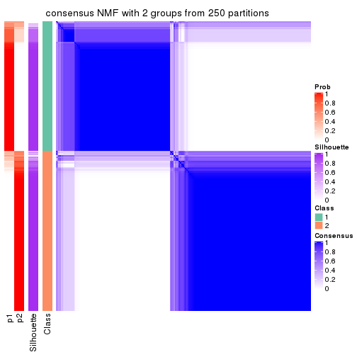</p>

</div>
<div id='tab-SD-NMF-consensus-heatmap-2'>
<pre><code class="r">consensus_heatmap(res, k = 3)
</code></pre>

<p>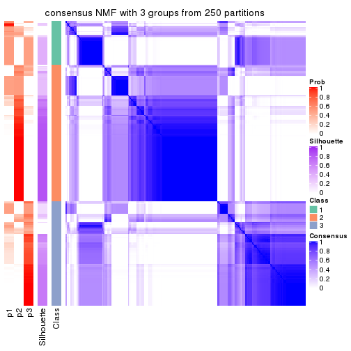</p>

</div>
<div id='tab-SD-NMF-consensus-heatmap-3'>
<pre><code class="r">consensus_heatmap(res, k = 4)
</code></pre>

<p>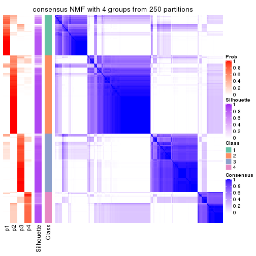</p>

</div>
<div id='tab-SD-NMF-consensus-heatmap-4'>
<pre><code class="r">consensus_heatmap(res, k = 5)
</code></pre>

<p>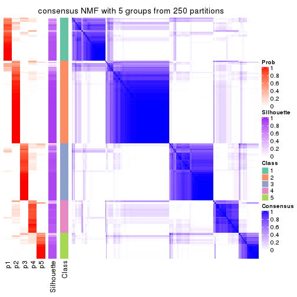</p>

</div>
<div id='tab-SD-NMF-consensus-heatmap-5'>
<pre><code class="r">consensus_heatmap(res, k = 6)
</code></pre>

<p>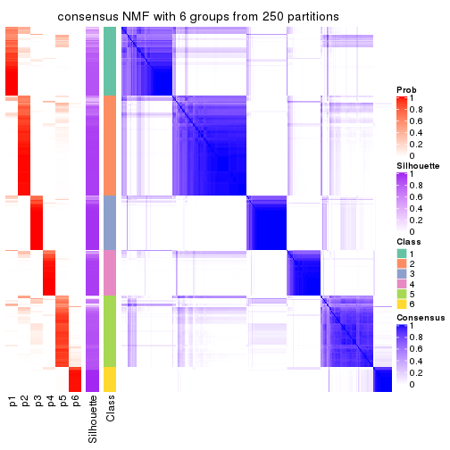</p>

</div>
</div>

Heatmaps for the membership of samples in all partitions to see how consistent they are:


<script>
$( function() {
	$( '#tabs-SD-NMF-membership-heatmap' ).tabs();
} );
</script>
<div id='tabs-SD-NMF-membership-heatmap'>
<ul>
<li><a href='#tab-SD-NMF-membership-heatmap-1'>k = 2</a></li>
<li><a href='#tab-SD-NMF-membership-heatmap-2'>k = 3</a></li>
<li><a href='#tab-SD-NMF-membership-heatmap-3'>k = 4</a></li>
<li><a href='#tab-SD-NMF-membership-heatmap-4'>k = 5</a></li>
<li><a href='#tab-SD-NMF-membership-heatmap-5'>k = 6</a></li>
</ul>
<div id='tab-SD-NMF-membership-heatmap-1'>
<pre><code class="r">membership_heatmap(res, k = 2)
</code></pre>

<p>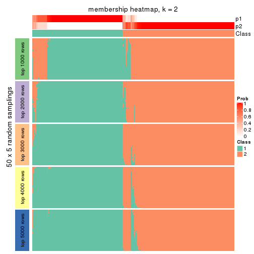</p>

</div>
<div id='tab-SD-NMF-membership-heatmap-2'>
<pre><code class="r">membership_heatmap(res, k = 3)
</code></pre>

<p>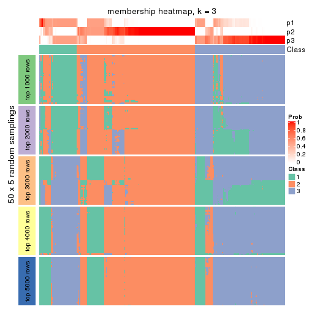</p>

</div>
<div id='tab-SD-NMF-membership-heatmap-3'>
<pre><code class="r">membership_heatmap(res, k = 4)
</code></pre>

<p>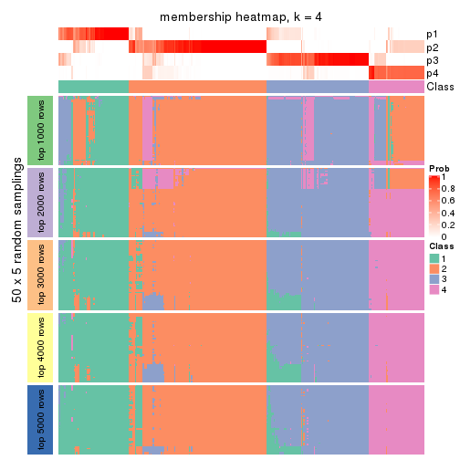</p>

</div>
<div id='tab-SD-NMF-membership-heatmap-4'>
<pre><code class="r">membership_heatmap(res, k = 5)
</code></pre>

<p>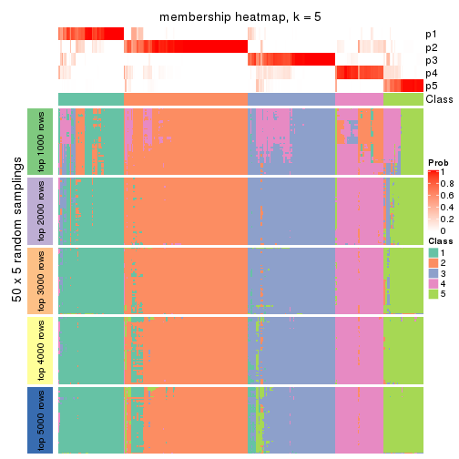</p>

</div>
<div id='tab-SD-NMF-membership-heatmap-5'>
<pre><code class="r">membership_heatmap(res, k = 6)
</code></pre>

<p>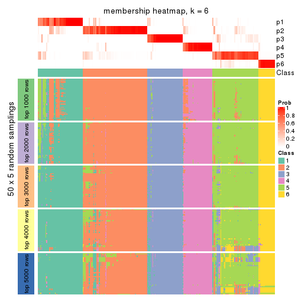</p>

</div>
</div>

As soon as we have had the classes for columns, we can look for signatures
which are significantly different between classes which can be candidate marks
for certain classes. Following are the heatmaps for signatures.


Signature heatmaps where rows are scaled:


<script>
$( function() {
	$( '#tabs-SD-NMF-get-signatures' ).tabs();
} );
</script>
<div id='tabs-SD-NMF-get-signatures'>
<ul>
<li><a href='#tab-SD-NMF-get-signatures-1'>k = 2</a></li>
<li><a href='#tab-SD-NMF-get-signatures-2'>k = 3</a></li>
<li><a href='#tab-SD-NMF-get-signatures-3'>k = 4</a></li>
<li><a href='#tab-SD-NMF-get-signatures-4'>k = 5</a></li>
<li><a href='#tab-SD-NMF-get-signatures-5'>k = 6</a></li>
</ul>
<div id='tab-SD-NMF-get-signatures-1'>
<pre><code class="r">get_signatures(res, k = 2)
</code></pre>

<p>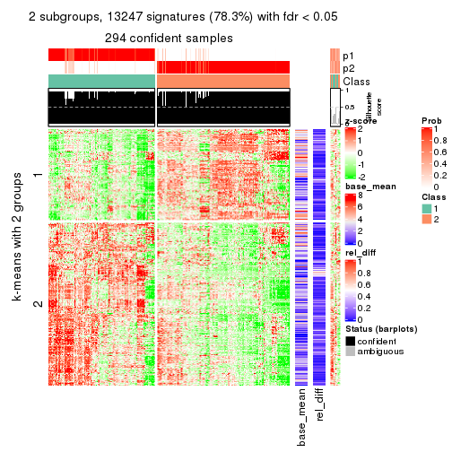</p>

</div>
<div id='tab-SD-NMF-get-signatures-2'>
<pre><code class="r">get_signatures(res, k = 3)
</code></pre>

<p>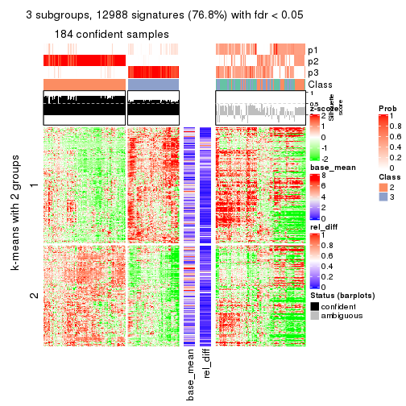</p>

</div>
<div id='tab-SD-NMF-get-signatures-3'>
<pre><code class="r">get_signatures(res, k = 4)
</code></pre>

<p>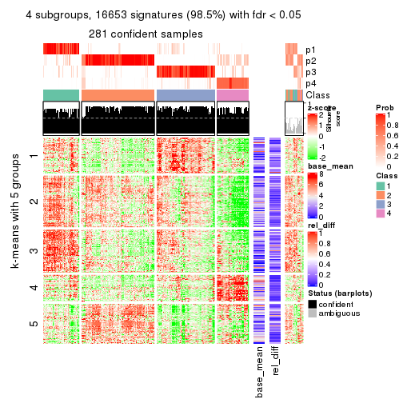</p>

</div>
<div id='tab-SD-NMF-get-signatures-4'>
<pre><code class="r">get_signatures(res, k = 5)
</code></pre>

<p>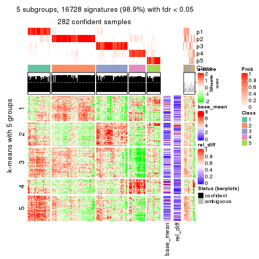</p>

</div>
<div id='tab-SD-NMF-get-signatures-5'>
<pre><code class="r">get_signatures(res, k = 6)
</code></pre>

<p>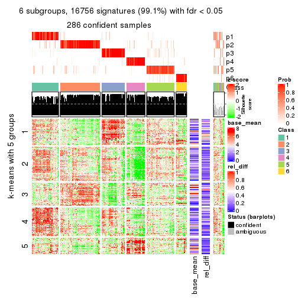</p>

</div>
</div>


Signature heatmaps where rows are not scaled:


<script>
$( function() {
	$( '#tabs-SD-NMF-get-signatures-no-scale' ).tabs();
} );
</script>
<div id='tabs-SD-NMF-get-signatures-no-scale'>
<ul>
<li><a href='#tab-SD-NMF-get-signatures-no-scale-1'>k = 2</a></li>
<li><a href='#tab-SD-NMF-get-signatures-no-scale-2'>k = 3</a></li>
<li><a href='#tab-SD-NMF-get-signatures-no-scale-3'>k = 4</a></li>
<li><a href='#tab-SD-NMF-get-signatures-no-scale-4'>k = 5</a></li>
<li><a href='#tab-SD-NMF-get-signatures-no-scale-5'>k = 6</a></li>
</ul>
<div id='tab-SD-NMF-get-signatures-no-scale-1'>
<pre><code class="r">get_signatures(res, k = 2, scale_rows = FALSE)
</code></pre>

<p>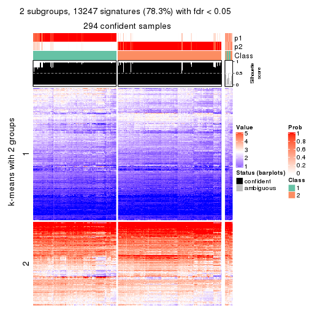</p>

</div>
<div id='tab-SD-NMF-get-signatures-no-scale-2'>
<pre><code class="r">get_signatures(res, k = 3, scale_rows = FALSE)
</code></pre>

<p>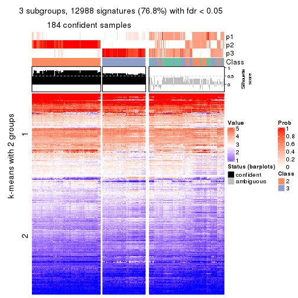</p>

</div>
<div id='tab-SD-NMF-get-signatures-no-scale-3'>
<pre><code class="r">get_signatures(res, k = 4, scale_rows = FALSE)
</code></pre>

<p>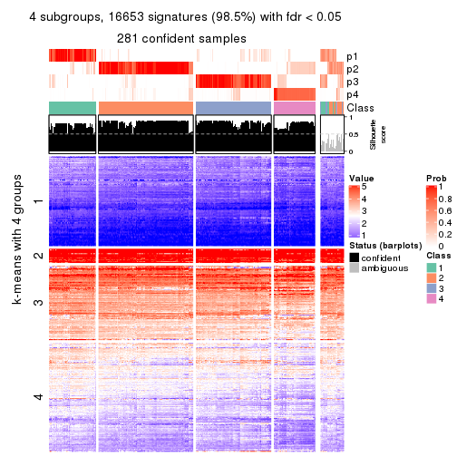</p>

</div>
<div id='tab-SD-NMF-get-signatures-no-scale-4'>
<pre><code class="r">get_signatures(res, k = 5, scale_rows = FALSE)
</code></pre>

<p>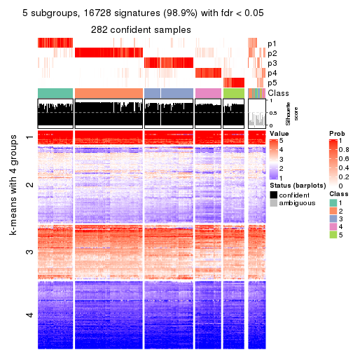</p>

</div>
<div id='tab-SD-NMF-get-signatures-no-scale-5'>
<pre><code class="r">get_signatures(res, k = 6, scale_rows = FALSE)
</code></pre>

<p>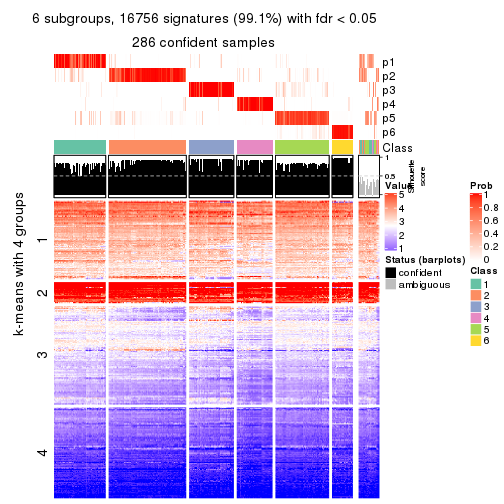</p>

</div>
</div>


Compare the overlap of signatures from different k:

```r
compare_signatures(res)
```

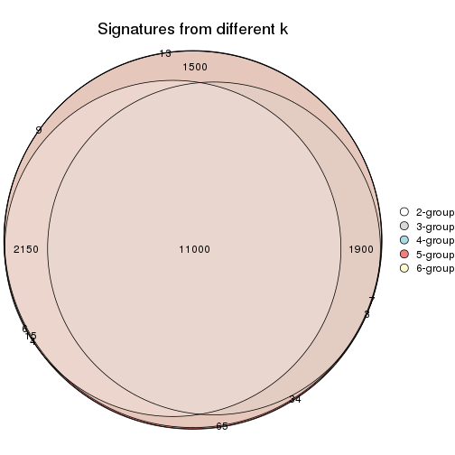

`get_signature()` returns a data frame invisibly. TO get the list of signatures, the function
call should be assigned to a variable explicitly. In following code, if `plot` argument is set
to `FALSE`, no heatmap is plotted while only the differential analysis is performed.

```r
# code only for demonstration
tb = get_signature(res, k = ..., plot = FALSE)
```

An example of the output of `tb` is:

```
#>   which_row         fdr    mean_1    mean_2 scaled_mean_1 scaled_mean_2 km
#> 1        38 0.042760348  8.373488  9.131774    -0.5533452     0.5164555  1
#> 2        40 0.018707592  7.106213  8.469186    -0.6173731     0.5762149  1
#> 3        55 0.019134737 10.221463 11.207825    -0.6159697     0.5749050  1
#> 4        59 0.006059896  5.921854  7.869574    -0.6899429     0.6439467  1
#> 5        60 0.018055526  8.928898 10.211722    -0.6204761     0.5791110  1
#> 6        98 0.009384629 15.714769 14.887706     0.6635654    -0.6193277  2
...
```

The columns in `tb` are:

1. `which_row`: row indices corresponding to the input matrix.
2. `fdr`: FDR for the differential test. 
3. `mean_x`: The mean value in group x.
4. `scaled_mean_x`: The mean value in group x after rows are scaled.
5. `km`: Row groups if k-means clustering is applied to rows.


UMAP plot which shows how samples are separated.


<script>
$( function() {
	$( '#tabs-SD-NMF-dimension-reduction' ).tabs();
} );
</script>
<div id='tabs-SD-NMF-dimension-reduction'>
<ul>
<li><a href='#tab-SD-NMF-dimension-reduction-1'>k = 2</a></li>
<li><a href='#tab-SD-NMF-dimension-reduction-2'>k = 3</a></li>
<li><a href='#tab-SD-NMF-dimension-reduction-3'>k = 4</a></li>
<li><a href='#tab-SD-NMF-dimension-reduction-4'>k = 5</a></li>
<li><a href='#tab-SD-NMF-dimension-reduction-5'>k = 6</a></li>
</ul>
<div id='tab-SD-NMF-dimension-reduction-1'>
<pre><code class="r">dimension_reduction(res, k = 2, method = &quot;UMAP&quot;)
</code></pre>

<p>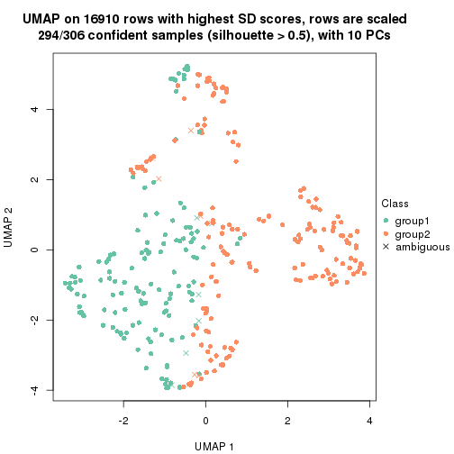</p>

</div>
<div id='tab-SD-NMF-dimension-reduction-2'>
<pre><code class="r">dimension_reduction(res, k = 3, method = &quot;UMAP&quot;)
</code></pre>

<p>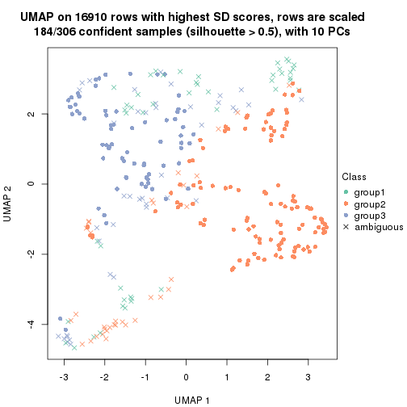</p>

</div>
<div id='tab-SD-NMF-dimension-reduction-3'>
<pre><code class="r">dimension_reduction(res, k = 4, method = &quot;UMAP&quot;)
</code></pre>

<p>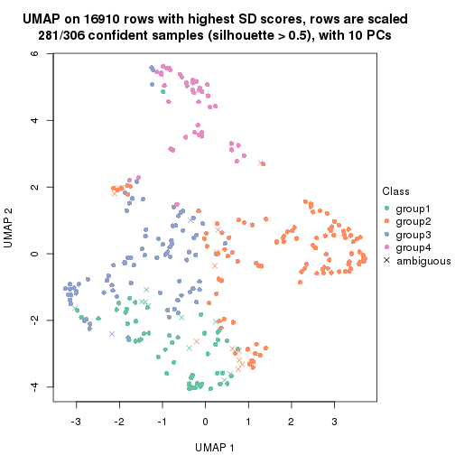</p>

</div>
<div id='tab-SD-NMF-dimension-reduction-4'>
<pre><code class="r">dimension_reduction(res, k = 5, method = &quot;UMAP&quot;)
</code></pre>

<p>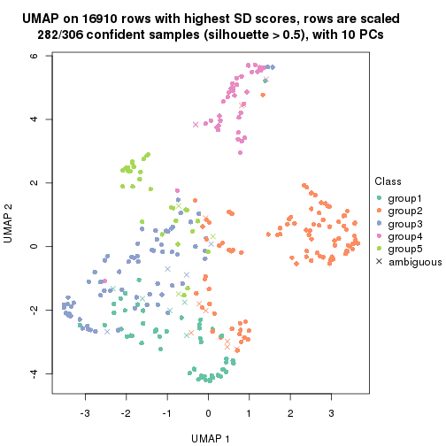</p>

</div>
<div id='tab-SD-NMF-dimension-reduction-5'>
<pre><code class="r">dimension_reduction(res, k = 6, method = &quot;UMAP&quot;)
</code></pre>

<p>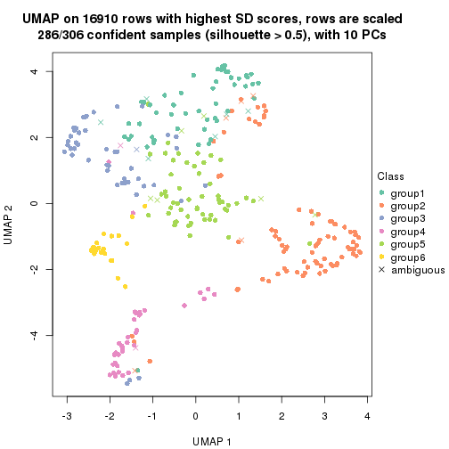</p>

</div>
</div>


Following heatmap shows how subgroups are split when increasing `k`:

```r
collect_classes(res)
```

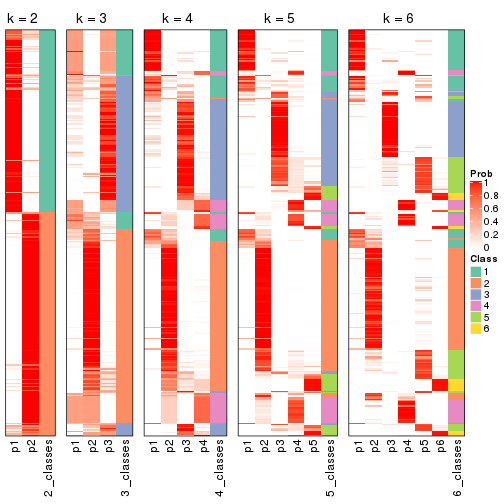


If matrix rows can be associated to genes, consider to use `GO_Enrichment(res,
...)` to perform function enrichment for the signature genes.


 

---------------------------------------------------


### CV:hclust


The object with results only for a single top-value method and a single partition method 
can be extracted as:

```r
res = res_list["CV", "hclust"]
# you can also extract it by
# res = res_list["CV:hclust"]
```

A summary of `res` and all the functions that can be applied to it:

```r
res
```

```
#> A 'ConsensusPartition' object with k = 2, 3, 4, 5, 6.
#>   On a matrix with 16910 rows and 306 columns.
#>   Top rows (1000, 2000, 3000, 4000, 5000) are extracted by 'CV' method.
#>   Subgroups are detected by 'hclust' method.
#>   Performed in total 1250 partitions by row resampling.
#>   Best k for subgroups seems to be 2.
#> 
#> Following methods can be applied to this 'ConsensusPartition' object:
#>  [1] "cola_report"             "collect_classes"         "collect_plots"          
#>  [4] "collect_stats"           "colnames"                "compare_signatures"     
#>  [7] "consensus_heatmap"       "dimension_reduction"     "functional_enrichment"  
#> [10] "get_anno_col"            "get_anno"                "get_classes"            
#> [13] "get_consensus"           "get_matrix"              "get_membership"         
#> [16] "get_param"               "get_signatures"          "get_stats"              
#> [19] "is_best_k"               "is_stable_k"             "membership_heatmap"     
#> [22] "ncol"                    "nrow"                    "plot_ecdf"              
#> [25] "rownames"                "select_partition_number" "show"                   
#> [28] "suggest_best_k"          "test_to_known_factors"
```

`collect_plots()` function collects all the plots made from `res` for all `k` (number of partitions)
into one single page to provide an easy and fast comparison between different `k`.

```r
collect_plots(res)
```

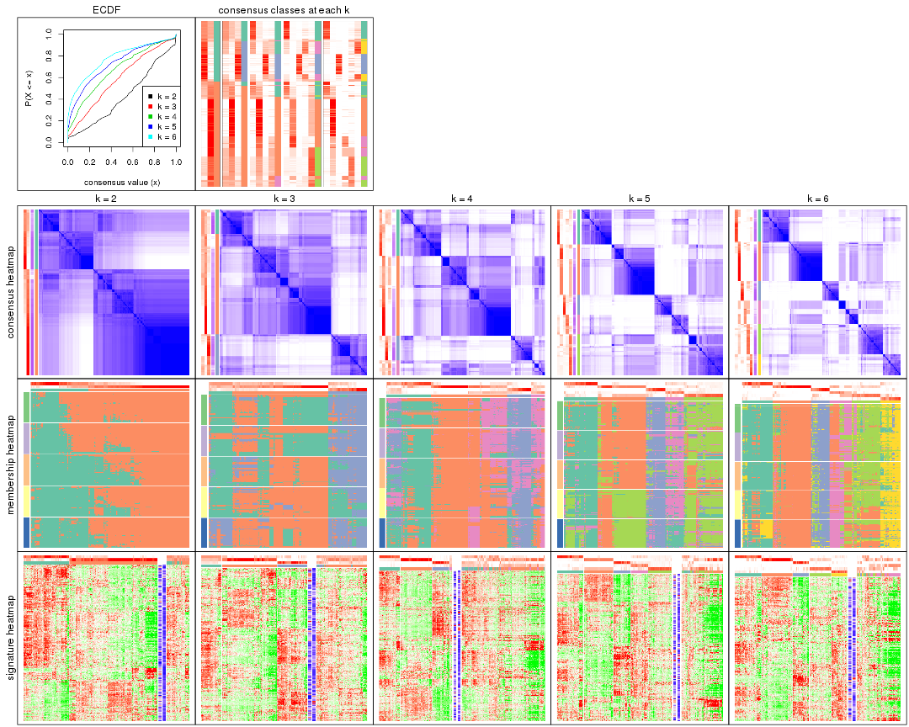

The plots are:

- The first row: a plot of the ECDF (Empirical cumulative distribution
  function) curves of the consensus matrix for each `k` and the heatmap of
  predicted classes for each `k`.
- The second row: heatmaps of the consensus matrix for each `k`.
- The third row: heatmaps of the membership matrix for each `k`.
- The fouth row: heatmaps of the signatures for each `k`.

All the plots in panels can be made by individual functions and they are
plotted later in this section.

`select_partition_number()` produces several plots showing different
statistics for choosing "optimized" `k`. There are following statistics:

- ECDF curves of the consensus matrix for each `k`;
- 1-PAC. [The PAC
  score](https://en.wikipedia.org/wiki/Consensus_clustering#Over-interpretation_potential_of_consensus_clustering)
  measures the proportion of the ambiguous subgrouping.
- Mean silhouette score.
- Concordance. The mean probability of fiting the consensus class ids in all
  partitions.
- Area increased. Denote $A_k$ as the area under the ECDF curve for current
  `k`, the area increased is defined as $A_k - A_{k-1}$.
- Rand index. The percent of pairs of samples that are both in a same cluster
  or both are not in a same cluster in the partition of k and k-1.
- Jaccard index. The ratio of pairs of samples are both in a same cluster in
  the partition of k and k-1 and the pairs of samples are both in a same
  cluster in the partition k or k-1.

The detailed explanations of these statistics can be found in [the cola
vignette](http://bioconductor.org/packages/devel/bioc/vignettes/cola/inst/doc/cola.html#toc_13).

Generally speaking, lower PAC score, higher mean silhouette score or higher
concordance corresponds to better partition. Rand index and Jaccard index
measure how similar the current partition is compared to partition with `k-1`.
If they are too similar, we won't accept `k` is better than `k-1`.

```r
select_partition_number(res)
```

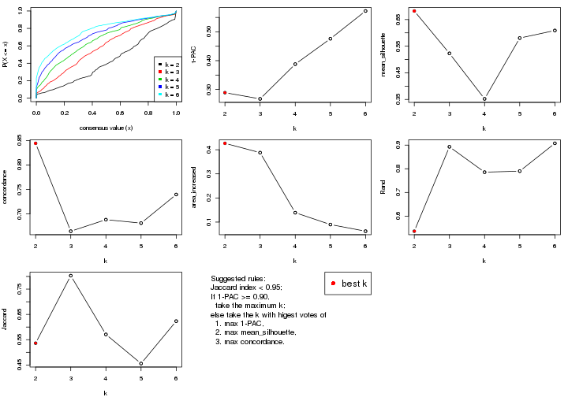

The numeric values for all these statistics can be obtained by `get_stats()`.

```r
get_stats(res)
```

```
#>   k 1-PAC mean_silhouette concordance area_increased  Rand Jaccard
#> 2 2 0.289           0.682       0.844         0.4266 0.536   0.536
#> 3 3 0.267           0.523       0.665         0.3879 0.893   0.803
#> 4 4 0.388           0.352       0.688         0.1389 0.786   0.571
#> 5 5 0.476           0.580       0.681         0.0898 0.790   0.456
#> 6 6 0.572           0.609       0.740         0.0622 0.908   0.623
```

`suggest_best_k()` suggests the best $k$ based on these statistics. The rules are as follows:

- All $k$ with Jaccard index larger than 0.95 are removed because the increase of
  the partition number does not provides enough extra information. If all $k$ are removed,
  the best $k$ is assigned by `NA`.
- For $k$ with 1-PAC larger than 0.9, the maximal $k$ is taken as the "best k". Other $k$ is called "optional k".
- If it does not fit the second rule. The $k$ with the highest vote of highest
  1-PAC, mean silhouette and concordance is taken as the "best k".

```r
suggest_best_k(res)
```

```
#> [1] 2
```


Following shows the table of the partitions (You need to click the **show/hide
code output** link to see it). The membership matrix (columns with name `p*`)
is inferred by
[`clue::cl_consensus()`](https://www.rdocumentation.org/link/cl_consensus?package=clue)
function with the `SE` method. Basically the value in the membership matrix
represents the probability to belong to a certain group. The finall class
label for an item is determined with the group with highest probability it
belongs to.

In `get_classes()` function, the entropy is calculated from the membership
matrix and the silhouette score is calculated from the consensus matrix.


<script>
$( function() {
	$( '#tabs-CV-hclust-get-classes' ).tabs();
} );
</script>
<div id='tabs-CV-hclust-get-classes'>
<ul>
<li><a href='#tab-CV-hclust-get-classes-1'>k = 2</a></li>
<li><a href='#tab-CV-hclust-get-classes-2'>k = 3</a></li>
<li><a href='#tab-CV-hclust-get-classes-3'>k = 4</a></li>
<li><a href='#tab-CV-hclust-get-classes-4'>k = 5</a></li>
<li><a href='#tab-CV-hclust-get-classes-5'>k = 6</a></li>
</ul>

<div id='tab-CV-hclust-get-classes-1'>
<p><a id='tab-CV-hclust-get-classes-1-a' style='color:#0366d6' href='#'>show/hide code output</a></p>
<pre><code class="r">cbind(get_classes(res, k = 2), get_membership(res, k = 2))
</code></pre>

<pre><code>#&gt;            class entropy silhouette    p1    p2
#&gt; SRR1609360     2  0.9922      0.056 0.448 0.552
#&gt; SRR1609361     2  0.9922      0.056 0.448 0.552
#&gt; SRR1609362     2  0.9922      0.056 0.448 0.552
#&gt; SRR1609363     2  0.0000      0.825 0.000 1.000
#&gt; SRR1609364     2  0.0000      0.825 0.000 1.000
#&gt; SRR1609365     2  0.9922      0.056 0.448 0.552
#&gt; SRR1609366     2  0.8267      0.606 0.260 0.740
#&gt; SRR1609367     1  0.9686      0.504 0.604 0.396
#&gt; SRR1609368     2  0.0000      0.825 0.000 1.000
#&gt; SRR1609369     2  0.9732      0.242 0.404 0.596
#&gt; SRR1609370     1  0.9686      0.504 0.604 0.396
#&gt; SRR1609371     2  0.0000      0.825 0.000 1.000
#&gt; SRR1609372     1  0.9686      0.504 0.604 0.396
#&gt; SRR1609373     2  0.0000      0.825 0.000 1.000
#&gt; SRR1609374     2  0.8267      0.606 0.260 0.740
#&gt; SRR1609375     2  0.8443      0.585 0.272 0.728
#&gt; SRR1609377     2  0.9000      0.496 0.316 0.684
#&gt; SRR1609376     2  0.0000      0.825 0.000 1.000
#&gt; SRR1609378     2  0.0000      0.825 0.000 1.000
#&gt; SRR1609379     1  0.9815      0.450 0.580 0.420
#&gt; SRR1609382     2  0.0000      0.825 0.000 1.000
#&gt; SRR1609383     2  0.9998     -0.154 0.492 0.508
#&gt; SRR1609381     1  0.9686      0.504 0.604 0.396
#&gt; SRR1609384     2  0.9732      0.242 0.404 0.596
#&gt; SRR1609386     2  0.8909      0.516 0.308 0.692
#&gt; SRR1609385     2  0.9732      0.242 0.404 0.596
#&gt; SRR1609387     1  0.9909      0.384 0.556 0.444
#&gt; SRR1609388     2  0.0000      0.825 0.000 1.000
#&gt; SRR1609390     1  0.9686      0.504 0.604 0.396
#&gt; SRR1609393     2  0.0000      0.825 0.000 1.000
#&gt; SRR1609394     2  0.0000      0.825 0.000 1.000
#&gt; SRR1609392     2  0.0000      0.825 0.000 1.000
#&gt; SRR1609391     2  0.0000      0.825 0.000 1.000
#&gt; SRR1609395     1  0.9686      0.504 0.604 0.396
#&gt; SRR1609396     1  0.9686      0.504 0.604 0.396
#&gt; SRR1609398     2  0.8909      0.516 0.308 0.692
#&gt; SRR1609399     1  0.9686      0.504 0.604 0.396
#&gt; SRR1609400     1  0.9686      0.504 0.604 0.396
#&gt; SRR1609397     2  0.0000      0.825 0.000 1.000
#&gt; SRR1609401     2  0.0000      0.825 0.000 1.000
#&gt; SRR1609402     2  0.0000      0.825 0.000 1.000
#&gt; SRR1609405     2  0.9129      0.471 0.328 0.672
#&gt; SRR1609404     2  0.0000      0.825 0.000 1.000
#&gt; SRR1609406     2  0.0000      0.825 0.000 1.000
#&gt; SRR1609408     2  0.0000      0.825 0.000 1.000
#&gt; SRR1609403     1  0.9896      0.396 0.560 0.440
#&gt; SRR1609410     2  0.9170      0.460 0.332 0.668
#&gt; SRR1609411     2  0.0000      0.825 0.000 1.000
#&gt; SRR1609407     2  0.0000      0.825 0.000 1.000
#&gt; SRR1609413     1  0.9815      0.450 0.580 0.420
#&gt; SRR1609412     2  0.7528      0.718 0.216 0.784
#&gt; SRR1609414     1  0.8327      0.666 0.736 0.264
#&gt; SRR1609415     1  0.6438      0.741 0.836 0.164
#&gt; SRR1609416     1  0.5842      0.752 0.860 0.140
#&gt; SRR1609417     1  0.7219      0.683 0.800 0.200
#&gt; SRR1609418     1  0.9795      0.459 0.584 0.416
#&gt; SRR1609419     2  0.0000      0.825 0.000 1.000
#&gt; SRR1609420     2  0.8499      0.590 0.276 0.724
#&gt; SRR1609421     2  0.7453      0.716 0.212 0.788
#&gt; SRR1609422     2  0.0376      0.824 0.004 0.996
#&gt; SRR1609423     2  0.0000      0.825 0.000 1.000
#&gt; SRR1609424     2  0.0000      0.825 0.000 1.000
#&gt; SRR1609425     2  0.8443      0.593 0.272 0.728
#&gt; SRR1609426     2  0.0376      0.825 0.004 0.996
#&gt; SRR1609427     1  0.1843      0.749 0.972 0.028
#&gt; SRR1609428     2  0.0000      0.825 0.000 1.000
#&gt; SRR1609429     2  0.9686      0.345 0.396 0.604
#&gt; SRR1609430     1  0.0000      0.739 1.000 0.000
#&gt; SRR1609431     2  0.0376      0.824 0.004 0.996
#&gt; SRR1609432     2  0.4562      0.791 0.096 0.904
#&gt; SRR1609433     1  0.5842      0.752 0.860 0.140
#&gt; SRR1609434     2  0.0000      0.825 0.000 1.000
#&gt; SRR1609435     1  0.5842      0.749 0.860 0.140
#&gt; SRR1609436     1  0.4161      0.757 0.916 0.084
#&gt; SRR1609437     2  0.2423      0.819 0.040 0.960
#&gt; SRR1609438     2  0.0000      0.825 0.000 1.000
#&gt; SRR1609439     1  0.7528      0.685 0.784 0.216
#&gt; SRR1609440     1  0.9686      0.504 0.604 0.396
#&gt; SRR1609441     2  0.6973      0.739 0.188 0.812
#&gt; SRR1609442     2  0.0000      0.825 0.000 1.000
#&gt; SRR1609443     1  0.6887      0.734 0.816 0.184
#&gt; SRR1609444     2  0.9686      0.345 0.396 0.604
#&gt; SRR1609445     2  0.7528      0.714 0.216 0.784
#&gt; SRR1609446     2  0.7453      0.718 0.212 0.788
#&gt; SRR1609447     1  0.5519      0.752 0.872 0.128
#&gt; SRR1609448     2  0.0376      0.825 0.004 0.996
#&gt; SRR1609449     1  0.9775      0.468 0.588 0.412
#&gt; SRR1609450     2  0.4939      0.784 0.108 0.892
#&gt; SRR1609451     1  0.0000      0.739 1.000 0.000
#&gt; SRR1609452     2  0.7674      0.704 0.224 0.776
#&gt; SRR1609453     1  0.8386      0.665 0.732 0.268
#&gt; SRR1609454     2  0.2423      0.818 0.040 0.960
#&gt; SRR1609455     2  0.7602      0.675 0.220 0.780
#&gt; SRR1609456     2  0.7299      0.723 0.204 0.796
#&gt; SRR1609457     2  0.9661      0.377 0.392 0.608
#&gt; SRR1609458     1  0.6623      0.740 0.828 0.172
#&gt; SRR1609459     2  0.8327      0.655 0.264 0.736
#&gt; SRR1609460     2  0.0376      0.824 0.004 0.996
#&gt; SRR1609461     2  0.9909      0.209 0.444 0.556
#&gt; SRR1609462     1  0.0000      0.739 1.000 0.000
#&gt; SRR1609464     1  0.0000      0.739 1.000 0.000
#&gt; SRR1609463     2  0.8144      0.661 0.252 0.748
#&gt; SRR1609465     2  0.0376      0.824 0.004 0.996
#&gt; SRR1609466     2  0.9170      0.474 0.332 0.668
#&gt; SRR1609467     1  0.0000      0.739 1.000 0.000
#&gt; SRR1609469     2  0.0000      0.825 0.000 1.000
#&gt; SRR1609470     2  0.6973      0.736 0.188 0.812
#&gt; SRR1609472     2  0.4161      0.805 0.084 0.916
#&gt; SRR1609471     2  0.9044      0.515 0.320 0.680
#&gt; SRR1609474     2  0.2948      0.815 0.052 0.948
#&gt; SRR1609473     2  0.0000      0.825 0.000 1.000
#&gt; SRR1609475     2  0.0000      0.825 0.000 1.000
#&gt; SRR1609478     2  0.4161      0.805 0.084 0.916
#&gt; SRR1609476     1  0.9850      0.438 0.572 0.428
#&gt; SRR1609477     2  0.8267      0.659 0.260 0.740
#&gt; SRR1609479     2  0.0000      0.825 0.000 1.000
#&gt; SRR1609481     2  0.0376      0.824 0.004 0.996
#&gt; SRR1609480     2  0.7056      0.738 0.192 0.808
#&gt; SRR1609482     1  0.0000      0.739 1.000 0.000
#&gt; SRR1609484     2  0.3431      0.811 0.064 0.936
#&gt; SRR1609483     1  0.7528      0.690 0.784 0.216
#&gt; SRR1609486     1  0.0000      0.739 1.000 0.000
#&gt; SRR1609485     1  0.0000      0.739 1.000 0.000
#&gt; SRR1609487     2  0.8955      0.506 0.312 0.688
#&gt; SRR1609488     1  0.8713      0.639 0.708 0.292
#&gt; SRR1609489     2  0.0376      0.825 0.004 0.996
#&gt; SRR1609490     2  0.5519      0.772 0.128 0.872
#&gt; SRR1609491     2  0.7674      0.707 0.224 0.776
#&gt; SRR1609492     2  0.0000      0.825 0.000 1.000
#&gt; SRR1609493     2  0.0376      0.824 0.004 0.996
#&gt; SRR1609494     2  0.0000      0.825 0.000 1.000
#&gt; SRR1609495     1  0.9850      0.438 0.572 0.428
#&gt; SRR1609496     1  0.0000      0.739 1.000 0.000
#&gt; SRR1609497     1  0.8608      0.650 0.716 0.284
#&gt; SRR1609498     1  0.2778      0.753 0.952 0.048
#&gt; SRR1609499     2  0.4939      0.784 0.108 0.892
#&gt; SRR1609500     1  0.3879      0.757 0.924 0.076
#&gt; SRR1609501     2  0.7528      0.711 0.216 0.784
#&gt; SRR1609502     2  0.0376      0.825 0.004 0.996
#&gt; SRR1609503     2  0.0000      0.825 0.000 1.000
#&gt; SRR1609504     1  0.6247      0.744 0.844 0.156
#&gt; SRR1609505     1  0.0000      0.739 1.000 0.000
#&gt; SRR1609506     2  0.0000      0.825 0.000 1.000
#&gt; SRR1609507     1  0.3431      0.751 0.936 0.064
#&gt; SRR1609508     2  0.2423      0.818 0.040 0.960
#&gt; SRR1609509     2  0.0000      0.825 0.000 1.000
#&gt; SRR1609510     2  0.0376      0.824 0.004 0.996
#&gt; SRR1609512     1  0.0000      0.739 1.000 0.000
#&gt; SRR1609511     1  0.7299      0.679 0.796 0.204
#&gt; SRR1609513     1  0.0000      0.739 1.000 0.000
#&gt; SRR1609514     2  0.3431      0.812 0.064 0.936
#&gt; SRR1609515     2  0.0000      0.825 0.000 1.000
#&gt; SRR1609516     2  0.8386      0.648 0.268 0.732
#&gt; SRR1609517     2  0.2236      0.817 0.036 0.964
#&gt; SRR1609518     1  0.9732      0.484 0.596 0.404
#&gt; SRR1609519     1  0.0000      0.739 1.000 0.000
#&gt; SRR1609520     2  0.0000      0.825 0.000 1.000
#&gt; SRR1609521     1  0.1843      0.749 0.972 0.028
#&gt; SRR1609522     1  0.0000      0.739 1.000 0.000
#&gt; SRR1609523     2  0.0376      0.824 0.004 0.996
#&gt; SRR1609524     2  0.0000      0.825 0.000 1.000
#&gt; SRR1609526     1  0.3733      0.739 0.928 0.072
#&gt; SRR1609525     2  0.6973      0.736 0.188 0.812
#&gt; SRR1609527     1  0.9795      0.460 0.584 0.416
#&gt; SRR1609529     1  0.7602      0.671 0.780 0.220
#&gt; SRR1609528     2  0.4161      0.805 0.084 0.916
#&gt; SRR1609530     1  0.4298      0.733 0.912 0.088
#&gt; SRR1609531     2  0.0376      0.825 0.004 0.996
#&gt; SRR1609532     1  0.0000      0.739 1.000 0.000
#&gt; SRR1609533     2  0.7299      0.722 0.204 0.796
#&gt; SRR1609534     1  0.6343      0.728 0.840 0.160
#&gt; SRR1609535     2  0.0376      0.824 0.004 0.996
#&gt; SRR1609537     2  0.0000      0.825 0.000 1.000
#&gt; SRR1609536     2  0.8443      0.641 0.272 0.728
#&gt; SRR1609538     2  0.4939      0.784 0.108 0.892
#&gt; SRR1609539     2  0.8386      0.641 0.268 0.732
#&gt; SRR1609540     1  0.8386      0.667 0.732 0.268
#&gt; SRR1609541     2  0.3274      0.812 0.060 0.940
#&gt; SRR1609542     2  0.0376      0.825 0.004 0.996
#&gt; SRR1609543     1  0.1843      0.749 0.972 0.028
#&gt; SRR1609544     1  0.9795      0.461 0.584 0.416
#&gt; SRR1609545     1  0.1633      0.747 0.976 0.024
#&gt; SRR1609546     2  0.8327      0.654 0.264 0.736
#&gt; SRR1609547     2  0.9710      0.346 0.400 0.600
#&gt; SRR1609548     2  0.6438      0.755 0.164 0.836
#&gt; SRR1609549     2  0.0376      0.825 0.004 0.996
#&gt; SRR1609550     2  0.0000      0.825 0.000 1.000
#&gt; SRR1609551     2  0.8267      0.651 0.260 0.740
#&gt; SRR1609552     1  0.0672      0.741 0.992 0.008
#&gt; SRR1609553     1  0.5294      0.748 0.880 0.120
#&gt; SRR1609554     2  0.8267      0.658 0.260 0.740
#&gt; SRR1609555     1  0.8661      0.645 0.712 0.288
#&gt; SRR1609556     1  0.0000      0.739 1.000 0.000
#&gt; SRR1609557     2  0.8327      0.655 0.264 0.736
#&gt; SRR1609558     2  0.7299      0.722 0.204 0.796
#&gt; SRR1609559     2  0.7219      0.725 0.200 0.800
#&gt; SRR1609560     2  0.8861      0.524 0.304 0.696
#&gt; SRR1609561     1  0.6048      0.734 0.852 0.148
#&gt; SRR1609562     2  0.8861      0.524 0.304 0.696
#&gt; SRR1609563     2  0.3114      0.814 0.056 0.944
#&gt; SRR1609564     1  0.6438      0.741 0.836 0.164
#&gt; SRR1609565     2  0.0000      0.825 0.000 1.000
#&gt; SRR1609566     2  0.0000      0.825 0.000 1.000
#&gt; SRR1609567     2  0.0000      0.825 0.000 1.000
#&gt; SRR1609568     1  0.9815      0.450 0.580 0.420
#&gt; SRR1609569     1  0.0000      0.739 1.000 0.000
#&gt; SRR1609570     1  0.0000      0.739 1.000 0.000
#&gt; SRR1609571     1  0.3879      0.740 0.924 0.076
#&gt; SRR1609572     1  0.7815      0.689 0.768 0.232
#&gt; SRR1609573     1  0.0000      0.739 1.000 0.000
#&gt; SRR1609574     1  0.4431      0.754 0.908 0.092
#&gt; SRR1609575     2  0.0000      0.825 0.000 1.000
#&gt; SRR1609576     2  0.3274      0.807 0.060 0.940
#&gt; SRR1609578     2  0.7528      0.715 0.216 0.784
#&gt; SRR1609577     1  0.9909      0.384 0.556 0.444
#&gt; SRR1609579     1  0.4298      0.754 0.912 0.088
#&gt; SRR1609580     1  0.8443      0.619 0.728 0.272
#&gt; SRR1609582     1  0.3431      0.755 0.936 0.064
#&gt; SRR1609581     2  0.7745      0.703 0.228 0.772
#&gt; SRR1609583     2  0.7745      0.700 0.228 0.772
#&gt; SRR1609584     1  0.0000      0.739 1.000 0.000
#&gt; SRR1609585     1  0.0000      0.739 1.000 0.000
#&gt; SRR1609586     2  0.0376      0.825 0.004 0.996
#&gt; SRR1609587     2  0.8608      0.623 0.284 0.716
#&gt; SRR1609588     2  0.7745      0.703 0.228 0.772
#&gt; SRR1609589     2  0.7602      0.710 0.220 0.780
#&gt; SRR1609590     1  0.0000      0.739 1.000 0.000
#&gt; SRR1609592     2  0.7376      0.719 0.208 0.792
#&gt; SRR1609591     2  0.7815      0.699 0.232 0.768
#&gt; SRR1609593     2  0.7219      0.728 0.200 0.800
#&gt; SRR1609594     2  0.0000      0.825 0.000 1.000
#&gt; SRR1609595     2  0.0376      0.824 0.004 0.996
#&gt; SRR1609596     2  0.0376      0.825 0.004 0.996
#&gt; SRR1609597     2  0.0000      0.825 0.000 1.000
#&gt; SRR1609598     2  0.3431      0.812 0.064 0.936
#&gt; SRR1609599     2  0.3274      0.812 0.060 0.940
#&gt; SRR1609600     1  0.5408      0.752 0.876 0.124
#&gt; SRR1609601     2  0.0376      0.824 0.004 0.996
#&gt; SRR1609602     2  0.3274      0.812 0.060 0.940
#&gt; SRR1609603     1  0.9896      0.396 0.560 0.440
#&gt; SRR1609604     2  0.0000      0.825 0.000 1.000
#&gt; SRR1609605     2  0.2236      0.817 0.036 0.964
#&gt; SRR1609606     2  0.7602      0.708 0.220 0.780
#&gt; SRR1609607     1  0.7056      0.716 0.808 0.192
#&gt; SRR1609608     2  0.8443      0.641 0.272 0.728
#&gt; SRR1609609     2  0.5408      0.785 0.124 0.876
#&gt; SRR1609610     1  0.9922      0.326 0.552 0.448
#&gt; SRR1609611     2  0.0000      0.825 0.000 1.000
#&gt; SRR1609613     2  0.0376      0.825 0.004 0.996
#&gt; SRR1609612     2  0.9775      0.315 0.412 0.588
#&gt; SRR1609614     1  0.6531      0.741 0.832 0.168
#&gt; SRR1609615     2  0.8955      0.530 0.312 0.688
#&gt; SRR1609616     1  0.8207      0.677 0.744 0.256
#&gt; SRR1609617     2  0.0376      0.824 0.004 0.996
#&gt; SRR1609618     2  0.8555      0.637 0.280 0.720
#&gt; SRR1609619     2  0.7139      0.732 0.196 0.804
#&gt; SRR1609620     2  0.0000      0.825 0.000 1.000
#&gt; SRR1609621     2  0.0000      0.825 0.000 1.000
#&gt; SRR1609622     1  0.5294      0.724 0.880 0.120
#&gt; SRR1609623     1  0.4562      0.756 0.904 0.096
#&gt; SRR1609624     1  0.9710      0.496 0.600 0.400
#&gt; SRR1609625     1  0.8861      0.629 0.696 0.304
#&gt; SRR1609626     1  0.7139      0.698 0.804 0.196
#&gt; SRR1609627     2  0.8861      0.524 0.304 0.696
#&gt; SRR1609628     2  0.0376      0.825 0.004 0.996
#&gt; SRR1609629     1  0.9710      0.415 0.600 0.400
#&gt; SRR1609630     2  0.0376      0.825 0.004 0.996
#&gt; SRR1609631     1  0.9710      0.493 0.600 0.400
#&gt; SRR1609632     2  0.8955      0.506 0.312 0.688
#&gt; SRR1609633     1  0.9686      0.504 0.604 0.396
#&gt; SRR1609634     2  0.0000      0.825 0.000 1.000
#&gt; SRR1609635     1  0.3879      0.740 0.924 0.076
#&gt; SRR1609636     2  0.0000      0.825 0.000 1.000
#&gt; SRR1609637     1  0.9522      0.542 0.628 0.372
#&gt; SRR1609638     2  0.5519      0.772 0.128 0.872
#&gt; SRR1609639     2  0.0000      0.825 0.000 1.000
#&gt; SRR1609640     1  0.0000      0.739 1.000 0.000
#&gt; SRR1609641     1  0.9815      0.450 0.580 0.420
#&gt; SRR1609642     1  0.9896      0.396 0.560 0.440
#&gt; SRR1609643     2  0.8144      0.672 0.252 0.748
#&gt; SRR1609644     1  0.9896      0.396 0.560 0.440
#&gt; SRR1609645     2  0.9850      0.253 0.428 0.572
#&gt; SRR1609646     1  0.0000      0.739 1.000 0.000
#&gt; SRR1609647     2  0.0376      0.824 0.004 0.996
#&gt; SRR1609649     1  0.6343      0.745 0.840 0.160
#&gt; SRR1609648     2  0.0376      0.825 0.004 0.996
#&gt; SRR1609651     2  0.0376      0.825 0.004 0.996
#&gt; SRR1609650     2  0.7745      0.699 0.228 0.772
#&gt; SRR1609652     1  0.0000      0.739 1.000 0.000
#&gt; SRR1609653     2  0.0000      0.825 0.000 1.000
#&gt; SRR1609654     2  0.0376      0.825 0.004 0.996
#&gt; SRR1609655     2  0.8386      0.641 0.268 0.732
#&gt; SRR1609657     1  0.9686      0.504 0.604 0.396
#&gt; SRR1609656     2  0.9922      0.056 0.448 0.552
#&gt; SRR1609658     2  0.0000      0.825 0.000 1.000
#&gt; SRR1609659     2  0.0000      0.825 0.000 1.000
#&gt; SRR1609660     2  0.8386      0.641 0.268 0.732
#&gt; SRR1609661     2  0.8327      0.654 0.264 0.736
#&gt; SRR1609662     2  0.0376      0.825 0.004 0.996
#&gt; SRR1609663     2  0.9933      0.189 0.452 0.548
#&gt; SRR1609664     2  0.0376      0.824 0.004 0.996
#&gt; SRR1609665     2  0.0376      0.825 0.004 0.996
#&gt; SRR1609666     2  0.9922      0.056 0.448 0.552
#&gt; SRR1609667     1  0.5737      0.750 0.864 0.136
#&gt; SRR1609668     2  0.0376      0.824 0.004 0.996
#&gt; SRR1609669     1  0.9896      0.396 0.560 0.440
</code></pre>

<script>
$('#tab-CV-hclust-get-classes-1-a').parent().next().next().hide();
$('#tab-CV-hclust-get-classes-1-a').click(function(){
  $('#tab-CV-hclust-get-classes-1-a').parent().next().next().toggle();
  return(false);
});
</script>
</div>

<div id='tab-CV-hclust-get-classes-2'>
<p><a id='tab-CV-hclust-get-classes-2-a' style='color:#0366d6' href='#'>show/hide code output</a></p>
<pre><code class="r">cbind(get_classes(res, k = 3), get_membership(res, k = 3))
</code></pre>

<pre><code>#&gt;            class entropy silhouette    p1    p2    p3
#&gt; SRR1609360     1  0.7657     0.6585 0.508 0.448 0.044
#&gt; SRR1609361     1  0.7657     0.6585 0.508 0.448 0.044
#&gt; SRR1609362     1  0.7657     0.6585 0.508 0.448 0.044
#&gt; SRR1609363     2  0.0000     0.6313 0.000 1.000 0.000
#&gt; SRR1609364     2  0.0000     0.6313 0.000 1.000 0.000
#&gt; SRR1609365     1  0.7657     0.6585 0.508 0.448 0.044
#&gt; SRR1609366     2  0.6388     0.0956 0.284 0.692 0.024
#&gt; SRR1609367     1  0.9050     0.8132 0.536 0.296 0.168
#&gt; SRR1609368     2  0.0000     0.6313 0.000 1.000 0.000
#&gt; SRR1609369     2  0.7835    -0.5445 0.456 0.492 0.052
#&gt; SRR1609370     1  0.9050     0.8132 0.536 0.296 0.168
#&gt; SRR1609371     2  0.3816     0.5628 0.148 0.852 0.000
#&gt; SRR1609372     1  0.9050     0.8132 0.536 0.296 0.168
#&gt; SRR1609373     2  0.0000     0.6313 0.000 1.000 0.000
#&gt; SRR1609374     2  0.6355     0.1104 0.280 0.696 0.024
#&gt; SRR1609375     2  0.6512     0.0412 0.300 0.676 0.024
#&gt; SRR1609377     2  0.7013    -0.1774 0.364 0.608 0.028
#&gt; SRR1609376     2  0.0000     0.6313 0.000 1.000 0.000
#&gt; SRR1609378     2  0.3816     0.5628 0.148 0.852 0.000
#&gt; SRR1609379     1  0.8882     0.8189 0.540 0.316 0.144
#&gt; SRR1609382     2  0.4178     0.5708 0.172 0.828 0.000
#&gt; SRR1609383     1  0.7912     0.7316 0.536 0.404 0.060
#&gt; SRR1609381     1  0.9050     0.8132 0.536 0.296 0.168
#&gt; SRR1609384     2  0.7819    -0.5071 0.440 0.508 0.052
#&gt; SRR1609386     2  0.6843    -0.1026 0.332 0.640 0.028
#&gt; SRR1609385     2  0.7832    -0.5354 0.452 0.496 0.052
#&gt; SRR1609387     1  0.8984     0.8060 0.524 0.328 0.148
#&gt; SRR1609388     2  0.0000     0.6313 0.000 1.000 0.000
#&gt; SRR1609390     1  0.9050     0.8132 0.536 0.296 0.168
#&gt; SRR1609393     2  0.3816     0.5628 0.148 0.852 0.000
#&gt; SRR1609394     2  0.0000     0.6313 0.000 1.000 0.000
#&gt; SRR1609392     2  0.0000     0.6313 0.000 1.000 0.000
#&gt; SRR1609391     2  0.3816     0.5628 0.148 0.852 0.000
#&gt; SRR1609395     1  0.9050     0.8132 0.536 0.296 0.168
#&gt; SRR1609396     1  0.9050     0.8132 0.536 0.296 0.168
#&gt; SRR1609398     2  0.6843    -0.1026 0.332 0.640 0.028
#&gt; SRR1609399     1  0.9050     0.8132 0.536 0.296 0.168
#&gt; SRR1609400     1  0.9050     0.8132 0.536 0.296 0.168
#&gt; SRR1609397     2  0.0000     0.6313 0.000 1.000 0.000
#&gt; SRR1609401     2  0.0000     0.6313 0.000 1.000 0.000
#&gt; SRR1609402     2  0.0000     0.6313 0.000 1.000 0.000
#&gt; SRR1609405     2  0.7023    -0.1597 0.344 0.624 0.032
#&gt; SRR1609404     2  0.3816     0.5628 0.148 0.852 0.000
#&gt; SRR1609406     2  0.0000     0.6313 0.000 1.000 0.000
#&gt; SRR1609408     2  0.0000     0.6313 0.000 1.000 0.000
#&gt; SRR1609403     1  0.8720     0.8143 0.540 0.336 0.124
#&gt; SRR1609410     2  0.7141    -0.2286 0.368 0.600 0.032
#&gt; SRR1609411     2  0.0000     0.6313 0.000 1.000 0.000
#&gt; SRR1609407     2  0.0000     0.6313 0.000 1.000 0.000
#&gt; SRR1609413     1  0.8882     0.8189 0.540 0.316 0.144
#&gt; SRR1609412     2  0.8962     0.4840 0.288 0.548 0.164
#&gt; SRR1609414     3  0.9223     0.3889 0.324 0.172 0.504
#&gt; SRR1609415     3  0.8277     0.1696 0.460 0.076 0.464
#&gt; SRR1609416     3  0.7807     0.5480 0.336 0.068 0.596
#&gt; SRR1609417     3  0.6222     0.6224 0.132 0.092 0.776
#&gt; SRR1609418     1  0.9231     0.7671 0.516 0.300 0.184
#&gt; SRR1609419     2  0.0000     0.6313 0.000 1.000 0.000
#&gt; SRR1609420     2  0.6867    -0.0405 0.336 0.636 0.028
#&gt; SRR1609421     2  0.8967     0.4724 0.324 0.528 0.148
#&gt; SRR1609422     2  0.5785     0.5673 0.332 0.668 0.000
#&gt; SRR1609423     2  0.4291     0.5726 0.180 0.820 0.000
#&gt; SRR1609424     2  0.4178     0.5707 0.172 0.828 0.000
#&gt; SRR1609425     2  0.6570     0.0896 0.308 0.668 0.024
#&gt; SRR1609426     2  0.0237     0.6294 0.004 0.996 0.000
#&gt; SRR1609427     3  0.5397     0.6402 0.280 0.000 0.720
#&gt; SRR1609428     2  0.0000     0.6313 0.000 1.000 0.000
#&gt; SRR1609429     2  0.9471     0.0530 0.376 0.440 0.184
#&gt; SRR1609430     3  0.0237     0.7096 0.004 0.000 0.996
#&gt; SRR1609431     2  0.5785     0.5673 0.332 0.668 0.000
#&gt; SRR1609432     2  0.3030     0.5519 0.092 0.904 0.004
#&gt; SRR1609433     3  0.7807     0.5480 0.336 0.068 0.596
#&gt; SRR1609434     2  0.3816     0.5628 0.148 0.852 0.000
#&gt; SRR1609435     3  0.7980     0.3837 0.400 0.064 0.536
#&gt; SRR1609436     3  0.6855     0.6006 0.316 0.032 0.652
#&gt; SRR1609437     2  0.3896     0.6110 0.128 0.864 0.008
#&gt; SRR1609438     2  0.3816     0.5628 0.148 0.852 0.000
#&gt; SRR1609439     3  0.6544     0.6260 0.164 0.084 0.752
#&gt; SRR1609440     1  0.9050     0.8132 0.536 0.296 0.168
#&gt; SRR1609441     2  0.8668     0.5014 0.304 0.564 0.132
#&gt; SRR1609442     2  0.0000     0.6313 0.000 1.000 0.000
#&gt; SRR1609443     3  0.8390     0.4908 0.340 0.100 0.560
#&gt; SRR1609444     2  0.9471     0.0530 0.376 0.440 0.184
#&gt; SRR1609445     2  0.8976     0.4747 0.316 0.532 0.152
#&gt; SRR1609446     2  0.8847     0.4866 0.300 0.552 0.148
#&gt; SRR1609447     3  0.7551     0.4890 0.372 0.048 0.580
#&gt; SRR1609448     2  0.0424     0.6312 0.008 0.992 0.000
#&gt; SRR1609449     1  0.9322     0.7656 0.504 0.304 0.192
#&gt; SRR1609450     2  0.3454     0.5450 0.104 0.888 0.008
#&gt; SRR1609451     3  0.0747     0.7103 0.016 0.000 0.984
#&gt; SRR1609452     2  0.9047     0.4550 0.344 0.508 0.148
#&gt; SRR1609453     3  0.9335     0.3469 0.324 0.184 0.492
#&gt; SRR1609454     2  0.3213     0.6175 0.092 0.900 0.008
#&gt; SRR1609455     2  0.6301     0.2812 0.260 0.712 0.028
#&gt; SRR1609456     2  0.8726     0.4894 0.296 0.564 0.140
#&gt; SRR1609457     2  0.9918     0.2161 0.340 0.384 0.276
#&gt; SRR1609458     3  0.8338     0.3729 0.400 0.084 0.516
#&gt; SRR1609459     2  0.9425     0.4233 0.312 0.488 0.200
#&gt; SRR1609460     2  0.5785     0.5673 0.332 0.668 0.000
#&gt; SRR1609461     2  0.9996     0.0668 0.336 0.344 0.320
#&gt; SRR1609462     3  0.4702     0.6766 0.212 0.000 0.788
#&gt; SRR1609464     3  0.0237     0.7096 0.004 0.000 0.996
#&gt; SRR1609463     2  0.9593     0.3740 0.380 0.420 0.200
#&gt; SRR1609465     2  0.5785     0.5673 0.332 0.668 0.000
#&gt; SRR1609466     2  0.7395    -0.3696 0.476 0.492 0.032
#&gt; SRR1609467     3  0.0424     0.7103 0.008 0.000 0.992
#&gt; SRR1609469     2  0.4555     0.5691 0.200 0.800 0.000
#&gt; SRR1609470     2  0.8637     0.4978 0.308 0.564 0.128
#&gt; SRR1609472     2  0.8206     0.4656 0.448 0.480 0.072
#&gt; SRR1609471     2  0.8034    -0.1065 0.336 0.584 0.080
#&gt; SRR1609474     2  0.2749     0.6099 0.064 0.924 0.012
#&gt; SRR1609473     2  0.4291     0.5726 0.180 0.820 0.000
#&gt; SRR1609475     2  0.4291     0.5726 0.180 0.820 0.000
#&gt; SRR1609478     2  0.8206     0.4656 0.448 0.480 0.072
#&gt; SRR1609476     1  0.9502     0.7477 0.480 0.308 0.212
#&gt; SRR1609477     2  0.9572     0.3779 0.388 0.416 0.196
#&gt; SRR1609479     2  0.0000     0.6313 0.000 1.000 0.000
#&gt; SRR1609481     2  0.5785     0.5673 0.332 0.668 0.000
#&gt; SRR1609480     2  0.8984     0.4308 0.432 0.440 0.128
#&gt; SRR1609482     3  0.0237     0.7096 0.004 0.000 0.996
#&gt; SRR1609484     2  0.5708     0.5868 0.204 0.768 0.028
#&gt; SRR1609483     3  0.6595     0.6333 0.180 0.076 0.744
#&gt; SRR1609486     3  0.0237     0.7096 0.004 0.000 0.996
#&gt; SRR1609485     3  0.0237     0.7096 0.004 0.000 0.996
#&gt; SRR1609487     2  0.6994    -0.1597 0.360 0.612 0.028
#&gt; SRR1609488     3  0.8972     0.3248 0.412 0.128 0.460
#&gt; SRR1609489     2  0.0237     0.6294 0.004 0.996 0.000
#&gt; SRR1609490     2  0.4514     0.5181 0.156 0.832 0.012
#&gt; SRR1609491     2  0.8995     0.4676 0.320 0.528 0.152
#&gt; SRR1609492     2  0.0000     0.6313 0.000 1.000 0.000
#&gt; SRR1609493     2  0.5785     0.5673 0.332 0.668 0.000
#&gt; SRR1609494     2  0.0000     0.6313 0.000 1.000 0.000
#&gt; SRR1609495     1  0.9502     0.7477 0.480 0.308 0.212
#&gt; SRR1609496     3  0.0592     0.7110 0.012 0.000 0.988
#&gt; SRR1609497     3  0.8836     0.3801 0.388 0.120 0.492
#&gt; SRR1609498     3  0.5873     0.6144 0.312 0.004 0.684
#&gt; SRR1609499     2  0.3454     0.5450 0.104 0.888 0.008
#&gt; SRR1609500     3  0.6651     0.6025 0.320 0.024 0.656
#&gt; SRR1609501     2  0.8995     0.4691 0.320 0.528 0.152
#&gt; SRR1609502     2  0.3551     0.6235 0.132 0.868 0.000
#&gt; SRR1609503     2  0.6045     0.5269 0.380 0.620 0.000
#&gt; SRR1609504     3  0.8208     0.2145 0.452 0.072 0.476
#&gt; SRR1609505     3  0.4842     0.6718 0.224 0.000 0.776
#&gt; SRR1609506     2  0.0000     0.6313 0.000 1.000 0.000
#&gt; SRR1609507     3  0.6452     0.6534 0.264 0.032 0.704
#&gt; SRR1609508     2  0.3213     0.6175 0.092 0.900 0.008
#&gt; SRR1609509     2  0.0000     0.6313 0.000 1.000 0.000
#&gt; SRR1609510     2  0.5785     0.5673 0.332 0.668 0.000
#&gt; SRR1609512     3  0.0592     0.7110 0.012 0.000 0.988
#&gt; SRR1609511     3  0.6286     0.6192 0.136 0.092 0.772
#&gt; SRR1609513     3  0.0424     0.7104 0.008 0.000 0.992
#&gt; SRR1609514     2  0.7839     0.4698 0.464 0.484 0.052
#&gt; SRR1609515     2  0.0000     0.6313 0.000 1.000 0.000
#&gt; SRR1609516     2  0.9390     0.4242 0.320 0.488 0.192
#&gt; SRR1609517     2  0.5178     0.6157 0.164 0.808 0.028
#&gt; SRR1609518     1  0.9319     0.7475 0.508 0.296 0.196
#&gt; SRR1609519     3  0.0237     0.7096 0.004 0.000 0.996
#&gt; SRR1609520     2  0.4291     0.5726 0.180 0.820 0.000
#&gt; SRR1609521     3  0.5431     0.6377 0.284 0.000 0.716
#&gt; SRR1609522     3  0.0000     0.7078 0.000 0.000 1.000
#&gt; SRR1609523     2  0.5785     0.5673 0.332 0.668 0.000
#&gt; SRR1609524     2  0.0000     0.6313 0.000 1.000 0.000
#&gt; SRR1609526     3  0.2448     0.6729 0.076 0.000 0.924
#&gt; SRR1609525     2  0.8637     0.4978 0.308 0.564 0.128
#&gt; SRR1609527     1  0.8910     0.8181 0.540 0.312 0.148
#&gt; SRR1609529     3  0.7724     0.5601 0.164 0.156 0.680
#&gt; SRR1609528     2  0.8206     0.4656 0.448 0.480 0.072
#&gt; SRR1609530     3  0.4982     0.6873 0.096 0.064 0.840
#&gt; SRR1609531     2  0.0237     0.6294 0.004 0.996 0.000
#&gt; SRR1609532     3  0.0237     0.7096 0.004 0.000 0.996
#&gt; SRR1609533     2  0.8882     0.4791 0.316 0.540 0.144
#&gt; SRR1609534     3  0.6295     0.6506 0.164 0.072 0.764
#&gt; SRR1609535     2  0.5785     0.5673 0.332 0.668 0.000
#&gt; SRR1609537     2  0.0000     0.6313 0.000 1.000 0.000
#&gt; SRR1609536     2  0.9390     0.4188 0.320 0.488 0.192
#&gt; SRR1609538     2  0.3375     0.5417 0.100 0.892 0.008
#&gt; SRR1609539     2  0.9693     0.3535 0.380 0.404 0.216
#&gt; SRR1609540     1  0.9086     0.1860 0.496 0.148 0.356
#&gt; SRR1609541     2  0.7757     0.4734 0.464 0.488 0.048
#&gt; SRR1609542     2  0.0237     0.6294 0.004 0.996 0.000
#&gt; SRR1609543     3  0.5397     0.6402 0.280 0.000 0.720
#&gt; SRR1609544     1  0.9323     0.7722 0.500 0.312 0.188
#&gt; SRR1609545     3  0.5497     0.6293 0.292 0.000 0.708
#&gt; SRR1609546     2  0.9390     0.4175 0.320 0.488 0.192
#&gt; SRR1609547     1  0.9975    -0.1995 0.364 0.332 0.304
#&gt; SRR1609548     2  0.8479     0.5149 0.300 0.580 0.120
#&gt; SRR1609549     2  0.0424     0.6312 0.008 0.992 0.000
#&gt; SRR1609550     2  0.0000     0.6313 0.000 1.000 0.000
#&gt; SRR1609551     2  0.9645     0.3645 0.380 0.412 0.208
#&gt; SRR1609552     3  0.1765     0.7120 0.040 0.004 0.956
#&gt; SRR1609553     3  0.6348     0.6670 0.188 0.060 0.752
#&gt; SRR1609554     2  0.9319     0.4202 0.340 0.484 0.176
#&gt; SRR1609555     3  0.8820     0.3654 0.408 0.116 0.476
#&gt; SRR1609556     3  0.0747     0.7103 0.016 0.000 0.984
#&gt; SRR1609557     2  0.9355     0.4287 0.320 0.492 0.188
#&gt; SRR1609558     2  0.8882     0.4801 0.316 0.540 0.144
#&gt; SRR1609559     2  0.8872     0.4789 0.324 0.536 0.140
#&gt; SRR1609560     2  0.6934    -0.0915 0.348 0.624 0.028
#&gt; SRR1609561     3  0.6062     0.6589 0.160 0.064 0.776
#&gt; SRR1609562     2  0.6934    -0.0915 0.348 0.624 0.028
#&gt; SRR1609563     2  0.2845     0.6066 0.068 0.920 0.012
#&gt; SRR1609564     3  0.8277     0.1696 0.460 0.076 0.464
#&gt; SRR1609565     2  0.0000     0.6313 0.000 1.000 0.000
#&gt; SRR1609566     2  0.0000     0.6313 0.000 1.000 0.000
#&gt; SRR1609567     2  0.0000     0.6313 0.000 1.000 0.000
#&gt; SRR1609568     1  0.8882     0.8189 0.540 0.316 0.144
#&gt; SRR1609569     3  0.4842     0.6718 0.224 0.000 0.776
#&gt; SRR1609570     3  0.0000     0.7078 0.000 0.000 1.000
#&gt; SRR1609571     3  0.2537     0.6727 0.080 0.000 0.920
#&gt; SRR1609572     3  0.8372     0.5610 0.336 0.100 0.564
#&gt; SRR1609573     3  0.0000     0.7078 0.000 0.000 1.000
#&gt; SRR1609574     3  0.6805     0.6468 0.268 0.044 0.688
#&gt; SRR1609575     2  0.2796     0.6138 0.092 0.908 0.000
#&gt; SRR1609576     2  0.2301     0.5838 0.060 0.936 0.004
#&gt; SRR1609578     2  0.8930     0.4754 0.316 0.536 0.148
#&gt; SRR1609577     1  0.8984     0.8060 0.524 0.328 0.148
#&gt; SRR1609579     3  0.6737     0.6455 0.272 0.040 0.688
#&gt; SRR1609580     3  0.8309     0.4959 0.188 0.180 0.632
#&gt; SRR1609582     3  0.6282     0.5999 0.324 0.012 0.664
#&gt; SRR1609581     2  0.9040     0.4642 0.320 0.524 0.156
#&gt; SRR1609583     2  0.9083     0.4588 0.320 0.520 0.160
#&gt; SRR1609584     3  0.0000     0.7078 0.000 0.000 1.000
#&gt; SRR1609585     3  0.5058     0.6589 0.244 0.000 0.756
#&gt; SRR1609586     2  0.0237     0.6294 0.004 0.996 0.000
#&gt; SRR1609587     2  0.9455     0.4163 0.304 0.488 0.208
#&gt; SRR1609588     2  0.9040     0.4642 0.320 0.524 0.156
#&gt; SRR1609589     2  0.8311     0.4853 0.252 0.616 0.132
#&gt; SRR1609590     3  0.0237     0.7096 0.004 0.000 0.996
#&gt; SRR1609592     2  0.8955     0.4696 0.332 0.524 0.144
#&gt; SRR1609591     2  0.8641     0.4700 0.248 0.592 0.160
#&gt; SRR1609593     2  0.8918     0.4560 0.380 0.492 0.128
#&gt; SRR1609594     2  0.3816     0.5628 0.148 0.852 0.000
#&gt; SRR1609595     2  0.5785     0.5673 0.332 0.668 0.000
#&gt; SRR1609596     2  0.0237     0.6294 0.004 0.996 0.000
#&gt; SRR1609597     2  0.0000     0.6313 0.000 1.000 0.000
#&gt; SRR1609598     2  0.7838     0.4723 0.460 0.488 0.052
#&gt; SRR1609599     2  0.7757     0.4734 0.464 0.488 0.048
#&gt; SRR1609600     3  0.7448     0.5795 0.332 0.052 0.616
#&gt; SRR1609601     2  0.5785     0.5673 0.332 0.668 0.000
#&gt; SRR1609602     2  0.7757     0.4734 0.464 0.488 0.048
#&gt; SRR1609603     1  0.8720     0.8143 0.540 0.336 0.124
#&gt; SRR1609604     2  0.3816     0.5628 0.148 0.852 0.000
#&gt; SRR1609605     2  0.5178     0.6157 0.164 0.808 0.028
#&gt; SRR1609606     2  0.8971     0.4661 0.336 0.520 0.144
#&gt; SRR1609607     3  0.6710     0.6270 0.196 0.072 0.732
#&gt; SRR1609608     2  0.9408     0.4214 0.316 0.488 0.196
#&gt; SRR1609609     2  0.5884     0.5824 0.148 0.788 0.064
#&gt; SRR1609610     1  0.9541    -0.1136 0.452 0.200 0.348
#&gt; SRR1609611     2  0.3816     0.5628 0.148 0.852 0.000
#&gt; SRR1609613     2  0.0237     0.6294 0.004 0.996 0.000
#&gt; SRR1609612     2  0.9929     0.1804 0.312 0.392 0.296
#&gt; SRR1609614     3  0.8222     0.5177 0.332 0.092 0.576
#&gt; SRR1609615     2  0.7925    -0.1106 0.344 0.584 0.072
#&gt; SRR1609616     1  0.9030     0.1720 0.492 0.140 0.368
#&gt; SRR1609617     2  0.5785     0.5673 0.332 0.668 0.000
#&gt; SRR1609618     2  0.9440     0.4190 0.308 0.488 0.204
#&gt; SRR1609619     2  0.8175     0.4857 0.236 0.632 0.132
#&gt; SRR1609620     2  0.3816     0.5628 0.148 0.852 0.000
#&gt; SRR1609621     2  0.0424     0.6296 0.008 0.992 0.000
#&gt; SRR1609622     3  0.4790     0.6742 0.096 0.056 0.848
#&gt; SRR1609623     3  0.6912     0.5589 0.344 0.028 0.628
#&gt; SRR1609624     1  0.9008     0.8142 0.540 0.296 0.164
#&gt; SRR1609625     1  0.9547     0.4995 0.468 0.212 0.320
#&gt; SRR1609626     3  0.6435     0.6450 0.168 0.076 0.756
#&gt; SRR1609627     2  0.6975    -0.1239 0.356 0.616 0.028
#&gt; SRR1609628     2  0.0237     0.6294 0.004 0.996 0.000
#&gt; SRR1609629     3  0.9753     0.2051 0.372 0.228 0.400
#&gt; SRR1609630     2  0.0237     0.6294 0.004 0.996 0.000
#&gt; SRR1609631     1  0.9313     0.7467 0.512 0.288 0.200
#&gt; SRR1609632     2  0.7013    -0.1565 0.364 0.608 0.028
#&gt; SRR1609633     1  0.9050     0.8132 0.536 0.296 0.168
#&gt; SRR1609634     2  0.0000     0.6313 0.000 1.000 0.000
#&gt; SRR1609635     3  0.2537     0.6727 0.080 0.000 0.920
#&gt; SRR1609636     2  0.3816     0.5628 0.148 0.852 0.000
#&gt; SRR1609637     1  0.9125     0.7779 0.540 0.268 0.192
#&gt; SRR1609638     2  0.4453     0.5239 0.152 0.836 0.012
#&gt; SRR1609639     2  0.0000     0.6313 0.000 1.000 0.000
#&gt; SRR1609640     3  0.4842     0.6718 0.224 0.000 0.776
#&gt; SRR1609641     1  0.8882     0.8189 0.540 0.316 0.144
#&gt; SRR1609642     1  0.8720     0.8143 0.540 0.336 0.124
#&gt; SRR1609643     2  0.9286     0.4351 0.312 0.504 0.184
#&gt; SRR1609644     1  0.8720     0.8143 0.540 0.336 0.124
#&gt; SRR1609645     1  0.9964    -0.1417 0.372 0.328 0.300
#&gt; SRR1609646     3  0.0000     0.7078 0.000 0.000 1.000
#&gt; SRR1609647     2  0.5785     0.5673 0.332 0.668 0.000
#&gt; SRR1609649     3  0.8034     0.5225 0.336 0.080 0.584
#&gt; SRR1609648     2  0.0237     0.6294 0.004 0.996 0.000
#&gt; SRR1609651     2  0.0424     0.6312 0.008 0.992 0.000
#&gt; SRR1609650     2  0.9159     0.4519 0.328 0.508 0.164
#&gt; SRR1609652     3  0.0424     0.7103 0.008 0.000 0.992
#&gt; SRR1609653     2  0.0000     0.6313 0.000 1.000 0.000
#&gt; SRR1609654     2  0.2959     0.6144 0.100 0.900 0.000
#&gt; SRR1609655     2  0.9693     0.3535 0.380 0.404 0.216
#&gt; SRR1609657     1  0.9050     0.8132 0.536 0.296 0.168
#&gt; SRR1609656     1  0.7657     0.6585 0.508 0.448 0.044
#&gt; SRR1609658     2  0.0000     0.6313 0.000 1.000 0.000
#&gt; SRR1609659     2  0.0000     0.6313 0.000 1.000 0.000
#&gt; SRR1609660     2  0.9693     0.3535 0.380 0.404 0.216
#&gt; SRR1609661     2  0.9390     0.4175 0.320 0.488 0.192
#&gt; SRR1609662     2  0.0237     0.6294 0.004 0.996 0.000
#&gt; SRR1609663     3  0.9998    -0.0693 0.324 0.336 0.340
#&gt; SRR1609664     2  0.5785     0.5673 0.332 0.668 0.000
#&gt; SRR1609665     2  0.0237     0.6294 0.004 0.996 0.000
#&gt; SRR1609666     1  0.7657     0.6585 0.508 0.448 0.044
#&gt; SRR1609667     3  0.7919     0.4308 0.380 0.064 0.556
#&gt; SRR1609668     2  0.5785     0.5673 0.332 0.668 0.000
#&gt; SRR1609669     1  0.8720     0.8143 0.540 0.336 0.124
</code></pre>

<script>
$('#tab-CV-hclust-get-classes-2-a').parent().next().next().hide();
$('#tab-CV-hclust-get-classes-2-a').click(function(){
  $('#tab-CV-hclust-get-classes-2-a').parent().next().next().toggle();
  return(false);
});
</script>
</div>

<div id='tab-CV-hclust-get-classes-3'>
<p><a id='tab-CV-hclust-get-classes-3-a' style='color:#0366d6' href='#'>show/hide code output</a></p>
<pre><code class="r">cbind(get_classes(res, k = 4), get_membership(res, k = 4))
</code></pre>

<pre><code>#&gt;            class entropy silhouette    p1    p2    p3    p4
#&gt; SRR1609360     1  0.4472     0.5653 0.760 0.220 0.000 0.020
#&gt; SRR1609361     1  0.4472     0.5653 0.760 0.220 0.000 0.020
#&gt; SRR1609362     1  0.4472     0.5653 0.760 0.220 0.000 0.020
#&gt; SRR1609363     2  0.0000     0.5942 0.000 1.000 0.000 0.000
#&gt; SRR1609364     2  0.0000     0.5942 0.000 1.000 0.000 0.000
#&gt; SRR1609365     1  0.4472     0.5653 0.760 0.220 0.000 0.020
#&gt; SRR1609366     2  0.4877     0.0721 0.408 0.592 0.000 0.000
#&gt; SRR1609367     1  0.2334     0.6221 0.908 0.088 0.000 0.004
#&gt; SRR1609368     2  0.0000     0.5942 0.000 1.000 0.000 0.000
#&gt; SRR1609369     1  0.4331     0.5103 0.712 0.288 0.000 0.000
#&gt; SRR1609370     1  0.2334     0.6221 0.908 0.088 0.000 0.004
#&gt; SRR1609371     2  0.4188     0.4029 0.004 0.752 0.000 0.244
#&gt; SRR1609372     1  0.2334     0.6221 0.908 0.088 0.000 0.004
#&gt; SRR1609373     2  0.0000     0.5942 0.000 1.000 0.000 0.000
#&gt; SRR1609374     2  0.4830     0.1135 0.392 0.608 0.000 0.000
#&gt; SRR1609375     2  0.4981    -0.0933 0.464 0.536 0.000 0.000
#&gt; SRR1609377     1  0.4948     0.3052 0.560 0.440 0.000 0.000
#&gt; SRR1609376     2  0.0000     0.5942 0.000 1.000 0.000 0.000
#&gt; SRR1609378     2  0.4188     0.4029 0.004 0.752 0.000 0.244
#&gt; SRR1609379     1  0.2469     0.6287 0.892 0.108 0.000 0.000
#&gt; SRR1609382     2  0.4372     0.3933 0.004 0.728 0.000 0.268
#&gt; SRR1609383     1  0.3569     0.5878 0.804 0.196 0.000 0.000
#&gt; SRR1609381     1  0.2334     0.6221 0.908 0.088 0.000 0.004
#&gt; SRR1609384     1  0.4500     0.4892 0.684 0.316 0.000 0.000
#&gt; SRR1609386     1  0.4994     0.2315 0.520 0.480 0.000 0.000
#&gt; SRR1609385     1  0.4356     0.5069 0.708 0.292 0.000 0.000
#&gt; SRR1609387     1  0.4501     0.6224 0.816 0.128 0.016 0.040
#&gt; SRR1609388     2  0.0000     0.5942 0.000 1.000 0.000 0.000
#&gt; SRR1609390     1  0.2334     0.6221 0.908 0.088 0.000 0.004
#&gt; SRR1609393     2  0.4188     0.4029 0.004 0.752 0.000 0.244
#&gt; SRR1609394     2  0.0000     0.5942 0.000 1.000 0.000 0.000
#&gt; SRR1609392     2  0.0000     0.5942 0.000 1.000 0.000 0.000
#&gt; SRR1609391     2  0.4188     0.4029 0.004 0.752 0.000 0.244
#&gt; SRR1609395     1  0.2334     0.6221 0.908 0.088 0.000 0.004
#&gt; SRR1609396     1  0.2334     0.6221 0.908 0.088 0.000 0.004
#&gt; SRR1609398     1  0.4994     0.2315 0.520 0.480 0.000 0.000
#&gt; SRR1609399     1  0.2334     0.6221 0.908 0.088 0.000 0.004
#&gt; SRR1609400     1  0.2334     0.6221 0.908 0.088 0.000 0.004
#&gt; SRR1609397     2  0.0000     0.5942 0.000 1.000 0.000 0.000
#&gt; SRR1609401     2  0.0000     0.5942 0.000 1.000 0.000 0.000
#&gt; SRR1609402     2  0.0000     0.5942 0.000 1.000 0.000 0.000
#&gt; SRR1609405     1  0.4992     0.2427 0.524 0.476 0.000 0.000
#&gt; SRR1609404     2  0.4188     0.4029 0.004 0.752 0.000 0.244
#&gt; SRR1609406     2  0.0000     0.5942 0.000 1.000 0.000 0.000
#&gt; SRR1609408     2  0.0000     0.5942 0.000 1.000 0.000 0.000
#&gt; SRR1609403     1  0.2760     0.6255 0.872 0.128 0.000 0.000
#&gt; SRR1609410     1  0.4925     0.3359 0.572 0.428 0.000 0.000
#&gt; SRR1609411     2  0.0188     0.5933 0.000 0.996 0.000 0.004
#&gt; SRR1609407     2  0.0000     0.5942 0.000 1.000 0.000 0.000
#&gt; SRR1609413     1  0.2469     0.6287 0.892 0.108 0.000 0.000
#&gt; SRR1609412     2  0.8644    -0.2249 0.132 0.472 0.088 0.308
#&gt; SRR1609414     1  0.9455    -0.0583 0.328 0.100 0.268 0.304
#&gt; SRR1609415     1  0.6712     0.2969 0.632 0.004 0.200 0.164
#&gt; SRR1609416     1  0.8547     0.0151 0.444 0.040 0.288 0.228
#&gt; SRR1609417     3  0.5922     0.6040 0.032 0.068 0.732 0.168
#&gt; SRR1609418     1  0.6018     0.6026 0.740 0.128 0.040 0.092
#&gt; SRR1609419     2  0.0000     0.5942 0.000 1.000 0.000 0.000
#&gt; SRR1609420     1  0.5636     0.2723 0.544 0.436 0.004 0.016
#&gt; SRR1609421     2  0.8628    -0.2633 0.120 0.444 0.088 0.348
#&gt; SRR1609422     2  0.5016     0.1093 0.004 0.600 0.000 0.396
#&gt; SRR1609423     2  0.4428     0.3870 0.004 0.720 0.000 0.276
#&gt; SRR1609424     2  0.4372     0.3924 0.004 0.728 0.000 0.268
#&gt; SRR1609425     2  0.5461    -0.1075 0.480 0.508 0.004 0.008
#&gt; SRR1609426     2  0.0336     0.5924 0.008 0.992 0.000 0.000
#&gt; SRR1609427     1  0.7876    -0.2092 0.368 0.000 0.352 0.280
#&gt; SRR1609428     2  0.0000     0.5942 0.000 1.000 0.000 0.000
#&gt; SRR1609429     1  0.9291    -0.3219 0.344 0.316 0.084 0.256
#&gt; SRR1609430     3  0.0804     0.7646 0.008 0.000 0.980 0.012
#&gt; SRR1609431     2  0.5016     0.1093 0.004 0.600 0.000 0.396
#&gt; SRR1609432     2  0.2469     0.5296 0.108 0.892 0.000 0.000
#&gt; SRR1609433     1  0.8547     0.0151 0.444 0.040 0.288 0.228
#&gt; SRR1609434     2  0.4188     0.4029 0.004 0.752 0.000 0.244
#&gt; SRR1609435     1  0.7227     0.1762 0.548 0.000 0.228 0.224
#&gt; SRR1609436     1  0.8322    -0.1284 0.392 0.020 0.352 0.236
#&gt; SRR1609437     2  0.5512     0.4607 0.128 0.744 0.004 0.124
#&gt; SRR1609438     2  0.4188     0.4029 0.004 0.752 0.000 0.244
#&gt; SRR1609439     3  0.6461     0.5858 0.056 0.064 0.700 0.180
#&gt; SRR1609440     1  0.2334     0.6221 0.908 0.088 0.000 0.004
#&gt; SRR1609441     2  0.8370    -0.1930 0.104 0.484 0.084 0.328
#&gt; SRR1609442     2  0.0000     0.5942 0.000 1.000 0.000 0.000
#&gt; SRR1609443     1  0.8667    -0.0345 0.396 0.036 0.288 0.280
#&gt; SRR1609444     1  0.9291    -0.3219 0.344 0.316 0.084 0.256
#&gt; SRR1609445     2  0.8697    -0.2377 0.132 0.452 0.088 0.328
#&gt; SRR1609446     2  0.8667    -0.2136 0.132 0.464 0.088 0.316
#&gt; SRR1609447     1  0.7539     0.0809 0.492 0.000 0.252 0.256
#&gt; SRR1609448     2  0.0524     0.5912 0.008 0.988 0.000 0.004
#&gt; SRR1609449     1  0.6040     0.6051 0.740 0.128 0.044 0.088
#&gt; SRR1609450     2  0.3236     0.5066 0.136 0.856 0.004 0.004
#&gt; SRR1609451     3  0.3653     0.7186 0.028 0.000 0.844 0.128
#&gt; SRR1609452     2  0.8715    -0.3123 0.132 0.416 0.084 0.368
#&gt; SRR1609453     1  0.9433    -0.0201 0.348 0.100 0.264 0.288
#&gt; SRR1609454     2  0.4640     0.5050 0.116 0.804 0.004 0.076
#&gt; SRR1609455     2  0.5906     0.1885 0.376 0.588 0.008 0.028
#&gt; SRR1609456     2  0.8463    -0.2030 0.108 0.476 0.088 0.328
#&gt; SRR1609457     4  0.9666     0.4958 0.172 0.300 0.180 0.348
#&gt; SRR1609458     1  0.7891     0.1641 0.520 0.020 0.240 0.220
#&gt; SRR1609459     2  0.8995    -0.3572 0.124 0.404 0.120 0.352
#&gt; SRR1609460     2  0.5016     0.1093 0.004 0.600 0.000 0.396
#&gt; SRR1609461     4  0.9818     0.5122 0.188 0.272 0.208 0.332
#&gt; SRR1609462     3  0.7497     0.4131 0.240 0.000 0.500 0.260
#&gt; SRR1609464     3  0.0000     0.7646 0.000 0.000 1.000 0.000
#&gt; SRR1609463     4  0.8006     0.4559 0.032 0.348 0.144 0.476
#&gt; SRR1609465     2  0.5016     0.1093 0.004 0.600 0.000 0.396
#&gt; SRR1609466     1  0.6835     0.4211 0.600 0.264 0.004 0.132
#&gt; SRR1609467     3  0.0657     0.7652 0.004 0.000 0.984 0.012
#&gt; SRR1609469     2  0.4608     0.3626 0.004 0.692 0.000 0.304
#&gt; SRR1609470     2  0.8381    -0.1972 0.120 0.480 0.072 0.328
#&gt; SRR1609472     4  0.6625     0.3733 0.036 0.340 0.036 0.588
#&gt; SRR1609471     1  0.7344     0.2744 0.500 0.396 0.040 0.064
#&gt; SRR1609474     2  0.3932     0.5052 0.128 0.836 0.004 0.032
#&gt; SRR1609473     2  0.4428     0.3870 0.004 0.720 0.000 0.276
#&gt; SRR1609475     2  0.4428     0.3870 0.004 0.720 0.000 0.276
#&gt; SRR1609478     4  0.6625     0.3733 0.036 0.340 0.036 0.588
#&gt; SRR1609476     1  0.6550     0.5773 0.712 0.116 0.064 0.108
#&gt; SRR1609477     4  0.8766     0.5042 0.116 0.276 0.124 0.484
#&gt; SRR1609479     2  0.0000     0.5942 0.000 1.000 0.000 0.000
#&gt; SRR1609481     2  0.5016     0.1093 0.004 0.600 0.000 0.396
#&gt; SRR1609480     4  0.8153     0.4639 0.104 0.296 0.076 0.524
#&gt; SRR1609482     3  0.0000     0.7646 0.000 0.000 1.000 0.000
#&gt; SRR1609484     2  0.5911     0.3165 0.032 0.648 0.016 0.304
#&gt; SRR1609483     3  0.7083     0.5761 0.100 0.060 0.660 0.180
#&gt; SRR1609486     3  0.0188     0.7650 0.000 0.000 0.996 0.004
#&gt; SRR1609485     3  0.0188     0.7650 0.000 0.000 0.996 0.004
#&gt; SRR1609487     1  0.4955     0.2959 0.556 0.444 0.000 0.000
#&gt; SRR1609488     4  0.8716    -0.0386 0.352 0.040 0.244 0.364
#&gt; SRR1609489     2  0.0188     0.5931 0.004 0.996 0.000 0.000
#&gt; SRR1609490     2  0.5051     0.3928 0.244 0.724 0.004 0.028
#&gt; SRR1609491     2  0.8744    -0.2462 0.132 0.448 0.092 0.328
#&gt; SRR1609492     2  0.0000     0.5942 0.000 1.000 0.000 0.000
#&gt; SRR1609493     2  0.5016     0.1093 0.004 0.600 0.000 0.396
#&gt; SRR1609494     2  0.0000     0.5942 0.000 1.000 0.000 0.000
#&gt; SRR1609495     1  0.6550     0.5773 0.712 0.116 0.064 0.108
#&gt; SRR1609496     3  0.2089     0.7605 0.020 0.000 0.932 0.048
#&gt; SRR1609497     4  0.8639    -0.0750 0.340 0.032 0.268 0.360
#&gt; SRR1609498     1  0.7812    -0.1554 0.396 0.000 0.348 0.256
#&gt; SRR1609499     2  0.3236     0.5066 0.136 0.856 0.004 0.004
#&gt; SRR1609500     1  0.8127    -0.1133 0.408 0.012 0.344 0.236
#&gt; SRR1609501     2  0.8667    -0.2614 0.120 0.444 0.092 0.344
#&gt; SRR1609502     2  0.4969     0.4887 0.088 0.772 0.000 0.140
#&gt; SRR1609503     2  0.5168     0.0552 0.004 0.504 0.000 0.492
#&gt; SRR1609504     1  0.6893     0.2754 0.612 0.004 0.204 0.180
#&gt; SRR1609505     3  0.7661     0.3699 0.264 0.000 0.464 0.272
#&gt; SRR1609506     2  0.0000     0.5942 0.000 1.000 0.000 0.000
#&gt; SRR1609507     3  0.8617     0.2305 0.324 0.032 0.380 0.264
#&gt; SRR1609508     2  0.4640     0.5050 0.116 0.804 0.004 0.076
#&gt; SRR1609509     2  0.0000     0.5942 0.000 1.000 0.000 0.000
#&gt; SRR1609510     2  0.5016     0.1093 0.004 0.600 0.000 0.396
#&gt; SRR1609512     3  0.2197     0.7597 0.024 0.000 0.928 0.048
#&gt; SRR1609511     3  0.5968     0.6061 0.036 0.068 0.732 0.164
#&gt; SRR1609513     3  0.1059     0.7643 0.012 0.000 0.972 0.016
#&gt; SRR1609514     4  0.5874     0.3556 0.008 0.344 0.032 0.616
#&gt; SRR1609515     2  0.0000     0.5942 0.000 1.000 0.000 0.000
#&gt; SRR1609516     2  0.8993    -0.3608 0.132 0.400 0.112 0.356
#&gt; SRR1609517     2  0.5079     0.4020 0.072 0.768 0.004 0.156
#&gt; SRR1609518     1  0.6150     0.5939 0.732 0.132 0.044 0.092
#&gt; SRR1609519     3  0.0188     0.7650 0.000 0.000 0.996 0.004
#&gt; SRR1609520     2  0.4428     0.3870 0.004 0.720 0.000 0.276
#&gt; SRR1609521     1  0.7868    -0.2025 0.372 0.000 0.352 0.276
#&gt; SRR1609522     3  0.0188     0.7637 0.000 0.000 0.996 0.004
#&gt; SRR1609523     2  0.5016     0.1093 0.004 0.600 0.000 0.396
#&gt; SRR1609524     2  0.0000     0.5942 0.000 1.000 0.000 0.000
#&gt; SRR1609526     3  0.2216     0.7344 0.000 0.000 0.908 0.092
#&gt; SRR1609525     2  0.8381    -0.1972 0.120 0.480 0.072 0.328
#&gt; SRR1609527     1  0.2654     0.6281 0.888 0.108 0.004 0.000
#&gt; SRR1609529     3  0.8102     0.3596 0.108 0.120 0.584 0.188
#&gt; SRR1609528     4  0.6625     0.3733 0.036 0.340 0.036 0.588
#&gt; SRR1609530     3  0.5162     0.6590 0.036 0.056 0.792 0.116
#&gt; SRR1609531     2  0.0188     0.5931 0.004 0.996 0.000 0.000
#&gt; SRR1609532     3  0.0000     0.7646 0.000 0.000 1.000 0.000
#&gt; SRR1609533     2  0.8574    -0.2377 0.116 0.456 0.088 0.340
#&gt; SRR1609534     3  0.6793     0.5353 0.080 0.060 0.680 0.180
#&gt; SRR1609535     2  0.5016     0.1093 0.004 0.600 0.000 0.396
#&gt; SRR1609537     2  0.0000     0.5942 0.000 1.000 0.000 0.000
#&gt; SRR1609536     2  0.9024    -0.3697 0.136 0.396 0.112 0.356
#&gt; SRR1609538     2  0.3052     0.5075 0.136 0.860 0.004 0.000
#&gt; SRR1609539     4  0.8154     0.4744 0.036 0.336 0.156 0.472
#&gt; SRR1609540     1  0.7650     0.3740 0.592 0.048 0.132 0.228
#&gt; SRR1609541     4  0.5787     0.3506 0.008 0.344 0.028 0.620
#&gt; SRR1609542     2  0.0188     0.5931 0.004 0.996 0.000 0.000
#&gt; SRR1609543     1  0.7876    -0.2092 0.368 0.000 0.352 0.280
#&gt; SRR1609544     1  0.5049     0.6023 0.800 0.108 0.036 0.056
#&gt; SRR1609545     1  0.7869    -0.1868 0.380 0.000 0.340 0.280
#&gt; SRR1609546     2  0.8993    -0.3449 0.128 0.404 0.116 0.352
#&gt; SRR1609547     4  0.9588     0.5366 0.144 0.252 0.224 0.380
#&gt; SRR1609548     2  0.8172    -0.1582 0.112 0.500 0.064 0.324
#&gt; SRR1609549     2  0.0524     0.5912 0.008 0.988 0.000 0.004
#&gt; SRR1609550     2  0.0000     0.5942 0.000 1.000 0.000 0.000
#&gt; SRR1609551     4  0.8140     0.4649 0.036 0.344 0.152 0.468
#&gt; SRR1609552     3  0.2281     0.7413 0.000 0.000 0.904 0.096
#&gt; SRR1609553     3  0.7100     0.5565 0.160 0.024 0.632 0.184
#&gt; SRR1609554     2  0.8934    -0.3699 0.128 0.392 0.108 0.372
#&gt; SRR1609555     4  0.8689    -0.0536 0.340 0.036 0.260 0.364
#&gt; SRR1609556     3  0.3335     0.7232 0.016 0.000 0.856 0.128
#&gt; SRR1609557     2  0.8960    -0.3535 0.128 0.404 0.112 0.356
#&gt; SRR1609558     2  0.8524    -0.2399 0.120 0.456 0.080 0.344
#&gt; SRR1609559     2  0.8542    -0.2445 0.116 0.452 0.084 0.348
#&gt; SRR1609560     1  0.5378     0.2659 0.540 0.448 0.000 0.012
#&gt; SRR1609561     3  0.6610     0.5555 0.080 0.052 0.692 0.176
#&gt; SRR1609562     1  0.5378     0.2659 0.540 0.448 0.000 0.012
#&gt; SRR1609563     2  0.3932     0.5066 0.128 0.836 0.004 0.032
#&gt; SRR1609564     1  0.6712     0.2969 0.632 0.004 0.200 0.164
#&gt; SRR1609565     2  0.0000     0.5942 0.000 1.000 0.000 0.000
#&gt; SRR1609566     2  0.0000     0.5942 0.000 1.000 0.000 0.000
#&gt; SRR1609567     2  0.0000     0.5942 0.000 1.000 0.000 0.000
#&gt; SRR1609568     1  0.2469     0.6287 0.892 0.108 0.000 0.000
#&gt; SRR1609569     3  0.7661     0.3699 0.264 0.000 0.464 0.272
#&gt; SRR1609570     3  0.0657     0.7643 0.004 0.000 0.984 0.012
#&gt; SRR1609571     3  0.2281     0.7328 0.000 0.000 0.904 0.096
#&gt; SRR1609572     3  0.8846     0.3149 0.228 0.052 0.364 0.356
#&gt; SRR1609573     3  0.0188     0.7637 0.000 0.000 0.996 0.004
#&gt; SRR1609574     3  0.8681     0.2355 0.312 0.036 0.384 0.268
#&gt; SRR1609575     2  0.3024     0.5062 0.000 0.852 0.000 0.148
#&gt; SRR1609576     2  0.2011     0.5518 0.080 0.920 0.000 0.000
#&gt; SRR1609578     2  0.8723    -0.2331 0.136 0.452 0.088 0.324
#&gt; SRR1609577     1  0.4501     0.6224 0.816 0.128 0.016 0.040
#&gt; SRR1609579     3  0.8643     0.2038 0.332 0.032 0.364 0.272
#&gt; SRR1609580     3  0.8503     0.2081 0.108 0.144 0.540 0.208
#&gt; SRR1609582     1  0.7745    -0.1092 0.420 0.000 0.340 0.240
#&gt; SRR1609581     2  0.8779    -0.2552 0.136 0.444 0.092 0.328
#&gt; SRR1609583     2  0.8749    -0.2773 0.124 0.436 0.096 0.344
#&gt; SRR1609584     3  0.0779     0.7642 0.004 0.000 0.980 0.016
#&gt; SRR1609585     3  0.7660     0.3430 0.276 0.000 0.464 0.260
#&gt; SRR1609586     2  0.0921     0.5845 0.028 0.972 0.000 0.000
#&gt; SRR1609587     2  0.9116    -0.3738 0.132 0.400 0.128 0.340
#&gt; SRR1609588     2  0.8779    -0.2552 0.136 0.444 0.092 0.328
#&gt; SRR1609589     2  0.8615    -0.0952 0.168 0.508 0.084 0.240
#&gt; SRR1609590     3  0.0188     0.7650 0.000 0.000 0.996 0.004
#&gt; SRR1609592     2  0.8603    -0.2691 0.116 0.440 0.088 0.356
#&gt; SRR1609591     2  0.8860    -0.1909 0.168 0.476 0.096 0.260
#&gt; SRR1609593     4  0.8166     0.3218 0.076 0.404 0.084 0.436
#&gt; SRR1609594     2  0.4188     0.4029 0.004 0.752 0.000 0.244
#&gt; SRR1609595     2  0.5016     0.1093 0.004 0.600 0.000 0.396
#&gt; SRR1609596     2  0.0188     0.5931 0.004 0.996 0.000 0.000
#&gt; SRR1609597     2  0.0000     0.5942 0.000 1.000 0.000 0.000
#&gt; SRR1609598     4  0.5874     0.3513 0.008 0.344 0.032 0.616
#&gt; SRR1609599     4  0.5787     0.3506 0.008 0.344 0.028 0.620
#&gt; SRR1609600     1  0.8641    -0.1128 0.384 0.036 0.336 0.244
#&gt; SRR1609601     2  0.5016     0.1093 0.004 0.600 0.000 0.396
#&gt; SRR1609602     4  0.5787     0.3506 0.008 0.344 0.028 0.620
#&gt; SRR1609603     1  0.2760     0.6255 0.872 0.128 0.000 0.000
#&gt; SRR1609604     2  0.4188     0.4029 0.004 0.752 0.000 0.244
#&gt; SRR1609605     2  0.5079     0.4020 0.072 0.768 0.004 0.156
#&gt; SRR1609606     2  0.8642    -0.2957 0.124 0.428 0.084 0.364
#&gt; SRR1609607     3  0.7075     0.4741 0.080 0.060 0.648 0.212
#&gt; SRR1609608     2  0.9026    -0.3643 0.132 0.400 0.116 0.352
#&gt; SRR1609609     2  0.6793     0.3231 0.152 0.684 0.048 0.116
#&gt; SRR1609610     4  0.9304     0.3466 0.292 0.124 0.176 0.408
#&gt; SRR1609611     2  0.4188     0.4029 0.004 0.752 0.000 0.244
#&gt; SRR1609613     2  0.0336     0.5924 0.008 0.992 0.000 0.000
#&gt; SRR1609612     4  0.9781     0.4958 0.184 0.292 0.196 0.328
#&gt; SRR1609614     1  0.8668    -0.0557 0.392 0.036 0.304 0.268
#&gt; SRR1609615     1  0.7209     0.2800 0.508 0.396 0.036 0.060
#&gt; SRR1609616     1  0.7391     0.3748 0.608 0.036 0.132 0.224
#&gt; SRR1609617     2  0.5016     0.1093 0.004 0.600 0.000 0.396
#&gt; SRR1609618     2  0.9156    -0.3518 0.128 0.408 0.140 0.324
#&gt; SRR1609619     2  0.8782    -0.1188 0.196 0.492 0.088 0.224
#&gt; SRR1609620     2  0.4188     0.4029 0.004 0.752 0.000 0.244
#&gt; SRR1609621     2  0.0469     0.5890 0.000 0.988 0.000 0.012
#&gt; SRR1609622     3  0.4704     0.7000 0.028 0.048 0.816 0.108
#&gt; SRR1609623     1  0.7732    -0.0324 0.444 0.000 0.288 0.268
#&gt; SRR1609624     1  0.2149     0.6228 0.912 0.088 0.000 0.000
#&gt; SRR1609625     1  0.7157     0.4899 0.660 0.068 0.104 0.168
#&gt; SRR1609626     3  0.6796     0.6042 0.088 0.060 0.684 0.168
#&gt; SRR1609627     1  0.5132     0.2771 0.548 0.448 0.000 0.004
#&gt; SRR1609628     2  0.0188     0.5931 0.004 0.996 0.000 0.000
#&gt; SRR1609629     4  0.9802     0.2563 0.284 0.164 0.236 0.316
#&gt; SRR1609630     2  0.0188     0.5931 0.004 0.996 0.000 0.000
#&gt; SRR1609631     1  0.6024     0.5975 0.744 0.116 0.048 0.092
#&gt; SRR1609632     1  0.5119     0.2951 0.556 0.440 0.000 0.004
#&gt; SRR1609633     1  0.2334     0.6221 0.908 0.088 0.000 0.004
#&gt; SRR1609634     2  0.0000     0.5942 0.000 1.000 0.000 0.000
#&gt; SRR1609635     3  0.2281     0.7328 0.000 0.000 0.904 0.096
#&gt; SRR1609636     2  0.4188     0.4029 0.004 0.752 0.000 0.244
#&gt; SRR1609637     1  0.2156     0.6057 0.928 0.060 0.008 0.004
#&gt; SRR1609638     2  0.4920     0.4108 0.228 0.740 0.004 0.028
#&gt; SRR1609639     2  0.0000     0.5942 0.000 1.000 0.000 0.000
#&gt; SRR1609640     3  0.7661     0.3699 0.264 0.000 0.464 0.272
#&gt; SRR1609641     1  0.2469     0.6287 0.892 0.108 0.000 0.000
#&gt; SRR1609642     1  0.2760     0.6255 0.872 0.128 0.000 0.000
#&gt; SRR1609643     2  0.8972    -0.3181 0.128 0.420 0.116 0.336
#&gt; SRR1609644     1  0.2760     0.6255 0.872 0.128 0.000 0.000
#&gt; SRR1609645     4  0.9739     0.5365 0.184 0.244 0.208 0.364
#&gt; SRR1609646     3  0.0779     0.7642 0.004 0.000 0.980 0.016
#&gt; SRR1609647     2  0.5016     0.1093 0.004 0.600 0.000 0.396
#&gt; SRR1609649     1  0.8557    -0.0163 0.424 0.036 0.304 0.236
#&gt; SRR1609648     2  0.0188     0.5931 0.004 0.996 0.000 0.000
#&gt; SRR1609651     2  0.0524     0.5912 0.008 0.988 0.000 0.004
#&gt; SRR1609650     2  0.8767    -0.3038 0.124 0.424 0.096 0.356
#&gt; SRR1609652     3  0.1004     0.7656 0.004 0.000 0.972 0.024
#&gt; SRR1609653     2  0.0000     0.5942 0.000 1.000 0.000 0.000
#&gt; SRR1609654     2  0.4840     0.4938 0.116 0.784 0.000 0.100
#&gt; SRR1609655     4  0.8154     0.4744 0.036 0.336 0.156 0.472
#&gt; SRR1609657     1  0.2334     0.6221 0.908 0.088 0.000 0.004
#&gt; SRR1609656     1  0.4472     0.5653 0.760 0.220 0.000 0.020
#&gt; SRR1609658     2  0.0000     0.5942 0.000 1.000 0.000 0.000
#&gt; SRR1609659     2  0.0000     0.5942 0.000 1.000 0.000 0.000
#&gt; SRR1609660     4  0.8154     0.4744 0.036 0.336 0.156 0.472
#&gt; SRR1609661     2  0.8993    -0.3449 0.128 0.404 0.116 0.352
#&gt; SRR1609662     2  0.0336     0.5924 0.008 0.992 0.000 0.000
#&gt; SRR1609663     4  0.9702     0.5210 0.144 0.276 0.244 0.336
#&gt; SRR1609664     2  0.5016     0.1093 0.004 0.600 0.000 0.396
#&gt; SRR1609665     2  0.0188     0.5931 0.004 0.996 0.000 0.000
#&gt; SRR1609666     1  0.4472     0.5653 0.760 0.220 0.000 0.020
#&gt; SRR1609667     1  0.7348     0.1431 0.528 0.000 0.232 0.240
#&gt; SRR1609668     2  0.5016     0.1093 0.004 0.600 0.000 0.396
#&gt; SRR1609669     1  0.2760     0.6255 0.872 0.128 0.000 0.000
</code></pre>

<script>
$('#tab-CV-hclust-get-classes-3-a').parent().next().next().hide();
$('#tab-CV-hclust-get-classes-3-a').click(function(){
  $('#tab-CV-hclust-get-classes-3-a').parent().next().next().toggle();
  return(false);
});
</script>
</div>

<div id='tab-CV-hclust-get-classes-4'>
<p><a id='tab-CV-hclust-get-classes-4-a' style='color:#0366d6' href='#'>show/hide code output</a></p>
<pre><code class="r">cbind(get_classes(res, k = 5), get_membership(res, k = 5))
</code></pre>

<pre><code>#&gt;            class entropy silhouette    p1    p2    p3    p4    p5
#&gt; SRR1609360     1  0.3536     0.6884 0.860 0.048 0.004 0.032 0.056
#&gt; SRR1609361     1  0.3536     0.6884 0.860 0.048 0.004 0.032 0.056
#&gt; SRR1609362     1  0.3536     0.6884 0.860 0.048 0.004 0.032 0.056
#&gt; SRR1609363     2  0.4283     0.7135 0.008 0.644 0.000 0.000 0.348
#&gt; SRR1609364     2  0.4283     0.7135 0.008 0.644 0.000 0.000 0.348
#&gt; SRR1609365     1  0.3536     0.6884 0.860 0.048 0.004 0.032 0.056
#&gt; SRR1609366     1  0.6516     0.1730 0.472 0.312 0.000 0.000 0.216
#&gt; SRR1609367     1  0.1195     0.6756 0.960 0.012 0.000 0.028 0.000
#&gt; SRR1609368     2  0.4283     0.7135 0.008 0.644 0.000 0.000 0.348
#&gt; SRR1609369     1  0.3734     0.6655 0.812 0.060 0.000 0.000 0.128
#&gt; SRR1609370     1  0.1195     0.6756 0.960 0.012 0.000 0.028 0.000
#&gt; SRR1609371     2  0.2067     0.4788 0.000 0.920 0.000 0.048 0.032
#&gt; SRR1609372     1  0.1195     0.6756 0.960 0.012 0.000 0.028 0.000
#&gt; SRR1609373     2  0.4283     0.7135 0.008 0.644 0.000 0.000 0.348
#&gt; SRR1609374     1  0.6569     0.0930 0.448 0.336 0.000 0.000 0.216
#&gt; SRR1609375     1  0.6195     0.3910 0.552 0.240 0.000 0.000 0.208
#&gt; SRR1609377     1  0.5602     0.5587 0.640 0.164 0.000 0.000 0.196
#&gt; SRR1609376     2  0.4268     0.7129 0.008 0.648 0.000 0.000 0.344
#&gt; SRR1609378     2  0.2142     0.4649 0.000 0.920 0.004 0.048 0.028
#&gt; SRR1609379     1  0.0566     0.6830 0.984 0.012 0.000 0.004 0.000
#&gt; SRR1609382     2  0.2605     0.4484 0.000 0.896 0.004 0.056 0.044
#&gt; SRR1609383     1  0.2688     0.6928 0.904 0.032 0.004 0.024 0.036
#&gt; SRR1609381     1  0.1195     0.6756 0.960 0.012 0.000 0.028 0.000
#&gt; SRR1609384     1  0.4255     0.6532 0.776 0.096 0.000 0.000 0.128
#&gt; SRR1609386     1  0.5820     0.5134 0.612 0.196 0.000 0.000 0.192
#&gt; SRR1609385     1  0.3798     0.6640 0.808 0.064 0.000 0.000 0.128
#&gt; SRR1609387     1  0.3255     0.6467 0.868 0.024 0.000 0.068 0.040
#&gt; SRR1609388     2  0.4283     0.7135 0.008 0.644 0.000 0.000 0.348
#&gt; SRR1609390     1  0.1195     0.6756 0.960 0.012 0.000 0.028 0.000
#&gt; SRR1609393     2  0.2142     0.4649 0.000 0.920 0.004 0.048 0.028
#&gt; SRR1609394     2  0.4268     0.7129 0.008 0.648 0.000 0.000 0.344
#&gt; SRR1609392     2  0.4283     0.7135 0.008 0.644 0.000 0.000 0.348
#&gt; SRR1609391     2  0.2067     0.4788 0.000 0.920 0.000 0.048 0.032
#&gt; SRR1609395     1  0.1195     0.6756 0.960 0.012 0.000 0.028 0.000
#&gt; SRR1609396     1  0.1195     0.6756 0.960 0.012 0.000 0.028 0.000
#&gt; SRR1609398     1  0.5820     0.5134 0.612 0.196 0.000 0.000 0.192
#&gt; SRR1609399     1  0.1195     0.6756 0.960 0.012 0.000 0.028 0.000
#&gt; SRR1609400     1  0.1195     0.6756 0.960 0.012 0.000 0.028 0.000
#&gt; SRR1609397     2  0.4283     0.7135 0.008 0.644 0.000 0.000 0.348
#&gt; SRR1609401     2  0.4283     0.7135 0.008 0.644 0.000 0.000 0.348
#&gt; SRR1609402     2  0.4283     0.7135 0.008 0.644 0.000 0.000 0.348
#&gt; SRR1609405     1  0.5787     0.5187 0.616 0.204 0.000 0.000 0.180
#&gt; SRR1609404     2  0.2227     0.4675 0.000 0.916 0.004 0.048 0.032
#&gt; SRR1609406     2  0.4283     0.7135 0.008 0.644 0.000 0.000 0.348
#&gt; SRR1609408     2  0.4283     0.7135 0.008 0.644 0.000 0.000 0.348
#&gt; SRR1609403     1  0.0898     0.6908 0.972 0.020 0.000 0.000 0.008
#&gt; SRR1609410     1  0.5372     0.5814 0.668 0.152 0.000 0.000 0.180
#&gt; SRR1609411     2  0.4283     0.7115 0.008 0.644 0.000 0.000 0.348
#&gt; SRR1609407     2  0.4283     0.7135 0.008 0.644 0.000 0.000 0.348
#&gt; SRR1609413     1  0.0566     0.6830 0.984 0.012 0.000 0.004 0.000
#&gt; SRR1609412     5  0.5374     0.6772 0.068 0.104 0.024 0.048 0.756
#&gt; SRR1609414     4  0.7738     0.6051 0.164 0.004 0.092 0.472 0.268
#&gt; SRR1609415     4  0.6294     0.5478 0.396 0.000 0.032 0.500 0.072
#&gt; SRR1609416     4  0.6631     0.7434 0.240 0.000 0.072 0.592 0.096
#&gt; SRR1609417     3  0.5622     0.6433 0.008 0.012 0.676 0.092 0.212
#&gt; SRR1609418     1  0.4799     0.5428 0.760 0.036 0.000 0.148 0.056
#&gt; SRR1609419     2  0.4283     0.7135 0.008 0.644 0.000 0.000 0.348
#&gt; SRR1609420     1  0.5934     0.5228 0.616 0.144 0.000 0.008 0.232
#&gt; SRR1609421     5  0.4362     0.7115 0.056 0.072 0.032 0.020 0.820
#&gt; SRR1609422     5  0.5053     0.4559 0.016 0.164 0.000 0.092 0.728
#&gt; SRR1609423     2  0.2747     0.4413 0.000 0.888 0.004 0.060 0.048
#&gt; SRR1609424     2  0.2609     0.4482 0.000 0.896 0.004 0.052 0.048
#&gt; SRR1609425     1  0.6259     0.3753 0.540 0.212 0.000 0.000 0.248
#&gt; SRR1609426     2  0.4482     0.7096 0.016 0.636 0.000 0.000 0.348
#&gt; SRR1609427     4  0.4704     0.7061 0.116 0.000 0.104 0.764 0.016
#&gt; SRR1609428     2  0.4283     0.7135 0.008 0.644 0.000 0.000 0.348
#&gt; SRR1609429     5  0.7989     0.3388 0.260 0.092 0.024 0.140 0.484
#&gt; SRR1609430     3  0.1492     0.7918 0.004 0.000 0.948 0.040 0.008
#&gt; SRR1609431     5  0.5053     0.4559 0.016 0.164 0.000 0.092 0.728
#&gt; SRR1609432     2  0.5811     0.6160 0.116 0.568 0.000 0.000 0.316
#&gt; SRR1609433     4  0.6631     0.7434 0.240 0.000 0.072 0.592 0.096
#&gt; SRR1609434     2  0.2142     0.4649 0.000 0.920 0.004 0.048 0.028
#&gt; SRR1609435     4  0.6183     0.7025 0.300 0.000 0.048 0.588 0.064
#&gt; SRR1609436     4  0.6018     0.7534 0.148 0.000 0.112 0.676 0.064
#&gt; SRR1609437     2  0.6930     0.3858 0.164 0.504 0.004 0.024 0.304
#&gt; SRR1609438     2  0.2142     0.4649 0.000 0.920 0.004 0.048 0.028
#&gt; SRR1609439     3  0.6030     0.6088 0.012 0.012 0.644 0.116 0.216
#&gt; SRR1609440     1  0.1195     0.6756 0.960 0.012 0.000 0.028 0.000
#&gt; SRR1609441     5  0.4882     0.6884 0.052 0.116 0.032 0.020 0.780
#&gt; SRR1609442     2  0.4283     0.7135 0.008 0.644 0.000 0.000 0.348
#&gt; SRR1609443     4  0.7380     0.7128 0.208 0.000 0.088 0.524 0.180
#&gt; SRR1609444     5  0.7989     0.3388 0.260 0.092 0.024 0.140 0.484
#&gt; SRR1609445     5  0.4760     0.7048 0.068 0.080 0.032 0.024 0.796
#&gt; SRR1609446     5  0.4949     0.6950 0.072 0.096 0.032 0.020 0.780
#&gt; SRR1609447     4  0.6072     0.7542 0.224 0.000 0.064 0.644 0.068
#&gt; SRR1609448     2  0.4457     0.6903 0.012 0.620 0.000 0.000 0.368
#&gt; SRR1609449     1  0.4862     0.5373 0.760 0.036 0.004 0.152 0.048
#&gt; SRR1609450     2  0.6109     0.5717 0.148 0.532 0.000 0.000 0.320
#&gt; SRR1609451     3  0.3421     0.6483 0.008 0.000 0.788 0.204 0.000
#&gt; SRR1609452     5  0.3857     0.7175 0.064 0.040 0.032 0.016 0.848
#&gt; SRR1609453     4  0.7828     0.6136 0.184 0.008 0.084 0.472 0.252
#&gt; SRR1609454     2  0.6476     0.4602 0.132 0.472 0.000 0.012 0.384
#&gt; SRR1609455     1  0.6871     0.0584 0.412 0.280 0.000 0.004 0.304
#&gt; SRR1609456     5  0.4633     0.6942 0.064 0.096 0.032 0.012 0.796
#&gt; SRR1609457     5  0.5966     0.5746 0.096 0.004 0.080 0.124 0.696
#&gt; SRR1609458     4  0.7050     0.6883 0.288 0.000 0.060 0.520 0.132
#&gt; SRR1609459     5  0.4290     0.7144 0.056 0.024 0.048 0.044 0.828
#&gt; SRR1609460     5  0.5053     0.4559 0.016 0.164 0.000 0.092 0.728
#&gt; SRR1609461     5  0.6568     0.4811 0.096 0.004 0.092 0.172 0.636
#&gt; SRR1609462     4  0.5922     0.4872 0.100 0.000 0.320 0.572 0.008
#&gt; SRR1609464     3  0.1012     0.7993 0.000 0.000 0.968 0.020 0.012
#&gt; SRR1609463     5  0.5681     0.6134 0.040 0.016 0.108 0.112 0.724
#&gt; SRR1609465     5  0.5053     0.4559 0.016 0.164 0.000 0.092 0.728
#&gt; SRR1609466     1  0.5931     0.5800 0.664 0.156 0.000 0.032 0.148
#&gt; SRR1609467     3  0.1202     0.7959 0.004 0.000 0.960 0.032 0.004
#&gt; SRR1609469     2  0.3584     0.3961 0.000 0.840 0.008 0.076 0.076
#&gt; SRR1609470     5  0.4524     0.6933 0.056 0.096 0.028 0.016 0.804
#&gt; SRR1609472     5  0.6850     0.2553 0.000 0.408 0.024 0.148 0.420
#&gt; SRR1609471     1  0.7365     0.4551 0.528 0.116 0.008 0.084 0.264
#&gt; SRR1609474     2  0.6253     0.4653 0.148 0.464 0.000 0.000 0.388
#&gt; SRR1609473     2  0.2747     0.4413 0.000 0.888 0.004 0.060 0.048
#&gt; SRR1609475     2  0.2747     0.4413 0.000 0.888 0.004 0.060 0.048
#&gt; SRR1609478     5  0.6850     0.2553 0.000 0.408 0.024 0.148 0.420
#&gt; SRR1609476     1  0.5922     0.3342 0.668 0.020 0.024 0.220 0.068
#&gt; SRR1609477     5  0.7313     0.4593 0.044 0.188 0.048 0.132 0.588
#&gt; SRR1609479     2  0.4283     0.7135 0.008 0.644 0.000 0.000 0.348
#&gt; SRR1609481     5  0.5053     0.4559 0.016 0.164 0.000 0.092 0.728
#&gt; SRR1609480     5  0.6826     0.5144 0.052 0.208 0.024 0.100 0.616
#&gt; SRR1609482     3  0.1012     0.7993 0.000 0.000 0.968 0.020 0.012
#&gt; SRR1609484     2  0.5952     0.2414 0.024 0.620 0.008 0.064 0.284
#&gt; SRR1609483     3  0.6504     0.5475 0.016 0.008 0.592 0.172 0.212
#&gt; SRR1609486     3  0.1216     0.8009 0.000 0.000 0.960 0.020 0.020
#&gt; SRR1609485     3  0.1216     0.8009 0.000 0.000 0.960 0.020 0.020
#&gt; SRR1609487     1  0.5631     0.5532 0.636 0.164 0.000 0.000 0.200
#&gt; SRR1609488     4  0.8172     0.5242 0.180 0.004 0.120 0.388 0.308
#&gt; SRR1609489     2  0.4387     0.7117 0.012 0.640 0.000 0.000 0.348
#&gt; SRR1609490     2  0.6755     0.3043 0.264 0.376 0.000 0.000 0.360
#&gt; SRR1609491     5  0.4905     0.7063 0.072 0.080 0.032 0.028 0.788
#&gt; SRR1609492     2  0.4268     0.7129 0.008 0.648 0.000 0.000 0.344
#&gt; SRR1609493     5  0.5053     0.4559 0.016 0.164 0.000 0.092 0.728
#&gt; SRR1609494     2  0.4283     0.7135 0.008 0.644 0.000 0.000 0.348
#&gt; SRR1609495     1  0.5922     0.3342 0.668 0.020 0.024 0.220 0.068
#&gt; SRR1609496     3  0.2393     0.7667 0.016 0.000 0.900 0.080 0.004
#&gt; SRR1609497     4  0.8354     0.5094 0.192 0.004 0.140 0.356 0.308
#&gt; SRR1609498     4  0.5310     0.7344 0.140 0.000 0.104 0.724 0.032
#&gt; SRR1609499     2  0.6109     0.5717 0.148 0.532 0.000 0.000 0.320
#&gt; SRR1609500     4  0.5952     0.7569 0.164 0.000 0.104 0.676 0.056
#&gt; SRR1609501     5  0.4238     0.7098 0.056 0.064 0.032 0.020 0.828
#&gt; SRR1609502     2  0.6269     0.4501 0.116 0.524 0.000 0.012 0.348
#&gt; SRR1609503     2  0.5841     0.1017 0.008 0.660 0.012 0.116 0.204
#&gt; SRR1609504     4  0.6367     0.5864 0.372 0.000 0.036 0.516 0.076
#&gt; SRR1609505     4  0.5767     0.5522 0.112 0.000 0.280 0.604 0.004
#&gt; SRR1609506     2  0.4283     0.7135 0.008 0.644 0.000 0.000 0.348
#&gt; SRR1609507     4  0.5937     0.7250 0.124 0.000 0.116 0.688 0.072
#&gt; SRR1609508     2  0.6411     0.4730 0.124 0.480 0.000 0.012 0.384
#&gt; SRR1609509     2  0.4283     0.7135 0.008 0.644 0.000 0.000 0.348
#&gt; SRR1609510     5  0.5053     0.4559 0.016 0.164 0.000 0.092 0.728
#&gt; SRR1609512     3  0.2511     0.7612 0.016 0.000 0.892 0.088 0.004
#&gt; SRR1609511     3  0.5660     0.6440 0.008 0.012 0.676 0.100 0.204
#&gt; SRR1609513     3  0.1770     0.7878 0.008 0.000 0.936 0.048 0.008
#&gt; SRR1609514     2  0.7167    -0.2521 0.008 0.412 0.024 0.160 0.396
#&gt; SRR1609515     2  0.4283     0.7135 0.008 0.644 0.000 0.000 0.348
#&gt; SRR1609516     5  0.4420     0.7140 0.064 0.024 0.044 0.048 0.820
#&gt; SRR1609517     5  0.5138    -0.1882 0.028 0.396 0.000 0.008 0.568
#&gt; SRR1609518     1  0.5273     0.5181 0.736 0.048 0.004 0.152 0.060
#&gt; SRR1609519     3  0.1216     0.8009 0.000 0.000 0.960 0.020 0.020
#&gt; SRR1609520     2  0.2747     0.4413 0.000 0.888 0.004 0.060 0.048
#&gt; SRR1609521     4  0.4750     0.7108 0.120 0.000 0.104 0.760 0.016
#&gt; SRR1609522     3  0.0807     0.7979 0.000 0.000 0.976 0.012 0.012
#&gt; SRR1609523     5  0.5053     0.4559 0.016 0.164 0.000 0.092 0.728
#&gt; SRR1609524     2  0.4268     0.7129 0.008 0.648 0.000 0.000 0.344
#&gt; SRR1609526     3  0.2344     0.7746 0.000 0.000 0.904 0.064 0.032
#&gt; SRR1609525     5  0.4524     0.6933 0.056 0.096 0.028 0.016 0.804
#&gt; SRR1609527     1  0.0807     0.6810 0.976 0.012 0.000 0.012 0.000
#&gt; SRR1609529     3  0.7246     0.3564 0.076 0.004 0.512 0.112 0.296
#&gt; SRR1609528     5  0.6850     0.2553 0.000 0.408 0.024 0.148 0.420
#&gt; SRR1609530     3  0.4964     0.6728 0.036 0.000 0.740 0.052 0.172
#&gt; SRR1609531     2  0.4387     0.7117 0.012 0.640 0.000 0.000 0.348
#&gt; SRR1609532     3  0.1012     0.7993 0.000 0.000 0.968 0.020 0.012
#&gt; SRR1609533     5  0.4165     0.7073 0.056 0.072 0.032 0.012 0.828
#&gt; SRR1609534     3  0.6287     0.5343 0.036 0.000 0.600 0.104 0.260
#&gt; SRR1609535     5  0.5053     0.4559 0.016 0.164 0.000 0.092 0.728
#&gt; SRR1609537     2  0.4283     0.7135 0.008 0.644 0.000 0.000 0.348
#&gt; SRR1609536     5  0.4552     0.7126 0.068 0.024 0.044 0.052 0.812
#&gt; SRR1609538     2  0.6063     0.5794 0.144 0.540 0.000 0.000 0.316
#&gt; SRR1609539     5  0.5583     0.6229 0.040 0.012 0.112 0.108 0.728
#&gt; SRR1609540     1  0.7478    -0.3946 0.416 0.028 0.028 0.392 0.136
#&gt; SRR1609541     2  0.7142    -0.2467 0.008 0.420 0.024 0.156 0.392
#&gt; SRR1609542     2  0.4387     0.7117 0.012 0.640 0.000 0.000 0.348
#&gt; SRR1609543     4  0.4704     0.7061 0.116 0.000 0.104 0.764 0.016
#&gt; SRR1609544     1  0.4738     0.5012 0.760 0.004 0.016 0.156 0.064
#&gt; SRR1609545     4  0.4735     0.7069 0.132 0.000 0.100 0.756 0.012
#&gt; SRR1609546     5  0.4816     0.7125 0.064 0.048 0.044 0.044 0.800
#&gt; SRR1609547     5  0.6536     0.5188 0.076 0.016 0.140 0.108 0.660
#&gt; SRR1609548     5  0.4669     0.6689 0.052 0.112 0.024 0.020 0.792
#&gt; SRR1609549     2  0.4457     0.6903 0.012 0.620 0.000 0.000 0.368
#&gt; SRR1609550     2  0.4283     0.7135 0.008 0.644 0.000 0.000 0.348
#&gt; SRR1609551     5  0.5583     0.6162 0.040 0.012 0.108 0.112 0.728
#&gt; SRR1609552     3  0.3058     0.7658 0.000 0.000 0.860 0.044 0.096
#&gt; SRR1609553     3  0.7382     0.3798 0.104 0.004 0.548 0.144 0.200
#&gt; SRR1609554     5  0.4488     0.7180 0.068 0.036 0.052 0.028 0.816
#&gt; SRR1609555     4  0.8288     0.5021 0.180 0.004 0.136 0.364 0.316
#&gt; SRR1609556     3  0.3132     0.6839 0.008 0.000 0.820 0.172 0.000
#&gt; SRR1609557     5  0.4360     0.7148 0.064 0.028 0.044 0.040 0.824
#&gt; SRR1609558     5  0.4279     0.7074 0.056 0.072 0.028 0.020 0.824
#&gt; SRR1609559     5  0.3994     0.7109 0.056 0.068 0.032 0.008 0.836
#&gt; SRR1609560     1  0.5779     0.5305 0.616 0.172 0.000 0.000 0.212
#&gt; SRR1609561     3  0.6222     0.5471 0.036 0.000 0.612 0.104 0.248
#&gt; SRR1609562     1  0.5779     0.5305 0.616 0.172 0.000 0.000 0.212
#&gt; SRR1609563     2  0.6257     0.4697 0.148 0.460 0.000 0.000 0.392
#&gt; SRR1609564     4  0.6294     0.5478 0.396 0.000 0.032 0.500 0.072
#&gt; SRR1609565     2  0.4283     0.7135 0.008 0.644 0.000 0.000 0.348
#&gt; SRR1609566     2  0.4283     0.7135 0.008 0.644 0.000 0.000 0.348
#&gt; SRR1609567     2  0.4268     0.7129 0.008 0.648 0.000 0.000 0.344
#&gt; SRR1609568     1  0.0566     0.6830 0.984 0.012 0.000 0.004 0.000
#&gt; SRR1609569     4  0.5767     0.5522 0.112 0.000 0.280 0.604 0.004
#&gt; SRR1609570     3  0.1444     0.7942 0.000 0.000 0.948 0.040 0.012
#&gt; SRR1609571     3  0.2426     0.7736 0.000 0.000 0.900 0.064 0.036
#&gt; SRR1609572     4  0.7906     0.4749 0.096 0.008 0.212 0.476 0.208
#&gt; SRR1609573     3  0.1012     0.7979 0.000 0.000 0.968 0.020 0.012
#&gt; SRR1609574     4  0.6654     0.7171 0.132 0.000 0.144 0.624 0.100
#&gt; SRR1609575     2  0.3848     0.5417 0.004 0.800 0.004 0.028 0.164
#&gt; SRR1609576     2  0.5584     0.6432 0.092 0.584 0.000 0.000 0.324
#&gt; SRR1609578     5  0.4847     0.7027 0.076 0.084 0.032 0.020 0.788
#&gt; SRR1609577     1  0.3255     0.6467 0.868 0.024 0.000 0.068 0.040
#&gt; SRR1609579     4  0.6286     0.7327 0.132 0.000 0.112 0.660 0.096
#&gt; SRR1609580     3  0.7280     0.2901 0.064 0.004 0.464 0.116 0.352
#&gt; SRR1609582     4  0.5780     0.7547 0.172 0.000 0.100 0.684 0.044
#&gt; SRR1609581     5  0.4929     0.7078 0.072 0.076 0.032 0.032 0.788
#&gt; SRR1609583     5  0.4394     0.7147 0.064 0.060 0.032 0.024 0.820
#&gt; SRR1609584     3  0.1329     0.7932 0.004 0.000 0.956 0.032 0.008
#&gt; SRR1609585     4  0.6056     0.5558 0.124 0.000 0.292 0.576 0.008
#&gt; SRR1609586     2  0.5016     0.6846 0.044 0.608 0.000 0.000 0.348
#&gt; SRR1609587     5  0.4697     0.7112 0.064 0.024 0.052 0.056 0.804
#&gt; SRR1609588     5  0.4929     0.7078 0.072 0.076 0.032 0.032 0.788
#&gt; SRR1609589     5  0.6173     0.6033 0.148 0.132 0.032 0.016 0.672
#&gt; SRR1609590     3  0.1216     0.8009 0.000 0.000 0.960 0.020 0.020
#&gt; SRR1609592     5  0.3909     0.7144 0.056 0.056 0.032 0.012 0.844
#&gt; SRR1609591     5  0.6091     0.6383 0.128 0.112 0.028 0.036 0.696
#&gt; SRR1609593     5  0.4706     0.6953 0.068 0.028 0.028 0.076 0.800
#&gt; SRR1609594     2  0.2142     0.4649 0.000 0.920 0.004 0.048 0.028
#&gt; SRR1609595     5  0.5053     0.4559 0.016 0.164 0.000 0.092 0.728
#&gt; SRR1609596     2  0.4387     0.7117 0.012 0.640 0.000 0.000 0.348
#&gt; SRR1609597     2  0.4268     0.7129 0.008 0.648 0.000 0.000 0.344
#&gt; SRR1609598     2  0.7164    -0.2447 0.008 0.420 0.024 0.160 0.388
#&gt; SRR1609599     2  0.7142    -0.2467 0.008 0.420 0.024 0.156 0.392
#&gt; SRR1609600     4  0.6932     0.7411 0.180 0.000 0.092 0.588 0.140
#&gt; SRR1609601     5  0.5053     0.4559 0.016 0.164 0.000 0.092 0.728
#&gt; SRR1609602     2  0.7142    -0.2467 0.008 0.420 0.024 0.156 0.392
#&gt; SRR1609603     1  0.0898     0.6908 0.972 0.020 0.000 0.000 0.008
#&gt; SRR1609604     2  0.2227     0.4675 0.000 0.916 0.004 0.048 0.032
#&gt; SRR1609605     5  0.5138    -0.1882 0.028 0.396 0.000 0.008 0.568
#&gt; SRR1609606     5  0.3972     0.7174 0.064 0.052 0.032 0.012 0.840
#&gt; SRR1609607     3  0.6461     0.4903 0.036 0.000 0.568 0.108 0.288
#&gt; SRR1609608     5  0.4489     0.7131 0.064 0.024 0.044 0.052 0.816
#&gt; SRR1609609     5  0.6556     0.1837 0.152 0.272 0.016 0.004 0.556
#&gt; SRR1609610     5  0.8345    -0.0163 0.148 0.044 0.104 0.224 0.480
#&gt; SRR1609611     2  0.2227     0.4675 0.000 0.916 0.004 0.048 0.032
#&gt; SRR1609613     2  0.4482     0.7096 0.016 0.636 0.000 0.000 0.348
#&gt; SRR1609612     5  0.6477     0.5286 0.116 0.008 0.080 0.140 0.656
#&gt; SRR1609614     4  0.7249     0.7235 0.200 0.000 0.088 0.544 0.168
#&gt; SRR1609615     1  0.7207     0.4628 0.536 0.116 0.004 0.080 0.264
#&gt; SRR1609616     1  0.7363    -0.4199 0.424 0.028 0.028 0.400 0.120
#&gt; SRR1609617     5  0.5053     0.4559 0.016 0.164 0.000 0.092 0.728
#&gt; SRR1609618     5  0.5679     0.7066 0.072 0.068 0.080 0.036 0.744
#&gt; SRR1609619     5  0.6111     0.6054 0.188 0.088 0.032 0.020 0.672
#&gt; SRR1609620     2  0.2067     0.4788 0.000 0.920 0.000 0.048 0.032
#&gt; SRR1609621     2  0.4201     0.7061 0.008 0.664 0.000 0.000 0.328
#&gt; SRR1609622     3  0.4785     0.7277 0.012 0.008 0.768 0.108 0.104
#&gt; SRR1609623     4  0.5639     0.7522 0.176 0.000 0.076 0.696 0.052
#&gt; SRR1609624     1  0.1106     0.6766 0.964 0.012 0.000 0.024 0.000
#&gt; SRR1609625     1  0.6559    -0.1290 0.524 0.028 0.016 0.364 0.068
#&gt; SRR1609626     3  0.6420     0.5749 0.020 0.008 0.612 0.164 0.196
#&gt; SRR1609627     1  0.5692     0.5436 0.628 0.168 0.000 0.000 0.204
#&gt; SRR1609628     2  0.4387     0.7117 0.012 0.640 0.000 0.000 0.348
#&gt; SRR1609629     5  0.7634    -0.1524 0.148 0.000 0.096 0.304 0.452
#&gt; SRR1609630     2  0.4387     0.7117 0.012 0.640 0.000 0.000 0.348
#&gt; SRR1609631     1  0.5081     0.5057 0.736 0.036 0.000 0.164 0.064
#&gt; SRR1609632     1  0.5659     0.5479 0.632 0.164 0.000 0.000 0.204
#&gt; SRR1609633     1  0.1195     0.6756 0.960 0.012 0.000 0.028 0.000
#&gt; SRR1609634     2  0.4313     0.7052 0.008 0.636 0.000 0.000 0.356
#&gt; SRR1609635     3  0.2426     0.7736 0.000 0.000 0.900 0.064 0.036
#&gt; SRR1609636     2  0.2067     0.4788 0.000 0.920 0.000 0.048 0.032
#&gt; SRR1609637     1  0.2151     0.6303 0.912 0.004 0.004 0.076 0.004
#&gt; SRR1609638     2  0.6715     0.3331 0.248 0.392 0.000 0.000 0.360
#&gt; SRR1609639     2  0.4283     0.7135 0.008 0.644 0.000 0.000 0.348
#&gt; SRR1609640     4  0.5767     0.5522 0.112 0.000 0.280 0.604 0.004
#&gt; SRR1609641     1  0.0566     0.6830 0.984 0.012 0.000 0.004 0.000
#&gt; SRR1609642     1  0.0898     0.6908 0.972 0.020 0.000 0.000 0.008
#&gt; SRR1609643     5  0.4993     0.7121 0.068 0.064 0.044 0.036 0.788
#&gt; SRR1609644     1  0.0898     0.6908 0.972 0.020 0.000 0.000 0.008
#&gt; SRR1609645     5  0.6627     0.4897 0.104 0.012 0.124 0.108 0.652
#&gt; SRR1609646     3  0.1329     0.7932 0.004 0.000 0.956 0.032 0.008
#&gt; SRR1609647     5  0.5053     0.4559 0.016 0.164 0.000 0.092 0.728
#&gt; SRR1609649     4  0.6957     0.7460 0.208 0.000 0.084 0.576 0.132
#&gt; SRR1609648     2  0.4387     0.7117 0.012 0.640 0.000 0.000 0.348
#&gt; SRR1609651     2  0.4457     0.6903 0.012 0.620 0.000 0.000 0.368
#&gt; SRR1609650     5  0.3999     0.7166 0.056 0.040 0.032 0.028 0.844
#&gt; SRR1609652     3  0.1560     0.8001 0.004 0.000 0.948 0.028 0.020
#&gt; SRR1609653     2  0.4283     0.7135 0.008 0.644 0.000 0.000 0.348
#&gt; SRR1609654     2  0.6534     0.4643 0.164 0.520 0.000 0.012 0.304
#&gt; SRR1609655     5  0.5583     0.6229 0.040 0.012 0.112 0.108 0.728
#&gt; SRR1609657     1  0.1195     0.6756 0.960 0.012 0.000 0.028 0.000
#&gt; SRR1609656     1  0.3536     0.6884 0.860 0.048 0.004 0.032 0.056
#&gt; SRR1609658     2  0.4268     0.7129 0.008 0.648 0.000 0.000 0.344
#&gt; SRR1609659     2  0.4268     0.7129 0.008 0.648 0.000 0.000 0.344
#&gt; SRR1609660     5  0.5583     0.6229 0.040 0.012 0.112 0.108 0.728
#&gt; SRR1609661     5  0.4816     0.7125 0.064 0.048 0.044 0.044 0.800
#&gt; SRR1609662     2  0.4482     0.7096 0.016 0.636 0.000 0.000 0.348
#&gt; SRR1609663     5  0.6509     0.5233 0.072 0.008 0.160 0.112 0.648
#&gt; SRR1609664     5  0.5053     0.4559 0.016 0.164 0.000 0.092 0.728
#&gt; SRR1609665     2  0.4387     0.7117 0.012 0.640 0.000 0.000 0.348
#&gt; SRR1609666     1  0.3536     0.6884 0.860 0.048 0.004 0.032 0.056
#&gt; SRR1609667     4  0.6074     0.7263 0.276 0.000 0.048 0.612 0.064
#&gt; SRR1609668     5  0.5053     0.4559 0.016 0.164 0.000 0.092 0.728
#&gt; SRR1609669     1  0.0898     0.6908 0.972 0.020 0.000 0.000 0.008
</code></pre>

<script>
$('#tab-CV-hclust-get-classes-4-a').parent().next().next().hide();
$('#tab-CV-hclust-get-classes-4-a').click(function(){
  $('#tab-CV-hclust-get-classes-4-a').parent().next().next().toggle();
  return(false);
});
</script>
</div>

<div id='tab-CV-hclust-get-classes-5'>
<p><a id='tab-CV-hclust-get-classes-5-a' style='color:#0366d6' href='#'>show/hide code output</a></p>
<pre><code class="r">cbind(get_classes(res, k = 6), get_membership(res, k = 6))
</code></pre>

<pre><code>#&gt;            class entropy silhouette    p1    p2    p3    p4    p5    p6
#&gt; SRR1609360     1  0.1368     0.7235 0.956 0.016 0.004 0.012 0.004 0.008
#&gt; SRR1609361     1  0.1368     0.7235 0.956 0.016 0.004 0.012 0.004 0.008
#&gt; SRR1609362     1  0.1368     0.7235 0.956 0.016 0.004 0.012 0.004 0.008
#&gt; SRR1609363     2  0.0000     0.8487 0.000 1.000 0.000 0.000 0.000 0.000
#&gt; SRR1609364     2  0.0000     0.8487 0.000 1.000 0.000 0.000 0.000 0.000
#&gt; SRR1609365     1  0.1368     0.7235 0.956 0.016 0.004 0.012 0.004 0.008
#&gt; SRR1609366     2  0.3997    -0.1176 0.488 0.508 0.000 0.000 0.004 0.000
#&gt; SRR1609367     1  0.1957     0.7363 0.888 0.000 0.000 0.000 0.000 0.112
#&gt; SRR1609368     2  0.0000     0.8487 0.000 1.000 0.000 0.000 0.000 0.000
#&gt; SRR1609369     1  0.3073     0.6951 0.816 0.164 0.000 0.000 0.004 0.016
#&gt; SRR1609370     1  0.1957     0.7363 0.888 0.000 0.000 0.000 0.000 0.112
#&gt; SRR1609371     4  0.3991     0.3409 0.000 0.472 0.000 0.524 0.004 0.000
#&gt; SRR1609372     1  0.1957     0.7363 0.888 0.000 0.000 0.000 0.000 0.112
#&gt; SRR1609373     2  0.0000     0.8487 0.000 1.000 0.000 0.000 0.000 0.000
#&gt; SRR1609374     2  0.3986    -0.0247 0.464 0.532 0.000 0.000 0.004 0.000
#&gt; SRR1609375     1  0.3937     0.3657 0.572 0.424 0.000 0.000 0.004 0.000
#&gt; SRR1609377     1  0.3835     0.5773 0.668 0.320 0.000 0.000 0.012 0.000
#&gt; SRR1609376     2  0.0146     0.8468 0.000 0.996 0.000 0.004 0.000 0.000
#&gt; SRR1609378     4  0.3930     0.4039 0.000 0.420 0.000 0.576 0.004 0.000
#&gt; SRR1609379     1  0.1806     0.7427 0.908 0.000 0.000 0.000 0.004 0.088
#&gt; SRR1609382     4  0.4301     0.4227 0.000 0.392 0.000 0.584 0.024 0.000
#&gt; SRR1609383     1  0.0837     0.7294 0.972 0.000 0.004 0.000 0.004 0.020
#&gt; SRR1609381     1  0.1957     0.7363 0.888 0.000 0.000 0.000 0.000 0.112
#&gt; SRR1609384     1  0.3401     0.6749 0.776 0.204 0.000 0.000 0.004 0.016
#&gt; SRR1609386     1  0.3782     0.5158 0.636 0.360 0.000 0.000 0.004 0.000
#&gt; SRR1609385     1  0.3109     0.6930 0.812 0.168 0.000 0.000 0.004 0.016
#&gt; SRR1609387     1  0.3384     0.6919 0.820 0.016 0.000 0.000 0.032 0.132
#&gt; SRR1609388     2  0.0000     0.8487 0.000 1.000 0.000 0.000 0.000 0.000
#&gt; SRR1609390     1  0.1957     0.7363 0.888 0.000 0.000 0.000 0.000 0.112
#&gt; SRR1609393     4  0.3930     0.4039 0.000 0.420 0.000 0.576 0.004 0.000
#&gt; SRR1609394     2  0.0146     0.8468 0.000 0.996 0.000 0.004 0.000 0.000
#&gt; SRR1609392     2  0.0000     0.8487 0.000 1.000 0.000 0.000 0.000 0.000
#&gt; SRR1609391     4  0.3991     0.3409 0.000 0.472 0.000 0.524 0.004 0.000
#&gt; SRR1609395     1  0.1957     0.7363 0.888 0.000 0.000 0.000 0.000 0.112
#&gt; SRR1609396     1  0.1957     0.7363 0.888 0.000 0.000 0.000 0.000 0.112
#&gt; SRR1609398     1  0.3782     0.5158 0.636 0.360 0.000 0.000 0.004 0.000
#&gt; SRR1609399     1  0.1957     0.7363 0.888 0.000 0.000 0.000 0.000 0.112
#&gt; SRR1609400     1  0.1957     0.7363 0.888 0.000 0.000 0.000 0.000 0.112
#&gt; SRR1609397     2  0.0000     0.8487 0.000 1.000 0.000 0.000 0.000 0.000
#&gt; SRR1609401     2  0.0000     0.8487 0.000 1.000 0.000 0.000 0.000 0.000
#&gt; SRR1609402     2  0.0000     0.8487 0.000 1.000 0.000 0.000 0.000 0.000
#&gt; SRR1609405     1  0.3769     0.5219 0.640 0.356 0.000 0.000 0.004 0.000
#&gt; SRR1609404     4  0.3944     0.3971 0.000 0.428 0.000 0.568 0.004 0.000
#&gt; SRR1609406     2  0.0000     0.8487 0.000 1.000 0.000 0.000 0.000 0.000
#&gt; SRR1609408     2  0.0000     0.8487 0.000 1.000 0.000 0.000 0.000 0.000
#&gt; SRR1609403     1  0.1845     0.7459 0.916 0.008 0.000 0.000 0.004 0.072
#&gt; SRR1609410     1  0.3547     0.6069 0.696 0.300 0.000 0.000 0.004 0.000
#&gt; SRR1609411     2  0.0260     0.8459 0.000 0.992 0.000 0.008 0.000 0.000
#&gt; SRR1609407     2  0.0000     0.8487 0.000 1.000 0.000 0.000 0.000 0.000
#&gt; SRR1609413     1  0.1806     0.7427 0.908 0.000 0.000 0.000 0.004 0.088
#&gt; SRR1609412     5  0.4681     0.7008 0.016 0.332 0.000 0.000 0.620 0.032
#&gt; SRR1609414     6  0.6469     0.5519 0.084 0.052 0.032 0.000 0.284 0.548
#&gt; SRR1609415     6  0.4986     0.5586 0.304 0.000 0.000 0.000 0.096 0.600
#&gt; SRR1609416     6  0.4544     0.7335 0.152 0.000 0.004 0.004 0.116 0.724
#&gt; SRR1609417     3  0.4702     0.6527 0.000 0.000 0.644 0.012 0.296 0.048
#&gt; SRR1609418     1  0.4763     0.5606 0.696 0.024 0.000 0.000 0.068 0.212
#&gt; SRR1609419     2  0.0000     0.8487 0.000 1.000 0.000 0.000 0.000 0.000
#&gt; SRR1609420     1  0.4632     0.5552 0.640 0.308 0.000 0.004 0.044 0.004
#&gt; SRR1609421     5  0.3799     0.7571 0.000 0.280 0.000 0.008 0.704 0.008
#&gt; SRR1609422     4  0.6251     0.1917 0.000 0.320 0.000 0.340 0.336 0.004
#&gt; SRR1609423     4  0.4343     0.4305 0.000 0.380 0.000 0.592 0.028 0.000
#&gt; SRR1609424     4  0.4371     0.4215 0.000 0.392 0.000 0.580 0.028 0.000
#&gt; SRR1609425     1  0.4468     0.3658 0.560 0.408 0.000 0.000 0.032 0.000
#&gt; SRR1609426     2  0.0291     0.8456 0.004 0.992 0.000 0.000 0.004 0.000
#&gt; SRR1609427     6  0.1509     0.7047 0.024 0.000 0.012 0.008 0.008 0.948
#&gt; SRR1609428     2  0.0000     0.8487 0.000 1.000 0.000 0.000 0.000 0.000
#&gt; SRR1609429     5  0.7246     0.3269 0.236 0.180 0.000 0.000 0.432 0.152
#&gt; SRR1609430     3  0.0790     0.8084 0.000 0.000 0.968 0.000 0.000 0.032
#&gt; SRR1609431     4  0.6251     0.1917 0.000 0.320 0.000 0.340 0.336 0.004
#&gt; SRR1609432     2  0.2218     0.7459 0.104 0.884 0.000 0.000 0.012 0.000
#&gt; SRR1609433     6  0.4544     0.7335 0.152 0.000 0.004 0.004 0.116 0.724
#&gt; SRR1609434     4  0.3930     0.4039 0.000 0.420 0.000 0.576 0.004 0.000
#&gt; SRR1609435     6  0.4403     0.6988 0.196 0.000 0.000 0.000 0.096 0.708
#&gt; SRR1609436     6  0.3897     0.7417 0.048 0.012 0.028 0.000 0.100 0.812
#&gt; SRR1609437     2  0.6797     0.1845 0.168 0.508 0.000 0.212 0.112 0.000
#&gt; SRR1609438     4  0.3930     0.4039 0.000 0.420 0.000 0.576 0.004 0.000
#&gt; SRR1609439     3  0.5002     0.6248 0.000 0.000 0.616 0.012 0.304 0.068
#&gt; SRR1609440     1  0.1957     0.7363 0.888 0.000 0.000 0.000 0.000 0.112
#&gt; SRR1609441     5  0.4214     0.7185 0.004 0.320 0.000 0.012 0.656 0.008
#&gt; SRR1609442     2  0.0000     0.8487 0.000 1.000 0.000 0.000 0.000 0.000
#&gt; SRR1609443     6  0.4976     0.7011 0.092 0.000 0.012 0.000 0.240 0.656
#&gt; SRR1609444     5  0.7246     0.3269 0.236 0.180 0.000 0.000 0.432 0.152
#&gt; SRR1609445     5  0.4063     0.7543 0.020 0.280 0.000 0.000 0.692 0.008
#&gt; SRR1609446     5  0.4184     0.7406 0.028 0.296 0.000 0.000 0.672 0.004
#&gt; SRR1609447     6  0.3748     0.7531 0.108 0.000 0.000 0.000 0.108 0.784
#&gt; SRR1609448     2  0.0858     0.8272 0.004 0.968 0.000 0.000 0.028 0.000
#&gt; SRR1609449     1  0.4631     0.5554 0.700 0.020 0.000 0.000 0.060 0.220
#&gt; SRR1609450     2  0.2783     0.6959 0.148 0.836 0.000 0.000 0.016 0.000
#&gt; SRR1609451     3  0.3109     0.6755 0.000 0.000 0.772 0.004 0.000 0.224
#&gt; SRR1609452     5  0.3558     0.7561 0.000 0.212 0.000 0.028 0.760 0.000
#&gt; SRR1609453     6  0.6595     0.5772 0.108 0.056 0.028 0.000 0.260 0.548
#&gt; SRR1609454     2  0.4991     0.5710 0.104 0.712 0.000 0.048 0.136 0.000
#&gt; SRR1609455     2  0.5417    -0.0446 0.424 0.472 0.000 0.000 0.100 0.004
#&gt; SRR1609456     5  0.4035     0.7460 0.020 0.296 0.000 0.000 0.680 0.004
#&gt; SRR1609457     5  0.5651     0.6670 0.028 0.148 0.028 0.004 0.680 0.112
#&gt; SRR1609458     6  0.5221     0.7007 0.164 0.004 0.004 0.000 0.184 0.644
#&gt; SRR1609459     5  0.4314     0.7636 0.000 0.232 0.004 0.012 0.716 0.036
#&gt; SRR1609460     4  0.6251     0.1917 0.000 0.320 0.000 0.340 0.336 0.004
#&gt; SRR1609461     5  0.6160     0.5930 0.028 0.128 0.044 0.004 0.636 0.160
#&gt; SRR1609462     6  0.4210     0.4981 0.024 0.000 0.248 0.008 0.008 0.712
#&gt; SRR1609464     3  0.0603     0.8136 0.000 0.000 0.980 0.000 0.004 0.016
#&gt; SRR1609463     5  0.6676     0.1672 0.000 0.096 0.060 0.324 0.496 0.024
#&gt; SRR1609465     4  0.6251     0.1917 0.000 0.320 0.000 0.340 0.336 0.004
#&gt; SRR1609466     1  0.5273     0.6010 0.700 0.116 0.000 0.120 0.060 0.004
#&gt; SRR1609467     3  0.0713     0.8124 0.000 0.000 0.972 0.000 0.000 0.028
#&gt; SRR1609469     4  0.5339     0.4388 0.008 0.352 0.004 0.556 0.080 0.000
#&gt; SRR1609470     5  0.3565     0.7397 0.000 0.304 0.000 0.004 0.692 0.000
#&gt; SRR1609472     4  0.5359     0.1747 0.008 0.032 0.004 0.540 0.392 0.024
#&gt; SRR1609471     1  0.6307     0.4680 0.552 0.268 0.000 0.004 0.096 0.080
#&gt; SRR1609474     2  0.4301     0.6024 0.136 0.740 0.000 0.004 0.120 0.000
#&gt; SRR1609473     4  0.4343     0.4305 0.000 0.380 0.000 0.592 0.028 0.000
#&gt; SRR1609475     4  0.4353     0.4283 0.000 0.384 0.000 0.588 0.028 0.000
#&gt; SRR1609478     4  0.5359     0.1747 0.008 0.032 0.004 0.540 0.392 0.024
#&gt; SRR1609476     1  0.5067     0.3410 0.596 0.004 0.000 0.000 0.088 0.312
#&gt; SRR1609477     5  0.5870     0.4981 0.008 0.076 0.020 0.176 0.664 0.056
#&gt; SRR1609479     2  0.0000     0.8487 0.000 1.000 0.000 0.000 0.000 0.000
#&gt; SRR1609481     4  0.6251     0.1917 0.000 0.320 0.000 0.340 0.336 0.004
#&gt; SRR1609480     5  0.5155     0.4979 0.008 0.084 0.004 0.196 0.688 0.020
#&gt; SRR1609482     3  0.0603     0.8136 0.000 0.000 0.980 0.000 0.004 0.016
#&gt; SRR1609484     2  0.6662    -0.2981 0.008 0.396 0.004 0.328 0.252 0.012
#&gt; SRR1609483     3  0.5539     0.5603 0.000 0.000 0.564 0.008 0.292 0.136
#&gt; SRR1609486     3  0.1003     0.8152 0.000 0.000 0.964 0.000 0.020 0.016
#&gt; SRR1609485     3  0.1003     0.8152 0.000 0.000 0.964 0.000 0.020 0.016
#&gt; SRR1609487     1  0.3852     0.5710 0.664 0.324 0.000 0.000 0.012 0.000
#&gt; SRR1609488     6  0.6496     0.4081 0.072 0.016 0.056 0.004 0.396 0.456
#&gt; SRR1609489     2  0.0146     0.8470 0.000 0.996 0.000 0.000 0.004 0.000
#&gt; SRR1609490     2  0.4841     0.4723 0.260 0.648 0.000 0.004 0.088 0.000
#&gt; SRR1609491     5  0.4194     0.7573 0.024 0.272 0.000 0.000 0.692 0.012
#&gt; SRR1609492     2  0.0146     0.8468 0.000 0.996 0.000 0.004 0.000 0.000
#&gt; SRR1609493     4  0.6251     0.1917 0.000 0.320 0.000 0.340 0.336 0.004
#&gt; SRR1609494     2  0.0000     0.8487 0.000 1.000 0.000 0.000 0.000 0.000
#&gt; SRR1609495     1  0.5067     0.3410 0.596 0.004 0.000 0.000 0.088 0.312
#&gt; SRR1609496     3  0.1858     0.7896 0.012 0.000 0.912 0.000 0.000 0.076
#&gt; SRR1609497     6  0.6586     0.4016 0.068 0.008 0.084 0.004 0.400 0.436
#&gt; SRR1609498     6  0.2596     0.7323 0.044 0.000 0.016 0.004 0.044 0.892
#&gt; SRR1609499     2  0.2783     0.6959 0.148 0.836 0.000 0.000 0.016 0.000
#&gt; SRR1609500     6  0.3689     0.7457 0.052 0.008 0.024 0.000 0.092 0.824
#&gt; SRR1609501     5  0.3650     0.7593 0.000 0.272 0.000 0.004 0.716 0.008
#&gt; SRR1609502     2  0.5761     0.4629 0.108 0.648 0.000 0.140 0.104 0.000
#&gt; SRR1609503     4  0.3842     0.4011 0.000 0.100 0.000 0.784 0.112 0.004
#&gt; SRR1609504     6  0.4951     0.5998 0.276 0.000 0.000 0.000 0.104 0.620
#&gt; SRR1609505     6  0.3870     0.5527 0.024 0.000 0.212 0.008 0.004 0.752
#&gt; SRR1609506     2  0.0000     0.8487 0.000 1.000 0.000 0.000 0.000 0.000
#&gt; SRR1609507     6  0.3169     0.7204 0.024 0.000 0.020 0.008 0.096 0.852
#&gt; SRR1609508     2  0.4903     0.5812 0.096 0.720 0.000 0.048 0.136 0.000
#&gt; SRR1609509     2  0.0000     0.8487 0.000 1.000 0.000 0.000 0.000 0.000
#&gt; SRR1609510     4  0.6251     0.1917 0.000 0.320 0.000 0.340 0.336 0.004
#&gt; SRR1609512     3  0.1967     0.7849 0.012 0.000 0.904 0.000 0.000 0.084
#&gt; SRR1609511     3  0.4724     0.6571 0.000 0.000 0.648 0.012 0.288 0.052
#&gt; SRR1609513     3  0.1007     0.8068 0.000 0.000 0.956 0.000 0.000 0.044
#&gt; SRR1609514     4  0.5169     0.2071 0.008 0.032 0.004 0.568 0.372 0.016
#&gt; SRR1609515     2  0.0000     0.8487 0.000 1.000 0.000 0.000 0.000 0.000
#&gt; SRR1609516     5  0.4299     0.7537 0.000 0.212 0.000 0.032 0.728 0.028
#&gt; SRR1609517     2  0.3521     0.4546 0.004 0.724 0.000 0.004 0.268 0.000
#&gt; SRR1609518     1  0.5049     0.5330 0.672 0.036 0.000 0.000 0.068 0.224
#&gt; SRR1609519     3  0.1003     0.8152 0.000 0.000 0.964 0.000 0.020 0.016
#&gt; SRR1609520     4  0.4343     0.4305 0.000 0.380 0.000 0.592 0.028 0.000
#&gt; SRR1609521     6  0.1705     0.7090 0.024 0.000 0.012 0.008 0.016 0.940
#&gt; SRR1609522     3  0.0291     0.8104 0.000 0.000 0.992 0.000 0.004 0.004
#&gt; SRR1609523     4  0.6251     0.1917 0.000 0.320 0.000 0.340 0.336 0.004
#&gt; SRR1609524     2  0.0146     0.8468 0.000 0.996 0.000 0.004 0.000 0.000
#&gt; SRR1609526     3  0.2290     0.7924 0.000 0.000 0.892 0.004 0.084 0.020
#&gt; SRR1609525     5  0.3565     0.7397 0.000 0.304 0.000 0.004 0.692 0.000
#&gt; SRR1609527     1  0.1908     0.7418 0.900 0.000 0.000 0.000 0.004 0.096
#&gt; SRR1609529     3  0.6491     0.2732 0.012 0.044 0.448 0.000 0.384 0.112
#&gt; SRR1609528     4  0.5359     0.1747 0.008 0.032 0.004 0.540 0.392 0.024
#&gt; SRR1609530     3  0.4260     0.6677 0.000 0.000 0.700 0.004 0.248 0.048
#&gt; SRR1609531     2  0.0146     0.8470 0.000 0.996 0.000 0.000 0.004 0.000
#&gt; SRR1609532     3  0.0603     0.8136 0.000 0.000 0.980 0.000 0.004 0.016
#&gt; SRR1609533     5  0.3426     0.7561 0.000 0.276 0.000 0.004 0.720 0.000
#&gt; SRR1609534     3  0.5490     0.4914 0.000 0.000 0.532 0.016 0.364 0.088
#&gt; SRR1609535     4  0.6251     0.1917 0.000 0.320 0.000 0.340 0.336 0.004
#&gt; SRR1609537     2  0.0000     0.8487 0.000 1.000 0.000 0.000 0.000 0.000
#&gt; SRR1609536     5  0.4505     0.7543 0.004 0.212 0.000 0.028 0.720 0.036
#&gt; SRR1609538     2  0.2623     0.7133 0.132 0.852 0.000 0.000 0.016 0.000
#&gt; SRR1609539     5  0.6520     0.2301 0.000 0.088 0.060 0.296 0.532 0.024
#&gt; SRR1609540     6  0.6282     0.4192 0.340 0.032 0.000 0.000 0.160 0.468
#&gt; SRR1609541     4  0.5159     0.2117 0.008 0.032 0.004 0.572 0.368 0.016
#&gt; SRR1609542     2  0.0146     0.8470 0.000 0.996 0.000 0.000 0.004 0.000
#&gt; SRR1609543     6  0.1509     0.7047 0.024 0.000 0.012 0.008 0.008 0.948
#&gt; SRR1609544     1  0.4330     0.5436 0.696 0.000 0.000 0.000 0.068 0.236
#&gt; SRR1609545     6  0.1711     0.7046 0.040 0.000 0.008 0.008 0.008 0.936
#&gt; SRR1609546     5  0.4104     0.7658 0.008 0.236 0.004 0.000 0.724 0.028
#&gt; SRR1609547     5  0.5374     0.6224 0.008 0.096 0.088 0.012 0.720 0.076
#&gt; SRR1609548     5  0.3728     0.6957 0.000 0.344 0.000 0.000 0.652 0.004
#&gt; SRR1609549     2  0.0858     0.8272 0.004 0.968 0.000 0.000 0.028 0.000
#&gt; SRR1609550     2  0.0000     0.8487 0.000 1.000 0.000 0.000 0.000 0.000
#&gt; SRR1609551     5  0.6580     0.1958 0.000 0.088 0.060 0.316 0.512 0.024
#&gt; SRR1609552     3  0.3290     0.7605 0.000 0.000 0.820 0.004 0.132 0.044
#&gt; SRR1609553     3  0.6051     0.3630 0.016 0.000 0.488 0.000 0.324 0.172
#&gt; SRR1609554     5  0.4256     0.7632 0.004 0.228 0.012 0.012 0.728 0.016
#&gt; SRR1609555     6  0.6593     0.3838 0.064 0.012 0.080 0.004 0.404 0.436
#&gt; SRR1609556     3  0.2668     0.7236 0.000 0.000 0.828 0.004 0.000 0.168
#&gt; SRR1609557     5  0.4153     0.7547 0.000 0.212 0.000 0.028 0.736 0.024
#&gt; SRR1609558     5  0.3606     0.7554 0.000 0.284 0.000 0.004 0.708 0.004
#&gt; SRR1609559     5  0.3468     0.7591 0.000 0.264 0.000 0.008 0.728 0.000
#&gt; SRR1609560     1  0.4196     0.5482 0.640 0.332 0.000 0.000 0.028 0.000
#&gt; SRR1609561     3  0.5453     0.5130 0.000 0.000 0.548 0.016 0.348 0.088
#&gt; SRR1609562     1  0.4196     0.5482 0.640 0.332 0.000 0.000 0.028 0.000
#&gt; SRR1609563     2  0.4175     0.6207 0.136 0.752 0.000 0.004 0.108 0.000
#&gt; SRR1609564     6  0.4986     0.5586 0.304 0.000 0.000 0.000 0.096 0.600
#&gt; SRR1609565     2  0.0000     0.8487 0.000 1.000 0.000 0.000 0.000 0.000
#&gt; SRR1609566     2  0.0000     0.8487 0.000 1.000 0.000 0.000 0.000 0.000
#&gt; SRR1609567     2  0.0260     0.8442 0.000 0.992 0.000 0.008 0.000 0.000
#&gt; SRR1609568     1  0.1806     0.7427 0.908 0.000 0.000 0.000 0.004 0.088
#&gt; SRR1609569     6  0.3841     0.5561 0.024 0.000 0.208 0.008 0.004 0.756
#&gt; SRR1609570     3  0.1155     0.8106 0.000 0.000 0.956 0.004 0.004 0.036
#&gt; SRR1609571     3  0.2342     0.7919 0.000 0.000 0.888 0.004 0.088 0.020
#&gt; SRR1609572     6  0.6397     0.4753 0.040 0.000 0.140 0.004 0.340 0.476
#&gt; SRR1609573     3  0.0405     0.8110 0.000 0.000 0.988 0.000 0.004 0.008
#&gt; SRR1609574     6  0.4116     0.7103 0.028 0.000 0.056 0.004 0.128 0.784
#&gt; SRR1609575     2  0.4950    -0.1274 0.020 0.540 0.000 0.408 0.032 0.000
#&gt; SRR1609576     2  0.1866     0.7724 0.084 0.908 0.000 0.000 0.008 0.000
#&gt; SRR1609578     5  0.4087     0.7532 0.028 0.276 0.000 0.000 0.692 0.004
#&gt; SRR1609577     1  0.3384     0.6919 0.820 0.016 0.000 0.000 0.032 0.132
#&gt; SRR1609579     6  0.3534     0.7245 0.028 0.000 0.024 0.004 0.124 0.820
#&gt; SRR1609580     5  0.6671    -0.1477 0.008 0.060 0.400 0.004 0.424 0.104
#&gt; SRR1609582     6  0.3316     0.7459 0.056 0.000 0.020 0.000 0.084 0.840
#&gt; SRR1609581     5  0.4281     0.7578 0.024 0.272 0.000 0.000 0.688 0.016
#&gt; SRR1609583     5  0.3831     0.7657 0.008 0.244 0.000 0.004 0.732 0.012
#&gt; SRR1609584     3  0.0632     0.8089 0.000 0.000 0.976 0.000 0.000 0.024
#&gt; SRR1609585     6  0.4364     0.5698 0.032 0.000 0.220 0.008 0.016 0.724
#&gt; SRR1609586     2  0.0935     0.8228 0.032 0.964 0.000 0.000 0.004 0.000
#&gt; SRR1609587     5  0.4683     0.7511 0.000 0.212 0.008 0.032 0.712 0.036
#&gt; SRR1609588     5  0.4281     0.7578 0.024 0.272 0.000 0.000 0.688 0.016
#&gt; SRR1609589     5  0.5460     0.6427 0.104 0.324 0.000 0.000 0.560 0.012
#&gt; SRR1609590     3  0.1003     0.8152 0.000 0.000 0.964 0.000 0.020 0.016
#&gt; SRR1609592     5  0.3536     0.7618 0.000 0.252 0.000 0.008 0.736 0.004
#&gt; SRR1609591     5  0.5522     0.6807 0.084 0.312 0.000 0.000 0.576 0.028
#&gt; SRR1609593     5  0.5987     0.5528 0.000 0.228 0.000 0.240 0.520 0.012
#&gt; SRR1609594     4  0.3930     0.4039 0.000 0.420 0.000 0.576 0.004 0.000
#&gt; SRR1609595     4  0.6251     0.1917 0.000 0.320 0.000 0.340 0.336 0.004
#&gt; SRR1609596     2  0.0146     0.8470 0.000 0.996 0.000 0.000 0.004 0.000
#&gt; SRR1609597     2  0.0146     0.8468 0.000 0.996 0.000 0.004 0.000 0.000
#&gt; SRR1609598     4  0.5149     0.2138 0.008 0.032 0.004 0.576 0.364 0.016
#&gt; SRR1609599     4  0.5159     0.2117 0.008 0.032 0.004 0.572 0.368 0.016
#&gt; SRR1609600     6  0.4218     0.7363 0.068 0.000 0.008 0.000 0.184 0.740
#&gt; SRR1609601     4  0.6251     0.1917 0.000 0.320 0.000 0.340 0.336 0.004
#&gt; SRR1609602     4  0.5159     0.2117 0.008 0.032 0.004 0.572 0.368 0.016
#&gt; SRR1609603     1  0.1845     0.7459 0.916 0.008 0.000 0.000 0.004 0.072
#&gt; SRR1609604     4  0.3944     0.3971 0.000 0.428 0.000 0.568 0.004 0.000
#&gt; SRR1609605     2  0.3521     0.4546 0.004 0.724 0.000 0.004 0.268 0.000
#&gt; SRR1609606     5  0.3566     0.7576 0.000 0.236 0.000 0.020 0.744 0.000
#&gt; SRR1609607     3  0.5613     0.4316 0.000 0.000 0.500 0.020 0.392 0.088
#&gt; SRR1609608     5  0.4370     0.7530 0.000 0.212 0.000 0.032 0.724 0.032
#&gt; SRR1609609     2  0.5647    -0.1489 0.120 0.504 0.000 0.004 0.368 0.004
#&gt; SRR1609610     5  0.6218     0.1928 0.024 0.052 0.072 0.000 0.564 0.288
#&gt; SRR1609611     4  0.3944     0.3971 0.000 0.428 0.000 0.568 0.004 0.000
#&gt; SRR1609613     2  0.0291     0.8456 0.004 0.992 0.000 0.000 0.004 0.000
#&gt; SRR1609612     5  0.6000     0.6278 0.044 0.148 0.028 0.000 0.644 0.136
#&gt; SRR1609614     6  0.4813     0.7174 0.088 0.000 0.012 0.000 0.220 0.680
#&gt; SRR1609615     1  0.6218     0.4777 0.560 0.268 0.000 0.004 0.096 0.072
#&gt; SRR1609616     6  0.6088     0.4400 0.332 0.024 0.000 0.000 0.152 0.492
#&gt; SRR1609617     4  0.6251     0.1917 0.000 0.320 0.000 0.340 0.336 0.004
#&gt; SRR1609618     5  0.5227     0.7530 0.024 0.248 0.044 0.000 0.660 0.024
#&gt; SRR1609619     5  0.5586     0.6454 0.148 0.280 0.000 0.000 0.564 0.008
#&gt; SRR1609620     4  0.3991     0.3409 0.000 0.472 0.000 0.524 0.004 0.000
#&gt; SRR1609621     2  0.0547     0.8311 0.000 0.980 0.000 0.020 0.000 0.000
#&gt; SRR1609622     3  0.3829     0.7396 0.000 0.000 0.760 0.000 0.180 0.060
#&gt; SRR1609623     6  0.3194     0.7494 0.076 0.000 0.008 0.004 0.064 0.848
#&gt; SRR1609624     1  0.1910     0.7373 0.892 0.000 0.000 0.000 0.000 0.108
#&gt; SRR1609625     6  0.5614     0.1371 0.444 0.016 0.000 0.000 0.092 0.448
#&gt; SRR1609626     3  0.5426     0.5883 0.000 0.000 0.584 0.008 0.280 0.128
#&gt; SRR1609627     1  0.3969     0.5558 0.652 0.332 0.000 0.000 0.016 0.000
#&gt; SRR1609628     2  0.0146     0.8470 0.000 0.996 0.000 0.000 0.004 0.000
#&gt; SRR1609629     5  0.6477     0.0505 0.052 0.068 0.032 0.000 0.500 0.348
#&gt; SRR1609630     2  0.0146     0.8470 0.000 0.996 0.000 0.000 0.004 0.000
#&gt; SRR1609631     1  0.4863     0.5220 0.676 0.020 0.000 0.000 0.072 0.232
#&gt; SRR1609632     1  0.4018     0.5667 0.656 0.324 0.000 0.000 0.020 0.000
#&gt; SRR1609633     1  0.1957     0.7363 0.888 0.000 0.000 0.000 0.000 0.112
#&gt; SRR1609634     2  0.0458     0.8372 0.000 0.984 0.000 0.000 0.016 0.000
#&gt; SRR1609635     3  0.2342     0.7919 0.000 0.000 0.888 0.004 0.088 0.020
#&gt; SRR1609636     4  0.3991     0.3409 0.000 0.472 0.000 0.524 0.004 0.000
#&gt; SRR1609637     1  0.2632     0.6938 0.832 0.000 0.000 0.000 0.004 0.164
#&gt; SRR1609638     2  0.4800     0.4929 0.244 0.660 0.000 0.004 0.092 0.000
#&gt; SRR1609639     2  0.0000     0.8487 0.000 1.000 0.000 0.000 0.000 0.000
#&gt; SRR1609640     6  0.3870     0.5527 0.024 0.000 0.212 0.008 0.004 0.752
#&gt; SRR1609641     1  0.1806     0.7427 0.908 0.000 0.000 0.000 0.004 0.088
#&gt; SRR1609642     1  0.1845     0.7459 0.916 0.008 0.000 0.000 0.004 0.072
#&gt; SRR1609643     5  0.4199     0.7666 0.012 0.248 0.004 0.000 0.712 0.024
#&gt; SRR1609644     1  0.1845     0.7459 0.916 0.008 0.000 0.000 0.004 0.072
#&gt; SRR1609645     5  0.5970     0.6048 0.024 0.100 0.072 0.012 0.680 0.112
#&gt; SRR1609646     3  0.0632     0.8089 0.000 0.000 0.976 0.000 0.000 0.024
#&gt; SRR1609647     4  0.6251     0.1917 0.000 0.320 0.000 0.340 0.336 0.004
#&gt; SRR1609649     6  0.4498     0.7435 0.096 0.000 0.008 0.000 0.176 0.720
#&gt; SRR1609648     2  0.0146     0.8470 0.000 0.996 0.000 0.000 0.004 0.000
#&gt; SRR1609651     2  0.0858     0.8272 0.004 0.968 0.000 0.000 0.028 0.000
#&gt; SRR1609650     5  0.3642     0.7644 0.000 0.236 0.000 0.012 0.744 0.008
#&gt; SRR1609652     3  0.1245     0.8152 0.000 0.000 0.952 0.000 0.016 0.032
#&gt; SRR1609653     2  0.0000     0.8487 0.000 1.000 0.000 0.000 0.000 0.000
#&gt; SRR1609654     2  0.5514     0.4650 0.164 0.652 0.000 0.140 0.044 0.000
#&gt; SRR1609655     5  0.6520     0.2301 0.000 0.088 0.060 0.296 0.532 0.024
#&gt; SRR1609657     1  0.1957     0.7363 0.888 0.000 0.000 0.000 0.000 0.112
#&gt; SRR1609656     1  0.1368     0.7235 0.956 0.016 0.004 0.012 0.004 0.008
#&gt; SRR1609658     2  0.0146     0.8468 0.000 0.996 0.000 0.004 0.000 0.000
#&gt; SRR1609659     2  0.0146     0.8468 0.000 0.996 0.000 0.004 0.000 0.000
#&gt; SRR1609660     5  0.6520     0.2301 0.000 0.088 0.060 0.296 0.532 0.024
#&gt; SRR1609661     5  0.4104     0.7658 0.008 0.236 0.004 0.000 0.724 0.028
#&gt; SRR1609662     2  0.0291     0.8456 0.004 0.992 0.000 0.000 0.004 0.000
#&gt; SRR1609663     5  0.6077     0.6244 0.012 0.132 0.108 0.004 0.648 0.096
#&gt; SRR1609664     4  0.6251     0.1917 0.000 0.320 0.000 0.340 0.336 0.004
#&gt; SRR1609665     2  0.0146     0.8470 0.000 0.996 0.000 0.000 0.004 0.000
#&gt; SRR1609666     1  0.1456     0.7228 0.952 0.020 0.004 0.012 0.004 0.008
#&gt; SRR1609667     6  0.4220     0.7195 0.172 0.000 0.000 0.000 0.096 0.732
#&gt; SRR1609668     4  0.6251     0.1917 0.000 0.320 0.000 0.340 0.336 0.004
#&gt; SRR1609669     1  0.1732     0.7447 0.920 0.004 0.000 0.000 0.004 0.072
</code></pre>

<script>
$('#tab-CV-hclust-get-classes-5-a').parent().next().next().hide();
$('#tab-CV-hclust-get-classes-5-a').click(function(){
  $('#tab-CV-hclust-get-classes-5-a').parent().next().next().toggle();
  return(false);
});
</script>
</div>
</div>

Heatmaps for the consensus matrix. It visualizes the probability of two
samples to be in a same group.


<script>
$( function() {
	$( '#tabs-CV-hclust-consensus-heatmap' ).tabs();
} );
</script>
<div id='tabs-CV-hclust-consensus-heatmap'>
<ul>
<li><a href='#tab-CV-hclust-consensus-heatmap-1'>k = 2</a></li>
<li><a href='#tab-CV-hclust-consensus-heatmap-2'>k = 3</a></li>
<li><a href='#tab-CV-hclust-consensus-heatmap-3'>k = 4</a></li>
<li><a href='#tab-CV-hclust-consensus-heatmap-4'>k = 5</a></li>
<li><a href='#tab-CV-hclust-consensus-heatmap-5'>k = 6</a></li>
</ul>
<div id='tab-CV-hclust-consensus-heatmap-1'>
<pre><code class="r">consensus_heatmap(res, k = 2)
</code></pre>

<p>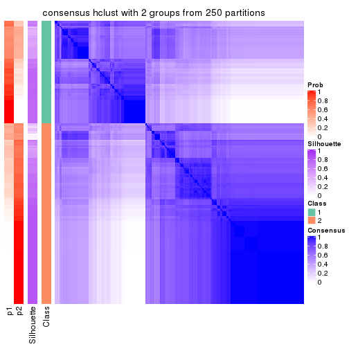</p>

</div>
<div id='tab-CV-hclust-consensus-heatmap-2'>
<pre><code class="r">consensus_heatmap(res, k = 3)
</code></pre>

<p>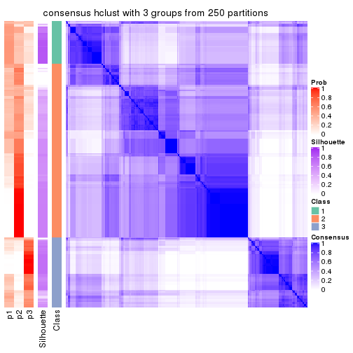</p>

</div>
<div id='tab-CV-hclust-consensus-heatmap-3'>
<pre><code class="r">consensus_heatmap(res, k = 4)
</code></pre>

<p>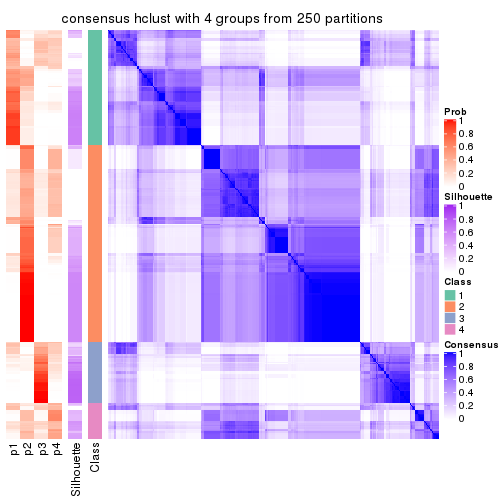</p>

</div>
<div id='tab-CV-hclust-consensus-heatmap-4'>
<pre><code class="r">consensus_heatmap(res, k = 5)
</code></pre>

<p>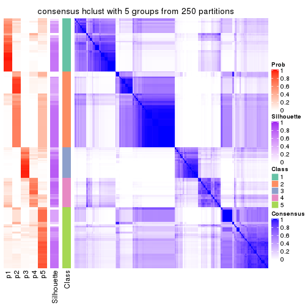</p>

</div>
<div id='tab-CV-hclust-consensus-heatmap-5'>
<pre><code class="r">consensus_heatmap(res, k = 6)
</code></pre>

<p>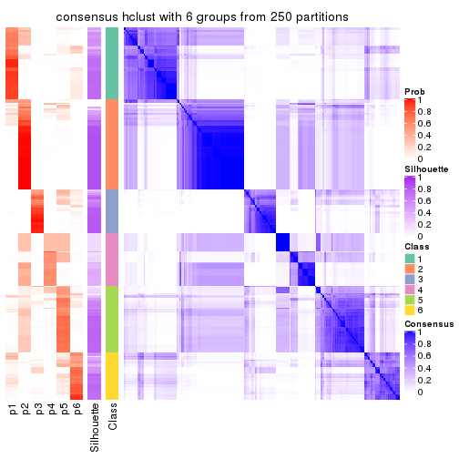</p>

</div>
</div>

Heatmaps for the membership of samples in all partitions to see how consistent they are:


<script>
$( function() {
	$( '#tabs-CV-hclust-membership-heatmap' ).tabs();
} );
</script>
<div id='tabs-CV-hclust-membership-heatmap'>
<ul>
<li><a href='#tab-CV-hclust-membership-heatmap-1'>k = 2</a></li>
<li><a href='#tab-CV-hclust-membership-heatmap-2'>k = 3</a></li>
<li><a href='#tab-CV-hclust-membership-heatmap-3'>k = 4</a></li>
<li><a href='#tab-CV-hclust-membership-heatmap-4'>k = 5</a></li>
<li><a href='#tab-CV-hclust-membership-heatmap-5'>k = 6</a></li>
</ul>
<div id='tab-CV-hclust-membership-heatmap-1'>
<pre><code class="r">membership_heatmap(res, k = 2)
</code></pre>

<p>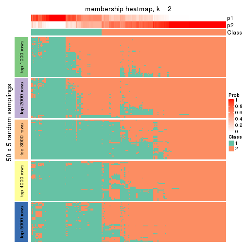</p>

</div>
<div id='tab-CV-hclust-membership-heatmap-2'>
<pre><code class="r">membership_heatmap(res, k = 3)
</code></pre>

<p>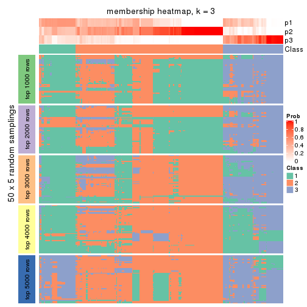</p>

</div>
<div id='tab-CV-hclust-membership-heatmap-3'>
<pre><code class="r">membership_heatmap(res, k = 4)
</code></pre>

<p>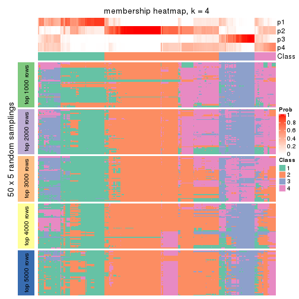</p>

</div>
<div id='tab-CV-hclust-membership-heatmap-4'>
<pre><code class="r">membership_heatmap(res, k = 5)
</code></pre>

<p>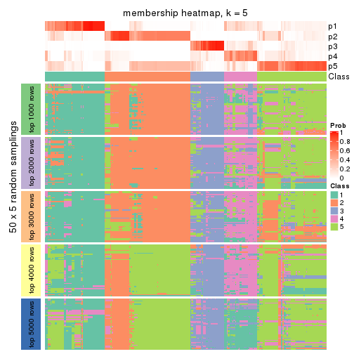</p>

</div>
<div id='tab-CV-hclust-membership-heatmap-5'>
<pre><code class="r">membership_heatmap(res, k = 6)
</code></pre>

<p>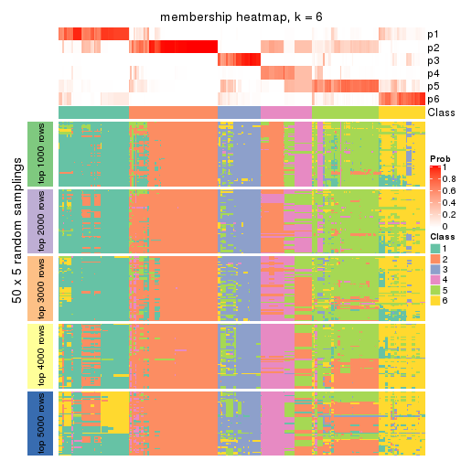</p>

</div>
</div>

As soon as we have had the classes for columns, we can look for signatures
which are significantly different between classes which can be candidate marks
for certain classes. Following are the heatmaps for signatures.


Signature heatmaps where rows are scaled:


<script>
$( function() {
	$( '#tabs-CV-hclust-get-signatures' ).tabs();
} );
</script>
<div id='tabs-CV-hclust-get-signatures'>
<ul>
<li><a href='#tab-CV-hclust-get-signatures-1'>k = 2</a></li>
<li><a href='#tab-CV-hclust-get-signatures-2'>k = 3</a></li>
<li><a href='#tab-CV-hclust-get-signatures-3'>k = 4</a></li>
<li><a href='#tab-CV-hclust-get-signatures-4'>k = 5</a></li>
<li><a href='#tab-CV-hclust-get-signatures-5'>k = 6</a></li>
</ul>
<div id='tab-CV-hclust-get-signatures-1'>
<pre><code class="r">get_signatures(res, k = 2)
</code></pre>

<p>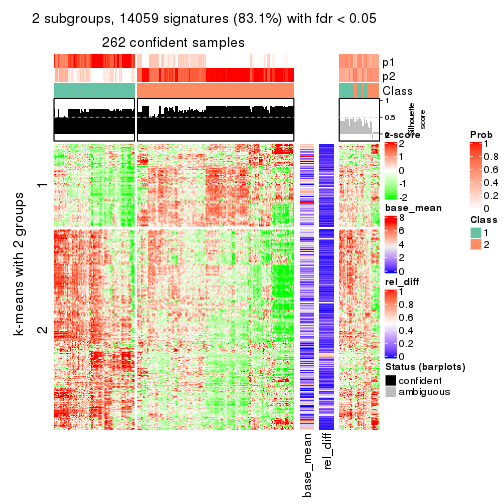</p>

</div>
<div id='tab-CV-hclust-get-signatures-2'>
<pre><code class="r">get_signatures(res, k = 3)
</code></pre>

<p>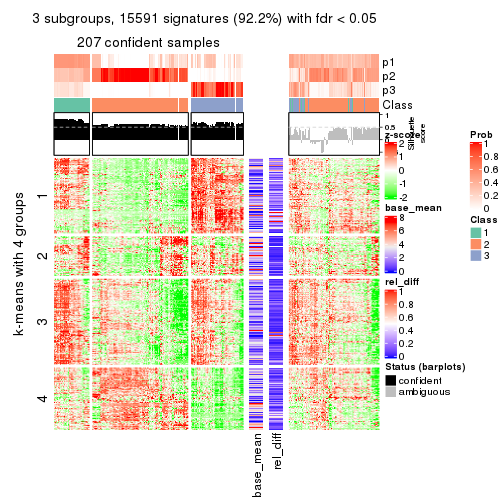</p>

</div>
<div id='tab-CV-hclust-get-signatures-3'>
<pre><code class="r">get_signatures(res, k = 4)
</code></pre>

<p>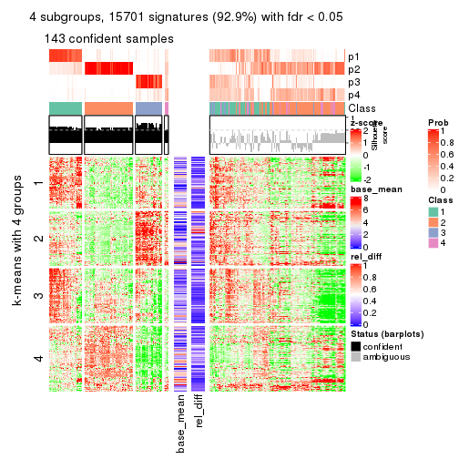</p>

</div>
<div id='tab-CV-hclust-get-signatures-4'>
<pre><code class="r">get_signatures(res, k = 5)
</code></pre>

<p>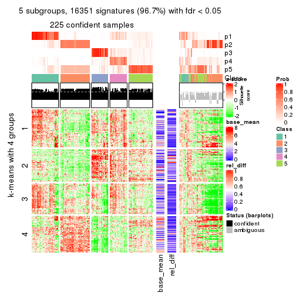</p>

</div>
<div id='tab-CV-hclust-get-signatures-5'>
<pre><code class="r">get_signatures(res, k = 6)
</code></pre>

<p>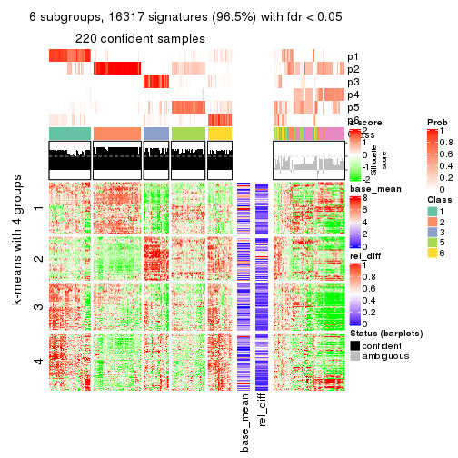</p>

</div>
</div>


Signature heatmaps where rows are not scaled:


<script>
$( function() {
	$( '#tabs-CV-hclust-get-signatures-no-scale' ).tabs();
} );
</script>
<div id='tabs-CV-hclust-get-signatures-no-scale'>
<ul>
<li><a href='#tab-CV-hclust-get-signatures-no-scale-1'>k = 2</a></li>
<li><a href='#tab-CV-hclust-get-signatures-no-scale-2'>k = 3</a></li>
<li><a href='#tab-CV-hclust-get-signatures-no-scale-3'>k = 4</a></li>
<li><a href='#tab-CV-hclust-get-signatures-no-scale-4'>k = 5</a></li>
<li><a href='#tab-CV-hclust-get-signatures-no-scale-5'>k = 6</a></li>
</ul>
<div id='tab-CV-hclust-get-signatures-no-scale-1'>
<pre><code class="r">get_signatures(res, k = 2, scale_rows = FALSE)
</code></pre>

<p>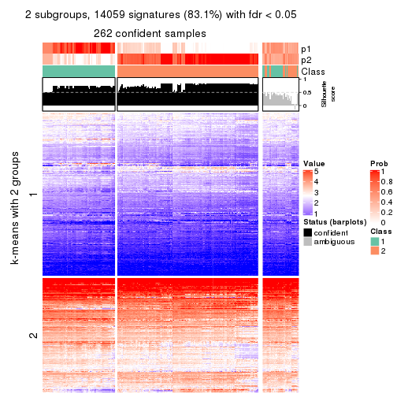</p>

</div>
<div id='tab-CV-hclust-get-signatures-no-scale-2'>
<pre><code class="r">get_signatures(res, k = 3, scale_rows = FALSE)
</code></pre>

<p>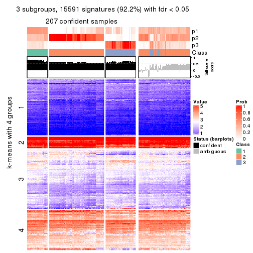</p>

</div>
<div id='tab-CV-hclust-get-signatures-no-scale-3'>
<pre><code class="r">get_signatures(res, k = 4, scale_rows = FALSE)
</code></pre>

<p>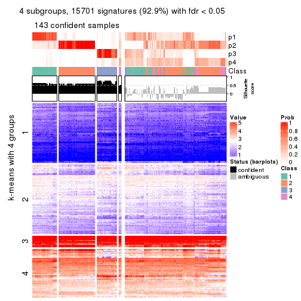</p>

</div>
<div id='tab-CV-hclust-get-signatures-no-scale-4'>
<pre><code class="r">get_signatures(res, k = 5, scale_rows = FALSE)
</code></pre>

<p>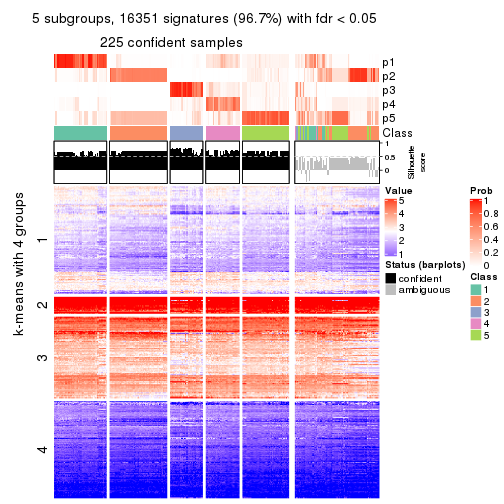</p>

</div>
<div id='tab-CV-hclust-get-signatures-no-scale-5'>
<pre><code class="r">get_signatures(res, k = 6, scale_rows = FALSE)
</code></pre>

<p>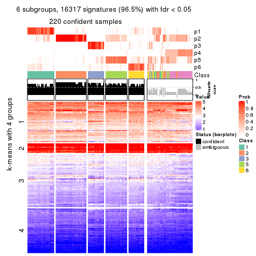</p>

</div>
</div>


Compare the overlap of signatures from different k:

```r
compare_signatures(res)
```

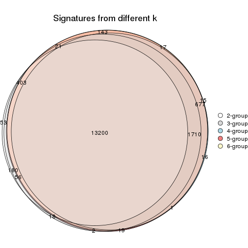

`get_signature()` returns a data frame invisibly. TO get the list of signatures, the function
call should be assigned to a variable explicitly. In following code, if `plot` argument is set
to `FALSE`, no heatmap is plotted while only the differential analysis is performed.

```r
# code only for demonstration
tb = get_signature(res, k = ..., plot = FALSE)
```

An example of the output of `tb` is:

```
#>   which_row         fdr    mean_1    mean_2 scaled_mean_1 scaled_mean_2 km
#> 1        38 0.042760348  8.373488  9.131774    -0.5533452     0.5164555  1
#> 2        40 0.018707592  7.106213  8.469186    -0.6173731     0.5762149  1
#> 3        55 0.019134737 10.221463 11.207825    -0.6159697     0.5749050  1
#> 4        59 0.006059896  5.921854  7.869574    -0.6899429     0.6439467  1
#> 5        60 0.018055526  8.928898 10.211722    -0.6204761     0.5791110  1
#> 6        98 0.009384629 15.714769 14.887706     0.6635654    -0.6193277  2
...
```

The columns in `tb` are:

1. `which_row`: row indices corresponding to the input matrix.
2. `fdr`: FDR for the differential test. 
3. `mean_x`: The mean value in group x.
4. `scaled_mean_x`: The mean value in group x after rows are scaled.
5. `km`: Row groups if k-means clustering is applied to rows.


UMAP plot which shows how samples are separated.


<script>
$( function() {
	$( '#tabs-CV-hclust-dimension-reduction' ).tabs();
} );
</script>
<div id='tabs-CV-hclust-dimension-reduction'>
<ul>
<li><a href='#tab-CV-hclust-dimension-reduction-1'>k = 2</a></li>
<li><a href='#tab-CV-hclust-dimension-reduction-2'>k = 3</a></li>
<li><a href='#tab-CV-hclust-dimension-reduction-3'>k = 4</a></li>
<li><a href='#tab-CV-hclust-dimension-reduction-4'>k = 5</a></li>
<li><a href='#tab-CV-hclust-dimension-reduction-5'>k = 6</a></li>
</ul>
<div id='tab-CV-hclust-dimension-reduction-1'>
<pre><code class="r">dimension_reduction(res, k = 2, method = &quot;UMAP&quot;)
</code></pre>

<p>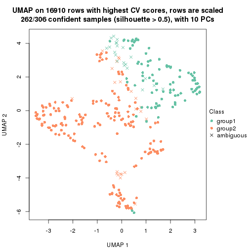</p>

</div>
<div id='tab-CV-hclust-dimension-reduction-2'>
<pre><code class="r">dimension_reduction(res, k = 3, method = &quot;UMAP&quot;)
</code></pre>

<p>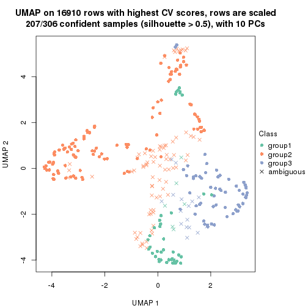</p>

</div>
<div id='tab-CV-hclust-dimension-reduction-3'>
<pre><code class="r">dimension_reduction(res, k = 4, method = &quot;UMAP&quot;)
</code></pre>

<p>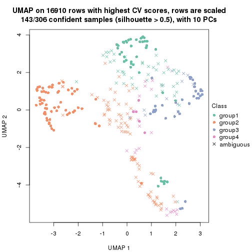</p>

</div>
<div id='tab-CV-hclust-dimension-reduction-4'>
<pre><code class="r">dimension_reduction(res, k = 5, method = &quot;UMAP&quot;)
</code></pre>

<p>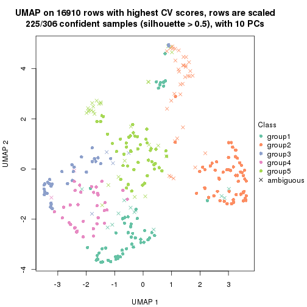</p>

</div>
<div id='tab-CV-hclust-dimension-reduction-5'>
<pre><code class="r">dimension_reduction(res, k = 6, method = &quot;UMAP&quot;)
</code></pre>

<p>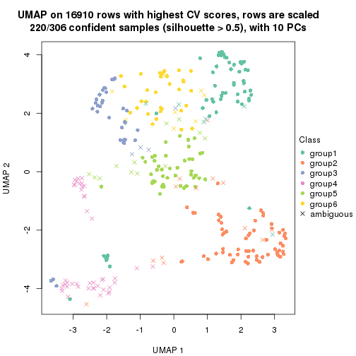</p>

</div>
</div>


Following heatmap shows how subgroups are split when increasing `k`:

```r
collect_classes(res)
```

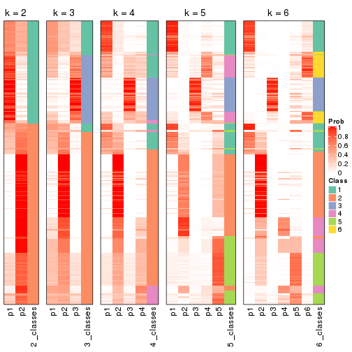


If matrix rows can be associated to genes, consider to use `GO_Enrichment(res,
...)` to perform function enrichment for the signature genes.


 

---------------------------------------------------


### CV:kmeans


The object with results only for a single top-value method and a single partition method 
can be extracted as:

```r
res = res_list["CV", "kmeans"]
# you can also extract it by
# res = res_list["CV:kmeans"]
```

A summary of `res` and all the functions that can be applied to it:

```r
res
```

```
#> A 'ConsensusPartition' object with k = 2, 3, 4, 5, 6.
#>   On a matrix with 16910 rows and 306 columns.
#>   Top rows (1000, 2000, 3000, 4000, 5000) are extracted by 'CV' method.
#>   Subgroups are detected by 'kmeans' method.
#>   Performed in total 1250 partitions by row resampling.
#>   Best k for subgroups seems to be 2.
#> 
#> Following methods can be applied to this 'ConsensusPartition' object:
#>  [1] "cola_report"             "collect_classes"         "collect_plots"          
#>  [4] "collect_stats"           "colnames"                "compare_signatures"     
#>  [7] "consensus_heatmap"       "dimension_reduction"     "functional_enrichment"  
#> [10] "get_anno_col"            "get_anno"                "get_classes"            
#> [13] "get_consensus"           "get_matrix"              "get_membership"         
#> [16] "get_param"               "get_signatures"          "get_stats"              
#> [19] "is_best_k"               "is_stable_k"             "membership_heatmap"     
#> [22] "ncol"                    "nrow"                    "plot_ecdf"              
#> [25] "rownames"                "select_partition_number" "show"                   
#> [28] "suggest_best_k"          "test_to_known_factors"
```

`collect_plots()` function collects all the plots made from `res` for all `k` (number of partitions)
into one single page to provide an easy and fast comparison between different `k`.

```r
collect_plots(res)
```

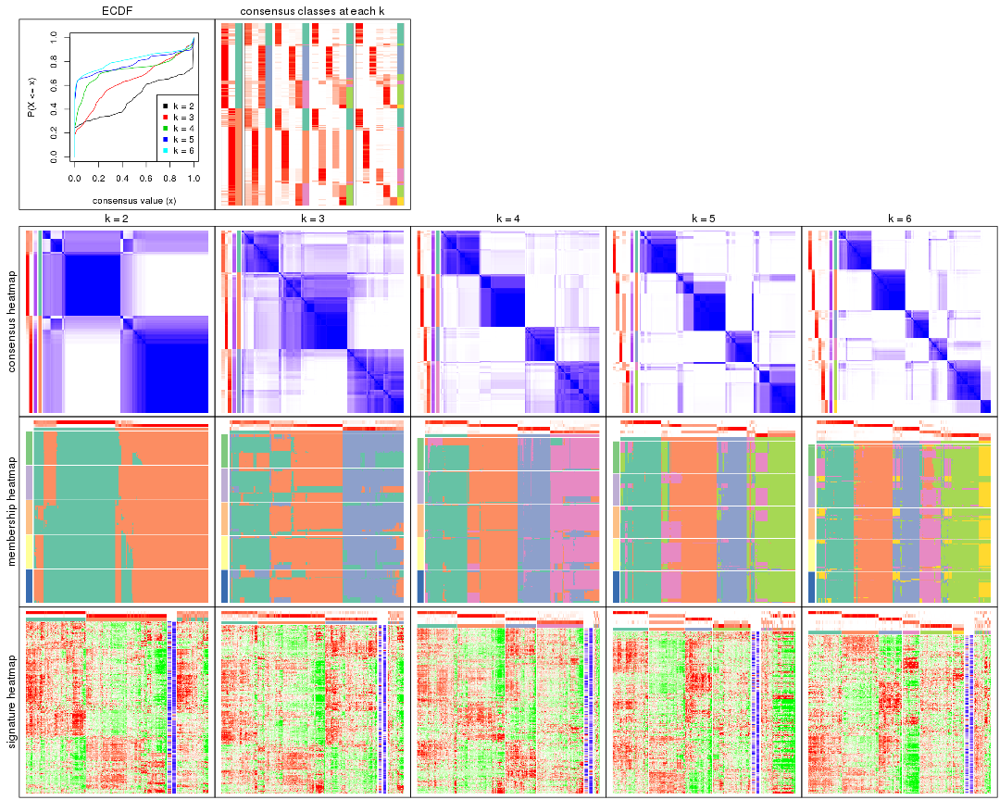

The plots are:

- The first row: a plot of the ECDF (Empirical cumulative distribution
  function) curves of the consensus matrix for each `k` and the heatmap of
  predicted classes for each `k`.
- The second row: heatmaps of the consensus matrix for each `k`.
- The third row: heatmaps of the membership matrix for each `k`.
- The fouth row: heatmaps of the signatures for each `k`.

All the plots in panels can be made by individual functions and they are
plotted later in this section.

`select_partition_number()` produces several plots showing different
statistics for choosing "optimized" `k`. There are following statistics:

- ECDF curves of the consensus matrix for each `k`;
- 1-PAC. [The PAC
  score](https://en.wikipedia.org/wiki/Consensus_clustering#Over-interpretation_potential_of_consensus_clustering)
  measures the proportion of the ambiguous subgrouping.
- Mean silhouette score.
- Concordance. The mean probability of fiting the consensus class ids in all
  partitions.
- Area increased. Denote $A_k$ as the area under the ECDF curve for current
  `k`, the area increased is defined as $A_k - A_{k-1}$.
- Rand index. The percent of pairs of samples that are both in a same cluster
  or both are not in a same cluster in the partition of k and k-1.
- Jaccard index. The ratio of pairs of samples are both in a same cluster in
  the partition of k and k-1 and the pairs of samples are both in a same
  cluster in the partition k or k-1.

The detailed explanations of these statistics can be found in [the cola
vignette](http://bioconductor.org/packages/devel/bioc/vignettes/cola/inst/doc/cola.html#toc_13).

Generally speaking, lower PAC score, higher mean silhouette score or higher
concordance corresponds to better partition. Rand index and Jaccard index
measure how similar the current partition is compared to partition with `k-1`.
If they are too similar, we won't accept `k` is better than `k-1`.

```r
select_partition_number(res)
```

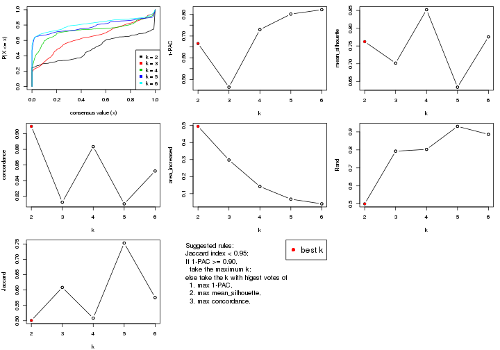

The numeric values for all these statistics can be obtained by `get_stats()`.

```r
get_stats(res)
```

```
#>   k 1-PAC mean_silhouette concordance area_increased  Rand Jaccard
#> 2 2 0.665           0.762       0.910         0.4949 0.501   0.501
#> 3 3 0.465           0.702       0.812         0.2973 0.793   0.608
#> 4 4 0.730           0.852       0.884         0.1416 0.803   0.508
#> 5 5 0.801           0.634       0.810         0.0675 0.931   0.753
#> 6 6 0.821           0.776       0.852         0.0400 0.886   0.575
```

`suggest_best_k()` suggests the best $k$ based on these statistics. The rules are as follows:

- All $k$ with Jaccard index larger than 0.95 are removed because the increase of
  the partition number does not provides enough extra information. If all $k$ are removed,
  the best $k$ is assigned by `NA`.
- For $k$ with 1-PAC larger than 0.9, the maximal $k$ is taken as the "best k". Other $k$ is called "optional k".
- If it does not fit the second rule. The $k$ with the highest vote of highest
  1-PAC, mean silhouette and concordance is taken as the "best k".

```r
suggest_best_k(res)
```

```
#> [1] 2
```


Following shows the table of the partitions (You need to click the **show/hide
code output** link to see it). The membership matrix (columns with name `p*`)
is inferred by
[`clue::cl_consensus()`](https://www.rdocumentation.org/link/cl_consensus?package=clue)
function with the `SE` method. Basically the value in the membership matrix
represents the probability to belong to a certain group. The finall class
label for an item is determined with the group with highest probability it
belongs to.

In `get_classes()` function, the entropy is calculated from the membership
matrix and the silhouette score is calculated from the consensus matrix.


<script>
$( function() {
	$( '#tabs-CV-kmeans-get-classes' ).tabs();
} );
</script>
<div id='tabs-CV-kmeans-get-classes'>
<ul>
<li><a href='#tab-CV-kmeans-get-classes-1'>k = 2</a></li>
<li><a href='#tab-CV-kmeans-get-classes-2'>k = 3</a></li>
<li><a href='#tab-CV-kmeans-get-classes-3'>k = 4</a></li>
<li><a href='#tab-CV-kmeans-get-classes-4'>k = 5</a></li>
<li><a href='#tab-CV-kmeans-get-classes-5'>k = 6</a></li>
</ul>

<div id='tab-CV-kmeans-get-classes-1'>
<p><a id='tab-CV-kmeans-get-classes-1-a' style='color:#0366d6' href='#'>show/hide code output</a></p>
<pre><code class="r">cbind(get_classes(res, k = 2), get_membership(res, k = 2))
</code></pre>

<pre><code>#&gt;            class entropy silhouette    p1    p2
#&gt; SRR1609360     2  0.0000     0.9175 0.000 1.000
#&gt; SRR1609361     2  0.0000     0.9175 0.000 1.000
#&gt; SRR1609362     2  0.0000     0.9175 0.000 1.000
#&gt; SRR1609363     2  0.0000     0.9175 0.000 1.000
#&gt; SRR1609364     2  0.0000     0.9175 0.000 1.000
#&gt; SRR1609365     2  0.0000     0.9175 0.000 1.000
#&gt; SRR1609366     2  0.0000     0.9175 0.000 1.000
#&gt; SRR1609367     1  0.9833     0.3003 0.576 0.424
#&gt; SRR1609368     2  0.0000     0.9175 0.000 1.000
#&gt; SRR1609369     2  0.0000     0.9175 0.000 1.000
#&gt; SRR1609370     1  0.9866     0.2814 0.568 0.432
#&gt; SRR1609371     2  0.0000     0.9175 0.000 1.000
#&gt; SRR1609372     1  0.9866     0.2814 0.568 0.432
#&gt; SRR1609373     2  0.0000     0.9175 0.000 1.000
#&gt; SRR1609374     2  0.0000     0.9175 0.000 1.000
#&gt; SRR1609375     2  0.0000     0.9175 0.000 1.000
#&gt; SRR1609377     2  0.0376     0.9146 0.004 0.996
#&gt; SRR1609376     2  0.0000     0.9175 0.000 1.000
#&gt; SRR1609378     2  0.0000     0.9175 0.000 1.000
#&gt; SRR1609379     2  0.9427     0.3729 0.360 0.640
#&gt; SRR1609382     2  0.0000     0.9175 0.000 1.000
#&gt; SRR1609383     2  0.9896     0.1399 0.440 0.560
#&gt; SRR1609381     1  0.9998     0.0984 0.508 0.492
#&gt; SRR1609384     2  0.0000     0.9175 0.000 1.000
#&gt; SRR1609386     2  0.0000     0.9175 0.000 1.000
#&gt; SRR1609385     2  0.0000     0.9175 0.000 1.000
#&gt; SRR1609387     2  0.9732     0.2535 0.404 0.596
#&gt; SRR1609388     2  0.0000     0.9175 0.000 1.000
#&gt; SRR1609390     1  0.9933     0.2257 0.548 0.452
#&gt; SRR1609393     2  0.0000     0.9175 0.000 1.000
#&gt; SRR1609394     2  0.0000     0.9175 0.000 1.000
#&gt; SRR1609392     2  0.0000     0.9175 0.000 1.000
#&gt; SRR1609391     2  0.0000     0.9175 0.000 1.000
#&gt; SRR1609395     1  0.9866     0.2814 0.568 0.432
#&gt; SRR1609396     1  0.9866     0.2814 0.568 0.432
#&gt; SRR1609398     2  0.0000     0.9175 0.000 1.000
#&gt; SRR1609399     1  0.9866     0.2814 0.568 0.432
#&gt; SRR1609400     1  0.9866     0.2814 0.568 0.432
#&gt; SRR1609397     2  0.0000     0.9175 0.000 1.000
#&gt; SRR1609401     2  0.0000     0.9175 0.000 1.000
#&gt; SRR1609402     2  0.0000     0.9175 0.000 1.000
#&gt; SRR1609405     2  0.0000     0.9175 0.000 1.000
#&gt; SRR1609404     2  0.0000     0.9175 0.000 1.000
#&gt; SRR1609406     2  0.0000     0.9175 0.000 1.000
#&gt; SRR1609408     2  0.0000     0.9175 0.000 1.000
#&gt; SRR1609403     2  0.9710     0.2648 0.400 0.600
#&gt; SRR1609410     2  0.9754     0.2416 0.408 0.592
#&gt; SRR1609411     2  0.0000     0.9175 0.000 1.000
#&gt; SRR1609407     2  0.0000     0.9175 0.000 1.000
#&gt; SRR1609413     2  0.9775     0.2294 0.412 0.588
#&gt; SRR1609412     1  0.0000     0.8609 1.000 0.000
#&gt; SRR1609414     1  0.0000     0.8609 1.000 0.000
#&gt; SRR1609415     1  0.0000     0.8609 1.000 0.000
#&gt; SRR1609416     1  0.0000     0.8609 1.000 0.000
#&gt; SRR1609417     1  0.0000     0.8609 1.000 0.000
#&gt; SRR1609418     2  0.9129     0.4496 0.328 0.672
#&gt; SRR1609419     2  0.0000     0.9175 0.000 1.000
#&gt; SRR1609420     2  0.0000     0.9175 0.000 1.000
#&gt; SRR1609421     2  0.3114     0.8731 0.056 0.944
#&gt; SRR1609422     2  0.9754     0.2340 0.408 0.592
#&gt; SRR1609423     2  0.0000     0.9175 0.000 1.000
#&gt; SRR1609424     2  0.0000     0.9175 0.000 1.000
#&gt; SRR1609425     2  0.0000     0.9175 0.000 1.000
#&gt; SRR1609426     2  0.0000     0.9175 0.000 1.000
#&gt; SRR1609427     1  0.0000     0.8609 1.000 0.000
#&gt; SRR1609428     2  0.0000     0.9175 0.000 1.000
#&gt; SRR1609429     1  0.9491     0.4047 0.632 0.368
#&gt; SRR1609430     1  0.0000     0.8609 1.000 0.000
#&gt; SRR1609431     2  0.5737     0.7843 0.136 0.864
#&gt; SRR1609432     2  0.0000     0.9175 0.000 1.000
#&gt; SRR1609433     1  0.0000     0.8609 1.000 0.000
#&gt; SRR1609434     2  0.0000     0.9175 0.000 1.000
#&gt; SRR1609435     1  0.0000     0.8609 1.000 0.000
#&gt; SRR1609436     1  0.0000     0.8609 1.000 0.000
#&gt; SRR1609437     2  0.0000     0.9175 0.000 1.000
#&gt; SRR1609438     2  0.0000     0.9175 0.000 1.000
#&gt; SRR1609439     1  0.0000     0.8609 1.000 0.000
#&gt; SRR1609440     1  0.9866     0.2814 0.568 0.432
#&gt; SRR1609441     2  0.0000     0.9175 0.000 1.000
#&gt; SRR1609442     2  0.0000     0.9175 0.000 1.000
#&gt; SRR1609443     1  0.0000     0.8609 1.000 0.000
#&gt; SRR1609444     1  0.9944     0.2161 0.544 0.456
#&gt; SRR1609445     1  0.9209     0.4570 0.664 0.336
#&gt; SRR1609446     2  0.0000     0.9175 0.000 1.000
#&gt; SRR1609447     1  0.0000     0.8609 1.000 0.000
#&gt; SRR1609448     2  0.0000     0.9175 0.000 1.000
#&gt; SRR1609449     1  0.9866     0.2814 0.568 0.432
#&gt; SRR1609450     2  0.0000     0.9175 0.000 1.000
#&gt; SRR1609451     1  0.0000     0.8609 1.000 0.000
#&gt; SRR1609452     1  0.9998     0.0786 0.508 0.492
#&gt; SRR1609453     1  0.0000     0.8609 1.000 0.000
#&gt; SRR1609454     2  0.0000     0.9175 0.000 1.000
#&gt; SRR1609455     2  0.0000     0.9175 0.000 1.000
#&gt; SRR1609456     2  0.0000     0.9175 0.000 1.000
#&gt; SRR1609457     1  0.0000     0.8609 1.000 0.000
#&gt; SRR1609458     1  0.0000     0.8609 1.000 0.000
#&gt; SRR1609459     1  0.8081     0.5995 0.752 0.248
#&gt; SRR1609460     2  0.2236     0.8907 0.036 0.964
#&gt; SRR1609461     1  0.0000     0.8609 1.000 0.000
#&gt; SRR1609462     1  0.0000     0.8609 1.000 0.000
#&gt; SRR1609464     1  0.0000     0.8609 1.000 0.000
#&gt; SRR1609463     1  0.0000     0.8609 1.000 0.000
#&gt; SRR1609465     2  0.1414     0.9033 0.020 0.980
#&gt; SRR1609466     2  0.0000     0.9175 0.000 1.000
#&gt; SRR1609467     1  0.0000     0.8609 1.000 0.000
#&gt; SRR1609469     2  0.0000     0.9175 0.000 1.000
#&gt; SRR1609470     2  0.4562     0.8323 0.096 0.904
#&gt; SRR1609472     1  0.9996     0.0917 0.512 0.488
#&gt; SRR1609471     2  0.9427     0.3747 0.360 0.640
#&gt; SRR1609474     2  0.0000     0.9175 0.000 1.000
#&gt; SRR1609473     2  0.0000     0.9175 0.000 1.000
#&gt; SRR1609475     2  0.0000     0.9175 0.000 1.000
#&gt; SRR1609478     2  0.9944     0.0888 0.456 0.544
#&gt; SRR1609476     1  0.0000     0.8609 1.000 0.000
#&gt; SRR1609477     1  0.7376     0.6545 0.792 0.208
#&gt; SRR1609479     2  0.0000     0.9175 0.000 1.000
#&gt; SRR1609481     2  0.2236     0.8907 0.036 0.964
#&gt; SRR1609480     1  0.6531     0.7038 0.832 0.168
#&gt; SRR1609482     1  0.0000     0.8609 1.000 0.000
#&gt; SRR1609484     2  0.0000     0.9175 0.000 1.000
#&gt; SRR1609483     1  0.0000     0.8609 1.000 0.000
#&gt; SRR1609486     1  0.0000     0.8609 1.000 0.000
#&gt; SRR1609485     1  0.0000     0.8609 1.000 0.000
#&gt; SRR1609487     2  0.8763     0.5178 0.296 0.704
#&gt; SRR1609488     1  0.0000     0.8609 1.000 0.000
#&gt; SRR1609489     2  0.0000     0.9175 0.000 1.000
#&gt; SRR1609490     2  0.0000     0.9175 0.000 1.000
#&gt; SRR1609491     1  0.0938     0.8523 0.988 0.012
#&gt; SRR1609492     2  0.0000     0.9175 0.000 1.000
#&gt; SRR1609493     2  0.5737     0.7843 0.136 0.864
#&gt; SRR1609494     2  0.0000     0.9175 0.000 1.000
#&gt; SRR1609495     1  0.9815     0.3095 0.580 0.420
#&gt; SRR1609496     1  0.0000     0.8609 1.000 0.000
#&gt; SRR1609497     1  0.0000     0.8609 1.000 0.000
#&gt; SRR1609498     1  0.0000     0.8609 1.000 0.000
#&gt; SRR1609499     2  0.0000     0.9175 0.000 1.000
#&gt; SRR1609500     1  0.0000     0.8609 1.000 0.000
#&gt; SRR1609501     2  0.3733     0.8578 0.072 0.928
#&gt; SRR1609502     2  0.0000     0.9175 0.000 1.000
#&gt; SRR1609503     2  0.0000     0.9175 0.000 1.000
#&gt; SRR1609504     1  0.0000     0.8609 1.000 0.000
#&gt; SRR1609505     1  0.0000     0.8609 1.000 0.000
#&gt; SRR1609506     2  0.0000     0.9175 0.000 1.000
#&gt; SRR1609507     1  0.0000     0.8609 1.000 0.000
#&gt; SRR1609508     2  0.0000     0.9175 0.000 1.000
#&gt; SRR1609509     2  0.0000     0.9175 0.000 1.000
#&gt; SRR1609510     2  0.2236     0.8907 0.036 0.964
#&gt; SRR1609512     1  0.0000     0.8609 1.000 0.000
#&gt; SRR1609511     1  0.0000     0.8609 1.000 0.000
#&gt; SRR1609513     1  0.0000     0.8609 1.000 0.000
#&gt; SRR1609514     1  0.9754     0.3055 0.592 0.408
#&gt; SRR1609515     2  0.0000     0.9175 0.000 1.000
#&gt; SRR1609516     1  0.0000     0.8609 1.000 0.000
#&gt; SRR1609517     2  0.0672     0.9120 0.008 0.992
#&gt; SRR1609518     1  0.9977     0.1666 0.528 0.472
#&gt; SRR1609519     1  0.0000     0.8609 1.000 0.000
#&gt; SRR1609520     2  0.0000     0.9175 0.000 1.000
#&gt; SRR1609521     1  0.0000     0.8609 1.000 0.000
#&gt; SRR1609522     1  0.0000     0.8609 1.000 0.000
#&gt; SRR1609523     2  0.9754     0.2340 0.408 0.592
#&gt; SRR1609524     2  0.0000     0.9175 0.000 1.000
#&gt; SRR1609526     1  0.0000     0.8609 1.000 0.000
#&gt; SRR1609525     2  0.7139     0.6969 0.196 0.804
#&gt; SRR1609527     1  0.9866     0.2814 0.568 0.432
#&gt; SRR1609529     1  0.0000     0.8609 1.000 0.000
#&gt; SRR1609528     1  0.9996     0.0917 0.512 0.488
#&gt; SRR1609530     1  0.0000     0.8609 1.000 0.000
#&gt; SRR1609531     2  0.0000     0.9175 0.000 1.000
#&gt; SRR1609532     1  0.0000     0.8609 1.000 0.000
#&gt; SRR1609533     2  0.3733     0.8578 0.072 0.928
#&gt; SRR1609534     1  0.0000     0.8609 1.000 0.000
#&gt; SRR1609535     2  0.2423     0.8873 0.040 0.960
#&gt; SRR1609537     2  0.0000     0.9175 0.000 1.000
#&gt; SRR1609536     1  0.0000     0.8609 1.000 0.000
#&gt; SRR1609538     2  0.0000     0.9175 0.000 1.000
#&gt; SRR1609539     1  0.0000     0.8609 1.000 0.000
#&gt; SRR1609540     1  0.0000     0.8609 1.000 0.000
#&gt; SRR1609541     1  0.9996     0.0917 0.512 0.488
#&gt; SRR1609542     2  0.0000     0.9175 0.000 1.000
#&gt; SRR1609543     1  0.0000     0.8609 1.000 0.000
#&gt; SRR1609544     1  0.7219     0.6778 0.800 0.200
#&gt; SRR1609545     1  0.0000     0.8609 1.000 0.000
#&gt; SRR1609546     1  0.0000     0.8609 1.000 0.000
#&gt; SRR1609547     1  0.0000     0.8609 1.000 0.000
#&gt; SRR1609548     2  0.9922     0.1148 0.448 0.552
#&gt; SRR1609549     2  0.0000     0.9175 0.000 1.000
#&gt; SRR1609550     2  0.0000     0.9175 0.000 1.000
#&gt; SRR1609551     1  0.0000     0.8609 1.000 0.000
#&gt; SRR1609552     1  0.0000     0.8609 1.000 0.000
#&gt; SRR1609553     1  0.0000     0.8609 1.000 0.000
#&gt; SRR1609554     1  0.0000     0.8609 1.000 0.000
#&gt; SRR1609555     1  0.0000     0.8609 1.000 0.000
#&gt; SRR1609556     1  0.0000     0.8609 1.000 0.000
#&gt; SRR1609557     1  0.9710     0.3246 0.600 0.400
#&gt; SRR1609558     1  0.9993     0.1042 0.516 0.484
#&gt; SRR1609559     2  0.5946     0.7738 0.144 0.856
#&gt; SRR1609560     2  0.7376     0.6739 0.208 0.792
#&gt; SRR1609561     1  0.0000     0.8609 1.000 0.000
#&gt; SRR1609562     2  0.0000     0.9175 0.000 1.000
#&gt; SRR1609563     2  0.0000     0.9175 0.000 1.000
#&gt; SRR1609564     1  0.0000     0.8609 1.000 0.000
#&gt; SRR1609565     2  0.0000     0.9175 0.000 1.000
#&gt; SRR1609566     2  0.0000     0.9175 0.000 1.000
#&gt; SRR1609567     2  0.0000     0.9175 0.000 1.000
#&gt; SRR1609568     2  0.9710     0.2648 0.400 0.600
#&gt; SRR1609569     1  0.0000     0.8609 1.000 0.000
#&gt; SRR1609570     1  0.0000     0.8609 1.000 0.000
#&gt; SRR1609571     1  0.0000     0.8609 1.000 0.000
#&gt; SRR1609572     1  0.0000     0.8609 1.000 0.000
#&gt; SRR1609573     1  0.0000     0.8609 1.000 0.000
#&gt; SRR1609574     1  0.0000     0.8609 1.000 0.000
#&gt; SRR1609575     2  0.0000     0.9175 0.000 1.000
#&gt; SRR1609576     2  0.0000     0.9175 0.000 1.000
#&gt; SRR1609578     1  0.3274     0.8176 0.940 0.060
#&gt; SRR1609577     1  0.9988     0.1404 0.520 0.480
#&gt; SRR1609579     1  0.0000     0.8609 1.000 0.000
#&gt; SRR1609580     1  0.0000     0.8609 1.000 0.000
#&gt; SRR1609582     1  0.0000     0.8609 1.000 0.000
#&gt; SRR1609581     2  0.3584     0.8618 0.068 0.932
#&gt; SRR1609583     1  0.9970     0.1504 0.532 0.468
#&gt; SRR1609584     1  0.0000     0.8609 1.000 0.000
#&gt; SRR1609585     1  0.0000     0.8609 1.000 0.000
#&gt; SRR1609586     2  0.0000     0.9175 0.000 1.000
#&gt; SRR1609587     1  0.0000     0.8609 1.000 0.000
#&gt; SRR1609588     2  0.3733     0.8578 0.072 0.928
#&gt; SRR1609589     2  0.0000     0.9175 0.000 1.000
#&gt; SRR1609590     1  0.0000     0.8609 1.000 0.000
#&gt; SRR1609592     2  0.9909     0.1273 0.444 0.556
#&gt; SRR1609591     2  0.7139     0.7232 0.196 0.804
#&gt; SRR1609593     1  0.9815     0.2774 0.580 0.420
#&gt; SRR1609594     2  0.0000     0.9175 0.000 1.000
#&gt; SRR1609595     2  0.4022     0.8501 0.080 0.920
#&gt; SRR1609596     2  0.0000     0.9175 0.000 1.000
#&gt; SRR1609597     2  0.0000     0.9175 0.000 1.000
#&gt; SRR1609598     1  0.9996     0.0917 0.512 0.488
#&gt; SRR1609599     1  0.9983     0.1284 0.524 0.476
#&gt; SRR1609600     1  0.0000     0.8609 1.000 0.000
#&gt; SRR1609601     1  0.0000     0.8609 1.000 0.000
#&gt; SRR1609602     1  0.9815     0.2774 0.580 0.420
#&gt; SRR1609603     2  0.9000     0.4761 0.316 0.684
#&gt; SRR1609604     2  0.0000     0.9175 0.000 1.000
#&gt; SRR1609605     2  0.0000     0.9175 0.000 1.000
#&gt; SRR1609606     2  0.6973     0.7097 0.188 0.812
#&gt; SRR1609607     1  0.0000     0.8609 1.000 0.000
#&gt; SRR1609608     1  0.0000     0.8609 1.000 0.000
#&gt; SRR1609609     2  0.1633     0.9003 0.024 0.976
#&gt; SRR1609610     1  0.0000     0.8609 1.000 0.000
#&gt; SRR1609611     2  0.0000     0.9175 0.000 1.000
#&gt; SRR1609613     2  0.0000     0.9175 0.000 1.000
#&gt; SRR1609612     1  0.0000     0.8609 1.000 0.000
#&gt; SRR1609614     1  0.0000     0.8609 1.000 0.000
#&gt; SRR1609615     2  0.8909     0.4932 0.308 0.692
#&gt; SRR1609616     1  0.0000     0.8609 1.000 0.000
#&gt; SRR1609617     2  0.2423     0.8873 0.040 0.960
#&gt; SRR1609618     1  0.0000     0.8609 1.000 0.000
#&gt; SRR1609619     2  0.0000     0.9175 0.000 1.000
#&gt; SRR1609620     2  0.0000     0.9175 0.000 1.000
#&gt; SRR1609621     2  0.0000     0.9175 0.000 1.000
#&gt; SRR1609622     1  0.0000     0.8609 1.000 0.000
#&gt; SRR1609623     1  0.0000     0.8609 1.000 0.000
#&gt; SRR1609624     2  0.9954     0.0687 0.460 0.540
#&gt; SRR1609625     1  0.9795     0.3185 0.584 0.416
#&gt; SRR1609626     1  0.0000     0.8609 1.000 0.000
#&gt; SRR1609627     2  0.0000     0.9175 0.000 1.000
#&gt; SRR1609628     2  0.0000     0.9175 0.000 1.000
#&gt; SRR1609629     1  0.0000     0.8609 1.000 0.000
#&gt; SRR1609630     2  0.0000     0.9175 0.000 1.000
#&gt; SRR1609631     1  0.9866     0.2814 0.568 0.432
#&gt; SRR1609632     2  0.8763     0.5178 0.296 0.704
#&gt; SRR1609633     1  0.9866     0.2814 0.568 0.432
#&gt; SRR1609634     2  0.0000     0.9175 0.000 1.000
#&gt; SRR1609635     1  0.0000     0.8609 1.000 0.000
#&gt; SRR1609636     2  0.0000     0.9175 0.000 1.000
#&gt; SRR1609637     1  0.3114     0.8195 0.944 0.056
#&gt; SRR1609638     2  0.0000     0.9175 0.000 1.000
#&gt; SRR1609639     2  0.0000     0.9175 0.000 1.000
#&gt; SRR1609640     1  0.0000     0.8609 1.000 0.000
#&gt; SRR1609641     2  0.9896     0.1399 0.440 0.560
#&gt; SRR1609642     1  0.9866     0.2814 0.568 0.432
#&gt; SRR1609643     1  0.0000     0.8609 1.000 0.000
#&gt; SRR1609644     2  0.9286     0.4123 0.344 0.656
#&gt; SRR1609645     1  0.0000     0.8609 1.000 0.000
#&gt; SRR1609646     1  0.0000     0.8609 1.000 0.000
#&gt; SRR1609647     2  0.1633     0.9002 0.024 0.976
#&gt; SRR1609649     1  0.0000     0.8609 1.000 0.000
#&gt; SRR1609648     2  0.0000     0.9175 0.000 1.000
#&gt; SRR1609651     2  0.0000     0.9175 0.000 1.000
#&gt; SRR1609650     1  0.9988     0.1164 0.520 0.480
#&gt; SRR1609652     1  0.0000     0.8609 1.000 0.000
#&gt; SRR1609653     2  0.0000     0.9175 0.000 1.000
#&gt; SRR1609654     2  0.0000     0.9175 0.000 1.000
#&gt; SRR1609655     1  0.0000     0.8609 1.000 0.000
#&gt; SRR1609657     1  0.9909     0.2486 0.556 0.444
#&gt; SRR1609656     2  0.6048     0.7633 0.148 0.852
#&gt; SRR1609658     2  0.0000     0.9175 0.000 1.000
#&gt; SRR1609659     2  0.0000     0.9175 0.000 1.000
#&gt; SRR1609660     1  0.0000     0.8609 1.000 0.000
#&gt; SRR1609661     1  0.0000     0.8609 1.000 0.000
#&gt; SRR1609662     2  0.0000     0.9175 0.000 1.000
#&gt; SRR1609663     1  0.0000     0.8609 1.000 0.000
#&gt; SRR1609664     2  0.3431     0.8660 0.064 0.936
#&gt; SRR1609665     2  0.0000     0.9175 0.000 1.000
#&gt; SRR1609666     2  0.0000     0.9175 0.000 1.000
#&gt; SRR1609667     1  0.0000     0.8609 1.000 0.000
#&gt; SRR1609668     2  0.5737     0.7843 0.136 0.864
#&gt; SRR1609669     2  0.9044     0.4674 0.320 0.680
</code></pre>

<script>
$('#tab-CV-kmeans-get-classes-1-a').parent().next().next().hide();
$('#tab-CV-kmeans-get-classes-1-a').click(function(){
  $('#tab-CV-kmeans-get-classes-1-a').parent().next().next().toggle();
  return(false);
});
</script>
</div>

<div id='tab-CV-kmeans-get-classes-2'>
<p><a id='tab-CV-kmeans-get-classes-2-a' style='color:#0366d6' href='#'>show/hide code output</a></p>
<pre><code class="r">cbind(get_classes(res, k = 3), get_membership(res, k = 3))
</code></pre>

<pre><code>#&gt;            class entropy silhouette    p1    p2    p3
#&gt; SRR1609360     1  0.5216     0.7280 0.740 0.260 0.000
#&gt; SRR1609361     1  0.5254     0.7227 0.736 0.264 0.000
#&gt; SRR1609362     2  0.5926     0.3160 0.356 0.644 0.000
#&gt; SRR1609363     2  0.0237     0.8225 0.004 0.996 0.000
#&gt; SRR1609364     2  0.0237     0.8225 0.004 0.996 0.000
#&gt; SRR1609365     2  0.6180     0.1445 0.416 0.584 0.000
#&gt; SRR1609366     2  0.0237     0.8225 0.004 0.996 0.000
#&gt; SRR1609367     1  0.6435     0.8263 0.756 0.168 0.076
#&gt; SRR1609368     2  0.0237     0.8225 0.004 0.996 0.000
#&gt; SRR1609369     1  0.5529     0.7530 0.704 0.296 0.000
#&gt; SRR1609370     1  0.6435     0.8263 0.756 0.168 0.076
#&gt; SRR1609371     2  0.2165     0.7970 0.064 0.936 0.000
#&gt; SRR1609372     1  0.6435     0.8263 0.756 0.168 0.076
#&gt; SRR1609373     2  0.0237     0.8225 0.004 0.996 0.000
#&gt; SRR1609374     2  0.0237     0.8225 0.004 0.996 0.000
#&gt; SRR1609375     2  0.3619     0.6796 0.136 0.864 0.000
#&gt; SRR1609377     1  0.5216     0.7925 0.740 0.260 0.000
#&gt; SRR1609376     2  0.0237     0.8223 0.004 0.996 0.000
#&gt; SRR1609378     2  0.2165     0.7970 0.064 0.936 0.000
#&gt; SRR1609379     1  0.5058     0.8041 0.756 0.244 0.000
#&gt; SRR1609382     2  0.2165     0.7970 0.064 0.936 0.000
#&gt; SRR1609383     1  0.6458     0.8272 0.752 0.176 0.072
#&gt; SRR1609381     1  0.6458     0.8272 0.752 0.176 0.072
#&gt; SRR1609384     1  0.6140     0.6008 0.596 0.404 0.000
#&gt; SRR1609386     1  0.6126     0.6063 0.600 0.400 0.000
#&gt; SRR1609385     1  0.5733     0.7170 0.676 0.324 0.000
#&gt; SRR1609387     1  0.6106     0.8266 0.756 0.200 0.044
#&gt; SRR1609388     2  0.0237     0.8225 0.004 0.996 0.000
#&gt; SRR1609390     1  0.6458     0.8272 0.752 0.176 0.072
#&gt; SRR1609393     2  0.2165     0.7970 0.064 0.936 0.000
#&gt; SRR1609394     2  0.0237     0.8223 0.004 0.996 0.000
#&gt; SRR1609392     2  0.0237     0.8225 0.004 0.996 0.000
#&gt; SRR1609391     2  0.2165     0.7970 0.064 0.936 0.000
#&gt; SRR1609395     1  0.6435     0.8263 0.756 0.168 0.076
#&gt; SRR1609396     1  0.6435     0.8263 0.756 0.168 0.076
#&gt; SRR1609398     1  0.6126     0.6063 0.600 0.400 0.000
#&gt; SRR1609399     1  0.6435     0.8263 0.756 0.168 0.076
#&gt; SRR1609400     1  0.6435     0.8263 0.756 0.168 0.076
#&gt; SRR1609397     2  0.0237     0.8225 0.004 0.996 0.000
#&gt; SRR1609401     2  0.0237     0.8225 0.004 0.996 0.000
#&gt; SRR1609402     2  0.0237     0.8225 0.004 0.996 0.000
#&gt; SRR1609405     1  0.6062     0.6328 0.616 0.384 0.000
#&gt; SRR1609404     2  0.2165     0.7970 0.064 0.936 0.000
#&gt; SRR1609406     2  0.0237     0.8225 0.004 0.996 0.000
#&gt; SRR1609408     2  0.0237     0.8225 0.004 0.996 0.000
#&gt; SRR1609403     1  0.5639     0.8129 0.752 0.232 0.016
#&gt; SRR1609410     1  0.5378     0.8098 0.756 0.236 0.008
#&gt; SRR1609411     2  0.0747     0.8208 0.016 0.984 0.000
#&gt; SRR1609407     2  0.0237     0.8225 0.004 0.996 0.000
#&gt; SRR1609413     1  0.6255     0.8250 0.748 0.204 0.048
#&gt; SRR1609412     3  0.5254     0.7156 0.264 0.000 0.736
#&gt; SRR1609414     3  0.5016     0.7392 0.240 0.000 0.760
#&gt; SRR1609415     1  0.4121     0.6555 0.832 0.000 0.168
#&gt; SRR1609416     1  0.4062     0.6611 0.836 0.000 0.164
#&gt; SRR1609417     3  0.0747     0.7747 0.016 0.000 0.984
#&gt; SRR1609418     1  0.5058     0.8041 0.756 0.244 0.000
#&gt; SRR1609419     2  0.0237     0.8223 0.004 0.996 0.000
#&gt; SRR1609420     1  0.5733     0.7144 0.676 0.324 0.000
#&gt; SRR1609421     2  0.7495     0.6241 0.248 0.668 0.084
#&gt; SRR1609422     2  0.9785     0.2455 0.336 0.420 0.244
#&gt; SRR1609423     2  0.3412     0.7829 0.124 0.876 0.000
#&gt; SRR1609424     2  0.3116     0.7873 0.108 0.892 0.000
#&gt; SRR1609425     2  0.6302    -0.2843 0.480 0.520 0.000
#&gt; SRR1609426     2  0.0237     0.8225 0.004 0.996 0.000
#&gt; SRR1609427     3  0.4235     0.6728 0.176 0.000 0.824
#&gt; SRR1609428     2  0.0237     0.8223 0.004 0.996 0.000
#&gt; SRR1609429     1  0.3623     0.6934 0.896 0.072 0.032
#&gt; SRR1609430     3  0.2448     0.7563 0.076 0.000 0.924
#&gt; SRR1609431     2  0.8013     0.5783 0.296 0.612 0.092
#&gt; SRR1609432     2  0.0237     0.8225 0.004 0.996 0.000
#&gt; SRR1609433     1  0.6309    -0.2910 0.504 0.000 0.496
#&gt; SRR1609434     2  0.2165     0.7970 0.064 0.936 0.000
#&gt; SRR1609435     1  0.4062     0.6611 0.836 0.000 0.164
#&gt; SRR1609436     3  0.4605     0.7545 0.204 0.000 0.796
#&gt; SRR1609437     2  0.4931     0.7095 0.232 0.768 0.000
#&gt; SRR1609438     2  0.2165     0.7970 0.064 0.936 0.000
#&gt; SRR1609439     3  0.0592     0.7747 0.012 0.000 0.988
#&gt; SRR1609440     1  0.6435     0.8263 0.756 0.168 0.076
#&gt; SRR1609441     2  0.7176     0.6372 0.248 0.684 0.068
#&gt; SRR1609442     2  0.0424     0.8221 0.008 0.992 0.000
#&gt; SRR1609443     3  0.5254     0.7185 0.264 0.000 0.736
#&gt; SRR1609444     1  0.3481     0.7079 0.904 0.052 0.044
#&gt; SRR1609445     3  0.9557     0.4425 0.268 0.248 0.484
#&gt; SRR1609446     2  0.7557     0.6094 0.264 0.656 0.080
#&gt; SRR1609447     1  0.6180    -0.0027 0.584 0.000 0.416
#&gt; SRR1609448     2  0.0000     0.8228 0.000 1.000 0.000
#&gt; SRR1609449     1  0.5085     0.7711 0.836 0.092 0.072
#&gt; SRR1609450     2  0.0592     0.8193 0.012 0.988 0.000
#&gt; SRR1609451     3  0.2537     0.7537 0.080 0.000 0.920
#&gt; SRR1609452     3  0.9667     0.3921 0.264 0.272 0.464
#&gt; SRR1609453     1  0.6280    -0.3640 0.540 0.000 0.460
#&gt; SRR1609454     2  0.0747     0.8215 0.016 0.984 0.000
#&gt; SRR1609455     2  0.5431     0.4792 0.284 0.716 0.000
#&gt; SRR1609456     2  0.7479     0.6130 0.264 0.660 0.076
#&gt; SRR1609457     3  0.5098     0.7276 0.248 0.000 0.752
#&gt; SRR1609458     3  0.5926     0.6118 0.356 0.000 0.644
#&gt; SRR1609459     3  0.6761     0.6983 0.252 0.048 0.700
#&gt; SRR1609460     2  0.7860     0.5957 0.284 0.628 0.088
#&gt; SRR1609461     3  0.4702     0.7487 0.212 0.000 0.788
#&gt; SRR1609462     3  0.2448     0.7563 0.076 0.000 0.924
#&gt; SRR1609464     3  0.0592     0.7738 0.012 0.000 0.988
#&gt; SRR1609463     3  0.5497     0.7067 0.292 0.000 0.708
#&gt; SRR1609465     2  0.7599     0.6215 0.260 0.656 0.084
#&gt; SRR1609466     1  0.7672     0.1128 0.488 0.468 0.044
#&gt; SRR1609467     3  0.2448     0.7563 0.076 0.000 0.924
#&gt; SRR1609469     2  0.5578     0.7047 0.240 0.748 0.012
#&gt; SRR1609470     2  0.7916     0.5902 0.264 0.636 0.100
#&gt; SRR1609472     3  0.9623     0.4213 0.304 0.232 0.464
#&gt; SRR1609471     1  0.4228     0.7825 0.844 0.148 0.008
#&gt; SRR1609474     2  0.2066     0.7886 0.060 0.940 0.000
#&gt; SRR1609473     2  0.3267     0.7841 0.116 0.884 0.000
#&gt; SRR1609475     2  0.3116     0.7873 0.108 0.892 0.000
#&gt; SRR1609478     3  0.9698     0.3840 0.288 0.256 0.456
#&gt; SRR1609476     1  0.4062     0.6611 0.836 0.000 0.164
#&gt; SRR1609477     3  0.5690     0.7156 0.288 0.004 0.708
#&gt; SRR1609479     2  0.0424     0.8221 0.008 0.992 0.000
#&gt; SRR1609481     2  0.7949     0.6036 0.308 0.608 0.084
#&gt; SRR1609480     3  0.6155     0.6831 0.328 0.008 0.664
#&gt; SRR1609482     3  0.2165     0.7616 0.064 0.000 0.936
#&gt; SRR1609484     2  0.5517     0.6940 0.268 0.728 0.004
#&gt; SRR1609483     3  0.0892     0.7789 0.020 0.000 0.980
#&gt; SRR1609486     3  0.0000     0.7746 0.000 0.000 1.000
#&gt; SRR1609485     3  0.0000     0.7746 0.000 0.000 1.000
#&gt; SRR1609487     1  0.5216     0.7925 0.740 0.260 0.000
#&gt; SRR1609488     3  0.4750     0.7503 0.216 0.000 0.784
#&gt; SRR1609489     2  0.0237     0.8225 0.004 0.996 0.000
#&gt; SRR1609490     2  0.3192     0.7450 0.112 0.888 0.000
#&gt; SRR1609491     3  0.7633     0.6534 0.264 0.084 0.652
#&gt; SRR1609492     2  0.0237     0.8225 0.004 0.996 0.000
#&gt; SRR1609493     2  0.8013     0.5783 0.296 0.612 0.092
#&gt; SRR1609494     2  0.0000     0.8228 0.000 1.000 0.000
#&gt; SRR1609495     1  0.5695     0.7959 0.804 0.120 0.076
#&gt; SRR1609496     3  0.2448     0.7563 0.076 0.000 0.924
#&gt; SRR1609497     3  0.4121     0.7667 0.168 0.000 0.832
#&gt; SRR1609498     3  0.4178     0.6779 0.172 0.000 0.828
#&gt; SRR1609499     2  0.0424     0.8213 0.008 0.992 0.000
#&gt; SRR1609500     3  0.5835     0.6314 0.340 0.000 0.660
#&gt; SRR1609501     2  0.7778     0.5982 0.264 0.644 0.092
#&gt; SRR1609502     2  0.0892     0.8207 0.020 0.980 0.000
#&gt; SRR1609503     2  0.5982     0.6977 0.228 0.744 0.028
#&gt; SRR1609504     1  0.4062     0.6611 0.836 0.000 0.164
#&gt; SRR1609505     3  0.2537     0.7537 0.080 0.000 0.920
#&gt; SRR1609506     2  0.0237     0.8225 0.004 0.996 0.000
#&gt; SRR1609507     3  0.2537     0.7573 0.080 0.000 0.920
#&gt; SRR1609508     2  0.0000     0.8228 0.000 1.000 0.000
#&gt; SRR1609509     2  0.0000     0.8228 0.000 1.000 0.000
#&gt; SRR1609510     2  0.7997     0.5966 0.316 0.600 0.084
#&gt; SRR1609512     3  0.2448     0.7563 0.076 0.000 0.924
#&gt; SRR1609511     3  0.2356     0.7588 0.072 0.000 0.928
#&gt; SRR1609513     3  0.2448     0.7563 0.076 0.000 0.924
#&gt; SRR1609514     3  0.9299     0.4883 0.324 0.180 0.496
#&gt; SRR1609515     2  0.0237     0.8225 0.004 0.996 0.000
#&gt; SRR1609516     3  0.4796     0.7451 0.220 0.000 0.780
#&gt; SRR1609517     2  0.7665     0.6046 0.268 0.648 0.084
#&gt; SRR1609518     1  0.6245     0.8294 0.760 0.180 0.060
#&gt; SRR1609519     3  0.2261     0.7600 0.068 0.000 0.932
#&gt; SRR1609520     2  0.3267     0.7841 0.116 0.884 0.000
#&gt; SRR1609521     3  0.4121     0.6829 0.168 0.000 0.832
#&gt; SRR1609522     3  0.0592     0.7738 0.012 0.000 0.988
#&gt; SRR1609523     2  0.8622     0.5249 0.296 0.572 0.132
#&gt; SRR1609524     2  0.0000     0.8228 0.000 1.000 0.000
#&gt; SRR1609526     3  0.0000     0.7746 0.000 0.000 1.000
#&gt; SRR1609525     2  0.8111     0.5807 0.264 0.624 0.112
#&gt; SRR1609527     1  0.6435     0.8263 0.756 0.168 0.076
#&gt; SRR1609529     3  0.0237     0.7751 0.004 0.000 0.996
#&gt; SRR1609528     3  0.9581     0.4308 0.288 0.236 0.476
#&gt; SRR1609530     3  0.2165     0.7616 0.064 0.000 0.936
#&gt; SRR1609531     2  0.0237     0.8225 0.004 0.996 0.000
#&gt; SRR1609532     3  0.0592     0.7738 0.012 0.000 0.988
#&gt; SRR1609533     2  0.7778     0.5982 0.264 0.644 0.092
#&gt; SRR1609534     3  0.0592     0.7747 0.012 0.000 0.988
#&gt; SRR1609535     2  0.7446     0.6348 0.260 0.664 0.076
#&gt; SRR1609537     2  0.0237     0.8225 0.004 0.996 0.000
#&gt; SRR1609536     3  0.4796     0.7451 0.220 0.000 0.780
#&gt; SRR1609538     2  0.0237     0.8225 0.004 0.996 0.000
#&gt; SRR1609539     3  0.4291     0.7600 0.180 0.000 0.820
#&gt; SRR1609540     1  0.3686     0.6619 0.860 0.000 0.140
#&gt; SRR1609541     3  0.9581     0.4316 0.288 0.236 0.476
#&gt; SRR1609542     2  0.0237     0.8225 0.004 0.996 0.000
#&gt; SRR1609543     3  0.4121     0.6774 0.168 0.000 0.832
#&gt; SRR1609544     1  0.4679     0.6904 0.832 0.020 0.148
#&gt; SRR1609545     3  0.5678     0.4454 0.316 0.000 0.684
#&gt; SRR1609546     3  0.6337     0.7022 0.264 0.028 0.708
#&gt; SRR1609547     3  0.4002     0.7641 0.160 0.000 0.840
#&gt; SRR1609548     2  0.9917    -0.0563 0.272 0.376 0.352
#&gt; SRR1609549     2  0.0237     0.8225 0.004 0.996 0.000
#&gt; SRR1609550     2  0.0000     0.8228 0.000 1.000 0.000
#&gt; SRR1609551     3  0.5722     0.7060 0.292 0.004 0.704
#&gt; SRR1609552     3  0.0000     0.7746 0.000 0.000 1.000
#&gt; SRR1609553     3  0.2448     0.7563 0.076 0.000 0.924
#&gt; SRR1609554     3  0.5216     0.7185 0.260 0.000 0.740
#&gt; SRR1609555     3  0.5016     0.7486 0.240 0.000 0.760
#&gt; SRR1609556     3  0.2537     0.7537 0.080 0.000 0.920
#&gt; SRR1609557     3  0.7983     0.6340 0.264 0.104 0.632
#&gt; SRR1609558     3  0.9559     0.4412 0.264 0.252 0.484
#&gt; SRR1609559     2  0.8132     0.5767 0.284 0.612 0.104
#&gt; SRR1609560     1  0.5178     0.7954 0.744 0.256 0.000
#&gt; SRR1609561     3  0.0000     0.7746 0.000 0.000 1.000
#&gt; SRR1609562     1  0.5431     0.7668 0.716 0.284 0.000
#&gt; SRR1609563     2  0.2625     0.7707 0.084 0.916 0.000
#&gt; SRR1609564     1  0.4062     0.6611 0.836 0.000 0.164
#&gt; SRR1609565     2  0.0237     0.8225 0.004 0.996 0.000
#&gt; SRR1609566     2  0.0000     0.8228 0.000 1.000 0.000
#&gt; SRR1609567     2  0.0237     0.8223 0.004 0.996 0.000
#&gt; SRR1609568     1  0.5420     0.8081 0.752 0.240 0.008
#&gt; SRR1609569     3  0.4062     0.6822 0.164 0.000 0.836
#&gt; SRR1609570     3  0.2165     0.7616 0.064 0.000 0.936
#&gt; SRR1609571     3  0.1643     0.7619 0.044 0.000 0.956
#&gt; SRR1609572     3  0.3267     0.7793 0.116 0.000 0.884
#&gt; SRR1609573     3  0.2261     0.7600 0.068 0.000 0.932
#&gt; SRR1609574     3  0.2448     0.7563 0.076 0.000 0.924
#&gt; SRR1609575     2  0.2165     0.7970 0.064 0.936 0.000
#&gt; SRR1609576     2  0.0237     0.8225 0.004 0.996 0.000
#&gt; SRR1609578     3  0.7778     0.6444 0.264 0.092 0.644
#&gt; SRR1609577     1  0.6405     0.8274 0.756 0.172 0.072
#&gt; SRR1609579     3  0.2448     0.7563 0.076 0.000 0.924
#&gt; SRR1609580     3  0.2261     0.7711 0.068 0.000 0.932
#&gt; SRR1609582     3  0.4605     0.6926 0.204 0.000 0.796
#&gt; SRR1609581     2  0.7983     0.5861 0.264 0.632 0.104
#&gt; SRR1609583     3  0.9581     0.4369 0.268 0.252 0.480
#&gt; SRR1609584     3  0.2448     0.7563 0.076 0.000 0.924
#&gt; SRR1609585     3  0.2537     0.7537 0.080 0.000 0.920
#&gt; SRR1609586     2  0.0237     0.8225 0.004 0.996 0.000
#&gt; SRR1609587     3  0.4002     0.7638 0.160 0.000 0.840
#&gt; SRR1609588     2  0.7983     0.5861 0.264 0.632 0.104
#&gt; SRR1609589     2  0.7557     0.6094 0.264 0.656 0.080
#&gt; SRR1609590     3  0.2448     0.7563 0.076 0.000 0.924
#&gt; SRR1609592     2  0.9919    -0.0741 0.272 0.372 0.356
#&gt; SRR1609591     2  0.9547     0.3329 0.292 0.480 0.228
#&gt; SRR1609593     3  0.8543     0.5888 0.292 0.128 0.580
#&gt; SRR1609594     2  0.2165     0.7970 0.064 0.936 0.000
#&gt; SRR1609595     2  0.8013     0.5783 0.296 0.612 0.092
#&gt; SRR1609596     2  0.0237     0.8225 0.004 0.996 0.000
#&gt; SRR1609597     2  0.0000     0.8228 0.000 1.000 0.000
#&gt; SRR1609598     3  0.9672     0.4029 0.304 0.240 0.456
#&gt; SRR1609599     3  0.9515     0.4583 0.304 0.216 0.480
#&gt; SRR1609600     3  0.4121     0.7667 0.168 0.000 0.832
#&gt; SRR1609601     3  0.7085     0.6459 0.356 0.032 0.612
#&gt; SRR1609602     3  0.9455     0.4739 0.304 0.208 0.488
#&gt; SRR1609603     1  0.5216     0.7925 0.740 0.260 0.000
#&gt; SRR1609604     2  0.2165     0.7970 0.064 0.936 0.000
#&gt; SRR1609605     2  0.7590     0.6084 0.268 0.652 0.080
#&gt; SRR1609606     2  0.7951     0.6018 0.260 0.636 0.104
#&gt; SRR1609607     3  0.2625     0.7782 0.084 0.000 0.916
#&gt; SRR1609608     3  0.4931     0.7381 0.232 0.000 0.768
#&gt; SRR1609609     2  0.7778     0.5976 0.264 0.644 0.092
#&gt; SRR1609610     3  0.5591     0.7172 0.304 0.000 0.696
#&gt; SRR1609611     2  0.2165     0.7970 0.064 0.936 0.000
#&gt; SRR1609613     2  0.0237     0.8225 0.004 0.996 0.000
#&gt; SRR1609612     3  0.5254     0.7156 0.264 0.000 0.736
#&gt; SRR1609614     3  0.5216     0.7233 0.260 0.000 0.740
#&gt; SRR1609615     1  0.4974     0.8068 0.764 0.236 0.000
#&gt; SRR1609616     1  0.3851     0.6623 0.860 0.004 0.136
#&gt; SRR1609617     2  0.7944     0.5828 0.296 0.616 0.088
#&gt; SRR1609618     3  0.5098     0.7276 0.248 0.000 0.752
#&gt; SRR1609619     1  0.8158     0.2035 0.556 0.364 0.080
#&gt; SRR1609620     2  0.2165     0.7970 0.064 0.936 0.000
#&gt; SRR1609621     2  0.0237     0.8223 0.004 0.996 0.000
#&gt; SRR1609622     3  0.0592     0.7738 0.012 0.000 0.988
#&gt; SRR1609623     1  0.6308    -0.2815 0.508 0.000 0.492
#&gt; SRR1609624     1  0.6304     0.8291 0.752 0.192 0.056
#&gt; SRR1609625     1  0.4921     0.7630 0.844 0.084 0.072
#&gt; SRR1609626     3  0.0592     0.7738 0.012 0.000 0.988
#&gt; SRR1609627     1  0.5465     0.7629 0.712 0.288 0.000
#&gt; SRR1609628     2  0.0237     0.8225 0.004 0.996 0.000
#&gt; SRR1609629     3  0.5178     0.7299 0.256 0.000 0.744
#&gt; SRR1609630     2  0.0237     0.8225 0.004 0.996 0.000
#&gt; SRR1609631     1  0.6318     0.8279 0.760 0.172 0.068
#&gt; SRR1609632     1  0.5178     0.7954 0.744 0.256 0.000
#&gt; SRR1609633     1  0.6435     0.8263 0.756 0.168 0.076
#&gt; SRR1609634     2  0.0237     0.8225 0.004 0.996 0.000
#&gt; SRR1609635     3  0.2066     0.7595 0.060 0.000 0.940
#&gt; SRR1609636     2  0.2165     0.7970 0.064 0.936 0.000
#&gt; SRR1609637     1  0.4413     0.6726 0.832 0.008 0.160
#&gt; SRR1609638     2  0.3267     0.7416 0.116 0.884 0.000
#&gt; SRR1609639     2  0.0237     0.8225 0.004 0.996 0.000
#&gt; SRR1609640     3  0.2537     0.7537 0.080 0.000 0.920
#&gt; SRR1609641     1  0.6304     0.8291 0.752 0.192 0.056
#&gt; SRR1609642     1  0.6405     0.8274 0.756 0.172 0.072
#&gt; SRR1609643     3  0.5656     0.7111 0.264 0.008 0.728
#&gt; SRR1609644     1  0.5098     0.8020 0.752 0.248 0.000
#&gt; SRR1609645     3  0.4796     0.7451 0.220 0.000 0.780
#&gt; SRR1609646     3  0.2448     0.7563 0.076 0.000 0.924
#&gt; SRR1609647     2  0.7728     0.6146 0.276 0.640 0.084
#&gt; SRR1609649     3  0.5968     0.5988 0.364 0.000 0.636
#&gt; SRR1609648     2  0.0000     0.8228 0.000 1.000 0.000
#&gt; SRR1609651     2  0.1031     0.8116 0.024 0.976 0.000
#&gt; SRR1609650     3  0.9667     0.3964 0.268 0.268 0.464
#&gt; SRR1609652     3  0.2448     0.7563 0.076 0.000 0.924
#&gt; SRR1609653     2  0.0237     0.8225 0.004 0.996 0.000
#&gt; SRR1609654     2  0.3879     0.7522 0.152 0.848 0.000
#&gt; SRR1609655     3  0.4346     0.7592 0.184 0.000 0.816
#&gt; SRR1609657     1  0.6458     0.8272 0.752 0.176 0.072
#&gt; SRR1609656     1  0.4346     0.8002 0.816 0.184 0.000
#&gt; SRR1609658     2  0.0237     0.8223 0.004 0.996 0.000
#&gt; SRR1609659     2  0.0237     0.8225 0.004 0.996 0.000
#&gt; SRR1609660     3  0.5325     0.7368 0.248 0.004 0.748
#&gt; SRR1609661     3  0.5254     0.7156 0.264 0.000 0.736
#&gt; SRR1609662     2  0.0237     0.8225 0.004 0.996 0.000
#&gt; SRR1609663     3  0.3879     0.7659 0.152 0.000 0.848
#&gt; SRR1609664     2  0.8013     0.5783 0.296 0.612 0.092
#&gt; SRR1609665     2  0.0237     0.8225 0.004 0.996 0.000
#&gt; SRR1609666     2  0.5926     0.2928 0.356 0.644 0.000
#&gt; SRR1609667     1  0.4062     0.6611 0.836 0.000 0.164
#&gt; SRR1609668     2  0.8155     0.5779 0.332 0.580 0.088
#&gt; SRR1609669     1  0.5098     0.8020 0.752 0.248 0.000
</code></pre>

<script>
$('#tab-CV-kmeans-get-classes-2-a').parent().next().next().hide();
$('#tab-CV-kmeans-get-classes-2-a').click(function(){
  $('#tab-CV-kmeans-get-classes-2-a').parent().next().next().toggle();
  return(false);
});
</script>
</div>

<div id='tab-CV-kmeans-get-classes-3'>
<p><a id='tab-CV-kmeans-get-classes-3-a' style='color:#0366d6' href='#'>show/hide code output</a></p>
<pre><code class="r">cbind(get_classes(res, k = 4), get_membership(res, k = 4))
</code></pre>

<pre><code>#&gt;            class entropy silhouette    p1    p2    p3    p4
#&gt; SRR1609360     1  0.4924      0.820 0.800 0.064 0.020 0.116
#&gt; SRR1609361     1  0.4751      0.830 0.812 0.064 0.020 0.104
#&gt; SRR1609362     2  0.7520      0.226 0.364 0.500 0.020 0.116
#&gt; SRR1609363     2  0.0469      0.943 0.012 0.988 0.000 0.000
#&gt; SRR1609364     2  0.0469      0.943 0.012 0.988 0.000 0.000
#&gt; SRR1609365     1  0.7386      0.385 0.544 0.320 0.020 0.116
#&gt; SRR1609366     2  0.0469      0.943 0.012 0.988 0.000 0.000
#&gt; SRR1609367     1  0.1938      0.917 0.936 0.052 0.012 0.000
#&gt; SRR1609368     2  0.0469      0.943 0.012 0.988 0.000 0.000
#&gt; SRR1609369     1  0.2081      0.906 0.916 0.084 0.000 0.000
#&gt; SRR1609370     1  0.1938      0.917 0.936 0.052 0.012 0.000
#&gt; SRR1609371     2  0.3734      0.857 0.012 0.852 0.020 0.116
#&gt; SRR1609372     1  0.1938      0.917 0.936 0.052 0.012 0.000
#&gt; SRR1609373     2  0.0469      0.943 0.012 0.988 0.000 0.000
#&gt; SRR1609374     2  0.0469      0.943 0.012 0.988 0.000 0.000
#&gt; SRR1609375     2  0.0817      0.935 0.024 0.976 0.000 0.000
#&gt; SRR1609377     1  0.2081      0.906 0.916 0.084 0.000 0.000
#&gt; SRR1609376     2  0.0469      0.943 0.012 0.988 0.000 0.000
#&gt; SRR1609378     2  0.3734      0.857 0.012 0.852 0.020 0.116
#&gt; SRR1609379     1  0.1716      0.916 0.936 0.064 0.000 0.000
#&gt; SRR1609382     2  0.3734      0.857 0.012 0.852 0.020 0.116
#&gt; SRR1609383     1  0.1807      0.917 0.940 0.052 0.008 0.000
#&gt; SRR1609381     1  0.1938      0.917 0.936 0.052 0.012 0.000
#&gt; SRR1609384     1  0.2921      0.866 0.860 0.140 0.000 0.000
#&gt; SRR1609386     1  0.2868      0.870 0.864 0.136 0.000 0.000
#&gt; SRR1609385     1  0.2011      0.909 0.920 0.080 0.000 0.000
#&gt; SRR1609387     1  0.1824      0.917 0.936 0.060 0.004 0.000
#&gt; SRR1609388     2  0.0469      0.943 0.012 0.988 0.000 0.000
#&gt; SRR1609390     1  0.1938      0.917 0.936 0.052 0.012 0.000
#&gt; SRR1609393     2  0.3734      0.857 0.012 0.852 0.020 0.116
#&gt; SRR1609394     2  0.0000      0.937 0.000 1.000 0.000 0.000
#&gt; SRR1609392     2  0.0469      0.943 0.012 0.988 0.000 0.000
#&gt; SRR1609391     2  0.3734      0.857 0.012 0.852 0.020 0.116
#&gt; SRR1609395     1  0.1938      0.917 0.936 0.052 0.012 0.000
#&gt; SRR1609396     1  0.1938      0.917 0.936 0.052 0.012 0.000
#&gt; SRR1609398     1  0.2408      0.892 0.896 0.104 0.000 0.000
#&gt; SRR1609399     1  0.1938      0.917 0.936 0.052 0.012 0.000
#&gt; SRR1609400     1  0.1938      0.917 0.936 0.052 0.012 0.000
#&gt; SRR1609397     2  0.0469      0.943 0.012 0.988 0.000 0.000
#&gt; SRR1609401     2  0.0469      0.943 0.012 0.988 0.000 0.000
#&gt; SRR1609402     2  0.0469      0.943 0.012 0.988 0.000 0.000
#&gt; SRR1609405     1  0.3219      0.844 0.836 0.164 0.000 0.000
#&gt; SRR1609404     2  0.3734      0.857 0.012 0.852 0.020 0.116
#&gt; SRR1609406     2  0.0469      0.943 0.012 0.988 0.000 0.000
#&gt; SRR1609408     2  0.0469      0.943 0.012 0.988 0.000 0.000
#&gt; SRR1609403     1  0.1824      0.917 0.936 0.060 0.004 0.000
#&gt; SRR1609410     1  0.1824      0.917 0.936 0.060 0.004 0.000
#&gt; SRR1609411     2  0.0188      0.935 0.000 0.996 0.000 0.004
#&gt; SRR1609407     2  0.0469      0.943 0.012 0.988 0.000 0.000
#&gt; SRR1609413     1  0.1824      0.917 0.936 0.060 0.004 0.000
#&gt; SRR1609412     4  0.4348      0.801 0.024 0.000 0.196 0.780
#&gt; SRR1609414     4  0.5169      0.717 0.032 0.000 0.272 0.696
#&gt; SRR1609415     1  0.2385      0.887 0.920 0.000 0.028 0.052
#&gt; SRR1609416     1  0.2300      0.889 0.924 0.000 0.028 0.048
#&gt; SRR1609417     3  0.2760      0.825 0.000 0.000 0.872 0.128
#&gt; SRR1609418     1  0.1716      0.916 0.936 0.064 0.000 0.000
#&gt; SRR1609419     2  0.0469      0.943 0.012 0.988 0.000 0.000
#&gt; SRR1609420     1  0.2081      0.906 0.916 0.084 0.000 0.000
#&gt; SRR1609421     4  0.4284      0.805 0.020 0.200 0.000 0.780
#&gt; SRR1609422     4  0.1474      0.781 0.052 0.000 0.000 0.948
#&gt; SRR1609423     2  0.3956      0.846 0.012 0.836 0.020 0.132
#&gt; SRR1609424     2  0.3791      0.854 0.012 0.848 0.020 0.120
#&gt; SRR1609425     1  0.4040      0.738 0.752 0.248 0.000 0.000
#&gt; SRR1609426     2  0.0469      0.943 0.012 0.988 0.000 0.000
#&gt; SRR1609427     3  0.3587      0.857 0.104 0.000 0.856 0.040
#&gt; SRR1609428     2  0.0469      0.943 0.012 0.988 0.000 0.000
#&gt; SRR1609429     1  0.4697      0.431 0.644 0.000 0.000 0.356
#&gt; SRR1609430     3  0.0707      0.930 0.020 0.000 0.980 0.000
#&gt; SRR1609431     4  0.4083      0.807 0.068 0.100 0.000 0.832
#&gt; SRR1609432     2  0.0469      0.943 0.012 0.988 0.000 0.000
#&gt; SRR1609433     1  0.4337      0.774 0.808 0.000 0.140 0.052
#&gt; SRR1609434     2  0.3734      0.857 0.012 0.852 0.020 0.116
#&gt; SRR1609435     1  0.2300      0.889 0.924 0.000 0.028 0.048
#&gt; SRR1609436     3  0.3400      0.865 0.064 0.000 0.872 0.064
#&gt; SRR1609437     4  0.4711      0.749 0.020 0.176 0.020 0.784
#&gt; SRR1609438     2  0.3734      0.857 0.012 0.852 0.020 0.116
#&gt; SRR1609439     3  0.3266      0.787 0.000 0.000 0.832 0.168
#&gt; SRR1609440     1  0.1938      0.917 0.936 0.052 0.012 0.000
#&gt; SRR1609441     4  0.4348      0.807 0.024 0.196 0.000 0.780
#&gt; SRR1609442     2  0.0000      0.937 0.000 1.000 0.000 0.000
#&gt; SRR1609443     4  0.4939      0.773 0.040 0.000 0.220 0.740
#&gt; SRR1609444     1  0.2868      0.834 0.864 0.000 0.000 0.136
#&gt; SRR1609445     4  0.5313      0.835 0.024 0.084 0.112 0.780
#&gt; SRR1609446     4  0.4348      0.807 0.024 0.196 0.000 0.780
#&gt; SRR1609447     1  0.3587      0.834 0.860 0.000 0.088 0.052
#&gt; SRR1609448     2  0.0469      0.943 0.012 0.988 0.000 0.000
#&gt; SRR1609449     1  0.2040      0.898 0.936 0.004 0.012 0.048
#&gt; SRR1609450     2  0.0469      0.943 0.012 0.988 0.000 0.000
#&gt; SRR1609451     3  0.0707      0.930 0.020 0.000 0.980 0.000
#&gt; SRR1609452     4  0.5313      0.835 0.024 0.084 0.112 0.780
#&gt; SRR1609453     4  0.5657      0.684 0.244 0.000 0.068 0.688
#&gt; SRR1609454     2  0.0376      0.937 0.004 0.992 0.000 0.004
#&gt; SRR1609455     1  0.4072      0.729 0.748 0.252 0.000 0.000
#&gt; SRR1609456     4  0.4348      0.807 0.024 0.196 0.000 0.780
#&gt; SRR1609457     4  0.4284      0.799 0.020 0.000 0.200 0.780
#&gt; SRR1609458     1  0.6585      0.524 0.632 0.000 0.188 0.180
#&gt; SRR1609459     4  0.4426      0.803 0.020 0.004 0.196 0.780
#&gt; SRR1609460     4  0.4083      0.807 0.068 0.100 0.000 0.832
#&gt; SRR1609461     4  0.4284      0.799 0.020 0.000 0.200 0.780
#&gt; SRR1609462     3  0.0707      0.930 0.020 0.000 0.980 0.000
#&gt; SRR1609464     3  0.0804      0.930 0.012 0.000 0.980 0.008
#&gt; SRR1609463     4  0.4083      0.800 0.068 0.000 0.100 0.832
#&gt; SRR1609465     4  0.4015      0.799 0.052 0.116 0.000 0.832
#&gt; SRR1609466     1  0.6754      0.593 0.616 0.080 0.020 0.284
#&gt; SRR1609467     3  0.0707      0.930 0.020 0.000 0.980 0.000
#&gt; SRR1609469     4  0.5631      0.490 0.016 0.304 0.020 0.660
#&gt; SRR1609470     4  0.4747      0.815 0.024 0.180 0.016 0.780
#&gt; SRR1609472     4  0.3769      0.803 0.020 0.024 0.096 0.860
#&gt; SRR1609471     1  0.1890      0.897 0.936 0.008 0.000 0.056
#&gt; SRR1609474     2  0.0707      0.937 0.020 0.980 0.000 0.000
#&gt; SRR1609473     2  0.3847      0.851 0.012 0.844 0.020 0.124
#&gt; SRR1609475     2  0.3791      0.854 0.012 0.848 0.020 0.120
#&gt; SRR1609478     4  0.3974      0.798 0.016 0.040 0.092 0.852
#&gt; SRR1609476     1  0.2300      0.889 0.924 0.000 0.028 0.048
#&gt; SRR1609477     4  0.4059      0.799 0.012 0.000 0.200 0.788
#&gt; SRR1609479     2  0.0469      0.943 0.012 0.988 0.000 0.000
#&gt; SRR1609481     4  0.2142      0.770 0.056 0.000 0.016 0.928
#&gt; SRR1609480     4  0.3597      0.817 0.016 0.000 0.148 0.836
#&gt; SRR1609482     3  0.0804      0.930 0.012 0.000 0.980 0.008
#&gt; SRR1609484     4  0.3795      0.773 0.016 0.112 0.020 0.852
#&gt; SRR1609483     3  0.1978      0.901 0.004 0.000 0.928 0.068
#&gt; SRR1609486     3  0.0817      0.922 0.000 0.000 0.976 0.024
#&gt; SRR1609485     3  0.0817      0.922 0.000 0.000 0.976 0.024
#&gt; SRR1609487     1  0.2011      0.909 0.920 0.080 0.000 0.000
#&gt; SRR1609488     3  0.4614      0.772 0.064 0.000 0.792 0.144
#&gt; SRR1609489     2  0.0469      0.943 0.012 0.988 0.000 0.000
#&gt; SRR1609490     2  0.4888      0.204 0.412 0.588 0.000 0.000
#&gt; SRR1609491     4  0.5277      0.832 0.024 0.072 0.124 0.780
#&gt; SRR1609492     2  0.0469      0.943 0.012 0.988 0.000 0.000
#&gt; SRR1609493     4  0.4083      0.807 0.068 0.100 0.000 0.832
#&gt; SRR1609494     2  0.0469      0.943 0.012 0.988 0.000 0.000
#&gt; SRR1609495     1  0.2040      0.898 0.936 0.004 0.012 0.048
#&gt; SRR1609496     3  0.0707      0.930 0.020 0.000 0.980 0.000
#&gt; SRR1609497     3  0.3658      0.812 0.020 0.000 0.836 0.144
#&gt; SRR1609498     3  0.3525      0.860 0.100 0.000 0.860 0.040
#&gt; SRR1609499     2  0.0469      0.943 0.012 0.988 0.000 0.000
#&gt; SRR1609500     3  0.5515      0.729 0.116 0.000 0.732 0.152
#&gt; SRR1609501     4  0.4348      0.807 0.024 0.196 0.000 0.780
#&gt; SRR1609502     2  0.0524      0.936 0.008 0.988 0.000 0.004
#&gt; SRR1609503     4  0.5605      0.456 0.012 0.320 0.020 0.648
#&gt; SRR1609504     1  0.2300      0.889 0.924 0.000 0.028 0.048
#&gt; SRR1609505     3  0.0707      0.930 0.020 0.000 0.980 0.000
#&gt; SRR1609506     2  0.0469      0.943 0.012 0.988 0.000 0.000
#&gt; SRR1609507     3  0.1913      0.912 0.020 0.000 0.940 0.040
#&gt; SRR1609508     2  0.0469      0.943 0.012 0.988 0.000 0.000
#&gt; SRR1609509     2  0.0469      0.943 0.012 0.988 0.000 0.000
#&gt; SRR1609510     4  0.2142      0.770 0.056 0.000 0.016 0.928
#&gt; SRR1609512     3  0.0707      0.930 0.020 0.000 0.980 0.000
#&gt; SRR1609511     3  0.4522      0.435 0.000 0.000 0.680 0.320
#&gt; SRR1609513     3  0.0707      0.930 0.020 0.000 0.980 0.000
#&gt; SRR1609514     4  0.3675      0.802 0.020 0.016 0.104 0.860
#&gt; SRR1609515     2  0.0469      0.943 0.012 0.988 0.000 0.000
#&gt; SRR1609516     4  0.4284      0.799 0.020 0.000 0.200 0.780
#&gt; SRR1609517     4  0.4348      0.807 0.024 0.196 0.000 0.780
#&gt; SRR1609518     1  0.2170      0.905 0.936 0.016 0.012 0.036
#&gt; SRR1609519     3  0.0804      0.930 0.012 0.000 0.980 0.008
#&gt; SRR1609520     2  0.3847      0.851 0.012 0.844 0.020 0.124
#&gt; SRR1609521     3  0.2983      0.886 0.068 0.000 0.892 0.040
#&gt; SRR1609522     3  0.0804      0.930 0.012 0.000 0.980 0.008
#&gt; SRR1609523     4  0.4083      0.807 0.068 0.100 0.000 0.832
#&gt; SRR1609524     2  0.0469      0.943 0.012 0.988 0.000 0.000
#&gt; SRR1609526     3  0.0817      0.922 0.000 0.000 0.976 0.024
#&gt; SRR1609525     4  0.4348      0.807 0.024 0.196 0.000 0.780
#&gt; SRR1609527     1  0.2040      0.898 0.936 0.004 0.012 0.048
#&gt; SRR1609529     3  0.1022      0.916 0.000 0.000 0.968 0.032
#&gt; SRR1609528     4  0.3720      0.803 0.016 0.024 0.100 0.860
#&gt; SRR1609530     3  0.0804      0.930 0.012 0.000 0.980 0.008
#&gt; SRR1609531     2  0.0469      0.943 0.012 0.988 0.000 0.000
#&gt; SRR1609532     3  0.0804      0.930 0.012 0.000 0.980 0.008
#&gt; SRR1609533     4  0.4348      0.807 0.024 0.196 0.000 0.780
#&gt; SRR1609534     3  0.1022      0.916 0.000 0.000 0.968 0.032
#&gt; SRR1609535     4  0.3840      0.803 0.052 0.104 0.000 0.844
#&gt; SRR1609537     2  0.0469      0.943 0.012 0.988 0.000 0.000
#&gt; SRR1609536     4  0.4284      0.799 0.020 0.000 0.200 0.780
#&gt; SRR1609538     2  0.0469      0.943 0.012 0.988 0.000 0.000
#&gt; SRR1609539     4  0.4015      0.792 0.052 0.000 0.116 0.832
#&gt; SRR1609540     1  0.2256      0.889 0.924 0.000 0.020 0.056
#&gt; SRR1609541     4  0.3917      0.799 0.016 0.032 0.100 0.852
#&gt; SRR1609542     2  0.0469      0.943 0.012 0.988 0.000 0.000
#&gt; SRR1609543     3  0.1792      0.895 0.068 0.000 0.932 0.000
#&gt; SRR1609544     1  0.2300      0.889 0.924 0.000 0.028 0.048
#&gt; SRR1609545     3  0.3172      0.802 0.160 0.000 0.840 0.000
#&gt; SRR1609546     4  0.4489      0.804 0.024 0.004 0.192 0.780
#&gt; SRR1609547     4  0.3801      0.786 0.000 0.000 0.220 0.780
#&gt; SRR1609548     4  0.5327      0.835 0.024 0.100 0.096 0.780
#&gt; SRR1609549     2  0.0469      0.943 0.012 0.988 0.000 0.000
#&gt; SRR1609550     2  0.0469      0.943 0.012 0.988 0.000 0.000
#&gt; SRR1609551     4  0.4083      0.800 0.068 0.000 0.100 0.832
#&gt; SRR1609552     3  0.1022      0.916 0.000 0.000 0.968 0.032
#&gt; SRR1609553     3  0.0779      0.931 0.016 0.000 0.980 0.004
#&gt; SRR1609554     4  0.4348      0.801 0.024 0.000 0.196 0.780
#&gt; SRR1609555     4  0.5442      0.615 0.028 0.000 0.336 0.636
#&gt; SRR1609556     3  0.0707      0.930 0.020 0.000 0.980 0.000
#&gt; SRR1609557     4  0.5241      0.831 0.024 0.064 0.132 0.780
#&gt; SRR1609558     4  0.5313      0.835 0.024 0.084 0.112 0.780
#&gt; SRR1609559     4  0.4814      0.817 0.024 0.176 0.020 0.780
#&gt; SRR1609560     1  0.2011      0.909 0.920 0.080 0.000 0.000
#&gt; SRR1609561     3  0.0817      0.922 0.000 0.000 0.976 0.024
#&gt; SRR1609562     1  0.2081      0.906 0.916 0.084 0.000 0.000
#&gt; SRR1609563     2  0.1388      0.919 0.012 0.960 0.000 0.028
#&gt; SRR1609564     1  0.2300      0.889 0.924 0.000 0.028 0.048
#&gt; SRR1609565     2  0.0469      0.943 0.012 0.988 0.000 0.000
#&gt; SRR1609566     2  0.0469      0.943 0.012 0.988 0.000 0.000
#&gt; SRR1609567     2  0.0469      0.943 0.012 0.988 0.000 0.000
#&gt; SRR1609568     1  0.1824      0.917 0.936 0.060 0.004 0.000
#&gt; SRR1609569     3  0.1792      0.895 0.068 0.000 0.932 0.000
#&gt; SRR1609570     3  0.0779      0.930 0.016 0.000 0.980 0.004
#&gt; SRR1609571     3  0.0592      0.923 0.000 0.000 0.984 0.016
#&gt; SRR1609572     3  0.3672      0.792 0.012 0.000 0.824 0.164
#&gt; SRR1609573     3  0.0779      0.930 0.016 0.000 0.980 0.004
#&gt; SRR1609574     3  0.0707      0.930 0.020 0.000 0.980 0.000
#&gt; SRR1609575     2  0.3734      0.857 0.012 0.852 0.020 0.116
#&gt; SRR1609576     2  0.0469      0.943 0.012 0.988 0.000 0.000
#&gt; SRR1609578     4  0.5277      0.832 0.024 0.072 0.124 0.780
#&gt; SRR1609577     1  0.1938      0.917 0.936 0.052 0.012 0.000
#&gt; SRR1609579     3  0.1174      0.927 0.020 0.000 0.968 0.012
#&gt; SRR1609580     4  0.4877      0.519 0.000 0.000 0.408 0.592
#&gt; SRR1609582     3  0.3818      0.847 0.108 0.000 0.844 0.048
#&gt; SRR1609581     4  0.4673      0.814 0.024 0.184 0.012 0.780
#&gt; SRR1609583     4  0.5313      0.835 0.024 0.084 0.112 0.780
#&gt; SRR1609584     3  0.0707      0.930 0.020 0.000 0.980 0.000
#&gt; SRR1609585     3  0.0707      0.930 0.020 0.000 0.980 0.000
#&gt; SRR1609586     2  0.0469      0.943 0.012 0.988 0.000 0.000
#&gt; SRR1609587     4  0.3801      0.786 0.000 0.000 0.220 0.780
#&gt; SRR1609588     4  0.4673      0.814 0.024 0.184 0.012 0.780
#&gt; SRR1609589     4  0.4348      0.807 0.024 0.196 0.000 0.780
#&gt; SRR1609590     3  0.0707      0.930 0.020 0.000 0.980 0.000
#&gt; SRR1609592     4  0.5313      0.833 0.024 0.112 0.084 0.780
#&gt; SRR1609591     4  0.5346      0.832 0.032 0.120 0.068 0.780
#&gt; SRR1609593     4  0.4583      0.814 0.068 0.048 0.052 0.832
#&gt; SRR1609594     2  0.3734      0.857 0.012 0.852 0.020 0.116
#&gt; SRR1609595     4  0.4083      0.807 0.068 0.100 0.000 0.832
#&gt; SRR1609596     2  0.0469      0.943 0.012 0.988 0.000 0.000
#&gt; SRR1609597     2  0.0469      0.943 0.012 0.988 0.000 0.000
#&gt; SRR1609598     4  0.3966      0.799 0.020 0.032 0.096 0.852
#&gt; SRR1609599     4  0.3966      0.799 0.020 0.032 0.096 0.852
#&gt; SRR1609600     3  0.2973      0.869 0.020 0.000 0.884 0.096
#&gt; SRR1609601     4  0.1792      0.789 0.068 0.000 0.000 0.932
#&gt; SRR1609602     4  0.3966      0.799 0.020 0.032 0.096 0.852
#&gt; SRR1609603     1  0.1716      0.916 0.936 0.064 0.000 0.000
#&gt; SRR1609604     2  0.3734      0.857 0.012 0.852 0.020 0.116
#&gt; SRR1609605     4  0.4348      0.807 0.024 0.196 0.000 0.780
#&gt; SRR1609606     4  0.4356      0.806 0.016 0.200 0.004 0.780
#&gt; SRR1609607     3  0.4730      0.319 0.000 0.000 0.636 0.364
#&gt; SRR1609608     4  0.4284      0.799 0.020 0.000 0.200 0.780
#&gt; SRR1609609     4  0.4747      0.815 0.024 0.180 0.016 0.780
#&gt; SRR1609610     4  0.5359      0.691 0.036 0.000 0.288 0.676
#&gt; SRR1609611     2  0.3734      0.857 0.012 0.852 0.020 0.116
#&gt; SRR1609613     2  0.0469      0.943 0.012 0.988 0.000 0.000
#&gt; SRR1609612     4  0.4348      0.801 0.024 0.000 0.196 0.780
#&gt; SRR1609614     3  0.5288      0.673 0.068 0.000 0.732 0.200
#&gt; SRR1609615     1  0.1938      0.900 0.936 0.012 0.000 0.052
#&gt; SRR1609616     1  0.2255      0.886 0.920 0.000 0.012 0.068
#&gt; SRR1609617     4  0.4083      0.807 0.068 0.100 0.000 0.832
#&gt; SRR1609618     4  0.4284      0.799 0.020 0.000 0.200 0.780
#&gt; SRR1609619     4  0.6851      0.430 0.344 0.116 0.000 0.540
#&gt; SRR1609620     2  0.3734      0.857 0.012 0.852 0.020 0.116
#&gt; SRR1609621     2  0.0000      0.937 0.000 1.000 0.000 0.000
#&gt; SRR1609622     3  0.0804      0.930 0.012 0.000 0.980 0.008
#&gt; SRR1609623     1  0.4337      0.776 0.808 0.000 0.140 0.052
#&gt; SRR1609624     1  0.1890      0.917 0.936 0.056 0.008 0.000
#&gt; SRR1609625     1  0.2040      0.898 0.936 0.004 0.012 0.048
#&gt; SRR1609626     3  0.0804      0.930 0.012 0.000 0.980 0.008
#&gt; SRR1609627     1  0.2081      0.906 0.916 0.084 0.000 0.000
#&gt; SRR1609628     2  0.0469      0.943 0.012 0.988 0.000 0.000
#&gt; SRR1609629     4  0.4538      0.786 0.024 0.000 0.216 0.760
#&gt; SRR1609630     2  0.0469      0.943 0.012 0.988 0.000 0.000
#&gt; SRR1609631     1  0.2188      0.907 0.936 0.020 0.012 0.032
#&gt; SRR1609632     1  0.1792      0.914 0.932 0.068 0.000 0.000
#&gt; SRR1609633     1  0.1938      0.917 0.936 0.052 0.012 0.000
#&gt; SRR1609634     2  0.0469      0.943 0.012 0.988 0.000 0.000
#&gt; SRR1609635     3  0.1474      0.902 0.000 0.000 0.948 0.052
#&gt; SRR1609636     2  0.3734      0.857 0.012 0.852 0.020 0.116
#&gt; SRR1609637     1  0.2300      0.889 0.924 0.000 0.028 0.048
#&gt; SRR1609638     1  0.4509      0.666 0.708 0.288 0.000 0.004
#&gt; SRR1609639     2  0.0469      0.943 0.012 0.988 0.000 0.000
#&gt; SRR1609640     3  0.0707      0.930 0.020 0.000 0.980 0.000
#&gt; SRR1609641     1  0.1938      0.917 0.936 0.052 0.012 0.000
#&gt; SRR1609642     1  0.1938      0.917 0.936 0.052 0.012 0.000
#&gt; SRR1609643     4  0.4589      0.807 0.024 0.008 0.188 0.780
#&gt; SRR1609644     1  0.1716      0.916 0.936 0.064 0.000 0.000
#&gt; SRR1609645     4  0.4284      0.799 0.020 0.000 0.200 0.780
#&gt; SRR1609646     3  0.0707      0.930 0.020 0.000 0.980 0.000
#&gt; SRR1609647     4  0.3778      0.803 0.052 0.100 0.000 0.848
#&gt; SRR1609649     1  0.5874      0.631 0.700 0.000 0.176 0.124
#&gt; SRR1609648     2  0.0469      0.943 0.012 0.988 0.000 0.000
#&gt; SRR1609651     2  0.0469      0.943 0.012 0.988 0.000 0.000
#&gt; SRR1609650     4  0.5313      0.835 0.024 0.084 0.112 0.780
#&gt; SRR1609652     3  0.0707      0.930 0.020 0.000 0.980 0.000
#&gt; SRR1609653     2  0.0469      0.943 0.012 0.988 0.000 0.000
#&gt; SRR1609654     2  0.6264      0.694 0.160 0.704 0.020 0.116
#&gt; SRR1609655     4  0.4015      0.792 0.052 0.000 0.116 0.832
#&gt; SRR1609657     1  0.1938      0.917 0.936 0.052 0.012 0.000
#&gt; SRR1609656     1  0.4867      0.823 0.804 0.064 0.020 0.112
#&gt; SRR1609658     2  0.0336      0.941 0.008 0.992 0.000 0.000
#&gt; SRR1609659     2  0.0469      0.943 0.012 0.988 0.000 0.000
#&gt; SRR1609660     4  0.4055      0.796 0.060 0.000 0.108 0.832
#&gt; SRR1609661     4  0.4348      0.801 0.024 0.000 0.196 0.780
#&gt; SRR1609662     2  0.0469      0.943 0.012 0.988 0.000 0.000
#&gt; SRR1609663     4  0.3801      0.786 0.000 0.000 0.220 0.780
#&gt; SRR1609664     4  0.4083      0.807 0.068 0.100 0.000 0.832
#&gt; SRR1609665     2  0.0469      0.943 0.012 0.988 0.000 0.000
#&gt; SRR1609666     2  0.7520      0.226 0.364 0.500 0.020 0.116
#&gt; SRR1609667     1  0.2300      0.889 0.924 0.000 0.028 0.048
#&gt; SRR1609668     4  0.2142      0.770 0.056 0.000 0.016 0.928
#&gt; SRR1609669     1  0.1716      0.916 0.936 0.064 0.000 0.000
</code></pre>

<script>
$('#tab-CV-kmeans-get-classes-3-a').parent().next().next().hide();
$('#tab-CV-kmeans-get-classes-3-a').click(function(){
  $('#tab-CV-kmeans-get-classes-3-a').parent().next().next().toggle();
  return(false);
});
</script>
</div>

<div id='tab-CV-kmeans-get-classes-4'>
<p><a id='tab-CV-kmeans-get-classes-4-a' style='color:#0366d6' href='#'>show/hide code output</a></p>
<pre><code class="r">cbind(get_classes(res, k = 5), get_membership(res, k = 5))
</code></pre>

<pre><code>#&gt;            class entropy silhouette    p1    p2    p3    p4    p5
#&gt; SRR1609360     1  0.4249     0.4293 0.568 0.432 0.000 0.000 0.000
#&gt; SRR1609361     1  0.4015     0.5326 0.652 0.348 0.000 0.000 0.000
#&gt; SRR1609362     2  0.4126    -0.1301 0.380 0.620 0.000 0.000 0.000
#&gt; SRR1609363     2  0.4446     0.7146 0.004 0.520 0.000 0.476 0.000
#&gt; SRR1609364     2  0.4446     0.7146 0.004 0.520 0.000 0.476 0.000
#&gt; SRR1609365     2  0.4297    -0.3369 0.472 0.528 0.000 0.000 0.000
#&gt; SRR1609366     2  0.4559     0.7109 0.008 0.512 0.000 0.480 0.000
#&gt; SRR1609367     1  0.0290     0.8853 0.992 0.000 0.000 0.008 0.000
#&gt; SRR1609368     2  0.4446     0.7146 0.004 0.520 0.000 0.476 0.000
#&gt; SRR1609369     1  0.0000     0.8858 1.000 0.000 0.000 0.000 0.000
#&gt; SRR1609370     1  0.0290     0.8853 0.992 0.000 0.000 0.008 0.000
#&gt; SRR1609371     2  0.0162     0.4843 0.000 0.996 0.000 0.004 0.000
#&gt; SRR1609372     1  0.0290     0.8853 0.992 0.000 0.000 0.008 0.000
#&gt; SRR1609373     2  0.4446     0.7146 0.004 0.520 0.000 0.476 0.000
#&gt; SRR1609374     2  0.4559     0.7109 0.008 0.512 0.000 0.480 0.000
#&gt; SRR1609375     4  0.6296    -0.5912 0.160 0.360 0.000 0.480 0.000
#&gt; SRR1609377     1  0.0162     0.8848 0.996 0.000 0.000 0.004 0.000
#&gt; SRR1609376     2  0.4300     0.7137 0.000 0.524 0.000 0.476 0.000
#&gt; SRR1609378     2  0.0162     0.4843 0.000 0.996 0.000 0.004 0.000
#&gt; SRR1609379     1  0.0000     0.8858 1.000 0.000 0.000 0.000 0.000
#&gt; SRR1609382     2  0.0324     0.4763 0.000 0.992 0.000 0.004 0.004
#&gt; SRR1609383     1  0.0000     0.8858 1.000 0.000 0.000 0.000 0.000
#&gt; SRR1609381     1  0.0162     0.8857 0.996 0.000 0.000 0.004 0.000
#&gt; SRR1609384     1  0.0510     0.8774 0.984 0.000 0.000 0.016 0.000
#&gt; SRR1609386     1  0.0404     0.8802 0.988 0.000 0.000 0.012 0.000
#&gt; SRR1609385     1  0.0000     0.8858 1.000 0.000 0.000 0.000 0.000
#&gt; SRR1609387     1  0.0000     0.8858 1.000 0.000 0.000 0.000 0.000
#&gt; SRR1609388     2  0.4446     0.7146 0.004 0.520 0.000 0.476 0.000
#&gt; SRR1609390     1  0.0162     0.8857 0.996 0.000 0.000 0.004 0.000
#&gt; SRR1609393     2  0.0162     0.4843 0.000 0.996 0.000 0.004 0.000
#&gt; SRR1609394     2  0.4300     0.7137 0.000 0.524 0.000 0.476 0.000
#&gt; SRR1609392     2  0.4446     0.7146 0.004 0.520 0.000 0.476 0.000
#&gt; SRR1609391     2  0.1608     0.5165 0.000 0.928 0.000 0.072 0.000
#&gt; SRR1609395     1  0.0290     0.8853 0.992 0.000 0.000 0.008 0.000
#&gt; SRR1609396     1  0.0290     0.8853 0.992 0.000 0.000 0.008 0.000
#&gt; SRR1609398     1  0.0290     0.8829 0.992 0.000 0.000 0.008 0.000
#&gt; SRR1609399     1  0.0290     0.8853 0.992 0.000 0.000 0.008 0.000
#&gt; SRR1609400     1  0.0290     0.8853 0.992 0.000 0.000 0.008 0.000
#&gt; SRR1609397     2  0.4446     0.7146 0.004 0.520 0.000 0.476 0.000
#&gt; SRR1609401     2  0.4446     0.7146 0.004 0.520 0.000 0.476 0.000
#&gt; SRR1609402     2  0.4446     0.7146 0.004 0.520 0.000 0.476 0.000
#&gt; SRR1609405     1  0.1502     0.8404 0.940 0.004 0.000 0.056 0.000
#&gt; SRR1609404     2  0.0290     0.4864 0.000 0.992 0.000 0.008 0.000
#&gt; SRR1609406     2  0.4446     0.7146 0.004 0.520 0.000 0.476 0.000
#&gt; SRR1609408     2  0.4446     0.7146 0.004 0.520 0.000 0.476 0.000
#&gt; SRR1609403     1  0.0000     0.8858 1.000 0.000 0.000 0.000 0.000
#&gt; SRR1609410     1  0.0000     0.8858 1.000 0.000 0.000 0.000 0.000
#&gt; SRR1609411     2  0.4297     0.7125 0.000 0.528 0.000 0.472 0.000
#&gt; SRR1609407     2  0.4446     0.7146 0.004 0.520 0.000 0.476 0.000
#&gt; SRR1609413     1  0.0000     0.8858 1.000 0.000 0.000 0.000 0.000
#&gt; SRR1609412     5  0.4511     0.7767 0.000 0.000 0.016 0.356 0.628
#&gt; SRR1609414     4  0.5044    -0.5060 0.000 0.000 0.032 0.504 0.464
#&gt; SRR1609415     1  0.3814     0.6452 0.720 0.000 0.000 0.276 0.004
#&gt; SRR1609416     1  0.2732     0.7891 0.840 0.000 0.000 0.160 0.000
#&gt; SRR1609417     3  0.3013     0.7446 0.000 0.000 0.832 0.160 0.008
#&gt; SRR1609418     1  0.0000     0.8858 1.000 0.000 0.000 0.000 0.000
#&gt; SRR1609419     2  0.4300     0.7137 0.000 0.524 0.000 0.476 0.000
#&gt; SRR1609420     1  0.0162     0.8848 0.996 0.000 0.000 0.004 0.000
#&gt; SRR1609421     5  0.4088     0.7794 0.000 0.000 0.000 0.368 0.632
#&gt; SRR1609422     5  0.0162     0.5760 0.000 0.004 0.000 0.000 0.996
#&gt; SRR1609423     2  0.0955     0.4551 0.000 0.968 0.000 0.004 0.028
#&gt; SRR1609424     2  0.0162     0.4793 0.000 0.996 0.000 0.004 0.000
#&gt; SRR1609425     1  0.5555     0.4417 0.644 0.204 0.000 0.152 0.000
#&gt; SRR1609426     2  0.4446     0.7146 0.004 0.520 0.000 0.476 0.000
#&gt; SRR1609427     3  0.3013     0.8104 0.008 0.000 0.832 0.160 0.000
#&gt; SRR1609428     2  0.4300     0.7137 0.000 0.524 0.000 0.476 0.000
#&gt; SRR1609429     4  0.6530     0.0694 0.380 0.000 0.000 0.424 0.196
#&gt; SRR1609430     3  0.0162     0.8927 0.000 0.000 0.996 0.004 0.000
#&gt; SRR1609431     5  0.0162     0.5760 0.000 0.004 0.000 0.000 0.996
#&gt; SRR1609432     2  0.4559     0.7109 0.008 0.512 0.000 0.480 0.000
#&gt; SRR1609433     1  0.4240     0.6213 0.700 0.000 0.012 0.284 0.004
#&gt; SRR1609434     2  0.0162     0.4793 0.000 0.996 0.000 0.004 0.000
#&gt; SRR1609435     1  0.2690     0.7923 0.844 0.000 0.000 0.156 0.000
#&gt; SRR1609436     4  0.6490    -0.0676 0.148 0.000 0.376 0.468 0.008
#&gt; SRR1609437     2  0.6128    -0.1747 0.000 0.560 0.000 0.188 0.252
#&gt; SRR1609438     2  0.0000     0.4820 0.000 1.000 0.000 0.000 0.000
#&gt; SRR1609439     3  0.4555     0.3935 0.000 0.000 0.636 0.344 0.020
#&gt; SRR1609440     1  0.0290     0.8853 0.992 0.000 0.000 0.008 0.000
#&gt; SRR1609441     5  0.4238     0.7775 0.000 0.004 0.000 0.368 0.628
#&gt; SRR1609442     2  0.4300     0.7137 0.000 0.524 0.000 0.476 0.000
#&gt; SRR1609443     4  0.5042    -0.4977 0.004 0.000 0.024 0.512 0.460
#&gt; SRR1609444     1  0.5501     0.0681 0.492 0.000 0.000 0.444 0.064
#&gt; SRR1609445     5  0.4327     0.7810 0.000 0.000 0.008 0.360 0.632
#&gt; SRR1609446     5  0.4088     0.7794 0.000 0.000 0.000 0.368 0.632
#&gt; SRR1609447     1  0.3838     0.6417 0.716 0.000 0.000 0.280 0.004
#&gt; SRR1609448     2  0.4446     0.7146 0.004 0.520 0.000 0.476 0.000
#&gt; SRR1609449     1  0.0290     0.8845 0.992 0.000 0.000 0.008 0.000
#&gt; SRR1609450     2  0.4559     0.7109 0.008 0.512 0.000 0.480 0.000
#&gt; SRR1609451     3  0.0162     0.8927 0.000 0.000 0.996 0.004 0.000
#&gt; SRR1609452     5  0.4327     0.7810 0.000 0.000 0.008 0.360 0.632
#&gt; SRR1609453     4  0.5747    -0.3862 0.088 0.000 0.000 0.504 0.408
#&gt; SRR1609454     2  0.4644     0.7040 0.000 0.528 0.000 0.460 0.012
#&gt; SRR1609455     1  0.3670     0.6754 0.792 0.012 0.000 0.188 0.008
#&gt; SRR1609456     5  0.4088     0.7794 0.000 0.000 0.000 0.368 0.632
#&gt; SRR1609457     5  0.4525     0.7743 0.000 0.000 0.016 0.360 0.624
#&gt; SRR1609458     4  0.5527    -0.1323 0.472 0.000 0.012 0.476 0.040
#&gt; SRR1609459     5  0.4497     0.7778 0.000 0.000 0.016 0.352 0.632
#&gt; SRR1609460     5  0.0162     0.5760 0.000 0.004 0.000 0.000 0.996
#&gt; SRR1609461     5  0.4640     0.7215 0.000 0.000 0.016 0.400 0.584
#&gt; SRR1609462     3  0.0162     0.8927 0.000 0.000 0.996 0.004 0.000
#&gt; SRR1609464     3  0.0000     0.8924 0.000 0.000 1.000 0.000 0.000
#&gt; SRR1609463     5  0.0162     0.5764 0.000 0.000 0.000 0.004 0.996
#&gt; SRR1609465     5  0.0162     0.5760 0.000 0.004 0.000 0.000 0.996
#&gt; SRR1609466     1  0.5415     0.4137 0.556 0.396 0.000 0.028 0.020
#&gt; SRR1609467     3  0.0162     0.8927 0.000 0.000 0.996 0.004 0.000
#&gt; SRR1609469     2  0.5887    -0.1474 0.000 0.592 0.000 0.252 0.156
#&gt; SRR1609470     5  0.4088     0.7794 0.000 0.000 0.000 0.368 0.632
#&gt; SRR1609472     2  0.6545    -0.3949 0.000 0.448 0.000 0.344 0.208
#&gt; SRR1609471     1  0.2230     0.8130 0.884 0.000 0.000 0.116 0.000
#&gt; SRR1609474     2  0.4659     0.6984 0.012 0.496 0.000 0.492 0.000
#&gt; SRR1609473     2  0.0324     0.4763 0.000 0.992 0.000 0.004 0.004
#&gt; SRR1609475     2  0.0324     0.4763 0.000 0.992 0.000 0.004 0.004
#&gt; SRR1609478     2  0.6394    -0.3545 0.000 0.476 0.000 0.344 0.180
#&gt; SRR1609476     1  0.2690     0.7923 0.844 0.000 0.000 0.156 0.000
#&gt; SRR1609477     5  0.4511     0.7763 0.000 0.000 0.016 0.356 0.628
#&gt; SRR1609479     2  0.4300     0.7137 0.000 0.524 0.000 0.476 0.000
#&gt; SRR1609481     5  0.3039     0.3614 0.000 0.192 0.000 0.000 0.808
#&gt; SRR1609480     5  0.4567     0.7769 0.000 0.004 0.012 0.356 0.628
#&gt; SRR1609482     3  0.0000     0.8924 0.000 0.000 1.000 0.000 0.000
#&gt; SRR1609484     2  0.6226    -0.3202 0.000 0.504 0.000 0.340 0.156
#&gt; SRR1609483     3  0.3430     0.7269 0.000 0.000 0.776 0.220 0.004
#&gt; SRR1609486     3  0.0162     0.8926 0.000 0.000 0.996 0.004 0.000
#&gt; SRR1609485     3  0.0162     0.8926 0.000 0.000 0.996 0.004 0.000
#&gt; SRR1609487     1  0.0162     0.8848 0.996 0.000 0.000 0.004 0.000
#&gt; SRR1609488     4  0.7420     0.1602 0.092 0.000 0.296 0.484 0.128
#&gt; SRR1609489     2  0.4448     0.7130 0.004 0.516 0.000 0.480 0.000
#&gt; SRR1609490     4  0.5795    -0.6395 0.092 0.412 0.000 0.496 0.000
#&gt; SRR1609491     5  0.4341     0.7798 0.000 0.000 0.008 0.364 0.628
#&gt; SRR1609492     2  0.4446     0.7146 0.004 0.520 0.000 0.476 0.000
#&gt; SRR1609493     5  0.0162     0.5760 0.000 0.004 0.000 0.000 0.996
#&gt; SRR1609494     2  0.4300     0.7137 0.000 0.524 0.000 0.476 0.000
#&gt; SRR1609495     1  0.0404     0.8836 0.988 0.000 0.000 0.012 0.000
#&gt; SRR1609496     3  0.0162     0.8927 0.000 0.000 0.996 0.004 0.000
#&gt; SRR1609497     3  0.4627     0.3612 0.000 0.000 0.544 0.444 0.012
#&gt; SRR1609498     3  0.5236     0.6363 0.152 0.000 0.684 0.164 0.000
#&gt; SRR1609499     2  0.4448     0.7130 0.004 0.516 0.000 0.480 0.000
#&gt; SRR1609500     4  0.7008    -0.0683 0.236 0.000 0.352 0.400 0.012
#&gt; SRR1609501     5  0.4088     0.7794 0.000 0.000 0.000 0.368 0.632
#&gt; SRR1609502     2  0.4632     0.6803 0.000 0.540 0.000 0.448 0.012
#&gt; SRR1609503     2  0.2890     0.2907 0.000 0.836 0.000 0.004 0.160
#&gt; SRR1609504     1  0.3242     0.7333 0.784 0.000 0.000 0.216 0.000
#&gt; SRR1609505     3  0.0963     0.8819 0.000 0.000 0.964 0.036 0.000
#&gt; SRR1609506     2  0.4446     0.7146 0.004 0.520 0.000 0.476 0.000
#&gt; SRR1609507     3  0.2852     0.8107 0.000 0.000 0.828 0.172 0.000
#&gt; SRR1609508     2  0.4446     0.7146 0.004 0.520 0.000 0.476 0.000
#&gt; SRR1609509     2  0.4446     0.7146 0.004 0.520 0.000 0.476 0.000
#&gt; SRR1609510     5  0.0510     0.5650 0.000 0.016 0.000 0.000 0.984
#&gt; SRR1609512     3  0.0162     0.8927 0.000 0.000 0.996 0.004 0.000
#&gt; SRR1609511     3  0.4588     0.6309 0.000 0.000 0.748 0.136 0.116
#&gt; SRR1609513     3  0.0162     0.8927 0.000 0.000 0.996 0.004 0.000
#&gt; SRR1609514     2  0.6545    -0.3949 0.000 0.448 0.000 0.344 0.208
#&gt; SRR1609515     2  0.4446     0.7146 0.004 0.520 0.000 0.476 0.000
#&gt; SRR1609516     5  0.4511     0.7767 0.000 0.000 0.016 0.356 0.628
#&gt; SRR1609517     5  0.4088     0.7794 0.000 0.000 0.000 0.368 0.632
#&gt; SRR1609518     1  0.0162     0.8847 0.996 0.000 0.000 0.004 0.000
#&gt; SRR1609519     3  0.0162     0.8926 0.000 0.000 0.996 0.004 0.000
#&gt; SRR1609520     2  0.0671     0.4671 0.000 0.980 0.000 0.004 0.016
#&gt; SRR1609521     3  0.2930     0.8100 0.004 0.000 0.832 0.164 0.000
#&gt; SRR1609522     3  0.0000     0.8924 0.000 0.000 1.000 0.000 0.000
#&gt; SRR1609523     5  0.0162     0.5760 0.000 0.004 0.000 0.000 0.996
#&gt; SRR1609524     2  0.4446     0.7146 0.004 0.520 0.000 0.476 0.000
#&gt; SRR1609526     3  0.0290     0.8918 0.000 0.000 0.992 0.008 0.000
#&gt; SRR1609525     5  0.4088     0.7794 0.000 0.000 0.000 0.368 0.632
#&gt; SRR1609527     1  0.0162     0.8857 0.996 0.000 0.000 0.004 0.000
#&gt; SRR1609529     3  0.3196     0.7055 0.000 0.000 0.804 0.192 0.004
#&gt; SRR1609528     2  0.6545    -0.3949 0.000 0.448 0.000 0.344 0.208
#&gt; SRR1609530     3  0.0162     0.8926 0.000 0.000 0.996 0.004 0.000
#&gt; SRR1609531     2  0.4446     0.7146 0.004 0.520 0.000 0.476 0.000
#&gt; SRR1609532     3  0.0162     0.8926 0.000 0.000 0.996 0.004 0.000
#&gt; SRR1609533     5  0.4088     0.7794 0.000 0.000 0.000 0.368 0.632
#&gt; SRR1609534     3  0.0566     0.8885 0.000 0.000 0.984 0.012 0.004
#&gt; SRR1609535     5  0.0162     0.5760 0.000 0.004 0.000 0.000 0.996
#&gt; SRR1609537     2  0.4446     0.7146 0.004 0.520 0.000 0.476 0.000
#&gt; SRR1609536     5  0.4525     0.7743 0.000 0.000 0.016 0.360 0.624
#&gt; SRR1609538     2  0.4559     0.7109 0.008 0.512 0.000 0.480 0.000
#&gt; SRR1609539     5  0.0324     0.5771 0.000 0.000 0.004 0.004 0.992
#&gt; SRR1609540     1  0.4182     0.5080 0.644 0.000 0.000 0.352 0.004
#&gt; SRR1609541     2  0.6394    -0.3545 0.000 0.476 0.000 0.344 0.180
#&gt; SRR1609542     2  0.4446     0.7146 0.004 0.520 0.000 0.476 0.000
#&gt; SRR1609543     3  0.2848     0.8148 0.004 0.000 0.840 0.156 0.000
#&gt; SRR1609544     1  0.0404     0.8836 0.988 0.000 0.000 0.012 0.000
#&gt; SRR1609545     3  0.5408     0.6056 0.180 0.000 0.664 0.156 0.000
#&gt; SRR1609546     5  0.4511     0.7767 0.000 0.000 0.016 0.356 0.628
#&gt; SRR1609547     5  0.4525     0.7743 0.000 0.000 0.016 0.360 0.624
#&gt; SRR1609548     5  0.4225     0.7806 0.000 0.000 0.004 0.364 0.632
#&gt; SRR1609549     2  0.4448     0.7130 0.004 0.516 0.000 0.480 0.000
#&gt; SRR1609550     2  0.4446     0.7146 0.004 0.520 0.000 0.476 0.000
#&gt; SRR1609551     5  0.0000     0.5777 0.000 0.000 0.000 0.000 1.000
#&gt; SRR1609552     3  0.0162     0.8926 0.000 0.000 0.996 0.004 0.000
#&gt; SRR1609553     3  0.2930     0.7885 0.000 0.000 0.832 0.164 0.004
#&gt; SRR1609554     5  0.4511     0.7767 0.000 0.000 0.016 0.356 0.628
#&gt; SRR1609555     4  0.5111    -0.5077 0.000 0.000 0.036 0.500 0.464
#&gt; SRR1609556     3  0.0162     0.8927 0.000 0.000 0.996 0.004 0.000
#&gt; SRR1609557     5  0.4327     0.7810 0.000 0.000 0.008 0.360 0.632
#&gt; SRR1609558     5  0.4327     0.7810 0.000 0.000 0.008 0.360 0.632
#&gt; SRR1609559     5  0.4088     0.7794 0.000 0.000 0.000 0.368 0.632
#&gt; SRR1609560     1  0.0162     0.8848 0.996 0.000 0.000 0.004 0.000
#&gt; SRR1609561     3  0.0162     0.8926 0.000 0.000 0.996 0.004 0.000
#&gt; SRR1609562     1  0.0162     0.8848 0.996 0.000 0.000 0.004 0.000
#&gt; SRR1609563     4  0.4705    -0.7110 0.008 0.484 0.000 0.504 0.004
#&gt; SRR1609564     1  0.2732     0.7891 0.840 0.000 0.000 0.160 0.000
#&gt; SRR1609565     2  0.4446     0.7146 0.004 0.520 0.000 0.476 0.000
#&gt; SRR1609566     2  0.4446     0.7146 0.004 0.520 0.000 0.476 0.000
#&gt; SRR1609567     2  0.4300     0.7137 0.000 0.524 0.000 0.476 0.000
#&gt; SRR1609568     1  0.0000     0.8858 1.000 0.000 0.000 0.000 0.000
#&gt; SRR1609569     3  0.2439     0.8384 0.004 0.000 0.876 0.120 0.000
#&gt; SRR1609570     3  0.0000     0.8924 0.000 0.000 1.000 0.000 0.000
#&gt; SRR1609571     3  0.0290     0.8918 0.000 0.000 0.992 0.008 0.000
#&gt; SRR1609572     3  0.4747     0.2325 0.000 0.000 0.496 0.488 0.016
#&gt; SRR1609573     3  0.0000     0.8924 0.000 0.000 1.000 0.000 0.000
#&gt; SRR1609574     3  0.2648     0.8218 0.000 0.000 0.848 0.152 0.000
#&gt; SRR1609575     2  0.0000     0.4820 0.000 1.000 0.000 0.000 0.000
#&gt; SRR1609576     2  0.4559     0.7109 0.008 0.512 0.000 0.480 0.000
#&gt; SRR1609578     5  0.4327     0.7810 0.000 0.000 0.008 0.360 0.632
#&gt; SRR1609577     1  0.0000     0.8858 1.000 0.000 0.000 0.000 0.000
#&gt; SRR1609579     3  0.2690     0.8194 0.000 0.000 0.844 0.156 0.000
#&gt; SRR1609580     5  0.5773     0.6615 0.000 0.000 0.100 0.356 0.544
#&gt; SRR1609582     3  0.5962     0.4931 0.168 0.000 0.584 0.248 0.000
#&gt; SRR1609581     5  0.4101     0.7770 0.000 0.000 0.000 0.372 0.628
#&gt; SRR1609583     5  0.4327     0.7810 0.000 0.000 0.008 0.360 0.632
#&gt; SRR1609584     3  0.0162     0.8927 0.000 0.000 0.996 0.004 0.000
#&gt; SRR1609585     3  0.1197     0.8765 0.000 0.000 0.952 0.048 0.000
#&gt; SRR1609586     2  0.4448     0.7130 0.004 0.516 0.000 0.480 0.000
#&gt; SRR1609587     5  0.4525     0.7743 0.000 0.000 0.016 0.360 0.624
#&gt; SRR1609588     5  0.4101     0.7770 0.000 0.000 0.000 0.372 0.628
#&gt; SRR1609589     5  0.4101     0.7770 0.000 0.000 0.000 0.372 0.628
#&gt; SRR1609590     3  0.0162     0.8926 0.000 0.000 0.996 0.004 0.000
#&gt; SRR1609592     5  0.4225     0.7806 0.000 0.000 0.004 0.364 0.632
#&gt; SRR1609591     5  0.4088     0.7794 0.000 0.000 0.000 0.368 0.632
#&gt; SRR1609593     5  0.0000     0.5777 0.000 0.000 0.000 0.000 1.000
#&gt; SRR1609594     2  0.0000     0.4820 0.000 1.000 0.000 0.000 0.000
#&gt; SRR1609595     5  0.0162     0.5760 0.000 0.004 0.000 0.000 0.996
#&gt; SRR1609596     2  0.4448     0.7130 0.004 0.516 0.000 0.480 0.000
#&gt; SRR1609597     2  0.4446     0.7146 0.004 0.520 0.000 0.476 0.000
#&gt; SRR1609598     2  0.6394    -0.3545 0.000 0.476 0.000 0.344 0.180
#&gt; SRR1609599     2  0.6378    -0.3514 0.000 0.476 0.000 0.348 0.176
#&gt; SRR1609600     3  0.4147     0.6255 0.000 0.000 0.676 0.316 0.008
#&gt; SRR1609601     5  0.0162     0.5760 0.000 0.004 0.000 0.000 0.996
#&gt; SRR1609602     2  0.6378    -0.3514 0.000 0.476 0.000 0.348 0.176
#&gt; SRR1609603     1  0.0000     0.8858 1.000 0.000 0.000 0.000 0.000
#&gt; SRR1609604     2  0.0290     0.4864 0.000 0.992 0.000 0.008 0.000
#&gt; SRR1609605     5  0.4088     0.7794 0.000 0.000 0.000 0.368 0.632
#&gt; SRR1609606     5  0.4088     0.7794 0.000 0.000 0.000 0.368 0.632
#&gt; SRR1609607     5  0.6461     0.4878 0.000 0.000 0.196 0.332 0.472
#&gt; SRR1609608     5  0.4525     0.7743 0.000 0.000 0.016 0.360 0.624
#&gt; SRR1609609     5  0.4088     0.7794 0.000 0.000 0.000 0.368 0.632
#&gt; SRR1609610     5  0.4989     0.6668 0.000 0.000 0.032 0.416 0.552
#&gt; SRR1609611     2  0.0162     0.4843 0.000 0.996 0.000 0.004 0.000
#&gt; SRR1609613     2  0.4559     0.7109 0.008 0.512 0.000 0.480 0.000
#&gt; SRR1609612     5  0.4511     0.7767 0.000 0.000 0.016 0.356 0.628
#&gt; SRR1609614     4  0.6925     0.0943 0.160 0.000 0.312 0.496 0.032
#&gt; SRR1609615     1  0.0290     0.8844 0.992 0.000 0.000 0.008 0.000
#&gt; SRR1609616     1  0.4276     0.4455 0.616 0.000 0.000 0.380 0.004
#&gt; SRR1609617     5  0.0162     0.5760 0.000 0.004 0.000 0.000 0.996
#&gt; SRR1609618     5  0.4525     0.7743 0.000 0.000 0.016 0.360 0.624
#&gt; SRR1609619     5  0.5447     0.6392 0.064 0.000 0.000 0.400 0.536
#&gt; SRR1609620     2  0.1608     0.5165 0.000 0.928 0.000 0.072 0.000
#&gt; SRR1609621     2  0.4297     0.7125 0.000 0.528 0.000 0.472 0.000
#&gt; SRR1609622     3  0.0290     0.8918 0.000 0.000 0.992 0.008 0.000
#&gt; SRR1609623     1  0.4468     0.6222 0.696 0.000 0.024 0.276 0.004
#&gt; SRR1609624     1  0.0000     0.8858 1.000 0.000 0.000 0.000 0.000
#&gt; SRR1609625     1  0.2605     0.7985 0.852 0.000 0.000 0.148 0.000
#&gt; SRR1609626     3  0.0290     0.8918 0.000 0.000 0.992 0.008 0.000
#&gt; SRR1609627     1  0.0162     0.8848 0.996 0.000 0.000 0.004 0.000
#&gt; SRR1609628     2  0.4559     0.7109 0.008 0.512 0.000 0.480 0.000
#&gt; SRR1609629     4  0.4746    -0.5382 0.000 0.000 0.016 0.504 0.480
#&gt; SRR1609630     2  0.4448     0.7130 0.004 0.516 0.000 0.480 0.000
#&gt; SRR1609631     1  0.0290     0.8853 0.992 0.000 0.000 0.008 0.000
#&gt; SRR1609632     1  0.0162     0.8848 0.996 0.000 0.000 0.004 0.000
#&gt; SRR1609633     1  0.0290     0.8853 0.992 0.000 0.000 0.008 0.000
#&gt; SRR1609634     2  0.4446     0.7146 0.004 0.520 0.000 0.476 0.000
#&gt; SRR1609635     3  0.0807     0.8854 0.000 0.000 0.976 0.012 0.012
#&gt; SRR1609636     2  0.0162     0.4843 0.000 0.996 0.000 0.004 0.000
#&gt; SRR1609637     1  0.0671     0.8807 0.980 0.000 0.004 0.016 0.000
#&gt; SRR1609638     1  0.6081     0.0987 0.496 0.128 0.000 0.376 0.000
#&gt; SRR1609639     2  0.4446     0.7146 0.004 0.520 0.000 0.476 0.000
#&gt; SRR1609640     3  0.0162     0.8927 0.000 0.000 0.996 0.004 0.000
#&gt; SRR1609641     1  0.0000     0.8858 1.000 0.000 0.000 0.000 0.000
#&gt; SRR1609642     1  0.0290     0.8853 0.992 0.000 0.000 0.008 0.000
#&gt; SRR1609643     5  0.4511     0.7767 0.000 0.000 0.016 0.356 0.628
#&gt; SRR1609644     1  0.0000     0.8858 1.000 0.000 0.000 0.000 0.000
#&gt; SRR1609645     5  0.4525     0.7743 0.000 0.000 0.016 0.360 0.624
#&gt; SRR1609646     3  0.0162     0.8927 0.000 0.000 0.996 0.004 0.000
#&gt; SRR1609647     5  0.0162     0.5760 0.000 0.004 0.000 0.000 0.996
#&gt; SRR1609649     1  0.4608     0.5190 0.644 0.000 0.012 0.336 0.008
#&gt; SRR1609648     2  0.4446     0.7146 0.004 0.520 0.000 0.476 0.000
#&gt; SRR1609651     2  0.4656     0.7080 0.012 0.508 0.000 0.480 0.000
#&gt; SRR1609650     5  0.4327     0.7810 0.000 0.000 0.008 0.360 0.632
#&gt; SRR1609652     3  0.0162     0.8927 0.000 0.000 0.996 0.004 0.000
#&gt; SRR1609653     2  0.4446     0.7146 0.004 0.520 0.000 0.476 0.000
#&gt; SRR1609654     2  0.3160     0.2860 0.188 0.808 0.000 0.000 0.004
#&gt; SRR1609655     5  0.0162     0.5764 0.000 0.000 0.000 0.004 0.996
#&gt; SRR1609657     1  0.0162     0.8857 0.996 0.000 0.000 0.004 0.000
#&gt; SRR1609656     1  0.4138     0.4883 0.616 0.384 0.000 0.000 0.000
#&gt; SRR1609658     2  0.4300     0.7137 0.000 0.524 0.000 0.476 0.000
#&gt; SRR1609659     2  0.4446     0.7146 0.004 0.520 0.000 0.476 0.000
#&gt; SRR1609660     5  0.0000     0.5777 0.000 0.000 0.000 0.000 1.000
#&gt; SRR1609661     5  0.4511     0.7767 0.000 0.000 0.016 0.356 0.628
#&gt; SRR1609662     2  0.4448     0.7130 0.004 0.516 0.000 0.480 0.000
#&gt; SRR1609663     5  0.4525     0.7743 0.000 0.000 0.016 0.360 0.624
#&gt; SRR1609664     5  0.0162     0.5760 0.000 0.004 0.000 0.000 0.996
#&gt; SRR1609665     2  0.4559     0.7109 0.008 0.512 0.000 0.480 0.000
#&gt; SRR1609666     2  0.4126    -0.1260 0.380 0.620 0.000 0.000 0.000
#&gt; SRR1609667     1  0.2690     0.7923 0.844 0.000 0.000 0.156 0.000
#&gt; SRR1609668     5  0.2813     0.3917 0.000 0.168 0.000 0.000 0.832
#&gt; SRR1609669     1  0.0000     0.8858 1.000 0.000 0.000 0.000 0.000
</code></pre>

<script>
$('#tab-CV-kmeans-get-classes-4-a').parent().next().next().hide();
$('#tab-CV-kmeans-get-classes-4-a').click(function(){
  $('#tab-CV-kmeans-get-classes-4-a').parent().next().next().toggle();
  return(false);
});
</script>
</div>

<div id='tab-CV-kmeans-get-classes-5'>
<p><a id='tab-CV-kmeans-get-classes-5-a' style='color:#0366d6' href='#'>show/hide code output</a></p>
<pre><code class="r">cbind(get_classes(res, k = 6), get_membership(res, k = 6))
</code></pre>

<pre><code>#&gt;            class entropy silhouette    p1    p2    p3    p4    p5    p6
#&gt; SRR1609360     4  0.4841     0.2376 0.412 0.000 0.000 0.536 0.004 0.048
#&gt; SRR1609361     1  0.4829     0.1475 0.544 0.000 0.000 0.404 0.004 0.048
#&gt; SRR1609362     4  0.4910     0.5211 0.272 0.024 0.000 0.656 0.004 0.044
#&gt; SRR1609363     2  0.0000     0.9550 0.000 1.000 0.000 0.000 0.000 0.000
#&gt; SRR1609364     2  0.0000     0.9550 0.000 1.000 0.000 0.000 0.000 0.000
#&gt; SRR1609365     4  0.4737     0.4632 0.308 0.008 0.000 0.636 0.004 0.044
#&gt; SRR1609366     2  0.0547     0.9461 0.000 0.980 0.000 0.020 0.000 0.000
#&gt; SRR1609367     1  0.0146     0.8569 0.996 0.000 0.000 0.004 0.000 0.000
#&gt; SRR1609368     2  0.0000     0.9550 0.000 1.000 0.000 0.000 0.000 0.000
#&gt; SRR1609369     1  0.0806     0.8526 0.972 0.000 0.000 0.020 0.000 0.008
#&gt; SRR1609370     1  0.0146     0.8569 0.996 0.000 0.000 0.004 0.000 0.000
#&gt; SRR1609371     4  0.3351     0.7089 0.000 0.288 0.000 0.712 0.000 0.000
#&gt; SRR1609372     1  0.0146     0.8569 0.996 0.000 0.000 0.004 0.000 0.000
#&gt; SRR1609373     2  0.0000     0.9550 0.000 1.000 0.000 0.000 0.000 0.000
#&gt; SRR1609374     2  0.0547     0.9461 0.000 0.980 0.000 0.020 0.000 0.000
#&gt; SRR1609375     2  0.3139     0.7668 0.120 0.836 0.000 0.036 0.000 0.008
#&gt; SRR1609377     1  0.1225     0.8474 0.952 0.000 0.000 0.036 0.000 0.012
#&gt; SRR1609376     2  0.0260     0.9527 0.000 0.992 0.000 0.000 0.000 0.008
#&gt; SRR1609378     4  0.3288     0.7168 0.000 0.276 0.000 0.724 0.000 0.000
#&gt; SRR1609379     1  0.0260     0.8560 0.992 0.000 0.000 0.008 0.000 0.000
#&gt; SRR1609382     4  0.3457     0.7308 0.000 0.232 0.000 0.752 0.016 0.000
#&gt; SRR1609383     1  0.1777     0.8350 0.928 0.000 0.000 0.024 0.004 0.044
#&gt; SRR1609381     1  0.0000     0.8570 1.000 0.000 0.000 0.000 0.000 0.000
#&gt; SRR1609384     1  0.2352     0.8239 0.900 0.004 0.000 0.040 0.004 0.052
#&gt; SRR1609386     1  0.1483     0.8440 0.944 0.008 0.000 0.036 0.000 0.012
#&gt; SRR1609385     1  0.1605     0.8348 0.936 0.000 0.000 0.016 0.004 0.044
#&gt; SRR1609387     1  0.0458     0.8554 0.984 0.000 0.000 0.016 0.000 0.000
#&gt; SRR1609388     2  0.0000     0.9550 0.000 1.000 0.000 0.000 0.000 0.000
#&gt; SRR1609390     1  0.0000     0.8570 1.000 0.000 0.000 0.000 0.000 0.000
#&gt; SRR1609393     4  0.3330     0.7126 0.000 0.284 0.000 0.716 0.000 0.000
#&gt; SRR1609394     2  0.0000     0.9550 0.000 1.000 0.000 0.000 0.000 0.000
#&gt; SRR1609392     2  0.0000     0.9550 0.000 1.000 0.000 0.000 0.000 0.000
#&gt; SRR1609391     4  0.3737     0.5501 0.000 0.392 0.000 0.608 0.000 0.000
#&gt; SRR1609395     1  0.0146     0.8569 0.996 0.000 0.000 0.004 0.000 0.000
#&gt; SRR1609396     1  0.0146     0.8569 0.996 0.000 0.000 0.004 0.000 0.000
#&gt; SRR1609398     1  0.1483     0.8440 0.944 0.008 0.000 0.036 0.000 0.012
#&gt; SRR1609399     1  0.0146     0.8569 0.996 0.000 0.000 0.004 0.000 0.000
#&gt; SRR1609400     1  0.0146     0.8569 0.996 0.000 0.000 0.004 0.000 0.000
#&gt; SRR1609397     2  0.0000     0.9550 0.000 1.000 0.000 0.000 0.000 0.000
#&gt; SRR1609401     2  0.0000     0.9550 0.000 1.000 0.000 0.000 0.000 0.000
#&gt; SRR1609402     2  0.0000     0.9550 0.000 1.000 0.000 0.000 0.000 0.000
#&gt; SRR1609405     1  0.3011     0.7590 0.852 0.100 0.000 0.036 0.000 0.012
#&gt; SRR1609404     4  0.3371     0.7047 0.000 0.292 0.000 0.708 0.000 0.000
#&gt; SRR1609406     2  0.0000     0.9550 0.000 1.000 0.000 0.000 0.000 0.000
#&gt; SRR1609408     2  0.0000     0.9550 0.000 1.000 0.000 0.000 0.000 0.000
#&gt; SRR1609403     1  0.0000     0.8570 1.000 0.000 0.000 0.000 0.000 0.000
#&gt; SRR1609410     1  0.0458     0.8554 0.984 0.000 0.000 0.016 0.000 0.000
#&gt; SRR1609411     2  0.1757     0.8939 0.000 0.916 0.000 0.076 0.000 0.008
#&gt; SRR1609407     2  0.0000     0.9550 0.000 1.000 0.000 0.000 0.000 0.000
#&gt; SRR1609413     1  0.0000     0.8570 1.000 0.000 0.000 0.000 0.000 0.000
#&gt; SRR1609412     5  0.0603     0.8149 0.000 0.000 0.004 0.016 0.980 0.000
#&gt; SRR1609414     5  0.5197     0.5320 0.000 0.000 0.004 0.196 0.632 0.168
#&gt; SRR1609415     1  0.6235     0.5591 0.576 0.000 0.000 0.192 0.072 0.160
#&gt; SRR1609416     1  0.5257     0.6295 0.624 0.000 0.000 0.180 0.004 0.192
#&gt; SRR1609417     3  0.4649     0.4153 0.000 0.000 0.632 0.020 0.320 0.028
#&gt; SRR1609418     1  0.0891     0.8525 0.968 0.000 0.000 0.024 0.000 0.008
#&gt; SRR1609419     2  0.0000     0.9550 0.000 1.000 0.000 0.000 0.000 0.000
#&gt; SRR1609420     1  0.2340     0.8237 0.896 0.000 0.000 0.044 0.004 0.056
#&gt; SRR1609421     5  0.0935     0.8063 0.000 0.004 0.000 0.032 0.964 0.000
#&gt; SRR1609422     6  0.3314     0.9850 0.000 0.000 0.000 0.004 0.256 0.740
#&gt; SRR1609423     4  0.4219     0.7042 0.000 0.104 0.000 0.760 0.124 0.012
#&gt; SRR1609424     4  0.3394     0.7304 0.000 0.236 0.000 0.752 0.012 0.000
#&gt; SRR1609425     2  0.5549     0.1405 0.412 0.496 0.000 0.072 0.008 0.012
#&gt; SRR1609426     2  0.0000     0.9550 0.000 1.000 0.000 0.000 0.000 0.000
#&gt; SRR1609427     3  0.6466     0.6032 0.044 0.000 0.576 0.188 0.024 0.168
#&gt; SRR1609428     2  0.0000     0.9550 0.000 1.000 0.000 0.000 0.000 0.000
#&gt; SRR1609429     5  0.4332     0.6627 0.124 0.000 0.000 0.060 0.768 0.048
#&gt; SRR1609430     3  0.0146     0.8444 0.000 0.000 0.996 0.000 0.000 0.004
#&gt; SRR1609431     6  0.3314     0.9850 0.000 0.000 0.000 0.004 0.256 0.740
#&gt; SRR1609432     2  0.0806     0.9418 0.000 0.972 0.000 0.020 0.000 0.008
#&gt; SRR1609433     1  0.6638     0.5218 0.520 0.000 0.000 0.196 0.084 0.200
#&gt; SRR1609434     4  0.3330     0.7126 0.000 0.284 0.000 0.716 0.000 0.000
#&gt; SRR1609435     1  0.4890     0.6421 0.660 0.000 0.000 0.180 0.000 0.160
#&gt; SRR1609436     5  0.6962     0.4551 0.048 0.000 0.048 0.200 0.536 0.168
#&gt; SRR1609437     4  0.4719     0.5308 0.000 0.020 0.000 0.640 0.304 0.036
#&gt; SRR1609438     4  0.3330     0.7126 0.000 0.284 0.000 0.716 0.000 0.000
#&gt; SRR1609439     5  0.4930     0.1134 0.000 0.000 0.448 0.020 0.504 0.028
#&gt; SRR1609440     1  0.0146     0.8569 0.996 0.000 0.000 0.004 0.000 0.000
#&gt; SRR1609441     5  0.1370     0.8011 0.000 0.004 0.000 0.036 0.948 0.012
#&gt; SRR1609442     2  0.0000     0.9550 0.000 1.000 0.000 0.000 0.000 0.000
#&gt; SRR1609443     5  0.5548     0.5161 0.008 0.000 0.004 0.196 0.608 0.184
#&gt; SRR1609444     5  0.4934     0.6221 0.140 0.000 0.000 0.068 0.720 0.072
#&gt; SRR1609445     5  0.0692     0.8119 0.000 0.000 0.004 0.020 0.976 0.000
#&gt; SRR1609446     5  0.1464     0.8003 0.000 0.004 0.000 0.036 0.944 0.016
#&gt; SRR1609447     1  0.6471     0.5506 0.568 0.000 0.008 0.192 0.072 0.160
#&gt; SRR1609448     2  0.0260     0.9527 0.000 0.992 0.000 0.000 0.000 0.008
#&gt; SRR1609449     1  0.0777     0.8560 0.972 0.000 0.000 0.024 0.000 0.004
#&gt; SRR1609450     2  0.1757     0.9087 0.000 0.928 0.000 0.052 0.008 0.012
#&gt; SRR1609451     3  0.0146     0.8444 0.000 0.000 0.996 0.000 0.000 0.004
#&gt; SRR1609452     5  0.0146     0.8161 0.000 0.000 0.004 0.000 0.996 0.000
#&gt; SRR1609453     5  0.5248     0.5300 0.008 0.000 0.000 0.188 0.636 0.168
#&gt; SRR1609454     2  0.3405     0.8004 0.000 0.832 0.000 0.084 0.068 0.016
#&gt; SRR1609455     5  0.5996     0.1469 0.392 0.000 0.000 0.084 0.476 0.048
#&gt; SRR1609456     5  0.1268     0.8027 0.000 0.004 0.000 0.036 0.952 0.008
#&gt; SRR1609457     5  0.0951     0.8122 0.000 0.000 0.004 0.020 0.968 0.008
#&gt; SRR1609458     5  0.6594     0.4443 0.096 0.000 0.000 0.196 0.536 0.172
#&gt; SRR1609459     5  0.0146     0.8161 0.000 0.000 0.004 0.000 0.996 0.000
#&gt; SRR1609460     6  0.3314     0.9850 0.000 0.000 0.000 0.004 0.256 0.740
#&gt; SRR1609461     5  0.1138     0.8108 0.000 0.000 0.004 0.024 0.960 0.012
#&gt; SRR1609462     3  0.0146     0.8444 0.000 0.000 0.996 0.000 0.000 0.004
#&gt; SRR1609464     3  0.0260     0.8438 0.000 0.000 0.992 0.000 0.000 0.008
#&gt; SRR1609463     6  0.3445     0.9759 0.000 0.000 0.000 0.008 0.260 0.732
#&gt; SRR1609465     6  0.3314     0.9850 0.000 0.000 0.000 0.004 0.256 0.740
#&gt; SRR1609466     4  0.5118     0.1084 0.452 0.000 0.000 0.484 0.012 0.052
#&gt; SRR1609467     3  0.0146     0.8444 0.000 0.000 0.996 0.000 0.000 0.004
#&gt; SRR1609469     4  0.3721     0.6436 0.000 0.016 0.000 0.752 0.220 0.012
#&gt; SRR1609470     5  0.0935     0.8063 0.000 0.004 0.000 0.032 0.964 0.000
#&gt; SRR1609472     4  0.4343     0.4902 0.000 0.000 0.000 0.592 0.380 0.028
#&gt; SRR1609471     1  0.3077     0.8055 0.860 0.000 0.000 0.068 0.040 0.032
#&gt; SRR1609474     2  0.2282     0.8857 0.000 0.900 0.000 0.068 0.012 0.020
#&gt; SRR1609473     4  0.4122     0.7254 0.000 0.172 0.000 0.752 0.068 0.008
#&gt; SRR1609475     4  0.3570     0.7305 0.000 0.228 0.000 0.752 0.016 0.004
#&gt; SRR1609478     4  0.4118     0.5941 0.000 0.000 0.000 0.660 0.312 0.028
#&gt; SRR1609476     1  0.4921     0.6409 0.656 0.000 0.000 0.180 0.000 0.164
#&gt; SRR1609477     5  0.0653     0.8159 0.000 0.000 0.004 0.004 0.980 0.012
#&gt; SRR1609479     2  0.0000     0.9550 0.000 1.000 0.000 0.000 0.000 0.000
#&gt; SRR1609481     6  0.4008     0.9084 0.000 0.000 0.000 0.064 0.196 0.740
#&gt; SRR1609480     5  0.0436     0.8160 0.000 0.000 0.004 0.004 0.988 0.004
#&gt; SRR1609482     3  0.0260     0.8438 0.000 0.000 0.992 0.000 0.000 0.008
#&gt; SRR1609484     4  0.3437     0.6363 0.000 0.008 0.000 0.752 0.236 0.004
#&gt; SRR1609483     3  0.5304     0.6744 0.000 0.000 0.680 0.164 0.100 0.056
#&gt; SRR1609486     3  0.0717     0.8423 0.000 0.000 0.976 0.008 0.000 0.016
#&gt; SRR1609485     3  0.0717     0.8423 0.000 0.000 0.976 0.008 0.000 0.016
#&gt; SRR1609487     1  0.1225     0.8474 0.952 0.000 0.000 0.036 0.000 0.012
#&gt; SRR1609488     5  0.6591     0.4799 0.032 0.000 0.040 0.196 0.564 0.168
#&gt; SRR1609489     2  0.0260     0.9522 0.000 0.992 0.000 0.008 0.000 0.000
#&gt; SRR1609490     2  0.3659     0.8086 0.016 0.832 0.000 0.072 0.060 0.020
#&gt; SRR1609491     5  0.0405     0.8167 0.000 0.000 0.004 0.008 0.988 0.000
#&gt; SRR1609492     2  0.0000     0.9550 0.000 1.000 0.000 0.000 0.000 0.000
#&gt; SRR1609493     6  0.3314     0.9850 0.000 0.000 0.000 0.004 0.256 0.740
#&gt; SRR1609494     2  0.0632     0.9403 0.000 0.976 0.000 0.024 0.000 0.000
#&gt; SRR1609495     1  0.1693     0.8426 0.932 0.000 0.000 0.020 0.004 0.044
#&gt; SRR1609496     3  0.0146     0.8444 0.000 0.000 0.996 0.000 0.000 0.004
#&gt; SRR1609497     5  0.6837     0.4083 0.000 0.000 0.124 0.196 0.508 0.172
#&gt; SRR1609498     3  0.7997     0.3499 0.204 0.000 0.400 0.192 0.040 0.164
#&gt; SRR1609499     2  0.1578     0.9152 0.000 0.936 0.000 0.048 0.004 0.012
#&gt; SRR1609500     1  0.8325     0.0865 0.312 0.000 0.052 0.200 0.268 0.168
#&gt; SRR1609501     5  0.0935     0.8063 0.000 0.004 0.000 0.032 0.964 0.000
#&gt; SRR1609502     2  0.4779     0.6059 0.000 0.712 0.000 0.116 0.152 0.020
#&gt; SRR1609503     4  0.4259     0.6833 0.000 0.072 0.000 0.752 0.160 0.016
#&gt; SRR1609504     1  0.5929     0.5845 0.600 0.000 0.000 0.192 0.048 0.160
#&gt; SRR1609505     3  0.2491     0.7872 0.000 0.000 0.868 0.020 0.000 0.112
#&gt; SRR1609506     2  0.0000     0.9550 0.000 1.000 0.000 0.000 0.000 0.000
#&gt; SRR1609507     3  0.6140     0.6083 0.004 0.000 0.580 0.200 0.044 0.172
#&gt; SRR1609508     2  0.1225     0.9257 0.000 0.952 0.000 0.036 0.000 0.012
#&gt; SRR1609509     2  0.0260     0.9518 0.000 0.992 0.000 0.008 0.000 0.000
#&gt; SRR1609510     6  0.3534     0.9735 0.000 0.000 0.000 0.016 0.244 0.740
#&gt; SRR1609512     3  0.0146     0.8444 0.000 0.000 0.996 0.000 0.000 0.004
#&gt; SRR1609511     3  0.4436     0.5281 0.000 0.000 0.680 0.020 0.272 0.028
#&gt; SRR1609513     3  0.0146     0.8444 0.000 0.000 0.996 0.000 0.000 0.004
#&gt; SRR1609514     4  0.4362     0.4743 0.000 0.000 0.000 0.584 0.388 0.028
#&gt; SRR1609515     2  0.0260     0.9529 0.000 0.992 0.000 0.008 0.000 0.000
#&gt; SRR1609516     5  0.0692     0.8141 0.000 0.000 0.004 0.020 0.976 0.000
#&gt; SRR1609517     5  0.1194     0.8056 0.000 0.004 0.000 0.032 0.956 0.008
#&gt; SRR1609518     1  0.0458     0.8554 0.984 0.000 0.000 0.016 0.000 0.000
#&gt; SRR1609519     3  0.0405     0.8444 0.000 0.000 0.988 0.004 0.000 0.008
#&gt; SRR1609520     4  0.4166     0.7203 0.000 0.148 0.000 0.760 0.080 0.012
#&gt; SRR1609521     3  0.5927     0.6242 0.008 0.000 0.608 0.188 0.032 0.164
#&gt; SRR1609522     3  0.0260     0.8438 0.000 0.000 0.992 0.000 0.000 0.008
#&gt; SRR1609523     6  0.3314     0.9850 0.000 0.000 0.000 0.004 0.256 0.740
#&gt; SRR1609524     2  0.0260     0.9527 0.000 0.992 0.000 0.000 0.000 0.008
#&gt; SRR1609526     3  0.0972     0.8390 0.000 0.000 0.964 0.008 0.000 0.028
#&gt; SRR1609525     5  0.0935     0.8063 0.000 0.004 0.000 0.032 0.964 0.000
#&gt; SRR1609527     1  0.0000     0.8570 1.000 0.000 0.000 0.000 0.000 0.000
#&gt; SRR1609529     5  0.4730     0.1116 0.000 0.000 0.468 0.020 0.496 0.016
#&gt; SRR1609528     4  0.4353     0.4838 0.000 0.000 0.000 0.588 0.384 0.028
#&gt; SRR1609530     3  0.0405     0.8444 0.000 0.000 0.988 0.004 0.000 0.008
#&gt; SRR1609531     2  0.0000     0.9550 0.000 1.000 0.000 0.000 0.000 0.000
#&gt; SRR1609532     3  0.0603     0.8431 0.000 0.000 0.980 0.004 0.000 0.016
#&gt; SRR1609533     5  0.0935     0.8063 0.000 0.004 0.000 0.032 0.964 0.000
#&gt; SRR1609534     3  0.3626     0.6775 0.000 0.000 0.780 0.020 0.184 0.016
#&gt; SRR1609535     6  0.3314     0.9850 0.000 0.000 0.000 0.004 0.256 0.740
#&gt; SRR1609537     2  0.0000     0.9550 0.000 1.000 0.000 0.000 0.000 0.000
#&gt; SRR1609536     5  0.0951     0.8122 0.000 0.000 0.004 0.020 0.968 0.008
#&gt; SRR1609538     2  0.1225     0.9298 0.000 0.952 0.000 0.036 0.000 0.012
#&gt; SRR1609539     6  0.3421     0.9692 0.000 0.000 0.000 0.008 0.256 0.736
#&gt; SRR1609540     1  0.7157     0.4127 0.460 0.000 0.000 0.192 0.180 0.168
#&gt; SRR1609541     4  0.4118     0.5941 0.000 0.000 0.000 0.660 0.312 0.028
#&gt; SRR1609542     2  0.0000     0.9550 0.000 1.000 0.000 0.000 0.000 0.000
#&gt; SRR1609543     3  0.5133     0.6536 0.008 0.000 0.652 0.176 0.000 0.164
#&gt; SRR1609544     1  0.2113     0.8214 0.896 0.000 0.000 0.008 0.004 0.092
#&gt; SRR1609545     3  0.7719     0.3629 0.208 0.000 0.416 0.192 0.020 0.164
#&gt; SRR1609546     5  0.0146     0.8161 0.000 0.000 0.004 0.000 0.996 0.000
#&gt; SRR1609547     5  0.0951     0.8122 0.000 0.000 0.004 0.020 0.968 0.008
#&gt; SRR1609548     5  0.0858     0.8094 0.000 0.000 0.004 0.028 0.968 0.000
#&gt; SRR1609549     2  0.0405     0.9523 0.000 0.988 0.000 0.004 0.000 0.008
#&gt; SRR1609550     2  0.0146     0.9537 0.000 0.996 0.000 0.004 0.000 0.000
#&gt; SRR1609551     6  0.3337     0.9816 0.000 0.000 0.000 0.004 0.260 0.736
#&gt; SRR1609552     3  0.0717     0.8428 0.000 0.000 0.976 0.008 0.000 0.016
#&gt; SRR1609553     5  0.6279     0.0692 0.000 0.000 0.396 0.044 0.436 0.124
#&gt; SRR1609554     5  0.0603     0.8149 0.000 0.000 0.004 0.016 0.980 0.000
#&gt; SRR1609555     5  0.4068     0.6573 0.000 0.000 0.004 0.080 0.756 0.160
#&gt; SRR1609556     3  0.0146     0.8444 0.000 0.000 0.996 0.000 0.000 0.004
#&gt; SRR1609557     5  0.0146     0.8161 0.000 0.000 0.004 0.000 0.996 0.000
#&gt; SRR1609558     5  0.0291     0.8159 0.000 0.000 0.004 0.004 0.992 0.000
#&gt; SRR1609559     5  0.0858     0.8078 0.000 0.000 0.000 0.028 0.968 0.004
#&gt; SRR1609560     1  0.1686     0.8357 0.924 0.000 0.000 0.064 0.000 0.012
#&gt; SRR1609561     3  0.0603     0.8431 0.000 0.000 0.980 0.004 0.000 0.016
#&gt; SRR1609562     1  0.1625     0.8363 0.928 0.000 0.000 0.060 0.000 0.012
#&gt; SRR1609563     2  0.2923     0.8441 0.000 0.868 0.000 0.052 0.060 0.020
#&gt; SRR1609564     1  0.4890     0.6421 0.660 0.000 0.000 0.180 0.000 0.160
#&gt; SRR1609565     2  0.0000     0.9550 0.000 1.000 0.000 0.000 0.000 0.000
#&gt; SRR1609566     2  0.0000     0.9550 0.000 1.000 0.000 0.000 0.000 0.000
#&gt; SRR1609567     2  0.0000     0.9550 0.000 1.000 0.000 0.000 0.000 0.000
#&gt; SRR1609568     1  0.0000     0.8570 1.000 0.000 0.000 0.000 0.000 0.000
#&gt; SRR1609569     3  0.4841     0.6737 0.004 0.000 0.680 0.156 0.000 0.160
#&gt; SRR1609570     3  0.0260     0.8438 0.000 0.000 0.992 0.000 0.000 0.008
#&gt; SRR1609571     3  0.0972     0.8390 0.000 0.000 0.964 0.008 0.000 0.028
#&gt; SRR1609572     5  0.7313     0.2493 0.000 0.000 0.176 0.196 0.428 0.200
#&gt; SRR1609573     3  0.0260     0.8438 0.000 0.000 0.992 0.000 0.000 0.008
#&gt; SRR1609574     3  0.5589     0.6408 0.000 0.000 0.612 0.192 0.020 0.176
#&gt; SRR1609575     4  0.3349     0.7291 0.000 0.244 0.000 0.748 0.008 0.000
#&gt; SRR1609576     2  0.0806     0.9418 0.000 0.972 0.000 0.020 0.000 0.008
#&gt; SRR1609578     5  0.0603     0.8154 0.000 0.000 0.004 0.016 0.980 0.000
#&gt; SRR1609577     1  0.1390     0.8442 0.948 0.000 0.000 0.016 0.004 0.032
#&gt; SRR1609579     3  0.5532     0.6472 0.000 0.000 0.620 0.192 0.020 0.168
#&gt; SRR1609580     5  0.1666     0.7962 0.000 0.000 0.036 0.020 0.936 0.008
#&gt; SRR1609582     3  0.8392     0.2955 0.208 0.000 0.360 0.192 0.076 0.164
#&gt; SRR1609581     5  0.1442     0.8033 0.000 0.004 0.000 0.040 0.944 0.012
#&gt; SRR1609583     5  0.0146     0.8161 0.000 0.000 0.004 0.000 0.996 0.000
#&gt; SRR1609584     3  0.0146     0.8444 0.000 0.000 0.996 0.000 0.000 0.004
#&gt; SRR1609585     3  0.2662     0.7809 0.000 0.000 0.856 0.024 0.000 0.120
#&gt; SRR1609586     2  0.0547     0.9476 0.000 0.980 0.000 0.020 0.000 0.000
#&gt; SRR1609587     5  0.1053     0.8117 0.000 0.000 0.004 0.020 0.964 0.012
#&gt; SRR1609588     5  0.1442     0.8033 0.000 0.004 0.000 0.040 0.944 0.012
#&gt; SRR1609589     5  0.1644     0.7938 0.000 0.004 0.000 0.052 0.932 0.012
#&gt; SRR1609590     3  0.0405     0.8444 0.000 0.000 0.988 0.004 0.000 0.008
#&gt; SRR1609592     5  0.0508     0.8144 0.000 0.000 0.004 0.012 0.984 0.000
#&gt; SRR1609591     5  0.1268     0.8059 0.000 0.004 0.000 0.036 0.952 0.008
#&gt; SRR1609593     6  0.3337     0.9816 0.000 0.000 0.000 0.004 0.260 0.736
#&gt; SRR1609594     4  0.3330     0.7126 0.000 0.284 0.000 0.716 0.000 0.000
#&gt; SRR1609595     6  0.3314     0.9850 0.000 0.000 0.000 0.004 0.256 0.740
#&gt; SRR1609596     2  0.0000     0.9550 0.000 1.000 0.000 0.000 0.000 0.000
#&gt; SRR1609597     2  0.0000     0.9550 0.000 1.000 0.000 0.000 0.000 0.000
#&gt; SRR1609598     4  0.4118     0.5941 0.000 0.000 0.000 0.660 0.312 0.028
#&gt; SRR1609599     4  0.4118     0.5941 0.000 0.000 0.000 0.660 0.312 0.028
#&gt; SRR1609600     3  0.7195     0.4432 0.000 0.000 0.452 0.200 0.180 0.168
#&gt; SRR1609601     6  0.3163     0.9616 0.000 0.000 0.000 0.004 0.232 0.764
#&gt; SRR1609602     4  0.4118     0.5941 0.000 0.000 0.000 0.660 0.312 0.028
#&gt; SRR1609603     1  0.0632     0.8541 0.976 0.000 0.000 0.024 0.000 0.000
#&gt; SRR1609604     4  0.3371     0.7047 0.000 0.292 0.000 0.708 0.000 0.000
#&gt; SRR1609605     5  0.1194     0.8056 0.000 0.004 0.000 0.032 0.956 0.008
#&gt; SRR1609606     5  0.1003     0.8084 0.000 0.004 0.000 0.028 0.964 0.004
#&gt; SRR1609607     5  0.3452     0.6658 0.000 0.000 0.176 0.024 0.792 0.008
#&gt; SRR1609608     5  0.0951     0.8122 0.000 0.000 0.004 0.020 0.968 0.008
#&gt; SRR1609609     5  0.1194     0.8055 0.000 0.004 0.000 0.032 0.956 0.008
#&gt; SRR1609610     5  0.3183     0.7177 0.000 0.000 0.004 0.040 0.828 0.128
#&gt; SRR1609611     4  0.3351     0.7089 0.000 0.288 0.000 0.712 0.000 0.000
#&gt; SRR1609613     2  0.0547     0.9461 0.000 0.980 0.000 0.020 0.000 0.000
#&gt; SRR1609612     5  0.0748     0.8150 0.000 0.000 0.004 0.016 0.976 0.004
#&gt; SRR1609614     5  0.6980     0.4527 0.040 0.000 0.056 0.200 0.532 0.172
#&gt; SRR1609615     1  0.1716     0.8440 0.932 0.000 0.000 0.036 0.004 0.028
#&gt; SRR1609616     1  0.7134     0.4136 0.464 0.000 0.000 0.192 0.180 0.164
#&gt; SRR1609617     6  0.3314     0.9850 0.000 0.000 0.000 0.004 0.256 0.740
#&gt; SRR1609618     5  0.0551     0.8174 0.000 0.000 0.004 0.004 0.984 0.008
#&gt; SRR1609619     5  0.2302     0.7771 0.008 0.000 0.000 0.060 0.900 0.032
#&gt; SRR1609620     4  0.3737     0.5501 0.000 0.392 0.000 0.608 0.000 0.000
#&gt; SRR1609621     2  0.1075     0.9148 0.000 0.952 0.000 0.048 0.000 0.000
#&gt; SRR1609622     3  0.0972     0.8390 0.000 0.000 0.964 0.008 0.000 0.028
#&gt; SRR1609623     1  0.6499     0.5490 0.564 0.000 0.008 0.192 0.072 0.164
#&gt; SRR1609624     1  0.0000     0.8570 1.000 0.000 0.000 0.000 0.000 0.000
#&gt; SRR1609625     1  0.3807     0.7244 0.756 0.000 0.000 0.192 0.000 0.052
#&gt; SRR1609626     3  0.0972     0.8390 0.000 0.000 0.964 0.008 0.000 0.028
#&gt; SRR1609627     1  0.1225     0.8474 0.952 0.000 0.000 0.036 0.000 0.012
#&gt; SRR1609628     2  0.0260     0.9522 0.000 0.992 0.000 0.008 0.000 0.000
#&gt; SRR1609629     5  0.5197     0.5320 0.000 0.000 0.004 0.196 0.632 0.168
#&gt; SRR1609630     2  0.0260     0.9522 0.000 0.992 0.000 0.008 0.000 0.000
#&gt; SRR1609631     1  0.0547     0.8559 0.980 0.000 0.000 0.020 0.000 0.000
#&gt; SRR1609632     1  0.1225     0.8474 0.952 0.000 0.000 0.036 0.000 0.012
#&gt; SRR1609633     1  0.0146     0.8569 0.996 0.000 0.000 0.004 0.000 0.000
#&gt; SRR1609634     2  0.0260     0.9527 0.000 0.992 0.000 0.000 0.000 0.008
#&gt; SRR1609635     3  0.0972     0.8390 0.000 0.000 0.964 0.008 0.000 0.028
#&gt; SRR1609636     4  0.3330     0.7126 0.000 0.284 0.000 0.716 0.000 0.000
#&gt; SRR1609637     1  0.1462     0.8321 0.936 0.000 0.000 0.008 0.000 0.056
#&gt; SRR1609638     2  0.6191     0.4501 0.216 0.608 0.000 0.072 0.084 0.020
#&gt; SRR1609639     2  0.0000     0.9550 0.000 1.000 0.000 0.000 0.000 0.000
#&gt; SRR1609640     3  0.0146     0.8444 0.000 0.000 0.996 0.000 0.000 0.004
#&gt; SRR1609641     1  0.0000     0.8570 1.000 0.000 0.000 0.000 0.000 0.000
#&gt; SRR1609642     1  0.0146     0.8569 0.996 0.000 0.000 0.004 0.000 0.000
#&gt; SRR1609643     5  0.0291     0.8164 0.000 0.000 0.004 0.004 0.992 0.000
#&gt; SRR1609644     1  0.0000     0.8570 1.000 0.000 0.000 0.000 0.000 0.000
#&gt; SRR1609645     5  0.1036     0.8115 0.000 0.000 0.004 0.024 0.964 0.008
#&gt; SRR1609646     3  0.0146     0.8444 0.000 0.000 0.996 0.000 0.000 0.004
#&gt; SRR1609647     6  0.3314     0.9850 0.000 0.000 0.000 0.004 0.256 0.740
#&gt; SRR1609649     1  0.6735     0.4950 0.520 0.000 0.000 0.200 0.112 0.168
#&gt; SRR1609648     2  0.0000     0.9550 0.000 1.000 0.000 0.000 0.000 0.000
#&gt; SRR1609651     2  0.1334     0.9280 0.000 0.948 0.000 0.032 0.000 0.020
#&gt; SRR1609650     5  0.0146     0.8161 0.000 0.000 0.004 0.000 0.996 0.000
#&gt; SRR1609652     3  0.0146     0.8444 0.000 0.000 0.996 0.000 0.000 0.004
#&gt; SRR1609653     2  0.0000     0.9550 0.000 1.000 0.000 0.000 0.000 0.000
#&gt; SRR1609654     4  0.4577     0.6724 0.116 0.068 0.000 0.764 0.040 0.012
#&gt; SRR1609655     6  0.3468     0.9745 0.000 0.000 0.000 0.008 0.264 0.728
#&gt; SRR1609657     1  0.0000     0.8570 1.000 0.000 0.000 0.000 0.000 0.000
#&gt; SRR1609656     1  0.4886    -0.0731 0.480 0.000 0.000 0.468 0.004 0.048
#&gt; SRR1609658     2  0.0260     0.9527 0.000 0.992 0.000 0.000 0.000 0.008
#&gt; SRR1609659     2  0.0000     0.9550 0.000 1.000 0.000 0.000 0.000 0.000
#&gt; SRR1609660     6  0.3337     0.9816 0.000 0.000 0.000 0.004 0.260 0.736
#&gt; SRR1609661     5  0.0748     0.8150 0.000 0.000 0.004 0.016 0.976 0.004
#&gt; SRR1609662     2  0.0260     0.9522 0.000 0.992 0.000 0.008 0.000 0.000
#&gt; SRR1609663     5  0.0951     0.8122 0.000 0.000 0.004 0.020 0.968 0.008
#&gt; SRR1609664     6  0.3314     0.9850 0.000 0.000 0.000 0.004 0.256 0.740
#&gt; SRR1609665     2  0.0806     0.9418 0.000 0.972 0.000 0.020 0.000 0.008
#&gt; SRR1609666     4  0.4948     0.5076 0.280 0.024 0.000 0.648 0.004 0.044
#&gt; SRR1609667     1  0.4974     0.6306 0.648 0.000 0.000 0.192 0.000 0.160
#&gt; SRR1609668     6  0.3892     0.9327 0.000 0.000 0.000 0.048 0.212 0.740
#&gt; SRR1609669     1  0.0260     0.8560 0.992 0.000 0.000 0.008 0.000 0.000
</code></pre>

<script>
$('#tab-CV-kmeans-get-classes-5-a').parent().next().next().hide();
$('#tab-CV-kmeans-get-classes-5-a').click(function(){
  $('#tab-CV-kmeans-get-classes-5-a').parent().next().next().toggle();
  return(false);
});
</script>
</div>
</div>

Heatmaps for the consensus matrix. It visualizes the probability of two
samples to be in a same group.


<script>
$( function() {
	$( '#tabs-CV-kmeans-consensus-heatmap' ).tabs();
} );
</script>
<div id='tabs-CV-kmeans-consensus-heatmap'>
<ul>
<li><a href='#tab-CV-kmeans-consensus-heatmap-1'>k = 2</a></li>
<li><a href='#tab-CV-kmeans-consensus-heatmap-2'>k = 3</a></li>
<li><a href='#tab-CV-kmeans-consensus-heatmap-3'>k = 4</a></li>
<li><a href='#tab-CV-kmeans-consensus-heatmap-4'>k = 5</a></li>
<li><a href='#tab-CV-kmeans-consensus-heatmap-5'>k = 6</a></li>
</ul>
<div id='tab-CV-kmeans-consensus-heatmap-1'>
<pre><code class="r">consensus_heatmap(res, k = 2)
</code></pre>

<p>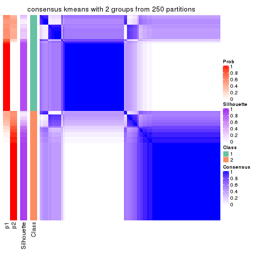</p>

</div>
<div id='tab-CV-kmeans-consensus-heatmap-2'>
<pre><code class="r">consensus_heatmap(res, k = 3)
</code></pre>

<p>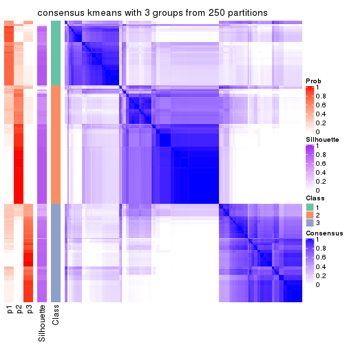</p>

</div>
<div id='tab-CV-kmeans-consensus-heatmap-3'>
<pre><code class="r">consensus_heatmap(res, k = 4)
</code></pre>

<p>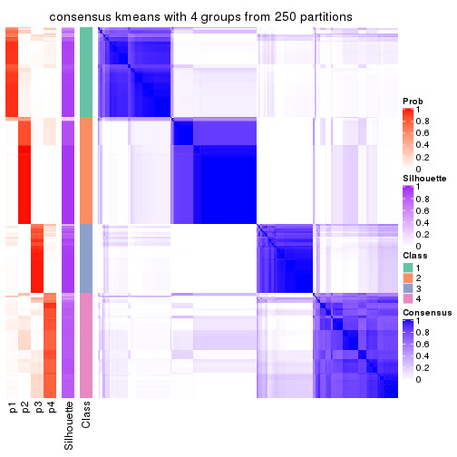</p>

</div>
<div id='tab-CV-kmeans-consensus-heatmap-4'>
<pre><code class="r">consensus_heatmap(res, k = 5)
</code></pre>

<p>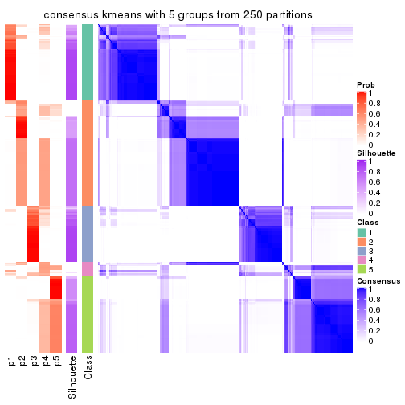</p>

</div>
<div id='tab-CV-kmeans-consensus-heatmap-5'>
<pre><code class="r">consensus_heatmap(res, k = 6)
</code></pre>

<p>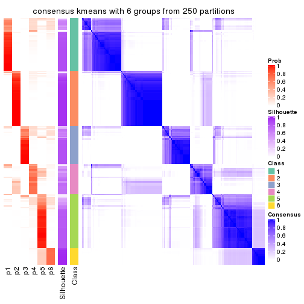</p>

</div>
</div>

Heatmaps for the membership of samples in all partitions to see how consistent they are:


<script>
$( function() {
	$( '#tabs-CV-kmeans-membership-heatmap' ).tabs();
} );
</script>
<div id='tabs-CV-kmeans-membership-heatmap'>
<ul>
<li><a href='#tab-CV-kmeans-membership-heatmap-1'>k = 2</a></li>
<li><a href='#tab-CV-kmeans-membership-heatmap-2'>k = 3</a></li>
<li><a href='#tab-CV-kmeans-membership-heatmap-3'>k = 4</a></li>
<li><a href='#tab-CV-kmeans-membership-heatmap-4'>k = 5</a></li>
<li><a href='#tab-CV-kmeans-membership-heatmap-5'>k = 6</a></li>
</ul>
<div id='tab-CV-kmeans-membership-heatmap-1'>
<pre><code class="r">membership_heatmap(res, k = 2)
</code></pre>

<p>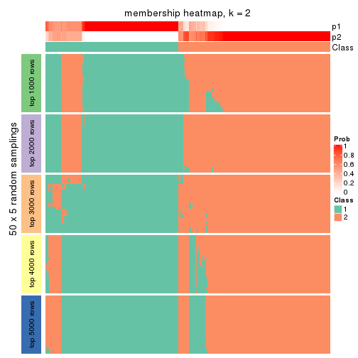</p>

</div>
<div id='tab-CV-kmeans-membership-heatmap-2'>
<pre><code class="r">membership_heatmap(res, k = 3)
</code></pre>

<p>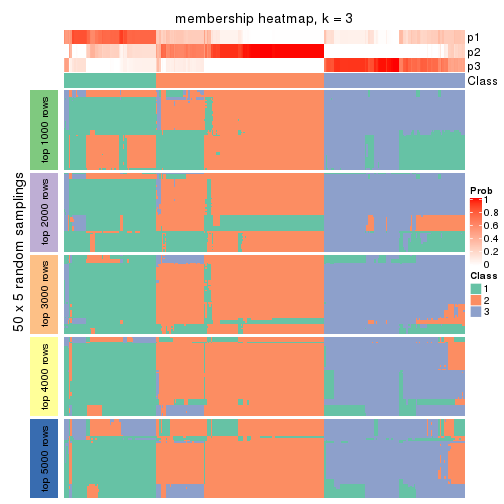</p>

</div>
<div id='tab-CV-kmeans-membership-heatmap-3'>
<pre><code class="r">membership_heatmap(res, k = 4)
</code></pre>

<p>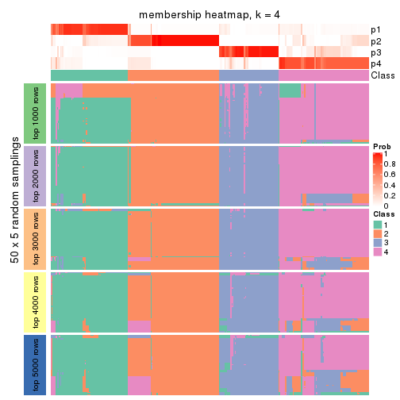</p>

</div>
<div id='tab-CV-kmeans-membership-heatmap-4'>
<pre><code class="r">membership_heatmap(res, k = 5)
</code></pre>

<p>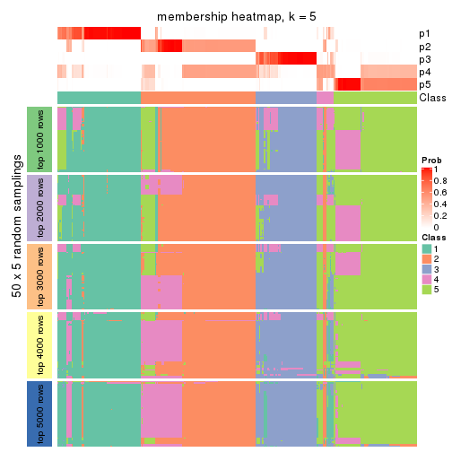</p>

</div>
<div id='tab-CV-kmeans-membership-heatmap-5'>
<pre><code class="r">membership_heatmap(res, k = 6)
</code></pre>

<p>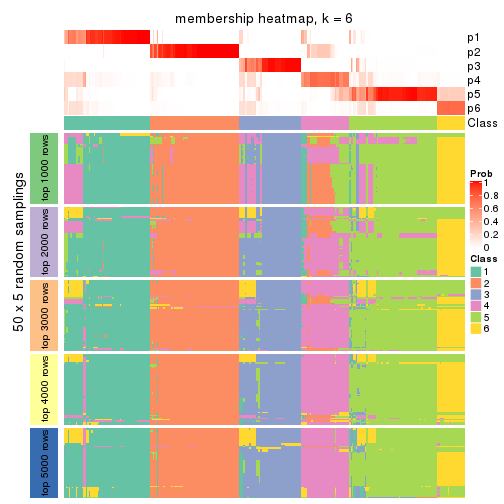</p>

</div>
</div>

As soon as we have had the classes for columns, we can look for signatures
which are significantly different between classes which can be candidate marks
for certain classes. Following are the heatmaps for signatures.


Signature heatmaps where rows are scaled:


<script>
$( function() {
	$( '#tabs-CV-kmeans-get-signatures' ).tabs();
} );
</script>
<div id='tabs-CV-kmeans-get-signatures'>
<ul>
<li><a href='#tab-CV-kmeans-get-signatures-1'>k = 2</a></li>
<li><a href='#tab-CV-kmeans-get-signatures-2'>k = 3</a></li>
<li><a href='#tab-CV-kmeans-get-signatures-3'>k = 4</a></li>
<li><a href='#tab-CV-kmeans-get-signatures-4'>k = 5</a></li>
<li><a href='#tab-CV-kmeans-get-signatures-5'>k = 6</a></li>
</ul>
<div id='tab-CV-kmeans-get-signatures-1'>
<pre><code class="r">get_signatures(res, k = 2)
</code></pre>

<p>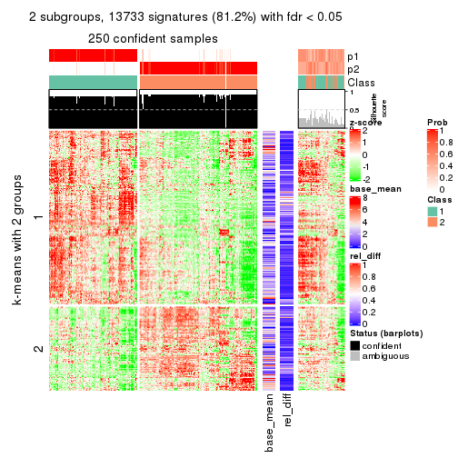</p>

</div>
<div id='tab-CV-kmeans-get-signatures-2'>
<pre><code class="r">get_signatures(res, k = 3)
</code></pre>

<p>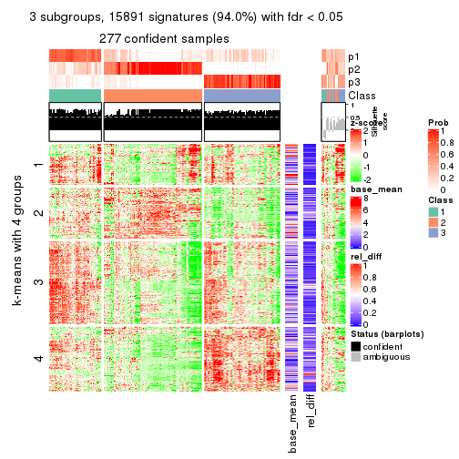</p>

</div>
<div id='tab-CV-kmeans-get-signatures-3'>
<pre><code class="r">get_signatures(res, k = 4)
</code></pre>

<p>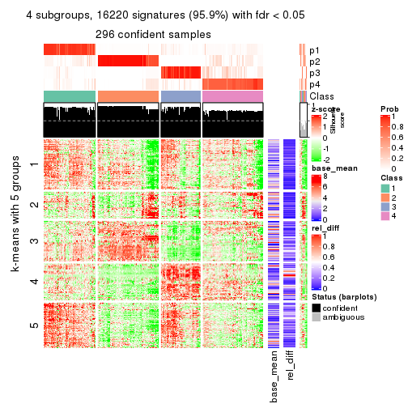</p>

</div>
<div id='tab-CV-kmeans-get-signatures-4'>
<pre><code class="r">get_signatures(res, k = 5)
</code></pre>

<p>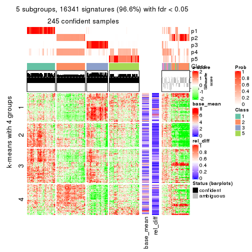</p>

</div>
<div id='tab-CV-kmeans-get-signatures-5'>
<pre><code class="r">get_signatures(res, k = 6)
</code></pre>

<p>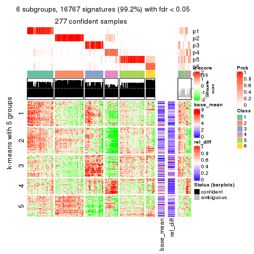</p>

</div>
</div>


Signature heatmaps where rows are not scaled:


<script>
$( function() {
	$( '#tabs-CV-kmeans-get-signatures-no-scale' ).tabs();
} );
</script>
<div id='tabs-CV-kmeans-get-signatures-no-scale'>
<ul>
<li><a href='#tab-CV-kmeans-get-signatures-no-scale-1'>k = 2</a></li>
<li><a href='#tab-CV-kmeans-get-signatures-no-scale-2'>k = 3</a></li>
<li><a href='#tab-CV-kmeans-get-signatures-no-scale-3'>k = 4</a></li>
<li><a href='#tab-CV-kmeans-get-signatures-no-scale-4'>k = 5</a></li>
<li><a href='#tab-CV-kmeans-get-signatures-no-scale-5'>k = 6</a></li>
</ul>
<div id='tab-CV-kmeans-get-signatures-no-scale-1'>
<pre><code class="r">get_signatures(res, k = 2, scale_rows = FALSE)
</code></pre>

<p>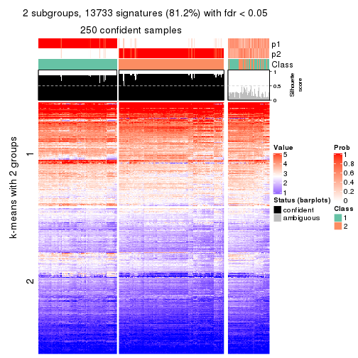</p>

</div>
<div id='tab-CV-kmeans-get-signatures-no-scale-2'>
<pre><code class="r">get_signatures(res, k = 3, scale_rows = FALSE)
</code></pre>

<p>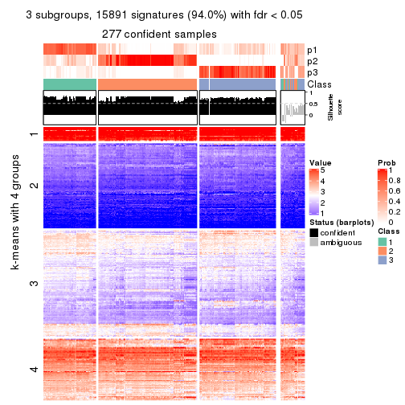</p>

</div>
<div id='tab-CV-kmeans-get-signatures-no-scale-3'>
<pre><code class="r">get_signatures(res, k = 4, scale_rows = FALSE)
</code></pre>

<p>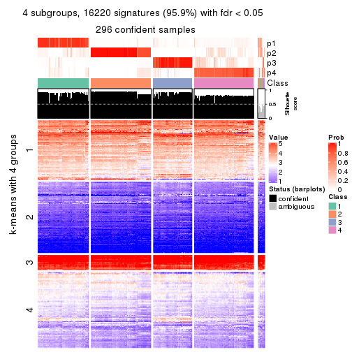</p>

</div>
<div id='tab-CV-kmeans-get-signatures-no-scale-4'>
<pre><code class="r">get_signatures(res, k = 5, scale_rows = FALSE)
</code></pre>

<p>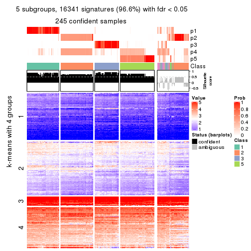</p>

</div>
<div id='tab-CV-kmeans-get-signatures-no-scale-5'>
<pre><code class="r">get_signatures(res, k = 6, scale_rows = FALSE)
</code></pre>

<p>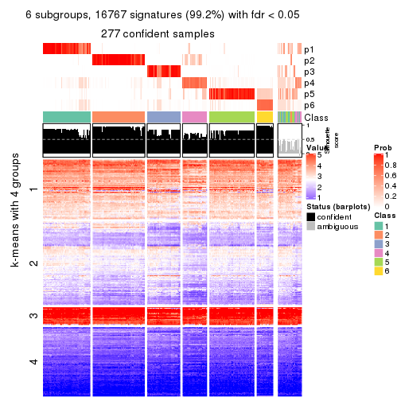</p>

</div>
</div>


Compare the overlap of signatures from different k:

```r
compare_signatures(res)
```

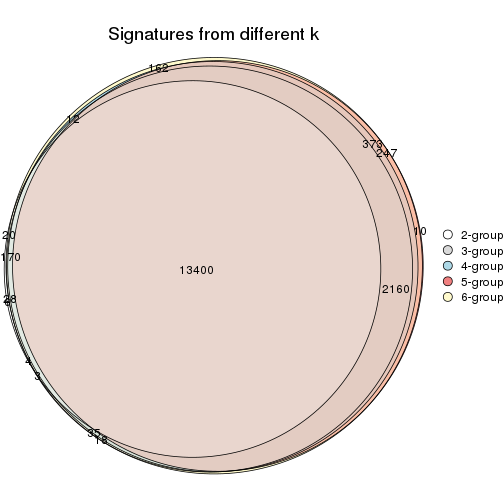

`get_signature()` returns a data frame invisibly. TO get the list of signatures, the function
call should be assigned to a variable explicitly. In following code, if `plot` argument is set
to `FALSE`, no heatmap is plotted while only the differential analysis is performed.

```r
# code only for demonstration
tb = get_signature(res, k = ..., plot = FALSE)
```

An example of the output of `tb` is:

```
#>   which_row         fdr    mean_1    mean_2 scaled_mean_1 scaled_mean_2 km
#> 1        38 0.042760348  8.373488  9.131774    -0.5533452     0.5164555  1
#> 2        40 0.018707592  7.106213  8.469186    -0.6173731     0.5762149  1
#> 3        55 0.019134737 10.221463 11.207825    -0.6159697     0.5749050  1
#> 4        59 0.006059896  5.921854  7.869574    -0.6899429     0.6439467  1
#> 5        60 0.018055526  8.928898 10.211722    -0.6204761     0.5791110  1
#> 6        98 0.009384629 15.714769 14.887706     0.6635654    -0.6193277  2
...
```

The columns in `tb` are:

1. `which_row`: row indices corresponding to the input matrix.
2. `fdr`: FDR for the differential test. 
3. `mean_x`: The mean value in group x.
4. `scaled_mean_x`: The mean value in group x after rows are scaled.
5. `km`: Row groups if k-means clustering is applied to rows.


UMAP plot which shows how samples are separated.


<script>
$( function() {
	$( '#tabs-CV-kmeans-dimension-reduction' ).tabs();
} );
</script>
<div id='tabs-CV-kmeans-dimension-reduction'>
<ul>
<li><a href='#tab-CV-kmeans-dimension-reduction-1'>k = 2</a></li>
<li><a href='#tab-CV-kmeans-dimension-reduction-2'>k = 3</a></li>
<li><a href='#tab-CV-kmeans-dimension-reduction-3'>k = 4</a></li>
<li><a href='#tab-CV-kmeans-dimension-reduction-4'>k = 5</a></li>
<li><a href='#tab-CV-kmeans-dimension-reduction-5'>k = 6</a></li>
</ul>
<div id='tab-CV-kmeans-dimension-reduction-1'>
<pre><code class="r">dimension_reduction(res, k = 2, method = &quot;UMAP&quot;)
</code></pre>

<p>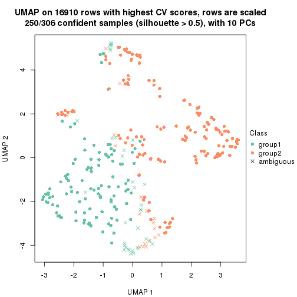</p>

</div>
<div id='tab-CV-kmeans-dimension-reduction-2'>
<pre><code class="r">dimension_reduction(res, k = 3, method = &quot;UMAP&quot;)
</code></pre>

<p>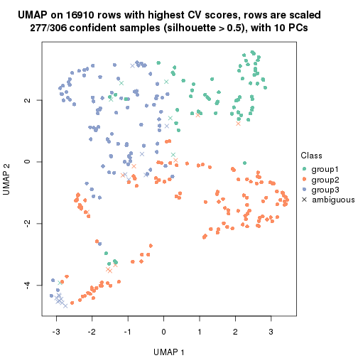</p>

</div>
<div id='tab-CV-kmeans-dimension-reduction-3'>
<pre><code class="r">dimension_reduction(res, k = 4, method = &quot;UMAP&quot;)
</code></pre>

<p>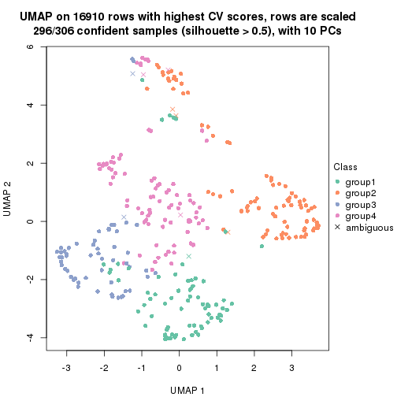</p>

</div>
<div id='tab-CV-kmeans-dimension-reduction-4'>
<pre><code class="r">dimension_reduction(res, k = 5, method = &quot;UMAP&quot;)
</code></pre>

<p>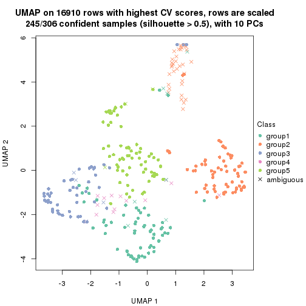</p>

</div>
<div id='tab-CV-kmeans-dimension-reduction-5'>
<pre><code class="r">dimension_reduction(res, k = 6, method = &quot;UMAP&quot;)
</code></pre>

<p>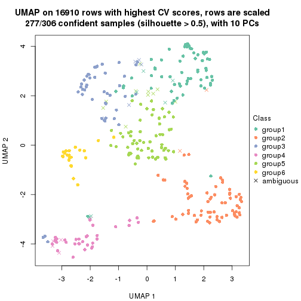</p>

</div>
</div>


Following heatmap shows how subgroups are split when increasing `k`:

```r
collect_classes(res)
```

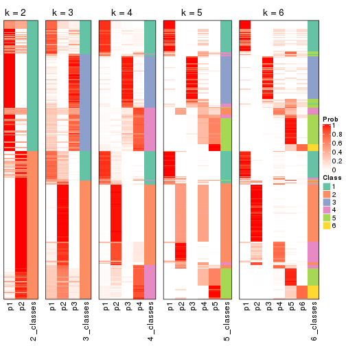


If matrix rows can be associated to genes, consider to use `GO_Enrichment(res,
...)` to perform function enrichment for the signature genes.


 

---------------------------------------------------


### CV:skmeans*


The object with results only for a single top-value method and a single partition method 
can be extracted as:

```r
res = res_list["CV", "skmeans"]
# you can also extract it by
# res = res_list["CV:skmeans"]
```

A summary of `res` and all the functions that can be applied to it:

```r
res
```

```
#> A 'ConsensusPartition' object with k = 2, 3, 4, 5, 6.
#>   On a matrix with 16910 rows and 306 columns.
#>   Top rows (1000, 2000, 3000, 4000, 5000) are extracted by 'CV' method.
#>   Subgroups are detected by 'skmeans' method.
#>   Performed in total 1250 partitions by row resampling.
#>   Best k for subgroups seems to be 3.
#> 
#> Following methods can be applied to this 'ConsensusPartition' object:
#>  [1] "cola_report"             "collect_classes"         "collect_plots"          
#>  [4] "collect_stats"           "colnames"                "compare_signatures"     
#>  [7] "consensus_heatmap"       "dimension_reduction"     "functional_enrichment"  
#> [10] "get_anno_col"            "get_anno"                "get_classes"            
#> [13] "get_consensus"           "get_matrix"              "get_membership"         
#> [16] "get_param"               "get_signatures"          "get_stats"              
#> [19] "is_best_k"               "is_stable_k"             "membership_heatmap"     
#> [22] "ncol"                    "nrow"                    "plot_ecdf"              
#> [25] "rownames"                "select_partition_number" "show"                   
#> [28] "suggest_best_k"          "test_to_known_factors"
```

`collect_plots()` function collects all the plots made from `res` for all `k` (number of partitions)
into one single page to provide an easy and fast comparison between different `k`.

```r
collect_plots(res)
```

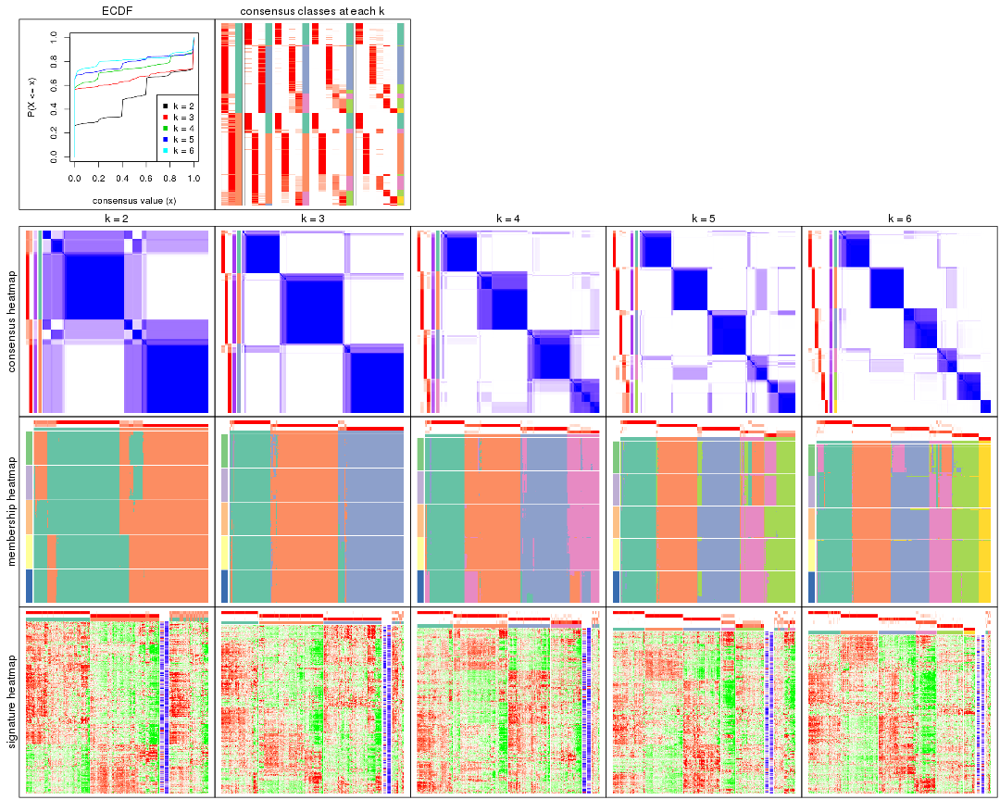

The plots are:

- The first row: a plot of the ECDF (Empirical cumulative distribution
  function) curves of the consensus matrix for each `k` and the heatmap of
  predicted classes for each `k`.
- The second row: heatmaps of the consensus matrix for each `k`.
- The third row: heatmaps of the membership matrix for each `k`.
- The fouth row: heatmaps of the signatures for each `k`.

All the plots in panels can be made by individual functions and they are
plotted later in this section.

`select_partition_number()` produces several plots showing different
statistics for choosing "optimized" `k`. There are following statistics:

- ECDF curves of the consensus matrix for each `k`;
- 1-PAC. [The PAC
  score](https://en.wikipedia.org/wiki/Consensus_clustering#Over-interpretation_potential_of_consensus_clustering)
  measures the proportion of the ambiguous subgrouping.
- Mean silhouette score.
- Concordance. The mean probability of fiting the consensus class ids in all
  partitions.
- Area increased. Denote $A_k$ as the area under the ECDF curve for current
  `k`, the area increased is defined as $A_k - A_{k-1}$.
- Rand index. The percent of pairs of samples that are both in a same cluster
  or both are not in a same cluster in the partition of k and k-1.
- Jaccard index. The ratio of pairs of samples are both in a same cluster in
  the partition of k and k-1 and the pairs of samples are both in a same
  cluster in the partition k or k-1.

The detailed explanations of these statistics can be found in [the cola
vignette](http://bioconductor.org/packages/devel/bioc/vignettes/cola/inst/doc/cola.html#toc_13).

Generally speaking, lower PAC score, higher mean silhouette score or higher
concordance corresponds to better partition. Rand index and Jaccard index
measure how similar the current partition is compared to partition with `k-1`.
If they are too similar, we won't accept `k` is better than `k-1`.

```r
select_partition_number(res)
```

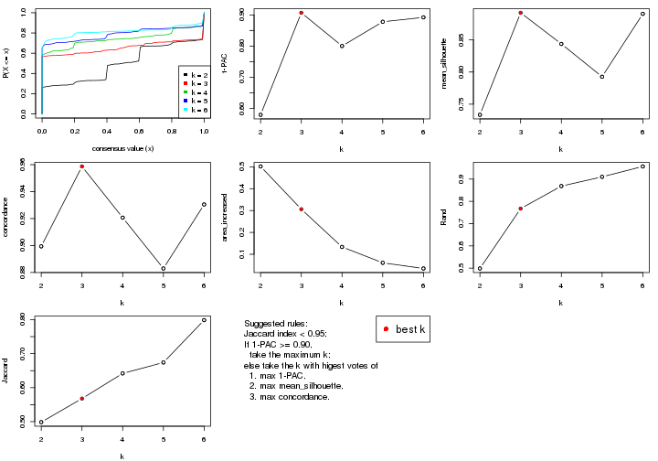

The numeric values for all these statistics can be obtained by `get_stats()`.

```r
get_stats(res)
```

```
#>   k 1-PAC mean_silhouette concordance area_increased  Rand Jaccard
#> 2 2 0.579           0.733       0.899         0.5017 0.499   0.499
#> 3 3 0.907           0.892       0.959         0.3061 0.767   0.568
#> 4 4 0.800           0.844       0.921         0.1334 0.868   0.642
#> 5 5 0.878           0.793       0.883         0.0609 0.910   0.674
#> 6 6 0.892           0.890       0.930         0.0350 0.957   0.799
```

`suggest_best_k()` suggests the best $k$ based on these statistics. The rules are as follows:

- All $k$ with Jaccard index larger than 0.95 are removed because the increase of
  the partition number does not provides enough extra information. If all $k$ are removed,
  the best $k$ is assigned by `NA`.
- For $k$ with 1-PAC larger than 0.9, the maximal $k$ is taken as the "best k". Other $k$ is called "optional k".
- If it does not fit the second rule. The $k$ with the highest vote of highest
  1-PAC, mean silhouette and concordance is taken as the "best k".

```r
suggest_best_k(res)
```

```
#> [1] 3
```


Following shows the table of the partitions (You need to click the **show/hide
code output** link to see it). The membership matrix (columns with name `p*`)
is inferred by
[`clue::cl_consensus()`](https://www.rdocumentation.org/link/cl_consensus?package=clue)
function with the `SE` method. Basically the value in the membership matrix
represents the probability to belong to a certain group. The finall class
label for an item is determined with the group with highest probability it
belongs to.

In `get_classes()` function, the entropy is calculated from the membership
matrix and the silhouette score is calculated from the consensus matrix.


<script>
$( function() {
	$( '#tabs-CV-skmeans-get-classes' ).tabs();
} );
</script>
<div id='tabs-CV-skmeans-get-classes'>
<ul>
<li><a href='#tab-CV-skmeans-get-classes-1'>k = 2</a></li>
<li><a href='#tab-CV-skmeans-get-classes-2'>k = 3</a></li>
<li><a href='#tab-CV-skmeans-get-classes-3'>k = 4</a></li>
<li><a href='#tab-CV-skmeans-get-classes-4'>k = 5</a></li>
<li><a href='#tab-CV-skmeans-get-classes-5'>k = 6</a></li>
</ul>

<div id='tab-CV-skmeans-get-classes-1'>
<p><a id='tab-CV-skmeans-get-classes-1-a' style='color:#0366d6' href='#'>show/hide code output</a></p>
<pre><code class="r">cbind(get_classes(res, k = 2), get_membership(res, k = 2))
</code></pre>

<pre><code>#&gt;            class entropy silhouette    p1    p2
#&gt; SRR1609360     2  0.0000     0.8779 0.000 1.000
#&gt; SRR1609361     2  0.0000     0.8779 0.000 1.000
#&gt; SRR1609362     2  0.0000     0.8779 0.000 1.000
#&gt; SRR1609363     2  0.0000     0.8779 0.000 1.000
#&gt; SRR1609364     2  0.0000     0.8779 0.000 1.000
#&gt; SRR1609365     2  0.0000     0.8779 0.000 1.000
#&gt; SRR1609366     2  0.0000     0.8779 0.000 1.000
#&gt; SRR1609367     1  0.9710     0.3418 0.600 0.400
#&gt; SRR1609368     2  0.0000     0.8779 0.000 1.000
#&gt; SRR1609369     2  0.0000     0.8779 0.000 1.000
#&gt; SRR1609370     1  0.9710     0.3418 0.600 0.400
#&gt; SRR1609371     2  0.0000     0.8779 0.000 1.000
#&gt; SRR1609372     1  0.9710     0.3418 0.600 0.400
#&gt; SRR1609373     2  0.0000     0.8779 0.000 1.000
#&gt; SRR1609374     2  0.0000     0.8779 0.000 1.000
#&gt; SRR1609375     2  0.0000     0.8779 0.000 1.000
#&gt; SRR1609377     2  0.2948     0.8327 0.052 0.948
#&gt; SRR1609376     2  0.0000     0.8779 0.000 1.000
#&gt; SRR1609378     2  0.0000     0.8779 0.000 1.000
#&gt; SRR1609379     2  0.9710     0.2737 0.400 0.600
#&gt; SRR1609382     2  0.0000     0.8779 0.000 1.000
#&gt; SRR1609383     1  0.9993     0.1023 0.516 0.484
#&gt; SRR1609381     1  0.9983     0.1289 0.524 0.476
#&gt; SRR1609384     2  0.0000     0.8779 0.000 1.000
#&gt; SRR1609386     2  0.0000     0.8779 0.000 1.000
#&gt; SRR1609385     2  0.0000     0.8779 0.000 1.000
#&gt; SRR1609387     2  0.9710     0.2737 0.400 0.600
#&gt; SRR1609388     2  0.0000     0.8779 0.000 1.000
#&gt; SRR1609390     1  0.9732     0.3323 0.596 0.404
#&gt; SRR1609393     2  0.0000     0.8779 0.000 1.000
#&gt; SRR1609394     2  0.0000     0.8779 0.000 1.000
#&gt; SRR1609392     2  0.0000     0.8779 0.000 1.000
#&gt; SRR1609391     2  0.0000     0.8779 0.000 1.000
#&gt; SRR1609395     1  0.9710     0.3418 0.600 0.400
#&gt; SRR1609396     1  0.9710     0.3418 0.600 0.400
#&gt; SRR1609398     2  0.0000     0.8779 0.000 1.000
#&gt; SRR1609399     1  0.9710     0.3418 0.600 0.400
#&gt; SRR1609400     1  0.9710     0.3418 0.600 0.400
#&gt; SRR1609397     2  0.0000     0.8779 0.000 1.000
#&gt; SRR1609401     2  0.0000     0.8779 0.000 1.000
#&gt; SRR1609402     2  0.0000     0.8779 0.000 1.000
#&gt; SRR1609405     2  0.0000     0.8779 0.000 1.000
#&gt; SRR1609404     2  0.0000     0.8779 0.000 1.000
#&gt; SRR1609406     2  0.0000     0.8779 0.000 1.000
#&gt; SRR1609408     2  0.0000     0.8779 0.000 1.000
#&gt; SRR1609403     2  0.9710     0.2737 0.400 0.600
#&gt; SRR1609410     2  0.9710     0.2737 0.400 0.600
#&gt; SRR1609411     2  0.0000     0.8779 0.000 1.000
#&gt; SRR1609407     2  0.0000     0.8779 0.000 1.000
#&gt; SRR1609413     2  0.9710     0.2737 0.400 0.600
#&gt; SRR1609412     1  0.0000     0.8694 1.000 0.000
#&gt; SRR1609414     1  0.0000     0.8694 1.000 0.000
#&gt; SRR1609415     1  0.0000     0.8694 1.000 0.000
#&gt; SRR1609416     1  0.0000     0.8694 1.000 0.000
#&gt; SRR1609417     1  0.0000     0.8694 1.000 0.000
#&gt; SRR1609418     2  0.9710     0.2737 0.400 0.600
#&gt; SRR1609419     2  0.0000     0.8779 0.000 1.000
#&gt; SRR1609420     2  0.0000     0.8779 0.000 1.000
#&gt; SRR1609421     2  0.9686     0.3343 0.396 0.604
#&gt; SRR1609422     2  0.9815     0.2754 0.420 0.580
#&gt; SRR1609423     2  0.0000     0.8779 0.000 1.000
#&gt; SRR1609424     2  0.0000     0.8779 0.000 1.000
#&gt; SRR1609425     2  0.0000     0.8779 0.000 1.000
#&gt; SRR1609426     2  0.0000     0.8779 0.000 1.000
#&gt; SRR1609427     1  0.0000     0.8694 1.000 0.000
#&gt; SRR1609428     2  0.0000     0.8779 0.000 1.000
#&gt; SRR1609429     1  0.0000     0.8694 1.000 0.000
#&gt; SRR1609430     1  0.0000     0.8694 1.000 0.000
#&gt; SRR1609431     2  0.9710     0.3254 0.400 0.600
#&gt; SRR1609432     2  0.0000     0.8779 0.000 1.000
#&gt; SRR1609433     1  0.0000     0.8694 1.000 0.000
#&gt; SRR1609434     2  0.0000     0.8779 0.000 1.000
#&gt; SRR1609435     1  0.0000     0.8694 1.000 0.000
#&gt; SRR1609436     1  0.0000     0.8694 1.000 0.000
#&gt; SRR1609437     2  0.0000     0.8779 0.000 1.000
#&gt; SRR1609438     2  0.0000     0.8779 0.000 1.000
#&gt; SRR1609439     1  0.0000     0.8694 1.000 0.000
#&gt; SRR1609440     1  0.9710     0.3418 0.600 0.400
#&gt; SRR1609441     2  0.0000     0.8779 0.000 1.000
#&gt; SRR1609442     2  0.0000     0.8779 0.000 1.000
#&gt; SRR1609443     1  0.0000     0.8694 1.000 0.000
#&gt; SRR1609444     1  0.8327     0.5818 0.736 0.264
#&gt; SRR1609445     1  0.0000     0.8694 1.000 0.000
#&gt; SRR1609446     2  0.0000     0.8779 0.000 1.000
#&gt; SRR1609447     1  0.0000     0.8694 1.000 0.000
#&gt; SRR1609448     2  0.0000     0.8779 0.000 1.000
#&gt; SRR1609449     1  0.9710     0.3418 0.600 0.400
#&gt; SRR1609450     2  0.0000     0.8779 0.000 1.000
#&gt; SRR1609451     1  0.0000     0.8694 1.000 0.000
#&gt; SRR1609452     1  0.9710     0.2776 0.600 0.400
#&gt; SRR1609453     1  0.0000     0.8694 1.000 0.000
#&gt; SRR1609454     2  0.0000     0.8779 0.000 1.000
#&gt; SRR1609455     2  0.0000     0.8779 0.000 1.000
#&gt; SRR1609456     2  0.4939     0.7829 0.108 0.892
#&gt; SRR1609457     1  0.0000     0.8694 1.000 0.000
#&gt; SRR1609458     1  0.0000     0.8694 1.000 0.000
#&gt; SRR1609459     1  0.3584     0.8104 0.932 0.068
#&gt; SRR1609460     2  0.8016     0.6144 0.244 0.756
#&gt; SRR1609461     1  0.0000     0.8694 1.000 0.000
#&gt; SRR1609462     1  0.0000     0.8694 1.000 0.000
#&gt; SRR1609464     1  0.0000     0.8694 1.000 0.000
#&gt; SRR1609463     1  0.0000     0.8694 1.000 0.000
#&gt; SRR1609465     2  0.6531     0.7163 0.168 0.832
#&gt; SRR1609466     2  0.0000     0.8779 0.000 1.000
#&gt; SRR1609467     1  0.0000     0.8694 1.000 0.000
#&gt; SRR1609469     2  0.0000     0.8779 0.000 1.000
#&gt; SRR1609470     2  0.9710     0.3254 0.400 0.600
#&gt; SRR1609472     1  0.9710     0.2776 0.600 0.400
#&gt; SRR1609471     1  0.9881     0.2493 0.564 0.436
#&gt; SRR1609474     2  0.0000     0.8779 0.000 1.000
#&gt; SRR1609473     2  0.0000     0.8779 0.000 1.000
#&gt; SRR1609475     2  0.0000     0.8779 0.000 1.000
#&gt; SRR1609478     1  0.9710     0.2776 0.600 0.400
#&gt; SRR1609476     1  0.0000     0.8694 1.000 0.000
#&gt; SRR1609477     1  0.2603     0.8329 0.956 0.044
#&gt; SRR1609479     2  0.0000     0.8779 0.000 1.000
#&gt; SRR1609481     2  0.7453     0.6605 0.212 0.788
#&gt; SRR1609480     1  0.0000     0.8694 1.000 0.000
#&gt; SRR1609482     1  0.0000     0.8694 1.000 0.000
#&gt; SRR1609484     2  0.0000     0.8779 0.000 1.000
#&gt; SRR1609483     1  0.0000     0.8694 1.000 0.000
#&gt; SRR1609486     1  0.0000     0.8694 1.000 0.000
#&gt; SRR1609485     1  0.0000     0.8694 1.000 0.000
#&gt; SRR1609487     2  0.9686     0.2833 0.396 0.604
#&gt; SRR1609488     1  0.0000     0.8694 1.000 0.000
#&gt; SRR1609489     2  0.0000     0.8779 0.000 1.000
#&gt; SRR1609490     2  0.0000     0.8779 0.000 1.000
#&gt; SRR1609491     1  0.0000     0.8694 1.000 0.000
#&gt; SRR1609492     2  0.0000     0.8779 0.000 1.000
#&gt; SRR1609493     2  0.9710     0.3254 0.400 0.600
#&gt; SRR1609494     2  0.0000     0.8779 0.000 1.000
#&gt; SRR1609495     1  0.9686     0.3499 0.604 0.396
#&gt; SRR1609496     1  0.0000     0.8694 1.000 0.000
#&gt; SRR1609497     1  0.0000     0.8694 1.000 0.000
#&gt; SRR1609498     1  0.0000     0.8694 1.000 0.000
#&gt; SRR1609499     2  0.0000     0.8779 0.000 1.000
#&gt; SRR1609500     1  0.0000     0.8694 1.000 0.000
#&gt; SRR1609501     2  0.9686     0.3343 0.396 0.604
#&gt; SRR1609502     2  0.0000     0.8779 0.000 1.000
#&gt; SRR1609503     2  0.0000     0.8779 0.000 1.000
#&gt; SRR1609504     1  0.0000     0.8694 1.000 0.000
#&gt; SRR1609505     1  0.0000     0.8694 1.000 0.000
#&gt; SRR1609506     2  0.0000     0.8779 0.000 1.000
#&gt; SRR1609507     1  0.0000     0.8694 1.000 0.000
#&gt; SRR1609508     2  0.0000     0.8779 0.000 1.000
#&gt; SRR1609509     2  0.0000     0.8779 0.000 1.000
#&gt; SRR1609510     2  0.7528     0.6550 0.216 0.784
#&gt; SRR1609512     1  0.0000     0.8694 1.000 0.000
#&gt; SRR1609511     1  0.0000     0.8694 1.000 0.000
#&gt; SRR1609513     1  0.0000     0.8694 1.000 0.000
#&gt; SRR1609514     1  0.9608     0.3147 0.616 0.384
#&gt; SRR1609515     2  0.0000     0.8779 0.000 1.000
#&gt; SRR1609516     1  0.0000     0.8694 1.000 0.000
#&gt; SRR1609517     2  0.7602     0.6501 0.220 0.780
#&gt; SRR1609518     1  0.9710     0.3418 0.600 0.400
#&gt; SRR1609519     1  0.0000     0.8694 1.000 0.000
#&gt; SRR1609520     2  0.0000     0.8779 0.000 1.000
#&gt; SRR1609521     1  0.0000     0.8694 1.000 0.000
#&gt; SRR1609522     1  0.0000     0.8694 1.000 0.000
#&gt; SRR1609523     2  0.9833     0.2649 0.424 0.576
#&gt; SRR1609524     2  0.0000     0.8779 0.000 1.000
#&gt; SRR1609526     1  0.0000     0.8694 1.000 0.000
#&gt; SRR1609525     2  0.9710     0.3254 0.400 0.600
#&gt; SRR1609527     1  0.9710     0.3418 0.600 0.400
#&gt; SRR1609529     1  0.0000     0.8694 1.000 0.000
#&gt; SRR1609528     1  0.9710     0.2776 0.600 0.400
#&gt; SRR1609530     1  0.0000     0.8694 1.000 0.000
#&gt; SRR1609531     2  0.0000     0.8779 0.000 1.000
#&gt; SRR1609532     1  0.0000     0.8694 1.000 0.000
#&gt; SRR1609533     2  0.9686     0.3343 0.396 0.604
#&gt; SRR1609534     1  0.0000     0.8694 1.000 0.000
#&gt; SRR1609535     2  0.7299     0.6711 0.204 0.796
#&gt; SRR1609537     2  0.0000     0.8779 0.000 1.000
#&gt; SRR1609536     1  0.0000     0.8694 1.000 0.000
#&gt; SRR1609538     2  0.0000     0.8779 0.000 1.000
#&gt; SRR1609539     1  0.0000     0.8694 1.000 0.000
#&gt; SRR1609540     1  0.0000     0.8694 1.000 0.000
#&gt; SRR1609541     1  0.9710     0.2776 0.600 0.400
#&gt; SRR1609542     2  0.0000     0.8779 0.000 1.000
#&gt; SRR1609543     1  0.0000     0.8694 1.000 0.000
#&gt; SRR1609544     1  0.7219     0.6704 0.800 0.200
#&gt; SRR1609545     1  0.0000     0.8694 1.000 0.000
#&gt; SRR1609546     1  0.0000     0.8694 1.000 0.000
#&gt; SRR1609547     1  0.0000     0.8694 1.000 0.000
#&gt; SRR1609548     1  0.9710     0.2776 0.600 0.400
#&gt; SRR1609549     2  0.0000     0.8779 0.000 1.000
#&gt; SRR1609550     2  0.0000     0.8779 0.000 1.000
#&gt; SRR1609551     1  0.0000     0.8694 1.000 0.000
#&gt; SRR1609552     1  0.0000     0.8694 1.000 0.000
#&gt; SRR1609553     1  0.0000     0.8694 1.000 0.000
#&gt; SRR1609554     1  0.0000     0.8694 1.000 0.000
#&gt; SRR1609555     1  0.0000     0.8694 1.000 0.000
#&gt; SRR1609556     1  0.0000     0.8694 1.000 0.000
#&gt; SRR1609557     1  0.7056     0.6646 0.808 0.192
#&gt; SRR1609558     1  0.9710     0.2776 0.600 0.400
#&gt; SRR1609559     2  0.9909     0.2092 0.444 0.556
#&gt; SRR1609560     2  0.9580     0.3208 0.380 0.620
#&gt; SRR1609561     1  0.0000     0.8694 1.000 0.000
#&gt; SRR1609562     2  0.0000     0.8779 0.000 1.000
#&gt; SRR1609563     2  0.0000     0.8779 0.000 1.000
#&gt; SRR1609564     1  0.0000     0.8694 1.000 0.000
#&gt; SRR1609565     2  0.0000     0.8779 0.000 1.000
#&gt; SRR1609566     2  0.0000     0.8779 0.000 1.000
#&gt; SRR1609567     2  0.0000     0.8779 0.000 1.000
#&gt; SRR1609568     2  0.9710     0.2737 0.400 0.600
#&gt; SRR1609569     1  0.0000     0.8694 1.000 0.000
#&gt; SRR1609570     1  0.0000     0.8694 1.000 0.000
#&gt; SRR1609571     1  0.0000     0.8694 1.000 0.000
#&gt; SRR1609572     1  0.0000     0.8694 1.000 0.000
#&gt; SRR1609573     1  0.0000     0.8694 1.000 0.000
#&gt; SRR1609574     1  0.0000     0.8694 1.000 0.000
#&gt; SRR1609575     2  0.0000     0.8779 0.000 1.000
#&gt; SRR1609576     2  0.0000     0.8779 0.000 1.000
#&gt; SRR1609578     1  0.0000     0.8694 1.000 0.000
#&gt; SRR1609577     1  0.9732     0.3323 0.596 0.404
#&gt; SRR1609579     1  0.0000     0.8694 1.000 0.000
#&gt; SRR1609580     1  0.0000     0.8694 1.000 0.000
#&gt; SRR1609582     1  0.0000     0.8694 1.000 0.000
#&gt; SRR1609581     2  0.9710     0.3254 0.400 0.600
#&gt; SRR1609583     1  0.1843     0.8470 0.972 0.028
#&gt; SRR1609584     1  0.0000     0.8694 1.000 0.000
#&gt; SRR1609585     1  0.0000     0.8694 1.000 0.000
#&gt; SRR1609586     2  0.0000     0.8779 0.000 1.000
#&gt; SRR1609587     1  0.0000     0.8694 1.000 0.000
#&gt; SRR1609588     2  0.9710     0.3254 0.400 0.600
#&gt; SRR1609589     2  0.0000     0.8779 0.000 1.000
#&gt; SRR1609590     1  0.0000     0.8694 1.000 0.000
#&gt; SRR1609592     1  0.9710     0.2776 0.600 0.400
#&gt; SRR1609591     1  0.0000     0.8694 1.000 0.000
#&gt; SRR1609593     1  0.9710     0.2776 0.600 0.400
#&gt; SRR1609594     2  0.0000     0.8779 0.000 1.000
#&gt; SRR1609595     2  0.9710     0.3254 0.400 0.600
#&gt; SRR1609596     2  0.0000     0.8779 0.000 1.000
#&gt; SRR1609597     2  0.0000     0.8779 0.000 1.000
#&gt; SRR1609598     1  0.9710     0.2776 0.600 0.400
#&gt; SRR1609599     1  0.9710     0.2776 0.600 0.400
#&gt; SRR1609600     1  0.0000     0.8694 1.000 0.000
#&gt; SRR1609601     1  0.0000     0.8694 1.000 0.000
#&gt; SRR1609602     1  0.9710     0.2776 0.600 0.400
#&gt; SRR1609603     2  0.9710     0.2737 0.400 0.600
#&gt; SRR1609604     2  0.0000     0.8779 0.000 1.000
#&gt; SRR1609605     2  0.0000     0.8779 0.000 1.000
#&gt; SRR1609606     2  0.9710     0.3254 0.400 0.600
#&gt; SRR1609607     1  0.0000     0.8694 1.000 0.000
#&gt; SRR1609608     1  0.0000     0.8694 1.000 0.000
#&gt; SRR1609609     1  1.0000    -0.0255 0.504 0.496
#&gt; SRR1609610     1  0.0000     0.8694 1.000 0.000
#&gt; SRR1609611     2  0.0000     0.8779 0.000 1.000
#&gt; SRR1609613     2  0.0000     0.8779 0.000 1.000
#&gt; SRR1609612     1  0.0000     0.8694 1.000 0.000
#&gt; SRR1609614     1  0.0000     0.8694 1.000 0.000
#&gt; SRR1609615     2  0.9710     0.2737 0.400 0.600
#&gt; SRR1609616     1  0.0000     0.8694 1.000 0.000
#&gt; SRR1609617     2  0.7950     0.6205 0.240 0.760
#&gt; SRR1609618     1  0.0000     0.8694 1.000 0.000
#&gt; SRR1609619     2  0.0672     0.8716 0.008 0.992
#&gt; SRR1609620     2  0.0000     0.8779 0.000 1.000
#&gt; SRR1609621     2  0.0000     0.8779 0.000 1.000
#&gt; SRR1609622     1  0.0000     0.8694 1.000 0.000
#&gt; SRR1609623     1  0.0000     0.8694 1.000 0.000
#&gt; SRR1609624     2  0.9710     0.2737 0.400 0.600
#&gt; SRR1609625     1  0.7219     0.6701 0.800 0.200
#&gt; SRR1609626     1  0.0000     0.8694 1.000 0.000
#&gt; SRR1609627     2  0.0000     0.8779 0.000 1.000
#&gt; SRR1609628     2  0.0000     0.8779 0.000 1.000
#&gt; SRR1609629     1  0.0000     0.8694 1.000 0.000
#&gt; SRR1609630     2  0.0000     0.8779 0.000 1.000
#&gt; SRR1609631     1  0.9710     0.3418 0.600 0.400
#&gt; SRR1609632     2  0.9710     0.2737 0.400 0.600
#&gt; SRR1609633     1  0.9710     0.3418 0.600 0.400
#&gt; SRR1609634     2  0.0000     0.8779 0.000 1.000
#&gt; SRR1609635     1  0.0000     0.8694 1.000 0.000
#&gt; SRR1609636     2  0.0000     0.8779 0.000 1.000
#&gt; SRR1609637     1  0.1633     0.8509 0.976 0.024
#&gt; SRR1609638     2  0.0000     0.8779 0.000 1.000
#&gt; SRR1609639     2  0.0000     0.8779 0.000 1.000
#&gt; SRR1609640     1  0.0000     0.8694 1.000 0.000
#&gt; SRR1609641     2  0.9710     0.2737 0.400 0.600
#&gt; SRR1609642     1  0.9710     0.3418 0.600 0.400
#&gt; SRR1609643     1  0.0000     0.8694 1.000 0.000
#&gt; SRR1609644     2  0.9710     0.2737 0.400 0.600
#&gt; SRR1609645     1  0.0000     0.8694 1.000 0.000
#&gt; SRR1609646     1  0.0000     0.8694 1.000 0.000
#&gt; SRR1609647     2  0.6531     0.7163 0.168 0.832
#&gt; SRR1609649     1  0.0000     0.8694 1.000 0.000
#&gt; SRR1609648     2  0.0000     0.8779 0.000 1.000
#&gt; SRR1609651     2  0.0000     0.8779 0.000 1.000
#&gt; SRR1609650     1  0.9710     0.2776 0.600 0.400
#&gt; SRR1609652     1  0.0000     0.8694 1.000 0.000
#&gt; SRR1609653     2  0.0000     0.8779 0.000 1.000
#&gt; SRR1609654     2  0.0000     0.8779 0.000 1.000
#&gt; SRR1609655     1  0.0000     0.8694 1.000 0.000
#&gt; SRR1609657     1  0.9732     0.3323 0.596 0.404
#&gt; SRR1609656     2  0.9710     0.2737 0.400 0.600
#&gt; SRR1609658     2  0.0000     0.8779 0.000 1.000
#&gt; SRR1609659     2  0.0000     0.8779 0.000 1.000
#&gt; SRR1609660     1  0.0000     0.8694 1.000 0.000
#&gt; SRR1609661     1  0.0000     0.8694 1.000 0.000
#&gt; SRR1609662     2  0.0000     0.8779 0.000 1.000
#&gt; SRR1609663     1  0.0000     0.8694 1.000 0.000
#&gt; SRR1609664     2  0.9710     0.3254 0.400 0.600
#&gt; SRR1609665     2  0.0000     0.8779 0.000 1.000
#&gt; SRR1609666     2  0.0000     0.8779 0.000 1.000
#&gt; SRR1609667     1  0.0000     0.8694 1.000 0.000
#&gt; SRR1609668     2  0.9710     0.3254 0.400 0.600
#&gt; SRR1609669     2  0.9710     0.2737 0.400 0.600
</code></pre>

<script>
$('#tab-CV-skmeans-get-classes-1-a').parent().next().next().hide();
$('#tab-CV-skmeans-get-classes-1-a').click(function(){
  $('#tab-CV-skmeans-get-classes-1-a').parent().next().next().toggle();
  return(false);
});
</script>
</div>

<div id='tab-CV-skmeans-get-classes-2'>
<p><a id='tab-CV-skmeans-get-classes-2-a' style='color:#0366d6' href='#'>show/hide code output</a></p>
<pre><code class="r">cbind(get_classes(res, k = 3), get_membership(res, k = 3))
</code></pre>

<pre><code>#&gt;            class entropy silhouette    p1    p2    p3
#&gt; SRR1609360     1  0.0000     0.9486 1.000 0.000 0.000
#&gt; SRR1609361     1  0.0000     0.9486 1.000 0.000 0.000
#&gt; SRR1609362     1  0.6295     0.0898 0.528 0.472 0.000
#&gt; SRR1609363     2  0.0000     0.9691 0.000 1.000 0.000
#&gt; SRR1609364     2  0.0000     0.9691 0.000 1.000 0.000
#&gt; SRR1609365     1  0.6062     0.3542 0.616 0.384 0.000
#&gt; SRR1609366     2  0.0000     0.9691 0.000 1.000 0.000
#&gt; SRR1609367     1  0.0000     0.9486 1.000 0.000 0.000
#&gt; SRR1609368     2  0.0000     0.9691 0.000 1.000 0.000
#&gt; SRR1609369     1  0.0000     0.9486 1.000 0.000 0.000
#&gt; SRR1609370     1  0.0000     0.9486 1.000 0.000 0.000
#&gt; SRR1609371     2  0.0000     0.9691 0.000 1.000 0.000
#&gt; SRR1609372     1  0.0000     0.9486 1.000 0.000 0.000
#&gt; SRR1609373     2  0.0000     0.9691 0.000 1.000 0.000
#&gt; SRR1609374     2  0.0000     0.9691 0.000 1.000 0.000
#&gt; SRR1609375     2  0.4555     0.7399 0.200 0.800 0.000
#&gt; SRR1609377     1  0.0000     0.9486 1.000 0.000 0.000
#&gt; SRR1609376     2  0.0000     0.9691 0.000 1.000 0.000
#&gt; SRR1609378     2  0.0000     0.9691 0.000 1.000 0.000
#&gt; SRR1609379     1  0.0000     0.9486 1.000 0.000 0.000
#&gt; SRR1609382     2  0.0000     0.9691 0.000 1.000 0.000
#&gt; SRR1609383     1  0.0000     0.9486 1.000 0.000 0.000
#&gt; SRR1609381     1  0.0000     0.9486 1.000 0.000 0.000
#&gt; SRR1609384     1  0.0000     0.9486 1.000 0.000 0.000
#&gt; SRR1609386     1  0.0000     0.9486 1.000 0.000 0.000
#&gt; SRR1609385     1  0.0000     0.9486 1.000 0.000 0.000
#&gt; SRR1609387     1  0.0000     0.9486 1.000 0.000 0.000
#&gt; SRR1609388     2  0.0000     0.9691 0.000 1.000 0.000
#&gt; SRR1609390     1  0.0000     0.9486 1.000 0.000 0.000
#&gt; SRR1609393     2  0.0000     0.9691 0.000 1.000 0.000
#&gt; SRR1609394     2  0.0000     0.9691 0.000 1.000 0.000
#&gt; SRR1609392     2  0.0000     0.9691 0.000 1.000 0.000
#&gt; SRR1609391     2  0.0000     0.9691 0.000 1.000 0.000
#&gt; SRR1609395     1  0.0000     0.9486 1.000 0.000 0.000
#&gt; SRR1609396     1  0.0000     0.9486 1.000 0.000 0.000
#&gt; SRR1609398     1  0.0000     0.9486 1.000 0.000 0.000
#&gt; SRR1609399     1  0.0000     0.9486 1.000 0.000 0.000
#&gt; SRR1609400     1  0.0000     0.9486 1.000 0.000 0.000
#&gt; SRR1609397     2  0.0000     0.9691 0.000 1.000 0.000
#&gt; SRR1609401     2  0.0000     0.9691 0.000 1.000 0.000
#&gt; SRR1609402     2  0.0000     0.9691 0.000 1.000 0.000
#&gt; SRR1609405     1  0.0000     0.9486 1.000 0.000 0.000
#&gt; SRR1609404     2  0.0000     0.9691 0.000 1.000 0.000
#&gt; SRR1609406     2  0.0000     0.9691 0.000 1.000 0.000
#&gt; SRR1609408     2  0.0000     0.9691 0.000 1.000 0.000
#&gt; SRR1609403     1  0.0000     0.9486 1.000 0.000 0.000
#&gt; SRR1609410     1  0.0000     0.9486 1.000 0.000 0.000
#&gt; SRR1609411     2  0.0000     0.9691 0.000 1.000 0.000
#&gt; SRR1609407     2  0.0000     0.9691 0.000 1.000 0.000
#&gt; SRR1609413     1  0.0000     0.9486 1.000 0.000 0.000
#&gt; SRR1609412     3  0.0000     0.9423 0.000 0.000 1.000
#&gt; SRR1609414     3  0.0000     0.9423 0.000 0.000 1.000
#&gt; SRR1609415     1  0.0747     0.9334 0.984 0.000 0.016
#&gt; SRR1609416     1  0.0000     0.9486 1.000 0.000 0.000
#&gt; SRR1609417     3  0.0000     0.9423 0.000 0.000 1.000
#&gt; SRR1609418     1  0.0000     0.9486 1.000 0.000 0.000
#&gt; SRR1609419     2  0.0000     0.9691 0.000 1.000 0.000
#&gt; SRR1609420     1  0.0000     0.9486 1.000 0.000 0.000
#&gt; SRR1609421     2  0.0000     0.9691 0.000 1.000 0.000
#&gt; SRR1609422     3  0.6280     0.1406 0.000 0.460 0.540
#&gt; SRR1609423     2  0.0000     0.9691 0.000 1.000 0.000
#&gt; SRR1609424     2  0.0000     0.9691 0.000 1.000 0.000
#&gt; SRR1609425     1  0.6295     0.1458 0.528 0.472 0.000
#&gt; SRR1609426     2  0.0000     0.9691 0.000 1.000 0.000
#&gt; SRR1609427     3  0.6305     0.1269 0.484 0.000 0.516
#&gt; SRR1609428     2  0.0000     0.9691 0.000 1.000 0.000
#&gt; SRR1609429     1  0.4555     0.7013 0.800 0.000 0.200
#&gt; SRR1609430     3  0.0000     0.9423 0.000 0.000 1.000
#&gt; SRR1609431     2  0.4555     0.7471 0.000 0.800 0.200
#&gt; SRR1609432     2  0.0000     0.9691 0.000 1.000 0.000
#&gt; SRR1609433     3  0.6308     0.0992 0.492 0.000 0.508
#&gt; SRR1609434     2  0.0000     0.9691 0.000 1.000 0.000
#&gt; SRR1609435     1  0.0000     0.9486 1.000 0.000 0.000
#&gt; SRR1609436     3  0.0000     0.9423 0.000 0.000 1.000
#&gt; SRR1609437     2  0.0000     0.9691 0.000 1.000 0.000
#&gt; SRR1609438     2  0.0000     0.9691 0.000 1.000 0.000
#&gt; SRR1609439     3  0.0000     0.9423 0.000 0.000 1.000
#&gt; SRR1609440     1  0.0000     0.9486 1.000 0.000 0.000
#&gt; SRR1609441     2  0.0000     0.9691 0.000 1.000 0.000
#&gt; SRR1609442     2  0.0000     0.9691 0.000 1.000 0.000
#&gt; SRR1609443     3  0.0000     0.9423 0.000 0.000 1.000
#&gt; SRR1609444     1  0.0000     0.9486 1.000 0.000 0.000
#&gt; SRR1609445     3  0.0000     0.9423 0.000 0.000 1.000
#&gt; SRR1609446     2  0.0000     0.9691 0.000 1.000 0.000
#&gt; SRR1609447     1  0.5926     0.3841 0.644 0.000 0.356
#&gt; SRR1609448     2  0.0000     0.9691 0.000 1.000 0.000
#&gt; SRR1609449     1  0.0000     0.9486 1.000 0.000 0.000
#&gt; SRR1609450     2  0.0000     0.9691 0.000 1.000 0.000
#&gt; SRR1609451     3  0.0000     0.9423 0.000 0.000 1.000
#&gt; SRR1609452     3  0.0000     0.9423 0.000 0.000 1.000
#&gt; SRR1609453     3  0.5650     0.5570 0.312 0.000 0.688
#&gt; SRR1609454     2  0.0000     0.9691 0.000 1.000 0.000
#&gt; SRR1609455     2  0.6154     0.2972 0.408 0.592 0.000
#&gt; SRR1609456     2  0.0000     0.9691 0.000 1.000 0.000
#&gt; SRR1609457     3  0.0000     0.9423 0.000 0.000 1.000
#&gt; SRR1609458     3  0.5678     0.5499 0.316 0.000 0.684
#&gt; SRR1609459     3  0.0000     0.9423 0.000 0.000 1.000
#&gt; SRR1609460     2  0.0000     0.9691 0.000 1.000 0.000
#&gt; SRR1609461     3  0.0000     0.9423 0.000 0.000 1.000
#&gt; SRR1609462     3  0.0000     0.9423 0.000 0.000 1.000
#&gt; SRR1609464     3  0.0000     0.9423 0.000 0.000 1.000
#&gt; SRR1609463     3  0.0000     0.9423 0.000 0.000 1.000
#&gt; SRR1609465     2  0.0000     0.9691 0.000 1.000 0.000
#&gt; SRR1609466     1  0.5560     0.5440 0.700 0.300 0.000
#&gt; SRR1609467     3  0.0000     0.9423 0.000 0.000 1.000
#&gt; SRR1609469     2  0.0000     0.9691 0.000 1.000 0.000
#&gt; SRR1609470     3  0.6299     0.0501 0.000 0.476 0.524
#&gt; SRR1609472     3  0.0000     0.9423 0.000 0.000 1.000
#&gt; SRR1609471     1  0.0000     0.9486 1.000 0.000 0.000
#&gt; SRR1609474     2  0.0000     0.9691 0.000 1.000 0.000
#&gt; SRR1609473     2  0.0000     0.9691 0.000 1.000 0.000
#&gt; SRR1609475     2  0.0000     0.9691 0.000 1.000 0.000
#&gt; SRR1609478     3  0.1289     0.9115 0.000 0.032 0.968
#&gt; SRR1609476     1  0.0000     0.9486 1.000 0.000 0.000
#&gt; SRR1609477     3  0.0000     0.9423 0.000 0.000 1.000
#&gt; SRR1609479     2  0.0000     0.9691 0.000 1.000 0.000
#&gt; SRR1609481     2  0.0000     0.9691 0.000 1.000 0.000
#&gt; SRR1609480     3  0.0000     0.9423 0.000 0.000 1.000
#&gt; SRR1609482     3  0.0000     0.9423 0.000 0.000 1.000
#&gt; SRR1609484     2  0.0000     0.9691 0.000 1.000 0.000
#&gt; SRR1609483     3  0.0000     0.9423 0.000 0.000 1.000
#&gt; SRR1609486     3  0.0000     0.9423 0.000 0.000 1.000
#&gt; SRR1609485     3  0.0000     0.9423 0.000 0.000 1.000
#&gt; SRR1609487     1  0.0000     0.9486 1.000 0.000 0.000
#&gt; SRR1609488     3  0.0000     0.9423 0.000 0.000 1.000
#&gt; SRR1609489     2  0.0000     0.9691 0.000 1.000 0.000
#&gt; SRR1609490     2  0.0000     0.9691 0.000 1.000 0.000
#&gt; SRR1609491     3  0.0000     0.9423 0.000 0.000 1.000
#&gt; SRR1609492     2  0.0000     0.9691 0.000 1.000 0.000
#&gt; SRR1609493     2  0.4555     0.7471 0.000 0.800 0.200
#&gt; SRR1609494     2  0.0000     0.9691 0.000 1.000 0.000
#&gt; SRR1609495     1  0.0000     0.9486 1.000 0.000 0.000
#&gt; SRR1609496     3  0.0000     0.9423 0.000 0.000 1.000
#&gt; SRR1609497     3  0.0000     0.9423 0.000 0.000 1.000
#&gt; SRR1609498     3  0.5988     0.4476 0.368 0.000 0.632
#&gt; SRR1609499     2  0.0000     0.9691 0.000 1.000 0.000
#&gt; SRR1609500     3  0.5706     0.5426 0.320 0.000 0.680
#&gt; SRR1609501     2  0.1031     0.9463 0.000 0.976 0.024
#&gt; SRR1609502     2  0.0000     0.9691 0.000 1.000 0.000
#&gt; SRR1609503     2  0.0000     0.9691 0.000 1.000 0.000
#&gt; SRR1609504     1  0.0000     0.9486 1.000 0.000 0.000
#&gt; SRR1609505     3  0.0000     0.9423 0.000 0.000 1.000
#&gt; SRR1609506     2  0.0000     0.9691 0.000 1.000 0.000
#&gt; SRR1609507     3  0.0000     0.9423 0.000 0.000 1.000
#&gt; SRR1609508     2  0.0000     0.9691 0.000 1.000 0.000
#&gt; SRR1609509     2  0.0000     0.9691 0.000 1.000 0.000
#&gt; SRR1609510     2  0.0000     0.9691 0.000 1.000 0.000
#&gt; SRR1609512     3  0.0000     0.9423 0.000 0.000 1.000
#&gt; SRR1609511     3  0.0000     0.9423 0.000 0.000 1.000
#&gt; SRR1609513     3  0.0000     0.9423 0.000 0.000 1.000
#&gt; SRR1609514     3  0.0000     0.9423 0.000 0.000 1.000
#&gt; SRR1609515     2  0.0000     0.9691 0.000 1.000 0.000
#&gt; SRR1609516     3  0.0000     0.9423 0.000 0.000 1.000
#&gt; SRR1609517     2  0.0000     0.9691 0.000 1.000 0.000
#&gt; SRR1609518     1  0.0000     0.9486 1.000 0.000 0.000
#&gt; SRR1609519     3  0.0000     0.9423 0.000 0.000 1.000
#&gt; SRR1609520     2  0.0000     0.9691 0.000 1.000 0.000
#&gt; SRR1609521     3  0.5988     0.4476 0.368 0.000 0.632
#&gt; SRR1609522     3  0.0000     0.9423 0.000 0.000 1.000
#&gt; SRR1609523     3  0.6168     0.2884 0.000 0.412 0.588
#&gt; SRR1609524     2  0.0000     0.9691 0.000 1.000 0.000
#&gt; SRR1609526     3  0.0000     0.9423 0.000 0.000 1.000
#&gt; SRR1609525     2  0.4974     0.6918 0.000 0.764 0.236
#&gt; SRR1609527     1  0.0000     0.9486 1.000 0.000 0.000
#&gt; SRR1609529     3  0.0000     0.9423 0.000 0.000 1.000
#&gt; SRR1609528     3  0.0000     0.9423 0.000 0.000 1.000
#&gt; SRR1609530     3  0.0000     0.9423 0.000 0.000 1.000
#&gt; SRR1609531     2  0.0000     0.9691 0.000 1.000 0.000
#&gt; SRR1609532     3  0.0000     0.9423 0.000 0.000 1.000
#&gt; SRR1609533     2  0.0424     0.9618 0.000 0.992 0.008
#&gt; SRR1609534     3  0.0000     0.9423 0.000 0.000 1.000
#&gt; SRR1609535     2  0.0000     0.9691 0.000 1.000 0.000
#&gt; SRR1609537     2  0.0000     0.9691 0.000 1.000 0.000
#&gt; SRR1609536     3  0.0000     0.9423 0.000 0.000 1.000
#&gt; SRR1609538     2  0.0000     0.9691 0.000 1.000 0.000
#&gt; SRR1609539     3  0.0000     0.9423 0.000 0.000 1.000
#&gt; SRR1609540     1  0.0000     0.9486 1.000 0.000 0.000
#&gt; SRR1609541     3  0.0000     0.9423 0.000 0.000 1.000
#&gt; SRR1609542     2  0.0000     0.9691 0.000 1.000 0.000
#&gt; SRR1609543     3  0.5988     0.4476 0.368 0.000 0.632
#&gt; SRR1609544     1  0.0000     0.9486 1.000 0.000 0.000
#&gt; SRR1609545     3  0.6309     0.0862 0.496 0.000 0.504
#&gt; SRR1609546     3  0.0000     0.9423 0.000 0.000 1.000
#&gt; SRR1609547     3  0.0000     0.9423 0.000 0.000 1.000
#&gt; SRR1609548     3  0.0000     0.9423 0.000 0.000 1.000
#&gt; SRR1609549     2  0.0000     0.9691 0.000 1.000 0.000
#&gt; SRR1609550     2  0.0000     0.9691 0.000 1.000 0.000
#&gt; SRR1609551     3  0.0000     0.9423 0.000 0.000 1.000
#&gt; SRR1609552     3  0.0000     0.9423 0.000 0.000 1.000
#&gt; SRR1609553     3  0.0000     0.9423 0.000 0.000 1.000
#&gt; SRR1609554     3  0.0000     0.9423 0.000 0.000 1.000
#&gt; SRR1609555     3  0.0000     0.9423 0.000 0.000 1.000
#&gt; SRR1609556     3  0.0000     0.9423 0.000 0.000 1.000
#&gt; SRR1609557     3  0.0000     0.9423 0.000 0.000 1.000
#&gt; SRR1609558     3  0.0000     0.9423 0.000 0.000 1.000
#&gt; SRR1609559     3  0.3412     0.8108 0.000 0.124 0.876
#&gt; SRR1609560     1  0.0000     0.9486 1.000 0.000 0.000
#&gt; SRR1609561     3  0.0000     0.9423 0.000 0.000 1.000
#&gt; SRR1609562     1  0.0000     0.9486 1.000 0.000 0.000
#&gt; SRR1609563     2  0.0000     0.9691 0.000 1.000 0.000
#&gt; SRR1609564     1  0.0000     0.9486 1.000 0.000 0.000
#&gt; SRR1609565     2  0.0000     0.9691 0.000 1.000 0.000
#&gt; SRR1609566     2  0.0000     0.9691 0.000 1.000 0.000
#&gt; SRR1609567     2  0.0000     0.9691 0.000 1.000 0.000
#&gt; SRR1609568     1  0.0000     0.9486 1.000 0.000 0.000
#&gt; SRR1609569     3  0.5988     0.4476 0.368 0.000 0.632
#&gt; SRR1609570     3  0.0000     0.9423 0.000 0.000 1.000
#&gt; SRR1609571     3  0.0000     0.9423 0.000 0.000 1.000
#&gt; SRR1609572     3  0.0000     0.9423 0.000 0.000 1.000
#&gt; SRR1609573     3  0.0000     0.9423 0.000 0.000 1.000
#&gt; SRR1609574     3  0.0000     0.9423 0.000 0.000 1.000
#&gt; SRR1609575     2  0.0000     0.9691 0.000 1.000 0.000
#&gt; SRR1609576     2  0.0000     0.9691 0.000 1.000 0.000
#&gt; SRR1609578     3  0.0000     0.9423 0.000 0.000 1.000
#&gt; SRR1609577     1  0.0000     0.9486 1.000 0.000 0.000
#&gt; SRR1609579     3  0.0000     0.9423 0.000 0.000 1.000
#&gt; SRR1609580     3  0.0000     0.9423 0.000 0.000 1.000
#&gt; SRR1609582     3  0.5988     0.4476 0.368 0.000 0.632
#&gt; SRR1609581     2  0.6008     0.4210 0.000 0.628 0.372
#&gt; SRR1609583     3  0.0000     0.9423 0.000 0.000 1.000
#&gt; SRR1609584     3  0.0000     0.9423 0.000 0.000 1.000
#&gt; SRR1609585     3  0.0000     0.9423 0.000 0.000 1.000
#&gt; SRR1609586     2  0.0000     0.9691 0.000 1.000 0.000
#&gt; SRR1609587     3  0.0000     0.9423 0.000 0.000 1.000
#&gt; SRR1609588     2  0.5678     0.5476 0.000 0.684 0.316
#&gt; SRR1609589     2  0.0000     0.9691 0.000 1.000 0.000
#&gt; SRR1609590     3  0.0000     0.9423 0.000 0.000 1.000
#&gt; SRR1609592     3  0.0000     0.9423 0.000 0.000 1.000
#&gt; SRR1609591     3  0.0000     0.9423 0.000 0.000 1.000
#&gt; SRR1609593     3  0.0000     0.9423 0.000 0.000 1.000
#&gt; SRR1609594     2  0.0000     0.9691 0.000 1.000 0.000
#&gt; SRR1609595     2  0.3752     0.8177 0.000 0.856 0.144
#&gt; SRR1609596     2  0.0000     0.9691 0.000 1.000 0.000
#&gt; SRR1609597     2  0.0000     0.9691 0.000 1.000 0.000
#&gt; SRR1609598     3  0.0000     0.9423 0.000 0.000 1.000
#&gt; SRR1609599     3  0.0000     0.9423 0.000 0.000 1.000
#&gt; SRR1609600     3  0.0000     0.9423 0.000 0.000 1.000
#&gt; SRR1609601     3  0.0000     0.9423 0.000 0.000 1.000
#&gt; SRR1609602     3  0.0000     0.9423 0.000 0.000 1.000
#&gt; SRR1609603     1  0.0000     0.9486 1.000 0.000 0.000
#&gt; SRR1609604     2  0.0000     0.9691 0.000 1.000 0.000
#&gt; SRR1609605     2  0.0000     0.9691 0.000 1.000 0.000
#&gt; SRR1609606     2  0.5497     0.5973 0.000 0.708 0.292
#&gt; SRR1609607     3  0.0000     0.9423 0.000 0.000 1.000
#&gt; SRR1609608     3  0.0000     0.9423 0.000 0.000 1.000
#&gt; SRR1609609     2  0.6302     0.0967 0.000 0.520 0.480
#&gt; SRR1609610     3  0.0000     0.9423 0.000 0.000 1.000
#&gt; SRR1609611     2  0.0000     0.9691 0.000 1.000 0.000
#&gt; SRR1609613     2  0.0000     0.9691 0.000 1.000 0.000
#&gt; SRR1609612     3  0.0000     0.9423 0.000 0.000 1.000
#&gt; SRR1609614     3  0.0000     0.9423 0.000 0.000 1.000
#&gt; SRR1609615     1  0.0000     0.9486 1.000 0.000 0.000
#&gt; SRR1609616     1  0.4062     0.7566 0.836 0.000 0.164
#&gt; SRR1609617     2  0.0000     0.9691 0.000 1.000 0.000
#&gt; SRR1609618     3  0.0000     0.9423 0.000 0.000 1.000
#&gt; SRR1609619     1  0.0000     0.9486 1.000 0.000 0.000
#&gt; SRR1609620     2  0.0000     0.9691 0.000 1.000 0.000
#&gt; SRR1609621     2  0.0000     0.9691 0.000 1.000 0.000
#&gt; SRR1609622     3  0.0000     0.9423 0.000 0.000 1.000
#&gt; SRR1609623     1  0.6291     0.0310 0.532 0.000 0.468
#&gt; SRR1609624     1  0.0000     0.9486 1.000 0.000 0.000
#&gt; SRR1609625     1  0.0000     0.9486 1.000 0.000 0.000
#&gt; SRR1609626     3  0.0000     0.9423 0.000 0.000 1.000
#&gt; SRR1609627     1  0.0000     0.9486 1.000 0.000 0.000
#&gt; SRR1609628     2  0.0000     0.9691 0.000 1.000 0.000
#&gt; SRR1609629     3  0.0000     0.9423 0.000 0.000 1.000
#&gt; SRR1609630     2  0.0000     0.9691 0.000 1.000 0.000
#&gt; SRR1609631     1  0.0000     0.9486 1.000 0.000 0.000
#&gt; SRR1609632     1  0.0000     0.9486 1.000 0.000 0.000
#&gt; SRR1609633     1  0.0000     0.9486 1.000 0.000 0.000
#&gt; SRR1609634     2  0.0000     0.9691 0.000 1.000 0.000
#&gt; SRR1609635     3  0.0000     0.9423 0.000 0.000 1.000
#&gt; SRR1609636     2  0.0000     0.9691 0.000 1.000 0.000
#&gt; SRR1609637     1  0.0000     0.9486 1.000 0.000 0.000
#&gt; SRR1609638     2  0.0000     0.9691 0.000 1.000 0.000
#&gt; SRR1609639     2  0.0000     0.9691 0.000 1.000 0.000
#&gt; SRR1609640     3  0.0000     0.9423 0.000 0.000 1.000
#&gt; SRR1609641     1  0.0000     0.9486 1.000 0.000 0.000
#&gt; SRR1609642     1  0.0000     0.9486 1.000 0.000 0.000
#&gt; SRR1609643     3  0.0000     0.9423 0.000 0.000 1.000
#&gt; SRR1609644     1  0.0000     0.9486 1.000 0.000 0.000
#&gt; SRR1609645     3  0.0000     0.9423 0.000 0.000 1.000
#&gt; SRR1609646     3  0.0000     0.9423 0.000 0.000 1.000
#&gt; SRR1609647     2  0.0000     0.9691 0.000 1.000 0.000
#&gt; SRR1609649     3  0.5988     0.4476 0.368 0.000 0.632
#&gt; SRR1609648     2  0.0000     0.9691 0.000 1.000 0.000
#&gt; SRR1609651     2  0.0000     0.9691 0.000 1.000 0.000
#&gt; SRR1609650     3  0.0000     0.9423 0.000 0.000 1.000
#&gt; SRR1609652     3  0.0000     0.9423 0.000 0.000 1.000
#&gt; SRR1609653     2  0.0000     0.9691 0.000 1.000 0.000
#&gt; SRR1609654     2  0.1860     0.9208 0.052 0.948 0.000
#&gt; SRR1609655     3  0.0000     0.9423 0.000 0.000 1.000
#&gt; SRR1609657     1  0.0000     0.9486 1.000 0.000 0.000
#&gt; SRR1609656     1  0.0000     0.9486 1.000 0.000 0.000
#&gt; SRR1609658     2  0.0000     0.9691 0.000 1.000 0.000
#&gt; SRR1609659     2  0.0000     0.9691 0.000 1.000 0.000
#&gt; SRR1609660     3  0.0000     0.9423 0.000 0.000 1.000
#&gt; SRR1609661     3  0.0000     0.9423 0.000 0.000 1.000
#&gt; SRR1609662     2  0.0000     0.9691 0.000 1.000 0.000
#&gt; SRR1609663     3  0.0000     0.9423 0.000 0.000 1.000
#&gt; SRR1609664     2  0.2878     0.8715 0.000 0.904 0.096
#&gt; SRR1609665     2  0.0000     0.9691 0.000 1.000 0.000
#&gt; SRR1609666     1  0.6286     0.1176 0.536 0.464 0.000
#&gt; SRR1609667     1  0.0000     0.9486 1.000 0.000 0.000
#&gt; SRR1609668     2  0.4452     0.7587 0.000 0.808 0.192
#&gt; SRR1609669     1  0.0000     0.9486 1.000 0.000 0.000
</code></pre>

<script>
$('#tab-CV-skmeans-get-classes-2-a').parent().next().next().hide();
$('#tab-CV-skmeans-get-classes-2-a').click(function(){
  $('#tab-CV-skmeans-get-classes-2-a').parent().next().next().toggle();
  return(false);
});
</script>
</div>

<div id='tab-CV-skmeans-get-classes-3'>
<p><a id='tab-CV-skmeans-get-classes-3-a' style='color:#0366d6' href='#'>show/hide code output</a></p>
<pre><code class="r">cbind(get_classes(res, k = 4), get_membership(res, k = 4))
</code></pre>

<pre><code>#&gt;            class entropy silhouette    p1    p2    p3    p4
#&gt; SRR1609360     1  0.3569     0.7537 0.804 0.000 0.000 0.196
#&gt; SRR1609361     1  0.3569     0.7537 0.804 0.000 0.000 0.196
#&gt; SRR1609362     1  0.7609    -0.0567 0.404 0.396 0.000 0.200
#&gt; SRR1609363     2  0.0000     0.9268 0.000 1.000 0.000 0.000
#&gt; SRR1609364     2  0.0000     0.9268 0.000 1.000 0.000 0.000
#&gt; SRR1609365     1  0.6790     0.5128 0.608 0.192 0.000 0.200
#&gt; SRR1609366     2  0.0000     0.9268 0.000 1.000 0.000 0.000
#&gt; SRR1609367     1  0.0000     0.9338 1.000 0.000 0.000 0.000
#&gt; SRR1609368     2  0.0000     0.9268 0.000 1.000 0.000 0.000
#&gt; SRR1609369     1  0.0000     0.9338 1.000 0.000 0.000 0.000
#&gt; SRR1609370     1  0.0000     0.9338 1.000 0.000 0.000 0.000
#&gt; SRR1609371     2  0.3610     0.8096 0.000 0.800 0.000 0.200
#&gt; SRR1609372     1  0.0000     0.9338 1.000 0.000 0.000 0.000
#&gt; SRR1609373     2  0.0000     0.9268 0.000 1.000 0.000 0.000
#&gt; SRR1609374     2  0.0000     0.9268 0.000 1.000 0.000 0.000
#&gt; SRR1609375     2  0.2530     0.8295 0.112 0.888 0.000 0.000
#&gt; SRR1609377     1  0.0000     0.9338 1.000 0.000 0.000 0.000
#&gt; SRR1609376     2  0.0000     0.9268 0.000 1.000 0.000 0.000
#&gt; SRR1609378     2  0.3610     0.8096 0.000 0.800 0.000 0.200
#&gt; SRR1609379     1  0.0000     0.9338 1.000 0.000 0.000 0.000
#&gt; SRR1609382     2  0.3610     0.8096 0.000 0.800 0.000 0.200
#&gt; SRR1609383     1  0.0000     0.9338 1.000 0.000 0.000 0.000
#&gt; SRR1609381     1  0.0000     0.9338 1.000 0.000 0.000 0.000
#&gt; SRR1609384     1  0.0000     0.9338 1.000 0.000 0.000 0.000
#&gt; SRR1609386     1  0.0000     0.9338 1.000 0.000 0.000 0.000
#&gt; SRR1609385     1  0.0000     0.9338 1.000 0.000 0.000 0.000
#&gt; SRR1609387     1  0.0000     0.9338 1.000 0.000 0.000 0.000
#&gt; SRR1609388     2  0.0000     0.9268 0.000 1.000 0.000 0.000
#&gt; SRR1609390     1  0.0000     0.9338 1.000 0.000 0.000 0.000
#&gt; SRR1609393     2  0.3610     0.8096 0.000 0.800 0.000 0.200
#&gt; SRR1609394     2  0.0000     0.9268 0.000 1.000 0.000 0.000
#&gt; SRR1609392     2  0.0000     0.9268 0.000 1.000 0.000 0.000
#&gt; SRR1609391     2  0.3569     0.8120 0.000 0.804 0.000 0.196
#&gt; SRR1609395     1  0.0000     0.9338 1.000 0.000 0.000 0.000
#&gt; SRR1609396     1  0.0000     0.9338 1.000 0.000 0.000 0.000
#&gt; SRR1609398     1  0.0000     0.9338 1.000 0.000 0.000 0.000
#&gt; SRR1609399     1  0.0000     0.9338 1.000 0.000 0.000 0.000
#&gt; SRR1609400     1  0.0000     0.9338 1.000 0.000 0.000 0.000
#&gt; SRR1609397     2  0.0000     0.9268 0.000 1.000 0.000 0.000
#&gt; SRR1609401     2  0.0000     0.9268 0.000 1.000 0.000 0.000
#&gt; SRR1609402     2  0.0000     0.9268 0.000 1.000 0.000 0.000
#&gt; SRR1609405     1  0.0000     0.9338 1.000 0.000 0.000 0.000
#&gt; SRR1609404     2  0.3569     0.8120 0.000 0.804 0.000 0.196
#&gt; SRR1609406     2  0.0000     0.9268 0.000 1.000 0.000 0.000
#&gt; SRR1609408     2  0.0000     0.9268 0.000 1.000 0.000 0.000
#&gt; SRR1609403     1  0.0000     0.9338 1.000 0.000 0.000 0.000
#&gt; SRR1609410     1  0.0000     0.9338 1.000 0.000 0.000 0.000
#&gt; SRR1609411     2  0.0000     0.9268 0.000 1.000 0.000 0.000
#&gt; SRR1609407     2  0.0000     0.9268 0.000 1.000 0.000 0.000
#&gt; SRR1609413     1  0.0000     0.9338 1.000 0.000 0.000 0.000
#&gt; SRR1609412     3  0.4697     0.3655 0.000 0.000 0.644 0.356
#&gt; SRR1609414     3  0.0000     0.9290 0.000 0.000 1.000 0.000
#&gt; SRR1609415     1  0.4998     0.0466 0.512 0.000 0.488 0.000
#&gt; SRR1609416     1  0.0000     0.9338 1.000 0.000 0.000 0.000
#&gt; SRR1609417     3  0.0000     0.9290 0.000 0.000 1.000 0.000
#&gt; SRR1609418     1  0.0000     0.9338 1.000 0.000 0.000 0.000
#&gt; SRR1609419     2  0.0000     0.9268 0.000 1.000 0.000 0.000
#&gt; SRR1609420     1  0.0000     0.9338 1.000 0.000 0.000 0.000
#&gt; SRR1609421     4  0.3569     0.7962 0.000 0.196 0.000 0.804
#&gt; SRR1609422     4  0.0000     0.8162 0.000 0.000 0.000 1.000
#&gt; SRR1609423     2  0.4477     0.6890 0.000 0.688 0.000 0.312
#&gt; SRR1609424     2  0.3610     0.8096 0.000 0.800 0.000 0.200
#&gt; SRR1609425     2  0.4477     0.5541 0.312 0.688 0.000 0.000
#&gt; SRR1609426     2  0.0000     0.9268 0.000 1.000 0.000 0.000
#&gt; SRR1609427     3  0.1716     0.8787 0.064 0.000 0.936 0.000
#&gt; SRR1609428     2  0.0000     0.9268 0.000 1.000 0.000 0.000
#&gt; SRR1609429     1  0.3801     0.6860 0.780 0.000 0.220 0.000
#&gt; SRR1609430     3  0.0000     0.9290 0.000 0.000 1.000 0.000
#&gt; SRR1609431     4  0.3266     0.8117 0.000 0.168 0.000 0.832
#&gt; SRR1609432     2  0.0000     0.9268 0.000 1.000 0.000 0.000
#&gt; SRR1609433     3  0.1716     0.8787 0.064 0.000 0.936 0.000
#&gt; SRR1609434     2  0.3610     0.8096 0.000 0.800 0.000 0.200
#&gt; SRR1609435     1  0.0000     0.9338 1.000 0.000 0.000 0.000
#&gt; SRR1609436     3  0.0000     0.9290 0.000 0.000 1.000 0.000
#&gt; SRR1609437     2  0.3610     0.8096 0.000 0.800 0.000 0.200
#&gt; SRR1609438     2  0.3610     0.8096 0.000 0.800 0.000 0.200
#&gt; SRR1609439     3  0.0000     0.9290 0.000 0.000 1.000 0.000
#&gt; SRR1609440     1  0.0000     0.9338 1.000 0.000 0.000 0.000
#&gt; SRR1609441     2  0.3688     0.8048 0.000 0.792 0.000 0.208
#&gt; SRR1609442     2  0.0000     0.9268 0.000 1.000 0.000 0.000
#&gt; SRR1609443     3  0.0000     0.9290 0.000 0.000 1.000 0.000
#&gt; SRR1609444     1  0.0000     0.9338 1.000 0.000 0.000 0.000
#&gt; SRR1609445     4  0.3610     0.7806 0.000 0.000 0.200 0.800
#&gt; SRR1609446     2  0.0469     0.9179 0.000 0.988 0.000 0.012
#&gt; SRR1609447     3  0.3569     0.7235 0.196 0.000 0.804 0.000
#&gt; SRR1609448     2  0.0000     0.9268 0.000 1.000 0.000 0.000
#&gt; SRR1609449     1  0.0000     0.9338 1.000 0.000 0.000 0.000
#&gt; SRR1609450     2  0.0000     0.9268 0.000 1.000 0.000 0.000
#&gt; SRR1609451     3  0.0000     0.9290 0.000 0.000 1.000 0.000
#&gt; SRR1609452     4  0.1792     0.8205 0.000 0.000 0.068 0.932
#&gt; SRR1609453     3  0.1557     0.8862 0.056 0.000 0.944 0.000
#&gt; SRR1609454     2  0.0000     0.9268 0.000 1.000 0.000 0.000
#&gt; SRR1609455     2  0.4919     0.7672 0.152 0.772 0.000 0.076
#&gt; SRR1609456     2  0.3610     0.6919 0.000 0.800 0.000 0.200
#&gt; SRR1609457     3  0.4713     0.3497 0.000 0.000 0.640 0.360
#&gt; SRR1609458     3  0.0188     0.9262 0.004 0.000 0.996 0.000
#&gt; SRR1609459     4  0.3610     0.7806 0.000 0.000 0.200 0.800
#&gt; SRR1609460     4  0.3311     0.8100 0.000 0.172 0.000 0.828
#&gt; SRR1609461     3  0.0000     0.9290 0.000 0.000 1.000 0.000
#&gt; SRR1609462     3  0.0000     0.9290 0.000 0.000 1.000 0.000
#&gt; SRR1609464     3  0.0000     0.9290 0.000 0.000 1.000 0.000
#&gt; SRR1609463     4  0.4888     0.4270 0.000 0.000 0.412 0.588
#&gt; SRR1609465     4  0.3311     0.8100 0.000 0.172 0.000 0.828
#&gt; SRR1609466     1  0.4579     0.7184 0.768 0.032 0.000 0.200
#&gt; SRR1609467     3  0.0000     0.9290 0.000 0.000 1.000 0.000
#&gt; SRR1609469     2  0.4877     0.5177 0.000 0.592 0.000 0.408
#&gt; SRR1609470     4  0.3610     0.7931 0.000 0.200 0.000 0.800
#&gt; SRR1609472     4  0.0000     0.8162 0.000 0.000 0.000 1.000
#&gt; SRR1609471     1  0.0000     0.9338 1.000 0.000 0.000 0.000
#&gt; SRR1609474     2  0.0000     0.9268 0.000 1.000 0.000 0.000
#&gt; SRR1609473     2  0.3801     0.7939 0.000 0.780 0.000 0.220
#&gt; SRR1609475     2  0.3610     0.8096 0.000 0.800 0.000 0.200
#&gt; SRR1609478     4  0.1022     0.8090 0.000 0.000 0.032 0.968
#&gt; SRR1609476     1  0.0000     0.9338 1.000 0.000 0.000 0.000
#&gt; SRR1609477     4  0.4222     0.7050 0.000 0.000 0.272 0.728
#&gt; SRR1609479     2  0.0000     0.9268 0.000 1.000 0.000 0.000
#&gt; SRR1609481     4  0.0000     0.8162 0.000 0.000 0.000 1.000
#&gt; SRR1609480     4  0.0000     0.8162 0.000 0.000 0.000 1.000
#&gt; SRR1609482     3  0.0000     0.9290 0.000 0.000 1.000 0.000
#&gt; SRR1609484     2  0.4564     0.6656 0.000 0.672 0.000 0.328
#&gt; SRR1609483     3  0.0000     0.9290 0.000 0.000 1.000 0.000
#&gt; SRR1609486     3  0.0000     0.9290 0.000 0.000 1.000 0.000
#&gt; SRR1609485     3  0.0000     0.9290 0.000 0.000 1.000 0.000
#&gt; SRR1609487     1  0.0000     0.9338 1.000 0.000 0.000 0.000
#&gt; SRR1609488     3  0.0000     0.9290 0.000 0.000 1.000 0.000
#&gt; SRR1609489     2  0.0000     0.9268 0.000 1.000 0.000 0.000
#&gt; SRR1609490     2  0.0000     0.9268 0.000 1.000 0.000 0.000
#&gt; SRR1609491     3  0.0188     0.9260 0.000 0.000 0.996 0.004
#&gt; SRR1609492     2  0.0000     0.9268 0.000 1.000 0.000 0.000
#&gt; SRR1609493     4  0.3311     0.8100 0.000 0.172 0.000 0.828
#&gt; SRR1609494     2  0.0000     0.9268 0.000 1.000 0.000 0.000
#&gt; SRR1609495     1  0.0000     0.9338 1.000 0.000 0.000 0.000
#&gt; SRR1609496     3  0.0000     0.9290 0.000 0.000 1.000 0.000
#&gt; SRR1609497     3  0.0000     0.9290 0.000 0.000 1.000 0.000
#&gt; SRR1609498     3  0.1557     0.8862 0.056 0.000 0.944 0.000
#&gt; SRR1609499     2  0.0000     0.9268 0.000 1.000 0.000 0.000
#&gt; SRR1609500     3  0.1557     0.8862 0.056 0.000 0.944 0.000
#&gt; SRR1609501     4  0.3610     0.7931 0.000 0.200 0.000 0.800
#&gt; SRR1609502     2  0.0592     0.9188 0.000 0.984 0.000 0.016
#&gt; SRR1609503     4  0.1302     0.7994 0.000 0.044 0.000 0.956
#&gt; SRR1609504     1  0.0188     0.9304 0.996 0.000 0.004 0.000
#&gt; SRR1609505     3  0.0000     0.9290 0.000 0.000 1.000 0.000
#&gt; SRR1609506     2  0.0000     0.9268 0.000 1.000 0.000 0.000
#&gt; SRR1609507     3  0.0000     0.9290 0.000 0.000 1.000 0.000
#&gt; SRR1609508     2  0.0000     0.9268 0.000 1.000 0.000 0.000
#&gt; SRR1609509     2  0.0000     0.9268 0.000 1.000 0.000 0.000
#&gt; SRR1609510     4  0.0000     0.8162 0.000 0.000 0.000 1.000
#&gt; SRR1609512     3  0.0000     0.9290 0.000 0.000 1.000 0.000
#&gt; SRR1609511     3  0.3486     0.7118 0.000 0.000 0.812 0.188
#&gt; SRR1609513     3  0.0000     0.9290 0.000 0.000 1.000 0.000
#&gt; SRR1609514     4  0.3569     0.6640 0.000 0.000 0.196 0.804
#&gt; SRR1609515     2  0.0000     0.9268 0.000 1.000 0.000 0.000
#&gt; SRR1609516     4  0.3610     0.7806 0.000 0.000 0.200 0.800
#&gt; SRR1609517     4  0.3569     0.7962 0.000 0.196 0.000 0.804
#&gt; SRR1609518     1  0.0000     0.9338 1.000 0.000 0.000 0.000
#&gt; SRR1609519     3  0.0000     0.9290 0.000 0.000 1.000 0.000
#&gt; SRR1609520     2  0.4477     0.6890 0.000 0.688 0.000 0.312
#&gt; SRR1609521     3  0.1557     0.8862 0.056 0.000 0.944 0.000
#&gt; SRR1609522     3  0.0000     0.9290 0.000 0.000 1.000 0.000
#&gt; SRR1609523     4  0.3266     0.8117 0.000 0.168 0.000 0.832
#&gt; SRR1609524     2  0.0000     0.9268 0.000 1.000 0.000 0.000
#&gt; SRR1609526     3  0.0000     0.9290 0.000 0.000 1.000 0.000
#&gt; SRR1609525     4  0.3569     0.7962 0.000 0.196 0.000 0.804
#&gt; SRR1609527     1  0.0000     0.9338 1.000 0.000 0.000 0.000
#&gt; SRR1609529     3  0.0000     0.9290 0.000 0.000 1.000 0.000
#&gt; SRR1609528     4  0.1022     0.8090 0.000 0.000 0.032 0.968
#&gt; SRR1609530     3  0.0000     0.9290 0.000 0.000 1.000 0.000
#&gt; SRR1609531     2  0.0000     0.9268 0.000 1.000 0.000 0.000
#&gt; SRR1609532     3  0.0000     0.9290 0.000 0.000 1.000 0.000
#&gt; SRR1609533     4  0.3610     0.7931 0.000 0.200 0.000 0.800
#&gt; SRR1609534     3  0.0000     0.9290 0.000 0.000 1.000 0.000
#&gt; SRR1609535     4  0.3266     0.8117 0.000 0.168 0.000 0.832
#&gt; SRR1609537     2  0.0000     0.9268 0.000 1.000 0.000 0.000
#&gt; SRR1609536     3  0.4888     0.1851 0.000 0.000 0.588 0.412
#&gt; SRR1609538     2  0.0000     0.9268 0.000 1.000 0.000 0.000
#&gt; SRR1609539     4  0.4564     0.6079 0.000 0.000 0.328 0.672
#&gt; SRR1609540     1  0.4941     0.2212 0.564 0.000 0.436 0.000
#&gt; SRR1609541     4  0.0000     0.8162 0.000 0.000 0.000 1.000
#&gt; SRR1609542     2  0.0000     0.9268 0.000 1.000 0.000 0.000
#&gt; SRR1609543     3  0.1716     0.8787 0.064 0.000 0.936 0.000
#&gt; SRR1609544     1  0.0000     0.9338 1.000 0.000 0.000 0.000
#&gt; SRR1609545     3  0.3569     0.7235 0.196 0.000 0.804 0.000
#&gt; SRR1609546     4  0.3764     0.7675 0.000 0.000 0.216 0.784
#&gt; SRR1609547     4  0.4564     0.6079 0.000 0.000 0.328 0.672
#&gt; SRR1609548     4  0.3486     0.7878 0.000 0.000 0.188 0.812
#&gt; SRR1609549     2  0.0000     0.9268 0.000 1.000 0.000 0.000
#&gt; SRR1609550     2  0.0000     0.9268 0.000 1.000 0.000 0.000
#&gt; SRR1609551     4  0.3569     0.7834 0.000 0.000 0.196 0.804
#&gt; SRR1609552     3  0.0000     0.9290 0.000 0.000 1.000 0.000
#&gt; SRR1609553     3  0.0000     0.9290 0.000 0.000 1.000 0.000
#&gt; SRR1609554     3  0.4477     0.4769 0.000 0.000 0.688 0.312
#&gt; SRR1609555     3  0.0000     0.9290 0.000 0.000 1.000 0.000
#&gt; SRR1609556     3  0.0000     0.9290 0.000 0.000 1.000 0.000
#&gt; SRR1609557     4  0.3610     0.7806 0.000 0.000 0.200 0.800
#&gt; SRR1609558     4  0.3610     0.7806 0.000 0.000 0.200 0.800
#&gt; SRR1609559     4  0.0000     0.8162 0.000 0.000 0.000 1.000
#&gt; SRR1609560     1  0.0000     0.9338 1.000 0.000 0.000 0.000
#&gt; SRR1609561     3  0.0000     0.9290 0.000 0.000 1.000 0.000
#&gt; SRR1609562     1  0.0000     0.9338 1.000 0.000 0.000 0.000
#&gt; SRR1609563     2  0.0000     0.9268 0.000 1.000 0.000 0.000
#&gt; SRR1609564     1  0.0000     0.9338 1.000 0.000 0.000 0.000
#&gt; SRR1609565     2  0.0000     0.9268 0.000 1.000 0.000 0.000
#&gt; SRR1609566     2  0.0000     0.9268 0.000 1.000 0.000 0.000
#&gt; SRR1609567     2  0.0000     0.9268 0.000 1.000 0.000 0.000
#&gt; SRR1609568     1  0.0000     0.9338 1.000 0.000 0.000 0.000
#&gt; SRR1609569     3  0.1637     0.8826 0.060 0.000 0.940 0.000
#&gt; SRR1609570     3  0.0000     0.9290 0.000 0.000 1.000 0.000
#&gt; SRR1609571     3  0.0000     0.9290 0.000 0.000 1.000 0.000
#&gt; SRR1609572     3  0.0000     0.9290 0.000 0.000 1.000 0.000
#&gt; SRR1609573     3  0.0000     0.9290 0.000 0.000 1.000 0.000
#&gt; SRR1609574     3  0.0000     0.9290 0.000 0.000 1.000 0.000
#&gt; SRR1609575     2  0.3569     0.8120 0.000 0.804 0.000 0.196
#&gt; SRR1609576     2  0.0000     0.9268 0.000 1.000 0.000 0.000
#&gt; SRR1609578     3  0.4776     0.3046 0.000 0.000 0.624 0.376
#&gt; SRR1609577     1  0.0000     0.9338 1.000 0.000 0.000 0.000
#&gt; SRR1609579     3  0.0000     0.9290 0.000 0.000 1.000 0.000
#&gt; SRR1609580     3  0.0000     0.9290 0.000 0.000 1.000 0.000
#&gt; SRR1609582     3  0.1637     0.8826 0.060 0.000 0.940 0.000
#&gt; SRR1609581     2  0.3444     0.7285 0.000 0.816 0.184 0.000
#&gt; SRR1609583     4  0.3610     0.7806 0.000 0.000 0.200 0.800
#&gt; SRR1609584     3  0.0000     0.9290 0.000 0.000 1.000 0.000
#&gt; SRR1609585     3  0.0000     0.9290 0.000 0.000 1.000 0.000
#&gt; SRR1609586     2  0.0000     0.9268 0.000 1.000 0.000 0.000
#&gt; SRR1609587     4  0.3688     0.7747 0.000 0.000 0.208 0.792
#&gt; SRR1609588     2  0.3528     0.7172 0.000 0.808 0.192 0.000
#&gt; SRR1609589     2  0.0188     0.9239 0.000 0.996 0.000 0.004
#&gt; SRR1609590     3  0.0000     0.9290 0.000 0.000 1.000 0.000
#&gt; SRR1609592     4  0.0000     0.8162 0.000 0.000 0.000 1.000
#&gt; SRR1609591     4  0.5378     0.3062 0.000 0.012 0.448 0.540
#&gt; SRR1609593     4  0.3569     0.7834 0.000 0.000 0.196 0.804
#&gt; SRR1609594     2  0.3610     0.8096 0.000 0.800 0.000 0.200
#&gt; SRR1609595     4  0.3311     0.8100 0.000 0.172 0.000 0.828
#&gt; SRR1609596     2  0.0000     0.9268 0.000 1.000 0.000 0.000
#&gt; SRR1609597     2  0.0000     0.9268 0.000 1.000 0.000 0.000
#&gt; SRR1609598     4  0.0000     0.8162 0.000 0.000 0.000 1.000
#&gt; SRR1609599     4  0.3649     0.6526 0.000 0.000 0.204 0.796
#&gt; SRR1609600     3  0.0000     0.9290 0.000 0.000 1.000 0.000
#&gt; SRR1609601     4  0.0000     0.8162 0.000 0.000 0.000 1.000
#&gt; SRR1609602     4  0.0921     0.8103 0.000 0.000 0.028 0.972
#&gt; SRR1609603     1  0.0000     0.9338 1.000 0.000 0.000 0.000
#&gt; SRR1609604     2  0.3569     0.8120 0.000 0.804 0.000 0.196
#&gt; SRR1609605     4  0.3569     0.7962 0.000 0.196 0.000 0.804
#&gt; SRR1609606     4  0.3569     0.7962 0.000 0.196 0.000 0.804
#&gt; SRR1609607     3  0.4250     0.5526 0.000 0.000 0.724 0.276
#&gt; SRR1609608     4  0.4522     0.6218 0.000 0.000 0.320 0.680
#&gt; SRR1609609     4  0.3610     0.7931 0.000 0.200 0.000 0.800
#&gt; SRR1609610     3  0.0000     0.9290 0.000 0.000 1.000 0.000
#&gt; SRR1609611     2  0.3610     0.8096 0.000 0.800 0.000 0.200
#&gt; SRR1609613     2  0.0000     0.9268 0.000 1.000 0.000 0.000
#&gt; SRR1609612     3  0.4564     0.4388 0.000 0.000 0.672 0.328
#&gt; SRR1609614     3  0.0000     0.9290 0.000 0.000 1.000 0.000
#&gt; SRR1609615     1  0.0000     0.9338 1.000 0.000 0.000 0.000
#&gt; SRR1609616     1  0.4855     0.3236 0.600 0.000 0.400 0.000
#&gt; SRR1609617     4  0.3266     0.8117 0.000 0.168 0.000 0.832
#&gt; SRR1609618     3  0.0000     0.9290 0.000 0.000 1.000 0.000
#&gt; SRR1609619     1  0.3311     0.7794 0.828 0.000 0.000 0.172
#&gt; SRR1609620     2  0.3569     0.8120 0.000 0.804 0.000 0.196
#&gt; SRR1609621     2  0.0000     0.9268 0.000 1.000 0.000 0.000
#&gt; SRR1609622     3  0.0000     0.9290 0.000 0.000 1.000 0.000
#&gt; SRR1609623     3  0.3528     0.7285 0.192 0.000 0.808 0.000
#&gt; SRR1609624     1  0.0000     0.9338 1.000 0.000 0.000 0.000
#&gt; SRR1609625     1  0.0000     0.9338 1.000 0.000 0.000 0.000
#&gt; SRR1609626     3  0.0000     0.9290 0.000 0.000 1.000 0.000
#&gt; SRR1609627     1  0.0000     0.9338 1.000 0.000 0.000 0.000
#&gt; SRR1609628     2  0.0000     0.9268 0.000 1.000 0.000 0.000
#&gt; SRR1609629     3  0.0000     0.9290 0.000 0.000 1.000 0.000
#&gt; SRR1609630     2  0.0000     0.9268 0.000 1.000 0.000 0.000
#&gt; SRR1609631     1  0.0000     0.9338 1.000 0.000 0.000 0.000
#&gt; SRR1609632     1  0.0000     0.9338 1.000 0.000 0.000 0.000
#&gt; SRR1609633     1  0.0000     0.9338 1.000 0.000 0.000 0.000
#&gt; SRR1609634     2  0.0000     0.9268 0.000 1.000 0.000 0.000
#&gt; SRR1609635     3  0.3356     0.7306 0.000 0.000 0.824 0.176
#&gt; SRR1609636     2  0.3610     0.8096 0.000 0.800 0.000 0.200
#&gt; SRR1609637     1  0.0000     0.9338 1.000 0.000 0.000 0.000
#&gt; SRR1609638     2  0.0000     0.9268 0.000 1.000 0.000 0.000
#&gt; SRR1609639     2  0.0000     0.9268 0.000 1.000 0.000 0.000
#&gt; SRR1609640     3  0.0000     0.9290 0.000 0.000 1.000 0.000
#&gt; SRR1609641     1  0.0000     0.9338 1.000 0.000 0.000 0.000
#&gt; SRR1609642     1  0.0000     0.9338 1.000 0.000 0.000 0.000
#&gt; SRR1609643     3  0.4948     0.0763 0.000 0.000 0.560 0.440
#&gt; SRR1609644     1  0.0000     0.9338 1.000 0.000 0.000 0.000
#&gt; SRR1609645     3  0.0707     0.9130 0.000 0.000 0.980 0.020
#&gt; SRR1609646     3  0.0000     0.9290 0.000 0.000 1.000 0.000
#&gt; SRR1609647     4  0.0000     0.8162 0.000 0.000 0.000 1.000
#&gt; SRR1609649     3  0.1557     0.8862 0.056 0.000 0.944 0.000
#&gt; SRR1609648     2  0.0000     0.9268 0.000 1.000 0.000 0.000
#&gt; SRR1609651     2  0.0000     0.9268 0.000 1.000 0.000 0.000
#&gt; SRR1609650     4  0.3356     0.7936 0.000 0.000 0.176 0.824
#&gt; SRR1609652     3  0.0000     0.9290 0.000 0.000 1.000 0.000
#&gt; SRR1609653     2  0.0000     0.9268 0.000 1.000 0.000 0.000
#&gt; SRR1609654     2  0.3791     0.8071 0.004 0.796 0.000 0.200
#&gt; SRR1609655     4  0.3610     0.7806 0.000 0.000 0.200 0.800
#&gt; SRR1609657     1  0.0000     0.9338 1.000 0.000 0.000 0.000
#&gt; SRR1609656     1  0.3569     0.7537 0.804 0.000 0.000 0.196
#&gt; SRR1609658     2  0.0000     0.9268 0.000 1.000 0.000 0.000
#&gt; SRR1609659     2  0.0000     0.9268 0.000 1.000 0.000 0.000
#&gt; SRR1609660     4  0.3569     0.7834 0.000 0.000 0.196 0.804
#&gt; SRR1609661     3  0.4040     0.6104 0.000 0.000 0.752 0.248
#&gt; SRR1609662     2  0.0000     0.9268 0.000 1.000 0.000 0.000
#&gt; SRR1609663     3  0.0000     0.9290 0.000 0.000 1.000 0.000
#&gt; SRR1609664     4  0.3569     0.7962 0.000 0.196 0.000 0.804
#&gt; SRR1609665     2  0.0000     0.9268 0.000 1.000 0.000 0.000
#&gt; SRR1609666     1  0.7589    -0.0625 0.404 0.400 0.000 0.196
#&gt; SRR1609667     1  0.0336     0.9269 0.992 0.000 0.008 0.000
#&gt; SRR1609668     4  0.0000     0.8162 0.000 0.000 0.000 1.000
#&gt; SRR1609669     1  0.0000     0.9338 1.000 0.000 0.000 0.000
</code></pre>

<script>
$('#tab-CV-skmeans-get-classes-3-a').parent().next().next().hide();
$('#tab-CV-skmeans-get-classes-3-a').click(function(){
  $('#tab-CV-skmeans-get-classes-3-a').parent().next().next().toggle();
  return(false);
});
</script>
</div>

<div id='tab-CV-skmeans-get-classes-4'>
<p><a id='tab-CV-skmeans-get-classes-4-a' style='color:#0366d6' href='#'>show/hide code output</a></p>
<pre><code class="r">cbind(get_classes(res, k = 5), get_membership(res, k = 5))
</code></pre>

<pre><code>#&gt;            class entropy silhouette    p1    p2    p3    p4    p5
#&gt; SRR1609360     4  0.4182     0.3190 0.400 0.000 0.000 0.600 0.000
#&gt; SRR1609361     4  0.4201     0.3033 0.408 0.000 0.000 0.592 0.000
#&gt; SRR1609362     4  0.4505     0.3512 0.384 0.012 0.000 0.604 0.000
#&gt; SRR1609363     2  0.0000     0.9602 0.000 1.000 0.000 0.000 0.000
#&gt; SRR1609364     2  0.0000     0.9602 0.000 1.000 0.000 0.000 0.000
#&gt; SRR1609365     4  0.4171     0.3260 0.396 0.000 0.000 0.604 0.000
#&gt; SRR1609366     2  0.0000     0.9602 0.000 1.000 0.000 0.000 0.000
#&gt; SRR1609367     1  0.0000     0.9473 1.000 0.000 0.000 0.000 0.000
#&gt; SRR1609368     2  0.0000     0.9602 0.000 1.000 0.000 0.000 0.000
#&gt; SRR1609369     1  0.0000     0.9473 1.000 0.000 0.000 0.000 0.000
#&gt; SRR1609370     1  0.0000     0.9473 1.000 0.000 0.000 0.000 0.000
#&gt; SRR1609371     4  0.4171     0.6371 0.000 0.396 0.000 0.604 0.000
#&gt; SRR1609372     1  0.0000     0.9473 1.000 0.000 0.000 0.000 0.000
#&gt; SRR1609373     2  0.0000     0.9602 0.000 1.000 0.000 0.000 0.000
#&gt; SRR1609374     2  0.0000     0.9602 0.000 1.000 0.000 0.000 0.000
#&gt; SRR1609375     2  0.1671     0.8449 0.076 0.924 0.000 0.000 0.000
#&gt; SRR1609377     1  0.0000     0.9473 1.000 0.000 0.000 0.000 0.000
#&gt; SRR1609376     2  0.0000     0.9602 0.000 1.000 0.000 0.000 0.000
#&gt; SRR1609378     4  0.4171     0.6371 0.000 0.396 0.000 0.604 0.000
#&gt; SRR1609379     1  0.0000     0.9473 1.000 0.000 0.000 0.000 0.000
#&gt; SRR1609382     4  0.4171     0.6371 0.000 0.396 0.000 0.604 0.000
#&gt; SRR1609383     1  0.0000     0.9473 1.000 0.000 0.000 0.000 0.000
#&gt; SRR1609381     1  0.0000     0.9473 1.000 0.000 0.000 0.000 0.000
#&gt; SRR1609384     1  0.0000     0.9473 1.000 0.000 0.000 0.000 0.000
#&gt; SRR1609386     1  0.0000     0.9473 1.000 0.000 0.000 0.000 0.000
#&gt; SRR1609385     1  0.0000     0.9473 1.000 0.000 0.000 0.000 0.000
#&gt; SRR1609387     1  0.0000     0.9473 1.000 0.000 0.000 0.000 0.000
#&gt; SRR1609388     2  0.0000     0.9602 0.000 1.000 0.000 0.000 0.000
#&gt; SRR1609390     1  0.0000     0.9473 1.000 0.000 0.000 0.000 0.000
#&gt; SRR1609393     4  0.4171     0.6371 0.000 0.396 0.000 0.604 0.000
#&gt; SRR1609394     2  0.0000     0.9602 0.000 1.000 0.000 0.000 0.000
#&gt; SRR1609392     2  0.0000     0.9602 0.000 1.000 0.000 0.000 0.000
#&gt; SRR1609391     4  0.4182     0.6310 0.000 0.400 0.000 0.600 0.000
#&gt; SRR1609395     1  0.0000     0.9473 1.000 0.000 0.000 0.000 0.000
#&gt; SRR1609396     1  0.0000     0.9473 1.000 0.000 0.000 0.000 0.000
#&gt; SRR1609398     1  0.0000     0.9473 1.000 0.000 0.000 0.000 0.000
#&gt; SRR1609399     1  0.0000     0.9473 1.000 0.000 0.000 0.000 0.000
#&gt; SRR1609400     1  0.0000     0.9473 1.000 0.000 0.000 0.000 0.000
#&gt; SRR1609397     2  0.0000     0.9602 0.000 1.000 0.000 0.000 0.000
#&gt; SRR1609401     2  0.0000     0.9602 0.000 1.000 0.000 0.000 0.000
#&gt; SRR1609402     2  0.0000     0.9602 0.000 1.000 0.000 0.000 0.000
#&gt; SRR1609405     1  0.0609     0.9268 0.980 0.020 0.000 0.000 0.000
#&gt; SRR1609404     4  0.4171     0.6371 0.000 0.396 0.000 0.604 0.000
#&gt; SRR1609406     2  0.0000     0.9602 0.000 1.000 0.000 0.000 0.000
#&gt; SRR1609408     2  0.0000     0.9602 0.000 1.000 0.000 0.000 0.000
#&gt; SRR1609403     1  0.0000     0.9473 1.000 0.000 0.000 0.000 0.000
#&gt; SRR1609410     1  0.0000     0.9473 1.000 0.000 0.000 0.000 0.000
#&gt; SRR1609411     2  0.0000     0.9602 0.000 1.000 0.000 0.000 0.000
#&gt; SRR1609407     2  0.0000     0.9602 0.000 1.000 0.000 0.000 0.000
#&gt; SRR1609413     1  0.0000     0.9473 1.000 0.000 0.000 0.000 0.000
#&gt; SRR1609412     5  0.4171     0.8071 0.000 0.000 0.000 0.396 0.604
#&gt; SRR1609414     3  0.0000     0.9333 0.000 0.000 1.000 0.000 0.000
#&gt; SRR1609415     1  0.4192     0.3478 0.596 0.000 0.404 0.000 0.000
#&gt; SRR1609416     1  0.1792     0.8660 0.916 0.000 0.084 0.000 0.000
#&gt; SRR1609417     3  0.0162     0.9320 0.000 0.000 0.996 0.004 0.000
#&gt; SRR1609418     1  0.0000     0.9473 1.000 0.000 0.000 0.000 0.000
#&gt; SRR1609419     2  0.0000     0.9602 0.000 1.000 0.000 0.000 0.000
#&gt; SRR1609420     1  0.0000     0.9473 1.000 0.000 0.000 0.000 0.000
#&gt; SRR1609421     5  0.4161     0.8064 0.000 0.000 0.000 0.392 0.608
#&gt; SRR1609422     5  0.2605     0.5020 0.000 0.000 0.000 0.148 0.852
#&gt; SRR1609423     4  0.4415     0.6397 0.000 0.388 0.000 0.604 0.008
#&gt; SRR1609424     4  0.4171     0.6371 0.000 0.396 0.000 0.604 0.000
#&gt; SRR1609425     2  0.2813     0.6971 0.168 0.832 0.000 0.000 0.000
#&gt; SRR1609426     2  0.0000     0.9602 0.000 1.000 0.000 0.000 0.000
#&gt; SRR1609427     3  0.0000     0.9333 0.000 0.000 1.000 0.000 0.000
#&gt; SRR1609428     2  0.0000     0.9602 0.000 1.000 0.000 0.000 0.000
#&gt; SRR1609429     1  0.4310     0.3494 0.604 0.000 0.004 0.392 0.000
#&gt; SRR1609430     3  0.0000     0.9333 0.000 0.000 1.000 0.000 0.000
#&gt; SRR1609431     5  0.0000     0.6732 0.000 0.000 0.000 0.000 1.000
#&gt; SRR1609432     2  0.0000     0.9602 0.000 1.000 0.000 0.000 0.000
#&gt; SRR1609433     3  0.0000     0.9333 0.000 0.000 1.000 0.000 0.000
#&gt; SRR1609434     4  0.4171     0.6371 0.000 0.396 0.000 0.604 0.000
#&gt; SRR1609435     1  0.0162     0.9442 0.996 0.000 0.004 0.000 0.000
#&gt; SRR1609436     3  0.0000     0.9333 0.000 0.000 1.000 0.000 0.000
#&gt; SRR1609437     4  0.5871     0.6096 0.000 0.184 0.000 0.604 0.212
#&gt; SRR1609438     4  0.4171     0.6371 0.000 0.396 0.000 0.604 0.000
#&gt; SRR1609439     3  0.0162     0.9320 0.000 0.000 0.996 0.004 0.000
#&gt; SRR1609440     1  0.0000     0.9473 1.000 0.000 0.000 0.000 0.000
#&gt; SRR1609441     4  0.3305     0.5804 0.000 0.224 0.000 0.776 0.000
#&gt; SRR1609442     2  0.0000     0.9602 0.000 1.000 0.000 0.000 0.000
#&gt; SRR1609443     3  0.0000     0.9333 0.000 0.000 1.000 0.000 0.000
#&gt; SRR1609444     1  0.1571     0.8857 0.936 0.000 0.004 0.060 0.000
#&gt; SRR1609445     5  0.4171     0.8071 0.000 0.000 0.000 0.396 0.604
#&gt; SRR1609446     5  0.6671     0.5255 0.000 0.232 0.000 0.372 0.396
#&gt; SRR1609447     3  0.0000     0.9333 0.000 0.000 1.000 0.000 0.000
#&gt; SRR1609448     2  0.0000     0.9602 0.000 1.000 0.000 0.000 0.000
#&gt; SRR1609449     1  0.0000     0.9473 1.000 0.000 0.000 0.000 0.000
#&gt; SRR1609450     2  0.0000     0.9602 0.000 1.000 0.000 0.000 0.000
#&gt; SRR1609451     3  0.0000     0.9333 0.000 0.000 1.000 0.000 0.000
#&gt; SRR1609452     5  0.4171     0.8071 0.000 0.000 0.000 0.396 0.604
#&gt; SRR1609453     3  0.0000     0.9333 0.000 0.000 1.000 0.000 0.000
#&gt; SRR1609454     2  0.0000     0.9602 0.000 1.000 0.000 0.000 0.000
#&gt; SRR1609455     2  0.3476     0.7325 0.076 0.836 0.000 0.088 0.000
#&gt; SRR1609456     4  0.6705    -0.5207 0.000 0.244 0.000 0.392 0.364
#&gt; SRR1609457     3  0.6390    -0.0472 0.000 0.000 0.436 0.396 0.168
#&gt; SRR1609458     3  0.0000     0.9333 0.000 0.000 1.000 0.000 0.000
#&gt; SRR1609459     5  0.4171     0.8071 0.000 0.000 0.000 0.396 0.604
#&gt; SRR1609460     5  0.0000     0.6732 0.000 0.000 0.000 0.000 1.000
#&gt; SRR1609461     3  0.6390    -0.0449 0.000 0.000 0.436 0.396 0.168
#&gt; SRR1609462     3  0.0000     0.9333 0.000 0.000 1.000 0.000 0.000
#&gt; SRR1609464     3  0.0162     0.9320 0.000 0.000 0.996 0.004 0.000
#&gt; SRR1609463     5  0.1478     0.6186 0.000 0.000 0.064 0.000 0.936
#&gt; SRR1609465     5  0.0000     0.6732 0.000 0.000 0.000 0.000 1.000
#&gt; SRR1609466     4  0.4201     0.3033 0.408 0.000 0.000 0.592 0.000
#&gt; SRR1609467     3  0.0000     0.9333 0.000 0.000 1.000 0.000 0.000
#&gt; SRR1609469     4  0.4415     0.6397 0.000 0.388 0.000 0.604 0.008
#&gt; SRR1609470     5  0.4171     0.8071 0.000 0.000 0.000 0.396 0.604
#&gt; SRR1609472     4  0.0290     0.3195 0.000 0.000 0.000 0.992 0.008
#&gt; SRR1609471     1  0.0000     0.9473 1.000 0.000 0.000 0.000 0.000
#&gt; SRR1609474     2  0.0000     0.9602 0.000 1.000 0.000 0.000 0.000
#&gt; SRR1609473     4  0.4171     0.6371 0.000 0.396 0.000 0.604 0.000
#&gt; SRR1609475     4  0.4171     0.6371 0.000 0.396 0.000 0.604 0.000
#&gt; SRR1609478     4  0.0404     0.3224 0.000 0.000 0.000 0.988 0.012
#&gt; SRR1609476     1  0.1671     0.8739 0.924 0.000 0.076 0.000 0.000
#&gt; SRR1609477     5  0.4171     0.8071 0.000 0.000 0.000 0.396 0.604
#&gt; SRR1609479     2  0.0000     0.9602 0.000 1.000 0.000 0.000 0.000
#&gt; SRR1609481     5  0.3274     0.3856 0.000 0.000 0.000 0.220 0.780
#&gt; SRR1609480     4  0.4030    -0.5003 0.000 0.000 0.000 0.648 0.352
#&gt; SRR1609482     3  0.0162     0.9320 0.000 0.000 0.996 0.004 0.000
#&gt; SRR1609484     4  0.3210     0.6113 0.000 0.212 0.000 0.788 0.000
#&gt; SRR1609483     3  0.0162     0.9320 0.000 0.000 0.996 0.004 0.000
#&gt; SRR1609486     3  0.0162     0.9320 0.000 0.000 0.996 0.004 0.000
#&gt; SRR1609485     3  0.0162     0.9320 0.000 0.000 0.996 0.004 0.000
#&gt; SRR1609487     1  0.0000     0.9473 1.000 0.000 0.000 0.000 0.000
#&gt; SRR1609488     3  0.0000     0.9333 0.000 0.000 1.000 0.000 0.000
#&gt; SRR1609489     2  0.0000     0.9602 0.000 1.000 0.000 0.000 0.000
#&gt; SRR1609490     2  0.0000     0.9602 0.000 1.000 0.000 0.000 0.000
#&gt; SRR1609491     5  0.4171     0.8071 0.000 0.000 0.000 0.396 0.604
#&gt; SRR1609492     2  0.0000     0.9602 0.000 1.000 0.000 0.000 0.000
#&gt; SRR1609493     5  0.0000     0.6732 0.000 0.000 0.000 0.000 1.000
#&gt; SRR1609494     2  0.0000     0.9602 0.000 1.000 0.000 0.000 0.000
#&gt; SRR1609495     1  0.0000     0.9473 1.000 0.000 0.000 0.000 0.000
#&gt; SRR1609496     3  0.0000     0.9333 0.000 0.000 1.000 0.000 0.000
#&gt; SRR1609497     3  0.0000     0.9333 0.000 0.000 1.000 0.000 0.000
#&gt; SRR1609498     3  0.0000     0.9333 0.000 0.000 1.000 0.000 0.000
#&gt; SRR1609499     2  0.0000     0.9602 0.000 1.000 0.000 0.000 0.000
#&gt; SRR1609500     3  0.0000     0.9333 0.000 0.000 1.000 0.000 0.000
#&gt; SRR1609501     5  0.4171     0.8071 0.000 0.000 0.000 0.396 0.604
#&gt; SRR1609502     2  0.0404     0.9451 0.000 0.988 0.000 0.012 0.000
#&gt; SRR1609503     4  0.5810     0.5792 0.000 0.152 0.000 0.604 0.244
#&gt; SRR1609504     1  0.1851     0.8584 0.912 0.000 0.088 0.000 0.000
#&gt; SRR1609505     3  0.0000     0.9333 0.000 0.000 1.000 0.000 0.000
#&gt; SRR1609506     2  0.0000     0.9602 0.000 1.000 0.000 0.000 0.000
#&gt; SRR1609507     3  0.0000     0.9333 0.000 0.000 1.000 0.000 0.000
#&gt; SRR1609508     2  0.0000     0.9602 0.000 1.000 0.000 0.000 0.000
#&gt; SRR1609509     2  0.0000     0.9602 0.000 1.000 0.000 0.000 0.000
#&gt; SRR1609510     5  0.3274     0.3856 0.000 0.000 0.000 0.220 0.780
#&gt; SRR1609512     3  0.0000     0.9333 0.000 0.000 1.000 0.000 0.000
#&gt; SRR1609511     3  0.0162     0.9320 0.000 0.000 0.996 0.004 0.000
#&gt; SRR1609513     3  0.0000     0.9333 0.000 0.000 1.000 0.000 0.000
#&gt; SRR1609514     4  0.3690     0.4217 0.000 0.000 0.224 0.764 0.012
#&gt; SRR1609515     2  0.0000     0.9602 0.000 1.000 0.000 0.000 0.000
#&gt; SRR1609516     5  0.4171     0.8071 0.000 0.000 0.000 0.396 0.604
#&gt; SRR1609517     5  0.4161     0.8064 0.000 0.000 0.000 0.392 0.608
#&gt; SRR1609518     1  0.0000     0.9473 1.000 0.000 0.000 0.000 0.000
#&gt; SRR1609519     3  0.0000     0.9333 0.000 0.000 1.000 0.000 0.000
#&gt; SRR1609520     4  0.4415     0.6397 0.000 0.388 0.000 0.604 0.008
#&gt; SRR1609521     3  0.0000     0.9333 0.000 0.000 1.000 0.000 0.000
#&gt; SRR1609522     3  0.0162     0.9320 0.000 0.000 0.996 0.004 0.000
#&gt; SRR1609523     5  0.0000     0.6732 0.000 0.000 0.000 0.000 1.000
#&gt; SRR1609524     2  0.0000     0.9602 0.000 1.000 0.000 0.000 0.000
#&gt; SRR1609526     3  0.0162     0.9320 0.000 0.000 0.996 0.004 0.000
#&gt; SRR1609525     5  0.4171     0.8071 0.000 0.000 0.000 0.396 0.604
#&gt; SRR1609527     1  0.0000     0.9473 1.000 0.000 0.000 0.000 0.000
#&gt; SRR1609529     3  0.0162     0.9320 0.000 0.000 0.996 0.004 0.000
#&gt; SRR1609528     4  0.0290     0.3195 0.000 0.000 0.000 0.992 0.008
#&gt; SRR1609530     3  0.0162     0.9320 0.000 0.000 0.996 0.004 0.000
#&gt; SRR1609531     2  0.0000     0.9602 0.000 1.000 0.000 0.000 0.000
#&gt; SRR1609532     3  0.0162     0.9320 0.000 0.000 0.996 0.004 0.000
#&gt; SRR1609533     5  0.4161     0.8064 0.000 0.000 0.000 0.392 0.608
#&gt; SRR1609534     3  0.0162     0.9320 0.000 0.000 0.996 0.004 0.000
#&gt; SRR1609535     5  0.1043     0.6378 0.000 0.000 0.000 0.040 0.960
#&gt; SRR1609537     2  0.0000     0.9602 0.000 1.000 0.000 0.000 0.000
#&gt; SRR1609536     5  0.4630     0.7938 0.000 0.000 0.016 0.396 0.588
#&gt; SRR1609538     2  0.0000     0.9602 0.000 1.000 0.000 0.000 0.000
#&gt; SRR1609539     5  0.0000     0.6732 0.000 0.000 0.000 0.000 1.000
#&gt; SRR1609540     1  0.4278     0.2210 0.548 0.000 0.452 0.000 0.000
#&gt; SRR1609541     4  0.1671     0.3614 0.000 0.000 0.000 0.924 0.076
#&gt; SRR1609542     2  0.0000     0.9602 0.000 1.000 0.000 0.000 0.000
#&gt; SRR1609543     3  0.0000     0.9333 0.000 0.000 1.000 0.000 0.000
#&gt; SRR1609544     1  0.1544     0.8811 0.932 0.000 0.068 0.000 0.000
#&gt; SRR1609545     3  0.0162     0.9302 0.004 0.000 0.996 0.000 0.000
#&gt; SRR1609546     5  0.4171     0.8071 0.000 0.000 0.000 0.396 0.604
#&gt; SRR1609547     5  0.4171     0.8071 0.000 0.000 0.000 0.396 0.604
#&gt; SRR1609548     5  0.4171     0.8071 0.000 0.000 0.000 0.396 0.604
#&gt; SRR1609549     2  0.0000     0.9602 0.000 1.000 0.000 0.000 0.000
#&gt; SRR1609550     2  0.0000     0.9602 0.000 1.000 0.000 0.000 0.000
#&gt; SRR1609551     5  0.0000     0.6732 0.000 0.000 0.000 0.000 1.000
#&gt; SRR1609552     3  0.0162     0.9320 0.000 0.000 0.996 0.004 0.000
#&gt; SRR1609553     3  0.0162     0.9320 0.000 0.000 0.996 0.004 0.000
#&gt; SRR1609554     5  0.4171     0.8071 0.000 0.000 0.000 0.396 0.604
#&gt; SRR1609555     3  0.3074     0.7247 0.000 0.000 0.804 0.196 0.000
#&gt; SRR1609556     3  0.0000     0.9333 0.000 0.000 1.000 0.000 0.000
#&gt; SRR1609557     5  0.4171     0.8071 0.000 0.000 0.000 0.396 0.604
#&gt; SRR1609558     5  0.4171     0.8071 0.000 0.000 0.000 0.396 0.604
#&gt; SRR1609559     5  0.4161     0.8064 0.000 0.000 0.000 0.392 0.608
#&gt; SRR1609560     1  0.0000     0.9473 1.000 0.000 0.000 0.000 0.000
#&gt; SRR1609561     3  0.0162     0.9320 0.000 0.000 0.996 0.004 0.000
#&gt; SRR1609562     1  0.0000     0.9473 1.000 0.000 0.000 0.000 0.000
#&gt; SRR1609563     2  0.0000     0.9602 0.000 1.000 0.000 0.000 0.000
#&gt; SRR1609564     1  0.0162     0.9442 0.996 0.000 0.004 0.000 0.000
#&gt; SRR1609565     2  0.0000     0.9602 0.000 1.000 0.000 0.000 0.000
#&gt; SRR1609566     2  0.0000     0.9602 0.000 1.000 0.000 0.000 0.000
#&gt; SRR1609567     2  0.0000     0.9602 0.000 1.000 0.000 0.000 0.000
#&gt; SRR1609568     1  0.0000     0.9473 1.000 0.000 0.000 0.000 0.000
#&gt; SRR1609569     3  0.0000     0.9333 0.000 0.000 1.000 0.000 0.000
#&gt; SRR1609570     3  0.0000     0.9333 0.000 0.000 1.000 0.000 0.000
#&gt; SRR1609571     3  0.0162     0.9320 0.000 0.000 0.996 0.004 0.000
#&gt; SRR1609572     3  0.0000     0.9333 0.000 0.000 1.000 0.000 0.000
#&gt; SRR1609573     3  0.0000     0.9333 0.000 0.000 1.000 0.000 0.000
#&gt; SRR1609574     3  0.0000     0.9333 0.000 0.000 1.000 0.000 0.000
#&gt; SRR1609575     4  0.4171     0.6371 0.000 0.396 0.000 0.604 0.000
#&gt; SRR1609576     2  0.0000     0.9602 0.000 1.000 0.000 0.000 0.000
#&gt; SRR1609578     5  0.4171     0.8071 0.000 0.000 0.000 0.396 0.604
#&gt; SRR1609577     1  0.0000     0.9473 1.000 0.000 0.000 0.000 0.000
#&gt; SRR1609579     3  0.0000     0.9333 0.000 0.000 1.000 0.000 0.000
#&gt; SRR1609580     3  0.5602     0.4587 0.000 0.000 0.640 0.196 0.164
#&gt; SRR1609582     3  0.0000     0.9333 0.000 0.000 1.000 0.000 0.000
#&gt; SRR1609581     2  0.5639     0.1057 0.000 0.524 0.000 0.396 0.080
#&gt; SRR1609583     5  0.4171     0.8071 0.000 0.000 0.000 0.396 0.604
#&gt; SRR1609584     3  0.0000     0.9333 0.000 0.000 1.000 0.000 0.000
#&gt; SRR1609585     3  0.0000     0.9333 0.000 0.000 1.000 0.000 0.000
#&gt; SRR1609586     2  0.0000     0.9602 0.000 1.000 0.000 0.000 0.000
#&gt; SRR1609587     5  0.4171     0.8071 0.000 0.000 0.000 0.396 0.604
#&gt; SRR1609588     2  0.5639     0.1057 0.000 0.524 0.000 0.396 0.080
#&gt; SRR1609589     2  0.6334    -0.1259 0.000 0.452 0.000 0.388 0.160
#&gt; SRR1609590     3  0.0000     0.9333 0.000 0.000 1.000 0.000 0.000
#&gt; SRR1609592     5  0.4171     0.8071 0.000 0.000 0.000 0.396 0.604
#&gt; SRR1609591     5  0.4171     0.8071 0.000 0.000 0.000 0.396 0.604
#&gt; SRR1609593     5  0.0000     0.6732 0.000 0.000 0.000 0.000 1.000
#&gt; SRR1609594     4  0.4171     0.6371 0.000 0.396 0.000 0.604 0.000
#&gt; SRR1609595     5  0.0000     0.6732 0.000 0.000 0.000 0.000 1.000
#&gt; SRR1609596     2  0.0000     0.9602 0.000 1.000 0.000 0.000 0.000
#&gt; SRR1609597     2  0.0000     0.9602 0.000 1.000 0.000 0.000 0.000
#&gt; SRR1609598     4  0.1908     0.3692 0.000 0.000 0.000 0.908 0.092
#&gt; SRR1609599     4  0.5733     0.4381 0.000 0.000 0.256 0.608 0.136
#&gt; SRR1609600     3  0.0000     0.9333 0.000 0.000 1.000 0.000 0.000
#&gt; SRR1609601     5  0.4060     0.0707 0.000 0.000 0.000 0.360 0.640
#&gt; SRR1609602     4  0.5798     0.4419 0.000 0.000 0.236 0.608 0.156
#&gt; SRR1609603     1  0.0000     0.9473 1.000 0.000 0.000 0.000 0.000
#&gt; SRR1609604     4  0.4171     0.6371 0.000 0.396 0.000 0.604 0.000
#&gt; SRR1609605     5  0.4161     0.8064 0.000 0.000 0.000 0.392 0.608
#&gt; SRR1609606     5  0.4161     0.8064 0.000 0.000 0.000 0.392 0.608
#&gt; SRR1609607     3  0.6458    -0.0847 0.000 0.000 0.424 0.396 0.180
#&gt; SRR1609608     5  0.4171     0.8071 0.000 0.000 0.000 0.396 0.604
#&gt; SRR1609609     5  0.4171     0.8071 0.000 0.000 0.000 0.396 0.604
#&gt; SRR1609610     3  0.1671     0.8652 0.000 0.000 0.924 0.076 0.000
#&gt; SRR1609611     4  0.4171     0.6371 0.000 0.396 0.000 0.604 0.000
#&gt; SRR1609613     2  0.0000     0.9602 0.000 1.000 0.000 0.000 0.000
#&gt; SRR1609612     5  0.5330     0.7554 0.000 0.000 0.056 0.396 0.548
#&gt; SRR1609614     3  0.0000     0.9333 0.000 0.000 1.000 0.000 0.000
#&gt; SRR1609615     1  0.0000     0.9473 1.000 0.000 0.000 0.000 0.000
#&gt; SRR1609616     1  0.4171     0.3676 0.604 0.000 0.396 0.000 0.000
#&gt; SRR1609617     5  0.0000     0.6732 0.000 0.000 0.000 0.000 1.000
#&gt; SRR1609618     3  0.4171     0.3990 0.000 0.000 0.604 0.396 0.000
#&gt; SRR1609619     1  0.4150     0.2771 0.612 0.000 0.000 0.388 0.000
#&gt; SRR1609620     4  0.4182     0.6310 0.000 0.400 0.000 0.600 0.000
#&gt; SRR1609621     2  0.0000     0.9602 0.000 1.000 0.000 0.000 0.000
#&gt; SRR1609622     3  0.0162     0.9320 0.000 0.000 0.996 0.004 0.000
#&gt; SRR1609623     3  0.0000     0.9333 0.000 0.000 1.000 0.000 0.000
#&gt; SRR1609624     1  0.0000     0.9473 1.000 0.000 0.000 0.000 0.000
#&gt; SRR1609625     1  0.0000     0.9473 1.000 0.000 0.000 0.000 0.000
#&gt; SRR1609626     3  0.0000     0.9333 0.000 0.000 1.000 0.000 0.000
#&gt; SRR1609627     1  0.0000     0.9473 1.000 0.000 0.000 0.000 0.000
#&gt; SRR1609628     2  0.0000     0.9602 0.000 1.000 0.000 0.000 0.000
#&gt; SRR1609629     3  0.0000     0.9333 0.000 0.000 1.000 0.000 0.000
#&gt; SRR1609630     2  0.0000     0.9602 0.000 1.000 0.000 0.000 0.000
#&gt; SRR1609631     1  0.0000     0.9473 1.000 0.000 0.000 0.000 0.000
#&gt; SRR1609632     1  0.0000     0.9473 1.000 0.000 0.000 0.000 0.000
#&gt; SRR1609633     1  0.0000     0.9473 1.000 0.000 0.000 0.000 0.000
#&gt; SRR1609634     2  0.0000     0.9602 0.000 1.000 0.000 0.000 0.000
#&gt; SRR1609635     3  0.0451     0.9267 0.000 0.000 0.988 0.004 0.008
#&gt; SRR1609636     4  0.4171     0.6371 0.000 0.396 0.000 0.604 0.000
#&gt; SRR1609637     1  0.0000     0.9473 1.000 0.000 0.000 0.000 0.000
#&gt; SRR1609638     2  0.0000     0.9602 0.000 1.000 0.000 0.000 0.000
#&gt; SRR1609639     2  0.0000     0.9602 0.000 1.000 0.000 0.000 0.000
#&gt; SRR1609640     3  0.0000     0.9333 0.000 0.000 1.000 0.000 0.000
#&gt; SRR1609641     1  0.0000     0.9473 1.000 0.000 0.000 0.000 0.000
#&gt; SRR1609642     1  0.0000     0.9473 1.000 0.000 0.000 0.000 0.000
#&gt; SRR1609643     5  0.4171     0.8071 0.000 0.000 0.000 0.396 0.604
#&gt; SRR1609644     1  0.0000     0.9473 1.000 0.000 0.000 0.000 0.000
#&gt; SRR1609645     3  0.6413    -0.0580 0.000 0.000 0.432 0.396 0.172
#&gt; SRR1609646     3  0.0000     0.9333 0.000 0.000 1.000 0.000 0.000
#&gt; SRR1609647     5  0.1197     0.6296 0.000 0.000 0.000 0.048 0.952
#&gt; SRR1609649     3  0.0000     0.9333 0.000 0.000 1.000 0.000 0.000
#&gt; SRR1609648     2  0.0000     0.9602 0.000 1.000 0.000 0.000 0.000
#&gt; SRR1609651     2  0.0000     0.9602 0.000 1.000 0.000 0.000 0.000
#&gt; SRR1609650     5  0.4171     0.8071 0.000 0.000 0.000 0.396 0.604
#&gt; SRR1609652     3  0.0000     0.9333 0.000 0.000 1.000 0.000 0.000
#&gt; SRR1609653     2  0.0000     0.9602 0.000 1.000 0.000 0.000 0.000
#&gt; SRR1609654     4  0.4505     0.6395 0.012 0.384 0.000 0.604 0.000
#&gt; SRR1609655     5  0.0000     0.6732 0.000 0.000 0.000 0.000 1.000
#&gt; SRR1609657     1  0.0000     0.9473 1.000 0.000 0.000 0.000 0.000
#&gt; SRR1609656     4  0.4201     0.3033 0.408 0.000 0.000 0.592 0.000
#&gt; SRR1609658     2  0.0000     0.9602 0.000 1.000 0.000 0.000 0.000
#&gt; SRR1609659     2  0.0000     0.9602 0.000 1.000 0.000 0.000 0.000
#&gt; SRR1609660     5  0.0000     0.6732 0.000 0.000 0.000 0.000 1.000
#&gt; SRR1609661     3  0.6499    -0.1107 0.000 0.000 0.416 0.396 0.188
#&gt; SRR1609662     2  0.0000     0.9602 0.000 1.000 0.000 0.000 0.000
#&gt; SRR1609663     3  0.6390    -0.0449 0.000 0.000 0.436 0.396 0.168
#&gt; SRR1609664     5  0.0000     0.6732 0.000 0.000 0.000 0.000 1.000
#&gt; SRR1609665     2  0.0000     0.9602 0.000 1.000 0.000 0.000 0.000
#&gt; SRR1609666     4  0.4505     0.3512 0.384 0.012 0.000 0.604 0.000
#&gt; SRR1609667     1  0.2329     0.8146 0.876 0.000 0.124 0.000 0.000
#&gt; SRR1609668     5  0.4074     0.0599 0.000 0.000 0.000 0.364 0.636
#&gt; SRR1609669     1  0.0000     0.9473 1.000 0.000 0.000 0.000 0.000
</code></pre>

<script>
$('#tab-CV-skmeans-get-classes-4-a').parent().next().next().hide();
$('#tab-CV-skmeans-get-classes-4-a').click(function(){
  $('#tab-CV-skmeans-get-classes-4-a').parent().next().next().toggle();
  return(false);
});
</script>
</div>

<div id='tab-CV-skmeans-get-classes-5'>
<p><a id='tab-CV-skmeans-get-classes-5-a' style='color:#0366d6' href='#'>show/hide code output</a></p>
<pre><code class="r">cbind(get_classes(res, k = 6), get_membership(res, k = 6))
</code></pre>

<pre><code>#&gt;            class entropy silhouette    p1    p2    p3    p4    p5    p6
#&gt; SRR1609360     4  0.3409     0.6073 0.300 0.000 0.000 0.700 0.000 0.000
#&gt; SRR1609361     4  0.3774     0.4127 0.408 0.000 0.000 0.592 0.000 0.000
#&gt; SRR1609362     4  0.2793     0.7035 0.200 0.000 0.000 0.800 0.000 0.000
#&gt; SRR1609363     2  0.0000     0.9795 0.000 1.000 0.000 0.000 0.000 0.000
#&gt; SRR1609364     2  0.0000     0.9795 0.000 1.000 0.000 0.000 0.000 0.000
#&gt; SRR1609365     4  0.2854     0.6985 0.208 0.000 0.000 0.792 0.000 0.000
#&gt; SRR1609366     2  0.0000     0.9795 0.000 1.000 0.000 0.000 0.000 0.000
#&gt; SRR1609367     1  0.0000     0.9185 1.000 0.000 0.000 0.000 0.000 0.000
#&gt; SRR1609368     2  0.0000     0.9795 0.000 1.000 0.000 0.000 0.000 0.000
#&gt; SRR1609369     1  0.0000     0.9185 1.000 0.000 0.000 0.000 0.000 0.000
#&gt; SRR1609370     1  0.0000     0.9185 1.000 0.000 0.000 0.000 0.000 0.000
#&gt; SRR1609371     4  0.2793     0.8191 0.000 0.200 0.000 0.800 0.000 0.000
#&gt; SRR1609372     1  0.0000     0.9185 1.000 0.000 0.000 0.000 0.000 0.000
#&gt; SRR1609373     2  0.0000     0.9795 0.000 1.000 0.000 0.000 0.000 0.000
#&gt; SRR1609374     2  0.0000     0.9795 0.000 1.000 0.000 0.000 0.000 0.000
#&gt; SRR1609375     2  0.2631     0.7197 0.180 0.820 0.000 0.000 0.000 0.000
#&gt; SRR1609377     1  0.0000     0.9185 1.000 0.000 0.000 0.000 0.000 0.000
#&gt; SRR1609376     2  0.0000     0.9795 0.000 1.000 0.000 0.000 0.000 0.000
#&gt; SRR1609378     4  0.2762     0.8214 0.000 0.196 0.000 0.804 0.000 0.000
#&gt; SRR1609379     1  0.0000     0.9185 1.000 0.000 0.000 0.000 0.000 0.000
#&gt; SRR1609382     4  0.2697     0.8231 0.000 0.188 0.000 0.812 0.000 0.000
#&gt; SRR1609383     1  0.0000     0.9185 1.000 0.000 0.000 0.000 0.000 0.000
#&gt; SRR1609381     1  0.0000     0.9185 1.000 0.000 0.000 0.000 0.000 0.000
#&gt; SRR1609384     1  0.0000     0.9185 1.000 0.000 0.000 0.000 0.000 0.000
#&gt; SRR1609386     1  0.0146     0.9159 0.996 0.004 0.000 0.000 0.000 0.000
#&gt; SRR1609385     1  0.0000     0.9185 1.000 0.000 0.000 0.000 0.000 0.000
#&gt; SRR1609387     1  0.0000     0.9185 1.000 0.000 0.000 0.000 0.000 0.000
#&gt; SRR1609388     2  0.0000     0.9795 0.000 1.000 0.000 0.000 0.000 0.000
#&gt; SRR1609390     1  0.0000     0.9185 1.000 0.000 0.000 0.000 0.000 0.000
#&gt; SRR1609393     4  0.2762     0.8214 0.000 0.196 0.000 0.804 0.000 0.000
#&gt; SRR1609394     2  0.0000     0.9795 0.000 1.000 0.000 0.000 0.000 0.000
#&gt; SRR1609392     2  0.0000     0.9795 0.000 1.000 0.000 0.000 0.000 0.000
#&gt; SRR1609391     4  0.3620     0.6246 0.000 0.352 0.000 0.648 0.000 0.000
#&gt; SRR1609395     1  0.0000     0.9185 1.000 0.000 0.000 0.000 0.000 0.000
#&gt; SRR1609396     1  0.0000     0.9185 1.000 0.000 0.000 0.000 0.000 0.000
#&gt; SRR1609398     1  0.0146     0.9159 0.996 0.004 0.000 0.000 0.000 0.000
#&gt; SRR1609399     1  0.0000     0.9185 1.000 0.000 0.000 0.000 0.000 0.000
#&gt; SRR1609400     1  0.0000     0.9185 1.000 0.000 0.000 0.000 0.000 0.000
#&gt; SRR1609397     2  0.0000     0.9795 0.000 1.000 0.000 0.000 0.000 0.000
#&gt; SRR1609401     2  0.0000     0.9795 0.000 1.000 0.000 0.000 0.000 0.000
#&gt; SRR1609402     2  0.0000     0.9795 0.000 1.000 0.000 0.000 0.000 0.000
#&gt; SRR1609405     1  0.2762     0.6892 0.804 0.196 0.000 0.000 0.000 0.000
#&gt; SRR1609404     4  0.2823     0.8161 0.000 0.204 0.000 0.796 0.000 0.000
#&gt; SRR1609406     2  0.0000     0.9795 0.000 1.000 0.000 0.000 0.000 0.000
#&gt; SRR1609408     2  0.0000     0.9795 0.000 1.000 0.000 0.000 0.000 0.000
#&gt; SRR1609403     1  0.0000     0.9185 1.000 0.000 0.000 0.000 0.000 0.000
#&gt; SRR1609410     1  0.0000     0.9185 1.000 0.000 0.000 0.000 0.000 0.000
#&gt; SRR1609411     2  0.0000     0.9795 0.000 1.000 0.000 0.000 0.000 0.000
#&gt; SRR1609407     2  0.0000     0.9795 0.000 1.000 0.000 0.000 0.000 0.000
#&gt; SRR1609413     1  0.0000     0.9185 1.000 0.000 0.000 0.000 0.000 0.000
#&gt; SRR1609412     5  0.0000     0.9599 0.000 0.000 0.000 0.000 1.000 0.000
#&gt; SRR1609414     3  0.1788     0.9063 0.000 0.000 0.916 0.076 0.004 0.004
#&gt; SRR1609415     1  0.5557     0.4726 0.572 0.000 0.240 0.184 0.000 0.004
#&gt; SRR1609416     1  0.5116     0.6000 0.644 0.000 0.168 0.184 0.000 0.004
#&gt; SRR1609417     3  0.0653     0.9267 0.000 0.000 0.980 0.004 0.012 0.004
#&gt; SRR1609418     1  0.0000     0.9185 1.000 0.000 0.000 0.000 0.000 0.000
#&gt; SRR1609419     2  0.0000     0.9795 0.000 1.000 0.000 0.000 0.000 0.000
#&gt; SRR1609420     1  0.0000     0.9185 1.000 0.000 0.000 0.000 0.000 0.000
#&gt; SRR1609421     5  0.0363     0.9588 0.000 0.000 0.000 0.000 0.988 0.012
#&gt; SRR1609422     6  0.0291     0.9974 0.000 0.000 0.000 0.004 0.004 0.992
#&gt; SRR1609423     4  0.2697     0.8231 0.000 0.188 0.000 0.812 0.000 0.000
#&gt; SRR1609424     4  0.2697     0.8231 0.000 0.188 0.000 0.812 0.000 0.000
#&gt; SRR1609425     2  0.2697     0.7195 0.188 0.812 0.000 0.000 0.000 0.000
#&gt; SRR1609426     2  0.0000     0.9795 0.000 1.000 0.000 0.000 0.000 0.000
#&gt; SRR1609427     3  0.2805     0.8604 0.000 0.000 0.812 0.184 0.000 0.004
#&gt; SRR1609428     2  0.0000     0.9795 0.000 1.000 0.000 0.000 0.000 0.000
#&gt; SRR1609429     1  0.4426     0.3418 0.580 0.000 0.004 0.016 0.396 0.004
#&gt; SRR1609430     3  0.0508     0.9273 0.000 0.000 0.984 0.000 0.012 0.004
#&gt; SRR1609431     6  0.0291     0.9974 0.000 0.000 0.000 0.004 0.004 0.992
#&gt; SRR1609432     2  0.0000     0.9795 0.000 1.000 0.000 0.000 0.000 0.000
#&gt; SRR1609433     3  0.2805     0.8604 0.000 0.000 0.812 0.184 0.000 0.004
#&gt; SRR1609434     4  0.2762     0.8214 0.000 0.196 0.000 0.804 0.000 0.000
#&gt; SRR1609435     1  0.3329     0.7642 0.792 0.000 0.020 0.184 0.000 0.004
#&gt; SRR1609436     3  0.0935     0.9177 0.000 0.000 0.964 0.032 0.000 0.004
#&gt; SRR1609437     4  0.2948     0.6803 0.000 0.008 0.000 0.804 0.000 0.188
#&gt; SRR1609438     4  0.2762     0.8214 0.000 0.196 0.000 0.804 0.000 0.000
#&gt; SRR1609439     3  0.0653     0.9267 0.000 0.000 0.980 0.004 0.012 0.004
#&gt; SRR1609440     1  0.0000     0.9185 1.000 0.000 0.000 0.000 0.000 0.000
#&gt; SRR1609441     4  0.3290     0.7005 0.000 0.016 0.000 0.776 0.208 0.000
#&gt; SRR1609442     2  0.0000     0.9795 0.000 1.000 0.000 0.000 0.000 0.000
#&gt; SRR1609443     3  0.2805     0.8604 0.000 0.000 0.812 0.184 0.000 0.004
#&gt; SRR1609444     1  0.3839     0.7548 0.776 0.000 0.012 0.176 0.032 0.004
#&gt; SRR1609445     5  0.0000     0.9599 0.000 0.000 0.000 0.000 1.000 0.000
#&gt; SRR1609446     5  0.1007     0.9244 0.000 0.044 0.000 0.000 0.956 0.000
#&gt; SRR1609447     3  0.2805     0.8604 0.000 0.000 0.812 0.184 0.000 0.004
#&gt; SRR1609448     2  0.0000     0.9795 0.000 1.000 0.000 0.000 0.000 0.000
#&gt; SRR1609449     1  0.0146     0.9167 0.996 0.000 0.000 0.004 0.000 0.000
#&gt; SRR1609450     2  0.0000     0.9795 0.000 1.000 0.000 0.000 0.000 0.000
#&gt; SRR1609451     3  0.1010     0.9160 0.000 0.000 0.960 0.036 0.000 0.004
#&gt; SRR1609452     5  0.0363     0.9588 0.000 0.000 0.000 0.000 0.988 0.012
#&gt; SRR1609453     3  0.2805     0.8604 0.000 0.000 0.812 0.184 0.000 0.004
#&gt; SRR1609454     2  0.0000     0.9795 0.000 1.000 0.000 0.000 0.000 0.000
#&gt; SRR1609455     2  0.5132    -0.1363 0.084 0.500 0.000 0.416 0.000 0.000
#&gt; SRR1609456     5  0.0363     0.9543 0.000 0.012 0.000 0.000 0.988 0.000
#&gt; SRR1609457     5  0.1155     0.9390 0.000 0.000 0.036 0.004 0.956 0.004
#&gt; SRR1609458     3  0.2772     0.8628 0.000 0.000 0.816 0.180 0.000 0.004
#&gt; SRR1609459     5  0.0363     0.9588 0.000 0.000 0.000 0.000 0.988 0.012
#&gt; SRR1609460     6  0.0291     0.9974 0.000 0.000 0.000 0.004 0.004 0.992
#&gt; SRR1609461     5  0.1296     0.9331 0.000 0.000 0.044 0.004 0.948 0.004
#&gt; SRR1609462     3  0.0291     0.9261 0.000 0.000 0.992 0.004 0.004 0.000
#&gt; SRR1609464     3  0.0653     0.9267 0.000 0.000 0.980 0.004 0.012 0.004
#&gt; SRR1609463     6  0.0291     0.9939 0.000 0.000 0.004 0.000 0.004 0.992
#&gt; SRR1609465     6  0.0291     0.9974 0.000 0.000 0.000 0.004 0.004 0.992
#&gt; SRR1609466     4  0.3765     0.4204 0.404 0.000 0.000 0.596 0.000 0.000
#&gt; SRR1609467     3  0.0508     0.9273 0.000 0.000 0.984 0.000 0.012 0.004
#&gt; SRR1609469     4  0.2697     0.8231 0.000 0.188 0.000 0.812 0.000 0.000
#&gt; SRR1609470     5  0.0363     0.9588 0.000 0.000 0.000 0.000 0.988 0.012
#&gt; SRR1609472     4  0.3014     0.7090 0.000 0.000 0.012 0.804 0.184 0.000
#&gt; SRR1609471     1  0.0632     0.9049 0.976 0.000 0.000 0.024 0.000 0.000
#&gt; SRR1609474     2  0.0000     0.9795 0.000 1.000 0.000 0.000 0.000 0.000
#&gt; SRR1609473     4  0.2697     0.8231 0.000 0.188 0.000 0.812 0.000 0.000
#&gt; SRR1609475     4  0.2697     0.8231 0.000 0.188 0.000 0.812 0.000 0.000
#&gt; SRR1609478     4  0.3426     0.7242 0.000 0.000 0.068 0.808 0.124 0.000
#&gt; SRR1609476     1  0.5086     0.6054 0.648 0.000 0.164 0.184 0.000 0.004
#&gt; SRR1609477     5  0.1226     0.9361 0.000 0.000 0.040 0.004 0.952 0.004
#&gt; SRR1609479     2  0.0000     0.9795 0.000 1.000 0.000 0.000 0.000 0.000
#&gt; SRR1609481     6  0.0291     0.9974 0.000 0.000 0.000 0.004 0.004 0.992
#&gt; SRR1609480     5  0.2810     0.7925 0.000 0.000 0.008 0.156 0.832 0.004
#&gt; SRR1609482     3  0.0653     0.9267 0.000 0.000 0.980 0.004 0.012 0.004
#&gt; SRR1609484     4  0.3003     0.7272 0.000 0.016 0.000 0.812 0.172 0.000
#&gt; SRR1609483     3  0.0653     0.9267 0.000 0.000 0.980 0.004 0.012 0.004
#&gt; SRR1609486     3  0.0653     0.9267 0.000 0.000 0.980 0.004 0.012 0.004
#&gt; SRR1609485     3  0.0653     0.9267 0.000 0.000 0.980 0.004 0.012 0.004
#&gt; SRR1609487     1  0.0000     0.9185 1.000 0.000 0.000 0.000 0.000 0.000
#&gt; SRR1609488     3  0.2738     0.8647 0.000 0.000 0.820 0.176 0.000 0.004
#&gt; SRR1609489     2  0.0000     0.9795 0.000 1.000 0.000 0.000 0.000 0.000
#&gt; SRR1609490     2  0.0000     0.9795 0.000 1.000 0.000 0.000 0.000 0.000
#&gt; SRR1609491     5  0.0458     0.9537 0.000 0.000 0.016 0.000 0.984 0.000
#&gt; SRR1609492     2  0.0000     0.9795 0.000 1.000 0.000 0.000 0.000 0.000
#&gt; SRR1609493     6  0.0291     0.9974 0.000 0.000 0.000 0.004 0.004 0.992
#&gt; SRR1609494     2  0.0000     0.9795 0.000 1.000 0.000 0.000 0.000 0.000
#&gt; SRR1609495     1  0.0146     0.9167 0.996 0.000 0.000 0.004 0.000 0.000
#&gt; SRR1609496     3  0.0508     0.9273 0.000 0.000 0.984 0.000 0.012 0.004
#&gt; SRR1609497     3  0.0436     0.9256 0.000 0.000 0.988 0.004 0.004 0.004
#&gt; SRR1609498     3  0.2772     0.8628 0.000 0.000 0.816 0.180 0.000 0.004
#&gt; SRR1609499     2  0.0000     0.9795 0.000 1.000 0.000 0.000 0.000 0.000
#&gt; SRR1609500     3  0.2805     0.8604 0.000 0.000 0.812 0.184 0.000 0.004
#&gt; SRR1609501     5  0.0363     0.9588 0.000 0.000 0.000 0.000 0.988 0.012
#&gt; SRR1609502     2  0.3330     0.4999 0.000 0.716 0.000 0.284 0.000 0.000
#&gt; SRR1609503     4  0.3316     0.8016 0.000 0.136 0.000 0.812 0.000 0.052
#&gt; SRR1609504     1  0.3409     0.7608 0.788 0.000 0.024 0.184 0.000 0.004
#&gt; SRR1609505     3  0.0603     0.9220 0.000 0.000 0.980 0.016 0.000 0.004
#&gt; SRR1609506     2  0.0000     0.9795 0.000 1.000 0.000 0.000 0.000 0.000
#&gt; SRR1609507     3  0.2772     0.8628 0.000 0.000 0.816 0.180 0.000 0.004
#&gt; SRR1609508     2  0.0000     0.9795 0.000 1.000 0.000 0.000 0.000 0.000
#&gt; SRR1609509     2  0.0000     0.9795 0.000 1.000 0.000 0.000 0.000 0.000
#&gt; SRR1609510     6  0.0291     0.9974 0.000 0.000 0.000 0.004 0.004 0.992
#&gt; SRR1609512     3  0.0508     0.9273 0.000 0.000 0.984 0.000 0.012 0.004
#&gt; SRR1609511     3  0.0653     0.9267 0.000 0.000 0.980 0.004 0.012 0.004
#&gt; SRR1609513     3  0.0291     0.9261 0.000 0.000 0.992 0.004 0.004 0.000
#&gt; SRR1609514     4  0.3037     0.6965 0.000 0.000 0.176 0.808 0.016 0.000
#&gt; SRR1609515     2  0.0000     0.9795 0.000 1.000 0.000 0.000 0.000 0.000
#&gt; SRR1609516     5  0.0146     0.9598 0.000 0.000 0.000 0.000 0.996 0.004
#&gt; SRR1609517     5  0.0363     0.9588 0.000 0.000 0.000 0.000 0.988 0.012
#&gt; SRR1609518     1  0.0000     0.9185 1.000 0.000 0.000 0.000 0.000 0.000
#&gt; SRR1609519     3  0.0508     0.9273 0.000 0.000 0.984 0.000 0.012 0.004
#&gt; SRR1609520     4  0.2697     0.8231 0.000 0.188 0.000 0.812 0.000 0.000
#&gt; SRR1609521     3  0.2805     0.8604 0.000 0.000 0.812 0.184 0.000 0.004
#&gt; SRR1609522     3  0.0653     0.9267 0.000 0.000 0.980 0.004 0.012 0.004
#&gt; SRR1609523     6  0.0291     0.9974 0.000 0.000 0.000 0.004 0.004 0.992
#&gt; SRR1609524     2  0.0000     0.9795 0.000 1.000 0.000 0.000 0.000 0.000
#&gt; SRR1609526     3  0.0653     0.9267 0.000 0.000 0.980 0.004 0.012 0.004
#&gt; SRR1609525     5  0.0363     0.9588 0.000 0.000 0.000 0.000 0.988 0.012
#&gt; SRR1609527     1  0.0000     0.9185 1.000 0.000 0.000 0.000 0.000 0.000
#&gt; SRR1609529     3  0.0653     0.9267 0.000 0.000 0.980 0.004 0.012 0.004
#&gt; SRR1609528     4  0.3468     0.7225 0.000 0.000 0.068 0.804 0.128 0.000
#&gt; SRR1609530     3  0.0508     0.9273 0.000 0.000 0.984 0.000 0.012 0.004
#&gt; SRR1609531     2  0.0000     0.9795 0.000 1.000 0.000 0.000 0.000 0.000
#&gt; SRR1609532     3  0.0653     0.9267 0.000 0.000 0.980 0.004 0.012 0.004
#&gt; SRR1609533     5  0.0363     0.9588 0.000 0.000 0.000 0.000 0.988 0.012
#&gt; SRR1609534     3  0.0653     0.9267 0.000 0.000 0.980 0.004 0.012 0.004
#&gt; SRR1609535     6  0.0291     0.9974 0.000 0.000 0.000 0.004 0.004 0.992
#&gt; SRR1609537     2  0.0000     0.9795 0.000 1.000 0.000 0.000 0.000 0.000
#&gt; SRR1609536     5  0.1226     0.9361 0.000 0.000 0.040 0.004 0.952 0.004
#&gt; SRR1609538     2  0.0000     0.9795 0.000 1.000 0.000 0.000 0.000 0.000
#&gt; SRR1609539     6  0.0363     0.9856 0.000 0.000 0.000 0.000 0.012 0.988
#&gt; SRR1609540     1  0.5725     0.3822 0.532 0.000 0.280 0.184 0.000 0.004
#&gt; SRR1609541     4  0.3247     0.7180 0.000 0.000 0.036 0.808 0.156 0.000
#&gt; SRR1609542     2  0.0000     0.9795 0.000 1.000 0.000 0.000 0.000 0.000
#&gt; SRR1609543     3  0.2772     0.8628 0.000 0.000 0.816 0.180 0.000 0.004
#&gt; SRR1609544     1  0.2558     0.7687 0.840 0.000 0.156 0.004 0.000 0.000
#&gt; SRR1609545     3  0.2772     0.8628 0.000 0.000 0.816 0.180 0.000 0.004
#&gt; SRR1609546     5  0.0000     0.9599 0.000 0.000 0.000 0.000 1.000 0.000
#&gt; SRR1609547     5  0.0653     0.9528 0.000 0.000 0.012 0.004 0.980 0.004
#&gt; SRR1609548     5  0.0363     0.9588 0.000 0.000 0.000 0.000 0.988 0.012
#&gt; SRR1609549     2  0.0000     0.9795 0.000 1.000 0.000 0.000 0.000 0.000
#&gt; SRR1609550     2  0.0000     0.9795 0.000 1.000 0.000 0.000 0.000 0.000
#&gt; SRR1609551     6  0.0146     0.9945 0.000 0.000 0.000 0.000 0.004 0.996
#&gt; SRR1609552     3  0.0653     0.9267 0.000 0.000 0.980 0.004 0.012 0.004
#&gt; SRR1609553     3  0.0622     0.9272 0.000 0.000 0.980 0.000 0.012 0.008
#&gt; SRR1609554     5  0.0000     0.9599 0.000 0.000 0.000 0.000 1.000 0.000
#&gt; SRR1609555     3  0.2879     0.8003 0.000 0.000 0.816 0.004 0.176 0.004
#&gt; SRR1609556     3  0.0436     0.9256 0.000 0.000 0.988 0.004 0.004 0.004
#&gt; SRR1609557     5  0.0146     0.9598 0.000 0.000 0.000 0.000 0.996 0.004
#&gt; SRR1609558     5  0.0000     0.9599 0.000 0.000 0.000 0.000 1.000 0.000
#&gt; SRR1609559     5  0.0363     0.9588 0.000 0.000 0.000 0.000 0.988 0.012
#&gt; SRR1609560     1  0.0146     0.9159 0.996 0.004 0.000 0.000 0.000 0.000
#&gt; SRR1609561     3  0.0653     0.9267 0.000 0.000 0.980 0.004 0.012 0.004
#&gt; SRR1609562     1  0.0146     0.9159 0.996 0.004 0.000 0.000 0.000 0.000
#&gt; SRR1609563     2  0.0000     0.9795 0.000 1.000 0.000 0.000 0.000 0.000
#&gt; SRR1609564     1  0.3329     0.7642 0.792 0.000 0.020 0.184 0.000 0.004
#&gt; SRR1609565     2  0.0000     0.9795 0.000 1.000 0.000 0.000 0.000 0.000
#&gt; SRR1609566     2  0.0000     0.9795 0.000 1.000 0.000 0.000 0.000 0.000
#&gt; SRR1609567     2  0.0000     0.9795 0.000 1.000 0.000 0.000 0.000 0.000
#&gt; SRR1609568     1  0.0000     0.9185 1.000 0.000 0.000 0.000 0.000 0.000
#&gt; SRR1609569     3  0.2595     0.8719 0.000 0.000 0.836 0.160 0.000 0.004
#&gt; SRR1609570     3  0.0653     0.9267 0.000 0.000 0.980 0.004 0.012 0.004
#&gt; SRR1609571     3  0.0653     0.9267 0.000 0.000 0.980 0.004 0.012 0.004
#&gt; SRR1609572     3  0.1700     0.9073 0.000 0.000 0.916 0.080 0.004 0.000
#&gt; SRR1609573     3  0.0653     0.9267 0.000 0.000 0.980 0.004 0.012 0.004
#&gt; SRR1609574     3  0.0291     0.9261 0.000 0.000 0.992 0.004 0.004 0.000
#&gt; SRR1609575     4  0.2762     0.8214 0.000 0.196 0.000 0.804 0.000 0.000
#&gt; SRR1609576     2  0.0000     0.9795 0.000 1.000 0.000 0.000 0.000 0.000
#&gt; SRR1609578     5  0.0000     0.9599 0.000 0.000 0.000 0.000 1.000 0.000
#&gt; SRR1609577     1  0.0000     0.9185 1.000 0.000 0.000 0.000 0.000 0.000
#&gt; SRR1609579     3  0.2378     0.8766 0.000 0.000 0.848 0.152 0.000 0.000
#&gt; SRR1609580     5  0.3302     0.7114 0.000 0.000 0.232 0.004 0.760 0.004
#&gt; SRR1609582     3  0.2772     0.8628 0.000 0.000 0.816 0.180 0.000 0.004
#&gt; SRR1609581     5  0.1245     0.9405 0.000 0.016 0.032 0.000 0.952 0.000
#&gt; SRR1609583     5  0.0260     0.9595 0.000 0.000 0.000 0.000 0.992 0.008
#&gt; SRR1609584     3  0.0508     0.9273 0.000 0.000 0.984 0.000 0.012 0.004
#&gt; SRR1609585     3  0.0436     0.9256 0.000 0.000 0.988 0.004 0.004 0.004
#&gt; SRR1609586     2  0.0000     0.9795 0.000 1.000 0.000 0.000 0.000 0.000
#&gt; SRR1609587     5  0.1226     0.9361 0.000 0.000 0.040 0.004 0.952 0.004
#&gt; SRR1609588     5  0.1245     0.9405 0.000 0.016 0.032 0.000 0.952 0.000
#&gt; SRR1609589     5  0.0547     0.9490 0.000 0.020 0.000 0.000 0.980 0.000
#&gt; SRR1609590     3  0.0508     0.9273 0.000 0.000 0.984 0.000 0.012 0.004
#&gt; SRR1609592     5  0.0363     0.9588 0.000 0.000 0.000 0.000 0.988 0.012
#&gt; SRR1609591     5  0.0000     0.9599 0.000 0.000 0.000 0.000 1.000 0.000
#&gt; SRR1609593     6  0.0260     0.9940 0.000 0.000 0.000 0.000 0.008 0.992
#&gt; SRR1609594     4  0.2762     0.8214 0.000 0.196 0.000 0.804 0.000 0.000
#&gt; SRR1609595     6  0.0291     0.9974 0.000 0.000 0.000 0.004 0.004 0.992
#&gt; SRR1609596     2  0.0000     0.9795 0.000 1.000 0.000 0.000 0.000 0.000
#&gt; SRR1609597     2  0.0000     0.9795 0.000 1.000 0.000 0.000 0.000 0.000
#&gt; SRR1609598     4  0.3210     0.7206 0.000 0.000 0.036 0.812 0.152 0.000
#&gt; SRR1609599     4  0.2664     0.6931 0.000 0.000 0.184 0.816 0.000 0.000
#&gt; SRR1609600     3  0.2772     0.8628 0.000 0.000 0.816 0.180 0.000 0.004
#&gt; SRR1609601     6  0.0260     0.9935 0.000 0.000 0.000 0.008 0.000 0.992
#&gt; SRR1609602     4  0.2748     0.7136 0.000 0.000 0.120 0.856 0.016 0.008
#&gt; SRR1609603     1  0.0000     0.9185 1.000 0.000 0.000 0.000 0.000 0.000
#&gt; SRR1609604     4  0.2854     0.8128 0.000 0.208 0.000 0.792 0.000 0.000
#&gt; SRR1609605     5  0.0363     0.9588 0.000 0.000 0.000 0.000 0.988 0.012
#&gt; SRR1609606     5  0.0363     0.9588 0.000 0.000 0.000 0.000 0.988 0.012
#&gt; SRR1609607     5  0.1615     0.9155 0.000 0.000 0.064 0.004 0.928 0.004
#&gt; SRR1609608     5  0.1155     0.9383 0.000 0.000 0.036 0.004 0.956 0.004
#&gt; SRR1609609     5  0.0363     0.9588 0.000 0.000 0.000 0.000 0.988 0.012
#&gt; SRR1609610     3  0.0806     0.9245 0.000 0.000 0.972 0.000 0.020 0.008
#&gt; SRR1609611     4  0.2793     0.8191 0.000 0.200 0.000 0.800 0.000 0.000
#&gt; SRR1609613     2  0.0000     0.9795 0.000 1.000 0.000 0.000 0.000 0.000
#&gt; SRR1609612     5  0.0146     0.9589 0.000 0.000 0.000 0.000 0.996 0.004
#&gt; SRR1609614     3  0.2772     0.8628 0.000 0.000 0.816 0.180 0.000 0.004
#&gt; SRR1609615     1  0.0000     0.9185 1.000 0.000 0.000 0.000 0.000 0.000
#&gt; SRR1609616     1  0.5475     0.5067 0.588 0.000 0.224 0.184 0.000 0.004
#&gt; SRR1609617     6  0.0291     0.9974 0.000 0.000 0.000 0.004 0.004 0.992
#&gt; SRR1609618     5  0.2946     0.7766 0.000 0.000 0.184 0.004 0.808 0.004
#&gt; SRR1609619     1  0.4434     0.0913 0.544 0.000 0.000 0.428 0.028 0.000
#&gt; SRR1609620     4  0.3659     0.6018 0.000 0.364 0.000 0.636 0.000 0.000
#&gt; SRR1609621     2  0.0146     0.9752 0.000 0.996 0.000 0.004 0.000 0.000
#&gt; SRR1609622     3  0.0653     0.9267 0.000 0.000 0.980 0.004 0.012 0.004
#&gt; SRR1609623     3  0.2805     0.8604 0.000 0.000 0.812 0.184 0.000 0.004
#&gt; SRR1609624     1  0.0000     0.9185 1.000 0.000 0.000 0.000 0.000 0.000
#&gt; SRR1609625     1  0.2805     0.7801 0.812 0.000 0.004 0.184 0.000 0.000
#&gt; SRR1609626     3  0.0653     0.9267 0.000 0.000 0.980 0.004 0.012 0.004
#&gt; SRR1609627     1  0.0146     0.9159 0.996 0.004 0.000 0.000 0.000 0.000
#&gt; SRR1609628     2  0.0000     0.9795 0.000 1.000 0.000 0.000 0.000 0.000
#&gt; SRR1609629     3  0.2772     0.8628 0.000 0.000 0.816 0.180 0.000 0.004
#&gt; SRR1609630     2  0.0000     0.9795 0.000 1.000 0.000 0.000 0.000 0.000
#&gt; SRR1609631     1  0.0146     0.9167 0.996 0.000 0.000 0.004 0.000 0.000
#&gt; SRR1609632     1  0.0000     0.9185 1.000 0.000 0.000 0.000 0.000 0.000
#&gt; SRR1609633     1  0.0000     0.9185 1.000 0.000 0.000 0.000 0.000 0.000
#&gt; SRR1609634     2  0.0000     0.9795 0.000 1.000 0.000 0.000 0.000 0.000
#&gt; SRR1609635     3  0.0653     0.9267 0.000 0.000 0.980 0.004 0.012 0.004
#&gt; SRR1609636     4  0.2762     0.8214 0.000 0.196 0.000 0.804 0.000 0.000
#&gt; SRR1609637     1  0.0520     0.9104 0.984 0.000 0.008 0.008 0.000 0.000
#&gt; SRR1609638     2  0.0000     0.9795 0.000 1.000 0.000 0.000 0.000 0.000
#&gt; SRR1609639     2  0.0000     0.9795 0.000 1.000 0.000 0.000 0.000 0.000
#&gt; SRR1609640     3  0.0436     0.9256 0.000 0.000 0.988 0.004 0.004 0.004
#&gt; SRR1609641     1  0.0000     0.9185 1.000 0.000 0.000 0.000 0.000 0.000
#&gt; SRR1609642     1  0.0000     0.9185 1.000 0.000 0.000 0.000 0.000 0.000
#&gt; SRR1609643     5  0.0000     0.9599 0.000 0.000 0.000 0.000 1.000 0.000
#&gt; SRR1609644     1  0.0000     0.9185 1.000 0.000 0.000 0.000 0.000 0.000
#&gt; SRR1609645     5  0.1152     0.9357 0.000 0.000 0.044 0.000 0.952 0.004
#&gt; SRR1609646     3  0.0508     0.9273 0.000 0.000 0.984 0.000 0.012 0.004
#&gt; SRR1609647     6  0.0291     0.9974 0.000 0.000 0.000 0.004 0.004 0.992
#&gt; SRR1609649     3  0.2805     0.8604 0.000 0.000 0.812 0.184 0.000 0.004
#&gt; SRR1609648     2  0.0000     0.9795 0.000 1.000 0.000 0.000 0.000 0.000
#&gt; SRR1609651     2  0.0000     0.9795 0.000 1.000 0.000 0.000 0.000 0.000
#&gt; SRR1609650     5  0.0363     0.9588 0.000 0.000 0.000 0.000 0.988 0.012
#&gt; SRR1609652     3  0.0508     0.9273 0.000 0.000 0.984 0.000 0.012 0.004
#&gt; SRR1609653     2  0.0000     0.9795 0.000 1.000 0.000 0.000 0.000 0.000
#&gt; SRR1609654     4  0.3501     0.7960 0.080 0.116 0.000 0.804 0.000 0.000
#&gt; SRR1609655     6  0.0146     0.9945 0.000 0.000 0.000 0.000 0.004 0.996
#&gt; SRR1609657     1  0.0000     0.9185 1.000 0.000 0.000 0.000 0.000 0.000
#&gt; SRR1609656     4  0.3774     0.4127 0.408 0.000 0.000 0.592 0.000 0.000
#&gt; SRR1609658     2  0.0000     0.9795 0.000 1.000 0.000 0.000 0.000 0.000
#&gt; SRR1609659     2  0.0000     0.9795 0.000 1.000 0.000 0.000 0.000 0.000
#&gt; SRR1609660     6  0.0146     0.9945 0.000 0.000 0.000 0.000 0.004 0.996
#&gt; SRR1609661     5  0.0146     0.9589 0.000 0.000 0.000 0.000 0.996 0.004
#&gt; SRR1609662     2  0.0000     0.9795 0.000 1.000 0.000 0.000 0.000 0.000
#&gt; SRR1609663     5  0.2946     0.7766 0.000 0.000 0.184 0.004 0.808 0.004
#&gt; SRR1609664     6  0.0291     0.9974 0.000 0.000 0.000 0.004 0.004 0.992
#&gt; SRR1609665     2  0.0000     0.9795 0.000 1.000 0.000 0.000 0.000 0.000
#&gt; SRR1609666     4  0.2823     0.7014 0.204 0.000 0.000 0.796 0.000 0.000
#&gt; SRR1609667     1  0.3409     0.7608 0.788 0.000 0.024 0.184 0.000 0.004
#&gt; SRR1609668     6  0.0260     0.9935 0.000 0.000 0.000 0.008 0.000 0.992
#&gt; SRR1609669     1  0.0000     0.9185 1.000 0.000 0.000 0.000 0.000 0.000
</code></pre>

<script>
$('#tab-CV-skmeans-get-classes-5-a').parent().next().next().hide();
$('#tab-CV-skmeans-get-classes-5-a').click(function(){
  $('#tab-CV-skmeans-get-classes-5-a').parent().next().next().toggle();
  return(false);
});
</script>
</div>
</div>

Heatmaps for the consensus matrix. It visualizes the probability of two
samples to be in a same group.


<script>
$( function() {
	$( '#tabs-CV-skmeans-consensus-heatmap' ).tabs();
} );
</script>
<div id='tabs-CV-skmeans-consensus-heatmap'>
<ul>
<li><a href='#tab-CV-skmeans-consensus-heatmap-1'>k = 2</a></li>
<li><a href='#tab-CV-skmeans-consensus-heatmap-2'>k = 3</a></li>
<li><a href='#tab-CV-skmeans-consensus-heatmap-3'>k = 4</a></li>
<li><a href='#tab-CV-skmeans-consensus-heatmap-4'>k = 5</a></li>
<li><a href='#tab-CV-skmeans-consensus-heatmap-5'>k = 6</a></li>
</ul>
<div id='tab-CV-skmeans-consensus-heatmap-1'>
<pre><code class="r">consensus_heatmap(res, k = 2)
</code></pre>

<p>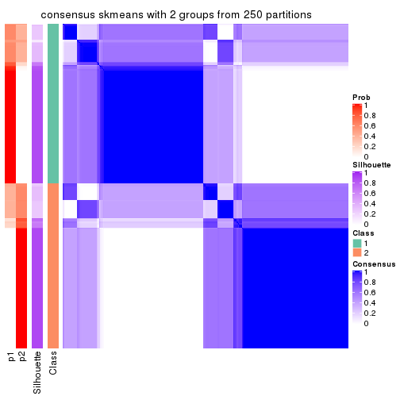</p>

</div>
<div id='tab-CV-skmeans-consensus-heatmap-2'>
<pre><code class="r">consensus_heatmap(res, k = 3)
</code></pre>

<p>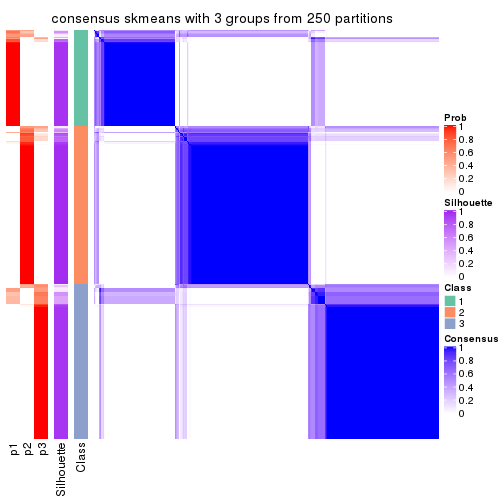</p>

</div>
<div id='tab-CV-skmeans-consensus-heatmap-3'>
<pre><code class="r">consensus_heatmap(res, k = 4)
</code></pre>

<p>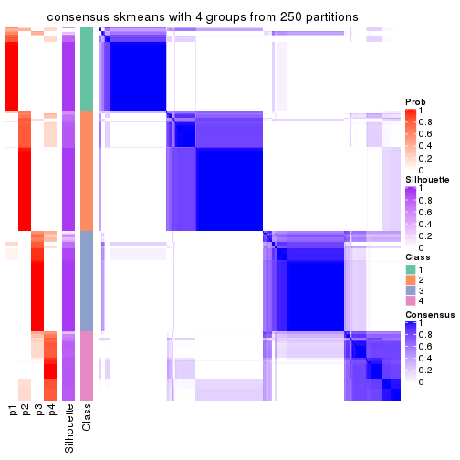</p>

</div>
<div id='tab-CV-skmeans-consensus-heatmap-4'>
<pre><code class="r">consensus_heatmap(res, k = 5)
</code></pre>

<p>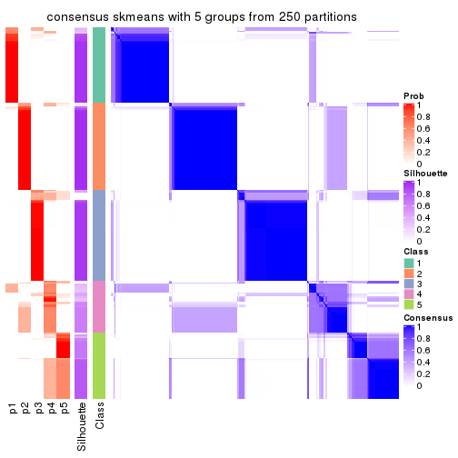</p>

</div>
<div id='tab-CV-skmeans-consensus-heatmap-5'>
<pre><code class="r">consensus_heatmap(res, k = 6)
</code></pre>

<p>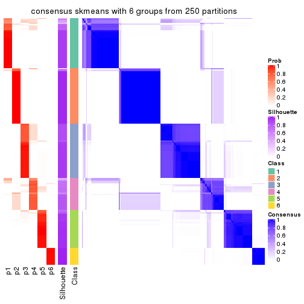</p>

</div>
</div>

Heatmaps for the membership of samples in all partitions to see how consistent they are:


<script>
$( function() {
	$( '#tabs-CV-skmeans-membership-heatmap' ).tabs();
} );
</script>
<div id='tabs-CV-skmeans-membership-heatmap'>
<ul>
<li><a href='#tab-CV-skmeans-membership-heatmap-1'>k = 2</a></li>
<li><a href='#tab-CV-skmeans-membership-heatmap-2'>k = 3</a></li>
<li><a href='#tab-CV-skmeans-membership-heatmap-3'>k = 4</a></li>
<li><a href='#tab-CV-skmeans-membership-heatmap-4'>k = 5</a></li>
<li><a href='#tab-CV-skmeans-membership-heatmap-5'>k = 6</a></li>
</ul>
<div id='tab-CV-skmeans-membership-heatmap-1'>
<pre><code class="r">membership_heatmap(res, k = 2)
</code></pre>

<p>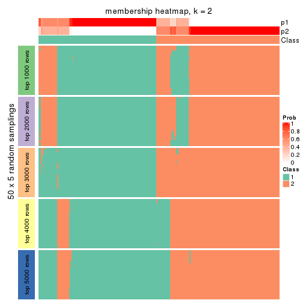</p>

</div>
<div id='tab-CV-skmeans-membership-heatmap-2'>
<pre><code class="r">membership_heatmap(res, k = 3)
</code></pre>

<p>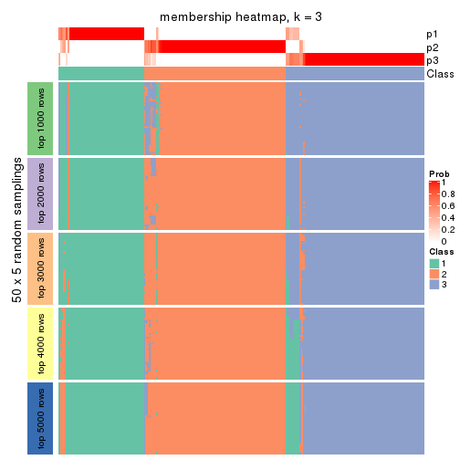</p>

</div>
<div id='tab-CV-skmeans-membership-heatmap-3'>
<pre><code class="r">membership_heatmap(res, k = 4)
</code></pre>

<p>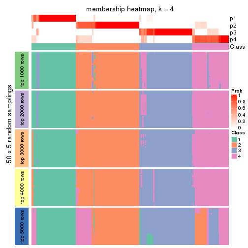</p>

</div>
<div id='tab-CV-skmeans-membership-heatmap-4'>
<pre><code class="r">membership_heatmap(res, k = 5)
</code></pre>

<p>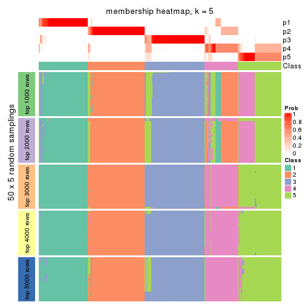</p>

</div>
<div id='tab-CV-skmeans-membership-heatmap-5'>
<pre><code class="r">membership_heatmap(res, k = 6)
</code></pre>

<p>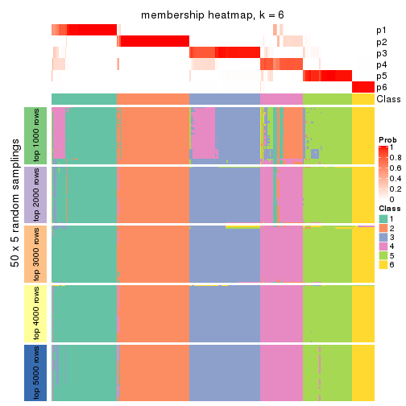</p>

</div>
</div>

As soon as we have had the classes for columns, we can look for signatures
which are significantly different between classes which can be candidate marks
for certain classes. Following are the heatmaps for signatures.


Signature heatmaps where rows are scaled:


<script>
$( function() {
	$( '#tabs-CV-skmeans-get-signatures' ).tabs();
} );
</script>
<div id='tabs-CV-skmeans-get-signatures'>
<ul>
<li><a href='#tab-CV-skmeans-get-signatures-1'>k = 2</a></li>
<li><a href='#tab-CV-skmeans-get-signatures-2'>k = 3</a></li>
<li><a href='#tab-CV-skmeans-get-signatures-3'>k = 4</a></li>
<li><a href='#tab-CV-skmeans-get-signatures-4'>k = 5</a></li>
<li><a href='#tab-CV-skmeans-get-signatures-5'>k = 6</a></li>
</ul>
<div id='tab-CV-skmeans-get-signatures-1'>
<pre><code class="r">get_signatures(res, k = 2)
</code></pre>

<p>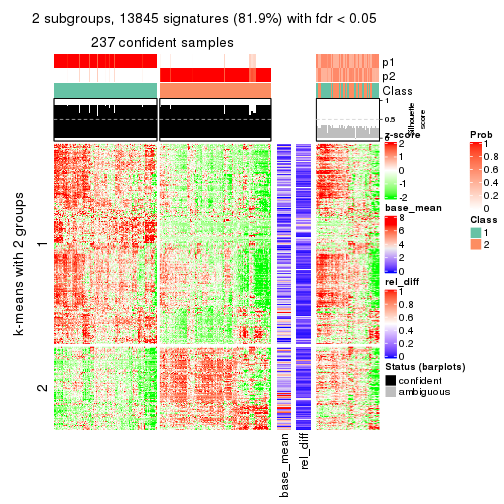</p>

</div>
<div id='tab-CV-skmeans-get-signatures-2'>
<pre><code class="r">get_signatures(res, k = 3)
</code></pre>

<p>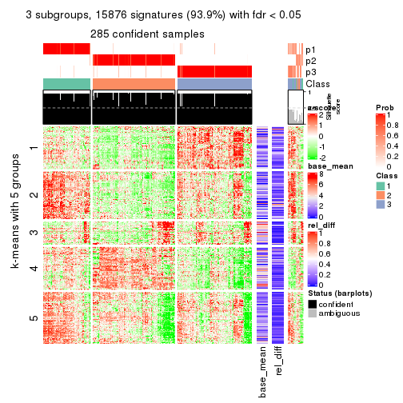</p>

</div>
<div id='tab-CV-skmeans-get-signatures-3'>
<pre><code class="r">get_signatures(res, k = 4)
</code></pre>

<p>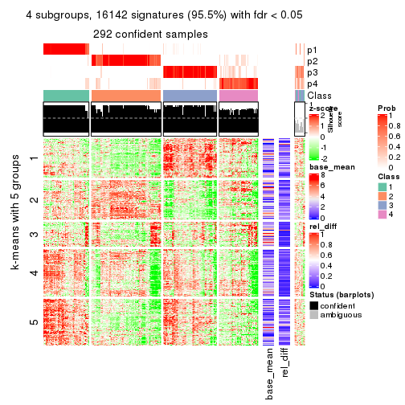</p>

</div>
<div id='tab-CV-skmeans-get-signatures-4'>
<pre><code class="r">get_signatures(res, k = 5)
</code></pre>

<p>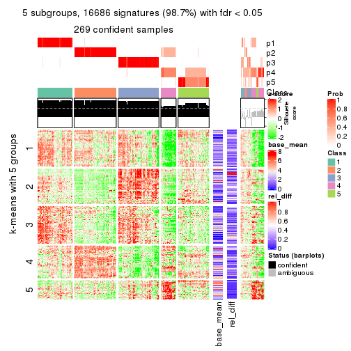</p>

</div>
<div id='tab-CV-skmeans-get-signatures-5'>
<pre><code class="r">get_signatures(res, k = 6)
</code></pre>

<p>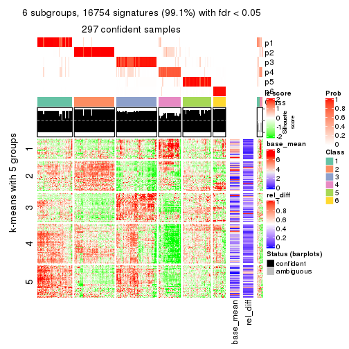</p>

</div>
</div>


Signature heatmaps where rows are not scaled:


<script>
$( function() {
	$( '#tabs-CV-skmeans-get-signatures-no-scale' ).tabs();
} );
</script>
<div id='tabs-CV-skmeans-get-signatures-no-scale'>
<ul>
<li><a href='#tab-CV-skmeans-get-signatures-no-scale-1'>k = 2</a></li>
<li><a href='#tab-CV-skmeans-get-signatures-no-scale-2'>k = 3</a></li>
<li><a href='#tab-CV-skmeans-get-signatures-no-scale-3'>k = 4</a></li>
<li><a href='#tab-CV-skmeans-get-signatures-no-scale-4'>k = 5</a></li>
<li><a href='#tab-CV-skmeans-get-signatures-no-scale-5'>k = 6</a></li>
</ul>
<div id='tab-CV-skmeans-get-signatures-no-scale-1'>
<pre><code class="r">get_signatures(res, k = 2, scale_rows = FALSE)
</code></pre>

<p>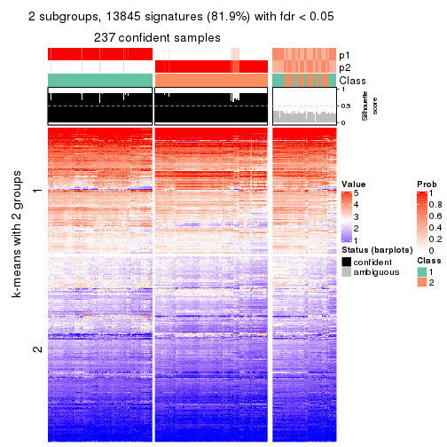</p>

</div>
<div id='tab-CV-skmeans-get-signatures-no-scale-2'>
<pre><code class="r">get_signatures(res, k = 3, scale_rows = FALSE)
</code></pre>

<p>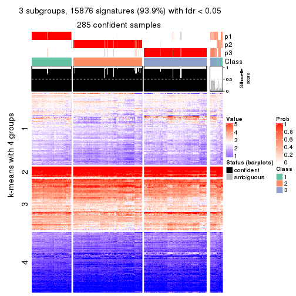</p>

</div>
<div id='tab-CV-skmeans-get-signatures-no-scale-3'>
<pre><code class="r">get_signatures(res, k = 4, scale_rows = FALSE)
</code></pre>

<p>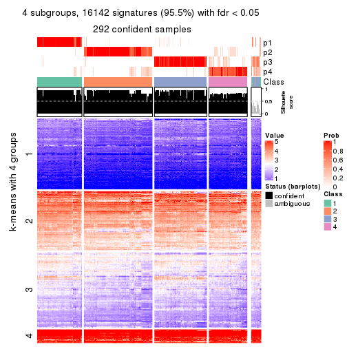</p>

</div>
<div id='tab-CV-skmeans-get-signatures-no-scale-4'>
<pre><code class="r">get_signatures(res, k = 5, scale_rows = FALSE)
</code></pre>

<p>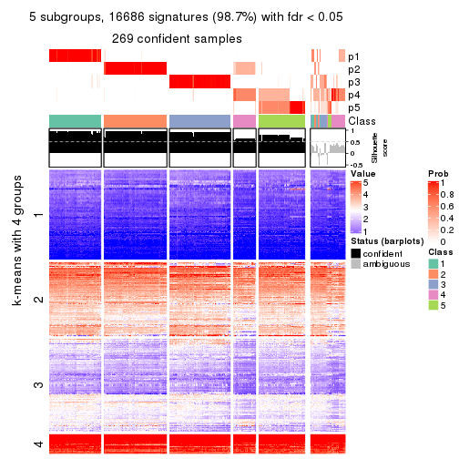</p>

</div>
<div id='tab-CV-skmeans-get-signatures-no-scale-5'>
<pre><code class="r">get_signatures(res, k = 6, scale_rows = FALSE)
</code></pre>

<p>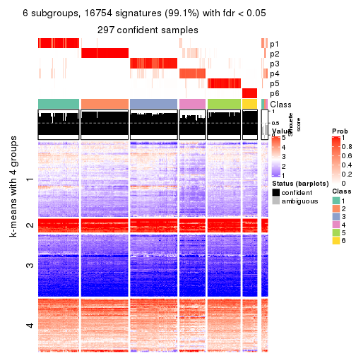</p>

</div>
</div>


Compare the overlap of signatures from different k:

```r
compare_signatures(res)
```

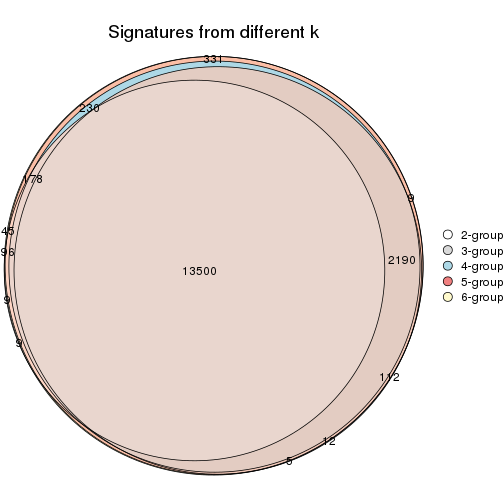

`get_signature()` returns a data frame invisibly. TO get the list of signatures, the function
call should be assigned to a variable explicitly. In following code, if `plot` argument is set
to `FALSE`, no heatmap is plotted while only the differential analysis is performed.

```r
# code only for demonstration
tb = get_signature(res, k = ..., plot = FALSE)
```

An example of the output of `tb` is:

```
#>   which_row         fdr    mean_1    mean_2 scaled_mean_1 scaled_mean_2 km
#> 1        38 0.042760348  8.373488  9.131774    -0.5533452     0.5164555  1
#> 2        40 0.018707592  7.106213  8.469186    -0.6173731     0.5762149  1
#> 3        55 0.019134737 10.221463 11.207825    -0.6159697     0.5749050  1
#> 4        59 0.006059896  5.921854  7.869574    -0.6899429     0.6439467  1
#> 5        60 0.018055526  8.928898 10.211722    -0.6204761     0.5791110  1
#> 6        98 0.009384629 15.714769 14.887706     0.6635654    -0.6193277  2
...
```

The columns in `tb` are:

1. `which_row`: row indices corresponding to the input matrix.
2. `fdr`: FDR for the differential test. 
3. `mean_x`: The mean value in group x.
4. `scaled_mean_x`: The mean value in group x after rows are scaled.
5. `km`: Row groups if k-means clustering is applied to rows.


UMAP plot which shows how samples are separated.


<script>
$( function() {
	$( '#tabs-CV-skmeans-dimension-reduction' ).tabs();
} );
</script>
<div id='tabs-CV-skmeans-dimension-reduction'>
<ul>
<li><a href='#tab-CV-skmeans-dimension-reduction-1'>k = 2</a></li>
<li><a href='#tab-CV-skmeans-dimension-reduction-2'>k = 3</a></li>
<li><a href='#tab-CV-skmeans-dimension-reduction-3'>k = 4</a></li>
<li><a href='#tab-CV-skmeans-dimension-reduction-4'>k = 5</a></li>
<li><a href='#tab-CV-skmeans-dimension-reduction-5'>k = 6</a></li>
</ul>
<div id='tab-CV-skmeans-dimension-reduction-1'>
<pre><code class="r">dimension_reduction(res, k = 2, method = &quot;UMAP&quot;)
</code></pre>

<p>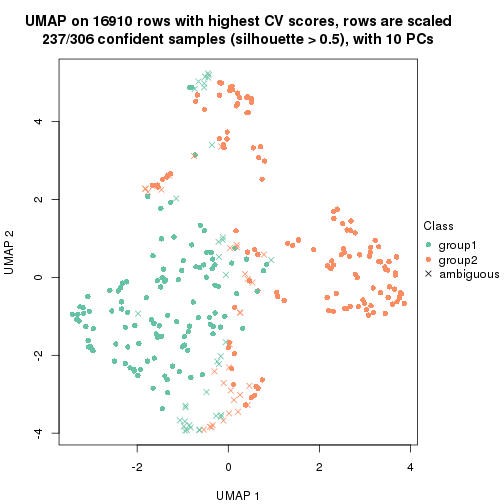</p>

</div>
<div id='tab-CV-skmeans-dimension-reduction-2'>
<pre><code class="r">dimension_reduction(res, k = 3, method = &quot;UMAP&quot;)
</code></pre>

<p>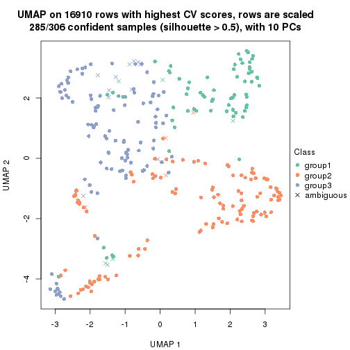</p>

</div>
<div id='tab-CV-skmeans-dimension-reduction-3'>
<pre><code class="r">dimension_reduction(res, k = 4, method = &quot;UMAP&quot;)
</code></pre>

<p>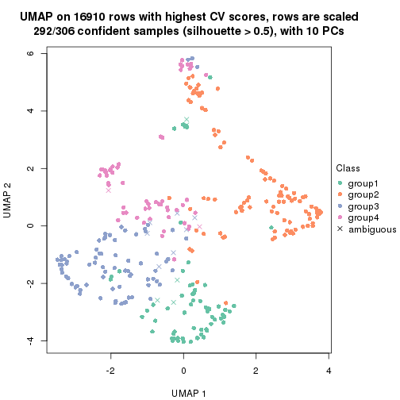</p>

</div>
<div id='tab-CV-skmeans-dimension-reduction-4'>
<pre><code class="r">dimension_reduction(res, k = 5, method = &quot;UMAP&quot;)
</code></pre>

<p>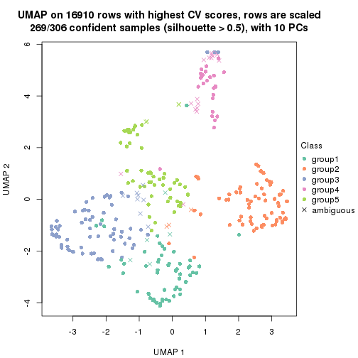</p>

</div>
<div id='tab-CV-skmeans-dimension-reduction-5'>
<pre><code class="r">dimension_reduction(res, k = 6, method = &quot;UMAP&quot;)
</code></pre>

<p>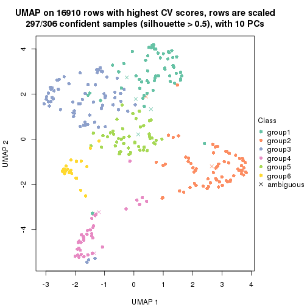</p>

</div>
</div>


Following heatmap shows how subgroups are split when increasing `k`:

```r
collect_classes(res)
```

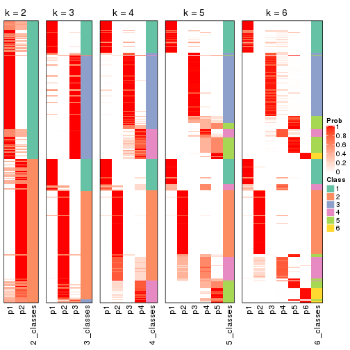


If matrix rows can be associated to genes, consider to use `GO_Enrichment(res,
...)` to perform function enrichment for the signature genes.


 

---------------------------------------------------


### CV:pam


The object with results only for a single top-value method and a single partition method 
can be extracted as:

```r
res = res_list["CV", "pam"]
# you can also extract it by
# res = res_list["CV:pam"]
```

A summary of `res` and all the functions that can be applied to it:

```r
res
```

```
#> A 'ConsensusPartition' object with k = 2, 3, 4, 5, 6.
#>   On a matrix with 16910 rows and 306 columns.
#>   Top rows (1000, 2000, 3000, 4000, 5000) are extracted by 'CV' method.
#>   Subgroups are detected by 'pam' method.
#>   Performed in total 1250 partitions by row resampling.
#>   Best k for subgroups seems to be 4.
#> 
#> Following methods can be applied to this 'ConsensusPartition' object:
#>  [1] "cola_report"             "collect_classes"         "collect_plots"          
#>  [4] "collect_stats"           "colnames"                "compare_signatures"     
#>  [7] "consensus_heatmap"       "dimension_reduction"     "functional_enrichment"  
#> [10] "get_anno_col"            "get_anno"                "get_classes"            
#> [13] "get_consensus"           "get_matrix"              "get_membership"         
#> [16] "get_param"               "get_signatures"          "get_stats"              
#> [19] "is_best_k"               "is_stable_k"             "membership_heatmap"     
#> [22] "ncol"                    "nrow"                    "plot_ecdf"              
#> [25] "rownames"                "select_partition_number" "show"                   
#> [28] "suggest_best_k"          "test_to_known_factors"
```

`collect_plots()` function collects all the plots made from `res` for all `k` (number of partitions)
into one single page to provide an easy and fast comparison between different `k`.

```r
collect_plots(res)
```

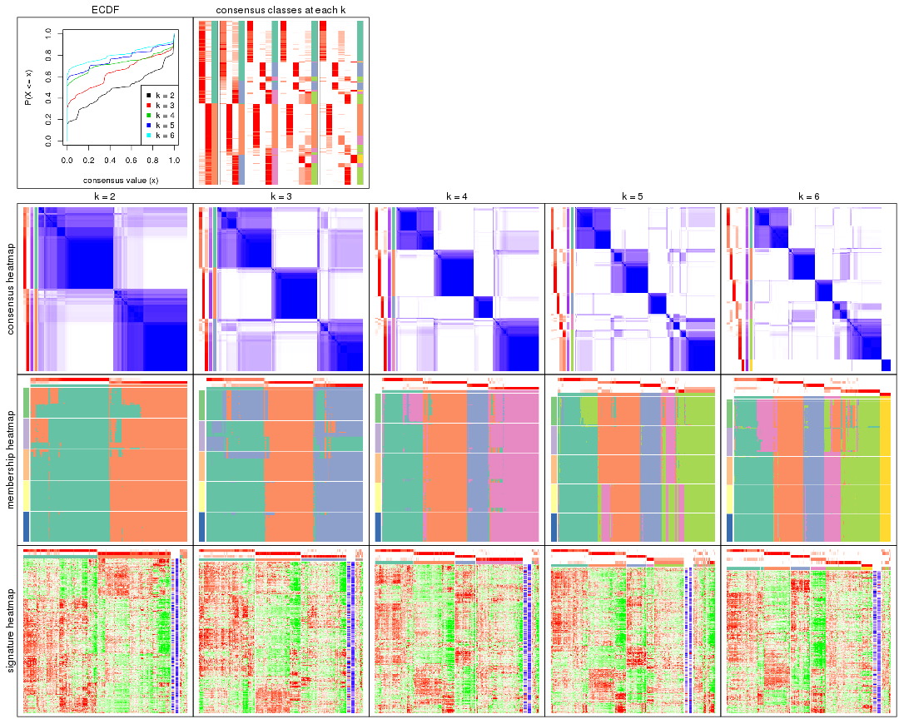

The plots are:

- The first row: a plot of the ECDF (Empirical cumulative distribution
  function) curves of the consensus matrix for each `k` and the heatmap of
  predicted classes for each `k`.
- The second row: heatmaps of the consensus matrix for each `k`.
- The third row: heatmaps of the membership matrix for each `k`.
- The fouth row: heatmaps of the signatures for each `k`.

All the plots in panels can be made by individual functions and they are
plotted later in this section.

`select_partition_number()` produces several plots showing different
statistics for choosing "optimized" `k`. There are following statistics:

- ECDF curves of the consensus matrix for each `k`;
- 1-PAC. [The PAC
  score](https://en.wikipedia.org/wiki/Consensus_clustering#Over-interpretation_potential_of_consensus_clustering)
  measures the proportion of the ambiguous subgrouping.
- Mean silhouette score.
- Concordance. The mean probability of fiting the consensus class ids in all
  partitions.
- Area increased. Denote $A_k$ as the area under the ECDF curve for current
  `k`, the area increased is defined as $A_k - A_{k-1}$.
- Rand index. The percent of pairs of samples that are both in a same cluster
  or both are not in a same cluster in the partition of k and k-1.
- Jaccard index. The ratio of pairs of samples are both in a same cluster in
  the partition of k and k-1 and the pairs of samples are both in a same
  cluster in the partition k or k-1.

The detailed explanations of these statistics can be found in [the cola
vignette](http://bioconductor.org/packages/devel/bioc/vignettes/cola/inst/doc/cola.html#toc_13).

Generally speaking, lower PAC score, higher mean silhouette score or higher
concordance corresponds to better partition. Rand index and Jaccard index
measure how similar the current partition is compared to partition with `k-1`.
If they are too similar, we won't accept `k` is better than `k-1`.

```r
select_partition_number(res)
```

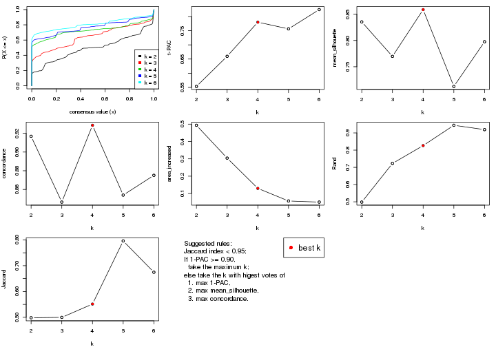

The numeric values for all these statistics can be obtained by `get_stats()`.

```r
get_stats(res)
```

```
#>   k 1-PAC mean_silhouette concordance area_increased  Rand Jaccard
#> 2 2 0.553           0.835       0.917         0.4934 0.498   0.498
#> 3 3 0.660           0.770       0.847         0.3042 0.723   0.500
#> 4 4 0.780           0.859       0.929         0.1296 0.826   0.551
#> 5 5 0.756           0.713       0.854         0.0571 0.944   0.796
#> 6 6 0.824           0.798       0.875         0.0507 0.919   0.675
```

`suggest_best_k()` suggests the best $k$ based on these statistics. The rules are as follows:

- All $k$ with Jaccard index larger than 0.95 are removed because the increase of
  the partition number does not provides enough extra information. If all $k$ are removed,
  the best $k$ is assigned by `NA`.
- For $k$ with 1-PAC larger than 0.9, the maximal $k$ is taken as the "best k". Other $k$ is called "optional k".
- If it does not fit the second rule. The $k$ with the highest vote of highest
  1-PAC, mean silhouette and concordance is taken as the "best k".

```r
suggest_best_k(res)
```

```
#> [1] 4
```


Following shows the table of the partitions (You need to click the **show/hide
code output** link to see it). The membership matrix (columns with name `p*`)
is inferred by
[`clue::cl_consensus()`](https://www.rdocumentation.org/link/cl_consensus?package=clue)
function with the `SE` method. Basically the value in the membership matrix
represents the probability to belong to a certain group. The finall class
label for an item is determined with the group with highest probability it
belongs to.

In `get_classes()` function, the entropy is calculated from the membership
matrix and the silhouette score is calculated from the consensus matrix.


<script>
$( function() {
	$( '#tabs-CV-pam-get-classes' ).tabs();
} );
</script>
<div id='tabs-CV-pam-get-classes'>
<ul>
<li><a href='#tab-CV-pam-get-classes-1'>k = 2</a></li>
<li><a href='#tab-CV-pam-get-classes-2'>k = 3</a></li>
<li><a href='#tab-CV-pam-get-classes-3'>k = 4</a></li>
<li><a href='#tab-CV-pam-get-classes-4'>k = 5</a></li>
<li><a href='#tab-CV-pam-get-classes-5'>k = 6</a></li>
</ul>

<div id='tab-CV-pam-get-classes-1'>
<p><a id='tab-CV-pam-get-classes-1-a' style='color:#0366d6' href='#'>show/hide code output</a></p>
<pre><code class="r">cbind(get_classes(res, k = 2), get_membership(res, k = 2))
</code></pre>

<pre><code>#&gt;            class entropy silhouette    p1    p2
#&gt; SRR1609360     1  0.9732      0.491 0.596 0.404
#&gt; SRR1609361     1  0.9775      0.475 0.588 0.412
#&gt; SRR1609362     2  0.0672      0.910 0.008 0.992
#&gt; SRR1609363     2  0.0000      0.913 0.000 1.000
#&gt; SRR1609364     2  0.0000      0.913 0.000 1.000
#&gt; SRR1609365     1  0.9775      0.475 0.588 0.412
#&gt; SRR1609366     2  0.0000      0.913 0.000 1.000
#&gt; SRR1609367     1  0.4815      0.849 0.896 0.104
#&gt; SRR1609368     2  0.0000      0.913 0.000 1.000
#&gt; SRR1609369     1  0.9775      0.475 0.588 0.412
#&gt; SRR1609370     1  0.4815      0.849 0.896 0.104
#&gt; SRR1609371     2  0.0000      0.913 0.000 1.000
#&gt; SRR1609372     1  0.4815      0.849 0.896 0.104
#&gt; SRR1609373     2  0.0000      0.913 0.000 1.000
#&gt; SRR1609374     2  0.0000      0.913 0.000 1.000
#&gt; SRR1609375     2  0.0000      0.913 0.000 1.000
#&gt; SRR1609377     2  0.9732      0.275 0.404 0.596
#&gt; SRR1609376     2  0.0000      0.913 0.000 1.000
#&gt; SRR1609378     2  0.0000      0.913 0.000 1.000
#&gt; SRR1609379     1  0.8608      0.668 0.716 0.284
#&gt; SRR1609382     2  0.0000      0.913 0.000 1.000
#&gt; SRR1609383     1  0.8661      0.664 0.712 0.288
#&gt; SRR1609381     1  0.8016      0.721 0.756 0.244
#&gt; SRR1609384     2  0.0672      0.910 0.008 0.992
#&gt; SRR1609386     2  0.0000      0.913 0.000 1.000
#&gt; SRR1609385     1  0.9775      0.475 0.588 0.412
#&gt; SRR1609387     1  0.8661      0.664 0.712 0.288
#&gt; SRR1609388     2  0.0000      0.913 0.000 1.000
#&gt; SRR1609390     1  0.8386      0.689 0.732 0.268
#&gt; SRR1609393     2  0.0000      0.913 0.000 1.000
#&gt; SRR1609394     2  0.0000      0.913 0.000 1.000
#&gt; SRR1609392     2  0.0000      0.913 0.000 1.000
#&gt; SRR1609391     2  0.0000      0.913 0.000 1.000
#&gt; SRR1609395     1  0.4815      0.849 0.896 0.104
#&gt; SRR1609396     1  0.4815      0.849 0.896 0.104
#&gt; SRR1609398     2  0.0000      0.913 0.000 1.000
#&gt; SRR1609399     1  0.4815      0.849 0.896 0.104
#&gt; SRR1609400     1  0.4815      0.849 0.896 0.104
#&gt; SRR1609397     2  0.0000      0.913 0.000 1.000
#&gt; SRR1609401     2  0.0000      0.913 0.000 1.000
#&gt; SRR1609402     2  0.0000      0.913 0.000 1.000
#&gt; SRR1609405     2  0.9732      0.143 0.404 0.596
#&gt; SRR1609404     2  0.0000      0.913 0.000 1.000
#&gt; SRR1609406     2  0.0000      0.913 0.000 1.000
#&gt; SRR1609408     2  0.0000      0.913 0.000 1.000
#&gt; SRR1609403     1  0.9460      0.566 0.636 0.364
#&gt; SRR1609410     1  0.8608      0.668 0.716 0.284
#&gt; SRR1609411     2  0.0000      0.913 0.000 1.000
#&gt; SRR1609407     2  0.0000      0.913 0.000 1.000
#&gt; SRR1609413     1  0.9522      0.554 0.628 0.372
#&gt; SRR1609412     1  0.0000      0.899 1.000 0.000
#&gt; SRR1609414     1  0.0000      0.899 1.000 0.000
#&gt; SRR1609415     1  0.0000      0.899 1.000 0.000
#&gt; SRR1609416     1  0.0000      0.899 1.000 0.000
#&gt; SRR1609417     1  0.0000      0.899 1.000 0.000
#&gt; SRR1609418     1  0.8608      0.668 0.716 0.284
#&gt; SRR1609419     2  0.0000      0.913 0.000 1.000
#&gt; SRR1609420     2  0.0938      0.908 0.012 0.988
#&gt; SRR1609421     2  0.4562      0.874 0.096 0.904
#&gt; SRR1609422     2  0.9460      0.537 0.364 0.636
#&gt; SRR1609423     2  0.0000      0.913 0.000 1.000
#&gt; SRR1609424     2  0.0000      0.913 0.000 1.000
#&gt; SRR1609425     2  0.1414      0.907 0.020 0.980
#&gt; SRR1609426     2  0.0000      0.913 0.000 1.000
#&gt; SRR1609427     1  0.0000      0.899 1.000 0.000
#&gt; SRR1609428     2  0.0000      0.913 0.000 1.000
#&gt; SRR1609429     1  0.8499      0.680 0.724 0.276
#&gt; SRR1609430     1  0.0000      0.899 1.000 0.000
#&gt; SRR1609431     2  0.5178      0.861 0.116 0.884
#&gt; SRR1609432     2  0.0000      0.913 0.000 1.000
#&gt; SRR1609433     1  0.0000      0.899 1.000 0.000
#&gt; SRR1609434     2  0.0000      0.913 0.000 1.000
#&gt; SRR1609435     1  0.1414      0.892 0.980 0.020
#&gt; SRR1609436     1  0.0000      0.899 1.000 0.000
#&gt; SRR1609437     2  0.4161      0.881 0.084 0.916
#&gt; SRR1609438     2  0.0000      0.913 0.000 1.000
#&gt; SRR1609439     1  0.0000      0.899 1.000 0.000
#&gt; SRR1609440     1  0.4815      0.849 0.896 0.104
#&gt; SRR1609441     2  0.4562      0.874 0.096 0.904
#&gt; SRR1609442     2  0.0000      0.913 0.000 1.000
#&gt; SRR1609443     1  0.0000      0.899 1.000 0.000
#&gt; SRR1609444     1  0.8555      0.673 0.720 0.280
#&gt; SRR1609445     2  0.8144      0.724 0.252 0.748
#&gt; SRR1609446     2  0.4431      0.876 0.092 0.908
#&gt; SRR1609447     1  0.0000      0.899 1.000 0.000
#&gt; SRR1609448     2  0.0000      0.913 0.000 1.000
#&gt; SRR1609449     1  0.4815      0.849 0.896 0.104
#&gt; SRR1609450     2  0.0000      0.913 0.000 1.000
#&gt; SRR1609451     1  0.0000      0.899 1.000 0.000
#&gt; SRR1609452     2  0.8713      0.663 0.292 0.708
#&gt; SRR1609453     1  0.0000      0.899 1.000 0.000
#&gt; SRR1609454     2  0.3114      0.893 0.056 0.944
#&gt; SRR1609455     2  0.4562      0.874 0.096 0.904
#&gt; SRR1609456     2  0.4562      0.874 0.096 0.904
#&gt; SRR1609457     1  0.0000      0.899 1.000 0.000
#&gt; SRR1609458     1  0.0000      0.899 1.000 0.000
#&gt; SRR1609459     2  0.9775      0.441 0.412 0.588
#&gt; SRR1609460     2  0.4690      0.872 0.100 0.900
#&gt; SRR1609461     1  0.0000      0.899 1.000 0.000
#&gt; SRR1609462     1  0.0000      0.899 1.000 0.000
#&gt; SRR1609464     1  0.0000      0.899 1.000 0.000
#&gt; SRR1609463     1  0.0000      0.899 1.000 0.000
#&gt; SRR1609465     2  0.4161      0.881 0.084 0.916
#&gt; SRR1609466     1  0.9000      0.619 0.684 0.316
#&gt; SRR1609467     1  0.0000      0.899 1.000 0.000
#&gt; SRR1609469     2  0.3733      0.886 0.072 0.928
#&gt; SRR1609470     2  0.4815      0.869 0.104 0.896
#&gt; SRR1609472     2  0.7299      0.780 0.204 0.796
#&gt; SRR1609471     1  0.8555      0.673 0.720 0.280
#&gt; SRR1609474     2  0.0000      0.913 0.000 1.000
#&gt; SRR1609473     2  0.0000      0.913 0.000 1.000
#&gt; SRR1609475     2  0.0000      0.913 0.000 1.000
#&gt; SRR1609478     2  0.7376      0.776 0.208 0.792
#&gt; SRR1609476     1  0.0376      0.898 0.996 0.004
#&gt; SRR1609477     2  0.9775      0.441 0.412 0.588
#&gt; SRR1609479     2  0.0000      0.913 0.000 1.000
#&gt; SRR1609481     2  0.0000      0.913 0.000 1.000
#&gt; SRR1609480     1  0.0672      0.895 0.992 0.008
#&gt; SRR1609482     1  0.0000      0.899 1.000 0.000
#&gt; SRR1609484     2  0.4298      0.878 0.088 0.912
#&gt; SRR1609483     1  0.0000      0.899 1.000 0.000
#&gt; SRR1609486     1  0.0000      0.899 1.000 0.000
#&gt; SRR1609485     1  0.0000      0.899 1.000 0.000
#&gt; SRR1609487     1  0.9000      0.622 0.684 0.316
#&gt; SRR1609488     1  0.0000      0.899 1.000 0.000
#&gt; SRR1609489     2  0.0000      0.913 0.000 1.000
#&gt; SRR1609490     2  0.4161      0.881 0.084 0.916
#&gt; SRR1609491     2  0.9209      0.567 0.336 0.664
#&gt; SRR1609492     2  0.0000      0.913 0.000 1.000
#&gt; SRR1609493     2  0.4815      0.869 0.104 0.896
#&gt; SRR1609494     2  0.0000      0.913 0.000 1.000
#&gt; SRR1609495     1  0.4815      0.849 0.896 0.104
#&gt; SRR1609496     1  0.0000      0.899 1.000 0.000
#&gt; SRR1609497     1  0.0000      0.899 1.000 0.000
#&gt; SRR1609498     1  0.0000      0.899 1.000 0.000
#&gt; SRR1609499     2  0.0000      0.913 0.000 1.000
#&gt; SRR1609500     1  0.0000      0.899 1.000 0.000
#&gt; SRR1609501     2  0.4562      0.874 0.096 0.904
#&gt; SRR1609502     2  0.4161      0.881 0.084 0.916
#&gt; SRR1609503     2  0.1414      0.907 0.020 0.980
#&gt; SRR1609504     1  0.0000      0.899 1.000 0.000
#&gt; SRR1609505     1  0.0000      0.899 1.000 0.000
#&gt; SRR1609506     2  0.0000      0.913 0.000 1.000
#&gt; SRR1609507     1  0.0000      0.899 1.000 0.000
#&gt; SRR1609508     2  0.0000      0.913 0.000 1.000
#&gt; SRR1609509     2  0.0000      0.913 0.000 1.000
#&gt; SRR1609510     2  0.4298      0.879 0.088 0.912
#&gt; SRR1609512     1  0.0000      0.899 1.000 0.000
#&gt; SRR1609511     1  0.0000      0.899 1.000 0.000
#&gt; SRR1609513     1  0.0000      0.899 1.000 0.000
#&gt; SRR1609514     1  0.6623      0.749 0.828 0.172
#&gt; SRR1609515     2  0.0000      0.913 0.000 1.000
#&gt; SRR1609516     2  0.9775      0.441 0.412 0.588
#&gt; SRR1609517     2  0.4690      0.872 0.100 0.900
#&gt; SRR1609518     1  0.7745      0.737 0.772 0.228
#&gt; SRR1609519     1  0.0000      0.899 1.000 0.000
#&gt; SRR1609520     2  0.0000      0.913 0.000 1.000
#&gt; SRR1609521     1  0.0000      0.899 1.000 0.000
#&gt; SRR1609522     1  0.0000      0.899 1.000 0.000
#&gt; SRR1609523     2  0.9248      0.581 0.340 0.660
#&gt; SRR1609524     2  0.0000      0.913 0.000 1.000
#&gt; SRR1609526     1  0.0000      0.899 1.000 0.000
#&gt; SRR1609525     2  0.4815      0.869 0.104 0.896
#&gt; SRR1609527     1  0.4815      0.849 0.896 0.104
#&gt; SRR1609529     1  0.0000      0.899 1.000 0.000
#&gt; SRR1609528     2  0.9393      0.553 0.356 0.644
#&gt; SRR1609530     1  0.0000      0.899 1.000 0.000
#&gt; SRR1609531     2  0.0000      0.913 0.000 1.000
#&gt; SRR1609532     1  0.0000      0.899 1.000 0.000
#&gt; SRR1609533     2  0.4690      0.872 0.100 0.900
#&gt; SRR1609534     1  0.0000      0.899 1.000 0.000
#&gt; SRR1609535     2  0.4298      0.878 0.088 0.912
#&gt; SRR1609537     2  0.0000      0.913 0.000 1.000
#&gt; SRR1609536     1  0.0000      0.899 1.000 0.000
#&gt; SRR1609538     2  0.0000      0.913 0.000 1.000
#&gt; SRR1609539     1  0.0000      0.899 1.000 0.000
#&gt; SRR1609540     1  0.4815      0.849 0.896 0.104
#&gt; SRR1609541     2  0.7453      0.771 0.212 0.788
#&gt; SRR1609542     2  0.0000      0.913 0.000 1.000
#&gt; SRR1609543     1  0.0000      0.899 1.000 0.000
#&gt; SRR1609544     1  0.0376      0.898 0.996 0.004
#&gt; SRR1609545     1  0.0000      0.899 1.000 0.000
#&gt; SRR1609546     2  0.9754      0.449 0.408 0.592
#&gt; SRR1609547     1  0.0000      0.899 1.000 0.000
#&gt; SRR1609548     2  0.5519      0.853 0.128 0.872
#&gt; SRR1609549     2  0.0000      0.913 0.000 1.000
#&gt; SRR1609550     2  0.0000      0.913 0.000 1.000
#&gt; SRR1609551     1  0.0000      0.899 1.000 0.000
#&gt; SRR1609552     1  0.0000      0.899 1.000 0.000
#&gt; SRR1609553     1  0.0000      0.899 1.000 0.000
#&gt; SRR1609554     1  0.0672      0.897 0.992 0.008
#&gt; SRR1609555     1  0.0000      0.899 1.000 0.000
#&gt; SRR1609556     1  0.0000      0.899 1.000 0.000
#&gt; SRR1609557     2  0.8016      0.726 0.244 0.756
#&gt; SRR1609558     2  0.7056      0.794 0.192 0.808
#&gt; SRR1609559     2  0.4815      0.869 0.104 0.896
#&gt; SRR1609560     1  0.9944      0.276 0.544 0.456
#&gt; SRR1609561     1  0.0000      0.899 1.000 0.000
#&gt; SRR1609562     2  0.6623      0.797 0.172 0.828
#&gt; SRR1609563     2  0.4161      0.881 0.084 0.916
#&gt; SRR1609564     1  0.3114      0.875 0.944 0.056
#&gt; SRR1609565     2  0.0000      0.913 0.000 1.000
#&gt; SRR1609566     2  0.0000      0.913 0.000 1.000
#&gt; SRR1609567     2  0.0000      0.913 0.000 1.000
#&gt; SRR1609568     1  0.8955      0.637 0.688 0.312
#&gt; SRR1609569     1  0.0000      0.899 1.000 0.000
#&gt; SRR1609570     1  0.0000      0.899 1.000 0.000
#&gt; SRR1609571     1  0.0000      0.899 1.000 0.000
#&gt; SRR1609572     1  0.0000      0.899 1.000 0.000
#&gt; SRR1609573     1  0.0000      0.899 1.000 0.000
#&gt; SRR1609574     1  0.0000      0.899 1.000 0.000
#&gt; SRR1609575     2  0.0000      0.913 0.000 1.000
#&gt; SRR1609576     2  0.0000      0.913 0.000 1.000
#&gt; SRR1609578     1  0.2603      0.880 0.956 0.044
#&gt; SRR1609577     1  0.8207      0.705 0.744 0.256
#&gt; SRR1609579     1  0.0000      0.899 1.000 0.000
#&gt; SRR1609580     1  0.0000      0.899 1.000 0.000
#&gt; SRR1609582     1  0.0000      0.899 1.000 0.000
#&gt; SRR1609581     2  0.5408      0.852 0.124 0.876
#&gt; SRR1609583     2  0.8608      0.672 0.284 0.716
#&gt; SRR1609584     1  0.0000      0.899 1.000 0.000
#&gt; SRR1609585     1  0.0000      0.899 1.000 0.000
#&gt; SRR1609586     2  0.0000      0.913 0.000 1.000
#&gt; SRR1609587     2  0.9815      0.422 0.420 0.580
#&gt; SRR1609588     2  0.4690      0.871 0.100 0.900
#&gt; SRR1609589     2  0.4562      0.874 0.096 0.904
#&gt; SRR1609590     1  0.0000      0.899 1.000 0.000
#&gt; SRR1609592     2  0.7950      0.737 0.240 0.760
#&gt; SRR1609591     1  0.8661      0.664 0.712 0.288
#&gt; SRR1609593     2  0.9775      0.441 0.412 0.588
#&gt; SRR1609594     2  0.0000      0.913 0.000 1.000
#&gt; SRR1609595     2  0.9998      0.157 0.492 0.508
#&gt; SRR1609596     2  0.0000      0.913 0.000 1.000
#&gt; SRR1609597     2  0.0000      0.913 0.000 1.000
#&gt; SRR1609598     2  0.8861      0.645 0.304 0.696
#&gt; SRR1609599     1  0.3274      0.866 0.940 0.060
#&gt; SRR1609600     1  0.0000      0.899 1.000 0.000
#&gt; SRR1609601     1  0.0000      0.899 1.000 0.000
#&gt; SRR1609602     1  0.2948      0.871 0.948 0.052
#&gt; SRR1609603     1  0.9522      0.554 0.628 0.372
#&gt; SRR1609604     2  0.0000      0.913 0.000 1.000
#&gt; SRR1609605     2  0.4562      0.874 0.096 0.904
#&gt; SRR1609606     2  0.4690      0.872 0.100 0.900
#&gt; SRR1609607     1  0.0000      0.899 1.000 0.000
#&gt; SRR1609608     1  0.0000      0.899 1.000 0.000
#&gt; SRR1609609     2  0.4690      0.871 0.100 0.900
#&gt; SRR1609610     1  0.0000      0.899 1.000 0.000
#&gt; SRR1609611     2  0.0000      0.913 0.000 1.000
#&gt; SRR1609613     2  0.0000      0.913 0.000 1.000
#&gt; SRR1609612     1  0.0000      0.899 1.000 0.000
#&gt; SRR1609614     1  0.0000      0.899 1.000 0.000
#&gt; SRR1609615     1  0.8555      0.673 0.720 0.280
#&gt; SRR1609616     1  0.4815      0.849 0.896 0.104
#&gt; SRR1609617     2  0.4562      0.874 0.096 0.904
#&gt; SRR1609618     1  0.5408      0.797 0.876 0.124
#&gt; SRR1609619     1  0.9000      0.619 0.684 0.316
#&gt; SRR1609620     2  0.0000      0.913 0.000 1.000
#&gt; SRR1609621     2  0.0000      0.913 0.000 1.000
#&gt; SRR1609622     1  0.0000      0.899 1.000 0.000
#&gt; SRR1609623     1  0.0000      0.899 1.000 0.000
#&gt; SRR1609624     1  0.8327      0.695 0.736 0.264
#&gt; SRR1609625     1  0.4815      0.849 0.896 0.104
#&gt; SRR1609626     1  0.0000      0.899 1.000 0.000
#&gt; SRR1609627     2  0.1184      0.905 0.016 0.984
#&gt; SRR1609628     2  0.0000      0.913 0.000 1.000
#&gt; SRR1609629     1  0.0000      0.899 1.000 0.000
#&gt; SRR1609630     2  0.0000      0.913 0.000 1.000
#&gt; SRR1609631     1  0.7299      0.762 0.796 0.204
#&gt; SRR1609632     1  0.8813      0.645 0.700 0.300
#&gt; SRR1609633     1  0.4815      0.849 0.896 0.104
#&gt; SRR1609634     2  0.0000      0.913 0.000 1.000
#&gt; SRR1609635     1  0.0000      0.899 1.000 0.000
#&gt; SRR1609636     2  0.0000      0.913 0.000 1.000
#&gt; SRR1609637     1  0.0376      0.898 0.996 0.004
#&gt; SRR1609638     2  0.4161      0.881 0.084 0.916
#&gt; SRR1609639     2  0.0000      0.913 0.000 1.000
#&gt; SRR1609640     1  0.0000      0.899 1.000 0.000
#&gt; SRR1609641     1  0.8608      0.668 0.716 0.284
#&gt; SRR1609642     1  0.4939      0.846 0.892 0.108
#&gt; SRR1609643     1  0.1633      0.886 0.976 0.024
#&gt; SRR1609644     1  0.9522      0.554 0.628 0.372
#&gt; SRR1609645     1  0.0000      0.899 1.000 0.000
#&gt; SRR1609646     1  0.0000      0.899 1.000 0.000
#&gt; SRR1609647     2  0.4431      0.877 0.092 0.908
#&gt; SRR1609649     1  0.0000      0.899 1.000 0.000
#&gt; SRR1609648     2  0.0000      0.913 0.000 1.000
#&gt; SRR1609651     2  0.0000      0.913 0.000 1.000
#&gt; SRR1609650     2  0.9522      0.522 0.372 0.628
#&gt; SRR1609652     1  0.0000      0.899 1.000 0.000
#&gt; SRR1609653     2  0.0000      0.913 0.000 1.000
#&gt; SRR1609654     2  0.4161      0.881 0.084 0.916
#&gt; SRR1609655     1  0.0376      0.897 0.996 0.004
#&gt; SRR1609657     1  0.7950      0.724 0.760 0.240
#&gt; SRR1609656     1  0.8763      0.653 0.704 0.296
#&gt; SRR1609658     2  0.0000      0.913 0.000 1.000
#&gt; SRR1609659     2  0.0000      0.913 0.000 1.000
#&gt; SRR1609660     1  0.8144      0.594 0.748 0.252
#&gt; SRR1609661     1  0.2236      0.878 0.964 0.036
#&gt; SRR1609662     2  0.0000      0.913 0.000 1.000
#&gt; SRR1609663     1  0.0000      0.899 1.000 0.000
#&gt; SRR1609664     2  0.5946      0.838 0.144 0.856
#&gt; SRR1609665     2  0.0000      0.913 0.000 1.000
#&gt; SRR1609666     2  0.0000      0.913 0.000 1.000
#&gt; SRR1609667     1  0.0000      0.899 1.000 0.000
#&gt; SRR1609668     2  0.6973      0.798 0.188 0.812
#&gt; SRR1609669     1  0.9522      0.554 0.628 0.372
</code></pre>

<script>
$('#tab-CV-pam-get-classes-1-a').parent().next().next().hide();
$('#tab-CV-pam-get-classes-1-a').click(function(){
  $('#tab-CV-pam-get-classes-1-a').parent().next().next().toggle();
  return(false);
});
</script>
</div>

<div id='tab-CV-pam-get-classes-2'>
<p><a id='tab-CV-pam-get-classes-2-a' style='color:#0366d6' href='#'>show/hide code output</a></p>
<pre><code class="r">cbind(get_classes(res, k = 3), get_membership(res, k = 3))
</code></pre>

<pre><code>#&gt;            class entropy silhouette    p1    p2    p3
#&gt; SRR1609360     1  0.6205     0.4887 0.656 0.336 0.008
#&gt; SRR1609361     1  0.6205     0.4887 0.656 0.336 0.008
#&gt; SRR1609362     2  0.0000     0.9550 0.000 1.000 0.000
#&gt; SRR1609363     2  0.0000     0.9550 0.000 1.000 0.000
#&gt; SRR1609364     2  0.0000     0.9550 0.000 1.000 0.000
#&gt; SRR1609365     2  0.1031     0.9342 0.024 0.976 0.000
#&gt; SRR1609366     2  0.0000     0.9550 0.000 1.000 0.000
#&gt; SRR1609367     1  0.5859     0.7898 0.656 0.000 0.344
#&gt; SRR1609368     2  0.0000     0.9550 0.000 1.000 0.000
#&gt; SRR1609369     1  0.7944     0.6468 0.656 0.212 0.132
#&gt; SRR1609370     1  0.5859     0.7898 0.656 0.000 0.344
#&gt; SRR1609371     2  0.0000     0.9550 0.000 1.000 0.000
#&gt; SRR1609372     1  0.5859     0.7898 0.656 0.000 0.344
#&gt; SRR1609373     2  0.0000     0.9550 0.000 1.000 0.000
#&gt; SRR1609374     2  0.0000     0.9550 0.000 1.000 0.000
#&gt; SRR1609375     2  0.0000     0.9550 0.000 1.000 0.000
#&gt; SRR1609377     1  0.6379     0.7584 0.624 0.008 0.368
#&gt; SRR1609376     2  0.0000     0.9550 0.000 1.000 0.000
#&gt; SRR1609378     2  0.0000     0.9550 0.000 1.000 0.000
#&gt; SRR1609379     1  0.5859     0.7898 0.656 0.000 0.344
#&gt; SRR1609382     2  0.0000     0.9550 0.000 1.000 0.000
#&gt; SRR1609383     1  0.6828     0.7778 0.656 0.032 0.312
#&gt; SRR1609381     1  0.5859     0.7898 0.656 0.000 0.344
#&gt; SRR1609384     2  0.0000     0.9550 0.000 1.000 0.000
#&gt; SRR1609386     2  0.0000     0.9550 0.000 1.000 0.000
#&gt; SRR1609385     1  0.7250     0.5752 0.656 0.288 0.056
#&gt; SRR1609387     1  0.5859     0.7898 0.656 0.000 0.344
#&gt; SRR1609388     2  0.0000     0.9550 0.000 1.000 0.000
#&gt; SRR1609390     1  0.5859     0.7898 0.656 0.000 0.344
#&gt; SRR1609393     2  0.0000     0.9550 0.000 1.000 0.000
#&gt; SRR1609394     2  0.0000     0.9550 0.000 1.000 0.000
#&gt; SRR1609392     2  0.0000     0.9550 0.000 1.000 0.000
#&gt; SRR1609391     2  0.0000     0.9550 0.000 1.000 0.000
#&gt; SRR1609395     1  0.5859     0.7898 0.656 0.000 0.344
#&gt; SRR1609396     1  0.5859     0.7898 0.656 0.000 0.344
#&gt; SRR1609398     2  0.0000     0.9550 0.000 1.000 0.000
#&gt; SRR1609399     1  0.5859     0.7898 0.656 0.000 0.344
#&gt; SRR1609400     1  0.5859     0.7898 0.656 0.000 0.344
#&gt; SRR1609397     2  0.0000     0.9550 0.000 1.000 0.000
#&gt; SRR1609401     2  0.0000     0.9550 0.000 1.000 0.000
#&gt; SRR1609402     2  0.0000     0.9550 0.000 1.000 0.000
#&gt; SRR1609405     2  0.6793     0.4831 0.292 0.672 0.036
#&gt; SRR1609404     2  0.0000     0.9550 0.000 1.000 0.000
#&gt; SRR1609406     2  0.0000     0.9550 0.000 1.000 0.000
#&gt; SRR1609408     2  0.0000     0.9550 0.000 1.000 0.000
#&gt; SRR1609403     1  0.8022     0.6702 0.656 0.184 0.160
#&gt; SRR1609410     1  0.5859     0.7898 0.656 0.000 0.344
#&gt; SRR1609411     2  0.1643     0.9205 0.000 0.956 0.044
#&gt; SRR1609407     2  0.0000     0.9550 0.000 1.000 0.000
#&gt; SRR1609413     1  0.7988     0.6570 0.656 0.200 0.144
#&gt; SRR1609412     3  0.0000     0.8375 0.000 0.000 1.000
#&gt; SRR1609414     1  0.6235     0.6949 0.564 0.000 0.436
#&gt; SRR1609415     1  0.5859     0.7898 0.656 0.000 0.344
#&gt; SRR1609416     1  0.5859     0.7898 0.656 0.000 0.344
#&gt; SRR1609417     3  0.5859     0.5472 0.344 0.000 0.656
#&gt; SRR1609418     1  0.5859     0.7898 0.656 0.000 0.344
#&gt; SRR1609419     2  0.0000     0.9550 0.000 1.000 0.000
#&gt; SRR1609420     2  0.1289     0.9309 0.000 0.968 0.032
#&gt; SRR1609421     3  0.0424     0.8360 0.000 0.008 0.992
#&gt; SRR1609422     3  0.0000     0.8375 0.000 0.000 1.000
#&gt; SRR1609423     2  0.5621     0.5238 0.000 0.692 0.308
#&gt; SRR1609424     2  0.0000     0.9550 0.000 1.000 0.000
#&gt; SRR1609425     2  0.4605     0.6982 0.000 0.796 0.204
#&gt; SRR1609426     2  0.0000     0.9550 0.000 1.000 0.000
#&gt; SRR1609427     1  0.4178     0.7265 0.828 0.000 0.172
#&gt; SRR1609428     2  0.0000     0.9550 0.000 1.000 0.000
#&gt; SRR1609429     3  0.5591     0.1332 0.304 0.000 0.696
#&gt; SRR1609430     1  0.2537     0.6060 0.920 0.000 0.080
#&gt; SRR1609431     3  0.0424     0.8360 0.000 0.008 0.992
#&gt; SRR1609432     2  0.0892     0.9404 0.000 0.980 0.020
#&gt; SRR1609433     1  0.5859     0.7898 0.656 0.000 0.344
#&gt; SRR1609434     2  0.0000     0.9550 0.000 1.000 0.000
#&gt; SRR1609435     1  0.5859     0.7898 0.656 0.000 0.344
#&gt; SRR1609436     1  0.5810     0.7888 0.664 0.000 0.336
#&gt; SRR1609437     2  0.5216     0.5906 0.000 0.740 0.260
#&gt; SRR1609438     2  0.0000     0.9550 0.000 1.000 0.000
#&gt; SRR1609439     3  0.5465     0.6081 0.288 0.000 0.712
#&gt; SRR1609440     1  0.5859     0.7898 0.656 0.000 0.344
#&gt; SRR1609441     3  0.2537     0.7830 0.000 0.080 0.920
#&gt; SRR1609442     2  0.0000     0.9550 0.000 1.000 0.000
#&gt; SRR1609443     1  0.5859     0.7898 0.656 0.000 0.344
#&gt; SRR1609444     1  0.5988     0.7638 0.632 0.000 0.368
#&gt; SRR1609445     3  0.0000     0.8375 0.000 0.000 1.000
#&gt; SRR1609446     3  0.0892     0.8291 0.000 0.020 0.980
#&gt; SRR1609447     1  0.5859     0.7898 0.656 0.000 0.344
#&gt; SRR1609448     2  0.0892     0.9404 0.000 0.980 0.020
#&gt; SRR1609449     1  0.5859     0.7898 0.656 0.000 0.344
#&gt; SRR1609450     2  0.1031     0.9373 0.000 0.976 0.024
#&gt; SRR1609451     1  0.0000     0.6410 1.000 0.000 0.000
#&gt; SRR1609452     3  0.0000     0.8375 0.000 0.000 1.000
#&gt; SRR1609453     1  0.5859     0.7898 0.656 0.000 0.344
#&gt; SRR1609454     3  0.5621     0.5374 0.000 0.308 0.692
#&gt; SRR1609455     3  0.9594    -0.1390 0.280 0.244 0.476
#&gt; SRR1609456     3  0.0424     0.8360 0.000 0.008 0.992
#&gt; SRR1609457     3  0.0000     0.8375 0.000 0.000 1.000
#&gt; SRR1609458     1  0.5859     0.7898 0.656 0.000 0.344
#&gt; SRR1609459     3  0.0000     0.8375 0.000 0.000 1.000
#&gt; SRR1609460     3  0.2537     0.7830 0.000 0.080 0.920
#&gt; SRR1609461     3  0.0000     0.8375 0.000 0.000 1.000
#&gt; SRR1609462     1  0.0000     0.6410 1.000 0.000 0.000
#&gt; SRR1609464     1  0.3038     0.5835 0.896 0.000 0.104
#&gt; SRR1609463     1  0.5810     0.7888 0.664 0.000 0.336
#&gt; SRR1609465     3  0.3192     0.7637 0.000 0.112 0.888
#&gt; SRR1609466     1  0.5859     0.7898 0.656 0.000 0.344
#&gt; SRR1609467     1  0.2537     0.6060 0.920 0.000 0.080
#&gt; SRR1609469     3  0.5591     0.5480 0.000 0.304 0.696
#&gt; SRR1609470     3  0.0424     0.8360 0.000 0.008 0.992
#&gt; SRR1609472     3  0.0237     0.8369 0.000 0.004 0.996
#&gt; SRR1609471     1  0.5988     0.7638 0.632 0.000 0.368
#&gt; SRR1609474     2  0.4531     0.7463 0.008 0.824 0.168
#&gt; SRR1609473     2  0.0000     0.9550 0.000 1.000 0.000
#&gt; SRR1609475     2  0.0000     0.9550 0.000 1.000 0.000
#&gt; SRR1609478     3  0.0000     0.8375 0.000 0.000 1.000
#&gt; SRR1609476     1  0.5859     0.7898 0.656 0.000 0.344
#&gt; SRR1609477     3  0.0000     0.8375 0.000 0.000 1.000
#&gt; SRR1609479     2  0.0000     0.9550 0.000 1.000 0.000
#&gt; SRR1609481     3  0.6260     0.1827 0.000 0.448 0.552
#&gt; SRR1609480     3  0.0000     0.8375 0.000 0.000 1.000
#&gt; SRR1609482     1  0.2537     0.6060 0.920 0.000 0.080
#&gt; SRR1609484     3  0.3879     0.7275 0.000 0.152 0.848
#&gt; SRR1609483     1  0.3192     0.6160 0.888 0.000 0.112
#&gt; SRR1609486     3  0.5948     0.5361 0.360 0.000 0.640
#&gt; SRR1609485     3  0.5988     0.5295 0.368 0.000 0.632
#&gt; SRR1609487     1  0.5988     0.7638 0.632 0.000 0.368
#&gt; SRR1609488     1  0.6244     0.6834 0.560 0.000 0.440
#&gt; SRR1609489     2  0.0000     0.9550 0.000 1.000 0.000
#&gt; SRR1609490     2  0.5988     0.3489 0.000 0.632 0.368
#&gt; SRR1609491     3  0.0000     0.8375 0.000 0.000 1.000
#&gt; SRR1609492     2  0.0000     0.9550 0.000 1.000 0.000
#&gt; SRR1609493     3  0.0424     0.8360 0.000 0.008 0.992
#&gt; SRR1609494     2  0.0000     0.9550 0.000 1.000 0.000
#&gt; SRR1609495     1  0.5859     0.7898 0.656 0.000 0.344
#&gt; SRR1609496     1  0.2537     0.6060 0.920 0.000 0.080
#&gt; SRR1609497     1  0.6225     0.6908 0.568 0.000 0.432
#&gt; SRR1609498     1  0.5810     0.7888 0.664 0.000 0.336
#&gt; SRR1609499     2  0.1031     0.9373 0.000 0.976 0.024
#&gt; SRR1609500     1  0.5835     0.7894 0.660 0.000 0.340
#&gt; SRR1609501     3  0.0424     0.8360 0.000 0.008 0.992
#&gt; SRR1609502     3  0.2711     0.7764 0.000 0.088 0.912
#&gt; SRR1609503     3  0.6180     0.2795 0.000 0.416 0.584
#&gt; SRR1609504     1  0.5859     0.7898 0.656 0.000 0.344
#&gt; SRR1609505     1  0.0000     0.6410 1.000 0.000 0.000
#&gt; SRR1609506     2  0.0000     0.9550 0.000 1.000 0.000
#&gt; SRR1609507     1  0.5785     0.7882 0.668 0.000 0.332
#&gt; SRR1609508     2  0.1031     0.9373 0.000 0.976 0.024
#&gt; SRR1609509     2  0.0000     0.9550 0.000 1.000 0.000
#&gt; SRR1609510     3  0.4750     0.6631 0.000 0.216 0.784
#&gt; SRR1609512     1  0.2537     0.6060 0.920 0.000 0.080
#&gt; SRR1609511     3  0.5835     0.5575 0.340 0.000 0.660
#&gt; SRR1609513     1  0.2537     0.6060 0.920 0.000 0.080
#&gt; SRR1609514     3  0.0000     0.8375 0.000 0.000 1.000
#&gt; SRR1609515     2  0.0000     0.9550 0.000 1.000 0.000
#&gt; SRR1609516     3  0.0424     0.8341 0.008 0.000 0.992
#&gt; SRR1609517     3  0.0424     0.8360 0.000 0.008 0.992
#&gt; SRR1609518     1  0.5859     0.7898 0.656 0.000 0.344
#&gt; SRR1609519     1  0.2537     0.6060 0.920 0.000 0.080
#&gt; SRR1609520     2  0.0000     0.9550 0.000 1.000 0.000
#&gt; SRR1609521     1  0.4346     0.7315 0.816 0.000 0.184
#&gt; SRR1609522     1  0.2625     0.6026 0.916 0.000 0.084
#&gt; SRR1609523     3  0.0000     0.8375 0.000 0.000 1.000
#&gt; SRR1609524     2  0.0000     0.9550 0.000 1.000 0.000
#&gt; SRR1609526     3  0.5968     0.5329 0.364 0.000 0.636
#&gt; SRR1609525     3  0.0000     0.8375 0.000 0.000 1.000
#&gt; SRR1609527     1  0.5859     0.7898 0.656 0.000 0.344
#&gt; SRR1609529     3  0.5178     0.6331 0.256 0.000 0.744
#&gt; SRR1609528     3  0.0000     0.8375 0.000 0.000 1.000
#&gt; SRR1609530     1  0.2537     0.6060 0.920 0.000 0.080
#&gt; SRR1609531     2  0.0000     0.9550 0.000 1.000 0.000
#&gt; SRR1609532     1  0.2796     0.5954 0.908 0.000 0.092
#&gt; SRR1609533     3  0.0424     0.8360 0.000 0.008 0.992
#&gt; SRR1609534     3  0.5497     0.6045 0.292 0.000 0.708
#&gt; SRR1609535     3  0.4062     0.7179 0.000 0.164 0.836
#&gt; SRR1609537     2  0.0000     0.9550 0.000 1.000 0.000
#&gt; SRR1609536     3  0.0000     0.8375 0.000 0.000 1.000
#&gt; SRR1609538     2  0.1031     0.9373 0.000 0.976 0.024
#&gt; SRR1609539     3  0.5178     0.6331 0.256 0.000 0.744
#&gt; SRR1609540     1  0.5859     0.7898 0.656 0.000 0.344
#&gt; SRR1609541     3  0.0000     0.8375 0.000 0.000 1.000
#&gt; SRR1609542     2  0.0000     0.9550 0.000 1.000 0.000
#&gt; SRR1609543     1  0.0000     0.6410 1.000 0.000 0.000
#&gt; SRR1609544     1  0.5859     0.7898 0.656 0.000 0.344
#&gt; SRR1609545     1  0.4555     0.7379 0.800 0.000 0.200
#&gt; SRR1609546     3  0.0000     0.8375 0.000 0.000 1.000
#&gt; SRR1609547     3  0.0424     0.8341 0.008 0.000 0.992
#&gt; SRR1609548     3  0.0000     0.8375 0.000 0.000 1.000
#&gt; SRR1609549     2  0.0000     0.9550 0.000 1.000 0.000
#&gt; SRR1609550     2  0.0000     0.9550 0.000 1.000 0.000
#&gt; SRR1609551     3  0.0000     0.8375 0.000 0.000 1.000
#&gt; SRR1609552     3  0.5988     0.5295 0.368 0.000 0.632
#&gt; SRR1609553     1  0.4504     0.6436 0.804 0.000 0.196
#&gt; SRR1609554     3  0.0000     0.8375 0.000 0.000 1.000
#&gt; SRR1609555     3  0.6154    -0.2980 0.408 0.000 0.592
#&gt; SRR1609556     1  0.0000     0.6410 1.000 0.000 0.000
#&gt; SRR1609557     3  0.0000     0.8375 0.000 0.000 1.000
#&gt; SRR1609558     3  0.0000     0.8375 0.000 0.000 1.000
#&gt; SRR1609559     3  0.0424     0.8360 0.000 0.008 0.992
#&gt; SRR1609560     1  0.6379     0.7584 0.624 0.008 0.368
#&gt; SRR1609561     3  0.5988     0.5295 0.368 0.000 0.632
#&gt; SRR1609562     1  0.7874     0.7060 0.568 0.064 0.368
#&gt; SRR1609563     2  0.6026     0.3309 0.000 0.624 0.376
#&gt; SRR1609564     1  0.5859     0.7898 0.656 0.000 0.344
#&gt; SRR1609565     2  0.0000     0.9550 0.000 1.000 0.000
#&gt; SRR1609566     2  0.0000     0.9550 0.000 1.000 0.000
#&gt; SRR1609567     2  0.0000     0.9550 0.000 1.000 0.000
#&gt; SRR1609568     1  0.7713     0.7376 0.656 0.096 0.248
#&gt; SRR1609569     1  0.0000     0.6410 1.000 0.000 0.000
#&gt; SRR1609570     1  0.2537     0.6060 0.920 0.000 0.080
#&gt; SRR1609571     3  0.5988     0.5295 0.368 0.000 0.632
#&gt; SRR1609572     1  0.5363     0.7703 0.724 0.000 0.276
#&gt; SRR1609573     1  0.2537     0.6060 0.920 0.000 0.080
#&gt; SRR1609574     1  0.0000     0.6410 1.000 0.000 0.000
#&gt; SRR1609575     2  0.0000     0.9550 0.000 1.000 0.000
#&gt; SRR1609576     2  0.0000     0.9550 0.000 1.000 0.000
#&gt; SRR1609578     3  0.0237     0.8355 0.004 0.000 0.996
#&gt; SRR1609577     1  0.5859     0.7898 0.656 0.000 0.344
#&gt; SRR1609579     1  0.0000     0.6410 1.000 0.000 0.000
#&gt; SRR1609580     3  0.3267     0.7558 0.116 0.000 0.884
#&gt; SRR1609582     1  0.5810     0.7888 0.664 0.000 0.336
#&gt; SRR1609581     3  0.0000     0.8375 0.000 0.000 1.000
#&gt; SRR1609583     3  0.0000     0.8375 0.000 0.000 1.000
#&gt; SRR1609584     1  0.2537     0.6060 0.920 0.000 0.080
#&gt; SRR1609585     1  0.0000     0.6410 1.000 0.000 0.000
#&gt; SRR1609586     2  0.1031     0.9373 0.000 0.976 0.024
#&gt; SRR1609587     3  0.4555     0.6824 0.200 0.000 0.800
#&gt; SRR1609588     3  0.0424     0.8360 0.000 0.008 0.992
#&gt; SRR1609589     3  0.2537     0.7830 0.000 0.080 0.920
#&gt; SRR1609590     1  0.2537     0.6060 0.920 0.000 0.080
#&gt; SRR1609592     3  0.0000     0.8375 0.000 0.000 1.000
#&gt; SRR1609591     3  0.2537     0.7579 0.080 0.000 0.920
#&gt; SRR1609593     3  0.0000     0.8375 0.000 0.000 1.000
#&gt; SRR1609594     2  0.0000     0.9550 0.000 1.000 0.000
#&gt; SRR1609595     3  0.2173     0.7934 0.048 0.008 0.944
#&gt; SRR1609596     2  0.0000     0.9550 0.000 1.000 0.000
#&gt; SRR1609597     2  0.0000     0.9550 0.000 1.000 0.000
#&gt; SRR1609598     3  0.1585     0.8141 0.028 0.008 0.964
#&gt; SRR1609599     3  0.3038     0.7345 0.104 0.000 0.896
#&gt; SRR1609600     1  0.5810     0.7888 0.664 0.000 0.336
#&gt; SRR1609601     3  0.6302    -0.4616 0.480 0.000 0.520
#&gt; SRR1609602     3  0.2959     0.7391 0.100 0.000 0.900
#&gt; SRR1609603     1  0.7960     0.6503 0.656 0.208 0.136
#&gt; SRR1609604     2  0.0000     0.9550 0.000 1.000 0.000
#&gt; SRR1609605     3  0.2590     0.7876 0.004 0.072 0.924
#&gt; SRR1609606     3  0.0424     0.8360 0.000 0.008 0.992
#&gt; SRR1609607     3  0.5178     0.6331 0.256 0.000 0.744
#&gt; SRR1609608     3  0.0000     0.8375 0.000 0.000 1.000
#&gt; SRR1609609     3  0.0424     0.8360 0.000 0.008 0.992
#&gt; SRR1609610     3  0.6225    -0.4013 0.432 0.000 0.568
#&gt; SRR1609611     2  0.0000     0.9550 0.000 1.000 0.000
#&gt; SRR1609613     2  0.0000     0.9550 0.000 1.000 0.000
#&gt; SRR1609612     3  0.0000     0.8375 0.000 0.000 1.000
#&gt; SRR1609614     1  0.5859     0.7898 0.656 0.000 0.344
#&gt; SRR1609615     1  0.5859     0.7898 0.656 0.000 0.344
#&gt; SRR1609616     1  0.5859     0.7898 0.656 0.000 0.344
#&gt; SRR1609617     3  0.2066     0.8000 0.000 0.060 0.940
#&gt; SRR1609618     3  0.0000     0.8375 0.000 0.000 1.000
#&gt; SRR1609619     1  0.5988     0.7638 0.632 0.000 0.368
#&gt; SRR1609620     2  0.0000     0.9550 0.000 1.000 0.000
#&gt; SRR1609621     2  0.0000     0.9550 0.000 1.000 0.000
#&gt; SRR1609622     1  0.4002     0.5122 0.840 0.000 0.160
#&gt; SRR1609623     1  0.5859     0.7898 0.656 0.000 0.344
#&gt; SRR1609624     1  0.6333     0.7863 0.656 0.012 0.332
#&gt; SRR1609625     1  0.5859     0.7898 0.656 0.000 0.344
#&gt; SRR1609626     1  0.2537     0.6060 0.920 0.000 0.080
#&gt; SRR1609627     2  0.9319    -0.1450 0.368 0.464 0.168
#&gt; SRR1609628     2  0.0000     0.9550 0.000 1.000 0.000
#&gt; SRR1609629     1  0.6260     0.6808 0.552 0.000 0.448
#&gt; SRR1609630     2  0.0000     0.9550 0.000 1.000 0.000
#&gt; SRR1609631     1  0.5859     0.7898 0.656 0.000 0.344
#&gt; SRR1609632     1  0.5968     0.7686 0.636 0.000 0.364
#&gt; SRR1609633     1  0.5859     0.7898 0.656 0.000 0.344
#&gt; SRR1609634     2  0.0000     0.9550 0.000 1.000 0.000
#&gt; SRR1609635     3  0.5988     0.5295 0.368 0.000 0.632
#&gt; SRR1609636     2  0.0000     0.9550 0.000 1.000 0.000
#&gt; SRR1609637     1  0.5859     0.7898 0.656 0.000 0.344
#&gt; SRR1609638     2  0.5988     0.3489 0.000 0.632 0.368
#&gt; SRR1609639     2  0.0000     0.9550 0.000 1.000 0.000
#&gt; SRR1609640     1  0.1289     0.6298 0.968 0.000 0.032
#&gt; SRR1609641     1  0.5859     0.7898 0.656 0.000 0.344
#&gt; SRR1609642     1  0.5859     0.7898 0.656 0.000 0.344
#&gt; SRR1609643     3  0.0000     0.8375 0.000 0.000 1.000
#&gt; SRR1609644     1  0.7988     0.6570 0.656 0.200 0.144
#&gt; SRR1609645     3  0.0424     0.8341 0.008 0.000 0.992
#&gt; SRR1609646     1  0.2537     0.6060 0.920 0.000 0.080
#&gt; SRR1609647     3  0.2537     0.7830 0.000 0.080 0.920
#&gt; SRR1609649     1  0.5859     0.7898 0.656 0.000 0.344
#&gt; SRR1609648     2  0.0000     0.9550 0.000 1.000 0.000
#&gt; SRR1609651     2  0.1411     0.9265 0.000 0.964 0.036
#&gt; SRR1609650     3  0.0000     0.8375 0.000 0.000 1.000
#&gt; SRR1609652     1  0.2537     0.6060 0.920 0.000 0.080
#&gt; SRR1609653     2  0.0000     0.9550 0.000 1.000 0.000
#&gt; SRR1609654     2  0.6308    -0.0297 0.000 0.508 0.492
#&gt; SRR1609655     3  0.4654     0.6769 0.208 0.000 0.792
#&gt; SRR1609657     1  0.5859     0.7898 0.656 0.000 0.344
#&gt; SRR1609656     1  0.7308     0.7624 0.656 0.060 0.284
#&gt; SRR1609658     2  0.0000     0.9550 0.000 1.000 0.000
#&gt; SRR1609659     2  0.0000     0.9550 0.000 1.000 0.000
#&gt; SRR1609660     3  0.0424     0.8341 0.008 0.000 0.992
#&gt; SRR1609661     3  0.0000     0.8375 0.000 0.000 1.000
#&gt; SRR1609662     2  0.0000     0.9550 0.000 1.000 0.000
#&gt; SRR1609663     3  0.0424     0.8341 0.008 0.000 0.992
#&gt; SRR1609664     3  0.0424     0.8360 0.000 0.008 0.992
#&gt; SRR1609665     2  0.0000     0.9550 0.000 1.000 0.000
#&gt; SRR1609666     2  0.0000     0.9550 0.000 1.000 0.000
#&gt; SRR1609667     1  0.5859     0.7898 0.656 0.000 0.344
#&gt; SRR1609668     3  0.4235     0.7061 0.000 0.176 0.824
#&gt; SRR1609669     1  0.7988     0.6570 0.656 0.200 0.144
</code></pre>

<script>
$('#tab-CV-pam-get-classes-2-a').parent().next().next().hide();
$('#tab-CV-pam-get-classes-2-a').click(function(){
  $('#tab-CV-pam-get-classes-2-a').parent().next().next().toggle();
  return(false);
});
</script>
</div>

<div id='tab-CV-pam-get-classes-3'>
<p><a id='tab-CV-pam-get-classes-3-a' style='color:#0366d6' href='#'>show/hide code output</a></p>
<pre><code class="r">cbind(get_classes(res, k = 4), get_membership(res, k = 4))
</code></pre>

<pre><code>#&gt;            class entropy silhouette    p1    p2    p3    p4
#&gt; SRR1609360     1  0.0000     0.8529 1.000 0.000 0.000 0.000
#&gt; SRR1609361     1  0.0000     0.8529 1.000 0.000 0.000 0.000
#&gt; SRR1609362     2  0.2345     0.8608 0.100 0.900 0.000 0.000
#&gt; SRR1609363     2  0.0000     0.9418 0.000 1.000 0.000 0.000
#&gt; SRR1609364     2  0.0000     0.9418 0.000 1.000 0.000 0.000
#&gt; SRR1609365     2  0.3942     0.7239 0.236 0.764 0.000 0.000
#&gt; SRR1609366     2  0.0817     0.9241 0.024 0.976 0.000 0.000
#&gt; SRR1609367     1  0.0000     0.8529 1.000 0.000 0.000 0.000
#&gt; SRR1609368     2  0.0000     0.9418 0.000 1.000 0.000 0.000
#&gt; SRR1609369     1  0.0000     0.8529 1.000 0.000 0.000 0.000
#&gt; SRR1609370     1  0.0000     0.8529 1.000 0.000 0.000 0.000
#&gt; SRR1609371     2  0.0000     0.9418 0.000 1.000 0.000 0.000
#&gt; SRR1609372     1  0.0000     0.8529 1.000 0.000 0.000 0.000
#&gt; SRR1609373     2  0.0000     0.9418 0.000 1.000 0.000 0.000
#&gt; SRR1609374     2  0.0000     0.9418 0.000 1.000 0.000 0.000
#&gt; SRR1609375     2  0.2647     0.8431 0.120 0.880 0.000 0.000
#&gt; SRR1609377     4  0.4283     0.6868 0.256 0.004 0.000 0.740
#&gt; SRR1609376     2  0.0000     0.9418 0.000 1.000 0.000 0.000
#&gt; SRR1609378     2  0.0000     0.9418 0.000 1.000 0.000 0.000
#&gt; SRR1609379     1  0.0000     0.8529 1.000 0.000 0.000 0.000
#&gt; SRR1609382     2  0.0000     0.9418 0.000 1.000 0.000 0.000
#&gt; SRR1609383     1  0.0000     0.8529 1.000 0.000 0.000 0.000
#&gt; SRR1609381     1  0.0000     0.8529 1.000 0.000 0.000 0.000
#&gt; SRR1609384     2  0.3764     0.7468 0.216 0.784 0.000 0.000
#&gt; SRR1609386     2  0.3893     0.7632 0.196 0.796 0.000 0.008
#&gt; SRR1609385     1  0.0000     0.8529 1.000 0.000 0.000 0.000
#&gt; SRR1609387     1  0.0000     0.8529 1.000 0.000 0.000 0.000
#&gt; SRR1609388     2  0.0000     0.9418 0.000 1.000 0.000 0.000
#&gt; SRR1609390     1  0.0000     0.8529 1.000 0.000 0.000 0.000
#&gt; SRR1609393     2  0.0000     0.9418 0.000 1.000 0.000 0.000
#&gt; SRR1609394     2  0.0000     0.9418 0.000 1.000 0.000 0.000
#&gt; SRR1609392     2  0.0000     0.9418 0.000 1.000 0.000 0.000
#&gt; SRR1609391     2  0.0000     0.9418 0.000 1.000 0.000 0.000
#&gt; SRR1609395     1  0.0000     0.8529 1.000 0.000 0.000 0.000
#&gt; SRR1609396     1  0.0000     0.8529 1.000 0.000 0.000 0.000
#&gt; SRR1609398     2  0.3893     0.7632 0.196 0.796 0.000 0.008
#&gt; SRR1609399     1  0.0000     0.8529 1.000 0.000 0.000 0.000
#&gt; SRR1609400     1  0.0000     0.8529 1.000 0.000 0.000 0.000
#&gt; SRR1609397     2  0.0000     0.9418 0.000 1.000 0.000 0.000
#&gt; SRR1609401     2  0.0000     0.9418 0.000 1.000 0.000 0.000
#&gt; SRR1609402     2  0.0000     0.9418 0.000 1.000 0.000 0.000
#&gt; SRR1609405     2  0.7458     0.3722 0.240 0.508 0.000 0.252
#&gt; SRR1609404     2  0.0000     0.9418 0.000 1.000 0.000 0.000
#&gt; SRR1609406     2  0.0000     0.9418 0.000 1.000 0.000 0.000
#&gt; SRR1609408     2  0.0000     0.9418 0.000 1.000 0.000 0.000
#&gt; SRR1609403     1  0.0000     0.8529 1.000 0.000 0.000 0.000
#&gt; SRR1609410     1  0.0000     0.8529 1.000 0.000 0.000 0.000
#&gt; SRR1609411     2  0.4998     0.0108 0.000 0.512 0.000 0.488
#&gt; SRR1609407     2  0.0000     0.9418 0.000 1.000 0.000 0.000
#&gt; SRR1609413     1  0.0000     0.8529 1.000 0.000 0.000 0.000
#&gt; SRR1609412     4  0.0000     0.9207 0.000 0.000 0.000 1.000
#&gt; SRR1609414     1  0.4008     0.8030 0.756 0.000 0.000 0.244
#&gt; SRR1609415     1  0.3610     0.8442 0.800 0.000 0.000 0.200
#&gt; SRR1609416     1  0.3123     0.8557 0.844 0.000 0.000 0.156
#&gt; SRR1609417     3  0.1389     0.9419 0.000 0.000 0.952 0.048
#&gt; SRR1609418     1  0.2973     0.8574 0.856 0.000 0.000 0.144
#&gt; SRR1609419     2  0.0000     0.9418 0.000 1.000 0.000 0.000
#&gt; SRR1609420     4  0.5944     0.6654 0.140 0.164 0.000 0.696
#&gt; SRR1609421     4  0.0000     0.9207 0.000 0.000 0.000 1.000
#&gt; SRR1609422     4  0.0000     0.9207 0.000 0.000 0.000 1.000
#&gt; SRR1609423     2  0.1211     0.9077 0.000 0.960 0.000 0.040
#&gt; SRR1609424     2  0.0000     0.9418 0.000 1.000 0.000 0.000
#&gt; SRR1609425     4  0.5109     0.6877 0.052 0.212 0.000 0.736
#&gt; SRR1609426     2  0.0000     0.9418 0.000 1.000 0.000 0.000
#&gt; SRR1609427     1  0.4444     0.8348 0.808 0.000 0.072 0.120
#&gt; SRR1609428     2  0.0000     0.9418 0.000 1.000 0.000 0.000
#&gt; SRR1609429     4  0.1474     0.8846 0.052 0.000 0.000 0.948
#&gt; SRR1609430     3  0.0000     0.9734 0.000 0.000 1.000 0.000
#&gt; SRR1609431     4  0.0000     0.9207 0.000 0.000 0.000 1.000
#&gt; SRR1609432     2  0.3610     0.7286 0.000 0.800 0.000 0.200
#&gt; SRR1609433     1  0.3610     0.8442 0.800 0.000 0.000 0.200
#&gt; SRR1609434     2  0.0000     0.9418 0.000 1.000 0.000 0.000
#&gt; SRR1609435     1  0.3123     0.8557 0.844 0.000 0.000 0.156
#&gt; SRR1609436     1  0.3649     0.8415 0.796 0.000 0.000 0.204
#&gt; SRR1609437     4  0.2530     0.8386 0.000 0.112 0.000 0.888
#&gt; SRR1609438     2  0.0000     0.9418 0.000 1.000 0.000 0.000
#&gt; SRR1609439     3  0.2216     0.9054 0.000 0.000 0.908 0.092
#&gt; SRR1609440     1  0.0000     0.8529 1.000 0.000 0.000 0.000
#&gt; SRR1609441     4  0.0000     0.9207 0.000 0.000 0.000 1.000
#&gt; SRR1609442     2  0.0000     0.9418 0.000 1.000 0.000 0.000
#&gt; SRR1609443     1  0.3649     0.8415 0.796 0.000 0.000 0.204
#&gt; SRR1609444     4  0.2408     0.8376 0.104 0.000 0.000 0.896
#&gt; SRR1609445     4  0.0000     0.9207 0.000 0.000 0.000 1.000
#&gt; SRR1609446     4  0.0000     0.9207 0.000 0.000 0.000 1.000
#&gt; SRR1609447     1  0.3610     0.8442 0.800 0.000 0.000 0.200
#&gt; SRR1609448     2  0.3486     0.7453 0.000 0.812 0.000 0.188
#&gt; SRR1609449     1  0.3569     0.8461 0.804 0.000 0.000 0.196
#&gt; SRR1609450     4  0.4431     0.5649 0.000 0.304 0.000 0.696
#&gt; SRR1609451     3  0.0000     0.9734 0.000 0.000 1.000 0.000
#&gt; SRR1609452     4  0.0000     0.9207 0.000 0.000 0.000 1.000
#&gt; SRR1609453     1  0.3688     0.8377 0.792 0.000 0.000 0.208
#&gt; SRR1609454     4  0.2760     0.8226 0.000 0.128 0.000 0.872
#&gt; SRR1609455     4  0.2060     0.8790 0.052 0.016 0.000 0.932
#&gt; SRR1609456     4  0.0000     0.9207 0.000 0.000 0.000 1.000
#&gt; SRR1609457     4  0.0000     0.9207 0.000 0.000 0.000 1.000
#&gt; SRR1609458     1  0.3610     0.8442 0.800 0.000 0.000 0.200
#&gt; SRR1609459     4  0.0000     0.9207 0.000 0.000 0.000 1.000
#&gt; SRR1609460     4  0.0000     0.9207 0.000 0.000 0.000 1.000
#&gt; SRR1609461     4  0.0000     0.9207 0.000 0.000 0.000 1.000
#&gt; SRR1609462     3  0.0000     0.9734 0.000 0.000 1.000 0.000
#&gt; SRR1609464     3  0.0000     0.9734 0.000 0.000 1.000 0.000
#&gt; SRR1609463     1  0.3649     0.8415 0.796 0.000 0.000 0.204
#&gt; SRR1609465     4  0.0469     0.9131 0.000 0.012 0.000 0.988
#&gt; SRR1609466     1  0.1302     0.8570 0.956 0.000 0.000 0.044
#&gt; SRR1609467     3  0.0000     0.9734 0.000 0.000 1.000 0.000
#&gt; SRR1609469     4  0.4941     0.2127 0.000 0.436 0.000 0.564
#&gt; SRR1609470     4  0.0000     0.9207 0.000 0.000 0.000 1.000
#&gt; SRR1609472     4  0.0000     0.9207 0.000 0.000 0.000 1.000
#&gt; SRR1609471     4  0.2408     0.8376 0.104 0.000 0.000 0.896
#&gt; SRR1609474     4  0.5227     0.6247 0.040 0.256 0.000 0.704
#&gt; SRR1609473     2  0.0000     0.9418 0.000 1.000 0.000 0.000
#&gt; SRR1609475     2  0.0000     0.9418 0.000 1.000 0.000 0.000
#&gt; SRR1609478     4  0.0000     0.9207 0.000 0.000 0.000 1.000
#&gt; SRR1609476     1  0.3123     0.8557 0.844 0.000 0.000 0.156
#&gt; SRR1609477     4  0.0000     0.9207 0.000 0.000 0.000 1.000
#&gt; SRR1609479     2  0.0000     0.9418 0.000 1.000 0.000 0.000
#&gt; SRR1609481     2  0.4679     0.4619 0.000 0.648 0.000 0.352
#&gt; SRR1609480     4  0.0000     0.9207 0.000 0.000 0.000 1.000
#&gt; SRR1609482     3  0.0000     0.9734 0.000 0.000 1.000 0.000
#&gt; SRR1609484     4  0.0000     0.9207 0.000 0.000 0.000 1.000
#&gt; SRR1609483     3  0.4337     0.7987 0.140 0.000 0.808 0.052
#&gt; SRR1609486     3  0.0000     0.9734 0.000 0.000 1.000 0.000
#&gt; SRR1609485     3  0.0000     0.9734 0.000 0.000 1.000 0.000
#&gt; SRR1609487     4  0.4164     0.6792 0.264 0.000 0.000 0.736
#&gt; SRR1609488     4  0.2469     0.8333 0.108 0.000 0.000 0.892
#&gt; SRR1609489     2  0.0000     0.9418 0.000 1.000 0.000 0.000
#&gt; SRR1609490     4  0.2908     0.8552 0.040 0.064 0.000 0.896
#&gt; SRR1609491     4  0.0000     0.9207 0.000 0.000 0.000 1.000
#&gt; SRR1609492     2  0.0000     0.9418 0.000 1.000 0.000 0.000
#&gt; SRR1609493     4  0.0000     0.9207 0.000 0.000 0.000 1.000
#&gt; SRR1609494     2  0.0000     0.9418 0.000 1.000 0.000 0.000
#&gt; SRR1609495     1  0.1940     0.8590 0.924 0.000 0.000 0.076
#&gt; SRR1609496     3  0.0000     0.9734 0.000 0.000 1.000 0.000
#&gt; SRR1609497     1  0.3975     0.8069 0.760 0.000 0.000 0.240
#&gt; SRR1609498     1  0.3791     0.8434 0.796 0.000 0.004 0.200
#&gt; SRR1609499     4  0.4431     0.5649 0.000 0.304 0.000 0.696
#&gt; SRR1609500     1  0.3610     0.8442 0.800 0.000 0.000 0.200
#&gt; SRR1609501     4  0.0000     0.9207 0.000 0.000 0.000 1.000
#&gt; SRR1609502     4  0.0921     0.9039 0.000 0.028 0.000 0.972
#&gt; SRR1609503     2  0.4643     0.4831 0.000 0.656 0.000 0.344
#&gt; SRR1609504     1  0.3610     0.8442 0.800 0.000 0.000 0.200
#&gt; SRR1609505     3  0.0000     0.9734 0.000 0.000 1.000 0.000
#&gt; SRR1609506     2  0.0000     0.9418 0.000 1.000 0.000 0.000
#&gt; SRR1609507     1  0.3791     0.8434 0.796 0.000 0.004 0.200
#&gt; SRR1609508     2  0.4008     0.6635 0.000 0.756 0.000 0.244
#&gt; SRR1609509     2  0.0000     0.9418 0.000 1.000 0.000 0.000
#&gt; SRR1609510     4  0.0592     0.9106 0.000 0.016 0.000 0.984
#&gt; SRR1609512     3  0.0000     0.9734 0.000 0.000 1.000 0.000
#&gt; SRR1609511     3  0.2149     0.9094 0.000 0.000 0.912 0.088
#&gt; SRR1609513     3  0.0000     0.9734 0.000 0.000 1.000 0.000
#&gt; SRR1609514     4  0.0000     0.9207 0.000 0.000 0.000 1.000
#&gt; SRR1609515     2  0.0000     0.9418 0.000 1.000 0.000 0.000
#&gt; SRR1609516     4  0.0000     0.9207 0.000 0.000 0.000 1.000
#&gt; SRR1609517     4  0.0000     0.9207 0.000 0.000 0.000 1.000
#&gt; SRR1609518     1  0.3219     0.8556 0.836 0.000 0.000 0.164
#&gt; SRR1609519     3  0.0000     0.9734 0.000 0.000 1.000 0.000
#&gt; SRR1609520     2  0.0000     0.9418 0.000 1.000 0.000 0.000
#&gt; SRR1609521     1  0.4937     0.8276 0.764 0.000 0.064 0.172
#&gt; SRR1609522     3  0.0000     0.9734 0.000 0.000 1.000 0.000
#&gt; SRR1609523     4  0.0000     0.9207 0.000 0.000 0.000 1.000
#&gt; SRR1609524     2  0.0000     0.9418 0.000 1.000 0.000 0.000
#&gt; SRR1609526     3  0.0000     0.9734 0.000 0.000 1.000 0.000
#&gt; SRR1609525     4  0.0000     0.9207 0.000 0.000 0.000 1.000
#&gt; SRR1609527     1  0.0000     0.8529 1.000 0.000 0.000 0.000
#&gt; SRR1609529     3  0.1637     0.9329 0.000 0.000 0.940 0.060
#&gt; SRR1609528     4  0.0000     0.9207 0.000 0.000 0.000 1.000
#&gt; SRR1609530     3  0.0000     0.9734 0.000 0.000 1.000 0.000
#&gt; SRR1609531     2  0.0000     0.9418 0.000 1.000 0.000 0.000
#&gt; SRR1609532     3  0.0000     0.9734 0.000 0.000 1.000 0.000
#&gt; SRR1609533     4  0.0000     0.9207 0.000 0.000 0.000 1.000
#&gt; SRR1609534     3  0.1557     0.9362 0.000 0.000 0.944 0.056
#&gt; SRR1609535     4  0.0000     0.9207 0.000 0.000 0.000 1.000
#&gt; SRR1609537     2  0.0000     0.9418 0.000 1.000 0.000 0.000
#&gt; SRR1609536     4  0.0000     0.9207 0.000 0.000 0.000 1.000
#&gt; SRR1609538     4  0.4948     0.2322 0.000 0.440 0.000 0.560
#&gt; SRR1609539     3  0.2408     0.8934 0.000 0.000 0.896 0.104
#&gt; SRR1609540     1  0.3610     0.8442 0.800 0.000 0.000 0.200
#&gt; SRR1609541     4  0.0000     0.9207 0.000 0.000 0.000 1.000
#&gt; SRR1609542     2  0.0000     0.9418 0.000 1.000 0.000 0.000
#&gt; SRR1609543     1  0.3975     0.6927 0.760 0.000 0.240 0.000
#&gt; SRR1609544     1  0.0000     0.8529 1.000 0.000 0.000 0.000
#&gt; SRR1609545     1  0.4182     0.8466 0.796 0.000 0.024 0.180
#&gt; SRR1609546     4  0.0000     0.9207 0.000 0.000 0.000 1.000
#&gt; SRR1609547     4  0.0000     0.9207 0.000 0.000 0.000 1.000
#&gt; SRR1609548     4  0.0000     0.9207 0.000 0.000 0.000 1.000
#&gt; SRR1609549     2  0.0000     0.9418 0.000 1.000 0.000 0.000
#&gt; SRR1609550     2  0.0000     0.9418 0.000 1.000 0.000 0.000
#&gt; SRR1609551     4  0.0000     0.9207 0.000 0.000 0.000 1.000
#&gt; SRR1609552     3  0.0000     0.9734 0.000 0.000 1.000 0.000
#&gt; SRR1609553     3  0.3616     0.8433 0.036 0.000 0.852 0.112
#&gt; SRR1609554     4  0.0000     0.9207 0.000 0.000 0.000 1.000
#&gt; SRR1609555     1  0.4989     0.3533 0.528 0.000 0.000 0.472
#&gt; SRR1609556     3  0.0000     0.9734 0.000 0.000 1.000 0.000
#&gt; SRR1609557     4  0.0000     0.9207 0.000 0.000 0.000 1.000
#&gt; SRR1609558     4  0.0000     0.9207 0.000 0.000 0.000 1.000
#&gt; SRR1609559     4  0.0000     0.9207 0.000 0.000 0.000 1.000
#&gt; SRR1609560     4  0.2611     0.8425 0.096 0.008 0.000 0.896
#&gt; SRR1609561     3  0.0000     0.9734 0.000 0.000 1.000 0.000
#&gt; SRR1609562     4  0.2676     0.8447 0.092 0.012 0.000 0.896
#&gt; SRR1609563     4  0.2530     0.8467 0.004 0.100 0.000 0.896
#&gt; SRR1609564     1  0.3569     0.8461 0.804 0.000 0.000 0.196
#&gt; SRR1609565     2  0.0000     0.9418 0.000 1.000 0.000 0.000
#&gt; SRR1609566     2  0.0000     0.9418 0.000 1.000 0.000 0.000
#&gt; SRR1609567     2  0.0000     0.9418 0.000 1.000 0.000 0.000
#&gt; SRR1609568     1  0.0000     0.8529 1.000 0.000 0.000 0.000
#&gt; SRR1609569     1  0.4072     0.6779 0.748 0.000 0.252 0.000
#&gt; SRR1609570     3  0.0000     0.9734 0.000 0.000 1.000 0.000
#&gt; SRR1609571     3  0.0000     0.9734 0.000 0.000 1.000 0.000
#&gt; SRR1609572     1  0.3978     0.8457 0.796 0.000 0.012 0.192
#&gt; SRR1609573     3  0.0000     0.9734 0.000 0.000 1.000 0.000
#&gt; SRR1609574     1  0.4008     0.6877 0.756 0.000 0.244 0.000
#&gt; SRR1609575     2  0.0000     0.9418 0.000 1.000 0.000 0.000
#&gt; SRR1609576     2  0.0000     0.9418 0.000 1.000 0.000 0.000
#&gt; SRR1609578     4  0.0707     0.9077 0.020 0.000 0.000 0.980
#&gt; SRR1609577     1  0.0000     0.8529 1.000 0.000 0.000 0.000
#&gt; SRR1609579     1  0.3975     0.6927 0.760 0.000 0.240 0.000
#&gt; SRR1609580     4  0.2345     0.8319 0.000 0.000 0.100 0.900
#&gt; SRR1609582     1  0.3610     0.8442 0.800 0.000 0.000 0.200
#&gt; SRR1609581     4  0.0000     0.9207 0.000 0.000 0.000 1.000
#&gt; SRR1609583     4  0.0000     0.9207 0.000 0.000 0.000 1.000
#&gt; SRR1609584     3  0.0000     0.9734 0.000 0.000 1.000 0.000
#&gt; SRR1609585     3  0.3219     0.7845 0.164 0.000 0.836 0.000
#&gt; SRR1609586     2  0.4477     0.5291 0.000 0.688 0.000 0.312
#&gt; SRR1609587     4  0.3528     0.7114 0.000 0.000 0.192 0.808
#&gt; SRR1609588     4  0.0000     0.9207 0.000 0.000 0.000 1.000
#&gt; SRR1609589     4  0.1118     0.8968 0.036 0.000 0.000 0.964
#&gt; SRR1609590     3  0.0000     0.9734 0.000 0.000 1.000 0.000
#&gt; SRR1609592     4  0.0000     0.9207 0.000 0.000 0.000 1.000
#&gt; SRR1609591     4  0.0000     0.9207 0.000 0.000 0.000 1.000
#&gt; SRR1609593     4  0.0000     0.9207 0.000 0.000 0.000 1.000
#&gt; SRR1609594     2  0.0000     0.9418 0.000 1.000 0.000 0.000
#&gt; SRR1609595     4  0.0000     0.9207 0.000 0.000 0.000 1.000
#&gt; SRR1609596     2  0.0000     0.9418 0.000 1.000 0.000 0.000
#&gt; SRR1609597     2  0.0000     0.9418 0.000 1.000 0.000 0.000
#&gt; SRR1609598     4  0.0000     0.9207 0.000 0.000 0.000 1.000
#&gt; SRR1609599     4  0.4916    -0.0042 0.424 0.000 0.000 0.576
#&gt; SRR1609600     1  0.3649     0.8415 0.796 0.000 0.000 0.204
#&gt; SRR1609601     1  0.4134     0.7844 0.740 0.000 0.000 0.260
#&gt; SRR1609602     4  0.4999    -0.2680 0.492 0.000 0.000 0.508
#&gt; SRR1609603     1  0.0000     0.8529 1.000 0.000 0.000 0.000
#&gt; SRR1609604     2  0.0000     0.9418 0.000 1.000 0.000 0.000
#&gt; SRR1609605     4  0.0000     0.9207 0.000 0.000 0.000 1.000
#&gt; SRR1609606     4  0.0000     0.9207 0.000 0.000 0.000 1.000
#&gt; SRR1609607     3  0.1716     0.9299 0.000 0.000 0.936 0.064
#&gt; SRR1609608     4  0.0000     0.9207 0.000 0.000 0.000 1.000
#&gt; SRR1609609     4  0.0000     0.9207 0.000 0.000 0.000 1.000
#&gt; SRR1609610     1  0.4925     0.4698 0.572 0.000 0.000 0.428
#&gt; SRR1609611     2  0.0000     0.9418 0.000 1.000 0.000 0.000
#&gt; SRR1609613     2  0.0000     0.9418 0.000 1.000 0.000 0.000
#&gt; SRR1609612     4  0.0000     0.9207 0.000 0.000 0.000 1.000
#&gt; SRR1609614     1  0.3610     0.8442 0.800 0.000 0.000 0.200
#&gt; SRR1609615     1  0.3610     0.8442 0.800 0.000 0.000 0.200
#&gt; SRR1609616     1  0.3610     0.8442 0.800 0.000 0.000 0.200
#&gt; SRR1609617     4  0.0000     0.9207 0.000 0.000 0.000 1.000
#&gt; SRR1609618     4  0.0000     0.9207 0.000 0.000 0.000 1.000
#&gt; SRR1609619     4  0.2408     0.8376 0.104 0.000 0.000 0.896
#&gt; SRR1609620     2  0.0000     0.9418 0.000 1.000 0.000 0.000
#&gt; SRR1609621     2  0.0000     0.9418 0.000 1.000 0.000 0.000
#&gt; SRR1609622     3  0.0000     0.9734 0.000 0.000 1.000 0.000
#&gt; SRR1609623     1  0.3610     0.8442 0.800 0.000 0.000 0.200
#&gt; SRR1609624     1  0.0000     0.8529 1.000 0.000 0.000 0.000
#&gt; SRR1609625     1  0.3610     0.8442 0.800 0.000 0.000 0.200
#&gt; SRR1609626     3  0.0000     0.9734 0.000 0.000 1.000 0.000
#&gt; SRR1609627     4  0.5798     0.6604 0.208 0.096 0.000 0.696
#&gt; SRR1609628     2  0.0000     0.9418 0.000 1.000 0.000 0.000
#&gt; SRR1609629     4  0.2149     0.8529 0.088 0.000 0.000 0.912
#&gt; SRR1609630     2  0.0000     0.9418 0.000 1.000 0.000 0.000
#&gt; SRR1609631     1  0.1637     0.8585 0.940 0.000 0.000 0.060
#&gt; SRR1609632     1  0.4961     0.0885 0.552 0.000 0.000 0.448
#&gt; SRR1609633     1  0.0000     0.8529 1.000 0.000 0.000 0.000
#&gt; SRR1609634     2  0.0000     0.9418 0.000 1.000 0.000 0.000
#&gt; SRR1609635     3  0.0000     0.9734 0.000 0.000 1.000 0.000
#&gt; SRR1609636     2  0.0000     0.9418 0.000 1.000 0.000 0.000
#&gt; SRR1609637     1  0.0000     0.8529 1.000 0.000 0.000 0.000
#&gt; SRR1609638     4  0.2908     0.8552 0.040 0.064 0.000 0.896
#&gt; SRR1609639     2  0.0000     0.9418 0.000 1.000 0.000 0.000
#&gt; SRR1609640     3  0.0000     0.9734 0.000 0.000 1.000 0.000
#&gt; SRR1609641     1  0.0000     0.8529 1.000 0.000 0.000 0.000
#&gt; SRR1609642     1  0.0000     0.8529 1.000 0.000 0.000 0.000
#&gt; SRR1609643     4  0.0000     0.9207 0.000 0.000 0.000 1.000
#&gt; SRR1609644     1  0.0000     0.8529 1.000 0.000 0.000 0.000
#&gt; SRR1609645     4  0.0000     0.9207 0.000 0.000 0.000 1.000
#&gt; SRR1609646     3  0.0000     0.9734 0.000 0.000 1.000 0.000
#&gt; SRR1609647     4  0.0000     0.9207 0.000 0.000 0.000 1.000
#&gt; SRR1609649     1  0.3610     0.8442 0.800 0.000 0.000 0.200
#&gt; SRR1609648     2  0.0000     0.9418 0.000 1.000 0.000 0.000
#&gt; SRR1609651     2  0.5404     0.0374 0.012 0.512 0.000 0.476
#&gt; SRR1609650     4  0.0000     0.9207 0.000 0.000 0.000 1.000
#&gt; SRR1609652     3  0.0000     0.9734 0.000 0.000 1.000 0.000
#&gt; SRR1609653     2  0.0000     0.9418 0.000 1.000 0.000 0.000
#&gt; SRR1609654     4  0.5290     0.3234 0.012 0.404 0.000 0.584
#&gt; SRR1609655     4  0.4877     0.2787 0.000 0.000 0.408 0.592
#&gt; SRR1609657     1  0.0000     0.8529 1.000 0.000 0.000 0.000
#&gt; SRR1609656     1  0.0000     0.8529 1.000 0.000 0.000 0.000
#&gt; SRR1609658     2  0.0000     0.9418 0.000 1.000 0.000 0.000
#&gt; SRR1609659     2  0.0000     0.9418 0.000 1.000 0.000 0.000
#&gt; SRR1609660     4  0.0000     0.9207 0.000 0.000 0.000 1.000
#&gt; SRR1609661     4  0.0000     0.9207 0.000 0.000 0.000 1.000
#&gt; SRR1609662     2  0.0000     0.9418 0.000 1.000 0.000 0.000
#&gt; SRR1609663     4  0.0000     0.9207 0.000 0.000 0.000 1.000
#&gt; SRR1609664     4  0.0000     0.9207 0.000 0.000 0.000 1.000
#&gt; SRR1609665     2  0.0188     0.9386 0.004 0.996 0.000 0.000
#&gt; SRR1609666     2  0.2704     0.8396 0.124 0.876 0.000 0.000
#&gt; SRR1609667     1  0.3569     0.8461 0.804 0.000 0.000 0.196
#&gt; SRR1609668     4  0.1867     0.8666 0.000 0.072 0.000 0.928
#&gt; SRR1609669     1  0.0000     0.8529 1.000 0.000 0.000 0.000
</code></pre>

<script>
$('#tab-CV-pam-get-classes-3-a').parent().next().next().hide();
$('#tab-CV-pam-get-classes-3-a').click(function(){
  $('#tab-CV-pam-get-classes-3-a').parent().next().next().toggle();
  return(false);
});
</script>
</div>

<div id='tab-CV-pam-get-classes-4'>
<p><a id='tab-CV-pam-get-classes-4-a' style='color:#0366d6' href='#'>show/hide code output</a></p>
<pre><code class="r">cbind(get_classes(res, k = 5), get_membership(res, k = 5))
</code></pre>

<pre><code>#&gt;            class entropy silhouette    p1    p2    p3    p4    p5
#&gt; SRR1609360     1  0.4161    0.37377 0.608 0.000 0.000 0.000 0.392
#&gt; SRR1609361     1  0.0000    0.84853 1.000 0.000 0.000 0.000 0.000
#&gt; SRR1609362     2  0.5861    0.51203 0.100 0.500 0.000 0.000 0.400
#&gt; SRR1609363     2  0.0000    0.84084 0.000 1.000 0.000 0.000 0.000
#&gt; SRR1609364     2  0.0000    0.84084 0.000 1.000 0.000 0.000 0.000
#&gt; SRR1609365     5  0.6669   -0.49224 0.232 0.368 0.000 0.000 0.400
#&gt; SRR1609366     2  0.0703    0.82598 0.024 0.976 0.000 0.000 0.000
#&gt; SRR1609367     1  0.0000    0.84853 1.000 0.000 0.000 0.000 0.000
#&gt; SRR1609368     2  0.0000    0.84084 0.000 1.000 0.000 0.000 0.000
#&gt; SRR1609369     1  0.0000    0.84853 1.000 0.000 0.000 0.000 0.000
#&gt; SRR1609370     1  0.0000    0.84853 1.000 0.000 0.000 0.000 0.000
#&gt; SRR1609371     2  0.4182    0.60663 0.000 0.600 0.000 0.000 0.400
#&gt; SRR1609372     1  0.0000    0.84853 1.000 0.000 0.000 0.000 0.000
#&gt; SRR1609373     2  0.0000    0.84084 0.000 1.000 0.000 0.000 0.000
#&gt; SRR1609374     2  0.0000    0.84084 0.000 1.000 0.000 0.000 0.000
#&gt; SRR1609375     2  0.2230    0.75376 0.116 0.884 0.000 0.000 0.000
#&gt; SRR1609377     5  0.6368    0.49908 0.164 0.000 0.000 0.400 0.436
#&gt; SRR1609376     2  0.0000    0.84084 0.000 1.000 0.000 0.000 0.000
#&gt; SRR1609378     2  0.4182    0.60663 0.000 0.600 0.000 0.000 0.400
#&gt; SRR1609379     1  0.0000    0.84853 1.000 0.000 0.000 0.000 0.000
#&gt; SRR1609382     2  0.4182    0.60663 0.000 0.600 0.000 0.000 0.400
#&gt; SRR1609383     1  0.0000    0.84853 1.000 0.000 0.000 0.000 0.000
#&gt; SRR1609381     1  0.0000    0.84853 1.000 0.000 0.000 0.000 0.000
#&gt; SRR1609384     2  0.3074    0.67312 0.196 0.804 0.000 0.000 0.000
#&gt; SRR1609386     2  0.2732    0.71192 0.160 0.840 0.000 0.000 0.000
#&gt; SRR1609385     1  0.0000    0.84853 1.000 0.000 0.000 0.000 0.000
#&gt; SRR1609387     1  0.0000    0.84853 1.000 0.000 0.000 0.000 0.000
#&gt; SRR1609388     2  0.0000    0.84084 0.000 1.000 0.000 0.000 0.000
#&gt; SRR1609390     1  0.0000    0.84853 1.000 0.000 0.000 0.000 0.000
#&gt; SRR1609393     2  0.4182    0.60663 0.000 0.600 0.000 0.000 0.400
#&gt; SRR1609394     2  0.0000    0.84084 0.000 1.000 0.000 0.000 0.000
#&gt; SRR1609392     2  0.0000    0.84084 0.000 1.000 0.000 0.000 0.000
#&gt; SRR1609391     2  0.0162    0.83937 0.000 0.996 0.000 0.000 0.004
#&gt; SRR1609395     1  0.0000    0.84853 1.000 0.000 0.000 0.000 0.000
#&gt; SRR1609396     1  0.0000    0.84853 1.000 0.000 0.000 0.000 0.000
#&gt; SRR1609398     2  0.2732    0.71192 0.160 0.840 0.000 0.000 0.000
#&gt; SRR1609399     1  0.0000    0.84853 1.000 0.000 0.000 0.000 0.000
#&gt; SRR1609400     1  0.0000    0.84853 1.000 0.000 0.000 0.000 0.000
#&gt; SRR1609397     2  0.0000    0.84084 0.000 1.000 0.000 0.000 0.000
#&gt; SRR1609401     2  0.0000    0.84084 0.000 1.000 0.000 0.000 0.000
#&gt; SRR1609402     2  0.0000    0.84084 0.000 1.000 0.000 0.000 0.000
#&gt; SRR1609405     2  0.2280    0.75022 0.120 0.880 0.000 0.000 0.000
#&gt; SRR1609404     2  0.3274    0.73005 0.000 0.780 0.000 0.000 0.220
#&gt; SRR1609406     2  0.0000    0.84084 0.000 1.000 0.000 0.000 0.000
#&gt; SRR1609408     2  0.0000    0.84084 0.000 1.000 0.000 0.000 0.000
#&gt; SRR1609403     1  0.0000    0.84853 1.000 0.000 0.000 0.000 0.000
#&gt; SRR1609410     1  0.0000    0.84853 1.000 0.000 0.000 0.000 0.000
#&gt; SRR1609411     4  0.6691   -0.05493 0.000 0.360 0.000 0.400 0.240
#&gt; SRR1609407     2  0.0000    0.84084 0.000 1.000 0.000 0.000 0.000
#&gt; SRR1609413     1  0.0000    0.84853 1.000 0.000 0.000 0.000 0.000
#&gt; SRR1609412     5  0.4182    0.80849 0.000 0.000 0.000 0.400 0.600
#&gt; SRR1609414     1  0.3242    0.82203 0.784 0.000 0.000 0.000 0.216
#&gt; SRR1609415     1  0.3177    0.82890 0.792 0.000 0.000 0.000 0.208
#&gt; SRR1609416     1  0.2732    0.84234 0.840 0.000 0.000 0.000 0.160
#&gt; SRR1609417     3  0.0000    0.96427 0.000 0.000 1.000 0.000 0.000
#&gt; SRR1609418     1  0.2605    0.84474 0.852 0.000 0.000 0.000 0.148
#&gt; SRR1609419     2  0.0794    0.82308 0.000 0.972 0.000 0.028 0.000
#&gt; SRR1609420     4  0.7544   -0.39295 0.100 0.116 0.000 0.400 0.384
#&gt; SRR1609421     5  0.4182    0.80849 0.000 0.000 0.000 0.400 0.600
#&gt; SRR1609422     4  0.4182    0.32164 0.000 0.000 0.000 0.600 0.400
#&gt; SRR1609423     2  0.4201    0.59752 0.000 0.592 0.000 0.000 0.408
#&gt; SRR1609424     2  0.4182    0.60663 0.000 0.600 0.000 0.000 0.400
#&gt; SRR1609425     5  0.6661    0.44233 0.012 0.156 0.000 0.400 0.432
#&gt; SRR1609426     2  0.0000    0.84084 0.000 1.000 0.000 0.000 0.000
#&gt; SRR1609427     1  0.3291    0.84144 0.840 0.000 0.040 0.000 0.120
#&gt; SRR1609428     2  0.0000    0.84084 0.000 1.000 0.000 0.000 0.000
#&gt; SRR1609429     5  0.4182    0.80849 0.000 0.000 0.000 0.400 0.600
#&gt; SRR1609430     3  0.0000    0.96427 0.000 0.000 1.000 0.000 0.000
#&gt; SRR1609431     4  0.0000    0.57233 0.000 0.000 0.000 1.000 0.000
#&gt; SRR1609432     2  0.0794    0.82292 0.000 0.972 0.000 0.028 0.000
#&gt; SRR1609433     1  0.3177    0.82890 0.792 0.000 0.000 0.000 0.208
#&gt; SRR1609434     2  0.4182    0.60663 0.000 0.600 0.000 0.000 0.400
#&gt; SRR1609435     1  0.2690    0.84313 0.844 0.000 0.000 0.000 0.156
#&gt; SRR1609436     1  0.3177    0.82890 0.792 0.000 0.000 0.000 0.208
#&gt; SRR1609437     4  0.3983   -0.24151 0.000 0.000 0.000 0.660 0.340
#&gt; SRR1609438     2  0.4182    0.60663 0.000 0.600 0.000 0.000 0.400
#&gt; SRR1609439     3  0.2424    0.84763 0.000 0.000 0.868 0.000 0.132
#&gt; SRR1609440     1  0.0000    0.84853 1.000 0.000 0.000 0.000 0.000
#&gt; SRR1609441     5  0.4182    0.80849 0.000 0.000 0.000 0.400 0.600
#&gt; SRR1609442     2  0.0000    0.84084 0.000 1.000 0.000 0.000 0.000
#&gt; SRR1609443     1  0.3177    0.82890 0.792 0.000 0.000 0.000 0.208
#&gt; SRR1609444     5  0.4331    0.80400 0.004 0.000 0.000 0.400 0.596
#&gt; SRR1609445     5  0.4182    0.80849 0.000 0.000 0.000 0.400 0.600
#&gt; SRR1609446     5  0.4182    0.80849 0.000 0.000 0.000 0.400 0.600
#&gt; SRR1609447     1  0.3177    0.82890 0.792 0.000 0.000 0.000 0.208
#&gt; SRR1609448     2  0.4182    0.26713 0.000 0.600 0.000 0.400 0.000
#&gt; SRR1609449     1  0.3143    0.83067 0.796 0.000 0.000 0.000 0.204
#&gt; SRR1609450     4  0.6603   -0.34098 0.000 0.212 0.000 0.400 0.388
#&gt; SRR1609451     3  0.0000    0.96427 0.000 0.000 1.000 0.000 0.000
#&gt; SRR1609452     5  0.4182    0.80849 0.000 0.000 0.000 0.400 0.600
#&gt; SRR1609453     1  0.3242    0.82203 0.784 0.000 0.000 0.000 0.216
#&gt; SRR1609454     5  0.5550    0.67449 0.000 0.072 0.000 0.400 0.528
#&gt; SRR1609455     5  0.4331    0.80405 0.000 0.004 0.000 0.400 0.596
#&gt; SRR1609456     5  0.4182    0.80849 0.000 0.000 0.000 0.400 0.600
#&gt; SRR1609457     5  0.4182    0.80849 0.000 0.000 0.000 0.400 0.600
#&gt; SRR1609458     1  0.3177    0.82890 0.792 0.000 0.000 0.000 0.208
#&gt; SRR1609459     5  0.4182    0.80849 0.000 0.000 0.000 0.400 0.600
#&gt; SRR1609460     4  0.0000    0.57233 0.000 0.000 0.000 1.000 0.000
#&gt; SRR1609461     5  0.4182    0.80849 0.000 0.000 0.000 0.400 0.600
#&gt; SRR1609462     3  0.0000    0.96427 0.000 0.000 1.000 0.000 0.000
#&gt; SRR1609464     3  0.0000    0.96427 0.000 0.000 1.000 0.000 0.000
#&gt; SRR1609463     4  0.4182   -0.07170 0.400 0.000 0.000 0.600 0.000
#&gt; SRR1609465     4  0.0000    0.57233 0.000 0.000 0.000 1.000 0.000
#&gt; SRR1609466     1  0.1121    0.85079 0.956 0.000 0.000 0.000 0.044
#&gt; SRR1609467     3  0.0000    0.96427 0.000 0.000 1.000 0.000 0.000
#&gt; SRR1609469     5  0.1792    0.17940 0.000 0.084 0.000 0.000 0.916
#&gt; SRR1609470     5  0.4182    0.80849 0.000 0.000 0.000 0.400 0.600
#&gt; SRR1609472     5  0.0000    0.30341 0.000 0.000 0.000 0.000 1.000
#&gt; SRR1609471     5  0.4331    0.80400 0.004 0.000 0.000 0.400 0.596
#&gt; SRR1609474     4  0.6555   -0.37169 0.000 0.200 0.000 0.400 0.400
#&gt; SRR1609473     2  0.4182    0.60663 0.000 0.600 0.000 0.000 0.400
#&gt; SRR1609475     2  0.4182    0.60663 0.000 0.600 0.000 0.000 0.400
#&gt; SRR1609478     5  0.0000    0.30341 0.000 0.000 0.000 0.000 1.000
#&gt; SRR1609476     1  0.2732    0.84234 0.840 0.000 0.000 0.000 0.160
#&gt; SRR1609477     5  0.4182    0.80849 0.000 0.000 0.000 0.400 0.600
#&gt; SRR1609479     2  0.0000    0.84084 0.000 1.000 0.000 0.000 0.000
#&gt; SRR1609481     4  0.4182    0.32164 0.000 0.000 0.000 0.600 0.400
#&gt; SRR1609480     5  0.0000    0.30341 0.000 0.000 0.000 0.000 1.000
#&gt; SRR1609482     3  0.0000    0.96427 0.000 0.000 1.000 0.000 0.000
#&gt; SRR1609484     5  0.0162    0.29822 0.000 0.004 0.000 0.000 0.996
#&gt; SRR1609483     3  0.3039    0.77770 0.152 0.000 0.836 0.000 0.012
#&gt; SRR1609486     3  0.0000    0.96427 0.000 0.000 1.000 0.000 0.000
#&gt; SRR1609485     3  0.0000    0.96427 0.000 0.000 1.000 0.000 0.000
#&gt; SRR1609487     5  0.6531    0.48661 0.168 0.004 0.000 0.396 0.432
#&gt; SRR1609488     5  0.4446    0.79856 0.008 0.000 0.000 0.400 0.592
#&gt; SRR1609489     2  0.0000    0.84084 0.000 1.000 0.000 0.000 0.000
#&gt; SRR1609490     5  0.4331    0.80405 0.000 0.004 0.000 0.400 0.596
#&gt; SRR1609491     5  0.4182    0.80849 0.000 0.000 0.000 0.400 0.600
#&gt; SRR1609492     2  0.0000    0.84084 0.000 1.000 0.000 0.000 0.000
#&gt; SRR1609493     4  0.0000    0.57233 0.000 0.000 0.000 1.000 0.000
#&gt; SRR1609494     2  0.3876    0.44867 0.000 0.684 0.000 0.316 0.000
#&gt; SRR1609495     1  0.1671    0.85096 0.924 0.000 0.000 0.000 0.076
#&gt; SRR1609496     3  0.0000    0.96427 0.000 0.000 1.000 0.000 0.000
#&gt; SRR1609497     1  0.3274    0.81797 0.780 0.000 0.000 0.000 0.220
#&gt; SRR1609498     1  0.3177    0.82890 0.792 0.000 0.000 0.000 0.208
#&gt; SRR1609499     4  0.6603   -0.34098 0.000 0.212 0.000 0.400 0.388
#&gt; SRR1609500     1  0.3177    0.82890 0.792 0.000 0.000 0.000 0.208
#&gt; SRR1609501     5  0.4182    0.80849 0.000 0.000 0.000 0.400 0.600
#&gt; SRR1609502     5  0.4331    0.80405 0.000 0.004 0.000 0.400 0.596
#&gt; SRR1609503     5  0.3895   -0.19394 0.000 0.320 0.000 0.000 0.680
#&gt; SRR1609504     1  0.3177    0.82890 0.792 0.000 0.000 0.000 0.208
#&gt; SRR1609505     3  0.0000    0.96427 0.000 0.000 1.000 0.000 0.000
#&gt; SRR1609506     2  0.0000    0.84084 0.000 1.000 0.000 0.000 0.000
#&gt; SRR1609507     1  0.3177    0.82890 0.792 0.000 0.000 0.000 0.208
#&gt; SRR1609508     2  0.5691    0.04152 0.000 0.516 0.000 0.400 0.084
#&gt; SRR1609509     2  0.4015    0.38040 0.000 0.652 0.000 0.348 0.000
#&gt; SRR1609510     4  0.4182    0.32164 0.000 0.000 0.000 0.600 0.400
#&gt; SRR1609512     3  0.0000    0.96427 0.000 0.000 1.000 0.000 0.000
#&gt; SRR1609511     3  0.4192    0.50299 0.000 0.000 0.596 0.000 0.404
#&gt; SRR1609513     3  0.0000    0.96427 0.000 0.000 1.000 0.000 0.000
#&gt; SRR1609514     5  0.0000    0.30341 0.000 0.000 0.000 0.000 1.000
#&gt; SRR1609515     2  0.2966    0.66427 0.000 0.816 0.000 0.184 0.000
#&gt; SRR1609516     5  0.4182    0.80849 0.000 0.000 0.000 0.400 0.600
#&gt; SRR1609517     5  0.4182    0.80849 0.000 0.000 0.000 0.400 0.600
#&gt; SRR1609518     1  0.2773    0.84276 0.836 0.000 0.000 0.000 0.164
#&gt; SRR1609519     3  0.0000    0.96427 0.000 0.000 1.000 0.000 0.000
#&gt; SRR1609520     2  0.4182    0.60663 0.000 0.600 0.000 0.000 0.400
#&gt; SRR1609521     1  0.3650    0.83345 0.796 0.000 0.028 0.000 0.176
#&gt; SRR1609522     3  0.0000    0.96427 0.000 0.000 1.000 0.000 0.000
#&gt; SRR1609523     4  0.0000    0.57233 0.000 0.000 0.000 1.000 0.000
#&gt; SRR1609524     2  0.0000    0.84084 0.000 1.000 0.000 0.000 0.000
#&gt; SRR1609526     3  0.0000    0.96427 0.000 0.000 1.000 0.000 0.000
#&gt; SRR1609525     5  0.4182    0.80849 0.000 0.000 0.000 0.400 0.600
#&gt; SRR1609527     1  0.0000    0.84853 1.000 0.000 0.000 0.000 0.000
#&gt; SRR1609529     3  0.0510    0.94806 0.000 0.000 0.984 0.000 0.016
#&gt; SRR1609528     5  0.0000    0.30341 0.000 0.000 0.000 0.000 1.000
#&gt; SRR1609530     3  0.0000    0.96427 0.000 0.000 1.000 0.000 0.000
#&gt; SRR1609531     2  0.0000    0.84084 0.000 1.000 0.000 0.000 0.000
#&gt; SRR1609532     3  0.0000    0.96427 0.000 0.000 1.000 0.000 0.000
#&gt; SRR1609533     5  0.4182    0.80849 0.000 0.000 0.000 0.400 0.600
#&gt; SRR1609534     3  0.0404    0.95240 0.000 0.000 0.988 0.000 0.012
#&gt; SRR1609535     4  0.0000    0.57233 0.000 0.000 0.000 1.000 0.000
#&gt; SRR1609537     2  0.0000    0.84084 0.000 1.000 0.000 0.000 0.000
#&gt; SRR1609536     5  0.4182    0.80849 0.000 0.000 0.000 0.400 0.600
#&gt; SRR1609538     4  0.6646   -0.02281 0.000 0.380 0.000 0.396 0.224
#&gt; SRR1609539     4  0.4182   -0.12253 0.000 0.000 0.400 0.600 0.000
#&gt; SRR1609540     1  0.3177    0.82890 0.792 0.000 0.000 0.000 0.208
#&gt; SRR1609541     5  0.0000    0.30341 0.000 0.000 0.000 0.000 1.000
#&gt; SRR1609542     2  0.0000    0.84084 0.000 1.000 0.000 0.000 0.000
#&gt; SRR1609543     1  0.3177    0.73490 0.792 0.000 0.208 0.000 0.000
#&gt; SRR1609544     1  0.0000    0.84853 1.000 0.000 0.000 0.000 0.000
#&gt; SRR1609545     1  0.3456    0.83453 0.800 0.000 0.016 0.000 0.184
#&gt; SRR1609546     5  0.4182    0.80849 0.000 0.000 0.000 0.400 0.600
#&gt; SRR1609547     5  0.4182    0.80849 0.000 0.000 0.000 0.400 0.600
#&gt; SRR1609548     5  0.4182    0.80849 0.000 0.000 0.000 0.400 0.600
#&gt; SRR1609549     2  0.0000    0.84084 0.000 1.000 0.000 0.000 0.000
#&gt; SRR1609550     2  0.4171    0.27612 0.000 0.604 0.000 0.396 0.000
#&gt; SRR1609551     4  0.0000    0.57233 0.000 0.000 0.000 1.000 0.000
#&gt; SRR1609552     3  0.0000    0.96427 0.000 0.000 1.000 0.000 0.000
#&gt; SRR1609553     3  0.2074    0.83770 0.000 0.000 0.896 0.000 0.104
#&gt; SRR1609554     5  0.4182    0.80849 0.000 0.000 0.000 0.400 0.600
#&gt; SRR1609555     1  0.4278    0.41291 0.548 0.000 0.000 0.000 0.452
#&gt; SRR1609556     3  0.0000    0.96427 0.000 0.000 1.000 0.000 0.000
#&gt; SRR1609557     5  0.4182    0.80849 0.000 0.000 0.000 0.400 0.600
#&gt; SRR1609558     5  0.4182    0.80849 0.000 0.000 0.000 0.400 0.600
#&gt; SRR1609559     5  0.4182    0.80849 0.000 0.000 0.000 0.400 0.600
#&gt; SRR1609560     5  0.4331    0.80405 0.000 0.004 0.000 0.400 0.596
#&gt; SRR1609561     3  0.0000    0.96427 0.000 0.000 1.000 0.000 0.000
#&gt; SRR1609562     5  0.4331    0.80405 0.000 0.004 0.000 0.400 0.596
#&gt; SRR1609563     5  0.4331    0.80405 0.000 0.004 0.000 0.400 0.596
#&gt; SRR1609564     1  0.3109    0.83220 0.800 0.000 0.000 0.000 0.200
#&gt; SRR1609565     2  0.0000    0.84084 0.000 1.000 0.000 0.000 0.000
#&gt; SRR1609566     2  0.0000    0.84084 0.000 1.000 0.000 0.000 0.000
#&gt; SRR1609567     2  0.0000    0.84084 0.000 1.000 0.000 0.000 0.000
#&gt; SRR1609568     1  0.0000    0.84853 1.000 0.000 0.000 0.000 0.000
#&gt; SRR1609569     1  0.3177    0.73490 0.792 0.000 0.208 0.000 0.000
#&gt; SRR1609570     3  0.0000    0.96427 0.000 0.000 1.000 0.000 0.000
#&gt; SRR1609571     3  0.0000    0.96427 0.000 0.000 1.000 0.000 0.000
#&gt; SRR1609572     1  0.3462    0.83092 0.792 0.000 0.012 0.000 0.196
#&gt; SRR1609573     3  0.0000    0.96427 0.000 0.000 1.000 0.000 0.000
#&gt; SRR1609574     1  0.3210    0.73031 0.788 0.000 0.212 0.000 0.000
#&gt; SRR1609575     2  0.4182    0.60663 0.000 0.600 0.000 0.000 0.400
#&gt; SRR1609576     2  0.0000    0.84084 0.000 1.000 0.000 0.000 0.000
#&gt; SRR1609578     5  0.4182    0.80849 0.000 0.000 0.000 0.400 0.600
#&gt; SRR1609577     1  0.0000    0.84853 1.000 0.000 0.000 0.000 0.000
#&gt; SRR1609579     1  0.3177    0.73490 0.792 0.000 0.208 0.000 0.000
#&gt; SRR1609580     5  0.5901    0.62559 0.000 0.000 0.104 0.400 0.496
#&gt; SRR1609582     1  0.3177    0.82890 0.792 0.000 0.000 0.000 0.208
#&gt; SRR1609581     5  0.4182    0.80849 0.000 0.000 0.000 0.400 0.600
#&gt; SRR1609583     5  0.4182    0.80849 0.000 0.000 0.000 0.400 0.600
#&gt; SRR1609584     3  0.0000    0.96427 0.000 0.000 1.000 0.000 0.000
#&gt; SRR1609585     3  0.2773    0.76890 0.164 0.000 0.836 0.000 0.000
#&gt; SRR1609586     2  0.4517    0.26708 0.000 0.600 0.000 0.388 0.012
#&gt; SRR1609587     5  0.6537    0.42705 0.000 0.000 0.196 0.400 0.404
#&gt; SRR1609588     5  0.4182    0.80849 0.000 0.000 0.000 0.400 0.600
#&gt; SRR1609589     5  0.4182    0.80849 0.000 0.000 0.000 0.400 0.600
#&gt; SRR1609590     3  0.0000    0.96427 0.000 0.000 1.000 0.000 0.000
#&gt; SRR1609592     5  0.4182    0.80849 0.000 0.000 0.000 0.400 0.600
#&gt; SRR1609591     5  0.4182    0.80849 0.000 0.000 0.000 0.400 0.600
#&gt; SRR1609593     4  0.0000    0.57233 0.000 0.000 0.000 1.000 0.000
#&gt; SRR1609594     2  0.4182    0.60663 0.000 0.600 0.000 0.000 0.400
#&gt; SRR1609595     4  0.0000    0.57233 0.000 0.000 0.000 1.000 0.000
#&gt; SRR1609596     2  0.0000    0.84084 0.000 1.000 0.000 0.000 0.000
#&gt; SRR1609597     2  0.0000    0.84084 0.000 1.000 0.000 0.000 0.000
#&gt; SRR1609598     5  0.0000    0.30341 0.000 0.000 0.000 0.000 1.000
#&gt; SRR1609599     5  0.1908    0.19015 0.092 0.000 0.000 0.000 0.908
#&gt; SRR1609600     1  0.3177    0.82890 0.792 0.000 0.000 0.000 0.208
#&gt; SRR1609601     4  0.4182   -0.07170 0.400 0.000 0.000 0.600 0.000
#&gt; SRR1609602     5  0.3636   -0.06269 0.272 0.000 0.000 0.000 0.728
#&gt; SRR1609603     1  0.0000    0.84853 1.000 0.000 0.000 0.000 0.000
#&gt; SRR1609604     2  0.4182    0.60663 0.000 0.600 0.000 0.000 0.400
#&gt; SRR1609605     5  0.4182    0.80849 0.000 0.000 0.000 0.400 0.600
#&gt; SRR1609606     5  0.4182    0.80849 0.000 0.000 0.000 0.400 0.600
#&gt; SRR1609607     3  0.0510    0.94806 0.000 0.000 0.984 0.000 0.016
#&gt; SRR1609608     5  0.4182    0.80849 0.000 0.000 0.000 0.400 0.600
#&gt; SRR1609609     5  0.4182    0.80849 0.000 0.000 0.000 0.400 0.600
#&gt; SRR1609610     1  0.4210    0.51134 0.588 0.000 0.000 0.000 0.412
#&gt; SRR1609611     2  0.4182    0.60663 0.000 0.600 0.000 0.000 0.400
#&gt; SRR1609613     2  0.0000    0.84084 0.000 1.000 0.000 0.000 0.000
#&gt; SRR1609612     5  0.4182    0.80849 0.000 0.000 0.000 0.400 0.600
#&gt; SRR1609614     1  0.3177    0.82890 0.792 0.000 0.000 0.000 0.208
#&gt; SRR1609615     1  0.3177    0.82890 0.792 0.000 0.000 0.000 0.208
#&gt; SRR1609616     1  0.3177    0.82890 0.792 0.000 0.000 0.000 0.208
#&gt; SRR1609617     4  0.0000    0.57233 0.000 0.000 0.000 1.000 0.000
#&gt; SRR1609618     5  0.4182    0.80849 0.000 0.000 0.000 0.400 0.600
#&gt; SRR1609619     5  0.4331    0.80400 0.004 0.000 0.000 0.400 0.596
#&gt; SRR1609620     2  0.2852    0.75809 0.000 0.828 0.000 0.000 0.172
#&gt; SRR1609621     2  0.0000    0.84084 0.000 1.000 0.000 0.000 0.000
#&gt; SRR1609622     3  0.0000    0.96427 0.000 0.000 1.000 0.000 0.000
#&gt; SRR1609623     1  0.3177    0.82890 0.792 0.000 0.000 0.000 0.208
#&gt; SRR1609624     1  0.0000    0.84853 1.000 0.000 0.000 0.000 0.000
#&gt; SRR1609625     1  0.3143    0.83069 0.796 0.000 0.000 0.000 0.204
#&gt; SRR1609626     3  0.0000    0.96427 0.000 0.000 1.000 0.000 0.000
#&gt; SRR1609627     4  0.7386   -0.41130 0.160 0.056 0.000 0.396 0.388
#&gt; SRR1609628     2  0.0000    0.84084 0.000 1.000 0.000 0.000 0.000
#&gt; SRR1609629     5  0.4182    0.80849 0.000 0.000 0.000 0.400 0.600
#&gt; SRR1609630     2  0.0000    0.84084 0.000 1.000 0.000 0.000 0.000
#&gt; SRR1609631     1  0.1410    0.85121 0.940 0.000 0.000 0.000 0.060
#&gt; SRR1609632     1  0.6347    0.00372 0.524 0.000 0.000 0.228 0.248
#&gt; SRR1609633     1  0.0000    0.84853 1.000 0.000 0.000 0.000 0.000
#&gt; SRR1609634     2  0.0000    0.84084 0.000 1.000 0.000 0.000 0.000
#&gt; SRR1609635     3  0.3109    0.76618 0.000 0.000 0.800 0.000 0.200
#&gt; SRR1609636     2  0.4182    0.60663 0.000 0.600 0.000 0.000 0.400
#&gt; SRR1609637     1  0.0000    0.84853 1.000 0.000 0.000 0.000 0.000
#&gt; SRR1609638     5  0.4331    0.80405 0.000 0.004 0.000 0.400 0.596
#&gt; SRR1609639     2  0.0000    0.84084 0.000 1.000 0.000 0.000 0.000
#&gt; SRR1609640     3  0.0000    0.96427 0.000 0.000 1.000 0.000 0.000
#&gt; SRR1609641     1  0.0000    0.84853 1.000 0.000 0.000 0.000 0.000
#&gt; SRR1609642     1  0.0000    0.84853 1.000 0.000 0.000 0.000 0.000
#&gt; SRR1609643     5  0.4182    0.80849 0.000 0.000 0.000 0.400 0.600
#&gt; SRR1609644     1  0.0000    0.84853 1.000 0.000 0.000 0.000 0.000
#&gt; SRR1609645     5  0.4182    0.80849 0.000 0.000 0.000 0.400 0.600
#&gt; SRR1609646     3  0.0000    0.96427 0.000 0.000 1.000 0.000 0.000
#&gt; SRR1609647     4  0.0000    0.57233 0.000 0.000 0.000 1.000 0.000
#&gt; SRR1609649     1  0.3177    0.82890 0.792 0.000 0.000 0.000 0.208
#&gt; SRR1609648     2  0.0000    0.84084 0.000 1.000 0.000 0.000 0.000
#&gt; SRR1609651     2  0.6348   -0.06084 0.008 0.480 0.000 0.384 0.128
#&gt; SRR1609650     5  0.4182    0.80849 0.000 0.000 0.000 0.400 0.600
#&gt; SRR1609652     3  0.0000    0.96427 0.000 0.000 1.000 0.000 0.000
#&gt; SRR1609653     2  0.0000    0.84084 0.000 1.000 0.000 0.000 0.000
#&gt; SRR1609654     5  0.0693    0.28026 0.012 0.008 0.000 0.000 0.980
#&gt; SRR1609655     4  0.0510    0.56601 0.000 0.000 0.016 0.984 0.000
#&gt; SRR1609657     1  0.0000    0.84853 1.000 0.000 0.000 0.000 0.000
#&gt; SRR1609656     1  0.0000    0.84853 1.000 0.000 0.000 0.000 0.000
#&gt; SRR1609658     2  0.0000    0.84084 0.000 1.000 0.000 0.000 0.000
#&gt; SRR1609659     2  0.0000    0.84084 0.000 1.000 0.000 0.000 0.000
#&gt; SRR1609660     4  0.0000    0.57233 0.000 0.000 0.000 1.000 0.000
#&gt; SRR1609661     5  0.4182    0.80849 0.000 0.000 0.000 0.400 0.600
#&gt; SRR1609662     2  0.0000    0.84084 0.000 1.000 0.000 0.000 0.000
#&gt; SRR1609663     5  0.4182    0.80849 0.000 0.000 0.000 0.400 0.600
#&gt; SRR1609664     4  0.0000    0.57233 0.000 0.000 0.000 1.000 0.000
#&gt; SRR1609665     2  0.0000    0.84084 0.000 1.000 0.000 0.000 0.000
#&gt; SRR1609666     2  0.5159    0.67038 0.124 0.688 0.000 0.000 0.188
#&gt; SRR1609667     1  0.3143    0.83067 0.796 0.000 0.000 0.000 0.204
#&gt; SRR1609668     4  0.4182    0.32164 0.000 0.000 0.000 0.600 0.400
#&gt; SRR1609669     1  0.0000    0.84853 1.000 0.000 0.000 0.000 0.000
</code></pre>

<script>
$('#tab-CV-pam-get-classes-4-a').parent().next().next().hide();
$('#tab-CV-pam-get-classes-4-a').click(function(){
  $('#tab-CV-pam-get-classes-4-a').parent().next().next().toggle();
  return(false);
});
</script>
</div>

<div id='tab-CV-pam-get-classes-5'>
<p><a id='tab-CV-pam-get-classes-5-a' style='color:#0366d6' href='#'>show/hide code output</a></p>
<pre><code class="r">cbind(get_classes(res, k = 6), get_membership(res, k = 6))
</code></pre>

<pre><code>#&gt;            class entropy silhouette    p1    p2    p3    p4    p5    p6
#&gt; SRR1609360     4  0.3695      0.445 0.376 0.000 0.000 0.624 0.000 0.000
#&gt; SRR1609361     1  0.0000      0.764 1.000 0.000 0.000 0.000 0.000 0.000
#&gt; SRR1609362     4  0.5046      0.588 0.224 0.144 0.000 0.632 0.000 0.000
#&gt; SRR1609363     2  0.0000      0.910 0.000 1.000 0.000 0.000 0.000 0.000
#&gt; SRR1609364     2  0.0000      0.910 0.000 1.000 0.000 0.000 0.000 0.000
#&gt; SRR1609365     4  0.4278      0.485 0.336 0.032 0.000 0.632 0.000 0.000
#&gt; SRR1609366     2  0.2003      0.778 0.116 0.884 0.000 0.000 0.000 0.000
#&gt; SRR1609367     1  0.1501      0.785 0.924 0.000 0.000 0.076 0.000 0.000
#&gt; SRR1609368     2  0.0000      0.910 0.000 1.000 0.000 0.000 0.000 0.000
#&gt; SRR1609369     1  0.0000      0.764 1.000 0.000 0.000 0.000 0.000 0.000
#&gt; SRR1609370     1  0.0000      0.764 1.000 0.000 0.000 0.000 0.000 0.000
#&gt; SRR1609371     4  0.3672      0.632 0.000 0.368 0.000 0.632 0.000 0.000
#&gt; SRR1609372     1  0.0146      0.765 0.996 0.000 0.000 0.004 0.000 0.000
#&gt; SRR1609373     2  0.0000      0.910 0.000 1.000 0.000 0.000 0.000 0.000
#&gt; SRR1609374     2  0.0000      0.910 0.000 1.000 0.000 0.000 0.000 0.000
#&gt; SRR1609375     2  0.3050      0.614 0.236 0.764 0.000 0.000 0.000 0.000
#&gt; SRR1609377     5  0.3659      0.514 0.364 0.000 0.000 0.000 0.636 0.000
#&gt; SRR1609376     2  0.0000      0.910 0.000 1.000 0.000 0.000 0.000 0.000
#&gt; SRR1609378     4  0.3659      0.637 0.000 0.364 0.000 0.636 0.000 0.000
#&gt; SRR1609379     1  0.0000      0.764 1.000 0.000 0.000 0.000 0.000 0.000
#&gt; SRR1609382     4  0.3659      0.637 0.000 0.364 0.000 0.636 0.000 0.000
#&gt; SRR1609383     1  0.0000      0.764 1.000 0.000 0.000 0.000 0.000 0.000
#&gt; SRR1609381     1  0.0000      0.764 1.000 0.000 0.000 0.000 0.000 0.000
#&gt; SRR1609384     2  0.3672      0.439 0.368 0.632 0.000 0.000 0.000 0.000
#&gt; SRR1609386     2  0.3659      0.444 0.364 0.636 0.000 0.000 0.000 0.000
#&gt; SRR1609385     1  0.0000      0.764 1.000 0.000 0.000 0.000 0.000 0.000
#&gt; SRR1609387     1  0.1267      0.781 0.940 0.000 0.000 0.060 0.000 0.000
#&gt; SRR1609388     2  0.0000      0.910 0.000 1.000 0.000 0.000 0.000 0.000
#&gt; SRR1609390     1  0.0000      0.764 1.000 0.000 0.000 0.000 0.000 0.000
#&gt; SRR1609393     4  0.3659      0.637 0.000 0.364 0.000 0.636 0.000 0.000
#&gt; SRR1609394     2  0.0000      0.910 0.000 1.000 0.000 0.000 0.000 0.000
#&gt; SRR1609392     2  0.0000      0.910 0.000 1.000 0.000 0.000 0.000 0.000
#&gt; SRR1609391     2  0.0146      0.906 0.000 0.996 0.000 0.004 0.000 0.000
#&gt; SRR1609395     1  0.0458      0.769 0.984 0.000 0.000 0.016 0.000 0.000
#&gt; SRR1609396     1  0.0000      0.764 1.000 0.000 0.000 0.000 0.000 0.000
#&gt; SRR1609398     2  0.3659      0.444 0.364 0.636 0.000 0.000 0.000 0.000
#&gt; SRR1609399     1  0.0260      0.767 0.992 0.000 0.000 0.008 0.000 0.000
#&gt; SRR1609400     1  0.0458      0.769 0.984 0.000 0.000 0.016 0.000 0.000
#&gt; SRR1609397     2  0.0000      0.910 0.000 1.000 0.000 0.000 0.000 0.000
#&gt; SRR1609401     2  0.0000      0.910 0.000 1.000 0.000 0.000 0.000 0.000
#&gt; SRR1609402     2  0.0000      0.910 0.000 1.000 0.000 0.000 0.000 0.000
#&gt; SRR1609405     2  0.3531      0.494 0.328 0.672 0.000 0.000 0.000 0.000
#&gt; SRR1609404     2  0.3126      0.514 0.000 0.752 0.000 0.248 0.000 0.000
#&gt; SRR1609406     2  0.0000      0.910 0.000 1.000 0.000 0.000 0.000 0.000
#&gt; SRR1609408     2  0.0000      0.910 0.000 1.000 0.000 0.000 0.000 0.000
#&gt; SRR1609403     1  0.0000      0.764 1.000 0.000 0.000 0.000 0.000 0.000
#&gt; SRR1609410     1  0.0000      0.764 1.000 0.000 0.000 0.000 0.000 0.000
#&gt; SRR1609411     5  0.3151      0.641 0.000 0.252 0.000 0.000 0.748 0.000
#&gt; SRR1609407     2  0.0000      0.910 0.000 1.000 0.000 0.000 0.000 0.000
#&gt; SRR1609413     1  0.0000      0.764 1.000 0.000 0.000 0.000 0.000 0.000
#&gt; SRR1609412     5  0.0547      0.848 0.000 0.000 0.000 0.020 0.980 0.000
#&gt; SRR1609414     1  0.4131      0.816 0.624 0.000 0.000 0.356 0.020 0.000
#&gt; SRR1609415     1  0.4052      0.819 0.628 0.000 0.000 0.356 0.016 0.000
#&gt; SRR1609416     1  0.3874      0.821 0.636 0.000 0.000 0.356 0.008 0.000
#&gt; SRR1609417     3  0.0291      0.950 0.000 0.000 0.992 0.004 0.004 0.000
#&gt; SRR1609418     1  0.2346      0.795 0.868 0.000 0.000 0.124 0.008 0.000
#&gt; SRR1609419     2  0.2562      0.658 0.000 0.828 0.000 0.000 0.172 0.000
#&gt; SRR1609420     5  0.4255      0.633 0.224 0.068 0.000 0.000 0.708 0.000
#&gt; SRR1609421     5  0.0000      0.855 0.000 0.000 0.000 0.000 1.000 0.000
#&gt; SRR1609422     6  0.0000      1.000 0.000 0.000 0.000 0.000 0.000 1.000
#&gt; SRR1609423     4  0.4408      0.664 0.000 0.320 0.000 0.636 0.044 0.000
#&gt; SRR1609424     4  0.3659      0.637 0.000 0.364 0.000 0.636 0.000 0.000
#&gt; SRR1609425     5  0.2830      0.754 0.020 0.144 0.000 0.000 0.836 0.000
#&gt; SRR1609426     2  0.0000      0.910 0.000 1.000 0.000 0.000 0.000 0.000
#&gt; SRR1609427     1  0.3874      0.819 0.636 0.000 0.008 0.356 0.000 0.000
#&gt; SRR1609428     2  0.0000      0.910 0.000 1.000 0.000 0.000 0.000 0.000
#&gt; SRR1609429     5  0.2454      0.760 0.000 0.000 0.000 0.160 0.840 0.000
#&gt; SRR1609430     3  0.0000      0.956 0.000 0.000 1.000 0.000 0.000 0.000
#&gt; SRR1609431     6  0.0000      1.000 0.000 0.000 0.000 0.000 0.000 1.000
#&gt; SRR1609432     2  0.0713      0.876 0.000 0.972 0.000 0.000 0.028 0.000
#&gt; SRR1609433     1  0.3899      0.819 0.628 0.000 0.000 0.364 0.008 0.000
#&gt; SRR1609434     4  0.3659      0.637 0.000 0.364 0.000 0.636 0.000 0.000
#&gt; SRR1609435     1  0.3769      0.821 0.640 0.000 0.000 0.356 0.004 0.000
#&gt; SRR1609436     1  0.4052      0.819 0.628 0.000 0.000 0.356 0.016 0.000
#&gt; SRR1609437     5  0.3565      0.598 0.000 0.000 0.000 0.004 0.692 0.304
#&gt; SRR1609438     4  0.3659      0.637 0.000 0.364 0.000 0.636 0.000 0.000
#&gt; SRR1609439     3  0.3054      0.804 0.000 0.000 0.828 0.136 0.036 0.000
#&gt; SRR1609440     1  0.1610      0.788 0.916 0.000 0.000 0.084 0.000 0.000
#&gt; SRR1609441     5  0.0000      0.855 0.000 0.000 0.000 0.000 1.000 0.000
#&gt; SRR1609442     2  0.0000      0.910 0.000 1.000 0.000 0.000 0.000 0.000
#&gt; SRR1609443     1  0.3899      0.819 0.628 0.000 0.000 0.364 0.008 0.000
#&gt; SRR1609444     5  0.2454      0.760 0.000 0.000 0.000 0.160 0.840 0.000
#&gt; SRR1609445     5  0.0000      0.855 0.000 0.000 0.000 0.000 1.000 0.000
#&gt; SRR1609446     5  0.0000      0.855 0.000 0.000 0.000 0.000 1.000 0.000
#&gt; SRR1609447     1  0.4052      0.819 0.628 0.000 0.000 0.356 0.016 0.000
#&gt; SRR1609448     5  0.3838      0.304 0.000 0.448 0.000 0.000 0.552 0.000
#&gt; SRR1609449     1  0.3954      0.822 0.636 0.000 0.000 0.352 0.012 0.000
#&gt; SRR1609450     5  0.2697      0.720 0.000 0.188 0.000 0.000 0.812 0.000
#&gt; SRR1609451     3  0.0000      0.956 0.000 0.000 1.000 0.000 0.000 0.000
#&gt; SRR1609452     5  0.0260      0.853 0.000 0.000 0.000 0.008 0.992 0.000
#&gt; SRR1609453     1  0.4131      0.818 0.624 0.000 0.000 0.356 0.020 0.000
#&gt; SRR1609454     5  0.2743      0.738 0.000 0.164 0.000 0.008 0.828 0.000
#&gt; SRR1609455     5  0.3020      0.782 0.000 0.076 0.000 0.080 0.844 0.000
#&gt; SRR1609456     5  0.0000      0.855 0.000 0.000 0.000 0.000 1.000 0.000
#&gt; SRR1609457     5  0.0260      0.853 0.000 0.000 0.000 0.008 0.992 0.000
#&gt; SRR1609458     1  0.4131      0.818 0.624 0.000 0.000 0.356 0.020 0.000
#&gt; SRR1609459     5  0.0260      0.853 0.000 0.000 0.000 0.008 0.992 0.000
#&gt; SRR1609460     6  0.0000      1.000 0.000 0.000 0.000 0.000 0.000 1.000
#&gt; SRR1609461     5  0.0000      0.855 0.000 0.000 0.000 0.000 1.000 0.000
#&gt; SRR1609462     3  0.0000      0.956 0.000 0.000 1.000 0.000 0.000 0.000
#&gt; SRR1609464     3  0.0000      0.956 0.000 0.000 1.000 0.000 0.000 0.000
#&gt; SRR1609463     6  0.0000      1.000 0.000 0.000 0.000 0.000 0.000 1.000
#&gt; SRR1609465     6  0.0000      1.000 0.000 0.000 0.000 0.000 0.000 1.000
#&gt; SRR1609466     1  0.2048      0.793 0.880 0.000 0.000 0.120 0.000 0.000
#&gt; SRR1609467     3  0.0000      0.956 0.000 0.000 1.000 0.000 0.000 0.000
#&gt; SRR1609469     4  0.3634      0.610 0.000 0.000 0.000 0.644 0.356 0.000
#&gt; SRR1609470     5  0.0000      0.855 0.000 0.000 0.000 0.000 1.000 0.000
#&gt; SRR1609472     4  0.3634      0.610 0.000 0.000 0.000 0.644 0.356 0.000
#&gt; SRR1609471     5  0.3198      0.658 0.000 0.000 0.000 0.260 0.740 0.000
#&gt; SRR1609474     5  0.3201      0.691 0.012 0.208 0.000 0.000 0.780 0.000
#&gt; SRR1609473     4  0.4452      0.666 0.000 0.316 0.000 0.636 0.048 0.000
#&gt; SRR1609475     4  0.4408      0.662 0.000 0.320 0.000 0.636 0.044 0.000
#&gt; SRR1609478     4  0.3634      0.610 0.000 0.000 0.000 0.644 0.356 0.000
#&gt; SRR1609476     1  0.3874      0.821 0.636 0.000 0.000 0.356 0.008 0.000
#&gt; SRR1609477     5  0.0547      0.846 0.000 0.000 0.000 0.020 0.980 0.000
#&gt; SRR1609479     2  0.0000      0.910 0.000 1.000 0.000 0.000 0.000 0.000
#&gt; SRR1609481     6  0.0000      1.000 0.000 0.000 0.000 0.000 0.000 1.000
#&gt; SRR1609480     4  0.3634      0.610 0.000 0.000 0.000 0.644 0.356 0.000
#&gt; SRR1609482     3  0.0000      0.956 0.000 0.000 1.000 0.000 0.000 0.000
#&gt; SRR1609484     4  0.3634      0.610 0.000 0.000 0.000 0.644 0.356 0.000
#&gt; SRR1609483     3  0.4539      0.706 0.112 0.000 0.752 0.040 0.096 0.000
#&gt; SRR1609486     3  0.0000      0.956 0.000 0.000 1.000 0.000 0.000 0.000
#&gt; SRR1609485     3  0.0000      0.956 0.000 0.000 1.000 0.000 0.000 0.000
#&gt; SRR1609487     5  0.3807      0.506 0.368 0.004 0.000 0.000 0.628 0.000
#&gt; SRR1609488     5  0.3330      0.630 0.000 0.000 0.000 0.284 0.716 0.000
#&gt; SRR1609489     2  0.0000      0.910 0.000 1.000 0.000 0.000 0.000 0.000
#&gt; SRR1609490     5  0.2454      0.746 0.000 0.160 0.000 0.000 0.840 0.000
#&gt; SRR1609491     5  0.0000      0.855 0.000 0.000 0.000 0.000 1.000 0.000
#&gt; SRR1609492     2  0.0000      0.910 0.000 1.000 0.000 0.000 0.000 0.000
#&gt; SRR1609493     6  0.0000      1.000 0.000 0.000 0.000 0.000 0.000 1.000
#&gt; SRR1609494     5  0.3864      0.208 0.000 0.480 0.000 0.000 0.520 0.000
#&gt; SRR1609495     1  0.3634      0.821 0.644 0.000 0.000 0.356 0.000 0.000
#&gt; SRR1609496     3  0.0000      0.956 0.000 0.000 1.000 0.000 0.000 0.000
#&gt; SRR1609497     1  0.4193      0.817 0.624 0.000 0.000 0.352 0.024 0.000
#&gt; SRR1609498     1  0.4052      0.819 0.628 0.000 0.000 0.356 0.016 0.000
#&gt; SRR1609499     5  0.2631      0.728 0.000 0.180 0.000 0.000 0.820 0.000
#&gt; SRR1609500     1  0.4052      0.819 0.628 0.000 0.000 0.356 0.016 0.000
#&gt; SRR1609501     5  0.0000      0.855 0.000 0.000 0.000 0.000 1.000 0.000
#&gt; SRR1609502     5  0.1714      0.805 0.000 0.092 0.000 0.000 0.908 0.000
#&gt; SRR1609503     4  0.3927      0.619 0.000 0.012 0.000 0.644 0.344 0.000
#&gt; SRR1609504     1  0.4052      0.819 0.628 0.000 0.000 0.356 0.016 0.000
#&gt; SRR1609505     3  0.0000      0.956 0.000 0.000 1.000 0.000 0.000 0.000
#&gt; SRR1609506     2  0.0000      0.910 0.000 1.000 0.000 0.000 0.000 0.000
#&gt; SRR1609507     1  0.4052      0.819 0.628 0.000 0.000 0.356 0.016 0.000
#&gt; SRR1609508     5  0.3499      0.536 0.000 0.320 0.000 0.000 0.680 0.000
#&gt; SRR1609509     5  0.3838      0.307 0.000 0.448 0.000 0.000 0.552 0.000
#&gt; SRR1609510     6  0.0000      1.000 0.000 0.000 0.000 0.000 0.000 1.000
#&gt; SRR1609512     3  0.0000      0.956 0.000 0.000 1.000 0.000 0.000 0.000
#&gt; SRR1609511     3  0.4341      0.307 0.000 0.000 0.564 0.412 0.024 0.000
#&gt; SRR1609513     3  0.0000      0.956 0.000 0.000 1.000 0.000 0.000 0.000
#&gt; SRR1609514     4  0.3634      0.610 0.000 0.000 0.000 0.644 0.356 0.000
#&gt; SRR1609515     2  0.3221      0.494 0.000 0.736 0.000 0.000 0.264 0.000
#&gt; SRR1609516     5  0.0260      0.853 0.000 0.000 0.000 0.008 0.992 0.000
#&gt; SRR1609517     5  0.0000      0.855 0.000 0.000 0.000 0.000 1.000 0.000
#&gt; SRR1609518     1  0.3874      0.821 0.636 0.000 0.000 0.356 0.008 0.000
#&gt; SRR1609519     3  0.0000      0.956 0.000 0.000 1.000 0.000 0.000 0.000
#&gt; SRR1609520     4  0.4300      0.663 0.000 0.324 0.000 0.640 0.036 0.000
#&gt; SRR1609521     1  0.4052      0.817 0.628 0.000 0.016 0.356 0.000 0.000
#&gt; SRR1609522     3  0.0000      0.956 0.000 0.000 1.000 0.000 0.000 0.000
#&gt; SRR1609523     6  0.0000      1.000 0.000 0.000 0.000 0.000 0.000 1.000
#&gt; SRR1609524     2  0.0000      0.910 0.000 1.000 0.000 0.000 0.000 0.000
#&gt; SRR1609526     3  0.0000      0.956 0.000 0.000 1.000 0.000 0.000 0.000
#&gt; SRR1609525     5  0.0000      0.855 0.000 0.000 0.000 0.000 1.000 0.000
#&gt; SRR1609527     1  0.2823      0.805 0.796 0.000 0.000 0.204 0.000 0.000
#&gt; SRR1609529     3  0.0937      0.923 0.000 0.000 0.960 0.000 0.040 0.000
#&gt; SRR1609528     4  0.3634      0.610 0.000 0.000 0.000 0.644 0.356 0.000
#&gt; SRR1609530     3  0.0000      0.956 0.000 0.000 1.000 0.000 0.000 0.000
#&gt; SRR1609531     2  0.0000      0.910 0.000 1.000 0.000 0.000 0.000 0.000
#&gt; SRR1609532     3  0.0000      0.956 0.000 0.000 1.000 0.000 0.000 0.000
#&gt; SRR1609533     5  0.0146      0.854 0.000 0.000 0.000 0.004 0.996 0.000
#&gt; SRR1609534     3  0.1049      0.923 0.000 0.000 0.960 0.008 0.032 0.000
#&gt; SRR1609535     6  0.0000      1.000 0.000 0.000 0.000 0.000 0.000 1.000
#&gt; SRR1609537     2  0.0000      0.910 0.000 1.000 0.000 0.000 0.000 0.000
#&gt; SRR1609536     5  0.0260      0.853 0.000 0.000 0.000 0.008 0.992 0.000
#&gt; SRR1609538     5  0.3592      0.497 0.000 0.344 0.000 0.000 0.656 0.000
#&gt; SRR1609539     6  0.0000      1.000 0.000 0.000 0.000 0.000 0.000 1.000
#&gt; SRR1609540     1  0.4131      0.818 0.624 0.000 0.000 0.356 0.020 0.000
#&gt; SRR1609541     4  0.3634      0.610 0.000 0.000 0.000 0.644 0.356 0.000
#&gt; SRR1609542     2  0.0000      0.910 0.000 1.000 0.000 0.000 0.000 0.000
#&gt; SRR1609543     1  0.4392      0.811 0.628 0.000 0.040 0.332 0.000 0.000
#&gt; SRR1609544     1  0.3288      0.818 0.724 0.000 0.000 0.276 0.000 0.000
#&gt; SRR1609545     1  0.3967      0.818 0.632 0.000 0.012 0.356 0.000 0.000
#&gt; SRR1609546     5  0.0260      0.853 0.000 0.000 0.000 0.008 0.992 0.000
#&gt; SRR1609547     5  0.0260      0.853 0.000 0.000 0.000 0.008 0.992 0.000
#&gt; SRR1609548     5  0.0000      0.855 0.000 0.000 0.000 0.000 1.000 0.000
#&gt; SRR1609549     2  0.0000      0.910 0.000 1.000 0.000 0.000 0.000 0.000
#&gt; SRR1609550     5  0.3747      0.408 0.000 0.396 0.000 0.000 0.604 0.000
#&gt; SRR1609551     6  0.0000      1.000 0.000 0.000 0.000 0.000 0.000 1.000
#&gt; SRR1609552     3  0.0000      0.956 0.000 0.000 1.000 0.000 0.000 0.000
#&gt; SRR1609553     3  0.2278      0.813 0.000 0.000 0.868 0.004 0.128 0.000
#&gt; SRR1609554     5  0.0000      0.855 0.000 0.000 0.000 0.000 1.000 0.000
#&gt; SRR1609555     1  0.5409      0.548 0.540 0.000 0.000 0.136 0.324 0.000
#&gt; SRR1609556     3  0.0000      0.956 0.000 0.000 1.000 0.000 0.000 0.000
#&gt; SRR1609557     5  0.0260      0.853 0.000 0.000 0.000 0.008 0.992 0.000
#&gt; SRR1609558     5  0.0000      0.855 0.000 0.000 0.000 0.000 1.000 0.000
#&gt; SRR1609559     5  0.0260      0.853 0.000 0.000 0.000 0.008 0.992 0.000
#&gt; SRR1609560     5  0.2956      0.776 0.000 0.040 0.000 0.120 0.840 0.000
#&gt; SRR1609561     3  0.0000      0.956 0.000 0.000 1.000 0.000 0.000 0.000
#&gt; SRR1609562     5  0.3045      0.771 0.100 0.060 0.000 0.000 0.840 0.000
#&gt; SRR1609563     5  0.2454      0.746 0.000 0.160 0.000 0.000 0.840 0.000
#&gt; SRR1609564     1  0.3874      0.821 0.636 0.000 0.000 0.356 0.008 0.000
#&gt; SRR1609565     2  0.0000      0.910 0.000 1.000 0.000 0.000 0.000 0.000
#&gt; SRR1609566     2  0.0000      0.910 0.000 1.000 0.000 0.000 0.000 0.000
#&gt; SRR1609567     2  0.0000      0.910 0.000 1.000 0.000 0.000 0.000 0.000
#&gt; SRR1609568     1  0.0000      0.764 1.000 0.000 0.000 0.000 0.000 0.000
#&gt; SRR1609569     1  0.4637      0.803 0.628 0.000 0.064 0.308 0.000 0.000
#&gt; SRR1609570     3  0.0000      0.956 0.000 0.000 1.000 0.000 0.000 0.000
#&gt; SRR1609571     3  0.0000      0.956 0.000 0.000 1.000 0.000 0.000 0.000
#&gt; SRR1609572     1  0.3807      0.819 0.628 0.000 0.000 0.368 0.004 0.000
#&gt; SRR1609573     3  0.0000      0.956 0.000 0.000 1.000 0.000 0.000 0.000
#&gt; SRR1609574     1  0.5005      0.669 0.628 0.000 0.248 0.124 0.000 0.000
#&gt; SRR1609575     4  0.3684      0.625 0.000 0.372 0.000 0.628 0.000 0.000
#&gt; SRR1609576     2  0.0000      0.910 0.000 1.000 0.000 0.000 0.000 0.000
#&gt; SRR1609578     5  0.0000      0.855 0.000 0.000 0.000 0.000 1.000 0.000
#&gt; SRR1609577     1  0.1501      0.785 0.924 0.000 0.000 0.076 0.000 0.000
#&gt; SRR1609579     1  0.4869      0.787 0.628 0.000 0.096 0.276 0.000 0.000
#&gt; SRR1609580     5  0.1007      0.831 0.000 0.000 0.044 0.000 0.956 0.000
#&gt; SRR1609582     1  0.4052      0.819 0.628 0.000 0.000 0.356 0.016 0.000
#&gt; SRR1609581     5  0.0000      0.855 0.000 0.000 0.000 0.000 1.000 0.000
#&gt; SRR1609583     5  0.0260      0.853 0.000 0.000 0.000 0.008 0.992 0.000
#&gt; SRR1609584     3  0.0000      0.956 0.000 0.000 1.000 0.000 0.000 0.000
#&gt; SRR1609585     3  0.2491      0.751 0.164 0.000 0.836 0.000 0.000 0.000
#&gt; SRR1609586     5  0.3797      0.370 0.000 0.420 0.000 0.000 0.580 0.000
#&gt; SRR1609587     5  0.1462      0.821 0.000 0.000 0.056 0.008 0.936 0.000
#&gt; SRR1609588     5  0.0000      0.855 0.000 0.000 0.000 0.000 1.000 0.000
#&gt; SRR1609589     5  0.1765      0.808 0.000 0.000 0.000 0.096 0.904 0.000
#&gt; SRR1609590     3  0.0000      0.956 0.000 0.000 1.000 0.000 0.000 0.000
#&gt; SRR1609592     5  0.0260      0.853 0.000 0.000 0.000 0.008 0.992 0.000
#&gt; SRR1609591     5  0.0000      0.855 0.000 0.000 0.000 0.000 1.000 0.000
#&gt; SRR1609593     6  0.0000      1.000 0.000 0.000 0.000 0.000 0.000 1.000
#&gt; SRR1609594     4  0.3659      0.637 0.000 0.364 0.000 0.636 0.000 0.000
#&gt; SRR1609595     6  0.0000      1.000 0.000 0.000 0.000 0.000 0.000 1.000
#&gt; SRR1609596     2  0.0000      0.910 0.000 1.000 0.000 0.000 0.000 0.000
#&gt; SRR1609597     2  0.0000      0.910 0.000 1.000 0.000 0.000 0.000 0.000
#&gt; SRR1609598     4  0.3634      0.610 0.000 0.000 0.000 0.644 0.356 0.000
#&gt; SRR1609599     4  0.3620      0.612 0.000 0.000 0.000 0.648 0.352 0.000
#&gt; SRR1609600     1  0.3979      0.819 0.628 0.000 0.000 0.360 0.012 0.000
#&gt; SRR1609601     6  0.0000      1.000 0.000 0.000 0.000 0.000 0.000 1.000
#&gt; SRR1609602     4  0.3244      0.608 0.000 0.000 0.000 0.732 0.268 0.000
#&gt; SRR1609603     1  0.0000      0.764 1.000 0.000 0.000 0.000 0.000 0.000
#&gt; SRR1609604     4  0.3684      0.625 0.000 0.372 0.000 0.628 0.000 0.000
#&gt; SRR1609605     5  0.0000      0.855 0.000 0.000 0.000 0.000 1.000 0.000
#&gt; SRR1609606     5  0.0260      0.853 0.000 0.000 0.000 0.008 0.992 0.000
#&gt; SRR1609607     3  0.1643      0.888 0.000 0.000 0.924 0.008 0.068 0.000
#&gt; SRR1609608     5  0.0260      0.853 0.000 0.000 0.000 0.008 0.992 0.000
#&gt; SRR1609609     5  0.0000      0.855 0.000 0.000 0.000 0.000 1.000 0.000
#&gt; SRR1609610     1  0.4002      0.441 0.588 0.000 0.000 0.008 0.404 0.000
#&gt; SRR1609611     4  0.3684      0.625 0.000 0.372 0.000 0.628 0.000 0.000
#&gt; SRR1609613     2  0.0000      0.910 0.000 1.000 0.000 0.000 0.000 0.000
#&gt; SRR1609612     5  0.0000      0.855 0.000 0.000 0.000 0.000 1.000 0.000
#&gt; SRR1609614     1  0.4052      0.819 0.628 0.000 0.000 0.356 0.016 0.000
#&gt; SRR1609615     1  0.4193      0.817 0.624 0.000 0.000 0.352 0.024 0.000
#&gt; SRR1609616     1  0.4131      0.818 0.624 0.000 0.000 0.356 0.020 0.000
#&gt; SRR1609617     6  0.0000      1.000 0.000 0.000 0.000 0.000 0.000 1.000
#&gt; SRR1609618     5  0.0000      0.855 0.000 0.000 0.000 0.000 1.000 0.000
#&gt; SRR1609619     5  0.1501      0.821 0.000 0.000 0.000 0.076 0.924 0.000
#&gt; SRR1609620     2  0.2562      0.672 0.000 0.828 0.000 0.172 0.000 0.000
#&gt; SRR1609621     2  0.0000      0.910 0.000 1.000 0.000 0.000 0.000 0.000
#&gt; SRR1609622     3  0.0000      0.956 0.000 0.000 1.000 0.000 0.000 0.000
#&gt; SRR1609623     1  0.3899      0.819 0.628 0.000 0.000 0.364 0.008 0.000
#&gt; SRR1609624     1  0.0000      0.764 1.000 0.000 0.000 0.000 0.000 0.000
#&gt; SRR1609625     1  0.3967      0.820 0.632 0.000 0.000 0.356 0.012 0.000
#&gt; SRR1609626     3  0.0000      0.956 0.000 0.000 1.000 0.000 0.000 0.000
#&gt; SRR1609627     5  0.4076      0.501 0.364 0.016 0.000 0.000 0.620 0.000
#&gt; SRR1609628     2  0.0000      0.910 0.000 1.000 0.000 0.000 0.000 0.000
#&gt; SRR1609629     5  0.3309      0.635 0.000 0.000 0.000 0.280 0.720 0.000
#&gt; SRR1609630     2  0.0000      0.910 0.000 1.000 0.000 0.000 0.000 0.000
#&gt; SRR1609631     1  0.3563      0.822 0.664 0.000 0.000 0.336 0.000 0.000
#&gt; SRR1609632     1  0.4808     -0.013 0.536 0.000 0.000 0.056 0.408 0.000
#&gt; SRR1609633     1  0.1444      0.785 0.928 0.000 0.000 0.072 0.000 0.000
#&gt; SRR1609634     2  0.0000      0.910 0.000 1.000 0.000 0.000 0.000 0.000
#&gt; SRR1609635     3  0.2793      0.745 0.000 0.000 0.800 0.200 0.000 0.000
#&gt; SRR1609636     4  0.3659      0.637 0.000 0.364 0.000 0.636 0.000 0.000
#&gt; SRR1609637     1  0.3634      0.821 0.644 0.000 0.000 0.356 0.000 0.000
#&gt; SRR1609638     5  0.3170      0.779 0.016 0.032 0.000 0.112 0.840 0.000
#&gt; SRR1609639     2  0.0000      0.910 0.000 1.000 0.000 0.000 0.000 0.000
#&gt; SRR1609640     3  0.0000      0.956 0.000 0.000 1.000 0.000 0.000 0.000
#&gt; SRR1609641     1  0.0000      0.764 1.000 0.000 0.000 0.000 0.000 0.000
#&gt; SRR1609642     1  0.0146      0.765 0.996 0.000 0.000 0.004 0.000 0.000
#&gt; SRR1609643     5  0.0000      0.855 0.000 0.000 0.000 0.000 1.000 0.000
#&gt; SRR1609644     1  0.0000      0.764 1.000 0.000 0.000 0.000 0.000 0.000
#&gt; SRR1609645     5  0.0260      0.853 0.000 0.000 0.000 0.008 0.992 0.000
#&gt; SRR1609646     3  0.0000      0.956 0.000 0.000 1.000 0.000 0.000 0.000
#&gt; SRR1609647     6  0.0000      1.000 0.000 0.000 0.000 0.000 0.000 1.000
#&gt; SRR1609649     1  0.4052      0.819 0.628 0.000 0.000 0.356 0.016 0.000
#&gt; SRR1609648     2  0.0000      0.910 0.000 1.000 0.000 0.000 0.000 0.000
#&gt; SRR1609651     2  0.5178     -0.013 0.088 0.488 0.000 0.000 0.424 0.000
#&gt; SRR1609650     5  0.0260      0.853 0.000 0.000 0.000 0.008 0.992 0.000
#&gt; SRR1609652     3  0.0000      0.956 0.000 0.000 1.000 0.000 0.000 0.000
#&gt; SRR1609653     2  0.0000      0.910 0.000 1.000 0.000 0.000 0.000 0.000
#&gt; SRR1609654     4  0.5781      0.635 0.120 0.068 0.000 0.632 0.180 0.000
#&gt; SRR1609655     6  0.0000      1.000 0.000 0.000 0.000 0.000 0.000 1.000
#&gt; SRR1609657     1  0.0000      0.764 1.000 0.000 0.000 0.000 0.000 0.000
#&gt; SRR1609656     1  0.1556      0.785 0.920 0.000 0.000 0.080 0.000 0.000
#&gt; SRR1609658     2  0.0000      0.910 0.000 1.000 0.000 0.000 0.000 0.000
#&gt; SRR1609659     2  0.0000      0.910 0.000 1.000 0.000 0.000 0.000 0.000
#&gt; SRR1609660     6  0.0000      1.000 0.000 0.000 0.000 0.000 0.000 1.000
#&gt; SRR1609661     5  0.1387      0.828 0.000 0.000 0.000 0.068 0.932 0.000
#&gt; SRR1609662     2  0.0000      0.910 0.000 1.000 0.000 0.000 0.000 0.000
#&gt; SRR1609663     5  0.0146      0.854 0.000 0.000 0.000 0.004 0.996 0.000
#&gt; SRR1609664     6  0.0000      1.000 0.000 0.000 0.000 0.000 0.000 1.000
#&gt; SRR1609665     2  0.0000      0.910 0.000 1.000 0.000 0.000 0.000 0.000
#&gt; SRR1609666     2  0.5601      0.260 0.248 0.544 0.000 0.208 0.000 0.000
#&gt; SRR1609667     1  0.3967      0.820 0.632 0.000 0.000 0.356 0.012 0.000
#&gt; SRR1609668     6  0.0000      1.000 0.000 0.000 0.000 0.000 0.000 1.000
#&gt; SRR1609669     1  0.0000      0.764 1.000 0.000 0.000 0.000 0.000 0.000
</code></pre>

<script>
$('#tab-CV-pam-get-classes-5-a').parent().next().next().hide();
$('#tab-CV-pam-get-classes-5-a').click(function(){
  $('#tab-CV-pam-get-classes-5-a').parent().next().next().toggle();
  return(false);
});
</script>
</div>
</div>

Heatmaps for the consensus matrix. It visualizes the probability of two
samples to be in a same group.


<script>
$( function() {
	$( '#tabs-CV-pam-consensus-heatmap' ).tabs();
} );
</script>
<div id='tabs-CV-pam-consensus-heatmap'>
<ul>
<li><a href='#tab-CV-pam-consensus-heatmap-1'>k = 2</a></li>
<li><a href='#tab-CV-pam-consensus-heatmap-2'>k = 3</a></li>
<li><a href='#tab-CV-pam-consensus-heatmap-3'>k = 4</a></li>
<li><a href='#tab-CV-pam-consensus-heatmap-4'>k = 5</a></li>
<li><a href='#tab-CV-pam-consensus-heatmap-5'>k = 6</a></li>
</ul>
<div id='tab-CV-pam-consensus-heatmap-1'>
<pre><code class="r">consensus_heatmap(res, k = 2)
</code></pre>

<p>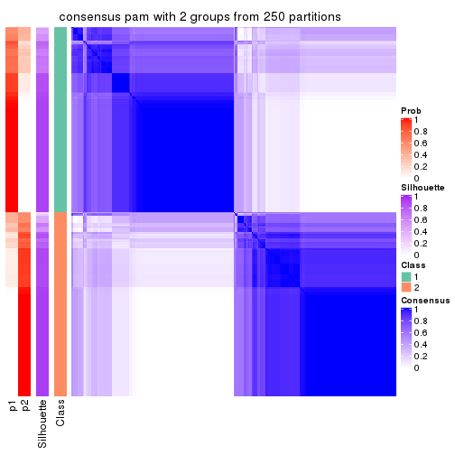</p>

</div>
<div id='tab-CV-pam-consensus-heatmap-2'>
<pre><code class="r">consensus_heatmap(res, k = 3)
</code></pre>

<p>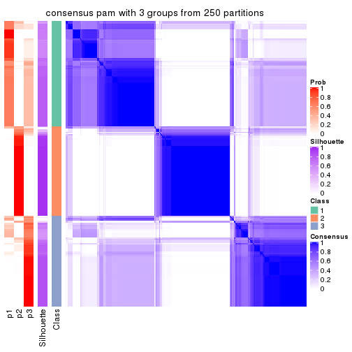</p>

</div>
<div id='tab-CV-pam-consensus-heatmap-3'>
<pre><code class="r">consensus_heatmap(res, k = 4)
</code></pre>

<p>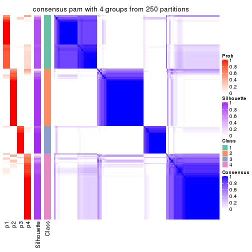</p>

</div>
<div id='tab-CV-pam-consensus-heatmap-4'>
<pre><code class="r">consensus_heatmap(res, k = 5)
</code></pre>

<p>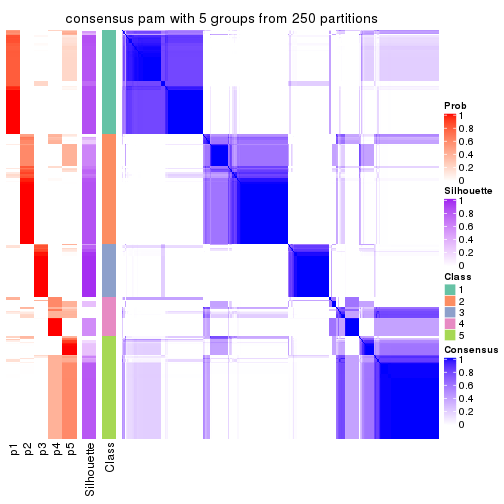</p>

</div>
<div id='tab-CV-pam-consensus-heatmap-5'>
<pre><code class="r">consensus_heatmap(res, k = 6)
</code></pre>

<p>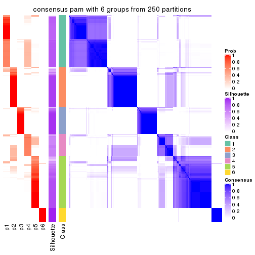</p>

</div>
</div>

Heatmaps for the membership of samples in all partitions to see how consistent they are:


<script>
$( function() {
	$( '#tabs-CV-pam-membership-heatmap' ).tabs();
} );
</script>
<div id='tabs-CV-pam-membership-heatmap'>
<ul>
<li><a href='#tab-CV-pam-membership-heatmap-1'>k = 2</a></li>
<li><a href='#tab-CV-pam-membership-heatmap-2'>k = 3</a></li>
<li><a href='#tab-CV-pam-membership-heatmap-3'>k = 4</a></li>
<li><a href='#tab-CV-pam-membership-heatmap-4'>k = 5</a></li>
<li><a href='#tab-CV-pam-membership-heatmap-5'>k = 6</a></li>
</ul>
<div id='tab-CV-pam-membership-heatmap-1'>
<pre><code class="r">membership_heatmap(res, k = 2)
</code></pre>

<p>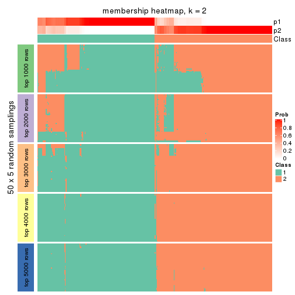</p>

</div>
<div id='tab-CV-pam-membership-heatmap-2'>
<pre><code class="r">membership_heatmap(res, k = 3)
</code></pre>

<p>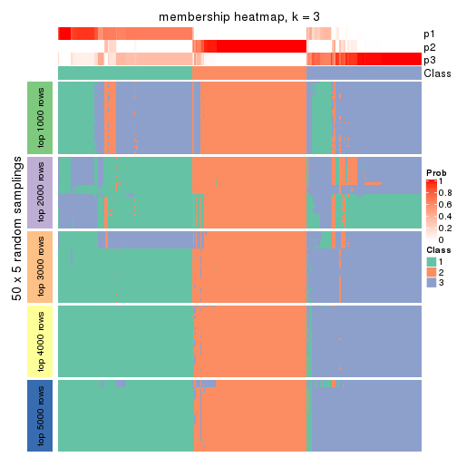</p>

</div>
<div id='tab-CV-pam-membership-heatmap-3'>
<pre><code class="r">membership_heatmap(res, k = 4)
</code></pre>

<p>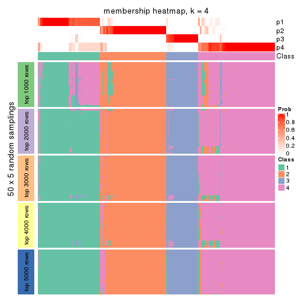</p>

</div>
<div id='tab-CV-pam-membership-heatmap-4'>
<pre><code class="r">membership_heatmap(res, k = 5)
</code></pre>

<p>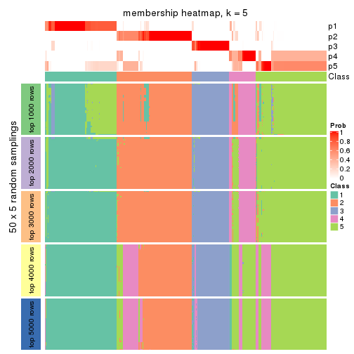</p>

</div>
<div id='tab-CV-pam-membership-heatmap-5'>
<pre><code class="r">membership_heatmap(res, k = 6)
</code></pre>

<p>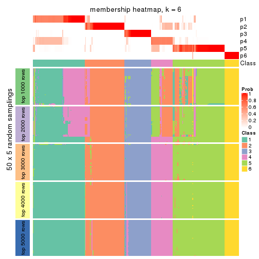</p>

</div>
</div>

As soon as we have had the classes for columns, we can look for signatures
which are significantly different between classes which can be candidate marks
for certain classes. Following are the heatmaps for signatures.


Signature heatmaps where rows are scaled:


<script>
$( function() {
	$( '#tabs-CV-pam-get-signatures' ).tabs();
} );
</script>
<div id='tabs-CV-pam-get-signatures'>
<ul>
<li><a href='#tab-CV-pam-get-signatures-1'>k = 2</a></li>
<li><a href='#tab-CV-pam-get-signatures-2'>k = 3</a></li>
<li><a href='#tab-CV-pam-get-signatures-3'>k = 4</a></li>
<li><a href='#tab-CV-pam-get-signatures-4'>k = 5</a></li>
<li><a href='#tab-CV-pam-get-signatures-5'>k = 6</a></li>
</ul>
<div id='tab-CV-pam-get-signatures-1'>
<pre><code class="r">get_signatures(res, k = 2)
</code></pre>

<p>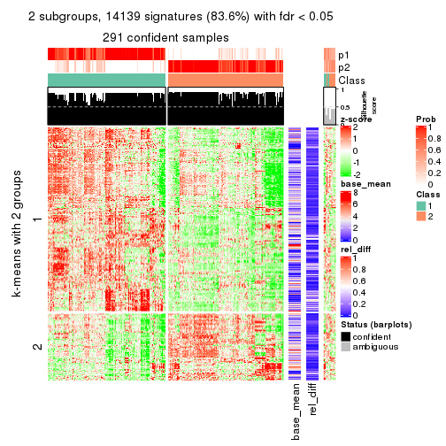</p>

</div>
<div id='tab-CV-pam-get-signatures-2'>
<pre><code class="r">get_signatures(res, k = 3)
</code></pre>

<p>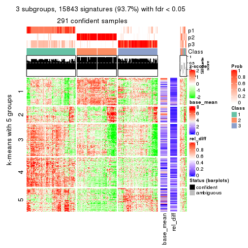</p>

</div>
<div id='tab-CV-pam-get-signatures-3'>
<pre><code class="r">get_signatures(res, k = 4)
</code></pre>

<p>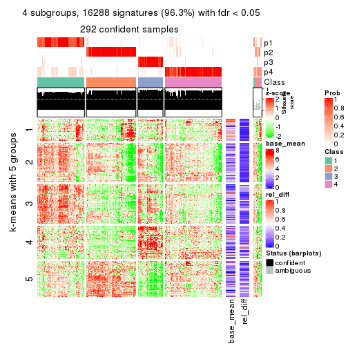</p>

</div>
<div id='tab-CV-pam-get-signatures-4'>
<pre><code class="r">get_signatures(res, k = 5)
</code></pre>

<p>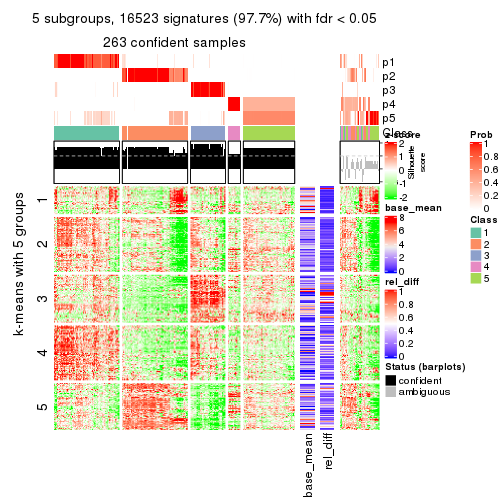</p>

</div>
<div id='tab-CV-pam-get-signatures-5'>
<pre><code class="r">get_signatures(res, k = 6)
</code></pre>

<p>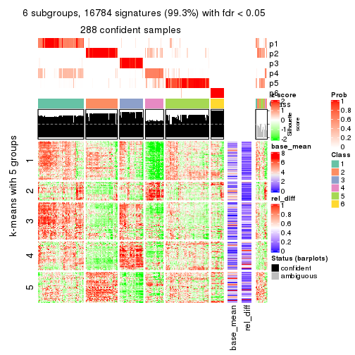</p>

</div>
</div>


Signature heatmaps where rows are not scaled:


<script>
$( function() {
	$( '#tabs-CV-pam-get-signatures-no-scale' ).tabs();
} );
</script>
<div id='tabs-CV-pam-get-signatures-no-scale'>
<ul>
<li><a href='#tab-CV-pam-get-signatures-no-scale-1'>k = 2</a></li>
<li><a href='#tab-CV-pam-get-signatures-no-scale-2'>k = 3</a></li>
<li><a href='#tab-CV-pam-get-signatures-no-scale-3'>k = 4</a></li>
<li><a href='#tab-CV-pam-get-signatures-no-scale-4'>k = 5</a></li>
<li><a href='#tab-CV-pam-get-signatures-no-scale-5'>k = 6</a></li>
</ul>
<div id='tab-CV-pam-get-signatures-no-scale-1'>
<pre><code class="r">get_signatures(res, k = 2, scale_rows = FALSE)
</code></pre>

<p>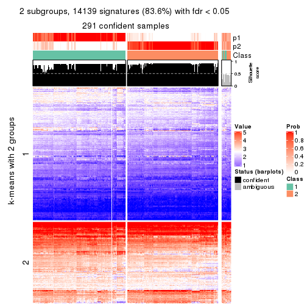</p>

</div>
<div id='tab-CV-pam-get-signatures-no-scale-2'>
<pre><code class="r">get_signatures(res, k = 3, scale_rows = FALSE)
</code></pre>

<p>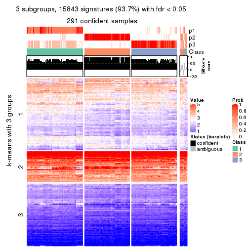</p>

</div>
<div id='tab-CV-pam-get-signatures-no-scale-3'>
<pre><code class="r">get_signatures(res, k = 4, scale_rows = FALSE)
</code></pre>

<p>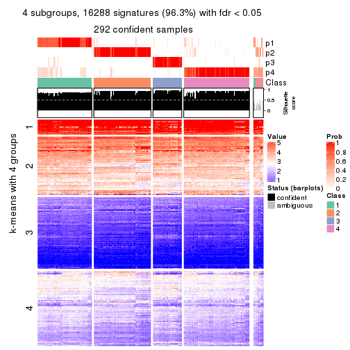</p>

</div>
<div id='tab-CV-pam-get-signatures-no-scale-4'>
<pre><code class="r">get_signatures(res, k = 5, scale_rows = FALSE)
</code></pre>

<p>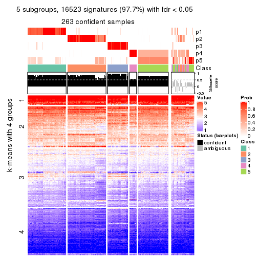</p>

</div>
<div id='tab-CV-pam-get-signatures-no-scale-5'>
<pre><code class="r">get_signatures(res, k = 6, scale_rows = FALSE)
</code></pre>

<p>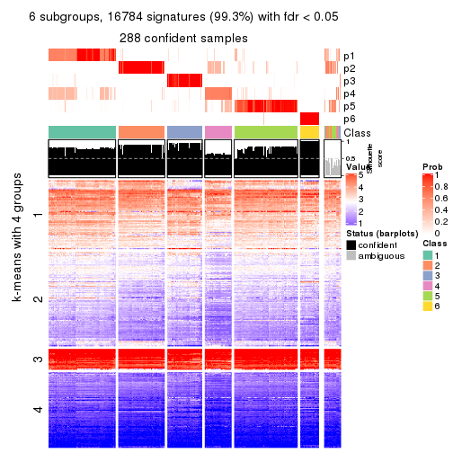</p>

</div>
</div>


Compare the overlap of signatures from different k:

```r
compare_signatures(res)
```

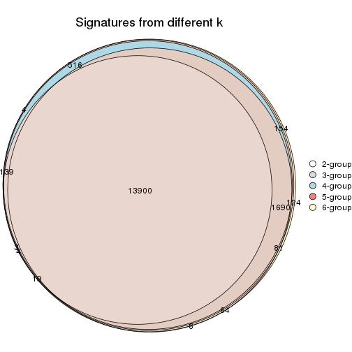

`get_signature()` returns a data frame invisibly. TO get the list of signatures, the function
call should be assigned to a variable explicitly. In following code, if `plot` argument is set
to `FALSE`, no heatmap is plotted while only the differential analysis is performed.

```r
# code only for demonstration
tb = get_signature(res, k = ..., plot = FALSE)
```

An example of the output of `tb` is:

```
#>   which_row         fdr    mean_1    mean_2 scaled_mean_1 scaled_mean_2 km
#> 1        38 0.042760348  8.373488  9.131774    -0.5533452     0.5164555  1
#> 2        40 0.018707592  7.106213  8.469186    -0.6173731     0.5762149  1
#> 3        55 0.019134737 10.221463 11.207825    -0.6159697     0.5749050  1
#> 4        59 0.006059896  5.921854  7.869574    -0.6899429     0.6439467  1
#> 5        60 0.018055526  8.928898 10.211722    -0.6204761     0.5791110  1
#> 6        98 0.009384629 15.714769 14.887706     0.6635654    -0.6193277  2
...
```

The columns in `tb` are:

1. `which_row`: row indices corresponding to the input matrix.
2. `fdr`: FDR for the differential test. 
3. `mean_x`: The mean value in group x.
4. `scaled_mean_x`: The mean value in group x after rows are scaled.
5. `km`: Row groups if k-means clustering is applied to rows.


UMAP plot which shows how samples are separated.


<script>
$( function() {
	$( '#tabs-CV-pam-dimension-reduction' ).tabs();
} );
</script>
<div id='tabs-CV-pam-dimension-reduction'>
<ul>
<li><a href='#tab-CV-pam-dimension-reduction-1'>k = 2</a></li>
<li><a href='#tab-CV-pam-dimension-reduction-2'>k = 3</a></li>
<li><a href='#tab-CV-pam-dimension-reduction-3'>k = 4</a></li>
<li><a href='#tab-CV-pam-dimension-reduction-4'>k = 5</a></li>
<li><a href='#tab-CV-pam-dimension-reduction-5'>k = 6</a></li>
</ul>
<div id='tab-CV-pam-dimension-reduction-1'>
<pre><code class="r">dimension_reduction(res, k = 2, method = &quot;UMAP&quot;)
</code></pre>

<p>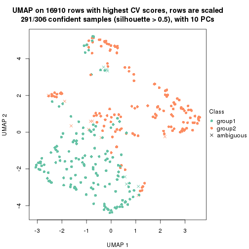</p>

</div>
<div id='tab-CV-pam-dimension-reduction-2'>
<pre><code class="r">dimension_reduction(res, k = 3, method = &quot;UMAP&quot;)
</code></pre>

<p>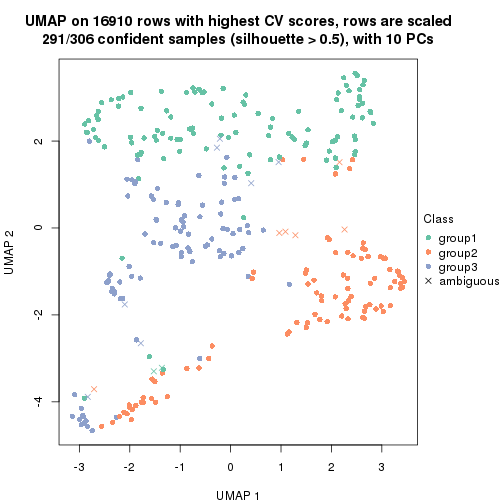</p>

</div>
<div id='tab-CV-pam-dimension-reduction-3'>
<pre><code class="r">dimension_reduction(res, k = 4, method = &quot;UMAP&quot;)
</code></pre>

<p>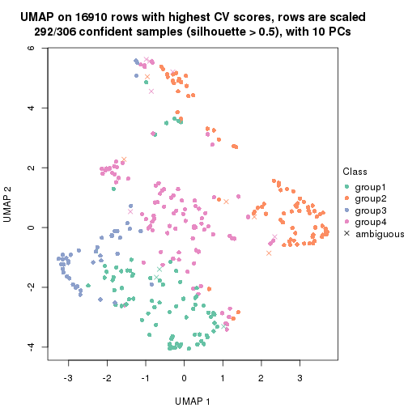</p>

</div>
<div id='tab-CV-pam-dimension-reduction-4'>
<pre><code class="r">dimension_reduction(res, k = 5, method = &quot;UMAP&quot;)
</code></pre>

<p>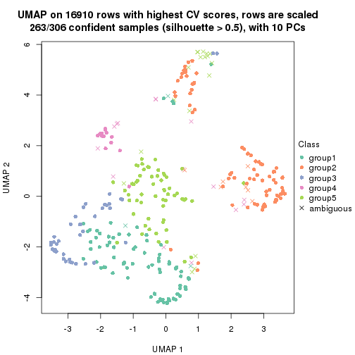</p>

</div>
<div id='tab-CV-pam-dimension-reduction-5'>
<pre><code class="r">dimension_reduction(res, k = 6, method = &quot;UMAP&quot;)
</code></pre>

<p>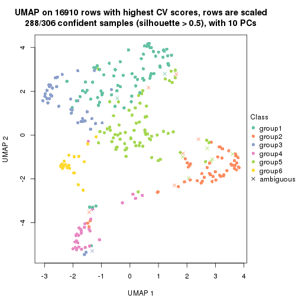</p>

</div>
</div>


Following heatmap shows how subgroups are split when increasing `k`:

```r
collect_classes(res)
```

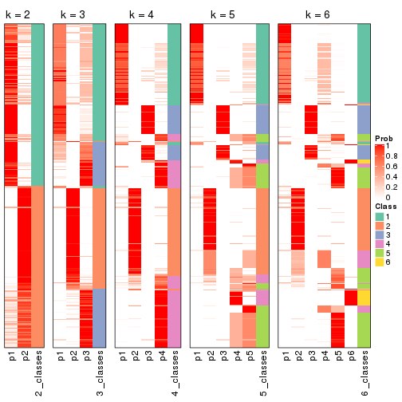


If matrix rows can be associated to genes, consider to use `GO_Enrichment(res,
...)` to perform function enrichment for the signature genes.


 

---------------------------------------------------


### CV:mclust


The object with results only for a single top-value method and a single partition method 
can be extracted as:

```r
res = res_list["CV", "mclust"]
# you can also extract it by
# res = res_list["CV:mclust"]
```

A summary of `res` and all the functions that can be applied to it:

```r
res
```

```
#> A 'ConsensusPartition' object with k = 2, 3, 4, 5, 6.
#>   On a matrix with 16910 rows and 306 columns.
#>   Top rows (1000, 2000, 3000, 4000, 5000) are extracted by 'CV' method.
#>   Subgroups are detected by 'mclust' method.
#>   Performed in total 1250 partitions by row resampling.
#>   Best k for subgroups seems to be 5.
#> 
#> Following methods can be applied to this 'ConsensusPartition' object:
#>  [1] "cola_report"             "collect_classes"         "collect_plots"          
#>  [4] "collect_stats"           "colnames"                "compare_signatures"     
#>  [7] "consensus_heatmap"       "dimension_reduction"     "functional_enrichment"  
#> [10] "get_anno_col"            "get_anno"                "get_classes"            
#> [13] "get_consensus"           "get_matrix"              "get_membership"         
#> [16] "get_param"               "get_signatures"          "get_stats"              
#> [19] "is_best_k"               "is_stable_k"             "membership_heatmap"     
#> [22] "ncol"                    "nrow"                    "plot_ecdf"              
#> [25] "rownames"                "select_partition_number" "show"                   
#> [28] "suggest_best_k"          "test_to_known_factors"
```

`collect_plots()` function collects all the plots made from `res` for all `k` (number of partitions)
into one single page to provide an easy and fast comparison between different `k`.

```r
collect_plots(res)
```

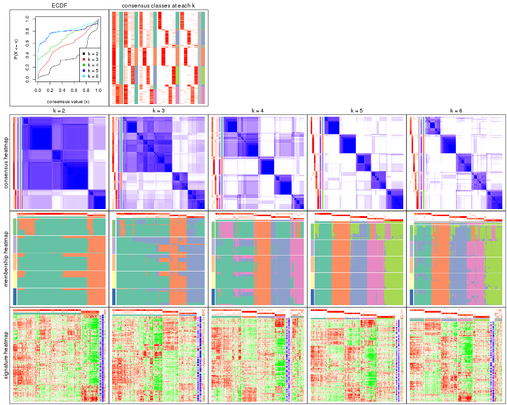

The plots are:

- The first row: a plot of the ECDF (Empirical cumulative distribution
  function) curves of the consensus matrix for each `k` and the heatmap of
  predicted classes for each `k`.
- The second row: heatmaps of the consensus matrix for each `k`.
- The third row: heatmaps of the membership matrix for each `k`.
- The fouth row: heatmaps of the signatures for each `k`.

All the plots in panels can be made by individual functions and they are
plotted later in this section.

`select_partition_number()` produces several plots showing different
statistics for choosing "optimized" `k`. There are following statistics:

- ECDF curves of the consensus matrix for each `k`;
- 1-PAC. [The PAC
  score](https://en.wikipedia.org/wiki/Consensus_clustering#Over-interpretation_potential_of_consensus_clustering)
  measures the proportion of the ambiguous subgrouping.
- Mean silhouette score.
- Concordance. The mean probability of fiting the consensus class ids in all
  partitions.
- Area increased. Denote $A_k$ as the area under the ECDF curve for current
  `k`, the area increased is defined as $A_k - A_{k-1}$.
- Rand index. The percent of pairs of samples that are both in a same cluster
  or both are not in a same cluster in the partition of k and k-1.
- Jaccard index. The ratio of pairs of samples are both in a same cluster in
  the partition of k and k-1 and the pairs of samples are both in a same
  cluster in the partition k or k-1.

The detailed explanations of these statistics can be found in [the cola
vignette](http://bioconductor.org/packages/devel/bioc/vignettes/cola/inst/doc/cola.html#toc_13).

Generally speaking, lower PAC score, higher mean silhouette score or higher
concordance corresponds to better partition. Rand index and Jaccard index
measure how similar the current partition is compared to partition with `k-1`.
If they are too similar, we won't accept `k` is better than `k-1`.

```r
select_partition_number(res)
```

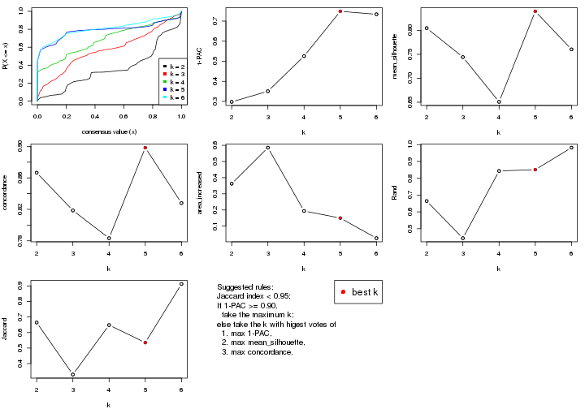

The numeric values for all these statistics can be obtained by `get_stats()`.

```r
get_stats(res)
```

```
#>   k 1-PAC mean_silhouette concordance area_increased  Rand Jaccard
#> 2 2 0.298           0.805       0.867         0.3626 0.664   0.664
#> 3 3 0.351           0.744       0.819         0.5857 0.443   0.330
#> 4 4 0.525           0.651       0.783         0.1937 0.843   0.648
#> 5 5 0.749           0.840       0.898         0.1499 0.851   0.535
#> 6 6 0.734           0.760       0.828         0.0253 0.982   0.912
```

`suggest_best_k()` suggests the best $k$ based on these statistics. The rules are as follows:

- All $k$ with Jaccard index larger than 0.95 are removed because the increase of
  the partition number does not provides enough extra information. If all $k$ are removed,
  the best $k$ is assigned by `NA`.
- For $k$ with 1-PAC larger than 0.9, the maximal $k$ is taken as the "best k". Other $k$ is called "optional k".
- If it does not fit the second rule. The $k$ with the highest vote of highest
  1-PAC, mean silhouette and concordance is taken as the "best k".

```r
suggest_best_k(res)
```

```
#> [1] 5
```


Following shows the table of the partitions (You need to click the **show/hide
code output** link to see it). The membership matrix (columns with name `p*`)
is inferred by
[`clue::cl_consensus()`](https://www.rdocumentation.org/link/cl_consensus?package=clue)
function with the `SE` method. Basically the value in the membership matrix
represents the probability to belong to a certain group. The finall class
label for an item is determined with the group with highest probability it
belongs to.

In `get_classes()` function, the entropy is calculated from the membership
matrix and the silhouette score is calculated from the consensus matrix.


<script>
$( function() {
	$( '#tabs-CV-mclust-get-classes' ).tabs();
} );
</script>
<div id='tabs-CV-mclust-get-classes'>
<ul>
<li><a href='#tab-CV-mclust-get-classes-1'>k = 2</a></li>
<li><a href='#tab-CV-mclust-get-classes-2'>k = 3</a></li>
<li><a href='#tab-CV-mclust-get-classes-3'>k = 4</a></li>
<li><a href='#tab-CV-mclust-get-classes-4'>k = 5</a></li>
<li><a href='#tab-CV-mclust-get-classes-5'>k = 6</a></li>
</ul>

<div id='tab-CV-mclust-get-classes-1'>
<p><a id='tab-CV-mclust-get-classes-1-a' style='color:#0366d6' href='#'>show/hide code output</a></p>
<pre><code class="r">cbind(get_classes(res, k = 2), get_membership(res, k = 2))
</code></pre>

<pre><code>#&gt;            class entropy silhouette    p1    p2
#&gt; SRR1609360     2  0.7299     0.9081 0.204 0.796
#&gt; SRR1609361     2  0.7299     0.9081 0.204 0.796
#&gt; SRR1609362     2  0.7299     0.9081 0.204 0.796
#&gt; SRR1609363     1  0.0376     0.8425 0.996 0.004
#&gt; SRR1609364     1  0.0376     0.8425 0.996 0.004
#&gt; SRR1609365     2  0.7299     0.9081 0.204 0.796
#&gt; SRR1609366     1  0.6531     0.8066 0.832 0.168
#&gt; SRR1609367     1  0.6531     0.8066 0.832 0.168
#&gt; SRR1609368     1  0.0376     0.8425 0.996 0.004
#&gt; SRR1609369     1  0.6531     0.8066 0.832 0.168
#&gt; SRR1609370     1  0.6531     0.8066 0.832 0.168
#&gt; SRR1609371     2  0.7299     0.9081 0.204 0.796
#&gt; SRR1609372     1  0.6531     0.8066 0.832 0.168
#&gt; SRR1609373     1  0.0376     0.8425 0.996 0.004
#&gt; SRR1609374     1  0.0376     0.8425 0.996 0.004
#&gt; SRR1609375     1  0.6531     0.8066 0.832 0.168
#&gt; SRR1609377     1  0.6531     0.8066 0.832 0.168
#&gt; SRR1609376     1  0.0376     0.8425 0.996 0.004
#&gt; SRR1609378     2  0.7299     0.9081 0.204 0.796
#&gt; SRR1609379     1  0.6531     0.8066 0.832 0.168
#&gt; SRR1609382     2  0.7299     0.9081 0.204 0.796
#&gt; SRR1609383     2  0.7299     0.9081 0.204 0.796
#&gt; SRR1609381     1  0.6531     0.8066 0.832 0.168
#&gt; SRR1609384     1  0.6531     0.8066 0.832 0.168
#&gt; SRR1609386     1  0.6531     0.8066 0.832 0.168
#&gt; SRR1609385     1  0.9933     0.0773 0.548 0.452
#&gt; SRR1609387     1  0.6531     0.8066 0.832 0.168
#&gt; SRR1609388     1  0.0376     0.8425 0.996 0.004
#&gt; SRR1609390     1  0.6531     0.8066 0.832 0.168
#&gt; SRR1609393     2  0.7299     0.9081 0.204 0.796
#&gt; SRR1609394     1  0.4431     0.8282 0.908 0.092
#&gt; SRR1609392     1  0.2236     0.8421 0.964 0.036
#&gt; SRR1609391     2  0.7299     0.9081 0.204 0.796
#&gt; SRR1609395     1  0.6531     0.8066 0.832 0.168
#&gt; SRR1609396     1  0.6531     0.8066 0.832 0.168
#&gt; SRR1609398     1  0.6531     0.8066 0.832 0.168
#&gt; SRR1609399     1  0.6531     0.8066 0.832 0.168
#&gt; SRR1609400     1  0.6531     0.8066 0.832 0.168
#&gt; SRR1609397     1  0.0376     0.8425 0.996 0.004
#&gt; SRR1609401     1  0.0376     0.8425 0.996 0.004
#&gt; SRR1609402     1  0.0376     0.8425 0.996 0.004
#&gt; SRR1609405     1  0.6531     0.8066 0.832 0.168
#&gt; SRR1609404     2  0.7299     0.9081 0.204 0.796
#&gt; SRR1609406     1  0.0376     0.8425 0.996 0.004
#&gt; SRR1609408     1  0.0376     0.8425 0.996 0.004
#&gt; SRR1609403     1  0.6531     0.8066 0.832 0.168
#&gt; SRR1609410     1  0.6531     0.8066 0.832 0.168
#&gt; SRR1609411     1  0.0000     0.8430 1.000 0.000
#&gt; SRR1609407     1  0.0376     0.8425 0.996 0.004
#&gt; SRR1609413     1  0.6531     0.8066 0.832 0.168
#&gt; SRR1609412     1  0.0672     0.8421 0.992 0.008
#&gt; SRR1609414     1  0.6531     0.8066 0.832 0.168
#&gt; SRR1609415     1  0.6531     0.8066 0.832 0.168
#&gt; SRR1609416     2  0.7299     0.9081 0.204 0.796
#&gt; SRR1609417     1  0.8909     0.7335 0.692 0.308
#&gt; SRR1609418     1  0.6531     0.8066 0.832 0.168
#&gt; SRR1609419     1  0.0376     0.8425 0.996 0.004
#&gt; SRR1609420     1  0.6531     0.8066 0.832 0.168
#&gt; SRR1609421     1  0.1633     0.8372 0.976 0.024
#&gt; SRR1609422     2  0.0376     0.7864 0.004 0.996
#&gt; SRR1609423     2  0.7299     0.9081 0.204 0.796
#&gt; SRR1609424     2  0.7299     0.9081 0.204 0.796
#&gt; SRR1609425     1  0.0000     0.8430 1.000 0.000
#&gt; SRR1609426     1  0.0376     0.8425 0.996 0.004
#&gt; SRR1609427     2  0.7299     0.9081 0.204 0.796
#&gt; SRR1609428     1  0.0376     0.8425 0.996 0.004
#&gt; SRR1609429     1  0.0672     0.8438 0.992 0.008
#&gt; SRR1609430     1  0.8763     0.7437 0.704 0.296
#&gt; SRR1609431     1  0.7219     0.7080 0.800 0.200
#&gt; SRR1609432     1  0.0376     0.8425 0.996 0.004
#&gt; SRR1609433     2  0.7299     0.9081 0.204 0.796
#&gt; SRR1609434     2  0.7299     0.9081 0.204 0.796
#&gt; SRR1609435     1  0.6531     0.8066 0.832 0.168
#&gt; SRR1609436     1  0.6531     0.8066 0.832 0.168
#&gt; SRR1609437     2  0.4690     0.8533 0.100 0.900
#&gt; SRR1609438     2  0.7299     0.9081 0.204 0.796
#&gt; SRR1609439     2  0.3274     0.8244 0.060 0.940
#&gt; SRR1609440     1  0.6531     0.8066 0.832 0.168
#&gt; SRR1609441     1  0.3879     0.8353 0.924 0.076
#&gt; SRR1609442     1  0.9988    -0.0700 0.520 0.480
#&gt; SRR1609443     1  0.6712     0.7993 0.824 0.176
#&gt; SRR1609444     1  0.5059     0.8268 0.888 0.112
#&gt; SRR1609445     1  0.0000     0.8430 1.000 0.000
#&gt; SRR1609446     1  0.0000     0.8430 1.000 0.000
#&gt; SRR1609447     1  0.6531     0.8066 0.832 0.168
#&gt; SRR1609448     1  0.0376     0.8425 0.996 0.004
#&gt; SRR1609449     1  0.6531     0.8066 0.832 0.168
#&gt; SRR1609450     1  0.0000     0.8430 1.000 0.000
#&gt; SRR1609451     1  0.6887     0.8040 0.816 0.184
#&gt; SRR1609452     1  0.6973     0.7201 0.812 0.188
#&gt; SRR1609453     1  0.6531     0.8066 0.832 0.168
#&gt; SRR1609454     1  0.1843     0.8428 0.972 0.028
#&gt; SRR1609455     1  0.6531     0.8066 0.832 0.168
#&gt; SRR1609456     1  0.0000     0.8430 1.000 0.000
#&gt; SRR1609457     1  0.7056     0.8020 0.808 0.192
#&gt; SRR1609458     1  0.6623     0.8061 0.828 0.172
#&gt; SRR1609459     1  0.6973     0.7201 0.812 0.188
#&gt; SRR1609460     1  0.7219     0.7080 0.800 0.200
#&gt; SRR1609461     1  0.3584     0.8155 0.932 0.068
#&gt; SRR1609462     1  0.7950     0.7820 0.760 0.240
#&gt; SRR1609464     1  0.9209     0.7083 0.664 0.336
#&gt; SRR1609463     1  0.8386     0.7140 0.732 0.268
#&gt; SRR1609465     1  0.7219     0.7080 0.800 0.200
#&gt; SRR1609466     2  0.7299     0.9081 0.204 0.796
#&gt; SRR1609467     1  0.8861     0.7369 0.696 0.304
#&gt; SRR1609469     2  0.7299     0.9081 0.204 0.796
#&gt; SRR1609470     1  0.0000     0.8430 1.000 0.000
#&gt; SRR1609472     2  0.7219     0.9063 0.200 0.800
#&gt; SRR1609471     1  0.6531     0.8066 0.832 0.168
#&gt; SRR1609474     1  0.0000     0.8430 1.000 0.000
#&gt; SRR1609473     2  0.7299     0.9081 0.204 0.796
#&gt; SRR1609475     2  0.7299     0.9081 0.204 0.796
#&gt; SRR1609478     2  0.6887     0.8980 0.184 0.816
#&gt; SRR1609476     1  0.6531     0.8066 0.832 0.168
#&gt; SRR1609477     1  0.9661     0.4127 0.608 0.392
#&gt; SRR1609479     1  0.1414     0.8433 0.980 0.020
#&gt; SRR1609481     2  0.0376     0.7864 0.004 0.996
#&gt; SRR1609480     2  0.3879     0.8389 0.076 0.924
#&gt; SRR1609482     1  0.9044     0.7232 0.680 0.320
#&gt; SRR1609484     2  0.7299     0.9081 0.204 0.796
#&gt; SRR1609483     2  0.9170     0.5122 0.332 0.668
#&gt; SRR1609486     1  0.8016     0.7234 0.756 0.244
#&gt; SRR1609485     1  0.8144     0.7231 0.748 0.252
#&gt; SRR1609487     1  0.6531     0.8066 0.832 0.168
#&gt; SRR1609488     1  0.6438     0.8084 0.836 0.164
#&gt; SRR1609489     1  0.0376     0.8425 0.996 0.004
#&gt; SRR1609490     1  0.0000     0.8430 1.000 0.000
#&gt; SRR1609491     1  0.1414     0.8386 0.980 0.020
#&gt; SRR1609492     1  0.0376     0.8425 0.996 0.004
#&gt; SRR1609493     1  0.7219     0.7080 0.800 0.200
#&gt; SRR1609494     1  0.0376     0.8425 0.996 0.004
#&gt; SRR1609495     2  0.7299     0.9081 0.204 0.796
#&gt; SRR1609496     1  0.8909     0.7335 0.692 0.308
#&gt; SRR1609497     1  0.7056     0.8040 0.808 0.192
#&gt; SRR1609498     1  0.6531     0.8066 0.832 0.168
#&gt; SRR1609499     1  0.0376     0.8425 0.996 0.004
#&gt; SRR1609500     1  0.6531     0.8066 0.832 0.168
#&gt; SRR1609501     1  0.0000     0.8430 1.000 0.000
#&gt; SRR1609502     1  0.3274     0.8384 0.940 0.060
#&gt; SRR1609503     2  0.0938     0.7923 0.012 0.988
#&gt; SRR1609504     1  0.6531     0.8066 0.832 0.168
#&gt; SRR1609505     1  0.7674     0.7901 0.776 0.224
#&gt; SRR1609506     1  0.0376     0.8425 0.996 0.004
#&gt; SRR1609507     1  0.6531     0.8066 0.832 0.168
#&gt; SRR1609508     1  0.0000     0.8430 1.000 0.000
#&gt; SRR1609509     1  0.0376     0.8425 0.996 0.004
#&gt; SRR1609510     2  0.1414     0.7860 0.020 0.980
#&gt; SRR1609512     1  0.8909     0.7335 0.692 0.308
#&gt; SRR1609511     2  0.0938     0.7923 0.012 0.988
#&gt; SRR1609513     1  0.8661     0.7500 0.712 0.288
#&gt; SRR1609514     2  0.7299     0.9081 0.204 0.796
#&gt; SRR1609515     1  0.0376     0.8435 0.996 0.004
#&gt; SRR1609516     1  0.7056     0.7161 0.808 0.192
#&gt; SRR1609517     1  0.4562     0.7937 0.904 0.096
#&gt; SRR1609518     1  0.6531     0.8066 0.832 0.168
#&gt; SRR1609519     1  0.8861     0.7369 0.696 0.304
#&gt; SRR1609520     2  0.7299     0.9081 0.204 0.796
#&gt; SRR1609521     1  0.6531     0.8066 0.832 0.168
#&gt; SRR1609522     1  0.9000     0.7267 0.684 0.316
#&gt; SRR1609523     1  0.7219     0.7080 0.800 0.200
#&gt; SRR1609524     1  0.0376     0.8425 0.996 0.004
#&gt; SRR1609526     2  0.7376     0.7013 0.208 0.792
#&gt; SRR1609525     1  0.0000     0.8430 1.000 0.000
#&gt; SRR1609527     1  0.6531     0.8066 0.832 0.168
#&gt; SRR1609529     1  0.7056     0.7161 0.808 0.192
#&gt; SRR1609528     2  0.6801     0.8959 0.180 0.820
#&gt; SRR1609530     1  0.7745     0.7718 0.772 0.228
#&gt; SRR1609531     1  0.0376     0.8425 0.996 0.004
#&gt; SRR1609532     2  0.9522     0.2704 0.372 0.628
#&gt; SRR1609533     1  0.1633     0.8372 0.976 0.024
#&gt; SRR1609534     1  0.6887     0.7243 0.816 0.184
#&gt; SRR1609535     1  0.7219     0.7080 0.800 0.200
#&gt; SRR1609537     1  0.0376     0.8425 0.996 0.004
#&gt; SRR1609536     1  0.6148     0.7534 0.848 0.152
#&gt; SRR1609538     1  0.0376     0.8425 0.996 0.004
#&gt; SRR1609539     1  0.7219     0.7080 0.800 0.200
#&gt; SRR1609540     1  0.6531     0.8066 0.832 0.168
#&gt; SRR1609541     2  0.0938     0.7923 0.012 0.988
#&gt; SRR1609542     1  0.0376     0.8425 0.996 0.004
#&gt; SRR1609543     2  0.9996     0.2050 0.488 0.512
#&gt; SRR1609544     2  0.7299     0.9081 0.204 0.796
#&gt; SRR1609545     1  0.6531     0.8066 0.832 0.168
#&gt; SRR1609546     1  0.0938     0.8411 0.988 0.012
#&gt; SRR1609547     1  0.7056     0.7161 0.808 0.192
#&gt; SRR1609548     1  0.2423     0.8296 0.960 0.040
#&gt; SRR1609549     1  0.0376     0.8425 0.996 0.004
#&gt; SRR1609550     1  0.0376     0.8425 0.996 0.004
#&gt; SRR1609551     1  0.7376     0.7105 0.792 0.208
#&gt; SRR1609552     1  0.6887     0.7240 0.816 0.184
#&gt; SRR1609553     1  0.7219     0.7291 0.800 0.200
#&gt; SRR1609554     1  0.0000     0.8430 1.000 0.000
#&gt; SRR1609555     1  0.0938     0.8411 0.988 0.012
#&gt; SRR1609556     1  0.8661     0.7500 0.712 0.288
#&gt; SRR1609557     1  0.1184     0.8399 0.984 0.016
#&gt; SRR1609558     1  0.1414     0.8386 0.980 0.020
#&gt; SRR1609559     1  0.7056     0.7217 0.808 0.192
#&gt; SRR1609560     1  0.6048     0.8149 0.852 0.148
#&gt; SRR1609561     1  0.6048     0.7563 0.852 0.148
#&gt; SRR1609562     1  0.5842     0.8178 0.860 0.140
#&gt; SRR1609563     1  0.0000     0.8430 1.000 0.000
#&gt; SRR1609564     1  0.6531     0.8066 0.832 0.168
#&gt; SRR1609565     1  0.0376     0.8425 0.996 0.004
#&gt; SRR1609566     1  0.0376     0.8425 0.996 0.004
#&gt; SRR1609567     1  0.0376     0.8425 0.996 0.004
#&gt; SRR1609568     1  0.6531     0.8066 0.832 0.168
#&gt; SRR1609569     1  0.7056     0.8020 0.808 0.192
#&gt; SRR1609570     1  0.8813     0.7404 0.700 0.300
#&gt; SRR1609571     2  0.3431     0.8270 0.064 0.936
#&gt; SRR1609572     2  0.7299     0.9081 0.204 0.796
#&gt; SRR1609573     2  0.7056     0.7392 0.192 0.808
#&gt; SRR1609574     1  0.9129     0.6006 0.672 0.328
#&gt; SRR1609575     2  0.7299     0.9081 0.204 0.796
#&gt; SRR1609576     1  0.0376     0.8425 0.996 0.004
#&gt; SRR1609578     1  0.0000     0.8430 1.000 0.000
#&gt; SRR1609577     1  0.6531     0.8066 0.832 0.168
#&gt; SRR1609579     2  0.7299     0.9081 0.204 0.796
#&gt; SRR1609580     1  0.6887     0.7244 0.816 0.184
#&gt; SRR1609582     1  0.6531     0.8066 0.832 0.168
#&gt; SRR1609581     1  0.1633     0.8372 0.976 0.024
#&gt; SRR1609583     1  0.0000     0.8430 1.000 0.000
#&gt; SRR1609584     1  0.8861     0.7369 0.696 0.304
#&gt; SRR1609585     1  0.8661     0.7500 0.712 0.288
#&gt; SRR1609586     1  0.0376     0.8425 0.996 0.004
#&gt; SRR1609587     1  0.6438     0.8230 0.836 0.164
#&gt; SRR1609588     1  0.1414     0.8386 0.980 0.020
#&gt; SRR1609589     1  0.0000     0.8430 1.000 0.000
#&gt; SRR1609590     1  0.8861     0.7369 0.696 0.304
#&gt; SRR1609592     1  0.0672     0.8439 0.992 0.008
#&gt; SRR1609591     1  0.0000     0.8430 1.000 0.000
#&gt; SRR1609593     1  0.7219     0.7080 0.800 0.200
#&gt; SRR1609594     2  0.7299     0.9081 0.204 0.796
#&gt; SRR1609595     1  0.7219     0.7080 0.800 0.200
#&gt; SRR1609596     1  0.0376     0.8425 0.996 0.004
#&gt; SRR1609597     1  0.0376     0.8425 0.996 0.004
#&gt; SRR1609598     2  0.5946     0.8783 0.144 0.856
#&gt; SRR1609599     2  0.7139     0.9043 0.196 0.804
#&gt; SRR1609600     1  0.6623     0.8062 0.828 0.172
#&gt; SRR1609601     2  0.0376     0.7864 0.004 0.996
#&gt; SRR1609602     2  0.0938     0.7923 0.012 0.988
#&gt; SRR1609603     1  0.6531     0.8066 0.832 0.168
#&gt; SRR1609604     2  0.7299     0.9081 0.204 0.796
#&gt; SRR1609605     1  0.0938     0.8412 0.988 0.012
#&gt; SRR1609606     1  0.6623     0.7348 0.828 0.172
#&gt; SRR1609607     1  0.7056     0.7161 0.808 0.192
#&gt; SRR1609608     1  0.7056     0.7161 0.808 0.192
#&gt; SRR1609609     1  0.0000     0.8430 1.000 0.000
#&gt; SRR1609610     1  0.2778     0.8442 0.952 0.048
#&gt; SRR1609611     2  0.7299     0.9081 0.204 0.796
#&gt; SRR1609613     1  0.0376     0.8425 0.996 0.004
#&gt; SRR1609612     1  0.1414     0.8386 0.980 0.020
#&gt; SRR1609614     1  0.6531     0.8066 0.832 0.168
#&gt; SRR1609615     1  0.6531     0.8066 0.832 0.168
#&gt; SRR1609616     1  0.6623     0.8062 0.828 0.172
#&gt; SRR1609617     1  0.7219     0.7080 0.800 0.200
#&gt; SRR1609618     1  0.6048     0.7570 0.852 0.148
#&gt; SRR1609619     1  0.6531     0.8066 0.832 0.168
#&gt; SRR1609620     2  0.7299     0.9081 0.204 0.796
#&gt; SRR1609621     2  0.7745     0.8824 0.228 0.772
#&gt; SRR1609622     2  0.3431     0.8270 0.064 0.936
#&gt; SRR1609623     1  0.6531     0.8066 0.832 0.168
#&gt; SRR1609624     1  0.6531     0.8066 0.832 0.168
#&gt; SRR1609625     1  0.6531     0.8066 0.832 0.168
#&gt; SRR1609626     2  0.4022     0.8370 0.080 0.920
#&gt; SRR1609627     1  0.6531     0.8066 0.832 0.168
#&gt; SRR1609628     1  0.0376     0.8425 0.996 0.004
#&gt; SRR1609629     1  0.6531     0.8066 0.832 0.168
#&gt; SRR1609630     1  0.0376     0.8425 0.996 0.004
#&gt; SRR1609631     1  0.6531     0.8066 0.832 0.168
#&gt; SRR1609632     1  0.6531     0.8066 0.832 0.168
#&gt; SRR1609633     1  0.6531     0.8066 0.832 0.168
#&gt; SRR1609634     1  0.0376     0.8425 0.996 0.004
#&gt; SRR1609635     2  0.0672     0.7895 0.008 0.992
#&gt; SRR1609636     2  0.7299     0.9081 0.204 0.796
#&gt; SRR1609637     1  0.6531     0.8066 0.832 0.168
#&gt; SRR1609638     1  0.2603     0.8417 0.956 0.044
#&gt; SRR1609639     1  0.0376     0.8425 0.996 0.004
#&gt; SRR1609640     1  0.8386     0.7646 0.732 0.268
#&gt; SRR1609641     1  0.6531     0.8066 0.832 0.168
#&gt; SRR1609642     1  0.6531     0.8066 0.832 0.168
#&gt; SRR1609643     1  0.0000     0.8430 1.000 0.000
#&gt; SRR1609644     1  0.6531     0.8066 0.832 0.168
#&gt; SRR1609645     1  0.4022     0.8081 0.920 0.080
#&gt; SRR1609646     1  0.8713     0.7468 0.708 0.292
#&gt; SRR1609647     1  0.8555     0.6448 0.720 0.280
#&gt; SRR1609649     1  0.7056     0.8020 0.808 0.192
#&gt; SRR1609648     1  0.0376     0.8425 0.996 0.004
#&gt; SRR1609651     1  0.0000     0.8430 1.000 0.000
#&gt; SRR1609650     1  0.6973     0.7201 0.812 0.188
#&gt; SRR1609652     1  0.9427     0.6831 0.640 0.360
#&gt; SRR1609653     1  0.0376     0.8425 0.996 0.004
#&gt; SRR1609654     2  0.7299     0.9081 0.204 0.796
#&gt; SRR1609655     1  0.7219     0.7080 0.800 0.200
#&gt; SRR1609657     1  0.6531     0.8066 0.832 0.168
#&gt; SRR1609656     2  0.7299     0.9081 0.204 0.796
#&gt; SRR1609658     1  0.0376     0.8425 0.996 0.004
#&gt; SRR1609659     1  0.0376     0.8425 0.996 0.004
#&gt; SRR1609660     1  0.7453     0.7114 0.788 0.212
#&gt; SRR1609661     1  0.0000     0.8430 1.000 0.000
#&gt; SRR1609662     1  0.0376     0.8425 0.996 0.004
#&gt; SRR1609663     1  0.5059     0.7851 0.888 0.112
#&gt; SRR1609664     1  0.7219     0.7080 0.800 0.200
#&gt; SRR1609665     1  0.0376     0.8425 0.996 0.004
#&gt; SRR1609666     2  0.7299     0.9081 0.204 0.796
#&gt; SRR1609667     1  0.6531     0.8066 0.832 0.168
#&gt; SRR1609668     2  0.0376     0.7864 0.004 0.996
#&gt; SRR1609669     1  0.6531     0.8066 0.832 0.168
</code></pre>

<script>
$('#tab-CV-mclust-get-classes-1-a').parent().next().next().hide();
$('#tab-CV-mclust-get-classes-1-a').click(function(){
  $('#tab-CV-mclust-get-classes-1-a').parent().next().next().toggle();
  return(false);
});
</script>
</div>

<div id='tab-CV-mclust-get-classes-2'>
<p><a id='tab-CV-mclust-get-classes-2-a' style='color:#0366d6' href='#'>show/hide code output</a></p>
<pre><code class="r">cbind(get_classes(res, k = 3), get_membership(res, k = 3))
</code></pre>

<pre><code>#&gt;            class entropy silhouette    p1    p2    p3
#&gt; SRR1609360     1  0.0424      0.786 0.992 0.008 0.000
#&gt; SRR1609361     1  0.0424      0.786 0.992 0.008 0.000
#&gt; SRR1609362     1  0.0424      0.786 0.992 0.008 0.000
#&gt; SRR1609363     2  0.4504      0.818 0.000 0.804 0.196
#&gt; SRR1609364     2  0.0592      0.802 0.000 0.988 0.012
#&gt; SRR1609365     1  0.0424      0.786 0.992 0.008 0.000
#&gt; SRR1609366     1  0.8375      0.612 0.608 0.260 0.132
#&gt; SRR1609367     1  0.7535      0.690 0.692 0.132 0.176
#&gt; SRR1609368     2  0.4277      0.801 0.016 0.852 0.132
#&gt; SRR1609369     1  0.8600      0.617 0.604 0.212 0.184
#&gt; SRR1609370     1  0.8600      0.617 0.604 0.212 0.184
#&gt; SRR1609371     1  0.4605      0.655 0.796 0.204 0.000
#&gt; SRR1609372     1  0.8600      0.617 0.604 0.212 0.184
#&gt; SRR1609373     2  0.4504      0.818 0.000 0.804 0.196
#&gt; SRR1609374     2  0.2939      0.754 0.072 0.916 0.012
#&gt; SRR1609375     1  0.8231      0.631 0.636 0.208 0.156
#&gt; SRR1609377     1  0.8600      0.617 0.604 0.212 0.184
#&gt; SRR1609376     2  0.5921      0.791 0.032 0.756 0.212
#&gt; SRR1609378     1  0.1031      0.785 0.976 0.024 0.000
#&gt; SRR1609379     1  0.8600      0.617 0.604 0.212 0.184
#&gt; SRR1609382     1  0.3941      0.704 0.844 0.156 0.000
#&gt; SRR1609383     1  0.0424      0.786 0.992 0.008 0.000
#&gt; SRR1609381     1  0.8600      0.617 0.604 0.212 0.184
#&gt; SRR1609384     1  0.4563      0.780 0.852 0.036 0.112
#&gt; SRR1609386     1  0.8600      0.617 0.604 0.212 0.184
#&gt; SRR1609385     1  0.0661      0.787 0.988 0.008 0.004
#&gt; SRR1609387     1  0.7382      0.698 0.700 0.116 0.184
#&gt; SRR1609388     2  0.4750      0.813 0.000 0.784 0.216
#&gt; SRR1609390     1  0.8600      0.617 0.604 0.212 0.184
#&gt; SRR1609393     1  0.4605      0.655 0.796 0.204 0.000
#&gt; SRR1609394     2  0.7835      0.661 0.112 0.656 0.232
#&gt; SRR1609392     2  0.8250      0.611 0.140 0.628 0.232
#&gt; SRR1609391     1  0.4654      0.651 0.792 0.208 0.000
#&gt; SRR1609395     1  0.8600      0.617 0.604 0.212 0.184
#&gt; SRR1609396     1  0.8600      0.617 0.604 0.212 0.184
#&gt; SRR1609398     1  0.8600      0.617 0.604 0.212 0.184
#&gt; SRR1609399     1  0.8600      0.617 0.604 0.212 0.184
#&gt; SRR1609400     1  0.8600      0.617 0.604 0.212 0.184
#&gt; SRR1609397     2  0.4346      0.825 0.000 0.816 0.184
#&gt; SRR1609401     2  0.0592      0.802 0.000 0.988 0.012
#&gt; SRR1609402     2  0.3482      0.834 0.000 0.872 0.128
#&gt; SRR1609405     1  0.8600      0.617 0.604 0.212 0.184
#&gt; SRR1609404     1  0.4654      0.651 0.792 0.208 0.000
#&gt; SRR1609406     2  0.2066      0.824 0.000 0.940 0.060
#&gt; SRR1609408     2  0.0424      0.801 0.000 0.992 0.008
#&gt; SRR1609403     1  0.8600      0.617 0.604 0.212 0.184
#&gt; SRR1609410     1  0.8600      0.617 0.604 0.212 0.184
#&gt; SRR1609411     2  0.7847      0.544 0.068 0.588 0.344
#&gt; SRR1609407     2  0.0592      0.802 0.000 0.988 0.012
#&gt; SRR1609413     1  0.8600      0.617 0.604 0.212 0.184
#&gt; SRR1609412     3  0.4931      0.850 0.232 0.000 0.768
#&gt; SRR1609414     1  0.3619      0.771 0.864 0.000 0.136
#&gt; SRR1609415     1  0.4291      0.762 0.840 0.008 0.152
#&gt; SRR1609416     1  0.0424      0.786 0.992 0.008 0.000
#&gt; SRR1609417     1  0.3532      0.786 0.884 0.008 0.108
#&gt; SRR1609418     1  0.6886      0.717 0.728 0.088 0.184
#&gt; SRR1609419     2  0.5921      0.791 0.032 0.756 0.212
#&gt; SRR1609420     1  0.2680      0.792 0.924 0.008 0.068
#&gt; SRR1609421     3  0.3340      0.863 0.120 0.000 0.880
#&gt; SRR1609422     1  0.5061      0.663 0.784 0.008 0.208
#&gt; SRR1609423     1  0.3295      0.747 0.896 0.096 0.008
#&gt; SRR1609424     1  0.2066      0.771 0.940 0.060 0.000
#&gt; SRR1609425     1  0.8444      0.609 0.612 0.236 0.152
#&gt; SRR1609426     2  0.0892      0.807 0.000 0.980 0.020
#&gt; SRR1609427     1  0.0424      0.786 0.992 0.008 0.000
#&gt; SRR1609428     2  0.5277      0.820 0.024 0.796 0.180
#&gt; SRR1609429     1  0.6608      0.252 0.560 0.008 0.432
#&gt; SRR1609430     1  0.3116      0.786 0.892 0.000 0.108
#&gt; SRR1609431     3  0.1289      0.808 0.032 0.000 0.968
#&gt; SRR1609432     2  0.1289      0.812 0.000 0.968 0.032
#&gt; SRR1609433     1  0.0424      0.786 0.992 0.008 0.000
#&gt; SRR1609434     1  0.4555      0.660 0.800 0.200 0.000
#&gt; SRR1609435     1  0.4915      0.758 0.804 0.012 0.184
#&gt; SRR1609436     1  0.3816      0.764 0.852 0.000 0.148
#&gt; SRR1609437     1  0.3896      0.766 0.864 0.008 0.128
#&gt; SRR1609438     1  0.4654      0.651 0.792 0.208 0.000
#&gt; SRR1609439     1  0.2625      0.783 0.916 0.000 0.084
#&gt; SRR1609440     1  0.8600      0.617 0.604 0.212 0.184
#&gt; SRR1609441     1  0.5595      0.671 0.756 0.016 0.228
#&gt; SRR1609442     1  0.6872      0.617 0.680 0.276 0.044
#&gt; SRR1609443     1  0.2384      0.792 0.936 0.008 0.056
#&gt; SRR1609444     1  0.6229      0.512 0.652 0.008 0.340
#&gt; SRR1609445     3  0.4931      0.850 0.232 0.000 0.768
#&gt; SRR1609446     3  0.5247      0.845 0.224 0.008 0.768
#&gt; SRR1609447     1  0.4291      0.762 0.840 0.008 0.152
#&gt; SRR1609448     2  0.4702      0.814 0.000 0.788 0.212
#&gt; SRR1609449     1  0.4291      0.762 0.840 0.008 0.152
#&gt; SRR1609450     2  0.7529      0.628 0.060 0.624 0.316
#&gt; SRR1609451     1  0.2959      0.788 0.900 0.000 0.100
#&gt; SRR1609452     3  0.2625      0.851 0.084 0.000 0.916
#&gt; SRR1609453     1  0.3816      0.764 0.852 0.000 0.148
#&gt; SRR1609454     1  0.8399      0.520 0.608 0.136 0.256
#&gt; SRR1609455     1  0.3454      0.785 0.888 0.008 0.104
#&gt; SRR1609456     3  0.5247      0.845 0.224 0.008 0.768
#&gt; SRR1609457     1  0.2486      0.793 0.932 0.008 0.060
#&gt; SRR1609458     1  0.4110      0.762 0.844 0.004 0.152
#&gt; SRR1609459     3  0.2625      0.851 0.084 0.000 0.916
#&gt; SRR1609460     3  0.1289      0.808 0.032 0.000 0.968
#&gt; SRR1609461     3  0.4399      0.861 0.188 0.000 0.812
#&gt; SRR1609462     1  0.3116      0.786 0.892 0.000 0.108
#&gt; SRR1609464     1  0.3116      0.786 0.892 0.000 0.108
#&gt; SRR1609463     3  0.5327      0.551 0.272 0.000 0.728
#&gt; SRR1609465     3  0.1289      0.808 0.032 0.000 0.968
#&gt; SRR1609466     1  0.0424      0.786 0.992 0.008 0.000
#&gt; SRR1609467     1  0.3267      0.786 0.884 0.000 0.116
#&gt; SRR1609469     1  0.2774      0.761 0.920 0.072 0.008
#&gt; SRR1609470     3  0.5247      0.845 0.224 0.008 0.768
#&gt; SRR1609472     1  0.0848      0.785 0.984 0.008 0.008
#&gt; SRR1609471     1  0.4291      0.762 0.840 0.008 0.152
#&gt; SRR1609474     2  0.9048      0.277 0.184 0.548 0.268
#&gt; SRR1609473     1  0.2625      0.757 0.916 0.084 0.000
#&gt; SRR1609475     1  0.4002      0.698 0.840 0.160 0.000
#&gt; SRR1609478     1  0.1170      0.783 0.976 0.008 0.016
#&gt; SRR1609476     1  0.2955      0.790 0.912 0.008 0.080
#&gt; SRR1609477     1  0.2384      0.792 0.936 0.008 0.056
#&gt; SRR1609479     2  0.6067      0.774 0.028 0.736 0.236
#&gt; SRR1609481     1  0.4963      0.658 0.792 0.008 0.200
#&gt; SRR1609480     1  0.4353      0.746 0.836 0.008 0.156
#&gt; SRR1609482     1  0.3116      0.786 0.892 0.000 0.108
#&gt; SRR1609484     1  0.3832      0.780 0.888 0.076 0.036
#&gt; SRR1609483     1  0.2537      0.792 0.920 0.000 0.080
#&gt; SRR1609486     1  0.5706      0.569 0.680 0.000 0.320
#&gt; SRR1609485     1  0.5859      0.546 0.656 0.000 0.344
#&gt; SRR1609487     1  0.8600      0.617 0.604 0.212 0.184
#&gt; SRR1609488     1  0.3879      0.762 0.848 0.000 0.152
#&gt; SRR1609489     2  0.0592      0.802 0.000 0.988 0.012
#&gt; SRR1609490     1  0.9249      0.253 0.508 0.180 0.312
#&gt; SRR1609491     3  0.4842      0.855 0.224 0.000 0.776
#&gt; SRR1609492     2  0.3038      0.834 0.000 0.896 0.104
#&gt; SRR1609493     3  0.1289      0.808 0.032 0.000 0.968
#&gt; SRR1609494     2  0.5285      0.790 0.004 0.752 0.244
#&gt; SRR1609495     1  0.0424      0.786 0.992 0.008 0.000
#&gt; SRR1609496     1  0.3267      0.786 0.884 0.000 0.116
#&gt; SRR1609497     1  0.4399      0.762 0.812 0.000 0.188
#&gt; SRR1609498     1  0.4228      0.764 0.844 0.008 0.148
#&gt; SRR1609499     2  0.7676      0.705 0.112 0.672 0.216
#&gt; SRR1609500     1  0.4228      0.764 0.844 0.008 0.148
#&gt; SRR1609501     3  0.5247      0.845 0.224 0.008 0.768
#&gt; SRR1609502     1  0.6723      0.624 0.704 0.048 0.248
#&gt; SRR1609503     1  0.4228      0.703 0.844 0.008 0.148
#&gt; SRR1609504     1  0.4915      0.758 0.804 0.012 0.184
#&gt; SRR1609505     1  0.3267      0.786 0.884 0.000 0.116
#&gt; SRR1609506     2  0.2448      0.829 0.000 0.924 0.076
#&gt; SRR1609507     1  0.2584      0.791 0.928 0.008 0.064
#&gt; SRR1609508     2  0.6522      0.719 0.032 0.696 0.272
#&gt; SRR1609509     2  0.4702      0.814 0.000 0.788 0.212
#&gt; SRR1609510     1  0.4963      0.658 0.792 0.008 0.200
#&gt; SRR1609512     1  0.3267      0.786 0.884 0.000 0.116
#&gt; SRR1609511     1  0.3682      0.758 0.876 0.008 0.116
#&gt; SRR1609513     1  0.3116      0.786 0.892 0.000 0.108
#&gt; SRR1609514     1  0.0424      0.786 0.992 0.008 0.000
#&gt; SRR1609515     2  0.8544      0.571 0.152 0.600 0.248
#&gt; SRR1609516     3  0.2625      0.851 0.084 0.000 0.916
#&gt; SRR1609517     3  0.2711      0.853 0.088 0.000 0.912
#&gt; SRR1609518     1  0.4473      0.763 0.828 0.008 0.164
#&gt; SRR1609519     1  0.3267      0.786 0.884 0.000 0.116
#&gt; SRR1609520     1  0.3670      0.746 0.888 0.092 0.020
#&gt; SRR1609521     1  0.2680      0.791 0.924 0.008 0.068
#&gt; SRR1609522     1  0.3116      0.786 0.892 0.000 0.108
#&gt; SRR1609523     3  0.1289      0.808 0.032 0.000 0.968
#&gt; SRR1609524     2  0.3482      0.834 0.000 0.872 0.128
#&gt; SRR1609526     1  0.3116      0.786 0.892 0.000 0.108
#&gt; SRR1609525     3  0.4931      0.850 0.232 0.000 0.768
#&gt; SRR1609527     1  0.8600      0.617 0.604 0.212 0.184
#&gt; SRR1609529     3  0.2711      0.850 0.088 0.000 0.912
#&gt; SRR1609528     1  0.0661      0.785 0.988 0.008 0.004
#&gt; SRR1609530     1  0.5760      0.561 0.672 0.000 0.328
#&gt; SRR1609531     2  0.4452      0.822 0.000 0.808 0.192
#&gt; SRR1609532     1  0.3116      0.786 0.892 0.000 0.108
#&gt; SRR1609533     3  0.3551      0.866 0.132 0.000 0.868
#&gt; SRR1609534     1  0.6308      0.138 0.508 0.000 0.492
#&gt; SRR1609535     3  0.1411      0.807 0.036 0.000 0.964
#&gt; SRR1609537     2  0.2878      0.833 0.000 0.904 0.096
#&gt; SRR1609536     3  0.4452      0.861 0.192 0.000 0.808
#&gt; SRR1609538     2  0.5335      0.804 0.008 0.760 0.232
#&gt; SRR1609539     3  0.1411      0.807 0.036 0.000 0.964
#&gt; SRR1609540     1  0.4291      0.762 0.840 0.008 0.152
#&gt; SRR1609541     1  0.4228      0.703 0.844 0.008 0.148
#&gt; SRR1609542     2  0.2537      0.830 0.000 0.920 0.080
#&gt; SRR1609543     1  0.0424      0.786 0.992 0.008 0.000
#&gt; SRR1609544     1  0.0424      0.786 0.992 0.008 0.000
#&gt; SRR1609545     1  0.3129      0.788 0.904 0.008 0.088
#&gt; SRR1609546     3  0.4931      0.850 0.232 0.000 0.768
#&gt; SRR1609547     3  0.2711      0.850 0.088 0.000 0.912
#&gt; SRR1609548     3  0.3686      0.864 0.140 0.000 0.860
#&gt; SRR1609549     2  0.1289      0.812 0.000 0.968 0.032
#&gt; SRR1609550     2  0.4702      0.814 0.000 0.788 0.212
#&gt; SRR1609551     3  0.1529      0.807 0.040 0.000 0.960
#&gt; SRR1609552     1  0.6244      0.403 0.560 0.000 0.440
#&gt; SRR1609553     3  0.4235      0.860 0.176 0.000 0.824
#&gt; SRR1609554     3  0.4931      0.850 0.232 0.000 0.768
#&gt; SRR1609555     3  0.4931      0.850 0.232 0.000 0.768
#&gt; SRR1609556     1  0.3116      0.786 0.892 0.000 0.108
#&gt; SRR1609557     3  0.4346      0.863 0.184 0.000 0.816
#&gt; SRR1609558     3  0.4842      0.855 0.224 0.000 0.776
#&gt; SRR1609559     3  0.3116      0.838 0.108 0.000 0.892
#&gt; SRR1609560     1  0.8557      0.619 0.608 0.212 0.180
#&gt; SRR1609561     1  0.5988      0.499 0.632 0.000 0.368
#&gt; SRR1609562     1  0.8271      0.631 0.632 0.212 0.156
#&gt; SRR1609563     2  0.8179      0.485 0.084 0.564 0.352
#&gt; SRR1609564     1  0.4915      0.758 0.804 0.012 0.184
#&gt; SRR1609565     2  0.4750      0.813 0.000 0.784 0.216
#&gt; SRR1609566     2  0.4702      0.814 0.000 0.788 0.212
#&gt; SRR1609567     2  0.6183      0.765 0.032 0.732 0.236
#&gt; SRR1609568     1  0.8600      0.617 0.604 0.212 0.184
#&gt; SRR1609569     1  0.3267      0.786 0.884 0.000 0.116
#&gt; SRR1609570     1  0.3116      0.786 0.892 0.000 0.108
#&gt; SRR1609571     1  0.2280      0.771 0.940 0.008 0.052
#&gt; SRR1609572     1  0.0000      0.785 1.000 0.000 0.000
#&gt; SRR1609573     1  0.2959      0.786 0.900 0.000 0.100
#&gt; SRR1609574     1  0.3116      0.786 0.892 0.000 0.108
#&gt; SRR1609575     1  0.4654      0.651 0.792 0.208 0.000
#&gt; SRR1609576     2  0.1337      0.797 0.016 0.972 0.012
#&gt; SRR1609578     3  0.5247      0.845 0.224 0.008 0.768
#&gt; SRR1609577     1  0.2173      0.794 0.944 0.008 0.048
#&gt; SRR1609579     1  0.0000      0.785 1.000 0.000 0.000
#&gt; SRR1609580     3  0.3686      0.865 0.140 0.000 0.860
#&gt; SRR1609582     1  0.3295      0.786 0.896 0.008 0.096
#&gt; SRR1609581     3  0.4399      0.866 0.188 0.000 0.812
#&gt; SRR1609583     3  0.4931      0.850 0.232 0.000 0.768
#&gt; SRR1609584     1  0.3116      0.786 0.892 0.000 0.108
#&gt; SRR1609585     1  0.3412      0.786 0.876 0.000 0.124
#&gt; SRR1609586     2  0.4235      0.826 0.000 0.824 0.176
#&gt; SRR1609587     1  0.6018      0.498 0.684 0.008 0.308
#&gt; SRR1609588     3  0.4605      0.863 0.204 0.000 0.796
#&gt; SRR1609589     3  0.5247      0.845 0.224 0.008 0.768
#&gt; SRR1609590     1  0.3116      0.786 0.892 0.000 0.108
#&gt; SRR1609592     3  0.5541      0.810 0.252 0.008 0.740
#&gt; SRR1609591     3  0.5247      0.845 0.224 0.008 0.768
#&gt; SRR1609593     3  0.1289      0.808 0.032 0.000 0.968
#&gt; SRR1609594     1  0.4605      0.655 0.796 0.204 0.000
#&gt; SRR1609595     3  0.1289      0.808 0.032 0.000 0.968
#&gt; SRR1609596     2  0.3192      0.835 0.000 0.888 0.112
#&gt; SRR1609597     2  0.4605      0.819 0.000 0.796 0.204
#&gt; SRR1609598     1  0.3129      0.752 0.904 0.008 0.088
#&gt; SRR1609599     1  0.1289      0.779 0.968 0.000 0.032
#&gt; SRR1609600     1  0.2165      0.791 0.936 0.000 0.064
#&gt; SRR1609601     1  0.4555      0.659 0.800 0.000 0.200
#&gt; SRR1609602     1  0.3038      0.741 0.896 0.000 0.104
#&gt; SRR1609603     1  0.8600      0.617 0.604 0.212 0.184
#&gt; SRR1609604     1  0.4654      0.651 0.792 0.208 0.000
#&gt; SRR1609605     3  0.4702      0.860 0.212 0.000 0.788
#&gt; SRR1609606     3  0.2625      0.851 0.084 0.000 0.916
#&gt; SRR1609607     3  0.2878      0.854 0.096 0.000 0.904
#&gt; SRR1609608     3  0.2711      0.850 0.088 0.000 0.912
#&gt; SRR1609609     3  0.5247      0.845 0.224 0.008 0.768
#&gt; SRR1609610     3  0.5560      0.744 0.300 0.000 0.700
#&gt; SRR1609611     1  0.4654      0.651 0.792 0.208 0.000
#&gt; SRR1609613     2  0.0592      0.802 0.000 0.988 0.012
#&gt; SRR1609612     3  0.4702      0.859 0.212 0.000 0.788
#&gt; SRR1609614     1  0.2584      0.791 0.928 0.008 0.064
#&gt; SRR1609615     1  0.4291      0.762 0.840 0.008 0.152
#&gt; SRR1609616     1  0.4453      0.761 0.836 0.012 0.152
#&gt; SRR1609617     3  0.1289      0.808 0.032 0.000 0.968
#&gt; SRR1609618     3  0.3116      0.860 0.108 0.000 0.892
#&gt; SRR1609619     1  0.3532      0.783 0.884 0.008 0.108
#&gt; SRR1609620     1  0.4452      0.665 0.808 0.192 0.000
#&gt; SRR1609621     1  0.6965      0.654 0.696 0.244 0.060
#&gt; SRR1609622     1  0.2165      0.777 0.936 0.000 0.064
#&gt; SRR1609623     1  0.2384      0.792 0.936 0.008 0.056
#&gt; SRR1609624     1  0.8600      0.617 0.604 0.212 0.184
#&gt; SRR1609625     1  0.4915      0.758 0.804 0.012 0.184
#&gt; SRR1609626     1  0.1860      0.771 0.948 0.000 0.052
#&gt; SRR1609627     1  0.8600      0.617 0.604 0.212 0.184
#&gt; SRR1609628     2  0.0237      0.800 0.000 0.996 0.004
#&gt; SRR1609629     1  0.3941      0.760 0.844 0.000 0.156
#&gt; SRR1609630     2  0.0592      0.802 0.000 0.988 0.012
#&gt; SRR1609631     1  0.8600      0.617 0.604 0.212 0.184
#&gt; SRR1609632     1  0.8600      0.617 0.604 0.212 0.184
#&gt; SRR1609633     1  0.8522      0.625 0.612 0.204 0.184
#&gt; SRR1609634     2  0.4702      0.814 0.000 0.788 0.212
#&gt; SRR1609635     1  0.4353      0.701 0.836 0.008 0.156
#&gt; SRR1609636     1  0.4605      0.655 0.796 0.204 0.000
#&gt; SRR1609637     1  0.4805      0.762 0.812 0.012 0.176
#&gt; SRR1609638     1  0.6318      0.476 0.636 0.008 0.356
#&gt; SRR1609639     2  0.0237      0.800 0.000 0.996 0.004
#&gt; SRR1609640     1  0.3267      0.786 0.884 0.000 0.116
#&gt; SRR1609641     1  0.8600      0.617 0.604 0.212 0.184
#&gt; SRR1609642     1  0.8600      0.617 0.604 0.212 0.184
#&gt; SRR1609643     3  0.4931      0.850 0.232 0.000 0.768
#&gt; SRR1609644     1  0.8600      0.617 0.604 0.212 0.184
#&gt; SRR1609645     3  0.4654      0.860 0.208 0.000 0.792
#&gt; SRR1609646     1  0.3116      0.786 0.892 0.000 0.108
#&gt; SRR1609647     3  0.4291      0.711 0.152 0.008 0.840
#&gt; SRR1609649     1  0.3038      0.790 0.896 0.000 0.104
#&gt; SRR1609648     2  0.4702      0.814 0.000 0.788 0.212
#&gt; SRR1609651     2  0.7821      0.371 0.176 0.672 0.152
#&gt; SRR1609650     3  0.2625      0.851 0.084 0.000 0.916
#&gt; SRR1609652     1  0.3879      0.777 0.848 0.000 0.152
#&gt; SRR1609653     2  0.2537      0.831 0.000 0.920 0.080
#&gt; SRR1609654     1  0.0747      0.786 0.984 0.016 0.000
#&gt; SRR1609655     3  0.1411      0.807 0.036 0.000 0.964
#&gt; SRR1609657     1  0.4945      0.777 0.840 0.056 0.104
#&gt; SRR1609656     1  0.0424      0.786 0.992 0.008 0.000
#&gt; SRR1609658     2  0.6141      0.775 0.032 0.736 0.232
#&gt; SRR1609659     2  0.4346      0.823 0.000 0.816 0.184
#&gt; SRR1609660     3  0.3340      0.763 0.120 0.000 0.880
#&gt; SRR1609661     3  0.4931      0.850 0.232 0.000 0.768
#&gt; SRR1609662     2  0.0829      0.802 0.004 0.984 0.012
#&gt; SRR1609663     3  0.4504      0.860 0.196 0.000 0.804
#&gt; SRR1609664     3  0.1289      0.808 0.032 0.000 0.968
#&gt; SRR1609665     2  0.1015      0.801 0.008 0.980 0.012
#&gt; SRR1609666     1  0.0424      0.786 0.992 0.008 0.000
#&gt; SRR1609667     1  0.4755      0.760 0.808 0.008 0.184
#&gt; SRR1609668     1  0.4963      0.658 0.792 0.008 0.200
#&gt; SRR1609669     1  0.8600      0.617 0.604 0.212 0.184
</code></pre>

<script>
$('#tab-CV-mclust-get-classes-2-a').parent().next().next().hide();
$('#tab-CV-mclust-get-classes-2-a').click(function(){
  $('#tab-CV-mclust-get-classes-2-a').parent().next().next().toggle();
  return(false);
});
</script>
</div>

<div id='tab-CV-mclust-get-classes-3'>
<p><a id='tab-CV-mclust-get-classes-3-a' style='color:#0366d6' href='#'>show/hide code output</a></p>
<pre><code class="r">cbind(get_classes(res, k = 4), get_membership(res, k = 4))
</code></pre>

<pre><code>#&gt;            class entropy silhouette    p1    p2    p3    p4
#&gt; SRR1609360     4  0.0000    0.67898 0.000 0.000 0.000 1.000
#&gt; SRR1609361     4  0.0000    0.67898 0.000 0.000 0.000 1.000
#&gt; SRR1609362     4  0.0000    0.67898 0.000 0.000 0.000 1.000
#&gt; SRR1609363     2  0.0000    0.91073 0.000 1.000 0.000 0.000
#&gt; SRR1609364     2  0.0000    0.91073 0.000 1.000 0.000 0.000
#&gt; SRR1609365     4  0.0000    0.67898 0.000 0.000 0.000 1.000
#&gt; SRR1609366     1  0.7843    0.45261 0.580 0.180 0.048 0.192
#&gt; SRR1609367     1  0.3610    0.52608 0.800 0.000 0.000 0.200
#&gt; SRR1609368     2  0.3870    0.64673 0.208 0.788 0.004 0.000
#&gt; SRR1609369     1  0.3610    0.52608 0.800 0.000 0.000 0.200
#&gt; SRR1609370     1  0.3610    0.52608 0.800 0.000 0.000 0.200
#&gt; SRR1609371     4  0.3610    0.66104 0.000 0.200 0.000 0.800
#&gt; SRR1609372     1  0.3610    0.52608 0.800 0.000 0.000 0.200
#&gt; SRR1609373     2  0.0000    0.91073 0.000 1.000 0.000 0.000
#&gt; SRR1609374     2  0.2149    0.83052 0.000 0.912 0.000 0.088
#&gt; SRR1609375     1  0.3610    0.52608 0.800 0.000 0.000 0.200
#&gt; SRR1609377     1  0.5180    0.55085 0.740 0.000 0.064 0.196
#&gt; SRR1609376     2  0.0000    0.91073 0.000 1.000 0.000 0.000
#&gt; SRR1609378     4  0.3658    0.73703 0.144 0.020 0.000 0.836
#&gt; SRR1609379     1  0.3610    0.52608 0.800 0.000 0.000 0.200
#&gt; SRR1609382     4  0.4591    0.73143 0.084 0.116 0.000 0.800
#&gt; SRR1609383     4  0.3688    0.44318 0.208 0.000 0.000 0.792
#&gt; SRR1609381     1  0.3610    0.52608 0.800 0.000 0.000 0.200
#&gt; SRR1609384     1  0.3610    0.52608 0.800 0.000 0.000 0.200
#&gt; SRR1609386     1  0.3610    0.52608 0.800 0.000 0.000 0.200
#&gt; SRR1609385     1  0.4406    0.48269 0.700 0.000 0.000 0.300
#&gt; SRR1609387     1  0.3610    0.52608 0.800 0.000 0.000 0.200
#&gt; SRR1609388     2  0.0000    0.91073 0.000 1.000 0.000 0.000
#&gt; SRR1609390     1  0.3610    0.52608 0.800 0.000 0.000 0.200
#&gt; SRR1609393     4  0.3751    0.66550 0.004 0.196 0.000 0.800
#&gt; SRR1609394     2  0.8026   -0.00317 0.372 0.476 0.080 0.072
#&gt; SRR1609392     2  0.6426    0.20186 0.352 0.568 0.080 0.000
#&gt; SRR1609391     4  0.3610    0.66104 0.000 0.200 0.000 0.800
#&gt; SRR1609395     1  0.3610    0.52608 0.800 0.000 0.000 0.200
#&gt; SRR1609396     1  0.3610    0.52608 0.800 0.000 0.000 0.200
#&gt; SRR1609398     1  0.3610    0.52608 0.800 0.000 0.000 0.200
#&gt; SRR1609399     1  0.3610    0.52608 0.800 0.000 0.000 0.200
#&gt; SRR1609400     1  0.3610    0.52608 0.800 0.000 0.000 0.200
#&gt; SRR1609397     2  0.0000    0.91073 0.000 1.000 0.000 0.000
#&gt; SRR1609401     2  0.0000    0.91073 0.000 1.000 0.000 0.000
#&gt; SRR1609402     2  0.0000    0.91073 0.000 1.000 0.000 0.000
#&gt; SRR1609405     1  0.5356    0.55199 0.728 0.000 0.072 0.200
#&gt; SRR1609404     4  0.3610    0.66104 0.000 0.200 0.000 0.800
#&gt; SRR1609406     2  0.0000    0.91073 0.000 1.000 0.000 0.000
#&gt; SRR1609408     2  0.0000    0.91073 0.000 1.000 0.000 0.000
#&gt; SRR1609403     1  0.3610    0.52608 0.800 0.000 0.000 0.200
#&gt; SRR1609410     1  0.3610    0.52608 0.800 0.000 0.000 0.200
#&gt; SRR1609411     2  0.7363    0.12787 0.176 0.492 0.332 0.000
#&gt; SRR1609407     2  0.0000    0.91073 0.000 1.000 0.000 0.000
#&gt; SRR1609413     1  0.3610    0.52608 0.800 0.000 0.000 0.200
#&gt; SRR1609412     3  0.3610    0.88835 0.200 0.000 0.800 0.000
#&gt; SRR1609414     1  0.6224    0.60641 0.668 0.000 0.188 0.144
#&gt; SRR1609415     1  0.2654    0.60645 0.888 0.000 0.108 0.004
#&gt; SRR1609416     1  0.4730    0.32971 0.636 0.000 0.000 0.364
#&gt; SRR1609417     1  0.6224    0.60641 0.668 0.000 0.188 0.144
#&gt; SRR1609418     1  0.3610    0.52608 0.800 0.000 0.000 0.200
#&gt; SRR1609419     2  0.0000    0.91073 0.000 1.000 0.000 0.000
#&gt; SRR1609420     1  0.5628    0.55712 0.704 0.000 0.080 0.216
#&gt; SRR1609421     3  0.3610    0.88835 0.200 0.000 0.800 0.000
#&gt; SRR1609422     1  0.7877    0.19000 0.388 0.000 0.304 0.308
#&gt; SRR1609423     4  0.4194    0.73228 0.172 0.028 0.000 0.800
#&gt; SRR1609424     4  0.3610    0.72114 0.200 0.000 0.000 0.800
#&gt; SRR1609425     1  0.9109    0.47156 0.472 0.204 0.132 0.192
#&gt; SRR1609426     2  0.0000    0.91073 0.000 1.000 0.000 0.000
#&gt; SRR1609427     4  0.4948    0.33700 0.440 0.000 0.000 0.560
#&gt; SRR1609428     2  0.0000    0.91073 0.000 1.000 0.000 0.000
#&gt; SRR1609429     1  0.4697    0.35802 0.644 0.000 0.356 0.000
#&gt; SRR1609430     1  0.6224    0.60641 0.668 0.000 0.188 0.144
#&gt; SRR1609431     3  0.0000    0.72776 0.000 0.000 1.000 0.000
#&gt; SRR1609432     2  0.0000    0.91073 0.000 1.000 0.000 0.000
#&gt; SRR1609433     4  0.4981    0.26283 0.464 0.000 0.000 0.536
#&gt; SRR1609434     4  0.3937    0.67389 0.012 0.188 0.000 0.800
#&gt; SRR1609435     1  0.2281    0.55851 0.904 0.000 0.000 0.096
#&gt; SRR1609436     1  0.6074    0.57023 0.668 0.000 0.228 0.104
#&gt; SRR1609437     1  0.5877    0.48188 0.656 0.000 0.068 0.276
#&gt; SRR1609438     4  0.3610    0.66104 0.000 0.200 0.000 0.800
#&gt; SRR1609439     1  0.5300    0.43974 0.664 0.000 0.028 0.308
#&gt; SRR1609440     1  0.3610    0.52608 0.800 0.000 0.000 0.200
#&gt; SRR1609441     1  0.4957    0.43804 0.668 0.000 0.320 0.012
#&gt; SRR1609442     1  0.7815    0.08450 0.444 0.224 0.004 0.328
#&gt; SRR1609443     1  0.6236    0.60294 0.668 0.000 0.180 0.152
#&gt; SRR1609444     1  0.5195    0.50711 0.692 0.000 0.276 0.032
#&gt; SRR1609445     3  0.3610    0.88835 0.200 0.000 0.800 0.000
#&gt; SRR1609446     3  0.3610    0.88835 0.200 0.000 0.800 0.000
#&gt; SRR1609447     1  0.4100    0.61195 0.832 0.000 0.092 0.076
#&gt; SRR1609448     2  0.0000    0.91073 0.000 1.000 0.000 0.000
#&gt; SRR1609449     1  0.3266    0.53773 0.832 0.000 0.000 0.168
#&gt; SRR1609450     2  0.0000    0.91073 0.000 1.000 0.000 0.000
#&gt; SRR1609451     1  0.6243    0.59194 0.668 0.000 0.160 0.172
#&gt; SRR1609452     3  0.3610    0.88835 0.200 0.000 0.800 0.000
#&gt; SRR1609453     1  0.6224    0.60641 0.668 0.000 0.188 0.144
#&gt; SRR1609454     1  0.7843    0.46424 0.548 0.120 0.284 0.048
#&gt; SRR1609455     1  0.6267    0.60733 0.664 0.000 0.188 0.148
#&gt; SRR1609456     3  0.3610    0.88835 0.200 0.000 0.800 0.000
#&gt; SRR1609457     1  0.6224    0.60641 0.668 0.000 0.188 0.144
#&gt; SRR1609458     1  0.6224    0.60641 0.668 0.000 0.188 0.144
#&gt; SRR1609459     3  0.3610    0.88835 0.200 0.000 0.800 0.000
#&gt; SRR1609460     3  0.0000    0.72776 0.000 0.000 1.000 0.000
#&gt; SRR1609461     3  0.3610    0.88835 0.200 0.000 0.800 0.000
#&gt; SRR1609462     1  0.6224    0.60641 0.668 0.000 0.188 0.144
#&gt; SRR1609464     1  0.6224    0.60641 0.668 0.000 0.188 0.144
#&gt; SRR1609463     3  0.2589    0.68053 0.116 0.000 0.884 0.000
#&gt; SRR1609465     3  0.0000    0.72776 0.000 0.000 1.000 0.000
#&gt; SRR1609466     4  0.2011    0.72043 0.080 0.000 0.000 0.920
#&gt; SRR1609467     1  0.6224    0.60641 0.668 0.000 0.188 0.144
#&gt; SRR1609469     4  0.3610    0.72114 0.200 0.000 0.000 0.800
#&gt; SRR1609470     3  0.3610    0.88835 0.200 0.000 0.800 0.000
#&gt; SRR1609472     4  0.4898    0.40481 0.416 0.000 0.000 0.584
#&gt; SRR1609471     1  0.4869    0.60481 0.780 0.000 0.088 0.132
#&gt; SRR1609474     2  0.6004    0.60966 0.072 0.716 0.024 0.188
#&gt; SRR1609473     4  0.3610    0.72114 0.200 0.000 0.000 0.800
#&gt; SRR1609475     4  0.4332    0.73476 0.160 0.040 0.000 0.800
#&gt; SRR1609478     4  0.3610    0.72114 0.200 0.000 0.000 0.800
#&gt; SRR1609476     1  0.3024    0.56604 0.852 0.000 0.000 0.148
#&gt; SRR1609477     1  0.6224    0.60641 0.668 0.000 0.188 0.144
#&gt; SRR1609479     2  0.5989    0.44690 0.264 0.656 0.080 0.000
#&gt; SRR1609481     4  0.7860    0.04662 0.340 0.000 0.276 0.384
#&gt; SRR1609480     1  0.6080    0.52925 0.664 0.000 0.100 0.236
#&gt; SRR1609482     1  0.6224    0.60641 0.668 0.000 0.188 0.144
#&gt; SRR1609484     1  0.5657    0.43282 0.644 0.000 0.044 0.312
#&gt; SRR1609483     1  0.6224    0.60641 0.668 0.000 0.188 0.144
#&gt; SRR1609486     1  0.7253   -0.02563 0.432 0.000 0.424 0.144
#&gt; SRR1609485     1  0.7083    0.34026 0.528 0.000 0.328 0.144
#&gt; SRR1609487     1  0.3751    0.52900 0.800 0.000 0.004 0.196
#&gt; SRR1609488     1  0.4972   -0.01465 0.544 0.000 0.456 0.000
#&gt; SRR1609489     2  0.0000    0.91073 0.000 1.000 0.000 0.000
#&gt; SRR1609490     2  0.8941   -0.12405 0.336 0.412 0.084 0.168
#&gt; SRR1609491     3  0.3610    0.88835 0.200 0.000 0.800 0.000
#&gt; SRR1609492     2  0.0000    0.91073 0.000 1.000 0.000 0.000
#&gt; SRR1609493     3  0.0000    0.72776 0.000 0.000 1.000 0.000
#&gt; SRR1609494     2  0.0000    0.91073 0.000 1.000 0.000 0.000
#&gt; SRR1609495     4  0.4500    0.15511 0.316 0.000 0.000 0.684
#&gt; SRR1609496     1  0.6224    0.60641 0.668 0.000 0.188 0.144
#&gt; SRR1609497     1  0.6353    0.58692 0.652 0.000 0.208 0.140
#&gt; SRR1609498     1  0.6086    0.60930 0.680 0.000 0.188 0.132
#&gt; SRR1609499     2  0.2081    0.80594 0.084 0.916 0.000 0.000
#&gt; SRR1609500     1  0.6224    0.60641 0.668 0.000 0.188 0.144
#&gt; SRR1609501     3  0.3610    0.88835 0.200 0.000 0.800 0.000
#&gt; SRR1609502     1  0.7386    0.54707 0.612 0.056 0.240 0.092
#&gt; SRR1609503     4  0.3610    0.72114 0.200 0.000 0.000 0.800
#&gt; SRR1609504     1  0.2197    0.60158 0.916 0.000 0.080 0.004
#&gt; SRR1609505     1  0.6224    0.60641 0.668 0.000 0.188 0.144
#&gt; SRR1609506     2  0.0000    0.91073 0.000 1.000 0.000 0.000
#&gt; SRR1609507     1  0.6224    0.60641 0.668 0.000 0.188 0.144
#&gt; SRR1609508     2  0.4673    0.66811 0.132 0.792 0.076 0.000
#&gt; SRR1609509     2  0.0000    0.91073 0.000 1.000 0.000 0.000
#&gt; SRR1609510     1  0.7894    0.11118 0.372 0.000 0.296 0.332
#&gt; SRR1609512     1  0.6224    0.60641 0.668 0.000 0.188 0.144
#&gt; SRR1609511     1  0.4843    0.23552 0.604 0.000 0.000 0.396
#&gt; SRR1609513     1  0.6224    0.60641 0.668 0.000 0.188 0.144
#&gt; SRR1609514     4  0.3610    0.72114 0.200 0.000 0.000 0.800
#&gt; SRR1609515     2  0.6307    0.44193 0.256 0.652 0.084 0.008
#&gt; SRR1609516     3  0.3610    0.88835 0.200 0.000 0.800 0.000
#&gt; SRR1609517     3  0.3610    0.88835 0.200 0.000 0.800 0.000
#&gt; SRR1609518     1  0.3610    0.52608 0.800 0.000 0.000 0.200
#&gt; SRR1609519     1  0.6224    0.60641 0.668 0.000 0.188 0.144
#&gt; SRR1609520     4  0.4139    0.73112 0.176 0.024 0.000 0.800
#&gt; SRR1609521     1  0.5993    0.60910 0.692 0.000 0.160 0.148
#&gt; SRR1609522     1  0.6224    0.60641 0.668 0.000 0.188 0.144
#&gt; SRR1609523     3  0.0000    0.72776 0.000 0.000 1.000 0.000
#&gt; SRR1609524     2  0.0000    0.91073 0.000 1.000 0.000 0.000
#&gt; SRR1609526     1  0.6240    0.58956 0.668 0.000 0.156 0.176
#&gt; SRR1609525     3  0.3610    0.88835 0.200 0.000 0.800 0.000
#&gt; SRR1609527     1  0.3610    0.52608 0.800 0.000 0.000 0.200
#&gt; SRR1609529     3  0.3610    0.88835 0.200 0.000 0.800 0.000
#&gt; SRR1609528     4  0.3942    0.69470 0.236 0.000 0.000 0.764
#&gt; SRR1609530     1  0.6936    0.42916 0.564 0.000 0.292 0.144
#&gt; SRR1609531     2  0.0000    0.91073 0.000 1.000 0.000 0.000
#&gt; SRR1609532     1  0.6224    0.60641 0.668 0.000 0.188 0.144
#&gt; SRR1609533     3  0.3610    0.88835 0.200 0.000 0.800 0.000
#&gt; SRR1609534     3  0.6552    0.64510 0.228 0.000 0.628 0.144
#&gt; SRR1609535     3  0.2813    0.69055 0.080 0.024 0.896 0.000
#&gt; SRR1609537     2  0.0000    0.91073 0.000 1.000 0.000 0.000
#&gt; SRR1609536     3  0.3610    0.88835 0.200 0.000 0.800 0.000
#&gt; SRR1609538     2  0.0000    0.91073 0.000 1.000 0.000 0.000
#&gt; SRR1609539     3  0.0707    0.72650 0.000 0.000 0.980 0.020
#&gt; SRR1609540     1  0.6187    0.60712 0.672 0.000 0.184 0.144
#&gt; SRR1609541     4  0.3610    0.72114 0.200 0.000 0.000 0.800
#&gt; SRR1609542     2  0.0000    0.91073 0.000 1.000 0.000 0.000
#&gt; SRR1609543     1  0.4804    0.27596 0.616 0.000 0.000 0.384
#&gt; SRR1609544     4  0.4522    0.34953 0.320 0.000 0.000 0.680
#&gt; SRR1609545     1  0.4424    0.60984 0.812 0.000 0.088 0.100
#&gt; SRR1609546     3  0.3610    0.88835 0.200 0.000 0.800 0.000
#&gt; SRR1609547     3  0.3610    0.88835 0.200 0.000 0.800 0.000
#&gt; SRR1609548     3  0.3610    0.88835 0.200 0.000 0.800 0.000
#&gt; SRR1609549     2  0.0000    0.91073 0.000 1.000 0.000 0.000
#&gt; SRR1609550     2  0.0000    0.91073 0.000 1.000 0.000 0.000
#&gt; SRR1609551     3  0.1474    0.71962 0.052 0.000 0.948 0.000
#&gt; SRR1609552     1  0.7023    0.38639 0.544 0.000 0.312 0.144
#&gt; SRR1609553     3  0.4382    0.75951 0.296 0.000 0.704 0.000
#&gt; SRR1609554     3  0.3610    0.88835 0.200 0.000 0.800 0.000
#&gt; SRR1609555     3  0.4134    0.81766 0.260 0.000 0.740 0.000
#&gt; SRR1609556     1  0.6224    0.60641 0.668 0.000 0.188 0.144
#&gt; SRR1609557     3  0.3610    0.88835 0.200 0.000 0.800 0.000
#&gt; SRR1609558     3  0.3610    0.88835 0.200 0.000 0.800 0.000
#&gt; SRR1609559     3  0.4500    0.73179 0.316 0.000 0.684 0.000
#&gt; SRR1609560     1  0.5339    0.57439 0.744 0.000 0.100 0.156
#&gt; SRR1609561     3  0.7007    0.46554 0.308 0.000 0.548 0.144
#&gt; SRR1609562     1  0.5653    0.56069 0.712 0.000 0.096 0.192
#&gt; SRR1609563     2  0.2345    0.81895 0.000 0.900 0.100 0.000
#&gt; SRR1609564     1  0.0336    0.57455 0.992 0.000 0.000 0.008
#&gt; SRR1609565     2  0.0921    0.88444 0.028 0.972 0.000 0.000
#&gt; SRR1609566     2  0.0000    0.91073 0.000 1.000 0.000 0.000
#&gt; SRR1609567     2  0.1792    0.84047 0.068 0.932 0.000 0.000
#&gt; SRR1609568     1  0.3610    0.52608 0.800 0.000 0.000 0.200
#&gt; SRR1609569     1  0.5140    0.60300 0.760 0.000 0.096 0.144
#&gt; SRR1609570     1  0.6224    0.60641 0.668 0.000 0.188 0.144
#&gt; SRR1609571     4  0.4250    0.65271 0.276 0.000 0.000 0.724
#&gt; SRR1609572     1  0.4948    0.07116 0.560 0.000 0.000 0.440
#&gt; SRR1609573     1  0.6074    0.54693 0.668 0.000 0.104 0.228
#&gt; SRR1609574     1  0.6205    0.57521 0.668 0.000 0.136 0.196
#&gt; SRR1609575     4  0.7553    0.26634 0.344 0.200 0.000 0.456
#&gt; SRR1609576     2  0.0000    0.91073 0.000 1.000 0.000 0.000
#&gt; SRR1609578     3  0.3610    0.88835 0.200 0.000 0.800 0.000
#&gt; SRR1609577     1  0.4193    0.52019 0.732 0.000 0.000 0.268
#&gt; SRR1609579     1  0.4605    0.38617 0.664 0.000 0.000 0.336
#&gt; SRR1609580     3  0.3610    0.88835 0.200 0.000 0.800 0.000
#&gt; SRR1609582     1  0.6224    0.60641 0.668 0.000 0.188 0.144
#&gt; SRR1609581     3  0.3610    0.88835 0.200 0.000 0.800 0.000
#&gt; SRR1609583     3  0.3610    0.88835 0.200 0.000 0.800 0.000
#&gt; SRR1609584     1  0.6224    0.60641 0.668 0.000 0.188 0.144
#&gt; SRR1609585     1  0.6224    0.60641 0.668 0.000 0.188 0.144
#&gt; SRR1609586     2  0.0000    0.91073 0.000 1.000 0.000 0.000
#&gt; SRR1609587     3  0.7175    0.32305 0.360 0.000 0.496 0.144
#&gt; SRR1609588     3  0.3610    0.88835 0.200 0.000 0.800 0.000
#&gt; SRR1609589     3  0.3610    0.88835 0.200 0.000 0.800 0.000
#&gt; SRR1609590     1  0.6224    0.60641 0.668 0.000 0.188 0.144
#&gt; SRR1609592     3  0.4925    0.45892 0.428 0.000 0.572 0.000
#&gt; SRR1609591     3  0.3610    0.88835 0.200 0.000 0.800 0.000
#&gt; SRR1609593     3  0.0000    0.72776 0.000 0.000 1.000 0.000
#&gt; SRR1609594     4  0.3751    0.66550 0.004 0.196 0.000 0.800
#&gt; SRR1609595     3  0.0469    0.72840 0.012 0.000 0.988 0.000
#&gt; SRR1609596     2  0.0000    0.91073 0.000 1.000 0.000 0.000
#&gt; SRR1609597     2  0.0000    0.91073 0.000 1.000 0.000 0.000
#&gt; SRR1609598     4  0.3610    0.72114 0.200 0.000 0.000 0.800
#&gt; SRR1609599     4  0.3610    0.72114 0.200 0.000 0.000 0.800
#&gt; SRR1609600     1  0.6224    0.60641 0.668 0.000 0.188 0.144
#&gt; SRR1609601     4  0.7645    0.14394 0.360 0.000 0.212 0.428
#&gt; SRR1609602     4  0.3610    0.72114 0.200 0.000 0.000 0.800
#&gt; SRR1609603     1  0.3610    0.52608 0.800 0.000 0.000 0.200
#&gt; SRR1609604     4  0.3610    0.66104 0.000 0.200 0.000 0.800
#&gt; SRR1609605     3  0.4040    0.83618 0.248 0.000 0.752 0.000
#&gt; SRR1609606     3  0.3610    0.88835 0.200 0.000 0.800 0.000
#&gt; SRR1609607     3  0.4290    0.86146 0.212 0.000 0.772 0.016
#&gt; SRR1609608     3  0.3610    0.88835 0.200 0.000 0.800 0.000
#&gt; SRR1609609     3  0.3610    0.88835 0.200 0.000 0.800 0.000
#&gt; SRR1609610     3  0.4382    0.75951 0.296 0.000 0.704 0.000
#&gt; SRR1609611     4  0.3610    0.66104 0.000 0.200 0.000 0.800
#&gt; SRR1609613     2  0.0000    0.91073 0.000 1.000 0.000 0.000
#&gt; SRR1609612     3  0.3610    0.88835 0.200 0.000 0.800 0.000
#&gt; SRR1609614     1  0.6224    0.60641 0.668 0.000 0.188 0.144
#&gt; SRR1609615     1  0.5352    0.58633 0.740 0.000 0.092 0.168
#&gt; SRR1609616     1  0.3486    0.58047 0.812 0.000 0.188 0.000
#&gt; SRR1609617     3  0.0469    0.72840 0.012 0.000 0.988 0.000
#&gt; SRR1609618     3  0.3610    0.88835 0.200 0.000 0.800 0.000
#&gt; SRR1609619     1  0.6224    0.60641 0.668 0.000 0.188 0.144
#&gt; SRR1609620     4  0.3610    0.66104 0.000 0.200 0.000 0.800
#&gt; SRR1609621     1  0.8784    0.21699 0.444 0.200 0.064 0.292
#&gt; SRR1609622     1  0.5070    0.29379 0.620 0.000 0.008 0.372
#&gt; SRR1609623     1  0.5066    0.60139 0.764 0.000 0.088 0.148
#&gt; SRR1609624     1  0.3610    0.52608 0.800 0.000 0.000 0.200
#&gt; SRR1609625     1  0.2197    0.60172 0.916 0.000 0.080 0.004
#&gt; SRR1609626     4  0.4941    0.35689 0.436 0.000 0.000 0.564
#&gt; SRR1609627     1  0.5448    0.55551 0.724 0.000 0.080 0.196
#&gt; SRR1609628     2  0.0000    0.91073 0.000 1.000 0.000 0.000
#&gt; SRR1609629     1  0.5047    0.44435 0.668 0.000 0.316 0.016
#&gt; SRR1609630     2  0.0000    0.91073 0.000 1.000 0.000 0.000
#&gt; SRR1609631     1  0.3610    0.52608 0.800 0.000 0.000 0.200
#&gt; SRR1609632     1  0.3610    0.52608 0.800 0.000 0.000 0.200
#&gt; SRR1609633     1  0.3610    0.52608 0.800 0.000 0.000 0.200
#&gt; SRR1609634     2  0.0000    0.91073 0.000 1.000 0.000 0.000
#&gt; SRR1609635     4  0.4584    0.62021 0.300 0.000 0.004 0.696
#&gt; SRR1609636     4  0.3610    0.66104 0.000 0.200 0.000 0.800
#&gt; SRR1609637     1  0.4564    0.50646 0.672 0.000 0.000 0.328
#&gt; SRR1609638     1  0.8737    0.48196 0.516 0.200 0.112 0.172
#&gt; SRR1609639     2  0.0000    0.91073 0.000 1.000 0.000 0.000
#&gt; SRR1609640     1  0.6224    0.60641 0.668 0.000 0.188 0.144
#&gt; SRR1609641     1  0.3610    0.52608 0.800 0.000 0.000 0.200
#&gt; SRR1609642     1  0.3610    0.52608 0.800 0.000 0.000 0.200
#&gt; SRR1609643     3  0.3610    0.88835 0.200 0.000 0.800 0.000
#&gt; SRR1609644     1  0.3610    0.52608 0.800 0.000 0.000 0.200
#&gt; SRR1609645     3  0.3610    0.88835 0.200 0.000 0.800 0.000
#&gt; SRR1609646     1  0.6224    0.60641 0.668 0.000 0.188 0.144
#&gt; SRR1609647     3  0.4761    0.13627 0.332 0.004 0.664 0.000
#&gt; SRR1609649     1  0.6231    0.60776 0.668 0.000 0.184 0.148
#&gt; SRR1609648     2  0.0000    0.91073 0.000 1.000 0.000 0.000
#&gt; SRR1609651     2  0.3852    0.70671 0.008 0.800 0.000 0.192
#&gt; SRR1609650     3  0.3610    0.88835 0.200 0.000 0.800 0.000
#&gt; SRR1609652     1  0.6260    0.60610 0.664 0.000 0.192 0.144
#&gt; SRR1609653     2  0.0000    0.91073 0.000 1.000 0.000 0.000
#&gt; SRR1609654     4  0.0592    0.68861 0.016 0.000 0.000 0.984
#&gt; SRR1609655     3  0.1151    0.72598 0.008 0.000 0.968 0.024
#&gt; SRR1609657     1  0.3610    0.52608 0.800 0.000 0.000 0.200
#&gt; SRR1609656     4  0.0000    0.67898 0.000 0.000 0.000 1.000
#&gt; SRR1609658     2  0.0000    0.91073 0.000 1.000 0.000 0.000
#&gt; SRR1609659     2  0.0000    0.91073 0.000 1.000 0.000 0.000
#&gt; SRR1609660     3  0.4163    0.63378 0.096 0.000 0.828 0.076
#&gt; SRR1609661     3  0.3610    0.88835 0.200 0.000 0.800 0.000
#&gt; SRR1609662     2  0.0000    0.91073 0.000 1.000 0.000 0.000
#&gt; SRR1609663     3  0.3610    0.88835 0.200 0.000 0.800 0.000
#&gt; SRR1609664     3  0.0000    0.72776 0.000 0.000 1.000 0.000
#&gt; SRR1609665     2  0.0000    0.91073 0.000 1.000 0.000 0.000
#&gt; SRR1609666     4  0.0000    0.67898 0.000 0.000 0.000 1.000
#&gt; SRR1609667     1  0.0336    0.57455 0.992 0.000 0.000 0.008
#&gt; SRR1609668     4  0.7707    0.20887 0.320 0.000 0.240 0.440
#&gt; SRR1609669     1  0.3610    0.52608 0.800 0.000 0.000 0.200
</code></pre>

<script>
$('#tab-CV-mclust-get-classes-3-a').parent().next().next().hide();
$('#tab-CV-mclust-get-classes-3-a').click(function(){
  $('#tab-CV-mclust-get-classes-3-a').parent().next().next().toggle();
  return(false);
});
</script>
</div>

<div id='tab-CV-mclust-get-classes-4'>
<p><a id='tab-CV-mclust-get-classes-4-a' style='color:#0366d6' href='#'>show/hide code output</a></p>
<pre><code class="r">cbind(get_classes(res, k = 5), get_membership(res, k = 5))
</code></pre>

<pre><code>#&gt;            class entropy silhouette    p1    p2    p3    p4    p5
#&gt; SRR1609360     4  0.3109    0.76262 0.200 0.000 0.000 0.800 0.000
#&gt; SRR1609361     4  0.3109    0.76262 0.200 0.000 0.000 0.800 0.000
#&gt; SRR1609362     4  0.3109    0.76262 0.200 0.000 0.000 0.800 0.000
#&gt; SRR1609363     2  0.0000    0.94673 0.000 1.000 0.000 0.000 0.000
#&gt; SRR1609364     2  0.0000    0.94673 0.000 1.000 0.000 0.000 0.000
#&gt; SRR1609365     4  0.3109    0.76262 0.200 0.000 0.000 0.800 0.000
#&gt; SRR1609366     2  0.3231    0.74959 0.196 0.800 0.000 0.000 0.004
#&gt; SRR1609367     1  0.0000    0.92789 1.000 0.000 0.000 0.000 0.000
#&gt; SRR1609368     2  0.0000    0.94673 0.000 1.000 0.000 0.000 0.000
#&gt; SRR1609369     1  0.0000    0.92789 1.000 0.000 0.000 0.000 0.000
#&gt; SRR1609370     1  0.0000    0.92789 1.000 0.000 0.000 0.000 0.000
#&gt; SRR1609371     4  0.3231    0.77675 0.000 0.196 0.000 0.800 0.004
#&gt; SRR1609372     1  0.0000    0.92789 1.000 0.000 0.000 0.000 0.000
#&gt; SRR1609373     2  0.0000    0.94673 0.000 1.000 0.000 0.000 0.000
#&gt; SRR1609374     2  0.1270    0.90598 0.052 0.948 0.000 0.000 0.000
#&gt; SRR1609375     1  0.0000    0.92789 1.000 0.000 0.000 0.000 0.000
#&gt; SRR1609377     1  0.0000    0.92789 1.000 0.000 0.000 0.000 0.000
#&gt; SRR1609376     2  0.0000    0.94673 0.000 1.000 0.000 0.000 0.000
#&gt; SRR1609378     4  0.4372    0.83652 0.020 0.072 0.004 0.800 0.104
#&gt; SRR1609379     1  0.0000    0.92789 1.000 0.000 0.000 0.000 0.000
#&gt; SRR1609382     4  0.3888    0.83472 0.000 0.064 0.000 0.800 0.136
#&gt; SRR1609383     4  0.3242    0.74935 0.216 0.000 0.000 0.784 0.000
#&gt; SRR1609381     1  0.0000    0.92789 1.000 0.000 0.000 0.000 0.000
#&gt; SRR1609384     1  0.0000    0.92789 1.000 0.000 0.000 0.000 0.000
#&gt; SRR1609386     1  0.0000    0.92789 1.000 0.000 0.000 0.000 0.000
#&gt; SRR1609385     1  0.3366    0.63073 0.768 0.000 0.000 0.232 0.000
#&gt; SRR1609387     1  0.0000    0.92789 1.000 0.000 0.000 0.000 0.000
#&gt; SRR1609388     2  0.0000    0.94673 0.000 1.000 0.000 0.000 0.000
#&gt; SRR1609390     1  0.0000    0.92789 1.000 0.000 0.000 0.000 0.000
#&gt; SRR1609393     4  0.3318    0.77989 0.000 0.192 0.000 0.800 0.008
#&gt; SRR1609394     2  0.2732    0.76138 0.000 0.840 0.000 0.160 0.000
#&gt; SRR1609392     2  0.0000    0.94673 0.000 1.000 0.000 0.000 0.000
#&gt; SRR1609391     4  0.3109    0.77286 0.000 0.200 0.000 0.800 0.000
#&gt; SRR1609395     1  0.0000    0.92789 1.000 0.000 0.000 0.000 0.000
#&gt; SRR1609396     1  0.0000    0.92789 1.000 0.000 0.000 0.000 0.000
#&gt; SRR1609398     1  0.0000    0.92789 1.000 0.000 0.000 0.000 0.000
#&gt; SRR1609399     1  0.0000    0.92789 1.000 0.000 0.000 0.000 0.000
#&gt; SRR1609400     1  0.0000    0.92789 1.000 0.000 0.000 0.000 0.000
#&gt; SRR1609397     2  0.0000    0.94673 0.000 1.000 0.000 0.000 0.000
#&gt; SRR1609401     2  0.0000    0.94673 0.000 1.000 0.000 0.000 0.000
#&gt; SRR1609402     2  0.0000    0.94673 0.000 1.000 0.000 0.000 0.000
#&gt; SRR1609405     1  0.0000    0.92789 1.000 0.000 0.000 0.000 0.000
#&gt; SRR1609404     4  0.3109    0.77286 0.000 0.200 0.000 0.800 0.000
#&gt; SRR1609406     2  0.0000    0.94673 0.000 1.000 0.000 0.000 0.000
#&gt; SRR1609408     2  0.0000    0.94673 0.000 1.000 0.000 0.000 0.000
#&gt; SRR1609403     1  0.0000    0.92789 1.000 0.000 0.000 0.000 0.000
#&gt; SRR1609410     1  0.0000    0.92789 1.000 0.000 0.000 0.000 0.000
#&gt; SRR1609411     2  0.2561    0.78175 0.000 0.856 0.000 0.000 0.144
#&gt; SRR1609407     2  0.0000    0.94673 0.000 1.000 0.000 0.000 0.000
#&gt; SRR1609413     1  0.0000    0.92789 1.000 0.000 0.000 0.000 0.000
#&gt; SRR1609412     5  0.0510    0.89913 0.000 0.000 0.016 0.000 0.984
#&gt; SRR1609414     3  0.2909    0.86417 0.012 0.000 0.848 0.000 0.140
#&gt; SRR1609415     1  0.3934    0.77139 0.800 0.000 0.076 0.000 0.124
#&gt; SRR1609416     4  0.5460    0.74349 0.028 0.000 0.140 0.708 0.124
#&gt; SRR1609417     3  0.1478    0.87212 0.000 0.000 0.936 0.000 0.064
#&gt; SRR1609418     1  0.0000    0.92789 1.000 0.000 0.000 0.000 0.000
#&gt; SRR1609419     2  0.0000    0.94673 0.000 1.000 0.000 0.000 0.000
#&gt; SRR1609420     1  0.0000    0.92789 1.000 0.000 0.000 0.000 0.000
#&gt; SRR1609421     5  0.0162    0.90002 0.000 0.000 0.004 0.000 0.996
#&gt; SRR1609422     4  0.0290    0.78416 0.000 0.000 0.008 0.992 0.000
#&gt; SRR1609423     4  0.3352    0.82592 0.000 0.004 0.004 0.800 0.192
#&gt; SRR1609424     4  0.3318    0.82448 0.000 0.000 0.008 0.800 0.192
#&gt; SRR1609425     2  0.5886    0.41972 0.272 0.584 0.000 0.000 0.144
#&gt; SRR1609426     2  0.0000    0.94673 0.000 1.000 0.000 0.000 0.000
#&gt; SRR1609427     4  0.5753    0.66007 0.016 0.000 0.204 0.656 0.124
#&gt; SRR1609428     2  0.0000    0.94673 0.000 1.000 0.000 0.000 0.000
#&gt; SRR1609429     5  0.1211    0.88530 0.016 0.000 0.024 0.000 0.960
#&gt; SRR1609430     3  0.0000    0.87095 0.000 0.000 1.000 0.000 0.000
#&gt; SRR1609431     5  0.3109    0.79188 0.000 0.000 0.000 0.200 0.800
#&gt; SRR1609432     2  0.0000    0.94673 0.000 1.000 0.000 0.000 0.000
#&gt; SRR1609433     4  0.4845    0.78194 0.016 0.000 0.108 0.752 0.124
#&gt; SRR1609434     4  0.3456    0.78744 0.000 0.184 0.000 0.800 0.016
#&gt; SRR1609435     1  0.1836    0.88665 0.932 0.000 0.032 0.000 0.036
#&gt; SRR1609436     3  0.2771    0.87116 0.012 0.000 0.860 0.000 0.128
#&gt; SRR1609437     4  0.3656    0.82549 0.000 0.000 0.032 0.800 0.168
#&gt; SRR1609438     4  0.3109    0.77286 0.000 0.200 0.000 0.800 0.000
#&gt; SRR1609439     3  0.6115    0.40241 0.000 0.000 0.552 0.280 0.168
#&gt; SRR1609440     1  0.0000    0.92789 1.000 0.000 0.000 0.000 0.000
#&gt; SRR1609441     5  0.0404    0.89895 0.000 0.000 0.012 0.000 0.988
#&gt; SRR1609442     2  0.4305   -0.13430 0.000 0.512 0.000 0.488 0.000
#&gt; SRR1609443     3  0.2771    0.87116 0.012 0.000 0.860 0.000 0.128
#&gt; SRR1609444     5  0.4455    0.56792 0.260 0.000 0.036 0.000 0.704
#&gt; SRR1609445     5  0.0162    0.89942 0.000 0.000 0.004 0.000 0.996
#&gt; SRR1609446     5  0.0290    0.89947 0.000 0.000 0.008 0.000 0.992
#&gt; SRR1609447     3  0.4312    0.80895 0.104 0.000 0.772 0.000 0.124
#&gt; SRR1609448     2  0.0162    0.94382 0.000 0.996 0.000 0.000 0.004
#&gt; SRR1609449     1  0.1800    0.88491 0.932 0.000 0.020 0.000 0.048
#&gt; SRR1609450     2  0.1478    0.89194 0.000 0.936 0.000 0.000 0.064
#&gt; SRR1609451     3  0.2230    0.87541 0.000 0.000 0.884 0.000 0.116
#&gt; SRR1609452     5  0.0290    0.90023 0.000 0.000 0.008 0.000 0.992
#&gt; SRR1609453     3  0.2966    0.86717 0.016 0.000 0.848 0.000 0.136
#&gt; SRR1609454     5  0.6422   -0.00804 0.000 0.196 0.000 0.316 0.488
#&gt; SRR1609455     1  0.4546    0.72400 0.756 0.000 0.012 0.056 0.176
#&gt; SRR1609456     5  0.0290    0.89947 0.000 0.000 0.008 0.000 0.992
#&gt; SRR1609457     3  0.4302    0.26945 0.000 0.000 0.520 0.000 0.480
#&gt; SRR1609458     3  0.2953    0.86460 0.012 0.000 0.844 0.000 0.144
#&gt; SRR1609459     5  0.0290    0.90023 0.000 0.000 0.008 0.000 0.992
#&gt; SRR1609460     5  0.3109    0.79188 0.000 0.000 0.000 0.200 0.800
#&gt; SRR1609461     5  0.0880    0.89180 0.000 0.000 0.032 0.000 0.968
#&gt; SRR1609462     3  0.0162    0.87269 0.000 0.000 0.996 0.000 0.004
#&gt; SRR1609464     3  0.0000    0.87095 0.000 0.000 1.000 0.000 0.000
#&gt; SRR1609463     5  0.5848    0.61075 0.000 0.000 0.192 0.200 0.608
#&gt; SRR1609465     5  0.3109    0.79188 0.000 0.000 0.000 0.200 0.800
#&gt; SRR1609466     4  0.3632    0.77796 0.176 0.000 0.020 0.800 0.004
#&gt; SRR1609467     3  0.0162    0.87275 0.000 0.000 0.996 0.000 0.004
#&gt; SRR1609469     4  0.3109    0.82372 0.000 0.000 0.000 0.800 0.200
#&gt; SRR1609470     5  0.0000    0.89868 0.000 0.000 0.000 0.000 1.000
#&gt; SRR1609472     4  0.3456    0.82739 0.000 0.000 0.016 0.800 0.184
#&gt; SRR1609471     1  0.3048    0.78181 0.820 0.000 0.004 0.000 0.176
#&gt; SRR1609474     2  0.2438    0.86693 0.040 0.900 0.000 0.000 0.060
#&gt; SRR1609473     4  0.3352    0.82603 0.000 0.004 0.004 0.800 0.192
#&gt; SRR1609475     4  0.3456    0.82915 0.000 0.016 0.000 0.800 0.184
#&gt; SRR1609478     4  0.3456    0.82739 0.000 0.000 0.016 0.800 0.184
#&gt; SRR1609476     1  0.3413    0.80181 0.832 0.000 0.044 0.000 0.124
#&gt; SRR1609477     5  0.4967    0.58718 0.000 0.000 0.192 0.104 0.704
#&gt; SRR1609479     2  0.0000    0.94673 0.000 1.000 0.000 0.000 0.000
#&gt; SRR1609481     4  0.0000    0.78499 0.000 0.000 0.000 1.000 0.000
#&gt; SRR1609480     4  0.3994    0.81364 0.000 0.000 0.040 0.772 0.188
#&gt; SRR1609482     3  0.0000    0.87095 0.000 0.000 1.000 0.000 0.000
#&gt; SRR1609484     4  0.3231    0.82537 0.000 0.004 0.000 0.800 0.196
#&gt; SRR1609483     3  0.2813    0.84739 0.000 0.000 0.832 0.000 0.168
#&gt; SRR1609486     3  0.0162    0.87244 0.000 0.000 0.996 0.000 0.004
#&gt; SRR1609485     3  0.0162    0.87244 0.000 0.000 0.996 0.000 0.004
#&gt; SRR1609487     1  0.0000    0.92789 1.000 0.000 0.000 0.000 0.000
#&gt; SRR1609488     3  0.2771    0.87116 0.012 0.000 0.860 0.000 0.128
#&gt; SRR1609489     2  0.0000    0.94673 0.000 1.000 0.000 0.000 0.000
#&gt; SRR1609490     2  0.3535    0.73957 0.028 0.808 0.000 0.000 0.164
#&gt; SRR1609491     5  0.0404    0.89924 0.000 0.000 0.012 0.000 0.988
#&gt; SRR1609492     2  0.0000    0.94673 0.000 1.000 0.000 0.000 0.000
#&gt; SRR1609493     5  0.3109    0.79188 0.000 0.000 0.000 0.200 0.800
#&gt; SRR1609494     2  0.0000    0.94673 0.000 1.000 0.000 0.000 0.000
#&gt; SRR1609495     4  0.3421    0.75947 0.204 0.000 0.008 0.788 0.000
#&gt; SRR1609496     3  0.0000    0.87095 0.000 0.000 1.000 0.000 0.000
#&gt; SRR1609497     3  0.2864    0.86697 0.012 0.000 0.852 0.000 0.136
#&gt; SRR1609498     3  0.2771    0.87116 0.012 0.000 0.860 0.000 0.128
#&gt; SRR1609499     2  0.2929    0.74723 0.000 0.820 0.000 0.000 0.180
#&gt; SRR1609500     3  0.2825    0.87181 0.016 0.000 0.860 0.000 0.124
#&gt; SRR1609501     5  0.0000    0.89868 0.000 0.000 0.000 0.000 1.000
#&gt; SRR1609502     4  0.4658    0.44262 0.000 0.004 0.008 0.556 0.432
#&gt; SRR1609503     4  0.3456    0.82663 0.000 0.000 0.016 0.800 0.184
#&gt; SRR1609504     1  0.3688    0.78805 0.816 0.000 0.060 0.000 0.124
#&gt; SRR1609505     3  0.0162    0.87269 0.000 0.000 0.996 0.000 0.004
#&gt; SRR1609506     2  0.0000    0.94673 0.000 1.000 0.000 0.000 0.000
#&gt; SRR1609507     3  0.2825    0.87181 0.016 0.000 0.860 0.000 0.124
#&gt; SRR1609508     2  0.0162    0.94414 0.000 0.996 0.000 0.000 0.004
#&gt; SRR1609509     2  0.0290    0.94048 0.000 0.992 0.000 0.000 0.008
#&gt; SRR1609510     4  0.0000    0.78499 0.000 0.000 0.000 1.000 0.000
#&gt; SRR1609512     3  0.0000    0.87095 0.000 0.000 1.000 0.000 0.000
#&gt; SRR1609511     4  0.4819    0.76948 0.000 0.000 0.092 0.716 0.192
#&gt; SRR1609513     3  0.0000    0.87095 0.000 0.000 1.000 0.000 0.000
#&gt; SRR1609514     4  0.3456    0.82494 0.000 0.000 0.016 0.800 0.184
#&gt; SRR1609515     2  0.0162    0.94414 0.000 0.996 0.000 0.000 0.004
#&gt; SRR1609516     5  0.0290    0.90023 0.000 0.000 0.008 0.000 0.992
#&gt; SRR1609517     5  0.0404    0.90001 0.000 0.000 0.012 0.000 0.988
#&gt; SRR1609518     1  0.0000    0.92789 1.000 0.000 0.000 0.000 0.000
#&gt; SRR1609519     3  0.0000    0.87095 0.000 0.000 1.000 0.000 0.000
#&gt; SRR1609520     4  0.3352    0.82592 0.000 0.004 0.004 0.800 0.192
#&gt; SRR1609521     3  0.2825    0.87181 0.016 0.000 0.860 0.000 0.124
#&gt; SRR1609522     3  0.0000    0.87095 0.000 0.000 1.000 0.000 0.000
#&gt; SRR1609523     5  0.3109    0.79188 0.000 0.000 0.000 0.200 0.800
#&gt; SRR1609524     2  0.0000    0.94673 0.000 1.000 0.000 0.000 0.000
#&gt; SRR1609526     3  0.0162    0.87244 0.000 0.000 0.996 0.000 0.004
#&gt; SRR1609525     5  0.0510    0.89889 0.000 0.000 0.016 0.000 0.984
#&gt; SRR1609527     1  0.0000    0.92789 1.000 0.000 0.000 0.000 0.000
#&gt; SRR1609529     5  0.2561    0.81168 0.000 0.000 0.144 0.000 0.856
#&gt; SRR1609528     4  0.3513    0.82680 0.000 0.000 0.020 0.800 0.180
#&gt; SRR1609530     3  0.0000    0.87095 0.000 0.000 1.000 0.000 0.000
#&gt; SRR1609531     2  0.0000    0.94673 0.000 1.000 0.000 0.000 0.000
#&gt; SRR1609532     3  0.0000    0.87095 0.000 0.000 1.000 0.000 0.000
#&gt; SRR1609533     5  0.0162    0.90002 0.000 0.000 0.004 0.000 0.996
#&gt; SRR1609534     3  0.3003    0.83445 0.000 0.000 0.812 0.000 0.188
#&gt; SRR1609535     5  0.3177    0.78790 0.000 0.000 0.000 0.208 0.792
#&gt; SRR1609537     2  0.0000    0.94673 0.000 1.000 0.000 0.000 0.000
#&gt; SRR1609536     5  0.0510    0.89913 0.000 0.000 0.016 0.000 0.984
#&gt; SRR1609538     2  0.0671    0.93302 0.004 0.980 0.000 0.000 0.016
#&gt; SRR1609539     5  0.6254    0.47061 0.000 0.000 0.268 0.196 0.536
#&gt; SRR1609540     1  0.3476    0.76955 0.804 0.000 0.020 0.000 0.176
#&gt; SRR1609541     4  0.3318    0.82476 0.000 0.000 0.008 0.800 0.192
#&gt; SRR1609542     2  0.0000    0.94673 0.000 1.000 0.000 0.000 0.000
#&gt; SRR1609543     3  0.5941    0.56879 0.016 0.000 0.628 0.232 0.124
#&gt; SRR1609544     4  0.4495    0.79746 0.136 0.000 0.060 0.780 0.024
#&gt; SRR1609545     3  0.2825    0.87181 0.016 0.000 0.860 0.000 0.124
#&gt; SRR1609546     5  0.0404    0.89924 0.000 0.000 0.012 0.000 0.988
#&gt; SRR1609547     5  0.0404    0.89958 0.000 0.000 0.012 0.000 0.988
#&gt; SRR1609548     5  0.0290    0.90023 0.000 0.000 0.008 0.000 0.992
#&gt; SRR1609549     2  0.0000    0.94673 0.000 1.000 0.000 0.000 0.000
#&gt; SRR1609550     2  0.0000    0.94673 0.000 1.000 0.000 0.000 0.000
#&gt; SRR1609551     5  0.3109    0.79188 0.000 0.000 0.000 0.200 0.800
#&gt; SRR1609552     3  0.3160    0.83403 0.000 0.000 0.808 0.004 0.188
#&gt; SRR1609553     3  0.4030    0.48087 0.000 0.000 0.648 0.000 0.352
#&gt; SRR1609554     5  0.0000    0.89868 0.000 0.000 0.000 0.000 1.000
#&gt; SRR1609555     5  0.3424    0.61048 0.000 0.000 0.240 0.000 0.760
#&gt; SRR1609556     3  0.0000    0.87095 0.000 0.000 1.000 0.000 0.000
#&gt; SRR1609557     5  0.0000    0.89868 0.000 0.000 0.000 0.000 1.000
#&gt; SRR1609558     5  0.0404    0.89924 0.000 0.000 0.012 0.000 0.988
#&gt; SRR1609559     5  0.0290    0.90023 0.000 0.000 0.008 0.000 0.992
#&gt; SRR1609560     1  0.2891    0.78509 0.824 0.000 0.000 0.000 0.176
#&gt; SRR1609561     3  0.1478    0.87596 0.000 0.000 0.936 0.000 0.064
#&gt; SRR1609562     1  0.2732    0.79950 0.840 0.000 0.000 0.000 0.160
#&gt; SRR1609563     2  0.3003    0.73281 0.000 0.812 0.000 0.000 0.188
#&gt; SRR1609564     1  0.3622    0.79214 0.820 0.000 0.056 0.000 0.124
#&gt; SRR1609565     2  0.0000    0.94673 0.000 1.000 0.000 0.000 0.000
#&gt; SRR1609566     2  0.0000    0.94673 0.000 1.000 0.000 0.000 0.000
#&gt; SRR1609567     2  0.0000    0.94673 0.000 1.000 0.000 0.000 0.000
#&gt; SRR1609568     1  0.0000    0.92789 1.000 0.000 0.000 0.000 0.000
#&gt; SRR1609569     3  0.2179    0.87615 0.000 0.000 0.888 0.000 0.112
#&gt; SRR1609570     3  0.0000    0.87095 0.000 0.000 1.000 0.000 0.000
#&gt; SRR1609571     4  0.3455    0.76308 0.000 0.000 0.208 0.784 0.008
#&gt; SRR1609572     4  0.6124    0.52120 0.012 0.000 0.276 0.584 0.128
#&gt; SRR1609573     3  0.0000    0.87095 0.000 0.000 1.000 0.000 0.000
#&gt; SRR1609574     3  0.2286    0.87670 0.004 0.000 0.888 0.000 0.108
#&gt; SRR1609575     4  0.3109    0.77286 0.000 0.200 0.000 0.800 0.000
#&gt; SRR1609576     2  0.1117    0.92207 0.016 0.964 0.000 0.000 0.020
#&gt; SRR1609578     5  0.0579    0.89696 0.008 0.000 0.008 0.000 0.984
#&gt; SRR1609577     1  0.0000    0.92789 1.000 0.000 0.000 0.000 0.000
#&gt; SRR1609579     3  0.5103    0.73715 0.012 0.000 0.724 0.136 0.128
#&gt; SRR1609580     5  0.2127    0.84404 0.000 0.000 0.108 0.000 0.892
#&gt; SRR1609582     3  0.2771    0.87116 0.012 0.000 0.860 0.000 0.128
#&gt; SRR1609581     5  0.0162    0.89989 0.000 0.000 0.004 0.000 0.996
#&gt; SRR1609583     5  0.0000    0.89868 0.000 0.000 0.000 0.000 1.000
#&gt; SRR1609584     3  0.0000    0.87095 0.000 0.000 1.000 0.000 0.000
#&gt; SRR1609585     3  0.0404    0.87426 0.000 0.000 0.988 0.000 0.012
#&gt; SRR1609586     2  0.0000    0.94673 0.000 1.000 0.000 0.000 0.000
#&gt; SRR1609587     5  0.2424    0.79126 0.000 0.000 0.132 0.000 0.868
#&gt; SRR1609588     5  0.0162    0.89989 0.000 0.000 0.004 0.000 0.996
#&gt; SRR1609589     5  0.0451    0.89878 0.004 0.000 0.008 0.000 0.988
#&gt; SRR1609590     3  0.0162    0.87269 0.000 0.000 0.996 0.000 0.004
#&gt; SRR1609592     5  0.0162    0.90002 0.000 0.000 0.004 0.000 0.996
#&gt; SRR1609591     5  0.0693    0.89445 0.012 0.000 0.008 0.000 0.980
#&gt; SRR1609593     5  0.3109    0.79188 0.000 0.000 0.000 0.200 0.800
#&gt; SRR1609594     4  0.3318    0.78065 0.000 0.192 0.000 0.800 0.008
#&gt; SRR1609595     5  0.3109    0.79188 0.000 0.000 0.000 0.200 0.800
#&gt; SRR1609596     2  0.0000    0.94673 0.000 1.000 0.000 0.000 0.000
#&gt; SRR1609597     2  0.0000    0.94673 0.000 1.000 0.000 0.000 0.000
#&gt; SRR1609598     4  0.3456    0.82494 0.000 0.000 0.016 0.800 0.184
#&gt; SRR1609599     4  0.3456    0.82494 0.000 0.000 0.016 0.800 0.184
#&gt; SRR1609600     3  0.2771    0.87116 0.012 0.000 0.860 0.000 0.128
#&gt; SRR1609601     4  0.0609    0.78122 0.000 0.000 0.020 0.980 0.000
#&gt; SRR1609602     4  0.3565    0.82582 0.000 0.000 0.024 0.800 0.176
#&gt; SRR1609603     1  0.0000    0.92789 1.000 0.000 0.000 0.000 0.000
#&gt; SRR1609604     4  0.3109    0.77286 0.000 0.200 0.000 0.800 0.000
#&gt; SRR1609605     5  0.0510    0.89913 0.000 0.000 0.016 0.000 0.984
#&gt; SRR1609606     5  0.0290    0.90023 0.000 0.000 0.008 0.000 0.992
#&gt; SRR1609607     3  0.3752    0.71410 0.000 0.000 0.708 0.000 0.292
#&gt; SRR1609608     5  0.0510    0.89913 0.000 0.000 0.016 0.000 0.984
#&gt; SRR1609609     5  0.0290    0.89947 0.000 0.000 0.008 0.000 0.992
#&gt; SRR1609610     5  0.1851    0.83890 0.000 0.000 0.088 0.000 0.912
#&gt; SRR1609611     4  0.3109    0.77286 0.000 0.200 0.000 0.800 0.000
#&gt; SRR1609613     2  0.0000    0.94673 0.000 1.000 0.000 0.000 0.000
#&gt; SRR1609612     5  0.0510    0.89913 0.000 0.000 0.016 0.000 0.984
#&gt; SRR1609614     3  0.2771    0.87116 0.012 0.000 0.860 0.000 0.128
#&gt; SRR1609615     1  0.2773    0.79576 0.836 0.000 0.000 0.000 0.164
#&gt; SRR1609616     1  0.3663    0.74233 0.776 0.000 0.016 0.000 0.208
#&gt; SRR1609617     5  0.3109    0.79188 0.000 0.000 0.000 0.200 0.800
#&gt; SRR1609618     5  0.0609    0.89706 0.000 0.000 0.020 0.000 0.980
#&gt; SRR1609619     1  0.8049   -0.09420 0.380 0.000 0.120 0.320 0.180
#&gt; SRR1609620     4  0.3511    0.78419 0.004 0.184 0.000 0.800 0.012
#&gt; SRR1609621     4  0.3242    0.75808 0.000 0.216 0.000 0.784 0.000
#&gt; SRR1609622     3  0.0703    0.86134 0.000 0.000 0.976 0.024 0.000
#&gt; SRR1609623     3  0.2825    0.87181 0.016 0.000 0.860 0.000 0.124
#&gt; SRR1609624     1  0.0000    0.92789 1.000 0.000 0.000 0.000 0.000
#&gt; SRR1609625     1  0.2890    0.79592 0.836 0.000 0.004 0.000 0.160
#&gt; SRR1609626     4  0.4793    0.68991 0.004 0.000 0.256 0.692 0.048
#&gt; SRR1609627     1  0.0162    0.92486 0.996 0.000 0.000 0.000 0.004
#&gt; SRR1609628     2  0.0000    0.94673 0.000 1.000 0.000 0.000 0.000
#&gt; SRR1609629     3  0.4323    0.61585 0.012 0.000 0.656 0.000 0.332
#&gt; SRR1609630     2  0.0000    0.94673 0.000 1.000 0.000 0.000 0.000
#&gt; SRR1609631     1  0.0000    0.92789 1.000 0.000 0.000 0.000 0.000
#&gt; SRR1609632     1  0.0000    0.92789 1.000 0.000 0.000 0.000 0.000
#&gt; SRR1609633     1  0.0000    0.92789 1.000 0.000 0.000 0.000 0.000
#&gt; SRR1609634     2  0.0000    0.94673 0.000 1.000 0.000 0.000 0.000
#&gt; SRR1609635     4  0.3760    0.82052 0.000 0.000 0.028 0.784 0.188
#&gt; SRR1609636     4  0.3109    0.77286 0.000 0.200 0.000 0.800 0.000
#&gt; SRR1609637     1  0.0000    0.92789 1.000 0.000 0.000 0.000 0.000
#&gt; SRR1609638     2  0.6336    0.11905 0.368 0.468 0.000 0.000 0.164
#&gt; SRR1609639     2  0.0000    0.94673 0.000 1.000 0.000 0.000 0.000
#&gt; SRR1609640     3  0.0000    0.87095 0.000 0.000 1.000 0.000 0.000
#&gt; SRR1609641     1  0.0000    0.92789 1.000 0.000 0.000 0.000 0.000
#&gt; SRR1609642     1  0.0000    0.92789 1.000 0.000 0.000 0.000 0.000
#&gt; SRR1609643     5  0.0290    0.89947 0.000 0.000 0.008 0.000 0.992
#&gt; SRR1609644     1  0.0000    0.92789 1.000 0.000 0.000 0.000 0.000
#&gt; SRR1609645     5  0.0510    0.89913 0.000 0.000 0.016 0.000 0.984
#&gt; SRR1609646     3  0.0404    0.87426 0.000 0.000 0.988 0.000 0.012
#&gt; SRR1609647     5  0.3796    0.70888 0.000 0.000 0.000 0.300 0.700
#&gt; SRR1609649     3  0.2825    0.87181 0.016 0.000 0.860 0.000 0.124
#&gt; SRR1609648     2  0.0000    0.94673 0.000 1.000 0.000 0.000 0.000
#&gt; SRR1609651     2  0.2331    0.86839 0.080 0.900 0.000 0.000 0.020
#&gt; SRR1609650     5  0.0290    0.90023 0.000 0.000 0.008 0.000 0.992
#&gt; SRR1609652     3  0.3010    0.84490 0.000 0.000 0.824 0.004 0.172
#&gt; SRR1609653     2  0.0000    0.94673 0.000 1.000 0.000 0.000 0.000
#&gt; SRR1609654     4  0.3656    0.82791 0.032 0.000 0.000 0.800 0.168
#&gt; SRR1609655     5  0.4433    0.76696 0.000 0.000 0.060 0.200 0.740
#&gt; SRR1609657     1  0.0000    0.92789 1.000 0.000 0.000 0.000 0.000
#&gt; SRR1609656     4  0.3109    0.76262 0.200 0.000 0.000 0.800 0.000
#&gt; SRR1609658     2  0.0000    0.94673 0.000 1.000 0.000 0.000 0.000
#&gt; SRR1609659     2  0.0000    0.94673 0.000 1.000 0.000 0.000 0.000
#&gt; SRR1609660     5  0.3863    0.78160 0.000 0.000 0.028 0.200 0.772
#&gt; SRR1609661     5  0.0290    0.89947 0.000 0.000 0.008 0.000 0.992
#&gt; SRR1609662     2  0.0162    0.94430 0.004 0.996 0.000 0.000 0.000
#&gt; SRR1609663     5  0.0703    0.89498 0.000 0.000 0.024 0.000 0.976
#&gt; SRR1609664     5  0.3109    0.79188 0.000 0.000 0.000 0.200 0.800
#&gt; SRR1609665     2  0.0912    0.92802 0.012 0.972 0.000 0.000 0.016
#&gt; SRR1609666     4  0.3109    0.76262 0.200 0.000 0.000 0.800 0.000
#&gt; SRR1609667     1  0.3688    0.78805 0.816 0.000 0.060 0.000 0.124
#&gt; SRR1609668     4  0.0000    0.78499 0.000 0.000 0.000 1.000 0.000
#&gt; SRR1609669     1  0.0000    0.92789 1.000 0.000 0.000 0.000 0.000
</code></pre>

<script>
$('#tab-CV-mclust-get-classes-4-a').parent().next().next().hide();
$('#tab-CV-mclust-get-classes-4-a').click(function(){
  $('#tab-CV-mclust-get-classes-4-a').parent().next().next().toggle();
  return(false);
});
</script>
</div>

<div id='tab-CV-mclust-get-classes-5'>
<p><a id='tab-CV-mclust-get-classes-5-a' style='color:#0366d6' href='#'>show/hide code output</a></p>
<pre><code class="r">cbind(get_classes(res, k = 6), get_membership(res, k = 6))
</code></pre>

<pre><code>#&gt;            class entropy silhouette    p1    p2    p3    p4    p5 p6
#&gt; SRR1609360     4  0.4573     0.6513 0.196 0.000 0.000 0.692 0.000 NA
#&gt; SRR1609361     4  0.4560     0.6500 0.200 0.000 0.000 0.692 0.000 NA
#&gt; SRR1609362     4  0.4596     0.6536 0.188 0.000 0.000 0.692 0.000 NA
#&gt; SRR1609363     2  0.0146     0.9295 0.000 0.996 0.000 0.000 0.000 NA
#&gt; SRR1609364     2  0.0000     0.9298 0.000 1.000 0.000 0.000 0.000 NA
#&gt; SRR1609365     4  0.4573     0.6513 0.196 0.000 0.000 0.692 0.000 NA
#&gt; SRR1609366     2  0.4738     0.4294 0.336 0.600 0.000 0.000 0.000 NA
#&gt; SRR1609367     1  0.3101     0.7619 0.756 0.000 0.000 0.000 0.000 NA
#&gt; SRR1609368     2  0.0547     0.9251 0.000 0.980 0.000 0.000 0.000 NA
#&gt; SRR1609369     1  0.0000     0.7837 1.000 0.000 0.000 0.000 0.000 NA
#&gt; SRR1609370     1  0.3101     0.7619 0.756 0.000 0.000 0.000 0.000 NA
#&gt; SRR1609371     4  0.4358     0.7077 0.000 0.196 0.000 0.712 0.000 NA
#&gt; SRR1609372     1  0.2996     0.7659 0.772 0.000 0.000 0.000 0.000 NA
#&gt; SRR1609373     2  0.0146     0.9295 0.000 0.996 0.000 0.000 0.000 NA
#&gt; SRR1609374     2  0.2786     0.8221 0.100 0.864 0.000 0.000 0.012 NA
#&gt; SRR1609375     1  0.2752     0.7547 0.856 0.036 0.000 0.000 0.000 NA
#&gt; SRR1609377     1  0.2491     0.7478 0.836 0.000 0.000 0.000 0.000 NA
#&gt; SRR1609376     2  0.0260     0.9288 0.000 0.992 0.000 0.000 0.000 NA
#&gt; SRR1609378     4  0.3980     0.7734 0.012 0.040 0.000 0.808 0.100 NA
#&gt; SRR1609379     1  0.0000     0.7837 1.000 0.000 0.000 0.000 0.000 NA
#&gt; SRR1609382     4  0.4842     0.7588 0.000 0.044 0.000 0.724 0.136 NA
#&gt; SRR1609383     4  0.3993     0.5578 0.300 0.000 0.000 0.676 0.000 NA
#&gt; SRR1609381     1  0.3101     0.7619 0.756 0.000 0.000 0.000 0.000 NA
#&gt; SRR1609384     1  0.1838     0.7629 0.916 0.000 0.000 0.068 0.000 NA
#&gt; SRR1609386     1  0.2416     0.7509 0.844 0.000 0.000 0.000 0.000 NA
#&gt; SRR1609385     1  0.3737     0.2752 0.608 0.000 0.000 0.392 0.000 NA
#&gt; SRR1609387     1  0.1267     0.7859 0.940 0.000 0.000 0.000 0.000 NA
#&gt; SRR1609388     2  0.0260     0.9288 0.000 0.992 0.000 0.000 0.000 NA
#&gt; SRR1609390     1  0.3050     0.7641 0.764 0.000 0.000 0.000 0.000 NA
#&gt; SRR1609393     4  0.4358     0.7077 0.000 0.196 0.000 0.712 0.000 NA
#&gt; SRR1609394     2  0.3651     0.6795 0.000 0.772 0.000 0.180 0.000 NA
#&gt; SRR1609392     2  0.1124     0.9152 0.000 0.956 0.000 0.008 0.000 NA
#&gt; SRR1609391     4  0.4386     0.7062 0.000 0.200 0.000 0.708 0.000 NA
#&gt; SRR1609395     1  0.3101     0.7619 0.756 0.000 0.000 0.000 0.000 NA
#&gt; SRR1609396     1  0.3101     0.7619 0.756 0.000 0.000 0.000 0.000 NA
#&gt; SRR1609398     1  0.2340     0.7539 0.852 0.000 0.000 0.000 0.000 NA
#&gt; SRR1609399     1  0.3101     0.7619 0.756 0.000 0.000 0.000 0.000 NA
#&gt; SRR1609400     1  0.3101     0.7619 0.756 0.000 0.000 0.000 0.000 NA
#&gt; SRR1609397     2  0.0146     0.9295 0.000 0.996 0.000 0.000 0.000 NA
#&gt; SRR1609401     2  0.0000     0.9298 0.000 1.000 0.000 0.000 0.000 NA
#&gt; SRR1609402     2  0.0000     0.9298 0.000 1.000 0.000 0.000 0.000 NA
#&gt; SRR1609405     1  0.2454     0.7495 0.840 0.000 0.000 0.000 0.000 NA
#&gt; SRR1609404     4  0.4386     0.7062 0.000 0.200 0.000 0.708 0.000 NA
#&gt; SRR1609406     2  0.0000     0.9298 0.000 1.000 0.000 0.000 0.000 NA
#&gt; SRR1609408     2  0.0000     0.9298 0.000 1.000 0.000 0.000 0.000 NA
#&gt; SRR1609403     1  0.2527     0.7763 0.832 0.000 0.000 0.000 0.000 NA
#&gt; SRR1609410     1  0.0363     0.7833 0.988 0.000 0.000 0.000 0.000 NA
#&gt; SRR1609411     2  0.3042     0.8238 0.000 0.852 0.000 0.020 0.100 NA
#&gt; SRR1609407     2  0.0000     0.9298 0.000 1.000 0.000 0.000 0.000 NA
#&gt; SRR1609413     1  0.3101     0.7619 0.756 0.000 0.000 0.000 0.000 NA
#&gt; SRR1609412     5  0.1458     0.8786 0.000 0.000 0.016 0.020 0.948 NA
#&gt; SRR1609414     3  0.3990     0.8030 0.000 0.000 0.784 0.020 0.128 NA
#&gt; SRR1609415     1  0.6663     0.1187 0.428 0.000 0.340 0.020 0.016 NA
#&gt; SRR1609416     4  0.5750     0.5579 0.012 0.000 0.196 0.616 0.016 NA
#&gt; SRR1609417     3  0.1714     0.8396 0.000 0.000 0.908 0.000 0.092 NA
#&gt; SRR1609418     1  0.0790     0.7818 0.968 0.000 0.000 0.000 0.000 NA
#&gt; SRR1609419     2  0.0653     0.9259 0.000 0.980 0.000 0.012 0.004 NA
#&gt; SRR1609420     1  0.3139     0.6774 0.812 0.000 0.000 0.160 0.000 NA
#&gt; SRR1609421     5  0.0146     0.8835 0.000 0.000 0.004 0.000 0.996 NA
#&gt; SRR1609422     4  0.2318     0.7187 0.000 0.000 0.064 0.892 0.000 NA
#&gt; SRR1609423     4  0.2848     0.7680 0.000 0.008 0.000 0.828 0.160 NA
#&gt; SRR1609424     4  0.4270     0.7593 0.000 0.004 0.004 0.748 0.156 NA
#&gt; SRR1609425     1  0.7167     0.4814 0.520 0.172 0.000 0.028 0.104 NA
#&gt; SRR1609426     2  0.0000     0.9298 0.000 1.000 0.000 0.000 0.000 NA
#&gt; SRR1609427     4  0.5763     0.4947 0.004 0.000 0.232 0.588 0.016 NA
#&gt; SRR1609428     2  0.0146     0.9295 0.000 0.996 0.000 0.000 0.000 NA
#&gt; SRR1609429     5  0.4872     0.7136 0.128 0.000 0.068 0.020 0.744 NA
#&gt; SRR1609430     3  0.0000     0.8496 0.000 0.000 1.000 0.000 0.000 NA
#&gt; SRR1609431     5  0.3422     0.7822 0.000 0.000 0.000 0.168 0.792 NA
#&gt; SRR1609432     2  0.0146     0.9291 0.000 0.996 0.000 0.004 0.000 NA
#&gt; SRR1609433     4  0.5327     0.6141 0.004 0.000 0.164 0.656 0.016 NA
#&gt; SRR1609434     4  0.4548     0.7191 0.000 0.176 0.000 0.720 0.012 NA
#&gt; SRR1609435     1  0.4382     0.7315 0.680 0.000 0.004 0.020 0.016 NA
#&gt; SRR1609436     3  0.4157     0.8192 0.000 0.000 0.772 0.020 0.084 NA
#&gt; SRR1609437     4  0.3757     0.7620 0.000 0.000 0.036 0.784 0.164 NA
#&gt; SRR1609438     4  0.4358     0.7077 0.000 0.196 0.000 0.712 0.000 NA
#&gt; SRR1609439     3  0.5695     0.3843 0.000 0.000 0.552 0.272 0.168 NA
#&gt; SRR1609440     1  0.3101     0.7619 0.756 0.000 0.000 0.000 0.000 NA
#&gt; SRR1609441     5  0.2065     0.8567 0.000 0.000 0.004 0.052 0.912 NA
#&gt; SRR1609442     2  0.4639    -0.0897 0.000 0.512 0.000 0.448 0.000 NA
#&gt; SRR1609443     3  0.4676     0.8072 0.004 0.000 0.752 0.068 0.060 NA
#&gt; SRR1609444     1  0.6302     0.1713 0.476 0.000 0.056 0.020 0.388 NA
#&gt; SRR1609445     5  0.0725     0.8826 0.000 0.000 0.000 0.012 0.976 NA
#&gt; SRR1609446     5  0.1341     0.8786 0.000 0.000 0.000 0.024 0.948 NA
#&gt; SRR1609447     3  0.4213     0.8104 0.016 0.000 0.744 0.020 0.016 NA
#&gt; SRR1609448     2  0.0725     0.9217 0.000 0.976 0.000 0.012 0.012 NA
#&gt; SRR1609449     1  0.2747     0.7518 0.868 0.000 0.000 0.020 0.016 NA
#&gt; SRR1609450     2  0.3114     0.7964 0.004 0.848 0.000 0.024 0.108 NA
#&gt; SRR1609451     3  0.2492     0.8501 0.004 0.000 0.888 0.008 0.020 NA
#&gt; SRR1609452     5  0.0291     0.8833 0.000 0.000 0.004 0.000 0.992 NA
#&gt; SRR1609453     3  0.4480     0.8116 0.012 0.000 0.764 0.020 0.104 NA
#&gt; SRR1609454     4  0.6846     0.2592 0.000 0.248 0.000 0.352 0.352 NA
#&gt; SRR1609455     1  0.6414     0.3342 0.556 0.000 0.024 0.260 0.120 NA
#&gt; SRR1609456     5  0.1168     0.8801 0.000 0.000 0.000 0.016 0.956 NA
#&gt; SRR1609457     3  0.4127     0.5173 0.000 0.000 0.620 0.012 0.364 NA
#&gt; SRR1609458     3  0.4493     0.8036 0.004 0.000 0.752 0.020 0.112 NA
#&gt; SRR1609459     5  0.0291     0.8833 0.000 0.000 0.004 0.000 0.992 NA
#&gt; SRR1609460     5  0.3422     0.7822 0.000 0.000 0.000 0.168 0.792 NA
#&gt; SRR1609461     5  0.1577     0.8764 0.000 0.000 0.016 0.008 0.940 NA
#&gt; SRR1609462     3  0.0363     0.8503 0.000 0.000 0.988 0.000 0.000 NA
#&gt; SRR1609464     3  0.0000     0.8496 0.000 0.000 1.000 0.000 0.000 NA
#&gt; SRR1609463     3  0.6551     0.1444 0.000 0.000 0.440 0.168 0.344 NA
#&gt; SRR1609465     5  0.3284     0.7824 0.000 0.000 0.000 0.168 0.800 NA
#&gt; SRR1609466     4  0.3454     0.7197 0.124 0.000 0.000 0.812 0.004 NA
#&gt; SRR1609467     3  0.0146     0.8506 0.000 0.000 0.996 0.000 0.004 NA
#&gt; SRR1609469     4  0.2664     0.7660 0.000 0.000 0.000 0.816 0.184 NA
#&gt; SRR1609470     5  0.0260     0.8833 0.000 0.000 0.000 0.000 0.992 NA
#&gt; SRR1609472     4  0.2902     0.7656 0.000 0.000 0.004 0.800 0.196 NA
#&gt; SRR1609471     1  0.3919     0.6869 0.796 0.000 0.000 0.040 0.120 NA
#&gt; SRR1609474     2  0.6178     0.5956 0.072 0.640 0.000 0.032 0.104 NA
#&gt; SRR1609473     4  0.4460     0.7571 0.000 0.008 0.004 0.736 0.160 NA
#&gt; SRR1609475     4  0.4608     0.7581 0.000 0.024 0.000 0.732 0.148 NA
#&gt; SRR1609478     4  0.2980     0.7665 0.000 0.000 0.008 0.800 0.192 NA
#&gt; SRR1609476     1  0.5987     0.5091 0.596 0.000 0.208 0.020 0.016 NA
#&gt; SRR1609477     5  0.5695    -0.0650 0.000 0.000 0.400 0.104 0.480 NA
#&gt; SRR1609479     2  0.0865     0.9194 0.000 0.964 0.000 0.000 0.000 NA
#&gt; SRR1609481     4  0.1141     0.7215 0.000 0.000 0.000 0.948 0.000 NA
#&gt; SRR1609480     4  0.4840     0.6754 0.000 0.000 0.152 0.680 0.164 NA
#&gt; SRR1609482     3  0.0000     0.8496 0.000 0.000 1.000 0.000 0.000 NA
#&gt; SRR1609484     4  0.3384     0.7684 0.000 0.008 0.000 0.800 0.168 NA
#&gt; SRR1609483     3  0.3048     0.7931 0.000 0.000 0.824 0.020 0.152 NA
#&gt; SRR1609486     3  0.1349     0.8336 0.000 0.000 0.940 0.000 0.004 NA
#&gt; SRR1609485     3  0.1219     0.8369 0.000 0.000 0.948 0.000 0.004 NA
#&gt; SRR1609487     1  0.2491     0.7478 0.836 0.000 0.000 0.000 0.000 NA
#&gt; SRR1609488     3  0.4084     0.8029 0.000 0.000 0.776 0.020 0.132 NA
#&gt; SRR1609489     2  0.0000     0.9298 0.000 1.000 0.000 0.000 0.000 NA
#&gt; SRR1609490     2  0.7659     0.1576 0.272 0.416 0.000 0.032 0.108 NA
#&gt; SRR1609491     5  0.0260     0.8833 0.000 0.000 0.000 0.000 0.992 NA
#&gt; SRR1609492     2  0.0000     0.9298 0.000 1.000 0.000 0.000 0.000 NA
#&gt; SRR1609493     5  0.3487     0.7817 0.000 0.000 0.000 0.168 0.788 NA
#&gt; SRR1609494     2  0.0725     0.9249 0.000 0.976 0.000 0.012 0.000 NA
#&gt; SRR1609495     4  0.5196     0.6685 0.156 0.000 0.056 0.692 0.000 NA
#&gt; SRR1609496     3  0.0000     0.8496 0.000 0.000 1.000 0.000 0.000 NA
#&gt; SRR1609497     3  0.4014     0.7991 0.000 0.000 0.780 0.020 0.136 NA
#&gt; SRR1609498     3  0.3890     0.8180 0.004 0.000 0.760 0.020 0.016 NA
#&gt; SRR1609499     2  0.3412     0.7426 0.000 0.812 0.000 0.032 0.144 NA
#&gt; SRR1609500     3  0.3860     0.8196 0.004 0.000 0.764 0.020 0.016 NA
#&gt; SRR1609501     5  0.0820     0.8823 0.000 0.000 0.000 0.012 0.972 NA
#&gt; SRR1609502     4  0.5057     0.2725 0.000 0.008 0.004 0.492 0.452 NA
#&gt; SRR1609503     4  0.3043     0.7651 0.000 0.000 0.004 0.796 0.196 NA
#&gt; SRR1609504     1  0.4914     0.6672 0.712 0.000 0.068 0.020 0.016 NA
#&gt; SRR1609505     3  0.0632     0.8509 0.000 0.000 0.976 0.000 0.000 NA
#&gt; SRR1609506     2  0.0146     0.9295 0.000 0.996 0.000 0.000 0.000 NA
#&gt; SRR1609507     3  0.3798     0.8220 0.004 0.000 0.772 0.020 0.016 NA
#&gt; SRR1609508     2  0.1693     0.9077 0.000 0.936 0.000 0.012 0.020 NA
#&gt; SRR1609509     2  0.1074     0.9094 0.000 0.960 0.000 0.012 0.028 NA
#&gt; SRR1609510     4  0.1921     0.7205 0.000 0.000 0.012 0.920 0.012 NA
#&gt; SRR1609512     3  0.0146     0.8495 0.000 0.000 0.996 0.000 0.000 NA
#&gt; SRR1609511     4  0.5705     0.5118 0.000 0.000 0.268 0.552 0.172 NA
#&gt; SRR1609513     3  0.0260     0.8497 0.000 0.000 0.992 0.000 0.000 NA
#&gt; SRR1609514     4  0.2932     0.7658 0.000 0.000 0.016 0.820 0.164 NA
#&gt; SRR1609515     2  0.1693     0.9077 0.000 0.936 0.000 0.012 0.020 NA
#&gt; SRR1609516     5  0.1285     0.8706 0.000 0.000 0.004 0.000 0.944 NA
#&gt; SRR1609517     5  0.0622     0.8842 0.000 0.000 0.012 0.000 0.980 NA
#&gt; SRR1609518     1  0.0858     0.7822 0.968 0.000 0.000 0.004 0.000 NA
#&gt; SRR1609519     3  0.0000     0.8496 0.000 0.000 1.000 0.000 0.000 NA
#&gt; SRR1609520     4  0.3018     0.7701 0.000 0.012 0.000 0.816 0.168 NA
#&gt; SRR1609521     3  0.3829     0.8206 0.004 0.000 0.768 0.020 0.016 NA
#&gt; SRR1609522     3  0.0000     0.8496 0.000 0.000 1.000 0.000 0.000 NA
#&gt; SRR1609523     5  0.3284     0.7824 0.000 0.000 0.000 0.168 0.800 NA
#&gt; SRR1609524     2  0.0146     0.9295 0.000 0.996 0.000 0.000 0.000 NA
#&gt; SRR1609526     3  0.1010     0.8395 0.000 0.000 0.960 0.036 0.000 NA
#&gt; SRR1609525     5  0.0717     0.8819 0.000 0.000 0.008 0.016 0.976 NA
#&gt; SRR1609527     1  0.0000     0.7837 1.000 0.000 0.000 0.000 0.000 NA
#&gt; SRR1609529     5  0.3313     0.7945 0.000 0.000 0.124 0.000 0.816 NA
#&gt; SRR1609528     4  0.2980     0.7665 0.000 0.000 0.008 0.800 0.192 NA
#&gt; SRR1609530     3  0.0291     0.8497 0.000 0.000 0.992 0.000 0.004 NA
#&gt; SRR1609531     2  0.0146     0.9295 0.000 0.996 0.000 0.000 0.000 NA
#&gt; SRR1609532     3  0.0000     0.8496 0.000 0.000 1.000 0.000 0.000 NA
#&gt; SRR1609533     5  0.0146     0.8834 0.000 0.000 0.000 0.000 0.996 NA
#&gt; SRR1609534     3  0.4099     0.7664 0.000 0.000 0.748 0.004 0.176 NA
#&gt; SRR1609535     5  0.3450     0.7725 0.000 0.000 0.000 0.188 0.780 NA
#&gt; SRR1609537     2  0.0000     0.9298 0.000 1.000 0.000 0.000 0.000 NA
#&gt; SRR1609536     5  0.1699     0.8763 0.000 0.000 0.016 0.016 0.936 NA
#&gt; SRR1609538     2  0.1657     0.8930 0.000 0.936 0.000 0.012 0.040 NA
#&gt; SRR1609539     3  0.6836     0.3839 0.000 0.000 0.492 0.168 0.236 NA
#&gt; SRR1609540     1  0.6872     0.3766 0.532 0.000 0.232 0.020 0.124 NA
#&gt; SRR1609541     4  0.2902     0.7648 0.000 0.000 0.004 0.800 0.196 NA
#&gt; SRR1609542     2  0.0000     0.9298 0.000 1.000 0.000 0.000 0.000 NA
#&gt; SRR1609543     3  0.5920     0.4814 0.004 0.000 0.544 0.288 0.016 NA
#&gt; SRR1609544     4  0.5694     0.6809 0.080 0.000 0.120 0.680 0.016 NA
#&gt; SRR1609545     3  0.3890     0.8172 0.004 0.000 0.760 0.020 0.016 NA
#&gt; SRR1609546     5  0.0146     0.8834 0.000 0.000 0.000 0.000 0.996 NA
#&gt; SRR1609547     5  0.2393     0.8474 0.000 0.000 0.040 0.004 0.892 NA
#&gt; SRR1609548     5  0.0291     0.8833 0.000 0.000 0.004 0.000 0.992 NA
#&gt; SRR1609549     2  0.0000     0.9298 0.000 1.000 0.000 0.000 0.000 NA
#&gt; SRR1609550     2  0.0363     0.9267 0.000 0.988 0.000 0.012 0.000 NA
#&gt; SRR1609551     5  0.3551     0.7797 0.000 0.000 0.000 0.168 0.784 NA
#&gt; SRR1609552     3  0.4089     0.7740 0.000 0.000 0.756 0.008 0.168 NA
#&gt; SRR1609553     3  0.3876     0.6610 0.000 0.000 0.700 0.000 0.276 NA
#&gt; SRR1609554     5  0.1036     0.8817 0.000 0.000 0.004 0.008 0.964 NA
#&gt; SRR1609555     5  0.4928    -0.0389 0.000 0.000 0.444 0.020 0.508 NA
#&gt; SRR1609556     3  0.0260     0.8497 0.000 0.000 0.992 0.000 0.000 NA
#&gt; SRR1609557     5  0.0146     0.8832 0.000 0.000 0.000 0.000 0.996 NA
#&gt; SRR1609558     5  0.0000     0.8833 0.000 0.000 0.000 0.000 1.000 NA
#&gt; SRR1609559     5  0.0146     0.8835 0.000 0.000 0.004 0.000 0.996 NA
#&gt; SRR1609560     1  0.5059     0.6426 0.684 0.000 0.000 0.024 0.120 NA
#&gt; SRR1609561     3  0.3384     0.8050 0.000 0.000 0.812 0.000 0.120 NA
#&gt; SRR1609562     1  0.5113     0.6466 0.684 0.000 0.000 0.032 0.108 NA
#&gt; SRR1609563     2  0.4470     0.5393 0.000 0.660 0.000 0.028 0.296 NA
#&gt; SRR1609564     1  0.4374     0.7066 0.768 0.000 0.056 0.020 0.016 NA
#&gt; SRR1609565     2  0.0363     0.9277 0.000 0.988 0.000 0.000 0.000 NA
#&gt; SRR1609566     2  0.0964     0.9190 0.000 0.968 0.000 0.012 0.016 NA
#&gt; SRR1609567     2  0.0632     0.9239 0.000 0.976 0.000 0.000 0.000 NA
#&gt; SRR1609568     1  0.2996     0.7659 0.772 0.000 0.000 0.000 0.000 NA
#&gt; SRR1609569     3  0.2617     0.8480 0.000 0.000 0.872 0.012 0.016 NA
#&gt; SRR1609570     3  0.0000     0.8496 0.000 0.000 1.000 0.000 0.000 NA
#&gt; SRR1609571     4  0.3725     0.6224 0.000 0.000 0.316 0.676 0.000 NA
#&gt; SRR1609572     4  0.6209     0.3176 0.004 0.000 0.336 0.504 0.116 NA
#&gt; SRR1609573     3  0.0000     0.8496 0.000 0.000 1.000 0.000 0.000 NA
#&gt; SRR1609574     3  0.2924     0.8425 0.000 0.000 0.868 0.024 0.068 NA
#&gt; SRR1609575     4  0.3221     0.7257 0.000 0.188 0.000 0.792 0.000 NA
#&gt; SRR1609576     2  0.1493     0.8815 0.004 0.936 0.000 0.000 0.056 NA
#&gt; SRR1609578     5  0.1737     0.8752 0.000 0.000 0.008 0.020 0.932 NA
#&gt; SRR1609577     1  0.3595     0.6633 0.780 0.000 0.004 0.180 0.000 NA
#&gt; SRR1609579     3  0.5282     0.6975 0.004 0.000 0.660 0.180 0.016 NA
#&gt; SRR1609580     5  0.2221     0.8444 0.000 0.000 0.072 0.000 0.896 NA
#&gt; SRR1609582     3  0.3829     0.8206 0.004 0.000 0.768 0.020 0.016 NA
#&gt; SRR1609581     5  0.1010     0.8806 0.000 0.000 0.000 0.004 0.960 NA
#&gt; SRR1609583     5  0.0622     0.8832 0.000 0.000 0.000 0.008 0.980 NA
#&gt; SRR1609584     3  0.0146     0.8495 0.000 0.000 0.996 0.000 0.000 NA
#&gt; SRR1609585     3  0.1152     0.8500 0.000 0.000 0.952 0.004 0.000 NA
#&gt; SRR1609586     2  0.0508     0.9258 0.000 0.984 0.000 0.012 0.004 NA
#&gt; SRR1609587     5  0.4593     0.3538 0.000 0.000 0.324 0.000 0.620 NA
#&gt; SRR1609588     5  0.1010     0.8806 0.000 0.000 0.000 0.004 0.960 NA
#&gt; SRR1609589     5  0.1749     0.8754 0.000 0.000 0.008 0.024 0.932 NA
#&gt; SRR1609590     3  0.0146     0.8505 0.000 0.000 0.996 0.000 0.004 NA
#&gt; SRR1609592     5  0.0146     0.8832 0.000 0.000 0.000 0.000 0.996 NA
#&gt; SRR1609591     5  0.2130     0.8698 0.008 0.000 0.008 0.020 0.916 NA
#&gt; SRR1609593     5  0.3487     0.7807 0.000 0.000 0.000 0.168 0.788 NA
#&gt; SRR1609594     4  0.4437     0.7127 0.000 0.188 0.000 0.716 0.004 NA
#&gt; SRR1609595     5  0.3487     0.7817 0.000 0.000 0.000 0.168 0.788 NA
#&gt; SRR1609596     2  0.0000     0.9298 0.000 1.000 0.000 0.000 0.000 NA
#&gt; SRR1609597     2  0.0146     0.9295 0.000 0.996 0.000 0.000 0.000 NA
#&gt; SRR1609598     4  0.2932     0.7658 0.000 0.000 0.016 0.820 0.164 NA
#&gt; SRR1609599     4  0.2981     0.7665 0.000 0.000 0.020 0.820 0.160 NA
#&gt; SRR1609600     3  0.3632     0.8276 0.004 0.000 0.792 0.020 0.016 NA
#&gt; SRR1609601     4  0.2706     0.7009 0.000 0.000 0.104 0.860 0.000 NA
#&gt; SRR1609602     4  0.3025     0.7671 0.000 0.000 0.024 0.820 0.156 NA
#&gt; SRR1609603     1  0.0000     0.7837 1.000 0.000 0.000 0.000 0.000 NA
#&gt; SRR1609604     4  0.4490     0.7042 0.000 0.196 0.000 0.700 0.000 NA
#&gt; SRR1609605     5  0.1350     0.8785 0.000 0.000 0.008 0.020 0.952 NA
#&gt; SRR1609606     5  0.0291     0.8833 0.000 0.000 0.004 0.000 0.992 NA
#&gt; SRR1609607     3  0.4694     0.6607 0.000 0.000 0.656 0.004 0.268 NA
#&gt; SRR1609608     5  0.1959     0.8729 0.000 0.000 0.024 0.020 0.924 NA
#&gt; SRR1609609     5  0.1737     0.8752 0.000 0.000 0.008 0.020 0.932 NA
#&gt; SRR1609610     5  0.3804     0.6743 0.000 0.000 0.196 0.020 0.764 NA
#&gt; SRR1609611     4  0.4358     0.7077 0.000 0.196 0.000 0.712 0.000 NA
#&gt; SRR1609613     2  0.0000     0.9298 0.000 1.000 0.000 0.000 0.000 NA
#&gt; SRR1609612     5  0.1364     0.8791 0.000 0.000 0.016 0.020 0.952 NA
#&gt; SRR1609614     3  0.3829     0.8206 0.004 0.000 0.768 0.020 0.016 NA
#&gt; SRR1609615     1  0.3702     0.7034 0.812 0.000 0.000 0.028 0.108 NA
#&gt; SRR1609616     1  0.6439     0.5242 0.604 0.000 0.132 0.020 0.156 NA
#&gt; SRR1609617     5  0.3487     0.7817 0.000 0.000 0.000 0.168 0.788 NA
#&gt; SRR1609618     5  0.0146     0.8834 0.000 0.000 0.000 0.000 0.996 NA
#&gt; SRR1609619     4  0.7884     0.2490 0.288 0.000 0.152 0.372 0.156 NA
#&gt; SRR1609620     4  0.4407     0.7191 0.000 0.184 0.000 0.720 0.004 NA
#&gt; SRR1609621     4  0.4348     0.5661 0.000 0.320 0.000 0.640 0.000 NA
#&gt; SRR1609622     3  0.1411     0.8273 0.000 0.000 0.936 0.060 0.000 NA
#&gt; SRR1609623     3  0.3919     0.8163 0.004 0.000 0.756 0.020 0.016 NA
#&gt; SRR1609624     1  0.3076     0.7630 0.760 0.000 0.000 0.000 0.000 NA
#&gt; SRR1609625     1  0.3664     0.7060 0.812 0.000 0.000 0.020 0.108 NA
#&gt; SRR1609626     4  0.4537     0.4628 0.000 0.000 0.392 0.576 0.024 NA
#&gt; SRR1609627     1  0.2841     0.7439 0.824 0.000 0.000 0.000 0.012 NA
#&gt; SRR1609628     2  0.0000     0.9298 0.000 1.000 0.000 0.000 0.000 NA
#&gt; SRR1609629     3  0.4419     0.7069 0.000 0.000 0.700 0.020 0.244 NA
#&gt; SRR1609630     2  0.0000     0.9298 0.000 1.000 0.000 0.000 0.000 NA
#&gt; SRR1609631     1  0.0260     0.7833 0.992 0.000 0.000 0.000 0.000 NA
#&gt; SRR1609632     1  0.2092     0.7618 0.876 0.000 0.000 0.000 0.000 NA
#&gt; SRR1609633     1  0.3101     0.7619 0.756 0.000 0.000 0.000 0.000 NA
#&gt; SRR1609634     2  0.0000     0.9298 0.000 1.000 0.000 0.000 0.000 NA
#&gt; SRR1609635     4  0.4944     0.6898 0.000 0.000 0.148 0.676 0.168 NA
#&gt; SRR1609636     4  0.4386     0.7062 0.000 0.200 0.000 0.708 0.000 NA
#&gt; SRR1609637     1  0.3445     0.7578 0.732 0.000 0.000 0.000 0.008 NA
#&gt; SRR1609638     1  0.7695     0.2392 0.404 0.284 0.000 0.032 0.112 NA
#&gt; SRR1609639     2  0.0000     0.9298 0.000 1.000 0.000 0.000 0.000 NA
#&gt; SRR1609640     3  0.0458     0.8505 0.000 0.000 0.984 0.000 0.000 NA
#&gt; SRR1609641     1  0.3076     0.7630 0.760 0.000 0.000 0.000 0.000 NA
#&gt; SRR1609642     1  0.3023     0.7651 0.768 0.000 0.000 0.000 0.000 NA
#&gt; SRR1609643     5  0.1434     0.8781 0.000 0.000 0.008 0.020 0.948 NA
#&gt; SRR1609644     1  0.0000     0.7837 1.000 0.000 0.000 0.000 0.000 NA
#&gt; SRR1609645     5  0.1844     0.8741 0.000 0.000 0.016 0.016 0.928 NA
#&gt; SRR1609646     3  0.0622     0.8528 0.000 0.000 0.980 0.012 0.000 NA
#&gt; SRR1609647     5  0.3978     0.6929 0.000 0.000 0.000 0.268 0.700 NA
#&gt; SRR1609649     3  0.3882     0.8216 0.004 0.000 0.768 0.020 0.020 NA
#&gt; SRR1609648     2  0.0405     0.9281 0.000 0.988 0.000 0.008 0.000 NA
#&gt; SRR1609651     2  0.6293     0.4766 0.204 0.576 0.000 0.016 0.036 NA
#&gt; SRR1609650     5  0.0291     0.8833 0.000 0.000 0.004 0.000 0.992 NA
#&gt; SRR1609652     3  0.2831     0.8062 0.000 0.000 0.840 0.024 0.136 NA
#&gt; SRR1609653     2  0.0000     0.9298 0.000 1.000 0.000 0.000 0.000 NA
#&gt; SRR1609654     4  0.3337     0.7629 0.032 0.000 0.000 0.832 0.112 NA
#&gt; SRR1609655     5  0.6949     0.3447 0.000 0.000 0.268 0.168 0.460 NA
#&gt; SRR1609657     1  0.3101     0.7619 0.756 0.000 0.000 0.000 0.000 NA
#&gt; SRR1609656     4  0.4560     0.6500 0.200 0.000 0.000 0.692 0.000 NA
#&gt; SRR1609658     2  0.0458     0.9262 0.000 0.984 0.000 0.000 0.000 NA
#&gt; SRR1609659     2  0.0146     0.9295 0.000 0.996 0.000 0.000 0.000 NA
#&gt; SRR1609660     5  0.5212     0.7295 0.000 0.000 0.060 0.168 0.688 NA
#&gt; SRR1609661     5  0.1262     0.8794 0.000 0.000 0.008 0.020 0.956 NA
#&gt; SRR1609662     2  0.0436     0.9272 0.004 0.988 0.000 0.000 0.004 NA
#&gt; SRR1609663     5  0.1285     0.8706 0.000 0.000 0.004 0.000 0.944 NA
#&gt; SRR1609664     5  0.3354     0.7825 0.000 0.000 0.000 0.168 0.796 NA
#&gt; SRR1609665     2  0.1367     0.8938 0.000 0.944 0.000 0.000 0.044 NA
#&gt; SRR1609666     4  0.4605     0.6545 0.184 0.000 0.000 0.692 0.000 NA
#&gt; SRR1609667     1  0.6236     0.4530 0.556 0.000 0.224 0.020 0.016 NA
#&gt; SRR1609668     4  0.1124     0.7250 0.000 0.000 0.008 0.956 0.000 NA
#&gt; SRR1609669     1  0.0713     0.7858 0.972 0.000 0.000 0.000 0.000 NA
</code></pre>

<script>
$('#tab-CV-mclust-get-classes-5-a').parent().next().next().hide();
$('#tab-CV-mclust-get-classes-5-a').click(function(){
  $('#tab-CV-mclust-get-classes-5-a').parent().next().next().toggle();
  return(false);
});
</script>
</div>
</div>

Heatmaps for the consensus matrix. It visualizes the probability of two
samples to be in a same group.


<script>
$( function() {
	$( '#tabs-CV-mclust-consensus-heatmap' ).tabs();
} );
</script>
<div id='tabs-CV-mclust-consensus-heatmap'>
<ul>
<li><a href='#tab-CV-mclust-consensus-heatmap-1'>k = 2</a></li>
<li><a href='#tab-CV-mclust-consensus-heatmap-2'>k = 3</a></li>
<li><a href='#tab-CV-mclust-consensus-heatmap-3'>k = 4</a></li>
<li><a href='#tab-CV-mclust-consensus-heatmap-4'>k = 5</a></li>
<li><a href='#tab-CV-mclust-consensus-heatmap-5'>k = 6</a></li>
</ul>
<div id='tab-CV-mclust-consensus-heatmap-1'>
<pre><code class="r">consensus_heatmap(res, k = 2)
</code></pre>

<p>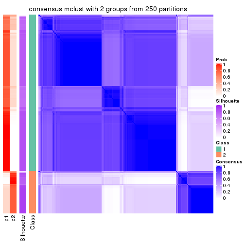</p>

</div>
<div id='tab-CV-mclust-consensus-heatmap-2'>
<pre><code class="r">consensus_heatmap(res, k = 3)
</code></pre>

<p>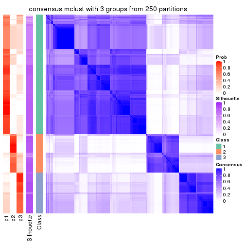</p>

</div>
<div id='tab-CV-mclust-consensus-heatmap-3'>
<pre><code class="r">consensus_heatmap(res, k = 4)
</code></pre>

<p>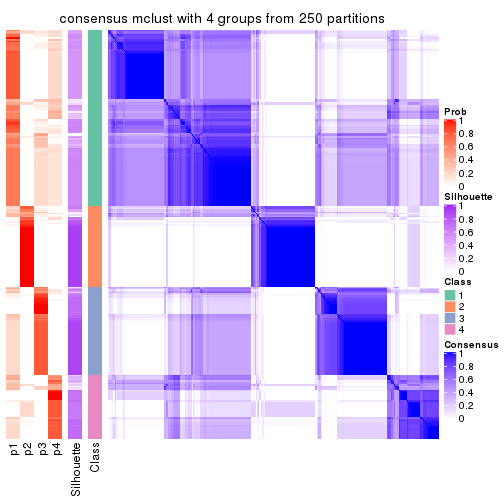</p>

</div>
<div id='tab-CV-mclust-consensus-heatmap-4'>
<pre><code class="r">consensus_heatmap(res, k = 5)
</code></pre>

<p>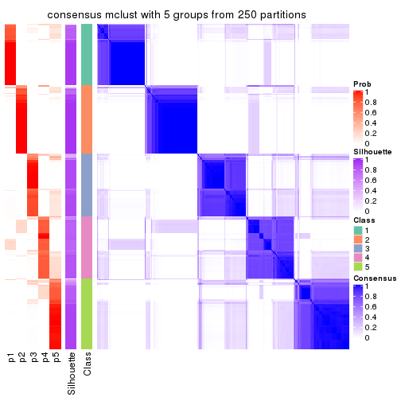</p>

</div>
<div id='tab-CV-mclust-consensus-heatmap-5'>
<pre><code class="r">consensus_heatmap(res, k = 6)
</code></pre>

<p>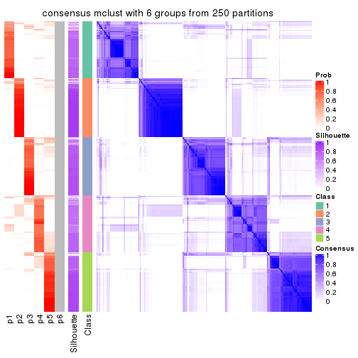</p>

</div>
</div>

Heatmaps for the membership of samples in all partitions to see how consistent they are:


<script>
$( function() {
	$( '#tabs-CV-mclust-membership-heatmap' ).tabs();
} );
</script>
<div id='tabs-CV-mclust-membership-heatmap'>
<ul>
<li><a href='#tab-CV-mclust-membership-heatmap-1'>k = 2</a></li>
<li><a href='#tab-CV-mclust-membership-heatmap-2'>k = 3</a></li>
<li><a href='#tab-CV-mclust-membership-heatmap-3'>k = 4</a></li>
<li><a href='#tab-CV-mclust-membership-heatmap-4'>k = 5</a></li>
<li><a href='#tab-CV-mclust-membership-heatmap-5'>k = 6</a></li>
</ul>
<div id='tab-CV-mclust-membership-heatmap-1'>
<pre><code class="r">membership_heatmap(res, k = 2)
</code></pre>

<p>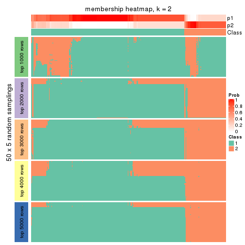</p>

</div>
<div id='tab-CV-mclust-membership-heatmap-2'>
<pre><code class="r">membership_heatmap(res, k = 3)
</code></pre>

<p>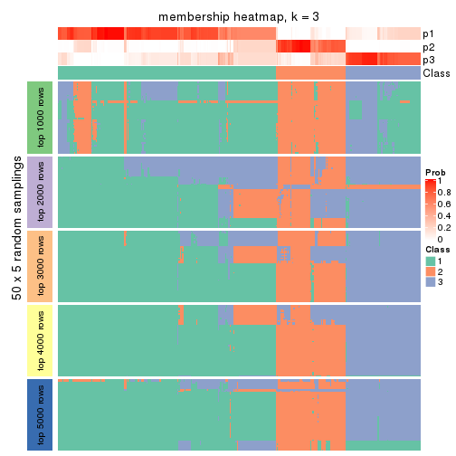</p>

</div>
<div id='tab-CV-mclust-membership-heatmap-3'>
<pre><code class="r">membership_heatmap(res, k = 4)
</code></pre>

<p>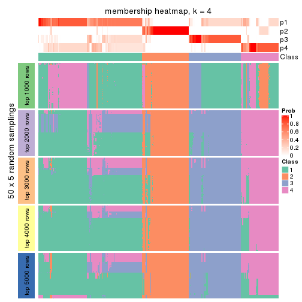</p>

</div>
<div id='tab-CV-mclust-membership-heatmap-4'>
<pre><code class="r">membership_heatmap(res, k = 5)
</code></pre>

<p>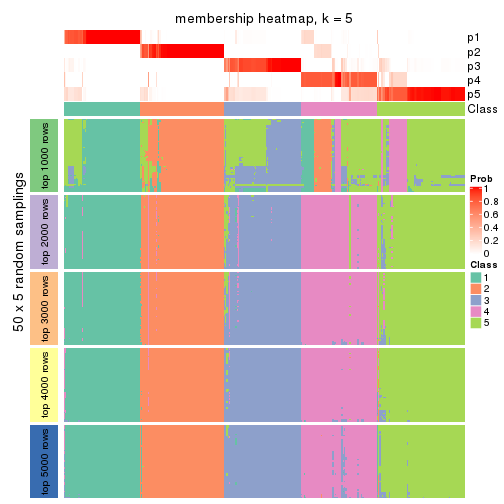</p>

</div>
<div id='tab-CV-mclust-membership-heatmap-5'>
<pre><code class="r">membership_heatmap(res, k = 6)
</code></pre>

<p>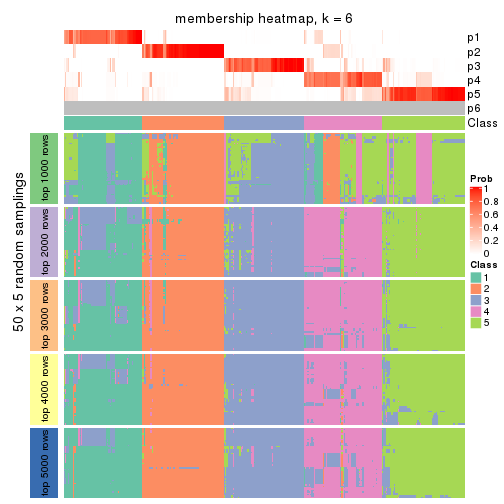</p>

</div>
</div>

As soon as we have had the classes for columns, we can look for signatures
which are significantly different between classes which can be candidate marks
for certain classes. Following are the heatmaps for signatures.


Signature heatmaps where rows are scaled:


<script>
$( function() {
	$( '#tabs-CV-mclust-get-signatures' ).tabs();
} );
</script>
<div id='tabs-CV-mclust-get-signatures'>
<ul>
<li><a href='#tab-CV-mclust-get-signatures-1'>k = 2</a></li>
<li><a href='#tab-CV-mclust-get-signatures-2'>k = 3</a></li>
<li><a href='#tab-CV-mclust-get-signatures-3'>k = 4</a></li>
<li><a href='#tab-CV-mclust-get-signatures-4'>k = 5</a></li>
<li><a href='#tab-CV-mclust-get-signatures-5'>k = 6</a></li>
</ul>
<div id='tab-CV-mclust-get-signatures-1'>
<pre><code class="r">get_signatures(res, k = 2)
</code></pre>

<p>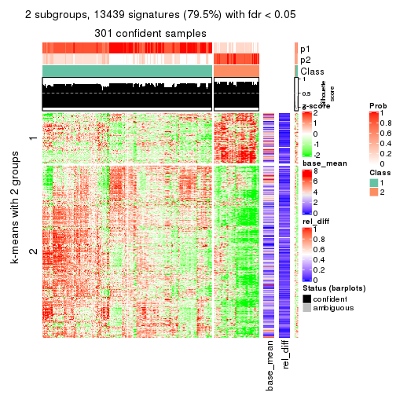</p>

</div>
<div id='tab-CV-mclust-get-signatures-2'>
<pre><code class="r">get_signatures(res, k = 3)
</code></pre>

<p>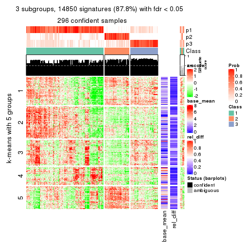</p>

</div>
<div id='tab-CV-mclust-get-signatures-3'>
<pre><code class="r">get_signatures(res, k = 4)
</code></pre>

<p>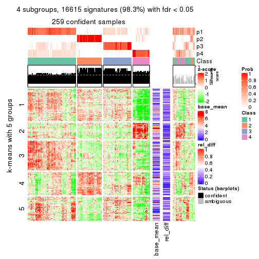</p>

</div>
<div id='tab-CV-mclust-get-signatures-4'>
<pre><code class="r">get_signatures(res, k = 5)
</code></pre>

<p>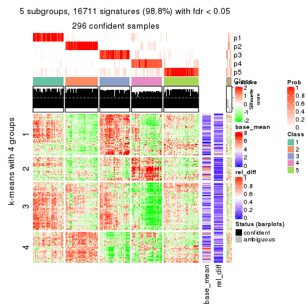</p>

</div>
<div id='tab-CV-mclust-get-signatures-5'>
<pre><code class="r">get_signatures(res, k = 6)
</code></pre>

<p>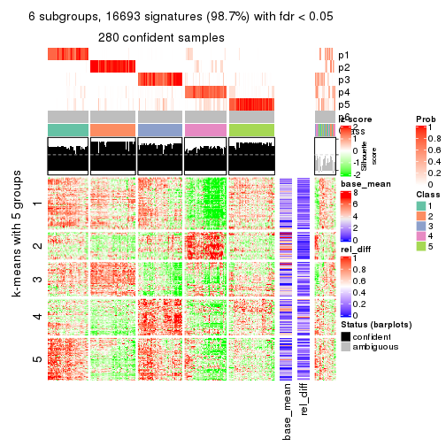</p>

</div>
</div>


Signature heatmaps where rows are not scaled:


<script>
$( function() {
	$( '#tabs-CV-mclust-get-signatures-no-scale' ).tabs();
} );
</script>
<div id='tabs-CV-mclust-get-signatures-no-scale'>
<ul>
<li><a href='#tab-CV-mclust-get-signatures-no-scale-1'>k = 2</a></li>
<li><a href='#tab-CV-mclust-get-signatures-no-scale-2'>k = 3</a></li>
<li><a href='#tab-CV-mclust-get-signatures-no-scale-3'>k = 4</a></li>
<li><a href='#tab-CV-mclust-get-signatures-no-scale-4'>k = 5</a></li>
<li><a href='#tab-CV-mclust-get-signatures-no-scale-5'>k = 6</a></li>
</ul>
<div id='tab-CV-mclust-get-signatures-no-scale-1'>
<pre><code class="r">get_signatures(res, k = 2, scale_rows = FALSE)
</code></pre>

<p>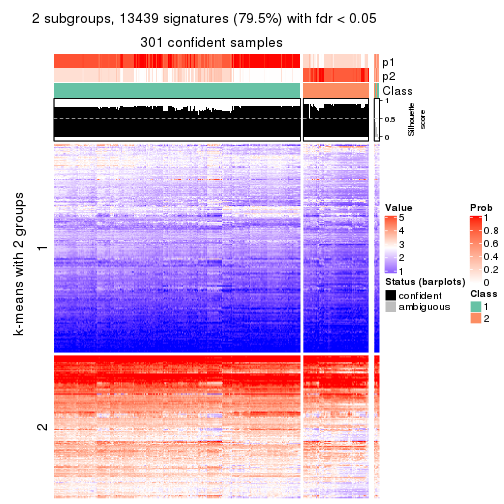</p>

</div>
<div id='tab-CV-mclust-get-signatures-no-scale-2'>
<pre><code class="r">get_signatures(res, k = 3, scale_rows = FALSE)
</code></pre>

<p>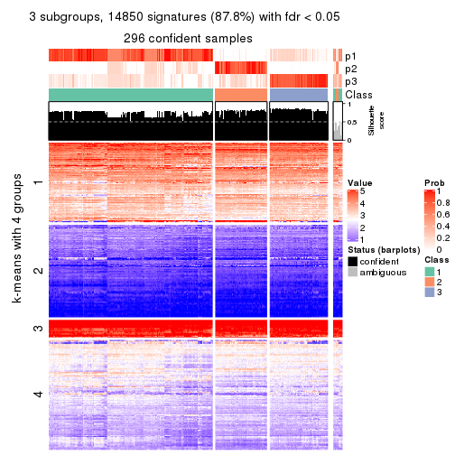</p>

</div>
<div id='tab-CV-mclust-get-signatures-no-scale-3'>
<pre><code class="r">get_signatures(res, k = 4, scale_rows = FALSE)
</code></pre>

<p>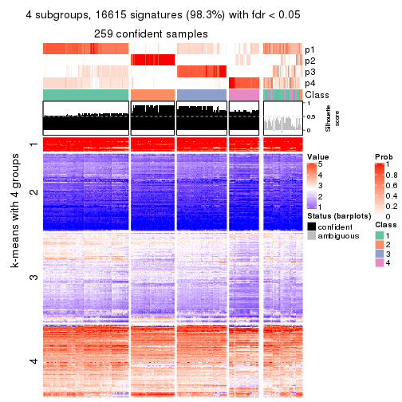</p>

</div>
<div id='tab-CV-mclust-get-signatures-no-scale-4'>
<pre><code class="r">get_signatures(res, k = 5, scale_rows = FALSE)
</code></pre>

<p>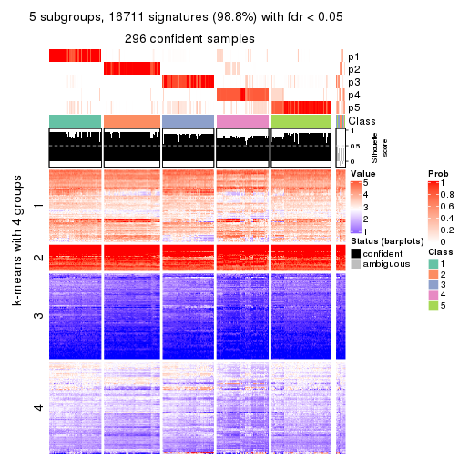</p>

</div>
<div id='tab-CV-mclust-get-signatures-no-scale-5'>
<pre><code class="r">get_signatures(res, k = 6, scale_rows = FALSE)
</code></pre>

<p>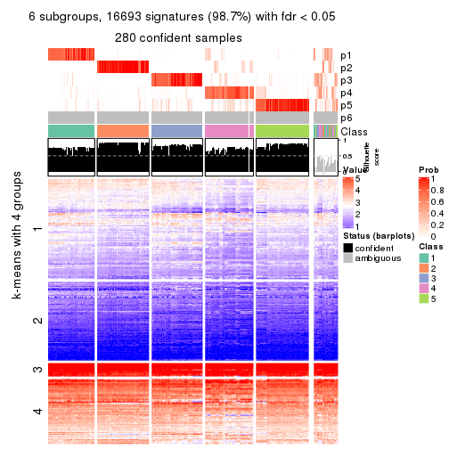</p>

</div>
</div>


Compare the overlap of signatures from different k:

```r
compare_signatures(res)
```

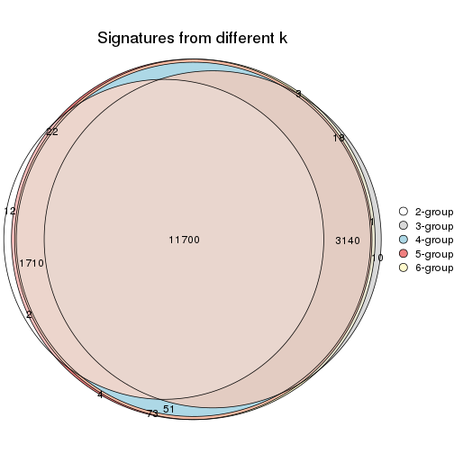

`get_signature()` returns a data frame invisibly. TO get the list of signatures, the function
call should be assigned to a variable explicitly. In following code, if `plot` argument is set
to `FALSE`, no heatmap is plotted while only the differential analysis is performed.

```r
# code only for demonstration
tb = get_signature(res, k = ..., plot = FALSE)
```

An example of the output of `tb` is:

```
#>   which_row         fdr    mean_1    mean_2 scaled_mean_1 scaled_mean_2 km
#> 1        38 0.042760348  8.373488  9.131774    -0.5533452     0.5164555  1
#> 2        40 0.018707592  7.106213  8.469186    -0.6173731     0.5762149  1
#> 3        55 0.019134737 10.221463 11.207825    -0.6159697     0.5749050  1
#> 4        59 0.006059896  5.921854  7.869574    -0.6899429     0.6439467  1
#> 5        60 0.018055526  8.928898 10.211722    -0.6204761     0.5791110  1
#> 6        98 0.009384629 15.714769 14.887706     0.6635654    -0.6193277  2
...
```

The columns in `tb` are:

1. `which_row`: row indices corresponding to the input matrix.
2. `fdr`: FDR for the differential test. 
3. `mean_x`: The mean value in group x.
4. `scaled_mean_x`: The mean value in group x after rows are scaled.
5. `km`: Row groups if k-means clustering is applied to rows.


UMAP plot which shows how samples are separated.


<script>
$( function() {
	$( '#tabs-CV-mclust-dimension-reduction' ).tabs();
} );
</script>
<div id='tabs-CV-mclust-dimension-reduction'>
<ul>
<li><a href='#tab-CV-mclust-dimension-reduction-1'>k = 2</a></li>
<li><a href='#tab-CV-mclust-dimension-reduction-2'>k = 3</a></li>
<li><a href='#tab-CV-mclust-dimension-reduction-3'>k = 4</a></li>
<li><a href='#tab-CV-mclust-dimension-reduction-4'>k = 5</a></li>
<li><a href='#tab-CV-mclust-dimension-reduction-5'>k = 6</a></li>
</ul>
<div id='tab-CV-mclust-dimension-reduction-1'>
<pre><code class="r">dimension_reduction(res, k = 2, method = &quot;UMAP&quot;)
</code></pre>

<p>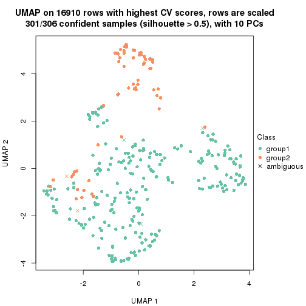</p>

</div>
<div id='tab-CV-mclust-dimension-reduction-2'>
<pre><code class="r">dimension_reduction(res, k = 3, method = &quot;UMAP&quot;)
</code></pre>

<p>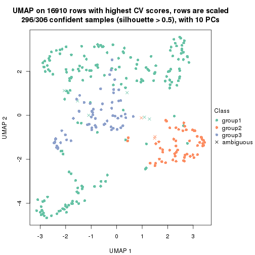</p>

</div>
<div id='tab-CV-mclust-dimension-reduction-3'>
<pre><code class="r">dimension_reduction(res, k = 4, method = &quot;UMAP&quot;)
</code></pre>

<p>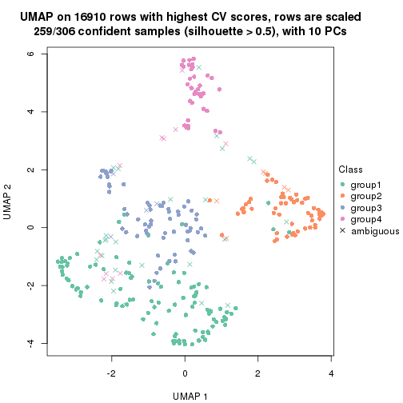</p>

</div>
<div id='tab-CV-mclust-dimension-reduction-4'>
<pre><code class="r">dimension_reduction(res, k = 5, method = &quot;UMAP&quot;)
</code></pre>

<p>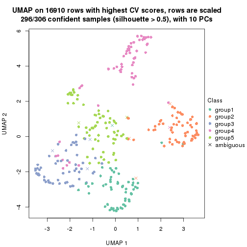</p>

</div>
<div id='tab-CV-mclust-dimension-reduction-5'>
<pre><code class="r">dimension_reduction(res, k = 6, method = &quot;UMAP&quot;)
</code></pre>

<p>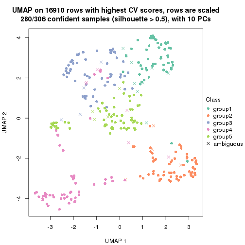</p>

</div>
</div>


Following heatmap shows how subgroups are split when increasing `k`:

```r
collect_classes(res)
```

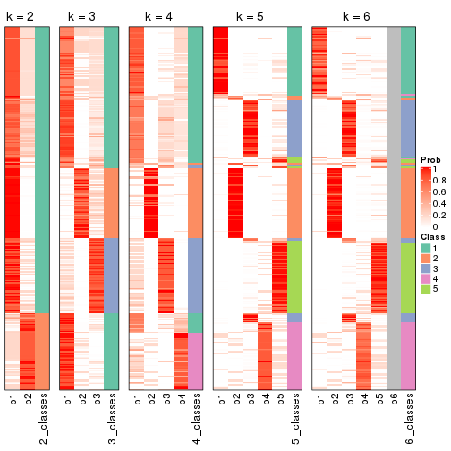


If matrix rows can be associated to genes, consider to use `GO_Enrichment(res,
...)` to perform function enrichment for the signature genes.


 

---------------------------------------------------


### CV:NMF*


The object with results only for a single top-value method and a single partition method 
can be extracted as:

```r
res = res_list["CV", "NMF"]
# you can also extract it by
# res = res_list["CV:NMF"]
```

A summary of `res` and all the functions that can be applied to it:

```r
res
```

```
#> A 'ConsensusPartition' object with k = 2, 3, 4, 5, 6.
#>   On a matrix with 16910 rows and 306 columns.
#>   Top rows (1000, 2000, 3000, 4000, 5000) are extracted by 'CV' method.
#>   Subgroups are detected by 'NMF' method.
#>   Performed in total 1250 partitions by row resampling.
#>   Best k for subgroups seems to be 3.
#> 
#> Following methods can be applied to this 'ConsensusPartition' object:
#>  [1] "cola_report"             "collect_classes"         "collect_plots"          
#>  [4] "collect_stats"           "colnames"                "compare_signatures"     
#>  [7] "consensus_heatmap"       "dimension_reduction"     "functional_enrichment"  
#> [10] "get_anno_col"            "get_anno"                "get_classes"            
#> [13] "get_consensus"           "get_matrix"              "get_membership"         
#> [16] "get_param"               "get_signatures"          "get_stats"              
#> [19] "is_best_k"               "is_stable_k"             "membership_heatmap"     
#> [22] "ncol"                    "nrow"                    "plot_ecdf"              
#> [25] "rownames"                "select_partition_number" "show"                   
#> [28] "suggest_best_k"          "test_to_known_factors"
```

`collect_plots()` function collects all the plots made from `res` for all `k` (number of partitions)
into one single page to provide an easy and fast comparison between different `k`.

```r
collect_plots(res)
```

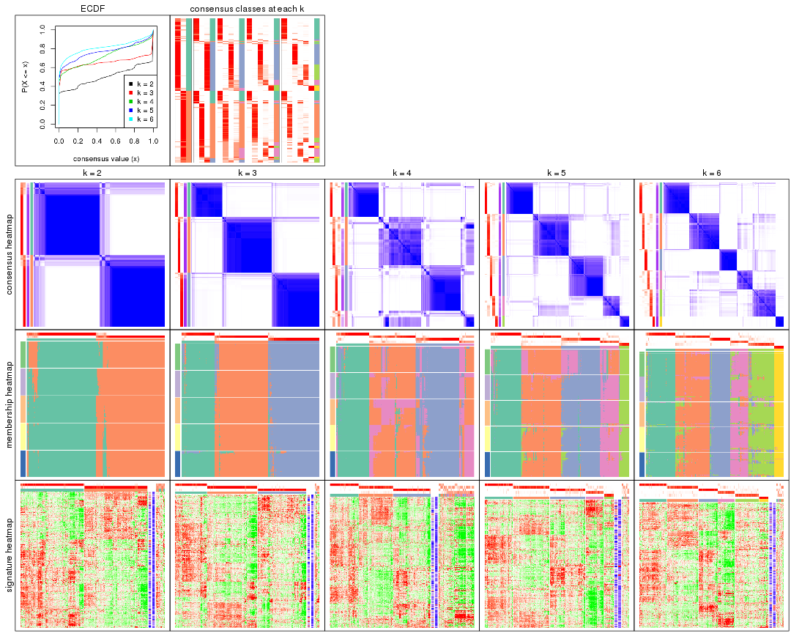

The plots are:

- The first row: a plot of the ECDF (Empirical cumulative distribution
  function) curves of the consensus matrix for each `k` and the heatmap of
  predicted classes for each `k`.
- The second row: heatmaps of the consensus matrix for each `k`.
- The third row: heatmaps of the membership matrix for each `k`.
- The fouth row: heatmaps of the signatures for each `k`.

All the plots in panels can be made by individual functions and they are
plotted later in this section.

`select_partition_number()` produces several plots showing different
statistics for choosing "optimized" `k`. There are following statistics:

- ECDF curves of the consensus matrix for each `k`;
- 1-PAC. [The PAC
  score](https://en.wikipedia.org/wiki/Consensus_clustering#Over-interpretation_potential_of_consensus_clustering)
  measures the proportion of the ambiguous subgrouping.
- Mean silhouette score.
- Concordance. The mean probability of fiting the consensus class ids in all
  partitions.
- Area increased. Denote $A_k$ as the area under the ECDF curve for current
  `k`, the area increased is defined as $A_k - A_{k-1}$.
- Rand index. The percent of pairs of samples that are both in a same cluster
  or both are not in a same cluster in the partition of k and k-1.
- Jaccard index. The ratio of pairs of samples are both in a same cluster in
  the partition of k and k-1 and the pairs of samples are both in a same
  cluster in the partition k or k-1.

The detailed explanations of these statistics can be found in [the cola
vignette](http://bioconductor.org/packages/devel/bioc/vignettes/cola/inst/doc/cola.html#toc_13).

Generally speaking, lower PAC score, higher mean silhouette score or higher
concordance corresponds to better partition. Rand index and Jaccard index
measure how similar the current partition is compared to partition with `k-1`.
If they are too similar, we won't accept `k` is better than `k-1`.

```r
select_partition_number(res)
```

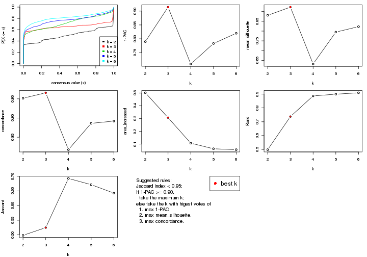

The numeric values for all these statistics can be obtained by `get_stats()`.

```r
get_stats(res)
```

```
#>   k 1-PAC mean_silhouette concordance area_increased  Rand Jaccard
#> 2 2 0.790           0.881       0.952         0.5015 0.498   0.498
#> 3 3 0.914           0.923       0.966         0.3066 0.737   0.525
#> 4 4 0.709           0.632       0.818         0.1072 0.887   0.693
#> 5 5 0.783           0.795       0.886         0.0635 0.899   0.671
#> 6 6 0.820           0.823       0.892         0.0564 0.909   0.643
```

`suggest_best_k()` suggests the best $k$ based on these statistics. The rules are as follows:

- All $k$ with Jaccard index larger than 0.95 are removed because the increase of
  the partition number does not provides enough extra information. If all $k$ are removed,
  the best $k$ is assigned by `NA`.
- For $k$ with 1-PAC larger than 0.9, the maximal $k$ is taken as the "best k". Other $k$ is called "optional k".
- If it does not fit the second rule. The $k$ with the highest vote of highest
  1-PAC, mean silhouette and concordance is taken as the "best k".

```r
suggest_best_k(res)
```

```
#> [1] 3
```


Following shows the table of the partitions (You need to click the **show/hide
code output** link to see it). The membership matrix (columns with name `p*`)
is inferred by
[`clue::cl_consensus()`](https://www.rdocumentation.org/link/cl_consensus?package=clue)
function with the `SE` method. Basically the value in the membership matrix
represents the probability to belong to a certain group. The finall class
label for an item is determined with the group with highest probability it
belongs to.

In `get_classes()` function, the entropy is calculated from the membership
matrix and the silhouette score is calculated from the consensus matrix.


<script>
$( function() {
	$( '#tabs-CV-NMF-get-classes' ).tabs();
} );
</script>
<div id='tabs-CV-NMF-get-classes'>
<ul>
<li><a href='#tab-CV-NMF-get-classes-1'>k = 2</a></li>
<li><a href='#tab-CV-NMF-get-classes-2'>k = 3</a></li>
<li><a href='#tab-CV-NMF-get-classes-3'>k = 4</a></li>
<li><a href='#tab-CV-NMF-get-classes-4'>k = 5</a></li>
<li><a href='#tab-CV-NMF-get-classes-5'>k = 6</a></li>
</ul>

<div id='tab-CV-NMF-get-classes-1'>
<p><a id='tab-CV-NMF-get-classes-1-a' style='color:#0366d6' href='#'>show/hide code output</a></p>
<pre><code class="r">cbind(get_classes(res, k = 2), get_membership(res, k = 2))
</code></pre>

<pre><code>#&gt;            class entropy silhouette    p1    p2
#&gt; SRR1609360     2  0.0000     0.9495 0.000 1.000
#&gt; SRR1609361     2  0.0000     0.9495 0.000 1.000
#&gt; SRR1609362     2  0.0000     0.9495 0.000 1.000
#&gt; SRR1609363     2  0.0000     0.9495 0.000 1.000
#&gt; SRR1609364     2  0.0000     0.9495 0.000 1.000
#&gt; SRR1609365     2  0.0000     0.9495 0.000 1.000
#&gt; SRR1609366     2  0.0000     0.9495 0.000 1.000
#&gt; SRR1609367     1  0.7299     0.7380 0.796 0.204
#&gt; SRR1609368     2  0.0000     0.9495 0.000 1.000
#&gt; SRR1609369     2  0.0000     0.9495 0.000 1.000
#&gt; SRR1609370     1  0.7602     0.7168 0.780 0.220
#&gt; SRR1609371     2  0.0000     0.9495 0.000 1.000
#&gt; SRR1609372     1  0.9552     0.4351 0.624 0.376
#&gt; SRR1609373     2  0.0000     0.9495 0.000 1.000
#&gt; SRR1609374     2  0.0000     0.9495 0.000 1.000
#&gt; SRR1609375     2  0.0000     0.9495 0.000 1.000
#&gt; SRR1609377     2  0.0000     0.9495 0.000 1.000
#&gt; SRR1609376     2  0.0000     0.9495 0.000 1.000
#&gt; SRR1609378     2  0.0000     0.9495 0.000 1.000
#&gt; SRR1609379     2  0.0000     0.9495 0.000 1.000
#&gt; SRR1609382     2  0.0000     0.9495 0.000 1.000
#&gt; SRR1609383     2  0.9087     0.4912 0.324 0.676
#&gt; SRR1609381     2  0.9732     0.2806 0.404 0.596
#&gt; SRR1609384     2  0.0000     0.9495 0.000 1.000
#&gt; SRR1609386     2  0.0000     0.9495 0.000 1.000
#&gt; SRR1609385     2  0.0000     0.9495 0.000 1.000
#&gt; SRR1609387     2  0.1633     0.9297 0.024 0.976
#&gt; SRR1609388     2  0.0000     0.9495 0.000 1.000
#&gt; SRR1609390     2  0.9833     0.2180 0.424 0.576
#&gt; SRR1609393     2  0.0000     0.9495 0.000 1.000
#&gt; SRR1609394     2  0.0000     0.9495 0.000 1.000
#&gt; SRR1609392     2  0.0000     0.9495 0.000 1.000
#&gt; SRR1609391     2  0.0000     0.9495 0.000 1.000
#&gt; SRR1609395     1  0.8713     0.6053 0.708 0.292
#&gt; SRR1609396     1  0.9754     0.3555 0.592 0.408
#&gt; SRR1609398     2  0.0000     0.9495 0.000 1.000
#&gt; SRR1609399     1  0.7219     0.7429 0.800 0.200
#&gt; SRR1609400     1  0.7219     0.7429 0.800 0.200
#&gt; SRR1609397     2  0.0000     0.9495 0.000 1.000
#&gt; SRR1609401     2  0.0000     0.9495 0.000 1.000
#&gt; SRR1609402     2  0.0000     0.9495 0.000 1.000
#&gt; SRR1609405     2  0.0000     0.9495 0.000 1.000
#&gt; SRR1609404     2  0.0000     0.9495 0.000 1.000
#&gt; SRR1609406     2  0.0000     0.9495 0.000 1.000
#&gt; SRR1609408     2  0.0000     0.9495 0.000 1.000
#&gt; SRR1609403     2  0.0000     0.9495 0.000 1.000
#&gt; SRR1609410     2  0.0376     0.9464 0.004 0.996
#&gt; SRR1609411     2  0.0000     0.9495 0.000 1.000
#&gt; SRR1609407     2  0.0000     0.9495 0.000 1.000
#&gt; SRR1609413     2  0.0672     0.9433 0.008 0.992
#&gt; SRR1609412     1  0.0000     0.9442 1.000 0.000
#&gt; SRR1609414     1  0.0000     0.9442 1.000 0.000
#&gt; SRR1609415     1  0.0000     0.9442 1.000 0.000
#&gt; SRR1609416     1  0.0000     0.9442 1.000 0.000
#&gt; SRR1609417     1  0.0000     0.9442 1.000 0.000
#&gt; SRR1609418     2  0.0000     0.9495 0.000 1.000
#&gt; SRR1609419     2  0.0000     0.9495 0.000 1.000
#&gt; SRR1609420     2  0.0000     0.9495 0.000 1.000
#&gt; SRR1609421     2  0.7056     0.7514 0.192 0.808
#&gt; SRR1609422     1  0.0000     0.9442 1.000 0.000
#&gt; SRR1609423     2  0.0000     0.9495 0.000 1.000
#&gt; SRR1609424     2  0.0000     0.9495 0.000 1.000
#&gt; SRR1609425     2  0.0000     0.9495 0.000 1.000
#&gt; SRR1609426     2  0.0000     0.9495 0.000 1.000
#&gt; SRR1609427     1  0.0000     0.9442 1.000 0.000
#&gt; SRR1609428     2  0.0000     0.9495 0.000 1.000
#&gt; SRR1609429     1  0.3431     0.8911 0.936 0.064
#&gt; SRR1609430     1  0.0000     0.9442 1.000 0.000
#&gt; SRR1609431     2  0.9909     0.2318 0.444 0.556
#&gt; SRR1609432     2  0.0000     0.9495 0.000 1.000
#&gt; SRR1609433     1  0.0000     0.9442 1.000 0.000
#&gt; SRR1609434     2  0.0000     0.9495 0.000 1.000
#&gt; SRR1609435     1  0.0000     0.9442 1.000 0.000
#&gt; SRR1609436     1  0.0000     0.9442 1.000 0.000
#&gt; SRR1609437     2  0.0000     0.9495 0.000 1.000
#&gt; SRR1609438     2  0.0000     0.9495 0.000 1.000
#&gt; SRR1609439     1  0.0000     0.9442 1.000 0.000
#&gt; SRR1609440     1  0.8555     0.6259 0.720 0.280
#&gt; SRR1609441     2  0.0376     0.9465 0.004 0.996
#&gt; SRR1609442     2  0.0000     0.9495 0.000 1.000
#&gt; SRR1609443     1  0.0000     0.9442 1.000 0.000
#&gt; SRR1609444     1  0.9427     0.4728 0.640 0.360
#&gt; SRR1609445     1  0.0000     0.9442 1.000 0.000
#&gt; SRR1609446     2  0.0000     0.9495 0.000 1.000
#&gt; SRR1609447     1  0.0000     0.9442 1.000 0.000
#&gt; SRR1609448     2  0.0000     0.9495 0.000 1.000
#&gt; SRR1609449     1  0.7219     0.7429 0.800 0.200
#&gt; SRR1609450     2  0.0000     0.9495 0.000 1.000
#&gt; SRR1609451     1  0.0000     0.9442 1.000 0.000
#&gt; SRR1609452     1  0.0000     0.9442 1.000 0.000
#&gt; SRR1609453     1  0.0000     0.9442 1.000 0.000
#&gt; SRR1609454     2  0.0000     0.9495 0.000 1.000
#&gt; SRR1609455     2  0.0000     0.9495 0.000 1.000
#&gt; SRR1609456     2  0.1414     0.9337 0.020 0.980
#&gt; SRR1609457     1  0.0000     0.9442 1.000 0.000
#&gt; SRR1609458     1  0.0000     0.9442 1.000 0.000
#&gt; SRR1609459     1  0.0000     0.9442 1.000 0.000
#&gt; SRR1609460     2  0.6887     0.7627 0.184 0.816
#&gt; SRR1609461     1  0.0000     0.9442 1.000 0.000
#&gt; SRR1609462     1  0.0000     0.9442 1.000 0.000
#&gt; SRR1609464     1  0.0000     0.9442 1.000 0.000
#&gt; SRR1609463     1  0.0000     0.9442 1.000 0.000
#&gt; SRR1609465     2  0.2043     0.9234 0.032 0.968
#&gt; SRR1609466     1  0.9686     0.3865 0.604 0.396
#&gt; SRR1609467     1  0.0000     0.9442 1.000 0.000
#&gt; SRR1609469     2  0.0000     0.9495 0.000 1.000
#&gt; SRR1609470     2  0.8713     0.5954 0.292 0.708
#&gt; SRR1609472     1  0.0000     0.9442 1.000 0.000
#&gt; SRR1609471     1  0.9909     0.2535 0.556 0.444
#&gt; SRR1609474     2  0.0000     0.9495 0.000 1.000
#&gt; SRR1609473     2  0.0000     0.9495 0.000 1.000
#&gt; SRR1609475     2  0.0000     0.9495 0.000 1.000
#&gt; SRR1609478     1  0.0000     0.9442 1.000 0.000
#&gt; SRR1609476     1  0.0000     0.9442 1.000 0.000
#&gt; SRR1609477     1  0.0000     0.9442 1.000 0.000
#&gt; SRR1609479     2  0.0000     0.9495 0.000 1.000
#&gt; SRR1609481     2  0.7219     0.7408 0.200 0.800
#&gt; SRR1609480     1  0.0000     0.9442 1.000 0.000
#&gt; SRR1609482     1  0.0000     0.9442 1.000 0.000
#&gt; SRR1609484     2  0.0000     0.9495 0.000 1.000
#&gt; SRR1609483     1  0.0000     0.9442 1.000 0.000
#&gt; SRR1609486     1  0.0000     0.9442 1.000 0.000
#&gt; SRR1609485     1  0.0000     0.9442 1.000 0.000
#&gt; SRR1609487     2  0.0000     0.9495 0.000 1.000
#&gt; SRR1609488     1  0.0000     0.9442 1.000 0.000
#&gt; SRR1609489     2  0.0000     0.9495 0.000 1.000
#&gt; SRR1609490     2  0.0000     0.9495 0.000 1.000
#&gt; SRR1609491     1  0.0000     0.9442 1.000 0.000
#&gt; SRR1609492     2  0.0000     0.9495 0.000 1.000
#&gt; SRR1609493     1  0.9970     0.0757 0.532 0.468
#&gt; SRR1609494     2  0.0000     0.9495 0.000 1.000
#&gt; SRR1609495     1  0.7219     0.7429 0.800 0.200
#&gt; SRR1609496     1  0.0000     0.9442 1.000 0.000
#&gt; SRR1609497     1  0.0000     0.9442 1.000 0.000
#&gt; SRR1609498     1  0.0000     0.9442 1.000 0.000
#&gt; SRR1609499     2  0.0000     0.9495 0.000 1.000
#&gt; SRR1609500     1  0.0000     0.9442 1.000 0.000
#&gt; SRR1609501     2  0.7139     0.7461 0.196 0.804
#&gt; SRR1609502     2  0.0000     0.9495 0.000 1.000
#&gt; SRR1609503     2  0.0000     0.9495 0.000 1.000
#&gt; SRR1609504     1  0.0000     0.9442 1.000 0.000
#&gt; SRR1609505     1  0.0000     0.9442 1.000 0.000
#&gt; SRR1609506     2  0.0000     0.9495 0.000 1.000
#&gt; SRR1609507     1  0.0000     0.9442 1.000 0.000
#&gt; SRR1609508     2  0.0000     0.9495 0.000 1.000
#&gt; SRR1609509     2  0.0000     0.9495 0.000 1.000
#&gt; SRR1609510     2  0.7219     0.7408 0.200 0.800
#&gt; SRR1609512     1  0.0000     0.9442 1.000 0.000
#&gt; SRR1609511     1  0.0000     0.9442 1.000 0.000
#&gt; SRR1609513     1  0.0000     0.9442 1.000 0.000
#&gt; SRR1609514     1  0.0000     0.9442 1.000 0.000
#&gt; SRR1609515     2  0.0000     0.9495 0.000 1.000
#&gt; SRR1609516     1  0.0000     0.9442 1.000 0.000
#&gt; SRR1609517     2  0.2603     0.9129 0.044 0.956
#&gt; SRR1609518     1  0.9635     0.4065 0.612 0.388
#&gt; SRR1609519     1  0.0000     0.9442 1.000 0.000
#&gt; SRR1609520     2  0.0000     0.9495 0.000 1.000
#&gt; SRR1609521     1  0.0000     0.9442 1.000 0.000
#&gt; SRR1609522     1  0.0000     0.9442 1.000 0.000
#&gt; SRR1609523     1  0.4298     0.8635 0.912 0.088
#&gt; SRR1609524     2  0.0000     0.9495 0.000 1.000
#&gt; SRR1609526     1  0.0000     0.9442 1.000 0.000
#&gt; SRR1609525     2  0.9286     0.4903 0.344 0.656
#&gt; SRR1609527     1  0.8016     0.6828 0.756 0.244
#&gt; SRR1609529     1  0.0000     0.9442 1.000 0.000
#&gt; SRR1609528     1  0.0000     0.9442 1.000 0.000
#&gt; SRR1609530     1  0.0000     0.9442 1.000 0.000
#&gt; SRR1609531     2  0.0000     0.9495 0.000 1.000
#&gt; SRR1609532     1  0.0000     0.9442 1.000 0.000
#&gt; SRR1609533     2  0.7219     0.7408 0.200 0.800
#&gt; SRR1609534     1  0.0000     0.9442 1.000 0.000
#&gt; SRR1609535     2  0.7219     0.7408 0.200 0.800
#&gt; SRR1609537     2  0.0000     0.9495 0.000 1.000
#&gt; SRR1609536     1  0.0000     0.9442 1.000 0.000
#&gt; SRR1609538     2  0.0000     0.9495 0.000 1.000
#&gt; SRR1609539     1  0.0000     0.9442 1.000 0.000
#&gt; SRR1609540     1  0.0000     0.9442 1.000 0.000
#&gt; SRR1609541     1  0.0000     0.9442 1.000 0.000
#&gt; SRR1609542     2  0.0000     0.9495 0.000 1.000
#&gt; SRR1609543     1  0.0000     0.9442 1.000 0.000
#&gt; SRR1609544     1  0.2236     0.9153 0.964 0.036
#&gt; SRR1609545     1  0.0000     0.9442 1.000 0.000
#&gt; SRR1609546     1  0.0000     0.9442 1.000 0.000
#&gt; SRR1609547     1  0.0000     0.9442 1.000 0.000
#&gt; SRR1609548     1  0.0000     0.9442 1.000 0.000
#&gt; SRR1609549     2  0.0000     0.9495 0.000 1.000
#&gt; SRR1609550     2  0.0000     0.9495 0.000 1.000
#&gt; SRR1609551     1  0.0000     0.9442 1.000 0.000
#&gt; SRR1609552     1  0.0000     0.9442 1.000 0.000
#&gt; SRR1609553     1  0.0000     0.9442 1.000 0.000
#&gt; SRR1609554     1  0.0000     0.9442 1.000 0.000
#&gt; SRR1609555     1  0.0000     0.9442 1.000 0.000
#&gt; SRR1609556     1  0.0000     0.9442 1.000 0.000
#&gt; SRR1609557     1  0.0000     0.9442 1.000 0.000
#&gt; SRR1609558     1  0.0000     0.9442 1.000 0.000
#&gt; SRR1609559     1  0.0000     0.9442 1.000 0.000
#&gt; SRR1609560     2  0.0000     0.9495 0.000 1.000
#&gt; SRR1609561     1  0.0000     0.9442 1.000 0.000
#&gt; SRR1609562     2  0.0000     0.9495 0.000 1.000
#&gt; SRR1609563     2  0.0000     0.9495 0.000 1.000
#&gt; SRR1609564     1  0.0000     0.9442 1.000 0.000
#&gt; SRR1609565     2  0.0000     0.9495 0.000 1.000
#&gt; SRR1609566     2  0.0000     0.9495 0.000 1.000
#&gt; SRR1609567     2  0.0000     0.9495 0.000 1.000
#&gt; SRR1609568     2  0.0000     0.9495 0.000 1.000
#&gt; SRR1609569     1  0.0000     0.9442 1.000 0.000
#&gt; SRR1609570     1  0.0000     0.9442 1.000 0.000
#&gt; SRR1609571     1  0.0000     0.9442 1.000 0.000
#&gt; SRR1609572     1  0.0000     0.9442 1.000 0.000
#&gt; SRR1609573     1  0.0000     0.9442 1.000 0.000
#&gt; SRR1609574     1  0.0000     0.9442 1.000 0.000
#&gt; SRR1609575     2  0.0000     0.9495 0.000 1.000
#&gt; SRR1609576     2  0.0000     0.9495 0.000 1.000
#&gt; SRR1609578     1  0.0000     0.9442 1.000 0.000
#&gt; SRR1609577     2  1.0000    -0.0513 0.496 0.504
#&gt; SRR1609579     1  0.0000     0.9442 1.000 0.000
#&gt; SRR1609580     1  0.0000     0.9442 1.000 0.000
#&gt; SRR1609582     1  0.0000     0.9442 1.000 0.000
#&gt; SRR1609581     2  0.7674     0.7107 0.224 0.776
#&gt; SRR1609583     1  0.0000     0.9442 1.000 0.000
#&gt; SRR1609584     1  0.0000     0.9442 1.000 0.000
#&gt; SRR1609585     1  0.0000     0.9442 1.000 0.000
#&gt; SRR1609586     2  0.0000     0.9495 0.000 1.000
#&gt; SRR1609587     1  0.0000     0.9442 1.000 0.000
#&gt; SRR1609588     2  0.7602     0.7149 0.220 0.780
#&gt; SRR1609589     2  0.0000     0.9495 0.000 1.000
#&gt; SRR1609590     1  0.0000     0.9442 1.000 0.000
#&gt; SRR1609592     1  0.0000     0.9442 1.000 0.000
#&gt; SRR1609591     1  0.0376     0.9411 0.996 0.004
#&gt; SRR1609593     1  0.0000     0.9442 1.000 0.000
#&gt; SRR1609594     2  0.0000     0.9495 0.000 1.000
#&gt; SRR1609595     1  0.7528     0.6976 0.784 0.216
#&gt; SRR1609596     2  0.0000     0.9495 0.000 1.000
#&gt; SRR1609597     2  0.0000     0.9495 0.000 1.000
#&gt; SRR1609598     1  0.0000     0.9442 1.000 0.000
#&gt; SRR1609599     1  0.0000     0.9442 1.000 0.000
#&gt; SRR1609600     1  0.0000     0.9442 1.000 0.000
#&gt; SRR1609601     1  0.0000     0.9442 1.000 0.000
#&gt; SRR1609602     1  0.0000     0.9442 1.000 0.000
#&gt; SRR1609603     2  0.0000     0.9495 0.000 1.000
#&gt; SRR1609604     2  0.0000     0.9495 0.000 1.000
#&gt; SRR1609605     2  0.0000     0.9495 0.000 1.000
#&gt; SRR1609606     1  0.6623     0.7627 0.828 0.172
#&gt; SRR1609607     1  0.0000     0.9442 1.000 0.000
#&gt; SRR1609608     1  0.0000     0.9442 1.000 0.000
#&gt; SRR1609609     1  0.6247     0.7989 0.844 0.156
#&gt; SRR1609610     1  0.0000     0.9442 1.000 0.000
#&gt; SRR1609611     2  0.0000     0.9495 0.000 1.000
#&gt; SRR1609613     2  0.0000     0.9495 0.000 1.000
#&gt; SRR1609612     1  0.0000     0.9442 1.000 0.000
#&gt; SRR1609614     1  0.0000     0.9442 1.000 0.000
#&gt; SRR1609615     2  0.5059     0.8408 0.112 0.888
#&gt; SRR1609616     1  0.0000     0.9442 1.000 0.000
#&gt; SRR1609617     2  0.7528     0.7190 0.216 0.784
#&gt; SRR1609618     1  0.0000     0.9442 1.000 0.000
#&gt; SRR1609619     2  0.9686     0.3037 0.396 0.604
#&gt; SRR1609620     2  0.0000     0.9495 0.000 1.000
#&gt; SRR1609621     2  0.0000     0.9495 0.000 1.000
#&gt; SRR1609622     1  0.0000     0.9442 1.000 0.000
#&gt; SRR1609623     1  0.0000     0.9442 1.000 0.000
#&gt; SRR1609624     2  0.6801     0.7526 0.180 0.820
#&gt; SRR1609625     1  0.6801     0.7677 0.820 0.180
#&gt; SRR1609626     1  0.0000     0.9442 1.000 0.000
#&gt; SRR1609627     2  0.0000     0.9495 0.000 1.000
#&gt; SRR1609628     2  0.0000     0.9495 0.000 1.000
#&gt; SRR1609629     1  0.0000     0.9442 1.000 0.000
#&gt; SRR1609630     2  0.0000     0.9495 0.000 1.000
#&gt; SRR1609631     1  0.9754     0.3558 0.592 0.408
#&gt; SRR1609632     2  0.0000     0.9495 0.000 1.000
#&gt; SRR1609633     1  0.9087     0.5461 0.676 0.324
#&gt; SRR1609634     2  0.0000     0.9495 0.000 1.000
#&gt; SRR1609635     1  0.0000     0.9442 1.000 0.000
#&gt; SRR1609636     2  0.0000     0.9495 0.000 1.000
#&gt; SRR1609637     1  0.0672     0.9380 0.992 0.008
#&gt; SRR1609638     2  0.0000     0.9495 0.000 1.000
#&gt; SRR1609639     2  0.0000     0.9495 0.000 1.000
#&gt; SRR1609640     1  0.0000     0.9442 1.000 0.000
#&gt; SRR1609641     2  0.8608     0.5756 0.284 0.716
#&gt; SRR1609642     2  0.9998    -0.0354 0.492 0.508
#&gt; SRR1609643     1  0.0000     0.9442 1.000 0.000
#&gt; SRR1609644     2  0.0000     0.9495 0.000 1.000
#&gt; SRR1609645     1  0.0000     0.9442 1.000 0.000
#&gt; SRR1609646     1  0.0000     0.9442 1.000 0.000
#&gt; SRR1609647     2  0.5408     0.8328 0.124 0.876
#&gt; SRR1609649     1  0.0000     0.9442 1.000 0.000
#&gt; SRR1609648     2  0.0000     0.9495 0.000 1.000
#&gt; SRR1609651     2  0.0000     0.9495 0.000 1.000
#&gt; SRR1609650     1  0.0000     0.9442 1.000 0.000
#&gt; SRR1609652     1  0.0000     0.9442 1.000 0.000
#&gt; SRR1609653     2  0.0000     0.9495 0.000 1.000
#&gt; SRR1609654     2  0.0000     0.9495 0.000 1.000
#&gt; SRR1609655     1  0.0000     0.9442 1.000 0.000
#&gt; SRR1609657     1  0.9866     0.2880 0.568 0.432
#&gt; SRR1609656     1  0.9922     0.2392 0.552 0.448
#&gt; SRR1609658     2  0.0000     0.9495 0.000 1.000
#&gt; SRR1609659     2  0.0000     0.9495 0.000 1.000
#&gt; SRR1609660     1  0.0000     0.9442 1.000 0.000
#&gt; SRR1609661     1  0.0000     0.9442 1.000 0.000
#&gt; SRR1609662     2  0.0000     0.9495 0.000 1.000
#&gt; SRR1609663     1  0.0000     0.9442 1.000 0.000
#&gt; SRR1609664     2  0.9881     0.2561 0.436 0.564
#&gt; SRR1609665     2  0.0000     0.9495 0.000 1.000
#&gt; SRR1609666     2  0.0000     0.9495 0.000 1.000
#&gt; SRR1609667     1  0.0000     0.9442 1.000 0.000
#&gt; SRR1609668     1  0.9970     0.0756 0.532 0.468
#&gt; SRR1609669     2  0.0000     0.9495 0.000 1.000
</code></pre>

<script>
$('#tab-CV-NMF-get-classes-1-a').parent().next().next().hide();
$('#tab-CV-NMF-get-classes-1-a').click(function(){
  $('#tab-CV-NMF-get-classes-1-a').parent().next().next().toggle();
  return(false);
});
</script>
</div>

<div id='tab-CV-NMF-get-classes-2'>
<p><a id='tab-CV-NMF-get-classes-2-a' style='color:#0366d6' href='#'>show/hide code output</a></p>
<pre><code class="r">cbind(get_classes(res, k = 3), get_membership(res, k = 3))
</code></pre>

<pre><code>#&gt;            class entropy silhouette    p1    p2    p3
#&gt; SRR1609360     1  0.0000      0.958 1.000 0.000 0.000
#&gt; SRR1609361     1  0.0000      0.958 1.000 0.000 0.000
#&gt; SRR1609362     1  0.6140      0.331 0.596 0.404 0.000
#&gt; SRR1609363     2  0.0000      0.966 0.000 1.000 0.000
#&gt; SRR1609364     2  0.0000      0.966 0.000 1.000 0.000
#&gt; SRR1609365     1  0.0424      0.955 0.992 0.008 0.000
#&gt; SRR1609366     2  0.0000      0.966 0.000 1.000 0.000
#&gt; SRR1609367     1  0.0237      0.959 0.996 0.000 0.004
#&gt; SRR1609368     2  0.0000      0.966 0.000 1.000 0.000
#&gt; SRR1609369     1  0.0000      0.958 1.000 0.000 0.000
#&gt; SRR1609370     1  0.0592      0.959 0.988 0.000 0.012
#&gt; SRR1609371     2  0.0592      0.961 0.012 0.988 0.000
#&gt; SRR1609372     1  0.0592      0.959 0.988 0.000 0.012
#&gt; SRR1609373     2  0.0000      0.966 0.000 1.000 0.000
#&gt; SRR1609374     2  0.0000      0.966 0.000 1.000 0.000
#&gt; SRR1609375     2  0.0747      0.959 0.016 0.984 0.000
#&gt; SRR1609377     2  0.6252      0.148 0.444 0.556 0.000
#&gt; SRR1609376     2  0.0000      0.966 0.000 1.000 0.000
#&gt; SRR1609378     2  0.0892      0.957 0.020 0.980 0.000
#&gt; SRR1609379     1  0.0237      0.958 0.996 0.004 0.000
#&gt; SRR1609382     2  0.0892      0.957 0.020 0.980 0.000
#&gt; SRR1609383     1  0.0000      0.958 1.000 0.000 0.000
#&gt; SRR1609381     1  0.0237      0.959 0.996 0.000 0.004
#&gt; SRR1609384     2  0.3038      0.872 0.104 0.896 0.000
#&gt; SRR1609386     2  0.0592      0.960 0.012 0.988 0.000
#&gt; SRR1609385     1  0.0000      0.958 1.000 0.000 0.000
#&gt; SRR1609387     1  0.0000      0.958 1.000 0.000 0.000
#&gt; SRR1609388     2  0.0000      0.966 0.000 1.000 0.000
#&gt; SRR1609390     1  0.0424      0.959 0.992 0.000 0.008
#&gt; SRR1609393     2  0.0747      0.959 0.016 0.984 0.000
#&gt; SRR1609394     2  0.0000      0.966 0.000 1.000 0.000
#&gt; SRR1609392     2  0.0000      0.966 0.000 1.000 0.000
#&gt; SRR1609391     2  0.0592      0.961 0.012 0.988 0.000
#&gt; SRR1609395     1  0.0237      0.959 0.996 0.000 0.004
#&gt; SRR1609396     1  0.0237      0.959 0.996 0.000 0.004
#&gt; SRR1609398     2  0.0424      0.962 0.008 0.992 0.000
#&gt; SRR1609399     1  0.0592      0.959 0.988 0.000 0.012
#&gt; SRR1609400     1  0.0237      0.959 0.996 0.000 0.004
#&gt; SRR1609397     2  0.0000      0.966 0.000 1.000 0.000
#&gt; SRR1609401     2  0.0000      0.966 0.000 1.000 0.000
#&gt; SRR1609402     2  0.0000      0.966 0.000 1.000 0.000
#&gt; SRR1609405     2  0.0000      0.966 0.000 1.000 0.000
#&gt; SRR1609404     2  0.0892      0.957 0.020 0.980 0.000
#&gt; SRR1609406     2  0.0000      0.966 0.000 1.000 0.000
#&gt; SRR1609408     2  0.0000      0.966 0.000 1.000 0.000
#&gt; SRR1609403     1  0.0000      0.958 1.000 0.000 0.000
#&gt; SRR1609410     1  0.0592      0.955 0.988 0.012 0.000
#&gt; SRR1609411     2  0.0000      0.966 0.000 1.000 0.000
#&gt; SRR1609407     2  0.0000      0.966 0.000 1.000 0.000
#&gt; SRR1609413     1  0.0000      0.958 1.000 0.000 0.000
#&gt; SRR1609412     3  0.0000      0.963 0.000 0.000 1.000
#&gt; SRR1609414     3  0.0000      0.963 0.000 0.000 1.000
#&gt; SRR1609415     1  0.0892      0.956 0.980 0.000 0.020
#&gt; SRR1609416     1  0.0424      0.959 0.992 0.000 0.008
#&gt; SRR1609417     3  0.0000      0.963 0.000 0.000 1.000
#&gt; SRR1609418     1  0.3851      0.834 0.860 0.136 0.004
#&gt; SRR1609419     2  0.0000      0.966 0.000 1.000 0.000
#&gt; SRR1609420     2  0.4002      0.801 0.160 0.840 0.000
#&gt; SRR1609421     3  0.0892      0.950 0.000 0.020 0.980
#&gt; SRR1609422     3  0.0000      0.963 0.000 0.000 1.000
#&gt; SRR1609423     2  0.0892      0.957 0.020 0.980 0.000
#&gt; SRR1609424     2  0.0592      0.961 0.012 0.988 0.000
#&gt; SRR1609425     2  0.0000      0.966 0.000 1.000 0.000
#&gt; SRR1609426     2  0.0000      0.966 0.000 1.000 0.000
#&gt; SRR1609427     1  0.0592      0.959 0.988 0.000 0.012
#&gt; SRR1609428     2  0.0000      0.966 0.000 1.000 0.000
#&gt; SRR1609429     2  0.4702      0.724 0.000 0.788 0.212
#&gt; SRR1609430     3  0.0000      0.963 0.000 0.000 1.000
#&gt; SRR1609431     3  0.3482      0.845 0.000 0.128 0.872
#&gt; SRR1609432     2  0.0000      0.966 0.000 1.000 0.000
#&gt; SRR1609433     1  0.0424      0.959 0.992 0.000 0.008
#&gt; SRR1609434     2  0.0892      0.957 0.020 0.980 0.000
#&gt; SRR1609435     1  0.0747      0.958 0.984 0.000 0.016
#&gt; SRR1609436     3  0.0000      0.963 0.000 0.000 1.000
#&gt; SRR1609437     2  0.0592      0.961 0.012 0.988 0.000
#&gt; SRR1609438     2  0.0747      0.959 0.016 0.984 0.000
#&gt; SRR1609439     3  0.0000      0.963 0.000 0.000 1.000
#&gt; SRR1609440     1  0.0424      0.959 0.992 0.000 0.008
#&gt; SRR1609441     2  0.0237      0.963 0.000 0.996 0.004
#&gt; SRR1609442     2  0.0424      0.963 0.008 0.992 0.000
#&gt; SRR1609443     1  0.4235      0.799 0.824 0.000 0.176
#&gt; SRR1609444     2  0.1129      0.950 0.004 0.976 0.020
#&gt; SRR1609445     3  0.0000      0.963 0.000 0.000 1.000
#&gt; SRR1609446     2  0.0237      0.963 0.000 0.996 0.004
#&gt; SRR1609447     1  0.0892      0.956 0.980 0.000 0.020
#&gt; SRR1609448     2  0.0000      0.966 0.000 1.000 0.000
#&gt; SRR1609449     1  0.0592      0.959 0.988 0.000 0.012
#&gt; SRR1609450     2  0.0000      0.966 0.000 1.000 0.000
#&gt; SRR1609451     1  0.0892      0.956 0.980 0.000 0.020
#&gt; SRR1609452     3  0.0000      0.963 0.000 0.000 1.000
#&gt; SRR1609453     3  0.5058      0.665 0.244 0.000 0.756
#&gt; SRR1609454     2  0.0000      0.966 0.000 1.000 0.000
#&gt; SRR1609455     2  0.0892      0.957 0.020 0.980 0.000
#&gt; SRR1609456     2  0.2959      0.867 0.000 0.900 0.100
#&gt; SRR1609457     3  0.0000      0.963 0.000 0.000 1.000
#&gt; SRR1609458     3  0.6126      0.314 0.400 0.000 0.600
#&gt; SRR1609459     3  0.0000      0.963 0.000 0.000 1.000
#&gt; SRR1609460     2  0.6095      0.345 0.000 0.608 0.392
#&gt; SRR1609461     3  0.0000      0.963 0.000 0.000 1.000
#&gt; SRR1609462     3  0.1753      0.924 0.048 0.000 0.952
#&gt; SRR1609464     3  0.0000      0.963 0.000 0.000 1.000
#&gt; SRR1609463     3  0.0000      0.963 0.000 0.000 1.000
#&gt; SRR1609465     2  0.3340      0.844 0.000 0.880 0.120
#&gt; SRR1609466     1  0.0000      0.958 1.000 0.000 0.000
#&gt; SRR1609467     3  0.0000      0.963 0.000 0.000 1.000
#&gt; SRR1609469     2  0.1482      0.950 0.020 0.968 0.012
#&gt; SRR1609470     3  0.0892      0.950 0.000 0.020 0.980
#&gt; SRR1609472     3  0.0592      0.957 0.012 0.000 0.988
#&gt; SRR1609471     1  0.1964      0.917 0.944 0.056 0.000
#&gt; SRR1609474     2  0.0000      0.966 0.000 1.000 0.000
#&gt; SRR1609473     2  0.0747      0.959 0.016 0.984 0.000
#&gt; SRR1609475     2  0.0592      0.961 0.012 0.988 0.000
#&gt; SRR1609478     3  0.0892      0.952 0.020 0.000 0.980
#&gt; SRR1609476     1  0.0592      0.959 0.988 0.000 0.012
#&gt; SRR1609477     3  0.0000      0.963 0.000 0.000 1.000
#&gt; SRR1609479     2  0.0000      0.966 0.000 1.000 0.000
#&gt; SRR1609481     2  0.5988      0.409 0.000 0.632 0.368
#&gt; SRR1609480     3  0.0000      0.963 0.000 0.000 1.000
#&gt; SRR1609482     3  0.0000      0.963 0.000 0.000 1.000
#&gt; SRR1609484     2  0.0592      0.961 0.012 0.988 0.000
#&gt; SRR1609483     3  0.0000      0.963 0.000 0.000 1.000
#&gt; SRR1609486     3  0.0000      0.963 0.000 0.000 1.000
#&gt; SRR1609485     3  0.0000      0.963 0.000 0.000 1.000
#&gt; SRR1609487     1  0.6062      0.407 0.616 0.384 0.000
#&gt; SRR1609488     3  0.0237      0.961 0.004 0.000 0.996
#&gt; SRR1609489     2  0.0000      0.966 0.000 1.000 0.000
#&gt; SRR1609490     2  0.0000      0.966 0.000 1.000 0.000
#&gt; SRR1609491     3  0.0592      0.956 0.000 0.012 0.988
#&gt; SRR1609492     2  0.0000      0.966 0.000 1.000 0.000
#&gt; SRR1609493     3  0.4654      0.746 0.000 0.208 0.792
#&gt; SRR1609494     2  0.0000      0.966 0.000 1.000 0.000
#&gt; SRR1609495     1  0.0000      0.958 1.000 0.000 0.000
#&gt; SRR1609496     3  0.0000      0.963 0.000 0.000 1.000
#&gt; SRR1609497     3  0.0000      0.963 0.000 0.000 1.000
#&gt; SRR1609498     1  0.0892      0.956 0.980 0.000 0.020
#&gt; SRR1609499     2  0.0000      0.966 0.000 1.000 0.000
#&gt; SRR1609500     1  0.1529      0.943 0.960 0.000 0.040
#&gt; SRR1609501     3  0.1289      0.941 0.000 0.032 0.968
#&gt; SRR1609502     2  0.0000      0.966 0.000 1.000 0.000
#&gt; SRR1609503     2  0.0592      0.961 0.012 0.988 0.000
#&gt; SRR1609504     1  0.0892      0.956 0.980 0.000 0.020
#&gt; SRR1609505     3  0.4121      0.783 0.168 0.000 0.832
#&gt; SRR1609506     2  0.0000      0.966 0.000 1.000 0.000
#&gt; SRR1609507     1  0.0892      0.956 0.980 0.000 0.020
#&gt; SRR1609508     2  0.0000      0.966 0.000 1.000 0.000
#&gt; SRR1609509     2  0.0000      0.966 0.000 1.000 0.000
#&gt; SRR1609510     2  0.5926      0.438 0.000 0.644 0.356
#&gt; SRR1609512     3  0.0000      0.963 0.000 0.000 1.000
#&gt; SRR1609511     3  0.0000      0.963 0.000 0.000 1.000
#&gt; SRR1609513     3  0.0592      0.955 0.012 0.000 0.988
#&gt; SRR1609514     3  0.0747      0.954 0.016 0.000 0.984
#&gt; SRR1609515     2  0.0000      0.966 0.000 1.000 0.000
#&gt; SRR1609516     3  0.0000      0.963 0.000 0.000 1.000
#&gt; SRR1609517     3  0.6062      0.389 0.000 0.384 0.616
#&gt; SRR1609518     1  0.0592      0.959 0.988 0.000 0.012
#&gt; SRR1609519     3  0.0000      0.963 0.000 0.000 1.000
#&gt; SRR1609520     2  0.0892      0.957 0.020 0.980 0.000
#&gt; SRR1609521     1  0.0892      0.956 0.980 0.000 0.020
#&gt; SRR1609522     3  0.0000      0.963 0.000 0.000 1.000
#&gt; SRR1609523     3  0.0747      0.953 0.000 0.016 0.984
#&gt; SRR1609524     2  0.0000      0.966 0.000 1.000 0.000
#&gt; SRR1609526     3  0.0000      0.963 0.000 0.000 1.000
#&gt; SRR1609525     3  0.0892      0.950 0.000 0.020 0.980
#&gt; SRR1609527     1  0.0592      0.959 0.988 0.000 0.012
#&gt; SRR1609529     3  0.0000      0.963 0.000 0.000 1.000
#&gt; SRR1609528     3  0.0592      0.957 0.012 0.000 0.988
#&gt; SRR1609530     3  0.0000      0.963 0.000 0.000 1.000
#&gt; SRR1609531     2  0.0000      0.966 0.000 1.000 0.000
#&gt; SRR1609532     3  0.0000      0.963 0.000 0.000 1.000
#&gt; SRR1609533     3  0.4346      0.781 0.000 0.184 0.816
#&gt; SRR1609534     3  0.0000      0.963 0.000 0.000 1.000
#&gt; SRR1609535     2  0.4750      0.715 0.000 0.784 0.216
#&gt; SRR1609537     2  0.0000      0.966 0.000 1.000 0.000
#&gt; SRR1609536     3  0.0000      0.963 0.000 0.000 1.000
#&gt; SRR1609538     2  0.0000      0.966 0.000 1.000 0.000
#&gt; SRR1609539     3  0.0000      0.963 0.000 0.000 1.000
#&gt; SRR1609540     1  0.0892      0.956 0.980 0.000 0.020
#&gt; SRR1609541     3  0.0747      0.954 0.016 0.000 0.984
#&gt; SRR1609542     2  0.0000      0.966 0.000 1.000 0.000
#&gt; SRR1609543     1  0.0892      0.956 0.980 0.000 0.020
#&gt; SRR1609544     1  0.0424      0.959 0.992 0.000 0.008
#&gt; SRR1609545     1  0.4346      0.787 0.816 0.000 0.184
#&gt; SRR1609546     3  0.0000      0.963 0.000 0.000 1.000
#&gt; SRR1609547     3  0.0000      0.963 0.000 0.000 1.000
#&gt; SRR1609548     3  0.0592      0.956 0.000 0.012 0.988
#&gt; SRR1609549     2  0.0000      0.966 0.000 1.000 0.000
#&gt; SRR1609550     2  0.0000      0.966 0.000 1.000 0.000
#&gt; SRR1609551     3  0.0000      0.963 0.000 0.000 1.000
#&gt; SRR1609552     3  0.0000      0.963 0.000 0.000 1.000
#&gt; SRR1609553     3  0.0000      0.963 0.000 0.000 1.000
#&gt; SRR1609554     3  0.0000      0.963 0.000 0.000 1.000
#&gt; SRR1609555     3  0.0000      0.963 0.000 0.000 1.000
#&gt; SRR1609556     3  0.6252      0.177 0.444 0.000 0.556
#&gt; SRR1609557     3  0.0424      0.959 0.000 0.008 0.992
#&gt; SRR1609558     3  0.0592      0.956 0.000 0.012 0.988
#&gt; SRR1609559     3  0.0592      0.956 0.000 0.012 0.988
#&gt; SRR1609560     2  0.0000      0.966 0.000 1.000 0.000
#&gt; SRR1609561     3  0.0000      0.963 0.000 0.000 1.000
#&gt; SRR1609562     2  0.0000      0.966 0.000 1.000 0.000
#&gt; SRR1609563     2  0.0000      0.966 0.000 1.000 0.000
#&gt; SRR1609564     1  0.0747      0.958 0.984 0.000 0.016
#&gt; SRR1609565     2  0.0000      0.966 0.000 1.000 0.000
#&gt; SRR1609566     2  0.0000      0.966 0.000 1.000 0.000
#&gt; SRR1609567     2  0.0000      0.966 0.000 1.000 0.000
#&gt; SRR1609568     1  0.0000      0.958 1.000 0.000 0.000
#&gt; SRR1609569     1  0.0892      0.956 0.980 0.000 0.020
#&gt; SRR1609570     3  0.0000      0.963 0.000 0.000 1.000
#&gt; SRR1609571     3  0.0000      0.963 0.000 0.000 1.000
#&gt; SRR1609572     3  0.0000      0.963 0.000 0.000 1.000
#&gt; SRR1609573     3  0.0000      0.963 0.000 0.000 1.000
#&gt; SRR1609574     3  0.0000      0.963 0.000 0.000 1.000
#&gt; SRR1609575     2  0.0592      0.961 0.012 0.988 0.000
#&gt; SRR1609576     2  0.0000      0.966 0.000 1.000 0.000
#&gt; SRR1609578     3  0.0000      0.963 0.000 0.000 1.000
#&gt; SRR1609577     1  0.0000      0.958 1.000 0.000 0.000
#&gt; SRR1609579     1  0.4555      0.764 0.800 0.000 0.200
#&gt; SRR1609580     3  0.0000      0.963 0.000 0.000 1.000
#&gt; SRR1609582     1  0.2796      0.894 0.908 0.000 0.092
#&gt; SRR1609581     3  0.3038      0.871 0.000 0.104 0.896
#&gt; SRR1609583     3  0.0000      0.963 0.000 0.000 1.000
#&gt; SRR1609584     3  0.0000      0.963 0.000 0.000 1.000
#&gt; SRR1609585     3  0.0424      0.958 0.008 0.000 0.992
#&gt; SRR1609586     2  0.0000      0.966 0.000 1.000 0.000
#&gt; SRR1609587     3  0.0000      0.963 0.000 0.000 1.000
#&gt; SRR1609588     3  0.4931      0.709 0.000 0.232 0.768
#&gt; SRR1609589     2  0.0000      0.966 0.000 1.000 0.000
#&gt; SRR1609590     3  0.0000      0.963 0.000 0.000 1.000
#&gt; SRR1609592     3  0.0000      0.963 0.000 0.000 1.000
#&gt; SRR1609591     3  0.4974      0.698 0.000 0.236 0.764
#&gt; SRR1609593     3  0.0237      0.961 0.000 0.004 0.996
#&gt; SRR1609594     2  0.0892      0.957 0.020 0.980 0.000
#&gt; SRR1609595     3  0.1163      0.945 0.000 0.028 0.972
#&gt; SRR1609596     2  0.0000      0.966 0.000 1.000 0.000
#&gt; SRR1609597     2  0.0000      0.966 0.000 1.000 0.000
#&gt; SRR1609598     3  0.0892      0.952 0.020 0.000 0.980
#&gt; SRR1609599     3  0.0892      0.952 0.020 0.000 0.980
#&gt; SRR1609600     1  0.5431      0.623 0.716 0.000 0.284
#&gt; SRR1609601     3  0.0592      0.957 0.012 0.000 0.988
#&gt; SRR1609602     3  0.0892      0.952 0.020 0.000 0.980
#&gt; SRR1609603     1  0.0237      0.957 0.996 0.004 0.000
#&gt; SRR1609604     2  0.0592      0.961 0.012 0.988 0.000
#&gt; SRR1609605     2  0.0000      0.966 0.000 1.000 0.000
#&gt; SRR1609606     3  0.0892      0.950 0.000 0.020 0.980
#&gt; SRR1609607     3  0.0000      0.963 0.000 0.000 1.000
#&gt; SRR1609608     3  0.0000      0.963 0.000 0.000 1.000
#&gt; SRR1609609     3  0.4399      0.772 0.000 0.188 0.812
#&gt; SRR1609610     3  0.0000      0.963 0.000 0.000 1.000
#&gt; SRR1609611     2  0.0592      0.961 0.012 0.988 0.000
#&gt; SRR1609613     2  0.0000      0.966 0.000 1.000 0.000
#&gt; SRR1609612     3  0.0000      0.963 0.000 0.000 1.000
#&gt; SRR1609614     1  0.5098      0.688 0.752 0.000 0.248
#&gt; SRR1609615     1  0.3500      0.854 0.880 0.116 0.004
#&gt; SRR1609616     1  0.3941      0.823 0.844 0.000 0.156
#&gt; SRR1609617     2  0.6286      0.115 0.000 0.536 0.464
#&gt; SRR1609618     3  0.0000      0.963 0.000 0.000 1.000
#&gt; SRR1609619     2  0.0892      0.952 0.000 0.980 0.020
#&gt; SRR1609620     2  0.0592      0.961 0.012 0.988 0.000
#&gt; SRR1609621     2  0.0000      0.966 0.000 1.000 0.000
#&gt; SRR1609622     3  0.0000      0.963 0.000 0.000 1.000
#&gt; SRR1609623     1  0.0747      0.958 0.984 0.000 0.016
#&gt; SRR1609624     1  0.0237      0.959 0.996 0.000 0.004
#&gt; SRR1609625     1  0.0892      0.956 0.980 0.000 0.020
#&gt; SRR1609626     3  0.0000      0.963 0.000 0.000 1.000
#&gt; SRR1609627     2  0.0000      0.966 0.000 1.000 0.000
#&gt; SRR1609628     2  0.0000      0.966 0.000 1.000 0.000
#&gt; SRR1609629     3  0.0000      0.963 0.000 0.000 1.000
#&gt; SRR1609630     2  0.0000      0.966 0.000 1.000 0.000
#&gt; SRR1609631     1  0.0592      0.959 0.988 0.000 0.012
#&gt; SRR1609632     1  0.0892      0.951 0.980 0.020 0.000
#&gt; SRR1609633     1  0.0237      0.959 0.996 0.000 0.004
#&gt; SRR1609634     2  0.0000      0.966 0.000 1.000 0.000
#&gt; SRR1609635     3  0.0000      0.963 0.000 0.000 1.000
#&gt; SRR1609636     2  0.0747      0.959 0.016 0.984 0.000
#&gt; SRR1609637     1  0.0592      0.959 0.988 0.000 0.012
#&gt; SRR1609638     2  0.0000      0.966 0.000 1.000 0.000
#&gt; SRR1609639     2  0.0000      0.966 0.000 1.000 0.000
#&gt; SRR1609640     3  0.0747      0.952 0.016 0.000 0.984
#&gt; SRR1609641     1  0.0000      0.958 1.000 0.000 0.000
#&gt; SRR1609642     1  0.0237      0.959 0.996 0.000 0.004
#&gt; SRR1609643     3  0.0000      0.963 0.000 0.000 1.000
#&gt; SRR1609644     1  0.0237      0.958 0.996 0.004 0.000
#&gt; SRR1609645     3  0.0000      0.963 0.000 0.000 1.000
#&gt; SRR1609646     3  0.0000      0.963 0.000 0.000 1.000
#&gt; SRR1609647     2  0.4291      0.769 0.000 0.820 0.180
#&gt; SRR1609649     1  0.0892      0.956 0.980 0.000 0.020
#&gt; SRR1609648     2  0.0000      0.966 0.000 1.000 0.000
#&gt; SRR1609651     2  0.0000      0.966 0.000 1.000 0.000
#&gt; SRR1609650     3  0.0000      0.963 0.000 0.000 1.000
#&gt; SRR1609652     3  0.0000      0.963 0.000 0.000 1.000
#&gt; SRR1609653     2  0.0000      0.966 0.000 1.000 0.000
#&gt; SRR1609654     2  0.0892      0.957 0.020 0.980 0.000
#&gt; SRR1609655     3  0.0000      0.963 0.000 0.000 1.000
#&gt; SRR1609657     1  0.0000      0.958 1.000 0.000 0.000
#&gt; SRR1609656     1  0.0000      0.958 1.000 0.000 0.000
#&gt; SRR1609658     2  0.0000      0.966 0.000 1.000 0.000
#&gt; SRR1609659     2  0.0000      0.966 0.000 1.000 0.000
#&gt; SRR1609660     3  0.0000      0.963 0.000 0.000 1.000
#&gt; SRR1609661     3  0.0000      0.963 0.000 0.000 1.000
#&gt; SRR1609662     2  0.0000      0.966 0.000 1.000 0.000
#&gt; SRR1609663     3  0.0000      0.963 0.000 0.000 1.000
#&gt; SRR1609664     3  0.6154      0.326 0.000 0.408 0.592
#&gt; SRR1609665     2  0.0000      0.966 0.000 1.000 0.000
#&gt; SRR1609666     2  0.1031      0.954 0.024 0.976 0.000
#&gt; SRR1609667     1  0.0892      0.956 0.980 0.000 0.020
#&gt; SRR1609668     3  0.1015      0.952 0.012 0.008 0.980
#&gt; SRR1609669     1  0.0000      0.958 1.000 0.000 0.000
</code></pre>

<script>
$('#tab-CV-NMF-get-classes-2-a').parent().next().next().hide();
$('#tab-CV-NMF-get-classes-2-a').click(function(){
  $('#tab-CV-NMF-get-classes-2-a').parent().next().next().toggle();
  return(false);
});
</script>
</div>

<div id='tab-CV-NMF-get-classes-3'>
<p><a id='tab-CV-NMF-get-classes-3-a' style='color:#0366d6' href='#'>show/hide code output</a></p>
<pre><code class="r">cbind(get_classes(res, k = 4), get_membership(res, k = 4))
</code></pre>

<pre><code>#&gt;            class entropy silhouette    p1    p2    p3    p4
#&gt; SRR1609360     4  0.6487     0.0275 0.428 0.072 0.000 0.500
#&gt; SRR1609361     1  0.5511     0.1532 0.500 0.016 0.000 0.484
#&gt; SRR1609362     4  0.6265     0.4343 0.056 0.444 0.000 0.500
#&gt; SRR1609363     2  0.1792     0.6557 0.000 0.932 0.000 0.068
#&gt; SRR1609364     2  0.1211     0.6772 0.000 0.960 0.000 0.040
#&gt; SRR1609365     4  0.7458     0.3573 0.288 0.212 0.000 0.500
#&gt; SRR1609366     2  0.2530     0.6047 0.000 0.888 0.000 0.112
#&gt; SRR1609367     1  0.0000     0.9096 1.000 0.000 0.000 0.000
#&gt; SRR1609368     2  0.2408     0.6152 0.000 0.896 0.000 0.104
#&gt; SRR1609369     1  0.0469     0.9009 0.988 0.012 0.000 0.000
#&gt; SRR1609370     1  0.0000     0.9096 1.000 0.000 0.000 0.000
#&gt; SRR1609371     4  0.5000     0.4421 0.000 0.500 0.000 0.500
#&gt; SRR1609372     1  0.0000     0.9096 1.000 0.000 0.000 0.000
#&gt; SRR1609373     2  0.1792     0.6557 0.000 0.932 0.000 0.068
#&gt; SRR1609374     2  0.1211     0.6772 0.000 0.960 0.000 0.040
#&gt; SRR1609375     2  0.2530     0.6047 0.000 0.888 0.000 0.112
#&gt; SRR1609377     2  0.4543     0.3525 0.324 0.676 0.000 0.000
#&gt; SRR1609376     2  0.0188     0.6954 0.000 0.996 0.000 0.004
#&gt; SRR1609378     4  0.5000     0.4421 0.000 0.500 0.000 0.500
#&gt; SRR1609379     1  0.0000     0.9096 1.000 0.000 0.000 0.000
#&gt; SRR1609382     4  0.5000     0.4421 0.000 0.500 0.000 0.500
#&gt; SRR1609383     1  0.4967     0.2724 0.548 0.000 0.000 0.452
#&gt; SRR1609381     1  0.0000     0.9096 1.000 0.000 0.000 0.000
#&gt; SRR1609384     2  0.6941    -0.0281 0.360 0.520 0.000 0.120
#&gt; SRR1609386     2  0.2868     0.5913 0.136 0.864 0.000 0.000
#&gt; SRR1609385     1  0.0000     0.9096 1.000 0.000 0.000 0.000
#&gt; SRR1609387     1  0.0000     0.9096 1.000 0.000 0.000 0.000
#&gt; SRR1609388     2  0.2345     0.6203 0.000 0.900 0.000 0.100
#&gt; SRR1609390     1  0.0000     0.9096 1.000 0.000 0.000 0.000
#&gt; SRR1609393     4  0.5000     0.4421 0.000 0.500 0.000 0.500
#&gt; SRR1609394     2  0.2921     0.5628 0.000 0.860 0.000 0.140
#&gt; SRR1609392     2  0.3074     0.5440 0.000 0.848 0.000 0.152
#&gt; SRR1609391     4  0.5000     0.4421 0.000 0.500 0.000 0.500
#&gt; SRR1609395     1  0.0000     0.9096 1.000 0.000 0.000 0.000
#&gt; SRR1609396     1  0.0000     0.9096 1.000 0.000 0.000 0.000
#&gt; SRR1609398     2  0.2408     0.6299 0.104 0.896 0.000 0.000
#&gt; SRR1609399     1  0.0000     0.9096 1.000 0.000 0.000 0.000
#&gt; SRR1609400     1  0.0000     0.9096 1.000 0.000 0.000 0.000
#&gt; SRR1609397     2  0.1716     0.6593 0.000 0.936 0.000 0.064
#&gt; SRR1609401     2  0.0188     0.6954 0.000 0.996 0.000 0.004
#&gt; SRR1609402     2  0.0469     0.6919 0.000 0.988 0.000 0.012
#&gt; SRR1609405     2  0.2546     0.6492 0.092 0.900 0.000 0.008
#&gt; SRR1609404     2  0.5000    -0.4642 0.000 0.500 0.000 0.500
#&gt; SRR1609406     2  0.1557     0.6866 0.000 0.944 0.000 0.056
#&gt; SRR1609408     2  0.0707     0.6946 0.000 0.980 0.000 0.020
#&gt; SRR1609403     1  0.0000     0.9096 1.000 0.000 0.000 0.000
#&gt; SRR1609410     1  0.0000     0.9096 1.000 0.000 0.000 0.000
#&gt; SRR1609411     2  0.2408     0.6644 0.000 0.896 0.000 0.104
#&gt; SRR1609407     2  0.0188     0.6954 0.000 0.996 0.000 0.004
#&gt; SRR1609413     1  0.0000     0.9096 1.000 0.000 0.000 0.000
#&gt; SRR1609412     3  0.5994     0.6006 0.000 0.156 0.692 0.152
#&gt; SRR1609414     3  0.0592     0.8829 0.000 0.000 0.984 0.016
#&gt; SRR1609415     1  0.0000     0.9096 1.000 0.000 0.000 0.000
#&gt; SRR1609416     1  0.0000     0.9096 1.000 0.000 0.000 0.000
#&gt; SRR1609417     3  0.0000     0.8849 0.000 0.000 1.000 0.000
#&gt; SRR1609418     1  0.2973     0.7476 0.856 0.144 0.000 0.000
#&gt; SRR1609419     2  0.0921     0.6936 0.000 0.972 0.000 0.028
#&gt; SRR1609420     2  0.7171    -0.0955 0.400 0.464 0.000 0.136
#&gt; SRR1609421     3  0.7706     0.1891 0.000 0.300 0.448 0.252
#&gt; SRR1609422     3  0.4992     0.3497 0.000 0.000 0.524 0.476
#&gt; SRR1609423     4  0.4996     0.4491 0.000 0.484 0.000 0.516
#&gt; SRR1609424     4  0.4998     0.4478 0.000 0.488 0.000 0.512
#&gt; SRR1609425     2  0.2868     0.6440 0.000 0.864 0.000 0.136
#&gt; SRR1609426     2  0.1637     0.6626 0.000 0.940 0.000 0.060
#&gt; SRR1609427     1  0.0000     0.9096 1.000 0.000 0.000 0.000
#&gt; SRR1609428     2  0.0336     0.6932 0.000 0.992 0.000 0.008
#&gt; SRR1609429     2  0.6457     0.3449 0.000 0.644 0.200 0.156
#&gt; SRR1609430     3  0.0000     0.8849 0.000 0.000 1.000 0.000
#&gt; SRR1609431     4  0.6693    -0.1010 0.000 0.424 0.088 0.488
#&gt; SRR1609432     2  0.2149     0.6730 0.000 0.912 0.000 0.088
#&gt; SRR1609433     1  0.0000     0.9096 1.000 0.000 0.000 0.000
#&gt; SRR1609434     2  0.5000    -0.4642 0.000 0.500 0.000 0.500
#&gt; SRR1609435     1  0.0000     0.9096 1.000 0.000 0.000 0.000
#&gt; SRR1609436     3  0.0000     0.8849 0.000 0.000 1.000 0.000
#&gt; SRR1609437     4  0.4304     0.4163 0.000 0.284 0.000 0.716
#&gt; SRR1609438     4  0.5000     0.4421 0.000 0.500 0.000 0.500
#&gt; SRR1609439     3  0.0336     0.8842 0.000 0.000 0.992 0.008
#&gt; SRR1609440     1  0.0000     0.9096 1.000 0.000 0.000 0.000
#&gt; SRR1609441     2  0.4244     0.5084 0.000 0.800 0.032 0.168
#&gt; SRR1609442     2  0.5000    -0.4642 0.000 0.500 0.000 0.500
#&gt; SRR1609443     1  0.5167     0.4681 0.644 0.000 0.340 0.016
#&gt; SRR1609444     2  0.3754     0.6374 0.064 0.852 0.000 0.084
#&gt; SRR1609445     3  0.0592     0.8829 0.000 0.000 0.984 0.016
#&gt; SRR1609446     2  0.3219     0.6496 0.000 0.868 0.020 0.112
#&gt; SRR1609447     1  0.0000     0.9096 1.000 0.000 0.000 0.000
#&gt; SRR1609448     2  0.3873     0.5528 0.000 0.772 0.000 0.228
#&gt; SRR1609449     1  0.0000     0.9096 1.000 0.000 0.000 0.000
#&gt; SRR1609450     2  0.2868     0.6440 0.000 0.864 0.000 0.136
#&gt; SRR1609451     1  0.1389     0.8797 0.952 0.000 0.048 0.000
#&gt; SRR1609452     3  0.0592     0.8829 0.000 0.000 0.984 0.016
#&gt; SRR1609453     1  0.5466     0.2253 0.548 0.000 0.436 0.016
#&gt; SRR1609454     2  0.0707     0.6928 0.000 0.980 0.000 0.020
#&gt; SRR1609455     2  0.5070    -0.2538 0.004 0.580 0.000 0.416
#&gt; SRR1609456     2  0.5100     0.5292 0.000 0.756 0.076 0.168
#&gt; SRR1609457     3  0.0592     0.8829 0.000 0.000 0.984 0.016
#&gt; SRR1609458     1  0.5250     0.2281 0.552 0.000 0.440 0.008
#&gt; SRR1609459     3  0.1059     0.8787 0.000 0.012 0.972 0.016
#&gt; SRR1609460     2  0.5512     0.1735 0.000 0.496 0.016 0.488
#&gt; SRR1609461     3  0.0592     0.8829 0.000 0.000 0.984 0.016
#&gt; SRR1609462     3  0.2469     0.8007 0.108 0.000 0.892 0.000
#&gt; SRR1609464     3  0.0000     0.8849 0.000 0.000 1.000 0.000
#&gt; SRR1609463     4  0.7535    -0.1979 0.072 0.044 0.400 0.484
#&gt; SRR1609465     2  0.5512     0.1735 0.000 0.496 0.016 0.488
#&gt; SRR1609466     1  0.0000     0.9096 1.000 0.000 0.000 0.000
#&gt; SRR1609467     3  0.0000     0.8849 0.000 0.000 1.000 0.000
#&gt; SRR1609469     4  0.4996     0.4491 0.000 0.484 0.000 0.516
#&gt; SRR1609470     3  0.7304     0.1068 0.000 0.400 0.448 0.152
#&gt; SRR1609472     3  0.4776     0.4729 0.000 0.000 0.624 0.376
#&gt; SRR1609471     1  0.4253     0.6271 0.776 0.208 0.000 0.016
#&gt; SRR1609474     2  0.2868     0.6440 0.000 0.864 0.000 0.136
#&gt; SRR1609473     4  0.4996     0.4491 0.000 0.484 0.000 0.516
#&gt; SRR1609475     4  0.4996     0.4491 0.000 0.484 0.000 0.516
#&gt; SRR1609478     3  0.4776     0.4506 0.000 0.000 0.624 0.376
#&gt; SRR1609476     1  0.0000     0.9096 1.000 0.000 0.000 0.000
#&gt; SRR1609477     3  0.0592     0.8829 0.000 0.000 0.984 0.016
#&gt; SRR1609479     2  0.3311     0.5094 0.000 0.828 0.000 0.172
#&gt; SRR1609481     4  0.2973     0.3147 0.000 0.096 0.020 0.884
#&gt; SRR1609480     3  0.0592     0.8829 0.000 0.000 0.984 0.016
#&gt; SRR1609482     3  0.0000     0.8849 0.000 0.000 1.000 0.000
#&gt; SRR1609484     4  0.4996     0.4491 0.000 0.484 0.000 0.516
#&gt; SRR1609483     3  0.0000     0.8849 0.000 0.000 1.000 0.000
#&gt; SRR1609486     3  0.0000     0.8849 0.000 0.000 1.000 0.000
#&gt; SRR1609485     3  0.0000     0.8849 0.000 0.000 1.000 0.000
#&gt; SRR1609487     2  0.4761     0.2820 0.372 0.628 0.000 0.000
#&gt; SRR1609488     3  0.2531     0.8525 0.024 0.032 0.924 0.020
#&gt; SRR1609489     2  0.0188     0.6954 0.000 0.996 0.000 0.004
#&gt; SRR1609490     2  0.1637     0.6854 0.000 0.940 0.000 0.060
#&gt; SRR1609491     3  0.6054     0.5154 0.000 0.256 0.656 0.088
#&gt; SRR1609492     2  0.0592     0.6904 0.000 0.984 0.000 0.016
#&gt; SRR1609493     4  0.6275    -0.1522 0.000 0.460 0.056 0.484
#&gt; SRR1609494     2  0.0188     0.6942 0.000 0.996 0.000 0.004
#&gt; SRR1609495     1  0.0188     0.9072 0.996 0.000 0.000 0.004
#&gt; SRR1609496     3  0.0000     0.8849 0.000 0.000 1.000 0.000
#&gt; SRR1609497     3  0.0592     0.8829 0.000 0.000 0.984 0.016
#&gt; SRR1609498     1  0.2081     0.8453 0.916 0.000 0.084 0.000
#&gt; SRR1609499     2  0.3024     0.6370 0.000 0.852 0.000 0.148
#&gt; SRR1609500     1  0.0336     0.9050 0.992 0.000 0.008 0.000
#&gt; SRR1609501     2  0.7558     0.1355 0.000 0.480 0.296 0.224
#&gt; SRR1609502     2  0.2345     0.6387 0.000 0.900 0.000 0.100
#&gt; SRR1609503     4  0.5000     0.4421 0.000 0.500 0.000 0.500
#&gt; SRR1609504     1  0.0000     0.9096 1.000 0.000 0.000 0.000
#&gt; SRR1609505     3  0.4925     0.1873 0.428 0.000 0.572 0.000
#&gt; SRR1609506     2  0.0188     0.6954 0.000 0.996 0.000 0.004
#&gt; SRR1609507     1  0.0707     0.8975 0.980 0.000 0.020 0.000
#&gt; SRR1609508     2  0.0000     0.6949 0.000 1.000 0.000 0.000
#&gt; SRR1609509     2  0.3074     0.6312 0.000 0.848 0.000 0.152
#&gt; SRR1609510     4  0.3862     0.2754 0.000 0.152 0.024 0.824
#&gt; SRR1609512     3  0.0000     0.8849 0.000 0.000 1.000 0.000
#&gt; SRR1609511     3  0.0000     0.8849 0.000 0.000 1.000 0.000
#&gt; SRR1609513     3  0.0188     0.8837 0.004 0.000 0.996 0.000
#&gt; SRR1609514     3  0.4790     0.4668 0.000 0.000 0.620 0.380
#&gt; SRR1609515     2  0.3801     0.4071 0.000 0.780 0.000 0.220
#&gt; SRR1609516     3  0.0592     0.8829 0.000 0.000 0.984 0.016
#&gt; SRR1609517     2  0.4998     0.2001 0.000 0.512 0.000 0.488
#&gt; SRR1609518     1  0.0000     0.9096 1.000 0.000 0.000 0.000
#&gt; SRR1609519     3  0.0000     0.8849 0.000 0.000 1.000 0.000
#&gt; SRR1609520     4  0.4996     0.4491 0.000 0.484 0.000 0.516
#&gt; SRR1609521     1  0.0000     0.9096 1.000 0.000 0.000 0.000
#&gt; SRR1609522     3  0.0000     0.8849 0.000 0.000 1.000 0.000
#&gt; SRR1609523     4  0.7253    -0.0921 0.000 0.152 0.364 0.484
#&gt; SRR1609524     2  0.2868     0.6440 0.000 0.864 0.000 0.136
#&gt; SRR1609526     3  0.0000     0.8849 0.000 0.000 1.000 0.000
#&gt; SRR1609525     3  0.2376     0.8380 0.000 0.068 0.916 0.016
#&gt; SRR1609527     1  0.0000     0.9096 1.000 0.000 0.000 0.000
#&gt; SRR1609529     3  0.0000     0.8849 0.000 0.000 1.000 0.000
#&gt; SRR1609528     3  0.4624     0.5088 0.000 0.000 0.660 0.340
#&gt; SRR1609530     3  0.0000     0.8849 0.000 0.000 1.000 0.000
#&gt; SRR1609531     2  0.1389     0.6716 0.000 0.952 0.000 0.048
#&gt; SRR1609532     3  0.0000     0.8849 0.000 0.000 1.000 0.000
#&gt; SRR1609533     2  0.7458     0.1750 0.000 0.500 0.212 0.288
#&gt; SRR1609534     3  0.0000     0.8849 0.000 0.000 1.000 0.000
#&gt; SRR1609535     2  0.5512     0.1735 0.000 0.496 0.016 0.488
#&gt; SRR1609537     2  0.0592     0.6904 0.000 0.984 0.000 0.016
#&gt; SRR1609536     3  0.0592     0.8829 0.000 0.000 0.984 0.016
#&gt; SRR1609538     2  0.0188     0.6954 0.000 0.996 0.000 0.004
#&gt; SRR1609539     3  0.4454     0.5866 0.000 0.000 0.692 0.308
#&gt; SRR1609540     1  0.3443     0.7814 0.848 0.000 0.136 0.016
#&gt; SRR1609541     3  0.4643     0.5253 0.000 0.000 0.656 0.344
#&gt; SRR1609542     2  0.0188     0.6942 0.000 0.996 0.000 0.004
#&gt; SRR1609543     1  0.0000     0.9096 1.000 0.000 0.000 0.000
#&gt; SRR1609544     1  0.0000     0.9096 1.000 0.000 0.000 0.000
#&gt; SRR1609545     1  0.1389     0.8782 0.952 0.000 0.048 0.000
#&gt; SRR1609546     3  0.0592     0.8829 0.000 0.000 0.984 0.016
#&gt; SRR1609547     3  0.0592     0.8829 0.000 0.000 0.984 0.016
#&gt; SRR1609548     3  0.0779     0.8820 0.000 0.004 0.980 0.016
#&gt; SRR1609549     2  0.2868     0.6440 0.000 0.864 0.000 0.136
#&gt; SRR1609550     2  0.2149     0.6730 0.000 0.912 0.000 0.088
#&gt; SRR1609551     3  0.5163     0.3379 0.000 0.004 0.516 0.480
#&gt; SRR1609552     3  0.0000     0.8849 0.000 0.000 1.000 0.000
#&gt; SRR1609553     3  0.0000     0.8849 0.000 0.000 1.000 0.000
#&gt; SRR1609554     3  0.4940     0.7046 0.000 0.128 0.776 0.096
#&gt; SRR1609555     3  0.0592     0.8829 0.000 0.000 0.984 0.016
#&gt; SRR1609556     1  0.4992     0.1404 0.524 0.000 0.476 0.000
#&gt; SRR1609557     3  0.1059     0.8787 0.000 0.012 0.972 0.016
#&gt; SRR1609558     3  0.1059     0.8787 0.000 0.012 0.972 0.016
#&gt; SRR1609559     3  0.4880     0.7163 0.000 0.052 0.760 0.188
#&gt; SRR1609560     2  0.2281     0.6478 0.096 0.904 0.000 0.000
#&gt; SRR1609561     3  0.0000     0.8849 0.000 0.000 1.000 0.000
#&gt; SRR1609562     2  0.1256     0.6911 0.028 0.964 0.000 0.008
#&gt; SRR1609563     2  0.3528     0.5975 0.000 0.808 0.000 0.192
#&gt; SRR1609564     1  0.0000     0.9096 1.000 0.000 0.000 0.000
#&gt; SRR1609565     2  0.1716     0.6593 0.000 0.936 0.000 0.064
#&gt; SRR1609566     2  0.2704     0.6521 0.000 0.876 0.000 0.124
#&gt; SRR1609567     2  0.1792     0.6557 0.000 0.932 0.000 0.068
#&gt; SRR1609568     1  0.0000     0.9096 1.000 0.000 0.000 0.000
#&gt; SRR1609569     1  0.2149     0.8461 0.912 0.000 0.088 0.000
#&gt; SRR1609570     3  0.0000     0.8849 0.000 0.000 1.000 0.000
#&gt; SRR1609571     3  0.0000     0.8849 0.000 0.000 1.000 0.000
#&gt; SRR1609572     3  0.0817     0.8805 0.000 0.000 0.976 0.024
#&gt; SRR1609573     3  0.0000     0.8849 0.000 0.000 1.000 0.000
#&gt; SRR1609574     3  0.0000     0.8849 0.000 0.000 1.000 0.000
#&gt; SRR1609575     2  0.5000    -0.4642 0.000 0.500 0.000 0.500
#&gt; SRR1609576     2  0.0000     0.6949 0.000 1.000 0.000 0.000
#&gt; SRR1609578     3  0.2730     0.8205 0.000 0.088 0.896 0.016
#&gt; SRR1609577     1  0.0000     0.9096 1.000 0.000 0.000 0.000
#&gt; SRR1609579     1  0.4776     0.4183 0.624 0.000 0.376 0.000
#&gt; SRR1609580     3  0.0000     0.8849 0.000 0.000 1.000 0.000
#&gt; SRR1609582     1  0.2345     0.8298 0.900 0.000 0.100 0.000
#&gt; SRR1609581     3  0.4431     0.5271 0.000 0.304 0.696 0.000
#&gt; SRR1609583     3  0.0592     0.8829 0.000 0.000 0.984 0.016
#&gt; SRR1609584     3  0.0000     0.8849 0.000 0.000 1.000 0.000
#&gt; SRR1609585     3  0.0469     0.8800 0.012 0.000 0.988 0.000
#&gt; SRR1609586     2  0.3266     0.6168 0.000 0.832 0.000 0.168
#&gt; SRR1609587     3  0.0592     0.8829 0.000 0.000 0.984 0.016
#&gt; SRR1609588     3  0.4925     0.2907 0.000 0.428 0.572 0.000
#&gt; SRR1609589     2  0.3649     0.5850 0.000 0.796 0.000 0.204
#&gt; SRR1609590     3  0.0000     0.8849 0.000 0.000 1.000 0.000
#&gt; SRR1609592     3  0.0592     0.8829 0.000 0.000 0.984 0.016
#&gt; SRR1609591     2  0.7178     0.1641 0.000 0.520 0.324 0.156
#&gt; SRR1609593     4  0.5938    -0.3093 0.000 0.036 0.480 0.484
#&gt; SRR1609594     2  0.5000    -0.4642 0.000 0.500 0.000 0.500
#&gt; SRR1609595     4  0.6602    -0.1177 0.000 0.436 0.080 0.484
#&gt; SRR1609596     2  0.0188     0.6954 0.000 0.996 0.000 0.004
#&gt; SRR1609597     2  0.0469     0.6919 0.000 0.988 0.000 0.012
#&gt; SRR1609598     3  0.4955     0.3536 0.000 0.000 0.556 0.444
#&gt; SRR1609599     3  0.4955     0.3406 0.000 0.000 0.556 0.444
#&gt; SRR1609600     1  0.4072     0.6560 0.748 0.000 0.252 0.000
#&gt; SRR1609601     4  0.4222     0.1532 0.000 0.000 0.272 0.728
#&gt; SRR1609602     3  0.4877     0.4202 0.000 0.000 0.592 0.408
#&gt; SRR1609603     1  0.0921     0.8878 0.972 0.028 0.000 0.000
#&gt; SRR1609604     4  0.5000     0.4421 0.000 0.500 0.000 0.500
#&gt; SRR1609605     2  0.4103     0.5243 0.000 0.744 0.000 0.256
#&gt; SRR1609606     3  0.6954     0.4441 0.000 0.152 0.568 0.280
#&gt; SRR1609607     3  0.0000     0.8849 0.000 0.000 1.000 0.000
#&gt; SRR1609608     3  0.0592     0.8829 0.000 0.000 0.984 0.016
#&gt; SRR1609609     2  0.6656     0.3378 0.000 0.620 0.160 0.220
#&gt; SRR1609610     3  0.0592     0.8829 0.000 0.000 0.984 0.016
#&gt; SRR1609611     4  0.5000     0.4421 0.000 0.500 0.000 0.500
#&gt; SRR1609613     2  0.0336     0.6932 0.000 0.992 0.000 0.008
#&gt; SRR1609612     3  0.3959     0.7777 0.000 0.068 0.840 0.092
#&gt; SRR1609614     1  0.4053     0.6857 0.768 0.000 0.228 0.004
#&gt; SRR1609615     1  0.2973     0.7453 0.856 0.144 0.000 0.000
#&gt; SRR1609616     1  0.6051     0.6237 0.696 0.072 0.216 0.016
#&gt; SRR1609617     4  0.5861    -0.1822 0.000 0.480 0.032 0.488
#&gt; SRR1609618     3  0.0000     0.8849 0.000 0.000 1.000 0.000
#&gt; SRR1609619     2  0.6262     0.0297 0.400 0.540 0.000 0.060
#&gt; SRR1609620     2  0.5000    -0.4642 0.000 0.500 0.000 0.500
#&gt; SRR1609621     4  0.5000     0.4421 0.000 0.500 0.000 0.500
#&gt; SRR1609622     3  0.0000     0.8849 0.000 0.000 1.000 0.000
#&gt; SRR1609623     1  0.0000     0.9096 1.000 0.000 0.000 0.000
#&gt; SRR1609624     1  0.0000     0.9096 1.000 0.000 0.000 0.000
#&gt; SRR1609625     1  0.0336     0.9052 0.992 0.000 0.000 0.008
#&gt; SRR1609626     3  0.0000     0.8849 0.000 0.000 1.000 0.000
#&gt; SRR1609627     2  0.2814     0.6119 0.132 0.868 0.000 0.000
#&gt; SRR1609628     2  0.2868     0.6440 0.000 0.864 0.000 0.136
#&gt; SRR1609629     3  0.0592     0.8829 0.000 0.000 0.984 0.016
#&gt; SRR1609630     2  0.1211     0.6912 0.000 0.960 0.000 0.040
#&gt; SRR1609631     1  0.0000     0.9096 1.000 0.000 0.000 0.000
#&gt; SRR1609632     1  0.1474     0.8650 0.948 0.052 0.000 0.000
#&gt; SRR1609633     1  0.0000     0.9096 1.000 0.000 0.000 0.000
#&gt; SRR1609634     2  0.1637     0.6853 0.000 0.940 0.000 0.060
#&gt; SRR1609635     3  0.0000     0.8849 0.000 0.000 1.000 0.000
#&gt; SRR1609636     2  0.5000    -0.4642 0.000 0.500 0.000 0.500
#&gt; SRR1609637     1  0.0000     0.9096 1.000 0.000 0.000 0.000
#&gt; SRR1609638     2  0.0524     0.6956 0.008 0.988 0.000 0.004
#&gt; SRR1609639     2  0.1792     0.6824 0.000 0.932 0.000 0.068
#&gt; SRR1609640     3  0.1557     0.8480 0.056 0.000 0.944 0.000
#&gt; SRR1609641     1  0.0000     0.9096 1.000 0.000 0.000 0.000
#&gt; SRR1609642     1  0.0000     0.9096 1.000 0.000 0.000 0.000
#&gt; SRR1609643     3  0.1510     0.8689 0.000 0.028 0.956 0.016
#&gt; SRR1609644     1  0.0000     0.9096 1.000 0.000 0.000 0.000
#&gt; SRR1609645     3  0.0592     0.8829 0.000 0.000 0.984 0.016
#&gt; SRR1609646     3  0.0000     0.8849 0.000 0.000 1.000 0.000
#&gt; SRR1609647     2  0.5512     0.1735 0.000 0.496 0.016 0.488
#&gt; SRR1609649     1  0.0000     0.9096 1.000 0.000 0.000 0.000
#&gt; SRR1609648     2  0.1792     0.6560 0.000 0.932 0.000 0.068
#&gt; SRR1609651     2  0.1022     0.6929 0.000 0.968 0.000 0.032
#&gt; SRR1609650     3  0.0592     0.8829 0.000 0.000 0.984 0.016
#&gt; SRR1609652     3  0.0000     0.8849 0.000 0.000 1.000 0.000
#&gt; SRR1609653     2  0.1022     0.6821 0.000 0.968 0.000 0.032
#&gt; SRR1609654     2  0.5000    -0.4642 0.000 0.500 0.000 0.500
#&gt; SRR1609655     3  0.4643     0.5391 0.000 0.000 0.656 0.344
#&gt; SRR1609657     1  0.0000     0.9096 1.000 0.000 0.000 0.000
#&gt; SRR1609656     1  0.4888     0.3568 0.588 0.000 0.000 0.412
#&gt; SRR1609658     2  0.0592     0.6904 0.000 0.984 0.000 0.016
#&gt; SRR1609659     2  0.1792     0.6557 0.000 0.932 0.000 0.068
#&gt; SRR1609660     3  0.4661     0.5336 0.000 0.000 0.652 0.348
#&gt; SRR1609661     3  0.2706     0.8252 0.000 0.080 0.900 0.020
#&gt; SRR1609662     2  0.1022     0.6821 0.000 0.968 0.000 0.032
#&gt; SRR1609663     3  0.0336     0.8842 0.000 0.000 0.992 0.008
#&gt; SRR1609664     2  0.5696     0.1669 0.000 0.492 0.024 0.484
#&gt; SRR1609665     2  0.0336     0.6932 0.000 0.992 0.000 0.008
#&gt; SRR1609666     4  0.5000     0.4421 0.000 0.500 0.000 0.500
#&gt; SRR1609667     1  0.0000     0.9096 1.000 0.000 0.000 0.000
#&gt; SRR1609668     4  0.2868     0.3377 0.000 0.000 0.136 0.864
#&gt; SRR1609669     1  0.0000     0.9096 1.000 0.000 0.000 0.000
</code></pre>

<script>
$('#tab-CV-NMF-get-classes-3-a').parent().next().next().hide();
$('#tab-CV-NMF-get-classes-3-a').click(function(){
  $('#tab-CV-NMF-get-classes-3-a').parent().next().next().toggle();
  return(false);
});
</script>
</div>

<div id='tab-CV-NMF-get-classes-4'>
<p><a id='tab-CV-NMF-get-classes-4-a' style='color:#0366d6' href='#'>show/hide code output</a></p>
<pre><code class="r">cbind(get_classes(res, k = 5), get_membership(res, k = 5))
</code></pre>

<pre><code>#&gt;            class entropy silhouette    p1    p2    p3    p4    p5
#&gt; SRR1609360     4  0.3496     0.6210 0.200 0.012 0.000 0.788 0.000
#&gt; SRR1609361     4  0.3890     0.5848 0.252 0.012 0.000 0.736 0.000
#&gt; SRR1609362     4  0.3266     0.7581 0.004 0.200 0.000 0.796 0.000
#&gt; SRR1609363     2  0.1357     0.8678 0.000 0.948 0.000 0.048 0.004
#&gt; SRR1609364     2  0.0963     0.8721 0.000 0.964 0.000 0.036 0.000
#&gt; SRR1609365     4  0.4119     0.7391 0.068 0.152 0.000 0.780 0.000
#&gt; SRR1609366     2  0.1197     0.8665 0.000 0.952 0.000 0.048 0.000
#&gt; SRR1609367     1  0.0000     0.9432 1.000 0.000 0.000 0.000 0.000
#&gt; SRR1609368     2  0.1544     0.8526 0.000 0.932 0.000 0.068 0.000
#&gt; SRR1609369     1  0.1671     0.8686 0.924 0.076 0.000 0.000 0.000
#&gt; SRR1609370     1  0.0000     0.9432 1.000 0.000 0.000 0.000 0.000
#&gt; SRR1609371     4  0.3752     0.7071 0.000 0.292 0.000 0.708 0.000
#&gt; SRR1609372     1  0.0000     0.9432 1.000 0.000 0.000 0.000 0.000
#&gt; SRR1609373     2  0.1197     0.8665 0.000 0.952 0.000 0.048 0.000
#&gt; SRR1609374     2  0.0963     0.8721 0.000 0.964 0.000 0.036 0.000
#&gt; SRR1609375     2  0.1197     0.8665 0.000 0.952 0.000 0.048 0.000
#&gt; SRR1609377     2  0.3209     0.7171 0.180 0.812 0.000 0.008 0.000
#&gt; SRR1609376     2  0.0771     0.8766 0.000 0.976 0.000 0.020 0.004
#&gt; SRR1609378     4  0.3143     0.7582 0.000 0.204 0.000 0.796 0.000
#&gt; SRR1609379     1  0.0000     0.9432 1.000 0.000 0.000 0.000 0.000
#&gt; SRR1609382     4  0.3177     0.7580 0.000 0.208 0.000 0.792 0.000
#&gt; SRR1609383     4  0.3579     0.5840 0.240 0.004 0.000 0.756 0.000
#&gt; SRR1609381     1  0.0000     0.9432 1.000 0.000 0.000 0.000 0.000
#&gt; SRR1609384     2  0.5006     0.4277 0.328 0.624 0.000 0.048 0.000
#&gt; SRR1609386     2  0.1725     0.8606 0.044 0.936 0.000 0.020 0.000
#&gt; SRR1609385     1  0.0324     0.9374 0.992 0.004 0.000 0.004 0.000
#&gt; SRR1609387     1  0.0000     0.9432 1.000 0.000 0.000 0.000 0.000
#&gt; SRR1609388     2  0.1341     0.8616 0.000 0.944 0.000 0.056 0.000
#&gt; SRR1609390     1  0.0000     0.9432 1.000 0.000 0.000 0.000 0.000
#&gt; SRR1609393     4  0.3210     0.7574 0.000 0.212 0.000 0.788 0.000
#&gt; SRR1609394     2  0.1792     0.8386 0.000 0.916 0.000 0.084 0.000
#&gt; SRR1609392     2  0.2179     0.8102 0.000 0.888 0.000 0.112 0.000
#&gt; SRR1609391     4  0.4015     0.6246 0.000 0.348 0.000 0.652 0.000
#&gt; SRR1609395     1  0.0000     0.9432 1.000 0.000 0.000 0.000 0.000
#&gt; SRR1609396     1  0.0000     0.9432 1.000 0.000 0.000 0.000 0.000
#&gt; SRR1609398     2  0.1990     0.8613 0.040 0.928 0.000 0.028 0.004
#&gt; SRR1609399     1  0.0000     0.9432 1.000 0.000 0.000 0.000 0.000
#&gt; SRR1609400     1  0.0000     0.9432 1.000 0.000 0.000 0.000 0.000
#&gt; SRR1609397     2  0.1121     0.8686 0.000 0.956 0.000 0.044 0.000
#&gt; SRR1609401     2  0.0865     0.8760 0.000 0.972 0.000 0.024 0.004
#&gt; SRR1609402     2  0.1205     0.8716 0.000 0.956 0.000 0.040 0.004
#&gt; SRR1609405     2  0.1560     0.8678 0.028 0.948 0.000 0.020 0.004
#&gt; SRR1609404     4  0.3586     0.7326 0.000 0.264 0.000 0.736 0.000
#&gt; SRR1609406     2  0.0771     0.8772 0.000 0.976 0.000 0.020 0.004
#&gt; SRR1609408     2  0.0771     0.8766 0.000 0.976 0.000 0.020 0.004
#&gt; SRR1609403     1  0.0000     0.9432 1.000 0.000 0.000 0.000 0.000
#&gt; SRR1609410     1  0.0000     0.9432 1.000 0.000 0.000 0.000 0.000
#&gt; SRR1609411     2  0.0290     0.8753 0.000 0.992 0.000 0.008 0.000
#&gt; SRR1609407     2  0.0865     0.8760 0.000 0.972 0.000 0.024 0.004
#&gt; SRR1609413     1  0.0000     0.9432 1.000 0.000 0.000 0.000 0.000
#&gt; SRR1609412     3  0.6252     0.6926 0.000 0.052 0.636 0.204 0.108
#&gt; SRR1609414     3  0.3355     0.8164 0.000 0.000 0.804 0.184 0.012
#&gt; SRR1609415     1  0.0000     0.9432 1.000 0.000 0.000 0.000 0.000
#&gt; SRR1609416     1  0.0000     0.9432 1.000 0.000 0.000 0.000 0.000
#&gt; SRR1609417     3  0.0000     0.8519 0.000 0.000 1.000 0.000 0.000
#&gt; SRR1609418     1  0.0566     0.9305 0.984 0.012 0.000 0.004 0.000
#&gt; SRR1609419     2  0.0290     0.8752 0.000 0.992 0.000 0.008 0.000
#&gt; SRR1609420     1  0.6135     0.2452 0.560 0.192 0.000 0.248 0.000
#&gt; SRR1609421     3  0.8354     0.1839 0.000 0.168 0.356 0.200 0.276
#&gt; SRR1609422     5  0.2189     0.8752 0.000 0.000 0.012 0.084 0.904
#&gt; SRR1609423     4  0.2286     0.7381 0.000 0.108 0.000 0.888 0.004
#&gt; SRR1609424     4  0.2852     0.7574 0.000 0.172 0.000 0.828 0.000
#&gt; SRR1609425     2  0.1626     0.8562 0.000 0.940 0.000 0.016 0.044
#&gt; SRR1609426     2  0.0880     0.8735 0.000 0.968 0.000 0.032 0.000
#&gt; SRR1609427     1  0.0000     0.9432 1.000 0.000 0.000 0.000 0.000
#&gt; SRR1609428     2  0.0000     0.8765 0.000 1.000 0.000 0.000 0.000
#&gt; SRR1609429     2  0.5284     0.6095 0.008 0.688 0.000 0.204 0.100
#&gt; SRR1609430     3  0.0000     0.8519 0.000 0.000 1.000 0.000 0.000
#&gt; SRR1609431     5  0.0740     0.9238 0.000 0.004 0.008 0.008 0.980
#&gt; SRR1609432     2  0.0566     0.8733 0.000 0.984 0.000 0.012 0.004
#&gt; SRR1609433     1  0.0880     0.9174 0.968 0.000 0.000 0.032 0.000
#&gt; SRR1609434     4  0.3266     0.7575 0.000 0.200 0.000 0.796 0.004
#&gt; SRR1609435     1  0.0000     0.9432 1.000 0.000 0.000 0.000 0.000
#&gt; SRR1609436     3  0.0854     0.8501 0.004 0.000 0.976 0.012 0.008
#&gt; SRR1609437     4  0.3756     0.5310 0.000 0.008 0.000 0.744 0.248
#&gt; SRR1609438     4  0.3143     0.7582 0.000 0.204 0.000 0.796 0.000
#&gt; SRR1609439     3  0.0000     0.8519 0.000 0.000 1.000 0.000 0.000
#&gt; SRR1609440     1  0.0000     0.9432 1.000 0.000 0.000 0.000 0.000
#&gt; SRR1609441     2  0.5994     0.3042 0.000 0.532 0.084 0.372 0.012
#&gt; SRR1609442     4  0.4171     0.5280 0.000 0.396 0.000 0.604 0.000
#&gt; SRR1609443     3  0.6619     0.2325 0.396 0.000 0.416 0.184 0.004
#&gt; SRR1609444     2  0.5939     0.5726 0.104 0.656 0.000 0.204 0.036
#&gt; SRR1609445     3  0.4007     0.8063 0.000 0.012 0.776 0.192 0.020
#&gt; SRR1609446     2  0.4719     0.6394 0.000 0.736 0.056 0.196 0.012
#&gt; SRR1609447     1  0.0000     0.9432 1.000 0.000 0.000 0.000 0.000
#&gt; SRR1609448     2  0.2249     0.8266 0.000 0.896 0.000 0.008 0.096
#&gt; SRR1609449     1  0.0000     0.9432 1.000 0.000 0.000 0.000 0.000
#&gt; SRR1609450     2  0.1568     0.8585 0.000 0.944 0.000 0.020 0.036
#&gt; SRR1609451     1  0.3003     0.7496 0.812 0.000 0.188 0.000 0.000
#&gt; SRR1609452     3  0.4458     0.7898 0.000 0.004 0.748 0.192 0.056
#&gt; SRR1609453     1  0.6213     0.4798 0.624 0.008 0.168 0.188 0.012
#&gt; SRR1609454     2  0.1894     0.8286 0.000 0.920 0.000 0.072 0.008
#&gt; SRR1609455     2  0.2230     0.8088 0.000 0.884 0.000 0.116 0.000
#&gt; SRR1609456     2  0.5210     0.5992 0.000 0.680 0.000 0.200 0.120
#&gt; SRR1609457     3  0.3427     0.8143 0.000 0.000 0.796 0.192 0.012
#&gt; SRR1609458     3  0.3659     0.6812 0.220 0.000 0.768 0.012 0.000
#&gt; SRR1609459     3  0.6003     0.6109 0.000 0.000 0.584 0.192 0.224
#&gt; SRR1609460     5  0.0740     0.9226 0.000 0.008 0.004 0.008 0.980
#&gt; SRR1609461     3  0.3427     0.8143 0.000 0.000 0.796 0.192 0.012
#&gt; SRR1609462     3  0.0000     0.8519 0.000 0.000 1.000 0.000 0.000
#&gt; SRR1609464     3  0.0000     0.8519 0.000 0.000 1.000 0.000 0.000
#&gt; SRR1609463     5  0.0693     0.9233 0.000 0.000 0.012 0.008 0.980
#&gt; SRR1609465     5  0.0613     0.9213 0.000 0.008 0.004 0.004 0.984
#&gt; SRR1609466     1  0.0000     0.9432 1.000 0.000 0.000 0.000 0.000
#&gt; SRR1609467     3  0.0000     0.8519 0.000 0.000 1.000 0.000 0.000
#&gt; SRR1609469     4  0.0865     0.6789 0.000 0.024 0.000 0.972 0.004
#&gt; SRR1609470     3  0.7454     0.5096 0.000 0.192 0.516 0.200 0.092
#&gt; SRR1609472     4  0.2127     0.6050 0.000 0.000 0.108 0.892 0.000
#&gt; SRR1609471     1  0.3123     0.7368 0.812 0.000 0.000 0.184 0.004
#&gt; SRR1609474     2  0.1469     0.8608 0.000 0.948 0.000 0.016 0.036
#&gt; SRR1609473     4  0.2286     0.7381 0.000 0.108 0.000 0.888 0.004
#&gt; SRR1609475     4  0.0955     0.6827 0.000 0.028 0.000 0.968 0.004
#&gt; SRR1609478     4  0.3707     0.5609 0.000 0.000 0.284 0.716 0.000
#&gt; SRR1609476     1  0.0000     0.9432 1.000 0.000 0.000 0.000 0.000
#&gt; SRR1609477     3  0.3355     0.8164 0.000 0.000 0.804 0.184 0.012
#&gt; SRR1609479     2  0.2179     0.8102 0.000 0.888 0.000 0.112 0.000
#&gt; SRR1609481     5  0.1956     0.8833 0.000 0.000 0.008 0.076 0.916
#&gt; SRR1609480     4  0.3728     0.4086 0.000 0.000 0.244 0.748 0.008
#&gt; SRR1609482     3  0.0000     0.8519 0.000 0.000 1.000 0.000 0.000
#&gt; SRR1609484     4  0.0671     0.6647 0.000 0.016 0.000 0.980 0.004
#&gt; SRR1609483     3  0.0000     0.8519 0.000 0.000 1.000 0.000 0.000
#&gt; SRR1609486     3  0.0000     0.8519 0.000 0.000 1.000 0.000 0.000
#&gt; SRR1609485     3  0.0000     0.8519 0.000 0.000 1.000 0.000 0.000
#&gt; SRR1609487     2  0.3353     0.7013 0.196 0.796 0.000 0.008 0.000
#&gt; SRR1609488     3  0.4453     0.7951 0.004 0.008 0.752 0.200 0.036
#&gt; SRR1609489     2  0.0404     0.8767 0.000 0.988 0.000 0.012 0.000
#&gt; SRR1609490     2  0.0609     0.8717 0.000 0.980 0.000 0.020 0.000
#&gt; SRR1609491     3  0.3210     0.8303 0.000 0.036 0.868 0.076 0.020
#&gt; SRR1609492     2  0.0794     0.8745 0.000 0.972 0.000 0.028 0.000
#&gt; SRR1609493     5  0.0740     0.9238 0.000 0.004 0.008 0.008 0.980
#&gt; SRR1609494     2  0.0162     0.8770 0.000 0.996 0.000 0.004 0.000
#&gt; SRR1609495     1  0.0000     0.9432 1.000 0.000 0.000 0.000 0.000
#&gt; SRR1609496     3  0.0000     0.8519 0.000 0.000 1.000 0.000 0.000
#&gt; SRR1609497     3  0.3391     0.8161 0.000 0.000 0.800 0.188 0.012
#&gt; SRR1609498     1  0.0000     0.9432 1.000 0.000 0.000 0.000 0.000
#&gt; SRR1609499     2  0.1597     0.8526 0.000 0.940 0.000 0.048 0.012
#&gt; SRR1609500     1  0.0963     0.9113 0.964 0.000 0.036 0.000 0.000
#&gt; SRR1609501     2  0.7361     0.3667 0.000 0.532 0.096 0.204 0.168
#&gt; SRR1609502     2  0.3563     0.6930 0.000 0.780 0.000 0.208 0.012
#&gt; SRR1609503     4  0.3210     0.7574 0.000 0.212 0.000 0.788 0.000
#&gt; SRR1609504     1  0.0000     0.9432 1.000 0.000 0.000 0.000 0.000
#&gt; SRR1609505     3  0.3143     0.6555 0.204 0.000 0.796 0.000 0.000
#&gt; SRR1609506     2  0.0510     0.8764 0.000 0.984 0.000 0.016 0.000
#&gt; SRR1609507     1  0.0609     0.9268 0.980 0.000 0.020 0.000 0.000
#&gt; SRR1609508     2  0.0000     0.8765 0.000 1.000 0.000 0.000 0.000
#&gt; SRR1609509     2  0.1549     0.8583 0.000 0.944 0.000 0.016 0.040
#&gt; SRR1609510     5  0.1697     0.8960 0.000 0.000 0.008 0.060 0.932
#&gt; SRR1609512     3  0.0000     0.8519 0.000 0.000 1.000 0.000 0.000
#&gt; SRR1609511     3  0.0000     0.8519 0.000 0.000 1.000 0.000 0.000
#&gt; SRR1609513     3  0.0000     0.8519 0.000 0.000 1.000 0.000 0.000
#&gt; SRR1609514     4  0.2286     0.6075 0.000 0.000 0.108 0.888 0.004
#&gt; SRR1609515     2  0.2891     0.7239 0.000 0.824 0.000 0.176 0.000
#&gt; SRR1609516     3  0.6003     0.6095 0.000 0.000 0.584 0.192 0.224
#&gt; SRR1609517     5  0.5664     0.5161 0.000 0.168 0.000 0.200 0.632
#&gt; SRR1609518     1  0.0000     0.9432 1.000 0.000 0.000 0.000 0.000
#&gt; SRR1609519     3  0.0000     0.8519 0.000 0.000 1.000 0.000 0.000
#&gt; SRR1609520     4  0.1571     0.7088 0.000 0.060 0.000 0.936 0.004
#&gt; SRR1609521     1  0.0000     0.9432 1.000 0.000 0.000 0.000 0.000
#&gt; SRR1609522     3  0.0000     0.8519 0.000 0.000 1.000 0.000 0.000
#&gt; SRR1609523     5  0.0579     0.9228 0.000 0.000 0.008 0.008 0.984
#&gt; SRR1609524     2  0.0671     0.8765 0.000 0.980 0.000 0.016 0.004
#&gt; SRR1609526     3  0.0000     0.8519 0.000 0.000 1.000 0.000 0.000
#&gt; SRR1609525     3  0.4261     0.7995 0.000 0.032 0.764 0.192 0.012
#&gt; SRR1609527     1  0.0000     0.9432 1.000 0.000 0.000 0.000 0.000
#&gt; SRR1609529     3  0.0000     0.8519 0.000 0.000 1.000 0.000 0.000
#&gt; SRR1609528     4  0.3913     0.5229 0.000 0.000 0.324 0.676 0.000
#&gt; SRR1609530     3  0.0000     0.8519 0.000 0.000 1.000 0.000 0.000
#&gt; SRR1609531     2  0.1121     0.8686 0.000 0.956 0.000 0.044 0.000
#&gt; SRR1609532     3  0.0000     0.8519 0.000 0.000 1.000 0.000 0.000
#&gt; SRR1609533     2  0.6698     0.0478 0.000 0.424 0.004 0.204 0.368
#&gt; SRR1609534     3  0.0000     0.8519 0.000 0.000 1.000 0.000 0.000
#&gt; SRR1609535     5  0.0740     0.9226 0.000 0.008 0.004 0.008 0.980
#&gt; SRR1609537     2  0.0880     0.8735 0.000 0.968 0.000 0.032 0.000
#&gt; SRR1609536     3  0.3391     0.8155 0.000 0.000 0.800 0.188 0.012
#&gt; SRR1609538     2  0.0162     0.8759 0.000 0.996 0.000 0.004 0.000
#&gt; SRR1609539     5  0.1608     0.8751 0.000 0.000 0.072 0.000 0.928
#&gt; SRR1609540     1  0.5009     0.6202 0.716 0.000 0.112 0.168 0.004
#&gt; SRR1609541     4  0.2806     0.5625 0.000 0.000 0.152 0.844 0.004
#&gt; SRR1609542     2  0.0794     0.8746 0.000 0.972 0.000 0.028 0.000
#&gt; SRR1609543     1  0.0000     0.9432 1.000 0.000 0.000 0.000 0.000
#&gt; SRR1609544     1  0.0000     0.9432 1.000 0.000 0.000 0.000 0.000
#&gt; SRR1609545     1  0.0000     0.9432 1.000 0.000 0.000 0.000 0.000
#&gt; SRR1609546     3  0.3427     0.8143 0.000 0.000 0.796 0.192 0.012
#&gt; SRR1609547     3  0.3355     0.8164 0.000 0.000 0.804 0.184 0.012
#&gt; SRR1609548     3  0.3814     0.8098 0.000 0.012 0.784 0.192 0.012
#&gt; SRR1609549     2  0.0671     0.8765 0.000 0.980 0.000 0.016 0.004
#&gt; SRR1609550     2  0.0290     0.8753 0.000 0.992 0.000 0.008 0.000
#&gt; SRR1609551     5  0.0693     0.9233 0.000 0.000 0.012 0.008 0.980
#&gt; SRR1609552     3  0.0000     0.8519 0.000 0.000 1.000 0.000 0.000
#&gt; SRR1609553     3  0.0000     0.8519 0.000 0.000 1.000 0.000 0.000
#&gt; SRR1609554     3  0.4446     0.7923 0.000 0.040 0.752 0.196 0.012
#&gt; SRR1609555     3  0.3427     0.8143 0.000 0.000 0.796 0.192 0.012
#&gt; SRR1609556     3  0.1043     0.8282 0.040 0.000 0.960 0.000 0.000
#&gt; SRR1609557     3  0.3705     0.8115 0.000 0.008 0.788 0.192 0.012
#&gt; SRR1609558     3  0.3814     0.8098 0.000 0.012 0.784 0.192 0.012
#&gt; SRR1609559     5  0.6295     0.3714 0.000 0.012 0.208 0.196 0.584
#&gt; SRR1609560     2  0.2304     0.8053 0.100 0.892 0.000 0.008 0.000
#&gt; SRR1609561     3  0.0000     0.8519 0.000 0.000 1.000 0.000 0.000
#&gt; SRR1609562     2  0.1549     0.8560 0.040 0.944 0.000 0.016 0.000
#&gt; SRR1609563     2  0.4681     0.6507 0.000 0.728 0.000 0.188 0.084
#&gt; SRR1609564     1  0.0000     0.9432 1.000 0.000 0.000 0.000 0.000
#&gt; SRR1609565     2  0.1121     0.8686 0.000 0.956 0.000 0.044 0.000
#&gt; SRR1609566     2  0.0579     0.8765 0.000 0.984 0.000 0.008 0.008
#&gt; SRR1609567     2  0.0880     0.8738 0.000 0.968 0.000 0.032 0.000
#&gt; SRR1609568     1  0.0000     0.9432 1.000 0.000 0.000 0.000 0.000
#&gt; SRR1609569     1  0.2966     0.7548 0.816 0.000 0.184 0.000 0.000
#&gt; SRR1609570     3  0.0000     0.8519 0.000 0.000 1.000 0.000 0.000
#&gt; SRR1609571     3  0.0000     0.8519 0.000 0.000 1.000 0.000 0.000
#&gt; SRR1609572     4  0.4440    -0.2822 0.004 0.000 0.468 0.528 0.000
#&gt; SRR1609573     3  0.0000     0.8519 0.000 0.000 1.000 0.000 0.000
#&gt; SRR1609574     3  0.0000     0.8519 0.000 0.000 1.000 0.000 0.000
#&gt; SRR1609575     4  0.3210     0.7574 0.000 0.212 0.000 0.788 0.000
#&gt; SRR1609576     2  0.0000     0.8765 0.000 1.000 0.000 0.000 0.000
#&gt; SRR1609578     3  0.4583     0.7912 0.000 0.016 0.748 0.192 0.044
#&gt; SRR1609577     1  0.0000     0.9432 1.000 0.000 0.000 0.000 0.000
#&gt; SRR1609579     3  0.4150     0.2910 0.388 0.000 0.612 0.000 0.000
#&gt; SRR1609580     3  0.0000     0.8519 0.000 0.000 1.000 0.000 0.000
#&gt; SRR1609582     1  0.0865     0.9218 0.972 0.000 0.024 0.004 0.000
#&gt; SRR1609581     3  0.3940     0.6500 0.000 0.208 0.768 0.016 0.008
#&gt; SRR1609583     3  0.5344     0.7337 0.000 0.004 0.680 0.192 0.124
#&gt; SRR1609584     3  0.0000     0.8519 0.000 0.000 1.000 0.000 0.000
#&gt; SRR1609585     3  0.0000     0.8519 0.000 0.000 1.000 0.000 0.000
#&gt; SRR1609586     2  0.1942     0.8437 0.000 0.920 0.000 0.012 0.068
#&gt; SRR1609587     3  0.3209     0.8183 0.000 0.000 0.812 0.180 0.008
#&gt; SRR1609588     3  0.4749     0.3903 0.000 0.348 0.628 0.016 0.008
#&gt; SRR1609589     2  0.5365     0.5801 0.000 0.664 0.000 0.204 0.132
#&gt; SRR1609590     3  0.0000     0.8519 0.000 0.000 1.000 0.000 0.000
#&gt; SRR1609592     3  0.3621     0.8114 0.000 0.000 0.788 0.192 0.020
#&gt; SRR1609591     2  0.6029     0.5393 0.000 0.648 0.112 0.204 0.036
#&gt; SRR1609593     5  0.0404     0.9209 0.000 0.000 0.012 0.000 0.988
#&gt; SRR1609594     4  0.3143     0.7582 0.000 0.204 0.000 0.796 0.000
#&gt; SRR1609595     5  0.0693     0.9233 0.000 0.000 0.012 0.008 0.980
#&gt; SRR1609596     2  0.0162     0.8769 0.000 0.996 0.000 0.004 0.000
#&gt; SRR1609597     2  0.0880     0.8735 0.000 0.968 0.000 0.032 0.000
#&gt; SRR1609598     4  0.1768     0.6293 0.000 0.000 0.072 0.924 0.004
#&gt; SRR1609599     4  0.3366     0.6117 0.000 0.000 0.212 0.784 0.004
#&gt; SRR1609600     1  0.3774     0.5433 0.704 0.000 0.296 0.000 0.000
#&gt; SRR1609601     5  0.2909     0.8150 0.000 0.000 0.012 0.140 0.848
#&gt; SRR1609602     4  0.2179     0.6091 0.000 0.000 0.100 0.896 0.004
#&gt; SRR1609603     1  0.2127     0.8256 0.892 0.108 0.000 0.000 0.000
#&gt; SRR1609604     4  0.3707     0.7166 0.000 0.284 0.000 0.716 0.000
#&gt; SRR1609605     2  0.6343     0.3068 0.000 0.516 0.000 0.200 0.284
#&gt; SRR1609606     3  0.6683     0.6489 0.000 0.064 0.600 0.200 0.136
#&gt; SRR1609607     3  0.1410     0.8465 0.000 0.000 0.940 0.060 0.000
#&gt; SRR1609608     3  0.3427     0.8143 0.000 0.000 0.796 0.192 0.012
#&gt; SRR1609609     2  0.6365     0.5332 0.000 0.632 0.080 0.204 0.084
#&gt; SRR1609610     3  0.2361     0.8401 0.000 0.000 0.892 0.096 0.012
#&gt; SRR1609611     4  0.3508     0.7400 0.000 0.252 0.000 0.748 0.000
#&gt; SRR1609613     2  0.0609     0.8760 0.000 0.980 0.000 0.020 0.000
#&gt; SRR1609612     3  0.5864     0.7217 0.000 0.036 0.664 0.200 0.100
#&gt; SRR1609614     1  0.4171     0.7151 0.784 0.000 0.104 0.112 0.000
#&gt; SRR1609615     1  0.0000     0.9432 1.000 0.000 0.000 0.000 0.000
#&gt; SRR1609616     1  0.5422     0.3554 0.580 0.348 0.000 0.072 0.000
#&gt; SRR1609617     5  0.0740     0.9226 0.000 0.008 0.004 0.008 0.980
#&gt; SRR1609618     3  0.0162     0.8512 0.000 0.000 0.996 0.004 0.000
#&gt; SRR1609619     2  0.4687     0.6604 0.052 0.736 0.000 0.200 0.012
#&gt; SRR1609620     4  0.3966     0.6453 0.000 0.336 0.000 0.664 0.000
#&gt; SRR1609621     2  0.4297    -0.1471 0.000 0.528 0.000 0.472 0.000
#&gt; SRR1609622     3  0.0000     0.8519 0.000 0.000 1.000 0.000 0.000
#&gt; SRR1609623     1  0.0000     0.9432 1.000 0.000 0.000 0.000 0.000
#&gt; SRR1609624     1  0.0000     0.9432 1.000 0.000 0.000 0.000 0.000
#&gt; SRR1609625     1  0.0912     0.9245 0.972 0.012 0.000 0.016 0.000
#&gt; SRR1609626     3  0.0162     0.8502 0.000 0.000 0.996 0.004 0.000
#&gt; SRR1609627     2  0.1956     0.8290 0.076 0.916 0.000 0.008 0.000
#&gt; SRR1609628     2  0.1725     0.8651 0.000 0.936 0.000 0.020 0.044
#&gt; SRR1609629     3  0.3427     0.8143 0.000 0.000 0.796 0.192 0.012
#&gt; SRR1609630     2  0.0162     0.8760 0.000 0.996 0.000 0.004 0.000
#&gt; SRR1609631     1  0.0000     0.9432 1.000 0.000 0.000 0.000 0.000
#&gt; SRR1609632     1  0.2648     0.7694 0.848 0.152 0.000 0.000 0.000
#&gt; SRR1609633     1  0.0000     0.9432 1.000 0.000 0.000 0.000 0.000
#&gt; SRR1609634     2  0.0404     0.8763 0.000 0.988 0.000 0.012 0.000
#&gt; SRR1609635     3  0.0404     0.8468 0.000 0.000 0.988 0.012 0.000
#&gt; SRR1609636     4  0.3336     0.7518 0.000 0.228 0.000 0.772 0.000
#&gt; SRR1609637     1  0.0000     0.9432 1.000 0.000 0.000 0.000 0.000
#&gt; SRR1609638     2  0.0865     0.8693 0.000 0.972 0.000 0.024 0.004
#&gt; SRR1609639     2  0.0771     0.8772 0.000 0.976 0.000 0.020 0.004
#&gt; SRR1609640     3  0.0000     0.8519 0.000 0.000 1.000 0.000 0.000
#&gt; SRR1609641     1  0.0000     0.9432 1.000 0.000 0.000 0.000 0.000
#&gt; SRR1609642     1  0.0000     0.9432 1.000 0.000 0.000 0.000 0.000
#&gt; SRR1609643     3  0.5023     0.7587 0.000 0.004 0.708 0.192 0.096
#&gt; SRR1609644     1  0.0404     0.9343 0.988 0.012 0.000 0.000 0.000
#&gt; SRR1609645     3  0.3621     0.8114 0.000 0.000 0.788 0.192 0.020
#&gt; SRR1609646     3  0.0000     0.8519 0.000 0.000 1.000 0.000 0.000
#&gt; SRR1609647     5  0.0740     0.9226 0.000 0.008 0.004 0.008 0.980
#&gt; SRR1609649     1  0.0000     0.9432 1.000 0.000 0.000 0.000 0.000
#&gt; SRR1609648     2  0.1341     0.8617 0.000 0.944 0.000 0.056 0.000
#&gt; SRR1609651     2  0.0290     0.8752 0.000 0.992 0.000 0.008 0.000
#&gt; SRR1609650     3  0.4032     0.8039 0.000 0.004 0.772 0.192 0.032
#&gt; SRR1609652     3  0.0000     0.8519 0.000 0.000 1.000 0.000 0.000
#&gt; SRR1609653     2  0.1121     0.8686 0.000 0.956 0.000 0.044 0.000
#&gt; SRR1609654     4  0.3949     0.6517 0.000 0.332 0.000 0.668 0.000
#&gt; SRR1609655     5  0.0703     0.9158 0.000 0.000 0.024 0.000 0.976
#&gt; SRR1609657     1  0.0000     0.9432 1.000 0.000 0.000 0.000 0.000
#&gt; SRR1609656     4  0.3636     0.5500 0.272 0.000 0.000 0.728 0.000
#&gt; SRR1609658     2  0.0880     0.8735 0.000 0.968 0.000 0.032 0.000
#&gt; SRR1609659     2  0.1270     0.8642 0.000 0.948 0.000 0.052 0.000
#&gt; SRR1609660     5  0.0912     0.9212 0.000 0.000 0.012 0.016 0.972
#&gt; SRR1609661     3  0.4676     0.7882 0.000 0.020 0.744 0.192 0.044
#&gt; SRR1609662     2  0.0963     0.8721 0.000 0.964 0.000 0.036 0.000
#&gt; SRR1609663     3  0.2411     0.8385 0.000 0.000 0.884 0.108 0.008
#&gt; SRR1609664     5  0.0451     0.9212 0.000 0.004 0.008 0.000 0.988
#&gt; SRR1609665     2  0.0162     0.8769 0.000 0.996 0.000 0.004 0.000
#&gt; SRR1609666     4  0.3607     0.7441 0.004 0.244 0.000 0.752 0.000
#&gt; SRR1609667     1  0.0000     0.9432 1.000 0.000 0.000 0.000 0.000
#&gt; SRR1609668     5  0.2629     0.8218 0.000 0.000 0.004 0.136 0.860
#&gt; SRR1609669     1  0.0162     0.9401 0.996 0.004 0.000 0.000 0.000
</code></pre>

<script>
$('#tab-CV-NMF-get-classes-4-a').parent().next().next().hide();
$('#tab-CV-NMF-get-classes-4-a').click(function(){
  $('#tab-CV-NMF-get-classes-4-a').parent().next().next().toggle();
  return(false);
});
</script>
</div>

<div id='tab-CV-NMF-get-classes-5'>
<p><a id='tab-CV-NMF-get-classes-5-a' style='color:#0366d6' href='#'>show/hide code output</a></p>
<pre><code class="r">cbind(get_classes(res, k = 6), get_membership(res, k = 6))
</code></pre>

<pre><code>#&gt;            class entropy silhouette    p1    p2    p3    p4    p5    p6
#&gt; SRR1609360     4  0.2653     0.7405 0.144 0.012 0.000 0.844 0.000 0.000
#&gt; SRR1609361     4  0.3803     0.6352 0.252 0.020 0.000 0.724 0.004 0.000
#&gt; SRR1609362     4  0.2491     0.8077 0.020 0.112 0.000 0.868 0.000 0.000
#&gt; SRR1609363     2  0.1007     0.8604 0.000 0.956 0.000 0.044 0.000 0.000
#&gt; SRR1609364     2  0.0937     0.8619 0.000 0.960 0.000 0.040 0.000 0.000
#&gt; SRR1609365     4  0.3649     0.7763 0.084 0.112 0.000 0.800 0.004 0.000
#&gt; SRR1609366     2  0.0937     0.8619 0.000 0.960 0.000 0.040 0.000 0.000
#&gt; SRR1609367     1  0.0291     0.9344 0.992 0.000 0.000 0.004 0.004 0.000
#&gt; SRR1609368     2  0.1204     0.8538 0.000 0.944 0.000 0.056 0.000 0.000
#&gt; SRR1609369     1  0.3248     0.6776 0.768 0.224 0.000 0.004 0.004 0.000
#&gt; SRR1609370     1  0.0291     0.9344 0.992 0.000 0.000 0.004 0.004 0.000
#&gt; SRR1609371     4  0.3482     0.6368 0.000 0.316 0.000 0.684 0.000 0.000
#&gt; SRR1609372     1  0.0000     0.9344 1.000 0.000 0.000 0.000 0.000 0.000
#&gt; SRR1609373     2  0.0937     0.8619 0.000 0.960 0.000 0.040 0.000 0.000
#&gt; SRR1609374     2  0.0865     0.8632 0.000 0.964 0.000 0.036 0.000 0.000
#&gt; SRR1609375     2  0.0937     0.8619 0.000 0.960 0.000 0.040 0.000 0.000
#&gt; SRR1609377     2  0.5467     0.5778 0.248 0.628 0.000 0.048 0.076 0.000
#&gt; SRR1609376     2  0.0777     0.8657 0.000 0.972 0.000 0.024 0.004 0.000
#&gt; SRR1609378     4  0.2300     0.8002 0.000 0.144 0.000 0.856 0.000 0.000
#&gt; SRR1609379     1  0.0291     0.9338 0.992 0.004 0.000 0.000 0.004 0.000
#&gt; SRR1609382     4  0.1806     0.8133 0.000 0.088 0.000 0.908 0.000 0.004
#&gt; SRR1609383     4  0.3136     0.6633 0.228 0.004 0.000 0.768 0.000 0.000
#&gt; SRR1609381     1  0.0146     0.9346 0.996 0.000 0.000 0.000 0.004 0.000
#&gt; SRR1609384     2  0.2279     0.8285 0.048 0.900 0.000 0.048 0.004 0.000
#&gt; SRR1609386     2  0.1003     0.8635 0.016 0.964 0.000 0.020 0.000 0.000
#&gt; SRR1609385     1  0.0436     0.9333 0.988 0.004 0.000 0.004 0.004 0.000
#&gt; SRR1609387     1  0.0146     0.9346 0.996 0.000 0.000 0.004 0.000 0.000
#&gt; SRR1609388     2  0.1075     0.8584 0.000 0.952 0.000 0.048 0.000 0.000
#&gt; SRR1609390     1  0.0146     0.9346 0.996 0.000 0.000 0.000 0.004 0.000
#&gt; SRR1609393     4  0.2562     0.7867 0.000 0.172 0.000 0.828 0.000 0.000
#&gt; SRR1609394     2  0.1204     0.8538 0.000 0.944 0.000 0.056 0.000 0.000
#&gt; SRR1609392     2  0.1387     0.8460 0.000 0.932 0.000 0.068 0.000 0.000
#&gt; SRR1609391     2  0.3428     0.4953 0.000 0.696 0.000 0.304 0.000 0.000
#&gt; SRR1609395     1  0.0000     0.9344 1.000 0.000 0.000 0.000 0.000 0.000
#&gt; SRR1609396     1  0.0000     0.9344 1.000 0.000 0.000 0.000 0.000 0.000
#&gt; SRR1609398     2  0.0806     0.8654 0.008 0.972 0.000 0.020 0.000 0.000
#&gt; SRR1609399     1  0.0291     0.9344 0.992 0.000 0.000 0.004 0.004 0.000
#&gt; SRR1609400     1  0.0291     0.9344 0.992 0.000 0.000 0.004 0.004 0.000
#&gt; SRR1609397     2  0.1007     0.8604 0.000 0.956 0.000 0.044 0.000 0.000
#&gt; SRR1609401     2  0.0632     0.8650 0.000 0.976 0.000 0.024 0.000 0.000
#&gt; SRR1609402     2  0.0937     0.8619 0.000 0.960 0.000 0.040 0.000 0.000
#&gt; SRR1609405     2  0.1218     0.8644 0.004 0.956 0.000 0.028 0.012 0.000
#&gt; SRR1609404     4  0.3244     0.7062 0.000 0.268 0.000 0.732 0.000 0.000
#&gt; SRR1609406     2  0.0909     0.8643 0.000 0.968 0.000 0.012 0.020 0.000
#&gt; SRR1609408     2  0.0935     0.8647 0.000 0.964 0.000 0.032 0.004 0.000
#&gt; SRR1609403     1  0.0146     0.9337 0.996 0.000 0.000 0.000 0.004 0.000
#&gt; SRR1609410     1  0.0291     0.9331 0.992 0.004 0.000 0.004 0.000 0.000
#&gt; SRR1609411     2  0.3212     0.7742 0.000 0.800 0.000 0.016 0.180 0.004
#&gt; SRR1609407     2  0.0713     0.8647 0.000 0.972 0.000 0.028 0.000 0.000
#&gt; SRR1609413     1  0.0146     0.9346 0.996 0.000 0.000 0.000 0.004 0.000
#&gt; SRR1609412     5  0.2345     0.8363 0.000 0.012 0.052 0.028 0.904 0.004
#&gt; SRR1609414     5  0.3314     0.8220 0.004 0.000 0.076 0.092 0.828 0.000
#&gt; SRR1609415     1  0.0790     0.9233 0.968 0.000 0.000 0.000 0.032 0.000
#&gt; SRR1609416     1  0.0146     0.9346 0.996 0.000 0.000 0.004 0.000 0.000
#&gt; SRR1609417     3  0.0260     0.9506 0.000 0.000 0.992 0.000 0.008 0.000
#&gt; SRR1609418     1  0.0146     0.9346 0.996 0.000 0.000 0.004 0.000 0.000
#&gt; SRR1609419     2  0.2088     0.8408 0.000 0.904 0.000 0.028 0.068 0.000
#&gt; SRR1609420     1  0.3885     0.6474 0.736 0.044 0.000 0.220 0.000 0.000
#&gt; SRR1609421     5  0.2358     0.8369 0.000 0.016 0.012 0.044 0.908 0.020
#&gt; SRR1609422     6  0.0260     0.9916 0.000 0.000 0.000 0.008 0.000 0.992
#&gt; SRR1609423     4  0.1757     0.8017 0.000 0.008 0.000 0.928 0.052 0.012
#&gt; SRR1609424     4  0.1867     0.8150 0.000 0.064 0.000 0.916 0.020 0.000
#&gt; SRR1609425     2  0.4581     0.6375 0.000 0.652 0.000 0.056 0.288 0.004
#&gt; SRR1609426     2  0.0937     0.8619 0.000 0.960 0.000 0.040 0.000 0.000
#&gt; SRR1609427     1  0.0146     0.9346 0.996 0.000 0.000 0.004 0.000 0.000
#&gt; SRR1609428     2  0.0622     0.8654 0.000 0.980 0.000 0.012 0.008 0.000
#&gt; SRR1609429     5  0.1720     0.8055 0.000 0.040 0.000 0.032 0.928 0.000
#&gt; SRR1609430     3  0.0000     0.9542 0.000 0.000 1.000 0.000 0.000 0.000
#&gt; SRR1609431     6  0.0000     0.9955 0.000 0.000 0.000 0.000 0.000 1.000
#&gt; SRR1609432     2  0.3618     0.7612 0.000 0.768 0.000 0.040 0.192 0.000
#&gt; SRR1609433     1  0.1610     0.8721 0.916 0.000 0.000 0.084 0.000 0.000
#&gt; SRR1609434     4  0.2165     0.8100 0.000 0.108 0.000 0.884 0.000 0.008
#&gt; SRR1609435     1  0.0632     0.9270 0.976 0.000 0.000 0.000 0.024 0.000
#&gt; SRR1609436     3  0.4301     0.1024 0.024 0.000 0.584 0.000 0.392 0.000
#&gt; SRR1609437     4  0.2912     0.6729 0.000 0.000 0.000 0.784 0.000 0.216
#&gt; SRR1609438     4  0.2191     0.8080 0.000 0.120 0.000 0.876 0.000 0.004
#&gt; SRR1609439     3  0.2842     0.7917 0.000 0.000 0.852 0.044 0.104 0.000
#&gt; SRR1609440     1  0.0000     0.9344 1.000 0.000 0.000 0.000 0.000 0.000
#&gt; SRR1609441     5  0.3023     0.7303 0.000 0.004 0.000 0.212 0.784 0.000
#&gt; SRR1609442     2  0.3428     0.4984 0.000 0.696 0.000 0.304 0.000 0.000
#&gt; SRR1609443     5  0.4664     0.5482 0.280 0.000 0.000 0.076 0.644 0.000
#&gt; SRR1609444     5  0.1148     0.8203 0.004 0.020 0.000 0.016 0.960 0.000
#&gt; SRR1609445     5  0.2744     0.8357 0.000 0.000 0.064 0.072 0.864 0.000
#&gt; SRR1609446     5  0.3680     0.7464 0.000 0.148 0.016 0.040 0.796 0.000
#&gt; SRR1609447     1  0.0632     0.9270 0.976 0.000 0.000 0.000 0.024 0.000
#&gt; SRR1609448     2  0.4313     0.7557 0.000 0.756 0.000 0.056 0.156 0.032
#&gt; SRR1609449     1  0.0146     0.9346 0.996 0.000 0.000 0.004 0.000 0.000
#&gt; SRR1609450     2  0.4504     0.6151 0.000 0.652 0.000 0.048 0.296 0.004
#&gt; SRR1609451     3  0.2964     0.6955 0.204 0.000 0.792 0.000 0.004 0.000
#&gt; SRR1609452     5  0.2568     0.8405 0.000 0.000 0.068 0.056 0.876 0.000
#&gt; SRR1609453     5  0.2892     0.7774 0.020 0.000 0.004 0.136 0.840 0.000
#&gt; SRR1609454     5  0.4334     0.2236 0.000 0.408 0.000 0.024 0.568 0.000
#&gt; SRR1609455     2  0.4660     0.6447 0.052 0.708 0.000 0.208 0.032 0.000
#&gt; SRR1609456     5  0.1668     0.8172 0.000 0.060 0.000 0.008 0.928 0.004
#&gt; SRR1609457     5  0.3616     0.7960 0.000 0.000 0.076 0.132 0.792 0.000
#&gt; SRR1609458     1  0.6211     0.2848 0.492 0.012 0.228 0.004 0.264 0.000
#&gt; SRR1609459     5  0.2492     0.8454 0.000 0.000 0.068 0.036 0.888 0.008
#&gt; SRR1609460     6  0.0000     0.9955 0.000 0.000 0.000 0.000 0.000 1.000
#&gt; SRR1609461     5  0.3385     0.7924 0.000 0.000 0.180 0.032 0.788 0.000
#&gt; SRR1609462     3  0.0146     0.9515 0.004 0.000 0.996 0.000 0.000 0.000
#&gt; SRR1609464     3  0.0000     0.9542 0.000 0.000 1.000 0.000 0.000 0.000
#&gt; SRR1609463     6  0.0000     0.9955 0.000 0.000 0.000 0.000 0.000 1.000
#&gt; SRR1609465     6  0.0000     0.9955 0.000 0.000 0.000 0.000 0.000 1.000
#&gt; SRR1609466     1  0.0291     0.9344 0.992 0.000 0.000 0.004 0.004 0.000
#&gt; SRR1609467     3  0.0146     0.9515 0.004 0.000 0.996 0.000 0.000 0.000
#&gt; SRR1609469     4  0.2058     0.7959 0.000 0.012 0.000 0.908 0.072 0.008
#&gt; SRR1609470     5  0.2394     0.8341 0.000 0.032 0.048 0.020 0.900 0.000
#&gt; SRR1609472     4  0.2699     0.7613 0.000 0.000 0.012 0.856 0.124 0.008
#&gt; SRR1609471     1  0.5277     0.2724 0.528 0.000 0.000 0.108 0.364 0.000
#&gt; SRR1609474     2  0.3771     0.7505 0.000 0.764 0.000 0.056 0.180 0.000
#&gt; SRR1609473     4  0.1820     0.8019 0.000 0.012 0.000 0.924 0.056 0.008
#&gt; SRR1609475     4  0.1755     0.8101 0.000 0.032 0.000 0.932 0.028 0.008
#&gt; SRR1609478     4  0.2537     0.7785 0.000 0.000 0.024 0.880 0.088 0.008
#&gt; SRR1609476     1  0.0291     0.9344 0.992 0.000 0.000 0.004 0.004 0.000
#&gt; SRR1609477     5  0.4546     0.7098 0.000 0.000 0.104 0.204 0.692 0.000
#&gt; SRR1609479     2  0.1267     0.8514 0.000 0.940 0.000 0.060 0.000 0.000
#&gt; SRR1609481     6  0.0260     0.9916 0.000 0.000 0.000 0.008 0.000 0.992
#&gt; SRR1609480     4  0.4141     0.1247 0.000 0.000 0.012 0.556 0.432 0.000
#&gt; SRR1609482     3  0.0000     0.9542 0.000 0.000 1.000 0.000 0.000 0.000
#&gt; SRR1609484     4  0.2320     0.7653 0.000 0.004 0.000 0.864 0.132 0.000
#&gt; SRR1609483     3  0.0000     0.9542 0.000 0.000 1.000 0.000 0.000 0.000
#&gt; SRR1609486     3  0.0146     0.9529 0.000 0.000 0.996 0.000 0.004 0.000
#&gt; SRR1609485     3  0.0146     0.9529 0.000 0.000 0.996 0.000 0.004 0.000
#&gt; SRR1609487     2  0.5310     0.5198 0.292 0.612 0.000 0.048 0.048 0.000
#&gt; SRR1609488     5  0.2007     0.8278 0.008 0.012 0.040 0.016 0.924 0.000
#&gt; SRR1609489     2  0.0806     0.8608 0.000 0.972 0.000 0.008 0.020 0.000
#&gt; SRR1609490     2  0.4294     0.6366 0.000 0.672 0.000 0.048 0.280 0.000
#&gt; SRR1609491     5  0.4363     0.6621 0.000 0.024 0.272 0.020 0.684 0.000
#&gt; SRR1609492     2  0.0865     0.8631 0.000 0.964 0.000 0.036 0.000 0.000
#&gt; SRR1609493     6  0.0000     0.9955 0.000 0.000 0.000 0.000 0.000 1.000
#&gt; SRR1609494     2  0.2489     0.8206 0.000 0.860 0.000 0.012 0.128 0.000
#&gt; SRR1609495     1  0.0363     0.9324 0.988 0.000 0.000 0.012 0.000 0.000
#&gt; SRR1609496     3  0.0000     0.9542 0.000 0.000 1.000 0.000 0.000 0.000
#&gt; SRR1609497     5  0.2996     0.7584 0.000 0.000 0.228 0.000 0.772 0.000
#&gt; SRR1609498     1  0.0547     0.9259 0.980 0.000 0.020 0.000 0.000 0.000
#&gt; SRR1609499     2  0.4671     0.3265 0.000 0.532 0.000 0.044 0.424 0.000
#&gt; SRR1609500     1  0.0891     0.9231 0.968 0.000 0.008 0.000 0.024 0.000
#&gt; SRR1609501     5  0.1465     0.8336 0.000 0.020 0.004 0.024 0.948 0.004
#&gt; SRR1609502     5  0.2679     0.8076 0.000 0.096 0.000 0.040 0.864 0.000
#&gt; SRR1609503     4  0.2048     0.8087 0.000 0.120 0.000 0.880 0.000 0.000
#&gt; SRR1609504     1  0.1007     0.9165 0.956 0.000 0.000 0.000 0.044 0.000
#&gt; SRR1609505     3  0.1967     0.8554 0.084 0.000 0.904 0.000 0.012 0.000
#&gt; SRR1609506     2  0.0622     0.8647 0.000 0.980 0.000 0.008 0.012 0.000
#&gt; SRR1609507     1  0.0436     0.9336 0.988 0.000 0.004 0.004 0.004 0.000
#&gt; SRR1609508     2  0.2664     0.8102 0.000 0.848 0.000 0.016 0.136 0.000
#&gt; SRR1609509     2  0.3315     0.7835 0.000 0.804 0.000 0.040 0.156 0.000
#&gt; SRR1609510     6  0.0260     0.9916 0.000 0.000 0.000 0.008 0.000 0.992
#&gt; SRR1609512     3  0.0000     0.9542 0.000 0.000 1.000 0.000 0.000 0.000
#&gt; SRR1609511     3  0.0260     0.9506 0.000 0.000 0.992 0.000 0.008 0.000
#&gt; SRR1609513     3  0.0000     0.9542 0.000 0.000 1.000 0.000 0.000 0.000
#&gt; SRR1609514     4  0.2468     0.7774 0.000 0.000 0.016 0.880 0.096 0.008
#&gt; SRR1609515     2  0.2494     0.8045 0.000 0.864 0.000 0.120 0.016 0.000
#&gt; SRR1609516     5  0.3068     0.8320 0.000 0.000 0.124 0.016 0.840 0.020
#&gt; SRR1609517     5  0.4067     0.7185 0.000 0.032 0.000 0.032 0.764 0.172
#&gt; SRR1609518     1  0.0146     0.9346 0.996 0.000 0.000 0.004 0.000 0.000
#&gt; SRR1609519     3  0.0146     0.9529 0.000 0.000 0.996 0.000 0.004 0.000
#&gt; SRR1609520     4  0.1858     0.8019 0.000 0.012 0.000 0.924 0.052 0.012
#&gt; SRR1609521     1  0.0260     0.9328 0.992 0.000 0.000 0.000 0.008 0.000
#&gt; SRR1609522     3  0.0000     0.9542 0.000 0.000 1.000 0.000 0.000 0.000
#&gt; SRR1609523     6  0.0000     0.9955 0.000 0.000 0.000 0.000 0.000 1.000
#&gt; SRR1609524     2  0.1391     0.8545 0.000 0.944 0.000 0.016 0.040 0.000
#&gt; SRR1609526     3  0.0000     0.9542 0.000 0.000 1.000 0.000 0.000 0.000
#&gt; SRR1609525     5  0.2461     0.8440 0.000 0.004 0.064 0.044 0.888 0.000
#&gt; SRR1609527     1  0.0405     0.9337 0.988 0.000 0.000 0.004 0.008 0.000
#&gt; SRR1609529     3  0.0000     0.9542 0.000 0.000 1.000 0.000 0.000 0.000
#&gt; SRR1609528     4  0.3528     0.7396 0.000 0.000 0.084 0.816 0.092 0.008
#&gt; SRR1609530     3  0.0000     0.9542 0.000 0.000 1.000 0.000 0.000 0.000
#&gt; SRR1609531     2  0.1075     0.8584 0.000 0.952 0.000 0.048 0.000 0.000
#&gt; SRR1609532     3  0.0000     0.9542 0.000 0.000 1.000 0.000 0.000 0.000
#&gt; SRR1609533     5  0.1787     0.8201 0.000 0.032 0.000 0.020 0.932 0.016
#&gt; SRR1609534     3  0.0000     0.9542 0.000 0.000 1.000 0.000 0.000 0.000
#&gt; SRR1609535     6  0.0000     0.9955 0.000 0.000 0.000 0.000 0.000 1.000
#&gt; SRR1609537     2  0.0937     0.8619 0.000 0.960 0.000 0.040 0.000 0.000
#&gt; SRR1609536     5  0.3858     0.7505 0.000 0.000 0.216 0.044 0.740 0.000
#&gt; SRR1609538     2  0.3279     0.7766 0.000 0.796 0.000 0.028 0.176 0.000
#&gt; SRR1609539     6  0.0458     0.9811 0.000 0.000 0.016 0.000 0.000 0.984
#&gt; SRR1609540     1  0.3734     0.6200 0.716 0.000 0.020 0.000 0.264 0.000
#&gt; SRR1609541     4  0.3390     0.7193 0.000 0.000 0.028 0.804 0.160 0.008
#&gt; SRR1609542     2  0.0935     0.8647 0.000 0.964 0.000 0.032 0.004 0.000
#&gt; SRR1609543     1  0.0146     0.9346 0.996 0.000 0.000 0.004 0.000 0.000
#&gt; SRR1609544     1  0.0291     0.9344 0.992 0.000 0.000 0.004 0.004 0.000
#&gt; SRR1609545     1  0.0146     0.9336 0.996 0.000 0.004 0.000 0.000 0.000
#&gt; SRR1609546     5  0.2506     0.8416 0.000 0.000 0.068 0.052 0.880 0.000
#&gt; SRR1609547     5  0.3531     0.6295 0.000 0.000 0.328 0.000 0.672 0.000
#&gt; SRR1609548     5  0.2789     0.8412 0.000 0.000 0.088 0.044 0.864 0.004
#&gt; SRR1609549     2  0.2106     0.8412 0.000 0.904 0.000 0.032 0.064 0.000
#&gt; SRR1609550     2  0.3139     0.7873 0.000 0.812 0.000 0.028 0.160 0.000
#&gt; SRR1609551     6  0.0000     0.9955 0.000 0.000 0.000 0.000 0.000 1.000
#&gt; SRR1609552     3  0.0000     0.9542 0.000 0.000 1.000 0.000 0.000 0.000
#&gt; SRR1609553     3  0.0000     0.9542 0.000 0.000 1.000 0.000 0.000 0.000
#&gt; SRR1609554     5  0.4533     0.7741 0.000 0.032 0.188 0.044 0.732 0.004
#&gt; SRR1609555     5  0.1477     0.8452 0.000 0.004 0.048 0.008 0.940 0.000
#&gt; SRR1609556     3  0.0547     0.9349 0.020 0.000 0.980 0.000 0.000 0.000
#&gt; SRR1609557     5  0.2622     0.8427 0.000 0.004 0.104 0.024 0.868 0.000
#&gt; SRR1609558     5  0.1829     0.8460 0.000 0.004 0.064 0.012 0.920 0.000
#&gt; SRR1609559     5  0.2629     0.8202 0.000 0.000 0.000 0.068 0.872 0.060
#&gt; SRR1609560     2  0.5954     0.5625 0.120 0.576 0.000 0.048 0.256 0.000
#&gt; SRR1609561     3  0.0000     0.9542 0.000 0.000 1.000 0.000 0.000 0.000
#&gt; SRR1609562     2  0.4826     0.6817 0.032 0.676 0.000 0.048 0.244 0.000
#&gt; SRR1609563     5  0.4234     0.5124 0.000 0.280 0.000 0.044 0.676 0.000
#&gt; SRR1609564     1  0.0632     0.9270 0.976 0.000 0.000 0.000 0.024 0.000
#&gt; SRR1609565     2  0.1007     0.8604 0.000 0.956 0.000 0.044 0.000 0.000
#&gt; SRR1609566     2  0.1682     0.8492 0.000 0.928 0.000 0.020 0.052 0.000
#&gt; SRR1609567     2  0.1010     0.8641 0.000 0.960 0.000 0.036 0.004 0.000
#&gt; SRR1609568     1  0.0146     0.9346 0.996 0.000 0.000 0.000 0.004 0.000
#&gt; SRR1609569     1  0.4254     0.3072 0.576 0.000 0.404 0.000 0.020 0.000
#&gt; SRR1609570     3  0.0000     0.9542 0.000 0.000 1.000 0.000 0.000 0.000
#&gt; SRR1609571     3  0.0146     0.9529 0.000 0.000 0.996 0.000 0.004 0.000
#&gt; SRR1609572     4  0.5784     0.4303 0.020 0.000 0.168 0.576 0.236 0.000
#&gt; SRR1609573     3  0.0000     0.9542 0.000 0.000 1.000 0.000 0.000 0.000
#&gt; SRR1609574     3  0.0146     0.9529 0.000 0.000 0.996 0.000 0.004 0.000
#&gt; SRR1609575     4  0.1556     0.8145 0.000 0.080 0.000 0.920 0.000 0.000
#&gt; SRR1609576     2  0.2039     0.8419 0.000 0.904 0.000 0.020 0.076 0.000
#&gt; SRR1609578     5  0.2488     0.8468 0.000 0.016 0.072 0.016 0.892 0.004
#&gt; SRR1609577     1  0.0291     0.9344 0.992 0.000 0.000 0.004 0.004 0.000
#&gt; SRR1609579     3  0.3982     0.1030 0.460 0.000 0.536 0.004 0.000 0.000
#&gt; SRR1609580     3  0.0000     0.9542 0.000 0.000 1.000 0.000 0.000 0.000
#&gt; SRR1609582     1  0.2001     0.8871 0.912 0.000 0.008 0.012 0.068 0.000
#&gt; SRR1609581     5  0.5357     0.5340 0.000 0.136 0.272 0.004 0.588 0.000
#&gt; SRR1609583     5  0.2309     0.8267 0.000 0.000 0.028 0.084 0.888 0.000
#&gt; SRR1609584     3  0.0000     0.9542 0.000 0.000 1.000 0.000 0.000 0.000
#&gt; SRR1609585     3  0.0000     0.9542 0.000 0.000 1.000 0.000 0.000 0.000
#&gt; SRR1609586     2  0.3823     0.7478 0.000 0.760 0.000 0.044 0.192 0.004
#&gt; SRR1609587     5  0.4052     0.5605 0.000 0.000 0.356 0.016 0.628 0.000
#&gt; SRR1609588     5  0.5931     0.3886 0.000 0.216 0.292 0.004 0.488 0.000
#&gt; SRR1609589     5  0.2138     0.7997 0.000 0.052 0.000 0.036 0.908 0.004
#&gt; SRR1609590     3  0.0146     0.9529 0.000 0.000 0.996 0.000 0.004 0.000
#&gt; SRR1609592     5  0.2962     0.8297 0.000 0.000 0.068 0.084 0.848 0.000
#&gt; SRR1609591     5  0.3133     0.8052 0.000 0.072 0.032 0.040 0.856 0.000
#&gt; SRR1609593     6  0.0000     0.9955 0.000 0.000 0.000 0.000 0.000 1.000
#&gt; SRR1609594     4  0.2234     0.8070 0.000 0.124 0.000 0.872 0.000 0.004
#&gt; SRR1609595     6  0.0000     0.9955 0.000 0.000 0.000 0.000 0.000 1.000
#&gt; SRR1609596     2  0.1757     0.8504 0.000 0.916 0.000 0.008 0.076 0.000
#&gt; SRR1609597     2  0.1082     0.8632 0.000 0.956 0.000 0.040 0.004 0.000
#&gt; SRR1609598     4  0.2308     0.7749 0.000 0.000 0.004 0.880 0.108 0.008
#&gt; SRR1609599     4  0.2162     0.7828 0.000 0.000 0.004 0.896 0.088 0.012
#&gt; SRR1609600     1  0.1082     0.9063 0.956 0.000 0.040 0.000 0.004 0.000
#&gt; SRR1609601     6  0.0458     0.9848 0.000 0.000 0.000 0.016 0.000 0.984
#&gt; SRR1609602     4  0.2456     0.7771 0.004 0.000 0.004 0.880 0.100 0.012
#&gt; SRR1609603     1  0.3457     0.6616 0.752 0.232 0.000 0.000 0.016 0.000
#&gt; SRR1609604     4  0.2823     0.7670 0.000 0.204 0.000 0.796 0.000 0.000
#&gt; SRR1609605     5  0.2669     0.8179 0.000 0.032 0.000 0.016 0.880 0.072
#&gt; SRR1609606     5  0.3547     0.8203 0.000 0.024 0.044 0.024 0.844 0.064
#&gt; SRR1609607     3  0.2631     0.7122 0.000 0.000 0.820 0.000 0.180 0.000
#&gt; SRR1609608     5  0.4037     0.7692 0.000 0.000 0.196 0.024 0.752 0.028
#&gt; SRR1609609     5  0.3306     0.8103 0.000 0.068 0.028 0.032 0.856 0.016
#&gt; SRR1609610     5  0.3789     0.4433 0.000 0.000 0.416 0.000 0.584 0.000
#&gt; SRR1609611     4  0.2664     0.7804 0.000 0.184 0.000 0.816 0.000 0.000
#&gt; SRR1609613     2  0.0806     0.8655 0.000 0.972 0.000 0.020 0.008 0.000
#&gt; SRR1609612     5  0.1562     0.8427 0.000 0.004 0.032 0.024 0.940 0.000
#&gt; SRR1609614     1  0.2163     0.8497 0.892 0.000 0.008 0.004 0.096 0.000
#&gt; SRR1609615     1  0.0520     0.9315 0.984 0.008 0.000 0.008 0.000 0.000
#&gt; SRR1609616     1  0.5981     0.0491 0.440 0.080 0.000 0.048 0.432 0.000
#&gt; SRR1609617     6  0.0000     0.9955 0.000 0.000 0.000 0.000 0.000 1.000
#&gt; SRR1609618     3  0.0146     0.9529 0.000 0.000 0.996 0.000 0.004 0.000
#&gt; SRR1609619     5  0.3919     0.7864 0.044 0.040 0.000 0.120 0.796 0.000
#&gt; SRR1609620     4  0.3684     0.5255 0.000 0.372 0.000 0.628 0.000 0.000
#&gt; SRR1609621     2  0.3409     0.5062 0.000 0.700 0.000 0.300 0.000 0.000
#&gt; SRR1609622     3  0.0291     0.9504 0.000 0.000 0.992 0.004 0.004 0.000
#&gt; SRR1609623     1  0.0146     0.9346 0.996 0.000 0.000 0.004 0.000 0.000
#&gt; SRR1609624     1  0.0000     0.9344 1.000 0.000 0.000 0.000 0.000 0.000
#&gt; SRR1609625     1  0.1793     0.8986 0.928 0.012 0.000 0.012 0.048 0.000
#&gt; SRR1609626     3  0.1074     0.9229 0.000 0.000 0.960 0.028 0.012 0.000
#&gt; SRR1609627     2  0.4918     0.7216 0.060 0.704 0.000 0.052 0.184 0.000
#&gt; SRR1609628     2  0.1478     0.8610 0.000 0.944 0.000 0.020 0.032 0.004
#&gt; SRR1609629     5  0.2527     0.8428 0.000 0.000 0.084 0.040 0.876 0.000
#&gt; SRR1609630     2  0.2147     0.8408 0.000 0.896 0.000 0.020 0.084 0.000
#&gt; SRR1609631     1  0.0363     0.9317 0.988 0.000 0.000 0.000 0.012 0.000
#&gt; SRR1609632     1  0.2507     0.8540 0.884 0.072 0.000 0.004 0.040 0.000
#&gt; SRR1609633     1  0.0291     0.9344 0.992 0.000 0.000 0.004 0.004 0.000
#&gt; SRR1609634     2  0.1245     0.8563 0.000 0.952 0.000 0.016 0.032 0.000
#&gt; SRR1609635     3  0.0146     0.9529 0.000 0.000 0.996 0.000 0.004 0.000
#&gt; SRR1609636     4  0.2762     0.7723 0.000 0.196 0.000 0.804 0.000 0.000
#&gt; SRR1609637     1  0.0291     0.9344 0.992 0.000 0.000 0.004 0.004 0.000
#&gt; SRR1609638     2  0.4667     0.4237 0.004 0.576 0.000 0.040 0.380 0.000
#&gt; SRR1609639     2  0.0717     0.8643 0.000 0.976 0.000 0.008 0.016 0.000
#&gt; SRR1609640     3  0.0146     0.9515 0.004 0.000 0.996 0.000 0.000 0.000
#&gt; SRR1609641     1  0.0291     0.9344 0.992 0.000 0.000 0.004 0.004 0.000
#&gt; SRR1609642     1  0.0260     0.9328 0.992 0.000 0.000 0.000 0.008 0.000
#&gt; SRR1609643     5  0.2146     0.8431 0.000 0.004 0.044 0.044 0.908 0.000
#&gt; SRR1609644     1  0.1714     0.8519 0.908 0.092 0.000 0.000 0.000 0.000
#&gt; SRR1609645     5  0.2219     0.8312 0.000 0.000 0.136 0.000 0.864 0.000
#&gt; SRR1609646     3  0.0000     0.9542 0.000 0.000 1.000 0.000 0.000 0.000
#&gt; SRR1609647     6  0.0000     0.9955 0.000 0.000 0.000 0.000 0.000 1.000
#&gt; SRR1609649     1  0.0146     0.9346 0.996 0.000 0.000 0.004 0.000 0.000
#&gt; SRR1609648     2  0.1921     0.8604 0.000 0.916 0.000 0.052 0.032 0.000
#&gt; SRR1609651     2  0.2221     0.8383 0.000 0.896 0.000 0.032 0.072 0.000
#&gt; SRR1609650     5  0.2568     0.8405 0.000 0.000 0.068 0.056 0.876 0.000
#&gt; SRR1609652     3  0.0000     0.9542 0.000 0.000 1.000 0.000 0.000 0.000
#&gt; SRR1609653     2  0.0937     0.8619 0.000 0.960 0.000 0.040 0.000 0.000
#&gt; SRR1609654     4  0.3972     0.6251 0.012 0.320 0.000 0.664 0.004 0.000
#&gt; SRR1609655     6  0.0291     0.9900 0.000 0.000 0.004 0.004 0.000 0.992
#&gt; SRR1609657     1  0.0291     0.9344 0.992 0.000 0.000 0.004 0.004 0.000
#&gt; SRR1609656     4  0.2941     0.6705 0.220 0.000 0.000 0.780 0.000 0.000
#&gt; SRR1609658     2  0.0937     0.8619 0.000 0.960 0.000 0.040 0.000 0.000
#&gt; SRR1609659     2  0.1075     0.8584 0.000 0.952 0.000 0.048 0.000 0.000
#&gt; SRR1609660     6  0.0000     0.9955 0.000 0.000 0.000 0.000 0.000 1.000
#&gt; SRR1609661     5  0.1401     0.8414 0.000 0.004 0.028 0.020 0.948 0.000
#&gt; SRR1609662     2  0.0937     0.8619 0.000 0.960 0.000 0.040 0.000 0.000
#&gt; SRR1609663     5  0.3828     0.4126 0.000 0.000 0.440 0.000 0.560 0.000
#&gt; SRR1609664     6  0.0260     0.9899 0.000 0.000 0.000 0.008 0.000 0.992
#&gt; SRR1609665     2  0.1398     0.8562 0.000 0.940 0.000 0.008 0.052 0.000
#&gt; SRR1609666     4  0.3101     0.7342 0.000 0.244 0.000 0.756 0.000 0.000
#&gt; SRR1609667     1  0.0547     0.9286 0.980 0.000 0.000 0.000 0.020 0.000
#&gt; SRR1609668     6  0.0458     0.9848 0.000 0.000 0.000 0.016 0.000 0.984
#&gt; SRR1609669     1  0.0000     0.9344 1.000 0.000 0.000 0.000 0.000 0.000
</code></pre>

<script>
$('#tab-CV-NMF-get-classes-5-a').parent().next().next().hide();
$('#tab-CV-NMF-get-classes-5-a').click(function(){
  $('#tab-CV-NMF-get-classes-5-a').parent().next().next().toggle();
  return(false);
});
</script>
</div>
</div>

Heatmaps for the consensus matrix. It visualizes the probability of two
samples to be in a same group.


<script>
$( function() {
	$( '#tabs-CV-NMF-consensus-heatmap' ).tabs();
} );
</script>
<div id='tabs-CV-NMF-consensus-heatmap'>
<ul>
<li><a href='#tab-CV-NMF-consensus-heatmap-1'>k = 2</a></li>
<li><a href='#tab-CV-NMF-consensus-heatmap-2'>k = 3</a></li>
<li><a href='#tab-CV-NMF-consensus-heatmap-3'>k = 4</a></li>
<li><a href='#tab-CV-NMF-consensus-heatmap-4'>k = 5</a></li>
<li><a href='#tab-CV-NMF-consensus-heatmap-5'>k = 6</a></li>
</ul>
<div id='tab-CV-NMF-consensus-heatmap-1'>
<pre><code class="r">consensus_heatmap(res, k = 2)
</code></pre>

<p>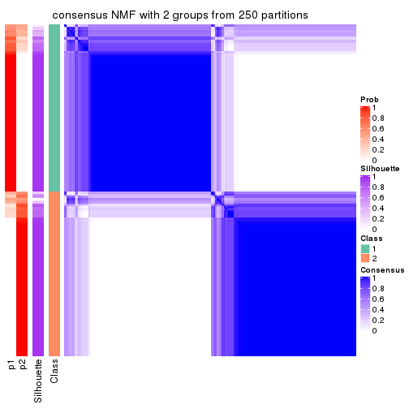</p>

</div>
<div id='tab-CV-NMF-consensus-heatmap-2'>
<pre><code class="r">consensus_heatmap(res, k = 3)
</code></pre>

<p>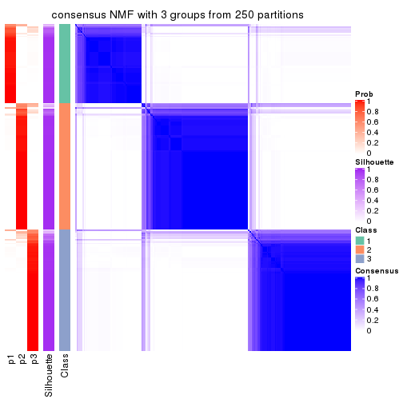</p>

</div>
<div id='tab-CV-NMF-consensus-heatmap-3'>
<pre><code class="r">consensus_heatmap(res, k = 4)
</code></pre>

<p>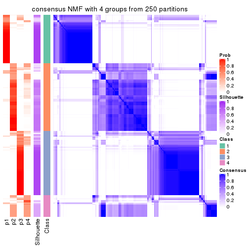</p>

</div>
<div id='tab-CV-NMF-consensus-heatmap-4'>
<pre><code class="r">consensus_heatmap(res, k = 5)
</code></pre>

<p>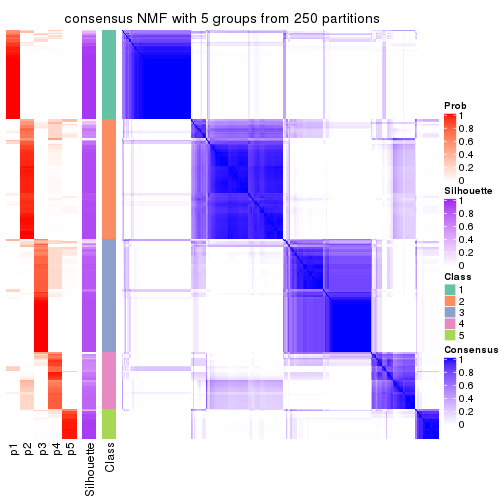</p>

</div>
<div id='tab-CV-NMF-consensus-heatmap-5'>
<pre><code class="r">consensus_heatmap(res, k = 6)
</code></pre>

<p>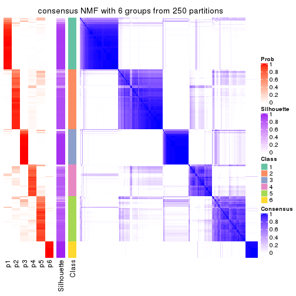</p>

</div>
</div>

Heatmaps for the membership of samples in all partitions to see how consistent they are:


<script>
$( function() {
	$( '#tabs-CV-NMF-membership-heatmap' ).tabs();
} );
</script>
<div id='tabs-CV-NMF-membership-heatmap'>
<ul>
<li><a href='#tab-CV-NMF-membership-heatmap-1'>k = 2</a></li>
<li><a href='#tab-CV-NMF-membership-heatmap-2'>k = 3</a></li>
<li><a href='#tab-CV-NMF-membership-heatmap-3'>k = 4</a></li>
<li><a href='#tab-CV-NMF-membership-heatmap-4'>k = 5</a></li>
<li><a href='#tab-CV-NMF-membership-heatmap-5'>k = 6</a></li>
</ul>
<div id='tab-CV-NMF-membership-heatmap-1'>
<pre><code class="r">membership_heatmap(res, k = 2)
</code></pre>

<p>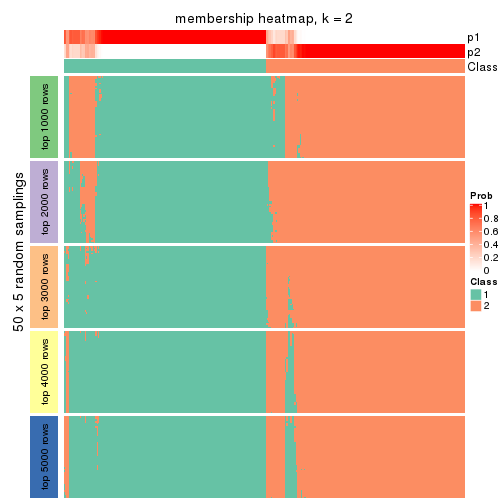</p>

</div>
<div id='tab-CV-NMF-membership-heatmap-2'>
<pre><code class="r">membership_heatmap(res, k = 3)
</code></pre>

<p>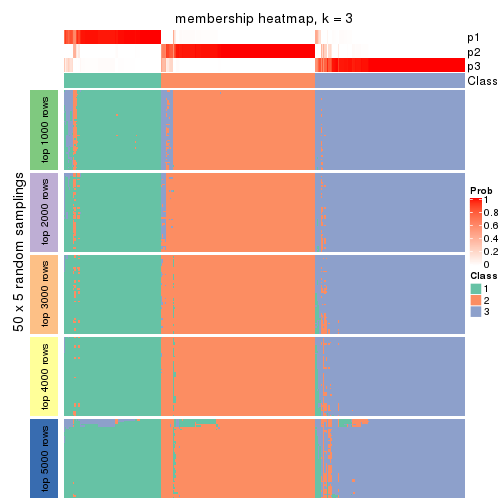</p>

</div>
<div id='tab-CV-NMF-membership-heatmap-3'>
<pre><code class="r">membership_heatmap(res, k = 4)
</code></pre>

<p>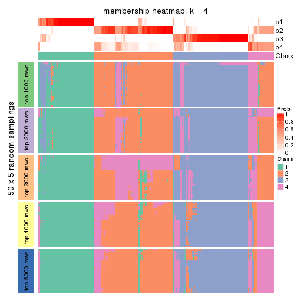</p>

</div>
<div id='tab-CV-NMF-membership-heatmap-4'>
<pre><code class="r">membership_heatmap(res, k = 5)
</code></pre>

<p>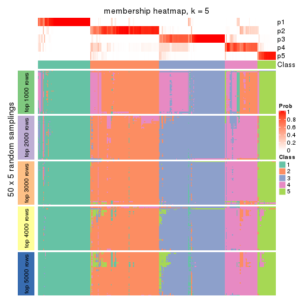</p>

</div>
<div id='tab-CV-NMF-membership-heatmap-5'>
<pre><code class="r">membership_heatmap(res, k = 6)
</code></pre>

<p>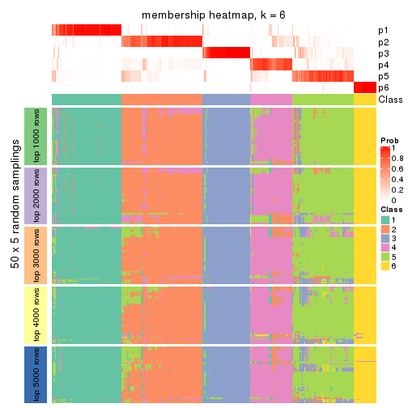</p>

</div>
</div>

As soon as we have had the classes for columns, we can look for signatures
which are significantly different between classes which can be candidate marks
for certain classes. Following are the heatmaps for signatures.


Signature heatmaps where rows are scaled:


<script>
$( function() {
	$( '#tabs-CV-NMF-get-signatures' ).tabs();
} );
</script>
<div id='tabs-CV-NMF-get-signatures'>
<ul>
<li><a href='#tab-CV-NMF-get-signatures-1'>k = 2</a></li>
<li><a href='#tab-CV-NMF-get-signatures-2'>k = 3</a></li>
<li><a href='#tab-CV-NMF-get-signatures-3'>k = 4</a></li>
<li><a href='#tab-CV-NMF-get-signatures-4'>k = 5</a></li>
<li><a href='#tab-CV-NMF-get-signatures-5'>k = 6</a></li>
</ul>
<div id='tab-CV-NMF-get-signatures-1'>
<pre><code class="r">get_signatures(res, k = 2)
</code></pre>

<p>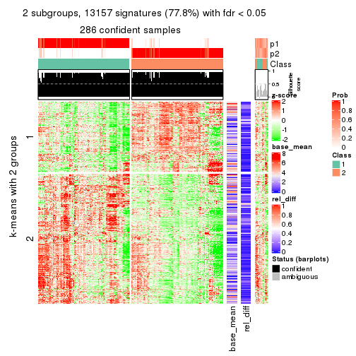</p>

</div>
<div id='tab-CV-NMF-get-signatures-2'>
<pre><code class="r">get_signatures(res, k = 3)
</code></pre>

<p>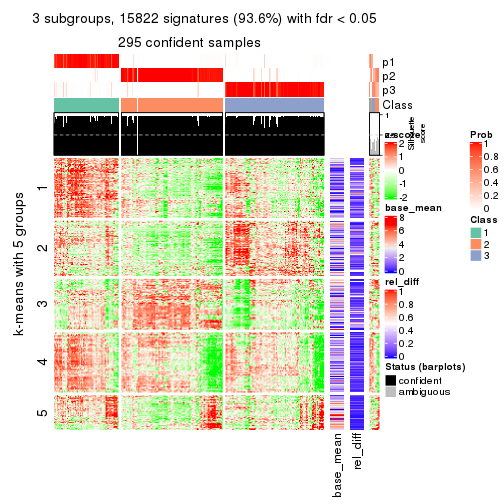</p>

</div>
<div id='tab-CV-NMF-get-signatures-3'>
<pre><code class="r">get_signatures(res, k = 4)
</code></pre>

<p>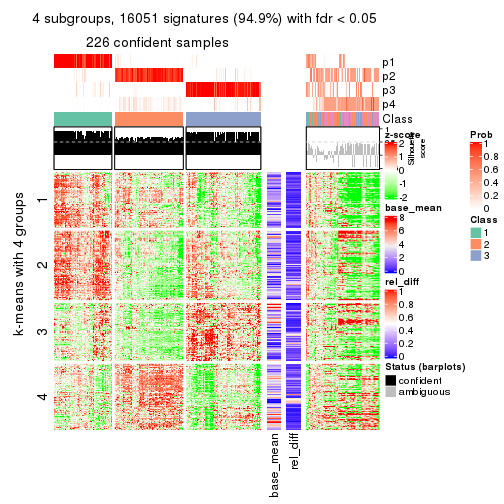</p>

</div>
<div id='tab-CV-NMF-get-signatures-4'>
<pre><code class="r">get_signatures(res, k = 5)
</code></pre>

<p>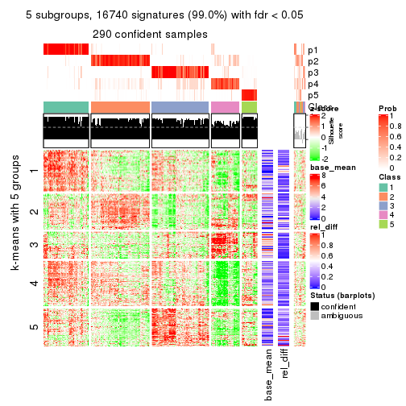</p>

</div>
<div id='tab-CV-NMF-get-signatures-5'>
<pre><code class="r">get_signatures(res, k = 6)
</code></pre>

<p>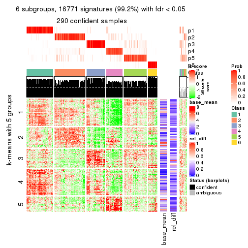</p>

</div>
</div>


Signature heatmaps where rows are not scaled:


<script>
$( function() {
	$( '#tabs-CV-NMF-get-signatures-no-scale' ).tabs();
} );
</script>
<div id='tabs-CV-NMF-get-signatures-no-scale'>
<ul>
<li><a href='#tab-CV-NMF-get-signatures-no-scale-1'>k = 2</a></li>
<li><a href='#tab-CV-NMF-get-signatures-no-scale-2'>k = 3</a></li>
<li><a href='#tab-CV-NMF-get-signatures-no-scale-3'>k = 4</a></li>
<li><a href='#tab-CV-NMF-get-signatures-no-scale-4'>k = 5</a></li>
<li><a href='#tab-CV-NMF-get-signatures-no-scale-5'>k = 6</a></li>
</ul>
<div id='tab-CV-NMF-get-signatures-no-scale-1'>
<pre><code class="r">get_signatures(res, k = 2, scale_rows = FALSE)
</code></pre>

<p>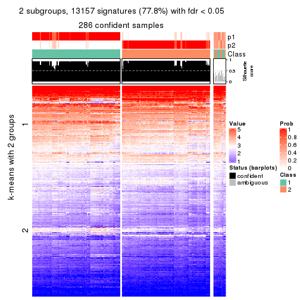</p>

</div>
<div id='tab-CV-NMF-get-signatures-no-scale-2'>
<pre><code class="r">get_signatures(res, k = 3, scale_rows = FALSE)
</code></pre>

<p>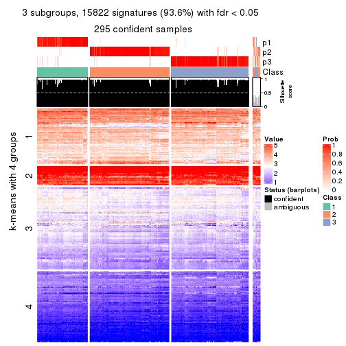</p>

</div>
<div id='tab-CV-NMF-get-signatures-no-scale-3'>
<pre><code class="r">get_signatures(res, k = 4, scale_rows = FALSE)
</code></pre>

<p>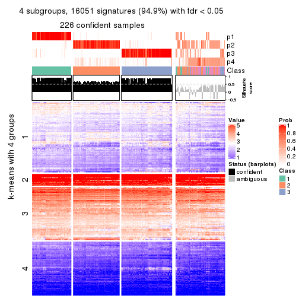</p>

</div>
<div id='tab-CV-NMF-get-signatures-no-scale-4'>
<pre><code class="r">get_signatures(res, k = 5, scale_rows = FALSE)
</code></pre>

<p>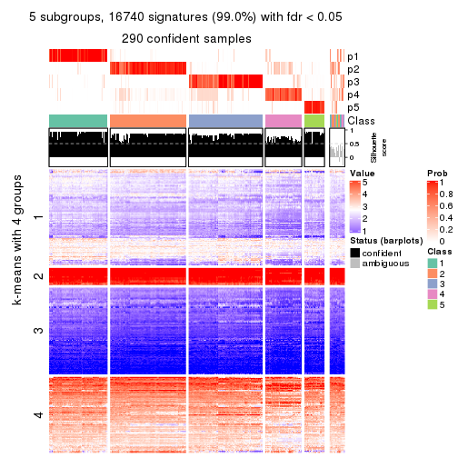</p>

</div>
<div id='tab-CV-NMF-get-signatures-no-scale-5'>
<pre><code class="r">get_signatures(res, k = 6, scale_rows = FALSE)
</code></pre>

<p>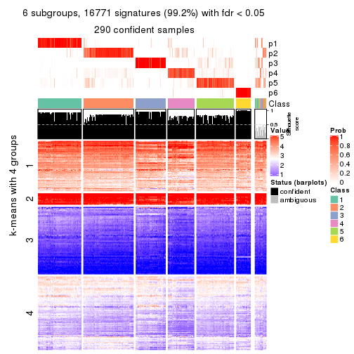</p>

</div>
</div>


Compare the overlap of signatures from different k:

```r
compare_signatures(res)
```

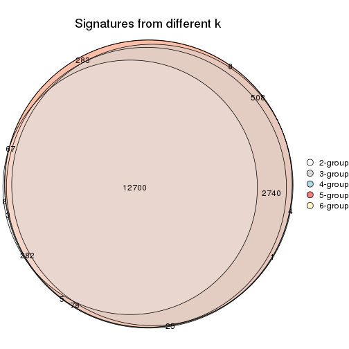

`get_signature()` returns a data frame invisibly. TO get the list of signatures, the function
call should be assigned to a variable explicitly. In following code, if `plot` argument is set
to `FALSE`, no heatmap is plotted while only the differential analysis is performed.

```r
# code only for demonstration
tb = get_signature(res, k = ..., plot = FALSE)
```

An example of the output of `tb` is:

```
#>   which_row         fdr    mean_1    mean_2 scaled_mean_1 scaled_mean_2 km
#> 1        38 0.042760348  8.373488  9.131774    -0.5533452     0.5164555  1
#> 2        40 0.018707592  7.106213  8.469186    -0.6173731     0.5762149  1
#> 3        55 0.019134737 10.221463 11.207825    -0.6159697     0.5749050  1
#> 4        59 0.006059896  5.921854  7.869574    -0.6899429     0.6439467  1
#> 5        60 0.018055526  8.928898 10.211722    -0.6204761     0.5791110  1
#> 6        98 0.009384629 15.714769 14.887706     0.6635654    -0.6193277  2
...
```

The columns in `tb` are:

1. `which_row`: row indices corresponding to the input matrix.
2. `fdr`: FDR for the differential test. 
3. `mean_x`: The mean value in group x.
4. `scaled_mean_x`: The mean value in group x after rows are scaled.
5. `km`: Row groups if k-means clustering is applied to rows.


UMAP plot which shows how samples are separated.


<script>
$( function() {
	$( '#tabs-CV-NMF-dimension-reduction' ).tabs();
} );
</script>
<div id='tabs-CV-NMF-dimension-reduction'>
<ul>
<li><a href='#tab-CV-NMF-dimension-reduction-1'>k = 2</a></li>
<li><a href='#tab-CV-NMF-dimension-reduction-2'>k = 3</a></li>
<li><a href='#tab-CV-NMF-dimension-reduction-3'>k = 4</a></li>
<li><a href='#tab-CV-NMF-dimension-reduction-4'>k = 5</a></li>
<li><a href='#tab-CV-NMF-dimension-reduction-5'>k = 6</a></li>
</ul>
<div id='tab-CV-NMF-dimension-reduction-1'>
<pre><code class="r">dimension_reduction(res, k = 2, method = &quot;UMAP&quot;)
</code></pre>

<p>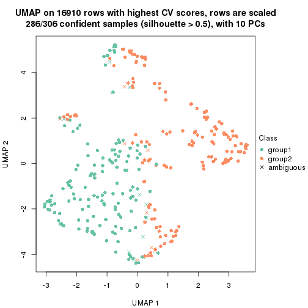</p>

</div>
<div id='tab-CV-NMF-dimension-reduction-2'>
<pre><code class="r">dimension_reduction(res, k = 3, method = &quot;UMAP&quot;)
</code></pre>

<p>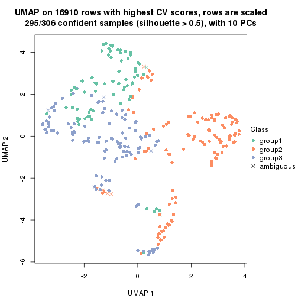</p>

</div>
<div id='tab-CV-NMF-dimension-reduction-3'>
<pre><code class="r">dimension_reduction(res, k = 4, method = &quot;UMAP&quot;)
</code></pre>

<p>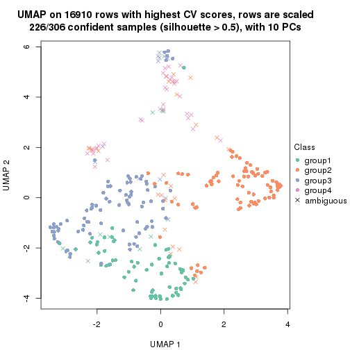</p>

</div>
<div id='tab-CV-NMF-dimension-reduction-4'>
<pre><code class="r">dimension_reduction(res, k = 5, method = &quot;UMAP&quot;)
</code></pre>

<p>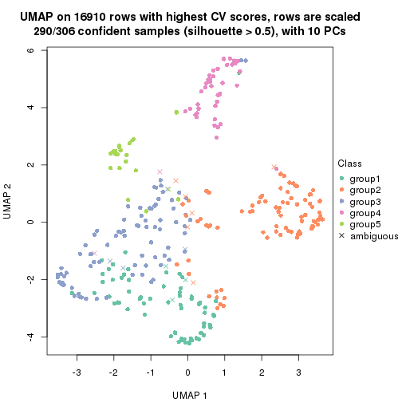</p>

</div>
<div id='tab-CV-NMF-dimension-reduction-5'>
<pre><code class="r">dimension_reduction(res, k = 6, method = &quot;UMAP&quot;)
</code></pre>

<p>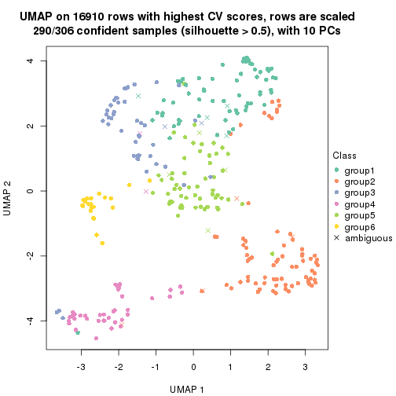</p>

</div>
</div>


Following heatmap shows how subgroups are split when increasing `k`:

```r
collect_classes(res)
```

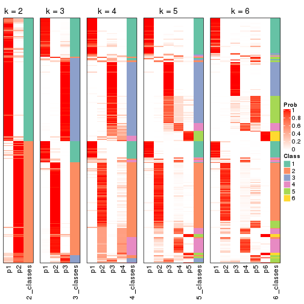


If matrix rows can be associated to genes, consider to use `GO_Enrichment(res,
...)` to perform function enrichment for the signature genes.


 

---------------------------------------------------


### MAD:hclust


The object with results only for a single top-value method and a single partition method 
can be extracted as:

```r
res = res_list["MAD", "hclust"]
# you can also extract it by
# res = res_list["MAD:hclust"]
```

A summary of `res` and all the functions that can be applied to it:

```r
res
```

```
#> A 'ConsensusPartition' object with k = 2, 3, 4, 5, 6.
#>   On a matrix with 16910 rows and 306 columns.
#>   Top rows (1000, 2000, 3000, 4000, 5000) are extracted by 'MAD' method.
#>   Subgroups are detected by 'hclust' method.
#>   Performed in total 1250 partitions by row resampling.
#>   Best k for subgroups seems to be 2.
#> 
#> Following methods can be applied to this 'ConsensusPartition' object:
#>  [1] "cola_report"             "collect_classes"         "collect_plots"          
#>  [4] "collect_stats"           "colnames"                "compare_signatures"     
#>  [7] "consensus_heatmap"       "dimension_reduction"     "functional_enrichment"  
#> [10] "get_anno_col"            "get_anno"                "get_classes"            
#> [13] "get_consensus"           "get_matrix"              "get_membership"         
#> [16] "get_param"               "get_signatures"          "get_stats"              
#> [19] "is_best_k"               "is_stable_k"             "membership_heatmap"     
#> [22] "ncol"                    "nrow"                    "plot_ecdf"              
#> [25] "rownames"                "select_partition_number" "show"                   
#> [28] "suggest_best_k"          "test_to_known_factors"
```

`collect_plots()` function collects all the plots made from `res` for all `k` (number of partitions)
into one single page to provide an easy and fast comparison between different `k`.

```r
collect_plots(res)
```

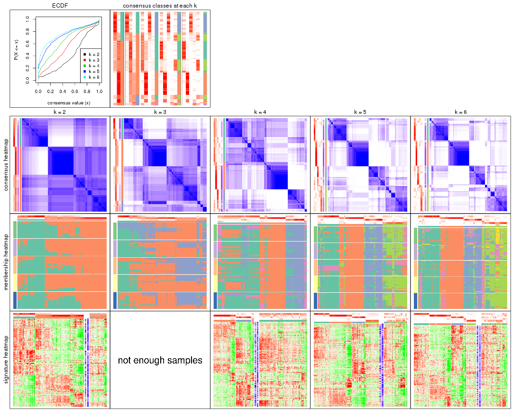

The plots are:

- The first row: a plot of the ECDF (Empirical cumulative distribution
  function) curves of the consensus matrix for each `k` and the heatmap of
  predicted classes for each `k`.
- The second row: heatmaps of the consensus matrix for each `k`.
- The third row: heatmaps of the membership matrix for each `k`.
- The fouth row: heatmaps of the signatures for each `k`.

All the plots in panels can be made by individual functions and they are
plotted later in this section.

`select_partition_number()` produces several plots showing different
statistics for choosing "optimized" `k`. There are following statistics:

- ECDF curves of the consensus matrix for each `k`;
- 1-PAC. [The PAC
  score](https://en.wikipedia.org/wiki/Consensus_clustering#Over-interpretation_potential_of_consensus_clustering)
  measures the proportion of the ambiguous subgrouping.
- Mean silhouette score.
- Concordance. The mean probability of fiting the consensus class ids in all
  partitions.
- Area increased. Denote $A_k$ as the area under the ECDF curve for current
  `k`, the area increased is defined as $A_k - A_{k-1}$.
- Rand index. The percent of pairs of samples that are both in a same cluster
  or both are not in a same cluster in the partition of k and k-1.
- Jaccard index. The ratio of pairs of samples are both in a same cluster in
  the partition of k and k-1 and the pairs of samples are both in a same
  cluster in the partition k or k-1.

The detailed explanations of these statistics can be found in [the cola
vignette](http://bioconductor.org/packages/devel/bioc/vignettes/cola/inst/doc/cola.html#toc_13).

Generally speaking, lower PAC score, higher mean silhouette score or higher
concordance corresponds to better partition. Rand index and Jaccard index
measure how similar the current partition is compared to partition with `k-1`.
If they are too similar, we won't accept `k` is better than `k-1`.

```r
select_partition_number(res)
```

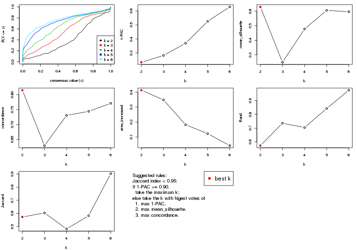

The numeric values for all these statistics can be obtained by `get_stats()`.

```r
get_stats(res)
```

```
#>   k 1-PAC mean_silhouette concordance area_increased  Rand Jaccard
#> 2 2 0.234           0.629       0.815         0.4125 0.573   0.573
#> 3 3 0.283           0.249       0.630         0.3483 0.735   0.604
#> 4 4 0.369           0.478       0.731         0.1822 0.704   0.482
#> 5 5 0.525           0.605       0.744         0.1226 0.843   0.583
#> 6 6 0.628           0.597       0.771         0.0427 0.975   0.903
```

`suggest_best_k()` suggests the best $k$ based on these statistics. The rules are as follows:

- All $k$ with Jaccard index larger than 0.95 are removed because the increase of
  the partition number does not provides enough extra information. If all $k$ are removed,
  the best $k$ is assigned by `NA`.
- For $k$ with 1-PAC larger than 0.9, the maximal $k$ is taken as the "best k". Other $k$ is called "optional k".
- If it does not fit the second rule. The $k$ with the highest vote of highest
  1-PAC, mean silhouette and concordance is taken as the "best k".

```r
suggest_best_k(res)
```

```
#> [1] 2
```


Following shows the table of the partitions (You need to click the **show/hide
code output** link to see it). The membership matrix (columns with name `p*`)
is inferred by
[`clue::cl_consensus()`](https://www.rdocumentation.org/link/cl_consensus?package=clue)
function with the `SE` method. Basically the value in the membership matrix
represents the probability to belong to a certain group. The finall class
label for an item is determined with the group with highest probability it
belongs to.

In `get_classes()` function, the entropy is calculated from the membership
matrix and the silhouette score is calculated from the consensus matrix.


<script>
$( function() {
	$( '#tabs-MAD-hclust-get-classes' ).tabs();
} );
</script>
<div id='tabs-MAD-hclust-get-classes'>
<ul>
<li><a href='#tab-MAD-hclust-get-classes-1'>k = 2</a></li>
<li><a href='#tab-MAD-hclust-get-classes-2'>k = 3</a></li>
<li><a href='#tab-MAD-hclust-get-classes-3'>k = 4</a></li>
<li><a href='#tab-MAD-hclust-get-classes-4'>k = 5</a></li>
<li><a href='#tab-MAD-hclust-get-classes-5'>k = 6</a></li>
</ul>

<div id='tab-MAD-hclust-get-classes-1'>
<p><a id='tab-MAD-hclust-get-classes-1-a' style='color:#0366d6' href='#'>show/hide code output</a></p>
<pre><code class="r">cbind(get_classes(res, k = 2), get_membership(res, k = 2))
</code></pre>

<pre><code>#&gt;            class entropy silhouette    p1    p2
#&gt; SRR1609360     2  0.4562     0.7319 0.096 0.904
#&gt; SRR1609361     2  0.4562     0.7319 0.096 0.904
#&gt; SRR1609362     2  0.4562     0.7319 0.096 0.904
#&gt; SRR1609363     2  0.0000     0.7333 0.000 1.000
#&gt; SRR1609364     2  0.0000     0.7333 0.000 1.000
#&gt; SRR1609365     2  0.4562     0.7319 0.096 0.904
#&gt; SRR1609366     2  0.0000     0.7333 0.000 1.000
#&gt; SRR1609367     2  0.9552     0.5404 0.376 0.624
#&gt; SRR1609368     2  0.0000     0.7333 0.000 1.000
#&gt; SRR1609369     2  0.8813     0.6376 0.300 0.700
#&gt; SRR1609370     2  0.9552     0.5404 0.376 0.624
#&gt; SRR1609371     2  0.0000     0.7333 0.000 1.000
#&gt; SRR1609372     2  0.9552     0.5404 0.376 0.624
#&gt; SRR1609373     2  0.0000     0.7333 0.000 1.000
#&gt; SRR1609374     2  0.0000     0.7333 0.000 1.000
#&gt; SRR1609375     2  0.0000     0.7333 0.000 1.000
#&gt; SRR1609377     2  0.8713     0.6462 0.292 0.708
#&gt; SRR1609376     2  0.0000     0.7333 0.000 1.000
#&gt; SRR1609378     2  0.0000     0.7333 0.000 1.000
#&gt; SRR1609379     2  0.9044     0.6174 0.320 0.680
#&gt; SRR1609382     2  0.0000     0.7333 0.000 1.000
#&gt; SRR1609383     2  0.4562     0.7319 0.096 0.904
#&gt; SRR1609381     2  0.9552     0.5404 0.376 0.624
#&gt; SRR1609384     2  0.8555     0.6544 0.280 0.720
#&gt; SRR1609386     2  0.7453     0.6995 0.212 0.788
#&gt; SRR1609385     2  0.8861     0.6341 0.304 0.696
#&gt; SRR1609387     2  0.9393     0.5723 0.356 0.644
#&gt; SRR1609388     2  0.0000     0.7333 0.000 1.000
#&gt; SRR1609390     2  0.9460     0.5602 0.364 0.636
#&gt; SRR1609393     2  0.0000     0.7333 0.000 1.000
#&gt; SRR1609394     2  0.0000     0.7333 0.000 1.000
#&gt; SRR1609392     2  0.0000     0.7333 0.000 1.000
#&gt; SRR1609391     2  0.0000     0.7333 0.000 1.000
#&gt; SRR1609395     2  0.9552     0.5404 0.376 0.624
#&gt; SRR1609396     2  0.9552     0.5404 0.376 0.624
#&gt; SRR1609398     2  0.7453     0.6995 0.212 0.788
#&gt; SRR1609399     2  0.9552     0.5404 0.376 0.624
#&gt; SRR1609400     2  0.9552     0.5404 0.376 0.624
#&gt; SRR1609397     2  0.0000     0.7333 0.000 1.000
#&gt; SRR1609401     2  0.0000     0.7333 0.000 1.000
#&gt; SRR1609402     2  0.0000     0.7333 0.000 1.000
#&gt; SRR1609405     2  0.8267     0.6679 0.260 0.740
#&gt; SRR1609404     2  0.0000     0.7333 0.000 1.000
#&gt; SRR1609406     2  0.0000     0.7333 0.000 1.000
#&gt; SRR1609408     2  0.0000     0.7333 0.000 1.000
#&gt; SRR1609403     2  0.8955     0.6255 0.312 0.688
#&gt; SRR1609410     2  0.8713     0.6462 0.292 0.708
#&gt; SRR1609411     2  0.0000     0.7333 0.000 1.000
#&gt; SRR1609407     2  0.0000     0.7333 0.000 1.000
#&gt; SRR1609413     2  0.9087     0.6116 0.324 0.676
#&gt; SRR1609412     2  0.9795     0.4236 0.416 0.584
#&gt; SRR1609414     1  0.9000     0.5239 0.684 0.316
#&gt; SRR1609415     1  0.8861     0.5367 0.696 0.304
#&gt; SRR1609416     1  0.3879     0.7763 0.924 0.076
#&gt; SRR1609417     1  0.7376     0.6925 0.792 0.208
#&gt; SRR1609418     2  0.8955     0.6266 0.312 0.688
#&gt; SRR1609419     2  0.0000     0.7333 0.000 1.000
#&gt; SRR1609420     2  0.8909     0.6306 0.308 0.692
#&gt; SRR1609421     2  0.9661     0.4758 0.392 0.608
#&gt; SRR1609422     2  0.7674     0.6786 0.224 0.776
#&gt; SRR1609423     2  0.0672     0.7331 0.008 0.992
#&gt; SRR1609424     2  0.0000     0.7333 0.000 1.000
#&gt; SRR1609425     2  0.8661     0.6497 0.288 0.712
#&gt; SRR1609426     2  0.0000     0.7333 0.000 1.000
#&gt; SRR1609427     1  0.0000     0.7713 1.000 0.000
#&gt; SRR1609428     2  0.0000     0.7333 0.000 1.000
#&gt; SRR1609429     2  0.9580     0.5358 0.380 0.620
#&gt; SRR1609430     1  0.0000     0.7713 1.000 0.000
#&gt; SRR1609431     2  0.7453     0.6865 0.212 0.788
#&gt; SRR1609432     2  0.1633     0.7355 0.024 0.976
#&gt; SRR1609433     1  0.3879     0.7763 0.924 0.076
#&gt; SRR1609434     2  0.0000     0.7333 0.000 1.000
#&gt; SRR1609435     1  0.5946     0.7563 0.856 0.144
#&gt; SRR1609436     1  0.6048     0.7529 0.852 0.148
#&gt; SRR1609437     2  0.5294     0.7297 0.120 0.880
#&gt; SRR1609438     2  0.0000     0.7333 0.000 1.000
#&gt; SRR1609439     1  0.0376     0.7726 0.996 0.004
#&gt; SRR1609440     2  0.9552     0.5404 0.376 0.624
#&gt; SRR1609441     2  0.9427     0.5298 0.360 0.640
#&gt; SRR1609442     2  0.0000     0.7333 0.000 1.000
#&gt; SRR1609443     1  0.7139     0.7119 0.804 0.196
#&gt; SRR1609444     2  0.9552     0.5438 0.376 0.624
#&gt; SRR1609445     2  0.9795     0.4327 0.416 0.584
#&gt; SRR1609446     2  0.9661     0.4884 0.392 0.608
#&gt; SRR1609447     1  0.5737     0.7600 0.864 0.136
#&gt; SRR1609448     2  0.0000     0.7333 0.000 1.000
#&gt; SRR1609449     2  0.9000     0.6243 0.316 0.684
#&gt; SRR1609450     2  0.0938     0.7348 0.012 0.988
#&gt; SRR1609451     1  0.0000     0.7713 1.000 0.000
#&gt; SRR1609452     2  0.9909     0.3411 0.444 0.556
#&gt; SRR1609453     1  0.9993    -0.1046 0.516 0.484
#&gt; SRR1609454     2  0.5178     0.7312 0.116 0.884
#&gt; SRR1609455     2  0.8909     0.6324 0.308 0.692
#&gt; SRR1609456     2  0.9710     0.4677 0.400 0.600
#&gt; SRR1609457     1  0.9044     0.5102 0.680 0.320
#&gt; SRR1609458     1  0.9209     0.4556 0.664 0.336
#&gt; SRR1609459     2  0.9996     0.1795 0.488 0.512
#&gt; SRR1609460     2  0.7453     0.6865 0.212 0.788
#&gt; SRR1609461     1  0.9170     0.4819 0.668 0.332
#&gt; SRR1609462     1  0.0000     0.7713 1.000 0.000
#&gt; SRR1609464     1  0.0000     0.7713 1.000 0.000
#&gt; SRR1609463     1  0.9988    -0.0791 0.520 0.480
#&gt; SRR1609465     2  0.7453     0.6865 0.212 0.788
#&gt; SRR1609466     2  0.7950     0.6577 0.240 0.760
#&gt; SRR1609467     1  0.0000     0.7713 1.000 0.000
#&gt; SRR1609469     2  0.4815     0.7134 0.104 0.896
#&gt; SRR1609470     2  0.9795     0.4269 0.416 0.584
#&gt; SRR1609472     2  0.9580     0.4050 0.380 0.620
#&gt; SRR1609471     2  0.9000     0.6243 0.316 0.684
#&gt; SRR1609474     2  0.3879     0.7355 0.076 0.924
#&gt; SRR1609473     2  0.0000     0.7333 0.000 1.000
#&gt; SRR1609475     2  0.0000     0.7333 0.000 1.000
#&gt; SRR1609478     2  0.9552     0.4122 0.376 0.624
#&gt; SRR1609476     2  0.9608     0.5272 0.384 0.616
#&gt; SRR1609477     2  0.9954     0.2879 0.460 0.540
#&gt; SRR1609479     2  0.0000     0.7333 0.000 1.000
#&gt; SRR1609481     2  0.7453     0.6865 0.212 0.788
#&gt; SRR1609480     2  0.9970     0.2594 0.468 0.532
#&gt; SRR1609482     1  0.0000     0.7713 1.000 0.000
#&gt; SRR1609484     2  0.6801     0.7026 0.180 0.820
#&gt; SRR1609483     1  0.0938     0.7736 0.988 0.012
#&gt; SRR1609486     1  0.5408     0.7629 0.876 0.124
#&gt; SRR1609485     1  0.5408     0.7629 0.876 0.124
#&gt; SRR1609487     2  0.8713     0.6462 0.292 0.708
#&gt; SRR1609488     1  0.7299     0.6995 0.796 0.204
#&gt; SRR1609489     2  0.0000     0.7333 0.000 1.000
#&gt; SRR1609490     2  0.6801     0.7107 0.180 0.820
#&gt; SRR1609491     2  0.9795     0.4322 0.416 0.584
#&gt; SRR1609492     2  0.0000     0.7333 0.000 1.000
#&gt; SRR1609493     2  0.7674     0.6786 0.224 0.776
#&gt; SRR1609494     2  0.0000     0.7333 0.000 1.000
#&gt; SRR1609495     2  0.9552     0.5412 0.376 0.624
#&gt; SRR1609496     1  0.0000     0.7713 1.000 0.000
#&gt; SRR1609497     1  0.6973     0.7151 0.812 0.188
#&gt; SRR1609498     1  0.5629     0.7621 0.868 0.132
#&gt; SRR1609499     2  0.0938     0.7348 0.012 0.988
#&gt; SRR1609500     1  0.6048     0.7529 0.852 0.148
#&gt; SRR1609501     2  0.9833     0.4092 0.424 0.576
#&gt; SRR1609502     2  0.6343     0.7220 0.160 0.840
#&gt; SRR1609503     2  0.6623     0.6758 0.172 0.828
#&gt; SRR1609504     1  0.5946     0.7563 0.856 0.144
#&gt; SRR1609505     1  0.0000     0.7713 1.000 0.000
#&gt; SRR1609506     2  0.0000     0.7333 0.000 1.000
#&gt; SRR1609507     1  0.4431     0.7751 0.908 0.092
#&gt; SRR1609508     2  0.5059     0.7316 0.112 0.888
#&gt; SRR1609509     2  0.0000     0.7333 0.000 1.000
#&gt; SRR1609510     2  0.7453     0.6865 0.212 0.788
#&gt; SRR1609512     1  0.0000     0.7713 1.000 0.000
#&gt; SRR1609511     1  0.1843     0.7738 0.972 0.028
#&gt; SRR1609513     1  0.0000     0.7713 1.000 0.000
#&gt; SRR1609514     2  0.9552     0.4122 0.376 0.624
#&gt; SRR1609515     2  0.0376     0.7338 0.004 0.996
#&gt; SRR1609516     2  0.9996     0.1795 0.488 0.512
#&gt; SRR1609517     2  0.9635     0.4848 0.388 0.612
#&gt; SRR1609518     2  0.9000     0.6243 0.316 0.684
#&gt; SRR1609519     1  0.1184     0.7747 0.984 0.016
#&gt; SRR1609520     2  0.0672     0.7331 0.008 0.992
#&gt; SRR1609521     1  0.0000     0.7713 1.000 0.000
#&gt; SRR1609522     1  0.0000     0.7713 1.000 0.000
#&gt; SRR1609523     2  0.7674     0.6786 0.224 0.776
#&gt; SRR1609524     2  0.0000     0.7333 0.000 1.000
#&gt; SRR1609526     1  0.0000     0.7713 1.000 0.000
#&gt; SRR1609525     2  0.9815     0.4170 0.420 0.580
#&gt; SRR1609527     2  0.9209     0.5989 0.336 0.664
#&gt; SRR1609529     1  0.7883     0.6625 0.764 0.236
#&gt; SRR1609528     2  0.9580     0.4050 0.380 0.620
#&gt; SRR1609530     1  0.4690     0.7696 0.900 0.100
#&gt; SRR1609531     2  0.0000     0.7333 0.000 1.000
#&gt; SRR1609532     1  0.0000     0.7713 1.000 0.000
#&gt; SRR1609533     2  0.9635     0.4848 0.388 0.612
#&gt; SRR1609534     1  0.7056     0.7082 0.808 0.192
#&gt; SRR1609535     2  0.7453     0.6865 0.212 0.788
#&gt; SRR1609537     2  0.0000     0.7333 0.000 1.000
#&gt; SRR1609536     1  0.9686     0.3055 0.604 0.396
#&gt; SRR1609538     2  0.0938     0.7348 0.012 0.988
#&gt; SRR1609539     1  0.9933     0.0557 0.548 0.452
#&gt; SRR1609540     1  0.9286     0.4378 0.656 0.344
#&gt; SRR1609541     2  0.9552     0.4122 0.376 0.624
#&gt; SRR1609542     2  0.0000     0.7333 0.000 1.000
#&gt; SRR1609543     1  0.0000     0.7713 1.000 0.000
#&gt; SRR1609544     1  0.7602     0.6714 0.780 0.220
#&gt; SRR1609545     1  0.5178     0.7690 0.884 0.116
#&gt; SRR1609546     1  0.9635     0.3197 0.612 0.388
#&gt; SRR1609547     1  0.7950     0.6504 0.760 0.240
#&gt; SRR1609548     2  0.9795     0.4236 0.416 0.584
#&gt; SRR1609549     2  0.0000     0.7333 0.000 1.000
#&gt; SRR1609550     2  0.0000     0.7333 0.000 1.000
#&gt; SRR1609551     1  0.9988    -0.0791 0.520 0.480
#&gt; SRR1609552     1  0.7883     0.6638 0.764 0.236
#&gt; SRR1609553     1  0.7139     0.7083 0.804 0.196
#&gt; SRR1609554     2  0.9775     0.4332 0.412 0.588
#&gt; SRR1609555     1  0.9000     0.5166 0.684 0.316
#&gt; SRR1609556     1  0.0000     0.7713 1.000 0.000
#&gt; SRR1609557     2  0.9795     0.4217 0.416 0.584
#&gt; SRR1609558     2  0.9815     0.4170 0.420 0.580
#&gt; SRR1609559     2  0.9635     0.4848 0.388 0.612
#&gt; SRR1609560     2  0.8661     0.6497 0.288 0.712
#&gt; SRR1609561     1  0.5629     0.7581 0.868 0.132
#&gt; SRR1609562     2  0.8661     0.6497 0.288 0.712
#&gt; SRR1609563     2  0.6801     0.7107 0.180 0.820
#&gt; SRR1609564     1  0.8861     0.5367 0.696 0.304
#&gt; SRR1609565     2  0.0000     0.7333 0.000 1.000
#&gt; SRR1609566     2  0.0000     0.7333 0.000 1.000
#&gt; SRR1609567     2  0.0000     0.7333 0.000 1.000
#&gt; SRR1609568     2  0.8955     0.6255 0.312 0.688
#&gt; SRR1609569     1  0.0000     0.7713 1.000 0.000
#&gt; SRR1609570     1  0.0000     0.7713 1.000 0.000
#&gt; SRR1609571     1  0.0000     0.7713 1.000 0.000
#&gt; SRR1609572     1  0.0938     0.7738 0.988 0.012
#&gt; SRR1609573     1  0.0000     0.7713 1.000 0.000
#&gt; SRR1609574     1  0.3274     0.7760 0.940 0.060
#&gt; SRR1609575     2  0.0376     0.7337 0.004 0.996
#&gt; SRR1609576     2  0.0938     0.7348 0.012 0.988
#&gt; SRR1609578     2  0.9686     0.4797 0.396 0.604
#&gt; SRR1609577     2  0.9491     0.5538 0.368 0.632
#&gt; SRR1609579     1  0.0376     0.7726 0.996 0.004
#&gt; SRR1609580     2  0.9988     0.2554 0.480 0.520
#&gt; SRR1609582     1  0.5519     0.7641 0.872 0.128
#&gt; SRR1609581     2  0.9795     0.4322 0.416 0.584
#&gt; SRR1609583     2  0.9970     0.2913 0.468 0.532
#&gt; SRR1609584     1  0.0000     0.7713 1.000 0.000
#&gt; SRR1609585     1  0.3431     0.7770 0.936 0.064
#&gt; SRR1609586     2  0.0000     0.7333 0.000 1.000
#&gt; SRR1609587     1  0.9635     0.3257 0.612 0.388
#&gt; SRR1609588     2  0.9795     0.4322 0.416 0.584
#&gt; SRR1609589     2  0.8909     0.6234 0.308 0.692
#&gt; SRR1609590     1  0.1184     0.7747 0.984 0.016
#&gt; SRR1609592     2  0.9635     0.4848 0.388 0.612
#&gt; SRR1609591     2  0.9129     0.6026 0.328 0.672
#&gt; SRR1609593     2  0.9954     0.2910 0.460 0.540
#&gt; SRR1609594     2  0.0000     0.7333 0.000 1.000
#&gt; SRR1609595     2  0.7453     0.6865 0.212 0.788
#&gt; SRR1609596     2  0.0000     0.7333 0.000 1.000
#&gt; SRR1609597     2  0.0000     0.7333 0.000 1.000
#&gt; SRR1609598     2  0.9552     0.4122 0.376 0.624
#&gt; SRR1609599     2  0.9552     0.4122 0.376 0.624
#&gt; SRR1609600     1  0.4939     0.7716 0.892 0.108
#&gt; SRR1609601     2  0.7602     0.6802 0.220 0.780
#&gt; SRR1609602     2  0.9552     0.4122 0.376 0.624
#&gt; SRR1609603     2  0.8763     0.6410 0.296 0.704
#&gt; SRR1609604     2  0.0000     0.7333 0.000 1.000
#&gt; SRR1609605     2  0.9661     0.4890 0.392 0.608
#&gt; SRR1609606     2  0.9635     0.4848 0.388 0.612
#&gt; SRR1609607     1  0.9608     0.3382 0.616 0.384
#&gt; SRR1609608     1  0.9686     0.3055 0.604 0.396
#&gt; SRR1609609     2  0.9775     0.4332 0.412 0.588
#&gt; SRR1609610     1  0.7602     0.6782 0.780 0.220
#&gt; SRR1609611     2  0.0000     0.7333 0.000 1.000
#&gt; SRR1609613     2  0.0000     0.7333 0.000 1.000
#&gt; SRR1609612     1  0.9000     0.5166 0.684 0.316
#&gt; SRR1609614     1  0.4815     0.7726 0.896 0.104
#&gt; SRR1609615     2  0.9000     0.6243 0.316 0.684
#&gt; SRR1609616     2  0.9732     0.4911 0.404 0.596
#&gt; SRR1609617     2  0.7815     0.6710 0.232 0.768
#&gt; SRR1609618     2  0.9977     0.2798 0.472 0.528
#&gt; SRR1609619     2  0.9460     0.5649 0.364 0.636
#&gt; SRR1609620     2  0.0000     0.7333 0.000 1.000
#&gt; SRR1609621     2  0.0000     0.7333 0.000 1.000
#&gt; SRR1609622     1  0.0376     0.7726 0.996 0.004
#&gt; SRR1609623     1  0.3879     0.7763 0.924 0.076
#&gt; SRR1609624     2  0.9087     0.6116 0.324 0.676
#&gt; SRR1609625     2  0.9286     0.5898 0.344 0.656
#&gt; SRR1609626     1  0.0376     0.7726 0.996 0.004
#&gt; SRR1609627     2  0.8608     0.6528 0.284 0.716
#&gt; SRR1609628     2  0.0000     0.7333 0.000 1.000
#&gt; SRR1609629     1  0.9170     0.4819 0.668 0.332
#&gt; SRR1609630     2  0.0000     0.7333 0.000 1.000
#&gt; SRR1609631     2  0.9248     0.5946 0.340 0.660
#&gt; SRR1609632     2  0.8661     0.6497 0.288 0.712
#&gt; SRR1609633     2  0.9552     0.5404 0.376 0.624
#&gt; SRR1609634     2  0.0000     0.7333 0.000 1.000
#&gt; SRR1609635     1  0.0000     0.7713 1.000 0.000
#&gt; SRR1609636     2  0.0000     0.7333 0.000 1.000
#&gt; SRR1609637     1  0.7139     0.7020 0.804 0.196
#&gt; SRR1609638     2  0.6801     0.7107 0.180 0.820
#&gt; SRR1609639     2  0.0000     0.7333 0.000 1.000
#&gt; SRR1609640     1  0.0000     0.7713 1.000 0.000
#&gt; SRR1609641     2  0.9087     0.6116 0.324 0.676
#&gt; SRR1609642     2  0.9393     0.5731 0.356 0.644
#&gt; SRR1609643     1  1.0000    -0.1835 0.504 0.496
#&gt; SRR1609644     2  0.8763     0.6410 0.296 0.704
#&gt; SRR1609645     1  0.9000     0.5166 0.684 0.316
#&gt; SRR1609646     1  0.0000     0.7713 1.000 0.000
#&gt; SRR1609647     2  0.7453     0.6865 0.212 0.788
#&gt; SRR1609649     1  0.4939     0.7716 0.892 0.108
#&gt; SRR1609648     2  0.0000     0.7333 0.000 1.000
#&gt; SRR1609651     2  0.6712     0.7119 0.176 0.824
#&gt; SRR1609650     2  0.9909     0.3411 0.444 0.556
#&gt; SRR1609652     1  0.0000     0.7713 1.000 0.000
#&gt; SRR1609653     2  0.0000     0.7333 0.000 1.000
#&gt; SRR1609654     2  0.2778     0.7346 0.048 0.952
#&gt; SRR1609655     1  0.9988    -0.0791 0.520 0.480
#&gt; SRR1609657     2  0.9552     0.5404 0.376 0.624
#&gt; SRR1609656     2  0.4562     0.7319 0.096 0.904
#&gt; SRR1609658     2  0.0000     0.7333 0.000 1.000
#&gt; SRR1609659     2  0.0000     0.7333 0.000 1.000
#&gt; SRR1609660     1  0.9988    -0.0791 0.520 0.480
#&gt; SRR1609661     1  0.9635     0.3197 0.612 0.388
#&gt; SRR1609662     2  0.0000     0.7333 0.000 1.000
#&gt; SRR1609663     1  0.9248     0.4617 0.660 0.340
#&gt; SRR1609664     2  0.7453     0.6865 0.212 0.788
#&gt; SRR1609665     2  0.0376     0.7338 0.004 0.996
#&gt; SRR1609666     2  0.4298     0.7324 0.088 0.912
#&gt; SRR1609667     1  0.5737     0.7600 0.864 0.136
#&gt; SRR1609668     2  0.7453     0.6865 0.212 0.788
#&gt; SRR1609669     2  0.8955     0.6255 0.312 0.688
</code></pre>

<script>
$('#tab-MAD-hclust-get-classes-1-a').parent().next().next().hide();
$('#tab-MAD-hclust-get-classes-1-a').click(function(){
  $('#tab-MAD-hclust-get-classes-1-a').parent().next().next().toggle();
  return(false);
});
</script>
</div>

<div id='tab-MAD-hclust-get-classes-2'>
<p><a id='tab-MAD-hclust-get-classes-2-a' style='color:#0366d6' href='#'>show/hide code output</a></p>
<pre><code class="r">cbind(get_classes(res, k = 3), get_membership(res, k = 3))
</code></pre>

<pre><code>#&gt;            class entropy silhouette    p1    p2    p3
#&gt; SRR1609360     2  0.5502     0.0732 0.008 0.744 0.248
#&gt; SRR1609361     2  0.5502     0.0732 0.008 0.744 0.248
#&gt; SRR1609362     2  0.5502     0.0732 0.008 0.744 0.248
#&gt; SRR1609363     2  0.6267    -0.0536 0.000 0.548 0.452
#&gt; SRR1609364     2  0.6267    -0.0536 0.000 0.548 0.452
#&gt; SRR1609365     2  0.5502     0.0732 0.008 0.744 0.248
#&gt; SRR1609366     2  0.6095    -0.0342 0.000 0.608 0.392
#&gt; SRR1609367     2  0.3682     0.3050 0.116 0.876 0.008
#&gt; SRR1609368     2  0.6267    -0.0536 0.000 0.548 0.452
#&gt; SRR1609369     2  0.2550     0.3060 0.056 0.932 0.012
#&gt; SRR1609370     2  0.3682     0.3050 0.116 0.876 0.008
#&gt; SRR1609371     2  0.6299    -0.1053 0.000 0.524 0.476
#&gt; SRR1609372     2  0.3682     0.3050 0.116 0.876 0.008
#&gt; SRR1609373     2  0.6267    -0.0536 0.000 0.548 0.452
#&gt; SRR1609374     2  0.6095    -0.0342 0.000 0.608 0.392
#&gt; SRR1609375     2  0.6095    -0.0342 0.000 0.608 0.392
#&gt; SRR1609377     2  0.2229     0.3032 0.044 0.944 0.012
#&gt; SRR1609376     2  0.6267    -0.0536 0.000 0.548 0.452
#&gt; SRR1609378     3  0.6308     0.1331 0.000 0.492 0.508
#&gt; SRR1609379     2  0.2496     0.3125 0.068 0.928 0.004
#&gt; SRR1609382     2  0.6308    -0.1432 0.000 0.508 0.492
#&gt; SRR1609383     2  0.5502     0.0732 0.008 0.744 0.248
#&gt; SRR1609381     2  0.3682     0.3050 0.116 0.876 0.008
#&gt; SRR1609384     2  0.2663     0.2946 0.044 0.932 0.024
#&gt; SRR1609386     2  0.3752     0.2275 0.020 0.884 0.096
#&gt; SRR1609385     2  0.2550     0.3061 0.056 0.932 0.012
#&gt; SRR1609387     2  0.2959     0.3101 0.100 0.900 0.000
#&gt; SRR1609388     2  0.6267    -0.0536 0.000 0.548 0.452
#&gt; SRR1609390     2  0.3454     0.3074 0.104 0.888 0.008
#&gt; SRR1609393     3  0.6308     0.1331 0.000 0.492 0.508
#&gt; SRR1609394     2  0.6267    -0.0536 0.000 0.548 0.452
#&gt; SRR1609392     2  0.6267    -0.0536 0.000 0.548 0.452
#&gt; SRR1609391     2  0.6299    -0.1053 0.000 0.524 0.476
#&gt; SRR1609395     2  0.3682     0.3050 0.116 0.876 0.008
#&gt; SRR1609396     2  0.3682     0.3050 0.116 0.876 0.008
#&gt; SRR1609398     2  0.3752     0.2275 0.020 0.884 0.096
#&gt; SRR1609399     2  0.3682     0.3050 0.116 0.876 0.008
#&gt; SRR1609400     2  0.3682     0.3050 0.116 0.876 0.008
#&gt; SRR1609397     2  0.6267    -0.0536 0.000 0.548 0.452
#&gt; SRR1609401     2  0.6267    -0.0536 0.000 0.548 0.452
#&gt; SRR1609402     2  0.6267    -0.0536 0.000 0.548 0.452
#&gt; SRR1609405     2  0.3369     0.2727 0.040 0.908 0.052
#&gt; SRR1609404     3  0.6308     0.1331 0.000 0.492 0.508
#&gt; SRR1609406     2  0.6267    -0.0536 0.000 0.548 0.452
#&gt; SRR1609408     2  0.6267    -0.0536 0.000 0.548 0.452
#&gt; SRR1609403     2  0.2301     0.3110 0.060 0.936 0.004
#&gt; SRR1609410     2  0.2063     0.3045 0.044 0.948 0.008
#&gt; SRR1609411     2  0.6274    -0.0612 0.000 0.544 0.456
#&gt; SRR1609407     2  0.6267    -0.0536 0.000 0.548 0.452
#&gt; SRR1609413     2  0.2590     0.3126 0.072 0.924 0.004
#&gt; SRR1609412     2  0.8042     0.1111 0.136 0.648 0.216
#&gt; SRR1609414     2  0.7909    -0.2945 0.448 0.496 0.056
#&gt; SRR1609415     2  0.6489    -0.2675 0.456 0.540 0.004
#&gt; SRR1609416     1  0.5244     0.7678 0.756 0.240 0.004
#&gt; SRR1609417     1  0.7112     0.6188 0.648 0.308 0.044
#&gt; SRR1609418     2  0.1964     0.3110 0.056 0.944 0.000
#&gt; SRR1609419     2  0.6267    -0.0536 0.000 0.548 0.452
#&gt; SRR1609420     2  0.2384     0.3093 0.056 0.936 0.008
#&gt; SRR1609421     2  0.8007     0.0916 0.116 0.640 0.244
#&gt; SRR1609422     3  0.6659     0.4510 0.008 0.460 0.532
#&gt; SRR1609423     3  0.6305     0.1627 0.000 0.484 0.516
#&gt; SRR1609424     2  0.6309    -0.1558 0.000 0.504 0.496
#&gt; SRR1609425     2  0.2269     0.2980 0.040 0.944 0.016
#&gt; SRR1609426     2  0.6267    -0.0536 0.000 0.548 0.452
#&gt; SRR1609427     1  0.2625     0.7966 0.916 0.084 0.000
#&gt; SRR1609428     2  0.6267    -0.0536 0.000 0.548 0.452
#&gt; SRR1609429     2  0.5639     0.2475 0.112 0.808 0.080
#&gt; SRR1609430     1  0.0237     0.7666 0.996 0.004 0.000
#&gt; SRR1609431     3  0.6274     0.4633 0.000 0.456 0.544
#&gt; SRR1609432     2  0.6204    -0.0519 0.000 0.576 0.424
#&gt; SRR1609433     1  0.5244     0.7678 0.756 0.240 0.004
#&gt; SRR1609434     3  0.6308     0.1331 0.000 0.492 0.508
#&gt; SRR1609435     1  0.6148     0.6867 0.640 0.356 0.004
#&gt; SRR1609436     1  0.6879     0.6649 0.616 0.360 0.024
#&gt; SRR1609437     2  0.7044    -0.0983 0.032 0.620 0.348
#&gt; SRR1609438     3  0.6308     0.1331 0.000 0.492 0.508
#&gt; SRR1609439     1  0.2749     0.7905 0.924 0.064 0.012
#&gt; SRR1609440     2  0.3682     0.3050 0.116 0.876 0.008
#&gt; SRR1609441     2  0.7872     0.0755 0.112 0.652 0.236
#&gt; SRR1609442     2  0.6267    -0.0536 0.000 0.548 0.452
#&gt; SRR1609443     1  0.7263     0.5890 0.568 0.400 0.032
#&gt; SRR1609444     2  0.5481     0.2531 0.108 0.816 0.076
#&gt; SRR1609445     2  0.7666     0.1339 0.128 0.680 0.192
#&gt; SRR1609446     2  0.7216     0.1446 0.112 0.712 0.176
#&gt; SRR1609447     1  0.6104     0.6945 0.648 0.348 0.004
#&gt; SRR1609448     2  0.6267    -0.0536 0.000 0.548 0.452
#&gt; SRR1609449     2  0.2486     0.3108 0.060 0.932 0.008
#&gt; SRR1609450     2  0.6235    -0.0520 0.000 0.564 0.436
#&gt; SRR1609451     1  0.0237     0.7666 0.996 0.004 0.000
#&gt; SRR1609452     2  0.8436     0.0903 0.160 0.616 0.224
#&gt; SRR1609453     2  0.8405     0.1369 0.264 0.604 0.132
#&gt; SRR1609454     2  0.5216     0.0515 0.000 0.740 0.260
#&gt; SRR1609455     2  0.2384     0.3091 0.056 0.936 0.008
#&gt; SRR1609456     2  0.7462     0.1419 0.124 0.696 0.180
#&gt; SRR1609457     2  0.8113    -0.2560 0.428 0.504 0.068
#&gt; SRR1609458     2  0.7570    -0.1697 0.404 0.552 0.044
#&gt; SRR1609459     2  0.8913     0.0641 0.208 0.572 0.220
#&gt; SRR1609460     3  0.6274     0.4633 0.000 0.456 0.544
#&gt; SRR1609461     2  0.8093    -0.2190 0.416 0.516 0.068
#&gt; SRR1609462     1  0.2356     0.7957 0.928 0.072 0.000
#&gt; SRR1609464     1  0.0424     0.7689 0.992 0.008 0.000
#&gt; SRR1609463     2  0.9191     0.0129 0.208 0.536 0.256
#&gt; SRR1609465     3  0.6274     0.4633 0.000 0.456 0.544
#&gt; SRR1609466     2  0.7931    -0.0162 0.092 0.624 0.284
#&gt; SRR1609467     1  0.0237     0.7666 0.996 0.004 0.000
#&gt; SRR1609469     3  0.6509     0.2125 0.004 0.472 0.524
#&gt; SRR1609470     2  0.7860     0.1231 0.132 0.664 0.204
#&gt; SRR1609472     3  0.9007     0.3645 0.180 0.268 0.552
#&gt; SRR1609471     2  0.2486     0.3108 0.060 0.932 0.008
#&gt; SRR1609474     2  0.5560     0.0247 0.000 0.700 0.300
#&gt; SRR1609473     3  0.6309     0.1306 0.000 0.500 0.500
#&gt; SRR1609475     3  0.6309     0.1301 0.000 0.496 0.504
#&gt; SRR1609478     3  0.8939     0.3739 0.176 0.264 0.560
#&gt; SRR1609476     2  0.3826     0.3021 0.124 0.868 0.008
#&gt; SRR1609477     2  0.8926     0.0405 0.192 0.568 0.240
#&gt; SRR1609479     2  0.6267    -0.0536 0.000 0.548 0.452
#&gt; SRR1609481     3  0.6274     0.4633 0.000 0.456 0.544
#&gt; SRR1609480     2  0.9019     0.0435 0.224 0.560 0.216
#&gt; SRR1609482     1  0.0424     0.7689 0.992 0.008 0.000
#&gt; SRR1609484     2  0.7809    -0.1685 0.060 0.568 0.372
#&gt; SRR1609483     1  0.3045     0.7890 0.916 0.064 0.020
#&gt; SRR1609486     1  0.6262     0.7240 0.696 0.284 0.020
#&gt; SRR1609485     1  0.6262     0.7240 0.696 0.284 0.020
#&gt; SRR1609487     2  0.2229     0.3032 0.044 0.944 0.012
#&gt; SRR1609488     1  0.7736     0.5713 0.548 0.400 0.052
#&gt; SRR1609489     2  0.6260    -0.0535 0.000 0.552 0.448
#&gt; SRR1609490     2  0.4615     0.2067 0.020 0.836 0.144
#&gt; SRR1609491     2  0.7620     0.1370 0.128 0.684 0.188
#&gt; SRR1609492     2  0.6267    -0.0536 0.000 0.548 0.452
#&gt; SRR1609493     3  0.6659     0.4510 0.008 0.460 0.532
#&gt; SRR1609494     2  0.6267    -0.0536 0.000 0.548 0.452
#&gt; SRR1609495     2  0.3682     0.3050 0.116 0.876 0.008
#&gt; SRR1609496     1  0.2261     0.7947 0.932 0.068 0.000
#&gt; SRR1609497     1  0.7640     0.6301 0.592 0.352 0.056
#&gt; SRR1609498     1  0.6081     0.6991 0.652 0.344 0.004
#&gt; SRR1609499     2  0.6235    -0.0520 0.000 0.564 0.436
#&gt; SRR1609500     1  0.6879     0.6649 0.616 0.360 0.024
#&gt; SRR1609501     2  0.7816     0.1286 0.132 0.668 0.200
#&gt; SRR1609502     2  0.5268     0.0909 0.012 0.776 0.212
#&gt; SRR1609503     3  0.2200     0.3339 0.004 0.056 0.940
#&gt; SRR1609504     1  0.6148     0.6867 0.640 0.356 0.004
#&gt; SRR1609505     1  0.2356     0.7958 0.928 0.072 0.000
#&gt; SRR1609506     2  0.6267    -0.0536 0.000 0.548 0.452
#&gt; SRR1609507     1  0.5588     0.7513 0.720 0.276 0.004
#&gt; SRR1609508     2  0.5291     0.0413 0.000 0.732 0.268
#&gt; SRR1609509     2  0.6267    -0.0536 0.000 0.548 0.452
#&gt; SRR1609510     3  0.6274     0.4633 0.000 0.456 0.544
#&gt; SRR1609512     1  0.2261     0.7947 0.932 0.068 0.000
#&gt; SRR1609511     1  0.5075     0.7504 0.836 0.068 0.096
#&gt; SRR1609513     1  0.0237     0.7666 0.996 0.004 0.000
#&gt; SRR1609514     3  0.8939     0.3739 0.176 0.264 0.560
#&gt; SRR1609515     2  0.6252    -0.0537 0.000 0.556 0.444
#&gt; SRR1609516     2  0.8913     0.0641 0.208 0.572 0.220
#&gt; SRR1609517     2  0.7944     0.0926 0.112 0.644 0.244
#&gt; SRR1609518     2  0.2486     0.3108 0.060 0.932 0.008
#&gt; SRR1609519     1  0.3349     0.7952 0.888 0.108 0.004
#&gt; SRR1609520     3  0.6305     0.1627 0.000 0.484 0.516
#&gt; SRR1609521     1  0.2356     0.7957 0.928 0.072 0.000
#&gt; SRR1609522     1  0.0237     0.7666 0.996 0.004 0.000
#&gt; SRR1609523     3  0.6659     0.4510 0.008 0.460 0.532
#&gt; SRR1609524     2  0.6267    -0.0536 0.000 0.548 0.452
#&gt; SRR1609526     1  0.0475     0.7664 0.992 0.004 0.004
#&gt; SRR1609525     2  0.7918     0.1229 0.136 0.660 0.204
#&gt; SRR1609527     2  0.2772     0.3117 0.080 0.916 0.004
#&gt; SRR1609529     1  0.7868     0.5020 0.524 0.420 0.056
#&gt; SRR1609528     3  0.9007     0.3645 0.180 0.268 0.552
#&gt; SRR1609530     1  0.5899     0.7462 0.736 0.244 0.020
#&gt; SRR1609531     2  0.6267    -0.0536 0.000 0.548 0.452
#&gt; SRR1609532     1  0.0424     0.7689 0.992 0.008 0.000
#&gt; SRR1609533     2  0.7944     0.0926 0.112 0.644 0.244
#&gt; SRR1609534     1  0.7234     0.6034 0.640 0.312 0.048
#&gt; SRR1609535     3  0.6274     0.4633 0.000 0.456 0.544
#&gt; SRR1609537     2  0.6267    -0.0536 0.000 0.548 0.452
#&gt; SRR1609536     2  0.8924    -0.0271 0.336 0.524 0.140
#&gt; SRR1609538     2  0.6235    -0.0520 0.000 0.564 0.436
#&gt; SRR1609539     2  0.9324     0.0195 0.272 0.516 0.212
#&gt; SRR1609540     2  0.7546    -0.1473 0.396 0.560 0.044
#&gt; SRR1609541     3  0.8939     0.3739 0.176 0.264 0.560
#&gt; SRR1609542     2  0.6267    -0.0536 0.000 0.548 0.452
#&gt; SRR1609543     1  0.2625     0.7966 0.916 0.084 0.000
#&gt; SRR1609544     1  0.6587     0.5739 0.568 0.424 0.008
#&gt; SRR1609545     1  0.5929     0.7196 0.676 0.320 0.004
#&gt; SRR1609546     2  0.8685     0.0269 0.328 0.548 0.124
#&gt; SRR1609547     1  0.8720     0.4743 0.540 0.336 0.124
#&gt; SRR1609548     2  0.8042     0.1111 0.136 0.648 0.216
#&gt; SRR1609549     2  0.6267    -0.0536 0.000 0.548 0.452
#&gt; SRR1609550     2  0.6267    -0.0536 0.000 0.548 0.452
#&gt; SRR1609551     2  0.9191     0.0129 0.208 0.536 0.256
#&gt; SRR1609552     1  0.7411     0.4839 0.548 0.416 0.036
#&gt; SRR1609553     1  0.7726     0.5947 0.572 0.372 0.056
#&gt; SRR1609554     2  0.8005     0.1063 0.128 0.648 0.224
#&gt; SRR1609555     2  0.7969    -0.2754 0.432 0.508 0.060
#&gt; SRR1609556     1  0.0237     0.7666 0.996 0.004 0.000
#&gt; SRR1609557     2  0.8063     0.1064 0.132 0.644 0.224
#&gt; SRR1609558     2  0.7918     0.1229 0.136 0.660 0.204
#&gt; SRR1609559     2  0.7944     0.0926 0.112 0.644 0.244
#&gt; SRR1609560     2  0.2116     0.3005 0.040 0.948 0.012
#&gt; SRR1609561     1  0.7337     0.6824 0.644 0.300 0.056
#&gt; SRR1609562     2  0.2116     0.3005 0.040 0.948 0.012
#&gt; SRR1609563     2  0.4741     0.2002 0.020 0.828 0.152
#&gt; SRR1609564     2  0.6489    -0.2675 0.456 0.540 0.004
#&gt; SRR1609565     2  0.6267    -0.0536 0.000 0.548 0.452
#&gt; SRR1609566     2  0.6267    -0.0536 0.000 0.548 0.452
#&gt; SRR1609567     2  0.6267    -0.0536 0.000 0.548 0.452
#&gt; SRR1609568     2  0.2301     0.3110 0.060 0.936 0.004
#&gt; SRR1609569     1  0.2356     0.7957 0.928 0.072 0.000
#&gt; SRR1609570     1  0.0237     0.7666 0.996 0.004 0.000
#&gt; SRR1609571     1  0.2486     0.7320 0.932 0.008 0.060
#&gt; SRR1609572     1  0.3445     0.7938 0.896 0.088 0.016
#&gt; SRR1609573     1  0.0237     0.7666 0.996 0.004 0.000
#&gt; SRR1609574     1  0.5220     0.7780 0.780 0.208 0.012
#&gt; SRR1609575     2  0.6295    -0.1243 0.000 0.528 0.472
#&gt; SRR1609576     2  0.6244    -0.0524 0.000 0.560 0.440
#&gt; SRR1609578     2  0.7283     0.1434 0.116 0.708 0.176
#&gt; SRR1609577     2  0.3532     0.3071 0.108 0.884 0.008
#&gt; SRR1609579     1  0.2486     0.7897 0.932 0.060 0.008
#&gt; SRR1609580     2  0.8478     0.1324 0.204 0.616 0.180
#&gt; SRR1609582     1  0.6033     0.7071 0.660 0.336 0.004
#&gt; SRR1609581     2  0.7620     0.1370 0.128 0.684 0.188
#&gt; SRR1609583     2  0.8216     0.1429 0.172 0.640 0.188
#&gt; SRR1609584     1  0.0237     0.7666 0.996 0.004 0.000
#&gt; SRR1609585     1  0.4555     0.7726 0.800 0.200 0.000
#&gt; SRR1609586     2  0.6267    -0.0536 0.000 0.548 0.452
#&gt; SRR1609587     2  0.9108    -0.0132 0.316 0.520 0.164
#&gt; SRR1609588     2  0.7620     0.1370 0.128 0.684 0.188
#&gt; SRR1609589     2  0.5793     0.1952 0.084 0.800 0.116
#&gt; SRR1609590     1  0.3349     0.7952 0.888 0.108 0.004
#&gt; SRR1609592     2  0.7944     0.0926 0.112 0.644 0.244
#&gt; SRR1609591     2  0.5722     0.2020 0.084 0.804 0.112
#&gt; SRR1609593     2  0.9008    -0.0114 0.164 0.540 0.296
#&gt; SRR1609594     3  0.6308     0.1331 0.000 0.492 0.508
#&gt; SRR1609595     3  0.6274     0.4633 0.000 0.456 0.544
#&gt; SRR1609596     2  0.6267    -0.0536 0.000 0.548 0.452
#&gt; SRR1609597     2  0.6267    -0.0536 0.000 0.548 0.452
#&gt; SRR1609598     3  0.8939     0.3739 0.176 0.264 0.560
#&gt; SRR1609599     3  0.8939     0.3739 0.176 0.264 0.560
#&gt; SRR1609600     1  0.5815     0.7350 0.692 0.304 0.004
#&gt; SRR1609601     3  0.6647     0.4600 0.008 0.452 0.540
#&gt; SRR1609602     3  0.8939     0.3739 0.176 0.264 0.560
#&gt; SRR1609603     2  0.2703     0.3042 0.056 0.928 0.016
#&gt; SRR1609604     2  0.6308    -0.1432 0.000 0.508 0.492
#&gt; SRR1609605     2  0.7283     0.1473 0.116 0.708 0.176
#&gt; SRR1609606     2  0.7944     0.0926 0.112 0.644 0.244
#&gt; SRR1609607     2  0.9125    -0.0279 0.320 0.516 0.164
#&gt; SRR1609608     2  0.8924    -0.0271 0.336 0.524 0.140
#&gt; SRR1609609     2  0.8005     0.1063 0.128 0.648 0.224
#&gt; SRR1609610     1  0.7809     0.5486 0.548 0.396 0.056
#&gt; SRR1609611     2  0.6308    -0.1432 0.000 0.508 0.492
#&gt; SRR1609613     2  0.6244    -0.0528 0.000 0.560 0.440
#&gt; SRR1609612     2  0.7969    -0.2754 0.432 0.508 0.060
#&gt; SRR1609614     1  0.5785     0.7376 0.696 0.300 0.004
#&gt; SRR1609615     2  0.2486     0.3108 0.060 0.932 0.008
#&gt; SRR1609616     2  0.4779     0.2800 0.124 0.840 0.036
#&gt; SRR1609617     3  0.7067     0.4237 0.020 0.468 0.512
#&gt; SRR1609618     2  0.8353     0.1339 0.192 0.628 0.180
#&gt; SRR1609619     2  0.5319     0.2696 0.104 0.824 0.072
#&gt; SRR1609620     2  0.6299    -0.1053 0.000 0.524 0.476
#&gt; SRR1609621     2  0.6267    -0.0536 0.000 0.548 0.452
#&gt; SRR1609622     1  0.2584     0.7908 0.928 0.064 0.008
#&gt; SRR1609623     1  0.5244     0.7678 0.756 0.240 0.004
#&gt; SRR1609624     2  0.2590     0.3126 0.072 0.924 0.004
#&gt; SRR1609625     2  0.2945     0.3088 0.088 0.908 0.004
#&gt; SRR1609626     1  0.2584     0.7908 0.928 0.064 0.008
#&gt; SRR1609627     2  0.2269     0.2979 0.040 0.944 0.016
#&gt; SRR1609628     2  0.6267    -0.0536 0.000 0.548 0.452
#&gt; SRR1609629     2  0.8093    -0.2190 0.416 0.516 0.068
#&gt; SRR1609630     2  0.6267    -0.0536 0.000 0.548 0.452
#&gt; SRR1609631     2  0.2860     0.3093 0.084 0.912 0.004
#&gt; SRR1609632     2  0.2116     0.3005 0.040 0.948 0.012
#&gt; SRR1609633     2  0.3682     0.3050 0.116 0.876 0.008
#&gt; SRR1609634     2  0.6267    -0.0536 0.000 0.548 0.452
#&gt; SRR1609635     1  0.2486     0.7320 0.932 0.008 0.060
#&gt; SRR1609636     2  0.6305    -0.1195 0.000 0.516 0.484
#&gt; SRR1609637     1  0.6498     0.6237 0.596 0.396 0.008
#&gt; SRR1609638     2  0.4615     0.2067 0.020 0.836 0.144
#&gt; SRR1609639     2  0.6267    -0.0536 0.000 0.548 0.452
#&gt; SRR1609640     1  0.2261     0.7947 0.932 0.068 0.000
#&gt; SRR1609641     2  0.2590     0.3126 0.072 0.924 0.004
#&gt; SRR1609642     2  0.3295     0.3087 0.096 0.896 0.008
#&gt; SRR1609643     2  0.8557     0.1364 0.212 0.608 0.180
#&gt; SRR1609644     2  0.2703     0.3042 0.056 0.928 0.016
#&gt; SRR1609645     2  0.7969    -0.2754 0.432 0.508 0.060
#&gt; SRR1609646     1  0.0237     0.7666 0.996 0.004 0.000
#&gt; SRR1609647     3  0.6274     0.4633 0.000 0.456 0.544
#&gt; SRR1609649     1  0.5815     0.7350 0.692 0.304 0.004
#&gt; SRR1609648     2  0.6267    -0.0536 0.000 0.548 0.452
#&gt; SRR1609651     2  0.5036     0.1806 0.020 0.808 0.172
#&gt; SRR1609650     2  0.8436     0.0903 0.160 0.616 0.224
#&gt; SRR1609652     1  0.2261     0.7947 0.932 0.068 0.000
#&gt; SRR1609653     2  0.6267    -0.0536 0.000 0.548 0.452
#&gt; SRR1609654     2  0.6379    -0.0775 0.008 0.624 0.368
#&gt; SRR1609655     2  0.9197     0.0161 0.212 0.536 0.252
#&gt; SRR1609657     2  0.3682     0.3050 0.116 0.876 0.008
#&gt; SRR1609656     2  0.5502     0.0732 0.008 0.744 0.248
#&gt; SRR1609658     2  0.6267    -0.0536 0.000 0.548 0.452
#&gt; SRR1609659     2  0.6267    -0.0536 0.000 0.548 0.452
#&gt; SRR1609660     2  0.9197     0.0161 0.212 0.536 0.252
#&gt; SRR1609661     2  0.8685     0.0269 0.328 0.548 0.124
#&gt; SRR1609662     2  0.6267    -0.0536 0.000 0.548 0.452
#&gt; SRR1609663     2  0.8526    -0.1487 0.376 0.524 0.100
#&gt; SRR1609664     3  0.6274     0.4633 0.000 0.456 0.544
#&gt; SRR1609665     2  0.6235    -0.0520 0.000 0.564 0.436
#&gt; SRR1609666     2  0.5325     0.0663 0.004 0.748 0.248
#&gt; SRR1609667     1  0.6126     0.6920 0.644 0.352 0.004
#&gt; SRR1609668     3  0.6274     0.4633 0.000 0.456 0.544
#&gt; SRR1609669     2  0.2301     0.3110 0.060 0.936 0.004
</code></pre>

<script>
$('#tab-MAD-hclust-get-classes-2-a').parent().next().next().hide();
$('#tab-MAD-hclust-get-classes-2-a').click(function(){
  $('#tab-MAD-hclust-get-classes-2-a').parent().next().next().toggle();
  return(false);
});
</script>
</div>

<div id='tab-MAD-hclust-get-classes-3'>
<p><a id='tab-MAD-hclust-get-classes-3-a' style='color:#0366d6' href='#'>show/hide code output</a></p>
<pre><code class="r">cbind(get_classes(res, k = 4), get_membership(res, k = 4))
</code></pre>

<pre><code>#&gt;            class entropy silhouette    p1    p2    p3    p4
#&gt; SRR1609360     1  0.7325    0.14568 0.472 0.368 0.000 0.160
#&gt; SRR1609361     1  0.7325    0.14568 0.472 0.368 0.000 0.160
#&gt; SRR1609362     1  0.7325    0.14568 0.472 0.368 0.000 0.160
#&gt; SRR1609363     2  0.0000    0.88043 0.000 1.000 0.000 0.000
#&gt; SRR1609364     2  0.0000    0.88043 0.000 1.000 0.000 0.000
#&gt; SRR1609365     1  0.7325    0.14568 0.472 0.368 0.000 0.160
#&gt; SRR1609366     2  0.2281    0.80392 0.096 0.904 0.000 0.000
#&gt; SRR1609367     1  0.6095    0.48294 0.668 0.252 0.072 0.008
#&gt; SRR1609368     2  0.0000    0.88043 0.000 1.000 0.000 0.000
#&gt; SRR1609369     1  0.6493    0.46428 0.588 0.336 0.068 0.008
#&gt; SRR1609370     1  0.6095    0.48294 0.668 0.252 0.072 0.008
#&gt; SRR1609371     2  0.1118    0.86275 0.000 0.964 0.000 0.036
#&gt; SRR1609372     1  0.6095    0.48294 0.668 0.252 0.072 0.008
#&gt; SRR1609373     2  0.0000    0.88043 0.000 1.000 0.000 0.000
#&gt; SRR1609374     2  0.2216    0.80766 0.092 0.908 0.000 0.000
#&gt; SRR1609375     2  0.2281    0.80392 0.096 0.904 0.000 0.000
#&gt; SRR1609377     1  0.6397    0.46039 0.588 0.344 0.060 0.008
#&gt; SRR1609376     2  0.0000    0.88043 0.000 1.000 0.000 0.000
#&gt; SRR1609378     2  0.3831    0.74239 0.004 0.792 0.000 0.204
#&gt; SRR1609379     1  0.6386    0.47931 0.612 0.312 0.068 0.008
#&gt; SRR1609382     2  0.4088    0.77345 0.040 0.820 0.000 0.140
#&gt; SRR1609383     1  0.7325    0.14568 0.472 0.368 0.000 0.160
#&gt; SRR1609381     1  0.6095    0.48294 0.668 0.252 0.072 0.008
#&gt; SRR1609384     1  0.6518    0.43466 0.568 0.360 0.064 0.008
#&gt; SRR1609386     2  0.6249   -0.21275 0.476 0.476 0.044 0.004
#&gt; SRR1609385     1  0.6493    0.46704 0.588 0.336 0.068 0.008
#&gt; SRR1609387     1  0.6188    0.48515 0.648 0.276 0.068 0.008
#&gt; SRR1609388     2  0.0000    0.88043 0.000 1.000 0.000 0.000
#&gt; SRR1609390     1  0.6176    0.48334 0.656 0.264 0.072 0.008
#&gt; SRR1609393     2  0.3831    0.74239 0.004 0.792 0.000 0.204
#&gt; SRR1609394     2  0.0000    0.88043 0.000 1.000 0.000 0.000
#&gt; SRR1609392     2  0.0000    0.88043 0.000 1.000 0.000 0.000
#&gt; SRR1609391     2  0.1118    0.86275 0.000 0.964 0.000 0.036
#&gt; SRR1609395     1  0.6095    0.48294 0.668 0.252 0.072 0.008
#&gt; SRR1609396     1  0.6095    0.48294 0.668 0.252 0.072 0.008
#&gt; SRR1609398     1  0.6249    0.19824 0.476 0.476 0.044 0.004
#&gt; SRR1609399     1  0.6095    0.48294 0.668 0.252 0.072 0.008
#&gt; SRR1609400     1  0.6095    0.48294 0.668 0.252 0.072 0.008
#&gt; SRR1609397     2  0.0000    0.88043 0.000 1.000 0.000 0.000
#&gt; SRR1609401     2  0.0000    0.88043 0.000 1.000 0.000 0.000
#&gt; SRR1609402     2  0.0000    0.88043 0.000 1.000 0.000 0.000
#&gt; SRR1609405     1  0.6270    0.36700 0.536 0.404 0.060 0.000
#&gt; SRR1609404     2  0.3791    0.74634 0.004 0.796 0.000 0.200
#&gt; SRR1609406     2  0.0000    0.88043 0.000 1.000 0.000 0.000
#&gt; SRR1609408     2  0.0000    0.88043 0.000 1.000 0.000 0.000
#&gt; SRR1609403     1  0.6442    0.47725 0.600 0.324 0.068 0.008
#&gt; SRR1609410     1  0.6397    0.46115 0.588 0.344 0.060 0.008
#&gt; SRR1609411     2  0.0188    0.87741 0.004 0.996 0.000 0.000
#&gt; SRR1609407     2  0.0000    0.88043 0.000 1.000 0.000 0.000
#&gt; SRR1609413     1  0.6429    0.47972 0.612 0.308 0.072 0.008
#&gt; SRR1609412     1  0.5043    0.22564 0.796 0.112 0.024 0.068
#&gt; SRR1609414     1  0.6203    0.06917 0.592 0.040 0.356 0.012
#&gt; SRR1609415     1  0.7129   -0.00951 0.492 0.116 0.388 0.004
#&gt; SRR1609416     3  0.4535    0.64085 0.292 0.000 0.704 0.004
#&gt; SRR1609417     3  0.5872    0.37863 0.356 0.004 0.604 0.036
#&gt; SRR1609418     1  0.6360    0.47952 0.608 0.320 0.064 0.008
#&gt; SRR1609419     2  0.0000    0.88043 0.000 1.000 0.000 0.000
#&gt; SRR1609420     1  0.6493    0.47387 0.588 0.336 0.068 0.008
#&gt; SRR1609421     1  0.4888    0.20974 0.784 0.140 0.004 0.072
#&gt; SRR1609422     1  0.7670   -0.20655 0.448 0.232 0.000 0.320
#&gt; SRR1609423     2  0.5723    0.61514 0.072 0.684 0.000 0.244
#&gt; SRR1609424     2  0.3913    0.77887 0.028 0.824 0.000 0.148
#&gt; SRR1609425     1  0.6454    0.44328 0.572 0.360 0.060 0.008
#&gt; SRR1609426     2  0.0000    0.88043 0.000 1.000 0.000 0.000
#&gt; SRR1609427     3  0.2011    0.72168 0.080 0.000 0.920 0.000
#&gt; SRR1609428     2  0.0000    0.88043 0.000 1.000 0.000 0.000
#&gt; SRR1609429     1  0.6181    0.45239 0.680 0.232 0.072 0.016
#&gt; SRR1609430     3  0.0817    0.69385 0.000 0.000 0.976 0.024
#&gt; SRR1609431     1  0.7722   -0.20684 0.428 0.236 0.000 0.336
#&gt; SRR1609432     2  0.1637    0.84049 0.060 0.940 0.000 0.000
#&gt; SRR1609433     3  0.4535    0.64085 0.292 0.000 0.704 0.004
#&gt; SRR1609434     2  0.3831    0.74239 0.004 0.792 0.000 0.204
#&gt; SRR1609435     3  0.5060    0.51870 0.412 0.000 0.584 0.004
#&gt; SRR1609436     3  0.5648    0.46353 0.428 0.012 0.552 0.008
#&gt; SRR1609437     2  0.6788    0.03422 0.424 0.480 0.000 0.096
#&gt; SRR1609438     2  0.3831    0.74239 0.004 0.792 0.000 0.204
#&gt; SRR1609439     3  0.2675    0.70228 0.048 0.000 0.908 0.044
#&gt; SRR1609440     1  0.6095    0.48294 0.668 0.252 0.072 0.008
#&gt; SRR1609441     1  0.6033    0.21941 0.712 0.188 0.020 0.080
#&gt; SRR1609442     2  0.0188    0.87925 0.000 0.996 0.000 0.004
#&gt; SRR1609443     1  0.6014   -0.31623 0.488 0.020 0.480 0.012
#&gt; SRR1609444     1  0.6275    0.45621 0.672 0.236 0.076 0.016
#&gt; SRR1609445     1  0.5126    0.27329 0.792 0.116 0.028 0.064
#&gt; SRR1609446     1  0.5219    0.28974 0.780 0.136 0.024 0.060
#&gt; SRR1609447     3  0.5039    0.52889 0.404 0.000 0.592 0.004
#&gt; SRR1609448     2  0.0000    0.88043 0.000 1.000 0.000 0.000
#&gt; SRR1609449     1  0.6341    0.48159 0.612 0.316 0.064 0.008
#&gt; SRR1609450     2  0.1022    0.86370 0.032 0.968 0.000 0.000
#&gt; SRR1609451     3  0.0817    0.69385 0.000 0.000 0.976 0.024
#&gt; SRR1609452     1  0.5630    0.18647 0.772 0.096 0.052 0.080
#&gt; SRR1609453     1  0.5657    0.27046 0.744 0.072 0.164 0.020
#&gt; SRR1609454     2  0.5355    0.24867 0.360 0.620 0.000 0.020
#&gt; SRR1609455     1  0.6396    0.48018 0.600 0.328 0.064 0.008
#&gt; SRR1609456     1  0.5191    0.28436 0.784 0.132 0.028 0.056
#&gt; SRR1609457     1  0.6270    0.13182 0.604 0.036 0.340 0.020
#&gt; SRR1609458     1  0.7019    0.15159 0.552 0.108 0.332 0.008
#&gt; SRR1609459     1  0.6047    0.13152 0.748 0.068 0.100 0.084
#&gt; SRR1609460     1  0.7722   -0.20684 0.428 0.236 0.000 0.336
#&gt; SRR1609461     1  0.6200    0.16543 0.620 0.036 0.324 0.020
#&gt; SRR1609462     3  0.1716    0.72193 0.064 0.000 0.936 0.000
#&gt; SRR1609464     3  0.1004    0.69649 0.004 0.000 0.972 0.024
#&gt; SRR1609463     1  0.6321    0.01395 0.704 0.024 0.116 0.156
#&gt; SRR1609465     1  0.7722   -0.20684 0.428 0.236 0.000 0.336
#&gt; SRR1609466     1  0.8410    0.05680 0.496 0.248 0.048 0.208
#&gt; SRR1609467     3  0.0817    0.69385 0.000 0.000 0.976 0.024
#&gt; SRR1609469     2  0.7272    0.18333 0.160 0.496 0.000 0.344
#&gt; SRR1609470     1  0.5335    0.25296 0.780 0.116 0.028 0.076
#&gt; SRR1609472     4  0.7540    0.88993 0.420 0.040 0.076 0.464
#&gt; SRR1609471     1  0.6226    0.48305 0.616 0.320 0.056 0.008
#&gt; SRR1609474     2  0.4896    0.47441 0.280 0.704 0.004 0.012
#&gt; SRR1609473     2  0.4524    0.72573 0.028 0.768 0.000 0.204
#&gt; SRR1609475     2  0.4175    0.73929 0.016 0.784 0.000 0.200
#&gt; SRR1609478     4  0.7464    0.90363 0.416 0.036 0.076 0.472
#&gt; SRR1609476     1  0.6220    0.48315 0.660 0.252 0.080 0.008
#&gt; SRR1609477     1  0.6755    0.05993 0.696 0.072 0.092 0.140
#&gt; SRR1609479     2  0.0188    0.87925 0.000 0.996 0.000 0.004
#&gt; SRR1609481     1  0.7722   -0.20684 0.428 0.236 0.000 0.336
#&gt; SRR1609480     1  0.6993    0.05516 0.680 0.072 0.124 0.124
#&gt; SRR1609482     3  0.1004    0.69649 0.004 0.000 0.972 0.024
#&gt; SRR1609484     1  0.7047    0.01512 0.444 0.436 0.000 0.120
#&gt; SRR1609483     3  0.2919    0.69461 0.060 0.000 0.896 0.044
#&gt; SRR1609486     3  0.5173    0.56386 0.320 0.000 0.660 0.020
#&gt; SRR1609485     3  0.5173    0.56386 0.320 0.000 0.660 0.020
#&gt; SRR1609487     1  0.6397    0.46039 0.588 0.344 0.060 0.008
#&gt; SRR1609488     1  0.5508   -0.28823 0.508 0.000 0.476 0.016
#&gt; SRR1609489     2  0.0188    0.87855 0.004 0.996 0.000 0.000
#&gt; SRR1609490     2  0.5897   -0.14138 0.468 0.504 0.020 0.008
#&gt; SRR1609491     1  0.5126    0.27219 0.792 0.116 0.028 0.064
#&gt; SRR1609492     2  0.0000    0.88043 0.000 1.000 0.000 0.000
#&gt; SRR1609493     1  0.7670   -0.20655 0.448 0.232 0.000 0.320
#&gt; SRR1609494     2  0.0000    0.88043 0.000 1.000 0.000 0.000
#&gt; SRR1609495     1  0.6095    0.48401 0.668 0.252 0.072 0.008
#&gt; SRR1609496     3  0.1302    0.71896 0.044 0.000 0.956 0.000
#&gt; SRR1609497     3  0.5788    0.37598 0.452 0.008 0.524 0.016
#&gt; SRR1609498     3  0.5028    0.53506 0.400 0.000 0.596 0.004
#&gt; SRR1609499     2  0.1022    0.86370 0.032 0.968 0.000 0.000
#&gt; SRR1609500     3  0.5648    0.46353 0.428 0.012 0.552 0.008
#&gt; SRR1609501     1  0.5142    0.25952 0.792 0.112 0.028 0.068
#&gt; SRR1609502     1  0.5780    0.16323 0.496 0.476 0.000 0.028
#&gt; SRR1609503     4  0.1824    0.44317 0.004 0.060 0.000 0.936
#&gt; SRR1609504     3  0.5060    0.51870 0.412 0.000 0.584 0.004
#&gt; SRR1609505     3  0.1637    0.72153 0.060 0.000 0.940 0.000
#&gt; SRR1609506     2  0.0000    0.88043 0.000 1.000 0.000 0.000
#&gt; SRR1609507     3  0.4741    0.62011 0.328 0.000 0.668 0.004
#&gt; SRR1609508     2  0.5271    0.30528 0.340 0.640 0.000 0.020
#&gt; SRR1609509     2  0.0000    0.88043 0.000 1.000 0.000 0.000
#&gt; SRR1609510     1  0.7722   -0.20684 0.428 0.236 0.000 0.336
#&gt; SRR1609512     3  0.1302    0.71896 0.044 0.000 0.956 0.000
#&gt; SRR1609511     3  0.4688    0.60614 0.080 0.000 0.792 0.128
#&gt; SRR1609513     3  0.0817    0.69385 0.000 0.000 0.976 0.024
#&gt; SRR1609514     4  0.7464    0.90363 0.416 0.036 0.076 0.472
#&gt; SRR1609515     2  0.0592    0.87229 0.016 0.984 0.000 0.000
#&gt; SRR1609516     1  0.6047    0.13152 0.748 0.068 0.100 0.084
#&gt; SRR1609517     1  0.4804    0.20365 0.780 0.148 0.000 0.072
#&gt; SRR1609518     1  0.6341    0.48159 0.612 0.316 0.064 0.008
#&gt; SRR1609519     3  0.2530    0.71904 0.100 0.000 0.896 0.004
#&gt; SRR1609520     2  0.5723    0.61514 0.072 0.684 0.000 0.244
#&gt; SRR1609521     3  0.1792    0.72226 0.068 0.000 0.932 0.000
#&gt; SRR1609522     3  0.0817    0.69385 0.000 0.000 0.976 0.024
#&gt; SRR1609523     1  0.7670   -0.20655 0.448 0.232 0.000 0.320
#&gt; SRR1609524     2  0.0000    0.88043 0.000 1.000 0.000 0.000
#&gt; SRR1609526     3  0.0921    0.69336 0.000 0.000 0.972 0.028
#&gt; SRR1609525     1  0.5280    0.25017 0.784 0.112 0.028 0.076
#&gt; SRR1609527     1  0.6345    0.48313 0.628 0.292 0.072 0.008
#&gt; SRR1609529     1  0.5876   -0.18877 0.528 0.008 0.444 0.020
#&gt; SRR1609528     4  0.7540    0.88993 0.420 0.040 0.076 0.464
#&gt; SRR1609530     3  0.4882    0.60264 0.272 0.000 0.708 0.020
#&gt; SRR1609531     2  0.0000    0.88043 0.000 1.000 0.000 0.000
#&gt; SRR1609532     3  0.1004    0.69649 0.004 0.000 0.972 0.024
#&gt; SRR1609533     1  0.4756    0.20905 0.784 0.144 0.000 0.072
#&gt; SRR1609534     3  0.5920    0.36769 0.348 0.004 0.608 0.040
#&gt; SRR1609535     1  0.7722   -0.20684 0.428 0.236 0.000 0.336
#&gt; SRR1609537     2  0.0000    0.88043 0.000 1.000 0.000 0.000
#&gt; SRR1609536     1  0.6151    0.06779 0.688 0.024 0.228 0.060
#&gt; SRR1609538     2  0.1022    0.86370 0.032 0.968 0.000 0.000
#&gt; SRR1609539     1  0.6528   -0.00314 0.684 0.024 0.176 0.116
#&gt; SRR1609540     1  0.7066    0.18077 0.556 0.116 0.320 0.008
#&gt; SRR1609541     4  0.7464    0.90363 0.416 0.036 0.076 0.472
#&gt; SRR1609542     2  0.0000    0.88043 0.000 1.000 0.000 0.000
#&gt; SRR1609543     3  0.2011    0.72168 0.080 0.000 0.920 0.000
#&gt; SRR1609544     3  0.5292    0.35850 0.480 0.000 0.512 0.008
#&gt; SRR1609545     3  0.4920    0.57854 0.368 0.000 0.628 0.004
#&gt; SRR1609546     1  0.6705    0.22968 0.664 0.060 0.224 0.052
#&gt; SRR1609547     1  0.6673   -0.23270 0.464 0.004 0.460 0.072
#&gt; SRR1609548     1  0.5043    0.22564 0.796 0.112 0.024 0.068
#&gt; SRR1609549     2  0.0000    0.88043 0.000 1.000 0.000 0.000
#&gt; SRR1609550     2  0.0000    0.88043 0.000 1.000 0.000 0.000
#&gt; SRR1609551     1  0.6312    0.00214 0.704 0.024 0.112 0.160
#&gt; SRR1609552     3  0.6417    0.17088 0.472 0.012 0.476 0.040
#&gt; SRR1609553     3  0.5771    0.31338 0.472 0.004 0.504 0.020
#&gt; SRR1609554     1  0.5080    0.21701 0.788 0.120 0.016 0.076
#&gt; SRR1609555     1  0.5998    0.11994 0.616 0.028 0.340 0.016
#&gt; SRR1609556     3  0.0817    0.69385 0.000 0.000 0.976 0.024
#&gt; SRR1609557     1  0.5021    0.21605 0.796 0.108 0.020 0.076
#&gt; SRR1609558     1  0.5267    0.26126 0.784 0.116 0.028 0.072
#&gt; SRR1609559     1  0.4706    0.21151 0.788 0.140 0.000 0.072
#&gt; SRR1609560     1  0.6427    0.45248 0.580 0.352 0.060 0.008
#&gt; SRR1609561     3  0.5742    0.47436 0.368 0.000 0.596 0.036
#&gt; SRR1609562     1  0.6427    0.45248 0.580 0.352 0.060 0.008
#&gt; SRR1609563     2  0.5892   -0.11668 0.460 0.512 0.020 0.008
#&gt; SRR1609564     1  0.7129   -0.00951 0.492 0.116 0.388 0.004
#&gt; SRR1609565     2  0.0000    0.88043 0.000 1.000 0.000 0.000
#&gt; SRR1609566     2  0.0000    0.88043 0.000 1.000 0.000 0.000
#&gt; SRR1609567     2  0.0000    0.88043 0.000 1.000 0.000 0.000
#&gt; SRR1609568     1  0.6424    0.47624 0.604 0.320 0.068 0.008
#&gt; SRR1609569     3  0.1716    0.72193 0.064 0.000 0.936 0.000
#&gt; SRR1609570     3  0.0817    0.69385 0.000 0.000 0.976 0.024
#&gt; SRR1609571     3  0.2530    0.63867 0.004 0.000 0.896 0.100
#&gt; SRR1609572     3  0.3612    0.69173 0.100 0.000 0.856 0.044
#&gt; SRR1609573     3  0.0817    0.69385 0.000 0.000 0.976 0.024
#&gt; SRR1609574     3  0.5021    0.66091 0.240 0.000 0.724 0.036
#&gt; SRR1609575     2  0.4356    0.76959 0.064 0.812 0.000 0.124
#&gt; SRR1609576     2  0.0817    0.86870 0.024 0.976 0.000 0.000
#&gt; SRR1609578     1  0.5292    0.28758 0.776 0.136 0.024 0.064
#&gt; SRR1609577     1  0.6085    0.48519 0.664 0.260 0.068 0.008
#&gt; SRR1609579     3  0.2660    0.70677 0.056 0.000 0.908 0.036
#&gt; SRR1609580     1  0.5981    0.25562 0.752 0.088 0.096 0.064
#&gt; SRR1609582     3  0.4991    0.55200 0.388 0.000 0.608 0.004
#&gt; SRR1609581     1  0.5126    0.27219 0.792 0.116 0.028 0.064
#&gt; SRR1609583     1  0.5371    0.29348 0.788 0.092 0.064 0.056
#&gt; SRR1609584     3  0.0817    0.69385 0.000 0.000 0.976 0.024
#&gt; SRR1609585     3  0.3831    0.68127 0.204 0.000 0.792 0.004
#&gt; SRR1609586     2  0.0000    0.88043 0.000 1.000 0.000 0.000
#&gt; SRR1609587     1  0.6291    0.02890 0.684 0.016 0.208 0.092
#&gt; SRR1609588     1  0.5126    0.27219 0.792 0.116 0.028 0.064
#&gt; SRR1609589     1  0.5472    0.35094 0.724 0.224 0.028 0.024
#&gt; SRR1609590     3  0.2593    0.71867 0.104 0.000 0.892 0.004
#&gt; SRR1609592     1  0.4706    0.21151 0.788 0.140 0.000 0.072
#&gt; SRR1609591     1  0.5179    0.36004 0.760 0.184 0.020 0.036
#&gt; SRR1609593     1  0.6671    0.02360 0.688 0.052 0.084 0.176
#&gt; SRR1609594     2  0.3831    0.74239 0.004 0.792 0.000 0.204
#&gt; SRR1609595     1  0.7722   -0.20684 0.428 0.236 0.000 0.336
#&gt; SRR1609596     2  0.0000    0.88043 0.000 1.000 0.000 0.000
#&gt; SRR1609597     2  0.0000    0.88043 0.000 1.000 0.000 0.000
#&gt; SRR1609598     4  0.7464    0.90363 0.416 0.036 0.076 0.472
#&gt; SRR1609599     4  0.7464    0.90363 0.416 0.036 0.076 0.472
#&gt; SRR1609600     3  0.4889    0.59187 0.360 0.000 0.636 0.004
#&gt; SRR1609601     1  0.7681   -0.23152 0.432 0.224 0.000 0.344
#&gt; SRR1609602     4  0.7464    0.90363 0.416 0.036 0.076 0.472
#&gt; SRR1609603     1  0.6392    0.45559 0.584 0.344 0.068 0.004
#&gt; SRR1609604     2  0.3948    0.77922 0.036 0.828 0.000 0.136
#&gt; SRR1609605     1  0.5292    0.29079 0.776 0.136 0.024 0.064
#&gt; SRR1609606     1  0.4804    0.20365 0.780 0.148 0.000 0.072
#&gt; SRR1609607     1  0.6178    0.03966 0.688 0.012 0.208 0.092
#&gt; SRR1609608     1  0.6151    0.06779 0.688 0.024 0.228 0.060
#&gt; SRR1609609     1  0.5080    0.21701 0.788 0.120 0.016 0.076
#&gt; SRR1609610     1  0.6117   -0.25899 0.484 0.016 0.480 0.020
#&gt; SRR1609611     2  0.3948    0.77922 0.036 0.828 0.000 0.136
#&gt; SRR1609613     2  0.0469    0.87465 0.012 0.988 0.000 0.000
#&gt; SRR1609612     1  0.5998    0.11994 0.616 0.028 0.340 0.016
#&gt; SRR1609614     3  0.4872    0.59673 0.356 0.000 0.640 0.004
#&gt; SRR1609615     1  0.6341    0.48159 0.612 0.316 0.064 0.008
#&gt; SRR1609616     1  0.6571    0.47284 0.644 0.244 0.100 0.012
#&gt; SRR1609617     1  0.7601   -0.19465 0.472 0.232 0.000 0.296
#&gt; SRR1609618     1  0.5724    0.26585 0.768 0.088 0.084 0.060
#&gt; SRR1609619     1  0.6146    0.47240 0.680 0.236 0.068 0.016
#&gt; SRR1609620     2  0.1118    0.86275 0.000 0.964 0.000 0.036
#&gt; SRR1609621     2  0.0188    0.87925 0.000 0.996 0.000 0.004
#&gt; SRR1609622     3  0.2500    0.70360 0.044 0.000 0.916 0.040
#&gt; SRR1609623     3  0.4535    0.64085 0.292 0.000 0.704 0.004
#&gt; SRR1609624     1  0.6429    0.47972 0.612 0.308 0.072 0.008
#&gt; SRR1609625     1  0.6467    0.48173 0.620 0.292 0.080 0.008
#&gt; SRR1609626     3  0.2500    0.70360 0.044 0.000 0.916 0.040
#&gt; SRR1609627     1  0.6335    0.43763 0.572 0.364 0.060 0.004
#&gt; SRR1609628     2  0.0000    0.88043 0.000 1.000 0.000 0.000
#&gt; SRR1609629     1  0.6200    0.16543 0.620 0.036 0.324 0.020
#&gt; SRR1609630     2  0.0000    0.88043 0.000 1.000 0.000 0.000
#&gt; SRR1609631     1  0.6488    0.48102 0.616 0.296 0.080 0.008
#&gt; SRR1609632     1  0.6427    0.45248 0.580 0.352 0.060 0.008
#&gt; SRR1609633     1  0.6095    0.48294 0.668 0.252 0.072 0.008
#&gt; SRR1609634     2  0.0000    0.88043 0.000 1.000 0.000 0.000
#&gt; SRR1609635     3  0.2530    0.63867 0.004 0.000 0.896 0.100
#&gt; SRR1609636     2  0.2125    0.83868 0.004 0.920 0.000 0.076
#&gt; SRR1609637     3  0.5273    0.41632 0.456 0.000 0.536 0.008
#&gt; SRR1609638     2  0.5897   -0.14138 0.468 0.504 0.020 0.008
#&gt; SRR1609639     2  0.0000    0.88043 0.000 1.000 0.000 0.000
#&gt; SRR1609640     3  0.1302    0.71896 0.044 0.000 0.956 0.000
#&gt; SRR1609641     1  0.6429    0.47972 0.612 0.308 0.072 0.008
#&gt; SRR1609642     1  0.6188    0.48611 0.648 0.276 0.068 0.008
#&gt; SRR1609643     1  0.5968    0.28426 0.752 0.088 0.100 0.060
#&gt; SRR1609644     1  0.6509    0.45871 0.584 0.340 0.068 0.008
#&gt; SRR1609645     1  0.5998    0.11994 0.616 0.028 0.340 0.016
#&gt; SRR1609646     3  0.0817    0.69385 0.000 0.000 0.976 0.024
#&gt; SRR1609647     1  0.7722   -0.20684 0.428 0.236 0.000 0.336
#&gt; SRR1609649     3  0.4905    0.58743 0.364 0.000 0.632 0.004
#&gt; SRR1609648     2  0.0000    0.88043 0.000 1.000 0.000 0.000
#&gt; SRR1609651     2  0.5576   -0.03599 0.444 0.536 0.020 0.000
#&gt; SRR1609650     1  0.5630    0.18647 0.772 0.096 0.052 0.080
#&gt; SRR1609652     3  0.1302    0.71896 0.044 0.000 0.956 0.000
#&gt; SRR1609653     2  0.0000    0.88043 0.000 1.000 0.000 0.000
#&gt; SRR1609654     2  0.7091    0.20300 0.356 0.508 0.000 0.136
#&gt; SRR1609655     1  0.6269    0.00569 0.708 0.024 0.112 0.156
#&gt; SRR1609657     1  0.6095    0.48294 0.668 0.252 0.072 0.008
#&gt; SRR1609656     1  0.7325    0.14568 0.472 0.368 0.000 0.160
#&gt; SRR1609658     2  0.0000    0.88043 0.000 1.000 0.000 0.000
#&gt; SRR1609659     2  0.0000    0.88043 0.000 1.000 0.000 0.000
#&gt; SRR1609660     1  0.6269    0.00569 0.708 0.024 0.112 0.156
#&gt; SRR1609661     1  0.6705    0.22968 0.664 0.060 0.224 0.052
#&gt; SRR1609662     2  0.0000    0.88043 0.000 1.000 0.000 0.000
#&gt; SRR1609663     1  0.6510    0.19586 0.636 0.036 0.284 0.044
#&gt; SRR1609664     1  0.7722   -0.20684 0.428 0.236 0.000 0.336
#&gt; SRR1609665     2  0.0817    0.86827 0.024 0.976 0.000 0.000
#&gt; SRR1609666     1  0.7349    0.12387 0.456 0.384 0.000 0.160
#&gt; SRR1609667     3  0.5050    0.52424 0.408 0.000 0.588 0.004
#&gt; SRR1609668     1  0.7722   -0.20684 0.428 0.236 0.000 0.336
#&gt; SRR1609669     1  0.6442    0.47725 0.600 0.324 0.068 0.008
</code></pre>

<script>
$('#tab-MAD-hclust-get-classes-3-a').parent().next().next().hide();
$('#tab-MAD-hclust-get-classes-3-a').click(function(){
  $('#tab-MAD-hclust-get-classes-3-a').parent().next().next().toggle();
  return(false);
});
</script>
</div>

<div id='tab-MAD-hclust-get-classes-4'>
<p><a id='tab-MAD-hclust-get-classes-4-a' style='color:#0366d6' href='#'>show/hide code output</a></p>
<pre><code class="r">cbind(get_classes(res, k = 5), get_membership(res, k = 5))
</code></pre>

<pre><code>#&gt;            class entropy silhouette    p1    p2    p3    p4    p5
#&gt; SRR1609360     1  0.7525     0.3267 0.508 0.164 0.000 0.104 0.224
#&gt; SRR1609361     1  0.7525     0.3267 0.508 0.164 0.000 0.104 0.224
#&gt; SRR1609362     1  0.7525     0.3267 0.508 0.164 0.000 0.104 0.224
#&gt; SRR1609363     2  0.0000     0.8827 0.000 1.000 0.000 0.000 0.000
#&gt; SRR1609364     2  0.0000     0.8827 0.000 1.000 0.000 0.000 0.000
#&gt; SRR1609365     1  0.7525     0.3267 0.508 0.164 0.000 0.104 0.224
#&gt; SRR1609366     2  0.2648     0.7451 0.152 0.848 0.000 0.000 0.000
#&gt; SRR1609367     1  0.0162     0.7629 0.996 0.000 0.000 0.004 0.000
#&gt; SRR1609368     2  0.0000     0.8827 0.000 1.000 0.000 0.000 0.000
#&gt; SRR1609369     1  0.1792     0.7889 0.916 0.084 0.000 0.000 0.000
#&gt; SRR1609370     1  0.0162     0.7629 0.996 0.000 0.000 0.004 0.000
#&gt; SRR1609371     2  0.1310     0.8607 0.000 0.956 0.000 0.024 0.020
#&gt; SRR1609372     1  0.0162     0.7629 0.996 0.000 0.000 0.004 0.000
#&gt; SRR1609373     2  0.0000     0.8827 0.000 1.000 0.000 0.000 0.000
#&gt; SRR1609374     2  0.2605     0.7497 0.148 0.852 0.000 0.000 0.000
#&gt; SRR1609375     2  0.2648     0.7451 0.152 0.848 0.000 0.000 0.000
#&gt; SRR1609377     1  0.2358     0.7808 0.888 0.104 0.000 0.000 0.008
#&gt; SRR1609376     2  0.0000     0.8827 0.000 1.000 0.000 0.000 0.000
#&gt; SRR1609378     2  0.4372     0.6981 0.000 0.756 0.000 0.172 0.072
#&gt; SRR1609379     1  0.1410     0.7914 0.940 0.060 0.000 0.000 0.000
#&gt; SRR1609382     2  0.4260     0.7355 0.004 0.784 0.000 0.124 0.088
#&gt; SRR1609383     1  0.7525     0.3267 0.508 0.164 0.000 0.104 0.224
#&gt; SRR1609381     1  0.0162     0.7629 0.996 0.000 0.000 0.004 0.000
#&gt; SRR1609384     1  0.2230     0.7742 0.884 0.116 0.000 0.000 0.000
#&gt; SRR1609386     1  0.3707     0.6029 0.716 0.284 0.000 0.000 0.000
#&gt; SRR1609385     1  0.1792     0.7889 0.916 0.084 0.000 0.000 0.000
#&gt; SRR1609387     1  0.1153     0.7787 0.964 0.024 0.000 0.004 0.008
#&gt; SRR1609388     2  0.0000     0.8827 0.000 1.000 0.000 0.000 0.000
#&gt; SRR1609390     1  0.0404     0.7722 0.988 0.012 0.000 0.000 0.000
#&gt; SRR1609393     2  0.4372     0.6981 0.000 0.756 0.000 0.172 0.072
#&gt; SRR1609394     2  0.0000     0.8827 0.000 1.000 0.000 0.000 0.000
#&gt; SRR1609392     2  0.0000     0.8827 0.000 1.000 0.000 0.000 0.000
#&gt; SRR1609391     2  0.1310     0.8607 0.000 0.956 0.000 0.024 0.020
#&gt; SRR1609395     1  0.0162     0.7629 0.996 0.000 0.000 0.004 0.000
#&gt; SRR1609396     1  0.0162     0.7629 0.996 0.000 0.000 0.004 0.000
#&gt; SRR1609398     1  0.3707     0.6029 0.716 0.284 0.000 0.000 0.000
#&gt; SRR1609399     1  0.0162     0.7629 0.996 0.000 0.000 0.004 0.000
#&gt; SRR1609400     1  0.0162     0.7629 0.996 0.000 0.000 0.004 0.000
#&gt; SRR1609397     2  0.0000     0.8827 0.000 1.000 0.000 0.000 0.000
#&gt; SRR1609401     2  0.0000     0.8827 0.000 1.000 0.000 0.000 0.000
#&gt; SRR1609402     2  0.0000     0.8827 0.000 1.000 0.000 0.000 0.000
#&gt; SRR1609405     1  0.2929     0.7249 0.820 0.180 0.000 0.000 0.000
#&gt; SRR1609404     2  0.4313     0.7027 0.000 0.760 0.000 0.172 0.068
#&gt; SRR1609406     2  0.0000     0.8827 0.000 1.000 0.000 0.000 0.000
#&gt; SRR1609408     2  0.0000     0.8827 0.000 1.000 0.000 0.000 0.000
#&gt; SRR1609403     1  0.1608     0.7906 0.928 0.072 0.000 0.000 0.000
#&gt; SRR1609410     1  0.1908     0.7855 0.908 0.092 0.000 0.000 0.000
#&gt; SRR1609411     2  0.0162     0.8806 0.000 0.996 0.000 0.000 0.004
#&gt; SRR1609407     2  0.0000     0.8827 0.000 1.000 0.000 0.000 0.000
#&gt; SRR1609413     1  0.1341     0.7904 0.944 0.056 0.000 0.000 0.000
#&gt; SRR1609412     5  0.4427     0.6593 0.128 0.088 0.008 0.000 0.776
#&gt; SRR1609414     5  0.7137     0.1048 0.312 0.008 0.284 0.004 0.392
#&gt; SRR1609415     1  0.5041     0.0722 0.636 0.000 0.316 0.004 0.044
#&gt; SRR1609416     3  0.4955     0.6324 0.328 0.000 0.632 0.004 0.036
#&gt; SRR1609417     3  0.5555     0.2424 0.056 0.000 0.556 0.008 0.380
#&gt; SRR1609418     1  0.1942     0.7923 0.920 0.068 0.000 0.000 0.012
#&gt; SRR1609419     2  0.0000     0.8827 0.000 1.000 0.000 0.000 0.000
#&gt; SRR1609420     1  0.2248     0.7890 0.900 0.088 0.000 0.000 0.012
#&gt; SRR1609421     5  0.4457     0.6500 0.124 0.116 0.000 0.000 0.760
#&gt; SRR1609422     5  0.6334     0.3097 0.004 0.200 0.000 0.248 0.548
#&gt; SRR1609423     2  0.5627     0.5627 0.004 0.652 0.000 0.184 0.160
#&gt; SRR1609424     2  0.3906     0.7617 0.004 0.812 0.000 0.104 0.080
#&gt; SRR1609425     1  0.2660     0.7674 0.864 0.128 0.000 0.000 0.008
#&gt; SRR1609426     2  0.0000     0.8827 0.000 1.000 0.000 0.000 0.000
#&gt; SRR1609427     3  0.2833     0.7140 0.140 0.000 0.852 0.004 0.004
#&gt; SRR1609428     2  0.0000     0.8827 0.000 1.000 0.000 0.000 0.000
#&gt; SRR1609429     1  0.5458     0.3437 0.616 0.076 0.004 0.000 0.304
#&gt; SRR1609430     3  0.0000     0.6644 0.000 0.000 1.000 0.000 0.000
#&gt; SRR1609431     5  0.6473     0.2680 0.004 0.200 0.000 0.280 0.516
#&gt; SRR1609432     2  0.1952     0.8178 0.084 0.912 0.000 0.000 0.004
#&gt; SRR1609433     3  0.4955     0.6324 0.328 0.000 0.632 0.004 0.036
#&gt; SRR1609434     2  0.4372     0.6981 0.000 0.756 0.000 0.172 0.072
#&gt; SRR1609435     3  0.5249     0.4724 0.452 0.000 0.508 0.004 0.036
#&gt; SRR1609436     3  0.6033     0.4428 0.428 0.000 0.468 0.004 0.100
#&gt; SRR1609437     2  0.7668    -0.0820 0.204 0.392 0.000 0.064 0.340
#&gt; SRR1609438     2  0.4372     0.6981 0.000 0.756 0.000 0.172 0.072
#&gt; SRR1609439     3  0.3089     0.6874 0.040 0.000 0.872 0.012 0.076
#&gt; SRR1609440     1  0.0162     0.7629 0.996 0.000 0.000 0.004 0.000
#&gt; SRR1609441     5  0.5995     0.5902 0.200 0.136 0.004 0.016 0.644
#&gt; SRR1609442     2  0.0162     0.8814 0.000 0.996 0.000 0.000 0.004
#&gt; SRR1609443     3  0.7002     0.3193 0.316 0.004 0.408 0.004 0.268
#&gt; SRR1609444     1  0.5583     0.3802 0.628 0.076 0.012 0.000 0.284
#&gt; SRR1609445     5  0.4829     0.6527 0.200 0.068 0.008 0.000 0.724
#&gt; SRR1609446     5  0.5054     0.6383 0.216 0.084 0.004 0.000 0.696
#&gt; SRR1609447     3  0.5242     0.4876 0.444 0.000 0.516 0.004 0.036
#&gt; SRR1609448     2  0.0000     0.8827 0.000 1.000 0.000 0.000 0.000
#&gt; SRR1609449     1  0.2046     0.7920 0.916 0.068 0.000 0.000 0.016
#&gt; SRR1609450     2  0.1357     0.8516 0.048 0.948 0.000 0.000 0.004
#&gt; SRR1609451     3  0.0000     0.6644 0.000 0.000 1.000 0.000 0.000
#&gt; SRR1609452     5  0.4426     0.6556 0.116 0.072 0.016 0.004 0.792
#&gt; SRR1609453     5  0.6455     0.5121 0.304 0.032 0.108 0.000 0.556
#&gt; SRR1609454     2  0.6381     0.2211 0.276 0.512 0.000 0.000 0.212
#&gt; SRR1609455     1  0.2511     0.7871 0.892 0.080 0.000 0.000 0.028
#&gt; SRR1609456     5  0.5090     0.6431 0.212 0.080 0.008 0.000 0.700
#&gt; SRR1609457     5  0.6769     0.2298 0.296 0.004 0.252 0.000 0.448
#&gt; SRR1609458     1  0.5853     0.1558 0.612 0.000 0.244 0.004 0.140
#&gt; SRR1609459     5  0.4248     0.6436 0.104 0.044 0.036 0.004 0.812
#&gt; SRR1609460     5  0.6473     0.2680 0.004 0.200 0.000 0.280 0.516
#&gt; SRR1609461     5  0.6724     0.2620 0.296 0.004 0.240 0.000 0.460
#&gt; SRR1609462     3  0.2646     0.7148 0.124 0.000 0.868 0.004 0.004
#&gt; SRR1609464     3  0.0162     0.6678 0.004 0.000 0.996 0.000 0.000
#&gt; SRR1609463     5  0.4362     0.5973 0.092 0.000 0.048 0.056 0.804
#&gt; SRR1609465     5  0.6473     0.2680 0.004 0.200 0.000 0.280 0.516
#&gt; SRR1609466     1  0.8173     0.2666 0.504 0.080 0.048 0.172 0.196
#&gt; SRR1609467     3  0.0000     0.6644 0.000 0.000 1.000 0.000 0.000
#&gt; SRR1609469     2  0.6739     0.1064 0.004 0.460 0.000 0.256 0.280
#&gt; SRR1609470     5  0.4648     0.6575 0.172 0.072 0.008 0.000 0.748
#&gt; SRR1609472     5  0.4403     0.1299 0.000 0.004 0.012 0.316 0.668
#&gt; SRR1609471     1  0.2554     0.7838 0.892 0.072 0.000 0.000 0.036
#&gt; SRR1609474     2  0.5594     0.3902 0.284 0.608 0.000 0.000 0.108
#&gt; SRR1609473     2  0.4785     0.6766 0.004 0.732 0.000 0.176 0.088
#&gt; SRR1609475     2  0.4604     0.6934 0.004 0.748 0.000 0.168 0.080
#&gt; SRR1609478     5  0.4288     0.1036 0.000 0.000 0.012 0.324 0.664
#&gt; SRR1609476     1  0.1016     0.7600 0.972 0.004 0.012 0.004 0.008
#&gt; SRR1609477     5  0.6094     0.6279 0.140 0.040 0.052 0.064 0.704
#&gt; SRR1609479     2  0.0162     0.8814 0.000 0.996 0.000 0.000 0.004
#&gt; SRR1609481     5  0.6473     0.2680 0.004 0.200 0.000 0.280 0.516
#&gt; SRR1609480     5  0.6542     0.6155 0.144 0.040 0.080 0.064 0.672
#&gt; SRR1609482     3  0.0162     0.6678 0.004 0.000 0.996 0.000 0.000
#&gt; SRR1609484     5  0.7450     0.1739 0.156 0.368 0.000 0.064 0.412
#&gt; SRR1609483     3  0.3321     0.6771 0.040 0.000 0.856 0.012 0.092
#&gt; SRR1609486     3  0.6309     0.4742 0.208 0.000 0.528 0.000 0.264
#&gt; SRR1609485     3  0.6309     0.4742 0.208 0.000 0.528 0.000 0.264
#&gt; SRR1609487     1  0.2358     0.7808 0.888 0.104 0.000 0.000 0.008
#&gt; SRR1609488     1  0.6682    -0.3366 0.396 0.000 0.368 0.000 0.236
#&gt; SRR1609489     2  0.0162     0.8807 0.004 0.996 0.000 0.000 0.000
#&gt; SRR1609490     1  0.5376     0.5099 0.612 0.308 0.000 0.000 0.080
#&gt; SRR1609491     5  0.4763     0.6543 0.192 0.068 0.008 0.000 0.732
#&gt; SRR1609492     2  0.0000     0.8827 0.000 1.000 0.000 0.000 0.000
#&gt; SRR1609493     5  0.6334     0.3097 0.004 0.200 0.000 0.248 0.548
#&gt; SRR1609494     2  0.0162     0.8810 0.004 0.996 0.000 0.000 0.000
#&gt; SRR1609495     1  0.0775     0.7645 0.980 0.004 0.004 0.004 0.008
#&gt; SRR1609496     3  0.2127     0.7137 0.108 0.000 0.892 0.000 0.000
#&gt; SRR1609497     3  0.6700     0.3670 0.332 0.000 0.416 0.000 0.252
#&gt; SRR1609498     3  0.5299     0.4985 0.436 0.000 0.520 0.004 0.040
#&gt; SRR1609499     2  0.1357     0.8516 0.048 0.948 0.000 0.000 0.004
#&gt; SRR1609500     3  0.6033     0.4428 0.428 0.000 0.468 0.004 0.100
#&gt; SRR1609501     5  0.4661     0.6577 0.180 0.068 0.008 0.000 0.744
#&gt; SRR1609502     2  0.6801    -0.2552 0.292 0.360 0.000 0.000 0.348
#&gt; SRR1609503     4  0.0609     0.0000 0.000 0.000 0.000 0.980 0.020
#&gt; SRR1609504     3  0.5249     0.4724 0.452 0.000 0.508 0.004 0.036
#&gt; SRR1609505     3  0.2723     0.7163 0.124 0.000 0.864 0.000 0.012
#&gt; SRR1609506     2  0.0000     0.8827 0.000 1.000 0.000 0.000 0.000
#&gt; SRR1609507     3  0.5256     0.6046 0.356 0.000 0.592 0.004 0.048
#&gt; SRR1609508     2  0.6177     0.3122 0.232 0.556 0.000 0.000 0.212
#&gt; SRR1609509     2  0.0000     0.8827 0.000 1.000 0.000 0.000 0.000
#&gt; SRR1609510     5  0.6473     0.2680 0.004 0.200 0.000 0.280 0.516
#&gt; SRR1609512     3  0.2127     0.7137 0.108 0.000 0.892 0.000 0.000
#&gt; SRR1609511     3  0.4397     0.5846 0.012 0.000 0.780 0.072 0.136
#&gt; SRR1609513     3  0.0000     0.6644 0.000 0.000 1.000 0.000 0.000
#&gt; SRR1609514     5  0.4288     0.1036 0.000 0.000 0.012 0.324 0.664
#&gt; SRR1609515     2  0.0880     0.8644 0.032 0.968 0.000 0.000 0.000
#&gt; SRR1609516     5  0.4248     0.6436 0.104 0.044 0.036 0.004 0.812
#&gt; SRR1609517     5  0.4410     0.6447 0.112 0.124 0.000 0.000 0.764
#&gt; SRR1609518     1  0.2236     0.7909 0.908 0.068 0.000 0.000 0.024
#&gt; SRR1609519     3  0.3284     0.7159 0.148 0.000 0.828 0.000 0.024
#&gt; SRR1609520     2  0.5627     0.5627 0.004 0.652 0.000 0.184 0.160
#&gt; SRR1609521     3  0.2694     0.7146 0.128 0.000 0.864 0.004 0.004
#&gt; SRR1609522     3  0.0000     0.6644 0.000 0.000 1.000 0.000 0.000
#&gt; SRR1609523     5  0.6334     0.3097 0.004 0.200 0.000 0.248 0.548
#&gt; SRR1609524     2  0.0000     0.8827 0.000 1.000 0.000 0.000 0.000
#&gt; SRR1609526     3  0.0162     0.6637 0.000 0.000 0.996 0.004 0.000
#&gt; SRR1609525     5  0.4589     0.6575 0.172 0.068 0.008 0.000 0.752
#&gt; SRR1609527     1  0.1282     0.7875 0.952 0.044 0.000 0.000 0.004
#&gt; SRR1609529     5  0.6773    -0.0842 0.276 0.000 0.344 0.000 0.380
#&gt; SRR1609528     5  0.4403     0.1299 0.000 0.004 0.012 0.316 0.668
#&gt; SRR1609530     3  0.6035     0.5448 0.204 0.000 0.580 0.000 0.216
#&gt; SRR1609531     2  0.0000     0.8827 0.000 1.000 0.000 0.000 0.000
#&gt; SRR1609532     3  0.0162     0.6678 0.004 0.000 0.996 0.000 0.000
#&gt; SRR1609533     5  0.4458     0.6483 0.120 0.120 0.000 0.000 0.760
#&gt; SRR1609534     3  0.5193     0.2764 0.052 0.000 0.584 0.000 0.364
#&gt; SRR1609535     5  0.6473     0.2680 0.004 0.200 0.000 0.280 0.516
#&gt; SRR1609537     2  0.0000     0.8827 0.000 1.000 0.000 0.000 0.000
#&gt; SRR1609536     5  0.4939     0.5821 0.096 0.008 0.152 0.004 0.740
#&gt; SRR1609538     2  0.1430     0.8483 0.052 0.944 0.000 0.000 0.004
#&gt; SRR1609539     5  0.4624     0.5863 0.084 0.000 0.116 0.024 0.776
#&gt; SRR1609540     1  0.6120     0.1541 0.596 0.004 0.240 0.004 0.156
#&gt; SRR1609541     5  0.4288     0.1036 0.000 0.000 0.012 0.324 0.664
#&gt; SRR1609542     2  0.0000     0.8827 0.000 1.000 0.000 0.000 0.000
#&gt; SRR1609543     3  0.2833     0.7140 0.140 0.000 0.852 0.004 0.004
#&gt; SRR1609544     1  0.5099    -0.2667 0.528 0.000 0.440 0.004 0.028
#&gt; SRR1609545     3  0.5258     0.5414 0.408 0.000 0.548 0.004 0.040
#&gt; SRR1609546     5  0.6541     0.4821 0.272 0.024 0.148 0.000 0.556
#&gt; SRR1609547     5  0.5696     0.1858 0.056 0.000 0.400 0.012 0.532
#&gt; SRR1609548     5  0.4427     0.6593 0.128 0.088 0.008 0.000 0.776
#&gt; SRR1609549     2  0.0000     0.8827 0.000 1.000 0.000 0.000 0.000
#&gt; SRR1609550     2  0.0000     0.8827 0.000 1.000 0.000 0.000 0.000
#&gt; SRR1609551     5  0.4252     0.5962 0.084 0.000 0.048 0.056 0.812
#&gt; SRR1609552     5  0.5728     0.0899 0.084 0.000 0.432 0.000 0.484
#&gt; SRR1609553     3  0.6796     0.2625 0.316 0.000 0.380 0.000 0.304
#&gt; SRR1609554     5  0.4203     0.6556 0.128 0.092 0.000 0.000 0.780
#&gt; SRR1609555     5  0.6798     0.2004 0.308 0.004 0.252 0.000 0.436
#&gt; SRR1609556     3  0.0000     0.6644 0.000 0.000 1.000 0.000 0.000
#&gt; SRR1609557     5  0.4205     0.6564 0.124 0.084 0.004 0.000 0.788
#&gt; SRR1609558     5  0.4661     0.6578 0.180 0.068 0.008 0.000 0.744
#&gt; SRR1609559     5  0.4458     0.6482 0.120 0.120 0.000 0.000 0.760
#&gt; SRR1609560     1  0.2513     0.7751 0.876 0.116 0.000 0.000 0.008
#&gt; SRR1609561     3  0.6531     0.3363 0.208 0.000 0.456 0.000 0.336
#&gt; SRR1609562     1  0.2513     0.7751 0.876 0.116 0.000 0.000 0.008
#&gt; SRR1609563     1  0.5409     0.5001 0.604 0.316 0.000 0.000 0.080
#&gt; SRR1609564     1  0.5041     0.0722 0.636 0.000 0.316 0.004 0.044
#&gt; SRR1609565     2  0.0000     0.8827 0.000 1.000 0.000 0.000 0.000
#&gt; SRR1609566     2  0.0000     0.8827 0.000 1.000 0.000 0.000 0.000
#&gt; SRR1609567     2  0.0000     0.8827 0.000 1.000 0.000 0.000 0.000
#&gt; SRR1609568     1  0.1544     0.7901 0.932 0.068 0.000 0.000 0.000
#&gt; SRR1609569     3  0.2646     0.7148 0.124 0.000 0.868 0.004 0.004
#&gt; SRR1609570     3  0.0000     0.6644 0.000 0.000 1.000 0.000 0.000
#&gt; SRR1609571     3  0.2144     0.6371 0.000 0.000 0.912 0.068 0.020
#&gt; SRR1609572     3  0.4045     0.6790 0.052 0.000 0.808 0.016 0.124
#&gt; SRR1609573     3  0.0000     0.6644 0.000 0.000 1.000 0.000 0.000
#&gt; SRR1609574     3  0.5176     0.6777 0.236 0.000 0.688 0.016 0.060
#&gt; SRR1609575     2  0.4702     0.7214 0.020 0.768 0.000 0.108 0.104
#&gt; SRR1609576     2  0.1282     0.8550 0.044 0.952 0.000 0.000 0.004
#&gt; SRR1609578     5  0.5025     0.6413 0.212 0.084 0.004 0.000 0.700
#&gt; SRR1609577     1  0.0740     0.7688 0.980 0.008 0.000 0.004 0.008
#&gt; SRR1609579     3  0.3086     0.6964 0.060 0.000 0.876 0.016 0.048
#&gt; SRR1609580     5  0.5476     0.6442 0.200 0.056 0.048 0.000 0.696
#&gt; SRR1609582     3  0.5347     0.5159 0.424 0.000 0.528 0.004 0.044
#&gt; SRR1609581     5  0.4763     0.6543 0.192 0.068 0.008 0.000 0.732
#&gt; SRR1609583     5  0.5292     0.6020 0.276 0.052 0.016 0.000 0.656
#&gt; SRR1609584     3  0.0000     0.6644 0.000 0.000 1.000 0.000 0.000
#&gt; SRR1609585     3  0.4301     0.6832 0.260 0.000 0.712 0.000 0.028
#&gt; SRR1609586     2  0.0000     0.8827 0.000 1.000 0.000 0.000 0.000
#&gt; SRR1609587     5  0.4416     0.5858 0.084 0.000 0.132 0.008 0.776
#&gt; SRR1609588     5  0.4763     0.6543 0.192 0.068 0.008 0.000 0.732
#&gt; SRR1609589     5  0.6126     0.5118 0.300 0.128 0.008 0.000 0.564
#&gt; SRR1609590     3  0.3370     0.7160 0.148 0.000 0.824 0.000 0.028
#&gt; SRR1609592     5  0.4458     0.6482 0.120 0.120 0.000 0.000 0.760
#&gt; SRR1609591     5  0.5770     0.3892 0.388 0.080 0.004 0.000 0.528
#&gt; SRR1609593     5  0.5234     0.5948 0.088 0.024 0.028 0.100 0.760
#&gt; SRR1609594     2  0.4372     0.6981 0.000 0.756 0.000 0.172 0.072
#&gt; SRR1609595     5  0.6473     0.2680 0.004 0.200 0.000 0.280 0.516
#&gt; SRR1609596     2  0.0000     0.8827 0.000 1.000 0.000 0.000 0.000
#&gt; SRR1609597     2  0.0000     0.8827 0.000 1.000 0.000 0.000 0.000
#&gt; SRR1609598     5  0.4288     0.1036 0.000 0.000 0.012 0.324 0.664
#&gt; SRR1609599     5  0.4288     0.1036 0.000 0.000 0.012 0.324 0.664
#&gt; SRR1609600     3  0.5343     0.5639 0.388 0.000 0.560 0.004 0.048
#&gt; SRR1609601     5  0.6430     0.2635 0.004 0.188 0.000 0.288 0.520
#&gt; SRR1609602     5  0.4288     0.1036 0.000 0.000 0.012 0.324 0.664
#&gt; SRR1609603     1  0.1965     0.7853 0.904 0.096 0.000 0.000 0.000
#&gt; SRR1609604     2  0.4158     0.7427 0.004 0.792 0.000 0.120 0.084
#&gt; SRR1609605     5  0.4995     0.6434 0.208 0.084 0.004 0.000 0.704
#&gt; SRR1609606     5  0.4410     0.6447 0.112 0.124 0.000 0.000 0.764
#&gt; SRR1609607     5  0.4524     0.5850 0.092 0.000 0.132 0.008 0.768
#&gt; SRR1609608     5  0.4939     0.5821 0.096 0.008 0.152 0.004 0.740
#&gt; SRR1609609     5  0.4203     0.6556 0.128 0.092 0.000 0.000 0.780
#&gt; SRR1609610     3  0.6818     0.2064 0.328 0.000 0.356 0.000 0.316
#&gt; SRR1609611     2  0.4158     0.7427 0.004 0.792 0.000 0.120 0.084
#&gt; SRR1609613     2  0.0609     0.8722 0.020 0.980 0.000 0.000 0.000
#&gt; SRR1609612     5  0.6798     0.2004 0.308 0.004 0.252 0.000 0.436
#&gt; SRR1609614     3  0.5384     0.5723 0.380 0.000 0.564 0.004 0.052
#&gt; SRR1609615     1  0.2236     0.7909 0.908 0.068 0.000 0.000 0.024
#&gt; SRR1609616     1  0.3640     0.7303 0.844 0.040 0.028 0.000 0.088
#&gt; SRR1609617     5  0.6246     0.3502 0.008 0.200 0.000 0.212 0.580
#&gt; SRR1609618     5  0.5399     0.6427 0.208 0.056 0.040 0.000 0.696
#&gt; SRR1609619     1  0.4190     0.6341 0.768 0.060 0.000 0.000 0.172
#&gt; SRR1609620     2  0.1310     0.8607 0.000 0.956 0.000 0.024 0.020
#&gt; SRR1609621     2  0.0162     0.8814 0.000 0.996 0.000 0.000 0.004
#&gt; SRR1609622     3  0.2965     0.6893 0.040 0.000 0.880 0.012 0.068
#&gt; SRR1609623     3  0.4955     0.6324 0.328 0.000 0.632 0.004 0.036
#&gt; SRR1609624     1  0.1341     0.7904 0.944 0.056 0.000 0.000 0.000
#&gt; SRR1609625     1  0.2270     0.7868 0.916 0.052 0.012 0.000 0.020
#&gt; SRR1609626     3  0.2965     0.6893 0.040 0.000 0.880 0.012 0.068
#&gt; SRR1609627     1  0.2864     0.7609 0.852 0.136 0.000 0.000 0.012
#&gt; SRR1609628     2  0.0000     0.8827 0.000 1.000 0.000 0.000 0.000
#&gt; SRR1609629     5  0.6724     0.2620 0.296 0.004 0.240 0.000 0.460
#&gt; SRR1609630     2  0.0000     0.8827 0.000 1.000 0.000 0.000 0.000
#&gt; SRR1609631     1  0.2173     0.7879 0.920 0.052 0.012 0.000 0.016
#&gt; SRR1609632     1  0.2513     0.7751 0.876 0.116 0.000 0.000 0.008
#&gt; SRR1609633     1  0.0162     0.7629 0.996 0.000 0.000 0.004 0.000
#&gt; SRR1609634     2  0.0000     0.8827 0.000 1.000 0.000 0.000 0.000
#&gt; SRR1609635     3  0.2144     0.6371 0.000 0.000 0.912 0.068 0.020
#&gt; SRR1609636     2  0.2228     0.8326 0.000 0.912 0.000 0.048 0.040
#&gt; SRR1609637     1  0.5045    -0.3385 0.508 0.000 0.464 0.004 0.024
#&gt; SRR1609638     1  0.5376     0.5099 0.612 0.308 0.000 0.000 0.080
#&gt; SRR1609639     2  0.0000     0.8827 0.000 1.000 0.000 0.000 0.000
#&gt; SRR1609640     3  0.2127     0.7137 0.108 0.000 0.892 0.000 0.000
#&gt; SRR1609641     1  0.1341     0.7904 0.944 0.056 0.000 0.000 0.000
#&gt; SRR1609642     1  0.0865     0.7776 0.972 0.024 0.000 0.004 0.000
#&gt; SRR1609643     5  0.5812     0.6033 0.260 0.052 0.048 0.000 0.640
#&gt; SRR1609644     1  0.1851     0.7872 0.912 0.088 0.000 0.000 0.000
#&gt; SRR1609645     5  0.6798     0.2004 0.308 0.004 0.252 0.000 0.436
#&gt; SRR1609646     3  0.0000     0.6644 0.000 0.000 1.000 0.000 0.000
#&gt; SRR1609647     5  0.6473     0.2680 0.004 0.200 0.000 0.280 0.516
#&gt; SRR1609649     3  0.5403     0.5634 0.388 0.000 0.556 0.004 0.052
#&gt; SRR1609648     2  0.0162     0.8810 0.004 0.996 0.000 0.000 0.000
#&gt; SRR1609651     1  0.5550     0.4085 0.548 0.376 0.000 0.000 0.076
#&gt; SRR1609650     5  0.4426     0.6556 0.116 0.072 0.016 0.004 0.792
#&gt; SRR1609652     3  0.2127     0.7137 0.108 0.000 0.892 0.000 0.000
#&gt; SRR1609653     2  0.0000     0.8827 0.000 1.000 0.000 0.000 0.000
#&gt; SRR1609654     2  0.8035     0.0239 0.280 0.380 0.000 0.096 0.244
#&gt; SRR1609655     5  0.4115     0.5998 0.084 0.000 0.048 0.048 0.820
#&gt; SRR1609657     1  0.0162     0.7629 0.996 0.000 0.000 0.004 0.000
#&gt; SRR1609656     1  0.7525     0.3267 0.508 0.164 0.000 0.104 0.224
#&gt; SRR1609658     2  0.0000     0.8827 0.000 1.000 0.000 0.000 0.000
#&gt; SRR1609659     2  0.0000     0.8827 0.000 1.000 0.000 0.000 0.000
#&gt; SRR1609660     5  0.4115     0.5998 0.084 0.000 0.048 0.048 0.820
#&gt; SRR1609661     5  0.6541     0.4821 0.272 0.024 0.148 0.000 0.556
#&gt; SRR1609662     2  0.0000     0.8827 0.000 1.000 0.000 0.000 0.000
#&gt; SRR1609663     5  0.6502     0.3502 0.288 0.004 0.200 0.000 0.508
#&gt; SRR1609664     5  0.6473     0.2680 0.004 0.200 0.000 0.280 0.516
#&gt; SRR1609665     2  0.1043     0.8601 0.040 0.960 0.000 0.000 0.000
#&gt; SRR1609666     1  0.7636     0.3022 0.492 0.184 0.000 0.104 0.220
#&gt; SRR1609667     3  0.5246     0.4803 0.448 0.000 0.512 0.004 0.036
#&gt; SRR1609668     5  0.6473     0.2680 0.004 0.200 0.000 0.280 0.516
#&gt; SRR1609669     1  0.1608     0.7906 0.928 0.072 0.000 0.000 0.000
</code></pre>

<script>
$('#tab-MAD-hclust-get-classes-4-a').parent().next().next().hide();
$('#tab-MAD-hclust-get-classes-4-a').click(function(){
  $('#tab-MAD-hclust-get-classes-4-a').parent().next().next().toggle();
  return(false);
});
</script>
</div>

<div id='tab-MAD-hclust-get-classes-5'>
<p><a id='tab-MAD-hclust-get-classes-5-a' style='color:#0366d6' href='#'>show/hide code output</a></p>
<pre><code class="r">cbind(get_classes(res, k = 6), get_membership(res, k = 6))
</code></pre>

<pre><code>#&gt;            class entropy silhouette    p1    p2    p3    p4    p5    p6
#&gt; SRR1609360     1  0.5200     0.3107 0.552 0.088 0.000 0.356 0.000 0.004
#&gt; SRR1609361     1  0.5200     0.3107 0.552 0.088 0.000 0.356 0.000 0.004
#&gt; SRR1609362     1  0.5200     0.3107 0.552 0.088 0.000 0.356 0.000 0.004
#&gt; SRR1609363     2  0.0000     0.8907 0.000 1.000 0.000 0.000 0.000 0.000
#&gt; SRR1609364     2  0.0000     0.8907 0.000 1.000 0.000 0.000 0.000 0.000
#&gt; SRR1609365     1  0.5200     0.3107 0.552 0.088 0.000 0.356 0.000 0.004
#&gt; SRR1609366     2  0.2597     0.7205 0.176 0.824 0.000 0.000 0.000 0.000
#&gt; SRR1609367     1  0.1471     0.7604 0.932 0.000 0.000 0.064 0.000 0.004
#&gt; SRR1609368     2  0.0000     0.8907 0.000 1.000 0.000 0.000 0.000 0.000
#&gt; SRR1609369     1  0.1010     0.7790 0.960 0.036 0.000 0.004 0.000 0.000
#&gt; SRR1609370     1  0.1471     0.7604 0.932 0.000 0.000 0.064 0.000 0.004
#&gt; SRR1609371     2  0.1327     0.8559 0.000 0.936 0.000 0.064 0.000 0.000
#&gt; SRR1609372     1  0.1471     0.7604 0.932 0.000 0.000 0.064 0.000 0.004
#&gt; SRR1609373     2  0.0000     0.8907 0.000 1.000 0.000 0.000 0.000 0.000
#&gt; SRR1609374     2  0.2562     0.7255 0.172 0.828 0.000 0.000 0.000 0.000
#&gt; SRR1609375     2  0.2597     0.7205 0.176 0.824 0.000 0.000 0.000 0.000
#&gt; SRR1609377     1  0.1524     0.7722 0.932 0.060 0.000 0.000 0.008 0.000
#&gt; SRR1609376     2  0.0000     0.8907 0.000 1.000 0.000 0.000 0.000 0.000
#&gt; SRR1609378     2  0.3405     0.6588 0.000 0.724 0.000 0.272 0.000 0.004
#&gt; SRR1609379     1  0.0458     0.7790 0.984 0.016 0.000 0.000 0.000 0.000
#&gt; SRR1609382     2  0.3514     0.6977 0.000 0.752 0.000 0.228 0.020 0.000
#&gt; SRR1609383     1  0.5200     0.3107 0.552 0.088 0.000 0.356 0.000 0.004
#&gt; SRR1609381     1  0.1471     0.7604 0.932 0.000 0.000 0.064 0.000 0.004
#&gt; SRR1609384     1  0.1531     0.7677 0.928 0.068 0.000 0.004 0.000 0.000
#&gt; SRR1609386     1  0.3189     0.6006 0.760 0.236 0.000 0.004 0.000 0.000
#&gt; SRR1609385     1  0.1010     0.7791 0.960 0.036 0.000 0.004 0.000 0.000
#&gt; SRR1609387     1  0.1523     0.7738 0.940 0.008 0.000 0.044 0.008 0.000
#&gt; SRR1609388     2  0.0146     0.8889 0.004 0.996 0.000 0.000 0.000 0.000
#&gt; SRR1609390     1  0.1007     0.7685 0.956 0.000 0.000 0.044 0.000 0.000
#&gt; SRR1609393     2  0.3405     0.6588 0.000 0.724 0.000 0.272 0.000 0.004
#&gt; SRR1609394     2  0.0000     0.8907 0.000 1.000 0.000 0.000 0.000 0.000
#&gt; SRR1609392     2  0.0000     0.8907 0.000 1.000 0.000 0.000 0.000 0.000
#&gt; SRR1609391     2  0.1327     0.8559 0.000 0.936 0.000 0.064 0.000 0.000
#&gt; SRR1609395     1  0.1471     0.7604 0.932 0.000 0.000 0.064 0.000 0.004
#&gt; SRR1609396     1  0.1471     0.7604 0.932 0.000 0.000 0.064 0.000 0.004
#&gt; SRR1609398     1  0.3189     0.6006 0.760 0.236 0.000 0.004 0.000 0.000
#&gt; SRR1609399     1  0.1471     0.7604 0.932 0.000 0.000 0.064 0.000 0.004
#&gt; SRR1609400     1  0.1471     0.7604 0.932 0.000 0.000 0.064 0.000 0.004
#&gt; SRR1609397     2  0.0000     0.8907 0.000 1.000 0.000 0.000 0.000 0.000
#&gt; SRR1609401     2  0.0000     0.8907 0.000 1.000 0.000 0.000 0.000 0.000
#&gt; SRR1609402     2  0.0000     0.8907 0.000 1.000 0.000 0.000 0.000 0.000
#&gt; SRR1609405     1  0.2402     0.7168 0.856 0.140 0.000 0.004 0.000 0.000
#&gt; SRR1609404     2  0.3244     0.6688 0.000 0.732 0.000 0.268 0.000 0.000
#&gt; SRR1609406     2  0.0000     0.8907 0.000 1.000 0.000 0.000 0.000 0.000
#&gt; SRR1609408     2  0.0000     0.8907 0.000 1.000 0.000 0.000 0.000 0.000
#&gt; SRR1609403     1  0.0713     0.7796 0.972 0.028 0.000 0.000 0.000 0.000
#&gt; SRR1609410     1  0.1075     0.7766 0.952 0.048 0.000 0.000 0.000 0.000
#&gt; SRR1609411     2  0.0260     0.8861 0.000 0.992 0.000 0.000 0.008 0.000
#&gt; SRR1609407     2  0.0000     0.8907 0.000 1.000 0.000 0.000 0.000 0.000
#&gt; SRR1609413     1  0.0363     0.7782 0.988 0.012 0.000 0.000 0.000 0.000
#&gt; SRR1609412     5  0.2935     0.5808 0.048 0.052 0.004 0.016 0.876 0.004
#&gt; SRR1609414     5  0.7631     0.1068 0.264 0.004 0.220 0.108 0.392 0.012
#&gt; SRR1609415     1  0.5802     0.1174 0.584 0.000 0.280 0.100 0.028 0.008
#&gt; SRR1609416     3  0.5794     0.5989 0.272 0.000 0.588 0.108 0.020 0.012
#&gt; SRR1609417     3  0.6116     0.1901 0.024 0.000 0.504 0.108 0.352 0.012
#&gt; SRR1609418     1  0.1088     0.7804 0.960 0.024 0.000 0.000 0.016 0.000
#&gt; SRR1609419     2  0.0000     0.8907 0.000 1.000 0.000 0.000 0.000 0.000
#&gt; SRR1609420     1  0.1480     0.7785 0.940 0.040 0.000 0.000 0.020 0.000
#&gt; SRR1609421     5  0.2876     0.5719 0.056 0.080 0.000 0.000 0.860 0.004
#&gt; SRR1609422     5  0.5672     0.3254 0.000 0.140 0.000 0.008 0.528 0.324
#&gt; SRR1609423     2  0.4545     0.4785 0.000 0.616 0.000 0.344 0.032 0.008
#&gt; SRR1609424     2  0.3333     0.7353 0.000 0.784 0.000 0.192 0.024 0.000
#&gt; SRR1609425     1  0.1913     0.7616 0.908 0.080 0.000 0.000 0.012 0.000
#&gt; SRR1609426     2  0.0000     0.8907 0.000 1.000 0.000 0.000 0.000 0.000
#&gt; SRR1609427     3  0.3604     0.6802 0.120 0.000 0.812 0.056 0.004 0.008
#&gt; SRR1609428     2  0.0000     0.8907 0.000 1.000 0.000 0.000 0.000 0.000
#&gt; SRR1609429     1  0.4527     0.2798 0.604 0.028 0.000 0.008 0.360 0.000
#&gt; SRR1609430     3  0.0951     0.6228 0.000 0.000 0.968 0.020 0.004 0.008
#&gt; SRR1609431     5  0.5516     0.2976 0.000 0.140 0.000 0.000 0.504 0.356
#&gt; SRR1609432     2  0.1958     0.8086 0.100 0.896 0.000 0.000 0.004 0.000
#&gt; SRR1609433     3  0.5794     0.5989 0.272 0.000 0.588 0.108 0.020 0.012
#&gt; SRR1609434     2  0.3405     0.6588 0.000 0.724 0.000 0.272 0.000 0.004
#&gt; SRR1609435     3  0.6043     0.4357 0.396 0.000 0.472 0.100 0.020 0.012
#&gt; SRR1609436     3  0.6762     0.4070 0.384 0.000 0.428 0.088 0.088 0.012
#&gt; SRR1609437     2  0.7464    -0.2210 0.212 0.332 0.000 0.144 0.312 0.000
#&gt; SRR1609438     2  0.3405     0.6588 0.000 0.724 0.000 0.272 0.000 0.004
#&gt; SRR1609439     3  0.3386     0.6466 0.032 0.000 0.848 0.072 0.040 0.008
#&gt; SRR1609440     1  0.1471     0.7604 0.932 0.000 0.000 0.064 0.000 0.004
#&gt; SRR1609441     5  0.5105     0.4652 0.152 0.096 0.000 0.052 0.700 0.000
#&gt; SRR1609442     2  0.0146     0.8892 0.000 0.996 0.000 0.004 0.000 0.000
#&gt; SRR1609443     3  0.7721     0.2897 0.264 0.004 0.344 0.104 0.272 0.012
#&gt; SRR1609444     1  0.4691     0.3189 0.616 0.028 0.004 0.012 0.340 0.000
#&gt; SRR1609445     5  0.3023     0.5760 0.140 0.032 0.000 0.000 0.828 0.000
#&gt; SRR1609446     5  0.3453     0.5633 0.164 0.044 0.000 0.000 0.792 0.000
#&gt; SRR1609447     3  0.6102     0.4465 0.388 0.000 0.472 0.108 0.020 0.012
#&gt; SRR1609448     2  0.0000     0.8907 0.000 1.000 0.000 0.000 0.000 0.000
#&gt; SRR1609449     1  0.1257     0.7806 0.952 0.028 0.000 0.000 0.020 0.000
#&gt; SRR1609450     2  0.1349     0.8524 0.056 0.940 0.000 0.000 0.004 0.000
#&gt; SRR1609451     3  0.1036     0.6231 0.000 0.000 0.964 0.024 0.004 0.008
#&gt; SRR1609452     5  0.3123     0.5641 0.036 0.048 0.000 0.048 0.864 0.004
#&gt; SRR1609453     5  0.6238     0.4153 0.236 0.012 0.068 0.076 0.600 0.008
#&gt; SRR1609454     2  0.6309     0.0556 0.304 0.436 0.000 0.008 0.248 0.004
#&gt; SRR1609455     1  0.1723     0.7752 0.928 0.036 0.000 0.000 0.036 0.000
#&gt; SRR1609456     5  0.3210     0.5697 0.152 0.036 0.000 0.000 0.812 0.000
#&gt; SRR1609457     5  0.7400     0.2353 0.252 0.004 0.184 0.112 0.440 0.008
#&gt; SRR1609458     1  0.6689     0.1762 0.552 0.000 0.196 0.112 0.132 0.008
#&gt; SRR1609459     5  0.3449     0.5438 0.028 0.036 0.000 0.080 0.844 0.012
#&gt; SRR1609460     5  0.5516     0.2976 0.000 0.140 0.000 0.000 0.504 0.356
#&gt; SRR1609461     5  0.7339     0.2659 0.252 0.004 0.172 0.112 0.452 0.008
#&gt; SRR1609462     3  0.3283     0.6826 0.108 0.000 0.836 0.044 0.004 0.008
#&gt; SRR1609464     3  0.0976     0.6281 0.000 0.000 0.968 0.016 0.008 0.008
#&gt; SRR1609463     5  0.3803     0.4978 0.020 0.000 0.000 0.088 0.804 0.088
#&gt; SRR1609465     5  0.5516     0.2976 0.000 0.140 0.000 0.000 0.504 0.356
#&gt; SRR1609466     1  0.6941     0.2567 0.484 0.048 0.044 0.340 0.012 0.072
#&gt; SRR1609467     3  0.1036     0.6212 0.000 0.000 0.964 0.024 0.004 0.008
#&gt; SRR1609469     4  0.5190    -0.0899 0.000 0.452 0.000 0.484 0.036 0.028
#&gt; SRR1609470     5  0.2706     0.5791 0.104 0.036 0.000 0.000 0.860 0.000
#&gt; SRR1609472     4  0.4414     0.8231 0.000 0.004 0.000 0.628 0.336 0.032
#&gt; SRR1609471     1  0.1789     0.7714 0.924 0.032 0.000 0.000 0.044 0.000
#&gt; SRR1609474     2  0.5762     0.2555 0.320 0.532 0.000 0.008 0.136 0.004
#&gt; SRR1609473     2  0.4014     0.6241 0.000 0.696 0.000 0.276 0.024 0.004
#&gt; SRR1609475     2  0.3724     0.6505 0.000 0.716 0.000 0.268 0.012 0.004
#&gt; SRR1609478     4  0.4234     0.8390 0.000 0.000 0.000 0.644 0.324 0.032
#&gt; SRR1609476     1  0.1983     0.7578 0.916 0.000 0.012 0.060 0.012 0.000
#&gt; SRR1609477     5  0.5132     0.4810 0.080 0.016 0.024 0.132 0.732 0.016
#&gt; SRR1609479     2  0.0146     0.8892 0.000 0.996 0.000 0.004 0.000 0.000
#&gt; SRR1609481     5  0.5516     0.2976 0.000 0.140 0.000 0.000 0.504 0.356
#&gt; SRR1609480     5  0.5509     0.4639 0.076 0.016 0.032 0.164 0.696 0.016
#&gt; SRR1609482     3  0.0976     0.6245 0.000 0.000 0.968 0.016 0.008 0.008
#&gt; SRR1609484     5  0.7203    -0.0853 0.144 0.324 0.000 0.144 0.388 0.000
#&gt; SRR1609483     3  0.3663     0.6344 0.032 0.000 0.828 0.088 0.044 0.008
#&gt; SRR1609486     3  0.6745     0.3716 0.128 0.000 0.476 0.072 0.316 0.008
#&gt; SRR1609485     3  0.6745     0.3716 0.128 0.000 0.476 0.072 0.316 0.008
#&gt; SRR1609487     1  0.1524     0.7722 0.932 0.060 0.000 0.000 0.008 0.000
#&gt; SRR1609488     1  0.7608    -0.2908 0.360 0.000 0.300 0.120 0.208 0.012
#&gt; SRR1609489     2  0.0146     0.8888 0.004 0.996 0.000 0.000 0.000 0.000
#&gt; SRR1609490     1  0.5001     0.5006 0.644 0.236 0.000 0.004 0.116 0.000
#&gt; SRR1609491     5  0.2901     0.5786 0.128 0.032 0.000 0.000 0.840 0.000
#&gt; SRR1609492     2  0.0000     0.8907 0.000 1.000 0.000 0.000 0.000 0.000
#&gt; SRR1609493     5  0.5672     0.3254 0.000 0.140 0.000 0.008 0.528 0.324
#&gt; SRR1609494     2  0.0260     0.8869 0.008 0.992 0.000 0.000 0.000 0.000
#&gt; SRR1609495     1  0.1769     0.7624 0.924 0.000 0.004 0.060 0.012 0.000
#&gt; SRR1609496     3  0.2501     0.6782 0.108 0.000 0.872 0.016 0.000 0.004
#&gt; SRR1609497     3  0.7578     0.3359 0.296 0.000 0.348 0.120 0.228 0.008
#&gt; SRR1609498     3  0.6133     0.4547 0.384 0.000 0.476 0.104 0.024 0.012
#&gt; SRR1609499     2  0.1349     0.8524 0.056 0.940 0.000 0.000 0.004 0.000
#&gt; SRR1609500     3  0.6762     0.4070 0.384 0.000 0.428 0.088 0.088 0.012
#&gt; SRR1609501     5  0.2752     0.5804 0.108 0.036 0.000 0.000 0.856 0.000
#&gt; SRR1609502     5  0.6387     0.1734 0.296 0.284 0.000 0.008 0.408 0.004
#&gt; SRR1609503     6  0.2854     0.0000 0.000 0.000 0.000 0.208 0.000 0.792
#&gt; SRR1609504     3  0.6043     0.4357 0.396 0.000 0.472 0.100 0.020 0.012
#&gt; SRR1609505     3  0.3303     0.6840 0.112 0.000 0.836 0.036 0.008 0.008
#&gt; SRR1609506     2  0.0000     0.8907 0.000 1.000 0.000 0.000 0.000 0.000
#&gt; SRR1609507     3  0.6169     0.5646 0.304 0.000 0.544 0.100 0.040 0.012
#&gt; SRR1609508     2  0.6175     0.1572 0.260 0.484 0.000 0.008 0.244 0.004
#&gt; SRR1609509     2  0.0000     0.8907 0.000 1.000 0.000 0.000 0.000 0.000
#&gt; SRR1609510     5  0.5516     0.2976 0.000 0.140 0.000 0.000 0.504 0.356
#&gt; SRR1609512     3  0.2501     0.6782 0.108 0.000 0.872 0.016 0.000 0.004
#&gt; SRR1609511     3  0.4593     0.5300 0.000 0.000 0.748 0.120 0.088 0.044
#&gt; SRR1609513     3  0.0951     0.6228 0.000 0.000 0.968 0.020 0.004 0.008
#&gt; SRR1609514     4  0.4234     0.8390 0.000 0.000 0.000 0.644 0.324 0.032
#&gt; SRR1609515     2  0.0865     0.8691 0.036 0.964 0.000 0.000 0.000 0.000
#&gt; SRR1609516     5  0.3449     0.5438 0.028 0.036 0.000 0.080 0.844 0.012
#&gt; SRR1609517     5  0.2789     0.5658 0.044 0.088 0.000 0.000 0.864 0.004
#&gt; SRR1609518     1  0.1421     0.7794 0.944 0.028 0.000 0.000 0.028 0.000
#&gt; SRR1609519     3  0.3721     0.6811 0.128 0.000 0.808 0.024 0.036 0.004
#&gt; SRR1609520     2  0.4545     0.4785 0.000 0.616 0.000 0.344 0.032 0.008
#&gt; SRR1609521     3  0.3471     0.6814 0.108 0.000 0.824 0.056 0.004 0.008
#&gt; SRR1609522     3  0.1036     0.6212 0.000 0.000 0.964 0.024 0.004 0.008
#&gt; SRR1609523     5  0.5672     0.3254 0.000 0.140 0.000 0.008 0.528 0.324
#&gt; SRR1609524     2  0.0000     0.8907 0.000 1.000 0.000 0.000 0.000 0.000
#&gt; SRR1609526     3  0.1138     0.6204 0.000 0.000 0.960 0.024 0.004 0.012
#&gt; SRR1609525     5  0.2658     0.5789 0.100 0.036 0.000 0.000 0.864 0.000
#&gt; SRR1609527     1  0.0146     0.7747 0.996 0.000 0.000 0.004 0.000 0.000
#&gt; SRR1609529     5  0.7490    -0.0437 0.224 0.000 0.276 0.112 0.380 0.008
#&gt; SRR1609528     4  0.4414     0.8231 0.000 0.004 0.000 0.628 0.336 0.032
#&gt; SRR1609530     3  0.6614     0.4655 0.128 0.000 0.528 0.076 0.260 0.008
#&gt; SRR1609531     2  0.0000     0.8907 0.000 1.000 0.000 0.000 0.000 0.000
#&gt; SRR1609532     3  0.0976     0.6249 0.000 0.000 0.968 0.016 0.008 0.008
#&gt; SRR1609533     5  0.2866     0.5697 0.052 0.084 0.000 0.000 0.860 0.004
#&gt; SRR1609534     3  0.5450     0.2357 0.016 0.000 0.552 0.056 0.364 0.012
#&gt; SRR1609535     5  0.5516     0.2976 0.000 0.140 0.000 0.000 0.504 0.356
#&gt; SRR1609537     2  0.0000     0.8907 0.000 1.000 0.000 0.000 0.000 0.000
#&gt; SRR1609536     5  0.4537     0.4668 0.012 0.008 0.092 0.120 0.760 0.008
#&gt; SRR1609538     2  0.1411     0.8487 0.060 0.936 0.000 0.000 0.004 0.000
#&gt; SRR1609539     5  0.4204     0.4905 0.012 0.000 0.064 0.088 0.796 0.040
#&gt; SRR1609540     1  0.6948     0.1686 0.532 0.004 0.192 0.112 0.152 0.008
#&gt; SRR1609541     4  0.4234     0.8390 0.000 0.000 0.000 0.644 0.324 0.032
#&gt; SRR1609542     2  0.0000     0.8907 0.000 1.000 0.000 0.000 0.000 0.000
#&gt; SRR1609543     3  0.3604     0.6802 0.120 0.000 0.812 0.056 0.004 0.008
#&gt; SRR1609544     1  0.5915    -0.2467 0.464 0.000 0.416 0.092 0.016 0.012
#&gt; SRR1609545     3  0.6027     0.4951 0.360 0.000 0.504 0.104 0.020 0.012
#&gt; SRR1609546     5  0.6533     0.3850 0.220 0.012 0.108 0.072 0.580 0.008
#&gt; SRR1609547     5  0.6506     0.1258 0.024 0.000 0.348 0.140 0.468 0.020
#&gt; SRR1609548     5  0.2935     0.5808 0.048 0.052 0.004 0.016 0.876 0.004
#&gt; SRR1609549     2  0.0000     0.8907 0.000 1.000 0.000 0.000 0.000 0.000
#&gt; SRR1609550     2  0.0000     0.8907 0.000 1.000 0.000 0.000 0.000 0.000
#&gt; SRR1609551     5  0.3627     0.4971 0.012 0.000 0.000 0.088 0.812 0.088
#&gt; SRR1609552     5  0.5294     0.2123 0.016 0.000 0.380 0.056 0.544 0.004
#&gt; SRR1609553     3  0.7601     0.2295 0.276 0.000 0.312 0.112 0.292 0.008
#&gt; SRR1609554     5  0.2676     0.5788 0.056 0.056 0.000 0.004 0.880 0.004
#&gt; SRR1609555     5  0.7463     0.2092 0.260 0.004 0.180 0.120 0.428 0.008
#&gt; SRR1609556     3  0.1036     0.6231 0.000 0.000 0.964 0.024 0.004 0.008
#&gt; SRR1609557     5  0.2201     0.5746 0.048 0.052 0.000 0.000 0.900 0.000
#&gt; SRR1609558     5  0.2848     0.5800 0.104 0.036 0.000 0.004 0.856 0.000
#&gt; SRR1609559     5  0.2803     0.5679 0.048 0.084 0.000 0.000 0.864 0.004
#&gt; SRR1609560     1  0.1838     0.7672 0.916 0.068 0.000 0.000 0.016 0.000
#&gt; SRR1609561     3  0.7023     0.2391 0.128 0.000 0.404 0.084 0.372 0.012
#&gt; SRR1609562     1  0.1838     0.7672 0.916 0.068 0.000 0.000 0.016 0.000
#&gt; SRR1609563     1  0.5045     0.4888 0.636 0.244 0.000 0.004 0.116 0.000
#&gt; SRR1609564     1  0.5802     0.1174 0.584 0.000 0.280 0.100 0.028 0.008
#&gt; SRR1609565     2  0.0000     0.8907 0.000 1.000 0.000 0.000 0.000 0.000
#&gt; SRR1609566     2  0.0000     0.8907 0.000 1.000 0.000 0.000 0.000 0.000
#&gt; SRR1609567     2  0.0000     0.8907 0.000 1.000 0.000 0.000 0.000 0.000
#&gt; SRR1609568     1  0.0632     0.7790 0.976 0.024 0.000 0.000 0.000 0.000
#&gt; SRR1609569     3  0.3216     0.6826 0.108 0.000 0.840 0.040 0.004 0.008
#&gt; SRR1609570     3  0.1036     0.6212 0.000 0.000 0.964 0.024 0.004 0.008
#&gt; SRR1609571     3  0.2711     0.5872 0.000 0.000 0.872 0.084 0.008 0.036
#&gt; SRR1609572     3  0.4594     0.6395 0.040 0.000 0.760 0.112 0.080 0.008
#&gt; SRR1609573     3  0.1036     0.6212 0.000 0.000 0.964 0.024 0.004 0.008
#&gt; SRR1609574     3  0.5749     0.6306 0.176 0.000 0.640 0.136 0.040 0.008
#&gt; SRR1609575     2  0.4063     0.6860 0.016 0.740 0.000 0.212 0.032 0.000
#&gt; SRR1609576     2  0.1219     0.8586 0.048 0.948 0.000 0.000 0.004 0.000
#&gt; SRR1609578     5  0.3417     0.5651 0.160 0.044 0.000 0.000 0.796 0.000
#&gt; SRR1609577     1  0.1563     0.7656 0.932 0.000 0.000 0.056 0.012 0.000
#&gt; SRR1609579     3  0.3621     0.6583 0.032 0.000 0.824 0.108 0.028 0.008
#&gt; SRR1609580     5  0.3971     0.5569 0.128 0.024 0.036 0.008 0.800 0.004
#&gt; SRR1609582     3  0.6122     0.4680 0.376 0.000 0.484 0.104 0.024 0.012
#&gt; SRR1609581     5  0.2901     0.5786 0.128 0.032 0.000 0.000 0.840 0.000
#&gt; SRR1609583     5  0.4209     0.5047 0.216 0.020 0.012 0.016 0.736 0.000
#&gt; SRR1609584     3  0.1036     0.6212 0.000 0.000 0.964 0.024 0.004 0.008
#&gt; SRR1609585     3  0.4884     0.6395 0.244 0.000 0.676 0.056 0.016 0.008
#&gt; SRR1609586     2  0.0000     0.8907 0.000 1.000 0.000 0.000 0.000 0.000
#&gt; SRR1609587     5  0.4188     0.4689 0.012 0.000 0.076 0.104 0.788 0.020
#&gt; SRR1609588     5  0.2901     0.5786 0.128 0.032 0.000 0.000 0.840 0.000
#&gt; SRR1609589     5  0.4487     0.4735 0.264 0.068 0.000 0.000 0.668 0.000
#&gt; SRR1609590     3  0.4075     0.6805 0.128 0.000 0.788 0.044 0.036 0.004
#&gt; SRR1609592     5  0.2803     0.5679 0.048 0.084 0.000 0.000 0.864 0.004
#&gt; SRR1609591     5  0.4530     0.4050 0.356 0.044 0.000 0.000 0.600 0.000
#&gt; SRR1609593     5  0.4456     0.5099 0.012 0.024 0.000 0.068 0.764 0.132
#&gt; SRR1609594     2  0.3405     0.6588 0.000 0.724 0.000 0.272 0.000 0.004
#&gt; SRR1609595     5  0.5516     0.2976 0.000 0.140 0.000 0.000 0.504 0.356
#&gt; SRR1609596     2  0.0000     0.8907 0.000 1.000 0.000 0.000 0.000 0.000
#&gt; SRR1609597     2  0.0000     0.8907 0.000 1.000 0.000 0.000 0.000 0.000
#&gt; SRR1609598     4  0.4234     0.8390 0.000 0.000 0.000 0.644 0.324 0.032
#&gt; SRR1609599     4  0.4234     0.8390 0.000 0.000 0.000 0.644 0.324 0.032
#&gt; SRR1609600     3  0.6236     0.5208 0.336 0.000 0.512 0.104 0.036 0.012
#&gt; SRR1609601     5  0.6018     0.2869 0.000 0.128 0.000 0.028 0.496 0.348
#&gt; SRR1609602     4  0.4234     0.8390 0.000 0.000 0.000 0.644 0.324 0.032
#&gt; SRR1609603     1  0.1219     0.7773 0.948 0.048 0.000 0.004 0.000 0.000
#&gt; SRR1609604     2  0.3404     0.7064 0.000 0.760 0.000 0.224 0.016 0.000
#&gt; SRR1609605     5  0.3370     0.5733 0.148 0.048 0.000 0.000 0.804 0.000
#&gt; SRR1609606     5  0.2789     0.5658 0.044 0.088 0.000 0.000 0.864 0.004
#&gt; SRR1609607     5  0.4366     0.4637 0.016 0.000 0.076 0.112 0.776 0.020
#&gt; SRR1609608     5  0.4537     0.4668 0.012 0.008 0.092 0.120 0.760 0.008
#&gt; SRR1609609     5  0.2676     0.5788 0.056 0.056 0.000 0.004 0.880 0.004
#&gt; SRR1609610     5  0.7583    -0.1948 0.288 0.000 0.288 0.108 0.308 0.008
#&gt; SRR1609611     2  0.3404     0.7064 0.000 0.760 0.000 0.224 0.016 0.000
#&gt; SRR1609613     2  0.0547     0.8800 0.020 0.980 0.000 0.000 0.000 0.000
#&gt; SRR1609612     5  0.7463     0.2092 0.260 0.004 0.180 0.120 0.428 0.008
#&gt; SRR1609614     3  0.6275     0.5299 0.328 0.000 0.516 0.104 0.040 0.012
#&gt; SRR1609615     1  0.1421     0.7794 0.944 0.028 0.000 0.000 0.028 0.000
#&gt; SRR1609616     1  0.2958     0.7303 0.872 0.008 0.012 0.020 0.080 0.008
#&gt; SRR1609617     5  0.5555     0.3622 0.000 0.140 0.000 0.008 0.564 0.288
#&gt; SRR1609618     5  0.3883     0.5534 0.148 0.024 0.028 0.008 0.792 0.000
#&gt; SRR1609619     1  0.3470     0.6297 0.772 0.028 0.000 0.000 0.200 0.000
#&gt; SRR1609620     2  0.1327     0.8559 0.000 0.936 0.000 0.064 0.000 0.000
#&gt; SRR1609621     2  0.0146     0.8892 0.000 0.996 0.000 0.004 0.000 0.000
#&gt; SRR1609622     3  0.3245     0.6476 0.032 0.000 0.856 0.072 0.032 0.008
#&gt; SRR1609623     3  0.5794     0.5989 0.272 0.000 0.588 0.108 0.020 0.012
#&gt; SRR1609624     1  0.0363     0.7782 0.988 0.012 0.000 0.000 0.000 0.000
#&gt; SRR1609625     1  0.1368     0.7783 0.956 0.012 0.004 0.004 0.016 0.008
#&gt; SRR1609626     3  0.3245     0.6476 0.032 0.000 0.856 0.072 0.032 0.008
#&gt; SRR1609627     1  0.2199     0.7539 0.892 0.088 0.000 0.000 0.020 0.000
#&gt; SRR1609628     2  0.0000     0.8907 0.000 1.000 0.000 0.000 0.000 0.000
#&gt; SRR1609629     5  0.7339     0.2659 0.252 0.004 0.172 0.112 0.452 0.008
#&gt; SRR1609630     2  0.0000     0.8907 0.000 1.000 0.000 0.000 0.000 0.000
#&gt; SRR1609631     1  0.1223     0.7790 0.960 0.012 0.004 0.000 0.016 0.008
#&gt; SRR1609632     1  0.1838     0.7672 0.916 0.068 0.000 0.000 0.016 0.000
#&gt; SRR1609633     1  0.1471     0.7604 0.932 0.000 0.000 0.064 0.000 0.004
#&gt; SRR1609634     2  0.0000     0.8907 0.000 1.000 0.000 0.000 0.000 0.000
#&gt; SRR1609635     3  0.2813     0.5851 0.000 0.000 0.864 0.092 0.008 0.036
#&gt; SRR1609636     2  0.1957     0.8226 0.000 0.888 0.000 0.112 0.000 0.000
#&gt; SRR1609637     1  0.5887    -0.3178 0.444 0.000 0.440 0.088 0.016 0.012
#&gt; SRR1609638     1  0.5001     0.5006 0.644 0.236 0.000 0.004 0.116 0.000
#&gt; SRR1609639     2  0.0000     0.8907 0.000 1.000 0.000 0.000 0.000 0.000
#&gt; SRR1609640     3  0.2587     0.6786 0.108 0.000 0.868 0.020 0.000 0.004
#&gt; SRR1609641     1  0.0363     0.7782 0.988 0.012 0.000 0.000 0.000 0.000
#&gt; SRR1609642     1  0.1500     0.7721 0.936 0.012 0.000 0.052 0.000 0.000
#&gt; SRR1609643     5  0.4363     0.5014 0.204 0.020 0.040 0.004 0.732 0.000
#&gt; SRR1609644     1  0.1082     0.7783 0.956 0.040 0.000 0.004 0.000 0.000
#&gt; SRR1609645     5  0.7463     0.2092 0.260 0.004 0.180 0.120 0.428 0.008
#&gt; SRR1609646     3  0.1036     0.6212 0.000 0.000 0.964 0.024 0.004 0.008
#&gt; SRR1609647     5  0.5516     0.2976 0.000 0.140 0.000 0.000 0.504 0.356
#&gt; SRR1609649     3  0.6294     0.5204 0.336 0.000 0.508 0.104 0.040 0.012
#&gt; SRR1609648     2  0.0146     0.8889 0.004 0.996 0.000 0.000 0.000 0.000
#&gt; SRR1609651     1  0.5255     0.3879 0.572 0.320 0.000 0.004 0.104 0.000
#&gt; SRR1609650     5  0.3123     0.5641 0.036 0.048 0.000 0.048 0.864 0.004
#&gt; SRR1609652     3  0.2501     0.6782 0.108 0.000 0.872 0.016 0.000 0.004
#&gt; SRR1609653     2  0.0000     0.8907 0.000 1.000 0.000 0.000 0.000 0.000
#&gt; SRR1609654     1  0.7631    -0.1111 0.316 0.292 0.000 0.276 0.104 0.012
#&gt; SRR1609655     5  0.3473     0.5010 0.012 0.000 0.000 0.088 0.824 0.076
#&gt; SRR1609657     1  0.1471     0.7604 0.932 0.000 0.000 0.064 0.000 0.004
#&gt; SRR1609656     1  0.5200     0.3107 0.552 0.088 0.000 0.356 0.000 0.004
#&gt; SRR1609658     2  0.0000     0.8907 0.000 1.000 0.000 0.000 0.000 0.000
#&gt; SRR1609659     2  0.0000     0.8907 0.000 1.000 0.000 0.000 0.000 0.000
#&gt; SRR1609660     5  0.3473     0.5010 0.012 0.000 0.000 0.088 0.824 0.076
#&gt; SRR1609661     5  0.6533     0.3850 0.220 0.012 0.108 0.072 0.580 0.008
#&gt; SRR1609662     2  0.0000     0.8907 0.000 1.000 0.000 0.000 0.000 0.000
#&gt; SRR1609663     5  0.6840     0.3106 0.244 0.004 0.156 0.072 0.516 0.008
#&gt; SRR1609664     5  0.5516     0.2976 0.000 0.140 0.000 0.000 0.504 0.356
#&gt; SRR1609665     2  0.1007     0.8646 0.044 0.956 0.000 0.000 0.000 0.000
#&gt; SRR1609666     1  0.5382     0.2888 0.536 0.108 0.000 0.352 0.000 0.004
#&gt; SRR1609667     3  0.6106     0.4389 0.392 0.000 0.468 0.108 0.020 0.012
#&gt; SRR1609668     5  0.5516     0.2976 0.000 0.140 0.000 0.000 0.504 0.356
#&gt; SRR1609669     1  0.0713     0.7796 0.972 0.028 0.000 0.000 0.000 0.000
</code></pre>

<script>
$('#tab-MAD-hclust-get-classes-5-a').parent().next().next().hide();
$('#tab-MAD-hclust-get-classes-5-a').click(function(){
  $('#tab-MAD-hclust-get-classes-5-a').parent().next().next().toggle();
  return(false);
});
</script>
</div>
</div>

Heatmaps for the consensus matrix. It visualizes the probability of two
samples to be in a same group.


<script>
$( function() {
	$( '#tabs-MAD-hclust-consensus-heatmap' ).tabs();
} );
</script>
<div id='tabs-MAD-hclust-consensus-heatmap'>
<ul>
<li><a href='#tab-MAD-hclust-consensus-heatmap-1'>k = 2</a></li>
<li><a href='#tab-MAD-hclust-consensus-heatmap-2'>k = 3</a></li>
<li><a href='#tab-MAD-hclust-consensus-heatmap-3'>k = 4</a></li>
<li><a href='#tab-MAD-hclust-consensus-heatmap-4'>k = 5</a></li>
<li><a href='#tab-MAD-hclust-consensus-heatmap-5'>k = 6</a></li>
</ul>
<div id='tab-MAD-hclust-consensus-heatmap-1'>
<pre><code class="r">consensus_heatmap(res, k = 2)
</code></pre>

<p>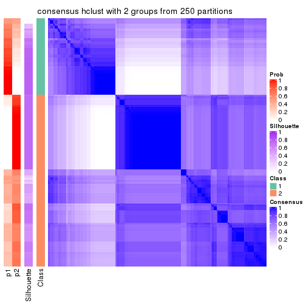</p>

</div>
<div id='tab-MAD-hclust-consensus-heatmap-2'>
<pre><code class="r">consensus_heatmap(res, k = 3)
</code></pre>

<p>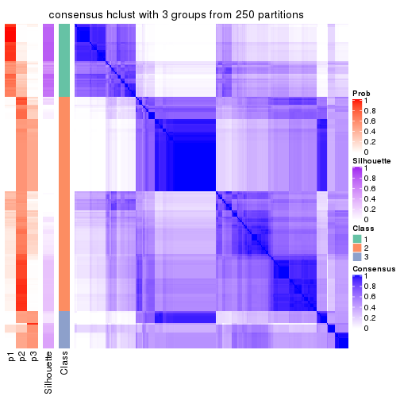</p>

</div>
<div id='tab-MAD-hclust-consensus-heatmap-3'>
<pre><code class="r">consensus_heatmap(res, k = 4)
</code></pre>

<p>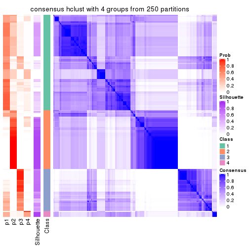</p>

</div>
<div id='tab-MAD-hclust-consensus-heatmap-4'>
<pre><code class="r">consensus_heatmap(res, k = 5)
</code></pre>

<p>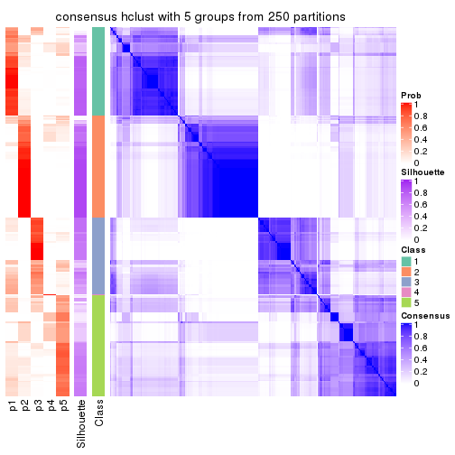</p>

</div>
<div id='tab-MAD-hclust-consensus-heatmap-5'>
<pre><code class="r">consensus_heatmap(res, k = 6)
</code></pre>

<p>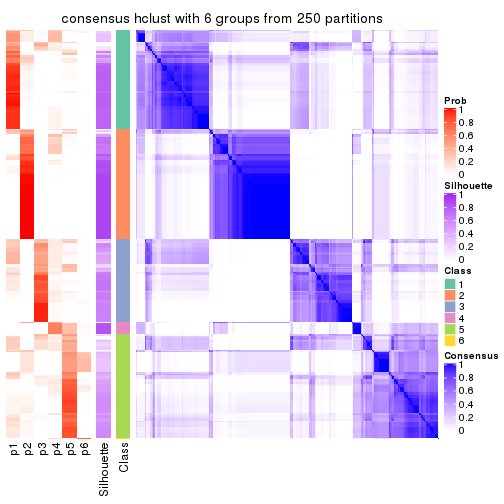</p>

</div>
</div>

Heatmaps for the membership of samples in all partitions to see how consistent they are:


<script>
$( function() {
	$( '#tabs-MAD-hclust-membership-heatmap' ).tabs();
} );
</script>
<div id='tabs-MAD-hclust-membership-heatmap'>
<ul>
<li><a href='#tab-MAD-hclust-membership-heatmap-1'>k = 2</a></li>
<li><a href='#tab-MAD-hclust-membership-heatmap-2'>k = 3</a></li>
<li><a href='#tab-MAD-hclust-membership-heatmap-3'>k = 4</a></li>
<li><a href='#tab-MAD-hclust-membership-heatmap-4'>k = 5</a></li>
<li><a href='#tab-MAD-hclust-membership-heatmap-5'>k = 6</a></li>
</ul>
<div id='tab-MAD-hclust-membership-heatmap-1'>
<pre><code class="r">membership_heatmap(res, k = 2)
</code></pre>

<p>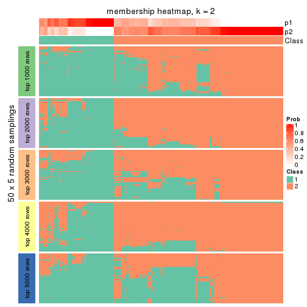</p>

</div>
<div id='tab-MAD-hclust-membership-heatmap-2'>
<pre><code class="r">membership_heatmap(res, k = 3)
</code></pre>

<p>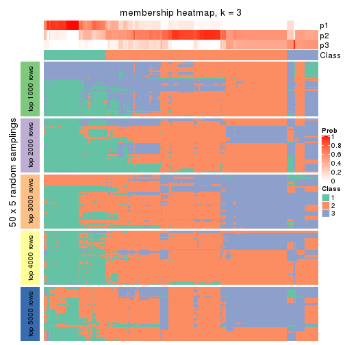</p>

</div>
<div id='tab-MAD-hclust-membership-heatmap-3'>
<pre><code class="r">membership_heatmap(res, k = 4)
</code></pre>

<p>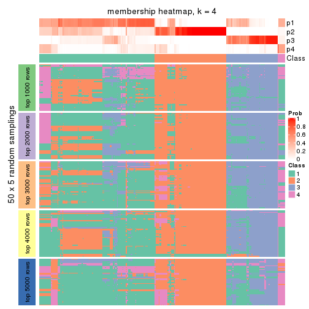</p>

</div>
<div id='tab-MAD-hclust-membership-heatmap-4'>
<pre><code class="r">membership_heatmap(res, k = 5)
</code></pre>

<p>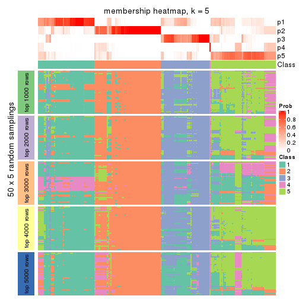</p>

</div>
<div id='tab-MAD-hclust-membership-heatmap-5'>
<pre><code class="r">membership_heatmap(res, k = 6)
</code></pre>

<p>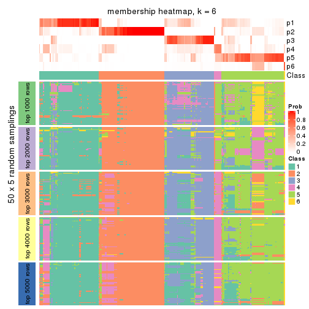</p>

</div>
</div>

As soon as we have had the classes for columns, we can look for signatures
which are significantly different between classes which can be candidate marks
for certain classes. Following are the heatmaps for signatures.


Signature heatmaps where rows are scaled:


<script>
$( function() {
	$( '#tabs-MAD-hclust-get-signatures' ).tabs();
} );
</script>
<div id='tabs-MAD-hclust-get-signatures'>
<ul>
<li><a href='#tab-MAD-hclust-get-signatures-1'>k = 2</a></li>
<li><a href='#tab-MAD-hclust-get-signatures-2'>k = 3</a></li>
<li><a href='#tab-MAD-hclust-get-signatures-3'>k = 4</a></li>
<li><a href='#tab-MAD-hclust-get-signatures-4'>k = 5</a></li>
<li><a href='#tab-MAD-hclust-get-signatures-5'>k = 6</a></li>
</ul>
<div id='tab-MAD-hclust-get-signatures-1'>
<pre><code class="r">get_signatures(res, k = 2)
</code></pre>

<p>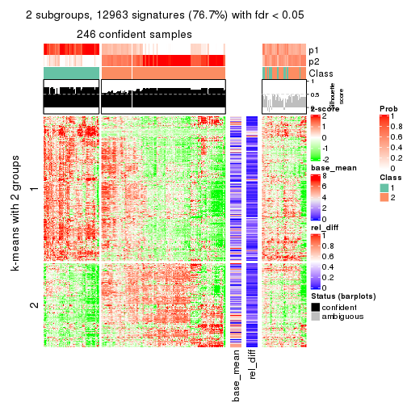</p>

</div>
<div id='tab-MAD-hclust-get-signatures-2'>
<pre><code class="r">get_signatures(res, k = 3)
</code></pre>

<p></p>

</div>
<div id='tab-MAD-hclust-get-signatures-3'>
<pre><code class="r">get_signatures(res, k = 4)
</code></pre>

<p>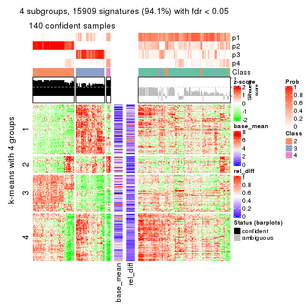</p>

</div>
<div id='tab-MAD-hclust-get-signatures-4'>
<pre><code class="r">get_signatures(res, k = 5)
</code></pre>

<p>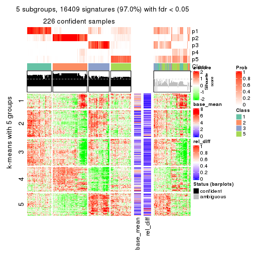</p>

</div>
<div id='tab-MAD-hclust-get-signatures-5'>
<pre><code class="r">get_signatures(res, k = 6)
</code></pre>

<p>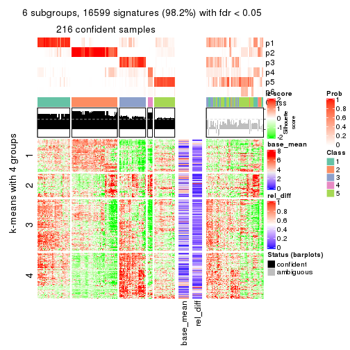</p>

</div>
</div>


Signature heatmaps where rows are not scaled:


<script>
$( function() {
	$( '#tabs-MAD-hclust-get-signatures-no-scale' ).tabs();
} );
</script>
<div id='tabs-MAD-hclust-get-signatures-no-scale'>
<ul>
<li><a href='#tab-MAD-hclust-get-signatures-no-scale-1'>k = 2</a></li>
<li><a href='#tab-MAD-hclust-get-signatures-no-scale-2'>k = 3</a></li>
<li><a href='#tab-MAD-hclust-get-signatures-no-scale-3'>k = 4</a></li>
<li><a href='#tab-MAD-hclust-get-signatures-no-scale-4'>k = 5</a></li>
<li><a href='#tab-MAD-hclust-get-signatures-no-scale-5'>k = 6</a></li>
</ul>
<div id='tab-MAD-hclust-get-signatures-no-scale-1'>
<pre><code class="r">get_signatures(res, k = 2, scale_rows = FALSE)
</code></pre>

<p>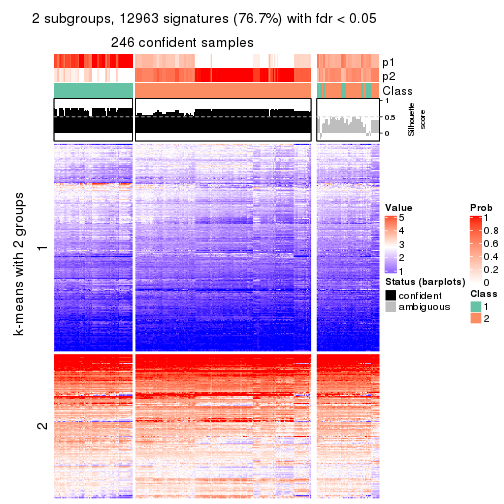</p>

</div>
<div id='tab-MAD-hclust-get-signatures-no-scale-2'>
<pre><code class="r">get_signatures(res, k = 3, scale_rows = FALSE)
</code></pre>

<p></p>

</div>
<div id='tab-MAD-hclust-get-signatures-no-scale-3'>
<pre><code class="r">get_signatures(res, k = 4, scale_rows = FALSE)
</code></pre>

<p>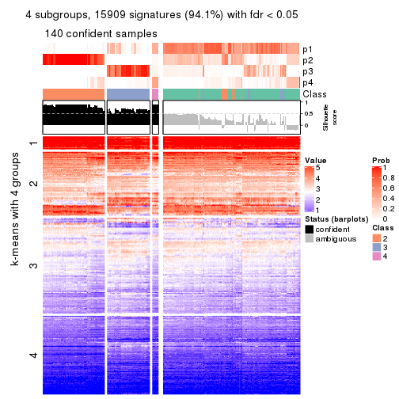</p>

</div>
<div id='tab-MAD-hclust-get-signatures-no-scale-4'>
<pre><code class="r">get_signatures(res, k = 5, scale_rows = FALSE)
</code></pre>

<p>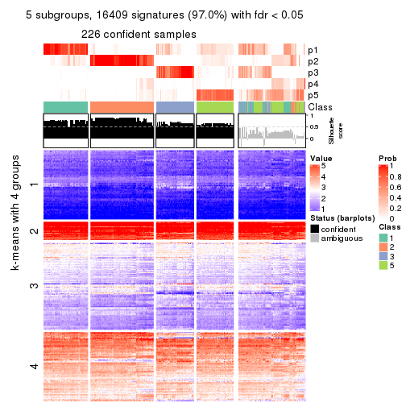</p>

</div>
<div id='tab-MAD-hclust-get-signatures-no-scale-5'>
<pre><code class="r">get_signatures(res, k = 6, scale_rows = FALSE)
</code></pre>

<p>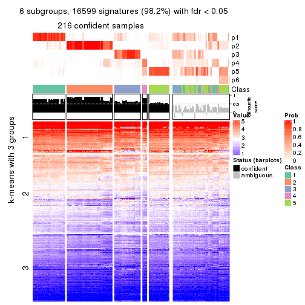</p>

</div>
</div>


Compare the overlap of signatures from different k:

```r
compare_signatures(res)
```

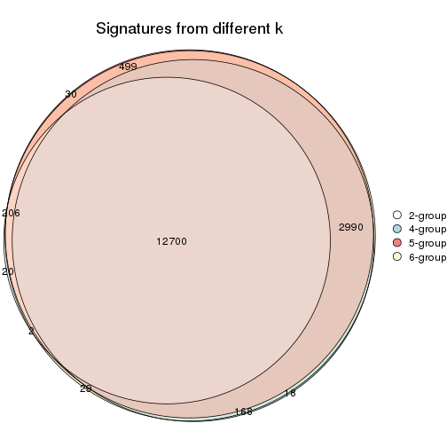

`get_signature()` returns a data frame invisibly. TO get the list of signatures, the function
call should be assigned to a variable explicitly. In following code, if `plot` argument is set
to `FALSE`, no heatmap is plotted while only the differential analysis is performed.

```r
# code only for demonstration
tb = get_signature(res, k = ..., plot = FALSE)
```

An example of the output of `tb` is:

```
#>   which_row         fdr    mean_1    mean_2 scaled_mean_1 scaled_mean_2 km
#> 1        38 0.042760348  8.373488  9.131774    -0.5533452     0.5164555  1
#> 2        40 0.018707592  7.106213  8.469186    -0.6173731     0.5762149  1
#> 3        55 0.019134737 10.221463 11.207825    -0.6159697     0.5749050  1
#> 4        59 0.006059896  5.921854  7.869574    -0.6899429     0.6439467  1
#> 5        60 0.018055526  8.928898 10.211722    -0.6204761     0.5791110  1
#> 6        98 0.009384629 15.714769 14.887706     0.6635654    -0.6193277  2
...
```

The columns in `tb` are:

1. `which_row`: row indices corresponding to the input matrix.
2. `fdr`: FDR for the differential test. 
3. `mean_x`: The mean value in group x.
4. `scaled_mean_x`: The mean value in group x after rows are scaled.
5. `km`: Row groups if k-means clustering is applied to rows.


UMAP plot which shows how samples are separated.


<script>
$( function() {
	$( '#tabs-MAD-hclust-dimension-reduction' ).tabs();
} );
</script>
<div id='tabs-MAD-hclust-dimension-reduction'>
<ul>
<li><a href='#tab-MAD-hclust-dimension-reduction-1'>k = 2</a></li>
<li><a href='#tab-MAD-hclust-dimension-reduction-2'>k = 3</a></li>
<li><a href='#tab-MAD-hclust-dimension-reduction-3'>k = 4</a></li>
<li><a href='#tab-MAD-hclust-dimension-reduction-4'>k = 5</a></li>
<li><a href='#tab-MAD-hclust-dimension-reduction-5'>k = 6</a></li>
</ul>
<div id='tab-MAD-hclust-dimension-reduction-1'>
<pre><code class="r">dimension_reduction(res, k = 2, method = &quot;UMAP&quot;)
</code></pre>

<p>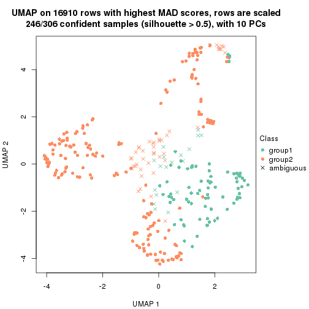</p>

</div>
<div id='tab-MAD-hclust-dimension-reduction-2'>
<pre><code class="r">dimension_reduction(res, k = 3, method = &quot;UMAP&quot;)
</code></pre>

<p>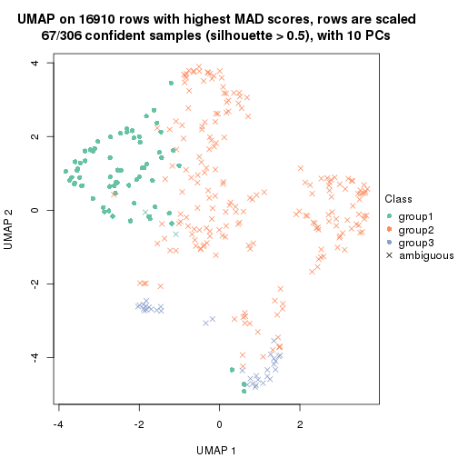</p>

</div>
<div id='tab-MAD-hclust-dimension-reduction-3'>
<pre><code class="r">dimension_reduction(res, k = 4, method = &quot;UMAP&quot;)
</code></pre>

<p>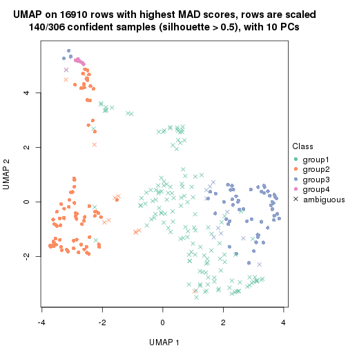</p>

</div>
<div id='tab-MAD-hclust-dimension-reduction-4'>
<pre><code class="r">dimension_reduction(res, k = 5, method = &quot;UMAP&quot;)
</code></pre>

<p>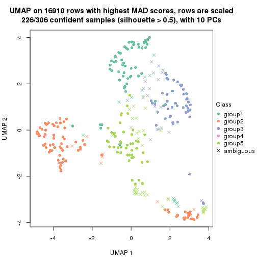</p>

</div>
<div id='tab-MAD-hclust-dimension-reduction-5'>
<pre><code class="r">dimension_reduction(res, k = 6, method = &quot;UMAP&quot;)
</code></pre>

<p>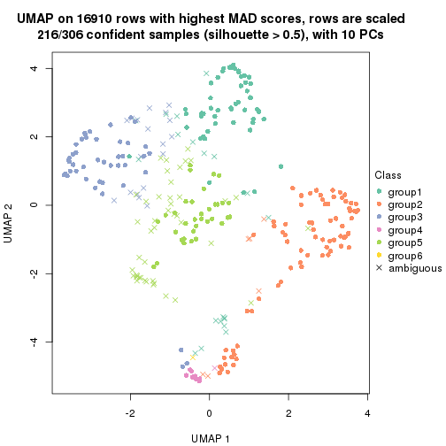</p>

</div>
</div>


Following heatmap shows how subgroups are split when increasing `k`:

```r
collect_classes(res)
```

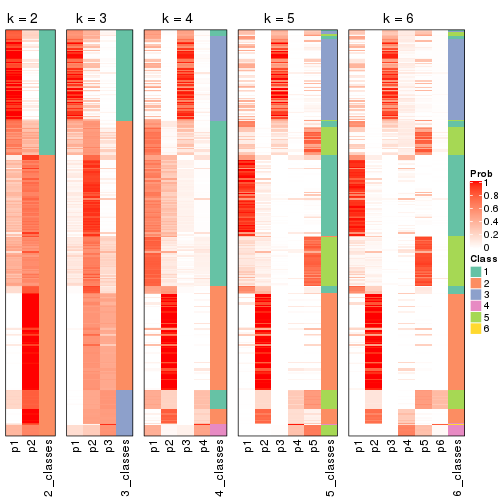


If matrix rows can be associated to genes, consider to use `GO_Enrichment(res,
...)` to perform function enrichment for the signature genes.


 

---------------------------------------------------


### MAD:kmeans


The object with results only for a single top-value method and a single partition method 
can be extracted as:

```r
res = res_list["MAD", "kmeans"]
# you can also extract it by
# res = res_list["MAD:kmeans"]
```

A summary of `res` and all the functions that can be applied to it:

```r
res
```

```
#> A 'ConsensusPartition' object with k = 2, 3, 4, 5, 6.
#>   On a matrix with 16910 rows and 306 columns.
#>   Top rows (1000, 2000, 3000, 4000, 5000) are extracted by 'MAD' method.
#>   Subgroups are detected by 'kmeans' method.
#>   Performed in total 1250 partitions by row resampling.
#>   Best k for subgroups seems to be 2.
#> 
#> Following methods can be applied to this 'ConsensusPartition' object:
#>  [1] "cola_report"             "collect_classes"         "collect_plots"          
#>  [4] "collect_stats"           "colnames"                "compare_signatures"     
#>  [7] "consensus_heatmap"       "dimension_reduction"     "functional_enrichment"  
#> [10] "get_anno_col"            "get_anno"                "get_classes"            
#> [13] "get_consensus"           "get_matrix"              "get_membership"         
#> [16] "get_param"               "get_signatures"          "get_stats"              
#> [19] "is_best_k"               "is_stable_k"             "membership_heatmap"     
#> [22] "ncol"                    "nrow"                    "plot_ecdf"              
#> [25] "rownames"                "select_partition_number" "show"                   
#> [28] "suggest_best_k"          "test_to_known_factors"
```

`collect_plots()` function collects all the plots made from `res` for all `k` (number of partitions)
into one single page to provide an easy and fast comparison between different `k`.

```r
collect_plots(res)
```

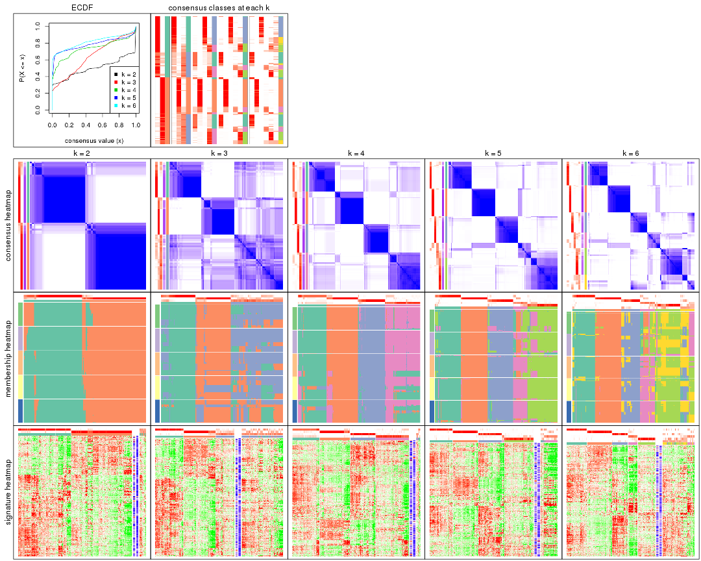

The plots are:

- The first row: a plot of the ECDF (Empirical cumulative distribution
  function) curves of the consensus matrix for each `k` and the heatmap of
  predicted classes for each `k`.
- The second row: heatmaps of the consensus matrix for each `k`.
- The third row: heatmaps of the membership matrix for each `k`.
- The fouth row: heatmaps of the signatures for each `k`.

All the plots in panels can be made by individual functions and they are
plotted later in this section.

`select_partition_number()` produces several plots showing different
statistics for choosing "optimized" `k`. There are following statistics:

- ECDF curves of the consensus matrix for each `k`;
- 1-PAC. [The PAC
  score](https://en.wikipedia.org/wiki/Consensus_clustering#Over-interpretation_potential_of_consensus_clustering)
  measures the proportion of the ambiguous subgrouping.
- Mean silhouette score.
- Concordance. The mean probability of fiting the consensus class ids in all
  partitions.
- Area increased. Denote $A_k$ as the area under the ECDF curve for current
  `k`, the area increased is defined as $A_k - A_{k-1}$.
- Rand index. The percent of pairs of samples that are both in a same cluster
  or both are not in a same cluster in the partition of k and k-1.
- Jaccard index. The ratio of pairs of samples are both in a same cluster in
  the partition of k and k-1 and the pairs of samples are both in a same
  cluster in the partition k or k-1.

The detailed explanations of these statistics can be found in [the cola
vignette](http://bioconductor.org/packages/devel/bioc/vignettes/cola/inst/doc/cola.html#toc_13).

Generally speaking, lower PAC score, higher mean silhouette score or higher
concordance corresponds to better partition. Rand index and Jaccard index
measure how similar the current partition is compared to partition with `k-1`.
If they are too similar, we won't accept `k` is better than `k-1`.

```r
select_partition_number(res)
```

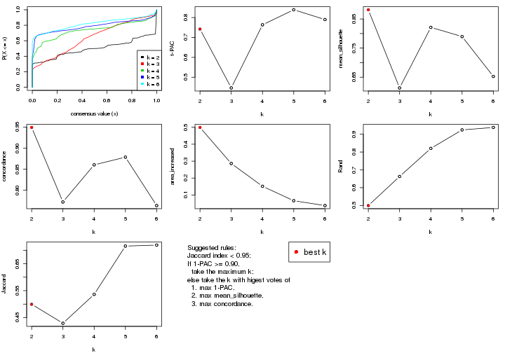

The numeric values for all these statistics can be obtained by `get_stats()`.

```r
get_stats(res)
```

```
#>   k 1-PAC mean_silhouette concordance area_increased  Rand Jaccard
#> 2 2 0.742           0.882       0.949         0.4991 0.499   0.499
#> 3 3 0.446           0.613       0.772         0.2861 0.663   0.429
#> 4 4 0.764           0.821       0.860         0.1514 0.820   0.536
#> 5 5 0.839           0.790       0.879         0.0661 0.924   0.715
#> 6 6 0.790           0.653       0.764         0.0375 0.938   0.719
```

`suggest_best_k()` suggests the best $k$ based on these statistics. The rules are as follows:

- All $k$ with Jaccard index larger than 0.95 are removed because the increase of
  the partition number does not provides enough extra information. If all $k$ are removed,
  the best $k$ is assigned by `NA`.
- For $k$ with 1-PAC larger than 0.9, the maximal $k$ is taken as the "best k". Other $k$ is called "optional k".
- If it does not fit the second rule. The $k$ with the highest vote of highest
  1-PAC, mean silhouette and concordance is taken as the "best k".

```r
suggest_best_k(res)
```

```
#> [1] 2
```


Following shows the table of the partitions (You need to click the **show/hide
code output** link to see it). The membership matrix (columns with name `p*`)
is inferred by
[`clue::cl_consensus()`](https://www.rdocumentation.org/link/cl_consensus?package=clue)
function with the `SE` method. Basically the value in the membership matrix
represents the probability to belong to a certain group. The finall class
label for an item is determined with the group with highest probability it
belongs to.

In `get_classes()` function, the entropy is calculated from the membership
matrix and the silhouette score is calculated from the consensus matrix.


<script>
$( function() {
	$( '#tabs-MAD-kmeans-get-classes' ).tabs();
} );
</script>
<div id='tabs-MAD-kmeans-get-classes'>
<ul>
<li><a href='#tab-MAD-kmeans-get-classes-1'>k = 2</a></li>
<li><a href='#tab-MAD-kmeans-get-classes-2'>k = 3</a></li>
<li><a href='#tab-MAD-kmeans-get-classes-3'>k = 4</a></li>
<li><a href='#tab-MAD-kmeans-get-classes-4'>k = 5</a></li>
<li><a href='#tab-MAD-kmeans-get-classes-5'>k = 6</a></li>
</ul>

<div id='tab-MAD-kmeans-get-classes-1'>
<p><a id='tab-MAD-kmeans-get-classes-1-a' style='color:#0366d6' href='#'>show/hide code output</a></p>
<pre><code class="r">cbind(get_classes(res, k = 2), get_membership(res, k = 2))
</code></pre>

<pre><code>#&gt;            class entropy silhouette    p1    p2
#&gt; SRR1609360     2  0.5408      0.831 0.124 0.876
#&gt; SRR1609361     2  0.0000      0.957 0.000 1.000
#&gt; SRR1609362     2  0.0000      0.957 0.000 1.000
#&gt; SRR1609363     2  0.0000      0.957 0.000 1.000
#&gt; SRR1609364     2  0.0000      0.957 0.000 1.000
#&gt; SRR1609365     2  0.0000      0.957 0.000 1.000
#&gt; SRR1609366     2  0.0000      0.957 0.000 1.000
#&gt; SRR1609367     1  0.7219      0.760 0.800 0.200
#&gt; SRR1609368     2  0.0000      0.957 0.000 1.000
#&gt; SRR1609369     2  0.0000      0.957 0.000 1.000
#&gt; SRR1609370     1  0.7219      0.760 0.800 0.200
#&gt; SRR1609371     2  0.0000      0.957 0.000 1.000
#&gt; SRR1609372     1  0.7219      0.760 0.800 0.200
#&gt; SRR1609373     2  0.0000      0.957 0.000 1.000
#&gt; SRR1609374     2  0.0000      0.957 0.000 1.000
#&gt; SRR1609375     2  0.0000      0.957 0.000 1.000
#&gt; SRR1609377     2  0.0000      0.957 0.000 1.000
#&gt; SRR1609376     2  0.0000      0.957 0.000 1.000
#&gt; SRR1609378     2  0.0000      0.957 0.000 1.000
#&gt; SRR1609379     2  0.0376      0.954 0.004 0.996
#&gt; SRR1609382     2  0.0000      0.957 0.000 1.000
#&gt; SRR1609383     1  0.9909      0.285 0.556 0.444
#&gt; SRR1609381     1  0.9710      0.406 0.600 0.400
#&gt; SRR1609384     2  0.0000      0.957 0.000 1.000
#&gt; SRR1609386     2  0.0000      0.957 0.000 1.000
#&gt; SRR1609385     2  0.0000      0.957 0.000 1.000
#&gt; SRR1609387     1  0.9710      0.406 0.600 0.400
#&gt; SRR1609388     2  0.0000      0.957 0.000 1.000
#&gt; SRR1609390     1  0.9710      0.406 0.600 0.400
#&gt; SRR1609393     2  0.0000      0.957 0.000 1.000
#&gt; SRR1609394     2  0.0000      0.957 0.000 1.000
#&gt; SRR1609392     2  0.0000      0.957 0.000 1.000
#&gt; SRR1609391     2  0.0000      0.957 0.000 1.000
#&gt; SRR1609395     1  0.7219      0.760 0.800 0.200
#&gt; SRR1609396     1  0.8443      0.661 0.728 0.272
#&gt; SRR1609398     2  0.0000      0.957 0.000 1.000
#&gt; SRR1609399     1  0.7219      0.760 0.800 0.200
#&gt; SRR1609400     1  0.7219      0.760 0.800 0.200
#&gt; SRR1609397     2  0.0000      0.957 0.000 1.000
#&gt; SRR1609401     2  0.0000      0.957 0.000 1.000
#&gt; SRR1609402     2  0.0000      0.957 0.000 1.000
#&gt; SRR1609405     2  0.0000      0.957 0.000 1.000
#&gt; SRR1609404     2  0.0000      0.957 0.000 1.000
#&gt; SRR1609406     2  0.0000      0.957 0.000 1.000
#&gt; SRR1609408     2  0.0000      0.957 0.000 1.000
#&gt; SRR1609403     2  0.0376      0.954 0.004 0.996
#&gt; SRR1609410     2  0.6887      0.748 0.184 0.816
#&gt; SRR1609411     2  0.0000      0.957 0.000 1.000
#&gt; SRR1609407     2  0.0000      0.957 0.000 1.000
#&gt; SRR1609413     2  0.8861      0.527 0.304 0.696
#&gt; SRR1609412     1  0.0000      0.929 1.000 0.000
#&gt; SRR1609414     1  0.0000      0.929 1.000 0.000
#&gt; SRR1609415     1  0.0000      0.929 1.000 0.000
#&gt; SRR1609416     1  0.0000      0.929 1.000 0.000
#&gt; SRR1609417     1  0.0000      0.929 1.000 0.000
#&gt; SRR1609418     2  0.0376      0.954 0.004 0.996
#&gt; SRR1609419     2  0.0000      0.957 0.000 1.000
#&gt; SRR1609420     2  0.0000      0.957 0.000 1.000
#&gt; SRR1609421     2  0.0000      0.957 0.000 1.000
#&gt; SRR1609422     2  0.9686      0.357 0.396 0.604
#&gt; SRR1609423     2  0.0000      0.957 0.000 1.000
#&gt; SRR1609424     2  0.0000      0.957 0.000 1.000
#&gt; SRR1609425     2  0.0000      0.957 0.000 1.000
#&gt; SRR1609426     2  0.0000      0.957 0.000 1.000
#&gt; SRR1609427     1  0.0000      0.929 1.000 0.000
#&gt; SRR1609428     2  0.0000      0.957 0.000 1.000
#&gt; SRR1609429     2  0.7219      0.723 0.200 0.800
#&gt; SRR1609430     1  0.0000      0.929 1.000 0.000
#&gt; SRR1609431     2  0.7219      0.742 0.200 0.800
#&gt; SRR1609432     2  0.0000      0.957 0.000 1.000
#&gt; SRR1609433     1  0.0000      0.929 1.000 0.000
#&gt; SRR1609434     2  0.0000      0.957 0.000 1.000
#&gt; SRR1609435     1  0.0000      0.929 1.000 0.000
#&gt; SRR1609436     1  0.0000      0.929 1.000 0.000
#&gt; SRR1609437     2  0.0000      0.957 0.000 1.000
#&gt; SRR1609438     2  0.0000      0.957 0.000 1.000
#&gt; SRR1609439     1  0.0000      0.929 1.000 0.000
#&gt; SRR1609440     1  0.7219      0.760 0.800 0.200
#&gt; SRR1609441     2  0.0000      0.957 0.000 1.000
#&gt; SRR1609442     2  0.0000      0.957 0.000 1.000
#&gt; SRR1609443     1  0.0000      0.929 1.000 0.000
#&gt; SRR1609444     1  0.7299      0.755 0.796 0.204
#&gt; SRR1609445     1  0.3584      0.878 0.932 0.068
#&gt; SRR1609446     2  0.0000      0.957 0.000 1.000
#&gt; SRR1609447     1  0.0000      0.929 1.000 0.000
#&gt; SRR1609448     2  0.0000      0.957 0.000 1.000
#&gt; SRR1609449     1  0.7219      0.760 0.800 0.200
#&gt; SRR1609450     2  0.0000      0.957 0.000 1.000
#&gt; SRR1609451     1  0.0000      0.929 1.000 0.000
#&gt; SRR1609452     1  0.9815      0.263 0.580 0.420
#&gt; SRR1609453     1  0.0000      0.929 1.000 0.000
#&gt; SRR1609454     2  0.0000      0.957 0.000 1.000
#&gt; SRR1609455     2  0.0000      0.957 0.000 1.000
#&gt; SRR1609456     2  0.0000      0.957 0.000 1.000
#&gt; SRR1609457     1  0.0000      0.929 1.000 0.000
#&gt; SRR1609458     1  0.0000      0.929 1.000 0.000
#&gt; SRR1609459     1  0.2778      0.894 0.952 0.048
#&gt; SRR1609460     2  0.5629      0.830 0.132 0.868
#&gt; SRR1609461     1  0.0000      0.929 1.000 0.000
#&gt; SRR1609462     1  0.0000      0.929 1.000 0.000
#&gt; SRR1609464     1  0.0000      0.929 1.000 0.000
#&gt; SRR1609463     1  0.0000      0.929 1.000 0.000
#&gt; SRR1609465     2  0.4939      0.857 0.108 0.892
#&gt; SRR1609466     1  0.7299      0.755 0.796 0.204
#&gt; SRR1609467     1  0.0000      0.929 1.000 0.000
#&gt; SRR1609469     2  0.0000      0.957 0.000 1.000
#&gt; SRR1609470     2  0.0000      0.957 0.000 1.000
#&gt; SRR1609472     1  0.2603      0.897 0.956 0.044
#&gt; SRR1609471     2  0.7219      0.723 0.200 0.800
#&gt; SRR1609474     2  0.0000      0.957 0.000 1.000
#&gt; SRR1609473     2  0.0000      0.957 0.000 1.000
#&gt; SRR1609475     2  0.0000      0.957 0.000 1.000
#&gt; SRR1609478     1  0.5842      0.806 0.860 0.140
#&gt; SRR1609476     1  0.0000      0.929 1.000 0.000
#&gt; SRR1609477     1  0.0000      0.929 1.000 0.000
#&gt; SRR1609479     2  0.0000      0.957 0.000 1.000
#&gt; SRR1609481     2  0.5737      0.825 0.136 0.864
#&gt; SRR1609480     1  0.0000      0.929 1.000 0.000
#&gt; SRR1609482     1  0.0000      0.929 1.000 0.000
#&gt; SRR1609484     2  0.0000      0.957 0.000 1.000
#&gt; SRR1609483     1  0.0000      0.929 1.000 0.000
#&gt; SRR1609486     1  0.0000      0.929 1.000 0.000
#&gt; SRR1609485     1  0.0000      0.929 1.000 0.000
#&gt; SRR1609487     2  0.0000      0.957 0.000 1.000
#&gt; SRR1609488     1  0.0000      0.929 1.000 0.000
#&gt; SRR1609489     2  0.0000      0.957 0.000 1.000
#&gt; SRR1609490     2  0.0000      0.957 0.000 1.000
#&gt; SRR1609491     2  0.0672      0.951 0.008 0.992
#&gt; SRR1609492     2  0.0000      0.957 0.000 1.000
#&gt; SRR1609493     2  0.7219      0.742 0.200 0.800
#&gt; SRR1609494     2  0.0000      0.957 0.000 1.000
#&gt; SRR1609495     1  0.7219      0.760 0.800 0.200
#&gt; SRR1609496     1  0.0000      0.929 1.000 0.000
#&gt; SRR1609497     1  0.0000      0.929 1.000 0.000
#&gt; SRR1609498     1  0.0000      0.929 1.000 0.000
#&gt; SRR1609499     2  0.0000      0.957 0.000 1.000
#&gt; SRR1609500     1  0.0000      0.929 1.000 0.000
#&gt; SRR1609501     2  0.0000      0.957 0.000 1.000
#&gt; SRR1609502     2  0.0000      0.957 0.000 1.000
#&gt; SRR1609503     2  0.7602      0.714 0.220 0.780
#&gt; SRR1609504     1  0.0000      0.929 1.000 0.000
#&gt; SRR1609505     1  0.0000      0.929 1.000 0.000
#&gt; SRR1609506     2  0.0000      0.957 0.000 1.000
#&gt; SRR1609507     1  0.0000      0.929 1.000 0.000
#&gt; SRR1609508     2  0.0000      0.957 0.000 1.000
#&gt; SRR1609509     2  0.0000      0.957 0.000 1.000
#&gt; SRR1609510     2  0.6148      0.806 0.152 0.848
#&gt; SRR1609512     1  0.0000      0.929 1.000 0.000
#&gt; SRR1609511     1  0.0000      0.929 1.000 0.000
#&gt; SRR1609513     1  0.0000      0.929 1.000 0.000
#&gt; SRR1609514     1  0.0000      0.929 1.000 0.000
#&gt; SRR1609515     2  0.0000      0.957 0.000 1.000
#&gt; SRR1609516     1  0.0000      0.929 1.000 0.000
#&gt; SRR1609517     2  0.0000      0.957 0.000 1.000
#&gt; SRR1609518     1  0.9754      0.386 0.592 0.408
#&gt; SRR1609519     1  0.0000      0.929 1.000 0.000
#&gt; SRR1609520     2  0.0000      0.957 0.000 1.000
#&gt; SRR1609521     1  0.0000      0.929 1.000 0.000
#&gt; SRR1609522     1  0.0000      0.929 1.000 0.000
#&gt; SRR1609523     2  0.8713      0.593 0.292 0.708
#&gt; SRR1609524     2  0.0000      0.957 0.000 1.000
#&gt; SRR1609526     1  0.0000      0.929 1.000 0.000
#&gt; SRR1609525     2  0.0000      0.957 0.000 1.000
#&gt; SRR1609527     1  0.7219      0.760 0.800 0.200
#&gt; SRR1609529     1  0.0000      0.929 1.000 0.000
#&gt; SRR1609528     1  0.9909      0.186 0.556 0.444
#&gt; SRR1609530     1  0.0000      0.929 1.000 0.000
#&gt; SRR1609531     2  0.0000      0.957 0.000 1.000
#&gt; SRR1609532     1  0.0000      0.929 1.000 0.000
#&gt; SRR1609533     2  0.0000      0.957 0.000 1.000
#&gt; SRR1609534     1  0.0000      0.929 1.000 0.000
#&gt; SRR1609535     2  0.4939      0.857 0.108 0.892
#&gt; SRR1609537     2  0.0000      0.957 0.000 1.000
#&gt; SRR1609536     1  0.0000      0.929 1.000 0.000
#&gt; SRR1609538     2  0.0000      0.957 0.000 1.000
#&gt; SRR1609539     1  0.0000      0.929 1.000 0.000
#&gt; SRR1609540     1  0.0000      0.929 1.000 0.000
#&gt; SRR1609541     1  0.0000      0.929 1.000 0.000
#&gt; SRR1609542     2  0.0000      0.957 0.000 1.000
#&gt; SRR1609543     1  0.0000      0.929 1.000 0.000
#&gt; SRR1609544     1  0.0000      0.929 1.000 0.000
#&gt; SRR1609545     1  0.0000      0.929 1.000 0.000
#&gt; SRR1609546     1  0.0000      0.929 1.000 0.000
#&gt; SRR1609547     1  0.0000      0.929 1.000 0.000
#&gt; SRR1609548     1  0.4562      0.852 0.904 0.096
#&gt; SRR1609549     2  0.0000      0.957 0.000 1.000
#&gt; SRR1609550     2  0.0000      0.957 0.000 1.000
#&gt; SRR1609551     1  0.0000      0.929 1.000 0.000
#&gt; SRR1609552     1  0.0000      0.929 1.000 0.000
#&gt; SRR1609553     1  0.0000      0.929 1.000 0.000
#&gt; SRR1609554     1  0.1184      0.918 0.984 0.016
#&gt; SRR1609555     1  0.0000      0.929 1.000 0.000
#&gt; SRR1609556     1  0.0000      0.929 1.000 0.000
#&gt; SRR1609557     2  0.4431      0.874 0.092 0.908
#&gt; SRR1609558     1  0.4562      0.852 0.904 0.096
#&gt; SRR1609559     1  0.9970      0.101 0.532 0.468
#&gt; SRR1609560     2  0.0376      0.954 0.004 0.996
#&gt; SRR1609561     1  0.0000      0.929 1.000 0.000
#&gt; SRR1609562     2  0.0000      0.957 0.000 1.000
#&gt; SRR1609563     2  0.0000      0.957 0.000 1.000
#&gt; SRR1609564     1  0.0000      0.929 1.000 0.000
#&gt; SRR1609565     2  0.0000      0.957 0.000 1.000
#&gt; SRR1609566     2  0.0000      0.957 0.000 1.000
#&gt; SRR1609567     2  0.0000      0.957 0.000 1.000
#&gt; SRR1609568     2  0.0376      0.954 0.004 0.996
#&gt; SRR1609569     1  0.0000      0.929 1.000 0.000
#&gt; SRR1609570     1  0.0000      0.929 1.000 0.000
#&gt; SRR1609571     1  0.0000      0.929 1.000 0.000
#&gt; SRR1609572     1  0.0000      0.929 1.000 0.000
#&gt; SRR1609573     1  0.0000      0.929 1.000 0.000
#&gt; SRR1609574     1  0.0000      0.929 1.000 0.000
#&gt; SRR1609575     2  0.0000      0.957 0.000 1.000
#&gt; SRR1609576     2  0.0000      0.957 0.000 1.000
#&gt; SRR1609578     2  0.5946      0.805 0.144 0.856
#&gt; SRR1609577     1  0.9460      0.490 0.636 0.364
#&gt; SRR1609579     1  0.0000      0.929 1.000 0.000
#&gt; SRR1609580     1  0.0000      0.929 1.000 0.000
#&gt; SRR1609582     1  0.0000      0.929 1.000 0.000
#&gt; SRR1609581     2  0.0000      0.957 0.000 1.000
#&gt; SRR1609583     1  0.8267      0.633 0.740 0.260
#&gt; SRR1609584     1  0.0000      0.929 1.000 0.000
#&gt; SRR1609585     1  0.0000      0.929 1.000 0.000
#&gt; SRR1609586     2  0.0000      0.957 0.000 1.000
#&gt; SRR1609587     1  0.0000      0.929 1.000 0.000
#&gt; SRR1609588     2  0.0000      0.957 0.000 1.000
#&gt; SRR1609589     2  0.0000      0.957 0.000 1.000
#&gt; SRR1609590     1  0.0000      0.929 1.000 0.000
#&gt; SRR1609592     2  0.9732      0.337 0.404 0.596
#&gt; SRR1609591     1  0.9209      0.561 0.664 0.336
#&gt; SRR1609593     2  0.9732      0.336 0.404 0.596
#&gt; SRR1609594     2  0.0000      0.957 0.000 1.000
#&gt; SRR1609595     2  0.7219      0.742 0.200 0.800
#&gt; SRR1609596     2  0.0000      0.957 0.000 1.000
#&gt; SRR1609597     2  0.0000      0.957 0.000 1.000
#&gt; SRR1609598     1  0.0000      0.929 1.000 0.000
#&gt; SRR1609599     1  0.0000      0.929 1.000 0.000
#&gt; SRR1609600     1  0.0000      0.929 1.000 0.000
#&gt; SRR1609601     1  0.0000      0.929 1.000 0.000
#&gt; SRR1609602     1  0.0000      0.929 1.000 0.000
#&gt; SRR1609603     2  0.0000      0.957 0.000 1.000
#&gt; SRR1609604     2  0.0000      0.957 0.000 1.000
#&gt; SRR1609605     2  0.0000      0.957 0.000 1.000
#&gt; SRR1609606     2  0.0000      0.957 0.000 1.000
#&gt; SRR1609607     1  0.0000      0.929 1.000 0.000
#&gt; SRR1609608     1  0.0000      0.929 1.000 0.000
#&gt; SRR1609609     2  0.0000      0.957 0.000 1.000
#&gt; SRR1609610     1  0.0000      0.929 1.000 0.000
#&gt; SRR1609611     2  0.0000      0.957 0.000 1.000
#&gt; SRR1609613     2  0.0000      0.957 0.000 1.000
#&gt; SRR1609612     1  0.0000      0.929 1.000 0.000
#&gt; SRR1609614     1  0.0000      0.929 1.000 0.000
#&gt; SRR1609615     2  0.1184      0.944 0.016 0.984
#&gt; SRR1609616     1  0.0000      0.929 1.000 0.000
#&gt; SRR1609617     2  0.4939      0.857 0.108 0.892
#&gt; SRR1609618     1  0.0000      0.929 1.000 0.000
#&gt; SRR1609619     2  0.9460      0.370 0.364 0.636
#&gt; SRR1609620     2  0.0000      0.957 0.000 1.000
#&gt; SRR1609621     2  0.0000      0.957 0.000 1.000
#&gt; SRR1609622     1  0.0000      0.929 1.000 0.000
#&gt; SRR1609623     1  0.0000      0.929 1.000 0.000
#&gt; SRR1609624     2  0.9833      0.191 0.424 0.576
#&gt; SRR1609625     1  0.7219      0.760 0.800 0.200
#&gt; SRR1609626     1  0.0000      0.929 1.000 0.000
#&gt; SRR1609627     2  0.0000      0.957 0.000 1.000
#&gt; SRR1609628     2  0.0000      0.957 0.000 1.000
#&gt; SRR1609629     1  0.0000      0.929 1.000 0.000
#&gt; SRR1609630     2  0.0000      0.957 0.000 1.000
#&gt; SRR1609631     1  0.8207      0.686 0.744 0.256
#&gt; SRR1609632     2  0.0376      0.954 0.004 0.996
#&gt; SRR1609633     1  0.7219      0.760 0.800 0.200
#&gt; SRR1609634     2  0.0000      0.957 0.000 1.000
#&gt; SRR1609635     1  0.0000      0.929 1.000 0.000
#&gt; SRR1609636     2  0.0000      0.957 0.000 1.000
#&gt; SRR1609637     1  0.0000      0.929 1.000 0.000
#&gt; SRR1609638     2  0.0000      0.957 0.000 1.000
#&gt; SRR1609639     2  0.0000      0.957 0.000 1.000
#&gt; SRR1609640     1  0.0000      0.929 1.000 0.000
#&gt; SRR1609641     2  0.9815      0.205 0.420 0.580
#&gt; SRR1609642     1  0.9710      0.406 0.600 0.400
#&gt; SRR1609643     1  0.0000      0.929 1.000 0.000
#&gt; SRR1609644     2  0.0000      0.957 0.000 1.000
#&gt; SRR1609645     1  0.0000      0.929 1.000 0.000
#&gt; SRR1609646     1  0.0000      0.929 1.000 0.000
#&gt; SRR1609647     2  0.5737      0.825 0.136 0.864
#&gt; SRR1609649     1  0.0000      0.929 1.000 0.000
#&gt; SRR1609648     2  0.0000      0.957 0.000 1.000
#&gt; SRR1609651     2  0.0000      0.957 0.000 1.000
#&gt; SRR1609650     1  0.9815      0.263 0.580 0.420
#&gt; SRR1609652     1  0.0000      0.929 1.000 0.000
#&gt; SRR1609653     2  0.0000      0.957 0.000 1.000
#&gt; SRR1609654     2  0.0000      0.957 0.000 1.000
#&gt; SRR1609655     1  0.0000      0.929 1.000 0.000
#&gt; SRR1609657     1  0.8207      0.686 0.744 0.256
#&gt; SRR1609656     1  0.7528      0.740 0.784 0.216
#&gt; SRR1609658     2  0.0000      0.957 0.000 1.000
#&gt; SRR1609659     2  0.0000      0.957 0.000 1.000
#&gt; SRR1609660     1  0.0000      0.929 1.000 0.000
#&gt; SRR1609661     1  0.0000      0.929 1.000 0.000
#&gt; SRR1609662     2  0.0000      0.957 0.000 1.000
#&gt; SRR1609663     1  0.0000      0.929 1.000 0.000
#&gt; SRR1609664     2  0.7219      0.742 0.200 0.800
#&gt; SRR1609665     2  0.0000      0.957 0.000 1.000
#&gt; SRR1609666     2  0.0000      0.957 0.000 1.000
#&gt; SRR1609667     1  0.0000      0.929 1.000 0.000
#&gt; SRR1609668     2  0.7219      0.742 0.200 0.800
#&gt; SRR1609669     2  0.0000      0.957 0.000 1.000
</code></pre>

<script>
$('#tab-MAD-kmeans-get-classes-1-a').parent().next().next().hide();
$('#tab-MAD-kmeans-get-classes-1-a').click(function(){
  $('#tab-MAD-kmeans-get-classes-1-a').parent().next().next().toggle();
  return(false);
});
</script>
</div>

<div id='tab-MAD-kmeans-get-classes-2'>
<p><a id='tab-MAD-kmeans-get-classes-2-a' style='color:#0366d6' href='#'>show/hide code output</a></p>
<pre><code class="r">cbind(get_classes(res, k = 3), get_membership(res, k = 3))
</code></pre>

<pre><code>#&gt;            class entropy silhouette    p1    p2    p3
#&gt; SRR1609360     3  0.3454     0.5813 0.008 0.104 0.888
#&gt; SRR1609361     3  0.4629     0.5198 0.004 0.188 0.808
#&gt; SRR1609362     3  0.5988     0.2326 0.000 0.368 0.632
#&gt; SRR1609363     2  0.0000     0.8752 0.000 1.000 0.000
#&gt; SRR1609364     2  0.0000     0.8752 0.000 1.000 0.000
#&gt; SRR1609365     3  0.5706     0.3450 0.000 0.320 0.680
#&gt; SRR1609366     2  0.0000     0.8752 0.000 1.000 0.000
#&gt; SRR1609367     3  0.7787     0.4335 0.348 0.064 0.588
#&gt; SRR1609368     2  0.0000     0.8752 0.000 1.000 0.000
#&gt; SRR1609369     3  0.6154     0.4889 0.000 0.408 0.592
#&gt; SRR1609370     3  0.7944     0.4352 0.348 0.072 0.580
#&gt; SRR1609371     2  0.4654     0.7086 0.000 0.792 0.208
#&gt; SRR1609372     3  0.7944     0.4352 0.348 0.072 0.580
#&gt; SRR1609373     2  0.0000     0.8752 0.000 1.000 0.000
#&gt; SRR1609374     2  0.0000     0.8752 0.000 1.000 0.000
#&gt; SRR1609375     2  0.0000     0.8752 0.000 1.000 0.000
#&gt; SRR1609377     3  0.6154     0.4889 0.000 0.408 0.592
#&gt; SRR1609376     2  0.0000     0.8752 0.000 1.000 0.000
#&gt; SRR1609378     2  0.4750     0.7038 0.000 0.784 0.216
#&gt; SRR1609379     3  0.6513     0.4983 0.008 0.400 0.592
#&gt; SRR1609382     2  0.4974     0.6893 0.000 0.764 0.236
#&gt; SRR1609383     3  0.3293     0.5883 0.012 0.088 0.900
#&gt; SRR1609381     3  0.8337     0.5003 0.296 0.112 0.592
#&gt; SRR1609384     2  0.5291     0.4723 0.000 0.732 0.268
#&gt; SRR1609386     2  0.5431     0.4322 0.000 0.716 0.284
#&gt; SRR1609385     3  0.6154     0.4889 0.000 0.408 0.592
#&gt; SRR1609387     3  0.8404     0.5104 0.288 0.120 0.592
#&gt; SRR1609388     2  0.0000     0.8752 0.000 1.000 0.000
#&gt; SRR1609390     3  0.8371     0.5054 0.292 0.116 0.592
#&gt; SRR1609393     2  0.4750     0.7038 0.000 0.784 0.216
#&gt; SRR1609394     2  0.0000     0.8752 0.000 1.000 0.000
#&gt; SRR1609392     2  0.0000     0.8752 0.000 1.000 0.000
#&gt; SRR1609391     2  0.4452     0.7184 0.000 0.808 0.192
#&gt; SRR1609395     3  0.7944     0.4352 0.348 0.072 0.580
#&gt; SRR1609396     3  0.8222     0.4870 0.308 0.100 0.592
#&gt; SRR1609398     2  0.4842     0.5547 0.000 0.776 0.224
#&gt; SRR1609399     3  0.7944     0.4352 0.348 0.072 0.580
#&gt; SRR1609400     3  0.7787     0.4335 0.348 0.064 0.588
#&gt; SRR1609397     2  0.0000     0.8752 0.000 1.000 0.000
#&gt; SRR1609401     2  0.0000     0.8752 0.000 1.000 0.000
#&gt; SRR1609402     2  0.0000     0.8752 0.000 1.000 0.000
#&gt; SRR1609405     2  0.4842     0.5547 0.000 0.776 0.224
#&gt; SRR1609404     2  0.4555     0.7133 0.000 0.800 0.200
#&gt; SRR1609406     2  0.0000     0.8752 0.000 1.000 0.000
#&gt; SRR1609408     2  0.0000     0.8752 0.000 1.000 0.000
#&gt; SRR1609403     3  0.6513     0.4983 0.008 0.400 0.592
#&gt; SRR1609410     3  0.7424     0.5322 0.044 0.364 0.592
#&gt; SRR1609411     2  0.0237     0.8717 0.000 0.996 0.004
#&gt; SRR1609407     2  0.0000     0.8752 0.000 1.000 0.000
#&gt; SRR1609413     3  0.7828     0.5501 0.068 0.340 0.592
#&gt; SRR1609412     3  0.6079     0.2668 0.388 0.000 0.612
#&gt; SRR1609414     1  0.5138     0.5894 0.748 0.000 0.252
#&gt; SRR1609415     3  0.6308     0.0988 0.492 0.000 0.508
#&gt; SRR1609416     1  0.0592     0.8497 0.988 0.000 0.012
#&gt; SRR1609417     1  0.1643     0.8274 0.956 0.000 0.044
#&gt; SRR1609418     3  0.6513     0.4983 0.008 0.400 0.592
#&gt; SRR1609419     2  0.0000     0.8752 0.000 1.000 0.000
#&gt; SRR1609420     3  0.6154     0.4889 0.000 0.408 0.592
#&gt; SRR1609421     3  0.6448     0.5395 0.012 0.352 0.636
#&gt; SRR1609422     3  0.7388     0.4554 0.136 0.160 0.704
#&gt; SRR1609423     3  0.5785     0.2856 0.000 0.332 0.668
#&gt; SRR1609424     2  0.4750     0.7038 0.000 0.784 0.216
#&gt; SRR1609425     3  0.6154     0.4889 0.000 0.408 0.592
#&gt; SRR1609426     2  0.0000     0.8752 0.000 1.000 0.000
#&gt; SRR1609427     1  0.0000     0.8572 1.000 0.000 0.000
#&gt; SRR1609428     2  0.0000     0.8752 0.000 1.000 0.000
#&gt; SRR1609429     3  0.5335     0.6210 0.008 0.232 0.760
#&gt; SRR1609430     1  0.0000     0.8572 1.000 0.000 0.000
#&gt; SRR1609431     3  0.8239     0.4507 0.080 0.388 0.532
#&gt; SRR1609432     2  0.0000     0.8752 0.000 1.000 0.000
#&gt; SRR1609433     1  0.0000     0.8572 1.000 0.000 0.000
#&gt; SRR1609434     2  0.4750     0.7038 0.000 0.784 0.216
#&gt; SRR1609435     3  0.6008     0.3706 0.372 0.000 0.628
#&gt; SRR1609436     1  0.5431     0.5362 0.716 0.000 0.284
#&gt; SRR1609437     3  0.6274     0.4121 0.000 0.456 0.544
#&gt; SRR1609438     2  0.4750     0.7038 0.000 0.784 0.216
#&gt; SRR1609439     1  0.0000     0.8572 1.000 0.000 0.000
#&gt; SRR1609440     3  0.7944     0.4352 0.348 0.072 0.580
#&gt; SRR1609441     3  0.5926     0.5378 0.000 0.356 0.644
#&gt; SRR1609442     2  0.0000     0.8752 0.000 1.000 0.000
#&gt; SRR1609443     1  0.4399     0.6795 0.812 0.000 0.188
#&gt; SRR1609444     3  0.6490     0.5854 0.172 0.076 0.752
#&gt; SRR1609445     3  0.7036     0.6394 0.096 0.184 0.720
#&gt; SRR1609446     3  0.5968     0.5347 0.000 0.364 0.636
#&gt; SRR1609447     1  0.2625     0.7977 0.916 0.000 0.084
#&gt; SRR1609448     2  0.0000     0.8752 0.000 1.000 0.000
#&gt; SRR1609449     3  0.6539     0.4866 0.288 0.028 0.684
#&gt; SRR1609450     2  0.0237     0.8706 0.000 0.996 0.004
#&gt; SRR1609451     1  0.0000     0.8572 1.000 0.000 0.000
#&gt; SRR1609452     3  0.9178     0.5272 0.220 0.240 0.540
#&gt; SRR1609453     3  0.5650     0.4181 0.312 0.000 0.688
#&gt; SRR1609454     2  0.6192    -0.1428 0.000 0.580 0.420
#&gt; SRR1609455     3  0.6045     0.5199 0.000 0.380 0.620
#&gt; SRR1609456     3  0.5926     0.5452 0.000 0.356 0.644
#&gt; SRR1609457     1  0.5988     0.4318 0.632 0.000 0.368
#&gt; SRR1609458     3  0.6215     0.2743 0.428 0.000 0.572
#&gt; SRR1609459     3  0.9130     0.3261 0.356 0.152 0.492
#&gt; SRR1609460     3  0.7993     0.3154 0.060 0.456 0.484
#&gt; SRR1609461     1  0.6045     0.4077 0.620 0.000 0.380
#&gt; SRR1609462     1  0.0000     0.8572 1.000 0.000 0.000
#&gt; SRR1609464     1  0.0000     0.8572 1.000 0.000 0.000
#&gt; SRR1609463     1  0.6111     0.3885 0.604 0.000 0.396
#&gt; SRR1609465     2  0.7990    -0.2381 0.060 0.488 0.452
#&gt; SRR1609466     3  0.4094     0.5507 0.100 0.028 0.872
#&gt; SRR1609467     1  0.0000     0.8572 1.000 0.000 0.000
#&gt; SRR1609469     3  0.5397     0.3779 0.000 0.280 0.720
#&gt; SRR1609470     3  0.5785     0.5676 0.000 0.332 0.668
#&gt; SRR1609472     3  0.5431     0.3097 0.284 0.000 0.716
#&gt; SRR1609471     3  0.5551     0.6256 0.016 0.224 0.760
#&gt; SRR1609474     2  0.6126    -0.1177 0.000 0.600 0.400
#&gt; SRR1609473     2  0.5859     0.5473 0.000 0.656 0.344
#&gt; SRR1609475     2  0.4796     0.7007 0.000 0.780 0.220
#&gt; SRR1609478     3  0.5733     0.2334 0.324 0.000 0.676
#&gt; SRR1609476     3  0.6008     0.3706 0.372 0.000 0.628
#&gt; SRR1609477     1  0.6280     0.1902 0.540 0.000 0.460
#&gt; SRR1609479     2  0.0000     0.8752 0.000 1.000 0.000
#&gt; SRR1609481     3  0.7864     0.1772 0.072 0.332 0.596
#&gt; SRR1609480     3  0.6267     0.0647 0.452 0.000 0.548
#&gt; SRR1609482     1  0.0000     0.8572 1.000 0.000 0.000
#&gt; SRR1609484     3  0.5138     0.4263 0.000 0.252 0.748
#&gt; SRR1609483     1  0.0000     0.8572 1.000 0.000 0.000
#&gt; SRR1609486     1  0.0000     0.8572 1.000 0.000 0.000
#&gt; SRR1609485     1  0.0000     0.8572 1.000 0.000 0.000
#&gt; SRR1609487     3  0.6154     0.4889 0.000 0.408 0.592
#&gt; SRR1609488     1  0.2261     0.8134 0.932 0.000 0.068
#&gt; SRR1609489     2  0.0000     0.8752 0.000 1.000 0.000
#&gt; SRR1609490     3  0.6154     0.4889 0.000 0.408 0.592
#&gt; SRR1609491     3  0.4887     0.6198 0.000 0.228 0.772
#&gt; SRR1609492     2  0.0000     0.8752 0.000 1.000 0.000
#&gt; SRR1609493     3  0.8143     0.4937 0.080 0.360 0.560
#&gt; SRR1609494     2  0.0000     0.8752 0.000 1.000 0.000
#&gt; SRR1609495     3  0.6651     0.4538 0.320 0.024 0.656
#&gt; SRR1609496     1  0.0000     0.8572 1.000 0.000 0.000
#&gt; SRR1609497     1  0.0000     0.8572 1.000 0.000 0.000
#&gt; SRR1609498     1  0.1964     0.8216 0.944 0.000 0.056
#&gt; SRR1609499     2  0.0000     0.8752 0.000 1.000 0.000
#&gt; SRR1609500     1  0.2625     0.8008 0.916 0.000 0.084
#&gt; SRR1609501     3  0.5968     0.5347 0.000 0.364 0.636
#&gt; SRR1609502     2  0.6192    -0.1859 0.000 0.580 0.420
#&gt; SRR1609503     3  0.7683     0.3027 0.080 0.280 0.640
#&gt; SRR1609504     3  0.6008     0.3706 0.372 0.000 0.628
#&gt; SRR1609505     1  0.0000     0.8572 1.000 0.000 0.000
#&gt; SRR1609506     2  0.0000     0.8752 0.000 1.000 0.000
#&gt; SRR1609507     1  0.0000     0.8572 1.000 0.000 0.000
#&gt; SRR1609508     2  0.0000     0.8752 0.000 1.000 0.000
#&gt; SRR1609509     2  0.0000     0.8752 0.000 1.000 0.000
#&gt; SRR1609510     3  0.7277     0.3130 0.060 0.280 0.660
#&gt; SRR1609512     1  0.0000     0.8572 1.000 0.000 0.000
#&gt; SRR1609511     1  0.3116     0.7719 0.892 0.000 0.108
#&gt; SRR1609513     1  0.0000     0.8572 1.000 0.000 0.000
#&gt; SRR1609514     3  0.5785     0.2145 0.332 0.000 0.668
#&gt; SRR1609515     2  0.0000     0.8752 0.000 1.000 0.000
#&gt; SRR1609516     1  0.7188     0.0325 0.488 0.024 0.488
#&gt; SRR1609517     3  0.6235     0.4186 0.000 0.436 0.564
#&gt; SRR1609518     3  0.7680     0.6005 0.188 0.132 0.680
#&gt; SRR1609519     1  0.0000     0.8572 1.000 0.000 0.000
#&gt; SRR1609520     3  0.6140     0.0805 0.000 0.404 0.596
#&gt; SRR1609521     1  0.0000     0.8572 1.000 0.000 0.000
#&gt; SRR1609522     1  0.0000     0.8572 1.000 0.000 0.000
#&gt; SRR1609523     3  0.8516     0.5217 0.112 0.328 0.560
#&gt; SRR1609524     2  0.0000     0.8752 0.000 1.000 0.000
#&gt; SRR1609526     1  0.0000     0.8572 1.000 0.000 0.000
#&gt; SRR1609525     3  0.5968     0.5347 0.000 0.364 0.636
#&gt; SRR1609527     3  0.6630     0.4761 0.300 0.028 0.672
#&gt; SRR1609529     1  0.1753     0.8304 0.952 0.000 0.048
#&gt; SRR1609528     3  0.6452     0.3345 0.264 0.032 0.704
#&gt; SRR1609530     1  0.0000     0.8572 1.000 0.000 0.000
#&gt; SRR1609531     2  0.0000     0.8752 0.000 1.000 0.000
#&gt; SRR1609532     1  0.0000     0.8572 1.000 0.000 0.000
#&gt; SRR1609533     3  0.6483     0.4992 0.008 0.392 0.600
#&gt; SRR1609534     1  0.0424     0.8521 0.992 0.000 0.008
#&gt; SRR1609535     2  0.7866    -0.0123 0.060 0.552 0.388
#&gt; SRR1609537     2  0.0000     0.8752 0.000 1.000 0.000
#&gt; SRR1609536     1  0.6286     0.1724 0.536 0.000 0.464
#&gt; SRR1609538     2  0.0000     0.8752 0.000 1.000 0.000
#&gt; SRR1609539     1  0.2711     0.7897 0.912 0.000 0.088
#&gt; SRR1609540     3  0.5859     0.4109 0.344 0.000 0.656
#&gt; SRR1609541     3  0.6180    -0.0321 0.416 0.000 0.584
#&gt; SRR1609542     2  0.0000     0.8752 0.000 1.000 0.000
#&gt; SRR1609543     1  0.0000     0.8572 1.000 0.000 0.000
#&gt; SRR1609544     1  0.4062     0.6812 0.836 0.000 0.164
#&gt; SRR1609545     1  0.0000     0.8572 1.000 0.000 0.000
#&gt; SRR1609546     3  0.6291     0.0519 0.468 0.000 0.532
#&gt; SRR1609547     1  0.3941     0.7337 0.844 0.000 0.156
#&gt; SRR1609548     3  0.9033     0.4779 0.272 0.180 0.548
#&gt; SRR1609549     2  0.0000     0.8752 0.000 1.000 0.000
#&gt; SRR1609550     2  0.0000     0.8752 0.000 1.000 0.000
#&gt; SRR1609551     1  0.6267     0.2545 0.548 0.000 0.452
#&gt; SRR1609552     1  0.0000     0.8572 1.000 0.000 0.000
#&gt; SRR1609553     1  0.2625     0.8084 0.916 0.000 0.084
#&gt; SRR1609554     3  0.7807     0.6167 0.144 0.184 0.672
#&gt; SRR1609555     1  0.5291     0.5702 0.732 0.000 0.268
#&gt; SRR1609556     1  0.0000     0.8572 1.000 0.000 0.000
#&gt; SRR1609557     3  0.6696     0.5467 0.020 0.348 0.632
#&gt; SRR1609558     3  0.7750     0.6178 0.140 0.184 0.676
#&gt; SRR1609559     3  0.8760     0.5657 0.176 0.240 0.584
#&gt; SRR1609560     3  0.6359     0.4937 0.004 0.404 0.592
#&gt; SRR1609561     1  0.0000     0.8572 1.000 0.000 0.000
#&gt; SRR1609562     3  0.6154     0.4889 0.000 0.408 0.592
#&gt; SRR1609563     3  0.6280     0.4294 0.000 0.460 0.540
#&gt; SRR1609564     3  0.6008     0.3706 0.372 0.000 0.628
#&gt; SRR1609565     2  0.0000     0.8752 0.000 1.000 0.000
#&gt; SRR1609566     2  0.0000     0.8752 0.000 1.000 0.000
#&gt; SRR1609567     2  0.0000     0.8752 0.000 1.000 0.000
#&gt; SRR1609568     3  0.6513     0.4983 0.008 0.400 0.592
#&gt; SRR1609569     1  0.0000     0.8572 1.000 0.000 0.000
#&gt; SRR1609570     1  0.0000     0.8572 1.000 0.000 0.000
#&gt; SRR1609571     1  0.0000     0.8572 1.000 0.000 0.000
#&gt; SRR1609572     1  0.0000     0.8572 1.000 0.000 0.000
#&gt; SRR1609573     1  0.0000     0.8572 1.000 0.000 0.000
#&gt; SRR1609574     1  0.0000     0.8572 1.000 0.000 0.000
#&gt; SRR1609575     2  0.4750     0.7038 0.000 0.784 0.216
#&gt; SRR1609576     2  0.0000     0.8752 0.000 1.000 0.000
#&gt; SRR1609578     3  0.5024     0.6231 0.004 0.220 0.776
#&gt; SRR1609577     3  0.8082     0.5015 0.296 0.096 0.608
#&gt; SRR1609579     1  0.0000     0.8572 1.000 0.000 0.000
#&gt; SRR1609580     3  0.6302     0.0158 0.480 0.000 0.520
#&gt; SRR1609582     1  0.2066     0.8189 0.940 0.000 0.060
#&gt; SRR1609581     3  0.4931     0.6189 0.000 0.232 0.768
#&gt; SRR1609583     3  0.7085     0.6381 0.096 0.188 0.716
#&gt; SRR1609584     1  0.0000     0.8572 1.000 0.000 0.000
#&gt; SRR1609585     1  0.0000     0.8572 1.000 0.000 0.000
#&gt; SRR1609586     2  0.0000     0.8752 0.000 1.000 0.000
#&gt; SRR1609587     1  0.5621     0.5434 0.692 0.000 0.308
#&gt; SRR1609588     3  0.4931     0.6189 0.000 0.232 0.768
#&gt; SRR1609589     3  0.4931     0.6189 0.000 0.232 0.768
#&gt; SRR1609590     1  0.0000     0.8572 1.000 0.000 0.000
#&gt; SRR1609592     3  0.7951     0.6021 0.104 0.260 0.636
#&gt; SRR1609591     3  0.5414     0.6285 0.016 0.212 0.772
#&gt; SRR1609593     3  0.8924     0.5563 0.172 0.268 0.560
#&gt; SRR1609594     2  0.4750     0.7038 0.000 0.784 0.216
#&gt; SRR1609595     3  0.8239     0.4507 0.080 0.388 0.532
#&gt; SRR1609596     2  0.0000     0.8752 0.000 1.000 0.000
#&gt; SRR1609597     2  0.0000     0.8752 0.000 1.000 0.000
#&gt; SRR1609598     3  0.5760     0.2241 0.328 0.000 0.672
#&gt; SRR1609599     3  0.6079     0.0605 0.388 0.000 0.612
#&gt; SRR1609600     1  0.0000     0.8572 1.000 0.000 0.000
#&gt; SRR1609601     3  0.5431     0.2758 0.284 0.000 0.716
#&gt; SRR1609602     3  0.6111     0.0349 0.396 0.000 0.604
#&gt; SRR1609603     3  0.6154     0.4889 0.000 0.408 0.592
#&gt; SRR1609604     2  0.4555     0.7133 0.000 0.800 0.200
#&gt; SRR1609605     3  0.5926     0.5378 0.000 0.356 0.644
#&gt; SRR1609606     3  0.6410     0.4308 0.004 0.420 0.576
#&gt; SRR1609607     1  0.3551     0.7550 0.868 0.000 0.132
#&gt; SRR1609608     1  0.6286     0.1724 0.536 0.000 0.464
#&gt; SRR1609609     3  0.5178     0.6117 0.000 0.256 0.744
#&gt; SRR1609610     1  0.6140     0.2233 0.596 0.000 0.404
#&gt; SRR1609611     2  0.4654     0.7086 0.000 0.792 0.208
#&gt; SRR1609613     2  0.0000     0.8752 0.000 1.000 0.000
#&gt; SRR1609612     1  0.6308     0.0617 0.508 0.000 0.492
#&gt; SRR1609614     1  0.0000     0.8572 1.000 0.000 0.000
#&gt; SRR1609615     3  0.5797     0.5993 0.008 0.280 0.712
#&gt; SRR1609616     3  0.5760     0.4288 0.328 0.000 0.672
#&gt; SRR1609617     3  0.6617     0.4729 0.012 0.388 0.600
#&gt; SRR1609618     3  0.5835     0.3691 0.340 0.000 0.660
#&gt; SRR1609619     3  0.5268     0.6273 0.012 0.212 0.776
#&gt; SRR1609620     2  0.4452     0.7184 0.000 0.808 0.192
#&gt; SRR1609621     2  0.0000     0.8752 0.000 1.000 0.000
#&gt; SRR1609622     1  0.0000     0.8572 1.000 0.000 0.000
#&gt; SRR1609623     1  0.0000     0.8572 1.000 0.000 0.000
#&gt; SRR1609624     3  0.8518     0.5893 0.136 0.272 0.592
#&gt; SRR1609625     3  0.6630     0.4761 0.300 0.028 0.672
#&gt; SRR1609626     1  0.0000     0.8572 1.000 0.000 0.000
#&gt; SRR1609627     3  0.6154     0.4889 0.000 0.408 0.592
#&gt; SRR1609628     2  0.0000     0.8752 0.000 1.000 0.000
#&gt; SRR1609629     1  0.5465     0.5277 0.712 0.000 0.288
#&gt; SRR1609630     2  0.0000     0.8752 0.000 1.000 0.000
#&gt; SRR1609631     3  0.7616     0.5028 0.292 0.072 0.636
#&gt; SRR1609632     3  0.6513     0.4983 0.008 0.400 0.592
#&gt; SRR1609633     3  0.7944     0.4352 0.348 0.072 0.580
#&gt; SRR1609634     2  0.0000     0.8752 0.000 1.000 0.000
#&gt; SRR1609635     1  0.4178     0.6994 0.828 0.000 0.172
#&gt; SRR1609636     2  0.4654     0.7086 0.000 0.792 0.208
#&gt; SRR1609637     1  0.5327     0.5023 0.728 0.000 0.272
#&gt; SRR1609638     3  0.6154     0.4889 0.000 0.408 0.592
#&gt; SRR1609639     2  0.0000     0.8752 0.000 1.000 0.000
#&gt; SRR1609640     1  0.0000     0.8572 1.000 0.000 0.000
#&gt; SRR1609641     3  0.8404     0.5825 0.120 0.288 0.592
#&gt; SRR1609642     3  0.8311     0.5061 0.292 0.112 0.596
#&gt; SRR1609643     3  0.5722     0.4408 0.292 0.004 0.704
#&gt; SRR1609644     3  0.6154     0.4889 0.000 0.408 0.592
#&gt; SRR1609645     1  0.6026     0.4169 0.624 0.000 0.376
#&gt; SRR1609646     1  0.0000     0.8572 1.000 0.000 0.000
#&gt; SRR1609647     2  0.7997    -0.2849 0.060 0.472 0.468
#&gt; SRR1609649     1  0.0000     0.8572 1.000 0.000 0.000
#&gt; SRR1609648     2  0.0000     0.8752 0.000 1.000 0.000
#&gt; SRR1609651     2  0.0424     0.8669 0.000 0.992 0.008
#&gt; SRR1609650     3  0.9178     0.5272 0.220 0.240 0.540
#&gt; SRR1609652     1  0.0000     0.8572 1.000 0.000 0.000
#&gt; SRR1609653     2  0.0000     0.8752 0.000 1.000 0.000
#&gt; SRR1609654     3  0.5859     0.3107 0.000 0.344 0.656
#&gt; SRR1609655     1  0.6111     0.4069 0.604 0.000 0.396
#&gt; SRR1609657     3  0.8181     0.4812 0.312 0.096 0.592
#&gt; SRR1609656     3  0.5004     0.5835 0.088 0.072 0.840
#&gt; SRR1609658     2  0.0000     0.8752 0.000 1.000 0.000
#&gt; SRR1609659     2  0.0000     0.8752 0.000 1.000 0.000
#&gt; SRR1609660     1  0.6291     0.2081 0.532 0.000 0.468
#&gt; SRR1609661     3  0.6225     0.1680 0.432 0.000 0.568
#&gt; SRR1609662     2  0.0000     0.8752 0.000 1.000 0.000
#&gt; SRR1609663     1  0.5926     0.4583 0.644 0.000 0.356
#&gt; SRR1609664     3  0.8215     0.4639 0.080 0.380 0.540
#&gt; SRR1609665     2  0.0000     0.8752 0.000 1.000 0.000
#&gt; SRR1609666     2  0.5948     0.5547 0.000 0.640 0.360
#&gt; SRR1609667     1  0.3192     0.7674 0.888 0.000 0.112
#&gt; SRR1609668     3  0.7226     0.4028 0.080 0.228 0.692
#&gt; SRR1609669     3  0.6154     0.4889 0.000 0.408 0.592
</code></pre>

<script>
$('#tab-MAD-kmeans-get-classes-2-a').parent().next().next().hide();
$('#tab-MAD-kmeans-get-classes-2-a').click(function(){
  $('#tab-MAD-kmeans-get-classes-2-a').parent().next().next().toggle();
  return(false);
});
</script>
</div>

<div id='tab-MAD-kmeans-get-classes-3'>
<p><a id='tab-MAD-kmeans-get-classes-3-a' style='color:#0366d6' href='#'>show/hide code output</a></p>
<pre><code class="r">cbind(get_classes(res, k = 4), get_membership(res, k = 4))
</code></pre>

<pre><code>#&gt;            class entropy silhouette    p1    p2    p3    p4
#&gt; SRR1609360     1  0.1637     0.6154 0.940 0.000 0.000 0.060
#&gt; SRR1609361     1  0.1716     0.6183 0.936 0.000 0.000 0.064
#&gt; SRR1609362     1  0.2401     0.5831 0.904 0.004 0.000 0.092
#&gt; SRR1609363     2  0.0000     0.9374 0.000 1.000 0.000 0.000
#&gt; SRR1609364     2  0.0000     0.9374 0.000 1.000 0.000 0.000
#&gt; SRR1609365     1  0.2011     0.5975 0.920 0.000 0.000 0.080
#&gt; SRR1609366     2  0.0000     0.9374 0.000 1.000 0.000 0.000
#&gt; SRR1609367     1  0.5356     0.8654 0.728 0.000 0.072 0.200
#&gt; SRR1609368     2  0.0000     0.9374 0.000 1.000 0.000 0.000
#&gt; SRR1609369     1  0.5356     0.8607 0.728 0.072 0.000 0.200
#&gt; SRR1609370     1  0.5356     0.8654 0.728 0.000 0.072 0.200
#&gt; SRR1609371     2  0.5690     0.7010 0.268 0.672 0.000 0.060
#&gt; SRR1609372     1  0.5356     0.8654 0.728 0.000 0.072 0.200
#&gt; SRR1609373     2  0.0000     0.9374 0.000 1.000 0.000 0.000
#&gt; SRR1609374     2  0.0000     0.9374 0.000 1.000 0.000 0.000
#&gt; SRR1609375     2  0.0000     0.9374 0.000 1.000 0.000 0.000
#&gt; SRR1609377     1  0.5356     0.8607 0.728 0.072 0.000 0.200
#&gt; SRR1609376     2  0.0000     0.9374 0.000 1.000 0.000 0.000
#&gt; SRR1609378     2  0.5916     0.6864 0.272 0.656 0.000 0.072
#&gt; SRR1609379     1  0.5356     0.8607 0.728 0.072 0.000 0.200
#&gt; SRR1609382     2  0.7190     0.5145 0.272 0.544 0.000 0.184
#&gt; SRR1609383     1  0.1716     0.6183 0.936 0.000 0.000 0.064
#&gt; SRR1609381     1  0.5356     0.8654 0.728 0.000 0.072 0.200
#&gt; SRR1609384     1  0.4277     0.6257 0.720 0.280 0.000 0.000
#&gt; SRR1609386     1  0.4277     0.6257 0.720 0.280 0.000 0.000
#&gt; SRR1609385     1  0.5356     0.8607 0.728 0.072 0.000 0.200
#&gt; SRR1609387     1  0.5356     0.8654 0.728 0.000 0.072 0.200
#&gt; SRR1609388     2  0.0000     0.9374 0.000 1.000 0.000 0.000
#&gt; SRR1609390     1  0.5356     0.8654 0.728 0.000 0.072 0.200
#&gt; SRR1609393     2  0.5916     0.6864 0.272 0.656 0.000 0.072
#&gt; SRR1609394     2  0.0000     0.9374 0.000 1.000 0.000 0.000
#&gt; SRR1609392     2  0.0000     0.9374 0.000 1.000 0.000 0.000
#&gt; SRR1609391     2  0.2797     0.8705 0.068 0.900 0.000 0.032
#&gt; SRR1609395     1  0.5356     0.8654 0.728 0.000 0.072 0.200
#&gt; SRR1609396     1  0.5356     0.8654 0.728 0.000 0.072 0.200
#&gt; SRR1609398     1  0.4331     0.6126 0.712 0.288 0.000 0.000
#&gt; SRR1609399     1  0.5356     0.8654 0.728 0.000 0.072 0.200
#&gt; SRR1609400     1  0.5356     0.8654 0.728 0.000 0.072 0.200
#&gt; SRR1609397     2  0.0000     0.9374 0.000 1.000 0.000 0.000
#&gt; SRR1609401     2  0.0000     0.9374 0.000 1.000 0.000 0.000
#&gt; SRR1609402     2  0.0000     0.9374 0.000 1.000 0.000 0.000
#&gt; SRR1609405     1  0.4977     0.2543 0.540 0.460 0.000 0.000
#&gt; SRR1609404     2  0.5136     0.7475 0.224 0.728 0.000 0.048
#&gt; SRR1609406     2  0.0000     0.9374 0.000 1.000 0.000 0.000
#&gt; SRR1609408     2  0.0000     0.9374 0.000 1.000 0.000 0.000
#&gt; SRR1609403     1  0.5356     0.8607 0.728 0.072 0.000 0.200
#&gt; SRR1609410     1  0.5356     0.8607 0.728 0.072 0.000 0.200
#&gt; SRR1609411     2  0.0000     0.9374 0.000 1.000 0.000 0.000
#&gt; SRR1609407     2  0.0000     0.9374 0.000 1.000 0.000 0.000
#&gt; SRR1609413     1  0.5716     0.8672 0.728 0.036 0.036 0.200
#&gt; SRR1609412     4  0.2089     0.8198 0.048 0.000 0.020 0.932
#&gt; SRR1609414     4  0.5408     0.2922 0.016 0.000 0.408 0.576
#&gt; SRR1609415     1  0.6653     0.6816 0.568 0.000 0.104 0.328
#&gt; SRR1609416     3  0.3123     0.7843 0.156 0.000 0.844 0.000
#&gt; SRR1609417     3  0.1211     0.9046 0.000 0.000 0.960 0.040
#&gt; SRR1609418     1  0.5356     0.8607 0.728 0.072 0.000 0.200
#&gt; SRR1609419     2  0.0000     0.9374 0.000 1.000 0.000 0.000
#&gt; SRR1609420     1  0.5356     0.8607 0.728 0.072 0.000 0.200
#&gt; SRR1609421     4  0.1545     0.8316 0.008 0.040 0.000 0.952
#&gt; SRR1609422     4  0.3569     0.7227 0.196 0.000 0.000 0.804
#&gt; SRR1609423     4  0.4277     0.6815 0.280 0.000 0.000 0.720
#&gt; SRR1609424     2  0.5916     0.6864 0.272 0.656 0.000 0.072
#&gt; SRR1609425     1  0.5486     0.8555 0.720 0.080 0.000 0.200
#&gt; SRR1609426     2  0.0000     0.9374 0.000 1.000 0.000 0.000
#&gt; SRR1609427     3  0.0000     0.9369 0.000 0.000 1.000 0.000
#&gt; SRR1609428     2  0.0000     0.9374 0.000 1.000 0.000 0.000
#&gt; SRR1609429     1  0.4543     0.7689 0.676 0.000 0.000 0.324
#&gt; SRR1609430     3  0.0000     0.9369 0.000 0.000 1.000 0.000
#&gt; SRR1609431     4  0.1211     0.8322 0.000 0.040 0.000 0.960
#&gt; SRR1609432     2  0.0000     0.9374 0.000 1.000 0.000 0.000
#&gt; SRR1609433     3  0.0000     0.9369 0.000 0.000 1.000 0.000
#&gt; SRR1609434     2  0.5916     0.6864 0.272 0.656 0.000 0.072
#&gt; SRR1609435     1  0.5356     0.8654 0.728 0.000 0.072 0.200
#&gt; SRR1609436     3  0.5384     0.4682 0.028 0.000 0.648 0.324
#&gt; SRR1609437     4  0.4540     0.5796 0.196 0.032 0.000 0.772
#&gt; SRR1609438     2  0.5916     0.6864 0.272 0.656 0.000 0.072
#&gt; SRR1609439     3  0.0000     0.9369 0.000 0.000 1.000 0.000
#&gt; SRR1609440     1  0.5356     0.8654 0.728 0.000 0.072 0.200
#&gt; SRR1609441     4  0.1584     0.8318 0.012 0.036 0.000 0.952
#&gt; SRR1609442     2  0.0000     0.9374 0.000 1.000 0.000 0.000
#&gt; SRR1609443     3  0.4539     0.6007 0.008 0.000 0.720 0.272
#&gt; SRR1609444     1  0.4222     0.8269 0.728 0.000 0.000 0.272
#&gt; SRR1609445     4  0.1968     0.8237 0.044 0.008 0.008 0.940
#&gt; SRR1609446     4  0.2032     0.8279 0.028 0.036 0.000 0.936
#&gt; SRR1609447     3  0.2002     0.8903 0.044 0.000 0.936 0.020
#&gt; SRR1609448     2  0.0000     0.9374 0.000 1.000 0.000 0.000
#&gt; SRR1609449     1  0.5179     0.8608 0.728 0.000 0.052 0.220
#&gt; SRR1609450     2  0.0000     0.9374 0.000 1.000 0.000 0.000
#&gt; SRR1609451     3  0.0000     0.9369 0.000 0.000 1.000 0.000
#&gt; SRR1609452     4  0.1624     0.8352 0.000 0.028 0.020 0.952
#&gt; SRR1609453     4  0.2216     0.7869 0.092 0.000 0.000 0.908
#&gt; SRR1609454     4  0.4284     0.6641 0.012 0.224 0.000 0.764
#&gt; SRR1609455     1  0.5325     0.8605 0.728 0.068 0.000 0.204
#&gt; SRR1609456     4  0.2131     0.8258 0.032 0.036 0.000 0.932
#&gt; SRR1609457     4  0.2737     0.7955 0.008 0.000 0.104 0.888
#&gt; SRR1609458     1  0.6402     0.7706 0.624 0.000 0.108 0.268
#&gt; SRR1609459     4  0.1722     0.8308 0.000 0.008 0.048 0.944
#&gt; SRR1609460     4  0.2973     0.7649 0.000 0.144 0.000 0.856
#&gt; SRR1609461     4  0.2805     0.7964 0.012 0.000 0.100 0.888
#&gt; SRR1609462     3  0.0000     0.9369 0.000 0.000 1.000 0.000
#&gt; SRR1609464     3  0.0000     0.9369 0.000 0.000 1.000 0.000
#&gt; SRR1609463     4  0.4079     0.7123 0.020 0.000 0.180 0.800
#&gt; SRR1609465     4  0.3688     0.7063 0.000 0.208 0.000 0.792
#&gt; SRR1609466     1  0.4304     0.2615 0.716 0.000 0.000 0.284
#&gt; SRR1609467     3  0.0000     0.9369 0.000 0.000 1.000 0.000
#&gt; SRR1609469     4  0.4277     0.6815 0.280 0.000 0.000 0.720
#&gt; SRR1609470     4  0.2131     0.8258 0.032 0.036 0.000 0.932
#&gt; SRR1609472     4  0.4250     0.6836 0.276 0.000 0.000 0.724
#&gt; SRR1609471     1  0.4222     0.8269 0.728 0.000 0.000 0.272
#&gt; SRR1609474     2  0.3900     0.7000 0.020 0.816 0.000 0.164
#&gt; SRR1609473     4  0.6873     0.5288 0.272 0.148 0.000 0.580
#&gt; SRR1609475     2  0.6040     0.6769 0.272 0.648 0.000 0.080
#&gt; SRR1609478     4  0.4539     0.6812 0.272 0.000 0.008 0.720
#&gt; SRR1609476     1  0.5356     0.8654 0.728 0.000 0.072 0.200
#&gt; SRR1609477     4  0.1474     0.8288 0.000 0.000 0.052 0.948
#&gt; SRR1609479     2  0.0000     0.9374 0.000 1.000 0.000 0.000
#&gt; SRR1609481     4  0.4164     0.6855 0.264 0.000 0.000 0.736
#&gt; SRR1609480     4  0.1118     0.8320 0.000 0.000 0.036 0.964
#&gt; SRR1609482     3  0.0000     0.9369 0.000 0.000 1.000 0.000
#&gt; SRR1609484     4  0.4134     0.6942 0.260 0.000 0.000 0.740
#&gt; SRR1609483     3  0.0000     0.9369 0.000 0.000 1.000 0.000
#&gt; SRR1609486     3  0.0000     0.9369 0.000 0.000 1.000 0.000
#&gt; SRR1609485     3  0.0000     0.9369 0.000 0.000 1.000 0.000
#&gt; SRR1609487     1  0.5356     0.8607 0.728 0.072 0.000 0.200
#&gt; SRR1609488     3  0.3813     0.7480 0.024 0.000 0.828 0.148
#&gt; SRR1609489     2  0.0000     0.9374 0.000 1.000 0.000 0.000
#&gt; SRR1609490     1  0.5548     0.8528 0.716 0.084 0.000 0.200
#&gt; SRR1609491     4  0.2089     0.8202 0.048 0.020 0.000 0.932
#&gt; SRR1609492     2  0.0000     0.9374 0.000 1.000 0.000 0.000
#&gt; SRR1609493     4  0.1398     0.8320 0.004 0.040 0.000 0.956
#&gt; SRR1609494     2  0.0000     0.9374 0.000 1.000 0.000 0.000
#&gt; SRR1609495     1  0.5356     0.8654 0.728 0.000 0.072 0.200
#&gt; SRR1609496     3  0.0000     0.9369 0.000 0.000 1.000 0.000
#&gt; SRR1609497     3  0.0000     0.9369 0.000 0.000 1.000 0.000
#&gt; SRR1609498     3  0.1629     0.9012 0.024 0.000 0.952 0.024
#&gt; SRR1609499     2  0.0000     0.9374 0.000 1.000 0.000 0.000
#&gt; SRR1609500     3  0.4095     0.7094 0.024 0.000 0.804 0.172
#&gt; SRR1609501     4  0.2131     0.8258 0.032 0.036 0.000 0.932
#&gt; SRR1609502     4  0.6928     0.2487 0.268 0.156 0.000 0.576
#&gt; SRR1609503     4  0.4193     0.6827 0.268 0.000 0.000 0.732
#&gt; SRR1609504     1  0.5356     0.8654 0.728 0.000 0.072 0.200
#&gt; SRR1609505     3  0.0000     0.9369 0.000 0.000 1.000 0.000
#&gt; SRR1609506     2  0.0000     0.9374 0.000 1.000 0.000 0.000
#&gt; SRR1609507     3  0.0000     0.9369 0.000 0.000 1.000 0.000
#&gt; SRR1609508     2  0.0000     0.9374 0.000 1.000 0.000 0.000
#&gt; SRR1609509     2  0.0000     0.9374 0.000 1.000 0.000 0.000
#&gt; SRR1609510     4  0.3569     0.7227 0.196 0.000 0.000 0.804
#&gt; SRR1609512     3  0.0000     0.9369 0.000 0.000 1.000 0.000
#&gt; SRR1609511     3  0.2149     0.8634 0.000 0.000 0.912 0.088
#&gt; SRR1609513     3  0.0000     0.9369 0.000 0.000 1.000 0.000
#&gt; SRR1609514     4  0.4511     0.6837 0.268 0.000 0.008 0.724
#&gt; SRR1609515     2  0.0000     0.9374 0.000 1.000 0.000 0.000
#&gt; SRR1609516     4  0.1994     0.8276 0.008 0.004 0.052 0.936
#&gt; SRR1609517     4  0.1545     0.8316 0.008 0.040 0.000 0.952
#&gt; SRR1609518     1  0.4988     0.8536 0.728 0.000 0.036 0.236
#&gt; SRR1609519     3  0.0000     0.9369 0.000 0.000 1.000 0.000
#&gt; SRR1609520     4  0.4594     0.6763 0.280 0.008 0.000 0.712
#&gt; SRR1609521     3  0.0000     0.9369 0.000 0.000 1.000 0.000
#&gt; SRR1609522     3  0.0000     0.9369 0.000 0.000 1.000 0.000
#&gt; SRR1609523     4  0.1211     0.8322 0.000 0.040 0.000 0.960
#&gt; SRR1609524     2  0.0000     0.9374 0.000 1.000 0.000 0.000
#&gt; SRR1609526     3  0.0000     0.9369 0.000 0.000 1.000 0.000
#&gt; SRR1609525     4  0.1913     0.8294 0.020 0.040 0.000 0.940
#&gt; SRR1609527     1  0.5325     0.8650 0.728 0.000 0.068 0.204
#&gt; SRR1609529     3  0.3172     0.7773 0.000 0.000 0.840 0.160
#&gt; SRR1609528     4  0.4250     0.6836 0.276 0.000 0.000 0.724
#&gt; SRR1609530     3  0.0000     0.9369 0.000 0.000 1.000 0.000
#&gt; SRR1609531     2  0.0000     0.9374 0.000 1.000 0.000 0.000
#&gt; SRR1609532     3  0.0000     0.9369 0.000 0.000 1.000 0.000
#&gt; SRR1609533     4  0.1913     0.8294 0.020 0.040 0.000 0.940
#&gt; SRR1609534     3  0.1118     0.9083 0.000 0.000 0.964 0.036
#&gt; SRR1609535     4  0.4839     0.7054 0.052 0.184 0.000 0.764
#&gt; SRR1609537     2  0.0000     0.9374 0.000 1.000 0.000 0.000
#&gt; SRR1609536     4  0.1890     0.8257 0.008 0.000 0.056 0.936
#&gt; SRR1609538     2  0.0000     0.9374 0.000 1.000 0.000 0.000
#&gt; SRR1609539     3  0.2149     0.8598 0.000 0.000 0.912 0.088
#&gt; SRR1609540     1  0.5356     0.8654 0.728 0.000 0.072 0.200
#&gt; SRR1609541     4  0.4635     0.6823 0.268 0.000 0.012 0.720
#&gt; SRR1609542     2  0.0000     0.9374 0.000 1.000 0.000 0.000
#&gt; SRR1609543     3  0.0000     0.9369 0.000 0.000 1.000 0.000
#&gt; SRR1609544     3  0.5088     0.1973 0.424 0.000 0.572 0.004
#&gt; SRR1609545     3  0.0000     0.9369 0.000 0.000 1.000 0.000
#&gt; SRR1609546     4  0.1888     0.8273 0.016 0.000 0.044 0.940
#&gt; SRR1609547     4  0.4543     0.5412 0.000 0.000 0.324 0.676
#&gt; SRR1609548     4  0.1721     0.8341 0.008 0.012 0.028 0.952
#&gt; SRR1609549     2  0.0000     0.9374 0.000 1.000 0.000 0.000
#&gt; SRR1609550     2  0.0000     0.9374 0.000 1.000 0.000 0.000
#&gt; SRR1609551     4  0.1474     0.8287 0.000 0.000 0.052 0.948
#&gt; SRR1609552     3  0.0000     0.9369 0.000 0.000 1.000 0.000
#&gt; SRR1609553     3  0.4360     0.6519 0.008 0.000 0.744 0.248
#&gt; SRR1609554     4  0.2186     0.8211 0.048 0.008 0.012 0.932
#&gt; SRR1609555     4  0.5696     0.0297 0.024 0.000 0.480 0.496
#&gt; SRR1609556     3  0.0000     0.9369 0.000 0.000 1.000 0.000
#&gt; SRR1609557     4  0.1929     0.8290 0.024 0.036 0.000 0.940
#&gt; SRR1609558     4  0.2186     0.8211 0.048 0.008 0.012 0.932
#&gt; SRR1609559     4  0.1174     0.8352 0.000 0.020 0.012 0.968
#&gt; SRR1609560     1  0.5356     0.8607 0.728 0.072 0.000 0.200
#&gt; SRR1609561     3  0.0000     0.9369 0.000 0.000 1.000 0.000
#&gt; SRR1609562     1  0.5356     0.8607 0.728 0.072 0.000 0.200
#&gt; SRR1609563     1  0.6732     0.6601 0.556 0.108 0.000 0.336
#&gt; SRR1609564     1  0.5356     0.8654 0.728 0.000 0.072 0.200
#&gt; SRR1609565     2  0.0000     0.9374 0.000 1.000 0.000 0.000
#&gt; SRR1609566     2  0.0000     0.9374 0.000 1.000 0.000 0.000
#&gt; SRR1609567     2  0.0000     0.9374 0.000 1.000 0.000 0.000
#&gt; SRR1609568     1  0.5356     0.8607 0.728 0.072 0.000 0.200
#&gt; SRR1609569     3  0.0000     0.9369 0.000 0.000 1.000 0.000
#&gt; SRR1609570     3  0.0000     0.9369 0.000 0.000 1.000 0.000
#&gt; SRR1609571     3  0.0000     0.9369 0.000 0.000 1.000 0.000
#&gt; SRR1609572     3  0.0000     0.9369 0.000 0.000 1.000 0.000
#&gt; SRR1609573     3  0.0000     0.9369 0.000 0.000 1.000 0.000
#&gt; SRR1609574     3  0.0000     0.9369 0.000 0.000 1.000 0.000
#&gt; SRR1609575     2  0.5916     0.6864 0.272 0.656 0.000 0.072
#&gt; SRR1609576     2  0.0000     0.9374 0.000 1.000 0.000 0.000
#&gt; SRR1609578     4  0.1970     0.8137 0.060 0.008 0.000 0.932
#&gt; SRR1609577     1  0.5356     0.8654 0.728 0.000 0.072 0.200
#&gt; SRR1609579     3  0.0000     0.9369 0.000 0.000 1.000 0.000
#&gt; SRR1609580     4  0.1807     0.8269 0.008 0.000 0.052 0.940
#&gt; SRR1609582     3  0.2021     0.8862 0.024 0.000 0.936 0.040
#&gt; SRR1609581     4  0.2402     0.8006 0.076 0.012 0.000 0.912
#&gt; SRR1609583     4  0.1994     0.8192 0.052 0.008 0.004 0.936
#&gt; SRR1609584     3  0.0000     0.9369 0.000 0.000 1.000 0.000
#&gt; SRR1609585     3  0.0000     0.9369 0.000 0.000 1.000 0.000
#&gt; SRR1609586     2  0.0000     0.9374 0.000 1.000 0.000 0.000
#&gt; SRR1609587     4  0.2530     0.7993 0.000 0.000 0.112 0.888
#&gt; SRR1609588     4  0.2402     0.8006 0.076 0.012 0.000 0.912
#&gt; SRR1609589     4  0.2402     0.8006 0.076 0.012 0.000 0.912
#&gt; SRR1609590     3  0.0000     0.9369 0.000 0.000 1.000 0.000
#&gt; SRR1609592     4  0.1674     0.8332 0.012 0.032 0.004 0.952
#&gt; SRR1609591     4  0.4011     0.6066 0.208 0.008 0.000 0.784
#&gt; SRR1609593     4  0.1211     0.8322 0.000 0.040 0.000 0.960
#&gt; SRR1609594     2  0.5916     0.6864 0.272 0.656 0.000 0.072
#&gt; SRR1609595     4  0.1211     0.8322 0.000 0.040 0.000 0.960
#&gt; SRR1609596     2  0.0000     0.9374 0.000 1.000 0.000 0.000
#&gt; SRR1609597     2  0.0000     0.9374 0.000 1.000 0.000 0.000
#&gt; SRR1609598     4  0.4511     0.6837 0.268 0.000 0.008 0.724
#&gt; SRR1609599     4  0.4635     0.6823 0.268 0.000 0.012 0.720
#&gt; SRR1609600     3  0.0000     0.9369 0.000 0.000 1.000 0.000
#&gt; SRR1609601     4  0.4088     0.7038 0.232 0.000 0.004 0.764
#&gt; SRR1609602     4  0.4635     0.6823 0.268 0.000 0.012 0.720
#&gt; SRR1609603     1  0.5356     0.8607 0.728 0.072 0.000 0.200
#&gt; SRR1609604     2  0.4638     0.7846 0.180 0.776 0.000 0.044
#&gt; SRR1609605     4  0.1677     0.8311 0.012 0.040 0.000 0.948
#&gt; SRR1609606     4  0.1637     0.8240 0.000 0.060 0.000 0.940
#&gt; SRR1609607     3  0.4356     0.5661 0.000 0.000 0.708 0.292
#&gt; SRR1609608     4  0.1890     0.8257 0.008 0.000 0.056 0.936
#&gt; SRR1609609     4  0.2131     0.8258 0.032 0.036 0.000 0.932
#&gt; SRR1609610     4  0.4838     0.6051 0.024 0.000 0.252 0.724
#&gt; SRR1609611     2  0.5716     0.6980 0.272 0.668 0.000 0.060
#&gt; SRR1609613     2  0.0000     0.9374 0.000 1.000 0.000 0.000
#&gt; SRR1609612     4  0.2586     0.8157 0.040 0.000 0.048 0.912
#&gt; SRR1609614     3  0.0000     0.9369 0.000 0.000 1.000 0.000
#&gt; SRR1609615     1  0.4222     0.8269 0.728 0.000 0.000 0.272
#&gt; SRR1609616     1  0.5325     0.8650 0.728 0.000 0.068 0.204
#&gt; SRR1609617     4  0.1211     0.8322 0.000 0.040 0.000 0.960
#&gt; SRR1609618     4  0.2089     0.8198 0.048 0.000 0.020 0.932
#&gt; SRR1609619     1  0.4331     0.8122 0.712 0.000 0.000 0.288
#&gt; SRR1609620     2  0.0707     0.9232 0.000 0.980 0.000 0.020
#&gt; SRR1609621     2  0.0000     0.9374 0.000 1.000 0.000 0.000
#&gt; SRR1609622     3  0.0000     0.9369 0.000 0.000 1.000 0.000
#&gt; SRR1609623     3  0.0000     0.9369 0.000 0.000 1.000 0.000
#&gt; SRR1609624     1  0.5712     0.8675 0.728 0.032 0.040 0.200
#&gt; SRR1609625     1  0.5325     0.8650 0.728 0.000 0.068 0.204
#&gt; SRR1609626     3  0.0000     0.9369 0.000 0.000 1.000 0.000
#&gt; SRR1609627     1  0.5356     0.8607 0.728 0.072 0.000 0.200
#&gt; SRR1609628     2  0.0000     0.9374 0.000 1.000 0.000 0.000
#&gt; SRR1609629     3  0.5600     0.3495 0.028 0.000 0.596 0.376
#&gt; SRR1609630     2  0.0000     0.9374 0.000 1.000 0.000 0.000
#&gt; SRR1609631     1  0.5325     0.8650 0.728 0.000 0.068 0.204
#&gt; SRR1609632     1  0.5356     0.8607 0.728 0.072 0.000 0.200
#&gt; SRR1609633     1  0.5356     0.8654 0.728 0.000 0.072 0.200
#&gt; SRR1609634     2  0.0000     0.9374 0.000 1.000 0.000 0.000
#&gt; SRR1609635     3  0.1118     0.9091 0.036 0.000 0.964 0.000
#&gt; SRR1609636     2  0.5716     0.6980 0.272 0.668 0.000 0.060
#&gt; SRR1609637     3  0.5132     0.1346 0.448 0.000 0.548 0.004
#&gt; SRR1609638     1  0.5548     0.8528 0.716 0.084 0.000 0.200
#&gt; SRR1609639     2  0.0000     0.9374 0.000 1.000 0.000 0.000
#&gt; SRR1609640     3  0.0000     0.9369 0.000 0.000 1.000 0.000
#&gt; SRR1609641     1  0.5712     0.8675 0.728 0.032 0.040 0.200
#&gt; SRR1609642     1  0.5356     0.8654 0.728 0.000 0.072 0.200
#&gt; SRR1609643     4  0.2021     0.8161 0.056 0.000 0.012 0.932
#&gt; SRR1609644     1  0.5356     0.8607 0.728 0.072 0.000 0.200
#&gt; SRR1609645     4  0.2542     0.8081 0.012 0.000 0.084 0.904
#&gt; SRR1609646     3  0.0000     0.9369 0.000 0.000 1.000 0.000
#&gt; SRR1609647     4  0.4839     0.7054 0.052 0.184 0.000 0.764
#&gt; SRR1609649     3  0.0000     0.9369 0.000 0.000 1.000 0.000
#&gt; SRR1609648     2  0.0000     0.9374 0.000 1.000 0.000 0.000
#&gt; SRR1609651     2  0.0000     0.9374 0.000 1.000 0.000 0.000
#&gt; SRR1609650     4  0.1624     0.8352 0.000 0.028 0.020 0.952
#&gt; SRR1609652     3  0.0000     0.9369 0.000 0.000 1.000 0.000
#&gt; SRR1609653     2  0.0000     0.9374 0.000 1.000 0.000 0.000
#&gt; SRR1609654     1  0.4605     0.1117 0.664 0.000 0.000 0.336
#&gt; SRR1609655     4  0.1389     0.8297 0.000 0.000 0.048 0.952
#&gt; SRR1609657     1  0.5356     0.8654 0.728 0.000 0.072 0.200
#&gt; SRR1609656     1  0.1716     0.6183 0.936 0.000 0.000 0.064
#&gt; SRR1609658     2  0.0000     0.9374 0.000 1.000 0.000 0.000
#&gt; SRR1609659     2  0.0000     0.9374 0.000 1.000 0.000 0.000
#&gt; SRR1609660     4  0.1302     0.8307 0.000 0.000 0.044 0.956
#&gt; SRR1609661     4  0.2466     0.8116 0.056 0.000 0.028 0.916
#&gt; SRR1609662     2  0.0000     0.9374 0.000 1.000 0.000 0.000
#&gt; SRR1609663     4  0.2611     0.8018 0.008 0.000 0.096 0.896
#&gt; SRR1609664     4  0.1398     0.8320 0.004 0.040 0.000 0.956
#&gt; SRR1609665     2  0.0000     0.9374 0.000 1.000 0.000 0.000
#&gt; SRR1609666     1  0.2443     0.5982 0.916 0.024 0.000 0.060
#&gt; SRR1609667     3  0.2965     0.8489 0.072 0.000 0.892 0.036
#&gt; SRR1609668     4  0.4164     0.6855 0.264 0.000 0.000 0.736
#&gt; SRR1609669     1  0.5356     0.8607 0.728 0.072 0.000 0.200
</code></pre>

<script>
$('#tab-MAD-kmeans-get-classes-3-a').parent().next().next().hide();
$('#tab-MAD-kmeans-get-classes-3-a').click(function(){
  $('#tab-MAD-kmeans-get-classes-3-a').parent().next().next().toggle();
  return(false);
});
</script>
</div>

<div id='tab-MAD-kmeans-get-classes-4'>
<p><a id='tab-MAD-kmeans-get-classes-4-a' style='color:#0366d6' href='#'>show/hide code output</a></p>
<pre><code class="r">cbind(get_classes(res, k = 5), get_membership(res, k = 5))
</code></pre>

<pre><code>#&gt;            class entropy silhouette    p1    p2    p3    p4    p5
#&gt; SRR1609360     4  0.4268     0.2060 0.444 0.000 0.000 0.556 0.000
#&gt; SRR1609361     1  0.4074     0.3347 0.636 0.000 0.000 0.364 0.000
#&gt; SRR1609362     4  0.4892     0.3090 0.392 0.012 0.000 0.584 0.012
#&gt; SRR1609363     2  0.0000     0.9800 0.000 1.000 0.000 0.000 0.000
#&gt; SRR1609364     2  0.0000     0.9800 0.000 1.000 0.000 0.000 0.000
#&gt; SRR1609365     4  0.4936     0.2742 0.412 0.012 0.000 0.564 0.012
#&gt; SRR1609366     2  0.0290     0.9759 0.000 0.992 0.000 0.008 0.000
#&gt; SRR1609367     1  0.0727     0.8964 0.980 0.000 0.012 0.004 0.004
#&gt; SRR1609368     2  0.0000     0.9800 0.000 1.000 0.000 0.000 0.000
#&gt; SRR1609369     1  0.1179     0.8919 0.964 0.016 0.000 0.016 0.004
#&gt; SRR1609370     1  0.0727     0.8964 0.980 0.000 0.012 0.004 0.004
#&gt; SRR1609371     4  0.4306     0.2232 0.000 0.492 0.000 0.508 0.000
#&gt; SRR1609372     1  0.0727     0.8964 0.980 0.000 0.012 0.004 0.004
#&gt; SRR1609373     2  0.0000     0.9800 0.000 1.000 0.000 0.000 0.000
#&gt; SRR1609374     2  0.0404     0.9732 0.000 0.988 0.000 0.012 0.000
#&gt; SRR1609375     2  0.0510     0.9700 0.000 0.984 0.000 0.016 0.000
#&gt; SRR1609377     1  0.1179     0.8919 0.964 0.016 0.000 0.016 0.004
#&gt; SRR1609376     2  0.0000     0.9800 0.000 1.000 0.000 0.000 0.000
#&gt; SRR1609378     4  0.4227     0.3989 0.000 0.420 0.000 0.580 0.000
#&gt; SRR1609379     1  0.0727     0.8965 0.980 0.012 0.000 0.004 0.004
#&gt; SRR1609382     4  0.5048     0.4517 0.000 0.380 0.000 0.580 0.040
#&gt; SRR1609383     4  0.4278     0.1949 0.452 0.000 0.000 0.548 0.000
#&gt; SRR1609381     1  0.0727     0.8964 0.980 0.000 0.012 0.004 0.004
#&gt; SRR1609384     1  0.1117     0.8892 0.964 0.020 0.000 0.016 0.000
#&gt; SRR1609386     1  0.1117     0.8892 0.964 0.020 0.000 0.016 0.000
#&gt; SRR1609385     1  0.0960     0.8952 0.972 0.016 0.000 0.008 0.004
#&gt; SRR1609387     1  0.0727     0.8964 0.980 0.000 0.012 0.004 0.004
#&gt; SRR1609388     2  0.0000     0.9800 0.000 1.000 0.000 0.000 0.000
#&gt; SRR1609390     1  0.0727     0.8964 0.980 0.000 0.012 0.004 0.004
#&gt; SRR1609393     4  0.4227     0.3989 0.000 0.420 0.000 0.580 0.000
#&gt; SRR1609394     2  0.0000     0.9800 0.000 1.000 0.000 0.000 0.000
#&gt; SRR1609392     2  0.0000     0.9800 0.000 1.000 0.000 0.000 0.000
#&gt; SRR1609391     2  0.0794     0.9504 0.000 0.972 0.000 0.028 0.000
#&gt; SRR1609395     1  0.0727     0.8964 0.980 0.000 0.012 0.004 0.004
#&gt; SRR1609396     1  0.0727     0.8964 0.980 0.000 0.012 0.004 0.004
#&gt; SRR1609398     1  0.1626     0.8673 0.940 0.044 0.000 0.016 0.000
#&gt; SRR1609399     1  0.0727     0.8964 0.980 0.000 0.012 0.004 0.004
#&gt; SRR1609400     1  0.0727     0.8964 0.980 0.000 0.012 0.004 0.004
#&gt; SRR1609397     2  0.0000     0.9800 0.000 1.000 0.000 0.000 0.000
#&gt; SRR1609401     2  0.0000     0.9800 0.000 1.000 0.000 0.000 0.000
#&gt; SRR1609402     2  0.0000     0.9800 0.000 1.000 0.000 0.000 0.000
#&gt; SRR1609405     1  0.3906     0.5967 0.744 0.240 0.000 0.016 0.000
#&gt; SRR1609404     2  0.4227     0.0642 0.000 0.580 0.000 0.420 0.000
#&gt; SRR1609406     2  0.0000     0.9800 0.000 1.000 0.000 0.000 0.000
#&gt; SRR1609408     2  0.0000     0.9800 0.000 1.000 0.000 0.000 0.000
#&gt; SRR1609403     1  0.0727     0.8965 0.980 0.012 0.000 0.004 0.004
#&gt; SRR1609410     1  0.0727     0.8965 0.980 0.012 0.000 0.004 0.004
#&gt; SRR1609411     2  0.0000     0.9800 0.000 1.000 0.000 0.000 0.000
#&gt; SRR1609407     2  0.0000     0.9800 0.000 1.000 0.000 0.000 0.000
#&gt; SRR1609413     1  0.0775     0.8968 0.980 0.004 0.008 0.004 0.004
#&gt; SRR1609412     5  0.2689     0.8157 0.016 0.000 0.012 0.084 0.888
#&gt; SRR1609414     5  0.2735     0.8050 0.000 0.000 0.036 0.084 0.880
#&gt; SRR1609415     1  0.5465     0.5519 0.664 0.000 0.012 0.088 0.236
#&gt; SRR1609416     3  0.3968     0.8307 0.076 0.000 0.820 0.088 0.016
#&gt; SRR1609417     3  0.1300     0.9067 0.000 0.000 0.956 0.028 0.016
#&gt; SRR1609418     1  0.0727     0.8965 0.980 0.012 0.000 0.004 0.004
#&gt; SRR1609419     2  0.0000     0.9800 0.000 1.000 0.000 0.000 0.000
#&gt; SRR1609420     1  0.1179     0.8919 0.964 0.016 0.000 0.016 0.004
#&gt; SRR1609421     5  0.0404     0.8427 0.000 0.012 0.000 0.000 0.988
#&gt; SRR1609422     5  0.4422     0.6085 0.012 0.000 0.004 0.320 0.664
#&gt; SRR1609423     4  0.4474     0.5347 0.004 0.012 0.000 0.652 0.332
#&gt; SRR1609424     4  0.4227     0.3989 0.000 0.420 0.000 0.580 0.000
#&gt; SRR1609425     1  0.1372     0.8867 0.956 0.024 0.000 0.016 0.004
#&gt; SRR1609426     2  0.0000     0.9800 0.000 1.000 0.000 0.000 0.000
#&gt; SRR1609427     3  0.0162     0.9138 0.004 0.000 0.996 0.000 0.000
#&gt; SRR1609428     2  0.0000     0.9800 0.000 1.000 0.000 0.000 0.000
#&gt; SRR1609429     1  0.4958     0.3952 0.592 0.000 0.000 0.036 0.372
#&gt; SRR1609430     3  0.0162     0.9138 0.004 0.000 0.996 0.000 0.000
#&gt; SRR1609431     5  0.4777     0.6189 0.012 0.012 0.004 0.316 0.656
#&gt; SRR1609432     2  0.0671     0.9661 0.004 0.980 0.000 0.016 0.000
#&gt; SRR1609433     3  0.2293     0.8856 0.016 0.000 0.900 0.084 0.000
#&gt; SRR1609434     4  0.4227     0.3989 0.000 0.420 0.000 0.580 0.000
#&gt; SRR1609435     1  0.2166     0.8472 0.912 0.000 0.012 0.072 0.004
#&gt; SRR1609436     5  0.6344     0.5371 0.164 0.000 0.104 0.084 0.648
#&gt; SRR1609437     5  0.4028     0.7329 0.084 0.016 0.000 0.084 0.816
#&gt; SRR1609438     4  0.4227     0.3989 0.000 0.420 0.000 0.580 0.000
#&gt; SRR1609439     3  0.0671     0.9127 0.000 0.000 0.980 0.016 0.004
#&gt; SRR1609440     1  0.0727     0.8964 0.980 0.000 0.012 0.004 0.004
#&gt; SRR1609441     5  0.0912     0.8437 0.016 0.012 0.000 0.000 0.972
#&gt; SRR1609442     2  0.0000     0.9800 0.000 1.000 0.000 0.000 0.000
#&gt; SRR1609443     3  0.5844     0.3867 0.008 0.000 0.556 0.084 0.352
#&gt; SRR1609444     1  0.5322     0.4470 0.608 0.000 0.000 0.072 0.320
#&gt; SRR1609445     5  0.0912     0.8437 0.016 0.012 0.000 0.000 0.972
#&gt; SRR1609446     5  0.1106     0.8425 0.024 0.012 0.000 0.000 0.964
#&gt; SRR1609447     3  0.4612     0.7332 0.180 0.000 0.736 0.084 0.000
#&gt; SRR1609448     2  0.0000     0.9800 0.000 1.000 0.000 0.000 0.000
#&gt; SRR1609449     1  0.0510     0.8955 0.984 0.000 0.000 0.000 0.016
#&gt; SRR1609450     2  0.0671     0.9661 0.004 0.980 0.000 0.016 0.000
#&gt; SRR1609451     3  0.0162     0.9138 0.004 0.000 0.996 0.000 0.000
#&gt; SRR1609452     5  0.0404     0.8427 0.000 0.012 0.000 0.000 0.988
#&gt; SRR1609453     5  0.2570     0.8149 0.028 0.000 0.000 0.084 0.888
#&gt; SRR1609454     5  0.2201     0.8233 0.032 0.040 0.000 0.008 0.920
#&gt; SRR1609455     1  0.1179     0.8925 0.964 0.004 0.000 0.016 0.016
#&gt; SRR1609456     5  0.1074     0.8437 0.016 0.012 0.000 0.004 0.968
#&gt; SRR1609457     5  0.2570     0.8109 0.000 0.000 0.028 0.084 0.888
#&gt; SRR1609458     1  0.5500     0.5058 0.640 0.000 0.008 0.084 0.268
#&gt; SRR1609459     5  0.0451     0.8433 0.000 0.008 0.004 0.000 0.988
#&gt; SRR1609460     5  0.4795     0.6145 0.012 0.012 0.004 0.320 0.652
#&gt; SRR1609461     5  0.2570     0.8109 0.000 0.000 0.028 0.084 0.888
#&gt; SRR1609462     3  0.0162     0.9138 0.004 0.000 0.996 0.000 0.000
#&gt; SRR1609464     3  0.0162     0.9129 0.000 0.000 0.996 0.000 0.004
#&gt; SRR1609463     5  0.4965     0.6040 0.012 0.000 0.016 0.384 0.588
#&gt; SRR1609465     5  0.4795     0.6145 0.012 0.012 0.004 0.320 0.652
#&gt; SRR1609466     4  0.5560     0.2700 0.412 0.000 0.004 0.524 0.060
#&gt; SRR1609467     3  0.0162     0.9138 0.004 0.000 0.996 0.000 0.000
#&gt; SRR1609469     4  0.4286     0.5272 0.004 0.004 0.000 0.652 0.340
#&gt; SRR1609470     5  0.0912     0.8437 0.016 0.012 0.000 0.000 0.972
#&gt; SRR1609472     4  0.4410     0.4240 0.004 0.000 0.000 0.556 0.440
#&gt; SRR1609471     1  0.0798     0.8951 0.976 0.000 0.000 0.008 0.016
#&gt; SRR1609474     2  0.2026     0.8971 0.044 0.928 0.000 0.016 0.012
#&gt; SRR1609473     4  0.5255     0.5608 0.000 0.072 0.000 0.624 0.304
#&gt; SRR1609475     4  0.4367     0.4048 0.000 0.416 0.000 0.580 0.004
#&gt; SRR1609478     4  0.4288     0.4935 0.004 0.000 0.000 0.612 0.384
#&gt; SRR1609476     1  0.2102     0.8507 0.916 0.000 0.012 0.068 0.004
#&gt; SRR1609477     5  0.0510     0.8432 0.000 0.000 0.000 0.016 0.984
#&gt; SRR1609479     2  0.0000     0.9800 0.000 1.000 0.000 0.000 0.000
#&gt; SRR1609481     4  0.3686     0.4501 0.012 0.000 0.004 0.780 0.204
#&gt; SRR1609480     5  0.0162     0.8419 0.000 0.000 0.000 0.004 0.996
#&gt; SRR1609482     3  0.0162     0.9138 0.004 0.000 0.996 0.000 0.000
#&gt; SRR1609484     4  0.4278     0.3886 0.000 0.000 0.000 0.548 0.452
#&gt; SRR1609483     3  0.0566     0.9130 0.000 0.000 0.984 0.012 0.004
#&gt; SRR1609486     3  0.1195     0.9085 0.000 0.000 0.960 0.028 0.012
#&gt; SRR1609485     3  0.1195     0.9085 0.000 0.000 0.960 0.028 0.012
#&gt; SRR1609487     1  0.1179     0.8919 0.964 0.016 0.000 0.016 0.004
#&gt; SRR1609488     3  0.5285     0.7455 0.052 0.000 0.736 0.084 0.128
#&gt; SRR1609489     2  0.0290     0.9759 0.000 0.992 0.000 0.008 0.000
#&gt; SRR1609490     1  0.1701     0.8804 0.944 0.028 0.000 0.016 0.012
#&gt; SRR1609491     5  0.1200     0.8444 0.016 0.012 0.000 0.008 0.964
#&gt; SRR1609492     2  0.0000     0.9800 0.000 1.000 0.000 0.000 0.000
#&gt; SRR1609493     5  0.4777     0.6189 0.012 0.012 0.004 0.316 0.656
#&gt; SRR1609494     2  0.0000     0.9800 0.000 1.000 0.000 0.000 0.000
#&gt; SRR1609495     1  0.0727     0.8964 0.980 0.000 0.012 0.004 0.004
#&gt; SRR1609496     3  0.0162     0.9138 0.004 0.000 0.996 0.000 0.000
#&gt; SRR1609497     3  0.1952     0.8907 0.004 0.000 0.912 0.084 0.000
#&gt; SRR1609498     3  0.4094     0.7928 0.128 0.000 0.788 0.084 0.000
#&gt; SRR1609499     2  0.0510     0.9700 0.000 0.984 0.000 0.016 0.000
#&gt; SRR1609500     3  0.5430     0.7047 0.180 0.000 0.704 0.084 0.032
#&gt; SRR1609501     5  0.0912     0.8437 0.016 0.012 0.000 0.000 0.972
#&gt; SRR1609502     5  0.3458     0.7499 0.120 0.024 0.000 0.016 0.840
#&gt; SRR1609503     4  0.2890     0.5060 0.004 0.000 0.000 0.836 0.160
#&gt; SRR1609504     1  0.4535     0.7012 0.772 0.000 0.012 0.088 0.128
#&gt; SRR1609505     3  0.0162     0.9138 0.004 0.000 0.996 0.000 0.000
#&gt; SRR1609506     2  0.0000     0.9800 0.000 1.000 0.000 0.000 0.000
#&gt; SRR1609507     3  0.1952     0.8907 0.004 0.000 0.912 0.084 0.000
#&gt; SRR1609508     2  0.0000     0.9800 0.000 1.000 0.000 0.000 0.000
#&gt; SRR1609509     2  0.0000     0.9800 0.000 1.000 0.000 0.000 0.000
#&gt; SRR1609510     5  0.4552     0.5664 0.012 0.000 0.004 0.352 0.632
#&gt; SRR1609512     3  0.0162     0.9138 0.004 0.000 0.996 0.000 0.000
#&gt; SRR1609511     3  0.1522     0.8966 0.000 0.000 0.944 0.012 0.044
#&gt; SRR1609513     3  0.0162     0.9138 0.004 0.000 0.996 0.000 0.000
#&gt; SRR1609514     4  0.4426     0.4978 0.004 0.000 0.004 0.612 0.380
#&gt; SRR1609515     2  0.0404     0.9732 0.000 0.988 0.000 0.012 0.000
#&gt; SRR1609516     5  0.0404     0.8425 0.000 0.000 0.012 0.000 0.988
#&gt; SRR1609517     5  0.0404     0.8427 0.000 0.012 0.000 0.000 0.988
#&gt; SRR1609518     1  0.0510     0.8955 0.984 0.000 0.000 0.000 0.016
#&gt; SRR1609519     3  0.0671     0.9129 0.000 0.000 0.980 0.016 0.004
#&gt; SRR1609520     4  0.4474     0.5347 0.004 0.012 0.000 0.652 0.332
#&gt; SRR1609521     3  0.0162     0.9138 0.004 0.000 0.996 0.000 0.000
#&gt; SRR1609522     3  0.0162     0.9129 0.000 0.000 0.996 0.000 0.004
#&gt; SRR1609523     5  0.4777     0.6189 0.012 0.012 0.004 0.316 0.656
#&gt; SRR1609524     2  0.0000     0.9800 0.000 1.000 0.000 0.000 0.000
#&gt; SRR1609526     3  0.0162     0.9129 0.000 0.000 0.996 0.000 0.004
#&gt; SRR1609525     5  0.0912     0.8437 0.016 0.012 0.000 0.000 0.972
#&gt; SRR1609527     1  0.0566     0.8964 0.984 0.000 0.004 0.000 0.012
#&gt; SRR1609529     3  0.5475     0.4672 0.000 0.000 0.596 0.084 0.320
#&gt; SRR1609528     4  0.4288     0.4935 0.004 0.000 0.000 0.612 0.384
#&gt; SRR1609530     3  0.0771     0.9122 0.000 0.000 0.976 0.020 0.004
#&gt; SRR1609531     2  0.0000     0.9800 0.000 1.000 0.000 0.000 0.000
#&gt; SRR1609532     3  0.0162     0.9129 0.000 0.000 0.996 0.000 0.004
#&gt; SRR1609533     5  0.0404     0.8427 0.000 0.012 0.000 0.000 0.988
#&gt; SRR1609534     3  0.0912     0.9089 0.000 0.000 0.972 0.012 0.016
#&gt; SRR1609535     5  0.4829     0.6055 0.012 0.012 0.004 0.328 0.644
#&gt; SRR1609537     2  0.0000     0.9800 0.000 1.000 0.000 0.000 0.000
#&gt; SRR1609536     5  0.2172     0.8218 0.000 0.000 0.016 0.076 0.908
#&gt; SRR1609538     2  0.0671     0.9661 0.004 0.980 0.000 0.016 0.000
#&gt; SRR1609539     3  0.4829    -0.0606 0.000 0.000 0.500 0.020 0.480
#&gt; SRR1609540     1  0.4930     0.5653 0.684 0.000 0.000 0.072 0.244
#&gt; SRR1609541     4  0.4426     0.4978 0.004 0.000 0.004 0.612 0.380
#&gt; SRR1609542     2  0.0000     0.9800 0.000 1.000 0.000 0.000 0.000
#&gt; SRR1609543     3  0.0162     0.9138 0.004 0.000 0.996 0.000 0.000
#&gt; SRR1609544     3  0.5458     0.3278 0.380 0.000 0.552 0.068 0.000
#&gt; SRR1609545     3  0.2189     0.8875 0.012 0.000 0.904 0.084 0.000
#&gt; SRR1609546     5  0.1518     0.8424 0.016 0.000 0.012 0.020 0.952
#&gt; SRR1609547     5  0.3804     0.7171 0.000 0.000 0.160 0.044 0.796
#&gt; SRR1609548     5  0.0404     0.8427 0.000 0.012 0.000 0.000 0.988
#&gt; SRR1609549     2  0.0000     0.9800 0.000 1.000 0.000 0.000 0.000
#&gt; SRR1609550     2  0.0000     0.9800 0.000 1.000 0.000 0.000 0.000
#&gt; SRR1609551     5  0.4790     0.6149 0.012 0.000 0.016 0.332 0.640
#&gt; SRR1609552     3  0.0807     0.9109 0.000 0.000 0.976 0.012 0.012
#&gt; SRR1609553     3  0.5409     0.5020 0.000 0.000 0.612 0.084 0.304
#&gt; SRR1609554     5  0.1612     0.8434 0.016 0.012 0.000 0.024 0.948
#&gt; SRR1609555     5  0.2889     0.8002 0.000 0.000 0.044 0.084 0.872
#&gt; SRR1609556     3  0.0162     0.9138 0.004 0.000 0.996 0.000 0.000
#&gt; SRR1609557     5  0.0404     0.8427 0.000 0.012 0.000 0.000 0.988
#&gt; SRR1609558     5  0.1518     0.8439 0.016 0.012 0.000 0.020 0.952
#&gt; SRR1609559     5  0.0000     0.8406 0.000 0.000 0.000 0.000 1.000
#&gt; SRR1609560     1  0.1074     0.8946 0.968 0.004 0.000 0.016 0.012
#&gt; SRR1609561     3  0.1195     0.9085 0.000 0.000 0.960 0.028 0.012
#&gt; SRR1609562     1  0.1179     0.8919 0.964 0.016 0.000 0.016 0.004
#&gt; SRR1609563     5  0.3774     0.7260 0.140 0.028 0.000 0.016 0.816
#&gt; SRR1609564     1  0.3023     0.8143 0.872 0.000 0.012 0.088 0.028
#&gt; SRR1609565     2  0.0000     0.9800 0.000 1.000 0.000 0.000 0.000
#&gt; SRR1609566     2  0.0000     0.9800 0.000 1.000 0.000 0.000 0.000
#&gt; SRR1609567     2  0.0000     0.9800 0.000 1.000 0.000 0.000 0.000
#&gt; SRR1609568     1  0.0727     0.8965 0.980 0.012 0.000 0.004 0.004
#&gt; SRR1609569     3  0.0162     0.9138 0.004 0.000 0.996 0.000 0.000
#&gt; SRR1609570     3  0.0162     0.9138 0.004 0.000 0.996 0.000 0.000
#&gt; SRR1609571     3  0.0566     0.9061 0.000 0.000 0.984 0.004 0.012
#&gt; SRR1609572     3  0.1952     0.8901 0.000 0.000 0.912 0.084 0.004
#&gt; SRR1609573     3  0.0162     0.9138 0.004 0.000 0.996 0.000 0.000
#&gt; SRR1609574     3  0.1952     0.8907 0.004 0.000 0.912 0.084 0.000
#&gt; SRR1609575     4  0.4227     0.3989 0.000 0.420 0.000 0.580 0.000
#&gt; SRR1609576     2  0.0510     0.9700 0.000 0.984 0.000 0.016 0.000
#&gt; SRR1609578     5  0.0898     0.8435 0.020 0.008 0.000 0.000 0.972
#&gt; SRR1609577     1  0.0727     0.8964 0.980 0.000 0.012 0.004 0.004
#&gt; SRR1609579     3  0.0162     0.9138 0.004 0.000 0.996 0.000 0.000
#&gt; SRR1609580     5  0.2026     0.8354 0.016 0.000 0.012 0.044 0.928
#&gt; SRR1609582     3  0.4183     0.7842 0.136 0.000 0.780 0.084 0.000
#&gt; SRR1609581     5  0.1799     0.8370 0.028 0.012 0.000 0.020 0.940
#&gt; SRR1609583     5  0.0912     0.8437 0.016 0.012 0.000 0.000 0.972
#&gt; SRR1609584     3  0.0162     0.9138 0.004 0.000 0.996 0.000 0.000
#&gt; SRR1609585     3  0.1952     0.8907 0.004 0.000 0.912 0.084 0.000
#&gt; SRR1609586     2  0.0290     0.9759 0.000 0.992 0.000 0.008 0.000
#&gt; SRR1609587     5  0.1568     0.8372 0.000 0.000 0.020 0.036 0.944
#&gt; SRR1609588     5  0.1799     0.8370 0.028 0.012 0.000 0.020 0.940
#&gt; SRR1609589     5  0.1612     0.8382 0.024 0.012 0.000 0.016 0.948
#&gt; SRR1609590     3  0.1430     0.9038 0.004 0.000 0.944 0.052 0.000
#&gt; SRR1609592     5  0.0404     0.8427 0.000 0.012 0.000 0.000 0.988
#&gt; SRR1609591     5  0.3277     0.7899 0.068 0.004 0.000 0.072 0.856
#&gt; SRR1609593     5  0.4777     0.6189 0.012 0.012 0.004 0.316 0.656
#&gt; SRR1609594     4  0.4227     0.3989 0.000 0.420 0.000 0.580 0.000
#&gt; SRR1609595     5  0.4777     0.6189 0.012 0.012 0.004 0.316 0.656
#&gt; SRR1609596     2  0.0290     0.9759 0.000 0.992 0.000 0.008 0.000
#&gt; SRR1609597     2  0.0000     0.9800 0.000 1.000 0.000 0.000 0.000
#&gt; SRR1609598     4  0.4426     0.4978 0.004 0.000 0.004 0.612 0.380
#&gt; SRR1609599     4  0.4426     0.4978 0.004 0.000 0.004 0.612 0.380
#&gt; SRR1609600     3  0.1952     0.8907 0.004 0.000 0.912 0.084 0.000
#&gt; SRR1609601     4  0.4737     0.0633 0.016 0.000 0.004 0.600 0.380
#&gt; SRR1609602     4  0.4426     0.4978 0.004 0.000 0.004 0.612 0.380
#&gt; SRR1609603     1  0.1074     0.8930 0.968 0.016 0.000 0.012 0.004
#&gt; SRR1609604     2  0.3586     0.5470 0.000 0.736 0.000 0.264 0.000
#&gt; SRR1609605     5  0.0912     0.8437 0.016 0.012 0.000 0.000 0.972
#&gt; SRR1609606     5  0.0404     0.8427 0.000 0.012 0.000 0.000 0.988
#&gt; SRR1609607     5  0.4254     0.6547 0.000 0.000 0.220 0.040 0.740
#&gt; SRR1609608     5  0.1670     0.8345 0.000 0.000 0.012 0.052 0.936
#&gt; SRR1609609     5  0.0912     0.8437 0.016 0.012 0.000 0.000 0.972
#&gt; SRR1609610     5  0.2792     0.8136 0.016 0.000 0.016 0.084 0.884
#&gt; SRR1609611     4  0.4306     0.2232 0.000 0.492 0.000 0.508 0.000
#&gt; SRR1609613     2  0.0404     0.9732 0.000 0.988 0.000 0.012 0.000
#&gt; SRR1609612     5  0.2689     0.8157 0.016 0.000 0.012 0.084 0.888
#&gt; SRR1609614     3  0.2077     0.8892 0.008 0.000 0.908 0.084 0.000
#&gt; SRR1609615     1  0.0671     0.8953 0.980 0.000 0.000 0.004 0.016
#&gt; SRR1609616     1  0.4707     0.6128 0.716 0.000 0.000 0.072 0.212
#&gt; SRR1609617     5  0.4777     0.6189 0.012 0.012 0.004 0.316 0.656
#&gt; SRR1609618     5  0.1612     0.8415 0.016 0.000 0.012 0.024 0.948
#&gt; SRR1609619     1  0.4552     0.1503 0.524 0.000 0.000 0.008 0.468
#&gt; SRR1609620     2  0.0703     0.9553 0.000 0.976 0.000 0.024 0.000
#&gt; SRR1609621     2  0.0000     0.9800 0.000 1.000 0.000 0.000 0.000
#&gt; SRR1609622     3  0.0324     0.9133 0.000 0.000 0.992 0.004 0.004
#&gt; SRR1609623     3  0.2077     0.8892 0.008 0.000 0.908 0.084 0.000
#&gt; SRR1609624     1  0.0727     0.8964 0.980 0.000 0.012 0.004 0.004
#&gt; SRR1609625     1  0.0510     0.8955 0.984 0.000 0.000 0.000 0.016
#&gt; SRR1609626     3  0.0451     0.9133 0.000 0.000 0.988 0.008 0.004
#&gt; SRR1609627     1  0.1179     0.8919 0.964 0.016 0.000 0.016 0.004
#&gt; SRR1609628     2  0.0290     0.9759 0.000 0.992 0.000 0.008 0.000
#&gt; SRR1609629     5  0.3310     0.7940 0.016 0.000 0.040 0.084 0.860
#&gt; SRR1609630     2  0.0290     0.9759 0.000 0.992 0.000 0.008 0.000
#&gt; SRR1609631     1  0.0510     0.8955 0.984 0.000 0.000 0.000 0.016
#&gt; SRR1609632     1  0.1074     0.8938 0.968 0.012 0.000 0.016 0.004
#&gt; SRR1609633     1  0.0727     0.8964 0.980 0.000 0.012 0.004 0.004
#&gt; SRR1609634     2  0.0000     0.9800 0.000 1.000 0.000 0.000 0.000
#&gt; SRR1609635     3  0.0912     0.8992 0.000 0.000 0.972 0.016 0.012
#&gt; SRR1609636     4  0.4235     0.3906 0.000 0.424 0.000 0.576 0.000
#&gt; SRR1609637     1  0.5410     0.3134 0.584 0.000 0.344 0.072 0.000
#&gt; SRR1609638     1  0.1806     0.8781 0.940 0.028 0.000 0.016 0.016
#&gt; SRR1609639     2  0.0000     0.9800 0.000 1.000 0.000 0.000 0.000
#&gt; SRR1609640     3  0.0162     0.9138 0.004 0.000 0.996 0.000 0.000
#&gt; SRR1609641     1  0.0727     0.8964 0.980 0.000 0.012 0.004 0.004
#&gt; SRR1609642     1  0.0727     0.8964 0.980 0.000 0.012 0.004 0.004
#&gt; SRR1609643     5  0.1564     0.8414 0.024 0.000 0.004 0.024 0.948
#&gt; SRR1609644     1  0.0727     0.8965 0.980 0.012 0.000 0.004 0.004
#&gt; SRR1609645     5  0.2570     0.8109 0.000 0.000 0.028 0.084 0.888
#&gt; SRR1609646     3  0.0162     0.9138 0.004 0.000 0.996 0.000 0.000
#&gt; SRR1609647     5  0.4829     0.6055 0.012 0.012 0.004 0.328 0.644
#&gt; SRR1609649     3  0.2293     0.8856 0.016 0.000 0.900 0.084 0.000
#&gt; SRR1609648     2  0.0162     0.9780 0.000 0.996 0.000 0.004 0.000
#&gt; SRR1609651     2  0.0671     0.9661 0.004 0.980 0.000 0.016 0.000
#&gt; SRR1609650     5  0.0404     0.8427 0.000 0.012 0.000 0.000 0.988
#&gt; SRR1609652     3  0.0162     0.9138 0.004 0.000 0.996 0.000 0.000
#&gt; SRR1609653     2  0.0000     0.9800 0.000 1.000 0.000 0.000 0.000
#&gt; SRR1609654     4  0.6319     0.4089 0.332 0.024 0.000 0.544 0.100
#&gt; SRR1609655     5  0.4721     0.6176 0.012 0.000 0.016 0.316 0.656
#&gt; SRR1609657     1  0.0727     0.8964 0.980 0.000 0.012 0.004 0.004
#&gt; SRR1609656     1  0.4307    -0.0824 0.504 0.000 0.000 0.496 0.000
#&gt; SRR1609658     2  0.0000     0.9800 0.000 1.000 0.000 0.000 0.000
#&gt; SRR1609659     2  0.0000     0.9800 0.000 1.000 0.000 0.000 0.000
#&gt; SRR1609660     5  0.4403     0.6130 0.012 0.000 0.004 0.316 0.668
#&gt; SRR1609661     5  0.2689     0.8157 0.016 0.000 0.012 0.084 0.888
#&gt; SRR1609662     2  0.0290     0.9759 0.000 0.992 0.000 0.008 0.000
#&gt; SRR1609663     5  0.2570     0.8109 0.000 0.000 0.028 0.084 0.888
#&gt; SRR1609664     5  0.4777     0.6189 0.012 0.012 0.004 0.316 0.656
#&gt; SRR1609665     2  0.0510     0.9700 0.000 0.984 0.000 0.016 0.000
#&gt; SRR1609666     4  0.4798     0.3075 0.396 0.024 0.000 0.580 0.000
#&gt; SRR1609667     3  0.5010     0.6706 0.224 0.000 0.688 0.088 0.000
#&gt; SRR1609668     4  0.3280     0.4955 0.012 0.000 0.004 0.824 0.160
#&gt; SRR1609669     1  0.0968     0.8948 0.972 0.012 0.000 0.012 0.004
</code></pre>

<script>
$('#tab-MAD-kmeans-get-classes-4-a').parent().next().next().hide();
$('#tab-MAD-kmeans-get-classes-4-a').click(function(){
  $('#tab-MAD-kmeans-get-classes-4-a').parent().next().next().toggle();
  return(false);
});
</script>
</div>

<div id='tab-MAD-kmeans-get-classes-5'>
<p><a id='tab-MAD-kmeans-get-classes-5-a' style='color:#0366d6' href='#'>show/hide code output</a></p>
<pre><code class="r">cbind(get_classes(res, k = 6), get_membership(res, k = 6))
</code></pre>

<pre><code>#&gt;            class entropy silhouette    p1    p2    p3    p4    p5    p6
#&gt; SRR1609360     4  0.3998    0.46913 0.340 0.000 0.000 0.644 0.000 0.016
#&gt; SRR1609361     1  0.3881    0.22470 0.600 0.000 0.000 0.396 0.000 0.004
#&gt; SRR1609362     4  0.3853    0.50927 0.304 0.000 0.000 0.680 0.000 0.016
#&gt; SRR1609363     2  0.0000    0.96891 0.000 1.000 0.000 0.000 0.000 0.000
#&gt; SRR1609364     2  0.0000    0.96891 0.000 1.000 0.000 0.000 0.000 0.000
#&gt; SRR1609365     4  0.3898    0.47532 0.336 0.000 0.000 0.652 0.000 0.012
#&gt; SRR1609366     2  0.0405    0.96170 0.000 0.988 0.000 0.008 0.000 0.004
#&gt; SRR1609367     1  0.0865    0.89789 0.964 0.000 0.000 0.000 0.000 0.036
#&gt; SRR1609368     2  0.0000    0.96891 0.000 1.000 0.000 0.000 0.000 0.000
#&gt; SRR1609369     1  0.0820    0.89118 0.972 0.000 0.000 0.012 0.000 0.016
#&gt; SRR1609370     1  0.0865    0.89789 0.964 0.000 0.000 0.000 0.000 0.036
#&gt; SRR1609371     4  0.3727    0.45671 0.000 0.388 0.000 0.612 0.000 0.000
#&gt; SRR1609372     1  0.0865    0.89789 0.964 0.000 0.000 0.000 0.000 0.036
#&gt; SRR1609373     2  0.0000    0.96891 0.000 1.000 0.000 0.000 0.000 0.000
#&gt; SRR1609374     2  0.0146    0.96674 0.000 0.996 0.000 0.000 0.000 0.004
#&gt; SRR1609375     2  0.0870    0.94979 0.012 0.972 0.000 0.012 0.000 0.004
#&gt; SRR1609377     1  0.0909    0.88951 0.968 0.000 0.000 0.012 0.000 0.020
#&gt; SRR1609376     2  0.0000    0.96891 0.000 1.000 0.000 0.000 0.000 0.000
#&gt; SRR1609378     4  0.3244    0.62427 0.000 0.268 0.000 0.732 0.000 0.000
#&gt; SRR1609379     1  0.0260    0.89587 0.992 0.000 0.000 0.008 0.000 0.000
#&gt; SRR1609382     4  0.4201    0.65517 0.000 0.176 0.000 0.740 0.080 0.004
#&gt; SRR1609383     4  0.4167    0.46596 0.344 0.000 0.000 0.632 0.000 0.024
#&gt; SRR1609381     1  0.0865    0.89789 0.964 0.000 0.000 0.000 0.000 0.036
#&gt; SRR1609384     1  0.1053    0.88781 0.964 0.004 0.000 0.012 0.000 0.020
#&gt; SRR1609386     1  0.1053    0.88781 0.964 0.004 0.000 0.012 0.000 0.020
#&gt; SRR1609385     1  0.0260    0.89587 0.992 0.000 0.000 0.008 0.000 0.000
#&gt; SRR1609387     1  0.0865    0.89789 0.964 0.000 0.000 0.000 0.000 0.036
#&gt; SRR1609388     2  0.0000    0.96891 0.000 1.000 0.000 0.000 0.000 0.000
#&gt; SRR1609390     1  0.0865    0.89789 0.964 0.000 0.000 0.000 0.000 0.036
#&gt; SRR1609393     4  0.3266    0.62184 0.000 0.272 0.000 0.728 0.000 0.000
#&gt; SRR1609394     2  0.0000    0.96891 0.000 1.000 0.000 0.000 0.000 0.000
#&gt; SRR1609392     2  0.0000    0.96891 0.000 1.000 0.000 0.000 0.000 0.000
#&gt; SRR1609391     2  0.1556    0.89285 0.000 0.920 0.000 0.080 0.000 0.000
#&gt; SRR1609395     1  0.0865    0.89789 0.964 0.000 0.000 0.000 0.000 0.036
#&gt; SRR1609396     1  0.0865    0.89789 0.964 0.000 0.000 0.000 0.000 0.036
#&gt; SRR1609398     1  0.1053    0.88781 0.964 0.004 0.000 0.012 0.000 0.020
#&gt; SRR1609399     1  0.0865    0.89789 0.964 0.000 0.000 0.000 0.000 0.036
#&gt; SRR1609400     1  0.0865    0.89789 0.964 0.000 0.000 0.000 0.000 0.036
#&gt; SRR1609397     2  0.0000    0.96891 0.000 1.000 0.000 0.000 0.000 0.000
#&gt; SRR1609401     2  0.0000    0.96891 0.000 1.000 0.000 0.000 0.000 0.000
#&gt; SRR1609402     2  0.0000    0.96891 0.000 1.000 0.000 0.000 0.000 0.000
#&gt; SRR1609405     1  0.3181    0.71679 0.824 0.144 0.000 0.012 0.000 0.020
#&gt; SRR1609404     4  0.3817    0.35786 0.000 0.432 0.000 0.568 0.000 0.000
#&gt; SRR1609406     2  0.0000    0.96891 0.000 1.000 0.000 0.000 0.000 0.000
#&gt; SRR1609408     2  0.0000    0.96891 0.000 1.000 0.000 0.000 0.000 0.000
#&gt; SRR1609403     1  0.0260    0.89587 0.992 0.000 0.000 0.008 0.000 0.000
#&gt; SRR1609410     1  0.0000    0.89655 1.000 0.000 0.000 0.000 0.000 0.000
#&gt; SRR1609411     2  0.0547    0.95856 0.000 0.980 0.000 0.020 0.000 0.000
#&gt; SRR1609407     2  0.0000    0.96891 0.000 1.000 0.000 0.000 0.000 0.000
#&gt; SRR1609413     1  0.0865    0.89789 0.964 0.000 0.000 0.000 0.000 0.036
#&gt; SRR1609412     5  0.1644    0.73748 0.004 0.000 0.000 0.000 0.920 0.076
#&gt; SRR1609414     5  0.3996    0.23206 0.004 0.000 0.000 0.000 0.512 0.484
#&gt; SRR1609415     6  0.5501    0.16850 0.336 0.000 0.000 0.000 0.144 0.520
#&gt; SRR1609416     6  0.5279   -0.16796 0.056 0.000 0.404 0.000 0.020 0.520
#&gt; SRR1609417     3  0.3023    0.69841 0.000 0.000 0.768 0.000 0.000 0.232
#&gt; SRR1609418     1  0.0725    0.89234 0.976 0.000 0.000 0.012 0.000 0.012
#&gt; SRR1609419     2  0.0547    0.95856 0.000 0.980 0.000 0.020 0.000 0.000
#&gt; SRR1609420     1  0.0909    0.88951 0.968 0.000 0.000 0.012 0.000 0.020
#&gt; SRR1609421     5  0.0000    0.76877 0.000 0.000 0.000 0.000 1.000 0.000
#&gt; SRR1609422     6  0.6052    0.17878 0.000 0.000 0.000 0.256 0.364 0.380
#&gt; SRR1609423     4  0.3368    0.61702 0.000 0.000 0.000 0.756 0.232 0.012
#&gt; SRR1609424     4  0.3266    0.62184 0.000 0.272 0.000 0.728 0.000 0.000
#&gt; SRR1609425     1  0.3469    0.74148 0.816 0.000 0.000 0.032 0.132 0.020
#&gt; SRR1609426     2  0.0000    0.96891 0.000 1.000 0.000 0.000 0.000 0.000
#&gt; SRR1609427     3  0.0865    0.81588 0.000 0.000 0.964 0.000 0.000 0.036
#&gt; SRR1609428     2  0.0000    0.96891 0.000 1.000 0.000 0.000 0.000 0.000
#&gt; SRR1609429     5  0.4187    0.34110 0.356 0.000 0.000 0.004 0.624 0.016
#&gt; SRR1609430     3  0.0000    0.82210 0.000 0.000 1.000 0.000 0.000 0.000
#&gt; SRR1609431     6  0.6053    0.17476 0.000 0.000 0.000 0.256 0.368 0.376
#&gt; SRR1609432     2  0.2038    0.91089 0.032 0.920 0.000 0.028 0.000 0.020
#&gt; SRR1609433     6  0.4091   -0.28850 0.008 0.000 0.472 0.000 0.000 0.520
#&gt; SRR1609434     4  0.3266    0.62184 0.000 0.272 0.000 0.728 0.000 0.000
#&gt; SRR1609435     1  0.3620    0.50868 0.648 0.000 0.000 0.000 0.000 0.352
#&gt; SRR1609436     6  0.5143   -0.06142 0.012 0.000 0.056 0.000 0.420 0.512
#&gt; SRR1609437     5  0.3801    0.59541 0.040 0.000 0.000 0.152 0.788 0.020
#&gt; SRR1609438     4  0.3266    0.62184 0.000 0.272 0.000 0.728 0.000 0.000
#&gt; SRR1609439     3  0.2562    0.74799 0.000 0.000 0.828 0.000 0.000 0.172
#&gt; SRR1609440     1  0.0865    0.89789 0.964 0.000 0.000 0.000 0.000 0.036
#&gt; SRR1609441     5  0.0603    0.76517 0.004 0.000 0.000 0.000 0.980 0.016
#&gt; SRR1609442     2  0.0000    0.96891 0.000 1.000 0.000 0.000 0.000 0.000
#&gt; SRR1609443     6  0.5336    0.02724 0.004 0.000 0.096 0.000 0.384 0.516
#&gt; SRR1609444     5  0.5037    0.34367 0.304 0.000 0.000 0.004 0.604 0.088
#&gt; SRR1609445     5  0.0146    0.76978 0.004 0.000 0.000 0.000 0.996 0.000
#&gt; SRR1609446     5  0.0603    0.76517 0.004 0.000 0.000 0.000 0.980 0.016
#&gt; SRR1609447     6  0.5440   -0.06608 0.132 0.000 0.348 0.000 0.000 0.520
#&gt; SRR1609448     2  0.0000    0.96891 0.000 1.000 0.000 0.000 0.000 0.000
#&gt; SRR1609449     1  0.0865    0.89789 0.964 0.000 0.000 0.000 0.000 0.036
#&gt; SRR1609450     2  0.4293    0.71839 0.036 0.780 0.000 0.032 0.132 0.020
#&gt; SRR1609451     3  0.0000    0.82210 0.000 0.000 1.000 0.000 0.000 0.000
#&gt; SRR1609452     5  0.0363    0.76726 0.000 0.000 0.000 0.000 0.988 0.012
#&gt; SRR1609453     5  0.3991    0.25531 0.004 0.000 0.000 0.000 0.524 0.472
#&gt; SRR1609454     5  0.1837    0.73368 0.012 0.004 0.000 0.032 0.932 0.020
#&gt; SRR1609455     1  0.2798    0.78970 0.860 0.000 0.000 0.012 0.108 0.020
#&gt; SRR1609456     5  0.0603    0.76517 0.004 0.000 0.000 0.000 0.980 0.016
#&gt; SRR1609457     5  0.3890    0.38304 0.004 0.000 0.000 0.000 0.596 0.400
#&gt; SRR1609458     6  0.5731    0.20110 0.260 0.000 0.000 0.000 0.224 0.516
#&gt; SRR1609459     5  0.1814    0.71598 0.000 0.000 0.000 0.000 0.900 0.100
#&gt; SRR1609460     6  0.6053    0.17476 0.000 0.000 0.000 0.256 0.368 0.376
#&gt; SRR1609461     5  0.3852    0.40803 0.004 0.000 0.000 0.000 0.612 0.384
#&gt; SRR1609462     3  0.0000    0.82210 0.000 0.000 1.000 0.000 0.000 0.000
#&gt; SRR1609464     3  0.0000    0.82210 0.000 0.000 1.000 0.000 0.000 0.000
#&gt; SRR1609463     6  0.5731    0.19562 0.000 0.000 0.000 0.204 0.288 0.508
#&gt; SRR1609465     6  0.6053    0.17476 0.000 0.000 0.000 0.256 0.368 0.376
#&gt; SRR1609466     4  0.5415    0.33911 0.396 0.000 0.000 0.504 0.008 0.092
#&gt; SRR1609467     3  0.0000    0.82210 0.000 0.000 1.000 0.000 0.000 0.000
#&gt; SRR1609469     4  0.3368    0.61702 0.000 0.000 0.000 0.756 0.232 0.012
#&gt; SRR1609470     5  0.0146    0.76978 0.004 0.000 0.000 0.000 0.996 0.000
#&gt; SRR1609472     4  0.4889    0.54494 0.000 0.000 0.000 0.604 0.312 0.084
#&gt; SRR1609471     1  0.1275    0.88375 0.956 0.000 0.000 0.012 0.016 0.016
#&gt; SRR1609474     2  0.3994    0.76731 0.036 0.808 0.000 0.032 0.104 0.020
#&gt; SRR1609473     4  0.3163    0.61823 0.000 0.004 0.000 0.764 0.232 0.000
#&gt; SRR1609475     4  0.3266    0.62184 0.000 0.272 0.000 0.728 0.000 0.000
#&gt; SRR1609478     4  0.4810    0.56237 0.000 0.000 0.000 0.624 0.292 0.084
#&gt; SRR1609476     1  0.3684    0.46856 0.628 0.000 0.000 0.000 0.000 0.372
#&gt; SRR1609477     5  0.2219    0.69248 0.000 0.000 0.000 0.000 0.864 0.136
#&gt; SRR1609479     2  0.0000    0.96891 0.000 1.000 0.000 0.000 0.000 0.000
#&gt; SRR1609481     4  0.5607   -0.03021 0.000 0.000 0.000 0.448 0.144 0.408
#&gt; SRR1609480     5  0.2219    0.69248 0.000 0.000 0.000 0.000 0.864 0.136
#&gt; SRR1609482     3  0.0000    0.82210 0.000 0.000 1.000 0.000 0.000 0.000
#&gt; SRR1609484     4  0.3866    0.25866 0.000 0.000 0.000 0.516 0.484 0.000
#&gt; SRR1609483     3  0.2048    0.78158 0.000 0.000 0.880 0.000 0.000 0.120
#&gt; SRR1609486     3  0.3126    0.68253 0.000 0.000 0.752 0.000 0.000 0.248
#&gt; SRR1609485     3  0.3126    0.68253 0.000 0.000 0.752 0.000 0.000 0.248
#&gt; SRR1609487     1  0.0909    0.88951 0.968 0.000 0.000 0.012 0.000 0.020
#&gt; SRR1609488     6  0.5731    0.19038 0.000 0.000 0.212 0.000 0.276 0.512
#&gt; SRR1609489     2  0.0000    0.96891 0.000 1.000 0.000 0.000 0.000 0.000
#&gt; SRR1609490     1  0.3469    0.74148 0.816 0.000 0.000 0.032 0.132 0.020
#&gt; SRR1609491     5  0.0146    0.76978 0.004 0.000 0.000 0.000 0.996 0.000
#&gt; SRR1609492     2  0.0000    0.96891 0.000 1.000 0.000 0.000 0.000 0.000
#&gt; SRR1609493     6  0.6053    0.17476 0.000 0.000 0.000 0.256 0.368 0.376
#&gt; SRR1609494     2  0.0547    0.95856 0.000 0.980 0.000 0.020 0.000 0.000
#&gt; SRR1609495     1  0.1765    0.85466 0.904 0.000 0.000 0.000 0.000 0.096
#&gt; SRR1609496     3  0.0146    0.82198 0.000 0.000 0.996 0.000 0.000 0.004
#&gt; SRR1609497     3  0.3866    0.34091 0.000 0.000 0.516 0.000 0.000 0.484
#&gt; SRR1609498     6  0.5205   -0.12880 0.096 0.000 0.384 0.000 0.000 0.520
#&gt; SRR1609499     2  0.3756    0.78696 0.032 0.824 0.000 0.028 0.096 0.020
#&gt; SRR1609500     6  0.6643    0.13612 0.132 0.000 0.240 0.000 0.108 0.520
#&gt; SRR1609501     5  0.0291    0.76892 0.004 0.000 0.000 0.000 0.992 0.004
#&gt; SRR1609502     5  0.2459    0.70850 0.052 0.000 0.000 0.032 0.896 0.020
#&gt; SRR1609503     4  0.3586    0.40594 0.000 0.000 0.000 0.720 0.012 0.268
#&gt; SRR1609504     6  0.4916   -0.00780 0.416 0.000 0.000 0.000 0.064 0.520
#&gt; SRR1609505     3  0.2631    0.74031 0.000 0.000 0.820 0.000 0.000 0.180
#&gt; SRR1609506     2  0.0000    0.96891 0.000 1.000 0.000 0.000 0.000 0.000
#&gt; SRR1609507     3  0.3866    0.34091 0.000 0.000 0.516 0.000 0.000 0.484
#&gt; SRR1609508     2  0.1434    0.93757 0.000 0.948 0.000 0.024 0.008 0.020
#&gt; SRR1609509     2  0.0547    0.95856 0.000 0.980 0.000 0.020 0.000 0.000
#&gt; SRR1609510     6  0.6051    0.18056 0.000 0.000 0.000 0.256 0.360 0.384
#&gt; SRR1609512     3  0.0000    0.82210 0.000 0.000 1.000 0.000 0.000 0.000
#&gt; SRR1609511     3  0.2416    0.76654 0.000 0.000 0.844 0.000 0.000 0.156
#&gt; SRR1609513     3  0.0000    0.82210 0.000 0.000 1.000 0.000 0.000 0.000
#&gt; SRR1609514     4  0.5170    0.54559 0.000 0.000 0.000 0.620 0.176 0.204
#&gt; SRR1609515     2  0.1334    0.93752 0.000 0.948 0.000 0.032 0.000 0.020
#&gt; SRR1609516     5  0.1765    0.71876 0.000 0.000 0.000 0.000 0.904 0.096
#&gt; SRR1609517     5  0.0000    0.76877 0.000 0.000 0.000 0.000 1.000 0.000
#&gt; SRR1609518     1  0.0713    0.89803 0.972 0.000 0.000 0.000 0.000 0.028
#&gt; SRR1609519     3  0.2597    0.75523 0.000 0.000 0.824 0.000 0.000 0.176
#&gt; SRR1609520     4  0.3271    0.61716 0.000 0.000 0.000 0.760 0.232 0.008
#&gt; SRR1609521     3  0.2260    0.76576 0.000 0.000 0.860 0.000 0.000 0.140
#&gt; SRR1609522     3  0.0000    0.82210 0.000 0.000 1.000 0.000 0.000 0.000
#&gt; SRR1609523     6  0.6053    0.17134 0.000 0.000 0.000 0.256 0.372 0.372
#&gt; SRR1609524     2  0.0000    0.96891 0.000 1.000 0.000 0.000 0.000 0.000
#&gt; SRR1609526     3  0.0000    0.82210 0.000 0.000 1.000 0.000 0.000 0.000
#&gt; SRR1609525     5  0.0146    0.76978 0.004 0.000 0.000 0.000 0.996 0.000
#&gt; SRR1609527     1  0.0865    0.89789 0.964 0.000 0.000 0.000 0.000 0.036
#&gt; SRR1609529     6  0.5492    0.00672 0.000 0.000 0.128 0.000 0.400 0.472
#&gt; SRR1609528     4  0.4827    0.55871 0.000 0.000 0.000 0.620 0.296 0.084
#&gt; SRR1609530     3  0.2597    0.75300 0.000 0.000 0.824 0.000 0.000 0.176
#&gt; SRR1609531     2  0.0000    0.96891 0.000 1.000 0.000 0.000 0.000 0.000
#&gt; SRR1609532     3  0.0000    0.82210 0.000 0.000 1.000 0.000 0.000 0.000
#&gt; SRR1609533     5  0.0146    0.76814 0.000 0.000 0.000 0.000 0.996 0.004
#&gt; SRR1609534     3  0.2178    0.78107 0.000 0.000 0.868 0.000 0.000 0.132
#&gt; SRR1609535     6  0.6051    0.18056 0.000 0.000 0.000 0.256 0.360 0.384
#&gt; SRR1609537     2  0.0000    0.96891 0.000 1.000 0.000 0.000 0.000 0.000
#&gt; SRR1609536     5  0.2416    0.67495 0.000 0.000 0.000 0.000 0.844 0.156
#&gt; SRR1609538     2  0.2188    0.90275 0.036 0.912 0.000 0.032 0.000 0.020
#&gt; SRR1609539     3  0.5918    0.00795 0.000 0.000 0.436 0.004 0.380 0.180
#&gt; SRR1609540     6  0.5901    0.18827 0.292 0.000 0.000 0.000 0.240 0.468
#&gt; SRR1609541     4  0.5170    0.54559 0.000 0.000 0.000 0.620 0.176 0.204
#&gt; SRR1609542     2  0.0000    0.96891 0.000 1.000 0.000 0.000 0.000 0.000
#&gt; SRR1609543     3  0.0547    0.81962 0.000 0.000 0.980 0.000 0.000 0.020
#&gt; SRR1609544     6  0.6100   -0.01983 0.312 0.000 0.304 0.000 0.000 0.384
#&gt; SRR1609545     6  0.3866   -0.30798 0.000 0.000 0.484 0.000 0.000 0.516
#&gt; SRR1609546     5  0.0508    0.76902 0.004 0.000 0.000 0.000 0.984 0.012
#&gt; SRR1609547     5  0.4837    0.41713 0.000 0.000 0.088 0.000 0.624 0.288
#&gt; SRR1609548     5  0.0000    0.76877 0.000 0.000 0.000 0.000 1.000 0.000
#&gt; SRR1609549     2  0.0000    0.96891 0.000 1.000 0.000 0.000 0.000 0.000
#&gt; SRR1609550     2  0.0547    0.95856 0.000 0.980 0.000 0.020 0.000 0.000
#&gt; SRR1609551     6  0.5767    0.12926 0.000 0.000 0.000 0.176 0.376 0.448
#&gt; SRR1609552     3  0.2135    0.78320 0.000 0.000 0.872 0.000 0.000 0.128
#&gt; SRR1609553     6  0.5492    0.00672 0.000 0.000 0.128 0.000 0.400 0.472
#&gt; SRR1609554     5  0.0146    0.76978 0.004 0.000 0.000 0.000 0.996 0.000
#&gt; SRR1609555     5  0.3996    0.23206 0.004 0.000 0.000 0.000 0.512 0.484
#&gt; SRR1609556     3  0.0000    0.82210 0.000 0.000 1.000 0.000 0.000 0.000
#&gt; SRR1609557     5  0.0000    0.76877 0.000 0.000 0.000 0.000 1.000 0.000
#&gt; SRR1609558     5  0.0291    0.76999 0.004 0.000 0.000 0.000 0.992 0.004
#&gt; SRR1609559     5  0.0260    0.76638 0.000 0.000 0.000 0.008 0.992 0.000
#&gt; SRR1609560     1  0.1167    0.88602 0.960 0.000 0.000 0.012 0.008 0.020
#&gt; SRR1609561     3  0.3126    0.68253 0.000 0.000 0.752 0.000 0.000 0.248
#&gt; SRR1609562     1  0.0909    0.88951 0.968 0.000 0.000 0.012 0.000 0.020
#&gt; SRR1609563     5  0.2394    0.71227 0.048 0.000 0.000 0.032 0.900 0.020
#&gt; SRR1609564     1  0.4405    0.19888 0.504 0.000 0.000 0.000 0.024 0.472
#&gt; SRR1609565     2  0.0000    0.96891 0.000 1.000 0.000 0.000 0.000 0.000
#&gt; SRR1609566     2  0.0000    0.96891 0.000 1.000 0.000 0.000 0.000 0.000
#&gt; SRR1609567     2  0.0000    0.96891 0.000 1.000 0.000 0.000 0.000 0.000
#&gt; SRR1609568     1  0.0260    0.89587 0.992 0.000 0.000 0.008 0.000 0.000
#&gt; SRR1609569     3  0.1556    0.79731 0.000 0.000 0.920 0.000 0.000 0.080
#&gt; SRR1609570     3  0.0000    0.82210 0.000 0.000 1.000 0.000 0.000 0.000
#&gt; SRR1609571     3  0.1327    0.77402 0.000 0.000 0.936 0.000 0.000 0.064
#&gt; SRR1609572     3  0.3867    0.33733 0.000 0.000 0.512 0.000 0.000 0.488
#&gt; SRR1609573     3  0.0000    0.82210 0.000 0.000 1.000 0.000 0.000 0.000
#&gt; SRR1609574     3  0.3866    0.34091 0.000 0.000 0.516 0.000 0.000 0.484
#&gt; SRR1609575     4  0.3360    0.62549 0.000 0.264 0.000 0.732 0.000 0.004
#&gt; SRR1609576     2  0.1503    0.93404 0.008 0.944 0.000 0.032 0.000 0.016
#&gt; SRR1609578     5  0.0146    0.76978 0.004 0.000 0.000 0.000 0.996 0.000
#&gt; SRR1609577     1  0.0865    0.89789 0.964 0.000 0.000 0.000 0.000 0.036
#&gt; SRR1609579     3  0.0146    0.82198 0.000 0.000 0.996 0.000 0.000 0.004
#&gt; SRR1609580     5  0.0692    0.76720 0.004 0.000 0.000 0.000 0.976 0.020
#&gt; SRR1609582     6  0.5040   -0.17056 0.076 0.000 0.408 0.000 0.000 0.516
#&gt; SRR1609581     5  0.1464    0.74438 0.036 0.000 0.000 0.004 0.944 0.016
#&gt; SRR1609583     5  0.0146    0.76978 0.004 0.000 0.000 0.000 0.996 0.000
#&gt; SRR1609584     3  0.0000    0.82210 0.000 0.000 1.000 0.000 0.000 0.000
#&gt; SRR1609585     3  0.3866    0.34091 0.000 0.000 0.516 0.000 0.000 0.484
#&gt; SRR1609586     2  0.0547    0.95856 0.000 0.980 0.000 0.020 0.000 0.000
#&gt; SRR1609587     5  0.2416    0.67785 0.000 0.000 0.000 0.000 0.844 0.156
#&gt; SRR1609588     5  0.1464    0.74438 0.036 0.000 0.000 0.004 0.944 0.016
#&gt; SRR1609589     5  0.1390    0.74616 0.032 0.000 0.000 0.004 0.948 0.016
#&gt; SRR1609590     3  0.3747    0.49115 0.000 0.000 0.604 0.000 0.000 0.396
#&gt; SRR1609592     5  0.0000    0.76877 0.000 0.000 0.000 0.000 1.000 0.000
#&gt; SRR1609591     5  0.0820    0.76218 0.016 0.000 0.000 0.000 0.972 0.012
#&gt; SRR1609593     5  0.6044   -0.20182 0.000 0.000 0.000 0.252 0.376 0.372
#&gt; SRR1609594     4  0.3266    0.62184 0.000 0.272 0.000 0.728 0.000 0.000
#&gt; SRR1609595     6  0.6053    0.17476 0.000 0.000 0.000 0.256 0.368 0.376
#&gt; SRR1609596     2  0.0000    0.96891 0.000 1.000 0.000 0.000 0.000 0.000
#&gt; SRR1609597     2  0.0000    0.96891 0.000 1.000 0.000 0.000 0.000 0.000
#&gt; SRR1609598     4  0.5170    0.54559 0.000 0.000 0.000 0.620 0.176 0.204
#&gt; SRR1609599     4  0.5134    0.53816 0.000 0.000 0.000 0.620 0.152 0.228
#&gt; SRR1609600     3  0.3866    0.34091 0.000 0.000 0.516 0.000 0.000 0.484
#&gt; SRR1609601     6  0.5666    0.03056 0.000 0.000 0.000 0.388 0.156 0.456
#&gt; SRR1609602     4  0.5124    0.53652 0.000 0.000 0.000 0.620 0.148 0.232
#&gt; SRR1609603     1  0.0820    0.89118 0.972 0.000 0.000 0.012 0.000 0.016
#&gt; SRR1609604     2  0.3706    0.30098 0.000 0.620 0.000 0.380 0.000 0.000
#&gt; SRR1609605     5  0.0146    0.76814 0.000 0.000 0.000 0.000 0.996 0.004
#&gt; SRR1609606     5  0.0000    0.76877 0.000 0.000 0.000 0.000 1.000 0.000
#&gt; SRR1609607     5  0.4929    0.40693 0.000 0.000 0.100 0.000 0.620 0.280
#&gt; SRR1609608     5  0.2340    0.68130 0.000 0.000 0.000 0.000 0.852 0.148
#&gt; SRR1609609     5  0.0146    0.76978 0.004 0.000 0.000 0.000 0.996 0.000
#&gt; SRR1609610     5  0.3975    0.28991 0.004 0.000 0.000 0.000 0.544 0.452
#&gt; SRR1609611     4  0.3672    0.47532 0.000 0.368 0.000 0.632 0.000 0.000
#&gt; SRR1609613     2  0.0000    0.96891 0.000 1.000 0.000 0.000 0.000 0.000
#&gt; SRR1609612     5  0.3995    0.24043 0.004 0.000 0.000 0.000 0.516 0.480
#&gt; SRR1609614     6  0.3866   -0.30798 0.000 0.000 0.484 0.000 0.000 0.516
#&gt; SRR1609615     1  0.0725    0.89234 0.976 0.000 0.000 0.012 0.000 0.012
#&gt; SRR1609616     1  0.5618    0.34198 0.540 0.000 0.000 0.000 0.252 0.208
#&gt; SRR1609617     6  0.6053    0.17476 0.000 0.000 0.000 0.256 0.368 0.376
#&gt; SRR1609618     5  0.0603    0.76801 0.004 0.000 0.000 0.000 0.980 0.016
#&gt; SRR1609619     5  0.4002    0.44885 0.284 0.000 0.000 0.008 0.692 0.016
#&gt; SRR1609620     2  0.1075    0.92902 0.000 0.952 0.000 0.048 0.000 0.000
#&gt; SRR1609621     2  0.0547    0.95856 0.000 0.980 0.000 0.020 0.000 0.000
#&gt; SRR1609622     3  0.1387    0.80940 0.000 0.000 0.932 0.000 0.000 0.068
#&gt; SRR1609623     6  0.3866   -0.30798 0.000 0.000 0.484 0.000 0.000 0.516
#&gt; SRR1609624     1  0.0865    0.89789 0.964 0.000 0.000 0.000 0.000 0.036
#&gt; SRR1609625     1  0.1408    0.89001 0.944 0.000 0.000 0.000 0.020 0.036
#&gt; SRR1609626     3  0.1267    0.81071 0.000 0.000 0.940 0.000 0.000 0.060
#&gt; SRR1609627     1  0.0909    0.88951 0.968 0.000 0.000 0.012 0.000 0.020
#&gt; SRR1609628     2  0.0000    0.96891 0.000 1.000 0.000 0.000 0.000 0.000
#&gt; SRR1609629     5  0.3997    0.22514 0.004 0.000 0.000 0.000 0.508 0.488
#&gt; SRR1609630     2  0.0000    0.96891 0.000 1.000 0.000 0.000 0.000 0.000
#&gt; SRR1609631     1  0.0865    0.89789 0.964 0.000 0.000 0.000 0.000 0.036
#&gt; SRR1609632     1  0.0820    0.89118 0.972 0.000 0.000 0.012 0.000 0.016
#&gt; SRR1609633     1  0.0865    0.89789 0.964 0.000 0.000 0.000 0.000 0.036
#&gt; SRR1609634     2  0.0000    0.96891 0.000 1.000 0.000 0.000 0.000 0.000
#&gt; SRR1609635     3  0.1444    0.76643 0.000 0.000 0.928 0.000 0.000 0.072
#&gt; SRR1609636     4  0.3371    0.60815 0.000 0.292 0.000 0.708 0.000 0.000
#&gt; SRR1609637     1  0.5592    0.16747 0.484 0.000 0.148 0.000 0.000 0.368
#&gt; SRR1609638     1  0.4006    0.58953 0.716 0.000 0.000 0.012 0.252 0.020
#&gt; SRR1609639     2  0.0000    0.96891 0.000 1.000 0.000 0.000 0.000 0.000
#&gt; SRR1609640     3  0.0260    0.82195 0.000 0.000 0.992 0.000 0.000 0.008
#&gt; SRR1609641     1  0.0865    0.89789 0.964 0.000 0.000 0.000 0.000 0.036
#&gt; SRR1609642     1  0.0865    0.89789 0.964 0.000 0.000 0.000 0.000 0.036
#&gt; SRR1609643     5  0.0291    0.76999 0.004 0.000 0.000 0.000 0.992 0.004
#&gt; SRR1609644     1  0.0260    0.89587 0.992 0.000 0.000 0.008 0.000 0.000
#&gt; SRR1609645     5  0.3862    0.40176 0.004 0.000 0.000 0.000 0.608 0.388
#&gt; SRR1609646     3  0.0000    0.82210 0.000 0.000 1.000 0.000 0.000 0.000
#&gt; SRR1609647     6  0.6051    0.18056 0.000 0.000 0.000 0.256 0.360 0.384
#&gt; SRR1609649     6  0.3866   -0.30798 0.000 0.000 0.484 0.000 0.000 0.516
#&gt; SRR1609648     2  0.0547    0.95856 0.000 0.980 0.000 0.020 0.000 0.000
#&gt; SRR1609651     2  0.2188    0.90275 0.036 0.912 0.000 0.032 0.000 0.020
#&gt; SRR1609650     5  0.0363    0.76726 0.000 0.000 0.000 0.000 0.988 0.012
#&gt; SRR1609652     3  0.0000    0.82210 0.000 0.000 1.000 0.000 0.000 0.000
#&gt; SRR1609653     2  0.0000    0.96891 0.000 1.000 0.000 0.000 0.000 0.000
#&gt; SRR1609654     4  0.5097    0.58689 0.224 0.000 0.000 0.656 0.104 0.016
#&gt; SRR1609655     5  0.6044   -0.20182 0.000 0.000 0.000 0.252 0.376 0.372
#&gt; SRR1609657     1  0.0865    0.89789 0.964 0.000 0.000 0.000 0.000 0.036
#&gt; SRR1609656     4  0.4439    0.28092 0.432 0.000 0.000 0.540 0.000 0.028
#&gt; SRR1609658     2  0.0000    0.96891 0.000 1.000 0.000 0.000 0.000 0.000
#&gt; SRR1609659     2  0.0000    0.96891 0.000 1.000 0.000 0.000 0.000 0.000
#&gt; SRR1609660     5  0.6053   -0.20714 0.000 0.000 0.000 0.256 0.372 0.372
#&gt; SRR1609661     5  0.3508    0.52993 0.004 0.000 0.000 0.000 0.704 0.292
#&gt; SRR1609662     2  0.0000    0.96891 0.000 1.000 0.000 0.000 0.000 0.000
#&gt; SRR1609663     5  0.3668    0.48719 0.004 0.000 0.000 0.000 0.668 0.328
#&gt; SRR1609664     6  0.6053    0.17476 0.000 0.000 0.000 0.256 0.368 0.376
#&gt; SRR1609665     2  0.1426    0.92978 0.028 0.948 0.000 0.008 0.000 0.016
#&gt; SRR1609666     4  0.3774    0.47895 0.328 0.000 0.000 0.664 0.000 0.008
#&gt; SRR1609667     6  0.5647    0.01370 0.184 0.000 0.296 0.000 0.000 0.520
#&gt; SRR1609668     4  0.5353    0.03343 0.000 0.000 0.000 0.472 0.108 0.420
#&gt; SRR1609669     1  0.0725    0.89234 0.976 0.000 0.000 0.012 0.000 0.012
</code></pre>

<script>
$('#tab-MAD-kmeans-get-classes-5-a').parent().next().next().hide();
$('#tab-MAD-kmeans-get-classes-5-a').click(function(){
  $('#tab-MAD-kmeans-get-classes-5-a').parent().next().next().toggle();
  return(false);
});
</script>
</div>
</div>

Heatmaps for the consensus matrix. It visualizes the probability of two
samples to be in a same group.


<script>
$( function() {
	$( '#tabs-MAD-kmeans-consensus-heatmap' ).tabs();
} );
</script>
<div id='tabs-MAD-kmeans-consensus-heatmap'>
<ul>
<li><a href='#tab-MAD-kmeans-consensus-heatmap-1'>k = 2</a></li>
<li><a href='#tab-MAD-kmeans-consensus-heatmap-2'>k = 3</a></li>
<li><a href='#tab-MAD-kmeans-consensus-heatmap-3'>k = 4</a></li>
<li><a href='#tab-MAD-kmeans-consensus-heatmap-4'>k = 5</a></li>
<li><a href='#tab-MAD-kmeans-consensus-heatmap-5'>k = 6</a></li>
</ul>
<div id='tab-MAD-kmeans-consensus-heatmap-1'>
<pre><code class="r">consensus_heatmap(res, k = 2)
</code></pre>

<p>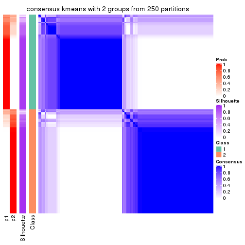</p>

</div>
<div id='tab-MAD-kmeans-consensus-heatmap-2'>
<pre><code class="r">consensus_heatmap(res, k = 3)
</code></pre>

<p>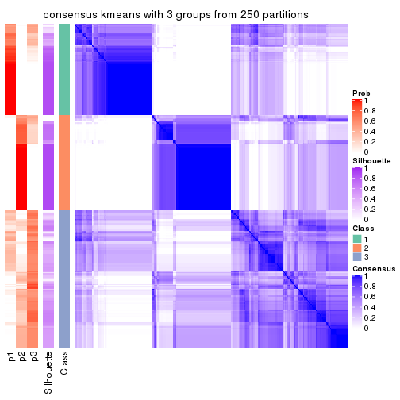</p>

</div>
<div id='tab-MAD-kmeans-consensus-heatmap-3'>
<pre><code class="r">consensus_heatmap(res, k = 4)
</code></pre>

<p>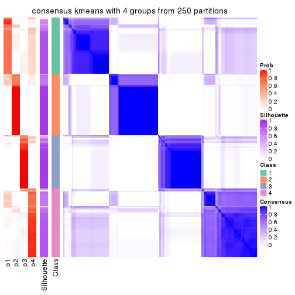</p>

</div>
<div id='tab-MAD-kmeans-consensus-heatmap-4'>
<pre><code class="r">consensus_heatmap(res, k = 5)
</code></pre>

<p>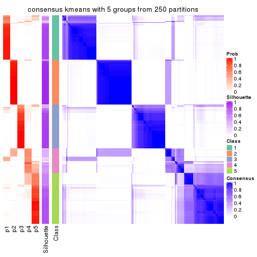</p>

</div>
<div id='tab-MAD-kmeans-consensus-heatmap-5'>
<pre><code class="r">consensus_heatmap(res, k = 6)
</code></pre>

<p>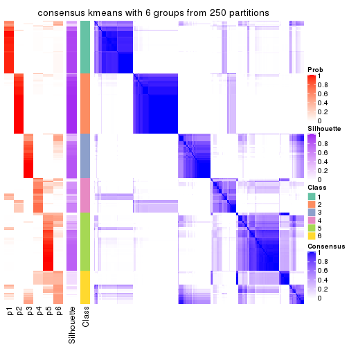</p>

</div>
</div>

Heatmaps for the membership of samples in all partitions to see how consistent they are:


<script>
$( function() {
	$( '#tabs-MAD-kmeans-membership-heatmap' ).tabs();
} );
</script>
<div id='tabs-MAD-kmeans-membership-heatmap'>
<ul>
<li><a href='#tab-MAD-kmeans-membership-heatmap-1'>k = 2</a></li>
<li><a href='#tab-MAD-kmeans-membership-heatmap-2'>k = 3</a></li>
<li><a href='#tab-MAD-kmeans-membership-heatmap-3'>k = 4</a></li>
<li><a href='#tab-MAD-kmeans-membership-heatmap-4'>k = 5</a></li>
<li><a href='#tab-MAD-kmeans-membership-heatmap-5'>k = 6</a></li>
</ul>
<div id='tab-MAD-kmeans-membership-heatmap-1'>
<pre><code class="r">membership_heatmap(res, k = 2)
</code></pre>

<p>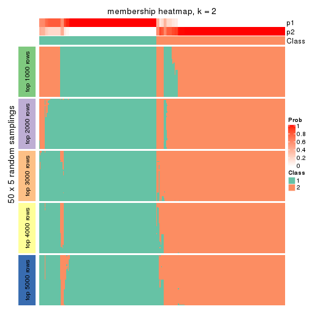</p>

</div>
<div id='tab-MAD-kmeans-membership-heatmap-2'>
<pre><code class="r">membership_heatmap(res, k = 3)
</code></pre>

<p>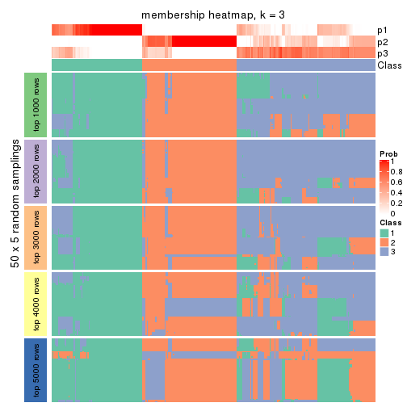</p>

</div>
<div id='tab-MAD-kmeans-membership-heatmap-3'>
<pre><code class="r">membership_heatmap(res, k = 4)
</code></pre>

<p>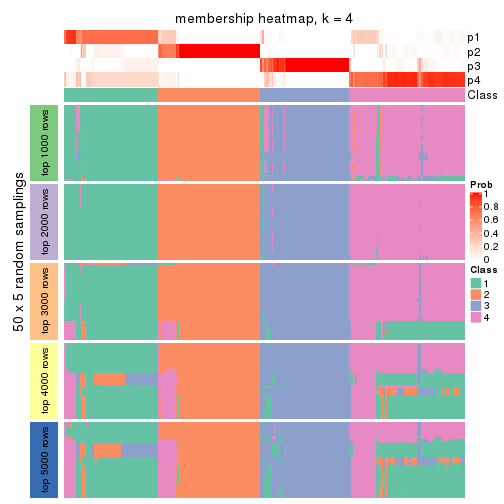</p>

</div>
<div id='tab-MAD-kmeans-membership-heatmap-4'>
<pre><code class="r">membership_heatmap(res, k = 5)
</code></pre>

<p>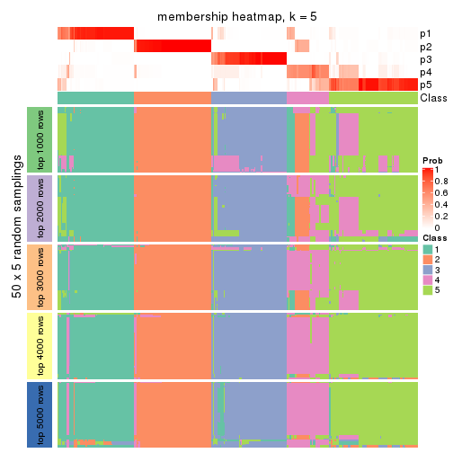</p>

</div>
<div id='tab-MAD-kmeans-membership-heatmap-5'>
<pre><code class="r">membership_heatmap(res, k = 6)
</code></pre>

<p>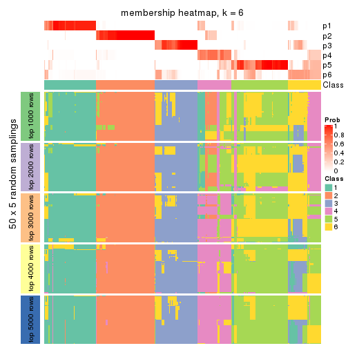</p>

</div>
</div>

As soon as we have had the classes for columns, we can look for signatures
which are significantly different between classes which can be candidate marks
for certain classes. Following are the heatmaps for signatures.


Signature heatmaps where rows are scaled:


<script>
$( function() {
	$( '#tabs-MAD-kmeans-get-signatures' ).tabs();
} );
</script>
<div id='tabs-MAD-kmeans-get-signatures'>
<ul>
<li><a href='#tab-MAD-kmeans-get-signatures-1'>k = 2</a></li>
<li><a href='#tab-MAD-kmeans-get-signatures-2'>k = 3</a></li>
<li><a href='#tab-MAD-kmeans-get-signatures-3'>k = 4</a></li>
<li><a href='#tab-MAD-kmeans-get-signatures-4'>k = 5</a></li>
<li><a href='#tab-MAD-kmeans-get-signatures-5'>k = 6</a></li>
</ul>
<div id='tab-MAD-kmeans-get-signatures-1'>
<pre><code class="r">get_signatures(res, k = 2)
</code></pre>

<p>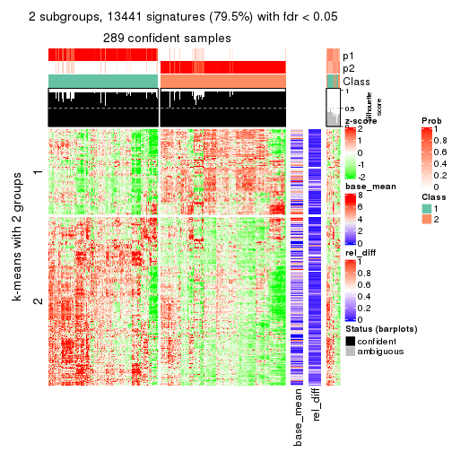</p>

</div>
<div id='tab-MAD-kmeans-get-signatures-2'>
<pre><code class="r">get_signatures(res, k = 3)
</code></pre>

<p>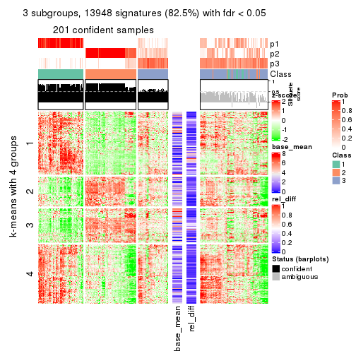</p>

</div>
<div id='tab-MAD-kmeans-get-signatures-3'>
<pre><code class="r">get_signatures(res, k = 4)
</code></pre>

<p>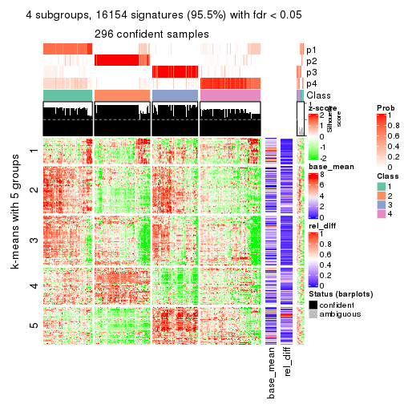</p>

</div>
<div id='tab-MAD-kmeans-get-signatures-4'>
<pre><code class="r">get_signatures(res, k = 5)
</code></pre>

<p>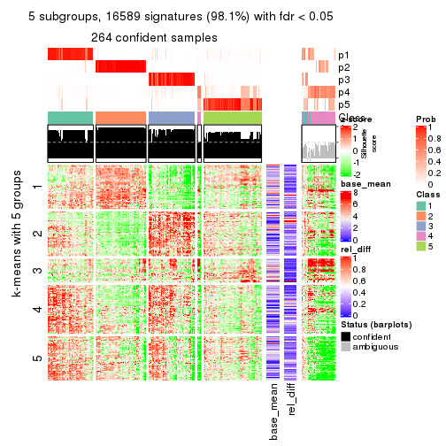</p>

</div>
<div id='tab-MAD-kmeans-get-signatures-5'>
<pre><code class="r">get_signatures(res, k = 6)
</code></pre>

<p>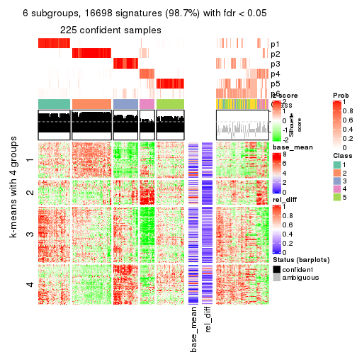</p>

</div>
</div>


Signature heatmaps where rows are not scaled:


<script>
$( function() {
	$( '#tabs-MAD-kmeans-get-signatures-no-scale' ).tabs();
} );
</script>
<div id='tabs-MAD-kmeans-get-signatures-no-scale'>
<ul>
<li><a href='#tab-MAD-kmeans-get-signatures-no-scale-1'>k = 2</a></li>
<li><a href='#tab-MAD-kmeans-get-signatures-no-scale-2'>k = 3</a></li>
<li><a href='#tab-MAD-kmeans-get-signatures-no-scale-3'>k = 4</a></li>
<li><a href='#tab-MAD-kmeans-get-signatures-no-scale-4'>k = 5</a></li>
<li><a href='#tab-MAD-kmeans-get-signatures-no-scale-5'>k = 6</a></li>
</ul>
<div id='tab-MAD-kmeans-get-signatures-no-scale-1'>
<pre><code class="r">get_signatures(res, k = 2, scale_rows = FALSE)
</code></pre>

<p>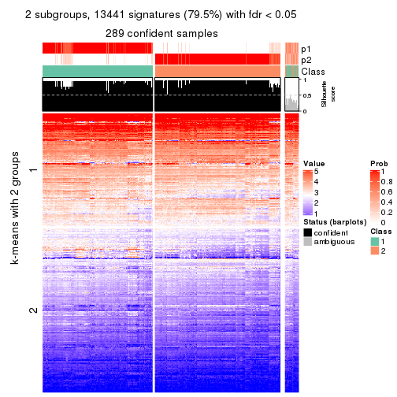</p>

</div>
<div id='tab-MAD-kmeans-get-signatures-no-scale-2'>
<pre><code class="r">get_signatures(res, k = 3, scale_rows = FALSE)
</code></pre>

<p>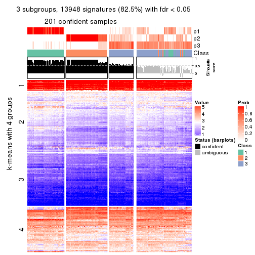</p>

</div>
<div id='tab-MAD-kmeans-get-signatures-no-scale-3'>
<pre><code class="r">get_signatures(res, k = 4, scale_rows = FALSE)
</code></pre>

<p>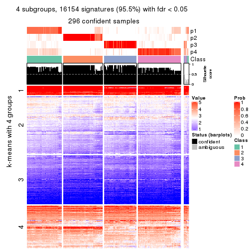</p>

</div>
<div id='tab-MAD-kmeans-get-signatures-no-scale-4'>
<pre><code class="r">get_signatures(res, k = 5, scale_rows = FALSE)
</code></pre>

<p>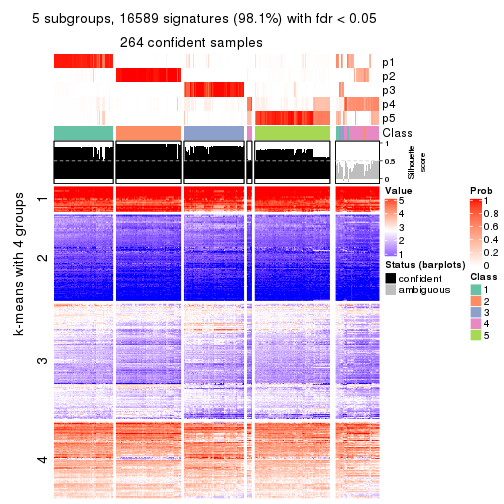</p>

</div>
<div id='tab-MAD-kmeans-get-signatures-no-scale-5'>
<pre><code class="r">get_signatures(res, k = 6, scale_rows = FALSE)
</code></pre>

<p>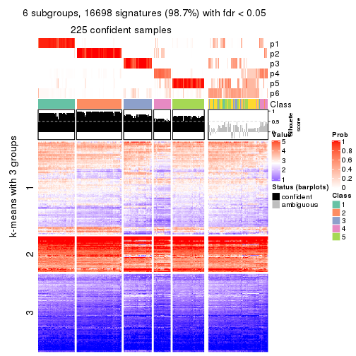</p>

</div>
</div>


Compare the overlap of signatures from different k:

```r
compare_signatures(res)
```

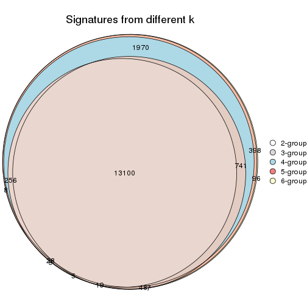

`get_signature()` returns a data frame invisibly. TO get the list of signatures, the function
call should be assigned to a variable explicitly. In following code, if `plot` argument is set
to `FALSE`, no heatmap is plotted while only the differential analysis is performed.

```r
# code only for demonstration
tb = get_signature(res, k = ..., plot = FALSE)
```

An example of the output of `tb` is:

```
#>   which_row         fdr    mean_1    mean_2 scaled_mean_1 scaled_mean_2 km
#> 1        38 0.042760348  8.373488  9.131774    -0.5533452     0.5164555  1
#> 2        40 0.018707592  7.106213  8.469186    -0.6173731     0.5762149  1
#> 3        55 0.019134737 10.221463 11.207825    -0.6159697     0.5749050  1
#> 4        59 0.006059896  5.921854  7.869574    -0.6899429     0.6439467  1
#> 5        60 0.018055526  8.928898 10.211722    -0.6204761     0.5791110  1
#> 6        98 0.009384629 15.714769 14.887706     0.6635654    -0.6193277  2
...
```

The columns in `tb` are:

1. `which_row`: row indices corresponding to the input matrix.
2. `fdr`: FDR for the differential test. 
3. `mean_x`: The mean value in group x.
4. `scaled_mean_x`: The mean value in group x after rows are scaled.
5. `km`: Row groups if k-means clustering is applied to rows.


UMAP plot which shows how samples are separated.


<script>
$( function() {
	$( '#tabs-MAD-kmeans-dimension-reduction' ).tabs();
} );
</script>
<div id='tabs-MAD-kmeans-dimension-reduction'>
<ul>
<li><a href='#tab-MAD-kmeans-dimension-reduction-1'>k = 2</a></li>
<li><a href='#tab-MAD-kmeans-dimension-reduction-2'>k = 3</a></li>
<li><a href='#tab-MAD-kmeans-dimension-reduction-3'>k = 4</a></li>
<li><a href='#tab-MAD-kmeans-dimension-reduction-4'>k = 5</a></li>
<li><a href='#tab-MAD-kmeans-dimension-reduction-5'>k = 6</a></li>
</ul>
<div id='tab-MAD-kmeans-dimension-reduction-1'>
<pre><code class="r">dimension_reduction(res, k = 2, method = &quot;UMAP&quot;)
</code></pre>

<p>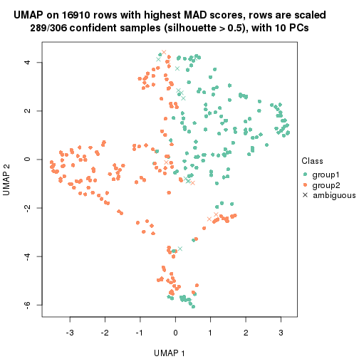</p>

</div>
<div id='tab-MAD-kmeans-dimension-reduction-2'>
<pre><code class="r">dimension_reduction(res, k = 3, method = &quot;UMAP&quot;)
</code></pre>

<p>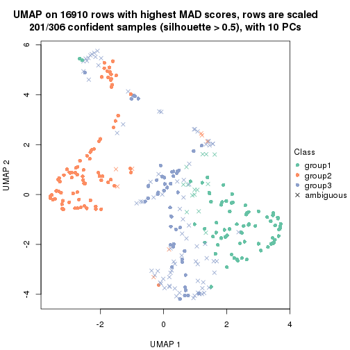</p>

</div>
<div id='tab-MAD-kmeans-dimension-reduction-3'>
<pre><code class="r">dimension_reduction(res, k = 4, method = &quot;UMAP&quot;)
</code></pre>

<p>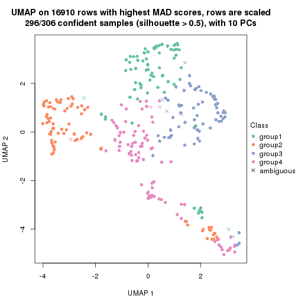</p>

</div>
<div id='tab-MAD-kmeans-dimension-reduction-4'>
<pre><code class="r">dimension_reduction(res, k = 5, method = &quot;UMAP&quot;)
</code></pre>

<p>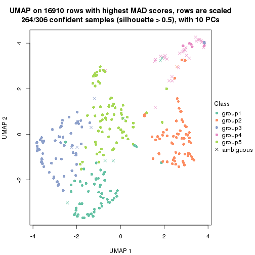</p>

</div>
<div id='tab-MAD-kmeans-dimension-reduction-5'>
<pre><code class="r">dimension_reduction(res, k = 6, method = &quot;UMAP&quot;)
</code></pre>

<p>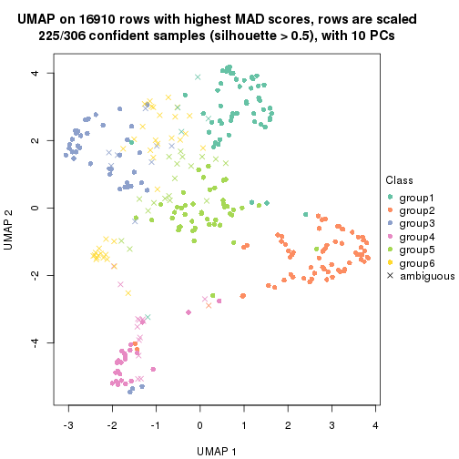</p>

</div>
</div>


Following heatmap shows how subgroups are split when increasing `k`:

```r
collect_classes(res)
```

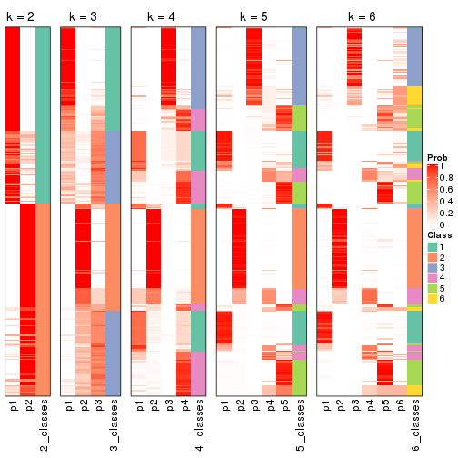


If matrix rows can be associated to genes, consider to use `GO_Enrichment(res,
...)` to perform function enrichment for the signature genes.


 

---------------------------------------------------


### MAD:skmeans*


The object with results only for a single top-value method and a single partition method 
can be extracted as:

```r
res = res_list["MAD", "skmeans"]
# you can also extract it by
# res = res_list["MAD:skmeans"]
```

A summary of `res` and all the functions that can be applied to it:

```r
res
```

```
#> A 'ConsensusPartition' object with k = 2, 3, 4, 5, 6.
#>   On a matrix with 16910 rows and 306 columns.
#>   Top rows (1000, 2000, 3000, 4000, 5000) are extracted by 'MAD' method.
#>   Subgroups are detected by 'skmeans' method.
#>   Performed in total 1250 partitions by row resampling.
#>   Best k for subgroups seems to be 6.
#> 
#> Following methods can be applied to this 'ConsensusPartition' object:
#>  [1] "cola_report"             "collect_classes"         "collect_plots"          
#>  [4] "collect_stats"           "colnames"                "compare_signatures"     
#>  [7] "consensus_heatmap"       "dimension_reduction"     "functional_enrichment"  
#> [10] "get_anno_col"            "get_anno"                "get_classes"            
#> [13] "get_consensus"           "get_matrix"              "get_membership"         
#> [16] "get_param"               "get_signatures"          "get_stats"              
#> [19] "is_best_k"               "is_stable_k"             "membership_heatmap"     
#> [22] "ncol"                    "nrow"                    "plot_ecdf"              
#> [25] "rownames"                "select_partition_number" "show"                   
#> [28] "suggest_best_k"          "test_to_known_factors"
```

`collect_plots()` function collects all the plots made from `res` for all `k` (number of partitions)
into one single page to provide an easy and fast comparison between different `k`.

```r
collect_plots(res)
```

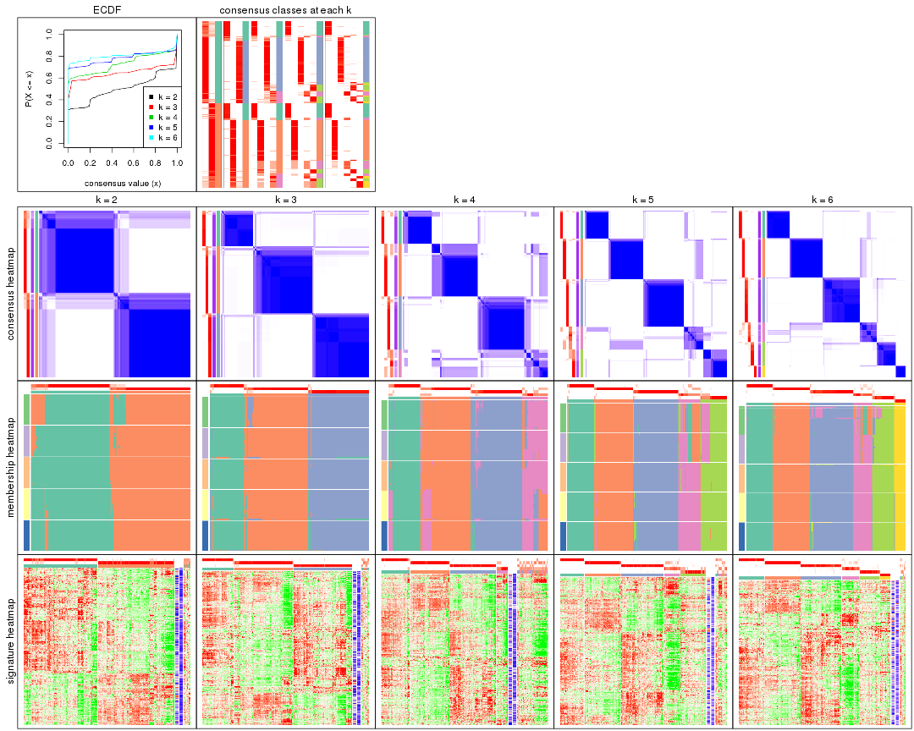

The plots are:

- The first row: a plot of the ECDF (Empirical cumulative distribution
  function) curves of the consensus matrix for each `k` and the heatmap of
  predicted classes for each `k`.
- The second row: heatmaps of the consensus matrix for each `k`.
- The third row: heatmaps of the membership matrix for each `k`.
- The fouth row: heatmaps of the signatures for each `k`.

All the plots in panels can be made by individual functions and they are
plotted later in this section.

`select_partition_number()` produces several plots showing different
statistics for choosing "optimized" `k`. There are following statistics:

- ECDF curves of the consensus matrix for each `k`;
- 1-PAC. [The PAC
  score](https://en.wikipedia.org/wiki/Consensus_clustering#Over-interpretation_potential_of_consensus_clustering)
  measures the proportion of the ambiguous subgrouping.
- Mean silhouette score.
- Concordance. The mean probability of fiting the consensus class ids in all
  partitions.
- Area increased. Denote $A_k$ as the area under the ECDF curve for current
  `k`, the area increased is defined as $A_k - A_{k-1}$.
- Rand index. The percent of pairs of samples that are both in a same cluster
  or both are not in a same cluster in the partition of k and k-1.
- Jaccard index. The ratio of pairs of samples are both in a same cluster in
  the partition of k and k-1 and the pairs of samples are both in a same
  cluster in the partition k or k-1.

The detailed explanations of these statistics can be found in [the cola
vignette](http://bioconductor.org/packages/devel/bioc/vignettes/cola/inst/doc/cola.html#toc_13).

Generally speaking, lower PAC score, higher mean silhouette score or higher
concordance corresponds to better partition. Rand index and Jaccard index
measure how similar the current partition is compared to partition with `k-1`.
If they are too similar, we won't accept `k` is better than `k-1`.

```r
select_partition_number(res)
```

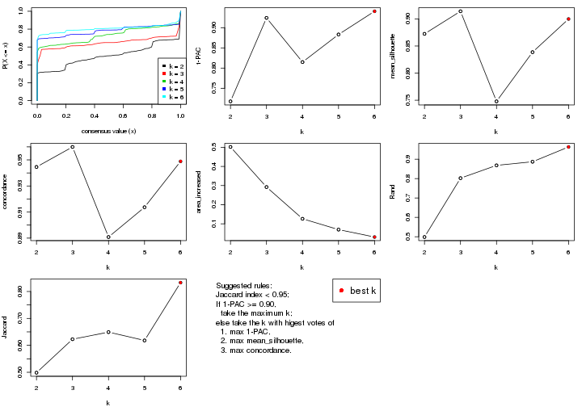

The numeric values for all these statistics can be obtained by `get_stats()`.

```r
get_stats(res)
```

```
#>   k 1-PAC mean_silhouette concordance area_increased  Rand Jaccard
#> 2 2 0.718           0.872       0.945         0.5018 0.498   0.498
#> 3 3 0.924           0.914       0.960         0.2922 0.802   0.623
#> 4 4 0.815           0.748       0.891         0.1263 0.868   0.649
#> 5 5 0.883           0.839       0.914         0.0697 0.887   0.618
#> 6 6 0.941           0.900       0.949         0.0309 0.963   0.833
```

`suggest_best_k()` suggests the best $k$ based on these statistics. The rules are as follows:

- All $k$ with Jaccard index larger than 0.95 are removed because the increase of
  the partition number does not provides enough extra information. If all $k$ are removed,
  the best $k$ is assigned by `NA`.
- For $k$ with 1-PAC larger than 0.9, the maximal $k$ is taken as the "best k". Other $k$ is called "optional k".
- If it does not fit the second rule. The $k$ with the highest vote of highest
  1-PAC, mean silhouette and concordance is taken as the "best k".

```r
suggest_best_k(res)
```

```
#> [1] 6
#> attr(,"optional")
#> [1] 3
```

There is also optional best $k$ = 3 that is worth to check.

Following shows the table of the partitions (You need to click the **show/hide
code output** link to see it). The membership matrix (columns with name `p*`)
is inferred by
[`clue::cl_consensus()`](https://www.rdocumentation.org/link/cl_consensus?package=clue)
function with the `SE` method. Basically the value in the membership matrix
represents the probability to belong to a certain group. The finall class
label for an item is determined with the group with highest probability it
belongs to.

In `get_classes()` function, the entropy is calculated from the membership
matrix and the silhouette score is calculated from the consensus matrix.


<script>
$( function() {
	$( '#tabs-MAD-skmeans-get-classes' ).tabs();
} );
</script>
<div id='tabs-MAD-skmeans-get-classes'>
<ul>
<li><a href='#tab-MAD-skmeans-get-classes-1'>k = 2</a></li>
<li><a href='#tab-MAD-skmeans-get-classes-2'>k = 3</a></li>
<li><a href='#tab-MAD-skmeans-get-classes-3'>k = 4</a></li>
<li><a href='#tab-MAD-skmeans-get-classes-4'>k = 5</a></li>
<li><a href='#tab-MAD-skmeans-get-classes-5'>k = 6</a></li>
</ul>

<div id='tab-MAD-skmeans-get-classes-1'>
<p><a id='tab-MAD-skmeans-get-classes-1-a' style='color:#0366d6' href='#'>show/hide code output</a></p>
<pre><code class="r">cbind(get_classes(res, k = 2), get_membership(res, k = 2))
</code></pre>

<pre><code>#&gt;            class entropy silhouette    p1    p2
#&gt; SRR1609360     2  0.8555     0.5712 0.280 0.720
#&gt; SRR1609361     2  0.0000     0.9419 0.000 1.000
#&gt; SRR1609362     2  0.0000     0.9419 0.000 1.000
#&gt; SRR1609363     2  0.0000     0.9419 0.000 1.000
#&gt; SRR1609364     2  0.0000     0.9419 0.000 1.000
#&gt; SRR1609365     2  0.0000     0.9419 0.000 1.000
#&gt; SRR1609366     2  0.0000     0.9419 0.000 1.000
#&gt; SRR1609367     1  0.7219     0.7576 0.800 0.200
#&gt; SRR1609368     2  0.0000     0.9419 0.000 1.000
#&gt; SRR1609369     2  0.0000     0.9419 0.000 1.000
#&gt; SRR1609370     1  0.7219     0.7576 0.800 0.200
#&gt; SRR1609371     2  0.0000     0.9419 0.000 1.000
#&gt; SRR1609372     1  0.7219     0.7576 0.800 0.200
#&gt; SRR1609373     2  0.0000     0.9419 0.000 1.000
#&gt; SRR1609374     2  0.0000     0.9419 0.000 1.000
#&gt; SRR1609375     2  0.0000     0.9419 0.000 1.000
#&gt; SRR1609377     2  0.0000     0.9419 0.000 1.000
#&gt; SRR1609376     2  0.0000     0.9419 0.000 1.000
#&gt; SRR1609378     2  0.0000     0.9419 0.000 1.000
#&gt; SRR1609379     2  0.0000     0.9419 0.000 1.000
#&gt; SRR1609382     2  0.0000     0.9419 0.000 1.000
#&gt; SRR1609383     1  0.9732     0.3976 0.596 0.404
#&gt; SRR1609381     1  0.9552     0.4650 0.624 0.376
#&gt; SRR1609384     2  0.0000     0.9419 0.000 1.000
#&gt; SRR1609386     2  0.0000     0.9419 0.000 1.000
#&gt; SRR1609385     2  0.0000     0.9419 0.000 1.000
#&gt; SRR1609387     1  0.9686     0.4175 0.604 0.396
#&gt; SRR1609388     2  0.0000     0.9419 0.000 1.000
#&gt; SRR1609390     1  0.9491     0.4830 0.632 0.368
#&gt; SRR1609393     2  0.0000     0.9419 0.000 1.000
#&gt; SRR1609394     2  0.0000     0.9419 0.000 1.000
#&gt; SRR1609392     2  0.0000     0.9419 0.000 1.000
#&gt; SRR1609391     2  0.0000     0.9419 0.000 1.000
#&gt; SRR1609395     1  0.7219     0.7576 0.800 0.200
#&gt; SRR1609396     1  0.8144     0.6900 0.748 0.252
#&gt; SRR1609398     2  0.0000     0.9419 0.000 1.000
#&gt; SRR1609399     1  0.7219     0.7576 0.800 0.200
#&gt; SRR1609400     1  0.7219     0.7576 0.800 0.200
#&gt; SRR1609397     2  0.0000     0.9419 0.000 1.000
#&gt; SRR1609401     2  0.0000     0.9419 0.000 1.000
#&gt; SRR1609402     2  0.0000     0.9419 0.000 1.000
#&gt; SRR1609405     2  0.0000     0.9419 0.000 1.000
#&gt; SRR1609404     2  0.0000     0.9419 0.000 1.000
#&gt; SRR1609406     2  0.0000     0.9419 0.000 1.000
#&gt; SRR1609408     2  0.0000     0.9419 0.000 1.000
#&gt; SRR1609403     2  0.0000     0.9419 0.000 1.000
#&gt; SRR1609410     2  0.8443     0.5869 0.272 0.728
#&gt; SRR1609411     2  0.0000     0.9419 0.000 1.000
#&gt; SRR1609407     2  0.0000     0.9419 0.000 1.000
#&gt; SRR1609413     2  0.8763     0.5376 0.296 0.704
#&gt; SRR1609412     1  0.0000     0.9339 1.000 0.000
#&gt; SRR1609414     1  0.0000     0.9339 1.000 0.000
#&gt; SRR1609415     1  0.0000     0.9339 1.000 0.000
#&gt; SRR1609416     1  0.0000     0.9339 1.000 0.000
#&gt; SRR1609417     1  0.0000     0.9339 1.000 0.000
#&gt; SRR1609418     2  0.0000     0.9419 0.000 1.000
#&gt; SRR1609419     2  0.0000     0.9419 0.000 1.000
#&gt; SRR1609420     2  0.0000     0.9419 0.000 1.000
#&gt; SRR1609421     2  0.7219     0.7524 0.200 0.800
#&gt; SRR1609422     2  0.9710     0.3868 0.400 0.600
#&gt; SRR1609423     2  0.0000     0.9419 0.000 1.000
#&gt; SRR1609424     2  0.0000     0.9419 0.000 1.000
#&gt; SRR1609425     2  0.0000     0.9419 0.000 1.000
#&gt; SRR1609426     2  0.0000     0.9419 0.000 1.000
#&gt; SRR1609427     1  0.0000     0.9339 1.000 0.000
#&gt; SRR1609428     2  0.0000     0.9419 0.000 1.000
#&gt; SRR1609429     1  0.9970     0.2092 0.532 0.468
#&gt; SRR1609430     1  0.0000     0.9339 1.000 0.000
#&gt; SRR1609431     2  0.7602     0.7269 0.220 0.780
#&gt; SRR1609432     2  0.0000     0.9419 0.000 1.000
#&gt; SRR1609433     1  0.0000     0.9339 1.000 0.000
#&gt; SRR1609434     2  0.0000     0.9419 0.000 1.000
#&gt; SRR1609435     1  0.0000     0.9339 1.000 0.000
#&gt; SRR1609436     1  0.0000     0.9339 1.000 0.000
#&gt; SRR1609437     2  0.0000     0.9419 0.000 1.000
#&gt; SRR1609438     2  0.0000     0.9419 0.000 1.000
#&gt; SRR1609439     1  0.0000     0.9339 1.000 0.000
#&gt; SRR1609440     1  0.7219     0.7576 0.800 0.200
#&gt; SRR1609441     2  0.0000     0.9419 0.000 1.000
#&gt; SRR1609442     2  0.0000     0.9419 0.000 1.000
#&gt; SRR1609443     1  0.0000     0.9339 1.000 0.000
#&gt; SRR1609444     1  0.1184     0.9225 0.984 0.016
#&gt; SRR1609445     1  0.0000     0.9339 1.000 0.000
#&gt; SRR1609446     2  0.0000     0.9419 0.000 1.000
#&gt; SRR1609447     1  0.0000     0.9339 1.000 0.000
#&gt; SRR1609448     2  0.0000     0.9419 0.000 1.000
#&gt; SRR1609449     1  0.7219     0.7576 0.800 0.200
#&gt; SRR1609450     2  0.0000     0.9419 0.000 1.000
#&gt; SRR1609451     1  0.0000     0.9339 1.000 0.000
#&gt; SRR1609452     1  0.8207     0.6239 0.744 0.256
#&gt; SRR1609453     1  0.0000     0.9339 1.000 0.000
#&gt; SRR1609454     2  0.0000     0.9419 0.000 1.000
#&gt; SRR1609455     2  0.0000     0.9419 0.000 1.000
#&gt; SRR1609456     2  0.0000     0.9419 0.000 1.000
#&gt; SRR1609457     1  0.0000     0.9339 1.000 0.000
#&gt; SRR1609458     1  0.0000     0.9339 1.000 0.000
#&gt; SRR1609459     1  0.0000     0.9339 1.000 0.000
#&gt; SRR1609460     2  0.7219     0.7524 0.200 0.800
#&gt; SRR1609461     1  0.0000     0.9339 1.000 0.000
#&gt; SRR1609462     1  0.0000     0.9339 1.000 0.000
#&gt; SRR1609464     1  0.0000     0.9339 1.000 0.000
#&gt; SRR1609463     1  0.0000     0.9339 1.000 0.000
#&gt; SRR1609465     2  0.7219     0.7524 0.200 0.800
#&gt; SRR1609466     1  0.7219     0.7576 0.800 0.200
#&gt; SRR1609467     1  0.0000     0.9339 1.000 0.000
#&gt; SRR1609469     2  0.0000     0.9419 0.000 1.000
#&gt; SRR1609470     2  0.6343     0.7981 0.160 0.840
#&gt; SRR1609472     1  0.0000     0.9339 1.000 0.000
#&gt; SRR1609471     2  0.9988    -0.0273 0.480 0.520
#&gt; SRR1609474     2  0.0000     0.9419 0.000 1.000
#&gt; SRR1609473     2  0.0000     0.9419 0.000 1.000
#&gt; SRR1609475     2  0.0000     0.9419 0.000 1.000
#&gt; SRR1609478     1  0.0672     0.9278 0.992 0.008
#&gt; SRR1609476     1  0.0000     0.9339 1.000 0.000
#&gt; SRR1609477     1  0.0000     0.9339 1.000 0.000
#&gt; SRR1609479     2  0.0000     0.9419 0.000 1.000
#&gt; SRR1609481     2  0.7219     0.7524 0.200 0.800
#&gt; SRR1609480     1  0.0000     0.9339 1.000 0.000
#&gt; SRR1609482     1  0.0000     0.9339 1.000 0.000
#&gt; SRR1609484     2  0.0000     0.9419 0.000 1.000
#&gt; SRR1609483     1  0.0000     0.9339 1.000 0.000
#&gt; SRR1609486     1  0.0000     0.9339 1.000 0.000
#&gt; SRR1609485     1  0.0000     0.9339 1.000 0.000
#&gt; SRR1609487     2  0.0000     0.9419 0.000 1.000
#&gt; SRR1609488     1  0.0000     0.9339 1.000 0.000
#&gt; SRR1609489     2  0.0000     0.9419 0.000 1.000
#&gt; SRR1609490     2  0.0000     0.9419 0.000 1.000
#&gt; SRR1609491     2  0.6531     0.7905 0.168 0.832
#&gt; SRR1609492     2  0.0000     0.9419 0.000 1.000
#&gt; SRR1609493     2  0.8861     0.5945 0.304 0.696
#&gt; SRR1609494     2  0.0000     0.9419 0.000 1.000
#&gt; SRR1609495     1  0.7219     0.7576 0.800 0.200
#&gt; SRR1609496     1  0.0000     0.9339 1.000 0.000
#&gt; SRR1609497     1  0.0000     0.9339 1.000 0.000
#&gt; SRR1609498     1  0.0000     0.9339 1.000 0.000
#&gt; SRR1609499     2  0.0000     0.9419 0.000 1.000
#&gt; SRR1609500     1  0.0000     0.9339 1.000 0.000
#&gt; SRR1609501     2  0.6623     0.7851 0.172 0.828
#&gt; SRR1609502     2  0.0000     0.9419 0.000 1.000
#&gt; SRR1609503     2  0.9323     0.5077 0.348 0.652
#&gt; SRR1609504     1  0.0000     0.9339 1.000 0.000
#&gt; SRR1609505     1  0.0000     0.9339 1.000 0.000
#&gt; SRR1609506     2  0.0000     0.9419 0.000 1.000
#&gt; SRR1609507     1  0.0000     0.9339 1.000 0.000
#&gt; SRR1609508     2  0.0000     0.9419 0.000 1.000
#&gt; SRR1609509     2  0.0000     0.9419 0.000 1.000
#&gt; SRR1609510     2  0.7219     0.7524 0.200 0.800
#&gt; SRR1609512     1  0.0000     0.9339 1.000 0.000
#&gt; SRR1609511     1  0.0000     0.9339 1.000 0.000
#&gt; SRR1609513     1  0.0000     0.9339 1.000 0.000
#&gt; SRR1609514     1  0.0000     0.9339 1.000 0.000
#&gt; SRR1609515     2  0.0000     0.9419 0.000 1.000
#&gt; SRR1609516     1  0.0000     0.9339 1.000 0.000
#&gt; SRR1609517     2  0.2603     0.9074 0.044 0.956
#&gt; SRR1609518     1  0.9323     0.5252 0.652 0.348
#&gt; SRR1609519     1  0.0000     0.9339 1.000 0.000
#&gt; SRR1609520     2  0.0000     0.9419 0.000 1.000
#&gt; SRR1609521     1  0.0000     0.9339 1.000 0.000
#&gt; SRR1609522     1  0.0000     0.9339 1.000 0.000
#&gt; SRR1609523     2  0.9686     0.3969 0.396 0.604
#&gt; SRR1609524     2  0.0000     0.9419 0.000 1.000
#&gt; SRR1609526     1  0.0000     0.9339 1.000 0.000
#&gt; SRR1609525     2  0.6712     0.7806 0.176 0.824
#&gt; SRR1609527     1  0.7219     0.7576 0.800 0.200
#&gt; SRR1609529     1  0.0000     0.9339 1.000 0.000
#&gt; SRR1609528     1  0.8207     0.6240 0.744 0.256
#&gt; SRR1609530     1  0.0000     0.9339 1.000 0.000
#&gt; SRR1609531     2  0.0000     0.9419 0.000 1.000
#&gt; SRR1609532     1  0.0000     0.9339 1.000 0.000
#&gt; SRR1609533     2  0.7219     0.7524 0.200 0.800
#&gt; SRR1609534     1  0.0000     0.9339 1.000 0.000
#&gt; SRR1609535     2  0.7219     0.7524 0.200 0.800
#&gt; SRR1609537     2  0.0000     0.9419 0.000 1.000
#&gt; SRR1609536     1  0.0000     0.9339 1.000 0.000
#&gt; SRR1609538     2  0.0000     0.9419 0.000 1.000
#&gt; SRR1609539     1  0.0000     0.9339 1.000 0.000
#&gt; SRR1609540     1  0.0000     0.9339 1.000 0.000
#&gt; SRR1609541     1  0.0000     0.9339 1.000 0.000
#&gt; SRR1609542     2  0.0000     0.9419 0.000 1.000
#&gt; SRR1609543     1  0.0000     0.9339 1.000 0.000
#&gt; SRR1609544     1  0.0000     0.9339 1.000 0.000
#&gt; SRR1609545     1  0.0000     0.9339 1.000 0.000
#&gt; SRR1609546     1  0.0000     0.9339 1.000 0.000
#&gt; SRR1609547     1  0.0000     0.9339 1.000 0.000
#&gt; SRR1609548     1  0.0000     0.9339 1.000 0.000
#&gt; SRR1609549     2  0.0000     0.9419 0.000 1.000
#&gt; SRR1609550     2  0.0000     0.9419 0.000 1.000
#&gt; SRR1609551     1  0.0000     0.9339 1.000 0.000
#&gt; SRR1609552     1  0.0000     0.9339 1.000 0.000
#&gt; SRR1609553     1  0.0000     0.9339 1.000 0.000
#&gt; SRR1609554     1  0.0000     0.9339 1.000 0.000
#&gt; SRR1609555     1  0.0000     0.9339 1.000 0.000
#&gt; SRR1609556     1  0.0000     0.9339 1.000 0.000
#&gt; SRR1609557     2  0.9686     0.3981 0.396 0.604
#&gt; SRR1609558     1  0.0000     0.9339 1.000 0.000
#&gt; SRR1609559     1  0.8081     0.6380 0.752 0.248
#&gt; SRR1609560     2  0.0000     0.9419 0.000 1.000
#&gt; SRR1609561     1  0.0000     0.9339 1.000 0.000
#&gt; SRR1609562     2  0.0000     0.9419 0.000 1.000
#&gt; SRR1609563     2  0.0000     0.9419 0.000 1.000
#&gt; SRR1609564     1  0.0000     0.9339 1.000 0.000
#&gt; SRR1609565     2  0.0000     0.9419 0.000 1.000
#&gt; SRR1609566     2  0.0000     0.9419 0.000 1.000
#&gt; SRR1609567     2  0.0000     0.9419 0.000 1.000
#&gt; SRR1609568     2  0.0000     0.9419 0.000 1.000
#&gt; SRR1609569     1  0.0000     0.9339 1.000 0.000
#&gt; SRR1609570     1  0.0000     0.9339 1.000 0.000
#&gt; SRR1609571     1  0.0000     0.9339 1.000 0.000
#&gt; SRR1609572     1  0.0000     0.9339 1.000 0.000
#&gt; SRR1609573     1  0.0000     0.9339 1.000 0.000
#&gt; SRR1609574     1  0.0000     0.9339 1.000 0.000
#&gt; SRR1609575     2  0.0000     0.9419 0.000 1.000
#&gt; SRR1609576     2  0.0000     0.9419 0.000 1.000
#&gt; SRR1609578     1  0.9775     0.3770 0.588 0.412
#&gt; SRR1609577     1  0.8443     0.6602 0.728 0.272
#&gt; SRR1609579     1  0.0000     0.9339 1.000 0.000
#&gt; SRR1609580     1  0.0000     0.9339 1.000 0.000
#&gt; SRR1609582     1  0.0000     0.9339 1.000 0.000
#&gt; SRR1609581     2  0.0000     0.9419 0.000 1.000
#&gt; SRR1609583     1  0.0000     0.9339 1.000 0.000
#&gt; SRR1609584     1  0.0000     0.9339 1.000 0.000
#&gt; SRR1609585     1  0.0000     0.9339 1.000 0.000
#&gt; SRR1609586     2  0.0000     0.9419 0.000 1.000
#&gt; SRR1609587     1  0.0000     0.9339 1.000 0.000
#&gt; SRR1609588     2  0.0000     0.9419 0.000 1.000
#&gt; SRR1609589     2  0.0000     0.9419 0.000 1.000
#&gt; SRR1609590     1  0.0000     0.9339 1.000 0.000
#&gt; SRR1609592     1  0.8909     0.5203 0.692 0.308
#&gt; SRR1609591     1  0.0376     0.9311 0.996 0.004
#&gt; SRR1609593     1  0.9775     0.2446 0.588 0.412
#&gt; SRR1609594     2  0.0000     0.9419 0.000 1.000
#&gt; SRR1609595     2  0.8661     0.6228 0.288 0.712
#&gt; SRR1609596     2  0.0000     0.9419 0.000 1.000
#&gt; SRR1609597     2  0.0000     0.9419 0.000 1.000
#&gt; SRR1609598     1  0.0000     0.9339 1.000 0.000
#&gt; SRR1609599     1  0.0000     0.9339 1.000 0.000
#&gt; SRR1609600     1  0.0000     0.9339 1.000 0.000
#&gt; SRR1609601     1  0.0000     0.9339 1.000 0.000
#&gt; SRR1609602     1  0.0000     0.9339 1.000 0.000
#&gt; SRR1609603     2  0.0000     0.9419 0.000 1.000
#&gt; SRR1609604     2  0.0000     0.9419 0.000 1.000
#&gt; SRR1609605     2  0.0000     0.9419 0.000 1.000
#&gt; SRR1609606     2  0.6973     0.7669 0.188 0.812
#&gt; SRR1609607     1  0.0000     0.9339 1.000 0.000
#&gt; SRR1609608     1  0.0000     0.9339 1.000 0.000
#&gt; SRR1609609     2  0.4431     0.8654 0.092 0.908
#&gt; SRR1609610     1  0.0000     0.9339 1.000 0.000
#&gt; SRR1609611     2  0.0000     0.9419 0.000 1.000
#&gt; SRR1609613     2  0.0000     0.9419 0.000 1.000
#&gt; SRR1609612     1  0.0000     0.9339 1.000 0.000
#&gt; SRR1609614     1  0.0000     0.9339 1.000 0.000
#&gt; SRR1609615     2  0.7299     0.7068 0.204 0.796
#&gt; SRR1609616     1  0.0000     0.9339 1.000 0.000
#&gt; SRR1609617     2  0.7219     0.7524 0.200 0.800
#&gt; SRR1609618     1  0.0000     0.9339 1.000 0.000
#&gt; SRR1609619     1  0.9087     0.5718 0.676 0.324
#&gt; SRR1609620     2  0.0000     0.9419 0.000 1.000
#&gt; SRR1609621     2  0.0000     0.9419 0.000 1.000
#&gt; SRR1609622     1  0.0000     0.9339 1.000 0.000
#&gt; SRR1609623     1  0.0000     0.9339 1.000 0.000
#&gt; SRR1609624     2  0.9866     0.1607 0.432 0.568
#&gt; SRR1609625     1  0.7219     0.7576 0.800 0.200
#&gt; SRR1609626     1  0.0000     0.9339 1.000 0.000
#&gt; SRR1609627     2  0.0000     0.9419 0.000 1.000
#&gt; SRR1609628     2  0.0000     0.9419 0.000 1.000
#&gt; SRR1609629     1  0.0000     0.9339 1.000 0.000
#&gt; SRR1609630     2  0.0000     0.9419 0.000 1.000
#&gt; SRR1609631     1  0.7299     0.7529 0.796 0.204
#&gt; SRR1609632     2  0.0000     0.9419 0.000 1.000
#&gt; SRR1609633     1  0.7219     0.7576 0.800 0.200
#&gt; SRR1609634     2  0.0000     0.9419 0.000 1.000
#&gt; SRR1609635     1  0.0000     0.9339 1.000 0.000
#&gt; SRR1609636     2  0.0000     0.9419 0.000 1.000
#&gt; SRR1609637     1  0.0000     0.9339 1.000 0.000
#&gt; SRR1609638     2  0.0000     0.9419 0.000 1.000
#&gt; SRR1609639     2  0.0000     0.9419 0.000 1.000
#&gt; SRR1609640     1  0.0000     0.9339 1.000 0.000
#&gt; SRR1609641     2  0.9833     0.1886 0.424 0.576
#&gt; SRR1609642     1  0.9427     0.5003 0.640 0.360
#&gt; SRR1609643     1  0.0000     0.9339 1.000 0.000
#&gt; SRR1609644     2  0.0000     0.9419 0.000 1.000
#&gt; SRR1609645     1  0.0000     0.9339 1.000 0.000
#&gt; SRR1609646     1  0.0000     0.9339 1.000 0.000
#&gt; SRR1609647     2  0.7219     0.7524 0.200 0.800
#&gt; SRR1609649     1  0.0000     0.9339 1.000 0.000
#&gt; SRR1609648     2  0.0000     0.9419 0.000 1.000
#&gt; SRR1609651     2  0.0000     0.9419 0.000 1.000
#&gt; SRR1609650     1  0.8207     0.6239 0.744 0.256
#&gt; SRR1609652     1  0.0000     0.9339 1.000 0.000
#&gt; SRR1609653     2  0.0000     0.9419 0.000 1.000
#&gt; SRR1609654     2  0.0000     0.9419 0.000 1.000
#&gt; SRR1609655     1  0.0000     0.9339 1.000 0.000
#&gt; SRR1609657     1  0.7815     0.7176 0.768 0.232
#&gt; SRR1609656     1  0.7219     0.7576 0.800 0.200
#&gt; SRR1609658     2  0.0000     0.9419 0.000 1.000
#&gt; SRR1609659     2  0.0000     0.9419 0.000 1.000
#&gt; SRR1609660     1  0.0000     0.9339 1.000 0.000
#&gt; SRR1609661     1  0.0000     0.9339 1.000 0.000
#&gt; SRR1609662     2  0.0000     0.9419 0.000 1.000
#&gt; SRR1609663     1  0.0000     0.9339 1.000 0.000
#&gt; SRR1609664     2  0.7602     0.7269 0.220 0.780
#&gt; SRR1609665     2  0.0000     0.9419 0.000 1.000
#&gt; SRR1609666     2  0.0000     0.9419 0.000 1.000
#&gt; SRR1609667     1  0.0000     0.9339 1.000 0.000
#&gt; SRR1609668     2  0.7602     0.7269 0.220 0.780
#&gt; SRR1609669     2  0.0000     0.9419 0.000 1.000
</code></pre>

<script>
$('#tab-MAD-skmeans-get-classes-1-a').parent().next().next().hide();
$('#tab-MAD-skmeans-get-classes-1-a').click(function(){
  $('#tab-MAD-skmeans-get-classes-1-a').parent().next().next().toggle();
  return(false);
});
</script>
</div>

<div id='tab-MAD-skmeans-get-classes-2'>
<p><a id='tab-MAD-skmeans-get-classes-2-a' style='color:#0366d6' href='#'>show/hide code output</a></p>
<pre><code class="r">cbind(get_classes(res, k = 3), get_membership(res, k = 3))
</code></pre>

<pre><code>#&gt;            class entropy silhouette    p1    p2    p3
#&gt; SRR1609360     1  0.0424      0.943 0.992 0.008 0.000
#&gt; SRR1609361     1  0.0747      0.941 0.984 0.016 0.000
#&gt; SRR1609362     1  0.6111      0.327 0.604 0.396 0.000
#&gt; SRR1609363     2  0.0000      0.952 0.000 1.000 0.000
#&gt; SRR1609364     2  0.0000      0.952 0.000 1.000 0.000
#&gt; SRR1609365     1  0.5706      0.512 0.680 0.320 0.000
#&gt; SRR1609366     2  0.0000      0.952 0.000 1.000 0.000
#&gt; SRR1609367     1  0.0424      0.946 0.992 0.000 0.008
#&gt; SRR1609368     2  0.0000      0.952 0.000 1.000 0.000
#&gt; SRR1609369     1  0.1031      0.941 0.976 0.024 0.000
#&gt; SRR1609370     1  0.0424      0.946 0.992 0.000 0.008
#&gt; SRR1609371     2  0.0424      0.949 0.008 0.992 0.000
#&gt; SRR1609372     1  0.0424      0.946 0.992 0.000 0.008
#&gt; SRR1609373     2  0.0000      0.952 0.000 1.000 0.000
#&gt; SRR1609374     2  0.0000      0.952 0.000 1.000 0.000
#&gt; SRR1609375     2  0.0000      0.952 0.000 1.000 0.000
#&gt; SRR1609377     1  0.1031      0.941 0.976 0.024 0.000
#&gt; SRR1609376     2  0.0000      0.952 0.000 1.000 0.000
#&gt; SRR1609378     2  0.0424      0.949 0.008 0.992 0.000
#&gt; SRR1609379     1  0.1031      0.941 0.976 0.024 0.000
#&gt; SRR1609382     2  0.0424      0.949 0.008 0.992 0.000
#&gt; SRR1609383     1  0.0000      0.944 1.000 0.000 0.000
#&gt; SRR1609381     1  0.0424      0.946 0.992 0.000 0.008
#&gt; SRR1609384     1  0.1031      0.941 0.976 0.024 0.000
#&gt; SRR1609386     1  0.1031      0.941 0.976 0.024 0.000
#&gt; SRR1609385     1  0.1031      0.941 0.976 0.024 0.000
#&gt; SRR1609387     1  0.0424      0.946 0.992 0.000 0.008
#&gt; SRR1609388     2  0.0000      0.952 0.000 1.000 0.000
#&gt; SRR1609390     1  0.0424      0.946 0.992 0.000 0.008
#&gt; SRR1609393     2  0.0424      0.949 0.008 0.992 0.000
#&gt; SRR1609394     2  0.0000      0.952 0.000 1.000 0.000
#&gt; SRR1609392     2  0.0000      0.952 0.000 1.000 0.000
#&gt; SRR1609391     2  0.0424      0.949 0.008 0.992 0.000
#&gt; SRR1609395     1  0.0424      0.946 0.992 0.000 0.008
#&gt; SRR1609396     1  0.0424      0.946 0.992 0.000 0.008
#&gt; SRR1609398     1  0.1031      0.941 0.976 0.024 0.000
#&gt; SRR1609399     1  0.0424      0.946 0.992 0.000 0.008
#&gt; SRR1609400     1  0.0424      0.946 0.992 0.000 0.008
#&gt; SRR1609397     2  0.0000      0.952 0.000 1.000 0.000
#&gt; SRR1609401     2  0.0000      0.952 0.000 1.000 0.000
#&gt; SRR1609402     2  0.0000      0.952 0.000 1.000 0.000
#&gt; SRR1609405     2  0.6026      0.377 0.376 0.624 0.000
#&gt; SRR1609404     2  0.0424      0.949 0.008 0.992 0.000
#&gt; SRR1609406     2  0.0000      0.952 0.000 1.000 0.000
#&gt; SRR1609408     2  0.0000      0.952 0.000 1.000 0.000
#&gt; SRR1609403     1  0.1031      0.941 0.976 0.024 0.000
#&gt; SRR1609410     1  0.0592      0.945 0.988 0.012 0.000
#&gt; SRR1609411     2  0.0237      0.951 0.004 0.996 0.000
#&gt; SRR1609407     2  0.0000      0.952 0.000 1.000 0.000
#&gt; SRR1609413     1  0.0829      0.945 0.984 0.012 0.004
#&gt; SRR1609412     3  0.0000      0.969 0.000 0.000 1.000
#&gt; SRR1609414     3  0.0747      0.972 0.016 0.000 0.984
#&gt; SRR1609415     3  0.4887      0.710 0.228 0.000 0.772
#&gt; SRR1609416     3  0.0747      0.972 0.016 0.000 0.984
#&gt; SRR1609417     3  0.0000      0.969 0.000 0.000 1.000
#&gt; SRR1609418     1  0.1031      0.941 0.976 0.024 0.000
#&gt; SRR1609419     2  0.0000      0.952 0.000 1.000 0.000
#&gt; SRR1609420     1  0.1031      0.941 0.976 0.024 0.000
#&gt; SRR1609421     2  0.1170      0.941 0.008 0.976 0.016
#&gt; SRR1609422     2  0.6633      0.252 0.008 0.548 0.444
#&gt; SRR1609423     2  0.0848      0.946 0.008 0.984 0.008
#&gt; SRR1609424     2  0.0424      0.949 0.008 0.992 0.000
#&gt; SRR1609425     2  0.5968      0.406 0.364 0.636 0.000
#&gt; SRR1609426     2  0.0000      0.952 0.000 1.000 0.000
#&gt; SRR1609427     3  0.0747      0.972 0.016 0.000 0.984
#&gt; SRR1609428     2  0.0000      0.952 0.000 1.000 0.000
#&gt; SRR1609429     1  0.0747      0.944 0.984 0.016 0.000
#&gt; SRR1609430     3  0.0747      0.972 0.016 0.000 0.984
#&gt; SRR1609431     2  0.5156      0.734 0.008 0.776 0.216
#&gt; SRR1609432     2  0.0000      0.952 0.000 1.000 0.000
#&gt; SRR1609433     3  0.0747      0.972 0.016 0.000 0.984
#&gt; SRR1609434     2  0.0424      0.949 0.008 0.992 0.000
#&gt; SRR1609435     1  0.0424      0.946 0.992 0.000 0.008
#&gt; SRR1609436     3  0.0747      0.972 0.016 0.000 0.984
#&gt; SRR1609437     2  0.0424      0.949 0.008 0.992 0.000
#&gt; SRR1609438     2  0.0424      0.949 0.008 0.992 0.000
#&gt; SRR1609439     3  0.0747      0.972 0.016 0.000 0.984
#&gt; SRR1609440     1  0.0424      0.946 0.992 0.000 0.008
#&gt; SRR1609441     2  0.0661      0.948 0.008 0.988 0.004
#&gt; SRR1609442     2  0.0000      0.952 0.000 1.000 0.000
#&gt; SRR1609443     3  0.0747      0.972 0.016 0.000 0.984
#&gt; SRR1609444     1  0.0424      0.946 0.992 0.000 0.008
#&gt; SRR1609445     3  0.0237      0.967 0.004 0.000 0.996
#&gt; SRR1609446     2  0.0424      0.949 0.000 0.992 0.008
#&gt; SRR1609447     3  0.4750      0.730 0.216 0.000 0.784
#&gt; SRR1609448     2  0.0000      0.952 0.000 1.000 0.000
#&gt; SRR1609449     1  0.0424      0.946 0.992 0.000 0.008
#&gt; SRR1609450     2  0.0000      0.952 0.000 1.000 0.000
#&gt; SRR1609451     3  0.0747      0.972 0.016 0.000 0.984
#&gt; SRR1609452     3  0.0424      0.965 0.008 0.000 0.992
#&gt; SRR1609453     3  0.0747      0.972 0.016 0.000 0.984
#&gt; SRR1609454     2  0.0424      0.949 0.008 0.992 0.000
#&gt; SRR1609455     1  0.1031      0.941 0.976 0.024 0.000
#&gt; SRR1609456     2  0.0000      0.952 0.000 1.000 0.000
#&gt; SRR1609457     3  0.0747      0.972 0.016 0.000 0.984
#&gt; SRR1609458     3  0.4121      0.801 0.168 0.000 0.832
#&gt; SRR1609459     3  0.0424      0.965 0.008 0.000 0.992
#&gt; SRR1609460     2  0.2945      0.879 0.004 0.908 0.088
#&gt; SRR1609461     3  0.0747      0.972 0.016 0.000 0.984
#&gt; SRR1609462     3  0.0747      0.972 0.016 0.000 0.984
#&gt; SRR1609464     3  0.0747      0.972 0.016 0.000 0.984
#&gt; SRR1609463     3  0.0424      0.971 0.008 0.000 0.992
#&gt; SRR1609465     2  0.1129      0.941 0.004 0.976 0.020
#&gt; SRR1609466     1  0.6204      0.245 0.576 0.000 0.424
#&gt; SRR1609467     3  0.0747      0.972 0.016 0.000 0.984
#&gt; SRR1609469     2  0.1170      0.941 0.008 0.976 0.016
#&gt; SRR1609470     2  0.0747      0.944 0.000 0.984 0.016
#&gt; SRR1609472     3  0.0424      0.965 0.008 0.000 0.992
#&gt; SRR1609471     1  0.0475      0.946 0.992 0.004 0.004
#&gt; SRR1609474     2  0.0000      0.952 0.000 1.000 0.000
#&gt; SRR1609473     2  0.0661      0.948 0.008 0.988 0.004
#&gt; SRR1609475     2  0.0424      0.949 0.008 0.992 0.000
#&gt; SRR1609478     3  0.0424      0.965 0.008 0.000 0.992
#&gt; SRR1609476     1  0.0892      0.938 0.980 0.000 0.020
#&gt; SRR1609477     3  0.0424      0.965 0.008 0.000 0.992
#&gt; SRR1609479     2  0.0000      0.952 0.000 1.000 0.000
#&gt; SRR1609481     2  0.2774      0.893 0.008 0.920 0.072
#&gt; SRR1609480     3  0.0424      0.965 0.008 0.000 0.992
#&gt; SRR1609482     3  0.0747      0.972 0.016 0.000 0.984
#&gt; SRR1609484     2  0.0848      0.946 0.008 0.984 0.008
#&gt; SRR1609483     3  0.0747      0.972 0.016 0.000 0.984
#&gt; SRR1609486     3  0.0747      0.972 0.016 0.000 0.984
#&gt; SRR1609485     3  0.0747      0.972 0.016 0.000 0.984
#&gt; SRR1609487     1  0.1031      0.941 0.976 0.024 0.000
#&gt; SRR1609488     3  0.0747      0.972 0.016 0.000 0.984
#&gt; SRR1609489     2  0.0000      0.952 0.000 1.000 0.000
#&gt; SRR1609490     2  0.5810      0.472 0.336 0.664 0.000
#&gt; SRR1609491     2  0.5859      0.493 0.000 0.656 0.344
#&gt; SRR1609492     2  0.0000      0.952 0.000 1.000 0.000
#&gt; SRR1609493     2  0.5115      0.720 0.004 0.768 0.228
#&gt; SRR1609494     2  0.0000      0.952 0.000 1.000 0.000
#&gt; SRR1609495     1  0.0424      0.946 0.992 0.000 0.008
#&gt; SRR1609496     3  0.0747      0.972 0.016 0.000 0.984
#&gt; SRR1609497     3  0.0747      0.972 0.016 0.000 0.984
#&gt; SRR1609498     3  0.0747      0.972 0.016 0.000 0.984
#&gt; SRR1609499     2  0.0000      0.952 0.000 1.000 0.000
#&gt; SRR1609500     3  0.0747      0.972 0.016 0.000 0.984
#&gt; SRR1609501     2  0.0747      0.944 0.000 0.984 0.016
#&gt; SRR1609502     2  0.0000      0.952 0.000 1.000 0.000
#&gt; SRR1609503     2  0.5292      0.718 0.008 0.764 0.228
#&gt; SRR1609504     1  0.6095      0.335 0.608 0.000 0.392
#&gt; SRR1609505     3  0.0747      0.972 0.016 0.000 0.984
#&gt; SRR1609506     2  0.0000      0.952 0.000 1.000 0.000
#&gt; SRR1609507     3  0.0747      0.972 0.016 0.000 0.984
#&gt; SRR1609508     2  0.0000      0.952 0.000 1.000 0.000
#&gt; SRR1609509     2  0.0000      0.952 0.000 1.000 0.000
#&gt; SRR1609510     2  0.4755      0.773 0.008 0.808 0.184
#&gt; SRR1609512     3  0.0747      0.972 0.016 0.000 0.984
#&gt; SRR1609511     3  0.0424      0.965 0.008 0.000 0.992
#&gt; SRR1609513     3  0.0747      0.972 0.016 0.000 0.984
#&gt; SRR1609514     3  0.0424      0.965 0.008 0.000 0.992
#&gt; SRR1609515     2  0.0000      0.952 0.000 1.000 0.000
#&gt; SRR1609516     3  0.0000      0.969 0.000 0.000 1.000
#&gt; SRR1609517     2  0.1170      0.941 0.008 0.976 0.016
#&gt; SRR1609518     1  0.0424      0.946 0.992 0.000 0.008
#&gt; SRR1609519     3  0.0747      0.972 0.016 0.000 0.984
#&gt; SRR1609520     2  0.0848      0.946 0.008 0.984 0.008
#&gt; SRR1609521     3  0.0747      0.972 0.016 0.000 0.984
#&gt; SRR1609522     3  0.0747      0.972 0.016 0.000 0.984
#&gt; SRR1609523     2  0.6540      0.356 0.008 0.584 0.408
#&gt; SRR1609524     2  0.0000      0.952 0.000 1.000 0.000
#&gt; SRR1609526     3  0.0747      0.972 0.016 0.000 0.984
#&gt; SRR1609525     2  0.0747      0.944 0.000 0.984 0.016
#&gt; SRR1609527     1  0.0424      0.946 0.992 0.000 0.008
#&gt; SRR1609529     3  0.0747      0.972 0.016 0.000 0.984
#&gt; SRR1609528     3  0.0424      0.965 0.008 0.000 0.992
#&gt; SRR1609530     3  0.0747      0.972 0.016 0.000 0.984
#&gt; SRR1609531     2  0.0000      0.952 0.000 1.000 0.000
#&gt; SRR1609532     3  0.0747      0.972 0.016 0.000 0.984
#&gt; SRR1609533     2  0.0747      0.944 0.000 0.984 0.016
#&gt; SRR1609534     3  0.0000      0.969 0.000 0.000 1.000
#&gt; SRR1609535     2  0.1170      0.941 0.008 0.976 0.016
#&gt; SRR1609537     2  0.0000      0.952 0.000 1.000 0.000
#&gt; SRR1609536     3  0.0000      0.969 0.000 0.000 1.000
#&gt; SRR1609538     2  0.0000      0.952 0.000 1.000 0.000
#&gt; SRR1609539     3  0.0000      0.969 0.000 0.000 1.000
#&gt; SRR1609540     1  0.4235      0.765 0.824 0.000 0.176
#&gt; SRR1609541     3  0.0424      0.965 0.008 0.000 0.992
#&gt; SRR1609542     2  0.0000      0.952 0.000 1.000 0.000
#&gt; SRR1609543     3  0.0747      0.972 0.016 0.000 0.984
#&gt; SRR1609544     1  0.6260      0.188 0.552 0.000 0.448
#&gt; SRR1609545     3  0.0747      0.972 0.016 0.000 0.984
#&gt; SRR1609546     3  0.0000      0.969 0.000 0.000 1.000
#&gt; SRR1609547     3  0.0000      0.969 0.000 0.000 1.000
#&gt; SRR1609548     3  0.0424      0.965 0.008 0.000 0.992
#&gt; SRR1609549     2  0.0000      0.952 0.000 1.000 0.000
#&gt; SRR1609550     2  0.0000      0.952 0.000 1.000 0.000
#&gt; SRR1609551     3  0.0000      0.969 0.000 0.000 1.000
#&gt; SRR1609552     3  0.0424      0.971 0.008 0.000 0.992
#&gt; SRR1609553     3  0.0747      0.972 0.016 0.000 0.984
#&gt; SRR1609554     3  0.0000      0.969 0.000 0.000 1.000
#&gt; SRR1609555     3  0.0747      0.972 0.016 0.000 0.984
#&gt; SRR1609556     3  0.0747      0.972 0.016 0.000 0.984
#&gt; SRR1609557     3  0.6204      0.238 0.000 0.424 0.576
#&gt; SRR1609558     3  0.0000      0.969 0.000 0.000 1.000
#&gt; SRR1609559     3  0.0424      0.965 0.008 0.000 0.992
#&gt; SRR1609560     1  0.1031      0.941 0.976 0.024 0.000
#&gt; SRR1609561     3  0.0424      0.971 0.008 0.000 0.992
#&gt; SRR1609562     1  0.1031      0.941 0.976 0.024 0.000
#&gt; SRR1609563     2  0.0000      0.952 0.000 1.000 0.000
#&gt; SRR1609564     1  0.4504      0.730 0.804 0.000 0.196
#&gt; SRR1609565     2  0.0000      0.952 0.000 1.000 0.000
#&gt; SRR1609566     2  0.0000      0.952 0.000 1.000 0.000
#&gt; SRR1609567     2  0.0000      0.952 0.000 1.000 0.000
#&gt; SRR1609568     1  0.1031      0.941 0.976 0.024 0.000
#&gt; SRR1609569     3  0.0747      0.972 0.016 0.000 0.984
#&gt; SRR1609570     3  0.0747      0.972 0.016 0.000 0.984
#&gt; SRR1609571     3  0.0892      0.971 0.020 0.000 0.980
#&gt; SRR1609572     3  0.0747      0.972 0.016 0.000 0.984
#&gt; SRR1609573     3  0.0747      0.972 0.016 0.000 0.984
#&gt; SRR1609574     3  0.0747      0.972 0.016 0.000 0.984
#&gt; SRR1609575     2  0.0424      0.949 0.008 0.992 0.000
#&gt; SRR1609576     2  0.0000      0.952 0.000 1.000 0.000
#&gt; SRR1609578     3  0.6140      0.296 0.000 0.404 0.596
#&gt; SRR1609577     1  0.0424      0.946 0.992 0.000 0.008
#&gt; SRR1609579     3  0.0747      0.972 0.016 0.000 0.984
#&gt; SRR1609580     3  0.0000      0.969 0.000 0.000 1.000
#&gt; SRR1609582     3  0.0747      0.972 0.016 0.000 0.984
#&gt; SRR1609581     2  0.0000      0.952 0.000 1.000 0.000
#&gt; SRR1609583     3  0.0000      0.969 0.000 0.000 1.000
#&gt; SRR1609584     3  0.0747      0.972 0.016 0.000 0.984
#&gt; SRR1609585     3  0.0747      0.972 0.016 0.000 0.984
#&gt; SRR1609586     2  0.0000      0.952 0.000 1.000 0.000
#&gt; SRR1609587     3  0.0237      0.967 0.004 0.000 0.996
#&gt; SRR1609588     2  0.0000      0.952 0.000 1.000 0.000
#&gt; SRR1609589     2  0.0000      0.952 0.000 1.000 0.000
#&gt; SRR1609590     3  0.0747      0.972 0.016 0.000 0.984
#&gt; SRR1609592     3  0.0661      0.962 0.008 0.004 0.988
#&gt; SRR1609591     3  0.5397      0.599 0.280 0.000 0.720
#&gt; SRR1609593     3  0.0848      0.959 0.008 0.008 0.984
#&gt; SRR1609594     2  0.0424      0.949 0.008 0.992 0.000
#&gt; SRR1609595     2  0.5156      0.734 0.008 0.776 0.216
#&gt; SRR1609596     2  0.0000      0.952 0.000 1.000 0.000
#&gt; SRR1609597     2  0.0000      0.952 0.000 1.000 0.000
#&gt; SRR1609598     3  0.0424      0.965 0.008 0.000 0.992
#&gt; SRR1609599     3  0.0424      0.965 0.008 0.000 0.992
#&gt; SRR1609600     3  0.0747      0.972 0.016 0.000 0.984
#&gt; SRR1609601     3  0.0424      0.965 0.008 0.000 0.992
#&gt; SRR1609602     3  0.0424      0.965 0.008 0.000 0.992
#&gt; SRR1609603     1  0.1031      0.941 0.976 0.024 0.000
#&gt; SRR1609604     2  0.0424      0.949 0.008 0.992 0.000
#&gt; SRR1609605     2  0.1170      0.941 0.008 0.976 0.016
#&gt; SRR1609606     2  0.1170      0.941 0.008 0.976 0.016
#&gt; SRR1609607     3  0.0000      0.969 0.000 0.000 1.000
#&gt; SRR1609608     3  0.0000      0.969 0.000 0.000 1.000
#&gt; SRR1609609     2  0.0747      0.944 0.000 0.984 0.016
#&gt; SRR1609610     3  0.0747      0.972 0.016 0.000 0.984
#&gt; SRR1609611     2  0.0424      0.949 0.008 0.992 0.000
#&gt; SRR1609613     2  0.0000      0.952 0.000 1.000 0.000
#&gt; SRR1609612     3  0.0747      0.972 0.016 0.000 0.984
#&gt; SRR1609614     3  0.0747      0.972 0.016 0.000 0.984
#&gt; SRR1609615     1  0.0747      0.944 0.984 0.016 0.000
#&gt; SRR1609616     1  0.0424      0.946 0.992 0.000 0.008
#&gt; SRR1609617     2  0.3896      0.836 0.008 0.864 0.128
#&gt; SRR1609618     3  0.0237      0.970 0.004 0.000 0.996
#&gt; SRR1609619     1  0.0424      0.946 0.992 0.000 0.008
#&gt; SRR1609620     2  0.0237      0.951 0.004 0.996 0.000
#&gt; SRR1609621     2  0.0000      0.952 0.000 1.000 0.000
#&gt; SRR1609622     3  0.0747      0.972 0.016 0.000 0.984
#&gt; SRR1609623     3  0.0747      0.972 0.016 0.000 0.984
#&gt; SRR1609624     1  0.0475      0.946 0.992 0.004 0.004
#&gt; SRR1609625     1  0.0424      0.946 0.992 0.000 0.008
#&gt; SRR1609626     3  0.0747      0.972 0.016 0.000 0.984
#&gt; SRR1609627     1  0.1031      0.941 0.976 0.024 0.000
#&gt; SRR1609628     2  0.0000      0.952 0.000 1.000 0.000
#&gt; SRR1609629     3  0.0747      0.972 0.016 0.000 0.984
#&gt; SRR1609630     2  0.0000      0.952 0.000 1.000 0.000
#&gt; SRR1609631     1  0.0424      0.946 0.992 0.000 0.008
#&gt; SRR1609632     1  0.1031      0.941 0.976 0.024 0.000
#&gt; SRR1609633     1  0.0424      0.946 0.992 0.000 0.008
#&gt; SRR1609634     2  0.0000      0.952 0.000 1.000 0.000
#&gt; SRR1609635     3  0.0424      0.965 0.008 0.000 0.992
#&gt; SRR1609636     2  0.0424      0.949 0.008 0.992 0.000
#&gt; SRR1609637     1  0.0424      0.946 0.992 0.000 0.008
#&gt; SRR1609638     2  0.5882      0.459 0.348 0.652 0.000
#&gt; SRR1609639     2  0.0000      0.952 0.000 1.000 0.000
#&gt; SRR1609640     3  0.0747      0.972 0.016 0.000 0.984
#&gt; SRR1609641     1  0.0475      0.946 0.992 0.004 0.004
#&gt; SRR1609642     1  0.0424      0.946 0.992 0.000 0.008
#&gt; SRR1609643     3  0.0000      0.969 0.000 0.000 1.000
#&gt; SRR1609644     1  0.1031      0.941 0.976 0.024 0.000
#&gt; SRR1609645     3  0.0237      0.970 0.004 0.000 0.996
#&gt; SRR1609646     3  0.0747      0.972 0.016 0.000 0.984
#&gt; SRR1609647     2  0.4755      0.773 0.008 0.808 0.184
#&gt; SRR1609649     3  0.0747      0.972 0.016 0.000 0.984
#&gt; SRR1609648     2  0.0000      0.952 0.000 1.000 0.000
#&gt; SRR1609651     2  0.0000      0.952 0.000 1.000 0.000
#&gt; SRR1609650     3  0.0424      0.965 0.008 0.000 0.992
#&gt; SRR1609652     3  0.0747      0.972 0.016 0.000 0.984
#&gt; SRR1609653     2  0.0000      0.952 0.000 1.000 0.000
#&gt; SRR1609654     2  0.4346      0.767 0.184 0.816 0.000
#&gt; SRR1609655     3  0.0000      0.969 0.000 0.000 1.000
#&gt; SRR1609657     1  0.0424      0.946 0.992 0.000 0.008
#&gt; SRR1609656     1  0.0000      0.944 1.000 0.000 0.000
#&gt; SRR1609658     2  0.0000      0.952 0.000 1.000 0.000
#&gt; SRR1609659     2  0.0000      0.952 0.000 1.000 0.000
#&gt; SRR1609660     3  0.0424      0.965 0.008 0.000 0.992
#&gt; SRR1609661     3  0.0747      0.972 0.016 0.000 0.984
#&gt; SRR1609662     2  0.0000      0.952 0.000 1.000 0.000
#&gt; SRR1609663     3  0.0000      0.969 0.000 0.000 1.000
#&gt; SRR1609664     2  0.4978      0.736 0.004 0.780 0.216
#&gt; SRR1609665     2  0.0000      0.952 0.000 1.000 0.000
#&gt; SRR1609666     1  0.5835      0.469 0.660 0.340 0.000
#&gt; SRR1609667     3  0.6062      0.383 0.384 0.000 0.616
#&gt; SRR1609668     2  0.5156      0.734 0.008 0.776 0.216
#&gt; SRR1609669     1  0.1031      0.941 0.976 0.024 0.000
</code></pre>

<script>
$('#tab-MAD-skmeans-get-classes-2-a').parent().next().next().hide();
$('#tab-MAD-skmeans-get-classes-2-a').click(function(){
  $('#tab-MAD-skmeans-get-classes-2-a').parent().next().next().toggle();
  return(false);
});
</script>
</div>

<div id='tab-MAD-skmeans-get-classes-3'>
<p><a id='tab-MAD-skmeans-get-classes-3-a' style='color:#0366d6' href='#'>show/hide code output</a></p>
<pre><code class="r">cbind(get_classes(res, k = 4), get_membership(res, k = 4))
</code></pre>

<pre><code>#&gt;            class entropy silhouette    p1    p2    p3    p4
#&gt; SRR1609360     1  0.4804    0.50633 0.616 0.000 0.000 0.384
#&gt; SRR1609361     1  0.4730    0.53450 0.636 0.000 0.000 0.364
#&gt; SRR1609362     1  0.6592    0.36576 0.524 0.084 0.000 0.392
#&gt; SRR1609363     2  0.0000    0.87210 0.000 1.000 0.000 0.000
#&gt; SRR1609364     2  0.0000    0.87210 0.000 1.000 0.000 0.000
#&gt; SRR1609365     1  0.5339    0.48480 0.600 0.016 0.000 0.384
#&gt; SRR1609366     2  0.0000    0.87210 0.000 1.000 0.000 0.000
#&gt; SRR1609367     1  0.0000    0.91904 1.000 0.000 0.000 0.000
#&gt; SRR1609368     2  0.0000    0.87210 0.000 1.000 0.000 0.000
#&gt; SRR1609369     1  0.0000    0.91904 1.000 0.000 0.000 0.000
#&gt; SRR1609370     1  0.0000    0.91904 1.000 0.000 0.000 0.000
#&gt; SRR1609371     2  0.4830    0.42465 0.000 0.608 0.000 0.392
#&gt; SRR1609372     1  0.0000    0.91904 1.000 0.000 0.000 0.000
#&gt; SRR1609373     2  0.0000    0.87210 0.000 1.000 0.000 0.000
#&gt; SRR1609374     2  0.0000    0.87210 0.000 1.000 0.000 0.000
#&gt; SRR1609375     2  0.0000    0.87210 0.000 1.000 0.000 0.000
#&gt; SRR1609377     1  0.0000    0.91904 1.000 0.000 0.000 0.000
#&gt; SRR1609376     2  0.0000    0.87210 0.000 1.000 0.000 0.000
#&gt; SRR1609378     2  0.4830    0.42465 0.000 0.608 0.000 0.392
#&gt; SRR1609379     1  0.0000    0.91904 1.000 0.000 0.000 0.000
#&gt; SRR1609382     2  0.4830    0.42465 0.000 0.608 0.000 0.392
#&gt; SRR1609383     1  0.4804    0.50633 0.616 0.000 0.000 0.384
#&gt; SRR1609381     1  0.0000    0.91904 1.000 0.000 0.000 0.000
#&gt; SRR1609384     1  0.0000    0.91904 1.000 0.000 0.000 0.000
#&gt; SRR1609386     1  0.0000    0.91904 1.000 0.000 0.000 0.000
#&gt; SRR1609385     1  0.0000    0.91904 1.000 0.000 0.000 0.000
#&gt; SRR1609387     1  0.0000    0.91904 1.000 0.000 0.000 0.000
#&gt; SRR1609388     2  0.0000    0.87210 0.000 1.000 0.000 0.000
#&gt; SRR1609390     1  0.0000    0.91904 1.000 0.000 0.000 0.000
#&gt; SRR1609393     2  0.4830    0.42465 0.000 0.608 0.000 0.392
#&gt; SRR1609394     2  0.0000    0.87210 0.000 1.000 0.000 0.000
#&gt; SRR1609392     2  0.0000    0.87210 0.000 1.000 0.000 0.000
#&gt; SRR1609391     2  0.4382    0.54908 0.000 0.704 0.000 0.296
#&gt; SRR1609395     1  0.0000    0.91904 1.000 0.000 0.000 0.000
#&gt; SRR1609396     1  0.0000    0.91904 1.000 0.000 0.000 0.000
#&gt; SRR1609398     1  0.0000    0.91904 1.000 0.000 0.000 0.000
#&gt; SRR1609399     1  0.0000    0.91904 1.000 0.000 0.000 0.000
#&gt; SRR1609400     1  0.0000    0.91904 1.000 0.000 0.000 0.000
#&gt; SRR1609397     2  0.0000    0.87210 0.000 1.000 0.000 0.000
#&gt; SRR1609401     2  0.0000    0.87210 0.000 1.000 0.000 0.000
#&gt; SRR1609402     2  0.0000    0.87210 0.000 1.000 0.000 0.000
#&gt; SRR1609405     2  0.0188    0.86858 0.004 0.996 0.000 0.000
#&gt; SRR1609404     2  0.4804    0.43572 0.000 0.616 0.000 0.384
#&gt; SRR1609406     2  0.0000    0.87210 0.000 1.000 0.000 0.000
#&gt; SRR1609408     2  0.0000    0.87210 0.000 1.000 0.000 0.000
#&gt; SRR1609403     1  0.0000    0.91904 1.000 0.000 0.000 0.000
#&gt; SRR1609410     1  0.0000    0.91904 1.000 0.000 0.000 0.000
#&gt; SRR1609411     2  0.0000    0.87210 0.000 1.000 0.000 0.000
#&gt; SRR1609407     2  0.0000    0.87210 0.000 1.000 0.000 0.000
#&gt; SRR1609413     1  0.0000    0.91904 1.000 0.000 0.000 0.000
#&gt; SRR1609412     3  0.2011    0.86779 0.000 0.000 0.920 0.080
#&gt; SRR1609414     3  0.0000    0.93860 0.000 0.000 1.000 0.000
#&gt; SRR1609415     3  0.3569    0.71309 0.196 0.000 0.804 0.000
#&gt; SRR1609416     3  0.0000    0.93860 0.000 0.000 1.000 0.000
#&gt; SRR1609417     3  0.0000    0.93860 0.000 0.000 1.000 0.000
#&gt; SRR1609418     1  0.0000    0.91904 1.000 0.000 0.000 0.000
#&gt; SRR1609419     2  0.0000    0.87210 0.000 1.000 0.000 0.000
#&gt; SRR1609420     1  0.0000    0.91904 1.000 0.000 0.000 0.000
#&gt; SRR1609421     4  0.4830    0.46768 0.000 0.392 0.000 0.608
#&gt; SRR1609422     4  0.0188    0.58204 0.000 0.000 0.004 0.996
#&gt; SRR1609423     4  0.4855    0.05865 0.000 0.400 0.000 0.600
#&gt; SRR1609424     2  0.4830    0.42465 0.000 0.608 0.000 0.392
#&gt; SRR1609425     2  0.0336    0.86475 0.008 0.992 0.000 0.000
#&gt; SRR1609426     2  0.0000    0.87210 0.000 1.000 0.000 0.000
#&gt; SRR1609427     3  0.0000    0.93860 0.000 0.000 1.000 0.000
#&gt; SRR1609428     2  0.0000    0.87210 0.000 1.000 0.000 0.000
#&gt; SRR1609429     1  0.0376    0.91274 0.992 0.004 0.000 0.004
#&gt; SRR1609430     3  0.0000    0.93860 0.000 0.000 1.000 0.000
#&gt; SRR1609431     4  0.4905    0.50523 0.000 0.364 0.004 0.632
#&gt; SRR1609432     2  0.0000    0.87210 0.000 1.000 0.000 0.000
#&gt; SRR1609433     3  0.0000    0.93860 0.000 0.000 1.000 0.000
#&gt; SRR1609434     2  0.4830    0.42465 0.000 0.608 0.000 0.392
#&gt; SRR1609435     1  0.3907    0.63707 0.768 0.000 0.232 0.000
#&gt; SRR1609436     3  0.0000    0.93860 0.000 0.000 1.000 0.000
#&gt; SRR1609437     2  0.4804    0.43572 0.000 0.616 0.000 0.384
#&gt; SRR1609438     2  0.4830    0.42465 0.000 0.608 0.000 0.392
#&gt; SRR1609439     3  0.0000    0.93860 0.000 0.000 1.000 0.000
#&gt; SRR1609440     1  0.0000    0.91904 1.000 0.000 0.000 0.000
#&gt; SRR1609441     2  0.3266    0.70712 0.000 0.832 0.000 0.168
#&gt; SRR1609442     2  0.0000    0.87210 0.000 1.000 0.000 0.000
#&gt; SRR1609443     3  0.0000    0.93860 0.000 0.000 1.000 0.000
#&gt; SRR1609444     1  0.1398    0.87628 0.956 0.000 0.040 0.004
#&gt; SRR1609445     4  0.4989    0.12149 0.000 0.000 0.472 0.528
#&gt; SRR1609446     2  0.1211    0.83021 0.000 0.960 0.000 0.040
#&gt; SRR1609447     3  0.2814    0.79720 0.132 0.000 0.868 0.000
#&gt; SRR1609448     2  0.0000    0.87210 0.000 1.000 0.000 0.000
#&gt; SRR1609449     1  0.0000    0.91904 1.000 0.000 0.000 0.000
#&gt; SRR1609450     2  0.0000    0.87210 0.000 1.000 0.000 0.000
#&gt; SRR1609451     3  0.0000    0.93860 0.000 0.000 1.000 0.000
#&gt; SRR1609452     4  0.4730    0.37289 0.000 0.000 0.364 0.636
#&gt; SRR1609453     3  0.0000    0.93860 0.000 0.000 1.000 0.000
#&gt; SRR1609454     2  0.0000    0.87210 0.000 1.000 0.000 0.000
#&gt; SRR1609455     1  0.0000    0.91904 1.000 0.000 0.000 0.000
#&gt; SRR1609456     2  0.1557    0.81077 0.000 0.944 0.000 0.056
#&gt; SRR1609457     3  0.0000    0.93860 0.000 0.000 1.000 0.000
#&gt; SRR1609458     3  0.0000    0.93860 0.000 0.000 1.000 0.000
#&gt; SRR1609459     4  0.4843    0.31694 0.000 0.000 0.396 0.604
#&gt; SRR1609460     4  0.4905    0.50523 0.000 0.364 0.004 0.632
#&gt; SRR1609461     3  0.0000    0.93860 0.000 0.000 1.000 0.000
#&gt; SRR1609462     3  0.0000    0.93860 0.000 0.000 1.000 0.000
#&gt; SRR1609464     3  0.0000    0.93860 0.000 0.000 1.000 0.000
#&gt; SRR1609463     3  0.0469    0.92926 0.000 0.000 0.988 0.012
#&gt; SRR1609465     4  0.4905    0.50523 0.000 0.364 0.004 0.632
#&gt; SRR1609466     1  0.7358    0.26857 0.448 0.000 0.160 0.392
#&gt; SRR1609467     3  0.0000    0.93860 0.000 0.000 1.000 0.000
#&gt; SRR1609469     4  0.4804    0.10064 0.000 0.384 0.000 0.616
#&gt; SRR1609470     2  0.4977   -0.14881 0.000 0.540 0.000 0.460
#&gt; SRR1609472     4  0.0469    0.58053 0.000 0.000 0.012 0.988
#&gt; SRR1609471     1  0.0000    0.91904 1.000 0.000 0.000 0.000
#&gt; SRR1609474     2  0.0000    0.87210 0.000 1.000 0.000 0.000
#&gt; SRR1609473     4  0.4996   -0.17550 0.000 0.484 0.000 0.516
#&gt; SRR1609475     2  0.4830    0.42465 0.000 0.608 0.000 0.392
#&gt; SRR1609478     4  0.0188    0.58123 0.000 0.000 0.004 0.996
#&gt; SRR1609476     3  0.4776    0.40719 0.376 0.000 0.624 0.000
#&gt; SRR1609477     3  0.4585    0.44284 0.000 0.000 0.668 0.332
#&gt; SRR1609479     2  0.0000    0.87210 0.000 1.000 0.000 0.000
#&gt; SRR1609481     4  0.0188    0.58204 0.000 0.000 0.004 0.996
#&gt; SRR1609480     4  0.4697    0.31358 0.000 0.000 0.356 0.644
#&gt; SRR1609482     3  0.0000    0.93860 0.000 0.000 1.000 0.000
#&gt; SRR1609484     4  0.4985   -0.13591 0.000 0.468 0.000 0.532
#&gt; SRR1609483     3  0.0000    0.93860 0.000 0.000 1.000 0.000
#&gt; SRR1609486     3  0.0000    0.93860 0.000 0.000 1.000 0.000
#&gt; SRR1609485     3  0.0000    0.93860 0.000 0.000 1.000 0.000
#&gt; SRR1609487     1  0.0000    0.91904 1.000 0.000 0.000 0.000
#&gt; SRR1609488     3  0.0000    0.93860 0.000 0.000 1.000 0.000
#&gt; SRR1609489     2  0.0000    0.87210 0.000 1.000 0.000 0.000
#&gt; SRR1609490     2  0.0336    0.86475 0.008 0.992 0.000 0.000
#&gt; SRR1609491     2  0.4830    0.08646 0.000 0.608 0.000 0.392
#&gt; SRR1609492     2  0.0000    0.87210 0.000 1.000 0.000 0.000
#&gt; SRR1609493     4  0.4905    0.50523 0.000 0.364 0.004 0.632
#&gt; SRR1609494     2  0.0000    0.87210 0.000 1.000 0.000 0.000
#&gt; SRR1609495     1  0.0000    0.91904 1.000 0.000 0.000 0.000
#&gt; SRR1609496     3  0.0000    0.93860 0.000 0.000 1.000 0.000
#&gt; SRR1609497     3  0.0000    0.93860 0.000 0.000 1.000 0.000
#&gt; SRR1609498     3  0.0000    0.93860 0.000 0.000 1.000 0.000
#&gt; SRR1609499     2  0.0000    0.87210 0.000 1.000 0.000 0.000
#&gt; SRR1609500     3  0.0000    0.93860 0.000 0.000 1.000 0.000
#&gt; SRR1609501     4  0.4981    0.33260 0.000 0.464 0.000 0.536
#&gt; SRR1609502     2  0.0000    0.87210 0.000 1.000 0.000 0.000
#&gt; SRR1609503     4  0.0188    0.58204 0.000 0.000 0.004 0.996
#&gt; SRR1609504     3  0.4843    0.34167 0.396 0.000 0.604 0.000
#&gt; SRR1609505     3  0.0000    0.93860 0.000 0.000 1.000 0.000
#&gt; SRR1609506     2  0.0000    0.87210 0.000 1.000 0.000 0.000
#&gt; SRR1609507     3  0.0000    0.93860 0.000 0.000 1.000 0.000
#&gt; SRR1609508     2  0.0000    0.87210 0.000 1.000 0.000 0.000
#&gt; SRR1609509     2  0.0000    0.87210 0.000 1.000 0.000 0.000
#&gt; SRR1609510     4  0.0188    0.58204 0.000 0.000 0.004 0.996
#&gt; SRR1609512     3  0.0000    0.93860 0.000 0.000 1.000 0.000
#&gt; SRR1609511     3  0.0000    0.93860 0.000 0.000 1.000 0.000
#&gt; SRR1609513     3  0.0000    0.93860 0.000 0.000 1.000 0.000
#&gt; SRR1609514     4  0.4855    0.21868 0.000 0.000 0.400 0.600
#&gt; SRR1609515     2  0.0000    0.87210 0.000 1.000 0.000 0.000
#&gt; SRR1609516     4  0.4830    0.32184 0.000 0.000 0.392 0.608
#&gt; SRR1609517     4  0.4761    0.49394 0.000 0.372 0.000 0.628
#&gt; SRR1609518     1  0.0000    0.91904 1.000 0.000 0.000 0.000
#&gt; SRR1609519     3  0.0000    0.93860 0.000 0.000 1.000 0.000
#&gt; SRR1609520     4  0.4855    0.05865 0.000 0.400 0.000 0.600
#&gt; SRR1609521     3  0.0000    0.93860 0.000 0.000 1.000 0.000
#&gt; SRR1609522     3  0.0000    0.93860 0.000 0.000 1.000 0.000
#&gt; SRR1609523     4  0.4905    0.50523 0.000 0.364 0.004 0.632
#&gt; SRR1609524     2  0.0000    0.87210 0.000 1.000 0.000 0.000
#&gt; SRR1609526     3  0.0000    0.93860 0.000 0.000 1.000 0.000
#&gt; SRR1609525     4  0.4989    0.31490 0.000 0.472 0.000 0.528
#&gt; SRR1609527     1  0.0000    0.91904 1.000 0.000 0.000 0.000
#&gt; SRR1609529     3  0.0000    0.93860 0.000 0.000 1.000 0.000
#&gt; SRR1609528     4  0.0000    0.58066 0.000 0.000 0.000 1.000
#&gt; SRR1609530     3  0.0000    0.93860 0.000 0.000 1.000 0.000
#&gt; SRR1609531     2  0.0000    0.87210 0.000 1.000 0.000 0.000
#&gt; SRR1609532     3  0.0000    0.93860 0.000 0.000 1.000 0.000
#&gt; SRR1609533     4  0.4830    0.46768 0.000 0.392 0.000 0.608
#&gt; SRR1609534     3  0.0000    0.93860 0.000 0.000 1.000 0.000
#&gt; SRR1609535     4  0.4746    0.49977 0.000 0.368 0.000 0.632
#&gt; SRR1609537     2  0.0000    0.87210 0.000 1.000 0.000 0.000
#&gt; SRR1609536     3  0.1716    0.88223 0.000 0.000 0.936 0.064
#&gt; SRR1609538     2  0.0000    0.87210 0.000 1.000 0.000 0.000
#&gt; SRR1609539     3  0.0188    0.93554 0.000 0.000 0.996 0.004
#&gt; SRR1609540     3  0.4193    0.61071 0.268 0.000 0.732 0.000
#&gt; SRR1609541     4  0.1867    0.56941 0.000 0.000 0.072 0.928
#&gt; SRR1609542     2  0.0000    0.87210 0.000 1.000 0.000 0.000
#&gt; SRR1609543     3  0.0000    0.93860 0.000 0.000 1.000 0.000
#&gt; SRR1609544     3  0.2814    0.79745 0.132 0.000 0.868 0.000
#&gt; SRR1609545     3  0.0000    0.93860 0.000 0.000 1.000 0.000
#&gt; SRR1609546     3  0.2081    0.86440 0.000 0.000 0.916 0.084
#&gt; SRR1609547     3  0.1211    0.90525 0.000 0.000 0.960 0.040
#&gt; SRR1609548     4  0.4866    0.29879 0.000 0.000 0.404 0.596
#&gt; SRR1609549     2  0.0000    0.87210 0.000 1.000 0.000 0.000
#&gt; SRR1609550     2  0.0000    0.87210 0.000 1.000 0.000 0.000
#&gt; SRR1609551     3  0.4994   -0.00199 0.000 0.000 0.520 0.480
#&gt; SRR1609552     3  0.0000    0.93860 0.000 0.000 1.000 0.000
#&gt; SRR1609553     3  0.0000    0.93860 0.000 0.000 1.000 0.000
#&gt; SRR1609554     3  0.4790    0.33117 0.000 0.000 0.620 0.380
#&gt; SRR1609555     3  0.0000    0.93860 0.000 0.000 1.000 0.000
#&gt; SRR1609556     3  0.0000    0.93860 0.000 0.000 1.000 0.000
#&gt; SRR1609557     4  0.4991    0.47343 0.000 0.388 0.004 0.608
#&gt; SRR1609558     3  0.4817    0.30945 0.000 0.000 0.612 0.388
#&gt; SRR1609559     4  0.0336    0.58389 0.000 0.000 0.008 0.992
#&gt; SRR1609560     1  0.0000    0.91904 1.000 0.000 0.000 0.000
#&gt; SRR1609561     3  0.0000    0.93860 0.000 0.000 1.000 0.000
#&gt; SRR1609562     1  0.0188    0.91512 0.996 0.004 0.000 0.000
#&gt; SRR1609563     2  0.0000    0.87210 0.000 1.000 0.000 0.000
#&gt; SRR1609564     3  0.4981    0.14276 0.464 0.000 0.536 0.000
#&gt; SRR1609565     2  0.0000    0.87210 0.000 1.000 0.000 0.000
#&gt; SRR1609566     2  0.0000    0.87210 0.000 1.000 0.000 0.000
#&gt; SRR1609567     2  0.0000    0.87210 0.000 1.000 0.000 0.000
#&gt; SRR1609568     1  0.0000    0.91904 1.000 0.000 0.000 0.000
#&gt; SRR1609569     3  0.0000    0.93860 0.000 0.000 1.000 0.000
#&gt; SRR1609570     3  0.0000    0.93860 0.000 0.000 1.000 0.000
#&gt; SRR1609571     3  0.0000    0.93860 0.000 0.000 1.000 0.000
#&gt; SRR1609572     3  0.0000    0.93860 0.000 0.000 1.000 0.000
#&gt; SRR1609573     3  0.0000    0.93860 0.000 0.000 1.000 0.000
#&gt; SRR1609574     3  0.0000    0.93860 0.000 0.000 1.000 0.000
#&gt; SRR1609575     2  0.4804    0.43572 0.000 0.616 0.000 0.384
#&gt; SRR1609576     2  0.0000    0.87210 0.000 1.000 0.000 0.000
#&gt; SRR1609578     4  0.7676    0.45482 0.000 0.308 0.240 0.452
#&gt; SRR1609577     1  0.0000    0.91904 1.000 0.000 0.000 0.000
#&gt; SRR1609579     3  0.0000    0.93860 0.000 0.000 1.000 0.000
#&gt; SRR1609580     3  0.1716    0.88352 0.000 0.000 0.936 0.064
#&gt; SRR1609582     3  0.0000    0.93860 0.000 0.000 1.000 0.000
#&gt; SRR1609581     2  0.0188    0.86878 0.000 0.996 0.000 0.004
#&gt; SRR1609583     4  0.4866    0.29879 0.000 0.000 0.404 0.596
#&gt; SRR1609584     3  0.0000    0.93860 0.000 0.000 1.000 0.000
#&gt; SRR1609585     3  0.0000    0.93860 0.000 0.000 1.000 0.000
#&gt; SRR1609586     2  0.0000    0.87210 0.000 1.000 0.000 0.000
#&gt; SRR1609587     3  0.3801    0.67375 0.000 0.000 0.780 0.220
#&gt; SRR1609588     2  0.0188    0.86878 0.000 0.996 0.000 0.004
#&gt; SRR1609589     2  0.1557    0.81077 0.000 0.944 0.000 0.056
#&gt; SRR1609590     3  0.0000    0.93860 0.000 0.000 1.000 0.000
#&gt; SRR1609592     4  0.0336    0.58389 0.000 0.000 0.008 0.992
#&gt; SRR1609591     3  0.3754    0.80340 0.084 0.000 0.852 0.064
#&gt; SRR1609593     4  0.5127    0.51095 0.000 0.356 0.012 0.632
#&gt; SRR1609594     2  0.4830    0.42465 0.000 0.608 0.000 0.392
#&gt; SRR1609595     4  0.4905    0.50523 0.000 0.364 0.004 0.632
#&gt; SRR1609596     2  0.0000    0.87210 0.000 1.000 0.000 0.000
#&gt; SRR1609597     2  0.0000    0.87210 0.000 1.000 0.000 0.000
#&gt; SRR1609598     4  0.4697    0.30736 0.000 0.000 0.356 0.644
#&gt; SRR1609599     4  0.4830    0.23530 0.000 0.000 0.392 0.608
#&gt; SRR1609600     3  0.0000    0.93860 0.000 0.000 1.000 0.000
#&gt; SRR1609601     4  0.1637    0.57298 0.000 0.000 0.060 0.940
#&gt; SRR1609602     4  0.4746    0.28489 0.000 0.000 0.368 0.632
#&gt; SRR1609603     1  0.0000    0.91904 1.000 0.000 0.000 0.000
#&gt; SRR1609604     2  0.4730    0.46105 0.000 0.636 0.000 0.364
#&gt; SRR1609605     2  0.4967   -0.12977 0.000 0.548 0.000 0.452
#&gt; SRR1609606     4  0.4830    0.46768 0.000 0.392 0.000 0.608
#&gt; SRR1609607     3  0.1637    0.88706 0.000 0.000 0.940 0.060
#&gt; SRR1609608     3  0.2973    0.78788 0.000 0.000 0.856 0.144
#&gt; SRR1609609     2  0.4817    0.09946 0.000 0.612 0.000 0.388
#&gt; SRR1609610     3  0.0000    0.93860 0.000 0.000 1.000 0.000
#&gt; SRR1609611     2  0.4804    0.43572 0.000 0.616 0.000 0.384
#&gt; SRR1609613     2  0.0000    0.87210 0.000 1.000 0.000 0.000
#&gt; SRR1609612     3  0.0000    0.93860 0.000 0.000 1.000 0.000
#&gt; SRR1609614     3  0.0000    0.93860 0.000 0.000 1.000 0.000
#&gt; SRR1609615     1  0.0000    0.91904 1.000 0.000 0.000 0.000
#&gt; SRR1609616     1  0.4008    0.61936 0.756 0.000 0.244 0.000
#&gt; SRR1609617     4  0.4905    0.50523 0.000 0.364 0.004 0.632
#&gt; SRR1609618     3  0.1637    0.88835 0.000 0.000 0.940 0.060
#&gt; SRR1609619     1  0.0000    0.91904 1.000 0.000 0.000 0.000
#&gt; SRR1609620     2  0.1302    0.83423 0.000 0.956 0.000 0.044
#&gt; SRR1609621     2  0.0000    0.87210 0.000 1.000 0.000 0.000
#&gt; SRR1609622     3  0.0000    0.93860 0.000 0.000 1.000 0.000
#&gt; SRR1609623     3  0.0000    0.93860 0.000 0.000 1.000 0.000
#&gt; SRR1609624     1  0.0000    0.91904 1.000 0.000 0.000 0.000
#&gt; SRR1609625     1  0.0000    0.91904 1.000 0.000 0.000 0.000
#&gt; SRR1609626     3  0.0000    0.93860 0.000 0.000 1.000 0.000
#&gt; SRR1609627     1  0.0000    0.91904 1.000 0.000 0.000 0.000
#&gt; SRR1609628     2  0.0000    0.87210 0.000 1.000 0.000 0.000
#&gt; SRR1609629     3  0.0000    0.93860 0.000 0.000 1.000 0.000
#&gt; SRR1609630     2  0.0000    0.87210 0.000 1.000 0.000 0.000
#&gt; SRR1609631     1  0.0000    0.91904 1.000 0.000 0.000 0.000
#&gt; SRR1609632     1  0.0000    0.91904 1.000 0.000 0.000 0.000
#&gt; SRR1609633     1  0.0000    0.91904 1.000 0.000 0.000 0.000
#&gt; SRR1609634     2  0.0000    0.87210 0.000 1.000 0.000 0.000
#&gt; SRR1609635     3  0.0000    0.93860 0.000 0.000 1.000 0.000
#&gt; SRR1609636     2  0.4830    0.42465 0.000 0.608 0.000 0.392
#&gt; SRR1609637     1  0.4967    0.13850 0.548 0.000 0.452 0.000
#&gt; SRR1609638     2  0.3569    0.61448 0.196 0.804 0.000 0.000
#&gt; SRR1609639     2  0.0000    0.87210 0.000 1.000 0.000 0.000
#&gt; SRR1609640     3  0.0000    0.93860 0.000 0.000 1.000 0.000
#&gt; SRR1609641     1  0.0000    0.91904 1.000 0.000 0.000 0.000
#&gt; SRR1609642     1  0.0000    0.91904 1.000 0.000 0.000 0.000
#&gt; SRR1609643     3  0.2704    0.81756 0.000 0.000 0.876 0.124
#&gt; SRR1609644     1  0.0000    0.91904 1.000 0.000 0.000 0.000
#&gt; SRR1609645     3  0.0000    0.93860 0.000 0.000 1.000 0.000
#&gt; SRR1609646     3  0.0000    0.93860 0.000 0.000 1.000 0.000
#&gt; SRR1609647     4  0.4905    0.50523 0.000 0.364 0.004 0.632
#&gt; SRR1609649     3  0.0000    0.93860 0.000 0.000 1.000 0.000
#&gt; SRR1609648     2  0.0000    0.87210 0.000 1.000 0.000 0.000
#&gt; SRR1609651     2  0.0000    0.87210 0.000 1.000 0.000 0.000
#&gt; SRR1609650     4  0.4730    0.37289 0.000 0.000 0.364 0.636
#&gt; SRR1609652     3  0.0000    0.93860 0.000 0.000 1.000 0.000
#&gt; SRR1609653     2  0.0000    0.87210 0.000 1.000 0.000 0.000
#&gt; SRR1609654     2  0.7125    0.20928 0.132 0.476 0.000 0.392
#&gt; SRR1609655     4  0.4843    0.31694 0.000 0.000 0.396 0.604
#&gt; SRR1609657     1  0.0000    0.91904 1.000 0.000 0.000 0.000
#&gt; SRR1609656     1  0.4804    0.50633 0.616 0.000 0.000 0.384
#&gt; SRR1609658     2  0.0000    0.87210 0.000 1.000 0.000 0.000
#&gt; SRR1609659     2  0.0000    0.87210 0.000 1.000 0.000 0.000
#&gt; SRR1609660     4  0.4761    0.36172 0.000 0.000 0.372 0.628
#&gt; SRR1609661     3  0.0188    0.93536 0.000 0.000 0.996 0.004
#&gt; SRR1609662     2  0.0000    0.87210 0.000 1.000 0.000 0.000
#&gt; SRR1609663     3  0.0000    0.93860 0.000 0.000 1.000 0.000
#&gt; SRR1609664     4  0.4905    0.50523 0.000 0.364 0.004 0.632
#&gt; SRR1609665     2  0.0000    0.87210 0.000 1.000 0.000 0.000
#&gt; SRR1609666     1  0.6574    0.37967 0.532 0.084 0.000 0.384
#&gt; SRR1609667     3  0.3688    0.69647 0.208 0.000 0.792 0.000
#&gt; SRR1609668     4  0.0188    0.58204 0.000 0.000 0.004 0.996
#&gt; SRR1609669     1  0.0000    0.91904 1.000 0.000 0.000 0.000
</code></pre>

<script>
$('#tab-MAD-skmeans-get-classes-3-a').parent().next().next().hide();
$('#tab-MAD-skmeans-get-classes-3-a').click(function(){
  $('#tab-MAD-skmeans-get-classes-3-a').parent().next().next().toggle();
  return(false);
});
</script>
</div>

<div id='tab-MAD-skmeans-get-classes-4'>
<p><a id='tab-MAD-skmeans-get-classes-4-a' style='color:#0366d6' href='#'>show/hide code output</a></p>
<pre><code class="r">cbind(get_classes(res, k = 5), get_membership(res, k = 5))
</code></pre>

<pre><code>#&gt;            class entropy silhouette    p1    p2    p3    p4    p5
#&gt; SRR1609360     4  0.4192     0.3837 0.404 0.000 0.000 0.596 0.000
#&gt; SRR1609361     4  0.4210     0.3674 0.412 0.000 0.000 0.588 0.000
#&gt; SRR1609362     4  0.4331     0.3909 0.400 0.004 0.000 0.596 0.000
#&gt; SRR1609363     2  0.0000     0.9708 0.000 1.000 0.000 0.000 0.000
#&gt; SRR1609364     2  0.0000     0.9708 0.000 1.000 0.000 0.000 0.000
#&gt; SRR1609365     4  0.4192     0.3837 0.404 0.000 0.000 0.596 0.000
#&gt; SRR1609366     2  0.0000     0.9708 0.000 1.000 0.000 0.000 0.000
#&gt; SRR1609367     1  0.0000     0.9586 1.000 0.000 0.000 0.000 0.000
#&gt; SRR1609368     2  0.0000     0.9708 0.000 1.000 0.000 0.000 0.000
#&gt; SRR1609369     1  0.0000     0.9586 1.000 0.000 0.000 0.000 0.000
#&gt; SRR1609370     1  0.0000     0.9586 1.000 0.000 0.000 0.000 0.000
#&gt; SRR1609371     4  0.4192     0.5579 0.000 0.404 0.000 0.596 0.000
#&gt; SRR1609372     1  0.0000     0.9586 1.000 0.000 0.000 0.000 0.000
#&gt; SRR1609373     2  0.0000     0.9708 0.000 1.000 0.000 0.000 0.000
#&gt; SRR1609374     2  0.0000     0.9708 0.000 1.000 0.000 0.000 0.000
#&gt; SRR1609375     2  0.0000     0.9708 0.000 1.000 0.000 0.000 0.000
#&gt; SRR1609377     1  0.0000     0.9586 1.000 0.000 0.000 0.000 0.000
#&gt; SRR1609376     2  0.0000     0.9708 0.000 1.000 0.000 0.000 0.000
#&gt; SRR1609378     4  0.4192     0.5579 0.000 0.404 0.000 0.596 0.000
#&gt; SRR1609379     1  0.0000     0.9586 1.000 0.000 0.000 0.000 0.000
#&gt; SRR1609382     4  0.4192     0.5579 0.000 0.404 0.000 0.596 0.000
#&gt; SRR1609383     4  0.4192     0.3837 0.404 0.000 0.000 0.596 0.000
#&gt; SRR1609381     1  0.0000     0.9586 1.000 0.000 0.000 0.000 0.000
#&gt; SRR1609384     1  0.0000     0.9586 1.000 0.000 0.000 0.000 0.000
#&gt; SRR1609386     1  0.0000     0.9586 1.000 0.000 0.000 0.000 0.000
#&gt; SRR1609385     1  0.0000     0.9586 1.000 0.000 0.000 0.000 0.000
#&gt; SRR1609387     1  0.0000     0.9586 1.000 0.000 0.000 0.000 0.000
#&gt; SRR1609388     2  0.0000     0.9708 0.000 1.000 0.000 0.000 0.000
#&gt; SRR1609390     1  0.0000     0.9586 1.000 0.000 0.000 0.000 0.000
#&gt; SRR1609393     4  0.4192     0.5579 0.000 0.404 0.000 0.596 0.000
#&gt; SRR1609394     2  0.0000     0.9708 0.000 1.000 0.000 0.000 0.000
#&gt; SRR1609392     2  0.0000     0.9708 0.000 1.000 0.000 0.000 0.000
#&gt; SRR1609391     2  0.3074     0.6527 0.000 0.804 0.000 0.196 0.000
#&gt; SRR1609395     1  0.0000     0.9586 1.000 0.000 0.000 0.000 0.000
#&gt; SRR1609396     1  0.0000     0.9586 1.000 0.000 0.000 0.000 0.000
#&gt; SRR1609398     1  0.0000     0.9586 1.000 0.000 0.000 0.000 0.000
#&gt; SRR1609399     1  0.0000     0.9586 1.000 0.000 0.000 0.000 0.000
#&gt; SRR1609400     1  0.0000     0.9586 1.000 0.000 0.000 0.000 0.000
#&gt; SRR1609397     2  0.0000     0.9708 0.000 1.000 0.000 0.000 0.000
#&gt; SRR1609401     2  0.0000     0.9708 0.000 1.000 0.000 0.000 0.000
#&gt; SRR1609402     2  0.0000     0.9708 0.000 1.000 0.000 0.000 0.000
#&gt; SRR1609405     2  0.0000     0.9708 0.000 1.000 0.000 0.000 0.000
#&gt; SRR1609404     4  0.4210     0.5422 0.000 0.412 0.000 0.588 0.000
#&gt; SRR1609406     2  0.0000     0.9708 0.000 1.000 0.000 0.000 0.000
#&gt; SRR1609408     2  0.0000     0.9708 0.000 1.000 0.000 0.000 0.000
#&gt; SRR1609403     1  0.0000     0.9586 1.000 0.000 0.000 0.000 0.000
#&gt; SRR1609410     1  0.0000     0.9586 1.000 0.000 0.000 0.000 0.000
#&gt; SRR1609411     2  0.0000     0.9708 0.000 1.000 0.000 0.000 0.000
#&gt; SRR1609407     2  0.0000     0.9708 0.000 1.000 0.000 0.000 0.000
#&gt; SRR1609413     1  0.0000     0.9586 1.000 0.000 0.000 0.000 0.000
#&gt; SRR1609412     5  0.0000     0.8330 0.000 0.000 0.000 0.000 1.000
#&gt; SRR1609414     3  0.0000     0.9669 0.000 0.000 1.000 0.000 0.000
#&gt; SRR1609415     3  0.0000     0.9669 0.000 0.000 1.000 0.000 0.000
#&gt; SRR1609416     3  0.0000     0.9669 0.000 0.000 1.000 0.000 0.000
#&gt; SRR1609417     3  0.0000     0.9669 0.000 0.000 1.000 0.000 0.000
#&gt; SRR1609418     1  0.0000     0.9586 1.000 0.000 0.000 0.000 0.000
#&gt; SRR1609419     2  0.0000     0.9708 0.000 1.000 0.000 0.000 0.000
#&gt; SRR1609420     1  0.0000     0.9586 1.000 0.000 0.000 0.000 0.000
#&gt; SRR1609421     5  0.0000     0.8330 0.000 0.000 0.000 0.000 1.000
#&gt; SRR1609422     5  0.4210     0.6533 0.000 0.000 0.000 0.412 0.588
#&gt; SRR1609423     4  0.3109     0.6558 0.000 0.200 0.000 0.800 0.000
#&gt; SRR1609424     4  0.4192     0.5579 0.000 0.404 0.000 0.596 0.000
#&gt; SRR1609425     2  0.0000     0.9708 0.000 1.000 0.000 0.000 0.000
#&gt; SRR1609426     2  0.0000     0.9708 0.000 1.000 0.000 0.000 0.000
#&gt; SRR1609427     3  0.0000     0.9669 0.000 0.000 1.000 0.000 0.000
#&gt; SRR1609428     2  0.0000     0.9708 0.000 1.000 0.000 0.000 0.000
#&gt; SRR1609429     1  0.4192     0.3566 0.596 0.000 0.000 0.000 0.404
#&gt; SRR1609430     3  0.0000     0.9669 0.000 0.000 1.000 0.000 0.000
#&gt; SRR1609431     5  0.4210     0.6533 0.000 0.000 0.000 0.412 0.588
#&gt; SRR1609432     2  0.0000     0.9708 0.000 1.000 0.000 0.000 0.000
#&gt; SRR1609433     3  0.0000     0.9669 0.000 0.000 1.000 0.000 0.000
#&gt; SRR1609434     4  0.4192     0.5579 0.000 0.404 0.000 0.596 0.000
#&gt; SRR1609435     1  0.4182     0.3087 0.600 0.000 0.400 0.000 0.000
#&gt; SRR1609436     3  0.0000     0.9669 0.000 0.000 1.000 0.000 0.000
#&gt; SRR1609437     4  0.4192     0.5579 0.000 0.404 0.000 0.596 0.000
#&gt; SRR1609438     4  0.4192     0.5579 0.000 0.404 0.000 0.596 0.000
#&gt; SRR1609439     3  0.0000     0.9669 0.000 0.000 1.000 0.000 0.000
#&gt; SRR1609440     1  0.0000     0.9586 1.000 0.000 0.000 0.000 0.000
#&gt; SRR1609441     5  0.6523    -0.0268 0.000 0.372 0.000 0.196 0.432
#&gt; SRR1609442     2  0.0000     0.9708 0.000 1.000 0.000 0.000 0.000
#&gt; SRR1609443     3  0.0000     0.9669 0.000 0.000 1.000 0.000 0.000
#&gt; SRR1609444     1  0.4182     0.3655 0.600 0.000 0.000 0.000 0.400
#&gt; SRR1609445     5  0.0000     0.8330 0.000 0.000 0.000 0.000 1.000
#&gt; SRR1609446     5  0.1608     0.7699 0.000 0.072 0.000 0.000 0.928
#&gt; SRR1609447     3  0.0000     0.9669 0.000 0.000 1.000 0.000 0.000
#&gt; SRR1609448     2  0.0000     0.9708 0.000 1.000 0.000 0.000 0.000
#&gt; SRR1609449     1  0.0000     0.9586 1.000 0.000 0.000 0.000 0.000
#&gt; SRR1609450     2  0.0000     0.9708 0.000 1.000 0.000 0.000 0.000
#&gt; SRR1609451     3  0.0000     0.9669 0.000 0.000 1.000 0.000 0.000
#&gt; SRR1609452     5  0.0000     0.8330 0.000 0.000 0.000 0.000 1.000
#&gt; SRR1609453     3  0.0000     0.9669 0.000 0.000 1.000 0.000 0.000
#&gt; SRR1609454     2  0.0000     0.9708 0.000 1.000 0.000 0.000 0.000
#&gt; SRR1609455     1  0.0000     0.9586 1.000 0.000 0.000 0.000 0.000
#&gt; SRR1609456     5  0.0000     0.8330 0.000 0.000 0.000 0.000 1.000
#&gt; SRR1609457     3  0.0000     0.9669 0.000 0.000 1.000 0.000 0.000
#&gt; SRR1609458     3  0.0000     0.9669 0.000 0.000 1.000 0.000 0.000
#&gt; SRR1609459     5  0.0000     0.8330 0.000 0.000 0.000 0.000 1.000
#&gt; SRR1609460     5  0.4210     0.6533 0.000 0.000 0.000 0.412 0.588
#&gt; SRR1609461     3  0.0703     0.9463 0.000 0.000 0.976 0.000 0.024
#&gt; SRR1609462     3  0.0000     0.9669 0.000 0.000 1.000 0.000 0.000
#&gt; SRR1609464     3  0.0000     0.9669 0.000 0.000 1.000 0.000 0.000
#&gt; SRR1609463     3  0.4964     0.6225 0.000 0.000 0.700 0.204 0.096
#&gt; SRR1609465     5  0.4210     0.6533 0.000 0.000 0.000 0.412 0.588
#&gt; SRR1609466     4  0.3274     0.5680 0.220 0.000 0.000 0.780 0.000
#&gt; SRR1609467     3  0.0000     0.9669 0.000 0.000 1.000 0.000 0.000
#&gt; SRR1609469     4  0.3109     0.6558 0.000 0.200 0.000 0.800 0.000
#&gt; SRR1609470     5  0.0000     0.8330 0.000 0.000 0.000 0.000 1.000
#&gt; SRR1609472     4  0.3109     0.5027 0.000 0.000 0.000 0.800 0.200
#&gt; SRR1609471     1  0.0000     0.9586 1.000 0.000 0.000 0.000 0.000
#&gt; SRR1609474     2  0.0000     0.9708 0.000 1.000 0.000 0.000 0.000
#&gt; SRR1609473     4  0.4182     0.5612 0.000 0.400 0.000 0.600 0.000
#&gt; SRR1609475     4  0.4192     0.5579 0.000 0.404 0.000 0.596 0.000
#&gt; SRR1609478     4  0.3074     0.5047 0.000 0.000 0.000 0.804 0.196
#&gt; SRR1609476     3  0.1341     0.9098 0.056 0.000 0.944 0.000 0.000
#&gt; SRR1609477     5  0.0000     0.8330 0.000 0.000 0.000 0.000 1.000
#&gt; SRR1609479     2  0.0000     0.9708 0.000 1.000 0.000 0.000 0.000
#&gt; SRR1609481     4  0.2648     0.3419 0.000 0.000 0.000 0.848 0.152
#&gt; SRR1609480     4  0.4397     0.1759 0.000 0.000 0.432 0.564 0.004
#&gt; SRR1609482     3  0.0000     0.9669 0.000 0.000 1.000 0.000 0.000
#&gt; SRR1609484     4  0.5441     0.4427 0.000 0.080 0.000 0.596 0.324
#&gt; SRR1609483     3  0.0000     0.9669 0.000 0.000 1.000 0.000 0.000
#&gt; SRR1609486     3  0.0000     0.9669 0.000 0.000 1.000 0.000 0.000
#&gt; SRR1609485     3  0.0000     0.9669 0.000 0.000 1.000 0.000 0.000
#&gt; SRR1609487     1  0.0000     0.9586 1.000 0.000 0.000 0.000 0.000
#&gt; SRR1609488     3  0.0000     0.9669 0.000 0.000 1.000 0.000 0.000
#&gt; SRR1609489     2  0.0000     0.9708 0.000 1.000 0.000 0.000 0.000
#&gt; SRR1609490     2  0.0000     0.9708 0.000 1.000 0.000 0.000 0.000
#&gt; SRR1609491     5  0.0000     0.8330 0.000 0.000 0.000 0.000 1.000
#&gt; SRR1609492     2  0.0000     0.9708 0.000 1.000 0.000 0.000 0.000
#&gt; SRR1609493     5  0.4210     0.6533 0.000 0.000 0.000 0.412 0.588
#&gt; SRR1609494     2  0.0000     0.9708 0.000 1.000 0.000 0.000 0.000
#&gt; SRR1609495     1  0.0000     0.9586 1.000 0.000 0.000 0.000 0.000
#&gt; SRR1609496     3  0.0000     0.9669 0.000 0.000 1.000 0.000 0.000
#&gt; SRR1609497     3  0.0000     0.9669 0.000 0.000 1.000 0.000 0.000
#&gt; SRR1609498     3  0.0000     0.9669 0.000 0.000 1.000 0.000 0.000
#&gt; SRR1609499     2  0.0000     0.9708 0.000 1.000 0.000 0.000 0.000
#&gt; SRR1609500     3  0.0000     0.9669 0.000 0.000 1.000 0.000 0.000
#&gt; SRR1609501     5  0.0000     0.8330 0.000 0.000 0.000 0.000 1.000
#&gt; SRR1609502     2  0.0000     0.9708 0.000 1.000 0.000 0.000 0.000
#&gt; SRR1609503     4  0.0000     0.5436 0.000 0.000 0.000 1.000 0.000
#&gt; SRR1609504     3  0.3274     0.7108 0.220 0.000 0.780 0.000 0.000
#&gt; SRR1609505     3  0.0000     0.9669 0.000 0.000 1.000 0.000 0.000
#&gt; SRR1609506     2  0.0000     0.9708 0.000 1.000 0.000 0.000 0.000
#&gt; SRR1609507     3  0.0000     0.9669 0.000 0.000 1.000 0.000 0.000
#&gt; SRR1609508     2  0.0000     0.9708 0.000 1.000 0.000 0.000 0.000
#&gt; SRR1609509     2  0.0000     0.9708 0.000 1.000 0.000 0.000 0.000
#&gt; SRR1609510     4  0.2648     0.3419 0.000 0.000 0.000 0.848 0.152
#&gt; SRR1609512     3  0.0000     0.9669 0.000 0.000 1.000 0.000 0.000
#&gt; SRR1609511     3  0.0000     0.9669 0.000 0.000 1.000 0.000 0.000
#&gt; SRR1609513     3  0.0000     0.9669 0.000 0.000 1.000 0.000 0.000
#&gt; SRR1609514     4  0.3109     0.5459 0.000 0.000 0.200 0.800 0.000
#&gt; SRR1609515     2  0.0000     0.9708 0.000 1.000 0.000 0.000 0.000
#&gt; SRR1609516     5  0.0000     0.8330 0.000 0.000 0.000 0.000 1.000
#&gt; SRR1609517     5  0.0000     0.8330 0.000 0.000 0.000 0.000 1.000
#&gt; SRR1609518     1  0.0000     0.9586 1.000 0.000 0.000 0.000 0.000
#&gt; SRR1609519     3  0.0000     0.9669 0.000 0.000 1.000 0.000 0.000
#&gt; SRR1609520     4  0.3109     0.6558 0.000 0.200 0.000 0.800 0.000
#&gt; SRR1609521     3  0.0000     0.9669 0.000 0.000 1.000 0.000 0.000
#&gt; SRR1609522     3  0.0000     0.9669 0.000 0.000 1.000 0.000 0.000
#&gt; SRR1609523     5  0.4192     0.6594 0.000 0.000 0.000 0.404 0.596
#&gt; SRR1609524     2  0.0000     0.9708 0.000 1.000 0.000 0.000 0.000
#&gt; SRR1609526     3  0.0000     0.9669 0.000 0.000 1.000 0.000 0.000
#&gt; SRR1609525     5  0.0000     0.8330 0.000 0.000 0.000 0.000 1.000
#&gt; SRR1609527     1  0.0000     0.9586 1.000 0.000 0.000 0.000 0.000
#&gt; SRR1609529     3  0.0000     0.9669 0.000 0.000 1.000 0.000 0.000
#&gt; SRR1609528     4  0.3109     0.5027 0.000 0.000 0.000 0.800 0.200
#&gt; SRR1609530     3  0.0000     0.9669 0.000 0.000 1.000 0.000 0.000
#&gt; SRR1609531     2  0.0000     0.9708 0.000 1.000 0.000 0.000 0.000
#&gt; SRR1609532     3  0.0000     0.9669 0.000 0.000 1.000 0.000 0.000
#&gt; SRR1609533     5  0.0000     0.8330 0.000 0.000 0.000 0.000 1.000
#&gt; SRR1609534     3  0.0000     0.9669 0.000 0.000 1.000 0.000 0.000
#&gt; SRR1609535     5  0.4210     0.6533 0.000 0.000 0.000 0.412 0.588
#&gt; SRR1609537     2  0.0000     0.9708 0.000 1.000 0.000 0.000 0.000
#&gt; SRR1609536     5  0.3336     0.6199 0.000 0.000 0.228 0.000 0.772
#&gt; SRR1609538     2  0.0000     0.9708 0.000 1.000 0.000 0.000 0.000
#&gt; SRR1609539     3  0.2280     0.8445 0.000 0.000 0.880 0.000 0.120
#&gt; SRR1609540     3  0.0000     0.9669 0.000 0.000 1.000 0.000 0.000
#&gt; SRR1609541     4  0.2813     0.5559 0.000 0.000 0.168 0.832 0.000
#&gt; SRR1609542     2  0.0000     0.9708 0.000 1.000 0.000 0.000 0.000
#&gt; SRR1609543     3  0.0000     0.9669 0.000 0.000 1.000 0.000 0.000
#&gt; SRR1609544     3  0.1121     0.9228 0.044 0.000 0.956 0.000 0.000
#&gt; SRR1609545     3  0.0000     0.9669 0.000 0.000 1.000 0.000 0.000
#&gt; SRR1609546     5  0.2605     0.6804 0.000 0.000 0.148 0.000 0.852
#&gt; SRR1609547     3  0.2230     0.8492 0.000 0.000 0.884 0.000 0.116
#&gt; SRR1609548     5  0.0000     0.8330 0.000 0.000 0.000 0.000 1.000
#&gt; SRR1609549     2  0.0000     0.9708 0.000 1.000 0.000 0.000 0.000
#&gt; SRR1609550     2  0.0000     0.9708 0.000 1.000 0.000 0.000 0.000
#&gt; SRR1609551     5  0.4455     0.6535 0.000 0.000 0.008 0.404 0.588
#&gt; SRR1609552     3  0.0000     0.9669 0.000 0.000 1.000 0.000 0.000
#&gt; SRR1609553     3  0.0000     0.9669 0.000 0.000 1.000 0.000 0.000
#&gt; SRR1609554     5  0.0000     0.8330 0.000 0.000 0.000 0.000 1.000
#&gt; SRR1609555     3  0.0000     0.9669 0.000 0.000 1.000 0.000 0.000
#&gt; SRR1609556     3  0.0000     0.9669 0.000 0.000 1.000 0.000 0.000
#&gt; SRR1609557     5  0.0000     0.8330 0.000 0.000 0.000 0.000 1.000
#&gt; SRR1609558     5  0.0000     0.8330 0.000 0.000 0.000 0.000 1.000
#&gt; SRR1609559     5  0.4192     0.6594 0.000 0.000 0.000 0.404 0.596
#&gt; SRR1609560     1  0.0000     0.9586 1.000 0.000 0.000 0.000 0.000
#&gt; SRR1609561     3  0.0000     0.9669 0.000 0.000 1.000 0.000 0.000
#&gt; SRR1609562     1  0.0000     0.9586 1.000 0.000 0.000 0.000 0.000
#&gt; SRR1609563     2  0.0000     0.9708 0.000 1.000 0.000 0.000 0.000
#&gt; SRR1609564     3  0.4262     0.2155 0.440 0.000 0.560 0.000 0.000
#&gt; SRR1609565     2  0.0000     0.9708 0.000 1.000 0.000 0.000 0.000
#&gt; SRR1609566     2  0.0000     0.9708 0.000 1.000 0.000 0.000 0.000
#&gt; SRR1609567     2  0.0000     0.9708 0.000 1.000 0.000 0.000 0.000
#&gt; SRR1609568     1  0.0000     0.9586 1.000 0.000 0.000 0.000 0.000
#&gt; SRR1609569     3  0.0000     0.9669 0.000 0.000 1.000 0.000 0.000
#&gt; SRR1609570     3  0.0000     0.9669 0.000 0.000 1.000 0.000 0.000
#&gt; SRR1609571     3  0.0000     0.9669 0.000 0.000 1.000 0.000 0.000
#&gt; SRR1609572     3  0.0000     0.9669 0.000 0.000 1.000 0.000 0.000
#&gt; SRR1609573     3  0.0000     0.9669 0.000 0.000 1.000 0.000 0.000
#&gt; SRR1609574     3  0.0000     0.9669 0.000 0.000 1.000 0.000 0.000
#&gt; SRR1609575     4  0.4192     0.5579 0.000 0.404 0.000 0.596 0.000
#&gt; SRR1609576     2  0.0000     0.9708 0.000 1.000 0.000 0.000 0.000
#&gt; SRR1609578     5  0.0000     0.8330 0.000 0.000 0.000 0.000 1.000
#&gt; SRR1609577     1  0.0000     0.9586 1.000 0.000 0.000 0.000 0.000
#&gt; SRR1609579     3  0.0000     0.9669 0.000 0.000 1.000 0.000 0.000
#&gt; SRR1609580     5  0.0290     0.8269 0.000 0.000 0.008 0.000 0.992
#&gt; SRR1609582     3  0.0000     0.9669 0.000 0.000 1.000 0.000 0.000
#&gt; SRR1609581     2  0.4210     0.2962 0.000 0.588 0.000 0.000 0.412
#&gt; SRR1609583     5  0.0000     0.8330 0.000 0.000 0.000 0.000 1.000
#&gt; SRR1609584     3  0.0000     0.9669 0.000 0.000 1.000 0.000 0.000
#&gt; SRR1609585     3  0.0000     0.9669 0.000 0.000 1.000 0.000 0.000
#&gt; SRR1609586     2  0.0000     0.9708 0.000 1.000 0.000 0.000 0.000
#&gt; SRR1609587     5  0.0000     0.8330 0.000 0.000 0.000 0.000 1.000
#&gt; SRR1609588     2  0.4210     0.2962 0.000 0.588 0.000 0.000 0.412
#&gt; SRR1609589     5  0.1608     0.7682 0.000 0.072 0.000 0.000 0.928
#&gt; SRR1609590     3  0.0000     0.9669 0.000 0.000 1.000 0.000 0.000
#&gt; SRR1609592     5  0.0000     0.8330 0.000 0.000 0.000 0.000 1.000
#&gt; SRR1609591     5  0.0000     0.8330 0.000 0.000 0.000 0.000 1.000
#&gt; SRR1609593     5  0.4192     0.6594 0.000 0.000 0.000 0.404 0.596
#&gt; SRR1609594     4  0.4192     0.5579 0.000 0.404 0.000 0.596 0.000
#&gt; SRR1609595     5  0.4210     0.6533 0.000 0.000 0.000 0.412 0.588
#&gt; SRR1609596     2  0.0000     0.9708 0.000 1.000 0.000 0.000 0.000
#&gt; SRR1609597     2  0.0000     0.9708 0.000 1.000 0.000 0.000 0.000
#&gt; SRR1609598     4  0.3074     0.5479 0.000 0.000 0.196 0.804 0.000
#&gt; SRR1609599     4  0.3074     0.5479 0.000 0.000 0.196 0.804 0.000
#&gt; SRR1609600     3  0.0000     0.9669 0.000 0.000 1.000 0.000 0.000
#&gt; SRR1609601     4  0.0000     0.5436 0.000 0.000 0.000 1.000 0.000
#&gt; SRR1609602     4  0.2966     0.5519 0.000 0.000 0.184 0.816 0.000
#&gt; SRR1609603     1  0.0000     0.9586 1.000 0.000 0.000 0.000 0.000
#&gt; SRR1609604     2  0.3949     0.2828 0.000 0.668 0.000 0.332 0.000
#&gt; SRR1609605     5  0.0000     0.8330 0.000 0.000 0.000 0.000 1.000
#&gt; SRR1609606     5  0.0000     0.8330 0.000 0.000 0.000 0.000 1.000
#&gt; SRR1609607     3  0.3336     0.6893 0.000 0.000 0.772 0.000 0.228
#&gt; SRR1609608     5  0.3336     0.6199 0.000 0.000 0.228 0.000 0.772
#&gt; SRR1609609     5  0.0000     0.8330 0.000 0.000 0.000 0.000 1.000
#&gt; SRR1609610     3  0.0000     0.9669 0.000 0.000 1.000 0.000 0.000
#&gt; SRR1609611     4  0.4192     0.5579 0.000 0.404 0.000 0.596 0.000
#&gt; SRR1609613     2  0.0000     0.9708 0.000 1.000 0.000 0.000 0.000
#&gt; SRR1609612     3  0.0000     0.9669 0.000 0.000 1.000 0.000 0.000
#&gt; SRR1609614     3  0.0000     0.9669 0.000 0.000 1.000 0.000 0.000
#&gt; SRR1609615     1  0.0000     0.9586 1.000 0.000 0.000 0.000 0.000
#&gt; SRR1609616     1  0.4161     0.3306 0.608 0.000 0.392 0.000 0.000
#&gt; SRR1609617     5  0.4210     0.6533 0.000 0.000 0.000 0.412 0.588
#&gt; SRR1609618     3  0.4210     0.3308 0.000 0.000 0.588 0.000 0.412
#&gt; SRR1609619     1  0.0000     0.9586 1.000 0.000 0.000 0.000 0.000
#&gt; SRR1609620     2  0.0000     0.9708 0.000 1.000 0.000 0.000 0.000
#&gt; SRR1609621     2  0.0000     0.9708 0.000 1.000 0.000 0.000 0.000
#&gt; SRR1609622     3  0.0000     0.9669 0.000 0.000 1.000 0.000 0.000
#&gt; SRR1609623     3  0.0000     0.9669 0.000 0.000 1.000 0.000 0.000
#&gt; SRR1609624     1  0.0000     0.9586 1.000 0.000 0.000 0.000 0.000
#&gt; SRR1609625     1  0.0000     0.9586 1.000 0.000 0.000 0.000 0.000
#&gt; SRR1609626     3  0.0000     0.9669 0.000 0.000 1.000 0.000 0.000
#&gt; SRR1609627     1  0.0000     0.9586 1.000 0.000 0.000 0.000 0.000
#&gt; SRR1609628     2  0.0000     0.9708 0.000 1.000 0.000 0.000 0.000
#&gt; SRR1609629     3  0.0000     0.9669 0.000 0.000 1.000 0.000 0.000
#&gt; SRR1609630     2  0.0000     0.9708 0.000 1.000 0.000 0.000 0.000
#&gt; SRR1609631     1  0.0000     0.9586 1.000 0.000 0.000 0.000 0.000
#&gt; SRR1609632     1  0.0000     0.9586 1.000 0.000 0.000 0.000 0.000
#&gt; SRR1609633     1  0.0000     0.9586 1.000 0.000 0.000 0.000 0.000
#&gt; SRR1609634     2  0.0000     0.9708 0.000 1.000 0.000 0.000 0.000
#&gt; SRR1609635     3  0.0162     0.9634 0.000 0.000 0.996 0.004 0.000
#&gt; SRR1609636     4  0.4192     0.5579 0.000 0.404 0.000 0.596 0.000
#&gt; SRR1609637     3  0.2929     0.7681 0.180 0.000 0.820 0.000 0.000
#&gt; SRR1609638     2  0.3109     0.6497 0.200 0.800 0.000 0.000 0.000
#&gt; SRR1609639     2  0.0000     0.9708 0.000 1.000 0.000 0.000 0.000
#&gt; SRR1609640     3  0.0000     0.9669 0.000 0.000 1.000 0.000 0.000
#&gt; SRR1609641     1  0.0000     0.9586 1.000 0.000 0.000 0.000 0.000
#&gt; SRR1609642     1  0.0000     0.9586 1.000 0.000 0.000 0.000 0.000
#&gt; SRR1609643     5  0.0000     0.8330 0.000 0.000 0.000 0.000 1.000
#&gt; SRR1609644     1  0.0000     0.9586 1.000 0.000 0.000 0.000 0.000
#&gt; SRR1609645     3  0.0000     0.9669 0.000 0.000 1.000 0.000 0.000
#&gt; SRR1609646     3  0.0000     0.9669 0.000 0.000 1.000 0.000 0.000
#&gt; SRR1609647     5  0.4210     0.6533 0.000 0.000 0.000 0.412 0.588
#&gt; SRR1609649     3  0.0000     0.9669 0.000 0.000 1.000 0.000 0.000
#&gt; SRR1609648     2  0.0000     0.9708 0.000 1.000 0.000 0.000 0.000
#&gt; SRR1609651     2  0.0000     0.9708 0.000 1.000 0.000 0.000 0.000
#&gt; SRR1609650     5  0.0000     0.8330 0.000 0.000 0.000 0.000 1.000
#&gt; SRR1609652     3  0.0000     0.9669 0.000 0.000 1.000 0.000 0.000
#&gt; SRR1609653     2  0.0000     0.9708 0.000 1.000 0.000 0.000 0.000
#&gt; SRR1609654     4  0.5877     0.6322 0.160 0.244 0.000 0.596 0.000
#&gt; SRR1609655     5  0.4192     0.6594 0.000 0.000 0.000 0.404 0.596
#&gt; SRR1609657     1  0.0000     0.9586 1.000 0.000 0.000 0.000 0.000
#&gt; SRR1609656     4  0.4192     0.3837 0.404 0.000 0.000 0.596 0.000
#&gt; SRR1609658     2  0.0000     0.9708 0.000 1.000 0.000 0.000 0.000
#&gt; SRR1609659     2  0.0000     0.9708 0.000 1.000 0.000 0.000 0.000
#&gt; SRR1609660     5  0.4192     0.6594 0.000 0.000 0.000 0.404 0.596
#&gt; SRR1609661     3  0.4210     0.3308 0.000 0.000 0.588 0.000 0.412
#&gt; SRR1609662     2  0.0000     0.9708 0.000 1.000 0.000 0.000 0.000
#&gt; SRR1609663     3  0.0703     0.9463 0.000 0.000 0.976 0.000 0.024
#&gt; SRR1609664     5  0.4210     0.6533 0.000 0.000 0.000 0.412 0.588
#&gt; SRR1609665     2  0.0000     0.9708 0.000 1.000 0.000 0.000 0.000
#&gt; SRR1609666     4  0.4331     0.3909 0.400 0.004 0.000 0.596 0.000
#&gt; SRR1609667     3  0.0000     0.9669 0.000 0.000 1.000 0.000 0.000
#&gt; SRR1609668     4  0.0000     0.5436 0.000 0.000 0.000 1.000 0.000
#&gt; SRR1609669     1  0.0000     0.9586 1.000 0.000 0.000 0.000 0.000
</code></pre>

<script>
$('#tab-MAD-skmeans-get-classes-4-a').parent().next().next().hide();
$('#tab-MAD-skmeans-get-classes-4-a').click(function(){
  $('#tab-MAD-skmeans-get-classes-4-a').parent().next().next().toggle();
  return(false);
});
</script>
</div>

<div id='tab-MAD-skmeans-get-classes-5'>
<p><a id='tab-MAD-skmeans-get-classes-5-a' style='color:#0366d6' href='#'>show/hide code output</a></p>
<pre><code class="r">cbind(get_classes(res, k = 6), get_membership(res, k = 6))
</code></pre>

<pre><code>#&gt;            class entropy silhouette    p1    p2    p3    p4    p5    p6
#&gt; SRR1609360     4  0.2793      0.713 0.200 0.000 0.000 0.800 0.000 0.000
#&gt; SRR1609361     4  0.3756      0.428 0.400 0.000 0.000 0.600 0.000 0.000
#&gt; SRR1609362     4  0.2793      0.713 0.200 0.000 0.000 0.800 0.000 0.000
#&gt; SRR1609363     2  0.0000      0.985 0.000 1.000 0.000 0.000 0.000 0.000
#&gt; SRR1609364     2  0.0000      0.985 0.000 1.000 0.000 0.000 0.000 0.000
#&gt; SRR1609365     4  0.2793      0.713 0.200 0.000 0.000 0.800 0.000 0.000
#&gt; SRR1609366     2  0.0000      0.985 0.000 1.000 0.000 0.000 0.000 0.000
#&gt; SRR1609367     1  0.0000      0.978 1.000 0.000 0.000 0.000 0.000 0.000
#&gt; SRR1609368     2  0.0000      0.985 0.000 1.000 0.000 0.000 0.000 0.000
#&gt; SRR1609369     1  0.0000      0.978 1.000 0.000 0.000 0.000 0.000 0.000
#&gt; SRR1609370     1  0.0000      0.978 1.000 0.000 0.000 0.000 0.000 0.000
#&gt; SRR1609371     4  0.3717      0.540 0.000 0.384 0.000 0.616 0.000 0.000
#&gt; SRR1609372     1  0.0000      0.978 1.000 0.000 0.000 0.000 0.000 0.000
#&gt; SRR1609373     2  0.0000      0.985 0.000 1.000 0.000 0.000 0.000 0.000
#&gt; SRR1609374     2  0.0000      0.985 0.000 1.000 0.000 0.000 0.000 0.000
#&gt; SRR1609375     2  0.0000      0.985 0.000 1.000 0.000 0.000 0.000 0.000
#&gt; SRR1609377     1  0.0146      0.976 0.996 0.000 0.000 0.004 0.000 0.000
#&gt; SRR1609376     2  0.0000      0.985 0.000 1.000 0.000 0.000 0.000 0.000
#&gt; SRR1609378     4  0.2793      0.768 0.000 0.200 0.000 0.800 0.000 0.000
#&gt; SRR1609379     1  0.0000      0.978 1.000 0.000 0.000 0.000 0.000 0.000
#&gt; SRR1609382     4  0.2762      0.770 0.000 0.196 0.000 0.804 0.000 0.000
#&gt; SRR1609383     4  0.2793      0.713 0.200 0.000 0.000 0.800 0.000 0.000
#&gt; SRR1609381     1  0.0000      0.978 1.000 0.000 0.000 0.000 0.000 0.000
#&gt; SRR1609384     1  0.0000      0.978 1.000 0.000 0.000 0.000 0.000 0.000
#&gt; SRR1609386     1  0.0000      0.978 1.000 0.000 0.000 0.000 0.000 0.000
#&gt; SRR1609385     1  0.0000      0.978 1.000 0.000 0.000 0.000 0.000 0.000
#&gt; SRR1609387     1  0.0000      0.978 1.000 0.000 0.000 0.000 0.000 0.000
#&gt; SRR1609388     2  0.0000      0.985 0.000 1.000 0.000 0.000 0.000 0.000
#&gt; SRR1609390     1  0.0000      0.978 1.000 0.000 0.000 0.000 0.000 0.000
#&gt; SRR1609393     4  0.2793      0.768 0.000 0.200 0.000 0.800 0.000 0.000
#&gt; SRR1609394     2  0.0000      0.985 0.000 1.000 0.000 0.000 0.000 0.000
#&gt; SRR1609392     2  0.0000      0.985 0.000 1.000 0.000 0.000 0.000 0.000
#&gt; SRR1609391     2  0.2730      0.706 0.000 0.808 0.000 0.192 0.000 0.000
#&gt; SRR1609395     1  0.0000      0.978 1.000 0.000 0.000 0.000 0.000 0.000
#&gt; SRR1609396     1  0.0000      0.978 1.000 0.000 0.000 0.000 0.000 0.000
#&gt; SRR1609398     1  0.0146      0.974 0.996 0.004 0.000 0.000 0.000 0.000
#&gt; SRR1609399     1  0.0000      0.978 1.000 0.000 0.000 0.000 0.000 0.000
#&gt; SRR1609400     1  0.0000      0.978 1.000 0.000 0.000 0.000 0.000 0.000
#&gt; SRR1609397     2  0.0000      0.985 0.000 1.000 0.000 0.000 0.000 0.000
#&gt; SRR1609401     2  0.0000      0.985 0.000 1.000 0.000 0.000 0.000 0.000
#&gt; SRR1609402     2  0.0000      0.985 0.000 1.000 0.000 0.000 0.000 0.000
#&gt; SRR1609405     2  0.0000      0.985 0.000 1.000 0.000 0.000 0.000 0.000
#&gt; SRR1609404     4  0.3756      0.507 0.000 0.400 0.000 0.600 0.000 0.000
#&gt; SRR1609406     2  0.0000      0.985 0.000 1.000 0.000 0.000 0.000 0.000
#&gt; SRR1609408     2  0.0000      0.985 0.000 1.000 0.000 0.000 0.000 0.000
#&gt; SRR1609403     1  0.0000      0.978 1.000 0.000 0.000 0.000 0.000 0.000
#&gt; SRR1609410     1  0.0000      0.978 1.000 0.000 0.000 0.000 0.000 0.000
#&gt; SRR1609411     2  0.0000      0.985 0.000 1.000 0.000 0.000 0.000 0.000
#&gt; SRR1609407     2  0.0000      0.985 0.000 1.000 0.000 0.000 0.000 0.000
#&gt; SRR1609413     1  0.0000      0.978 1.000 0.000 0.000 0.000 0.000 0.000
#&gt; SRR1609412     5  0.1531      0.898 0.000 0.000 0.000 0.068 0.928 0.004
#&gt; SRR1609414     3  0.1556      0.924 0.000 0.000 0.920 0.080 0.000 0.000
#&gt; SRR1609415     3  0.0000      0.954 0.000 0.000 1.000 0.000 0.000 0.000
#&gt; SRR1609416     3  0.0000      0.954 0.000 0.000 1.000 0.000 0.000 0.000
#&gt; SRR1609417     3  0.1897      0.919 0.000 0.000 0.908 0.084 0.004 0.004
#&gt; SRR1609418     1  0.0000      0.978 1.000 0.000 0.000 0.000 0.000 0.000
#&gt; SRR1609419     2  0.0000      0.985 0.000 1.000 0.000 0.000 0.000 0.000
#&gt; SRR1609420     1  0.0000      0.978 1.000 0.000 0.000 0.000 0.000 0.000
#&gt; SRR1609421     5  0.0146      0.925 0.000 0.000 0.000 0.000 0.996 0.004
#&gt; SRR1609422     6  0.0146      0.955 0.000 0.000 0.000 0.000 0.004 0.996
#&gt; SRR1609423     4  0.1663      0.777 0.000 0.088 0.000 0.912 0.000 0.000
#&gt; SRR1609424     4  0.2762      0.770 0.000 0.196 0.000 0.804 0.000 0.000
#&gt; SRR1609425     2  0.0405      0.973 0.008 0.988 0.000 0.004 0.000 0.000
#&gt; SRR1609426     2  0.0000      0.985 0.000 1.000 0.000 0.000 0.000 0.000
#&gt; SRR1609427     3  0.0000      0.954 0.000 0.000 1.000 0.000 0.000 0.000
#&gt; SRR1609428     2  0.0000      0.985 0.000 1.000 0.000 0.000 0.000 0.000
#&gt; SRR1609429     5  0.3899      0.268 0.404 0.000 0.000 0.004 0.592 0.000
#&gt; SRR1609430     3  0.0748      0.953 0.000 0.000 0.976 0.016 0.004 0.004
#&gt; SRR1609431     6  0.0146      0.955 0.000 0.000 0.000 0.000 0.004 0.996
#&gt; SRR1609432     2  0.0000      0.985 0.000 1.000 0.000 0.000 0.000 0.000
#&gt; SRR1609433     3  0.0000      0.954 0.000 0.000 1.000 0.000 0.000 0.000
#&gt; SRR1609434     4  0.2762      0.770 0.000 0.196 0.000 0.804 0.000 0.000
#&gt; SRR1609435     1  0.3563      0.491 0.664 0.000 0.336 0.000 0.000 0.000
#&gt; SRR1609436     3  0.0000      0.954 0.000 0.000 1.000 0.000 0.000 0.000
#&gt; SRR1609437     4  0.2823      0.764 0.000 0.204 0.000 0.796 0.000 0.000
#&gt; SRR1609438     4  0.2762      0.770 0.000 0.196 0.000 0.804 0.000 0.000
#&gt; SRR1609439     3  0.1897      0.919 0.000 0.000 0.908 0.084 0.004 0.004
#&gt; SRR1609440     1  0.0000      0.978 1.000 0.000 0.000 0.000 0.000 0.000
#&gt; SRR1609441     5  0.0717      0.913 0.000 0.008 0.000 0.016 0.976 0.000
#&gt; SRR1609442     2  0.0000      0.985 0.000 1.000 0.000 0.000 0.000 0.000
#&gt; SRR1609443     3  0.0000      0.954 0.000 0.000 1.000 0.000 0.000 0.000
#&gt; SRR1609444     1  0.3626      0.589 0.704 0.000 0.004 0.004 0.288 0.000
#&gt; SRR1609445     5  0.0146      0.925 0.000 0.000 0.000 0.000 0.996 0.004
#&gt; SRR1609446     5  0.0405      0.920 0.000 0.008 0.000 0.000 0.988 0.004
#&gt; SRR1609447     3  0.0000      0.954 0.000 0.000 1.000 0.000 0.000 0.000
#&gt; SRR1609448     2  0.0000      0.985 0.000 1.000 0.000 0.000 0.000 0.000
#&gt; SRR1609449     1  0.0000      0.978 1.000 0.000 0.000 0.000 0.000 0.000
#&gt; SRR1609450     2  0.0000      0.985 0.000 1.000 0.000 0.000 0.000 0.000
#&gt; SRR1609451     3  0.0000      0.954 0.000 0.000 1.000 0.000 0.000 0.000
#&gt; SRR1609452     5  0.1531      0.898 0.000 0.000 0.000 0.068 0.928 0.004
#&gt; SRR1609453     3  0.0000      0.954 0.000 0.000 1.000 0.000 0.000 0.000
#&gt; SRR1609454     2  0.0000      0.985 0.000 1.000 0.000 0.000 0.000 0.000
#&gt; SRR1609455     1  0.0146      0.976 0.996 0.000 0.000 0.004 0.000 0.000
#&gt; SRR1609456     5  0.0146      0.925 0.000 0.000 0.000 0.000 0.996 0.004
#&gt; SRR1609457     3  0.1897      0.919 0.000 0.000 0.908 0.084 0.004 0.004
#&gt; SRR1609458     3  0.0000      0.954 0.000 0.000 1.000 0.000 0.000 0.000
#&gt; SRR1609459     5  0.1753      0.889 0.000 0.000 0.000 0.084 0.912 0.004
#&gt; SRR1609460     6  0.0146      0.955 0.000 0.000 0.000 0.000 0.004 0.996
#&gt; SRR1609461     5  0.4977      0.482 0.000 0.000 0.300 0.084 0.612 0.004
#&gt; SRR1609462     3  0.0000      0.954 0.000 0.000 1.000 0.000 0.000 0.000
#&gt; SRR1609464     3  0.0922      0.951 0.000 0.000 0.968 0.024 0.004 0.004
#&gt; SRR1609463     6  0.0260      0.947 0.000 0.000 0.008 0.000 0.000 0.992
#&gt; SRR1609465     6  0.0146      0.955 0.000 0.000 0.000 0.000 0.004 0.996
#&gt; SRR1609466     4  0.2793      0.713 0.200 0.000 0.000 0.800 0.000 0.000
#&gt; SRR1609467     3  0.0748      0.953 0.000 0.000 0.976 0.016 0.004 0.004
#&gt; SRR1609469     4  0.1663      0.777 0.000 0.088 0.000 0.912 0.000 0.000
#&gt; SRR1609470     5  0.0146      0.925 0.000 0.000 0.000 0.000 0.996 0.004
#&gt; SRR1609472     4  0.0146      0.744 0.000 0.000 0.000 0.996 0.004 0.000
#&gt; SRR1609471     1  0.0146      0.976 0.996 0.000 0.000 0.004 0.000 0.000
#&gt; SRR1609474     2  0.0000      0.985 0.000 1.000 0.000 0.000 0.000 0.000
#&gt; SRR1609473     4  0.1663      0.777 0.000 0.088 0.000 0.912 0.000 0.000
#&gt; SRR1609475     4  0.2762      0.770 0.000 0.196 0.000 0.804 0.000 0.000
#&gt; SRR1609478     4  0.0146      0.744 0.000 0.000 0.000 0.996 0.004 0.000
#&gt; SRR1609476     3  0.0458      0.945 0.016 0.000 0.984 0.000 0.000 0.000
#&gt; SRR1609477     5  0.1753      0.885 0.000 0.000 0.000 0.084 0.912 0.004
#&gt; SRR1609479     2  0.0000      0.985 0.000 1.000 0.000 0.000 0.000 0.000
#&gt; SRR1609481     6  0.0146      0.952 0.000 0.000 0.000 0.004 0.000 0.996
#&gt; SRR1609480     4  0.4122     -0.103 0.000 0.000 0.472 0.520 0.004 0.004
#&gt; SRR1609482     3  0.0837      0.952 0.000 0.000 0.972 0.020 0.004 0.004
#&gt; SRR1609484     4  0.2762      0.675 0.000 0.000 0.000 0.804 0.196 0.000
#&gt; SRR1609483     3  0.0837      0.952 0.000 0.000 0.972 0.020 0.004 0.004
#&gt; SRR1609486     3  0.1897      0.919 0.000 0.000 0.908 0.084 0.004 0.004
#&gt; SRR1609485     3  0.1897      0.919 0.000 0.000 0.908 0.084 0.004 0.004
#&gt; SRR1609487     1  0.0146      0.976 0.996 0.000 0.000 0.004 0.000 0.000
#&gt; SRR1609488     3  0.0000      0.954 0.000 0.000 1.000 0.000 0.000 0.000
#&gt; SRR1609489     2  0.0000      0.985 0.000 1.000 0.000 0.000 0.000 0.000
#&gt; SRR1609490     2  0.0146      0.981 0.000 0.996 0.000 0.004 0.000 0.000
#&gt; SRR1609491     5  0.0146      0.925 0.000 0.000 0.000 0.000 0.996 0.004
#&gt; SRR1609492     2  0.0000      0.985 0.000 1.000 0.000 0.000 0.000 0.000
#&gt; SRR1609493     6  0.0146      0.955 0.000 0.000 0.000 0.000 0.004 0.996
#&gt; SRR1609494     2  0.0000      0.985 0.000 1.000 0.000 0.000 0.000 0.000
#&gt; SRR1609495     1  0.0146      0.974 0.996 0.000 0.004 0.000 0.000 0.000
#&gt; SRR1609496     3  0.0603      0.954 0.000 0.000 0.980 0.016 0.004 0.000
#&gt; SRR1609497     3  0.0363      0.954 0.000 0.000 0.988 0.012 0.000 0.000
#&gt; SRR1609498     3  0.0000      0.954 0.000 0.000 1.000 0.000 0.000 0.000
#&gt; SRR1609499     2  0.0000      0.985 0.000 1.000 0.000 0.000 0.000 0.000
#&gt; SRR1609500     3  0.0000      0.954 0.000 0.000 1.000 0.000 0.000 0.000
#&gt; SRR1609501     5  0.0146      0.925 0.000 0.000 0.000 0.000 0.996 0.004
#&gt; SRR1609502     2  0.0405      0.973 0.000 0.988 0.000 0.004 0.008 0.000
#&gt; SRR1609503     6  0.3765      0.256 0.000 0.000 0.000 0.404 0.000 0.596
#&gt; SRR1609504     3  0.2823      0.725 0.204 0.000 0.796 0.000 0.000 0.000
#&gt; SRR1609505     3  0.0000      0.954 0.000 0.000 1.000 0.000 0.000 0.000
#&gt; SRR1609506     2  0.0000      0.985 0.000 1.000 0.000 0.000 0.000 0.000
#&gt; SRR1609507     3  0.0000      0.954 0.000 0.000 1.000 0.000 0.000 0.000
#&gt; SRR1609508     2  0.0000      0.985 0.000 1.000 0.000 0.000 0.000 0.000
#&gt; SRR1609509     2  0.0000      0.985 0.000 1.000 0.000 0.000 0.000 0.000
#&gt; SRR1609510     6  0.0146      0.952 0.000 0.000 0.000 0.004 0.000 0.996
#&gt; SRR1609512     3  0.0458      0.954 0.000 0.000 0.984 0.016 0.000 0.000
#&gt; SRR1609511     3  0.1897      0.919 0.000 0.000 0.908 0.084 0.004 0.004
#&gt; SRR1609513     3  0.0000      0.954 0.000 0.000 1.000 0.000 0.000 0.000
#&gt; SRR1609514     4  0.0146      0.744 0.000 0.000 0.004 0.996 0.000 0.000
#&gt; SRR1609515     2  0.0000      0.985 0.000 1.000 0.000 0.000 0.000 0.000
#&gt; SRR1609516     5  0.1753      0.889 0.000 0.000 0.000 0.084 0.912 0.004
#&gt; SRR1609517     5  0.0146      0.925 0.000 0.000 0.000 0.000 0.996 0.004
#&gt; SRR1609518     1  0.0000      0.978 1.000 0.000 0.000 0.000 0.000 0.000
#&gt; SRR1609519     3  0.0837      0.952 0.000 0.000 0.972 0.020 0.004 0.004
#&gt; SRR1609520     4  0.1663      0.777 0.000 0.088 0.000 0.912 0.000 0.000
#&gt; SRR1609521     3  0.0000      0.954 0.000 0.000 1.000 0.000 0.000 0.000
#&gt; SRR1609522     3  0.0922      0.951 0.000 0.000 0.968 0.024 0.004 0.004
#&gt; SRR1609523     6  0.0146      0.955 0.000 0.000 0.000 0.000 0.004 0.996
#&gt; SRR1609524     2  0.0000      0.985 0.000 1.000 0.000 0.000 0.000 0.000
#&gt; SRR1609526     3  0.0922      0.951 0.000 0.000 0.968 0.024 0.004 0.004
#&gt; SRR1609525     5  0.0146      0.925 0.000 0.000 0.000 0.000 0.996 0.004
#&gt; SRR1609527     1  0.0000      0.978 1.000 0.000 0.000 0.000 0.000 0.000
#&gt; SRR1609529     3  0.1897      0.919 0.000 0.000 0.908 0.084 0.004 0.004
#&gt; SRR1609528     4  0.0146      0.744 0.000 0.000 0.000 0.996 0.004 0.000
#&gt; SRR1609530     3  0.0837      0.952 0.000 0.000 0.972 0.020 0.004 0.004
#&gt; SRR1609531     2  0.0000      0.985 0.000 1.000 0.000 0.000 0.000 0.000
#&gt; SRR1609532     3  0.0837      0.952 0.000 0.000 0.972 0.020 0.004 0.004
#&gt; SRR1609533     5  0.0146      0.925 0.000 0.000 0.000 0.000 0.996 0.004
#&gt; SRR1609534     3  0.1897      0.919 0.000 0.000 0.908 0.084 0.004 0.004
#&gt; SRR1609535     6  0.0146      0.955 0.000 0.000 0.000 0.000 0.004 0.996
#&gt; SRR1609537     2  0.0000      0.985 0.000 1.000 0.000 0.000 0.000 0.000
#&gt; SRR1609536     5  0.3678      0.737 0.000 0.000 0.128 0.084 0.788 0.000
#&gt; SRR1609538     2  0.0000      0.985 0.000 1.000 0.000 0.000 0.000 0.000
#&gt; SRR1609539     3  0.2988      0.877 0.000 0.000 0.852 0.084 0.004 0.060
#&gt; SRR1609540     3  0.0146      0.952 0.000 0.000 0.996 0.004 0.000 0.000
#&gt; SRR1609541     4  0.0146      0.744 0.000 0.000 0.004 0.996 0.000 0.000
#&gt; SRR1609542     2  0.0000      0.985 0.000 1.000 0.000 0.000 0.000 0.000
#&gt; SRR1609543     3  0.0000      0.954 0.000 0.000 1.000 0.000 0.000 0.000
#&gt; SRR1609544     3  0.0458      0.945 0.016 0.000 0.984 0.000 0.000 0.000
#&gt; SRR1609545     3  0.0000      0.954 0.000 0.000 1.000 0.000 0.000 0.000
#&gt; SRR1609546     5  0.1531      0.896 0.000 0.000 0.000 0.068 0.928 0.004
#&gt; SRR1609547     3  0.4313      0.707 0.000 0.000 0.728 0.084 0.184 0.004
#&gt; SRR1609548     5  0.0146      0.925 0.000 0.000 0.000 0.000 0.996 0.004
#&gt; SRR1609549     2  0.0000      0.985 0.000 1.000 0.000 0.000 0.000 0.000
#&gt; SRR1609550     2  0.0000      0.985 0.000 1.000 0.000 0.000 0.000 0.000
#&gt; SRR1609551     6  0.0146      0.955 0.000 0.000 0.000 0.000 0.004 0.996
#&gt; SRR1609552     3  0.1897      0.919 0.000 0.000 0.908 0.084 0.004 0.004
#&gt; SRR1609553     3  0.1753      0.920 0.000 0.000 0.912 0.084 0.004 0.000
#&gt; SRR1609554     5  0.0146      0.925 0.000 0.000 0.000 0.000 0.996 0.004
#&gt; SRR1609555     3  0.1387      0.931 0.000 0.000 0.932 0.068 0.000 0.000
#&gt; SRR1609556     3  0.0000      0.954 0.000 0.000 1.000 0.000 0.000 0.000
#&gt; SRR1609557     5  0.0146      0.925 0.000 0.000 0.000 0.000 0.996 0.004
#&gt; SRR1609558     5  0.0146      0.925 0.000 0.000 0.000 0.000 0.996 0.004
#&gt; SRR1609559     6  0.3756      0.295 0.000 0.000 0.000 0.000 0.400 0.600
#&gt; SRR1609560     1  0.0146      0.976 0.996 0.000 0.000 0.004 0.000 0.000
#&gt; SRR1609561     3  0.1897      0.919 0.000 0.000 0.908 0.084 0.004 0.004
#&gt; SRR1609562     1  0.0291      0.972 0.992 0.004 0.000 0.004 0.000 0.000
#&gt; SRR1609563     2  0.0858      0.950 0.000 0.968 0.000 0.004 0.028 0.000
#&gt; SRR1609564     3  0.3747      0.331 0.396 0.000 0.604 0.000 0.000 0.000
#&gt; SRR1609565     2  0.0000      0.985 0.000 1.000 0.000 0.000 0.000 0.000
#&gt; SRR1609566     2  0.0000      0.985 0.000 1.000 0.000 0.000 0.000 0.000
#&gt; SRR1609567     2  0.0000      0.985 0.000 1.000 0.000 0.000 0.000 0.000
#&gt; SRR1609568     1  0.0000      0.978 1.000 0.000 0.000 0.000 0.000 0.000
#&gt; SRR1609569     3  0.0000      0.954 0.000 0.000 1.000 0.000 0.000 0.000
#&gt; SRR1609570     3  0.0748      0.953 0.000 0.000 0.976 0.016 0.004 0.004
#&gt; SRR1609571     3  0.0922      0.951 0.000 0.000 0.968 0.024 0.004 0.004
#&gt; SRR1609572     3  0.0692      0.953 0.000 0.000 0.976 0.020 0.000 0.004
#&gt; SRR1609573     3  0.0748      0.953 0.000 0.000 0.976 0.016 0.004 0.004
#&gt; SRR1609574     3  0.0000      0.954 0.000 0.000 1.000 0.000 0.000 0.000
#&gt; SRR1609575     4  0.3684      0.564 0.000 0.372 0.000 0.628 0.000 0.000
#&gt; SRR1609576     2  0.0000      0.985 0.000 1.000 0.000 0.000 0.000 0.000
#&gt; SRR1609578     5  0.0146      0.925 0.000 0.000 0.000 0.000 0.996 0.004
#&gt; SRR1609577     1  0.0000      0.978 1.000 0.000 0.000 0.000 0.000 0.000
#&gt; SRR1609579     3  0.0000      0.954 0.000 0.000 1.000 0.000 0.000 0.000
#&gt; SRR1609580     5  0.1753      0.885 0.000 0.000 0.000 0.084 0.912 0.004
#&gt; SRR1609582     3  0.0000      0.954 0.000 0.000 1.000 0.000 0.000 0.000
#&gt; SRR1609581     5  0.0405      0.920 0.000 0.008 0.000 0.004 0.988 0.000
#&gt; SRR1609583     5  0.0291      0.925 0.000 0.000 0.000 0.004 0.992 0.004
#&gt; SRR1609584     3  0.0748      0.953 0.000 0.000 0.976 0.016 0.004 0.004
#&gt; SRR1609585     3  0.0000      0.954 0.000 0.000 1.000 0.000 0.000 0.000
#&gt; SRR1609586     2  0.0000      0.985 0.000 1.000 0.000 0.000 0.000 0.000
#&gt; SRR1609587     5  0.1753      0.885 0.000 0.000 0.000 0.084 0.912 0.004
#&gt; SRR1609588     5  0.0405      0.920 0.000 0.008 0.000 0.004 0.988 0.000
#&gt; SRR1609589     5  0.0291      0.924 0.000 0.000 0.000 0.004 0.992 0.004
#&gt; SRR1609590     3  0.0603      0.954 0.000 0.000 0.980 0.016 0.004 0.000
#&gt; SRR1609592     5  0.0291      0.925 0.000 0.000 0.000 0.004 0.992 0.004
#&gt; SRR1609591     5  0.0291      0.924 0.000 0.000 0.000 0.004 0.992 0.004
#&gt; SRR1609593     6  0.0146      0.955 0.000 0.000 0.000 0.000 0.004 0.996
#&gt; SRR1609594     4  0.2762      0.770 0.000 0.196 0.000 0.804 0.000 0.000
#&gt; SRR1609595     6  0.0146      0.955 0.000 0.000 0.000 0.000 0.004 0.996
#&gt; SRR1609596     2  0.0000      0.985 0.000 1.000 0.000 0.000 0.000 0.000
#&gt; SRR1609597     2  0.0000      0.985 0.000 1.000 0.000 0.000 0.000 0.000
#&gt; SRR1609598     4  0.0146      0.744 0.000 0.000 0.004 0.996 0.000 0.000
#&gt; SRR1609599     4  0.0146      0.744 0.000 0.000 0.004 0.996 0.000 0.000
#&gt; SRR1609600     3  0.0000      0.954 0.000 0.000 1.000 0.000 0.000 0.000
#&gt; SRR1609601     6  0.0260      0.949 0.000 0.000 0.000 0.008 0.000 0.992
#&gt; SRR1609602     4  0.0146      0.744 0.000 0.000 0.004 0.996 0.000 0.000
#&gt; SRR1609603     1  0.0000      0.978 1.000 0.000 0.000 0.000 0.000 0.000
#&gt; SRR1609604     2  0.3756      0.140 0.000 0.600 0.000 0.400 0.000 0.000
#&gt; SRR1609605     5  0.0146      0.925 0.000 0.000 0.000 0.000 0.996 0.004
#&gt; SRR1609606     5  0.0146      0.925 0.000 0.000 0.000 0.000 0.996 0.004
#&gt; SRR1609607     3  0.5253      0.168 0.000 0.000 0.504 0.084 0.408 0.004
#&gt; SRR1609608     5  0.3678      0.737 0.000 0.000 0.128 0.084 0.788 0.000
#&gt; SRR1609609     5  0.0146      0.925 0.000 0.000 0.000 0.000 0.996 0.004
#&gt; SRR1609610     3  0.1753      0.920 0.000 0.000 0.912 0.084 0.004 0.000
#&gt; SRR1609611     4  0.3756      0.507 0.000 0.400 0.000 0.600 0.000 0.000
#&gt; SRR1609613     2  0.0000      0.985 0.000 1.000 0.000 0.000 0.000 0.000
#&gt; SRR1609612     3  0.0547      0.953 0.000 0.000 0.980 0.020 0.000 0.000
#&gt; SRR1609614     3  0.0000      0.954 0.000 0.000 1.000 0.000 0.000 0.000
#&gt; SRR1609615     1  0.0000      0.978 1.000 0.000 0.000 0.000 0.000 0.000
#&gt; SRR1609616     1  0.2964      0.697 0.792 0.000 0.204 0.004 0.000 0.000
#&gt; SRR1609617     6  0.0146      0.955 0.000 0.000 0.000 0.000 0.004 0.996
#&gt; SRR1609618     5  0.0146      0.923 0.000 0.000 0.000 0.000 0.996 0.004
#&gt; SRR1609619     1  0.0146      0.976 0.996 0.000 0.000 0.004 0.000 0.000
#&gt; SRR1609620     2  0.0000      0.985 0.000 1.000 0.000 0.000 0.000 0.000
#&gt; SRR1609621     2  0.0000      0.985 0.000 1.000 0.000 0.000 0.000 0.000
#&gt; SRR1609622     3  0.0922      0.951 0.000 0.000 0.968 0.024 0.004 0.004
#&gt; SRR1609623     3  0.0000      0.954 0.000 0.000 1.000 0.000 0.000 0.000
#&gt; SRR1609624     1  0.0000      0.978 1.000 0.000 0.000 0.000 0.000 0.000
#&gt; SRR1609625     1  0.0146      0.976 0.996 0.000 0.000 0.004 0.000 0.000
#&gt; SRR1609626     3  0.0837      0.952 0.000 0.000 0.972 0.020 0.004 0.004
#&gt; SRR1609627     1  0.0291      0.972 0.992 0.004 0.000 0.004 0.000 0.000
#&gt; SRR1609628     2  0.0000      0.985 0.000 1.000 0.000 0.000 0.000 0.000
#&gt; SRR1609629     3  0.0000      0.954 0.000 0.000 1.000 0.000 0.000 0.000
#&gt; SRR1609630     2  0.0000      0.985 0.000 1.000 0.000 0.000 0.000 0.000
#&gt; SRR1609631     1  0.0000      0.978 1.000 0.000 0.000 0.000 0.000 0.000
#&gt; SRR1609632     1  0.0146      0.976 0.996 0.000 0.000 0.004 0.000 0.000
#&gt; SRR1609633     1  0.0000      0.978 1.000 0.000 0.000 0.000 0.000 0.000
#&gt; SRR1609634     2  0.0000      0.985 0.000 1.000 0.000 0.000 0.000 0.000
#&gt; SRR1609635     3  0.1897      0.919 0.000 0.000 0.908 0.084 0.004 0.004
#&gt; SRR1609636     4  0.2793      0.768 0.000 0.200 0.000 0.800 0.000 0.000
#&gt; SRR1609637     3  0.0458      0.945 0.016 0.000 0.984 0.000 0.000 0.000
#&gt; SRR1609638     2  0.2902      0.688 0.196 0.800 0.000 0.004 0.000 0.000
#&gt; SRR1609639     2  0.0000      0.985 0.000 1.000 0.000 0.000 0.000 0.000
#&gt; SRR1609640     3  0.0458      0.954 0.000 0.000 0.984 0.016 0.000 0.000
#&gt; SRR1609641     1  0.0000      0.978 1.000 0.000 0.000 0.000 0.000 0.000
#&gt; SRR1609642     1  0.0000      0.978 1.000 0.000 0.000 0.000 0.000 0.000
#&gt; SRR1609643     5  0.0260      0.923 0.000 0.000 0.000 0.008 0.992 0.000
#&gt; SRR1609644     1  0.0000      0.978 1.000 0.000 0.000 0.000 0.000 0.000
#&gt; SRR1609645     3  0.4343      0.700 0.000 0.000 0.724 0.084 0.188 0.004
#&gt; SRR1609646     3  0.0748      0.953 0.000 0.000 0.976 0.016 0.004 0.004
#&gt; SRR1609647     6  0.0146      0.955 0.000 0.000 0.000 0.000 0.004 0.996
#&gt; SRR1609649     3  0.0000      0.954 0.000 0.000 1.000 0.000 0.000 0.000
#&gt; SRR1609648     2  0.0000      0.985 0.000 1.000 0.000 0.000 0.000 0.000
#&gt; SRR1609651     2  0.0000      0.985 0.000 1.000 0.000 0.000 0.000 0.000
#&gt; SRR1609650     5  0.1531      0.898 0.000 0.000 0.000 0.068 0.928 0.004
#&gt; SRR1609652     3  0.0603      0.954 0.000 0.000 0.980 0.016 0.004 0.000
#&gt; SRR1609653     2  0.0000      0.985 0.000 1.000 0.000 0.000 0.000 0.000
#&gt; SRR1609654     4  0.3351      0.741 0.160 0.040 0.000 0.800 0.000 0.000
#&gt; SRR1609655     6  0.0146      0.955 0.000 0.000 0.000 0.000 0.004 0.996
#&gt; SRR1609657     1  0.0000      0.978 1.000 0.000 0.000 0.000 0.000 0.000
#&gt; SRR1609656     4  0.2793      0.713 0.200 0.000 0.000 0.800 0.000 0.000
#&gt; SRR1609658     2  0.0000      0.985 0.000 1.000 0.000 0.000 0.000 0.000
#&gt; SRR1609659     2  0.0000      0.985 0.000 1.000 0.000 0.000 0.000 0.000
#&gt; SRR1609660     6  0.0146      0.955 0.000 0.000 0.000 0.000 0.004 0.996
#&gt; SRR1609661     5  0.1531      0.897 0.000 0.000 0.004 0.068 0.928 0.000
#&gt; SRR1609662     2  0.0000      0.985 0.000 1.000 0.000 0.000 0.000 0.000
#&gt; SRR1609663     5  0.4993      0.473 0.000 0.000 0.304 0.084 0.608 0.004
#&gt; SRR1609664     6  0.0146      0.955 0.000 0.000 0.000 0.000 0.004 0.996
#&gt; SRR1609665     2  0.0000      0.985 0.000 1.000 0.000 0.000 0.000 0.000
#&gt; SRR1609666     4  0.2793      0.713 0.200 0.000 0.000 0.800 0.000 0.000
#&gt; SRR1609667     3  0.0000      0.954 0.000 0.000 1.000 0.000 0.000 0.000
#&gt; SRR1609668     6  0.0260      0.949 0.000 0.000 0.000 0.008 0.000 0.992
#&gt; SRR1609669     1  0.0000      0.978 1.000 0.000 0.000 0.000 0.000 0.000
</code></pre>

<script>
$('#tab-MAD-skmeans-get-classes-5-a').parent().next().next().hide();
$('#tab-MAD-skmeans-get-classes-5-a').click(function(){
  $('#tab-MAD-skmeans-get-classes-5-a').parent().next().next().toggle();
  return(false);
});
</script>
</div>
</div>

Heatmaps for the consensus matrix. It visualizes the probability of two
samples to be in a same group.


<script>
$( function() {
	$( '#tabs-MAD-skmeans-consensus-heatmap' ).tabs();
} );
</script>
<div id='tabs-MAD-skmeans-consensus-heatmap'>
<ul>
<li><a href='#tab-MAD-skmeans-consensus-heatmap-1'>k = 2</a></li>
<li><a href='#tab-MAD-skmeans-consensus-heatmap-2'>k = 3</a></li>
<li><a href='#tab-MAD-skmeans-consensus-heatmap-3'>k = 4</a></li>
<li><a href='#tab-MAD-skmeans-consensus-heatmap-4'>k = 5</a></li>
<li><a href='#tab-MAD-skmeans-consensus-heatmap-5'>k = 6</a></li>
</ul>
<div id='tab-MAD-skmeans-consensus-heatmap-1'>
<pre><code class="r">consensus_heatmap(res, k = 2)
</code></pre>

<p>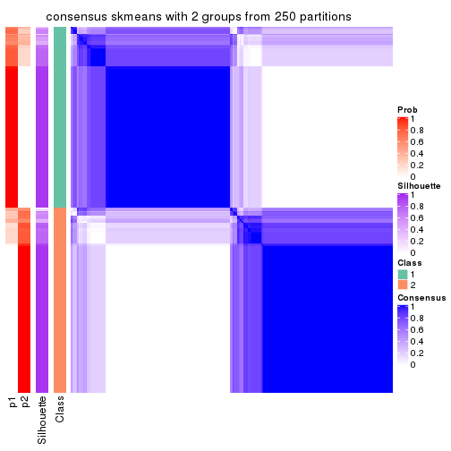</p>

</div>
<div id='tab-MAD-skmeans-consensus-heatmap-2'>
<pre><code class="r">consensus_heatmap(res, k = 3)
</code></pre>

<p>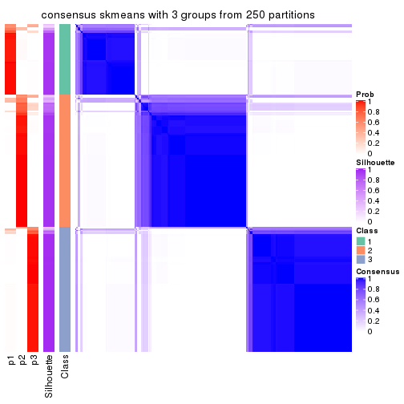</p>

</div>
<div id='tab-MAD-skmeans-consensus-heatmap-3'>
<pre><code class="r">consensus_heatmap(res, k = 4)
</code></pre>

<p>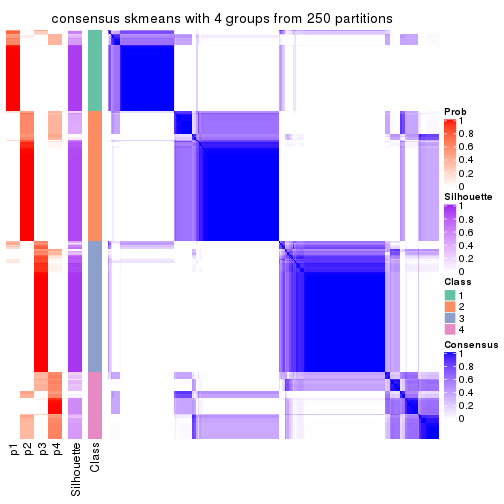</p>

</div>
<div id='tab-MAD-skmeans-consensus-heatmap-4'>
<pre><code class="r">consensus_heatmap(res, k = 5)
</code></pre>

<p>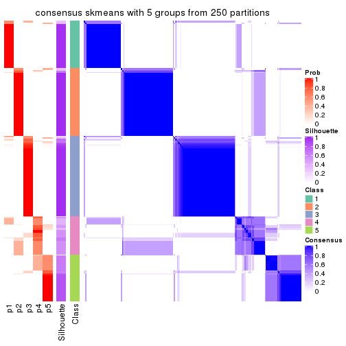</p>

</div>
<div id='tab-MAD-skmeans-consensus-heatmap-5'>
<pre><code class="r">consensus_heatmap(res, k = 6)
</code></pre>

<p>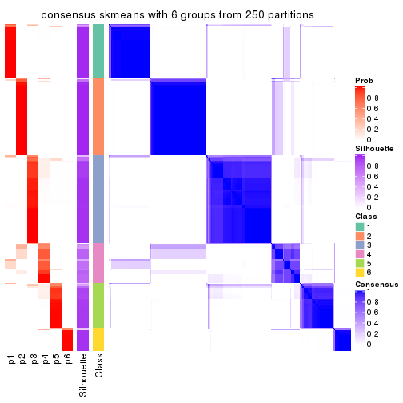</p>

</div>
</div>

Heatmaps for the membership of samples in all partitions to see how consistent they are:


<script>
$( function() {
	$( '#tabs-MAD-skmeans-membership-heatmap' ).tabs();
} );
</script>
<div id='tabs-MAD-skmeans-membership-heatmap'>
<ul>
<li><a href='#tab-MAD-skmeans-membership-heatmap-1'>k = 2</a></li>
<li><a href='#tab-MAD-skmeans-membership-heatmap-2'>k = 3</a></li>
<li><a href='#tab-MAD-skmeans-membership-heatmap-3'>k = 4</a></li>
<li><a href='#tab-MAD-skmeans-membership-heatmap-4'>k = 5</a></li>
<li><a href='#tab-MAD-skmeans-membership-heatmap-5'>k = 6</a></li>
</ul>
<div id='tab-MAD-skmeans-membership-heatmap-1'>
<pre><code class="r">membership_heatmap(res, k = 2)
</code></pre>

<p>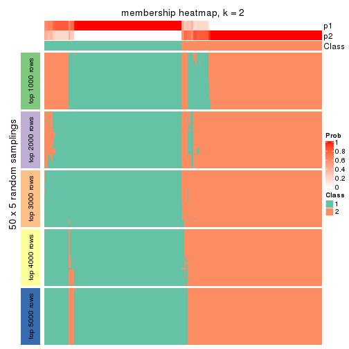</p>

</div>
<div id='tab-MAD-skmeans-membership-heatmap-2'>
<pre><code class="r">membership_heatmap(res, k = 3)
</code></pre>

<p>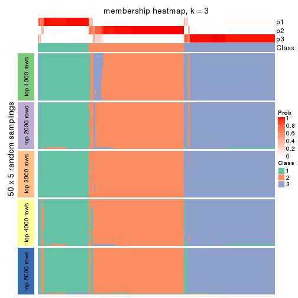</p>

</div>
<div id='tab-MAD-skmeans-membership-heatmap-3'>
<pre><code class="r">membership_heatmap(res, k = 4)
</code></pre>

<p>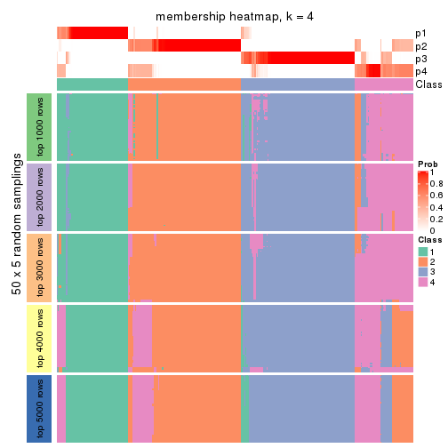</p>

</div>
<div id='tab-MAD-skmeans-membership-heatmap-4'>
<pre><code class="r">membership_heatmap(res, k = 5)
</code></pre>

<p>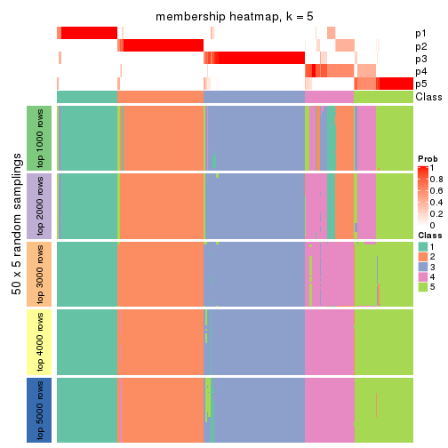</p>

</div>
<div id='tab-MAD-skmeans-membership-heatmap-5'>
<pre><code class="r">membership_heatmap(res, k = 6)
</code></pre>

<p>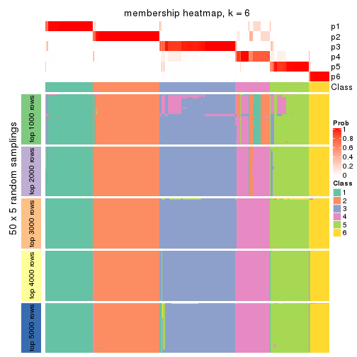</p>

</div>
</div>

As soon as we have had the classes for columns, we can look for signatures
which are significantly different between classes which can be candidate marks
for certain classes. Following are the heatmaps for signatures.


Signature heatmaps where rows are scaled:


<script>
$( function() {
	$( '#tabs-MAD-skmeans-get-signatures' ).tabs();
} );
</script>
<div id='tabs-MAD-skmeans-get-signatures'>
<ul>
<li><a href='#tab-MAD-skmeans-get-signatures-1'>k = 2</a></li>
<li><a href='#tab-MAD-skmeans-get-signatures-2'>k = 3</a></li>
<li><a href='#tab-MAD-skmeans-get-signatures-3'>k = 4</a></li>
<li><a href='#tab-MAD-skmeans-get-signatures-4'>k = 5</a></li>
<li><a href='#tab-MAD-skmeans-get-signatures-5'>k = 6</a></li>
</ul>
<div id='tab-MAD-skmeans-get-signatures-1'>
<pre><code class="r">get_signatures(res, k = 2)
</code></pre>

<p>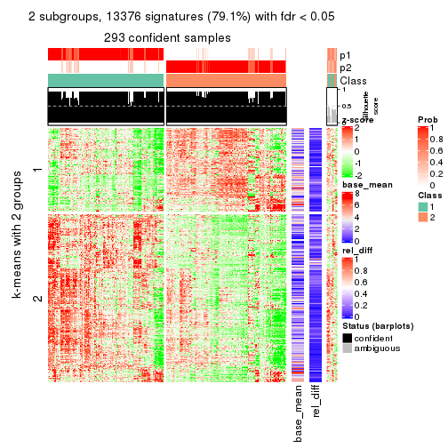</p>

</div>
<div id='tab-MAD-skmeans-get-signatures-2'>
<pre><code class="r">get_signatures(res, k = 3)
</code></pre>

<p>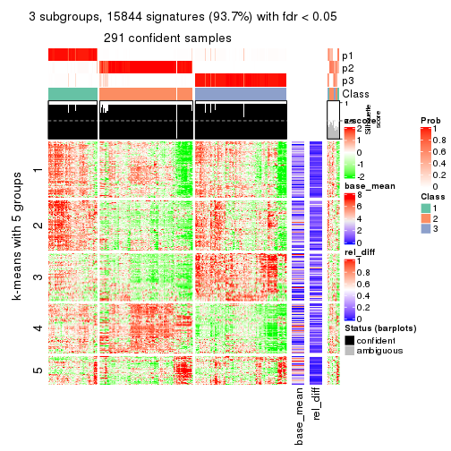</p>

</div>
<div id='tab-MAD-skmeans-get-signatures-3'>
<pre><code class="r">get_signatures(res, k = 4)
</code></pre>

<p>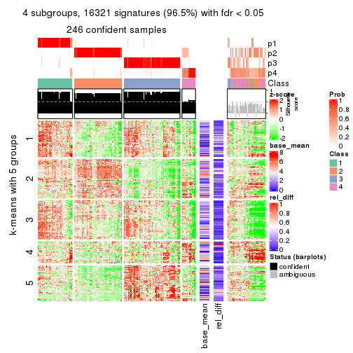</p>

</div>
<div id='tab-MAD-skmeans-get-signatures-4'>
<pre><code class="r">get_signatures(res, k = 5)
</code></pre>

<p>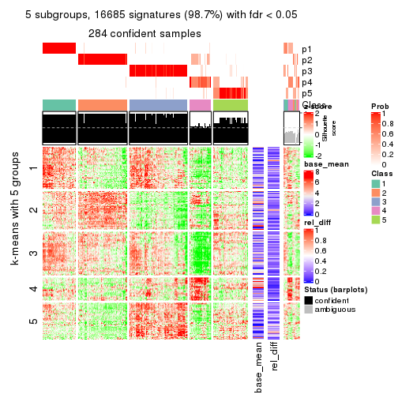</p>

</div>
<div id='tab-MAD-skmeans-get-signatures-5'>
<pre><code class="r">get_signatures(res, k = 6)
</code></pre>

<p>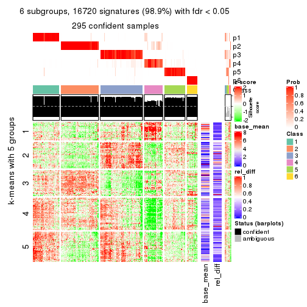</p>

</div>
</div>


Signature heatmaps where rows are not scaled:


<script>
$( function() {
	$( '#tabs-MAD-skmeans-get-signatures-no-scale' ).tabs();
} );
</script>
<div id='tabs-MAD-skmeans-get-signatures-no-scale'>
<ul>
<li><a href='#tab-MAD-skmeans-get-signatures-no-scale-1'>k = 2</a></li>
<li><a href='#tab-MAD-skmeans-get-signatures-no-scale-2'>k = 3</a></li>
<li><a href='#tab-MAD-skmeans-get-signatures-no-scale-3'>k = 4</a></li>
<li><a href='#tab-MAD-skmeans-get-signatures-no-scale-4'>k = 5</a></li>
<li><a href='#tab-MAD-skmeans-get-signatures-no-scale-5'>k = 6</a></li>
</ul>
<div id='tab-MAD-skmeans-get-signatures-no-scale-1'>
<pre><code class="r">get_signatures(res, k = 2, scale_rows = FALSE)
</code></pre>

<p>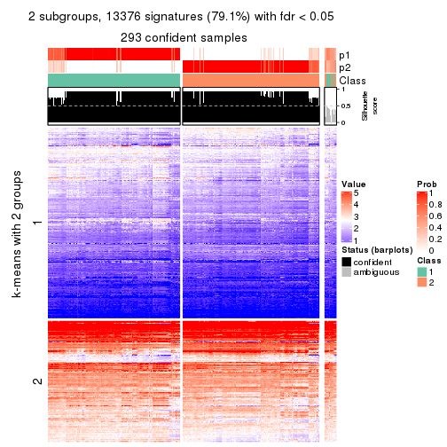</p>

</div>
<div id='tab-MAD-skmeans-get-signatures-no-scale-2'>
<pre><code class="r">get_signatures(res, k = 3, scale_rows = FALSE)
</code></pre>

<p>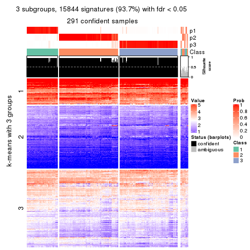</p>

</div>
<div id='tab-MAD-skmeans-get-signatures-no-scale-3'>
<pre><code class="r">get_signatures(res, k = 4, scale_rows = FALSE)
</code></pre>

<p>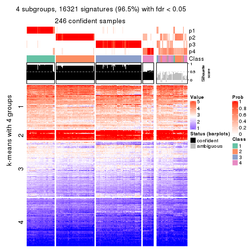</p>

</div>
<div id='tab-MAD-skmeans-get-signatures-no-scale-4'>
<pre><code class="r">get_signatures(res, k = 5, scale_rows = FALSE)
</code></pre>

<p>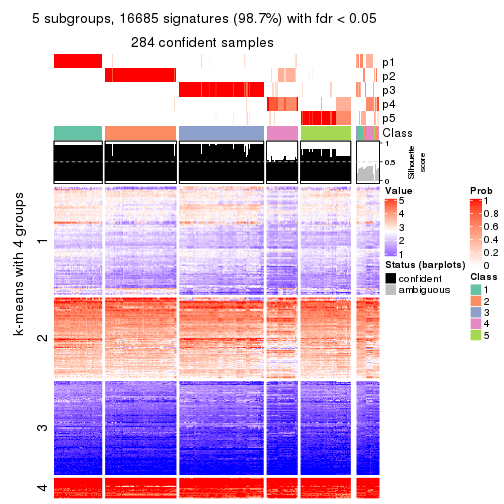</p>

</div>
<div id='tab-MAD-skmeans-get-signatures-no-scale-5'>
<pre><code class="r">get_signatures(res, k = 6, scale_rows = FALSE)
</code></pre>

<p>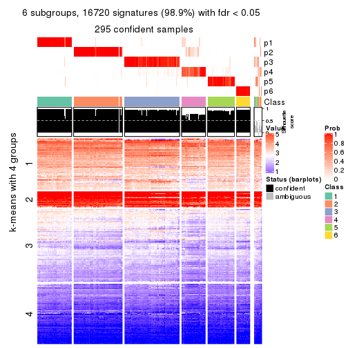</p>

</div>
</div>


Compare the overlap of signatures from different k:

```r
compare_signatures(res)
```

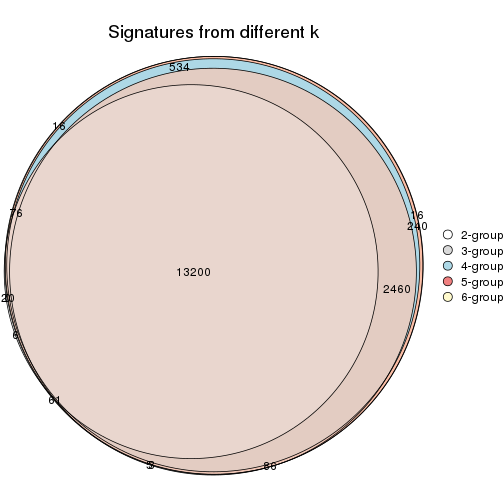

`get_signature()` returns a data frame invisibly. TO get the list of signatures, the function
call should be assigned to a variable explicitly. In following code, if `plot` argument is set
to `FALSE`, no heatmap is plotted while only the differential analysis is performed.

```r
# code only for demonstration
tb = get_signature(res, k = ..., plot = FALSE)
```

An example of the output of `tb` is:

```
#>   which_row         fdr    mean_1    mean_2 scaled_mean_1 scaled_mean_2 km
#> 1        38 0.042760348  8.373488  9.131774    -0.5533452     0.5164555  1
#> 2        40 0.018707592  7.106213  8.469186    -0.6173731     0.5762149  1
#> 3        55 0.019134737 10.221463 11.207825    -0.6159697     0.5749050  1
#> 4        59 0.006059896  5.921854  7.869574    -0.6899429     0.6439467  1
#> 5        60 0.018055526  8.928898 10.211722    -0.6204761     0.5791110  1
#> 6        98 0.009384629 15.714769 14.887706     0.6635654    -0.6193277  2
...
```

The columns in `tb` are:

1. `which_row`: row indices corresponding to the input matrix.
2. `fdr`: FDR for the differential test. 
3. `mean_x`: The mean value in group x.
4. `scaled_mean_x`: The mean value in group x after rows are scaled.
5. `km`: Row groups if k-means clustering is applied to rows.


UMAP plot which shows how samples are separated.


<script>
$( function() {
	$( '#tabs-MAD-skmeans-dimension-reduction' ).tabs();
} );
</script>
<div id='tabs-MAD-skmeans-dimension-reduction'>
<ul>
<li><a href='#tab-MAD-skmeans-dimension-reduction-1'>k = 2</a></li>
<li><a href='#tab-MAD-skmeans-dimension-reduction-2'>k = 3</a></li>
<li><a href='#tab-MAD-skmeans-dimension-reduction-3'>k = 4</a></li>
<li><a href='#tab-MAD-skmeans-dimension-reduction-4'>k = 5</a></li>
<li><a href='#tab-MAD-skmeans-dimension-reduction-5'>k = 6</a></li>
</ul>
<div id='tab-MAD-skmeans-dimension-reduction-1'>
<pre><code class="r">dimension_reduction(res, k = 2, method = &quot;UMAP&quot;)
</code></pre>

<p>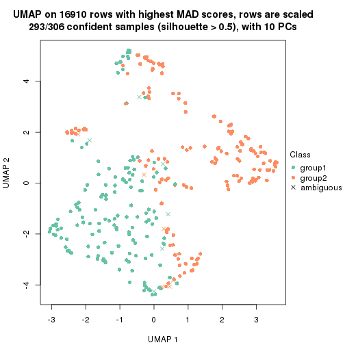</p>

</div>
<div id='tab-MAD-skmeans-dimension-reduction-2'>
<pre><code class="r">dimension_reduction(res, k = 3, method = &quot;UMAP&quot;)
</code></pre>

<p>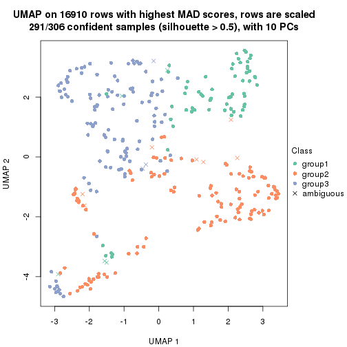</p>

</div>
<div id='tab-MAD-skmeans-dimension-reduction-3'>
<pre><code class="r">dimension_reduction(res, k = 4, method = &quot;UMAP&quot;)
</code></pre>

<p>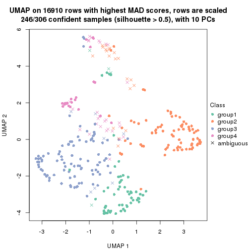</p>

</div>
<div id='tab-MAD-skmeans-dimension-reduction-4'>
<pre><code class="r">dimension_reduction(res, k = 5, method = &quot;UMAP&quot;)
</code></pre>

<p>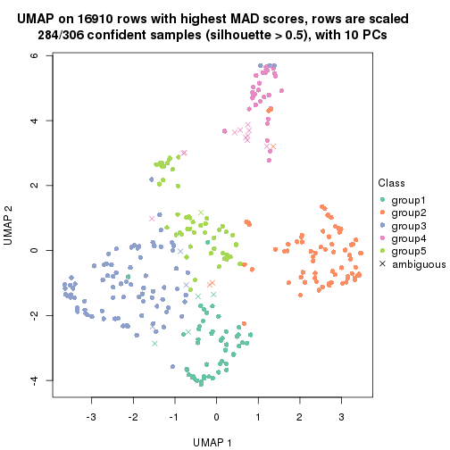</p>

</div>
<div id='tab-MAD-skmeans-dimension-reduction-5'>
<pre><code class="r">dimension_reduction(res, k = 6, method = &quot;UMAP&quot;)
</code></pre>

<p>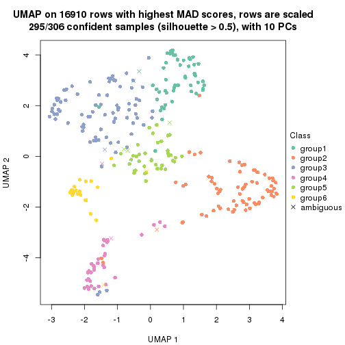</p>

</div>
</div>


Following heatmap shows how subgroups are split when increasing `k`:

```r
collect_classes(res)
```

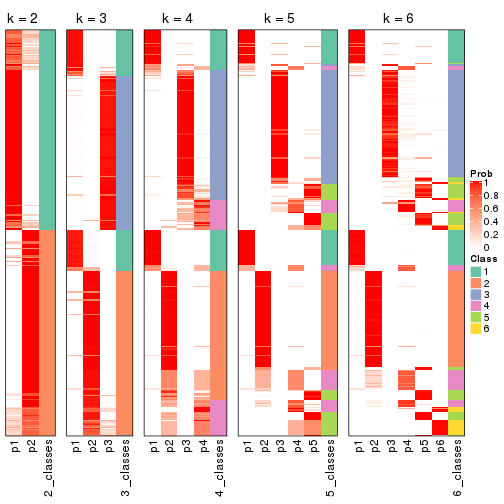


If matrix rows can be associated to genes, consider to use `GO_Enrichment(res,
...)` to perform function enrichment for the signature genes.


 

---------------------------------------------------


### MAD:pam


The object with results only for a single top-value method and a single partition method 
can be extracted as:

```r
res = res_list["MAD", "pam"]
# you can also extract it by
# res = res_list["MAD:pam"]
```

A summary of `res` and all the functions that can be applied to it:

```r
res
```

```
#> A 'ConsensusPartition' object with k = 2, 3, 4, 5, 6.
#>   On a matrix with 16910 rows and 306 columns.
#>   Top rows (1000, 2000, 3000, 4000, 5000) are extracted by 'MAD' method.
#>   Subgroups are detected by 'pam' method.
#>   Performed in total 1250 partitions by row resampling.
#>   Best k for subgroups seems to be 2.
#> 
#> Following methods can be applied to this 'ConsensusPartition' object:
#>  [1] "cola_report"             "collect_classes"         "collect_plots"          
#>  [4] "collect_stats"           "colnames"                "compare_signatures"     
#>  [7] "consensus_heatmap"       "dimension_reduction"     "functional_enrichment"  
#> [10] "get_anno_col"            "get_anno"                "get_classes"            
#> [13] "get_consensus"           "get_matrix"              "get_membership"         
#> [16] "get_param"               "get_signatures"          "get_stats"              
#> [19] "is_best_k"               "is_stable_k"             "membership_heatmap"     
#> [22] "ncol"                    "nrow"                    "plot_ecdf"              
#> [25] "rownames"                "select_partition_number" "show"                   
#> [28] "suggest_best_k"          "test_to_known_factors"
```

`collect_plots()` function collects all the plots made from `res` for all `k` (number of partitions)
into one single page to provide an easy and fast comparison between different `k`.

```r
collect_plots(res)
```

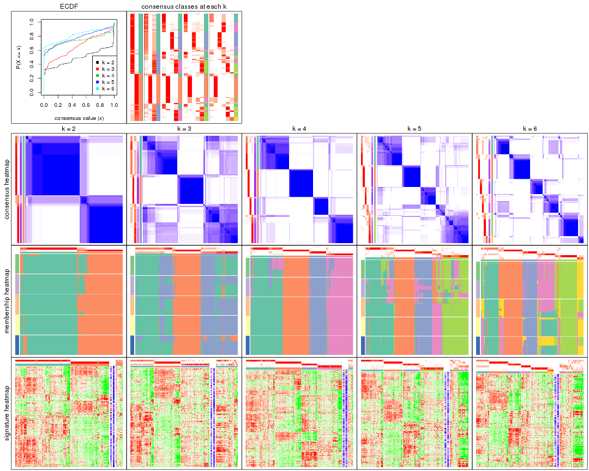

The plots are:

- The first row: a plot of the ECDF (Empirical cumulative distribution
  function) curves of the consensus matrix for each `k` and the heatmap of
  predicted classes for each `k`.
- The second row: heatmaps of the consensus matrix for each `k`.
- The third row: heatmaps of the membership matrix for each `k`.
- The fouth row: heatmaps of the signatures for each `k`.

All the plots in panels can be made by individual functions and they are
plotted later in this section.

`select_partition_number()` produces several plots showing different
statistics for choosing "optimized" `k`. There are following statistics:

- ECDF curves of the consensus matrix for each `k`;
- 1-PAC. [The PAC
  score](https://en.wikipedia.org/wiki/Consensus_clustering#Over-interpretation_potential_of_consensus_clustering)
  measures the proportion of the ambiguous subgrouping.
- Mean silhouette score.
- Concordance. The mean probability of fiting the consensus class ids in all
  partitions.
- Area increased. Denote $A_k$ as the area under the ECDF curve for current
  `k`, the area increased is defined as $A_k - A_{k-1}$.
- Rand index. The percent of pairs of samples that are both in a same cluster
  or both are not in a same cluster in the partition of k and k-1.
- Jaccard index. The ratio of pairs of samples are both in a same cluster in
  the partition of k and k-1 and the pairs of samples are both in a same
  cluster in the partition k or k-1.

The detailed explanations of these statistics can be found in [the cola
vignette](http://bioconductor.org/packages/devel/bioc/vignettes/cola/inst/doc/cola.html#toc_13).

Generally speaking, lower PAC score, higher mean silhouette score or higher
concordance corresponds to better partition. Rand index and Jaccard index
measure how similar the current partition is compared to partition with `k-1`.
If they are too similar, we won't accept `k` is better than `k-1`.

```r
select_partition_number(res)
```

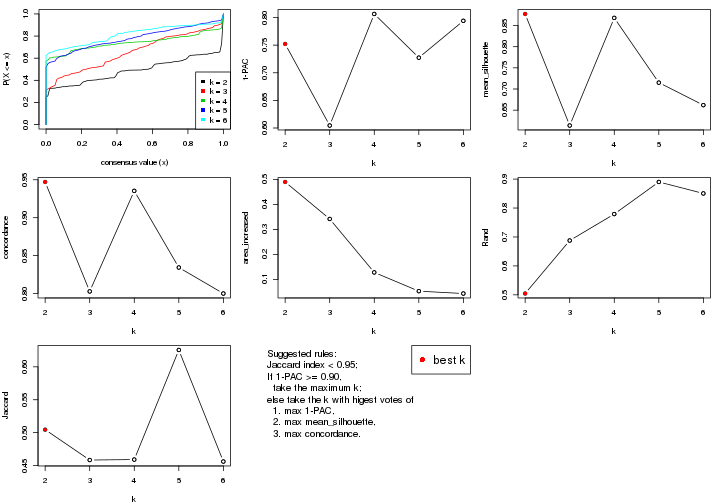

The numeric values for all these statistics can be obtained by `get_stats()`.

```r
get_stats(res)
```

```
#>   k 1-PAC mean_silhouette concordance area_increased  Rand Jaccard
#> 2 2 0.752           0.877       0.947         0.4895 0.505   0.505
#> 3 3 0.604           0.614       0.803         0.3417 0.688   0.458
#> 4 4 0.806           0.868       0.935         0.1280 0.779   0.459
#> 5 5 0.727           0.715       0.834         0.0532 0.890   0.626
#> 6 6 0.794           0.662       0.800         0.0437 0.850   0.456
```

`suggest_best_k()` suggests the best $k$ based on these statistics. The rules are as follows:

- All $k$ with Jaccard index larger than 0.95 are removed because the increase of
  the partition number does not provides enough extra information. If all $k$ are removed,
  the best $k$ is assigned by `NA`.
- For $k$ with 1-PAC larger than 0.9, the maximal $k$ is taken as the "best k". Other $k$ is called "optional k".
- If it does not fit the second rule. The $k$ with the highest vote of highest
  1-PAC, mean silhouette and concordance is taken as the "best k".

```r
suggest_best_k(res)
```

```
#> [1] 2
```


Following shows the table of the partitions (You need to click the **show/hide
code output** link to see it). The membership matrix (columns with name `p*`)
is inferred by
[`clue::cl_consensus()`](https://www.rdocumentation.org/link/cl_consensus?package=clue)
function with the `SE` method. Basically the value in the membership matrix
represents the probability to belong to a certain group. The finall class
label for an item is determined with the group with highest probability it
belongs to.

In `get_classes()` function, the entropy is calculated from the membership
matrix and the silhouette score is calculated from the consensus matrix.


<script>
$( function() {
	$( '#tabs-MAD-pam-get-classes' ).tabs();
} );
</script>
<div id='tabs-MAD-pam-get-classes'>
<ul>
<li><a href='#tab-MAD-pam-get-classes-1'>k = 2</a></li>
<li><a href='#tab-MAD-pam-get-classes-2'>k = 3</a></li>
<li><a href='#tab-MAD-pam-get-classes-3'>k = 4</a></li>
<li><a href='#tab-MAD-pam-get-classes-4'>k = 5</a></li>
<li><a href='#tab-MAD-pam-get-classes-5'>k = 6</a></li>
</ul>

<div id='tab-MAD-pam-get-classes-1'>
<p><a id='tab-MAD-pam-get-classes-1-a' style='color:#0366d6' href='#'>show/hide code output</a></p>
<pre><code class="r">cbind(get_classes(res, k = 2), get_membership(res, k = 2))
</code></pre>

<pre><code>#&gt;            class entropy silhouette    p1    p2
#&gt; SRR1609360     1  0.7745     0.6942 0.772 0.228
#&gt; SRR1609361     2  0.5059     0.8207 0.112 0.888
#&gt; SRR1609362     2  0.0000     0.9168 0.000 1.000
#&gt; SRR1609363     2  0.0000     0.9168 0.000 1.000
#&gt; SRR1609364     2  0.0000     0.9168 0.000 1.000
#&gt; SRR1609365     2  0.0000     0.9168 0.000 1.000
#&gt; SRR1609366     2  0.0000     0.9168 0.000 1.000
#&gt; SRR1609367     1  0.1184     0.9532 0.984 0.016
#&gt; SRR1609368     2  0.0000     0.9168 0.000 1.000
#&gt; SRR1609369     2  0.0000     0.9168 0.000 1.000
#&gt; SRR1609370     1  0.1184     0.9532 0.984 0.016
#&gt; SRR1609371     2  0.0000     0.9168 0.000 1.000
#&gt; SRR1609372     1  0.1184     0.9532 0.984 0.016
#&gt; SRR1609373     2  0.0000     0.9168 0.000 1.000
#&gt; SRR1609374     2  0.0000     0.9168 0.000 1.000
#&gt; SRR1609375     2  0.0000     0.9168 0.000 1.000
#&gt; SRR1609377     2  0.9129     0.5414 0.328 0.672
#&gt; SRR1609376     2  0.0000     0.9168 0.000 1.000
#&gt; SRR1609378     2  0.0000     0.9168 0.000 1.000
#&gt; SRR1609379     1  0.4298     0.8826 0.912 0.088
#&gt; SRR1609382     2  0.0000     0.9168 0.000 1.000
#&gt; SRR1609383     1  0.1414     0.9503 0.980 0.020
#&gt; SRR1609381     1  0.1184     0.9532 0.984 0.016
#&gt; SRR1609384     2  0.0000     0.9168 0.000 1.000
#&gt; SRR1609386     2  0.0000     0.9168 0.000 1.000
#&gt; SRR1609385     2  0.0000     0.9168 0.000 1.000
#&gt; SRR1609387     1  0.1184     0.9532 0.984 0.016
#&gt; SRR1609388     2  0.0000     0.9168 0.000 1.000
#&gt; SRR1609390     1  0.1184     0.9532 0.984 0.016
#&gt; SRR1609393     2  0.0000     0.9168 0.000 1.000
#&gt; SRR1609394     2  0.0000     0.9168 0.000 1.000
#&gt; SRR1609392     2  0.0000     0.9168 0.000 1.000
#&gt; SRR1609391     2  0.0000     0.9168 0.000 1.000
#&gt; SRR1609395     1  0.1184     0.9532 0.984 0.016
#&gt; SRR1609396     1  0.1184     0.9532 0.984 0.016
#&gt; SRR1609398     2  0.0000     0.9168 0.000 1.000
#&gt; SRR1609399     1  0.1184     0.9532 0.984 0.016
#&gt; SRR1609400     1  0.1184     0.9532 0.984 0.016
#&gt; SRR1609397     2  0.0000     0.9168 0.000 1.000
#&gt; SRR1609401     2  0.0000     0.9168 0.000 1.000
#&gt; SRR1609402     2  0.0000     0.9168 0.000 1.000
#&gt; SRR1609405     2  0.0000     0.9168 0.000 1.000
#&gt; SRR1609404     2  0.0000     0.9168 0.000 1.000
#&gt; SRR1609406     2  0.0000     0.9168 0.000 1.000
#&gt; SRR1609408     2  0.0000     0.9168 0.000 1.000
#&gt; SRR1609403     1  0.7219     0.7370 0.800 0.200
#&gt; SRR1609410     1  0.1184     0.9532 0.984 0.016
#&gt; SRR1609411     2  0.0000     0.9168 0.000 1.000
#&gt; SRR1609407     2  0.0000     0.9168 0.000 1.000
#&gt; SRR1609413     1  0.7219     0.7370 0.800 0.200
#&gt; SRR1609412     1  0.0000     0.9617 1.000 0.000
#&gt; SRR1609414     1  0.0000     0.9617 1.000 0.000
#&gt; SRR1609415     1  0.0000     0.9617 1.000 0.000
#&gt; SRR1609416     1  0.0000     0.9617 1.000 0.000
#&gt; SRR1609417     1  0.0000     0.9617 1.000 0.000
#&gt; SRR1609418     1  0.7299     0.7317 0.796 0.204
#&gt; SRR1609419     2  0.0000     0.9168 0.000 1.000
#&gt; SRR1609420     2  0.0000     0.9168 0.000 1.000
#&gt; SRR1609421     2  0.9732     0.4187 0.404 0.596
#&gt; SRR1609422     2  0.9833     0.3689 0.424 0.576
#&gt; SRR1609423     2  0.0000     0.9168 0.000 1.000
#&gt; SRR1609424     2  0.0000     0.9168 0.000 1.000
#&gt; SRR1609425     2  0.0000     0.9168 0.000 1.000
#&gt; SRR1609426     2  0.0000     0.9168 0.000 1.000
#&gt; SRR1609427     1  0.0000     0.9617 1.000 0.000
#&gt; SRR1609428     2  0.0000     0.9168 0.000 1.000
#&gt; SRR1609429     1  0.1184     0.9532 0.984 0.016
#&gt; SRR1609430     1  0.0000     0.9617 1.000 0.000
#&gt; SRR1609431     2  0.9732     0.4187 0.404 0.596
#&gt; SRR1609432     2  0.0000     0.9168 0.000 1.000
#&gt; SRR1609433     1  0.0000     0.9617 1.000 0.000
#&gt; SRR1609434     2  0.0000     0.9168 0.000 1.000
#&gt; SRR1609435     1  0.0000     0.9617 1.000 0.000
#&gt; SRR1609436     1  0.0000     0.9617 1.000 0.000
#&gt; SRR1609437     2  0.0000     0.9168 0.000 1.000
#&gt; SRR1609438     2  0.0000     0.9168 0.000 1.000
#&gt; SRR1609439     1  0.0000     0.9617 1.000 0.000
#&gt; SRR1609440     1  0.1184     0.9532 0.984 0.016
#&gt; SRR1609441     2  0.6887     0.7574 0.184 0.816
#&gt; SRR1609442     2  0.0000     0.9168 0.000 1.000
#&gt; SRR1609443     1  0.0000     0.9617 1.000 0.000
#&gt; SRR1609444     1  0.0376     0.9597 0.996 0.004
#&gt; SRR1609445     1  0.0000     0.9617 1.000 0.000
#&gt; SRR1609446     2  0.9608     0.4520 0.384 0.616
#&gt; SRR1609447     1  0.0000     0.9617 1.000 0.000
#&gt; SRR1609448     2  0.0000     0.9168 0.000 1.000
#&gt; SRR1609449     1  0.0672     0.9576 0.992 0.008
#&gt; SRR1609450     2  0.0000     0.9168 0.000 1.000
#&gt; SRR1609451     1  0.0000     0.9617 1.000 0.000
#&gt; SRR1609452     1  0.7815     0.6698 0.768 0.232
#&gt; SRR1609453     1  0.0000     0.9617 1.000 0.000
#&gt; SRR1609454     2  0.0000     0.9168 0.000 1.000
#&gt; SRR1609455     2  0.8813     0.5987 0.300 0.700
#&gt; SRR1609456     2  0.9635     0.4437 0.388 0.612
#&gt; SRR1609457     1  0.0000     0.9617 1.000 0.000
#&gt; SRR1609458     1  0.0000     0.9617 1.000 0.000
#&gt; SRR1609459     1  0.0000     0.9617 1.000 0.000
#&gt; SRR1609460     2  0.7219     0.7435 0.200 0.800
#&gt; SRR1609461     1  0.0000     0.9617 1.000 0.000
#&gt; SRR1609462     1  0.0000     0.9617 1.000 0.000
#&gt; SRR1609464     1  0.0000     0.9617 1.000 0.000
#&gt; SRR1609463     1  0.0000     0.9617 1.000 0.000
#&gt; SRR1609465     2  0.5408     0.8216 0.124 0.876
#&gt; SRR1609466     1  0.8016     0.6568 0.756 0.244
#&gt; SRR1609467     1  0.0000     0.9617 1.000 0.000
#&gt; SRR1609469     2  0.0000     0.9168 0.000 1.000
#&gt; SRR1609470     2  0.9963     0.2584 0.464 0.536
#&gt; SRR1609472     1  0.7815     0.6697 0.768 0.232
#&gt; SRR1609471     1  0.1184     0.9532 0.984 0.016
#&gt; SRR1609474     2  0.0000     0.9168 0.000 1.000
#&gt; SRR1609473     2  0.0000     0.9168 0.000 1.000
#&gt; SRR1609475     2  0.0000     0.9168 0.000 1.000
#&gt; SRR1609478     2  0.9815     0.3795 0.420 0.580
#&gt; SRR1609476     1  0.0000     0.9617 1.000 0.000
#&gt; SRR1609477     1  0.0000     0.9617 1.000 0.000
#&gt; SRR1609479     2  0.0000     0.9168 0.000 1.000
#&gt; SRR1609481     2  0.4298     0.8533 0.088 0.912
#&gt; SRR1609480     1  0.0000     0.9617 1.000 0.000
#&gt; SRR1609482     1  0.0000     0.9617 1.000 0.000
#&gt; SRR1609484     2  0.0000     0.9168 0.000 1.000
#&gt; SRR1609483     1  0.0000     0.9617 1.000 0.000
#&gt; SRR1609486     1  0.0000     0.9617 1.000 0.000
#&gt; SRR1609485     1  0.0000     0.9617 1.000 0.000
#&gt; SRR1609487     2  0.9815     0.2762 0.420 0.580
#&gt; SRR1609488     1  0.0000     0.9617 1.000 0.000
#&gt; SRR1609489     2  0.0000     0.9168 0.000 1.000
#&gt; SRR1609490     2  0.0000     0.9168 0.000 1.000
#&gt; SRR1609491     1  0.0000     0.9617 1.000 0.000
#&gt; SRR1609492     2  0.0000     0.9168 0.000 1.000
#&gt; SRR1609493     1  0.9922     0.0561 0.552 0.448
#&gt; SRR1609494     2  0.0000     0.9168 0.000 1.000
#&gt; SRR1609495     1  0.0938     0.9555 0.988 0.012
#&gt; SRR1609496     1  0.0000     0.9617 1.000 0.000
#&gt; SRR1609497     1  0.0000     0.9617 1.000 0.000
#&gt; SRR1609498     1  0.0000     0.9617 1.000 0.000
#&gt; SRR1609499     2  0.0000     0.9168 0.000 1.000
#&gt; SRR1609500     1  0.0000     0.9617 1.000 0.000
#&gt; SRR1609501     2  0.9710     0.4251 0.400 0.600
#&gt; SRR1609502     2  0.0000     0.9168 0.000 1.000
#&gt; SRR1609503     2  0.7376     0.7348 0.208 0.792
#&gt; SRR1609504     1  0.0000     0.9617 1.000 0.000
#&gt; SRR1609505     1  0.0000     0.9617 1.000 0.000
#&gt; SRR1609506     2  0.0000     0.9168 0.000 1.000
#&gt; SRR1609507     1  0.0000     0.9617 1.000 0.000
#&gt; SRR1609508     2  0.0000     0.9168 0.000 1.000
#&gt; SRR1609509     2  0.0000     0.9168 0.000 1.000
#&gt; SRR1609510     2  0.7219     0.7435 0.200 0.800
#&gt; SRR1609512     1  0.0000     0.9617 1.000 0.000
#&gt; SRR1609511     1  0.0000     0.9617 1.000 0.000
#&gt; SRR1609513     1  0.0000     0.9617 1.000 0.000
#&gt; SRR1609514     1  0.7219     0.7240 0.800 0.200
#&gt; SRR1609515     2  0.0000     0.9168 0.000 1.000
#&gt; SRR1609516     1  0.0000     0.9617 1.000 0.000
#&gt; SRR1609517     2  0.1843     0.8983 0.028 0.972
#&gt; SRR1609518     1  0.1184     0.9532 0.984 0.016
#&gt; SRR1609519     1  0.0000     0.9617 1.000 0.000
#&gt; SRR1609520     2  0.0000     0.9168 0.000 1.000
#&gt; SRR1609521     1  0.0000     0.9617 1.000 0.000
#&gt; SRR1609522     1  0.0000     0.9617 1.000 0.000
#&gt; SRR1609523     2  0.9775     0.3994 0.412 0.588
#&gt; SRR1609524     2  0.0000     0.9168 0.000 1.000
#&gt; SRR1609526     1  0.0000     0.9617 1.000 0.000
#&gt; SRR1609525     2  0.9732     0.4187 0.404 0.596
#&gt; SRR1609527     1  0.1184     0.9532 0.984 0.016
#&gt; SRR1609529     1  0.0000     0.9617 1.000 0.000
#&gt; SRR1609528     2  0.9754     0.4093 0.408 0.592
#&gt; SRR1609530     1  0.0000     0.9617 1.000 0.000
#&gt; SRR1609531     2  0.0000     0.9168 0.000 1.000
#&gt; SRR1609532     1  0.0000     0.9617 1.000 0.000
#&gt; SRR1609533     2  0.9732     0.4187 0.404 0.596
#&gt; SRR1609534     1  0.0000     0.9617 1.000 0.000
#&gt; SRR1609535     2  0.3431     0.8725 0.064 0.936
#&gt; SRR1609537     2  0.0000     0.9168 0.000 1.000
#&gt; SRR1609536     1  0.0000     0.9617 1.000 0.000
#&gt; SRR1609538     2  0.0000     0.9168 0.000 1.000
#&gt; SRR1609539     1  0.0000     0.9617 1.000 0.000
#&gt; SRR1609540     1  0.0000     0.9617 1.000 0.000
#&gt; SRR1609541     1  0.8661     0.5560 0.712 0.288
#&gt; SRR1609542     2  0.0000     0.9168 0.000 1.000
#&gt; SRR1609543     1  0.0000     0.9617 1.000 0.000
#&gt; SRR1609544     1  0.0000     0.9617 1.000 0.000
#&gt; SRR1609545     1  0.0000     0.9617 1.000 0.000
#&gt; SRR1609546     1  0.0000     0.9617 1.000 0.000
#&gt; SRR1609547     1  0.0000     0.9617 1.000 0.000
#&gt; SRR1609548     1  0.2948     0.9160 0.948 0.052
#&gt; SRR1609549     2  0.0000     0.9168 0.000 1.000
#&gt; SRR1609550     2  0.0000     0.9168 0.000 1.000
#&gt; SRR1609551     1  0.0000     0.9617 1.000 0.000
#&gt; SRR1609552     1  0.0000     0.9617 1.000 0.000
#&gt; SRR1609553     1  0.0000     0.9617 1.000 0.000
#&gt; SRR1609554     1  0.0000     0.9617 1.000 0.000
#&gt; SRR1609555     1  0.0000     0.9617 1.000 0.000
#&gt; SRR1609556     1  0.0000     0.9617 1.000 0.000
#&gt; SRR1609557     1  0.1414     0.9476 0.980 0.020
#&gt; SRR1609558     1  0.0000     0.9617 1.000 0.000
#&gt; SRR1609559     1  0.0672     0.9566 0.992 0.008
#&gt; SRR1609560     1  0.7299     0.7317 0.796 0.204
#&gt; SRR1609561     1  0.0000     0.9617 1.000 0.000
#&gt; SRR1609562     2  0.0000     0.9168 0.000 1.000
#&gt; SRR1609563     2  0.0000     0.9168 0.000 1.000
#&gt; SRR1609564     1  0.0000     0.9617 1.000 0.000
#&gt; SRR1609565     2  0.0000     0.9168 0.000 1.000
#&gt; SRR1609566     2  0.0000     0.9168 0.000 1.000
#&gt; SRR1609567     2  0.0000     0.9168 0.000 1.000
#&gt; SRR1609568     1  0.8443     0.6163 0.728 0.272
#&gt; SRR1609569     1  0.0000     0.9617 1.000 0.000
#&gt; SRR1609570     1  0.0000     0.9617 1.000 0.000
#&gt; SRR1609571     1  0.0000     0.9617 1.000 0.000
#&gt; SRR1609572     1  0.0000     0.9617 1.000 0.000
#&gt; SRR1609573     1  0.0000     0.9617 1.000 0.000
#&gt; SRR1609574     1  0.0000     0.9617 1.000 0.000
#&gt; SRR1609575     2  0.0000     0.9168 0.000 1.000
#&gt; SRR1609576     2  0.0000     0.9168 0.000 1.000
#&gt; SRR1609578     1  0.0000     0.9617 1.000 0.000
#&gt; SRR1609577     1  0.1184     0.9532 0.984 0.016
#&gt; SRR1609579     1  0.0000     0.9617 1.000 0.000
#&gt; SRR1609580     1  0.0000     0.9617 1.000 0.000
#&gt; SRR1609582     1  0.0000     0.9617 1.000 0.000
#&gt; SRR1609581     1  0.1414     0.9506 0.980 0.020
#&gt; SRR1609583     1  0.0000     0.9617 1.000 0.000
#&gt; SRR1609584     1  0.0000     0.9617 1.000 0.000
#&gt; SRR1609585     1  0.0000     0.9617 1.000 0.000
#&gt; SRR1609586     2  0.0000     0.9168 0.000 1.000
#&gt; SRR1609587     1  0.0000     0.9617 1.000 0.000
#&gt; SRR1609588     1  0.2948     0.9228 0.948 0.052
#&gt; SRR1609589     2  0.9635     0.4437 0.388 0.612
#&gt; SRR1609590     1  0.0000     0.9617 1.000 0.000
#&gt; SRR1609592     1  0.7602     0.6910 0.780 0.220
#&gt; SRR1609591     1  0.0000     0.9617 1.000 0.000
#&gt; SRR1609593     1  0.0000     0.9617 1.000 0.000
#&gt; SRR1609594     2  0.0000     0.9168 0.000 1.000
#&gt; SRR1609595     2  0.9732     0.4187 0.404 0.596
#&gt; SRR1609596     2  0.0000     0.9168 0.000 1.000
#&gt; SRR1609597     2  0.0000     0.9168 0.000 1.000
#&gt; SRR1609598     1  0.7299     0.7175 0.796 0.204
#&gt; SRR1609599     1  0.0000     0.9617 1.000 0.000
#&gt; SRR1609600     1  0.0000     0.9617 1.000 0.000
#&gt; SRR1609601     1  0.0000     0.9617 1.000 0.000
#&gt; SRR1609602     1  0.7376     0.7110 0.792 0.208
#&gt; SRR1609603     2  0.9710     0.3277 0.400 0.600
#&gt; SRR1609604     2  0.0000     0.9168 0.000 1.000
#&gt; SRR1609605     2  0.9608     0.4520 0.384 0.616
#&gt; SRR1609606     2  0.9427     0.5084 0.360 0.640
#&gt; SRR1609607     1  0.0000     0.9617 1.000 0.000
#&gt; SRR1609608     1  0.0000     0.9617 1.000 0.000
#&gt; SRR1609609     1  0.8713     0.5619 0.708 0.292
#&gt; SRR1609610     1  0.0000     0.9617 1.000 0.000
#&gt; SRR1609611     2  0.0000     0.9168 0.000 1.000
#&gt; SRR1609613     2  0.0000     0.9168 0.000 1.000
#&gt; SRR1609612     1  0.0000     0.9617 1.000 0.000
#&gt; SRR1609614     1  0.0000     0.9617 1.000 0.000
#&gt; SRR1609615     1  0.1184     0.9532 0.984 0.016
#&gt; SRR1609616     1  0.0000     0.9617 1.000 0.000
#&gt; SRR1609617     2  0.9732     0.4187 0.404 0.596
#&gt; SRR1609618     1  0.0000     0.9617 1.000 0.000
#&gt; SRR1609619     1  0.1184     0.9532 0.984 0.016
#&gt; SRR1609620     2  0.0000     0.9168 0.000 1.000
#&gt; SRR1609621     2  0.0000     0.9168 0.000 1.000
#&gt; SRR1609622     1  0.0000     0.9617 1.000 0.000
#&gt; SRR1609623     1  0.0000     0.9617 1.000 0.000
#&gt; SRR1609624     1  0.1184     0.9532 0.984 0.016
#&gt; SRR1609625     1  0.0000     0.9617 1.000 0.000
#&gt; SRR1609626     1  0.0000     0.9617 1.000 0.000
#&gt; SRR1609627     2  0.0000     0.9168 0.000 1.000
#&gt; SRR1609628     2  0.0000     0.9168 0.000 1.000
#&gt; SRR1609629     1  0.0000     0.9617 1.000 0.000
#&gt; SRR1609630     2  0.0000     0.9168 0.000 1.000
#&gt; SRR1609631     1  0.1184     0.9532 0.984 0.016
#&gt; SRR1609632     1  0.7139     0.7430 0.804 0.196
#&gt; SRR1609633     1  0.1184     0.9532 0.984 0.016
#&gt; SRR1609634     2  0.0000     0.9168 0.000 1.000
#&gt; SRR1609635     1  0.0000     0.9617 1.000 0.000
#&gt; SRR1609636     2  0.0000     0.9168 0.000 1.000
#&gt; SRR1609637     1  0.0000     0.9617 1.000 0.000
#&gt; SRR1609638     2  0.0000     0.9168 0.000 1.000
#&gt; SRR1609639     2  0.0000     0.9168 0.000 1.000
#&gt; SRR1609640     1  0.0000     0.9617 1.000 0.000
#&gt; SRR1609641     1  0.1184     0.9532 0.984 0.016
#&gt; SRR1609642     1  0.1184     0.9532 0.984 0.016
#&gt; SRR1609643     1  0.0000     0.9617 1.000 0.000
#&gt; SRR1609644     1  0.9635     0.3561 0.612 0.388
#&gt; SRR1609645     1  0.0000     0.9617 1.000 0.000
#&gt; SRR1609646     1  0.0000     0.9617 1.000 0.000
#&gt; SRR1609647     2  0.7219     0.7435 0.200 0.800
#&gt; SRR1609649     1  0.0000     0.9617 1.000 0.000
#&gt; SRR1609648     2  0.0000     0.9168 0.000 1.000
#&gt; SRR1609651     2  0.0000     0.9168 0.000 1.000
#&gt; SRR1609650     1  0.6247     0.7900 0.844 0.156
#&gt; SRR1609652     1  0.0000     0.9617 1.000 0.000
#&gt; SRR1609653     2  0.0000     0.9168 0.000 1.000
#&gt; SRR1609654     2  0.0000     0.9168 0.000 1.000
#&gt; SRR1609655     1  0.0000     0.9617 1.000 0.000
#&gt; SRR1609657     1  0.1184     0.9532 0.984 0.016
#&gt; SRR1609656     1  0.1184     0.9532 0.984 0.016
#&gt; SRR1609658     2  0.0000     0.9168 0.000 1.000
#&gt; SRR1609659     2  0.0000     0.9168 0.000 1.000
#&gt; SRR1609660     1  0.0000     0.9617 1.000 0.000
#&gt; SRR1609661     1  0.0000     0.9617 1.000 0.000
#&gt; SRR1609662     2  0.0000     0.9168 0.000 1.000
#&gt; SRR1609663     1  0.0000     0.9617 1.000 0.000
#&gt; SRR1609664     2  0.9732     0.4187 0.404 0.596
#&gt; SRR1609665     2  0.0000     0.9168 0.000 1.000
#&gt; SRR1609666     2  0.0000     0.9168 0.000 1.000
#&gt; SRR1609667     1  0.0000     0.9617 1.000 0.000
#&gt; SRR1609668     2  0.9358     0.5234 0.352 0.648
#&gt; SRR1609669     1  0.9686     0.3354 0.604 0.396
</code></pre>

<script>
$('#tab-MAD-pam-get-classes-1-a').parent().next().next().hide();
$('#tab-MAD-pam-get-classes-1-a').click(function(){
  $('#tab-MAD-pam-get-classes-1-a').parent().next().next().toggle();
  return(false);
});
</script>
</div>

<div id='tab-MAD-pam-get-classes-2'>
<p><a id='tab-MAD-pam-get-classes-2-a' style='color:#0366d6' href='#'>show/hide code output</a></p>
<pre><code class="r">cbind(get_classes(res, k = 3), get_membership(res, k = 3))
</code></pre>

<pre><code>#&gt;            class entropy silhouette    p1    p2    p3
#&gt; SRR1609360     1  0.4702     0.2556 0.788 0.000 0.212
#&gt; SRR1609361     1  0.8264    -0.2206 0.556 0.088 0.356
#&gt; SRR1609362     2  0.7085     0.4735 0.356 0.612 0.032
#&gt; SRR1609363     2  0.0000     0.9584 0.000 1.000 0.000
#&gt; SRR1609364     2  0.0000     0.9584 0.000 1.000 0.000
#&gt; SRR1609365     1  0.7489    -0.2206 0.496 0.468 0.036
#&gt; SRR1609366     2  0.0000     0.9584 0.000 1.000 0.000
#&gt; SRR1609367     1  0.2261     0.4625 0.932 0.000 0.068
#&gt; SRR1609368     2  0.0000     0.9584 0.000 1.000 0.000
#&gt; SRR1609369     3  0.6318     0.5873 0.356 0.008 0.636
#&gt; SRR1609370     1  0.2261     0.4625 0.932 0.000 0.068
#&gt; SRR1609371     2  0.0000     0.9584 0.000 1.000 0.000
#&gt; SRR1609372     1  0.2878     0.4328 0.904 0.000 0.096
#&gt; SRR1609373     2  0.0000     0.9584 0.000 1.000 0.000
#&gt; SRR1609374     2  0.0000     0.9584 0.000 1.000 0.000
#&gt; SRR1609375     2  0.0000     0.9584 0.000 1.000 0.000
#&gt; SRR1609377     3  0.5926     0.5891 0.356 0.000 0.644
#&gt; SRR1609376     2  0.0000     0.9584 0.000 1.000 0.000
#&gt; SRR1609378     2  0.0000     0.9584 0.000 1.000 0.000
#&gt; SRR1609379     3  0.5926     0.5891 0.356 0.000 0.644
#&gt; SRR1609382     2  0.0000     0.9584 0.000 1.000 0.000
#&gt; SRR1609383     1  0.3482     0.3923 0.872 0.000 0.128
#&gt; SRR1609381     1  0.6252    -0.3183 0.556 0.000 0.444
#&gt; SRR1609384     2  0.7084     0.5000 0.336 0.628 0.036
#&gt; SRR1609386     2  0.7037     0.5131 0.328 0.636 0.036
#&gt; SRR1609385     3  0.6521     0.4104 0.496 0.004 0.500
#&gt; SRR1609387     1  0.6267    -0.3329 0.548 0.000 0.452
#&gt; SRR1609388     2  0.0000     0.9584 0.000 1.000 0.000
#&gt; SRR1609390     1  0.6252    -0.3183 0.556 0.000 0.444
#&gt; SRR1609393     2  0.0000     0.9584 0.000 1.000 0.000
#&gt; SRR1609394     2  0.0000     0.9584 0.000 1.000 0.000
#&gt; SRR1609392     2  0.0000     0.9584 0.000 1.000 0.000
#&gt; SRR1609391     2  0.0000     0.9584 0.000 1.000 0.000
#&gt; SRR1609395     1  0.2261     0.4625 0.932 0.000 0.068
#&gt; SRR1609396     1  0.4002     0.3418 0.840 0.000 0.160
#&gt; SRR1609398     2  0.6124     0.6731 0.220 0.744 0.036
#&gt; SRR1609399     1  0.2261     0.4625 0.932 0.000 0.068
#&gt; SRR1609400     1  0.2261     0.4625 0.932 0.000 0.068
#&gt; SRR1609397     2  0.0000     0.9584 0.000 1.000 0.000
#&gt; SRR1609401     2  0.0000     0.9584 0.000 1.000 0.000
#&gt; SRR1609402     2  0.0000     0.9584 0.000 1.000 0.000
#&gt; SRR1609405     2  0.7368     0.6132 0.200 0.696 0.104
#&gt; SRR1609404     2  0.0000     0.9584 0.000 1.000 0.000
#&gt; SRR1609406     2  0.0000     0.9584 0.000 1.000 0.000
#&gt; SRR1609408     2  0.0000     0.9584 0.000 1.000 0.000
#&gt; SRR1609403     1  0.6286    -0.3549 0.536 0.000 0.464
#&gt; SRR1609410     3  0.6309     0.4116 0.496 0.000 0.504
#&gt; SRR1609411     2  0.0000     0.9584 0.000 1.000 0.000
#&gt; SRR1609407     2  0.0000     0.9584 0.000 1.000 0.000
#&gt; SRR1609413     1  0.6252    -0.3183 0.556 0.000 0.444
#&gt; SRR1609412     3  0.1289     0.6382 0.032 0.000 0.968
#&gt; SRR1609414     1  0.5948     0.6611 0.640 0.000 0.360
#&gt; SRR1609415     1  0.4750     0.5568 0.784 0.000 0.216
#&gt; SRR1609416     1  0.3412     0.5050 0.876 0.000 0.124
#&gt; SRR1609417     1  0.5926     0.6805 0.644 0.000 0.356
#&gt; SRR1609418     3  0.6309     0.4116 0.496 0.000 0.504
#&gt; SRR1609419     2  0.0000     0.9584 0.000 1.000 0.000
#&gt; SRR1609420     3  0.5926     0.5891 0.356 0.000 0.644
#&gt; SRR1609421     3  0.1964     0.6486 0.000 0.056 0.944
#&gt; SRR1609422     3  0.2200     0.6464 0.004 0.056 0.940
#&gt; SRR1609423     2  0.3802     0.8449 0.032 0.888 0.080
#&gt; SRR1609424     2  0.0000     0.9584 0.000 1.000 0.000
#&gt; SRR1609425     3  0.5926     0.5891 0.356 0.000 0.644
#&gt; SRR1609426     2  0.0000     0.9584 0.000 1.000 0.000
#&gt; SRR1609427     1  0.5785     0.6762 0.668 0.000 0.332
#&gt; SRR1609428     2  0.0000     0.9584 0.000 1.000 0.000
#&gt; SRR1609429     3  0.5926     0.5891 0.356 0.000 0.644
#&gt; SRR1609430     1  0.5926     0.6805 0.644 0.000 0.356
#&gt; SRR1609431     3  0.1964     0.6486 0.000 0.056 0.944
#&gt; SRR1609432     2  0.0424     0.9512 0.000 0.992 0.008
#&gt; SRR1609433     1  0.4887     0.5983 0.772 0.000 0.228
#&gt; SRR1609434     2  0.0000     0.9584 0.000 1.000 0.000
#&gt; SRR1609435     1  0.2261     0.4625 0.932 0.000 0.068
#&gt; SRR1609436     1  0.6095     0.6419 0.608 0.000 0.392
#&gt; SRR1609437     3  0.7637     0.5948 0.320 0.064 0.616
#&gt; SRR1609438     2  0.0000     0.9584 0.000 1.000 0.000
#&gt; SRR1609439     1  0.5926     0.6805 0.644 0.000 0.356
#&gt; SRR1609440     1  0.3192     0.4137 0.888 0.000 0.112
#&gt; SRR1609441     3  0.7491     0.5957 0.324 0.056 0.620
#&gt; SRR1609442     2  0.0000     0.9584 0.000 1.000 0.000
#&gt; SRR1609443     1  0.6079     0.6446 0.612 0.000 0.388
#&gt; SRR1609444     3  0.5926     0.5891 0.356 0.000 0.644
#&gt; SRR1609445     3  0.1289     0.6382 0.032 0.000 0.968
#&gt; SRR1609446     3  0.7262     0.5953 0.332 0.044 0.624
#&gt; SRR1609447     1  0.5835     0.6549 0.660 0.000 0.340
#&gt; SRR1609448     2  0.0000     0.9584 0.000 1.000 0.000
#&gt; SRR1609449     1  0.6252    -0.3183 0.556 0.000 0.444
#&gt; SRR1609450     3  0.6204     0.2987 0.000 0.424 0.576
#&gt; SRR1609451     1  0.5926     0.6805 0.644 0.000 0.356
#&gt; SRR1609452     3  0.1964     0.6486 0.000 0.056 0.944
#&gt; SRR1609453     3  0.3116     0.5889 0.108 0.000 0.892
#&gt; SRR1609454     3  0.8230     0.5864 0.280 0.112 0.608
#&gt; SRR1609455     3  0.5926     0.5891 0.356 0.000 0.644
#&gt; SRR1609456     3  0.7491     0.5957 0.324 0.056 0.620
#&gt; SRR1609457     3  0.3551     0.4664 0.132 0.000 0.868
#&gt; SRR1609458     1  0.5905     0.6309 0.648 0.000 0.352
#&gt; SRR1609459     3  0.1919     0.6189 0.020 0.024 0.956
#&gt; SRR1609460     3  0.2261     0.6422 0.000 0.068 0.932
#&gt; SRR1609461     3  0.2356     0.5599 0.072 0.000 0.928
#&gt; SRR1609462     1  0.5926     0.6805 0.644 0.000 0.356
#&gt; SRR1609464     1  0.5926     0.6805 0.644 0.000 0.356
#&gt; SRR1609463     3  0.4346     0.4581 0.184 0.000 0.816
#&gt; SRR1609465     3  0.4178     0.6004 0.000 0.172 0.828
#&gt; SRR1609466     1  0.3412     0.4021 0.876 0.000 0.124
#&gt; SRR1609467     1  0.5926     0.6805 0.644 0.000 0.356
#&gt; SRR1609469     2  0.8876    -0.1185 0.120 0.468 0.412
#&gt; SRR1609470     3  0.2384     0.6511 0.008 0.056 0.936
#&gt; SRR1609472     3  0.6203     0.3363 0.184 0.056 0.760
#&gt; SRR1609471     3  0.5926     0.5891 0.356 0.000 0.644
#&gt; SRR1609474     3  0.7262     0.5914 0.332 0.044 0.624
#&gt; SRR1609473     2  0.1860     0.9052 0.000 0.948 0.052
#&gt; SRR1609475     2  0.0000     0.9584 0.000 1.000 0.000
#&gt; SRR1609478     3  0.6402     0.2911 0.200 0.056 0.744
#&gt; SRR1609476     1  0.2261     0.4625 0.932 0.000 0.068
#&gt; SRR1609477     3  0.1482     0.6259 0.012 0.020 0.968
#&gt; SRR1609479     2  0.0000     0.9584 0.000 1.000 0.000
#&gt; SRR1609481     3  0.6154     0.3143 0.000 0.408 0.592
#&gt; SRR1609480     3  0.3267     0.5441 0.116 0.000 0.884
#&gt; SRR1609482     1  0.5926     0.6805 0.644 0.000 0.356
#&gt; SRR1609484     3  0.8562     0.5572 0.184 0.208 0.608
#&gt; SRR1609483     1  0.5926     0.6805 0.644 0.000 0.356
#&gt; SRR1609486     1  0.5926     0.6805 0.644 0.000 0.356
#&gt; SRR1609485     1  0.5926     0.6805 0.644 0.000 0.356
#&gt; SRR1609487     3  0.5926     0.5891 0.356 0.000 0.644
#&gt; SRR1609488     3  0.5591    -0.0200 0.304 0.000 0.696
#&gt; SRR1609489     2  0.0000     0.9584 0.000 1.000 0.000
#&gt; SRR1609490     3  0.5926     0.5891 0.356 0.000 0.644
#&gt; SRR1609491     3  0.4504     0.6276 0.196 0.000 0.804
#&gt; SRR1609492     2  0.0000     0.9584 0.000 1.000 0.000
#&gt; SRR1609493     3  0.1399     0.6398 0.028 0.004 0.968
#&gt; SRR1609494     2  0.0000     0.9584 0.000 1.000 0.000
#&gt; SRR1609495     1  0.2261     0.4625 0.932 0.000 0.068
#&gt; SRR1609496     1  0.5926     0.6805 0.644 0.000 0.356
#&gt; SRR1609497     1  0.5926     0.6805 0.644 0.000 0.356
#&gt; SRR1609498     1  0.6079     0.6718 0.612 0.000 0.388
#&gt; SRR1609499     3  0.6204     0.2987 0.000 0.424 0.576
#&gt; SRR1609500     1  0.6045     0.6505 0.620 0.000 0.380
#&gt; SRR1609501     3  0.1964     0.6486 0.000 0.056 0.944
#&gt; SRR1609502     3  0.7577     0.5950 0.324 0.060 0.616
#&gt; SRR1609503     3  0.4194     0.5864 0.064 0.060 0.876
#&gt; SRR1609504     1  0.3482     0.5024 0.872 0.000 0.128
#&gt; SRR1609505     1  0.5926     0.6805 0.644 0.000 0.356
#&gt; SRR1609506     2  0.0000     0.9584 0.000 1.000 0.000
#&gt; SRR1609507     1  0.5926     0.6805 0.644 0.000 0.356
#&gt; SRR1609508     3  0.6299     0.1632 0.000 0.476 0.524
#&gt; SRR1609509     2  0.0000     0.9584 0.000 1.000 0.000
#&gt; SRR1609510     3  0.2878     0.6355 0.000 0.096 0.904
#&gt; SRR1609512     1  0.5926     0.6805 0.644 0.000 0.356
#&gt; SRR1609511     1  0.5926     0.6805 0.644 0.000 0.356
#&gt; SRR1609513     1  0.5926     0.6805 0.644 0.000 0.356
#&gt; SRR1609514     1  0.6274     0.5778 0.544 0.000 0.456
#&gt; SRR1609515     2  0.0000     0.9584 0.000 1.000 0.000
#&gt; SRR1609516     3  0.0892     0.6164 0.020 0.000 0.980
#&gt; SRR1609517     3  0.1964     0.6486 0.000 0.056 0.944
#&gt; SRR1609518     1  0.6280    -0.3477 0.540 0.000 0.460
#&gt; SRR1609519     1  0.5926     0.6805 0.644 0.000 0.356
#&gt; SRR1609520     2  0.1031     0.9350 0.000 0.976 0.024
#&gt; SRR1609521     1  0.5926     0.6805 0.644 0.000 0.356
#&gt; SRR1609522     1  0.5926     0.6805 0.644 0.000 0.356
#&gt; SRR1609523     3  0.1964     0.6486 0.000 0.056 0.944
#&gt; SRR1609524     2  0.0000     0.9584 0.000 1.000 0.000
#&gt; SRR1609526     1  0.5926     0.6805 0.644 0.000 0.356
#&gt; SRR1609525     3  0.1964     0.6486 0.000 0.056 0.944
#&gt; SRR1609527     3  0.6180     0.5403 0.416 0.000 0.584
#&gt; SRR1609529     3  0.6260    -0.4188 0.448 0.000 0.552
#&gt; SRR1609528     3  0.1964     0.6486 0.000 0.056 0.944
#&gt; SRR1609530     1  0.5926     0.6805 0.644 0.000 0.356
#&gt; SRR1609531     2  0.0000     0.9584 0.000 1.000 0.000
#&gt; SRR1609532     1  0.5926     0.6805 0.644 0.000 0.356
#&gt; SRR1609533     3  0.1964     0.6486 0.000 0.056 0.944
#&gt; SRR1609534     1  0.5926     0.6805 0.644 0.000 0.356
#&gt; SRR1609535     3  0.4842     0.5701 0.000 0.224 0.776
#&gt; SRR1609537     2  0.0000     0.9584 0.000 1.000 0.000
#&gt; SRR1609536     3  0.3340     0.4873 0.120 0.000 0.880
#&gt; SRR1609538     2  0.0592     0.9474 0.000 0.988 0.012
#&gt; SRR1609539     1  0.6309     0.4846 0.504 0.000 0.496
#&gt; SRR1609540     1  0.3482     0.3923 0.872 0.000 0.128
#&gt; SRR1609541     1  0.7841     0.5656 0.536 0.056 0.408
#&gt; SRR1609542     2  0.0000     0.9584 0.000 1.000 0.000
#&gt; SRR1609543     1  0.5926     0.6805 0.644 0.000 0.356
#&gt; SRR1609544     1  0.2165     0.4648 0.936 0.000 0.064
#&gt; SRR1609545     1  0.6045     0.6745 0.620 0.000 0.380
#&gt; SRR1609546     3  0.1289     0.6382 0.032 0.000 0.968
#&gt; SRR1609547     1  0.6309     0.4846 0.504 0.000 0.496
#&gt; SRR1609548     3  0.2200     0.6464 0.004 0.056 0.940
#&gt; SRR1609549     2  0.0000     0.9584 0.000 1.000 0.000
#&gt; SRR1609550     2  0.0000     0.9584 0.000 1.000 0.000
#&gt; SRR1609551     3  0.2796     0.5312 0.092 0.000 0.908
#&gt; SRR1609552     1  0.6045     0.6578 0.620 0.000 0.380
#&gt; SRR1609553     1  0.6154     0.6551 0.592 0.000 0.408
#&gt; SRR1609554     3  0.0237     0.6275 0.004 0.000 0.996
#&gt; SRR1609555     3  0.6045    -0.2586 0.380 0.000 0.620
#&gt; SRR1609556     1  0.5926     0.6805 0.644 0.000 0.356
#&gt; SRR1609557     3  0.1964     0.6486 0.000 0.056 0.944
#&gt; SRR1609558     3  0.1964     0.6486 0.000 0.056 0.944
#&gt; SRR1609559     3  0.2297     0.6483 0.020 0.036 0.944
#&gt; SRR1609560     3  0.5926     0.5891 0.356 0.000 0.644
#&gt; SRR1609561     1  0.5926     0.6805 0.644 0.000 0.356
#&gt; SRR1609562     3  0.5926     0.5891 0.356 0.000 0.644
#&gt; SRR1609563     3  0.7491     0.5957 0.324 0.056 0.620
#&gt; SRR1609564     1  0.2261     0.4625 0.932 0.000 0.068
#&gt; SRR1609565     2  0.0000     0.9584 0.000 1.000 0.000
#&gt; SRR1609566     2  0.0000     0.9584 0.000 1.000 0.000
#&gt; SRR1609567     2  0.0000     0.9584 0.000 1.000 0.000
#&gt; SRR1609568     3  0.6309     0.4116 0.496 0.000 0.504
#&gt; SRR1609569     1  0.5926     0.6805 0.644 0.000 0.356
#&gt; SRR1609570     1  0.5926     0.6805 0.644 0.000 0.356
#&gt; SRR1609571     1  0.5926     0.6805 0.644 0.000 0.356
#&gt; SRR1609572     1  0.5859     0.6681 0.656 0.000 0.344
#&gt; SRR1609573     1  0.5926     0.6805 0.644 0.000 0.356
#&gt; SRR1609574     1  0.5926     0.6805 0.644 0.000 0.356
#&gt; SRR1609575     2  0.0000     0.9584 0.000 1.000 0.000
#&gt; SRR1609576     2  0.0000     0.9584 0.000 1.000 0.000
#&gt; SRR1609578     3  0.5926     0.5891 0.356 0.000 0.644
#&gt; SRR1609577     1  0.3482     0.3923 0.872 0.000 0.128
#&gt; SRR1609579     1  0.5926     0.6805 0.644 0.000 0.356
#&gt; SRR1609580     3  0.0592     0.6224 0.012 0.000 0.988
#&gt; SRR1609582     1  0.6062     0.6729 0.616 0.000 0.384
#&gt; SRR1609581     3  0.5926     0.5891 0.356 0.000 0.644
#&gt; SRR1609583     3  0.1289     0.6382 0.032 0.000 0.968
#&gt; SRR1609584     1  0.5926     0.6805 0.644 0.000 0.356
#&gt; SRR1609585     1  0.5926     0.6805 0.644 0.000 0.356
#&gt; SRR1609586     2  0.0000     0.9584 0.000 1.000 0.000
#&gt; SRR1609587     3  0.2356     0.5726 0.072 0.000 0.928
#&gt; SRR1609588     3  0.5926     0.5891 0.356 0.000 0.644
#&gt; SRR1609589     3  0.5926     0.5891 0.356 0.000 0.644
#&gt; SRR1609590     1  0.5926     0.6805 0.644 0.000 0.356
#&gt; SRR1609592     3  0.1964     0.6486 0.000 0.056 0.944
#&gt; SRR1609591     3  0.5926     0.5891 0.356 0.000 0.644
#&gt; SRR1609593     3  0.1964     0.6486 0.000 0.056 0.944
#&gt; SRR1609594     2  0.0000     0.9584 0.000 1.000 0.000
#&gt; SRR1609595     3  0.2200     0.6464 0.004 0.056 0.940
#&gt; SRR1609596     2  0.0000     0.9584 0.000 1.000 0.000
#&gt; SRR1609597     2  0.0000     0.9584 0.000 1.000 0.000
#&gt; SRR1609598     1  0.6252     0.5921 0.556 0.000 0.444
#&gt; SRR1609599     1  0.6079     0.6446 0.612 0.000 0.388
#&gt; SRR1609600     1  0.5968     0.6788 0.636 0.000 0.364
#&gt; SRR1609601     3  0.6045    -0.1703 0.380 0.000 0.620
#&gt; SRR1609602     1  0.6045     0.6500 0.620 0.000 0.380
#&gt; SRR1609603     1  0.6955    -0.4113 0.496 0.016 0.488
#&gt; SRR1609604     2  0.0000     0.9584 0.000 1.000 0.000
#&gt; SRR1609605     3  0.7491     0.5957 0.324 0.056 0.620
#&gt; SRR1609606     3  0.2261     0.6422 0.000 0.068 0.932
#&gt; SRR1609607     3  0.5621     0.0310 0.308 0.000 0.692
#&gt; SRR1609608     3  0.3619     0.4587 0.136 0.000 0.864
#&gt; SRR1609609     3  0.5926     0.5891 0.356 0.000 0.644
#&gt; SRR1609610     1  0.6235     0.6015 0.564 0.000 0.436
#&gt; SRR1609611     2  0.0000     0.9584 0.000 1.000 0.000
#&gt; SRR1609613     2  0.0000     0.9584 0.000 1.000 0.000
#&gt; SRR1609612     3  0.3879     0.4986 0.152 0.000 0.848
#&gt; SRR1609614     1  0.5905     0.6647 0.648 0.000 0.352
#&gt; SRR1609615     3  0.5926     0.5891 0.356 0.000 0.644
#&gt; SRR1609616     1  0.6252    -0.3183 0.556 0.000 0.444
#&gt; SRR1609617     3  0.3356     0.6552 0.036 0.056 0.908
#&gt; SRR1609618     3  0.1289     0.6382 0.032 0.000 0.968
#&gt; SRR1609619     3  0.5926     0.5891 0.356 0.000 0.644
#&gt; SRR1609620     2  0.0000     0.9584 0.000 1.000 0.000
#&gt; SRR1609621     2  0.0000     0.9584 0.000 1.000 0.000
#&gt; SRR1609622     1  0.5926     0.6805 0.644 0.000 0.356
#&gt; SRR1609623     1  0.5760     0.6609 0.672 0.000 0.328
#&gt; SRR1609624     1  0.6252    -0.3183 0.556 0.000 0.444
#&gt; SRR1609625     1  0.6252    -0.3183 0.556 0.000 0.444
#&gt; SRR1609626     1  0.5926     0.6805 0.644 0.000 0.356
#&gt; SRR1609627     3  0.5926     0.5891 0.356 0.000 0.644
#&gt; SRR1609628     2  0.0000     0.9584 0.000 1.000 0.000
#&gt; SRR1609629     3  0.3038     0.5135 0.104 0.000 0.896
#&gt; SRR1609630     2  0.0000     0.9584 0.000 1.000 0.000
#&gt; SRR1609631     1  0.6252    -0.3183 0.556 0.000 0.444
#&gt; SRR1609632     3  0.5926     0.5891 0.356 0.000 0.644
#&gt; SRR1609633     1  0.2261     0.4625 0.932 0.000 0.068
#&gt; SRR1609634     2  0.0000     0.9584 0.000 1.000 0.000
#&gt; SRR1609635     1  0.5926     0.6805 0.644 0.000 0.356
#&gt; SRR1609636     2  0.0000     0.9584 0.000 1.000 0.000
#&gt; SRR1609637     1  0.1753     0.4729 0.952 0.000 0.048
#&gt; SRR1609638     3  0.5926     0.5891 0.356 0.000 0.644
#&gt; SRR1609639     2  0.0000     0.9584 0.000 1.000 0.000
#&gt; SRR1609640     1  0.5926     0.6805 0.644 0.000 0.356
#&gt; SRR1609641     1  0.6252    -0.3183 0.556 0.000 0.444
#&gt; SRR1609642     1  0.6252    -0.3183 0.556 0.000 0.444
#&gt; SRR1609643     3  0.1289     0.6382 0.032 0.000 0.968
#&gt; SRR1609644     3  0.6309     0.4116 0.496 0.000 0.504
#&gt; SRR1609645     3  0.4002     0.4200 0.160 0.000 0.840
#&gt; SRR1609646     1  0.5926     0.6805 0.644 0.000 0.356
#&gt; SRR1609647     3  0.5260     0.6452 0.080 0.092 0.828
#&gt; SRR1609649     1  0.6062     0.6729 0.616 0.000 0.384
#&gt; SRR1609648     2  0.0000     0.9584 0.000 1.000 0.000
#&gt; SRR1609651     2  0.6309    -0.0939 0.000 0.504 0.496
#&gt; SRR1609650     3  0.1964     0.6486 0.000 0.056 0.944
#&gt; SRR1609652     1  0.5926     0.6805 0.644 0.000 0.356
#&gt; SRR1609653     2  0.0000     0.9584 0.000 1.000 0.000
#&gt; SRR1609654     3  0.7577     0.5950 0.324 0.060 0.616
#&gt; SRR1609655     3  0.3412     0.4994 0.124 0.000 0.876
#&gt; SRR1609657     1  0.2878     0.4333 0.904 0.000 0.096
#&gt; SRR1609656     1  0.2625     0.4466 0.916 0.000 0.084
#&gt; SRR1609658     2  0.0000     0.9584 0.000 1.000 0.000
#&gt; SRR1609659     2  0.0000     0.9584 0.000 1.000 0.000
#&gt; SRR1609660     3  0.2959     0.5211 0.100 0.000 0.900
#&gt; SRR1609661     3  0.1289     0.6382 0.032 0.000 0.968
#&gt; SRR1609662     2  0.0000     0.9584 0.000 1.000 0.000
#&gt; SRR1609663     3  0.1643     0.5958 0.044 0.000 0.956
#&gt; SRR1609664     3  0.2200     0.6464 0.004 0.056 0.940
#&gt; SRR1609665     2  0.0000     0.9584 0.000 1.000 0.000
#&gt; SRR1609666     2  0.5816     0.6875 0.224 0.752 0.024
#&gt; SRR1609667     1  0.4796     0.5936 0.780 0.000 0.220
#&gt; SRR1609668     3  0.2400     0.6425 0.004 0.064 0.932
#&gt; SRR1609669     3  0.6309     0.4116 0.496 0.000 0.504
</code></pre>

<script>
$('#tab-MAD-pam-get-classes-2-a').parent().next().next().hide();
$('#tab-MAD-pam-get-classes-2-a').click(function(){
  $('#tab-MAD-pam-get-classes-2-a').parent().next().next().toggle();
  return(false);
});
</script>
</div>

<div id='tab-MAD-pam-get-classes-3'>
<p><a id='tab-MAD-pam-get-classes-3-a' style='color:#0366d6' href='#'>show/hide code output</a></p>
<pre><code class="r">cbind(get_classes(res, k = 4), get_membership(res, k = 4))
</code></pre>

<pre><code>#&gt;            class entropy silhouette    p1    p2    p3    p4
#&gt; SRR1609360     1  0.0000      0.874 1.000 0.000 0.000 0.000
#&gt; SRR1609361     1  0.0000      0.874 1.000 0.000 0.000 0.000
#&gt; SRR1609362     1  0.4877      0.224 0.592 0.408 0.000 0.000
#&gt; SRR1609363     2  0.0000      0.990 0.000 1.000 0.000 0.000
#&gt; SRR1609364     2  0.0000      0.990 0.000 1.000 0.000 0.000
#&gt; SRR1609365     1  0.0000      0.874 1.000 0.000 0.000 0.000
#&gt; SRR1609366     2  0.0000      0.990 0.000 1.000 0.000 0.000
#&gt; SRR1609367     1  0.0000      0.874 1.000 0.000 0.000 0.000
#&gt; SRR1609368     2  0.0000      0.990 0.000 1.000 0.000 0.000
#&gt; SRR1609369     1  0.0000      0.874 1.000 0.000 0.000 0.000
#&gt; SRR1609370     1  0.0000      0.874 1.000 0.000 0.000 0.000
#&gt; SRR1609371     2  0.0000      0.990 0.000 1.000 0.000 0.000
#&gt; SRR1609372     1  0.0000      0.874 1.000 0.000 0.000 0.000
#&gt; SRR1609373     2  0.0000      0.990 0.000 1.000 0.000 0.000
#&gt; SRR1609374     2  0.0000      0.990 0.000 1.000 0.000 0.000
#&gt; SRR1609375     2  0.0000      0.990 0.000 1.000 0.000 0.000
#&gt; SRR1609377     1  0.2760      0.847 0.872 0.000 0.000 0.128
#&gt; SRR1609376     2  0.0000      0.990 0.000 1.000 0.000 0.000
#&gt; SRR1609378     2  0.0000      0.990 0.000 1.000 0.000 0.000
#&gt; SRR1609379     1  0.0000      0.874 1.000 0.000 0.000 0.000
#&gt; SRR1609382     2  0.0000      0.990 0.000 1.000 0.000 0.000
#&gt; SRR1609383     1  0.0000      0.874 1.000 0.000 0.000 0.000
#&gt; SRR1609381     1  0.0000      0.874 1.000 0.000 0.000 0.000
#&gt; SRR1609384     1  0.1118      0.856 0.964 0.036 0.000 0.000
#&gt; SRR1609386     1  0.1211      0.860 0.960 0.040 0.000 0.000
#&gt; SRR1609385     1  0.0000      0.874 1.000 0.000 0.000 0.000
#&gt; SRR1609387     1  0.0000      0.874 1.000 0.000 0.000 0.000
#&gt; SRR1609388     2  0.0000      0.990 0.000 1.000 0.000 0.000
#&gt; SRR1609390     1  0.0000      0.874 1.000 0.000 0.000 0.000
#&gt; SRR1609393     2  0.0000      0.990 0.000 1.000 0.000 0.000
#&gt; SRR1609394     2  0.0000      0.990 0.000 1.000 0.000 0.000
#&gt; SRR1609392     2  0.0000      0.990 0.000 1.000 0.000 0.000
#&gt; SRR1609391     2  0.0000      0.990 0.000 1.000 0.000 0.000
#&gt; SRR1609395     1  0.0000      0.874 1.000 0.000 0.000 0.000
#&gt; SRR1609396     1  0.0000      0.874 1.000 0.000 0.000 0.000
#&gt; SRR1609398     1  0.3569      0.749 0.804 0.196 0.000 0.000
#&gt; SRR1609399     1  0.0000      0.874 1.000 0.000 0.000 0.000
#&gt; SRR1609400     1  0.0000      0.874 1.000 0.000 0.000 0.000
#&gt; SRR1609397     2  0.0000      0.990 0.000 1.000 0.000 0.000
#&gt; SRR1609401     2  0.0000      0.990 0.000 1.000 0.000 0.000
#&gt; SRR1609402     2  0.0000      0.990 0.000 1.000 0.000 0.000
#&gt; SRR1609405     1  0.3610      0.747 0.800 0.200 0.000 0.000
#&gt; SRR1609404     2  0.0000      0.990 0.000 1.000 0.000 0.000
#&gt; SRR1609406     2  0.0000      0.990 0.000 1.000 0.000 0.000
#&gt; SRR1609408     2  0.0000      0.990 0.000 1.000 0.000 0.000
#&gt; SRR1609403     1  0.0000      0.874 1.000 0.000 0.000 0.000
#&gt; SRR1609410     1  0.0000      0.874 1.000 0.000 0.000 0.000
#&gt; SRR1609411     2  0.0000      0.990 0.000 1.000 0.000 0.000
#&gt; SRR1609407     2  0.0000      0.990 0.000 1.000 0.000 0.000
#&gt; SRR1609413     1  0.0000      0.874 1.000 0.000 0.000 0.000
#&gt; SRR1609412     4  0.0000      0.912 0.000 0.000 0.000 1.000
#&gt; SRR1609414     1  0.7748      0.271 0.440 0.000 0.276 0.284
#&gt; SRR1609415     1  0.3521      0.850 0.864 0.000 0.052 0.084
#&gt; SRR1609416     1  0.0469      0.872 0.988 0.000 0.012 0.000
#&gt; SRR1609417     3  0.0000      0.964 0.000 0.000 1.000 0.000
#&gt; SRR1609418     1  0.0000      0.874 1.000 0.000 0.000 0.000
#&gt; SRR1609419     2  0.0000      0.990 0.000 1.000 0.000 0.000
#&gt; SRR1609420     1  0.2589      0.852 0.884 0.000 0.000 0.116
#&gt; SRR1609421     4  0.0000      0.912 0.000 0.000 0.000 1.000
#&gt; SRR1609422     4  0.0000      0.912 0.000 0.000 0.000 1.000
#&gt; SRR1609423     4  0.0000      0.912 0.000 0.000 0.000 1.000
#&gt; SRR1609424     2  0.0000      0.990 0.000 1.000 0.000 0.000
#&gt; SRR1609425     1  0.2921      0.841 0.860 0.000 0.000 0.140
#&gt; SRR1609426     2  0.0000      0.990 0.000 1.000 0.000 0.000
#&gt; SRR1609427     3  0.0000      0.964 0.000 0.000 1.000 0.000
#&gt; SRR1609428     2  0.0000      0.990 0.000 1.000 0.000 0.000
#&gt; SRR1609429     1  0.3074      0.833 0.848 0.000 0.000 0.152
#&gt; SRR1609430     3  0.0000      0.964 0.000 0.000 1.000 0.000
#&gt; SRR1609431     4  0.0000      0.912 0.000 0.000 0.000 1.000
#&gt; SRR1609432     2  0.0000      0.990 0.000 1.000 0.000 0.000
#&gt; SRR1609433     1  0.3172      0.790 0.840 0.000 0.160 0.000
#&gt; SRR1609434     2  0.0000      0.990 0.000 1.000 0.000 0.000
#&gt; SRR1609435     1  0.0469      0.872 0.988 0.000 0.012 0.000
#&gt; SRR1609436     1  0.5272      0.622 0.680 0.000 0.288 0.032
#&gt; SRR1609437     4  0.4072      0.617 0.252 0.000 0.000 0.748
#&gt; SRR1609438     2  0.0000      0.990 0.000 1.000 0.000 0.000
#&gt; SRR1609439     3  0.0000      0.964 0.000 0.000 1.000 0.000
#&gt; SRR1609440     1  0.0000      0.874 1.000 0.000 0.000 0.000
#&gt; SRR1609441     4  0.0000      0.912 0.000 0.000 0.000 1.000
#&gt; SRR1609442     2  0.0000      0.990 0.000 1.000 0.000 0.000
#&gt; SRR1609443     1  0.3539      0.775 0.820 0.000 0.176 0.004
#&gt; SRR1609444     1  0.2921      0.841 0.860 0.000 0.000 0.140
#&gt; SRR1609445     4  0.0000      0.912 0.000 0.000 0.000 1.000
#&gt; SRR1609446     4  0.0000      0.912 0.000 0.000 0.000 1.000
#&gt; SRR1609447     1  0.4331      0.647 0.712 0.000 0.288 0.000
#&gt; SRR1609448     2  0.0000      0.990 0.000 1.000 0.000 0.000
#&gt; SRR1609449     1  0.2589      0.853 0.884 0.000 0.000 0.116
#&gt; SRR1609450     2  0.2921      0.827 0.000 0.860 0.000 0.140
#&gt; SRR1609451     3  0.0000      0.964 0.000 0.000 1.000 0.000
#&gt; SRR1609452     4  0.0000      0.912 0.000 0.000 0.000 1.000
#&gt; SRR1609453     1  0.3528      0.799 0.808 0.000 0.000 0.192
#&gt; SRR1609454     4  0.1867      0.856 0.072 0.000 0.000 0.928
#&gt; SRR1609455     1  0.2921      0.841 0.860 0.000 0.000 0.140
#&gt; SRR1609456     4  0.0000      0.912 0.000 0.000 0.000 1.000
#&gt; SRR1609457     4  0.2921      0.792 0.000 0.000 0.140 0.860
#&gt; SRR1609458     1  0.3217      0.845 0.860 0.000 0.012 0.128
#&gt; SRR1609459     4  0.2704      0.808 0.000 0.000 0.124 0.876
#&gt; SRR1609460     4  0.0000      0.912 0.000 0.000 0.000 1.000
#&gt; SRR1609461     4  0.1792      0.864 0.000 0.000 0.068 0.932
#&gt; SRR1609462     3  0.0000      0.964 0.000 0.000 1.000 0.000
#&gt; SRR1609464     3  0.0000      0.964 0.000 0.000 1.000 0.000
#&gt; SRR1609463     1  0.6412      0.498 0.592 0.000 0.320 0.088
#&gt; SRR1609465     4  0.0000      0.912 0.000 0.000 0.000 1.000
#&gt; SRR1609466     1  0.0469      0.872 0.988 0.000 0.012 0.000
#&gt; SRR1609467     3  0.0000      0.964 0.000 0.000 1.000 0.000
#&gt; SRR1609469     4  0.0000      0.912 0.000 0.000 0.000 1.000
#&gt; SRR1609470     4  0.0000      0.912 0.000 0.000 0.000 1.000
#&gt; SRR1609472     4  0.0000      0.912 0.000 0.000 0.000 1.000
#&gt; SRR1609471     1  0.2921      0.841 0.860 0.000 0.000 0.140
#&gt; SRR1609474     1  0.3324      0.840 0.852 0.012 0.000 0.136
#&gt; SRR1609473     2  0.3266      0.792 0.000 0.832 0.000 0.168
#&gt; SRR1609475     2  0.0000      0.990 0.000 1.000 0.000 0.000
#&gt; SRR1609478     4  0.0000      0.912 0.000 0.000 0.000 1.000
#&gt; SRR1609476     1  0.0469      0.872 0.988 0.000 0.012 0.000
#&gt; SRR1609477     4  0.0000      0.912 0.000 0.000 0.000 1.000
#&gt; SRR1609479     2  0.0000      0.990 0.000 1.000 0.000 0.000
#&gt; SRR1609481     4  0.0000      0.912 0.000 0.000 0.000 1.000
#&gt; SRR1609480     4  0.0000      0.912 0.000 0.000 0.000 1.000
#&gt; SRR1609482     3  0.0000      0.964 0.000 0.000 1.000 0.000
#&gt; SRR1609484     4  0.0000      0.912 0.000 0.000 0.000 1.000
#&gt; SRR1609483     3  0.0000      0.964 0.000 0.000 1.000 0.000
#&gt; SRR1609486     3  0.0000      0.964 0.000 0.000 1.000 0.000
#&gt; SRR1609485     3  0.0000      0.964 0.000 0.000 1.000 0.000
#&gt; SRR1609487     1  0.2589      0.852 0.884 0.000 0.000 0.116
#&gt; SRR1609488     1  0.4643      0.561 0.656 0.000 0.344 0.000
#&gt; SRR1609489     2  0.0000      0.990 0.000 1.000 0.000 0.000
#&gt; SRR1609490     1  0.2921      0.841 0.860 0.000 0.000 0.140
#&gt; SRR1609491     4  0.0000      0.912 0.000 0.000 0.000 1.000
#&gt; SRR1609492     2  0.0000      0.990 0.000 1.000 0.000 0.000
#&gt; SRR1609493     4  0.0000      0.912 0.000 0.000 0.000 1.000
#&gt; SRR1609494     2  0.0000      0.990 0.000 1.000 0.000 0.000
#&gt; SRR1609495     1  0.0000      0.874 1.000 0.000 0.000 0.000
#&gt; SRR1609496     3  0.0000      0.964 0.000 0.000 1.000 0.000
#&gt; SRR1609497     3  0.0000      0.964 0.000 0.000 1.000 0.000
#&gt; SRR1609498     1  0.4522      0.601 0.680 0.000 0.320 0.000
#&gt; SRR1609499     2  0.2921      0.827 0.000 0.860 0.000 0.140
#&gt; SRR1609500     1  0.4331      0.647 0.712 0.000 0.288 0.000
#&gt; SRR1609501     4  0.0000      0.912 0.000 0.000 0.000 1.000
#&gt; SRR1609502     4  0.7572      0.230 0.288 0.232 0.000 0.480
#&gt; SRR1609503     4  0.0469      0.905 0.000 0.000 0.012 0.988
#&gt; SRR1609504     1  0.3047      0.851 0.872 0.000 0.012 0.116
#&gt; SRR1609505     3  0.0000      0.964 0.000 0.000 1.000 0.000
#&gt; SRR1609506     2  0.0000      0.990 0.000 1.000 0.000 0.000
#&gt; SRR1609507     3  0.0000      0.964 0.000 0.000 1.000 0.000
#&gt; SRR1609508     2  0.0188      0.986 0.000 0.996 0.000 0.004
#&gt; SRR1609509     2  0.0000      0.990 0.000 1.000 0.000 0.000
#&gt; SRR1609510     4  0.0000      0.912 0.000 0.000 0.000 1.000
#&gt; SRR1609512     3  0.0000      0.964 0.000 0.000 1.000 0.000
#&gt; SRR1609511     3  0.4855      0.297 0.000 0.000 0.600 0.400
#&gt; SRR1609513     3  0.0000      0.964 0.000 0.000 1.000 0.000
#&gt; SRR1609514     4  0.0469      0.905 0.000 0.000 0.012 0.988
#&gt; SRR1609515     2  0.0000      0.990 0.000 1.000 0.000 0.000
#&gt; SRR1609516     4  0.0000      0.912 0.000 0.000 0.000 1.000
#&gt; SRR1609517     4  0.0000      0.912 0.000 0.000 0.000 1.000
#&gt; SRR1609518     1  0.0000      0.874 1.000 0.000 0.000 0.000
#&gt; SRR1609519     3  0.0000      0.964 0.000 0.000 1.000 0.000
#&gt; SRR1609520     4  0.4040      0.648 0.000 0.248 0.000 0.752
#&gt; SRR1609521     3  0.0000      0.964 0.000 0.000 1.000 0.000
#&gt; SRR1609522     3  0.0000      0.964 0.000 0.000 1.000 0.000
#&gt; SRR1609523     4  0.0000      0.912 0.000 0.000 0.000 1.000
#&gt; SRR1609524     2  0.0000      0.990 0.000 1.000 0.000 0.000
#&gt; SRR1609526     3  0.0000      0.964 0.000 0.000 1.000 0.000
#&gt; SRR1609525     4  0.0000      0.912 0.000 0.000 0.000 1.000
#&gt; SRR1609527     1  0.0000      0.874 1.000 0.000 0.000 0.000
#&gt; SRR1609529     3  0.2469      0.850 0.000 0.000 0.892 0.108
#&gt; SRR1609528     4  0.0000      0.912 0.000 0.000 0.000 1.000
#&gt; SRR1609530     3  0.0000      0.964 0.000 0.000 1.000 0.000
#&gt; SRR1609531     2  0.0000      0.990 0.000 1.000 0.000 0.000
#&gt; SRR1609532     3  0.0000      0.964 0.000 0.000 1.000 0.000
#&gt; SRR1609533     4  0.0000      0.912 0.000 0.000 0.000 1.000
#&gt; SRR1609534     3  0.0000      0.964 0.000 0.000 1.000 0.000
#&gt; SRR1609535     4  0.0000      0.912 0.000 0.000 0.000 1.000
#&gt; SRR1609537     2  0.0000      0.990 0.000 1.000 0.000 0.000
#&gt; SRR1609536     4  0.2868      0.796 0.000 0.000 0.136 0.864
#&gt; SRR1609538     2  0.0000      0.990 0.000 1.000 0.000 0.000
#&gt; SRR1609539     3  0.4761      0.374 0.000 0.000 0.628 0.372
#&gt; SRR1609540     1  0.2921      0.841 0.860 0.000 0.000 0.140
#&gt; SRR1609541     4  0.2921      0.792 0.000 0.000 0.140 0.860
#&gt; SRR1609542     2  0.0000      0.990 0.000 1.000 0.000 0.000
#&gt; SRR1609543     3  0.0000      0.964 0.000 0.000 1.000 0.000
#&gt; SRR1609544     1  0.0469      0.872 0.988 0.000 0.012 0.000
#&gt; SRR1609545     3  0.4761      0.279 0.372 0.000 0.628 0.000
#&gt; SRR1609546     4  0.0000      0.912 0.000 0.000 0.000 1.000
#&gt; SRR1609547     4  0.4522      0.526 0.000 0.000 0.320 0.680
#&gt; SRR1609548     4  0.0000      0.912 0.000 0.000 0.000 1.000
#&gt; SRR1609549     2  0.0000      0.990 0.000 1.000 0.000 0.000
#&gt; SRR1609550     2  0.0000      0.990 0.000 1.000 0.000 0.000
#&gt; SRR1609551     4  0.3400      0.747 0.000 0.000 0.180 0.820
#&gt; SRR1609552     3  0.0000      0.964 0.000 0.000 1.000 0.000
#&gt; SRR1609553     3  0.5121      0.729 0.120 0.000 0.764 0.116
#&gt; SRR1609554     4  0.0000      0.912 0.000 0.000 0.000 1.000
#&gt; SRR1609555     1  0.7732      0.271 0.444 0.000 0.288 0.268
#&gt; SRR1609556     3  0.0000      0.964 0.000 0.000 1.000 0.000
#&gt; SRR1609557     4  0.0000      0.912 0.000 0.000 0.000 1.000
#&gt; SRR1609558     4  0.0000      0.912 0.000 0.000 0.000 1.000
#&gt; SRR1609559     4  0.0000      0.912 0.000 0.000 0.000 1.000
#&gt; SRR1609560     1  0.2921      0.841 0.860 0.000 0.000 0.140
#&gt; SRR1609561     3  0.0000      0.964 0.000 0.000 1.000 0.000
#&gt; SRR1609562     1  0.2921      0.841 0.860 0.000 0.000 0.140
#&gt; SRR1609563     1  0.2921      0.841 0.860 0.000 0.000 0.140
#&gt; SRR1609564     1  0.2741      0.859 0.892 0.000 0.012 0.096
#&gt; SRR1609565     2  0.0000      0.990 0.000 1.000 0.000 0.000
#&gt; SRR1609566     2  0.0000      0.990 0.000 1.000 0.000 0.000
#&gt; SRR1609567     2  0.0000      0.990 0.000 1.000 0.000 0.000
#&gt; SRR1609568     1  0.0000      0.874 1.000 0.000 0.000 0.000
#&gt; SRR1609569     3  0.0000      0.964 0.000 0.000 1.000 0.000
#&gt; SRR1609570     3  0.0000      0.964 0.000 0.000 1.000 0.000
#&gt; SRR1609571     3  0.0000      0.964 0.000 0.000 1.000 0.000
#&gt; SRR1609572     1  0.6008      0.211 0.496 0.000 0.464 0.040
#&gt; SRR1609573     3  0.0000      0.964 0.000 0.000 1.000 0.000
#&gt; SRR1609574     3  0.0000      0.964 0.000 0.000 1.000 0.000
#&gt; SRR1609575     2  0.0000      0.990 0.000 1.000 0.000 0.000
#&gt; SRR1609576     2  0.0000      0.990 0.000 1.000 0.000 0.000
#&gt; SRR1609578     4  0.4730      0.304 0.364 0.000 0.000 0.636
#&gt; SRR1609577     1  0.0000      0.874 1.000 0.000 0.000 0.000
#&gt; SRR1609579     3  0.0000      0.964 0.000 0.000 1.000 0.000
#&gt; SRR1609580     4  0.0000      0.912 0.000 0.000 0.000 1.000
#&gt; SRR1609582     1  0.4522      0.601 0.680 0.000 0.320 0.000
#&gt; SRR1609581     4  0.4916      0.102 0.424 0.000 0.000 0.576
#&gt; SRR1609583     4  0.0000      0.912 0.000 0.000 0.000 1.000
#&gt; SRR1609584     3  0.0000      0.964 0.000 0.000 1.000 0.000
#&gt; SRR1609585     3  0.0000      0.964 0.000 0.000 1.000 0.000
#&gt; SRR1609586     2  0.0000      0.990 0.000 1.000 0.000 0.000
#&gt; SRR1609587     4  0.2760      0.803 0.000 0.000 0.128 0.872
#&gt; SRR1609588     4  0.4855      0.188 0.400 0.000 0.000 0.600
#&gt; SRR1609589     1  0.3486      0.802 0.812 0.000 0.000 0.188
#&gt; SRR1609590     3  0.0000      0.964 0.000 0.000 1.000 0.000
#&gt; SRR1609592     4  0.0000      0.912 0.000 0.000 0.000 1.000
#&gt; SRR1609591     1  0.3074      0.833 0.848 0.000 0.000 0.152
#&gt; SRR1609593     4  0.0000      0.912 0.000 0.000 0.000 1.000
#&gt; SRR1609594     2  0.0000      0.990 0.000 1.000 0.000 0.000
#&gt; SRR1609595     4  0.0000      0.912 0.000 0.000 0.000 1.000
#&gt; SRR1609596     2  0.0000      0.990 0.000 1.000 0.000 0.000
#&gt; SRR1609597     2  0.0000      0.990 0.000 1.000 0.000 0.000
#&gt; SRR1609598     4  0.0469      0.905 0.000 0.000 0.012 0.988
#&gt; SRR1609599     4  0.0469      0.905 0.000 0.000 0.012 0.988
#&gt; SRR1609600     3  0.2530      0.833 0.112 0.000 0.888 0.000
#&gt; SRR1609601     4  0.2647      0.814 0.000 0.000 0.120 0.880
#&gt; SRR1609602     4  0.2814      0.801 0.000 0.000 0.132 0.868
#&gt; SRR1609603     1  0.0000      0.874 1.000 0.000 0.000 0.000
#&gt; SRR1609604     2  0.0000      0.990 0.000 1.000 0.000 0.000
#&gt; SRR1609605     4  0.0000      0.912 0.000 0.000 0.000 1.000
#&gt; SRR1609606     4  0.0000      0.912 0.000 0.000 0.000 1.000
#&gt; SRR1609607     4  0.4543      0.519 0.000 0.000 0.324 0.676
#&gt; SRR1609608     4  0.2868      0.796 0.000 0.000 0.136 0.864
#&gt; SRR1609609     4  0.0000      0.912 0.000 0.000 0.000 1.000
#&gt; SRR1609610     1  0.5039      0.453 0.592 0.000 0.004 0.404
#&gt; SRR1609611     2  0.0000      0.990 0.000 1.000 0.000 0.000
#&gt; SRR1609613     2  0.0000      0.990 0.000 1.000 0.000 0.000
#&gt; SRR1609612     1  0.6641      0.535 0.600 0.000 0.124 0.276
#&gt; SRR1609614     1  0.4522      0.601 0.680 0.000 0.320 0.000
#&gt; SRR1609615     1  0.2760      0.847 0.872 0.000 0.000 0.128
#&gt; SRR1609616     1  0.2921      0.841 0.860 0.000 0.000 0.140
#&gt; SRR1609617     4  0.0000      0.912 0.000 0.000 0.000 1.000
#&gt; SRR1609618     4  0.0000      0.912 0.000 0.000 0.000 1.000
#&gt; SRR1609619     1  0.2921      0.841 0.860 0.000 0.000 0.140
#&gt; SRR1609620     2  0.0000      0.990 0.000 1.000 0.000 0.000
#&gt; SRR1609621     2  0.0000      0.990 0.000 1.000 0.000 0.000
#&gt; SRR1609622     3  0.0000      0.964 0.000 0.000 1.000 0.000
#&gt; SRR1609623     1  0.4643      0.561 0.656 0.000 0.344 0.000
#&gt; SRR1609624     1  0.0000      0.874 1.000 0.000 0.000 0.000
#&gt; SRR1609625     1  0.2760      0.847 0.872 0.000 0.000 0.128
#&gt; SRR1609626     3  0.0000      0.964 0.000 0.000 1.000 0.000
#&gt; SRR1609627     1  0.2589      0.852 0.884 0.000 0.000 0.116
#&gt; SRR1609628     2  0.0000      0.990 0.000 1.000 0.000 0.000
#&gt; SRR1609629     1  0.6121      0.715 0.680 0.000 0.156 0.164
#&gt; SRR1609630     2  0.0000      0.990 0.000 1.000 0.000 0.000
#&gt; SRR1609631     1  0.0336      0.874 0.992 0.000 0.000 0.008
#&gt; SRR1609632     1  0.2530      0.853 0.888 0.000 0.000 0.112
#&gt; SRR1609633     1  0.0000      0.874 1.000 0.000 0.000 0.000
#&gt; SRR1609634     2  0.0000      0.990 0.000 1.000 0.000 0.000
#&gt; SRR1609635     3  0.0000      0.964 0.000 0.000 1.000 0.000
#&gt; SRR1609636     2  0.0000      0.990 0.000 1.000 0.000 0.000
#&gt; SRR1609637     1  0.0469      0.872 0.988 0.000 0.012 0.000
#&gt; SRR1609638     1  0.2921      0.841 0.860 0.000 0.000 0.140
#&gt; SRR1609639     2  0.0000      0.990 0.000 1.000 0.000 0.000
#&gt; SRR1609640     3  0.0000      0.964 0.000 0.000 1.000 0.000
#&gt; SRR1609641     1  0.0000      0.874 1.000 0.000 0.000 0.000
#&gt; SRR1609642     1  0.0000      0.874 1.000 0.000 0.000 0.000
#&gt; SRR1609643     4  0.0000      0.912 0.000 0.000 0.000 1.000
#&gt; SRR1609644     1  0.0000      0.874 1.000 0.000 0.000 0.000
#&gt; SRR1609645     4  0.4331      0.585 0.000 0.000 0.288 0.712
#&gt; SRR1609646     3  0.0000      0.964 0.000 0.000 1.000 0.000
#&gt; SRR1609647     4  0.0000      0.912 0.000 0.000 0.000 1.000
#&gt; SRR1609649     1  0.4522      0.601 0.680 0.000 0.320 0.000
#&gt; SRR1609648     2  0.0000      0.990 0.000 1.000 0.000 0.000
#&gt; SRR1609651     2  0.0000      0.990 0.000 1.000 0.000 0.000
#&gt; SRR1609650     4  0.0000      0.912 0.000 0.000 0.000 1.000
#&gt; SRR1609652     3  0.0000      0.964 0.000 0.000 1.000 0.000
#&gt; SRR1609653     2  0.0000      0.990 0.000 1.000 0.000 0.000
#&gt; SRR1609654     4  0.4730      0.370 0.364 0.000 0.000 0.636
#&gt; SRR1609655     4  0.3444      0.743 0.000 0.000 0.184 0.816
#&gt; SRR1609657     1  0.0000      0.874 1.000 0.000 0.000 0.000
#&gt; SRR1609656     1  0.0000      0.874 1.000 0.000 0.000 0.000
#&gt; SRR1609658     2  0.0000      0.990 0.000 1.000 0.000 0.000
#&gt; SRR1609659     2  0.0000      0.990 0.000 1.000 0.000 0.000
#&gt; SRR1609660     4  0.2921      0.792 0.000 0.000 0.140 0.860
#&gt; SRR1609661     4  0.4855      0.188 0.400 0.000 0.000 0.600
#&gt; SRR1609662     2  0.0000      0.990 0.000 1.000 0.000 0.000
#&gt; SRR1609663     4  0.4134      0.632 0.000 0.000 0.260 0.740
#&gt; SRR1609664     4  0.0000      0.912 0.000 0.000 0.000 1.000
#&gt; SRR1609665     2  0.0000      0.990 0.000 1.000 0.000 0.000
#&gt; SRR1609666     2  0.4008      0.713 0.244 0.756 0.000 0.000
#&gt; SRR1609667     1  0.4134      0.685 0.740 0.000 0.260 0.000
#&gt; SRR1609668     4  0.0000      0.912 0.000 0.000 0.000 1.000
#&gt; SRR1609669     1  0.0000      0.874 1.000 0.000 0.000 0.000
</code></pre>

<script>
$('#tab-MAD-pam-get-classes-3-a').parent().next().next().hide();
$('#tab-MAD-pam-get-classes-3-a').click(function(){
  $('#tab-MAD-pam-get-classes-3-a').parent().next().next().toggle();
  return(false);
});
</script>
</div>

<div id='tab-MAD-pam-get-classes-4'>
<p><a id='tab-MAD-pam-get-classes-4-a' style='color:#0366d6' href='#'>show/hide code output</a></p>
<pre><code class="r">cbind(get_classes(res, k = 5), get_membership(res, k = 5))
</code></pre>

<pre><code>#&gt;            class entropy silhouette    p1    p2    p3    p4    p5
#&gt; SRR1609360     1  0.4182    0.16863 0.600 0.000 0.000 0.400 0.000
#&gt; SRR1609361     1  0.0162    0.78505 0.996 0.000 0.000 0.004 0.000
#&gt; SRR1609362     4  0.4708    0.24696 0.436 0.016 0.000 0.548 0.000
#&gt; SRR1609363     2  0.0000    0.94117 0.000 1.000 0.000 0.000 0.000
#&gt; SRR1609364     2  0.0000    0.94117 0.000 1.000 0.000 0.000 0.000
#&gt; SRR1609365     4  0.4287    0.19742 0.460 0.000 0.000 0.540 0.000
#&gt; SRR1609366     2  0.0000    0.94117 0.000 1.000 0.000 0.000 0.000
#&gt; SRR1609367     1  0.0000    0.78679 1.000 0.000 0.000 0.000 0.000
#&gt; SRR1609368     2  0.0000    0.94117 0.000 1.000 0.000 0.000 0.000
#&gt; SRR1609369     1  0.0162    0.78485 0.996 0.004 0.000 0.000 0.000
#&gt; SRR1609370     1  0.0000    0.78679 1.000 0.000 0.000 0.000 0.000
#&gt; SRR1609371     4  0.4305    0.34487 0.000 0.488 0.000 0.512 0.000
#&gt; SRR1609372     1  0.0000    0.78679 1.000 0.000 0.000 0.000 0.000
#&gt; SRR1609373     2  0.0000    0.94117 0.000 1.000 0.000 0.000 0.000
#&gt; SRR1609374     2  0.0000    0.94117 0.000 1.000 0.000 0.000 0.000
#&gt; SRR1609375     2  0.0000    0.94117 0.000 1.000 0.000 0.000 0.000
#&gt; SRR1609377     1  0.2424    0.74266 0.868 0.000 0.000 0.000 0.132
#&gt; SRR1609376     2  0.0000    0.94117 0.000 1.000 0.000 0.000 0.000
#&gt; SRR1609378     4  0.4278    0.41342 0.000 0.452 0.000 0.548 0.000
#&gt; SRR1609379     1  0.0000    0.78679 1.000 0.000 0.000 0.000 0.000
#&gt; SRR1609382     4  0.4278    0.41342 0.000 0.452 0.000 0.548 0.000
#&gt; SRR1609383     1  0.0404    0.78124 0.988 0.000 0.000 0.012 0.000
#&gt; SRR1609381     1  0.0000    0.78679 1.000 0.000 0.000 0.000 0.000
#&gt; SRR1609384     1  0.4138    0.26522 0.616 0.384 0.000 0.000 0.000
#&gt; SRR1609386     2  0.4297    0.14173 0.472 0.528 0.000 0.000 0.000
#&gt; SRR1609385     1  0.0162    0.78532 0.996 0.000 0.000 0.000 0.004
#&gt; SRR1609387     1  0.0000    0.78679 1.000 0.000 0.000 0.000 0.000
#&gt; SRR1609388     2  0.0000    0.94117 0.000 1.000 0.000 0.000 0.000
#&gt; SRR1609390     1  0.0000    0.78679 1.000 0.000 0.000 0.000 0.000
#&gt; SRR1609393     4  0.4278    0.41342 0.000 0.452 0.000 0.548 0.000
#&gt; SRR1609394     2  0.0000    0.94117 0.000 1.000 0.000 0.000 0.000
#&gt; SRR1609392     2  0.0000    0.94117 0.000 1.000 0.000 0.000 0.000
#&gt; SRR1609391     2  0.0000    0.94117 0.000 1.000 0.000 0.000 0.000
#&gt; SRR1609395     1  0.0000    0.78679 1.000 0.000 0.000 0.000 0.000
#&gt; SRR1609396     1  0.0000    0.78679 1.000 0.000 0.000 0.000 0.000
#&gt; SRR1609398     2  0.3752    0.45374 0.292 0.708 0.000 0.000 0.000
#&gt; SRR1609399     1  0.0000    0.78679 1.000 0.000 0.000 0.000 0.000
#&gt; SRR1609400     1  0.0000    0.78679 1.000 0.000 0.000 0.000 0.000
#&gt; SRR1609397     2  0.0000    0.94117 0.000 1.000 0.000 0.000 0.000
#&gt; SRR1609401     2  0.0000    0.94117 0.000 1.000 0.000 0.000 0.000
#&gt; SRR1609402     2  0.0000    0.94117 0.000 1.000 0.000 0.000 0.000
#&gt; SRR1609405     1  0.4101    0.36535 0.628 0.372 0.000 0.000 0.000
#&gt; SRR1609404     2  0.0609    0.91867 0.000 0.980 0.000 0.020 0.000
#&gt; SRR1609406     2  0.0000    0.94117 0.000 1.000 0.000 0.000 0.000
#&gt; SRR1609408     2  0.0000    0.94117 0.000 1.000 0.000 0.000 0.000
#&gt; SRR1609403     1  0.0000    0.78679 1.000 0.000 0.000 0.000 0.000
#&gt; SRR1609410     1  0.0000    0.78679 1.000 0.000 0.000 0.000 0.000
#&gt; SRR1609411     5  0.4305    0.09588 0.000 0.488 0.000 0.000 0.512
#&gt; SRR1609407     2  0.0000    0.94117 0.000 1.000 0.000 0.000 0.000
#&gt; SRR1609413     1  0.0000    0.78679 1.000 0.000 0.000 0.000 0.000
#&gt; SRR1609412     5  0.0404    0.78237 0.000 0.000 0.000 0.012 0.988
#&gt; SRR1609414     1  0.7100    0.49208 0.540 0.000 0.236 0.160 0.064
#&gt; SRR1609415     1  0.6205    0.68299 0.660 0.000 0.072 0.156 0.112
#&gt; SRR1609416     1  0.2561    0.75513 0.856 0.000 0.000 0.144 0.000
#&gt; SRR1609417     3  0.1914    0.88622 0.000 0.000 0.924 0.016 0.060
#&gt; SRR1609418     1  0.0000    0.78679 1.000 0.000 0.000 0.000 0.000
#&gt; SRR1609419     2  0.0703    0.90934 0.000 0.976 0.000 0.000 0.024
#&gt; SRR1609420     1  0.2329    0.74713 0.876 0.000 0.000 0.000 0.124
#&gt; SRR1609421     5  0.0000    0.78515 0.000 0.000 0.000 0.000 1.000
#&gt; SRR1609422     5  0.4291    0.41647 0.000 0.000 0.000 0.464 0.536
#&gt; SRR1609423     4  0.5330    0.46941 0.000 0.056 0.000 0.548 0.396
#&gt; SRR1609424     4  0.4305    0.34487 0.000 0.488 0.000 0.512 0.000
#&gt; SRR1609425     5  0.2605    0.71338 0.148 0.000 0.000 0.000 0.852
#&gt; SRR1609426     2  0.0000    0.94117 0.000 1.000 0.000 0.000 0.000
#&gt; SRR1609427     3  0.0290    0.90443 0.000 0.000 0.992 0.008 0.000
#&gt; SRR1609428     2  0.0000    0.94117 0.000 1.000 0.000 0.000 0.000
#&gt; SRR1609429     5  0.2561    0.71681 0.144 0.000 0.000 0.000 0.856
#&gt; SRR1609430     3  0.0000    0.90571 0.000 0.000 1.000 0.000 0.000
#&gt; SRR1609431     5  0.3752    0.64790 0.000 0.000 0.000 0.292 0.708
#&gt; SRR1609432     2  0.4300    0.00759 0.000 0.524 0.000 0.000 0.476
#&gt; SRR1609433     1  0.5562    0.61287 0.644 0.000 0.200 0.156 0.000
#&gt; SRR1609434     4  0.4278    0.41342 0.000 0.452 0.000 0.548 0.000
#&gt; SRR1609435     1  0.2561    0.75513 0.856 0.000 0.000 0.144 0.000
#&gt; SRR1609436     1  0.7100    0.49208 0.540 0.000 0.236 0.160 0.064
#&gt; SRR1609437     5  0.1608    0.76426 0.072 0.000 0.000 0.000 0.928
#&gt; SRR1609438     4  0.4278    0.41342 0.000 0.452 0.000 0.548 0.000
#&gt; SRR1609439     3  0.1845    0.88823 0.000 0.000 0.928 0.016 0.056
#&gt; SRR1609440     1  0.0000    0.78679 1.000 0.000 0.000 0.000 0.000
#&gt; SRR1609441     5  0.1410    0.76866 0.060 0.000 0.000 0.000 0.940
#&gt; SRR1609442     2  0.0000    0.94117 0.000 1.000 0.000 0.000 0.000
#&gt; SRR1609443     1  0.6889    0.54648 0.576 0.000 0.200 0.160 0.064
#&gt; SRR1609444     5  0.2561    0.71681 0.144 0.000 0.000 0.000 0.856
#&gt; SRR1609445     5  0.0000    0.78515 0.000 0.000 0.000 0.000 1.000
#&gt; SRR1609446     5  0.1410    0.76866 0.060 0.000 0.000 0.000 0.940
#&gt; SRR1609447     1  0.6932    0.50581 0.552 0.000 0.236 0.160 0.052
#&gt; SRR1609448     2  0.0000    0.94117 0.000 1.000 0.000 0.000 0.000
#&gt; SRR1609449     1  0.3389    0.75029 0.836 0.000 0.000 0.048 0.116
#&gt; SRR1609450     5  0.2605    0.66923 0.000 0.148 0.000 0.000 0.852
#&gt; SRR1609451     3  0.0000    0.90571 0.000 0.000 1.000 0.000 0.000
#&gt; SRR1609452     5  0.0510    0.78118 0.000 0.000 0.000 0.016 0.984
#&gt; SRR1609453     1  0.5941    0.60049 0.584 0.000 0.000 0.160 0.256
#&gt; SRR1609454     5  0.1597    0.77019 0.048 0.012 0.000 0.000 0.940
#&gt; SRR1609455     1  0.3707    0.61990 0.716 0.000 0.000 0.000 0.284
#&gt; SRR1609456     5  0.1410    0.76866 0.060 0.000 0.000 0.000 0.940
#&gt; SRR1609457     5  0.5122    0.54886 0.000 0.000 0.200 0.112 0.688
#&gt; SRR1609458     1  0.5941    0.60049 0.584 0.000 0.000 0.160 0.256
#&gt; SRR1609459     5  0.3562    0.63180 0.000 0.000 0.196 0.016 0.788
#&gt; SRR1609460     5  0.3752    0.64790 0.000 0.000 0.000 0.292 0.708
#&gt; SRR1609461     5  0.2890    0.69179 0.000 0.000 0.004 0.160 0.836
#&gt; SRR1609462     3  0.0000    0.90571 0.000 0.000 1.000 0.000 0.000
#&gt; SRR1609464     3  0.0000    0.90571 0.000 0.000 1.000 0.000 0.000
#&gt; SRR1609463     1  0.7089    0.54244 0.540 0.000 0.156 0.240 0.064
#&gt; SRR1609465     5  0.4025    0.64355 0.000 0.008 0.000 0.292 0.700
#&gt; SRR1609466     1  0.4270    0.61294 0.748 0.000 0.000 0.204 0.048
#&gt; SRR1609467     3  0.0000    0.90571 0.000 0.000 1.000 0.000 0.000
#&gt; SRR1609469     4  0.5281    0.46509 0.000 0.052 0.000 0.548 0.400
#&gt; SRR1609470     5  0.0000    0.78515 0.000 0.000 0.000 0.000 1.000
#&gt; SRR1609472     4  0.4278    0.41372 0.000 0.000 0.000 0.548 0.452
#&gt; SRR1609471     1  0.3612    0.63674 0.732 0.000 0.000 0.000 0.268
#&gt; SRR1609474     5  0.2763    0.71273 0.148 0.004 0.000 0.000 0.848
#&gt; SRR1609473     4  0.6144    0.55839 0.000 0.172 0.000 0.548 0.280
#&gt; SRR1609475     4  0.4278    0.41342 0.000 0.452 0.000 0.548 0.000
#&gt; SRR1609478     4  0.4278    0.41372 0.000 0.000 0.000 0.548 0.452
#&gt; SRR1609476     1  0.1732    0.77570 0.920 0.000 0.000 0.080 0.000
#&gt; SRR1609477     5  0.0510    0.78118 0.000 0.000 0.000 0.016 0.984
#&gt; SRR1609479     2  0.0000    0.94117 0.000 1.000 0.000 0.000 0.000
#&gt; SRR1609481     4  0.2732    0.48854 0.000 0.000 0.000 0.840 0.160
#&gt; SRR1609480     4  0.4256    0.41863 0.000 0.000 0.000 0.564 0.436
#&gt; SRR1609482     3  0.0000    0.90571 0.000 0.000 1.000 0.000 0.000
#&gt; SRR1609484     5  0.1557    0.75540 0.000 0.052 0.000 0.008 0.940
#&gt; SRR1609483     3  0.1701    0.89107 0.000 0.000 0.936 0.016 0.048
#&gt; SRR1609486     3  0.2036    0.88618 0.000 0.000 0.920 0.024 0.056
#&gt; SRR1609485     3  0.1943    0.88738 0.000 0.000 0.924 0.020 0.056
#&gt; SRR1609487     1  0.2280    0.74881 0.880 0.000 0.000 0.000 0.120
#&gt; SRR1609488     1  0.7100    0.49208 0.540 0.000 0.236 0.160 0.064
#&gt; SRR1609489     2  0.0000    0.94117 0.000 1.000 0.000 0.000 0.000
#&gt; SRR1609490     5  0.2605    0.71338 0.148 0.000 0.000 0.000 0.852
#&gt; SRR1609491     5  0.0000    0.78515 0.000 0.000 0.000 0.000 1.000
#&gt; SRR1609492     2  0.0000    0.94117 0.000 1.000 0.000 0.000 0.000
#&gt; SRR1609493     5  0.3752    0.64790 0.000 0.000 0.000 0.292 0.708
#&gt; SRR1609494     2  0.4219    0.17778 0.000 0.584 0.000 0.000 0.416
#&gt; SRR1609495     1  0.1478    0.77892 0.936 0.000 0.000 0.064 0.000
#&gt; SRR1609496     3  0.0000    0.90571 0.000 0.000 1.000 0.000 0.000
#&gt; SRR1609497     3  0.4293    0.79942 0.004 0.000 0.772 0.160 0.064
#&gt; SRR1609498     1  0.7046    0.49606 0.544 0.000 0.236 0.160 0.060
#&gt; SRR1609499     5  0.2605    0.66923 0.000 0.148 0.000 0.000 0.852
#&gt; SRR1609500     1  0.7046    0.49606 0.544 0.000 0.236 0.160 0.060
#&gt; SRR1609501     5  0.0000    0.78515 0.000 0.000 0.000 0.000 1.000
#&gt; SRR1609502     5  0.2127    0.74493 0.108 0.000 0.000 0.000 0.892
#&gt; SRR1609503     4  0.2561    0.49052 0.000 0.000 0.000 0.856 0.144
#&gt; SRR1609504     1  0.4789    0.71796 0.728 0.000 0.000 0.156 0.116
#&gt; SRR1609505     3  0.2471    0.84779 0.000 0.000 0.864 0.136 0.000
#&gt; SRR1609506     2  0.0000    0.94117 0.000 1.000 0.000 0.000 0.000
#&gt; SRR1609507     3  0.4231    0.80277 0.004 0.000 0.776 0.160 0.060
#&gt; SRR1609508     5  0.4249    0.22295 0.000 0.432 0.000 0.000 0.568
#&gt; SRR1609509     2  0.0162    0.93611 0.000 0.996 0.000 0.000 0.004
#&gt; SRR1609510     5  0.3857    0.63313 0.000 0.000 0.000 0.312 0.688
#&gt; SRR1609512     3  0.0000    0.90571 0.000 0.000 1.000 0.000 0.000
#&gt; SRR1609511     3  0.4298    0.73356 0.000 0.000 0.756 0.184 0.060
#&gt; SRR1609513     3  0.0000    0.90571 0.000 0.000 1.000 0.000 0.000
#&gt; SRR1609514     4  0.4242    0.42909 0.000 0.000 0.000 0.572 0.428
#&gt; SRR1609515     2  0.2377    0.74279 0.000 0.872 0.000 0.000 0.128
#&gt; SRR1609516     5  0.0510    0.78118 0.000 0.000 0.000 0.016 0.984
#&gt; SRR1609517     5  0.0000    0.78515 0.000 0.000 0.000 0.000 1.000
#&gt; SRR1609518     1  0.0000    0.78679 1.000 0.000 0.000 0.000 0.000
#&gt; SRR1609519     3  0.0955    0.90019 0.000 0.000 0.968 0.004 0.028
#&gt; SRR1609520     4  0.6036    0.55384 0.000 0.144 0.000 0.548 0.308
#&gt; SRR1609521     3  0.2583    0.84762 0.004 0.000 0.864 0.132 0.000
#&gt; SRR1609522     3  0.0000    0.90571 0.000 0.000 1.000 0.000 0.000
#&gt; SRR1609523     5  0.3837    0.64378 0.000 0.000 0.000 0.308 0.692
#&gt; SRR1609524     2  0.0000    0.94117 0.000 1.000 0.000 0.000 0.000
#&gt; SRR1609526     3  0.0000    0.90571 0.000 0.000 1.000 0.000 0.000
#&gt; SRR1609525     5  0.0000    0.78515 0.000 0.000 0.000 0.000 1.000
#&gt; SRR1609527     1  0.0000    0.78679 1.000 0.000 0.000 0.000 0.000
#&gt; SRR1609529     3  0.4535    0.77968 0.000 0.000 0.748 0.160 0.092
#&gt; SRR1609528     4  0.4256    0.42199 0.000 0.000 0.000 0.564 0.436
#&gt; SRR1609530     3  0.1845    0.88823 0.000 0.000 0.928 0.016 0.056
#&gt; SRR1609531     2  0.0000    0.94117 0.000 1.000 0.000 0.000 0.000
#&gt; SRR1609532     3  0.0000    0.90571 0.000 0.000 1.000 0.000 0.000
#&gt; SRR1609533     5  0.0000    0.78515 0.000 0.000 0.000 0.000 1.000
#&gt; SRR1609534     3  0.1914    0.88622 0.000 0.000 0.924 0.016 0.060
#&gt; SRR1609535     5  0.4025    0.64355 0.000 0.008 0.000 0.292 0.700
#&gt; SRR1609537     2  0.0000    0.94117 0.000 1.000 0.000 0.000 0.000
#&gt; SRR1609536     5  0.4670    0.57741 0.000 0.000 0.200 0.076 0.724
#&gt; SRR1609538     5  0.4305    0.09588 0.000 0.488 0.000 0.000 0.512
#&gt; SRR1609539     3  0.2193    0.88349 0.000 0.000 0.912 0.028 0.060
#&gt; SRR1609540     1  0.5452    0.65756 0.656 0.000 0.000 0.144 0.200
#&gt; SRR1609541     4  0.5716    0.35209 0.000 0.000 0.240 0.616 0.144
#&gt; SRR1609542     2  0.0000    0.94117 0.000 1.000 0.000 0.000 0.000
#&gt; SRR1609543     3  0.0000    0.90571 0.000 0.000 1.000 0.000 0.000
#&gt; SRR1609544     1  0.2471    0.75839 0.864 0.000 0.000 0.136 0.000
#&gt; SRR1609545     3  0.7429   -0.04465 0.372 0.000 0.408 0.160 0.060
#&gt; SRR1609546     5  0.0000    0.78515 0.000 0.000 0.000 0.000 1.000
#&gt; SRR1609547     5  0.5520    0.26064 0.000 0.000 0.364 0.076 0.560
#&gt; SRR1609548     5  0.0000    0.78515 0.000 0.000 0.000 0.000 1.000
#&gt; SRR1609549     2  0.0000    0.94117 0.000 1.000 0.000 0.000 0.000
#&gt; SRR1609550     2  0.0000    0.94117 0.000 1.000 0.000 0.000 0.000
#&gt; SRR1609551     5  0.5177    0.56827 0.000 0.000 0.180 0.132 0.688
#&gt; SRR1609552     3  0.1845    0.88823 0.000 0.000 0.928 0.016 0.056
#&gt; SRR1609553     3  0.6927    0.59675 0.124 0.000 0.596 0.160 0.120
#&gt; SRR1609554     5  0.0000    0.78515 0.000 0.000 0.000 0.000 1.000
#&gt; SRR1609555     1  0.7202    0.48404 0.532 0.000 0.236 0.160 0.072
#&gt; SRR1609556     3  0.0000    0.90571 0.000 0.000 1.000 0.000 0.000
#&gt; SRR1609557     5  0.0000    0.78515 0.000 0.000 0.000 0.000 1.000
#&gt; SRR1609558     5  0.0000    0.78515 0.000 0.000 0.000 0.000 1.000
#&gt; SRR1609559     5  0.0510    0.78118 0.000 0.000 0.000 0.016 0.984
#&gt; SRR1609560     1  0.3039    0.70444 0.808 0.000 0.000 0.000 0.192
#&gt; SRR1609561     3  0.3336    0.84919 0.000 0.000 0.844 0.096 0.060
#&gt; SRR1609562     1  0.3661    0.62847 0.724 0.000 0.000 0.000 0.276
#&gt; SRR1609563     5  0.2561    0.71681 0.144 0.000 0.000 0.000 0.856
#&gt; SRR1609564     1  0.4428    0.73401 0.760 0.000 0.000 0.144 0.096
#&gt; SRR1609565     2  0.0000    0.94117 0.000 1.000 0.000 0.000 0.000
#&gt; SRR1609566     2  0.0000    0.94117 0.000 1.000 0.000 0.000 0.000
#&gt; SRR1609567     2  0.0000    0.94117 0.000 1.000 0.000 0.000 0.000
#&gt; SRR1609568     1  0.0000    0.78679 1.000 0.000 0.000 0.000 0.000
#&gt; SRR1609569     3  0.1043    0.89597 0.000 0.000 0.960 0.040 0.000
#&gt; SRR1609570     3  0.0000    0.90571 0.000 0.000 1.000 0.000 0.000
#&gt; SRR1609571     3  0.0000    0.90571 0.000 0.000 1.000 0.000 0.000
#&gt; SRR1609572     1  0.7387    0.32810 0.464 0.000 0.312 0.160 0.064
#&gt; SRR1609573     3  0.0000    0.90571 0.000 0.000 1.000 0.000 0.000
#&gt; SRR1609574     3  0.3484    0.82871 0.004 0.000 0.820 0.152 0.024
#&gt; SRR1609575     4  0.4305    0.34487 0.000 0.488 0.000 0.512 0.000
#&gt; SRR1609576     2  0.0000    0.94117 0.000 1.000 0.000 0.000 0.000
#&gt; SRR1609578     5  0.4304   -0.15966 0.484 0.000 0.000 0.000 0.516
#&gt; SRR1609577     1  0.0000    0.78679 1.000 0.000 0.000 0.000 0.000
#&gt; SRR1609579     3  0.0000    0.90571 0.000 0.000 1.000 0.000 0.000
#&gt; SRR1609580     5  0.0703    0.77870 0.000 0.000 0.000 0.024 0.976
#&gt; SRR1609582     1  0.7100    0.49208 0.540 0.000 0.236 0.160 0.064
#&gt; SRR1609581     5  0.1608    0.76426 0.072 0.000 0.000 0.000 0.928
#&gt; SRR1609583     5  0.0000    0.78515 0.000 0.000 0.000 0.000 1.000
#&gt; SRR1609584     3  0.0000    0.90571 0.000 0.000 1.000 0.000 0.000
#&gt; SRR1609585     3  0.4166    0.80610 0.004 0.000 0.780 0.160 0.056
#&gt; SRR1609586     2  0.0000    0.94117 0.000 1.000 0.000 0.000 0.000
#&gt; SRR1609587     5  0.3970    0.58879 0.000 0.000 0.236 0.020 0.744
#&gt; SRR1609588     5  0.1410    0.76866 0.060 0.000 0.000 0.000 0.940
#&gt; SRR1609589     5  0.2280    0.73559 0.120 0.000 0.000 0.000 0.880
#&gt; SRR1609590     3  0.3130    0.85675 0.000 0.000 0.856 0.096 0.048
#&gt; SRR1609592     5  0.0000    0.78515 0.000 0.000 0.000 0.000 1.000
#&gt; SRR1609591     5  0.2329    0.73254 0.124 0.000 0.000 0.000 0.876
#&gt; SRR1609593     5  0.3707    0.65539 0.000 0.000 0.000 0.284 0.716
#&gt; SRR1609594     4  0.4278    0.41342 0.000 0.452 0.000 0.548 0.000
#&gt; SRR1609595     5  0.3816    0.64496 0.000 0.000 0.000 0.304 0.696
#&gt; SRR1609596     2  0.0000    0.94117 0.000 1.000 0.000 0.000 0.000
#&gt; SRR1609597     2  0.0000    0.94117 0.000 1.000 0.000 0.000 0.000
#&gt; SRR1609598     4  0.4527    0.45241 0.012 0.000 0.000 0.596 0.392
#&gt; SRR1609599     4  0.4047    0.47950 0.000 0.000 0.004 0.676 0.320
#&gt; SRR1609600     3  0.6113    0.67108 0.116 0.000 0.664 0.160 0.060
#&gt; SRR1609601     1  0.5964    0.50766 0.536 0.000 0.000 0.340 0.124
#&gt; SRR1609602     4  0.5301    0.38081 0.000 0.000 0.176 0.676 0.148
#&gt; SRR1609603     1  0.0000    0.78679 1.000 0.000 0.000 0.000 0.000
#&gt; SRR1609604     2  0.3366    0.55808 0.000 0.768 0.000 0.232 0.000
#&gt; SRR1609605     5  0.1410    0.76866 0.060 0.000 0.000 0.000 0.940
#&gt; SRR1609606     5  0.0000    0.78515 0.000 0.000 0.000 0.000 1.000
#&gt; SRR1609607     3  0.4138    0.80259 0.000 0.000 0.776 0.160 0.064
#&gt; SRR1609608     5  0.4637    0.58209 0.000 0.000 0.196 0.076 0.728
#&gt; SRR1609609     5  0.1410    0.76866 0.060 0.000 0.000 0.000 0.940
#&gt; SRR1609610     1  0.6166    0.58130 0.564 0.000 0.004 0.160 0.272
#&gt; SRR1609611     4  0.4305    0.34487 0.000 0.488 0.000 0.512 0.000
#&gt; SRR1609613     2  0.0000    0.94117 0.000 1.000 0.000 0.000 0.000
#&gt; SRR1609612     1  0.8137    0.37588 0.416 0.000 0.176 0.160 0.248
#&gt; SRR1609614     1  0.7100    0.49208 0.540 0.000 0.236 0.160 0.064
#&gt; SRR1609615     1  0.2852    0.71909 0.828 0.000 0.000 0.000 0.172
#&gt; SRR1609616     1  0.4528    0.67631 0.728 0.000 0.000 0.060 0.212
#&gt; SRR1609617     5  0.2690    0.73763 0.000 0.000 0.000 0.156 0.844
#&gt; SRR1609618     5  0.0000    0.78515 0.000 0.000 0.000 0.000 1.000
#&gt; SRR1609619     1  0.3636    0.63279 0.728 0.000 0.000 0.000 0.272
#&gt; SRR1609620     2  0.0000    0.94117 0.000 1.000 0.000 0.000 0.000
#&gt; SRR1609621     2  0.0000    0.94117 0.000 1.000 0.000 0.000 0.000
#&gt; SRR1609622     3  0.0000    0.90571 0.000 0.000 1.000 0.000 0.000
#&gt; SRR1609623     1  0.7012    0.47920 0.536 0.000 0.252 0.160 0.052
#&gt; SRR1609624     1  0.0000    0.78679 1.000 0.000 0.000 0.000 0.000
#&gt; SRR1609625     1  0.3551    0.73927 0.820 0.000 0.000 0.044 0.136
#&gt; SRR1609626     3  0.0000    0.90571 0.000 0.000 1.000 0.000 0.000
#&gt; SRR1609627     1  0.2280    0.74881 0.880 0.000 0.000 0.000 0.120
#&gt; SRR1609628     2  0.0000    0.94117 0.000 1.000 0.000 0.000 0.000
#&gt; SRR1609629     5  0.2890    0.69024 0.004 0.000 0.000 0.160 0.836
#&gt; SRR1609630     2  0.0000    0.94117 0.000 1.000 0.000 0.000 0.000
#&gt; SRR1609631     1  0.0290    0.78576 0.992 0.000 0.000 0.000 0.008
#&gt; SRR1609632     1  0.2179    0.75251 0.888 0.000 0.000 0.000 0.112
#&gt; SRR1609633     1  0.0000    0.78679 1.000 0.000 0.000 0.000 0.000
#&gt; SRR1609634     2  0.0000    0.94117 0.000 1.000 0.000 0.000 0.000
#&gt; SRR1609635     3  0.3109    0.71067 0.000 0.000 0.800 0.200 0.000
#&gt; SRR1609636     4  0.4305    0.34487 0.000 0.488 0.000 0.512 0.000
#&gt; SRR1609637     1  0.2561    0.75513 0.856 0.000 0.000 0.144 0.000
#&gt; SRR1609638     5  0.2605    0.71338 0.148 0.000 0.000 0.000 0.852
#&gt; SRR1609639     2  0.0000    0.94117 0.000 1.000 0.000 0.000 0.000
#&gt; SRR1609640     3  0.0000    0.90571 0.000 0.000 1.000 0.000 0.000
#&gt; SRR1609641     1  0.0000    0.78679 1.000 0.000 0.000 0.000 0.000
#&gt; SRR1609642     1  0.0000    0.78679 1.000 0.000 0.000 0.000 0.000
#&gt; SRR1609643     5  0.0000    0.78515 0.000 0.000 0.000 0.000 1.000
#&gt; SRR1609644     1  0.0000    0.78679 1.000 0.000 0.000 0.000 0.000
#&gt; SRR1609645     5  0.5656    0.47059 0.000 0.000 0.236 0.140 0.624
#&gt; SRR1609646     3  0.0000    0.90571 0.000 0.000 1.000 0.000 0.000
#&gt; SRR1609647     5  0.4025    0.64355 0.000 0.008 0.000 0.292 0.700
#&gt; SRR1609649     1  0.7046    0.49606 0.544 0.000 0.236 0.160 0.060
#&gt; SRR1609648     2  0.0000    0.94117 0.000 1.000 0.000 0.000 0.000
#&gt; SRR1609651     2  0.3336    0.55678 0.000 0.772 0.000 0.000 0.228
#&gt; SRR1609650     5  0.0510    0.78118 0.000 0.000 0.000 0.016 0.984
#&gt; SRR1609652     3  0.0000    0.90571 0.000 0.000 1.000 0.000 0.000
#&gt; SRR1609653     2  0.0000    0.94117 0.000 1.000 0.000 0.000 0.000
#&gt; SRR1609654     5  0.6153   -0.17691 0.132 0.000 0.000 0.408 0.460
#&gt; SRR1609655     5  0.4571    0.65536 0.000 0.000 0.076 0.188 0.736
#&gt; SRR1609657     1  0.0000    0.78679 1.000 0.000 0.000 0.000 0.000
#&gt; SRR1609656     1  0.3143    0.58737 0.796 0.000 0.000 0.204 0.000
#&gt; SRR1609658     2  0.0000    0.94117 0.000 1.000 0.000 0.000 0.000
#&gt; SRR1609659     2  0.0000    0.94117 0.000 1.000 0.000 0.000 0.000
#&gt; SRR1609660     5  0.3837    0.64433 0.000 0.000 0.000 0.308 0.692
#&gt; SRR1609661     5  0.2020    0.74281 0.000 0.000 0.000 0.100 0.900
#&gt; SRR1609662     2  0.0000    0.94117 0.000 1.000 0.000 0.000 0.000
#&gt; SRR1609663     5  0.4987    0.53410 0.000 0.000 0.236 0.080 0.684
#&gt; SRR1609664     5  0.3837    0.64378 0.000 0.000 0.000 0.308 0.692
#&gt; SRR1609665     2  0.0000    0.94117 0.000 1.000 0.000 0.000 0.000
#&gt; SRR1609666     1  0.2966    0.62707 0.816 0.184 0.000 0.000 0.000
#&gt; SRR1609667     1  0.5947    0.56277 0.604 0.000 0.236 0.156 0.004
#&gt; SRR1609668     4  0.2732    0.48854 0.000 0.000 0.000 0.840 0.160
#&gt; SRR1609669     1  0.0000    0.78679 1.000 0.000 0.000 0.000 0.000
</code></pre>

<script>
$('#tab-MAD-pam-get-classes-4-a').parent().next().next().hide();
$('#tab-MAD-pam-get-classes-4-a').click(function(){
  $('#tab-MAD-pam-get-classes-4-a').parent().next().next().toggle();
  return(false);
});
</script>
</div>

<div id='tab-MAD-pam-get-classes-5'>
<p><a id='tab-MAD-pam-get-classes-5-a' style='color:#0366d6' href='#'>show/hide code output</a></p>
<pre><code class="r">cbind(get_classes(res, k = 6), get_membership(res, k = 6))
</code></pre>

<pre><code>#&gt;            class entropy silhouette    p1    p2    p3    p4    p5    p6
#&gt; SRR1609360     1  0.4167     0.2630 0.708 0.000 0.000 0.056 0.000 0.236
#&gt; SRR1609361     1  0.4371     0.7248 0.620 0.000 0.000 0.344 0.000 0.036
#&gt; SRR1609362     1  0.3175     0.1596 0.744 0.000 0.000 0.000 0.000 0.256
#&gt; SRR1609363     2  0.0000     0.8725 0.000 1.000 0.000 0.000 0.000 0.000
#&gt; SRR1609364     2  0.0000     0.8725 0.000 1.000 0.000 0.000 0.000 0.000
#&gt; SRR1609365     1  0.3151     0.1644 0.748 0.000 0.000 0.000 0.000 0.252
#&gt; SRR1609366     2  0.0000     0.8725 0.000 1.000 0.000 0.000 0.000 0.000
#&gt; SRR1609367     1  0.3592     0.7466 0.656 0.000 0.000 0.344 0.000 0.000
#&gt; SRR1609368     2  0.0000     0.8725 0.000 1.000 0.000 0.000 0.000 0.000
#&gt; SRR1609369     1  0.3592     0.7466 0.656 0.000 0.000 0.344 0.000 0.000
#&gt; SRR1609370     1  0.3592     0.7466 0.656 0.000 0.000 0.344 0.000 0.000
#&gt; SRR1609371     2  0.5956     0.3243 0.324 0.440 0.000 0.000 0.000 0.236
#&gt; SRR1609372     1  0.3592     0.7466 0.656 0.000 0.000 0.344 0.000 0.000
#&gt; SRR1609373     2  0.0000     0.8725 0.000 1.000 0.000 0.000 0.000 0.000
#&gt; SRR1609374     2  0.0000     0.8725 0.000 1.000 0.000 0.000 0.000 0.000
#&gt; SRR1609375     2  0.0363     0.8616 0.012 0.988 0.000 0.000 0.000 0.000
#&gt; SRR1609377     1  0.5574     0.5818 0.504 0.000 0.000 0.344 0.152 0.000
#&gt; SRR1609376     2  0.0000     0.8725 0.000 1.000 0.000 0.000 0.000 0.000
#&gt; SRR1609378     2  0.6041     0.2725 0.344 0.400 0.000 0.000 0.000 0.256
#&gt; SRR1609379     1  0.3592     0.7466 0.656 0.000 0.000 0.344 0.000 0.000
#&gt; SRR1609382     2  0.6041     0.2725 0.344 0.400 0.000 0.000 0.000 0.256
#&gt; SRR1609383     1  0.5974     0.5357 0.428 0.000 0.000 0.336 0.000 0.236
#&gt; SRR1609381     1  0.3592     0.7466 0.656 0.000 0.000 0.344 0.000 0.000
#&gt; SRR1609384     1  0.4547     0.4712 0.656 0.276 0.000 0.068 0.000 0.000
#&gt; SRR1609386     1  0.4105     0.3671 0.632 0.348 0.000 0.020 0.000 0.000
#&gt; SRR1609385     1  0.3592     0.7466 0.656 0.000 0.000 0.344 0.000 0.000
#&gt; SRR1609387     1  0.3592     0.7466 0.656 0.000 0.000 0.344 0.000 0.000
#&gt; SRR1609388     2  0.0000     0.8725 0.000 1.000 0.000 0.000 0.000 0.000
#&gt; SRR1609390     1  0.3592     0.7466 0.656 0.000 0.000 0.344 0.000 0.000
#&gt; SRR1609393     2  0.6041     0.2725 0.344 0.400 0.000 0.000 0.000 0.256
#&gt; SRR1609394     2  0.0000     0.8725 0.000 1.000 0.000 0.000 0.000 0.000
#&gt; SRR1609392     2  0.0000     0.8725 0.000 1.000 0.000 0.000 0.000 0.000
#&gt; SRR1609391     2  0.0000     0.8725 0.000 1.000 0.000 0.000 0.000 0.000
#&gt; SRR1609395     1  0.3592     0.7466 0.656 0.000 0.000 0.344 0.000 0.000
#&gt; SRR1609396     1  0.3592     0.7466 0.656 0.000 0.000 0.344 0.000 0.000
#&gt; SRR1609398     1  0.4561     0.2800 0.568 0.392 0.000 0.040 0.000 0.000
#&gt; SRR1609399     1  0.3592     0.7466 0.656 0.000 0.000 0.344 0.000 0.000
#&gt; SRR1609400     1  0.3592     0.7466 0.656 0.000 0.000 0.344 0.000 0.000
#&gt; SRR1609397     2  0.0000     0.8725 0.000 1.000 0.000 0.000 0.000 0.000
#&gt; SRR1609401     2  0.0000     0.8725 0.000 1.000 0.000 0.000 0.000 0.000
#&gt; SRR1609402     2  0.0000     0.8725 0.000 1.000 0.000 0.000 0.000 0.000
#&gt; SRR1609405     1  0.5625     0.5135 0.540 0.244 0.000 0.216 0.000 0.000
#&gt; SRR1609404     2  0.0458     0.8622 0.016 0.984 0.000 0.000 0.000 0.000
#&gt; SRR1609406     2  0.0000     0.8725 0.000 1.000 0.000 0.000 0.000 0.000
#&gt; SRR1609408     2  0.0000     0.8725 0.000 1.000 0.000 0.000 0.000 0.000
#&gt; SRR1609403     1  0.3592     0.7466 0.656 0.000 0.000 0.344 0.000 0.000
#&gt; SRR1609410     1  0.3592     0.7466 0.656 0.000 0.000 0.344 0.000 0.000
#&gt; SRR1609411     5  0.3828     0.1361 0.000 0.440 0.000 0.000 0.560 0.000
#&gt; SRR1609407     2  0.0000     0.8725 0.000 1.000 0.000 0.000 0.000 0.000
#&gt; SRR1609413     1  0.3592     0.7466 0.656 0.000 0.000 0.344 0.000 0.000
#&gt; SRR1609412     5  0.0363     0.7934 0.000 0.000 0.000 0.012 0.988 0.000
#&gt; SRR1609414     4  0.0000     0.7014 0.000 0.000 0.000 1.000 0.000 0.000
#&gt; SRR1609415     4  0.0363     0.6960 0.012 0.000 0.000 0.988 0.000 0.000
#&gt; SRR1609416     4  0.0363     0.6960 0.012 0.000 0.000 0.988 0.000 0.000
#&gt; SRR1609417     3  0.1141     0.8804 0.000 0.000 0.948 0.052 0.000 0.000
#&gt; SRR1609418     1  0.3592     0.7466 0.656 0.000 0.000 0.344 0.000 0.000
#&gt; SRR1609419     2  0.0547     0.8555 0.000 0.980 0.000 0.000 0.020 0.000
#&gt; SRR1609420     1  0.4606     0.7060 0.604 0.000 0.000 0.344 0.052 0.000
#&gt; SRR1609421     5  0.0000     0.8029 0.000 0.000 0.000 0.000 1.000 0.000
#&gt; SRR1609422     6  0.2631     0.8132 0.000 0.000 0.000 0.000 0.180 0.820
#&gt; SRR1609423     5  0.6041     0.0507 0.344 0.000 0.000 0.000 0.400 0.256
#&gt; SRR1609424     2  0.5956     0.3243 0.324 0.440 0.000 0.000 0.000 0.236
#&gt; SRR1609425     5  0.0000     0.8029 0.000 0.000 0.000 0.000 1.000 0.000
#&gt; SRR1609426     2  0.0000     0.8725 0.000 1.000 0.000 0.000 0.000 0.000
#&gt; SRR1609427     3  0.2941     0.6886 0.000 0.000 0.780 0.220 0.000 0.000
#&gt; SRR1609428     2  0.0000     0.8725 0.000 1.000 0.000 0.000 0.000 0.000
#&gt; SRR1609429     5  0.0000     0.8029 0.000 0.000 0.000 0.000 1.000 0.000
#&gt; SRR1609430     3  0.0000     0.9006 0.000 0.000 1.000 0.000 0.000 0.000
#&gt; SRR1609431     6  0.3175     0.8434 0.000 0.000 0.000 0.000 0.256 0.744
#&gt; SRR1609432     5  0.3862     0.0272 0.000 0.476 0.000 0.000 0.524 0.000
#&gt; SRR1609433     4  0.0363     0.6960 0.012 0.000 0.000 0.988 0.000 0.000
#&gt; SRR1609434     2  0.6041     0.2725 0.344 0.400 0.000 0.000 0.000 0.256
#&gt; SRR1609435     4  0.0363     0.6960 0.012 0.000 0.000 0.988 0.000 0.000
#&gt; SRR1609436     4  0.0000     0.7014 0.000 0.000 0.000 1.000 0.000 0.000
#&gt; SRR1609437     5  0.0000     0.8029 0.000 0.000 0.000 0.000 1.000 0.000
#&gt; SRR1609438     2  0.6041     0.2725 0.344 0.400 0.000 0.000 0.000 0.256
#&gt; SRR1609439     3  0.0363     0.8957 0.000 0.000 0.988 0.012 0.000 0.000
#&gt; SRR1609440     1  0.3592     0.7466 0.656 0.000 0.000 0.344 0.000 0.000
#&gt; SRR1609441     5  0.0000     0.8029 0.000 0.000 0.000 0.000 1.000 0.000
#&gt; SRR1609442     2  0.0000     0.8725 0.000 1.000 0.000 0.000 0.000 0.000
#&gt; SRR1609443     4  0.0000     0.7014 0.000 0.000 0.000 1.000 0.000 0.000
#&gt; SRR1609444     5  0.0000     0.8029 0.000 0.000 0.000 0.000 1.000 0.000
#&gt; SRR1609445     5  0.0000     0.8029 0.000 0.000 0.000 0.000 1.000 0.000
#&gt; SRR1609446     5  0.0000     0.8029 0.000 0.000 0.000 0.000 1.000 0.000
#&gt; SRR1609447     4  0.0363     0.6960 0.012 0.000 0.000 0.988 0.000 0.000
#&gt; SRR1609448     2  0.0000     0.8725 0.000 1.000 0.000 0.000 0.000 0.000
#&gt; SRR1609449     4  0.3806     0.4287 0.048 0.000 0.000 0.752 0.200 0.000
#&gt; SRR1609450     5  0.0000     0.8029 0.000 0.000 0.000 0.000 1.000 0.000
#&gt; SRR1609451     3  0.0000     0.9006 0.000 0.000 1.000 0.000 0.000 0.000
#&gt; SRR1609452     5  0.0000     0.8029 0.000 0.000 0.000 0.000 1.000 0.000
#&gt; SRR1609453     4  0.0363     0.6960 0.012 0.000 0.000 0.988 0.000 0.000
#&gt; SRR1609454     5  0.0000     0.8029 0.000 0.000 0.000 0.000 1.000 0.000
#&gt; SRR1609455     5  0.4092     0.3161 0.020 0.000 0.000 0.344 0.636 0.000
#&gt; SRR1609456     5  0.0000     0.8029 0.000 0.000 0.000 0.000 1.000 0.000
#&gt; SRR1609457     4  0.3847     0.2259 0.000 0.000 0.000 0.544 0.456 0.000
#&gt; SRR1609458     4  0.0363     0.6960 0.012 0.000 0.000 0.988 0.000 0.000
#&gt; SRR1609459     5  0.0547     0.7871 0.000 0.000 0.000 0.020 0.980 0.000
#&gt; SRR1609460     6  0.3175     0.8434 0.000 0.000 0.000 0.000 0.256 0.744
#&gt; SRR1609461     4  0.3607     0.4287 0.000 0.000 0.000 0.652 0.348 0.000
#&gt; SRR1609462     3  0.0000     0.9006 0.000 0.000 1.000 0.000 0.000 0.000
#&gt; SRR1609464     3  0.0000     0.9006 0.000 0.000 1.000 0.000 0.000 0.000
#&gt; SRR1609463     4  0.3737     0.2704 0.000 0.000 0.000 0.608 0.000 0.392
#&gt; SRR1609465     6  0.3175     0.8434 0.000 0.000 0.000 0.000 0.256 0.744
#&gt; SRR1609466     4  0.7056    -0.2557 0.336 0.000 0.000 0.356 0.072 0.236
#&gt; SRR1609467     3  0.0000     0.9006 0.000 0.000 1.000 0.000 0.000 0.000
#&gt; SRR1609469     5  0.6041     0.0507 0.344 0.000 0.000 0.000 0.400 0.256
#&gt; SRR1609470     5  0.0000     0.8029 0.000 0.000 0.000 0.000 1.000 0.000
#&gt; SRR1609472     5  0.6041     0.0507 0.344 0.000 0.000 0.000 0.400 0.256
#&gt; SRR1609471     5  0.4092     0.3161 0.020 0.000 0.000 0.344 0.636 0.000
#&gt; SRR1609474     5  0.0405     0.7932 0.008 0.004 0.000 0.000 0.988 0.000
#&gt; SRR1609473     1  0.7023    -0.2244 0.344 0.064 0.000 0.000 0.336 0.256
#&gt; SRR1609475     2  0.6041     0.2725 0.344 0.400 0.000 0.000 0.000 0.256
#&gt; SRR1609478     5  0.6041     0.0507 0.344 0.000 0.000 0.000 0.400 0.256
#&gt; SRR1609476     4  0.0547     0.6879 0.020 0.000 0.000 0.980 0.000 0.000
#&gt; SRR1609477     5  0.0547     0.7871 0.000 0.000 0.000 0.020 0.980 0.000
#&gt; SRR1609479     2  0.0000     0.8725 0.000 1.000 0.000 0.000 0.000 0.000
#&gt; SRR1609481     6  0.0000     0.6601 0.000 0.000 0.000 0.000 0.000 1.000
#&gt; SRR1609480     1  0.7602    -0.2061 0.344 0.000 0.000 0.220 0.196 0.240
#&gt; SRR1609482     3  0.0000     0.9006 0.000 0.000 1.000 0.000 0.000 0.000
#&gt; SRR1609484     5  0.0000     0.8029 0.000 0.000 0.000 0.000 1.000 0.000
#&gt; SRR1609483     3  0.0000     0.9006 0.000 0.000 1.000 0.000 0.000 0.000
#&gt; SRR1609486     3  0.1204     0.8783 0.000 0.000 0.944 0.056 0.000 0.000
#&gt; SRR1609485     3  0.1141     0.8804 0.000 0.000 0.948 0.052 0.000 0.000
#&gt; SRR1609487     1  0.4493     0.7133 0.612 0.000 0.000 0.344 0.044 0.000
#&gt; SRR1609488     4  0.0000     0.7014 0.000 0.000 0.000 1.000 0.000 0.000
#&gt; SRR1609489     2  0.0000     0.8725 0.000 1.000 0.000 0.000 0.000 0.000
#&gt; SRR1609490     5  0.0000     0.8029 0.000 0.000 0.000 0.000 1.000 0.000
#&gt; SRR1609491     5  0.0000     0.8029 0.000 0.000 0.000 0.000 1.000 0.000
#&gt; SRR1609492     2  0.0000     0.8725 0.000 1.000 0.000 0.000 0.000 0.000
#&gt; SRR1609493     6  0.3175     0.8434 0.000 0.000 0.000 0.000 0.256 0.744
#&gt; SRR1609494     2  0.3851     0.1523 0.000 0.540 0.000 0.000 0.460 0.000
#&gt; SRR1609495     4  0.2793     0.3707 0.200 0.000 0.000 0.800 0.000 0.000
#&gt; SRR1609496     3  0.0000     0.9006 0.000 0.000 1.000 0.000 0.000 0.000
#&gt; SRR1609497     4  0.3592     0.3310 0.000 0.000 0.344 0.656 0.000 0.000
#&gt; SRR1609498     4  0.0000     0.7014 0.000 0.000 0.000 1.000 0.000 0.000
#&gt; SRR1609499     5  0.0000     0.8029 0.000 0.000 0.000 0.000 1.000 0.000
#&gt; SRR1609500     4  0.0000     0.7014 0.000 0.000 0.000 1.000 0.000 0.000
#&gt; SRR1609501     5  0.0000     0.8029 0.000 0.000 0.000 0.000 1.000 0.000
#&gt; SRR1609502     5  0.0000     0.8029 0.000 0.000 0.000 0.000 1.000 0.000
#&gt; SRR1609503     6  0.3592     0.3825 0.344 0.000 0.000 0.000 0.000 0.656
#&gt; SRR1609504     4  0.0363     0.6960 0.012 0.000 0.000 0.988 0.000 0.000
#&gt; SRR1609505     3  0.3789     0.3163 0.000 0.000 0.584 0.416 0.000 0.000
#&gt; SRR1609506     2  0.0000     0.8725 0.000 1.000 0.000 0.000 0.000 0.000
#&gt; SRR1609507     4  0.3592     0.3310 0.000 0.000 0.344 0.656 0.000 0.000
#&gt; SRR1609508     5  0.3634     0.2594 0.000 0.356 0.000 0.000 0.644 0.000
#&gt; SRR1609509     2  0.0146     0.8691 0.000 0.996 0.000 0.000 0.004 0.000
#&gt; SRR1609510     6  0.3076     0.8411 0.000 0.000 0.000 0.000 0.240 0.760
#&gt; SRR1609512     3  0.0000     0.9006 0.000 0.000 1.000 0.000 0.000 0.000
#&gt; SRR1609511     3  0.3626     0.7437 0.084 0.000 0.812 0.012 0.000 0.092
#&gt; SRR1609513     3  0.0000     0.9006 0.000 0.000 1.000 0.000 0.000 0.000
#&gt; SRR1609514     1  0.7127    -0.2210 0.344 0.000 0.000 0.076 0.324 0.256
#&gt; SRR1609515     2  0.2527     0.6841 0.000 0.832 0.000 0.000 0.168 0.000
#&gt; SRR1609516     5  0.0547     0.7871 0.000 0.000 0.000 0.020 0.980 0.000
#&gt; SRR1609517     5  0.0000     0.8029 0.000 0.000 0.000 0.000 1.000 0.000
#&gt; SRR1609518     1  0.3847     0.5937 0.544 0.000 0.000 0.456 0.000 0.000
#&gt; SRR1609519     3  0.2135     0.8172 0.000 0.000 0.872 0.128 0.000 0.000
#&gt; SRR1609520     1  0.7500    -0.2158 0.344 0.144 0.000 0.000 0.256 0.256
#&gt; SRR1609521     3  0.3695     0.3994 0.000 0.000 0.624 0.376 0.000 0.000
#&gt; SRR1609522     3  0.0000     0.9006 0.000 0.000 1.000 0.000 0.000 0.000
#&gt; SRR1609523     6  0.3175     0.8434 0.000 0.000 0.000 0.000 0.256 0.744
#&gt; SRR1609524     2  0.0000     0.8725 0.000 1.000 0.000 0.000 0.000 0.000
#&gt; SRR1609526     3  0.0000     0.9006 0.000 0.000 1.000 0.000 0.000 0.000
#&gt; SRR1609525     5  0.0000     0.8029 0.000 0.000 0.000 0.000 1.000 0.000
#&gt; SRR1609527     1  0.3737     0.6967 0.608 0.000 0.000 0.392 0.000 0.000
#&gt; SRR1609529     4  0.3714     0.3363 0.000 0.000 0.340 0.656 0.004 0.000
#&gt; SRR1609528     5  0.6041     0.0507 0.344 0.000 0.000 0.000 0.400 0.256
#&gt; SRR1609530     3  0.1141     0.8804 0.000 0.000 0.948 0.052 0.000 0.000
#&gt; SRR1609531     2  0.0000     0.8725 0.000 1.000 0.000 0.000 0.000 0.000
#&gt; SRR1609532     3  0.0000     0.9006 0.000 0.000 1.000 0.000 0.000 0.000
#&gt; SRR1609533     5  0.0000     0.8029 0.000 0.000 0.000 0.000 1.000 0.000
#&gt; SRR1609534     3  0.1141     0.8804 0.000 0.000 0.948 0.052 0.000 0.000
#&gt; SRR1609535     6  0.3175     0.8434 0.000 0.000 0.000 0.000 0.256 0.744
#&gt; SRR1609537     2  0.0000     0.8725 0.000 1.000 0.000 0.000 0.000 0.000
#&gt; SRR1609536     4  0.3607     0.4287 0.000 0.000 0.000 0.652 0.348 0.000
#&gt; SRR1609538     5  0.3828     0.1361 0.000 0.440 0.000 0.000 0.560 0.000
#&gt; SRR1609539     3  0.5366     0.3870 0.000 0.000 0.564 0.144 0.000 0.292
#&gt; SRR1609540     4  0.0363     0.6960 0.012 0.000 0.000 0.988 0.000 0.000
#&gt; SRR1609541     1  0.7764    -0.2118 0.344 0.000 0.180 0.172 0.012 0.292
#&gt; SRR1609542     2  0.0000     0.8725 0.000 1.000 0.000 0.000 0.000 0.000
#&gt; SRR1609543     3  0.1327     0.8639 0.000 0.000 0.936 0.064 0.000 0.000
#&gt; SRR1609544     4  0.0790     0.6761 0.032 0.000 0.000 0.968 0.000 0.000
#&gt; SRR1609545     4  0.1610     0.6749 0.000 0.000 0.084 0.916 0.000 0.000
#&gt; SRR1609546     5  0.0000     0.8029 0.000 0.000 0.000 0.000 1.000 0.000
#&gt; SRR1609547     4  0.5575     0.3611 0.000 0.000 0.172 0.532 0.296 0.000
#&gt; SRR1609548     5  0.0000     0.8029 0.000 0.000 0.000 0.000 1.000 0.000
#&gt; SRR1609549     2  0.0000     0.8725 0.000 1.000 0.000 0.000 0.000 0.000
#&gt; SRR1609550     2  0.0000     0.8725 0.000 1.000 0.000 0.000 0.000 0.000
#&gt; SRR1609551     4  0.5498    -0.0414 0.000 0.000 0.000 0.488 0.132 0.380
#&gt; SRR1609552     3  0.1141     0.8804 0.000 0.000 0.948 0.052 0.000 0.000
#&gt; SRR1609553     4  0.3541     0.4885 0.000 0.000 0.260 0.728 0.012 0.000
#&gt; SRR1609554     5  0.0000     0.8029 0.000 0.000 0.000 0.000 1.000 0.000
#&gt; SRR1609555     4  0.0146     0.7013 0.000 0.000 0.000 0.996 0.004 0.000
#&gt; SRR1609556     3  0.0000     0.9006 0.000 0.000 1.000 0.000 0.000 0.000
#&gt; SRR1609557     5  0.0000     0.8029 0.000 0.000 0.000 0.000 1.000 0.000
#&gt; SRR1609558     5  0.0000     0.8029 0.000 0.000 0.000 0.000 1.000 0.000
#&gt; SRR1609559     5  0.0146     0.8000 0.000 0.000 0.000 0.004 0.996 0.000
#&gt; SRR1609560     5  0.4493     0.2860 0.044 0.000 0.000 0.344 0.612 0.000
#&gt; SRR1609561     3  0.2854     0.7258 0.000 0.000 0.792 0.208 0.000 0.000
#&gt; SRR1609562     5  0.5574     0.0364 0.152 0.000 0.000 0.344 0.504 0.000
#&gt; SRR1609563     5  0.0000     0.8029 0.000 0.000 0.000 0.000 1.000 0.000
#&gt; SRR1609564     4  0.0363     0.6960 0.012 0.000 0.000 0.988 0.000 0.000
#&gt; SRR1609565     2  0.0000     0.8725 0.000 1.000 0.000 0.000 0.000 0.000
#&gt; SRR1609566     2  0.0000     0.8725 0.000 1.000 0.000 0.000 0.000 0.000
#&gt; SRR1609567     2  0.0000     0.8725 0.000 1.000 0.000 0.000 0.000 0.000
#&gt; SRR1609568     1  0.3592     0.7466 0.656 0.000 0.000 0.344 0.000 0.000
#&gt; SRR1609569     3  0.2300     0.7953 0.000 0.000 0.856 0.144 0.000 0.000
#&gt; SRR1609570     3  0.0000     0.9006 0.000 0.000 1.000 0.000 0.000 0.000
#&gt; SRR1609571     3  0.0000     0.9006 0.000 0.000 1.000 0.000 0.000 0.000
#&gt; SRR1609572     4  0.1267     0.6850 0.000 0.000 0.060 0.940 0.000 0.000
#&gt; SRR1609573     3  0.0000     0.9006 0.000 0.000 1.000 0.000 0.000 0.000
#&gt; SRR1609574     4  0.3634     0.3170 0.000 0.000 0.356 0.644 0.000 0.000
#&gt; SRR1609575     2  0.5956     0.3243 0.324 0.440 0.000 0.000 0.000 0.236
#&gt; SRR1609576     2  0.0000     0.8725 0.000 1.000 0.000 0.000 0.000 0.000
#&gt; SRR1609578     5  0.3975     0.2877 0.008 0.000 0.000 0.392 0.600 0.000
#&gt; SRR1609577     1  0.3592     0.7466 0.656 0.000 0.000 0.344 0.000 0.000
#&gt; SRR1609579     3  0.0146     0.8991 0.000 0.000 0.996 0.004 0.000 0.000
#&gt; SRR1609580     5  0.2219     0.6443 0.000 0.000 0.000 0.136 0.864 0.000
#&gt; SRR1609582     4  0.0000     0.7014 0.000 0.000 0.000 1.000 0.000 0.000
#&gt; SRR1609581     5  0.0000     0.8029 0.000 0.000 0.000 0.000 1.000 0.000
#&gt; SRR1609583     5  0.0000     0.8029 0.000 0.000 0.000 0.000 1.000 0.000
#&gt; SRR1609584     3  0.0000     0.9006 0.000 0.000 1.000 0.000 0.000 0.000
#&gt; SRR1609585     4  0.3592     0.3310 0.000 0.000 0.344 0.656 0.000 0.000
#&gt; SRR1609586     2  0.0000     0.8725 0.000 1.000 0.000 0.000 0.000 0.000
#&gt; SRR1609587     5  0.2178     0.6449 0.000 0.000 0.000 0.132 0.868 0.000
#&gt; SRR1609588     5  0.0000     0.8029 0.000 0.000 0.000 0.000 1.000 0.000
#&gt; SRR1609589     5  0.0000     0.8029 0.000 0.000 0.000 0.000 1.000 0.000
#&gt; SRR1609590     3  0.3634     0.4640 0.000 0.000 0.644 0.356 0.000 0.000
#&gt; SRR1609592     5  0.0000     0.8029 0.000 0.000 0.000 0.000 1.000 0.000
#&gt; SRR1609591     5  0.0000     0.8029 0.000 0.000 0.000 0.000 1.000 0.000
#&gt; SRR1609593     6  0.3445     0.8410 0.000 0.000 0.000 0.012 0.244 0.744
#&gt; SRR1609594     2  0.6041     0.2725 0.344 0.400 0.000 0.000 0.000 0.256
#&gt; SRR1609595     6  0.3175     0.8434 0.000 0.000 0.000 0.000 0.256 0.744
#&gt; SRR1609596     2  0.0000     0.8725 0.000 1.000 0.000 0.000 0.000 0.000
#&gt; SRR1609597     2  0.0000     0.8725 0.000 1.000 0.000 0.000 0.000 0.000
#&gt; SRR1609598     1  0.7255    -0.1805 0.344 0.000 0.000 0.296 0.092 0.268
#&gt; SRR1609599     4  0.6108     0.0673 0.344 0.000 0.000 0.364 0.000 0.292
#&gt; SRR1609600     4  0.3221     0.4903 0.000 0.000 0.264 0.736 0.000 0.000
#&gt; SRR1609601     6  0.2669     0.6116 0.008 0.000 0.000 0.156 0.000 0.836
#&gt; SRR1609602     4  0.6108     0.0673 0.344 0.000 0.000 0.364 0.000 0.292
#&gt; SRR1609603     1  0.3592     0.7466 0.656 0.000 0.000 0.344 0.000 0.000
#&gt; SRR1609604     2  0.4276     0.6412 0.104 0.728 0.000 0.000 0.000 0.168
#&gt; SRR1609605     5  0.0000     0.8029 0.000 0.000 0.000 0.000 1.000 0.000
#&gt; SRR1609606     5  0.0000     0.8029 0.000 0.000 0.000 0.000 1.000 0.000
#&gt; SRR1609607     3  0.3847     0.2180 0.000 0.000 0.544 0.456 0.000 0.000
#&gt; SRR1609608     4  0.3607     0.4287 0.000 0.000 0.000 0.652 0.348 0.000
#&gt; SRR1609609     5  0.0000     0.8029 0.000 0.000 0.000 0.000 1.000 0.000
#&gt; SRR1609610     4  0.0000     0.7014 0.000 0.000 0.000 1.000 0.000 0.000
#&gt; SRR1609611     2  0.5956     0.3243 0.324 0.440 0.000 0.000 0.000 0.236
#&gt; SRR1609613     2  0.0000     0.8725 0.000 1.000 0.000 0.000 0.000 0.000
#&gt; SRR1609612     4  0.1814     0.6664 0.000 0.000 0.000 0.900 0.100 0.000
#&gt; SRR1609614     4  0.0000     0.7014 0.000 0.000 0.000 1.000 0.000 0.000
#&gt; SRR1609615     5  0.5721    -0.0375 0.176 0.000 0.000 0.344 0.480 0.000
#&gt; SRR1609616     4  0.2830     0.5462 0.020 0.000 0.000 0.836 0.144 0.000
#&gt; SRR1609617     6  0.3737     0.6274 0.000 0.000 0.000 0.000 0.392 0.608
#&gt; SRR1609618     5  0.0000     0.8029 0.000 0.000 0.000 0.000 1.000 0.000
#&gt; SRR1609619     5  0.4092     0.3161 0.020 0.000 0.000 0.344 0.636 0.000
#&gt; SRR1609620     2  0.0000     0.8725 0.000 1.000 0.000 0.000 0.000 0.000
#&gt; SRR1609621     2  0.0000     0.8725 0.000 1.000 0.000 0.000 0.000 0.000
#&gt; SRR1609622     3  0.0000     0.9006 0.000 0.000 1.000 0.000 0.000 0.000
#&gt; SRR1609623     4  0.0508     0.6975 0.012 0.000 0.004 0.984 0.000 0.000
#&gt; SRR1609624     1  0.3592     0.7466 0.656 0.000 0.000 0.344 0.000 0.000
#&gt; SRR1609625     4  0.4038     0.3694 0.044 0.000 0.000 0.712 0.244 0.000
#&gt; SRR1609626     3  0.0000     0.9006 0.000 0.000 1.000 0.000 0.000 0.000
#&gt; SRR1609627     1  0.4551     0.7100 0.608 0.000 0.000 0.344 0.048 0.000
#&gt; SRR1609628     2  0.0000     0.8725 0.000 1.000 0.000 0.000 0.000 0.000
#&gt; SRR1609629     4  0.3592     0.4333 0.000 0.000 0.000 0.656 0.344 0.000
#&gt; SRR1609630     2  0.0000     0.8725 0.000 1.000 0.000 0.000 0.000 0.000
#&gt; SRR1609631     1  0.3927     0.7384 0.644 0.000 0.000 0.344 0.012 0.000
#&gt; SRR1609632     1  0.4493     0.7133 0.612 0.000 0.000 0.344 0.044 0.000
#&gt; SRR1609633     1  0.3592     0.7466 0.656 0.000 0.000 0.344 0.000 0.000
#&gt; SRR1609634     2  0.0000     0.8725 0.000 1.000 0.000 0.000 0.000 0.000
#&gt; SRR1609635     3  0.3566     0.7170 0.104 0.000 0.800 0.000 0.000 0.096
#&gt; SRR1609636     2  0.5956     0.3243 0.324 0.440 0.000 0.000 0.000 0.236
#&gt; SRR1609637     4  0.0632     0.6848 0.024 0.000 0.000 0.976 0.000 0.000
#&gt; SRR1609638     5  0.0000     0.8029 0.000 0.000 0.000 0.000 1.000 0.000
#&gt; SRR1609639     2  0.0000     0.8725 0.000 1.000 0.000 0.000 0.000 0.000
#&gt; SRR1609640     3  0.0000     0.9006 0.000 0.000 1.000 0.000 0.000 0.000
#&gt; SRR1609641     1  0.3592     0.7466 0.656 0.000 0.000 0.344 0.000 0.000
#&gt; SRR1609642     1  0.3592     0.7466 0.656 0.000 0.000 0.344 0.000 0.000
#&gt; SRR1609643     5  0.0000     0.8029 0.000 0.000 0.000 0.000 1.000 0.000
#&gt; SRR1609644     1  0.3592     0.7466 0.656 0.000 0.000 0.344 0.000 0.000
#&gt; SRR1609645     4  0.3592     0.4333 0.000 0.000 0.000 0.656 0.344 0.000
#&gt; SRR1609646     3  0.0000     0.9006 0.000 0.000 1.000 0.000 0.000 0.000
#&gt; SRR1609647     6  0.3175     0.8434 0.000 0.000 0.000 0.000 0.256 0.744
#&gt; SRR1609649     4  0.0000     0.7014 0.000 0.000 0.000 1.000 0.000 0.000
#&gt; SRR1609648     2  0.0000     0.8725 0.000 1.000 0.000 0.000 0.000 0.000
#&gt; SRR1609651     2  0.3330     0.5087 0.000 0.716 0.000 0.000 0.284 0.000
#&gt; SRR1609650     5  0.0260     0.7968 0.000 0.000 0.000 0.008 0.992 0.000
#&gt; SRR1609652     3  0.0000     0.9006 0.000 0.000 1.000 0.000 0.000 0.000
#&gt; SRR1609653     2  0.0000     0.8725 0.000 1.000 0.000 0.000 0.000 0.000
#&gt; SRR1609654     5  0.5127     0.2761 0.300 0.000 0.000 0.000 0.588 0.112
#&gt; SRR1609655     6  0.4165     0.7481 0.000 0.000 0.000 0.128 0.128 0.744
#&gt; SRR1609657     1  0.3592     0.7466 0.656 0.000 0.000 0.344 0.000 0.000
#&gt; SRR1609656     1  0.5703     0.4636 0.524 0.000 0.000 0.240 0.000 0.236
#&gt; SRR1609658     2  0.0000     0.8725 0.000 1.000 0.000 0.000 0.000 0.000
#&gt; SRR1609659     2  0.0000     0.8725 0.000 1.000 0.000 0.000 0.000 0.000
#&gt; SRR1609660     6  0.4165     0.7481 0.000 0.000 0.000 0.128 0.128 0.744
#&gt; SRR1609661     5  0.0363     0.7934 0.000 0.000 0.000 0.012 0.988 0.000
#&gt; SRR1609662     2  0.0000     0.8725 0.000 1.000 0.000 0.000 0.000 0.000
#&gt; SRR1609663     4  0.3862     0.1710 0.000 0.000 0.000 0.524 0.476 0.000
#&gt; SRR1609664     6  0.3445     0.8410 0.000 0.000 0.000 0.012 0.244 0.744
#&gt; SRR1609665     2  0.0000     0.8725 0.000 1.000 0.000 0.000 0.000 0.000
#&gt; SRR1609666     1  0.4424     0.7122 0.632 0.044 0.000 0.324 0.000 0.000
#&gt; SRR1609667     4  0.0363     0.6960 0.012 0.000 0.000 0.988 0.000 0.000
#&gt; SRR1609668     6  0.0000     0.6601 0.000 0.000 0.000 0.000 0.000 1.000
#&gt; SRR1609669     1  0.3592     0.7466 0.656 0.000 0.000 0.344 0.000 0.000
</code></pre>

<script>
$('#tab-MAD-pam-get-classes-5-a').parent().next().next().hide();
$('#tab-MAD-pam-get-classes-5-a').click(function(){
  $('#tab-MAD-pam-get-classes-5-a').parent().next().next().toggle();
  return(false);
});
</script>
</div>
</div>

Heatmaps for the consensus matrix. It visualizes the probability of two
samples to be in a same group.


<script>
$( function() {
	$( '#tabs-MAD-pam-consensus-heatmap' ).tabs();
} );
</script>
<div id='tabs-MAD-pam-consensus-heatmap'>
<ul>
<li><a href='#tab-MAD-pam-consensus-heatmap-1'>k = 2</a></li>
<li><a href='#tab-MAD-pam-consensus-heatmap-2'>k = 3</a></li>
<li><a href='#tab-MAD-pam-consensus-heatmap-3'>k = 4</a></li>
<li><a href='#tab-MAD-pam-consensus-heatmap-4'>k = 5</a></li>
<li><a href='#tab-MAD-pam-consensus-heatmap-5'>k = 6</a></li>
</ul>
<div id='tab-MAD-pam-consensus-heatmap-1'>
<pre><code class="r">consensus_heatmap(res, k = 2)
</code></pre>

<p>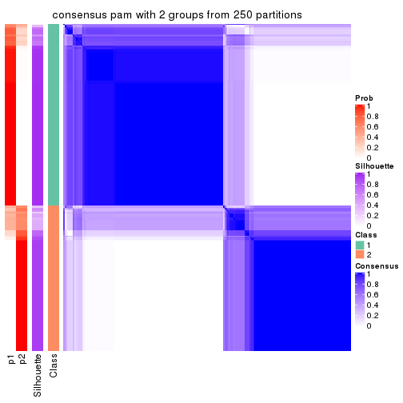</p>

</div>
<div id='tab-MAD-pam-consensus-heatmap-2'>
<pre><code class="r">consensus_heatmap(res, k = 3)
</code></pre>

<p>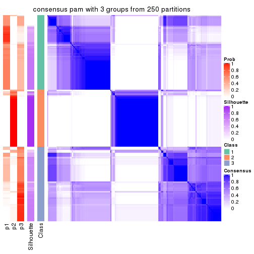</p>

</div>
<div id='tab-MAD-pam-consensus-heatmap-3'>
<pre><code class="r">consensus_heatmap(res, k = 4)
</code></pre>

<p>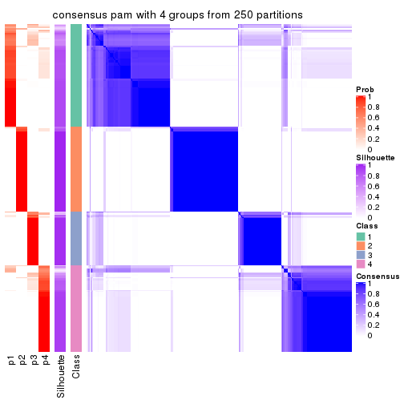</p>

</div>
<div id='tab-MAD-pam-consensus-heatmap-4'>
<pre><code class="r">consensus_heatmap(res, k = 5)
</code></pre>

<p>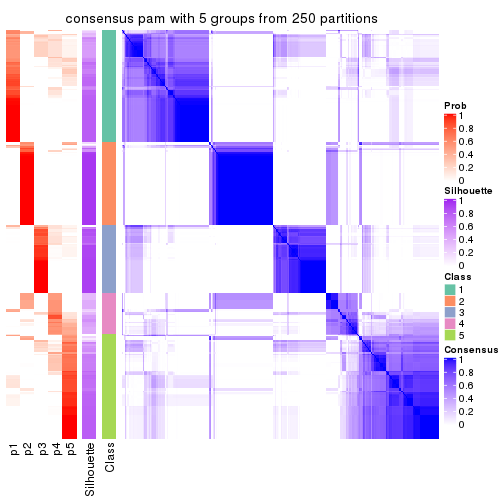</p>

</div>
<div id='tab-MAD-pam-consensus-heatmap-5'>
<pre><code class="r">consensus_heatmap(res, k = 6)
</code></pre>

<p>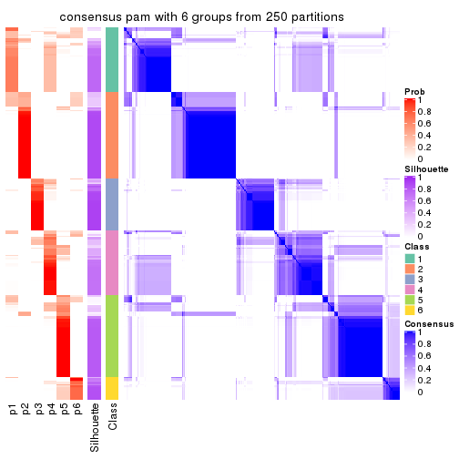</p>

</div>
</div>

Heatmaps for the membership of samples in all partitions to see how consistent they are:


<script>
$( function() {
	$( '#tabs-MAD-pam-membership-heatmap' ).tabs();
} );
</script>
<div id='tabs-MAD-pam-membership-heatmap'>
<ul>
<li><a href='#tab-MAD-pam-membership-heatmap-1'>k = 2</a></li>
<li><a href='#tab-MAD-pam-membership-heatmap-2'>k = 3</a></li>
<li><a href='#tab-MAD-pam-membership-heatmap-3'>k = 4</a></li>
<li><a href='#tab-MAD-pam-membership-heatmap-4'>k = 5</a></li>
<li><a href='#tab-MAD-pam-membership-heatmap-5'>k = 6</a></li>
</ul>
<div id='tab-MAD-pam-membership-heatmap-1'>
<pre><code class="r">membership_heatmap(res, k = 2)
</code></pre>

<p>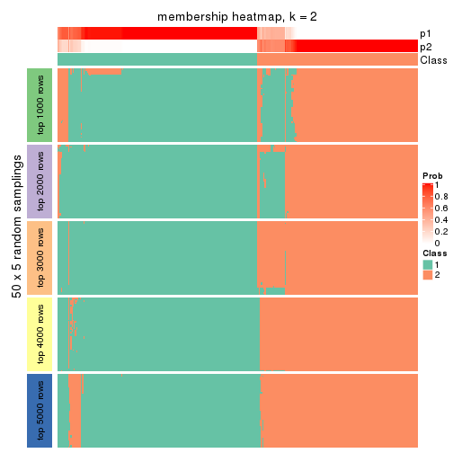</p>

</div>
<div id='tab-MAD-pam-membership-heatmap-2'>
<pre><code class="r">membership_heatmap(res, k = 3)
</code></pre>

<p>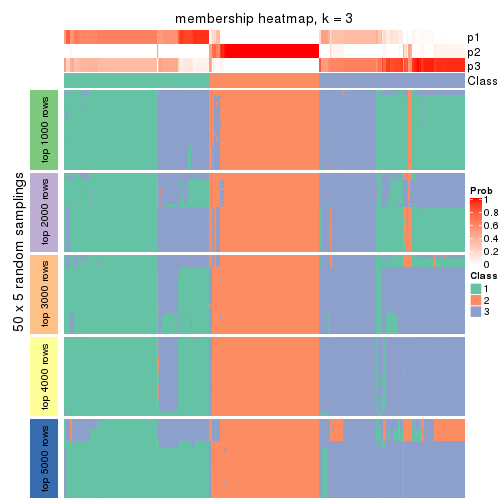</p>

</div>
<div id='tab-MAD-pam-membership-heatmap-3'>
<pre><code class="r">membership_heatmap(res, k = 4)
</code></pre>

<p>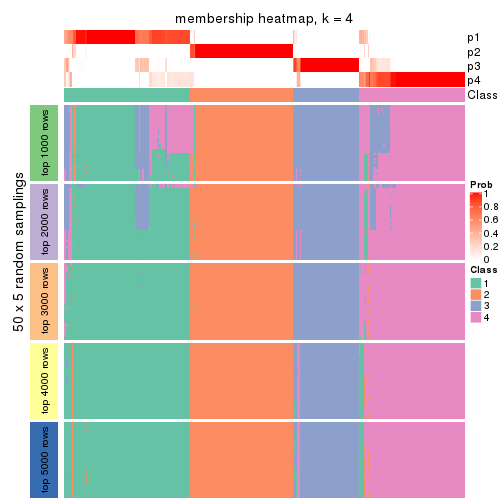</p>

</div>
<div id='tab-MAD-pam-membership-heatmap-4'>
<pre><code class="r">membership_heatmap(res, k = 5)
</code></pre>

<p>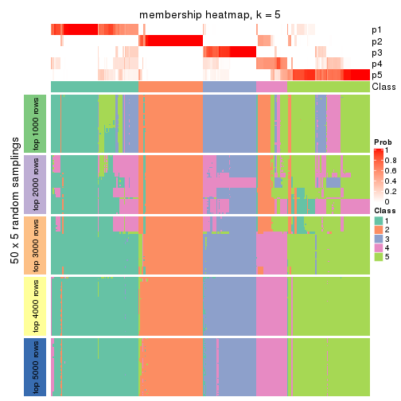</p>

</div>
<div id='tab-MAD-pam-membership-heatmap-5'>
<pre><code class="r">membership_heatmap(res, k = 6)
</code></pre>

<p>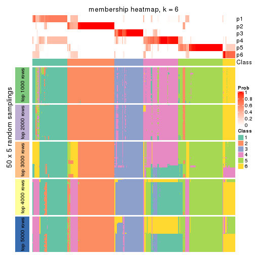</p>

</div>
</div>

As soon as we have had the classes for columns, we can look for signatures
which are significantly different between classes which can be candidate marks
for certain classes. Following are the heatmaps for signatures.


Signature heatmaps where rows are scaled:


<script>
$( function() {
	$( '#tabs-MAD-pam-get-signatures' ).tabs();
} );
</script>
<div id='tabs-MAD-pam-get-signatures'>
<ul>
<li><a href='#tab-MAD-pam-get-signatures-1'>k = 2</a></li>
<li><a href='#tab-MAD-pam-get-signatures-2'>k = 3</a></li>
<li><a href='#tab-MAD-pam-get-signatures-3'>k = 4</a></li>
<li><a href='#tab-MAD-pam-get-signatures-4'>k = 5</a></li>
<li><a href='#tab-MAD-pam-get-signatures-5'>k = 6</a></li>
</ul>
<div id='tab-MAD-pam-get-signatures-1'>
<pre><code class="r">get_signatures(res, k = 2)
</code></pre>

<p>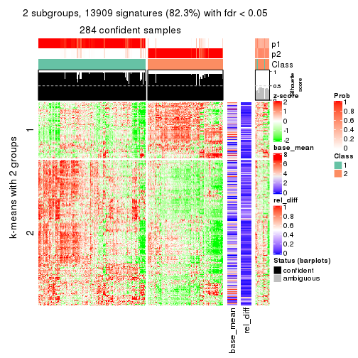</p>

</div>
<div id='tab-MAD-pam-get-signatures-2'>
<pre><code class="r">get_signatures(res, k = 3)
</code></pre>

<p>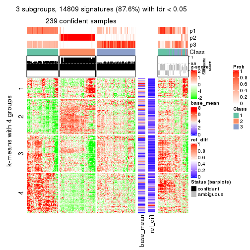</p>

</div>
<div id='tab-MAD-pam-get-signatures-3'>
<pre><code class="r">get_signatures(res, k = 4)
</code></pre>

<p>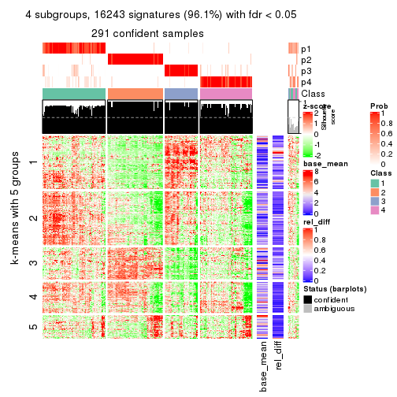</p>

</div>
<div id='tab-MAD-pam-get-signatures-4'>
<pre><code class="r">get_signatures(res, k = 5)
</code></pre>

<p>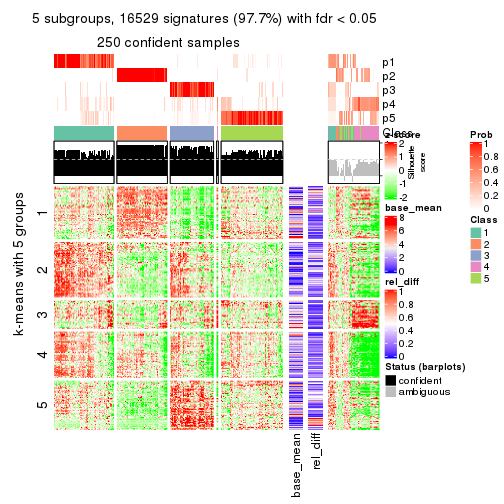</p>

</div>
<div id='tab-MAD-pam-get-signatures-5'>
<pre><code class="r">get_signatures(res, k = 6)
</code></pre>

<p>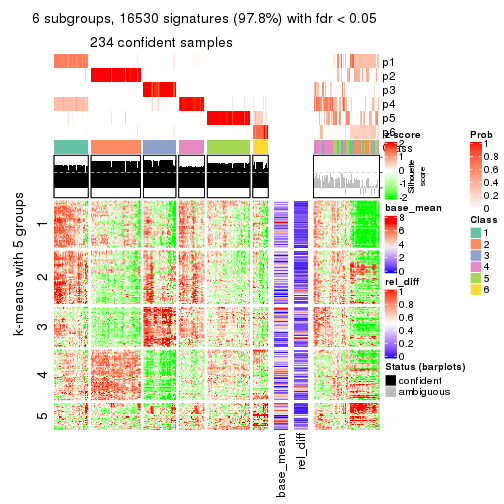</p>

</div>
</div>


Signature heatmaps where rows are not scaled:


<script>
$( function() {
	$( '#tabs-MAD-pam-get-signatures-no-scale' ).tabs();
} );
</script>
<div id='tabs-MAD-pam-get-signatures-no-scale'>
<ul>
<li><a href='#tab-MAD-pam-get-signatures-no-scale-1'>k = 2</a></li>
<li><a href='#tab-MAD-pam-get-signatures-no-scale-2'>k = 3</a></li>
<li><a href='#tab-MAD-pam-get-signatures-no-scale-3'>k = 4</a></li>
<li><a href='#tab-MAD-pam-get-signatures-no-scale-4'>k = 5</a></li>
<li><a href='#tab-MAD-pam-get-signatures-no-scale-5'>k = 6</a></li>
</ul>
<div id='tab-MAD-pam-get-signatures-no-scale-1'>
<pre><code class="r">get_signatures(res, k = 2, scale_rows = FALSE)
</code></pre>

<p>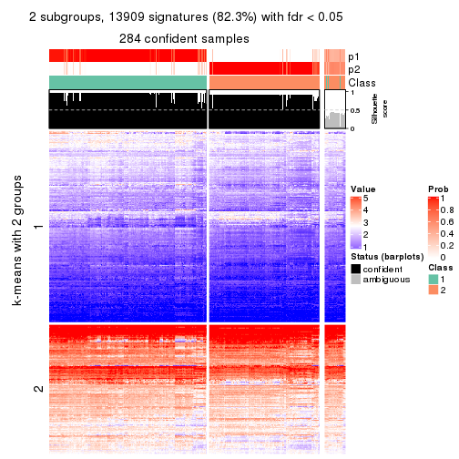</p>

</div>
<div id='tab-MAD-pam-get-signatures-no-scale-2'>
<pre><code class="r">get_signatures(res, k = 3, scale_rows = FALSE)
</code></pre>

<p>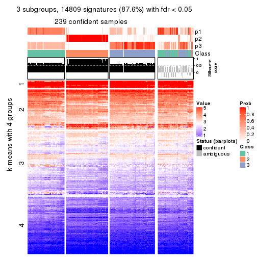</p>

</div>
<div id='tab-MAD-pam-get-signatures-no-scale-3'>
<pre><code class="r">get_signatures(res, k = 4, scale_rows = FALSE)
</code></pre>

<p>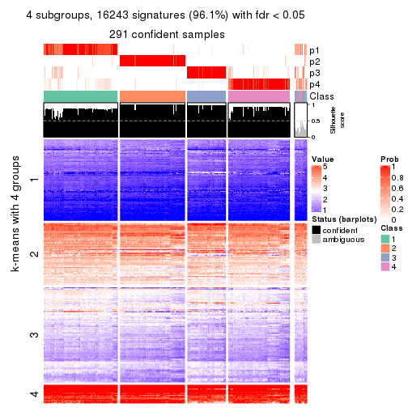</p>

</div>
<div id='tab-MAD-pam-get-signatures-no-scale-4'>
<pre><code class="r">get_signatures(res, k = 5, scale_rows = FALSE)
</code></pre>

<p>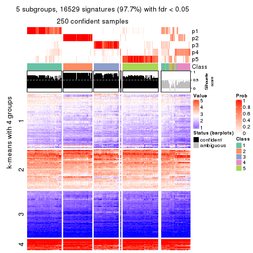</p>

</div>
<div id='tab-MAD-pam-get-signatures-no-scale-5'>
<pre><code class="r">get_signatures(res, k = 6, scale_rows = FALSE)
</code></pre>

<p>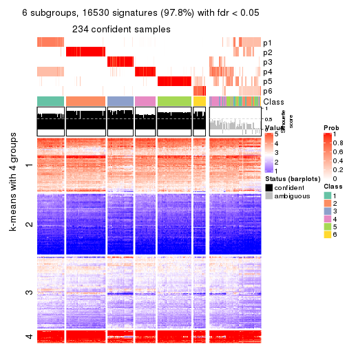</p>

</div>
</div>


Compare the overlap of signatures from different k:

```r
compare_signatures(res)
```

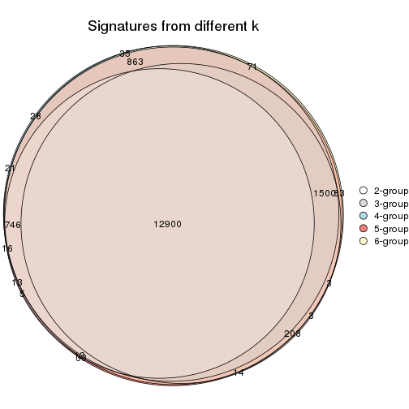

`get_signature()` returns a data frame invisibly. TO get the list of signatures, the function
call should be assigned to a variable explicitly. In following code, if `plot` argument is set
to `FALSE`, no heatmap is plotted while only the differential analysis is performed.

```r
# code only for demonstration
tb = get_signature(res, k = ..., plot = FALSE)
```

An example of the output of `tb` is:

```
#>   which_row         fdr    mean_1    mean_2 scaled_mean_1 scaled_mean_2 km
#> 1        38 0.042760348  8.373488  9.131774    -0.5533452     0.5164555  1
#> 2        40 0.018707592  7.106213  8.469186    -0.6173731     0.5762149  1
#> 3        55 0.019134737 10.221463 11.207825    -0.6159697     0.5749050  1
#> 4        59 0.006059896  5.921854  7.869574    -0.6899429     0.6439467  1
#> 5        60 0.018055526  8.928898 10.211722    -0.6204761     0.5791110  1
#> 6        98 0.009384629 15.714769 14.887706     0.6635654    -0.6193277  2
...
```

The columns in `tb` are:

1. `which_row`: row indices corresponding to the input matrix.
2. `fdr`: FDR for the differential test. 
3. `mean_x`: The mean value in group x.
4. `scaled_mean_x`: The mean value in group x after rows are scaled.
5. `km`: Row groups if k-means clustering is applied to rows.


UMAP plot which shows how samples are separated.


<script>
$( function() {
	$( '#tabs-MAD-pam-dimension-reduction' ).tabs();
} );
</script>
<div id='tabs-MAD-pam-dimension-reduction'>
<ul>
<li><a href='#tab-MAD-pam-dimension-reduction-1'>k = 2</a></li>
<li><a href='#tab-MAD-pam-dimension-reduction-2'>k = 3</a></li>
<li><a href='#tab-MAD-pam-dimension-reduction-3'>k = 4</a></li>
<li><a href='#tab-MAD-pam-dimension-reduction-4'>k = 5</a></li>
<li><a href='#tab-MAD-pam-dimension-reduction-5'>k = 6</a></li>
</ul>
<div id='tab-MAD-pam-dimension-reduction-1'>
<pre><code class="r">dimension_reduction(res, k = 2, method = &quot;UMAP&quot;)
</code></pre>

<p>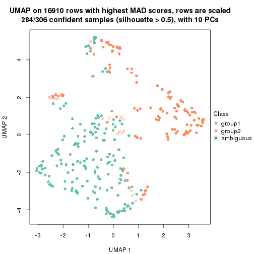</p>

</div>
<div id='tab-MAD-pam-dimension-reduction-2'>
<pre><code class="r">dimension_reduction(res, k = 3, method = &quot;UMAP&quot;)
</code></pre>

<p>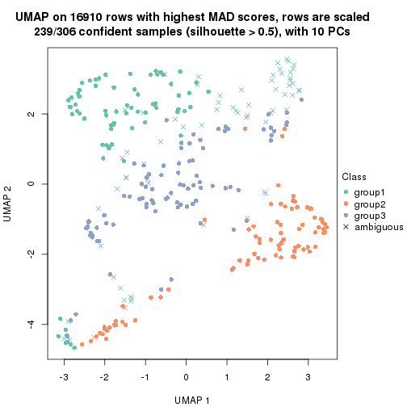</p>

</div>
<div id='tab-MAD-pam-dimension-reduction-3'>
<pre><code class="r">dimension_reduction(res, k = 4, method = &quot;UMAP&quot;)
</code></pre>

<p>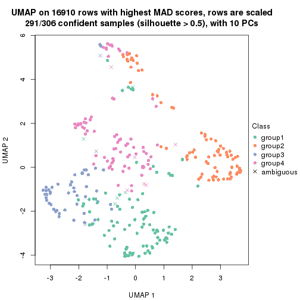</p>

</div>
<div id='tab-MAD-pam-dimension-reduction-4'>
<pre><code class="r">dimension_reduction(res, k = 5, method = &quot;UMAP&quot;)
</code></pre>

<p>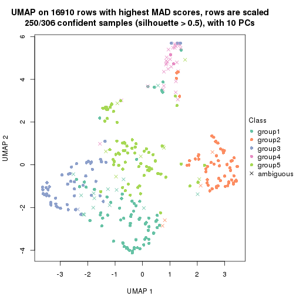</p>

</div>
<div id='tab-MAD-pam-dimension-reduction-5'>
<pre><code class="r">dimension_reduction(res, k = 6, method = &quot;UMAP&quot;)
</code></pre>

<p>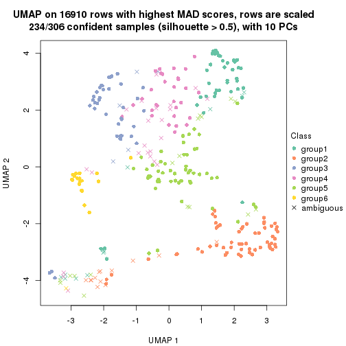</p>

</div>
</div>


Following heatmap shows how subgroups are split when increasing `k`:

```r
collect_classes(res)
```

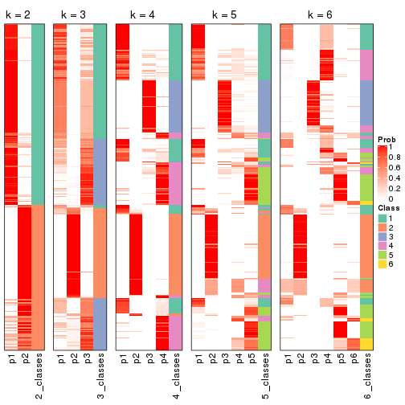


If matrix rows can be associated to genes, consider to use `GO_Enrichment(res,
...)` to perform function enrichment for the signature genes.


 

---------------------------------------------------


### MAD:mclust


The object with results only for a single top-value method and a single partition method 
can be extracted as:

```r
res = res_list["MAD", "mclust"]
# you can also extract it by
# res = res_list["MAD:mclust"]
```

A summary of `res` and all the functions that can be applied to it:

```r
res
```

```
#> A 'ConsensusPartition' object with k = 2, 3, 4, 5, 6.
#>   On a matrix with 16910 rows and 306 columns.
#>   Top rows (1000, 2000, 3000, 4000, 5000) are extracted by 'MAD' method.
#>   Subgroups are detected by 'mclust' method.
#>   Performed in total 1250 partitions by row resampling.
#>   Best k for subgroups seems to be 5.
#> 
#> Following methods can be applied to this 'ConsensusPartition' object:
#>  [1] "cola_report"             "collect_classes"         "collect_plots"          
#>  [4] "collect_stats"           "colnames"                "compare_signatures"     
#>  [7] "consensus_heatmap"       "dimension_reduction"     "functional_enrichment"  
#> [10] "get_anno_col"            "get_anno"                "get_classes"            
#> [13] "get_consensus"           "get_matrix"              "get_membership"         
#> [16] "get_param"               "get_signatures"          "get_stats"              
#> [19] "is_best_k"               "is_stable_k"             "membership_heatmap"     
#> [22] "ncol"                    "nrow"                    "plot_ecdf"              
#> [25] "rownames"                "select_partition_number" "show"                   
#> [28] "suggest_best_k"          "test_to_known_factors"
```

`collect_plots()` function collects all the plots made from `res` for all `k` (number of partitions)
into one single page to provide an easy and fast comparison between different `k`.

```r
collect_plots(res)
```

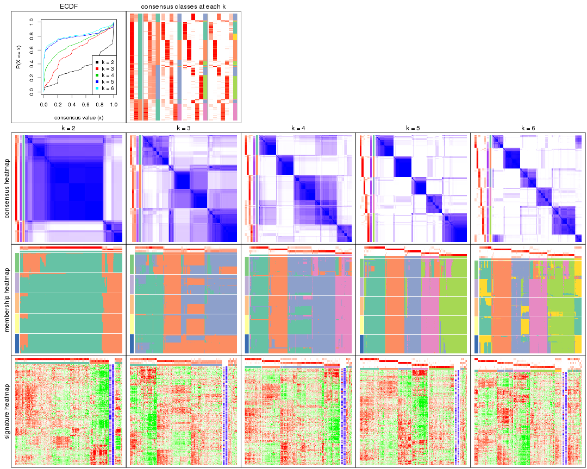

The plots are:

- The first row: a plot of the ECDF (Empirical cumulative distribution
  function) curves of the consensus matrix for each `k` and the heatmap of
  predicted classes for each `k`.
- The second row: heatmaps of the consensus matrix for each `k`.
- The third row: heatmaps of the membership matrix for each `k`.
- The fouth row: heatmaps of the signatures for each `k`.

All the plots in panels can be made by individual functions and they are
plotted later in this section.

`select_partition_number()` produces several plots showing different
statistics for choosing "optimized" `k`. There are following statistics:

- ECDF curves of the consensus matrix for each `k`;
- 1-PAC. [The PAC
  score](https://en.wikipedia.org/wiki/Consensus_clustering#Over-interpretation_potential_of_consensus_clustering)
  measures the proportion of the ambiguous subgrouping.
- Mean silhouette score.
- Concordance. The mean probability of fiting the consensus class ids in all
  partitions.
- Area increased. Denote $A_k$ as the area under the ECDF curve for current
  `k`, the area increased is defined as $A_k - A_{k-1}$.
- Rand index. The percent of pairs of samples that are both in a same cluster
  or both are not in a same cluster in the partition of k and k-1.
- Jaccard index. The ratio of pairs of samples are both in a same cluster in
  the partition of k and k-1 and the pairs of samples are both in a same
  cluster in the partition k or k-1.

The detailed explanations of these statistics can be found in [the cola
vignette](http://bioconductor.org/packages/devel/bioc/vignettes/cola/inst/doc/cola.html#toc_13).

Generally speaking, lower PAC score, higher mean silhouette score or higher
concordance corresponds to better partition. Rand index and Jaccard index
measure how similar the current partition is compared to partition with `k-1`.
If they are too similar, we won't accept `k` is better than `k-1`.

```r
select_partition_number(res)
```

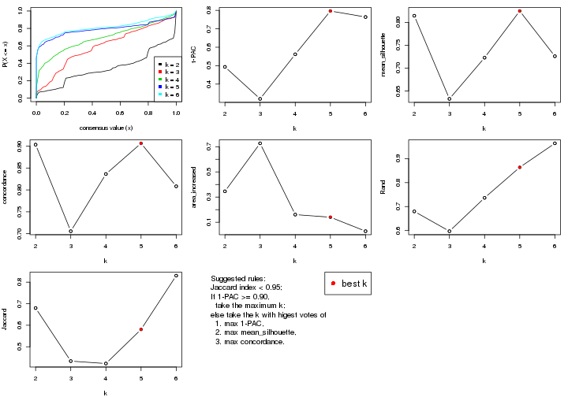

The numeric values for all these statistics can be obtained by `get_stats()`.

```r
get_stats(res)
```

```
#>   k 1-PAC mean_silhouette concordance area_increased  Rand Jaccard
#> 2 2 0.493           0.814       0.903         0.3457 0.680   0.680
#> 3 3 0.320           0.633       0.706         0.7269 0.597   0.434
#> 4 4 0.562           0.723       0.836         0.1608 0.736   0.422
#> 5 5 0.797           0.825       0.906         0.1401 0.864   0.581
#> 6 6 0.764           0.726       0.808         0.0289 0.964   0.830
```

`suggest_best_k()` suggests the best $k$ based on these statistics. The rules are as follows:

- All $k$ with Jaccard index larger than 0.95 are removed because the increase of
  the partition number does not provides enough extra information. If all $k$ are removed,
  the best $k$ is assigned by `NA`.
- For $k$ with 1-PAC larger than 0.9, the maximal $k$ is taken as the "best k". Other $k$ is called "optional k".
- If it does not fit the second rule. The $k$ with the highest vote of highest
  1-PAC, mean silhouette and concordance is taken as the "best k".

```r
suggest_best_k(res)
```

```
#> [1] 5
```


Following shows the table of the partitions (You need to click the **show/hide
code output** link to see it). The membership matrix (columns with name `p*`)
is inferred by
[`clue::cl_consensus()`](https://www.rdocumentation.org/link/cl_consensus?package=clue)
function with the `SE` method. Basically the value in the membership matrix
represents the probability to belong to a certain group. The finall class
label for an item is determined with the group with highest probability it
belongs to.

In `get_classes()` function, the entropy is calculated from the membership
matrix and the silhouette score is calculated from the consensus matrix.


<script>
$( function() {
	$( '#tabs-MAD-mclust-get-classes' ).tabs();
} );
</script>
<div id='tabs-MAD-mclust-get-classes'>
<ul>
<li><a href='#tab-MAD-mclust-get-classes-1'>k = 2</a></li>
<li><a href='#tab-MAD-mclust-get-classes-2'>k = 3</a></li>
<li><a href='#tab-MAD-mclust-get-classes-3'>k = 4</a></li>
<li><a href='#tab-MAD-mclust-get-classes-4'>k = 5</a></li>
<li><a href='#tab-MAD-mclust-get-classes-5'>k = 6</a></li>
</ul>

<div id='tab-MAD-mclust-get-classes-1'>
<p><a id='tab-MAD-mclust-get-classes-1-a' style='color:#0366d6' href='#'>show/hide code output</a></p>
<pre><code class="r">cbind(get_classes(res, k = 2), get_membership(res, k = 2))
</code></pre>

<pre><code>#&gt;            class entropy silhouette    p1    p2
#&gt; SRR1609360     2  0.7219     0.8447 0.200 0.800
#&gt; SRR1609361     2  0.7219     0.8447 0.200 0.800
#&gt; SRR1609362     2  0.7219     0.8447 0.200 0.800
#&gt; SRR1609363     1  0.0376     0.9054 0.996 0.004
#&gt; SRR1609364     1  0.0376     0.9054 0.996 0.004
#&gt; SRR1609365     2  0.7219     0.8447 0.200 0.800
#&gt; SRR1609366     1  0.0000     0.9059 1.000 0.000
#&gt; SRR1609367     1  0.0000     0.9059 1.000 0.000
#&gt; SRR1609368     1  0.0376     0.9054 0.996 0.004
#&gt; SRR1609369     1  0.0000     0.9059 1.000 0.000
#&gt; SRR1609370     1  0.0000     0.9059 1.000 0.000
#&gt; SRR1609371     2  0.7139     0.8456 0.196 0.804
#&gt; SRR1609372     1  0.0000     0.9059 1.000 0.000
#&gt; SRR1609373     1  0.0376     0.9054 0.996 0.004
#&gt; SRR1609374     1  0.0000     0.9059 1.000 0.000
#&gt; SRR1609375     1  0.0000     0.9059 1.000 0.000
#&gt; SRR1609377     1  0.0000     0.9059 1.000 0.000
#&gt; SRR1609376     1  0.0376     0.9054 0.996 0.004
#&gt; SRR1609378     2  0.7139     0.8456 0.196 0.804
#&gt; SRR1609379     1  0.0000     0.9059 1.000 0.000
#&gt; SRR1609382     2  0.7139     0.8456 0.196 0.804
#&gt; SRR1609383     2  0.7219     0.8447 0.200 0.800
#&gt; SRR1609381     1  0.0000     0.9059 1.000 0.000
#&gt; SRR1609384     1  0.0000     0.9059 1.000 0.000
#&gt; SRR1609386     1  0.0000     0.9059 1.000 0.000
#&gt; SRR1609385     1  0.0000     0.9059 1.000 0.000
#&gt; SRR1609387     1  0.0000     0.9059 1.000 0.000
#&gt; SRR1609388     1  0.0376     0.9054 0.996 0.004
#&gt; SRR1609390     1  0.0000     0.9059 1.000 0.000
#&gt; SRR1609393     2  0.7139     0.8456 0.196 0.804
#&gt; SRR1609394     1  0.9129     0.3823 0.672 0.328
#&gt; SRR1609392     1  0.0376     0.9054 0.996 0.004
#&gt; SRR1609391     2  0.7139     0.8456 0.196 0.804
#&gt; SRR1609395     1  0.0000     0.9059 1.000 0.000
#&gt; SRR1609396     1  0.0000     0.9059 1.000 0.000
#&gt; SRR1609398     1  0.0000     0.9059 1.000 0.000
#&gt; SRR1609399     1  0.0000     0.9059 1.000 0.000
#&gt; SRR1609400     1  0.0000     0.9059 1.000 0.000
#&gt; SRR1609397     1  0.0376     0.9054 0.996 0.004
#&gt; SRR1609401     1  0.0376     0.9054 0.996 0.004
#&gt; SRR1609402     1  0.0376     0.9054 0.996 0.004
#&gt; SRR1609405     1  0.0000     0.9059 1.000 0.000
#&gt; SRR1609404     2  0.7139     0.8456 0.196 0.804
#&gt; SRR1609406     1  0.0376     0.9054 0.996 0.004
#&gt; SRR1609408     1  0.0376     0.9054 0.996 0.004
#&gt; SRR1609403     1  0.0000     0.9059 1.000 0.000
#&gt; SRR1609410     1  0.0000     0.9059 1.000 0.000
#&gt; SRR1609411     1  0.0938     0.9046 0.988 0.012
#&gt; SRR1609407     1  0.0376     0.9054 0.996 0.004
#&gt; SRR1609413     1  0.0000     0.9059 1.000 0.000
#&gt; SRR1609412     1  0.0672     0.9050 0.992 0.008
#&gt; SRR1609414     1  0.3879     0.8647 0.924 0.076
#&gt; SRR1609415     1  0.0672     0.9050 0.992 0.008
#&gt; SRR1609416     1  0.8763     0.4632 0.704 0.296
#&gt; SRR1609417     1  0.9944     0.2338 0.544 0.456
#&gt; SRR1609418     1  0.0000     0.9059 1.000 0.000
#&gt; SRR1609419     1  0.0376     0.9054 0.996 0.004
#&gt; SRR1609420     1  0.0000     0.9059 1.000 0.000
#&gt; SRR1609421     1  0.0938     0.9046 0.988 0.012
#&gt; SRR1609422     2  0.0376     0.8008 0.004 0.996
#&gt; SRR1609423     2  0.7139     0.8456 0.196 0.804
#&gt; SRR1609424     2  0.7139     0.8456 0.196 0.804
#&gt; SRR1609425     1  0.0000     0.9059 1.000 0.000
#&gt; SRR1609426     1  0.0376     0.9054 0.996 0.004
#&gt; SRR1609427     2  0.0376     0.8001 0.004 0.996
#&gt; SRR1609428     1  0.0376     0.9054 0.996 0.004
#&gt; SRR1609429     1  0.0672     0.9050 0.992 0.008
#&gt; SRR1609430     1  0.9963     0.2577 0.536 0.464
#&gt; SRR1609431     1  0.7376     0.7548 0.792 0.208
#&gt; SRR1609432     1  0.0376     0.9054 0.996 0.004
#&gt; SRR1609433     2  0.9323     0.6797 0.348 0.652
#&gt; SRR1609434     2  0.7139     0.8456 0.196 0.804
#&gt; SRR1609435     1  0.0376     0.9057 0.996 0.004
#&gt; SRR1609436     1  0.0672     0.9050 0.992 0.008
#&gt; SRR1609437     1  0.8608     0.4934 0.716 0.284
#&gt; SRR1609438     2  0.7139     0.8456 0.196 0.804
#&gt; SRR1609439     2  0.6438     0.7324 0.164 0.836
#&gt; SRR1609440     1  0.0000     0.9059 1.000 0.000
#&gt; SRR1609441     1  0.0672     0.9050 0.992 0.008
#&gt; SRR1609442     1  0.9323     0.3193 0.652 0.348
#&gt; SRR1609443     1  0.8081     0.5756 0.752 0.248
#&gt; SRR1609444     1  0.0672     0.9050 0.992 0.008
#&gt; SRR1609445     1  0.0672     0.9050 0.992 0.008
#&gt; SRR1609446     1  0.0672     0.9050 0.992 0.008
#&gt; SRR1609447     1  0.0672     0.9050 0.992 0.008
#&gt; SRR1609448     1  0.0376     0.9054 0.996 0.004
#&gt; SRR1609449     1  0.0376     0.9057 0.996 0.004
#&gt; SRR1609450     1  0.0376     0.9054 0.996 0.004
#&gt; SRR1609451     1  0.9963     0.2577 0.536 0.464
#&gt; SRR1609452     1  0.5059     0.8404 0.888 0.112
#&gt; SRR1609453     1  0.0672     0.9050 0.992 0.008
#&gt; SRR1609454     1  0.0938     0.9046 0.988 0.012
#&gt; SRR1609455     1  0.0000     0.9059 1.000 0.000
#&gt; SRR1609456     1  0.0672     0.9050 0.992 0.008
#&gt; SRR1609457     1  0.2603     0.8862 0.956 0.044
#&gt; SRR1609458     1  0.0672     0.9050 0.992 0.008
#&gt; SRR1609459     1  0.6973     0.7747 0.812 0.188
#&gt; SRR1609460     1  0.7376     0.7548 0.792 0.208
#&gt; SRR1609461     1  0.0672     0.9050 0.992 0.008
#&gt; SRR1609462     1  0.9850     0.3647 0.572 0.428
#&gt; SRR1609464     1  0.9963     0.2577 0.536 0.464
#&gt; SRR1609463     1  0.7376     0.7548 0.792 0.208
#&gt; SRR1609465     1  0.7376     0.7548 0.792 0.208
#&gt; SRR1609466     2  0.7219     0.8447 0.200 0.800
#&gt; SRR1609467     1  0.9850     0.3647 0.572 0.428
#&gt; SRR1609469     2  0.7139     0.8456 0.196 0.804
#&gt; SRR1609470     1  0.0672     0.9050 0.992 0.008
#&gt; SRR1609472     2  0.5946     0.8396 0.144 0.856
#&gt; SRR1609471     1  0.0000     0.9059 1.000 0.000
#&gt; SRR1609474     1  0.0000     0.9059 1.000 0.000
#&gt; SRR1609473     2  0.7139     0.8456 0.196 0.804
#&gt; SRR1609475     2  0.7139     0.8456 0.196 0.804
#&gt; SRR1609478     2  0.3431     0.8214 0.064 0.936
#&gt; SRR1609476     1  0.2778     0.8749 0.952 0.048
#&gt; SRR1609477     1  0.8909     0.5143 0.692 0.308
#&gt; SRR1609479     1  0.0376     0.9054 0.996 0.004
#&gt; SRR1609481     2  0.0000     0.8003 0.000 1.000
#&gt; SRR1609480     2  0.8016     0.7271 0.244 0.756
#&gt; SRR1609482     1  0.9833     0.3752 0.576 0.424
#&gt; SRR1609484     2  0.9460     0.6473 0.364 0.636
#&gt; SRR1609483     2  0.9248     0.4278 0.340 0.660
#&gt; SRR1609486     1  0.5629     0.8214 0.868 0.132
#&gt; SRR1609485     1  0.5842     0.8148 0.860 0.140
#&gt; SRR1609487     1  0.0000     0.9059 1.000 0.000
#&gt; SRR1609488     1  0.4690     0.8470 0.900 0.100
#&gt; SRR1609489     1  0.0376     0.9054 0.996 0.004
#&gt; SRR1609490     1  0.0000     0.9059 1.000 0.000
#&gt; SRR1609491     1  0.0672     0.9050 0.992 0.008
#&gt; SRR1609492     1  0.0376     0.9054 0.996 0.004
#&gt; SRR1609493     1  0.7376     0.7548 0.792 0.208
#&gt; SRR1609494     1  0.0376     0.9054 0.996 0.004
#&gt; SRR1609495     2  0.9427     0.6585 0.360 0.640
#&gt; SRR1609496     1  0.7299     0.7556 0.796 0.204
#&gt; SRR1609497     1  0.3431     0.8731 0.936 0.064
#&gt; SRR1609498     1  0.0672     0.9050 0.992 0.008
#&gt; SRR1609499     1  0.0376     0.9054 0.996 0.004
#&gt; SRR1609500     1  0.0672     0.9050 0.992 0.008
#&gt; SRR1609501     1  0.0672     0.9050 0.992 0.008
#&gt; SRR1609502     1  0.0000     0.9059 1.000 0.000
#&gt; SRR1609503     2  0.0000     0.8003 0.000 1.000
#&gt; SRR1609504     1  0.0672     0.9050 0.992 0.008
#&gt; SRR1609505     1  0.7299     0.7556 0.796 0.204
#&gt; SRR1609506     1  0.0376     0.9054 0.996 0.004
#&gt; SRR1609507     1  0.7139     0.7637 0.804 0.196
#&gt; SRR1609508     1  0.0938     0.9046 0.988 0.012
#&gt; SRR1609509     1  0.0376     0.9054 0.996 0.004
#&gt; SRR1609510     2  0.0376     0.8008 0.004 0.996
#&gt; SRR1609512     1  0.7299     0.7556 0.796 0.204
#&gt; SRR1609511     2  0.0000     0.8003 0.000 1.000
#&gt; SRR1609513     1  0.9866     0.3536 0.568 0.432
#&gt; SRR1609514     2  0.1633     0.8092 0.024 0.976
#&gt; SRR1609515     1  0.0376     0.9054 0.996 0.004
#&gt; SRR1609516     1  0.6623     0.7864 0.828 0.172
#&gt; SRR1609517     1  0.0938     0.9046 0.988 0.012
#&gt; SRR1609518     1  0.0000     0.9059 1.000 0.000
#&gt; SRR1609519     1  0.7299     0.7556 0.796 0.204
#&gt; SRR1609520     2  0.7139     0.8456 0.196 0.804
#&gt; SRR1609521     1  0.7299     0.7556 0.796 0.204
#&gt; SRR1609522     1  0.9963     0.2577 0.536 0.464
#&gt; SRR1609523     1  0.7376     0.7548 0.792 0.208
#&gt; SRR1609524     1  0.0376     0.9054 0.996 0.004
#&gt; SRR1609526     2  0.9686     0.2645 0.396 0.604
#&gt; SRR1609525     1  0.0672     0.9050 0.992 0.008
#&gt; SRR1609527     1  0.0000     0.9059 1.000 0.000
#&gt; SRR1609529     1  0.1414     0.9004 0.980 0.020
#&gt; SRR1609528     2  0.4562     0.8296 0.096 0.904
#&gt; SRR1609530     1  0.7299     0.7556 0.796 0.204
#&gt; SRR1609531     1  0.0376     0.9054 0.996 0.004
#&gt; SRR1609532     2  0.9998    -0.1142 0.492 0.508
#&gt; SRR1609533     1  0.0938     0.9046 0.988 0.012
#&gt; SRR1609534     1  0.7453     0.7486 0.788 0.212
#&gt; SRR1609535     1  0.8443     0.6842 0.728 0.272
#&gt; SRR1609537     1  0.0376     0.9054 0.996 0.004
#&gt; SRR1609536     1  0.3879     0.8647 0.924 0.076
#&gt; SRR1609538     1  0.0376     0.9054 0.996 0.004
#&gt; SRR1609539     1  0.7376     0.7548 0.792 0.208
#&gt; SRR1609540     1  0.0672     0.9050 0.992 0.008
#&gt; SRR1609541     2  0.0000     0.8003 0.000 1.000
#&gt; SRR1609542     1  0.0376     0.9054 0.996 0.004
#&gt; SRR1609543     1  0.9998     0.1589 0.508 0.492
#&gt; SRR1609544     2  0.9209     0.6991 0.336 0.664
#&gt; SRR1609545     1  0.5519     0.8250 0.872 0.128
#&gt; SRR1609546     1  0.0672     0.9050 0.992 0.008
#&gt; SRR1609547     1  0.7376     0.7548 0.792 0.208
#&gt; SRR1609548     1  0.0672     0.9050 0.992 0.008
#&gt; SRR1609549     1  0.0376     0.9054 0.996 0.004
#&gt; SRR1609550     1  0.0376     0.9054 0.996 0.004
#&gt; SRR1609551     1  0.7376     0.7548 0.792 0.208
#&gt; SRR1609552     1  0.7299     0.7556 0.796 0.204
#&gt; SRR1609553     1  0.1414     0.9004 0.980 0.020
#&gt; SRR1609554     1  0.0672     0.9050 0.992 0.008
#&gt; SRR1609555     1  0.3584     0.8704 0.932 0.068
#&gt; SRR1609556     1  0.9850     0.3647 0.572 0.428
#&gt; SRR1609557     1  0.0938     0.9046 0.988 0.012
#&gt; SRR1609558     1  0.0672     0.9050 0.992 0.008
#&gt; SRR1609559     1  0.7453     0.7524 0.788 0.212
#&gt; SRR1609560     1  0.0000     0.9059 1.000 0.000
#&gt; SRR1609561     1  0.7299     0.7556 0.796 0.204
#&gt; SRR1609562     1  0.0000     0.9059 1.000 0.000
#&gt; SRR1609563     1  0.0376     0.9057 0.996 0.004
#&gt; SRR1609564     1  0.0672     0.9050 0.992 0.008
#&gt; SRR1609565     1  0.0376     0.9054 0.996 0.004
#&gt; SRR1609566     1  0.0376     0.9054 0.996 0.004
#&gt; SRR1609567     1  0.0376     0.9054 0.996 0.004
#&gt; SRR1609568     1  0.0000     0.9059 1.000 0.000
#&gt; SRR1609569     1  0.8081     0.7101 0.752 0.248
#&gt; SRR1609570     1  0.9963     0.2577 0.536 0.464
#&gt; SRR1609571     2  0.0376     0.8001 0.004 0.996
#&gt; SRR1609572     2  0.5519     0.7657 0.128 0.872
#&gt; SRR1609573     2  0.9983    -0.0485 0.476 0.524
#&gt; SRR1609574     1  0.8763     0.4632 0.704 0.296
#&gt; SRR1609575     2  0.8267     0.7937 0.260 0.740
#&gt; SRR1609576     1  0.0000     0.9059 1.000 0.000
#&gt; SRR1609578     1  0.0672     0.9050 0.992 0.008
#&gt; SRR1609577     1  0.0376     0.9049 0.996 0.004
#&gt; SRR1609579     2  0.7376     0.6826 0.208 0.792
#&gt; SRR1609580     1  0.0672     0.9050 0.992 0.008
#&gt; SRR1609582     1  0.6343     0.7973 0.840 0.160
#&gt; SRR1609581     1  0.0672     0.9050 0.992 0.008
#&gt; SRR1609583     1  0.0672     0.9050 0.992 0.008
#&gt; SRR1609584     1  0.9944     0.2829 0.544 0.456
#&gt; SRR1609585     1  0.1633     0.8983 0.976 0.024
#&gt; SRR1609586     1  0.0376     0.9054 0.996 0.004
#&gt; SRR1609587     1  0.4815     0.8439 0.896 0.104
#&gt; SRR1609588     1  0.0672     0.9050 0.992 0.008
#&gt; SRR1609589     1  0.0672     0.9050 0.992 0.008
#&gt; SRR1609590     1  0.8813     0.6076 0.700 0.300
#&gt; SRR1609592     1  0.0938     0.9046 0.988 0.012
#&gt; SRR1609591     1  0.0672     0.9050 0.992 0.008
#&gt; SRR1609593     1  0.7376     0.7548 0.792 0.208
#&gt; SRR1609594     2  0.7139     0.8456 0.196 0.804
#&gt; SRR1609595     1  0.7883     0.7266 0.764 0.236
#&gt; SRR1609596     1  0.0376     0.9054 0.996 0.004
#&gt; SRR1609597     1  0.0376     0.9054 0.996 0.004
#&gt; SRR1609598     2  0.0000     0.8003 0.000 1.000
#&gt; SRR1609599     2  0.0000     0.8003 0.000 1.000
#&gt; SRR1609600     1  0.7299     0.7556 0.796 0.204
#&gt; SRR1609601     2  0.0000     0.8003 0.000 1.000
#&gt; SRR1609602     2  0.0000     0.8003 0.000 1.000
#&gt; SRR1609603     1  0.0000     0.9059 1.000 0.000
#&gt; SRR1609604     2  0.8144     0.8016 0.252 0.748
#&gt; SRR1609605     1  0.0938     0.9046 0.988 0.012
#&gt; SRR1609606     1  0.1184     0.9039 0.984 0.016
#&gt; SRR1609607     1  0.7299     0.7556 0.796 0.204
#&gt; SRR1609608     1  0.5842     0.8149 0.860 0.140
#&gt; SRR1609609     1  0.0672     0.9050 0.992 0.008
#&gt; SRR1609610     1  0.0672     0.9050 0.992 0.008
#&gt; SRR1609611     2  0.7139     0.8456 0.196 0.804
#&gt; SRR1609613     1  0.0376     0.9054 0.996 0.004
#&gt; SRR1609612     1  0.1414     0.9004 0.980 0.020
#&gt; SRR1609614     1  0.3274     0.8757 0.940 0.060
#&gt; SRR1609615     1  0.0000     0.9059 1.000 0.000
#&gt; SRR1609616     1  0.0672     0.9050 0.992 0.008
#&gt; SRR1609617     1  0.7376     0.7548 0.792 0.208
#&gt; SRR1609618     1  0.0672     0.9050 0.992 0.008
#&gt; SRR1609619     1  0.0672     0.9050 0.992 0.008
#&gt; SRR1609620     2  0.7139     0.8456 0.196 0.804
#&gt; SRR1609621     1  0.6247     0.7470 0.844 0.156
#&gt; SRR1609622     2  0.7299     0.6878 0.204 0.796
#&gt; SRR1609623     1  0.7815     0.6096 0.768 0.232
#&gt; SRR1609624     1  0.0000     0.9059 1.000 0.000
#&gt; SRR1609625     1  0.0000     0.9059 1.000 0.000
#&gt; SRR1609626     2  0.0376     0.8001 0.004 0.996
#&gt; SRR1609627     1  0.0000     0.9059 1.000 0.000
#&gt; SRR1609628     1  0.0376     0.9054 0.996 0.004
#&gt; SRR1609629     1  0.0672     0.9050 0.992 0.008
#&gt; SRR1609630     1  0.0376     0.9054 0.996 0.004
#&gt; SRR1609631     1  0.0000     0.9059 1.000 0.000
#&gt; SRR1609632     1  0.0000     0.9059 1.000 0.000
#&gt; SRR1609633     1  0.0000     0.9059 1.000 0.000
#&gt; SRR1609634     1  0.0376     0.9054 0.996 0.004
#&gt; SRR1609635     2  0.0000     0.8003 0.000 1.000
#&gt; SRR1609636     2  0.7139     0.8456 0.196 0.804
#&gt; SRR1609637     1  0.0672     0.9050 0.992 0.008
#&gt; SRR1609638     1  0.0000     0.9059 1.000 0.000
#&gt; SRR1609639     1  0.0376     0.9054 0.996 0.004
#&gt; SRR1609640     1  0.7299     0.7556 0.796 0.204
#&gt; SRR1609641     1  0.0000     0.9059 1.000 0.000
#&gt; SRR1609642     1  0.0000     0.9059 1.000 0.000
#&gt; SRR1609643     1  0.0672     0.9050 0.992 0.008
#&gt; SRR1609644     1  0.0000     0.9059 1.000 0.000
#&gt; SRR1609645     1  0.5946     0.8113 0.856 0.144
#&gt; SRR1609646     1  0.9850     0.3647 0.572 0.428
#&gt; SRR1609647     1  0.8327     0.6944 0.736 0.264
#&gt; SRR1609649     1  0.7139     0.7637 0.804 0.196
#&gt; SRR1609648     1  0.0376     0.9054 0.996 0.004
#&gt; SRR1609651     1  0.0000     0.9059 1.000 0.000
#&gt; SRR1609650     1  0.4939     0.8436 0.892 0.108
#&gt; SRR1609652     1  0.7528     0.7448 0.784 0.216
#&gt; SRR1609653     1  0.0376     0.9054 0.996 0.004
#&gt; SRR1609654     2  0.8661     0.7652 0.288 0.712
#&gt; SRR1609655     1  0.7376     0.7548 0.792 0.208
#&gt; SRR1609657     1  0.0000     0.9059 1.000 0.000
#&gt; SRR1609656     2  0.7219     0.8447 0.200 0.800
#&gt; SRR1609658     1  0.0376     0.9054 0.996 0.004
#&gt; SRR1609659     1  0.0376     0.9054 0.996 0.004
#&gt; SRR1609660     1  0.8016     0.7173 0.756 0.244
#&gt; SRR1609661     1  0.0672     0.9050 0.992 0.008
#&gt; SRR1609662     1  0.0376     0.9054 0.996 0.004
#&gt; SRR1609663     1  0.2778     0.8836 0.952 0.048
#&gt; SRR1609664     1  0.7376     0.7548 0.792 0.208
#&gt; SRR1609665     1  0.0000     0.9059 1.000 0.000
#&gt; SRR1609666     2  0.7219     0.8447 0.200 0.800
#&gt; SRR1609667     1  0.0672     0.9050 0.992 0.008
#&gt; SRR1609668     2  0.0000     0.8003 0.000 1.000
#&gt; SRR1609669     1  0.0000     0.9059 1.000 0.000
</code></pre>

<script>
$('#tab-MAD-mclust-get-classes-1-a').parent().next().next().hide();
$('#tab-MAD-mclust-get-classes-1-a').click(function(){
  $('#tab-MAD-mclust-get-classes-1-a').parent().next().next().toggle();
  return(false);
});
</script>
</div>

<div id='tab-MAD-mclust-get-classes-2'>
<p><a id='tab-MAD-mclust-get-classes-2-a' style='color:#0366d6' href='#'>show/hide code output</a></p>
<pre><code class="r">cbind(get_classes(res, k = 3), get_membership(res, k = 3))
</code></pre>

<pre><code>#&gt;            class entropy silhouette    p1    p2    p3
#&gt; SRR1609360     1  0.7192     0.7583 0.716 0.120 0.164
#&gt; SRR1609361     1  0.7192     0.7583 0.716 0.120 0.164
#&gt; SRR1609362     1  0.7192     0.7583 0.716 0.120 0.164
#&gt; SRR1609363     2  0.5397     0.6632 0.000 0.720 0.280
#&gt; SRR1609364     2  0.5397     0.6632 0.000 0.720 0.280
#&gt; SRR1609365     1  0.7192     0.7583 0.716 0.120 0.164
#&gt; SRR1609366     2  0.5138     0.6616 0.000 0.748 0.252
#&gt; SRR1609367     2  0.2945     0.6040 0.004 0.908 0.088
#&gt; SRR1609368     2  0.5397     0.6632 0.000 0.720 0.280
#&gt; SRR1609369     2  0.2711     0.6036 0.000 0.912 0.088
#&gt; SRR1609370     2  0.2711     0.6036 0.000 0.912 0.088
#&gt; SRR1609371     1  0.4861     0.7537 0.800 0.192 0.008
#&gt; SRR1609372     2  0.2711     0.6036 0.000 0.912 0.088
#&gt; SRR1609373     2  0.5397     0.6632 0.000 0.720 0.280
#&gt; SRR1609374     2  0.5397     0.6632 0.000 0.720 0.280
#&gt; SRR1609375     2  0.3116     0.6166 0.000 0.892 0.108
#&gt; SRR1609377     2  0.2537     0.6035 0.000 0.920 0.080
#&gt; SRR1609376     2  0.5431     0.6615 0.000 0.716 0.284
#&gt; SRR1609378     1  0.4555     0.7555 0.800 0.200 0.000
#&gt; SRR1609379     2  0.2711     0.6036 0.000 0.912 0.088
#&gt; SRR1609382     1  0.4555     0.7555 0.800 0.200 0.000
#&gt; SRR1609383     1  0.7192     0.7583 0.716 0.120 0.164
#&gt; SRR1609381     2  0.2711     0.6036 0.000 0.912 0.088
#&gt; SRR1609384     2  0.2945     0.6036 0.004 0.908 0.088
#&gt; SRR1609386     2  0.2711     0.6063 0.000 0.912 0.088
#&gt; SRR1609385     2  0.2711     0.6036 0.000 0.912 0.088
#&gt; SRR1609387     2  0.2711     0.6036 0.000 0.912 0.088
#&gt; SRR1609388     2  0.5397     0.6632 0.000 0.720 0.280
#&gt; SRR1609390     2  0.2711     0.6036 0.000 0.912 0.088
#&gt; SRR1609393     1  0.4861     0.7537 0.800 0.192 0.008
#&gt; SRR1609394     2  0.8202     0.2701 0.328 0.580 0.092
#&gt; SRR1609392     2  0.5397     0.6632 0.000 0.720 0.280
#&gt; SRR1609391     1  0.4861     0.7537 0.800 0.192 0.008
#&gt; SRR1609395     2  0.2711     0.6036 0.000 0.912 0.088
#&gt; SRR1609396     2  0.2711     0.6036 0.000 0.912 0.088
#&gt; SRR1609398     2  0.2625     0.6065 0.000 0.916 0.084
#&gt; SRR1609399     2  0.2711     0.6036 0.000 0.912 0.088
#&gt; SRR1609400     2  0.2711     0.6036 0.000 0.912 0.088
#&gt; SRR1609397     2  0.5397     0.6632 0.000 0.720 0.280
#&gt; SRR1609401     2  0.5397     0.6632 0.000 0.720 0.280
#&gt; SRR1609402     2  0.5397     0.6632 0.000 0.720 0.280
#&gt; SRR1609405     2  0.2625     0.6065 0.000 0.916 0.084
#&gt; SRR1609404     1  0.4861     0.7537 0.800 0.192 0.008
#&gt; SRR1609406     2  0.5397     0.6632 0.000 0.720 0.280
#&gt; SRR1609408     2  0.5397     0.6632 0.000 0.720 0.280
#&gt; SRR1609403     2  0.2711     0.6036 0.000 0.912 0.088
#&gt; SRR1609410     2  0.2711     0.6036 0.000 0.912 0.088
#&gt; SRR1609411     2  0.7699    -0.6013 0.052 0.560 0.388
#&gt; SRR1609407     2  0.5397     0.6632 0.000 0.720 0.280
#&gt; SRR1609413     2  0.2711     0.6036 0.000 0.912 0.088
#&gt; SRR1609412     3  0.6520     0.8720 0.004 0.488 0.508
#&gt; SRR1609414     3  0.6505     0.8625 0.004 0.468 0.528
#&gt; SRR1609415     3  0.6373     0.8205 0.004 0.408 0.588
#&gt; SRR1609416     1  0.7140     0.7658 0.632 0.040 0.328
#&gt; SRR1609417     1  0.8464     0.7098 0.592 0.128 0.280
#&gt; SRR1609418     2  0.2711     0.6036 0.000 0.912 0.088
#&gt; SRR1609419     3  0.6140    -0.1853 0.000 0.404 0.596
#&gt; SRR1609420     2  0.2711     0.6036 0.000 0.912 0.088
#&gt; SRR1609421     3  0.6520     0.8720 0.004 0.488 0.508
#&gt; SRR1609422     1  0.0000     0.7573 1.000 0.000 0.000
#&gt; SRR1609423     1  0.4555     0.7555 0.800 0.200 0.000
#&gt; SRR1609424     1  0.4861     0.7537 0.800 0.192 0.008
#&gt; SRR1609425     2  0.0237     0.5807 0.000 0.996 0.004
#&gt; SRR1609426     2  0.5397     0.6632 0.000 0.720 0.280
#&gt; SRR1609427     1  0.7140     0.7658 0.632 0.040 0.328
#&gt; SRR1609428     2  0.5397     0.6632 0.000 0.720 0.280
#&gt; SRR1609429     2  0.6308    -0.8588 0.000 0.508 0.492
#&gt; SRR1609430     1  0.6955     0.7432 0.636 0.032 0.332
#&gt; SRR1609431     3  0.9717     0.7006 0.220 0.384 0.396
#&gt; SRR1609432     2  0.5397     0.6632 0.000 0.720 0.280
#&gt; SRR1609433     1  0.7140     0.7658 0.632 0.040 0.328
#&gt; SRR1609434     1  0.4861     0.7537 0.800 0.192 0.008
#&gt; SRR1609435     2  0.5178     0.1808 0.000 0.744 0.256
#&gt; SRR1609436     3  0.6373     0.8205 0.004 0.408 0.588
#&gt; SRR1609437     1  0.5588     0.7171 0.720 0.276 0.004
#&gt; SRR1609438     1  0.4861     0.7537 0.800 0.192 0.008
#&gt; SRR1609439     1  0.7186     0.7564 0.624 0.040 0.336
#&gt; SRR1609440     2  0.2711     0.6036 0.000 0.912 0.088
#&gt; SRR1609441     3  0.6520     0.8720 0.004 0.488 0.508
#&gt; SRR1609442     1  0.6617     0.3476 0.556 0.436 0.008
#&gt; SRR1609443     1  0.8834     0.6023 0.544 0.140 0.316
#&gt; SRR1609444     2  0.6308    -0.8588 0.000 0.508 0.492
#&gt; SRR1609445     3  0.6520     0.8720 0.004 0.488 0.508
#&gt; SRR1609446     3  0.6521     0.8680 0.004 0.492 0.504
#&gt; SRR1609447     3  0.6373     0.8205 0.004 0.408 0.588
#&gt; SRR1609448     2  0.5988     0.6026 0.000 0.632 0.368
#&gt; SRR1609449     2  0.6154    -0.4312 0.000 0.592 0.408
#&gt; SRR1609450     2  0.2959     0.5780 0.000 0.900 0.100
#&gt; SRR1609451     1  0.6881     0.7437 0.648 0.032 0.320
#&gt; SRR1609452     3  0.6520     0.8720 0.004 0.488 0.508
#&gt; SRR1609453     3  0.6442     0.8399 0.004 0.432 0.564
#&gt; SRR1609454     2  0.6314    -0.6331 0.004 0.604 0.392
#&gt; SRR1609455     2  0.0237     0.5813 0.000 0.996 0.004
#&gt; SRR1609456     3  0.6308     0.8684 0.000 0.492 0.508
#&gt; SRR1609457     3  0.6521     0.8716 0.004 0.492 0.504
#&gt; SRR1609458     3  0.6373     0.8205 0.004 0.408 0.588
#&gt; SRR1609459     3  0.6520     0.8720 0.004 0.488 0.508
#&gt; SRR1609460     3  0.9792     0.6882 0.236 0.372 0.392
#&gt; SRR1609461     3  0.6521     0.8716 0.004 0.492 0.504
#&gt; SRR1609462     1  0.8324     0.6324 0.540 0.088 0.372
#&gt; SRR1609464     1  0.7459     0.7263 0.584 0.044 0.372
#&gt; SRR1609463     2  0.9651    -0.7136 0.208 0.400 0.392
#&gt; SRR1609465     3  0.9792     0.6882 0.236 0.372 0.392
#&gt; SRR1609466     1  0.5734     0.7741 0.788 0.048 0.164
#&gt; SRR1609467     1  0.7666     0.6739 0.636 0.076 0.288
#&gt; SRR1609469     1  0.5793     0.7839 0.800 0.116 0.084
#&gt; SRR1609470     3  0.6308     0.8684 0.000 0.492 0.508
#&gt; SRR1609472     1  0.5804     0.7791 0.800 0.088 0.112
#&gt; SRR1609471     2  0.2711     0.6036 0.000 0.912 0.088
#&gt; SRR1609474     2  0.4887    -0.0351 0.000 0.772 0.228
#&gt; SRR1609473     1  0.4555     0.7555 0.800 0.200 0.000
#&gt; SRR1609475     1  0.4861     0.7537 0.800 0.192 0.008
#&gt; SRR1609478     1  0.5731     0.7802 0.804 0.088 0.108
#&gt; SRR1609476     2  0.9061    -0.0596 0.348 0.504 0.148
#&gt; SRR1609477     1  0.8750     0.6218 0.580 0.164 0.256
#&gt; SRR1609479     2  0.5797     0.6568 0.008 0.712 0.280
#&gt; SRR1609481     1  0.0000     0.7573 1.000 0.000 0.000
#&gt; SRR1609480     1  0.6462     0.7706 0.764 0.120 0.116
#&gt; SRR1609482     1  0.8486     0.5829 0.548 0.104 0.348
#&gt; SRR1609484     1  0.6728     0.7629 0.748 0.128 0.124
#&gt; SRR1609483     1  0.7044     0.7411 0.620 0.032 0.348
#&gt; SRR1609486     3  0.7072     0.8635 0.020 0.476 0.504
#&gt; SRR1609485     3  0.7389     0.8529 0.032 0.464 0.504
#&gt; SRR1609487     2  0.2625     0.6029 0.000 0.916 0.084
#&gt; SRR1609488     3  0.6386     0.8233 0.004 0.412 0.584
#&gt; SRR1609489     2  0.5397     0.6632 0.000 0.720 0.280
#&gt; SRR1609490     2  0.0424     0.5733 0.000 0.992 0.008
#&gt; SRR1609491     3  0.6308     0.8684 0.000 0.492 0.508
#&gt; SRR1609492     2  0.5397     0.6632 0.000 0.720 0.280
#&gt; SRR1609493     3  0.9674     0.7047 0.212 0.392 0.396
#&gt; SRR1609494     2  0.5431     0.6549 0.000 0.716 0.284
#&gt; SRR1609495     1  0.8259     0.7451 0.632 0.152 0.216
#&gt; SRR1609496     3  0.8616     0.6826 0.148 0.264 0.588
#&gt; SRR1609497     3  0.6373     0.8205 0.004 0.408 0.588
#&gt; SRR1609498     3  0.6373     0.8205 0.004 0.408 0.588
#&gt; SRR1609499     2  0.5327     0.6341 0.000 0.728 0.272
#&gt; SRR1609500     3  0.6373     0.8205 0.004 0.408 0.588
#&gt; SRR1609501     3  0.6520     0.8720 0.004 0.488 0.508
#&gt; SRR1609502     2  0.5835    -0.4832 0.000 0.660 0.340
#&gt; SRR1609503     1  0.0237     0.7579 0.996 0.000 0.004
#&gt; SRR1609504     3  0.6410     0.8137 0.004 0.420 0.576
#&gt; SRR1609505     3  0.7363     0.8109 0.040 0.372 0.588
#&gt; SRR1609506     2  0.5397     0.6632 0.000 0.720 0.280
#&gt; SRR1609507     3  0.8452     0.6739 0.140 0.256 0.604
#&gt; SRR1609508     2  0.6180    -0.4277 0.008 0.660 0.332
#&gt; SRR1609509     2  0.6204     0.5394 0.000 0.576 0.424
#&gt; SRR1609510     1  0.0000     0.7573 1.000 0.000 0.000
#&gt; SRR1609512     3  0.8703     0.5013 0.244 0.168 0.588
#&gt; SRR1609511     1  0.4062     0.7848 0.836 0.000 0.164
#&gt; SRR1609513     1  0.6906     0.7375 0.644 0.032 0.324
#&gt; SRR1609514     1  0.6079     0.7817 0.784 0.088 0.128
#&gt; SRR1609515     2  0.0892     0.5914 0.000 0.980 0.020
#&gt; SRR1609516     3  0.6520     0.8720 0.004 0.488 0.508
#&gt; SRR1609517     3  0.6822     0.8671 0.012 0.480 0.508
#&gt; SRR1609518     2  0.2711     0.6036 0.000 0.912 0.088
#&gt; SRR1609519     3  0.7459     0.8127 0.044 0.372 0.584
#&gt; SRR1609520     1  0.4555     0.7555 0.800 0.200 0.000
#&gt; SRR1609521     3  0.8748     0.6436 0.172 0.244 0.584
#&gt; SRR1609522     1  0.6714     0.7446 0.672 0.032 0.296
#&gt; SRR1609523     2  0.9651    -0.7119 0.208 0.396 0.396
#&gt; SRR1609524     2  0.5397     0.6632 0.000 0.720 0.280
#&gt; SRR1609526     1  0.6772     0.7423 0.664 0.032 0.304
#&gt; SRR1609525     3  0.6520     0.8720 0.004 0.488 0.508
#&gt; SRR1609527     2  0.2878     0.5923 0.000 0.904 0.096
#&gt; SRR1609529     3  0.6521     0.8716 0.004 0.492 0.504
#&gt; SRR1609528     1  0.5804     0.7791 0.800 0.088 0.112
#&gt; SRR1609530     3  0.7295     0.8173 0.036 0.380 0.584
#&gt; SRR1609531     2  0.5397     0.6632 0.000 0.720 0.280
#&gt; SRR1609532     1  0.6772     0.7423 0.664 0.032 0.304
#&gt; SRR1609533     3  0.6520     0.8720 0.004 0.488 0.508
#&gt; SRR1609534     3  0.8996     0.7942 0.140 0.356 0.504
#&gt; SRR1609535     1  0.9926    -0.5424 0.388 0.284 0.328
#&gt; SRR1609537     2  0.5397     0.6632 0.000 0.720 0.280
#&gt; SRR1609536     3  0.6520     0.8720 0.004 0.488 0.508
#&gt; SRR1609538     2  0.2878     0.6278 0.000 0.904 0.096
#&gt; SRR1609539     3  0.9267     0.7781 0.160 0.380 0.460
#&gt; SRR1609540     3  0.6180     0.8130 0.000 0.416 0.584
#&gt; SRR1609541     1  0.0424     0.7581 0.992 0.000 0.008
#&gt; SRR1609542     2  0.5397     0.6632 0.000 0.720 0.280
#&gt; SRR1609543     1  0.7163     0.7638 0.628 0.040 0.332
#&gt; SRR1609544     1  0.7256     0.7691 0.696 0.088 0.216
#&gt; SRR1609545     3  0.7279     0.8134 0.036 0.376 0.588
#&gt; SRR1609546     3  0.6520     0.8720 0.004 0.488 0.508
#&gt; SRR1609547     3  0.8796     0.8095 0.120 0.372 0.508
#&gt; SRR1609548     3  0.6520     0.8720 0.004 0.488 0.508
#&gt; SRR1609549     2  0.5397     0.6632 0.000 0.720 0.280
#&gt; SRR1609550     2  0.5529     0.6558 0.000 0.704 0.296
#&gt; SRR1609551     3  0.9773     0.6987 0.232 0.372 0.396
#&gt; SRR1609552     3  0.8618     0.8181 0.104 0.388 0.508
#&gt; SRR1609553     3  0.6521     0.8716 0.004 0.492 0.504
#&gt; SRR1609554     3  0.6521     0.8716 0.004 0.492 0.504
#&gt; SRR1609555     3  0.6521     0.8716 0.004 0.492 0.504
#&gt; SRR1609556     1  0.6931     0.7378 0.640 0.032 0.328
#&gt; SRR1609557     3  0.6520     0.8720 0.004 0.488 0.508
#&gt; SRR1609558     3  0.6520     0.8720 0.004 0.488 0.508
#&gt; SRR1609559     3  0.8113     0.8173 0.068 0.428 0.504
#&gt; SRR1609560     2  0.1643     0.5957 0.000 0.956 0.044
#&gt; SRR1609561     3  0.7286     0.8670 0.028 0.464 0.508
#&gt; SRR1609562     2  0.0000     0.5814 0.000 1.000 0.000
#&gt; SRR1609563     2  0.6111    -0.6436 0.000 0.604 0.396
#&gt; SRR1609564     3  0.6421     0.8104 0.004 0.424 0.572
#&gt; SRR1609565     2  0.5397     0.6632 0.000 0.720 0.280
#&gt; SRR1609566     2  0.5706     0.6414 0.000 0.680 0.320
#&gt; SRR1609567     2  0.6355     0.6430 0.024 0.696 0.280
#&gt; SRR1609568     2  0.2711     0.6036 0.000 0.912 0.088
#&gt; SRR1609569     1  0.8666     0.5996 0.544 0.120 0.336
#&gt; SRR1609570     1  0.6772     0.7423 0.664 0.032 0.304
#&gt; SRR1609571     1  0.3879     0.7843 0.848 0.000 0.152
#&gt; SRR1609572     1  0.7140     0.7658 0.632 0.040 0.328
#&gt; SRR1609573     1  0.6800     0.7462 0.660 0.032 0.308
#&gt; SRR1609574     1  0.7597     0.7198 0.568 0.048 0.384
#&gt; SRR1609575     1  0.4861     0.7537 0.800 0.192 0.008
#&gt; SRR1609576     2  0.5397     0.6632 0.000 0.720 0.280
#&gt; SRR1609578     3  0.6520     0.8720 0.004 0.488 0.508
#&gt; SRR1609577     2  0.2878     0.6001 0.000 0.904 0.096
#&gt; SRR1609579     1  0.7065     0.7555 0.616 0.032 0.352
#&gt; SRR1609580     3  0.6520     0.8720 0.004 0.488 0.508
#&gt; SRR1609582     3  0.6373     0.8205 0.004 0.408 0.588
#&gt; SRR1609581     3  0.6308     0.8684 0.000 0.492 0.508
#&gt; SRR1609583     3  0.6520     0.8720 0.004 0.488 0.508
#&gt; SRR1609584     1  0.6828     0.7432 0.656 0.032 0.312
#&gt; SRR1609585     3  0.6527     0.8208 0.008 0.404 0.588
#&gt; SRR1609586     2  0.5397     0.6632 0.000 0.720 0.280
#&gt; SRR1609587     3  0.6520     0.8720 0.004 0.488 0.508
#&gt; SRR1609588     3  0.6308     0.8684 0.000 0.492 0.508
#&gt; SRR1609589     3  0.6308     0.8684 0.000 0.492 0.508
#&gt; SRR1609590     3  0.9395    -0.2261 0.396 0.172 0.432
#&gt; SRR1609592     3  0.6950     0.8652 0.016 0.476 0.508
#&gt; SRR1609591     3  0.6309     0.8694 0.000 0.496 0.504
#&gt; SRR1609593     2  0.9627    -0.7136 0.204 0.400 0.396
#&gt; SRR1609594     1  0.4861     0.7537 0.800 0.192 0.008
#&gt; SRR1609595     3  0.9906     0.6577 0.272 0.340 0.388
#&gt; SRR1609596     2  0.5397     0.6632 0.000 0.720 0.280
#&gt; SRR1609597     2  0.5397     0.6632 0.000 0.720 0.280
#&gt; SRR1609598     1  0.4902     0.7920 0.844 0.064 0.092
#&gt; SRR1609599     1  0.0424     0.7581 0.992 0.000 0.008
#&gt; SRR1609600     3  0.7279     0.8134 0.036 0.376 0.588
#&gt; SRR1609601     1  0.2261     0.7593 0.932 0.000 0.068
#&gt; SRR1609602     1  0.0424     0.7581 0.992 0.000 0.008
#&gt; SRR1609603     2  0.2711     0.6036 0.000 0.912 0.088
#&gt; SRR1609604     1  0.4861     0.7537 0.800 0.192 0.008
#&gt; SRR1609605     3  0.6520     0.8720 0.004 0.488 0.508
#&gt; SRR1609606     3  0.6520     0.8720 0.004 0.488 0.508
#&gt; SRR1609607     3  0.7386     0.8636 0.032 0.460 0.508
#&gt; SRR1609608     3  0.6520     0.8720 0.004 0.488 0.508
#&gt; SRR1609609     3  0.6308     0.8684 0.000 0.492 0.508
#&gt; SRR1609610     3  0.6521     0.8716 0.004 0.492 0.504
#&gt; SRR1609611     1  0.4861     0.7537 0.800 0.192 0.008
#&gt; SRR1609613     2  0.5397     0.6632 0.000 0.720 0.280
#&gt; SRR1609612     3  0.6516     0.8682 0.004 0.480 0.516
#&gt; SRR1609614     3  0.7346     0.8077 0.040 0.368 0.592
#&gt; SRR1609615     2  0.2711     0.6036 0.000 0.912 0.088
#&gt; SRR1609616     3  0.6432     0.8140 0.004 0.428 0.568
#&gt; SRR1609617     2  0.9131    -0.7466 0.144 0.460 0.396
#&gt; SRR1609618     3  0.6520     0.8720 0.004 0.488 0.508
#&gt; SRR1609619     2  0.8466    -0.3426 0.172 0.616 0.212
#&gt; SRR1609620     1  0.4861     0.7537 0.800 0.192 0.008
#&gt; SRR1609621     2  0.6255     0.3020 0.320 0.668 0.012
#&gt; SRR1609622     1  0.7395     0.7299 0.580 0.040 0.380
#&gt; SRR1609623     1  0.7932     0.7031 0.552 0.064 0.384
#&gt; SRR1609624     2  0.2711     0.6036 0.000 0.912 0.088
#&gt; SRR1609625     2  0.6286    -0.5940 0.000 0.536 0.464
#&gt; SRR1609626     1  0.7140     0.7658 0.632 0.040 0.328
#&gt; SRR1609627     2  0.2261     0.6025 0.000 0.932 0.068
#&gt; SRR1609628     2  0.5397     0.6632 0.000 0.720 0.280
#&gt; SRR1609629     3  0.6521     0.8716 0.004 0.492 0.504
#&gt; SRR1609630     2  0.5397     0.6632 0.000 0.720 0.280
#&gt; SRR1609631     2  0.2711     0.6036 0.000 0.912 0.088
#&gt; SRR1609632     2  0.2711     0.6036 0.000 0.912 0.088
#&gt; SRR1609633     2  0.2711     0.6036 0.000 0.912 0.088
#&gt; SRR1609634     2  0.5397     0.6632 0.000 0.720 0.280
#&gt; SRR1609635     1  0.3551     0.7839 0.868 0.000 0.132
#&gt; SRR1609636     1  0.4861     0.7537 0.800 0.192 0.008
#&gt; SRR1609637     2  0.9252    -0.1351 0.396 0.448 0.156
#&gt; SRR1609638     2  0.0892     0.5588 0.000 0.980 0.020
#&gt; SRR1609639     2  0.5397     0.6632 0.000 0.720 0.280
#&gt; SRR1609640     3  0.8703     0.5013 0.244 0.168 0.588
#&gt; SRR1609641     2  0.2711     0.6036 0.000 0.912 0.088
#&gt; SRR1609642     2  0.2711     0.6036 0.000 0.912 0.088
#&gt; SRR1609643     3  0.6520     0.8720 0.004 0.488 0.508
#&gt; SRR1609644     2  0.2711     0.6036 0.000 0.912 0.088
#&gt; SRR1609645     3  0.6520     0.8720 0.004 0.488 0.508
#&gt; SRR1609646     1  0.7442     0.6902 0.628 0.056 0.316
#&gt; SRR1609647     1  0.9833    -0.4808 0.416 0.260 0.324
#&gt; SRR1609649     3  0.7279     0.8134 0.036 0.376 0.588
#&gt; SRR1609648     2  0.5397     0.6632 0.000 0.720 0.280
#&gt; SRR1609651     2  0.1643     0.6064 0.000 0.956 0.044
#&gt; SRR1609650     3  0.6520     0.8720 0.004 0.488 0.508
#&gt; SRR1609652     3  0.9183     0.4589 0.324 0.168 0.508
#&gt; SRR1609653     2  0.5397     0.6632 0.000 0.720 0.280
#&gt; SRR1609654     1  0.5202     0.7554 0.772 0.220 0.008
#&gt; SRR1609655     2  0.9627    -0.7136 0.204 0.400 0.396
#&gt; SRR1609657     2  0.2945     0.6040 0.004 0.908 0.088
#&gt; SRR1609656     1  0.7192     0.7583 0.716 0.120 0.164
#&gt; SRR1609658     2  0.5465     0.6597 0.000 0.712 0.288
#&gt; SRR1609659     2  0.5397     0.6632 0.000 0.720 0.280
#&gt; SRR1609660     3  0.9878     0.6705 0.264 0.340 0.396
#&gt; SRR1609661     3  0.6520     0.8720 0.004 0.488 0.508
#&gt; SRR1609662     2  0.5397     0.6632 0.000 0.720 0.280
#&gt; SRR1609663     3  0.6520     0.8720 0.004 0.488 0.508
#&gt; SRR1609664     3  0.9755     0.6953 0.228 0.376 0.396
#&gt; SRR1609665     2  0.5397     0.6632 0.000 0.720 0.280
#&gt; SRR1609666     1  0.7192     0.7583 0.716 0.120 0.164
#&gt; SRR1609667     3  0.6373     0.8205 0.004 0.408 0.588
#&gt; SRR1609668     1  0.0000     0.7573 1.000 0.000 0.000
#&gt; SRR1609669     2  0.2711     0.6036 0.000 0.912 0.088
</code></pre>

<script>
$('#tab-MAD-mclust-get-classes-2-a').parent().next().next().hide();
$('#tab-MAD-mclust-get-classes-2-a').click(function(){
  $('#tab-MAD-mclust-get-classes-2-a').parent().next().next().toggle();
  return(false);
});
</script>
</div>

<div id='tab-MAD-mclust-get-classes-3'>
<p><a id='tab-MAD-mclust-get-classes-3-a' style='color:#0366d6' href='#'>show/hide code output</a></p>
<pre><code class="r">cbind(get_classes(res, k = 4), get_membership(res, k = 4))
</code></pre>

<pre><code>#&gt;            class entropy silhouette    p1    p2    p3    p4
#&gt; SRR1609360     4  0.4214     0.7651 0.204 0.016 0.000 0.780
#&gt; SRR1609361     4  0.4214     0.7651 0.204 0.016 0.000 0.780
#&gt; SRR1609362     4  0.4214     0.7651 0.204 0.016 0.000 0.780
#&gt; SRR1609363     2  0.0469     0.9229 0.000 0.988 0.012 0.000
#&gt; SRR1609364     2  0.0469     0.9229 0.000 0.988 0.012 0.000
#&gt; SRR1609365     4  0.4214     0.7651 0.204 0.016 0.000 0.780
#&gt; SRR1609366     2  0.4434     0.6871 0.228 0.756 0.016 0.000
#&gt; SRR1609367     1  0.0657     0.8714 0.984 0.012 0.004 0.000
#&gt; SRR1609368     2  0.0657     0.9205 0.004 0.984 0.012 0.000
#&gt; SRR1609369     1  0.0657     0.8714 0.984 0.012 0.004 0.000
#&gt; SRR1609370     1  0.0657     0.8714 0.984 0.012 0.004 0.000
#&gt; SRR1609371     4  0.3355     0.8077 0.004 0.160 0.000 0.836
#&gt; SRR1609372     1  0.0657     0.8714 0.984 0.012 0.004 0.000
#&gt; SRR1609373     2  0.0469     0.9229 0.000 0.988 0.012 0.000
#&gt; SRR1609374     2  0.0937     0.9160 0.012 0.976 0.012 0.000
#&gt; SRR1609375     1  0.2924     0.7735 0.884 0.100 0.016 0.000
#&gt; SRR1609377     1  0.3161     0.8000 0.864 0.012 0.124 0.000
#&gt; SRR1609376     2  0.2345     0.8529 0.000 0.900 0.100 0.000
#&gt; SRR1609378     4  0.4286     0.8055 0.136 0.052 0.000 0.812
#&gt; SRR1609379     1  0.1388     0.8657 0.960 0.012 0.028 0.000
#&gt; SRR1609382     4  0.3658     0.8175 0.000 0.144 0.020 0.836
#&gt; SRR1609383     4  0.4214     0.7651 0.204 0.016 0.000 0.780
#&gt; SRR1609381     1  0.0657     0.8714 0.984 0.012 0.004 0.000
#&gt; SRR1609384     1  0.0657     0.8714 0.984 0.012 0.004 0.000
#&gt; SRR1609386     1  0.0657     0.8714 0.984 0.012 0.004 0.000
#&gt; SRR1609385     1  0.0657     0.8714 0.984 0.012 0.004 0.000
#&gt; SRR1609387     1  0.0657     0.8714 0.984 0.012 0.004 0.000
#&gt; SRR1609388     2  0.0657     0.9205 0.004 0.984 0.012 0.000
#&gt; SRR1609390     1  0.0657     0.8714 0.984 0.012 0.004 0.000
#&gt; SRR1609393     4  0.3355     0.8077 0.004 0.160 0.000 0.836
#&gt; SRR1609394     4  0.6032     0.7059 0.004 0.208 0.100 0.688
#&gt; SRR1609392     2  0.0657     0.9205 0.004 0.984 0.012 0.000
#&gt; SRR1609391     4  0.3751     0.7828 0.004 0.196 0.000 0.800
#&gt; SRR1609395     1  0.0657     0.8714 0.984 0.012 0.004 0.000
#&gt; SRR1609396     1  0.0657     0.8714 0.984 0.012 0.004 0.000
#&gt; SRR1609398     1  0.0657     0.8714 0.984 0.012 0.004 0.000
#&gt; SRR1609399     1  0.0657     0.8714 0.984 0.012 0.004 0.000
#&gt; SRR1609400     1  0.0657     0.8714 0.984 0.012 0.004 0.000
#&gt; SRR1609397     2  0.0657     0.9205 0.004 0.984 0.012 0.000
#&gt; SRR1609401     2  0.0469     0.9229 0.000 0.988 0.012 0.000
#&gt; SRR1609402     2  0.0469     0.9229 0.000 0.988 0.012 0.000
#&gt; SRR1609405     1  0.2473     0.8129 0.908 0.012 0.080 0.000
#&gt; SRR1609404     4  0.3751     0.7828 0.004 0.196 0.000 0.800
#&gt; SRR1609406     2  0.0469     0.9229 0.000 0.988 0.012 0.000
#&gt; SRR1609408     2  0.0469     0.9229 0.000 0.988 0.012 0.000
#&gt; SRR1609403     1  0.0657     0.8714 0.984 0.012 0.004 0.000
#&gt; SRR1609410     1  0.1174     0.8680 0.968 0.012 0.020 0.000
#&gt; SRR1609411     3  0.4277     0.4818 0.000 0.280 0.720 0.000
#&gt; SRR1609407     2  0.0657     0.9205 0.004 0.984 0.012 0.000
#&gt; SRR1609413     1  0.0657     0.8714 0.984 0.012 0.004 0.000
#&gt; SRR1609412     3  0.0188     0.7336 0.000 0.004 0.996 0.000
#&gt; SRR1609414     3  0.3975     0.6795 0.240 0.000 0.760 0.000
#&gt; SRR1609415     3  0.4888     0.5073 0.412 0.000 0.588 0.000
#&gt; SRR1609416     3  0.6769     0.5351 0.364 0.012 0.552 0.072
#&gt; SRR1609417     3  0.5906     0.6641 0.232 0.016 0.696 0.056
#&gt; SRR1609418     1  0.1488     0.8644 0.956 0.012 0.032 0.000
#&gt; SRR1609419     2  0.2530     0.8422 0.000 0.888 0.112 0.000
#&gt; SRR1609420     1  0.2179     0.8452 0.924 0.012 0.064 0.000
#&gt; SRR1609421     3  0.0921     0.7277 0.000 0.028 0.972 0.000
#&gt; SRR1609422     4  0.3975     0.5455 0.000 0.000 0.240 0.760
#&gt; SRR1609423     4  0.3877     0.8204 0.000 0.048 0.112 0.840
#&gt; SRR1609424     4  0.3751     0.7833 0.000 0.196 0.004 0.800
#&gt; SRR1609425     1  0.6714     0.5344 0.612 0.160 0.228 0.000
#&gt; SRR1609426     2  0.0657     0.9205 0.004 0.984 0.012 0.000
#&gt; SRR1609427     4  0.7895     0.0519 0.328 0.012 0.196 0.464
#&gt; SRR1609428     2  0.1474     0.8960 0.000 0.948 0.052 0.000
#&gt; SRR1609429     3  0.5170     0.6740 0.228 0.048 0.724 0.000
#&gt; SRR1609430     3  0.6449     0.5879 0.328 0.012 0.600 0.060
#&gt; SRR1609431     3  0.3610     0.6178 0.000 0.000 0.800 0.200
#&gt; SRR1609432     2  0.2799     0.8416 0.008 0.884 0.108 0.000
#&gt; SRR1609433     3  0.7990     0.3266 0.340 0.012 0.440 0.208
#&gt; SRR1609434     4  0.3219     0.8067 0.000 0.164 0.000 0.836
#&gt; SRR1609435     1  0.3498     0.7318 0.832 0.008 0.160 0.000
#&gt; SRR1609436     3  0.4008     0.6785 0.244 0.000 0.756 0.000
#&gt; SRR1609437     3  0.7790     0.5927 0.228 0.056 0.584 0.132
#&gt; SRR1609438     4  0.3219     0.8067 0.000 0.164 0.000 0.836
#&gt; SRR1609439     3  0.7999     0.3726 0.256 0.012 0.468 0.264
#&gt; SRR1609440     1  0.0657     0.8714 0.984 0.012 0.004 0.000
#&gt; SRR1609441     3  0.2021     0.7286 0.024 0.040 0.936 0.000
#&gt; SRR1609442     4  0.5855     0.7080 0.000 0.208 0.100 0.692
#&gt; SRR1609443     3  0.5973     0.5917 0.332 0.000 0.612 0.056
#&gt; SRR1609444     3  0.5188     0.6687 0.240 0.044 0.716 0.000
#&gt; SRR1609445     3  0.0469     0.7322 0.000 0.012 0.988 0.000
#&gt; SRR1609446     3  0.1389     0.7193 0.000 0.048 0.952 0.000
#&gt; SRR1609447     3  0.5000     0.2992 0.500 0.000 0.500 0.000
#&gt; SRR1609448     2  0.2868     0.8085 0.000 0.864 0.136 0.000
#&gt; SRR1609449     1  0.3196     0.7636 0.856 0.008 0.136 0.000
#&gt; SRR1609450     2  0.4585     0.5377 0.000 0.668 0.332 0.000
#&gt; SRR1609451     3  0.6806     0.5620 0.336 0.004 0.560 0.100
#&gt; SRR1609452     3  0.0376     0.7328 0.000 0.004 0.992 0.004
#&gt; SRR1609453     3  0.4008     0.6785 0.244 0.000 0.756 0.000
#&gt; SRR1609454     3  0.2805     0.6765 0.000 0.100 0.888 0.012
#&gt; SRR1609455     1  0.5354     0.5695 0.712 0.056 0.232 0.000
#&gt; SRR1609456     3  0.1211     0.7233 0.000 0.040 0.960 0.000
#&gt; SRR1609457     3  0.3626     0.7036 0.184 0.004 0.812 0.000
#&gt; SRR1609458     3  0.4454     0.6432 0.308 0.000 0.692 0.000
#&gt; SRR1609459     3  0.0376     0.7328 0.000 0.004 0.992 0.004
#&gt; SRR1609460     3  0.3610     0.6178 0.000 0.000 0.800 0.200
#&gt; SRR1609461     3  0.0188     0.7336 0.000 0.004 0.996 0.000
#&gt; SRR1609462     3  0.5973     0.5917 0.332 0.000 0.612 0.056
#&gt; SRR1609464     3  0.6381     0.5894 0.328 0.012 0.604 0.056
#&gt; SRR1609463     3  0.3450     0.6605 0.008 0.000 0.836 0.156
#&gt; SRR1609465     3  0.3610     0.6178 0.000 0.000 0.800 0.200
#&gt; SRR1609466     4  0.4049     0.8206 0.064 0.016 0.068 0.852
#&gt; SRR1609467     3  0.6698     0.5645 0.340 0.000 0.556 0.104
#&gt; SRR1609469     4  0.3821     0.8174 0.000 0.040 0.120 0.840
#&gt; SRR1609470     3  0.1118     0.7250 0.000 0.036 0.964 0.000
#&gt; SRR1609472     4  0.3626     0.7767 0.000 0.004 0.184 0.812
#&gt; SRR1609471     1  0.4137     0.6541 0.780 0.012 0.208 0.000
#&gt; SRR1609474     3  0.5632     0.5088 0.092 0.196 0.712 0.000
#&gt; SRR1609473     4  0.3996     0.8224 0.000 0.060 0.104 0.836
#&gt; SRR1609475     4  0.3355     0.8076 0.000 0.160 0.004 0.836
#&gt; SRR1609478     4  0.3306     0.7996 0.000 0.004 0.156 0.840
#&gt; SRR1609476     3  0.6449     0.5204 0.380 0.008 0.556 0.056
#&gt; SRR1609477     3  0.0188     0.7336 0.000 0.004 0.996 0.000
#&gt; SRR1609479     2  0.0592     0.9213 0.000 0.984 0.016 0.000
#&gt; SRR1609481     4  0.0000     0.8073 0.000 0.000 0.000 1.000
#&gt; SRR1609480     3  0.7259     0.5876 0.192 0.016 0.600 0.192
#&gt; SRR1609482     3  0.5773     0.5986 0.336 0.000 0.620 0.044
#&gt; SRR1609484     3  0.6140     0.1002 0.000 0.048 0.500 0.452
#&gt; SRR1609483     3  0.6381     0.5894 0.328 0.012 0.604 0.056
#&gt; SRR1609486     3  0.3908     0.6931 0.212 0.004 0.784 0.000
#&gt; SRR1609485     3  0.3626     0.7035 0.184 0.004 0.812 0.000
#&gt; SRR1609487     1  0.3105     0.8046 0.868 0.012 0.120 0.000
#&gt; SRR1609488     3  0.4008     0.6785 0.244 0.000 0.756 0.000
#&gt; SRR1609489     2  0.0469     0.9229 0.000 0.988 0.012 0.000
#&gt; SRR1609490     3  0.7120     0.0925 0.436 0.128 0.436 0.000
#&gt; SRR1609491     3  0.1211     0.7233 0.000 0.040 0.960 0.000
#&gt; SRR1609492     2  0.0469     0.9229 0.000 0.988 0.012 0.000
#&gt; SRR1609493     3  0.3610     0.6178 0.000 0.000 0.800 0.200
#&gt; SRR1609494     2  0.2530     0.8448 0.000 0.888 0.112 0.000
#&gt; SRR1609495     1  0.7958     0.2589 0.492 0.016 0.224 0.268
#&gt; SRR1609496     3  0.4585     0.6280 0.332 0.000 0.668 0.000
#&gt; SRR1609497     3  0.4454     0.6432 0.308 0.000 0.692 0.000
#&gt; SRR1609498     3  0.4697     0.6062 0.356 0.000 0.644 0.000
#&gt; SRR1609499     2  0.4500     0.5526 0.000 0.684 0.316 0.000
#&gt; SRR1609500     3  0.4564     0.6281 0.328 0.000 0.672 0.000
#&gt; SRR1609501     3  0.1211     0.7233 0.000 0.040 0.960 0.000
#&gt; SRR1609502     3  0.2149     0.7025 0.000 0.088 0.912 0.000
#&gt; SRR1609503     4  0.0000     0.8073 0.000 0.000 0.000 1.000
#&gt; SRR1609504     1  0.5250    -0.1047 0.552 0.008 0.440 0.000
#&gt; SRR1609505     3  0.4585     0.6280 0.332 0.000 0.668 0.000
#&gt; SRR1609506     2  0.0469     0.9229 0.000 0.988 0.012 0.000
#&gt; SRR1609507     3  0.4585     0.6280 0.332 0.000 0.668 0.000
#&gt; SRR1609508     2  0.4624     0.5338 0.000 0.660 0.340 0.000
#&gt; SRR1609509     2  0.2469     0.8466 0.000 0.892 0.108 0.000
#&gt; SRR1609510     4  0.3311     0.6832 0.000 0.000 0.172 0.828
#&gt; SRR1609512     3  0.4585     0.6280 0.332 0.000 0.668 0.000
#&gt; SRR1609511     4  0.3311     0.7834 0.000 0.000 0.172 0.828
#&gt; SRR1609513     3  0.6324     0.5774 0.340 0.000 0.584 0.076
#&gt; SRR1609514     4  0.3306     0.7996 0.000 0.004 0.156 0.840
#&gt; SRR1609515     2  0.0817     0.9181 0.000 0.976 0.024 0.000
#&gt; SRR1609516     3  0.0376     0.7328 0.000 0.004 0.992 0.004
#&gt; SRR1609517     3  0.2124     0.7119 0.000 0.040 0.932 0.028
#&gt; SRR1609518     1  0.1584     0.8630 0.952 0.012 0.036 0.000
#&gt; SRR1609519     3  0.4585     0.6280 0.332 0.000 0.668 0.000
#&gt; SRR1609520     4  0.3877     0.8204 0.000 0.048 0.112 0.840
#&gt; SRR1609521     3  0.5233     0.6217 0.332 0.000 0.648 0.020
#&gt; SRR1609522     3  0.7105     0.5675 0.324 0.012 0.556 0.108
#&gt; SRR1609523     3  0.3610     0.6178 0.000 0.000 0.800 0.200
#&gt; SRR1609524     2  0.2345     0.8529 0.000 0.900 0.100 0.000
#&gt; SRR1609526     3  0.7105     0.5675 0.324 0.012 0.556 0.108
#&gt; SRR1609525     3  0.0188     0.7336 0.000 0.004 0.996 0.000
#&gt; SRR1609527     1  0.1722     0.8557 0.944 0.008 0.048 0.000
#&gt; SRR1609529     3  0.0779     0.7346 0.016 0.004 0.980 0.000
#&gt; SRR1609528     4  0.3539     0.7843 0.000 0.004 0.176 0.820
#&gt; SRR1609530     3  0.4008     0.6785 0.244 0.000 0.756 0.000
#&gt; SRR1609531     2  0.0469     0.9229 0.000 0.988 0.012 0.000
#&gt; SRR1609532     3  0.6381     0.5894 0.328 0.012 0.604 0.056
#&gt; SRR1609533     3  0.1398     0.7224 0.000 0.040 0.956 0.004
#&gt; SRR1609534     3  0.0524     0.7342 0.008 0.000 0.988 0.004
#&gt; SRR1609535     3  0.4761     0.3268 0.000 0.000 0.628 0.372
#&gt; SRR1609537     2  0.0469     0.9229 0.000 0.988 0.012 0.000
#&gt; SRR1609536     3  0.0188     0.7336 0.000 0.004 0.996 0.000
#&gt; SRR1609538     2  0.2408     0.8492 0.000 0.896 0.104 0.000
#&gt; SRR1609539     3  0.2408     0.6938 0.000 0.000 0.896 0.104
#&gt; SRR1609540     3  0.5112     0.5595 0.384 0.008 0.608 0.000
#&gt; SRR1609541     4  0.0000     0.8073 0.000 0.000 0.000 1.000
#&gt; SRR1609542     2  0.0469     0.9229 0.000 0.988 0.012 0.000
#&gt; SRR1609543     3  0.7073     0.5572 0.328 0.012 0.556 0.104
#&gt; SRR1609544     1  0.8219     0.0246 0.380 0.012 0.264 0.344
#&gt; SRR1609545     3  0.4564     0.6281 0.328 0.000 0.672 0.000
#&gt; SRR1609546     3  0.0188     0.7336 0.000 0.004 0.996 0.000
#&gt; SRR1609547     3  0.0376     0.7328 0.000 0.004 0.992 0.004
#&gt; SRR1609548     3  0.0188     0.7336 0.000 0.004 0.996 0.000
#&gt; SRR1609549     2  0.0469     0.9229 0.000 0.988 0.012 0.000
#&gt; SRR1609550     2  0.0921     0.9150 0.000 0.972 0.028 0.000
#&gt; SRR1609551     3  0.3610     0.6178 0.000 0.000 0.800 0.200
#&gt; SRR1609552     3  0.0188     0.7332 0.000 0.000 0.996 0.004
#&gt; SRR1609553     3  0.4155     0.6809 0.240 0.004 0.756 0.000
#&gt; SRR1609554     3  0.0188     0.7336 0.000 0.004 0.996 0.000
#&gt; SRR1609555     3  0.3873     0.6850 0.228 0.000 0.772 0.000
#&gt; SRR1609556     3  0.6547     0.5676 0.340 0.000 0.568 0.092
#&gt; SRR1609557     3  0.0336     0.7330 0.000 0.008 0.992 0.000
#&gt; SRR1609558     3  0.0188     0.7336 0.000 0.004 0.996 0.000
#&gt; SRR1609559     3  0.1489     0.7189 0.000 0.004 0.952 0.044
#&gt; SRR1609560     1  0.4070     0.7744 0.824 0.044 0.132 0.000
#&gt; SRR1609561     3  0.0188     0.7336 0.000 0.004 0.996 0.000
#&gt; SRR1609562     1  0.4046     0.7762 0.828 0.048 0.124 0.000
#&gt; SRR1609563     3  0.2589     0.6791 0.000 0.116 0.884 0.000
#&gt; SRR1609564     1  0.4673     0.4593 0.700 0.008 0.292 0.000
#&gt; SRR1609565     2  0.0469     0.9229 0.000 0.988 0.012 0.000
#&gt; SRR1609566     2  0.2345     0.8529 0.000 0.900 0.100 0.000
#&gt; SRR1609567     2  0.2345     0.8529 0.000 0.900 0.100 0.000
#&gt; SRR1609568     1  0.0657     0.8714 0.984 0.012 0.004 0.000
#&gt; SRR1609569     3  0.5973     0.5917 0.332 0.000 0.612 0.056
#&gt; SRR1609570     3  0.6973     0.5682 0.328 0.012 0.564 0.096
#&gt; SRR1609571     4  0.2704     0.8122 0.000 0.000 0.124 0.876
#&gt; SRR1609572     3  0.7212     0.5163 0.328 0.012 0.544 0.116
#&gt; SRR1609573     3  0.6973     0.5665 0.328 0.012 0.564 0.096
#&gt; SRR1609574     3  0.6381     0.5894 0.328 0.012 0.604 0.056
#&gt; SRR1609575     4  0.4579     0.7743 0.000 0.200 0.032 0.768
#&gt; SRR1609576     2  0.0592     0.9211 0.000 0.984 0.016 0.000
#&gt; SRR1609578     3  0.1211     0.7233 0.000 0.040 0.960 0.000
#&gt; SRR1609577     1  0.0657     0.8714 0.984 0.012 0.004 0.000
#&gt; SRR1609579     3  0.6578     0.5831 0.328 0.012 0.592 0.068
#&gt; SRR1609580     3  0.0188     0.7336 0.000 0.004 0.996 0.000
#&gt; SRR1609582     3  0.4500     0.6376 0.316 0.000 0.684 0.000
#&gt; SRR1609581     3  0.1211     0.7233 0.000 0.040 0.960 0.000
#&gt; SRR1609583     3  0.0188     0.7336 0.000 0.004 0.996 0.000
#&gt; SRR1609584     3  0.6921     0.5707 0.328 0.012 0.568 0.092
#&gt; SRR1609585     3  0.4564     0.6281 0.328 0.000 0.672 0.000
#&gt; SRR1609586     2  0.0592     0.9203 0.000 0.984 0.016 0.000
#&gt; SRR1609587     3  0.0188     0.7336 0.000 0.004 0.996 0.000
#&gt; SRR1609588     3  0.1211     0.7233 0.000 0.040 0.960 0.000
#&gt; SRR1609589     3  0.1211     0.7233 0.000 0.040 0.960 0.000
#&gt; SRR1609590     3  0.4585     0.6280 0.332 0.000 0.668 0.000
#&gt; SRR1609592     3  0.0376     0.7328 0.000 0.004 0.992 0.004
#&gt; SRR1609591     3  0.1452     0.7272 0.008 0.036 0.956 0.000
#&gt; SRR1609593     3  0.2760     0.6770 0.000 0.000 0.872 0.128
#&gt; SRR1609594     4  0.3355     0.8077 0.004 0.160 0.000 0.836
#&gt; SRR1609595     3  0.3610     0.6178 0.000 0.000 0.800 0.200
#&gt; SRR1609596     2  0.0469     0.9229 0.000 0.988 0.012 0.000
#&gt; SRR1609597     2  0.0469     0.9229 0.000 0.988 0.012 0.000
#&gt; SRR1609598     4  0.2888     0.8143 0.000 0.004 0.124 0.872
#&gt; SRR1609599     4  0.1557     0.8243 0.000 0.000 0.056 0.944
#&gt; SRR1609600     3  0.4585     0.6280 0.332 0.000 0.668 0.000
#&gt; SRR1609601     4  0.0992     0.8064 0.008 0.012 0.004 0.976
#&gt; SRR1609602     4  0.0000     0.8073 0.000 0.000 0.000 1.000
#&gt; SRR1609603     1  0.0657     0.8714 0.984 0.012 0.004 0.000
#&gt; SRR1609604     4  0.3610     0.7814 0.000 0.200 0.000 0.800
#&gt; SRR1609605     3  0.1398     0.7221 0.000 0.040 0.956 0.004
#&gt; SRR1609606     3  0.1677     0.7195 0.000 0.040 0.948 0.012
#&gt; SRR1609607     3  0.0188     0.7336 0.000 0.004 0.996 0.000
#&gt; SRR1609608     3  0.0188     0.7336 0.000 0.004 0.996 0.000
#&gt; SRR1609609     3  0.1211     0.7233 0.000 0.040 0.960 0.000
#&gt; SRR1609610     3  0.4155     0.6809 0.240 0.004 0.756 0.000
#&gt; SRR1609611     4  0.3610     0.7814 0.000 0.200 0.000 0.800
#&gt; SRR1609613     2  0.0657     0.9205 0.004 0.984 0.012 0.000
#&gt; SRR1609612     3  0.3873     0.6850 0.228 0.000 0.772 0.000
#&gt; SRR1609614     3  0.4564     0.6281 0.328 0.000 0.672 0.000
#&gt; SRR1609615     1  0.3105     0.7831 0.868 0.012 0.120 0.000
#&gt; SRR1609616     3  0.5236     0.3867 0.432 0.008 0.560 0.000
#&gt; SRR1609617     3  0.2714     0.6866 0.000 0.004 0.884 0.112
#&gt; SRR1609618     3  0.0188     0.7336 0.000 0.004 0.996 0.000
#&gt; SRR1609619     3  0.5736     0.6122 0.328 0.044 0.628 0.000
#&gt; SRR1609620     4  0.3751     0.7828 0.004 0.196 0.000 0.800
#&gt; SRR1609621     2  0.5462     0.6606 0.000 0.736 0.112 0.152
#&gt; SRR1609622     3  0.6381     0.5894 0.328 0.012 0.604 0.056
#&gt; SRR1609623     3  0.6054     0.5748 0.352 0.000 0.592 0.056
#&gt; SRR1609624     1  0.0657     0.8714 0.984 0.012 0.004 0.000
#&gt; SRR1609625     1  0.4123     0.6643 0.772 0.008 0.220 0.000
#&gt; SRR1609626     4  0.5607     0.6609 0.040 0.012 0.248 0.700
#&gt; SRR1609627     1  0.3497     0.7935 0.852 0.024 0.124 0.000
#&gt; SRR1609628     2  0.0469     0.9229 0.000 0.988 0.012 0.000
#&gt; SRR1609629     3  0.3907     0.6843 0.232 0.000 0.768 0.000
#&gt; SRR1609630     2  0.0469     0.9229 0.000 0.988 0.012 0.000
#&gt; SRR1609631     1  0.1584     0.8630 0.952 0.012 0.036 0.000
#&gt; SRR1609632     1  0.1584     0.8630 0.952 0.012 0.036 0.000
#&gt; SRR1609633     1  0.0657     0.8714 0.984 0.012 0.004 0.000
#&gt; SRR1609634     2  0.0469     0.9229 0.000 0.988 0.012 0.000
#&gt; SRR1609635     4  0.2704     0.8122 0.000 0.000 0.124 0.876
#&gt; SRR1609636     4  0.3355     0.8077 0.004 0.160 0.000 0.836
#&gt; SRR1609637     1  0.4233     0.7552 0.828 0.008 0.120 0.044
#&gt; SRR1609638     1  0.6688     0.0423 0.492 0.088 0.420 0.000
#&gt; SRR1609639     2  0.0469     0.9229 0.000 0.988 0.012 0.000
#&gt; SRR1609640     3  0.4585     0.6280 0.332 0.000 0.668 0.000
#&gt; SRR1609641     1  0.0657     0.8714 0.984 0.012 0.004 0.000
#&gt; SRR1609642     1  0.0657     0.8714 0.984 0.012 0.004 0.000
#&gt; SRR1609643     3  0.0188     0.7336 0.000 0.004 0.996 0.000
#&gt; SRR1609644     1  0.0657     0.8714 0.984 0.012 0.004 0.000
#&gt; SRR1609645     3  0.0188     0.7336 0.000 0.004 0.996 0.000
#&gt; SRR1609646     3  0.6547     0.5676 0.340 0.000 0.568 0.092
#&gt; SRR1609647     3  0.4522     0.4457 0.000 0.000 0.680 0.320
#&gt; SRR1609649     3  0.4564     0.6281 0.328 0.000 0.672 0.000
#&gt; SRR1609648     2  0.0469     0.9229 0.000 0.988 0.012 0.000
#&gt; SRR1609651     2  0.6558     0.4792 0.296 0.596 0.108 0.000
#&gt; SRR1609650     3  0.0376     0.7328 0.000 0.004 0.992 0.004
#&gt; SRR1609652     3  0.5233     0.6229 0.332 0.000 0.648 0.020
#&gt; SRR1609653     2  0.0469     0.9229 0.000 0.988 0.012 0.000
#&gt; SRR1609654     4  0.4912     0.8028 0.128 0.036 0.036 0.800
#&gt; SRR1609655     3  0.3610     0.6178 0.000 0.000 0.800 0.200
#&gt; SRR1609657     1  0.0657     0.8714 0.984 0.012 0.004 0.000
#&gt; SRR1609656     4  0.4214     0.7651 0.204 0.016 0.000 0.780
#&gt; SRR1609658     2  0.2408     0.8486 0.000 0.896 0.104 0.000
#&gt; SRR1609659     2  0.0469     0.9229 0.000 0.988 0.012 0.000
#&gt; SRR1609660     3  0.3610     0.6178 0.000 0.000 0.800 0.200
#&gt; SRR1609661     3  0.0188     0.7336 0.000 0.004 0.996 0.000
#&gt; SRR1609662     2  0.0657     0.9205 0.004 0.984 0.012 0.000
#&gt; SRR1609663     3  0.0188     0.7336 0.000 0.004 0.996 0.000
#&gt; SRR1609664     3  0.3610     0.6178 0.000 0.000 0.800 0.200
#&gt; SRR1609665     2  0.3443     0.8097 0.136 0.848 0.016 0.000
#&gt; SRR1609666     4  0.4214     0.7651 0.204 0.016 0.000 0.780
#&gt; SRR1609667     1  0.4999    -0.2965 0.508 0.000 0.492 0.000
#&gt; SRR1609668     4  0.0000     0.8073 0.000 0.000 0.000 1.000
#&gt; SRR1609669     1  0.0657     0.8714 0.984 0.012 0.004 0.000
</code></pre>

<script>
$('#tab-MAD-mclust-get-classes-3-a').parent().next().next().hide();
$('#tab-MAD-mclust-get-classes-3-a').click(function(){
  $('#tab-MAD-mclust-get-classes-3-a').parent().next().next().toggle();
  return(false);
});
</script>
</div>

<div id='tab-MAD-mclust-get-classes-4'>
<p><a id='tab-MAD-mclust-get-classes-4-a' style='color:#0366d6' href='#'>show/hide code output</a></p>
<pre><code class="r">cbind(get_classes(res, k = 5), get_membership(res, k = 5))
</code></pre>

<pre><code>#&gt;            class entropy silhouette    p1    p2    p3    p4    p5
#&gt; SRR1609360     4  0.3074     0.7927 0.196 0.000 0.000 0.804 0.000
#&gt; SRR1609361     4  0.3109     0.7900 0.200 0.000 0.000 0.800 0.000
#&gt; SRR1609362     4  0.3074     0.7927 0.196 0.000 0.000 0.804 0.000
#&gt; SRR1609363     2  0.0000     0.9612 0.000 1.000 0.000 0.000 0.000
#&gt; SRR1609364     2  0.0000     0.9612 0.000 1.000 0.000 0.000 0.000
#&gt; SRR1609365     4  0.3074     0.7927 0.196 0.000 0.000 0.804 0.000
#&gt; SRR1609366     2  0.3196     0.7355 0.192 0.804 0.000 0.004 0.000
#&gt; SRR1609367     1  0.0000     0.8926 1.000 0.000 0.000 0.000 0.000
#&gt; SRR1609368     2  0.0000     0.9612 0.000 1.000 0.000 0.000 0.000
#&gt; SRR1609369     1  0.0000     0.8926 1.000 0.000 0.000 0.000 0.000
#&gt; SRR1609370     1  0.0000     0.8926 1.000 0.000 0.000 0.000 0.000
#&gt; SRR1609371     4  0.2813     0.8248 0.000 0.168 0.000 0.832 0.000
#&gt; SRR1609372     1  0.0000     0.8926 1.000 0.000 0.000 0.000 0.000
#&gt; SRR1609373     2  0.0000     0.9612 0.000 1.000 0.000 0.000 0.000
#&gt; SRR1609374     2  0.0000     0.9612 0.000 1.000 0.000 0.000 0.000
#&gt; SRR1609375     1  0.4009     0.5119 0.684 0.312 0.000 0.004 0.000
#&gt; SRR1609377     1  0.2005     0.8718 0.924 0.056 0.004 0.000 0.016
#&gt; SRR1609376     2  0.0000     0.9612 0.000 1.000 0.000 0.000 0.000
#&gt; SRR1609378     4  0.3888     0.8306 0.120 0.076 0.000 0.804 0.000
#&gt; SRR1609379     1  0.0671     0.8885 0.980 0.000 0.004 0.000 0.016
#&gt; SRR1609382     4  0.3386     0.8364 0.000 0.128 0.000 0.832 0.040
#&gt; SRR1609383     4  0.3074     0.7927 0.196 0.000 0.000 0.804 0.000
#&gt; SRR1609381     1  0.0000     0.8926 1.000 0.000 0.000 0.000 0.000
#&gt; SRR1609384     1  0.0000     0.8926 1.000 0.000 0.000 0.000 0.000
#&gt; SRR1609386     1  0.0000     0.8926 1.000 0.000 0.000 0.000 0.000
#&gt; SRR1609385     1  0.0000     0.8926 1.000 0.000 0.000 0.000 0.000
#&gt; SRR1609387     1  0.0162     0.8920 0.996 0.000 0.004 0.000 0.000
#&gt; SRR1609388     2  0.0000     0.9612 0.000 1.000 0.000 0.000 0.000
#&gt; SRR1609390     1  0.0000     0.8926 1.000 0.000 0.000 0.000 0.000
#&gt; SRR1609393     4  0.2813     0.8248 0.000 0.168 0.000 0.832 0.000
#&gt; SRR1609394     2  0.3932     0.4044 0.000 0.672 0.000 0.328 0.000
#&gt; SRR1609392     2  0.0000     0.9612 0.000 1.000 0.000 0.000 0.000
#&gt; SRR1609391     4  0.3109     0.8027 0.000 0.200 0.000 0.800 0.000
#&gt; SRR1609395     1  0.0000     0.8926 1.000 0.000 0.000 0.000 0.000
#&gt; SRR1609396     1  0.0000     0.8926 1.000 0.000 0.000 0.000 0.000
#&gt; SRR1609398     1  0.0000     0.8926 1.000 0.000 0.000 0.000 0.000
#&gt; SRR1609399     1  0.0000     0.8926 1.000 0.000 0.000 0.000 0.000
#&gt; SRR1609400     1  0.0000     0.8926 1.000 0.000 0.000 0.000 0.000
#&gt; SRR1609397     2  0.0000     0.9612 0.000 1.000 0.000 0.000 0.000
#&gt; SRR1609401     2  0.0000     0.9612 0.000 1.000 0.000 0.000 0.000
#&gt; SRR1609402     2  0.0000     0.9612 0.000 1.000 0.000 0.000 0.000
#&gt; SRR1609405     1  0.0162     0.8908 0.996 0.000 0.000 0.004 0.000
#&gt; SRR1609404     4  0.3109     0.8027 0.000 0.200 0.000 0.800 0.000
#&gt; SRR1609406     2  0.0000     0.9612 0.000 1.000 0.000 0.000 0.000
#&gt; SRR1609408     2  0.0000     0.9612 0.000 1.000 0.000 0.000 0.000
#&gt; SRR1609403     1  0.0000     0.8926 1.000 0.000 0.000 0.000 0.000
#&gt; SRR1609410     1  0.0162     0.8920 0.996 0.000 0.004 0.000 0.000
#&gt; SRR1609411     5  0.4101     0.4364 0.000 0.372 0.000 0.000 0.628
#&gt; SRR1609407     2  0.0000     0.9612 0.000 1.000 0.000 0.000 0.000
#&gt; SRR1609413     1  0.0000     0.8926 1.000 0.000 0.000 0.000 0.000
#&gt; SRR1609412     5  0.0000     0.9071 0.000 0.000 0.000 0.000 1.000
#&gt; SRR1609414     5  0.3534     0.6645 0.000 0.000 0.256 0.000 0.744
#&gt; SRR1609415     1  0.5635     0.5669 0.636 0.000 0.196 0.000 0.168
#&gt; SRR1609416     3  0.0613     0.8835 0.008 0.000 0.984 0.004 0.004
#&gt; SRR1609417     3  0.4150     0.3785 0.000 0.000 0.612 0.000 0.388
#&gt; SRR1609418     1  0.2005     0.8718 0.924 0.056 0.004 0.000 0.016
#&gt; SRR1609419     2  0.0290     0.9554 0.000 0.992 0.000 0.000 0.008
#&gt; SRR1609420     1  0.2005     0.8718 0.924 0.056 0.004 0.000 0.016
#&gt; SRR1609421     5  0.0000     0.9071 0.000 0.000 0.000 0.000 1.000
#&gt; SRR1609422     4  0.0000     0.8247 0.000 0.000 0.000 1.000 0.000
#&gt; SRR1609423     4  0.3433     0.8258 0.000 0.032 0.004 0.832 0.132
#&gt; SRR1609424     4  0.3513     0.8148 0.000 0.180 0.000 0.800 0.020
#&gt; SRR1609425     1  0.5651     0.5744 0.620 0.132 0.000 0.000 0.248
#&gt; SRR1609426     2  0.0000     0.9612 0.000 1.000 0.000 0.000 0.000
#&gt; SRR1609427     3  0.4307    -0.0406 0.000 0.000 0.504 0.496 0.000
#&gt; SRR1609428     2  0.0000     0.9612 0.000 1.000 0.000 0.000 0.000
#&gt; SRR1609429     5  0.1981     0.8648 0.016 0.064 0.000 0.000 0.920
#&gt; SRR1609430     3  0.0000     0.8909 0.000 0.000 1.000 0.000 0.000
#&gt; SRR1609431     5  0.3109     0.8188 0.000 0.000 0.000 0.200 0.800
#&gt; SRR1609432     2  0.0162     0.9584 0.000 0.996 0.000 0.000 0.004
#&gt; SRR1609433     3  0.4256     0.1632 0.000 0.000 0.564 0.436 0.000
#&gt; SRR1609434     4  0.2813     0.8248 0.000 0.168 0.000 0.832 0.000
#&gt; SRR1609435     1  0.2848     0.7875 0.840 0.000 0.156 0.000 0.004
#&gt; SRR1609436     5  0.3707     0.6289 0.000 0.000 0.284 0.000 0.716
#&gt; SRR1609437     4  0.5073     0.7901 0.016 0.128 0.000 0.732 0.124
#&gt; SRR1609438     4  0.2813     0.8248 0.000 0.168 0.000 0.832 0.000
#&gt; SRR1609439     3  0.3694     0.6832 0.000 0.000 0.796 0.172 0.032
#&gt; SRR1609440     1  0.0000     0.8926 1.000 0.000 0.000 0.000 0.000
#&gt; SRR1609441     5  0.0000     0.9071 0.000 0.000 0.000 0.000 1.000
#&gt; SRR1609442     4  0.3395     0.7650 0.000 0.236 0.000 0.764 0.000
#&gt; SRR1609443     3  0.0162     0.8883 0.000 0.000 0.996 0.000 0.004
#&gt; SRR1609444     5  0.5654     0.3289 0.340 0.064 0.012 0.000 0.584
#&gt; SRR1609445     5  0.0000     0.9071 0.000 0.000 0.000 0.000 1.000
#&gt; SRR1609446     5  0.1270     0.8790 0.000 0.052 0.000 0.000 0.948
#&gt; SRR1609447     3  0.4339     0.4035 0.336 0.000 0.652 0.000 0.012
#&gt; SRR1609448     2  0.0000     0.9612 0.000 1.000 0.000 0.000 0.000
#&gt; SRR1609449     1  0.2243     0.8684 0.916 0.012 0.056 0.000 0.016
#&gt; SRR1609450     2  0.3242     0.6841 0.000 0.784 0.000 0.000 0.216
#&gt; SRR1609451     3  0.0000     0.8909 0.000 0.000 1.000 0.000 0.000
#&gt; SRR1609452     5  0.0000     0.9071 0.000 0.000 0.000 0.000 1.000
#&gt; SRR1609453     5  0.2230     0.8383 0.000 0.000 0.116 0.000 0.884
#&gt; SRR1609454     5  0.2377     0.8163 0.000 0.128 0.000 0.000 0.872
#&gt; SRR1609455     1  0.3616     0.8024 0.828 0.116 0.004 0.000 0.052
#&gt; SRR1609456     5  0.0000     0.9071 0.000 0.000 0.000 0.000 1.000
#&gt; SRR1609457     5  0.0162     0.9060 0.000 0.000 0.004 0.000 0.996
#&gt; SRR1609458     1  0.6532     0.2149 0.448 0.000 0.204 0.000 0.348
#&gt; SRR1609459     5  0.0162     0.9056 0.000 0.000 0.004 0.000 0.996
#&gt; SRR1609460     5  0.3109     0.8188 0.000 0.000 0.000 0.200 0.800
#&gt; SRR1609461     5  0.0162     0.9060 0.000 0.000 0.004 0.000 0.996
#&gt; SRR1609462     3  0.0000     0.8909 0.000 0.000 1.000 0.000 0.000
#&gt; SRR1609464     3  0.0000     0.8909 0.000 0.000 1.000 0.000 0.000
#&gt; SRR1609463     5  0.3231     0.8193 0.000 0.000 0.004 0.196 0.800
#&gt; SRR1609465     5  0.3109     0.8188 0.000 0.000 0.000 0.200 0.800
#&gt; SRR1609466     4  0.2660     0.8228 0.128 0.000 0.008 0.864 0.000
#&gt; SRR1609467     3  0.1478     0.8469 0.000 0.000 0.936 0.064 0.000
#&gt; SRR1609469     4  0.2852     0.8035 0.000 0.000 0.000 0.828 0.172
#&gt; SRR1609470     5  0.0000     0.9071 0.000 0.000 0.000 0.000 1.000
#&gt; SRR1609472     4  0.3039     0.7918 0.000 0.000 0.000 0.808 0.192
#&gt; SRR1609471     1  0.2674     0.8616 0.896 0.060 0.012 0.000 0.032
#&gt; SRR1609474     2  0.5293     0.0211 0.048 0.492 0.000 0.000 0.460
#&gt; SRR1609473     4  0.3343     0.8066 0.000 0.016 0.000 0.812 0.172
#&gt; SRR1609475     4  0.3366     0.8363 0.000 0.140 0.000 0.828 0.032
#&gt; SRR1609478     4  0.2970     0.8040 0.000 0.000 0.004 0.828 0.168
#&gt; SRR1609476     3  0.4448     0.0231 0.480 0.000 0.516 0.000 0.004
#&gt; SRR1609477     5  0.0000     0.9071 0.000 0.000 0.000 0.000 1.000
#&gt; SRR1609479     2  0.0000     0.9612 0.000 1.000 0.000 0.000 0.000
#&gt; SRR1609481     4  0.0000     0.8247 0.000 0.000 0.000 1.000 0.000
#&gt; SRR1609480     4  0.4066     0.6038 0.000 0.000 0.004 0.672 0.324
#&gt; SRR1609482     3  0.0000     0.8909 0.000 0.000 1.000 0.000 0.000
#&gt; SRR1609484     4  0.4182     0.4619 0.000 0.000 0.000 0.600 0.400
#&gt; SRR1609483     3  0.0000     0.8909 0.000 0.000 1.000 0.000 0.000
#&gt; SRR1609486     5  0.4060     0.4039 0.000 0.000 0.360 0.000 0.640
#&gt; SRR1609485     5  0.4088     0.3894 0.000 0.000 0.368 0.000 0.632
#&gt; SRR1609487     1  0.2005     0.8718 0.924 0.056 0.004 0.000 0.016
#&gt; SRR1609488     5  0.3876     0.5709 0.000 0.000 0.316 0.000 0.684
#&gt; SRR1609489     2  0.0000     0.9612 0.000 1.000 0.000 0.000 0.000
#&gt; SRR1609490     1  0.5651     0.5744 0.620 0.132 0.000 0.000 0.248
#&gt; SRR1609491     5  0.0000     0.9071 0.000 0.000 0.000 0.000 1.000
#&gt; SRR1609492     2  0.0000     0.9612 0.000 1.000 0.000 0.000 0.000
#&gt; SRR1609493     5  0.3109     0.8188 0.000 0.000 0.000 0.200 0.800
#&gt; SRR1609494     2  0.0162     0.9584 0.000 0.996 0.000 0.000 0.004
#&gt; SRR1609495     4  0.3597     0.7960 0.180 0.000 0.012 0.800 0.008
#&gt; SRR1609496     3  0.0000     0.8909 0.000 0.000 1.000 0.000 0.000
#&gt; SRR1609497     3  0.4171     0.2963 0.000 0.000 0.604 0.000 0.396
#&gt; SRR1609498     3  0.5184     0.6170 0.136 0.000 0.688 0.000 0.176
#&gt; SRR1609499     2  0.3612     0.6236 0.000 0.732 0.000 0.000 0.268
#&gt; SRR1609500     3  0.3966     0.4492 0.000 0.000 0.664 0.000 0.336
#&gt; SRR1609501     5  0.0000     0.9071 0.000 0.000 0.000 0.000 1.000
#&gt; SRR1609502     5  0.2536     0.8152 0.004 0.128 0.000 0.000 0.868
#&gt; SRR1609503     4  0.0000     0.8247 0.000 0.000 0.000 1.000 0.000
#&gt; SRR1609504     1  0.3231     0.7409 0.800 0.000 0.196 0.000 0.004
#&gt; SRR1609505     3  0.0290     0.8865 0.000 0.000 0.992 0.000 0.008
#&gt; SRR1609506     2  0.0000     0.9612 0.000 1.000 0.000 0.000 0.000
#&gt; SRR1609507     3  0.0000     0.8909 0.000 0.000 1.000 0.000 0.000
#&gt; SRR1609508     2  0.3177     0.7073 0.000 0.792 0.000 0.000 0.208
#&gt; SRR1609509     2  0.0290     0.9554 0.000 0.992 0.000 0.000 0.008
#&gt; SRR1609510     4  0.0404     0.8219 0.000 0.000 0.000 0.988 0.012
#&gt; SRR1609512     3  0.0000     0.8909 0.000 0.000 1.000 0.000 0.000
#&gt; SRR1609511     4  0.1282     0.8309 0.000 0.000 0.004 0.952 0.044
#&gt; SRR1609513     3  0.0000     0.8909 0.000 0.000 1.000 0.000 0.000
#&gt; SRR1609514     4  0.2930     0.8062 0.000 0.000 0.004 0.832 0.164
#&gt; SRR1609515     2  0.0162     0.9584 0.000 0.996 0.000 0.000 0.004
#&gt; SRR1609516     5  0.0162     0.9056 0.000 0.000 0.004 0.000 0.996
#&gt; SRR1609517     5  0.0290     0.9048 0.000 0.000 0.000 0.008 0.992
#&gt; SRR1609518     1  0.2005     0.8718 0.924 0.056 0.004 0.000 0.016
#&gt; SRR1609519     3  0.0000     0.8909 0.000 0.000 1.000 0.000 0.000
#&gt; SRR1609520     4  0.3584     0.8351 0.000 0.056 0.004 0.832 0.108
#&gt; SRR1609521     3  0.0000     0.8909 0.000 0.000 1.000 0.000 0.000
#&gt; SRR1609522     3  0.1792     0.8302 0.000 0.000 0.916 0.084 0.000
#&gt; SRR1609523     5  0.3109     0.8188 0.000 0.000 0.000 0.200 0.800
#&gt; SRR1609524     2  0.0000     0.9612 0.000 1.000 0.000 0.000 0.000
#&gt; SRR1609526     3  0.1478     0.8468 0.000 0.000 0.936 0.064 0.000
#&gt; SRR1609525     5  0.0000     0.9071 0.000 0.000 0.000 0.000 1.000
#&gt; SRR1609527     1  0.2046     0.8618 0.916 0.000 0.068 0.000 0.016
#&gt; SRR1609529     5  0.0162     0.9060 0.000 0.000 0.004 0.000 0.996
#&gt; SRR1609528     4  0.3123     0.7953 0.000 0.000 0.004 0.812 0.184
#&gt; SRR1609530     3  0.4219     0.2334 0.000 0.000 0.584 0.000 0.416
#&gt; SRR1609531     2  0.0000     0.9612 0.000 1.000 0.000 0.000 0.000
#&gt; SRR1609532     3  0.0000     0.8909 0.000 0.000 1.000 0.000 0.000
#&gt; SRR1609533     5  0.0000     0.9071 0.000 0.000 0.000 0.000 1.000
#&gt; SRR1609534     5  0.5267     0.1547 0.000 0.000 0.428 0.048 0.524
#&gt; SRR1609535     5  0.3684     0.7312 0.000 0.000 0.000 0.280 0.720
#&gt; SRR1609537     2  0.0000     0.9612 0.000 1.000 0.000 0.000 0.000
#&gt; SRR1609536     5  0.0000     0.9071 0.000 0.000 0.000 0.000 1.000
#&gt; SRR1609538     2  0.0162     0.9584 0.000 0.996 0.000 0.000 0.004
#&gt; SRR1609539     5  0.3231     0.8193 0.000 0.000 0.004 0.196 0.800
#&gt; SRR1609540     1  0.3513     0.7544 0.800 0.000 0.180 0.000 0.020
#&gt; SRR1609541     4  0.0865     0.8297 0.000 0.000 0.004 0.972 0.024
#&gt; SRR1609542     2  0.0000     0.9612 0.000 1.000 0.000 0.000 0.000
#&gt; SRR1609543     3  0.0000     0.8909 0.000 0.000 1.000 0.000 0.000
#&gt; SRR1609544     4  0.6158     0.1363 0.132 0.000 0.416 0.452 0.000
#&gt; SRR1609545     3  0.0000     0.8909 0.000 0.000 1.000 0.000 0.000
#&gt; SRR1609546     5  0.0000     0.9071 0.000 0.000 0.000 0.000 1.000
#&gt; SRR1609547     5  0.1124     0.8958 0.000 0.000 0.004 0.036 0.960
#&gt; SRR1609548     5  0.0000     0.9071 0.000 0.000 0.000 0.000 1.000
#&gt; SRR1609549     2  0.0000     0.9612 0.000 1.000 0.000 0.000 0.000
#&gt; SRR1609550     2  0.0162     0.9584 0.000 0.996 0.000 0.000 0.004
#&gt; SRR1609551     5  0.3231     0.8193 0.000 0.000 0.004 0.196 0.800
#&gt; SRR1609552     5  0.3146     0.8364 0.000 0.000 0.092 0.052 0.856
#&gt; SRR1609553     5  0.1043     0.8873 0.000 0.000 0.040 0.000 0.960
#&gt; SRR1609554     5  0.0000     0.9071 0.000 0.000 0.000 0.000 1.000
#&gt; SRR1609555     5  0.0794     0.8976 0.000 0.000 0.028 0.000 0.972
#&gt; SRR1609556     3  0.0000     0.8909 0.000 0.000 1.000 0.000 0.000
#&gt; SRR1609557     5  0.0000     0.9071 0.000 0.000 0.000 0.000 1.000
#&gt; SRR1609558     5  0.0000     0.9071 0.000 0.000 0.000 0.000 1.000
#&gt; SRR1609559     5  0.1041     0.8965 0.000 0.000 0.004 0.032 0.964
#&gt; SRR1609560     1  0.2332     0.8579 0.904 0.076 0.004 0.000 0.016
#&gt; SRR1609561     5  0.2674     0.8023 0.000 0.000 0.140 0.004 0.856
#&gt; SRR1609562     1  0.2568     0.8443 0.888 0.092 0.004 0.000 0.016
#&gt; SRR1609563     5  0.2280     0.8247 0.000 0.120 0.000 0.000 0.880
#&gt; SRR1609564     1  0.3231     0.7409 0.800 0.000 0.196 0.000 0.004
#&gt; SRR1609565     2  0.0000     0.9612 0.000 1.000 0.000 0.000 0.000
#&gt; SRR1609566     2  0.0000     0.9612 0.000 1.000 0.000 0.000 0.000
#&gt; SRR1609567     2  0.0000     0.9612 0.000 1.000 0.000 0.000 0.000
#&gt; SRR1609568     1  0.0000     0.8926 1.000 0.000 0.000 0.000 0.000
#&gt; SRR1609569     3  0.0000     0.8909 0.000 0.000 1.000 0.000 0.000
#&gt; SRR1609570     3  0.0000     0.8909 0.000 0.000 1.000 0.000 0.000
#&gt; SRR1609571     4  0.2179     0.7903 0.000 0.000 0.112 0.888 0.000
#&gt; SRR1609572     3  0.1732     0.8228 0.000 0.000 0.920 0.080 0.000
#&gt; SRR1609573     3  0.0000     0.8909 0.000 0.000 1.000 0.000 0.000
#&gt; SRR1609574     3  0.0162     0.8883 0.000 0.000 0.996 0.000 0.004
#&gt; SRR1609575     4  0.3231     0.8041 0.000 0.196 0.000 0.800 0.004
#&gt; SRR1609576     2  0.0162     0.9584 0.000 0.996 0.000 0.000 0.004
#&gt; SRR1609578     5  0.0000     0.9071 0.000 0.000 0.000 0.000 1.000
#&gt; SRR1609577     1  0.0162     0.8920 0.996 0.000 0.004 0.000 0.000
#&gt; SRR1609579     3  0.0000     0.8909 0.000 0.000 1.000 0.000 0.000
#&gt; SRR1609580     5  0.0000     0.9071 0.000 0.000 0.000 0.000 1.000
#&gt; SRR1609582     3  0.4235     0.2080 0.000 0.000 0.576 0.000 0.424
#&gt; SRR1609581     5  0.0000     0.9071 0.000 0.000 0.000 0.000 1.000
#&gt; SRR1609583     5  0.0000     0.9071 0.000 0.000 0.000 0.000 1.000
#&gt; SRR1609584     3  0.0000     0.8909 0.000 0.000 1.000 0.000 0.000
#&gt; SRR1609585     3  0.0880     0.8701 0.000 0.000 0.968 0.000 0.032
#&gt; SRR1609586     2  0.0162     0.9584 0.000 0.996 0.000 0.000 0.004
#&gt; SRR1609587     5  0.0000     0.9071 0.000 0.000 0.000 0.000 1.000
#&gt; SRR1609588     5  0.0000     0.9071 0.000 0.000 0.000 0.000 1.000
#&gt; SRR1609589     5  0.1043     0.8868 0.000 0.040 0.000 0.000 0.960
#&gt; SRR1609590     3  0.0162     0.8883 0.000 0.000 0.996 0.000 0.004
#&gt; SRR1609592     5  0.0000     0.9071 0.000 0.000 0.000 0.000 1.000
#&gt; SRR1609591     5  0.1638     0.8696 0.000 0.064 0.004 0.000 0.932
#&gt; SRR1609593     5  0.2011     0.8753 0.000 0.000 0.004 0.088 0.908
#&gt; SRR1609594     4  0.2813     0.8248 0.000 0.168 0.000 0.832 0.000
#&gt; SRR1609595     5  0.3109     0.8188 0.000 0.000 0.000 0.200 0.800
#&gt; SRR1609596     2  0.0000     0.9612 0.000 1.000 0.000 0.000 0.000
#&gt; SRR1609597     2  0.0000     0.9612 0.000 1.000 0.000 0.000 0.000
#&gt; SRR1609598     4  0.2233     0.8250 0.000 0.000 0.004 0.892 0.104
#&gt; SRR1609599     4  0.0162     0.8248 0.000 0.000 0.004 0.996 0.000
#&gt; SRR1609600     3  0.0000     0.8909 0.000 0.000 1.000 0.000 0.000
#&gt; SRR1609601     4  0.0162     0.8248 0.000 0.000 0.004 0.996 0.000
#&gt; SRR1609602     4  0.0162     0.8248 0.000 0.000 0.004 0.996 0.000
#&gt; SRR1609603     1  0.0000     0.8926 1.000 0.000 0.000 0.000 0.000
#&gt; SRR1609604     4  0.3109     0.8027 0.000 0.200 0.000 0.800 0.000
#&gt; SRR1609605     5  0.0000     0.9071 0.000 0.000 0.000 0.000 1.000
#&gt; SRR1609606     5  0.0290     0.9048 0.000 0.000 0.000 0.008 0.992
#&gt; SRR1609607     5  0.0451     0.9035 0.000 0.000 0.004 0.008 0.988
#&gt; SRR1609608     5  0.0000     0.9071 0.000 0.000 0.000 0.000 1.000
#&gt; SRR1609609     5  0.0000     0.9071 0.000 0.000 0.000 0.000 1.000
#&gt; SRR1609610     5  0.0609     0.8989 0.000 0.000 0.020 0.000 0.980
#&gt; SRR1609611     4  0.3109     0.8027 0.000 0.200 0.000 0.800 0.000
#&gt; SRR1609613     2  0.0000     0.9612 0.000 1.000 0.000 0.000 0.000
#&gt; SRR1609612     5  0.1270     0.8842 0.000 0.000 0.052 0.000 0.948
#&gt; SRR1609614     3  0.0162     0.8883 0.000 0.000 0.996 0.000 0.004
#&gt; SRR1609615     1  0.2131     0.8712 0.920 0.056 0.008 0.000 0.016
#&gt; SRR1609616     1  0.5758     0.5310 0.600 0.000 0.132 0.000 0.268
#&gt; SRR1609617     5  0.2389     0.8629 0.000 0.000 0.004 0.116 0.880
#&gt; SRR1609618     5  0.0000     0.9071 0.000 0.000 0.000 0.000 1.000
#&gt; SRR1609619     1  0.5119     0.7447 0.740 0.092 0.032 0.000 0.136
#&gt; SRR1609620     4  0.3109     0.8027 0.000 0.200 0.000 0.800 0.000
#&gt; SRR1609621     2  0.0000     0.9612 0.000 1.000 0.000 0.000 0.000
#&gt; SRR1609622     3  0.0000     0.8909 0.000 0.000 1.000 0.000 0.000
#&gt; SRR1609623     3  0.0000     0.8909 0.000 0.000 1.000 0.000 0.000
#&gt; SRR1609624     1  0.0000     0.8926 1.000 0.000 0.000 0.000 0.000
#&gt; SRR1609625     1  0.2989     0.8591 0.884 0.052 0.024 0.000 0.040
#&gt; SRR1609626     4  0.3876     0.5639 0.000 0.000 0.316 0.684 0.000
#&gt; SRR1609627     1  0.2074     0.8694 0.920 0.060 0.004 0.000 0.016
#&gt; SRR1609628     2  0.0000     0.9612 0.000 1.000 0.000 0.000 0.000
#&gt; SRR1609629     5  0.2773     0.7895 0.000 0.000 0.164 0.000 0.836
#&gt; SRR1609630     2  0.0000     0.9612 0.000 1.000 0.000 0.000 0.000
#&gt; SRR1609631     1  0.2204     0.8738 0.920 0.048 0.016 0.000 0.016
#&gt; SRR1609632     1  0.2005     0.8718 0.924 0.056 0.004 0.000 0.016
#&gt; SRR1609633     1  0.0000     0.8926 1.000 0.000 0.000 0.000 0.000
#&gt; SRR1609634     2  0.0000     0.9612 0.000 1.000 0.000 0.000 0.000
#&gt; SRR1609635     4  0.0703     0.8238 0.000 0.000 0.024 0.976 0.000
#&gt; SRR1609636     4  0.2813     0.8248 0.000 0.168 0.000 0.832 0.000
#&gt; SRR1609637     1  0.4219     0.2458 0.584 0.000 0.416 0.000 0.000
#&gt; SRR1609638     1  0.5676     0.5920 0.632 0.124 0.004 0.000 0.240
#&gt; SRR1609639     2  0.0000     0.9612 0.000 1.000 0.000 0.000 0.000
#&gt; SRR1609640     3  0.0000     0.8909 0.000 0.000 1.000 0.000 0.000
#&gt; SRR1609641     1  0.0000     0.8926 1.000 0.000 0.000 0.000 0.000
#&gt; SRR1609642     1  0.0162     0.8920 0.996 0.000 0.004 0.000 0.000
#&gt; SRR1609643     5  0.0000     0.9071 0.000 0.000 0.000 0.000 1.000
#&gt; SRR1609644     1  0.0000     0.8926 1.000 0.000 0.000 0.000 0.000
#&gt; SRR1609645     5  0.0000     0.9071 0.000 0.000 0.000 0.000 1.000
#&gt; SRR1609646     3  0.0000     0.8909 0.000 0.000 1.000 0.000 0.000
#&gt; SRR1609647     5  0.3636     0.7420 0.000 0.000 0.000 0.272 0.728
#&gt; SRR1609649     3  0.0000     0.8909 0.000 0.000 1.000 0.000 0.000
#&gt; SRR1609648     2  0.0162     0.9584 0.000 0.996 0.000 0.000 0.004
#&gt; SRR1609651     2  0.1597     0.9021 0.048 0.940 0.000 0.000 0.012
#&gt; SRR1609650     5  0.0000     0.9071 0.000 0.000 0.000 0.000 1.000
#&gt; SRR1609652     3  0.0000     0.8909 0.000 0.000 1.000 0.000 0.000
#&gt; SRR1609653     2  0.0000     0.9612 0.000 1.000 0.000 0.000 0.000
#&gt; SRR1609654     4  0.4303     0.8170 0.116 0.064 0.004 0.800 0.016
#&gt; SRR1609655     5  0.3231     0.8193 0.000 0.000 0.004 0.196 0.800
#&gt; SRR1609657     1  0.0000     0.8926 1.000 0.000 0.000 0.000 0.000
#&gt; SRR1609656     4  0.3109     0.7900 0.200 0.000 0.000 0.800 0.000
#&gt; SRR1609658     2  0.0000     0.9612 0.000 1.000 0.000 0.000 0.000
#&gt; SRR1609659     2  0.0000     0.9612 0.000 1.000 0.000 0.000 0.000
#&gt; SRR1609660     5  0.3231     0.8193 0.000 0.000 0.004 0.196 0.800
#&gt; SRR1609661     5  0.0000     0.9071 0.000 0.000 0.000 0.000 1.000
#&gt; SRR1609662     2  0.0000     0.9612 0.000 1.000 0.000 0.000 0.000
#&gt; SRR1609663     5  0.0000     0.9071 0.000 0.000 0.000 0.000 1.000
#&gt; SRR1609664     5  0.3109     0.8188 0.000 0.000 0.000 0.200 0.800
#&gt; SRR1609665     2  0.0162     0.9584 0.000 0.996 0.000 0.000 0.004
#&gt; SRR1609666     4  0.3074     0.7927 0.196 0.000 0.000 0.804 0.000
#&gt; SRR1609667     1  0.3969     0.5889 0.692 0.000 0.304 0.000 0.004
#&gt; SRR1609668     4  0.0000     0.8247 0.000 0.000 0.000 1.000 0.000
#&gt; SRR1609669     1  0.0000     0.8926 1.000 0.000 0.000 0.000 0.000
</code></pre>

<script>
$('#tab-MAD-mclust-get-classes-4-a').parent().next().next().hide();
$('#tab-MAD-mclust-get-classes-4-a').click(function(){
  $('#tab-MAD-mclust-get-classes-4-a').parent().next().next().toggle();
  return(false);
});
</script>
</div>

<div id='tab-MAD-mclust-get-classes-5'>
<p><a id='tab-MAD-mclust-get-classes-5-a' style='color:#0366d6' href='#'>show/hide code output</a></p>
<pre><code class="r">cbind(get_classes(res, k = 6), get_membership(res, k = 6))
</code></pre>

<pre><code>#&gt;            class entropy silhouette    p1    p2    p3    p4    p5    p6
#&gt; SRR1609360     4  0.2793    0.77262 0.200 0.000 0.000 0.800 0.000 0.000
#&gt; SRR1609361     4  0.2793    0.77262 0.200 0.000 0.000 0.800 0.000 0.000
#&gt; SRR1609362     4  0.2793    0.77262 0.200 0.000 0.000 0.800 0.000 0.000
#&gt; SRR1609363     2  0.0260    0.95073 0.000 0.992 0.000 0.000 0.000 0.008
#&gt; SRR1609364     2  0.0146    0.95141 0.000 0.996 0.000 0.000 0.000 0.004
#&gt; SRR1609365     4  0.2793    0.77262 0.200 0.000 0.000 0.800 0.000 0.000
#&gt; SRR1609366     2  0.5446    0.32070 0.176 0.568 0.000 0.000 0.000 0.256
#&gt; SRR1609367     1  0.0000    0.51962 1.000 0.000 0.000 0.000 0.000 0.000
#&gt; SRR1609368     2  0.0000    0.95161 0.000 1.000 0.000 0.000 0.000 0.000
#&gt; SRR1609369     1  0.3659    0.04174 0.636 0.000 0.000 0.000 0.000 0.364
#&gt; SRR1609370     1  0.0000    0.51962 1.000 0.000 0.000 0.000 0.000 0.000
#&gt; SRR1609371     4  0.3002    0.82285 0.000 0.136 0.000 0.836 0.020 0.008
#&gt; SRR1609372     1  0.2527    0.46158 0.832 0.000 0.000 0.000 0.000 0.168
#&gt; SRR1609373     2  0.0260    0.95073 0.000 0.992 0.000 0.000 0.000 0.008
#&gt; SRR1609374     2  0.0291    0.94950 0.004 0.992 0.000 0.000 0.000 0.004
#&gt; SRR1609375     1  0.5869   -0.06900 0.416 0.196 0.000 0.000 0.000 0.388
#&gt; SRR1609377     6  0.4528    0.75924 0.404 0.028 0.004 0.000 0.000 0.564
#&gt; SRR1609376     2  0.0458    0.94962 0.000 0.984 0.000 0.000 0.000 0.016
#&gt; SRR1609378     4  0.3156    0.78444 0.180 0.020 0.000 0.800 0.000 0.000
#&gt; SRR1609379     6  0.4412    0.64375 0.480 0.008 0.012 0.000 0.000 0.500
#&gt; SRR1609382     4  0.3014    0.82535 0.000 0.132 0.000 0.832 0.036 0.000
#&gt; SRR1609383     4  0.2793    0.77262 0.200 0.000 0.000 0.800 0.000 0.000
#&gt; SRR1609381     1  0.0000    0.51962 1.000 0.000 0.000 0.000 0.000 0.000
#&gt; SRR1609384     1  0.3659    0.04174 0.636 0.000 0.000 0.000 0.000 0.364
#&gt; SRR1609386     1  0.3727   -0.01124 0.612 0.000 0.000 0.000 0.000 0.388
#&gt; SRR1609385     1  0.3198    0.31034 0.740 0.000 0.000 0.000 0.000 0.260
#&gt; SRR1609387     1  0.2178    0.43253 0.868 0.000 0.000 0.000 0.000 0.132
#&gt; SRR1609388     2  0.0000    0.95161 0.000 1.000 0.000 0.000 0.000 0.000
#&gt; SRR1609390     1  0.3464    0.15934 0.688 0.000 0.000 0.000 0.000 0.312
#&gt; SRR1609393     4  0.3192    0.82278 0.000 0.136 0.000 0.828 0.020 0.016
#&gt; SRR1609394     2  0.3819    0.52422 0.000 0.700 0.000 0.280 0.000 0.020
#&gt; SRR1609392     2  0.0000    0.95161 0.000 1.000 0.000 0.000 0.000 0.000
#&gt; SRR1609391     4  0.2902    0.78853 0.000 0.196 0.000 0.800 0.000 0.004
#&gt; SRR1609395     1  0.0000    0.51962 1.000 0.000 0.000 0.000 0.000 0.000
#&gt; SRR1609396     1  0.0000    0.51962 1.000 0.000 0.000 0.000 0.000 0.000
#&gt; SRR1609398     1  0.3717   -0.00678 0.616 0.000 0.000 0.000 0.000 0.384
#&gt; SRR1609399     1  0.0000    0.51962 1.000 0.000 0.000 0.000 0.000 0.000
#&gt; SRR1609400     1  0.0000    0.51962 1.000 0.000 0.000 0.000 0.000 0.000
#&gt; SRR1609397     2  0.0000    0.95161 0.000 1.000 0.000 0.000 0.000 0.000
#&gt; SRR1609401     2  0.0260    0.95073 0.000 0.992 0.000 0.000 0.000 0.008
#&gt; SRR1609402     2  0.0260    0.95073 0.000 0.992 0.000 0.000 0.000 0.008
#&gt; SRR1609405     1  0.3727   -0.01124 0.612 0.000 0.000 0.000 0.000 0.388
#&gt; SRR1609404     4  0.2902    0.79061 0.000 0.196 0.000 0.800 0.004 0.000
#&gt; SRR1609406     2  0.0146    0.95125 0.000 0.996 0.000 0.000 0.000 0.004
#&gt; SRR1609408     2  0.0260    0.95073 0.000 0.992 0.000 0.000 0.000 0.008
#&gt; SRR1609403     1  0.2762    0.42342 0.804 0.000 0.000 0.000 0.000 0.196
#&gt; SRR1609410     1  0.3828   -0.33278 0.560 0.000 0.000 0.000 0.000 0.440
#&gt; SRR1609411     5  0.4101    0.45738 0.000 0.352 0.000 0.008 0.632 0.008
#&gt; SRR1609407     2  0.0260    0.95073 0.000 0.992 0.000 0.000 0.000 0.008
#&gt; SRR1609413     1  0.0000    0.51962 1.000 0.000 0.000 0.000 0.000 0.000
#&gt; SRR1609412     5  0.1719    0.87057 0.000 0.000 0.016 0.000 0.924 0.060
#&gt; SRR1609414     5  0.4653    0.44044 0.000 0.000 0.360 0.000 0.588 0.052
#&gt; SRR1609415     3  0.4053    0.64455 0.084 0.000 0.796 0.000 0.052 0.068
#&gt; SRR1609416     3  0.4107    0.80355 0.000 0.000 0.700 0.044 0.000 0.256
#&gt; SRR1609417     5  0.5980   -0.09578 0.000 0.000 0.292 0.000 0.444 0.264
#&gt; SRR1609418     6  0.4621    0.73856 0.448 0.024 0.008 0.000 0.000 0.520
#&gt; SRR1609419     2  0.0508    0.94904 0.000 0.984 0.000 0.000 0.004 0.012
#&gt; SRR1609420     6  0.4580    0.74889 0.440 0.028 0.004 0.000 0.000 0.528
#&gt; SRR1609421     5  0.0363    0.87365 0.000 0.000 0.000 0.000 0.988 0.012
#&gt; SRR1609422     4  0.2473    0.71846 0.000 0.000 0.000 0.856 0.136 0.008
#&gt; SRR1609423     4  0.3187    0.82411 0.000 0.044 0.000 0.836 0.112 0.008
#&gt; SRR1609424     4  0.3210    0.80835 0.000 0.168 0.000 0.804 0.028 0.000
#&gt; SRR1609425     6  0.5473    0.64566 0.360 0.044 0.000 0.000 0.048 0.548
#&gt; SRR1609426     2  0.0000    0.95161 0.000 1.000 0.000 0.000 0.000 0.000
#&gt; SRR1609427     4  0.5917   -0.20817 0.000 0.000 0.392 0.400 0.000 0.208
#&gt; SRR1609428     2  0.0508    0.94899 0.000 0.984 0.000 0.000 0.004 0.012
#&gt; SRR1609429     5  0.4173    0.69697 0.012 0.016 0.004 0.000 0.696 0.272
#&gt; SRR1609430     3  0.3330    0.81922 0.000 0.000 0.716 0.000 0.000 0.284
#&gt; SRR1609431     5  0.3333    0.80170 0.000 0.000 0.000 0.192 0.784 0.024
#&gt; SRR1609432     2  0.0865    0.93304 0.000 0.964 0.000 0.000 0.000 0.036
#&gt; SRR1609433     3  0.5731    0.49076 0.000 0.000 0.508 0.288 0.000 0.204
#&gt; SRR1609434     4  0.3192    0.82278 0.000 0.136 0.000 0.828 0.020 0.016
#&gt; SRR1609435     1  0.5037    0.17834 0.640 0.000 0.172 0.000 0.000 0.188
#&gt; SRR1609436     3  0.4479    0.46676 0.000 0.000 0.684 0.000 0.236 0.080
#&gt; SRR1609437     4  0.4131    0.79962 0.000 0.052 0.000 0.784 0.048 0.116
#&gt; SRR1609438     4  0.3192    0.82278 0.000 0.136 0.000 0.828 0.020 0.016
#&gt; SRR1609439     3  0.4802    0.78836 0.000 0.000 0.660 0.068 0.012 0.260
#&gt; SRR1609440     1  0.2454    0.44115 0.840 0.000 0.000 0.000 0.000 0.160
#&gt; SRR1609441     5  0.1411    0.87396 0.000 0.004 0.000 0.000 0.936 0.060
#&gt; SRR1609442     4  0.3954    0.55488 0.000 0.352 0.000 0.636 0.000 0.012
#&gt; SRR1609443     3  0.3175    0.82168 0.000 0.000 0.744 0.000 0.000 0.256
#&gt; SRR1609444     6  0.6838    0.12181 0.268 0.028 0.008 0.000 0.328 0.368
#&gt; SRR1609445     5  0.1349    0.87324 0.000 0.000 0.004 0.000 0.940 0.056
#&gt; SRR1609446     5  0.2214    0.86342 0.000 0.016 0.000 0.000 0.888 0.096
#&gt; SRR1609447     3  0.1908    0.74320 0.056 0.000 0.916 0.000 0.000 0.028
#&gt; SRR1609448     2  0.0363    0.95012 0.000 0.988 0.000 0.000 0.000 0.012
#&gt; SRR1609449     6  0.4624    0.70299 0.432 0.000 0.040 0.000 0.000 0.528
#&gt; SRR1609450     2  0.3672    0.72520 0.000 0.776 0.000 0.000 0.168 0.056
#&gt; SRR1609451     3  0.3330    0.81921 0.000 0.000 0.716 0.000 0.000 0.284
#&gt; SRR1609452     5  0.0603    0.87295 0.000 0.000 0.000 0.004 0.980 0.016
#&gt; SRR1609453     5  0.4684    0.60623 0.000 0.000 0.256 0.000 0.656 0.088
#&gt; SRR1609454     5  0.2633    0.82772 0.000 0.104 0.000 0.000 0.864 0.032
#&gt; SRR1609455     6  0.4682    0.75647 0.420 0.036 0.000 0.000 0.004 0.540
#&gt; SRR1609456     5  0.1700    0.86989 0.000 0.004 0.000 0.000 0.916 0.080
#&gt; SRR1609457     5  0.1745    0.87053 0.000 0.000 0.020 0.000 0.924 0.056
#&gt; SRR1609458     3  0.5141    0.52900 0.036 0.000 0.680 0.000 0.188 0.096
#&gt; SRR1609459     5  0.0508    0.87334 0.000 0.000 0.000 0.004 0.984 0.012
#&gt; SRR1609460     5  0.3333    0.80170 0.000 0.000 0.000 0.192 0.784 0.024
#&gt; SRR1609461     5  0.1745    0.87053 0.000 0.000 0.020 0.000 0.924 0.056
#&gt; SRR1609462     3  0.3244    0.82024 0.000 0.000 0.732 0.000 0.000 0.268
#&gt; SRR1609464     3  0.3405    0.82044 0.000 0.000 0.724 0.000 0.004 0.272
#&gt; SRR1609463     5  0.4378    0.81138 0.000 0.000 0.016 0.168 0.740 0.076
#&gt; SRR1609465     5  0.3333    0.80170 0.000 0.000 0.000 0.192 0.784 0.024
#&gt; SRR1609466     4  0.2896    0.79151 0.160 0.000 0.016 0.824 0.000 0.000
#&gt; SRR1609467     3  0.4638    0.77649 0.000 0.000 0.636 0.068 0.000 0.296
#&gt; SRR1609469     4  0.2700    0.80353 0.000 0.004 0.000 0.836 0.156 0.004
#&gt; SRR1609470     5  0.1327    0.87488 0.000 0.000 0.000 0.000 0.936 0.064
#&gt; SRR1609472     4  0.2664    0.78882 0.000 0.000 0.000 0.816 0.184 0.000
#&gt; SRR1609471     6  0.4803    0.75727 0.432 0.028 0.008 0.000 0.004 0.528
#&gt; SRR1609474     2  0.4863    0.58606 0.000 0.660 0.000 0.000 0.200 0.140
#&gt; SRR1609473     4  0.2988    0.80881 0.000 0.024 0.000 0.824 0.152 0.000
#&gt; SRR1609475     4  0.3159    0.82968 0.000 0.100 0.000 0.832 0.068 0.000
#&gt; SRR1609478     4  0.2706    0.80137 0.000 0.000 0.008 0.832 0.160 0.000
#&gt; SRR1609476     3  0.4543    0.17677 0.384 0.000 0.576 0.000 0.000 0.040
#&gt; SRR1609477     5  0.0622    0.87421 0.000 0.000 0.008 0.000 0.980 0.012
#&gt; SRR1609479     2  0.0260    0.95093 0.000 0.992 0.000 0.000 0.000 0.008
#&gt; SRR1609481     4  0.0260    0.81204 0.000 0.000 0.000 0.992 0.000 0.008
#&gt; SRR1609480     4  0.3421    0.70251 0.000 0.000 0.008 0.736 0.256 0.000
#&gt; SRR1609482     3  0.3448    0.81958 0.000 0.000 0.716 0.000 0.004 0.280
#&gt; SRR1609484     4  0.4058    0.49855 0.000 0.004 0.000 0.616 0.372 0.008
#&gt; SRR1609483     3  0.3426    0.82029 0.000 0.000 0.720 0.004 0.000 0.276
#&gt; SRR1609486     5  0.3323    0.67560 0.000 0.000 0.240 0.000 0.752 0.008
#&gt; SRR1609485     5  0.3109    0.69578 0.000 0.000 0.224 0.000 0.772 0.004
#&gt; SRR1609487     6  0.4528    0.75924 0.404 0.028 0.004 0.000 0.000 0.564
#&gt; SRR1609488     3  0.4736    0.29962 0.000 0.000 0.620 0.000 0.308 0.072
#&gt; SRR1609489     2  0.0000    0.95161 0.000 1.000 0.000 0.000 0.000 0.000
#&gt; SRR1609490     6  0.5540    0.52031 0.312 0.044 0.000 0.000 0.064 0.580
#&gt; SRR1609491     5  0.1556    0.87016 0.000 0.000 0.000 0.000 0.920 0.080
#&gt; SRR1609492     2  0.0146    0.95141 0.000 0.996 0.000 0.000 0.000 0.004
#&gt; SRR1609493     5  0.3333    0.80170 0.000 0.000 0.000 0.192 0.784 0.024
#&gt; SRR1609494     2  0.0363    0.95012 0.000 0.988 0.000 0.000 0.000 0.012
#&gt; SRR1609495     4  0.5154    0.69088 0.036 0.000 0.140 0.688 0.000 0.136
#&gt; SRR1609496     3  0.0692    0.78671 0.000 0.000 0.976 0.000 0.004 0.020
#&gt; SRR1609497     3  0.3422    0.64280 0.000 0.000 0.792 0.000 0.168 0.040
#&gt; SRR1609498     3  0.1340    0.77174 0.004 0.000 0.948 0.000 0.008 0.040
#&gt; SRR1609499     2  0.3481    0.72176 0.000 0.776 0.000 0.000 0.192 0.032
#&gt; SRR1609500     3  0.1464    0.76960 0.004 0.000 0.944 0.000 0.016 0.036
#&gt; SRR1609501     5  0.1007    0.87537 0.000 0.000 0.000 0.000 0.956 0.044
#&gt; SRR1609502     5  0.3928    0.78333 0.000 0.080 0.000 0.000 0.760 0.160
#&gt; SRR1609503     4  0.0260    0.81204 0.000 0.000 0.000 0.992 0.000 0.008
#&gt; SRR1609504     1  0.5975   -0.00834 0.420 0.000 0.348 0.000 0.000 0.232
#&gt; SRR1609505     3  0.0935    0.77868 0.000 0.000 0.964 0.000 0.004 0.032
#&gt; SRR1609506     2  0.0146    0.95141 0.000 0.996 0.000 0.000 0.000 0.004
#&gt; SRR1609507     3  0.0547    0.79586 0.000 0.000 0.980 0.000 0.000 0.020
#&gt; SRR1609508     2  0.3652    0.60582 0.000 0.720 0.000 0.000 0.264 0.016
#&gt; SRR1609509     2  0.0508    0.94904 0.000 0.984 0.000 0.000 0.004 0.012
#&gt; SRR1609510     4  0.1858    0.77241 0.000 0.000 0.000 0.912 0.076 0.012
#&gt; SRR1609512     3  0.0603    0.79316 0.000 0.000 0.980 0.000 0.004 0.016
#&gt; SRR1609511     4  0.1710    0.82055 0.000 0.000 0.020 0.936 0.016 0.028
#&gt; SRR1609513     3  0.3351    0.81833 0.000 0.000 0.712 0.000 0.000 0.288
#&gt; SRR1609514     4  0.2581    0.81378 0.000 0.000 0.020 0.860 0.120 0.000
#&gt; SRR1609515     2  0.0260    0.95093 0.000 0.992 0.000 0.000 0.000 0.008
#&gt; SRR1609516     5  0.0603    0.87295 0.000 0.000 0.000 0.004 0.980 0.016
#&gt; SRR1609517     5  0.0717    0.87270 0.000 0.000 0.000 0.008 0.976 0.016
#&gt; SRR1609518     6  0.4613    0.73139 0.440 0.008 0.024 0.000 0.000 0.528
#&gt; SRR1609519     3  0.0777    0.79673 0.000 0.000 0.972 0.000 0.004 0.024
#&gt; SRR1609520     4  0.3187    0.82411 0.000 0.044 0.000 0.836 0.112 0.008
#&gt; SRR1609521     3  0.0458    0.78565 0.000 0.000 0.984 0.000 0.000 0.016
#&gt; SRR1609522     3  0.4687    0.77342 0.000 0.000 0.632 0.072 0.000 0.296
#&gt; SRR1609523     5  0.3333    0.80170 0.000 0.000 0.000 0.192 0.784 0.024
#&gt; SRR1609524     2  0.0458    0.94962 0.000 0.984 0.000 0.000 0.000 0.016
#&gt; SRR1609526     3  0.4638    0.77649 0.000 0.000 0.636 0.068 0.000 0.296
#&gt; SRR1609525     5  0.1082    0.87599 0.000 0.000 0.004 0.000 0.956 0.040
#&gt; SRR1609527     6  0.4672    0.73584 0.432 0.008 0.028 0.000 0.000 0.532
#&gt; SRR1609529     5  0.1829    0.86927 0.000 0.000 0.024 0.000 0.920 0.056
#&gt; SRR1609528     4  0.2697    0.78661 0.000 0.000 0.000 0.812 0.188 0.000
#&gt; SRR1609530     3  0.3612    0.60202 0.000 0.000 0.764 0.000 0.200 0.036
#&gt; SRR1609531     2  0.0146    0.95141 0.000 0.996 0.000 0.000 0.000 0.004
#&gt; SRR1609532     3  0.3448    0.81958 0.000 0.000 0.716 0.000 0.004 0.280
#&gt; SRR1609533     5  0.0508    0.87334 0.000 0.000 0.000 0.004 0.984 0.012
#&gt; SRR1609534     5  0.3494    0.82808 0.000 0.000 0.072 0.080 0.828 0.020
#&gt; SRR1609535     5  0.4029    0.68471 0.000 0.000 0.000 0.292 0.680 0.028
#&gt; SRR1609537     2  0.0260    0.95073 0.000 0.992 0.000 0.000 0.000 0.008
#&gt; SRR1609536     5  0.0603    0.87535 0.000 0.000 0.016 0.000 0.980 0.004
#&gt; SRR1609538     2  0.0865    0.93477 0.000 0.964 0.000 0.000 0.000 0.036
#&gt; SRR1609539     5  0.3717    0.80689 0.000 0.000 0.016 0.152 0.792 0.040
#&gt; SRR1609540     1  0.6396   -0.07107 0.416 0.000 0.284 0.000 0.016 0.284
#&gt; SRR1609541     4  0.1346    0.81807 0.000 0.000 0.016 0.952 0.008 0.024
#&gt; SRR1609542     2  0.0146    0.95141 0.000 0.996 0.000 0.000 0.000 0.004
#&gt; SRR1609543     3  0.3360    0.82052 0.000 0.000 0.732 0.004 0.000 0.264
#&gt; SRR1609544     4  0.7201    0.20346 0.148 0.000 0.248 0.436 0.000 0.168
#&gt; SRR1609545     3  0.0458    0.78565 0.000 0.000 0.984 0.000 0.000 0.016
#&gt; SRR1609546     5  0.1124    0.87534 0.000 0.000 0.008 0.000 0.956 0.036
#&gt; SRR1609547     5  0.1536    0.86929 0.000 0.000 0.020 0.012 0.944 0.024
#&gt; SRR1609548     5  0.0363    0.87365 0.000 0.000 0.000 0.000 0.988 0.012
#&gt; SRR1609549     2  0.0363    0.95012 0.000 0.988 0.000 0.000 0.000 0.012
#&gt; SRR1609550     2  0.0363    0.95012 0.000 0.988 0.000 0.000 0.000 0.012
#&gt; SRR1609551     5  0.3572    0.80609 0.000 0.000 0.016 0.168 0.792 0.024
#&gt; SRR1609552     5  0.2784    0.84964 0.000 0.000 0.040 0.064 0.876 0.020
#&gt; SRR1609553     5  0.4964    0.35908 0.000 0.000 0.388 0.000 0.540 0.072
#&gt; SRR1609554     5  0.1010    0.87639 0.000 0.000 0.004 0.000 0.960 0.036
#&gt; SRR1609555     5  0.3328    0.79486 0.000 0.000 0.120 0.000 0.816 0.064
#&gt; SRR1609556     3  0.3371    0.81717 0.000 0.000 0.708 0.000 0.000 0.292
#&gt; SRR1609557     5  0.0363    0.87365 0.000 0.000 0.000 0.000 0.988 0.012
#&gt; SRR1609558     5  0.1124    0.87530 0.000 0.000 0.008 0.000 0.956 0.036
#&gt; SRR1609559     5  0.2230    0.85894 0.000 0.000 0.016 0.064 0.904 0.016
#&gt; SRR1609560     6  0.4656    0.75430 0.404 0.036 0.000 0.000 0.004 0.556
#&gt; SRR1609561     5  0.2846    0.79023 0.000 0.000 0.140 0.004 0.840 0.016
#&gt; SRR1609562     6  0.4508    0.74670 0.396 0.036 0.000 0.000 0.000 0.568
#&gt; SRR1609563     5  0.3819    0.79533 0.000 0.064 0.000 0.000 0.764 0.172
#&gt; SRR1609564     1  0.5991   -0.03506 0.436 0.000 0.308 0.000 0.000 0.256
#&gt; SRR1609565     2  0.0146    0.95141 0.000 0.996 0.000 0.000 0.000 0.004
#&gt; SRR1609566     2  0.0363    0.95012 0.000 0.988 0.000 0.000 0.000 0.012
#&gt; SRR1609567     2  0.0363    0.95012 0.000 0.988 0.000 0.000 0.000 0.012
#&gt; SRR1609568     1  0.2378    0.47183 0.848 0.000 0.000 0.000 0.000 0.152
#&gt; SRR1609569     3  0.3198    0.82139 0.000 0.000 0.740 0.000 0.000 0.260
#&gt; SRR1609570     3  0.3371    0.81717 0.000 0.000 0.708 0.000 0.000 0.292
#&gt; SRR1609571     4  0.2554    0.79738 0.000 0.000 0.092 0.876 0.004 0.028
#&gt; SRR1609572     3  0.3865    0.81403 0.000 0.000 0.720 0.032 0.000 0.248
#&gt; SRR1609573     3  0.3371    0.81717 0.000 0.000 0.708 0.000 0.000 0.292
#&gt; SRR1609574     3  0.3244    0.82024 0.000 0.000 0.732 0.000 0.000 0.268
#&gt; SRR1609575     4  0.2902    0.79061 0.000 0.196 0.000 0.800 0.004 0.000
#&gt; SRR1609576     2  0.0260    0.94972 0.000 0.992 0.000 0.000 0.000 0.008
#&gt; SRR1609578     5  0.2006    0.86738 0.000 0.016 0.000 0.000 0.904 0.080
#&gt; SRR1609577     1  0.2941    0.29577 0.780 0.000 0.000 0.000 0.000 0.220
#&gt; SRR1609579     3  0.3244    0.82024 0.000 0.000 0.732 0.000 0.000 0.268
#&gt; SRR1609580     5  0.1049    0.87618 0.000 0.000 0.008 0.000 0.960 0.032
#&gt; SRR1609582     3  0.3588    0.61883 0.000 0.000 0.776 0.000 0.180 0.044
#&gt; SRR1609581     5  0.2402    0.85694 0.000 0.012 0.000 0.000 0.868 0.120
#&gt; SRR1609583     5  0.1349    0.87313 0.000 0.000 0.004 0.000 0.940 0.056
#&gt; SRR1609584     3  0.3371    0.81717 0.000 0.000 0.708 0.000 0.000 0.292
#&gt; SRR1609585     3  0.0935    0.77868 0.000 0.000 0.964 0.000 0.004 0.032
#&gt; SRR1609586     2  0.0260    0.95093 0.000 0.992 0.000 0.000 0.000 0.008
#&gt; SRR1609587     5  0.0603    0.87396 0.000 0.000 0.004 0.000 0.980 0.016
#&gt; SRR1609588     5  0.2402    0.85694 0.000 0.012 0.000 0.000 0.868 0.120
#&gt; SRR1609589     5  0.2311    0.86087 0.000 0.016 0.000 0.000 0.880 0.104
#&gt; SRR1609590     3  0.3163    0.82307 0.000 0.000 0.764 0.000 0.004 0.232
#&gt; SRR1609592     5  0.0508    0.87334 0.000 0.000 0.000 0.004 0.984 0.012
#&gt; SRR1609591     5  0.2971    0.84092 0.000 0.020 0.004 0.000 0.832 0.144
#&gt; SRR1609593     5  0.2981    0.83504 0.000 0.000 0.016 0.116 0.848 0.020
#&gt; SRR1609594     4  0.3192    0.82278 0.000 0.136 0.000 0.828 0.020 0.016
#&gt; SRR1609595     5  0.3333    0.80170 0.000 0.000 0.000 0.192 0.784 0.024
#&gt; SRR1609596     2  0.0000    0.95161 0.000 1.000 0.000 0.000 0.000 0.000
#&gt; SRR1609597     2  0.0363    0.95012 0.000 0.988 0.000 0.000 0.000 0.012
#&gt; SRR1609598     4  0.2011    0.82408 0.000 0.000 0.020 0.912 0.064 0.004
#&gt; SRR1609599     4  0.0748    0.81563 0.000 0.000 0.016 0.976 0.004 0.004
#&gt; SRR1609600     3  0.0146    0.78965 0.000 0.000 0.996 0.000 0.000 0.004
#&gt; SRR1609601     4  0.0603    0.81485 0.000 0.000 0.016 0.980 0.000 0.004
#&gt; SRR1609602     4  0.0603    0.81485 0.000 0.000 0.016 0.980 0.000 0.004
#&gt; SRR1609603     1  0.3684    0.00477 0.628 0.000 0.000 0.000 0.000 0.372
#&gt; SRR1609604     4  0.2793    0.78715 0.000 0.200 0.000 0.800 0.000 0.000
#&gt; SRR1609605     5  0.1152    0.87569 0.000 0.004 0.000 0.000 0.952 0.044
#&gt; SRR1609606     5  0.0717    0.87270 0.000 0.000 0.000 0.008 0.976 0.016
#&gt; SRR1609607     5  0.1321    0.87020 0.000 0.000 0.020 0.004 0.952 0.024
#&gt; SRR1609608     5  0.0622    0.87421 0.000 0.000 0.008 0.000 0.980 0.012
#&gt; SRR1609609     5  0.1588    0.87180 0.000 0.004 0.000 0.000 0.924 0.072
#&gt; SRR1609610     5  0.4008    0.70312 0.000 0.000 0.196 0.000 0.740 0.064
#&gt; SRR1609611     4  0.2902    0.78853 0.000 0.196 0.000 0.800 0.000 0.004
#&gt; SRR1609613     2  0.0260    0.94986 0.000 0.992 0.000 0.000 0.000 0.008
#&gt; SRR1609612     5  0.2801    0.84811 0.000 0.000 0.072 0.000 0.860 0.068
#&gt; SRR1609614     3  0.0146    0.79019 0.000 0.000 0.996 0.000 0.000 0.004
#&gt; SRR1609615     6  0.4631    0.74888 0.440 0.020 0.012 0.000 0.000 0.528
#&gt; SRR1609616     1  0.7204   -0.24289 0.356 0.000 0.116 0.000 0.176 0.352
#&gt; SRR1609617     5  0.3110    0.82984 0.000 0.000 0.016 0.128 0.836 0.020
#&gt; SRR1609618     5  0.1584    0.87087 0.000 0.000 0.008 0.000 0.928 0.064
#&gt; SRR1609619     6  0.7265    0.29450 0.316 0.032 0.148 0.000 0.068 0.436
#&gt; SRR1609620     4  0.2902    0.78853 0.000 0.196 0.000 0.800 0.000 0.004
#&gt; SRR1609621     2  0.0458    0.94904 0.000 0.984 0.000 0.000 0.000 0.016
#&gt; SRR1609622     3  0.3405    0.82044 0.000 0.000 0.724 0.000 0.004 0.272
#&gt; SRR1609623     3  0.3198    0.82139 0.000 0.000 0.740 0.000 0.000 0.260
#&gt; SRR1609624     1  0.2135    0.48800 0.872 0.000 0.000 0.000 0.000 0.128
#&gt; SRR1609625     6  0.4782    0.74367 0.416 0.008 0.028 0.000 0.004 0.544
#&gt; SRR1609626     4  0.3878    0.53120 0.000 0.000 0.320 0.668 0.004 0.008
#&gt; SRR1609627     6  0.4453    0.75145 0.400 0.032 0.000 0.000 0.000 0.568
#&gt; SRR1609628     2  0.0146    0.95125 0.000 0.996 0.000 0.000 0.000 0.004
#&gt; SRR1609629     5  0.4981    0.26710 0.000 0.000 0.436 0.000 0.496 0.068
#&gt; SRR1609630     2  0.0000    0.95161 0.000 1.000 0.000 0.000 0.000 0.000
#&gt; SRR1609631     6  0.4613    0.73139 0.440 0.008 0.024 0.000 0.000 0.528
#&gt; SRR1609632     6  0.4609    0.75452 0.436 0.024 0.008 0.000 0.000 0.532
#&gt; SRR1609633     1  0.0000    0.51962 1.000 0.000 0.000 0.000 0.000 0.000
#&gt; SRR1609634     2  0.0260    0.95093 0.000 0.992 0.000 0.000 0.000 0.008
#&gt; SRR1609635     4  0.1485    0.81749 0.000 0.000 0.024 0.944 0.004 0.028
#&gt; SRR1609636     4  0.3192    0.82278 0.000 0.136 0.000 0.828 0.020 0.016
#&gt; SRR1609637     1  0.3727    0.18707 0.612 0.000 0.388 0.000 0.000 0.000
#&gt; SRR1609638     6  0.5102    0.60691 0.308 0.056 0.000 0.000 0.024 0.612
#&gt; SRR1609639     2  0.0260    0.95073 0.000 0.992 0.000 0.000 0.000 0.008
#&gt; SRR1609640     3  0.0632    0.78680 0.000 0.000 0.976 0.000 0.000 0.024
#&gt; SRR1609641     1  0.2631    0.44957 0.820 0.000 0.000 0.000 0.000 0.180
#&gt; SRR1609642     1  0.3175    0.31563 0.744 0.000 0.000 0.000 0.000 0.256
#&gt; SRR1609643     5  0.1584    0.87087 0.000 0.000 0.008 0.000 0.928 0.064
#&gt; SRR1609644     1  0.3659    0.04174 0.636 0.000 0.000 0.000 0.000 0.364
#&gt; SRR1609645     5  0.1528    0.87311 0.000 0.000 0.016 0.000 0.936 0.048
#&gt; SRR1609646     3  0.3371    0.81717 0.000 0.000 0.708 0.000 0.000 0.292
#&gt; SRR1609647     5  0.3956    0.68756 0.000 0.000 0.000 0.292 0.684 0.024
#&gt; SRR1609649     3  0.0632    0.78320 0.000 0.000 0.976 0.000 0.000 0.024
#&gt; SRR1609648     2  0.0000    0.95161 0.000 1.000 0.000 0.000 0.000 0.000
#&gt; SRR1609651     2  0.3584    0.57398 0.004 0.688 0.000 0.000 0.000 0.308
#&gt; SRR1609650     5  0.0603    0.87295 0.000 0.000 0.000 0.004 0.980 0.016
#&gt; SRR1609652     3  0.1267    0.79966 0.000 0.000 0.940 0.000 0.000 0.060
#&gt; SRR1609653     2  0.0260    0.95073 0.000 0.992 0.000 0.000 0.000 0.008
#&gt; SRR1609654     4  0.3463    0.78088 0.008 0.032 0.000 0.800 0.000 0.160
#&gt; SRR1609655     5  0.3819    0.80327 0.000 0.000 0.016 0.156 0.784 0.044
#&gt; SRR1609657     1  0.0000    0.51962 1.000 0.000 0.000 0.000 0.000 0.000
#&gt; SRR1609656     4  0.2793    0.77262 0.200 0.000 0.000 0.800 0.000 0.000
#&gt; SRR1609658     2  0.0547    0.94842 0.000 0.980 0.000 0.000 0.000 0.020
#&gt; SRR1609659     2  0.0260    0.95073 0.000 0.992 0.000 0.000 0.000 0.008
#&gt; SRR1609660     5  0.3819    0.80327 0.000 0.000 0.016 0.156 0.784 0.044
#&gt; SRR1609661     5  0.1584    0.87087 0.000 0.000 0.008 0.000 0.928 0.064
#&gt; SRR1609662     2  0.0000    0.95161 0.000 1.000 0.000 0.000 0.000 0.000
#&gt; SRR1609663     5  0.0909    0.87658 0.000 0.000 0.012 0.000 0.968 0.020
#&gt; SRR1609664     5  0.3333    0.80170 0.000 0.000 0.000 0.192 0.784 0.024
#&gt; SRR1609665     2  0.2595    0.79555 0.004 0.836 0.000 0.000 0.000 0.160
#&gt; SRR1609666     4  0.2793    0.77262 0.200 0.000 0.000 0.800 0.000 0.000
#&gt; SRR1609667     3  0.2662    0.67462 0.120 0.000 0.856 0.000 0.000 0.024
#&gt; SRR1609668     4  0.0260    0.81204 0.000 0.000 0.000 0.992 0.000 0.008
#&gt; SRR1609669     1  0.3774   -0.18200 0.592 0.000 0.000 0.000 0.000 0.408
</code></pre>

<script>
$('#tab-MAD-mclust-get-classes-5-a').parent().next().next().hide();
$('#tab-MAD-mclust-get-classes-5-a').click(function(){
  $('#tab-MAD-mclust-get-classes-5-a').parent().next().next().toggle();
  return(false);
});
</script>
</div>
</div>

Heatmaps for the consensus matrix. It visualizes the probability of two
samples to be in a same group.


<script>
$( function() {
	$( '#tabs-MAD-mclust-consensus-heatmap' ).tabs();
} );
</script>
<div id='tabs-MAD-mclust-consensus-heatmap'>
<ul>
<li><a href='#tab-MAD-mclust-consensus-heatmap-1'>k = 2</a></li>
<li><a href='#tab-MAD-mclust-consensus-heatmap-2'>k = 3</a></li>
<li><a href='#tab-MAD-mclust-consensus-heatmap-3'>k = 4</a></li>
<li><a href='#tab-MAD-mclust-consensus-heatmap-4'>k = 5</a></li>
<li><a href='#tab-MAD-mclust-consensus-heatmap-5'>k = 6</a></li>
</ul>
<div id='tab-MAD-mclust-consensus-heatmap-1'>
<pre><code class="r">consensus_heatmap(res, k = 2)
</code></pre>

<p>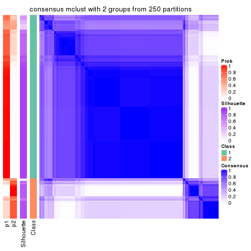</p>

</div>
<div id='tab-MAD-mclust-consensus-heatmap-2'>
<pre><code class="r">consensus_heatmap(res, k = 3)
</code></pre>

<p>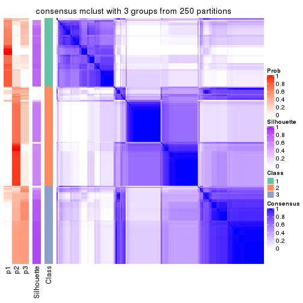</p>

</div>
<div id='tab-MAD-mclust-consensus-heatmap-3'>
<pre><code class="r">consensus_heatmap(res, k = 4)
</code></pre>

<p>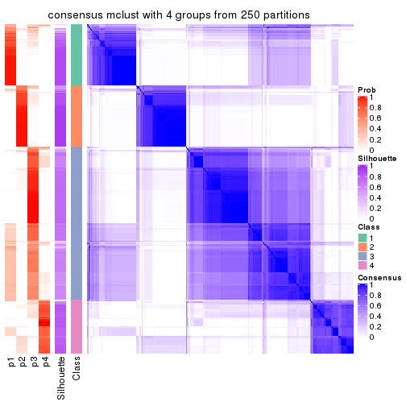</p>

</div>
<div id='tab-MAD-mclust-consensus-heatmap-4'>
<pre><code class="r">consensus_heatmap(res, k = 5)
</code></pre>

<p>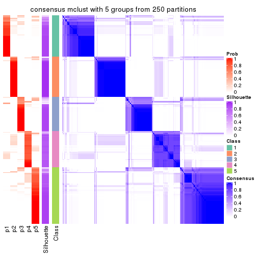</p>

</div>
<div id='tab-MAD-mclust-consensus-heatmap-5'>
<pre><code class="r">consensus_heatmap(res, k = 6)
</code></pre>

<p>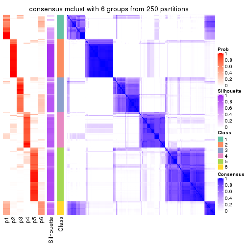</p>

</div>
</div>

Heatmaps for the membership of samples in all partitions to see how consistent they are:


<script>
$( function() {
	$( '#tabs-MAD-mclust-membership-heatmap' ).tabs();
} );
</script>
<div id='tabs-MAD-mclust-membership-heatmap'>
<ul>
<li><a href='#tab-MAD-mclust-membership-heatmap-1'>k = 2</a></li>
<li><a href='#tab-MAD-mclust-membership-heatmap-2'>k = 3</a></li>
<li><a href='#tab-MAD-mclust-membership-heatmap-3'>k = 4</a></li>
<li><a href='#tab-MAD-mclust-membership-heatmap-4'>k = 5</a></li>
<li><a href='#tab-MAD-mclust-membership-heatmap-5'>k = 6</a></li>
</ul>
<div id='tab-MAD-mclust-membership-heatmap-1'>
<pre><code class="r">membership_heatmap(res, k = 2)
</code></pre>

<p>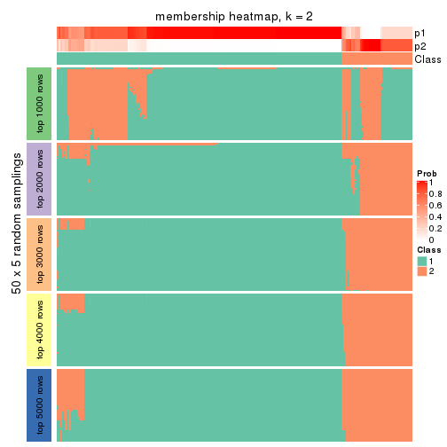</p>

</div>
<div id='tab-MAD-mclust-membership-heatmap-2'>
<pre><code class="r">membership_heatmap(res, k = 3)
</code></pre>

<p>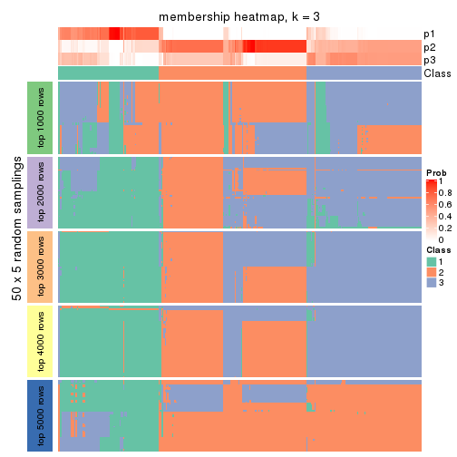</p>

</div>
<div id='tab-MAD-mclust-membership-heatmap-3'>
<pre><code class="r">membership_heatmap(res, k = 4)
</code></pre>

<p>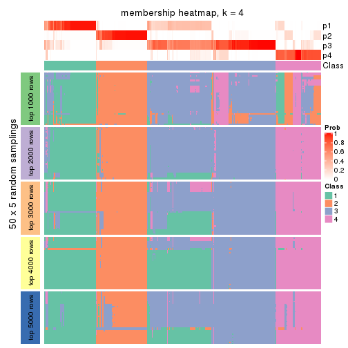</p>

</div>
<div id='tab-MAD-mclust-membership-heatmap-4'>
<pre><code class="r">membership_heatmap(res, k = 5)
</code></pre>

<p>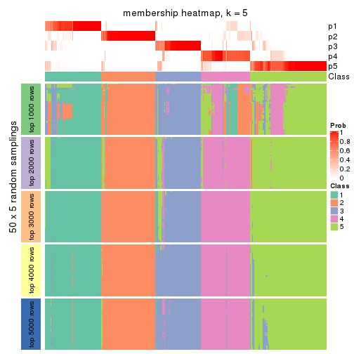</p>

</div>
<div id='tab-MAD-mclust-membership-heatmap-5'>
<pre><code class="r">membership_heatmap(res, k = 6)
</code></pre>

<p>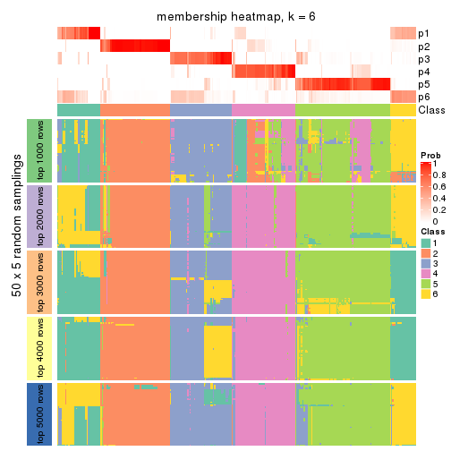</p>

</div>
</div>

As soon as we have had the classes for columns, we can look for signatures
which are significantly different between classes which can be candidate marks
for certain classes. Following are the heatmaps for signatures.


Signature heatmaps where rows are scaled:


<script>
$( function() {
	$( '#tabs-MAD-mclust-get-signatures' ).tabs();
} );
</script>
<div id='tabs-MAD-mclust-get-signatures'>
<ul>
<li><a href='#tab-MAD-mclust-get-signatures-1'>k = 2</a></li>
<li><a href='#tab-MAD-mclust-get-signatures-2'>k = 3</a></li>
<li><a href='#tab-MAD-mclust-get-signatures-3'>k = 4</a></li>
<li><a href='#tab-MAD-mclust-get-signatures-4'>k = 5</a></li>
<li><a href='#tab-MAD-mclust-get-signatures-5'>k = 6</a></li>
</ul>
<div id='tab-MAD-mclust-get-signatures-1'>
<pre><code class="r">get_signatures(res, k = 2)
</code></pre>

<p>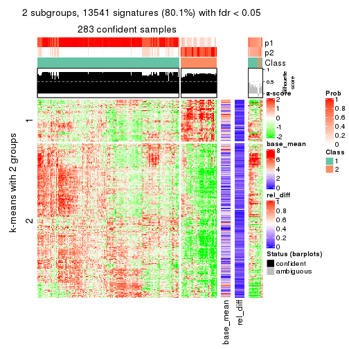</p>

</div>
<div id='tab-MAD-mclust-get-signatures-2'>
<pre><code class="r">get_signatures(res, k = 3)
</code></pre>

<p>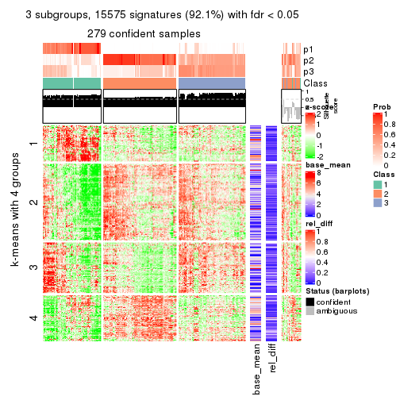</p>

</div>
<div id='tab-MAD-mclust-get-signatures-3'>
<pre><code class="r">get_signatures(res, k = 4)
</code></pre>

<p>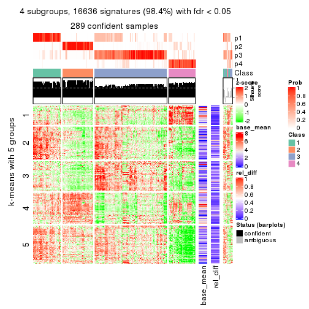</p>

</div>
<div id='tab-MAD-mclust-get-signatures-4'>
<pre><code class="r">get_signatures(res, k = 5)
</code></pre>

<p>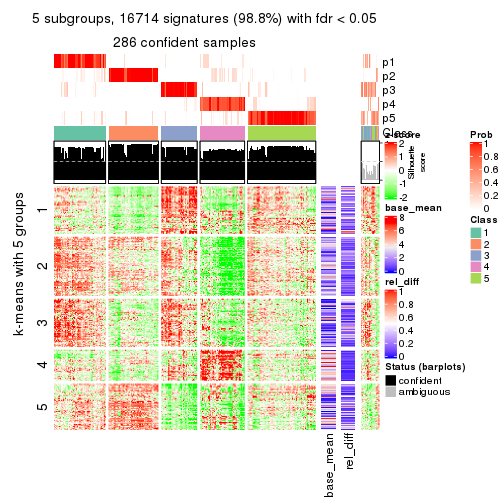</p>

</div>
<div id='tab-MAD-mclust-get-signatures-5'>
<pre><code class="r">get_signatures(res, k = 6)
</code></pre>

<p>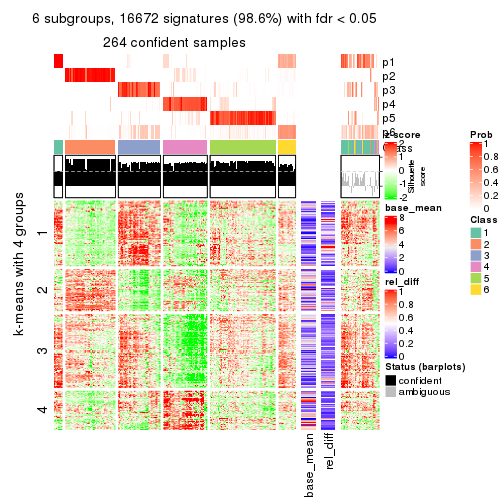</p>

</div>
</div>


Signature heatmaps where rows are not scaled:


<script>
$( function() {
	$( '#tabs-MAD-mclust-get-signatures-no-scale' ).tabs();
} );
</script>
<div id='tabs-MAD-mclust-get-signatures-no-scale'>
<ul>
<li><a href='#tab-MAD-mclust-get-signatures-no-scale-1'>k = 2</a></li>
<li><a href='#tab-MAD-mclust-get-signatures-no-scale-2'>k = 3</a></li>
<li><a href='#tab-MAD-mclust-get-signatures-no-scale-3'>k = 4</a></li>
<li><a href='#tab-MAD-mclust-get-signatures-no-scale-4'>k = 5</a></li>
<li><a href='#tab-MAD-mclust-get-signatures-no-scale-5'>k = 6</a></li>
</ul>
<div id='tab-MAD-mclust-get-signatures-no-scale-1'>
<pre><code class="r">get_signatures(res, k = 2, scale_rows = FALSE)
</code></pre>

<p>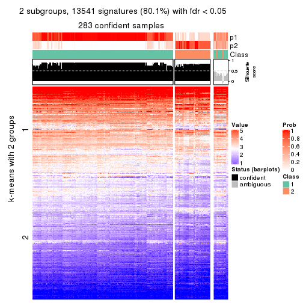</p>

</div>
<div id='tab-MAD-mclust-get-signatures-no-scale-2'>
<pre><code class="r">get_signatures(res, k = 3, scale_rows = FALSE)
</code></pre>

<p>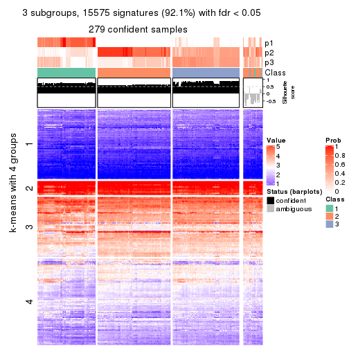</p>

</div>
<div id='tab-MAD-mclust-get-signatures-no-scale-3'>
<pre><code class="r">get_signatures(res, k = 4, scale_rows = FALSE)
</code></pre>

<p>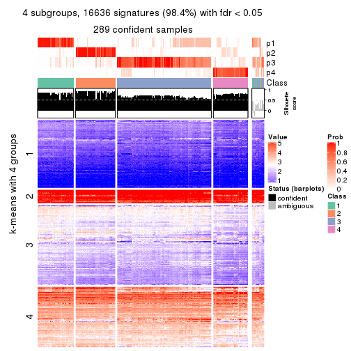</p>

</div>
<div id='tab-MAD-mclust-get-signatures-no-scale-4'>
<pre><code class="r">get_signatures(res, k = 5, scale_rows = FALSE)
</code></pre>

<p>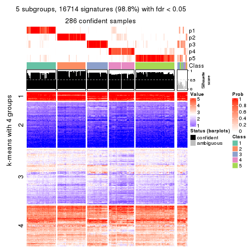</p>

</div>
<div id='tab-MAD-mclust-get-signatures-no-scale-5'>
<pre><code class="r">get_signatures(res, k = 6, scale_rows = FALSE)
</code></pre>

<p>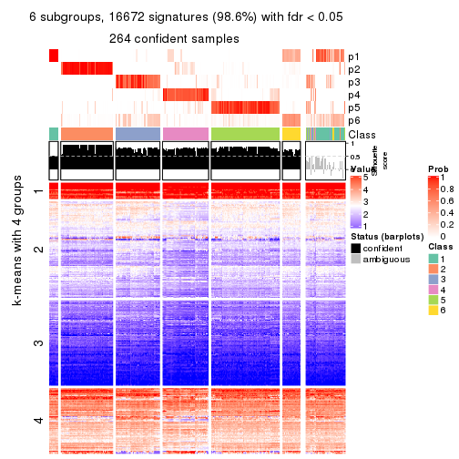</p>

</div>
</div>


Compare the overlap of signatures from different k:

```r
compare_signatures(res)
```

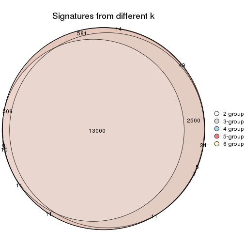

`get_signature()` returns a data frame invisibly. TO get the list of signatures, the function
call should be assigned to a variable explicitly. In following code, if `plot` argument is set
to `FALSE`, no heatmap is plotted while only the differential analysis is performed.

```r
# code only for demonstration
tb = get_signature(res, k = ..., plot = FALSE)
```

An example of the output of `tb` is:

```
#>   which_row         fdr    mean_1    mean_2 scaled_mean_1 scaled_mean_2 km
#> 1        38 0.042760348  8.373488  9.131774    -0.5533452     0.5164555  1
#> 2        40 0.018707592  7.106213  8.469186    -0.6173731     0.5762149  1
#> 3        55 0.019134737 10.221463 11.207825    -0.6159697     0.5749050  1
#> 4        59 0.006059896  5.921854  7.869574    -0.6899429     0.6439467  1
#> 5        60 0.018055526  8.928898 10.211722    -0.6204761     0.5791110  1
#> 6        98 0.009384629 15.714769 14.887706     0.6635654    -0.6193277  2
...
```

The columns in `tb` are:

1. `which_row`: row indices corresponding to the input matrix.
2. `fdr`: FDR for the differential test. 
3. `mean_x`: The mean value in group x.
4. `scaled_mean_x`: The mean value in group x after rows are scaled.
5. `km`: Row groups if k-means clustering is applied to rows.


UMAP plot which shows how samples are separated.


<script>
$( function() {
	$( '#tabs-MAD-mclust-dimension-reduction' ).tabs();
} );
</script>
<div id='tabs-MAD-mclust-dimension-reduction'>
<ul>
<li><a href='#tab-MAD-mclust-dimension-reduction-1'>k = 2</a></li>
<li><a href='#tab-MAD-mclust-dimension-reduction-2'>k = 3</a></li>
<li><a href='#tab-MAD-mclust-dimension-reduction-3'>k = 4</a></li>
<li><a href='#tab-MAD-mclust-dimension-reduction-4'>k = 5</a></li>
<li><a href='#tab-MAD-mclust-dimension-reduction-5'>k = 6</a></li>
</ul>
<div id='tab-MAD-mclust-dimension-reduction-1'>
<pre><code class="r">dimension_reduction(res, k = 2, method = &quot;UMAP&quot;)
</code></pre>

<p>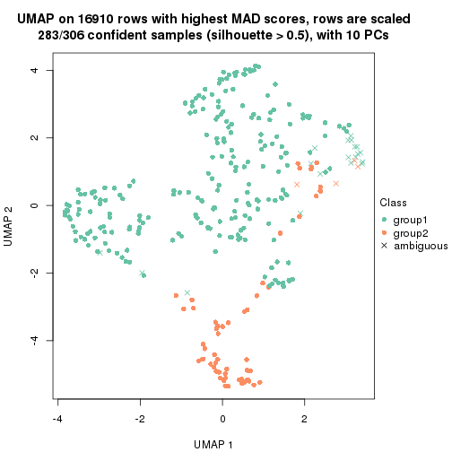</p>

</div>
<div id='tab-MAD-mclust-dimension-reduction-2'>
<pre><code class="r">dimension_reduction(res, k = 3, method = &quot;UMAP&quot;)
</code></pre>

<p>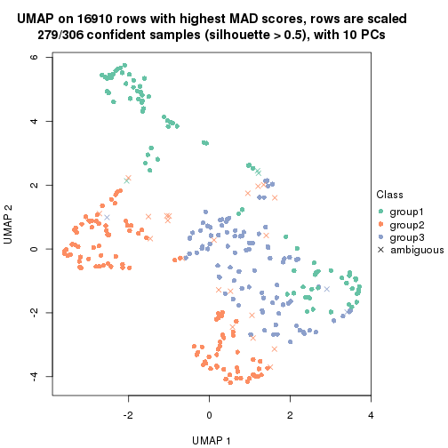</p>

</div>
<div id='tab-MAD-mclust-dimension-reduction-3'>
<pre><code class="r">dimension_reduction(res, k = 4, method = &quot;UMAP&quot;)
</code></pre>

<p>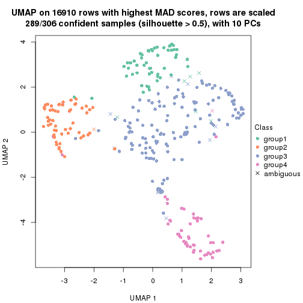</p>

</div>
<div id='tab-MAD-mclust-dimension-reduction-4'>
<pre><code class="r">dimension_reduction(res, k = 5, method = &quot;UMAP&quot;)
</code></pre>

<p>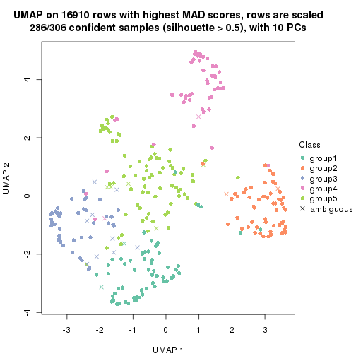</p>

</div>
<div id='tab-MAD-mclust-dimension-reduction-5'>
<pre><code class="r">dimension_reduction(res, k = 6, method = &quot;UMAP&quot;)
</code></pre>

<p>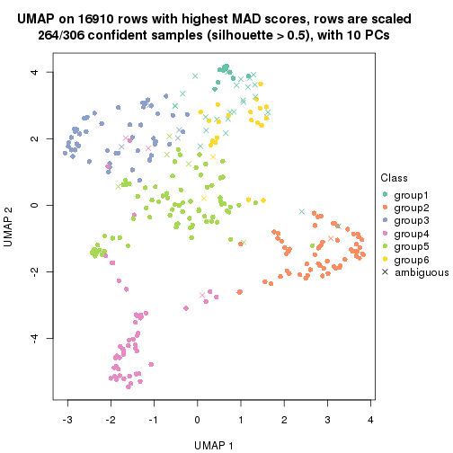</p>

</div>
</div>


Following heatmap shows how subgroups are split when increasing `k`:

```r
collect_classes(res)
```

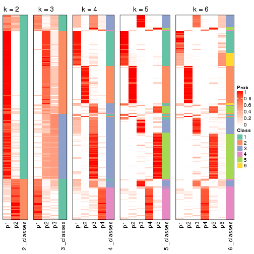


If matrix rows can be associated to genes, consider to use `GO_Enrichment(res,
...)` to perform function enrichment for the signature genes.


 

---------------------------------------------------


### MAD:NMF*


The object with results only for a single top-value method and a single partition method 
can be extracted as:

```r
res = res_list["MAD", "NMF"]
# you can also extract it by
# res = res_list["MAD:NMF"]
```

A summary of `res` and all the functions that can be applied to it:

```r
res
```

```
#> A 'ConsensusPartition' object with k = 2, 3, 4, 5, 6.
#>   On a matrix with 16910 rows and 306 columns.
#>   Top rows (1000, 2000, 3000, 4000, 5000) are extracted by 'MAD' method.
#>   Subgroups are detected by 'NMF' method.
#>   Performed in total 1250 partitions by row resampling.
#>   Best k for subgroups seems to be 2.
#> 
#> Following methods can be applied to this 'ConsensusPartition' object:
#>  [1] "cola_report"             "collect_classes"         "collect_plots"          
#>  [4] "collect_stats"           "colnames"                "compare_signatures"     
#>  [7] "consensus_heatmap"       "dimension_reduction"     "functional_enrichment"  
#> [10] "get_anno_col"            "get_anno"                "get_classes"            
#> [13] "get_consensus"           "get_matrix"              "get_membership"         
#> [16] "get_param"               "get_signatures"          "get_stats"              
#> [19] "is_best_k"               "is_stable_k"             "membership_heatmap"     
#> [22] "ncol"                    "nrow"                    "plot_ecdf"              
#> [25] "rownames"                "select_partition_number" "show"                   
#> [28] "suggest_best_k"          "test_to_known_factors"
```

`collect_plots()` function collects all the plots made from `res` for all `k` (number of partitions)
into one single page to provide an easy and fast comparison between different `k`.

```r
collect_plots(res)
```

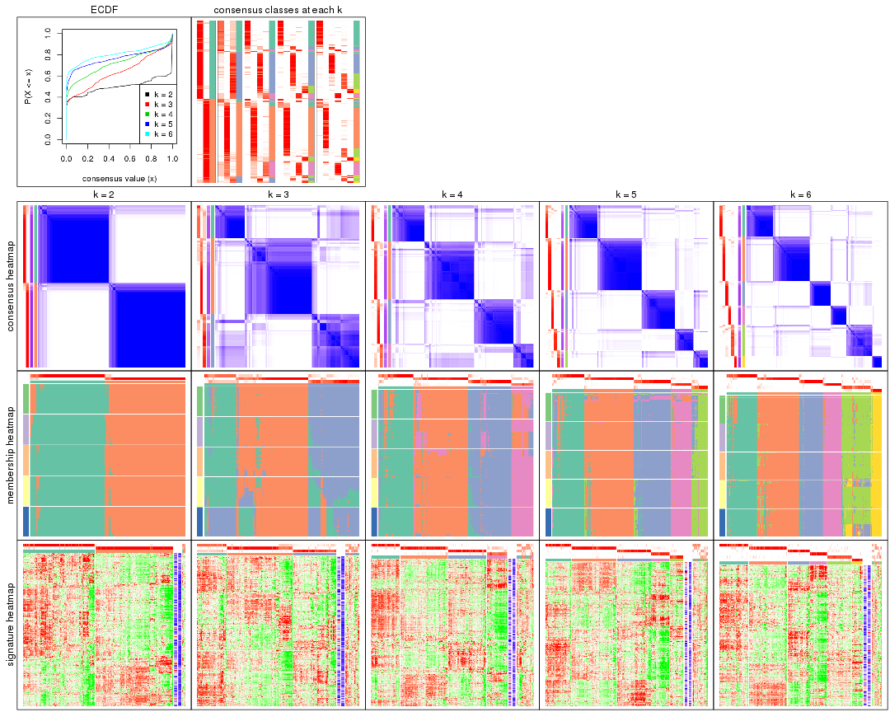

The plots are:

- The first row: a plot of the ECDF (Empirical cumulative distribution
  function) curves of the consensus matrix for each `k` and the heatmap of
  predicted classes for each `k`.
- The second row: heatmaps of the consensus matrix for each `k`.
- The third row: heatmaps of the membership matrix for each `k`.
- The fouth row: heatmaps of the signatures for each `k`.

All the plots in panels can be made by individual functions and they are
plotted later in this section.

`select_partition_number()` produces several plots showing different
statistics for choosing "optimized" `k`. There are following statistics:

- ECDF curves of the consensus matrix for each `k`;
- 1-PAC. [The PAC
  score](https://en.wikipedia.org/wiki/Consensus_clustering#Over-interpretation_potential_of_consensus_clustering)
  measures the proportion of the ambiguous subgrouping.
- Mean silhouette score.
- Concordance. The mean probability of fiting the consensus class ids in all
  partitions.
- Area increased. Denote $A_k$ as the area under the ECDF curve for current
  `k`, the area increased is defined as $A_k - A_{k-1}$.
- Rand index. The percent of pairs of samples that are both in a same cluster
  or both are not in a same cluster in the partition of k and k-1.
- Jaccard index. The ratio of pairs of samples are both in a same cluster in
  the partition of k and k-1 and the pairs of samples are both in a same
  cluster in the partition k or k-1.

The detailed explanations of these statistics can be found in [the cola
vignette](http://bioconductor.org/packages/devel/bioc/vignettes/cola/inst/doc/cola.html#toc_13).

Generally speaking, lower PAC score, higher mean silhouette score or higher
concordance corresponds to better partition. Rand index and Jaccard index
measure how similar the current partition is compared to partition with `k-1`.
If they are too similar, we won't accept `k` is better than `k-1`.

```r
select_partition_number(res)
```

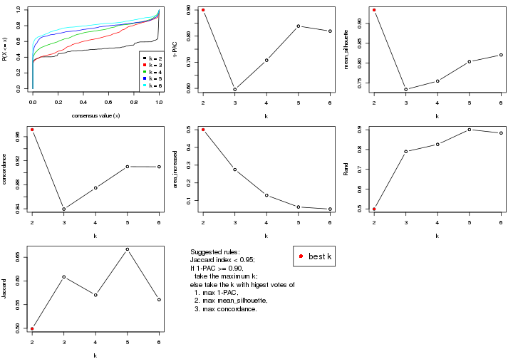

The numeric values for all these statistics can be obtained by `get_stats()`.

```r
get_stats(res)
```

```
#>   k 1-PAC mean_silhouette concordance area_increased  Rand Jaccard
#> 2 2 0.900           0.934       0.972         0.5005 0.499   0.499
#> 3 3 0.596           0.734       0.840         0.2750 0.790   0.609
#> 4 4 0.708           0.755       0.875         0.1297 0.826   0.570
#> 5 5 0.838           0.804       0.910         0.0638 0.901   0.667
#> 6 6 0.819           0.821       0.910         0.0521 0.883   0.560
```

`suggest_best_k()` suggests the best $k$ based on these statistics. The rules are as follows:

- All $k$ with Jaccard index larger than 0.95 are removed because the increase of
  the partition number does not provides enough extra information. If all $k$ are removed,
  the best $k$ is assigned by `NA`.
- For $k$ with 1-PAC larger than 0.9, the maximal $k$ is taken as the "best k". Other $k$ is called "optional k".
- If it does not fit the second rule. The $k$ with the highest vote of highest
  1-PAC, mean silhouette and concordance is taken as the "best k".

```r
suggest_best_k(res)
```

```
#> [1] 2
```


Following shows the table of the partitions (You need to click the **show/hide
code output** link to see it). The membership matrix (columns with name `p*`)
is inferred by
[`clue::cl_consensus()`](https://www.rdocumentation.org/link/cl_consensus?package=clue)
function with the `SE` method. Basically the value in the membership matrix
represents the probability to belong to a certain group. The finall class
label for an item is determined with the group with highest probability it
belongs to.

In `get_classes()` function, the entropy is calculated from the membership
matrix and the silhouette score is calculated from the consensus matrix.


<script>
$( function() {
	$( '#tabs-MAD-NMF-get-classes' ).tabs();
} );
</script>
<div id='tabs-MAD-NMF-get-classes'>
<ul>
<li><a href='#tab-MAD-NMF-get-classes-1'>k = 2</a></li>
<li><a href='#tab-MAD-NMF-get-classes-2'>k = 3</a></li>
<li><a href='#tab-MAD-NMF-get-classes-3'>k = 4</a></li>
<li><a href='#tab-MAD-NMF-get-classes-4'>k = 5</a></li>
<li><a href='#tab-MAD-NMF-get-classes-5'>k = 6</a></li>
</ul>

<div id='tab-MAD-NMF-get-classes-1'>
<p><a id='tab-MAD-NMF-get-classes-1-a' style='color:#0366d6' href='#'>show/hide code output</a></p>
<pre><code class="r">cbind(get_classes(res, k = 2), get_membership(res, k = 2))
</code></pre>

<pre><code>#&gt;            class entropy silhouette    p1    p2
#&gt; SRR1609360     2  0.7674     0.7006 0.224 0.776
#&gt; SRR1609361     2  0.0000     0.9753 0.000 1.000
#&gt; SRR1609362     2  0.0000     0.9753 0.000 1.000
#&gt; SRR1609363     2  0.0000     0.9753 0.000 1.000
#&gt; SRR1609364     2  0.0000     0.9753 0.000 1.000
#&gt; SRR1609365     2  0.0000     0.9753 0.000 1.000
#&gt; SRR1609366     2  0.0000     0.9753 0.000 1.000
#&gt; SRR1609367     1  0.0000     0.9646 1.000 0.000
#&gt; SRR1609368     2  0.0000     0.9753 0.000 1.000
#&gt; SRR1609369     2  0.0000     0.9753 0.000 1.000
#&gt; SRR1609370     1  0.0938     0.9561 0.988 0.012
#&gt; SRR1609371     2  0.0000     0.9753 0.000 1.000
#&gt; SRR1609372     1  0.2778     0.9264 0.952 0.048
#&gt; SRR1609373     2  0.0000     0.9753 0.000 1.000
#&gt; SRR1609374     2  0.0000     0.9753 0.000 1.000
#&gt; SRR1609375     2  0.0000     0.9753 0.000 1.000
#&gt; SRR1609377     2  0.0000     0.9753 0.000 1.000
#&gt; SRR1609376     2  0.0000     0.9753 0.000 1.000
#&gt; SRR1609378     2  0.0000     0.9753 0.000 1.000
#&gt; SRR1609379     2  0.0000     0.9753 0.000 1.000
#&gt; SRR1609382     2  0.0000     0.9753 0.000 1.000
#&gt; SRR1609383     1  0.9323     0.4950 0.652 0.348
#&gt; SRR1609381     1  0.8327     0.6609 0.736 0.264
#&gt; SRR1609384     2  0.0000     0.9753 0.000 1.000
#&gt; SRR1609386     2  0.0000     0.9753 0.000 1.000
#&gt; SRR1609385     2  0.0000     0.9753 0.000 1.000
#&gt; SRR1609387     1  0.9686     0.3785 0.604 0.396
#&gt; SRR1609388     2  0.0000     0.9753 0.000 1.000
#&gt; SRR1609390     1  0.8443     0.6474 0.728 0.272
#&gt; SRR1609393     2  0.0000     0.9753 0.000 1.000
#&gt; SRR1609394     2  0.0000     0.9753 0.000 1.000
#&gt; SRR1609392     2  0.0000     0.9753 0.000 1.000
#&gt; SRR1609391     2  0.0000     0.9753 0.000 1.000
#&gt; SRR1609395     1  0.0938     0.9561 0.988 0.012
#&gt; SRR1609396     1  0.7219     0.7577 0.800 0.200
#&gt; SRR1609398     2  0.0000     0.9753 0.000 1.000
#&gt; SRR1609399     1  0.0672     0.9590 0.992 0.008
#&gt; SRR1609400     1  0.0000     0.9646 1.000 0.000
#&gt; SRR1609397     2  0.0000     0.9753 0.000 1.000
#&gt; SRR1609401     2  0.0000     0.9753 0.000 1.000
#&gt; SRR1609402     2  0.0000     0.9753 0.000 1.000
#&gt; SRR1609405     2  0.0000     0.9753 0.000 1.000
#&gt; SRR1609404     2  0.0000     0.9753 0.000 1.000
#&gt; SRR1609406     2  0.0000     0.9753 0.000 1.000
#&gt; SRR1609408     2  0.0000     0.9753 0.000 1.000
#&gt; SRR1609403     2  0.0000     0.9753 0.000 1.000
#&gt; SRR1609410     2  0.1843     0.9500 0.028 0.972
#&gt; SRR1609411     2  0.0000     0.9753 0.000 1.000
#&gt; SRR1609407     2  0.0000     0.9753 0.000 1.000
#&gt; SRR1609413     2  0.3274     0.9183 0.060 0.940
#&gt; SRR1609412     1  0.0000     0.9646 1.000 0.000
#&gt; SRR1609414     1  0.0000     0.9646 1.000 0.000
#&gt; SRR1609415     1  0.0000     0.9646 1.000 0.000
#&gt; SRR1609416     1  0.0000     0.9646 1.000 0.000
#&gt; SRR1609417     1  0.0000     0.9646 1.000 0.000
#&gt; SRR1609418     2  0.0000     0.9753 0.000 1.000
#&gt; SRR1609419     2  0.0000     0.9753 0.000 1.000
#&gt; SRR1609420     2  0.0000     0.9753 0.000 1.000
#&gt; SRR1609421     2  0.0000     0.9753 0.000 1.000
#&gt; SRR1609422     2  0.9881     0.2327 0.436 0.564
#&gt; SRR1609423     2  0.0000     0.9753 0.000 1.000
#&gt; SRR1609424     2  0.0000     0.9753 0.000 1.000
#&gt; SRR1609425     2  0.0000     0.9753 0.000 1.000
#&gt; SRR1609426     2  0.0000     0.9753 0.000 1.000
#&gt; SRR1609427     1  0.0000     0.9646 1.000 0.000
#&gt; SRR1609428     2  0.0000     0.9753 0.000 1.000
#&gt; SRR1609429     2  0.3114     0.9244 0.056 0.944
#&gt; SRR1609430     1  0.0000     0.9646 1.000 0.000
#&gt; SRR1609431     2  0.7219     0.7457 0.200 0.800
#&gt; SRR1609432     2  0.0000     0.9753 0.000 1.000
#&gt; SRR1609433     1  0.0000     0.9646 1.000 0.000
#&gt; SRR1609434     2  0.0000     0.9753 0.000 1.000
#&gt; SRR1609435     1  0.0000     0.9646 1.000 0.000
#&gt; SRR1609436     1  0.0000     0.9646 1.000 0.000
#&gt; SRR1609437     2  0.0000     0.9753 0.000 1.000
#&gt; SRR1609438     2  0.0000     0.9753 0.000 1.000
#&gt; SRR1609439     1  0.0000     0.9646 1.000 0.000
#&gt; SRR1609440     1  0.0376     0.9619 0.996 0.004
#&gt; SRR1609441     2  0.0000     0.9753 0.000 1.000
#&gt; SRR1609442     2  0.0000     0.9753 0.000 1.000
#&gt; SRR1609443     1  0.0000     0.9646 1.000 0.000
#&gt; SRR1609444     1  0.2778     0.9269 0.952 0.048
#&gt; SRR1609445     1  0.2603     0.9290 0.956 0.044
#&gt; SRR1609446     2  0.0000     0.9753 0.000 1.000
#&gt; SRR1609447     1  0.0000     0.9646 1.000 0.000
#&gt; SRR1609448     2  0.0000     0.9753 0.000 1.000
#&gt; SRR1609449     1  0.1184     0.9531 0.984 0.016
#&gt; SRR1609450     2  0.0000     0.9753 0.000 1.000
#&gt; SRR1609451     1  0.0000     0.9646 1.000 0.000
#&gt; SRR1609452     1  0.8267     0.6531 0.740 0.260
#&gt; SRR1609453     1  0.0000     0.9646 1.000 0.000
#&gt; SRR1609454     2  0.0000     0.9753 0.000 1.000
#&gt; SRR1609455     2  0.0000     0.9753 0.000 1.000
#&gt; SRR1609456     2  0.0000     0.9753 0.000 1.000
#&gt; SRR1609457     1  0.0000     0.9646 1.000 0.000
#&gt; SRR1609458     1  0.0000     0.9646 1.000 0.000
#&gt; SRR1609459     1  0.0000     0.9646 1.000 0.000
#&gt; SRR1609460     2  0.0000     0.9753 0.000 1.000
#&gt; SRR1609461     1  0.0000     0.9646 1.000 0.000
#&gt; SRR1609462     1  0.0000     0.9646 1.000 0.000
#&gt; SRR1609464     1  0.0000     0.9646 1.000 0.000
#&gt; SRR1609463     1  0.0000     0.9646 1.000 0.000
#&gt; SRR1609465     2  0.0000     0.9753 0.000 1.000
#&gt; SRR1609466     1  0.7219     0.7577 0.800 0.200
#&gt; SRR1609467     1  0.0000     0.9646 1.000 0.000
#&gt; SRR1609469     2  0.0000     0.9753 0.000 1.000
#&gt; SRR1609470     2  0.0000     0.9753 0.000 1.000
#&gt; SRR1609472     1  0.0000     0.9646 1.000 0.000
#&gt; SRR1609471     2  0.6148     0.8120 0.152 0.848
#&gt; SRR1609474     2  0.0000     0.9753 0.000 1.000
#&gt; SRR1609473     2  0.0000     0.9753 0.000 1.000
#&gt; SRR1609475     2  0.0000     0.9753 0.000 1.000
#&gt; SRR1609478     1  0.0000     0.9646 1.000 0.000
#&gt; SRR1609476     1  0.0000     0.9646 1.000 0.000
#&gt; SRR1609477     1  0.0000     0.9646 1.000 0.000
#&gt; SRR1609479     2  0.0000     0.9753 0.000 1.000
#&gt; SRR1609481     2  0.0000     0.9753 0.000 1.000
#&gt; SRR1609480     1  0.0000     0.9646 1.000 0.000
#&gt; SRR1609482     1  0.0000     0.9646 1.000 0.000
#&gt; SRR1609484     2  0.0000     0.9753 0.000 1.000
#&gt; SRR1609483     1  0.0000     0.9646 1.000 0.000
#&gt; SRR1609486     1  0.0000     0.9646 1.000 0.000
#&gt; SRR1609485     1  0.0000     0.9646 1.000 0.000
#&gt; SRR1609487     2  0.0000     0.9753 0.000 1.000
#&gt; SRR1609488     1  0.0000     0.9646 1.000 0.000
#&gt; SRR1609489     2  0.0000     0.9753 0.000 1.000
#&gt; SRR1609490     2  0.0000     0.9753 0.000 1.000
#&gt; SRR1609491     2  0.0000     0.9753 0.000 1.000
#&gt; SRR1609492     2  0.0000     0.9753 0.000 1.000
#&gt; SRR1609493     2  0.7219     0.7457 0.200 0.800
#&gt; SRR1609494     2  0.0000     0.9753 0.000 1.000
#&gt; SRR1609495     1  0.0000     0.9646 1.000 0.000
#&gt; SRR1609496     1  0.0000     0.9646 1.000 0.000
#&gt; SRR1609497     1  0.0000     0.9646 1.000 0.000
#&gt; SRR1609498     1  0.0000     0.9646 1.000 0.000
#&gt; SRR1609499     2  0.0000     0.9753 0.000 1.000
#&gt; SRR1609500     1  0.0000     0.9646 1.000 0.000
#&gt; SRR1609501     2  0.0000     0.9753 0.000 1.000
#&gt; SRR1609502     2  0.0000     0.9753 0.000 1.000
#&gt; SRR1609503     2  0.0000     0.9753 0.000 1.000
#&gt; SRR1609504     1  0.0000     0.9646 1.000 0.000
#&gt; SRR1609505     1  0.0000     0.9646 1.000 0.000
#&gt; SRR1609506     2  0.0000     0.9753 0.000 1.000
#&gt; SRR1609507     1  0.0000     0.9646 1.000 0.000
#&gt; SRR1609508     2  0.0000     0.9753 0.000 1.000
#&gt; SRR1609509     2  0.0000     0.9753 0.000 1.000
#&gt; SRR1609510     2  0.0000     0.9753 0.000 1.000
#&gt; SRR1609512     1  0.0000     0.9646 1.000 0.000
#&gt; SRR1609511     1  0.0000     0.9646 1.000 0.000
#&gt; SRR1609513     1  0.0000     0.9646 1.000 0.000
#&gt; SRR1609514     1  0.0000     0.9646 1.000 0.000
#&gt; SRR1609515     2  0.0000     0.9753 0.000 1.000
#&gt; SRR1609516     1  0.0000     0.9646 1.000 0.000
#&gt; SRR1609517     2  0.0000     0.9753 0.000 1.000
#&gt; SRR1609518     1  0.8813     0.5978 0.700 0.300
#&gt; SRR1609519     1  0.0000     0.9646 1.000 0.000
#&gt; SRR1609520     2  0.0000     0.9753 0.000 1.000
#&gt; SRR1609521     1  0.0000     0.9646 1.000 0.000
#&gt; SRR1609522     1  0.0000     0.9646 1.000 0.000
#&gt; SRR1609523     2  0.8763     0.5842 0.296 0.704
#&gt; SRR1609524     2  0.0000     0.9753 0.000 1.000
#&gt; SRR1609526     1  0.0000     0.9646 1.000 0.000
#&gt; SRR1609525     2  0.0000     0.9753 0.000 1.000
#&gt; SRR1609527     1  0.0000     0.9646 1.000 0.000
#&gt; SRR1609529     1  0.0000     0.9646 1.000 0.000
#&gt; SRR1609528     1  0.0000     0.9646 1.000 0.000
#&gt; SRR1609530     1  0.0000     0.9646 1.000 0.000
#&gt; SRR1609531     2  0.0000     0.9753 0.000 1.000
#&gt; SRR1609532     1  0.0000     0.9646 1.000 0.000
#&gt; SRR1609533     2  0.0000     0.9753 0.000 1.000
#&gt; SRR1609534     1  0.0000     0.9646 1.000 0.000
#&gt; SRR1609535     2  0.0000     0.9753 0.000 1.000
#&gt; SRR1609537     2  0.0000     0.9753 0.000 1.000
#&gt; SRR1609536     1  0.0000     0.9646 1.000 0.000
#&gt; SRR1609538     2  0.0000     0.9753 0.000 1.000
#&gt; SRR1609539     1  0.0000     0.9646 1.000 0.000
#&gt; SRR1609540     1  0.0000     0.9646 1.000 0.000
#&gt; SRR1609541     1  0.0000     0.9646 1.000 0.000
#&gt; SRR1609542     2  0.0000     0.9753 0.000 1.000
#&gt; SRR1609543     1  0.0000     0.9646 1.000 0.000
#&gt; SRR1609544     1  0.0000     0.9646 1.000 0.000
#&gt; SRR1609545     1  0.0000     0.9646 1.000 0.000
#&gt; SRR1609546     1  0.0000     0.9646 1.000 0.000
#&gt; SRR1609547     1  0.0000     0.9646 1.000 0.000
#&gt; SRR1609548     1  0.0000     0.9646 1.000 0.000
#&gt; SRR1609549     2  0.0000     0.9753 0.000 1.000
#&gt; SRR1609550     2  0.0000     0.9753 0.000 1.000
#&gt; SRR1609551     1  0.0000     0.9646 1.000 0.000
#&gt; SRR1609552     1  0.0000     0.9646 1.000 0.000
#&gt; SRR1609553     1  0.0000     0.9646 1.000 0.000
#&gt; SRR1609554     1  0.0672     0.9588 0.992 0.008
#&gt; SRR1609555     1  0.0000     0.9646 1.000 0.000
#&gt; SRR1609556     1  0.0000     0.9646 1.000 0.000
#&gt; SRR1609557     2  0.0000     0.9753 0.000 1.000
#&gt; SRR1609558     1  0.2948     0.9215 0.948 0.052
#&gt; SRR1609559     1  0.7139     0.7547 0.804 0.196
#&gt; SRR1609560     2  0.0000     0.9753 0.000 1.000
#&gt; SRR1609561     1  0.0000     0.9646 1.000 0.000
#&gt; SRR1609562     2  0.0000     0.9753 0.000 1.000
#&gt; SRR1609563     2  0.0000     0.9753 0.000 1.000
#&gt; SRR1609564     1  0.0000     0.9646 1.000 0.000
#&gt; SRR1609565     2  0.0000     0.9753 0.000 1.000
#&gt; SRR1609566     2  0.0000     0.9753 0.000 1.000
#&gt; SRR1609567     2  0.0000     0.9753 0.000 1.000
#&gt; SRR1609568     2  0.0000     0.9753 0.000 1.000
#&gt; SRR1609569     1  0.0000     0.9646 1.000 0.000
#&gt; SRR1609570     1  0.0000     0.9646 1.000 0.000
#&gt; SRR1609571     1  0.0000     0.9646 1.000 0.000
#&gt; SRR1609572     1  0.0000     0.9646 1.000 0.000
#&gt; SRR1609573     1  0.0000     0.9646 1.000 0.000
#&gt; SRR1609574     1  0.0000     0.9646 1.000 0.000
#&gt; SRR1609575     2  0.0000     0.9753 0.000 1.000
#&gt; SRR1609576     2  0.0000     0.9753 0.000 1.000
#&gt; SRR1609578     2  0.2603     0.9349 0.044 0.956
#&gt; SRR1609577     1  0.7219     0.7577 0.800 0.200
#&gt; SRR1609579     1  0.0000     0.9646 1.000 0.000
#&gt; SRR1609580     1  0.0000     0.9646 1.000 0.000
#&gt; SRR1609582     1  0.0000     0.9646 1.000 0.000
#&gt; SRR1609581     2  0.0000     0.9753 0.000 1.000
#&gt; SRR1609583     1  0.7219     0.7490 0.800 0.200
#&gt; SRR1609584     1  0.0000     0.9646 1.000 0.000
#&gt; SRR1609585     1  0.0000     0.9646 1.000 0.000
#&gt; SRR1609586     2  0.0000     0.9753 0.000 1.000
#&gt; SRR1609587     1  0.0000     0.9646 1.000 0.000
#&gt; SRR1609588     2  0.0000     0.9753 0.000 1.000
#&gt; SRR1609589     2  0.0000     0.9753 0.000 1.000
#&gt; SRR1609590     1  0.0000     0.9646 1.000 0.000
#&gt; SRR1609592     2  0.9922     0.1940 0.448 0.552
#&gt; SRR1609591     1  0.7883     0.7051 0.764 0.236
#&gt; SRR1609593     1  0.9996     0.0381 0.512 0.488
#&gt; SRR1609594     2  0.0000     0.9753 0.000 1.000
#&gt; SRR1609595     2  0.7219     0.7457 0.200 0.800
#&gt; SRR1609596     2  0.0000     0.9753 0.000 1.000
#&gt; SRR1609597     2  0.0000     0.9753 0.000 1.000
#&gt; SRR1609598     1  0.0000     0.9646 1.000 0.000
#&gt; SRR1609599     1  0.0000     0.9646 1.000 0.000
#&gt; SRR1609600     1  0.0000     0.9646 1.000 0.000
#&gt; SRR1609601     1  0.0000     0.9646 1.000 0.000
#&gt; SRR1609602     1  0.0000     0.9646 1.000 0.000
#&gt; SRR1609603     2  0.0000     0.9753 0.000 1.000
#&gt; SRR1609604     2  0.0000     0.9753 0.000 1.000
#&gt; SRR1609605     2  0.0000     0.9753 0.000 1.000
#&gt; SRR1609606     2  0.0000     0.9753 0.000 1.000
#&gt; SRR1609607     1  0.0000     0.9646 1.000 0.000
#&gt; SRR1609608     1  0.0000     0.9646 1.000 0.000
#&gt; SRR1609609     2  0.0000     0.9753 0.000 1.000
#&gt; SRR1609610     1  0.0000     0.9646 1.000 0.000
#&gt; SRR1609611     2  0.0000     0.9753 0.000 1.000
#&gt; SRR1609613     2  0.0000     0.9753 0.000 1.000
#&gt; SRR1609612     1  0.0000     0.9646 1.000 0.000
#&gt; SRR1609614     1  0.0000     0.9646 1.000 0.000
#&gt; SRR1609615     2  0.1184     0.9612 0.016 0.984
#&gt; SRR1609616     1  0.0000     0.9646 1.000 0.000
#&gt; SRR1609617     2  0.0000     0.9753 0.000 1.000
#&gt; SRR1609618     1  0.0000     0.9646 1.000 0.000
#&gt; SRR1609619     2  0.9732     0.2940 0.404 0.596
#&gt; SRR1609620     2  0.0000     0.9753 0.000 1.000
#&gt; SRR1609621     2  0.0000     0.9753 0.000 1.000
#&gt; SRR1609622     1  0.0000     0.9646 1.000 0.000
#&gt; SRR1609623     1  0.0000     0.9646 1.000 0.000
#&gt; SRR1609624     2  0.8555     0.5988 0.280 0.720
#&gt; SRR1609625     1  0.1843     0.9436 0.972 0.028
#&gt; SRR1609626     1  0.0000     0.9646 1.000 0.000
#&gt; SRR1609627     2  0.0000     0.9753 0.000 1.000
#&gt; SRR1609628     2  0.0000     0.9753 0.000 1.000
#&gt; SRR1609629     1  0.0000     0.9646 1.000 0.000
#&gt; SRR1609630     2  0.0000     0.9753 0.000 1.000
#&gt; SRR1609631     1  0.6712     0.7891 0.824 0.176
#&gt; SRR1609632     2  0.0000     0.9753 0.000 1.000
#&gt; SRR1609633     1  0.1843     0.9436 0.972 0.028
#&gt; SRR1609634     2  0.0000     0.9753 0.000 1.000
#&gt; SRR1609635     1  0.0000     0.9646 1.000 0.000
#&gt; SRR1609636     2  0.0000     0.9753 0.000 1.000
#&gt; SRR1609637     1  0.0000     0.9646 1.000 0.000
#&gt; SRR1609638     2  0.0000     0.9753 0.000 1.000
#&gt; SRR1609639     2  0.0000     0.9753 0.000 1.000
#&gt; SRR1609640     1  0.0000     0.9646 1.000 0.000
#&gt; SRR1609641     2  0.8861     0.5494 0.304 0.696
#&gt; SRR1609642     1  0.8327     0.6616 0.736 0.264
#&gt; SRR1609643     1  0.0000     0.9646 1.000 0.000
#&gt; SRR1609644     2  0.0000     0.9753 0.000 1.000
#&gt; SRR1609645     1  0.0000     0.9646 1.000 0.000
#&gt; SRR1609646     1  0.0000     0.9646 1.000 0.000
#&gt; SRR1609647     2  0.0000     0.9753 0.000 1.000
#&gt; SRR1609649     1  0.0000     0.9646 1.000 0.000
#&gt; SRR1609648     2  0.0000     0.9753 0.000 1.000
#&gt; SRR1609651     2  0.0000     0.9753 0.000 1.000
#&gt; SRR1609650     1  0.8081     0.6742 0.752 0.248
#&gt; SRR1609652     1  0.0000     0.9646 1.000 0.000
#&gt; SRR1609653     2  0.0000     0.9753 0.000 1.000
#&gt; SRR1609654     2  0.0000     0.9753 0.000 1.000
#&gt; SRR1609655     1  0.0000     0.9646 1.000 0.000
#&gt; SRR1609657     1  0.7219     0.7577 0.800 0.200
#&gt; SRR1609656     1  0.6801     0.7840 0.820 0.180
#&gt; SRR1609658     2  0.0000     0.9753 0.000 1.000
#&gt; SRR1609659     2  0.0000     0.9753 0.000 1.000
#&gt; SRR1609660     1  0.0000     0.9646 1.000 0.000
#&gt; SRR1609661     1  0.0000     0.9646 1.000 0.000
#&gt; SRR1609662     2  0.0000     0.9753 0.000 1.000
#&gt; SRR1609663     1  0.0000     0.9646 1.000 0.000
#&gt; SRR1609664     2  0.6531     0.7907 0.168 0.832
#&gt; SRR1609665     2  0.0000     0.9753 0.000 1.000
#&gt; SRR1609666     2  0.0000     0.9753 0.000 1.000
#&gt; SRR1609667     1  0.0000     0.9646 1.000 0.000
#&gt; SRR1609668     2  0.6712     0.7796 0.176 0.824
#&gt; SRR1609669     2  0.0000     0.9753 0.000 1.000
</code></pre>

<script>
$('#tab-MAD-NMF-get-classes-1-a').parent().next().next().hide();
$('#tab-MAD-NMF-get-classes-1-a').click(function(){
  $('#tab-MAD-NMF-get-classes-1-a').parent().next().next().toggle();
  return(false);
});
</script>
</div>

<div id='tab-MAD-NMF-get-classes-2'>
<p><a id='tab-MAD-NMF-get-classes-2-a' style='color:#0366d6' href='#'>show/hide code output</a></p>
<pre><code class="r">cbind(get_classes(res, k = 3), get_membership(res, k = 3))
</code></pre>

<pre><code>#&gt;            class entropy silhouette    p1    p2    p3
#&gt; SRR1609360     1  0.5559     0.4202 0.780 0.192 0.028
#&gt; SRR1609361     1  0.4452     0.4411 0.808 0.192 0.000
#&gt; SRR1609362     2  0.6373     0.7133 0.268 0.704 0.028
#&gt; SRR1609363     2  0.0000     0.8866 0.000 1.000 0.000
#&gt; SRR1609364     2  0.0000     0.8866 0.000 1.000 0.000
#&gt; SRR1609365     2  0.6373     0.5789 0.408 0.588 0.004
#&gt; SRR1609366     2  0.0000     0.8866 0.000 1.000 0.000
#&gt; SRR1609367     1  0.5178     0.8657 0.744 0.000 0.256
#&gt; SRR1609368     2  0.0000     0.8866 0.000 1.000 0.000
#&gt; SRR1609369     2  0.2796     0.8241 0.092 0.908 0.000
#&gt; SRR1609370     1  0.5178     0.8657 0.744 0.000 0.256
#&gt; SRR1609371     2  0.5058     0.7483 0.244 0.756 0.000
#&gt; SRR1609372     1  0.5178     0.8657 0.744 0.000 0.256
#&gt; SRR1609373     2  0.0000     0.8866 0.000 1.000 0.000
#&gt; SRR1609374     2  0.0000     0.8866 0.000 1.000 0.000
#&gt; SRR1609375     2  0.0000     0.8866 0.000 1.000 0.000
#&gt; SRR1609377     2  0.0424     0.8832 0.008 0.992 0.000
#&gt; SRR1609376     2  0.0000     0.8866 0.000 1.000 0.000
#&gt; SRR1609378     2  0.6699     0.7082 0.256 0.700 0.044
#&gt; SRR1609379     2  0.5948     0.4215 0.360 0.640 0.000
#&gt; SRR1609382     2  0.6894     0.7018 0.256 0.692 0.052
#&gt; SRR1609383     1  0.0892     0.5835 0.980 0.000 0.020
#&gt; SRR1609381     1  0.5365     0.8632 0.744 0.004 0.252
#&gt; SRR1609384     2  0.0237     0.8850 0.004 0.996 0.000
#&gt; SRR1609386     2  0.0237     0.8850 0.004 0.996 0.000
#&gt; SRR1609385     2  0.6045     0.3741 0.380 0.620 0.000
#&gt; SRR1609387     1  0.5698     0.8587 0.736 0.012 0.252
#&gt; SRR1609388     2  0.0000     0.8866 0.000 1.000 0.000
#&gt; SRR1609390     1  0.6056     0.8380 0.744 0.032 0.224
#&gt; SRR1609393     2  0.6596     0.7117 0.256 0.704 0.040
#&gt; SRR1609394     2  0.0000     0.8866 0.000 1.000 0.000
#&gt; SRR1609392     2  0.0000     0.8866 0.000 1.000 0.000
#&gt; SRR1609391     2  0.3619     0.8199 0.136 0.864 0.000
#&gt; SRR1609395     1  0.5178     0.8657 0.744 0.000 0.256
#&gt; SRR1609396     1  0.5178     0.8657 0.744 0.000 0.256
#&gt; SRR1609398     2  0.0000     0.8866 0.000 1.000 0.000
#&gt; SRR1609399     1  0.5178     0.8657 0.744 0.000 0.256
#&gt; SRR1609400     1  0.5178     0.8657 0.744 0.000 0.256
#&gt; SRR1609397     2  0.0000     0.8866 0.000 1.000 0.000
#&gt; SRR1609401     2  0.0000     0.8866 0.000 1.000 0.000
#&gt; SRR1609402     2  0.0000     0.8866 0.000 1.000 0.000
#&gt; SRR1609405     2  0.0237     0.8850 0.004 0.996 0.000
#&gt; SRR1609404     2  0.5138     0.7427 0.252 0.748 0.000
#&gt; SRR1609406     2  0.0000     0.8866 0.000 1.000 0.000
#&gt; SRR1609408     2  0.0000     0.8866 0.000 1.000 0.000
#&gt; SRR1609403     2  0.6260     0.1812 0.448 0.552 0.000
#&gt; SRR1609410     1  0.6104     0.4216 0.648 0.348 0.004
#&gt; SRR1609411     2  0.0000     0.8866 0.000 1.000 0.000
#&gt; SRR1609407     2  0.0000     0.8866 0.000 1.000 0.000
#&gt; SRR1609413     1  0.6452     0.5737 0.712 0.252 0.036
#&gt; SRR1609412     3  0.1964     0.7580 0.056 0.000 0.944
#&gt; SRR1609414     3  0.1964     0.7580 0.056 0.000 0.944
#&gt; SRR1609415     1  0.5178     0.8657 0.744 0.000 0.256
#&gt; SRR1609416     1  0.5178     0.8657 0.744 0.000 0.256
#&gt; SRR1609417     3  0.1411     0.7603 0.036 0.000 0.964
#&gt; SRR1609418     2  0.4346     0.7269 0.184 0.816 0.000
#&gt; SRR1609419     2  0.0000     0.8866 0.000 1.000 0.000
#&gt; SRR1609420     2  0.0424     0.8846 0.008 0.992 0.000
#&gt; SRR1609421     3  0.5692     0.5527 0.008 0.268 0.724
#&gt; SRR1609422     3  0.5178     0.6214 0.256 0.000 0.744
#&gt; SRR1609423     2  0.8170     0.6375 0.256 0.624 0.120
#&gt; SRR1609424     2  0.6798     0.7054 0.256 0.696 0.048
#&gt; SRR1609425     2  0.0000     0.8866 0.000 1.000 0.000
#&gt; SRR1609426     2  0.0000     0.8866 0.000 1.000 0.000
#&gt; SRR1609427     1  0.5178     0.8657 0.744 0.000 0.256
#&gt; SRR1609428     2  0.0000     0.8866 0.000 1.000 0.000
#&gt; SRR1609429     2  0.0237     0.8850 0.000 0.996 0.004
#&gt; SRR1609430     3  0.5216     0.4487 0.260 0.000 0.740
#&gt; SRR1609431     3  0.6168     0.3274 0.000 0.412 0.588
#&gt; SRR1609432     2  0.0000     0.8866 0.000 1.000 0.000
#&gt; SRR1609433     1  0.5178     0.8657 0.744 0.000 0.256
#&gt; SRR1609434     2  0.6894     0.7018 0.256 0.692 0.052
#&gt; SRR1609435     1  0.5178     0.8657 0.744 0.000 0.256
#&gt; SRR1609436     3  0.4346     0.6136 0.184 0.000 0.816
#&gt; SRR1609437     2  0.6596     0.7121 0.256 0.704 0.040
#&gt; SRR1609438     2  0.6596     0.7117 0.256 0.704 0.040
#&gt; SRR1609439     3  0.2711     0.7360 0.088 0.000 0.912
#&gt; SRR1609440     1  0.5178     0.8657 0.744 0.000 0.256
#&gt; SRR1609441     2  0.6848     0.7463 0.164 0.736 0.100
#&gt; SRR1609442     2  0.0592     0.8827 0.012 0.988 0.000
#&gt; SRR1609443     3  0.6215    -0.2047 0.428 0.000 0.572
#&gt; SRR1609444     2  0.7530     0.4528 0.084 0.664 0.252
#&gt; SRR1609445     3  0.0747     0.7665 0.016 0.000 0.984
#&gt; SRR1609446     2  0.0424     0.8834 0.000 0.992 0.008
#&gt; SRR1609447     1  0.5178     0.8657 0.744 0.000 0.256
#&gt; SRR1609448     2  0.0000     0.8866 0.000 1.000 0.000
#&gt; SRR1609449     1  0.7076     0.8164 0.684 0.060 0.256
#&gt; SRR1609450     2  0.0000     0.8866 0.000 1.000 0.000
#&gt; SRR1609451     1  0.5178     0.8657 0.744 0.000 0.256
#&gt; SRR1609452     3  0.2599     0.7499 0.052 0.016 0.932
#&gt; SRR1609453     3  0.2356     0.7490 0.072 0.000 0.928
#&gt; SRR1609454     2  0.0000     0.8866 0.000 1.000 0.000
#&gt; SRR1609455     2  0.0237     0.8855 0.004 0.996 0.000
#&gt; SRR1609456     2  0.1163     0.8728 0.000 0.972 0.028
#&gt; SRR1609457     3  0.0237     0.7686 0.004 0.000 0.996
#&gt; SRR1609458     3  0.6299    -0.3753 0.476 0.000 0.524
#&gt; SRR1609459     3  0.0424     0.7679 0.008 0.000 0.992
#&gt; SRR1609460     2  0.1529     0.8658 0.000 0.960 0.040
#&gt; SRR1609461     3  0.1860     0.7599 0.052 0.000 0.948
#&gt; SRR1609462     1  0.5733     0.7943 0.676 0.000 0.324
#&gt; SRR1609464     3  0.2537     0.7424 0.080 0.000 0.920
#&gt; SRR1609463     3  0.3038     0.7224 0.104 0.000 0.896
#&gt; SRR1609465     2  0.1529     0.8658 0.000 0.960 0.040
#&gt; SRR1609466     1  0.5098     0.8605 0.752 0.000 0.248
#&gt; SRR1609467     1  0.6307     0.4681 0.512 0.000 0.488
#&gt; SRR1609469     2  0.9321     0.4810 0.256 0.520 0.224
#&gt; SRR1609470     3  0.6026     0.4252 0.000 0.376 0.624
#&gt; SRR1609472     3  0.5178     0.6214 0.256 0.000 0.744
#&gt; SRR1609471     2  0.5461     0.6469 0.016 0.768 0.216
#&gt; SRR1609474     2  0.0000     0.8866 0.000 1.000 0.000
#&gt; SRR1609473     2  0.8047     0.6519 0.256 0.632 0.112
#&gt; SRR1609475     2  0.7164     0.6923 0.256 0.680 0.064
#&gt; SRR1609478     3  0.5178     0.6214 0.256 0.000 0.744
#&gt; SRR1609476     1  0.5178     0.8657 0.744 0.000 0.256
#&gt; SRR1609477     3  0.5138     0.6244 0.252 0.000 0.748
#&gt; SRR1609479     2  0.0000     0.8866 0.000 1.000 0.000
#&gt; SRR1609481     2  0.8925     0.5534 0.256 0.564 0.180
#&gt; SRR1609480     3  0.5178     0.6214 0.256 0.000 0.744
#&gt; SRR1609482     3  0.3267     0.7079 0.116 0.000 0.884
#&gt; SRR1609484     2  0.8170     0.6427 0.256 0.624 0.120
#&gt; SRR1609483     3  0.3412     0.6988 0.124 0.000 0.876
#&gt; SRR1609486     3  0.1643     0.7624 0.044 0.000 0.956
#&gt; SRR1609485     3  0.1643     0.7624 0.044 0.000 0.956
#&gt; SRR1609487     2  0.0237     0.8850 0.004 0.996 0.000
#&gt; SRR1609488     3  0.3752     0.6768 0.144 0.000 0.856
#&gt; SRR1609489     2  0.0000     0.8866 0.000 1.000 0.000
#&gt; SRR1609490     2  0.0000     0.8866 0.000 1.000 0.000
#&gt; SRR1609491     3  0.6244     0.2692 0.000 0.440 0.560
#&gt; SRR1609492     2  0.0000     0.8866 0.000 1.000 0.000
#&gt; SRR1609493     2  0.6291     0.0250 0.000 0.532 0.468
#&gt; SRR1609494     2  0.0000     0.8866 0.000 1.000 0.000
#&gt; SRR1609495     1  0.2261     0.6777 0.932 0.000 0.068
#&gt; SRR1609496     3  0.3686     0.6803 0.140 0.000 0.860
#&gt; SRR1609497     3  0.4002     0.6529 0.160 0.000 0.840
#&gt; SRR1609498     1  0.5178     0.8657 0.744 0.000 0.256
#&gt; SRR1609499     2  0.0000     0.8866 0.000 1.000 0.000
#&gt; SRR1609500     1  0.5327     0.8524 0.728 0.000 0.272
#&gt; SRR1609501     3  0.6308     0.0952 0.000 0.492 0.508
#&gt; SRR1609502     2  0.0000     0.8866 0.000 1.000 0.000
#&gt; SRR1609503     2  0.5580     0.7345 0.256 0.736 0.008
#&gt; SRR1609504     1  0.5178     0.8657 0.744 0.000 0.256
#&gt; SRR1609505     3  0.6192    -0.1642 0.420 0.000 0.580
#&gt; SRR1609506     2  0.0000     0.8866 0.000 1.000 0.000
#&gt; SRR1609507     1  0.6215     0.6194 0.572 0.000 0.428
#&gt; SRR1609508     2  0.0000     0.8866 0.000 1.000 0.000
#&gt; SRR1609509     2  0.0000     0.8866 0.000 1.000 0.000
#&gt; SRR1609510     2  0.8109     0.6472 0.256 0.628 0.116
#&gt; SRR1609512     3  0.4399     0.6069 0.188 0.000 0.812
#&gt; SRR1609511     3  0.2537     0.7405 0.080 0.000 0.920
#&gt; SRR1609513     1  0.6274     0.5578 0.544 0.000 0.456
#&gt; SRR1609514     3  0.5178     0.6214 0.256 0.000 0.744
#&gt; SRR1609515     2  0.0000     0.8866 0.000 1.000 0.000
#&gt; SRR1609516     3  0.0424     0.7679 0.008 0.000 0.992
#&gt; SRR1609517     2  0.6252     0.4768 0.008 0.648 0.344
#&gt; SRR1609518     1  0.8977     0.6642 0.560 0.188 0.252
#&gt; SRR1609519     3  0.1964     0.7580 0.056 0.000 0.944
#&gt; SRR1609520     2  0.7983     0.6516 0.256 0.636 0.108
#&gt; SRR1609521     1  0.5178     0.8657 0.744 0.000 0.256
#&gt; SRR1609522     3  0.3482     0.6940 0.128 0.000 0.872
#&gt; SRR1609523     3  0.5580     0.5629 0.008 0.256 0.736
#&gt; SRR1609524     2  0.0000     0.8866 0.000 1.000 0.000
#&gt; SRR1609526     3  0.3619     0.6840 0.136 0.000 0.864
#&gt; SRR1609525     3  0.5580     0.5629 0.008 0.256 0.736
#&gt; SRR1609527     1  0.5178     0.8657 0.744 0.000 0.256
#&gt; SRR1609529     3  0.1860     0.7599 0.052 0.000 0.948
#&gt; SRR1609528     3  0.5178     0.6214 0.256 0.000 0.744
#&gt; SRR1609530     3  0.2448     0.7453 0.076 0.000 0.924
#&gt; SRR1609531     2  0.0000     0.8866 0.000 1.000 0.000
#&gt; SRR1609532     3  0.3116     0.7157 0.108 0.000 0.892
#&gt; SRR1609533     2  0.6274     0.0760 0.000 0.544 0.456
#&gt; SRR1609534     3  0.1860     0.7599 0.052 0.000 0.948
#&gt; SRR1609535     2  0.1289     0.8706 0.000 0.968 0.032
#&gt; SRR1609537     2  0.0000     0.8866 0.000 1.000 0.000
#&gt; SRR1609536     3  0.0237     0.7686 0.004 0.000 0.996
#&gt; SRR1609538     2  0.0000     0.8866 0.000 1.000 0.000
#&gt; SRR1609539     3  0.1031     0.7664 0.024 0.000 0.976
#&gt; SRR1609540     1  0.9033     0.6628 0.548 0.180 0.272
#&gt; SRR1609541     3  0.5178     0.6214 0.256 0.000 0.744
#&gt; SRR1609542     2  0.0000     0.8866 0.000 1.000 0.000
#&gt; SRR1609543     1  0.5178     0.8657 0.744 0.000 0.256
#&gt; SRR1609544     1  0.5178     0.8657 0.744 0.000 0.256
#&gt; SRR1609545     1  0.5178     0.8657 0.744 0.000 0.256
#&gt; SRR1609546     3  0.0424     0.7679 0.008 0.000 0.992
#&gt; SRR1609547     3  0.0000     0.7685 0.000 0.000 1.000
#&gt; SRR1609548     3  0.0592     0.7673 0.012 0.000 0.988
#&gt; SRR1609549     2  0.0000     0.8866 0.000 1.000 0.000
#&gt; SRR1609550     2  0.0000     0.8866 0.000 1.000 0.000
#&gt; SRR1609551     3  0.0000     0.7685 0.000 0.000 1.000
#&gt; SRR1609552     3  0.1860     0.7599 0.052 0.000 0.948
#&gt; SRR1609553     3  0.2356     0.7483 0.072 0.000 0.928
#&gt; SRR1609554     3  0.5371     0.6779 0.048 0.140 0.812
#&gt; SRR1609555     3  0.2448     0.7453 0.076 0.000 0.924
#&gt; SRR1609556     1  0.5291     0.8554 0.732 0.000 0.268
#&gt; SRR1609557     3  0.5291     0.5546 0.000 0.268 0.732
#&gt; SRR1609558     3  0.3193     0.7149 0.004 0.100 0.896
#&gt; SRR1609559     3  0.1163     0.7630 0.028 0.000 0.972
#&gt; SRR1609560     2  0.0000     0.8866 0.000 1.000 0.000
#&gt; SRR1609561     3  0.1860     0.7599 0.052 0.000 0.948
#&gt; SRR1609562     2  0.0000     0.8866 0.000 1.000 0.000
#&gt; SRR1609563     2  0.0000     0.8866 0.000 1.000 0.000
#&gt; SRR1609564     1  0.5178     0.8657 0.744 0.000 0.256
#&gt; SRR1609565     2  0.0000     0.8866 0.000 1.000 0.000
#&gt; SRR1609566     2  0.0000     0.8866 0.000 1.000 0.000
#&gt; SRR1609567     2  0.0000     0.8866 0.000 1.000 0.000
#&gt; SRR1609568     2  0.6204     0.2543 0.424 0.576 0.000
#&gt; SRR1609569     1  0.5178     0.8657 0.744 0.000 0.256
#&gt; SRR1609570     3  0.4654     0.5665 0.208 0.000 0.792
#&gt; SRR1609571     3  0.3267     0.7064 0.116 0.000 0.884
#&gt; SRR1609572     3  0.3482     0.7323 0.128 0.000 0.872
#&gt; SRR1609573     1  0.6260     0.5731 0.552 0.000 0.448
#&gt; SRR1609574     3  0.5785     0.2158 0.332 0.000 0.668
#&gt; SRR1609575     2  0.5737     0.7317 0.256 0.732 0.012
#&gt; SRR1609576     2  0.0000     0.8866 0.000 1.000 0.000
#&gt; SRR1609578     2  0.3941     0.7769 0.000 0.844 0.156
#&gt; SRR1609577     1  0.5178     0.8657 0.744 0.000 0.256
#&gt; SRR1609579     1  0.5760     0.7889 0.672 0.000 0.328
#&gt; SRR1609580     3  0.0237     0.7686 0.004 0.000 0.996
#&gt; SRR1609582     1  0.6180     0.6494 0.584 0.000 0.416
#&gt; SRR1609581     2  0.0892     0.8771 0.000 0.980 0.020
#&gt; SRR1609583     3  0.1170     0.7662 0.016 0.008 0.976
#&gt; SRR1609584     1  0.6291     0.5253 0.532 0.000 0.468
#&gt; SRR1609585     3  0.5785     0.2262 0.332 0.000 0.668
#&gt; SRR1609586     2  0.0000     0.8866 0.000 1.000 0.000
#&gt; SRR1609587     3  0.0747     0.7664 0.016 0.000 0.984
#&gt; SRR1609588     2  0.0424     0.8833 0.000 0.992 0.008
#&gt; SRR1609589     2  0.0424     0.8833 0.000 0.992 0.008
#&gt; SRR1609590     3  0.3192     0.7123 0.112 0.000 0.888
#&gt; SRR1609592     3  0.2982     0.7448 0.056 0.024 0.920
#&gt; SRR1609591     2  0.4731     0.7630 0.032 0.840 0.128
#&gt; SRR1609593     3  0.5461     0.5721 0.008 0.244 0.748
#&gt; SRR1609594     2  0.6894     0.7018 0.256 0.692 0.052
#&gt; SRR1609595     3  0.6079     0.3928 0.000 0.388 0.612
#&gt; SRR1609596     2  0.0000     0.8866 0.000 1.000 0.000
#&gt; SRR1609597     2  0.0000     0.8866 0.000 1.000 0.000
#&gt; SRR1609598     3  0.5178     0.6214 0.256 0.000 0.744
#&gt; SRR1609599     3  0.5291     0.6196 0.268 0.000 0.732
#&gt; SRR1609600     1  0.6299     0.5060 0.524 0.000 0.476
#&gt; SRR1609601     3  0.5178     0.6214 0.256 0.000 0.744
#&gt; SRR1609602     3  0.5291     0.6186 0.268 0.000 0.732
#&gt; SRR1609603     2  0.4121     0.7475 0.168 0.832 0.000
#&gt; SRR1609604     2  0.5404     0.7371 0.256 0.740 0.004
#&gt; SRR1609605     2  0.1964     0.8560 0.000 0.944 0.056
#&gt; SRR1609606     3  0.5560     0.5223 0.000 0.300 0.700
#&gt; SRR1609607     3  0.1163     0.7658 0.028 0.000 0.972
#&gt; SRR1609608     3  0.0237     0.7686 0.004 0.000 0.996
#&gt; SRR1609609     2  0.4452     0.7212 0.000 0.808 0.192
#&gt; SRR1609610     3  0.2356     0.7483 0.072 0.000 0.928
#&gt; SRR1609611     2  0.6016     0.7261 0.256 0.724 0.020
#&gt; SRR1609613     2  0.0000     0.8866 0.000 1.000 0.000
#&gt; SRR1609612     3  0.2066     0.7559 0.060 0.000 0.940
#&gt; SRR1609614     3  0.6252    -0.2671 0.444 0.000 0.556
#&gt; SRR1609615     2  0.3031     0.8292 0.012 0.912 0.076
#&gt; SRR1609616     1  0.9582     0.5526 0.480 0.264 0.256
#&gt; SRR1609617     2  0.3038     0.8298 0.000 0.896 0.104
#&gt; SRR1609618     3  0.1753     0.7612 0.048 0.000 0.952
#&gt; SRR1609619     2  0.6016     0.5686 0.020 0.724 0.256
#&gt; SRR1609620     2  0.3192     0.8339 0.112 0.888 0.000
#&gt; SRR1609621     2  0.0237     0.8855 0.004 0.996 0.000
#&gt; SRR1609622     3  0.0424     0.7681 0.008 0.000 0.992
#&gt; SRR1609623     1  0.5178     0.8657 0.744 0.000 0.256
#&gt; SRR1609624     1  0.6613     0.6509 0.740 0.188 0.072
#&gt; SRR1609625     1  0.9156     0.6409 0.540 0.204 0.256
#&gt; SRR1609626     3  0.2959     0.7481 0.100 0.000 0.900
#&gt; SRR1609627     2  0.0000     0.8866 0.000 1.000 0.000
#&gt; SRR1609628     2  0.0000     0.8866 0.000 1.000 0.000
#&gt; SRR1609629     3  0.2165     0.7536 0.064 0.000 0.936
#&gt; SRR1609630     2  0.0000     0.8866 0.000 1.000 0.000
#&gt; SRR1609631     1  0.7295     0.8053 0.676 0.072 0.252
#&gt; SRR1609632     2  0.3879     0.7644 0.152 0.848 0.000
#&gt; SRR1609633     1  0.5178     0.8657 0.744 0.000 0.256
#&gt; SRR1609634     2  0.0000     0.8866 0.000 1.000 0.000
#&gt; SRR1609635     3  0.5016     0.6330 0.240 0.000 0.760
#&gt; SRR1609636     2  0.5404     0.7371 0.256 0.740 0.004
#&gt; SRR1609637     1  0.5178     0.8657 0.744 0.000 0.256
#&gt; SRR1609638     2  0.0000     0.8866 0.000 1.000 0.000
#&gt; SRR1609639     2  0.0000     0.8866 0.000 1.000 0.000
#&gt; SRR1609640     3  0.5254     0.4432 0.264 0.000 0.736
#&gt; SRR1609641     1  0.7126     0.6935 0.720 0.164 0.116
#&gt; SRR1609642     1  0.5365     0.8632 0.744 0.004 0.252
#&gt; SRR1609643     3  0.1989     0.7616 0.048 0.004 0.948
#&gt; SRR1609644     2  0.5560     0.5477 0.300 0.700 0.000
#&gt; SRR1609645     3  0.1860     0.7599 0.052 0.000 0.948
#&gt; SRR1609646     3  0.5216     0.4517 0.260 0.000 0.740
#&gt; SRR1609647     2  0.0237     0.8851 0.000 0.996 0.004
#&gt; SRR1609649     1  0.5178     0.8657 0.744 0.000 0.256
#&gt; SRR1609648     2  0.0000     0.8866 0.000 1.000 0.000
#&gt; SRR1609651     2  0.0000     0.8866 0.000 1.000 0.000
#&gt; SRR1609650     3  0.3009     0.7448 0.052 0.028 0.920
#&gt; SRR1609652     3  0.3267     0.7079 0.116 0.000 0.884
#&gt; SRR1609653     2  0.0000     0.8866 0.000 1.000 0.000
#&gt; SRR1609654     2  0.5058     0.7483 0.244 0.756 0.000
#&gt; SRR1609655     3  0.0237     0.7686 0.004 0.000 0.996
#&gt; SRR1609657     1  0.5178     0.8657 0.744 0.000 0.256
#&gt; SRR1609656     1  0.0592     0.5917 0.988 0.000 0.012
#&gt; SRR1609658     2  0.0000     0.8866 0.000 1.000 0.000
#&gt; SRR1609659     2  0.0000     0.8866 0.000 1.000 0.000
#&gt; SRR1609660     3  0.1753     0.7555 0.048 0.000 0.952
#&gt; SRR1609661     3  0.1860     0.7599 0.052 0.000 0.948
#&gt; SRR1609662     2  0.0000     0.8866 0.000 1.000 0.000
#&gt; SRR1609663     3  0.0592     0.7679 0.012 0.000 0.988
#&gt; SRR1609664     2  0.6225     0.1511 0.000 0.568 0.432
#&gt; SRR1609665     2  0.0000     0.8866 0.000 1.000 0.000
#&gt; SRR1609666     2  0.5016     0.7528 0.240 0.760 0.000
#&gt; SRR1609667     1  0.5178     0.8657 0.744 0.000 0.256
#&gt; SRR1609668     3  0.5178     0.6214 0.256 0.000 0.744
#&gt; SRR1609669     2  0.5178     0.6250 0.256 0.744 0.000
</code></pre>

<script>
$('#tab-MAD-NMF-get-classes-2-a').parent().next().next().hide();
$('#tab-MAD-NMF-get-classes-2-a').click(function(){
  $('#tab-MAD-NMF-get-classes-2-a').parent().next().next().toggle();
  return(false);
});
</script>
</div>

<div id='tab-MAD-NMF-get-classes-3'>
<p><a id='tab-MAD-NMF-get-classes-3-a' style='color:#0366d6' href='#'>show/hide code output</a></p>
<pre><code class="r">cbind(get_classes(res, k = 4), get_membership(res, k = 4))
</code></pre>

<pre><code>#&gt;            class entropy silhouette    p1    p2    p3    p4
#&gt; SRR1609360     4  0.5267   0.778563 0.076 0.184 0.000 0.740
#&gt; SRR1609361     4  0.5889   0.760259 0.116 0.188 0.000 0.696
#&gt; SRR1609362     4  0.4356   0.767552 0.000 0.292 0.000 0.708
#&gt; SRR1609363     2  0.1022   0.866899 0.000 0.968 0.000 0.032
#&gt; SRR1609364     2  0.0469   0.875391 0.000 0.988 0.000 0.012
#&gt; SRR1609365     4  0.4770   0.766358 0.012 0.288 0.000 0.700
#&gt; SRR1609366     2  0.1118   0.864568 0.000 0.964 0.000 0.036
#&gt; SRR1609367     1  0.0000   0.849577 1.000 0.000 0.000 0.000
#&gt; SRR1609368     2  0.1118   0.864568 0.000 0.964 0.000 0.036
#&gt; SRR1609369     2  0.3528   0.684903 0.192 0.808 0.000 0.000
#&gt; SRR1609370     1  0.0000   0.849577 1.000 0.000 0.000 0.000
#&gt; SRR1609371     4  0.4454   0.751353 0.000 0.308 0.000 0.692
#&gt; SRR1609372     1  0.0000   0.849577 1.000 0.000 0.000 0.000
#&gt; SRR1609373     2  0.1022   0.866899 0.000 0.968 0.000 0.032
#&gt; SRR1609374     2  0.0000   0.876900 0.000 1.000 0.000 0.000
#&gt; SRR1609375     2  0.1118   0.864568 0.000 0.964 0.000 0.036
#&gt; SRR1609377     2  0.2149   0.812138 0.088 0.912 0.000 0.000
#&gt; SRR1609376     2  0.0000   0.876900 0.000 1.000 0.000 0.000
#&gt; SRR1609378     4  0.4356   0.767552 0.000 0.292 0.000 0.708
#&gt; SRR1609379     1  0.4605   0.526619 0.664 0.336 0.000 0.000
#&gt; SRR1609382     4  0.4406   0.761002 0.000 0.300 0.000 0.700
#&gt; SRR1609383     4  0.5744   0.691997 0.184 0.108 0.000 0.708
#&gt; SRR1609381     1  0.0000   0.849577 1.000 0.000 0.000 0.000
#&gt; SRR1609384     2  0.1767   0.852288 0.012 0.944 0.000 0.044
#&gt; SRR1609386     2  0.1042   0.870502 0.008 0.972 0.000 0.020
#&gt; SRR1609385     1  0.4008   0.644377 0.756 0.244 0.000 0.000
#&gt; SRR1609387     1  0.2011   0.805765 0.920 0.080 0.000 0.000
#&gt; SRR1609388     2  0.1118   0.864568 0.000 0.964 0.000 0.036
#&gt; SRR1609390     1  0.0469   0.845898 0.988 0.012 0.000 0.000
#&gt; SRR1609393     4  0.4072   0.782285 0.000 0.252 0.000 0.748
#&gt; SRR1609394     2  0.1302   0.858844 0.000 0.956 0.000 0.044
#&gt; SRR1609392     2  0.1211   0.861849 0.000 0.960 0.000 0.040
#&gt; SRR1609391     2  0.4955  -0.137306 0.000 0.556 0.000 0.444
#&gt; SRR1609395     1  0.0000   0.849577 1.000 0.000 0.000 0.000
#&gt; SRR1609396     1  0.0000   0.849577 1.000 0.000 0.000 0.000
#&gt; SRR1609398     2  0.0707   0.872656 0.000 0.980 0.000 0.020
#&gt; SRR1609399     1  0.0000   0.849577 1.000 0.000 0.000 0.000
#&gt; SRR1609400     1  0.0000   0.849577 1.000 0.000 0.000 0.000
#&gt; SRR1609397     2  0.1118   0.864568 0.000 0.964 0.000 0.036
#&gt; SRR1609401     2  0.0000   0.876900 0.000 1.000 0.000 0.000
#&gt; SRR1609402     2  0.0469   0.875391 0.000 0.988 0.000 0.012
#&gt; SRR1609405     2  0.0376   0.876991 0.004 0.992 0.000 0.004
#&gt; SRR1609404     4  0.4431   0.756766 0.000 0.304 0.000 0.696
#&gt; SRR1609406     2  0.0000   0.876900 0.000 1.000 0.000 0.000
#&gt; SRR1609408     2  0.0000   0.876900 0.000 1.000 0.000 0.000
#&gt; SRR1609403     1  0.3219   0.738247 0.836 0.164 0.000 0.000
#&gt; SRR1609410     1  0.2704   0.774655 0.876 0.124 0.000 0.000
#&gt; SRR1609411     2  0.0336   0.875759 0.000 0.992 0.000 0.008
#&gt; SRR1609407     2  0.0000   0.876900 0.000 1.000 0.000 0.000
#&gt; SRR1609413     1  0.0817   0.840886 0.976 0.024 0.000 0.000
#&gt; SRR1609412     3  0.3521   0.804434 0.000 0.052 0.864 0.084
#&gt; SRR1609414     3  0.0000   0.887596 0.000 0.000 1.000 0.000
#&gt; SRR1609415     1  0.0000   0.849577 1.000 0.000 0.000 0.000
#&gt; SRR1609416     1  0.0000   0.849577 1.000 0.000 0.000 0.000
#&gt; SRR1609417     3  0.0000   0.887596 0.000 0.000 1.000 0.000
#&gt; SRR1609418     1  0.4843   0.407385 0.604 0.396 0.000 0.000
#&gt; SRR1609419     2  0.0469   0.874512 0.000 0.988 0.000 0.012
#&gt; SRR1609420     2  0.5993   0.379097 0.308 0.628 0.000 0.064
#&gt; SRR1609421     3  0.4535   0.752220 0.000 0.084 0.804 0.112
#&gt; SRR1609422     3  0.4781   0.596260 0.000 0.004 0.660 0.336
#&gt; SRR1609423     4  0.3610   0.787428 0.000 0.200 0.000 0.800
#&gt; SRR1609424     4  0.4382   0.764884 0.000 0.296 0.000 0.704
#&gt; SRR1609425     2  0.0336   0.875759 0.000 0.992 0.000 0.008
#&gt; SRR1609426     2  0.1118   0.864568 0.000 0.964 0.000 0.036
#&gt; SRR1609427     1  0.0000   0.849577 1.000 0.000 0.000 0.000
#&gt; SRR1609428     2  0.0188   0.876524 0.000 0.996 0.000 0.004
#&gt; SRR1609429     2  0.2345   0.814153 0.000 0.900 0.000 0.100
#&gt; SRR1609430     3  0.3569   0.725926 0.196 0.000 0.804 0.000
#&gt; SRR1609431     2  0.7285   0.333392 0.000 0.520 0.180 0.300
#&gt; SRR1609432     2  0.0336   0.875759 0.000 0.992 0.000 0.008
#&gt; SRR1609433     1  0.0469   0.845074 0.988 0.000 0.000 0.012
#&gt; SRR1609434     4  0.3726   0.788781 0.000 0.212 0.000 0.788
#&gt; SRR1609435     1  0.0000   0.849577 1.000 0.000 0.000 0.000
#&gt; SRR1609436     3  0.2081   0.848829 0.084 0.000 0.916 0.000
#&gt; SRR1609437     4  0.4382   0.764884 0.000 0.296 0.000 0.704
#&gt; SRR1609438     4  0.3942   0.786012 0.000 0.236 0.000 0.764
#&gt; SRR1609439     3  0.1059   0.879581 0.016 0.000 0.972 0.012
#&gt; SRR1609440     1  0.0000   0.849577 1.000 0.000 0.000 0.000
#&gt; SRR1609441     2  0.4171   0.733927 0.000 0.824 0.060 0.116
#&gt; SRR1609442     2  0.4830   0.094347 0.000 0.608 0.000 0.392
#&gt; SRR1609443     3  0.4877   0.310510 0.408 0.000 0.592 0.000
#&gt; SRR1609444     2  0.1526   0.862637 0.016 0.960 0.012 0.012
#&gt; SRR1609445     3  0.0000   0.887596 0.000 0.000 1.000 0.000
#&gt; SRR1609446     2  0.1151   0.865013 0.000 0.968 0.024 0.008
#&gt; SRR1609447     1  0.0000   0.849577 1.000 0.000 0.000 0.000
#&gt; SRR1609448     2  0.2216   0.820987 0.000 0.908 0.000 0.092
#&gt; SRR1609449     1  0.1302   0.829785 0.956 0.044 0.000 0.000
#&gt; SRR1609450     2  0.0336   0.875759 0.000 0.992 0.000 0.008
#&gt; SRR1609451     1  0.0469   0.845046 0.988 0.000 0.012 0.000
#&gt; SRR1609452     3  0.0469   0.885250 0.000 0.000 0.988 0.012
#&gt; SRR1609453     3  0.3937   0.736891 0.188 0.000 0.800 0.012
#&gt; SRR1609454     2  0.1022   0.866955 0.000 0.968 0.000 0.032
#&gt; SRR1609455     2  0.3801   0.610005 0.000 0.780 0.000 0.220
#&gt; SRR1609456     2  0.3342   0.790045 0.000 0.868 0.032 0.100
#&gt; SRR1609457     3  0.0000   0.887596 0.000 0.000 1.000 0.000
#&gt; SRR1609458     1  0.4331   0.575474 0.712 0.000 0.288 0.000
#&gt; SRR1609459     3  0.2676   0.831659 0.000 0.012 0.896 0.092
#&gt; SRR1609460     2  0.5430   0.552781 0.000 0.664 0.036 0.300
#&gt; SRR1609461     3  0.0000   0.887596 0.000 0.000 1.000 0.000
#&gt; SRR1609462     1  0.3726   0.685961 0.788 0.000 0.212 0.000
#&gt; SRR1609464     3  0.1022   0.877058 0.032 0.000 0.968 0.000
#&gt; SRR1609463     3  0.5742   0.600307 0.008 0.036 0.656 0.300
#&gt; SRR1609465     2  0.5430   0.552781 0.000 0.664 0.036 0.300
#&gt; SRR1609466     1  0.0000   0.849577 1.000 0.000 0.000 0.000
#&gt; SRR1609467     3  0.4981   0.131555 0.464 0.000 0.536 0.000
#&gt; SRR1609469     4  0.3764   0.788710 0.000 0.216 0.000 0.784
#&gt; SRR1609470     3  0.5630   0.391128 0.000 0.360 0.608 0.032
#&gt; SRR1609472     4  0.4454   0.539563 0.000 0.000 0.308 0.692
#&gt; SRR1609471     1  0.5125   0.406822 0.604 0.388 0.000 0.008
#&gt; SRR1609474     2  0.0336   0.875759 0.000 0.992 0.000 0.008
#&gt; SRR1609473     4  0.3649   0.788329 0.000 0.204 0.000 0.796
#&gt; SRR1609475     4  0.3649   0.788329 0.000 0.204 0.000 0.796
#&gt; SRR1609478     4  0.4356   0.558465 0.000 0.000 0.292 0.708
#&gt; SRR1609476     1  0.0000   0.849577 1.000 0.000 0.000 0.000
#&gt; SRR1609477     3  0.0000   0.887596 0.000 0.000 1.000 0.000
#&gt; SRR1609479     2  0.1302   0.858844 0.000 0.956 0.000 0.044
#&gt; SRR1609481     4  0.3219   0.646871 0.000 0.112 0.020 0.868
#&gt; SRR1609480     4  0.4817   0.401022 0.000 0.000 0.388 0.612
#&gt; SRR1609482     3  0.1118   0.875253 0.036 0.000 0.964 0.000
#&gt; SRR1609484     4  0.4382   0.764884 0.000 0.296 0.000 0.704
#&gt; SRR1609483     3  0.1389   0.868767 0.048 0.000 0.952 0.000
#&gt; SRR1609486     3  0.0000   0.887596 0.000 0.000 1.000 0.000
#&gt; SRR1609485     3  0.0000   0.887596 0.000 0.000 1.000 0.000
#&gt; SRR1609487     2  0.0921   0.866160 0.028 0.972 0.000 0.000
#&gt; SRR1609488     3  0.1271   0.881297 0.012 0.008 0.968 0.012
#&gt; SRR1609489     2  0.0336   0.876086 0.000 0.992 0.000 0.008
#&gt; SRR1609490     2  0.0336   0.875759 0.000 0.992 0.000 0.008
#&gt; SRR1609491     2  0.6611  -0.000229 0.000 0.464 0.456 0.080
#&gt; SRR1609492     2  0.0469   0.875391 0.000 0.988 0.000 0.012
#&gt; SRR1609493     2  0.6973   0.392835 0.000 0.556 0.144 0.300
#&gt; SRR1609494     2  0.0469   0.875391 0.000 0.988 0.000 0.012
#&gt; SRR1609495     1  0.4843   0.224125 0.604 0.000 0.000 0.396
#&gt; SRR1609496     3  0.1118   0.875410 0.036 0.000 0.964 0.000
#&gt; SRR1609497     3  0.1867   0.853880 0.072 0.000 0.928 0.000
#&gt; SRR1609498     1  0.0592   0.844171 0.984 0.000 0.016 0.000
#&gt; SRR1609499     2  0.0336   0.875759 0.000 0.992 0.000 0.008
#&gt; SRR1609500     1  0.1211   0.832212 0.960 0.000 0.040 0.000
#&gt; SRR1609501     2  0.6822   0.203834 0.000 0.512 0.384 0.104
#&gt; SRR1609502     2  0.1118   0.864568 0.000 0.964 0.000 0.036
#&gt; SRR1609503     4  0.4431   0.756435 0.000 0.304 0.000 0.696
#&gt; SRR1609504     1  0.0000   0.849577 1.000 0.000 0.000 0.000
#&gt; SRR1609505     1  0.4477   0.532243 0.688 0.000 0.312 0.000
#&gt; SRR1609506     2  0.0188   0.876524 0.000 0.996 0.000 0.004
#&gt; SRR1609507     1  0.4955   0.179636 0.556 0.000 0.444 0.000
#&gt; SRR1609508     2  0.0707   0.872651 0.000 0.980 0.000 0.020
#&gt; SRR1609509     2  0.1557   0.849419 0.000 0.944 0.000 0.056
#&gt; SRR1609510     4  0.1474   0.661234 0.000 0.052 0.000 0.948
#&gt; SRR1609512     3  0.2469   0.825168 0.108 0.000 0.892 0.000
#&gt; SRR1609511     3  0.0000   0.887596 0.000 0.000 1.000 0.000
#&gt; SRR1609513     1  0.4907   0.278562 0.580 0.000 0.420 0.000
#&gt; SRR1609514     4  0.4522   0.523802 0.000 0.000 0.320 0.680
#&gt; SRR1609515     2  0.1302   0.858844 0.000 0.956 0.000 0.044
#&gt; SRR1609516     3  0.1635   0.866828 0.000 0.008 0.948 0.044
#&gt; SRR1609517     3  0.7140   0.093682 0.000 0.404 0.464 0.132
#&gt; SRR1609518     1  0.3172   0.737784 0.840 0.160 0.000 0.000
#&gt; SRR1609519     3  0.0000   0.887596 0.000 0.000 1.000 0.000
#&gt; SRR1609520     4  0.3610   0.787428 0.000 0.200 0.000 0.800
#&gt; SRR1609521     1  0.0000   0.849577 1.000 0.000 0.000 0.000
#&gt; SRR1609522     3  0.1118   0.875253 0.036 0.000 0.964 0.000
#&gt; SRR1609523     3  0.6316   0.539894 0.000 0.088 0.612 0.300
#&gt; SRR1609524     2  0.0336   0.875759 0.000 0.992 0.000 0.008
#&gt; SRR1609526     3  0.1557   0.864052 0.056 0.000 0.944 0.000
#&gt; SRR1609525     3  0.0937   0.880439 0.000 0.012 0.976 0.012
#&gt; SRR1609527     1  0.0336   0.847440 0.992 0.008 0.000 0.000
#&gt; SRR1609529     3  0.0000   0.887596 0.000 0.000 1.000 0.000
#&gt; SRR1609528     4  0.4585   0.506779 0.000 0.000 0.332 0.668
#&gt; SRR1609530     3  0.0000   0.887596 0.000 0.000 1.000 0.000
#&gt; SRR1609531     2  0.0707   0.872656 0.000 0.980 0.000 0.020
#&gt; SRR1609532     3  0.1118   0.875253 0.036 0.000 0.964 0.000
#&gt; SRR1609533     2  0.6780   0.441478 0.000 0.604 0.232 0.164
#&gt; SRR1609534     3  0.0000   0.887596 0.000 0.000 1.000 0.000
#&gt; SRR1609535     2  0.5062   0.571162 0.000 0.680 0.020 0.300
#&gt; SRR1609537     2  0.0469   0.875391 0.000 0.988 0.000 0.012
#&gt; SRR1609536     3  0.0188   0.887055 0.000 0.000 0.996 0.004
#&gt; SRR1609538     2  0.0469   0.875391 0.000 0.988 0.000 0.012
#&gt; SRR1609539     3  0.0000   0.887596 0.000 0.000 1.000 0.000
#&gt; SRR1609540     1  0.4586   0.734584 0.796 0.136 0.068 0.000
#&gt; SRR1609541     4  0.4008   0.604645 0.000 0.000 0.244 0.756
#&gt; SRR1609542     2  0.0000   0.876900 0.000 1.000 0.000 0.000
#&gt; SRR1609543     1  0.0000   0.849577 1.000 0.000 0.000 0.000
#&gt; SRR1609544     1  0.0000   0.849577 1.000 0.000 0.000 0.000
#&gt; SRR1609545     1  0.0000   0.849577 1.000 0.000 0.000 0.000
#&gt; SRR1609546     3  0.0000   0.887596 0.000 0.000 1.000 0.000
#&gt; SRR1609547     3  0.0000   0.887596 0.000 0.000 1.000 0.000
#&gt; SRR1609548     3  0.0188   0.887055 0.000 0.000 0.996 0.004
#&gt; SRR1609549     2  0.0336   0.875759 0.000 0.992 0.000 0.008
#&gt; SRR1609550     2  0.0336   0.875759 0.000 0.992 0.000 0.008
#&gt; SRR1609551     3  0.4844   0.630158 0.000 0.012 0.688 0.300
#&gt; SRR1609552     3  0.0000   0.887596 0.000 0.000 1.000 0.000
#&gt; SRR1609553     3  0.0000   0.887596 0.000 0.000 1.000 0.000
#&gt; SRR1609554     3  0.1938   0.851935 0.000 0.052 0.936 0.012
#&gt; SRR1609555     3  0.0376   0.886399 0.000 0.004 0.992 0.004
#&gt; SRR1609556     1  0.1557   0.822192 0.944 0.000 0.056 0.000
#&gt; SRR1609557     3  0.1174   0.875656 0.000 0.020 0.968 0.012
#&gt; SRR1609558     3  0.0376   0.886387 0.000 0.004 0.992 0.004
#&gt; SRR1609559     3  0.1824   0.860695 0.000 0.004 0.936 0.060
#&gt; SRR1609560     2  0.1118   0.861814 0.036 0.964 0.000 0.000
#&gt; SRR1609561     3  0.0000   0.887596 0.000 0.000 1.000 0.000
#&gt; SRR1609562     2  0.0000   0.876900 0.000 1.000 0.000 0.000
#&gt; SRR1609563     2  0.2530   0.803112 0.000 0.888 0.000 0.112
#&gt; SRR1609564     1  0.0000   0.849577 1.000 0.000 0.000 0.000
#&gt; SRR1609565     2  0.0592   0.874088 0.000 0.984 0.000 0.016
#&gt; SRR1609566     2  0.0336   0.875759 0.000 0.992 0.000 0.008
#&gt; SRR1609567     2  0.1211   0.861849 0.000 0.960 0.000 0.040
#&gt; SRR1609568     1  0.3801   0.676306 0.780 0.220 0.000 0.000
#&gt; SRR1609569     1  0.0707   0.842002 0.980 0.000 0.020 0.000
#&gt; SRR1609570     3  0.1637   0.861333 0.060 0.000 0.940 0.000
#&gt; SRR1609571     3  0.1637   0.861333 0.060 0.000 0.940 0.000
#&gt; SRR1609572     4  0.4761   0.435127 0.000 0.000 0.372 0.628
#&gt; SRR1609573     3  0.4817   0.366056 0.388 0.000 0.612 0.000
#&gt; SRR1609574     3  0.4907   0.265305 0.420 0.000 0.580 0.000
#&gt; SRR1609575     4  0.4382   0.764884 0.000 0.296 0.000 0.704
#&gt; SRR1609576     2  0.0000   0.876900 0.000 1.000 0.000 0.000
#&gt; SRR1609578     2  0.1722   0.848982 0.000 0.944 0.048 0.008
#&gt; SRR1609577     1  0.0188   0.848670 0.996 0.004 0.000 0.000
#&gt; SRR1609579     1  0.3764   0.675669 0.784 0.000 0.216 0.000
#&gt; SRR1609580     3  0.0000   0.887596 0.000 0.000 1.000 0.000
#&gt; SRR1609582     1  0.3074   0.753856 0.848 0.000 0.152 0.000
#&gt; SRR1609581     2  0.1452   0.857136 0.000 0.956 0.036 0.008
#&gt; SRR1609583     3  0.0188   0.887055 0.000 0.000 0.996 0.004
#&gt; SRR1609584     1  0.4961   0.189639 0.552 0.000 0.448 0.000
#&gt; SRR1609585     3  0.4933   0.232844 0.432 0.000 0.568 0.000
#&gt; SRR1609586     2  0.1867   0.837839 0.000 0.928 0.000 0.072
#&gt; SRR1609587     3  0.0000   0.887596 0.000 0.000 1.000 0.000
#&gt; SRR1609588     2  0.1151   0.865285 0.000 0.968 0.024 0.008
#&gt; SRR1609589     2  0.2944   0.784938 0.000 0.868 0.004 0.128
#&gt; SRR1609590     3  0.1474   0.866410 0.052 0.000 0.948 0.000
#&gt; SRR1609592     3  0.0188   0.887055 0.000 0.000 0.996 0.004
#&gt; SRR1609591     2  0.2224   0.841334 0.000 0.928 0.032 0.040
#&gt; SRR1609593     3  0.5512   0.600443 0.000 0.040 0.660 0.300
#&gt; SRR1609594     4  0.3688   0.788640 0.000 0.208 0.000 0.792
#&gt; SRR1609595     2  0.7373   0.314141 0.000 0.508 0.192 0.300
#&gt; SRR1609596     2  0.0188   0.876524 0.000 0.996 0.000 0.004
#&gt; SRR1609597     2  0.0469   0.875391 0.000 0.988 0.000 0.012
#&gt; SRR1609598     4  0.3942   0.612896 0.000 0.000 0.236 0.764
#&gt; SRR1609599     4  0.4122   0.611903 0.004 0.000 0.236 0.760
#&gt; SRR1609600     1  0.4643   0.450537 0.656 0.000 0.344 0.000
#&gt; SRR1609601     4  0.1637   0.662543 0.000 0.000 0.060 0.940
#&gt; SRR1609602     4  0.4155   0.608022 0.004 0.000 0.240 0.756
#&gt; SRR1609603     1  0.4998   0.134544 0.512 0.488 0.000 0.000
#&gt; SRR1609604     4  0.4406   0.761002 0.000 0.300 0.000 0.700
#&gt; SRR1609605     2  0.2032   0.845519 0.000 0.936 0.036 0.028
#&gt; SRR1609606     3  0.6133   0.607437 0.000 0.136 0.676 0.188
#&gt; SRR1609607     3  0.0000   0.887596 0.000 0.000 1.000 0.000
#&gt; SRR1609608     3  0.0469   0.885205 0.000 0.000 0.988 0.012
#&gt; SRR1609609     2  0.5067   0.680194 0.000 0.768 0.116 0.116
#&gt; SRR1609610     3  0.0336   0.885865 0.008 0.000 0.992 0.000
#&gt; SRR1609611     4  0.4406   0.761002 0.000 0.300 0.000 0.700
#&gt; SRR1609613     2  0.0469   0.875391 0.000 0.988 0.000 0.012
#&gt; SRR1609612     3  0.0524   0.885130 0.000 0.004 0.988 0.008
#&gt; SRR1609614     1  0.4564   0.498239 0.672 0.000 0.328 0.000
#&gt; SRR1609615     2  0.4994  -0.033428 0.480 0.520 0.000 0.000
#&gt; SRR1609616     1  0.4585   0.533219 0.668 0.332 0.000 0.000
#&gt; SRR1609617     2  0.5814   0.527188 0.000 0.644 0.056 0.300
#&gt; SRR1609618     3  0.0000   0.887596 0.000 0.000 1.000 0.000
#&gt; SRR1609619     2  0.4581   0.695940 0.120 0.800 0.000 0.080
#&gt; SRR1609620     4  0.4817   0.616419 0.000 0.388 0.000 0.612
#&gt; SRR1609621     2  0.2469   0.793117 0.000 0.892 0.000 0.108
#&gt; SRR1609622     3  0.1022   0.877058 0.032 0.000 0.968 0.000
#&gt; SRR1609623     1  0.0000   0.849577 1.000 0.000 0.000 0.000
#&gt; SRR1609624     1  0.0188   0.848206 0.996 0.004 0.000 0.000
#&gt; SRR1609625     1  0.3649   0.693432 0.796 0.204 0.000 0.000
#&gt; SRR1609626     3  0.3245   0.803872 0.028 0.000 0.872 0.100
#&gt; SRR1609627     2  0.0336   0.875574 0.008 0.992 0.000 0.000
#&gt; SRR1609628     2  0.0592   0.872959 0.000 0.984 0.000 0.016
#&gt; SRR1609629     3  0.0000   0.887596 0.000 0.000 1.000 0.000
#&gt; SRR1609630     2  0.0000   0.876900 0.000 1.000 0.000 0.000
#&gt; SRR1609631     1  0.2814   0.765899 0.868 0.132 0.000 0.000
#&gt; SRR1609632     2  0.4804   0.331061 0.384 0.616 0.000 0.000
#&gt; SRR1609633     1  0.0000   0.849577 1.000 0.000 0.000 0.000
#&gt; SRR1609634     2  0.0000   0.876900 0.000 1.000 0.000 0.000
#&gt; SRR1609635     3  0.0921   0.875016 0.000 0.000 0.972 0.028
#&gt; SRR1609636     4  0.4356   0.767552 0.000 0.292 0.000 0.708
#&gt; SRR1609637     1  0.0000   0.849577 1.000 0.000 0.000 0.000
#&gt; SRR1609638     2  0.0188   0.876524 0.000 0.996 0.000 0.004
#&gt; SRR1609639     2  0.0336   0.875759 0.000 0.992 0.000 0.008
#&gt; SRR1609640     3  0.4877   0.298939 0.408 0.000 0.592 0.000
#&gt; SRR1609641     1  0.1792   0.816172 0.932 0.068 0.000 0.000
#&gt; SRR1609642     1  0.0000   0.849577 1.000 0.000 0.000 0.000
#&gt; SRR1609643     3  0.0657   0.883739 0.000 0.012 0.984 0.004
#&gt; SRR1609644     1  0.4679   0.497954 0.648 0.352 0.000 0.000
#&gt; SRR1609645     3  0.0188   0.887055 0.000 0.000 0.996 0.004
#&gt; SRR1609646     3  0.3311   0.759363 0.172 0.000 0.828 0.000
#&gt; SRR1609647     2  0.4957   0.575193 0.000 0.684 0.016 0.300
#&gt; SRR1609649     1  0.0000   0.849577 1.000 0.000 0.000 0.000
#&gt; SRR1609648     2  0.1118   0.864568 0.000 0.964 0.000 0.036
#&gt; SRR1609651     2  0.0000   0.876900 0.000 1.000 0.000 0.000
#&gt; SRR1609650     3  0.0469   0.885250 0.000 0.000 0.988 0.012
#&gt; SRR1609652     3  0.1022   0.877058 0.032 0.000 0.968 0.000
#&gt; SRR1609653     2  0.0469   0.875391 0.000 0.988 0.000 0.012
#&gt; SRR1609654     4  0.4624   0.702187 0.000 0.340 0.000 0.660
#&gt; SRR1609655     3  0.3649   0.742670 0.000 0.000 0.796 0.204
#&gt; SRR1609657     1  0.0000   0.849577 1.000 0.000 0.000 0.000
#&gt; SRR1609656     4  0.4543   0.482582 0.324 0.000 0.000 0.676
#&gt; SRR1609658     2  0.0469   0.875391 0.000 0.988 0.000 0.012
#&gt; SRR1609659     2  0.1118   0.864568 0.000 0.964 0.000 0.036
#&gt; SRR1609660     3  0.4356   0.647951 0.000 0.000 0.708 0.292
#&gt; SRR1609661     3  0.0376   0.886399 0.000 0.004 0.992 0.004
#&gt; SRR1609662     2  0.0469   0.875391 0.000 0.988 0.000 0.012
#&gt; SRR1609663     3  0.0000   0.887596 0.000 0.000 1.000 0.000
#&gt; SRR1609664     2  0.6528   0.456086 0.000 0.596 0.104 0.300
#&gt; SRR1609665     2  0.0469   0.875391 0.000 0.988 0.000 0.012
#&gt; SRR1609666     4  0.4431   0.756766 0.000 0.304 0.000 0.696
#&gt; SRR1609667     1  0.0000   0.849577 1.000 0.000 0.000 0.000
#&gt; SRR1609668     4  0.1474   0.661552 0.000 0.000 0.052 0.948
#&gt; SRR1609669     1  0.4843   0.398198 0.604 0.396 0.000 0.000
</code></pre>

<script>
$('#tab-MAD-NMF-get-classes-3-a').parent().next().next().hide();
$('#tab-MAD-NMF-get-classes-3-a').click(function(){
  $('#tab-MAD-NMF-get-classes-3-a').parent().next().next().toggle();
  return(false);
});
</script>
</div>

<div id='tab-MAD-NMF-get-classes-4'>
<p><a id='tab-MAD-NMF-get-classes-4-a' style='color:#0366d6' href='#'>show/hide code output</a></p>
<pre><code class="r">cbind(get_classes(res, k = 5), get_membership(res, k = 5))
</code></pre>

<pre><code>#&gt;            class entropy silhouette    p1    p2    p3    p4    p5
#&gt; SRR1609360     4  0.1251    0.88197 0.008 0.036 0.000 0.956 0.000
#&gt; SRR1609361     4  0.3267    0.80709 0.112 0.044 0.000 0.844 0.000
#&gt; SRR1609362     4  0.1270    0.87880 0.000 0.052 0.000 0.948 0.000
#&gt; SRR1609363     2  0.0162    0.94325 0.000 0.996 0.000 0.004 0.000
#&gt; SRR1609364     2  0.0162    0.94325 0.000 0.996 0.000 0.004 0.000
#&gt; SRR1609365     4  0.2439    0.81825 0.004 0.120 0.000 0.876 0.000
#&gt; SRR1609366     2  0.0162    0.94325 0.000 0.996 0.000 0.004 0.000
#&gt; SRR1609367     1  0.0000    0.85145 1.000 0.000 0.000 0.000 0.000
#&gt; SRR1609368     2  0.0290    0.94170 0.000 0.992 0.000 0.008 0.000
#&gt; SRR1609369     2  0.2852    0.76155 0.172 0.828 0.000 0.000 0.000
#&gt; SRR1609370     1  0.0000    0.85145 1.000 0.000 0.000 0.000 0.000
#&gt; SRR1609371     4  0.4161    0.41864 0.000 0.392 0.000 0.608 0.000
#&gt; SRR1609372     1  0.0000    0.85145 1.000 0.000 0.000 0.000 0.000
#&gt; SRR1609373     2  0.0290    0.94170 0.000 0.992 0.000 0.008 0.000
#&gt; SRR1609374     2  0.0000    0.94371 0.000 1.000 0.000 0.000 0.000
#&gt; SRR1609375     2  0.0162    0.94325 0.000 0.996 0.000 0.004 0.000
#&gt; SRR1609377     2  0.2005    0.89176 0.056 0.924 0.000 0.016 0.004
#&gt; SRR1609376     2  0.0162    0.94325 0.000 0.996 0.000 0.004 0.000
#&gt; SRR1609378     4  0.1197    0.88085 0.000 0.048 0.000 0.952 0.000
#&gt; SRR1609379     1  0.3999    0.51122 0.656 0.344 0.000 0.000 0.000
#&gt; SRR1609382     4  0.1043    0.88299 0.000 0.040 0.000 0.960 0.000
#&gt; SRR1609383     4  0.1364    0.88080 0.012 0.036 0.000 0.952 0.000
#&gt; SRR1609381     1  0.0000    0.85145 1.000 0.000 0.000 0.000 0.000
#&gt; SRR1609384     2  0.0404    0.93953 0.000 0.988 0.000 0.012 0.000
#&gt; SRR1609386     2  0.0000    0.94371 0.000 1.000 0.000 0.000 0.000
#&gt; SRR1609385     1  0.3561    0.64521 0.740 0.260 0.000 0.000 0.000
#&gt; SRR1609387     1  0.1197    0.83243 0.952 0.048 0.000 0.000 0.000
#&gt; SRR1609388     2  0.0162    0.94325 0.000 0.996 0.000 0.004 0.000
#&gt; SRR1609390     1  0.0794    0.84211 0.972 0.028 0.000 0.000 0.000
#&gt; SRR1609393     4  0.1121    0.88233 0.000 0.044 0.000 0.956 0.000
#&gt; SRR1609394     2  0.0404    0.93953 0.000 0.988 0.000 0.012 0.000
#&gt; SRR1609392     2  0.0290    0.94170 0.000 0.992 0.000 0.008 0.000
#&gt; SRR1609391     2  0.0963    0.92223 0.000 0.964 0.000 0.036 0.000
#&gt; SRR1609395     1  0.0000    0.85145 1.000 0.000 0.000 0.000 0.000
#&gt; SRR1609396     1  0.0000    0.85145 1.000 0.000 0.000 0.000 0.000
#&gt; SRR1609398     2  0.0162    0.94325 0.000 0.996 0.000 0.004 0.000
#&gt; SRR1609399     1  0.0000    0.85145 1.000 0.000 0.000 0.000 0.000
#&gt; SRR1609400     1  0.0000    0.85145 1.000 0.000 0.000 0.000 0.000
#&gt; SRR1609397     2  0.0162    0.94325 0.000 0.996 0.000 0.004 0.000
#&gt; SRR1609401     2  0.0000    0.94371 0.000 1.000 0.000 0.000 0.000
#&gt; SRR1609402     2  0.0162    0.94325 0.000 0.996 0.000 0.004 0.000
#&gt; SRR1609405     2  0.0000    0.94371 0.000 1.000 0.000 0.000 0.000
#&gt; SRR1609404     4  0.2966    0.74978 0.000 0.184 0.000 0.816 0.000
#&gt; SRR1609406     2  0.0000    0.94371 0.000 1.000 0.000 0.000 0.000
#&gt; SRR1609408     2  0.0162    0.94325 0.000 0.996 0.000 0.004 0.000
#&gt; SRR1609403     1  0.2424    0.77193 0.868 0.132 0.000 0.000 0.000
#&gt; SRR1609410     1  0.2179    0.78662 0.888 0.112 0.000 0.000 0.000
#&gt; SRR1609411     2  0.0162    0.94265 0.000 0.996 0.000 0.000 0.004
#&gt; SRR1609407     2  0.0000    0.94371 0.000 1.000 0.000 0.000 0.000
#&gt; SRR1609413     1  0.1341    0.82787 0.944 0.056 0.000 0.000 0.000
#&gt; SRR1609412     3  0.3755    0.77001 0.000 0.012 0.816 0.032 0.140
#&gt; SRR1609414     3  0.4228    0.76561 0.032 0.000 0.800 0.040 0.128
#&gt; SRR1609415     1  0.0771    0.84199 0.976 0.000 0.000 0.020 0.004
#&gt; SRR1609416     1  0.0000    0.85145 1.000 0.000 0.000 0.000 0.000
#&gt; SRR1609417     3  0.0162    0.90421 0.000 0.000 0.996 0.004 0.000
#&gt; SRR1609418     2  0.4300   -0.00388 0.476 0.524 0.000 0.000 0.000
#&gt; SRR1609419     2  0.0290    0.94000 0.000 0.992 0.000 0.008 0.000
#&gt; SRR1609420     1  0.4798    0.24740 0.540 0.440 0.000 0.020 0.000
#&gt; SRR1609421     5  0.5054    0.52365 0.000 0.008 0.324 0.036 0.632
#&gt; SRR1609422     5  0.0798    0.81966 0.000 0.000 0.008 0.016 0.976
#&gt; SRR1609423     4  0.0963    0.88296 0.000 0.036 0.000 0.964 0.000
#&gt; SRR1609424     4  0.1121    0.88236 0.000 0.044 0.000 0.956 0.000
#&gt; SRR1609425     2  0.0693    0.93262 0.000 0.980 0.000 0.012 0.008
#&gt; SRR1609426     2  0.0162    0.94325 0.000 0.996 0.000 0.004 0.000
#&gt; SRR1609427     1  0.0162    0.85034 0.996 0.000 0.004 0.000 0.000
#&gt; SRR1609428     2  0.0000    0.94371 0.000 1.000 0.000 0.000 0.000
#&gt; SRR1609429     2  0.2813    0.84741 0.000 0.880 0.004 0.032 0.084
#&gt; SRR1609430     3  0.0162    0.90421 0.000 0.000 0.996 0.004 0.000
#&gt; SRR1609431     5  0.0579    0.82322 0.000 0.000 0.008 0.008 0.984
#&gt; SRR1609432     2  0.0000    0.94371 0.000 1.000 0.000 0.000 0.000
#&gt; SRR1609433     1  0.4171    0.34372 0.604 0.000 0.000 0.396 0.000
#&gt; SRR1609434     4  0.0963    0.88296 0.000 0.036 0.000 0.964 0.000
#&gt; SRR1609435     1  0.0000    0.85145 1.000 0.000 0.000 0.000 0.000
#&gt; SRR1609436     3  0.4598    0.58263 0.264 0.000 0.700 0.028 0.008
#&gt; SRR1609437     4  0.1544    0.86906 0.000 0.068 0.000 0.932 0.000
#&gt; SRR1609438     4  0.1043    0.88299 0.000 0.040 0.000 0.960 0.000
#&gt; SRR1609439     3  0.0162    0.90421 0.000 0.000 0.996 0.004 0.000
#&gt; SRR1609440     1  0.0000    0.85145 1.000 0.000 0.000 0.000 0.000
#&gt; SRR1609441     4  0.4649    0.57882 0.000 0.252 0.020 0.708 0.020
#&gt; SRR1609442     2  0.1197    0.91180 0.000 0.952 0.000 0.048 0.000
#&gt; SRR1609443     3  0.2270    0.87455 0.020 0.000 0.916 0.052 0.012
#&gt; SRR1609444     2  0.4888    0.61559 0.228 0.716 0.004 0.032 0.020
#&gt; SRR1609445     3  0.1818    0.88124 0.000 0.000 0.932 0.044 0.024
#&gt; SRR1609446     2  0.1195    0.91556 0.000 0.960 0.000 0.028 0.012
#&gt; SRR1609447     1  0.0000    0.85145 1.000 0.000 0.000 0.000 0.000
#&gt; SRR1609448     2  0.0000    0.94371 0.000 1.000 0.000 0.000 0.000
#&gt; SRR1609449     1  0.0290    0.84989 0.992 0.008 0.000 0.000 0.000
#&gt; SRR1609450     2  0.0451    0.93817 0.000 0.988 0.000 0.004 0.008
#&gt; SRR1609451     1  0.1043    0.83253 0.960 0.000 0.040 0.000 0.000
#&gt; SRR1609452     5  0.4441    0.67019 0.000 0.000 0.236 0.044 0.720
#&gt; SRR1609453     5  0.6497    0.63853 0.188 0.000 0.120 0.068 0.624
#&gt; SRR1609454     2  0.0404    0.93828 0.000 0.988 0.000 0.000 0.012
#&gt; SRR1609455     2  0.0955    0.92746 0.004 0.968 0.000 0.028 0.000
#&gt; SRR1609456     2  0.4132    0.69272 0.000 0.760 0.004 0.032 0.204
#&gt; SRR1609457     3  0.1579    0.88647 0.000 0.000 0.944 0.032 0.024
#&gt; SRR1609458     1  0.5456    0.16054 0.524 0.000 0.428 0.032 0.016
#&gt; SRR1609459     5  0.3536    0.75474 0.000 0.000 0.156 0.032 0.812
#&gt; SRR1609460     5  0.0579    0.81961 0.000 0.008 0.000 0.008 0.984
#&gt; SRR1609461     3  0.1485    0.88675 0.000 0.000 0.948 0.032 0.020
#&gt; SRR1609462     3  0.3452    0.63722 0.244 0.000 0.756 0.000 0.000
#&gt; SRR1609464     3  0.0162    0.90421 0.000 0.000 0.996 0.004 0.000
#&gt; SRR1609463     5  0.0579    0.82322 0.000 0.000 0.008 0.008 0.984
#&gt; SRR1609465     5  0.0579    0.81961 0.000 0.008 0.000 0.008 0.984
#&gt; SRR1609466     1  0.0404    0.84796 0.988 0.012 0.000 0.000 0.000
#&gt; SRR1609467     3  0.0162    0.90421 0.000 0.000 0.996 0.004 0.000
#&gt; SRR1609469     4  0.0963    0.88296 0.000 0.036 0.000 0.964 0.000
#&gt; SRR1609470     3  0.4961    0.66174 0.000 0.048 0.732 0.032 0.188
#&gt; SRR1609472     4  0.1121    0.85683 0.000 0.000 0.044 0.956 0.000
#&gt; SRR1609471     1  0.4481    0.33244 0.576 0.416 0.000 0.000 0.008
#&gt; SRR1609474     2  0.0000    0.94371 0.000 1.000 0.000 0.000 0.000
#&gt; SRR1609473     4  0.0963    0.88296 0.000 0.036 0.000 0.964 0.000
#&gt; SRR1609475     4  0.0963    0.88296 0.000 0.036 0.000 0.964 0.000
#&gt; SRR1609478     4  0.1197    0.85487 0.000 0.000 0.048 0.952 0.000
#&gt; SRR1609476     1  0.0000    0.85145 1.000 0.000 0.000 0.000 0.000
#&gt; SRR1609477     3  0.1117    0.89539 0.000 0.000 0.964 0.020 0.016
#&gt; SRR1609479     2  0.0404    0.93953 0.000 0.988 0.000 0.012 0.000
#&gt; SRR1609481     5  0.1202    0.80657 0.000 0.004 0.004 0.032 0.960
#&gt; SRR1609480     4  0.1331    0.84528 0.000 0.000 0.040 0.952 0.008
#&gt; SRR1609482     3  0.0162    0.90421 0.000 0.000 0.996 0.004 0.000
#&gt; SRR1609484     4  0.1168    0.87952 0.000 0.032 0.000 0.960 0.008
#&gt; SRR1609483     3  0.0162    0.90421 0.000 0.000 0.996 0.004 0.000
#&gt; SRR1609486     3  0.0162    0.90421 0.000 0.000 0.996 0.004 0.000
#&gt; SRR1609485     3  0.0162    0.90421 0.000 0.000 0.996 0.004 0.000
#&gt; SRR1609487     2  0.0794    0.92565 0.028 0.972 0.000 0.000 0.000
#&gt; SRR1609488     3  0.4360    0.69652 0.016 0.000 0.760 0.032 0.192
#&gt; SRR1609489     2  0.0000    0.94371 0.000 1.000 0.000 0.000 0.000
#&gt; SRR1609490     2  0.0992    0.92257 0.000 0.968 0.000 0.024 0.008
#&gt; SRR1609491     3  0.5365    0.61845 0.000 0.072 0.704 0.032 0.192
#&gt; SRR1609492     2  0.0000    0.94371 0.000 1.000 0.000 0.000 0.000
#&gt; SRR1609493     5  0.0579    0.82322 0.000 0.000 0.008 0.008 0.984
#&gt; SRR1609494     2  0.0000    0.94371 0.000 1.000 0.000 0.000 0.000
#&gt; SRR1609495     1  0.4138    0.28752 0.616 0.000 0.000 0.384 0.000
#&gt; SRR1609496     3  0.0162    0.90421 0.000 0.000 0.996 0.004 0.000
#&gt; SRR1609497     3  0.1267    0.89313 0.004 0.000 0.960 0.024 0.012
#&gt; SRR1609498     1  0.0404    0.84703 0.988 0.000 0.012 0.000 0.000
#&gt; SRR1609499     2  0.0798    0.92921 0.000 0.976 0.000 0.016 0.008
#&gt; SRR1609500     1  0.1059    0.83811 0.968 0.000 0.020 0.008 0.004
#&gt; SRR1609501     5  0.5696    0.34959 0.000 0.028 0.388 0.036 0.548
#&gt; SRR1609502     2  0.0162    0.94230 0.000 0.996 0.000 0.000 0.004
#&gt; SRR1609503     4  0.4126    0.45777 0.000 0.380 0.000 0.620 0.000
#&gt; SRR1609504     1  0.0000    0.85145 1.000 0.000 0.000 0.000 0.000
#&gt; SRR1609505     1  0.4278    0.20687 0.548 0.000 0.452 0.000 0.000
#&gt; SRR1609506     2  0.0000    0.94371 0.000 1.000 0.000 0.000 0.000
#&gt; SRR1609507     3  0.2445    0.82641 0.108 0.000 0.884 0.004 0.004
#&gt; SRR1609508     2  0.0000    0.94371 0.000 1.000 0.000 0.000 0.000
#&gt; SRR1609509     2  0.0566    0.93617 0.000 0.984 0.000 0.012 0.004
#&gt; SRR1609510     5  0.0833    0.81857 0.000 0.004 0.004 0.016 0.976
#&gt; SRR1609512     3  0.0162    0.90421 0.000 0.000 0.996 0.004 0.000
#&gt; SRR1609511     3  0.0162    0.90421 0.000 0.000 0.996 0.004 0.000
#&gt; SRR1609513     3  0.0566    0.89809 0.012 0.000 0.984 0.004 0.000
#&gt; SRR1609514     4  0.1197    0.85487 0.000 0.000 0.048 0.952 0.000
#&gt; SRR1609515     2  0.0404    0.93953 0.000 0.988 0.000 0.012 0.000
#&gt; SRR1609516     5  0.4404    0.63624 0.000 0.000 0.264 0.032 0.704
#&gt; SRR1609517     5  0.7156    0.46141 0.000 0.224 0.224 0.044 0.508
#&gt; SRR1609518     1  0.1792    0.80776 0.916 0.084 0.000 0.000 0.000
#&gt; SRR1609519     3  0.0162    0.90421 0.000 0.000 0.996 0.004 0.000
#&gt; SRR1609520     4  0.0963    0.88296 0.000 0.036 0.000 0.964 0.000
#&gt; SRR1609521     1  0.0000    0.85145 1.000 0.000 0.000 0.000 0.000
#&gt; SRR1609522     3  0.0162    0.90421 0.000 0.000 0.996 0.004 0.000
#&gt; SRR1609523     5  0.0579    0.82322 0.000 0.000 0.008 0.008 0.984
#&gt; SRR1609524     2  0.0000    0.94371 0.000 1.000 0.000 0.000 0.000
#&gt; SRR1609526     3  0.0162    0.90421 0.000 0.000 0.996 0.004 0.000
#&gt; SRR1609525     3  0.1739    0.88348 0.000 0.004 0.940 0.032 0.024
#&gt; SRR1609527     1  0.0510    0.84729 0.984 0.016 0.000 0.000 0.000
#&gt; SRR1609529     3  0.0162    0.90421 0.000 0.000 0.996 0.004 0.000
#&gt; SRR1609528     4  0.1197    0.85487 0.000 0.000 0.048 0.952 0.000
#&gt; SRR1609530     3  0.0000    0.90366 0.000 0.000 1.000 0.000 0.000
#&gt; SRR1609531     2  0.0290    0.94170 0.000 0.992 0.000 0.008 0.000
#&gt; SRR1609532     3  0.0162    0.90421 0.000 0.000 0.996 0.004 0.000
#&gt; SRR1609533     5  0.4153    0.76415 0.000 0.036 0.128 0.032 0.804
#&gt; SRR1609534     3  0.0162    0.90421 0.000 0.000 0.996 0.004 0.000
#&gt; SRR1609535     5  0.0579    0.81961 0.000 0.008 0.000 0.008 0.984
#&gt; SRR1609537     2  0.0162    0.94325 0.000 0.996 0.000 0.004 0.000
#&gt; SRR1609536     3  0.1579    0.88494 0.000 0.000 0.944 0.032 0.024
#&gt; SRR1609538     2  0.0000    0.94371 0.000 1.000 0.000 0.000 0.000
#&gt; SRR1609539     5  0.3395    0.71221 0.000 0.000 0.236 0.000 0.764
#&gt; SRR1609540     1  0.5745    0.32324 0.540 0.080 0.376 0.000 0.004
#&gt; SRR1609541     4  0.1270    0.85042 0.000 0.000 0.052 0.948 0.000
#&gt; SRR1609542     2  0.0162    0.94325 0.000 0.996 0.000 0.004 0.000
#&gt; SRR1609543     1  0.0162    0.85034 0.996 0.000 0.004 0.000 0.000
#&gt; SRR1609544     1  0.0000    0.85145 1.000 0.000 0.000 0.000 0.000
#&gt; SRR1609545     1  0.0290    0.84880 0.992 0.000 0.008 0.000 0.000
#&gt; SRR1609546     3  0.1117    0.89422 0.000 0.000 0.964 0.016 0.020
#&gt; SRR1609547     3  0.0566    0.90062 0.000 0.000 0.984 0.004 0.012
#&gt; SRR1609548     3  0.1579    0.88494 0.000 0.000 0.944 0.032 0.024
#&gt; SRR1609549     2  0.0000    0.94371 0.000 1.000 0.000 0.000 0.000
#&gt; SRR1609550     2  0.0000    0.94371 0.000 1.000 0.000 0.000 0.000
#&gt; SRR1609551     5  0.0451    0.82336 0.000 0.000 0.008 0.004 0.988
#&gt; SRR1609552     3  0.0162    0.90421 0.000 0.000 0.996 0.004 0.000
#&gt; SRR1609553     3  0.0162    0.90421 0.000 0.000 0.996 0.004 0.000
#&gt; SRR1609554     3  0.1865    0.88144 0.000 0.008 0.936 0.032 0.024
#&gt; SRR1609555     3  0.1753    0.88151 0.000 0.000 0.936 0.032 0.032
#&gt; SRR1609556     1  0.4225    0.43361 0.632 0.000 0.364 0.004 0.000
#&gt; SRR1609557     3  0.1914    0.87974 0.000 0.004 0.932 0.032 0.032
#&gt; SRR1609558     3  0.1646    0.88549 0.000 0.004 0.944 0.032 0.020
#&gt; SRR1609559     5  0.2843    0.79049 0.000 0.000 0.076 0.048 0.876
#&gt; SRR1609560     2  0.1965    0.85891 0.096 0.904 0.000 0.000 0.000
#&gt; SRR1609561     3  0.0162    0.90421 0.000 0.000 0.996 0.004 0.000
#&gt; SRR1609562     2  0.0000    0.94371 0.000 1.000 0.000 0.000 0.000
#&gt; SRR1609563     2  0.1828    0.89695 0.000 0.936 0.004 0.032 0.028
#&gt; SRR1609564     1  0.0000    0.85145 1.000 0.000 0.000 0.000 0.000
#&gt; SRR1609565     2  0.0000    0.94371 0.000 1.000 0.000 0.000 0.000
#&gt; SRR1609566     2  0.0000    0.94371 0.000 1.000 0.000 0.000 0.000
#&gt; SRR1609567     2  0.0290    0.94170 0.000 0.992 0.000 0.008 0.000
#&gt; SRR1609568     1  0.3109    0.70723 0.800 0.200 0.000 0.000 0.000
#&gt; SRR1609569     1  0.1197    0.82842 0.952 0.000 0.048 0.000 0.000
#&gt; SRR1609570     3  0.0162    0.90421 0.000 0.000 0.996 0.004 0.000
#&gt; SRR1609571     3  0.0162    0.90421 0.000 0.000 0.996 0.004 0.000
#&gt; SRR1609572     4  0.1502    0.84663 0.000 0.000 0.056 0.940 0.004
#&gt; SRR1609573     3  0.0162    0.90421 0.000 0.000 0.996 0.004 0.000
#&gt; SRR1609574     3  0.0451    0.90014 0.008 0.000 0.988 0.004 0.000
#&gt; SRR1609575     4  0.1121    0.88236 0.000 0.044 0.000 0.956 0.000
#&gt; SRR1609576     2  0.0000    0.94371 0.000 1.000 0.000 0.000 0.000
#&gt; SRR1609578     2  0.5326    0.64770 0.000 0.724 0.120 0.032 0.124
#&gt; SRR1609577     1  0.0000    0.85145 1.000 0.000 0.000 0.000 0.000
#&gt; SRR1609579     3  0.3949    0.53884 0.300 0.000 0.696 0.004 0.000
#&gt; SRR1609580     3  0.0162    0.90421 0.000 0.000 0.996 0.004 0.000
#&gt; SRR1609582     1  0.3799    0.70701 0.812 0.000 0.144 0.032 0.012
#&gt; SRR1609581     2  0.0451    0.93868 0.000 0.988 0.008 0.004 0.000
#&gt; SRR1609583     5  0.5232    0.47843 0.000 0.000 0.340 0.060 0.600
#&gt; SRR1609584     3  0.0451    0.90014 0.008 0.000 0.988 0.004 0.000
#&gt; SRR1609585     3  0.2629    0.77690 0.136 0.000 0.860 0.004 0.000
#&gt; SRR1609586     2  0.0771    0.93271 0.000 0.976 0.000 0.004 0.020
#&gt; SRR1609587     3  0.0579    0.90044 0.000 0.000 0.984 0.008 0.008
#&gt; SRR1609588     2  0.0451    0.93868 0.000 0.988 0.008 0.004 0.000
#&gt; SRR1609589     2  0.3733    0.75649 0.000 0.804 0.004 0.032 0.160
#&gt; SRR1609590     3  0.0162    0.90421 0.000 0.000 0.996 0.004 0.000
#&gt; SRR1609592     3  0.5159    0.21580 0.000 0.000 0.556 0.044 0.400
#&gt; SRR1609591     2  0.3054    0.84570 0.000 0.880 0.060 0.032 0.028
#&gt; SRR1609593     5  0.0451    0.82336 0.000 0.000 0.008 0.004 0.988
#&gt; SRR1609594     4  0.0963    0.88296 0.000 0.036 0.000 0.964 0.000
#&gt; SRR1609595     5  0.0579    0.82322 0.000 0.000 0.008 0.008 0.984
#&gt; SRR1609596     2  0.0000    0.94371 0.000 1.000 0.000 0.000 0.000
#&gt; SRR1609597     2  0.0162    0.94325 0.000 0.996 0.000 0.004 0.000
#&gt; SRR1609598     4  0.1043    0.85763 0.000 0.000 0.040 0.960 0.000
#&gt; SRR1609599     4  0.1043    0.85763 0.000 0.000 0.040 0.960 0.000
#&gt; SRR1609600     1  0.3828    0.67384 0.788 0.000 0.184 0.020 0.008
#&gt; SRR1609601     4  0.4448    0.17487 0.000 0.000 0.004 0.516 0.480
#&gt; SRR1609602     4  0.1121    0.85582 0.000 0.000 0.044 0.956 0.000
#&gt; SRR1609603     2  0.4304   -0.03848 0.484 0.516 0.000 0.000 0.000
#&gt; SRR1609604     4  0.3508    0.66267 0.000 0.252 0.000 0.748 0.000
#&gt; SRR1609605     2  0.5137    0.23273 0.000 0.548 0.004 0.032 0.416
#&gt; SRR1609606     5  0.5165    0.64990 0.000 0.036 0.244 0.032 0.688
#&gt; SRR1609607     3  0.0451    0.90158 0.000 0.000 0.988 0.004 0.008
#&gt; SRR1609608     3  0.1668    0.88354 0.000 0.000 0.940 0.032 0.028
#&gt; SRR1609609     3  0.5627    0.13171 0.000 0.436 0.508 0.032 0.024
#&gt; SRR1609610     3  0.0451    0.90159 0.000 0.000 0.988 0.008 0.004
#&gt; SRR1609611     4  0.1478    0.87170 0.000 0.064 0.000 0.936 0.000
#&gt; SRR1609613     2  0.0000    0.94371 0.000 1.000 0.000 0.000 0.000
#&gt; SRR1609612     3  0.4946    0.33367 0.000 0.000 0.596 0.036 0.368
#&gt; SRR1609614     1  0.3541    0.71610 0.824 0.000 0.144 0.020 0.012
#&gt; SRR1609615     2  0.4304   -0.03475 0.484 0.516 0.000 0.000 0.000
#&gt; SRR1609616     1  0.5352    0.44165 0.596 0.356 0.004 0.032 0.012
#&gt; SRR1609617     5  0.0613    0.82175 0.000 0.004 0.004 0.008 0.984
#&gt; SRR1609618     3  0.0162    0.90421 0.000 0.000 0.996 0.004 0.000
#&gt; SRR1609619     2  0.0854    0.93653 0.004 0.976 0.000 0.008 0.012
#&gt; SRR1609620     2  0.1544    0.89132 0.000 0.932 0.000 0.068 0.000
#&gt; SRR1609621     2  0.0609    0.93420 0.000 0.980 0.000 0.020 0.000
#&gt; SRR1609622     3  0.0162    0.90421 0.000 0.000 0.996 0.004 0.000
#&gt; SRR1609623     1  0.0000    0.85145 1.000 0.000 0.000 0.000 0.000
#&gt; SRR1609624     1  0.0162    0.85084 0.996 0.004 0.000 0.000 0.000
#&gt; SRR1609625     1  0.4857    0.60831 0.692 0.264 0.004 0.028 0.012
#&gt; SRR1609626     4  0.4307    0.01541 0.000 0.000 0.496 0.504 0.000
#&gt; SRR1609627     2  0.0000    0.94371 0.000 1.000 0.000 0.000 0.000
#&gt; SRR1609628     2  0.0000    0.94371 0.000 1.000 0.000 0.000 0.000
#&gt; SRR1609629     3  0.1485    0.88675 0.000 0.000 0.948 0.032 0.020
#&gt; SRR1609630     2  0.0000    0.94371 0.000 1.000 0.000 0.000 0.000
#&gt; SRR1609631     1  0.2329    0.77595 0.876 0.124 0.000 0.000 0.000
#&gt; SRR1609632     2  0.4302   -0.02234 0.480 0.520 0.000 0.000 0.000
#&gt; SRR1609633     1  0.0000    0.85145 1.000 0.000 0.000 0.000 0.000
#&gt; SRR1609634     2  0.0000    0.94371 0.000 1.000 0.000 0.000 0.000
#&gt; SRR1609635     3  0.0162    0.90421 0.000 0.000 0.996 0.004 0.000
#&gt; SRR1609636     4  0.1410    0.87478 0.000 0.060 0.000 0.940 0.000
#&gt; SRR1609637     1  0.0000    0.85145 1.000 0.000 0.000 0.000 0.000
#&gt; SRR1609638     2  0.1356    0.91175 0.000 0.956 0.004 0.028 0.012
#&gt; SRR1609639     2  0.0000    0.94371 0.000 1.000 0.000 0.000 0.000
#&gt; SRR1609640     3  0.3607    0.62754 0.244 0.000 0.752 0.004 0.000
#&gt; SRR1609641     1  0.1671    0.81552 0.924 0.076 0.000 0.000 0.000
#&gt; SRR1609642     1  0.0000    0.85145 1.000 0.000 0.000 0.000 0.000
#&gt; SRR1609643     3  0.4946    0.33259 0.000 0.000 0.596 0.036 0.368
#&gt; SRR1609644     1  0.4101    0.45661 0.628 0.372 0.000 0.000 0.000
#&gt; SRR1609645     3  0.4747    0.43708 0.000 0.000 0.636 0.032 0.332
#&gt; SRR1609646     3  0.0162    0.90421 0.000 0.000 0.996 0.004 0.000
#&gt; SRR1609647     5  0.0579    0.81961 0.000 0.008 0.000 0.008 0.984
#&gt; SRR1609649     1  0.0000    0.85145 1.000 0.000 0.000 0.000 0.000
#&gt; SRR1609648     2  0.0290    0.94170 0.000 0.992 0.000 0.008 0.000
#&gt; SRR1609651     2  0.0000    0.94371 0.000 1.000 0.000 0.000 0.000
#&gt; SRR1609650     5  0.4950    0.47689 0.000 0.000 0.348 0.040 0.612
#&gt; SRR1609652     3  0.0162    0.90421 0.000 0.000 0.996 0.004 0.000
#&gt; SRR1609653     2  0.0162    0.94325 0.000 0.996 0.000 0.004 0.000
#&gt; SRR1609654     2  0.2471    0.81307 0.000 0.864 0.000 0.136 0.000
#&gt; SRR1609655     5  0.0510    0.82291 0.000 0.000 0.016 0.000 0.984
#&gt; SRR1609657     1  0.0000    0.85145 1.000 0.000 0.000 0.000 0.000
#&gt; SRR1609656     4  0.1670    0.85404 0.052 0.012 0.000 0.936 0.000
#&gt; SRR1609658     2  0.0162    0.94325 0.000 0.996 0.000 0.004 0.000
#&gt; SRR1609659     2  0.0162    0.94325 0.000 0.996 0.000 0.004 0.000
#&gt; SRR1609660     5  0.0579    0.82322 0.000 0.000 0.008 0.008 0.984
#&gt; SRR1609661     3  0.2278    0.86185 0.000 0.000 0.908 0.032 0.060
#&gt; SRR1609662     2  0.0162    0.94325 0.000 0.996 0.000 0.004 0.000
#&gt; SRR1609663     3  0.1012    0.89531 0.000 0.000 0.968 0.020 0.012
#&gt; SRR1609664     5  0.0579    0.82322 0.000 0.000 0.008 0.008 0.984
#&gt; SRR1609665     2  0.0000    0.94371 0.000 1.000 0.000 0.000 0.000
#&gt; SRR1609666     4  0.2852    0.76380 0.000 0.172 0.000 0.828 0.000
#&gt; SRR1609667     1  0.0000    0.85145 1.000 0.000 0.000 0.000 0.000
#&gt; SRR1609668     5  0.4256    0.05012 0.000 0.000 0.000 0.436 0.564
#&gt; SRR1609669     1  0.4305    0.11942 0.512 0.488 0.000 0.000 0.000
</code></pre>

<script>
$('#tab-MAD-NMF-get-classes-4-a').parent().next().next().hide();
$('#tab-MAD-NMF-get-classes-4-a').click(function(){
  $('#tab-MAD-NMF-get-classes-4-a').parent().next().next().toggle();
  return(false);
});
</script>
</div>

<div id='tab-MAD-NMF-get-classes-5'>
<p><a id='tab-MAD-NMF-get-classes-5-a' style='color:#0366d6' href='#'>show/hide code output</a></p>
<pre><code class="r">cbind(get_classes(res, k = 6), get_membership(res, k = 6))
</code></pre>

<pre><code>#&gt;            class entropy silhouette    p1    p2    p3    p4    p5    p6
#&gt; SRR1609360     4  0.0000    0.93098 0.000 0.000 0.000 1.000 0.000 0.000
#&gt; SRR1609361     4  0.4125    0.69112 0.140 0.100 0.000 0.756 0.004 0.000
#&gt; SRR1609362     4  0.0146    0.92859 0.000 0.004 0.000 0.996 0.000 0.000
#&gt; SRR1609363     2  0.0000    0.92013 0.000 1.000 0.000 0.000 0.000 0.000
#&gt; SRR1609364     2  0.0000    0.92013 0.000 1.000 0.000 0.000 0.000 0.000
#&gt; SRR1609365     4  0.2902    0.69676 0.000 0.196 0.000 0.800 0.004 0.000
#&gt; SRR1609366     2  0.0000    0.92013 0.000 1.000 0.000 0.000 0.000 0.000
#&gt; SRR1609367     1  0.0146    0.89975 0.996 0.000 0.000 0.000 0.004 0.000
#&gt; SRR1609368     2  0.0000    0.92013 0.000 1.000 0.000 0.000 0.000 0.000
#&gt; SRR1609369     2  0.2697    0.74031 0.188 0.812 0.000 0.000 0.000 0.000
#&gt; SRR1609370     1  0.0146    0.89975 0.996 0.000 0.000 0.000 0.004 0.000
#&gt; SRR1609371     2  0.2562    0.76111 0.000 0.828 0.000 0.172 0.000 0.000
#&gt; SRR1609372     1  0.0000    0.89984 1.000 0.000 0.000 0.000 0.000 0.000
#&gt; SRR1609373     2  0.0000    0.92013 0.000 1.000 0.000 0.000 0.000 0.000
#&gt; SRR1609374     2  0.0000    0.92013 0.000 1.000 0.000 0.000 0.000 0.000
#&gt; SRR1609375     2  0.0000    0.92013 0.000 1.000 0.000 0.000 0.000 0.000
#&gt; SRR1609377     2  0.5448    0.24104 0.352 0.516 0.000 0.000 0.132 0.000
#&gt; SRR1609376     2  0.0146    0.91901 0.000 0.996 0.000 0.000 0.004 0.000
#&gt; SRR1609378     4  0.0000    0.93098 0.000 0.000 0.000 1.000 0.000 0.000
#&gt; SRR1609379     1  0.2730    0.75009 0.808 0.192 0.000 0.000 0.000 0.000
#&gt; SRR1609382     4  0.0000    0.93098 0.000 0.000 0.000 1.000 0.000 0.000
#&gt; SRR1609383     4  0.0000    0.93098 0.000 0.000 0.000 1.000 0.000 0.000
#&gt; SRR1609381     1  0.0146    0.89975 0.996 0.000 0.000 0.000 0.004 0.000
#&gt; SRR1609384     2  0.0000    0.92013 0.000 1.000 0.000 0.000 0.000 0.000
#&gt; SRR1609386     2  0.0000    0.92013 0.000 1.000 0.000 0.000 0.000 0.000
#&gt; SRR1609385     2  0.3961    0.17373 0.440 0.556 0.000 0.000 0.004 0.000
#&gt; SRR1609387     1  0.0603    0.89413 0.980 0.016 0.000 0.000 0.004 0.000
#&gt; SRR1609388     2  0.0000    0.92013 0.000 1.000 0.000 0.000 0.000 0.000
#&gt; SRR1609390     1  0.0458    0.89476 0.984 0.016 0.000 0.000 0.000 0.000
#&gt; SRR1609393     4  0.0146    0.92859 0.000 0.004 0.000 0.996 0.000 0.000
#&gt; SRR1609394     2  0.0000    0.92013 0.000 1.000 0.000 0.000 0.000 0.000
#&gt; SRR1609392     2  0.0000    0.92013 0.000 1.000 0.000 0.000 0.000 0.000
#&gt; SRR1609391     2  0.0260    0.91673 0.000 0.992 0.000 0.008 0.000 0.000
#&gt; SRR1609395     1  0.0000    0.89984 1.000 0.000 0.000 0.000 0.000 0.000
#&gt; SRR1609396     1  0.0000    0.89984 1.000 0.000 0.000 0.000 0.000 0.000
#&gt; SRR1609398     2  0.0000    0.92013 0.000 1.000 0.000 0.000 0.000 0.000
#&gt; SRR1609399     1  0.0146    0.89975 0.996 0.000 0.000 0.000 0.004 0.000
#&gt; SRR1609400     1  0.0146    0.89975 0.996 0.000 0.000 0.000 0.004 0.000
#&gt; SRR1609397     2  0.0000    0.92013 0.000 1.000 0.000 0.000 0.000 0.000
#&gt; SRR1609401     2  0.0000    0.92013 0.000 1.000 0.000 0.000 0.000 0.000
#&gt; SRR1609402     2  0.0000    0.92013 0.000 1.000 0.000 0.000 0.000 0.000
#&gt; SRR1609405     2  0.0000    0.92013 0.000 1.000 0.000 0.000 0.000 0.000
#&gt; SRR1609404     4  0.3810    0.24647 0.000 0.428 0.000 0.572 0.000 0.000
#&gt; SRR1609406     2  0.0000    0.92013 0.000 1.000 0.000 0.000 0.000 0.000
#&gt; SRR1609408     2  0.0000    0.92013 0.000 1.000 0.000 0.000 0.000 0.000
#&gt; SRR1609403     1  0.2491    0.77592 0.836 0.164 0.000 0.000 0.000 0.000
#&gt; SRR1609410     1  0.0458    0.89474 0.984 0.016 0.000 0.000 0.000 0.000
#&gt; SRR1609411     2  0.5249    0.20536 0.000 0.528 0.000 0.000 0.368 0.104
#&gt; SRR1609407     2  0.0000    0.92013 0.000 1.000 0.000 0.000 0.000 0.000
#&gt; SRR1609413     1  0.2562    0.76838 0.828 0.172 0.000 0.000 0.000 0.000
#&gt; SRR1609412     5  0.2633    0.79956 0.000 0.000 0.032 0.000 0.864 0.104
#&gt; SRR1609414     5  0.3426    0.78087 0.068 0.000 0.124 0.000 0.808 0.000
#&gt; SRR1609415     1  0.1141    0.87407 0.948 0.000 0.000 0.000 0.052 0.000
#&gt; SRR1609416     1  0.0146    0.89975 0.996 0.000 0.000 0.000 0.004 0.000
#&gt; SRR1609417     3  0.0000    0.93685 0.000 0.000 1.000 0.000 0.000 0.000
#&gt; SRR1609418     1  0.3578    0.51391 0.660 0.340 0.000 0.000 0.000 0.000
#&gt; SRR1609419     2  0.1267    0.88639 0.000 0.940 0.000 0.000 0.060 0.000
#&gt; SRR1609420     1  0.3221    0.66115 0.736 0.264 0.000 0.000 0.000 0.000
#&gt; SRR1609421     5  0.2234    0.78723 0.000 0.000 0.004 0.000 0.872 0.124
#&gt; SRR1609422     6  0.0000    0.94874 0.000 0.000 0.000 0.000 0.000 1.000
#&gt; SRR1609423     4  0.0000    0.93098 0.000 0.000 0.000 1.000 0.000 0.000
#&gt; SRR1609424     4  0.0000    0.93098 0.000 0.000 0.000 1.000 0.000 0.000
#&gt; SRR1609425     2  0.3409    0.60741 0.000 0.700 0.000 0.000 0.300 0.000
#&gt; SRR1609426     2  0.0000    0.92013 0.000 1.000 0.000 0.000 0.000 0.000
#&gt; SRR1609427     1  0.0146    0.89975 0.996 0.000 0.000 0.000 0.004 0.000
#&gt; SRR1609428     2  0.0000    0.92013 0.000 1.000 0.000 0.000 0.000 0.000
#&gt; SRR1609429     5  0.0713    0.79315 0.000 0.028 0.000 0.000 0.972 0.000
#&gt; SRR1609430     3  0.0000    0.93685 0.000 0.000 1.000 0.000 0.000 0.000
#&gt; SRR1609431     6  0.0000    0.94874 0.000 0.000 0.000 0.000 0.000 1.000
#&gt; SRR1609432     2  0.0790    0.90818 0.000 0.968 0.000 0.000 0.032 0.000
#&gt; SRR1609433     1  0.3426    0.60562 0.720 0.000 0.000 0.276 0.004 0.000
#&gt; SRR1609434     4  0.0000    0.93098 0.000 0.000 0.000 1.000 0.000 0.000
#&gt; SRR1609435     1  0.0000    0.89984 1.000 0.000 0.000 0.000 0.000 0.000
#&gt; SRR1609436     3  0.5508    0.01996 0.428 0.000 0.444 0.000 0.128 0.000
#&gt; SRR1609437     4  0.0458    0.91807 0.000 0.016 0.000 0.984 0.000 0.000
#&gt; SRR1609438     4  0.0000    0.93098 0.000 0.000 0.000 1.000 0.000 0.000
#&gt; SRR1609439     3  0.0000    0.93685 0.000 0.000 1.000 0.000 0.000 0.000
#&gt; SRR1609440     1  0.0000    0.89984 1.000 0.000 0.000 0.000 0.000 0.000
#&gt; SRR1609441     5  0.3482    0.55636 0.000 0.000 0.000 0.316 0.684 0.000
#&gt; SRR1609442     2  0.1141    0.88565 0.000 0.948 0.000 0.052 0.000 0.000
#&gt; SRR1609443     5  0.3301    0.75355 0.124 0.000 0.032 0.016 0.828 0.000
#&gt; SRR1609444     5  0.1074    0.78701 0.028 0.012 0.000 0.000 0.960 0.000
#&gt; SRR1609445     5  0.2219    0.80824 0.000 0.000 0.136 0.000 0.864 0.000
#&gt; SRR1609446     5  0.3215    0.66008 0.000 0.240 0.000 0.000 0.756 0.004
#&gt; SRR1609447     1  0.0363    0.89675 0.988 0.000 0.000 0.000 0.012 0.000
#&gt; SRR1609448     2  0.3023    0.79954 0.000 0.836 0.000 0.000 0.120 0.044
#&gt; SRR1609449     1  0.0146    0.89928 0.996 0.004 0.000 0.000 0.000 0.000
#&gt; SRR1609450     2  0.3175    0.66628 0.000 0.744 0.000 0.000 0.256 0.000
#&gt; SRR1609451     3  0.3684    0.40629 0.372 0.000 0.628 0.000 0.000 0.000
#&gt; SRR1609452     5  0.2219    0.78156 0.000 0.000 0.000 0.000 0.864 0.136
#&gt; SRR1609453     5  0.3908    0.73255 0.092 0.000 0.000 0.028 0.800 0.080
#&gt; SRR1609454     5  0.2996    0.67398 0.000 0.228 0.000 0.000 0.772 0.000
#&gt; SRR1609455     2  0.1007    0.89477 0.000 0.956 0.000 0.044 0.000 0.000
#&gt; SRR1609456     5  0.2563    0.78885 0.000 0.072 0.000 0.000 0.876 0.052
#&gt; SRR1609457     5  0.2300    0.80574 0.000 0.000 0.144 0.000 0.856 0.000
#&gt; SRR1609458     5  0.5179    0.24459 0.392 0.000 0.092 0.000 0.516 0.000
#&gt; SRR1609459     5  0.3349    0.69134 0.000 0.000 0.008 0.000 0.748 0.244
#&gt; SRR1609460     6  0.0000    0.94874 0.000 0.000 0.000 0.000 0.000 1.000
#&gt; SRR1609461     5  0.2416    0.80028 0.000 0.000 0.156 0.000 0.844 0.000
#&gt; SRR1609462     3  0.1714    0.84796 0.092 0.000 0.908 0.000 0.000 0.000
#&gt; SRR1609464     3  0.0000    0.93685 0.000 0.000 1.000 0.000 0.000 0.000
#&gt; SRR1609463     6  0.0000    0.94874 0.000 0.000 0.000 0.000 0.000 1.000
#&gt; SRR1609465     6  0.0000    0.94874 0.000 0.000 0.000 0.000 0.000 1.000
#&gt; SRR1609466     1  0.0858    0.88696 0.968 0.028 0.000 0.000 0.004 0.000
#&gt; SRR1609467     3  0.0000    0.93685 0.000 0.000 1.000 0.000 0.000 0.000
#&gt; SRR1609469     4  0.0000    0.93098 0.000 0.000 0.000 1.000 0.000 0.000
#&gt; SRR1609470     5  0.2752    0.81528 0.000 0.004 0.096 0.000 0.864 0.036
#&gt; SRR1609472     4  0.0000    0.93098 0.000 0.000 0.000 1.000 0.000 0.000
#&gt; SRR1609471     1  0.4016    0.75066 0.768 0.120 0.000 0.004 0.108 0.000
#&gt; SRR1609474     2  0.2416    0.79289 0.000 0.844 0.000 0.000 0.156 0.000
#&gt; SRR1609473     4  0.0000    0.93098 0.000 0.000 0.000 1.000 0.000 0.000
#&gt; SRR1609475     4  0.0000    0.93098 0.000 0.000 0.000 1.000 0.000 0.000
#&gt; SRR1609478     4  0.0000    0.93098 0.000 0.000 0.000 1.000 0.000 0.000
#&gt; SRR1609476     1  0.0146    0.89975 0.996 0.000 0.000 0.000 0.004 0.000
#&gt; SRR1609477     5  0.5666    0.37165 0.000 0.000 0.164 0.352 0.484 0.000
#&gt; SRR1609479     2  0.0000    0.92013 0.000 1.000 0.000 0.000 0.000 0.000
#&gt; SRR1609481     6  0.0000    0.94874 0.000 0.000 0.000 0.000 0.000 1.000
#&gt; SRR1609480     4  0.0458    0.91801 0.000 0.000 0.000 0.984 0.016 0.000
#&gt; SRR1609482     3  0.0000    0.93685 0.000 0.000 1.000 0.000 0.000 0.000
#&gt; SRR1609484     4  0.0458    0.91810 0.000 0.000 0.000 0.984 0.016 0.000
#&gt; SRR1609483     3  0.0000    0.93685 0.000 0.000 1.000 0.000 0.000 0.000
#&gt; SRR1609486     3  0.0000    0.93685 0.000 0.000 1.000 0.000 0.000 0.000
#&gt; SRR1609485     3  0.0000    0.93685 0.000 0.000 1.000 0.000 0.000 0.000
#&gt; SRR1609487     2  0.2301    0.83905 0.096 0.884 0.000 0.000 0.020 0.000
#&gt; SRR1609488     5  0.2333    0.81250 0.004 0.000 0.120 0.000 0.872 0.004
#&gt; SRR1609489     2  0.0000    0.92013 0.000 1.000 0.000 0.000 0.000 0.000
#&gt; SRR1609490     5  0.3789    0.31042 0.000 0.416 0.000 0.000 0.584 0.000
#&gt; SRR1609491     5  0.2982    0.80368 0.000 0.008 0.152 0.000 0.828 0.012
#&gt; SRR1609492     2  0.0000    0.92013 0.000 1.000 0.000 0.000 0.000 0.000
#&gt; SRR1609493     6  0.0000    0.94874 0.000 0.000 0.000 0.000 0.000 1.000
#&gt; SRR1609494     2  0.0363    0.91621 0.000 0.988 0.000 0.000 0.012 0.000
#&gt; SRR1609495     1  0.2191    0.80398 0.876 0.000 0.000 0.120 0.004 0.000
#&gt; SRR1609496     3  0.0000    0.93685 0.000 0.000 1.000 0.000 0.000 0.000
#&gt; SRR1609497     5  0.4994    0.43952 0.076 0.000 0.380 0.000 0.544 0.000
#&gt; SRR1609498     1  0.0000    0.89984 1.000 0.000 0.000 0.000 0.000 0.000
#&gt; SRR1609499     5  0.3857    0.12417 0.000 0.468 0.000 0.000 0.532 0.000
#&gt; SRR1609500     1  0.1124    0.87864 0.956 0.000 0.008 0.000 0.036 0.000
#&gt; SRR1609501     5  0.1858    0.81251 0.000 0.000 0.076 0.000 0.912 0.012
#&gt; SRR1609502     5  0.3607    0.48661 0.000 0.348 0.000 0.000 0.652 0.000
#&gt; SRR1609503     2  0.3828    0.18558 0.000 0.560 0.000 0.440 0.000 0.000
#&gt; SRR1609504     1  0.0260    0.89732 0.992 0.000 0.000 0.000 0.008 0.000
#&gt; SRR1609505     3  0.3309    0.59781 0.280 0.000 0.720 0.000 0.000 0.000
#&gt; SRR1609506     2  0.0000    0.92013 0.000 1.000 0.000 0.000 0.000 0.000
#&gt; SRR1609507     1  0.2685    0.80817 0.868 0.000 0.060 0.000 0.072 0.000
#&gt; SRR1609508     2  0.3244    0.62971 0.000 0.732 0.000 0.000 0.268 0.000
#&gt; SRR1609509     2  0.1007    0.89990 0.000 0.956 0.000 0.000 0.044 0.000
#&gt; SRR1609510     6  0.0000    0.94874 0.000 0.000 0.000 0.000 0.000 1.000
#&gt; SRR1609512     3  0.0000    0.93685 0.000 0.000 1.000 0.000 0.000 0.000
#&gt; SRR1609511     3  0.0000    0.93685 0.000 0.000 1.000 0.000 0.000 0.000
#&gt; SRR1609513     3  0.0146    0.93313 0.004 0.000 0.996 0.000 0.000 0.000
#&gt; SRR1609514     4  0.0000    0.93098 0.000 0.000 0.000 1.000 0.000 0.000
#&gt; SRR1609515     2  0.0291    0.91785 0.000 0.992 0.000 0.004 0.004 0.000
#&gt; SRR1609516     6  0.3838    0.00262 0.000 0.000 0.000 0.000 0.448 0.552
#&gt; SRR1609517     5  0.2402    0.78016 0.000 0.004 0.000 0.000 0.856 0.140
#&gt; SRR1609518     1  0.0000    0.89984 1.000 0.000 0.000 0.000 0.000 0.000
#&gt; SRR1609519     3  0.0000    0.93685 0.000 0.000 1.000 0.000 0.000 0.000
#&gt; SRR1609520     4  0.0000    0.93098 0.000 0.000 0.000 1.000 0.000 0.000
#&gt; SRR1609521     1  0.0000    0.89984 1.000 0.000 0.000 0.000 0.000 0.000
#&gt; SRR1609522     3  0.0000    0.93685 0.000 0.000 1.000 0.000 0.000 0.000
#&gt; SRR1609523     6  0.0000    0.94874 0.000 0.000 0.000 0.000 0.000 1.000
#&gt; SRR1609524     2  0.0547    0.91212 0.000 0.980 0.000 0.000 0.020 0.000
#&gt; SRR1609526     3  0.0000    0.93685 0.000 0.000 1.000 0.000 0.000 0.000
#&gt; SRR1609525     5  0.2219    0.80824 0.000 0.000 0.136 0.000 0.864 0.000
#&gt; SRR1609527     1  0.0000    0.89984 1.000 0.000 0.000 0.000 0.000 0.000
#&gt; SRR1609529     3  0.0000    0.93685 0.000 0.000 1.000 0.000 0.000 0.000
#&gt; SRR1609528     4  0.0000    0.93098 0.000 0.000 0.000 1.000 0.000 0.000
#&gt; SRR1609530     3  0.0000    0.93685 0.000 0.000 1.000 0.000 0.000 0.000
#&gt; SRR1609531     2  0.0000    0.92013 0.000 1.000 0.000 0.000 0.000 0.000
#&gt; SRR1609532     3  0.0000    0.93685 0.000 0.000 1.000 0.000 0.000 0.000
#&gt; SRR1609533     5  0.2178    0.78325 0.000 0.000 0.000 0.000 0.868 0.132
#&gt; SRR1609534     3  0.0000    0.93685 0.000 0.000 1.000 0.000 0.000 0.000
#&gt; SRR1609535     6  0.0000    0.94874 0.000 0.000 0.000 0.000 0.000 1.000
#&gt; SRR1609537     2  0.0000    0.92013 0.000 1.000 0.000 0.000 0.000 0.000
#&gt; SRR1609536     5  0.2703    0.79002 0.000 0.000 0.172 0.000 0.824 0.004
#&gt; SRR1609538     2  0.0260    0.91762 0.000 0.992 0.000 0.000 0.008 0.000
#&gt; SRR1609539     6  0.2823    0.71894 0.000 0.000 0.204 0.000 0.000 0.796
#&gt; SRR1609540     1  0.4765    0.66733 0.720 0.032 0.160 0.000 0.088 0.000
#&gt; SRR1609541     4  0.0000    0.93098 0.000 0.000 0.000 1.000 0.000 0.000
#&gt; SRR1609542     2  0.0000    0.92013 0.000 1.000 0.000 0.000 0.000 0.000
#&gt; SRR1609543     1  0.0508    0.89513 0.984 0.000 0.012 0.000 0.004 0.000
#&gt; SRR1609544     1  0.0146    0.89975 0.996 0.000 0.000 0.000 0.004 0.000
#&gt; SRR1609545     1  0.0000    0.89984 1.000 0.000 0.000 0.000 0.000 0.000
#&gt; SRR1609546     5  0.2416    0.80075 0.000 0.000 0.156 0.000 0.844 0.000
#&gt; SRR1609547     3  0.1444    0.86688 0.000 0.000 0.928 0.000 0.072 0.000
#&gt; SRR1609548     5  0.2905    0.80648 0.000 0.000 0.064 0.000 0.852 0.084
#&gt; SRR1609549     2  0.1204    0.88983 0.000 0.944 0.000 0.000 0.056 0.000
#&gt; SRR1609550     2  0.0937    0.90170 0.000 0.960 0.000 0.000 0.040 0.000
#&gt; SRR1609551     6  0.0146    0.94665 0.000 0.000 0.000 0.000 0.004 0.996
#&gt; SRR1609552     3  0.0000    0.93685 0.000 0.000 1.000 0.000 0.000 0.000
#&gt; SRR1609553     3  0.0000    0.93685 0.000 0.000 1.000 0.000 0.000 0.000
#&gt; SRR1609554     5  0.2930    0.81072 0.000 0.000 0.124 0.000 0.840 0.036
#&gt; SRR1609555     5  0.2135    0.81027 0.000 0.000 0.128 0.000 0.872 0.000
#&gt; SRR1609556     3  0.2048    0.81003 0.120 0.000 0.880 0.000 0.000 0.000
#&gt; SRR1609557     5  0.2964    0.77029 0.000 0.000 0.204 0.000 0.792 0.004
#&gt; SRR1609558     5  0.2219    0.80824 0.000 0.000 0.136 0.000 0.864 0.000
#&gt; SRR1609559     5  0.2378    0.77459 0.000 0.000 0.000 0.000 0.848 0.152
#&gt; SRR1609560     2  0.4406    0.62226 0.224 0.696 0.000 0.000 0.080 0.000
#&gt; SRR1609561     3  0.0000    0.93685 0.000 0.000 1.000 0.000 0.000 0.000
#&gt; SRR1609562     2  0.1075    0.89954 0.000 0.952 0.000 0.000 0.048 0.000
#&gt; SRR1609563     5  0.2178    0.75961 0.000 0.132 0.000 0.000 0.868 0.000
#&gt; SRR1609564     1  0.0000    0.89984 1.000 0.000 0.000 0.000 0.000 0.000
#&gt; SRR1609565     2  0.0000    0.92013 0.000 1.000 0.000 0.000 0.000 0.000
#&gt; SRR1609566     2  0.0000    0.92013 0.000 1.000 0.000 0.000 0.000 0.000
#&gt; SRR1609567     2  0.0000    0.92013 0.000 1.000 0.000 0.000 0.000 0.000
#&gt; SRR1609568     1  0.3101    0.69057 0.756 0.244 0.000 0.000 0.000 0.000
#&gt; SRR1609569     1  0.3050    0.67179 0.764 0.000 0.236 0.000 0.000 0.000
#&gt; SRR1609570     3  0.0000    0.93685 0.000 0.000 1.000 0.000 0.000 0.000
#&gt; SRR1609571     3  0.0000    0.93685 0.000 0.000 1.000 0.000 0.000 0.000
#&gt; SRR1609572     4  0.0146    0.92757 0.000 0.000 0.004 0.996 0.000 0.000
#&gt; SRR1609573     3  0.0000    0.93685 0.000 0.000 1.000 0.000 0.000 0.000
#&gt; SRR1609574     3  0.0000    0.93685 0.000 0.000 1.000 0.000 0.000 0.000
#&gt; SRR1609575     4  0.0000    0.93098 0.000 0.000 0.000 1.000 0.000 0.000
#&gt; SRR1609576     2  0.0260    0.91762 0.000 0.992 0.000 0.000 0.008 0.000
#&gt; SRR1609578     5  0.4477    0.74659 0.000 0.124 0.120 0.000 0.740 0.016
#&gt; SRR1609577     1  0.0146    0.89975 0.996 0.000 0.000 0.000 0.004 0.000
#&gt; SRR1609579     3  0.3684    0.50165 0.332 0.000 0.664 0.000 0.004 0.000
#&gt; SRR1609580     3  0.0000    0.93685 0.000 0.000 1.000 0.000 0.000 0.000
#&gt; SRR1609582     1  0.3309    0.64275 0.720 0.000 0.000 0.000 0.280 0.000
#&gt; SRR1609581     2  0.4431    0.60481 0.000 0.692 0.080 0.000 0.228 0.000
#&gt; SRR1609583     5  0.2711    0.78234 0.000 0.000 0.036 0.008 0.872 0.084
#&gt; SRR1609584     3  0.0000    0.93685 0.000 0.000 1.000 0.000 0.000 0.000
#&gt; SRR1609585     3  0.1501    0.86533 0.076 0.000 0.924 0.000 0.000 0.000
#&gt; SRR1609586     2  0.2003    0.84277 0.000 0.884 0.000 0.000 0.116 0.000
#&gt; SRR1609587     5  0.3867    0.24015 0.000 0.000 0.488 0.000 0.512 0.000
#&gt; SRR1609588     2  0.3925    0.65417 0.000 0.724 0.040 0.000 0.236 0.000
#&gt; SRR1609589     5  0.1913    0.78415 0.000 0.080 0.000 0.000 0.908 0.012
#&gt; SRR1609590     3  0.0000    0.93685 0.000 0.000 1.000 0.000 0.000 0.000
#&gt; SRR1609592     5  0.2605    0.79812 0.000 0.000 0.028 0.000 0.864 0.108
#&gt; SRR1609591     5  0.2953    0.79489 0.000 0.076 0.020 0.000 0.864 0.040
#&gt; SRR1609593     6  0.0146    0.94665 0.000 0.000 0.000 0.000 0.004 0.996
#&gt; SRR1609594     4  0.0000    0.93098 0.000 0.000 0.000 1.000 0.000 0.000
#&gt; SRR1609595     6  0.0146    0.94665 0.000 0.000 0.000 0.000 0.004 0.996
#&gt; SRR1609596     2  0.0547    0.91306 0.000 0.980 0.000 0.000 0.020 0.000
#&gt; SRR1609597     2  0.0000    0.92013 0.000 1.000 0.000 0.000 0.000 0.000
#&gt; SRR1609598     4  0.0000    0.93098 0.000 0.000 0.000 1.000 0.000 0.000
#&gt; SRR1609599     4  0.0000    0.93098 0.000 0.000 0.000 1.000 0.000 0.000
#&gt; SRR1609600     1  0.2487    0.82311 0.876 0.000 0.032 0.000 0.092 0.000
#&gt; SRR1609601     6  0.2219    0.80526 0.000 0.000 0.000 0.136 0.000 0.864
#&gt; SRR1609602     4  0.0146    0.92853 0.000 0.000 0.000 0.996 0.004 0.000
#&gt; SRR1609603     2  0.3371    0.56863 0.292 0.708 0.000 0.000 0.000 0.000
#&gt; SRR1609604     4  0.2883    0.67549 0.000 0.212 0.000 0.788 0.000 0.000
#&gt; SRR1609605     5  0.2446    0.78668 0.000 0.012 0.000 0.000 0.864 0.124
#&gt; SRR1609606     5  0.2700    0.77255 0.000 0.004 0.004 0.000 0.836 0.156
#&gt; SRR1609607     3  0.0146    0.93335 0.000 0.000 0.996 0.000 0.004 0.000
#&gt; SRR1609608     5  0.2901    0.78857 0.000 0.000 0.032 0.000 0.840 0.128
#&gt; SRR1609609     5  0.2964    0.80005 0.000 0.020 0.024 0.000 0.856 0.100
#&gt; SRR1609610     3  0.2762    0.68330 0.000 0.000 0.804 0.000 0.196 0.000
#&gt; SRR1609611     4  0.0547    0.91512 0.000 0.020 0.000 0.980 0.000 0.000
#&gt; SRR1609613     2  0.0000    0.92013 0.000 1.000 0.000 0.000 0.000 0.000
#&gt; SRR1609612     5  0.2595    0.81463 0.000 0.000 0.084 0.000 0.872 0.044
#&gt; SRR1609614     1  0.2491    0.78318 0.836 0.000 0.000 0.000 0.164 0.000
#&gt; SRR1609615     1  0.2996    0.71137 0.772 0.228 0.000 0.000 0.000 0.000
#&gt; SRR1609616     5  0.3965    0.19614 0.388 0.008 0.000 0.000 0.604 0.000
#&gt; SRR1609617     6  0.0000    0.94874 0.000 0.000 0.000 0.000 0.000 1.000
#&gt; SRR1609618     3  0.0000    0.93685 0.000 0.000 1.000 0.000 0.000 0.000
#&gt; SRR1609619     5  0.3718    0.71556 0.052 0.164 0.000 0.004 0.780 0.000
#&gt; SRR1609620     2  0.0146    0.91827 0.000 0.996 0.000 0.004 0.000 0.000
#&gt; SRR1609621     2  0.0146    0.91827 0.000 0.996 0.000 0.004 0.000 0.000
#&gt; SRR1609622     3  0.0000    0.93685 0.000 0.000 1.000 0.000 0.000 0.000
#&gt; SRR1609623     1  0.0146    0.89975 0.996 0.000 0.000 0.000 0.004 0.000
#&gt; SRR1609624     1  0.0000    0.89984 1.000 0.000 0.000 0.000 0.000 0.000
#&gt; SRR1609625     1  0.3141    0.73312 0.788 0.012 0.000 0.000 0.200 0.000
#&gt; SRR1609626     3  0.3175    0.64378 0.000 0.000 0.744 0.256 0.000 0.000
#&gt; SRR1609627     2  0.1265    0.89936 0.008 0.948 0.000 0.000 0.044 0.000
#&gt; SRR1609628     2  0.0000    0.92013 0.000 1.000 0.000 0.000 0.000 0.000
#&gt; SRR1609629     5  0.2300    0.80564 0.000 0.000 0.144 0.000 0.856 0.000
#&gt; SRR1609630     2  0.1007    0.90174 0.000 0.956 0.000 0.000 0.044 0.000
#&gt; SRR1609631     1  0.0146    0.89914 0.996 0.004 0.000 0.000 0.000 0.000
#&gt; SRR1609632     1  0.2996    0.71198 0.772 0.228 0.000 0.000 0.000 0.000
#&gt; SRR1609633     1  0.0146    0.89975 0.996 0.000 0.000 0.000 0.004 0.000
#&gt; SRR1609634     2  0.0260    0.91768 0.000 0.992 0.000 0.000 0.008 0.000
#&gt; SRR1609635     3  0.0000    0.93685 0.000 0.000 1.000 0.000 0.000 0.000
#&gt; SRR1609636     4  0.1267    0.87268 0.000 0.060 0.000 0.940 0.000 0.000
#&gt; SRR1609637     1  0.0146    0.89975 0.996 0.000 0.000 0.000 0.004 0.000
#&gt; SRR1609638     5  0.2969    0.67510 0.000 0.224 0.000 0.000 0.776 0.000
#&gt; SRR1609639     2  0.0000    0.92013 0.000 1.000 0.000 0.000 0.000 0.000
#&gt; SRR1609640     3  0.0000    0.93685 0.000 0.000 1.000 0.000 0.000 0.000
#&gt; SRR1609641     1  0.2730    0.74859 0.808 0.192 0.000 0.000 0.000 0.000
#&gt; SRR1609642     1  0.0000    0.89984 1.000 0.000 0.000 0.000 0.000 0.000
#&gt; SRR1609643     5  0.2558    0.81445 0.000 0.000 0.104 0.000 0.868 0.028
#&gt; SRR1609644     2  0.3847    0.12737 0.456 0.544 0.000 0.000 0.000 0.000
#&gt; SRR1609645     5  0.2709    0.81007 0.000 0.000 0.132 0.000 0.848 0.020
#&gt; SRR1609646     3  0.0000    0.93685 0.000 0.000 1.000 0.000 0.000 0.000
#&gt; SRR1609647     6  0.0000    0.94874 0.000 0.000 0.000 0.000 0.000 1.000
#&gt; SRR1609649     1  0.0000    0.89984 1.000 0.000 0.000 0.000 0.000 0.000
#&gt; SRR1609648     2  0.0000    0.92013 0.000 1.000 0.000 0.000 0.000 0.000
#&gt; SRR1609651     2  0.0547    0.91240 0.000 0.980 0.000 0.000 0.020 0.000
#&gt; SRR1609650     5  0.2219    0.78156 0.000 0.000 0.000 0.000 0.864 0.136
#&gt; SRR1609652     3  0.0000    0.93685 0.000 0.000 1.000 0.000 0.000 0.000
#&gt; SRR1609653     2  0.0000    0.92013 0.000 1.000 0.000 0.000 0.000 0.000
#&gt; SRR1609654     2  0.3555    0.58973 0.000 0.712 0.000 0.280 0.008 0.000
#&gt; SRR1609655     6  0.0291    0.94481 0.000 0.000 0.004 0.000 0.004 0.992
#&gt; SRR1609657     1  0.0146    0.89975 0.996 0.000 0.000 0.000 0.004 0.000
#&gt; SRR1609656     4  0.0405    0.92306 0.008 0.000 0.000 0.988 0.004 0.000
#&gt; SRR1609658     2  0.0260    0.91768 0.000 0.992 0.000 0.000 0.008 0.000
#&gt; SRR1609659     2  0.0000    0.92013 0.000 1.000 0.000 0.000 0.000 0.000
#&gt; SRR1609660     6  0.0000    0.94874 0.000 0.000 0.000 0.000 0.000 1.000
#&gt; SRR1609661     5  0.2092    0.81103 0.000 0.000 0.124 0.000 0.876 0.000
#&gt; SRR1609662     2  0.0000    0.92013 0.000 1.000 0.000 0.000 0.000 0.000
#&gt; SRR1609663     5  0.3810    0.41562 0.000 0.000 0.428 0.000 0.572 0.000
#&gt; SRR1609664     6  0.0000    0.94874 0.000 0.000 0.000 0.000 0.000 1.000
#&gt; SRR1609665     2  0.0260    0.91784 0.000 0.992 0.000 0.000 0.008 0.000
#&gt; SRR1609666     4  0.3857    0.11681 0.000 0.468 0.000 0.532 0.000 0.000
#&gt; SRR1609667     1  0.0000    0.89984 1.000 0.000 0.000 0.000 0.000 0.000
#&gt; SRR1609668     6  0.2135    0.81451 0.000 0.000 0.000 0.128 0.000 0.872
#&gt; SRR1609669     1  0.3869    0.02500 0.500 0.500 0.000 0.000 0.000 0.000
</code></pre>

<script>
$('#tab-MAD-NMF-get-classes-5-a').parent().next().next().hide();
$('#tab-MAD-NMF-get-classes-5-a').click(function(){
  $('#tab-MAD-NMF-get-classes-5-a').parent().next().next().toggle();
  return(false);
});
</script>
</div>
</div>

Heatmaps for the consensus matrix. It visualizes the probability of two
samples to be in a same group.


<script>
$( function() {
	$( '#tabs-MAD-NMF-consensus-heatmap' ).tabs();
} );
</script>
<div id='tabs-MAD-NMF-consensus-heatmap'>
<ul>
<li><a href='#tab-MAD-NMF-consensus-heatmap-1'>k = 2</a></li>
<li><a href='#tab-MAD-NMF-consensus-heatmap-2'>k = 3</a></li>
<li><a href='#tab-MAD-NMF-consensus-heatmap-3'>k = 4</a></li>
<li><a href='#tab-MAD-NMF-consensus-heatmap-4'>k = 5</a></li>
<li><a href='#tab-MAD-NMF-consensus-heatmap-5'>k = 6</a></li>
</ul>
<div id='tab-MAD-NMF-consensus-heatmap-1'>
<pre><code class="r">consensus_heatmap(res, k = 2)
</code></pre>

<p>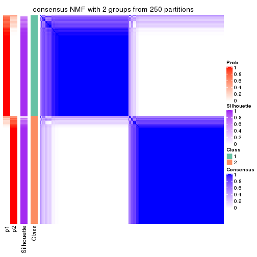</p>

</div>
<div id='tab-MAD-NMF-consensus-heatmap-2'>
<pre><code class="r">consensus_heatmap(res, k = 3)
</code></pre>

<p>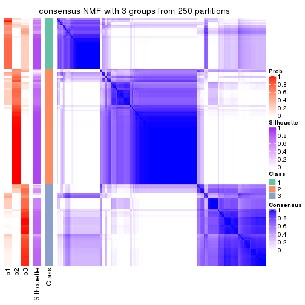</p>

</div>
<div id='tab-MAD-NMF-consensus-heatmap-3'>
<pre><code class="r">consensus_heatmap(res, k = 4)
</code></pre>

<p>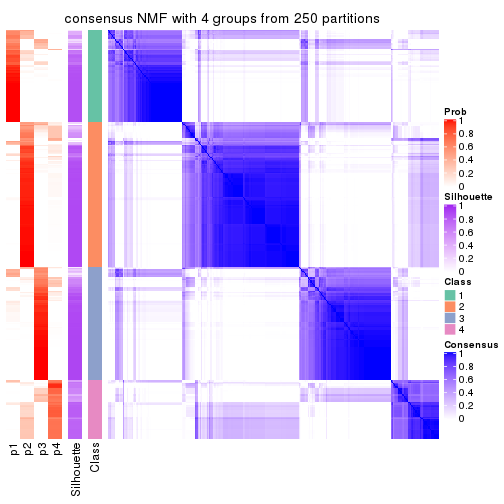</p>

</div>
<div id='tab-MAD-NMF-consensus-heatmap-4'>
<pre><code class="r">consensus_heatmap(res, k = 5)
</code></pre>

<p>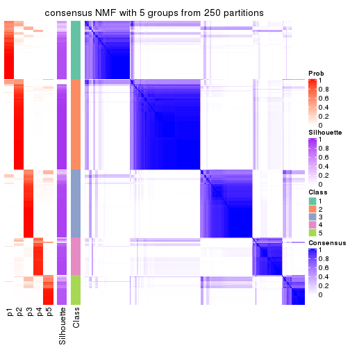</p>

</div>
<div id='tab-MAD-NMF-consensus-heatmap-5'>
<pre><code class="r">consensus_heatmap(res, k = 6)
</code></pre>

<p>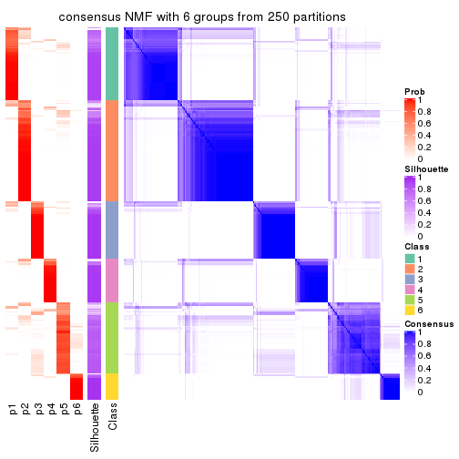</p>

</div>
</div>

Heatmaps for the membership of samples in all partitions to see how consistent they are:


<script>
$( function() {
	$( '#tabs-MAD-NMF-membership-heatmap' ).tabs();
} );
</script>
<div id='tabs-MAD-NMF-membership-heatmap'>
<ul>
<li><a href='#tab-MAD-NMF-membership-heatmap-1'>k = 2</a></li>
<li><a href='#tab-MAD-NMF-membership-heatmap-2'>k = 3</a></li>
<li><a href='#tab-MAD-NMF-membership-heatmap-3'>k = 4</a></li>
<li><a href='#tab-MAD-NMF-membership-heatmap-4'>k = 5</a></li>
<li><a href='#tab-MAD-NMF-membership-heatmap-5'>k = 6</a></li>
</ul>
<div id='tab-MAD-NMF-membership-heatmap-1'>
<pre><code class="r">membership_heatmap(res, k = 2)
</code></pre>

<p>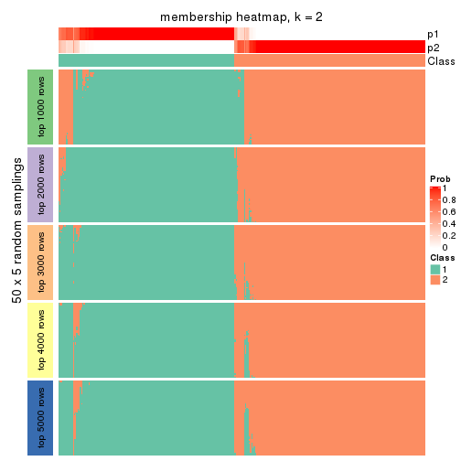</p>

</div>
<div id='tab-MAD-NMF-membership-heatmap-2'>
<pre><code class="r">membership_heatmap(res, k = 3)
</code></pre>

<p>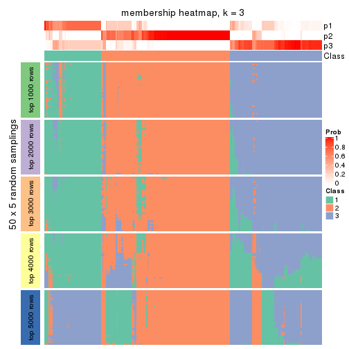</p>

</div>
<div id='tab-MAD-NMF-membership-heatmap-3'>
<pre><code class="r">membership_heatmap(res, k = 4)
</code></pre>

<p>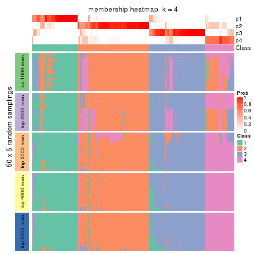</p>

</div>
<div id='tab-MAD-NMF-membership-heatmap-4'>
<pre><code class="r">membership_heatmap(res, k = 5)
</code></pre>

<p>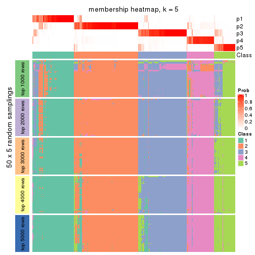</p>

</div>
<div id='tab-MAD-NMF-membership-heatmap-5'>
<pre><code class="r">membership_heatmap(res, k = 6)
</code></pre>

<p>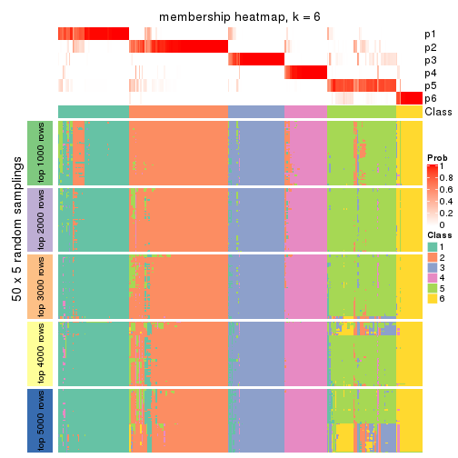</p>

</div>
</div>

As soon as we have had the classes for columns, we can look for signatures
which are significantly different between classes which can be candidate marks
for certain classes. Following are the heatmaps for signatures.


Signature heatmaps where rows are scaled:


<script>
$( function() {
	$( '#tabs-MAD-NMF-get-signatures' ).tabs();
} );
</script>
<div id='tabs-MAD-NMF-get-signatures'>
<ul>
<li><a href='#tab-MAD-NMF-get-signatures-1'>k = 2</a></li>
<li><a href='#tab-MAD-NMF-get-signatures-2'>k = 3</a></li>
<li><a href='#tab-MAD-NMF-get-signatures-3'>k = 4</a></li>
<li><a href='#tab-MAD-NMF-get-signatures-4'>k = 5</a></li>
<li><a href='#tab-MAD-NMF-get-signatures-5'>k = 6</a></li>
</ul>
<div id='tab-MAD-NMF-get-signatures-1'>
<pre><code class="r">get_signatures(res, k = 2)
</code></pre>

<p>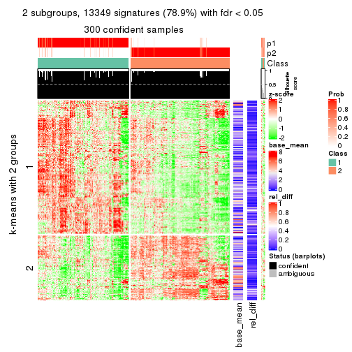</p>

</div>
<div id='tab-MAD-NMF-get-signatures-2'>
<pre><code class="r">get_signatures(res, k = 3)
</code></pre>

<p>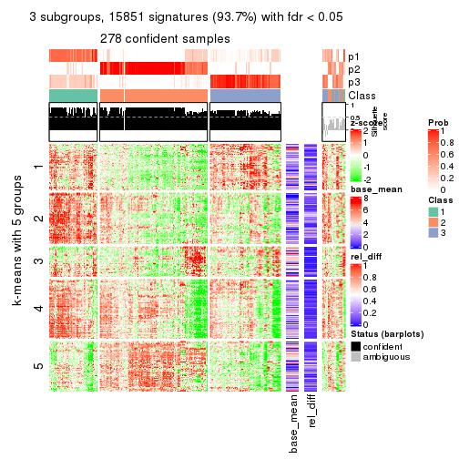</p>

</div>
<div id='tab-MAD-NMF-get-signatures-3'>
<pre><code class="r">get_signatures(res, k = 4)
</code></pre>

<p>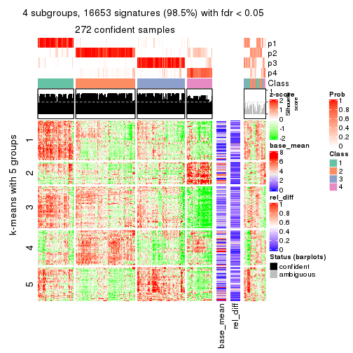</p>

</div>
<div id='tab-MAD-NMF-get-signatures-4'>
<pre><code class="r">get_signatures(res, k = 5)
</code></pre>

<p>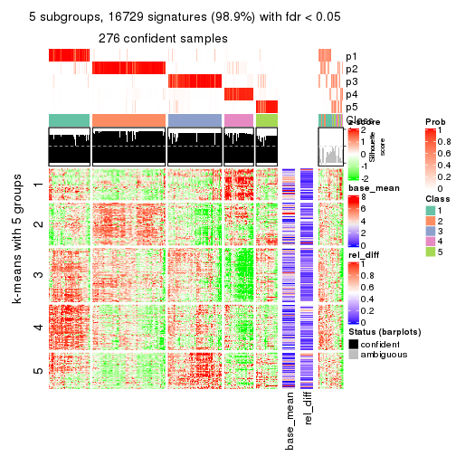</p>

</div>
<div id='tab-MAD-NMF-get-signatures-5'>
<pre><code class="r">get_signatures(res, k = 6)
</code></pre>

<p>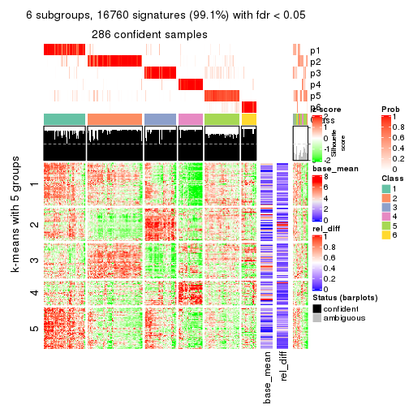</p>

</div>
</div>


Signature heatmaps where rows are not scaled:


<script>
$( function() {
	$( '#tabs-MAD-NMF-get-signatures-no-scale' ).tabs();
} );
</script>
<div id='tabs-MAD-NMF-get-signatures-no-scale'>
<ul>
<li><a href='#tab-MAD-NMF-get-signatures-no-scale-1'>k = 2</a></li>
<li><a href='#tab-MAD-NMF-get-signatures-no-scale-2'>k = 3</a></li>
<li><a href='#tab-MAD-NMF-get-signatures-no-scale-3'>k = 4</a></li>
<li><a href='#tab-MAD-NMF-get-signatures-no-scale-4'>k = 5</a></li>
<li><a href='#tab-MAD-NMF-get-signatures-no-scale-5'>k = 6</a></li>
</ul>
<div id='tab-MAD-NMF-get-signatures-no-scale-1'>
<pre><code class="r">get_signatures(res, k = 2, scale_rows = FALSE)
</code></pre>

<p>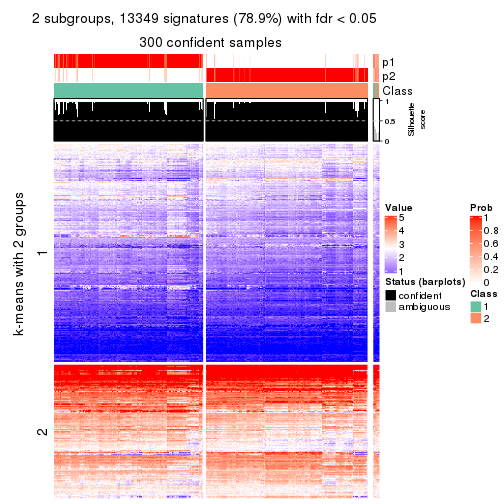</p>

</div>
<div id='tab-MAD-NMF-get-signatures-no-scale-2'>
<pre><code class="r">get_signatures(res, k = 3, scale_rows = FALSE)
</code></pre>

<p>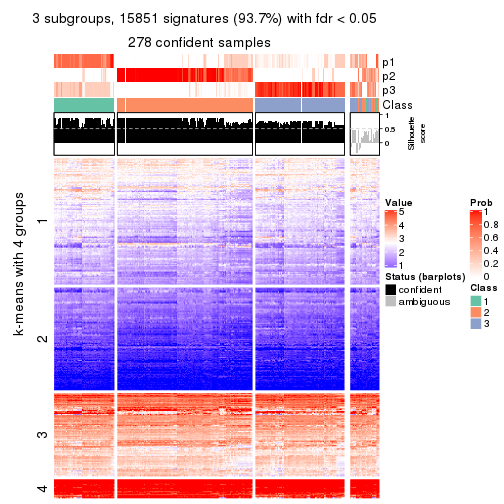</p>

</div>
<div id='tab-MAD-NMF-get-signatures-no-scale-3'>
<pre><code class="r">get_signatures(res, k = 4, scale_rows = FALSE)
</code></pre>

<p>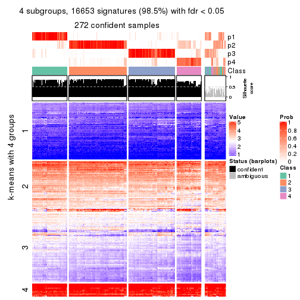</p>

</div>
<div id='tab-MAD-NMF-get-signatures-no-scale-4'>
<pre><code class="r">get_signatures(res, k = 5, scale_rows = FALSE)
</code></pre>

<p>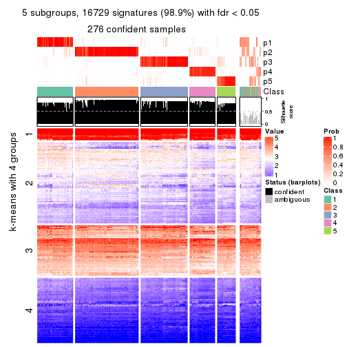</p>

</div>
<div id='tab-MAD-NMF-get-signatures-no-scale-5'>
<pre><code class="r">get_signatures(res, k = 6, scale_rows = FALSE)
</code></pre>

<p>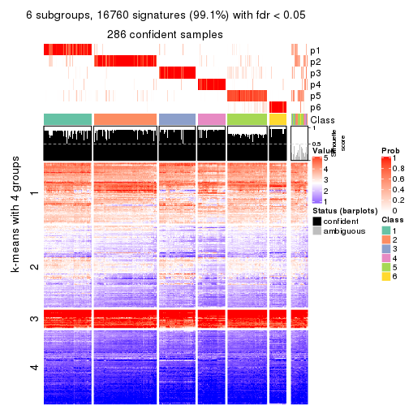</p>

</div>
</div>


Compare the overlap of signatures from different k:

```r
compare_signatures(res)
```

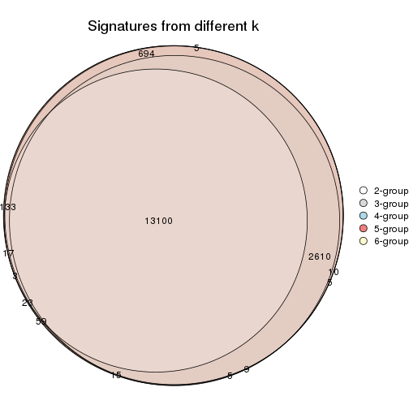

`get_signature()` returns a data frame invisibly. TO get the list of signatures, the function
call should be assigned to a variable explicitly. In following code, if `plot` argument is set
to `FALSE`, no heatmap is plotted while only the differential analysis is performed.

```r
# code only for demonstration
tb = get_signature(res, k = ..., plot = FALSE)
```

An example of the output of `tb` is:

```
#>   which_row         fdr    mean_1    mean_2 scaled_mean_1 scaled_mean_2 km
#> 1        38 0.042760348  8.373488  9.131774    -0.5533452     0.5164555  1
#> 2        40 0.018707592  7.106213  8.469186    -0.6173731     0.5762149  1
#> 3        55 0.019134737 10.221463 11.207825    -0.6159697     0.5749050  1
#> 4        59 0.006059896  5.921854  7.869574    -0.6899429     0.6439467  1
#> 5        60 0.018055526  8.928898 10.211722    -0.6204761     0.5791110  1
#> 6        98 0.009384629 15.714769 14.887706     0.6635654    -0.6193277  2
...
```

The columns in `tb` are:

1. `which_row`: row indices corresponding to the input matrix.
2. `fdr`: FDR for the differential test. 
3. `mean_x`: The mean value in group x.
4. `scaled_mean_x`: The mean value in group x after rows are scaled.
5. `km`: Row groups if k-means clustering is applied to rows.


UMAP plot which shows how samples are separated.


<script>
$( function() {
	$( '#tabs-MAD-NMF-dimension-reduction' ).tabs();
} );
</script>
<div id='tabs-MAD-NMF-dimension-reduction'>
<ul>
<li><a href='#tab-MAD-NMF-dimension-reduction-1'>k = 2</a></li>
<li><a href='#tab-MAD-NMF-dimension-reduction-2'>k = 3</a></li>
<li><a href='#tab-MAD-NMF-dimension-reduction-3'>k = 4</a></li>
<li><a href='#tab-MAD-NMF-dimension-reduction-4'>k = 5</a></li>
<li><a href='#tab-MAD-NMF-dimension-reduction-5'>k = 6</a></li>
</ul>
<div id='tab-MAD-NMF-dimension-reduction-1'>
<pre><code class="r">dimension_reduction(res, k = 2, method = &quot;UMAP&quot;)
</code></pre>

<p>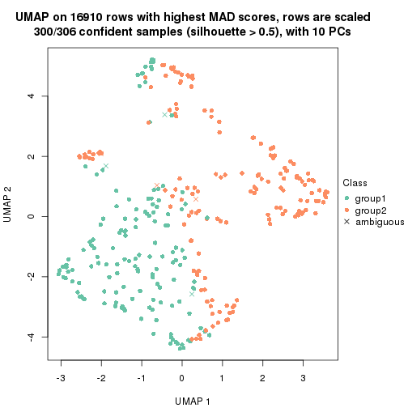</p>

</div>
<div id='tab-MAD-NMF-dimension-reduction-2'>
<pre><code class="r">dimension_reduction(res, k = 3, method = &quot;UMAP&quot;)
</code></pre>

<p>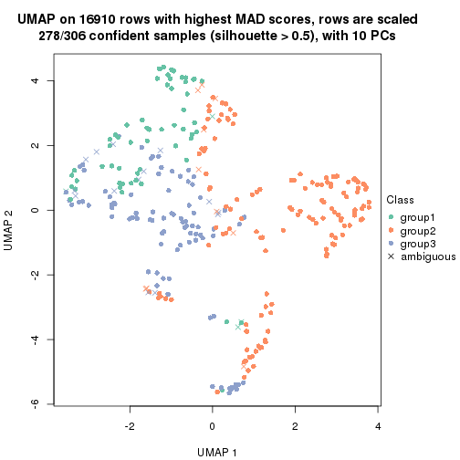</p>

</div>
<div id='tab-MAD-NMF-dimension-reduction-3'>
<pre><code class="r">dimension_reduction(res, k = 4, method = &quot;UMAP&quot;)
</code></pre>

<p>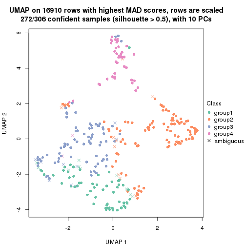</p>

</div>
<div id='tab-MAD-NMF-dimension-reduction-4'>
<pre><code class="r">dimension_reduction(res, k = 5, method = &quot;UMAP&quot;)
</code></pre>

<p>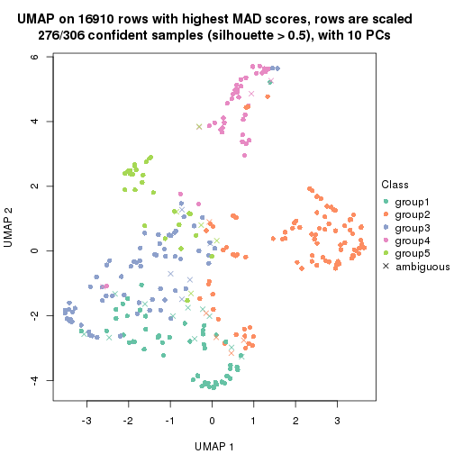</p>

</div>
<div id='tab-MAD-NMF-dimension-reduction-5'>
<pre><code class="r">dimension_reduction(res, k = 6, method = &quot;UMAP&quot;)
</code></pre>

<p>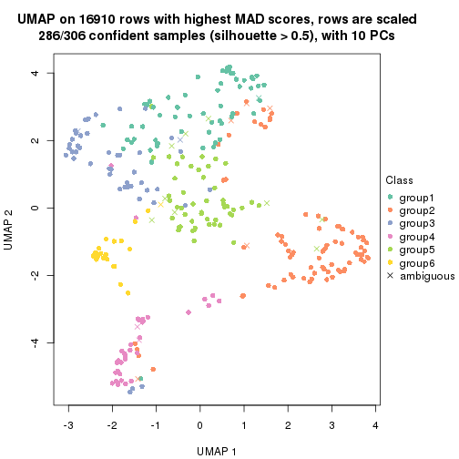</p>

</div>
</div>


Following heatmap shows how subgroups are split when increasing `k`:

```r
collect_classes(res)
```

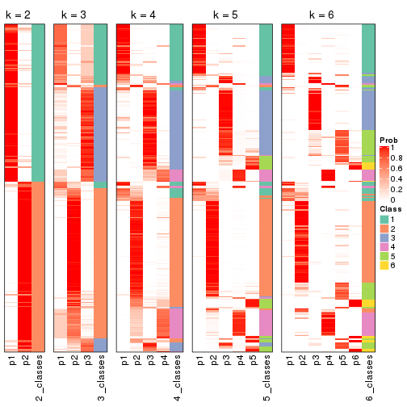


If matrix rows can be associated to genes, consider to use `GO_Enrichment(res,
...)` to perform function enrichment for the signature genes.


 

---------------------------------------------------


### ATC:hclust


The object with results only for a single top-value method and a single partition method 
can be extracted as:

```r
res = res_list["ATC", "hclust"]
# you can also extract it by
# res = res_list["ATC:hclust"]
```

A summary of `res` and all the functions that can be applied to it:

```r
res
```

```
#> A 'ConsensusPartition' object with k = 2, 3, 4, 5, 6.
#>   On a matrix with 16910 rows and 306 columns.
#>   Top rows (1000, 2000, 3000, 4000, 5000) are extracted by 'ATC' method.
#>   Subgroups are detected by 'hclust' method.
#>   Performed in total 1250 partitions by row resampling.
#>   Best k for subgroups seems to be 3.
#> 
#> Following methods can be applied to this 'ConsensusPartition' object:
#>  [1] "cola_report"             "collect_classes"         "collect_plots"          
#>  [4] "collect_stats"           "colnames"                "compare_signatures"     
#>  [7] "consensus_heatmap"       "dimension_reduction"     "functional_enrichment"  
#> [10] "get_anno_col"            "get_anno"                "get_classes"            
#> [13] "get_consensus"           "get_matrix"              "get_membership"         
#> [16] "get_param"               "get_signatures"          "get_stats"              
#> [19] "is_best_k"               "is_stable_k"             "membership_heatmap"     
#> [22] "ncol"                    "nrow"                    "plot_ecdf"              
#> [25] "rownames"                "select_partition_number" "show"                   
#> [28] "suggest_best_k"          "test_to_known_factors"
```

`collect_plots()` function collects all the plots made from `res` for all `k` (number of partitions)
into one single page to provide an easy and fast comparison between different `k`.

```r
collect_plots(res)
```

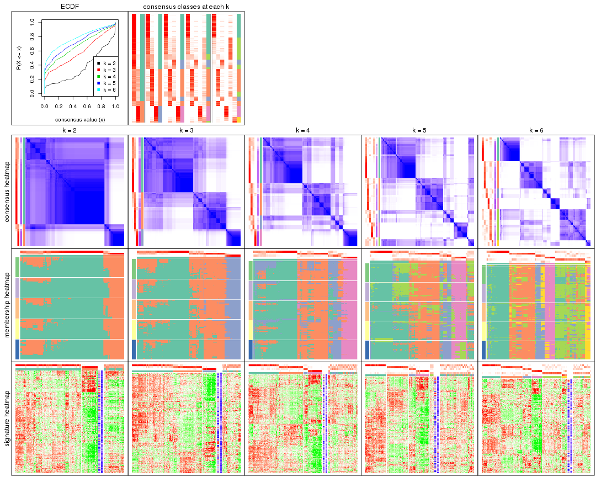

The plots are:

- The first row: a plot of the ECDF (Empirical cumulative distribution
  function) curves of the consensus matrix for each `k` and the heatmap of
  predicted classes for each `k`.
- The second row: heatmaps of the consensus matrix for each `k`.
- The third row: heatmaps of the membership matrix for each `k`.
- The fouth row: heatmaps of the signatures for each `k`.

All the plots in panels can be made by individual functions and they are
plotted later in this section.

`select_partition_number()` produces several plots showing different
statistics for choosing "optimized" `k`. There are following statistics:

- ECDF curves of the consensus matrix for each `k`;
- 1-PAC. [The PAC
  score](https://en.wikipedia.org/wiki/Consensus_clustering#Over-interpretation_potential_of_consensus_clustering)
  measures the proportion of the ambiguous subgrouping.
- Mean silhouette score.
- Concordance. The mean probability of fiting the consensus class ids in all
  partitions.
- Area increased. Denote $A_k$ as the area under the ECDF curve for current
  `k`, the area increased is defined as $A_k - A_{k-1}$.
- Rand index. The percent of pairs of samples that are both in a same cluster
  or both are not in a same cluster in the partition of k and k-1.
- Jaccard index. The ratio of pairs of samples are both in a same cluster in
  the partition of k and k-1 and the pairs of samples are both in a same
  cluster in the partition k or k-1.

The detailed explanations of these statistics can be found in [the cola
vignette](http://bioconductor.org/packages/devel/bioc/vignettes/cola/inst/doc/cola.html#toc_13).

Generally speaking, lower PAC score, higher mean silhouette score or higher
concordance corresponds to better partition. Rand index and Jaccard index
measure how similar the current partition is compared to partition with `k-1`.
If they are too similar, we won't accept `k` is better than `k-1`.

```r
select_partition_number(res)
```

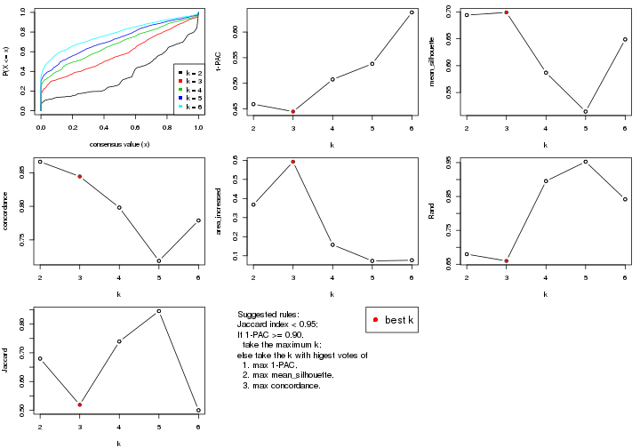

The numeric values for all these statistics can be obtained by `get_stats()`.

```r
get_stats(res)
```

```
#>   k 1-PAC mean_silhouette concordance area_increased  Rand Jaccard
#> 2 2 0.459           0.694       0.866         0.3681 0.680   0.680
#> 3 3 0.445           0.699       0.844         0.5926 0.660   0.519
#> 4 4 0.508           0.587       0.798         0.1576 0.896   0.739
#> 5 5 0.538           0.515       0.719         0.0731 0.953   0.845
#> 6 6 0.638           0.649       0.779         0.0765 0.842   0.500
```

`suggest_best_k()` suggests the best $k$ based on these statistics. The rules are as follows:

- All $k$ with Jaccard index larger than 0.95 are removed because the increase of
  the partition number does not provides enough extra information. If all $k$ are removed,
  the best $k$ is assigned by `NA`.
- For $k$ with 1-PAC larger than 0.9, the maximal $k$ is taken as the "best k". Other $k$ is called "optional k".
- If it does not fit the second rule. The $k$ with the highest vote of highest
  1-PAC, mean silhouette and concordance is taken as the "best k".

```r
suggest_best_k(res)
```

```
#> [1] 3
```


Following shows the table of the partitions (You need to click the **show/hide
code output** link to see it). The membership matrix (columns with name `p*`)
is inferred by
[`clue::cl_consensus()`](https://www.rdocumentation.org/link/cl_consensus?package=clue)
function with the `SE` method. Basically the value in the membership matrix
represents the probability to belong to a certain group. The finall class
label for an item is determined with the group with highest probability it
belongs to.

In `get_classes()` function, the entropy is calculated from the membership
matrix and the silhouette score is calculated from the consensus matrix.


<script>
$( function() {
	$( '#tabs-ATC-hclust-get-classes' ).tabs();
} );
</script>
<div id='tabs-ATC-hclust-get-classes'>
<ul>
<li><a href='#tab-ATC-hclust-get-classes-1'>k = 2</a></li>
<li><a href='#tab-ATC-hclust-get-classes-2'>k = 3</a></li>
<li><a href='#tab-ATC-hclust-get-classes-3'>k = 4</a></li>
<li><a href='#tab-ATC-hclust-get-classes-4'>k = 5</a></li>
<li><a href='#tab-ATC-hclust-get-classes-5'>k = 6</a></li>
</ul>

<div id='tab-ATC-hclust-get-classes-1'>
<p><a id='tab-ATC-hclust-get-classes-1-a' style='color:#0366d6' href='#'>show/hide code output</a></p>
<pre><code class="r">cbind(get_classes(res, k = 2), get_membership(res, k = 2))
</code></pre>

<pre><code>#&gt;            class entropy silhouette    p1    p2
#&gt; SRR1609360     2  0.7745     0.6177 0.228 0.772
#&gt; SRR1609361     2  0.7745     0.6177 0.228 0.772
#&gt; SRR1609362     2  0.1184     0.8294 0.016 0.984
#&gt; SRR1609363     1  1.0000     0.1528 0.500 0.500
#&gt; SRR1609364     1  0.9754     0.4257 0.592 0.408
#&gt; SRR1609365     2  0.1184     0.8294 0.016 0.984
#&gt; SRR1609366     1  0.6438     0.7597 0.836 0.164
#&gt; SRR1609367     1  0.0000     0.8307 1.000 0.000
#&gt; SRR1609368     1  0.9754     0.4257 0.592 0.408
#&gt; SRR1609369     1  0.0000     0.8307 1.000 0.000
#&gt; SRR1609370     1  0.0000     0.8307 1.000 0.000
#&gt; SRR1609371     2  0.0000     0.8363 0.000 1.000
#&gt; SRR1609372     1  0.0000     0.8307 1.000 0.000
#&gt; SRR1609373     1  1.0000     0.1528 0.500 0.500
#&gt; SRR1609374     1  0.6973     0.7403 0.812 0.188
#&gt; SRR1609375     1  0.4431     0.8051 0.908 0.092
#&gt; SRR1609377     1  0.0000     0.8307 1.000 0.000
#&gt; SRR1609376     2  1.0000    -0.1701 0.500 0.500
#&gt; SRR1609378     2  0.0000     0.8363 0.000 1.000
#&gt; SRR1609379     1  0.0000     0.8307 1.000 0.000
#&gt; SRR1609382     2  0.0000     0.8363 0.000 1.000
#&gt; SRR1609383     2  0.7745     0.6177 0.228 0.772
#&gt; SRR1609381     1  0.0000     0.8307 1.000 0.000
#&gt; SRR1609384     1  0.4298     0.8071 0.912 0.088
#&gt; SRR1609386     1  0.1633     0.8277 0.976 0.024
#&gt; SRR1609385     1  0.2778     0.8217 0.952 0.048
#&gt; SRR1609387     1  0.1633     0.8268 0.976 0.024
#&gt; SRR1609388     1  0.9998     0.1835 0.508 0.492
#&gt; SRR1609390     1  0.0000     0.8307 1.000 0.000
#&gt; SRR1609393     2  0.0000     0.8363 0.000 1.000
#&gt; SRR1609394     2  0.6343     0.6999 0.160 0.840
#&gt; SRR1609392     1  0.9998     0.1835 0.508 0.492
#&gt; SRR1609391     2  0.0000     0.8363 0.000 1.000
#&gt; SRR1609395     1  0.0000     0.8307 1.000 0.000
#&gt; SRR1609396     1  0.0000     0.8307 1.000 0.000
#&gt; SRR1609398     1  0.0000     0.8307 1.000 0.000
#&gt; SRR1609399     1  0.0000     0.8307 1.000 0.000
#&gt; SRR1609400     1  0.0000     0.8307 1.000 0.000
#&gt; SRR1609397     1  0.9998     0.1835 0.508 0.492
#&gt; SRR1609401     1  0.9754     0.4257 0.592 0.408
#&gt; SRR1609402     1  0.9754     0.4257 0.592 0.408
#&gt; SRR1609405     1  0.0000     0.8307 1.000 0.000
#&gt; SRR1609404     2  0.0000     0.8363 0.000 1.000
#&gt; SRR1609406     1  0.9933     0.3138 0.548 0.452
#&gt; SRR1609408     1  0.9754     0.4257 0.592 0.408
#&gt; SRR1609403     1  0.0000     0.8307 1.000 0.000
#&gt; SRR1609410     1  0.0000     0.8307 1.000 0.000
#&gt; SRR1609411     2  1.0000    -0.1701 0.500 0.500
#&gt; SRR1609407     1  0.9933     0.3138 0.548 0.452
#&gt; SRR1609413     1  0.0000     0.8307 1.000 0.000
#&gt; SRR1609412     1  0.0000     0.8307 1.000 0.000
#&gt; SRR1609414     1  0.0672     0.8303 0.992 0.008
#&gt; SRR1609415     1  0.0000     0.8307 1.000 0.000
#&gt; SRR1609416     1  0.0672     0.8303 0.992 0.008
#&gt; SRR1609417     1  0.8327     0.6494 0.736 0.264
#&gt; SRR1609418     1  0.0672     0.8303 0.992 0.008
#&gt; SRR1609419     1  0.9998     0.1835 0.508 0.492
#&gt; SRR1609420     1  0.3733     0.8140 0.928 0.072
#&gt; SRR1609421     1  0.9815     0.3974 0.580 0.420
#&gt; SRR1609422     2  0.1414     0.8274 0.020 0.980
#&gt; SRR1609423     2  0.0000     0.8363 0.000 1.000
#&gt; SRR1609424     2  0.0000     0.8363 0.000 1.000
#&gt; SRR1609425     1  0.0000     0.8307 1.000 0.000
#&gt; SRR1609426     1  0.9998     0.1835 0.508 0.492
#&gt; SRR1609427     1  0.0672     0.8303 0.992 0.008
#&gt; SRR1609428     1  1.0000     0.1528 0.500 0.500
#&gt; SRR1609429     1  0.0000     0.8307 1.000 0.000
#&gt; SRR1609430     1  0.0672     0.8303 0.992 0.008
#&gt; SRR1609431     1  0.7056     0.7333 0.808 0.192
#&gt; SRR1609432     1  0.8661     0.6231 0.712 0.288
#&gt; SRR1609433     1  0.7299     0.7151 0.796 0.204
#&gt; SRR1609434     2  0.0000     0.8363 0.000 1.000
#&gt; SRR1609435     1  0.0000     0.8307 1.000 0.000
#&gt; SRR1609436     1  0.0000     0.8307 1.000 0.000
#&gt; SRR1609437     2  0.9732     0.2076 0.404 0.596
#&gt; SRR1609438     2  0.0000     0.8363 0.000 1.000
#&gt; SRR1609439     1  0.8327     0.6494 0.736 0.264
#&gt; SRR1609440     1  0.0000     0.8307 1.000 0.000
#&gt; SRR1609441     2  0.9754     0.1940 0.408 0.592
#&gt; SRR1609442     2  0.9608     0.2703 0.384 0.616
#&gt; SRR1609443     1  0.4022     0.8105 0.920 0.080
#&gt; SRR1609444     1  0.0000     0.8307 1.000 0.000
#&gt; SRR1609445     1  0.7139     0.7337 0.804 0.196
#&gt; SRR1609446     1  0.6343     0.7634 0.840 0.160
#&gt; SRR1609447     1  0.0000     0.8307 1.000 0.000
#&gt; SRR1609448     1  0.9815     0.3983 0.580 0.420
#&gt; SRR1609449     1  0.1633     0.8268 0.976 0.024
#&gt; SRR1609450     1  0.8661     0.6231 0.712 0.288
#&gt; SRR1609451     1  0.0000     0.8307 1.000 0.000
#&gt; SRR1609452     1  0.9815     0.3974 0.580 0.420
#&gt; SRR1609453     1  0.3584     0.8153 0.932 0.068
#&gt; SRR1609454     1  0.9795     0.4060 0.584 0.416
#&gt; SRR1609455     1  0.5519     0.7839 0.872 0.128
#&gt; SRR1609456     1  0.4562     0.8028 0.904 0.096
#&gt; SRR1609457     1  0.4022     0.8105 0.920 0.080
#&gt; SRR1609458     1  0.0000     0.8307 1.000 0.000
#&gt; SRR1609459     1  0.8813     0.6112 0.700 0.300
#&gt; SRR1609460     1  0.7056     0.7333 0.808 0.192
#&gt; SRR1609461     1  0.0938     0.8302 0.988 0.012
#&gt; SRR1609462     1  0.0000     0.8307 1.000 0.000
#&gt; SRR1609464     1  0.0672     0.8303 0.992 0.008
#&gt; SRR1609463     1  0.0000     0.8307 1.000 0.000
#&gt; SRR1609465     1  0.7056     0.7333 0.808 0.192
#&gt; SRR1609466     2  0.0000     0.8363 0.000 1.000
#&gt; SRR1609467     1  0.0000     0.8307 1.000 0.000
#&gt; SRR1609469     2  0.0000     0.8363 0.000 1.000
#&gt; SRR1609470     1  0.1843     0.8265 0.972 0.028
#&gt; SRR1609472     2  0.0000     0.8363 0.000 1.000
#&gt; SRR1609471     1  0.3584     0.8153 0.932 0.068
#&gt; SRR1609474     1  0.0000     0.8307 1.000 0.000
#&gt; SRR1609473     2  0.0000     0.8363 0.000 1.000
#&gt; SRR1609475     2  0.0000     0.8363 0.000 1.000
#&gt; SRR1609478     2  0.0000     0.8363 0.000 1.000
#&gt; SRR1609476     1  0.0376     0.8305 0.996 0.004
#&gt; SRR1609477     1  0.8327     0.6494 0.736 0.264
#&gt; SRR1609479     2  0.9608     0.2703 0.384 0.616
#&gt; SRR1609481     2  0.0000     0.8363 0.000 1.000
#&gt; SRR1609480     1  0.8327     0.6494 0.736 0.264
#&gt; SRR1609482     1  0.0672     0.8303 0.992 0.008
#&gt; SRR1609484     2  0.0000     0.8363 0.000 1.000
#&gt; SRR1609483     1  0.7602     0.6988 0.780 0.220
#&gt; SRR1609486     1  0.0938     0.8302 0.988 0.012
#&gt; SRR1609485     1  0.0938     0.8302 0.988 0.012
#&gt; SRR1609487     1  0.0000     0.8307 1.000 0.000
#&gt; SRR1609488     1  0.0000     0.8307 1.000 0.000
#&gt; SRR1609489     1  0.8861     0.6004 0.696 0.304
#&gt; SRR1609490     1  0.0000     0.8307 1.000 0.000
#&gt; SRR1609491     1  0.0000     0.8307 1.000 0.000
#&gt; SRR1609492     1  0.9754     0.4257 0.592 0.408
#&gt; SRR1609493     1  0.4022     0.8088 0.920 0.080
#&gt; SRR1609494     1  0.9996     0.1978 0.512 0.488
#&gt; SRR1609495     1  0.7299     0.7151 0.796 0.204
#&gt; SRR1609496     1  0.0000     0.8307 1.000 0.000
#&gt; SRR1609497     1  0.0000     0.8307 1.000 0.000
#&gt; SRR1609498     1  0.0000     0.8307 1.000 0.000
#&gt; SRR1609499     1  0.8661     0.6231 0.712 0.288
#&gt; SRR1609500     1  0.0000     0.8307 1.000 0.000
#&gt; SRR1609501     1  0.4562     0.8020 0.904 0.096
#&gt; SRR1609502     1  0.9795     0.4060 0.584 0.416
#&gt; SRR1609503     2  0.0000     0.8363 0.000 1.000
#&gt; SRR1609504     1  0.0000     0.8307 1.000 0.000
#&gt; SRR1609505     1  0.0000     0.8307 1.000 0.000
#&gt; SRR1609506     1  0.9754     0.4257 0.592 0.408
#&gt; SRR1609507     1  0.0000     0.8307 1.000 0.000
#&gt; SRR1609508     1  0.9988     0.2261 0.520 0.480
#&gt; SRR1609509     1  0.9795     0.4081 0.584 0.416
#&gt; SRR1609510     2  0.1414     0.8274 0.020 0.980
#&gt; SRR1609512     1  0.0000     0.8307 1.000 0.000
#&gt; SRR1609511     2  0.0000     0.8363 0.000 1.000
#&gt; SRR1609513     1  0.0000     0.8307 1.000 0.000
#&gt; SRR1609514     2  0.0000     0.8363 0.000 1.000
#&gt; SRR1609515     1  0.9963     0.2774 0.536 0.464
#&gt; SRR1609516     1  0.1633     0.8273 0.976 0.024
#&gt; SRR1609517     1  0.9866     0.3665 0.568 0.432
#&gt; SRR1609518     1  0.0672     0.8303 0.992 0.008
#&gt; SRR1609519     1  0.0672     0.8303 0.992 0.008
#&gt; SRR1609520     2  0.0000     0.8363 0.000 1.000
#&gt; SRR1609521     1  0.0000     0.8307 1.000 0.000
#&gt; SRR1609522     1  0.0000     0.8307 1.000 0.000
#&gt; SRR1609523     1  0.7139     0.7302 0.804 0.196
#&gt; SRR1609524     1  0.9815     0.3983 0.580 0.420
#&gt; SRR1609526     1  0.3584     0.8103 0.932 0.068
#&gt; SRR1609525     1  0.9795     0.4069 0.584 0.416
#&gt; SRR1609527     1  0.0000     0.8307 1.000 0.000
#&gt; SRR1609529     1  0.0938     0.8302 0.988 0.012
#&gt; SRR1609528     2  0.0000     0.8363 0.000 1.000
#&gt; SRR1609530     1  0.0000     0.8307 1.000 0.000
#&gt; SRR1609531     1  0.9754     0.4257 0.592 0.408
#&gt; SRR1609532     1  0.7602     0.6988 0.780 0.220
#&gt; SRR1609533     1  0.1843     0.8268 0.972 0.028
#&gt; SRR1609534     1  0.3114     0.8181 0.944 0.056
#&gt; SRR1609535     2  0.9970    -0.0459 0.468 0.532
#&gt; SRR1609537     1  0.9754     0.4257 0.592 0.408
#&gt; SRR1609536     1  0.5946     0.7723 0.856 0.144
#&gt; SRR1609538     1  0.9427     0.5139 0.640 0.360
#&gt; SRR1609539     1  0.4022     0.8083 0.920 0.080
#&gt; SRR1609540     1  0.1184     0.8295 0.984 0.016
#&gt; SRR1609541     2  0.0000     0.8363 0.000 1.000
#&gt; SRR1609542     1  0.9754     0.4257 0.592 0.408
#&gt; SRR1609543     1  0.0000     0.8307 1.000 0.000
#&gt; SRR1609544     1  0.0672     0.8303 0.992 0.008
#&gt; SRR1609545     1  0.0000     0.8307 1.000 0.000
#&gt; SRR1609546     1  0.4298     0.8060 0.912 0.088
#&gt; SRR1609547     1  0.8763     0.6202 0.704 0.296
#&gt; SRR1609548     1  0.9087     0.5768 0.676 0.324
#&gt; SRR1609549     1  0.9815     0.3983 0.580 0.420
#&gt; SRR1609550     1  0.9795     0.4081 0.584 0.416
#&gt; SRR1609551     1  0.4298     0.8049 0.912 0.088
#&gt; SRR1609552     1  0.0000     0.8307 1.000 0.000
#&gt; SRR1609553     1  0.0000     0.8307 1.000 0.000
#&gt; SRR1609554     1  0.0000     0.8307 1.000 0.000
#&gt; SRR1609555     1  0.0000     0.8307 1.000 0.000
#&gt; SRR1609556     1  0.0000     0.8307 1.000 0.000
#&gt; SRR1609557     1  0.9815     0.3974 0.580 0.420
#&gt; SRR1609558     1  0.4161     0.8082 0.916 0.084
#&gt; SRR1609559     1  0.9795     0.4070 0.584 0.416
#&gt; SRR1609560     1  0.0000     0.8307 1.000 0.000
#&gt; SRR1609561     1  0.0000     0.8307 1.000 0.000
#&gt; SRR1609562     1  0.0000     0.8307 1.000 0.000
#&gt; SRR1609563     1  0.0000     0.8307 1.000 0.000
#&gt; SRR1609564     1  0.0000     0.8307 1.000 0.000
#&gt; SRR1609565     1  0.9998     0.1835 0.508 0.492
#&gt; SRR1609566     1  0.9998     0.1835 0.508 0.492
#&gt; SRR1609567     2  0.9710     0.2188 0.400 0.600
#&gt; SRR1609568     1  0.0000     0.8307 1.000 0.000
#&gt; SRR1609569     1  0.0000     0.8307 1.000 0.000
#&gt; SRR1609570     1  0.0000     0.8307 1.000 0.000
#&gt; SRR1609571     2  0.0000     0.8363 0.000 1.000
#&gt; SRR1609572     1  0.7815     0.6858 0.768 0.232
#&gt; SRR1609573     1  0.0672     0.8303 0.992 0.008
#&gt; SRR1609574     1  0.5408     0.7805 0.876 0.124
#&gt; SRR1609575     2  0.2603     0.8109 0.044 0.956
#&gt; SRR1609576     1  0.8661     0.6231 0.712 0.288
#&gt; SRR1609578     1  0.4431     0.8036 0.908 0.092
#&gt; SRR1609577     1  0.2236     0.8246 0.964 0.036
#&gt; SRR1609579     1  0.0672     0.8303 0.992 0.008
#&gt; SRR1609580     1  0.8443     0.6528 0.728 0.272
#&gt; SRR1609582     1  0.0000     0.8307 1.000 0.000
#&gt; SRR1609581     1  0.4022     0.8091 0.920 0.080
#&gt; SRR1609583     1  0.4298     0.8056 0.912 0.088
#&gt; SRR1609584     1  0.0000     0.8307 1.000 0.000
#&gt; SRR1609585     1  0.0000     0.8307 1.000 0.000
#&gt; SRR1609586     1  0.8267     0.6567 0.740 0.260
#&gt; SRR1609587     1  0.9795     0.4060 0.584 0.416
#&gt; SRR1609588     1  0.4022     0.8091 0.920 0.080
#&gt; SRR1609589     1  0.4161     0.8076 0.916 0.084
#&gt; SRR1609590     1  0.0672     0.8303 0.992 0.008
#&gt; SRR1609592     1  0.9795     0.4070 0.584 0.416
#&gt; SRR1609591     1  0.1633     0.8268 0.976 0.024
#&gt; SRR1609593     1  0.9815     0.3974 0.580 0.420
#&gt; SRR1609594     2  0.0000     0.8363 0.000 1.000
#&gt; SRR1609595     1  0.7139     0.7301 0.804 0.196
#&gt; SRR1609596     1  0.8861     0.6004 0.696 0.304
#&gt; SRR1609597     2  1.0000    -0.1701 0.500 0.500
#&gt; SRR1609598     2  0.0000     0.8363 0.000 1.000
#&gt; SRR1609599     2  0.0000     0.8363 0.000 1.000
#&gt; SRR1609600     1  0.0376     0.8305 0.996 0.004
#&gt; SRR1609601     2  0.7745     0.6177 0.228 0.772
#&gt; SRR1609602     2  0.0000     0.8363 0.000 1.000
#&gt; SRR1609603     1  0.0000     0.8307 1.000 0.000
#&gt; SRR1609604     2  0.0000     0.8363 0.000 1.000
#&gt; SRR1609605     1  0.7299     0.7264 0.796 0.204
#&gt; SRR1609606     1  0.9881     0.3555 0.564 0.436
#&gt; SRR1609607     1  0.0000     0.8307 1.000 0.000
#&gt; SRR1609608     1  0.4431     0.8026 0.908 0.092
#&gt; SRR1609609     1  0.0000     0.8307 1.000 0.000
#&gt; SRR1609610     1  0.0672     0.8303 0.992 0.008
#&gt; SRR1609611     2  0.0000     0.8363 0.000 1.000
#&gt; SRR1609613     1  0.8661     0.6231 0.712 0.288
#&gt; SRR1609612     1  0.1633     0.8268 0.976 0.024
#&gt; SRR1609614     1  0.0000     0.8307 1.000 0.000
#&gt; SRR1609615     1  0.3584     0.8153 0.932 0.068
#&gt; SRR1609616     1  0.0000     0.8307 1.000 0.000
#&gt; SRR1609617     1  0.7219     0.7269 0.800 0.200
#&gt; SRR1609618     1  0.4298     0.8056 0.912 0.088
#&gt; SRR1609619     1  0.6343     0.7634 0.840 0.160
#&gt; SRR1609620     2  0.0000     0.8363 0.000 1.000
#&gt; SRR1609621     2  0.9608     0.2703 0.384 0.616
#&gt; SRR1609622     1  0.7674     0.6943 0.776 0.224
#&gt; SRR1609623     1  0.0000     0.8307 1.000 0.000
#&gt; SRR1609624     1  0.0000     0.8307 1.000 0.000
#&gt; SRR1609625     1  0.0000     0.8307 1.000 0.000
#&gt; SRR1609626     1  0.8327     0.6494 0.736 0.264
#&gt; SRR1609627     1  0.0000     0.8307 1.000 0.000
#&gt; SRR1609628     1  0.7528     0.7003 0.784 0.216
#&gt; SRR1609629     1  0.0000     0.8307 1.000 0.000
#&gt; SRR1609630     1  0.8861     0.6004 0.696 0.304
#&gt; SRR1609631     1  0.0000     0.8307 1.000 0.000
#&gt; SRR1609632     1  0.0000     0.8307 1.000 0.000
#&gt; SRR1609633     1  0.0000     0.8307 1.000 0.000
#&gt; SRR1609634     1  0.9754     0.4257 0.592 0.408
#&gt; SRR1609635     2  0.0000     0.8363 0.000 1.000
#&gt; SRR1609636     2  0.0000     0.8363 0.000 1.000
#&gt; SRR1609637     1  0.0000     0.8307 1.000 0.000
#&gt; SRR1609638     1  0.0938     0.8300 0.988 0.012
#&gt; SRR1609639     1  0.9686     0.4499 0.604 0.396
#&gt; SRR1609640     1  0.0000     0.8307 1.000 0.000
#&gt; SRR1609641     1  0.0000     0.8307 1.000 0.000
#&gt; SRR1609642     1  0.0000     0.8307 1.000 0.000
#&gt; SRR1609643     1  0.0672     0.8303 0.992 0.008
#&gt; SRR1609644     1  0.0000     0.8307 1.000 0.000
#&gt; SRR1609645     1  0.0672     0.8303 0.992 0.008
#&gt; SRR1609646     1  0.0000     0.8307 1.000 0.000
#&gt; SRR1609647     2  0.9970    -0.0459 0.468 0.532
#&gt; SRR1609649     1  0.0000     0.8307 1.000 0.000
#&gt; SRR1609648     1  0.9963     0.2774 0.536 0.464
#&gt; SRR1609651     1  0.0938     0.8300 0.988 0.012
#&gt; SRR1609650     1  0.9815     0.3974 0.580 0.420
#&gt; SRR1609652     1  0.0000     0.8307 1.000 0.000
#&gt; SRR1609653     1  0.9754     0.4257 0.592 0.408
#&gt; SRR1609654     2  0.0000     0.8363 0.000 1.000
#&gt; SRR1609655     1  0.0000     0.8307 1.000 0.000
#&gt; SRR1609657     1  0.0000     0.8307 1.000 0.000
#&gt; SRR1609656     2  0.7745     0.6177 0.228 0.772
#&gt; SRR1609658     2  1.0000    -0.1701 0.500 0.500
#&gt; SRR1609659     2  1.0000    -0.1701 0.500 0.500
#&gt; SRR1609660     1  0.9795     0.4070 0.584 0.416
#&gt; SRR1609661     1  0.0672     0.8303 0.992 0.008
#&gt; SRR1609662     1  0.7219     0.7296 0.800 0.200
#&gt; SRR1609663     1  0.0938     0.8302 0.988 0.012
#&gt; SRR1609664     1  0.0000     0.8307 1.000 0.000
#&gt; SRR1609665     1  0.8661     0.6231 0.712 0.288
#&gt; SRR1609666     2  0.2236     0.8167 0.036 0.964
#&gt; SRR1609667     1  0.0000     0.8307 1.000 0.000
#&gt; SRR1609668     2  0.1414     0.8273 0.020 0.980
#&gt; SRR1609669     1  0.0000     0.8307 1.000 0.000
</code></pre>

<script>
$('#tab-ATC-hclust-get-classes-1-a').parent().next().next().hide();
$('#tab-ATC-hclust-get-classes-1-a').click(function(){
  $('#tab-ATC-hclust-get-classes-1-a').parent().next().next().toggle();
  return(false);
});
</script>
</div>

<div id='tab-ATC-hclust-get-classes-2'>
<p><a id='tab-ATC-hclust-get-classes-2-a' style='color:#0366d6' href='#'>show/hide code output</a></p>
<pre><code class="r">cbind(get_classes(res, k = 3), get_membership(res, k = 3))
</code></pre>

<pre><code>#&gt;            class entropy silhouette    p1    p2    p3
#&gt; SRR1609360     3  0.6442      0.316 0.004 0.432 0.564
#&gt; SRR1609361     3  0.6442      0.316 0.004 0.432 0.564
#&gt; SRR1609362     3  0.2796      0.884 0.000 0.092 0.908
#&gt; SRR1609363     2  0.1964      0.766 0.000 0.944 0.056
#&gt; SRR1609364     2  0.1411      0.797 0.036 0.964 0.000
#&gt; SRR1609365     3  0.2796      0.884 0.000 0.092 0.908
#&gt; SRR1609366     2  0.6095      0.267 0.392 0.608 0.000
#&gt; SRR1609367     1  0.0237      0.785 0.996 0.004 0.000
#&gt; SRR1609368     2  0.1411      0.797 0.036 0.964 0.000
#&gt; SRR1609369     1  0.3619      0.780 0.864 0.136 0.000
#&gt; SRR1609370     1  0.0000      0.784 1.000 0.000 0.000
#&gt; SRR1609371     3  0.0000      0.928 0.000 0.000 1.000
#&gt; SRR1609372     1  0.0000      0.784 1.000 0.000 0.000
#&gt; SRR1609373     2  0.1964      0.766 0.000 0.944 0.056
#&gt; SRR1609374     2  0.5948      0.386 0.360 0.640 0.000
#&gt; SRR1609375     1  0.6235      0.431 0.564 0.436 0.000
#&gt; SRR1609377     1  0.2261      0.788 0.932 0.068 0.000
#&gt; SRR1609376     2  0.1964      0.766 0.000 0.944 0.056
#&gt; SRR1609378     3  0.0000      0.928 0.000 0.000 1.000
#&gt; SRR1609379     1  0.2165      0.787 0.936 0.064 0.000
#&gt; SRR1609382     3  0.1753      0.911 0.000 0.048 0.952
#&gt; SRR1609383     3  0.6442      0.316 0.004 0.432 0.564
#&gt; SRR1609381     1  0.0000      0.784 1.000 0.000 0.000
#&gt; SRR1609384     1  0.6215      0.451 0.572 0.428 0.000
#&gt; SRR1609386     1  0.4555      0.753 0.800 0.200 0.000
#&gt; SRR1609385     1  0.6111      0.526 0.604 0.396 0.000
#&gt; SRR1609387     1  0.3686      0.778 0.860 0.140 0.000
#&gt; SRR1609388     2  0.1753      0.770 0.000 0.952 0.048
#&gt; SRR1609390     1  0.0000      0.784 1.000 0.000 0.000
#&gt; SRR1609393     3  0.0000      0.928 0.000 0.000 1.000
#&gt; SRR1609394     2  0.6309     -0.194 0.000 0.500 0.500
#&gt; SRR1609392     2  0.1753      0.770 0.000 0.952 0.048
#&gt; SRR1609391     3  0.0000      0.928 0.000 0.000 1.000
#&gt; SRR1609395     1  0.0000      0.784 1.000 0.000 0.000
#&gt; SRR1609396     1  0.0000      0.784 1.000 0.000 0.000
#&gt; SRR1609398     1  0.3482      0.782 0.872 0.128 0.000
#&gt; SRR1609399     1  0.0000      0.784 1.000 0.000 0.000
#&gt; SRR1609400     1  0.0000      0.784 1.000 0.000 0.000
#&gt; SRR1609397     2  0.1753      0.770 0.000 0.952 0.048
#&gt; SRR1609401     2  0.1411      0.797 0.036 0.964 0.000
#&gt; SRR1609402     2  0.1411      0.797 0.036 0.964 0.000
#&gt; SRR1609405     1  0.3879      0.774 0.848 0.152 0.000
#&gt; SRR1609404     3  0.0424      0.926 0.000 0.008 0.992
#&gt; SRR1609406     2  0.0829      0.786 0.004 0.984 0.012
#&gt; SRR1609408     2  0.1411      0.797 0.036 0.964 0.000
#&gt; SRR1609403     1  0.0237      0.785 0.996 0.004 0.000
#&gt; SRR1609410     1  0.3879      0.774 0.848 0.152 0.000
#&gt; SRR1609411     2  0.1964      0.766 0.000 0.944 0.056
#&gt; SRR1609407     2  0.0829      0.786 0.004 0.984 0.012
#&gt; SRR1609413     1  0.0237      0.785 0.996 0.004 0.000
#&gt; SRR1609412     1  0.3879      0.774 0.848 0.152 0.000
#&gt; SRR1609414     1  0.4750      0.739 0.784 0.216 0.000
#&gt; SRR1609415     1  0.0000      0.784 1.000 0.000 0.000
#&gt; SRR1609416     1  0.6111      0.458 0.604 0.396 0.000
#&gt; SRR1609417     2  0.6633      0.603 0.260 0.700 0.040
#&gt; SRR1609418     1  0.3879      0.776 0.848 0.152 0.000
#&gt; SRR1609419     2  0.1753      0.770 0.000 0.952 0.048
#&gt; SRR1609420     1  0.6140      0.505 0.596 0.404 0.000
#&gt; SRR1609421     2  0.2743      0.796 0.052 0.928 0.020
#&gt; SRR1609422     3  0.2796      0.884 0.000 0.092 0.908
#&gt; SRR1609423     3  0.0000      0.928 0.000 0.000 1.000
#&gt; SRR1609424     3  0.0000      0.928 0.000 0.000 1.000
#&gt; SRR1609425     1  0.3551      0.781 0.868 0.132 0.000
#&gt; SRR1609426     2  0.1753      0.770 0.000 0.952 0.048
#&gt; SRR1609427     1  0.6126      0.448 0.600 0.400 0.000
#&gt; SRR1609428     2  0.1964      0.766 0.000 0.944 0.056
#&gt; SRR1609429     1  0.3340      0.784 0.880 0.120 0.000
#&gt; SRR1609430     1  0.6111      0.457 0.604 0.396 0.000
#&gt; SRR1609431     2  0.6126      0.251 0.400 0.600 0.000
#&gt; SRR1609432     2  0.4702      0.678 0.212 0.788 0.000
#&gt; SRR1609433     2  0.5928      0.554 0.296 0.696 0.008
#&gt; SRR1609434     3  0.0000      0.928 0.000 0.000 1.000
#&gt; SRR1609435     1  0.0000      0.784 1.000 0.000 0.000
#&gt; SRR1609436     1  0.0424      0.785 0.992 0.008 0.000
#&gt; SRR1609437     2  0.4121      0.663 0.000 0.832 0.168
#&gt; SRR1609438     3  0.0000      0.928 0.000 0.000 1.000
#&gt; SRR1609439     2  0.6633      0.603 0.260 0.700 0.040
#&gt; SRR1609440     1  0.0000      0.784 1.000 0.000 0.000
#&gt; SRR1609441     2  0.4002      0.672 0.000 0.840 0.160
#&gt; SRR1609442     2  0.4399      0.636 0.000 0.812 0.188
#&gt; SRR1609443     1  0.6192      0.462 0.580 0.420 0.000
#&gt; SRR1609444     1  0.4002      0.772 0.840 0.160 0.000
#&gt; SRR1609445     2  0.6228      0.328 0.372 0.624 0.004
#&gt; SRR1609446     2  0.6386      0.183 0.412 0.584 0.004
#&gt; SRR1609447     1  0.0000      0.784 1.000 0.000 0.000
#&gt; SRR1609448     2  0.1031      0.797 0.024 0.976 0.000
#&gt; SRR1609449     1  0.4121      0.769 0.832 0.168 0.000
#&gt; SRR1609450     2  0.4702      0.678 0.212 0.788 0.000
#&gt; SRR1609451     1  0.0000      0.784 1.000 0.000 0.000
#&gt; SRR1609452     2  0.2743      0.796 0.052 0.928 0.020
#&gt; SRR1609453     1  0.5905      0.588 0.648 0.352 0.000
#&gt; SRR1609454     2  0.2846      0.796 0.056 0.924 0.020
#&gt; SRR1609455     1  0.6295      0.324 0.528 0.472 0.000
#&gt; SRR1609456     1  0.6291      0.338 0.532 0.468 0.000
#&gt; SRR1609457     1  0.6215      0.445 0.572 0.428 0.000
#&gt; SRR1609458     1  0.0424      0.786 0.992 0.008 0.000
#&gt; SRR1609459     2  0.6262      0.569 0.284 0.696 0.020
#&gt; SRR1609460     2  0.6126      0.251 0.400 0.600 0.000
#&gt; SRR1609461     1  0.5810      0.616 0.664 0.336 0.000
#&gt; SRR1609462     1  0.0000      0.784 1.000 0.000 0.000
#&gt; SRR1609464     1  0.6126      0.446 0.600 0.400 0.000
#&gt; SRR1609463     1  0.2448      0.789 0.924 0.076 0.000
#&gt; SRR1609465     2  0.6126      0.251 0.400 0.600 0.000
#&gt; SRR1609466     3  0.0892      0.922 0.000 0.020 0.980
#&gt; SRR1609467     1  0.2165      0.784 0.936 0.064 0.000
#&gt; SRR1609469     3  0.0000      0.928 0.000 0.000 1.000
#&gt; SRR1609470     1  0.5760      0.624 0.672 0.328 0.000
#&gt; SRR1609472     3  0.0000      0.928 0.000 0.000 1.000
#&gt; SRR1609471     1  0.5905      0.588 0.648 0.352 0.000
#&gt; SRR1609474     1  0.3879      0.774 0.848 0.152 0.000
#&gt; SRR1609473     3  0.0000      0.928 0.000 0.000 1.000
#&gt; SRR1609475     3  0.0000      0.928 0.000 0.000 1.000
#&gt; SRR1609478     3  0.0000      0.928 0.000 0.000 1.000
#&gt; SRR1609476     1  0.4974      0.706 0.764 0.236 0.000
#&gt; SRR1609477     2  0.6633      0.603 0.260 0.700 0.040
#&gt; SRR1609479     2  0.4399      0.636 0.000 0.812 0.188
#&gt; SRR1609481     3  0.1643      0.913 0.000 0.044 0.956
#&gt; SRR1609480     2  0.6633      0.603 0.260 0.700 0.040
#&gt; SRR1609482     1  0.6111      0.457 0.604 0.396 0.000
#&gt; SRR1609484     3  0.1753      0.911 0.000 0.048 0.952
#&gt; SRR1609483     2  0.5763      0.594 0.276 0.716 0.008
#&gt; SRR1609486     1  0.5785      0.622 0.668 0.332 0.000
#&gt; SRR1609485     1  0.5785      0.622 0.668 0.332 0.000
#&gt; SRR1609487     1  0.2261      0.788 0.932 0.068 0.000
#&gt; SRR1609488     1  0.0000      0.784 1.000 0.000 0.000
#&gt; SRR1609489     2  0.4654      0.687 0.208 0.792 0.000
#&gt; SRR1609490     1  0.4452      0.756 0.808 0.192 0.000
#&gt; SRR1609491     1  0.3879      0.774 0.848 0.152 0.000
#&gt; SRR1609492     2  0.1411      0.797 0.036 0.964 0.000
#&gt; SRR1609493     1  0.6126      0.495 0.600 0.400 0.000
#&gt; SRR1609494     2  0.1643      0.772 0.000 0.956 0.044
#&gt; SRR1609495     2  0.5928      0.554 0.296 0.696 0.008
#&gt; SRR1609496     1  0.0000      0.784 1.000 0.000 0.000
#&gt; SRR1609497     1  0.0424      0.785 0.992 0.008 0.000
#&gt; SRR1609498     1  0.0000      0.784 1.000 0.000 0.000
#&gt; SRR1609499     2  0.4702      0.678 0.212 0.788 0.000
#&gt; SRR1609500     1  0.0000      0.784 1.000 0.000 0.000
#&gt; SRR1609501     1  0.6252      0.402 0.556 0.444 0.000
#&gt; SRR1609502     2  0.2846      0.796 0.056 0.924 0.020
#&gt; SRR1609503     3  0.0000      0.928 0.000 0.000 1.000
#&gt; SRR1609504     1  0.0000      0.784 1.000 0.000 0.000
#&gt; SRR1609505     1  0.0000      0.784 1.000 0.000 0.000
#&gt; SRR1609506     2  0.1411      0.797 0.036 0.964 0.000
#&gt; SRR1609507     1  0.0424      0.786 0.992 0.008 0.000
#&gt; SRR1609508     2  0.1411      0.776 0.000 0.964 0.036
#&gt; SRR1609509     2  0.1525      0.798 0.032 0.964 0.004
#&gt; SRR1609510     3  0.2878      0.881 0.000 0.096 0.904
#&gt; SRR1609512     1  0.0000      0.784 1.000 0.000 0.000
#&gt; SRR1609511     3  0.0892      0.922 0.000 0.020 0.980
#&gt; SRR1609513     1  0.0000      0.784 1.000 0.000 0.000
#&gt; SRR1609514     3  0.0000      0.928 0.000 0.000 1.000
#&gt; SRR1609515     2  0.1267      0.784 0.004 0.972 0.024
#&gt; SRR1609516     1  0.5650      0.648 0.688 0.312 0.000
#&gt; SRR1609517     2  0.2297      0.797 0.036 0.944 0.020
#&gt; SRR1609518     1  0.3879      0.776 0.848 0.152 0.000
#&gt; SRR1609519     1  0.6126      0.446 0.600 0.400 0.000
#&gt; SRR1609520     3  0.0000      0.928 0.000 0.000 1.000
#&gt; SRR1609521     1  0.0000      0.784 1.000 0.000 0.000
#&gt; SRR1609522     1  0.6079      0.469 0.612 0.388 0.000
#&gt; SRR1609523     2  0.6095      0.276 0.392 0.608 0.000
#&gt; SRR1609524     2  0.1031      0.797 0.024 0.976 0.000
#&gt; SRR1609526     2  0.6235      0.156 0.436 0.564 0.000
#&gt; SRR1609525     2  0.2846      0.796 0.056 0.924 0.020
#&gt; SRR1609527     1  0.0000      0.784 1.000 0.000 0.000
#&gt; SRR1609529     1  0.5733      0.633 0.676 0.324 0.000
#&gt; SRR1609528     3  0.0000      0.928 0.000 0.000 1.000
#&gt; SRR1609530     1  0.1860      0.789 0.948 0.052 0.000
#&gt; SRR1609531     2  0.1411      0.797 0.036 0.964 0.000
#&gt; SRR1609532     2  0.5763      0.594 0.276 0.716 0.008
#&gt; SRR1609533     1  0.5810      0.613 0.664 0.336 0.000
#&gt; SRR1609534     1  0.6079      0.533 0.612 0.388 0.000
#&gt; SRR1609535     2  0.2796      0.742 0.000 0.908 0.092
#&gt; SRR1609537     2  0.1411      0.797 0.036 0.964 0.000
#&gt; SRR1609536     1  0.6825      0.169 0.496 0.492 0.012
#&gt; SRR1609538     2  0.4749      0.709 0.172 0.816 0.012
#&gt; SRR1609539     1  0.6154      0.494 0.592 0.408 0.000
#&gt; SRR1609540     1  0.5465      0.676 0.712 0.288 0.000
#&gt; SRR1609541     3  0.0000      0.928 0.000 0.000 1.000
#&gt; SRR1609542     2  0.1411      0.797 0.036 0.964 0.000
#&gt; SRR1609543     1  0.0000      0.784 1.000 0.000 0.000
#&gt; SRR1609544     1  0.6126      0.448 0.600 0.400 0.000
#&gt; SRR1609545     1  0.0000      0.784 1.000 0.000 0.000
#&gt; SRR1609546     1  0.6252      0.405 0.556 0.444 0.000
#&gt; SRR1609547     2  0.5595      0.663 0.228 0.756 0.016
#&gt; SRR1609548     2  0.5147      0.715 0.180 0.800 0.020
#&gt; SRR1609549     2  0.1031      0.797 0.024 0.976 0.000
#&gt; SRR1609550     2  0.1525      0.798 0.032 0.964 0.004
#&gt; SRR1609551     1  0.6180      0.474 0.584 0.416 0.000
#&gt; SRR1609552     1  0.5529      0.650 0.704 0.296 0.000
#&gt; SRR1609553     1  0.0237      0.784 0.996 0.004 0.000
#&gt; SRR1609554     1  0.4178      0.767 0.828 0.172 0.000
#&gt; SRR1609555     1  0.0424      0.785 0.992 0.008 0.000
#&gt; SRR1609556     1  0.0000      0.784 1.000 0.000 0.000
#&gt; SRR1609557     2  0.2947      0.795 0.060 0.920 0.020
#&gt; SRR1609558     1  0.6225      0.438 0.568 0.432 0.000
#&gt; SRR1609559     2  0.2846      0.797 0.056 0.924 0.020
#&gt; SRR1609560     1  0.3267      0.784 0.884 0.116 0.000
#&gt; SRR1609561     1  0.5529      0.666 0.704 0.296 0.000
#&gt; SRR1609562     1  0.3551      0.781 0.868 0.132 0.000
#&gt; SRR1609563     1  0.3879      0.774 0.848 0.152 0.000
#&gt; SRR1609564     1  0.0000      0.784 1.000 0.000 0.000
#&gt; SRR1609565     2  0.1753      0.770 0.000 0.952 0.048
#&gt; SRR1609566     2  0.1753      0.770 0.000 0.952 0.048
#&gt; SRR1609567     2  0.4178      0.656 0.000 0.828 0.172
#&gt; SRR1609568     1  0.0237      0.785 0.996 0.004 0.000
#&gt; SRR1609569     1  0.0000      0.784 1.000 0.000 0.000
#&gt; SRR1609570     1  0.6079      0.469 0.612 0.388 0.000
#&gt; SRR1609571     3  0.0000      0.928 0.000 0.000 1.000
#&gt; SRR1609572     2  0.5656      0.610 0.264 0.728 0.008
#&gt; SRR1609573     1  0.6126      0.446 0.600 0.400 0.000
#&gt; SRR1609574     2  0.6235      0.193 0.436 0.564 0.000
#&gt; SRR1609575     3  0.3752      0.832 0.000 0.144 0.856
#&gt; SRR1609576     2  0.4702      0.678 0.212 0.788 0.000
#&gt; SRR1609578     1  0.6235      0.421 0.564 0.436 0.000
#&gt; SRR1609577     1  0.5835      0.613 0.660 0.340 0.000
#&gt; SRR1609579     1  0.6126      0.448 0.600 0.400 0.000
#&gt; SRR1609580     2  0.5956      0.608 0.264 0.720 0.016
#&gt; SRR1609582     1  0.0000      0.784 1.000 0.000 0.000
#&gt; SRR1609581     1  0.6204      0.451 0.576 0.424 0.000
#&gt; SRR1609583     1  0.6225      0.431 0.568 0.432 0.000
#&gt; SRR1609584     1  0.2261      0.783 0.932 0.068 0.000
#&gt; SRR1609585     1  0.0000      0.784 1.000 0.000 0.000
#&gt; SRR1609586     2  0.5650      0.517 0.312 0.688 0.000
#&gt; SRR1609587     2  0.2846      0.796 0.056 0.924 0.020
#&gt; SRR1609588     1  0.6204      0.451 0.576 0.424 0.000
#&gt; SRR1609589     1  0.6215      0.440 0.572 0.428 0.000
#&gt; SRR1609590     1  0.6126      0.446 0.600 0.400 0.000
#&gt; SRR1609592     2  0.2846      0.797 0.056 0.924 0.020
#&gt; SRR1609591     1  0.4291      0.764 0.820 0.180 0.000
#&gt; SRR1609593     2  0.2743      0.796 0.052 0.928 0.020
#&gt; SRR1609594     3  0.0000      0.928 0.000 0.000 1.000
#&gt; SRR1609595     2  0.6111      0.265 0.396 0.604 0.000
#&gt; SRR1609596     2  0.4654      0.687 0.208 0.792 0.000
#&gt; SRR1609597     2  0.1964      0.766 0.000 0.944 0.056
#&gt; SRR1609598     3  0.0000      0.928 0.000 0.000 1.000
#&gt; SRR1609599     3  0.0000      0.928 0.000 0.000 1.000
#&gt; SRR1609600     1  0.4974      0.706 0.764 0.236 0.000
#&gt; SRR1609601     3  0.6442      0.316 0.004 0.432 0.564
#&gt; SRR1609602     3  0.0000      0.928 0.000 0.000 1.000
#&gt; SRR1609603     1  0.3551      0.781 0.868 0.132 0.000
#&gt; SRR1609604     3  0.1753      0.911 0.000 0.048 0.952
#&gt; SRR1609605     2  0.6104      0.396 0.348 0.648 0.004
#&gt; SRR1609606     2  0.2176      0.796 0.032 0.948 0.020
#&gt; SRR1609607     1  0.5650      0.657 0.688 0.312 0.000
#&gt; SRR1609608     1  0.6225      0.433 0.568 0.432 0.000
#&gt; SRR1609609     1  0.4235      0.765 0.824 0.176 0.000
#&gt; SRR1609610     1  0.4842      0.734 0.776 0.224 0.000
#&gt; SRR1609611     3  0.0424      0.926 0.000 0.008 0.992
#&gt; SRR1609613     2  0.4702      0.678 0.212 0.788 0.000
#&gt; SRR1609612     1  0.4291      0.764 0.820 0.180 0.000
#&gt; SRR1609614     1  0.0592      0.787 0.988 0.012 0.000
#&gt; SRR1609615     1  0.5905      0.588 0.648 0.352 0.000
#&gt; SRR1609616     1  0.1529      0.789 0.960 0.040 0.000
#&gt; SRR1609617     2  0.6079      0.290 0.388 0.612 0.000
#&gt; SRR1609618     1  0.6225      0.431 0.568 0.432 0.000
#&gt; SRR1609619     2  0.6386      0.183 0.412 0.584 0.004
#&gt; SRR1609620     3  0.0000      0.928 0.000 0.000 1.000
#&gt; SRR1609621     2  0.4399      0.636 0.000 0.812 0.188
#&gt; SRR1609622     2  0.5728      0.599 0.272 0.720 0.008
#&gt; SRR1609623     1  0.0424      0.786 0.992 0.008 0.000
#&gt; SRR1609624     1  0.0000      0.784 1.000 0.000 0.000
#&gt; SRR1609625     1  0.0000      0.784 1.000 0.000 0.000
#&gt; SRR1609626     2  0.6633      0.603 0.260 0.700 0.040
#&gt; SRR1609627     1  0.2261      0.788 0.932 0.068 0.000
#&gt; SRR1609628     2  0.6045      0.345 0.380 0.620 0.000
#&gt; SRR1609629     1  0.0424      0.786 0.992 0.008 0.000
#&gt; SRR1609630     2  0.4654      0.687 0.208 0.792 0.000
#&gt; SRR1609631     1  0.0000      0.784 1.000 0.000 0.000
#&gt; SRR1609632     1  0.3267      0.784 0.884 0.116 0.000
#&gt; SRR1609633     1  0.0000      0.784 1.000 0.000 0.000
#&gt; SRR1609634     2  0.1411      0.797 0.036 0.964 0.000
#&gt; SRR1609635     3  0.0000      0.928 0.000 0.000 1.000
#&gt; SRR1609636     3  0.0000      0.928 0.000 0.000 1.000
#&gt; SRR1609637     1  0.0000      0.784 1.000 0.000 0.000
#&gt; SRR1609638     1  0.5397      0.685 0.720 0.280 0.000
#&gt; SRR1609639     2  0.2066      0.791 0.060 0.940 0.000
#&gt; SRR1609640     1  0.0000      0.784 1.000 0.000 0.000
#&gt; SRR1609641     1  0.0000      0.784 1.000 0.000 0.000
#&gt; SRR1609642     1  0.0000      0.784 1.000 0.000 0.000
#&gt; SRR1609643     1  0.4750      0.739 0.784 0.216 0.000
#&gt; SRR1609644     1  0.3551      0.781 0.868 0.132 0.000
#&gt; SRR1609645     1  0.4842      0.734 0.776 0.224 0.000
#&gt; SRR1609646     1  0.2261      0.783 0.932 0.068 0.000
#&gt; SRR1609647     2  0.2796      0.742 0.000 0.908 0.092
#&gt; SRR1609649     1  0.0424      0.786 0.992 0.008 0.000
#&gt; SRR1609648     2  0.1267      0.784 0.004 0.972 0.024
#&gt; SRR1609651     1  0.5397      0.685 0.720 0.280 0.000
#&gt; SRR1609650     2  0.2743      0.796 0.052 0.928 0.020
#&gt; SRR1609652     1  0.0000      0.784 1.000 0.000 0.000
#&gt; SRR1609653     2  0.1411      0.797 0.036 0.964 0.000
#&gt; SRR1609654     3  0.0892      0.922 0.000 0.020 0.980
#&gt; SRR1609655     1  0.4002      0.771 0.840 0.160 0.000
#&gt; SRR1609657     1  0.0424      0.786 0.992 0.008 0.000
#&gt; SRR1609656     3  0.6442      0.316 0.004 0.432 0.564
#&gt; SRR1609658     2  0.1964      0.766 0.000 0.944 0.056
#&gt; SRR1609659     2  0.1964      0.766 0.000 0.944 0.056
#&gt; SRR1609660     2  0.2846      0.796 0.056 0.924 0.020
#&gt; SRR1609661     1  0.4842      0.734 0.776 0.224 0.000
#&gt; SRR1609662     2  0.5882      0.418 0.348 0.652 0.000
#&gt; SRR1609663     1  0.5810      0.616 0.664 0.336 0.000
#&gt; SRR1609664     1  0.4002      0.771 0.840 0.160 0.000
#&gt; SRR1609665     2  0.4702      0.678 0.212 0.788 0.000
#&gt; SRR1609666     3  0.3686      0.838 0.000 0.140 0.860
#&gt; SRR1609667     1  0.0000      0.784 1.000 0.000 0.000
#&gt; SRR1609668     3  0.3192      0.866 0.000 0.112 0.888
#&gt; SRR1609669     1  0.3116      0.786 0.892 0.108 0.000
</code></pre>

<script>
$('#tab-ATC-hclust-get-classes-2-a').parent().next().next().hide();
$('#tab-ATC-hclust-get-classes-2-a').click(function(){
  $('#tab-ATC-hclust-get-classes-2-a').parent().next().next().toggle();
  return(false);
});
</script>
</div>

<div id='tab-ATC-hclust-get-classes-3'>
<p><a id='tab-ATC-hclust-get-classes-3-a' style='color:#0366d6' href='#'>show/hide code output</a></p>
<pre><code class="r">cbind(get_classes(res, k = 4), get_membership(res, k = 4))
</code></pre>

<pre><code>#&gt;            class entropy silhouette    p1    p2    p3    p4
#&gt; SRR1609360     4  0.6514    0.31740 0.000 0.408 0.076 0.516
#&gt; SRR1609361     4  0.6514    0.31740 0.000 0.408 0.076 0.516
#&gt; SRR1609362     4  0.3525    0.84717 0.000 0.100 0.040 0.860
#&gt; SRR1609363     2  0.1356    0.71711 0.000 0.960 0.032 0.008
#&gt; SRR1609364     2  0.2216    0.72344 0.000 0.908 0.092 0.000
#&gt; SRR1609365     4  0.3525    0.84717 0.000 0.100 0.040 0.860
#&gt; SRR1609366     2  0.7218    0.17740 0.316 0.520 0.164 0.000
#&gt; SRR1609367     1  0.0817    0.72185 0.976 0.000 0.024 0.000
#&gt; SRR1609368     2  0.2216    0.72344 0.000 0.908 0.092 0.000
#&gt; SRR1609369     1  0.4849    0.67312 0.772 0.064 0.164 0.000
#&gt; SRR1609370     1  0.0000    0.72337 1.000 0.000 0.000 0.000
#&gt; SRR1609371     4  0.0000    0.90839 0.000 0.000 0.000 1.000
#&gt; SRR1609372     1  0.0000    0.72337 1.000 0.000 0.000 0.000
#&gt; SRR1609373     2  0.1356    0.71711 0.000 0.960 0.032 0.008
#&gt; SRR1609374     2  0.6994    0.26775 0.288 0.560 0.152 0.000
#&gt; SRR1609375     1  0.7629    0.18436 0.452 0.328 0.220 0.000
#&gt; SRR1609377     1  0.2751    0.71722 0.904 0.040 0.056 0.000
#&gt; SRR1609376     2  0.1452    0.71194 0.000 0.956 0.036 0.008
#&gt; SRR1609378     4  0.0000    0.90839 0.000 0.000 0.000 1.000
#&gt; SRR1609379     1  0.2494    0.71932 0.916 0.048 0.036 0.000
#&gt; SRR1609382     4  0.2413    0.87930 0.000 0.064 0.020 0.916
#&gt; SRR1609383     4  0.6514    0.31740 0.000 0.408 0.076 0.516
#&gt; SRR1609381     1  0.0000    0.72337 1.000 0.000 0.000 0.000
#&gt; SRR1609384     1  0.7631    0.19337 0.456 0.320 0.224 0.000
#&gt; SRR1609386     1  0.5834    0.62320 0.704 0.124 0.172 0.000
#&gt; SRR1609385     1  0.7254    0.19387 0.468 0.148 0.384 0.000
#&gt; SRR1609387     1  0.5032    0.66625 0.764 0.080 0.156 0.000
#&gt; SRR1609388     2  0.1109    0.71984 0.000 0.968 0.028 0.004
#&gt; SRR1609390     1  0.0000    0.72337 1.000 0.000 0.000 0.000
#&gt; SRR1609393     4  0.0000    0.90839 0.000 0.000 0.000 1.000
#&gt; SRR1609394     2  0.6064   -0.05865 0.000 0.512 0.044 0.444
#&gt; SRR1609392     2  0.1109    0.71984 0.000 0.968 0.028 0.004
#&gt; SRR1609391     4  0.0000    0.90839 0.000 0.000 0.000 1.000
#&gt; SRR1609395     1  0.0000    0.72337 1.000 0.000 0.000 0.000
#&gt; SRR1609396     1  0.0000    0.72337 1.000 0.000 0.000 0.000
#&gt; SRR1609398     1  0.4731    0.67859 0.780 0.060 0.160 0.000
#&gt; SRR1609399     1  0.0000    0.72337 1.000 0.000 0.000 0.000
#&gt; SRR1609400     1  0.0000    0.72337 1.000 0.000 0.000 0.000
#&gt; SRR1609397     2  0.1109    0.71984 0.000 0.968 0.028 0.004
#&gt; SRR1609401     2  0.2216    0.72344 0.000 0.908 0.092 0.000
#&gt; SRR1609402     2  0.2216    0.72344 0.000 0.908 0.092 0.000
#&gt; SRR1609405     1  0.5143    0.66118 0.752 0.076 0.172 0.000
#&gt; SRR1609404     4  0.0524    0.90592 0.000 0.008 0.004 0.988
#&gt; SRR1609406     2  0.0707    0.72756 0.000 0.980 0.020 0.000
#&gt; SRR1609408     2  0.2216    0.72344 0.000 0.908 0.092 0.000
#&gt; SRR1609403     1  0.0188    0.72393 0.996 0.000 0.004 0.000
#&gt; SRR1609410     1  0.5143    0.66118 0.752 0.076 0.172 0.000
#&gt; SRR1609411     2  0.1452    0.71194 0.000 0.956 0.036 0.008
#&gt; SRR1609407     2  0.0707    0.72756 0.000 0.980 0.020 0.000
#&gt; SRR1609413     1  0.0592    0.72502 0.984 0.000 0.016 0.000
#&gt; SRR1609412     1  0.5143    0.66118 0.752 0.076 0.172 0.000
#&gt; SRR1609414     1  0.6280    0.49550 0.612 0.084 0.304 0.000
#&gt; SRR1609415     1  0.0188    0.72403 0.996 0.000 0.004 0.000
#&gt; SRR1609416     3  0.3443    0.60055 0.136 0.016 0.848 0.000
#&gt; SRR1609417     3  0.5784    0.18277 0.000 0.412 0.556 0.032
#&gt; SRR1609418     1  0.5076    0.66592 0.756 0.072 0.172 0.000
#&gt; SRR1609419     2  0.1109    0.71984 0.000 0.968 0.028 0.004
#&gt; SRR1609420     1  0.7607    0.21756 0.472 0.236 0.292 0.000
#&gt; SRR1609421     2  0.2921    0.67605 0.000 0.860 0.140 0.000
#&gt; SRR1609422     4  0.3404    0.85019 0.000 0.104 0.032 0.864
#&gt; SRR1609423     4  0.0000    0.90839 0.000 0.000 0.000 1.000
#&gt; SRR1609424     4  0.0000    0.90839 0.000 0.000 0.000 1.000
#&gt; SRR1609425     1  0.4820    0.67417 0.772 0.060 0.168 0.000
#&gt; SRR1609426     2  0.1209    0.72166 0.000 0.964 0.032 0.004
#&gt; SRR1609427     3  0.3390    0.60276 0.132 0.016 0.852 0.000
#&gt; SRR1609428     2  0.1356    0.71711 0.000 0.960 0.032 0.008
#&gt; SRR1609429     1  0.4590    0.68468 0.792 0.060 0.148 0.000
#&gt; SRR1609430     3  0.3443    0.60074 0.136 0.016 0.848 0.000
#&gt; SRR1609431     2  0.7299    0.19355 0.296 0.520 0.184 0.000
#&gt; SRR1609432     2  0.5815    0.54544 0.140 0.708 0.152 0.000
#&gt; SRR1609433     3  0.4624    0.31019 0.000 0.340 0.660 0.000
#&gt; SRR1609434     4  0.0000    0.90839 0.000 0.000 0.000 1.000
#&gt; SRR1609435     1  0.0000    0.72337 1.000 0.000 0.000 0.000
#&gt; SRR1609436     1  0.1824    0.72013 0.936 0.004 0.060 0.000
#&gt; SRR1609437     2  0.3707    0.63796 0.000 0.840 0.028 0.132
#&gt; SRR1609438     4  0.0000    0.90839 0.000 0.000 0.000 1.000
#&gt; SRR1609439     3  0.5784    0.18277 0.000 0.412 0.556 0.032
#&gt; SRR1609440     1  0.0000    0.72337 1.000 0.000 0.000 0.000
#&gt; SRR1609441     2  0.3598    0.64522 0.000 0.848 0.028 0.124
#&gt; SRR1609442     2  0.4123    0.62382 0.000 0.820 0.044 0.136
#&gt; SRR1609443     3  0.7454    0.13402 0.376 0.176 0.448 0.000
#&gt; SRR1609444     1  0.5318    0.64567 0.732 0.072 0.196 0.000
#&gt; SRR1609445     2  0.7153    0.15383 0.308 0.532 0.160 0.000
#&gt; SRR1609446     2  0.7566    0.03053 0.320 0.468 0.212 0.000
#&gt; SRR1609447     1  0.0000    0.72337 1.000 0.000 0.000 0.000
#&gt; SRR1609448     2  0.1940    0.72714 0.000 0.924 0.076 0.000
#&gt; SRR1609449     1  0.5615    0.63679 0.716 0.096 0.188 0.000
#&gt; SRR1609450     2  0.5815    0.54544 0.140 0.708 0.152 0.000
#&gt; SRR1609451     1  0.0000    0.72337 1.000 0.000 0.000 0.000
#&gt; SRR1609452     2  0.2814    0.67833 0.000 0.868 0.132 0.000
#&gt; SRR1609453     1  0.7380    0.29744 0.512 0.200 0.288 0.000
#&gt; SRR1609454     2  0.2921    0.67141 0.000 0.860 0.140 0.000
#&gt; SRR1609455     1  0.7706    0.08942 0.412 0.364 0.224 0.000
#&gt; SRR1609456     1  0.7840    0.00313 0.392 0.340 0.268 0.000
#&gt; SRR1609457     3  0.7501    0.13897 0.372 0.184 0.444 0.000
#&gt; SRR1609458     1  0.1118    0.72352 0.964 0.000 0.036 0.000
#&gt; SRR1609459     2  0.6856    0.31324 0.140 0.576 0.284 0.000
#&gt; SRR1609460     2  0.7299    0.19355 0.296 0.520 0.184 0.000
#&gt; SRR1609461     3  0.6885    0.18913 0.372 0.112 0.516 0.000
#&gt; SRR1609462     1  0.0000    0.72337 1.000 0.000 0.000 0.000
#&gt; SRR1609464     3  0.3390    0.60249 0.132 0.016 0.852 0.000
#&gt; SRR1609463     1  0.3216    0.71354 0.880 0.044 0.076 0.000
#&gt; SRR1609465     2  0.7299    0.19355 0.296 0.520 0.184 0.000
#&gt; SRR1609466     4  0.1174    0.90009 0.000 0.020 0.012 0.968
#&gt; SRR1609467     1  0.4978    0.22584 0.612 0.004 0.384 0.000
#&gt; SRR1609469     4  0.0000    0.90839 0.000 0.000 0.000 1.000
#&gt; SRR1609470     1  0.7117    0.41356 0.564 0.228 0.208 0.000
#&gt; SRR1609472     4  0.0000    0.90839 0.000 0.000 0.000 1.000
#&gt; SRR1609471     1  0.7380    0.29744 0.512 0.200 0.288 0.000
#&gt; SRR1609474     1  0.5143    0.66118 0.752 0.076 0.172 0.000
#&gt; SRR1609473     4  0.0000    0.90839 0.000 0.000 0.000 1.000
#&gt; SRR1609475     4  0.0000    0.90839 0.000 0.000 0.000 1.000
#&gt; SRR1609478     4  0.0000    0.90839 0.000 0.000 0.000 1.000
#&gt; SRR1609476     1  0.5313    0.42037 0.608 0.016 0.376 0.000
#&gt; SRR1609477     3  0.5784    0.18277 0.000 0.412 0.556 0.032
#&gt; SRR1609479     2  0.4123    0.62382 0.000 0.820 0.044 0.136
#&gt; SRR1609481     4  0.2335    0.88139 0.000 0.060 0.020 0.920
#&gt; SRR1609480     3  0.5784    0.18277 0.000 0.412 0.556 0.032
#&gt; SRR1609482     3  0.3443    0.60074 0.136 0.016 0.848 0.000
#&gt; SRR1609484     4  0.2413    0.87930 0.000 0.064 0.020 0.916
#&gt; SRR1609483     3  0.4843    0.22419 0.000 0.396 0.604 0.000
#&gt; SRR1609486     3  0.6648    0.20360 0.372 0.092 0.536 0.000
#&gt; SRR1609485     3  0.6648    0.20360 0.372 0.092 0.536 0.000
#&gt; SRR1609487     1  0.2751    0.71722 0.904 0.040 0.056 0.000
#&gt; SRR1609488     1  0.0000    0.72337 1.000 0.000 0.000 0.000
#&gt; SRR1609489     2  0.5674    0.56210 0.148 0.720 0.132 0.000
#&gt; SRR1609490     1  0.5731    0.62819 0.712 0.116 0.172 0.000
#&gt; SRR1609491     1  0.5143    0.66118 0.752 0.076 0.172 0.000
#&gt; SRR1609492     2  0.2216    0.72344 0.000 0.908 0.092 0.000
#&gt; SRR1609493     1  0.7388    0.28258 0.500 0.312 0.188 0.000
#&gt; SRR1609494     2  0.1209    0.72283 0.000 0.964 0.032 0.004
#&gt; SRR1609495     3  0.4624    0.31019 0.000 0.340 0.660 0.000
#&gt; SRR1609496     1  0.0000    0.72337 1.000 0.000 0.000 0.000
#&gt; SRR1609497     1  0.1978    0.71658 0.928 0.004 0.068 0.000
#&gt; SRR1609498     1  0.0000    0.72337 1.000 0.000 0.000 0.000
#&gt; SRR1609499     2  0.5815    0.54544 0.140 0.708 0.152 0.000
#&gt; SRR1609500     1  0.0000    0.72337 1.000 0.000 0.000 0.000
#&gt; SRR1609501     1  0.7795    0.09476 0.420 0.312 0.268 0.000
#&gt; SRR1609502     2  0.2921    0.67141 0.000 0.860 0.140 0.000
#&gt; SRR1609503     4  0.0000    0.90839 0.000 0.000 0.000 1.000
#&gt; SRR1609504     1  0.0000    0.72337 1.000 0.000 0.000 0.000
#&gt; SRR1609505     1  0.0000    0.72337 1.000 0.000 0.000 0.000
#&gt; SRR1609506     2  0.2216    0.72344 0.000 0.908 0.092 0.000
#&gt; SRR1609507     1  0.0921    0.72277 0.972 0.000 0.028 0.000
#&gt; SRR1609508     2  0.1209    0.72477 0.000 0.964 0.032 0.004
#&gt; SRR1609509     2  0.1867    0.72729 0.000 0.928 0.072 0.000
#&gt; SRR1609510     4  0.3464    0.84692 0.000 0.108 0.032 0.860
#&gt; SRR1609512     1  0.0000    0.72337 1.000 0.000 0.000 0.000
#&gt; SRR1609511     4  0.1174    0.90009 0.000 0.020 0.012 0.968
#&gt; SRR1609513     1  0.0000    0.72337 1.000 0.000 0.000 0.000
#&gt; SRR1609514     4  0.0000    0.90839 0.000 0.000 0.000 1.000
#&gt; SRR1609515     2  0.1109    0.72777 0.000 0.968 0.028 0.004
#&gt; SRR1609516     1  0.7176    0.39912 0.552 0.196 0.252 0.000
#&gt; SRR1609517     2  0.2469    0.69225 0.000 0.892 0.108 0.000
#&gt; SRR1609518     1  0.5076    0.66592 0.756 0.072 0.172 0.000
#&gt; SRR1609519     3  0.3390    0.60249 0.132 0.016 0.852 0.000
#&gt; SRR1609520     4  0.0000    0.90839 0.000 0.000 0.000 1.000
#&gt; SRR1609521     1  0.0000    0.72337 1.000 0.000 0.000 0.000
#&gt; SRR1609522     3  0.3495    0.59632 0.140 0.016 0.844 0.000
#&gt; SRR1609523     2  0.7220    0.21111 0.292 0.532 0.176 0.000
#&gt; SRR1609524     2  0.1940    0.72714 0.000 0.924 0.076 0.000
#&gt; SRR1609526     3  0.2216    0.50586 0.000 0.092 0.908 0.000
#&gt; SRR1609525     2  0.2973    0.67498 0.000 0.856 0.144 0.000
#&gt; SRR1609527     1  0.0000    0.72337 1.000 0.000 0.000 0.000
#&gt; SRR1609529     3  0.6867    0.15951 0.384 0.108 0.508 0.000
#&gt; SRR1609528     4  0.0000    0.90839 0.000 0.000 0.000 1.000
#&gt; SRR1609530     1  0.4610    0.54458 0.744 0.020 0.236 0.000
#&gt; SRR1609531     2  0.2216    0.72344 0.000 0.908 0.092 0.000
#&gt; SRR1609532     3  0.4843    0.22419 0.000 0.396 0.604 0.000
#&gt; SRR1609533     1  0.7091    0.40401 0.564 0.248 0.188 0.000
#&gt; SRR1609534     3  0.7259    0.22634 0.352 0.156 0.492 0.000
#&gt; SRR1609535     2  0.2408    0.69652 0.000 0.920 0.036 0.044
#&gt; SRR1609537     2  0.2216    0.72344 0.000 0.908 0.092 0.000
#&gt; SRR1609536     3  0.7836    0.28206 0.304 0.288 0.408 0.000
#&gt; SRR1609538     2  0.5174    0.57064 0.092 0.756 0.152 0.000
#&gt; SRR1609539     3  0.7564    0.08909 0.388 0.192 0.420 0.000
#&gt; SRR1609540     1  0.6386    0.37400 0.552 0.072 0.376 0.000
#&gt; SRR1609541     4  0.0000    0.90839 0.000 0.000 0.000 1.000
#&gt; SRR1609542     2  0.2216    0.72344 0.000 0.908 0.092 0.000
#&gt; SRR1609543     1  0.0188    0.72391 0.996 0.000 0.004 0.000
#&gt; SRR1609544     3  0.3390    0.60276 0.132 0.016 0.852 0.000
#&gt; SRR1609545     1  0.0000    0.72337 1.000 0.000 0.000 0.000
#&gt; SRR1609546     1  0.7820    0.06665 0.412 0.312 0.276 0.000
#&gt; SRR1609547     2  0.6201    0.45282 0.124 0.664 0.212 0.000
#&gt; SRR1609548     2  0.5369    0.55429 0.112 0.744 0.144 0.000
#&gt; SRR1609549     2  0.1940    0.72714 0.000 0.924 0.076 0.000
#&gt; SRR1609550     2  0.1867    0.72729 0.000 0.928 0.072 0.000
#&gt; SRR1609551     3  0.7627    0.08231 0.388 0.204 0.408 0.000
#&gt; SRR1609552     3  0.5038    0.42480 0.296 0.020 0.684 0.000
#&gt; SRR1609553     1  0.1474    0.72117 0.948 0.000 0.052 0.000
#&gt; SRR1609554     1  0.5421    0.64686 0.724 0.076 0.200 0.000
#&gt; SRR1609555     1  0.1978    0.71658 0.928 0.004 0.068 0.000
#&gt; SRR1609556     1  0.0000    0.72337 1.000 0.000 0.000 0.000
#&gt; SRR1609557     2  0.3208    0.66830 0.004 0.848 0.148 0.000
#&gt; SRR1609558     1  0.7784    0.11076 0.428 0.292 0.280 0.000
#&gt; SRR1609559     2  0.2921    0.67574 0.000 0.860 0.140 0.000
#&gt; SRR1609560     1  0.4387    0.68890 0.804 0.052 0.144 0.000
#&gt; SRR1609561     3  0.5980    0.14401 0.396 0.044 0.560 0.000
#&gt; SRR1609562     1  0.4820    0.67417 0.772 0.060 0.168 0.000
#&gt; SRR1609563     1  0.5143    0.66118 0.752 0.076 0.172 0.000
#&gt; SRR1609564     1  0.0000    0.72337 1.000 0.000 0.000 0.000
#&gt; SRR1609565     2  0.1109    0.71984 0.000 0.968 0.028 0.004
#&gt; SRR1609566     2  0.1209    0.72166 0.000 0.964 0.032 0.004
#&gt; SRR1609567     2  0.3850    0.63805 0.000 0.840 0.044 0.116
#&gt; SRR1609568     1  0.0592    0.72502 0.984 0.000 0.016 0.000
#&gt; SRR1609569     1  0.0000    0.72337 1.000 0.000 0.000 0.000
#&gt; SRR1609570     3  0.3495    0.59632 0.140 0.016 0.844 0.000
#&gt; SRR1609571     4  0.0000    0.90839 0.000 0.000 0.000 1.000
#&gt; SRR1609572     3  0.4877    0.21064 0.000 0.408 0.592 0.000
#&gt; SRR1609573     3  0.3390    0.60249 0.132 0.016 0.852 0.000
#&gt; SRR1609574     3  0.6535    0.37885 0.100 0.312 0.588 0.000
#&gt; SRR1609575     4  0.4285    0.79661 0.000 0.156 0.040 0.804
#&gt; SRR1609576     2  0.5815    0.54544 0.140 0.708 0.152 0.000
#&gt; SRR1609578     1  0.7790    0.10649 0.424 0.304 0.272 0.000
#&gt; SRR1609577     1  0.6792    0.19084 0.476 0.096 0.428 0.000
#&gt; SRR1609579     3  0.3390    0.60276 0.132 0.016 0.852 0.000
#&gt; SRR1609580     2  0.6764    0.33751 0.144 0.596 0.260 0.000
#&gt; SRR1609582     1  0.0000    0.72337 1.000 0.000 0.000 0.000
#&gt; SRR1609581     1  0.7756    0.12981 0.436 0.296 0.268 0.000
#&gt; SRR1609583     1  0.7793    0.09964 0.424 0.300 0.276 0.000
#&gt; SRR1609584     1  0.5039    0.16838 0.592 0.004 0.404 0.000
#&gt; SRR1609585     1  0.0000    0.72337 1.000 0.000 0.000 0.000
#&gt; SRR1609586     2  0.6651    0.38593 0.236 0.616 0.148 0.000
#&gt; SRR1609587     2  0.2921    0.67141 0.000 0.860 0.140 0.000
#&gt; SRR1609588     1  0.7756    0.12981 0.436 0.296 0.268 0.000
#&gt; SRR1609589     1  0.7752    0.12902 0.436 0.300 0.264 0.000
#&gt; SRR1609590     3  0.3390    0.60249 0.132 0.016 0.852 0.000
#&gt; SRR1609592     2  0.2921    0.67574 0.000 0.860 0.140 0.000
#&gt; SRR1609591     1  0.5783    0.62476 0.704 0.108 0.188 0.000
#&gt; SRR1609593     2  0.2921    0.67605 0.000 0.860 0.140 0.000
#&gt; SRR1609594     4  0.0000    0.90839 0.000 0.000 0.000 1.000
#&gt; SRR1609595     2  0.7269    0.20065 0.296 0.524 0.180 0.000
#&gt; SRR1609596     2  0.5674    0.56210 0.148 0.720 0.132 0.000
#&gt; SRR1609597     2  0.1356    0.71711 0.000 0.960 0.032 0.008
#&gt; SRR1609598     4  0.0000    0.90839 0.000 0.000 0.000 1.000
#&gt; SRR1609599     4  0.0000    0.90839 0.000 0.000 0.000 1.000
#&gt; SRR1609600     1  0.5313    0.42037 0.608 0.016 0.376 0.000
#&gt; SRR1609601     4  0.6514    0.31740 0.000 0.408 0.076 0.516
#&gt; SRR1609602     4  0.0000    0.90839 0.000 0.000 0.000 1.000
#&gt; SRR1609603     1  0.4731    0.67796 0.780 0.060 0.160 0.000
#&gt; SRR1609604     4  0.2413    0.87930 0.000 0.064 0.020 0.916
#&gt; SRR1609605     2  0.6896    0.23222 0.292 0.568 0.140 0.000
#&gt; SRR1609606     2  0.2408    0.69432 0.000 0.896 0.104 0.000
#&gt; SRR1609607     1  0.6507    0.31462 0.520 0.076 0.404 0.000
#&gt; SRR1609608     3  0.7591    0.14641 0.368 0.200 0.432 0.000
#&gt; SRR1609609     1  0.5421    0.64602 0.724 0.076 0.200 0.000
#&gt; SRR1609610     1  0.6319    0.48264 0.604 0.084 0.312 0.000
#&gt; SRR1609611     4  0.0524    0.90592 0.000 0.008 0.004 0.988
#&gt; SRR1609613     2  0.5815    0.54544 0.140 0.708 0.152 0.000
#&gt; SRR1609612     1  0.5783    0.62476 0.704 0.108 0.188 0.000
#&gt; SRR1609614     1  0.1118    0.72091 0.964 0.000 0.036 0.000
#&gt; SRR1609615     1  0.7380    0.29744 0.512 0.200 0.288 0.000
#&gt; SRR1609616     1  0.2376    0.72081 0.916 0.016 0.068 0.000
#&gt; SRR1609617     2  0.7121    0.22976 0.292 0.544 0.164 0.000
#&gt; SRR1609618     1  0.7793    0.09964 0.424 0.300 0.276 0.000
#&gt; SRR1609619     2  0.7566    0.03053 0.320 0.468 0.212 0.000
#&gt; SRR1609620     4  0.0000    0.90839 0.000 0.000 0.000 1.000
#&gt; SRR1609621     2  0.4123    0.62382 0.000 0.820 0.044 0.136
#&gt; SRR1609622     3  0.4855    0.22106 0.000 0.400 0.600 0.000
#&gt; SRR1609623     1  0.0921    0.72277 0.972 0.000 0.028 0.000
#&gt; SRR1609624     1  0.0000    0.72337 1.000 0.000 0.000 0.000
#&gt; SRR1609625     1  0.0000    0.72337 1.000 0.000 0.000 0.000
#&gt; SRR1609626     3  0.5784    0.18277 0.000 0.412 0.556 0.032
#&gt; SRR1609627     1  0.2751    0.71722 0.904 0.040 0.056 0.000
#&gt; SRR1609628     2  0.7121    0.23311 0.292 0.544 0.164 0.000
#&gt; SRR1609629     1  0.0921    0.72277 0.972 0.000 0.028 0.000
#&gt; SRR1609630     2  0.5674    0.56210 0.148 0.720 0.132 0.000
#&gt; SRR1609631     1  0.0000    0.72337 1.000 0.000 0.000 0.000
#&gt; SRR1609632     1  0.4387    0.68890 0.804 0.052 0.144 0.000
#&gt; SRR1609633     1  0.0000    0.72337 1.000 0.000 0.000 0.000
#&gt; SRR1609634     2  0.2216    0.72344 0.000 0.908 0.092 0.000
#&gt; SRR1609635     4  0.0000    0.90839 0.000 0.000 0.000 1.000
#&gt; SRR1609636     4  0.0000    0.90839 0.000 0.000 0.000 1.000
#&gt; SRR1609637     1  0.0000    0.72337 1.000 0.000 0.000 0.000
#&gt; SRR1609638     1  0.6724    0.49883 0.616 0.192 0.192 0.000
#&gt; SRR1609639     2  0.3047    0.70521 0.012 0.872 0.116 0.000
#&gt; SRR1609640     1  0.0000    0.72337 1.000 0.000 0.000 0.000
#&gt; SRR1609641     1  0.0000    0.72337 1.000 0.000 0.000 0.000
#&gt; SRR1609642     1  0.0000    0.72337 1.000 0.000 0.000 0.000
#&gt; SRR1609643     1  0.6280    0.49550 0.612 0.084 0.304 0.000
#&gt; SRR1609644     1  0.4731    0.67796 0.780 0.060 0.160 0.000
#&gt; SRR1609645     1  0.6300    0.49045 0.608 0.084 0.308 0.000
#&gt; SRR1609646     1  0.5039    0.16838 0.592 0.004 0.404 0.000
#&gt; SRR1609647     2  0.2408    0.69652 0.000 0.920 0.036 0.044
#&gt; SRR1609649     1  0.0921    0.72277 0.972 0.000 0.028 0.000
#&gt; SRR1609648     2  0.1109    0.72777 0.000 0.968 0.028 0.004
#&gt; SRR1609651     1  0.6724    0.49883 0.616 0.192 0.192 0.000
#&gt; SRR1609650     2  0.2921    0.67605 0.000 0.860 0.140 0.000
#&gt; SRR1609652     1  0.0000    0.72337 1.000 0.000 0.000 0.000
#&gt; SRR1609653     2  0.2216    0.72344 0.000 0.908 0.092 0.000
#&gt; SRR1609654     4  0.1174    0.90009 0.000 0.020 0.012 0.968
#&gt; SRR1609655     1  0.5272    0.65522 0.744 0.084 0.172 0.000
#&gt; SRR1609657     1  0.0921    0.72277 0.972 0.000 0.028 0.000
#&gt; SRR1609656     4  0.6514    0.31740 0.000 0.408 0.076 0.516
#&gt; SRR1609658     2  0.1452    0.71194 0.000 0.956 0.036 0.008
#&gt; SRR1609659     2  0.1356    0.71711 0.000 0.960 0.032 0.008
#&gt; SRR1609660     2  0.2999    0.67812 0.004 0.864 0.132 0.000
#&gt; SRR1609661     1  0.6300    0.49045 0.608 0.084 0.308 0.000
#&gt; SRR1609662     2  0.6934    0.29129 0.276 0.572 0.152 0.000
#&gt; SRR1609663     3  0.6885    0.18913 0.372 0.112 0.516 0.000
#&gt; SRR1609664     1  0.5314    0.65208 0.740 0.084 0.176 0.000
#&gt; SRR1609665     2  0.5815    0.54544 0.140 0.708 0.152 0.000
#&gt; SRR1609666     4  0.4237    0.79897 0.000 0.152 0.040 0.808
#&gt; SRR1609667     1  0.0000    0.72337 1.000 0.000 0.000 0.000
#&gt; SRR1609668     4  0.3876    0.82630 0.000 0.124 0.040 0.836
#&gt; SRR1609669     1  0.4224    0.69201 0.812 0.044 0.144 0.000
</code></pre>

<script>
$('#tab-ATC-hclust-get-classes-3-a').parent().next().next().hide();
$('#tab-ATC-hclust-get-classes-3-a').click(function(){
  $('#tab-ATC-hclust-get-classes-3-a').parent().next().next().toggle();
  return(false);
});
</script>
</div>

<div id='tab-ATC-hclust-get-classes-4'>
<p><a id='tab-ATC-hclust-get-classes-4-a' style='color:#0366d6' href='#'>show/hide code output</a></p>
<pre><code class="r">cbind(get_classes(res, k = 5), get_membership(res, k = 5))
</code></pre>

<pre><code>#&gt;            class entropy silhouette    p1    p2    p3    p4    p5
#&gt; SRR1609360     5  0.6850   -0.30840 0.000 0.232 0.044 0.168 0.556
#&gt; SRR1609361     5  0.6850   -0.30840 0.000 0.232 0.044 0.168 0.556
#&gt; SRR1609362     4  0.5372    0.68029 0.000 0.044 0.004 0.504 0.448
#&gt; SRR1609363     2  0.1341    0.69981 0.000 0.944 0.000 0.000 0.056
#&gt; SRR1609364     2  0.2280    0.69677 0.000 0.880 0.000 0.000 0.120
#&gt; SRR1609365     4  0.5372    0.68029 0.000 0.044 0.004 0.504 0.448
#&gt; SRR1609366     2  0.6875   -0.16319 0.260 0.472 0.012 0.000 0.256
#&gt; SRR1609367     1  0.1117    0.68727 0.964 0.000 0.016 0.000 0.020
#&gt; SRR1609368     2  0.2280    0.69677 0.000 0.880 0.000 0.000 0.120
#&gt; SRR1609369     1  0.4787    0.44085 0.608 0.028 0.000 0.000 0.364
#&gt; SRR1609370     1  0.0000    0.69209 1.000 0.000 0.000 0.000 0.000
#&gt; SRR1609371     4  0.2020    0.87200 0.000 0.000 0.000 0.900 0.100
#&gt; SRR1609372     1  0.0000    0.69209 1.000 0.000 0.000 0.000 0.000
#&gt; SRR1609373     2  0.1341    0.69981 0.000 0.944 0.000 0.000 0.056
#&gt; SRR1609374     2  0.6545   -0.00441 0.228 0.508 0.004 0.000 0.260
#&gt; SRR1609375     5  0.7492    0.48043 0.304 0.280 0.036 0.000 0.380
#&gt; SRR1609377     1  0.2848    0.63902 0.840 0.004 0.000 0.000 0.156
#&gt; SRR1609376     2  0.1410    0.69834 0.000 0.940 0.000 0.000 0.060
#&gt; SRR1609378     4  0.2020    0.87200 0.000 0.000 0.000 0.900 0.100
#&gt; SRR1609379     1  0.2233    0.66843 0.904 0.016 0.000 0.000 0.080
#&gt; SRR1609382     4  0.4895    0.74594 0.000 0.024 0.004 0.596 0.376
#&gt; SRR1609383     5  0.6850   -0.30840 0.000 0.232 0.044 0.168 0.556
#&gt; SRR1609381     1  0.0000    0.69209 1.000 0.000 0.000 0.000 0.000
#&gt; SRR1609384     5  0.7539    0.47735 0.308 0.272 0.040 0.000 0.380
#&gt; SRR1609386     1  0.5607    0.30621 0.540 0.080 0.000 0.000 0.380
#&gt; SRR1609385     1  0.8197   -0.22892 0.356 0.116 0.244 0.000 0.284
#&gt; SRR1609387     1  0.5626    0.45779 0.628 0.052 0.028 0.000 0.292
#&gt; SRR1609388     2  0.1121    0.70328 0.000 0.956 0.000 0.000 0.044
#&gt; SRR1609390     1  0.0000    0.69209 1.000 0.000 0.000 0.000 0.000
#&gt; SRR1609393     4  0.2020    0.87200 0.000 0.000 0.000 0.900 0.100
#&gt; SRR1609394     2  0.6433    0.01032 0.000 0.480 0.004 0.356 0.160
#&gt; SRR1609392     2  0.1197    0.70232 0.000 0.952 0.000 0.000 0.048
#&gt; SRR1609391     4  0.2020    0.87200 0.000 0.000 0.000 0.900 0.100
#&gt; SRR1609395     1  0.0000    0.69209 1.000 0.000 0.000 0.000 0.000
#&gt; SRR1609396     1  0.0000    0.69209 1.000 0.000 0.000 0.000 0.000
#&gt; SRR1609398     1  0.4511    0.46835 0.628 0.016 0.000 0.000 0.356
#&gt; SRR1609399     1  0.0000    0.69209 1.000 0.000 0.000 0.000 0.000
#&gt; SRR1609400     1  0.0000    0.69209 1.000 0.000 0.000 0.000 0.000
#&gt; SRR1609397     2  0.1121    0.70328 0.000 0.956 0.000 0.000 0.044
#&gt; SRR1609401     2  0.2280    0.69677 0.000 0.880 0.000 0.000 0.120
#&gt; SRR1609402     2  0.2280    0.69677 0.000 0.880 0.000 0.000 0.120
#&gt; SRR1609405     1  0.4909    0.40918 0.588 0.032 0.000 0.000 0.380
#&gt; SRR1609404     4  0.2674    0.86247 0.000 0.004 0.000 0.856 0.140
#&gt; SRR1609406     2  0.0609    0.70915 0.000 0.980 0.000 0.000 0.020
#&gt; SRR1609408     2  0.2280    0.69677 0.000 0.880 0.000 0.000 0.120
#&gt; SRR1609403     1  0.0404    0.69240 0.988 0.000 0.000 0.000 0.012
#&gt; SRR1609410     1  0.4909    0.40918 0.588 0.032 0.000 0.000 0.380
#&gt; SRR1609411     2  0.1410    0.69834 0.000 0.940 0.000 0.000 0.060
#&gt; SRR1609407     2  0.0609    0.70915 0.000 0.980 0.000 0.000 0.020
#&gt; SRR1609413     1  0.0703    0.69155 0.976 0.000 0.000 0.000 0.024
#&gt; SRR1609412     1  0.4920    0.40494 0.584 0.032 0.000 0.000 0.384
#&gt; SRR1609414     1  0.7262    0.10395 0.448 0.048 0.164 0.000 0.340
#&gt; SRR1609415     1  0.0404    0.69228 0.988 0.000 0.000 0.000 0.012
#&gt; SRR1609416     3  0.3701    0.59763 0.112 0.004 0.824 0.000 0.060
#&gt; SRR1609417     3  0.6259    0.48963 0.000 0.220 0.596 0.016 0.168
#&gt; SRR1609418     1  0.4999    0.43734 0.604 0.032 0.004 0.000 0.360
#&gt; SRR1609419     2  0.1197    0.70232 0.000 0.952 0.000 0.000 0.048
#&gt; SRR1609420     5  0.8185    0.38295 0.332 0.192 0.132 0.000 0.344
#&gt; SRR1609421     2  0.3688    0.65480 0.000 0.816 0.124 0.000 0.060
#&gt; SRR1609422     4  0.5522    0.68997 0.000 0.056 0.004 0.516 0.424
#&gt; SRR1609423     4  0.0000    0.86222 0.000 0.000 0.000 1.000 0.000
#&gt; SRR1609424     4  0.2020    0.87200 0.000 0.000 0.000 0.900 0.100
#&gt; SRR1609425     1  0.4651    0.44302 0.608 0.020 0.000 0.000 0.372
#&gt; SRR1609426     2  0.1357    0.70329 0.000 0.948 0.004 0.000 0.048
#&gt; SRR1609427     3  0.3635    0.60038 0.112 0.004 0.828 0.000 0.056
#&gt; SRR1609428     2  0.1341    0.69981 0.000 0.944 0.000 0.000 0.056
#&gt; SRR1609429     1  0.4508    0.48768 0.648 0.020 0.000 0.000 0.332
#&gt; SRR1609430     3  0.3595    0.59985 0.120 0.004 0.828 0.000 0.048
#&gt; SRR1609431     2  0.6356   -0.07394 0.168 0.468 0.000 0.000 0.364
#&gt; SRR1609432     2  0.5156    0.48626 0.072 0.668 0.004 0.000 0.256
#&gt; SRR1609433     3  0.5125    0.53842 0.000 0.156 0.696 0.000 0.148
#&gt; SRR1609434     4  0.2020    0.87200 0.000 0.000 0.000 0.900 0.100
#&gt; SRR1609435     1  0.0000    0.69209 1.000 0.000 0.000 0.000 0.000
#&gt; SRR1609436     1  0.2448    0.66987 0.892 0.000 0.020 0.000 0.088
#&gt; SRR1609437     2  0.4393    0.60884 0.000 0.768 0.004 0.076 0.152
#&gt; SRR1609438     4  0.2020    0.87200 0.000 0.000 0.000 0.900 0.100
#&gt; SRR1609439     3  0.6259    0.48963 0.000 0.220 0.596 0.016 0.168
#&gt; SRR1609440     1  0.0000    0.69209 1.000 0.000 0.000 0.000 0.000
#&gt; SRR1609441     2  0.4010    0.62796 0.000 0.792 0.000 0.072 0.136
#&gt; SRR1609442     2  0.4277    0.61062 0.000 0.768 0.000 0.076 0.156
#&gt; SRR1609443     3  0.8351   -0.34377 0.256 0.136 0.304 0.000 0.304
#&gt; SRR1609444     1  0.5571    0.38535 0.572 0.024 0.036 0.000 0.368
#&gt; SRR1609445     2  0.7565   -0.10722 0.232 0.496 0.096 0.000 0.176
#&gt; SRR1609446     2  0.7899   -0.29262 0.232 0.428 0.096 0.000 0.244
#&gt; SRR1609447     1  0.0000    0.69209 1.000 0.000 0.000 0.000 0.000
#&gt; SRR1609448     2  0.1908    0.70554 0.000 0.908 0.000 0.000 0.092
#&gt; SRR1609449     1  0.6038    0.34496 0.552 0.064 0.028 0.000 0.356
#&gt; SRR1609450     2  0.5156    0.48626 0.072 0.668 0.004 0.000 0.256
#&gt; SRR1609451     1  0.0000    0.69209 1.000 0.000 0.000 0.000 0.000
#&gt; SRR1609452     2  0.3593    0.65685 0.000 0.824 0.116 0.000 0.060
#&gt; SRR1609453     1  0.8090   -0.28255 0.372 0.160 0.140 0.000 0.328
#&gt; SRR1609454     2  0.3734    0.64861 0.000 0.812 0.128 0.000 0.060
#&gt; SRR1609455     5  0.7586    0.51719 0.264 0.316 0.044 0.000 0.376
#&gt; SRR1609456     5  0.8102    0.54758 0.264 0.296 0.096 0.000 0.344
#&gt; SRR1609457     5  0.8385    0.30425 0.252 0.144 0.300 0.000 0.304
#&gt; SRR1609458     1  0.1981    0.68183 0.920 0.000 0.016 0.000 0.064
#&gt; SRR1609459     2  0.6738    0.27426 0.032 0.532 0.144 0.000 0.292
#&gt; SRR1609460     2  0.6356   -0.07394 0.168 0.468 0.000 0.000 0.364
#&gt; SRR1609461     3  0.7792   -0.14379 0.232 0.068 0.380 0.000 0.320
#&gt; SRR1609462     1  0.0000    0.69209 1.000 0.000 0.000 0.000 0.000
#&gt; SRR1609464     3  0.3546    0.60142 0.116 0.004 0.832 0.000 0.048
#&gt; SRR1609463     1  0.3427    0.61392 0.796 0.012 0.000 0.000 0.192
#&gt; SRR1609465     2  0.6356   -0.07394 0.168 0.468 0.000 0.000 0.364
#&gt; SRR1609466     4  0.2124    0.84739 0.000 0.004 0.000 0.900 0.096
#&gt; SRR1609467     1  0.4774    0.15903 0.612 0.000 0.360 0.000 0.028
#&gt; SRR1609469     4  0.0000    0.86222 0.000 0.000 0.000 1.000 0.000
#&gt; SRR1609470     1  0.7089   -0.18912 0.420 0.180 0.028 0.000 0.372
#&gt; SRR1609472     4  0.0000    0.86222 0.000 0.000 0.000 1.000 0.000
#&gt; SRR1609471     1  0.8090   -0.28255 0.372 0.160 0.140 0.000 0.328
#&gt; SRR1609474     1  0.4920    0.40494 0.584 0.032 0.000 0.000 0.384
#&gt; SRR1609473     4  0.2020    0.87200 0.000 0.000 0.000 0.900 0.100
#&gt; SRR1609475     4  0.2020    0.87200 0.000 0.000 0.000 0.900 0.100
#&gt; SRR1609478     4  0.0000    0.86222 0.000 0.000 0.000 1.000 0.000
#&gt; SRR1609476     1  0.6615    0.26227 0.508 0.016 0.320 0.000 0.156
#&gt; SRR1609477     3  0.6259    0.48963 0.000 0.220 0.596 0.016 0.168
#&gt; SRR1609479     2  0.4277    0.61062 0.000 0.768 0.000 0.076 0.156
#&gt; SRR1609481     4  0.4871    0.75022 0.000 0.024 0.004 0.604 0.368
#&gt; SRR1609480     3  0.6259    0.48963 0.000 0.220 0.596 0.016 0.168
#&gt; SRR1609482     3  0.3595    0.59985 0.120 0.004 0.828 0.000 0.048
#&gt; SRR1609484     4  0.4895    0.74594 0.000 0.024 0.004 0.596 0.376
#&gt; SRR1609483     3  0.5590    0.51729 0.000 0.204 0.640 0.000 0.156
#&gt; SRR1609486     3  0.7579   -0.03391 0.244 0.052 0.420 0.000 0.284
#&gt; SRR1609485     3  0.7579   -0.03391 0.244 0.052 0.420 0.000 0.284
#&gt; SRR1609487     1  0.2848    0.63902 0.840 0.004 0.000 0.000 0.156
#&gt; SRR1609488     1  0.0000    0.69209 1.000 0.000 0.000 0.000 0.000
#&gt; SRR1609489     2  0.4955    0.51384 0.072 0.680 0.000 0.000 0.248
#&gt; SRR1609490     1  0.5476    0.31309 0.544 0.068 0.000 0.000 0.388
#&gt; SRR1609491     1  0.4920    0.40494 0.584 0.032 0.000 0.000 0.384
#&gt; SRR1609492     2  0.2280    0.69677 0.000 0.880 0.000 0.000 0.120
#&gt; SRR1609493     5  0.6861    0.34833 0.340 0.256 0.004 0.000 0.400
#&gt; SRR1609494     2  0.1502    0.70438 0.000 0.940 0.004 0.000 0.056
#&gt; SRR1609495     3  0.5125    0.53842 0.000 0.156 0.696 0.000 0.148
#&gt; SRR1609496     1  0.0000    0.69209 1.000 0.000 0.000 0.000 0.000
#&gt; SRR1609497     1  0.2654    0.66580 0.884 0.000 0.032 0.000 0.084
#&gt; SRR1609498     1  0.0000    0.69209 1.000 0.000 0.000 0.000 0.000
#&gt; SRR1609499     2  0.5156    0.48626 0.072 0.668 0.004 0.000 0.256
#&gt; SRR1609500     1  0.0000    0.69209 1.000 0.000 0.000 0.000 0.000
#&gt; SRR1609501     5  0.7979    0.55399 0.272 0.272 0.084 0.000 0.372
#&gt; SRR1609502     2  0.3734    0.64861 0.000 0.812 0.128 0.000 0.060
#&gt; SRR1609503     4  0.0404    0.85742 0.000 0.000 0.000 0.988 0.012
#&gt; SRR1609504     1  0.0290    0.69236 0.992 0.000 0.000 0.000 0.008
#&gt; SRR1609505     1  0.0000    0.69209 1.000 0.000 0.000 0.000 0.000
#&gt; SRR1609506     2  0.2280    0.69677 0.000 0.880 0.000 0.000 0.120
#&gt; SRR1609507     1  0.1626    0.68545 0.940 0.000 0.016 0.000 0.044
#&gt; SRR1609508     2  0.1282    0.70698 0.000 0.952 0.004 0.000 0.044
#&gt; SRR1609509     2  0.1908    0.70378 0.000 0.908 0.000 0.000 0.092
#&gt; SRR1609510     4  0.5527    0.68675 0.000 0.056 0.004 0.512 0.428
#&gt; SRR1609512     1  0.0000    0.69209 1.000 0.000 0.000 0.000 0.000
#&gt; SRR1609511     4  0.2124    0.84739 0.000 0.004 0.000 0.900 0.096
#&gt; SRR1609513     1  0.0000    0.69209 1.000 0.000 0.000 0.000 0.000
#&gt; SRR1609514     4  0.0000    0.86222 0.000 0.000 0.000 1.000 0.000
#&gt; SRR1609515     2  0.1121    0.71069 0.000 0.956 0.000 0.000 0.044
#&gt; SRR1609516     1  0.7551   -0.17469 0.412 0.152 0.076 0.000 0.360
#&gt; SRR1609517     2  0.3346    0.67041 0.000 0.844 0.092 0.000 0.064
#&gt; SRR1609518     1  0.4999    0.43734 0.604 0.032 0.004 0.000 0.360
#&gt; SRR1609519     3  0.3546    0.60142 0.116 0.004 0.832 0.000 0.048
#&gt; SRR1609520     4  0.0000    0.86222 0.000 0.000 0.000 1.000 0.000
#&gt; SRR1609521     1  0.0000    0.69209 1.000 0.000 0.000 0.000 0.000
#&gt; SRR1609522     3  0.3507    0.59464 0.120 0.000 0.828 0.000 0.052
#&gt; SRR1609523     2  0.6327   -0.04974 0.168 0.484 0.000 0.000 0.348
#&gt; SRR1609524     2  0.1908    0.70554 0.000 0.908 0.000 0.000 0.092
#&gt; SRR1609526     3  0.0324    0.56165 0.000 0.004 0.992 0.000 0.004
#&gt; SRR1609525     2  0.3752    0.65394 0.000 0.812 0.124 0.000 0.064
#&gt; SRR1609527     1  0.0000    0.69209 1.000 0.000 0.000 0.000 0.000
#&gt; SRR1609529     3  0.7729   -0.11293 0.244 0.060 0.384 0.000 0.312
#&gt; SRR1609528     4  0.0000    0.86222 0.000 0.000 0.000 1.000 0.000
#&gt; SRR1609530     1  0.5013    0.49487 0.700 0.000 0.192 0.000 0.108
#&gt; SRR1609531     2  0.2280    0.69677 0.000 0.880 0.000 0.000 0.120
#&gt; SRR1609532     3  0.5562    0.52040 0.000 0.200 0.644 0.000 0.156
#&gt; SRR1609533     1  0.6657   -0.21324 0.412 0.192 0.004 0.000 0.392
#&gt; SRR1609534     3  0.8092   -0.15890 0.228 0.104 0.364 0.000 0.304
#&gt; SRR1609535     2  0.2248    0.68479 0.000 0.900 0.000 0.012 0.088
#&gt; SRR1609537     2  0.2280    0.69677 0.000 0.880 0.000 0.000 0.120
#&gt; SRR1609536     3  0.8528   -0.25293 0.188 0.240 0.292 0.000 0.280
#&gt; SRR1609538     2  0.4153    0.55174 0.008 0.740 0.016 0.000 0.236
#&gt; SRR1609539     5  0.8401    0.32954 0.244 0.152 0.280 0.000 0.324
#&gt; SRR1609540     1  0.7490    0.09664 0.436 0.048 0.276 0.000 0.240
#&gt; SRR1609541     4  0.0000    0.86222 0.000 0.000 0.000 1.000 0.000
#&gt; SRR1609542     2  0.2280    0.69677 0.000 0.880 0.000 0.000 0.120
#&gt; SRR1609543     1  0.0162    0.69146 0.996 0.000 0.004 0.000 0.000
#&gt; SRR1609544     3  0.3567    0.60099 0.112 0.004 0.832 0.000 0.052
#&gt; SRR1609545     1  0.0000    0.69209 1.000 0.000 0.000 0.000 0.000
#&gt; SRR1609546     5  0.8116    0.55434 0.272 0.272 0.100 0.000 0.356
#&gt; SRR1609547     2  0.6663    0.42009 0.072 0.612 0.168 0.000 0.148
#&gt; SRR1609548     2  0.6023    0.50365 0.096 0.684 0.120 0.000 0.100
#&gt; SRR1609549     2  0.1908    0.70554 0.000 0.908 0.000 0.000 0.092
#&gt; SRR1609550     2  0.1908    0.70378 0.000 0.908 0.000 0.000 0.092
#&gt; SRR1609551     5  0.8431    0.36339 0.244 0.164 0.260 0.000 0.332
#&gt; SRR1609552     3  0.5373    0.44223 0.236 0.000 0.652 0.000 0.112
#&gt; SRR1609553     1  0.2233    0.67363 0.904 0.000 0.016 0.000 0.080
#&gt; SRR1609554     1  0.5845    0.40867 0.576 0.032 0.048 0.000 0.344
#&gt; SRR1609555     1  0.2654    0.66580 0.884 0.000 0.032 0.000 0.084
#&gt; SRR1609556     1  0.0000    0.69209 1.000 0.000 0.000 0.000 0.000
#&gt; SRR1609557     2  0.3798    0.64905 0.000 0.808 0.128 0.000 0.064
#&gt; SRR1609558     5  0.8072    0.54409 0.284 0.256 0.096 0.000 0.364
#&gt; SRR1609559     2  0.3705    0.65460 0.000 0.816 0.120 0.000 0.064
#&gt; SRR1609560     1  0.4232    0.51753 0.676 0.012 0.000 0.000 0.312
#&gt; SRR1609561     3  0.6741    0.15169 0.316 0.016 0.492 0.000 0.176
#&gt; SRR1609562     1  0.4651    0.44302 0.608 0.020 0.000 0.000 0.372
#&gt; SRR1609563     1  0.4920    0.40494 0.584 0.032 0.000 0.000 0.384
#&gt; SRR1609564     1  0.0290    0.69236 0.992 0.000 0.000 0.000 0.008
#&gt; SRR1609565     2  0.1121    0.70328 0.000 0.956 0.000 0.000 0.044
#&gt; SRR1609566     2  0.1357    0.70329 0.000 0.948 0.004 0.000 0.048
#&gt; SRR1609567     2  0.3814    0.63317 0.000 0.808 0.000 0.068 0.124
#&gt; SRR1609568     1  0.0703    0.69155 0.976 0.000 0.000 0.000 0.024
#&gt; SRR1609569     1  0.0000    0.69209 1.000 0.000 0.000 0.000 0.000
#&gt; SRR1609570     3  0.3507    0.59464 0.120 0.000 0.828 0.000 0.052
#&gt; SRR1609571     4  0.0404    0.85742 0.000 0.000 0.000 0.988 0.012
#&gt; SRR1609572     3  0.5680    0.51030 0.000 0.212 0.628 0.000 0.160
#&gt; SRR1609573     3  0.3546    0.60142 0.116 0.004 0.832 0.000 0.048
#&gt; SRR1609574     3  0.6414    0.53856 0.096 0.184 0.636 0.000 0.084
#&gt; SRR1609575     4  0.5921    0.62994 0.000 0.088 0.004 0.460 0.448
#&gt; SRR1609576     2  0.5156    0.48626 0.072 0.668 0.004 0.000 0.256
#&gt; SRR1609578     5  0.8007    0.55009 0.276 0.264 0.088 0.000 0.372
#&gt; SRR1609577     1  0.7663   -0.02603 0.388 0.072 0.360 0.000 0.180
#&gt; SRR1609579     3  0.3567    0.60099 0.112 0.004 0.832 0.000 0.052
#&gt; SRR1609580     2  0.7233    0.28339 0.080 0.540 0.172 0.000 0.208
#&gt; SRR1609582     1  0.0000    0.69209 1.000 0.000 0.000 0.000 0.000
#&gt; SRR1609581     5  0.8000    0.53914 0.288 0.252 0.088 0.000 0.372
#&gt; SRR1609583     5  0.8067    0.55323 0.276 0.260 0.096 0.000 0.368
#&gt; SRR1609584     1  0.4835    0.10259 0.592 0.000 0.380 0.000 0.028
#&gt; SRR1609585     1  0.0000    0.69209 1.000 0.000 0.000 0.000 0.000
#&gt; SRR1609586     2  0.5781    0.31413 0.116 0.576 0.000 0.000 0.308
#&gt; SRR1609587     2  0.3734    0.64861 0.000 0.812 0.128 0.000 0.060
#&gt; SRR1609588     5  0.8000    0.53914 0.288 0.252 0.088 0.000 0.372
#&gt; SRR1609589     5  0.7945    0.54001 0.288 0.260 0.080 0.000 0.372
#&gt; SRR1609590     3  0.3546    0.60142 0.116 0.004 0.832 0.000 0.048
#&gt; SRR1609592     2  0.3705    0.65460 0.000 0.816 0.120 0.000 0.064
#&gt; SRR1609591     1  0.6152    0.31332 0.540 0.072 0.028 0.000 0.360
#&gt; SRR1609593     2  0.3641    0.65619 0.000 0.820 0.120 0.000 0.060
#&gt; SRR1609594     4  0.2020    0.87200 0.000 0.000 0.000 0.900 0.100
#&gt; SRR1609595     2  0.6349   -0.06205 0.168 0.472 0.000 0.000 0.360
#&gt; SRR1609596     2  0.4955    0.51384 0.072 0.680 0.000 0.000 0.248
#&gt; SRR1609597     2  0.1341    0.69981 0.000 0.944 0.000 0.000 0.056
#&gt; SRR1609598     4  0.0000    0.86222 0.000 0.000 0.000 1.000 0.000
#&gt; SRR1609599     4  0.0000    0.86222 0.000 0.000 0.000 1.000 0.000
#&gt; SRR1609600     1  0.6615    0.26227 0.508 0.016 0.320 0.000 0.156
#&gt; SRR1609601     5  0.6850   -0.30840 0.000 0.232 0.044 0.168 0.556
#&gt; SRR1609602     4  0.0000    0.86222 0.000 0.000 0.000 1.000 0.000
#&gt; SRR1609603     1  0.4599    0.46120 0.624 0.020 0.000 0.000 0.356
#&gt; SRR1609604     4  0.4895    0.74594 0.000 0.024 0.004 0.596 0.376
#&gt; SRR1609605     2  0.7201    0.01012 0.232 0.536 0.076 0.000 0.156
#&gt; SRR1609606     2  0.3291    0.67236 0.000 0.848 0.088 0.000 0.064
#&gt; SRR1609607     1  0.7220    0.13062 0.436 0.032 0.328 0.000 0.204
#&gt; SRR1609608     5  0.8394    0.25916 0.244 0.148 0.304 0.000 0.304
#&gt; SRR1609609     1  0.5795    0.40537 0.576 0.032 0.044 0.000 0.348
#&gt; SRR1609610     1  0.7296    0.10370 0.448 0.048 0.172 0.000 0.332
#&gt; SRR1609611     4  0.2674    0.86247 0.000 0.004 0.000 0.856 0.140
#&gt; SRR1609613     2  0.5156    0.48626 0.072 0.668 0.004 0.000 0.256
#&gt; SRR1609612     1  0.6152    0.31332 0.540 0.072 0.028 0.000 0.360
#&gt; SRR1609614     1  0.1741    0.68374 0.936 0.000 0.024 0.000 0.040
#&gt; SRR1609615     1  0.8090   -0.28255 0.372 0.160 0.140 0.000 0.328
#&gt; SRR1609616     1  0.2471    0.65446 0.864 0.000 0.000 0.000 0.136
#&gt; SRR1609617     2  0.6290   -0.00977 0.168 0.500 0.000 0.000 0.332
#&gt; SRR1609618     5  0.8067    0.55323 0.276 0.260 0.096 0.000 0.368
#&gt; SRR1609619     2  0.7899   -0.29262 0.232 0.428 0.096 0.000 0.244
#&gt; SRR1609620     4  0.2020    0.87200 0.000 0.000 0.000 0.900 0.100
#&gt; SRR1609621     2  0.4277    0.61062 0.000 0.768 0.000 0.076 0.156
#&gt; SRR1609622     3  0.5619    0.51378 0.000 0.208 0.636 0.000 0.156
#&gt; SRR1609623     1  0.1549    0.68598 0.944 0.000 0.016 0.000 0.040
#&gt; SRR1609624     1  0.0000    0.69209 1.000 0.000 0.000 0.000 0.000
#&gt; SRR1609625     1  0.0290    0.69236 0.992 0.000 0.000 0.000 0.008
#&gt; SRR1609626     3  0.6259    0.48963 0.000 0.220 0.596 0.016 0.168
#&gt; SRR1609627     1  0.2848    0.63902 0.840 0.004 0.000 0.000 0.156
#&gt; SRR1609628     2  0.6262    0.12217 0.164 0.504 0.000 0.000 0.332
#&gt; SRR1609629     1  0.1626    0.68545 0.940 0.000 0.016 0.000 0.044
#&gt; SRR1609630     2  0.4955    0.51384 0.072 0.680 0.000 0.000 0.248
#&gt; SRR1609631     1  0.0000    0.69209 1.000 0.000 0.000 0.000 0.000
#&gt; SRR1609632     1  0.4232    0.51753 0.676 0.012 0.000 0.000 0.312
#&gt; SRR1609633     1  0.0000    0.69209 1.000 0.000 0.000 0.000 0.000
#&gt; SRR1609634     2  0.2280    0.69677 0.000 0.880 0.000 0.000 0.120
#&gt; SRR1609635     4  0.0404    0.85742 0.000 0.000 0.000 0.988 0.012
#&gt; SRR1609636     4  0.2020    0.87200 0.000 0.000 0.000 0.900 0.100
#&gt; SRR1609637     1  0.0000    0.69209 1.000 0.000 0.000 0.000 0.000
#&gt; SRR1609638     1  0.6454   -0.01441 0.456 0.140 0.008 0.000 0.396
#&gt; SRR1609639     2  0.2813    0.67090 0.000 0.832 0.000 0.000 0.168
#&gt; SRR1609640     1  0.0000    0.69209 1.000 0.000 0.000 0.000 0.000
#&gt; SRR1609641     1  0.0000    0.69209 1.000 0.000 0.000 0.000 0.000
#&gt; SRR1609642     1  0.0000    0.69209 1.000 0.000 0.000 0.000 0.000
#&gt; SRR1609643     1  0.7262    0.10395 0.448 0.048 0.164 0.000 0.340
#&gt; SRR1609644     1  0.4599    0.46120 0.624 0.020 0.000 0.000 0.356
#&gt; SRR1609645     1  0.7272    0.11626 0.452 0.048 0.168 0.000 0.332
#&gt; SRR1609646     1  0.4835    0.10259 0.592 0.000 0.380 0.000 0.028
#&gt; SRR1609647     2  0.2248    0.68479 0.000 0.900 0.000 0.012 0.088
#&gt; SRR1609649     1  0.1626    0.68545 0.940 0.000 0.016 0.000 0.044
#&gt; SRR1609648     2  0.1121    0.71069 0.000 0.956 0.000 0.000 0.044
#&gt; SRR1609651     1  0.6454   -0.01441 0.456 0.140 0.008 0.000 0.396
#&gt; SRR1609650     2  0.3688    0.65480 0.000 0.816 0.124 0.000 0.060
#&gt; SRR1609652     1  0.0000    0.69209 1.000 0.000 0.000 0.000 0.000
#&gt; SRR1609653     2  0.2280    0.69677 0.000 0.880 0.000 0.000 0.120
#&gt; SRR1609654     4  0.2124    0.84739 0.000 0.004 0.000 0.900 0.096
#&gt; SRR1609655     1  0.4990    0.39633 0.580 0.036 0.000 0.000 0.384
#&gt; SRR1609657     1  0.1549    0.68598 0.944 0.000 0.016 0.000 0.040
#&gt; SRR1609656     5  0.6850   -0.30840 0.000 0.232 0.044 0.168 0.556
#&gt; SRR1609658     2  0.1410    0.69834 0.000 0.940 0.000 0.000 0.060
#&gt; SRR1609659     2  0.1341    0.69981 0.000 0.944 0.000 0.000 0.056
#&gt; SRR1609660     2  0.3657    0.65583 0.000 0.820 0.116 0.000 0.064
#&gt; SRR1609661     1  0.7272    0.11626 0.452 0.048 0.168 0.000 0.332
#&gt; SRR1609662     2  0.6483    0.04280 0.216 0.520 0.004 0.000 0.260
#&gt; SRR1609663     3  0.7792   -0.14379 0.232 0.068 0.380 0.000 0.320
#&gt; SRR1609664     1  0.5019    0.37850 0.568 0.036 0.000 0.000 0.396
#&gt; SRR1609665     2  0.5156    0.48626 0.072 0.668 0.004 0.000 0.256
#&gt; SRR1609666     4  0.5945    0.62830 0.000 0.080 0.008 0.456 0.456
#&gt; SRR1609667     1  0.0000    0.69209 1.000 0.000 0.000 0.000 0.000
#&gt; SRR1609668     4  0.5600    0.65607 0.000 0.060 0.004 0.480 0.456
#&gt; SRR1609669     1  0.4193    0.52485 0.684 0.012 0.000 0.000 0.304
</code></pre>

<script>
$('#tab-ATC-hclust-get-classes-4-a').parent().next().next().hide();
$('#tab-ATC-hclust-get-classes-4-a').click(function(){
  $('#tab-ATC-hclust-get-classes-4-a').parent().next().next().toggle();
  return(false);
});
</script>
</div>

<div id='tab-ATC-hclust-get-classes-5'>
<p><a id='tab-ATC-hclust-get-classes-5-a' style='color:#0366d6' href='#'>show/hide code output</a></p>
<pre><code class="r">cbind(get_classes(res, k = 6), get_membership(res, k = 6))
</code></pre>

<pre><code>#&gt;            class entropy silhouette    p1    p2    p3    p4    p5    p6
#&gt; SRR1609360     6  0.2039   0.560454 0.000 0.052 0.020 0.012 0.000 0.916
#&gt; SRR1609361     6  0.2039   0.560454 0.000 0.052 0.020 0.012 0.000 0.916
#&gt; SRR1609362     6  0.4544   0.684385 0.000 0.044 0.000 0.320 0.004 0.632
#&gt; SRR1609363     2  0.1232   0.779291 0.000 0.956 0.004 0.000 0.016 0.024
#&gt; SRR1609364     2  0.2632   0.758506 0.000 0.832 0.004 0.000 0.164 0.000
#&gt; SRR1609365     6  0.4544   0.684385 0.000 0.044 0.000 0.320 0.004 0.632
#&gt; SRR1609366     5  0.3890   0.200874 0.000 0.400 0.004 0.000 0.596 0.000
#&gt; SRR1609367     1  0.2152   0.828600 0.904 0.000 0.024 0.000 0.068 0.004
#&gt; SRR1609368     2  0.2632   0.758506 0.000 0.832 0.004 0.000 0.164 0.000
#&gt; SRR1609369     5  0.3081   0.634850 0.220 0.000 0.004 0.000 0.776 0.000
#&gt; SRR1609370     1  0.0146   0.867229 0.996 0.000 0.000 0.000 0.004 0.000
#&gt; SRR1609371     4  0.1957   0.873358 0.000 0.000 0.000 0.888 0.000 0.112
#&gt; SRR1609372     1  0.0146   0.867229 0.996 0.000 0.000 0.000 0.004 0.000
#&gt; SRR1609373     2  0.1232   0.779291 0.000 0.956 0.004 0.000 0.016 0.024
#&gt; SRR1609374     5  0.3828   0.053436 0.000 0.440 0.000 0.000 0.560 0.000
#&gt; SRR1609375     5  0.3315   0.600115 0.000 0.200 0.020 0.000 0.780 0.000
#&gt; SRR1609377     1  0.3866  -0.000105 0.516 0.000 0.000 0.000 0.484 0.000
#&gt; SRR1609376     2  0.0922   0.777389 0.000 0.968 0.004 0.000 0.004 0.024
#&gt; SRR1609378     4  0.1957   0.873358 0.000 0.000 0.000 0.888 0.000 0.112
#&gt; SRR1609379     1  0.3737   0.307501 0.608 0.000 0.000 0.000 0.392 0.000
#&gt; SRR1609382     6  0.4284   0.511834 0.000 0.012 0.000 0.440 0.004 0.544
#&gt; SRR1609383     6  0.2039   0.560454 0.000 0.052 0.020 0.012 0.000 0.916
#&gt; SRR1609381     1  0.0146   0.867229 0.996 0.000 0.000 0.000 0.004 0.000
#&gt; SRR1609384     5  0.3253   0.606896 0.000 0.192 0.020 0.000 0.788 0.000
#&gt; SRR1609386     5  0.3387   0.672970 0.164 0.040 0.000 0.000 0.796 0.000
#&gt; SRR1609385     5  0.4789   0.570996 0.024 0.068 0.216 0.000 0.692 0.000
#&gt; SRR1609387     5  0.4851   0.478683 0.336 0.028 0.028 0.000 0.608 0.000
#&gt; SRR1609388     2  0.1168   0.782925 0.000 0.956 0.000 0.000 0.016 0.028
#&gt; SRR1609390     1  0.0146   0.867229 0.996 0.000 0.000 0.000 0.004 0.000
#&gt; SRR1609393     4  0.1957   0.873358 0.000 0.000 0.000 0.888 0.000 0.112
#&gt; SRR1609394     2  0.6094  -0.035591 0.000 0.504 0.004 0.228 0.008 0.256
#&gt; SRR1609392     2  0.1257   0.781222 0.000 0.952 0.000 0.000 0.020 0.028
#&gt; SRR1609391     4  0.1957   0.873358 0.000 0.000 0.000 0.888 0.000 0.112
#&gt; SRR1609395     1  0.0146   0.867229 0.996 0.000 0.000 0.000 0.004 0.000
#&gt; SRR1609396     1  0.0146   0.867229 0.996 0.000 0.000 0.000 0.004 0.000
#&gt; SRR1609398     5  0.3221   0.591549 0.264 0.000 0.000 0.000 0.736 0.000
#&gt; SRR1609399     1  0.0146   0.867229 0.996 0.000 0.000 0.000 0.004 0.000
#&gt; SRR1609400     1  0.0146   0.867229 0.996 0.000 0.000 0.000 0.004 0.000
#&gt; SRR1609397     2  0.1168   0.782925 0.000 0.956 0.000 0.000 0.016 0.028
#&gt; SRR1609401     2  0.2632   0.758506 0.000 0.832 0.004 0.000 0.164 0.000
#&gt; SRR1609402     2  0.2632   0.758506 0.000 0.832 0.004 0.000 0.164 0.000
#&gt; SRR1609405     5  0.2762   0.650822 0.196 0.000 0.000 0.000 0.804 0.000
#&gt; SRR1609404     4  0.2491   0.811042 0.000 0.000 0.000 0.836 0.000 0.164
#&gt; SRR1609406     2  0.1267   0.785143 0.000 0.940 0.000 0.000 0.060 0.000
#&gt; SRR1609408     2  0.2632   0.758506 0.000 0.832 0.004 0.000 0.164 0.000
#&gt; SRR1609403     1  0.1007   0.853626 0.956 0.000 0.000 0.000 0.044 0.000
#&gt; SRR1609410     5  0.2762   0.650822 0.196 0.000 0.000 0.000 0.804 0.000
#&gt; SRR1609411     2  0.0922   0.777389 0.000 0.968 0.004 0.000 0.004 0.024
#&gt; SRR1609407     2  0.1267   0.785143 0.000 0.940 0.000 0.000 0.060 0.000
#&gt; SRR1609413     1  0.1267   0.845544 0.940 0.000 0.000 0.000 0.060 0.000
#&gt; SRR1609412     5  0.2730   0.653122 0.192 0.000 0.000 0.000 0.808 0.000
#&gt; SRR1609414     5  0.4928   0.586956 0.172 0.012 0.132 0.000 0.684 0.000
#&gt; SRR1609415     1  0.1082   0.852750 0.956 0.000 0.004 0.000 0.040 0.000
#&gt; SRR1609416     3  0.3502   0.709836 0.076 0.000 0.812 0.000 0.108 0.004
#&gt; SRR1609417     3  0.4903   0.558033 0.000 0.020 0.532 0.000 0.028 0.420
#&gt; SRR1609418     5  0.3248   0.633754 0.224 0.004 0.004 0.000 0.768 0.000
#&gt; SRR1609419     2  0.1003   0.781410 0.000 0.964 0.000 0.000 0.016 0.020
#&gt; SRR1609420     5  0.4435   0.642039 0.020 0.124 0.108 0.000 0.748 0.000
#&gt; SRR1609421     2  0.4576   0.715126 0.000 0.752 0.108 0.000 0.092 0.048
#&gt; SRR1609422     6  0.4765   0.655292 0.000 0.052 0.000 0.352 0.004 0.592
#&gt; SRR1609423     4  0.0000   0.885537 0.000 0.000 0.000 1.000 0.000 0.000
#&gt; SRR1609424     4  0.1957   0.873358 0.000 0.000 0.000 0.888 0.000 0.112
#&gt; SRR1609425     5  0.2969   0.631218 0.224 0.000 0.000 0.000 0.776 0.000
#&gt; SRR1609426     2  0.1148   0.782872 0.000 0.960 0.004 0.000 0.016 0.020
#&gt; SRR1609427     3  0.3410   0.713558 0.076 0.000 0.820 0.000 0.100 0.004
#&gt; SRR1609428     2  0.1232   0.779291 0.000 0.956 0.004 0.000 0.016 0.024
#&gt; SRR1609429     5  0.3547   0.513042 0.332 0.000 0.000 0.000 0.668 0.000
#&gt; SRR1609430     3  0.3225   0.711739 0.080 0.000 0.828 0.000 0.092 0.000
#&gt; SRR1609431     5  0.3852   0.229147 0.000 0.384 0.004 0.000 0.612 0.000
#&gt; SRR1609432     2  0.3737   0.478843 0.000 0.608 0.000 0.000 0.392 0.000
#&gt; SRR1609433     3  0.4691   0.620399 0.000 0.008 0.616 0.000 0.044 0.332
#&gt; SRR1609434     4  0.1957   0.873358 0.000 0.000 0.000 0.888 0.000 0.112
#&gt; SRR1609435     1  0.0146   0.867229 0.996 0.000 0.000 0.000 0.004 0.000
#&gt; SRR1609436     1  0.4199   0.654883 0.728 0.000 0.052 0.000 0.212 0.008
#&gt; SRR1609437     2  0.3998   0.630540 0.000 0.712 0.000 0.000 0.040 0.248
#&gt; SRR1609438     4  0.1957   0.873358 0.000 0.000 0.000 0.888 0.000 0.112
#&gt; SRR1609439     3  0.4903   0.558033 0.000 0.020 0.532 0.000 0.028 0.420
#&gt; SRR1609440     1  0.0146   0.867229 0.996 0.000 0.000 0.000 0.004 0.000
#&gt; SRR1609441     2  0.3555   0.689686 0.000 0.776 0.000 0.000 0.040 0.184
#&gt; SRR1609442     2  0.3473   0.668680 0.000 0.780 0.004 0.000 0.024 0.192
#&gt; SRR1609443     5  0.5395   0.494124 0.012 0.092 0.256 0.000 0.628 0.012
#&gt; SRR1609444     5  0.3934   0.611603 0.260 0.000 0.032 0.000 0.708 0.000
#&gt; SRR1609445     5  0.5495   0.132750 0.000 0.408 0.068 0.000 0.500 0.024
#&gt; SRR1609446     5  0.5123   0.320776 0.000 0.344 0.060 0.000 0.580 0.016
#&gt; SRR1609447     1  0.0146   0.867229 0.996 0.000 0.000 0.000 0.004 0.000
#&gt; SRR1609448     2  0.2402   0.771428 0.000 0.856 0.004 0.000 0.140 0.000
#&gt; SRR1609449     5  0.4182   0.639672 0.228 0.028 0.020 0.000 0.724 0.000
#&gt; SRR1609450     2  0.3737   0.478843 0.000 0.608 0.000 0.000 0.392 0.000
#&gt; SRR1609451     1  0.0260   0.865485 0.992 0.000 0.000 0.000 0.008 0.000
#&gt; SRR1609452     2  0.4497   0.718557 0.000 0.760 0.104 0.000 0.084 0.052
#&gt; SRR1609453     5  0.5286   0.628302 0.100 0.092 0.112 0.000 0.696 0.000
#&gt; SRR1609454     2  0.4623   0.709201 0.000 0.748 0.108 0.000 0.096 0.048
#&gt; SRR1609455     5  0.3813   0.558589 0.000 0.236 0.020 0.000 0.736 0.008
#&gt; SRR1609456     5  0.4367   0.564097 0.000 0.220 0.060 0.000 0.712 0.008
#&gt; SRR1609457     5  0.5396   0.498267 0.012 0.096 0.248 0.000 0.632 0.012
#&gt; SRR1609458     1  0.2851   0.778684 0.844 0.000 0.020 0.000 0.132 0.004
#&gt; SRR1609459     2  0.5963   0.203784 0.000 0.464 0.112 0.000 0.396 0.028
#&gt; SRR1609460     5  0.3852   0.229147 0.000 0.384 0.004 0.000 0.612 0.000
#&gt; SRR1609461     5  0.5048   0.411176 0.020 0.032 0.320 0.000 0.616 0.012
#&gt; SRR1609462     1  0.0260   0.865485 0.992 0.000 0.000 0.000 0.008 0.000
#&gt; SRR1609464     3  0.3172   0.712641 0.076 0.000 0.832 0.000 0.092 0.000
#&gt; SRR1609463     5  0.3867   0.087110 0.488 0.000 0.000 0.000 0.512 0.000
#&gt; SRR1609465     5  0.3852   0.229147 0.000 0.384 0.004 0.000 0.612 0.000
#&gt; SRR1609466     4  0.2773   0.680009 0.000 0.004 0.000 0.828 0.004 0.164
#&gt; SRR1609467     1  0.4853   0.244264 0.556 0.000 0.392 0.000 0.044 0.008
#&gt; SRR1609469     4  0.0000   0.885537 0.000 0.000 0.000 1.000 0.000 0.000
#&gt; SRR1609470     5  0.3413   0.673666 0.052 0.104 0.016 0.000 0.828 0.000
#&gt; SRR1609472     4  0.0000   0.885537 0.000 0.000 0.000 1.000 0.000 0.000
#&gt; SRR1609471     5  0.5286   0.628302 0.100 0.092 0.112 0.000 0.696 0.000
#&gt; SRR1609474     5  0.2730   0.653122 0.192 0.000 0.000 0.000 0.808 0.000
#&gt; SRR1609473     4  0.1957   0.873358 0.000 0.000 0.000 0.888 0.000 0.112
#&gt; SRR1609475     4  0.1957   0.873358 0.000 0.000 0.000 0.888 0.000 0.112
#&gt; SRR1609478     4  0.0000   0.885537 0.000 0.000 0.000 1.000 0.000 0.000
#&gt; SRR1609476     1  0.6239  -0.041483 0.360 0.004 0.304 0.000 0.332 0.000
#&gt; SRR1609477     3  0.4903   0.558033 0.000 0.020 0.532 0.000 0.028 0.420
#&gt; SRR1609479     2  0.3473   0.668680 0.000 0.780 0.004 0.000 0.024 0.192
#&gt; SRR1609481     6  0.4172   0.461573 0.000 0.012 0.000 0.460 0.000 0.528
#&gt; SRR1609480     3  0.4903   0.558033 0.000 0.020 0.532 0.000 0.028 0.420
#&gt; SRR1609482     3  0.3225   0.711739 0.080 0.000 0.828 0.000 0.092 0.000
#&gt; SRR1609484     6  0.4284   0.511834 0.000 0.012 0.000 0.440 0.004 0.544
#&gt; SRR1609483     3  0.5001   0.600157 0.000 0.020 0.568 0.000 0.040 0.372
#&gt; SRR1609486     5  0.5228   0.287284 0.028 0.024 0.380 0.000 0.556 0.012
#&gt; SRR1609485     5  0.5228   0.287284 0.028 0.024 0.380 0.000 0.556 0.012
#&gt; SRR1609487     1  0.3866  -0.000105 0.516 0.000 0.000 0.000 0.484 0.000
#&gt; SRR1609488     1  0.0146   0.867229 0.996 0.000 0.000 0.000 0.004 0.000
#&gt; SRR1609489     2  0.3830   0.514228 0.000 0.620 0.004 0.000 0.376 0.000
#&gt; SRR1609490     5  0.3065   0.671401 0.152 0.028 0.000 0.000 0.820 0.000
#&gt; SRR1609491     5  0.2730   0.653122 0.192 0.000 0.000 0.000 0.808 0.000
#&gt; SRR1609492     2  0.2632   0.758506 0.000 0.832 0.004 0.000 0.164 0.000
#&gt; SRR1609493     5  0.3760   0.612955 0.044 0.184 0.004 0.000 0.768 0.000
#&gt; SRR1609494     2  0.1642   0.783961 0.000 0.936 0.004 0.000 0.028 0.032
#&gt; SRR1609495     3  0.4691   0.620399 0.000 0.008 0.616 0.000 0.044 0.332
#&gt; SRR1609496     1  0.0146   0.867229 0.996 0.000 0.000 0.000 0.004 0.000
#&gt; SRR1609497     1  0.4284   0.660780 0.728 0.000 0.064 0.000 0.200 0.008
#&gt; SRR1609498     1  0.0146   0.867229 0.996 0.000 0.000 0.000 0.004 0.000
#&gt; SRR1609499     2  0.3737   0.478843 0.000 0.608 0.000 0.000 0.392 0.000
#&gt; SRR1609500     1  0.0146   0.865234 0.996 0.000 0.000 0.000 0.004 0.000
#&gt; SRR1609501     5  0.3854   0.594991 0.000 0.188 0.048 0.000 0.760 0.004
#&gt; SRR1609502     2  0.4623   0.709201 0.000 0.748 0.108 0.000 0.096 0.048
#&gt; SRR1609503     4  0.0363   0.875806 0.000 0.000 0.000 0.988 0.000 0.012
#&gt; SRR1609504     1  0.0935   0.855802 0.964 0.000 0.004 0.000 0.032 0.000
#&gt; SRR1609505     1  0.0146   0.867229 0.996 0.000 0.000 0.000 0.004 0.000
#&gt; SRR1609506     2  0.2632   0.758506 0.000 0.832 0.004 0.000 0.164 0.000
#&gt; SRR1609507     1  0.2669   0.801632 0.864 0.000 0.024 0.000 0.108 0.004
#&gt; SRR1609508     2  0.1642   0.786507 0.000 0.936 0.004 0.000 0.032 0.028
#&gt; SRR1609509     2  0.2320   0.771302 0.000 0.864 0.004 0.000 0.132 0.000
#&gt; SRR1609510     6  0.4856   0.658804 0.000 0.052 0.000 0.348 0.008 0.592
#&gt; SRR1609512     1  0.0146   0.867229 0.996 0.000 0.000 0.000 0.004 0.000
#&gt; SRR1609511     4  0.2773   0.680009 0.000 0.004 0.000 0.828 0.004 0.164
#&gt; SRR1609513     1  0.0260   0.865485 0.992 0.000 0.000 0.000 0.008 0.000
#&gt; SRR1609514     4  0.0000   0.885537 0.000 0.000 0.000 1.000 0.000 0.000
#&gt; SRR1609515     2  0.1616   0.789382 0.000 0.932 0.000 0.000 0.048 0.020
#&gt; SRR1609516     5  0.3832   0.674538 0.064 0.076 0.048 0.000 0.812 0.000
#&gt; SRR1609517     2  0.4062   0.733936 0.000 0.792 0.072 0.000 0.096 0.040
#&gt; SRR1609518     5  0.3248   0.633754 0.224 0.004 0.004 0.000 0.768 0.000
#&gt; SRR1609519     3  0.3172   0.712641 0.076 0.000 0.832 0.000 0.092 0.000
#&gt; SRR1609520     4  0.0000   0.885537 0.000 0.000 0.000 1.000 0.000 0.000
#&gt; SRR1609521     1  0.0146   0.867229 0.996 0.000 0.000 0.000 0.004 0.000
#&gt; SRR1609522     3  0.3429   0.699850 0.056 0.000 0.824 0.000 0.108 0.012
#&gt; SRR1609523     5  0.3881   0.204854 0.000 0.396 0.000 0.000 0.600 0.004
#&gt; SRR1609524     2  0.2402   0.771428 0.000 0.856 0.004 0.000 0.140 0.000
#&gt; SRR1609526     3  0.2129   0.675341 0.000 0.000 0.904 0.000 0.040 0.056
#&gt; SRR1609525     2  0.4623   0.712997 0.000 0.748 0.108 0.000 0.096 0.048
#&gt; SRR1609527     1  0.0146   0.867229 0.996 0.000 0.000 0.000 0.004 0.000
#&gt; SRR1609529     5  0.5228   0.383438 0.036 0.024 0.332 0.000 0.596 0.012
#&gt; SRR1609528     4  0.0000   0.885537 0.000 0.000 0.000 1.000 0.000 0.000
#&gt; SRR1609530     1  0.5972   0.308732 0.504 0.000 0.220 0.000 0.268 0.008
#&gt; SRR1609531     2  0.2632   0.758506 0.000 0.832 0.004 0.000 0.164 0.000
#&gt; SRR1609532     3  0.4941   0.602029 0.000 0.020 0.572 0.000 0.036 0.372
#&gt; SRR1609533     5  0.3121   0.660603 0.044 0.116 0.004 0.000 0.836 0.000
#&gt; SRR1609534     5  0.5674   0.408299 0.032 0.060 0.300 0.000 0.592 0.016
#&gt; SRR1609535     2  0.1728   0.759589 0.000 0.924 0.004 0.000 0.008 0.064
#&gt; SRR1609537     2  0.2632   0.758506 0.000 0.832 0.004 0.000 0.164 0.000
#&gt; SRR1609536     5  0.6488   0.396954 0.024 0.192 0.236 0.000 0.528 0.020
#&gt; SRR1609538     2  0.3738   0.576271 0.000 0.680 0.004 0.000 0.312 0.004
#&gt; SRR1609539     5  0.5522   0.524424 0.024 0.100 0.220 0.000 0.644 0.012
#&gt; SRR1609540     5  0.6072   0.374728 0.212 0.016 0.260 0.000 0.512 0.000
#&gt; SRR1609541     4  0.0000   0.885537 0.000 0.000 0.000 1.000 0.000 0.000
#&gt; SRR1609542     2  0.2632   0.758506 0.000 0.832 0.004 0.000 0.164 0.000
#&gt; SRR1609543     1  0.0862   0.858407 0.972 0.000 0.008 0.000 0.016 0.004
#&gt; SRR1609544     3  0.3362   0.713799 0.076 0.000 0.824 0.000 0.096 0.004
#&gt; SRR1609545     1  0.0146   0.867229 0.996 0.000 0.000 0.000 0.004 0.000
#&gt; SRR1609546     5  0.4195   0.593218 0.000 0.188 0.064 0.000 0.740 0.008
#&gt; SRR1609547     2  0.6158   0.419701 0.000 0.540 0.144 0.000 0.272 0.044
#&gt; SRR1609548     2  0.5620   0.543995 0.004 0.628 0.096 0.000 0.232 0.040
#&gt; SRR1609549     2  0.2402   0.771428 0.000 0.856 0.004 0.000 0.140 0.000
#&gt; SRR1609550     2  0.2320   0.771302 0.000 0.864 0.004 0.000 0.132 0.000
#&gt; SRR1609551     5  0.5543   0.540203 0.024 0.112 0.204 0.000 0.648 0.012
#&gt; SRR1609552     3  0.5081   0.558562 0.124 0.000 0.660 0.000 0.204 0.012
#&gt; SRR1609553     1  0.3834   0.714741 0.772 0.000 0.048 0.000 0.172 0.008
#&gt; SRR1609554     5  0.3618   0.653027 0.176 0.000 0.048 0.000 0.776 0.000
#&gt; SRR1609555     1  0.4312   0.654627 0.724 0.000 0.064 0.000 0.204 0.008
#&gt; SRR1609556     1  0.0146   0.867229 0.996 0.000 0.000 0.000 0.004 0.000
#&gt; SRR1609557     2  0.4756   0.707784 0.000 0.736 0.108 0.000 0.108 0.048
#&gt; SRR1609558     5  0.4042   0.611865 0.004 0.172 0.060 0.000 0.760 0.004
#&gt; SRR1609559     2  0.4579   0.714680 0.000 0.752 0.104 0.000 0.096 0.048
#&gt; SRR1609560     5  0.3428   0.535799 0.304 0.000 0.000 0.000 0.696 0.000
#&gt; SRR1609561     3  0.5476   0.021730 0.108 0.000 0.476 0.000 0.412 0.004
#&gt; SRR1609562     5  0.2969   0.631218 0.224 0.000 0.000 0.000 0.776 0.000
#&gt; SRR1609563     5  0.2730   0.653122 0.192 0.000 0.000 0.000 0.808 0.000
#&gt; SRR1609564     1  0.0935   0.855802 0.964 0.000 0.004 0.000 0.032 0.000
#&gt; SRR1609565     2  0.1168   0.782925 0.000 0.956 0.000 0.000 0.016 0.028
#&gt; SRR1609566     2  0.1148   0.782872 0.000 0.960 0.004 0.000 0.016 0.020
#&gt; SRR1609567     2  0.2810   0.699824 0.000 0.832 0.004 0.000 0.008 0.156
#&gt; SRR1609568     1  0.1267   0.845544 0.940 0.000 0.000 0.000 0.060 0.000
#&gt; SRR1609569     1  0.0260   0.865485 0.992 0.000 0.000 0.000 0.008 0.000
#&gt; SRR1609570     3  0.3429   0.699850 0.056 0.000 0.824 0.000 0.108 0.012
#&gt; SRR1609571     4  0.0363   0.875806 0.000 0.000 0.000 0.988 0.000 0.012
#&gt; SRR1609572     3  0.5028   0.590926 0.000 0.020 0.556 0.000 0.040 0.384
#&gt; SRR1609573     3  0.3172   0.712641 0.076 0.000 0.832 0.000 0.092 0.000
#&gt; SRR1609574     3  0.5710   0.647948 0.072 0.020 0.620 0.000 0.032 0.256
#&gt; SRR1609575     6  0.4951   0.683372 0.000 0.080 0.000 0.280 0.008 0.632
#&gt; SRR1609576     2  0.3737   0.478843 0.000 0.608 0.000 0.000 0.392 0.000
#&gt; SRR1609578     5  0.4133   0.605685 0.008 0.192 0.048 0.000 0.748 0.004
#&gt; SRR1609577     5  0.5891   0.318285 0.108 0.032 0.336 0.000 0.524 0.000
#&gt; SRR1609579     3  0.3362   0.713799 0.076 0.000 0.824 0.000 0.096 0.004
#&gt; SRR1609580     2  0.6283   0.245059 0.000 0.472 0.140 0.000 0.348 0.040
#&gt; SRR1609582     1  0.0146   0.867229 0.996 0.000 0.000 0.000 0.004 0.000
#&gt; SRR1609581     5  0.4001   0.618339 0.008 0.168 0.052 0.000 0.768 0.004
#&gt; SRR1609583     5  0.4075   0.605286 0.004 0.176 0.060 0.000 0.756 0.004
#&gt; SRR1609584     1  0.4887   0.187500 0.536 0.000 0.412 0.000 0.044 0.008
#&gt; SRR1609585     1  0.0146   0.867229 0.996 0.000 0.000 0.000 0.004 0.000
#&gt; SRR1609586     2  0.4303   0.264835 0.012 0.524 0.004 0.000 0.460 0.000
#&gt; SRR1609587     2  0.4683   0.706983 0.000 0.744 0.108 0.000 0.096 0.052
#&gt; SRR1609588     5  0.4001   0.618339 0.008 0.168 0.052 0.000 0.768 0.004
#&gt; SRR1609589     5  0.3976   0.613506 0.008 0.180 0.044 0.000 0.764 0.004
#&gt; SRR1609590     3  0.3172   0.712641 0.076 0.000 0.832 0.000 0.092 0.000
#&gt; SRR1609592     2  0.4579   0.714680 0.000 0.752 0.104 0.000 0.096 0.048
#&gt; SRR1609591     5  0.4129   0.649660 0.220 0.028 0.020 0.000 0.732 0.000
#&gt; SRR1609593     2  0.4533   0.716699 0.000 0.756 0.104 0.000 0.092 0.048
#&gt; SRR1609594     4  0.1957   0.873358 0.000 0.000 0.000 0.888 0.000 0.112
#&gt; SRR1609595     5  0.3862   0.218212 0.000 0.388 0.004 0.000 0.608 0.000
#&gt; SRR1609596     2  0.3830   0.514228 0.000 0.620 0.004 0.000 0.376 0.000
#&gt; SRR1609597     2  0.1232   0.779291 0.000 0.956 0.004 0.000 0.016 0.024
#&gt; SRR1609598     4  0.0000   0.885537 0.000 0.000 0.000 1.000 0.000 0.000
#&gt; SRR1609599     4  0.0000   0.885537 0.000 0.000 0.000 1.000 0.000 0.000
#&gt; SRR1609600     1  0.6239  -0.041483 0.360 0.004 0.304 0.000 0.332 0.000
#&gt; SRR1609601     6  0.2039   0.560454 0.000 0.052 0.020 0.012 0.000 0.916
#&gt; SRR1609602     4  0.0000   0.885537 0.000 0.000 0.000 1.000 0.000 0.000
#&gt; SRR1609603     5  0.3189   0.619592 0.236 0.000 0.004 0.000 0.760 0.000
#&gt; SRR1609604     6  0.4284   0.511834 0.000 0.012 0.000 0.440 0.004 0.544
#&gt; SRR1609605     5  0.5340  -0.010677 0.000 0.460 0.052 0.000 0.464 0.024
#&gt; SRR1609606     2  0.4008   0.736085 0.000 0.796 0.068 0.000 0.096 0.040
#&gt; SRR1609607     5  0.5203   0.403530 0.100 0.000 0.316 0.000 0.580 0.004
#&gt; SRR1609608     5  0.5922   0.488251 0.036 0.100 0.240 0.000 0.608 0.016
#&gt; SRR1609609     5  0.3588   0.655159 0.180 0.000 0.044 0.000 0.776 0.000
#&gt; SRR1609610     5  0.5000   0.581121 0.172 0.012 0.140 0.000 0.676 0.000
#&gt; SRR1609611     4  0.2491   0.811042 0.000 0.000 0.000 0.836 0.000 0.164
#&gt; SRR1609613     2  0.3737   0.478843 0.000 0.608 0.000 0.000 0.392 0.000
#&gt; SRR1609612     5  0.4129   0.649660 0.220 0.028 0.020 0.000 0.732 0.000
#&gt; SRR1609614     1  0.2728   0.802786 0.864 0.000 0.032 0.000 0.100 0.004
#&gt; SRR1609615     5  0.5286   0.628302 0.100 0.092 0.112 0.000 0.696 0.000
#&gt; SRR1609616     1  0.3023   0.673032 0.784 0.000 0.004 0.000 0.212 0.000
#&gt; SRR1609617     5  0.4018   0.163585 0.000 0.412 0.000 0.000 0.580 0.008
#&gt; SRR1609618     5  0.4075   0.605286 0.004 0.176 0.060 0.000 0.756 0.004
#&gt; SRR1609619     5  0.5123   0.320776 0.000 0.344 0.060 0.000 0.580 0.016
#&gt; SRR1609620     4  0.1957   0.873358 0.000 0.000 0.000 0.888 0.000 0.112
#&gt; SRR1609621     2  0.3473   0.668680 0.000 0.780 0.004 0.000 0.024 0.192
#&gt; SRR1609622     3  0.5011   0.597159 0.000 0.020 0.564 0.000 0.040 0.376
#&gt; SRR1609623     1  0.2575   0.807158 0.872 0.000 0.024 0.000 0.100 0.004
#&gt; SRR1609624     1  0.0146   0.867229 0.996 0.000 0.000 0.000 0.004 0.000
#&gt; SRR1609625     1  0.1010   0.854321 0.960 0.000 0.004 0.000 0.036 0.000
#&gt; SRR1609626     3  0.4903   0.558033 0.000 0.020 0.532 0.000 0.028 0.420
#&gt; SRR1609627     1  0.3866  -0.000105 0.516 0.000 0.000 0.000 0.484 0.000
#&gt; SRR1609628     5  0.4717  -0.062676 0.036 0.456 0.004 0.000 0.504 0.000
#&gt; SRR1609629     1  0.2669   0.801632 0.864 0.000 0.024 0.000 0.108 0.004
#&gt; SRR1609630     2  0.3830   0.514228 0.000 0.620 0.004 0.000 0.376 0.000
#&gt; SRR1609631     1  0.0260   0.864884 0.992 0.000 0.000 0.000 0.008 0.000
#&gt; SRR1609632     5  0.3428   0.535799 0.304 0.000 0.000 0.000 0.696 0.000
#&gt; SRR1609633     1  0.0146   0.867229 0.996 0.000 0.000 0.000 0.004 0.000
#&gt; SRR1609634     2  0.2632   0.758506 0.000 0.832 0.004 0.000 0.164 0.000
#&gt; SRR1609635     4  0.0363   0.875806 0.000 0.000 0.000 0.988 0.000 0.012
#&gt; SRR1609636     4  0.1957   0.873358 0.000 0.000 0.000 0.888 0.000 0.112
#&gt; SRR1609637     1  0.0146   0.867229 0.996 0.000 0.000 0.000 0.004 0.000
#&gt; SRR1609638     5  0.2965   0.676986 0.080 0.072 0.000 0.000 0.848 0.000
#&gt; SRR1609639     2  0.3081   0.721252 0.000 0.776 0.004 0.000 0.220 0.000
#&gt; SRR1609640     1  0.0146   0.867229 0.996 0.000 0.000 0.000 0.004 0.000
#&gt; SRR1609641     1  0.0146   0.867229 0.996 0.000 0.000 0.000 0.004 0.000
#&gt; SRR1609642     1  0.0363   0.865050 0.988 0.000 0.000 0.000 0.012 0.000
#&gt; SRR1609643     5  0.4928   0.586956 0.172 0.012 0.132 0.000 0.684 0.000
#&gt; SRR1609644     5  0.3189   0.619592 0.236 0.000 0.004 0.000 0.760 0.000
#&gt; SRR1609645     5  0.5024   0.577139 0.180 0.012 0.136 0.000 0.672 0.000
#&gt; SRR1609646     1  0.4887   0.187500 0.536 0.000 0.412 0.000 0.044 0.008
#&gt; SRR1609647     2  0.1728   0.759589 0.000 0.924 0.004 0.000 0.008 0.064
#&gt; SRR1609649     1  0.2669   0.801632 0.864 0.000 0.024 0.000 0.108 0.004
#&gt; SRR1609648     2  0.1616   0.789382 0.000 0.932 0.000 0.000 0.048 0.020
#&gt; SRR1609651     5  0.2965   0.676986 0.080 0.072 0.000 0.000 0.848 0.000
#&gt; SRR1609650     2  0.4576   0.715126 0.000 0.752 0.108 0.000 0.092 0.048
#&gt; SRR1609652     1  0.0146   0.867229 0.996 0.000 0.000 0.000 0.004 0.000
#&gt; SRR1609653     2  0.2632   0.758506 0.000 0.832 0.004 0.000 0.164 0.000
#&gt; SRR1609654     4  0.2773   0.680009 0.000 0.004 0.000 0.828 0.004 0.164
#&gt; SRR1609655     5  0.2664   0.658743 0.184 0.000 0.000 0.000 0.816 0.000
#&gt; SRR1609657     1  0.2575   0.807158 0.872 0.000 0.024 0.000 0.100 0.004
#&gt; SRR1609656     6  0.2039   0.560454 0.000 0.052 0.020 0.012 0.000 0.916
#&gt; SRR1609658     2  0.0922   0.777389 0.000 0.968 0.004 0.000 0.004 0.024
#&gt; SRR1609659     2  0.1232   0.779291 0.000 0.956 0.004 0.000 0.016 0.024
#&gt; SRR1609660     2  0.4604   0.715840 0.000 0.752 0.104 0.000 0.088 0.056
#&gt; SRR1609661     5  0.5024   0.577139 0.180 0.012 0.136 0.000 0.672 0.000
#&gt; SRR1609662     5  0.3843   0.009502 0.000 0.452 0.000 0.000 0.548 0.000
#&gt; SRR1609663     5  0.5048   0.411176 0.020 0.032 0.320 0.000 0.616 0.012
#&gt; SRR1609664     5  0.2703   0.661730 0.172 0.000 0.004 0.000 0.824 0.000
#&gt; SRR1609665     2  0.3737   0.478843 0.000 0.608 0.000 0.000 0.392 0.000
#&gt; SRR1609666     6  0.4769   0.692222 0.000 0.068 0.000 0.272 0.008 0.652
#&gt; SRR1609667     1  0.0146   0.867229 0.996 0.000 0.000 0.000 0.004 0.000
#&gt; SRR1609668     6  0.4684   0.692321 0.000 0.052 0.000 0.300 0.008 0.640
#&gt; SRR1609669     5  0.3482   0.517382 0.316 0.000 0.000 0.000 0.684 0.000
</code></pre>

<script>
$('#tab-ATC-hclust-get-classes-5-a').parent().next().next().hide();
$('#tab-ATC-hclust-get-classes-5-a').click(function(){
  $('#tab-ATC-hclust-get-classes-5-a').parent().next().next().toggle();
  return(false);
});
</script>
</div>
</div>

Heatmaps for the consensus matrix. It visualizes the probability of two
samples to be in a same group.


<script>
$( function() {
	$( '#tabs-ATC-hclust-consensus-heatmap' ).tabs();
} );
</script>
<div id='tabs-ATC-hclust-consensus-heatmap'>
<ul>
<li><a href='#tab-ATC-hclust-consensus-heatmap-1'>k = 2</a></li>
<li><a href='#tab-ATC-hclust-consensus-heatmap-2'>k = 3</a></li>
<li><a href='#tab-ATC-hclust-consensus-heatmap-3'>k = 4</a></li>
<li><a href='#tab-ATC-hclust-consensus-heatmap-4'>k = 5</a></li>
<li><a href='#tab-ATC-hclust-consensus-heatmap-5'>k = 6</a></li>
</ul>
<div id='tab-ATC-hclust-consensus-heatmap-1'>
<pre><code class="r">consensus_heatmap(res, k = 2)
</code></pre>

<p>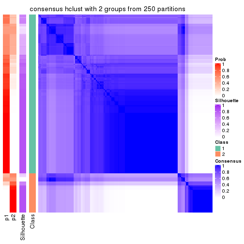</p>

</div>
<div id='tab-ATC-hclust-consensus-heatmap-2'>
<pre><code class="r">consensus_heatmap(res, k = 3)
</code></pre>

<p>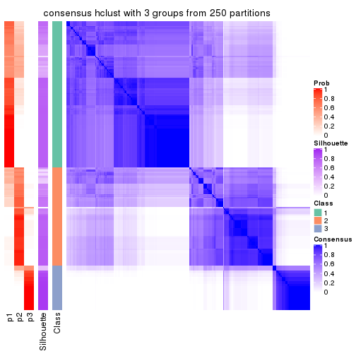</p>

</div>
<div id='tab-ATC-hclust-consensus-heatmap-3'>
<pre><code class="r">consensus_heatmap(res, k = 4)
</code></pre>

<p>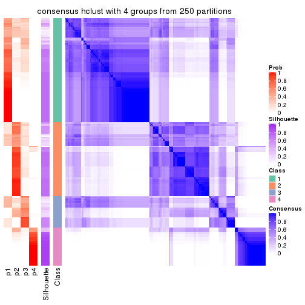</p>

</div>
<div id='tab-ATC-hclust-consensus-heatmap-4'>
<pre><code class="r">consensus_heatmap(res, k = 5)
</code></pre>

<p>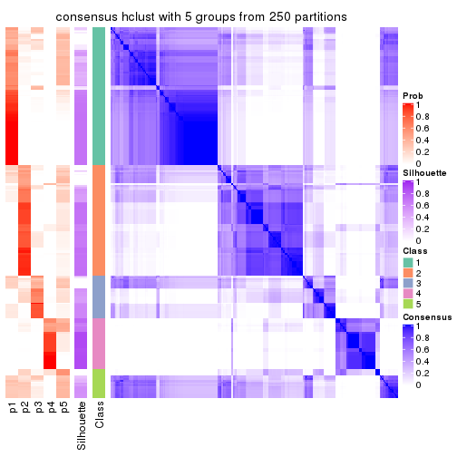</p>

</div>
<div id='tab-ATC-hclust-consensus-heatmap-5'>
<pre><code class="r">consensus_heatmap(res, k = 6)
</code></pre>

<p>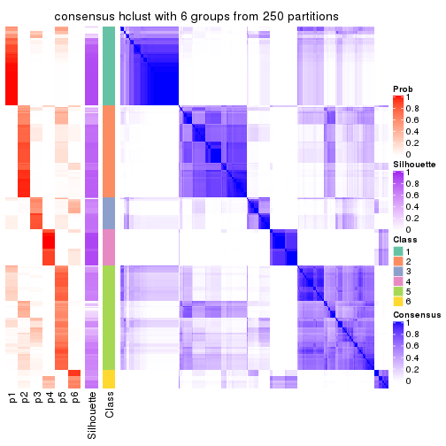</p>

</div>
</div>

Heatmaps for the membership of samples in all partitions to see how consistent they are:


<script>
$( function() {
	$( '#tabs-ATC-hclust-membership-heatmap' ).tabs();
} );
</script>
<div id='tabs-ATC-hclust-membership-heatmap'>
<ul>
<li><a href='#tab-ATC-hclust-membership-heatmap-1'>k = 2</a></li>
<li><a href='#tab-ATC-hclust-membership-heatmap-2'>k = 3</a></li>
<li><a href='#tab-ATC-hclust-membership-heatmap-3'>k = 4</a></li>
<li><a href='#tab-ATC-hclust-membership-heatmap-4'>k = 5</a></li>
<li><a href='#tab-ATC-hclust-membership-heatmap-5'>k = 6</a></li>
</ul>
<div id='tab-ATC-hclust-membership-heatmap-1'>
<pre><code class="r">membership_heatmap(res, k = 2)
</code></pre>

<p>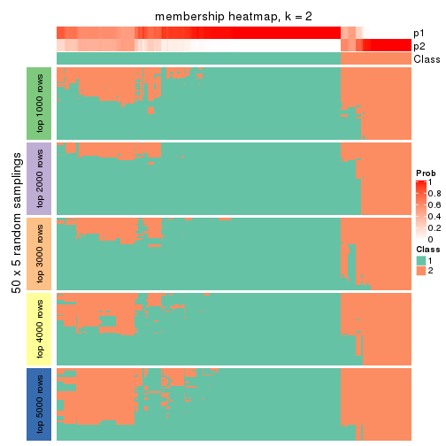</p>

</div>
<div id='tab-ATC-hclust-membership-heatmap-2'>
<pre><code class="r">membership_heatmap(res, k = 3)
</code></pre>

<p>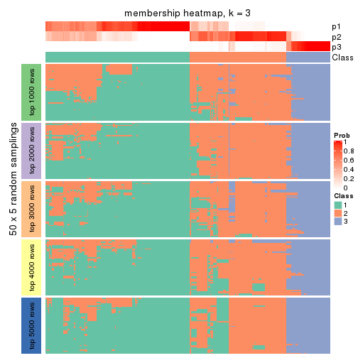</p>

</div>
<div id='tab-ATC-hclust-membership-heatmap-3'>
<pre><code class="r">membership_heatmap(res, k = 4)
</code></pre>

<p>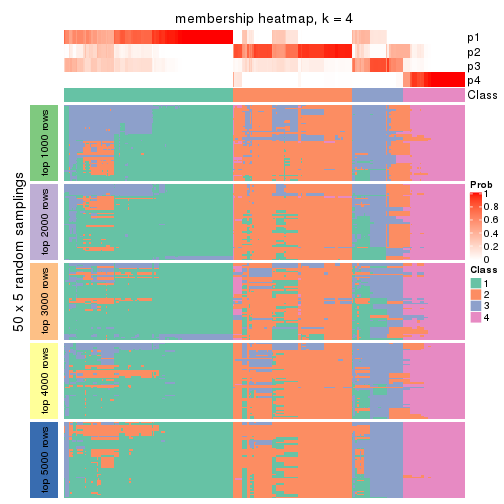</p>

</div>
<div id='tab-ATC-hclust-membership-heatmap-4'>
<pre><code class="r">membership_heatmap(res, k = 5)
</code></pre>

<p>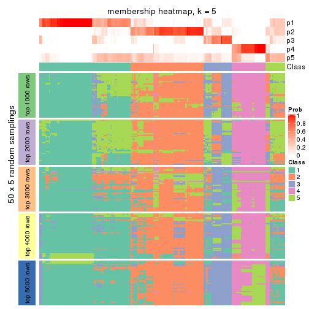</p>

</div>
<div id='tab-ATC-hclust-membership-heatmap-5'>
<pre><code class="r">membership_heatmap(res, k = 6)
</code></pre>

<p>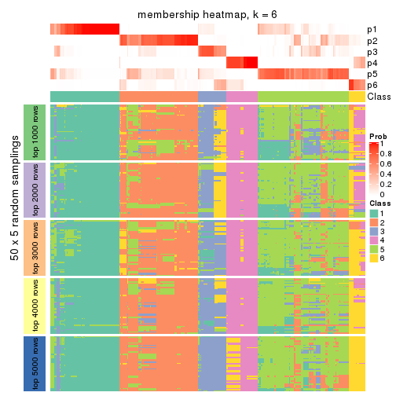</p>

</div>
</div>

As soon as we have had the classes for columns, we can look for signatures
which are significantly different between classes which can be candidate marks
for certain classes. Following are the heatmaps for signatures.


Signature heatmaps where rows are scaled:


<script>
$( function() {
	$( '#tabs-ATC-hclust-get-signatures' ).tabs();
} );
</script>
<div id='tabs-ATC-hclust-get-signatures'>
<ul>
<li><a href='#tab-ATC-hclust-get-signatures-1'>k = 2</a></li>
<li><a href='#tab-ATC-hclust-get-signatures-2'>k = 3</a></li>
<li><a href='#tab-ATC-hclust-get-signatures-3'>k = 4</a></li>
<li><a href='#tab-ATC-hclust-get-signatures-4'>k = 5</a></li>
<li><a href='#tab-ATC-hclust-get-signatures-5'>k = 6</a></li>
</ul>
<div id='tab-ATC-hclust-get-signatures-1'>
<pre><code class="r">get_signatures(res, k = 2)
</code></pre>

<p>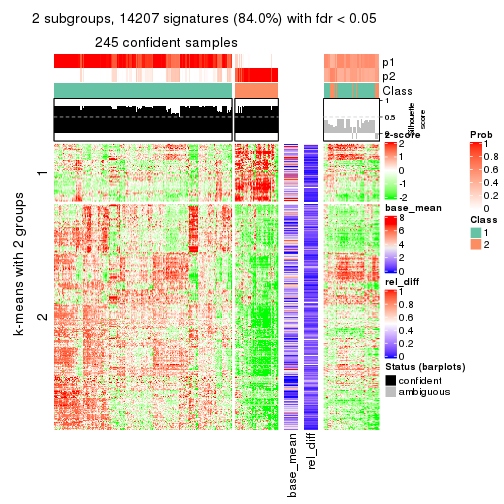</p>

</div>
<div id='tab-ATC-hclust-get-signatures-2'>
<pre><code class="r">get_signatures(res, k = 3)
</code></pre>

<p>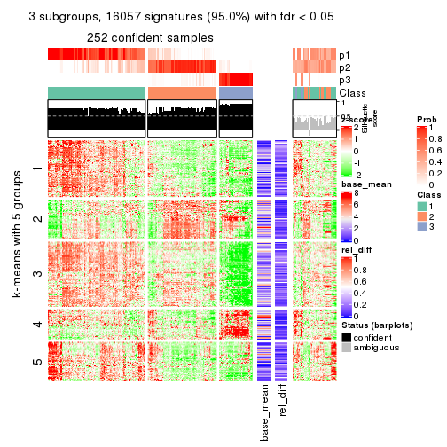</p>

</div>
<div id='tab-ATC-hclust-get-signatures-3'>
<pre><code class="r">get_signatures(res, k = 4)
</code></pre>

<p>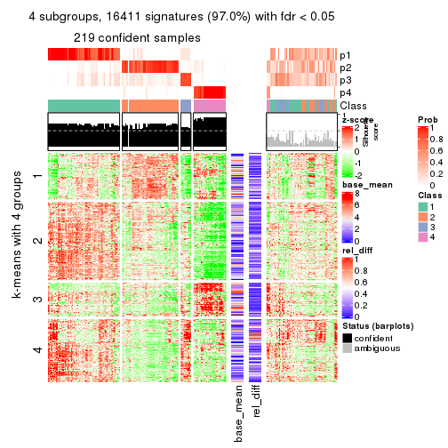</p>

</div>
<div id='tab-ATC-hclust-get-signatures-4'>
<pre><code class="r">get_signatures(res, k = 5)
</code></pre>

<p>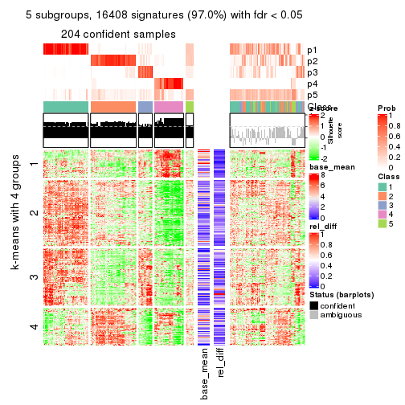</p>

</div>
<div id='tab-ATC-hclust-get-signatures-5'>
<pre><code class="r">get_signatures(res, k = 6)
</code></pre>

<p>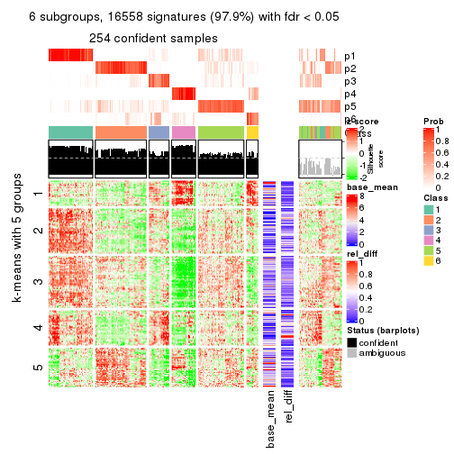</p>

</div>
</div>


Signature heatmaps where rows are not scaled:


<script>
$( function() {
	$( '#tabs-ATC-hclust-get-signatures-no-scale' ).tabs();
} );
</script>
<div id='tabs-ATC-hclust-get-signatures-no-scale'>
<ul>
<li><a href='#tab-ATC-hclust-get-signatures-no-scale-1'>k = 2</a></li>
<li><a href='#tab-ATC-hclust-get-signatures-no-scale-2'>k = 3</a></li>
<li><a href='#tab-ATC-hclust-get-signatures-no-scale-3'>k = 4</a></li>
<li><a href='#tab-ATC-hclust-get-signatures-no-scale-4'>k = 5</a></li>
<li><a href='#tab-ATC-hclust-get-signatures-no-scale-5'>k = 6</a></li>
</ul>
<div id='tab-ATC-hclust-get-signatures-no-scale-1'>
<pre><code class="r">get_signatures(res, k = 2, scale_rows = FALSE)
</code></pre>

<p>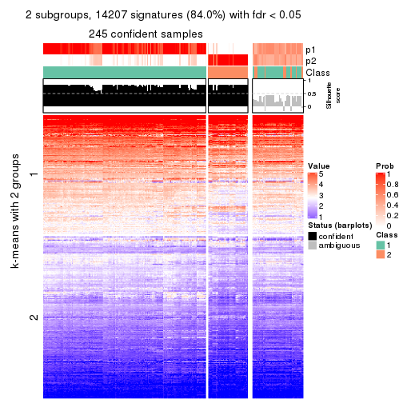</p>

</div>
<div id='tab-ATC-hclust-get-signatures-no-scale-2'>
<pre><code class="r">get_signatures(res, k = 3, scale_rows = FALSE)
</code></pre>

<p>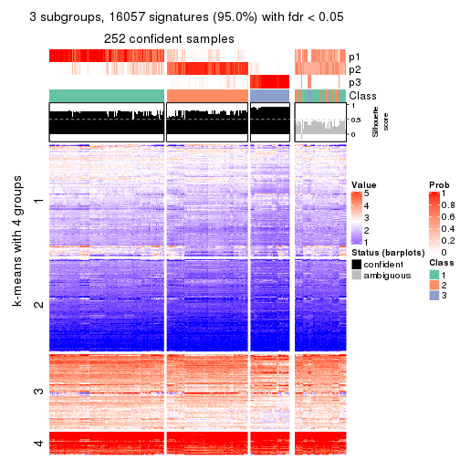</p>

</div>
<div id='tab-ATC-hclust-get-signatures-no-scale-3'>
<pre><code class="r">get_signatures(res, k = 4, scale_rows = FALSE)
</code></pre>

<p>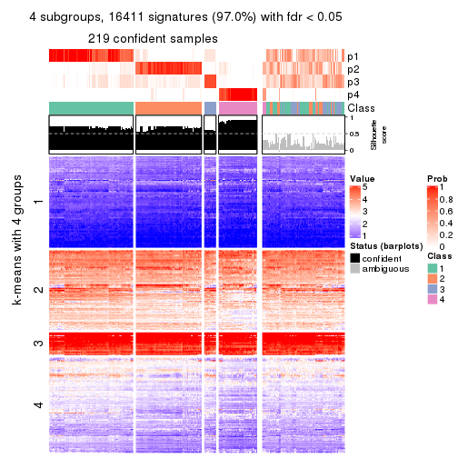</p>

</div>
<div id='tab-ATC-hclust-get-signatures-no-scale-4'>
<pre><code class="r">get_signatures(res, k = 5, scale_rows = FALSE)
</code></pre>

<p>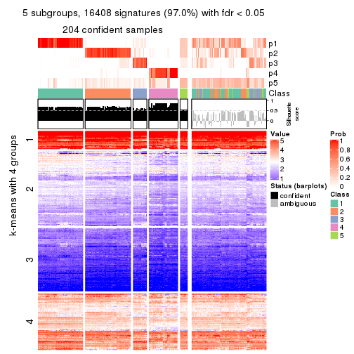</p>

</div>
<div id='tab-ATC-hclust-get-signatures-no-scale-5'>
<pre><code class="r">get_signatures(res, k = 6, scale_rows = FALSE)
</code></pre>

<p>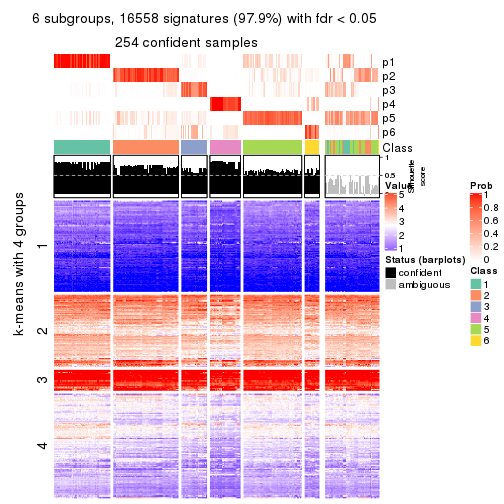</p>

</div>
</div>


Compare the overlap of signatures from different k:

```r
compare_signatures(res)
```

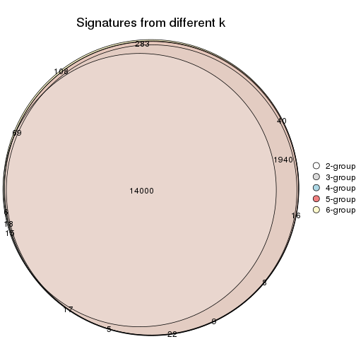

`get_signature()` returns a data frame invisibly. TO get the list of signatures, the function
call should be assigned to a variable explicitly. In following code, if `plot` argument is set
to `FALSE`, no heatmap is plotted while only the differential analysis is performed.

```r
# code only for demonstration
tb = get_signature(res, k = ..., plot = FALSE)
```

An example of the output of `tb` is:

```
#>   which_row         fdr    mean_1    mean_2 scaled_mean_1 scaled_mean_2 km
#> 1        38 0.042760348  8.373488  9.131774    -0.5533452     0.5164555  1
#> 2        40 0.018707592  7.106213  8.469186    -0.6173731     0.5762149  1
#> 3        55 0.019134737 10.221463 11.207825    -0.6159697     0.5749050  1
#> 4        59 0.006059896  5.921854  7.869574    -0.6899429     0.6439467  1
#> 5        60 0.018055526  8.928898 10.211722    -0.6204761     0.5791110  1
#> 6        98 0.009384629 15.714769 14.887706     0.6635654    -0.6193277  2
...
```

The columns in `tb` are:

1. `which_row`: row indices corresponding to the input matrix.
2. `fdr`: FDR for the differential test. 
3. `mean_x`: The mean value in group x.
4. `scaled_mean_x`: The mean value in group x after rows are scaled.
5. `km`: Row groups if k-means clustering is applied to rows.


UMAP plot which shows how samples are separated.


<script>
$( function() {
	$( '#tabs-ATC-hclust-dimension-reduction' ).tabs();
} );
</script>
<div id='tabs-ATC-hclust-dimension-reduction'>
<ul>
<li><a href='#tab-ATC-hclust-dimension-reduction-1'>k = 2</a></li>
<li><a href='#tab-ATC-hclust-dimension-reduction-2'>k = 3</a></li>
<li><a href='#tab-ATC-hclust-dimension-reduction-3'>k = 4</a></li>
<li><a href='#tab-ATC-hclust-dimension-reduction-4'>k = 5</a></li>
<li><a href='#tab-ATC-hclust-dimension-reduction-5'>k = 6</a></li>
</ul>
<div id='tab-ATC-hclust-dimension-reduction-1'>
<pre><code class="r">dimension_reduction(res, k = 2, method = &quot;UMAP&quot;)
</code></pre>

<p>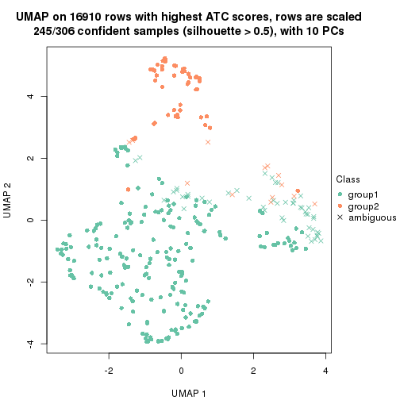</p>

</div>
<div id='tab-ATC-hclust-dimension-reduction-2'>
<pre><code class="r">dimension_reduction(res, k = 3, method = &quot;UMAP&quot;)
</code></pre>

<p>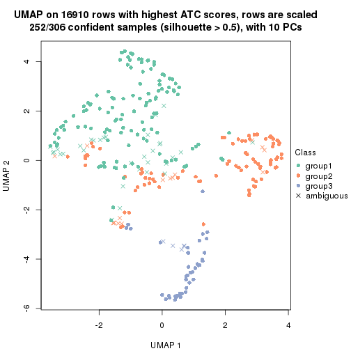</p>

</div>
<div id='tab-ATC-hclust-dimension-reduction-3'>
<pre><code class="r">dimension_reduction(res, k = 4, method = &quot;UMAP&quot;)
</code></pre>

<p>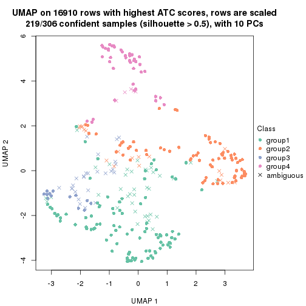</p>

</div>
<div id='tab-ATC-hclust-dimension-reduction-4'>
<pre><code class="r">dimension_reduction(res, k = 5, method = &quot;UMAP&quot;)
</code></pre>

<p>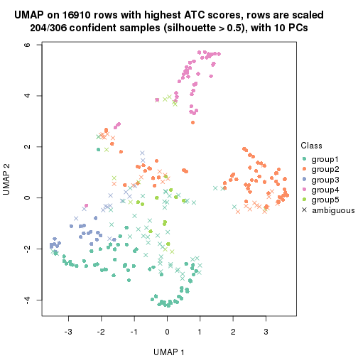</p>

</div>
<div id='tab-ATC-hclust-dimension-reduction-5'>
<pre><code class="r">dimension_reduction(res, k = 6, method = &quot;UMAP&quot;)
</code></pre>

<p>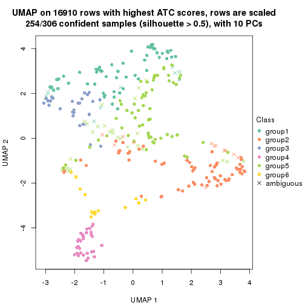</p>

</div>
</div>


Following heatmap shows how subgroups are split when increasing `k`:

```r
collect_classes(res)
```

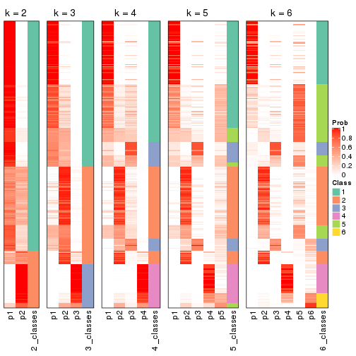


If matrix rows can be associated to genes, consider to use `GO_Enrichment(res,
...)` to perform function enrichment for the signature genes.


 

---------------------------------------------------


### ATC:kmeans*


The object with results only for a single top-value method and a single partition method 
can be extracted as:

```r
res = res_list["ATC", "kmeans"]
# you can also extract it by
# res = res_list["ATC:kmeans"]
```

A summary of `res` and all the functions that can be applied to it:

```r
res
```

```
#> A 'ConsensusPartition' object with k = 2, 3, 4, 5, 6.
#>   On a matrix with 16910 rows and 306 columns.
#>   Top rows (1000, 2000, 3000, 4000, 5000) are extracted by 'ATC' method.
#>   Subgroups are detected by 'kmeans' method.
#>   Performed in total 1250 partitions by row resampling.
#>   Best k for subgroups seems to be 2.
#> 
#> Following methods can be applied to this 'ConsensusPartition' object:
#>  [1] "cola_report"             "collect_classes"         "collect_plots"          
#>  [4] "collect_stats"           "colnames"                "compare_signatures"     
#>  [7] "consensus_heatmap"       "dimension_reduction"     "functional_enrichment"  
#> [10] "get_anno_col"            "get_anno"                "get_classes"            
#> [13] "get_consensus"           "get_matrix"              "get_membership"         
#> [16] "get_param"               "get_signatures"          "get_stats"              
#> [19] "is_best_k"               "is_stable_k"             "membership_heatmap"     
#> [22] "ncol"                    "nrow"                    "plot_ecdf"              
#> [25] "rownames"                "select_partition_number" "show"                   
#> [28] "suggest_best_k"          "test_to_known_factors"
```

`collect_plots()` function collects all the plots made from `res` for all `k` (number of partitions)
into one single page to provide an easy and fast comparison between different `k`.

```r
collect_plots(res)
```

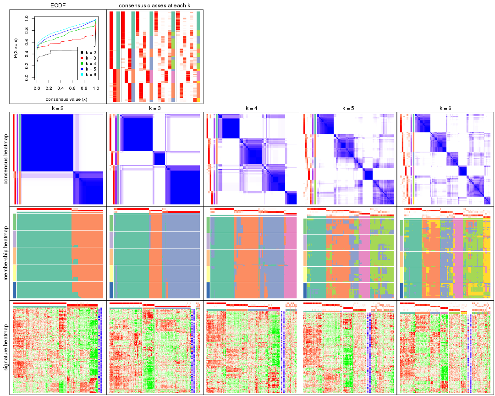

The plots are:

- The first row: a plot of the ECDF (Empirical cumulative distribution
  function) curves of the consensus matrix for each `k` and the heatmap of
  predicted classes for each `k`.
- The second row: heatmaps of the consensus matrix for each `k`.
- The third row: heatmaps of the membership matrix for each `k`.
- The fouth row: heatmaps of the signatures for each `k`.

All the plots in panels can be made by individual functions and they are
plotted later in this section.

`select_partition_number()` produces several plots showing different
statistics for choosing "optimized" `k`. There are following statistics:

- ECDF curves of the consensus matrix for each `k`;
- 1-PAC. [The PAC
  score](https://en.wikipedia.org/wiki/Consensus_clustering#Over-interpretation_potential_of_consensus_clustering)
  measures the proportion of the ambiguous subgrouping.
- Mean silhouette score.
- Concordance. The mean probability of fiting the consensus class ids in all
  partitions.
- Area increased. Denote $A_k$ as the area under the ECDF curve for current
  `k`, the area increased is defined as $A_k - A_{k-1}$.
- Rand index. The percent of pairs of samples that are both in a same cluster
  or both are not in a same cluster in the partition of k and k-1.
- Jaccard index. The ratio of pairs of samples are both in a same cluster in
  the partition of k and k-1 and the pairs of samples are both in a same
  cluster in the partition k or k-1.

The detailed explanations of these statistics can be found in [the cola
vignette](http://bioconductor.org/packages/devel/bioc/vignettes/cola/inst/doc/cola.html#toc_13).

Generally speaking, lower PAC score, higher mean silhouette score or higher
concordance corresponds to better partition. Rand index and Jaccard index
measure how similar the current partition is compared to partition with `k-1`.
If they are too similar, we won't accept `k` is better than `k-1`.

```r
select_partition_number(res)
```

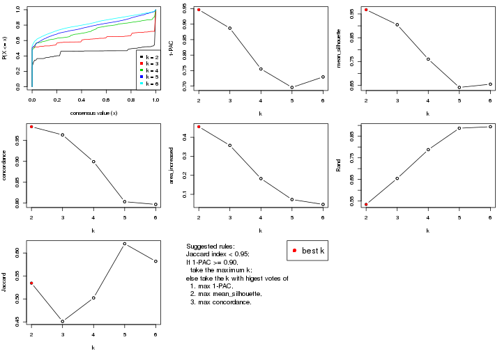

The numeric values for all these statistics can be obtained by `get_stats()`.

```r
get_stats(res)
```

```
#>   k 1-PAC mean_silhouette concordance area_increased  Rand Jaccard
#> 2 2 0.947           0.967       0.983         0.4555 0.534   0.534
#> 3 3 0.887           0.905       0.963         0.3573 0.655   0.451
#> 4 4 0.755           0.760       0.899         0.1827 0.788   0.502
#> 5 5 0.696           0.642       0.803         0.0726 0.887   0.620
#> 6 6 0.730           0.655       0.797         0.0469 0.894   0.582
```

`suggest_best_k()` suggests the best $k$ based on these statistics. The rules are as follows:

- All $k$ with Jaccard index larger than 0.95 are removed because the increase of
  the partition number does not provides enough extra information. If all $k$ are removed,
  the best $k$ is assigned by `NA`.
- For $k$ with 1-PAC larger than 0.9, the maximal $k$ is taken as the "best k". Other $k$ is called "optional k".
- If it does not fit the second rule. The $k$ with the highest vote of highest
  1-PAC, mean silhouette and concordance is taken as the "best k".

```r
suggest_best_k(res)
```

```
#> [1] 2
```


Following shows the table of the partitions (You need to click the **show/hide
code output** link to see it). The membership matrix (columns with name `p*`)
is inferred by
[`clue::cl_consensus()`](https://www.rdocumentation.org/link/cl_consensus?package=clue)
function with the `SE` method. Basically the value in the membership matrix
represents the probability to belong to a certain group. The finall class
label for an item is determined with the group with highest probability it
belongs to.

In `get_classes()` function, the entropy is calculated from the membership
matrix and the silhouette score is calculated from the consensus matrix.


<script>
$( function() {
	$( '#tabs-ATC-kmeans-get-classes' ).tabs();
} );
</script>
<div id='tabs-ATC-kmeans-get-classes'>
<ul>
<li><a href='#tab-ATC-kmeans-get-classes-1'>k = 2</a></li>
<li><a href='#tab-ATC-kmeans-get-classes-2'>k = 3</a></li>
<li><a href='#tab-ATC-kmeans-get-classes-3'>k = 4</a></li>
<li><a href='#tab-ATC-kmeans-get-classes-4'>k = 5</a></li>
<li><a href='#tab-ATC-kmeans-get-classes-5'>k = 6</a></li>
</ul>

<div id='tab-ATC-kmeans-get-classes-1'>
<p><a id='tab-ATC-kmeans-get-classes-1-a' style='color:#0366d6' href='#'>show/hide code output</a></p>
<pre><code class="r">cbind(get_classes(res, k = 2), get_membership(res, k = 2))
</code></pre>

<pre><code>#&gt;            class entropy silhouette    p1    p2
#&gt; SRR1609360     2  0.0000      0.954 0.000 1.000
#&gt; SRR1609361     2  0.0000      0.954 0.000 1.000
#&gt; SRR1609362     2  0.0000      0.954 0.000 1.000
#&gt; SRR1609363     2  0.0376      0.953 0.004 0.996
#&gt; SRR1609364     2  0.7674      0.766 0.224 0.776
#&gt; SRR1609365     2  0.0000      0.954 0.000 1.000
#&gt; SRR1609366     1  0.0000      0.998 1.000 0.000
#&gt; SRR1609367     1  0.0000      0.998 1.000 0.000
#&gt; SRR1609368     2  0.6712      0.820 0.176 0.824
#&gt; SRR1609369     1  0.0000      0.998 1.000 0.000
#&gt; SRR1609370     1  0.0000      0.998 1.000 0.000
#&gt; SRR1609371     2  0.0000      0.954 0.000 1.000
#&gt; SRR1609372     1  0.0000      0.998 1.000 0.000
#&gt; SRR1609373     2  0.0376      0.953 0.004 0.996
#&gt; SRR1609374     1  0.0000      0.998 1.000 0.000
#&gt; SRR1609375     1  0.0000      0.998 1.000 0.000
#&gt; SRR1609377     1  0.0000      0.998 1.000 0.000
#&gt; SRR1609376     2  0.0376      0.953 0.004 0.996
#&gt; SRR1609378     2  0.0000      0.954 0.000 1.000
#&gt; SRR1609379     1  0.0000      0.998 1.000 0.000
#&gt; SRR1609382     2  0.0000      0.954 0.000 1.000
#&gt; SRR1609383     2  0.0000      0.954 0.000 1.000
#&gt; SRR1609381     1  0.0000      0.998 1.000 0.000
#&gt; SRR1609384     1  0.0000      0.998 1.000 0.000
#&gt; SRR1609386     1  0.0000      0.998 1.000 0.000
#&gt; SRR1609385     1  0.0000      0.998 1.000 0.000
#&gt; SRR1609387     1  0.0000      0.998 1.000 0.000
#&gt; SRR1609388     2  0.2043      0.939 0.032 0.968
#&gt; SRR1609390     1  0.0000      0.998 1.000 0.000
#&gt; SRR1609393     2  0.0000      0.954 0.000 1.000
#&gt; SRR1609394     2  0.0000      0.954 0.000 1.000
#&gt; SRR1609392     2  0.0376      0.953 0.004 0.996
#&gt; SRR1609391     2  0.0000      0.954 0.000 1.000
#&gt; SRR1609395     1  0.0000      0.998 1.000 0.000
#&gt; SRR1609396     1  0.0000      0.998 1.000 0.000
#&gt; SRR1609398     1  0.0000      0.998 1.000 0.000
#&gt; SRR1609399     1  0.0000      0.998 1.000 0.000
#&gt; SRR1609400     1  0.0000      0.998 1.000 0.000
#&gt; SRR1609397     2  0.1184      0.948 0.016 0.984
#&gt; SRR1609401     2  0.7674      0.766 0.224 0.776
#&gt; SRR1609402     2  0.7674      0.766 0.224 0.776
#&gt; SRR1609405     1  0.0000      0.998 1.000 0.000
#&gt; SRR1609404     2  0.0000      0.954 0.000 1.000
#&gt; SRR1609406     2  0.2043      0.939 0.032 0.968
#&gt; SRR1609408     2  0.7674      0.766 0.224 0.776
#&gt; SRR1609403     1  0.0000      0.998 1.000 0.000
#&gt; SRR1609410     1  0.0000      0.998 1.000 0.000
#&gt; SRR1609411     2  0.0376      0.953 0.004 0.996
#&gt; SRR1609407     2  0.2043      0.939 0.032 0.968
#&gt; SRR1609413     1  0.0000      0.998 1.000 0.000
#&gt; SRR1609412     1  0.0000      0.998 1.000 0.000
#&gt; SRR1609414     1  0.0000      0.998 1.000 0.000
#&gt; SRR1609415     1  0.0000      0.998 1.000 0.000
#&gt; SRR1609416     1  0.0000      0.998 1.000 0.000
#&gt; SRR1609417     2  0.0000      0.954 0.000 1.000
#&gt; SRR1609418     1  0.0000      0.998 1.000 0.000
#&gt; SRR1609419     2  0.0376      0.953 0.004 0.996
#&gt; SRR1609420     1  0.0000      0.998 1.000 0.000
#&gt; SRR1609421     2  0.7674      0.766 0.224 0.776
#&gt; SRR1609422     2  0.0000      0.954 0.000 1.000
#&gt; SRR1609423     2  0.0000      0.954 0.000 1.000
#&gt; SRR1609424     2  0.0000      0.954 0.000 1.000
#&gt; SRR1609425     1  0.0000      0.998 1.000 0.000
#&gt; SRR1609426     2  0.1414      0.946 0.020 0.980
#&gt; SRR1609427     1  0.0000      0.998 1.000 0.000
#&gt; SRR1609428     2  0.0376      0.953 0.004 0.996
#&gt; SRR1609429     1  0.0000      0.998 1.000 0.000
#&gt; SRR1609430     1  0.0000      0.998 1.000 0.000
#&gt; SRR1609431     1  0.0000      0.998 1.000 0.000
#&gt; SRR1609432     1  0.0000      0.998 1.000 0.000
#&gt; SRR1609433     1  0.0000      0.998 1.000 0.000
#&gt; SRR1609434     2  0.0000      0.954 0.000 1.000
#&gt; SRR1609435     1  0.0000      0.998 1.000 0.000
#&gt; SRR1609436     1  0.0000      0.998 1.000 0.000
#&gt; SRR1609437     2  0.0000      0.954 0.000 1.000
#&gt; SRR1609438     2  0.0000      0.954 0.000 1.000
#&gt; SRR1609439     2  0.0000      0.954 0.000 1.000
#&gt; SRR1609440     1  0.0000      0.998 1.000 0.000
#&gt; SRR1609441     2  0.0376      0.953 0.004 0.996
#&gt; SRR1609442     2  0.0000      0.954 0.000 1.000
#&gt; SRR1609443     1  0.0000      0.998 1.000 0.000
#&gt; SRR1609444     1  0.0000      0.998 1.000 0.000
#&gt; SRR1609445     1  0.0938      0.986 0.988 0.012
#&gt; SRR1609446     1  0.0000      0.998 1.000 0.000
#&gt; SRR1609447     1  0.0000      0.998 1.000 0.000
#&gt; SRR1609448     1  0.0000      0.998 1.000 0.000
#&gt; SRR1609449     1  0.0000      0.998 1.000 0.000
#&gt; SRR1609450     1  0.0000      0.998 1.000 0.000
#&gt; SRR1609451     1  0.0000      0.998 1.000 0.000
#&gt; SRR1609452     2  0.0376      0.953 0.004 0.996
#&gt; SRR1609453     1  0.0000      0.998 1.000 0.000
#&gt; SRR1609454     2  0.0376      0.953 0.004 0.996
#&gt; SRR1609455     1  0.0000      0.998 1.000 0.000
#&gt; SRR1609456     1  0.0000      0.998 1.000 0.000
#&gt; SRR1609457     1  0.0000      0.998 1.000 0.000
#&gt; SRR1609458     1  0.0000      0.998 1.000 0.000
#&gt; SRR1609459     1  0.0000      0.998 1.000 0.000
#&gt; SRR1609460     1  0.0000      0.998 1.000 0.000
#&gt; SRR1609461     1  0.0000      0.998 1.000 0.000
#&gt; SRR1609462     1  0.0000      0.998 1.000 0.000
#&gt; SRR1609464     1  0.0000      0.998 1.000 0.000
#&gt; SRR1609463     1  0.0000      0.998 1.000 0.000
#&gt; SRR1609465     1  0.0000      0.998 1.000 0.000
#&gt; SRR1609466     2  0.0000      0.954 0.000 1.000
#&gt; SRR1609467     1  0.0000      0.998 1.000 0.000
#&gt; SRR1609469     2  0.0000      0.954 0.000 1.000
#&gt; SRR1609470     1  0.0000      0.998 1.000 0.000
#&gt; SRR1609472     2  0.0000      0.954 0.000 1.000
#&gt; SRR1609471     1  0.0000      0.998 1.000 0.000
#&gt; SRR1609474     1  0.0000      0.998 1.000 0.000
#&gt; SRR1609473     2  0.0000      0.954 0.000 1.000
#&gt; SRR1609475     2  0.0000      0.954 0.000 1.000
#&gt; SRR1609478     2  0.0000      0.954 0.000 1.000
#&gt; SRR1609476     1  0.0000      0.998 1.000 0.000
#&gt; SRR1609477     2  0.0000      0.954 0.000 1.000
#&gt; SRR1609479     2  0.0000      0.954 0.000 1.000
#&gt; SRR1609481     2  0.0000      0.954 0.000 1.000
#&gt; SRR1609480     2  0.0000      0.954 0.000 1.000
#&gt; SRR1609482     1  0.0000      0.998 1.000 0.000
#&gt; SRR1609484     2  0.0000      0.954 0.000 1.000
#&gt; SRR1609483     1  0.0000      0.998 1.000 0.000
#&gt; SRR1609486     1  0.0000      0.998 1.000 0.000
#&gt; SRR1609485     1  0.0000      0.998 1.000 0.000
#&gt; SRR1609487     1  0.0000      0.998 1.000 0.000
#&gt; SRR1609488     1  0.0000      0.998 1.000 0.000
#&gt; SRR1609489     1  0.0000      0.998 1.000 0.000
#&gt; SRR1609490     1  0.0000      0.998 1.000 0.000
#&gt; SRR1609491     1  0.0000      0.998 1.000 0.000
#&gt; SRR1609492     2  0.7674      0.766 0.224 0.776
#&gt; SRR1609493     1  0.0000      0.998 1.000 0.000
#&gt; SRR1609494     2  0.0376      0.953 0.004 0.996
#&gt; SRR1609495     1  0.0000      0.998 1.000 0.000
#&gt; SRR1609496     1  0.0000      0.998 1.000 0.000
#&gt; SRR1609497     1  0.0000      0.998 1.000 0.000
#&gt; SRR1609498     1  0.0000      0.998 1.000 0.000
#&gt; SRR1609499     1  0.0000      0.998 1.000 0.000
#&gt; SRR1609500     1  0.0000      0.998 1.000 0.000
#&gt; SRR1609501     1  0.0000      0.998 1.000 0.000
#&gt; SRR1609502     2  0.2423      0.934 0.040 0.960
#&gt; SRR1609503     2  0.0000      0.954 0.000 1.000
#&gt; SRR1609504     1  0.0000      0.998 1.000 0.000
#&gt; SRR1609505     1  0.0000      0.998 1.000 0.000
#&gt; SRR1609506     2  0.7674      0.766 0.224 0.776
#&gt; SRR1609507     1  0.0000      0.998 1.000 0.000
#&gt; SRR1609508     2  0.1184      0.948 0.016 0.984
#&gt; SRR1609509     2  0.7674      0.766 0.224 0.776
#&gt; SRR1609510     2  0.0000      0.954 0.000 1.000
#&gt; SRR1609512     1  0.0000      0.998 1.000 0.000
#&gt; SRR1609511     2  0.0000      0.954 0.000 1.000
#&gt; SRR1609513     1  0.0000      0.998 1.000 0.000
#&gt; SRR1609514     2  0.0000      0.954 0.000 1.000
#&gt; SRR1609515     2  0.2043      0.939 0.032 0.968
#&gt; SRR1609516     1  0.0000      0.998 1.000 0.000
#&gt; SRR1609517     2  0.6712      0.820 0.176 0.824
#&gt; SRR1609518     1  0.0000      0.998 1.000 0.000
#&gt; SRR1609519     1  0.0000      0.998 1.000 0.000
#&gt; SRR1609520     2  0.0000      0.954 0.000 1.000
#&gt; SRR1609521     1  0.0000      0.998 1.000 0.000
#&gt; SRR1609522     1  0.0000      0.998 1.000 0.000
#&gt; SRR1609523     1  0.5294      0.854 0.880 0.120
#&gt; SRR1609524     2  0.7674      0.766 0.224 0.776
#&gt; SRR1609526     1  0.0000      0.998 1.000 0.000
#&gt; SRR1609525     1  0.6048      0.813 0.852 0.148
#&gt; SRR1609527     1  0.0000      0.998 1.000 0.000
#&gt; SRR1609529     1  0.0000      0.998 1.000 0.000
#&gt; SRR1609528     2  0.0000      0.954 0.000 1.000
#&gt; SRR1609530     1  0.0000      0.998 1.000 0.000
#&gt; SRR1609531     2  0.4815      0.887 0.104 0.896
#&gt; SRR1609532     1  0.0000      0.998 1.000 0.000
#&gt; SRR1609533     1  0.0000      0.998 1.000 0.000
#&gt; SRR1609534     1  0.0000      0.998 1.000 0.000
#&gt; SRR1609535     2  0.0000      0.954 0.000 1.000
#&gt; SRR1609537     2  0.7674      0.766 0.224 0.776
#&gt; SRR1609536     1  0.0000      0.998 1.000 0.000
#&gt; SRR1609538     1  0.0000      0.998 1.000 0.000
#&gt; SRR1609539     1  0.0000      0.998 1.000 0.000
#&gt; SRR1609540     1  0.0000      0.998 1.000 0.000
#&gt; SRR1609541     2  0.0000      0.954 0.000 1.000
#&gt; SRR1609542     2  0.7674      0.766 0.224 0.776
#&gt; SRR1609543     1  0.0000      0.998 1.000 0.000
#&gt; SRR1609544     1  0.0000      0.998 1.000 0.000
#&gt; SRR1609545     1  0.0000      0.998 1.000 0.000
#&gt; SRR1609546     1  0.0000      0.998 1.000 0.000
#&gt; SRR1609547     1  0.0000      0.998 1.000 0.000
#&gt; SRR1609548     1  0.0000      0.998 1.000 0.000
#&gt; SRR1609549     1  0.0000      0.998 1.000 0.000
#&gt; SRR1609550     2  0.7056      0.803 0.192 0.808
#&gt; SRR1609551     1  0.0000      0.998 1.000 0.000
#&gt; SRR1609552     1  0.0000      0.998 1.000 0.000
#&gt; SRR1609553     1  0.0000      0.998 1.000 0.000
#&gt; SRR1609554     1  0.0000      0.998 1.000 0.000
#&gt; SRR1609555     1  0.0000      0.998 1.000 0.000
#&gt; SRR1609556     1  0.0000      0.998 1.000 0.000
#&gt; SRR1609557     1  0.0000      0.998 1.000 0.000
#&gt; SRR1609558     1  0.0000      0.998 1.000 0.000
#&gt; SRR1609559     2  0.4562      0.893 0.096 0.904
#&gt; SRR1609560     1  0.0000      0.998 1.000 0.000
#&gt; SRR1609561     1  0.0000      0.998 1.000 0.000
#&gt; SRR1609562     1  0.0000      0.998 1.000 0.000
#&gt; SRR1609563     1  0.0000      0.998 1.000 0.000
#&gt; SRR1609564     1  0.0000      0.998 1.000 0.000
#&gt; SRR1609565     2  0.1184      0.948 0.016 0.984
#&gt; SRR1609566     2  0.1184      0.948 0.016 0.984
#&gt; SRR1609567     2  0.0000      0.954 0.000 1.000
#&gt; SRR1609568     1  0.0000      0.998 1.000 0.000
#&gt; SRR1609569     1  0.0000      0.998 1.000 0.000
#&gt; SRR1609570     1  0.0000      0.998 1.000 0.000
#&gt; SRR1609571     2  0.0000      0.954 0.000 1.000
#&gt; SRR1609572     2  0.0000      0.954 0.000 1.000
#&gt; SRR1609573     1  0.0000      0.998 1.000 0.000
#&gt; SRR1609574     1  0.0000      0.998 1.000 0.000
#&gt; SRR1609575     2  0.0000      0.954 0.000 1.000
#&gt; SRR1609576     1  0.0000      0.998 1.000 0.000
#&gt; SRR1609578     1  0.0000      0.998 1.000 0.000
#&gt; SRR1609577     1  0.0000      0.998 1.000 0.000
#&gt; SRR1609579     1  0.0000      0.998 1.000 0.000
#&gt; SRR1609580     1  0.0000      0.998 1.000 0.000
#&gt; SRR1609582     1  0.0000      0.998 1.000 0.000
#&gt; SRR1609581     1  0.0000      0.998 1.000 0.000
#&gt; SRR1609583     1  0.0000      0.998 1.000 0.000
#&gt; SRR1609584     1  0.0000      0.998 1.000 0.000
#&gt; SRR1609585     1  0.0000      0.998 1.000 0.000
#&gt; SRR1609586     1  0.0000      0.998 1.000 0.000
#&gt; SRR1609587     2  0.0000      0.954 0.000 1.000
#&gt; SRR1609588     1  0.0000      0.998 1.000 0.000
#&gt; SRR1609589     1  0.0000      0.998 1.000 0.000
#&gt; SRR1609590     1  0.0000      0.998 1.000 0.000
#&gt; SRR1609592     2  0.0376      0.953 0.004 0.996
#&gt; SRR1609591     1  0.0000      0.998 1.000 0.000
#&gt; SRR1609593     2  0.6048      0.848 0.148 0.852
#&gt; SRR1609594     2  0.0000      0.954 0.000 1.000
#&gt; SRR1609595     1  0.0000      0.998 1.000 0.000
#&gt; SRR1609596     1  0.0000      0.998 1.000 0.000
#&gt; SRR1609597     2  0.0376      0.953 0.004 0.996
#&gt; SRR1609598     2  0.0000      0.954 0.000 1.000
#&gt; SRR1609599     2  0.0000      0.954 0.000 1.000
#&gt; SRR1609600     1  0.0000      0.998 1.000 0.000
#&gt; SRR1609601     2  0.0000      0.954 0.000 1.000
#&gt; SRR1609602     2  0.0000      0.954 0.000 1.000
#&gt; SRR1609603     1  0.0000      0.998 1.000 0.000
#&gt; SRR1609604     2  0.0000      0.954 0.000 1.000
#&gt; SRR1609605     2  0.9833      0.357 0.424 0.576
#&gt; SRR1609606     2  0.5629      0.863 0.132 0.868
#&gt; SRR1609607     1  0.0000      0.998 1.000 0.000
#&gt; SRR1609608     1  0.0000      0.998 1.000 0.000
#&gt; SRR1609609     1  0.0000      0.998 1.000 0.000
#&gt; SRR1609610     1  0.0000      0.998 1.000 0.000
#&gt; SRR1609611     2  0.0000      0.954 0.000 1.000
#&gt; SRR1609613     1  0.0000      0.998 1.000 0.000
#&gt; SRR1609612     1  0.0000      0.998 1.000 0.000
#&gt; SRR1609614     1  0.0000      0.998 1.000 0.000
#&gt; SRR1609615     1  0.0000      0.998 1.000 0.000
#&gt; SRR1609616     1  0.0000      0.998 1.000 0.000
#&gt; SRR1609617     2  0.7674      0.766 0.224 0.776
#&gt; SRR1609618     1  0.0000      0.998 1.000 0.000
#&gt; SRR1609619     1  0.0000      0.998 1.000 0.000
#&gt; SRR1609620     2  0.0000      0.954 0.000 1.000
#&gt; SRR1609621     2  0.0000      0.954 0.000 1.000
#&gt; SRR1609622     1  0.0000      0.998 1.000 0.000
#&gt; SRR1609623     1  0.0000      0.998 1.000 0.000
#&gt; SRR1609624     1  0.0000      0.998 1.000 0.000
#&gt; SRR1609625     1  0.0000      0.998 1.000 0.000
#&gt; SRR1609626     2  0.0000      0.954 0.000 1.000
#&gt; SRR1609627     1  0.0000      0.998 1.000 0.000
#&gt; SRR1609628     1  0.0000      0.998 1.000 0.000
#&gt; SRR1609629     1  0.0000      0.998 1.000 0.000
#&gt; SRR1609630     1  0.0000      0.998 1.000 0.000
#&gt; SRR1609631     1  0.0000      0.998 1.000 0.000
#&gt; SRR1609632     1  0.0000      0.998 1.000 0.000
#&gt; SRR1609633     1  0.0000      0.998 1.000 0.000
#&gt; SRR1609634     2  0.7674      0.766 0.224 0.776
#&gt; SRR1609635     2  0.0000      0.954 0.000 1.000
#&gt; SRR1609636     2  0.0000      0.954 0.000 1.000
#&gt; SRR1609637     1  0.0000      0.998 1.000 0.000
#&gt; SRR1609638     1  0.0000      0.998 1.000 0.000
#&gt; SRR1609639     1  0.0000      0.998 1.000 0.000
#&gt; SRR1609640     1  0.0000      0.998 1.000 0.000
#&gt; SRR1609641     1  0.0000      0.998 1.000 0.000
#&gt; SRR1609642     1  0.0000      0.998 1.000 0.000
#&gt; SRR1609643     1  0.0000      0.998 1.000 0.000
#&gt; SRR1609644     1  0.0000      0.998 1.000 0.000
#&gt; SRR1609645     1  0.0000      0.998 1.000 0.000
#&gt; SRR1609646     1  0.0000      0.998 1.000 0.000
#&gt; SRR1609647     2  0.0000      0.954 0.000 1.000
#&gt; SRR1609649     1  0.0000      0.998 1.000 0.000
#&gt; SRR1609648     2  0.4815      0.887 0.104 0.896
#&gt; SRR1609651     1  0.0000      0.998 1.000 0.000
#&gt; SRR1609650     2  0.1184      0.948 0.016 0.984
#&gt; SRR1609652     1  0.0000      0.998 1.000 0.000
#&gt; SRR1609653     2  0.7674      0.766 0.224 0.776
#&gt; SRR1609654     2  0.0000      0.954 0.000 1.000
#&gt; SRR1609655     1  0.0000      0.998 1.000 0.000
#&gt; SRR1609657     1  0.0000      0.998 1.000 0.000
#&gt; SRR1609656     2  0.0000      0.954 0.000 1.000
#&gt; SRR1609658     2  0.0000      0.954 0.000 1.000
#&gt; SRR1609659     2  0.0376      0.953 0.004 0.996
#&gt; SRR1609660     2  0.1184      0.948 0.016 0.984
#&gt; SRR1609661     1  0.0000      0.998 1.000 0.000
#&gt; SRR1609662     1  0.0000      0.998 1.000 0.000
#&gt; SRR1609663     1  0.0000      0.998 1.000 0.000
#&gt; SRR1609664     1  0.0000      0.998 1.000 0.000
#&gt; SRR1609665     1  0.0000      0.998 1.000 0.000
#&gt; SRR1609666     2  0.0000      0.954 0.000 1.000
#&gt; SRR1609667     1  0.0000      0.998 1.000 0.000
#&gt; SRR1609668     2  0.0000      0.954 0.000 1.000
#&gt; SRR1609669     1  0.0000      0.998 1.000 0.000
</code></pre>

<script>
$('#tab-ATC-kmeans-get-classes-1-a').parent().next().next().hide();
$('#tab-ATC-kmeans-get-classes-1-a').click(function(){
  $('#tab-ATC-kmeans-get-classes-1-a').parent().next().next().toggle();
  return(false);
});
</script>
</div>

<div id='tab-ATC-kmeans-get-classes-2'>
<p><a id='tab-ATC-kmeans-get-classes-2-a' style='color:#0366d6' href='#'>show/hide code output</a></p>
<pre><code class="r">cbind(get_classes(res, k = 3), get_membership(res, k = 3))
</code></pre>

<pre><code>#&gt;            class entropy silhouette    p1    p2    p3
#&gt; SRR1609360     2  0.6126     0.3742 0.000 0.600 0.400
#&gt; SRR1609361     3  0.4555     0.7335 0.000 0.200 0.800
#&gt; SRR1609362     2  0.0000     0.9399 0.000 1.000 0.000
#&gt; SRR1609363     3  0.0000     0.9591 0.000 0.000 1.000
#&gt; SRR1609364     3  0.0000     0.9591 0.000 0.000 1.000
#&gt; SRR1609365     2  0.0000     0.9399 0.000 1.000 0.000
#&gt; SRR1609366     3  0.0000     0.9591 0.000 0.000 1.000
#&gt; SRR1609367     1  0.0000     0.9572 1.000 0.000 0.000
#&gt; SRR1609368     3  0.0000     0.9591 0.000 0.000 1.000
#&gt; SRR1609369     1  0.0000     0.9572 1.000 0.000 0.000
#&gt; SRR1609370     1  0.0000     0.9572 1.000 0.000 0.000
#&gt; SRR1609371     2  0.0000     0.9399 0.000 1.000 0.000
#&gt; SRR1609372     1  0.0000     0.9572 1.000 0.000 0.000
#&gt; SRR1609373     3  0.0000     0.9591 0.000 0.000 1.000
#&gt; SRR1609374     3  0.0000     0.9591 0.000 0.000 1.000
#&gt; SRR1609375     3  0.0000     0.9591 0.000 0.000 1.000
#&gt; SRR1609377     1  0.0000     0.9572 1.000 0.000 0.000
#&gt; SRR1609376     3  0.0000     0.9591 0.000 0.000 1.000
#&gt; SRR1609378     2  0.0000     0.9399 0.000 1.000 0.000
#&gt; SRR1609379     1  0.0000     0.9572 1.000 0.000 0.000
#&gt; SRR1609382     2  0.0000     0.9399 0.000 1.000 0.000
#&gt; SRR1609383     2  0.6140     0.3643 0.000 0.596 0.404
#&gt; SRR1609381     1  0.0000     0.9572 1.000 0.000 0.000
#&gt; SRR1609384     3  0.0000     0.9591 0.000 0.000 1.000
#&gt; SRR1609386     1  0.6126     0.3605 0.600 0.000 0.400
#&gt; SRR1609385     3  0.0000     0.9591 0.000 0.000 1.000
#&gt; SRR1609387     1  0.0000     0.9572 1.000 0.000 0.000
#&gt; SRR1609388     3  0.0000     0.9591 0.000 0.000 1.000
#&gt; SRR1609390     1  0.0000     0.9572 1.000 0.000 0.000
#&gt; SRR1609393     2  0.0000     0.9399 0.000 1.000 0.000
#&gt; SRR1609394     2  0.4555     0.7378 0.000 0.800 0.200
#&gt; SRR1609392     3  0.0000     0.9591 0.000 0.000 1.000
#&gt; SRR1609391     2  0.0000     0.9399 0.000 1.000 0.000
#&gt; SRR1609395     1  0.0000     0.9572 1.000 0.000 0.000
#&gt; SRR1609396     1  0.0000     0.9572 1.000 0.000 0.000
#&gt; SRR1609398     1  0.0000     0.9572 1.000 0.000 0.000
#&gt; SRR1609399     1  0.0000     0.9572 1.000 0.000 0.000
#&gt; SRR1609400     1  0.0000     0.9572 1.000 0.000 0.000
#&gt; SRR1609397     3  0.0000     0.9591 0.000 0.000 1.000
#&gt; SRR1609401     3  0.0000     0.9591 0.000 0.000 1.000
#&gt; SRR1609402     3  0.0000     0.9591 0.000 0.000 1.000
#&gt; SRR1609405     1  0.6307     0.0862 0.512 0.000 0.488
#&gt; SRR1609404     2  0.0000     0.9399 0.000 1.000 0.000
#&gt; SRR1609406     3  0.0000     0.9591 0.000 0.000 1.000
#&gt; SRR1609408     3  0.0000     0.9591 0.000 0.000 1.000
#&gt; SRR1609403     1  0.0000     0.9572 1.000 0.000 0.000
#&gt; SRR1609410     1  0.0000     0.9572 1.000 0.000 0.000
#&gt; SRR1609411     3  0.0000     0.9591 0.000 0.000 1.000
#&gt; SRR1609407     3  0.0000     0.9591 0.000 0.000 1.000
#&gt; SRR1609413     1  0.0000     0.9572 1.000 0.000 0.000
#&gt; SRR1609412     1  0.0000     0.9572 1.000 0.000 0.000
#&gt; SRR1609414     1  0.0000     0.9572 1.000 0.000 0.000
#&gt; SRR1609415     1  0.0000     0.9572 1.000 0.000 0.000
#&gt; SRR1609416     1  0.0000     0.9572 1.000 0.000 0.000
#&gt; SRR1609417     3  0.4291     0.7621 0.000 0.180 0.820
#&gt; SRR1609418     1  0.0000     0.9572 1.000 0.000 0.000
#&gt; SRR1609419     3  0.0000     0.9591 0.000 0.000 1.000
#&gt; SRR1609420     3  0.0000     0.9591 0.000 0.000 1.000
#&gt; SRR1609421     3  0.0000     0.9591 0.000 0.000 1.000
#&gt; SRR1609422     2  0.0000     0.9399 0.000 1.000 0.000
#&gt; SRR1609423     2  0.0000     0.9399 0.000 1.000 0.000
#&gt; SRR1609424     2  0.0000     0.9399 0.000 1.000 0.000
#&gt; SRR1609425     1  0.1643     0.9114 0.956 0.000 0.044
#&gt; SRR1609426     3  0.0000     0.9591 0.000 0.000 1.000
#&gt; SRR1609427     1  0.0000     0.9572 1.000 0.000 0.000
#&gt; SRR1609428     3  0.0000     0.9591 0.000 0.000 1.000
#&gt; SRR1609429     1  0.0000     0.9572 1.000 0.000 0.000
#&gt; SRR1609430     1  0.0000     0.9572 1.000 0.000 0.000
#&gt; SRR1609431     3  0.0000     0.9591 0.000 0.000 1.000
#&gt; SRR1609432     3  0.0000     0.9591 0.000 0.000 1.000
#&gt; SRR1609433     3  0.4796     0.6982 0.220 0.000 0.780
#&gt; SRR1609434     2  0.0000     0.9399 0.000 1.000 0.000
#&gt; SRR1609435     1  0.0000     0.9572 1.000 0.000 0.000
#&gt; SRR1609436     1  0.0000     0.9572 1.000 0.000 0.000
#&gt; SRR1609437     3  0.0000     0.9591 0.000 0.000 1.000
#&gt; SRR1609438     2  0.0000     0.9399 0.000 1.000 0.000
#&gt; SRR1609439     2  0.6140     0.3643 0.000 0.596 0.404
#&gt; SRR1609440     1  0.0000     0.9572 1.000 0.000 0.000
#&gt; SRR1609441     3  0.0000     0.9591 0.000 0.000 1.000
#&gt; SRR1609442     3  0.0000     0.9591 0.000 0.000 1.000
#&gt; SRR1609443     3  0.6295     0.1217 0.472 0.000 0.528
#&gt; SRR1609444     1  0.0000     0.9572 1.000 0.000 0.000
#&gt; SRR1609445     3  0.0000     0.9591 0.000 0.000 1.000
#&gt; SRR1609446     3  0.0000     0.9591 0.000 0.000 1.000
#&gt; SRR1609447     1  0.0000     0.9572 1.000 0.000 0.000
#&gt; SRR1609448     3  0.0000     0.9591 0.000 0.000 1.000
#&gt; SRR1609449     1  0.0000     0.9572 1.000 0.000 0.000
#&gt; SRR1609450     3  0.0000     0.9591 0.000 0.000 1.000
#&gt; SRR1609451     1  0.0000     0.9572 1.000 0.000 0.000
#&gt; SRR1609452     3  0.0000     0.9591 0.000 0.000 1.000
#&gt; SRR1609453     1  0.5216     0.6262 0.740 0.000 0.260
#&gt; SRR1609454     3  0.0000     0.9591 0.000 0.000 1.000
#&gt; SRR1609455     3  0.0000     0.9591 0.000 0.000 1.000
#&gt; SRR1609456     3  0.0000     0.9591 0.000 0.000 1.000
#&gt; SRR1609457     3  0.2165     0.8934 0.064 0.000 0.936
#&gt; SRR1609458     1  0.0000     0.9572 1.000 0.000 0.000
#&gt; SRR1609459     3  0.0000     0.9591 0.000 0.000 1.000
#&gt; SRR1609460     3  0.0000     0.9591 0.000 0.000 1.000
#&gt; SRR1609461     1  0.0000     0.9572 1.000 0.000 0.000
#&gt; SRR1609462     1  0.0000     0.9572 1.000 0.000 0.000
#&gt; SRR1609464     1  0.6126     0.3148 0.600 0.000 0.400
#&gt; SRR1609463     1  0.0000     0.9572 1.000 0.000 0.000
#&gt; SRR1609465     3  0.0000     0.9591 0.000 0.000 1.000
#&gt; SRR1609466     2  0.0000     0.9399 0.000 1.000 0.000
#&gt; SRR1609467     1  0.0000     0.9572 1.000 0.000 0.000
#&gt; SRR1609469     2  0.0000     0.9399 0.000 1.000 0.000
#&gt; SRR1609470     3  0.0000     0.9591 0.000 0.000 1.000
#&gt; SRR1609472     2  0.0000     0.9399 0.000 1.000 0.000
#&gt; SRR1609471     3  0.4555     0.7271 0.200 0.000 0.800
#&gt; SRR1609474     1  0.6126     0.3605 0.600 0.000 0.400
#&gt; SRR1609473     2  0.0000     0.9399 0.000 1.000 0.000
#&gt; SRR1609475     2  0.0000     0.9399 0.000 1.000 0.000
#&gt; SRR1609478     2  0.0000     0.9399 0.000 1.000 0.000
#&gt; SRR1609476     1  0.0000     0.9572 1.000 0.000 0.000
#&gt; SRR1609477     3  0.4555     0.7335 0.000 0.200 0.800
#&gt; SRR1609479     3  0.0000     0.9591 0.000 0.000 1.000
#&gt; SRR1609481     2  0.0000     0.9399 0.000 1.000 0.000
#&gt; SRR1609480     3  0.4887     0.6891 0.000 0.228 0.772
#&gt; SRR1609482     1  0.0000     0.9572 1.000 0.000 0.000
#&gt; SRR1609484     2  0.0000     0.9399 0.000 1.000 0.000
#&gt; SRR1609483     3  0.4555     0.7271 0.200 0.000 0.800
#&gt; SRR1609486     1  0.4121     0.7592 0.832 0.000 0.168
#&gt; SRR1609485     1  0.4399     0.7318 0.812 0.000 0.188
#&gt; SRR1609487     1  0.0000     0.9572 1.000 0.000 0.000
#&gt; SRR1609488     1  0.0000     0.9572 1.000 0.000 0.000
#&gt; SRR1609489     3  0.0000     0.9591 0.000 0.000 1.000
#&gt; SRR1609490     1  0.6126     0.3605 0.600 0.000 0.400
#&gt; SRR1609491     1  0.0000     0.9572 1.000 0.000 0.000
#&gt; SRR1609492     3  0.0000     0.9591 0.000 0.000 1.000
#&gt; SRR1609493     3  0.0000     0.9591 0.000 0.000 1.000
#&gt; SRR1609494     3  0.0000     0.9591 0.000 0.000 1.000
#&gt; SRR1609495     3  0.4504     0.7325 0.196 0.000 0.804
#&gt; SRR1609496     1  0.0000     0.9572 1.000 0.000 0.000
#&gt; SRR1609497     1  0.0000     0.9572 1.000 0.000 0.000
#&gt; SRR1609498     1  0.0000     0.9572 1.000 0.000 0.000
#&gt; SRR1609499     3  0.0000     0.9591 0.000 0.000 1.000
#&gt; SRR1609500     1  0.0000     0.9572 1.000 0.000 0.000
#&gt; SRR1609501     3  0.0000     0.9591 0.000 0.000 1.000
#&gt; SRR1609502     3  0.0000     0.9591 0.000 0.000 1.000
#&gt; SRR1609503     2  0.0000     0.9399 0.000 1.000 0.000
#&gt; SRR1609504     1  0.0000     0.9572 1.000 0.000 0.000
#&gt; SRR1609505     1  0.0000     0.9572 1.000 0.000 0.000
#&gt; SRR1609506     3  0.0000     0.9591 0.000 0.000 1.000
#&gt; SRR1609507     1  0.0000     0.9572 1.000 0.000 0.000
#&gt; SRR1609508     3  0.0000     0.9591 0.000 0.000 1.000
#&gt; SRR1609509     3  0.0000     0.9591 0.000 0.000 1.000
#&gt; SRR1609510     2  0.2066     0.8924 0.000 0.940 0.060
#&gt; SRR1609512     1  0.0000     0.9572 1.000 0.000 0.000
#&gt; SRR1609511     2  0.0000     0.9399 0.000 1.000 0.000
#&gt; SRR1609513     1  0.0000     0.9572 1.000 0.000 0.000
#&gt; SRR1609514     2  0.0000     0.9399 0.000 1.000 0.000
#&gt; SRR1609515     3  0.0000     0.9591 0.000 0.000 1.000
#&gt; SRR1609516     3  0.0000     0.9591 0.000 0.000 1.000
#&gt; SRR1609517     3  0.0000     0.9591 0.000 0.000 1.000
#&gt; SRR1609518     1  0.0000     0.9572 1.000 0.000 0.000
#&gt; SRR1609519     1  0.0000     0.9572 1.000 0.000 0.000
#&gt; SRR1609520     2  0.0000     0.9399 0.000 1.000 0.000
#&gt; SRR1609521     1  0.0000     0.9572 1.000 0.000 0.000
#&gt; SRR1609522     1  0.0000     0.9572 1.000 0.000 0.000
#&gt; SRR1609523     3  0.0000     0.9591 0.000 0.000 1.000
#&gt; SRR1609524     3  0.0000     0.9591 0.000 0.000 1.000
#&gt; SRR1609526     3  0.4555     0.7271 0.200 0.000 0.800
#&gt; SRR1609525     3  0.0000     0.9591 0.000 0.000 1.000
#&gt; SRR1609527     1  0.0000     0.9572 1.000 0.000 0.000
#&gt; SRR1609529     1  0.0000     0.9572 1.000 0.000 0.000
#&gt; SRR1609528     2  0.0000     0.9399 0.000 1.000 0.000
#&gt; SRR1609530     1  0.0000     0.9572 1.000 0.000 0.000
#&gt; SRR1609531     3  0.0000     0.9591 0.000 0.000 1.000
#&gt; SRR1609532     3  0.6126     0.3468 0.400 0.000 0.600
#&gt; SRR1609533     3  0.0000     0.9591 0.000 0.000 1.000
#&gt; SRR1609534     1  0.5098     0.6478 0.752 0.000 0.248
#&gt; SRR1609535     3  0.0000     0.9591 0.000 0.000 1.000
#&gt; SRR1609537     3  0.0000     0.9591 0.000 0.000 1.000
#&gt; SRR1609536     3  0.0000     0.9591 0.000 0.000 1.000
#&gt; SRR1609538     3  0.0000     0.9591 0.000 0.000 1.000
#&gt; SRR1609539     1  0.0000     0.9572 1.000 0.000 0.000
#&gt; SRR1609540     1  0.0000     0.9572 1.000 0.000 0.000
#&gt; SRR1609541     2  0.0000     0.9399 0.000 1.000 0.000
#&gt; SRR1609542     3  0.0000     0.9591 0.000 0.000 1.000
#&gt; SRR1609543     1  0.0000     0.9572 1.000 0.000 0.000
#&gt; SRR1609544     1  0.0000     0.9572 1.000 0.000 0.000
#&gt; SRR1609545     1  0.0000     0.9572 1.000 0.000 0.000
#&gt; SRR1609546     3  0.0000     0.9591 0.000 0.000 1.000
#&gt; SRR1609547     3  0.0000     0.9591 0.000 0.000 1.000
#&gt; SRR1609548     3  0.0000     0.9591 0.000 0.000 1.000
#&gt; SRR1609549     3  0.0000     0.9591 0.000 0.000 1.000
#&gt; SRR1609550     3  0.0000     0.9591 0.000 0.000 1.000
#&gt; SRR1609551     3  0.0000     0.9591 0.000 0.000 1.000
#&gt; SRR1609552     1  0.0000     0.9572 1.000 0.000 0.000
#&gt; SRR1609553     1  0.0000     0.9572 1.000 0.000 0.000
#&gt; SRR1609554     1  0.0237     0.9532 0.996 0.000 0.004
#&gt; SRR1609555     1  0.0000     0.9572 1.000 0.000 0.000
#&gt; SRR1609556     1  0.0000     0.9572 1.000 0.000 0.000
#&gt; SRR1609557     3  0.0000     0.9591 0.000 0.000 1.000
#&gt; SRR1609558     3  0.0000     0.9591 0.000 0.000 1.000
#&gt; SRR1609559     3  0.0000     0.9591 0.000 0.000 1.000
#&gt; SRR1609560     1  0.0000     0.9572 1.000 0.000 0.000
#&gt; SRR1609561     1  0.0000     0.9572 1.000 0.000 0.000
#&gt; SRR1609562     1  0.0000     0.9572 1.000 0.000 0.000
#&gt; SRR1609563     1  0.4555     0.7160 0.800 0.000 0.200
#&gt; SRR1609564     1  0.0000     0.9572 1.000 0.000 0.000
#&gt; SRR1609565     3  0.0000     0.9591 0.000 0.000 1.000
#&gt; SRR1609566     3  0.0000     0.9591 0.000 0.000 1.000
#&gt; SRR1609567     3  0.0000     0.9591 0.000 0.000 1.000
#&gt; SRR1609568     1  0.0000     0.9572 1.000 0.000 0.000
#&gt; SRR1609569     1  0.0000     0.9572 1.000 0.000 0.000
#&gt; SRR1609570     1  0.0000     0.9572 1.000 0.000 0.000
#&gt; SRR1609571     2  0.0000     0.9399 0.000 1.000 0.000
#&gt; SRR1609572     3  0.4555     0.7335 0.000 0.200 0.800
#&gt; SRR1609573     1  0.0000     0.9572 1.000 0.000 0.000
#&gt; SRR1609574     1  0.6274     0.1383 0.544 0.000 0.456
#&gt; SRR1609575     2  0.4750     0.7193 0.000 0.784 0.216
#&gt; SRR1609576     3  0.0000     0.9591 0.000 0.000 1.000
#&gt; SRR1609578     3  0.0000     0.9591 0.000 0.000 1.000
#&gt; SRR1609577     1  0.3752     0.7908 0.856 0.000 0.144
#&gt; SRR1609579     1  0.2066     0.8927 0.940 0.000 0.060
#&gt; SRR1609580     3  0.0000     0.9591 0.000 0.000 1.000
#&gt; SRR1609582     1  0.0000     0.9572 1.000 0.000 0.000
#&gt; SRR1609581     3  0.0000     0.9591 0.000 0.000 1.000
#&gt; SRR1609583     3  0.0000     0.9591 0.000 0.000 1.000
#&gt; SRR1609584     1  0.0000     0.9572 1.000 0.000 0.000
#&gt; SRR1609585     1  0.0000     0.9572 1.000 0.000 0.000
#&gt; SRR1609586     3  0.0000     0.9591 0.000 0.000 1.000
#&gt; SRR1609587     3  0.0000     0.9591 0.000 0.000 1.000
#&gt; SRR1609588     3  0.0000     0.9591 0.000 0.000 1.000
#&gt; SRR1609589     3  0.0000     0.9591 0.000 0.000 1.000
#&gt; SRR1609590     1  0.0000     0.9572 1.000 0.000 0.000
#&gt; SRR1609592     3  0.0000     0.9591 0.000 0.000 1.000
#&gt; SRR1609591     3  0.6180     0.2486 0.416 0.000 0.584
#&gt; SRR1609593     3  0.0000     0.9591 0.000 0.000 1.000
#&gt; SRR1609594     2  0.0000     0.9399 0.000 1.000 0.000
#&gt; SRR1609595     3  0.0000     0.9591 0.000 0.000 1.000
#&gt; SRR1609596     3  0.0000     0.9591 0.000 0.000 1.000
#&gt; SRR1609597     3  0.0000     0.9591 0.000 0.000 1.000
#&gt; SRR1609598     2  0.0000     0.9399 0.000 1.000 0.000
#&gt; SRR1609599     2  0.0000     0.9399 0.000 1.000 0.000
#&gt; SRR1609600     1  0.0000     0.9572 1.000 0.000 0.000
#&gt; SRR1609601     3  0.4555     0.7335 0.000 0.200 0.800
#&gt; SRR1609602     2  0.0000     0.9399 0.000 1.000 0.000
#&gt; SRR1609603     1  0.0000     0.9572 1.000 0.000 0.000
#&gt; SRR1609604     2  0.0000     0.9399 0.000 1.000 0.000
#&gt; SRR1609605     3  0.0000     0.9591 0.000 0.000 1.000
#&gt; SRR1609606     3  0.0000     0.9591 0.000 0.000 1.000
#&gt; SRR1609607     1  0.0000     0.9572 1.000 0.000 0.000
#&gt; SRR1609608     3  0.2878     0.8575 0.096 0.000 0.904
#&gt; SRR1609609     3  0.2959     0.8450 0.100 0.000 0.900
#&gt; SRR1609610     1  0.0000     0.9572 1.000 0.000 0.000
#&gt; SRR1609611     2  0.0000     0.9399 0.000 1.000 0.000
#&gt; SRR1609613     3  0.0000     0.9591 0.000 0.000 1.000
#&gt; SRR1609612     1  0.0000     0.9572 1.000 0.000 0.000
#&gt; SRR1609614     1  0.0000     0.9572 1.000 0.000 0.000
#&gt; SRR1609615     3  0.4555     0.7271 0.200 0.000 0.800
#&gt; SRR1609616     1  0.0000     0.9572 1.000 0.000 0.000
#&gt; SRR1609617     3  0.0000     0.9591 0.000 0.000 1.000
#&gt; SRR1609618     3  0.0000     0.9591 0.000 0.000 1.000
#&gt; SRR1609619     3  0.0000     0.9591 0.000 0.000 1.000
#&gt; SRR1609620     2  0.0000     0.9399 0.000 1.000 0.000
#&gt; SRR1609621     3  0.0000     0.9591 0.000 0.000 1.000
#&gt; SRR1609622     3  0.4555     0.7271 0.200 0.000 0.800
#&gt; SRR1609623     1  0.0000     0.9572 1.000 0.000 0.000
#&gt; SRR1609624     1  0.0000     0.9572 1.000 0.000 0.000
#&gt; SRR1609625     1  0.0000     0.9572 1.000 0.000 0.000
#&gt; SRR1609626     2  0.6140     0.3643 0.000 0.596 0.404
#&gt; SRR1609627     1  0.0000     0.9572 1.000 0.000 0.000
#&gt; SRR1609628     3  0.0000     0.9591 0.000 0.000 1.000
#&gt; SRR1609629     1  0.0000     0.9572 1.000 0.000 0.000
#&gt; SRR1609630     3  0.0000     0.9591 0.000 0.000 1.000
#&gt; SRR1609631     1  0.0000     0.9572 1.000 0.000 0.000
#&gt; SRR1609632     1  0.0000     0.9572 1.000 0.000 0.000
#&gt; SRR1609633     1  0.0000     0.9572 1.000 0.000 0.000
#&gt; SRR1609634     3  0.0000     0.9591 0.000 0.000 1.000
#&gt; SRR1609635     2  0.0000     0.9399 0.000 1.000 0.000
#&gt; SRR1609636     2  0.0000     0.9399 0.000 1.000 0.000
#&gt; SRR1609637     1  0.0000     0.9572 1.000 0.000 0.000
#&gt; SRR1609638     3  0.0000     0.9591 0.000 0.000 1.000
#&gt; SRR1609639     3  0.0000     0.9591 0.000 0.000 1.000
#&gt; SRR1609640     1  0.0000     0.9572 1.000 0.000 0.000
#&gt; SRR1609641     1  0.0000     0.9572 1.000 0.000 0.000
#&gt; SRR1609642     1  0.0000     0.9572 1.000 0.000 0.000
#&gt; SRR1609643     1  0.0000     0.9572 1.000 0.000 0.000
#&gt; SRR1609644     1  0.0000     0.9572 1.000 0.000 0.000
#&gt; SRR1609645     1  0.0000     0.9572 1.000 0.000 0.000
#&gt; SRR1609646     1  0.0000     0.9572 1.000 0.000 0.000
#&gt; SRR1609647     3  0.0000     0.9591 0.000 0.000 1.000
#&gt; SRR1609649     1  0.0000     0.9572 1.000 0.000 0.000
#&gt; SRR1609648     3  0.0000     0.9591 0.000 0.000 1.000
#&gt; SRR1609651     3  0.0000     0.9591 0.000 0.000 1.000
#&gt; SRR1609650     3  0.0000     0.9591 0.000 0.000 1.000
#&gt; SRR1609652     1  0.0000     0.9572 1.000 0.000 0.000
#&gt; SRR1609653     3  0.0000     0.9591 0.000 0.000 1.000
#&gt; SRR1609654     2  0.0000     0.9399 0.000 1.000 0.000
#&gt; SRR1609655     1  0.0000     0.9572 1.000 0.000 0.000
#&gt; SRR1609657     1  0.0000     0.9572 1.000 0.000 0.000
#&gt; SRR1609656     2  0.6140     0.3643 0.000 0.596 0.404
#&gt; SRR1609658     3  0.0000     0.9591 0.000 0.000 1.000
#&gt; SRR1609659     3  0.0000     0.9591 0.000 0.000 1.000
#&gt; SRR1609660     3  0.0000     0.9591 0.000 0.000 1.000
#&gt; SRR1609661     1  0.0000     0.9572 1.000 0.000 0.000
#&gt; SRR1609662     3  0.0000     0.9591 0.000 0.000 1.000
#&gt; SRR1609663     3  0.4555     0.7271 0.200 0.000 0.800
#&gt; SRR1609664     1  0.6168     0.3284 0.588 0.000 0.412
#&gt; SRR1609665     3  0.0000     0.9591 0.000 0.000 1.000
#&gt; SRR1609666     2  0.3816     0.8041 0.000 0.852 0.148
#&gt; SRR1609667     1  0.0000     0.9572 1.000 0.000 0.000
#&gt; SRR1609668     2  0.0000     0.9399 0.000 1.000 0.000
#&gt; SRR1609669     1  0.0000     0.9572 1.000 0.000 0.000
</code></pre>

<script>
$('#tab-ATC-kmeans-get-classes-2-a').parent().next().next().hide();
$('#tab-ATC-kmeans-get-classes-2-a').click(function(){
  $('#tab-ATC-kmeans-get-classes-2-a').parent().next().next().toggle();
  return(false);
});
</script>
</div>

<div id='tab-ATC-kmeans-get-classes-3'>
<p><a id='tab-ATC-kmeans-get-classes-3-a' style='color:#0366d6' href='#'>show/hide code output</a></p>
<pre><code class="r">cbind(get_classes(res, k = 4), get_membership(res, k = 4))
</code></pre>

<pre><code>#&gt;            class entropy silhouette    p1    p2    p3    p4
#&gt; SRR1609360     4  0.5228     0.5861 0.000 0.312 0.024 0.664
#&gt; SRR1609361     3  0.4961     0.1223 0.000 0.448 0.552 0.000
#&gt; SRR1609362     4  0.0000     0.9420 0.000 0.000 0.000 1.000
#&gt; SRR1609363     2  0.0000     0.8702 0.000 1.000 0.000 0.000
#&gt; SRR1609364     2  0.0188     0.8706 0.000 0.996 0.004 0.000
#&gt; SRR1609365     4  0.3325     0.8422 0.000 0.112 0.024 0.864
#&gt; SRR1609366     2  0.0188     0.8706 0.000 0.996 0.004 0.000
#&gt; SRR1609367     1  0.0000     0.9020 1.000 0.000 0.000 0.000
#&gt; SRR1609368     2  0.0188     0.8706 0.000 0.996 0.004 0.000
#&gt; SRR1609369     1  0.4994     0.1467 0.520 0.000 0.480 0.000
#&gt; SRR1609370     1  0.0000     0.9020 1.000 0.000 0.000 0.000
#&gt; SRR1609371     4  0.0000     0.9420 0.000 0.000 0.000 1.000
#&gt; SRR1609372     1  0.0000     0.9020 1.000 0.000 0.000 0.000
#&gt; SRR1609373     2  0.0000     0.8702 0.000 1.000 0.000 0.000
#&gt; SRR1609374     2  0.4454     0.5207 0.000 0.692 0.308 0.000
#&gt; SRR1609375     2  0.3649     0.6896 0.000 0.796 0.204 0.000
#&gt; SRR1609377     1  0.0000     0.9020 1.000 0.000 0.000 0.000
#&gt; SRR1609376     2  0.0000     0.8702 0.000 1.000 0.000 0.000
#&gt; SRR1609378     4  0.0000     0.9420 0.000 0.000 0.000 1.000
#&gt; SRR1609379     1  0.0000     0.9020 1.000 0.000 0.000 0.000
#&gt; SRR1609382     4  0.0000     0.9420 0.000 0.000 0.000 1.000
#&gt; SRR1609383     4  0.6501     0.5059 0.000 0.316 0.096 0.588
#&gt; SRR1609381     1  0.0000     0.9020 1.000 0.000 0.000 0.000
#&gt; SRR1609384     3  0.4916     0.2474 0.000 0.424 0.576 0.000
#&gt; SRR1609386     3  0.7404     0.2707 0.180 0.336 0.484 0.000
#&gt; SRR1609385     3  0.0817     0.8412 0.000 0.024 0.976 0.000
#&gt; SRR1609387     1  0.4989     0.1700 0.528 0.000 0.472 0.000
#&gt; SRR1609388     2  0.0000     0.8702 0.000 1.000 0.000 0.000
#&gt; SRR1609390     1  0.0000     0.9020 1.000 0.000 0.000 0.000
#&gt; SRR1609393     4  0.0000     0.9420 0.000 0.000 0.000 1.000
#&gt; SRR1609394     2  0.5167     0.3963 0.000 0.644 0.016 0.340
#&gt; SRR1609392     2  0.0000     0.8702 0.000 1.000 0.000 0.000
#&gt; SRR1609391     4  0.0000     0.9420 0.000 0.000 0.000 1.000
#&gt; SRR1609395     1  0.0000     0.9020 1.000 0.000 0.000 0.000
#&gt; SRR1609396     1  0.0000     0.9020 1.000 0.000 0.000 0.000
#&gt; SRR1609398     1  0.1211     0.8697 0.960 0.000 0.040 0.000
#&gt; SRR1609399     1  0.0000     0.9020 1.000 0.000 0.000 0.000
#&gt; SRR1609400     1  0.0000     0.9020 1.000 0.000 0.000 0.000
#&gt; SRR1609397     2  0.0000     0.8702 0.000 1.000 0.000 0.000
#&gt; SRR1609401     2  0.0188     0.8706 0.000 0.996 0.004 0.000
#&gt; SRR1609402     2  0.0188     0.8706 0.000 0.996 0.004 0.000
#&gt; SRR1609405     3  0.6275     0.0782 0.056 0.460 0.484 0.000
#&gt; SRR1609404     4  0.0000     0.9420 0.000 0.000 0.000 1.000
#&gt; SRR1609406     2  0.0188     0.8706 0.000 0.996 0.004 0.000
#&gt; SRR1609408     2  0.0188     0.8706 0.000 0.996 0.004 0.000
#&gt; SRR1609403     1  0.0000     0.9020 1.000 0.000 0.000 0.000
#&gt; SRR1609410     1  0.0000     0.9020 1.000 0.000 0.000 0.000
#&gt; SRR1609411     2  0.0000     0.8702 0.000 1.000 0.000 0.000
#&gt; SRR1609407     2  0.0188     0.8706 0.000 0.996 0.004 0.000
#&gt; SRR1609413     1  0.0000     0.9020 1.000 0.000 0.000 0.000
#&gt; SRR1609412     1  0.4961     0.2360 0.552 0.000 0.448 0.000
#&gt; SRR1609414     3  0.0921     0.8435 0.028 0.000 0.972 0.000
#&gt; SRR1609415     1  0.0000     0.9020 1.000 0.000 0.000 0.000
#&gt; SRR1609416     3  0.0921     0.8435 0.028 0.000 0.972 0.000
#&gt; SRR1609417     3  0.4543     0.4278 0.000 0.324 0.676 0.000
#&gt; SRR1609418     1  0.4994     0.1467 0.520 0.000 0.480 0.000
#&gt; SRR1609419     2  0.0000     0.8702 0.000 1.000 0.000 0.000
#&gt; SRR1609420     3  0.0817     0.8412 0.000 0.024 0.976 0.000
#&gt; SRR1609421     2  0.0000     0.8702 0.000 1.000 0.000 0.000
#&gt; SRR1609422     4  0.0592     0.9355 0.000 0.000 0.016 0.984
#&gt; SRR1609423     4  0.0000     0.9420 0.000 0.000 0.000 1.000
#&gt; SRR1609424     4  0.0000     0.9420 0.000 0.000 0.000 1.000
#&gt; SRR1609425     1  0.4996     0.1374 0.516 0.000 0.484 0.000
#&gt; SRR1609426     2  0.0000     0.8702 0.000 1.000 0.000 0.000
#&gt; SRR1609427     3  0.0921     0.8435 0.028 0.000 0.972 0.000
#&gt; SRR1609428     2  0.0000     0.8702 0.000 1.000 0.000 0.000
#&gt; SRR1609429     1  0.4193     0.5992 0.732 0.000 0.268 0.000
#&gt; SRR1609430     3  0.0921     0.8435 0.028 0.000 0.972 0.000
#&gt; SRR1609431     2  0.2081     0.8210 0.000 0.916 0.084 0.000
#&gt; SRR1609432     2  0.4454     0.5207 0.000 0.692 0.308 0.000
#&gt; SRR1609433     3  0.0188     0.8382 0.000 0.004 0.996 0.000
#&gt; SRR1609434     4  0.0000     0.9420 0.000 0.000 0.000 1.000
#&gt; SRR1609435     1  0.0000     0.9020 1.000 0.000 0.000 0.000
#&gt; SRR1609436     1  0.0000     0.9020 1.000 0.000 0.000 0.000
#&gt; SRR1609437     2  0.3074     0.7583 0.000 0.848 0.152 0.000
#&gt; SRR1609438     4  0.0000     0.9420 0.000 0.000 0.000 1.000
#&gt; SRR1609439     3  0.7268     0.2225 0.000 0.312 0.516 0.172
#&gt; SRR1609440     1  0.0000     0.9020 1.000 0.000 0.000 0.000
#&gt; SRR1609441     2  0.3837     0.6674 0.000 0.776 0.224 0.000
#&gt; SRR1609442     2  0.0707     0.8576 0.000 0.980 0.020 0.000
#&gt; SRR1609443     3  0.0895     0.8442 0.020 0.004 0.976 0.000
#&gt; SRR1609444     1  0.4994     0.1467 0.520 0.000 0.480 0.000
#&gt; SRR1609445     3  0.4382     0.5066 0.000 0.296 0.704 0.000
#&gt; SRR1609446     3  0.4304     0.5611 0.000 0.284 0.716 0.000
#&gt; SRR1609447     1  0.0000     0.9020 1.000 0.000 0.000 0.000
#&gt; SRR1609448     2  0.2408     0.8040 0.000 0.896 0.104 0.000
#&gt; SRR1609449     1  0.4994     0.1467 0.520 0.000 0.480 0.000
#&gt; SRR1609450     2  0.4925     0.2198 0.000 0.572 0.428 0.000
#&gt; SRR1609451     1  0.0000     0.9020 1.000 0.000 0.000 0.000
#&gt; SRR1609452     2  0.3837     0.6674 0.000 0.776 0.224 0.000
#&gt; SRR1609453     3  0.0895     0.8442 0.020 0.004 0.976 0.000
#&gt; SRR1609454     2  0.0469     0.8631 0.000 0.988 0.012 0.000
#&gt; SRR1609455     3  0.1792     0.8149 0.000 0.068 0.932 0.000
#&gt; SRR1609456     3  0.4164     0.5897 0.000 0.264 0.736 0.000
#&gt; SRR1609457     3  0.0469     0.8413 0.000 0.012 0.988 0.000
#&gt; SRR1609458     1  0.0000     0.9020 1.000 0.000 0.000 0.000
#&gt; SRR1609459     3  0.2921     0.7572 0.000 0.140 0.860 0.000
#&gt; SRR1609460     2  0.1940     0.8273 0.000 0.924 0.076 0.000
#&gt; SRR1609461     3  0.0817     0.8440 0.024 0.000 0.976 0.000
#&gt; SRR1609462     1  0.0000     0.9020 1.000 0.000 0.000 0.000
#&gt; SRR1609464     3  0.0592     0.8427 0.016 0.000 0.984 0.000
#&gt; SRR1609463     1  0.0000     0.9020 1.000 0.000 0.000 0.000
#&gt; SRR1609465     2  0.0188     0.8706 0.000 0.996 0.004 0.000
#&gt; SRR1609466     4  0.0592     0.9355 0.000 0.000 0.016 0.984
#&gt; SRR1609467     1  0.0921     0.8785 0.972 0.000 0.028 0.000
#&gt; SRR1609469     4  0.0000     0.9420 0.000 0.000 0.000 1.000
#&gt; SRR1609470     3  0.3726     0.6686 0.000 0.212 0.788 0.000
#&gt; SRR1609472     4  0.0000     0.9420 0.000 0.000 0.000 1.000
#&gt; SRR1609471     3  0.0817     0.8412 0.000 0.024 0.976 0.000
#&gt; SRR1609474     3  0.7172     0.2220 0.140 0.376 0.484 0.000
#&gt; SRR1609473     4  0.0000     0.9420 0.000 0.000 0.000 1.000
#&gt; SRR1609475     4  0.0000     0.9420 0.000 0.000 0.000 1.000
#&gt; SRR1609478     4  0.0000     0.9420 0.000 0.000 0.000 1.000
#&gt; SRR1609476     3  0.0921     0.8435 0.028 0.000 0.972 0.000
#&gt; SRR1609477     3  0.5483     0.0956 0.000 0.448 0.536 0.016
#&gt; SRR1609479     2  0.0336     0.8657 0.000 0.992 0.008 0.000
#&gt; SRR1609481     4  0.0000     0.9420 0.000 0.000 0.000 1.000
#&gt; SRR1609480     3  0.6652     0.1338 0.000 0.396 0.516 0.088
#&gt; SRR1609482     3  0.0921     0.8435 0.028 0.000 0.972 0.000
#&gt; SRR1609484     4  0.0895     0.9314 0.000 0.004 0.020 0.976
#&gt; SRR1609483     3  0.0188     0.8382 0.000 0.004 0.996 0.000
#&gt; SRR1609486     3  0.0817     0.8440 0.024 0.000 0.976 0.000
#&gt; SRR1609485     3  0.0817     0.8440 0.024 0.000 0.976 0.000
#&gt; SRR1609487     1  0.0000     0.9020 1.000 0.000 0.000 0.000
#&gt; SRR1609488     1  0.0000     0.9020 1.000 0.000 0.000 0.000
#&gt; SRR1609489     2  0.2345     0.8075 0.000 0.900 0.100 0.000
#&gt; SRR1609490     3  0.5865     0.4140 0.048 0.340 0.612 0.000
#&gt; SRR1609491     1  0.4996     0.1374 0.516 0.000 0.484 0.000
#&gt; SRR1609492     2  0.0188     0.8706 0.000 0.996 0.004 0.000
#&gt; SRR1609493     2  0.4994     0.0448 0.000 0.520 0.480 0.000
#&gt; SRR1609494     2  0.0000     0.8702 0.000 1.000 0.000 0.000
#&gt; SRR1609495     3  0.0188     0.8382 0.000 0.004 0.996 0.000
#&gt; SRR1609496     1  0.0000     0.9020 1.000 0.000 0.000 0.000
#&gt; SRR1609497     1  0.0000     0.9020 1.000 0.000 0.000 0.000
#&gt; SRR1609498     1  0.0000     0.9020 1.000 0.000 0.000 0.000
#&gt; SRR1609499     2  0.4454     0.5207 0.000 0.692 0.308 0.000
#&gt; SRR1609500     1  0.0000     0.9020 1.000 0.000 0.000 0.000
#&gt; SRR1609501     2  0.4907     0.3020 0.000 0.580 0.420 0.000
#&gt; SRR1609502     2  0.0000     0.8702 0.000 1.000 0.000 0.000
#&gt; SRR1609503     4  0.0000     0.9420 0.000 0.000 0.000 1.000
#&gt; SRR1609504     1  0.0000     0.9020 1.000 0.000 0.000 0.000
#&gt; SRR1609505     1  0.0000     0.9020 1.000 0.000 0.000 0.000
#&gt; SRR1609506     2  0.0188     0.8706 0.000 0.996 0.004 0.000
#&gt; SRR1609507     1  0.0000     0.9020 1.000 0.000 0.000 0.000
#&gt; SRR1609508     2  0.0000     0.8702 0.000 1.000 0.000 0.000
#&gt; SRR1609509     2  0.0188     0.8706 0.000 0.996 0.004 0.000
#&gt; SRR1609510     4  0.5368     0.5349 0.000 0.340 0.024 0.636
#&gt; SRR1609512     1  0.0000     0.9020 1.000 0.000 0.000 0.000
#&gt; SRR1609511     4  0.0469     0.9372 0.000 0.000 0.012 0.988
#&gt; SRR1609513     1  0.0000     0.9020 1.000 0.000 0.000 0.000
#&gt; SRR1609514     4  0.0000     0.9420 0.000 0.000 0.000 1.000
#&gt; SRR1609515     2  0.0000     0.8702 0.000 1.000 0.000 0.000
#&gt; SRR1609516     3  0.0817     0.8412 0.000 0.024 0.976 0.000
#&gt; SRR1609517     2  0.0000     0.8702 0.000 1.000 0.000 0.000
#&gt; SRR1609518     1  0.4994     0.1467 0.520 0.000 0.480 0.000
#&gt; SRR1609519     3  0.0921     0.8435 0.028 0.000 0.972 0.000
#&gt; SRR1609520     4  0.0000     0.9420 0.000 0.000 0.000 1.000
#&gt; SRR1609521     1  0.0000     0.9020 1.000 0.000 0.000 0.000
#&gt; SRR1609522     3  0.0921     0.8435 0.028 0.000 0.972 0.000
#&gt; SRR1609523     2  0.0188     0.8706 0.000 0.996 0.004 0.000
#&gt; SRR1609524     2  0.0188     0.8706 0.000 0.996 0.004 0.000
#&gt; SRR1609526     3  0.0188     0.8382 0.000 0.004 0.996 0.000
#&gt; SRR1609525     2  0.3486     0.7081 0.000 0.812 0.188 0.000
#&gt; SRR1609527     1  0.0000     0.9020 1.000 0.000 0.000 0.000
#&gt; SRR1609529     3  0.0921     0.8435 0.028 0.000 0.972 0.000
#&gt; SRR1609528     4  0.0000     0.9420 0.000 0.000 0.000 1.000
#&gt; SRR1609530     1  0.0000     0.9020 1.000 0.000 0.000 0.000
#&gt; SRR1609531     2  0.0188     0.8706 0.000 0.996 0.004 0.000
#&gt; SRR1609532     3  0.0188     0.8382 0.000 0.004 0.996 0.000
#&gt; SRR1609533     2  0.4994     0.0448 0.000 0.520 0.480 0.000
#&gt; SRR1609534     3  0.0817     0.8440 0.024 0.000 0.976 0.000
#&gt; SRR1609535     2  0.0707     0.8576 0.000 0.980 0.020 0.000
#&gt; SRR1609537     2  0.0188     0.8706 0.000 0.996 0.004 0.000
#&gt; SRR1609536     3  0.0817     0.8412 0.000 0.024 0.976 0.000
#&gt; SRR1609538     2  0.0707     0.8639 0.000 0.980 0.020 0.000
#&gt; SRR1609539     3  0.0817     0.8440 0.024 0.000 0.976 0.000
#&gt; SRR1609540     3  0.0921     0.8435 0.028 0.000 0.972 0.000
#&gt; SRR1609541     4  0.0000     0.9420 0.000 0.000 0.000 1.000
#&gt; SRR1609542     2  0.0188     0.8706 0.000 0.996 0.004 0.000
#&gt; SRR1609543     1  0.0000     0.9020 1.000 0.000 0.000 0.000
#&gt; SRR1609544     3  0.0921     0.8435 0.028 0.000 0.972 0.000
#&gt; SRR1609545     1  0.0000     0.9020 1.000 0.000 0.000 0.000
#&gt; SRR1609546     3  0.0817     0.8412 0.000 0.024 0.976 0.000
#&gt; SRR1609547     3  0.0469     0.8413 0.000 0.012 0.988 0.000
#&gt; SRR1609548     3  0.0817     0.8412 0.000 0.024 0.976 0.000
#&gt; SRR1609549     2  0.2814     0.7770 0.000 0.868 0.132 0.000
#&gt; SRR1609550     2  0.0188     0.8706 0.000 0.996 0.004 0.000
#&gt; SRR1609551     3  0.0817     0.8412 0.000 0.024 0.976 0.000
#&gt; SRR1609552     3  0.0921     0.8435 0.028 0.000 0.972 0.000
#&gt; SRR1609553     1  0.0000     0.9020 1.000 0.000 0.000 0.000
#&gt; SRR1609554     3  0.4389     0.7461 0.116 0.072 0.812 0.000
#&gt; SRR1609555     1  0.4843     0.3612 0.604 0.000 0.396 0.000
#&gt; SRR1609556     1  0.0000     0.9020 1.000 0.000 0.000 0.000
#&gt; SRR1609557     3  0.4382     0.5565 0.000 0.296 0.704 0.000
#&gt; SRR1609558     3  0.0817     0.8412 0.000 0.024 0.976 0.000
#&gt; SRR1609559     2  0.4830     0.3273 0.000 0.608 0.392 0.000
#&gt; SRR1609560     1  0.4072     0.6241 0.748 0.000 0.252 0.000
#&gt; SRR1609561     3  0.0921     0.8435 0.028 0.000 0.972 0.000
#&gt; SRR1609562     1  0.4996     0.1374 0.516 0.000 0.484 0.000
#&gt; SRR1609563     3  0.7049     0.1477 0.392 0.124 0.484 0.000
#&gt; SRR1609564     1  0.0000     0.9020 1.000 0.000 0.000 0.000
#&gt; SRR1609565     2  0.0000     0.8702 0.000 1.000 0.000 0.000
#&gt; SRR1609566     2  0.0000     0.8702 0.000 1.000 0.000 0.000
#&gt; SRR1609567     2  0.0707     0.8576 0.000 0.980 0.020 0.000
#&gt; SRR1609568     1  0.0000     0.9020 1.000 0.000 0.000 0.000
#&gt; SRR1609569     1  0.0000     0.9020 1.000 0.000 0.000 0.000
#&gt; SRR1609570     3  0.2973     0.7461 0.144 0.000 0.856 0.000
#&gt; SRR1609571     4  0.0000     0.9420 0.000 0.000 0.000 1.000
#&gt; SRR1609572     3  0.4454     0.4567 0.000 0.308 0.692 0.000
#&gt; SRR1609573     3  0.0921     0.8435 0.028 0.000 0.972 0.000
#&gt; SRR1609574     3  0.0000     0.8391 0.000 0.000 1.000 0.000
#&gt; SRR1609575     4  0.5271     0.5723 0.000 0.320 0.024 0.656
#&gt; SRR1609576     2  0.4454     0.5207 0.000 0.692 0.308 0.000
#&gt; SRR1609578     3  0.0817     0.8412 0.000 0.024 0.976 0.000
#&gt; SRR1609577     3  0.0817     0.8440 0.024 0.000 0.976 0.000
#&gt; SRR1609579     3  0.0921     0.8435 0.028 0.000 0.972 0.000
#&gt; SRR1609580     3  0.0817     0.8412 0.000 0.024 0.976 0.000
#&gt; SRR1609582     1  0.0000     0.9020 1.000 0.000 0.000 0.000
#&gt; SRR1609581     3  0.2345     0.7892 0.000 0.100 0.900 0.000
#&gt; SRR1609583     3  0.0817     0.8412 0.000 0.024 0.976 0.000
#&gt; SRR1609584     1  0.2530     0.7983 0.888 0.000 0.112 0.000
#&gt; SRR1609585     1  0.0000     0.9020 1.000 0.000 0.000 0.000
#&gt; SRR1609586     2  0.4454     0.5207 0.000 0.692 0.308 0.000
#&gt; SRR1609587     3  0.4961     0.1223 0.000 0.448 0.552 0.000
#&gt; SRR1609588     3  0.2704     0.7675 0.000 0.124 0.876 0.000
#&gt; SRR1609589     3  0.3569     0.6896 0.000 0.196 0.804 0.000
#&gt; SRR1609590     3  0.0921     0.8435 0.028 0.000 0.972 0.000
#&gt; SRR1609592     2  0.4855     0.3253 0.000 0.600 0.400 0.000
#&gt; SRR1609591     3  0.0817     0.8412 0.000 0.024 0.976 0.000
#&gt; SRR1609593     2  0.0000     0.8702 0.000 1.000 0.000 0.000
#&gt; SRR1609594     4  0.0000     0.9420 0.000 0.000 0.000 1.000
#&gt; SRR1609595     2  0.2760     0.7815 0.000 0.872 0.128 0.000
#&gt; SRR1609596     2  0.0188     0.8706 0.000 0.996 0.004 0.000
#&gt; SRR1609597     2  0.0000     0.8702 0.000 1.000 0.000 0.000
#&gt; SRR1609598     4  0.0000     0.9420 0.000 0.000 0.000 1.000
#&gt; SRR1609599     4  0.0000     0.9420 0.000 0.000 0.000 1.000
#&gt; SRR1609600     3  0.0921     0.8435 0.028 0.000 0.972 0.000
#&gt; SRR1609601     2  0.5376     0.3136 0.000 0.588 0.396 0.016
#&gt; SRR1609602     4  0.0000     0.9420 0.000 0.000 0.000 1.000
#&gt; SRR1609603     1  0.4103     0.6180 0.744 0.000 0.256 0.000
#&gt; SRR1609604     4  0.0779     0.9335 0.000 0.004 0.016 0.980
#&gt; SRR1609605     2  0.3172     0.7383 0.000 0.840 0.160 0.000
#&gt; SRR1609606     2  0.0000     0.8702 0.000 1.000 0.000 0.000
#&gt; SRR1609607     3  0.2011     0.8079 0.080 0.000 0.920 0.000
#&gt; SRR1609608     3  0.0817     0.8412 0.000 0.024 0.976 0.000
#&gt; SRR1609609     3  0.3444     0.7041 0.000 0.184 0.816 0.000
#&gt; SRR1609610     3  0.0921     0.8435 0.028 0.000 0.972 0.000
#&gt; SRR1609611     4  0.0000     0.9420 0.000 0.000 0.000 1.000
#&gt; SRR1609613     2  0.4454     0.5207 0.000 0.692 0.308 0.000
#&gt; SRR1609612     3  0.0921     0.8435 0.028 0.000 0.972 0.000
#&gt; SRR1609614     3  0.4907     0.1683 0.420 0.000 0.580 0.000
#&gt; SRR1609615     3  0.0817     0.8412 0.000 0.024 0.976 0.000
#&gt; SRR1609616     1  0.0000     0.9020 1.000 0.000 0.000 0.000
#&gt; SRR1609617     2  0.0188     0.8706 0.000 0.996 0.004 0.000
#&gt; SRR1609618     3  0.0817     0.8412 0.000 0.024 0.976 0.000
#&gt; SRR1609619     3  0.0817     0.8412 0.000 0.024 0.976 0.000
#&gt; SRR1609620     4  0.0000     0.9420 0.000 0.000 0.000 1.000
#&gt; SRR1609621     2  0.0817     0.8545 0.000 0.976 0.024 0.000
#&gt; SRR1609622     3  0.0188     0.8382 0.000 0.004 0.996 0.000
#&gt; SRR1609623     1  0.0000     0.9020 1.000 0.000 0.000 0.000
#&gt; SRR1609624     1  0.0000     0.9020 1.000 0.000 0.000 0.000
#&gt; SRR1609625     1  0.0000     0.9020 1.000 0.000 0.000 0.000
#&gt; SRR1609626     3  0.7253     0.2319 0.000 0.308 0.520 0.172
#&gt; SRR1609627     1  0.0000     0.9020 1.000 0.000 0.000 0.000
#&gt; SRR1609628     2  0.4454     0.5207 0.000 0.692 0.308 0.000
#&gt; SRR1609629     1  0.4981     0.1928 0.536 0.000 0.464 0.000
#&gt; SRR1609630     2  0.3649     0.6896 0.000 0.796 0.204 0.000
#&gt; SRR1609631     1  0.0000     0.9020 1.000 0.000 0.000 0.000
#&gt; SRR1609632     1  0.0000     0.9020 1.000 0.000 0.000 0.000
#&gt; SRR1609633     1  0.0000     0.9020 1.000 0.000 0.000 0.000
#&gt; SRR1609634     2  0.0188     0.8706 0.000 0.996 0.004 0.000
#&gt; SRR1609635     4  0.0000     0.9420 0.000 0.000 0.000 1.000
#&gt; SRR1609636     4  0.0000     0.9420 0.000 0.000 0.000 1.000
#&gt; SRR1609637     1  0.0000     0.9020 1.000 0.000 0.000 0.000
#&gt; SRR1609638     3  0.4624     0.4517 0.000 0.340 0.660 0.000
#&gt; SRR1609639     2  0.0188     0.8706 0.000 0.996 0.004 0.000
#&gt; SRR1609640     1  0.0000     0.9020 1.000 0.000 0.000 0.000
#&gt; SRR1609641     1  0.0000     0.9020 1.000 0.000 0.000 0.000
#&gt; SRR1609642     1  0.0000     0.9020 1.000 0.000 0.000 0.000
#&gt; SRR1609643     3  0.0817     0.8440 0.024 0.000 0.976 0.000
#&gt; SRR1609644     1  0.0000     0.9020 1.000 0.000 0.000 0.000
#&gt; SRR1609645     3  0.1940     0.8114 0.076 0.000 0.924 0.000
#&gt; SRR1609646     1  0.0000     0.9020 1.000 0.000 0.000 0.000
#&gt; SRR1609647     2  0.0707     0.8576 0.000 0.980 0.020 0.000
#&gt; SRR1609649     1  0.0000     0.9020 1.000 0.000 0.000 0.000
#&gt; SRR1609648     2  0.0000     0.8702 0.000 1.000 0.000 0.000
#&gt; SRR1609651     2  0.4961     0.1571 0.000 0.552 0.448 0.000
#&gt; SRR1609650     2  0.3726     0.6755 0.000 0.788 0.212 0.000
#&gt; SRR1609652     1  0.0000     0.9020 1.000 0.000 0.000 0.000
#&gt; SRR1609653     2  0.0188     0.8706 0.000 0.996 0.004 0.000
#&gt; SRR1609654     4  0.0592     0.9355 0.000 0.000 0.016 0.984
#&gt; SRR1609655     3  0.2469     0.7797 0.108 0.000 0.892 0.000
#&gt; SRR1609657     1  0.0000     0.9020 1.000 0.000 0.000 0.000
#&gt; SRR1609656     4  0.6634     0.4983 0.000 0.312 0.108 0.580
#&gt; SRR1609658     2  0.0188     0.8679 0.000 0.996 0.004 0.000
#&gt; SRR1609659     2  0.0000     0.8702 0.000 1.000 0.000 0.000
#&gt; SRR1609660     3  0.4961     0.1223 0.000 0.448 0.552 0.000
#&gt; SRR1609661     3  0.4996    -0.0414 0.484 0.000 0.516 0.000
#&gt; SRR1609662     2  0.2589     0.7930 0.000 0.884 0.116 0.000
#&gt; SRR1609663     3  0.0817     0.8412 0.000 0.024 0.976 0.000
#&gt; SRR1609664     3  0.6605     0.1121 0.080 0.440 0.480 0.000
#&gt; SRR1609665     2  0.4454     0.5207 0.000 0.692 0.308 0.000
#&gt; SRR1609666     4  0.5206     0.5927 0.000 0.308 0.024 0.668
#&gt; SRR1609667     1  0.0000     0.9020 1.000 0.000 0.000 0.000
#&gt; SRR1609668     4  0.3763     0.8101 0.000 0.144 0.024 0.832
#&gt; SRR1609669     1  0.0000     0.9020 1.000 0.000 0.000 0.000
</code></pre>

<script>
$('#tab-ATC-kmeans-get-classes-3-a').parent().next().next().hide();
$('#tab-ATC-kmeans-get-classes-3-a').click(function(){
  $('#tab-ATC-kmeans-get-classes-3-a').parent().next().next().toggle();
  return(false);
});
</script>
</div>

<div id='tab-ATC-kmeans-get-classes-4'>
<p><a id='tab-ATC-kmeans-get-classes-4-a' style='color:#0366d6' href='#'>show/hide code output</a></p>
<pre><code class="r">cbind(get_classes(res, k = 5), get_membership(res, k = 5))
</code></pre>

<pre><code>#&gt;            class entropy silhouette    p1    p2    p3    p4    p5
#&gt; SRR1609360     3  0.5834    0.07453 0.000 0.132 0.584 0.284 0.000
#&gt; SRR1609361     3  0.3888    0.54718 0.000 0.112 0.812 0.004 0.072
#&gt; SRR1609362     4  0.1851    0.86637 0.000 0.000 0.088 0.912 0.000
#&gt; SRR1609363     2  0.1792    0.79374 0.000 0.916 0.084 0.000 0.000
#&gt; SRR1609364     2  0.0000    0.80567 0.000 1.000 0.000 0.000 0.000
#&gt; SRR1609365     4  0.5646    0.43066 0.000 0.080 0.400 0.520 0.000
#&gt; SRR1609366     2  0.1965    0.77721 0.000 0.924 0.024 0.000 0.052
#&gt; SRR1609367     1  0.0000    0.92813 1.000 0.000 0.000 0.000 0.000
#&gt; SRR1609368     2  0.0000    0.80567 0.000 1.000 0.000 0.000 0.000
#&gt; SRR1609369     5  0.3048    0.59485 0.176 0.000 0.004 0.000 0.820
#&gt; SRR1609370     1  0.0000    0.92813 1.000 0.000 0.000 0.000 0.000
#&gt; SRR1609371     4  0.0000    0.91541 0.000 0.000 0.000 1.000 0.000
#&gt; SRR1609372     1  0.0000    0.92813 1.000 0.000 0.000 0.000 0.000
#&gt; SRR1609373     2  0.1792    0.79374 0.000 0.916 0.084 0.000 0.000
#&gt; SRR1609374     2  0.4825    0.33575 0.000 0.568 0.024 0.000 0.408
#&gt; SRR1609375     2  0.3745    0.67170 0.000 0.780 0.024 0.000 0.196
#&gt; SRR1609377     1  0.2970    0.79289 0.828 0.000 0.004 0.000 0.168
#&gt; SRR1609376     2  0.1792    0.79374 0.000 0.916 0.084 0.000 0.000
#&gt; SRR1609378     4  0.0000    0.91541 0.000 0.000 0.000 1.000 0.000
#&gt; SRR1609379     1  0.2930    0.80507 0.832 0.000 0.004 0.000 0.164
#&gt; SRR1609382     4  0.2966    0.80272 0.000 0.000 0.184 0.816 0.000
#&gt; SRR1609383     3  0.5517    0.26504 0.000 0.132 0.660 0.204 0.004
#&gt; SRR1609381     1  0.0000    0.92813 1.000 0.000 0.000 0.000 0.000
#&gt; SRR1609384     5  0.6227    0.29339 0.000 0.280 0.184 0.000 0.536
#&gt; SRR1609386     5  0.3981    0.59314 0.060 0.136 0.004 0.000 0.800
#&gt; SRR1609385     5  0.1851    0.64276 0.000 0.000 0.088 0.000 0.912
#&gt; SRR1609387     5  0.3877    0.56979 0.212 0.000 0.024 0.000 0.764
#&gt; SRR1609388     2  0.1410    0.79969 0.000 0.940 0.060 0.000 0.000
#&gt; SRR1609390     1  0.0000    0.92813 1.000 0.000 0.000 0.000 0.000
#&gt; SRR1609393     4  0.0000    0.91541 0.000 0.000 0.000 1.000 0.000
#&gt; SRR1609394     2  0.5770    0.47447 0.000 0.604 0.256 0.140 0.000
#&gt; SRR1609392     2  0.1851    0.79249 0.000 0.912 0.088 0.000 0.000
#&gt; SRR1609391     4  0.0000    0.91541 0.000 0.000 0.000 1.000 0.000
#&gt; SRR1609395     1  0.0000    0.92813 1.000 0.000 0.000 0.000 0.000
#&gt; SRR1609396     1  0.0000    0.92813 1.000 0.000 0.000 0.000 0.000
#&gt; SRR1609398     1  0.4448    0.15931 0.516 0.000 0.004 0.000 0.480
#&gt; SRR1609399     1  0.0000    0.92813 1.000 0.000 0.000 0.000 0.000
#&gt; SRR1609400     1  0.0000    0.92813 1.000 0.000 0.000 0.000 0.000
#&gt; SRR1609397     2  0.1410    0.79969 0.000 0.940 0.060 0.000 0.000
#&gt; SRR1609401     2  0.0000    0.80567 0.000 1.000 0.000 0.000 0.000
#&gt; SRR1609402     2  0.0000    0.80567 0.000 1.000 0.000 0.000 0.000
#&gt; SRR1609405     5  0.3927    0.57843 0.040 0.164 0.004 0.000 0.792
#&gt; SRR1609404     4  0.0000    0.91541 0.000 0.000 0.000 1.000 0.000
#&gt; SRR1609406     2  0.0000    0.80567 0.000 1.000 0.000 0.000 0.000
#&gt; SRR1609408     2  0.0000    0.80567 0.000 1.000 0.000 0.000 0.000
#&gt; SRR1609403     1  0.0000    0.92813 1.000 0.000 0.000 0.000 0.000
#&gt; SRR1609410     1  0.3160    0.77981 0.808 0.000 0.004 0.000 0.188
#&gt; SRR1609411     2  0.1851    0.79249 0.000 0.912 0.088 0.000 0.000
#&gt; SRR1609407     2  0.0000    0.80567 0.000 1.000 0.000 0.000 0.000
#&gt; SRR1609413     1  0.0000    0.92813 1.000 0.000 0.000 0.000 0.000
#&gt; SRR1609412     5  0.2848    0.61302 0.156 0.000 0.004 0.000 0.840
#&gt; SRR1609414     5  0.1908    0.63940 0.000 0.000 0.092 0.000 0.908
#&gt; SRR1609415     1  0.0162    0.92712 0.996 0.000 0.004 0.000 0.000
#&gt; SRR1609416     3  0.4305    0.03572 0.000 0.000 0.512 0.000 0.488
#&gt; SRR1609417     3  0.3242    0.54704 0.000 0.076 0.852 0.000 0.072
#&gt; SRR1609418     5  0.3419    0.59321 0.180 0.000 0.016 0.000 0.804
#&gt; SRR1609419     2  0.1851    0.79249 0.000 0.912 0.088 0.000 0.000
#&gt; SRR1609420     5  0.2597    0.63514 0.000 0.024 0.092 0.000 0.884
#&gt; SRR1609421     2  0.4002    0.72482 0.000 0.796 0.120 0.000 0.084
#&gt; SRR1609422     4  0.3508    0.74414 0.000 0.000 0.252 0.748 0.000
#&gt; SRR1609423     4  0.0000    0.91541 0.000 0.000 0.000 1.000 0.000
#&gt; SRR1609424     4  0.0000    0.91541 0.000 0.000 0.000 1.000 0.000
#&gt; SRR1609425     5  0.3758    0.60903 0.128 0.052 0.004 0.000 0.816
#&gt; SRR1609426     2  0.1410    0.79969 0.000 0.940 0.060 0.000 0.000
#&gt; SRR1609427     3  0.4294    0.06145 0.000 0.000 0.532 0.000 0.468
#&gt; SRR1609428     2  0.1792    0.79374 0.000 0.916 0.084 0.000 0.000
#&gt; SRR1609429     5  0.3949    0.46931 0.300 0.000 0.004 0.000 0.696
#&gt; SRR1609430     5  0.4305    0.08834 0.000 0.000 0.488 0.000 0.512
#&gt; SRR1609431     2  0.3940    0.66772 0.000 0.756 0.024 0.000 0.220
#&gt; SRR1609432     2  0.4855    0.29773 0.000 0.552 0.024 0.000 0.424
#&gt; SRR1609433     3  0.3895    0.33613 0.000 0.000 0.680 0.000 0.320
#&gt; SRR1609434     4  0.0000    0.91541 0.000 0.000 0.000 1.000 0.000
#&gt; SRR1609435     1  0.0000    0.92813 1.000 0.000 0.000 0.000 0.000
#&gt; SRR1609436     1  0.2124    0.87168 0.900 0.000 0.004 0.000 0.096
#&gt; SRR1609437     3  0.5605    0.01257 0.000 0.404 0.520 0.000 0.076
#&gt; SRR1609438     4  0.0000    0.91541 0.000 0.000 0.000 1.000 0.000
#&gt; SRR1609439     3  0.3242    0.54704 0.000 0.076 0.852 0.000 0.072
#&gt; SRR1609440     1  0.0000    0.92813 1.000 0.000 0.000 0.000 0.000
#&gt; SRR1609441     3  0.5715    0.05003 0.000 0.388 0.524 0.000 0.088
#&gt; SRR1609442     2  0.3774    0.58831 0.000 0.704 0.296 0.000 0.000
#&gt; SRR1609443     5  0.4304    0.01685 0.000 0.000 0.484 0.000 0.516
#&gt; SRR1609444     5  0.2624    0.63473 0.116 0.000 0.012 0.000 0.872
#&gt; SRR1609445     3  0.5511    0.30830 0.000 0.080 0.576 0.000 0.344
#&gt; SRR1609446     5  0.5967    0.27495 0.000 0.308 0.136 0.000 0.556
#&gt; SRR1609447     1  0.0404    0.92623 0.988 0.000 0.012 0.000 0.000
#&gt; SRR1609448     2  0.2707    0.75050 0.000 0.876 0.024 0.000 0.100
#&gt; SRR1609449     5  0.2864    0.63631 0.112 0.000 0.024 0.000 0.864
#&gt; SRR1609450     5  0.4404    0.44778 0.000 0.292 0.024 0.000 0.684
#&gt; SRR1609451     1  0.1502    0.90572 0.940 0.000 0.056 0.000 0.004
#&gt; SRR1609452     3  0.5723    0.03872 0.000 0.392 0.520 0.000 0.088
#&gt; SRR1609453     5  0.2179    0.63314 0.000 0.000 0.112 0.000 0.888
#&gt; SRR1609454     2  0.3882    0.72256 0.000 0.788 0.168 0.000 0.044
#&gt; SRR1609455     5  0.5810    0.03019 0.000 0.092 0.428 0.000 0.480
#&gt; SRR1609456     5  0.4696    0.53194 0.000 0.156 0.108 0.000 0.736
#&gt; SRR1609457     3  0.4300    0.08838 0.000 0.000 0.524 0.000 0.476
#&gt; SRR1609458     1  0.1430    0.90302 0.944 0.000 0.004 0.000 0.052
#&gt; SRR1609459     5  0.5504    0.39303 0.000 0.224 0.132 0.000 0.644
#&gt; SRR1609460     2  0.3284    0.72564 0.000 0.828 0.024 0.000 0.148
#&gt; SRR1609461     5  0.2074    0.62313 0.000 0.000 0.104 0.000 0.896
#&gt; SRR1609462     1  0.1502    0.90572 0.940 0.000 0.056 0.000 0.004
#&gt; SRR1609464     3  0.4262    0.12455 0.000 0.000 0.560 0.000 0.440
#&gt; SRR1609463     1  0.3430    0.73760 0.776 0.000 0.004 0.000 0.220
#&gt; SRR1609465     2  0.1661    0.78446 0.000 0.940 0.024 0.000 0.036
#&gt; SRR1609466     4  0.3210    0.78055 0.000 0.000 0.212 0.788 0.000
#&gt; SRR1609467     1  0.4010    0.78301 0.796 0.000 0.088 0.000 0.116
#&gt; SRR1609469     4  0.0000    0.91541 0.000 0.000 0.000 1.000 0.000
#&gt; SRR1609470     5  0.1830    0.64915 0.000 0.040 0.028 0.000 0.932
#&gt; SRR1609472     4  0.0000    0.91541 0.000 0.000 0.000 1.000 0.000
#&gt; SRR1609471     5  0.1792    0.64375 0.000 0.000 0.084 0.000 0.916
#&gt; SRR1609474     5  0.3701    0.61105 0.060 0.112 0.004 0.000 0.824
#&gt; SRR1609473     4  0.0000    0.91541 0.000 0.000 0.000 1.000 0.000
#&gt; SRR1609475     4  0.0000    0.91541 0.000 0.000 0.000 1.000 0.000
#&gt; SRR1609478     4  0.0000    0.91541 0.000 0.000 0.000 1.000 0.000
#&gt; SRR1609476     5  0.3966    0.40053 0.000 0.000 0.336 0.000 0.664
#&gt; SRR1609477     3  0.4025    0.53871 0.000 0.132 0.792 0.000 0.076
#&gt; SRR1609479     2  0.2377    0.77021 0.000 0.872 0.128 0.000 0.000
#&gt; SRR1609481     4  0.0000    0.91541 0.000 0.000 0.000 1.000 0.000
#&gt; SRR1609480     3  0.4123    0.53803 0.000 0.132 0.792 0.004 0.072
#&gt; SRR1609482     5  0.4287    0.17049 0.000 0.000 0.460 0.000 0.540
#&gt; SRR1609484     4  0.4088    0.60805 0.000 0.000 0.368 0.632 0.000
#&gt; SRR1609483     3  0.3932    0.32698 0.000 0.000 0.672 0.000 0.328
#&gt; SRR1609486     5  0.4306    0.00290 0.000 0.000 0.492 0.000 0.508
#&gt; SRR1609485     5  0.4306    0.00290 0.000 0.000 0.492 0.000 0.508
#&gt; SRR1609487     1  0.2389    0.84358 0.880 0.000 0.004 0.000 0.116
#&gt; SRR1609488     1  0.0000    0.92813 1.000 0.000 0.000 0.000 0.000
#&gt; SRR1609489     2  0.3012    0.73409 0.000 0.852 0.024 0.000 0.124
#&gt; SRR1609490     5  0.3248    0.62897 0.052 0.088 0.004 0.000 0.856
#&gt; SRR1609491     5  0.2349    0.64588 0.084 0.012 0.004 0.000 0.900
#&gt; SRR1609492     2  0.0000    0.80567 0.000 1.000 0.000 0.000 0.000
#&gt; SRR1609493     5  0.3845    0.53397 0.000 0.208 0.024 0.000 0.768
#&gt; SRR1609494     2  0.1851    0.79249 0.000 0.912 0.088 0.000 0.000
#&gt; SRR1609495     3  0.3586    0.39682 0.000 0.000 0.736 0.000 0.264
#&gt; SRR1609496     1  0.1502    0.90572 0.940 0.000 0.056 0.000 0.004
#&gt; SRR1609497     1  0.2659    0.89177 0.888 0.000 0.060 0.000 0.052
#&gt; SRR1609498     1  0.0404    0.92623 0.988 0.000 0.012 0.000 0.000
#&gt; SRR1609499     2  0.4798    0.36166 0.000 0.580 0.024 0.000 0.396
#&gt; SRR1609500     1  0.0162    0.92764 0.996 0.000 0.004 0.000 0.000
#&gt; SRR1609501     2  0.5843    0.29381 0.000 0.512 0.100 0.000 0.388
#&gt; SRR1609502     2  0.3317    0.75897 0.000 0.840 0.116 0.000 0.044
#&gt; SRR1609503     4  0.0000    0.91541 0.000 0.000 0.000 1.000 0.000
#&gt; SRR1609504     1  0.0000    0.92813 1.000 0.000 0.000 0.000 0.000
#&gt; SRR1609505     1  0.0609    0.92398 0.980 0.000 0.020 0.000 0.000
#&gt; SRR1609506     2  0.0000    0.80567 0.000 1.000 0.000 0.000 0.000
#&gt; SRR1609507     1  0.2193    0.90100 0.912 0.000 0.060 0.000 0.028
#&gt; SRR1609508     2  0.1908    0.79096 0.000 0.908 0.092 0.000 0.000
#&gt; SRR1609509     2  0.0000    0.80567 0.000 1.000 0.000 0.000 0.000
#&gt; SRR1609510     2  0.6180    0.16465 0.000 0.460 0.404 0.136 0.000
#&gt; SRR1609512     1  0.1341    0.90779 0.944 0.000 0.056 0.000 0.000
#&gt; SRR1609511     4  0.3039    0.79678 0.000 0.000 0.192 0.808 0.000
#&gt; SRR1609513     1  0.2172    0.88335 0.908 0.000 0.076 0.000 0.016
#&gt; SRR1609514     4  0.0000    0.91541 0.000 0.000 0.000 1.000 0.000
#&gt; SRR1609515     2  0.1478    0.79893 0.000 0.936 0.064 0.000 0.000
#&gt; SRR1609516     5  0.1195    0.65433 0.000 0.012 0.028 0.000 0.960
#&gt; SRR1609517     2  0.3464    0.75436 0.000 0.836 0.096 0.000 0.068
#&gt; SRR1609518     5  0.2921    0.63117 0.124 0.000 0.020 0.000 0.856
#&gt; SRR1609519     5  0.4138    0.33057 0.000 0.000 0.384 0.000 0.616
#&gt; SRR1609520     4  0.0000    0.91541 0.000 0.000 0.000 1.000 0.000
#&gt; SRR1609521     1  0.0609    0.92398 0.980 0.000 0.020 0.000 0.000
#&gt; SRR1609522     3  0.4305   -0.01363 0.000 0.000 0.512 0.000 0.488
#&gt; SRR1609523     2  0.2782    0.76778 0.000 0.880 0.048 0.000 0.072
#&gt; SRR1609524     2  0.0000    0.80567 0.000 1.000 0.000 0.000 0.000
#&gt; SRR1609526     3  0.3983    0.31378 0.000 0.000 0.660 0.000 0.340
#&gt; SRR1609525     2  0.4789    0.65628 0.000 0.728 0.156 0.000 0.116
#&gt; SRR1609527     1  0.0000    0.92813 1.000 0.000 0.000 0.000 0.000
#&gt; SRR1609529     5  0.3816    0.44243 0.000 0.000 0.304 0.000 0.696
#&gt; SRR1609528     4  0.0000    0.91541 0.000 0.000 0.000 1.000 0.000
#&gt; SRR1609530     1  0.4593    0.71926 0.736 0.000 0.080 0.000 0.184
#&gt; SRR1609531     2  0.0000    0.80567 0.000 1.000 0.000 0.000 0.000
#&gt; SRR1609532     3  0.3966    0.32006 0.000 0.000 0.664 0.000 0.336
#&gt; SRR1609533     5  0.3961    0.52754 0.000 0.212 0.028 0.000 0.760
#&gt; SRR1609534     5  0.4182    0.27284 0.000 0.000 0.400 0.000 0.600
#&gt; SRR1609535     2  0.2891    0.73215 0.000 0.824 0.176 0.000 0.000
#&gt; SRR1609537     2  0.0000    0.80567 0.000 1.000 0.000 0.000 0.000
#&gt; SRR1609536     5  0.3949    0.38477 0.000 0.000 0.332 0.000 0.668
#&gt; SRR1609538     2  0.1965    0.77722 0.000 0.924 0.024 0.000 0.052
#&gt; SRR1609539     5  0.3561    0.48473 0.000 0.000 0.260 0.000 0.740
#&gt; SRR1609540     5  0.3130    0.63185 0.048 0.000 0.096 0.000 0.856
#&gt; SRR1609541     4  0.0000    0.91541 0.000 0.000 0.000 1.000 0.000
#&gt; SRR1609542     2  0.0000    0.80567 0.000 1.000 0.000 0.000 0.000
#&gt; SRR1609543     1  0.1502    0.90572 0.940 0.000 0.056 0.000 0.004
#&gt; SRR1609544     5  0.4305    0.00376 0.000 0.000 0.488 0.000 0.512
#&gt; SRR1609545     1  0.0510    0.92517 0.984 0.000 0.016 0.000 0.000
#&gt; SRR1609546     5  0.4182    0.23270 0.000 0.000 0.400 0.000 0.600
#&gt; SRR1609547     3  0.4300    0.08838 0.000 0.000 0.524 0.000 0.476
#&gt; SRR1609548     5  0.4886    0.25849 0.000 0.032 0.372 0.000 0.596
#&gt; SRR1609549     2  0.3060    0.73131 0.000 0.848 0.024 0.000 0.128
#&gt; SRR1609550     2  0.0000    0.80567 0.000 1.000 0.000 0.000 0.000
#&gt; SRR1609551     5  0.3612    0.46946 0.000 0.000 0.268 0.000 0.732
#&gt; SRR1609552     5  0.3949    0.42600 0.000 0.000 0.332 0.000 0.668
#&gt; SRR1609553     1  0.1310    0.91977 0.956 0.000 0.020 0.000 0.024
#&gt; SRR1609554     5  0.1815    0.65958 0.024 0.016 0.020 0.000 0.940
#&gt; SRR1609555     5  0.3861    0.49861 0.284 0.000 0.004 0.000 0.712
#&gt; SRR1609556     1  0.1341    0.90779 0.944 0.000 0.056 0.000 0.000
#&gt; SRR1609557     5  0.6623    0.11201 0.000 0.320 0.236 0.000 0.444
#&gt; SRR1609558     5  0.1205    0.65353 0.000 0.004 0.040 0.000 0.956
#&gt; SRR1609559     2  0.5858    0.08156 0.000 0.456 0.448 0.000 0.096
#&gt; SRR1609560     5  0.4211    0.35551 0.360 0.000 0.004 0.000 0.636
#&gt; SRR1609561     5  0.3949    0.42600 0.000 0.000 0.332 0.000 0.668
#&gt; SRR1609562     5  0.3525    0.60273 0.156 0.024 0.004 0.000 0.816
#&gt; SRR1609563     5  0.3392    0.62801 0.064 0.084 0.004 0.000 0.848
#&gt; SRR1609564     1  0.0000    0.92813 1.000 0.000 0.000 0.000 0.000
#&gt; SRR1609565     2  0.1671    0.79619 0.000 0.924 0.076 0.000 0.000
#&gt; SRR1609566     2  0.1851    0.79249 0.000 0.912 0.088 0.000 0.000
#&gt; SRR1609567     2  0.3210    0.69667 0.000 0.788 0.212 0.000 0.000
#&gt; SRR1609568     1  0.0000    0.92813 1.000 0.000 0.000 0.000 0.000
#&gt; SRR1609569     1  0.1341    0.90779 0.944 0.000 0.056 0.000 0.000
#&gt; SRR1609570     5  0.5812    0.22906 0.100 0.000 0.372 0.000 0.528
#&gt; SRR1609571     4  0.0000    0.91541 0.000 0.000 0.000 1.000 0.000
#&gt; SRR1609572     3  0.2362    0.52809 0.000 0.024 0.900 0.000 0.076
#&gt; SRR1609573     3  0.4297    0.05076 0.000 0.000 0.528 0.000 0.472
#&gt; SRR1609574     3  0.4242    0.13928 0.000 0.000 0.572 0.000 0.428
#&gt; SRR1609575     3  0.6714    0.01154 0.000 0.344 0.404 0.252 0.000
#&gt; SRR1609576     2  0.4808    0.35314 0.000 0.576 0.024 0.000 0.400
#&gt; SRR1609578     5  0.1041    0.65447 0.000 0.004 0.032 0.000 0.964
#&gt; SRR1609577     5  0.4219    0.15948 0.000 0.000 0.416 0.000 0.584
#&gt; SRR1609579     3  0.4302    0.05028 0.000 0.000 0.520 0.000 0.480
#&gt; SRR1609580     5  0.4256    0.14607 0.000 0.000 0.436 0.000 0.564
#&gt; SRR1609582     1  0.0404    0.92623 0.988 0.000 0.012 0.000 0.000
#&gt; SRR1609581     5  0.1750    0.65039 0.000 0.036 0.028 0.000 0.936
#&gt; SRR1609583     5  0.3262    0.60161 0.000 0.036 0.124 0.000 0.840
#&gt; SRR1609584     1  0.4255    0.75753 0.776 0.000 0.096 0.000 0.128
#&gt; SRR1609585     1  0.0510    0.92517 0.984 0.000 0.016 0.000 0.000
#&gt; SRR1609586     2  0.4789    0.37013 0.000 0.584 0.024 0.000 0.392
#&gt; SRR1609587     3  0.3791    0.54670 0.000 0.112 0.812 0.000 0.076
#&gt; SRR1609588     5  0.1750    0.65039 0.000 0.036 0.028 0.000 0.936
#&gt; SRR1609589     5  0.1830    0.64915 0.000 0.040 0.028 0.000 0.932
#&gt; SRR1609590     3  0.4307   -0.02652 0.000 0.000 0.504 0.000 0.496
#&gt; SRR1609592     3  0.5618    0.16328 0.000 0.348 0.564 0.000 0.088
#&gt; SRR1609591     5  0.0566    0.65786 0.000 0.004 0.012 0.000 0.984
#&gt; SRR1609593     2  0.3644    0.74283 0.000 0.824 0.096 0.000 0.080
#&gt; SRR1609594     4  0.0000    0.91541 0.000 0.000 0.000 1.000 0.000
#&gt; SRR1609595     2  0.4224    0.66132 0.000 0.744 0.040 0.000 0.216
#&gt; SRR1609596     2  0.2482    0.76019 0.000 0.892 0.024 0.000 0.084
#&gt; SRR1609597     2  0.1792    0.79374 0.000 0.916 0.084 0.000 0.000
#&gt; SRR1609598     4  0.0000    0.91541 0.000 0.000 0.000 1.000 0.000
#&gt; SRR1609599     4  0.0000    0.91541 0.000 0.000 0.000 1.000 0.000
#&gt; SRR1609600     5  0.3983    0.39426 0.000 0.000 0.340 0.000 0.660
#&gt; SRR1609601     3  0.5280    0.38554 0.000 0.240 0.676 0.012 0.072
#&gt; SRR1609602     4  0.0000    0.91541 0.000 0.000 0.000 1.000 0.000
#&gt; SRR1609603     5  0.4359    0.21154 0.412 0.000 0.004 0.000 0.584
#&gt; SRR1609604     4  0.3774    0.69524 0.000 0.000 0.296 0.704 0.000
#&gt; SRR1609605     2  0.4686    0.66771 0.000 0.736 0.160 0.000 0.104
#&gt; SRR1609606     2  0.3323    0.76207 0.000 0.844 0.100 0.000 0.056
#&gt; SRR1609607     5  0.1792    0.64630 0.000 0.000 0.084 0.000 0.916
#&gt; SRR1609608     5  0.3480    0.51137 0.000 0.000 0.248 0.000 0.752
#&gt; SRR1609609     5  0.1364    0.65461 0.000 0.036 0.012 0.000 0.952
#&gt; SRR1609610     5  0.2280    0.62408 0.000 0.000 0.120 0.000 0.880
#&gt; SRR1609611     4  0.0000    0.91541 0.000 0.000 0.000 1.000 0.000
#&gt; SRR1609613     2  0.4833    0.32666 0.000 0.564 0.024 0.000 0.412
#&gt; SRR1609612     5  0.0865    0.65705 0.004 0.000 0.024 0.000 0.972
#&gt; SRR1609614     5  0.5500    0.43710 0.212 0.000 0.140 0.000 0.648
#&gt; SRR1609615     5  0.1851    0.64358 0.000 0.000 0.088 0.000 0.912
#&gt; SRR1609616     1  0.3196    0.77490 0.804 0.000 0.004 0.000 0.192
#&gt; SRR1609617     2  0.3281    0.76586 0.000 0.848 0.092 0.000 0.060
#&gt; SRR1609618     5  0.4219    0.20087 0.000 0.000 0.416 0.000 0.584
#&gt; SRR1609619     5  0.4307   -0.04465 0.000 0.000 0.500 0.000 0.500
#&gt; SRR1609620     4  0.0000    0.91541 0.000 0.000 0.000 1.000 0.000
#&gt; SRR1609621     2  0.4114    0.45696 0.000 0.624 0.376 0.000 0.000
#&gt; SRR1609622     3  0.3857    0.34483 0.000 0.000 0.688 0.000 0.312
#&gt; SRR1609623     1  0.2193    0.90100 0.912 0.000 0.060 0.000 0.028
#&gt; SRR1609624     1  0.0000    0.92813 1.000 0.000 0.000 0.000 0.000
#&gt; SRR1609625     1  0.0162    0.92712 0.996 0.000 0.004 0.000 0.000
#&gt; SRR1609626     3  0.3242    0.54704 0.000 0.076 0.852 0.000 0.072
#&gt; SRR1609627     1  0.3366    0.73959 0.784 0.000 0.004 0.000 0.212
#&gt; SRR1609628     2  0.4924    0.29967 0.000 0.552 0.028 0.000 0.420
#&gt; SRR1609629     5  0.4114    0.53245 0.244 0.000 0.024 0.000 0.732
#&gt; SRR1609630     2  0.4445    0.53898 0.000 0.676 0.024 0.000 0.300
#&gt; SRR1609631     1  0.0000    0.92813 1.000 0.000 0.000 0.000 0.000
#&gt; SRR1609632     1  0.3461    0.73204 0.772 0.000 0.004 0.000 0.224
#&gt; SRR1609633     1  0.0000    0.92813 1.000 0.000 0.000 0.000 0.000
#&gt; SRR1609634     2  0.0000    0.80567 0.000 1.000 0.000 0.000 0.000
#&gt; SRR1609635     4  0.0000    0.91541 0.000 0.000 0.000 1.000 0.000
#&gt; SRR1609636     4  0.0000    0.91541 0.000 0.000 0.000 1.000 0.000
#&gt; SRR1609637     1  0.0404    0.92623 0.988 0.000 0.012 0.000 0.000
#&gt; SRR1609638     5  0.2951    0.60970 0.000 0.112 0.028 0.000 0.860
#&gt; SRR1609639     2  0.2540    0.75780 0.000 0.888 0.024 0.000 0.088
#&gt; SRR1609640     1  0.0794    0.92102 0.972 0.000 0.028 0.000 0.000
#&gt; SRR1609641     1  0.0000    0.92813 1.000 0.000 0.000 0.000 0.000
#&gt; SRR1609642     1  0.0000    0.92813 1.000 0.000 0.000 0.000 0.000
#&gt; SRR1609643     5  0.0290    0.65771 0.000 0.000 0.008 0.000 0.992
#&gt; SRR1609644     1  0.3884    0.62762 0.708 0.000 0.004 0.000 0.288
#&gt; SRR1609645     5  0.0771    0.65750 0.004 0.000 0.020 0.000 0.976
#&gt; SRR1609646     1  0.2770    0.85878 0.880 0.000 0.076 0.000 0.044
#&gt; SRR1609647     2  0.2732    0.74556 0.000 0.840 0.160 0.000 0.000
#&gt; SRR1609649     1  0.1211    0.91981 0.960 0.000 0.016 0.000 0.024
#&gt; SRR1609648     2  0.1341    0.80049 0.000 0.944 0.056 0.000 0.000
#&gt; SRR1609651     5  0.4219    0.48699 0.000 0.260 0.024 0.000 0.716
#&gt; SRR1609650     2  0.5652    0.34168 0.000 0.552 0.360 0.000 0.088
#&gt; SRR1609652     1  0.1502    0.90572 0.940 0.000 0.056 0.000 0.004
#&gt; SRR1609653     2  0.0000    0.80567 0.000 1.000 0.000 0.000 0.000
#&gt; SRR1609654     4  0.3274    0.77356 0.000 0.000 0.220 0.780 0.000
#&gt; SRR1609655     5  0.0727    0.65897 0.004 0.012 0.004 0.000 0.980
#&gt; SRR1609657     1  0.0865    0.91802 0.972 0.000 0.004 0.000 0.024
#&gt; SRR1609656     3  0.4425    0.43402 0.000 0.112 0.772 0.112 0.004
#&gt; SRR1609658     2  0.2329    0.77274 0.000 0.876 0.124 0.000 0.000
#&gt; SRR1609659     2  0.1792    0.79374 0.000 0.916 0.084 0.000 0.000
#&gt; SRR1609660     3  0.3906    0.54439 0.000 0.112 0.804 0.000 0.084
#&gt; SRR1609661     5  0.2144    0.65060 0.068 0.000 0.020 0.000 0.912
#&gt; SRR1609662     2  0.3012    0.73409 0.000 0.852 0.024 0.000 0.124
#&gt; SRR1609663     5  0.3932    0.39238 0.000 0.000 0.328 0.000 0.672
#&gt; SRR1609664     5  0.4503    0.55847 0.060 0.176 0.008 0.000 0.756
#&gt; SRR1609665     2  0.4861    0.28806 0.000 0.548 0.024 0.000 0.428
#&gt; SRR1609666     4  0.6372    0.25943 0.000 0.164 0.408 0.428 0.000
#&gt; SRR1609667     1  0.0404    0.92623 0.988 0.000 0.012 0.000 0.000
#&gt; SRR1609668     4  0.5752    0.43579 0.000 0.092 0.384 0.524 0.000
#&gt; SRR1609669     1  0.3521    0.72079 0.764 0.000 0.004 0.000 0.232
</code></pre>

<script>
$('#tab-ATC-kmeans-get-classes-4-a').parent().next().next().hide();
$('#tab-ATC-kmeans-get-classes-4-a').click(function(){
  $('#tab-ATC-kmeans-get-classes-4-a').parent().next().next().toggle();
  return(false);
});
</script>
</div>

<div id='tab-ATC-kmeans-get-classes-5'>
<p><a id='tab-ATC-kmeans-get-classes-5-a' style='color:#0366d6' href='#'>show/hide code output</a></p>
<pre><code class="r">cbind(get_classes(res, k = 6), get_membership(res, k = 6))
</code></pre>

<pre><code>#&gt;            class entropy silhouette    p1    p2    p3    p4    p5    p6
#&gt; SRR1609360     6  0.3124    0.78336 0.000 0.040 0.016 0.096 0.000 0.848
#&gt; SRR1609361     6  0.1995    0.80799 0.000 0.036 0.052 0.000 0.000 0.912
#&gt; SRR1609362     4  0.3695    0.36429 0.000 0.000 0.000 0.624 0.000 0.376
#&gt; SRR1609363     2  0.1663    0.77976 0.000 0.912 0.000 0.000 0.000 0.088
#&gt; SRR1609364     2  0.1010    0.79118 0.000 0.960 0.000 0.000 0.036 0.004
#&gt; SRR1609365     6  0.3514    0.64794 0.000 0.020 0.000 0.228 0.000 0.752
#&gt; SRR1609366     2  0.2728    0.74178 0.000 0.860 0.000 0.000 0.100 0.040
#&gt; SRR1609367     1  0.0603    0.87630 0.980 0.000 0.000 0.000 0.016 0.004
#&gt; SRR1609368     2  0.0865    0.79261 0.000 0.964 0.000 0.000 0.036 0.000
#&gt; SRR1609369     5  0.1857    0.66548 0.028 0.000 0.044 0.000 0.924 0.004
#&gt; SRR1609370     1  0.0000    0.87877 1.000 0.000 0.000 0.000 0.000 0.000
#&gt; SRR1609371     4  0.0000    0.91568 0.000 0.000 0.000 1.000 0.000 0.000
#&gt; SRR1609372     1  0.0000    0.87877 1.000 0.000 0.000 0.000 0.000 0.000
#&gt; SRR1609373     2  0.1663    0.77976 0.000 0.912 0.000 0.000 0.000 0.088
#&gt; SRR1609374     5  0.4420    0.41246 0.000 0.340 0.000 0.000 0.620 0.040
#&gt; SRR1609375     2  0.4639    0.05436 0.000 0.512 0.000 0.000 0.448 0.040
#&gt; SRR1609377     1  0.4124    0.29738 0.516 0.000 0.004 0.000 0.476 0.004
#&gt; SRR1609376     2  0.1663    0.77976 0.000 0.912 0.000 0.000 0.000 0.088
#&gt; SRR1609378     4  0.0000    0.91568 0.000 0.000 0.000 1.000 0.000 0.000
#&gt; SRR1609379     1  0.4098    0.37937 0.548 0.000 0.004 0.000 0.444 0.004
#&gt; SRR1609382     4  0.3851    0.13042 0.000 0.000 0.000 0.540 0.000 0.460
#&gt; SRR1609383     6  0.3342    0.79370 0.000 0.040 0.044 0.072 0.000 0.844
#&gt; SRR1609381     1  0.0458    0.87671 0.984 0.000 0.000 0.000 0.016 0.000
#&gt; SRR1609384     5  0.6643    0.41778 0.000 0.096 0.180 0.000 0.528 0.196
#&gt; SRR1609386     5  0.1508    0.67375 0.012 0.016 0.020 0.000 0.948 0.004
#&gt; SRR1609385     5  0.4253    0.49847 0.000 0.000 0.284 0.000 0.672 0.044
#&gt; SRR1609387     5  0.4406    0.53124 0.152 0.000 0.116 0.000 0.728 0.004
#&gt; SRR1609388     2  0.1075    0.79082 0.000 0.952 0.000 0.000 0.000 0.048
#&gt; SRR1609390     1  0.0458    0.87671 0.984 0.000 0.000 0.000 0.016 0.000
#&gt; SRR1609393     4  0.0000    0.91568 0.000 0.000 0.000 1.000 0.000 0.000
#&gt; SRR1609394     2  0.3807    0.39153 0.000 0.628 0.000 0.004 0.000 0.368
#&gt; SRR1609392     2  0.1663    0.77976 0.000 0.912 0.000 0.000 0.000 0.088
#&gt; SRR1609391     4  0.0000    0.91568 0.000 0.000 0.000 1.000 0.000 0.000
#&gt; SRR1609395     1  0.0000    0.87877 1.000 0.000 0.000 0.000 0.000 0.000
#&gt; SRR1609396     1  0.0000    0.87877 1.000 0.000 0.000 0.000 0.000 0.000
#&gt; SRR1609398     5  0.2890    0.61637 0.120 0.008 0.016 0.000 0.852 0.004
#&gt; SRR1609399     1  0.0000    0.87877 1.000 0.000 0.000 0.000 0.000 0.000
#&gt; SRR1609400     1  0.0000    0.87877 1.000 0.000 0.000 0.000 0.000 0.000
#&gt; SRR1609397     2  0.1267    0.78842 0.000 0.940 0.000 0.000 0.000 0.060
#&gt; SRR1609401     2  0.0865    0.79261 0.000 0.964 0.000 0.000 0.036 0.000
#&gt; SRR1609402     2  0.0865    0.79261 0.000 0.964 0.000 0.000 0.036 0.000
#&gt; SRR1609405     5  0.1861    0.67705 0.000 0.020 0.016 0.000 0.928 0.036
#&gt; SRR1609404     4  0.0000    0.91568 0.000 0.000 0.000 1.000 0.000 0.000
#&gt; SRR1609406     2  0.0363    0.79398 0.000 0.988 0.000 0.000 0.000 0.012
#&gt; SRR1609408     2  0.0865    0.79261 0.000 0.964 0.000 0.000 0.036 0.000
#&gt; SRR1609403     1  0.0777    0.87382 0.972 0.000 0.000 0.000 0.024 0.004
#&gt; SRR1609410     1  0.4103    0.37021 0.544 0.000 0.004 0.000 0.448 0.004
#&gt; SRR1609411     2  0.1663    0.77976 0.000 0.912 0.000 0.000 0.000 0.088
#&gt; SRR1609407     2  0.0622    0.79427 0.000 0.980 0.000 0.000 0.008 0.012
#&gt; SRR1609413     1  0.0777    0.87382 0.972 0.000 0.000 0.000 0.024 0.004
#&gt; SRR1609412     5  0.2264    0.65061 0.012 0.000 0.096 0.000 0.888 0.004
#&gt; SRR1609414     5  0.4177    0.07159 0.000 0.000 0.468 0.000 0.520 0.012
#&gt; SRR1609415     1  0.2462    0.81371 0.860 0.000 0.004 0.000 0.132 0.004
#&gt; SRR1609416     3  0.1649    0.76157 0.000 0.000 0.932 0.000 0.032 0.036
#&gt; SRR1609417     6  0.2653    0.76747 0.000 0.012 0.144 0.000 0.000 0.844
#&gt; SRR1609418     5  0.2474    0.65021 0.032 0.000 0.080 0.000 0.884 0.004
#&gt; SRR1609419     2  0.1663    0.77976 0.000 0.912 0.000 0.000 0.000 0.088
#&gt; SRR1609420     5  0.4428    0.57577 0.000 0.016 0.228 0.000 0.708 0.048
#&gt; SRR1609421     2  0.5666    0.49099 0.000 0.612 0.040 0.000 0.112 0.236
#&gt; SRR1609422     6  0.3915    0.26449 0.000 0.000 0.000 0.412 0.004 0.584
#&gt; SRR1609423     4  0.0000    0.91568 0.000 0.000 0.000 1.000 0.000 0.000
#&gt; SRR1609424     4  0.0000    0.91568 0.000 0.000 0.000 1.000 0.000 0.000
#&gt; SRR1609425     5  0.1257    0.67237 0.020 0.000 0.028 0.000 0.952 0.000
#&gt; SRR1609426     2  0.1267    0.78842 0.000 0.940 0.000 0.000 0.000 0.060
#&gt; SRR1609427     3  0.1789    0.75715 0.000 0.000 0.924 0.000 0.032 0.044
#&gt; SRR1609428     2  0.1663    0.77976 0.000 0.912 0.000 0.000 0.000 0.088
#&gt; SRR1609429     5  0.2532    0.64653 0.060 0.000 0.052 0.000 0.884 0.004
#&gt; SRR1609430     3  0.1787    0.75163 0.008 0.000 0.920 0.000 0.068 0.004
#&gt; SRR1609431     5  0.5696    0.17739 0.000 0.380 0.008 0.000 0.484 0.128
#&gt; SRR1609432     5  0.4089    0.53813 0.000 0.264 0.000 0.000 0.696 0.040
#&gt; SRR1609433     3  0.3023    0.60085 0.000 0.000 0.768 0.000 0.000 0.232
#&gt; SRR1609434     4  0.0000    0.91568 0.000 0.000 0.000 1.000 0.000 0.000
#&gt; SRR1609435     1  0.0000    0.87877 1.000 0.000 0.000 0.000 0.000 0.000
#&gt; SRR1609436     1  0.4835    0.39038 0.540 0.000 0.048 0.000 0.408 0.004
#&gt; SRR1609437     6  0.1327    0.80066 0.000 0.064 0.000 0.000 0.000 0.936
#&gt; SRR1609438     4  0.0000    0.91568 0.000 0.000 0.000 1.000 0.000 0.000
#&gt; SRR1609439     6  0.2489    0.77239 0.000 0.012 0.128 0.000 0.000 0.860
#&gt; SRR1609440     1  0.0000    0.87877 1.000 0.000 0.000 0.000 0.000 0.000
#&gt; SRR1609441     6  0.3310    0.75339 0.000 0.112 0.040 0.000 0.016 0.832
#&gt; SRR1609442     2  0.3578    0.45557 0.000 0.660 0.000 0.000 0.000 0.340
#&gt; SRR1609443     3  0.2019    0.75184 0.000 0.000 0.900 0.000 0.088 0.012
#&gt; SRR1609444     5  0.2162    0.65475 0.012 0.000 0.088 0.000 0.896 0.004
#&gt; SRR1609445     3  0.5764    0.45667 0.000 0.004 0.528 0.000 0.196 0.272
#&gt; SRR1609446     5  0.7266    0.32658 0.000 0.184 0.168 0.000 0.436 0.212
#&gt; SRR1609447     1  0.0000    0.87877 1.000 0.000 0.000 0.000 0.000 0.000
#&gt; SRR1609448     2  0.3163    0.71296 0.000 0.820 0.000 0.000 0.140 0.040
#&gt; SRR1609449     5  0.2932    0.61881 0.020 0.000 0.140 0.000 0.836 0.004
#&gt; SRR1609450     5  0.3526    0.64509 0.000 0.124 0.020 0.000 0.816 0.040
#&gt; SRR1609451     1  0.1007    0.85926 0.956 0.000 0.044 0.000 0.000 0.000
#&gt; SRR1609452     6  0.4225    0.60593 0.000 0.216 0.040 0.000 0.016 0.728
#&gt; SRR1609453     5  0.4228    0.34084 0.000 0.000 0.392 0.000 0.588 0.020
#&gt; SRR1609454     2  0.4394    0.54325 0.000 0.656 0.032 0.000 0.008 0.304
#&gt; SRR1609455     5  0.6641    0.06222 0.000 0.032 0.336 0.000 0.384 0.248
#&gt; SRR1609456     5  0.6350    0.49194 0.000 0.100 0.164 0.000 0.576 0.160
#&gt; SRR1609457     3  0.4136    0.63793 0.000 0.000 0.732 0.000 0.076 0.192
#&gt; SRR1609458     1  0.4023    0.69205 0.720 0.000 0.036 0.000 0.240 0.004
#&gt; SRR1609459     5  0.7219    0.34389 0.000 0.188 0.156 0.000 0.444 0.212
#&gt; SRR1609460     2  0.4587    0.34683 0.000 0.596 0.000 0.000 0.356 0.048
#&gt; SRR1609461     3  0.3969    0.46296 0.000 0.000 0.652 0.000 0.332 0.016
#&gt; SRR1609462     1  0.1007    0.85926 0.956 0.000 0.044 0.000 0.000 0.000
#&gt; SRR1609464     3  0.0865    0.74318 0.000 0.000 0.964 0.000 0.000 0.036
#&gt; SRR1609463     1  0.4390    0.28483 0.508 0.000 0.016 0.000 0.472 0.004
#&gt; SRR1609465     2  0.2728    0.74178 0.000 0.860 0.000 0.000 0.100 0.040
#&gt; SRR1609466     4  0.4093    0.05972 0.000 0.000 0.000 0.516 0.008 0.476
#&gt; SRR1609467     1  0.4449    0.25297 0.532 0.000 0.440 0.000 0.028 0.000
#&gt; SRR1609469     4  0.0000    0.91568 0.000 0.000 0.000 1.000 0.000 0.000
#&gt; SRR1609470     5  0.3860    0.64419 0.000 0.020 0.132 0.000 0.792 0.056
#&gt; SRR1609472     4  0.1812    0.84102 0.000 0.000 0.000 0.912 0.008 0.080
#&gt; SRR1609471     5  0.4253    0.49847 0.000 0.000 0.284 0.000 0.672 0.044
#&gt; SRR1609474     5  0.1151    0.67568 0.000 0.012 0.032 0.000 0.956 0.000
#&gt; SRR1609473     4  0.0000    0.91568 0.000 0.000 0.000 1.000 0.000 0.000
#&gt; SRR1609475     4  0.0000    0.91568 0.000 0.000 0.000 1.000 0.000 0.000
#&gt; SRR1609478     4  0.0146    0.91479 0.000 0.000 0.000 0.996 0.004 0.000
#&gt; SRR1609476     3  0.1610    0.75302 0.000 0.000 0.916 0.000 0.084 0.000
#&gt; SRR1609477     6  0.1865    0.80892 0.000 0.040 0.040 0.000 0.000 0.920
#&gt; SRR1609479     2  0.2092    0.75650 0.000 0.876 0.000 0.000 0.000 0.124
#&gt; SRR1609481     4  0.0000    0.91568 0.000 0.000 0.000 1.000 0.000 0.000
#&gt; SRR1609480     6  0.1865    0.80892 0.000 0.040 0.040 0.000 0.000 0.920
#&gt; SRR1609482     3  0.1643    0.75176 0.008 0.000 0.924 0.000 0.068 0.000
#&gt; SRR1609484     6  0.3482    0.50319 0.000 0.000 0.000 0.316 0.000 0.684
#&gt; SRR1609483     3  0.2219    0.68615 0.000 0.000 0.864 0.000 0.000 0.136
#&gt; SRR1609486     3  0.1010    0.76479 0.000 0.000 0.960 0.000 0.036 0.004
#&gt; SRR1609485     3  0.1010    0.76479 0.000 0.000 0.960 0.000 0.036 0.004
#&gt; SRR1609487     1  0.3489    0.65604 0.708 0.000 0.000 0.000 0.288 0.004
#&gt; SRR1609488     1  0.0000    0.87877 1.000 0.000 0.000 0.000 0.000 0.000
#&gt; SRR1609489     2  0.3821    0.61412 0.000 0.740 0.000 0.000 0.220 0.040
#&gt; SRR1609490     5  0.1194    0.67597 0.000 0.008 0.032 0.000 0.956 0.004
#&gt; SRR1609491     5  0.1531    0.66589 0.004 0.000 0.068 0.000 0.928 0.000
#&gt; SRR1609492     2  0.0790    0.79333 0.000 0.968 0.000 0.000 0.032 0.000
#&gt; SRR1609493     5  0.3191    0.65629 0.000 0.096 0.016 0.000 0.844 0.044
#&gt; SRR1609494     2  0.1714    0.77805 0.000 0.908 0.000 0.000 0.000 0.092
#&gt; SRR1609495     3  0.3789    0.31288 0.000 0.000 0.584 0.000 0.000 0.416
#&gt; SRR1609496     1  0.0865    0.86380 0.964 0.000 0.036 0.000 0.000 0.000
#&gt; SRR1609497     1  0.4162    0.75405 0.752 0.000 0.100 0.000 0.144 0.004
#&gt; SRR1609498     1  0.0000    0.87877 1.000 0.000 0.000 0.000 0.000 0.000
#&gt; SRR1609499     5  0.4576    0.28244 0.000 0.400 0.000 0.000 0.560 0.040
#&gt; SRR1609500     1  0.0000    0.87877 1.000 0.000 0.000 0.000 0.000 0.000
#&gt; SRR1609501     5  0.6883    0.36079 0.000 0.236 0.088 0.000 0.472 0.204
#&gt; SRR1609502     2  0.4037    0.61723 0.000 0.724 0.032 0.000 0.008 0.236
#&gt; SRR1609503     4  0.0260    0.91325 0.000 0.000 0.000 0.992 0.008 0.000
#&gt; SRR1609504     1  0.0291    0.87848 0.992 0.000 0.000 0.000 0.004 0.004
#&gt; SRR1609505     1  0.0146    0.87774 0.996 0.000 0.004 0.000 0.000 0.000
#&gt; SRR1609506     2  0.0790    0.79333 0.000 0.968 0.000 0.000 0.032 0.000
#&gt; SRR1609507     1  0.3395    0.79891 0.812 0.000 0.048 0.000 0.136 0.004
#&gt; SRR1609508     2  0.2730    0.71808 0.000 0.808 0.000 0.000 0.000 0.192
#&gt; SRR1609509     2  0.0790    0.79333 0.000 0.968 0.000 0.000 0.032 0.000
#&gt; SRR1609510     6  0.2728    0.78342 0.000 0.100 0.000 0.040 0.000 0.860
#&gt; SRR1609512     1  0.0547    0.87148 0.980 0.000 0.020 0.000 0.000 0.000
#&gt; SRR1609511     4  0.4072    0.16042 0.000 0.000 0.000 0.544 0.008 0.448
#&gt; SRR1609513     1  0.3390    0.58431 0.704 0.000 0.296 0.000 0.000 0.000
#&gt; SRR1609514     4  0.0260    0.91325 0.000 0.000 0.000 0.992 0.008 0.000
#&gt; SRR1609515     2  0.1267    0.78913 0.000 0.940 0.000 0.000 0.000 0.060
#&gt; SRR1609516     5  0.4179    0.62524 0.000 0.020 0.160 0.000 0.760 0.060
#&gt; SRR1609517     2  0.5062    0.56043 0.000 0.672 0.040 0.000 0.064 0.224
#&gt; SRR1609518     5  0.2492    0.64576 0.020 0.000 0.100 0.000 0.876 0.004
#&gt; SRR1609519     3  0.1588    0.75241 0.004 0.000 0.924 0.000 0.072 0.000
#&gt; SRR1609520     4  0.0000    0.91568 0.000 0.000 0.000 1.000 0.000 0.000
#&gt; SRR1609521     1  0.0146    0.87774 0.996 0.000 0.004 0.000 0.000 0.000
#&gt; SRR1609522     3  0.1245    0.76349 0.000 0.000 0.952 0.000 0.032 0.016
#&gt; SRR1609523     2  0.5912    0.46982 0.000 0.568 0.024 0.000 0.200 0.208
#&gt; SRR1609524     2  0.0790    0.79333 0.000 0.968 0.000 0.000 0.032 0.000
#&gt; SRR1609526     3  0.1663    0.71730 0.000 0.000 0.912 0.000 0.000 0.088
#&gt; SRR1609525     2  0.6752    0.32786 0.000 0.484 0.076 0.000 0.192 0.248
#&gt; SRR1609527     1  0.0458    0.87671 0.984 0.000 0.000 0.000 0.016 0.000
#&gt; SRR1609529     3  0.1858    0.75445 0.000 0.000 0.912 0.000 0.076 0.012
#&gt; SRR1609528     4  0.0260    0.91325 0.000 0.000 0.000 0.992 0.008 0.000
#&gt; SRR1609530     3  0.5801   -0.02828 0.372 0.000 0.464 0.000 0.160 0.004
#&gt; SRR1609531     2  0.0713    0.79372 0.000 0.972 0.000 0.000 0.028 0.000
#&gt; SRR1609532     3  0.1765    0.71103 0.000 0.000 0.904 0.000 0.000 0.096
#&gt; SRR1609533     5  0.3684    0.64842 0.000 0.100 0.032 0.000 0.816 0.052
#&gt; SRR1609534     3  0.1500    0.76213 0.000 0.000 0.936 0.000 0.052 0.012
#&gt; SRR1609535     2  0.2491    0.72430 0.000 0.836 0.000 0.000 0.000 0.164
#&gt; SRR1609537     2  0.0865    0.79261 0.000 0.964 0.000 0.000 0.036 0.000
#&gt; SRR1609536     3  0.5231    0.51137 0.000 0.000 0.608 0.000 0.224 0.168
#&gt; SRR1609538     2  0.3066    0.72551 0.000 0.832 0.000 0.000 0.124 0.044
#&gt; SRR1609539     3  0.2704    0.72410 0.000 0.000 0.844 0.000 0.140 0.016
#&gt; SRR1609540     5  0.4088    0.05497 0.004 0.000 0.436 0.000 0.556 0.004
#&gt; SRR1609541     4  0.0146    0.91479 0.000 0.000 0.000 0.996 0.004 0.000
#&gt; SRR1609542     2  0.0865    0.79261 0.000 0.964 0.000 0.000 0.036 0.000
#&gt; SRR1609543     1  0.1007    0.85926 0.956 0.000 0.044 0.000 0.000 0.000
#&gt; SRR1609544     3  0.1649    0.76157 0.000 0.000 0.932 0.000 0.032 0.036
#&gt; SRR1609545     1  0.0000    0.87877 1.000 0.000 0.000 0.000 0.000 0.000
#&gt; SRR1609546     3  0.5697    0.34223 0.000 0.000 0.516 0.000 0.284 0.200
#&gt; SRR1609547     3  0.4244    0.63113 0.000 0.000 0.720 0.000 0.080 0.200
#&gt; SRR1609548     3  0.6195    0.28940 0.000 0.016 0.480 0.000 0.280 0.224
#&gt; SRR1609549     2  0.3709    0.63832 0.000 0.756 0.000 0.000 0.204 0.040
#&gt; SRR1609550     2  0.0713    0.79370 0.000 0.972 0.000 0.000 0.028 0.000
#&gt; SRR1609551     3  0.5845    0.14527 0.000 0.000 0.432 0.000 0.376 0.192
#&gt; SRR1609552     3  0.1967    0.75030 0.000 0.000 0.904 0.000 0.084 0.012
#&gt; SRR1609553     1  0.3130    0.79843 0.824 0.000 0.028 0.000 0.144 0.004
#&gt; SRR1609554     5  0.2266    0.65520 0.000 0.000 0.108 0.000 0.880 0.012
#&gt; SRR1609555     5  0.4832    0.46044 0.208 0.000 0.116 0.000 0.672 0.004
#&gt; SRR1609556     1  0.0547    0.87148 0.980 0.000 0.020 0.000 0.000 0.000
#&gt; SRR1609557     5  0.7623    0.07590 0.000 0.180 0.272 0.000 0.316 0.232
#&gt; SRR1609558     5  0.4859    0.51947 0.000 0.004 0.232 0.000 0.660 0.104
#&gt; SRR1609559     6  0.5916    0.02900 0.000 0.392 0.048 0.000 0.076 0.484
#&gt; SRR1609560     5  0.3224    0.59795 0.132 0.000 0.040 0.000 0.824 0.004
#&gt; SRR1609561     3  0.1967    0.75030 0.000 0.000 0.904 0.000 0.084 0.012
#&gt; SRR1609562     5  0.1716    0.66787 0.028 0.000 0.036 0.000 0.932 0.004
#&gt; SRR1609563     5  0.1049    0.67528 0.000 0.008 0.032 0.000 0.960 0.000
#&gt; SRR1609564     1  0.0146    0.87867 0.996 0.000 0.000 0.000 0.000 0.004
#&gt; SRR1609565     2  0.1501    0.78413 0.000 0.924 0.000 0.000 0.000 0.076
#&gt; SRR1609566     2  0.1663    0.77976 0.000 0.912 0.000 0.000 0.000 0.088
#&gt; SRR1609567     2  0.2854    0.67607 0.000 0.792 0.000 0.000 0.000 0.208
#&gt; SRR1609568     1  0.0777    0.87382 0.972 0.000 0.000 0.000 0.024 0.004
#&gt; SRR1609569     1  0.0547    0.87148 0.980 0.000 0.020 0.000 0.000 0.000
#&gt; SRR1609570     3  0.1858    0.74572 0.012 0.000 0.912 0.000 0.076 0.000
#&gt; SRR1609571     4  0.0260    0.91325 0.000 0.000 0.000 0.992 0.008 0.000
#&gt; SRR1609572     6  0.2912    0.68026 0.000 0.000 0.216 0.000 0.000 0.784
#&gt; SRR1609573     3  0.1575    0.75895 0.000 0.000 0.936 0.000 0.032 0.032
#&gt; SRR1609574     3  0.1267    0.73370 0.000 0.000 0.940 0.000 0.000 0.060
#&gt; SRR1609575     6  0.3518    0.75983 0.000 0.092 0.000 0.104 0.000 0.804
#&gt; SRR1609576     5  0.4458    0.38844 0.000 0.352 0.000 0.000 0.608 0.040
#&gt; SRR1609578     5  0.3983    0.58702 0.000 0.000 0.208 0.000 0.736 0.056
#&gt; SRR1609577     3  0.2980    0.67398 0.000 0.000 0.800 0.000 0.192 0.008
#&gt; SRR1609579     3  0.1649    0.76157 0.000 0.000 0.932 0.000 0.032 0.036
#&gt; SRR1609580     3  0.5123    0.53936 0.000 0.000 0.628 0.000 0.188 0.184
#&gt; SRR1609582     1  0.0000    0.87877 1.000 0.000 0.000 0.000 0.000 0.000
#&gt; SRR1609581     5  0.4051    0.63046 0.000 0.020 0.152 0.000 0.772 0.056
#&gt; SRR1609583     5  0.5961    0.38281 0.000 0.016 0.248 0.000 0.536 0.200
#&gt; SRR1609584     3  0.4471   -0.09257 0.472 0.000 0.500 0.000 0.028 0.000
#&gt; SRR1609585     1  0.0146    0.87774 0.996 0.000 0.004 0.000 0.000 0.000
#&gt; SRR1609586     5  0.4458    0.38799 0.000 0.352 0.000 0.000 0.608 0.040
#&gt; SRR1609587     6  0.2119    0.79496 0.000 0.036 0.060 0.000 0.000 0.904
#&gt; SRR1609588     5  0.3840    0.64274 0.000 0.020 0.136 0.000 0.792 0.052
#&gt; SRR1609589     5  0.3860    0.64352 0.000 0.020 0.132 0.000 0.792 0.056
#&gt; SRR1609590     3  0.1418    0.76242 0.000 0.000 0.944 0.000 0.032 0.024
#&gt; SRR1609592     6  0.3310    0.75339 0.000 0.112 0.040 0.000 0.016 0.832
#&gt; SRR1609591     5  0.3278    0.64623 0.000 0.000 0.152 0.000 0.808 0.040
#&gt; SRR1609593     2  0.5234    0.53369 0.000 0.652 0.040 0.000 0.072 0.236
#&gt; SRR1609594     4  0.0000    0.91568 0.000 0.000 0.000 1.000 0.000 0.000
#&gt; SRR1609595     5  0.6112    0.11153 0.000 0.380 0.024 0.000 0.452 0.144
#&gt; SRR1609596     2  0.2867    0.73369 0.000 0.848 0.000 0.000 0.112 0.040
#&gt; SRR1609597     2  0.1663    0.77976 0.000 0.912 0.000 0.000 0.000 0.088
#&gt; SRR1609598     4  0.0146    0.91479 0.000 0.000 0.000 0.996 0.004 0.000
#&gt; SRR1609599     4  0.0146    0.91479 0.000 0.000 0.000 0.996 0.004 0.000
#&gt; SRR1609600     3  0.1501    0.75598 0.000 0.000 0.924 0.000 0.076 0.000
#&gt; SRR1609601     6  0.1713    0.80918 0.000 0.044 0.028 0.000 0.000 0.928
#&gt; SRR1609602     4  0.0146    0.91479 0.000 0.000 0.000 0.996 0.004 0.000
#&gt; SRR1609603     5  0.3905    0.51497 0.212 0.000 0.040 0.000 0.744 0.004
#&gt; SRR1609604     6  0.3672    0.39061 0.000 0.000 0.000 0.368 0.000 0.632
#&gt; SRR1609605     2  0.6362    0.37573 0.000 0.532 0.052 0.000 0.184 0.232
#&gt; SRR1609606     2  0.4153    0.65637 0.000 0.752 0.040 0.000 0.024 0.184
#&gt; SRR1609607     5  0.4026    0.32298 0.000 0.000 0.348 0.000 0.636 0.016
#&gt; SRR1609608     3  0.4711    0.49855 0.000 0.000 0.640 0.000 0.280 0.080
#&gt; SRR1609609     5  0.3416    0.64835 0.000 0.000 0.140 0.000 0.804 0.056
#&gt; SRR1609610     3  0.3934    0.36207 0.000 0.000 0.616 0.000 0.376 0.008
#&gt; SRR1609611     4  0.0000    0.91568 0.000 0.000 0.000 1.000 0.000 0.000
#&gt; SRR1609613     5  0.4420    0.41246 0.000 0.340 0.000 0.000 0.620 0.040
#&gt; SRR1609612     5  0.2768    0.61968 0.000 0.000 0.156 0.000 0.832 0.012
#&gt; SRR1609614     3  0.3454    0.60370 0.012 0.000 0.760 0.000 0.224 0.004
#&gt; SRR1609615     5  0.4326    0.48724 0.000 0.000 0.300 0.000 0.656 0.044
#&gt; SRR1609616     1  0.4301    0.45546 0.580 0.000 0.016 0.000 0.400 0.004
#&gt; SRR1609617     2  0.5315    0.53947 0.000 0.660 0.040 0.000 0.096 0.204
#&gt; SRR1609618     3  0.5219    0.51106 0.000 0.000 0.612 0.000 0.212 0.176
#&gt; SRR1609619     3  0.5601    0.41915 0.000 0.000 0.544 0.000 0.248 0.208
#&gt; SRR1609620     4  0.0000    0.91568 0.000 0.000 0.000 1.000 0.000 0.000
#&gt; SRR1609621     2  0.3868    0.01914 0.000 0.508 0.000 0.000 0.000 0.492
#&gt; SRR1609622     3  0.3023    0.60085 0.000 0.000 0.768 0.000 0.000 0.232
#&gt; SRR1609623     1  0.3872    0.77349 0.776 0.000 0.076 0.000 0.144 0.004
#&gt; SRR1609624     1  0.0458    0.87671 0.984 0.000 0.000 0.000 0.016 0.000
#&gt; SRR1609625     1  0.2442    0.81033 0.852 0.000 0.000 0.000 0.144 0.004
#&gt; SRR1609626     6  0.2613    0.76400 0.000 0.012 0.140 0.000 0.000 0.848
#&gt; SRR1609627     5  0.4126   -0.21636 0.480 0.000 0.004 0.000 0.512 0.004
#&gt; SRR1609628     5  0.4378    0.43493 0.000 0.328 0.000 0.000 0.632 0.040
#&gt; SRR1609629     5  0.5653    0.30879 0.240 0.000 0.200 0.000 0.556 0.004
#&gt; SRR1609630     2  0.4648   -0.00165 0.000 0.496 0.000 0.000 0.464 0.040
#&gt; SRR1609631     1  0.1219    0.86501 0.948 0.000 0.000 0.000 0.048 0.004
#&gt; SRR1609632     1  0.4315    0.24760 0.496 0.000 0.012 0.000 0.488 0.004
#&gt; SRR1609633     1  0.0000    0.87877 1.000 0.000 0.000 0.000 0.000 0.000
#&gt; SRR1609634     2  0.0790    0.79333 0.000 0.968 0.000 0.000 0.032 0.000
#&gt; SRR1609635     4  0.0260    0.91325 0.000 0.000 0.000 0.992 0.008 0.000
#&gt; SRR1609636     4  0.0000    0.91568 0.000 0.000 0.000 1.000 0.000 0.000
#&gt; SRR1609637     1  0.0000    0.87877 1.000 0.000 0.000 0.000 0.000 0.000
#&gt; SRR1609638     5  0.3649    0.65500 0.000 0.032 0.108 0.000 0.816 0.044
#&gt; SRR1609639     2  0.2629    0.74619 0.000 0.868 0.000 0.000 0.092 0.040
#&gt; SRR1609640     1  0.0458    0.87329 0.984 0.000 0.016 0.000 0.000 0.000
#&gt; SRR1609641     1  0.0777    0.87382 0.972 0.000 0.000 0.000 0.024 0.004
#&gt; SRR1609642     1  0.0458    0.87671 0.984 0.000 0.000 0.000 0.016 0.000
#&gt; SRR1609643     5  0.3062    0.64553 0.000 0.000 0.160 0.000 0.816 0.024
#&gt; SRR1609644     5  0.4467    0.00825 0.408 0.000 0.024 0.000 0.564 0.004
#&gt; SRR1609645     5  0.2357    0.64888 0.000 0.000 0.116 0.000 0.872 0.012
#&gt; SRR1609646     1  0.3531    0.52942 0.672 0.000 0.328 0.000 0.000 0.000
#&gt; SRR1609647     2  0.3076    0.67131 0.000 0.760 0.000 0.000 0.000 0.240
#&gt; SRR1609649     1  0.2886    0.79600 0.836 0.000 0.016 0.000 0.144 0.004
#&gt; SRR1609648     2  0.1007    0.79130 0.000 0.956 0.000 0.000 0.000 0.044
#&gt; SRR1609651     5  0.3432    0.65129 0.000 0.108 0.024 0.000 0.828 0.040
#&gt; SRR1609650     2  0.5742    0.23241 0.000 0.492 0.044 0.000 0.064 0.400
#&gt; SRR1609652     1  0.0937    0.86159 0.960 0.000 0.040 0.000 0.000 0.000
#&gt; SRR1609653     2  0.0865    0.79261 0.000 0.964 0.000 0.000 0.036 0.000
#&gt; SRR1609654     4  0.4091    0.07433 0.000 0.000 0.000 0.520 0.008 0.472
#&gt; SRR1609655     5  0.2214    0.66096 0.000 0.000 0.096 0.000 0.888 0.016
#&gt; SRR1609657     1  0.3109    0.78126 0.812 0.000 0.016 0.000 0.168 0.004
#&gt; SRR1609656     6  0.3288    0.79573 0.000 0.036 0.052 0.064 0.000 0.848
#&gt; SRR1609658     2  0.2300    0.74178 0.000 0.856 0.000 0.000 0.000 0.144
#&gt; SRR1609659     2  0.1663    0.77976 0.000 0.912 0.000 0.000 0.000 0.088
#&gt; SRR1609660     6  0.3353    0.76339 0.000 0.068 0.080 0.000 0.016 0.836
#&gt; SRR1609661     5  0.2149    0.64867 0.004 0.000 0.104 0.000 0.888 0.004
#&gt; SRR1609662     2  0.4022    0.55966 0.000 0.708 0.000 0.000 0.252 0.040
#&gt; SRR1609663     3  0.4186    0.62905 0.000 0.000 0.728 0.000 0.192 0.080
#&gt; SRR1609664     5  0.1649    0.67232 0.000 0.036 0.000 0.000 0.932 0.032
#&gt; SRR1609665     5  0.4089    0.53891 0.000 0.264 0.000 0.000 0.696 0.040
#&gt; SRR1609666     6  0.3867    0.68081 0.000 0.052 0.000 0.200 0.000 0.748
#&gt; SRR1609667     1  0.0000    0.87877 1.000 0.000 0.000 0.000 0.000 0.000
#&gt; SRR1609668     6  0.4038    0.62698 0.000 0.044 0.000 0.244 0.000 0.712
#&gt; SRR1609669     5  0.4394   -0.25119 0.488 0.000 0.016 0.000 0.492 0.004
</code></pre>

<script>
$('#tab-ATC-kmeans-get-classes-5-a').parent().next().next().hide();
$('#tab-ATC-kmeans-get-classes-5-a').click(function(){
  $('#tab-ATC-kmeans-get-classes-5-a').parent().next().next().toggle();
  return(false);
});
</script>
</div>
</div>

Heatmaps for the consensus matrix. It visualizes the probability of two
samples to be in a same group.


<script>
$( function() {
	$( '#tabs-ATC-kmeans-consensus-heatmap' ).tabs();
} );
</script>
<div id='tabs-ATC-kmeans-consensus-heatmap'>
<ul>
<li><a href='#tab-ATC-kmeans-consensus-heatmap-1'>k = 2</a></li>
<li><a href='#tab-ATC-kmeans-consensus-heatmap-2'>k = 3</a></li>
<li><a href='#tab-ATC-kmeans-consensus-heatmap-3'>k = 4</a></li>
<li><a href='#tab-ATC-kmeans-consensus-heatmap-4'>k = 5</a></li>
<li><a href='#tab-ATC-kmeans-consensus-heatmap-5'>k = 6</a></li>
</ul>
<div id='tab-ATC-kmeans-consensus-heatmap-1'>
<pre><code class="r">consensus_heatmap(res, k = 2)
</code></pre>

<p>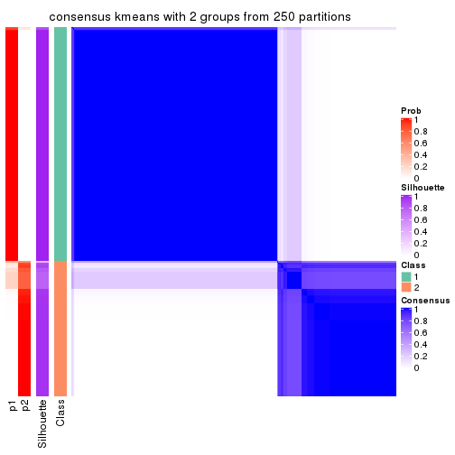</p>

</div>
<div id='tab-ATC-kmeans-consensus-heatmap-2'>
<pre><code class="r">consensus_heatmap(res, k = 3)
</code></pre>

<p>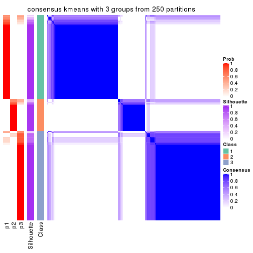</p>

</div>
<div id='tab-ATC-kmeans-consensus-heatmap-3'>
<pre><code class="r">consensus_heatmap(res, k = 4)
</code></pre>

<p>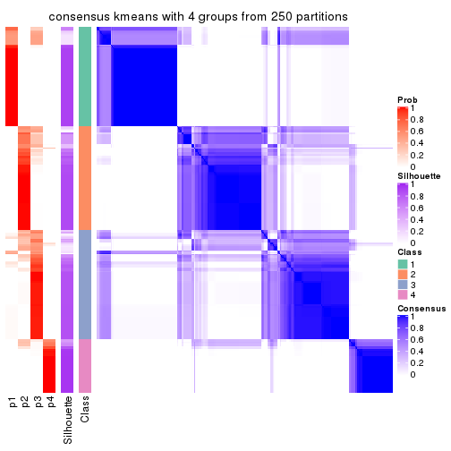</p>

</div>
<div id='tab-ATC-kmeans-consensus-heatmap-4'>
<pre><code class="r">consensus_heatmap(res, k = 5)
</code></pre>

<p>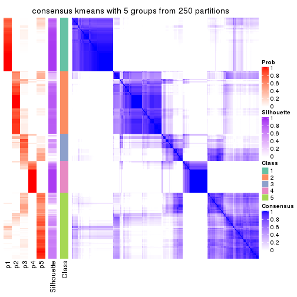</p>

</div>
<div id='tab-ATC-kmeans-consensus-heatmap-5'>
<pre><code class="r">consensus_heatmap(res, k = 6)
</code></pre>

<p>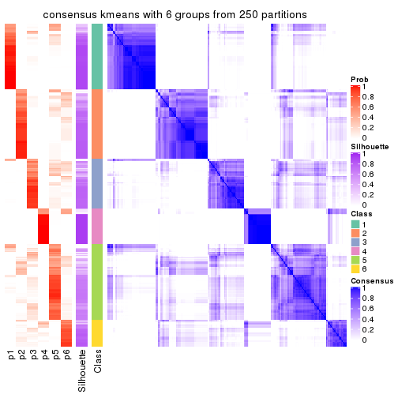</p>

</div>
</div>

Heatmaps for the membership of samples in all partitions to see how consistent they are:


<script>
$( function() {
	$( '#tabs-ATC-kmeans-membership-heatmap' ).tabs();
} );
</script>
<div id='tabs-ATC-kmeans-membership-heatmap'>
<ul>
<li><a href='#tab-ATC-kmeans-membership-heatmap-1'>k = 2</a></li>
<li><a href='#tab-ATC-kmeans-membership-heatmap-2'>k = 3</a></li>
<li><a href='#tab-ATC-kmeans-membership-heatmap-3'>k = 4</a></li>
<li><a href='#tab-ATC-kmeans-membership-heatmap-4'>k = 5</a></li>
<li><a href='#tab-ATC-kmeans-membership-heatmap-5'>k = 6</a></li>
</ul>
<div id='tab-ATC-kmeans-membership-heatmap-1'>
<pre><code class="r">membership_heatmap(res, k = 2)
</code></pre>

<p>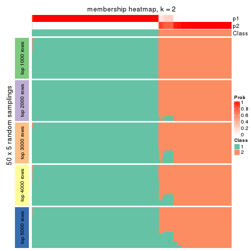</p>

</div>
<div id='tab-ATC-kmeans-membership-heatmap-2'>
<pre><code class="r">membership_heatmap(res, k = 3)
</code></pre>

<p>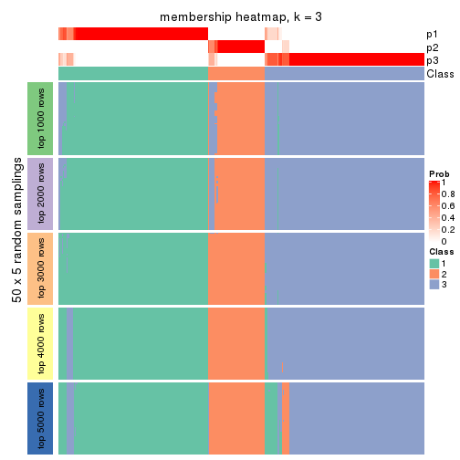</p>

</div>
<div id='tab-ATC-kmeans-membership-heatmap-3'>
<pre><code class="r">membership_heatmap(res, k = 4)
</code></pre>

<p>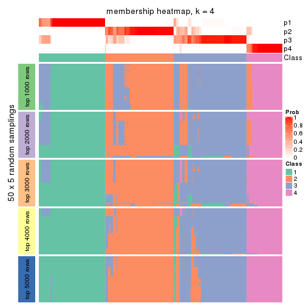</p>

</div>
<div id='tab-ATC-kmeans-membership-heatmap-4'>
<pre><code class="r">membership_heatmap(res, k = 5)
</code></pre>

<p>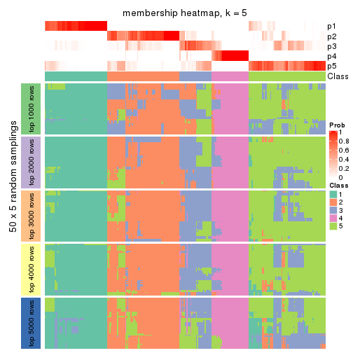</p>

</div>
<div id='tab-ATC-kmeans-membership-heatmap-5'>
<pre><code class="r">membership_heatmap(res, k = 6)
</code></pre>

<p>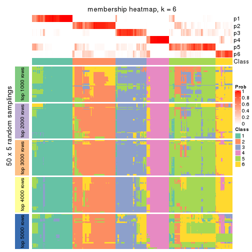</p>

</div>
</div>

As soon as we have had the classes for columns, we can look for signatures
which are significantly different between classes which can be candidate marks
for certain classes. Following are the heatmaps for signatures.


Signature heatmaps where rows are scaled:


<script>
$( function() {
	$( '#tabs-ATC-kmeans-get-signatures' ).tabs();
} );
</script>
<div id='tabs-ATC-kmeans-get-signatures'>
<ul>
<li><a href='#tab-ATC-kmeans-get-signatures-1'>k = 2</a></li>
<li><a href='#tab-ATC-kmeans-get-signatures-2'>k = 3</a></li>
<li><a href='#tab-ATC-kmeans-get-signatures-3'>k = 4</a></li>
<li><a href='#tab-ATC-kmeans-get-signatures-4'>k = 5</a></li>
<li><a href='#tab-ATC-kmeans-get-signatures-5'>k = 6</a></li>
</ul>
<div id='tab-ATC-kmeans-get-signatures-1'>
<pre><code class="r">get_signatures(res, k = 2)
</code></pre>

<pre><code>#&gt; Error in mat[ceiling(1:nr/h_ratio), ceiling(1:nc/w_ratio), drop = FALSE]: subscript out of bounds
</code></pre>

<p>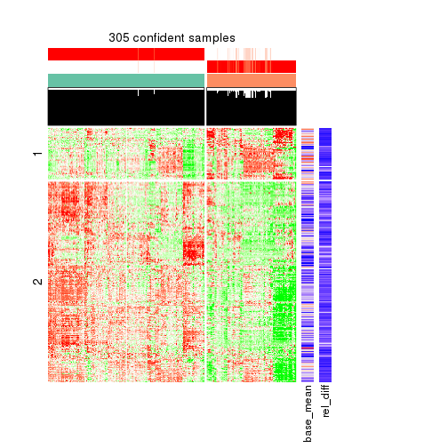</p>

</div>
<div id='tab-ATC-kmeans-get-signatures-2'>
<pre><code class="r">get_signatures(res, k = 3)
</code></pre>

<p>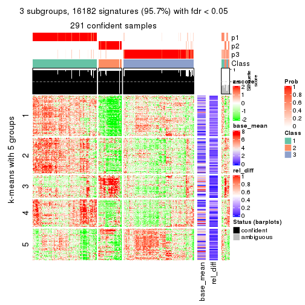</p>

</div>
<div id='tab-ATC-kmeans-get-signatures-3'>
<pre><code class="r">get_signatures(res, k = 4)
</code></pre>

<p>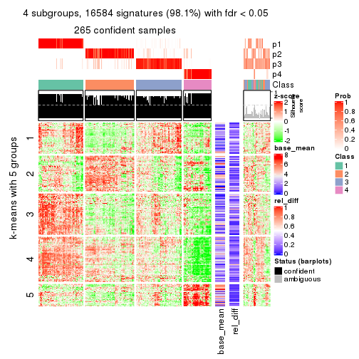</p>

</div>
<div id='tab-ATC-kmeans-get-signatures-4'>
<pre><code class="r">get_signatures(res, k = 5)
</code></pre>

<p>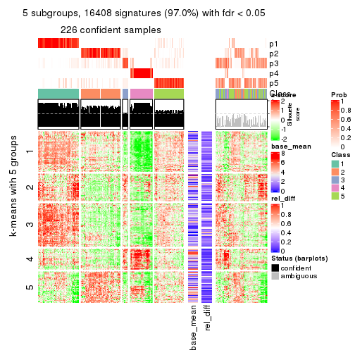</p>

</div>
<div id='tab-ATC-kmeans-get-signatures-5'>
<pre><code class="r">get_signatures(res, k = 6)
</code></pre>

<p>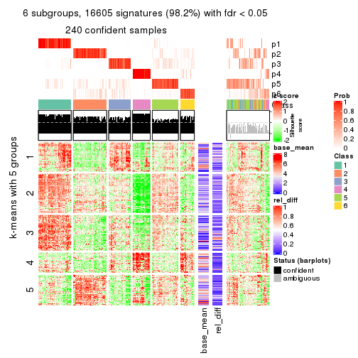</p>

</div>
</div>


Signature heatmaps where rows are not scaled:


<script>
$( function() {
	$( '#tabs-ATC-kmeans-get-signatures-no-scale' ).tabs();
} );
</script>
<div id='tabs-ATC-kmeans-get-signatures-no-scale'>
<ul>
<li><a href='#tab-ATC-kmeans-get-signatures-no-scale-1'>k = 2</a></li>
<li><a href='#tab-ATC-kmeans-get-signatures-no-scale-2'>k = 3</a></li>
<li><a href='#tab-ATC-kmeans-get-signatures-no-scale-3'>k = 4</a></li>
<li><a href='#tab-ATC-kmeans-get-signatures-no-scale-4'>k = 5</a></li>
<li><a href='#tab-ATC-kmeans-get-signatures-no-scale-5'>k = 6</a></li>
</ul>
<div id='tab-ATC-kmeans-get-signatures-no-scale-1'>
<pre><code class="r">get_signatures(res, k = 2, scale_rows = FALSE)
</code></pre>

<p>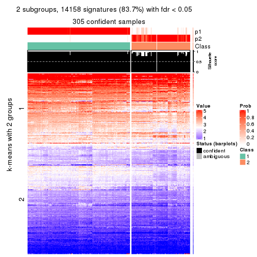</p>

</div>
<div id='tab-ATC-kmeans-get-signatures-no-scale-2'>
<pre><code class="r">get_signatures(res, k = 3, scale_rows = FALSE)
</code></pre>

<p>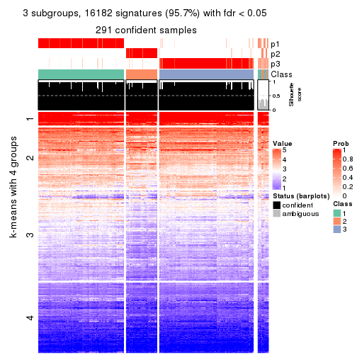</p>

</div>
<div id='tab-ATC-kmeans-get-signatures-no-scale-3'>
<pre><code class="r">get_signatures(res, k = 4, scale_rows = FALSE)
</code></pre>

<p>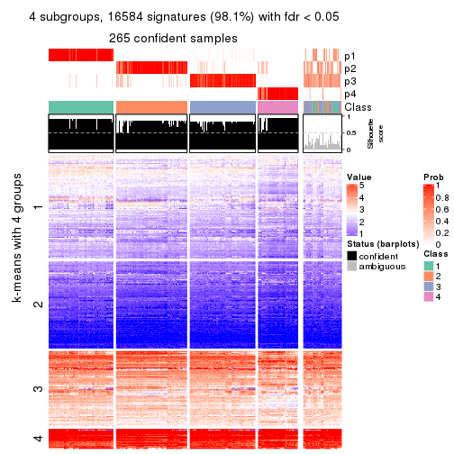</p>

</div>
<div id='tab-ATC-kmeans-get-signatures-no-scale-4'>
<pre><code class="r">get_signatures(res, k = 5, scale_rows = FALSE)
</code></pre>

<p>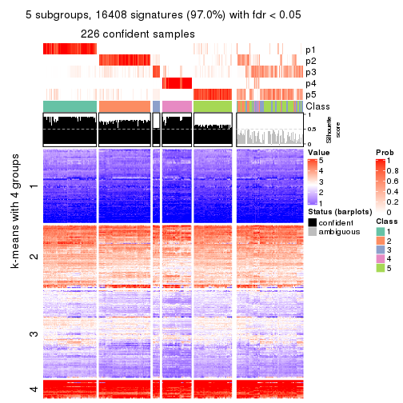</p>

</div>
<div id='tab-ATC-kmeans-get-signatures-no-scale-5'>
<pre><code class="r">get_signatures(res, k = 6, scale_rows = FALSE)
</code></pre>

<p>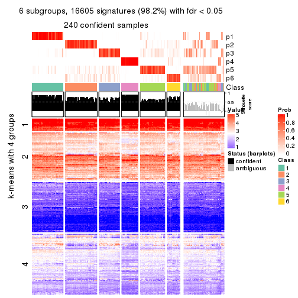</p>

</div>
</div>


Compare the overlap of signatures from different k:

```r
compare_signatures(res)
```

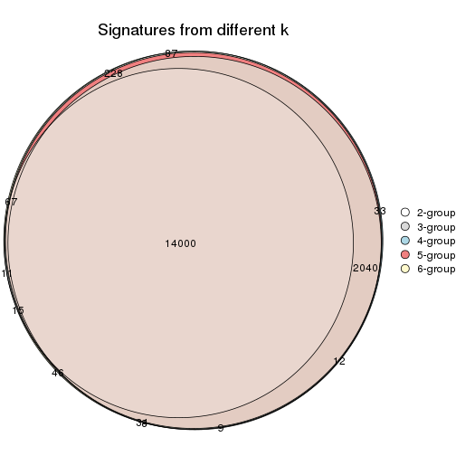

`get_signature()` returns a data frame invisibly. TO get the list of signatures, the function
call should be assigned to a variable explicitly. In following code, if `plot` argument is set
to `FALSE`, no heatmap is plotted while only the differential analysis is performed.

```r
# code only for demonstration
tb = get_signature(res, k = ..., plot = FALSE)
```

An example of the output of `tb` is:

```
#>   which_row         fdr    mean_1    mean_2 scaled_mean_1 scaled_mean_2 km
#> 1        38 0.042760348  8.373488  9.131774    -0.5533452     0.5164555  1
#> 2        40 0.018707592  7.106213  8.469186    -0.6173731     0.5762149  1
#> 3        55 0.019134737 10.221463 11.207825    -0.6159697     0.5749050  1
#> 4        59 0.006059896  5.921854  7.869574    -0.6899429     0.6439467  1
#> 5        60 0.018055526  8.928898 10.211722    -0.6204761     0.5791110  1
#> 6        98 0.009384629 15.714769 14.887706     0.6635654    -0.6193277  2
...
```

The columns in `tb` are:

1. `which_row`: row indices corresponding to the input matrix.
2. `fdr`: FDR for the differential test. 
3. `mean_x`: The mean value in group x.
4. `scaled_mean_x`: The mean value in group x after rows are scaled.
5. `km`: Row groups if k-means clustering is applied to rows.


UMAP plot which shows how samples are separated.


<script>
$( function() {
	$( '#tabs-ATC-kmeans-dimension-reduction' ).tabs();
} );
</script>
<div id='tabs-ATC-kmeans-dimension-reduction'>
<ul>
<li><a href='#tab-ATC-kmeans-dimension-reduction-1'>k = 2</a></li>
<li><a href='#tab-ATC-kmeans-dimension-reduction-2'>k = 3</a></li>
<li><a href='#tab-ATC-kmeans-dimension-reduction-3'>k = 4</a></li>
<li><a href='#tab-ATC-kmeans-dimension-reduction-4'>k = 5</a></li>
<li><a href='#tab-ATC-kmeans-dimension-reduction-5'>k = 6</a></li>
</ul>
<div id='tab-ATC-kmeans-dimension-reduction-1'>
<pre><code class="r">dimension_reduction(res, k = 2, method = &quot;UMAP&quot;)
</code></pre>

<p>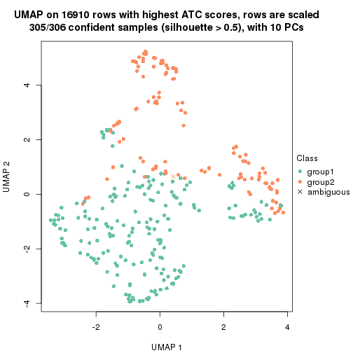</p>

</div>
<div id='tab-ATC-kmeans-dimension-reduction-2'>
<pre><code class="r">dimension_reduction(res, k = 3, method = &quot;UMAP&quot;)
</code></pre>

<p>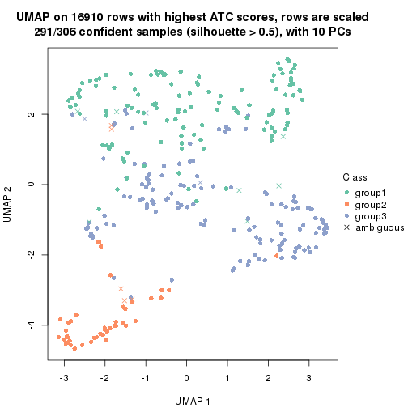</p>

</div>
<div id='tab-ATC-kmeans-dimension-reduction-3'>
<pre><code class="r">dimension_reduction(res, k = 4, method = &quot;UMAP&quot;)
</code></pre>

<p>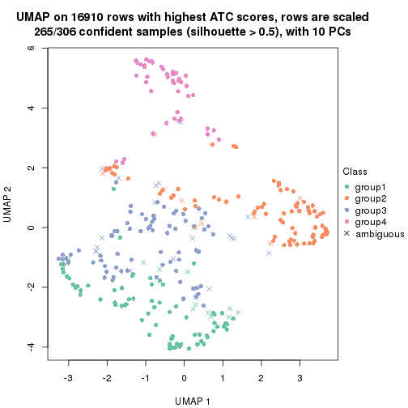</p>

</div>
<div id='tab-ATC-kmeans-dimension-reduction-4'>
<pre><code class="r">dimension_reduction(res, k = 5, method = &quot;UMAP&quot;)
</code></pre>

<p>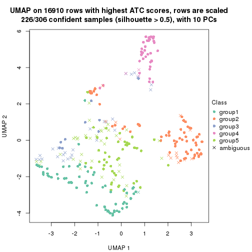</p>

</div>
<div id='tab-ATC-kmeans-dimension-reduction-5'>
<pre><code class="r">dimension_reduction(res, k = 6, method = &quot;UMAP&quot;)
</code></pre>

<p>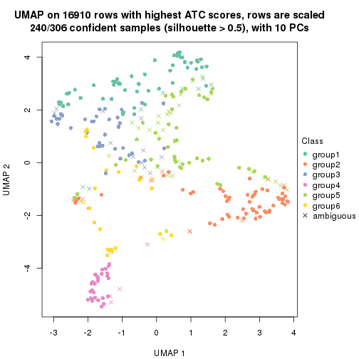</p>

</div>
</div>


Following heatmap shows how subgroups are split when increasing `k`:

```r
collect_classes(res)
```

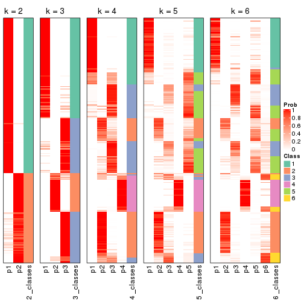


If matrix rows can be associated to genes, consider to use `GO_Enrichment(res,
...)` to perform function enrichment for the signature genes.


 

---------------------------------------------------


### ATC:skmeans*


The object with results only for a single top-value method and a single partition method 
can be extracted as:

```r
res = res_list["ATC", "skmeans"]
# you can also extract it by
# res = res_list["ATC:skmeans"]
```

A summary of `res` and all the functions that can be applied to it:

```r
res
```

```
#> A 'ConsensusPartition' object with k = 2, 3, 4, 5, 6.
#>   On a matrix with 16910 rows and 306 columns.
#>   Top rows (1000, 2000, 3000, 4000, 5000) are extracted by 'ATC' method.
#>   Subgroups are detected by 'skmeans' method.
#>   Performed in total 1250 partitions by row resampling.
#>   Best k for subgroups seems to be 3.
#> 
#> Following methods can be applied to this 'ConsensusPartition' object:
#>  [1] "cola_report"             "collect_classes"         "collect_plots"          
#>  [4] "collect_stats"           "colnames"                "compare_signatures"     
#>  [7] "consensus_heatmap"       "dimension_reduction"     "functional_enrichment"  
#> [10] "get_anno_col"            "get_anno"                "get_classes"            
#> [13] "get_consensus"           "get_matrix"              "get_membership"         
#> [16] "get_param"               "get_signatures"          "get_stats"              
#> [19] "is_best_k"               "is_stable_k"             "membership_heatmap"     
#> [22] "ncol"                    "nrow"                    "plot_ecdf"              
#> [25] "rownames"                "select_partition_number" "show"                   
#> [28] "suggest_best_k"          "test_to_known_factors"
```

`collect_plots()` function collects all the plots made from `res` for all `k` (number of partitions)
into one single page to provide an easy and fast comparison between different `k`.

```r
collect_plots(res)
```

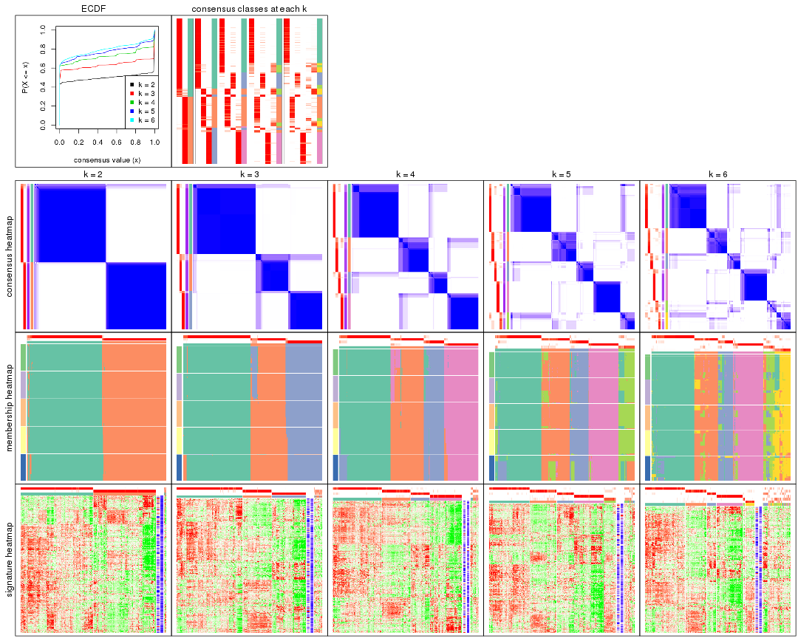

The plots are:

- The first row: a plot of the ECDF (Empirical cumulative distribution
  function) curves of the consensus matrix for each `k` and the heatmap of
  predicted classes for each `k`.
- The second row: heatmaps of the consensus matrix for each `k`.
- The third row: heatmaps of the membership matrix for each `k`.
- The fouth row: heatmaps of the signatures for each `k`.

All the plots in panels can be made by individual functions and they are
plotted later in this section.

`select_partition_number()` produces several plots showing different
statistics for choosing "optimized" `k`. There are following statistics:

- ECDF curves of the consensus matrix for each `k`;
- 1-PAC. [The PAC
  score](https://en.wikipedia.org/wiki/Consensus_clustering#Over-interpretation_potential_of_consensus_clustering)
  measures the proportion of the ambiguous subgrouping.
- Mean silhouette score.
- Concordance. The mean probability of fiting the consensus class ids in all
  partitions.
- Area increased. Denote $A_k$ as the area under the ECDF curve for current
  `k`, the area increased is defined as $A_k - A_{k-1}$.
- Rand index. The percent of pairs of samples that are both in a same cluster
  or both are not in a same cluster in the partition of k and k-1.
- Jaccard index. The ratio of pairs of samples are both in a same cluster in
  the partition of k and k-1 and the pairs of samples are both in a same
  cluster in the partition k or k-1.

The detailed explanations of these statistics can be found in [the cola
vignette](http://bioconductor.org/packages/devel/bioc/vignettes/cola/inst/doc/cola.html#toc_13).

Generally speaking, lower PAC score, higher mean silhouette score or higher
concordance corresponds to better partition. Rand index and Jaccard index
measure how similar the current partition is compared to partition with `k-1`.
If they are too similar, we won't accept `k` is better than `k-1`.

```r
select_partition_number(res)
```

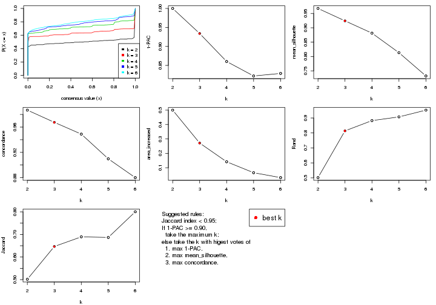

The numeric values for all these statistics can be obtained by `get_stats()`.

```r
get_stats(res)
```

```
#>   k 1-PAC mean_silhouette concordance area_increased  Rand Jaccard
#> 2 2 1.000           0.967       0.987         0.4999 0.501   0.501
#> 3 3 0.934           0.924       0.968         0.2713 0.814   0.647
#> 4 4 0.860           0.881       0.949         0.1414 0.883   0.689
#> 5 5 0.822           0.813       0.910         0.0654 0.907   0.687
#> 6 6 0.829           0.732       0.880         0.0314 0.953   0.800
```

`suggest_best_k()` suggests the best $k$ based on these statistics. The rules are as follows:

- All $k$ with Jaccard index larger than 0.95 are removed because the increase of
  the partition number does not provides enough extra information. If all $k$ are removed,
  the best $k$ is assigned by `NA`.
- For $k$ with 1-PAC larger than 0.9, the maximal $k$ is taken as the "best k". Other $k$ is called "optional k".
- If it does not fit the second rule. The $k$ with the highest vote of highest
  1-PAC, mean silhouette and concordance is taken as the "best k".

```r
suggest_best_k(res)
```

```
#> [1] 3
#> attr(,"optional")
#> [1] 2
```

There is also optional best $k$ = 2 that is worth to check.

Following shows the table of the partitions (You need to click the **show/hide
code output** link to see it). The membership matrix (columns with name `p*`)
is inferred by
[`clue::cl_consensus()`](https://www.rdocumentation.org/link/cl_consensus?package=clue)
function with the `SE` method. Basically the value in the membership matrix
represents the probability to belong to a certain group. The finall class
label for an item is determined with the group with highest probability it
belongs to.

In `get_classes()` function, the entropy is calculated from the membership
matrix and the silhouette score is calculated from the consensus matrix.


<script>
$( function() {
	$( '#tabs-ATC-skmeans-get-classes' ).tabs();
} );
</script>
<div id='tabs-ATC-skmeans-get-classes'>
<ul>
<li><a href='#tab-ATC-skmeans-get-classes-1'>k = 2</a></li>
<li><a href='#tab-ATC-skmeans-get-classes-2'>k = 3</a></li>
<li><a href='#tab-ATC-skmeans-get-classes-3'>k = 4</a></li>
<li><a href='#tab-ATC-skmeans-get-classes-4'>k = 5</a></li>
<li><a href='#tab-ATC-skmeans-get-classes-5'>k = 6</a></li>
</ul>

<div id='tab-ATC-skmeans-get-classes-1'>
<p><a id='tab-ATC-skmeans-get-classes-1-a' style='color:#0366d6' href='#'>show/hide code output</a></p>
<pre><code class="r">cbind(get_classes(res, k = 2), get_membership(res, k = 2))
</code></pre>

<pre><code>#&gt;            class entropy silhouette    p1    p2
#&gt; SRR1609360     2  0.0000     0.9923 0.000 1.000
#&gt; SRR1609361     2  0.0000     0.9923 0.000 1.000
#&gt; SRR1609362     2  0.0000     0.9923 0.000 1.000
#&gt; SRR1609363     2  0.0000     0.9923 0.000 1.000
#&gt; SRR1609364     2  0.0000     0.9923 0.000 1.000
#&gt; SRR1609365     2  0.0000     0.9923 0.000 1.000
#&gt; SRR1609366     2  0.0000     0.9923 0.000 1.000
#&gt; SRR1609367     1  0.0000     0.9815 1.000 0.000
#&gt; SRR1609368     2  0.0000     0.9923 0.000 1.000
#&gt; SRR1609369     1  0.0000     0.9815 1.000 0.000
#&gt; SRR1609370     1  0.0000     0.9815 1.000 0.000
#&gt; SRR1609371     2  0.0000     0.9923 0.000 1.000
#&gt; SRR1609372     1  0.0000     0.9815 1.000 0.000
#&gt; SRR1609373     2  0.0000     0.9923 0.000 1.000
#&gt; SRR1609374     1  0.6623     0.7911 0.828 0.172
#&gt; SRR1609375     2  0.1843     0.9649 0.028 0.972
#&gt; SRR1609377     1  0.0000     0.9815 1.000 0.000
#&gt; SRR1609376     2  0.0000     0.9923 0.000 1.000
#&gt; SRR1609378     2  0.0000     0.9923 0.000 1.000
#&gt; SRR1609379     1  0.0000     0.9815 1.000 0.000
#&gt; SRR1609382     2  0.0000     0.9923 0.000 1.000
#&gt; SRR1609383     2  0.0000     0.9923 0.000 1.000
#&gt; SRR1609381     1  0.0000     0.9815 1.000 0.000
#&gt; SRR1609384     2  0.0000     0.9923 0.000 1.000
#&gt; SRR1609386     1  0.0000     0.9815 1.000 0.000
#&gt; SRR1609385     1  0.0000     0.9815 1.000 0.000
#&gt; SRR1609387     1  0.0000     0.9815 1.000 0.000
#&gt; SRR1609388     2  0.0000     0.9923 0.000 1.000
#&gt; SRR1609390     1  0.0000     0.9815 1.000 0.000
#&gt; SRR1609393     2  0.0000     0.9923 0.000 1.000
#&gt; SRR1609394     2  0.0000     0.9923 0.000 1.000
#&gt; SRR1609392     2  0.0000     0.9923 0.000 1.000
#&gt; SRR1609391     2  0.0000     0.9923 0.000 1.000
#&gt; SRR1609395     1  0.0000     0.9815 1.000 0.000
#&gt; SRR1609396     1  0.0000     0.9815 1.000 0.000
#&gt; SRR1609398     1  0.0000     0.9815 1.000 0.000
#&gt; SRR1609399     1  0.0000     0.9815 1.000 0.000
#&gt; SRR1609400     1  0.0000     0.9815 1.000 0.000
#&gt; SRR1609397     2  0.0000     0.9923 0.000 1.000
#&gt; SRR1609401     2  0.0000     0.9923 0.000 1.000
#&gt; SRR1609402     2  0.0000     0.9923 0.000 1.000
#&gt; SRR1609405     1  0.0000     0.9815 1.000 0.000
#&gt; SRR1609404     2  0.0000     0.9923 0.000 1.000
#&gt; SRR1609406     2  0.0000     0.9923 0.000 1.000
#&gt; SRR1609408     2  0.0000     0.9923 0.000 1.000
#&gt; SRR1609403     1  0.0000     0.9815 1.000 0.000
#&gt; SRR1609410     1  0.0000     0.9815 1.000 0.000
#&gt; SRR1609411     2  0.0000     0.9923 0.000 1.000
#&gt; SRR1609407     2  0.0000     0.9923 0.000 1.000
#&gt; SRR1609413     1  0.0000     0.9815 1.000 0.000
#&gt; SRR1609412     1  0.0000     0.9815 1.000 0.000
#&gt; SRR1609414     1  0.0000     0.9815 1.000 0.000
#&gt; SRR1609415     1  0.0000     0.9815 1.000 0.000
#&gt; SRR1609416     1  0.0000     0.9815 1.000 0.000
#&gt; SRR1609417     2  0.0000     0.9923 0.000 1.000
#&gt; SRR1609418     1  0.0000     0.9815 1.000 0.000
#&gt; SRR1609419     2  0.0000     0.9923 0.000 1.000
#&gt; SRR1609420     1  0.0000     0.9815 1.000 0.000
#&gt; SRR1609421     2  0.0000     0.9923 0.000 1.000
#&gt; SRR1609422     2  0.0000     0.9923 0.000 1.000
#&gt; SRR1609423     2  0.0000     0.9923 0.000 1.000
#&gt; SRR1609424     2  0.0000     0.9923 0.000 1.000
#&gt; SRR1609425     1  0.0000     0.9815 1.000 0.000
#&gt; SRR1609426     2  0.0000     0.9923 0.000 1.000
#&gt; SRR1609427     1  0.0000     0.9815 1.000 0.000
#&gt; SRR1609428     2  0.0000     0.9923 0.000 1.000
#&gt; SRR1609429     1  0.0000     0.9815 1.000 0.000
#&gt; SRR1609430     1  0.0000     0.9815 1.000 0.000
#&gt; SRR1609431     2  0.0000     0.9923 0.000 1.000
#&gt; SRR1609432     1  0.6048     0.8227 0.852 0.148
#&gt; SRR1609433     1  0.8813     0.5756 0.700 0.300
#&gt; SRR1609434     2  0.0000     0.9923 0.000 1.000
#&gt; SRR1609435     1  0.0000     0.9815 1.000 0.000
#&gt; SRR1609436     1  0.0000     0.9815 1.000 0.000
#&gt; SRR1609437     2  0.0000     0.9923 0.000 1.000
#&gt; SRR1609438     2  0.0000     0.9923 0.000 1.000
#&gt; SRR1609439     2  0.0000     0.9923 0.000 1.000
#&gt; SRR1609440     1  0.0000     0.9815 1.000 0.000
#&gt; SRR1609441     2  0.0000     0.9923 0.000 1.000
#&gt; SRR1609442     2  0.0000     0.9923 0.000 1.000
#&gt; SRR1609443     1  0.0000     0.9815 1.000 0.000
#&gt; SRR1609444     1  0.0000     0.9815 1.000 0.000
#&gt; SRR1609445     2  0.0000     0.9923 0.000 1.000
#&gt; SRR1609446     2  0.0000     0.9923 0.000 1.000
#&gt; SRR1609447     1  0.0000     0.9815 1.000 0.000
#&gt; SRR1609448     2  0.0000     0.9923 0.000 1.000
#&gt; SRR1609449     1  0.0000     0.9815 1.000 0.000
#&gt; SRR1609450     1  0.0000     0.9815 1.000 0.000
#&gt; SRR1609451     1  0.0000     0.9815 1.000 0.000
#&gt; SRR1609452     2  0.0000     0.9923 0.000 1.000
#&gt; SRR1609453     1  0.0000     0.9815 1.000 0.000
#&gt; SRR1609454     2  0.0000     0.9923 0.000 1.000
#&gt; SRR1609455     2  0.0000     0.9923 0.000 1.000
#&gt; SRR1609456     2  0.1843     0.9648 0.028 0.972
#&gt; SRR1609457     1  0.0938     0.9708 0.988 0.012
#&gt; SRR1609458     1  0.0000     0.9815 1.000 0.000
#&gt; SRR1609459     2  0.0000     0.9923 0.000 1.000
#&gt; SRR1609460     2  0.0000     0.9923 0.000 1.000
#&gt; SRR1609461     1  0.0000     0.9815 1.000 0.000
#&gt; SRR1609462     1  0.0000     0.9815 1.000 0.000
#&gt; SRR1609464     1  0.0000     0.9815 1.000 0.000
#&gt; SRR1609463     1  0.0000     0.9815 1.000 0.000
#&gt; SRR1609465     2  0.0000     0.9923 0.000 1.000
#&gt; SRR1609466     2  0.0000     0.9923 0.000 1.000
#&gt; SRR1609467     1  0.0000     0.9815 1.000 0.000
#&gt; SRR1609469     2  0.0000     0.9923 0.000 1.000
#&gt; SRR1609470     1  0.0000     0.9815 1.000 0.000
#&gt; SRR1609472     2  0.0000     0.9923 0.000 1.000
#&gt; SRR1609471     1  0.0000     0.9815 1.000 0.000
#&gt; SRR1609474     1  0.0000     0.9815 1.000 0.000
#&gt; SRR1609473     2  0.0000     0.9923 0.000 1.000
#&gt; SRR1609475     2  0.0000     0.9923 0.000 1.000
#&gt; SRR1609478     2  0.0000     0.9923 0.000 1.000
#&gt; SRR1609476     1  0.0000     0.9815 1.000 0.000
#&gt; SRR1609477     2  0.0000     0.9923 0.000 1.000
#&gt; SRR1609479     2  0.0000     0.9923 0.000 1.000
#&gt; SRR1609481     2  0.0000     0.9923 0.000 1.000
#&gt; SRR1609480     2  0.0000     0.9923 0.000 1.000
#&gt; SRR1609482     1  0.0000     0.9815 1.000 0.000
#&gt; SRR1609484     2  0.0000     0.9923 0.000 1.000
#&gt; SRR1609483     2  0.9248     0.4780 0.340 0.660
#&gt; SRR1609486     1  0.0000     0.9815 1.000 0.000
#&gt; SRR1609485     1  0.0000     0.9815 1.000 0.000
#&gt; SRR1609487     1  0.0000     0.9815 1.000 0.000
#&gt; SRR1609488     1  0.0000     0.9815 1.000 0.000
#&gt; SRR1609489     2  0.0000     0.9923 0.000 1.000
#&gt; SRR1609490     1  0.0000     0.9815 1.000 0.000
#&gt; SRR1609491     1  0.0000     0.9815 1.000 0.000
#&gt; SRR1609492     2  0.0000     0.9923 0.000 1.000
#&gt; SRR1609493     1  0.0000     0.9815 1.000 0.000
#&gt; SRR1609494     2  0.0000     0.9923 0.000 1.000
#&gt; SRR1609495     2  0.1633     0.9689 0.024 0.976
#&gt; SRR1609496     1  0.0000     0.9815 1.000 0.000
#&gt; SRR1609497     1  0.0000     0.9815 1.000 0.000
#&gt; SRR1609498     1  0.0000     0.9815 1.000 0.000
#&gt; SRR1609499     1  0.9850     0.2720 0.572 0.428
#&gt; SRR1609500     1  0.0000     0.9815 1.000 0.000
#&gt; SRR1609501     2  0.0000     0.9923 0.000 1.000
#&gt; SRR1609502     2  0.0000     0.9923 0.000 1.000
#&gt; SRR1609503     2  0.0000     0.9923 0.000 1.000
#&gt; SRR1609504     1  0.0000     0.9815 1.000 0.000
#&gt; SRR1609505     1  0.0000     0.9815 1.000 0.000
#&gt; SRR1609506     2  0.0000     0.9923 0.000 1.000
#&gt; SRR1609507     1  0.0000     0.9815 1.000 0.000
#&gt; SRR1609508     2  0.0000     0.9923 0.000 1.000
#&gt; SRR1609509     2  0.0000     0.9923 0.000 1.000
#&gt; SRR1609510     2  0.0000     0.9923 0.000 1.000
#&gt; SRR1609512     1  0.0000     0.9815 1.000 0.000
#&gt; SRR1609511     2  0.0000     0.9923 0.000 1.000
#&gt; SRR1609513     1  0.0000     0.9815 1.000 0.000
#&gt; SRR1609514     2  0.0000     0.9923 0.000 1.000
#&gt; SRR1609515     2  0.0000     0.9923 0.000 1.000
#&gt; SRR1609516     1  0.0000     0.9815 1.000 0.000
#&gt; SRR1609517     2  0.0000     0.9923 0.000 1.000
#&gt; SRR1609518     1  0.0000     0.9815 1.000 0.000
#&gt; SRR1609519     1  0.0000     0.9815 1.000 0.000
#&gt; SRR1609520     2  0.0000     0.9923 0.000 1.000
#&gt; SRR1609521     1  0.0000     0.9815 1.000 0.000
#&gt; SRR1609522     1  0.0000     0.9815 1.000 0.000
#&gt; SRR1609523     2  0.0000     0.9923 0.000 1.000
#&gt; SRR1609524     2  0.0000     0.9923 0.000 1.000
#&gt; SRR1609526     1  0.9983     0.0946 0.524 0.476
#&gt; SRR1609525     2  0.0000     0.9923 0.000 1.000
#&gt; SRR1609527     1  0.0000     0.9815 1.000 0.000
#&gt; SRR1609529     1  0.0000     0.9815 1.000 0.000
#&gt; SRR1609528     2  0.0000     0.9923 0.000 1.000
#&gt; SRR1609530     1  0.0000     0.9815 1.000 0.000
#&gt; SRR1609531     2  0.0000     0.9923 0.000 1.000
#&gt; SRR1609532     1  0.3733     0.9113 0.928 0.072
#&gt; SRR1609533     1  0.0000     0.9815 1.000 0.000
#&gt; SRR1609534     1  0.0000     0.9815 1.000 0.000
#&gt; SRR1609535     2  0.0000     0.9923 0.000 1.000
#&gt; SRR1609537     2  0.0000     0.9923 0.000 1.000
#&gt; SRR1609536     1  0.0000     0.9815 1.000 0.000
#&gt; SRR1609538     2  0.0000     0.9923 0.000 1.000
#&gt; SRR1609539     1  0.0000     0.9815 1.000 0.000
#&gt; SRR1609540     1  0.0000     0.9815 1.000 0.000
#&gt; SRR1609541     2  0.0000     0.9923 0.000 1.000
#&gt; SRR1609542     2  0.0000     0.9923 0.000 1.000
#&gt; SRR1609543     1  0.0000     0.9815 1.000 0.000
#&gt; SRR1609544     1  0.0000     0.9815 1.000 0.000
#&gt; SRR1609545     1  0.0000     0.9815 1.000 0.000
#&gt; SRR1609546     1  0.8081     0.6713 0.752 0.248
#&gt; SRR1609547     2  0.6148     0.8149 0.152 0.848
#&gt; SRR1609548     2  0.0000     0.9923 0.000 1.000
#&gt; SRR1609549     2  0.3879     0.9122 0.076 0.924
#&gt; SRR1609550     2  0.0000     0.9923 0.000 1.000
#&gt; SRR1609551     1  0.0000     0.9815 1.000 0.000
#&gt; SRR1609552     1  0.0000     0.9815 1.000 0.000
#&gt; SRR1609553     1  0.0000     0.9815 1.000 0.000
#&gt; SRR1609554     1  0.0000     0.9815 1.000 0.000
#&gt; SRR1609555     1  0.0000     0.9815 1.000 0.000
#&gt; SRR1609556     1  0.0000     0.9815 1.000 0.000
#&gt; SRR1609557     2  0.0000     0.9923 0.000 1.000
#&gt; SRR1609558     1  0.0000     0.9815 1.000 0.000
#&gt; SRR1609559     2  0.0000     0.9923 0.000 1.000
#&gt; SRR1609560     1  0.0000     0.9815 1.000 0.000
#&gt; SRR1609561     1  0.0000     0.9815 1.000 0.000
#&gt; SRR1609562     1  0.0000     0.9815 1.000 0.000
#&gt; SRR1609563     1  0.0000     0.9815 1.000 0.000
#&gt; SRR1609564     1  0.0000     0.9815 1.000 0.000
#&gt; SRR1609565     2  0.0000     0.9923 0.000 1.000
#&gt; SRR1609566     2  0.0000     0.9923 0.000 1.000
#&gt; SRR1609567     2  0.0000     0.9923 0.000 1.000
#&gt; SRR1609568     1  0.0000     0.9815 1.000 0.000
#&gt; SRR1609569     1  0.0000     0.9815 1.000 0.000
#&gt; SRR1609570     1  0.0000     0.9815 1.000 0.000
#&gt; SRR1609571     2  0.0000     0.9923 0.000 1.000
#&gt; SRR1609572     2  0.0000     0.9923 0.000 1.000
#&gt; SRR1609573     1  0.0000     0.9815 1.000 0.000
#&gt; SRR1609574     1  0.0000     0.9815 1.000 0.000
#&gt; SRR1609575     2  0.0000     0.9923 0.000 1.000
#&gt; SRR1609576     1  0.9087     0.5319 0.676 0.324
#&gt; SRR1609578     1  0.0000     0.9815 1.000 0.000
#&gt; SRR1609577     1  0.0000     0.9815 1.000 0.000
#&gt; SRR1609579     1  0.0000     0.9815 1.000 0.000
#&gt; SRR1609580     1  0.0000     0.9815 1.000 0.000
#&gt; SRR1609582     1  0.0000     0.9815 1.000 0.000
#&gt; SRR1609581     1  0.0000     0.9815 1.000 0.000
#&gt; SRR1609583     1  0.1414     0.9634 0.980 0.020
#&gt; SRR1609584     1  0.0000     0.9815 1.000 0.000
#&gt; SRR1609585     1  0.0000     0.9815 1.000 0.000
#&gt; SRR1609586     1  0.7139     0.7572 0.804 0.196
#&gt; SRR1609587     2  0.0000     0.9923 0.000 1.000
#&gt; SRR1609588     1  0.0000     0.9815 1.000 0.000
#&gt; SRR1609589     1  0.0000     0.9815 1.000 0.000
#&gt; SRR1609590     1  0.0000     0.9815 1.000 0.000
#&gt; SRR1609592     2  0.0000     0.9923 0.000 1.000
#&gt; SRR1609591     1  0.0000     0.9815 1.000 0.000
#&gt; SRR1609593     2  0.0000     0.9923 0.000 1.000
#&gt; SRR1609594     2  0.0000     0.9923 0.000 1.000
#&gt; SRR1609595     2  0.0000     0.9923 0.000 1.000
#&gt; SRR1609596     2  0.0000     0.9923 0.000 1.000
#&gt; SRR1609597     2  0.0000     0.9923 0.000 1.000
#&gt; SRR1609598     2  0.0000     0.9923 0.000 1.000
#&gt; SRR1609599     2  0.0000     0.9923 0.000 1.000
#&gt; SRR1609600     1  0.0000     0.9815 1.000 0.000
#&gt; SRR1609601     2  0.0000     0.9923 0.000 1.000
#&gt; SRR1609602     2  0.0000     0.9923 0.000 1.000
#&gt; SRR1609603     1  0.0000     0.9815 1.000 0.000
#&gt; SRR1609604     2  0.0000     0.9923 0.000 1.000
#&gt; SRR1609605     2  0.0000     0.9923 0.000 1.000
#&gt; SRR1609606     2  0.0000     0.9923 0.000 1.000
#&gt; SRR1609607     1  0.0000     0.9815 1.000 0.000
#&gt; SRR1609608     1  0.0000     0.9815 1.000 0.000
#&gt; SRR1609609     1  0.0000     0.9815 1.000 0.000
#&gt; SRR1609610     1  0.0000     0.9815 1.000 0.000
#&gt; SRR1609611     2  0.0000     0.9923 0.000 1.000
#&gt; SRR1609613     1  0.6048     0.8227 0.852 0.148
#&gt; SRR1609612     1  0.0000     0.9815 1.000 0.000
#&gt; SRR1609614     1  0.0000     0.9815 1.000 0.000
#&gt; SRR1609615     1  0.0000     0.9815 1.000 0.000
#&gt; SRR1609616     1  0.0000     0.9815 1.000 0.000
#&gt; SRR1609617     2  0.0000     0.9923 0.000 1.000
#&gt; SRR1609618     1  0.0000     0.9815 1.000 0.000
#&gt; SRR1609619     2  0.0000     0.9923 0.000 1.000
#&gt; SRR1609620     2  0.0000     0.9923 0.000 1.000
#&gt; SRR1609621     2  0.0000     0.9923 0.000 1.000
#&gt; SRR1609622     2  0.9686     0.3356 0.396 0.604
#&gt; SRR1609623     1  0.0000     0.9815 1.000 0.000
#&gt; SRR1609624     1  0.0000     0.9815 1.000 0.000
#&gt; SRR1609625     1  0.0000     0.9815 1.000 0.000
#&gt; SRR1609626     2  0.0000     0.9923 0.000 1.000
#&gt; SRR1609627     1  0.0000     0.9815 1.000 0.000
#&gt; SRR1609628     1  0.0000     0.9815 1.000 0.000
#&gt; SRR1609629     1  0.0000     0.9815 1.000 0.000
#&gt; SRR1609630     1  0.9850     0.2717 0.572 0.428
#&gt; SRR1609631     1  0.0000     0.9815 1.000 0.000
#&gt; SRR1609632     1  0.0000     0.9815 1.000 0.000
#&gt; SRR1609633     1  0.0000     0.9815 1.000 0.000
#&gt; SRR1609634     2  0.0000     0.9923 0.000 1.000
#&gt; SRR1609635     2  0.0000     0.9923 0.000 1.000
#&gt; SRR1609636     2  0.0000     0.9923 0.000 1.000
#&gt; SRR1609637     1  0.0000     0.9815 1.000 0.000
#&gt; SRR1609638     1  0.0000     0.9815 1.000 0.000
#&gt; SRR1609639     2  0.0000     0.9923 0.000 1.000
#&gt; SRR1609640     1  0.0000     0.9815 1.000 0.000
#&gt; SRR1609641     1  0.0000     0.9815 1.000 0.000
#&gt; SRR1609642     1  0.0000     0.9815 1.000 0.000
#&gt; SRR1609643     1  0.0000     0.9815 1.000 0.000
#&gt; SRR1609644     1  0.0000     0.9815 1.000 0.000
#&gt; SRR1609645     1  0.0000     0.9815 1.000 0.000
#&gt; SRR1609646     1  0.0000     0.9815 1.000 0.000
#&gt; SRR1609647     2  0.0000     0.9923 0.000 1.000
#&gt; SRR1609649     1  0.0000     0.9815 1.000 0.000
#&gt; SRR1609648     2  0.0000     0.9923 0.000 1.000
#&gt; SRR1609651     1  0.0000     0.9815 1.000 0.000
#&gt; SRR1609650     2  0.0000     0.9923 0.000 1.000
#&gt; SRR1609652     1  0.0000     0.9815 1.000 0.000
#&gt; SRR1609653     2  0.0000     0.9923 0.000 1.000
#&gt; SRR1609654     2  0.0000     0.9923 0.000 1.000
#&gt; SRR1609655     1  0.0000     0.9815 1.000 0.000
#&gt; SRR1609657     1  0.0000     0.9815 1.000 0.000
#&gt; SRR1609656     2  0.0000     0.9923 0.000 1.000
#&gt; SRR1609658     2  0.0000     0.9923 0.000 1.000
#&gt; SRR1609659     2  0.0000     0.9923 0.000 1.000
#&gt; SRR1609660     2  0.0000     0.9923 0.000 1.000
#&gt; SRR1609661     1  0.0000     0.9815 1.000 0.000
#&gt; SRR1609662     2  0.0000     0.9923 0.000 1.000
#&gt; SRR1609663     1  0.0000     0.9815 1.000 0.000
#&gt; SRR1609664     1  0.0000     0.9815 1.000 0.000
#&gt; SRR1609665     1  0.0938     0.9708 0.988 0.012
#&gt; SRR1609666     2  0.0000     0.9923 0.000 1.000
#&gt; SRR1609667     1  0.0000     0.9815 1.000 0.000
#&gt; SRR1609668     2  0.0000     0.9923 0.000 1.000
#&gt; SRR1609669     1  0.0000     0.9815 1.000 0.000
</code></pre>

<script>
$('#tab-ATC-skmeans-get-classes-1-a').parent().next().next().hide();
$('#tab-ATC-skmeans-get-classes-1-a').click(function(){
  $('#tab-ATC-skmeans-get-classes-1-a').parent().next().next().toggle();
  return(false);
});
</script>
</div>

<div id='tab-ATC-skmeans-get-classes-2'>
<p><a id='tab-ATC-skmeans-get-classes-2-a' style='color:#0366d6' href='#'>show/hide code output</a></p>
<pre><code class="r">cbind(get_classes(res, k = 3), get_membership(res, k = 3))
</code></pre>

<pre><code>#&gt;            class entropy silhouette    p1    p2    p3
#&gt; SRR1609360     3  0.0237     0.9732 0.000 0.004 0.996
#&gt; SRR1609361     3  0.0237     0.9732 0.000 0.004 0.996
#&gt; SRR1609362     3  0.0237     0.9732 0.000 0.004 0.996
#&gt; SRR1609363     2  0.0000     0.9220 0.000 1.000 0.000
#&gt; SRR1609364     2  0.0000     0.9220 0.000 1.000 0.000
#&gt; SRR1609365     3  0.0237     0.9732 0.000 0.004 0.996
#&gt; SRR1609366     2  0.0000     0.9220 0.000 1.000 0.000
#&gt; SRR1609367     1  0.0000     0.9830 1.000 0.000 0.000
#&gt; SRR1609368     2  0.0000     0.9220 0.000 1.000 0.000
#&gt; SRR1609369     1  0.0000     0.9830 1.000 0.000 0.000
#&gt; SRR1609370     1  0.0000     0.9830 1.000 0.000 0.000
#&gt; SRR1609371     3  0.0237     0.9732 0.000 0.004 0.996
#&gt; SRR1609372     1  0.0000     0.9830 1.000 0.000 0.000
#&gt; SRR1609373     2  0.0000     0.9220 0.000 1.000 0.000
#&gt; SRR1609374     2  0.0237     0.9200 0.004 0.996 0.000
#&gt; SRR1609375     2  0.0237     0.9200 0.004 0.996 0.000
#&gt; SRR1609377     1  0.0000     0.9830 1.000 0.000 0.000
#&gt; SRR1609376     2  0.0000     0.9220 0.000 1.000 0.000
#&gt; SRR1609378     3  0.0237     0.9732 0.000 0.004 0.996
#&gt; SRR1609379     1  0.0000     0.9830 1.000 0.000 0.000
#&gt; SRR1609382     3  0.0237     0.9732 0.000 0.004 0.996
#&gt; SRR1609383     3  0.0237     0.9732 0.000 0.004 0.996
#&gt; SRR1609381     1  0.0000     0.9830 1.000 0.000 0.000
#&gt; SRR1609384     2  0.0747     0.9112 0.000 0.984 0.016
#&gt; SRR1609386     1  0.0237     0.9801 0.996 0.004 0.000
#&gt; SRR1609385     1  0.0000     0.9830 1.000 0.000 0.000
#&gt; SRR1609387     1  0.0000     0.9830 1.000 0.000 0.000
#&gt; SRR1609388     2  0.0000     0.9220 0.000 1.000 0.000
#&gt; SRR1609390     1  0.0000     0.9830 1.000 0.000 0.000
#&gt; SRR1609393     3  0.0237     0.9732 0.000 0.004 0.996
#&gt; SRR1609394     3  0.5733     0.4666 0.000 0.324 0.676
#&gt; SRR1609392     2  0.0000     0.9220 0.000 1.000 0.000
#&gt; SRR1609391     3  0.0237     0.9732 0.000 0.004 0.996
#&gt; SRR1609395     1  0.0000     0.9830 1.000 0.000 0.000
#&gt; SRR1609396     1  0.0000     0.9830 1.000 0.000 0.000
#&gt; SRR1609398     1  0.0000     0.9830 1.000 0.000 0.000
#&gt; SRR1609399     1  0.0000     0.9830 1.000 0.000 0.000
#&gt; SRR1609400     1  0.0000     0.9830 1.000 0.000 0.000
#&gt; SRR1609397     2  0.0000     0.9220 0.000 1.000 0.000
#&gt; SRR1609401     2  0.0000     0.9220 0.000 1.000 0.000
#&gt; SRR1609402     2  0.0000     0.9220 0.000 1.000 0.000
#&gt; SRR1609405     1  0.4504     0.7540 0.804 0.196 0.000
#&gt; SRR1609404     3  0.0237     0.9732 0.000 0.004 0.996
#&gt; SRR1609406     2  0.0000     0.9220 0.000 1.000 0.000
#&gt; SRR1609408     2  0.0000     0.9220 0.000 1.000 0.000
#&gt; SRR1609403     1  0.0000     0.9830 1.000 0.000 0.000
#&gt; SRR1609410     1  0.0000     0.9830 1.000 0.000 0.000
#&gt; SRR1609411     2  0.3551     0.8130 0.000 0.868 0.132
#&gt; SRR1609407     2  0.0000     0.9220 0.000 1.000 0.000
#&gt; SRR1609413     1  0.0000     0.9830 1.000 0.000 0.000
#&gt; SRR1609412     1  0.0000     0.9830 1.000 0.000 0.000
#&gt; SRR1609414     1  0.0237     0.9823 0.996 0.000 0.004
#&gt; SRR1609415     1  0.0000     0.9830 1.000 0.000 0.000
#&gt; SRR1609416     1  0.0237     0.9823 0.996 0.000 0.004
#&gt; SRR1609417     3  0.0000     0.9701 0.000 0.000 1.000
#&gt; SRR1609418     1  0.0000     0.9830 1.000 0.000 0.000
#&gt; SRR1609419     2  0.0000     0.9220 0.000 1.000 0.000
#&gt; SRR1609420     1  0.0000     0.9830 1.000 0.000 0.000
#&gt; SRR1609421     2  0.6095     0.4321 0.000 0.608 0.392
#&gt; SRR1609422     3  0.0237     0.9732 0.000 0.004 0.996
#&gt; SRR1609423     3  0.0237     0.9732 0.000 0.004 0.996
#&gt; SRR1609424     3  0.0237     0.9732 0.000 0.004 0.996
#&gt; SRR1609425     1  0.0000     0.9830 1.000 0.000 0.000
#&gt; SRR1609426     2  0.0000     0.9220 0.000 1.000 0.000
#&gt; SRR1609427     1  0.0237     0.9823 0.996 0.000 0.004
#&gt; SRR1609428     2  0.0000     0.9220 0.000 1.000 0.000
#&gt; SRR1609429     1  0.0000     0.9830 1.000 0.000 0.000
#&gt; SRR1609430     1  0.0237     0.9823 0.996 0.000 0.004
#&gt; SRR1609431     2  0.0000     0.9220 0.000 1.000 0.000
#&gt; SRR1609432     2  0.0237     0.9200 0.004 0.996 0.000
#&gt; SRR1609433     3  0.0000     0.9701 0.000 0.000 1.000
#&gt; SRR1609434     3  0.0237     0.9732 0.000 0.004 0.996
#&gt; SRR1609435     1  0.0000     0.9830 1.000 0.000 0.000
#&gt; SRR1609436     1  0.0000     0.9830 1.000 0.000 0.000
#&gt; SRR1609437     3  0.0237     0.9732 0.000 0.004 0.996
#&gt; SRR1609438     3  0.0237     0.9732 0.000 0.004 0.996
#&gt; SRR1609439     3  0.0000     0.9701 0.000 0.000 1.000
#&gt; SRR1609440     1  0.0000     0.9830 1.000 0.000 0.000
#&gt; SRR1609441     3  0.0237     0.9732 0.000 0.004 0.996
#&gt; SRR1609442     3  0.0237     0.9732 0.000 0.004 0.996
#&gt; SRR1609443     1  0.0237     0.9823 0.996 0.000 0.004
#&gt; SRR1609444     1  0.0000     0.9830 1.000 0.000 0.000
#&gt; SRR1609445     3  0.0237     0.9732 0.000 0.004 0.996
#&gt; SRR1609446     2  0.3267     0.8286 0.000 0.884 0.116
#&gt; SRR1609447     1  0.0000     0.9830 1.000 0.000 0.000
#&gt; SRR1609448     2  0.0000     0.9220 0.000 1.000 0.000
#&gt; SRR1609449     1  0.0000     0.9830 1.000 0.000 0.000
#&gt; SRR1609450     2  0.0592     0.9140 0.012 0.988 0.000
#&gt; SRR1609451     1  0.0237     0.9823 0.996 0.000 0.004
#&gt; SRR1609452     3  0.0237     0.9732 0.000 0.004 0.996
#&gt; SRR1609453     1  0.0237     0.9823 0.996 0.000 0.004
#&gt; SRR1609454     3  0.0237     0.9732 0.000 0.004 0.996
#&gt; SRR1609455     3  0.0237     0.9732 0.000 0.004 0.996
#&gt; SRR1609456     2  0.0237     0.9200 0.004 0.996 0.000
#&gt; SRR1609457     3  0.0000     0.9701 0.000 0.000 1.000
#&gt; SRR1609458     1  0.0000     0.9830 1.000 0.000 0.000
#&gt; SRR1609459     2  0.0000     0.9220 0.000 1.000 0.000
#&gt; SRR1609460     2  0.0000     0.9220 0.000 1.000 0.000
#&gt; SRR1609461     1  0.0237     0.9823 0.996 0.000 0.004
#&gt; SRR1609462     1  0.0237     0.9823 0.996 0.000 0.004
#&gt; SRR1609464     1  0.0237     0.9823 0.996 0.000 0.004
#&gt; SRR1609463     1  0.0000     0.9830 1.000 0.000 0.000
#&gt; SRR1609465     2  0.0000     0.9220 0.000 1.000 0.000
#&gt; SRR1609466     3  0.0237     0.9732 0.000 0.004 0.996
#&gt; SRR1609467     1  0.0237     0.9823 0.996 0.000 0.004
#&gt; SRR1609469     3  0.0237     0.9732 0.000 0.004 0.996
#&gt; SRR1609470     1  0.4555     0.7481 0.800 0.200 0.000
#&gt; SRR1609472     3  0.0237     0.9732 0.000 0.004 0.996
#&gt; SRR1609471     1  0.0000     0.9830 1.000 0.000 0.000
#&gt; SRR1609474     1  0.4504     0.7540 0.804 0.196 0.000
#&gt; SRR1609473     3  0.0237     0.9732 0.000 0.004 0.996
#&gt; SRR1609475     3  0.0237     0.9732 0.000 0.004 0.996
#&gt; SRR1609478     3  0.0237     0.9732 0.000 0.004 0.996
#&gt; SRR1609476     1  0.0237     0.9823 0.996 0.000 0.004
#&gt; SRR1609477     3  0.0237     0.9732 0.000 0.004 0.996
#&gt; SRR1609479     2  0.6126     0.4130 0.000 0.600 0.400
#&gt; SRR1609481     3  0.0237     0.9732 0.000 0.004 0.996
#&gt; SRR1609480     3  0.0237     0.9732 0.000 0.004 0.996
#&gt; SRR1609482     1  0.0237     0.9823 0.996 0.000 0.004
#&gt; SRR1609484     3  0.0237     0.9732 0.000 0.004 0.996
#&gt; SRR1609483     3  0.0000     0.9701 0.000 0.000 1.000
#&gt; SRR1609486     1  0.0237     0.9823 0.996 0.000 0.004
#&gt; SRR1609485     1  0.0237     0.9823 0.996 0.000 0.004
#&gt; SRR1609487     1  0.0000     0.9830 1.000 0.000 0.000
#&gt; SRR1609488     1  0.0000     0.9830 1.000 0.000 0.000
#&gt; SRR1609489     2  0.0237     0.9200 0.004 0.996 0.000
#&gt; SRR1609490     1  0.0000     0.9830 1.000 0.000 0.000
#&gt; SRR1609491     1  0.0000     0.9830 1.000 0.000 0.000
#&gt; SRR1609492     2  0.0000     0.9220 0.000 1.000 0.000
#&gt; SRR1609493     1  0.6140     0.3139 0.596 0.404 0.000
#&gt; SRR1609494     2  0.6008     0.4740 0.000 0.628 0.372
#&gt; SRR1609495     3  0.0000     0.9701 0.000 0.000 1.000
#&gt; SRR1609496     1  0.0237     0.9823 0.996 0.000 0.004
#&gt; SRR1609497     1  0.0237     0.9823 0.996 0.000 0.004
#&gt; SRR1609498     1  0.0000     0.9830 1.000 0.000 0.000
#&gt; SRR1609499     2  0.0237     0.9200 0.004 0.996 0.000
#&gt; SRR1609500     1  0.0000     0.9830 1.000 0.000 0.000
#&gt; SRR1609501     2  0.0000     0.9220 0.000 1.000 0.000
#&gt; SRR1609502     3  0.5810     0.4372 0.000 0.336 0.664
#&gt; SRR1609503     3  0.0237     0.9732 0.000 0.004 0.996
#&gt; SRR1609504     1  0.0000     0.9830 1.000 0.000 0.000
#&gt; SRR1609505     1  0.0000     0.9830 1.000 0.000 0.000
#&gt; SRR1609506     2  0.0000     0.9220 0.000 1.000 0.000
#&gt; SRR1609507     1  0.0237     0.9823 0.996 0.000 0.004
#&gt; SRR1609508     2  0.6111     0.4227 0.000 0.604 0.396
#&gt; SRR1609509     2  0.0000     0.9220 0.000 1.000 0.000
#&gt; SRR1609510     3  0.0237     0.9732 0.000 0.004 0.996
#&gt; SRR1609512     1  0.0237     0.9823 0.996 0.000 0.004
#&gt; SRR1609511     3  0.0237     0.9732 0.000 0.004 0.996
#&gt; SRR1609513     1  0.0237     0.9823 0.996 0.000 0.004
#&gt; SRR1609514     3  0.0237     0.9732 0.000 0.004 0.996
#&gt; SRR1609515     2  0.0000     0.9220 0.000 1.000 0.000
#&gt; SRR1609516     1  0.0000     0.9830 1.000 0.000 0.000
#&gt; SRR1609517     2  0.6026     0.4662 0.000 0.624 0.376
#&gt; SRR1609518     1  0.0000     0.9830 1.000 0.000 0.000
#&gt; SRR1609519     1  0.0237     0.9823 0.996 0.000 0.004
#&gt; SRR1609520     3  0.0237     0.9732 0.000 0.004 0.996
#&gt; SRR1609521     1  0.0000     0.9830 1.000 0.000 0.000
#&gt; SRR1609522     1  0.0237     0.9823 0.996 0.000 0.004
#&gt; SRR1609523     2  0.0000     0.9220 0.000 1.000 0.000
#&gt; SRR1609524     2  0.0000     0.9220 0.000 1.000 0.000
#&gt; SRR1609526     3  0.0237     0.9659 0.004 0.000 0.996
#&gt; SRR1609525     2  0.6062     0.4495 0.000 0.616 0.384
#&gt; SRR1609527     1  0.0000     0.9830 1.000 0.000 0.000
#&gt; SRR1609529     1  0.0237     0.9823 0.996 0.000 0.004
#&gt; SRR1609528     3  0.0237     0.9732 0.000 0.004 0.996
#&gt; SRR1609530     1  0.0237     0.9823 0.996 0.000 0.004
#&gt; SRR1609531     2  0.0000     0.9220 0.000 1.000 0.000
#&gt; SRR1609532     3  0.0000     0.9701 0.000 0.000 1.000
#&gt; SRR1609533     2  0.1643     0.8842 0.044 0.956 0.000
#&gt; SRR1609534     1  0.0237     0.9823 0.996 0.000 0.004
#&gt; SRR1609535     2  0.6140     0.4028 0.000 0.596 0.404
#&gt; SRR1609537     2  0.0000     0.9220 0.000 1.000 0.000
#&gt; SRR1609536     1  0.0237     0.9823 0.996 0.000 0.004
#&gt; SRR1609538     2  0.0000     0.9220 0.000 1.000 0.000
#&gt; SRR1609539     1  0.0237     0.9823 0.996 0.000 0.004
#&gt; SRR1609540     1  0.0237     0.9823 0.996 0.000 0.004
#&gt; SRR1609541     3  0.0237     0.9732 0.000 0.004 0.996
#&gt; SRR1609542     2  0.0000     0.9220 0.000 1.000 0.000
#&gt; SRR1609543     1  0.0237     0.9823 0.996 0.000 0.004
#&gt; SRR1609544     1  0.0237     0.9823 0.996 0.000 0.004
#&gt; SRR1609545     1  0.0000     0.9830 1.000 0.000 0.000
#&gt; SRR1609546     3  0.0747     0.9508 0.016 0.000 0.984
#&gt; SRR1609547     3  0.0000     0.9701 0.000 0.000 1.000
#&gt; SRR1609548     2  0.6111     0.4228 0.000 0.604 0.396
#&gt; SRR1609549     2  0.0237     0.9200 0.004 0.996 0.000
#&gt; SRR1609550     2  0.0000     0.9220 0.000 1.000 0.000
#&gt; SRR1609551     1  0.0237     0.9823 0.996 0.000 0.004
#&gt; SRR1609552     1  0.0237     0.9823 0.996 0.000 0.004
#&gt; SRR1609553     1  0.0000     0.9830 1.000 0.000 0.000
#&gt; SRR1609554     1  0.0000     0.9830 1.000 0.000 0.000
#&gt; SRR1609555     1  0.0000     0.9830 1.000 0.000 0.000
#&gt; SRR1609556     1  0.0237     0.9823 0.996 0.000 0.004
#&gt; SRR1609557     2  0.6095     0.4321 0.000 0.608 0.392
#&gt; SRR1609558     1  0.0000     0.9830 1.000 0.000 0.000
#&gt; SRR1609559     3  0.0237     0.9732 0.000 0.004 0.996
#&gt; SRR1609560     1  0.0000     0.9830 1.000 0.000 0.000
#&gt; SRR1609561     1  0.0237     0.9823 0.996 0.000 0.004
#&gt; SRR1609562     1  0.0000     0.9830 1.000 0.000 0.000
#&gt; SRR1609563     1  0.0000     0.9830 1.000 0.000 0.000
#&gt; SRR1609564     1  0.0000     0.9830 1.000 0.000 0.000
#&gt; SRR1609565     2  0.0000     0.9220 0.000 1.000 0.000
#&gt; SRR1609566     2  0.0424     0.9172 0.000 0.992 0.008
#&gt; SRR1609567     3  0.5760     0.4570 0.000 0.328 0.672
#&gt; SRR1609568     1  0.0000     0.9830 1.000 0.000 0.000
#&gt; SRR1609569     1  0.0237     0.9823 0.996 0.000 0.004
#&gt; SRR1609570     1  0.0237     0.9823 0.996 0.000 0.004
#&gt; SRR1609571     3  0.0237     0.9732 0.000 0.004 0.996
#&gt; SRR1609572     3  0.0000     0.9701 0.000 0.000 1.000
#&gt; SRR1609573     1  0.0237     0.9823 0.996 0.000 0.004
#&gt; SRR1609574     1  0.0237     0.9823 0.996 0.000 0.004
#&gt; SRR1609575     3  0.0237     0.9732 0.000 0.004 0.996
#&gt; SRR1609576     2  0.0237     0.9200 0.004 0.996 0.000
#&gt; SRR1609578     1  0.0000     0.9830 1.000 0.000 0.000
#&gt; SRR1609577     1  0.0237     0.9823 0.996 0.000 0.004
#&gt; SRR1609579     1  0.0237     0.9823 0.996 0.000 0.004
#&gt; SRR1609580     1  0.3879     0.8151 0.848 0.000 0.152
#&gt; SRR1609582     1  0.0000     0.9830 1.000 0.000 0.000
#&gt; SRR1609581     1  0.0000     0.9830 1.000 0.000 0.000
#&gt; SRR1609583     1  0.4931     0.7068 0.768 0.232 0.000
#&gt; SRR1609584     1  0.0237     0.9823 0.996 0.000 0.004
#&gt; SRR1609585     1  0.0000     0.9830 1.000 0.000 0.000
#&gt; SRR1609586     2  0.0237     0.9200 0.004 0.996 0.000
#&gt; SRR1609587     3  0.0237     0.9732 0.000 0.004 0.996
#&gt; SRR1609588     1  0.0000     0.9830 1.000 0.000 0.000
#&gt; SRR1609589     1  0.4504     0.7540 0.804 0.196 0.000
#&gt; SRR1609590     1  0.0237     0.9823 0.996 0.000 0.004
#&gt; SRR1609592     3  0.0237     0.9732 0.000 0.004 0.996
#&gt; SRR1609591     1  0.0000     0.9830 1.000 0.000 0.000
#&gt; SRR1609593     2  0.6095     0.4321 0.000 0.608 0.392
#&gt; SRR1609594     3  0.0237     0.9732 0.000 0.004 0.996
#&gt; SRR1609595     2  0.0000     0.9220 0.000 1.000 0.000
#&gt; SRR1609596     2  0.0000     0.9220 0.000 1.000 0.000
#&gt; SRR1609597     2  0.0000     0.9220 0.000 1.000 0.000
#&gt; SRR1609598     3  0.0237     0.9732 0.000 0.004 0.996
#&gt; SRR1609599     3  0.0237     0.9732 0.000 0.004 0.996
#&gt; SRR1609600     1  0.0237     0.9823 0.996 0.000 0.004
#&gt; SRR1609601     3  0.0237     0.9732 0.000 0.004 0.996
#&gt; SRR1609602     3  0.0237     0.9732 0.000 0.004 0.996
#&gt; SRR1609603     1  0.0000     0.9830 1.000 0.000 0.000
#&gt; SRR1609604     3  0.0237     0.9732 0.000 0.004 0.996
#&gt; SRR1609605     3  0.6307    -0.0774 0.000 0.488 0.512
#&gt; SRR1609606     2  0.6026     0.4662 0.000 0.624 0.376
#&gt; SRR1609607     1  0.0237     0.9823 0.996 0.000 0.004
#&gt; SRR1609608     1  0.0237     0.9823 0.996 0.000 0.004
#&gt; SRR1609609     1  0.4504     0.7540 0.804 0.196 0.000
#&gt; SRR1609610     1  0.0237     0.9823 0.996 0.000 0.004
#&gt; SRR1609611     3  0.0237     0.9732 0.000 0.004 0.996
#&gt; SRR1609613     2  0.0237     0.9200 0.004 0.996 0.000
#&gt; SRR1609612     1  0.0000     0.9830 1.000 0.000 0.000
#&gt; SRR1609614     1  0.0237     0.9823 0.996 0.000 0.004
#&gt; SRR1609615     1  0.0000     0.9830 1.000 0.000 0.000
#&gt; SRR1609616     1  0.0000     0.9830 1.000 0.000 0.000
#&gt; SRR1609617     2  0.4235     0.7660 0.000 0.824 0.176
#&gt; SRR1609618     1  0.0237     0.9823 0.996 0.000 0.004
#&gt; SRR1609619     3  0.0000     0.9701 0.000 0.000 1.000
#&gt; SRR1609620     3  0.0237     0.9732 0.000 0.004 0.996
#&gt; SRR1609621     3  0.0237     0.9732 0.000 0.004 0.996
#&gt; SRR1609622     3  0.0000     0.9701 0.000 0.000 1.000
#&gt; SRR1609623     1  0.0237     0.9823 0.996 0.000 0.004
#&gt; SRR1609624     1  0.0000     0.9830 1.000 0.000 0.000
#&gt; SRR1609625     1  0.0000     0.9830 1.000 0.000 0.000
#&gt; SRR1609626     3  0.0000     0.9701 0.000 0.000 1.000
#&gt; SRR1609627     1  0.0000     0.9830 1.000 0.000 0.000
#&gt; SRR1609628     2  0.0237     0.9200 0.004 0.996 0.000
#&gt; SRR1609629     1  0.0000     0.9830 1.000 0.000 0.000
#&gt; SRR1609630     2  0.0237     0.9200 0.004 0.996 0.000
#&gt; SRR1609631     1  0.0000     0.9830 1.000 0.000 0.000
#&gt; SRR1609632     1  0.0000     0.9830 1.000 0.000 0.000
#&gt; SRR1609633     1  0.0000     0.9830 1.000 0.000 0.000
#&gt; SRR1609634     2  0.0000     0.9220 0.000 1.000 0.000
#&gt; SRR1609635     3  0.0237     0.9732 0.000 0.004 0.996
#&gt; SRR1609636     3  0.0237     0.9732 0.000 0.004 0.996
#&gt; SRR1609637     1  0.0000     0.9830 1.000 0.000 0.000
#&gt; SRR1609638     1  0.4654     0.7358 0.792 0.208 0.000
#&gt; SRR1609639     2  0.0237     0.9200 0.004 0.996 0.000
#&gt; SRR1609640     1  0.0237     0.9823 0.996 0.000 0.004
#&gt; SRR1609641     1  0.0000     0.9830 1.000 0.000 0.000
#&gt; SRR1609642     1  0.0000     0.9830 1.000 0.000 0.000
#&gt; SRR1609643     1  0.0000     0.9830 1.000 0.000 0.000
#&gt; SRR1609644     1  0.0000     0.9830 1.000 0.000 0.000
#&gt; SRR1609645     1  0.0000     0.9830 1.000 0.000 0.000
#&gt; SRR1609646     1  0.0237     0.9823 0.996 0.000 0.004
#&gt; SRR1609647     3  0.5835     0.4269 0.000 0.340 0.660
#&gt; SRR1609649     1  0.0237     0.9823 0.996 0.000 0.004
#&gt; SRR1609648     2  0.0000     0.9220 0.000 1.000 0.000
#&gt; SRR1609651     2  0.4974     0.6690 0.236 0.764 0.000
#&gt; SRR1609650     3  0.0237     0.9732 0.000 0.004 0.996
#&gt; SRR1609652     1  0.0237     0.9823 0.996 0.000 0.004
#&gt; SRR1609653     2  0.0000     0.9220 0.000 1.000 0.000
#&gt; SRR1609654     3  0.0237     0.9732 0.000 0.004 0.996
#&gt; SRR1609655     1  0.0000     0.9830 1.000 0.000 0.000
#&gt; SRR1609657     1  0.0000     0.9830 1.000 0.000 0.000
#&gt; SRR1609656     3  0.0237     0.9732 0.000 0.004 0.996
#&gt; SRR1609658     2  0.6026     0.4662 0.000 0.624 0.376
#&gt; SRR1609659     2  0.0000     0.9220 0.000 1.000 0.000
#&gt; SRR1609660     3  0.0237     0.9732 0.000 0.004 0.996
#&gt; SRR1609661     1  0.0000     0.9830 1.000 0.000 0.000
#&gt; SRR1609662     2  0.0237     0.9200 0.004 0.996 0.000
#&gt; SRR1609663     1  0.0237     0.9823 0.996 0.000 0.004
#&gt; SRR1609664     1  0.4555     0.7481 0.800 0.200 0.000
#&gt; SRR1609665     2  0.0237     0.9200 0.004 0.996 0.000
#&gt; SRR1609666     3  0.0237     0.9732 0.000 0.004 0.996
#&gt; SRR1609667     1  0.0000     0.9830 1.000 0.000 0.000
#&gt; SRR1609668     3  0.0237     0.9732 0.000 0.004 0.996
#&gt; SRR1609669     1  0.0000     0.9830 1.000 0.000 0.000
</code></pre>

<script>
$('#tab-ATC-skmeans-get-classes-2-a').parent().next().next().hide();
$('#tab-ATC-skmeans-get-classes-2-a').click(function(){
  $('#tab-ATC-skmeans-get-classes-2-a').parent().next().next().toggle();
  return(false);
});
</script>
</div>

<div id='tab-ATC-skmeans-get-classes-3'>
<p><a id='tab-ATC-skmeans-get-classes-3-a' style='color:#0366d6' href='#'>show/hide code output</a></p>
<pre><code class="r">cbind(get_classes(res, k = 4), get_membership(res, k = 4))
</code></pre>

<pre><code>#&gt;            class entropy silhouette    p1    p2    p3    p4
#&gt; SRR1609360     4  0.0000     0.9632 0.000 0.000 0.000 1.000
#&gt; SRR1609361     4  0.0000     0.9632 0.000 0.000 0.000 1.000
#&gt; SRR1609362     4  0.0000     0.9632 0.000 0.000 0.000 1.000
#&gt; SRR1609363     2  0.0000     0.9014 0.000 1.000 0.000 0.000
#&gt; SRR1609364     2  0.0000     0.9014 0.000 1.000 0.000 0.000
#&gt; SRR1609365     4  0.0000     0.9632 0.000 0.000 0.000 1.000
#&gt; SRR1609366     2  0.0000     0.9014 0.000 1.000 0.000 0.000
#&gt; SRR1609367     1  0.0000     0.9580 1.000 0.000 0.000 0.000
#&gt; SRR1609368     2  0.0000     0.9014 0.000 1.000 0.000 0.000
#&gt; SRR1609369     1  0.0000     0.9580 1.000 0.000 0.000 0.000
#&gt; SRR1609370     1  0.0000     0.9580 1.000 0.000 0.000 0.000
#&gt; SRR1609371     4  0.0000     0.9632 0.000 0.000 0.000 1.000
#&gt; SRR1609372     1  0.0000     0.9580 1.000 0.000 0.000 0.000
#&gt; SRR1609373     2  0.0000     0.9014 0.000 1.000 0.000 0.000
#&gt; SRR1609374     2  0.0000     0.9014 0.000 1.000 0.000 0.000
#&gt; SRR1609375     2  0.0000     0.9014 0.000 1.000 0.000 0.000
#&gt; SRR1609377     1  0.0000     0.9580 1.000 0.000 0.000 0.000
#&gt; SRR1609376     2  0.2973     0.8217 0.000 0.856 0.000 0.144
#&gt; SRR1609378     4  0.0000     0.9632 0.000 0.000 0.000 1.000
#&gt; SRR1609379     1  0.0000     0.9580 1.000 0.000 0.000 0.000
#&gt; SRR1609382     4  0.0000     0.9632 0.000 0.000 0.000 1.000
#&gt; SRR1609383     4  0.0000     0.9632 0.000 0.000 0.000 1.000
#&gt; SRR1609381     1  0.0000     0.9580 1.000 0.000 0.000 0.000
#&gt; SRR1609384     2  0.2149     0.8450 0.000 0.912 0.000 0.088
#&gt; SRR1609386     1  0.0000     0.9580 1.000 0.000 0.000 0.000
#&gt; SRR1609385     1  0.0000     0.9580 1.000 0.000 0.000 0.000
#&gt; SRR1609387     1  0.0000     0.9580 1.000 0.000 0.000 0.000
#&gt; SRR1609388     2  0.0000     0.9014 0.000 1.000 0.000 0.000
#&gt; SRR1609390     1  0.0000     0.9580 1.000 0.000 0.000 0.000
#&gt; SRR1609393     4  0.0000     0.9632 0.000 0.000 0.000 1.000
#&gt; SRR1609394     4  0.3610     0.7176 0.000 0.200 0.000 0.800
#&gt; SRR1609392     2  0.2973     0.8217 0.000 0.856 0.000 0.144
#&gt; SRR1609391     4  0.0000     0.9632 0.000 0.000 0.000 1.000
#&gt; SRR1609395     1  0.0000     0.9580 1.000 0.000 0.000 0.000
#&gt; SRR1609396     1  0.0000     0.9580 1.000 0.000 0.000 0.000
#&gt; SRR1609398     1  0.0000     0.9580 1.000 0.000 0.000 0.000
#&gt; SRR1609399     1  0.0000     0.9580 1.000 0.000 0.000 0.000
#&gt; SRR1609400     1  0.0000     0.9580 1.000 0.000 0.000 0.000
#&gt; SRR1609397     2  0.0000     0.9014 0.000 1.000 0.000 0.000
#&gt; SRR1609401     2  0.0000     0.9014 0.000 1.000 0.000 0.000
#&gt; SRR1609402     2  0.0000     0.9014 0.000 1.000 0.000 0.000
#&gt; SRR1609405     1  0.0000     0.9580 1.000 0.000 0.000 0.000
#&gt; SRR1609404     4  0.0000     0.9632 0.000 0.000 0.000 1.000
#&gt; SRR1609406     2  0.0000     0.9014 0.000 1.000 0.000 0.000
#&gt; SRR1609408     2  0.0000     0.9014 0.000 1.000 0.000 0.000
#&gt; SRR1609403     1  0.0000     0.9580 1.000 0.000 0.000 0.000
#&gt; SRR1609410     1  0.0000     0.9580 1.000 0.000 0.000 0.000
#&gt; SRR1609411     2  0.3486     0.7765 0.000 0.812 0.000 0.188
#&gt; SRR1609407     2  0.0000     0.9014 0.000 1.000 0.000 0.000
#&gt; SRR1609413     1  0.0000     0.9580 1.000 0.000 0.000 0.000
#&gt; SRR1609412     1  0.0000     0.9580 1.000 0.000 0.000 0.000
#&gt; SRR1609414     1  0.3610     0.7572 0.800 0.000 0.200 0.000
#&gt; SRR1609415     1  0.0000     0.9580 1.000 0.000 0.000 0.000
#&gt; SRR1609416     3  0.0000     0.9180 0.000 0.000 1.000 0.000
#&gt; SRR1609417     4  0.0000     0.9632 0.000 0.000 0.000 1.000
#&gt; SRR1609418     1  0.0000     0.9580 1.000 0.000 0.000 0.000
#&gt; SRR1609419     2  0.2973     0.8217 0.000 0.856 0.000 0.144
#&gt; SRR1609420     1  0.0000     0.9580 1.000 0.000 0.000 0.000
#&gt; SRR1609421     2  0.4877     0.4054 0.000 0.592 0.000 0.408
#&gt; SRR1609422     4  0.0000     0.9632 0.000 0.000 0.000 1.000
#&gt; SRR1609423     4  0.0000     0.9632 0.000 0.000 0.000 1.000
#&gt; SRR1609424     4  0.0000     0.9632 0.000 0.000 0.000 1.000
#&gt; SRR1609425     1  0.0000     0.9580 1.000 0.000 0.000 0.000
#&gt; SRR1609426     2  0.2973     0.8217 0.000 0.856 0.000 0.144
#&gt; SRR1609427     3  0.0000     0.9180 0.000 0.000 1.000 0.000
#&gt; SRR1609428     2  0.2973     0.8217 0.000 0.856 0.000 0.144
#&gt; SRR1609429     1  0.0000     0.9580 1.000 0.000 0.000 0.000
#&gt; SRR1609430     3  0.0000     0.9180 0.000 0.000 1.000 0.000
#&gt; SRR1609431     2  0.0000     0.9014 0.000 1.000 0.000 0.000
#&gt; SRR1609432     2  0.0000     0.9014 0.000 1.000 0.000 0.000
#&gt; SRR1609433     3  0.0000     0.9180 0.000 0.000 1.000 0.000
#&gt; SRR1609434     4  0.0000     0.9632 0.000 0.000 0.000 1.000
#&gt; SRR1609435     1  0.0000     0.9580 1.000 0.000 0.000 0.000
#&gt; SRR1609436     1  0.0000     0.9580 1.000 0.000 0.000 0.000
#&gt; SRR1609437     4  0.0000     0.9632 0.000 0.000 0.000 1.000
#&gt; SRR1609438     4  0.0000     0.9632 0.000 0.000 0.000 1.000
#&gt; SRR1609439     4  0.0000     0.9632 0.000 0.000 0.000 1.000
#&gt; SRR1609440     1  0.0000     0.9580 1.000 0.000 0.000 0.000
#&gt; SRR1609441     4  0.0000     0.9632 0.000 0.000 0.000 1.000
#&gt; SRR1609442     4  0.0000     0.9632 0.000 0.000 0.000 1.000
#&gt; SRR1609443     3  0.0000     0.9180 0.000 0.000 1.000 0.000
#&gt; SRR1609444     1  0.0000     0.9580 1.000 0.000 0.000 0.000
#&gt; SRR1609445     4  0.0000     0.9632 0.000 0.000 0.000 1.000
#&gt; SRR1609446     2  0.3266     0.7984 0.000 0.832 0.000 0.168
#&gt; SRR1609447     1  0.0000     0.9580 1.000 0.000 0.000 0.000
#&gt; SRR1609448     2  0.0000     0.9014 0.000 1.000 0.000 0.000
#&gt; SRR1609449     1  0.0000     0.9580 1.000 0.000 0.000 0.000
#&gt; SRR1609450     2  0.1557     0.8524 0.056 0.944 0.000 0.000
#&gt; SRR1609451     1  0.3610     0.7572 0.800 0.000 0.200 0.000
#&gt; SRR1609452     4  0.0000     0.9632 0.000 0.000 0.000 1.000
#&gt; SRR1609453     1  0.0000     0.9580 1.000 0.000 0.000 0.000
#&gt; SRR1609454     4  0.0000     0.9632 0.000 0.000 0.000 1.000
#&gt; SRR1609455     4  0.0000     0.9632 0.000 0.000 0.000 1.000
#&gt; SRR1609456     2  0.0000     0.9014 0.000 1.000 0.000 0.000
#&gt; SRR1609457     3  0.0000     0.9180 0.000 0.000 1.000 0.000
#&gt; SRR1609458     1  0.0000     0.9580 1.000 0.000 0.000 0.000
#&gt; SRR1609459     2  0.0000     0.9014 0.000 1.000 0.000 0.000
#&gt; SRR1609460     2  0.0000     0.9014 0.000 1.000 0.000 0.000
#&gt; SRR1609461     3  0.2921     0.8260 0.140 0.000 0.860 0.000
#&gt; SRR1609462     1  0.3610     0.7572 0.800 0.000 0.200 0.000
#&gt; SRR1609464     3  0.0000     0.9180 0.000 0.000 1.000 0.000
#&gt; SRR1609463     1  0.0000     0.9580 1.000 0.000 0.000 0.000
#&gt; SRR1609465     2  0.0000     0.9014 0.000 1.000 0.000 0.000
#&gt; SRR1609466     4  0.0000     0.9632 0.000 0.000 0.000 1.000
#&gt; SRR1609467     3  0.4790     0.4098 0.380 0.000 0.620 0.000
#&gt; SRR1609469     4  0.0000     0.9632 0.000 0.000 0.000 1.000
#&gt; SRR1609470     1  0.0000     0.9580 1.000 0.000 0.000 0.000
#&gt; SRR1609472     4  0.0000     0.9632 0.000 0.000 0.000 1.000
#&gt; SRR1609471     1  0.0000     0.9580 1.000 0.000 0.000 0.000
#&gt; SRR1609474     1  0.0000     0.9580 1.000 0.000 0.000 0.000
#&gt; SRR1609473     4  0.0000     0.9632 0.000 0.000 0.000 1.000
#&gt; SRR1609475     4  0.0000     0.9632 0.000 0.000 0.000 1.000
#&gt; SRR1609478     4  0.0000     0.9632 0.000 0.000 0.000 1.000
#&gt; SRR1609476     3  0.4072     0.6755 0.252 0.000 0.748 0.000
#&gt; SRR1609477     4  0.0000     0.9632 0.000 0.000 0.000 1.000
#&gt; SRR1609479     4  0.4855     0.2534 0.000 0.400 0.000 0.600
#&gt; SRR1609481     4  0.0000     0.9632 0.000 0.000 0.000 1.000
#&gt; SRR1609480     4  0.0000     0.9632 0.000 0.000 0.000 1.000
#&gt; SRR1609482     3  0.0000     0.9180 0.000 0.000 1.000 0.000
#&gt; SRR1609484     4  0.0000     0.9632 0.000 0.000 0.000 1.000
#&gt; SRR1609483     3  0.0000     0.9180 0.000 0.000 1.000 0.000
#&gt; SRR1609486     3  0.0000     0.9180 0.000 0.000 1.000 0.000
#&gt; SRR1609485     3  0.0000     0.9180 0.000 0.000 1.000 0.000
#&gt; SRR1609487     1  0.0000     0.9580 1.000 0.000 0.000 0.000
#&gt; SRR1609488     1  0.0000     0.9580 1.000 0.000 0.000 0.000
#&gt; SRR1609489     2  0.0000     0.9014 0.000 1.000 0.000 0.000
#&gt; SRR1609490     1  0.0000     0.9580 1.000 0.000 0.000 0.000
#&gt; SRR1609491     1  0.0000     0.9580 1.000 0.000 0.000 0.000
#&gt; SRR1609492     2  0.0000     0.9014 0.000 1.000 0.000 0.000
#&gt; SRR1609493     1  0.0000     0.9580 1.000 0.000 0.000 0.000
#&gt; SRR1609494     2  0.4866     0.4156 0.000 0.596 0.000 0.404
#&gt; SRR1609495     4  0.1716     0.8976 0.000 0.000 0.064 0.936
#&gt; SRR1609496     1  0.3610     0.7572 0.800 0.000 0.200 0.000
#&gt; SRR1609497     1  0.3610     0.7572 0.800 0.000 0.200 0.000
#&gt; SRR1609498     1  0.0000     0.9580 1.000 0.000 0.000 0.000
#&gt; SRR1609499     2  0.0000     0.9014 0.000 1.000 0.000 0.000
#&gt; SRR1609500     1  0.0000     0.9580 1.000 0.000 0.000 0.000
#&gt; SRR1609501     2  0.0000     0.9014 0.000 1.000 0.000 0.000
#&gt; SRR1609502     4  0.3688     0.7045 0.000 0.208 0.000 0.792
#&gt; SRR1609503     4  0.0000     0.9632 0.000 0.000 0.000 1.000
#&gt; SRR1609504     1  0.0000     0.9580 1.000 0.000 0.000 0.000
#&gt; SRR1609505     1  0.0000     0.9580 1.000 0.000 0.000 0.000
#&gt; SRR1609506     2  0.0000     0.9014 0.000 1.000 0.000 0.000
#&gt; SRR1609507     1  0.3610     0.7572 0.800 0.000 0.200 0.000
#&gt; SRR1609508     4  0.4855     0.2534 0.000 0.400 0.000 0.600
#&gt; SRR1609509     2  0.0000     0.9014 0.000 1.000 0.000 0.000
#&gt; SRR1609510     4  0.0000     0.9632 0.000 0.000 0.000 1.000
#&gt; SRR1609512     1  0.3610     0.7572 0.800 0.000 0.200 0.000
#&gt; SRR1609511     4  0.0000     0.9632 0.000 0.000 0.000 1.000
#&gt; SRR1609513     3  0.4790     0.4098 0.380 0.000 0.620 0.000
#&gt; SRR1609514     4  0.0000     0.9632 0.000 0.000 0.000 1.000
#&gt; SRR1609515     2  0.2973     0.8217 0.000 0.856 0.000 0.144
#&gt; SRR1609516     1  0.0469     0.9485 0.988 0.000 0.012 0.000
#&gt; SRR1609517     2  0.4855     0.4252 0.000 0.600 0.000 0.400
#&gt; SRR1609518     1  0.0000     0.9580 1.000 0.000 0.000 0.000
#&gt; SRR1609519     3  0.0336     0.9139 0.008 0.000 0.992 0.000
#&gt; SRR1609520     4  0.0000     0.9632 0.000 0.000 0.000 1.000
#&gt; SRR1609521     1  0.0000     0.9580 1.000 0.000 0.000 0.000
#&gt; SRR1609522     3  0.0000     0.9180 0.000 0.000 1.000 0.000
#&gt; SRR1609523     2  0.0000     0.9014 0.000 1.000 0.000 0.000
#&gt; SRR1609524     2  0.0000     0.9014 0.000 1.000 0.000 0.000
#&gt; SRR1609526     3  0.0000     0.9180 0.000 0.000 1.000 0.000
#&gt; SRR1609525     2  0.4855     0.4252 0.000 0.600 0.000 0.400
#&gt; SRR1609527     1  0.0000     0.9580 1.000 0.000 0.000 0.000
#&gt; SRR1609529     3  0.0817     0.9047 0.024 0.000 0.976 0.000
#&gt; SRR1609528     4  0.0000     0.9632 0.000 0.000 0.000 1.000
#&gt; SRR1609530     1  0.4855     0.3432 0.600 0.000 0.400 0.000
#&gt; SRR1609531     2  0.0000     0.9014 0.000 1.000 0.000 0.000
#&gt; SRR1609532     3  0.0000     0.9180 0.000 0.000 1.000 0.000
#&gt; SRR1609533     2  0.1716     0.8445 0.064 0.936 0.000 0.000
#&gt; SRR1609534     3  0.0000     0.9180 0.000 0.000 1.000 0.000
#&gt; SRR1609535     4  0.4331     0.5513 0.000 0.288 0.000 0.712
#&gt; SRR1609537     2  0.0000     0.9014 0.000 1.000 0.000 0.000
#&gt; SRR1609536     3  0.0000     0.9180 0.000 0.000 1.000 0.000
#&gt; SRR1609538     2  0.0000     0.9014 0.000 1.000 0.000 0.000
#&gt; SRR1609539     3  0.2814     0.8334 0.132 0.000 0.868 0.000
#&gt; SRR1609540     1  0.0000     0.9580 1.000 0.000 0.000 0.000
#&gt; SRR1609541     4  0.0000     0.9632 0.000 0.000 0.000 1.000
#&gt; SRR1609542     2  0.0000     0.9014 0.000 1.000 0.000 0.000
#&gt; SRR1609543     1  0.3610     0.7572 0.800 0.000 0.200 0.000
#&gt; SRR1609544     3  0.0000     0.9180 0.000 0.000 1.000 0.000
#&gt; SRR1609545     1  0.0000     0.9580 1.000 0.000 0.000 0.000
#&gt; SRR1609546     3  0.0000     0.9180 0.000 0.000 1.000 0.000
#&gt; SRR1609547     3  0.0000     0.9180 0.000 0.000 1.000 0.000
#&gt; SRR1609548     3  0.4685     0.6838 0.000 0.156 0.784 0.060
#&gt; SRR1609549     2  0.0000     0.9014 0.000 1.000 0.000 0.000
#&gt; SRR1609550     2  0.0000     0.9014 0.000 1.000 0.000 0.000
#&gt; SRR1609551     3  0.2973     0.8218 0.144 0.000 0.856 0.000
#&gt; SRR1609552     3  0.0000     0.9180 0.000 0.000 1.000 0.000
#&gt; SRR1609553     1  0.0000     0.9580 1.000 0.000 0.000 0.000
#&gt; SRR1609554     1  0.0000     0.9580 1.000 0.000 0.000 0.000
#&gt; SRR1609555     1  0.0000     0.9580 1.000 0.000 0.000 0.000
#&gt; SRR1609556     1  0.3610     0.7572 0.800 0.000 0.200 0.000
#&gt; SRR1609557     2  0.4866     0.4156 0.000 0.596 0.000 0.404
#&gt; SRR1609558     1  0.4877     0.3049 0.592 0.000 0.408 0.000
#&gt; SRR1609559     4  0.0000     0.9632 0.000 0.000 0.000 1.000
#&gt; SRR1609560     1  0.0000     0.9580 1.000 0.000 0.000 0.000
#&gt; SRR1609561     3  0.2704     0.8395 0.124 0.000 0.876 0.000
#&gt; SRR1609562     1  0.0000     0.9580 1.000 0.000 0.000 0.000
#&gt; SRR1609563     1  0.0000     0.9580 1.000 0.000 0.000 0.000
#&gt; SRR1609564     1  0.0000     0.9580 1.000 0.000 0.000 0.000
#&gt; SRR1609565     2  0.1389     0.8793 0.000 0.952 0.000 0.048
#&gt; SRR1609566     2  0.3219     0.8025 0.000 0.836 0.000 0.164
#&gt; SRR1609567     4  0.3610     0.7176 0.000 0.200 0.000 0.800
#&gt; SRR1609568     1  0.0000     0.9580 1.000 0.000 0.000 0.000
#&gt; SRR1609569     1  0.3486     0.7716 0.812 0.000 0.188 0.000
#&gt; SRR1609570     3  0.0000     0.9180 0.000 0.000 1.000 0.000
#&gt; SRR1609571     4  0.0000     0.9632 0.000 0.000 0.000 1.000
#&gt; SRR1609572     4  0.0000     0.9632 0.000 0.000 0.000 1.000
#&gt; SRR1609573     3  0.0000     0.9180 0.000 0.000 1.000 0.000
#&gt; SRR1609574     3  0.0000     0.9180 0.000 0.000 1.000 0.000
#&gt; SRR1609575     4  0.0000     0.9632 0.000 0.000 0.000 1.000
#&gt; SRR1609576     2  0.0000     0.9014 0.000 1.000 0.000 0.000
#&gt; SRR1609578     1  0.0000     0.9580 1.000 0.000 0.000 0.000
#&gt; SRR1609577     3  0.4164     0.6443 0.264 0.000 0.736 0.000
#&gt; SRR1609579     3  0.0000     0.9180 0.000 0.000 1.000 0.000
#&gt; SRR1609580     3  0.0000     0.9180 0.000 0.000 1.000 0.000
#&gt; SRR1609582     1  0.0000     0.9580 1.000 0.000 0.000 0.000
#&gt; SRR1609581     1  0.0000     0.9580 1.000 0.000 0.000 0.000
#&gt; SRR1609583     1  0.4123     0.6883 0.772 0.220 0.008 0.000
#&gt; SRR1609584     3  0.2704     0.8395 0.124 0.000 0.876 0.000
#&gt; SRR1609585     1  0.0000     0.9580 1.000 0.000 0.000 0.000
#&gt; SRR1609586     2  0.0000     0.9014 0.000 1.000 0.000 0.000
#&gt; SRR1609587     4  0.0000     0.9632 0.000 0.000 0.000 1.000
#&gt; SRR1609588     1  0.0000     0.9580 1.000 0.000 0.000 0.000
#&gt; SRR1609589     1  0.0000     0.9580 1.000 0.000 0.000 0.000
#&gt; SRR1609590     3  0.0000     0.9180 0.000 0.000 1.000 0.000
#&gt; SRR1609592     4  0.0000     0.9632 0.000 0.000 0.000 1.000
#&gt; SRR1609591     1  0.0000     0.9580 1.000 0.000 0.000 0.000
#&gt; SRR1609593     2  0.4898     0.3841 0.000 0.584 0.000 0.416
#&gt; SRR1609594     4  0.0000     0.9632 0.000 0.000 0.000 1.000
#&gt; SRR1609595     2  0.0000     0.9014 0.000 1.000 0.000 0.000
#&gt; SRR1609596     2  0.0000     0.9014 0.000 1.000 0.000 0.000
#&gt; SRR1609597     2  0.2973     0.8217 0.000 0.856 0.000 0.144
#&gt; SRR1609598     4  0.0000     0.9632 0.000 0.000 0.000 1.000
#&gt; SRR1609599     4  0.0000     0.9632 0.000 0.000 0.000 1.000
#&gt; SRR1609600     3  0.3569     0.7589 0.196 0.000 0.804 0.000
#&gt; SRR1609601     4  0.0000     0.9632 0.000 0.000 0.000 1.000
#&gt; SRR1609602     4  0.0000     0.9632 0.000 0.000 0.000 1.000
#&gt; SRR1609603     1  0.0000     0.9580 1.000 0.000 0.000 0.000
#&gt; SRR1609604     4  0.0000     0.9632 0.000 0.000 0.000 1.000
#&gt; SRR1609605     4  0.4855     0.2534 0.000 0.400 0.000 0.600
#&gt; SRR1609606     2  0.4855     0.4252 0.000 0.600 0.000 0.400
#&gt; SRR1609607     1  0.4855     0.3432 0.600 0.000 0.400 0.000
#&gt; SRR1609608     3  0.0000     0.9180 0.000 0.000 1.000 0.000
#&gt; SRR1609609     1  0.0000     0.9580 1.000 0.000 0.000 0.000
#&gt; SRR1609610     1  0.3610     0.7572 0.800 0.000 0.200 0.000
#&gt; SRR1609611     4  0.0000     0.9632 0.000 0.000 0.000 1.000
#&gt; SRR1609613     2  0.0000     0.9014 0.000 1.000 0.000 0.000
#&gt; SRR1609612     1  0.0000     0.9580 1.000 0.000 0.000 0.000
#&gt; SRR1609614     1  0.3610     0.7572 0.800 0.000 0.200 0.000
#&gt; SRR1609615     1  0.0000     0.9580 1.000 0.000 0.000 0.000
#&gt; SRR1609616     1  0.0000     0.9580 1.000 0.000 0.000 0.000
#&gt; SRR1609617     2  0.4356     0.6331 0.000 0.708 0.000 0.292
#&gt; SRR1609618     3  0.0000     0.9180 0.000 0.000 1.000 0.000
#&gt; SRR1609619     3  0.3837     0.6631 0.000 0.000 0.776 0.224
#&gt; SRR1609620     4  0.0000     0.9632 0.000 0.000 0.000 1.000
#&gt; SRR1609621     4  0.0000     0.9632 0.000 0.000 0.000 1.000
#&gt; SRR1609622     3  0.0000     0.9180 0.000 0.000 1.000 0.000
#&gt; SRR1609623     1  0.3610     0.7572 0.800 0.000 0.200 0.000
#&gt; SRR1609624     1  0.0000     0.9580 1.000 0.000 0.000 0.000
#&gt; SRR1609625     1  0.0000     0.9580 1.000 0.000 0.000 0.000
#&gt; SRR1609626     4  0.0000     0.9632 0.000 0.000 0.000 1.000
#&gt; SRR1609627     1  0.0000     0.9580 1.000 0.000 0.000 0.000
#&gt; SRR1609628     2  0.0000     0.9014 0.000 1.000 0.000 0.000
#&gt; SRR1609629     1  0.0000     0.9580 1.000 0.000 0.000 0.000
#&gt; SRR1609630     2  0.0000     0.9014 0.000 1.000 0.000 0.000
#&gt; SRR1609631     1  0.0000     0.9580 1.000 0.000 0.000 0.000
#&gt; SRR1609632     1  0.0000     0.9580 1.000 0.000 0.000 0.000
#&gt; SRR1609633     1  0.0000     0.9580 1.000 0.000 0.000 0.000
#&gt; SRR1609634     2  0.0000     0.9014 0.000 1.000 0.000 0.000
#&gt; SRR1609635     4  0.0000     0.9632 0.000 0.000 0.000 1.000
#&gt; SRR1609636     4  0.0000     0.9632 0.000 0.000 0.000 1.000
#&gt; SRR1609637     1  0.0000     0.9580 1.000 0.000 0.000 0.000
#&gt; SRR1609638     1  0.0000     0.9580 1.000 0.000 0.000 0.000
#&gt; SRR1609639     2  0.0000     0.9014 0.000 1.000 0.000 0.000
#&gt; SRR1609640     1  0.0000     0.9580 1.000 0.000 0.000 0.000
#&gt; SRR1609641     1  0.0000     0.9580 1.000 0.000 0.000 0.000
#&gt; SRR1609642     1  0.0000     0.9580 1.000 0.000 0.000 0.000
#&gt; SRR1609643     1  0.0000     0.9580 1.000 0.000 0.000 0.000
#&gt; SRR1609644     1  0.0000     0.9580 1.000 0.000 0.000 0.000
#&gt; SRR1609645     1  0.0188     0.9549 0.996 0.000 0.004 0.000
#&gt; SRR1609646     3  0.4790     0.4098 0.380 0.000 0.620 0.000
#&gt; SRR1609647     4  0.3610     0.7176 0.000 0.200 0.000 0.800
#&gt; SRR1609649     1  0.0000     0.9580 1.000 0.000 0.000 0.000
#&gt; SRR1609648     2  0.2469     0.8476 0.000 0.892 0.000 0.108
#&gt; SRR1609651     2  0.4994     0.0748 0.480 0.520 0.000 0.000
#&gt; SRR1609650     4  0.0000     0.9632 0.000 0.000 0.000 1.000
#&gt; SRR1609652     1  0.3610     0.7572 0.800 0.000 0.200 0.000
#&gt; SRR1609653     2  0.0000     0.9014 0.000 1.000 0.000 0.000
#&gt; SRR1609654     4  0.0000     0.9632 0.000 0.000 0.000 1.000
#&gt; SRR1609655     1  0.0469     0.9485 0.988 0.000 0.012 0.000
#&gt; SRR1609657     1  0.0000     0.9580 1.000 0.000 0.000 0.000
#&gt; SRR1609656     4  0.0000     0.9632 0.000 0.000 0.000 1.000
#&gt; SRR1609658     2  0.4866     0.4156 0.000 0.596 0.000 0.404
#&gt; SRR1609659     2  0.2973     0.8217 0.000 0.856 0.000 0.144
#&gt; SRR1609660     4  0.0000     0.9632 0.000 0.000 0.000 1.000
#&gt; SRR1609661     1  0.0000     0.9580 1.000 0.000 0.000 0.000
#&gt; SRR1609662     2  0.0000     0.9014 0.000 1.000 0.000 0.000
#&gt; SRR1609663     3  0.0000     0.9180 0.000 0.000 1.000 0.000
#&gt; SRR1609664     1  0.0000     0.9580 1.000 0.000 0.000 0.000
#&gt; SRR1609665     2  0.0000     0.9014 0.000 1.000 0.000 0.000
#&gt; SRR1609666     4  0.0000     0.9632 0.000 0.000 0.000 1.000
#&gt; SRR1609667     1  0.0000     0.9580 1.000 0.000 0.000 0.000
#&gt; SRR1609668     4  0.0000     0.9632 0.000 0.000 0.000 1.000
#&gt; SRR1609669     1  0.0000     0.9580 1.000 0.000 0.000 0.000
</code></pre>

<script>
$('#tab-ATC-skmeans-get-classes-3-a').parent().next().next().hide();
$('#tab-ATC-skmeans-get-classes-3-a').click(function(){
  $('#tab-ATC-skmeans-get-classes-3-a').parent().next().next().toggle();
  return(false);
});
</script>
</div>

<div id='tab-ATC-skmeans-get-classes-4'>
<p><a id='tab-ATC-skmeans-get-classes-4-a' style='color:#0366d6' href='#'>show/hide code output</a></p>
<pre><code class="r">cbind(get_classes(res, k = 5), get_membership(res, k = 5))
</code></pre>

<pre><code>#&gt;            class entropy silhouette    p1    p2    p3    p4    p5
#&gt; SRR1609360     4  0.0000     0.9838 0.000 0.000 0.000 1.000 0.000
#&gt; SRR1609361     4  0.0000     0.9838 0.000 0.000 0.000 1.000 0.000
#&gt; SRR1609362     4  0.0000     0.9838 0.000 0.000 0.000 1.000 0.000
#&gt; SRR1609363     2  0.0000     0.8630 0.000 1.000 0.000 0.000 0.000
#&gt; SRR1609364     2  0.2929     0.7638 0.000 0.820 0.000 0.000 0.180
#&gt; SRR1609365     4  0.0000     0.9838 0.000 0.000 0.000 1.000 0.000
#&gt; SRR1609366     2  0.3143     0.7401 0.000 0.796 0.000 0.000 0.204
#&gt; SRR1609367     1  0.0000     0.9143 1.000 0.000 0.000 0.000 0.000
#&gt; SRR1609368     2  0.2929     0.7638 0.000 0.820 0.000 0.000 0.180
#&gt; SRR1609369     1  0.0000     0.9143 1.000 0.000 0.000 0.000 0.000
#&gt; SRR1609370     1  0.0000     0.9143 1.000 0.000 0.000 0.000 0.000
#&gt; SRR1609371     4  0.0000     0.9838 0.000 0.000 0.000 1.000 0.000
#&gt; SRR1609372     1  0.0000     0.9143 1.000 0.000 0.000 0.000 0.000
#&gt; SRR1609373     2  0.0000     0.8630 0.000 1.000 0.000 0.000 0.000
#&gt; SRR1609374     5  0.2929     0.6894 0.000 0.180 0.000 0.000 0.820
#&gt; SRR1609375     5  0.3109     0.6668 0.000 0.200 0.000 0.000 0.800
#&gt; SRR1609377     1  0.0000     0.9143 1.000 0.000 0.000 0.000 0.000
#&gt; SRR1609376     2  0.0000     0.8630 0.000 1.000 0.000 0.000 0.000
#&gt; SRR1609378     4  0.0000     0.9838 0.000 0.000 0.000 1.000 0.000
#&gt; SRR1609379     1  0.0000     0.9143 1.000 0.000 0.000 0.000 0.000
#&gt; SRR1609382     4  0.0000     0.9838 0.000 0.000 0.000 1.000 0.000
#&gt; SRR1609383     4  0.0000     0.9838 0.000 0.000 0.000 1.000 0.000
#&gt; SRR1609381     1  0.0000     0.9143 1.000 0.000 0.000 0.000 0.000
#&gt; SRR1609384     2  0.4010     0.7497 0.000 0.796 0.000 0.088 0.116
#&gt; SRR1609386     1  0.4304    -0.2275 0.516 0.000 0.000 0.000 0.484
#&gt; SRR1609385     1  0.0000     0.9143 1.000 0.000 0.000 0.000 0.000
#&gt; SRR1609387     1  0.0000     0.9143 1.000 0.000 0.000 0.000 0.000
#&gt; SRR1609388     2  0.0000     0.8630 0.000 1.000 0.000 0.000 0.000
#&gt; SRR1609390     1  0.0000     0.9143 1.000 0.000 0.000 0.000 0.000
#&gt; SRR1609393     4  0.0000     0.9838 0.000 0.000 0.000 1.000 0.000
#&gt; SRR1609394     2  0.2329     0.7920 0.000 0.876 0.000 0.124 0.000
#&gt; SRR1609392     2  0.0000     0.8630 0.000 1.000 0.000 0.000 0.000
#&gt; SRR1609391     4  0.0000     0.9838 0.000 0.000 0.000 1.000 0.000
#&gt; SRR1609395     1  0.0000     0.9143 1.000 0.000 0.000 0.000 0.000
#&gt; SRR1609396     1  0.0000     0.9143 1.000 0.000 0.000 0.000 0.000
#&gt; SRR1609398     1  0.2773     0.7149 0.836 0.000 0.000 0.000 0.164
#&gt; SRR1609399     1  0.0000     0.9143 1.000 0.000 0.000 0.000 0.000
#&gt; SRR1609400     1  0.0000     0.9143 1.000 0.000 0.000 0.000 0.000
#&gt; SRR1609397     2  0.0000     0.8630 0.000 1.000 0.000 0.000 0.000
#&gt; SRR1609401     2  0.2929     0.7638 0.000 0.820 0.000 0.000 0.180
#&gt; SRR1609402     2  0.3177     0.7360 0.000 0.792 0.000 0.000 0.208
#&gt; SRR1609405     1  0.4306    -0.2545 0.508 0.000 0.000 0.000 0.492
#&gt; SRR1609404     4  0.0000     0.9838 0.000 0.000 0.000 1.000 0.000
#&gt; SRR1609406     2  0.0000     0.8630 0.000 1.000 0.000 0.000 0.000
#&gt; SRR1609408     2  0.2891     0.7670 0.000 0.824 0.000 0.000 0.176
#&gt; SRR1609403     1  0.0000     0.9143 1.000 0.000 0.000 0.000 0.000
#&gt; SRR1609410     1  0.0000     0.9143 1.000 0.000 0.000 0.000 0.000
#&gt; SRR1609411     2  0.2773     0.7900 0.000 0.836 0.000 0.000 0.164
#&gt; SRR1609407     2  0.0000     0.8630 0.000 1.000 0.000 0.000 0.000
#&gt; SRR1609413     1  0.0000     0.9143 1.000 0.000 0.000 0.000 0.000
#&gt; SRR1609412     1  0.0162     0.9112 0.996 0.000 0.000 0.000 0.004
#&gt; SRR1609414     1  0.2732     0.7787 0.840 0.000 0.160 0.000 0.000
#&gt; SRR1609415     1  0.0000     0.9143 1.000 0.000 0.000 0.000 0.000
#&gt; SRR1609416     3  0.0000     0.8882 0.000 0.000 1.000 0.000 0.000
#&gt; SRR1609417     4  0.0000     0.9838 0.000 0.000 0.000 1.000 0.000
#&gt; SRR1609418     1  0.0000     0.9143 1.000 0.000 0.000 0.000 0.000
#&gt; SRR1609419     2  0.0000     0.8630 0.000 1.000 0.000 0.000 0.000
#&gt; SRR1609420     1  0.0290     0.9075 0.992 0.000 0.000 0.000 0.008
#&gt; SRR1609421     2  0.3093     0.7841 0.000 0.824 0.000 0.008 0.168
#&gt; SRR1609422     4  0.0000     0.9838 0.000 0.000 0.000 1.000 0.000
#&gt; SRR1609423     4  0.0000     0.9838 0.000 0.000 0.000 1.000 0.000
#&gt; SRR1609424     4  0.0000     0.9838 0.000 0.000 0.000 1.000 0.000
#&gt; SRR1609425     5  0.4306     0.2784 0.492 0.000 0.000 0.000 0.508
#&gt; SRR1609426     2  0.0000     0.8630 0.000 1.000 0.000 0.000 0.000
#&gt; SRR1609427     3  0.0000     0.8882 0.000 0.000 1.000 0.000 0.000
#&gt; SRR1609428     2  0.0000     0.8630 0.000 1.000 0.000 0.000 0.000
#&gt; SRR1609429     1  0.0000     0.9143 1.000 0.000 0.000 0.000 0.000
#&gt; SRR1609430     3  0.0000     0.8882 0.000 0.000 1.000 0.000 0.000
#&gt; SRR1609431     2  0.4114     0.4793 0.000 0.624 0.000 0.000 0.376
#&gt; SRR1609432     5  0.2929     0.6894 0.000 0.180 0.000 0.000 0.820
#&gt; SRR1609433     3  0.1671     0.8318 0.000 0.000 0.924 0.076 0.000
#&gt; SRR1609434     4  0.0000     0.9838 0.000 0.000 0.000 1.000 0.000
#&gt; SRR1609435     1  0.0000     0.9143 1.000 0.000 0.000 0.000 0.000
#&gt; SRR1609436     1  0.0000     0.9143 1.000 0.000 0.000 0.000 0.000
#&gt; SRR1609437     4  0.0000     0.9838 0.000 0.000 0.000 1.000 0.000
#&gt; SRR1609438     4  0.0000     0.9838 0.000 0.000 0.000 1.000 0.000
#&gt; SRR1609439     4  0.0000     0.9838 0.000 0.000 0.000 1.000 0.000
#&gt; SRR1609440     1  0.0000     0.9143 1.000 0.000 0.000 0.000 0.000
#&gt; SRR1609441     4  0.0000     0.9838 0.000 0.000 0.000 1.000 0.000
#&gt; SRR1609442     4  0.1671     0.9063 0.000 0.076 0.000 0.924 0.000
#&gt; SRR1609443     3  0.0000     0.8882 0.000 0.000 1.000 0.000 0.000
#&gt; SRR1609444     1  0.0000     0.9143 1.000 0.000 0.000 0.000 0.000
#&gt; SRR1609445     4  0.2773     0.8282 0.000 0.000 0.000 0.836 0.164
#&gt; SRR1609446     2  0.2929     0.7800 0.000 0.820 0.000 0.000 0.180
#&gt; SRR1609447     1  0.0000     0.9143 1.000 0.000 0.000 0.000 0.000
#&gt; SRR1609448     5  0.3003     0.6782 0.000 0.188 0.000 0.000 0.812
#&gt; SRR1609449     1  0.0000     0.9143 1.000 0.000 0.000 0.000 0.000
#&gt; SRR1609450     5  0.2891     0.6902 0.000 0.176 0.000 0.000 0.824
#&gt; SRR1609451     1  0.2732     0.7787 0.840 0.000 0.160 0.000 0.000
#&gt; SRR1609452     4  0.2439     0.8719 0.000 0.004 0.000 0.876 0.120
#&gt; SRR1609453     1  0.0000     0.9143 1.000 0.000 0.000 0.000 0.000
#&gt; SRR1609454     2  0.6097     0.1509 0.000 0.456 0.000 0.420 0.124
#&gt; SRR1609455     4  0.0000     0.9838 0.000 0.000 0.000 1.000 0.000
#&gt; SRR1609456     5  0.0609     0.6201 0.000 0.020 0.000 0.000 0.980
#&gt; SRR1609457     3  0.0000     0.8882 0.000 0.000 1.000 0.000 0.000
#&gt; SRR1609458     1  0.0000     0.9143 1.000 0.000 0.000 0.000 0.000
#&gt; SRR1609459     2  0.3177     0.7678 0.000 0.792 0.000 0.000 0.208
#&gt; SRR1609460     2  0.4060     0.5137 0.000 0.640 0.000 0.000 0.360
#&gt; SRR1609461     3  0.2674     0.7752 0.120 0.000 0.868 0.000 0.012
#&gt; SRR1609462     1  0.2732     0.7787 0.840 0.000 0.160 0.000 0.000
#&gt; SRR1609464     3  0.0000     0.8882 0.000 0.000 1.000 0.000 0.000
#&gt; SRR1609463     1  0.0000     0.9143 1.000 0.000 0.000 0.000 0.000
#&gt; SRR1609465     2  0.3774     0.6248 0.000 0.704 0.000 0.000 0.296
#&gt; SRR1609466     4  0.0000     0.9838 0.000 0.000 0.000 1.000 0.000
#&gt; SRR1609467     3  0.4256     0.1586 0.436 0.000 0.564 0.000 0.000
#&gt; SRR1609469     4  0.0000     0.9838 0.000 0.000 0.000 1.000 0.000
#&gt; SRR1609470     5  0.3837     0.5145 0.308 0.000 0.000 0.000 0.692
#&gt; SRR1609472     4  0.0000     0.9838 0.000 0.000 0.000 1.000 0.000
#&gt; SRR1609471     1  0.0000     0.9143 1.000 0.000 0.000 0.000 0.000
#&gt; SRR1609474     5  0.4305     0.2887 0.488 0.000 0.000 0.000 0.512
#&gt; SRR1609473     4  0.0000     0.9838 0.000 0.000 0.000 1.000 0.000
#&gt; SRR1609475     4  0.0000     0.9838 0.000 0.000 0.000 1.000 0.000
#&gt; SRR1609478     4  0.0000     0.9838 0.000 0.000 0.000 1.000 0.000
#&gt; SRR1609476     1  0.3707     0.6148 0.716 0.000 0.284 0.000 0.000
#&gt; SRR1609477     4  0.0000     0.9838 0.000 0.000 0.000 1.000 0.000
#&gt; SRR1609479     2  0.0404     0.8601 0.000 0.988 0.000 0.012 0.000
#&gt; SRR1609481     4  0.0000     0.9838 0.000 0.000 0.000 1.000 0.000
#&gt; SRR1609480     4  0.0000     0.9838 0.000 0.000 0.000 1.000 0.000
#&gt; SRR1609482     3  0.0000     0.8882 0.000 0.000 1.000 0.000 0.000
#&gt; SRR1609484     4  0.0000     0.9838 0.000 0.000 0.000 1.000 0.000
#&gt; SRR1609483     3  0.0000     0.8882 0.000 0.000 1.000 0.000 0.000
#&gt; SRR1609486     3  0.0000     0.8882 0.000 0.000 1.000 0.000 0.000
#&gt; SRR1609485     3  0.0000     0.8882 0.000 0.000 1.000 0.000 0.000
#&gt; SRR1609487     1  0.0000     0.9143 1.000 0.000 0.000 0.000 0.000
#&gt; SRR1609488     1  0.0000     0.9143 1.000 0.000 0.000 0.000 0.000
#&gt; SRR1609489     5  0.2929     0.6894 0.000 0.180 0.000 0.000 0.820
#&gt; SRR1609490     1  0.4304    -0.2275 0.516 0.000 0.000 0.000 0.484
#&gt; SRR1609491     1  0.4161     0.1363 0.608 0.000 0.000 0.000 0.392
#&gt; SRR1609492     2  0.0000     0.8630 0.000 1.000 0.000 0.000 0.000
#&gt; SRR1609493     5  0.2891     0.6806 0.176 0.000 0.000 0.000 0.824
#&gt; SRR1609494     2  0.0290     0.8612 0.000 0.992 0.000 0.008 0.000
#&gt; SRR1609495     4  0.0404     0.9733 0.000 0.000 0.012 0.988 0.000
#&gt; SRR1609496     1  0.2732     0.7787 0.840 0.000 0.160 0.000 0.000
#&gt; SRR1609497     1  0.2690     0.7827 0.844 0.000 0.156 0.000 0.000
#&gt; SRR1609498     1  0.0000     0.9143 1.000 0.000 0.000 0.000 0.000
#&gt; SRR1609499     5  0.2929     0.6894 0.000 0.180 0.000 0.000 0.820
#&gt; SRR1609500     1  0.0000     0.9143 1.000 0.000 0.000 0.000 0.000
#&gt; SRR1609501     2  0.3003     0.8044 0.000 0.812 0.000 0.000 0.188
#&gt; SRR1609502     2  0.4736     0.6358 0.000 0.712 0.000 0.216 0.072
#&gt; SRR1609503     4  0.0000     0.9838 0.000 0.000 0.000 1.000 0.000
#&gt; SRR1609504     1  0.0000     0.9143 1.000 0.000 0.000 0.000 0.000
#&gt; SRR1609505     1  0.0000     0.9143 1.000 0.000 0.000 0.000 0.000
#&gt; SRR1609506     2  0.2516     0.7933 0.000 0.860 0.000 0.000 0.140
#&gt; SRR1609507     1  0.2690     0.7827 0.844 0.000 0.156 0.000 0.000
#&gt; SRR1609508     2  0.0609     0.8571 0.000 0.980 0.000 0.020 0.000
#&gt; SRR1609509     2  0.1965     0.8209 0.000 0.904 0.000 0.000 0.096
#&gt; SRR1609510     4  0.0000     0.9838 0.000 0.000 0.000 1.000 0.000
#&gt; SRR1609512     1  0.2690     0.7827 0.844 0.000 0.156 0.000 0.000
#&gt; SRR1609511     4  0.0000     0.9838 0.000 0.000 0.000 1.000 0.000
#&gt; SRR1609513     1  0.4256     0.2789 0.564 0.000 0.436 0.000 0.000
#&gt; SRR1609514     4  0.0000     0.9838 0.000 0.000 0.000 1.000 0.000
#&gt; SRR1609515     2  0.0000     0.8630 0.000 1.000 0.000 0.000 0.000
#&gt; SRR1609516     5  0.3242     0.5946 0.216 0.000 0.000 0.000 0.784
#&gt; SRR1609517     2  0.2929     0.7800 0.000 0.820 0.000 0.000 0.180
#&gt; SRR1609518     1  0.0000     0.9143 1.000 0.000 0.000 0.000 0.000
#&gt; SRR1609519     3  0.0162     0.8861 0.004 0.000 0.996 0.000 0.000
#&gt; SRR1609520     4  0.0000     0.9838 0.000 0.000 0.000 1.000 0.000
#&gt; SRR1609521     1  0.0000     0.9143 1.000 0.000 0.000 0.000 0.000
#&gt; SRR1609522     3  0.0000     0.8882 0.000 0.000 1.000 0.000 0.000
#&gt; SRR1609523     2  0.2516     0.8050 0.000 0.860 0.000 0.000 0.140
#&gt; SRR1609524     2  0.0000     0.8630 0.000 1.000 0.000 0.000 0.000
#&gt; SRR1609526     3  0.0000     0.8882 0.000 0.000 1.000 0.000 0.000
#&gt; SRR1609525     2  0.2891     0.7824 0.000 0.824 0.000 0.000 0.176
#&gt; SRR1609527     1  0.0000     0.9143 1.000 0.000 0.000 0.000 0.000
#&gt; SRR1609529     3  0.0290     0.8839 0.008 0.000 0.992 0.000 0.000
#&gt; SRR1609528     4  0.0000     0.9838 0.000 0.000 0.000 1.000 0.000
#&gt; SRR1609530     1  0.4171     0.3917 0.604 0.000 0.396 0.000 0.000
#&gt; SRR1609531     2  0.0510     0.8581 0.000 0.984 0.000 0.000 0.016
#&gt; SRR1609532     3  0.0000     0.8882 0.000 0.000 1.000 0.000 0.000
#&gt; SRR1609533     5  0.0000     0.6282 0.000 0.000 0.000 0.000 1.000
#&gt; SRR1609534     3  0.0404     0.8841 0.000 0.000 0.988 0.000 0.012
#&gt; SRR1609535     2  0.2020     0.8105 0.000 0.900 0.000 0.100 0.000
#&gt; SRR1609537     2  0.2929     0.7638 0.000 0.820 0.000 0.000 0.180
#&gt; SRR1609536     3  0.2929     0.7676 0.000 0.000 0.820 0.000 0.180
#&gt; SRR1609538     2  0.2929     0.7638 0.000 0.820 0.000 0.000 0.180
#&gt; SRR1609539     3  0.2522     0.7899 0.108 0.000 0.880 0.000 0.012
#&gt; SRR1609540     1  0.0000     0.9143 1.000 0.000 0.000 0.000 0.000
#&gt; SRR1609541     4  0.0000     0.9838 0.000 0.000 0.000 1.000 0.000
#&gt; SRR1609542     2  0.2929     0.7638 0.000 0.820 0.000 0.000 0.180
#&gt; SRR1609543     1  0.2732     0.7787 0.840 0.000 0.160 0.000 0.000
#&gt; SRR1609544     3  0.0000     0.8882 0.000 0.000 1.000 0.000 0.000
#&gt; SRR1609545     1  0.0000     0.9143 1.000 0.000 0.000 0.000 0.000
#&gt; SRR1609546     3  0.2891     0.7702 0.000 0.000 0.824 0.000 0.176
#&gt; SRR1609547     3  0.2891     0.7702 0.000 0.000 0.824 0.000 0.176
#&gt; SRR1609548     3  0.6148     0.4232 0.000 0.268 0.552 0.000 0.180
#&gt; SRR1609549     5  0.2891     0.6902 0.000 0.176 0.000 0.000 0.824
#&gt; SRR1609550     2  0.0000     0.8630 0.000 1.000 0.000 0.000 0.000
#&gt; SRR1609551     3  0.4845     0.6993 0.128 0.000 0.724 0.000 0.148
#&gt; SRR1609552     3  0.0000     0.8882 0.000 0.000 1.000 0.000 0.000
#&gt; SRR1609553     1  0.0000     0.9143 1.000 0.000 0.000 0.000 0.000
#&gt; SRR1609554     1  0.4210     0.1445 0.588 0.000 0.000 0.000 0.412
#&gt; SRR1609555     1  0.0000     0.9143 1.000 0.000 0.000 0.000 0.000
#&gt; SRR1609556     1  0.2690     0.7827 0.844 0.000 0.156 0.000 0.000
#&gt; SRR1609557     2  0.3086     0.7786 0.000 0.816 0.000 0.004 0.180
#&gt; SRR1609558     5  0.4599     0.5406 0.272 0.000 0.040 0.000 0.688
#&gt; SRR1609559     4  0.2732     0.8327 0.000 0.000 0.000 0.840 0.160
#&gt; SRR1609560     1  0.0000     0.9143 1.000 0.000 0.000 0.000 0.000
#&gt; SRR1609561     3  0.2074     0.7967 0.104 0.000 0.896 0.000 0.000
#&gt; SRR1609562     1  0.0963     0.8819 0.964 0.000 0.000 0.000 0.036
#&gt; SRR1609563     5  0.4305     0.2887 0.488 0.000 0.000 0.000 0.512
#&gt; SRR1609564     1  0.0000     0.9143 1.000 0.000 0.000 0.000 0.000
#&gt; SRR1609565     2  0.0000     0.8630 0.000 1.000 0.000 0.000 0.000
#&gt; SRR1609566     2  0.0000     0.8630 0.000 1.000 0.000 0.000 0.000
#&gt; SRR1609567     2  0.2020     0.8117 0.000 0.900 0.000 0.100 0.000
#&gt; SRR1609568     1  0.0000     0.9143 1.000 0.000 0.000 0.000 0.000
#&gt; SRR1609569     1  0.2690     0.7827 0.844 0.000 0.156 0.000 0.000
#&gt; SRR1609570     3  0.0000     0.8882 0.000 0.000 1.000 0.000 0.000
#&gt; SRR1609571     4  0.0000     0.9838 0.000 0.000 0.000 1.000 0.000
#&gt; SRR1609572     4  0.0000     0.9838 0.000 0.000 0.000 1.000 0.000
#&gt; SRR1609573     3  0.0000     0.8882 0.000 0.000 1.000 0.000 0.000
#&gt; SRR1609574     3  0.0000     0.8882 0.000 0.000 1.000 0.000 0.000
#&gt; SRR1609575     4  0.0000     0.9838 0.000 0.000 0.000 1.000 0.000
#&gt; SRR1609576     5  0.2929     0.6894 0.000 0.180 0.000 0.000 0.820
#&gt; SRR1609578     1  0.0162     0.9112 0.996 0.000 0.000 0.000 0.004
#&gt; SRR1609577     1  0.4273     0.2165 0.552 0.000 0.448 0.000 0.000
#&gt; SRR1609579     3  0.0000     0.8882 0.000 0.000 1.000 0.000 0.000
#&gt; SRR1609580     3  0.2891     0.7702 0.000 0.000 0.824 0.000 0.176
#&gt; SRR1609582     1  0.0000     0.9143 1.000 0.000 0.000 0.000 0.000
#&gt; SRR1609581     5  0.4304     0.2992 0.484 0.000 0.000 0.000 0.516
#&gt; SRR1609583     5  0.2852     0.6806 0.172 0.000 0.000 0.000 0.828
#&gt; SRR1609584     3  0.2377     0.7685 0.128 0.000 0.872 0.000 0.000
#&gt; SRR1609585     1  0.0000     0.9143 1.000 0.000 0.000 0.000 0.000
#&gt; SRR1609586     5  0.2891     0.6902 0.000 0.176 0.000 0.000 0.824
#&gt; SRR1609587     4  0.2230     0.8793 0.000 0.000 0.000 0.884 0.116
#&gt; SRR1609588     5  0.4304     0.2992 0.484 0.000 0.000 0.000 0.516
#&gt; SRR1609589     5  0.4305     0.2887 0.488 0.000 0.000 0.000 0.512
#&gt; SRR1609590     3  0.0000     0.8882 0.000 0.000 1.000 0.000 0.000
#&gt; SRR1609592     4  0.0000     0.9838 0.000 0.000 0.000 1.000 0.000
#&gt; SRR1609591     1  0.0000     0.9143 1.000 0.000 0.000 0.000 0.000
#&gt; SRR1609593     2  0.3093     0.7841 0.000 0.824 0.000 0.008 0.168
#&gt; SRR1609594     4  0.0000     0.9838 0.000 0.000 0.000 1.000 0.000
#&gt; SRR1609595     2  0.4045     0.6682 0.000 0.644 0.000 0.000 0.356
#&gt; SRR1609596     5  0.2929     0.6894 0.000 0.180 0.000 0.000 0.820
#&gt; SRR1609597     2  0.0000     0.8630 0.000 1.000 0.000 0.000 0.000
#&gt; SRR1609598     4  0.0000     0.9838 0.000 0.000 0.000 1.000 0.000
#&gt; SRR1609599     4  0.0000     0.9838 0.000 0.000 0.000 1.000 0.000
#&gt; SRR1609600     3  0.3932     0.4712 0.328 0.000 0.672 0.000 0.000
#&gt; SRR1609601     4  0.0000     0.9838 0.000 0.000 0.000 1.000 0.000
#&gt; SRR1609602     4  0.0000     0.9838 0.000 0.000 0.000 1.000 0.000
#&gt; SRR1609603     1  0.0000     0.9143 1.000 0.000 0.000 0.000 0.000
#&gt; SRR1609604     4  0.0000     0.9838 0.000 0.000 0.000 1.000 0.000
#&gt; SRR1609605     2  0.3810     0.7655 0.000 0.792 0.000 0.040 0.168
#&gt; SRR1609606     2  0.2929     0.7800 0.000 0.820 0.000 0.000 0.180
#&gt; SRR1609607     1  0.4620     0.3706 0.592 0.000 0.392 0.000 0.016
#&gt; SRR1609608     3  0.2929     0.7676 0.000 0.000 0.820 0.000 0.180
#&gt; SRR1609609     5  0.3857     0.5086 0.312 0.000 0.000 0.000 0.688
#&gt; SRR1609610     1  0.2732     0.7787 0.840 0.000 0.160 0.000 0.000
#&gt; SRR1609611     4  0.0000     0.9838 0.000 0.000 0.000 1.000 0.000
#&gt; SRR1609613     5  0.2929     0.6894 0.000 0.180 0.000 0.000 0.820
#&gt; SRR1609612     1  0.0000     0.9143 1.000 0.000 0.000 0.000 0.000
#&gt; SRR1609614     1  0.2732     0.7787 0.840 0.000 0.160 0.000 0.000
#&gt; SRR1609615     1  0.0000     0.9143 1.000 0.000 0.000 0.000 0.000
#&gt; SRR1609616     1  0.0000     0.9143 1.000 0.000 0.000 0.000 0.000
#&gt; SRR1609617     2  0.2674     0.8039 0.000 0.856 0.000 0.004 0.140
#&gt; SRR1609618     3  0.0000     0.8882 0.000 0.000 1.000 0.000 0.000
#&gt; SRR1609619     3  0.4123     0.7312 0.000 0.000 0.788 0.108 0.104
#&gt; SRR1609620     4  0.0000     0.9838 0.000 0.000 0.000 1.000 0.000
#&gt; SRR1609621     4  0.0609     0.9645 0.000 0.020 0.000 0.980 0.000
#&gt; SRR1609622     3  0.1197     0.8557 0.000 0.000 0.952 0.048 0.000
#&gt; SRR1609623     1  0.2732     0.7787 0.840 0.000 0.160 0.000 0.000
#&gt; SRR1609624     1  0.0000     0.9143 1.000 0.000 0.000 0.000 0.000
#&gt; SRR1609625     1  0.0000     0.9143 1.000 0.000 0.000 0.000 0.000
#&gt; SRR1609626     4  0.0000     0.9838 0.000 0.000 0.000 1.000 0.000
#&gt; SRR1609627     1  0.0963     0.8819 0.964 0.000 0.000 0.000 0.036
#&gt; SRR1609628     5  0.2891     0.6902 0.000 0.176 0.000 0.000 0.824
#&gt; SRR1609629     1  0.0000     0.9143 1.000 0.000 0.000 0.000 0.000
#&gt; SRR1609630     5  0.2929     0.6894 0.000 0.180 0.000 0.000 0.820
#&gt; SRR1609631     1  0.0000     0.9143 1.000 0.000 0.000 0.000 0.000
#&gt; SRR1609632     1  0.0000     0.9143 1.000 0.000 0.000 0.000 0.000
#&gt; SRR1609633     1  0.0000     0.9143 1.000 0.000 0.000 0.000 0.000
#&gt; SRR1609634     2  0.0000     0.8630 0.000 1.000 0.000 0.000 0.000
#&gt; SRR1609635     4  0.0000     0.9838 0.000 0.000 0.000 1.000 0.000
#&gt; SRR1609636     4  0.0000     0.9838 0.000 0.000 0.000 1.000 0.000
#&gt; SRR1609637     1  0.0000     0.9143 1.000 0.000 0.000 0.000 0.000
#&gt; SRR1609638     5  0.4304     0.2992 0.484 0.000 0.000 0.000 0.516
#&gt; SRR1609639     5  0.2929     0.6894 0.000 0.180 0.000 0.000 0.820
#&gt; SRR1609640     1  0.0963     0.8871 0.964 0.000 0.036 0.000 0.000
#&gt; SRR1609641     1  0.0000     0.9143 1.000 0.000 0.000 0.000 0.000
#&gt; SRR1609642     1  0.0000     0.9143 1.000 0.000 0.000 0.000 0.000
#&gt; SRR1609643     1  0.0000     0.9143 1.000 0.000 0.000 0.000 0.000
#&gt; SRR1609644     1  0.0000     0.9143 1.000 0.000 0.000 0.000 0.000
#&gt; SRR1609645     1  0.0000     0.9143 1.000 0.000 0.000 0.000 0.000
#&gt; SRR1609646     3  0.4291     0.0564 0.464 0.000 0.536 0.000 0.000
#&gt; SRR1609647     2  0.2516     0.7750 0.000 0.860 0.000 0.140 0.000
#&gt; SRR1609649     1  0.0000     0.9143 1.000 0.000 0.000 0.000 0.000
#&gt; SRR1609648     2  0.0000     0.8630 0.000 1.000 0.000 0.000 0.000
#&gt; SRR1609651     5  0.4059     0.6873 0.052 0.172 0.000 0.000 0.776
#&gt; SRR1609650     4  0.5309     0.6187 0.000 0.160 0.000 0.676 0.164
#&gt; SRR1609652     1  0.2732     0.7787 0.840 0.000 0.160 0.000 0.000
#&gt; SRR1609653     2  0.2929     0.7638 0.000 0.820 0.000 0.000 0.180
#&gt; SRR1609654     4  0.0000     0.9838 0.000 0.000 0.000 1.000 0.000
#&gt; SRR1609655     5  0.4074     0.4179 0.364 0.000 0.000 0.000 0.636
#&gt; SRR1609657     1  0.0000     0.9143 1.000 0.000 0.000 0.000 0.000
#&gt; SRR1609656     4  0.0000     0.9838 0.000 0.000 0.000 1.000 0.000
#&gt; SRR1609658     2  0.0290     0.8612 0.000 0.992 0.000 0.008 0.000
#&gt; SRR1609659     2  0.0000     0.8630 0.000 1.000 0.000 0.000 0.000
#&gt; SRR1609660     4  0.1478     0.9293 0.000 0.000 0.000 0.936 0.064
#&gt; SRR1609661     1  0.0000     0.9143 1.000 0.000 0.000 0.000 0.000
#&gt; SRR1609662     5  0.2929     0.6894 0.000 0.180 0.000 0.000 0.820
#&gt; SRR1609663     3  0.0404     0.8841 0.000 0.000 0.988 0.000 0.012
#&gt; SRR1609664     5  0.2929     0.6796 0.180 0.000 0.000 0.000 0.820
#&gt; SRR1609665     5  0.2929     0.6894 0.000 0.180 0.000 0.000 0.820
#&gt; SRR1609666     4  0.0000     0.9838 0.000 0.000 0.000 1.000 0.000
#&gt; SRR1609667     1  0.0000     0.9143 1.000 0.000 0.000 0.000 0.000
#&gt; SRR1609668     4  0.0000     0.9838 0.000 0.000 0.000 1.000 0.000
#&gt; SRR1609669     1  0.0000     0.9143 1.000 0.000 0.000 0.000 0.000
</code></pre>

<script>
$('#tab-ATC-skmeans-get-classes-4-a').parent().next().next().hide();
$('#tab-ATC-skmeans-get-classes-4-a').click(function(){
  $('#tab-ATC-skmeans-get-classes-4-a').parent().next().next().toggle();
  return(false);
});
</script>
</div>

<div id='tab-ATC-skmeans-get-classes-5'>
<p><a id='tab-ATC-skmeans-get-classes-5-a' style='color:#0366d6' href='#'>show/hide code output</a></p>
<pre><code class="r">cbind(get_classes(res, k = 6), get_membership(res, k = 6))
</code></pre>

<pre><code>#&gt;            class entropy silhouette    p1    p2    p3    p4    p5    p6
#&gt; SRR1609360     4  0.0000   0.930826 0.000 0.000 0.000 1.000 0.000 0.000
#&gt; SRR1609361     4  0.0000   0.930826 0.000 0.000 0.000 1.000 0.000 0.000
#&gt; SRR1609362     4  0.0000   0.930826 0.000 0.000 0.000 1.000 0.000 0.000
#&gt; SRR1609363     2  0.0000   0.850090 0.000 1.000 0.000 0.000 0.000 0.000
#&gt; SRR1609364     2  0.2300   0.791181 0.000 0.856 0.000 0.000 0.000 0.144
#&gt; SRR1609365     4  0.0000   0.930826 0.000 0.000 0.000 1.000 0.000 0.000
#&gt; SRR1609366     2  0.2631   0.755487 0.000 0.820 0.000 0.000 0.000 0.180
#&gt; SRR1609367     1  0.0363   0.943551 0.988 0.000 0.000 0.000 0.000 0.012
#&gt; SRR1609368     2  0.2260   0.793713 0.000 0.860 0.000 0.000 0.000 0.140
#&gt; SRR1609369     1  0.0000   0.945519 1.000 0.000 0.000 0.000 0.000 0.000
#&gt; SRR1609370     1  0.0000   0.945519 1.000 0.000 0.000 0.000 0.000 0.000
#&gt; SRR1609371     4  0.0000   0.930826 0.000 0.000 0.000 1.000 0.000 0.000
#&gt; SRR1609372     1  0.0000   0.945519 1.000 0.000 0.000 0.000 0.000 0.000
#&gt; SRR1609373     2  0.0000   0.850090 0.000 1.000 0.000 0.000 0.000 0.000
#&gt; SRR1609374     6  0.1444   0.684903 0.000 0.072 0.000 0.000 0.000 0.928
#&gt; SRR1609375     6  0.3620   0.367365 0.000 0.352 0.000 0.000 0.000 0.648
#&gt; SRR1609377     1  0.0713   0.928067 0.972 0.000 0.000 0.000 0.000 0.028
#&gt; SRR1609376     2  0.1327   0.819226 0.000 0.936 0.000 0.000 0.064 0.000
#&gt; SRR1609378     4  0.0000   0.930826 0.000 0.000 0.000 1.000 0.000 0.000
#&gt; SRR1609379     1  0.0000   0.945519 1.000 0.000 0.000 0.000 0.000 0.000
#&gt; SRR1609382     4  0.0000   0.930826 0.000 0.000 0.000 1.000 0.000 0.000
#&gt; SRR1609383     4  0.0000   0.930826 0.000 0.000 0.000 1.000 0.000 0.000
#&gt; SRR1609381     1  0.0000   0.945519 1.000 0.000 0.000 0.000 0.000 0.000
#&gt; SRR1609384     2  0.1410   0.837161 0.000 0.944 0.004 0.008 0.000 0.044
#&gt; SRR1609386     6  0.3756   0.425338 0.400 0.000 0.000 0.000 0.000 0.600
#&gt; SRR1609385     1  0.0000   0.945519 1.000 0.000 0.000 0.000 0.000 0.000
#&gt; SRR1609387     1  0.0000   0.945519 1.000 0.000 0.000 0.000 0.000 0.000
#&gt; SRR1609388     2  0.0000   0.850090 0.000 1.000 0.000 0.000 0.000 0.000
#&gt; SRR1609390     1  0.0000   0.945519 1.000 0.000 0.000 0.000 0.000 0.000
#&gt; SRR1609393     4  0.0000   0.930826 0.000 0.000 0.000 1.000 0.000 0.000
#&gt; SRR1609394     2  0.2945   0.696737 0.000 0.824 0.000 0.156 0.020 0.000
#&gt; SRR1609392     2  0.0000   0.850090 0.000 1.000 0.000 0.000 0.000 0.000
#&gt; SRR1609391     4  0.0000   0.930826 0.000 0.000 0.000 1.000 0.000 0.000
#&gt; SRR1609395     1  0.0000   0.945519 1.000 0.000 0.000 0.000 0.000 0.000
#&gt; SRR1609396     1  0.0000   0.945519 1.000 0.000 0.000 0.000 0.000 0.000
#&gt; SRR1609398     1  0.2823   0.715424 0.796 0.000 0.000 0.000 0.000 0.204
#&gt; SRR1609399     1  0.0000   0.945519 1.000 0.000 0.000 0.000 0.000 0.000
#&gt; SRR1609400     1  0.0000   0.945519 1.000 0.000 0.000 0.000 0.000 0.000
#&gt; SRR1609397     2  0.0000   0.850090 0.000 1.000 0.000 0.000 0.000 0.000
#&gt; SRR1609401     2  0.2340   0.788414 0.000 0.852 0.000 0.000 0.000 0.148
#&gt; SRR1609402     2  0.2697   0.745795 0.000 0.812 0.000 0.000 0.000 0.188
#&gt; SRR1609405     6  0.3954   0.466596 0.352 0.012 0.000 0.000 0.000 0.636
#&gt; SRR1609404     4  0.0000   0.930826 0.000 0.000 0.000 1.000 0.000 0.000
#&gt; SRR1609406     2  0.0000   0.850090 0.000 1.000 0.000 0.000 0.000 0.000
#&gt; SRR1609408     2  0.2300   0.791203 0.000 0.856 0.000 0.000 0.000 0.144
#&gt; SRR1609403     1  0.0000   0.945519 1.000 0.000 0.000 0.000 0.000 0.000
#&gt; SRR1609410     1  0.0000   0.945519 1.000 0.000 0.000 0.000 0.000 0.000
#&gt; SRR1609411     2  0.3482   0.548750 0.000 0.684 0.000 0.000 0.316 0.000
#&gt; SRR1609407     2  0.0000   0.850090 0.000 1.000 0.000 0.000 0.000 0.000
#&gt; SRR1609413     1  0.0000   0.945519 1.000 0.000 0.000 0.000 0.000 0.000
#&gt; SRR1609412     1  0.3017   0.809341 0.840 0.000 0.000 0.000 0.052 0.108
#&gt; SRR1609414     1  0.2653   0.820505 0.844 0.000 0.144 0.000 0.000 0.012
#&gt; SRR1609415     1  0.0363   0.943551 0.988 0.000 0.000 0.000 0.000 0.012
#&gt; SRR1609416     3  0.0000   0.700140 0.000 0.000 1.000 0.000 0.000 0.000
#&gt; SRR1609417     4  0.0363   0.921631 0.000 0.000 0.012 0.988 0.000 0.000
#&gt; SRR1609418     1  0.0000   0.945519 1.000 0.000 0.000 0.000 0.000 0.000
#&gt; SRR1609419     2  0.0547   0.842381 0.000 0.980 0.000 0.000 0.020 0.000
#&gt; SRR1609420     1  0.0363   0.938957 0.988 0.000 0.000 0.000 0.000 0.012
#&gt; SRR1609421     2  0.3804   0.358248 0.000 0.576 0.000 0.000 0.424 0.000
#&gt; SRR1609422     4  0.0000   0.930826 0.000 0.000 0.000 1.000 0.000 0.000
#&gt; SRR1609423     4  0.0000   0.930826 0.000 0.000 0.000 1.000 0.000 0.000
#&gt; SRR1609424     4  0.0000   0.930826 0.000 0.000 0.000 1.000 0.000 0.000
#&gt; SRR1609425     6  0.3717   0.435462 0.384 0.000 0.000 0.000 0.000 0.616
#&gt; SRR1609426     2  0.0000   0.850090 0.000 1.000 0.000 0.000 0.000 0.000
#&gt; SRR1609427     3  0.0000   0.700140 0.000 0.000 1.000 0.000 0.000 0.000
#&gt; SRR1609428     2  0.0000   0.850090 0.000 1.000 0.000 0.000 0.000 0.000
#&gt; SRR1609429     1  0.0713   0.928067 0.972 0.000 0.000 0.000 0.000 0.028
#&gt; SRR1609430     3  0.0000   0.700140 0.000 0.000 1.000 0.000 0.000 0.000
#&gt; SRR1609431     6  0.3864  -0.028107 0.000 0.480 0.000 0.000 0.000 0.520
#&gt; SRR1609432     6  0.1327   0.685260 0.000 0.064 0.000 0.000 0.000 0.936
#&gt; SRR1609433     3  0.0865   0.666881 0.000 0.000 0.964 0.036 0.000 0.000
#&gt; SRR1609434     4  0.0000   0.930826 0.000 0.000 0.000 1.000 0.000 0.000
#&gt; SRR1609435     1  0.0000   0.945519 1.000 0.000 0.000 0.000 0.000 0.000
#&gt; SRR1609436     1  0.0363   0.943551 0.988 0.000 0.000 0.000 0.000 0.012
#&gt; SRR1609437     4  0.0000   0.930826 0.000 0.000 0.000 1.000 0.000 0.000
#&gt; SRR1609438     4  0.0000   0.930826 0.000 0.000 0.000 1.000 0.000 0.000
#&gt; SRR1609439     4  0.0363   0.921631 0.000 0.000 0.012 0.988 0.000 0.000
#&gt; SRR1609440     1  0.0000   0.945519 1.000 0.000 0.000 0.000 0.000 0.000
#&gt; SRR1609441     4  0.0000   0.930826 0.000 0.000 0.000 1.000 0.000 0.000
#&gt; SRR1609442     4  0.3620   0.447687 0.000 0.352 0.000 0.648 0.000 0.000
#&gt; SRR1609443     3  0.0000   0.700140 0.000 0.000 1.000 0.000 0.000 0.000
#&gt; SRR1609444     1  0.0000   0.945519 1.000 0.000 0.000 0.000 0.000 0.000
#&gt; SRR1609445     4  0.3789   0.438382 0.000 0.000 0.000 0.584 0.416 0.000
#&gt; SRR1609446     5  0.3797   0.009556 0.000 0.420 0.000 0.000 0.580 0.000
#&gt; SRR1609447     1  0.0363   0.943551 0.988 0.000 0.000 0.000 0.000 0.012
#&gt; SRR1609448     6  0.1910   0.664880 0.000 0.108 0.000 0.000 0.000 0.892
#&gt; SRR1609449     1  0.0000   0.945519 1.000 0.000 0.000 0.000 0.000 0.000
#&gt; SRR1609450     6  0.0937   0.681050 0.000 0.040 0.000 0.000 0.000 0.960
#&gt; SRR1609451     1  0.2730   0.811382 0.836 0.000 0.152 0.000 0.000 0.012
#&gt; SRR1609452     4  0.4241   0.481671 0.000 0.024 0.000 0.608 0.368 0.000
#&gt; SRR1609453     1  0.0363   0.943551 0.988 0.000 0.000 0.000 0.000 0.012
#&gt; SRR1609454     4  0.5893   0.106515 0.000 0.204 0.000 0.424 0.372 0.000
#&gt; SRR1609455     4  0.0146   0.927934 0.000 0.000 0.004 0.996 0.000 0.000
#&gt; SRR1609456     6  0.3221   0.396311 0.000 0.000 0.000 0.000 0.264 0.736
#&gt; SRR1609457     3  0.0000   0.700140 0.000 0.000 1.000 0.000 0.000 0.000
#&gt; SRR1609458     1  0.0363   0.943551 0.988 0.000 0.000 0.000 0.000 0.012
#&gt; SRR1609459     5  0.0508   0.533851 0.000 0.004 0.000 0.000 0.984 0.012
#&gt; SRR1609460     6  0.3864  -0.031670 0.000 0.480 0.000 0.000 0.000 0.520
#&gt; SRR1609461     5  0.5261   0.207883 0.036 0.000 0.368 0.000 0.556 0.040
#&gt; SRR1609462     1  0.2730   0.811382 0.836 0.000 0.152 0.000 0.000 0.012
#&gt; SRR1609464     3  0.0000   0.700140 0.000 0.000 1.000 0.000 0.000 0.000
#&gt; SRR1609463     1  0.0000   0.945519 1.000 0.000 0.000 0.000 0.000 0.000
#&gt; SRR1609465     2  0.3464   0.563205 0.000 0.688 0.000 0.000 0.000 0.312
#&gt; SRR1609466     4  0.0000   0.930826 0.000 0.000 0.000 1.000 0.000 0.000
#&gt; SRR1609467     3  0.4300   0.166080 0.456 0.000 0.528 0.000 0.004 0.012
#&gt; SRR1609469     4  0.0000   0.930826 0.000 0.000 0.000 1.000 0.000 0.000
#&gt; SRR1609470     5  0.4541   0.360454 0.044 0.000 0.000 0.000 0.596 0.360
#&gt; SRR1609472     4  0.0000   0.930826 0.000 0.000 0.000 1.000 0.000 0.000
#&gt; SRR1609471     1  0.0000   0.945519 1.000 0.000 0.000 0.000 0.000 0.000
#&gt; SRR1609474     6  0.4332   0.461786 0.316 0.000 0.000 0.000 0.040 0.644
#&gt; SRR1609473     4  0.0000   0.930826 0.000 0.000 0.000 1.000 0.000 0.000
#&gt; SRR1609475     4  0.0000   0.930826 0.000 0.000 0.000 1.000 0.000 0.000
#&gt; SRR1609478     4  0.0000   0.930826 0.000 0.000 0.000 1.000 0.000 0.000
#&gt; SRR1609476     1  0.4101   0.266870 0.580 0.000 0.408 0.000 0.000 0.012
#&gt; SRR1609477     4  0.0000   0.930826 0.000 0.000 0.000 1.000 0.000 0.000
#&gt; SRR1609479     2  0.0000   0.850090 0.000 1.000 0.000 0.000 0.000 0.000
#&gt; SRR1609481     4  0.0000   0.930826 0.000 0.000 0.000 1.000 0.000 0.000
#&gt; SRR1609480     4  0.0000   0.930826 0.000 0.000 0.000 1.000 0.000 0.000
#&gt; SRR1609482     3  0.0937   0.681252 0.000 0.000 0.960 0.000 0.040 0.000
#&gt; SRR1609484     4  0.0000   0.930826 0.000 0.000 0.000 1.000 0.000 0.000
#&gt; SRR1609483     3  0.0146   0.697304 0.000 0.000 0.996 0.004 0.000 0.000
#&gt; SRR1609486     3  0.2793   0.562164 0.000 0.000 0.800 0.000 0.200 0.000
#&gt; SRR1609485     3  0.2793   0.562164 0.000 0.000 0.800 0.000 0.200 0.000
#&gt; SRR1609487     1  0.0547   0.933771 0.980 0.000 0.000 0.000 0.000 0.020
#&gt; SRR1609488     1  0.0260   0.944329 0.992 0.000 0.000 0.000 0.000 0.008
#&gt; SRR1609489     6  0.2664   0.615063 0.000 0.184 0.000 0.000 0.000 0.816
#&gt; SRR1609490     6  0.3737   0.419834 0.392 0.000 0.000 0.000 0.000 0.608
#&gt; SRR1609491     1  0.4684   0.251289 0.576 0.000 0.000 0.000 0.052 0.372
#&gt; SRR1609492     2  0.0790   0.844950 0.000 0.968 0.000 0.000 0.000 0.032
#&gt; SRR1609493     6  0.0653   0.662691 0.012 0.004 0.000 0.000 0.004 0.980
#&gt; SRR1609494     2  0.0547   0.842381 0.000 0.980 0.000 0.000 0.020 0.000
#&gt; SRR1609495     4  0.3868   0.144029 0.000 0.000 0.492 0.508 0.000 0.000
#&gt; SRR1609496     1  0.2653   0.820505 0.844 0.000 0.144 0.000 0.000 0.012
#&gt; SRR1609497     1  0.2218   0.864406 0.884 0.000 0.104 0.000 0.000 0.012
#&gt; SRR1609498     1  0.0363   0.943551 0.988 0.000 0.000 0.000 0.000 0.012
#&gt; SRR1609499     6  0.1387   0.685136 0.000 0.068 0.000 0.000 0.000 0.932
#&gt; SRR1609500     1  0.0363   0.943551 0.988 0.000 0.000 0.000 0.000 0.012
#&gt; SRR1609501     2  0.3150   0.768356 0.000 0.828 0.000 0.000 0.120 0.052
#&gt; SRR1609502     2  0.6024   0.120268 0.000 0.424 0.000 0.268 0.308 0.000
#&gt; SRR1609503     4  0.0000   0.930826 0.000 0.000 0.000 1.000 0.000 0.000
#&gt; SRR1609504     1  0.0000   0.945519 1.000 0.000 0.000 0.000 0.000 0.000
#&gt; SRR1609505     1  0.0363   0.943551 0.988 0.000 0.000 0.000 0.000 0.012
#&gt; SRR1609506     2  0.2219   0.796112 0.000 0.864 0.000 0.000 0.000 0.136
#&gt; SRR1609507     1  0.2121   0.872274 0.892 0.000 0.096 0.000 0.000 0.012
#&gt; SRR1609508     2  0.2135   0.774744 0.000 0.872 0.000 0.000 0.128 0.000
#&gt; SRR1609509     2  0.2003   0.807670 0.000 0.884 0.000 0.000 0.000 0.116
#&gt; SRR1609510     4  0.0000   0.930826 0.000 0.000 0.000 1.000 0.000 0.000
#&gt; SRR1609512     1  0.2121   0.872281 0.892 0.000 0.096 0.000 0.000 0.012
#&gt; SRR1609511     4  0.0000   0.930826 0.000 0.000 0.000 1.000 0.000 0.000
#&gt; SRR1609513     3  0.4175   0.141278 0.464 0.000 0.524 0.000 0.000 0.012
#&gt; SRR1609514     4  0.0000   0.930826 0.000 0.000 0.000 1.000 0.000 0.000
#&gt; SRR1609515     2  0.0000   0.850090 0.000 1.000 0.000 0.000 0.000 0.000
#&gt; SRR1609516     5  0.4039   0.397847 0.016 0.000 0.000 0.000 0.632 0.352
#&gt; SRR1609517     5  0.3817  -0.020956 0.000 0.432 0.000 0.000 0.568 0.000
#&gt; SRR1609518     1  0.0000   0.945519 1.000 0.000 0.000 0.000 0.000 0.000
#&gt; SRR1609519     3  0.2692   0.569564 0.148 0.000 0.840 0.000 0.000 0.012
#&gt; SRR1609520     4  0.0000   0.930826 0.000 0.000 0.000 1.000 0.000 0.000
#&gt; SRR1609521     1  0.0363   0.943551 0.988 0.000 0.000 0.000 0.000 0.012
#&gt; SRR1609522     3  0.3175   0.498871 0.000 0.000 0.744 0.000 0.256 0.000
#&gt; SRR1609523     2  0.3198   0.636772 0.000 0.740 0.000 0.000 0.260 0.000
#&gt; SRR1609524     2  0.0790   0.844950 0.000 0.968 0.000 0.000 0.000 0.032
#&gt; SRR1609526     3  0.0000   0.700140 0.000 0.000 1.000 0.000 0.000 0.000
#&gt; SRR1609525     5  0.3817  -0.019413 0.000 0.432 0.000 0.000 0.568 0.000
#&gt; SRR1609527     1  0.0000   0.945519 1.000 0.000 0.000 0.000 0.000 0.000
#&gt; SRR1609529     3  0.4403   0.270203 0.012 0.000 0.580 0.000 0.396 0.012
#&gt; SRR1609528     4  0.0000   0.930826 0.000 0.000 0.000 1.000 0.000 0.000
#&gt; SRR1609530     1  0.4358   0.405501 0.624 0.000 0.348 0.000 0.016 0.012
#&gt; SRR1609531     2  0.1204   0.836824 0.000 0.944 0.000 0.000 0.000 0.056
#&gt; SRR1609532     3  0.0000   0.700140 0.000 0.000 1.000 0.000 0.000 0.000
#&gt; SRR1609533     6  0.1204   0.628172 0.000 0.000 0.000 0.000 0.056 0.944
#&gt; SRR1609534     5  0.3862   0.024786 0.000 0.000 0.476 0.000 0.524 0.000
#&gt; SRR1609535     2  0.2312   0.779511 0.000 0.876 0.000 0.012 0.112 0.000
#&gt; SRR1609537     2  0.2340   0.788414 0.000 0.852 0.000 0.000 0.000 0.148
#&gt; SRR1609536     5  0.3025   0.514686 0.000 0.000 0.156 0.000 0.820 0.024
#&gt; SRR1609538     2  0.2340   0.788414 0.000 0.852 0.000 0.000 0.000 0.148
#&gt; SRR1609539     5  0.4600   0.128419 0.020 0.000 0.416 0.000 0.552 0.012
#&gt; SRR1609540     1  0.0363   0.943551 0.988 0.000 0.000 0.000 0.000 0.012
#&gt; SRR1609541     4  0.0000   0.930826 0.000 0.000 0.000 1.000 0.000 0.000
#&gt; SRR1609542     2  0.2340   0.788414 0.000 0.852 0.000 0.000 0.000 0.148
#&gt; SRR1609543     1  0.2692   0.816317 0.840 0.000 0.148 0.000 0.000 0.012
#&gt; SRR1609544     3  0.0000   0.700140 0.000 0.000 1.000 0.000 0.000 0.000
#&gt; SRR1609545     1  0.0363   0.943551 0.988 0.000 0.000 0.000 0.000 0.012
#&gt; SRR1609546     5  0.3323   0.453098 0.000 0.000 0.240 0.000 0.752 0.008
#&gt; SRR1609547     5  0.3101   0.425535 0.000 0.000 0.244 0.000 0.756 0.000
#&gt; SRR1609548     5  0.0291   0.531980 0.000 0.004 0.000 0.000 0.992 0.004
#&gt; SRR1609549     6  0.1267   0.684795 0.000 0.060 0.000 0.000 0.000 0.940
#&gt; SRR1609550     2  0.0790   0.844950 0.000 0.968 0.000 0.000 0.000 0.032
#&gt; SRR1609551     5  0.4283   0.373378 0.036 0.000 0.288 0.000 0.672 0.004
#&gt; SRR1609552     3  0.4303   0.281858 0.008 0.000 0.588 0.000 0.392 0.012
#&gt; SRR1609553     1  0.0508   0.942461 0.984 0.000 0.000 0.000 0.004 0.012
#&gt; SRR1609554     5  0.4987   0.361124 0.088 0.000 0.000 0.000 0.584 0.328
#&gt; SRR1609555     1  0.0363   0.943551 0.988 0.000 0.000 0.000 0.000 0.012
#&gt; SRR1609556     1  0.2357   0.851963 0.872 0.000 0.116 0.000 0.000 0.012
#&gt; SRR1609557     5  0.2948   0.457304 0.000 0.188 0.000 0.008 0.804 0.000
#&gt; SRR1609558     5  0.4572   0.423250 0.040 0.000 0.008 0.000 0.636 0.316
#&gt; SRR1609559     4  0.3737   0.479339 0.000 0.000 0.000 0.608 0.392 0.000
#&gt; SRR1609560     1  0.0000   0.945519 1.000 0.000 0.000 0.000 0.000 0.000
#&gt; SRR1609561     3  0.4469   0.283454 0.016 0.000 0.584 0.000 0.388 0.012
#&gt; SRR1609562     1  0.1327   0.898429 0.936 0.000 0.000 0.000 0.000 0.064
#&gt; SRR1609563     6  0.4181   0.459830 0.328 0.000 0.000 0.000 0.028 0.644
#&gt; SRR1609564     1  0.0363   0.943551 0.988 0.000 0.000 0.000 0.000 0.012
#&gt; SRR1609565     2  0.0000   0.850090 0.000 1.000 0.000 0.000 0.000 0.000
#&gt; SRR1609566     2  0.0547   0.842381 0.000 0.980 0.000 0.000 0.020 0.000
#&gt; SRR1609567     2  0.2697   0.761293 0.000 0.864 0.000 0.092 0.044 0.000
#&gt; SRR1609568     1  0.0000   0.945519 1.000 0.000 0.000 0.000 0.000 0.000
#&gt; SRR1609569     1  0.1913   0.886698 0.908 0.000 0.080 0.000 0.000 0.012
#&gt; SRR1609570     3  0.3807   0.337797 0.000 0.000 0.628 0.000 0.368 0.004
#&gt; SRR1609571     4  0.0000   0.930826 0.000 0.000 0.000 1.000 0.000 0.000
#&gt; SRR1609572     4  0.0363   0.921631 0.000 0.000 0.012 0.988 0.000 0.000
#&gt; SRR1609573     3  0.0000   0.700140 0.000 0.000 1.000 0.000 0.000 0.000
#&gt; SRR1609574     3  0.0000   0.700140 0.000 0.000 1.000 0.000 0.000 0.000
#&gt; SRR1609575     4  0.0000   0.930826 0.000 0.000 0.000 1.000 0.000 0.000
#&gt; SRR1609576     6  0.1444   0.684903 0.000 0.072 0.000 0.000 0.000 0.928
#&gt; SRR1609578     1  0.4154   0.698378 0.744 0.000 0.000 0.000 0.144 0.112
#&gt; SRR1609577     3  0.4026   0.282828 0.376 0.000 0.612 0.000 0.000 0.012
#&gt; SRR1609579     3  0.0000   0.700140 0.000 0.000 1.000 0.000 0.000 0.000
#&gt; SRR1609580     5  0.2838   0.494091 0.000 0.000 0.188 0.000 0.808 0.004
#&gt; SRR1609582     1  0.0363   0.943551 0.988 0.000 0.000 0.000 0.000 0.012
#&gt; SRR1609581     6  0.4219   0.473962 0.304 0.000 0.000 0.000 0.036 0.660
#&gt; SRR1609583     6  0.2265   0.617376 0.052 0.000 0.000 0.000 0.052 0.896
#&gt; SRR1609584     3  0.3867   0.391640 0.328 0.000 0.660 0.000 0.000 0.012
#&gt; SRR1609585     1  0.0363   0.943551 0.988 0.000 0.000 0.000 0.000 0.012
#&gt; SRR1609586     6  0.0937   0.681050 0.000 0.040 0.000 0.000 0.000 0.960
#&gt; SRR1609587     4  0.3717   0.492441 0.000 0.000 0.000 0.616 0.384 0.000
#&gt; SRR1609588     6  0.4219   0.473962 0.304 0.000 0.000 0.000 0.036 0.660
#&gt; SRR1609589     6  0.4203   0.467996 0.316 0.000 0.000 0.000 0.032 0.652
#&gt; SRR1609590     3  0.0000   0.700140 0.000 0.000 1.000 0.000 0.000 0.000
#&gt; SRR1609592     4  0.3076   0.694439 0.000 0.000 0.000 0.760 0.240 0.000
#&gt; SRR1609591     1  0.3325   0.787406 0.820 0.000 0.000 0.000 0.084 0.096
#&gt; SRR1609593     2  0.4089   0.242287 0.000 0.524 0.000 0.008 0.468 0.000
#&gt; SRR1609594     4  0.0000   0.930826 0.000 0.000 0.000 1.000 0.000 0.000
#&gt; SRR1609595     5  0.5539   0.138064 0.000 0.272 0.000 0.000 0.548 0.180
#&gt; SRR1609596     6  0.2996   0.576917 0.000 0.228 0.000 0.000 0.000 0.772
#&gt; SRR1609597     2  0.0146   0.848788 0.000 0.996 0.000 0.000 0.004 0.000
#&gt; SRR1609598     4  0.0000   0.930826 0.000 0.000 0.000 1.000 0.000 0.000
#&gt; SRR1609599     4  0.0000   0.930826 0.000 0.000 0.000 1.000 0.000 0.000
#&gt; SRR1609600     3  0.4129   0.267845 0.424 0.000 0.564 0.000 0.000 0.012
#&gt; SRR1609601     4  0.0000   0.930826 0.000 0.000 0.000 1.000 0.000 0.000
#&gt; SRR1609602     4  0.0000   0.930826 0.000 0.000 0.000 1.000 0.000 0.000
#&gt; SRR1609603     1  0.0000   0.945519 1.000 0.000 0.000 0.000 0.000 0.000
#&gt; SRR1609604     4  0.0000   0.930826 0.000 0.000 0.000 1.000 0.000 0.000
#&gt; SRR1609605     2  0.5223   0.178767 0.000 0.472 0.000 0.092 0.436 0.000
#&gt; SRR1609606     5  0.3804   0.000291 0.000 0.424 0.000 0.000 0.576 0.000
#&gt; SRR1609607     5  0.6143   0.270746 0.116 0.000 0.260 0.000 0.560 0.064
#&gt; SRR1609608     5  0.3175   0.510938 0.000 0.000 0.164 0.000 0.808 0.028
#&gt; SRR1609609     5  0.4648   0.379478 0.056 0.000 0.000 0.000 0.604 0.340
#&gt; SRR1609610     1  0.2872   0.807568 0.832 0.000 0.152 0.000 0.004 0.012
#&gt; SRR1609611     4  0.0000   0.930826 0.000 0.000 0.000 1.000 0.000 0.000
#&gt; SRR1609613     6  0.1444   0.684903 0.000 0.072 0.000 0.000 0.000 0.928
#&gt; SRR1609612     1  0.0363   0.943551 0.988 0.000 0.000 0.000 0.000 0.012
#&gt; SRR1609614     1  0.2572   0.829841 0.852 0.000 0.136 0.000 0.000 0.012
#&gt; SRR1609615     1  0.0000   0.945519 1.000 0.000 0.000 0.000 0.000 0.000
#&gt; SRR1609616     1  0.0000   0.945519 1.000 0.000 0.000 0.000 0.000 0.000
#&gt; SRR1609617     2  0.3266   0.620870 0.000 0.728 0.000 0.000 0.272 0.000
#&gt; SRR1609618     3  0.3050   0.522324 0.000 0.000 0.764 0.000 0.236 0.000
#&gt; SRR1609619     3  0.4410   0.055328 0.000 0.000 0.560 0.028 0.412 0.000
#&gt; SRR1609620     4  0.0000   0.930826 0.000 0.000 0.000 1.000 0.000 0.000
#&gt; SRR1609621     4  0.2300   0.785555 0.000 0.144 0.000 0.856 0.000 0.000
#&gt; SRR1609622     3  0.0363   0.690752 0.000 0.000 0.988 0.012 0.000 0.000
#&gt; SRR1609623     1  0.2070   0.876006 0.896 0.000 0.092 0.000 0.000 0.012
#&gt; SRR1609624     1  0.0000   0.945519 1.000 0.000 0.000 0.000 0.000 0.000
#&gt; SRR1609625     1  0.0000   0.945519 1.000 0.000 0.000 0.000 0.000 0.000
#&gt; SRR1609626     4  0.0363   0.921631 0.000 0.000 0.012 0.988 0.000 0.000
#&gt; SRR1609627     1  0.0937   0.919069 0.960 0.000 0.000 0.000 0.000 0.040
#&gt; SRR1609628     6  0.0937   0.681050 0.000 0.040 0.000 0.000 0.000 0.960
#&gt; SRR1609629     1  0.0363   0.943551 0.988 0.000 0.000 0.000 0.000 0.012
#&gt; SRR1609630     6  0.1444   0.684903 0.000 0.072 0.000 0.000 0.000 0.928
#&gt; SRR1609631     1  0.0000   0.945519 1.000 0.000 0.000 0.000 0.000 0.000
#&gt; SRR1609632     1  0.0000   0.945519 1.000 0.000 0.000 0.000 0.000 0.000
#&gt; SRR1609633     1  0.0000   0.945519 1.000 0.000 0.000 0.000 0.000 0.000
#&gt; SRR1609634     2  0.0713   0.845866 0.000 0.972 0.000 0.000 0.000 0.028
#&gt; SRR1609635     4  0.0000   0.930826 0.000 0.000 0.000 1.000 0.000 0.000
#&gt; SRR1609636     4  0.0000   0.930826 0.000 0.000 0.000 1.000 0.000 0.000
#&gt; SRR1609637     1  0.0363   0.943551 0.988 0.000 0.000 0.000 0.000 0.012
#&gt; SRR1609638     6  0.3988   0.475817 0.324 0.004 0.000 0.000 0.012 0.660
#&gt; SRR1609639     6  0.2762   0.605738 0.000 0.196 0.000 0.000 0.000 0.804
#&gt; SRR1609640     1  0.0363   0.943551 0.988 0.000 0.000 0.000 0.000 0.012
#&gt; SRR1609641     1  0.0000   0.945519 1.000 0.000 0.000 0.000 0.000 0.000
#&gt; SRR1609642     1  0.0000   0.945519 1.000 0.000 0.000 0.000 0.000 0.000
#&gt; SRR1609643     1  0.1930   0.896976 0.916 0.000 0.000 0.000 0.036 0.048
#&gt; SRR1609644     1  0.0000   0.945519 1.000 0.000 0.000 0.000 0.000 0.000
#&gt; SRR1609645     1  0.2070   0.890569 0.908 0.000 0.000 0.000 0.048 0.044
#&gt; SRR1609646     3  0.4172   0.156644 0.460 0.000 0.528 0.000 0.000 0.012
#&gt; SRR1609647     2  0.3168   0.715737 0.000 0.804 0.000 0.024 0.172 0.000
#&gt; SRR1609649     1  0.0363   0.943551 0.988 0.000 0.000 0.000 0.000 0.012
#&gt; SRR1609648     2  0.0000   0.850090 0.000 1.000 0.000 0.000 0.000 0.000
#&gt; SRR1609651     6  0.1010   0.677986 0.000 0.036 0.000 0.000 0.004 0.960
#&gt; SRR1609650     4  0.5534   0.149998 0.000 0.132 0.000 0.444 0.424 0.000
#&gt; SRR1609652     1  0.2692   0.815807 0.840 0.000 0.148 0.000 0.000 0.012
#&gt; SRR1609653     2  0.2340   0.788414 0.000 0.852 0.000 0.000 0.000 0.148
#&gt; SRR1609654     4  0.0000   0.930826 0.000 0.000 0.000 1.000 0.000 0.000
#&gt; SRR1609655     5  0.4607   0.396116 0.056 0.000 0.000 0.000 0.616 0.328
#&gt; SRR1609657     1  0.0000   0.945519 1.000 0.000 0.000 0.000 0.000 0.000
#&gt; SRR1609656     4  0.0000   0.930826 0.000 0.000 0.000 1.000 0.000 0.000
#&gt; SRR1609658     2  0.2135   0.774744 0.000 0.872 0.000 0.000 0.128 0.000
#&gt; SRR1609659     2  0.0000   0.850090 0.000 1.000 0.000 0.000 0.000 0.000
#&gt; SRR1609660     4  0.3647   0.530980 0.000 0.000 0.000 0.640 0.360 0.000
#&gt; SRR1609661     1  0.0692   0.939451 0.976 0.000 0.000 0.000 0.004 0.020
#&gt; SRR1609662     6  0.2912   0.588607 0.000 0.216 0.000 0.000 0.000 0.784
#&gt; SRR1609663     5  0.3857   0.047257 0.000 0.000 0.468 0.000 0.532 0.000
#&gt; SRR1609664     6  0.0508   0.659872 0.012 0.000 0.000 0.000 0.004 0.984
#&gt; SRR1609665     6  0.1444   0.684903 0.000 0.072 0.000 0.000 0.000 0.928
#&gt; SRR1609666     4  0.0000   0.930826 0.000 0.000 0.000 1.000 0.000 0.000
#&gt; SRR1609667     1  0.0000   0.945519 1.000 0.000 0.000 0.000 0.000 0.000
#&gt; SRR1609668     4  0.0000   0.930826 0.000 0.000 0.000 1.000 0.000 0.000
#&gt; SRR1609669     1  0.0000   0.945519 1.000 0.000 0.000 0.000 0.000 0.000
</code></pre>

<script>
$('#tab-ATC-skmeans-get-classes-5-a').parent().next().next().hide();
$('#tab-ATC-skmeans-get-classes-5-a').click(function(){
  $('#tab-ATC-skmeans-get-classes-5-a').parent().next().next().toggle();
  return(false);
});
</script>
</div>
</div>

Heatmaps for the consensus matrix. It visualizes the probability of two
samples to be in a same group.


<script>
$( function() {
	$( '#tabs-ATC-skmeans-consensus-heatmap' ).tabs();
} );
</script>
<div id='tabs-ATC-skmeans-consensus-heatmap'>
<ul>
<li><a href='#tab-ATC-skmeans-consensus-heatmap-1'>k = 2</a></li>
<li><a href='#tab-ATC-skmeans-consensus-heatmap-2'>k = 3</a></li>
<li><a href='#tab-ATC-skmeans-consensus-heatmap-3'>k = 4</a></li>
<li><a href='#tab-ATC-skmeans-consensus-heatmap-4'>k = 5</a></li>
<li><a href='#tab-ATC-skmeans-consensus-heatmap-5'>k = 6</a></li>
</ul>
<div id='tab-ATC-skmeans-consensus-heatmap-1'>
<pre><code class="r">consensus_heatmap(res, k = 2)
</code></pre>

<p>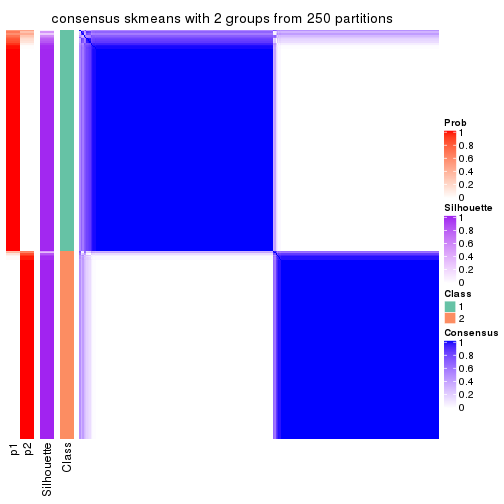</p>

</div>
<div id='tab-ATC-skmeans-consensus-heatmap-2'>
<pre><code class="r">consensus_heatmap(res, k = 3)
</code></pre>

<p>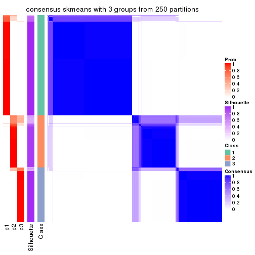</p>

</div>
<div id='tab-ATC-skmeans-consensus-heatmap-3'>
<pre><code class="r">consensus_heatmap(res, k = 4)
</code></pre>

<p>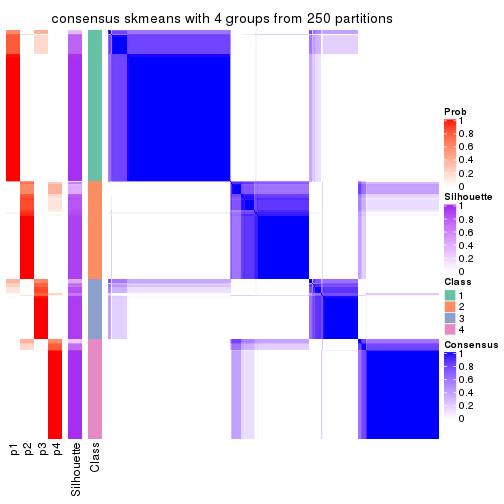</p>

</div>
<div id='tab-ATC-skmeans-consensus-heatmap-4'>
<pre><code class="r">consensus_heatmap(res, k = 5)
</code></pre>

<p>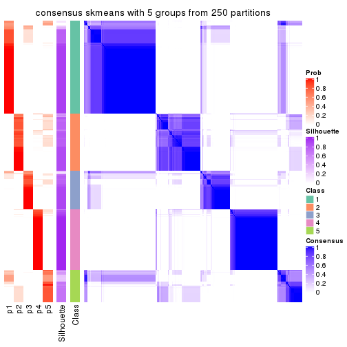</p>

</div>
<div id='tab-ATC-skmeans-consensus-heatmap-5'>
<pre><code class="r">consensus_heatmap(res, k = 6)
</code></pre>

<p>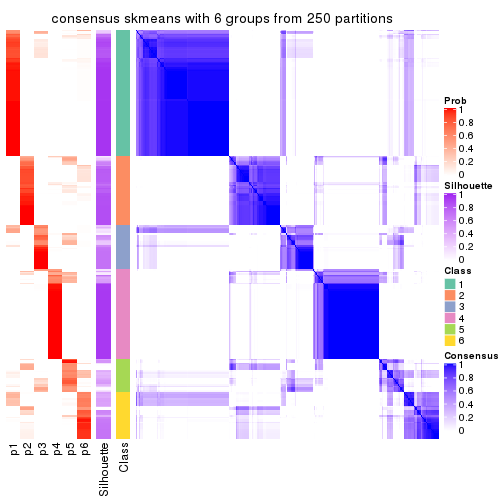</p>

</div>
</div>

Heatmaps for the membership of samples in all partitions to see how consistent they are:


<script>
$( function() {
	$( '#tabs-ATC-skmeans-membership-heatmap' ).tabs();
} );
</script>
<div id='tabs-ATC-skmeans-membership-heatmap'>
<ul>
<li><a href='#tab-ATC-skmeans-membership-heatmap-1'>k = 2</a></li>
<li><a href='#tab-ATC-skmeans-membership-heatmap-2'>k = 3</a></li>
<li><a href='#tab-ATC-skmeans-membership-heatmap-3'>k = 4</a></li>
<li><a href='#tab-ATC-skmeans-membership-heatmap-4'>k = 5</a></li>
<li><a href='#tab-ATC-skmeans-membership-heatmap-5'>k = 6</a></li>
</ul>
<div id='tab-ATC-skmeans-membership-heatmap-1'>
<pre><code class="r">membership_heatmap(res, k = 2)
</code></pre>

<p>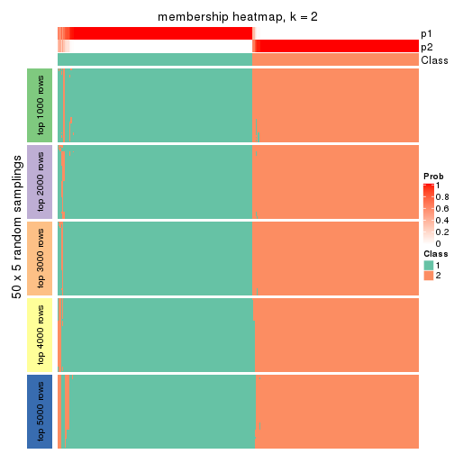</p>

</div>
<div id='tab-ATC-skmeans-membership-heatmap-2'>
<pre><code class="r">membership_heatmap(res, k = 3)
</code></pre>

<p>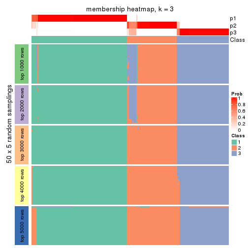</p>

</div>
<div id='tab-ATC-skmeans-membership-heatmap-3'>
<pre><code class="r">membership_heatmap(res, k = 4)
</code></pre>

<p>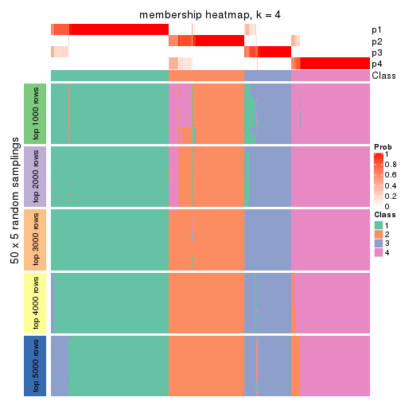</p>

</div>
<div id='tab-ATC-skmeans-membership-heatmap-4'>
<pre><code class="r">membership_heatmap(res, k = 5)
</code></pre>

<p>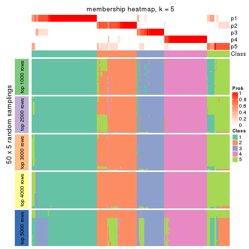</p>

</div>
<div id='tab-ATC-skmeans-membership-heatmap-5'>
<pre><code class="r">membership_heatmap(res, k = 6)
</code></pre>

<p>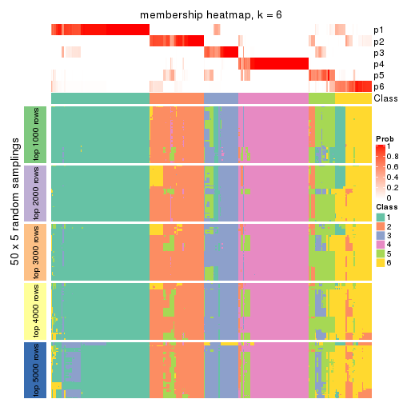</p>

</div>
</div>

As soon as we have had the classes for columns, we can look for signatures
which are significantly different between classes which can be candidate marks
for certain classes. Following are the heatmaps for signatures.


Signature heatmaps where rows are scaled:


<script>
$( function() {
	$( '#tabs-ATC-skmeans-get-signatures' ).tabs();
} );
</script>
<div id='tabs-ATC-skmeans-get-signatures'>
<ul>
<li><a href='#tab-ATC-skmeans-get-signatures-1'>k = 2</a></li>
<li><a href='#tab-ATC-skmeans-get-signatures-2'>k = 3</a></li>
<li><a href='#tab-ATC-skmeans-get-signatures-3'>k = 4</a></li>
<li><a href='#tab-ATC-skmeans-get-signatures-4'>k = 5</a></li>
<li><a href='#tab-ATC-skmeans-get-signatures-5'>k = 6</a></li>
</ul>
<div id='tab-ATC-skmeans-get-signatures-1'>
<pre><code class="r">get_signatures(res, k = 2)
</code></pre>

<p>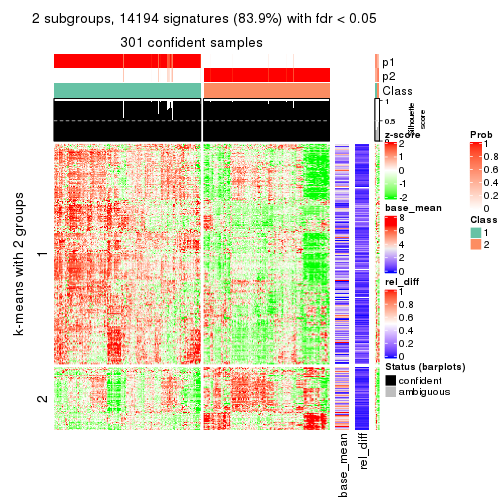</p>

</div>
<div id='tab-ATC-skmeans-get-signatures-2'>
<pre><code class="r">get_signatures(res, k = 3)
</code></pre>

<p>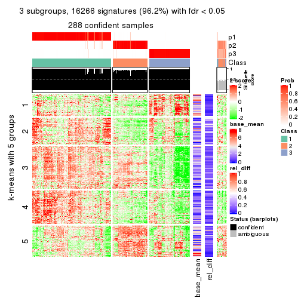</p>

</div>
<div id='tab-ATC-skmeans-get-signatures-3'>
<pre><code class="r">get_signatures(res, k = 4)
</code></pre>

<p>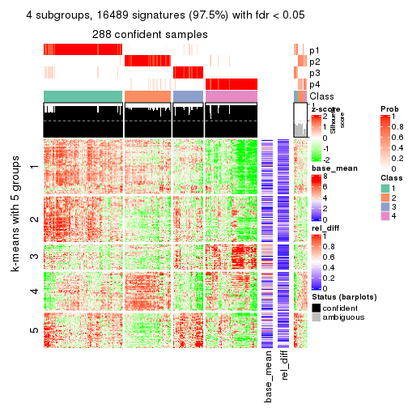</p>

</div>
<div id='tab-ATC-skmeans-get-signatures-4'>
<pre><code class="r">get_signatures(res, k = 5)
</code></pre>

<p>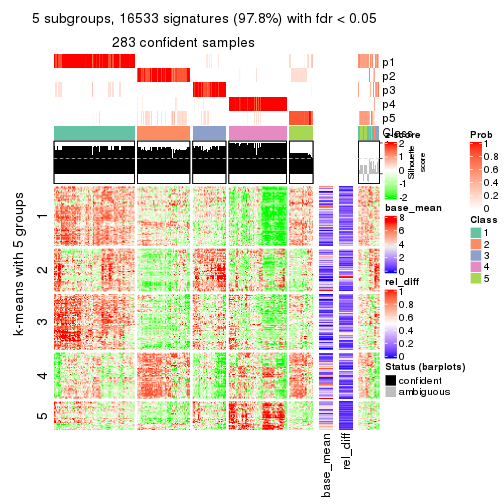</p>

</div>
<div id='tab-ATC-skmeans-get-signatures-5'>
<pre><code class="r">get_signatures(res, k = 6)
</code></pre>

<p>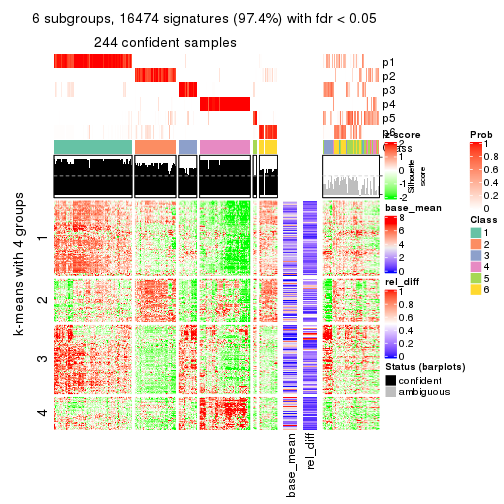</p>

</div>
</div>


Signature heatmaps where rows are not scaled:


<script>
$( function() {
	$( '#tabs-ATC-skmeans-get-signatures-no-scale' ).tabs();
} );
</script>
<div id='tabs-ATC-skmeans-get-signatures-no-scale'>
<ul>
<li><a href='#tab-ATC-skmeans-get-signatures-no-scale-1'>k = 2</a></li>
<li><a href='#tab-ATC-skmeans-get-signatures-no-scale-2'>k = 3</a></li>
<li><a href='#tab-ATC-skmeans-get-signatures-no-scale-3'>k = 4</a></li>
<li><a href='#tab-ATC-skmeans-get-signatures-no-scale-4'>k = 5</a></li>
<li><a href='#tab-ATC-skmeans-get-signatures-no-scale-5'>k = 6</a></li>
</ul>
<div id='tab-ATC-skmeans-get-signatures-no-scale-1'>
<pre><code class="r">get_signatures(res, k = 2, scale_rows = FALSE)
</code></pre>

<p>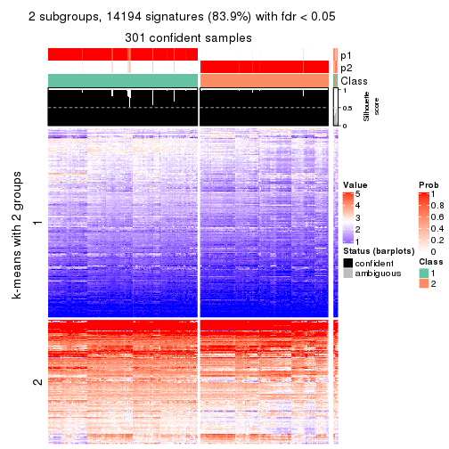</p>

</div>
<div id='tab-ATC-skmeans-get-signatures-no-scale-2'>
<pre><code class="r">get_signatures(res, k = 3, scale_rows = FALSE)
</code></pre>

<p>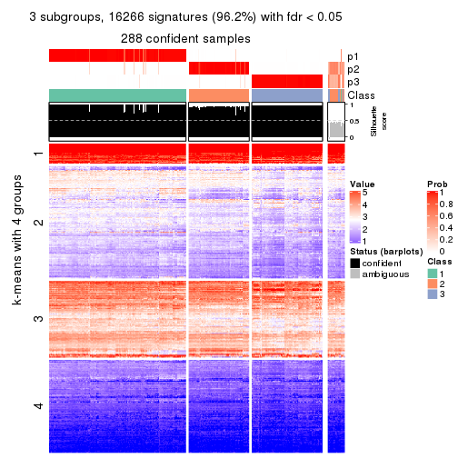</p>

</div>
<div id='tab-ATC-skmeans-get-signatures-no-scale-3'>
<pre><code class="r">get_signatures(res, k = 4, scale_rows = FALSE)
</code></pre>

<p>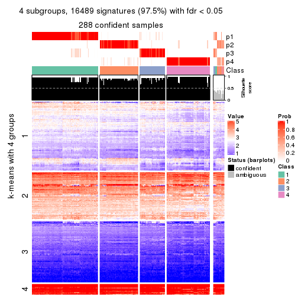</p>

</div>
<div id='tab-ATC-skmeans-get-signatures-no-scale-4'>
<pre><code class="r">get_signatures(res, k = 5, scale_rows = FALSE)
</code></pre>

<p>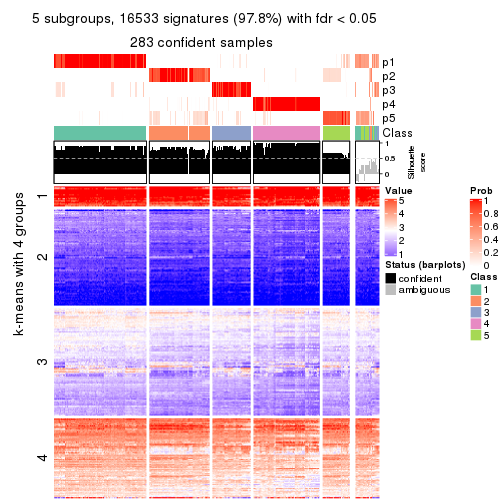</p>

</div>
<div id='tab-ATC-skmeans-get-signatures-no-scale-5'>
<pre><code class="r">get_signatures(res, k = 6, scale_rows = FALSE)
</code></pre>

<p>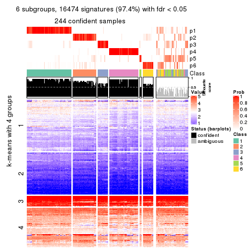</p>

</div>
</div>


Compare the overlap of signatures from different k:

```r
compare_signatures(res)
```

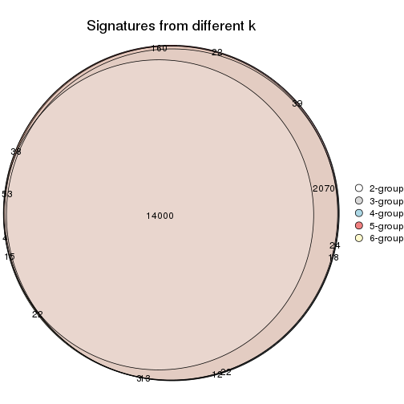

`get_signature()` returns a data frame invisibly. TO get the list of signatures, the function
call should be assigned to a variable explicitly. In following code, if `plot` argument is set
to `FALSE`, no heatmap is plotted while only the differential analysis is performed.

```r
# code only for demonstration
tb = get_signature(res, k = ..., plot = FALSE)
```

An example of the output of `tb` is:

```
#>   which_row         fdr    mean_1    mean_2 scaled_mean_1 scaled_mean_2 km
#> 1        38 0.042760348  8.373488  9.131774    -0.5533452     0.5164555  1
#> 2        40 0.018707592  7.106213  8.469186    -0.6173731     0.5762149  1
#> 3        55 0.019134737 10.221463 11.207825    -0.6159697     0.5749050  1
#> 4        59 0.006059896  5.921854  7.869574    -0.6899429     0.6439467  1
#> 5        60 0.018055526  8.928898 10.211722    -0.6204761     0.5791110  1
#> 6        98 0.009384629 15.714769 14.887706     0.6635654    -0.6193277  2
...
```

The columns in `tb` are:

1. `which_row`: row indices corresponding to the input matrix.
2. `fdr`: FDR for the differential test. 
3. `mean_x`: The mean value in group x.
4. `scaled_mean_x`: The mean value in group x after rows are scaled.
5. `km`: Row groups if k-means clustering is applied to rows.


UMAP plot which shows how samples are separated.


<script>
$( function() {
	$( '#tabs-ATC-skmeans-dimension-reduction' ).tabs();
} );
</script>
<div id='tabs-ATC-skmeans-dimension-reduction'>
<ul>
<li><a href='#tab-ATC-skmeans-dimension-reduction-1'>k = 2</a></li>
<li><a href='#tab-ATC-skmeans-dimension-reduction-2'>k = 3</a></li>
<li><a href='#tab-ATC-skmeans-dimension-reduction-3'>k = 4</a></li>
<li><a href='#tab-ATC-skmeans-dimension-reduction-4'>k = 5</a></li>
<li><a href='#tab-ATC-skmeans-dimension-reduction-5'>k = 6</a></li>
</ul>
<div id='tab-ATC-skmeans-dimension-reduction-1'>
<pre><code class="r">dimension_reduction(res, k = 2, method = &quot;UMAP&quot;)
</code></pre>

<p>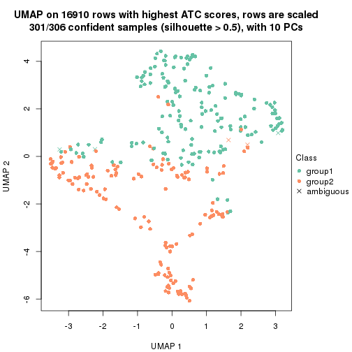</p>

</div>
<div id='tab-ATC-skmeans-dimension-reduction-2'>
<pre><code class="r">dimension_reduction(res, k = 3, method = &quot;UMAP&quot;)
</code></pre>

<p>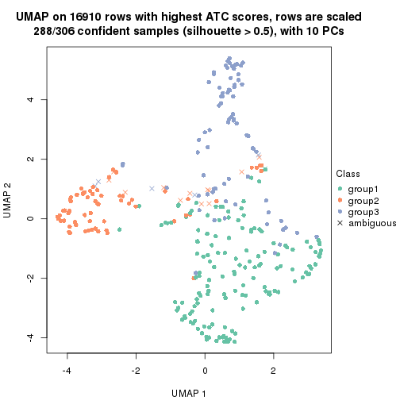</p>

</div>
<div id='tab-ATC-skmeans-dimension-reduction-3'>
<pre><code class="r">dimension_reduction(res, k = 4, method = &quot;UMAP&quot;)
</code></pre>

<p>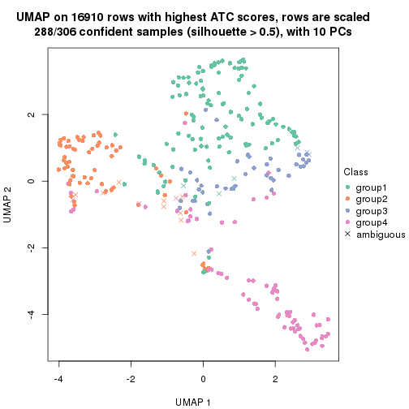</p>

</div>
<div id='tab-ATC-skmeans-dimension-reduction-4'>
<pre><code class="r">dimension_reduction(res, k = 5, method = &quot;UMAP&quot;)
</code></pre>

<p>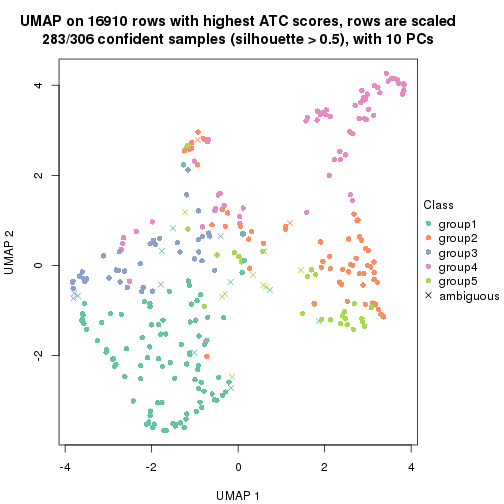</p>

</div>
<div id='tab-ATC-skmeans-dimension-reduction-5'>
<pre><code class="r">dimension_reduction(res, k = 6, method = &quot;UMAP&quot;)
</code></pre>

<p>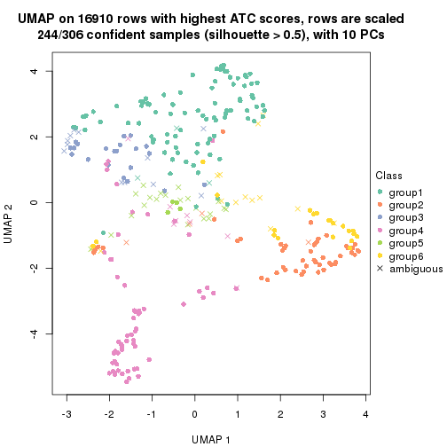</p>

</div>
</div>


Following heatmap shows how subgroups are split when increasing `k`:

```r
collect_classes(res)
```

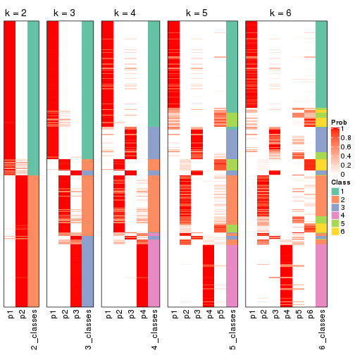


If matrix rows can be associated to genes, consider to use `GO_Enrichment(res,
...)` to perform function enrichment for the signature genes.


 

---------------------------------------------------


### ATC:pam


The object with results only for a single top-value method and a single partition method 
can be extracted as:

```r
res = res_list["ATC", "pam"]
# you can also extract it by
# res = res_list["ATC:pam"]
```

A summary of `res` and all the functions that can be applied to it:

```r
res
```

```
#> A 'ConsensusPartition' object with k = 2, 3, 4, 5, 6.
#>   On a matrix with 16910 rows and 306 columns.
#>   Top rows (1000, 2000, 3000, 4000, 5000) are extracted by 'ATC' method.
#>   Subgroups are detected by 'pam' method.
#>   Performed in total 1250 partitions by row resampling.
#>   Best k for subgroups seems to be 3.
#> 
#> Following methods can be applied to this 'ConsensusPartition' object:
#>  [1] "cola_report"             "collect_classes"         "collect_plots"          
#>  [4] "collect_stats"           "colnames"                "compare_signatures"     
#>  [7] "consensus_heatmap"       "dimension_reduction"     "functional_enrichment"  
#> [10] "get_anno_col"            "get_anno"                "get_classes"            
#> [13] "get_consensus"           "get_matrix"              "get_membership"         
#> [16] "get_param"               "get_signatures"          "get_stats"              
#> [19] "is_best_k"               "is_stable_k"             "membership_heatmap"     
#> [22] "ncol"                    "nrow"                    "plot_ecdf"              
#> [25] "rownames"                "select_partition_number" "show"                   
#> [28] "suggest_best_k"          "test_to_known_factors"
```

`collect_plots()` function collects all the plots made from `res` for all `k` (number of partitions)
into one single page to provide an easy and fast comparison between different `k`.

```r
collect_plots(res)
```

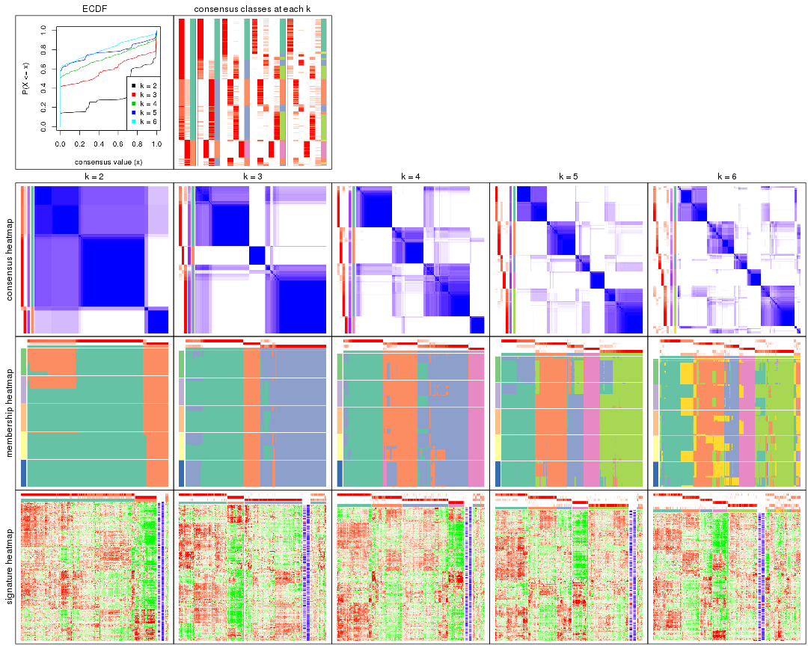

The plots are:

- The first row: a plot of the ECDF (Empirical cumulative distribution
  function) curves of the consensus matrix for each `k` and the heatmap of
  predicted classes for each `k`.
- The second row: heatmaps of the consensus matrix for each `k`.
- The third row: heatmaps of the membership matrix for each `k`.
- The fouth row: heatmaps of the signatures for each `k`.

All the plots in panels can be made by individual functions and they are
plotted later in this section.

`select_partition_number()` produces several plots showing different
statistics for choosing "optimized" `k`. There are following statistics:

- ECDF curves of the consensus matrix for each `k`;
- 1-PAC. [The PAC
  score](https://en.wikipedia.org/wiki/Consensus_clustering#Over-interpretation_potential_of_consensus_clustering)
  measures the proportion of the ambiguous subgrouping.
- Mean silhouette score.
- Concordance. The mean probability of fiting the consensus class ids in all
  partitions.
- Area increased. Denote $A_k$ as the area under the ECDF curve for current
  `k`, the area increased is defined as $A_k - A_{k-1}$.
- Rand index. The percent of pairs of samples that are both in a same cluster
  or both are not in a same cluster in the partition of k and k-1.
- Jaccard index. The ratio of pairs of samples are both in a same cluster in
  the partition of k and k-1 and the pairs of samples are both in a same
  cluster in the partition k or k-1.

The detailed explanations of these statistics can be found in [the cola
vignette](http://bioconductor.org/packages/devel/bioc/vignettes/cola/inst/doc/cola.html#toc_13).

Generally speaking, lower PAC score, higher mean silhouette score or higher
concordance corresponds to better partition. Rand index and Jaccard index
measure how similar the current partition is compared to partition with `k-1`.
If they are too similar, we won't accept `k` is better than `k-1`.

```r
select_partition_number(res)
```

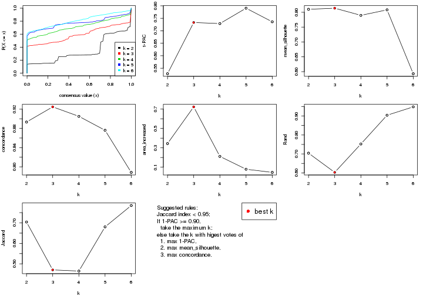

The numeric values for all these statistics can be obtained by `get_stats()`.

```r
get_stats(res)
```

```
#>   k 1-PAC mean_silhouette concordance area_increased  Rand Jaccard
#> 2 2 0.528           0.810       0.893         0.3440 0.704   0.704
#> 3 3 0.733           0.814       0.925         0.7230 0.603   0.470
#> 4 4 0.729           0.790       0.905         0.2114 0.752   0.465
#> 5 5 0.790           0.808       0.876         0.0790 0.904   0.680
#> 6 6 0.736           0.593       0.788         0.0464 0.948   0.785
```

`suggest_best_k()` suggests the best $k$ based on these statistics. The rules are as follows:

- All $k$ with Jaccard index larger than 0.95 are removed because the increase of
  the partition number does not provides enough extra information. If all $k$ are removed,
  the best $k$ is assigned by `NA`.
- For $k$ with 1-PAC larger than 0.9, the maximal $k$ is taken as the "best k". Other $k$ is called "optional k".
- If it does not fit the second rule. The $k$ with the highest vote of highest
  1-PAC, mean silhouette and concordance is taken as the "best k".

```r
suggest_best_k(res)
```

```
#> [1] 3
```


Following shows the table of the partitions (You need to click the **show/hide
code output** link to see it). The membership matrix (columns with name `p*`)
is inferred by
[`clue::cl_consensus()`](https://www.rdocumentation.org/link/cl_consensus?package=clue)
function with the `SE` method. Basically the value in the membership matrix
represents the probability to belong to a certain group. The finall class
label for an item is determined with the group with highest probability it
belongs to.

In `get_classes()` function, the entropy is calculated from the membership
matrix and the silhouette score is calculated from the consensus matrix.


<script>
$( function() {
	$( '#tabs-ATC-pam-get-classes' ).tabs();
} );
</script>
<div id='tabs-ATC-pam-get-classes'>
<ul>
<li><a href='#tab-ATC-pam-get-classes-1'>k = 2</a></li>
<li><a href='#tab-ATC-pam-get-classes-2'>k = 3</a></li>
<li><a href='#tab-ATC-pam-get-classes-3'>k = 4</a></li>
<li><a href='#tab-ATC-pam-get-classes-4'>k = 5</a></li>
<li><a href='#tab-ATC-pam-get-classes-5'>k = 6</a></li>
</ul>

<div id='tab-ATC-pam-get-classes-1'>
<p><a id='tab-ATC-pam-get-classes-1-a' style='color:#0366d6' href='#'>show/hide code output</a></p>
<pre><code class="r">cbind(get_classes(res, k = 2), get_membership(res, k = 2))
</code></pre>

<pre><code>#&gt;            class entropy silhouette    p1    p2
#&gt; SRR1609360     2  0.0000      0.930 0.000 1.000
#&gt; SRR1609361     1  0.8813      0.725 0.700 0.300
#&gt; SRR1609362     2  0.0000      0.930 0.000 1.000
#&gt; SRR1609363     1  0.8813      0.725 0.700 0.300
#&gt; SRR1609364     1  0.8813      0.725 0.700 0.300
#&gt; SRR1609365     2  0.0000      0.930 0.000 1.000
#&gt; SRR1609366     1  0.8386      0.751 0.732 0.268
#&gt; SRR1609367     1  0.0000      0.854 1.000 0.000
#&gt; SRR1609368     1  0.8813      0.725 0.700 0.300
#&gt; SRR1609369     1  0.0000      0.854 1.000 0.000
#&gt; SRR1609370     1  0.0000      0.854 1.000 0.000
#&gt; SRR1609371     2  0.0000      0.930 0.000 1.000
#&gt; SRR1609372     1  0.0000      0.854 1.000 0.000
#&gt; SRR1609373     1  0.8813      0.725 0.700 0.300
#&gt; SRR1609374     1  0.5946      0.807 0.856 0.144
#&gt; SRR1609375     1  0.8386      0.751 0.732 0.268
#&gt; SRR1609377     1  0.0000      0.854 1.000 0.000
#&gt; SRR1609376     1  0.8813      0.725 0.700 0.300
#&gt; SRR1609378     2  0.0000      0.930 0.000 1.000
#&gt; SRR1609379     1  0.0000      0.854 1.000 0.000
#&gt; SRR1609382     2  0.0000      0.930 0.000 1.000
#&gt; SRR1609383     2  0.8555      0.505 0.280 0.720
#&gt; SRR1609381     1  0.0000      0.854 1.000 0.000
#&gt; SRR1609384     1  0.8386      0.751 0.732 0.268
#&gt; SRR1609386     1  0.0000      0.854 1.000 0.000
#&gt; SRR1609385     1  0.1843      0.846 0.972 0.028
#&gt; SRR1609387     1  0.0000      0.854 1.000 0.000
#&gt; SRR1609388     1  0.8813      0.725 0.700 0.300
#&gt; SRR1609390     1  0.0000      0.854 1.000 0.000
#&gt; SRR1609393     2  0.0000      0.930 0.000 1.000
#&gt; SRR1609394     2  0.0000      0.930 0.000 1.000
#&gt; SRR1609392     1  0.8813      0.725 0.700 0.300
#&gt; SRR1609391     2  0.0000      0.930 0.000 1.000
#&gt; SRR1609395     1  0.0000      0.854 1.000 0.000
#&gt; SRR1609396     1  0.0000      0.854 1.000 0.000
#&gt; SRR1609398     1  0.0000      0.854 1.000 0.000
#&gt; SRR1609399     1  0.0000      0.854 1.000 0.000
#&gt; SRR1609400     1  0.0000      0.854 1.000 0.000
#&gt; SRR1609397     1  0.8813      0.725 0.700 0.300
#&gt; SRR1609401     1  0.8813      0.725 0.700 0.300
#&gt; SRR1609402     1  0.8813      0.725 0.700 0.300
#&gt; SRR1609405     1  0.0000      0.854 1.000 0.000
#&gt; SRR1609404     2  0.0000      0.930 0.000 1.000
#&gt; SRR1609406     1  0.8813      0.725 0.700 0.300
#&gt; SRR1609408     1  0.8813      0.725 0.700 0.300
#&gt; SRR1609403     1  0.0000      0.854 1.000 0.000
#&gt; SRR1609410     1  0.0000      0.854 1.000 0.000
#&gt; SRR1609411     1  0.8813      0.725 0.700 0.300
#&gt; SRR1609407     1  0.8813      0.725 0.700 0.300
#&gt; SRR1609413     1  0.0000      0.854 1.000 0.000
#&gt; SRR1609412     1  0.0000      0.854 1.000 0.000
#&gt; SRR1609414     1  0.0000      0.854 1.000 0.000
#&gt; SRR1609415     1  0.0000      0.854 1.000 0.000
#&gt; SRR1609416     1  0.0000      0.854 1.000 0.000
#&gt; SRR1609417     1  0.8813      0.725 0.700 0.300
#&gt; SRR1609418     1  0.0000      0.854 1.000 0.000
#&gt; SRR1609419     1  0.8813      0.725 0.700 0.300
#&gt; SRR1609420     1  0.8267      0.756 0.740 0.260
#&gt; SRR1609421     1  0.8813      0.725 0.700 0.300
#&gt; SRR1609422     2  0.0000      0.930 0.000 1.000
#&gt; SRR1609423     2  0.0000      0.930 0.000 1.000
#&gt; SRR1609424     2  0.0000      0.930 0.000 1.000
#&gt; SRR1609425     1  0.0000      0.854 1.000 0.000
#&gt; SRR1609426     1  0.8813      0.725 0.700 0.300
#&gt; SRR1609427     1  0.0000      0.854 1.000 0.000
#&gt; SRR1609428     1  0.8813      0.725 0.700 0.300
#&gt; SRR1609429     1  0.0000      0.854 1.000 0.000
#&gt; SRR1609430     1  0.0000      0.854 1.000 0.000
#&gt; SRR1609431     1  0.8386      0.751 0.732 0.268
#&gt; SRR1609432     1  0.5737      0.810 0.864 0.136
#&gt; SRR1609433     1  0.8386      0.751 0.732 0.268
#&gt; SRR1609434     2  0.0000      0.930 0.000 1.000
#&gt; SRR1609435     1  0.0000      0.854 1.000 0.000
#&gt; SRR1609436     1  0.0000      0.854 1.000 0.000
#&gt; SRR1609437     1  0.8813      0.725 0.700 0.300
#&gt; SRR1609438     2  0.0000      0.930 0.000 1.000
#&gt; SRR1609439     2  0.0000      0.930 0.000 1.000
#&gt; SRR1609440     1  0.0000      0.854 1.000 0.000
#&gt; SRR1609441     1  0.8813      0.725 0.700 0.300
#&gt; SRR1609442     2  0.9580      0.226 0.380 0.620
#&gt; SRR1609443     1  0.0000      0.854 1.000 0.000
#&gt; SRR1609444     1  0.0000      0.854 1.000 0.000
#&gt; SRR1609445     1  0.8713      0.732 0.708 0.292
#&gt; SRR1609446     1  0.8386      0.751 0.732 0.268
#&gt; SRR1609447     1  0.0000      0.854 1.000 0.000
#&gt; SRR1609448     1  0.8386      0.751 0.732 0.268
#&gt; SRR1609449     1  0.0000      0.854 1.000 0.000
#&gt; SRR1609450     1  0.0000      0.854 1.000 0.000
#&gt; SRR1609451     1  0.0000      0.854 1.000 0.000
#&gt; SRR1609452     1  0.8813      0.725 0.700 0.300
#&gt; SRR1609453     1  0.0000      0.854 1.000 0.000
#&gt; SRR1609454     1  0.8813      0.725 0.700 0.300
#&gt; SRR1609455     1  0.8386      0.751 0.732 0.268
#&gt; SRR1609456     1  0.8386      0.751 0.732 0.268
#&gt; SRR1609457     1  0.8386      0.751 0.732 0.268
#&gt; SRR1609458     1  0.0000      0.854 1.000 0.000
#&gt; SRR1609459     1  0.8386      0.751 0.732 0.268
#&gt; SRR1609460     1  0.8386      0.751 0.732 0.268
#&gt; SRR1609461     1  0.0000      0.854 1.000 0.000
#&gt; SRR1609462     1  0.0000      0.854 1.000 0.000
#&gt; SRR1609464     1  0.5178      0.815 0.884 0.116
#&gt; SRR1609463     1  0.0000      0.854 1.000 0.000
#&gt; SRR1609465     1  0.8713      0.732 0.708 0.292
#&gt; SRR1609466     2  0.0000      0.930 0.000 1.000
#&gt; SRR1609467     1  0.0000      0.854 1.000 0.000
#&gt; SRR1609469     2  0.0000      0.930 0.000 1.000
#&gt; SRR1609470     1  0.0376      0.853 0.996 0.004
#&gt; SRR1609472     2  0.0000      0.930 0.000 1.000
#&gt; SRR1609471     1  0.0000      0.854 1.000 0.000
#&gt; SRR1609474     1  0.0000      0.854 1.000 0.000
#&gt; SRR1609473     2  0.0000      0.930 0.000 1.000
#&gt; SRR1609475     2  0.0000      0.930 0.000 1.000
#&gt; SRR1609478     2  0.0000      0.930 0.000 1.000
#&gt; SRR1609476     1  0.0000      0.854 1.000 0.000
#&gt; SRR1609477     2  0.9732      0.130 0.404 0.596
#&gt; SRR1609479     1  0.8813      0.725 0.700 0.300
#&gt; SRR1609481     2  0.0000      0.930 0.000 1.000
#&gt; SRR1609480     2  0.9580      0.226 0.380 0.620
#&gt; SRR1609482     1  0.0000      0.854 1.000 0.000
#&gt; SRR1609484     2  0.0000      0.930 0.000 1.000
#&gt; SRR1609483     1  0.8386      0.751 0.732 0.268
#&gt; SRR1609486     1  0.0000      0.854 1.000 0.000
#&gt; SRR1609485     1  0.0000      0.854 1.000 0.000
#&gt; SRR1609487     1  0.0000      0.854 1.000 0.000
#&gt; SRR1609488     1  0.0000      0.854 1.000 0.000
#&gt; SRR1609489     1  0.8386      0.751 0.732 0.268
#&gt; SRR1609490     1  0.0000      0.854 1.000 0.000
#&gt; SRR1609491     1  0.0000      0.854 1.000 0.000
#&gt; SRR1609492     1  0.8813      0.725 0.700 0.300
#&gt; SRR1609493     1  0.0000      0.854 1.000 0.000
#&gt; SRR1609494     1  0.8813      0.725 0.700 0.300
#&gt; SRR1609495     1  0.8386      0.751 0.732 0.268
#&gt; SRR1609496     1  0.0000      0.854 1.000 0.000
#&gt; SRR1609497     1  0.0000      0.854 1.000 0.000
#&gt; SRR1609498     1  0.0000      0.854 1.000 0.000
#&gt; SRR1609499     1  0.8386      0.751 0.732 0.268
#&gt; SRR1609500     1  0.0000      0.854 1.000 0.000
#&gt; SRR1609501     1  0.8386      0.751 0.732 0.268
#&gt; SRR1609502     1  0.8813      0.725 0.700 0.300
#&gt; SRR1609503     2  0.0000      0.930 0.000 1.000
#&gt; SRR1609504     1  0.0000      0.854 1.000 0.000
#&gt; SRR1609505     1  0.0000      0.854 1.000 0.000
#&gt; SRR1609506     1  0.8813      0.725 0.700 0.300
#&gt; SRR1609507     1  0.0000      0.854 1.000 0.000
#&gt; SRR1609508     1  0.8813      0.725 0.700 0.300
#&gt; SRR1609509     1  0.8813      0.725 0.700 0.300
#&gt; SRR1609510     2  0.0000      0.930 0.000 1.000
#&gt; SRR1609512     1  0.0000      0.854 1.000 0.000
#&gt; SRR1609511     2  0.0000      0.930 0.000 1.000
#&gt; SRR1609513     1  0.0000      0.854 1.000 0.000
#&gt; SRR1609514     2  0.0000      0.930 0.000 1.000
#&gt; SRR1609515     1  0.8813      0.725 0.700 0.300
#&gt; SRR1609516     1  0.0000      0.854 1.000 0.000
#&gt; SRR1609517     1  0.8813      0.725 0.700 0.300
#&gt; SRR1609518     1  0.0000      0.854 1.000 0.000
#&gt; SRR1609519     1  0.0000      0.854 1.000 0.000
#&gt; SRR1609520     2  0.0000      0.930 0.000 1.000
#&gt; SRR1609521     1  0.0000      0.854 1.000 0.000
#&gt; SRR1609522     1  0.0000      0.854 1.000 0.000
#&gt; SRR1609523     1  0.8813      0.725 0.700 0.300
#&gt; SRR1609524     1  0.8813      0.725 0.700 0.300
#&gt; SRR1609526     1  0.8386      0.751 0.732 0.268
#&gt; SRR1609525     1  0.8813      0.725 0.700 0.300
#&gt; SRR1609527     1  0.0000      0.854 1.000 0.000
#&gt; SRR1609529     1  0.0000      0.854 1.000 0.000
#&gt; SRR1609528     2  0.0000      0.930 0.000 1.000
#&gt; SRR1609530     1  0.0000      0.854 1.000 0.000
#&gt; SRR1609531     1  0.8813      0.725 0.700 0.300
#&gt; SRR1609532     1  0.8386      0.751 0.732 0.268
#&gt; SRR1609533     1  0.5946      0.807 0.856 0.144
#&gt; SRR1609534     1  0.0376      0.853 0.996 0.004
#&gt; SRR1609535     2  0.9580      0.226 0.380 0.620
#&gt; SRR1609537     1  0.8813      0.725 0.700 0.300
#&gt; SRR1609536     1  0.8386      0.751 0.732 0.268
#&gt; SRR1609538     1  0.8386      0.751 0.732 0.268
#&gt; SRR1609539     1  0.0000      0.854 1.000 0.000
#&gt; SRR1609540     1  0.0000      0.854 1.000 0.000
#&gt; SRR1609541     2  0.0000      0.930 0.000 1.000
#&gt; SRR1609542     1  0.8813      0.725 0.700 0.300
#&gt; SRR1609543     1  0.0000      0.854 1.000 0.000
#&gt; SRR1609544     1  0.0000      0.854 1.000 0.000
#&gt; SRR1609545     1  0.0000      0.854 1.000 0.000
#&gt; SRR1609546     1  0.8386      0.751 0.732 0.268
#&gt; SRR1609547     1  0.8386      0.751 0.732 0.268
#&gt; SRR1609548     1  0.8386      0.751 0.732 0.268
#&gt; SRR1609549     1  0.8386      0.751 0.732 0.268
#&gt; SRR1609550     1  0.8813      0.725 0.700 0.300
#&gt; SRR1609551     1  0.8267      0.756 0.740 0.260
#&gt; SRR1609552     1  0.0000      0.854 1.000 0.000
#&gt; SRR1609553     1  0.0000      0.854 1.000 0.000
#&gt; SRR1609554     1  0.0000      0.854 1.000 0.000
#&gt; SRR1609555     1  0.0000      0.854 1.000 0.000
#&gt; SRR1609556     1  0.0000      0.854 1.000 0.000
#&gt; SRR1609557     1  0.8386      0.751 0.732 0.268
#&gt; SRR1609558     1  0.3114      0.838 0.944 0.056
#&gt; SRR1609559     1  0.8813      0.725 0.700 0.300
#&gt; SRR1609560     1  0.0000      0.854 1.000 0.000
#&gt; SRR1609561     1  0.0000      0.854 1.000 0.000
#&gt; SRR1609562     1  0.0000      0.854 1.000 0.000
#&gt; SRR1609563     1  0.0000      0.854 1.000 0.000
#&gt; SRR1609564     1  0.0000      0.854 1.000 0.000
#&gt; SRR1609565     1  0.8813      0.725 0.700 0.300
#&gt; SRR1609566     1  0.8813      0.725 0.700 0.300
#&gt; SRR1609567     2  0.9580      0.226 0.380 0.620
#&gt; SRR1609568     1  0.0000      0.854 1.000 0.000
#&gt; SRR1609569     1  0.0000      0.854 1.000 0.000
#&gt; SRR1609570     1  0.0000      0.854 1.000 0.000
#&gt; SRR1609571     2  0.0000      0.930 0.000 1.000
#&gt; SRR1609572     1  0.8813      0.725 0.700 0.300
#&gt; SRR1609573     1  0.0000      0.854 1.000 0.000
#&gt; SRR1609574     1  0.7950      0.765 0.760 0.240
#&gt; SRR1609575     2  0.0000      0.930 0.000 1.000
#&gt; SRR1609576     1  0.7376      0.780 0.792 0.208
#&gt; SRR1609578     1  0.2948      0.839 0.948 0.052
#&gt; SRR1609577     1  0.0000      0.854 1.000 0.000
#&gt; SRR1609579     1  0.0000      0.854 1.000 0.000
#&gt; SRR1609580     1  0.8386      0.751 0.732 0.268
#&gt; SRR1609582     1  0.0000      0.854 1.000 0.000
#&gt; SRR1609581     1  0.0000      0.854 1.000 0.000
#&gt; SRR1609583     1  0.8386      0.751 0.732 0.268
#&gt; SRR1609584     1  0.0000      0.854 1.000 0.000
#&gt; SRR1609585     1  0.0000      0.854 1.000 0.000
#&gt; SRR1609586     1  0.5629      0.811 0.868 0.132
#&gt; SRR1609587     1  0.8813      0.725 0.700 0.300
#&gt; SRR1609588     1  0.0000      0.854 1.000 0.000
#&gt; SRR1609589     1  0.0000      0.854 1.000 0.000
#&gt; SRR1609590     1  0.0000      0.854 1.000 0.000
#&gt; SRR1609592     1  0.8813      0.725 0.700 0.300
#&gt; SRR1609591     1  0.0000      0.854 1.000 0.000
#&gt; SRR1609593     1  0.8813      0.725 0.700 0.300
#&gt; SRR1609594     2  0.0000      0.930 0.000 1.000
#&gt; SRR1609595     1  0.8386      0.751 0.732 0.268
#&gt; SRR1609596     1  0.8499      0.745 0.724 0.276
#&gt; SRR1609597     1  0.8813      0.725 0.700 0.300
#&gt; SRR1609598     2  0.0000      0.930 0.000 1.000
#&gt; SRR1609599     2  0.0000      0.930 0.000 1.000
#&gt; SRR1609600     1  0.0000      0.854 1.000 0.000
#&gt; SRR1609601     1  0.8813      0.725 0.700 0.300
#&gt; SRR1609602     2  0.0000      0.930 0.000 1.000
#&gt; SRR1609603     1  0.0000      0.854 1.000 0.000
#&gt; SRR1609604     2  0.0000      0.930 0.000 1.000
#&gt; SRR1609605     1  0.8813      0.725 0.700 0.300
#&gt; SRR1609606     1  0.8813      0.725 0.700 0.300
#&gt; SRR1609607     1  0.0000      0.854 1.000 0.000
#&gt; SRR1609608     1  0.2423      0.843 0.960 0.040
#&gt; SRR1609609     1  0.0672      0.852 0.992 0.008
#&gt; SRR1609610     1  0.0000      0.854 1.000 0.000
#&gt; SRR1609611     2  0.0000      0.930 0.000 1.000
#&gt; SRR1609613     1  0.0938      0.851 0.988 0.012
#&gt; SRR1609612     1  0.0000      0.854 1.000 0.000
#&gt; SRR1609614     1  0.0000      0.854 1.000 0.000
#&gt; SRR1609615     1  0.0000      0.854 1.000 0.000
#&gt; SRR1609616     1  0.0000      0.854 1.000 0.000
#&gt; SRR1609617     1  0.8813      0.725 0.700 0.300
#&gt; SRR1609618     1  0.8386      0.751 0.732 0.268
#&gt; SRR1609619     1  0.8386      0.751 0.732 0.268
#&gt; SRR1609620     2  0.0000      0.930 0.000 1.000
#&gt; SRR1609621     2  0.9580      0.226 0.380 0.620
#&gt; SRR1609622     1  0.8386      0.751 0.732 0.268
#&gt; SRR1609623     1  0.0000      0.854 1.000 0.000
#&gt; SRR1609624     1  0.0000      0.854 1.000 0.000
#&gt; SRR1609625     1  0.0000      0.854 1.000 0.000
#&gt; SRR1609626     2  0.0376      0.926 0.004 0.996
#&gt; SRR1609627     1  0.0000      0.854 1.000 0.000
#&gt; SRR1609628     1  0.0000      0.854 1.000 0.000
#&gt; SRR1609629     1  0.0000      0.854 1.000 0.000
#&gt; SRR1609630     1  0.6148      0.803 0.848 0.152
#&gt; SRR1609631     1  0.0000      0.854 1.000 0.000
#&gt; SRR1609632     1  0.0000      0.854 1.000 0.000
#&gt; SRR1609633     1  0.0000      0.854 1.000 0.000
#&gt; SRR1609634     1  0.8813      0.725 0.700 0.300
#&gt; SRR1609635     2  0.0000      0.930 0.000 1.000
#&gt; SRR1609636     2  0.0000      0.930 0.000 1.000
#&gt; SRR1609637     1  0.0000      0.854 1.000 0.000
#&gt; SRR1609638     1  0.0000      0.854 1.000 0.000
#&gt; SRR1609639     1  0.8386      0.751 0.732 0.268
#&gt; SRR1609640     1  0.0000      0.854 1.000 0.000
#&gt; SRR1609641     1  0.0000      0.854 1.000 0.000
#&gt; SRR1609642     1  0.0000      0.854 1.000 0.000
#&gt; SRR1609643     1  0.0000      0.854 1.000 0.000
#&gt; SRR1609644     1  0.0000      0.854 1.000 0.000
#&gt; SRR1609645     1  0.0000      0.854 1.000 0.000
#&gt; SRR1609646     1  0.0000      0.854 1.000 0.000
#&gt; SRR1609647     1  0.8813      0.725 0.700 0.300
#&gt; SRR1609649     1  0.0000      0.854 1.000 0.000
#&gt; SRR1609648     1  0.8813      0.725 0.700 0.300
#&gt; SRR1609651     1  0.0672      0.852 0.992 0.008
#&gt; SRR1609650     1  0.8813      0.725 0.700 0.300
#&gt; SRR1609652     1  0.0000      0.854 1.000 0.000
#&gt; SRR1609653     1  0.8813      0.725 0.700 0.300
#&gt; SRR1609654     2  0.0000      0.930 0.000 1.000
#&gt; SRR1609655     1  0.0000      0.854 1.000 0.000
#&gt; SRR1609657     1  0.0000      0.854 1.000 0.000
#&gt; SRR1609656     2  0.0000      0.930 0.000 1.000
#&gt; SRR1609658     2  0.9580      0.226 0.380 0.620
#&gt; SRR1609659     1  0.9044      0.697 0.680 0.320
#&gt; SRR1609660     1  0.8813      0.725 0.700 0.300
#&gt; SRR1609661     1  0.0000      0.854 1.000 0.000
#&gt; SRR1609662     1  0.8386      0.751 0.732 0.268
#&gt; SRR1609663     1  0.0000      0.854 1.000 0.000
#&gt; SRR1609664     1  0.0000      0.854 1.000 0.000
#&gt; SRR1609665     1  0.0000      0.854 1.000 0.000
#&gt; SRR1609666     2  0.0000      0.930 0.000 1.000
#&gt; SRR1609667     1  0.0000      0.854 1.000 0.000
#&gt; SRR1609668     2  0.0000      0.930 0.000 1.000
#&gt; SRR1609669     1  0.0000      0.854 1.000 0.000
</code></pre>

<script>
$('#tab-ATC-pam-get-classes-1-a').parent().next().next().hide();
$('#tab-ATC-pam-get-classes-1-a').click(function(){
  $('#tab-ATC-pam-get-classes-1-a').parent().next().next().toggle();
  return(false);
});
</script>
</div>

<div id='tab-ATC-pam-get-classes-2'>
<p><a id='tab-ATC-pam-get-classes-2-a' style='color:#0366d6' href='#'>show/hide code output</a></p>
<pre><code class="r">cbind(get_classes(res, k = 3), get_membership(res, k = 3))
</code></pre>

<pre><code>#&gt;            class entropy silhouette    p1    p2    p3
#&gt; SRR1609360     3  0.5327     0.5588 0.000 0.272 0.728
#&gt; SRR1609361     3  0.0000     0.9207 0.000 0.000 1.000
#&gt; SRR1609362     2  0.0000     0.9893 0.000 1.000 0.000
#&gt; SRR1609363     3  0.0000     0.9207 0.000 0.000 1.000
#&gt; SRR1609364     3  0.0000     0.9207 0.000 0.000 1.000
#&gt; SRR1609365     2  0.5968     0.4243 0.000 0.636 0.364
#&gt; SRR1609366     3  0.0000     0.9207 0.000 0.000 1.000
#&gt; SRR1609367     1  0.0000     0.8582 1.000 0.000 0.000
#&gt; SRR1609368     3  0.0000     0.9207 0.000 0.000 1.000
#&gt; SRR1609369     1  0.5465     0.6344 0.712 0.000 0.288
#&gt; SRR1609370     1  0.0000     0.8582 1.000 0.000 0.000
#&gt; SRR1609371     2  0.0000     0.9893 0.000 1.000 0.000
#&gt; SRR1609372     1  0.0000     0.8582 1.000 0.000 0.000
#&gt; SRR1609373     3  0.0000     0.9207 0.000 0.000 1.000
#&gt; SRR1609374     3  0.0000     0.9207 0.000 0.000 1.000
#&gt; SRR1609375     3  0.0000     0.9207 0.000 0.000 1.000
#&gt; SRR1609377     1  0.0000     0.8582 1.000 0.000 0.000
#&gt; SRR1609376     3  0.0000     0.9207 0.000 0.000 1.000
#&gt; SRR1609378     2  0.0000     0.9893 0.000 1.000 0.000
#&gt; SRR1609379     1  0.0000     0.8582 1.000 0.000 0.000
#&gt; SRR1609382     2  0.0000     0.9893 0.000 1.000 0.000
#&gt; SRR1609383     3  0.0000     0.9207 0.000 0.000 1.000
#&gt; SRR1609381     1  0.0000     0.8582 1.000 0.000 0.000
#&gt; SRR1609384     3  0.0000     0.9207 0.000 0.000 1.000
#&gt; SRR1609386     1  0.5968     0.5239 0.636 0.000 0.364
#&gt; SRR1609385     3  0.5948     0.3517 0.360 0.000 0.640
#&gt; SRR1609387     1  0.0000     0.8582 1.000 0.000 0.000
#&gt; SRR1609388     3  0.0000     0.9207 0.000 0.000 1.000
#&gt; SRR1609390     1  0.0000     0.8582 1.000 0.000 0.000
#&gt; SRR1609393     2  0.0000     0.9893 0.000 1.000 0.000
#&gt; SRR1609394     3  0.5905     0.4161 0.000 0.352 0.648
#&gt; SRR1609392     3  0.0000     0.9207 0.000 0.000 1.000
#&gt; SRR1609391     2  0.0000     0.9893 0.000 1.000 0.000
#&gt; SRR1609395     1  0.0000     0.8582 1.000 0.000 0.000
#&gt; SRR1609396     1  0.0000     0.8582 1.000 0.000 0.000
#&gt; SRR1609398     1  0.0000     0.8582 1.000 0.000 0.000
#&gt; SRR1609399     1  0.0000     0.8582 1.000 0.000 0.000
#&gt; SRR1609400     1  0.0000     0.8582 1.000 0.000 0.000
#&gt; SRR1609397     3  0.0000     0.9207 0.000 0.000 1.000
#&gt; SRR1609401     3  0.0000     0.9207 0.000 0.000 1.000
#&gt; SRR1609402     3  0.0000     0.9207 0.000 0.000 1.000
#&gt; SRR1609405     1  0.6045     0.4948 0.620 0.000 0.380
#&gt; SRR1609404     2  0.0000     0.9893 0.000 1.000 0.000
#&gt; SRR1609406     3  0.0000     0.9207 0.000 0.000 1.000
#&gt; SRR1609408     3  0.0000     0.9207 0.000 0.000 1.000
#&gt; SRR1609403     1  0.0000     0.8582 1.000 0.000 0.000
#&gt; SRR1609410     1  0.0000     0.8582 1.000 0.000 0.000
#&gt; SRR1609411     3  0.0000     0.9207 0.000 0.000 1.000
#&gt; SRR1609407     3  0.0000     0.9207 0.000 0.000 1.000
#&gt; SRR1609413     1  0.0000     0.8582 1.000 0.000 0.000
#&gt; SRR1609412     1  0.5016     0.6886 0.760 0.000 0.240
#&gt; SRR1609414     1  0.5733     0.5875 0.676 0.000 0.324
#&gt; SRR1609415     1  0.0000     0.8582 1.000 0.000 0.000
#&gt; SRR1609416     1  0.3752     0.7730 0.856 0.000 0.144
#&gt; SRR1609417     3  0.0000     0.9207 0.000 0.000 1.000
#&gt; SRR1609418     1  0.0000     0.8582 1.000 0.000 0.000
#&gt; SRR1609419     3  0.0000     0.9207 0.000 0.000 1.000
#&gt; SRR1609420     3  0.0000     0.9207 0.000 0.000 1.000
#&gt; SRR1609421     3  0.0000     0.9207 0.000 0.000 1.000
#&gt; SRR1609422     2  0.0000     0.9893 0.000 1.000 0.000
#&gt; SRR1609423     2  0.0000     0.9893 0.000 1.000 0.000
#&gt; SRR1609424     2  0.0000     0.9893 0.000 1.000 0.000
#&gt; SRR1609425     1  0.5760     0.5808 0.672 0.000 0.328
#&gt; SRR1609426     3  0.0000     0.9207 0.000 0.000 1.000
#&gt; SRR1609427     1  0.2066     0.8232 0.940 0.000 0.060
#&gt; SRR1609428     3  0.0000     0.9207 0.000 0.000 1.000
#&gt; SRR1609429     1  0.0000     0.8582 1.000 0.000 0.000
#&gt; SRR1609430     1  0.0000     0.8582 1.000 0.000 0.000
#&gt; SRR1609431     3  0.0000     0.9207 0.000 0.000 1.000
#&gt; SRR1609432     3  0.0000     0.9207 0.000 0.000 1.000
#&gt; SRR1609433     3  0.3038     0.8249 0.104 0.000 0.896
#&gt; SRR1609434     2  0.0000     0.9893 0.000 1.000 0.000
#&gt; SRR1609435     1  0.0000     0.8582 1.000 0.000 0.000
#&gt; SRR1609436     1  0.0000     0.8582 1.000 0.000 0.000
#&gt; SRR1609437     3  0.0000     0.9207 0.000 0.000 1.000
#&gt; SRR1609438     2  0.0000     0.9893 0.000 1.000 0.000
#&gt; SRR1609439     3  0.5591     0.5359 0.000 0.304 0.696
#&gt; SRR1609440     1  0.0000     0.8582 1.000 0.000 0.000
#&gt; SRR1609441     3  0.0000     0.9207 0.000 0.000 1.000
#&gt; SRR1609442     3  0.0000     0.9207 0.000 0.000 1.000
#&gt; SRR1609443     3  0.6260     0.0541 0.448 0.000 0.552
#&gt; SRR1609444     1  0.1031     0.8453 0.976 0.000 0.024
#&gt; SRR1609445     3  0.0000     0.9207 0.000 0.000 1.000
#&gt; SRR1609446     3  0.0000     0.9207 0.000 0.000 1.000
#&gt; SRR1609447     1  0.0000     0.8582 1.000 0.000 0.000
#&gt; SRR1609448     3  0.0000     0.9207 0.000 0.000 1.000
#&gt; SRR1609449     1  0.0592     0.8519 0.988 0.000 0.012
#&gt; SRR1609450     3  0.0000     0.9207 0.000 0.000 1.000
#&gt; SRR1609451     1  0.0000     0.8582 1.000 0.000 0.000
#&gt; SRR1609452     3  0.0000     0.9207 0.000 0.000 1.000
#&gt; SRR1609453     1  0.6140     0.4457 0.596 0.000 0.404
#&gt; SRR1609454     3  0.0000     0.9207 0.000 0.000 1.000
#&gt; SRR1609455     3  0.0000     0.9207 0.000 0.000 1.000
#&gt; SRR1609456     3  0.0000     0.9207 0.000 0.000 1.000
#&gt; SRR1609457     3  0.0000     0.9207 0.000 0.000 1.000
#&gt; SRR1609458     1  0.0000     0.8582 1.000 0.000 0.000
#&gt; SRR1609459     3  0.0000     0.9207 0.000 0.000 1.000
#&gt; SRR1609460     3  0.0000     0.9207 0.000 0.000 1.000
#&gt; SRR1609461     1  0.6140     0.4457 0.596 0.000 0.404
#&gt; SRR1609462     1  0.0000     0.8582 1.000 0.000 0.000
#&gt; SRR1609464     3  0.6244     0.0870 0.440 0.000 0.560
#&gt; SRR1609463     1  0.0000     0.8582 1.000 0.000 0.000
#&gt; SRR1609465     3  0.0000     0.9207 0.000 0.000 1.000
#&gt; SRR1609466     2  0.0000     0.9893 0.000 1.000 0.000
#&gt; SRR1609467     1  0.0000     0.8582 1.000 0.000 0.000
#&gt; SRR1609469     2  0.0000     0.9893 0.000 1.000 0.000
#&gt; SRR1609470     3  0.6244     0.0870 0.440 0.000 0.560
#&gt; SRR1609472     2  0.0000     0.9893 0.000 1.000 0.000
#&gt; SRR1609471     3  0.6111     0.2414 0.396 0.000 0.604
#&gt; SRR1609474     1  0.6045     0.4943 0.620 0.000 0.380
#&gt; SRR1609473     2  0.0000     0.9893 0.000 1.000 0.000
#&gt; SRR1609475     2  0.0000     0.9893 0.000 1.000 0.000
#&gt; SRR1609478     2  0.0000     0.9893 0.000 1.000 0.000
#&gt; SRR1609476     1  0.4605     0.7278 0.796 0.000 0.204
#&gt; SRR1609477     3  0.0000     0.9207 0.000 0.000 1.000
#&gt; SRR1609479     3  0.0000     0.9207 0.000 0.000 1.000
#&gt; SRR1609481     2  0.0000     0.9893 0.000 1.000 0.000
#&gt; SRR1609480     3  0.0000     0.9207 0.000 0.000 1.000
#&gt; SRR1609482     1  0.0000     0.8582 1.000 0.000 0.000
#&gt; SRR1609484     2  0.0000     0.9893 0.000 1.000 0.000
#&gt; SRR1609483     3  0.3038     0.8249 0.104 0.000 0.896
#&gt; SRR1609486     1  0.6168     0.4260 0.588 0.000 0.412
#&gt; SRR1609485     1  0.6215     0.3836 0.572 0.000 0.428
#&gt; SRR1609487     1  0.0000     0.8582 1.000 0.000 0.000
#&gt; SRR1609488     1  0.0000     0.8582 1.000 0.000 0.000
#&gt; SRR1609489     3  0.0000     0.9207 0.000 0.000 1.000
#&gt; SRR1609490     1  0.6111     0.4630 0.604 0.000 0.396
#&gt; SRR1609491     1  0.5835     0.5629 0.660 0.000 0.340
#&gt; SRR1609492     3  0.0000     0.9207 0.000 0.000 1.000
#&gt; SRR1609493     3  0.5905     0.3603 0.352 0.000 0.648
#&gt; SRR1609494     3  0.0000     0.9207 0.000 0.000 1.000
#&gt; SRR1609495     3  0.0000     0.9207 0.000 0.000 1.000
#&gt; SRR1609496     1  0.0000     0.8582 1.000 0.000 0.000
#&gt; SRR1609497     1  0.0000     0.8582 1.000 0.000 0.000
#&gt; SRR1609498     1  0.0000     0.8582 1.000 0.000 0.000
#&gt; SRR1609499     3  0.0000     0.9207 0.000 0.000 1.000
#&gt; SRR1609500     1  0.0000     0.8582 1.000 0.000 0.000
#&gt; SRR1609501     3  0.0000     0.9207 0.000 0.000 1.000
#&gt; SRR1609502     3  0.0000     0.9207 0.000 0.000 1.000
#&gt; SRR1609503     2  0.0000     0.9893 0.000 1.000 0.000
#&gt; SRR1609504     1  0.0000     0.8582 1.000 0.000 0.000
#&gt; SRR1609505     1  0.0000     0.8582 1.000 0.000 0.000
#&gt; SRR1609506     3  0.0000     0.9207 0.000 0.000 1.000
#&gt; SRR1609507     1  0.0000     0.8582 1.000 0.000 0.000
#&gt; SRR1609508     3  0.0000     0.9207 0.000 0.000 1.000
#&gt; SRR1609509     3  0.0000     0.9207 0.000 0.000 1.000
#&gt; SRR1609510     3  0.1163     0.8971 0.000 0.028 0.972
#&gt; SRR1609512     1  0.0000     0.8582 1.000 0.000 0.000
#&gt; SRR1609511     2  0.0000     0.9893 0.000 1.000 0.000
#&gt; SRR1609513     1  0.0000     0.8582 1.000 0.000 0.000
#&gt; SRR1609514     2  0.0000     0.9893 0.000 1.000 0.000
#&gt; SRR1609515     3  0.0000     0.9207 0.000 0.000 1.000
#&gt; SRR1609516     3  0.2261     0.8637 0.068 0.000 0.932
#&gt; SRR1609517     3  0.0000     0.9207 0.000 0.000 1.000
#&gt; SRR1609518     1  0.0000     0.8582 1.000 0.000 0.000
#&gt; SRR1609519     1  0.0000     0.8582 1.000 0.000 0.000
#&gt; SRR1609520     2  0.0000     0.9893 0.000 1.000 0.000
#&gt; SRR1609521     1  0.0000     0.8582 1.000 0.000 0.000
#&gt; SRR1609522     1  0.6140     0.4457 0.596 0.000 0.404
#&gt; SRR1609523     3  0.0000     0.9207 0.000 0.000 1.000
#&gt; SRR1609524     3  0.0000     0.9207 0.000 0.000 1.000
#&gt; SRR1609526     3  0.4555     0.6946 0.200 0.000 0.800
#&gt; SRR1609525     3  0.0000     0.9207 0.000 0.000 1.000
#&gt; SRR1609527     1  0.0000     0.8582 1.000 0.000 0.000
#&gt; SRR1609529     1  0.6126     0.4545 0.600 0.000 0.400
#&gt; SRR1609528     2  0.0000     0.9893 0.000 1.000 0.000
#&gt; SRR1609530     1  0.0000     0.8582 1.000 0.000 0.000
#&gt; SRR1609531     3  0.0000     0.9207 0.000 0.000 1.000
#&gt; SRR1609532     3  0.4555     0.6945 0.200 0.000 0.800
#&gt; SRR1609533     3  0.0000     0.9207 0.000 0.000 1.000
#&gt; SRR1609534     3  0.6252     0.0708 0.444 0.000 0.556
#&gt; SRR1609535     3  0.0000     0.9207 0.000 0.000 1.000
#&gt; SRR1609537     3  0.0000     0.9207 0.000 0.000 1.000
#&gt; SRR1609536     3  0.4555     0.6945 0.200 0.000 0.800
#&gt; SRR1609538     3  0.0000     0.9207 0.000 0.000 1.000
#&gt; SRR1609539     1  0.6140     0.4457 0.596 0.000 0.404
#&gt; SRR1609540     1  0.0000     0.8582 1.000 0.000 0.000
#&gt; SRR1609541     2  0.0000     0.9893 0.000 1.000 0.000
#&gt; SRR1609542     3  0.0000     0.9207 0.000 0.000 1.000
#&gt; SRR1609543     1  0.0000     0.8582 1.000 0.000 0.000
#&gt; SRR1609544     1  0.6140     0.4457 0.596 0.000 0.404
#&gt; SRR1609545     1  0.0000     0.8582 1.000 0.000 0.000
#&gt; SRR1609546     3  0.0000     0.9207 0.000 0.000 1.000
#&gt; SRR1609547     3  0.0000     0.9207 0.000 0.000 1.000
#&gt; SRR1609548     3  0.0000     0.9207 0.000 0.000 1.000
#&gt; SRR1609549     3  0.0000     0.9207 0.000 0.000 1.000
#&gt; SRR1609550     3  0.0000     0.9207 0.000 0.000 1.000
#&gt; SRR1609551     3  0.4605     0.6880 0.204 0.000 0.796
#&gt; SRR1609552     1  0.5650     0.6030 0.688 0.000 0.312
#&gt; SRR1609553     1  0.0000     0.8582 1.000 0.000 0.000
#&gt; SRR1609554     1  0.5905     0.5438 0.648 0.000 0.352
#&gt; SRR1609555     1  0.0000     0.8582 1.000 0.000 0.000
#&gt; SRR1609556     1  0.0000     0.8582 1.000 0.000 0.000
#&gt; SRR1609557     3  0.0000     0.9207 0.000 0.000 1.000
#&gt; SRR1609558     3  0.0000     0.9207 0.000 0.000 1.000
#&gt; SRR1609559     3  0.0000     0.9207 0.000 0.000 1.000
#&gt; SRR1609560     1  0.0000     0.8582 1.000 0.000 0.000
#&gt; SRR1609561     1  0.5621     0.6085 0.692 0.000 0.308
#&gt; SRR1609562     1  0.1163     0.8431 0.972 0.000 0.028
#&gt; SRR1609563     1  0.6111     0.4630 0.604 0.000 0.396
#&gt; SRR1609564     1  0.0000     0.8582 1.000 0.000 0.000
#&gt; SRR1609565     3  0.0000     0.9207 0.000 0.000 1.000
#&gt; SRR1609566     3  0.0000     0.9207 0.000 0.000 1.000
#&gt; SRR1609567     3  0.0000     0.9207 0.000 0.000 1.000
#&gt; SRR1609568     1  0.0000     0.8582 1.000 0.000 0.000
#&gt; SRR1609569     1  0.0000     0.8582 1.000 0.000 0.000
#&gt; SRR1609570     1  0.0000     0.8582 1.000 0.000 0.000
#&gt; SRR1609571     2  0.0000     0.9893 0.000 1.000 0.000
#&gt; SRR1609572     3  0.0000     0.9207 0.000 0.000 1.000
#&gt; SRR1609573     1  0.4062     0.7607 0.836 0.000 0.164
#&gt; SRR1609574     3  0.6244     0.0870 0.440 0.000 0.560
#&gt; SRR1609575     3  0.0000     0.9207 0.000 0.000 1.000
#&gt; SRR1609576     3  0.0000     0.9207 0.000 0.000 1.000
#&gt; SRR1609578     3  0.6062     0.2812 0.384 0.000 0.616
#&gt; SRR1609577     1  0.6126     0.4545 0.600 0.000 0.400
#&gt; SRR1609579     1  0.6154     0.4353 0.592 0.000 0.408
#&gt; SRR1609580     3  0.3038     0.8249 0.104 0.000 0.896
#&gt; SRR1609582     1  0.0000     0.8582 1.000 0.000 0.000
#&gt; SRR1609581     3  0.2959     0.8277 0.100 0.000 0.900
#&gt; SRR1609583     3  0.0000     0.9207 0.000 0.000 1.000
#&gt; SRR1609584     1  0.0000     0.8582 1.000 0.000 0.000
#&gt; SRR1609585     1  0.0000     0.8582 1.000 0.000 0.000
#&gt; SRR1609586     3  0.0000     0.9207 0.000 0.000 1.000
#&gt; SRR1609587     3  0.0000     0.9207 0.000 0.000 1.000
#&gt; SRR1609588     3  0.5988     0.3121 0.368 0.000 0.632
#&gt; SRR1609589     3  0.5058     0.6104 0.244 0.000 0.756
#&gt; SRR1609590     1  0.4346     0.7460 0.816 0.000 0.184
#&gt; SRR1609592     3  0.0000     0.9207 0.000 0.000 1.000
#&gt; SRR1609591     1  0.6140     0.4457 0.596 0.000 0.404
#&gt; SRR1609593     3  0.0000     0.9207 0.000 0.000 1.000
#&gt; SRR1609594     2  0.0000     0.9893 0.000 1.000 0.000
#&gt; SRR1609595     3  0.0000     0.9207 0.000 0.000 1.000
#&gt; SRR1609596     3  0.0000     0.9207 0.000 0.000 1.000
#&gt; SRR1609597     3  0.0000     0.9207 0.000 0.000 1.000
#&gt; SRR1609598     2  0.0000     0.9893 0.000 1.000 0.000
#&gt; SRR1609599     2  0.0000     0.9893 0.000 1.000 0.000
#&gt; SRR1609600     1  0.4931     0.6999 0.768 0.000 0.232
#&gt; SRR1609601     3  0.0000     0.9207 0.000 0.000 1.000
#&gt; SRR1609602     2  0.0000     0.9893 0.000 1.000 0.000
#&gt; SRR1609603     1  0.0000     0.8582 1.000 0.000 0.000
#&gt; SRR1609604     2  0.0000     0.9893 0.000 1.000 0.000
#&gt; SRR1609605     3  0.0000     0.9207 0.000 0.000 1.000
#&gt; SRR1609606     3  0.0000     0.9207 0.000 0.000 1.000
#&gt; SRR1609607     1  0.5650     0.6030 0.688 0.000 0.312
#&gt; SRR1609608     3  0.6244     0.0870 0.440 0.000 0.560
#&gt; SRR1609609     1  0.6140     0.4457 0.596 0.000 0.404
#&gt; SRR1609610     1  0.5968     0.5240 0.636 0.000 0.364
#&gt; SRR1609611     2  0.0000     0.9893 0.000 1.000 0.000
#&gt; SRR1609613     3  0.0000     0.9207 0.000 0.000 1.000
#&gt; SRR1609612     1  0.5859     0.5568 0.656 0.000 0.344
#&gt; SRR1609614     1  0.0000     0.8582 1.000 0.000 0.000
#&gt; SRR1609615     1  0.6308     0.1795 0.508 0.000 0.492
#&gt; SRR1609616     1  0.0000     0.8582 1.000 0.000 0.000
#&gt; SRR1609617     3  0.0000     0.9207 0.000 0.000 1.000
#&gt; SRR1609618     3  0.0000     0.9207 0.000 0.000 1.000
#&gt; SRR1609619     3  0.0000     0.9207 0.000 0.000 1.000
#&gt; SRR1609620     2  0.0000     0.9893 0.000 1.000 0.000
#&gt; SRR1609621     3  0.0000     0.9207 0.000 0.000 1.000
#&gt; SRR1609622     3  0.2711     0.8424 0.088 0.000 0.912
#&gt; SRR1609623     1  0.0000     0.8582 1.000 0.000 0.000
#&gt; SRR1609624     1  0.0000     0.8582 1.000 0.000 0.000
#&gt; SRR1609625     1  0.0000     0.8582 1.000 0.000 0.000
#&gt; SRR1609626     3  0.5529     0.5495 0.000 0.296 0.704
#&gt; SRR1609627     1  0.0000     0.8582 1.000 0.000 0.000
#&gt; SRR1609628     3  0.4654     0.6760 0.208 0.000 0.792
#&gt; SRR1609629     1  0.0000     0.8582 1.000 0.000 0.000
#&gt; SRR1609630     3  0.0000     0.9207 0.000 0.000 1.000
#&gt; SRR1609631     1  0.0000     0.8582 1.000 0.000 0.000
#&gt; SRR1609632     1  0.0000     0.8582 1.000 0.000 0.000
#&gt; SRR1609633     1  0.0000     0.8582 1.000 0.000 0.000
#&gt; SRR1609634     3  0.0000     0.9207 0.000 0.000 1.000
#&gt; SRR1609635     2  0.0000     0.9893 0.000 1.000 0.000
#&gt; SRR1609636     2  0.0000     0.9893 0.000 1.000 0.000
#&gt; SRR1609637     1  0.0000     0.8582 1.000 0.000 0.000
#&gt; SRR1609638     3  0.4887     0.6435 0.228 0.000 0.772
#&gt; SRR1609639     3  0.0000     0.9207 0.000 0.000 1.000
#&gt; SRR1609640     1  0.0000     0.8582 1.000 0.000 0.000
#&gt; SRR1609641     1  0.0000     0.8582 1.000 0.000 0.000
#&gt; SRR1609642     1  0.0000     0.8582 1.000 0.000 0.000
#&gt; SRR1609643     1  0.6140     0.4457 0.596 0.000 0.404
#&gt; SRR1609644     1  0.0000     0.8582 1.000 0.000 0.000
#&gt; SRR1609645     1  0.5859     0.5568 0.656 0.000 0.344
#&gt; SRR1609646     1  0.0000     0.8582 1.000 0.000 0.000
#&gt; SRR1609647     3  0.0000     0.9207 0.000 0.000 1.000
#&gt; SRR1609649     1  0.0000     0.8582 1.000 0.000 0.000
#&gt; SRR1609648     3  0.0000     0.9207 0.000 0.000 1.000
#&gt; SRR1609651     3  0.2625     0.8455 0.084 0.000 0.916
#&gt; SRR1609650     3  0.0000     0.9207 0.000 0.000 1.000
#&gt; SRR1609652     1  0.0000     0.8582 1.000 0.000 0.000
#&gt; SRR1609653     3  0.0000     0.9207 0.000 0.000 1.000
#&gt; SRR1609654     2  0.0000     0.9893 0.000 1.000 0.000
#&gt; SRR1609655     1  0.6111     0.4630 0.604 0.000 0.396
#&gt; SRR1609657     1  0.0000     0.8582 1.000 0.000 0.000
#&gt; SRR1609656     3  0.4555     0.6844 0.000 0.200 0.800
#&gt; SRR1609658     3  0.0000     0.9207 0.000 0.000 1.000
#&gt; SRR1609659     3  0.0000     0.9207 0.000 0.000 1.000
#&gt; SRR1609660     3  0.0000     0.9207 0.000 0.000 1.000
#&gt; SRR1609661     1  0.0000     0.8582 1.000 0.000 0.000
#&gt; SRR1609662     3  0.0000     0.9207 0.000 0.000 1.000
#&gt; SRR1609663     3  0.6244     0.0870 0.440 0.000 0.560
#&gt; SRR1609664     1  0.5968     0.5240 0.636 0.000 0.364
#&gt; SRR1609665     3  0.0424     0.9145 0.008 0.000 0.992
#&gt; SRR1609666     3  0.5859     0.3965 0.000 0.344 0.656
#&gt; SRR1609667     1  0.0000     0.8582 1.000 0.000 0.000
#&gt; SRR1609668     3  0.6140     0.2319 0.000 0.404 0.596
#&gt; SRR1609669     1  0.0000     0.8582 1.000 0.000 0.000
</code></pre>

<script>
$('#tab-ATC-pam-get-classes-2-a').parent().next().next().hide();
$('#tab-ATC-pam-get-classes-2-a').click(function(){
  $('#tab-ATC-pam-get-classes-2-a').parent().next().next().toggle();
  return(false);
});
</script>
</div>

<div id='tab-ATC-pam-get-classes-3'>
<p><a id='tab-ATC-pam-get-classes-3-a' style='color:#0366d6' href='#'>show/hide code output</a></p>
<pre><code class="r">cbind(get_classes(res, k = 4), get_membership(res, k = 4))
</code></pre>

<pre><code>#&gt;            class entropy silhouette    p1    p2    p3    p4
#&gt; SRR1609360     2  0.3569     0.7137 0.000 0.804 0.000 0.196
#&gt; SRR1609361     2  0.3649     0.7510 0.000 0.796 0.204 0.000
#&gt; SRR1609362     4  0.0000     0.9842 0.000 0.000 0.000 1.000
#&gt; SRR1609363     2  0.0000     0.8531 0.000 1.000 0.000 0.000
#&gt; SRR1609364     2  0.0000     0.8531 0.000 1.000 0.000 0.000
#&gt; SRR1609365     2  0.4543     0.5228 0.000 0.676 0.000 0.324
#&gt; SRR1609366     3  0.4866     0.3899 0.000 0.404 0.596 0.000
#&gt; SRR1609367     1  0.0000     0.9275 1.000 0.000 0.000 0.000
#&gt; SRR1609368     2  0.0000     0.8531 0.000 1.000 0.000 0.000
#&gt; SRR1609369     3  0.4679     0.5099 0.352 0.000 0.648 0.000
#&gt; SRR1609370     1  0.0000     0.9275 1.000 0.000 0.000 0.000
#&gt; SRR1609371     4  0.0000     0.9842 0.000 0.000 0.000 1.000
#&gt; SRR1609372     1  0.0000     0.9275 1.000 0.000 0.000 0.000
#&gt; SRR1609373     2  0.0000     0.8531 0.000 1.000 0.000 0.000
#&gt; SRR1609374     3  0.3801     0.7002 0.000 0.220 0.780 0.000
#&gt; SRR1609375     3  0.4382     0.6043 0.000 0.296 0.704 0.000
#&gt; SRR1609377     1  0.0000     0.9275 1.000 0.000 0.000 0.000
#&gt; SRR1609376     2  0.0000     0.8531 0.000 1.000 0.000 0.000
#&gt; SRR1609378     4  0.0000     0.9842 0.000 0.000 0.000 1.000
#&gt; SRR1609379     1  0.0000     0.9275 1.000 0.000 0.000 0.000
#&gt; SRR1609382     4  0.0000     0.9842 0.000 0.000 0.000 1.000
#&gt; SRR1609383     2  0.3610     0.7545 0.000 0.800 0.200 0.000
#&gt; SRR1609381     1  0.0000     0.9275 1.000 0.000 0.000 0.000
#&gt; SRR1609384     3  0.3975     0.6772 0.000 0.240 0.760 0.000
#&gt; SRR1609386     3  0.4837     0.5155 0.348 0.004 0.648 0.000
#&gt; SRR1609385     3  0.0188     0.8393 0.000 0.004 0.996 0.000
#&gt; SRR1609387     1  0.1940     0.8632 0.924 0.000 0.076 0.000
#&gt; SRR1609388     2  0.0000     0.8531 0.000 1.000 0.000 0.000
#&gt; SRR1609390     1  0.0000     0.9275 1.000 0.000 0.000 0.000
#&gt; SRR1609393     4  0.0000     0.9842 0.000 0.000 0.000 1.000
#&gt; SRR1609394     2  0.0000     0.8531 0.000 1.000 0.000 0.000
#&gt; SRR1609392     2  0.0000     0.8531 0.000 1.000 0.000 0.000
#&gt; SRR1609391     4  0.0000     0.9842 0.000 0.000 0.000 1.000
#&gt; SRR1609395     1  0.0000     0.9275 1.000 0.000 0.000 0.000
#&gt; SRR1609396     1  0.0000     0.9275 1.000 0.000 0.000 0.000
#&gt; SRR1609398     1  0.3219     0.7563 0.836 0.000 0.164 0.000
#&gt; SRR1609399     1  0.0000     0.9275 1.000 0.000 0.000 0.000
#&gt; SRR1609400     1  0.0000     0.9275 1.000 0.000 0.000 0.000
#&gt; SRR1609397     2  0.0000     0.8531 0.000 1.000 0.000 0.000
#&gt; SRR1609401     2  0.0000     0.8531 0.000 1.000 0.000 0.000
#&gt; SRR1609402     2  0.0000     0.8531 0.000 1.000 0.000 0.000
#&gt; SRR1609405     3  0.5569     0.5827 0.296 0.044 0.660 0.000
#&gt; SRR1609404     4  0.0000     0.9842 0.000 0.000 0.000 1.000
#&gt; SRR1609406     2  0.0000     0.8531 0.000 1.000 0.000 0.000
#&gt; SRR1609408     2  0.0000     0.8531 0.000 1.000 0.000 0.000
#&gt; SRR1609403     1  0.0000     0.9275 1.000 0.000 0.000 0.000
#&gt; SRR1609410     1  0.0336     0.9219 0.992 0.000 0.008 0.000
#&gt; SRR1609411     2  0.0000     0.8531 0.000 1.000 0.000 0.000
#&gt; SRR1609407     2  0.0000     0.8531 0.000 1.000 0.000 0.000
#&gt; SRR1609413     1  0.0000     0.9275 1.000 0.000 0.000 0.000
#&gt; SRR1609412     3  0.4989     0.2065 0.472 0.000 0.528 0.000
#&gt; SRR1609414     3  0.4643     0.5012 0.344 0.000 0.656 0.000
#&gt; SRR1609415     1  0.0000     0.9275 1.000 0.000 0.000 0.000
#&gt; SRR1609416     3  0.3873     0.6522 0.228 0.000 0.772 0.000
#&gt; SRR1609417     2  0.4382     0.6640 0.000 0.704 0.296 0.000
#&gt; SRR1609418     1  0.4933     0.1644 0.568 0.000 0.432 0.000
#&gt; SRR1609419     2  0.0000     0.8531 0.000 1.000 0.000 0.000
#&gt; SRR1609420     3  0.2216     0.8022 0.000 0.092 0.908 0.000
#&gt; SRR1609421     2  0.4972     0.3334 0.000 0.544 0.456 0.000
#&gt; SRR1609422     4  0.3311     0.7849 0.000 0.172 0.000 0.828
#&gt; SRR1609423     4  0.0000     0.9842 0.000 0.000 0.000 1.000
#&gt; SRR1609424     4  0.0000     0.9842 0.000 0.000 0.000 1.000
#&gt; SRR1609425     3  0.4679     0.5099 0.352 0.000 0.648 0.000
#&gt; SRR1609426     2  0.0000     0.8531 0.000 1.000 0.000 0.000
#&gt; SRR1609427     1  0.4761     0.4125 0.628 0.000 0.372 0.000
#&gt; SRR1609428     2  0.0000     0.8531 0.000 1.000 0.000 0.000
#&gt; SRR1609429     1  0.4713     0.3715 0.640 0.000 0.360 0.000
#&gt; SRR1609430     1  0.2345     0.8433 0.900 0.000 0.100 0.000
#&gt; SRR1609431     3  0.2281     0.7999 0.000 0.096 0.904 0.000
#&gt; SRR1609432     3  0.2281     0.7999 0.000 0.096 0.904 0.000
#&gt; SRR1609433     3  0.0000     0.8400 0.000 0.000 1.000 0.000
#&gt; SRR1609434     4  0.0000     0.9842 0.000 0.000 0.000 1.000
#&gt; SRR1609435     1  0.0000     0.9275 1.000 0.000 0.000 0.000
#&gt; SRR1609436     1  0.0000     0.9275 1.000 0.000 0.000 0.000
#&gt; SRR1609437     2  0.3528     0.7614 0.000 0.808 0.192 0.000
#&gt; SRR1609438     4  0.0000     0.9842 0.000 0.000 0.000 1.000
#&gt; SRR1609439     2  0.5874     0.6388 0.000 0.696 0.112 0.192
#&gt; SRR1609440     1  0.0000     0.9275 1.000 0.000 0.000 0.000
#&gt; SRR1609441     2  0.3610     0.7545 0.000 0.800 0.200 0.000
#&gt; SRR1609442     2  0.0000     0.8531 0.000 1.000 0.000 0.000
#&gt; SRR1609443     3  0.0000     0.8400 0.000 0.000 1.000 0.000
#&gt; SRR1609444     1  0.4977     0.0652 0.540 0.000 0.460 0.000
#&gt; SRR1609445     3  0.1557     0.8110 0.000 0.056 0.944 0.000
#&gt; SRR1609446     3  0.0000     0.8400 0.000 0.000 1.000 0.000
#&gt; SRR1609447     1  0.0000     0.9275 1.000 0.000 0.000 0.000
#&gt; SRR1609448     3  0.4103     0.6594 0.000 0.256 0.744 0.000
#&gt; SRR1609449     3  0.4994     0.1103 0.480 0.000 0.520 0.000
#&gt; SRR1609450     3  0.2216     0.8022 0.000 0.092 0.908 0.000
#&gt; SRR1609451     1  0.0000     0.9275 1.000 0.000 0.000 0.000
#&gt; SRR1609452     2  0.3610     0.7545 0.000 0.800 0.200 0.000
#&gt; SRR1609453     3  0.0921     0.8345 0.028 0.000 0.972 0.000
#&gt; SRR1609454     2  0.3610     0.7545 0.000 0.800 0.200 0.000
#&gt; SRR1609455     3  0.2345     0.7979 0.000 0.100 0.900 0.000
#&gt; SRR1609456     3  0.0000     0.8400 0.000 0.000 1.000 0.000
#&gt; SRR1609457     3  0.0000     0.8400 0.000 0.000 1.000 0.000
#&gt; SRR1609458     1  0.0000     0.9275 1.000 0.000 0.000 0.000
#&gt; SRR1609459     3  0.0000     0.8400 0.000 0.000 1.000 0.000
#&gt; SRR1609460     3  0.2345     0.7974 0.000 0.100 0.900 0.000
#&gt; SRR1609461     3  0.0000     0.8400 0.000 0.000 1.000 0.000
#&gt; SRR1609462     1  0.0000     0.9275 1.000 0.000 0.000 0.000
#&gt; SRR1609464     3  0.0000     0.8400 0.000 0.000 1.000 0.000
#&gt; SRR1609463     1  0.0000     0.9275 1.000 0.000 0.000 0.000
#&gt; SRR1609465     2  0.4972     0.3334 0.000 0.544 0.456 0.000
#&gt; SRR1609466     4  0.3311     0.7849 0.000 0.172 0.000 0.828
#&gt; SRR1609467     1  0.1637     0.8791 0.940 0.000 0.060 0.000
#&gt; SRR1609469     4  0.0000     0.9842 0.000 0.000 0.000 1.000
#&gt; SRR1609470     3  0.0000     0.8400 0.000 0.000 1.000 0.000
#&gt; SRR1609472     4  0.0000     0.9842 0.000 0.000 0.000 1.000
#&gt; SRR1609471     3  0.1118     0.8320 0.036 0.000 0.964 0.000
#&gt; SRR1609474     3  0.4331     0.6012 0.288 0.000 0.712 0.000
#&gt; SRR1609473     4  0.0000     0.9842 0.000 0.000 0.000 1.000
#&gt; SRR1609475     4  0.0000     0.9842 0.000 0.000 0.000 1.000
#&gt; SRR1609478     4  0.0000     0.9842 0.000 0.000 0.000 1.000
#&gt; SRR1609476     3  0.4941     0.2706 0.436 0.000 0.564 0.000
#&gt; SRR1609477     2  0.4356     0.6684 0.000 0.708 0.292 0.000
#&gt; SRR1609479     2  0.0000     0.8531 0.000 1.000 0.000 0.000
#&gt; SRR1609481     4  0.0000     0.9842 0.000 0.000 0.000 1.000
#&gt; SRR1609480     2  0.3688     0.7494 0.000 0.792 0.208 0.000
#&gt; SRR1609482     1  0.4040     0.6562 0.752 0.000 0.248 0.000
#&gt; SRR1609484     2  0.4713     0.4481 0.000 0.640 0.000 0.360
#&gt; SRR1609483     3  0.1557     0.8110 0.000 0.056 0.944 0.000
#&gt; SRR1609486     3  0.0000     0.8400 0.000 0.000 1.000 0.000
#&gt; SRR1609485     3  0.0000     0.8400 0.000 0.000 1.000 0.000
#&gt; SRR1609487     1  0.0000     0.9275 1.000 0.000 0.000 0.000
#&gt; SRR1609488     1  0.0000     0.9275 1.000 0.000 0.000 0.000
#&gt; SRR1609489     3  0.4431     0.5928 0.000 0.304 0.696 0.000
#&gt; SRR1609490     3  0.4134     0.6435 0.260 0.000 0.740 0.000
#&gt; SRR1609491     3  0.4382     0.5880 0.296 0.000 0.704 0.000
#&gt; SRR1609492     2  0.0000     0.8531 0.000 1.000 0.000 0.000
#&gt; SRR1609493     3  0.2660     0.8144 0.036 0.056 0.908 0.000
#&gt; SRR1609494     2  0.0000     0.8531 0.000 1.000 0.000 0.000
#&gt; SRR1609495     3  0.1118     0.8240 0.000 0.036 0.964 0.000
#&gt; SRR1609496     1  0.0000     0.9275 1.000 0.000 0.000 0.000
#&gt; SRR1609497     1  0.0000     0.9275 1.000 0.000 0.000 0.000
#&gt; SRR1609498     1  0.0000     0.9275 1.000 0.000 0.000 0.000
#&gt; SRR1609499     3  0.2281     0.7999 0.000 0.096 0.904 0.000
#&gt; SRR1609500     1  0.0000     0.9275 1.000 0.000 0.000 0.000
#&gt; SRR1609501     3  0.2281     0.7999 0.000 0.096 0.904 0.000
#&gt; SRR1609502     2  0.4972     0.3334 0.000 0.544 0.456 0.000
#&gt; SRR1609503     4  0.0000     0.9842 0.000 0.000 0.000 1.000
#&gt; SRR1609504     1  0.0000     0.9275 1.000 0.000 0.000 0.000
#&gt; SRR1609505     1  0.0000     0.9275 1.000 0.000 0.000 0.000
#&gt; SRR1609506     2  0.0000     0.8531 0.000 1.000 0.000 0.000
#&gt; SRR1609507     1  0.0000     0.9275 1.000 0.000 0.000 0.000
#&gt; SRR1609508     2  0.3486     0.7642 0.000 0.812 0.188 0.000
#&gt; SRR1609509     2  0.0000     0.8531 0.000 1.000 0.000 0.000
#&gt; SRR1609510     2  0.0000     0.8531 0.000 1.000 0.000 0.000
#&gt; SRR1609512     1  0.0000     0.9275 1.000 0.000 0.000 0.000
#&gt; SRR1609511     4  0.0000     0.9842 0.000 0.000 0.000 1.000
#&gt; SRR1609513     1  0.0000     0.9275 1.000 0.000 0.000 0.000
#&gt; SRR1609514     4  0.0000     0.9842 0.000 0.000 0.000 1.000
#&gt; SRR1609515     2  0.1716     0.8279 0.000 0.936 0.064 0.000
#&gt; SRR1609516     3  0.0000     0.8400 0.000 0.000 1.000 0.000
#&gt; SRR1609517     2  0.4981     0.3202 0.000 0.536 0.464 0.000
#&gt; SRR1609518     1  0.4967     0.0940 0.548 0.000 0.452 0.000
#&gt; SRR1609519     1  0.4817     0.3607 0.612 0.000 0.388 0.000
#&gt; SRR1609520     4  0.0000     0.9842 0.000 0.000 0.000 1.000
#&gt; SRR1609521     1  0.0000     0.9275 1.000 0.000 0.000 0.000
#&gt; SRR1609522     3  0.0336     0.8382 0.008 0.000 0.992 0.000
#&gt; SRR1609523     3  0.2704     0.7793 0.000 0.124 0.876 0.000
#&gt; SRR1609524     2  0.0000     0.8531 0.000 1.000 0.000 0.000
#&gt; SRR1609526     3  0.0000     0.8400 0.000 0.000 1.000 0.000
#&gt; SRR1609525     3  0.1389     0.8175 0.000 0.048 0.952 0.000
#&gt; SRR1609527     1  0.0000     0.9275 1.000 0.000 0.000 0.000
#&gt; SRR1609529     3  0.2345     0.7944 0.100 0.000 0.900 0.000
#&gt; SRR1609528     4  0.0000     0.9842 0.000 0.000 0.000 1.000
#&gt; SRR1609530     1  0.1557     0.8823 0.944 0.000 0.056 0.000
#&gt; SRR1609531     2  0.0000     0.8531 0.000 1.000 0.000 0.000
#&gt; SRR1609532     3  0.0000     0.8400 0.000 0.000 1.000 0.000
#&gt; SRR1609533     3  0.0000     0.8400 0.000 0.000 1.000 0.000
#&gt; SRR1609534     3  0.0000     0.8400 0.000 0.000 1.000 0.000
#&gt; SRR1609535     2  0.0000     0.8531 0.000 1.000 0.000 0.000
#&gt; SRR1609537     2  0.0000     0.8531 0.000 1.000 0.000 0.000
#&gt; SRR1609536     3  0.0000     0.8400 0.000 0.000 1.000 0.000
#&gt; SRR1609538     3  0.2408     0.7946 0.000 0.104 0.896 0.000
#&gt; SRR1609539     3  0.0000     0.8400 0.000 0.000 1.000 0.000
#&gt; SRR1609540     1  0.4955     0.1214 0.556 0.000 0.444 0.000
#&gt; SRR1609541     4  0.0000     0.9842 0.000 0.000 0.000 1.000
#&gt; SRR1609542     2  0.0000     0.8531 0.000 1.000 0.000 0.000
#&gt; SRR1609543     1  0.0000     0.9275 1.000 0.000 0.000 0.000
#&gt; SRR1609544     3  0.0336     0.8382 0.008 0.000 0.992 0.000
#&gt; SRR1609545     1  0.0000     0.9275 1.000 0.000 0.000 0.000
#&gt; SRR1609546     3  0.0000     0.8400 0.000 0.000 1.000 0.000
#&gt; SRR1609547     3  0.0000     0.8400 0.000 0.000 1.000 0.000
#&gt; SRR1609548     3  0.1557     0.8110 0.000 0.056 0.944 0.000
#&gt; SRR1609549     3  0.3219     0.7573 0.000 0.164 0.836 0.000
#&gt; SRR1609550     2  0.0000     0.8531 0.000 1.000 0.000 0.000
#&gt; SRR1609551     3  0.0000     0.8400 0.000 0.000 1.000 0.000
#&gt; SRR1609552     3  0.4193     0.6179 0.268 0.000 0.732 0.000
#&gt; SRR1609553     1  0.0000     0.9275 1.000 0.000 0.000 0.000
#&gt; SRR1609554     3  0.4072     0.6394 0.252 0.000 0.748 0.000
#&gt; SRR1609555     1  0.0336     0.9220 0.992 0.000 0.008 0.000
#&gt; SRR1609556     1  0.0000     0.9275 1.000 0.000 0.000 0.000
#&gt; SRR1609557     3  0.0188     0.8390 0.000 0.004 0.996 0.000
#&gt; SRR1609558     3  0.0000     0.8400 0.000 0.000 1.000 0.000
#&gt; SRR1609559     2  0.4981     0.3202 0.000 0.536 0.464 0.000
#&gt; SRR1609560     1  0.1211     0.8969 0.960 0.000 0.040 0.000
#&gt; SRR1609561     3  0.4250     0.6086 0.276 0.000 0.724 0.000
#&gt; SRR1609562     1  0.4977     0.0652 0.540 0.000 0.460 0.000
#&gt; SRR1609563     3  0.4454     0.5921 0.308 0.000 0.692 0.000
#&gt; SRR1609564     1  0.0000     0.9275 1.000 0.000 0.000 0.000
#&gt; SRR1609565     2  0.0000     0.8531 0.000 1.000 0.000 0.000
#&gt; SRR1609566     2  0.0000     0.8531 0.000 1.000 0.000 0.000
#&gt; SRR1609567     2  0.0000     0.8531 0.000 1.000 0.000 0.000
#&gt; SRR1609568     1  0.0000     0.9275 1.000 0.000 0.000 0.000
#&gt; SRR1609569     1  0.0000     0.9275 1.000 0.000 0.000 0.000
#&gt; SRR1609570     1  0.2647     0.8269 0.880 0.000 0.120 0.000
#&gt; SRR1609571     4  0.0000     0.9842 0.000 0.000 0.000 1.000
#&gt; SRR1609572     3  0.4304     0.4386 0.000 0.284 0.716 0.000
#&gt; SRR1609573     3  0.4477     0.5320 0.312 0.000 0.688 0.000
#&gt; SRR1609574     3  0.0000     0.8400 0.000 0.000 1.000 0.000
#&gt; SRR1609575     2  0.0000     0.8531 0.000 1.000 0.000 0.000
#&gt; SRR1609576     3  0.2281     0.7999 0.000 0.096 0.904 0.000
#&gt; SRR1609578     3  0.0000     0.8400 0.000 0.000 1.000 0.000
#&gt; SRR1609577     3  0.0188     0.8397 0.004 0.000 0.996 0.000
#&gt; SRR1609579     3  0.0817     0.8337 0.024 0.000 0.976 0.000
#&gt; SRR1609580     3  0.0000     0.8400 0.000 0.000 1.000 0.000
#&gt; SRR1609582     1  0.0000     0.9275 1.000 0.000 0.000 0.000
#&gt; SRR1609581     3  0.0000     0.8400 0.000 0.000 1.000 0.000
#&gt; SRR1609583     3  0.0000     0.8400 0.000 0.000 1.000 0.000
#&gt; SRR1609584     1  0.0188     0.9246 0.996 0.000 0.004 0.000
#&gt; SRR1609585     1  0.0000     0.9275 1.000 0.000 0.000 0.000
#&gt; SRR1609586     3  0.2281     0.7999 0.000 0.096 0.904 0.000
#&gt; SRR1609587     2  0.4543     0.6291 0.000 0.676 0.324 0.000
#&gt; SRR1609588     3  0.0188     0.8397 0.004 0.000 0.996 0.000
#&gt; SRR1609589     3  0.0000     0.8400 0.000 0.000 1.000 0.000
#&gt; SRR1609590     3  0.4948     0.2192 0.440 0.000 0.560 0.000
#&gt; SRR1609592     2  0.3649     0.7510 0.000 0.796 0.204 0.000
#&gt; SRR1609591     3  0.0000     0.8400 0.000 0.000 1.000 0.000
#&gt; SRR1609593     2  0.4925     0.3996 0.000 0.572 0.428 0.000
#&gt; SRR1609594     4  0.0000     0.9842 0.000 0.000 0.000 1.000
#&gt; SRR1609595     3  0.3074     0.7523 0.000 0.152 0.848 0.000
#&gt; SRR1609596     3  0.4454     0.5875 0.000 0.308 0.692 0.000
#&gt; SRR1609597     2  0.0000     0.8531 0.000 1.000 0.000 0.000
#&gt; SRR1609598     4  0.0000     0.9842 0.000 0.000 0.000 1.000
#&gt; SRR1609599     4  0.0000     0.9842 0.000 0.000 0.000 1.000
#&gt; SRR1609600     3  0.4761     0.4160 0.372 0.000 0.628 0.000
#&gt; SRR1609601     2  0.3610     0.7545 0.000 0.800 0.200 0.000
#&gt; SRR1609602     4  0.0000     0.9842 0.000 0.000 0.000 1.000
#&gt; SRR1609603     1  0.3688     0.6917 0.792 0.000 0.208 0.000
#&gt; SRR1609604     2  0.4697     0.4570 0.000 0.644 0.000 0.356
#&gt; SRR1609605     3  0.4134     0.5858 0.000 0.260 0.740 0.000
#&gt; SRR1609606     3  0.4967    -0.1574 0.000 0.452 0.548 0.000
#&gt; SRR1609607     3  0.4193     0.6179 0.268 0.000 0.732 0.000
#&gt; SRR1609608     3  0.0000     0.8400 0.000 0.000 1.000 0.000
#&gt; SRR1609609     3  0.0000     0.8400 0.000 0.000 1.000 0.000
#&gt; SRR1609610     3  0.4477     0.5620 0.312 0.000 0.688 0.000
#&gt; SRR1609611     4  0.0000     0.9842 0.000 0.000 0.000 1.000
#&gt; SRR1609613     3  0.3801     0.7002 0.000 0.220 0.780 0.000
#&gt; SRR1609612     3  0.4134     0.6284 0.260 0.000 0.740 0.000
#&gt; SRR1609614     1  0.0336     0.9227 0.992 0.000 0.008 0.000
#&gt; SRR1609615     3  0.0188     0.8397 0.004 0.000 0.996 0.000
#&gt; SRR1609616     1  0.0000     0.9275 1.000 0.000 0.000 0.000
#&gt; SRR1609617     2  0.4972     0.3334 0.000 0.544 0.456 0.000
#&gt; SRR1609618     3  0.0000     0.8400 0.000 0.000 1.000 0.000
#&gt; SRR1609619     3  0.0000     0.8400 0.000 0.000 1.000 0.000
#&gt; SRR1609620     4  0.0000     0.9842 0.000 0.000 0.000 1.000
#&gt; SRR1609621     2  0.0000     0.8531 0.000 1.000 0.000 0.000
#&gt; SRR1609622     3  0.0000     0.8400 0.000 0.000 1.000 0.000
#&gt; SRR1609623     1  0.0000     0.9275 1.000 0.000 0.000 0.000
#&gt; SRR1609624     1  0.0000     0.9275 1.000 0.000 0.000 0.000
#&gt; SRR1609625     1  0.0000     0.9275 1.000 0.000 0.000 0.000
#&gt; SRR1609626     2  0.6731     0.5424 0.000 0.608 0.156 0.236
#&gt; SRR1609627     1  0.0188     0.9248 0.996 0.000 0.004 0.000
#&gt; SRR1609628     3  0.2281     0.7999 0.000 0.096 0.904 0.000
#&gt; SRR1609629     1  0.1211     0.8964 0.960 0.000 0.040 0.000
#&gt; SRR1609630     3  0.2345     0.7984 0.000 0.100 0.900 0.000
#&gt; SRR1609631     1  0.0000     0.9275 1.000 0.000 0.000 0.000
#&gt; SRR1609632     1  0.0000     0.9275 1.000 0.000 0.000 0.000
#&gt; SRR1609633     1  0.0000     0.9275 1.000 0.000 0.000 0.000
#&gt; SRR1609634     2  0.2704     0.7728 0.000 0.876 0.124 0.000
#&gt; SRR1609635     4  0.0000     0.9842 0.000 0.000 0.000 1.000
#&gt; SRR1609636     4  0.0000     0.9842 0.000 0.000 0.000 1.000
#&gt; SRR1609637     1  0.0000     0.9275 1.000 0.000 0.000 0.000
#&gt; SRR1609638     3  0.0000     0.8400 0.000 0.000 1.000 0.000
#&gt; SRR1609639     3  0.4477     0.5806 0.000 0.312 0.688 0.000
#&gt; SRR1609640     1  0.0000     0.9275 1.000 0.000 0.000 0.000
#&gt; SRR1609641     1  0.0000     0.9275 1.000 0.000 0.000 0.000
#&gt; SRR1609642     1  0.0000     0.9275 1.000 0.000 0.000 0.000
#&gt; SRR1609643     3  0.0000     0.8400 0.000 0.000 1.000 0.000
#&gt; SRR1609644     1  0.0817     0.9096 0.976 0.000 0.024 0.000
#&gt; SRR1609645     3  0.4134     0.6284 0.260 0.000 0.740 0.000
#&gt; SRR1609646     1  0.0000     0.9275 1.000 0.000 0.000 0.000
#&gt; SRR1609647     2  0.0000     0.8531 0.000 1.000 0.000 0.000
#&gt; SRR1609649     1  0.0000     0.9275 1.000 0.000 0.000 0.000
#&gt; SRR1609648     2  0.0000     0.8531 0.000 1.000 0.000 0.000
#&gt; SRR1609651     3  0.2216     0.8022 0.000 0.092 0.908 0.000
#&gt; SRR1609650     2  0.3688     0.7486 0.000 0.792 0.208 0.000
#&gt; SRR1609652     1  0.0000     0.9275 1.000 0.000 0.000 0.000
#&gt; SRR1609653     2  0.0000     0.8531 0.000 1.000 0.000 0.000
#&gt; SRR1609654     4  0.2973     0.8242 0.000 0.144 0.000 0.856
#&gt; SRR1609655     3  0.3311     0.7347 0.172 0.000 0.828 0.000
#&gt; SRR1609657     1  0.0000     0.9275 1.000 0.000 0.000 0.000
#&gt; SRR1609656     2  0.4284     0.7061 0.000 0.780 0.020 0.200
#&gt; SRR1609658     2  0.0000     0.8531 0.000 1.000 0.000 0.000
#&gt; SRR1609659     2  0.0000     0.8531 0.000 1.000 0.000 0.000
#&gt; SRR1609660     2  0.4406     0.6594 0.000 0.700 0.300 0.000
#&gt; SRR1609661     1  0.4981     0.0585 0.536 0.000 0.464 0.000
#&gt; SRR1609662     3  0.4356     0.6102 0.000 0.292 0.708 0.000
#&gt; SRR1609663     3  0.0000     0.8400 0.000 0.000 1.000 0.000
#&gt; SRR1609664     3  0.5636     0.5661 0.308 0.044 0.648 0.000
#&gt; SRR1609665     3  0.2921     0.7746 0.000 0.140 0.860 0.000
#&gt; SRR1609666     2  0.0921     0.8394 0.000 0.972 0.000 0.028
#&gt; SRR1609667     1  0.0000     0.9275 1.000 0.000 0.000 0.000
#&gt; SRR1609668     2  0.3569     0.7144 0.000 0.804 0.000 0.196
#&gt; SRR1609669     1  0.0000     0.9275 1.000 0.000 0.000 0.000
</code></pre>

<script>
$('#tab-ATC-pam-get-classes-3-a').parent().next().next().hide();
$('#tab-ATC-pam-get-classes-3-a').click(function(){
  $('#tab-ATC-pam-get-classes-3-a').parent().next().next().toggle();
  return(false);
});
</script>
</div>

<div id='tab-ATC-pam-get-classes-4'>
<p><a id='tab-ATC-pam-get-classes-4-a' style='color:#0366d6' href='#'>show/hide code output</a></p>
<pre><code class="r">cbind(get_classes(res, k = 5), get_membership(res, k = 5))
</code></pre>

<pre><code>#&gt;            class entropy silhouette    p1    p2    p3    p4    p5
#&gt; SRR1609360     2  0.3210     0.7088 0.000 0.788 0.212 0.000 0.000
#&gt; SRR1609361     3  0.3661     0.5452 0.000 0.276 0.724 0.000 0.000
#&gt; SRR1609362     4  0.0404     0.9710 0.000 0.000 0.012 0.988 0.000
#&gt; SRR1609363     2  0.0000     0.9000 0.000 1.000 0.000 0.000 0.000
#&gt; SRR1609364     2  0.0000     0.9000 0.000 1.000 0.000 0.000 0.000
#&gt; SRR1609365     2  0.3992     0.6266 0.000 0.720 0.012 0.268 0.000
#&gt; SRR1609366     5  0.4088     0.3685 0.000 0.368 0.000 0.000 0.632
#&gt; SRR1609367     1  0.3534     0.8567 0.744 0.000 0.256 0.000 0.000
#&gt; SRR1609368     2  0.0000     0.9000 0.000 1.000 0.000 0.000 0.000
#&gt; SRR1609369     5  0.3534     0.6884 0.000 0.000 0.256 0.000 0.744
#&gt; SRR1609370     1  0.0000     0.8344 1.000 0.000 0.000 0.000 0.000
#&gt; SRR1609371     4  0.0000     0.9802 0.000 0.000 0.000 1.000 0.000
#&gt; SRR1609372     1  0.0000     0.8344 1.000 0.000 0.000 0.000 0.000
#&gt; SRR1609373     2  0.0000     0.9000 0.000 1.000 0.000 0.000 0.000
#&gt; SRR1609374     5  0.1478     0.8026 0.000 0.064 0.000 0.000 0.936
#&gt; SRR1609375     5  0.2127     0.7682 0.000 0.108 0.000 0.000 0.892
#&gt; SRR1609377     1  0.3534     0.8567 0.744 0.000 0.256 0.000 0.000
#&gt; SRR1609376     2  0.0000     0.9000 0.000 1.000 0.000 0.000 0.000
#&gt; SRR1609378     4  0.0000     0.9802 0.000 0.000 0.000 1.000 0.000
#&gt; SRR1609379     1  0.3534     0.8567 0.744 0.000 0.256 0.000 0.000
#&gt; SRR1609382     4  0.0404     0.9710 0.000 0.000 0.012 0.988 0.000
#&gt; SRR1609383     3  0.4306     0.0052 0.000 0.492 0.508 0.000 0.000
#&gt; SRR1609381     1  0.0000     0.8344 1.000 0.000 0.000 0.000 0.000
#&gt; SRR1609384     5  0.2852     0.6916 0.000 0.172 0.000 0.000 0.828
#&gt; SRR1609386     5  0.3534     0.6884 0.000 0.000 0.256 0.000 0.744
#&gt; SRR1609385     5  0.0290     0.8404 0.000 0.000 0.008 0.000 0.992
#&gt; SRR1609387     1  0.4193     0.8351 0.720 0.000 0.256 0.000 0.024
#&gt; SRR1609388     2  0.0000     0.9000 0.000 1.000 0.000 0.000 0.000
#&gt; SRR1609390     1  0.0000     0.8344 1.000 0.000 0.000 0.000 0.000
#&gt; SRR1609393     4  0.0000     0.9802 0.000 0.000 0.000 1.000 0.000
#&gt; SRR1609394     2  0.0404     0.8970 0.000 0.988 0.012 0.000 0.000
#&gt; SRR1609392     2  0.0000     0.9000 0.000 1.000 0.000 0.000 0.000
#&gt; SRR1609391     4  0.0000     0.9802 0.000 0.000 0.000 1.000 0.000
#&gt; SRR1609395     1  0.0000     0.8344 1.000 0.000 0.000 0.000 0.000
#&gt; SRR1609396     1  0.0000     0.8344 1.000 0.000 0.000 0.000 0.000
#&gt; SRR1609398     1  0.4014     0.8430 0.728 0.000 0.256 0.000 0.016
#&gt; SRR1609399     1  0.0000     0.8344 1.000 0.000 0.000 0.000 0.000
#&gt; SRR1609400     1  0.0000     0.8344 1.000 0.000 0.000 0.000 0.000
#&gt; SRR1609397     2  0.0000     0.9000 0.000 1.000 0.000 0.000 0.000
#&gt; SRR1609401     2  0.0000     0.9000 0.000 1.000 0.000 0.000 0.000
#&gt; SRR1609402     2  0.0000     0.9000 0.000 1.000 0.000 0.000 0.000
#&gt; SRR1609405     5  0.3534     0.6884 0.000 0.000 0.256 0.000 0.744
#&gt; SRR1609404     4  0.0000     0.9802 0.000 0.000 0.000 1.000 0.000
#&gt; SRR1609406     2  0.0000     0.9000 0.000 1.000 0.000 0.000 0.000
#&gt; SRR1609408     2  0.0000     0.9000 0.000 1.000 0.000 0.000 0.000
#&gt; SRR1609403     1  0.3366     0.8585 0.768 0.000 0.232 0.000 0.000
#&gt; SRR1609410     1  0.3534     0.8567 0.744 0.000 0.256 0.000 0.000
#&gt; SRR1609411     2  0.0000     0.9000 0.000 1.000 0.000 0.000 0.000
#&gt; SRR1609407     2  0.0000     0.9000 0.000 1.000 0.000 0.000 0.000
#&gt; SRR1609413     1  0.3210     0.8577 0.788 0.000 0.212 0.000 0.000
#&gt; SRR1609412     5  0.4276     0.6644 0.028 0.000 0.256 0.000 0.716
#&gt; SRR1609414     5  0.3916     0.6783 0.012 0.000 0.256 0.000 0.732
#&gt; SRR1609415     1  0.3534     0.8567 0.744 0.000 0.256 0.000 0.000
#&gt; SRR1609416     3  0.3561     0.7860 0.000 0.000 0.740 0.000 0.260
#&gt; SRR1609417     3  0.3534     0.5719 0.000 0.256 0.744 0.000 0.000
#&gt; SRR1609418     5  0.5806     0.5210 0.144 0.000 0.256 0.000 0.600
#&gt; SRR1609419     2  0.0000     0.9000 0.000 1.000 0.000 0.000 0.000
#&gt; SRR1609420     5  0.0000     0.8420 0.000 0.000 0.000 0.000 1.000
#&gt; SRR1609421     2  0.4045     0.4975 0.000 0.644 0.000 0.000 0.356
#&gt; SRR1609422     4  0.3203     0.7716 0.000 0.168 0.012 0.820 0.000
#&gt; SRR1609423     4  0.0000     0.9802 0.000 0.000 0.000 1.000 0.000
#&gt; SRR1609424     4  0.0000     0.9802 0.000 0.000 0.000 1.000 0.000
#&gt; SRR1609425     5  0.3534     0.6884 0.000 0.000 0.256 0.000 0.744
#&gt; SRR1609426     2  0.0000     0.9000 0.000 1.000 0.000 0.000 0.000
#&gt; SRR1609427     3  0.1341     0.6901 0.000 0.000 0.944 0.000 0.056
#&gt; SRR1609428     2  0.0000     0.9000 0.000 1.000 0.000 0.000 0.000
#&gt; SRR1609429     5  0.6341     0.3776 0.220 0.000 0.256 0.000 0.524
#&gt; SRR1609430     3  0.0404     0.6452 0.012 0.000 0.988 0.000 0.000
#&gt; SRR1609431     5  0.0703     0.8292 0.000 0.024 0.000 0.000 0.976
#&gt; SRR1609432     5  0.0000     0.8420 0.000 0.000 0.000 0.000 1.000
#&gt; SRR1609433     3  0.3612     0.7837 0.000 0.000 0.732 0.000 0.268
#&gt; SRR1609434     4  0.0000     0.9802 0.000 0.000 0.000 1.000 0.000
#&gt; SRR1609435     1  0.0000     0.8344 1.000 0.000 0.000 0.000 0.000
#&gt; SRR1609436     1  0.3534     0.8567 0.744 0.000 0.256 0.000 0.000
#&gt; SRR1609437     2  0.2130     0.8521 0.000 0.908 0.012 0.000 0.080
#&gt; SRR1609438     4  0.0000     0.9802 0.000 0.000 0.000 1.000 0.000
#&gt; SRR1609439     3  0.3534     0.5719 0.000 0.256 0.744 0.000 0.000
#&gt; SRR1609440     1  0.0000     0.8344 1.000 0.000 0.000 0.000 0.000
#&gt; SRR1609441     2  0.2416     0.8368 0.000 0.888 0.012 0.000 0.100
#&gt; SRR1609442     2  0.0404     0.8970 0.000 0.988 0.012 0.000 0.000
#&gt; SRR1609443     3  0.3612     0.7837 0.000 0.000 0.732 0.000 0.268
#&gt; SRR1609444     5  0.5112     0.6077 0.080 0.000 0.256 0.000 0.664
#&gt; SRR1609445     5  0.0000     0.8420 0.000 0.000 0.000 0.000 1.000
#&gt; SRR1609446     5  0.0000     0.8420 0.000 0.000 0.000 0.000 1.000
#&gt; SRR1609447     1  0.1792     0.8447 0.916 0.000 0.084 0.000 0.000
#&gt; SRR1609448     5  0.1965     0.7783 0.000 0.096 0.000 0.000 0.904
#&gt; SRR1609449     5  0.5004     0.6170 0.072 0.000 0.256 0.000 0.672
#&gt; SRR1609450     5  0.0000     0.8420 0.000 0.000 0.000 0.000 1.000
#&gt; SRR1609451     1  0.0000     0.8344 1.000 0.000 0.000 0.000 0.000
#&gt; SRR1609452     2  0.2416     0.8368 0.000 0.888 0.012 0.000 0.100
#&gt; SRR1609453     5  0.0290     0.8404 0.000 0.000 0.008 0.000 0.992
#&gt; SRR1609454     2  0.2130     0.8521 0.000 0.908 0.012 0.000 0.080
#&gt; SRR1609455     5  0.0880     0.8236 0.000 0.032 0.000 0.000 0.968
#&gt; SRR1609456     5  0.0000     0.8420 0.000 0.000 0.000 0.000 1.000
#&gt; SRR1609457     3  0.4015     0.6862 0.000 0.000 0.652 0.000 0.348
#&gt; SRR1609458     1  0.3534     0.8567 0.744 0.000 0.256 0.000 0.000
#&gt; SRR1609459     5  0.0000     0.8420 0.000 0.000 0.000 0.000 1.000
#&gt; SRR1609460     5  0.0880     0.8236 0.000 0.032 0.000 0.000 0.968
#&gt; SRR1609461     5  0.0000     0.8420 0.000 0.000 0.000 0.000 1.000
#&gt; SRR1609462     1  0.0000     0.8344 1.000 0.000 0.000 0.000 0.000
#&gt; SRR1609464     3  0.3612     0.7837 0.000 0.000 0.732 0.000 0.268
#&gt; SRR1609463     1  0.3534     0.8567 0.744 0.000 0.256 0.000 0.000
#&gt; SRR1609465     2  0.4074     0.4842 0.000 0.636 0.000 0.000 0.364
#&gt; SRR1609466     4  0.3203     0.7716 0.000 0.168 0.012 0.820 0.000
#&gt; SRR1609467     1  0.4297     0.5765 0.528 0.000 0.472 0.000 0.000
#&gt; SRR1609469     4  0.0000     0.9802 0.000 0.000 0.000 1.000 0.000
#&gt; SRR1609470     5  0.0000     0.8420 0.000 0.000 0.000 0.000 1.000
#&gt; SRR1609472     4  0.0000     0.9802 0.000 0.000 0.000 1.000 0.000
#&gt; SRR1609471     5  0.0000     0.8420 0.000 0.000 0.000 0.000 1.000
#&gt; SRR1609474     5  0.3534     0.6884 0.000 0.000 0.256 0.000 0.744
#&gt; SRR1609473     4  0.0000     0.9802 0.000 0.000 0.000 1.000 0.000
#&gt; SRR1609475     4  0.0000     0.9802 0.000 0.000 0.000 1.000 0.000
#&gt; SRR1609478     4  0.0000     0.9802 0.000 0.000 0.000 1.000 0.000
#&gt; SRR1609476     3  0.0404     0.6554 0.000 0.000 0.988 0.000 0.012
#&gt; SRR1609477     2  0.2974     0.8322 0.000 0.868 0.052 0.000 0.080
#&gt; SRR1609479     2  0.0404     0.8970 0.000 0.988 0.012 0.000 0.000
#&gt; SRR1609481     4  0.0000     0.9802 0.000 0.000 0.000 1.000 0.000
#&gt; SRR1609480     2  0.3895     0.5180 0.000 0.680 0.320 0.000 0.000
#&gt; SRR1609482     3  0.0451     0.6496 0.008 0.000 0.988 0.000 0.004
#&gt; SRR1609484     2  0.2997     0.7904 0.000 0.840 0.012 0.148 0.000
#&gt; SRR1609483     3  0.3534     0.7842 0.000 0.000 0.744 0.000 0.256
#&gt; SRR1609486     3  0.3612     0.7837 0.000 0.000 0.732 0.000 0.268
#&gt; SRR1609485     3  0.3612     0.7837 0.000 0.000 0.732 0.000 0.268
#&gt; SRR1609487     1  0.3480     0.8579 0.752 0.000 0.248 0.000 0.000
#&gt; SRR1609488     1  0.0000     0.8344 1.000 0.000 0.000 0.000 0.000
#&gt; SRR1609489     5  0.2605     0.7288 0.000 0.148 0.000 0.000 0.852
#&gt; SRR1609490     5  0.3534     0.6884 0.000 0.000 0.256 0.000 0.744
#&gt; SRR1609491     5  0.3534     0.6884 0.000 0.000 0.256 0.000 0.744
#&gt; SRR1609492     2  0.0000     0.9000 0.000 1.000 0.000 0.000 0.000
#&gt; SRR1609493     5  0.0000     0.8420 0.000 0.000 0.000 0.000 1.000
#&gt; SRR1609494     2  0.0404     0.8970 0.000 0.988 0.012 0.000 0.000
#&gt; SRR1609495     3  0.3534     0.7842 0.000 0.000 0.744 0.000 0.256
#&gt; SRR1609496     1  0.0000     0.8344 1.000 0.000 0.000 0.000 0.000
#&gt; SRR1609497     1  0.3534     0.8567 0.744 0.000 0.256 0.000 0.000
#&gt; SRR1609498     1  0.0000     0.8344 1.000 0.000 0.000 0.000 0.000
#&gt; SRR1609499     5  0.0000     0.8420 0.000 0.000 0.000 0.000 1.000
#&gt; SRR1609500     1  0.3480     0.8579 0.752 0.000 0.248 0.000 0.000
#&gt; SRR1609501     5  0.0000     0.8420 0.000 0.000 0.000 0.000 1.000
#&gt; SRR1609502     2  0.3966     0.5203 0.000 0.664 0.000 0.000 0.336
#&gt; SRR1609503     4  0.0000     0.9802 0.000 0.000 0.000 1.000 0.000
#&gt; SRR1609504     1  0.3480     0.8579 0.752 0.000 0.248 0.000 0.000
#&gt; SRR1609505     1  0.0000     0.8344 1.000 0.000 0.000 0.000 0.000
#&gt; SRR1609506     2  0.0000     0.9000 0.000 1.000 0.000 0.000 0.000
#&gt; SRR1609507     1  0.3534     0.8567 0.744 0.000 0.256 0.000 0.000
#&gt; SRR1609508     2  0.1732     0.8540 0.000 0.920 0.000 0.000 0.080
#&gt; SRR1609509     2  0.0000     0.9000 0.000 1.000 0.000 0.000 0.000
#&gt; SRR1609510     2  0.0404     0.8970 0.000 0.988 0.012 0.000 0.000
#&gt; SRR1609512     1  0.0000     0.8344 1.000 0.000 0.000 0.000 0.000
#&gt; SRR1609511     4  0.0404     0.9710 0.000 0.000 0.012 0.988 0.000
#&gt; SRR1609513     1  0.0880     0.8344 0.968 0.000 0.032 0.000 0.000
#&gt; SRR1609514     4  0.0000     0.9802 0.000 0.000 0.000 1.000 0.000
#&gt; SRR1609515     2  0.0510     0.8938 0.000 0.984 0.000 0.000 0.016
#&gt; SRR1609516     5  0.0000     0.8420 0.000 0.000 0.000 0.000 1.000
#&gt; SRR1609517     2  0.4045     0.4975 0.000 0.644 0.000 0.000 0.356
#&gt; SRR1609518     5  0.5112     0.6077 0.080 0.000 0.256 0.000 0.664
#&gt; SRR1609519     3  0.0404     0.6554 0.000 0.000 0.988 0.000 0.012
#&gt; SRR1609520     4  0.0000     0.9802 0.000 0.000 0.000 1.000 0.000
#&gt; SRR1609521     1  0.0000     0.8344 1.000 0.000 0.000 0.000 0.000
#&gt; SRR1609522     3  0.3534     0.7859 0.000 0.000 0.744 0.000 0.256
#&gt; SRR1609523     5  0.0609     0.8313 0.000 0.020 0.000 0.000 0.980
#&gt; SRR1609524     2  0.0000     0.9000 0.000 1.000 0.000 0.000 0.000
#&gt; SRR1609526     3  0.3612     0.7837 0.000 0.000 0.732 0.000 0.268
#&gt; SRR1609525     5  0.0000     0.8420 0.000 0.000 0.000 0.000 1.000
#&gt; SRR1609527     1  0.0000     0.8344 1.000 0.000 0.000 0.000 0.000
#&gt; SRR1609529     5  0.2280     0.7813 0.000 0.000 0.120 0.000 0.880
#&gt; SRR1609528     4  0.0000     0.9802 0.000 0.000 0.000 1.000 0.000
#&gt; SRR1609530     1  0.3534     0.8567 0.744 0.000 0.256 0.000 0.000
#&gt; SRR1609531     2  0.0000     0.9000 0.000 1.000 0.000 0.000 0.000
#&gt; SRR1609532     3  0.3612     0.7837 0.000 0.000 0.732 0.000 0.268
#&gt; SRR1609533     5  0.0000     0.8420 0.000 0.000 0.000 0.000 1.000
#&gt; SRR1609534     5  0.3684     0.4295 0.000 0.000 0.280 0.000 0.720
#&gt; SRR1609535     2  0.0404     0.8970 0.000 0.988 0.012 0.000 0.000
#&gt; SRR1609537     2  0.0000     0.9000 0.000 1.000 0.000 0.000 0.000
#&gt; SRR1609536     5  0.0000     0.8420 0.000 0.000 0.000 0.000 1.000
#&gt; SRR1609538     5  0.1043     0.8171 0.000 0.040 0.000 0.000 0.960
#&gt; SRR1609539     5  0.0290     0.8404 0.000 0.000 0.008 0.000 0.992
#&gt; SRR1609540     5  0.5841     0.5162 0.148 0.000 0.256 0.000 0.596
#&gt; SRR1609541     4  0.0000     0.9802 0.000 0.000 0.000 1.000 0.000
#&gt; SRR1609542     2  0.0000     0.9000 0.000 1.000 0.000 0.000 0.000
#&gt; SRR1609543     1  0.3534     0.8567 0.744 0.000 0.256 0.000 0.000
#&gt; SRR1609544     3  0.3561     0.7860 0.000 0.000 0.740 0.000 0.260
#&gt; SRR1609545     1  0.0000     0.8344 1.000 0.000 0.000 0.000 0.000
#&gt; SRR1609546     5  0.0000     0.8420 0.000 0.000 0.000 0.000 1.000
#&gt; SRR1609547     3  0.4015     0.6862 0.000 0.000 0.652 0.000 0.348
#&gt; SRR1609548     5  0.0000     0.8420 0.000 0.000 0.000 0.000 1.000
#&gt; SRR1609549     5  0.1197     0.8163 0.000 0.048 0.000 0.000 0.952
#&gt; SRR1609550     2  0.0000     0.9000 0.000 1.000 0.000 0.000 0.000
#&gt; SRR1609551     5  0.0000     0.8420 0.000 0.000 0.000 0.000 1.000
#&gt; SRR1609552     5  0.3966     0.6151 0.000 0.000 0.336 0.000 0.664
#&gt; SRR1609553     1  0.3534     0.8567 0.744 0.000 0.256 0.000 0.000
#&gt; SRR1609554     5  0.3534     0.6884 0.000 0.000 0.256 0.000 0.744
#&gt; SRR1609555     1  0.3534     0.8567 0.744 0.000 0.256 0.000 0.000
#&gt; SRR1609556     1  0.0000     0.8344 1.000 0.000 0.000 0.000 0.000
#&gt; SRR1609557     5  0.0000     0.8420 0.000 0.000 0.000 0.000 1.000
#&gt; SRR1609558     5  0.0000     0.8420 0.000 0.000 0.000 0.000 1.000
#&gt; SRR1609559     2  0.4416     0.4949 0.000 0.632 0.012 0.000 0.356
#&gt; SRR1609560     1  0.3534     0.8567 0.744 0.000 0.256 0.000 0.000
#&gt; SRR1609561     5  0.3983     0.6106 0.000 0.000 0.340 0.000 0.660
#&gt; SRR1609562     5  0.5112     0.6077 0.080 0.000 0.256 0.000 0.664
#&gt; SRR1609563     5  0.3534     0.6884 0.000 0.000 0.256 0.000 0.744
#&gt; SRR1609564     1  0.3480     0.8579 0.752 0.000 0.248 0.000 0.000
#&gt; SRR1609565     2  0.0000     0.9000 0.000 1.000 0.000 0.000 0.000
#&gt; SRR1609566     2  0.0000     0.9000 0.000 1.000 0.000 0.000 0.000
#&gt; SRR1609567     2  0.0404     0.8970 0.000 0.988 0.012 0.000 0.000
#&gt; SRR1609568     1  0.3305     0.8582 0.776 0.000 0.224 0.000 0.000
#&gt; SRR1609569     1  0.0000     0.8344 1.000 0.000 0.000 0.000 0.000
#&gt; SRR1609570     3  0.0794     0.6294 0.028 0.000 0.972 0.000 0.000
#&gt; SRR1609571     4  0.0000     0.9802 0.000 0.000 0.000 1.000 0.000
#&gt; SRR1609572     3  0.3534     0.7842 0.000 0.000 0.744 0.000 0.256
#&gt; SRR1609573     3  0.3003     0.7685 0.000 0.000 0.812 0.000 0.188
#&gt; SRR1609574     3  0.3612     0.7837 0.000 0.000 0.732 0.000 0.268
#&gt; SRR1609575     2  0.0404     0.8970 0.000 0.988 0.012 0.000 0.000
#&gt; SRR1609576     5  0.0000     0.8420 0.000 0.000 0.000 0.000 1.000
#&gt; SRR1609578     5  0.0000     0.8420 0.000 0.000 0.000 0.000 1.000
#&gt; SRR1609577     3  0.3561     0.7860 0.000 0.000 0.740 0.000 0.260
#&gt; SRR1609579     3  0.3561     0.7860 0.000 0.000 0.740 0.000 0.260
#&gt; SRR1609580     5  0.0609     0.8302 0.000 0.000 0.020 0.000 0.980
#&gt; SRR1609582     1  0.0000     0.8344 1.000 0.000 0.000 0.000 0.000
#&gt; SRR1609581     5  0.0000     0.8420 0.000 0.000 0.000 0.000 1.000
#&gt; SRR1609583     5  0.0000     0.8420 0.000 0.000 0.000 0.000 1.000
#&gt; SRR1609584     3  0.3707     0.0918 0.284 0.000 0.716 0.000 0.000
#&gt; SRR1609585     1  0.0000     0.8344 1.000 0.000 0.000 0.000 0.000
#&gt; SRR1609586     5  0.0000     0.8420 0.000 0.000 0.000 0.000 1.000
#&gt; SRR1609587     2  0.3644     0.7966 0.000 0.824 0.096 0.000 0.080
#&gt; SRR1609588     5  0.0000     0.8420 0.000 0.000 0.000 0.000 1.000
#&gt; SRR1609589     5  0.0000     0.8420 0.000 0.000 0.000 0.000 1.000
#&gt; SRR1609590     3  0.0404     0.6554 0.000 0.000 0.988 0.000 0.012
#&gt; SRR1609592     2  0.2416     0.8368 0.000 0.888 0.012 0.000 0.100
#&gt; SRR1609591     5  0.0290     0.8404 0.000 0.000 0.008 0.000 0.992
#&gt; SRR1609593     2  0.4088     0.4886 0.000 0.632 0.000 0.000 0.368
#&gt; SRR1609594     4  0.0000     0.9802 0.000 0.000 0.000 1.000 0.000
#&gt; SRR1609595     5  0.0404     0.8368 0.000 0.012 0.000 0.000 0.988
#&gt; SRR1609596     5  0.2648     0.7246 0.000 0.152 0.000 0.000 0.848
#&gt; SRR1609597     2  0.0000     0.9000 0.000 1.000 0.000 0.000 0.000
#&gt; SRR1609598     4  0.0000     0.9802 0.000 0.000 0.000 1.000 0.000
#&gt; SRR1609599     4  0.0000     0.9802 0.000 0.000 0.000 1.000 0.000
#&gt; SRR1609600     3  0.2424     0.5974 0.000 0.000 0.868 0.000 0.132
#&gt; SRR1609601     2  0.2595     0.8435 0.000 0.888 0.032 0.000 0.080
#&gt; SRR1609602     4  0.0000     0.9802 0.000 0.000 0.000 1.000 0.000
#&gt; SRR1609603     1  0.4193     0.8350 0.720 0.000 0.256 0.000 0.024
#&gt; SRR1609604     2  0.2909     0.7981 0.000 0.848 0.012 0.140 0.000
#&gt; SRR1609605     5  0.2574     0.7302 0.000 0.112 0.012 0.000 0.876
#&gt; SRR1609606     2  0.4045     0.4953 0.000 0.644 0.000 0.000 0.356
#&gt; SRR1609607     5  0.3534     0.6884 0.000 0.000 0.256 0.000 0.744
#&gt; SRR1609608     5  0.0000     0.8420 0.000 0.000 0.000 0.000 1.000
#&gt; SRR1609609     5  0.0000     0.8420 0.000 0.000 0.000 0.000 1.000
#&gt; SRR1609610     5  0.3689     0.6852 0.004 0.000 0.256 0.000 0.740
#&gt; SRR1609611     4  0.0000     0.9802 0.000 0.000 0.000 1.000 0.000
#&gt; SRR1609613     5  0.1478     0.8026 0.000 0.064 0.000 0.000 0.936
#&gt; SRR1609612     5  0.3534     0.6884 0.000 0.000 0.256 0.000 0.744
#&gt; SRR1609614     1  0.3534     0.8567 0.744 0.000 0.256 0.000 0.000
#&gt; SRR1609615     5  0.0290     0.8404 0.000 0.000 0.008 0.000 0.992
#&gt; SRR1609616     1  0.3534     0.8567 0.744 0.000 0.256 0.000 0.000
#&gt; SRR1609617     2  0.4045     0.4975 0.000 0.644 0.000 0.000 0.356
#&gt; SRR1609618     5  0.0000     0.8420 0.000 0.000 0.000 0.000 1.000
#&gt; SRR1609619     5  0.0000     0.8420 0.000 0.000 0.000 0.000 1.000
#&gt; SRR1609620     4  0.0000     0.9802 0.000 0.000 0.000 1.000 0.000
#&gt; SRR1609621     2  0.0404     0.8970 0.000 0.988 0.012 0.000 0.000
#&gt; SRR1609622     3  0.3586     0.7844 0.000 0.000 0.736 0.000 0.264
#&gt; SRR1609623     1  0.3534     0.8567 0.744 0.000 0.256 0.000 0.000
#&gt; SRR1609624     1  0.0000     0.8344 1.000 0.000 0.000 0.000 0.000
#&gt; SRR1609625     1  0.3534     0.8567 0.744 0.000 0.256 0.000 0.000
#&gt; SRR1609626     3  0.3534     0.5719 0.000 0.256 0.744 0.000 0.000
#&gt; SRR1609627     1  0.3534     0.8567 0.744 0.000 0.256 0.000 0.000
#&gt; SRR1609628     5  0.0000     0.8420 0.000 0.000 0.000 0.000 1.000
#&gt; SRR1609629     1  0.3534     0.8567 0.744 0.000 0.256 0.000 0.000
#&gt; SRR1609630     5  0.0703     0.8304 0.000 0.024 0.000 0.000 0.976
#&gt; SRR1609631     1  0.3480     0.8579 0.752 0.000 0.248 0.000 0.000
#&gt; SRR1609632     1  0.3534     0.8567 0.744 0.000 0.256 0.000 0.000
#&gt; SRR1609633     1  0.0000     0.8344 1.000 0.000 0.000 0.000 0.000
#&gt; SRR1609634     2  0.2648     0.7467 0.000 0.848 0.000 0.000 0.152
#&gt; SRR1609635     4  0.0000     0.9802 0.000 0.000 0.000 1.000 0.000
#&gt; SRR1609636     4  0.0000     0.9802 0.000 0.000 0.000 1.000 0.000
#&gt; SRR1609637     1  0.0000     0.8344 1.000 0.000 0.000 0.000 0.000
#&gt; SRR1609638     5  0.0000     0.8420 0.000 0.000 0.000 0.000 1.000
#&gt; SRR1609639     5  0.3003     0.6793 0.000 0.188 0.000 0.000 0.812
#&gt; SRR1609640     1  0.0000     0.8344 1.000 0.000 0.000 0.000 0.000
#&gt; SRR1609641     1  0.0000     0.8344 1.000 0.000 0.000 0.000 0.000
#&gt; SRR1609642     1  0.3210     0.8577 0.788 0.000 0.212 0.000 0.000
#&gt; SRR1609643     5  0.0290     0.8404 0.000 0.000 0.008 0.000 0.992
#&gt; SRR1609644     1  0.3534     0.8567 0.744 0.000 0.256 0.000 0.000
#&gt; SRR1609645     5  0.3534     0.6884 0.000 0.000 0.256 0.000 0.744
#&gt; SRR1609646     1  0.3508     0.8570 0.748 0.000 0.252 0.000 0.000
#&gt; SRR1609647     2  0.0404     0.8970 0.000 0.988 0.012 0.000 0.000
#&gt; SRR1609649     1  0.3534     0.8567 0.744 0.000 0.256 0.000 0.000
#&gt; SRR1609648     2  0.0000     0.9000 0.000 1.000 0.000 0.000 0.000
#&gt; SRR1609651     5  0.0000     0.8420 0.000 0.000 0.000 0.000 1.000
#&gt; SRR1609650     2  0.2416     0.8368 0.000 0.888 0.012 0.000 0.100
#&gt; SRR1609652     1  0.0000     0.8344 1.000 0.000 0.000 0.000 0.000
#&gt; SRR1609653     2  0.0000     0.9000 0.000 1.000 0.000 0.000 0.000
#&gt; SRR1609654     4  0.2953     0.8034 0.000 0.144 0.012 0.844 0.000
#&gt; SRR1609655     5  0.3242     0.7174 0.000 0.000 0.216 0.000 0.784
#&gt; SRR1609657     1  0.3534     0.8567 0.744 0.000 0.256 0.000 0.000
#&gt; SRR1609656     3  0.3661     0.5452 0.000 0.276 0.724 0.000 0.000
#&gt; SRR1609658     2  0.0162     0.8991 0.000 0.996 0.004 0.000 0.000
#&gt; SRR1609659     2  0.0000     0.9000 0.000 1.000 0.000 0.000 0.000
#&gt; SRR1609660     2  0.4038     0.7609 0.000 0.792 0.128 0.000 0.080
#&gt; SRR1609661     5  0.5112     0.6077 0.080 0.000 0.256 0.000 0.664
#&gt; SRR1609662     5  0.2471     0.7411 0.000 0.136 0.000 0.000 0.864
#&gt; SRR1609663     5  0.0000     0.8420 0.000 0.000 0.000 0.000 1.000
#&gt; SRR1609664     5  0.3534     0.6884 0.000 0.000 0.256 0.000 0.744
#&gt; SRR1609665     5  0.0609     0.8333 0.000 0.020 0.000 0.000 0.980
#&gt; SRR1609666     2  0.0912     0.8908 0.000 0.972 0.012 0.016 0.000
#&gt; SRR1609667     1  0.0000     0.8344 1.000 0.000 0.000 0.000 0.000
#&gt; SRR1609668     2  0.2416     0.8346 0.000 0.888 0.012 0.100 0.000
#&gt; SRR1609669     1  0.3534     0.8567 0.744 0.000 0.256 0.000 0.000
</code></pre>

<script>
$('#tab-ATC-pam-get-classes-4-a').parent().next().next().hide();
$('#tab-ATC-pam-get-classes-4-a').click(function(){
  $('#tab-ATC-pam-get-classes-4-a').parent().next().next().toggle();
  return(false);
});
</script>
</div>

<div id='tab-ATC-pam-get-classes-5'>
<p><a id='tab-ATC-pam-get-classes-5-a' style='color:#0366d6' href='#'>show/hide code output</a></p>
<pre><code class="r">cbind(get_classes(res, k = 6), get_membership(res, k = 6))
</code></pre>

<pre><code>#&gt;            class entropy silhouette    p1    p2    p3    p4    p5    p6
#&gt; SRR1609360     6  0.5750    0.06554 0.000 0.380 0.172 0.000 0.000 0.448
#&gt; SRR1609361     3  0.5410    0.32679 0.000 0.176 0.576 0.000 0.000 0.248
#&gt; SRR1609362     4  0.3126    0.76383 0.000 0.000 0.000 0.752 0.000 0.248
#&gt; SRR1609363     2  0.0146    0.64954 0.000 0.996 0.000 0.000 0.000 0.004
#&gt; SRR1609364     2  0.1812    0.63626 0.000 0.912 0.000 0.000 0.008 0.080
#&gt; SRR1609365     6  0.5795    0.11525 0.000 0.364 0.000 0.184 0.000 0.452
#&gt; SRR1609366     2  0.4798    0.39845 0.000 0.612 0.000 0.000 0.312 0.076
#&gt; SRR1609367     1  0.0000    0.71917 1.000 0.000 0.000 0.000 0.000 0.000
#&gt; SRR1609368     2  0.1556    0.63679 0.000 0.920 0.000 0.000 0.000 0.080
#&gt; SRR1609369     5  0.3774    0.47877 0.408 0.000 0.000 0.000 0.592 0.000
#&gt; SRR1609370     1  0.3774    0.57238 0.592 0.000 0.000 0.000 0.000 0.408
#&gt; SRR1609371     4  0.0000    0.92810 0.000 0.000 0.000 1.000 0.000 0.000
#&gt; SRR1609372     1  0.3774    0.57238 0.592 0.000 0.000 0.000 0.000 0.408
#&gt; SRR1609373     2  0.0146    0.64954 0.000 0.996 0.000 0.000 0.000 0.004
#&gt; SRR1609374     5  0.2966    0.71435 0.000 0.076 0.000 0.000 0.848 0.076
#&gt; SRR1609375     5  0.4735    0.39245 0.000 0.296 0.000 0.000 0.628 0.076
#&gt; SRR1609377     1  0.0000    0.71917 1.000 0.000 0.000 0.000 0.000 0.000
#&gt; SRR1609376     2  0.0000    0.64983 0.000 1.000 0.000 0.000 0.000 0.000
#&gt; SRR1609378     4  0.0000    0.92810 0.000 0.000 0.000 1.000 0.000 0.000
#&gt; SRR1609379     1  0.0000    0.71917 1.000 0.000 0.000 0.000 0.000 0.000
#&gt; SRR1609382     4  0.3126    0.76383 0.000 0.000 0.000 0.752 0.000 0.248
#&gt; SRR1609383     6  0.6037    0.04735 0.000 0.352 0.252 0.000 0.000 0.396
#&gt; SRR1609381     1  0.3774    0.57238 0.592 0.000 0.000 0.000 0.000 0.408
#&gt; SRR1609384     5  0.4804    0.44535 0.000 0.232 0.000 0.000 0.656 0.112
#&gt; SRR1609386     5  0.3330    0.62876 0.284 0.000 0.000 0.000 0.716 0.000
#&gt; SRR1609385     5  0.0000    0.78994 0.000 0.000 0.000 0.000 1.000 0.000
#&gt; SRR1609387     1  0.0632    0.70371 0.976 0.000 0.000 0.000 0.024 0.000
#&gt; SRR1609388     2  0.0000    0.64983 0.000 1.000 0.000 0.000 0.000 0.000
#&gt; SRR1609390     1  0.3774    0.57238 0.592 0.000 0.000 0.000 0.000 0.408
#&gt; SRR1609393     4  0.0000    0.92810 0.000 0.000 0.000 1.000 0.000 0.000
#&gt; SRR1609394     2  0.3578    0.34069 0.000 0.660 0.000 0.000 0.000 0.340
#&gt; SRR1609392     2  0.0000    0.64983 0.000 1.000 0.000 0.000 0.000 0.000
#&gt; SRR1609391     4  0.0000    0.92810 0.000 0.000 0.000 1.000 0.000 0.000
#&gt; SRR1609395     1  0.3774    0.57238 0.592 0.000 0.000 0.000 0.000 0.408
#&gt; SRR1609396     1  0.3774    0.57238 0.592 0.000 0.000 0.000 0.000 0.408
#&gt; SRR1609398     1  0.0820    0.70416 0.972 0.000 0.000 0.000 0.016 0.012
#&gt; SRR1609399     1  0.3774    0.57238 0.592 0.000 0.000 0.000 0.000 0.408
#&gt; SRR1609400     1  0.3774    0.57238 0.592 0.000 0.000 0.000 0.000 0.408
#&gt; SRR1609397     2  0.0000    0.64983 0.000 1.000 0.000 0.000 0.000 0.000
#&gt; SRR1609401     2  0.1812    0.63626 0.000 0.912 0.000 0.000 0.008 0.080
#&gt; SRR1609402     2  0.1812    0.63626 0.000 0.912 0.000 0.000 0.008 0.080
#&gt; SRR1609405     5  0.3288    0.63444 0.276 0.000 0.000 0.000 0.724 0.000
#&gt; SRR1609404     4  0.2823    0.80457 0.000 0.000 0.000 0.796 0.000 0.204
#&gt; SRR1609406     2  0.0146    0.64954 0.000 0.996 0.000 0.000 0.000 0.004
#&gt; SRR1609408     2  0.1812    0.63626 0.000 0.912 0.000 0.000 0.008 0.080
#&gt; SRR1609403     1  0.0632    0.71753 0.976 0.000 0.000 0.000 0.000 0.024
#&gt; SRR1609410     1  0.0000    0.71917 1.000 0.000 0.000 0.000 0.000 0.000
#&gt; SRR1609411     2  0.0000    0.64983 0.000 1.000 0.000 0.000 0.000 0.000
#&gt; SRR1609407     2  0.0146    0.64954 0.000 0.996 0.000 0.000 0.000 0.004
#&gt; SRR1609413     1  0.1007    0.71407 0.956 0.000 0.000 0.000 0.000 0.044
#&gt; SRR1609412     5  0.4886    0.36477 0.432 0.000 0.000 0.000 0.508 0.060
#&gt; SRR1609414     5  0.3428    0.61059 0.304 0.000 0.000 0.000 0.696 0.000
#&gt; SRR1609415     1  0.0000    0.71917 1.000 0.000 0.000 0.000 0.000 0.000
#&gt; SRR1609416     3  0.0000    0.79482 0.000 0.000 1.000 0.000 0.000 0.000
#&gt; SRR1609417     3  0.3126    0.63705 0.000 0.000 0.752 0.000 0.000 0.248
#&gt; SRR1609418     1  0.3868   -0.30847 0.504 0.000 0.000 0.000 0.496 0.000
#&gt; SRR1609419     2  0.2793    0.55685 0.000 0.800 0.000 0.000 0.000 0.200
#&gt; SRR1609420     5  0.0000    0.78994 0.000 0.000 0.000 0.000 1.000 0.000
#&gt; SRR1609421     2  0.5865    0.33941 0.000 0.440 0.000 0.000 0.360 0.200
#&gt; SRR1609422     6  0.5649   -0.05562 0.000 0.152 0.000 0.396 0.000 0.452
#&gt; SRR1609423     4  0.0000    0.92810 0.000 0.000 0.000 1.000 0.000 0.000
#&gt; SRR1609424     4  0.0000    0.92810 0.000 0.000 0.000 1.000 0.000 0.000
#&gt; SRR1609425     5  0.3774    0.47877 0.408 0.000 0.000 0.000 0.592 0.000
#&gt; SRR1609426     2  0.0000    0.64983 0.000 1.000 0.000 0.000 0.000 0.000
#&gt; SRR1609427     3  0.0000    0.79482 0.000 0.000 1.000 0.000 0.000 0.000
#&gt; SRR1609428     2  0.0000    0.64983 0.000 1.000 0.000 0.000 0.000 0.000
#&gt; SRR1609429     1  0.3747    0.00757 0.604 0.000 0.000 0.000 0.396 0.000
#&gt; SRR1609430     3  0.0000    0.79482 0.000 0.000 1.000 0.000 0.000 0.000
#&gt; SRR1609431     5  0.1814    0.72295 0.000 0.100 0.000 0.000 0.900 0.000
#&gt; SRR1609432     5  0.0146    0.78912 0.000 0.000 0.000 0.000 0.996 0.004
#&gt; SRR1609433     3  0.3052    0.66177 0.000 0.000 0.780 0.000 0.004 0.216
#&gt; SRR1609434     4  0.0000    0.92810 0.000 0.000 0.000 1.000 0.000 0.000
#&gt; SRR1609435     1  0.3774    0.57238 0.592 0.000 0.000 0.000 0.000 0.408
#&gt; SRR1609436     1  0.1267    0.68987 0.940 0.000 0.000 0.000 0.000 0.060
#&gt; SRR1609437     2  0.4813    0.47034 0.000 0.648 0.000 0.000 0.104 0.248
#&gt; SRR1609438     4  0.0000    0.92810 0.000 0.000 0.000 1.000 0.000 0.000
#&gt; SRR1609439     3  0.3126    0.63705 0.000 0.000 0.752 0.000 0.000 0.248
#&gt; SRR1609440     1  0.3774    0.57238 0.592 0.000 0.000 0.000 0.000 0.408
#&gt; SRR1609441     2  0.5298    0.43362 0.000 0.592 0.000 0.000 0.160 0.248
#&gt; SRR1609442     2  0.3126    0.51927 0.000 0.752 0.000 0.000 0.000 0.248
#&gt; SRR1609443     3  0.3647    0.44286 0.000 0.000 0.640 0.000 0.360 0.000
#&gt; SRR1609444     5  0.3857    0.37384 0.468 0.000 0.000 0.000 0.532 0.000
#&gt; SRR1609445     5  0.3829    0.58931 0.000 0.016 0.024 0.000 0.760 0.200
#&gt; SRR1609446     5  0.0000    0.78994 0.000 0.000 0.000 0.000 1.000 0.000
#&gt; SRR1609447     1  0.2562    0.66877 0.828 0.000 0.000 0.000 0.000 0.172
#&gt; SRR1609448     5  0.4873    0.34283 0.000 0.320 0.000 0.000 0.600 0.080
#&gt; SRR1609449     5  0.3857    0.37384 0.468 0.000 0.000 0.000 0.532 0.000
#&gt; SRR1609450     5  0.0000    0.78994 0.000 0.000 0.000 0.000 1.000 0.000
#&gt; SRR1609451     6  0.5385   -0.40062 0.420 0.000 0.112 0.000 0.000 0.468
#&gt; SRR1609452     2  0.5298    0.43362 0.000 0.592 0.000 0.000 0.160 0.248
#&gt; SRR1609453     5  0.0146    0.78935 0.004 0.000 0.000 0.000 0.996 0.000
#&gt; SRR1609454     2  0.5298    0.43362 0.000 0.592 0.000 0.000 0.160 0.248
#&gt; SRR1609455     5  0.4601    0.45071 0.000 0.112 0.000 0.000 0.688 0.200
#&gt; SRR1609456     5  0.0000    0.78994 0.000 0.000 0.000 0.000 1.000 0.000
#&gt; SRR1609457     3  0.5814    0.30886 0.000 0.000 0.448 0.000 0.364 0.188
#&gt; SRR1609458     1  0.0000    0.71917 1.000 0.000 0.000 0.000 0.000 0.000
#&gt; SRR1609459     5  0.0000    0.78994 0.000 0.000 0.000 0.000 1.000 0.000
#&gt; SRR1609460     5  0.2454    0.65339 0.000 0.160 0.000 0.000 0.840 0.000
#&gt; SRR1609461     5  0.0891    0.78104 0.008 0.000 0.024 0.000 0.968 0.000
#&gt; SRR1609462     6  0.5469   -0.38594 0.408 0.000 0.124 0.000 0.000 0.468
#&gt; SRR1609464     3  0.0000    0.79482 0.000 0.000 1.000 0.000 0.000 0.000
#&gt; SRR1609463     1  0.0000    0.71917 1.000 0.000 0.000 0.000 0.000 0.000
#&gt; SRR1609465     2  0.4897    0.23904 0.000 0.492 0.000 0.000 0.448 0.060
#&gt; SRR1609466     4  0.5239    0.50395 0.000 0.152 0.000 0.600 0.000 0.248
#&gt; SRR1609467     1  0.4357    0.46434 0.696 0.000 0.232 0.000 0.000 0.072
#&gt; SRR1609469     4  0.0000    0.92810 0.000 0.000 0.000 1.000 0.000 0.000
#&gt; SRR1609470     5  0.0000    0.78994 0.000 0.000 0.000 0.000 1.000 0.000
#&gt; SRR1609472     4  0.2823    0.80457 0.000 0.000 0.000 0.796 0.000 0.204
#&gt; SRR1609471     5  0.0000    0.78994 0.000 0.000 0.000 0.000 1.000 0.000
#&gt; SRR1609474     5  0.2697    0.69724 0.188 0.000 0.000 0.000 0.812 0.000
#&gt; SRR1609473     4  0.0000    0.92810 0.000 0.000 0.000 1.000 0.000 0.000
#&gt; SRR1609475     4  0.0000    0.92810 0.000 0.000 0.000 1.000 0.000 0.000
#&gt; SRR1609478     4  0.0000    0.92810 0.000 0.000 0.000 1.000 0.000 0.000
#&gt; SRR1609476     3  0.1765    0.73975 0.000 0.000 0.904 0.000 0.096 0.000
#&gt; SRR1609477     6  0.5800   -0.14924 0.000 0.396 0.004 0.000 0.156 0.444
#&gt; SRR1609479     2  0.3050    0.52916 0.000 0.764 0.000 0.000 0.000 0.236
#&gt; SRR1609481     4  0.2823    0.80457 0.000 0.000 0.000 0.796 0.000 0.204
#&gt; SRR1609480     6  0.5833    0.08002 0.000 0.364 0.192 0.000 0.000 0.444
#&gt; SRR1609482     3  0.2629    0.71845 0.068 0.000 0.872 0.000 0.000 0.060
#&gt; SRR1609484     6  0.5746    0.11202 0.000 0.376 0.000 0.172 0.000 0.452
#&gt; SRR1609483     3  0.0865    0.78355 0.000 0.000 0.964 0.000 0.000 0.036
#&gt; SRR1609486     3  0.0000    0.79482 0.000 0.000 1.000 0.000 0.000 0.000
#&gt; SRR1609485     3  0.0000    0.79482 0.000 0.000 1.000 0.000 0.000 0.000
#&gt; SRR1609487     1  0.0000    0.71917 1.000 0.000 0.000 0.000 0.000 0.000
#&gt; SRR1609488     1  0.3774    0.57238 0.592 0.000 0.000 0.000 0.000 0.408
#&gt; SRR1609489     2  0.4873    0.38286 0.000 0.600 0.000 0.000 0.320 0.080
#&gt; SRR1609490     5  0.2562    0.70727 0.172 0.000 0.000 0.000 0.828 0.000
#&gt; SRR1609491     5  0.3695    0.52504 0.376 0.000 0.000 0.000 0.624 0.000
#&gt; SRR1609492     2  0.1812    0.63626 0.000 0.912 0.000 0.000 0.008 0.080
#&gt; SRR1609493     5  0.0000    0.78994 0.000 0.000 0.000 0.000 1.000 0.000
#&gt; SRR1609494     2  0.2883    0.54862 0.000 0.788 0.000 0.000 0.000 0.212
#&gt; SRR1609495     3  0.3076    0.64420 0.000 0.000 0.760 0.000 0.000 0.240
#&gt; SRR1609496     6  0.5389   -0.40701 0.428 0.000 0.112 0.000 0.000 0.460
#&gt; SRR1609497     1  0.1267    0.68987 0.940 0.000 0.000 0.000 0.000 0.060
#&gt; SRR1609498     1  0.3774    0.57238 0.592 0.000 0.000 0.000 0.000 0.408
#&gt; SRR1609499     5  0.1007    0.77434 0.000 0.000 0.000 0.000 0.956 0.044
#&gt; SRR1609500     1  0.0000    0.71917 1.000 0.000 0.000 0.000 0.000 0.000
#&gt; SRR1609501     5  0.0000    0.78994 0.000 0.000 0.000 0.000 1.000 0.000
#&gt; SRR1609502     2  0.5916    0.34691 0.000 0.444 0.000 0.000 0.336 0.220
#&gt; SRR1609503     4  0.0000    0.92810 0.000 0.000 0.000 1.000 0.000 0.000
#&gt; SRR1609504     1  0.0000    0.71917 1.000 0.000 0.000 0.000 0.000 0.000
#&gt; SRR1609505     1  0.3774    0.57238 0.592 0.000 0.000 0.000 0.000 0.408
#&gt; SRR1609506     2  0.1812    0.63626 0.000 0.912 0.000 0.000 0.008 0.080
#&gt; SRR1609507     1  0.2823    0.66141 0.796 0.000 0.000 0.000 0.000 0.204
#&gt; SRR1609508     2  0.4920    0.47959 0.000 0.648 0.000 0.000 0.132 0.220
#&gt; SRR1609509     2  0.1812    0.63626 0.000 0.912 0.000 0.000 0.008 0.080
#&gt; SRR1609510     2  0.3843    0.21236 0.000 0.548 0.000 0.000 0.000 0.452
#&gt; SRR1609512     1  0.3857    0.51639 0.532 0.000 0.000 0.000 0.000 0.468
#&gt; SRR1609511     4  0.3126    0.76383 0.000 0.000 0.000 0.752 0.000 0.248
#&gt; SRR1609513     6  0.5918   -0.30366 0.348 0.000 0.216 0.000 0.000 0.436
#&gt; SRR1609514     4  0.0000    0.92810 0.000 0.000 0.000 1.000 0.000 0.000
#&gt; SRR1609515     2  0.3782    0.52917 0.000 0.740 0.000 0.000 0.036 0.224
#&gt; SRR1609516     5  0.0000    0.78994 0.000 0.000 0.000 0.000 1.000 0.000
#&gt; SRR1609517     2  0.5634    0.38359 0.000 0.500 0.000 0.000 0.336 0.164
#&gt; SRR1609518     5  0.3857    0.37384 0.468 0.000 0.000 0.000 0.532 0.000
#&gt; SRR1609519     3  0.2527    0.65791 0.168 0.000 0.832 0.000 0.000 0.000
#&gt; SRR1609520     4  0.0000    0.92810 0.000 0.000 0.000 1.000 0.000 0.000
#&gt; SRR1609521     1  0.3774    0.57238 0.592 0.000 0.000 0.000 0.000 0.408
#&gt; SRR1609522     3  0.1267    0.76107 0.000 0.000 0.940 0.000 0.000 0.060
#&gt; SRR1609523     5  0.2941    0.56075 0.000 0.220 0.000 0.000 0.780 0.000
#&gt; SRR1609524     2  0.1812    0.63626 0.000 0.912 0.000 0.000 0.008 0.080
#&gt; SRR1609526     3  0.0000    0.79482 0.000 0.000 1.000 0.000 0.000 0.000
#&gt; SRR1609525     5  0.2902    0.62316 0.000 0.004 0.000 0.000 0.800 0.196
#&gt; SRR1609527     1  0.3774    0.57238 0.592 0.000 0.000 0.000 0.000 0.408
#&gt; SRR1609529     5  0.5681    0.47515 0.084 0.000 0.240 0.000 0.616 0.060
#&gt; SRR1609528     4  0.0000    0.92810 0.000 0.000 0.000 1.000 0.000 0.000
#&gt; SRR1609530     1  0.4095    0.48236 0.724 0.000 0.216 0.000 0.000 0.060
#&gt; SRR1609531     2  0.1556    0.63679 0.000 0.920 0.000 0.000 0.000 0.080
#&gt; SRR1609532     3  0.0000    0.79482 0.000 0.000 1.000 0.000 0.000 0.000
#&gt; SRR1609533     5  0.0000    0.78994 0.000 0.000 0.000 0.000 1.000 0.000
#&gt; SRR1609534     5  0.4687    0.36840 0.000 0.000 0.336 0.000 0.604 0.060
#&gt; SRR1609535     2  0.3126    0.51927 0.000 0.752 0.000 0.000 0.000 0.248
#&gt; SRR1609537     2  0.1812    0.63626 0.000 0.912 0.000 0.000 0.008 0.080
#&gt; SRR1609536     5  0.0000    0.78994 0.000 0.000 0.000 0.000 1.000 0.000
#&gt; SRR1609538     5  0.2964    0.58230 0.000 0.204 0.000 0.000 0.792 0.004
#&gt; SRR1609539     5  0.4199    0.58985 0.008 0.000 0.196 0.000 0.736 0.060
#&gt; SRR1609540     1  0.3851   -0.22071 0.540 0.000 0.000 0.000 0.460 0.000
#&gt; SRR1609541     4  0.0000    0.92810 0.000 0.000 0.000 1.000 0.000 0.000
#&gt; SRR1609542     2  0.1812    0.63626 0.000 0.912 0.000 0.000 0.008 0.080
#&gt; SRR1609543     1  0.1814    0.69734 0.900 0.000 0.000 0.000 0.000 0.100
#&gt; SRR1609544     3  0.0000    0.79482 0.000 0.000 1.000 0.000 0.000 0.000
#&gt; SRR1609545     1  0.3774    0.57238 0.592 0.000 0.000 0.000 0.000 0.408
#&gt; SRR1609546     5  0.0260    0.78752 0.000 0.000 0.000 0.000 0.992 0.008
#&gt; SRR1609547     3  0.5855    0.31609 0.000 0.000 0.448 0.000 0.352 0.200
#&gt; SRR1609548     5  0.0363    0.78643 0.000 0.012 0.000 0.000 0.988 0.000
#&gt; SRR1609549     5  0.4692    0.42177 0.000 0.276 0.000 0.000 0.644 0.080
#&gt; SRR1609550     2  0.1812    0.63626 0.000 0.912 0.000 0.000 0.008 0.080
#&gt; SRR1609551     5  0.0000    0.78994 0.000 0.000 0.000 0.000 1.000 0.000
#&gt; SRR1609552     5  0.6955    0.17876 0.348 0.000 0.240 0.000 0.352 0.060
#&gt; SRR1609553     1  0.1267    0.68987 0.940 0.000 0.000 0.000 0.000 0.060
#&gt; SRR1609554     5  0.4198    0.63158 0.232 0.000 0.000 0.000 0.708 0.060
#&gt; SRR1609555     1  0.1267    0.68987 0.940 0.000 0.000 0.000 0.000 0.060
#&gt; SRR1609556     1  0.3857    0.51639 0.532 0.000 0.000 0.000 0.000 0.468
#&gt; SRR1609557     5  0.0000    0.78994 0.000 0.000 0.000 0.000 1.000 0.000
#&gt; SRR1609558     5  0.0000    0.78994 0.000 0.000 0.000 0.000 1.000 0.000
#&gt; SRR1609559     2  0.6011    0.32357 0.000 0.416 0.000 0.000 0.336 0.248
#&gt; SRR1609560     1  0.0000    0.71917 1.000 0.000 0.000 0.000 0.000 0.000
#&gt; SRR1609561     1  0.6901   -0.09942 0.408 0.000 0.240 0.000 0.292 0.060
#&gt; SRR1609562     5  0.3857    0.37384 0.468 0.000 0.000 0.000 0.532 0.000
#&gt; SRR1609563     5  0.2697    0.69822 0.188 0.000 0.000 0.000 0.812 0.000
#&gt; SRR1609564     1  0.0000    0.71917 1.000 0.000 0.000 0.000 0.000 0.000
#&gt; SRR1609565     2  0.0000    0.64983 0.000 1.000 0.000 0.000 0.000 0.000
#&gt; SRR1609566     2  0.0000    0.64983 0.000 1.000 0.000 0.000 0.000 0.000
#&gt; SRR1609567     2  0.3828    0.23417 0.000 0.560 0.000 0.000 0.000 0.440
#&gt; SRR1609568     1  0.0790    0.71637 0.968 0.000 0.000 0.000 0.000 0.032
#&gt; SRR1609569     1  0.3756    0.57596 0.600 0.000 0.000 0.000 0.000 0.400
#&gt; SRR1609570     3  0.4330    0.52736 0.236 0.000 0.696 0.000 0.000 0.068
#&gt; SRR1609571     4  0.0000    0.92810 0.000 0.000 0.000 1.000 0.000 0.000
#&gt; SRR1609572     3  0.3076    0.64420 0.000 0.000 0.760 0.000 0.000 0.240
#&gt; SRR1609573     3  0.0000    0.79482 0.000 0.000 1.000 0.000 0.000 0.000
#&gt; SRR1609574     3  0.0000    0.79482 0.000 0.000 1.000 0.000 0.000 0.000
#&gt; SRR1609575     2  0.3843    0.21236 0.000 0.548 0.000 0.000 0.000 0.452
#&gt; SRR1609576     5  0.1501    0.75844 0.000 0.000 0.000 0.000 0.924 0.076
#&gt; SRR1609578     5  0.0000    0.78994 0.000 0.000 0.000 0.000 1.000 0.000
#&gt; SRR1609577     3  0.3076    0.60158 0.000 0.000 0.760 0.000 0.240 0.000
#&gt; SRR1609579     3  0.0000    0.79482 0.000 0.000 1.000 0.000 0.000 0.000
#&gt; SRR1609580     5  0.1556    0.75347 0.000 0.000 0.080 0.000 0.920 0.000
#&gt; SRR1609582     1  0.3774    0.57238 0.592 0.000 0.000 0.000 0.000 0.408
#&gt; SRR1609581     5  0.0000    0.78994 0.000 0.000 0.000 0.000 1.000 0.000
#&gt; SRR1609583     5  0.0000    0.78994 0.000 0.000 0.000 0.000 1.000 0.000
#&gt; SRR1609584     1  0.4863    0.12767 0.528 0.000 0.412 0.000 0.000 0.060
#&gt; SRR1609585     1  0.3774    0.57238 0.592 0.000 0.000 0.000 0.000 0.408
#&gt; SRR1609586     5  0.4156    0.56506 0.000 0.188 0.000 0.000 0.732 0.080
#&gt; SRR1609587     2  0.6980    0.26142 0.000 0.468 0.116 0.000 0.168 0.248
#&gt; SRR1609588     5  0.0000    0.78994 0.000 0.000 0.000 0.000 1.000 0.000
#&gt; SRR1609589     5  0.0000    0.78994 0.000 0.000 0.000 0.000 1.000 0.000
#&gt; SRR1609590     3  0.0000    0.79482 0.000 0.000 1.000 0.000 0.000 0.000
#&gt; SRR1609592     2  0.5298    0.43362 0.000 0.592 0.000 0.000 0.160 0.248
#&gt; SRR1609591     5  0.0000    0.78994 0.000 0.000 0.000 0.000 1.000 0.000
#&gt; SRR1609593     2  0.5535    0.30583 0.000 0.440 0.000 0.000 0.428 0.132
#&gt; SRR1609594     4  0.0000    0.92810 0.000 0.000 0.000 1.000 0.000 0.000
#&gt; SRR1609595     5  0.0632    0.78315 0.000 0.024 0.000 0.000 0.976 0.000
#&gt; SRR1609596     2  0.4844    0.40267 0.000 0.608 0.000 0.000 0.312 0.080
#&gt; SRR1609597     2  0.0000    0.64983 0.000 1.000 0.000 0.000 0.000 0.000
#&gt; SRR1609598     4  0.0000    0.92810 0.000 0.000 0.000 1.000 0.000 0.000
#&gt; SRR1609599     4  0.0000    0.92810 0.000 0.000 0.000 1.000 0.000 0.000
#&gt; SRR1609600     3  0.5849    0.48545 0.136 0.000 0.620 0.000 0.184 0.060
#&gt; SRR1609601     2  0.5298    0.43362 0.000 0.592 0.000 0.000 0.160 0.248
#&gt; SRR1609602     4  0.0000    0.92810 0.000 0.000 0.000 1.000 0.000 0.000
#&gt; SRR1609603     1  0.0547    0.70669 0.980 0.000 0.000 0.000 0.020 0.000
#&gt; SRR1609604     6  0.5746    0.11202 0.000 0.376 0.000 0.172 0.000 0.452
#&gt; SRR1609605     5  0.5836   -0.14948 0.000 0.312 0.000 0.000 0.476 0.212
#&gt; SRR1609606     2  0.3607    0.43533 0.000 0.652 0.000 0.000 0.348 0.000
#&gt; SRR1609607     5  0.5403    0.38903 0.408 0.000 0.024 0.000 0.508 0.060
#&gt; SRR1609608     5  0.0260    0.78724 0.000 0.000 0.008 0.000 0.992 0.000
#&gt; SRR1609609     5  0.0000    0.78994 0.000 0.000 0.000 0.000 1.000 0.000
#&gt; SRR1609610     5  0.4712    0.51015 0.344 0.000 0.000 0.000 0.596 0.060
#&gt; SRR1609611     4  0.2823    0.80457 0.000 0.000 0.000 0.796 0.000 0.204
#&gt; SRR1609613     5  0.2680    0.72967 0.000 0.056 0.000 0.000 0.868 0.076
#&gt; SRR1609612     5  0.3330    0.62876 0.284 0.000 0.000 0.000 0.716 0.000
#&gt; SRR1609614     1  0.0937    0.70322 0.960 0.000 0.040 0.000 0.000 0.000
#&gt; SRR1609615     5  0.0000    0.78994 0.000 0.000 0.000 0.000 1.000 0.000
#&gt; SRR1609616     1  0.0000    0.71917 1.000 0.000 0.000 0.000 0.000 0.000
#&gt; SRR1609617     2  0.5855    0.34702 0.000 0.448 0.000 0.000 0.352 0.200
#&gt; SRR1609618     5  0.0000    0.78994 0.000 0.000 0.000 0.000 1.000 0.000
#&gt; SRR1609619     5  0.2212    0.71611 0.000 0.000 0.008 0.000 0.880 0.112
#&gt; SRR1609620     4  0.0000    0.92810 0.000 0.000 0.000 1.000 0.000 0.000
#&gt; SRR1609621     2  0.3843    0.21236 0.000 0.548 0.000 0.000 0.000 0.452
#&gt; SRR1609622     3  0.1556    0.76168 0.000 0.000 0.920 0.000 0.000 0.080
#&gt; SRR1609623     1  0.0000    0.71917 1.000 0.000 0.000 0.000 0.000 0.000
#&gt; SRR1609624     1  0.3737    0.57784 0.608 0.000 0.000 0.000 0.000 0.392
#&gt; SRR1609625     1  0.0000    0.71917 1.000 0.000 0.000 0.000 0.000 0.000
#&gt; SRR1609626     3  0.3126    0.63705 0.000 0.000 0.752 0.000 0.000 0.248
#&gt; SRR1609627     1  0.0000    0.71917 1.000 0.000 0.000 0.000 0.000 0.000
#&gt; SRR1609628     5  0.1812    0.75345 0.000 0.008 0.000 0.000 0.912 0.080
#&gt; SRR1609629     1  0.1267    0.68987 0.940 0.000 0.000 0.000 0.000 0.060
#&gt; SRR1609630     5  0.3321    0.66657 0.000 0.100 0.000 0.000 0.820 0.080
#&gt; SRR1609631     1  0.0000    0.71917 1.000 0.000 0.000 0.000 0.000 0.000
#&gt; SRR1609632     1  0.0000    0.71917 1.000 0.000 0.000 0.000 0.000 0.000
#&gt; SRR1609633     1  0.3774    0.57238 0.592 0.000 0.000 0.000 0.000 0.408
#&gt; SRR1609634     2  0.3183    0.58439 0.000 0.828 0.000 0.000 0.112 0.060
#&gt; SRR1609635     4  0.0000    0.92810 0.000 0.000 0.000 1.000 0.000 0.000
#&gt; SRR1609636     4  0.0000    0.92810 0.000 0.000 0.000 1.000 0.000 0.000
#&gt; SRR1609637     1  0.3774    0.57238 0.592 0.000 0.000 0.000 0.000 0.408
#&gt; SRR1609638     5  0.0000    0.78994 0.000 0.000 0.000 0.000 1.000 0.000
#&gt; SRR1609639     2  0.4829    0.40306 0.000 0.612 0.000 0.000 0.308 0.080
#&gt; SRR1609640     1  0.3774    0.57238 0.592 0.000 0.000 0.000 0.000 0.408
#&gt; SRR1609641     1  0.3774    0.57238 0.592 0.000 0.000 0.000 0.000 0.408
#&gt; SRR1609642     1  0.1007    0.71407 0.956 0.000 0.000 0.000 0.000 0.044
#&gt; SRR1609643     5  0.0000    0.78994 0.000 0.000 0.000 0.000 1.000 0.000
#&gt; SRR1609644     1  0.0000    0.71917 1.000 0.000 0.000 0.000 0.000 0.000
#&gt; SRR1609645     5  0.4687    0.52149 0.336 0.000 0.000 0.000 0.604 0.060
#&gt; SRR1609646     1  0.4999    0.46901 0.640 0.000 0.216 0.000 0.000 0.144
#&gt; SRR1609647     2  0.3126    0.51927 0.000 0.752 0.000 0.000 0.000 0.248
#&gt; SRR1609649     1  0.0000    0.71917 1.000 0.000 0.000 0.000 0.000 0.000
#&gt; SRR1609648     2  0.2793    0.55685 0.000 0.800 0.000 0.000 0.000 0.200
#&gt; SRR1609651     5  0.0000    0.78994 0.000 0.000 0.000 0.000 1.000 0.000
#&gt; SRR1609650     2  0.5298    0.43362 0.000 0.592 0.000 0.000 0.160 0.248
#&gt; SRR1609652     6  0.5385   -0.40062 0.420 0.000 0.112 0.000 0.000 0.468
#&gt; SRR1609653     2  0.1812    0.63626 0.000 0.912 0.000 0.000 0.008 0.080
#&gt; SRR1609654     4  0.5061    0.54910 0.000 0.128 0.000 0.620 0.000 0.252
#&gt; SRR1609655     5  0.3513    0.69835 0.144 0.000 0.000 0.000 0.796 0.060
#&gt; SRR1609657     1  0.0000    0.71917 1.000 0.000 0.000 0.000 0.000 0.000
#&gt; SRR1609656     6  0.5784   -0.09232 0.000 0.176 0.408 0.000 0.000 0.416
#&gt; SRR1609658     2  0.2762    0.46622 0.000 0.804 0.000 0.000 0.000 0.196
#&gt; SRR1609659     2  0.0000    0.64983 0.000 1.000 0.000 0.000 0.000 0.000
#&gt; SRR1609660     2  0.5654    0.42436 0.000 0.576 0.012 0.000 0.164 0.248
#&gt; SRR1609661     5  0.3857    0.37384 0.468 0.000 0.000 0.000 0.532 0.000
#&gt; SRR1609662     2  0.5108    0.08028 0.000 0.484 0.000 0.000 0.436 0.080
#&gt; SRR1609663     5  0.0713    0.78039 0.000 0.000 0.028 0.000 0.972 0.000
#&gt; SRR1609664     5  0.4977    0.48961 0.372 0.000 0.000 0.000 0.552 0.076
#&gt; SRR1609665     5  0.2122    0.74986 0.000 0.024 0.000 0.000 0.900 0.076
#&gt; SRR1609666     2  0.4076    0.19597 0.000 0.540 0.000 0.008 0.000 0.452
#&gt; SRR1609667     1  0.3774    0.57238 0.592 0.000 0.000 0.000 0.000 0.408
#&gt; SRR1609668     6  0.5690    0.09206 0.000 0.388 0.000 0.160 0.000 0.452
#&gt; SRR1609669     1  0.0000    0.71917 1.000 0.000 0.000 0.000 0.000 0.000
</code></pre>

<script>
$('#tab-ATC-pam-get-classes-5-a').parent().next().next().hide();
$('#tab-ATC-pam-get-classes-5-a').click(function(){
  $('#tab-ATC-pam-get-classes-5-a').parent().next().next().toggle();
  return(false);
});
</script>
</div>
</div>

Heatmaps for the consensus matrix. It visualizes the probability of two
samples to be in a same group.


<script>
$( function() {
	$( '#tabs-ATC-pam-consensus-heatmap' ).tabs();
} );
</script>
<div id='tabs-ATC-pam-consensus-heatmap'>
<ul>
<li><a href='#tab-ATC-pam-consensus-heatmap-1'>k = 2</a></li>
<li><a href='#tab-ATC-pam-consensus-heatmap-2'>k = 3</a></li>
<li><a href='#tab-ATC-pam-consensus-heatmap-3'>k = 4</a></li>
<li><a href='#tab-ATC-pam-consensus-heatmap-4'>k = 5</a></li>
<li><a href='#tab-ATC-pam-consensus-heatmap-5'>k = 6</a></li>
</ul>
<div id='tab-ATC-pam-consensus-heatmap-1'>
<pre><code class="r">consensus_heatmap(res, k = 2)
</code></pre>

<p>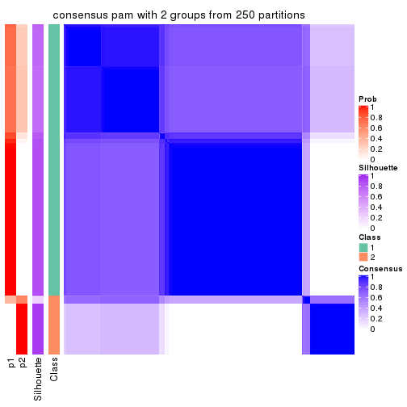</p>

</div>
<div id='tab-ATC-pam-consensus-heatmap-2'>
<pre><code class="r">consensus_heatmap(res, k = 3)
</code></pre>

<p>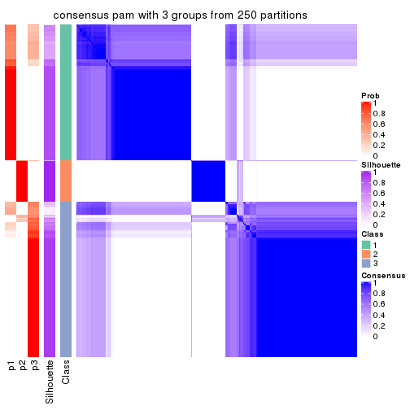</p>

</div>
<div id='tab-ATC-pam-consensus-heatmap-3'>
<pre><code class="r">consensus_heatmap(res, k = 4)
</code></pre>

<p>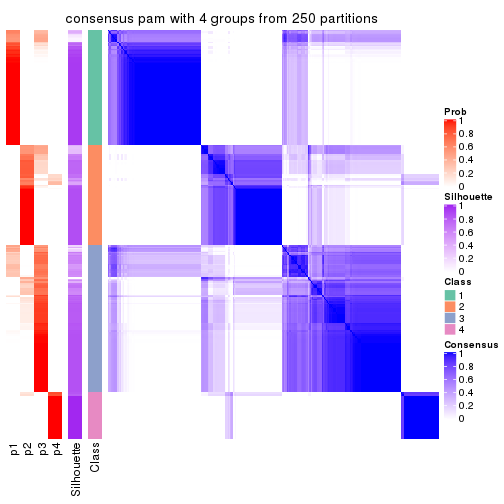</p>

</div>
<div id='tab-ATC-pam-consensus-heatmap-4'>
<pre><code class="r">consensus_heatmap(res, k = 5)
</code></pre>

<p>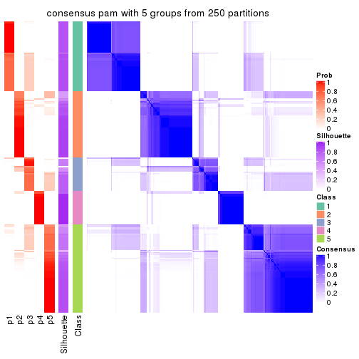</p>

</div>
<div id='tab-ATC-pam-consensus-heatmap-5'>
<pre><code class="r">consensus_heatmap(res, k = 6)
</code></pre>

<p>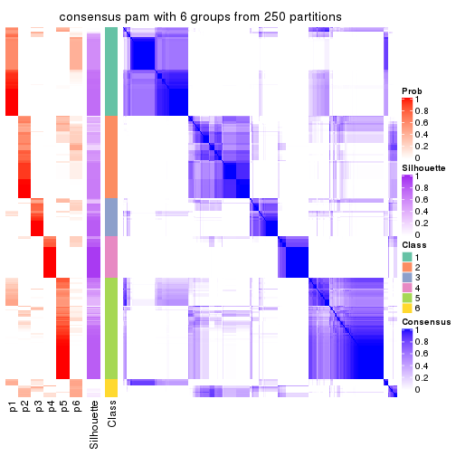</p>

</div>
</div>

Heatmaps for the membership of samples in all partitions to see how consistent they are:


<script>
$( function() {
	$( '#tabs-ATC-pam-membership-heatmap' ).tabs();
} );
</script>
<div id='tabs-ATC-pam-membership-heatmap'>
<ul>
<li><a href='#tab-ATC-pam-membership-heatmap-1'>k = 2</a></li>
<li><a href='#tab-ATC-pam-membership-heatmap-2'>k = 3</a></li>
<li><a href='#tab-ATC-pam-membership-heatmap-3'>k = 4</a></li>
<li><a href='#tab-ATC-pam-membership-heatmap-4'>k = 5</a></li>
<li><a href='#tab-ATC-pam-membership-heatmap-5'>k = 6</a></li>
</ul>
<div id='tab-ATC-pam-membership-heatmap-1'>
<pre><code class="r">membership_heatmap(res, k = 2)
</code></pre>

<p>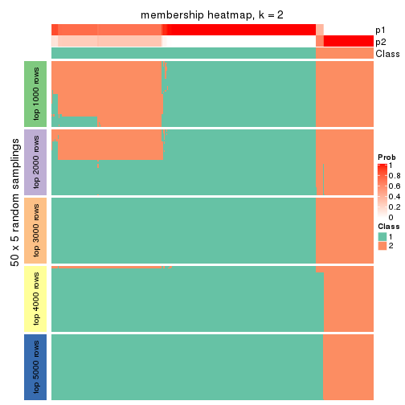</p>

</div>
<div id='tab-ATC-pam-membership-heatmap-2'>
<pre><code class="r">membership_heatmap(res, k = 3)
</code></pre>

<p>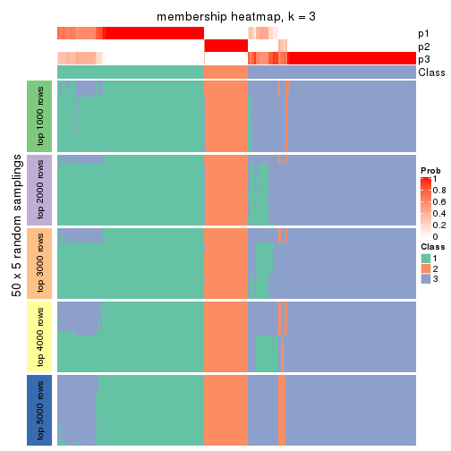</p>

</div>
<div id='tab-ATC-pam-membership-heatmap-3'>
<pre><code class="r">membership_heatmap(res, k = 4)
</code></pre>

<p>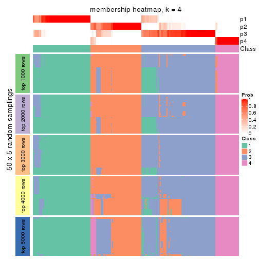</p>

</div>
<div id='tab-ATC-pam-membership-heatmap-4'>
<pre><code class="r">membership_heatmap(res, k = 5)
</code></pre>

<p>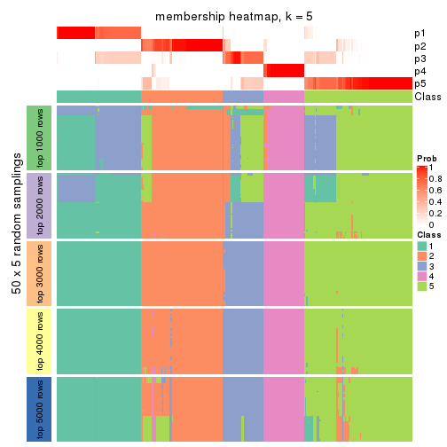</p>

</div>
<div id='tab-ATC-pam-membership-heatmap-5'>
<pre><code class="r">membership_heatmap(res, k = 6)
</code></pre>

<p>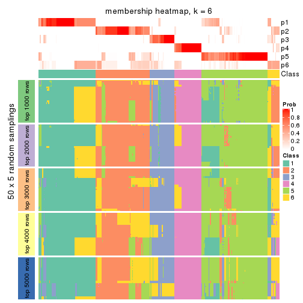</p>

</div>
</div>

As soon as we have had the classes for columns, we can look for signatures
which are significantly different between classes which can be candidate marks
for certain classes. Following are the heatmaps for signatures.


Signature heatmaps where rows are scaled:


<script>
$( function() {
	$( '#tabs-ATC-pam-get-signatures' ).tabs();
} );
</script>
<div id='tabs-ATC-pam-get-signatures'>
<ul>
<li><a href='#tab-ATC-pam-get-signatures-1'>k = 2</a></li>
<li><a href='#tab-ATC-pam-get-signatures-2'>k = 3</a></li>
<li><a href='#tab-ATC-pam-get-signatures-3'>k = 4</a></li>
<li><a href='#tab-ATC-pam-get-signatures-4'>k = 5</a></li>
<li><a href='#tab-ATC-pam-get-signatures-5'>k = 6</a></li>
</ul>
<div id='tab-ATC-pam-get-signatures-1'>
<pre><code class="r">get_signatures(res, k = 2)
</code></pre>

<p>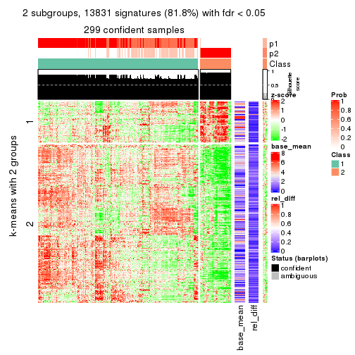</p>

</div>
<div id='tab-ATC-pam-get-signatures-2'>
<pre><code class="r">get_signatures(res, k = 3)
</code></pre>

<p>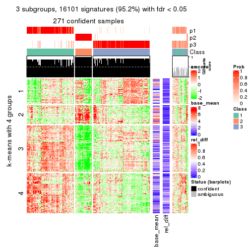</p>

</div>
<div id='tab-ATC-pam-get-signatures-3'>
<pre><code class="r">get_signatures(res, k = 4)
</code></pre>

<p>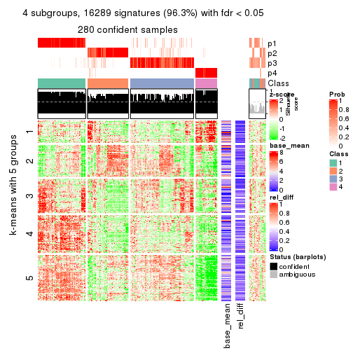</p>

</div>
<div id='tab-ATC-pam-get-signatures-4'>
<pre><code class="r">get_signatures(res, k = 5)
</code></pre>

<p>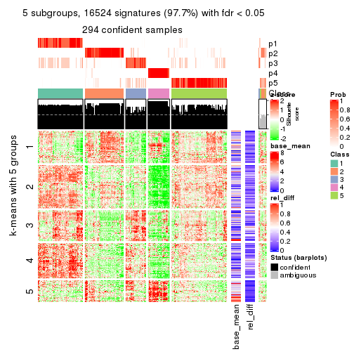</p>

</div>
<div id='tab-ATC-pam-get-signatures-5'>
<pre><code class="r">get_signatures(res, k = 6)
</code></pre>

<p>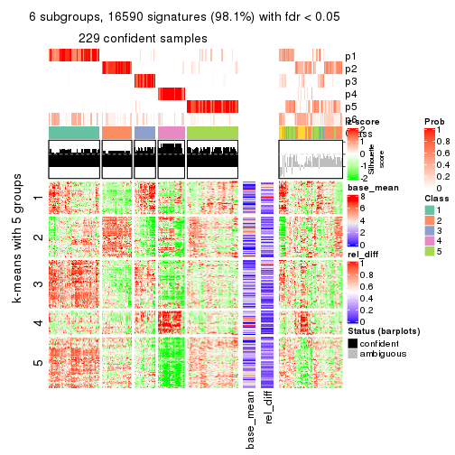</p>

</div>
</div>


Signature heatmaps where rows are not scaled:


<script>
$( function() {
	$( '#tabs-ATC-pam-get-signatures-no-scale' ).tabs();
} );
</script>
<div id='tabs-ATC-pam-get-signatures-no-scale'>
<ul>
<li><a href='#tab-ATC-pam-get-signatures-no-scale-1'>k = 2</a></li>
<li><a href='#tab-ATC-pam-get-signatures-no-scale-2'>k = 3</a></li>
<li><a href='#tab-ATC-pam-get-signatures-no-scale-3'>k = 4</a></li>
<li><a href='#tab-ATC-pam-get-signatures-no-scale-4'>k = 5</a></li>
<li><a href='#tab-ATC-pam-get-signatures-no-scale-5'>k = 6</a></li>
</ul>
<div id='tab-ATC-pam-get-signatures-no-scale-1'>
<pre><code class="r">get_signatures(res, k = 2, scale_rows = FALSE)
</code></pre>

<p>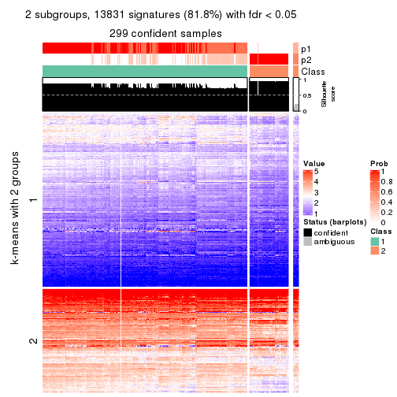</p>

</div>
<div id='tab-ATC-pam-get-signatures-no-scale-2'>
<pre><code class="r">get_signatures(res, k = 3, scale_rows = FALSE)
</code></pre>

<p>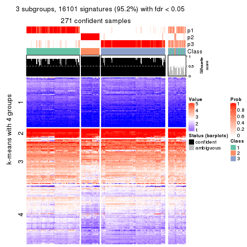</p>

</div>
<div id='tab-ATC-pam-get-signatures-no-scale-3'>
<pre><code class="r">get_signatures(res, k = 4, scale_rows = FALSE)
</code></pre>

<p>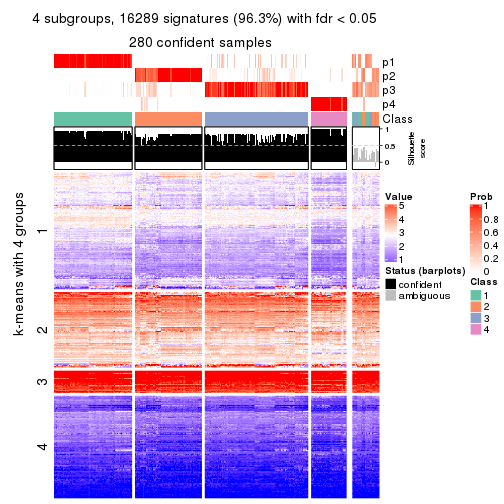</p>

</div>
<div id='tab-ATC-pam-get-signatures-no-scale-4'>
<pre><code class="r">get_signatures(res, k = 5, scale_rows = FALSE)
</code></pre>

<p>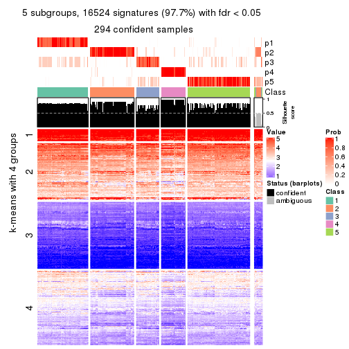</p>

</div>
<div id='tab-ATC-pam-get-signatures-no-scale-5'>
<pre><code class="r">get_signatures(res, k = 6, scale_rows = FALSE)
</code></pre>

<p>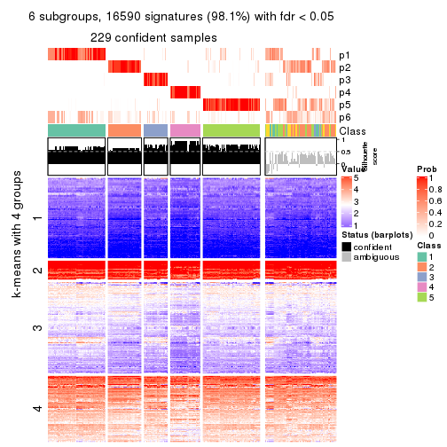</p>

</div>
</div>


Compare the overlap of signatures from different k:

```r
compare_signatures(res)
```

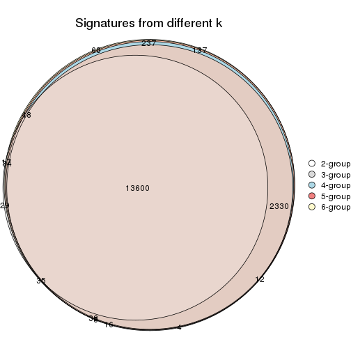

`get_signature()` returns a data frame invisibly. TO get the list of signatures, the function
call should be assigned to a variable explicitly. In following code, if `plot` argument is set
to `FALSE`, no heatmap is plotted while only the differential analysis is performed.

```r
# code only for demonstration
tb = get_signature(res, k = ..., plot = FALSE)
```

An example of the output of `tb` is:

```
#>   which_row         fdr    mean_1    mean_2 scaled_mean_1 scaled_mean_2 km
#> 1        38 0.042760348  8.373488  9.131774    -0.5533452     0.5164555  1
#> 2        40 0.018707592  7.106213  8.469186    -0.6173731     0.5762149  1
#> 3        55 0.019134737 10.221463 11.207825    -0.6159697     0.5749050  1
#> 4        59 0.006059896  5.921854  7.869574    -0.6899429     0.6439467  1
#> 5        60 0.018055526  8.928898 10.211722    -0.6204761     0.5791110  1
#> 6        98 0.009384629 15.714769 14.887706     0.6635654    -0.6193277  2
...
```

The columns in `tb` are:

1. `which_row`: row indices corresponding to the input matrix.
2. `fdr`: FDR for the differential test. 
3. `mean_x`: The mean value in group x.
4. `scaled_mean_x`: The mean value in group x after rows are scaled.
5. `km`: Row groups if k-means clustering is applied to rows.


UMAP plot which shows how samples are separated.


<script>
$( function() {
	$( '#tabs-ATC-pam-dimension-reduction' ).tabs();
} );
</script>
<div id='tabs-ATC-pam-dimension-reduction'>
<ul>
<li><a href='#tab-ATC-pam-dimension-reduction-1'>k = 2</a></li>
<li><a href='#tab-ATC-pam-dimension-reduction-2'>k = 3</a></li>
<li><a href='#tab-ATC-pam-dimension-reduction-3'>k = 4</a></li>
<li><a href='#tab-ATC-pam-dimension-reduction-4'>k = 5</a></li>
<li><a href='#tab-ATC-pam-dimension-reduction-5'>k = 6</a></li>
</ul>
<div id='tab-ATC-pam-dimension-reduction-1'>
<pre><code class="r">dimension_reduction(res, k = 2, method = &quot;UMAP&quot;)
</code></pre>

<p>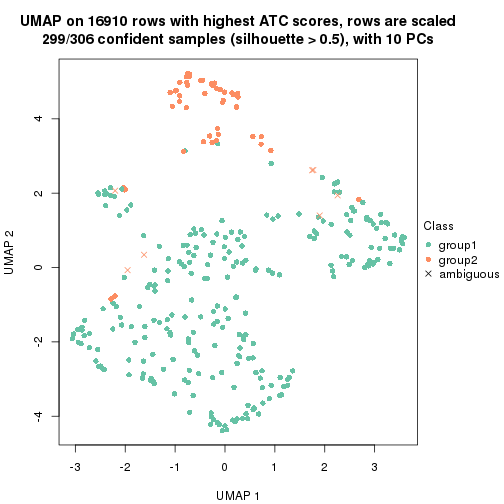</p>

</div>
<div id='tab-ATC-pam-dimension-reduction-2'>
<pre><code class="r">dimension_reduction(res, k = 3, method = &quot;UMAP&quot;)
</code></pre>

<p>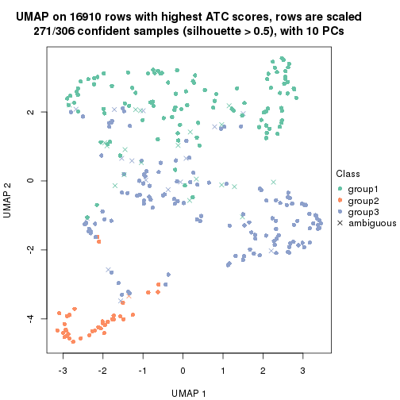</p>

</div>
<div id='tab-ATC-pam-dimension-reduction-3'>
<pre><code class="r">dimension_reduction(res, k = 4, method = &quot;UMAP&quot;)
</code></pre>

<p>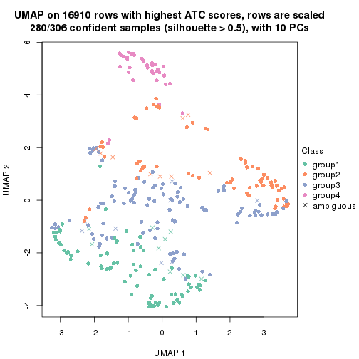</p>

</div>
<div id='tab-ATC-pam-dimension-reduction-4'>
<pre><code class="r">dimension_reduction(res, k = 5, method = &quot;UMAP&quot;)
</code></pre>

<p>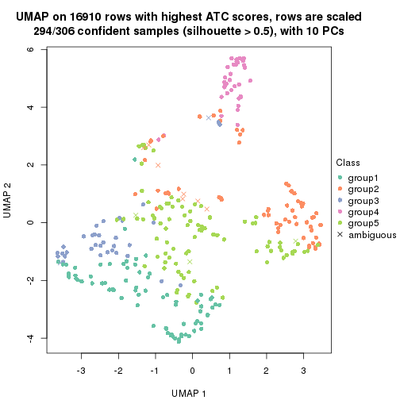</p>

</div>
<div id='tab-ATC-pam-dimension-reduction-5'>
<pre><code class="r">dimension_reduction(res, k = 6, method = &quot;UMAP&quot;)
</code></pre>

<p>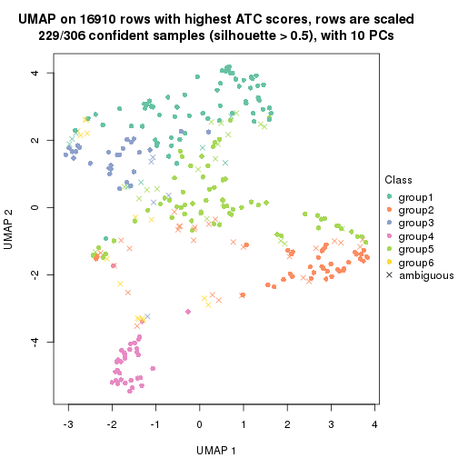</p>

</div>
</div>


Following heatmap shows how subgroups are split when increasing `k`:

```r
collect_classes(res)
```

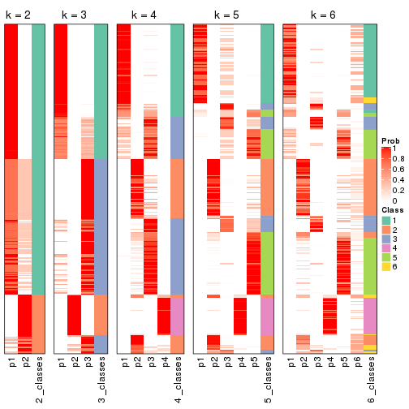


If matrix rows can be associated to genes, consider to use `GO_Enrichment(res,
...)` to perform function enrichment for the signature genes.


 

---------------------------------------------------


### ATC:mclust**


The object with results only for a single top-value method and a single partition method 
can be extracted as:

```r
res = res_list["ATC", "mclust"]
# you can also extract it by
# res = res_list["ATC:mclust"]
```

A summary of `res` and all the functions that can be applied to it:

```r
res
```

```
#> A 'ConsensusPartition' object with k = 2, 3, 4, 5, 6.
#>   On a matrix with 16910 rows and 306 columns.
#>   Top rows (1000, 2000, 3000, 4000, 5000) are extracted by 'ATC' method.
#>   Subgroups are detected by 'mclust' method.
#>   Performed in total 1250 partitions by row resampling.
#>   Best k for subgroups seems to be 2.
#> 
#> Following methods can be applied to this 'ConsensusPartition' object:
#>  [1] "cola_report"             "collect_classes"         "collect_plots"          
#>  [4] "collect_stats"           "colnames"                "compare_signatures"     
#>  [7] "consensus_heatmap"       "dimension_reduction"     "functional_enrichment"  
#> [10] "get_anno_col"            "get_anno"                "get_classes"            
#> [13] "get_consensus"           "get_matrix"              "get_membership"         
#> [16] "get_param"               "get_signatures"          "get_stats"              
#> [19] "is_best_k"               "is_stable_k"             "membership_heatmap"     
#> [22] "ncol"                    "nrow"                    "plot_ecdf"              
#> [25] "rownames"                "select_partition_number" "show"                   
#> [28] "suggest_best_k"          "test_to_known_factors"
```

`collect_plots()` function collects all the plots made from `res` for all `k` (number of partitions)
into one single page to provide an easy and fast comparison between different `k`.

```r
collect_plots(res)
```

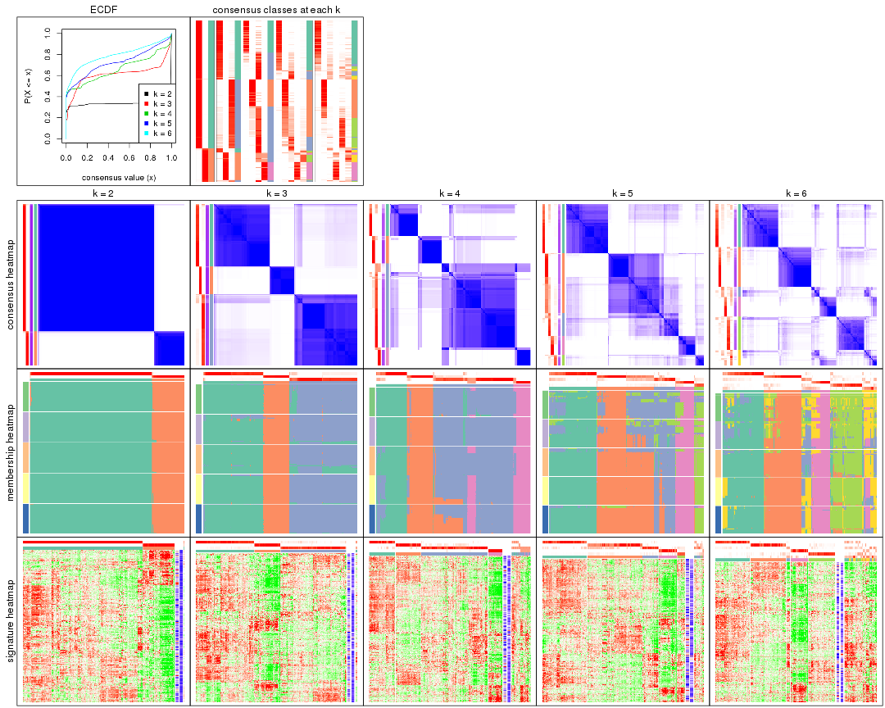

The plots are:

- The first row: a plot of the ECDF (Empirical cumulative distribution
  function) curves of the consensus matrix for each `k` and the heatmap of
  predicted classes for each `k`.
- The second row: heatmaps of the consensus matrix for each `k`.
- The third row: heatmaps of the membership matrix for each `k`.
- The fouth row: heatmaps of the signatures for each `k`.

All the plots in panels can be made by individual functions and they are
plotted later in this section.

`select_partition_number()` produces several plots showing different
statistics for choosing "optimized" `k`. There are following statistics:

- ECDF curves of the consensus matrix for each `k`;
- 1-PAC. [The PAC
  score](https://en.wikipedia.org/wiki/Consensus_clustering#Over-interpretation_potential_of_consensus_clustering)
  measures the proportion of the ambiguous subgrouping.
- Mean silhouette score.
- Concordance. The mean probability of fiting the consensus class ids in all
  partitions.
- Area increased. Denote $A_k$ as the area under the ECDF curve for current
  `k`, the area increased is defined as $A_k - A_{k-1}$.
- Rand index. The percent of pairs of samples that are both in a same cluster
  or both are not in a same cluster in the partition of k and k-1.
- Jaccard index. The ratio of pairs of samples are both in a same cluster in
  the partition of k and k-1 and the pairs of samples are both in a same
  cluster in the partition k or k-1.

The detailed explanations of these statistics can be found in [the cola
vignette](http://bioconductor.org/packages/devel/bioc/vignettes/cola/inst/doc/cola.html#toc_13).

Generally speaking, lower PAC score, higher mean silhouette score or higher
concordance corresponds to better partition. Rand index and Jaccard index
measure how similar the current partition is compared to partition with `k-1`.
If they are too similar, we won't accept `k` is better than `k-1`.

```r
select_partition_number(res)
```

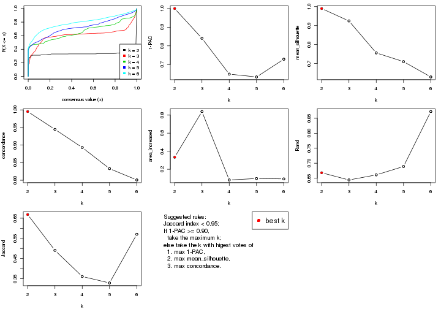

The numeric values for all these statistics can be obtained by `get_stats()`.

```r
get_stats(res)
```

```
#>   k 1-PAC mean_silhouette concordance area_increased  Rand Jaccard
#> 2 2 1.000           0.990       0.995         0.3328 0.668   0.668
#> 3 3 0.840           0.924       0.945         0.8392 0.644   0.490
#> 4 4 0.648           0.756       0.893         0.0815 0.661   0.361
#> 5 5 0.633           0.710       0.833         0.0975 0.689   0.329
#> 6 6 0.728           0.629       0.801         0.0934 0.872   0.570
```

`suggest_best_k()` suggests the best $k$ based on these statistics. The rules are as follows:

- All $k$ with Jaccard index larger than 0.95 are removed because the increase of
  the partition number does not provides enough extra information. If all $k$ are removed,
  the best $k$ is assigned by `NA`.
- For $k$ with 1-PAC larger than 0.9, the maximal $k$ is taken as the "best k". Other $k$ is called "optional k".
- If it does not fit the second rule. The $k$ with the highest vote of highest
  1-PAC, mean silhouette and concordance is taken as the "best k".

```r
suggest_best_k(res)
```

```
#> [1] 2
```


Following shows the table of the partitions (You need to click the **show/hide
code output** link to see it). The membership matrix (columns with name `p*`)
is inferred by
[`clue::cl_consensus()`](https://www.rdocumentation.org/link/cl_consensus?package=clue)
function with the `SE` method. Basically the value in the membership matrix
represents the probability to belong to a certain group. The finall class
label for an item is determined with the group with highest probability it
belongs to.

In `get_classes()` function, the entropy is calculated from the membership
matrix and the silhouette score is calculated from the consensus matrix.


<script>
$( function() {
	$( '#tabs-ATC-mclust-get-classes' ).tabs();
} );
</script>
<div id='tabs-ATC-mclust-get-classes'>
<ul>
<li><a href='#tab-ATC-mclust-get-classes-1'>k = 2</a></li>
<li><a href='#tab-ATC-mclust-get-classes-2'>k = 3</a></li>
<li><a href='#tab-ATC-mclust-get-classes-3'>k = 4</a></li>
<li><a href='#tab-ATC-mclust-get-classes-4'>k = 5</a></li>
<li><a href='#tab-ATC-mclust-get-classes-5'>k = 6</a></li>
</ul>

<div id='tab-ATC-mclust-get-classes-1'>
<p><a id='tab-ATC-mclust-get-classes-1-a' style='color:#0366d6' href='#'>show/hide code output</a></p>
<pre><code class="r">cbind(get_classes(res, k = 2), get_membership(res, k = 2))
</code></pre>

<pre><code>#&gt;            class entropy silhouette    p1    p2
#&gt; SRR1609360     2  0.0000      0.989 0.000 1.000
#&gt; SRR1609361     2  0.0000      0.989 0.000 1.000
#&gt; SRR1609362     2  0.0000      0.989 0.000 1.000
#&gt; SRR1609363     1  0.0000      0.997 1.000 0.000
#&gt; SRR1609364     1  0.0000      0.997 1.000 0.000
#&gt; SRR1609365     2  0.0000      0.989 0.000 1.000
#&gt; SRR1609366     1  0.0000      0.997 1.000 0.000
#&gt; SRR1609367     1  0.0000      0.997 1.000 0.000
#&gt; SRR1609368     1  0.0000      0.997 1.000 0.000
#&gt; SRR1609369     1  0.0000      0.997 1.000 0.000
#&gt; SRR1609370     1  0.0000      0.997 1.000 0.000
#&gt; SRR1609371     2  0.0000      0.989 0.000 1.000
#&gt; SRR1609372     1  0.0000      0.997 1.000 0.000
#&gt; SRR1609373     1  0.0000      0.997 1.000 0.000
#&gt; SRR1609374     1  0.0000      0.997 1.000 0.000
#&gt; SRR1609375     1  0.0000      0.997 1.000 0.000
#&gt; SRR1609377     1  0.0000      0.997 1.000 0.000
#&gt; SRR1609376     1  0.0000      0.997 1.000 0.000
#&gt; SRR1609378     2  0.0000      0.989 0.000 1.000
#&gt; SRR1609379     1  0.0000      0.997 1.000 0.000
#&gt; SRR1609382     2  0.0000      0.989 0.000 1.000
#&gt; SRR1609383     2  0.0000      0.989 0.000 1.000
#&gt; SRR1609381     1  0.0000      0.997 1.000 0.000
#&gt; SRR1609384     1  0.0000      0.997 1.000 0.000
#&gt; SRR1609386     1  0.0000      0.997 1.000 0.000
#&gt; SRR1609385     1  0.0000      0.997 1.000 0.000
#&gt; SRR1609387     1  0.0000      0.997 1.000 0.000
#&gt; SRR1609388     1  0.0000      0.997 1.000 0.000
#&gt; SRR1609390     1  0.0000      0.997 1.000 0.000
#&gt; SRR1609393     2  0.0000      0.989 0.000 1.000
#&gt; SRR1609394     1  0.0000      0.997 1.000 0.000
#&gt; SRR1609392     1  0.0000      0.997 1.000 0.000
#&gt; SRR1609391     2  0.0000      0.989 0.000 1.000
#&gt; SRR1609395     1  0.0000      0.997 1.000 0.000
#&gt; SRR1609396     1  0.0000      0.997 1.000 0.000
#&gt; SRR1609398     1  0.0000      0.997 1.000 0.000
#&gt; SRR1609399     1  0.0000      0.997 1.000 0.000
#&gt; SRR1609400     1  0.0000      0.997 1.000 0.000
#&gt; SRR1609397     1  0.0000      0.997 1.000 0.000
#&gt; SRR1609401     1  0.0000      0.997 1.000 0.000
#&gt; SRR1609402     1  0.0000      0.997 1.000 0.000
#&gt; SRR1609405     1  0.0000      0.997 1.000 0.000
#&gt; SRR1609404     2  0.0000      0.989 0.000 1.000
#&gt; SRR1609406     1  0.0000      0.997 1.000 0.000
#&gt; SRR1609408     1  0.0000      0.997 1.000 0.000
#&gt; SRR1609403     1  0.0000      0.997 1.000 0.000
#&gt; SRR1609410     1  0.0000      0.997 1.000 0.000
#&gt; SRR1609411     1  0.0000      0.997 1.000 0.000
#&gt; SRR1609407     1  0.0000      0.997 1.000 0.000
#&gt; SRR1609413     1  0.0000      0.997 1.000 0.000
#&gt; SRR1609412     1  0.0000      0.997 1.000 0.000
#&gt; SRR1609414     1  0.0000      0.997 1.000 0.000
#&gt; SRR1609415     1  0.0000      0.997 1.000 0.000
#&gt; SRR1609416     2  0.2423      0.957 0.040 0.960
#&gt; SRR1609417     2  0.1633      0.972 0.024 0.976
#&gt; SRR1609418     1  0.0000      0.997 1.000 0.000
#&gt; SRR1609419     1  0.0000      0.997 1.000 0.000
#&gt; SRR1609420     1  0.0000      0.997 1.000 0.000
#&gt; SRR1609421     1  0.0000      0.997 1.000 0.000
#&gt; SRR1609422     2  0.0000      0.989 0.000 1.000
#&gt; SRR1609423     2  0.0000      0.989 0.000 1.000
#&gt; SRR1609424     2  0.0000      0.989 0.000 1.000
#&gt; SRR1609425     1  0.0000      0.997 1.000 0.000
#&gt; SRR1609426     1  0.0000      0.997 1.000 0.000
#&gt; SRR1609427     2  0.0376      0.987 0.004 0.996
#&gt; SRR1609428     1  0.0000      0.997 1.000 0.000
#&gt; SRR1609429     1  0.0000      0.997 1.000 0.000
#&gt; SRR1609430     1  0.0376      0.993 0.996 0.004
#&gt; SRR1609431     1  0.0000      0.997 1.000 0.000
#&gt; SRR1609432     1  0.0000      0.997 1.000 0.000
#&gt; SRR1609433     2  0.0376      0.987 0.004 0.996
#&gt; SRR1609434     2  0.0000      0.989 0.000 1.000
#&gt; SRR1609435     1  0.0000      0.997 1.000 0.000
#&gt; SRR1609436     1  0.0000      0.997 1.000 0.000
#&gt; SRR1609437     2  0.1633      0.972 0.024 0.976
#&gt; SRR1609438     2  0.0000      0.989 0.000 1.000
#&gt; SRR1609439     2  0.0000      0.989 0.000 1.000
#&gt; SRR1609440     1  0.0000      0.997 1.000 0.000
#&gt; SRR1609441     1  0.0376      0.993 0.996 0.004
#&gt; SRR1609442     2  0.7299      0.754 0.204 0.796
#&gt; SRR1609443     1  0.0000      0.997 1.000 0.000
#&gt; SRR1609444     1  0.0000      0.997 1.000 0.000
#&gt; SRR1609445     1  0.0000      0.997 1.000 0.000
#&gt; SRR1609446     1  0.0000      0.997 1.000 0.000
#&gt; SRR1609447     1  0.0000      0.997 1.000 0.000
#&gt; SRR1609448     1  0.0000      0.997 1.000 0.000
#&gt; SRR1609449     1  0.0000      0.997 1.000 0.000
#&gt; SRR1609450     1  0.0000      0.997 1.000 0.000
#&gt; SRR1609451     1  0.0000      0.997 1.000 0.000
#&gt; SRR1609452     1  0.0000      0.997 1.000 0.000
#&gt; SRR1609453     1  0.0000      0.997 1.000 0.000
#&gt; SRR1609454     1  0.0000      0.997 1.000 0.000
#&gt; SRR1609455     1  0.0000      0.997 1.000 0.000
#&gt; SRR1609456     1  0.0000      0.997 1.000 0.000
#&gt; SRR1609457     1  0.0000      0.997 1.000 0.000
#&gt; SRR1609458     1  0.0000      0.997 1.000 0.000
#&gt; SRR1609459     1  0.0000      0.997 1.000 0.000
#&gt; SRR1609460     1  0.0000      0.997 1.000 0.000
#&gt; SRR1609461     1  0.0000      0.997 1.000 0.000
#&gt; SRR1609462     1  0.0000      0.997 1.000 0.000
#&gt; SRR1609464     1  0.6973      0.767 0.812 0.188
#&gt; SRR1609463     1  0.0000      0.997 1.000 0.000
#&gt; SRR1609465     1  0.0000      0.997 1.000 0.000
#&gt; SRR1609466     2  0.0000      0.989 0.000 1.000
#&gt; SRR1609467     1  0.0000      0.997 1.000 0.000
#&gt; SRR1609469     2  0.0000      0.989 0.000 1.000
#&gt; SRR1609470     1  0.0000      0.997 1.000 0.000
#&gt; SRR1609472     2  0.0000      0.989 0.000 1.000
#&gt; SRR1609471     1  0.0000      0.997 1.000 0.000
#&gt; SRR1609474     1  0.0000      0.997 1.000 0.000
#&gt; SRR1609473     2  0.0000      0.989 0.000 1.000
#&gt; SRR1609475     2  0.0000      0.989 0.000 1.000
#&gt; SRR1609478     2  0.0000      0.989 0.000 1.000
#&gt; SRR1609476     1  0.0000      0.997 1.000 0.000
#&gt; SRR1609477     2  0.1633      0.972 0.024 0.976
#&gt; SRR1609479     1  0.0000      0.997 1.000 0.000
#&gt; SRR1609481     2  0.0000      0.989 0.000 1.000
#&gt; SRR1609480     2  0.0000      0.989 0.000 1.000
#&gt; SRR1609482     1  0.0000      0.997 1.000 0.000
#&gt; SRR1609484     2  0.0000      0.989 0.000 1.000
#&gt; SRR1609483     2  0.6623      0.800 0.172 0.828
#&gt; SRR1609486     1  0.0000      0.997 1.000 0.000
#&gt; SRR1609485     1  0.0000      0.997 1.000 0.000
#&gt; SRR1609487     1  0.0000      0.997 1.000 0.000
#&gt; SRR1609488     1  0.0000      0.997 1.000 0.000
#&gt; SRR1609489     1  0.0000      0.997 1.000 0.000
#&gt; SRR1609490     1  0.0000      0.997 1.000 0.000
#&gt; SRR1609491     1  0.0000      0.997 1.000 0.000
#&gt; SRR1609492     1  0.0000      0.997 1.000 0.000
#&gt; SRR1609493     1  0.0000      0.997 1.000 0.000
#&gt; SRR1609494     1  0.0000      0.997 1.000 0.000
#&gt; SRR1609495     2  0.0376      0.987 0.004 0.996
#&gt; SRR1609496     1  0.0000      0.997 1.000 0.000
#&gt; SRR1609497     1  0.0000      0.997 1.000 0.000
#&gt; SRR1609498     1  0.0000      0.997 1.000 0.000
#&gt; SRR1609499     1  0.0000      0.997 1.000 0.000
#&gt; SRR1609500     1  0.0000      0.997 1.000 0.000
#&gt; SRR1609501     1  0.0000      0.997 1.000 0.000
#&gt; SRR1609502     1  0.0000      0.997 1.000 0.000
#&gt; SRR1609503     2  0.0000      0.989 0.000 1.000
#&gt; SRR1609504     1  0.0000      0.997 1.000 0.000
#&gt; SRR1609505     1  0.0000      0.997 1.000 0.000
#&gt; SRR1609506     1  0.0000      0.997 1.000 0.000
#&gt; SRR1609507     1  0.0000      0.997 1.000 0.000
#&gt; SRR1609508     1  0.0000      0.997 1.000 0.000
#&gt; SRR1609509     1  0.0000      0.997 1.000 0.000
#&gt; SRR1609510     2  0.0376      0.987 0.004 0.996
#&gt; SRR1609512     1  0.0000      0.997 1.000 0.000
#&gt; SRR1609511     2  0.0376      0.987 0.004 0.996
#&gt; SRR1609513     1  0.0000      0.997 1.000 0.000
#&gt; SRR1609514     2  0.0000      0.989 0.000 1.000
#&gt; SRR1609515     1  0.0000      0.997 1.000 0.000
#&gt; SRR1609516     1  0.0000      0.997 1.000 0.000
#&gt; SRR1609517     1  0.0000      0.997 1.000 0.000
#&gt; SRR1609518     1  0.0000      0.997 1.000 0.000
#&gt; SRR1609519     1  0.0000      0.997 1.000 0.000
#&gt; SRR1609520     2  0.0000      0.989 0.000 1.000
#&gt; SRR1609521     1  0.0000      0.997 1.000 0.000
#&gt; SRR1609522     1  0.0000      0.997 1.000 0.000
#&gt; SRR1609523     1  0.0000      0.997 1.000 0.000
#&gt; SRR1609524     1  0.0000      0.997 1.000 0.000
#&gt; SRR1609526     1  0.2043      0.964 0.968 0.032
#&gt; SRR1609525     1  0.0000      0.997 1.000 0.000
#&gt; SRR1609527     1  0.0000      0.997 1.000 0.000
#&gt; SRR1609529     1  0.0000      0.997 1.000 0.000
#&gt; SRR1609528     2  0.0000      0.989 0.000 1.000
#&gt; SRR1609530     1  0.0000      0.997 1.000 0.000
#&gt; SRR1609531     1  0.0000      0.997 1.000 0.000
#&gt; SRR1609532     2  0.1633      0.972 0.024 0.976
#&gt; SRR1609533     1  0.0000      0.997 1.000 0.000
#&gt; SRR1609534     1  0.0000      0.997 1.000 0.000
#&gt; SRR1609535     1  0.0000      0.997 1.000 0.000
#&gt; SRR1609537     1  0.0000      0.997 1.000 0.000
#&gt; SRR1609536     1  0.0000      0.997 1.000 0.000
#&gt; SRR1609538     1  0.0000      0.997 1.000 0.000
#&gt; SRR1609539     1  0.0000      0.997 1.000 0.000
#&gt; SRR1609540     1  0.0000      0.997 1.000 0.000
#&gt; SRR1609541     2  0.0000      0.989 0.000 1.000
#&gt; SRR1609542     1  0.0000      0.997 1.000 0.000
#&gt; SRR1609543     1  0.0000      0.997 1.000 0.000
#&gt; SRR1609544     1  0.0376      0.993 0.996 0.004
#&gt; SRR1609545     1  0.0000      0.997 1.000 0.000
#&gt; SRR1609546     1  0.0000      0.997 1.000 0.000
#&gt; SRR1609547     1  0.0000      0.997 1.000 0.000
#&gt; SRR1609548     1  0.0000      0.997 1.000 0.000
#&gt; SRR1609549     1  0.0000      0.997 1.000 0.000
#&gt; SRR1609550     1  0.0000      0.997 1.000 0.000
#&gt; SRR1609551     1  0.0000      0.997 1.000 0.000
#&gt; SRR1609552     1  0.0000      0.997 1.000 0.000
#&gt; SRR1609553     1  0.0000      0.997 1.000 0.000
#&gt; SRR1609554     1  0.0000      0.997 1.000 0.000
#&gt; SRR1609555     1  0.0000      0.997 1.000 0.000
#&gt; SRR1609556     1  0.0000      0.997 1.000 0.000
#&gt; SRR1609557     1  0.0000      0.997 1.000 0.000
#&gt; SRR1609558     1  0.0000      0.997 1.000 0.000
#&gt; SRR1609559     1  0.0000      0.997 1.000 0.000
#&gt; SRR1609560     1  0.0000      0.997 1.000 0.000
#&gt; SRR1609561     1  0.0000      0.997 1.000 0.000
#&gt; SRR1609562     1  0.0000      0.997 1.000 0.000
#&gt; SRR1609563     1  0.0000      0.997 1.000 0.000
#&gt; SRR1609564     1  0.0000      0.997 1.000 0.000
#&gt; SRR1609565     1  0.0000      0.997 1.000 0.000
#&gt; SRR1609566     1  0.0000      0.997 1.000 0.000
#&gt; SRR1609567     1  0.0000      0.997 1.000 0.000
#&gt; SRR1609568     1  0.0000      0.997 1.000 0.000
#&gt; SRR1609569     1  0.0000      0.997 1.000 0.000
#&gt; SRR1609570     1  0.0000      0.997 1.000 0.000
#&gt; SRR1609571     2  0.0000      0.989 0.000 1.000
#&gt; SRR1609572     2  0.0000      0.989 0.000 1.000
#&gt; SRR1609573     2  0.5294      0.869 0.120 0.880
#&gt; SRR1609574     2  0.1633      0.972 0.024 0.976
#&gt; SRR1609575     2  0.0000      0.989 0.000 1.000
#&gt; SRR1609576     1  0.0000      0.997 1.000 0.000
#&gt; SRR1609578     1  0.0000      0.997 1.000 0.000
#&gt; SRR1609577     1  0.0000      0.997 1.000 0.000
#&gt; SRR1609579     1  0.0376      0.993 0.996 0.004
#&gt; SRR1609580     1  0.0000      0.997 1.000 0.000
#&gt; SRR1609582     1  0.0000      0.997 1.000 0.000
#&gt; SRR1609581     1  0.0000      0.997 1.000 0.000
#&gt; SRR1609583     1  0.0000      0.997 1.000 0.000
#&gt; SRR1609584     1  0.0000      0.997 1.000 0.000
#&gt; SRR1609585     1  0.0000      0.997 1.000 0.000
#&gt; SRR1609586     1  0.0000      0.997 1.000 0.000
#&gt; SRR1609587     1  0.0000      0.997 1.000 0.000
#&gt; SRR1609588     1  0.0000      0.997 1.000 0.000
#&gt; SRR1609589     1  0.0000      0.997 1.000 0.000
#&gt; SRR1609590     1  0.6148      0.819 0.848 0.152
#&gt; SRR1609592     1  0.0000      0.997 1.000 0.000
#&gt; SRR1609591     1  0.0000      0.997 1.000 0.000
#&gt; SRR1609593     1  0.0000      0.997 1.000 0.000
#&gt; SRR1609594     2  0.0000      0.989 0.000 1.000
#&gt; SRR1609595     1  0.0000      0.997 1.000 0.000
#&gt; SRR1609596     1  0.0000      0.997 1.000 0.000
#&gt; SRR1609597     1  0.0000      0.997 1.000 0.000
#&gt; SRR1609598     2  0.0000      0.989 0.000 1.000
#&gt; SRR1609599     2  0.0000      0.989 0.000 1.000
#&gt; SRR1609600     1  0.0000      0.997 1.000 0.000
#&gt; SRR1609601     2  0.0000      0.989 0.000 1.000
#&gt; SRR1609602     2  0.0000      0.989 0.000 1.000
#&gt; SRR1609603     1  0.0000      0.997 1.000 0.000
#&gt; SRR1609604     2  0.0000      0.989 0.000 1.000
#&gt; SRR1609605     1  0.0000      0.997 1.000 0.000
#&gt; SRR1609606     1  0.0000      0.997 1.000 0.000
#&gt; SRR1609607     1  0.0000      0.997 1.000 0.000
#&gt; SRR1609608     1  0.0000      0.997 1.000 0.000
#&gt; SRR1609609     1  0.0000      0.997 1.000 0.000
#&gt; SRR1609610     1  0.0000      0.997 1.000 0.000
#&gt; SRR1609611     2  0.0000      0.989 0.000 1.000
#&gt; SRR1609613     1  0.0000      0.997 1.000 0.000
#&gt; SRR1609612     1  0.0000      0.997 1.000 0.000
#&gt; SRR1609614     1  0.0000      0.997 1.000 0.000
#&gt; SRR1609615     1  0.0000      0.997 1.000 0.000
#&gt; SRR1609616     1  0.0000      0.997 1.000 0.000
#&gt; SRR1609617     1  0.0000      0.997 1.000 0.000
#&gt; SRR1609618     1  0.0000      0.997 1.000 0.000
#&gt; SRR1609619     1  0.0000      0.997 1.000 0.000
#&gt; SRR1609620     2  0.0000      0.989 0.000 1.000
#&gt; SRR1609621     1  0.9522      0.400 0.628 0.372
#&gt; SRR1609622     2  0.0376      0.987 0.004 0.996
#&gt; SRR1609623     1  0.0000      0.997 1.000 0.000
#&gt; SRR1609624     1  0.0000      0.997 1.000 0.000
#&gt; SRR1609625     1  0.0000      0.997 1.000 0.000
#&gt; SRR1609626     2  0.0000      0.989 0.000 1.000
#&gt; SRR1609627     1  0.0000      0.997 1.000 0.000
#&gt; SRR1609628     1  0.0000      0.997 1.000 0.000
#&gt; SRR1609629     1  0.0000      0.997 1.000 0.000
#&gt; SRR1609630     1  0.0000      0.997 1.000 0.000
#&gt; SRR1609631     1  0.0000      0.997 1.000 0.000
#&gt; SRR1609632     1  0.0000      0.997 1.000 0.000
#&gt; SRR1609633     1  0.0000      0.997 1.000 0.000
#&gt; SRR1609634     1  0.0000      0.997 1.000 0.000
#&gt; SRR1609635     2  0.0000      0.989 0.000 1.000
#&gt; SRR1609636     2  0.0000      0.989 0.000 1.000
#&gt; SRR1609637     1  0.0000      0.997 1.000 0.000
#&gt; SRR1609638     1  0.0000      0.997 1.000 0.000
#&gt; SRR1609639     1  0.0000      0.997 1.000 0.000
#&gt; SRR1609640     1  0.0000      0.997 1.000 0.000
#&gt; SRR1609641     1  0.0000      0.997 1.000 0.000
#&gt; SRR1609642     1  0.0000      0.997 1.000 0.000
#&gt; SRR1609643     1  0.0000      0.997 1.000 0.000
#&gt; SRR1609644     1  0.0000      0.997 1.000 0.000
#&gt; SRR1609645     1  0.0000      0.997 1.000 0.000
#&gt; SRR1609646     1  0.0000      0.997 1.000 0.000
#&gt; SRR1609647     1  0.0000      0.997 1.000 0.000
#&gt; SRR1609649     1  0.0000      0.997 1.000 0.000
#&gt; SRR1609648     1  0.0000      0.997 1.000 0.000
#&gt; SRR1609651     1  0.0000      0.997 1.000 0.000
#&gt; SRR1609650     1  0.0000      0.997 1.000 0.000
#&gt; SRR1609652     1  0.0000      0.997 1.000 0.000
#&gt; SRR1609653     1  0.0000      0.997 1.000 0.000
#&gt; SRR1609654     2  0.0376      0.987 0.004 0.996
#&gt; SRR1609655     1  0.0000      0.997 1.000 0.000
#&gt; SRR1609657     1  0.0000      0.997 1.000 0.000
#&gt; SRR1609656     2  0.0000      0.989 0.000 1.000
#&gt; SRR1609658     1  0.0000      0.997 1.000 0.000
#&gt; SRR1609659     1  0.0000      0.997 1.000 0.000
#&gt; SRR1609660     1  0.0000      0.997 1.000 0.000
#&gt; SRR1609661     1  0.0000      0.997 1.000 0.000
#&gt; SRR1609662     1  0.0000      0.997 1.000 0.000
#&gt; SRR1609663     1  0.0000      0.997 1.000 0.000
#&gt; SRR1609664     1  0.0000      0.997 1.000 0.000
#&gt; SRR1609665     1  0.0000      0.997 1.000 0.000
#&gt; SRR1609666     2  0.0000      0.989 0.000 1.000
#&gt; SRR1609667     1  0.0000      0.997 1.000 0.000
#&gt; SRR1609668     2  0.0000      0.989 0.000 1.000
#&gt; SRR1609669     1  0.0000      0.997 1.000 0.000
</code></pre>

<script>
$('#tab-ATC-mclust-get-classes-1-a').parent().next().next().hide();
$('#tab-ATC-mclust-get-classes-1-a').click(function(){
  $('#tab-ATC-mclust-get-classes-1-a').parent().next().next().toggle();
  return(false);
});
</script>
</div>

<div id='tab-ATC-mclust-get-classes-2'>
<p><a id='tab-ATC-mclust-get-classes-2-a' style='color:#0366d6' href='#'>show/hide code output</a></p>
<pre><code class="r">cbind(get_classes(res, k = 3), get_membership(res, k = 3))
</code></pre>

<pre><code>#&gt;            class entropy silhouette    p1    p2    p3
#&gt; SRR1609360     2  0.0592    0.98458 0.000 0.988 0.012
#&gt; SRR1609361     2  0.0592    0.98458 0.000 0.988 0.012
#&gt; SRR1609362     2  0.0237    0.98657 0.000 0.996 0.004
#&gt; SRR1609363     3  0.0592    0.91773 0.012 0.000 0.988
#&gt; SRR1609364     3  0.0592    0.91773 0.012 0.000 0.988
#&gt; SRR1609365     2  0.0592    0.98458 0.000 0.988 0.012
#&gt; SRR1609366     3  0.0592    0.91773 0.012 0.000 0.988
#&gt; SRR1609367     1  0.1031    0.95625 0.976 0.000 0.024
#&gt; SRR1609368     3  0.0592    0.91773 0.012 0.000 0.988
#&gt; SRR1609369     1  0.1860    0.95274 0.948 0.000 0.052
#&gt; SRR1609370     1  0.0237    0.95308 0.996 0.000 0.004
#&gt; SRR1609371     2  0.0000    0.98712 0.000 1.000 0.000
#&gt; SRR1609372     1  0.0237    0.95308 0.996 0.000 0.004
#&gt; SRR1609373     3  0.0592    0.91773 0.012 0.000 0.988
#&gt; SRR1609374     3  0.0592    0.91773 0.012 0.000 0.988
#&gt; SRR1609375     1  0.5216    0.67620 0.740 0.000 0.260
#&gt; SRR1609377     1  0.0237    0.95308 0.996 0.000 0.004
#&gt; SRR1609376     3  0.2066    0.93307 0.060 0.000 0.940
#&gt; SRR1609378     2  0.0000    0.98712 0.000 1.000 0.000
#&gt; SRR1609379     1  0.0237    0.95308 0.996 0.000 0.004
#&gt; SRR1609382     2  0.0000    0.98712 0.000 1.000 0.000
#&gt; SRR1609383     2  0.0592    0.98458 0.000 0.988 0.012
#&gt; SRR1609381     1  0.0237    0.95308 0.996 0.000 0.004
#&gt; SRR1609384     1  0.2066    0.94791 0.940 0.000 0.060
#&gt; SRR1609386     1  0.1860    0.95274 0.948 0.000 0.052
#&gt; SRR1609385     1  0.1860    0.95274 0.948 0.000 0.052
#&gt; SRR1609387     1  0.1529    0.95588 0.960 0.000 0.040
#&gt; SRR1609388     3  0.0592    0.91773 0.012 0.000 0.988
#&gt; SRR1609390     1  0.0237    0.95308 0.996 0.000 0.004
#&gt; SRR1609393     2  0.0000    0.98712 0.000 1.000 0.000
#&gt; SRR1609394     3  0.2261    0.93305 0.068 0.000 0.932
#&gt; SRR1609392     3  0.0592    0.91773 0.012 0.000 0.988
#&gt; SRR1609391     2  0.0000    0.98712 0.000 1.000 0.000
#&gt; SRR1609395     1  0.0237    0.95308 0.996 0.000 0.004
#&gt; SRR1609396     1  0.0237    0.95308 0.996 0.000 0.004
#&gt; SRR1609398     1  0.0747    0.95456 0.984 0.000 0.016
#&gt; SRR1609399     1  0.0237    0.95308 0.996 0.000 0.004
#&gt; SRR1609400     1  0.0237    0.95308 0.996 0.000 0.004
#&gt; SRR1609397     3  0.0592    0.91773 0.012 0.000 0.988
#&gt; SRR1609401     3  0.0592    0.91773 0.012 0.000 0.988
#&gt; SRR1609402     3  0.0592    0.91773 0.012 0.000 0.988
#&gt; SRR1609405     3  0.4291    0.85130 0.180 0.000 0.820
#&gt; SRR1609404     2  0.0000    0.98712 0.000 1.000 0.000
#&gt; SRR1609406     3  0.0592    0.91773 0.012 0.000 0.988
#&gt; SRR1609408     3  0.0592    0.91773 0.012 0.000 0.988
#&gt; SRR1609403     1  0.0237    0.95308 0.996 0.000 0.004
#&gt; SRR1609410     1  0.0237    0.95308 0.996 0.000 0.004
#&gt; SRR1609411     3  0.2165    0.93326 0.064 0.000 0.936
#&gt; SRR1609407     3  0.0592    0.91773 0.012 0.000 0.988
#&gt; SRR1609413     1  0.0237    0.95308 0.996 0.000 0.004
#&gt; SRR1609412     3  0.2625    0.92901 0.084 0.000 0.916
#&gt; SRR1609414     1  0.1860    0.95274 0.948 0.000 0.052
#&gt; SRR1609415     1  0.0237    0.95308 0.996 0.000 0.004
#&gt; SRR1609416     1  0.2599    0.94787 0.932 0.016 0.052
#&gt; SRR1609417     3  0.6771    0.66997 0.276 0.040 0.684
#&gt; SRR1609418     1  0.1289    0.95660 0.968 0.000 0.032
#&gt; SRR1609419     3  0.0592    0.91773 0.012 0.000 0.988
#&gt; SRR1609420     1  0.1860    0.95274 0.948 0.000 0.052
#&gt; SRR1609421     3  0.2448    0.93194 0.076 0.000 0.924
#&gt; SRR1609422     2  0.0592    0.98458 0.000 0.988 0.012
#&gt; SRR1609423     2  0.0000    0.98712 0.000 1.000 0.000
#&gt; SRR1609424     2  0.0000    0.98712 0.000 1.000 0.000
#&gt; SRR1609425     1  0.4931    0.71132 0.768 0.000 0.232
#&gt; SRR1609426     3  0.0592    0.91773 0.012 0.000 0.988
#&gt; SRR1609427     1  0.3039    0.93731 0.920 0.044 0.036
#&gt; SRR1609428     3  0.0592    0.91773 0.012 0.000 0.988
#&gt; SRR1609429     1  0.1643    0.95540 0.956 0.000 0.044
#&gt; SRR1609430     1  0.2066    0.95035 0.940 0.000 0.060
#&gt; SRR1609431     3  0.1529    0.92676 0.040 0.000 0.960
#&gt; SRR1609432     3  0.0592    0.91773 0.012 0.000 0.988
#&gt; SRR1609433     1  0.3637    0.90186 0.892 0.084 0.024
#&gt; SRR1609434     2  0.0000    0.98712 0.000 1.000 0.000
#&gt; SRR1609435     1  0.0237    0.95308 0.996 0.000 0.004
#&gt; SRR1609436     1  0.1529    0.95588 0.960 0.000 0.040
#&gt; SRR1609437     3  0.8524    0.14603 0.092 0.452 0.456
#&gt; SRR1609438     2  0.0000    0.98712 0.000 1.000 0.000
#&gt; SRR1609439     2  0.0592    0.98458 0.000 0.988 0.012
#&gt; SRR1609440     1  0.0237    0.95308 0.996 0.000 0.004
#&gt; SRR1609441     3  0.2878    0.92878 0.096 0.000 0.904
#&gt; SRR1609442     3  0.3183    0.93197 0.076 0.016 0.908
#&gt; SRR1609443     1  0.1964    0.94856 0.944 0.000 0.056
#&gt; SRR1609444     1  0.1860    0.95274 0.948 0.000 0.052
#&gt; SRR1609445     3  0.2878    0.92196 0.096 0.000 0.904
#&gt; SRR1609446     3  0.2448    0.93194 0.076 0.000 0.924
#&gt; SRR1609447     1  0.0237    0.95308 0.996 0.000 0.004
#&gt; SRR1609448     3  0.2448    0.93338 0.076 0.000 0.924
#&gt; SRR1609449     1  0.1860    0.95274 0.948 0.000 0.052
#&gt; SRR1609450     3  0.1289    0.92436 0.032 0.000 0.968
#&gt; SRR1609451     1  0.1753    0.95370 0.952 0.000 0.048
#&gt; SRR1609452     3  0.2537    0.93119 0.080 0.000 0.920
#&gt; SRR1609453     1  0.1860    0.95274 0.948 0.000 0.052
#&gt; SRR1609454     3  0.2448    0.93194 0.076 0.000 0.924
#&gt; SRR1609455     1  0.2066    0.94791 0.940 0.000 0.060
#&gt; SRR1609456     3  0.2711    0.93178 0.088 0.000 0.912
#&gt; SRR1609457     1  0.3038    0.91191 0.896 0.000 0.104
#&gt; SRR1609458     1  0.1289    0.95660 0.968 0.000 0.032
#&gt; SRR1609459     3  0.2537    0.93119 0.080 0.000 0.920
#&gt; SRR1609460     3  0.0592    0.91773 0.012 0.000 0.988
#&gt; SRR1609461     3  0.4291    0.84212 0.180 0.000 0.820
#&gt; SRR1609462     1  0.1643    0.95402 0.956 0.000 0.044
#&gt; SRR1609464     1  0.2804    0.94402 0.924 0.016 0.060
#&gt; SRR1609463     1  0.1289    0.95660 0.968 0.000 0.032
#&gt; SRR1609465     3  0.0592    0.91773 0.012 0.000 0.988
#&gt; SRR1609466     2  0.0424    0.98584 0.000 0.992 0.008
#&gt; SRR1609467     1  0.2066    0.95035 0.940 0.000 0.060
#&gt; SRR1609469     2  0.0000    0.98712 0.000 1.000 0.000
#&gt; SRR1609470     3  0.2448    0.93194 0.076 0.000 0.924
#&gt; SRR1609472     2  0.0000    0.98712 0.000 1.000 0.000
#&gt; SRR1609471     1  0.1860    0.95274 0.948 0.000 0.052
#&gt; SRR1609474     3  0.2711    0.93178 0.088 0.000 0.912
#&gt; SRR1609473     2  0.0000    0.98712 0.000 1.000 0.000
#&gt; SRR1609475     2  0.0000    0.98712 0.000 1.000 0.000
#&gt; SRR1609478     2  0.0000    0.98712 0.000 1.000 0.000
#&gt; SRR1609476     1  0.1860    0.95274 0.948 0.000 0.052
#&gt; SRR1609477     3  0.6470    0.79676 0.092 0.148 0.760
#&gt; SRR1609479     3  0.2165    0.93250 0.064 0.000 0.936
#&gt; SRR1609481     2  0.0000    0.98712 0.000 1.000 0.000
#&gt; SRR1609480     2  0.0592    0.98458 0.000 0.988 0.012
#&gt; SRR1609482     1  0.2066    0.95035 0.940 0.000 0.060
#&gt; SRR1609484     2  0.0592    0.98458 0.000 0.988 0.012
#&gt; SRR1609483     1  0.2804    0.94402 0.924 0.016 0.060
#&gt; SRR1609486     1  0.6204    0.22593 0.576 0.000 0.424
#&gt; SRR1609485     1  0.6302   -0.00334 0.520 0.000 0.480
#&gt; SRR1609487     1  0.0237    0.95308 0.996 0.000 0.004
#&gt; SRR1609488     1  0.0237    0.95308 0.996 0.000 0.004
#&gt; SRR1609489     3  0.0592    0.91773 0.012 0.000 0.988
#&gt; SRR1609490     3  0.2959    0.92704 0.100 0.000 0.900
#&gt; SRR1609491     3  0.2711    0.93178 0.088 0.000 0.912
#&gt; SRR1609492     3  0.0592    0.91773 0.012 0.000 0.988
#&gt; SRR1609493     3  0.2356    0.93334 0.072 0.000 0.928
#&gt; SRR1609494     3  0.0592    0.91773 0.012 0.000 0.988
#&gt; SRR1609495     2  0.5726    0.69047 0.216 0.760 0.024
#&gt; SRR1609496     1  0.1753    0.95370 0.952 0.000 0.048
#&gt; SRR1609497     1  0.1643    0.95514 0.956 0.000 0.044
#&gt; SRR1609498     1  0.0237    0.95308 0.996 0.000 0.004
#&gt; SRR1609499     3  0.0592    0.91773 0.012 0.000 0.988
#&gt; SRR1609500     1  0.0237    0.95308 0.996 0.000 0.004
#&gt; SRR1609501     3  0.2711    0.93178 0.088 0.000 0.912
#&gt; SRR1609502     3  0.2448    0.93194 0.076 0.000 0.924
#&gt; SRR1609503     2  0.0000    0.98712 0.000 1.000 0.000
#&gt; SRR1609504     1  0.0237    0.95308 0.996 0.000 0.004
#&gt; SRR1609505     1  0.0237    0.95308 0.996 0.000 0.004
#&gt; SRR1609506     3  0.0592    0.91773 0.012 0.000 0.988
#&gt; SRR1609507     1  0.1860    0.95311 0.948 0.000 0.052
#&gt; SRR1609508     3  0.2356    0.93334 0.072 0.000 0.928
#&gt; SRR1609509     3  0.0592    0.91773 0.012 0.000 0.988
#&gt; SRR1609510     2  0.1031    0.97225 0.000 0.976 0.024
#&gt; SRR1609512     1  0.0592    0.94538 0.988 0.000 0.012
#&gt; SRR1609511     2  0.2527    0.92770 0.044 0.936 0.020
#&gt; SRR1609513     1  0.1753    0.95370 0.952 0.000 0.048
#&gt; SRR1609514     2  0.0000    0.98712 0.000 1.000 0.000
#&gt; SRR1609515     3  0.2261    0.93305 0.068 0.000 0.932
#&gt; SRR1609516     3  0.2537    0.93119 0.080 0.000 0.920
#&gt; SRR1609517     3  0.2537    0.93119 0.080 0.000 0.920
#&gt; SRR1609518     1  0.1860    0.95274 0.948 0.000 0.052
#&gt; SRR1609519     1  0.2066    0.95035 0.940 0.000 0.060
#&gt; SRR1609520     2  0.0000    0.98712 0.000 1.000 0.000
#&gt; SRR1609521     1  0.0000    0.95139 1.000 0.000 0.000
#&gt; SRR1609522     3  0.5178    0.73673 0.256 0.000 0.744
#&gt; SRR1609523     3  0.2448    0.93338 0.076 0.000 0.924
#&gt; SRR1609524     3  0.2261    0.93377 0.068 0.000 0.932
#&gt; SRR1609526     3  0.5397    0.69697 0.280 0.000 0.720
#&gt; SRR1609525     3  0.2537    0.93119 0.080 0.000 0.920
#&gt; SRR1609527     1  0.0237    0.95308 0.996 0.000 0.004
#&gt; SRR1609529     3  0.5431    0.68993 0.284 0.000 0.716
#&gt; SRR1609528     2  0.0000    0.98712 0.000 1.000 0.000
#&gt; SRR1609530     1  0.2448    0.93968 0.924 0.000 0.076
#&gt; SRR1609531     3  0.0592    0.91773 0.012 0.000 0.988
#&gt; SRR1609532     1  0.2804    0.94402 0.924 0.016 0.060
#&gt; SRR1609533     3  0.2711    0.93178 0.088 0.000 0.912
#&gt; SRR1609534     3  0.2959    0.92087 0.100 0.000 0.900
#&gt; SRR1609535     3  0.0592    0.91773 0.012 0.000 0.988
#&gt; SRR1609537     3  0.0592    0.91773 0.012 0.000 0.988
#&gt; SRR1609536     3  0.2711    0.92802 0.088 0.000 0.912
#&gt; SRR1609538     3  0.0747    0.91913 0.016 0.000 0.984
#&gt; SRR1609539     3  0.4178    0.85160 0.172 0.000 0.828
#&gt; SRR1609540     1  0.1860    0.95274 0.948 0.000 0.052
#&gt; SRR1609541     2  0.0000    0.98712 0.000 1.000 0.000
#&gt; SRR1609542     3  0.0592    0.91773 0.012 0.000 0.988
#&gt; SRR1609543     1  0.1529    0.95588 0.960 0.000 0.040
#&gt; SRR1609544     1  0.2066    0.95035 0.940 0.000 0.060
#&gt; SRR1609545     1  0.0237    0.95308 0.996 0.000 0.004
#&gt; SRR1609546     3  0.2959    0.92093 0.100 0.000 0.900
#&gt; SRR1609547     3  0.2878    0.92354 0.096 0.000 0.904
#&gt; SRR1609548     3  0.2537    0.93119 0.080 0.000 0.920
#&gt; SRR1609549     3  0.2356    0.93334 0.072 0.000 0.928
#&gt; SRR1609550     3  0.0592    0.91773 0.012 0.000 0.988
#&gt; SRR1609551     3  0.2959    0.92093 0.100 0.000 0.900
#&gt; SRR1609552     3  0.5529    0.66748 0.296 0.000 0.704
#&gt; SRR1609553     1  0.2066    0.95035 0.940 0.000 0.060
#&gt; SRR1609554     3  0.2537    0.93119 0.080 0.000 0.920
#&gt; SRR1609555     1  0.1860    0.95274 0.948 0.000 0.052
#&gt; SRR1609556     1  0.0424    0.94768 0.992 0.000 0.008
#&gt; SRR1609557     3  0.2537    0.93119 0.080 0.000 0.920
#&gt; SRR1609558     3  0.2537    0.93119 0.080 0.000 0.920
#&gt; SRR1609559     3  0.2537    0.93119 0.080 0.000 0.920
#&gt; SRR1609560     1  0.0237    0.95308 0.996 0.000 0.004
#&gt; SRR1609561     3  0.6252    0.28980 0.444 0.000 0.556
#&gt; SRR1609562     1  0.1860    0.95274 0.948 0.000 0.052
#&gt; SRR1609563     3  0.2711    0.93178 0.088 0.000 0.912
#&gt; SRR1609564     1  0.0237    0.95308 0.996 0.000 0.004
#&gt; SRR1609565     3  0.0592    0.91773 0.012 0.000 0.988
#&gt; SRR1609566     3  0.0592    0.91773 0.012 0.000 0.988
#&gt; SRR1609567     3  0.2261    0.93305 0.068 0.000 0.932
#&gt; SRR1609568     1  0.0237    0.95308 0.996 0.000 0.004
#&gt; SRR1609569     1  0.1163    0.95649 0.972 0.000 0.028
#&gt; SRR1609570     3  0.5216    0.73038 0.260 0.000 0.740
#&gt; SRR1609571     2  0.0424    0.98584 0.000 0.992 0.008
#&gt; SRR1609572     2  0.0592    0.98458 0.000 0.988 0.012
#&gt; SRR1609573     1  0.2804    0.94402 0.924 0.016 0.060
#&gt; SRR1609574     1  0.2804    0.94402 0.924 0.016 0.060
#&gt; SRR1609575     2  0.0592    0.98458 0.000 0.988 0.012
#&gt; SRR1609576     3  0.0592    0.91773 0.012 0.000 0.988
#&gt; SRR1609578     3  0.2878    0.92878 0.096 0.000 0.904
#&gt; SRR1609577     1  0.1860    0.95274 0.948 0.000 0.052
#&gt; SRR1609579     1  0.2804    0.94402 0.924 0.016 0.060
#&gt; SRR1609580     3  0.2711    0.92802 0.088 0.000 0.912
#&gt; SRR1609582     1  0.0237    0.95308 0.996 0.000 0.004
#&gt; SRR1609581     3  0.2711    0.93178 0.088 0.000 0.912
#&gt; SRR1609583     1  0.3551    0.87003 0.868 0.000 0.132
#&gt; SRR1609584     1  0.2066    0.95035 0.940 0.000 0.060
#&gt; SRR1609585     1  0.0237    0.95308 0.996 0.000 0.004
#&gt; SRR1609586     3  0.1964    0.93091 0.056 0.000 0.944
#&gt; SRR1609587     3  0.2711    0.92802 0.088 0.000 0.912
#&gt; SRR1609588     3  0.2711    0.93178 0.088 0.000 0.912
#&gt; SRR1609589     3  0.2711    0.93178 0.088 0.000 0.912
#&gt; SRR1609590     1  0.2599    0.94721 0.932 0.016 0.052
#&gt; SRR1609592     3  0.2537    0.93119 0.080 0.000 0.920
#&gt; SRR1609591     3  0.2796    0.93051 0.092 0.000 0.908
#&gt; SRR1609593     3  0.2537    0.93119 0.080 0.000 0.920
#&gt; SRR1609594     2  0.0000    0.98712 0.000 1.000 0.000
#&gt; SRR1609595     3  0.2537    0.93229 0.080 0.000 0.920
#&gt; SRR1609596     3  0.0592    0.91773 0.012 0.000 0.988
#&gt; SRR1609597     3  0.0592    0.91773 0.012 0.000 0.988
#&gt; SRR1609598     2  0.0000    0.98712 0.000 1.000 0.000
#&gt; SRR1609599     2  0.0000    0.98712 0.000 1.000 0.000
#&gt; SRR1609600     1  0.2066    0.95035 0.940 0.000 0.060
#&gt; SRR1609601     2  0.0892    0.97663 0.000 0.980 0.020
#&gt; SRR1609602     2  0.0000    0.98712 0.000 1.000 0.000
#&gt; SRR1609603     1  0.0592    0.95425 0.988 0.000 0.012
#&gt; SRR1609604     2  0.0592    0.98458 0.000 0.988 0.012
#&gt; SRR1609605     3  0.2625    0.93224 0.084 0.000 0.916
#&gt; SRR1609606     3  0.2537    0.93119 0.080 0.000 0.920
#&gt; SRR1609607     3  0.2796    0.92594 0.092 0.000 0.908
#&gt; SRR1609608     3  0.2711    0.92802 0.088 0.000 0.912
#&gt; SRR1609609     3  0.2537    0.93119 0.080 0.000 0.920
#&gt; SRR1609610     1  0.1753    0.95293 0.952 0.000 0.048
#&gt; SRR1609611     2  0.0000    0.98712 0.000 1.000 0.000
#&gt; SRR1609613     3  0.0592    0.91773 0.012 0.000 0.988
#&gt; SRR1609612     1  0.1860    0.95274 0.948 0.000 0.052
#&gt; SRR1609614     1  0.1753    0.95417 0.952 0.000 0.048
#&gt; SRR1609615     1  0.1860    0.95274 0.948 0.000 0.052
#&gt; SRR1609616     1  0.0237    0.95308 0.996 0.000 0.004
#&gt; SRR1609617     3  0.2711    0.93178 0.088 0.000 0.912
#&gt; SRR1609618     3  0.5291    0.71755 0.268 0.000 0.732
#&gt; SRR1609619     3  0.5178    0.74911 0.256 0.000 0.744
#&gt; SRR1609620     2  0.0000    0.98712 0.000 1.000 0.000
#&gt; SRR1609621     3  0.2625    0.93267 0.084 0.000 0.916
#&gt; SRR1609622     1  0.3028    0.93497 0.920 0.048 0.032
#&gt; SRR1609623     1  0.1529    0.95588 0.960 0.000 0.040
#&gt; SRR1609624     1  0.0237    0.95308 0.996 0.000 0.004
#&gt; SRR1609625     1  0.0237    0.95308 0.996 0.000 0.004
#&gt; SRR1609626     2  0.0592    0.98458 0.000 0.988 0.012
#&gt; SRR1609627     1  0.0237    0.95308 0.996 0.000 0.004
#&gt; SRR1609628     3  0.2356    0.93334 0.072 0.000 0.928
#&gt; SRR1609629     1  0.2356    0.94293 0.928 0.000 0.072
#&gt; SRR1609630     3  0.0592    0.91773 0.012 0.000 0.988
#&gt; SRR1609631     1  0.0237    0.95308 0.996 0.000 0.004
#&gt; SRR1609632     1  0.0237    0.95308 0.996 0.000 0.004
#&gt; SRR1609633     1  0.0237    0.95308 0.996 0.000 0.004
#&gt; SRR1609634     3  0.0592    0.91773 0.012 0.000 0.988
#&gt; SRR1609635     2  0.0424    0.98584 0.000 0.992 0.008
#&gt; SRR1609636     2  0.0000    0.98712 0.000 1.000 0.000
#&gt; SRR1609637     1  0.0237    0.95308 0.996 0.000 0.004
#&gt; SRR1609638     3  0.2711    0.93178 0.088 0.000 0.912
#&gt; SRR1609639     3  0.0592    0.91773 0.012 0.000 0.988
#&gt; SRR1609640     1  0.0237    0.94971 0.996 0.000 0.004
#&gt; SRR1609641     1  0.0237    0.95308 0.996 0.000 0.004
#&gt; SRR1609642     1  0.0237    0.95308 0.996 0.000 0.004
#&gt; SRR1609643     3  0.4796    0.80242 0.220 0.000 0.780
#&gt; SRR1609644     1  0.0237    0.95308 0.996 0.000 0.004
#&gt; SRR1609645     3  0.5397    0.70361 0.280 0.000 0.720
#&gt; SRR1609646     1  0.1964    0.95199 0.944 0.000 0.056
#&gt; SRR1609647     3  0.2356    0.93334 0.072 0.000 0.928
#&gt; SRR1609649     1  0.1289    0.95660 0.968 0.000 0.032
#&gt; SRR1609648     3  0.0592    0.91773 0.012 0.000 0.988
#&gt; SRR1609651     3  0.2537    0.93320 0.080 0.000 0.920
#&gt; SRR1609650     3  0.2537    0.93119 0.080 0.000 0.920
#&gt; SRR1609652     1  0.1753    0.95370 0.952 0.000 0.048
#&gt; SRR1609653     3  0.0592    0.91773 0.012 0.000 0.988
#&gt; SRR1609654     2  0.1774    0.96001 0.016 0.960 0.024
#&gt; SRR1609655     3  0.2711    0.92802 0.088 0.000 0.912
#&gt; SRR1609657     1  0.1411    0.95638 0.964 0.000 0.036
#&gt; SRR1609656     2  0.0592    0.98458 0.000 0.988 0.012
#&gt; SRR1609658     3  0.2066    0.93307 0.060 0.000 0.940
#&gt; SRR1609659     3  0.0592    0.91773 0.012 0.000 0.988
#&gt; SRR1609660     3  0.2711    0.92802 0.088 0.000 0.912
#&gt; SRR1609661     1  0.2625    0.92661 0.916 0.000 0.084
#&gt; SRR1609662     3  0.0592    0.91773 0.012 0.000 0.988
#&gt; SRR1609663     3  0.3752    0.88221 0.144 0.000 0.856
#&gt; SRR1609664     3  0.2448    0.93338 0.076 0.000 0.924
#&gt; SRR1609665     3  0.0592    0.91773 0.012 0.000 0.988
#&gt; SRR1609666     2  0.0592    0.98458 0.000 0.988 0.012
#&gt; SRR1609667     1  0.0237    0.95308 0.996 0.000 0.004
#&gt; SRR1609668     2  0.0592    0.98458 0.000 0.988 0.012
#&gt; SRR1609669     1  0.0237    0.95308 0.996 0.000 0.004
</code></pre>

<script>
$('#tab-ATC-mclust-get-classes-2-a').parent().next().next().hide();
$('#tab-ATC-mclust-get-classes-2-a').click(function(){
  $('#tab-ATC-mclust-get-classes-2-a').parent().next().next().toggle();
  return(false);
});
</script>
</div>

<div id='tab-ATC-mclust-get-classes-3'>
<p><a id='tab-ATC-mclust-get-classes-3-a' style='color:#0366d6' href='#'>show/hide code output</a></p>
<pre><code class="r">cbind(get_classes(res, k = 4), get_membership(res, k = 4))
</code></pre>

<pre><code>#&gt;            class entropy silhouette    p1    p2    p3    p4
#&gt; SRR1609360     3  0.4999     0.0776 0.000 0.000 0.508 0.492
#&gt; SRR1609361     3  0.4994     0.1195 0.000 0.000 0.520 0.480
#&gt; SRR1609362     4  0.0336     0.8826 0.000 0.000 0.008 0.992
#&gt; SRR1609363     2  0.0000     0.9332 0.000 1.000 0.000 0.000
#&gt; SRR1609364     2  0.0000     0.9332 0.000 1.000 0.000 0.000
#&gt; SRR1609365     3  0.4999     0.0776 0.000 0.000 0.508 0.492
#&gt; SRR1609366     2  0.0000     0.9332 0.000 1.000 0.000 0.000
#&gt; SRR1609367     1  0.2760     0.7655 0.872 0.000 0.128 0.000
#&gt; SRR1609368     2  0.0000     0.9332 0.000 1.000 0.000 0.000
#&gt; SRR1609369     1  0.0188     0.8432 0.996 0.000 0.004 0.000
#&gt; SRR1609370     1  0.0000     0.8462 1.000 0.000 0.000 0.000
#&gt; SRR1609371     4  0.0000     0.8911 0.000 0.000 0.000 1.000
#&gt; SRR1609372     1  0.0000     0.8462 1.000 0.000 0.000 0.000
#&gt; SRR1609373     2  0.0000     0.9332 0.000 1.000 0.000 0.000
#&gt; SRR1609374     2  0.0000     0.9332 0.000 1.000 0.000 0.000
#&gt; SRR1609375     3  0.3895     0.7885 0.012 0.184 0.804 0.000
#&gt; SRR1609377     1  0.0000     0.8462 1.000 0.000 0.000 0.000
#&gt; SRR1609376     3  0.3444     0.7887 0.000 0.184 0.816 0.000
#&gt; SRR1609378     4  0.0000     0.8911 0.000 0.000 0.000 1.000
#&gt; SRR1609379     1  0.0000     0.8462 1.000 0.000 0.000 0.000
#&gt; SRR1609382     4  0.0000     0.8911 0.000 0.000 0.000 1.000
#&gt; SRR1609383     3  0.4999     0.0776 0.000 0.000 0.508 0.492
#&gt; SRR1609381     1  0.0000     0.8462 1.000 0.000 0.000 0.000
#&gt; SRR1609384     3  0.0469     0.8409 0.012 0.000 0.988 0.000
#&gt; SRR1609386     3  0.5847     0.3478 0.404 0.036 0.560 0.000
#&gt; SRR1609385     3  0.0469     0.8409 0.012 0.000 0.988 0.000
#&gt; SRR1609387     1  0.4961     0.4191 0.552 0.000 0.448 0.000
#&gt; SRR1609388     2  0.0000     0.9332 0.000 1.000 0.000 0.000
#&gt; SRR1609390     1  0.0000     0.8462 1.000 0.000 0.000 0.000
#&gt; SRR1609393     4  0.0000     0.8911 0.000 0.000 0.000 1.000
#&gt; SRR1609394     3  0.3569     0.7828 0.000 0.196 0.804 0.000
#&gt; SRR1609392     2  0.0000     0.9332 0.000 1.000 0.000 0.000
#&gt; SRR1609391     4  0.0000     0.8911 0.000 0.000 0.000 1.000
#&gt; SRR1609395     1  0.0000     0.8462 1.000 0.000 0.000 0.000
#&gt; SRR1609396     1  0.0000     0.8462 1.000 0.000 0.000 0.000
#&gt; SRR1609398     1  0.4679     0.3771 0.648 0.000 0.352 0.000
#&gt; SRR1609399     1  0.0000     0.8462 1.000 0.000 0.000 0.000
#&gt; SRR1609400     1  0.0000     0.8462 1.000 0.000 0.000 0.000
#&gt; SRR1609397     2  0.0000     0.9332 0.000 1.000 0.000 0.000
#&gt; SRR1609401     2  0.0000     0.9332 0.000 1.000 0.000 0.000
#&gt; SRR1609402     2  0.0000     0.9332 0.000 1.000 0.000 0.000
#&gt; SRR1609405     3  0.5378     0.3351 0.012 0.448 0.540 0.000
#&gt; SRR1609404     4  0.0000     0.8911 0.000 0.000 0.000 1.000
#&gt; SRR1609406     2  0.0000     0.9332 0.000 1.000 0.000 0.000
#&gt; SRR1609408     2  0.0000     0.9332 0.000 1.000 0.000 0.000
#&gt; SRR1609403     1  0.0000     0.8462 1.000 0.000 0.000 0.000
#&gt; SRR1609410     1  0.0000     0.8462 1.000 0.000 0.000 0.000
#&gt; SRR1609411     3  0.3123     0.8101 0.000 0.156 0.844 0.000
#&gt; SRR1609407     2  0.0000     0.9332 0.000 1.000 0.000 0.000
#&gt; SRR1609413     1  0.0000     0.8462 1.000 0.000 0.000 0.000
#&gt; SRR1609412     3  0.2973     0.8173 0.000 0.144 0.856 0.000
#&gt; SRR1609414     3  0.0469     0.8409 0.012 0.000 0.988 0.000
#&gt; SRR1609415     1  0.0000     0.8462 1.000 0.000 0.000 0.000
#&gt; SRR1609416     3  0.0469     0.8409 0.012 0.000 0.988 0.000
#&gt; SRR1609417     3  0.0000     0.8433 0.000 0.000 1.000 0.000
#&gt; SRR1609418     1  0.0000     0.8462 1.000 0.000 0.000 0.000
#&gt; SRR1609419     2  0.3873     0.6551 0.000 0.772 0.228 0.000
#&gt; SRR1609420     3  0.0469     0.8409 0.012 0.000 0.988 0.000
#&gt; SRR1609421     3  0.2973     0.8173 0.000 0.144 0.856 0.000
#&gt; SRR1609422     3  0.4999     0.0776 0.000 0.000 0.508 0.492
#&gt; SRR1609423     4  0.0000     0.8911 0.000 0.000 0.000 1.000
#&gt; SRR1609424     4  0.0000     0.8911 0.000 0.000 0.000 1.000
#&gt; SRR1609425     3  0.7300     0.4181 0.304 0.180 0.516 0.000
#&gt; SRR1609426     2  0.0000     0.9332 0.000 1.000 0.000 0.000
#&gt; SRR1609427     3  0.0657     0.8402 0.012 0.000 0.984 0.004
#&gt; SRR1609428     2  0.0000     0.9332 0.000 1.000 0.000 0.000
#&gt; SRR1609429     1  0.3688     0.7046 0.792 0.000 0.208 0.000
#&gt; SRR1609430     3  0.0000     0.8433 0.000 0.000 1.000 0.000
#&gt; SRR1609431     2  0.0469     0.9212 0.000 0.988 0.012 0.000
#&gt; SRR1609432     2  0.0000     0.9332 0.000 1.000 0.000 0.000
#&gt; SRR1609433     3  0.1584     0.8242 0.012 0.000 0.952 0.036
#&gt; SRR1609434     4  0.0000     0.8911 0.000 0.000 0.000 1.000
#&gt; SRR1609435     1  0.0000     0.8462 1.000 0.000 0.000 0.000
#&gt; SRR1609436     3  0.4855     0.1180 0.400 0.000 0.600 0.000
#&gt; SRR1609437     3  0.0000     0.8433 0.000 0.000 1.000 0.000
#&gt; SRR1609438     4  0.0000     0.8911 0.000 0.000 0.000 1.000
#&gt; SRR1609439     3  0.4989     0.1389 0.000 0.000 0.528 0.472
#&gt; SRR1609440     1  0.0000     0.8462 1.000 0.000 0.000 0.000
#&gt; SRR1609441     3  0.0000     0.8433 0.000 0.000 1.000 0.000
#&gt; SRR1609442     3  0.1022     0.8434 0.000 0.032 0.968 0.000
#&gt; SRR1609443     3  0.0000     0.8433 0.000 0.000 1.000 0.000
#&gt; SRR1609444     1  0.4855     0.4350 0.600 0.000 0.400 0.000
#&gt; SRR1609445     3  0.0000     0.8433 0.000 0.000 1.000 0.000
#&gt; SRR1609446     3  0.2973     0.8173 0.000 0.144 0.856 0.000
#&gt; SRR1609447     1  0.0000     0.8462 1.000 0.000 0.000 0.000
#&gt; SRR1609448     3  0.3444     0.7887 0.000 0.184 0.816 0.000
#&gt; SRR1609449     3  0.3975     0.5706 0.240 0.000 0.760 0.000
#&gt; SRR1609450     2  0.0921     0.9027 0.000 0.972 0.028 0.000
#&gt; SRR1609451     3  0.0707     0.8376 0.020 0.000 0.980 0.000
#&gt; SRR1609452     3  0.2281     0.8322 0.000 0.096 0.904 0.000
#&gt; SRR1609453     3  0.0469     0.8409 0.012 0.000 0.988 0.000
#&gt; SRR1609454     3  0.2973     0.8173 0.000 0.144 0.856 0.000
#&gt; SRR1609455     3  0.0469     0.8409 0.012 0.000 0.988 0.000
#&gt; SRR1609456     3  0.3074     0.8126 0.000 0.152 0.848 0.000
#&gt; SRR1609457     3  0.0000     0.8433 0.000 0.000 1.000 0.000
#&gt; SRR1609458     1  0.4454     0.6148 0.692 0.000 0.308 0.000
#&gt; SRR1609459     3  0.2973     0.8173 0.000 0.144 0.856 0.000
#&gt; SRR1609460     2  0.0000     0.9332 0.000 1.000 0.000 0.000
#&gt; SRR1609461     3  0.0707     0.8435 0.000 0.020 0.980 0.000
#&gt; SRR1609462     3  0.3400     0.6580 0.180 0.000 0.820 0.000
#&gt; SRR1609464     3  0.0000     0.8433 0.000 0.000 1.000 0.000
#&gt; SRR1609463     1  0.4103     0.6696 0.744 0.000 0.256 0.000
#&gt; SRR1609465     2  0.0000     0.9332 0.000 1.000 0.000 0.000
#&gt; SRR1609466     4  0.5000    -0.0683 0.000 0.000 0.496 0.504
#&gt; SRR1609467     3  0.0000     0.8433 0.000 0.000 1.000 0.000
#&gt; SRR1609469     4  0.0000     0.8911 0.000 0.000 0.000 1.000
#&gt; SRR1609470     3  0.3024     0.8151 0.000 0.148 0.852 0.000
#&gt; SRR1609472     4  0.0000     0.8911 0.000 0.000 0.000 1.000
#&gt; SRR1609471     3  0.0469     0.8409 0.012 0.000 0.988 0.000
#&gt; SRR1609474     3  0.3219     0.8044 0.000 0.164 0.836 0.000
#&gt; SRR1609473     4  0.0000     0.8911 0.000 0.000 0.000 1.000
#&gt; SRR1609475     4  0.0000     0.8911 0.000 0.000 0.000 1.000
#&gt; SRR1609478     4  0.0000     0.8911 0.000 0.000 0.000 1.000
#&gt; SRR1609476     3  0.0469     0.8409 0.012 0.000 0.988 0.000
#&gt; SRR1609477     3  0.0000     0.8433 0.000 0.000 1.000 0.000
#&gt; SRR1609479     2  0.4406     0.5207 0.000 0.700 0.300 0.000
#&gt; SRR1609481     4  0.0000     0.8911 0.000 0.000 0.000 1.000
#&gt; SRR1609480     3  0.4985     0.1587 0.000 0.000 0.532 0.468
#&gt; SRR1609482     3  0.0000     0.8433 0.000 0.000 1.000 0.000
#&gt; SRR1609484     4  0.4855     0.2469 0.000 0.000 0.400 0.600
#&gt; SRR1609483     3  0.0000     0.8433 0.000 0.000 1.000 0.000
#&gt; SRR1609486     3  0.0000     0.8433 0.000 0.000 1.000 0.000
#&gt; SRR1609485     3  0.0000     0.8433 0.000 0.000 1.000 0.000
#&gt; SRR1609487     1  0.0000     0.8462 1.000 0.000 0.000 0.000
#&gt; SRR1609488     1  0.4522     0.5993 0.680 0.000 0.320 0.000
#&gt; SRR1609489     2  0.0000     0.9332 0.000 1.000 0.000 0.000
#&gt; SRR1609490     3  0.3895     0.7885 0.012 0.184 0.804 0.000
#&gt; SRR1609491     3  0.2973     0.8173 0.000 0.144 0.856 0.000
#&gt; SRR1609492     2  0.0000     0.9332 0.000 1.000 0.000 0.000
#&gt; SRR1609493     2  0.4898     0.1095 0.000 0.584 0.416 0.000
#&gt; SRR1609494     2  0.4304     0.5537 0.000 0.716 0.284 0.000
#&gt; SRR1609495     3  0.4137     0.6337 0.012 0.000 0.780 0.208
#&gt; SRR1609496     3  0.1637     0.8089 0.060 0.000 0.940 0.000
#&gt; SRR1609497     3  0.3569     0.6308 0.196 0.000 0.804 0.000
#&gt; SRR1609498     1  0.4356     0.6359 0.708 0.000 0.292 0.000
#&gt; SRR1609499     2  0.0000     0.9332 0.000 1.000 0.000 0.000
#&gt; SRR1609500     1  0.0469     0.8395 0.988 0.000 0.012 0.000
#&gt; SRR1609501     3  0.3024     0.8151 0.000 0.148 0.852 0.000
#&gt; SRR1609502     3  0.3024     0.8151 0.000 0.148 0.852 0.000
#&gt; SRR1609503     4  0.0000     0.8911 0.000 0.000 0.000 1.000
#&gt; SRR1609504     1  0.0000     0.8462 1.000 0.000 0.000 0.000
#&gt; SRR1609505     1  0.4103     0.6698 0.744 0.000 0.256 0.000
#&gt; SRR1609506     2  0.0000     0.9332 0.000 1.000 0.000 0.000
#&gt; SRR1609507     3  0.0000     0.8433 0.000 0.000 1.000 0.000
#&gt; SRR1609508     3  0.3400     0.7920 0.000 0.180 0.820 0.000
#&gt; SRR1609509     2  0.0000     0.9332 0.000 1.000 0.000 0.000
#&gt; SRR1609510     3  0.3942     0.6771 0.000 0.000 0.764 0.236
#&gt; SRR1609512     3  0.4877     0.0690 0.408 0.000 0.592 0.000
#&gt; SRR1609511     3  0.4961     0.2104 0.000 0.000 0.552 0.448
#&gt; SRR1609513     3  0.0592     0.8393 0.016 0.000 0.984 0.000
#&gt; SRR1609514     4  0.0000     0.8911 0.000 0.000 0.000 1.000
#&gt; SRR1609515     2  0.4406     0.5207 0.000 0.700 0.300 0.000
#&gt; SRR1609516     3  0.2973     0.8173 0.000 0.144 0.856 0.000
#&gt; SRR1609517     3  0.2973     0.8173 0.000 0.144 0.856 0.000
#&gt; SRR1609518     1  0.4454     0.6149 0.692 0.000 0.308 0.000
#&gt; SRR1609519     3  0.0469     0.8409 0.012 0.000 0.988 0.000
#&gt; SRR1609520     4  0.0000     0.8911 0.000 0.000 0.000 1.000
#&gt; SRR1609521     1  0.4543     0.5981 0.676 0.000 0.324 0.000
#&gt; SRR1609522     3  0.0000     0.8433 0.000 0.000 1.000 0.000
#&gt; SRR1609523     3  0.3528     0.7852 0.000 0.192 0.808 0.000
#&gt; SRR1609524     3  0.3444     0.7887 0.000 0.184 0.816 0.000
#&gt; SRR1609526     3  0.0000     0.8433 0.000 0.000 1.000 0.000
#&gt; SRR1609525     3  0.2973     0.8173 0.000 0.144 0.856 0.000
#&gt; SRR1609527     1  0.0000     0.8462 1.000 0.000 0.000 0.000
#&gt; SRR1609529     3  0.0000     0.8433 0.000 0.000 1.000 0.000
#&gt; SRR1609528     4  0.0000     0.8911 0.000 0.000 0.000 1.000
#&gt; SRR1609530     3  0.0000     0.8433 0.000 0.000 1.000 0.000
#&gt; SRR1609531     2  0.0000     0.9332 0.000 1.000 0.000 0.000
#&gt; SRR1609532     3  0.0000     0.8433 0.000 0.000 1.000 0.000
#&gt; SRR1609533     3  0.3444     0.7887 0.000 0.184 0.816 0.000
#&gt; SRR1609534     3  0.0000     0.8433 0.000 0.000 1.000 0.000
#&gt; SRR1609535     3  0.3688     0.7710 0.000 0.208 0.792 0.000
#&gt; SRR1609537     2  0.0000     0.9332 0.000 1.000 0.000 0.000
#&gt; SRR1609536     3  0.2216     0.8330 0.000 0.092 0.908 0.000
#&gt; SRR1609538     2  0.0000     0.9332 0.000 1.000 0.000 0.000
#&gt; SRR1609539     3  0.0000     0.8433 0.000 0.000 1.000 0.000
#&gt; SRR1609540     3  0.0817     0.8354 0.024 0.000 0.976 0.000
#&gt; SRR1609541     4  0.0000     0.8911 0.000 0.000 0.000 1.000
#&gt; SRR1609542     2  0.0000     0.9332 0.000 1.000 0.000 0.000
#&gt; SRR1609543     3  0.4679     0.2536 0.352 0.000 0.648 0.000
#&gt; SRR1609544     3  0.0000     0.8433 0.000 0.000 1.000 0.000
#&gt; SRR1609545     1  0.0000     0.8462 1.000 0.000 0.000 0.000
#&gt; SRR1609546     3  0.0000     0.8433 0.000 0.000 1.000 0.000
#&gt; SRR1609547     3  0.0000     0.8433 0.000 0.000 1.000 0.000
#&gt; SRR1609548     3  0.2921     0.8190 0.000 0.140 0.860 0.000
#&gt; SRR1609549     3  0.4643     0.5559 0.000 0.344 0.656 0.000
#&gt; SRR1609550     2  0.0000     0.9332 0.000 1.000 0.000 0.000
#&gt; SRR1609551     3  0.0000     0.8433 0.000 0.000 1.000 0.000
#&gt; SRR1609552     3  0.0000     0.8433 0.000 0.000 1.000 0.000
#&gt; SRR1609553     3  0.0469     0.8423 0.012 0.000 0.988 0.000
#&gt; SRR1609554     3  0.2973     0.8173 0.000 0.144 0.856 0.000
#&gt; SRR1609555     3  0.3024     0.7073 0.148 0.000 0.852 0.000
#&gt; SRR1609556     3  0.4817     0.1330 0.388 0.000 0.612 0.000
#&gt; SRR1609557     3  0.2973     0.8173 0.000 0.144 0.856 0.000
#&gt; SRR1609558     3  0.2973     0.8173 0.000 0.144 0.856 0.000
#&gt; SRR1609559     3  0.2281     0.8322 0.000 0.096 0.904 0.000
#&gt; SRR1609560     1  0.0000     0.8462 1.000 0.000 0.000 0.000
#&gt; SRR1609561     3  0.0000     0.8433 0.000 0.000 1.000 0.000
#&gt; SRR1609562     1  0.4134     0.5572 0.740 0.000 0.260 0.000
#&gt; SRR1609563     3  0.3444     0.7887 0.000 0.184 0.816 0.000
#&gt; SRR1609564     1  0.0000     0.8462 1.000 0.000 0.000 0.000
#&gt; SRR1609565     2  0.0000     0.9332 0.000 1.000 0.000 0.000
#&gt; SRR1609566     2  0.3801     0.6699 0.000 0.780 0.220 0.000
#&gt; SRR1609567     3  0.3569     0.7820 0.000 0.196 0.804 0.000
#&gt; SRR1609568     1  0.0000     0.8462 1.000 0.000 0.000 0.000
#&gt; SRR1609569     1  0.4961     0.4219 0.552 0.000 0.448 0.000
#&gt; SRR1609570     3  0.0000     0.8433 0.000 0.000 1.000 0.000
#&gt; SRR1609571     4  0.5000    -0.0683 0.000 0.000 0.496 0.504
#&gt; SRR1609572     3  0.5147     0.1777 0.004 0.000 0.536 0.460
#&gt; SRR1609573     3  0.0000     0.8433 0.000 0.000 1.000 0.000
#&gt; SRR1609574     3  0.0000     0.8433 0.000 0.000 1.000 0.000
#&gt; SRR1609575     3  0.4994     0.1195 0.000 0.000 0.520 0.480
#&gt; SRR1609576     2  0.0000     0.9332 0.000 1.000 0.000 0.000
#&gt; SRR1609578     3  0.2973     0.8173 0.000 0.144 0.856 0.000
#&gt; SRR1609577     3  0.0469     0.8409 0.012 0.000 0.988 0.000
#&gt; SRR1609579     3  0.0000     0.8433 0.000 0.000 1.000 0.000
#&gt; SRR1609580     3  0.0469     0.8438 0.000 0.012 0.988 0.000
#&gt; SRR1609582     1  0.1557     0.8125 0.944 0.000 0.056 0.000
#&gt; SRR1609581     3  0.2973     0.8173 0.000 0.144 0.856 0.000
#&gt; SRR1609583     3  0.0469     0.8409 0.012 0.000 0.988 0.000
#&gt; SRR1609584     3  0.0469     0.8409 0.012 0.000 0.988 0.000
#&gt; SRR1609585     1  0.4406     0.6248 0.700 0.000 0.300 0.000
#&gt; SRR1609586     2  0.0000     0.9332 0.000 1.000 0.000 0.000
#&gt; SRR1609587     3  0.0000     0.8433 0.000 0.000 1.000 0.000
#&gt; SRR1609588     3  0.3024     0.8151 0.000 0.148 0.852 0.000
#&gt; SRR1609589     3  0.3257     0.8130 0.004 0.152 0.844 0.000
#&gt; SRR1609590     3  0.0469     0.8409 0.012 0.000 0.988 0.000
#&gt; SRR1609592     3  0.0000     0.8433 0.000 0.000 1.000 0.000
#&gt; SRR1609591     3  0.2973     0.8173 0.000 0.144 0.856 0.000
#&gt; SRR1609593     3  0.2973     0.8173 0.000 0.144 0.856 0.000
#&gt; SRR1609594     4  0.0000     0.8911 0.000 0.000 0.000 1.000
#&gt; SRR1609595     3  0.3172     0.8073 0.000 0.160 0.840 0.000
#&gt; SRR1609596     2  0.0000     0.9332 0.000 1.000 0.000 0.000
#&gt; SRR1609597     2  0.4164     0.5765 0.000 0.736 0.264 0.000
#&gt; SRR1609598     4  0.0000     0.8911 0.000 0.000 0.000 1.000
#&gt; SRR1609599     4  0.0000     0.8911 0.000 0.000 0.000 1.000
#&gt; SRR1609600     3  0.0469     0.8409 0.012 0.000 0.988 0.000
#&gt; SRR1609601     3  0.4977     0.1840 0.000 0.000 0.540 0.460
#&gt; SRR1609602     4  0.0000     0.8911 0.000 0.000 0.000 1.000
#&gt; SRR1609603     1  0.0000     0.8462 1.000 0.000 0.000 0.000
#&gt; SRR1609604     4  0.5000    -0.0829 0.000 0.000 0.500 0.500
#&gt; SRR1609605     3  0.2973     0.8173 0.000 0.144 0.856 0.000
#&gt; SRR1609606     3  0.2973     0.8173 0.000 0.144 0.856 0.000
#&gt; SRR1609607     3  0.0921     0.8430 0.000 0.028 0.972 0.000
#&gt; SRR1609608     3  0.2408     0.8303 0.000 0.104 0.896 0.000
#&gt; SRR1609609     3  0.2973     0.8173 0.000 0.144 0.856 0.000
#&gt; SRR1609610     3  0.0336     0.8418 0.008 0.000 0.992 0.000
#&gt; SRR1609611     4  0.0000     0.8911 0.000 0.000 0.000 1.000
#&gt; SRR1609613     2  0.0000     0.9332 0.000 1.000 0.000 0.000
#&gt; SRR1609612     3  0.0469     0.8409 0.012 0.000 0.988 0.000
#&gt; SRR1609614     3  0.0921     0.8332 0.028 0.000 0.972 0.000
#&gt; SRR1609615     3  0.0469     0.8409 0.012 0.000 0.988 0.000
#&gt; SRR1609616     1  0.0000     0.8462 1.000 0.000 0.000 0.000
#&gt; SRR1609617     3  0.3123     0.8101 0.000 0.156 0.844 0.000
#&gt; SRR1609618     3  0.0000     0.8433 0.000 0.000 1.000 0.000
#&gt; SRR1609619     3  0.0000     0.8433 0.000 0.000 1.000 0.000
#&gt; SRR1609620     4  0.0000     0.8911 0.000 0.000 0.000 1.000
#&gt; SRR1609621     3  0.3123     0.8130 0.000 0.156 0.844 0.000
#&gt; SRR1609622     3  0.0000     0.8433 0.000 0.000 1.000 0.000
#&gt; SRR1609623     1  0.4985     0.3711 0.532 0.000 0.468 0.000
#&gt; SRR1609624     1  0.0000     0.8462 1.000 0.000 0.000 0.000
#&gt; SRR1609625     1  0.0000     0.8462 1.000 0.000 0.000 0.000
#&gt; SRR1609626     3  0.4998     0.0880 0.000 0.000 0.512 0.488
#&gt; SRR1609627     1  0.0000     0.8462 1.000 0.000 0.000 0.000
#&gt; SRR1609628     2  0.0336     0.9255 0.000 0.992 0.008 0.000
#&gt; SRR1609629     3  0.0000     0.8433 0.000 0.000 1.000 0.000
#&gt; SRR1609630     2  0.0000     0.9332 0.000 1.000 0.000 0.000
#&gt; SRR1609631     1  0.0000     0.8462 1.000 0.000 0.000 0.000
#&gt; SRR1609632     1  0.0000     0.8462 1.000 0.000 0.000 0.000
#&gt; SRR1609633     1  0.0000     0.8462 1.000 0.000 0.000 0.000
#&gt; SRR1609634     2  0.0000     0.9332 0.000 1.000 0.000 0.000
#&gt; SRR1609635     4  0.5000    -0.0683 0.000 0.000 0.496 0.504
#&gt; SRR1609636     4  0.0000     0.8911 0.000 0.000 0.000 1.000
#&gt; SRR1609637     1  0.0000     0.8462 1.000 0.000 0.000 0.000
#&gt; SRR1609638     3  0.3895     0.7885 0.012 0.184 0.804 0.000
#&gt; SRR1609639     2  0.0000     0.9332 0.000 1.000 0.000 0.000
#&gt; SRR1609640     1  0.4955     0.4078 0.556 0.000 0.444 0.000
#&gt; SRR1609641     1  0.0000     0.8462 1.000 0.000 0.000 0.000
#&gt; SRR1609642     1  0.0000     0.8462 1.000 0.000 0.000 0.000
#&gt; SRR1609643     3  0.2216     0.8330 0.000 0.092 0.908 0.000
#&gt; SRR1609644     1  0.0000     0.8462 1.000 0.000 0.000 0.000
#&gt; SRR1609645     3  0.0921     0.8429 0.000 0.028 0.972 0.000
#&gt; SRR1609646     3  0.0469     0.8409 0.012 0.000 0.988 0.000
#&gt; SRR1609647     3  0.3123     0.8101 0.000 0.156 0.844 0.000
#&gt; SRR1609649     1  0.4941     0.4381 0.564 0.000 0.436 0.000
#&gt; SRR1609648     2  0.0000     0.9332 0.000 1.000 0.000 0.000
#&gt; SRR1609651     3  0.4972     0.3179 0.000 0.456 0.544 0.000
#&gt; SRR1609650     3  0.2868     0.8206 0.000 0.136 0.864 0.000
#&gt; SRR1609652     3  0.1557     0.8124 0.056 0.000 0.944 0.000
#&gt; SRR1609653     2  0.0000     0.9332 0.000 1.000 0.000 0.000
#&gt; SRR1609654     3  0.4961     0.2104 0.000 0.000 0.552 0.448
#&gt; SRR1609655     3  0.2814     0.8222 0.000 0.132 0.868 0.000
#&gt; SRR1609657     1  0.4961     0.4219 0.552 0.000 0.448 0.000
#&gt; SRR1609656     3  0.4999     0.0776 0.000 0.000 0.508 0.492
#&gt; SRR1609658     3  0.3444     0.7887 0.000 0.184 0.816 0.000
#&gt; SRR1609659     2  0.0000     0.9332 0.000 1.000 0.000 0.000
#&gt; SRR1609660     3  0.0000     0.8433 0.000 0.000 1.000 0.000
#&gt; SRR1609661     3  0.1356     0.8431 0.008 0.032 0.960 0.000
#&gt; SRR1609662     2  0.0000     0.9332 0.000 1.000 0.000 0.000
#&gt; SRR1609663     3  0.0000     0.8433 0.000 0.000 1.000 0.000
#&gt; SRR1609664     3  0.3726     0.7665 0.000 0.212 0.788 0.000
#&gt; SRR1609665     2  0.3219     0.7263 0.000 0.836 0.164 0.000
#&gt; SRR1609666     3  0.4999     0.0776 0.000 0.000 0.508 0.492
#&gt; SRR1609667     1  0.0000     0.8462 1.000 0.000 0.000 0.000
#&gt; SRR1609668     3  0.4999     0.0776 0.000 0.000 0.508 0.492
#&gt; SRR1609669     1  0.0000     0.8462 1.000 0.000 0.000 0.000
</code></pre>

<script>
$('#tab-ATC-mclust-get-classes-3-a').parent().next().next().hide();
$('#tab-ATC-mclust-get-classes-3-a').click(function(){
  $('#tab-ATC-mclust-get-classes-3-a').parent().next().next().toggle();
  return(false);
});
</script>
</div>

<div id='tab-ATC-mclust-get-classes-4'>
<p><a id='tab-ATC-mclust-get-classes-4-a' style='color:#0366d6' href='#'>show/hide code output</a></p>
<pre><code class="r">cbind(get_classes(res, k = 5), get_membership(res, k = 5))
</code></pre>

<pre><code>#&gt;            class entropy silhouette    p1    p2    p3    p4    p5
#&gt; SRR1609360     5  0.3731     0.8397 0.000 0.000 0.112 0.072 0.816
#&gt; SRR1609361     5  0.3608     0.8418 0.000 0.000 0.112 0.064 0.824
#&gt; SRR1609362     5  0.5288     0.1233 0.000 0.000 0.052 0.404 0.544
#&gt; SRR1609363     2  0.0162     0.7106 0.000 0.996 0.000 0.000 0.004
#&gt; SRR1609364     2  0.0162     0.7106 0.000 0.996 0.000 0.000 0.004
#&gt; SRR1609365     5  0.3849     0.8330 0.000 0.000 0.112 0.080 0.808
#&gt; SRR1609366     2  0.0162     0.7106 0.000 0.996 0.000 0.000 0.004
#&gt; SRR1609367     1  0.0000     0.8685 1.000 0.000 0.000 0.000 0.000
#&gt; SRR1609368     2  0.0162     0.7106 0.000 0.996 0.000 0.000 0.004
#&gt; SRR1609369     1  0.0865     0.8687 0.972 0.000 0.004 0.000 0.024
#&gt; SRR1609370     1  0.0290     0.8678 0.992 0.000 0.000 0.000 0.008
#&gt; SRR1609371     4  0.0000     0.8661 0.000 0.000 0.000 1.000 0.000
#&gt; SRR1609372     1  0.0290     0.8678 0.992 0.000 0.000 0.000 0.008
#&gt; SRR1609373     2  0.0162     0.7106 0.000 0.996 0.000 0.000 0.004
#&gt; SRR1609374     2  0.0162     0.7106 0.000 0.996 0.000 0.000 0.004
#&gt; SRR1609375     2  0.6600     0.5025 0.112 0.552 0.296 0.000 0.040
#&gt; SRR1609377     1  0.0703     0.8678 0.976 0.000 0.000 0.000 0.024
#&gt; SRR1609376     2  0.4907     0.6817 0.000 0.656 0.292 0.000 0.052
#&gt; SRR1609378     4  0.0000     0.8661 0.000 0.000 0.000 1.000 0.000
#&gt; SRR1609379     1  0.0703     0.8678 0.976 0.000 0.000 0.000 0.024
#&gt; SRR1609382     4  0.2732     0.8097 0.000 0.000 0.000 0.840 0.160
#&gt; SRR1609383     5  0.3731     0.8397 0.000 0.000 0.112 0.072 0.816
#&gt; SRR1609381     1  0.0000     0.8685 1.000 0.000 0.000 0.000 0.000
#&gt; SRR1609384     1  0.4697     0.5927 0.660 0.000 0.304 0.000 0.036
#&gt; SRR1609386     1  0.3527     0.7751 0.804 0.000 0.172 0.000 0.024
#&gt; SRR1609385     1  0.4130     0.6470 0.696 0.000 0.292 0.000 0.012
#&gt; SRR1609387     1  0.3456     0.7690 0.800 0.000 0.184 0.000 0.016
#&gt; SRR1609388     2  0.0162     0.7106 0.000 0.996 0.000 0.000 0.004
#&gt; SRR1609390     1  0.0290     0.8678 0.992 0.000 0.000 0.000 0.008
#&gt; SRR1609393     4  0.0000     0.8661 0.000 0.000 0.000 1.000 0.000
#&gt; SRR1609394     2  0.5018     0.6719 0.000 0.664 0.268 0.000 0.068
#&gt; SRR1609392     2  0.0771     0.7161 0.000 0.976 0.020 0.000 0.004
#&gt; SRR1609391     4  0.2690     0.8121 0.000 0.000 0.000 0.844 0.156
#&gt; SRR1609395     1  0.0000     0.8685 1.000 0.000 0.000 0.000 0.000
#&gt; SRR1609396     1  0.0000     0.8685 1.000 0.000 0.000 0.000 0.000
#&gt; SRR1609398     1  0.0992     0.8682 0.968 0.000 0.008 0.000 0.024
#&gt; SRR1609399     1  0.0290     0.8678 0.992 0.000 0.000 0.000 0.008
#&gt; SRR1609400     1  0.0000     0.8685 1.000 0.000 0.000 0.000 0.000
#&gt; SRR1609397     2  0.0162     0.7106 0.000 0.996 0.000 0.000 0.004
#&gt; SRR1609401     2  0.0162     0.7106 0.000 0.996 0.000 0.000 0.004
#&gt; SRR1609402     2  0.0162     0.7106 0.000 0.996 0.000 0.000 0.004
#&gt; SRR1609405     2  0.4712     0.7027 0.064 0.724 0.208 0.000 0.004
#&gt; SRR1609404     4  0.2648     0.8144 0.000 0.000 0.000 0.848 0.152
#&gt; SRR1609406     2  0.0162     0.7106 0.000 0.996 0.000 0.000 0.004
#&gt; SRR1609408     2  0.0162     0.7106 0.000 0.996 0.000 0.000 0.004
#&gt; SRR1609403     1  0.0609     0.8678 0.980 0.000 0.000 0.000 0.020
#&gt; SRR1609410     1  0.0703     0.8678 0.976 0.000 0.000 0.000 0.024
#&gt; SRR1609411     2  0.4907     0.6817 0.000 0.656 0.292 0.000 0.052
#&gt; SRR1609407     2  0.0162     0.7106 0.000 0.996 0.000 0.000 0.004
#&gt; SRR1609413     1  0.0609     0.8678 0.980 0.000 0.000 0.000 0.020
#&gt; SRR1609412     2  0.5696     0.6078 0.000 0.560 0.344 0.000 0.096
#&gt; SRR1609414     1  0.3700     0.7189 0.752 0.000 0.240 0.000 0.008
#&gt; SRR1609415     1  0.0000     0.8685 1.000 0.000 0.000 0.000 0.000
#&gt; SRR1609416     5  0.4584     0.4658 0.028 0.000 0.312 0.000 0.660
#&gt; SRR1609417     3  0.1544     0.7030 0.000 0.000 0.932 0.000 0.068
#&gt; SRR1609418     1  0.0703     0.8678 0.976 0.000 0.000 0.000 0.024
#&gt; SRR1609419     2  0.1764     0.7260 0.000 0.928 0.064 0.000 0.008
#&gt; SRR1609420     1  0.4360     0.6219 0.680 0.000 0.300 0.000 0.020
#&gt; SRR1609421     2  0.5331     0.6847 0.000 0.640 0.268 0.000 0.092
#&gt; SRR1609422     4  0.4994     0.6506 0.000 0.000 0.112 0.704 0.184
#&gt; SRR1609423     4  0.0000     0.8661 0.000 0.000 0.000 1.000 0.000
#&gt; SRR1609424     4  0.0510     0.8629 0.000 0.000 0.000 0.984 0.016
#&gt; SRR1609425     1  0.2482     0.8394 0.892 0.000 0.084 0.000 0.024
#&gt; SRR1609426     2  0.0162     0.7106 0.000 0.996 0.000 0.000 0.004
#&gt; SRR1609427     5  0.3662     0.6627 0.004 0.000 0.252 0.000 0.744
#&gt; SRR1609428     2  0.0898     0.7183 0.000 0.972 0.020 0.000 0.008
#&gt; SRR1609429     1  0.0798     0.8695 0.976 0.000 0.008 0.000 0.016
#&gt; SRR1609430     3  0.2793     0.6625 0.088 0.000 0.876 0.000 0.036
#&gt; SRR1609431     2  0.0566     0.7145 0.000 0.984 0.004 0.000 0.012
#&gt; SRR1609432     2  0.0162     0.7106 0.000 0.996 0.000 0.000 0.004
#&gt; SRR1609433     5  0.3088     0.8150 0.004 0.000 0.164 0.004 0.828
#&gt; SRR1609434     4  0.0000     0.8661 0.000 0.000 0.000 1.000 0.000
#&gt; SRR1609435     1  0.0000     0.8685 1.000 0.000 0.000 0.000 0.000
#&gt; SRR1609436     1  0.2574     0.8304 0.876 0.000 0.112 0.000 0.012
#&gt; SRR1609437     5  0.6785     0.0870 0.000 0.356 0.184 0.012 0.448
#&gt; SRR1609438     4  0.0000     0.8661 0.000 0.000 0.000 1.000 0.000
#&gt; SRR1609439     5  0.3365     0.8434 0.000 0.000 0.120 0.044 0.836
#&gt; SRR1609440     1  0.0000     0.8685 1.000 0.000 0.000 0.000 0.000
#&gt; SRR1609441     2  0.4576     0.6233 0.000 0.608 0.376 0.000 0.016
#&gt; SRR1609442     2  0.4623     0.6654 0.000 0.664 0.304 0.000 0.032
#&gt; SRR1609443     3  0.1195     0.7222 0.028 0.000 0.960 0.000 0.012
#&gt; SRR1609444     1  0.2771     0.8140 0.860 0.000 0.128 0.000 0.012
#&gt; SRR1609445     3  0.5370     0.0369 0.000 0.348 0.584 0.000 0.068
#&gt; SRR1609446     2  0.5664     0.6046 0.000 0.560 0.348 0.000 0.092
#&gt; SRR1609447     1  0.0000     0.8685 1.000 0.000 0.000 0.000 0.000
#&gt; SRR1609448     2  0.4907     0.6817 0.000 0.656 0.292 0.000 0.052
#&gt; SRR1609449     1  0.3391     0.7613 0.800 0.000 0.188 0.000 0.012
#&gt; SRR1609450     2  0.2233     0.7297 0.000 0.892 0.104 0.000 0.004
#&gt; SRR1609451     1  0.4229     0.6676 0.704 0.000 0.276 0.000 0.020
#&gt; SRR1609452     2  0.5167     0.5721 0.000 0.552 0.404 0.000 0.044
#&gt; SRR1609453     1  0.3700     0.7174 0.752 0.000 0.240 0.000 0.008
#&gt; SRR1609454     2  0.5488     0.6604 0.000 0.608 0.300 0.000 0.092
#&gt; SRR1609455     1  0.5765     0.4764 0.580 0.000 0.304 0.000 0.116
#&gt; SRR1609456     2  0.5181     0.6889 0.000 0.652 0.268 0.000 0.080
#&gt; SRR1609457     3  0.0794     0.7247 0.000 0.000 0.972 0.000 0.028
#&gt; SRR1609458     1  0.0404     0.8702 0.988 0.000 0.012 0.000 0.000
#&gt; SRR1609459     2  0.5715     0.6132 0.000 0.564 0.336 0.000 0.100
#&gt; SRR1609460     2  0.0162     0.7106 0.000 0.996 0.000 0.000 0.004
#&gt; SRR1609461     3  0.4841     0.4812 0.000 0.208 0.708 0.000 0.084
#&gt; SRR1609462     1  0.2953     0.8090 0.844 0.000 0.144 0.000 0.012
#&gt; SRR1609464     3  0.1043     0.7200 0.000 0.000 0.960 0.000 0.040
#&gt; SRR1609463     1  0.1041     0.8655 0.964 0.000 0.032 0.000 0.004
#&gt; SRR1609465     2  0.0162     0.7106 0.000 0.996 0.000 0.000 0.004
#&gt; SRR1609466     4  0.4948     0.6587 0.000 0.000 0.108 0.708 0.184
#&gt; SRR1609467     3  0.2511     0.6743 0.080 0.000 0.892 0.000 0.028
#&gt; SRR1609469     4  0.0000     0.8661 0.000 0.000 0.000 1.000 0.000
#&gt; SRR1609470     2  0.5425     0.6811 0.000 0.632 0.268 0.000 0.100
#&gt; SRR1609472     4  0.2852     0.8008 0.000 0.000 0.000 0.828 0.172
#&gt; SRR1609471     1  0.4227     0.6411 0.692 0.000 0.292 0.000 0.016
#&gt; SRR1609474     2  0.5289     0.6939 0.000 0.652 0.252 0.000 0.096
#&gt; SRR1609473     4  0.0000     0.8661 0.000 0.000 0.000 1.000 0.000
#&gt; SRR1609475     4  0.0000     0.8661 0.000 0.000 0.000 1.000 0.000
#&gt; SRR1609478     4  0.0000     0.8661 0.000 0.000 0.000 1.000 0.000
#&gt; SRR1609476     1  0.4339     0.6354 0.684 0.000 0.296 0.000 0.020
#&gt; SRR1609477     3  0.2561     0.5656 0.000 0.000 0.856 0.000 0.144
#&gt; SRR1609479     2  0.3209     0.7313 0.000 0.812 0.180 0.000 0.008
#&gt; SRR1609481     4  0.2732     0.8097 0.000 0.000 0.000 0.840 0.160
#&gt; SRR1609480     5  0.3527     0.8446 0.000 0.000 0.116 0.056 0.828
#&gt; SRR1609482     3  0.2388     0.6826 0.072 0.000 0.900 0.000 0.028
#&gt; SRR1609484     4  0.4901     0.6651 0.000 0.000 0.104 0.712 0.184
#&gt; SRR1609483     3  0.2020     0.6782 0.000 0.000 0.900 0.000 0.100
#&gt; SRR1609486     3  0.0404     0.7277 0.000 0.000 0.988 0.000 0.012
#&gt; SRR1609485     3  0.0609     0.7267 0.000 0.000 0.980 0.000 0.020
#&gt; SRR1609487     1  0.0703     0.8678 0.976 0.000 0.000 0.000 0.024
#&gt; SRR1609488     1  0.0566     0.8696 0.984 0.000 0.012 0.000 0.004
#&gt; SRR1609489     2  0.0162     0.7106 0.000 0.996 0.000 0.000 0.004
#&gt; SRR1609490     2  0.6234     0.5639 0.168 0.600 0.216 0.000 0.016
#&gt; SRR1609491     2  0.5446     0.6781 0.000 0.628 0.272 0.000 0.100
#&gt; SRR1609492     2  0.0162     0.7106 0.000 0.996 0.000 0.000 0.004
#&gt; SRR1609493     2  0.3381     0.7340 0.000 0.808 0.176 0.000 0.016
#&gt; SRR1609494     2  0.3013     0.7333 0.000 0.832 0.160 0.000 0.008
#&gt; SRR1609495     5  0.3252     0.8224 0.008 0.000 0.156 0.008 0.828
#&gt; SRR1609496     1  0.3280     0.7838 0.812 0.000 0.176 0.000 0.012
#&gt; SRR1609497     1  0.3720     0.7300 0.760 0.000 0.228 0.000 0.012
#&gt; SRR1609498     1  0.0451     0.8687 0.988 0.000 0.004 0.000 0.008
#&gt; SRR1609499     2  0.0162     0.7106 0.000 0.996 0.000 0.000 0.004
#&gt; SRR1609500     1  0.0162     0.8697 0.996 0.000 0.004 0.000 0.000
#&gt; SRR1609501     2  0.4734     0.6726 0.000 0.652 0.312 0.000 0.036
#&gt; SRR1609502     2  0.5664     0.6046 0.000 0.560 0.348 0.000 0.092
#&gt; SRR1609503     4  0.0000     0.8661 0.000 0.000 0.000 1.000 0.000
#&gt; SRR1609504     1  0.0290     0.8685 0.992 0.000 0.000 0.000 0.008
#&gt; SRR1609505     1  0.0579     0.8683 0.984 0.000 0.008 0.000 0.008
#&gt; SRR1609506     2  0.0162     0.7106 0.000 0.996 0.000 0.000 0.004
#&gt; SRR1609507     1  0.4063     0.6672 0.708 0.000 0.280 0.000 0.012
#&gt; SRR1609508     2  0.4425     0.6894 0.000 0.680 0.296 0.000 0.024
#&gt; SRR1609509     2  0.0162     0.7106 0.000 0.996 0.000 0.000 0.004
#&gt; SRR1609510     2  0.8135    -0.0484 0.000 0.376 0.132 0.308 0.184
#&gt; SRR1609512     1  0.1364     0.8636 0.952 0.000 0.036 0.000 0.012
#&gt; SRR1609511     4  0.5378     0.5855 0.000 0.000 0.160 0.668 0.172
#&gt; SRR1609513     1  0.4227     0.6460 0.692 0.000 0.292 0.000 0.016
#&gt; SRR1609514     4  0.0000     0.8661 0.000 0.000 0.000 1.000 0.000
#&gt; SRR1609515     2  0.3209     0.7313 0.000 0.812 0.180 0.000 0.008
#&gt; SRR1609516     2  0.5727     0.6079 0.000 0.560 0.340 0.000 0.100
#&gt; SRR1609517     2  0.5342     0.6634 0.000 0.612 0.312 0.000 0.076
#&gt; SRR1609518     1  0.3304     0.7791 0.816 0.000 0.168 0.000 0.016
#&gt; SRR1609519     3  0.4380     0.3877 0.304 0.000 0.676 0.000 0.020
#&gt; SRR1609520     4  0.0000     0.8661 0.000 0.000 0.000 1.000 0.000
#&gt; SRR1609521     1  0.1012     0.8655 0.968 0.000 0.020 0.000 0.012
#&gt; SRR1609522     3  0.0609     0.7267 0.000 0.000 0.980 0.000 0.020
#&gt; SRR1609523     2  0.3789     0.7279 0.000 0.768 0.212 0.000 0.020
#&gt; SRR1609524     2  0.4907     0.6817 0.000 0.656 0.292 0.000 0.052
#&gt; SRR1609526     3  0.0609     0.7267 0.000 0.000 0.980 0.000 0.020
#&gt; SRR1609525     2  0.5727     0.6079 0.000 0.560 0.340 0.000 0.100
#&gt; SRR1609527     1  0.0000     0.8685 1.000 0.000 0.000 0.000 0.000
#&gt; SRR1609529     3  0.1410     0.7007 0.000 0.000 0.940 0.000 0.060
#&gt; SRR1609528     4  0.0963     0.8578 0.000 0.000 0.000 0.964 0.036
#&gt; SRR1609530     3  0.0794     0.7247 0.000 0.000 0.972 0.000 0.028
#&gt; SRR1609531     2  0.0162     0.7106 0.000 0.996 0.000 0.000 0.004
#&gt; SRR1609532     3  0.2280     0.6589 0.000 0.000 0.880 0.000 0.120
#&gt; SRR1609533     2  0.5263     0.6981 0.000 0.660 0.240 0.000 0.100
#&gt; SRR1609534     3  0.0510     0.7234 0.000 0.000 0.984 0.000 0.016
#&gt; SRR1609535     2  0.4113     0.7226 0.000 0.740 0.232 0.000 0.028
#&gt; SRR1609537     2  0.0162     0.7106 0.000 0.996 0.000 0.000 0.004
#&gt; SRR1609536     3  0.5818    -0.3529 0.000 0.444 0.464 0.000 0.092
#&gt; SRR1609538     2  0.1197     0.7228 0.000 0.952 0.048 0.000 0.000
#&gt; SRR1609539     3  0.1768     0.6930 0.000 0.004 0.924 0.000 0.072
#&gt; SRR1609540     1  0.3720     0.7276 0.760 0.000 0.228 0.000 0.012
#&gt; SRR1609541     4  0.0000     0.8661 0.000 0.000 0.000 1.000 0.000
#&gt; SRR1609542     2  0.0162     0.7106 0.000 0.996 0.000 0.000 0.004
#&gt; SRR1609543     1  0.3398     0.7473 0.780 0.000 0.216 0.000 0.004
#&gt; SRR1609544     3  0.2959     0.6509 0.100 0.000 0.864 0.000 0.036
#&gt; SRR1609545     1  0.0290     0.8678 0.992 0.000 0.000 0.000 0.008
#&gt; SRR1609546     3  0.4649     0.4927 0.000 0.212 0.720 0.000 0.068
#&gt; SRR1609547     3  0.1478     0.6980 0.000 0.000 0.936 0.000 0.064
#&gt; SRR1609548     2  0.5541     0.5940 0.000 0.552 0.372 0.000 0.076
#&gt; SRR1609549     2  0.4640     0.7091 0.000 0.696 0.256 0.000 0.048
#&gt; SRR1609550     2  0.0324     0.7119 0.000 0.992 0.004 0.000 0.004
#&gt; SRR1609551     3  0.5677    -0.2760 0.000 0.424 0.496 0.000 0.080
#&gt; SRR1609552     3  0.0510     0.7277 0.000 0.000 0.984 0.000 0.016
#&gt; SRR1609553     1  0.3916     0.6981 0.732 0.000 0.256 0.000 0.012
#&gt; SRR1609554     2  0.5675     0.6024 0.000 0.556 0.352 0.000 0.092
#&gt; SRR1609555     1  0.3750     0.7251 0.756 0.000 0.232 0.000 0.012
#&gt; SRR1609556     1  0.1549     0.8606 0.944 0.000 0.040 0.000 0.016
#&gt; SRR1609557     2  0.5751     0.5965 0.000 0.552 0.348 0.000 0.100
#&gt; SRR1609558     2  0.5727     0.6079 0.000 0.560 0.340 0.000 0.100
#&gt; SRR1609559     2  0.5569     0.5924 0.000 0.556 0.364 0.000 0.080
#&gt; SRR1609560     1  0.0703     0.8678 0.976 0.000 0.000 0.000 0.024
#&gt; SRR1609561     3  0.1270     0.7105 0.000 0.000 0.948 0.000 0.052
#&gt; SRR1609562     1  0.0865     0.8682 0.972 0.000 0.004 0.000 0.024
#&gt; SRR1609563     2  0.4797     0.6913 0.000 0.660 0.296 0.000 0.044
#&gt; SRR1609564     1  0.0162     0.8686 0.996 0.000 0.000 0.000 0.004
#&gt; SRR1609565     2  0.0162     0.7106 0.000 0.996 0.000 0.000 0.004
#&gt; SRR1609566     2  0.3013     0.7333 0.000 0.832 0.160 0.000 0.008
#&gt; SRR1609567     2  0.4138     0.7016 0.000 0.708 0.276 0.000 0.016
#&gt; SRR1609568     1  0.0609     0.8678 0.980 0.000 0.000 0.000 0.020
#&gt; SRR1609569     1  0.0963     0.8653 0.964 0.000 0.036 0.000 0.000
#&gt; SRR1609570     3  0.0609     0.7267 0.000 0.000 0.980 0.000 0.020
#&gt; SRR1609571     4  0.4948     0.6587 0.000 0.000 0.108 0.708 0.184
#&gt; SRR1609572     5  0.3485     0.8450 0.000 0.000 0.124 0.048 0.828
#&gt; SRR1609573     3  0.2439     0.6566 0.004 0.000 0.876 0.000 0.120
#&gt; SRR1609574     3  0.3689     0.4829 0.004 0.000 0.740 0.000 0.256
#&gt; SRR1609575     5  0.4270     0.7965 0.000 0.000 0.112 0.112 0.776
#&gt; SRR1609576     2  0.0162     0.7106 0.000 0.996 0.000 0.000 0.004
#&gt; SRR1609578     2  0.5520     0.5964 0.000 0.560 0.364 0.000 0.076
#&gt; SRR1609577     1  0.4046     0.6440 0.696 0.000 0.296 0.000 0.008
#&gt; SRR1609579     3  0.2230     0.6642 0.000 0.000 0.884 0.000 0.116
#&gt; SRR1609580     3  0.5088     0.3711 0.000 0.252 0.668 0.000 0.080
#&gt; SRR1609582     1  0.0290     0.8678 0.992 0.000 0.000 0.000 0.008
#&gt; SRR1609581     2  0.4883     0.6877 0.000 0.652 0.300 0.000 0.048
#&gt; SRR1609583     2  0.6170     0.5196 0.104 0.556 0.324 0.000 0.016
#&gt; SRR1609584     3  0.3897     0.5206 0.204 0.000 0.768 0.000 0.028
#&gt; SRR1609585     1  0.0693     0.8677 0.980 0.000 0.008 0.000 0.012
#&gt; SRR1609586     2  0.2848     0.7326 0.000 0.840 0.156 0.000 0.004
#&gt; SRR1609587     3  0.1300     0.7217 0.000 0.028 0.956 0.000 0.016
#&gt; SRR1609588     2  0.5047     0.6909 0.000 0.652 0.284 0.000 0.064
#&gt; SRR1609589     2  0.4927     0.6816 0.000 0.652 0.296 0.000 0.052
#&gt; SRR1609590     3  0.5072     0.4584 0.188 0.000 0.696 0.000 0.116
#&gt; SRR1609592     2  0.4855     0.5586 0.000 0.552 0.424 0.000 0.024
#&gt; SRR1609591     2  0.5558     0.5982 0.000 0.560 0.360 0.000 0.080
#&gt; SRR1609593     2  0.5715     0.6132 0.000 0.564 0.336 0.000 0.100
#&gt; SRR1609594     4  0.0000     0.8661 0.000 0.000 0.000 1.000 0.000
#&gt; SRR1609595     2  0.5336     0.6914 0.000 0.648 0.252 0.000 0.100
#&gt; SRR1609596     2  0.0162     0.7106 0.000 0.996 0.000 0.000 0.004
#&gt; SRR1609597     2  0.3562     0.7318 0.000 0.788 0.196 0.000 0.016
#&gt; SRR1609598     4  0.0000     0.8661 0.000 0.000 0.000 1.000 0.000
#&gt; SRR1609599     4  0.0000     0.8661 0.000 0.000 0.000 1.000 0.000
#&gt; SRR1609600     3  0.2864     0.6394 0.112 0.000 0.864 0.000 0.024
#&gt; SRR1609601     5  0.3578     0.8424 0.000 0.000 0.132 0.048 0.820
#&gt; SRR1609602     4  0.0000     0.8661 0.000 0.000 0.000 1.000 0.000
#&gt; SRR1609603     1  0.0703     0.8678 0.976 0.000 0.000 0.000 0.024
#&gt; SRR1609604     4  0.4994     0.6506 0.000 0.000 0.112 0.704 0.184
#&gt; SRR1609605     2  0.5456     0.6386 0.000 0.592 0.328 0.000 0.080
#&gt; SRR1609606     2  0.5255     0.5920 0.000 0.560 0.388 0.000 0.052
#&gt; SRR1609607     3  0.5858    -0.3820 0.000 0.452 0.452 0.000 0.096
#&gt; SRR1609608     3  0.5891    -0.3233 0.000 0.432 0.468 0.000 0.100
#&gt; SRR1609609     2  0.5727     0.6079 0.000 0.560 0.340 0.000 0.100
#&gt; SRR1609610     1  0.4658     0.4416 0.576 0.000 0.408 0.000 0.016
#&gt; SRR1609611     4  0.2648     0.8144 0.000 0.000 0.000 0.848 0.152
#&gt; SRR1609613     2  0.0162     0.7106 0.000 0.996 0.000 0.000 0.004
#&gt; SRR1609612     1  0.3974     0.7197 0.752 0.004 0.228 0.000 0.016
#&gt; SRR1609614     1  0.3779     0.7213 0.752 0.000 0.236 0.000 0.012
#&gt; SRR1609615     1  0.3689     0.7015 0.740 0.000 0.256 0.000 0.004
#&gt; SRR1609616     1  0.0510     0.8686 0.984 0.000 0.000 0.000 0.016
#&gt; SRR1609617     2  0.5083     0.6880 0.000 0.652 0.280 0.000 0.068
#&gt; SRR1609618     3  0.4101     0.5621 0.000 0.184 0.768 0.000 0.048
#&gt; SRR1609619     3  0.4168     0.5591 0.000 0.184 0.764 0.000 0.052
#&gt; SRR1609620     4  0.2648     0.8144 0.000 0.000 0.000 0.848 0.152
#&gt; SRR1609621     2  0.4822     0.6725 0.000 0.664 0.288 0.000 0.048
#&gt; SRR1609622     5  0.3635     0.6749 0.004 0.000 0.248 0.000 0.748
#&gt; SRR1609623     1  0.2488     0.8249 0.872 0.000 0.124 0.000 0.004
#&gt; SRR1609624     1  0.0290     0.8685 0.992 0.000 0.000 0.000 0.008
#&gt; SRR1609625     1  0.0290     0.8685 0.992 0.000 0.000 0.000 0.008
#&gt; SRR1609626     5  0.3389     0.8425 0.000 0.000 0.116 0.048 0.836
#&gt; SRR1609627     1  0.0703     0.8678 0.976 0.000 0.000 0.000 0.024
#&gt; SRR1609628     2  0.2930     0.7324 0.000 0.832 0.164 0.000 0.004
#&gt; SRR1609629     1  0.5047     0.5919 0.652 0.000 0.284 0.000 0.064
#&gt; SRR1609630     2  0.0162     0.7106 0.000 0.996 0.000 0.000 0.004
#&gt; SRR1609631     1  0.0290     0.8685 0.992 0.000 0.000 0.000 0.008
#&gt; SRR1609632     1  0.0703     0.8678 0.976 0.000 0.000 0.000 0.024
#&gt; SRR1609633     1  0.0000     0.8685 1.000 0.000 0.000 0.000 0.000
#&gt; SRR1609634     2  0.0162     0.7106 0.000 0.996 0.000 0.000 0.004
#&gt; SRR1609635     4  0.4948     0.6587 0.000 0.000 0.108 0.708 0.184
#&gt; SRR1609636     4  0.0000     0.8661 0.000 0.000 0.000 1.000 0.000
#&gt; SRR1609637     1  0.0290     0.8678 0.992 0.000 0.000 0.000 0.008
#&gt; SRR1609638     2  0.4584     0.6698 0.000 0.660 0.312 0.000 0.028
#&gt; SRR1609639     2  0.1357     0.7220 0.000 0.948 0.048 0.000 0.004
#&gt; SRR1609640     1  0.1106     0.8655 0.964 0.000 0.024 0.000 0.012
#&gt; SRR1609641     1  0.0609     0.8678 0.980 0.000 0.000 0.000 0.020
#&gt; SRR1609642     1  0.0404     0.8683 0.988 0.000 0.000 0.000 0.012
#&gt; SRR1609643     2  0.5870     0.5859 0.012 0.552 0.360 0.000 0.076
#&gt; SRR1609644     1  0.0703     0.8678 0.976 0.000 0.000 0.000 0.024
#&gt; SRR1609645     2  0.5837     0.5063 0.004 0.512 0.400 0.000 0.084
#&gt; SRR1609646     1  0.4906     0.2294 0.496 0.000 0.480 0.000 0.024
#&gt; SRR1609647     2  0.4797     0.6811 0.000 0.660 0.296 0.000 0.044
#&gt; SRR1609649     1  0.1522     0.8614 0.944 0.000 0.044 0.000 0.012
#&gt; SRR1609648     2  0.1041     0.7188 0.000 0.964 0.032 0.000 0.004
#&gt; SRR1609651     2  0.4167     0.7206 0.000 0.724 0.252 0.000 0.024
#&gt; SRR1609650     2  0.5630     0.6027 0.000 0.560 0.352 0.000 0.088
#&gt; SRR1609652     1  0.3355     0.7775 0.804 0.000 0.184 0.000 0.012
#&gt; SRR1609653     2  0.0162     0.7106 0.000 0.996 0.000 0.000 0.004
#&gt; SRR1609654     4  0.5344     0.5901 0.000 0.000 0.160 0.672 0.168
#&gt; SRR1609655     2  0.5255     0.5920 0.000 0.560 0.388 0.000 0.052
#&gt; SRR1609657     1  0.1877     0.8552 0.924 0.000 0.064 0.000 0.012
#&gt; SRR1609656     5  0.3731     0.8397 0.000 0.000 0.112 0.072 0.816
#&gt; SRR1609658     2  0.4907     0.6817 0.000 0.656 0.292 0.000 0.052
#&gt; SRR1609659     2  0.0324     0.7115 0.000 0.992 0.004 0.000 0.004
#&gt; SRR1609660     3  0.1300     0.7217 0.000 0.028 0.956 0.000 0.016
#&gt; SRR1609661     1  0.4552     0.6762 0.716 0.004 0.240 0.000 0.040
#&gt; SRR1609662     2  0.0162     0.7106 0.000 0.996 0.000 0.000 0.004
#&gt; SRR1609663     3  0.1892     0.6891 0.000 0.004 0.916 0.000 0.080
#&gt; SRR1609664     2  0.3596     0.7281 0.000 0.776 0.212 0.000 0.012
#&gt; SRR1609665     2  0.2389     0.7312 0.000 0.880 0.116 0.000 0.004
#&gt; SRR1609666     5  0.3731     0.8397 0.000 0.000 0.112 0.072 0.816
#&gt; SRR1609667     1  0.0290     0.8678 0.992 0.000 0.000 0.000 0.008
#&gt; SRR1609668     4  0.5938     0.2230 0.000 0.000 0.112 0.512 0.376
#&gt; SRR1609669     1  0.0703     0.8678 0.976 0.000 0.000 0.000 0.024
</code></pre>

<script>
$('#tab-ATC-mclust-get-classes-4-a').parent().next().next().hide();
$('#tab-ATC-mclust-get-classes-4-a').click(function(){
  $('#tab-ATC-mclust-get-classes-4-a').parent().next().next().toggle();
  return(false);
});
</script>
</div>

<div id='tab-ATC-mclust-get-classes-5'>
<p><a id='tab-ATC-mclust-get-classes-5-a' style='color:#0366d6' href='#'>show/hide code output</a></p>
<pre><code class="r">cbind(get_classes(res, k = 6), get_membership(res, k = 6))
</code></pre>

<pre><code>#&gt;            class entropy silhouette    p1    p2    p3    p4    p5    p6
#&gt; SRR1609360     6  0.3872   -0.04884 0.000 0.000 0.000 0.392 0.004 0.604
#&gt; SRR1609361     6  0.3862   -0.03868 0.000 0.000 0.000 0.388 0.004 0.608
#&gt; SRR1609362     4  0.3727    0.52731 0.000 0.000 0.000 0.612 0.000 0.388
#&gt; SRR1609363     2  0.0000    0.88177 0.000 1.000 0.000 0.000 0.000 0.000
#&gt; SRR1609364     2  0.0000    0.88177 0.000 1.000 0.000 0.000 0.000 0.000
#&gt; SRR1609365     6  0.3915   -0.10202 0.000 0.000 0.000 0.412 0.004 0.584
#&gt; SRR1609366     2  0.0000    0.88177 0.000 1.000 0.000 0.000 0.000 0.000
#&gt; SRR1609367     1  0.2163    0.81843 0.892 0.000 0.096 0.000 0.008 0.004
#&gt; SRR1609368     2  0.0000    0.88177 0.000 1.000 0.000 0.000 0.000 0.000
#&gt; SRR1609369     1  0.0692    0.83256 0.976 0.000 0.020 0.000 0.004 0.000
#&gt; SRR1609370     1  0.1753    0.82549 0.912 0.000 0.084 0.000 0.000 0.004
#&gt; SRR1609371     4  0.0260    0.81964 0.000 0.000 0.000 0.992 0.000 0.008
#&gt; SRR1609372     1  0.1753    0.82549 0.912 0.000 0.084 0.000 0.000 0.004
#&gt; SRR1609373     2  0.0000    0.88177 0.000 1.000 0.000 0.000 0.000 0.000
#&gt; SRR1609374     2  0.0000    0.88177 0.000 1.000 0.000 0.000 0.000 0.000
#&gt; SRR1609375     2  0.6263    0.54148 0.048 0.640 0.124 0.000 0.060 0.128
#&gt; SRR1609377     1  0.0146    0.83311 0.996 0.000 0.004 0.000 0.000 0.000
#&gt; SRR1609376     2  0.5420    0.62362 0.000 0.640 0.060 0.000 0.236 0.064
#&gt; SRR1609378     4  0.0000    0.81988 0.000 0.000 0.000 1.000 0.000 0.000
#&gt; SRR1609379     1  0.0146    0.83311 0.996 0.000 0.004 0.000 0.000 0.000
#&gt; SRR1609382     4  0.2664    0.75997 0.000 0.000 0.000 0.816 0.000 0.184
#&gt; SRR1609383     6  0.3872   -0.04884 0.000 0.000 0.000 0.392 0.004 0.604
#&gt; SRR1609381     1  0.1152    0.83235 0.952 0.000 0.044 0.000 0.000 0.004
#&gt; SRR1609384     1  0.5365    0.60797 0.680 0.000 0.124 0.000 0.060 0.136
#&gt; SRR1609386     1  0.1957    0.80986 0.920 0.024 0.008 0.000 0.048 0.000
#&gt; SRR1609385     1  0.4774    0.67473 0.736 0.000 0.124 0.000 0.060 0.080
#&gt; SRR1609387     1  0.3254    0.74645 0.820 0.000 0.124 0.000 0.056 0.000
#&gt; SRR1609388     2  0.0000    0.88177 0.000 1.000 0.000 0.000 0.000 0.000
#&gt; SRR1609390     1  0.1700    0.82659 0.916 0.000 0.080 0.000 0.000 0.004
#&gt; SRR1609393     4  0.0000    0.81988 0.000 0.000 0.000 1.000 0.000 0.000
#&gt; SRR1609394     2  0.4091    0.69076 0.000 0.720 0.000 0.000 0.056 0.224
#&gt; SRR1609392     2  0.0000    0.88177 0.000 1.000 0.000 0.000 0.000 0.000
#&gt; SRR1609391     4  0.2664    0.75997 0.000 0.000 0.000 0.816 0.000 0.184
#&gt; SRR1609395     1  0.1588    0.82814 0.924 0.000 0.072 0.000 0.000 0.004
#&gt; SRR1609396     1  0.1010    0.83268 0.960 0.000 0.036 0.000 0.000 0.004
#&gt; SRR1609398     1  0.0603    0.82660 0.980 0.016 0.004 0.000 0.000 0.000
#&gt; SRR1609399     1  0.1753    0.82549 0.912 0.000 0.084 0.000 0.000 0.004
#&gt; SRR1609400     1  0.0935    0.83296 0.964 0.000 0.032 0.000 0.000 0.004
#&gt; SRR1609397     2  0.0000    0.88177 0.000 1.000 0.000 0.000 0.000 0.000
#&gt; SRR1609401     2  0.0000    0.88177 0.000 1.000 0.000 0.000 0.000 0.000
#&gt; SRR1609402     2  0.0000    0.88177 0.000 1.000 0.000 0.000 0.000 0.000
#&gt; SRR1609405     2  0.3880    0.75094 0.112 0.800 0.032 0.000 0.056 0.000
#&gt; SRR1609404     4  0.2664    0.75997 0.000 0.000 0.000 0.816 0.000 0.184
#&gt; SRR1609406     2  0.0000    0.88177 0.000 1.000 0.000 0.000 0.000 0.000
#&gt; SRR1609408     2  0.0000    0.88177 0.000 1.000 0.000 0.000 0.000 0.000
#&gt; SRR1609403     1  0.0146    0.83311 0.996 0.000 0.004 0.000 0.000 0.000
#&gt; SRR1609410     1  0.0146    0.83311 0.996 0.000 0.004 0.000 0.000 0.000
#&gt; SRR1609411     2  0.5618    0.55414 0.000 0.600 0.060 0.000 0.276 0.064
#&gt; SRR1609407     2  0.0000    0.88177 0.000 1.000 0.000 0.000 0.000 0.000
#&gt; SRR1609413     1  0.0146    0.83311 0.996 0.000 0.004 0.000 0.000 0.000
#&gt; SRR1609412     5  0.0858    0.81758 0.000 0.028 0.004 0.000 0.968 0.000
#&gt; SRR1609414     1  0.4977    0.66055 0.708 0.000 0.164 0.000 0.072 0.056
#&gt; SRR1609415     1  0.0603    0.83403 0.980 0.000 0.016 0.000 0.000 0.004
#&gt; SRR1609416     6  0.5251   -0.29692 0.096 0.000 0.156 0.000 0.060 0.688
#&gt; SRR1609417     3  0.5377    0.30710 0.000 0.000 0.572 0.000 0.156 0.272
#&gt; SRR1609418     1  0.1643    0.81786 0.924 0.000 0.068 0.000 0.008 0.000
#&gt; SRR1609419     2  0.1610    0.85013 0.000 0.916 0.000 0.000 0.084 0.000
#&gt; SRR1609420     1  0.5365    0.60797 0.680 0.000 0.124 0.000 0.060 0.136
#&gt; SRR1609421     5  0.1958    0.79638 0.000 0.100 0.004 0.000 0.896 0.000
#&gt; SRR1609422     4  0.4130    0.59563 0.000 0.000 0.016 0.664 0.008 0.312
#&gt; SRR1609423     4  0.0000    0.81988 0.000 0.000 0.000 1.000 0.000 0.000
#&gt; SRR1609424     4  0.0632    0.81692 0.000 0.000 0.000 0.976 0.000 0.024
#&gt; SRR1609425     1  0.1332    0.82116 0.952 0.028 0.008 0.000 0.012 0.000
#&gt; SRR1609426     2  0.0000    0.88177 0.000 1.000 0.000 0.000 0.000 0.000
#&gt; SRR1609427     6  0.1578    0.10062 0.012 0.000 0.004 0.000 0.048 0.936
#&gt; SRR1609428     2  0.1327    0.85913 0.000 0.936 0.000 0.000 0.064 0.000
#&gt; SRR1609429     1  0.0717    0.83354 0.976 0.000 0.016 0.000 0.008 0.000
#&gt; SRR1609430     3  0.5833    0.54409 0.032 0.000 0.464 0.000 0.088 0.416
#&gt; SRR1609431     2  0.0146    0.88073 0.000 0.996 0.000 0.000 0.004 0.000
#&gt; SRR1609432     2  0.0000    0.88177 0.000 1.000 0.000 0.000 0.000 0.000
#&gt; SRR1609433     6  0.0653    0.18361 0.012 0.000 0.004 0.000 0.004 0.980
#&gt; SRR1609434     4  0.0000    0.81988 0.000 0.000 0.000 1.000 0.000 0.000
#&gt; SRR1609435     1  0.1010    0.83268 0.960 0.000 0.036 0.000 0.000 0.004
#&gt; SRR1609436     1  0.4060    0.72908 0.752 0.000 0.188 0.000 0.048 0.012
#&gt; SRR1609437     6  0.5888   -0.11923 0.000 0.092 0.016 0.388 0.012 0.492
#&gt; SRR1609438     4  0.0000    0.81988 0.000 0.000 0.000 1.000 0.000 0.000
#&gt; SRR1609439     6  0.4136    0.24839 0.000 0.000 0.272 0.032 0.004 0.692
#&gt; SRR1609440     1  0.1010    0.83268 0.960 0.000 0.036 0.000 0.000 0.004
#&gt; SRR1609441     5  0.4868    0.68039 0.000 0.124 0.028 0.000 0.712 0.136
#&gt; SRR1609442     2  0.4271    0.59455 0.000 0.672 0.028 0.000 0.008 0.292
#&gt; SRR1609443     6  0.6409   -0.53481 0.028 0.000 0.384 0.000 0.188 0.400
#&gt; SRR1609444     1  0.2812    0.77803 0.856 0.000 0.096 0.000 0.048 0.000
#&gt; SRR1609445     5  0.1749    0.80995 0.000 0.024 0.036 0.000 0.932 0.008
#&gt; SRR1609446     5  0.1610    0.80564 0.000 0.084 0.000 0.000 0.916 0.000
#&gt; SRR1609447     1  0.1297    0.83243 0.948 0.000 0.040 0.000 0.000 0.012
#&gt; SRR1609448     2  0.5420    0.62362 0.000 0.640 0.060 0.000 0.236 0.064
#&gt; SRR1609449     1  0.3883    0.71361 0.768 0.000 0.144 0.000 0.088 0.000
#&gt; SRR1609450     2  0.1007    0.86282 0.000 0.956 0.000 0.000 0.044 0.000
#&gt; SRR1609451     3  0.6803    0.42712 0.200 0.000 0.376 0.000 0.056 0.368
#&gt; SRR1609452     5  0.2164    0.80174 0.000 0.028 0.008 0.000 0.908 0.056
#&gt; SRR1609453     1  0.4698    0.68225 0.740 0.000 0.132 0.000 0.060 0.068
#&gt; SRR1609454     5  0.2737    0.79305 0.000 0.084 0.004 0.000 0.868 0.044
#&gt; SRR1609455     1  0.5535    0.58180 0.660 0.000 0.124 0.000 0.060 0.156
#&gt; SRR1609456     5  0.2278    0.77514 0.000 0.128 0.004 0.000 0.868 0.000
#&gt; SRR1609457     5  0.4716    0.49859 0.000 0.000 0.184 0.000 0.680 0.136
#&gt; SRR1609458     1  0.2376    0.81601 0.884 0.000 0.096 0.000 0.012 0.008
#&gt; SRR1609459     5  0.0935    0.81785 0.000 0.032 0.004 0.000 0.964 0.000
#&gt; SRR1609460     2  0.0146    0.88073 0.000 0.996 0.000 0.000 0.004 0.000
#&gt; SRR1609461     5  0.0520    0.81109 0.000 0.008 0.008 0.000 0.984 0.000
#&gt; SRR1609462     6  0.6889   -0.41532 0.248 0.000 0.344 0.000 0.052 0.356
#&gt; SRR1609464     3  0.5319    0.36507 0.000 0.000 0.596 0.000 0.184 0.220
#&gt; SRR1609463     1  0.2608    0.79793 0.872 0.000 0.080 0.000 0.048 0.000
#&gt; SRR1609465     2  0.0000    0.88177 0.000 1.000 0.000 0.000 0.000 0.000
#&gt; SRR1609466     4  0.3619    0.60801 0.000 0.000 0.000 0.680 0.004 0.316
#&gt; SRR1609467     3  0.5840    0.50920 0.004 0.000 0.444 0.000 0.164 0.388
#&gt; SRR1609469     4  0.0000    0.81988 0.000 0.000 0.000 1.000 0.000 0.000
#&gt; SRR1609470     5  0.1812    0.80566 0.000 0.080 0.008 0.000 0.912 0.000
#&gt; SRR1609472     4  0.2823    0.74552 0.000 0.000 0.000 0.796 0.000 0.204
#&gt; SRR1609471     1  0.4774    0.67473 0.736 0.000 0.124 0.000 0.060 0.080
#&gt; SRR1609474     2  0.4097    0.15364 0.000 0.500 0.008 0.000 0.492 0.000
#&gt; SRR1609473     4  0.0000    0.81988 0.000 0.000 0.000 1.000 0.000 0.000
#&gt; SRR1609475     4  0.0260    0.81964 0.000 0.000 0.000 0.992 0.000 0.008
#&gt; SRR1609478     4  0.0000    0.81988 0.000 0.000 0.000 1.000 0.000 0.000
#&gt; SRR1609476     6  0.6975   -0.35255 0.304 0.000 0.208 0.000 0.076 0.412
#&gt; SRR1609477     5  0.5257    0.36952 0.000 0.000 0.080 0.016 0.592 0.312
#&gt; SRR1609479     2  0.2163    0.83856 0.000 0.892 0.016 0.000 0.092 0.000
#&gt; SRR1609481     4  0.2697    0.75712 0.000 0.000 0.000 0.812 0.000 0.188
#&gt; SRR1609480     6  0.4102    0.00989 0.000 0.000 0.012 0.356 0.004 0.628
#&gt; SRR1609482     3  0.5874    0.54502 0.028 0.000 0.464 0.000 0.100 0.408
#&gt; SRR1609484     4  0.3772    0.63194 0.000 0.000 0.008 0.692 0.004 0.296
#&gt; SRR1609483     3  0.5327    0.36056 0.000 0.000 0.588 0.000 0.164 0.248
#&gt; SRR1609486     6  0.6099   -0.41660 0.000 0.000 0.300 0.000 0.316 0.384
#&gt; SRR1609485     6  0.6094   -0.41772 0.000 0.000 0.300 0.000 0.312 0.388
#&gt; SRR1609487     1  0.0146    0.83311 0.996 0.000 0.004 0.000 0.000 0.000
#&gt; SRR1609488     1  0.2489    0.80862 0.860 0.000 0.128 0.000 0.000 0.012
#&gt; SRR1609489     2  0.0000    0.88177 0.000 1.000 0.000 0.000 0.000 0.000
#&gt; SRR1609490     2  0.5445    0.59041 0.180 0.680 0.060 0.000 0.068 0.012
#&gt; SRR1609491     5  0.1765    0.79890 0.000 0.096 0.000 0.000 0.904 0.000
#&gt; SRR1609492     2  0.0000    0.88177 0.000 1.000 0.000 0.000 0.000 0.000
#&gt; SRR1609493     2  0.1141    0.85931 0.000 0.948 0.000 0.000 0.052 0.000
#&gt; SRR1609494     2  0.1610    0.85013 0.000 0.916 0.000 0.000 0.084 0.000
#&gt; SRR1609495     6  0.0964    0.20758 0.012 0.000 0.000 0.016 0.004 0.968
#&gt; SRR1609496     3  0.6799    0.41595 0.212 0.000 0.376 0.000 0.052 0.360
#&gt; SRR1609497     1  0.6904   -0.03672 0.392 0.000 0.252 0.000 0.056 0.300
#&gt; SRR1609498     1  0.2830    0.79344 0.836 0.000 0.144 0.000 0.000 0.020
#&gt; SRR1609499     2  0.0000    0.88177 0.000 1.000 0.000 0.000 0.000 0.000
#&gt; SRR1609500     1  0.1728    0.83135 0.924 0.000 0.064 0.000 0.004 0.008
#&gt; SRR1609501     5  0.4486    0.65266 0.000 0.220 0.028 0.000 0.712 0.040
#&gt; SRR1609502     5  0.1806    0.80339 0.000 0.088 0.004 0.000 0.908 0.000
#&gt; SRR1609503     4  0.0260    0.81964 0.000 0.000 0.000 0.992 0.000 0.008
#&gt; SRR1609504     1  0.0291    0.83387 0.992 0.000 0.004 0.000 0.000 0.004
#&gt; SRR1609505     1  0.3107    0.78887 0.832 0.000 0.116 0.000 0.000 0.052
#&gt; SRR1609506     2  0.0000    0.88177 0.000 1.000 0.000 0.000 0.000 0.000
#&gt; SRR1609507     6  0.7173   -0.36631 0.292 0.000 0.244 0.000 0.088 0.376
#&gt; SRR1609508     2  0.3938    0.69811 0.000 0.728 0.000 0.000 0.228 0.044
#&gt; SRR1609509     2  0.0000    0.88177 0.000 1.000 0.000 0.000 0.000 0.000
#&gt; SRR1609510     4  0.5586    0.44051 0.000 0.096 0.016 0.564 0.004 0.320
#&gt; SRR1609512     1  0.5896    0.21001 0.468 0.000 0.236 0.000 0.000 0.296
#&gt; SRR1609511     6  0.6907   -0.05996 0.000 0.000 0.320 0.300 0.048 0.332
#&gt; SRR1609513     3  0.6629    0.46129 0.160 0.000 0.412 0.000 0.056 0.372
#&gt; SRR1609514     4  0.0000    0.81988 0.000 0.000 0.000 1.000 0.000 0.000
#&gt; SRR1609515     2  0.1478    0.86284 0.000 0.944 0.020 0.000 0.032 0.004
#&gt; SRR1609516     5  0.1049    0.81671 0.000 0.032 0.008 0.000 0.960 0.000
#&gt; SRR1609517     5  0.2769    0.79365 0.000 0.032 0.036 0.000 0.880 0.052
#&gt; SRR1609518     1  0.2985    0.76752 0.844 0.000 0.100 0.000 0.056 0.000
#&gt; SRR1609519     3  0.5871    0.54678 0.040 0.000 0.464 0.000 0.080 0.416
#&gt; SRR1609520     4  0.0000    0.81988 0.000 0.000 0.000 1.000 0.000 0.000
#&gt; SRR1609521     1  0.5602    0.33178 0.536 0.000 0.188 0.000 0.000 0.276
#&gt; SRR1609522     3  0.5204    0.30282 0.000 0.000 0.584 0.000 0.292 0.124
#&gt; SRR1609523     2  0.3866    0.05182 0.000 0.516 0.000 0.000 0.484 0.000
#&gt; SRR1609524     2  0.5420    0.62362 0.000 0.640 0.060 0.000 0.236 0.064
#&gt; SRR1609526     3  0.5220    0.31401 0.000 0.000 0.596 0.000 0.264 0.140
#&gt; SRR1609525     5  0.0858    0.81751 0.000 0.028 0.004 0.000 0.968 0.000
#&gt; SRR1609527     1  0.1471    0.82977 0.932 0.000 0.064 0.000 0.000 0.004
#&gt; SRR1609529     5  0.1196    0.79253 0.000 0.000 0.040 0.000 0.952 0.008
#&gt; SRR1609528     4  0.1141    0.80954 0.000 0.000 0.000 0.948 0.000 0.052
#&gt; SRR1609530     5  0.6001   -0.41645 0.000 0.000 0.240 0.000 0.412 0.348
#&gt; SRR1609531     2  0.0000    0.88177 0.000 1.000 0.000 0.000 0.000 0.000
#&gt; SRR1609532     3  0.5153    0.31931 0.000 0.000 0.592 0.000 0.120 0.288
#&gt; SRR1609533     2  0.4002    0.42275 0.000 0.588 0.008 0.000 0.404 0.000
#&gt; SRR1609534     5  0.1934    0.77219 0.000 0.000 0.044 0.000 0.916 0.040
#&gt; SRR1609535     2  0.3248    0.78098 0.000 0.804 0.000 0.000 0.164 0.032
#&gt; SRR1609537     2  0.0000    0.88177 0.000 1.000 0.000 0.000 0.000 0.000
#&gt; SRR1609536     5  0.0547    0.81621 0.000 0.020 0.000 0.000 0.980 0.000
#&gt; SRR1609538     2  0.0000    0.88177 0.000 1.000 0.000 0.000 0.000 0.000
#&gt; SRR1609539     5  0.0260    0.80609 0.000 0.000 0.008 0.000 0.992 0.000
#&gt; SRR1609540     1  0.4460    0.69824 0.748 0.000 0.152 0.000 0.064 0.036
#&gt; SRR1609541     4  0.0000    0.81988 0.000 0.000 0.000 1.000 0.000 0.000
#&gt; SRR1609542     2  0.0000    0.88177 0.000 1.000 0.000 0.000 0.000 0.000
#&gt; SRR1609543     1  0.6679   -0.03879 0.416 0.000 0.172 0.000 0.056 0.356
#&gt; SRR1609544     3  0.5876    0.54164 0.032 0.000 0.440 0.000 0.092 0.436
#&gt; SRR1609545     1  0.2250    0.81821 0.888 0.000 0.092 0.000 0.000 0.020
#&gt; SRR1609546     5  0.1218    0.80754 0.000 0.012 0.028 0.000 0.956 0.004
#&gt; SRR1609547     5  0.0858    0.79890 0.000 0.000 0.028 0.000 0.968 0.004
#&gt; SRR1609548     5  0.2123    0.80087 0.000 0.024 0.012 0.000 0.912 0.052
#&gt; SRR1609549     2  0.4643    0.68706 0.000 0.704 0.028 0.000 0.216 0.052
#&gt; SRR1609550     2  0.0000    0.88177 0.000 1.000 0.000 0.000 0.000 0.000
#&gt; SRR1609551     5  0.1261    0.81552 0.000 0.024 0.024 0.000 0.952 0.000
#&gt; SRR1609552     5  0.3803    0.58582 0.000 0.000 0.184 0.000 0.760 0.056
#&gt; SRR1609553     1  0.6112    0.34944 0.528 0.000 0.204 0.000 0.244 0.024
#&gt; SRR1609554     5  0.0972    0.81654 0.000 0.028 0.008 0.000 0.964 0.000
#&gt; SRR1609555     1  0.6011    0.12287 0.436 0.000 0.180 0.000 0.376 0.008
#&gt; SRR1609556     1  0.6007    0.08438 0.424 0.000 0.252 0.000 0.000 0.324
#&gt; SRR1609557     5  0.0713    0.81801 0.000 0.028 0.000 0.000 0.972 0.000
#&gt; SRR1609558     5  0.0713    0.81801 0.000 0.028 0.000 0.000 0.972 0.000
#&gt; SRR1609559     5  0.1726    0.82104 0.000 0.044 0.012 0.000 0.932 0.012
#&gt; SRR1609560     1  0.0146    0.83311 0.996 0.000 0.004 0.000 0.000 0.000
#&gt; SRR1609561     5  0.3686    0.56474 0.000 0.000 0.220 0.000 0.748 0.032
#&gt; SRR1609562     1  0.0291    0.83337 0.992 0.000 0.004 0.000 0.004 0.000
#&gt; SRR1609563     2  0.3534    0.67159 0.000 0.716 0.000 0.000 0.276 0.008
#&gt; SRR1609564     1  0.0692    0.83388 0.976 0.000 0.020 0.000 0.000 0.004
#&gt; SRR1609565     2  0.0000    0.88177 0.000 1.000 0.000 0.000 0.000 0.000
#&gt; SRR1609566     2  0.1814    0.84231 0.000 0.900 0.000 0.000 0.100 0.000
#&gt; SRR1609567     2  0.4012    0.73239 0.000 0.748 0.000 0.000 0.176 0.076
#&gt; SRR1609568     1  0.0146    0.83311 0.996 0.000 0.004 0.000 0.000 0.000
#&gt; SRR1609569     1  0.5629    0.36187 0.560 0.000 0.136 0.000 0.012 0.292
#&gt; SRR1609570     6  0.6097   -0.39920 0.000 0.000 0.320 0.000 0.296 0.384
#&gt; SRR1609571     4  0.6187    0.17919 0.000 0.000 0.264 0.384 0.004 0.348
#&gt; SRR1609572     6  0.1010    0.22612 0.000 0.000 0.000 0.036 0.004 0.960
#&gt; SRR1609573     3  0.5011    0.35379 0.000 0.000 0.620 0.000 0.116 0.264
#&gt; SRR1609574     6  0.4904   -0.40621 0.000 0.000 0.316 0.000 0.084 0.600
#&gt; SRR1609575     6  0.4378   -0.21610 0.000 0.000 0.016 0.452 0.004 0.528
#&gt; SRR1609576     2  0.0000    0.88177 0.000 1.000 0.000 0.000 0.000 0.000
#&gt; SRR1609578     5  0.2712    0.79575 0.000 0.088 0.048 0.000 0.864 0.000
#&gt; SRR1609577     1  0.5253    0.62033 0.692 0.000 0.128 0.000 0.060 0.120
#&gt; SRR1609579     6  0.5631   -0.52779 0.000 0.000 0.408 0.000 0.148 0.444
#&gt; SRR1609580     5  0.0520    0.81109 0.000 0.008 0.008 0.000 0.984 0.000
#&gt; SRR1609582     1  0.1866    0.82459 0.908 0.000 0.084 0.000 0.000 0.008
#&gt; SRR1609581     5  0.4070    0.72206 0.000 0.144 0.092 0.000 0.760 0.004
#&gt; SRR1609583     5  0.8183   -0.04086 0.320 0.100 0.120 0.000 0.344 0.116
#&gt; SRR1609584     3  0.5801    0.54992 0.036 0.000 0.484 0.000 0.080 0.400
#&gt; SRR1609585     1  0.3098    0.78090 0.812 0.000 0.164 0.000 0.000 0.024
#&gt; SRR1609586     2  0.1349    0.85805 0.000 0.940 0.004 0.000 0.056 0.000
#&gt; SRR1609587     5  0.3552    0.67961 0.000 0.000 0.084 0.000 0.800 0.116
#&gt; SRR1609588     5  0.3624    0.73491 0.000 0.156 0.060 0.000 0.784 0.000
#&gt; SRR1609589     5  0.4388    0.70165 0.008 0.176 0.060 0.000 0.744 0.012
#&gt; SRR1609590     6  0.5549   -0.52158 0.020 0.000 0.404 0.000 0.080 0.496
#&gt; SRR1609592     5  0.2782    0.79205 0.000 0.032 0.024 0.000 0.876 0.068
#&gt; SRR1609591     5  0.1951    0.81078 0.000 0.076 0.016 0.000 0.908 0.000
#&gt; SRR1609593     5  0.0790    0.81847 0.000 0.032 0.000 0.000 0.968 0.000
#&gt; SRR1609594     4  0.0000    0.81988 0.000 0.000 0.000 1.000 0.000 0.000
#&gt; SRR1609595     5  0.2553    0.75612 0.000 0.144 0.008 0.000 0.848 0.000
#&gt; SRR1609596     2  0.0000    0.88177 0.000 1.000 0.000 0.000 0.000 0.000
#&gt; SRR1609597     2  0.2527    0.79495 0.000 0.832 0.000 0.000 0.168 0.000
#&gt; SRR1609598     4  0.0000    0.81988 0.000 0.000 0.000 1.000 0.000 0.000
#&gt; SRR1609599     4  0.0000    0.81988 0.000 0.000 0.000 1.000 0.000 0.000
#&gt; SRR1609600     3  0.6616    0.52953 0.084 0.000 0.416 0.000 0.112 0.388
#&gt; SRR1609601     6  0.3862   -0.03928 0.000 0.000 0.000 0.388 0.004 0.608
#&gt; SRR1609602     4  0.0000    0.81988 0.000 0.000 0.000 1.000 0.000 0.000
#&gt; SRR1609603     1  0.0146    0.83311 0.996 0.000 0.004 0.000 0.000 0.000
#&gt; SRR1609604     4  0.4008    0.60861 0.000 0.000 0.016 0.672 0.004 0.308
#&gt; SRR1609605     5  0.2020    0.80039 0.000 0.096 0.008 0.000 0.896 0.000
#&gt; SRR1609606     5  0.3383    0.77159 0.000 0.032 0.052 0.000 0.840 0.076
#&gt; SRR1609607     5  0.0777    0.81683 0.000 0.024 0.004 0.000 0.972 0.000
#&gt; SRR1609608     5  0.0777    0.81683 0.000 0.024 0.004 0.000 0.972 0.000
#&gt; SRR1609609     5  0.1049    0.81671 0.000 0.032 0.008 0.000 0.960 0.000
#&gt; SRR1609610     5  0.6905   -0.10696 0.332 0.000 0.200 0.000 0.400 0.068
#&gt; SRR1609611     4  0.2664    0.75997 0.000 0.000 0.000 0.816 0.000 0.184
#&gt; SRR1609613     2  0.0000    0.88177 0.000 1.000 0.000 0.000 0.000 0.000
#&gt; SRR1609612     5  0.5945   -0.09578 0.408 0.000 0.164 0.000 0.420 0.008
#&gt; SRR1609614     1  0.6958   -0.10272 0.388 0.000 0.216 0.000 0.068 0.328
#&gt; SRR1609615     1  0.4565    0.69227 0.752 0.000 0.124 0.000 0.060 0.064
#&gt; SRR1609616     1  0.0146    0.83311 0.996 0.000 0.004 0.000 0.000 0.000
#&gt; SRR1609617     5  0.3686    0.65893 0.000 0.220 0.000 0.000 0.748 0.032
#&gt; SRR1609618     5  0.1956    0.77343 0.000 0.004 0.080 0.000 0.908 0.008
#&gt; SRR1609619     5  0.3021    0.78258 0.000 0.044 0.076 0.000 0.860 0.020
#&gt; SRR1609620     4  0.2631    0.76190 0.000 0.000 0.000 0.820 0.000 0.180
#&gt; SRR1609621     2  0.4138    0.62333 0.000 0.692 0.020 0.000 0.012 0.276
#&gt; SRR1609622     6  0.1713    0.09729 0.000 0.000 0.028 0.000 0.044 0.928
#&gt; SRR1609623     1  0.6491    0.21683 0.488 0.000 0.168 0.000 0.052 0.292
#&gt; SRR1609624     1  0.0146    0.83365 0.996 0.000 0.000 0.000 0.000 0.004
#&gt; SRR1609625     1  0.0146    0.83311 0.996 0.000 0.004 0.000 0.000 0.000
#&gt; SRR1609626     6  0.4161    0.25180 0.000 0.000 0.264 0.036 0.004 0.696
#&gt; SRR1609627     1  0.0146    0.83311 0.996 0.000 0.004 0.000 0.000 0.000
#&gt; SRR1609628     2  0.1349    0.85805 0.000 0.940 0.004 0.000 0.056 0.000
#&gt; SRR1609629     5  0.6029    0.19837 0.256 0.000 0.160 0.000 0.552 0.032
#&gt; SRR1609630     2  0.0000    0.88177 0.000 1.000 0.000 0.000 0.000 0.000
#&gt; SRR1609631     1  0.0146    0.83311 0.996 0.000 0.004 0.000 0.000 0.000
#&gt; SRR1609632     1  0.0146    0.83311 0.996 0.000 0.004 0.000 0.000 0.000
#&gt; SRR1609633     1  0.0935    0.83296 0.964 0.000 0.032 0.000 0.000 0.004
#&gt; SRR1609634     2  0.0000    0.88177 0.000 1.000 0.000 0.000 0.000 0.000
#&gt; SRR1609635     4  0.6187    0.17919 0.000 0.000 0.264 0.384 0.004 0.348
#&gt; SRR1609636     4  0.0000    0.81988 0.000 0.000 0.000 1.000 0.000 0.000
#&gt; SRR1609637     1  0.2199    0.81969 0.892 0.000 0.088 0.000 0.000 0.020
#&gt; SRR1609638     2  0.3502    0.78008 0.000 0.820 0.032 0.000 0.120 0.028
#&gt; SRR1609639     2  0.0363    0.87797 0.000 0.988 0.000 0.000 0.012 0.000
#&gt; SRR1609640     1  0.5710    0.28651 0.512 0.000 0.200 0.000 0.000 0.288
#&gt; SRR1609641     1  0.0146    0.83311 0.996 0.000 0.004 0.000 0.000 0.000
#&gt; SRR1609642     1  0.0146    0.83311 0.996 0.000 0.004 0.000 0.000 0.000
#&gt; SRR1609643     5  0.4359    0.69360 0.044 0.052 0.120 0.000 0.776 0.008
#&gt; SRR1609644     1  0.0146    0.83311 0.996 0.000 0.004 0.000 0.000 0.000
#&gt; SRR1609645     5  0.2398    0.76763 0.000 0.020 0.104 0.000 0.876 0.000
#&gt; SRR1609646     3  0.5876    0.53440 0.060 0.000 0.496 0.000 0.060 0.384
#&gt; SRR1609647     2  0.4277    0.66836 0.000 0.700 0.000 0.000 0.236 0.064
#&gt; SRR1609649     1  0.5082    0.65811 0.680 0.000 0.208 0.000 0.048 0.064
#&gt; SRR1609648     2  0.0000    0.88177 0.000 1.000 0.000 0.000 0.000 0.000
#&gt; SRR1609651     2  0.2491    0.79388 0.000 0.836 0.000 0.000 0.164 0.000
#&gt; SRR1609650     5  0.1716    0.81132 0.000 0.028 0.004 0.000 0.932 0.036
#&gt; SRR1609652     3  0.6799    0.41595 0.212 0.000 0.376 0.000 0.052 0.360
#&gt; SRR1609653     2  0.0000    0.88177 0.000 1.000 0.000 0.000 0.000 0.000
#&gt; SRR1609654     4  0.4849    0.56626 0.000 0.000 0.012 0.644 0.064 0.280
#&gt; SRR1609655     5  0.3020    0.78618 0.000 0.032 0.040 0.000 0.864 0.064
#&gt; SRR1609657     1  0.2237    0.80232 0.896 0.000 0.080 0.000 0.020 0.004
#&gt; SRR1609656     6  0.3872   -0.04884 0.000 0.000 0.000 0.392 0.004 0.604
#&gt; SRR1609658     2  0.5420    0.62362 0.000 0.640 0.060 0.000 0.236 0.064
#&gt; SRR1609659     2  0.0146    0.88088 0.000 0.996 0.000 0.000 0.004 0.000
#&gt; SRR1609660     5  0.2145    0.76717 0.000 0.000 0.028 0.000 0.900 0.072
#&gt; SRR1609661     5  0.5808    0.06529 0.376 0.004 0.140 0.000 0.476 0.004
#&gt; SRR1609662     2  0.0000    0.88177 0.000 1.000 0.000 0.000 0.000 0.000
#&gt; SRR1609663     5  0.0777    0.80508 0.000 0.004 0.024 0.000 0.972 0.000
#&gt; SRR1609664     2  0.2473    0.82959 0.000 0.876 0.008 0.000 0.104 0.012
#&gt; SRR1609665     2  0.0146    0.88079 0.000 0.996 0.000 0.000 0.004 0.000
#&gt; SRR1609666     6  0.3872   -0.04884 0.000 0.000 0.000 0.392 0.004 0.604
#&gt; SRR1609667     1  0.1753    0.82549 0.912 0.000 0.084 0.000 0.000 0.004
#&gt; SRR1609668     4  0.4211    0.52924 0.000 0.000 0.016 0.616 0.004 0.364
#&gt; SRR1609669     1  0.0146    0.83311 0.996 0.000 0.004 0.000 0.000 0.000
</code></pre>

<script>
$('#tab-ATC-mclust-get-classes-5-a').parent().next().next().hide();
$('#tab-ATC-mclust-get-classes-5-a').click(function(){
  $('#tab-ATC-mclust-get-classes-5-a').parent().next().next().toggle();
  return(false);
});
</script>
</div>
</div>

Heatmaps for the consensus matrix. It visualizes the probability of two
samples to be in a same group.


<script>
$( function() {
	$( '#tabs-ATC-mclust-consensus-heatmap' ).tabs();
} );
</script>
<div id='tabs-ATC-mclust-consensus-heatmap'>
<ul>
<li><a href='#tab-ATC-mclust-consensus-heatmap-1'>k = 2</a></li>
<li><a href='#tab-ATC-mclust-consensus-heatmap-2'>k = 3</a></li>
<li><a href='#tab-ATC-mclust-consensus-heatmap-3'>k = 4</a></li>
<li><a href='#tab-ATC-mclust-consensus-heatmap-4'>k = 5</a></li>
<li><a href='#tab-ATC-mclust-consensus-heatmap-5'>k = 6</a></li>
</ul>
<div id='tab-ATC-mclust-consensus-heatmap-1'>
<pre><code class="r">consensus_heatmap(res, k = 2)
</code></pre>

<p>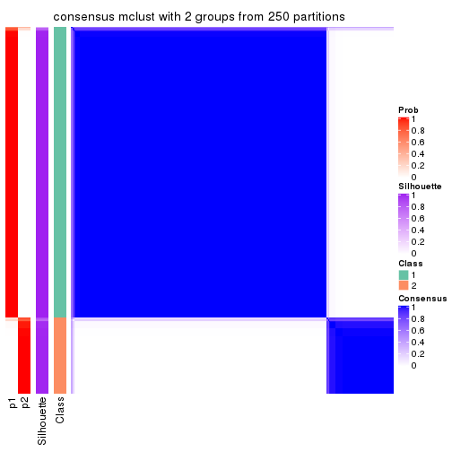</p>

</div>
<div id='tab-ATC-mclust-consensus-heatmap-2'>
<pre><code class="r">consensus_heatmap(res, k = 3)
</code></pre>

<p>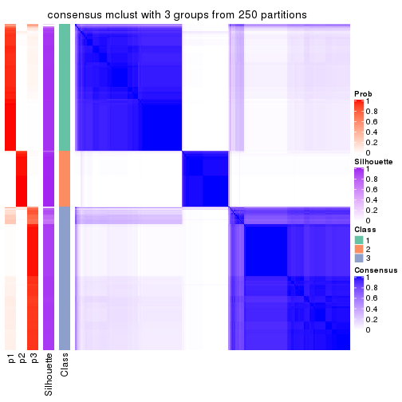</p>

</div>
<div id='tab-ATC-mclust-consensus-heatmap-3'>
<pre><code class="r">consensus_heatmap(res, k = 4)
</code></pre>

<p>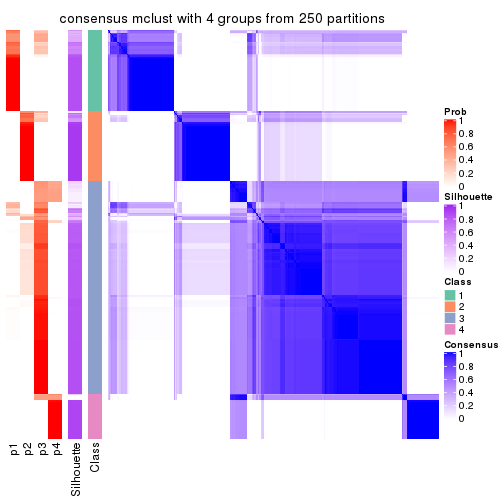</p>

</div>
<div id='tab-ATC-mclust-consensus-heatmap-4'>
<pre><code class="r">consensus_heatmap(res, k = 5)
</code></pre>

<p>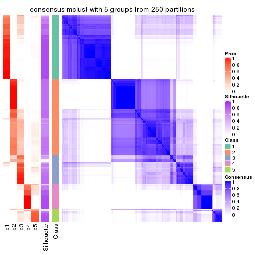</p>

</div>
<div id='tab-ATC-mclust-consensus-heatmap-5'>
<pre><code class="r">consensus_heatmap(res, k = 6)
</code></pre>

<p>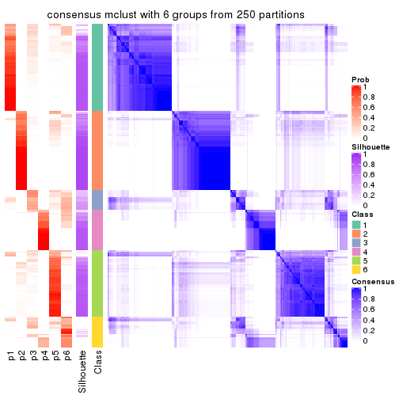</p>

</div>
</div>

Heatmaps for the membership of samples in all partitions to see how consistent they are:


<script>
$( function() {
	$( '#tabs-ATC-mclust-membership-heatmap' ).tabs();
} );
</script>
<div id='tabs-ATC-mclust-membership-heatmap'>
<ul>
<li><a href='#tab-ATC-mclust-membership-heatmap-1'>k = 2</a></li>
<li><a href='#tab-ATC-mclust-membership-heatmap-2'>k = 3</a></li>
<li><a href='#tab-ATC-mclust-membership-heatmap-3'>k = 4</a></li>
<li><a href='#tab-ATC-mclust-membership-heatmap-4'>k = 5</a></li>
<li><a href='#tab-ATC-mclust-membership-heatmap-5'>k = 6</a></li>
</ul>
<div id='tab-ATC-mclust-membership-heatmap-1'>
<pre><code class="r">membership_heatmap(res, k = 2)
</code></pre>

<p>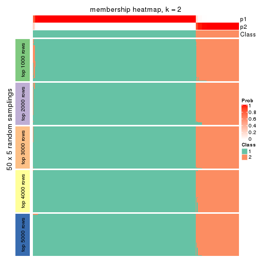</p>

</div>
<div id='tab-ATC-mclust-membership-heatmap-2'>
<pre><code class="r">membership_heatmap(res, k = 3)
</code></pre>

<p>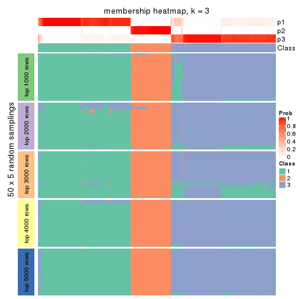</p>

</div>
<div id='tab-ATC-mclust-membership-heatmap-3'>
<pre><code class="r">membership_heatmap(res, k = 4)
</code></pre>

<p>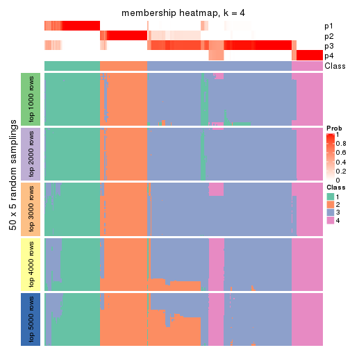</p>

</div>
<div id='tab-ATC-mclust-membership-heatmap-4'>
<pre><code class="r">membership_heatmap(res, k = 5)
</code></pre>

<p>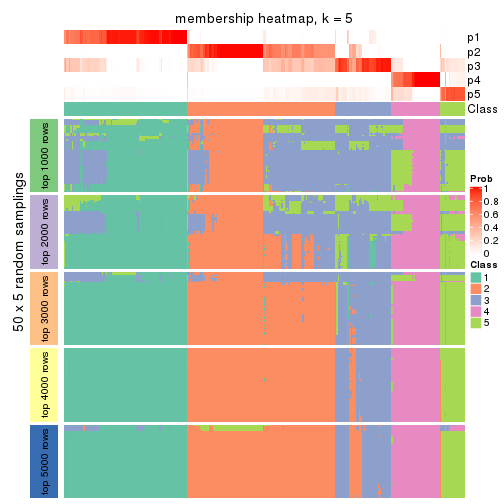</p>

</div>
<div id='tab-ATC-mclust-membership-heatmap-5'>
<pre><code class="r">membership_heatmap(res, k = 6)
</code></pre>

<p>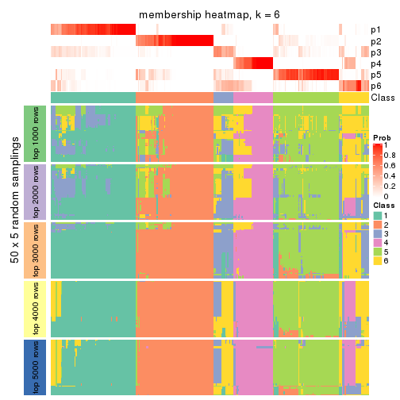</p>

</div>
</div>

As soon as we have had the classes for columns, we can look for signatures
which are significantly different between classes which can be candidate marks
for certain classes. Following are the heatmaps for signatures.


Signature heatmaps where rows are scaled:


<script>
$( function() {
	$( '#tabs-ATC-mclust-get-signatures' ).tabs();
} );
</script>
<div id='tabs-ATC-mclust-get-signatures'>
<ul>
<li><a href='#tab-ATC-mclust-get-signatures-1'>k = 2</a></li>
<li><a href='#tab-ATC-mclust-get-signatures-2'>k = 3</a></li>
<li><a href='#tab-ATC-mclust-get-signatures-3'>k = 4</a></li>
<li><a href='#tab-ATC-mclust-get-signatures-4'>k = 5</a></li>
<li><a href='#tab-ATC-mclust-get-signatures-5'>k = 6</a></li>
</ul>
<div id='tab-ATC-mclust-get-signatures-1'>
<pre><code class="r">get_signatures(res, k = 2)
</code></pre>

<pre><code>#&gt; Error in mat[ceiling(1:nr/h_ratio), ceiling(1:nc/w_ratio), drop = FALSE]: subscript out of bounds
</code></pre>

<p>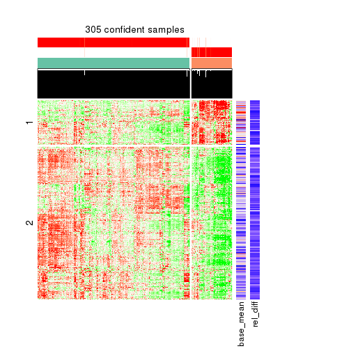</p>

</div>
<div id='tab-ATC-mclust-get-signatures-2'>
<pre><code class="r">get_signatures(res, k = 3)
</code></pre>

<p>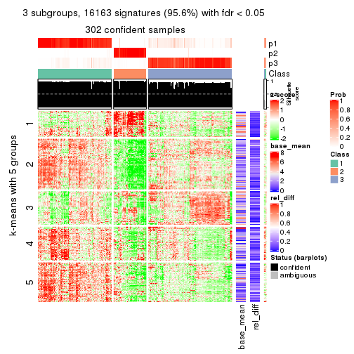</p>

</div>
<div id='tab-ATC-mclust-get-signatures-3'>
<pre><code class="r">get_signatures(res, k = 4)
</code></pre>

<p>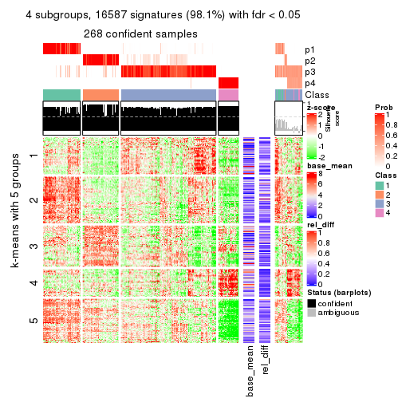</p>

</div>
<div id='tab-ATC-mclust-get-signatures-4'>
<pre><code class="r">get_signatures(res, k = 5)
</code></pre>

<p>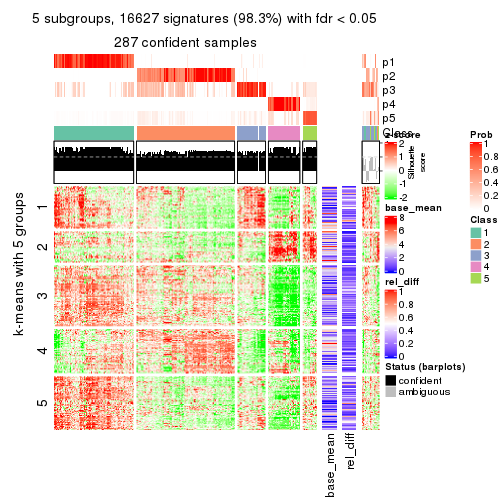</p>

</div>
<div id='tab-ATC-mclust-get-signatures-5'>
<pre><code class="r">get_signatures(res, k = 6)
</code></pre>

<p>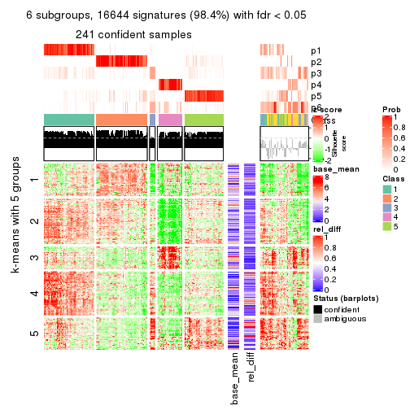</p>

</div>
</div>


Signature heatmaps where rows are not scaled:


<script>
$( function() {
	$( '#tabs-ATC-mclust-get-signatures-no-scale' ).tabs();
} );
</script>
<div id='tabs-ATC-mclust-get-signatures-no-scale'>
<ul>
<li><a href='#tab-ATC-mclust-get-signatures-no-scale-1'>k = 2</a></li>
<li><a href='#tab-ATC-mclust-get-signatures-no-scale-2'>k = 3</a></li>
<li><a href='#tab-ATC-mclust-get-signatures-no-scale-3'>k = 4</a></li>
<li><a href='#tab-ATC-mclust-get-signatures-no-scale-4'>k = 5</a></li>
<li><a href='#tab-ATC-mclust-get-signatures-no-scale-5'>k = 6</a></li>
</ul>
<div id='tab-ATC-mclust-get-signatures-no-scale-1'>
<pre><code class="r">get_signatures(res, k = 2, scale_rows = FALSE)
</code></pre>

<p>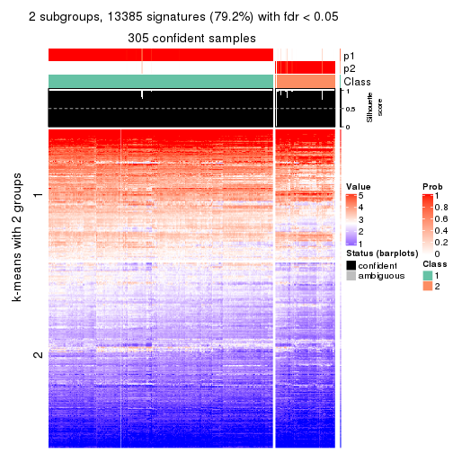</p>

</div>
<div id='tab-ATC-mclust-get-signatures-no-scale-2'>
<pre><code class="r">get_signatures(res, k = 3, scale_rows = FALSE)
</code></pre>

<p>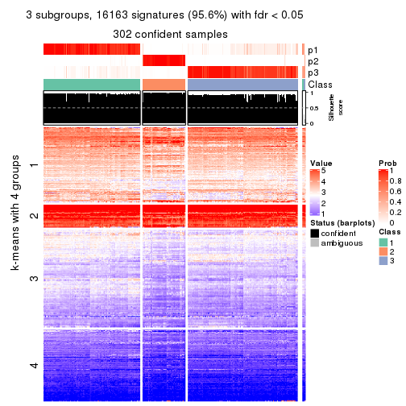</p>

</div>
<div id='tab-ATC-mclust-get-signatures-no-scale-3'>
<pre><code class="r">get_signatures(res, k = 4, scale_rows = FALSE)
</code></pre>

<p>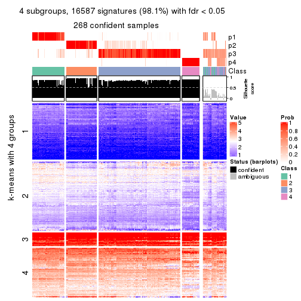</p>

</div>
<div id='tab-ATC-mclust-get-signatures-no-scale-4'>
<pre><code class="r">get_signatures(res, k = 5, scale_rows = FALSE)
</code></pre>

<p>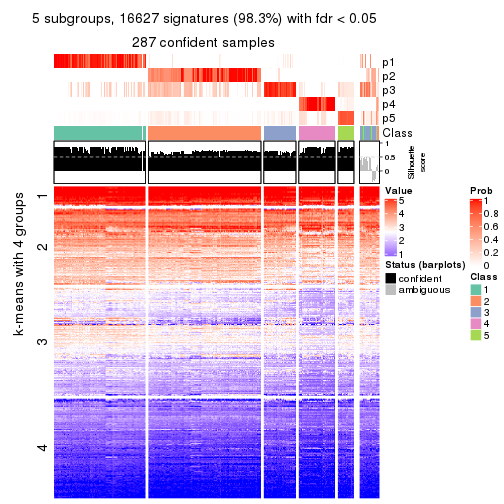</p>

</div>
<div id='tab-ATC-mclust-get-signatures-no-scale-5'>
<pre><code class="r">get_signatures(res, k = 6, scale_rows = FALSE)
</code></pre>

<p>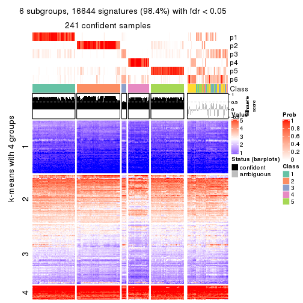</p>

</div>
</div>


Compare the overlap of signatures from different k:

```r
compare_signatures(res)
```

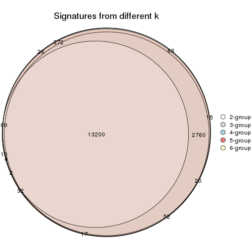

`get_signature()` returns a data frame invisibly. TO get the list of signatures, the function
call should be assigned to a variable explicitly. In following code, if `plot` argument is set
to `FALSE`, no heatmap is plotted while only the differential analysis is performed.

```r
# code only for demonstration
tb = get_signature(res, k = ..., plot = FALSE)
```

An example of the output of `tb` is:

```
#>   which_row         fdr    mean_1    mean_2 scaled_mean_1 scaled_mean_2 km
#> 1        38 0.042760348  8.373488  9.131774    -0.5533452     0.5164555  1
#> 2        40 0.018707592  7.106213  8.469186    -0.6173731     0.5762149  1
#> 3        55 0.019134737 10.221463 11.207825    -0.6159697     0.5749050  1
#> 4        59 0.006059896  5.921854  7.869574    -0.6899429     0.6439467  1
#> 5        60 0.018055526  8.928898 10.211722    -0.6204761     0.5791110  1
#> 6        98 0.009384629 15.714769 14.887706     0.6635654    -0.6193277  2
...
```

The columns in `tb` are:

1. `which_row`: row indices corresponding to the input matrix.
2. `fdr`: FDR for the differential test. 
3. `mean_x`: The mean value in group x.
4. `scaled_mean_x`: The mean value in group x after rows are scaled.
5. `km`: Row groups if k-means clustering is applied to rows.


UMAP plot which shows how samples are separated.


<script>
$( function() {
	$( '#tabs-ATC-mclust-dimension-reduction' ).tabs();
} );
</script>
<div id='tabs-ATC-mclust-dimension-reduction'>
<ul>
<li><a href='#tab-ATC-mclust-dimension-reduction-1'>k = 2</a></li>
<li><a href='#tab-ATC-mclust-dimension-reduction-2'>k = 3</a></li>
<li><a href='#tab-ATC-mclust-dimension-reduction-3'>k = 4</a></li>
<li><a href='#tab-ATC-mclust-dimension-reduction-4'>k = 5</a></li>
<li><a href='#tab-ATC-mclust-dimension-reduction-5'>k = 6</a></li>
</ul>
<div id='tab-ATC-mclust-dimension-reduction-1'>
<pre><code class="r">dimension_reduction(res, k = 2, method = &quot;UMAP&quot;)
</code></pre>

<p>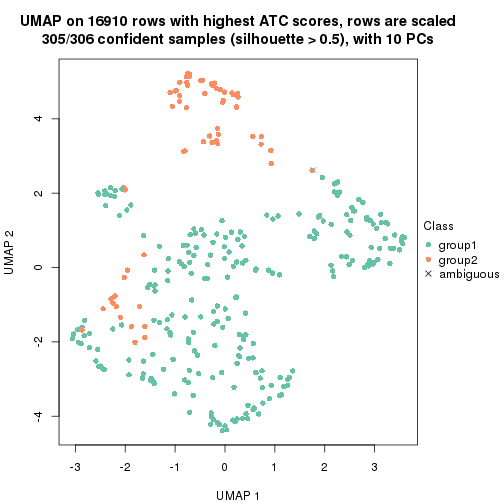</p>

</div>
<div id='tab-ATC-mclust-dimension-reduction-2'>
<pre><code class="r">dimension_reduction(res, k = 3, method = &quot;UMAP&quot;)
</code></pre>

<p>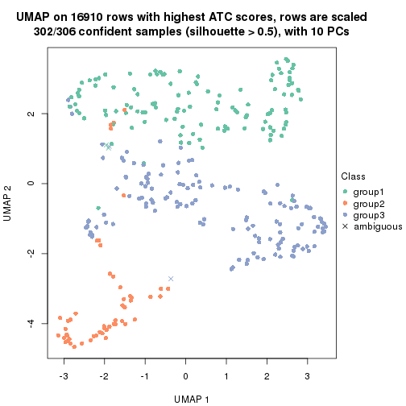</p>

</div>
<div id='tab-ATC-mclust-dimension-reduction-3'>
<pre><code class="r">dimension_reduction(res, k = 4, method = &quot;UMAP&quot;)
</code></pre>

<p>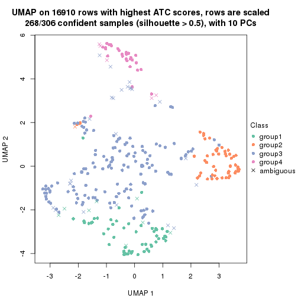</p>

</div>
<div id='tab-ATC-mclust-dimension-reduction-4'>
<pre><code class="r">dimension_reduction(res, k = 5, method = &quot;UMAP&quot;)
</code></pre>

<p>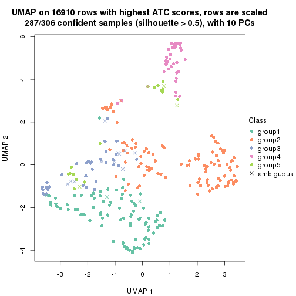</p>

</div>
<div id='tab-ATC-mclust-dimension-reduction-5'>
<pre><code class="r">dimension_reduction(res, k = 6, method = &quot;UMAP&quot;)
</code></pre>

<p>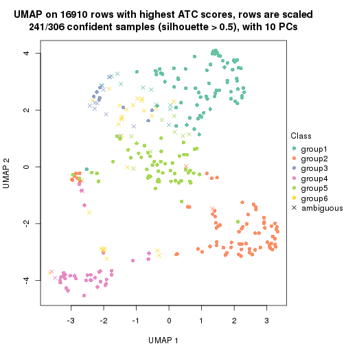</p>

</div>
</div>


Following heatmap shows how subgroups are split when increasing `k`:

```r
collect_classes(res)
```

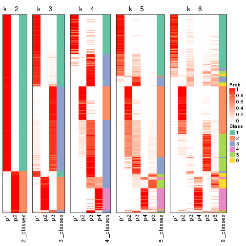


If matrix rows can be associated to genes, consider to use `GO_Enrichment(res,
...)` to perform function enrichment for the signature genes.


 

---------------------------------------------------


### ATC:NMF


The object with results only for a single top-value method and a single partition method 
can be extracted as:

```r
res = res_list["ATC", "NMF"]
# you can also extract it by
# res = res_list["ATC:NMF"]
```

A summary of `res` and all the functions that can be applied to it:

```r
res
```

```
#> A 'ConsensusPartition' object with k = 2, 3, 4, 5, 6.
#>   On a matrix with 16910 rows and 306 columns.
#>   Top rows (1000, 2000, 3000, 4000, 5000) are extracted by 'ATC' method.
#>   Subgroups are detected by 'NMF' method.
#>   Performed in total 1250 partitions by row resampling.
#>   Best k for subgroups seems to be 4.
#> 
#> Following methods can be applied to this 'ConsensusPartition' object:
#>  [1] "cola_report"             "collect_classes"         "collect_plots"          
#>  [4] "collect_stats"           "colnames"                "compare_signatures"     
#>  [7] "consensus_heatmap"       "dimension_reduction"     "functional_enrichment"  
#> [10] "get_anno_col"            "get_anno"                "get_classes"            
#> [13] "get_consensus"           "get_matrix"              "get_membership"         
#> [16] "get_param"               "get_signatures"          "get_stats"              
#> [19] "is_best_k"               "is_stable_k"             "membership_heatmap"     
#> [22] "ncol"                    "nrow"                    "plot_ecdf"              
#> [25] "rownames"                "select_partition_number" "show"                   
#> [28] "suggest_best_k"          "test_to_known_factors"
```

`collect_plots()` function collects all the plots made from `res` for all `k` (number of partitions)
into one single page to provide an easy and fast comparison between different `k`.

```r
collect_plots(res)
```

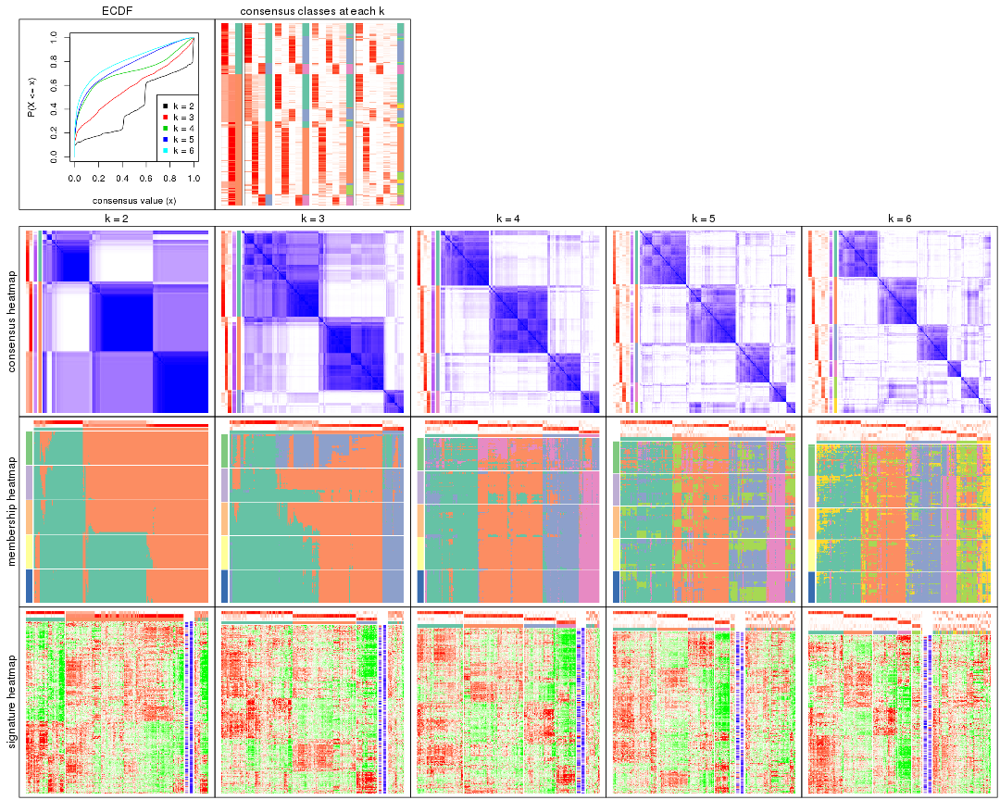

The plots are:

- The first row: a plot of the ECDF (Empirical cumulative distribution
  function) curves of the consensus matrix for each `k` and the heatmap of
  predicted classes for each `k`.
- The second row: heatmaps of the consensus matrix for each `k`.
- The third row: heatmaps of the membership matrix for each `k`.
- The fouth row: heatmaps of the signatures for each `k`.

All the plots in panels can be made by individual functions and they are
plotted later in this section.

`select_partition_number()` produces several plots showing different
statistics for choosing "optimized" `k`. There are following statistics:

- ECDF curves of the consensus matrix for each `k`;
- 1-PAC. [The PAC
  score](https://en.wikipedia.org/wiki/Consensus_clustering#Over-interpretation_potential_of_consensus_clustering)
  measures the proportion of the ambiguous subgrouping.
- Mean silhouette score.
- Concordance. The mean probability of fiting the consensus class ids in all
  partitions.
- Area increased. Denote $A_k$ as the area under the ECDF curve for current
  `k`, the area increased is defined as $A_k - A_{k-1}$.
- Rand index. The percent of pairs of samples that are both in a same cluster
  or both are not in a same cluster in the partition of k and k-1.
- Jaccard index. The ratio of pairs of samples are both in a same cluster in
  the partition of k and k-1 and the pairs of samples are both in a same
  cluster in the partition k or k-1.

The detailed explanations of these statistics can be found in [the cola
vignette](http://bioconductor.org/packages/devel/bioc/vignettes/cola/inst/doc/cola.html#toc_13).

Generally speaking, lower PAC score, higher mean silhouette score or higher
concordance corresponds to better partition. Rand index and Jaccard index
measure how similar the current partition is compared to partition with `k-1`.
If they are too similar, we won't accept `k` is better than `k-1`.

```r
select_partition_number(res)
```

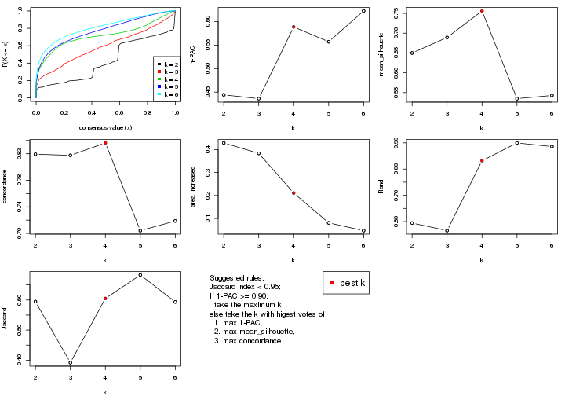

The numeric values for all these statistics can be obtained by `get_stats()`.

```r
get_stats(res)
```

```
#>   k 1-PAC mean_silhouette concordance area_increased  Rand Jaccard
#> 2 2 0.444           0.650       0.819         0.4287 0.595   0.595
#> 3 3 0.436           0.689       0.818         0.3834 0.566   0.392
#> 4 4 0.589           0.756       0.836         0.2107 0.832   0.605
#> 5 5 0.557           0.535       0.704         0.0809 0.900   0.683
#> 6 6 0.623           0.543       0.719         0.0471 0.886   0.594
```

`suggest_best_k()` suggests the best $k$ based on these statistics. The rules are as follows:

- All $k$ with Jaccard index larger than 0.95 are removed because the increase of
  the partition number does not provides enough extra information. If all $k$ are removed,
  the best $k$ is assigned by `NA`.
- For $k$ with 1-PAC larger than 0.9, the maximal $k$ is taken as the "best k". Other $k$ is called "optional k".
- If it does not fit the second rule. The $k$ with the highest vote of highest
  1-PAC, mean silhouette and concordance is taken as the "best k".

```r
suggest_best_k(res)
```

```
#> [1] 4
```


Following shows the table of the partitions (You need to click the **show/hide
code output** link to see it). The membership matrix (columns with name `p*`)
is inferred by
[`clue::cl_consensus()`](https://www.rdocumentation.org/link/cl_consensus?package=clue)
function with the `SE` method. Basically the value in the membership matrix
represents the probability to belong to a certain group. The finall class
label for an item is determined with the group with highest probability it
belongs to.

In `get_classes()` function, the entropy is calculated from the membership
matrix and the silhouette score is calculated from the consensus matrix.


<script>
$( function() {
	$( '#tabs-ATC-NMF-get-classes' ).tabs();
} );
</script>
<div id='tabs-ATC-NMF-get-classes'>
<ul>
<li><a href='#tab-ATC-NMF-get-classes-1'>k = 2</a></li>
<li><a href='#tab-ATC-NMF-get-classes-2'>k = 3</a></li>
<li><a href='#tab-ATC-NMF-get-classes-3'>k = 4</a></li>
<li><a href='#tab-ATC-NMF-get-classes-4'>k = 5</a></li>
<li><a href='#tab-ATC-NMF-get-classes-5'>k = 6</a></li>
</ul>

<div id='tab-ATC-NMF-get-classes-1'>
<p><a id='tab-ATC-NMF-get-classes-1-a' style='color:#0366d6' href='#'>show/hide code output</a></p>
<pre><code class="r">cbind(get_classes(res, k = 2), get_membership(res, k = 2))
</code></pre>

<pre><code>#&gt;            class entropy silhouette    p1    p2
#&gt; SRR1609360     1  0.0000    0.84723 1.000 0.000
#&gt; SRR1609361     1  0.0000    0.84723 1.000 0.000
#&gt; SRR1609362     1  0.6801    0.65667 0.820 0.180
#&gt; SRR1609363     2  0.0000    0.70146 0.000 1.000
#&gt; SRR1609364     2  0.0000    0.70146 0.000 1.000
#&gt; SRR1609365     1  0.1414    0.83191 0.980 0.020
#&gt; SRR1609366     2  0.0000    0.70146 0.000 1.000
#&gt; SRR1609367     1  0.6048    0.68231 0.852 0.148
#&gt; SRR1609368     2  0.0000    0.70146 0.000 1.000
#&gt; SRR1609369     2  0.9775    0.59623 0.412 0.588
#&gt; SRR1609370     2  0.9775    0.59623 0.412 0.588
#&gt; SRR1609371     2  0.0000    0.70146 0.000 1.000
#&gt; SRR1609372     2  0.9775    0.59623 0.412 0.588
#&gt; SRR1609373     2  0.0000    0.70146 0.000 1.000
#&gt; SRR1609374     2  0.0000    0.70146 0.000 1.000
#&gt; SRR1609375     2  0.0000    0.70146 0.000 1.000
#&gt; SRR1609377     2  0.9732    0.59919 0.404 0.596
#&gt; SRR1609376     2  0.0000    0.70146 0.000 1.000
#&gt; SRR1609378     1  0.9775    0.36662 0.588 0.412
#&gt; SRR1609379     2  0.9775    0.59623 0.412 0.588
#&gt; SRR1609382     2  0.9522    0.05002 0.372 0.628
#&gt; SRR1609383     1  0.0000    0.84723 1.000 0.000
#&gt; SRR1609381     2  0.9775    0.59623 0.412 0.588
#&gt; SRR1609384     2  0.7219    0.66116 0.200 0.800
#&gt; SRR1609386     2  0.0000    0.70146 0.000 1.000
#&gt; SRR1609385     2  0.9775    0.59623 0.412 0.588
#&gt; SRR1609387     2  0.9775    0.59623 0.412 0.588
#&gt; SRR1609388     2  0.0000    0.70146 0.000 1.000
#&gt; SRR1609390     2  0.9775    0.59623 0.412 0.588
#&gt; SRR1609393     2  0.9635    0.00568 0.388 0.612
#&gt; SRR1609394     2  0.0000    0.70146 0.000 1.000
#&gt; SRR1609392     2  0.0000    0.70146 0.000 1.000
#&gt; SRR1609391     2  0.0000    0.70146 0.000 1.000
#&gt; SRR1609395     2  0.9775    0.59623 0.412 0.588
#&gt; SRR1609396     2  0.9775    0.59623 0.412 0.588
#&gt; SRR1609398     2  0.0000    0.70146 0.000 1.000
#&gt; SRR1609399     2  0.9775    0.59623 0.412 0.588
#&gt; SRR1609400     2  0.9866    0.56196 0.432 0.568
#&gt; SRR1609397     2  0.0000    0.70146 0.000 1.000
#&gt; SRR1609401     2  0.0000    0.70146 0.000 1.000
#&gt; SRR1609402     2  0.0000    0.70146 0.000 1.000
#&gt; SRR1609405     2  0.4562    0.68758 0.096 0.904
#&gt; SRR1609404     2  0.0000    0.70146 0.000 1.000
#&gt; SRR1609406     2  0.0000    0.70146 0.000 1.000
#&gt; SRR1609408     2  0.0000    0.70146 0.000 1.000
#&gt; SRR1609403     2  0.9775    0.59623 0.412 0.588
#&gt; SRR1609410     2  0.9775    0.59623 0.412 0.588
#&gt; SRR1609411     2  0.0000    0.70146 0.000 1.000
#&gt; SRR1609407     2  0.0000    0.70146 0.000 1.000
#&gt; SRR1609413     2  0.9775    0.59623 0.412 0.588
#&gt; SRR1609412     2  0.9775    0.59623 0.412 0.588
#&gt; SRR1609414     2  0.9775    0.59623 0.412 0.588
#&gt; SRR1609415     2  0.9775    0.59623 0.412 0.588
#&gt; SRR1609416     1  0.0000    0.84723 1.000 0.000
#&gt; SRR1609417     1  0.0000    0.84723 1.000 0.000
#&gt; SRR1609418     2  0.9775    0.59623 0.412 0.588
#&gt; SRR1609419     2  0.0000    0.70146 0.000 1.000
#&gt; SRR1609420     2  0.9775    0.59623 0.412 0.588
#&gt; SRR1609421     2  0.0000    0.70146 0.000 1.000
#&gt; SRR1609422     2  0.4939    0.60970 0.108 0.892
#&gt; SRR1609423     1  0.9710    0.38190 0.600 0.400
#&gt; SRR1609424     2  0.0000    0.70146 0.000 1.000
#&gt; SRR1609425     2  0.0376    0.70115 0.004 0.996
#&gt; SRR1609426     2  0.0000    0.70146 0.000 1.000
#&gt; SRR1609427     1  0.0000    0.84723 1.000 0.000
#&gt; SRR1609428     2  0.0000    0.70146 0.000 1.000
#&gt; SRR1609429     2  0.9775    0.59623 0.412 0.588
#&gt; SRR1609430     1  0.0000    0.84723 1.000 0.000
#&gt; SRR1609431     2  0.0000    0.70146 0.000 1.000
#&gt; SRR1609432     2  0.0000    0.70146 0.000 1.000
#&gt; SRR1609433     1  0.0000    0.84723 1.000 0.000
#&gt; SRR1609434     2  0.9833   -0.09276 0.424 0.576
#&gt; SRR1609435     2  0.9775    0.59623 0.412 0.588
#&gt; SRR1609436     2  0.9775    0.59623 0.412 0.588
#&gt; SRR1609437     2  0.1184    0.69931 0.016 0.984
#&gt; SRR1609438     2  0.8909    0.22184 0.308 0.692
#&gt; SRR1609439     1  0.0000    0.84723 1.000 0.000
#&gt; SRR1609440     2  0.9775    0.59623 0.412 0.588
#&gt; SRR1609441     2  0.5737    0.67871 0.136 0.864
#&gt; SRR1609442     2  0.0000    0.70146 0.000 1.000
#&gt; SRR1609443     1  0.5408    0.71979 0.876 0.124
#&gt; SRR1609444     2  0.9775    0.59623 0.412 0.588
#&gt; SRR1609445     2  0.9775    0.59623 0.412 0.588
#&gt; SRR1609446     2  0.9427    0.61235 0.360 0.640
#&gt; SRR1609447     2  0.9993    0.45033 0.484 0.516
#&gt; SRR1609448     2  0.0000    0.70146 0.000 1.000
#&gt; SRR1609449     2  0.9775    0.59623 0.412 0.588
#&gt; SRR1609450     2  0.0000    0.70146 0.000 1.000
#&gt; SRR1609451     1  0.0000    0.84723 1.000 0.000
#&gt; SRR1609452     2  0.7950    0.64958 0.240 0.760
#&gt; SRR1609453     2  0.9775    0.59623 0.412 0.588
#&gt; SRR1609454     2  0.0000    0.70146 0.000 1.000
#&gt; SRR1609455     2  0.9775    0.59623 0.412 0.588
#&gt; SRR1609456     2  0.7528    0.65740 0.216 0.784
#&gt; SRR1609457     1  0.4815    0.74788 0.896 0.104
#&gt; SRR1609458     2  0.9795    0.58982 0.416 0.584
#&gt; SRR1609459     2  0.9686    0.60174 0.396 0.604
#&gt; SRR1609460     2  0.0000    0.70146 0.000 1.000
#&gt; SRR1609461     2  0.9775    0.59623 0.412 0.588
#&gt; SRR1609462     1  0.0000    0.84723 1.000 0.000
#&gt; SRR1609464     1  0.0000    0.84723 1.000 0.000
#&gt; SRR1609463     2  0.9775    0.59623 0.412 0.588
#&gt; SRR1609465     2  0.0000    0.70146 0.000 1.000
#&gt; SRR1609466     1  0.0000    0.84723 1.000 0.000
#&gt; SRR1609467     1  0.0000    0.84723 1.000 0.000
#&gt; SRR1609469     1  0.9710    0.38190 0.600 0.400
#&gt; SRR1609470     2  0.4298    0.68948 0.088 0.912
#&gt; SRR1609472     1  0.0000    0.84723 1.000 0.000
#&gt; SRR1609471     2  0.9775    0.59623 0.412 0.588
#&gt; SRR1609474     2  0.0376    0.70115 0.004 0.996
#&gt; SRR1609473     1  0.9775    0.36662 0.588 0.412
#&gt; SRR1609475     2  0.0938    0.69198 0.012 0.988
#&gt; SRR1609478     1  0.9635    0.39604 0.612 0.388
#&gt; SRR1609476     1  0.2603    0.81512 0.956 0.044
#&gt; SRR1609477     1  0.2948    0.80780 0.948 0.052
#&gt; SRR1609479     2  0.0000    0.70146 0.000 1.000
#&gt; SRR1609481     2  0.0000    0.70146 0.000 1.000
#&gt; SRR1609480     1  0.0000    0.84723 1.000 0.000
#&gt; SRR1609482     1  0.0000    0.84723 1.000 0.000
#&gt; SRR1609484     2  0.8016    0.37208 0.244 0.756
#&gt; SRR1609483     1  0.0000    0.84723 1.000 0.000
#&gt; SRR1609486     1  0.0000    0.84723 1.000 0.000
#&gt; SRR1609485     1  0.0000    0.84723 1.000 0.000
#&gt; SRR1609487     2  0.9732    0.59919 0.404 0.596
#&gt; SRR1609488     2  0.9775    0.59623 0.412 0.588
#&gt; SRR1609489     2  0.0000    0.70146 0.000 1.000
#&gt; SRR1609490     2  0.5946    0.67690 0.144 0.856
#&gt; SRR1609491     2  0.9732    0.59919 0.404 0.596
#&gt; SRR1609492     2  0.0000    0.70146 0.000 1.000
#&gt; SRR1609493     2  0.0000    0.70146 0.000 1.000
#&gt; SRR1609494     2  0.0000    0.70146 0.000 1.000
#&gt; SRR1609495     1  0.0000    0.84723 1.000 0.000
#&gt; SRR1609496     1  0.3114    0.80427 0.944 0.056
#&gt; SRR1609497     1  0.8909    0.29209 0.692 0.308
#&gt; SRR1609498     2  0.9775    0.59623 0.412 0.588
#&gt; SRR1609499     2  0.0000    0.70146 0.000 1.000
#&gt; SRR1609500     2  0.9775    0.59623 0.412 0.588
#&gt; SRR1609501     2  0.3733    0.69208 0.072 0.928
#&gt; SRR1609502     2  0.0000    0.70146 0.000 1.000
#&gt; SRR1609503     1  0.9996    0.26135 0.512 0.488
#&gt; SRR1609504     2  0.9775    0.59623 0.412 0.588
#&gt; SRR1609505     2  0.9970    0.48853 0.468 0.532
#&gt; SRR1609506     2  0.0000    0.70146 0.000 1.000
#&gt; SRR1609507     1  0.5737    0.70164 0.864 0.136
#&gt; SRR1609508     2  0.0000    0.70146 0.000 1.000
#&gt; SRR1609509     2  0.0000    0.70146 0.000 1.000
#&gt; SRR1609510     2  0.0000    0.70146 0.000 1.000
#&gt; SRR1609512     1  0.3879    0.78284 0.924 0.076
#&gt; SRR1609511     1  0.0000    0.84723 1.000 0.000
#&gt; SRR1609513     1  0.0000    0.84723 1.000 0.000
#&gt; SRR1609514     1  0.0000    0.84723 1.000 0.000
#&gt; SRR1609515     2  0.0000    0.70146 0.000 1.000
#&gt; SRR1609516     2  0.9732    0.59919 0.404 0.596
#&gt; SRR1609517     2  0.0000    0.70146 0.000 1.000
#&gt; SRR1609518     2  0.9775    0.59623 0.412 0.588
#&gt; SRR1609519     1  0.0000    0.84723 1.000 0.000
#&gt; SRR1609520     1  0.9775    0.36662 0.588 0.412
#&gt; SRR1609521     1  0.9909   -0.24841 0.556 0.444
#&gt; SRR1609522     1  0.0000    0.84723 1.000 0.000
#&gt; SRR1609523     2  0.0000    0.70146 0.000 1.000
#&gt; SRR1609524     2  0.0000    0.70146 0.000 1.000
#&gt; SRR1609526     1  0.0000    0.84723 1.000 0.000
#&gt; SRR1609525     2  0.3274    0.69357 0.060 0.940
#&gt; SRR1609527     2  0.9775    0.59623 0.412 0.588
#&gt; SRR1609529     1  1.0000   -0.41817 0.500 0.500
#&gt; SRR1609528     1  0.0376    0.84450 0.996 0.004
#&gt; SRR1609530     1  0.7376    0.56601 0.792 0.208
#&gt; SRR1609531     2  0.0000    0.70146 0.000 1.000
#&gt; SRR1609532     1  0.0000    0.84723 1.000 0.000
#&gt; SRR1609533     2  0.0000    0.70146 0.000 1.000
#&gt; SRR1609534     1  0.9129    0.22199 0.672 0.328
#&gt; SRR1609535     2  0.0000    0.70146 0.000 1.000
#&gt; SRR1609537     2  0.0000    0.70146 0.000 1.000
#&gt; SRR1609536     2  0.9775    0.59623 0.412 0.588
#&gt; SRR1609538     2  0.0000    0.70146 0.000 1.000
#&gt; SRR1609539     2  0.9775    0.59623 0.412 0.588
#&gt; SRR1609540     2  0.9977    0.47946 0.472 0.528
#&gt; SRR1609541     1  0.9170    0.46706 0.668 0.332
#&gt; SRR1609542     2  0.0000    0.70146 0.000 1.000
#&gt; SRR1609543     1  0.0000    0.84723 1.000 0.000
#&gt; SRR1609544     1  0.0000    0.84723 1.000 0.000
#&gt; SRR1609545     2  0.9881    0.55449 0.436 0.564
#&gt; SRR1609546     2  0.9775    0.59623 0.412 0.588
#&gt; SRR1609547     1  0.9775   -0.12943 0.588 0.412
#&gt; SRR1609548     2  0.9775    0.59623 0.412 0.588
#&gt; SRR1609549     2  0.0000    0.70146 0.000 1.000
#&gt; SRR1609550     2  0.0000    0.70146 0.000 1.000
#&gt; SRR1609551     2  0.9775    0.59623 0.412 0.588
#&gt; SRR1609552     1  0.2948    0.80678 0.948 0.052
#&gt; SRR1609553     2  0.9775    0.59623 0.412 0.588
#&gt; SRR1609554     2  0.9775    0.59623 0.412 0.588
#&gt; SRR1609555     2  0.9775    0.59623 0.412 0.588
#&gt; SRR1609556     1  0.1414    0.83447 0.980 0.020
#&gt; SRR1609557     2  0.9754    0.59796 0.408 0.592
#&gt; SRR1609558     2  0.9775    0.59623 0.412 0.588
#&gt; SRR1609559     2  0.9775    0.59623 0.412 0.588
#&gt; SRR1609560     2  0.9775    0.59623 0.412 0.588
#&gt; SRR1609561     1  0.7815    0.50893 0.768 0.232
#&gt; SRR1609562     2  0.7745    0.65408 0.228 0.772
#&gt; SRR1609563     2  0.0672    0.70075 0.008 0.992
#&gt; SRR1609564     2  0.9815    0.58317 0.420 0.580
#&gt; SRR1609565     2  0.0000    0.70146 0.000 1.000
#&gt; SRR1609566     2  0.0000    0.70146 0.000 1.000
#&gt; SRR1609567     2  0.0000    0.70146 0.000 1.000
#&gt; SRR1609568     2  0.9775    0.59623 0.412 0.588
#&gt; SRR1609569     1  0.0672    0.84251 0.992 0.008
#&gt; SRR1609570     1  0.0000    0.84723 1.000 0.000
#&gt; SRR1609571     1  0.0000    0.84723 1.000 0.000
#&gt; SRR1609572     1  0.0000    0.84723 1.000 0.000
#&gt; SRR1609573     1  0.0000    0.84723 1.000 0.000
#&gt; SRR1609574     1  0.0000    0.84723 1.000 0.000
#&gt; SRR1609575     2  0.0000    0.70146 0.000 1.000
#&gt; SRR1609576     2  0.0000    0.70146 0.000 1.000
#&gt; SRR1609578     2  0.9775    0.59623 0.412 0.588
#&gt; SRR1609577     1  0.4298    0.76833 0.912 0.088
#&gt; SRR1609579     1  0.0000    0.84723 1.000 0.000
#&gt; SRR1609580     2  0.9775    0.59623 0.412 0.588
#&gt; SRR1609582     2  0.9775    0.59623 0.412 0.588
#&gt; SRR1609581     2  0.9775    0.59623 0.412 0.588
#&gt; SRR1609583     2  0.9775    0.59623 0.412 0.588
#&gt; SRR1609584     1  0.0000    0.84723 1.000 0.000
#&gt; SRR1609585     2  0.9944    0.51473 0.456 0.544
#&gt; SRR1609586     2  0.0000    0.70146 0.000 1.000
#&gt; SRR1609587     1  0.0000    0.84723 1.000 0.000
#&gt; SRR1609588     2  0.9710    0.60090 0.400 0.600
#&gt; SRR1609589     2  0.9754    0.59796 0.408 0.592
#&gt; SRR1609590     1  0.0000    0.84723 1.000 0.000
#&gt; SRR1609592     2  0.9775    0.59623 0.412 0.588
#&gt; SRR1609591     2  0.9775    0.59623 0.412 0.588
#&gt; SRR1609593     2  0.4431    0.68861 0.092 0.908
#&gt; SRR1609594     1  0.9815    0.35808 0.580 0.420
#&gt; SRR1609595     2  0.0000    0.70146 0.000 1.000
#&gt; SRR1609596     2  0.0000    0.70146 0.000 1.000
#&gt; SRR1609597     2  0.0000    0.70146 0.000 1.000
#&gt; SRR1609598     1  0.0000    0.84723 1.000 0.000
#&gt; SRR1609599     1  0.0000    0.84723 1.000 0.000
#&gt; SRR1609600     1  0.3431    0.79588 0.936 0.064
#&gt; SRR1609601     1  0.9970   -0.32689 0.532 0.468
#&gt; SRR1609602     1  0.0000    0.84723 1.000 0.000
#&gt; SRR1609603     2  0.9775    0.59623 0.412 0.588
#&gt; SRR1609604     2  0.0000    0.70146 0.000 1.000
#&gt; SRR1609605     2  0.5059    0.68430 0.112 0.888
#&gt; SRR1609606     2  0.0000    0.70146 0.000 1.000
#&gt; SRR1609607     2  0.9775    0.59623 0.412 0.588
#&gt; SRR1609608     2  0.9775    0.59623 0.412 0.588
#&gt; SRR1609609     2  0.9775    0.59623 0.412 0.588
#&gt; SRR1609610     2  0.9795    0.58985 0.416 0.584
#&gt; SRR1609611     2  0.0000    0.70146 0.000 1.000
#&gt; SRR1609613     2  0.0000    0.70146 0.000 1.000
#&gt; SRR1609612     2  0.9775    0.59623 0.412 0.588
#&gt; SRR1609614     1  0.7674    0.52912 0.776 0.224
#&gt; SRR1609615     2  0.9775    0.59623 0.412 0.588
#&gt; SRR1609616     2  0.9775    0.59623 0.412 0.588
#&gt; SRR1609617     2  0.0000    0.70146 0.000 1.000
#&gt; SRR1609618     2  0.9775    0.59623 0.412 0.588
#&gt; SRR1609619     2  0.9775    0.59623 0.412 0.588
#&gt; SRR1609620     2  0.0000    0.70146 0.000 1.000
#&gt; SRR1609621     2  0.0000    0.70146 0.000 1.000
#&gt; SRR1609622     1  0.0000    0.84723 1.000 0.000
#&gt; SRR1609623     1  0.1184    0.83729 0.984 0.016
#&gt; SRR1609624     2  0.9775    0.59623 0.412 0.588
#&gt; SRR1609625     2  0.9775    0.59623 0.412 0.588
#&gt; SRR1609626     1  0.0000    0.84723 1.000 0.000
#&gt; SRR1609627     2  0.8763    0.63239 0.296 0.704
#&gt; SRR1609628     2  0.0000    0.70146 0.000 1.000
#&gt; SRR1609629     2  0.9775    0.59623 0.412 0.588
#&gt; SRR1609630     2  0.0000    0.70146 0.000 1.000
#&gt; SRR1609631     2  0.9775    0.59623 0.412 0.588
#&gt; SRR1609632     2  0.9775    0.59623 0.412 0.588
#&gt; SRR1609633     2  0.9775    0.59623 0.412 0.588
#&gt; SRR1609634     2  0.0000    0.70146 0.000 1.000
#&gt; SRR1609635     1  0.0000    0.84723 1.000 0.000
#&gt; SRR1609636     2  0.2236    0.67121 0.036 0.964
#&gt; SRR1609637     2  0.9944    0.51473 0.456 0.544
#&gt; SRR1609638     2  0.5519    0.68057 0.128 0.872
#&gt; SRR1609639     2  0.0000    0.70146 0.000 1.000
#&gt; SRR1609640     1  0.6148    0.67550 0.848 0.152
#&gt; SRR1609641     2  0.9775    0.59623 0.412 0.588
#&gt; SRR1609642     2  0.9775    0.59623 0.412 0.588
#&gt; SRR1609643     2  0.9775    0.59623 0.412 0.588
#&gt; SRR1609644     2  0.9775    0.59623 0.412 0.588
#&gt; SRR1609645     2  0.9775    0.59623 0.412 0.588
#&gt; SRR1609646     1  0.0000    0.84723 1.000 0.000
#&gt; SRR1609647     2  0.0000    0.70146 0.000 1.000
#&gt; SRR1609649     2  0.9963    0.49750 0.464 0.536
#&gt; SRR1609648     2  0.0000    0.70146 0.000 1.000
#&gt; SRR1609651     2  0.0000    0.70146 0.000 1.000
#&gt; SRR1609650     2  0.6531    0.67078 0.168 0.832
#&gt; SRR1609652     1  0.1414    0.83447 0.980 0.020
#&gt; SRR1609653     2  0.0000    0.70146 0.000 1.000
#&gt; SRR1609654     1  0.7602    0.61825 0.780 0.220
#&gt; SRR1609655     2  0.9754    0.59775 0.408 0.592
#&gt; SRR1609657     1  0.9580    0.00766 0.620 0.380
#&gt; SRR1609656     1  0.0000    0.84723 1.000 0.000
#&gt; SRR1609658     2  0.0000    0.70146 0.000 1.000
#&gt; SRR1609659     2  0.0000    0.70146 0.000 1.000
#&gt; SRR1609660     2  0.9833    0.57628 0.424 0.576
#&gt; SRR1609661     2  0.9775    0.59623 0.412 0.588
#&gt; SRR1609662     2  0.0000    0.70146 0.000 1.000
#&gt; SRR1609663     2  0.9775    0.59623 0.412 0.588
#&gt; SRR1609664     2  0.0000    0.70146 0.000 1.000
#&gt; SRR1609665     2  0.0000    0.70146 0.000 1.000
#&gt; SRR1609666     2  0.3274    0.65806 0.060 0.940
#&gt; SRR1609667     2  0.9775    0.59623 0.412 0.588
#&gt; SRR1609668     2  0.0000    0.70146 0.000 1.000
#&gt; SRR1609669     2  0.9775    0.59623 0.412 0.588
</code></pre>

<script>
$('#tab-ATC-NMF-get-classes-1-a').parent().next().next().hide();
$('#tab-ATC-NMF-get-classes-1-a').click(function(){
  $('#tab-ATC-NMF-get-classes-1-a').parent().next().next().toggle();
  return(false);
});
</script>
</div>

<div id='tab-ATC-NMF-get-classes-2'>
<p><a id='tab-ATC-NMF-get-classes-2-a' style='color:#0366d6' href='#'>show/hide code output</a></p>
<pre><code class="r">cbind(get_classes(res, k = 3), get_membership(res, k = 3))
</code></pre>

<pre><code>#&gt;            class entropy silhouette    p1    p2    p3
#&gt; SRR1609360     3  0.4178     0.7268 0.172 0.000 0.828
#&gt; SRR1609361     1  0.5497     0.3414 0.708 0.000 0.292
#&gt; SRR1609362     3  0.3267     0.8166 0.116 0.000 0.884
#&gt; SRR1609363     2  0.3116     0.8501 0.000 0.892 0.108
#&gt; SRR1609364     2  0.3116     0.8501 0.000 0.892 0.108
#&gt; SRR1609365     3  0.4291     0.8092 0.180 0.000 0.820
#&gt; SRR1609366     2  0.3941     0.8205 0.000 0.844 0.156
#&gt; SRR1609367     1  0.1860     0.6949 0.948 0.000 0.052
#&gt; SRR1609368     2  0.4062     0.8140 0.000 0.836 0.164
#&gt; SRR1609369     2  0.7545     0.6511 0.136 0.692 0.172
#&gt; SRR1609370     1  0.7772     0.6939 0.676 0.152 0.172
#&gt; SRR1609371     3  0.4399     0.7658 0.000 0.188 0.812
#&gt; SRR1609372     1  0.8659     0.6350 0.596 0.228 0.176
#&gt; SRR1609373     2  0.3192     0.8485 0.000 0.888 0.112
#&gt; SRR1609374     2  0.3816     0.8264 0.000 0.852 0.148
#&gt; SRR1609375     2  0.4291     0.7995 0.000 0.820 0.180
#&gt; SRR1609377     2  0.5036     0.7989 0.020 0.808 0.172
#&gt; SRR1609376     2  0.0592     0.8462 0.000 0.988 0.012
#&gt; SRR1609378     3  0.1163     0.8109 0.028 0.000 0.972
#&gt; SRR1609379     1  0.9314     0.4744 0.492 0.328 0.180
#&gt; SRR1609382     3  0.1411     0.8055 0.000 0.036 0.964
#&gt; SRR1609383     1  0.6225     0.1835 0.568 0.000 0.432
#&gt; SRR1609381     1  0.8992     0.5833 0.552 0.272 0.176
#&gt; SRR1609384     2  0.6808     0.7230 0.084 0.732 0.184
#&gt; SRR1609386     2  0.4861     0.7948 0.012 0.808 0.180
#&gt; SRR1609385     1  0.8981     0.5870 0.556 0.264 0.180
#&gt; SRR1609387     1  0.7702     0.6920 0.680 0.140 0.180
#&gt; SRR1609388     2  0.2537     0.8574 0.000 0.920 0.080
#&gt; SRR1609390     1  0.9048     0.5631 0.540 0.288 0.172
#&gt; SRR1609393     3  0.0747     0.8028 0.000 0.016 0.984
#&gt; SRR1609394     2  0.0592     0.8547 0.000 0.988 0.012
#&gt; SRR1609392     2  0.2537     0.8574 0.000 0.920 0.080
#&gt; SRR1609391     3  0.4121     0.7110 0.000 0.168 0.832
#&gt; SRR1609395     1  0.7585     0.6933 0.688 0.132 0.180
#&gt; SRR1609396     1  0.8803     0.6176 0.580 0.240 0.180
#&gt; SRR1609398     2  0.4861     0.7948 0.012 0.808 0.180
#&gt; SRR1609399     1  0.7644     0.6996 0.684 0.180 0.136
#&gt; SRR1609400     1  0.7129     0.6959 0.716 0.104 0.180
#&gt; SRR1609397     2  0.1289     0.8585 0.000 0.968 0.032
#&gt; SRR1609401     2  0.1964     0.8594 0.000 0.944 0.056
#&gt; SRR1609402     2  0.3192     0.8485 0.000 0.888 0.112
#&gt; SRR1609405     2  0.4539     0.8199 0.016 0.836 0.148
#&gt; SRR1609404     3  0.1163     0.8011 0.000 0.028 0.972
#&gt; SRR1609406     2  0.0592     0.8547 0.000 0.988 0.012
#&gt; SRR1609408     2  0.0592     0.8547 0.000 0.988 0.012
#&gt; SRR1609403     1  0.9250     0.5199 0.512 0.304 0.184
#&gt; SRR1609410     1  0.9211     0.5180 0.512 0.312 0.176
#&gt; SRR1609411     2  0.0592     0.8462 0.000 0.988 0.012
#&gt; SRR1609407     2  0.2959     0.8530 0.000 0.900 0.100
#&gt; SRR1609413     1  0.9073     0.5735 0.544 0.272 0.184
#&gt; SRR1609412     2  0.6804    -0.2557 0.460 0.528 0.012
#&gt; SRR1609414     1  0.7433     0.6975 0.700 0.132 0.168
#&gt; SRR1609415     1  0.8350     0.6645 0.628 0.196 0.176
#&gt; SRR1609416     1  0.1031     0.6909 0.976 0.000 0.024
#&gt; SRR1609417     1  0.0747     0.6810 0.984 0.000 0.016
#&gt; SRR1609418     1  0.9192     0.5307 0.520 0.300 0.180
#&gt; SRR1609419     2  0.0237     0.8525 0.000 0.996 0.004
#&gt; SRR1609420     1  0.9303     0.4960 0.500 0.316 0.184
#&gt; SRR1609421     2  0.0592     0.8462 0.000 0.988 0.012
#&gt; SRR1609422     3  0.6724     0.3586 0.012 0.420 0.568
#&gt; SRR1609423     3  0.4452     0.8091 0.192 0.000 0.808
#&gt; SRR1609424     3  0.4452     0.7707 0.000 0.192 0.808
#&gt; SRR1609425     2  0.4749     0.8025 0.012 0.816 0.172
#&gt; SRR1609426     2  0.2537     0.8574 0.000 0.920 0.080
#&gt; SRR1609427     1  0.0592     0.6885 0.988 0.000 0.012
#&gt; SRR1609428     2  0.0237     0.8525 0.000 0.996 0.004
#&gt; SRR1609429     2  0.8689     0.3901 0.248 0.588 0.164
#&gt; SRR1609430     1  0.0000     0.6888 1.000 0.000 0.000
#&gt; SRR1609431     2  0.2796     0.8552 0.000 0.908 0.092
#&gt; SRR1609432     2  0.3879     0.8235 0.000 0.848 0.152
#&gt; SRR1609433     1  0.1860     0.6937 0.948 0.000 0.052
#&gt; SRR1609434     3  0.0592     0.8038 0.000 0.012 0.988
#&gt; SRR1609435     1  0.7759     0.6911 0.676 0.144 0.180
#&gt; SRR1609436     1  0.5581     0.7151 0.792 0.168 0.040
#&gt; SRR1609437     2  0.6181     0.7144 0.072 0.772 0.156
#&gt; SRR1609438     3  0.0592     0.8038 0.000 0.012 0.988
#&gt; SRR1609439     1  0.0747     0.6763 0.984 0.000 0.016
#&gt; SRR1609440     1  0.8026     0.6855 0.656 0.164 0.180
#&gt; SRR1609441     2  0.3039     0.8538 0.036 0.920 0.044
#&gt; SRR1609442     2  0.4178     0.8089 0.000 0.828 0.172
#&gt; SRR1609443     1  0.0424     0.6940 0.992 0.008 0.000
#&gt; SRR1609444     1  0.9153     0.5342 0.524 0.300 0.176
#&gt; SRR1609445     1  0.6745     0.5034 0.560 0.428 0.012
#&gt; SRR1609446     2  0.2339     0.8300 0.048 0.940 0.012
#&gt; SRR1609447     1  0.5746     0.6934 0.780 0.040 0.180
#&gt; SRR1609448     2  0.0592     0.8462 0.000 0.988 0.012
#&gt; SRR1609449     1  0.6387     0.6453 0.680 0.300 0.020
#&gt; SRR1609450     2  0.3267     0.8464 0.000 0.884 0.116
#&gt; SRR1609451     1  0.0424     0.6929 0.992 0.008 0.000
#&gt; SRR1609452     2  0.3618     0.7747 0.104 0.884 0.012
#&gt; SRR1609453     1  0.8512     0.6482 0.612 0.212 0.176
#&gt; SRR1609454     2  0.0829     0.8436 0.004 0.984 0.012
#&gt; SRR1609455     1  0.9129     0.5515 0.532 0.288 0.180
#&gt; SRR1609456     2  0.0661     0.8512 0.008 0.988 0.004
#&gt; SRR1609457     1  0.0424     0.6940 0.992 0.008 0.000
#&gt; SRR1609458     1  0.7126     0.7012 0.720 0.116 0.164
#&gt; SRR1609459     2  0.0829     0.8466 0.004 0.984 0.012
#&gt; SRR1609460     2  0.1163     0.8586 0.000 0.972 0.028
#&gt; SRR1609461     1  0.6448     0.6104 0.636 0.352 0.012
#&gt; SRR1609462     1  0.0424     0.6881 0.992 0.000 0.008
#&gt; SRR1609464     1  0.0000     0.6888 1.000 0.000 0.000
#&gt; SRR1609463     1  0.9002     0.5364 0.532 0.312 0.156
#&gt; SRR1609465     2  0.1964     0.8595 0.000 0.944 0.056
#&gt; SRR1609466     1  0.0000     0.6888 1.000 0.000 0.000
#&gt; SRR1609467     1  0.0237     0.6902 0.996 0.004 0.000
#&gt; SRR1609469     3  0.4605     0.8074 0.204 0.000 0.796
#&gt; SRR1609470     2  0.0592     0.8462 0.000 0.988 0.012
#&gt; SRR1609472     3  0.5016     0.7858 0.240 0.000 0.760
#&gt; SRR1609471     1  0.8845     0.6143 0.576 0.240 0.184
#&gt; SRR1609474     2  0.1015     0.8471 0.008 0.980 0.012
#&gt; SRR1609473     3  0.4399     0.8106 0.188 0.000 0.812
#&gt; SRR1609475     3  0.2066     0.8076 0.000 0.060 0.940
#&gt; SRR1609478     3  0.4654     0.8060 0.208 0.000 0.792
#&gt; SRR1609476     1  0.0592     0.6956 0.988 0.012 0.000
#&gt; SRR1609477     1  0.3112     0.6788 0.916 0.056 0.028
#&gt; SRR1609479     2  0.3116     0.8504 0.000 0.892 0.108
#&gt; SRR1609481     3  0.4605     0.7572 0.000 0.204 0.796
#&gt; SRR1609480     1  0.0747     0.6763 0.984 0.000 0.016
#&gt; SRR1609482     1  0.0000     0.6888 1.000 0.000 0.000
#&gt; SRR1609484     3  0.4058     0.8220 0.044 0.076 0.880
#&gt; SRR1609483     1  0.0000     0.6888 1.000 0.000 0.000
#&gt; SRR1609486     1  0.0237     0.6902 0.996 0.004 0.000
#&gt; SRR1609485     1  0.0237     0.6902 0.996 0.004 0.000
#&gt; SRR1609487     2  0.5277     0.7885 0.024 0.796 0.180
#&gt; SRR1609488     1  0.8720     0.5688 0.560 0.304 0.136
#&gt; SRR1609489     2  0.3192     0.8485 0.000 0.888 0.112
#&gt; SRR1609490     2  0.4136     0.8425 0.020 0.864 0.116
#&gt; SRR1609491     2  0.1267     0.8477 0.024 0.972 0.004
#&gt; SRR1609492     2  0.0237     0.8525 0.000 0.996 0.004
#&gt; SRR1609493     2  0.3879     0.8235 0.000 0.848 0.152
#&gt; SRR1609494     2  0.1163     0.8577 0.000 0.972 0.028
#&gt; SRR1609495     1  0.1289     0.6922 0.968 0.000 0.032
#&gt; SRR1609496     1  0.0747     0.6965 0.984 0.016 0.000
#&gt; SRR1609497     1  0.0747     0.6965 0.984 0.016 0.000
#&gt; SRR1609498     1  0.4099     0.7158 0.852 0.140 0.008
#&gt; SRR1609499     2  0.2711     0.8561 0.000 0.912 0.088
#&gt; SRR1609500     1  0.6856     0.7101 0.740 0.132 0.128
#&gt; SRR1609501     2  0.2711     0.8563 0.000 0.912 0.088
#&gt; SRR1609502     2  0.0829     0.8436 0.004 0.984 0.012
#&gt; SRR1609503     3  0.6702     0.6951 0.328 0.024 0.648
#&gt; SRR1609504     1  0.7923     0.6881 0.664 0.156 0.180
#&gt; SRR1609505     1  0.4892     0.7081 0.840 0.048 0.112
#&gt; SRR1609506     2  0.1289     0.8583 0.000 0.968 0.032
#&gt; SRR1609507     1  0.0592     0.6949 0.988 0.012 0.000
#&gt; SRR1609508     2  0.0424     0.8486 0.000 0.992 0.008
#&gt; SRR1609509     2  0.0237     0.8525 0.000 0.996 0.004
#&gt; SRR1609510     2  0.4062     0.8177 0.000 0.836 0.164
#&gt; SRR1609512     1  0.0592     0.6956 0.988 0.012 0.000
#&gt; SRR1609511     1  0.1163     0.6746 0.972 0.000 0.028
#&gt; SRR1609513     1  0.0424     0.6881 0.992 0.000 0.008
#&gt; SRR1609514     3  0.4974     0.7883 0.236 0.000 0.764
#&gt; SRR1609515     2  0.3941     0.8205 0.000 0.844 0.156
#&gt; SRR1609516     2  0.1482     0.8443 0.020 0.968 0.012
#&gt; SRR1609517     2  0.0829     0.8436 0.004 0.984 0.012
#&gt; SRR1609518     1  0.9042     0.5721 0.544 0.280 0.176
#&gt; SRR1609519     1  0.0424     0.6881 0.992 0.000 0.008
#&gt; SRR1609520     3  0.4504     0.8086 0.196 0.000 0.804
#&gt; SRR1609521     1  0.1774     0.7028 0.960 0.024 0.016
#&gt; SRR1609522     1  0.1751     0.6917 0.960 0.028 0.012
#&gt; SRR1609523     2  0.0000     0.8521 0.000 1.000 0.000
#&gt; SRR1609524     2  0.0592     0.8462 0.000 0.988 0.012
#&gt; SRR1609526     1  0.0424     0.6903 0.992 0.000 0.008
#&gt; SRR1609525     2  0.0829     0.8466 0.004 0.984 0.012
#&gt; SRR1609527     1  0.9151     0.5448 0.528 0.292 0.180
#&gt; SRR1609529     1  0.3213     0.6993 0.900 0.092 0.008
#&gt; SRR1609528     3  0.5465     0.7542 0.288 0.000 0.712
#&gt; SRR1609530     1  0.0237     0.6902 0.996 0.004 0.000
#&gt; SRR1609531     2  0.2356     0.8583 0.000 0.928 0.072
#&gt; SRR1609532     1  0.0000     0.6888 1.000 0.000 0.000
#&gt; SRR1609533     2  0.0237     0.8505 0.000 0.996 0.004
#&gt; SRR1609534     1  0.4692     0.6671 0.820 0.168 0.012
#&gt; SRR1609535     2  0.0237     0.8505 0.000 0.996 0.004
#&gt; SRR1609537     2  0.2959     0.8529 0.000 0.900 0.100
#&gt; SRR1609536     1  0.6763     0.4852 0.552 0.436 0.012
#&gt; SRR1609538     2  0.3192     0.8485 0.000 0.888 0.112
#&gt; SRR1609539     1  0.6228     0.6452 0.672 0.316 0.012
#&gt; SRR1609540     1  0.4357     0.7166 0.868 0.080 0.052
#&gt; SRR1609541     3  0.4504     0.8086 0.196 0.000 0.804
#&gt; SRR1609542     2  0.3116     0.8501 0.000 0.892 0.108
#&gt; SRR1609543     1  0.1753     0.6935 0.952 0.000 0.048
#&gt; SRR1609544     1  0.0000     0.6888 1.000 0.000 0.000
#&gt; SRR1609545     1  0.6004     0.7030 0.780 0.064 0.156
#&gt; SRR1609546     1  0.6647     0.4644 0.540 0.452 0.008
#&gt; SRR1609547     1  0.4805     0.6733 0.812 0.176 0.012
#&gt; SRR1609548     2  0.6584     0.0682 0.380 0.608 0.012
#&gt; SRR1609549     2  0.0424     0.8486 0.000 0.992 0.008
#&gt; SRR1609550     2  0.0237     0.8505 0.000 0.996 0.004
#&gt; SRR1609551     1  0.6793     0.4565 0.536 0.452 0.012
#&gt; SRR1609552     1  0.0237     0.6902 0.996 0.004 0.000
#&gt; SRR1609553     1  0.5443     0.6850 0.736 0.260 0.004
#&gt; SRR1609554     2  0.5659     0.5098 0.248 0.740 0.012
#&gt; SRR1609555     1  0.7596     0.6815 0.672 0.228 0.100
#&gt; SRR1609556     1  0.0661     0.6918 0.988 0.004 0.008
#&gt; SRR1609557     2  0.3459     0.7869 0.096 0.892 0.012
#&gt; SRR1609558     2  0.6688    -0.0625 0.408 0.580 0.012
#&gt; SRR1609559     2  0.6771    -0.1895 0.440 0.548 0.012
#&gt; SRR1609560     2  0.9462    -0.2204 0.400 0.420 0.180
#&gt; SRR1609561     1  0.0424     0.6932 0.992 0.008 0.000
#&gt; SRR1609562     2  0.5147     0.7909 0.020 0.800 0.180
#&gt; SRR1609563     2  0.0661     0.8515 0.008 0.988 0.004
#&gt; SRR1609564     1  0.7462     0.6944 0.696 0.124 0.180
#&gt; SRR1609565     2  0.1289     0.8583 0.000 0.968 0.032
#&gt; SRR1609566     2  0.0237     0.8505 0.000 0.996 0.004
#&gt; SRR1609567     2  0.0424     0.8509 0.000 0.992 0.008
#&gt; SRR1609568     1  0.9335     0.4788 0.492 0.324 0.184
#&gt; SRR1609569     1  0.2878     0.6947 0.904 0.000 0.096
#&gt; SRR1609570     1  0.2939     0.6860 0.916 0.072 0.012
#&gt; SRR1609571     1  0.6309    -0.4851 0.500 0.000 0.500
#&gt; SRR1609572     1  0.1163     0.6915 0.972 0.000 0.028
#&gt; SRR1609573     1  0.0000     0.6888 1.000 0.000 0.000
#&gt; SRR1609574     1  0.0000     0.6888 1.000 0.000 0.000
#&gt; SRR1609575     3  0.4974     0.5322 0.000 0.236 0.764
#&gt; SRR1609576     2  0.3192     0.8485 0.000 0.888 0.112
#&gt; SRR1609578     2  0.6819    -0.3078 0.476 0.512 0.012
#&gt; SRR1609577     1  0.2261     0.6970 0.932 0.000 0.068
#&gt; SRR1609579     1  0.0000     0.6888 1.000 0.000 0.000
#&gt; SRR1609580     1  0.6510     0.5943 0.624 0.364 0.012
#&gt; SRR1609582     1  0.8659     0.6350 0.596 0.228 0.176
#&gt; SRR1609581     2  0.4807     0.8292 0.060 0.848 0.092
#&gt; SRR1609583     1  0.9364     0.3741 0.456 0.372 0.172
#&gt; SRR1609584     1  0.0000     0.6888 1.000 0.000 0.000
#&gt; SRR1609585     1  0.2301     0.7100 0.936 0.060 0.004
#&gt; SRR1609586     2  0.1289     0.8583 0.000 0.968 0.032
#&gt; SRR1609587     1  0.5060     0.6562 0.816 0.156 0.028
#&gt; SRR1609588     2  0.3502     0.8552 0.020 0.896 0.084
#&gt; SRR1609589     2  0.4609     0.8352 0.052 0.856 0.092
#&gt; SRR1609590     1  0.0747     0.6896 0.984 0.000 0.016
#&gt; SRR1609592     2  0.6823    -0.3313 0.484 0.504 0.012
#&gt; SRR1609591     2  0.6678    -0.3181 0.480 0.512 0.008
#&gt; SRR1609593     2  0.1015     0.8467 0.008 0.980 0.012
#&gt; SRR1609594     3  0.0848     0.8069 0.008 0.008 0.984
#&gt; SRR1609595     2  0.0592     0.8462 0.000 0.988 0.012
#&gt; SRR1609596     2  0.3116     0.8501 0.000 0.892 0.108
#&gt; SRR1609597     2  0.0592     0.8462 0.000 0.988 0.012
#&gt; SRR1609598     3  0.4504     0.8081 0.196 0.000 0.804
#&gt; SRR1609599     3  0.4555     0.8073 0.200 0.000 0.800
#&gt; SRR1609600     1  0.0747     0.6965 0.984 0.016 0.000
#&gt; SRR1609601     1  0.9328     0.5871 0.520 0.232 0.248
#&gt; SRR1609602     3  0.4555     0.8073 0.200 0.000 0.800
#&gt; SRR1609603     2  0.9494    -0.2561 0.408 0.408 0.184
#&gt; SRR1609604     3  0.3752     0.7782 0.000 0.144 0.856
#&gt; SRR1609605     2  0.0829     0.8466 0.004 0.984 0.012
#&gt; SRR1609606     2  0.1015     0.8407 0.008 0.980 0.012
#&gt; SRR1609607     1  0.6745     0.5005 0.560 0.428 0.012
#&gt; SRR1609608     1  0.6735     0.5042 0.564 0.424 0.012
#&gt; SRR1609609     2  0.2845     0.8150 0.068 0.920 0.012
#&gt; SRR1609610     1  0.3619     0.7149 0.864 0.136 0.000
#&gt; SRR1609611     3  0.4291     0.7786 0.000 0.180 0.820
#&gt; SRR1609613     2  0.4062     0.8140 0.000 0.836 0.164
#&gt; SRR1609612     1  0.6717     0.5888 0.628 0.352 0.020
#&gt; SRR1609614     1  0.0592     0.6956 0.988 0.012 0.000
#&gt; SRR1609615     1  0.8939     0.5907 0.560 0.264 0.176
#&gt; SRR1609616     1  0.9042     0.5721 0.544 0.280 0.176
#&gt; SRR1609617     2  0.0237     0.8505 0.000 0.996 0.004
#&gt; SRR1609618     1  0.5502     0.6915 0.744 0.248 0.008
#&gt; SRR1609619     1  0.6688     0.5378 0.580 0.408 0.012
#&gt; SRR1609620     3  0.4062     0.7492 0.000 0.164 0.836
#&gt; SRR1609621     2  0.3340     0.8459 0.000 0.880 0.120
#&gt; SRR1609622     1  0.0424     0.6881 0.992 0.000 0.008
#&gt; SRR1609623     1  0.2066     0.6942 0.940 0.000 0.060
#&gt; SRR1609624     1  0.9073     0.5735 0.544 0.272 0.184
#&gt; SRR1609625     1  0.9042     0.5721 0.544 0.280 0.176
#&gt; SRR1609626     1  0.0747     0.6763 0.984 0.000 0.016
#&gt; SRR1609627     2  0.5008     0.7927 0.016 0.804 0.180
#&gt; SRR1609628     2  0.2448     0.8580 0.000 0.924 0.076
#&gt; SRR1609629     1  0.6200     0.6513 0.676 0.312 0.012
#&gt; SRR1609630     2  0.3941     0.8205 0.000 0.844 0.156
#&gt; SRR1609631     1  0.9153     0.5400 0.524 0.300 0.176
#&gt; SRR1609632     1  0.9425     0.3744 0.452 0.368 0.180
#&gt; SRR1609633     1  0.7524     0.6939 0.692 0.128 0.180
#&gt; SRR1609634     2  0.0237     0.8505 0.000 0.996 0.004
#&gt; SRR1609635     3  0.6267     0.5572 0.452 0.000 0.548
#&gt; SRR1609636     3  0.4399     0.7732 0.000 0.188 0.812
#&gt; SRR1609637     1  0.5267     0.7035 0.816 0.044 0.140
#&gt; SRR1609638     2  0.3045     0.8591 0.020 0.916 0.064
#&gt; SRR1609639     2  0.2066     0.8593 0.000 0.940 0.060
#&gt; SRR1609640     1  0.1315     0.6968 0.972 0.008 0.020
#&gt; SRR1609641     1  0.9151     0.5448 0.528 0.292 0.180
#&gt; SRR1609642     1  0.9048     0.5792 0.548 0.268 0.184
#&gt; SRR1609643     1  0.7366     0.4379 0.524 0.444 0.032
#&gt; SRR1609644     1  0.9492     0.2724 0.416 0.400 0.184
#&gt; SRR1609645     1  0.6786     0.4674 0.540 0.448 0.012
#&gt; SRR1609646     1  0.0237     0.6886 0.996 0.000 0.004
#&gt; SRR1609647     2  0.0592     0.8462 0.000 0.988 0.012
#&gt; SRR1609649     1  0.2096     0.7084 0.944 0.052 0.004
#&gt; SRR1609648     2  0.3340     0.8443 0.000 0.880 0.120
#&gt; SRR1609651     2  0.0000     0.8521 0.000 1.000 0.000
#&gt; SRR1609650     2  0.1482     0.8418 0.020 0.968 0.012
#&gt; SRR1609652     1  0.0592     0.6948 0.988 0.012 0.000
#&gt; SRR1609653     2  0.3412     0.8422 0.000 0.876 0.124
#&gt; SRR1609654     1  0.9260    -0.2080 0.464 0.160 0.376
#&gt; SRR1609655     2  0.5315     0.5761 0.216 0.772 0.012
#&gt; SRR1609657     1  0.5627     0.6884 0.780 0.032 0.188
#&gt; SRR1609656     1  0.4974     0.3595 0.764 0.000 0.236
#&gt; SRR1609658     2  0.0592     0.8462 0.000 0.988 0.012
#&gt; SRR1609659     2  0.1860     0.8594 0.000 0.948 0.052
#&gt; SRR1609660     1  0.6934     0.6077 0.624 0.348 0.028
#&gt; SRR1609661     1  0.8157     0.4924 0.540 0.384 0.076
#&gt; SRR1609662     2  0.3038     0.8516 0.000 0.896 0.104
#&gt; SRR1609663     1  0.6200     0.6484 0.676 0.312 0.012
#&gt; SRR1609664     2  0.2711     0.8563 0.000 0.912 0.088
#&gt; SRR1609665     2  0.4178     0.8069 0.000 0.828 0.172
#&gt; SRR1609666     3  0.1989     0.7832 0.004 0.048 0.948
#&gt; SRR1609667     1  0.7927     0.6894 0.664 0.160 0.176
#&gt; SRR1609668     3  0.2356     0.7748 0.000 0.072 0.928
#&gt; SRR1609669     1  0.9400     0.4080 0.464 0.356 0.180
</code></pre>

<script>
$('#tab-ATC-NMF-get-classes-2-a').parent().next().next().hide();
$('#tab-ATC-NMF-get-classes-2-a').click(function(){
  $('#tab-ATC-NMF-get-classes-2-a').parent().next().next().toggle();
  return(false);
});
</script>
</div>

<div id='tab-ATC-NMF-get-classes-3'>
<p><a id='tab-ATC-NMF-get-classes-3-a' style='color:#0366d6' href='#'>show/hide code output</a></p>
<pre><code class="r">cbind(get_classes(res, k = 4), get_membership(res, k = 4))
</code></pre>

<pre><code>#&gt;            class entropy silhouette    p1    p2    p3    p4
#&gt; SRR1609360     1  0.4883     0.5403 0.696 0.000 0.016 0.288
#&gt; SRR1609361     1  0.6928     0.4780 0.576 0.000 0.156 0.268
#&gt; SRR1609362     4  0.3587     0.7838 0.104 0.000 0.040 0.856
#&gt; SRR1609363     2  0.3948     0.8512 0.096 0.840 0.000 0.064
#&gt; SRR1609364     2  0.3885     0.8521 0.092 0.844 0.000 0.064
#&gt; SRR1609365     4  0.5248     0.7180 0.164 0.000 0.088 0.748
#&gt; SRR1609366     2  0.4621     0.8272 0.128 0.796 0.000 0.076
#&gt; SRR1609367     1  0.4057     0.7621 0.812 0.000 0.160 0.028
#&gt; SRR1609368     2  0.4514     0.8294 0.136 0.800 0.000 0.064
#&gt; SRR1609369     1  0.2859     0.7759 0.880 0.112 0.000 0.008
#&gt; SRR1609370     1  0.0967     0.8345 0.976 0.004 0.016 0.004
#&gt; SRR1609371     4  0.3208     0.7413 0.000 0.148 0.004 0.848
#&gt; SRR1609372     1  0.0844     0.8349 0.980 0.004 0.012 0.004
#&gt; SRR1609373     2  0.3948     0.8504 0.096 0.840 0.000 0.064
#&gt; SRR1609374     2  0.4227     0.8402 0.120 0.820 0.000 0.060
#&gt; SRR1609375     2  0.6635     0.3759 0.388 0.524 0.000 0.088
#&gt; SRR1609377     1  0.4697     0.5126 0.696 0.296 0.000 0.008
#&gt; SRR1609376     2  0.1635     0.8463 0.000 0.948 0.008 0.044
#&gt; SRR1609378     4  0.3266     0.7828 0.108 0.000 0.024 0.868
#&gt; SRR1609379     1  0.1109     0.8283 0.968 0.028 0.000 0.004
#&gt; SRR1609382     4  0.2156     0.8001 0.004 0.060 0.008 0.928
#&gt; SRR1609383     1  0.2840     0.8121 0.900 0.000 0.056 0.044
#&gt; SRR1609381     1  0.1443     0.8322 0.960 0.028 0.004 0.008
#&gt; SRR1609384     1  0.4700     0.7225 0.792 0.084 0.000 0.124
#&gt; SRR1609386     1  0.5442     0.3913 0.636 0.336 0.000 0.028
#&gt; SRR1609385     1  0.2153     0.8287 0.936 0.020 0.008 0.036
#&gt; SRR1609387     1  0.1584     0.8310 0.952 0.000 0.012 0.036
#&gt; SRR1609388     2  0.3687     0.8552 0.080 0.856 0.000 0.064
#&gt; SRR1609390     1  0.2189     0.8254 0.932 0.044 0.004 0.020
#&gt; SRR1609393     4  0.2586     0.8037 0.048 0.040 0.000 0.912
#&gt; SRR1609394     2  0.2644     0.8631 0.032 0.908 0.000 0.060
#&gt; SRR1609392     2  0.3691     0.8547 0.076 0.856 0.000 0.068
#&gt; SRR1609391     4  0.6561     0.3101 0.092 0.344 0.000 0.564
#&gt; SRR1609395     1  0.0524     0.8340 0.988 0.000 0.008 0.004
#&gt; SRR1609396     1  0.0564     0.8341 0.988 0.004 0.004 0.004
#&gt; SRR1609398     1  0.3945     0.6336 0.780 0.216 0.000 0.004
#&gt; SRR1609399     1  0.2094     0.8332 0.940 0.024 0.024 0.012
#&gt; SRR1609400     1  0.1059     0.8338 0.972 0.000 0.016 0.012
#&gt; SRR1609397     2  0.2483     0.8688 0.052 0.916 0.000 0.032
#&gt; SRR1609401     2  0.2266     0.8667 0.084 0.912 0.000 0.004
#&gt; SRR1609402     2  0.4130     0.8454 0.108 0.828 0.000 0.064
#&gt; SRR1609405     2  0.5138     0.4646 0.392 0.600 0.000 0.008
#&gt; SRR1609404     4  0.2179     0.7983 0.012 0.064 0.000 0.924
#&gt; SRR1609406     2  0.2443     0.8659 0.060 0.916 0.000 0.024
#&gt; SRR1609408     2  0.1798     0.8687 0.040 0.944 0.000 0.016
#&gt; SRR1609403     1  0.0937     0.8290 0.976 0.012 0.000 0.012
#&gt; SRR1609410     1  0.1847     0.8228 0.940 0.052 0.004 0.004
#&gt; SRR1609411     2  0.1975     0.8419 0.000 0.936 0.016 0.048
#&gt; SRR1609407     2  0.2924     0.8609 0.100 0.884 0.000 0.016
#&gt; SRR1609413     1  0.0524     0.8333 0.988 0.008 0.004 0.000
#&gt; SRR1609412     2  0.3387     0.8257 0.012 0.884 0.052 0.052
#&gt; SRR1609414     1  0.2658     0.8210 0.904 0.004 0.080 0.012
#&gt; SRR1609415     1  0.0188     0.8337 0.996 0.000 0.004 0.000
#&gt; SRR1609416     1  0.5309     0.6544 0.700 0.000 0.256 0.044
#&gt; SRR1609417     3  0.1610     0.8054 0.000 0.016 0.952 0.032
#&gt; SRR1609418     1  0.1191     0.8314 0.968 0.024 0.004 0.004
#&gt; SRR1609419     2  0.1890     0.8599 0.008 0.936 0.000 0.056
#&gt; SRR1609420     1  0.1610     0.8270 0.952 0.016 0.000 0.032
#&gt; SRR1609421     2  0.2908     0.8429 0.000 0.896 0.040 0.064
#&gt; SRR1609422     4  0.6980     0.4371 0.000 0.332 0.132 0.536
#&gt; SRR1609423     4  0.4010     0.7832 0.028 0.000 0.156 0.816
#&gt; SRR1609424     4  0.3380     0.7771 0.004 0.136 0.008 0.852
#&gt; SRR1609425     2  0.5016     0.4963 0.396 0.600 0.000 0.004
#&gt; SRR1609426     2  0.3383     0.8608 0.076 0.872 0.000 0.052
#&gt; SRR1609427     1  0.5511     0.5403 0.636 0.000 0.332 0.032
#&gt; SRR1609428     2  0.2111     0.8658 0.024 0.932 0.000 0.044
#&gt; SRR1609429     1  0.5308     0.0423 0.540 0.452 0.004 0.004
#&gt; SRR1609430     3  0.1356     0.8027 0.032 0.000 0.960 0.008
#&gt; SRR1609431     2  0.3833     0.8528 0.072 0.848 0.000 0.080
#&gt; SRR1609432     2  0.4415     0.8297 0.140 0.804 0.000 0.056
#&gt; SRR1609433     1  0.5250     0.7138 0.736 0.000 0.196 0.068
#&gt; SRR1609434     4  0.2319     0.8043 0.040 0.036 0.000 0.924
#&gt; SRR1609435     1  0.0524     0.8340 0.988 0.000 0.008 0.004
#&gt; SRR1609436     1  0.5339     0.6425 0.688 0.040 0.272 0.000
#&gt; SRR1609437     2  0.6146     0.5322 0.044 0.620 0.012 0.324
#&gt; SRR1609438     4  0.2805     0.7889 0.100 0.012 0.000 0.888
#&gt; SRR1609439     3  0.2563     0.7946 0.020 0.000 0.908 0.072
#&gt; SRR1609440     1  0.0524     0.8340 0.988 0.000 0.008 0.004
#&gt; SRR1609441     2  0.3502     0.8452 0.016 0.868 0.016 0.100
#&gt; SRR1609442     2  0.4898     0.8176 0.116 0.780 0.000 0.104
#&gt; SRR1609443     3  0.4482     0.7250 0.148 0.016 0.808 0.028
#&gt; SRR1609444     1  0.2297     0.8203 0.928 0.044 0.004 0.024
#&gt; SRR1609445     3  0.4348     0.7058 0.000 0.196 0.780 0.024
#&gt; SRR1609446     2  0.2586     0.8302 0.000 0.912 0.040 0.048
#&gt; SRR1609447     1  0.1209     0.8316 0.964 0.000 0.032 0.004
#&gt; SRR1609448     2  0.1854     0.8498 0.012 0.940 0.000 0.048
#&gt; SRR1609449     1  0.5642     0.7524 0.756 0.088 0.132 0.024
#&gt; SRR1609450     2  0.3934     0.8487 0.116 0.836 0.000 0.048
#&gt; SRR1609451     3  0.6196     0.3820 0.340 0.024 0.608 0.028
#&gt; SRR1609452     2  0.5754     0.4563 0.000 0.636 0.316 0.048
#&gt; SRR1609453     1  0.4704     0.7798 0.816 0.028 0.048 0.108
#&gt; SRR1609454     2  0.2494     0.8323 0.000 0.916 0.036 0.048
#&gt; SRR1609455     1  0.4428     0.7369 0.808 0.068 0.000 0.124
#&gt; SRR1609456     2  0.0804     0.8599 0.000 0.980 0.008 0.012
#&gt; SRR1609457     3  0.1721     0.8088 0.012 0.008 0.952 0.028
#&gt; SRR1609458     1  0.2053     0.8266 0.924 0.004 0.072 0.000
#&gt; SRR1609459     2  0.2675     0.8289 0.000 0.908 0.048 0.044
#&gt; SRR1609460     2  0.2399     0.8668 0.032 0.920 0.000 0.048
#&gt; SRR1609461     3  0.4105     0.7376 0.000 0.156 0.812 0.032
#&gt; SRR1609462     1  0.5212     0.3701 0.572 0.000 0.420 0.008
#&gt; SRR1609464     3  0.0592     0.8076 0.016 0.000 0.984 0.000
#&gt; SRR1609463     1  0.3109     0.7904 0.880 0.100 0.004 0.016
#&gt; SRR1609465     2  0.2908     0.8624 0.040 0.896 0.000 0.064
#&gt; SRR1609466     3  0.3392     0.7463 0.124 0.000 0.856 0.020
#&gt; SRR1609467     3  0.2513     0.8077 0.016 0.024 0.924 0.036
#&gt; SRR1609469     4  0.3105     0.7863 0.004 0.000 0.140 0.856
#&gt; SRR1609470     2  0.2214     0.8380 0.000 0.928 0.028 0.044
#&gt; SRR1609472     4  0.3972     0.7598 0.008 0.000 0.204 0.788
#&gt; SRR1609471     1  0.2207     0.8235 0.928 0.012 0.004 0.056
#&gt; SRR1609474     2  0.2317     0.8454 0.012 0.928 0.012 0.048
#&gt; SRR1609473     4  0.2589     0.7953 0.000 0.000 0.116 0.884
#&gt; SRR1609475     4  0.2342     0.7952 0.008 0.080 0.000 0.912
#&gt; SRR1609478     4  0.3768     0.7753 0.008 0.000 0.184 0.808
#&gt; SRR1609476     1  0.5562     0.4306 0.588 0.008 0.392 0.012
#&gt; SRR1609477     3  0.4359     0.7381 0.000 0.100 0.816 0.084
#&gt; SRR1609479     2  0.4235     0.8428 0.084 0.824 0.000 0.092
#&gt; SRR1609481     4  0.2922     0.7862 0.004 0.104 0.008 0.884
#&gt; SRR1609480     3  0.4999     0.7038 0.012 0.044 0.772 0.172
#&gt; SRR1609482     3  0.0927     0.8059 0.016 0.000 0.976 0.008
#&gt; SRR1609484     4  0.2222     0.8006 0.000 0.060 0.016 0.924
#&gt; SRR1609483     3  0.0592     0.8076 0.016 0.000 0.984 0.000
#&gt; SRR1609486     3  0.0000     0.8083 0.000 0.000 1.000 0.000
#&gt; SRR1609485     3  0.0000     0.8083 0.000 0.000 1.000 0.000
#&gt; SRR1609487     1  0.3444     0.6847 0.816 0.184 0.000 0.000
#&gt; SRR1609488     1  0.4195     0.7868 0.840 0.104 0.032 0.024
#&gt; SRR1609489     2  0.3208     0.8365 0.148 0.848 0.000 0.004
#&gt; SRR1609490     2  0.3791     0.7888 0.200 0.796 0.000 0.004
#&gt; SRR1609491     2  0.2870     0.8407 0.020 0.908 0.020 0.052
#&gt; SRR1609492     2  0.1406     0.8651 0.024 0.960 0.000 0.016
#&gt; SRR1609493     2  0.4735     0.8216 0.148 0.784 0.000 0.068
#&gt; SRR1609494     2  0.2739     0.8625 0.036 0.904 0.000 0.060
#&gt; SRR1609495     1  0.5471     0.6919 0.720 0.004 0.216 0.060
#&gt; SRR1609496     3  0.3607     0.7658 0.124 0.016 0.852 0.008
#&gt; SRR1609497     3  0.4720     0.4538 0.324 0.004 0.672 0.000
#&gt; SRR1609498     1  0.4692     0.7831 0.812 0.044 0.120 0.024
#&gt; SRR1609499     2  0.3399     0.8615 0.092 0.868 0.000 0.040
#&gt; SRR1609500     1  0.2466     0.8115 0.900 0.004 0.096 0.000
#&gt; SRR1609501     2  0.3693     0.8567 0.072 0.856 0.000 0.072
#&gt; SRR1609502     2  0.2944     0.8292 0.004 0.900 0.044 0.052
#&gt; SRR1609503     4  0.5947     0.6038 0.028 0.020 0.308 0.644
#&gt; SRR1609504     1  0.0657     0.8325 0.984 0.000 0.004 0.012
#&gt; SRR1609505     1  0.2480     0.8091 0.904 0.000 0.088 0.008
#&gt; SRR1609506     2  0.2565     0.8689 0.056 0.912 0.000 0.032
#&gt; SRR1609507     3  0.5075     0.7073 0.164 0.028 0.776 0.032
#&gt; SRR1609508     2  0.1109     0.8604 0.000 0.968 0.004 0.028
#&gt; SRR1609509     2  0.1733     0.8674 0.024 0.948 0.000 0.028
#&gt; SRR1609510     2  0.4307     0.8262 0.048 0.808 0.000 0.144
#&gt; SRR1609512     1  0.4608     0.6082 0.692 0.000 0.304 0.004
#&gt; SRR1609511     3  0.0592     0.8081 0.000 0.000 0.984 0.016
#&gt; SRR1609513     3  0.3529     0.7179 0.152 0.000 0.836 0.012
#&gt; SRR1609514     4  0.3810     0.7711 0.008 0.000 0.188 0.804
#&gt; SRR1609515     2  0.4646     0.8296 0.120 0.796 0.000 0.084
#&gt; SRR1609516     2  0.3005     0.8322 0.008 0.900 0.044 0.048
#&gt; SRR1609517     2  0.2761     0.8263 0.000 0.904 0.048 0.048
#&gt; SRR1609518     1  0.0779     0.8330 0.980 0.016 0.004 0.000
#&gt; SRR1609519     3  0.1854     0.7969 0.048 0.000 0.940 0.012
#&gt; SRR1609520     4  0.3681     0.7771 0.008 0.000 0.176 0.816
#&gt; SRR1609521     1  0.3249     0.7827 0.852 0.000 0.140 0.008
#&gt; SRR1609522     3  0.2409     0.8004 0.004 0.032 0.924 0.040
#&gt; SRR1609523     2  0.2673     0.8500 0.008 0.904 0.008 0.080
#&gt; SRR1609524     2  0.1576     0.8492 0.004 0.948 0.000 0.048
#&gt; SRR1609526     3  0.0859     0.8093 0.008 0.008 0.980 0.004
#&gt; SRR1609525     2  0.3128     0.8286 0.000 0.884 0.076 0.040
#&gt; SRR1609527     1  0.0779     0.8330 0.980 0.016 0.004 0.000
#&gt; SRR1609529     3  0.1151     0.8076 0.000 0.024 0.968 0.008
#&gt; SRR1609528     4  0.3908     0.7570 0.004 0.000 0.212 0.784
#&gt; SRR1609530     3  0.2364     0.8052 0.008 0.028 0.928 0.036
#&gt; SRR1609531     2  0.2983     0.8659 0.068 0.892 0.000 0.040
#&gt; SRR1609532     3  0.1297     0.8074 0.016 0.000 0.964 0.020
#&gt; SRR1609533     2  0.0895     0.8602 0.000 0.976 0.004 0.020
#&gt; SRR1609534     3  0.4436     0.7329 0.000 0.148 0.800 0.052
#&gt; SRR1609535     2  0.0921     0.8586 0.000 0.972 0.000 0.028
#&gt; SRR1609537     2  0.3505     0.8599 0.088 0.864 0.000 0.048
#&gt; SRR1609536     3  0.5673     0.5833 0.000 0.288 0.660 0.052
#&gt; SRR1609538     2  0.3278     0.8540 0.116 0.864 0.000 0.020
#&gt; SRR1609539     3  0.3335     0.7635 0.000 0.128 0.856 0.016
#&gt; SRR1609540     1  0.4886     0.7064 0.744 0.004 0.224 0.028
#&gt; SRR1609541     4  0.3681     0.7771 0.008 0.000 0.176 0.816
#&gt; SRR1609542     2  0.3399     0.8611 0.092 0.868 0.000 0.040
#&gt; SRR1609543     1  0.3032     0.7909 0.868 0.000 0.124 0.008
#&gt; SRR1609544     3  0.6367    -0.0884 0.464 0.016 0.488 0.032
#&gt; SRR1609545     1  0.1890     0.8223 0.936 0.000 0.056 0.008
#&gt; SRR1609546     3  0.4408     0.6808 0.004 0.232 0.756 0.008
#&gt; SRR1609547     3  0.3108     0.7711 0.000 0.112 0.872 0.016
#&gt; SRR1609548     2  0.6209    -0.1065 0.000 0.492 0.456 0.052
#&gt; SRR1609549     2  0.1975     0.8514 0.016 0.936 0.000 0.048
#&gt; SRR1609550     2  0.2111     0.8556 0.024 0.932 0.000 0.044
#&gt; SRR1609551     3  0.6160     0.4934 0.000 0.316 0.612 0.072
#&gt; SRR1609552     3  0.0992     0.8095 0.008 0.012 0.976 0.004
#&gt; SRR1609553     3  0.4217     0.7858 0.060 0.064 0.848 0.028
#&gt; SRR1609554     2  0.4711     0.7388 0.008 0.796 0.144 0.052
#&gt; SRR1609555     1  0.6294     0.4998 0.612 0.060 0.320 0.008
#&gt; SRR1609556     1  0.4158     0.7092 0.768 0.000 0.224 0.008
#&gt; SRR1609557     2  0.3638     0.7899 0.000 0.848 0.120 0.032
#&gt; SRR1609558     2  0.3567     0.8067 0.004 0.868 0.076 0.052
#&gt; SRR1609559     2  0.3652     0.7925 0.000 0.856 0.092 0.052
#&gt; SRR1609560     1  0.2048     0.8038 0.928 0.064 0.000 0.008
#&gt; SRR1609561     3  0.0564     0.8092 0.004 0.004 0.988 0.004
#&gt; SRR1609562     1  0.4746     0.4775 0.688 0.304 0.000 0.008
#&gt; SRR1609563     2  0.2494     0.8573 0.036 0.916 0.000 0.048
#&gt; SRR1609564     1  0.1151     0.8321 0.968 0.000 0.008 0.024
#&gt; SRR1609565     2  0.2926     0.8638 0.048 0.896 0.000 0.056
#&gt; SRR1609566     2  0.2010     0.8556 0.004 0.932 0.004 0.060
#&gt; SRR1609567     2  0.2101     0.8589 0.012 0.928 0.000 0.060
#&gt; SRR1609568     1  0.0921     0.8266 0.972 0.028 0.000 0.000
#&gt; SRR1609569     1  0.2831     0.7976 0.876 0.000 0.120 0.004
#&gt; SRR1609570     3  0.4059     0.7721 0.008 0.092 0.844 0.056
#&gt; SRR1609571     3  0.4535     0.5590 0.016 0.000 0.744 0.240
#&gt; SRR1609572     1  0.5767     0.6180 0.660 0.000 0.280 0.060
#&gt; SRR1609573     3  0.1284     0.8042 0.024 0.000 0.964 0.012
#&gt; SRR1609574     3  0.2089     0.7964 0.048 0.000 0.932 0.020
#&gt; SRR1609575     4  0.4894     0.7070 0.100 0.120 0.000 0.780
#&gt; SRR1609576     2  0.3052     0.8445 0.136 0.860 0.000 0.004
#&gt; SRR1609578     2  0.2895     0.8684 0.044 0.908 0.032 0.016
#&gt; SRR1609577     1  0.5096     0.7298 0.756 0.004 0.184 0.056
#&gt; SRR1609579     3  0.1109     0.8056 0.028 0.000 0.968 0.004
#&gt; SRR1609580     3  0.4136     0.7025 0.000 0.196 0.788 0.016
#&gt; SRR1609582     1  0.0992     0.8347 0.976 0.012 0.004 0.008
#&gt; SRR1609581     2  0.3986     0.8417 0.132 0.832 0.004 0.032
#&gt; SRR1609583     1  0.7231     0.0395 0.468 0.404 0.004 0.124
#&gt; SRR1609584     3  0.1398     0.8019 0.040 0.000 0.956 0.004
#&gt; SRR1609585     1  0.4578     0.7400 0.784 0.016 0.184 0.016
#&gt; SRR1609586     2  0.2797     0.8624 0.068 0.900 0.000 0.032
#&gt; SRR1609587     3  0.4123     0.7405 0.000 0.136 0.820 0.044
#&gt; SRR1609588     2  0.3400     0.8456 0.128 0.856 0.004 0.012
#&gt; SRR1609589     2  0.3626     0.8410 0.136 0.844 0.004 0.016
#&gt; SRR1609590     1  0.6130     0.2675 0.512 0.000 0.440 0.048
#&gt; SRR1609592     2  0.5807     0.3140 0.000 0.596 0.364 0.040
#&gt; SRR1609591     2  0.2224     0.8413 0.000 0.928 0.032 0.040
#&gt; SRR1609593     2  0.2936     0.8279 0.004 0.900 0.056 0.040
#&gt; SRR1609594     4  0.2852     0.8068 0.064 0.024 0.008 0.904
#&gt; SRR1609595     2  0.2300     0.8367 0.000 0.924 0.028 0.048
#&gt; SRR1609596     2  0.3810     0.8540 0.092 0.848 0.000 0.060
#&gt; SRR1609597     2  0.1022     0.8610 0.000 0.968 0.000 0.032
#&gt; SRR1609598     4  0.3428     0.7860 0.012 0.000 0.144 0.844
#&gt; SRR1609599     4  0.3900     0.7811 0.020 0.000 0.164 0.816
#&gt; SRR1609600     3  0.4803     0.5942 0.248 0.008 0.732 0.012
#&gt; SRR1609601     1  0.0859     0.8318 0.980 0.008 0.004 0.008
#&gt; SRR1609602     4  0.3836     0.7800 0.016 0.000 0.168 0.816
#&gt; SRR1609603     1  0.1411     0.8261 0.960 0.020 0.000 0.020
#&gt; SRR1609604     4  0.3249     0.7585 0.008 0.140 0.000 0.852
#&gt; SRR1609605     2  0.2399     0.8488 0.000 0.920 0.032 0.048
#&gt; SRR1609606     2  0.3383     0.8042 0.000 0.872 0.076 0.052
#&gt; SRR1609607     3  0.5288     0.6575 0.000 0.224 0.720 0.056
#&gt; SRR1609608     3  0.5668     0.5714 0.000 0.300 0.652 0.048
#&gt; SRR1609609     2  0.3257     0.8254 0.008 0.888 0.052 0.052
#&gt; SRR1609610     3  0.3360     0.7648 0.124 0.008 0.860 0.008
#&gt; SRR1609611     4  0.2520     0.7932 0.004 0.088 0.004 0.904
#&gt; SRR1609613     2  0.4916     0.7922 0.184 0.760 0.000 0.056
#&gt; SRR1609612     3  0.5430     0.7211 0.104 0.132 0.756 0.008
#&gt; SRR1609614     1  0.6130     0.3759 0.548 0.000 0.400 0.052
#&gt; SRR1609615     1  0.3684     0.7998 0.868 0.036 0.016 0.080
#&gt; SRR1609616     1  0.0844     0.8334 0.980 0.012 0.004 0.004
#&gt; SRR1609617     2  0.2142     0.8539 0.000 0.928 0.016 0.056
#&gt; SRR1609618     3  0.1411     0.8136 0.020 0.020 0.960 0.000
#&gt; SRR1609619     3  0.3743     0.7658 0.016 0.160 0.824 0.000
#&gt; SRR1609620     4  0.4576     0.6781 0.020 0.232 0.000 0.748
#&gt; SRR1609621     2  0.4203     0.8410 0.068 0.824 0.000 0.108
#&gt; SRR1609622     3  0.2255     0.7874 0.068 0.000 0.920 0.012
#&gt; SRR1609623     1  0.5429     0.7163 0.732 0.004 0.196 0.068
#&gt; SRR1609624     1  0.0712     0.8336 0.984 0.008 0.004 0.004
#&gt; SRR1609625     1  0.1229     0.8323 0.968 0.008 0.004 0.020
#&gt; SRR1609626     3  0.2256     0.7958 0.020 0.000 0.924 0.056
#&gt; SRR1609627     1  0.4382     0.5047 0.704 0.296 0.000 0.000
#&gt; SRR1609628     2  0.4017     0.8362 0.128 0.828 0.000 0.044
#&gt; SRR1609629     3  0.3048     0.7900 0.000 0.108 0.876 0.016
#&gt; SRR1609630     2  0.4356     0.8302 0.148 0.804 0.000 0.048
#&gt; SRR1609631     1  0.1909     0.8257 0.940 0.048 0.004 0.008
#&gt; SRR1609632     1  0.1706     0.8193 0.948 0.036 0.000 0.016
#&gt; SRR1609633     1  0.0804     0.8345 0.980 0.000 0.008 0.012
#&gt; SRR1609634     2  0.0937     0.8626 0.012 0.976 0.000 0.012
#&gt; SRR1609635     4  0.4990     0.5670 0.008 0.000 0.352 0.640
#&gt; SRR1609636     4  0.3257     0.7687 0.004 0.152 0.000 0.844
#&gt; SRR1609637     1  0.1743     0.8235 0.940 0.000 0.056 0.004
#&gt; SRR1609638     2  0.3048     0.8574 0.108 0.876 0.000 0.016
#&gt; SRR1609639     2  0.2402     0.8666 0.076 0.912 0.000 0.012
#&gt; SRR1609640     1  0.3636     0.7600 0.820 0.000 0.172 0.008
#&gt; SRR1609641     1  0.0712     0.8329 0.984 0.008 0.004 0.004
#&gt; SRR1609642     1  0.0376     0.8336 0.992 0.004 0.004 0.000
#&gt; SRR1609643     2  0.7491     0.5504 0.260 0.584 0.120 0.036
#&gt; SRR1609644     1  0.1724     0.8241 0.948 0.032 0.000 0.020
#&gt; SRR1609645     3  0.6283     0.6582 0.052 0.200 0.700 0.048
#&gt; SRR1609646     3  0.1489     0.8011 0.044 0.000 0.952 0.004
#&gt; SRR1609647     2  0.1356     0.8534 0.000 0.960 0.008 0.032
#&gt; SRR1609649     1  0.4507     0.7303 0.776 0.012 0.200 0.012
#&gt; SRR1609648     2  0.4106     0.8480 0.084 0.832 0.000 0.084
#&gt; SRR1609651     2  0.2844     0.8594 0.052 0.900 0.000 0.048
#&gt; SRR1609650     2  0.4290     0.7349 0.000 0.800 0.164 0.036
#&gt; SRR1609652     3  0.2860     0.7787 0.100 0.008 0.888 0.004
#&gt; SRR1609653     2  0.4188     0.8437 0.112 0.824 0.000 0.064
#&gt; SRR1609654     3  0.6033     0.6381 0.000 0.204 0.680 0.116
#&gt; SRR1609655     2  0.5184     0.6241 0.000 0.732 0.212 0.056
#&gt; SRR1609657     1  0.2174     0.8262 0.928 0.000 0.020 0.052
#&gt; SRR1609656     4  0.7553     0.2426 0.344 0.000 0.200 0.456
#&gt; SRR1609658     2  0.1635     0.8463 0.000 0.948 0.008 0.044
#&gt; SRR1609659     2  0.3168     0.8623 0.056 0.884 0.000 0.060
#&gt; SRR1609660     3  0.5690     0.6198 0.000 0.216 0.700 0.084
#&gt; SRR1609661     3  0.7700     0.4503 0.276 0.168 0.536 0.020
#&gt; SRR1609662     2  0.2973     0.8617 0.096 0.884 0.000 0.020
#&gt; SRR1609663     3  0.3161     0.7675 0.000 0.124 0.864 0.012
#&gt; SRR1609664     2  0.4057     0.8236 0.152 0.816 0.000 0.032
#&gt; SRR1609665     2  0.5327     0.7469 0.220 0.720 0.000 0.060
#&gt; SRR1609666     1  0.4391     0.5825 0.740 0.008 0.000 0.252
#&gt; SRR1609667     1  0.1114     0.8341 0.972 0.004 0.016 0.008
#&gt; SRR1609668     4  0.4820     0.6116 0.296 0.012 0.000 0.692
#&gt; SRR1609669     1  0.0921     0.8258 0.972 0.028 0.000 0.000
</code></pre>

<script>
$('#tab-ATC-NMF-get-classes-3-a').parent().next().next().hide();
$('#tab-ATC-NMF-get-classes-3-a').click(function(){
  $('#tab-ATC-NMF-get-classes-3-a').parent().next().next().toggle();
  return(false);
});
</script>
</div>

<div id='tab-ATC-NMF-get-classes-4'>
<p><a id='tab-ATC-NMF-get-classes-4-a' style='color:#0366d6' href='#'>show/hide code output</a></p>
<pre><code class="r">cbind(get_classes(res, k = 5), get_membership(res, k = 5))
</code></pre>

<pre><code>#&gt;            class entropy silhouette    p1    p2    p3    p4    p5
#&gt; SRR1609360     1  0.4181    0.47624 0.676 0.000 0.004 0.316 0.004
#&gt; SRR1609361     1  0.6000    0.63950 0.664 0.000 0.040 0.140 0.156
#&gt; SRR1609362     4  0.3145    0.72926 0.136 0.000 0.012 0.844 0.008
#&gt; SRR1609363     2  0.1419    0.65775 0.016 0.956 0.000 0.012 0.016
#&gt; SRR1609364     2  0.1106    0.65838 0.024 0.964 0.000 0.012 0.000
#&gt; SRR1609365     4  0.6144    0.12246 0.392 0.000 0.008 0.496 0.104
#&gt; SRR1609366     2  0.2910    0.64544 0.052 0.888 0.000 0.036 0.024
#&gt; SRR1609367     1  0.6442    0.63731 0.652 0.020 0.112 0.040 0.176
#&gt; SRR1609368     2  0.3609    0.62665 0.080 0.848 0.000 0.032 0.040
#&gt; SRR1609369     1  0.4644    0.63223 0.708 0.252 0.000 0.016 0.024
#&gt; SRR1609370     1  0.3752    0.73903 0.828 0.012 0.012 0.020 0.128
#&gt; SRR1609371     4  0.3880    0.68651 0.000 0.044 0.004 0.800 0.152
#&gt; SRR1609372     1  0.2340    0.75785 0.908 0.012 0.000 0.012 0.068
#&gt; SRR1609373     2  0.1518    0.65796 0.016 0.952 0.000 0.012 0.020
#&gt; SRR1609374     2  0.2026    0.65022 0.056 0.924 0.000 0.012 0.008
#&gt; SRR1609375     2  0.6012    0.45210 0.200 0.648 0.000 0.032 0.120
#&gt; SRR1609377     1  0.5386    0.62927 0.696 0.140 0.000 0.012 0.152
#&gt; SRR1609376     2  0.4047    0.32434 0.000 0.676 0.004 0.000 0.320
#&gt; SRR1609378     4  0.2177    0.76126 0.080 0.000 0.008 0.908 0.004
#&gt; SRR1609379     1  0.2647    0.75515 0.892 0.076 0.000 0.008 0.024
#&gt; SRR1609382     4  0.4201    0.71080 0.008 0.092 0.012 0.812 0.076
#&gt; SRR1609383     1  0.4933    0.57247 0.688 0.000 0.004 0.248 0.060
#&gt; SRR1609381     1  0.3685    0.74037 0.816 0.020 0.000 0.016 0.148
#&gt; SRR1609384     2  0.7465    0.21444 0.340 0.448 0.000 0.116 0.096
#&gt; SRR1609386     1  0.5775    0.13554 0.496 0.424 0.000 0.004 0.076
#&gt; SRR1609385     1  0.5443    0.69884 0.744 0.040 0.032 0.048 0.136
#&gt; SRR1609387     1  0.3649    0.73619 0.848 0.008 0.012 0.052 0.080
#&gt; SRR1609388     2  0.0960    0.65689 0.008 0.972 0.000 0.016 0.004
#&gt; SRR1609390     1  0.2864    0.75438 0.864 0.024 0.000 0.000 0.112
#&gt; SRR1609393     4  0.1992    0.76889 0.044 0.032 0.000 0.924 0.000
#&gt; SRR1609394     2  0.1626    0.65027 0.000 0.940 0.000 0.044 0.016
#&gt; SRR1609392     2  0.2095    0.65026 0.008 0.920 0.000 0.060 0.012
#&gt; SRR1609391     2  0.5246    0.03350 0.016 0.524 0.000 0.440 0.020
#&gt; SRR1609395     1  0.1369    0.75731 0.956 0.008 0.000 0.008 0.028
#&gt; SRR1609396     1  0.1074    0.75738 0.968 0.012 0.000 0.004 0.016
#&gt; SRR1609398     1  0.4702    0.69496 0.760 0.112 0.000 0.012 0.116
#&gt; SRR1609399     1  0.4281    0.72923 0.784 0.016 0.016 0.016 0.168
#&gt; SRR1609400     1  0.4209    0.72451 0.812 0.008 0.036 0.028 0.116
#&gt; SRR1609397     2  0.0963    0.64852 0.000 0.964 0.000 0.000 0.036
#&gt; SRR1609401     2  0.1369    0.65012 0.008 0.956 0.000 0.008 0.028
#&gt; SRR1609402     2  0.1716    0.65767 0.016 0.944 0.000 0.016 0.024
#&gt; SRR1609405     2  0.6808    0.06237 0.360 0.452 0.000 0.016 0.172
#&gt; SRR1609404     4  0.3219    0.70903 0.000 0.136 0.004 0.840 0.020
#&gt; SRR1609406     2  0.2520    0.61561 0.012 0.888 0.000 0.004 0.096
#&gt; SRR1609408     2  0.1851    0.62375 0.000 0.912 0.000 0.000 0.088
#&gt; SRR1609403     1  0.2297    0.75629 0.912 0.060 0.000 0.008 0.020
#&gt; SRR1609410     1  0.3877    0.73563 0.816 0.128 0.000 0.016 0.040
#&gt; SRR1609411     2  0.4562   -0.20172 0.000 0.500 0.008 0.000 0.492
#&gt; SRR1609407     2  0.1772    0.65075 0.020 0.940 0.000 0.008 0.032
#&gt; SRR1609413     1  0.1200    0.75553 0.964 0.012 0.000 0.008 0.016
#&gt; SRR1609412     5  0.6532    0.61253 0.008 0.300 0.180 0.000 0.512
#&gt; SRR1609414     1  0.6041    0.64595 0.668 0.020 0.064 0.036 0.212
#&gt; SRR1609415     1  0.3680    0.73457 0.840 0.048 0.004 0.012 0.096
#&gt; SRR1609416     1  0.6600    0.59788 0.616 0.000 0.140 0.068 0.176
#&gt; SRR1609417     3  0.2370    0.69707 0.000 0.000 0.904 0.040 0.056
#&gt; SRR1609418     1  0.1686    0.75914 0.944 0.028 0.000 0.008 0.020
#&gt; SRR1609419     2  0.1605    0.65011 0.000 0.944 0.004 0.040 0.012
#&gt; SRR1609420     1  0.2438    0.75473 0.908 0.008 0.000 0.040 0.044
#&gt; SRR1609421     2  0.6323    0.40100 0.000 0.648 0.152 0.068 0.132
#&gt; SRR1609422     3  0.8089    0.05323 0.000 0.252 0.368 0.280 0.100
#&gt; SRR1609423     4  0.3653    0.76346 0.036 0.000 0.124 0.828 0.012
#&gt; SRR1609424     4  0.3590    0.72750 0.000 0.148 0.016 0.820 0.016
#&gt; SRR1609425     1  0.7035    0.14106 0.432 0.344 0.000 0.020 0.204
#&gt; SRR1609426     2  0.0613    0.65651 0.004 0.984 0.000 0.004 0.008
#&gt; SRR1609427     1  0.6669    0.55975 0.592 0.000 0.184 0.048 0.176
#&gt; SRR1609428     2  0.0566    0.65390 0.000 0.984 0.000 0.004 0.012
#&gt; SRR1609429     1  0.6190    0.53007 0.600 0.148 0.000 0.016 0.236
#&gt; SRR1609430     3  0.2645    0.68090 0.008 0.000 0.884 0.012 0.096
#&gt; SRR1609431     2  0.8271    0.26923 0.084 0.468 0.064 0.104 0.280
#&gt; SRR1609432     2  0.4840    0.52567 0.152 0.744 0.000 0.012 0.092
#&gt; SRR1609433     1  0.6565    0.61126 0.628 0.000 0.092 0.112 0.168
#&gt; SRR1609434     4  0.1646    0.76713 0.032 0.020 0.000 0.944 0.004
#&gt; SRR1609435     1  0.1329    0.75467 0.956 0.008 0.000 0.004 0.032
#&gt; SRR1609436     3  0.6951   -0.04693 0.408 0.064 0.460 0.016 0.052
#&gt; SRR1609437     2  0.6667    0.43948 0.028 0.620 0.032 0.216 0.104
#&gt; SRR1609438     4  0.2199    0.76494 0.060 0.016 0.000 0.916 0.008
#&gt; SRR1609439     3  0.4662    0.65453 0.020 0.000 0.768 0.080 0.132
#&gt; SRR1609440     1  0.1682    0.75584 0.940 0.012 0.000 0.004 0.044
#&gt; SRR1609441     2  0.7287    0.35520 0.004 0.568 0.140 0.120 0.168
#&gt; SRR1609442     2  0.6304    0.50820 0.112 0.660 0.000 0.112 0.116
#&gt; SRR1609443     1  0.7551    0.14756 0.380 0.008 0.304 0.024 0.284
#&gt; SRR1609444     1  0.5630    0.63463 0.668 0.072 0.000 0.032 0.228
#&gt; SRR1609445     3  0.4387    0.64262 0.000 0.068 0.804 0.048 0.080
#&gt; SRR1609446     2  0.4774   -0.10176 0.000 0.540 0.012 0.004 0.444
#&gt; SRR1609447     1  0.3528    0.75586 0.864 0.044 0.036 0.008 0.048
#&gt; SRR1609448     2  0.4390   -0.02908 0.004 0.568 0.000 0.000 0.428
#&gt; SRR1609449     1  0.7373    0.62738 0.580 0.124 0.096 0.020 0.180
#&gt; SRR1609450     2  0.4820    0.52805 0.140 0.748 0.000 0.012 0.100
#&gt; SRR1609451     3  0.6792   -0.03136 0.364 0.000 0.460 0.020 0.156
#&gt; SRR1609452     3  0.6374    0.32052 0.000 0.236 0.608 0.044 0.112
#&gt; SRR1609453     1  0.6587    0.60625 0.620 0.028 0.020 0.124 0.208
#&gt; SRR1609454     2  0.4415   -0.02457 0.000 0.552 0.004 0.000 0.444
#&gt; SRR1609455     2  0.8352    0.04720 0.340 0.344 0.012 0.104 0.200
#&gt; SRR1609456     2  0.3552    0.56160 0.000 0.812 0.012 0.012 0.164
#&gt; SRR1609457     3  0.3567    0.68467 0.004 0.000 0.836 0.068 0.092
#&gt; SRR1609458     1  0.6692    0.66193 0.640 0.076 0.132 0.012 0.140
#&gt; SRR1609459     5  0.6471    0.63324 0.000 0.236 0.268 0.000 0.496
#&gt; SRR1609460     2  0.5580    0.46250 0.040 0.680 0.016 0.028 0.236
#&gt; SRR1609461     3  0.2753    0.66069 0.000 0.008 0.856 0.000 0.136
#&gt; SRR1609462     1  0.6864    0.39296 0.492 0.000 0.312 0.024 0.172
#&gt; SRR1609464     3  0.0833    0.70546 0.004 0.000 0.976 0.004 0.016
#&gt; SRR1609463     1  0.5185    0.49685 0.596 0.036 0.000 0.008 0.360
#&gt; SRR1609465     2  0.4442    0.59764 0.012 0.788 0.004 0.080 0.116
#&gt; SRR1609466     3  0.6913    0.26234 0.276 0.000 0.516 0.032 0.176
#&gt; SRR1609467     3  0.2570    0.69833 0.004 0.000 0.880 0.008 0.108
#&gt; SRR1609469     4  0.2548    0.76831 0.004 0.000 0.116 0.876 0.004
#&gt; SRR1609470     2  0.5893   -0.37533 0.000 0.464 0.100 0.000 0.436
#&gt; SRR1609472     4  0.3333    0.73425 0.000 0.000 0.208 0.788 0.004
#&gt; SRR1609471     1  0.3142    0.74600 0.868 0.000 0.008 0.056 0.068
#&gt; SRR1609474     2  0.4770   -0.02091 0.008 0.572 0.004 0.004 0.412
#&gt; SRR1609473     4  0.1805    0.77179 0.004 0.008 0.048 0.936 0.004
#&gt; SRR1609475     4  0.2251    0.75310 0.000 0.052 0.008 0.916 0.024
#&gt; SRR1609478     4  0.3403    0.75553 0.008 0.000 0.160 0.820 0.012
#&gt; SRR1609476     1  0.6777    0.51234 0.556 0.000 0.232 0.036 0.176
#&gt; SRR1609477     3  0.5104    0.61375 0.000 0.040 0.748 0.100 0.112
#&gt; SRR1609479     2  0.2971    0.63931 0.016 0.880 0.000 0.072 0.032
#&gt; SRR1609481     4  0.6426    0.52023 0.000 0.208 0.056 0.620 0.116
#&gt; SRR1609480     3  0.6449    0.56547 0.028 0.040 0.664 0.148 0.120
#&gt; SRR1609482     3  0.0290    0.70622 0.000 0.000 0.992 0.000 0.008
#&gt; SRR1609484     4  0.7322    0.15244 0.008 0.372 0.068 0.452 0.100
#&gt; SRR1609483     3  0.2642    0.70213 0.008 0.000 0.880 0.008 0.104
#&gt; SRR1609486     3  0.1430    0.69932 0.000 0.000 0.944 0.004 0.052
#&gt; SRR1609485     3  0.1430    0.69932 0.000 0.000 0.944 0.004 0.052
#&gt; SRR1609487     1  0.4990    0.67524 0.736 0.096 0.000 0.016 0.152
#&gt; SRR1609488     1  0.6625    0.23209 0.464 0.052 0.052 0.008 0.424
#&gt; SRR1609489     2  0.2774    0.63837 0.048 0.892 0.000 0.012 0.048
#&gt; SRR1609490     2  0.3556    0.61600 0.104 0.840 0.000 0.012 0.044
#&gt; SRR1609491     5  0.6627    0.58088 0.028 0.256 0.128 0.008 0.580
#&gt; SRR1609492     2  0.2230    0.60397 0.000 0.884 0.000 0.000 0.116
#&gt; SRR1609493     5  0.7636   -0.07737 0.280 0.336 0.008 0.028 0.348
#&gt; SRR1609494     2  0.1357    0.65170 0.000 0.948 0.000 0.048 0.004
#&gt; SRR1609495     1  0.6921    0.55616 0.580 0.000 0.172 0.072 0.176
#&gt; SRR1609496     3  0.3846    0.67180 0.084 0.004 0.832 0.012 0.068
#&gt; SRR1609497     3  0.3168    0.68700 0.064 0.004 0.872 0.008 0.052
#&gt; SRR1609498     1  0.4687    0.73034 0.752 0.012 0.036 0.012 0.188
#&gt; SRR1609499     2  0.2149    0.65102 0.036 0.924 0.000 0.012 0.028
#&gt; SRR1609500     1  0.2673    0.75751 0.892 0.008 0.028 0.000 0.072
#&gt; SRR1609501     2  0.7031    0.29444 0.008 0.544 0.148 0.040 0.260
#&gt; SRR1609502     2  0.4655    0.18526 0.004 0.616 0.008 0.004 0.368
#&gt; SRR1609503     4  0.5959    0.60317 0.044 0.004 0.260 0.636 0.056
#&gt; SRR1609504     1  0.1569    0.75358 0.944 0.008 0.000 0.004 0.044
#&gt; SRR1609505     1  0.4752    0.73657 0.780 0.028 0.044 0.016 0.132
#&gt; SRR1609506     2  0.1059    0.65123 0.008 0.968 0.000 0.004 0.020
#&gt; SRR1609507     1  0.7260    0.12618 0.368 0.004 0.312 0.012 0.304
#&gt; SRR1609508     2  0.2880    0.60836 0.000 0.868 0.004 0.020 0.108
#&gt; SRR1609509     2  0.0865    0.65295 0.000 0.972 0.000 0.004 0.024
#&gt; SRR1609510     2  0.7744    0.01496 0.024 0.400 0.036 0.368 0.172
#&gt; SRR1609512     3  0.6144   -0.00772 0.416 0.004 0.496 0.020 0.064
#&gt; SRR1609511     3  0.2448    0.70629 0.000 0.000 0.892 0.020 0.088
#&gt; SRR1609513     3  0.5159    0.58911 0.096 0.000 0.724 0.020 0.160
#&gt; SRR1609514     4  0.3474    0.74173 0.004 0.000 0.192 0.796 0.008
#&gt; SRR1609515     2  0.5741    0.54784 0.104 0.708 0.000 0.100 0.088
#&gt; SRR1609516     5  0.6666    0.57347 0.004 0.164 0.300 0.012 0.520
#&gt; SRR1609517     5  0.5447    0.36849 0.000 0.440 0.060 0.000 0.500
#&gt; SRR1609518     1  0.2251    0.75870 0.916 0.052 0.000 0.008 0.024
#&gt; SRR1609519     3  0.1618    0.70720 0.008 0.000 0.944 0.008 0.040
#&gt; SRR1609520     4  0.3362    0.75719 0.008 0.000 0.156 0.824 0.012
#&gt; SRR1609521     1  0.4184    0.73674 0.792 0.000 0.068 0.008 0.132
#&gt; SRR1609522     3  0.2230    0.68958 0.000 0.000 0.884 0.000 0.116
#&gt; SRR1609523     2  0.6921    0.36632 0.000 0.588 0.144 0.088 0.180
#&gt; SRR1609524     2  0.4331    0.07588 0.004 0.596 0.000 0.000 0.400
#&gt; SRR1609526     3  0.1717    0.70227 0.004 0.000 0.936 0.008 0.052
#&gt; SRR1609525     2  0.5097    0.42930 0.000 0.708 0.212 0.020 0.060
#&gt; SRR1609527     1  0.2100    0.75427 0.924 0.016 0.000 0.012 0.048
#&gt; SRR1609529     3  0.2124    0.68330 0.000 0.000 0.900 0.004 0.096
#&gt; SRR1609528     4  0.4016    0.66824 0.000 0.000 0.272 0.716 0.012
#&gt; SRR1609530     3  0.2780    0.68993 0.004 0.008 0.872 0.004 0.112
#&gt; SRR1609531     2  0.1356    0.65850 0.004 0.956 0.000 0.012 0.028
#&gt; SRR1609532     3  0.1710    0.70580 0.004 0.000 0.940 0.016 0.040
#&gt; SRR1609533     2  0.6206   -0.16006 0.000 0.504 0.084 0.020 0.392
#&gt; SRR1609534     3  0.4323    0.39035 0.000 0.012 0.656 0.000 0.332
#&gt; SRR1609535     2  0.4065    0.43130 0.000 0.720 0.000 0.016 0.264
#&gt; SRR1609537     2  0.1518    0.65572 0.016 0.952 0.000 0.012 0.020
#&gt; SRR1609536     5  0.5895    0.29967 0.000 0.100 0.444 0.000 0.456
#&gt; SRR1609538     2  0.1865    0.65192 0.032 0.936 0.000 0.008 0.024
#&gt; SRR1609539     3  0.3048    0.63785 0.000 0.000 0.820 0.004 0.176
#&gt; SRR1609540     1  0.5989    0.61972 0.652 0.004 0.224 0.036 0.084
#&gt; SRR1609541     4  0.3403    0.75553 0.008 0.000 0.160 0.820 0.012
#&gt; SRR1609542     2  0.1518    0.65436 0.020 0.952 0.000 0.012 0.016
#&gt; SRR1609543     1  0.4038    0.71960 0.808 0.000 0.032 0.028 0.132
#&gt; SRR1609544     1  0.7044    0.50587 0.536 0.004 0.216 0.036 0.208
#&gt; SRR1609545     1  0.3498    0.74479 0.844 0.012 0.008 0.020 0.116
#&gt; SRR1609546     3  0.3879    0.60865 0.000 0.016 0.784 0.012 0.188
#&gt; SRR1609547     3  0.2286    0.68076 0.000 0.000 0.888 0.004 0.108
#&gt; SRR1609548     5  0.6472    0.62362 0.000 0.224 0.284 0.000 0.492
#&gt; SRR1609549     2  0.4415   -0.05575 0.004 0.552 0.000 0.000 0.444
#&gt; SRR1609550     2  0.3737    0.48581 0.004 0.764 0.000 0.008 0.224
#&gt; SRR1609551     3  0.6687    0.36051 0.000 0.096 0.568 0.064 0.272
#&gt; SRR1609552     3  0.1571    0.69938 0.000 0.000 0.936 0.004 0.060
#&gt; SRR1609553     3  0.5825    0.38889 0.036 0.032 0.624 0.012 0.296
#&gt; SRR1609554     5  0.6782    0.55112 0.004 0.368 0.192 0.004 0.432
#&gt; SRR1609555     1  0.8218    0.04762 0.356 0.068 0.348 0.020 0.208
#&gt; SRR1609556     1  0.5637    0.58613 0.644 0.000 0.248 0.012 0.096
#&gt; SRR1609557     3  0.5610    0.26311 0.000 0.236 0.640 0.004 0.120
#&gt; SRR1609558     5  0.6357    0.41392 0.000 0.140 0.412 0.004 0.444
#&gt; SRR1609559     5  0.6496    0.60843 0.000 0.192 0.300 0.004 0.504
#&gt; SRR1609560     1  0.5027    0.66720 0.716 0.052 0.000 0.024 0.208
#&gt; SRR1609561     3  0.2233    0.68392 0.000 0.000 0.892 0.004 0.104
#&gt; SRR1609562     1  0.5946    0.57483 0.632 0.188 0.000 0.012 0.168
#&gt; SRR1609563     2  0.4549   -0.13296 0.008 0.528 0.000 0.000 0.464
#&gt; SRR1609564     1  0.1708    0.75839 0.944 0.004 0.004 0.016 0.032
#&gt; SRR1609565     2  0.2139    0.64315 0.000 0.916 0.000 0.032 0.052
#&gt; SRR1609566     2  0.1630    0.65185 0.000 0.944 0.004 0.036 0.016
#&gt; SRR1609567     2  0.1653    0.65213 0.000 0.944 0.004 0.028 0.024
#&gt; SRR1609568     1  0.1646    0.75879 0.944 0.032 0.000 0.004 0.020
#&gt; SRR1609569     1  0.5067    0.71907 0.764 0.024 0.108 0.016 0.088
#&gt; SRR1609570     3  0.4538    0.47267 0.012 0.000 0.636 0.004 0.348
#&gt; SRR1609571     3  0.5283    0.57397 0.016 0.000 0.712 0.128 0.144
#&gt; SRR1609572     3  0.7361    0.17008 0.312 0.000 0.460 0.056 0.172
#&gt; SRR1609573     3  0.2170    0.68855 0.004 0.000 0.904 0.004 0.088
#&gt; SRR1609574     3  0.4182    0.63187 0.036 0.000 0.784 0.016 0.164
#&gt; SRR1609575     4  0.7067    0.38250 0.076 0.268 0.000 0.536 0.120
#&gt; SRR1609576     2  0.2627    0.64336 0.044 0.900 0.000 0.012 0.044
#&gt; SRR1609578     2  0.6472    0.12690 0.024 0.584 0.272 0.008 0.112
#&gt; SRR1609577     1  0.6652    0.61360 0.628 0.004 0.132 0.076 0.160
#&gt; SRR1609579     3  0.5983    0.53143 0.120 0.000 0.652 0.032 0.196
#&gt; SRR1609580     3  0.3224    0.63773 0.000 0.016 0.824 0.000 0.160
#&gt; SRR1609582     1  0.4374    0.70479 0.780 0.040 0.004 0.016 0.160
#&gt; SRR1609581     2  0.7528    0.26422 0.136 0.532 0.076 0.016 0.240
#&gt; SRR1609583     2  0.9174    0.08310 0.188 0.312 0.060 0.132 0.308
#&gt; SRR1609584     3  0.1717    0.69951 0.008 0.000 0.936 0.004 0.052
#&gt; SRR1609585     1  0.5763    0.66184 0.688 0.012 0.164 0.016 0.120
#&gt; SRR1609586     2  0.4313    0.40891 0.016 0.716 0.000 0.008 0.260
#&gt; SRR1609587     3  0.3242    0.61580 0.000 0.012 0.816 0.000 0.172
#&gt; SRR1609588     2  0.7622    0.20644 0.152 0.500 0.056 0.020 0.272
#&gt; SRR1609589     2  0.5273    0.52350 0.108 0.724 0.008 0.012 0.148
#&gt; SRR1609590     3  0.4842    0.64720 0.080 0.004 0.772 0.032 0.112
#&gt; SRR1609592     3  0.5634    0.46364 0.000 0.076 0.664 0.028 0.232
#&gt; SRR1609591     2  0.4256    0.51255 0.004 0.780 0.052 0.004 0.160
#&gt; SRR1609593     2  0.6710   -0.41818 0.000 0.424 0.304 0.000 0.272
#&gt; SRR1609594     4  0.2513    0.76776 0.076 0.008 0.012 0.900 0.004
#&gt; SRR1609595     5  0.4971    0.29365 0.000 0.460 0.028 0.000 0.512
#&gt; SRR1609596     2  0.2354    0.65674 0.032 0.916 0.000 0.020 0.032
#&gt; SRR1609597     2  0.1798    0.63727 0.000 0.928 0.004 0.004 0.064
#&gt; SRR1609598     4  0.3430    0.76084 0.012 0.000 0.152 0.824 0.012
#&gt; SRR1609599     4  0.3543    0.76256 0.024 0.000 0.136 0.828 0.012
#&gt; SRR1609600     3  0.6215    0.43449 0.220 0.000 0.608 0.020 0.152
#&gt; SRR1609601     1  0.6103    0.54449 0.620 0.016 0.000 0.172 0.192
#&gt; SRR1609602     4  0.3430    0.75857 0.012 0.000 0.152 0.824 0.012
#&gt; SRR1609603     1  0.3701    0.73059 0.824 0.112 0.000 0.004 0.060
#&gt; SRR1609604     2  0.5986    0.09307 0.004 0.488 0.008 0.428 0.072
#&gt; SRR1609605     2  0.5377    0.46478 0.000 0.704 0.056 0.044 0.196
#&gt; SRR1609606     5  0.5713    0.42567 0.000 0.416 0.084 0.000 0.500
#&gt; SRR1609607     3  0.5645   -0.20444 0.000 0.048 0.472 0.012 0.468
#&gt; SRR1609608     5  0.6021    0.39285 0.000 0.116 0.408 0.000 0.476
#&gt; SRR1609609     5  0.6024    0.44522 0.004 0.416 0.100 0.000 0.480
#&gt; SRR1609610     3  0.3987    0.66210 0.044 0.012 0.820 0.008 0.116
#&gt; SRR1609611     4  0.3124    0.70999 0.000 0.136 0.004 0.844 0.016
#&gt; SRR1609613     2  0.4166    0.56272 0.144 0.792 0.000 0.012 0.052
#&gt; SRR1609612     3  0.6263    0.55298 0.080 0.152 0.672 0.008 0.088
#&gt; SRR1609614     1  0.7757    0.17648 0.408 0.000 0.332 0.088 0.172
#&gt; SRR1609615     1  0.4499    0.73107 0.812 0.024 0.028 0.072 0.064
#&gt; SRR1609616     1  0.4831    0.68642 0.740 0.068 0.000 0.016 0.176
#&gt; SRR1609617     2  0.3879    0.60464 0.000 0.828 0.020 0.064 0.088
#&gt; SRR1609618     3  0.2331    0.69971 0.004 0.020 0.912 0.004 0.060
#&gt; SRR1609619     3  0.7492    0.17835 0.052 0.312 0.484 0.016 0.136
#&gt; SRR1609620     4  0.4440    0.22078 0.000 0.468 0.000 0.528 0.004
#&gt; SRR1609621     2  0.4639    0.58162 0.024 0.776 0.000 0.104 0.096
#&gt; SRR1609622     3  0.1059    0.70645 0.004 0.000 0.968 0.008 0.020
#&gt; SRR1609623     1  0.6255    0.63344 0.660 0.000 0.092 0.100 0.148
#&gt; SRR1609624     1  0.0854    0.75608 0.976 0.012 0.000 0.004 0.008
#&gt; SRR1609625     1  0.4790    0.70989 0.764 0.088 0.004 0.016 0.128
#&gt; SRR1609626     3  0.4385    0.64879 0.020 0.000 0.776 0.044 0.160
#&gt; SRR1609627     1  0.5464    0.63355 0.692 0.124 0.000 0.016 0.168
#&gt; SRR1609628     2  0.6453   -0.11695 0.116 0.464 0.000 0.016 0.404
#&gt; SRR1609629     3  0.4373    0.60141 0.004 0.016 0.712 0.004 0.264
#&gt; SRR1609630     2  0.5823    0.43425 0.192 0.652 0.000 0.016 0.140
#&gt; SRR1609631     1  0.3634    0.74538 0.840 0.072 0.000 0.012 0.076
#&gt; SRR1609632     1  0.3584    0.73555 0.840 0.076 0.000 0.008 0.076
#&gt; SRR1609633     1  0.3039    0.74111 0.872 0.004 0.008 0.024 0.092
#&gt; SRR1609634     2  0.2561    0.57866 0.000 0.856 0.000 0.000 0.144
#&gt; SRR1609635     4  0.6049    0.28007 0.008 0.000 0.412 0.488 0.092
#&gt; SRR1609636     4  0.3780    0.71674 0.000 0.116 0.000 0.812 0.072
#&gt; SRR1609637     1  0.3305    0.73953 0.852 0.004 0.008 0.024 0.112
#&gt; SRR1609638     2  0.2748    0.61847 0.016 0.880 0.000 0.008 0.096
#&gt; SRR1609639     2  0.2340    0.63479 0.012 0.908 0.000 0.012 0.068
#&gt; SRR1609640     1  0.6224    0.54849 0.620 0.012 0.256 0.024 0.088
#&gt; SRR1609641     1  0.1419    0.75615 0.956 0.012 0.000 0.016 0.016
#&gt; SRR1609642     1  0.2124    0.75178 0.924 0.020 0.000 0.012 0.044
#&gt; SRR1609643     5  0.6643    0.42251 0.080 0.056 0.220 0.020 0.624
#&gt; SRR1609644     1  0.3332    0.73843 0.844 0.120 0.000 0.008 0.028
#&gt; SRR1609645     3  0.6024    0.15709 0.020 0.052 0.544 0.008 0.376
#&gt; SRR1609646     3  0.1569    0.70438 0.008 0.000 0.944 0.004 0.044
#&gt; SRR1609647     2  0.4109    0.44090 0.000 0.724 0.008 0.008 0.260
#&gt; SRR1609649     1  0.5436    0.66561 0.704 0.000 0.096 0.028 0.172
#&gt; SRR1609648     2  0.4127    0.62089 0.048 0.820 0.000 0.080 0.052
#&gt; SRR1609651     2  0.3870    0.41340 0.004 0.732 0.000 0.004 0.260
#&gt; SRR1609650     3  0.6336    0.07115 0.000 0.284 0.556 0.012 0.148
#&gt; SRR1609652     3  0.2694    0.70150 0.032 0.000 0.892 0.008 0.068
#&gt; SRR1609653     2  0.1597    0.65536 0.024 0.948 0.000 0.008 0.020
#&gt; SRR1609654     2  0.8259   -0.37188 0.012 0.352 0.240 0.080 0.316
#&gt; SRR1609655     5  0.6172    0.62044 0.000 0.176 0.280 0.000 0.544
#&gt; SRR1609657     1  0.4065    0.72005 0.808 0.000 0.016 0.056 0.120
#&gt; SRR1609656     1  0.7360    0.35877 0.496 0.000 0.072 0.272 0.160
#&gt; SRR1609658     2  0.3838    0.40271 0.000 0.716 0.004 0.000 0.280
#&gt; SRR1609659     2  0.0992    0.65458 0.000 0.968 0.000 0.024 0.008
#&gt; SRR1609660     3  0.6060    0.53163 0.000 0.088 0.680 0.108 0.124
#&gt; SRR1609661     3  0.7525    0.05654 0.084 0.076 0.440 0.020 0.380
#&gt; SRR1609662     2  0.1461    0.65062 0.016 0.952 0.000 0.004 0.028
#&gt; SRR1609663     3  0.2233    0.68426 0.000 0.004 0.892 0.000 0.104
#&gt; SRR1609664     5  0.6860    0.34105 0.216 0.208 0.008 0.020 0.548
#&gt; SRR1609665     2  0.5161    0.49716 0.176 0.716 0.000 0.016 0.092
#&gt; SRR1609666     1  0.4405    0.57873 0.712 0.008 0.000 0.260 0.020
#&gt; SRR1609667     1  0.2521    0.75497 0.896 0.008 0.004 0.008 0.084
#&gt; SRR1609668     4  0.7204    0.36245 0.272 0.040 0.008 0.516 0.164
#&gt; SRR1609669     1  0.1117    0.75653 0.964 0.020 0.000 0.000 0.016
</code></pre>

<script>
$('#tab-ATC-NMF-get-classes-4-a').parent().next().next().hide();
$('#tab-ATC-NMF-get-classes-4-a').click(function(){
  $('#tab-ATC-NMF-get-classes-4-a').parent().next().next().toggle();
  return(false);
});
</script>
</div>

<div id='tab-ATC-NMF-get-classes-5'>
<p><a id='tab-ATC-NMF-get-classes-5-a' style='color:#0366d6' href='#'>show/hide code output</a></p>
<pre><code class="r">cbind(get_classes(res, k = 6), get_membership(res, k = 6))
</code></pre>

<pre><code>#&gt;            class entropy silhouette    p1    p2    p3    p4    p5    p6
#&gt; SRR1609360     1  0.5245    0.08771 0.484 0.000 0.000 0.448 0.028 0.040
#&gt; SRR1609361     1  0.3104    0.72653 0.872 0.012 0.008 0.060 0.032 0.016
#&gt; SRR1609362     4  0.3756    0.43142 0.352 0.000 0.000 0.644 0.000 0.004
#&gt; SRR1609363     2  0.0837    0.73149 0.000 0.972 0.000 0.004 0.004 0.020
#&gt; SRR1609364     2  0.0508    0.73284 0.000 0.984 0.000 0.000 0.012 0.004
#&gt; SRR1609365     1  0.4185    0.61331 0.744 0.008 0.004 0.208 0.024 0.012
#&gt; SRR1609366     2  0.1570    0.73275 0.004 0.944 0.000 0.008 0.016 0.028
#&gt; SRR1609367     1  0.3249    0.72354 0.864 0.000 0.024 0.044 0.040 0.028
#&gt; SRR1609368     2  0.2168    0.72214 0.004 0.916 0.000 0.016 0.028 0.036
#&gt; SRR1609369     1  0.3297    0.69584 0.840 0.116 0.004 0.012 0.012 0.016
#&gt; SRR1609370     1  0.1527    0.75092 0.948 0.000 0.008 0.012 0.012 0.020
#&gt; SRR1609371     4  0.3027    0.70447 0.000 0.028 0.000 0.824 0.148 0.000
#&gt; SRR1609372     1  0.3158    0.72687 0.848 0.004 0.008 0.000 0.048 0.092
#&gt; SRR1609373     2  0.0862    0.73130 0.000 0.972 0.000 0.004 0.008 0.016
#&gt; SRR1609374     2  0.0912    0.73368 0.004 0.972 0.000 0.004 0.012 0.008
#&gt; SRR1609375     2  0.4272    0.60511 0.036 0.784 0.000 0.008 0.064 0.108
#&gt; SRR1609377     1  0.7071   -0.12539 0.368 0.060 0.000 0.004 0.240 0.328
#&gt; SRR1609376     2  0.3874    0.39126 0.000 0.636 0.000 0.008 0.356 0.000
#&gt; SRR1609378     4  0.2615    0.72406 0.136 0.004 0.000 0.852 0.000 0.008
#&gt; SRR1609379     1  0.1736    0.74878 0.936 0.032 0.000 0.004 0.008 0.020
#&gt; SRR1609382     4  0.5217    0.52577 0.008 0.060 0.008 0.684 0.028 0.212
#&gt; SRR1609383     1  0.5006    0.50011 0.632 0.000 0.000 0.292 0.032 0.044
#&gt; SRR1609381     1  0.1452    0.75054 0.948 0.000 0.004 0.008 0.032 0.008
#&gt; SRR1609384     2  0.7357   -0.02684 0.292 0.428 0.004 0.076 0.016 0.184
#&gt; SRR1609386     2  0.6350    0.14707 0.236 0.564 0.000 0.004 0.080 0.116
#&gt; SRR1609385     1  0.2961    0.73063 0.884 0.032 0.008 0.028 0.036 0.012
#&gt; SRR1609387     1  0.2201    0.74356 0.912 0.000 0.000 0.028 0.032 0.028
#&gt; SRR1609388     2  0.0909    0.73264 0.000 0.968 0.000 0.012 0.020 0.000
#&gt; SRR1609390     1  0.4602    0.63627 0.704 0.008 0.000 0.000 0.196 0.092
#&gt; SRR1609393     4  0.2968    0.75908 0.040 0.028 0.004 0.872 0.000 0.056
#&gt; SRR1609394     2  0.1575    0.72924 0.000 0.936 0.000 0.032 0.032 0.000
#&gt; SRR1609392     2  0.2002    0.72403 0.000 0.916 0.000 0.056 0.020 0.008
#&gt; SRR1609391     2  0.4792    0.24582 0.004 0.588 0.000 0.368 0.020 0.020
#&gt; SRR1609395     1  0.1908    0.73955 0.916 0.000 0.000 0.000 0.028 0.056
#&gt; SRR1609396     1  0.2030    0.73757 0.908 0.000 0.000 0.000 0.028 0.064
#&gt; SRR1609398     1  0.6448    0.27782 0.520 0.064 0.000 0.004 0.124 0.288
#&gt; SRR1609399     1  0.2258    0.75087 0.908 0.000 0.008 0.008 0.056 0.020
#&gt; SRR1609400     1  0.1760    0.74259 0.936 0.000 0.012 0.028 0.020 0.004
#&gt; SRR1609397     2  0.1531    0.72289 0.000 0.928 0.000 0.004 0.068 0.000
#&gt; SRR1609401     2  0.1225    0.72920 0.000 0.952 0.000 0.000 0.036 0.012
#&gt; SRR1609402     2  0.1312    0.72937 0.004 0.956 0.000 0.008 0.012 0.020
#&gt; SRR1609405     2  0.7530   -0.20625 0.292 0.356 0.004 0.004 0.240 0.104
#&gt; SRR1609404     4  0.3785    0.62145 0.000 0.152 0.004 0.780 0.000 0.064
#&gt; SRR1609406     2  0.2675    0.71274 0.012 0.880 0.000 0.004 0.080 0.024
#&gt; SRR1609408     2  0.2879    0.64820 0.000 0.816 0.000 0.004 0.176 0.004
#&gt; SRR1609403     1  0.4108    0.70808 0.792 0.040 0.004 0.004 0.036 0.124
#&gt; SRR1609410     1  0.4795    0.66644 0.748 0.128 0.004 0.008 0.040 0.072
#&gt; SRR1609411     5  0.3767    0.53257 0.000 0.276 0.004 0.012 0.708 0.000
#&gt; SRR1609407     2  0.2345    0.72250 0.012 0.904 0.000 0.004 0.052 0.028
#&gt; SRR1609413     1  0.1461    0.74541 0.940 0.000 0.000 0.000 0.016 0.044
#&gt; SRR1609412     5  0.3724    0.61605 0.000 0.088 0.096 0.000 0.804 0.012
#&gt; SRR1609414     6  0.5967    0.49117 0.128 0.016 0.020 0.008 0.208 0.620
#&gt; SRR1609415     1  0.5819    0.44045 0.580 0.012 0.008 0.004 0.124 0.272
#&gt; SRR1609416     1  0.3192    0.71995 0.860 0.000 0.024 0.072 0.032 0.012
#&gt; SRR1609417     3  0.3015    0.71948 0.000 0.000 0.844 0.024 0.012 0.120
#&gt; SRR1609418     1  0.2294    0.73884 0.892 0.000 0.000 0.000 0.036 0.072
#&gt; SRR1609419     2  0.1666    0.72889 0.000 0.936 0.000 0.036 0.020 0.008
#&gt; SRR1609420     1  0.3230    0.73927 0.848 0.016 0.000 0.012 0.024 0.100
#&gt; SRR1609421     2  0.7076    0.41799 0.000 0.552 0.056 0.084 0.124 0.184
#&gt; SRR1609422     3  0.8086    0.15624 0.000 0.112 0.344 0.204 0.052 0.288
#&gt; SRR1609423     4  0.2897    0.77238 0.060 0.000 0.088 0.852 0.000 0.000
#&gt; SRR1609424     4  0.3423    0.69364 0.000 0.152 0.012 0.812 0.008 0.016
#&gt; SRR1609425     6  0.6117    0.50978 0.104 0.108 0.000 0.004 0.168 0.616
#&gt; SRR1609426     2  0.1736    0.73078 0.008 0.936 0.000 0.004 0.032 0.020
#&gt; SRR1609427     1  0.3326    0.71713 0.856 0.000 0.040 0.056 0.036 0.012
#&gt; SRR1609428     2  0.1398    0.72741 0.000 0.940 0.000 0.000 0.052 0.008
#&gt; SRR1609429     6  0.6290    0.47418 0.132 0.068 0.000 0.000 0.252 0.548
#&gt; SRR1609430     3  0.1950    0.73412 0.020 0.000 0.928 0.032 0.012 0.008
#&gt; SRR1609431     6  0.6255    0.39187 0.004 0.212 0.040 0.060 0.064 0.620
#&gt; SRR1609432     2  0.4284    0.54763 0.012 0.752 0.000 0.000 0.096 0.140
#&gt; SRR1609433     1  0.3624    0.71610 0.840 0.000 0.020 0.060 0.032 0.048
#&gt; SRR1609434     4  0.2471    0.75822 0.044 0.020 0.000 0.896 0.000 0.040
#&gt; SRR1609435     1  0.3327    0.70850 0.828 0.004 0.004 0.000 0.048 0.116
#&gt; SRR1609436     3  0.6432    0.49783 0.156 0.072 0.632 0.008 0.036 0.096
#&gt; SRR1609437     2  0.6604    0.37482 0.024 0.568 0.004 0.152 0.044 0.208
#&gt; SRR1609438     4  0.3375    0.74555 0.036 0.020 0.004 0.844 0.004 0.092
#&gt; SRR1609439     3  0.5731    0.59843 0.016 0.004 0.656 0.108 0.032 0.184
#&gt; SRR1609440     1  0.1464    0.74638 0.944 0.000 0.004 0.000 0.016 0.036
#&gt; SRR1609441     6  0.7285    0.04540 0.000 0.368 0.108 0.108 0.024 0.392
#&gt; SRR1609442     2  0.5075    0.52264 0.012 0.672 0.000 0.092 0.008 0.216
#&gt; SRR1609443     1  0.4986    0.62230 0.712 0.004 0.072 0.020 0.180 0.012
#&gt; SRR1609444     6  0.5709    0.50961 0.164 0.048 0.000 0.004 0.140 0.644
#&gt; SRR1609445     3  0.4890    0.65892 0.000 0.024 0.728 0.048 0.032 0.168
#&gt; SRR1609446     5  0.4109    0.35063 0.000 0.392 0.008 0.004 0.596 0.000
#&gt; SRR1609447     1  0.5716    0.51880 0.620 0.040 0.008 0.004 0.072 0.256
#&gt; SRR1609448     5  0.3782    0.42515 0.000 0.360 0.000 0.000 0.636 0.004
#&gt; SRR1609449     1  0.4987    0.66007 0.756 0.108 0.036 0.012 0.060 0.028
#&gt; SRR1609450     2  0.4788    0.46207 0.008 0.676 0.000 0.000 0.092 0.224
#&gt; SRR1609451     1  0.5331    0.62837 0.700 0.000 0.160 0.032 0.080 0.028
#&gt; SRR1609452     3  0.6710    0.48104 0.000 0.172 0.592 0.048 0.084 0.104
#&gt; SRR1609453     6  0.5175    0.40379 0.148 0.012 0.012 0.100 0.016 0.712
#&gt; SRR1609454     2  0.4407    0.03417 0.000 0.492 0.000 0.024 0.484 0.000
#&gt; SRR1609455     6  0.7077    0.18079 0.096 0.356 0.012 0.084 0.012 0.440
#&gt; SRR1609456     2  0.5386    0.30808 0.000 0.568 0.008 0.028 0.352 0.044
#&gt; SRR1609457     3  0.5864    0.64286 0.000 0.012 0.656 0.100 0.084 0.148
#&gt; SRR1609458     6  0.8491    0.27675 0.200 0.100 0.292 0.004 0.096 0.308
#&gt; SRR1609459     5  0.5314    0.59840 0.000 0.120 0.188 0.004 0.664 0.024
#&gt; SRR1609460     2  0.7255   -0.26971 0.000 0.328 0.032 0.028 0.320 0.292
#&gt; SRR1609461     3  0.2989    0.68510 0.000 0.008 0.812 0.000 0.176 0.004
#&gt; SRR1609462     1  0.3597    0.71289 0.832 0.000 0.088 0.040 0.032 0.008
#&gt; SRR1609464     3  0.0858    0.74158 0.000 0.000 0.968 0.028 0.004 0.000
#&gt; SRR1609463     5  0.5314    0.07073 0.144 0.012 0.000 0.004 0.648 0.192
#&gt; SRR1609465     2  0.6340    0.37292 0.000 0.540 0.004 0.064 0.116 0.276
#&gt; SRR1609466     1  0.5408    0.57848 0.696 0.008 0.180 0.052 0.044 0.020
#&gt; SRR1609467     3  0.2214    0.72704 0.000 0.000 0.892 0.004 0.092 0.012
#&gt; SRR1609469     4  0.2425    0.78105 0.008 0.000 0.100 0.880 0.000 0.012
#&gt; SRR1609470     5  0.4997    0.56907 0.000 0.280 0.076 0.000 0.632 0.012
#&gt; SRR1609472     4  0.3298    0.71917 0.000 0.000 0.236 0.756 0.000 0.008
#&gt; SRR1609471     1  0.3899    0.70630 0.788 0.008 0.000 0.036 0.016 0.152
#&gt; SRR1609474     5  0.4214    0.48657 0.012 0.320 0.000 0.004 0.656 0.008
#&gt; SRR1609473     4  0.2209    0.75618 0.000 0.004 0.040 0.904 0.000 0.052
#&gt; SRR1609475     4  0.1938    0.74455 0.000 0.040 0.000 0.920 0.004 0.036
#&gt; SRR1609478     4  0.2613    0.77308 0.012 0.000 0.140 0.848 0.000 0.000
#&gt; SRR1609476     1  0.3561    0.71434 0.840 0.000 0.056 0.048 0.048 0.008
#&gt; SRR1609477     3  0.6458    0.50176 0.000 0.020 0.556 0.116 0.052 0.256
#&gt; SRR1609479     2  0.2663    0.70883 0.000 0.880 0.000 0.068 0.012 0.040
#&gt; SRR1609481     4  0.6895    0.22451 0.000 0.152 0.040 0.500 0.036 0.272
#&gt; SRR1609480     3  0.6968    0.43100 0.016 0.040 0.508 0.116 0.028 0.292
#&gt; SRR1609482     3  0.0405    0.74389 0.000 0.000 0.988 0.008 0.000 0.004
#&gt; SRR1609484     6  0.7881    0.03309 0.000 0.220 0.108 0.304 0.032 0.336
#&gt; SRR1609483     3  0.2858    0.73080 0.012 0.000 0.868 0.028 0.088 0.004
#&gt; SRR1609486     3  0.1262    0.74213 0.000 0.000 0.956 0.008 0.020 0.016
#&gt; SRR1609485     3  0.1262    0.74213 0.000 0.000 0.956 0.008 0.020 0.016
#&gt; SRR1609487     6  0.7119    0.22203 0.324 0.080 0.000 0.004 0.196 0.396
#&gt; SRR1609488     5  0.5489    0.09162 0.116 0.024 0.008 0.000 0.648 0.204
#&gt; SRR1609489     2  0.2128    0.72204 0.004 0.908 0.000 0.000 0.056 0.032
#&gt; SRR1609490     2  0.2868    0.71310 0.020 0.876 0.000 0.004 0.060 0.040
#&gt; SRR1609491     5  0.5137    0.55526 0.000 0.100 0.076 0.000 0.708 0.116
#&gt; SRR1609492     2  0.2051    0.70903 0.000 0.896 0.000 0.004 0.096 0.004
#&gt; SRR1609493     6  0.5463    0.47416 0.052 0.072 0.004 0.004 0.200 0.668
#&gt; SRR1609494     2  0.1679    0.72875 0.000 0.936 0.000 0.036 0.016 0.012
#&gt; SRR1609495     1  0.4019    0.70625 0.824 0.004 0.040 0.056 0.036 0.040
#&gt; SRR1609496     3  0.3077    0.71264 0.012 0.000 0.852 0.000 0.084 0.052
#&gt; SRR1609497     3  0.2266    0.73391 0.024 0.000 0.908 0.000 0.028 0.040
#&gt; SRR1609498     1  0.4630    0.64708 0.708 0.000 0.020 0.004 0.216 0.052
#&gt; SRR1609499     2  0.1807    0.72875 0.000 0.920 0.000 0.000 0.020 0.060
#&gt; SRR1609500     1  0.5058    0.59494 0.676 0.000 0.024 0.000 0.100 0.200
#&gt; SRR1609501     6  0.6052    0.34276 0.008 0.300 0.076 0.008 0.040 0.568
#&gt; SRR1609502     2  0.4076    0.23762 0.000 0.564 0.004 0.004 0.428 0.000
#&gt; SRR1609503     4  0.5503    0.63070 0.084 0.012 0.232 0.648 0.016 0.008
#&gt; SRR1609504     1  0.3916    0.65325 0.752 0.000 0.000 0.000 0.064 0.184
#&gt; SRR1609505     1  0.6704    0.23961 0.476 0.008 0.040 0.000 0.212 0.264
#&gt; SRR1609506     2  0.1010    0.72993 0.000 0.960 0.000 0.000 0.036 0.004
#&gt; SRR1609507     1  0.5121    0.60825 0.688 0.000 0.080 0.028 0.196 0.008
#&gt; SRR1609508     2  0.4436    0.55265 0.000 0.696 0.000 0.056 0.240 0.008
#&gt; SRR1609509     2  0.1888    0.72579 0.000 0.916 0.000 0.004 0.068 0.012
#&gt; SRR1609510     6  0.6669    0.09417 0.000 0.232 0.008 0.284 0.028 0.448
#&gt; SRR1609512     3  0.5533    0.51962 0.120 0.000 0.676 0.004 0.068 0.132
#&gt; SRR1609511     3  0.2334    0.73936 0.012 0.000 0.908 0.032 0.040 0.008
#&gt; SRR1609513     3  0.4880    0.57982 0.192 0.000 0.716 0.028 0.040 0.024
#&gt; SRR1609514     4  0.2773    0.76262 0.004 0.000 0.164 0.828 0.000 0.004
#&gt; SRR1609515     2  0.4398    0.62497 0.008 0.764 0.000 0.068 0.024 0.136
#&gt; SRR1609516     5  0.6153    0.48555 0.000 0.056 0.228 0.000 0.568 0.148
#&gt; SRR1609517     5  0.4086    0.62491 0.000 0.188 0.044 0.016 0.752 0.000
#&gt; SRR1609518     1  0.0767    0.74875 0.976 0.000 0.004 0.008 0.000 0.012
#&gt; SRR1609519     3  0.1900    0.74256 0.000 0.000 0.916 0.008 0.008 0.068
#&gt; SRR1609520     4  0.2623    0.77560 0.016 0.000 0.132 0.852 0.000 0.000
#&gt; SRR1609521     1  0.4541    0.69693 0.760 0.000 0.040 0.004 0.108 0.088
#&gt; SRR1609522     3  0.1863    0.73604 0.000 0.000 0.920 0.016 0.060 0.004
#&gt; SRR1609523     2  0.6658    0.12387 0.000 0.440 0.052 0.068 0.040 0.400
#&gt; SRR1609524     2  0.3961    0.16282 0.000 0.556 0.000 0.000 0.440 0.004
#&gt; SRR1609526     3  0.1514    0.73943 0.004 0.000 0.944 0.036 0.012 0.004
#&gt; SRR1609525     2  0.5873    0.44186 0.000 0.636 0.208 0.020 0.088 0.048
#&gt; SRR1609527     1  0.4070    0.68237 0.760 0.000 0.000 0.004 0.092 0.144
#&gt; SRR1609529     3  0.1461    0.73881 0.000 0.000 0.940 0.000 0.044 0.016
#&gt; SRR1609528     4  0.3695    0.67970 0.000 0.000 0.272 0.712 0.000 0.016
#&gt; SRR1609530     3  0.1858    0.72649 0.000 0.000 0.904 0.000 0.092 0.004
#&gt; SRR1609531     2  0.2711    0.72037 0.000 0.880 0.000 0.016 0.056 0.048
#&gt; SRR1609532     3  0.1680    0.74401 0.004 0.000 0.940 0.020 0.012 0.024
#&gt; SRR1609533     5  0.6086    0.56802 0.000 0.228 0.044 0.012 0.596 0.120
#&gt; SRR1609534     3  0.3862    0.33199 0.000 0.000 0.608 0.004 0.388 0.000
#&gt; SRR1609535     5  0.5140    0.13372 0.000 0.440 0.000 0.016 0.496 0.048
#&gt; SRR1609537     2  0.1401    0.73237 0.000 0.948 0.000 0.004 0.020 0.028
#&gt; SRR1609536     5  0.4555    0.39741 0.000 0.040 0.340 0.004 0.616 0.000
#&gt; SRR1609538     2  0.1405    0.73022 0.004 0.948 0.000 0.000 0.024 0.024
#&gt; SRR1609539     3  0.4005    0.68988 0.000 0.004 0.780 0.008 0.132 0.076
#&gt; SRR1609540     1  0.5948    0.48449 0.620 0.000 0.240 0.056 0.036 0.048
#&gt; SRR1609541     4  0.2664    0.77484 0.016 0.000 0.136 0.848 0.000 0.000
#&gt; SRR1609542     2  0.1492    0.73158 0.000 0.940 0.000 0.000 0.024 0.036
#&gt; SRR1609543     1  0.2594    0.74865 0.884 0.000 0.004 0.004 0.040 0.068
#&gt; SRR1609544     1  0.3930    0.69913 0.812 0.000 0.052 0.040 0.088 0.008
#&gt; SRR1609545     1  0.6012    0.32303 0.524 0.004 0.008 0.000 0.228 0.236
#&gt; SRR1609546     3  0.4715    0.63454 0.000 0.012 0.724 0.012 0.172 0.080
#&gt; SRR1609547     3  0.2134    0.74073 0.000 0.000 0.904 0.000 0.052 0.044
#&gt; SRR1609548     5  0.4827    0.62546 0.000 0.128 0.144 0.020 0.708 0.000
#&gt; SRR1609549     5  0.3636    0.48478 0.000 0.320 0.000 0.000 0.676 0.004
#&gt; SRR1609550     2  0.4167    0.33206 0.000 0.612 0.000 0.000 0.368 0.020
#&gt; SRR1609551     3  0.8078    0.18024 0.000 0.048 0.340 0.108 0.244 0.260
#&gt; SRR1609552     3  0.1453    0.73841 0.000 0.000 0.944 0.008 0.040 0.008
#&gt; SRR1609553     3  0.6270    0.19987 0.004 0.012 0.476 0.000 0.272 0.236
#&gt; SRR1609554     5  0.5188    0.61404 0.004 0.160 0.152 0.004 0.672 0.008
#&gt; SRR1609555     3  0.7582   -0.14889 0.052 0.036 0.320 0.000 0.288 0.304
#&gt; SRR1609556     1  0.5335    0.65627 0.704 0.000 0.108 0.008 0.072 0.108
#&gt; SRR1609557     3  0.3613    0.68071 0.000 0.076 0.816 0.000 0.092 0.016
#&gt; SRR1609558     5  0.5367    0.35912 0.000 0.072 0.352 0.000 0.556 0.020
#&gt; SRR1609559     5  0.5495    0.60732 0.000 0.104 0.148 0.024 0.688 0.036
#&gt; SRR1609560     6  0.6277    0.34776 0.276 0.028 0.000 0.004 0.176 0.516
#&gt; SRR1609561     3  0.2030    0.73241 0.000 0.000 0.908 0.000 0.064 0.028
#&gt; SRR1609562     6  0.7126    0.40550 0.240 0.184 0.000 0.000 0.128 0.448
#&gt; SRR1609563     5  0.3656    0.56052 0.000 0.256 0.000 0.004 0.728 0.012
#&gt; SRR1609564     1  0.4152    0.65797 0.736 0.000 0.004 0.008 0.040 0.212
#&gt; SRR1609565     2  0.2971    0.70761 0.000 0.860 0.000 0.052 0.076 0.012
#&gt; SRR1609566     2  0.1794    0.73355 0.000 0.932 0.000 0.016 0.024 0.028
#&gt; SRR1609567     2  0.1679    0.73262 0.000 0.936 0.000 0.008 0.028 0.028
#&gt; SRR1609568     1  0.2022    0.74108 0.916 0.008 0.000 0.000 0.024 0.052
#&gt; SRR1609569     1  0.4472    0.73250 0.784 0.020 0.032 0.020 0.024 0.120
#&gt; SRR1609570     5  0.4296    0.09195 0.008 0.000 0.440 0.008 0.544 0.000
#&gt; SRR1609571     3  0.4094    0.64981 0.040 0.000 0.784 0.140 0.028 0.008
#&gt; SRR1609572     3  0.6772    0.47675 0.152 0.004 0.560 0.060 0.024 0.200
#&gt; SRR1609573     3  0.1434    0.73863 0.012 0.000 0.948 0.028 0.012 0.000
#&gt; SRR1609574     3  0.4805    0.66698 0.088 0.000 0.764 0.064 0.036 0.048
#&gt; SRR1609575     6  0.5820   -0.09332 0.008 0.144 0.000 0.392 0.000 0.456
#&gt; SRR1609576     2  0.1821    0.72856 0.008 0.928 0.000 0.000 0.040 0.024
#&gt; SRR1609578     3  0.6832    0.19715 0.004 0.288 0.480 0.004 0.160 0.064
#&gt; SRR1609577     1  0.3724    0.71412 0.840 0.004 0.028 0.060 0.036 0.032
#&gt; SRR1609579     1  0.6022    0.42181 0.584 0.000 0.260 0.048 0.100 0.008
#&gt; SRR1609580     3  0.3513    0.67963 0.000 0.008 0.792 0.004 0.176 0.020
#&gt; SRR1609582     5  0.6391   -0.32537 0.268 0.016 0.000 0.000 0.416 0.300
#&gt; SRR1609581     6  0.7068    0.34521 0.008 0.204 0.108 0.000 0.188 0.492
#&gt; SRR1609583     6  0.4921    0.36649 0.004 0.088 0.048 0.092 0.016 0.752
#&gt; SRR1609584     3  0.1498    0.74060 0.012 0.000 0.948 0.024 0.012 0.004
#&gt; SRR1609585     1  0.7102    0.15786 0.424 0.000 0.104 0.000 0.280 0.192
#&gt; SRR1609586     5  0.4589    0.16396 0.000 0.460 0.000 0.000 0.504 0.036
#&gt; SRR1609587     3  0.2442    0.70665 0.000 0.000 0.852 0.004 0.144 0.000
#&gt; SRR1609588     6  0.6859    0.33319 0.012 0.164 0.060 0.004 0.248 0.512
#&gt; SRR1609589     2  0.5062    0.48189 0.012 0.672 0.000 0.004 0.108 0.204
#&gt; SRR1609590     3  0.4702    0.65165 0.032 0.004 0.732 0.020 0.024 0.188
#&gt; SRR1609592     3  0.6984    0.40318 0.000 0.036 0.516 0.056 0.240 0.152
#&gt; SRR1609591     2  0.3934    0.60872 0.012 0.756 0.004 0.008 0.208 0.012
#&gt; SRR1609593     5  0.6795    0.29740 0.000 0.260 0.352 0.004 0.352 0.032
#&gt; SRR1609594     4  0.3303    0.76028 0.080 0.028 0.012 0.852 0.000 0.028
#&gt; SRR1609595     5  0.3424    0.62100 0.000 0.196 0.020 0.000 0.780 0.004
#&gt; SRR1609596     2  0.3136    0.70638 0.008 0.856 0.000 0.016 0.032 0.088
#&gt; SRR1609597     2  0.1866    0.71680 0.000 0.908 0.000 0.008 0.084 0.000
#&gt; SRR1609598     4  0.2572    0.77595 0.012 0.000 0.136 0.852 0.000 0.000
#&gt; SRR1609599     4  0.2860    0.77663 0.048 0.000 0.100 0.852 0.000 0.000
#&gt; SRR1609600     1  0.6135    0.04159 0.452 0.000 0.416 0.040 0.084 0.008
#&gt; SRR1609601     6  0.7884    0.22248 0.148 0.028 0.000 0.308 0.168 0.348
#&gt; SRR1609602     4  0.2771    0.77810 0.032 0.000 0.116 0.852 0.000 0.000
#&gt; SRR1609603     1  0.6439    0.43164 0.572 0.128 0.004 0.004 0.076 0.216
#&gt; SRR1609604     2  0.5560    0.39660 0.000 0.592 0.004 0.220 0.004 0.180
#&gt; SRR1609605     2  0.6219    0.11035 0.000 0.476 0.020 0.076 0.392 0.036
#&gt; SRR1609606     5  0.4091    0.61854 0.000 0.212 0.052 0.004 0.732 0.000
#&gt; SRR1609607     5  0.5128    0.31102 0.000 0.008 0.356 0.000 0.564 0.072
#&gt; SRR1609608     5  0.4768    0.54752 0.000 0.076 0.236 0.012 0.676 0.000
#&gt; SRR1609609     5  0.4115    0.63359 0.000 0.196 0.052 0.004 0.744 0.004
#&gt; SRR1609610     3  0.4358    0.62433 0.004 0.000 0.728 0.000 0.096 0.172
#&gt; SRR1609611     4  0.3076    0.67518 0.000 0.112 0.000 0.840 0.004 0.044
#&gt; SRR1609613     2  0.3773    0.60159 0.012 0.800 0.000 0.000 0.096 0.092
#&gt; SRR1609612     3  0.7149    0.48381 0.056 0.136 0.560 0.016 0.048 0.184
#&gt; SRR1609614     1  0.5728    0.57239 0.688 0.000 0.104 0.060 0.036 0.112
#&gt; SRR1609615     1  0.4103    0.71902 0.812 0.008 0.020 0.060 0.020 0.080
#&gt; SRR1609616     6  0.6465    0.28511 0.300 0.048 0.004 0.000 0.148 0.500
#&gt; SRR1609617     2  0.6462    0.45282 0.000 0.588 0.016 0.084 0.192 0.120
#&gt; SRR1609618     3  0.1649    0.74358 0.000 0.008 0.936 0.000 0.016 0.040
#&gt; SRR1609619     2  0.8008    0.11804 0.216 0.428 0.200 0.020 0.108 0.028
#&gt; SRR1609620     2  0.3758    0.40925 0.000 0.668 0.000 0.324 0.000 0.008
#&gt; SRR1609621     2  0.4136    0.64003 0.000 0.776 0.000 0.076 0.024 0.124
#&gt; SRR1609622     3  0.1611    0.74532 0.012 0.000 0.944 0.024 0.008 0.012
#&gt; SRR1609623     1  0.4457    0.69289 0.784 0.000 0.028 0.072 0.032 0.084
#&gt; SRR1609624     1  0.2113    0.73918 0.908 0.000 0.004 0.000 0.028 0.060
#&gt; SRR1609625     1  0.7051    0.09072 0.436 0.092 0.004 0.008 0.120 0.340
#&gt; SRR1609626     3  0.4383    0.69209 0.036 0.000 0.792 0.060 0.032 0.080
#&gt; SRR1609627     6  0.6955    0.36059 0.264 0.076 0.000 0.004 0.196 0.460
#&gt; SRR1609628     5  0.5756    0.26882 0.052 0.148 0.000 0.000 0.628 0.172
#&gt; SRR1609629     3  0.5906    0.27730 0.060 0.024 0.512 0.024 0.380 0.000
#&gt; SRR1609630     2  0.6537   -0.22895 0.032 0.408 0.000 0.008 0.156 0.396
#&gt; SRR1609631     1  0.5035    0.64531 0.716 0.044 0.004 0.000 0.128 0.108
#&gt; SRR1609632     1  0.5859    0.47417 0.604 0.040 0.004 0.004 0.096 0.252
#&gt; SRR1609633     1  0.0870    0.74701 0.972 0.000 0.000 0.012 0.012 0.004
#&gt; SRR1609634     2  0.3136    0.58965 0.000 0.768 0.000 0.004 0.228 0.000
#&gt; SRR1609635     3  0.4958    0.24566 0.024 0.000 0.584 0.364 0.020 0.008
#&gt; SRR1609636     4  0.3401    0.72161 0.004 0.072 0.000 0.828 0.092 0.004
#&gt; SRR1609637     1  0.0862    0.74812 0.972 0.000 0.004 0.008 0.016 0.000
#&gt; SRR1609638     2  0.2468    0.71036 0.008 0.884 0.000 0.004 0.092 0.012
#&gt; SRR1609639     2  0.2445    0.69403 0.000 0.872 0.000 0.000 0.108 0.020
#&gt; SRR1609640     3  0.7742   -0.23096 0.236 0.004 0.316 0.000 0.180 0.264
#&gt; SRR1609641     1  0.1930    0.74571 0.916 0.000 0.000 0.000 0.036 0.048
#&gt; SRR1609642     1  0.4760    0.58453 0.692 0.008 0.000 0.000 0.112 0.188
#&gt; SRR1609643     5  0.5861    0.26675 0.008 0.036 0.076 0.008 0.604 0.268
#&gt; SRR1609644     1  0.4209    0.65876 0.772 0.144 0.004 0.008 0.008 0.064
#&gt; SRR1609645     5  0.6402    0.15734 0.000 0.028 0.368 0.000 0.416 0.188
#&gt; SRR1609646     3  0.1223    0.74295 0.016 0.000 0.960 0.012 0.008 0.004
#&gt; SRR1609647     2  0.5250    0.10072 0.000 0.492 0.004 0.024 0.444 0.036
#&gt; SRR1609649     1  0.2422    0.73906 0.900 0.000 0.016 0.024 0.056 0.004
#&gt; SRR1609648     2  0.2721    0.70301 0.000 0.868 0.000 0.040 0.004 0.088
#&gt; SRR1609651     2  0.4181    0.40851 0.008 0.644 0.000 0.004 0.336 0.008
#&gt; SRR1609650     3  0.6565    0.30378 0.000 0.180 0.548 0.024 0.212 0.036
#&gt; SRR1609652     3  0.2186    0.73515 0.008 0.000 0.908 0.000 0.048 0.036
#&gt; SRR1609653     2  0.0951    0.73175 0.004 0.968 0.000 0.000 0.008 0.020
#&gt; SRR1609654     5  0.7544    0.11708 0.096 0.372 0.124 0.032 0.372 0.004
#&gt; SRR1609655     5  0.4164    0.60111 0.000 0.064 0.128 0.000 0.776 0.032
#&gt; SRR1609657     1  0.2280    0.73843 0.912 0.000 0.008 0.036 0.028 0.016
#&gt; SRR1609656     1  0.3166    0.71484 0.852 0.000 0.008 0.092 0.036 0.012
#&gt; SRR1609658     2  0.3969    0.43257 0.000 0.652 0.000 0.016 0.332 0.000
#&gt; SRR1609659     2  0.1078    0.73374 0.000 0.964 0.000 0.012 0.016 0.008
#&gt; SRR1609660     3  0.6654    0.47050 0.000 0.032 0.524 0.100 0.052 0.292
#&gt; SRR1609661     6  0.6714   -0.00461 0.004 0.032 0.340 0.000 0.228 0.396
#&gt; SRR1609662     2  0.1668    0.72519 0.004 0.928 0.000 0.000 0.060 0.008
#&gt; SRR1609663     3  0.2344    0.74117 0.000 0.004 0.896 0.000 0.048 0.052
#&gt; SRR1609664     5  0.5780    0.04341 0.060 0.052 0.004 0.004 0.592 0.288
#&gt; SRR1609665     2  0.4039    0.58277 0.016 0.780 0.000 0.000 0.088 0.116
#&gt; SRR1609666     1  0.6036    0.40573 0.560 0.004 0.000 0.292 0.056 0.088
#&gt; SRR1609667     1  0.4162    0.67152 0.760 0.000 0.008 0.000 0.104 0.128
#&gt; SRR1609668     4  0.7505   -0.06069 0.064 0.032 0.008 0.400 0.152 0.344
#&gt; SRR1609669     1  0.2954    0.71851 0.852 0.004 0.000 0.000 0.048 0.096
</code></pre>

<script>
$('#tab-ATC-NMF-get-classes-5-a').parent().next().next().hide();
$('#tab-ATC-NMF-get-classes-5-a').click(function(){
  $('#tab-ATC-NMF-get-classes-5-a').parent().next().next().toggle();
  return(false);
});
</script>
</div>
</div>

Heatmaps for the consensus matrix. It visualizes the probability of two
samples to be in a same group.


<script>
$( function() {
	$( '#tabs-ATC-NMF-consensus-heatmap' ).tabs();
} );
</script>
<div id='tabs-ATC-NMF-consensus-heatmap'>
<ul>
<li><a href='#tab-ATC-NMF-consensus-heatmap-1'>k = 2</a></li>
<li><a href='#tab-ATC-NMF-consensus-heatmap-2'>k = 3</a></li>
<li><a href='#tab-ATC-NMF-consensus-heatmap-3'>k = 4</a></li>
<li><a href='#tab-ATC-NMF-consensus-heatmap-4'>k = 5</a></li>
<li><a href='#tab-ATC-NMF-consensus-heatmap-5'>k = 6</a></li>
</ul>
<div id='tab-ATC-NMF-consensus-heatmap-1'>
<pre><code class="r">consensus_heatmap(res, k = 2)
</code></pre>

<p>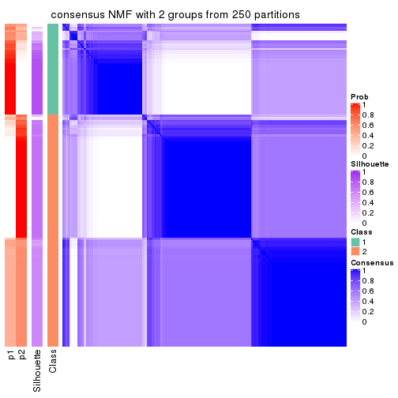</p>

</div>
<div id='tab-ATC-NMF-consensus-heatmap-2'>
<pre><code class="r">consensus_heatmap(res, k = 3)
</code></pre>

<p>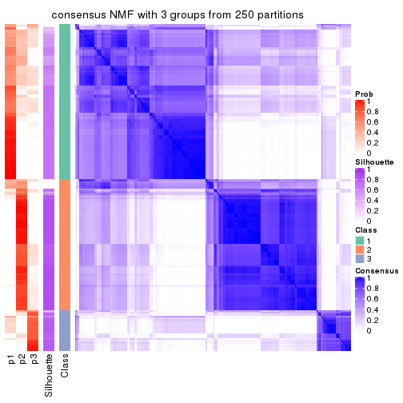</p>

</div>
<div id='tab-ATC-NMF-consensus-heatmap-3'>
<pre><code class="r">consensus_heatmap(res, k = 4)
</code></pre>

<p>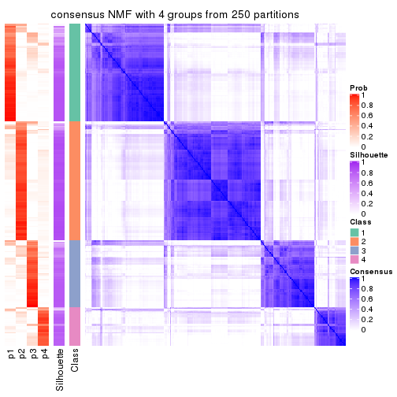</p>

</div>
<div id='tab-ATC-NMF-consensus-heatmap-4'>
<pre><code class="r">consensus_heatmap(res, k = 5)
</code></pre>

<p>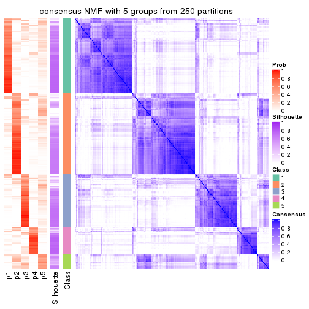</p>

</div>
<div id='tab-ATC-NMF-consensus-heatmap-5'>
<pre><code class="r">consensus_heatmap(res, k = 6)
</code></pre>

<p>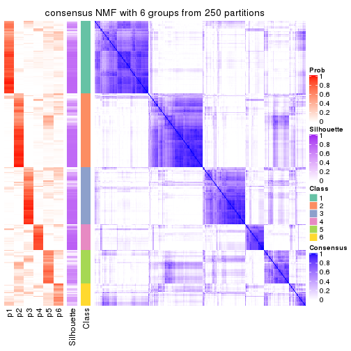</p>

</div>
</div>

Heatmaps for the membership of samples in all partitions to see how consistent they are:


<script>
$( function() {
	$( '#tabs-ATC-NMF-membership-heatmap' ).tabs();
} );
</script>
<div id='tabs-ATC-NMF-membership-heatmap'>
<ul>
<li><a href='#tab-ATC-NMF-membership-heatmap-1'>k = 2</a></li>
<li><a href='#tab-ATC-NMF-membership-heatmap-2'>k = 3</a></li>
<li><a href='#tab-ATC-NMF-membership-heatmap-3'>k = 4</a></li>
<li><a href='#tab-ATC-NMF-membership-heatmap-4'>k = 5</a></li>
<li><a href='#tab-ATC-NMF-membership-heatmap-5'>k = 6</a></li>
</ul>
<div id='tab-ATC-NMF-membership-heatmap-1'>
<pre><code class="r">membership_heatmap(res, k = 2)
</code></pre>

<p>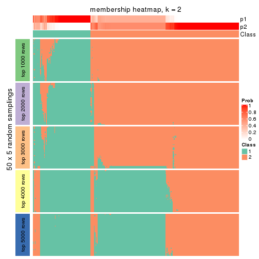</p>

</div>
<div id='tab-ATC-NMF-membership-heatmap-2'>
<pre><code class="r">membership_heatmap(res, k = 3)
</code></pre>

<p>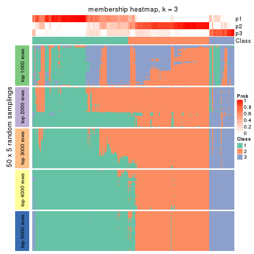</p>

</div>
<div id='tab-ATC-NMF-membership-heatmap-3'>
<pre><code class="r">membership_heatmap(res, k = 4)
</code></pre>

<p>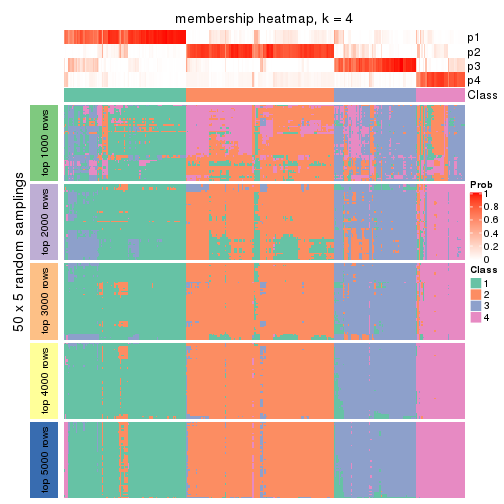</p>

</div>
<div id='tab-ATC-NMF-membership-heatmap-4'>
<pre><code class="r">membership_heatmap(res, k = 5)
</code></pre>

<p>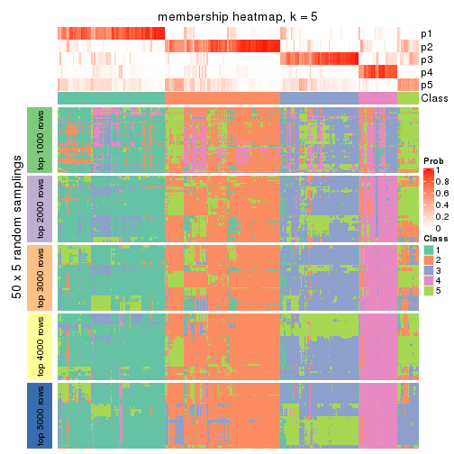</p>

</div>
<div id='tab-ATC-NMF-membership-heatmap-5'>
<pre><code class="r">membership_heatmap(res, k = 6)
</code></pre>

<p>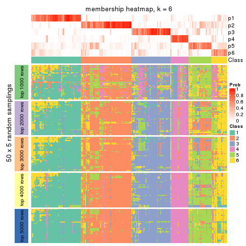</p>

</div>
</div>

As soon as we have had the classes for columns, we can look for signatures
which are significantly different between classes which can be candidate marks
for certain classes. Following are the heatmaps for signatures.


Signature heatmaps where rows are scaled:


<script>
$( function() {
	$( '#tabs-ATC-NMF-get-signatures' ).tabs();
} );
</script>
<div id='tabs-ATC-NMF-get-signatures'>
<ul>
<li><a href='#tab-ATC-NMF-get-signatures-1'>k = 2</a></li>
<li><a href='#tab-ATC-NMF-get-signatures-2'>k = 3</a></li>
<li><a href='#tab-ATC-NMF-get-signatures-3'>k = 4</a></li>
<li><a href='#tab-ATC-NMF-get-signatures-4'>k = 5</a></li>
<li><a href='#tab-ATC-NMF-get-signatures-5'>k = 6</a></li>
</ul>
<div id='tab-ATC-NMF-get-signatures-1'>
<pre><code class="r">get_signatures(res, k = 2)
</code></pre>

<p>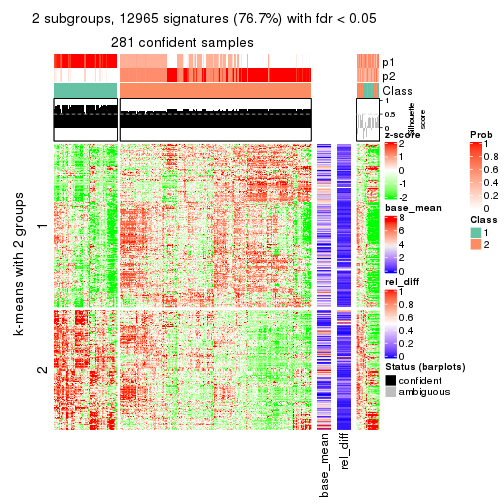</p>

</div>
<div id='tab-ATC-NMF-get-signatures-2'>
<pre><code class="r">get_signatures(res, k = 3)
</code></pre>

<p>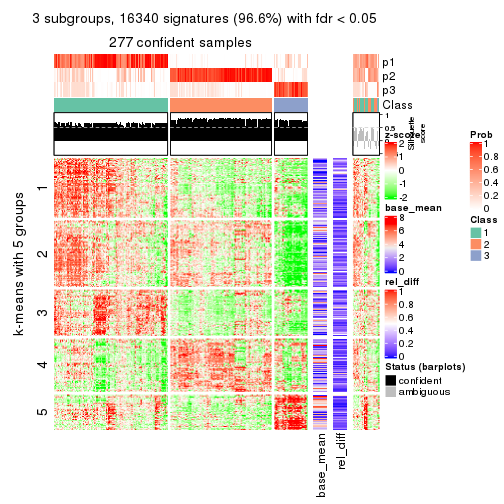</p>

</div>
<div id='tab-ATC-NMF-get-signatures-3'>
<pre><code class="r">get_signatures(res, k = 4)
</code></pre>

<p>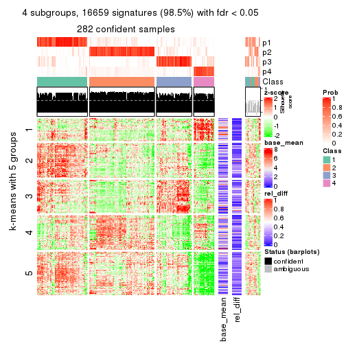</p>

</div>
<div id='tab-ATC-NMF-get-signatures-4'>
<pre><code class="r">get_signatures(res, k = 5)
</code></pre>

<p>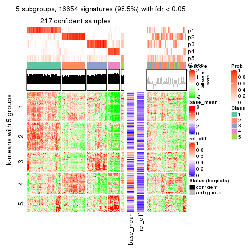</p>

</div>
<div id='tab-ATC-NMF-get-signatures-5'>
<pre><code class="r">get_signatures(res, k = 6)
</code></pre>

<p>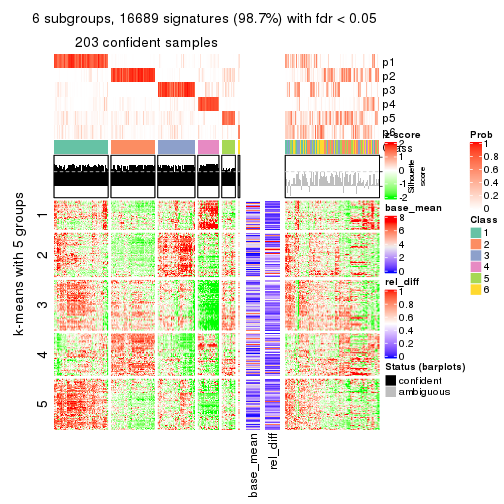</p>

</div>
</div>


Signature heatmaps where rows are not scaled:


<script>
$( function() {
	$( '#tabs-ATC-NMF-get-signatures-no-scale' ).tabs();
} );
</script>
<div id='tabs-ATC-NMF-get-signatures-no-scale'>
<ul>
<li><a href='#tab-ATC-NMF-get-signatures-no-scale-1'>k = 2</a></li>
<li><a href='#tab-ATC-NMF-get-signatures-no-scale-2'>k = 3</a></li>
<li><a href='#tab-ATC-NMF-get-signatures-no-scale-3'>k = 4</a></li>
<li><a href='#tab-ATC-NMF-get-signatures-no-scale-4'>k = 5</a></li>
<li><a href='#tab-ATC-NMF-get-signatures-no-scale-5'>k = 6</a></li>
</ul>
<div id='tab-ATC-NMF-get-signatures-no-scale-1'>
<pre><code class="r">get_signatures(res, k = 2, scale_rows = FALSE)
</code></pre>

<p>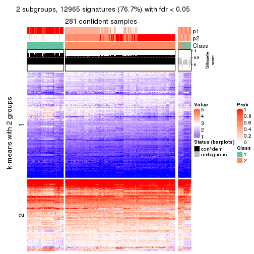</p>

</div>
<div id='tab-ATC-NMF-get-signatures-no-scale-2'>
<pre><code class="r">get_signatures(res, k = 3, scale_rows = FALSE)
</code></pre>

<p>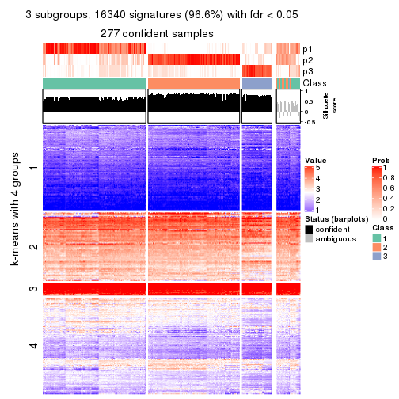</p>

</div>
<div id='tab-ATC-NMF-get-signatures-no-scale-3'>
<pre><code class="r">get_signatures(res, k = 4, scale_rows = FALSE)
</code></pre>

<p>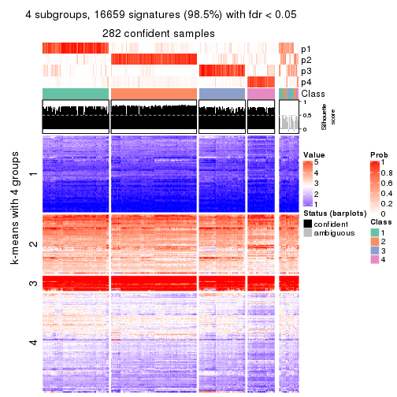</p>

</div>
<div id='tab-ATC-NMF-get-signatures-no-scale-4'>
<pre><code class="r">get_signatures(res, k = 5, scale_rows = FALSE)
</code></pre>

<p>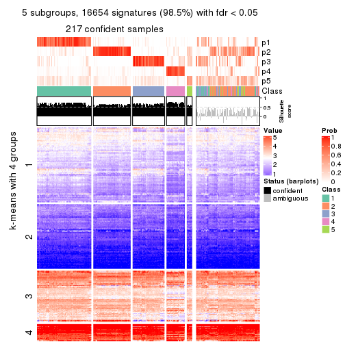</p>

</div>
<div id='tab-ATC-NMF-get-signatures-no-scale-5'>
<pre><code class="r">get_signatures(res, k = 6, scale_rows = FALSE)
</code></pre>

<p>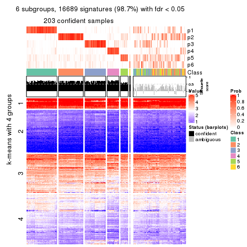</p>

</div>
</div>


Compare the overlap of signatures from different k:

```r
compare_signatures(res)
```

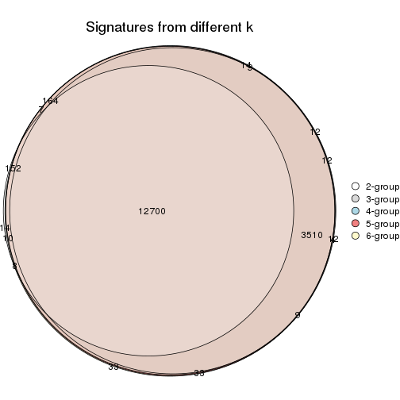

`get_signature()` returns a data frame invisibly. TO get the list of signatures, the function
call should be assigned to a variable explicitly. In following code, if `plot` argument is set
to `FALSE`, no heatmap is plotted while only the differential analysis is performed.

```r
# code only for demonstration
tb = get_signature(res, k = ..., plot = FALSE)
```

An example of the output of `tb` is:

```
#>   which_row         fdr    mean_1    mean_2 scaled_mean_1 scaled_mean_2 km
#> 1        38 0.042760348  8.373488  9.131774    -0.5533452     0.5164555  1
#> 2        40 0.018707592  7.106213  8.469186    -0.6173731     0.5762149  1
#> 3        55 0.019134737 10.221463 11.207825    -0.6159697     0.5749050  1
#> 4        59 0.006059896  5.921854  7.869574    -0.6899429     0.6439467  1
#> 5        60 0.018055526  8.928898 10.211722    -0.6204761     0.5791110  1
#> 6        98 0.009384629 15.714769 14.887706     0.6635654    -0.6193277  2
...
```

The columns in `tb` are:

1. `which_row`: row indices corresponding to the input matrix.
2. `fdr`: FDR for the differential test. 
3. `mean_x`: The mean value in group x.
4. `scaled_mean_x`: The mean value in group x after rows are scaled.
5. `km`: Row groups if k-means clustering is applied to rows.


UMAP plot which shows how samples are separated.


<script>
$( function() {
	$( '#tabs-ATC-NMF-dimension-reduction' ).tabs();
} );
</script>
<div id='tabs-ATC-NMF-dimension-reduction'>
<ul>
<li><a href='#tab-ATC-NMF-dimension-reduction-1'>k = 2</a></li>
<li><a href='#tab-ATC-NMF-dimension-reduction-2'>k = 3</a></li>
<li><a href='#tab-ATC-NMF-dimension-reduction-3'>k = 4</a></li>
<li><a href='#tab-ATC-NMF-dimension-reduction-4'>k = 5</a></li>
<li><a href='#tab-ATC-NMF-dimension-reduction-5'>k = 6</a></li>
</ul>
<div id='tab-ATC-NMF-dimension-reduction-1'>
<pre><code class="r">dimension_reduction(res, k = 2, method = &quot;UMAP&quot;)
</code></pre>

<p>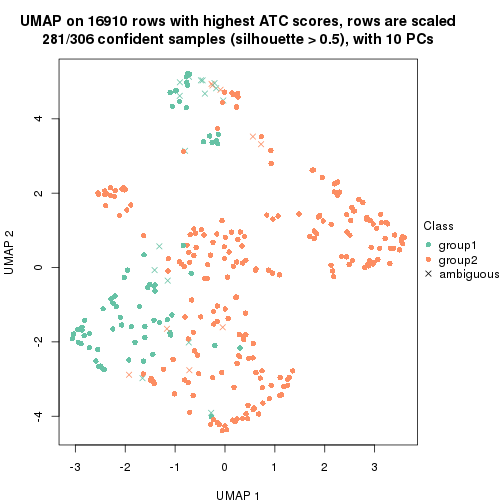</p>

</div>
<div id='tab-ATC-NMF-dimension-reduction-2'>
<pre><code class="r">dimension_reduction(res, k = 3, method = &quot;UMAP&quot;)
</code></pre>

<p>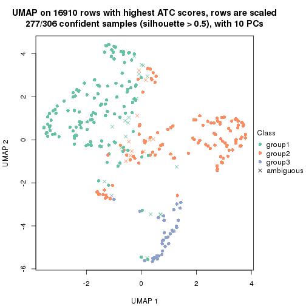</p>

</div>
<div id='tab-ATC-NMF-dimension-reduction-3'>
<pre><code class="r">dimension_reduction(res, k = 4, method = &quot;UMAP&quot;)
</code></pre>

<p>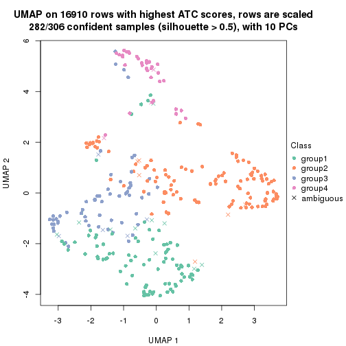</p>

</div>
<div id='tab-ATC-NMF-dimension-reduction-4'>
<pre><code class="r">dimension_reduction(res, k = 5, method = &quot;UMAP&quot;)
</code></pre>

<p>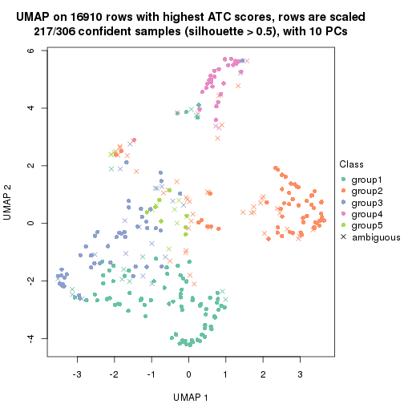</p>

</div>
<div id='tab-ATC-NMF-dimension-reduction-5'>
<pre><code class="r">dimension_reduction(res, k = 6, method = &quot;UMAP&quot;)
</code></pre>

<p>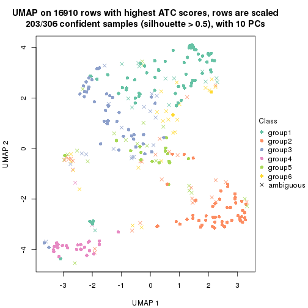</p>

</div>
</div>


Following heatmap shows how subgroups are split when increasing `k`:

```r
collect_classes(res)
```

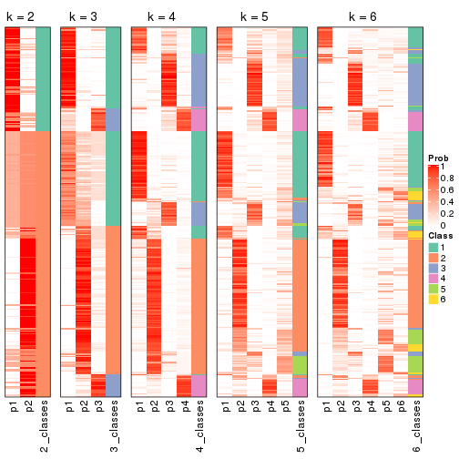


If matrix rows can be associated to genes, consider to use `GO_Enrichment(res,
...)` to perform function enrichment for the signature genes.


 

## Session info


```r
sessionInfo()
```

```
#> R version 3.6.0 (2019-04-26)
#> Platform: x86_64-pc-linux-gnu (64-bit)
#> Running under: CentOS Linux 7 (Core)
#> 
#> Matrix products: default
#> BLAS:   /usr/lib64/libblas.so.3.4.2
#> LAPACK: /usr/lib64/liblapack.so.3.4.2
#> 
#> locale:
#>  [1] LC_CTYPE=en_US.UTF-8       LC_NUMERIC=C               LC_TIME=en_US.UTF-8       
#>  [4] LC_COLLATE=en_US.UTF-8     LC_MONETARY=en_US.UTF-8    LC_MESSAGES=en_US.UTF-8   
#>  [7] LC_PAPER=en_US.UTF-8       LC_NAME=C                  LC_ADDRESS=C              
#> [10] LC_TELEPHONE=C             LC_MEASUREMENT=en_US.UTF-8 LC_IDENTIFICATION=C       
#> 
#> attached base packages:
#>  [1] grid      parallel  stats4    stats     graphics  grDevices utils     datasets  methods  
#> [10] base     
#> 
#> other attached packages:
#>  [1] genefilter_1.66.0           ComplexHeatmap_2.1.1        markdown_1.1               
#>  [4] knitr_1.26                  cola_1.3.2                  SummarizedExperiment_1.14.1
#>  [7] DelayedArray_0.10.0         BiocParallel_1.18.1         matrixStats_0.55.0         
#> [10] Biobase_2.44.0              GenomicRanges_1.36.1        GenomeInfoDb_1.20.0        
#> [13] IRanges_2.18.3              S4Vectors_0.22.1            BiocGenerics_0.30.0        
#> [16] GetoptLong_0.1.7           
#> 
#> loaded via a namespace (and not attached):
#>  [1] bitops_1.0-6           bit64_0.9-7            doParallel_1.0.15      RColorBrewer_1.1-2    
#>  [5] httr_1.4.1             backports_1.1.5        tools_3.6.0            R6_2.4.1              
#>  [9] DBI_1.0.0              lazyeval_0.2.2         colorspace_1.4-1       withr_2.1.2           
#> [13] tidyselect_0.2.5       gridExtra_2.3          bit_1.1-14             compiler_3.6.0        
#> [17] xml2_1.2.2             microbenchmark_1.4-7   pkgmaker_0.28          slam_0.1-46           
#> [21] scales_1.1.0           NMF_0.23.6             stringr_1.4.0          digest_0.6.23         
#> [25] XVector_0.24.0         pkgconfig_2.0.3        bibtex_0.4.2           highr_0.8             
#> [29] rlang_0.4.2            GlobalOptions_0.1.1    RSQLite_2.1.2          impute_1.58.0         
#> [33] shape_1.4.4            mclust_5.4.5           dendextend_1.12.0      dplyr_0.8.3           
#> [37] RCurl_1.95-4.12        magrittr_1.5           GenomeInfoDbData_1.2.1 Matrix_1.2-17         
#> [41] Rcpp_1.0.3             munsell_0.5.0          viridis_0.5.1          lifecycle_0.1.0       
#> [45] stringi_1.4.3          zlibbioc_1.30.0        plyr_1.8.4             blob_1.2.0            
#> [49] crayon_1.3.4           lattice_0.20-38        splines_3.6.0          annotate_1.62.0       
#> [53] circlize_0.4.9         zeallot_0.1.0          pillar_1.4.2           rjson_0.2.20          
#> [57] rngtools_1.4           reshape2_1.4.3         codetools_0.2-16       XML_3.98-1.20         
#> [61] glue_1.3.1             evaluate_0.14          vctrs_0.2.0            png_0.1-7             
#> [65] foreach_1.4.7          polyclip_1.10-0        gtable_0.3.0           purrr_0.3.3           
#> [69] clue_0.3-57            assertthat_0.2.1       ggplot2_3.2.1          xfun_0.11             
#> [73] gridBase_0.4-7         eulerr_6.0.0           xtable_1.8-4           skmeans_0.2-11        
#> [77] survival_2.44-1.1      viridisLite_0.3.0      tibble_2.1.3           iterators_1.0.12      
#> [81] memoise_1.1.0          AnnotationDbi_1.46.1   registry_0.5-1         GTF_0.0.1             
#> [85] cluster_2.1.0          brew_1.0-6
```


